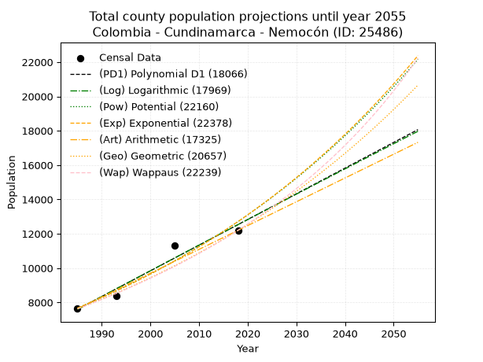
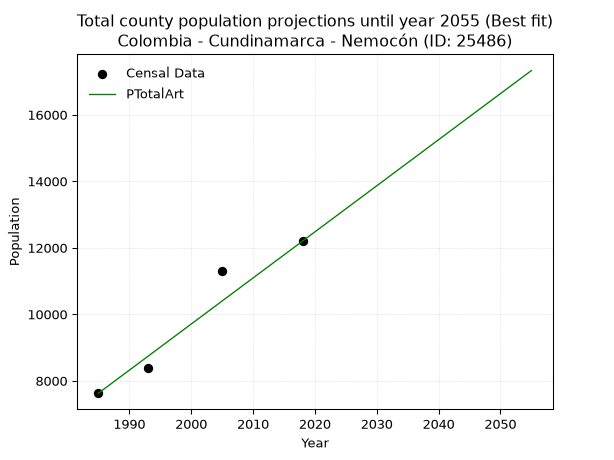
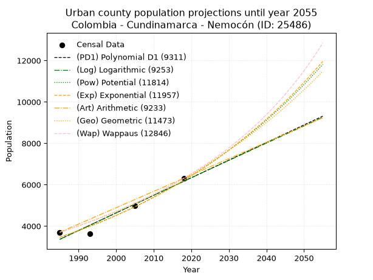
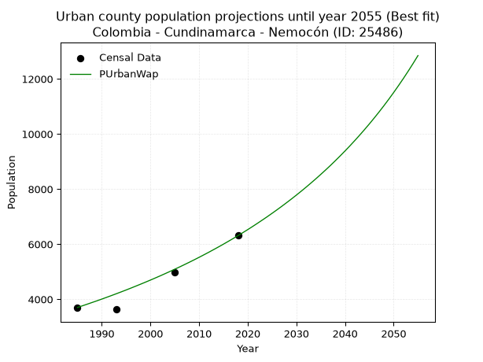
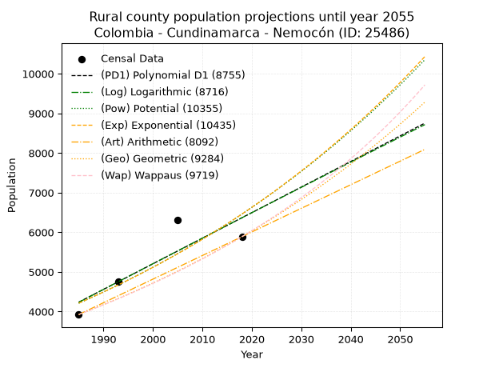
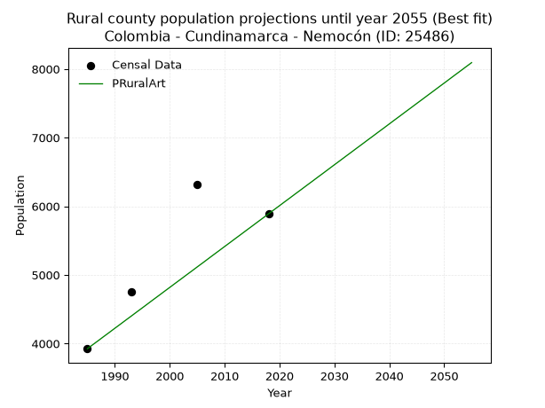

<div align="center">


</div>

# _“Population and Public Services Demand Projections (PPSD) until Year 2050 for Colombia - Cundinamarca - Nemocón (ID: 25486)”_
Keywords: `population` `public-service` `projection` `lineal` `polynomial` `logarithmic` `potential` `exponential` `arithmetic` `geometric` `wappaus` `dane` `colombia` `south-america`

PPSD are analytical estimates used by governments and planners to anticipate future changes in population size, age distribution, and the resulting community needs for utilities, healthcare, education, and infrastructure as sizing future water treatment facilities, electrical grids, and road networks based on spatial growth.

> **General running parameters**: • app_version: _v20260806_. • Python version: _3.14.7_. • Pandas version: _3.0.5_. • NumPy version: _2.5.1_. • Creates, save and include plots into reports (create_plot): _False_. • Projection until year: _2050_. • Process polynomial degree 2 and up: _False_. • Process Wappaus: _True_. • Process Wappaus: _True_. • Set negative values to zero: _True_. • Set infinite values to zero: _True_. • Drop dataset notes: _True_. 
<div align="center">

Dynamic map: [:earth_americas:Google](http://maps.google.com/maps?q=5.068704922,-73.8778878) [:earth_americas:OSM](https://www.openstreetmap.org/#map=18/5.068704922/-73.8778878&layers=P) [:earth_americas:Bing](https://www.bing.com/maps?cp=5.068704922~-73.8778878&lvl=18) [:earth_americas:Apple](https://maps.apple.com/frame?center=5.068704922%2C-73.8778878&span=0.003%2C0.006)

</div>


<div align="center">

```geojson
{
  "type": "Feature",
  "geometry": {
    "type": "Point", 
    "coordinates": [-73.8778878, 5.068704922]
  }, 
  "properties": {
    "Name": "Colombia - Cundinamarca - Nemocón (ID: 25486)"
  }
}
```

</div>


## 0. Census Data (4 records)

Census data are official statistics collected by a government about the people and housing in a country. They usually include counts of total population, age, sex, race, income, education, and jobs.

📅Global census file: [Population.xlsx](../data/Population.xlsx)

| Source   |   Year |   CountryID | CountryName   |   StateID | StateName    |   CountyID | CountyName   |   PTotal |   PUrban |   PRural |
|:---------|-------:|------------:|:--------------|----------:|:-------------|-----------:|:-------------|---------:|---------:|---------:|
| DANE     |   1985 |          57 | Colombia      |        25 | Cundinamarca |      25486 | Nemocón      |     7625 |     3701 |     3924 |
| DANE     |   1993 |          57 | Colombia      |        25 | Cundinamarca |      25486 | Nemocón      |     8385 |     3630 |     4755 |
| DANE     |   2005 |          57 | Colombia      |        25 | Cundinamarca |      25486 | Nemocón      |    11303 |     4990 |     6313 |
| DANE     |   2018 |          57 | Colombia      |        25 | Cundinamarca |      25486 | Nemocón      |    12198 |     6309 |     5889 |

> 🔥Some records could had specific notes about the registered values or the corresponding urban or rural distribution.

## 1. Total

### 1.1. Coefficients and Parameters

* (PD1) Polynomial Deg 1: 149.54837414692824, -289256.3853873932 (lineal)
* (Log) Logarithmic: 299422.42408131185, -2266034.4948627725
* (Pow) Potential: 30.612266063753257, -97.067105506001
* (Exp) Exponential: 0.01528797611680205, 5.077841176454329e-10
* (Art) Arithmetic: Year diff. 2018 - 1985 = 33, Population diff. 12198 - 7625 = 4573, Annual growth = 138.57575757575756
* (Geo) Geometric: Year diff. 2018 - 1985 = 33, Population diff. 12198 - 7625 = 4573, Annual growth % = 0.014339402975815707
* (Wap) Wappaus: i = 1.398131035421052, Condition values only valid for < 200)

<sub>
Wappaus condition values: ['0.00', '1.40', '2.80', '4.19', '5.59', '6.99', '8.39', '9.79', '11.19', '12.58', '13.98', '15.38', '16.78', '18.18', '19.57', '20.97', '22.37', '23.77', '25.17', '26.56', '27.96', '29.36', '30.76', '32.16', '33.56', '34.95', '36.35', '37.75', '39.15', '40.55', '41.94', '43.34', '44.74', '46.14', '47.54', '48.93', '50.33', '51.73', '53.13', '54.53', '55.93', '57.32', '58.72', '60.12', '61.52', '62.92', '64.31', '65.71', '67.11', '68.51', '69.91', '71.30', '72.70', '74.10', '75.50', '76.90', '78.30', '79.69', '81.09', '82.49', '83.89', '85.29', '86.68', '88.08', '89.48', '90.88']
</sub>


### 1.2. Projected Dataset

|   Year |   CountyID |   PTotalPD1 |   PTotalLog |   PTotalPow |   PTotalExp |   PTotalArt |   PTotalGeo |   PTotalWap |
|-------:|-----------:|------------:|------------:|------------:|------------:|------------:|------------:|------------:|
|   1985 |      25486 |        7597 |        7592 |        7670 |        7675 |        7625 |        7625 |        7625 |
|   1986 |      25486 |        7747 |        7743 |        7790 |        7793 |        7764 |        7734 |        7732 |
|   1987 |      25486 |        7896 |        7894 |        7911 |        7913 |        7902 |        7845 |        7841 |
|   1988 |      25486 |        8046 |        8044 |        8033 |        8035 |        8041 |        7958 |        7952 |
|   1989 |      25486 |        8195 |        8195 |        8158 |        8159 |        8179 |        8072 |        8064 |
|   1990 |      25486 |        8345 |        8345 |        8284 |        8284 |        8318 |        8188 |        8177 |
|   1991 |      25486 |        8494 |        8496 |        8413 |        8412 |        8456 |        8305 |        8293 |
|   1992 |      25486 |        8644 |        8646 |        8543 |        8541 |        8595 |        8424 |        8410 |
|   1993 |      25486 |        8794 |        8796 |        8675 |        8673 |        8734 |        8545 |        8528 |
|   1994 |      25486 |        8943 |        8947 |        8810 |        8807 |        8872 |        8667 |        8649 |
|   1995 |      25486 |        9093 |        9097 |        8946 |        8942 |        9011 |        8792 |        8771 |
|   1996 |      25486 |        9242 |        9247 |        9084 |        9080 |        9149 |        8918 |        8895 |
|   1997 |      25486 |        9392 |        9397 |        9225 |        9220 |        9288 |        9046 |        9021 |
|   1998 |      25486 |        9541 |        9547 |        9367 |        9362 |        9426 |        9175 |        9149 |
|   1999 |      25486 |        9691 |        9696 |        9512 |        9506 |        9565 |        9307 |        9279 |
|   2000 |      25486 |        9840 |        9846 |        9658 |        9653 |        9704 |        9440 |        9411 |
|   2001 |      25486 |        9990 |        9996 |        9807 |        9801 |        9842 |        9576 |        9546 |
|   2002 |      25486 |       10139 |       10145 |        9958 |        9952 |        9981 |        9713 |        9682 |
|   2003 |      25486 |       10289 |       10295 |       10112 |       10106 |       10119 |        9852 |        9820 |
|   2004 |      25486 |       10439 |       10444 |       10268 |       10261 |       10258 |        9994 |        9961 |
|   2005 |      25486 |       10588 |       10594 |       10426 |       10419 |       10397 |       10137 |       10104 |
|   2006 |      25486 |       10738 |       10743 |       10586 |       10580 |       10535 |       10282 |       10249 |
|   2007 |      25486 |       10887 |       10892 |       10749 |       10743 |       10674 |       10430 |       10397 |
|   2008 |      25486 |       11037 |       11041 |       10914 |       10908 |       10812 |       10579 |       10547 |
|   2009 |      25486 |       11186 |       11191 |       11081 |       11076 |       10951 |       10731 |       10699 |
|   2010 |      25486 |       11336 |       11340 |       11252 |       11247 |       11089 |       10885 |       10855 |
|   2011 |      25486 |       11485 |       11488 |       11424 |       11420 |       11228 |       11041 |       11012 |
|   2012 |      25486 |       11635 |       11637 |       11599 |       11596 |       11367 |       11199 |       11173 |
|   2013 |      25486 |       11784 |       11786 |       11777 |       11775 |       11505 |       11360 |       11336 |
|   2014 |      25486 |       11934 |       11935 |       11958 |       11956 |       11644 |       11523 |       11503 |
|   2015 |      25486 |       12084 |       12083 |       12141 |       12141 |       11782 |       11688 |       11672 |
|   2016 |      25486 |       12233 |       12232 |       12326 |       12328 |       11921 |       11856 |       11844 |
|   2017 |      25486 |       12383 |       12380 |       12515 |       12518 |       12059 |       12026 |       12019 |
|   2018 |      25486 |       12532 |       12529 |       12706 |       12710 |       12198 |       12198 |       12198 |
|   2019 |      25486 |       12682 |       12677 |       12901 |       12906 |       12337 |       12373 |       12380 |
|   2020 |      25486 |       12831 |       12825 |       13098 |       13105 |       12475 |       12550 |       12565 |
|   2021 |      25486 |       12981 |       12974 |       13297 |       13307 |       12614 |       12730 |       12754 |
|   2022 |      25486 |       13130 |       13122 |       13500 |       13512 |       12752 |       12913 |       12946 |
|   2023 |      25486 |       13280 |       13270 |       13706 |       13720 |       12891 |       13098 |       13142 |
|   2024 |      25486 |       13430 |       13418 |       13915 |       13931 |       13029 |       13286 |       13341 |
|   2025 |      25486 |       13579 |       13566 |       14127 |       14146 |       13168 |       13476 |       13545 |
|   2026 |      25486 |       13729 |       13714 |       14342 |       14364 |       13307 |       13670 |       13752 |
|   2027 |      25486 |       13878 |       13861 |       14561 |       14585 |       13445 |       13866 |       13964 |
|   2028 |      25486 |       14028 |       14009 |       14782 |       14810 |       13584 |       14064 |       14179 |
|   2029 |      25486 |       14177 |       14157 |       15007 |       15038 |       13722 |       14266 |       14399 |
|   2030 |      25486 |       14327 |       14304 |       15235 |       15270 |       13861 |       14471 |       14624 |
|   2031 |      25486 |       14476 |       14452 |       15466 |       15505 |       13999 |       14678 |       14853 |
|   2032 |      25486 |       14626 |       14599 |       15701 |       15744 |       14138 |       14889 |       15087 |
|   2033 |      25486 |       14775 |       14746 |       15940 |       15986 |       14277 |       15102 |       15326 |
|   2034 |      25486 |       14925 |       14894 |       16181 |       16233 |       14415 |       15319 |       15570 |
|   2035 |      25486 |       15075 |       15041 |       16427 |       16483 |       14554 |       15538 |       15820 |
|   2036 |      25486 |       15224 |       15188 |       16676 |       16737 |       14692 |       15761 |       16074 |
|   2037 |      25486 |       15374 |       15335 |       16928 |       16994 |       14831 |       15987 |       16335 |
|   2038 |      25486 |       15523 |       15482 |       17184 |       17256 |       14970 |       16216 |       16601 |
|   2039 |      25486 |       15673 |       15629 |       17444 |       17522 |       15108 |       16449 |       16873 |
|   2040 |      25486 |       15822 |       15775 |       17708 |       17792 |       15247 |       16685 |       17151 |
|   2041 |      25486 |       15972 |       15922 |       17976 |       18066 |       15385 |       16924 |       17436 |
|   2042 |      25486 |       16121 |       16069 |       18247 |       18344 |       15524 |       17167 |       17727 |
|   2043 |      25486 |       16271 |       16215 |       18523 |       18627 |       15662 |       17413 |       18025 |
|   2044 |      25486 |       16420 |       16362 |       18803 |       18914 |       15801 |       17663 |       18330 |
|   2045 |      25486 |       16570 |       16508 |       19086 |       19205 |       15940 |       17916 |       18643 |
|   2046 |      25486 |       16720 |       16655 |       19374 |       19501 |       16078 |       18173 |       18963 |
|   2047 |      25486 |       16869 |       16801 |       19666 |       19802 |       16217 |       18433 |       19291 |
|   2048 |      25486 |       17019 |       16947 |       19962 |       20107 |       16355 |       18698 |       19627 |
|   2049 |      25486 |       17168 |       17094 |       20263 |       20416 |       16494 |       18966 |       19972 |
|   2050 |      25486 |       17318 |       17240 |       20568 |       20731 |       16632 |       19238 |       20325 |
<div align="center">

</img>

</div>


### 1.3. Best fit with absolute and relative error (%)

Relative error puts that difference into context by dividing the absolute error by the true value, creating a unitless ratio or percentage that shows the scale of the mistake.

Absolute and relative error

|   Year | Source   |   CountryID | CountryName   |   StateID | StateName    |   CountyID_x | CountyName   |   PTotal |   PUrban |   PRural |   CountyID_y |   PTotalPD1 |   PTotalLog |   PTotalPow |   PTotalExp |   PTotalArt |   PTotalGeo |   PTotalWap |   PTotalPD1AbsError |   PTotalLogAbsError |   PTotalPowAbsError |   PTotalExpAbsError |   PTotalArtAbsError |   PTotalGeoAbsError |   PTotalWapAbsError |   PTotalPD1RelError |   PTotalLogRelError |   PTotalPowRelError |   PTotalExpRelError |   PTotalArtRelError |   PTotalGeoRelError |   PTotalWapRelError |
|-------:|:---------|------------:|:--------------|----------:|:-------------|-------------:|:-------------|---------:|---------:|---------:|-------------:|------------:|------------:|------------:|------------:|------------:|------------:|------------:|--------------------:|--------------------:|--------------------:|--------------------:|--------------------:|--------------------:|--------------------:|--------------------:|--------------------:|--------------------:|--------------------:|--------------------:|--------------------:|--------------------:|
|   1985 | DANE     |          57 | Colombia      |        25 | Cundinamarca |        25486 | Nemocón      |     7625 |     3701 |     3924 |        25486 |        7597 |        7592 |        7670 |        7675 |        7625 |        7625 |        7625 |                  28 |                  33 |                  45 |                  50 |                   0 |                   0 |                   0 |            0.367213 |            0.432787 |            0.590164 |            0.655738 |             0       |             0       |             0       |
|   1993 | DANE     |          57 | Colombia      |        25 | Cundinamarca |        25486 | Nemocón      |     8385 |     3630 |     4755 |        25486 |        8794 |        8796 |        8675 |        8673 |        8734 |        8545 |        8528 |                 409 |                 411 |                 290 |                 288 |                 349 |                 160 |                 143 |            4.87776  |            4.90161  |            3.45856  |            3.4347   |             4.16219 |             1.90817 |             1.70543 |
|   2005 | DANE     |          57 | Colombia      |        25 | Cundinamarca |        25486 | Nemocón      |    11303 |     4990 |     6313 |        25486 |       10588 |       10594 |       10426 |       10419 |       10397 |       10137 |       10104 |                 715 |                 709 |                 877 |                 884 |                 906 |                1166 |                1199 |            6.32575  |            6.27267  |            7.759    |            7.82093  |             8.01557 |            10.3158  |            10.6078  |
|   2018 | DANE     |          57 | Colombia      |        25 | Cundinamarca |        25486 | Nemocón      |    12198 |     6309 |     5889 |        25486 |       12532 |       12529 |       12706 |       12710 |       12198 |       12198 |       12198 |                 334 |                 331 |                 508 |                 512 |                   0 |                   0 |                   0 |            2.73815  |            2.71356  |            4.16462  |            4.19741  |             0       |             0       |             0       |

Relative error mean

| Method    |   RelError | Best   |
|:----------|-----------:|:-------|
| PTotalPD1 |    3.57722 |        |
| PTotalLog |    3.58016 |        |
| PTotalPow |    3.99309 |        |
| PTotalExp |    4.0272  |        |
| PTotalArt |    3.04444 | True   |
| PTotalGeo |    3.056   |        |
| PTotalWap |    3.07831 |        |

💙Best method: _**PTotalArt**_
<div align="center">

</img>

</div>


### 1.4. Fresh water supply demand in liters per capita per day (lpcd)

The fresh water supply demand typically ranges from 100 to 300 liters per capita per day (lpcd) for standard domestic and municipal planning, though absolute survival minimums set by the World Health Organization are as low as 7.5 to 20 liters per day, and total consumption in high-income nations can exceed 400 liters.

> `CZ`: Level in meters above the sea level (masl)<br> `WS`: Fresh water supply demand in liters per capita per day (lpcd or l/h/d)<br> `WSAll`: Zonal fresh water supply demand in liters per second (l/s)<br> `A`: Zonal area in square meters<br> `DP`: Population density (people/hectare)

Reference values (RAS Colombia)

|    CZ |   WS |
|------:|-----:|
|  1000 |  120 |
|  2000 |  130 |
| 99999 |  140 |

County shapefile geometry properties and water supply values

|   CountyID |      ATotal |   CZTotal |   WSTotal |
|-----------:|------------:|----------:|----------:|
|      25486 | 9.82299e+07 |   2660.51 |       140 |

Projected values for best method: PTotalArt

|   CountyID |   Year |   PTotalArt |   DPTotal |   WSTotal |   WSTotalAll |
|-----------:|-------:|------------:|----------:|----------:|-------------:|
|      25486 |   1985 |        7625 |      0.78 |       140 |      12.3553 |
|      25486 |   1986 |        7764 |      0.79 |       140 |      12.5806 |
|      25486 |   1987 |        7902 |      0.8  |       140 |      12.8042 |
|      25486 |   1988 |        8041 |      0.82 |       140 |      13.0294 |
|      25486 |   1989 |        8179 |      0.83 |       140 |      13.253  |
|      25486 |   1990 |        8318 |      0.85 |       140 |      13.4782 |
|      25486 |   1991 |        8456 |      0.86 |       140 |      13.7019 |
|      25486 |   1992 |        8595 |      0.87 |       140 |      13.9271 |
|      25486 |   1993 |        8734 |      0.89 |       140 |      14.1523 |
|      25486 |   1994 |        8872 |      0.9  |       140 |      14.3759 |
|      25486 |   1995 |        9011 |      0.92 |       140 |      14.6012 |
|      25486 |   1996 |        9149 |      0.93 |       140 |      14.8248 |
|      25486 |   1997 |        9288 |      0.95 |       140 |      15.05   |
|      25486 |   1998 |        9426 |      0.96 |       140 |      15.2736 |
|      25486 |   1999 |        9565 |      0.97 |       140 |      15.4988 |
|      25486 |   2000 |        9704 |      0.99 |       140 |      15.7241 |
|      25486 |   2001 |        9842 |      1    |       140 |      15.9477 |
|      25486 |   2002 |        9981 |      1.02 |       140 |      16.1729 |
|      25486 |   2003 |       10119 |      1.03 |       140 |      16.3965 |
|      25486 |   2004 |       10258 |      1.04 |       140 |      16.6218 |
|      25486 |   2005 |       10397 |      1.06 |       140 |      16.847  |
|      25486 |   2006 |       10535 |      1.07 |       140 |      17.0706 |
|      25486 |   2007 |       10674 |      1.09 |       140 |      17.2958 |
|      25486 |   2008 |       10812 |      1.1  |       140 |      17.5194 |
|      25486 |   2009 |       10951 |      1.11 |       140 |      17.7447 |
|      25486 |   2010 |       11089 |      1.13 |       140 |      17.9683 |
|      25486 |   2011 |       11228 |      1.14 |       140 |      18.1935 |
|      25486 |   2012 |       11367 |      1.16 |       140 |      18.4187 |
|      25486 |   2013 |       11505 |      1.17 |       140 |      18.6424 |
|      25486 |   2014 |       11644 |      1.19 |       140 |      18.8676 |
|      25486 |   2015 |       11782 |      1.2  |       140 |      19.0912 |
|      25486 |   2016 |       11921 |      1.21 |       140 |      19.3164 |
|      25486 |   2017 |       12059 |      1.23 |       140 |      19.54   |
|      25486 |   2018 |       12198 |      1.24 |       140 |      19.7653 |
|      25486 |   2019 |       12337 |      1.26 |       140 |      19.9905 |
|      25486 |   2020 |       12475 |      1.27 |       140 |      20.2141 |
|      25486 |   2021 |       12614 |      1.28 |       140 |      20.4394 |
|      25486 |   2022 |       12752 |      1.3  |       140 |      20.663  |
|      25486 |   2023 |       12891 |      1.31 |       140 |      20.8882 |
|      25486 |   2024 |       13029 |      1.33 |       140 |      21.1118 |
|      25486 |   2025 |       13168 |      1.34 |       140 |      21.337  |
|      25486 |   2026 |       13307 |      1.35 |       140 |      21.5623 |
|      25486 |   2027 |       13445 |      1.37 |       140 |      21.7859 |
|      25486 |   2028 |       13584 |      1.38 |       140 |      22.0111 |
|      25486 |   2029 |       13722 |      1.4  |       140 |      22.2347 |
|      25486 |   2030 |       13861 |      1.41 |       140 |      22.46   |
|      25486 |   2031 |       13999 |      1.43 |       140 |      22.6836 |
|      25486 |   2032 |       14138 |      1.44 |       140 |      22.9088 |
|      25486 |   2033 |       14277 |      1.45 |       140 |      23.134  |
|      25486 |   2034 |       14415 |      1.47 |       140 |      23.3576 |
|      25486 |   2035 |       14554 |      1.48 |       140 |      23.5829 |
|      25486 |   2036 |       14692 |      1.5  |       140 |      23.8065 |
|      25486 |   2037 |       14831 |      1.51 |       140 |      24.0317 |
|      25486 |   2038 |       14970 |      1.52 |       140 |      24.2569 |
|      25486 |   2039 |       15108 |      1.54 |       140 |      24.4806 |
|      25486 |   2040 |       15247 |      1.55 |       140 |      24.7058 |
|      25486 |   2041 |       15385 |      1.57 |       140 |      24.9294 |
|      25486 |   2042 |       15524 |      1.58 |       140 |      25.1546 |
|      25486 |   2043 |       15662 |      1.59 |       140 |      25.3782 |
|      25486 |   2044 |       15801 |      1.61 |       140 |      25.6035 |
|      25486 |   2045 |       15940 |      1.62 |       140 |      25.8287 |
|      25486 |   2046 |       16078 |      1.64 |       140 |      26.0523 |
|      25486 |   2047 |       16217 |      1.65 |       140 |      26.2775 |
|      25486 |   2048 |       16355 |      1.66 |       140 |      26.5012 |
|      25486 |   2049 |       16494 |      1.68 |       140 |      26.7264 |
|      25486 |   2050 |       16632 |      1.69 |       140 |      26.95   |

## 2. Urban

### 2.1. Coefficients and Parameters

* (PD1) Polynomial Deg 1: 84.99317543155261, -165350.09915696314 (lineal)
* (Log) Logarithmic: 170043.01157120272, -1287840.7935918886
* (Pow) Potential: 35.43072589233778, -113.30294144059334
* (Exp) Exponential: 0.01770739839037713, 1.880175199582401e-12
* (Art) Arithmetic: Year diff. 2018 - 1985 = 33, Population diff. 6309 - 3701 = 2608, Annual growth = 79.03030303030303
* (Geo) Geometric: Year diff. 2018 - 1985 = 33, Population diff. 6309 - 3701 = 2608, Annual growth % = 0.01629417796203758
* (Wap) Wappaus: i = 1.579027033572488, Condition values only valid for < 200)

<sub>
Wappaus condition values: ['0.00', '1.58', '3.16', '4.74', '6.32', '7.90', '9.47', '11.05', '12.63', '14.21', '15.79', '17.37', '18.95', '20.53', '22.11', '23.69', '25.26', '26.84', '28.42', '30.00', '31.58', '33.16', '34.74', '36.32', '37.90', '39.48', '41.05', '42.63', '44.21', '45.79', '47.37', '48.95', '50.53', '52.11', '53.69', '55.27', '56.84', '58.42', '60.00', '61.58', '63.16', '64.74', '66.32', '67.90', '69.48', '71.06', '72.64', '74.21', '75.79', '77.37', '78.95', '80.53', '82.11', '83.69', '85.27', '86.85', '88.43', '90.00', '91.58', '93.16', '94.74', '96.32', '97.90', '99.48', '101.06', '102.64']
</sub>


### 2.2. Projected Dataset

|   Year |   CountyID |   PUrbanPD1 |   PUrbanLog |   PUrbanPow |   PUrbanExp |   PUrbanArt |   PUrbanGeo |   PUrbanWap |
|-------:|-----------:|------------:|------------:|------------:|------------:|------------:|------------:|------------:|
|   1985 |      25486 |        3361 |        3359 |        3460 |        3462 |        3701 |        3701 |        3701 |
|   1986 |      25486 |        3446 |        3445 |        3523 |        3524 |        3780 |        3761 |        3760 |
|   1987 |      25486 |        3531 |        3531 |        3586 |        3587 |        3859 |        3823 |        3820 |
|   1988 |      25486 |        3616 |        3616 |        3650 |        3651 |        3938 |        3885 |        3881 |
|   1989 |      25486 |        3701 |        3702 |        3716 |        3716 |        4017 |        3948 |        3942 |
|   1990 |      25486 |        3786 |        3787 |        3783 |        3782 |        4096 |        4013 |        4005 |
|   1991 |      25486 |        3871 |        3873 |        3851 |        3850 |        4175 |        4078 |        4069 |
|   1992 |      25486 |        3956 |        3958 |        3920 |        3919 |        4254 |        4144 |        4134 |
|   1993 |      25486 |        4041 |        4043 |        3990 |        3989 |        4333 |        4212 |        4200 |
|   1994 |      25486 |        4126 |        4129 |        4062 |        4060 |        4412 |        4280 |        4267 |
|   1995 |      25486 |        4211 |        4214 |        4135 |        4132 |        4491 |        4350 |        4335 |
|   1996 |      25486 |        4296 |        4299 |        4209 |        4206 |        4570 |        4421 |        4405 |
|   1997 |      25486 |        4381 |        4384 |        4284 |        4281 |        4649 |        4493 |        4476 |
|   1998 |      25486 |        4466 |        4469 |        4361 |        4358 |        4728 |        4566 |        4548 |
|   1999 |      25486 |        4551 |        4555 |        4439 |        4436 |        4807 |        4641 |        4621 |
|   2000 |      25486 |        4636 |        4640 |        4518 |        4515 |        4886 |        4716 |        4695 |
|   2001 |      25486 |        4721 |        4725 |        4599 |        4596 |        4965 |        4793 |        4771 |
|   2002 |      25486 |        4806 |        4810 |        4681 |        4678 |        5045 |        4871 |        4848 |
|   2003 |      25486 |        4891 |        4894 |        4764 |        4761 |        5124 |        4951 |        4927 |
|   2004 |      25486 |        4976 |        4979 |        4849 |        4846 |        5203 |        5031 |        5007 |
|   2005 |      25486 |        5061 |        5064 |        4936 |        4933 |        5282 |        5113 |        5089 |
|   2006 |      25486 |        5146 |        5149 |        5024 |        5021 |        5361 |        5197 |        5172 |
|   2007 |      25486 |        5231 |        5234 |        5113 |        5111 |        5440 |        5281 |        5257 |
|   2008 |      25486 |        5316 |        5318 |        5204 |        5202 |        5519 |        5367 |        5343 |
|   2009 |      25486 |        5401 |        5403 |        5297 |        5295 |        5598 |        5455 |        5431 |
|   2010 |      25486 |        5486 |        5488 |        5391 |        5390 |        5677 |        5544 |        5521 |
|   2011 |      25486 |        5571 |        5572 |        5487 |        5486 |        5756 |        5634 |        5613 |
|   2012 |      25486 |        5656 |        5657 |        5585 |        5584 |        5835 |        5726 |        5706 |
|   2013 |      25486 |        5741 |        5741 |        5684 |        5684 |        5914 |        5819 |        5802 |
|   2014 |      25486 |        5826 |        5826 |        5785 |        5785 |        5993 |        5914 |        5899 |
|   2015 |      25486 |        5911 |        5910 |        5887 |        5888 |        6072 |        6010 |        5998 |
|   2016 |      25486 |        5996 |        5994 |        5992 |        5994 |        6151 |        6108 |        6100 |
|   2017 |      25486 |        6081 |        6079 |        6098 |        6101 |        6230 |        6208 |        6203 |
|   2018 |      25486 |        6166 |        6163 |        6206 |        6210 |        6309 |        6309 |        6309 |
|   2019 |      25486 |        6251 |        6247 |        6316 |        6321 |        6388 |        6412 |        6417 |
|   2020 |      25486 |        6336 |        6332 |        6428 |        6434 |        6467 |        6516 |        6527 |
|   2021 |      25486 |        6421 |        6416 |        6541 |        6549 |        6546 |        6622 |        6640 |
|   2022 |      25486 |        6506 |        6500 |        6657 |        6666 |        6625 |        6730 |        6756 |
|   2023 |      25486 |        6591 |        6584 |        6775 |        6785 |        6704 |        6840 |        6874 |
|   2024 |      25486 |        6676 |        6668 |        6894 |        6906 |        6783 |        6951 |        6994 |
|   2025 |      25486 |        6761 |        6752 |        7016 |        7029 |        6862 |        7065 |        7118 |
|   2026 |      25486 |        6846 |        6836 |        7140 |        7155 |        6941 |        7180 |        7244 |
|   2027 |      25486 |        6931 |        6920 |        7266 |        7283 |        7020 |        7297 |        7373 |
|   2028 |      25486 |        7016 |        7004 |        7394 |        7413 |        7099 |        7416 |        7506 |
|   2029 |      25486 |        7101 |        7087 |        7524 |        7545 |        7178 |        7537 |        7641 |
|   2030 |      25486 |        7186 |        7171 |        7657 |        7680 |        7257 |        7659 |        7780 |
|   2031 |      25486 |        7271 |        7255 |        7792 |        7817 |        7336 |        7784 |        7922 |
|   2032 |      25486 |        7356 |        7339 |        7929 |        7957 |        7415 |        7911 |        8068 |
|   2033 |      25486 |        7441 |        7422 |        8068 |        8099 |        7494 |        8040 |        8218 |
|   2034 |      25486 |        7526 |        7506 |        8210 |        8244 |        7573 |        8171 |        8371 |
|   2035 |      25486 |        7611 |        7590 |        8354 |        8391 |        7653 |        8304 |        8529 |
|   2036 |      25486 |        7696 |        7673 |        8501 |        8541 |        7732 |        8439 |        8690 |
|   2037 |      25486 |        7781 |        7757 |        8650 |        8693 |        7811 |        8577 |        8856 |
|   2038 |      25486 |        7866 |        7840 |        8802 |        8849 |        7890 |        8717 |        9027 |
|   2039 |      25486 |        7951 |        7923 |        8956 |        9007 |        7969 |        8859 |        9202 |
|   2040 |      25486 |        8036 |        8007 |        9113 |        9168 |        8048 |        9003 |        9382 |
|   2041 |      25486 |        8121 |        8090 |        9273 |        9331 |        8127 |        9150 |        9567 |
|   2042 |      25486 |        8206 |        8173 |        9435 |        9498 |        8206 |        9299 |        9758 |
|   2043 |      25486 |        8291 |        8257 |        9600 |        9668 |        8285 |        9450 |        9954 |
|   2044 |      25486 |        8376 |        8340 |        9768 |        9841 |        8364 |        9604 |       10156 |
|   2045 |      25486 |        8461 |        8423 |        9939 |       10016 |        8443 |        9761 |       10363 |
|   2046 |      25486 |        8546 |        8506 |       10112 |       10195 |        8522 |        9920 |       10578 |
|   2047 |      25486 |        8631 |        8589 |       10289 |       10377 |        8601 |       10081 |       10798 |
|   2048 |      25486 |        8716 |        8672 |       10468 |       10563 |        8680 |       10246 |       11026 |
|   2049 |      25486 |        8801 |        8755 |       10651 |       10752 |        8759 |       10413 |       11261 |
|   2050 |      25486 |        8886 |        8838 |       10837 |       10944 |        8838 |       10582 |       11504 |
<div align="center">

</img>

</div>


### 2.3. Best fit with absolute and relative error (%)

Relative error puts that difference into context by dividing the absolute error by the true value, creating a unitless ratio or percentage that shows the scale of the mistake.

Absolute and relative error

|   Year | Source   |   CountryID | CountryName   |   StateID | StateName    |   CountyID_x | CountyName   |   PTotal |   PUrban |   PRural |   CountyID_y |   PUrbanPD1 |   PUrbanLog |   PUrbanPow |   PUrbanExp |   PUrbanArt |   PUrbanGeo |   PUrbanWap |   PUrbanPD1AbsError |   PUrbanLogAbsError |   PUrbanPowAbsError |   PUrbanExpAbsError |   PUrbanArtAbsError |   PUrbanGeoAbsError |   PUrbanWapAbsError |   PUrbanPD1RelError |   PUrbanLogRelError |   PUrbanPowRelError |   PUrbanExpRelError |   PUrbanArtRelError |   PUrbanGeoRelError |   PUrbanWapRelError |
|-------:|:---------|------------:|:--------------|----------:|:-------------|-------------:|:-------------|---------:|---------:|---------:|-------------:|------------:|------------:|------------:|------------:|------------:|------------:|------------:|--------------------:|--------------------:|--------------------:|--------------------:|--------------------:|--------------------:|--------------------:|--------------------:|--------------------:|--------------------:|--------------------:|--------------------:|--------------------:|--------------------:|
|   1985 | DANE     |          57 | Colombia      |        25 | Cundinamarca |        25486 | Nemocón      |     7625 |     3701 |     3924 |        25486 |        3361 |        3359 |        3460 |        3462 |        3701 |        3701 |        3701 |                 340 |                 342 |                 241 |                 239 |                   0 |                   0 |                   0 |             9.18671 |             9.24075 |             6.51175 |             6.45771 |              0      |             0       |             0       |
|   1993 | DANE     |          57 | Colombia      |        25 | Cundinamarca |        25486 | Nemocón      |     8385 |     3630 |     4755 |        25486 |        4041 |        4043 |        3990 |        3989 |        4333 |        4212 |        4200 |                 411 |                 413 |                 360 |                 359 |                 703 |                 582 |                 570 |            11.3223  |            11.3774  |             9.91736 |             9.88981 |             19.3664 |            16.0331  |            15.7025  |
|   2005 | DANE     |          57 | Colombia      |        25 | Cundinamarca |        25486 | Nemocón      |    11303 |     4990 |     6313 |        25486 |        5061 |        5064 |        4936 |        4933 |        5282 |        5113 |        5089 |                  71 |                  74 |                  54 |                  57 |                 292 |                 123 |                  99 |             1.42285 |             1.48297 |             1.08216 |             1.14228 |              5.8517 |             2.46493 |             1.98397 |
|   2018 | DANE     |          57 | Colombia      |        25 | Cundinamarca |        25486 | Nemocón      |    12198 |     6309 |     5889 |        25486 |        6166 |        6163 |        6206 |        6210 |        6309 |        6309 |        6309 |                 143 |                 146 |                 103 |                  99 |                   0 |                   0 |                   0 |             2.2666  |             2.31415 |             1.63259 |             1.56919 |              0      |             0       |             0       |

Relative error mean

| Method    |   RelError | Best   |
|:----------|-----------:|:-------|
| PUrbanPD1 |    6.04962 |        |
| PUrbanLog |    6.10382 |        |
| PUrbanPow |    4.78597 |        |
| PUrbanExp |    4.76475 |        |
| PUrbanArt |    6.30452 |        |
| PUrbanGeo |    4.6245  |        |
| PUrbanWap |    4.42161 | True   |

💙Best method: _**PUrbanWap**_
<div align="center">

</img>

</div>


### 2.4. Fresh water supply demand in liters per capita per day (lpcd)

The fresh water supply demand typically ranges from 100 to 300 liters per capita per day (lpcd) for standard domestic and municipal planning, though absolute survival minimums set by the World Health Organization are as low as 7.5 to 20 liters per day, and total consumption in high-income nations can exceed 400 liters.

> `CZ`: Level in meters above the sea level (masl)<br> `WS`: Fresh water supply demand in liters per capita per day (lpcd or l/h/d)<br> `WSAll`: Zonal fresh water supply demand in liters per second (l/s)<br> `A`: Zonal area in square meters<br> `DP`: Population density (people/hectare)

Reference values (RAS Colombia)

|    CZ |   WS |
|------:|-----:|
|  1000 |  120 |
|  2000 |  130 |
| 99999 |  140 |

County shapefile geometry properties and water supply values

|   CountyID |   AUrban |   CZUrban |   WSUrban |
|-----------:|---------:|----------:|----------:|
|      25486 |   805797 |   2590.19 |       140 |

Projected values for best method: PUrbanWap

|   CountyID |   Year |   PUrbanWap |   DPUrban |   WSUrban |   WSUrbanAll |
|-----------:|-------:|------------:|----------:|----------:|-------------:|
|      25486 |   1985 |        3701 |     45.93 |       140 |      5.99699 |
|      25486 |   1986 |        3760 |     46.66 |       140 |      6.09259 |
|      25486 |   1987 |        3820 |     47.41 |       140 |      6.18981 |
|      25486 |   1988 |        3881 |     48.16 |       140 |      6.28866 |
|      25486 |   1989 |        3942 |     48.92 |       140 |      6.3875  |
|      25486 |   1990 |        4005 |     49.7  |       140 |      6.48958 |
|      25486 |   1991 |        4069 |     50.5  |       140 |      6.59329 |
|      25486 |   1992 |        4134 |     51.3  |       140 |      6.69861 |
|      25486 |   1993 |        4200 |     52.12 |       140 |      6.80556 |
|      25486 |   1994 |        4267 |     52.95 |       140 |      6.91412 |
|      25486 |   1995 |        4335 |     53.8  |       140 |      7.02431 |
|      25486 |   1996 |        4405 |     54.67 |       140 |      7.13773 |
|      25486 |   1997 |        4476 |     55.55 |       140 |      7.25278 |
|      25486 |   1998 |        4548 |     56.44 |       140 |      7.36944 |
|      25486 |   1999 |        4621 |     57.35 |       140 |      7.48773 |
|      25486 |   2000 |        4695 |     58.27 |       140 |      7.60764 |
|      25486 |   2001 |        4771 |     59.21 |       140 |      7.73079 |
|      25486 |   2002 |        4848 |     60.16 |       140 |      7.85556 |
|      25486 |   2003 |        4927 |     61.14 |       140 |      7.98356 |
|      25486 |   2004 |        5007 |     62.14 |       140 |      8.11319 |
|      25486 |   2005 |        5089 |     63.15 |       140 |      8.24606 |
|      25486 |   2006 |        5172 |     64.18 |       140 |      8.38056 |
|      25486 |   2007 |        5257 |     65.24 |       140 |      8.51829 |
|      25486 |   2008 |        5343 |     66.31 |       140 |      8.65764 |
|      25486 |   2009 |        5431 |     67.4  |       140 |      8.80023 |
|      25486 |   2010 |        5521 |     68.52 |       140 |      8.94606 |
|      25486 |   2011 |        5613 |     69.66 |       140 |      9.09514 |
|      25486 |   2012 |        5706 |     70.81 |       140 |      9.24583 |
|      25486 |   2013 |        5802 |     72    |       140 |      9.40139 |
|      25486 |   2014 |        5899 |     73.21 |       140 |      9.55856 |
|      25486 |   2015 |        5998 |     74.44 |       140 |      9.71898 |
|      25486 |   2016 |        6100 |     75.7  |       140 |      9.88426 |
|      25486 |   2017 |        6203 |     76.98 |       140 |     10.0512  |
|      25486 |   2018 |        6309 |     78.3  |       140 |     10.2229  |
|      25486 |   2019 |        6417 |     79.64 |       140 |     10.3979  |
|      25486 |   2020 |        6527 |     81    |       140 |     10.5762  |
|      25486 |   2021 |        6640 |     82.4  |       140 |     10.7593  |
|      25486 |   2022 |        6756 |     83.84 |       140 |     10.9472  |
|      25486 |   2023 |        6874 |     85.31 |       140 |     11.1384  |
|      25486 |   2024 |        6994 |     86.8  |       140 |     11.3329  |
|      25486 |   2025 |        7118 |     88.33 |       140 |     11.5338  |
|      25486 |   2026 |        7244 |     89.9  |       140 |     11.738   |
|      25486 |   2027 |        7373 |     91.5  |       140 |     11.947   |
|      25486 |   2028 |        7506 |     93.15 |       140 |     12.1625  |
|      25486 |   2029 |        7641 |     94.83 |       140 |     12.3812  |
|      25486 |   2030 |        7780 |     96.55 |       140 |     12.6065  |
|      25486 |   2031 |        7922 |     98.31 |       140 |     12.8366  |
|      25486 |   2032 |        8068 |    100.12 |       140 |     13.0731  |
|      25486 |   2033 |        8218 |    101.99 |       140 |     13.3162  |
|      25486 |   2034 |        8371 |    103.88 |       140 |     13.5641  |
|      25486 |   2035 |        8529 |    105.85 |       140 |     13.8201  |
|      25486 |   2036 |        8690 |    107.84 |       140 |     14.081   |
|      25486 |   2037 |        8856 |    109.9  |       140 |     14.35    |
|      25486 |   2038 |        9027 |    112.03 |       140 |     14.6271  |
|      25486 |   2039 |        9202 |    114.2  |       140 |     14.9106  |
|      25486 |   2040 |        9382 |    116.43 |       140 |     15.2023  |
|      25486 |   2041 |        9567 |    118.73 |       140 |     15.5021  |
|      25486 |   2042 |        9758 |    121.1  |       140 |     15.8116  |
|      25486 |   2043 |        9954 |    123.53 |       140 |     16.1292  |
|      25486 |   2044 |       10156 |    126.04 |       140 |     16.4565  |
|      25486 |   2045 |       10363 |    128.61 |       140 |     16.7919  |
|      25486 |   2046 |       10578 |    131.27 |       140 |     17.1403  |
|      25486 |   2047 |       10798 |    134    |       140 |     17.4968  |
|      25486 |   2048 |       11026 |    136.83 |       140 |     17.8662  |
|      25486 |   2049 |       11261 |    139.75 |       140 |     18.247   |
|      25486 |   2050 |       11504 |    142.77 |       140 |     18.6407  |

## 3. Rural

### 3.1. Coefficients and Parameters

* (PD1) Polynomial Deg 1: 64.55519871537547, -123906.28623042979 (lineal)
* (Log) Logarithmic: 129379.41251010903, -978193.7012708831
* (Pow) Potential: 25.978108803836466, -82.0454180516595
* (Exp) Exponential: 0.012961951522217486, 2.820160648501287e-08
* (Art) Arithmetic: Year diff. 2018 - 1985 = 33, Population diff. 5889 - 3924 = 1965, Annual growth = 59.54545454545455
* (Geo) Geometric: Year diff. 2018 - 1985 = 33, Population diff. 5889 - 3924 = 1965, Annual growth % = 0.012378246596353337
* (Wap) Wappaus: i = 1.2136034759085814, Condition values only valid for < 200)

<sub>
Wappaus condition values: ['0.00', '1.21', '2.43', '3.64', '4.85', '6.07', '7.28', '8.50', '9.71', '10.92', '12.14', '13.35', '14.56', '15.78', '16.99', '18.20', '19.42', '20.63', '21.84', '23.06', '24.27', '25.49', '26.70', '27.91', '29.13', '30.34', '31.55', '32.77', '33.98', '35.19', '36.41', '37.62', '38.84', '40.05', '41.26', '42.48', '43.69', '44.90', '46.12', '47.33', '48.54', '49.76', '50.97', '52.18', '53.40', '54.61', '55.83', '57.04', '58.25', '59.47', '60.68', '61.89', '63.11', '64.32', '65.53', '66.75', '67.96', '69.18', '70.39', '71.60', '72.82', '74.03', '75.24', '76.46', '77.67', '78.88']
</sub>


### 3.2. Projected Dataset

|   Year |   CountyID |   PRuralPD1 |   PRuralLog |   PRuralPow |   PRuralExp |   PRuralArt |   PRuralGeo |   PRuralWap |
|-------:|-----------:|------------:|------------:|------------:|------------:|------------:|------------:|------------:|
|   1985 |      25486 |        4236 |        4233 |        4209 |        4212 |        3924 |        3924 |        3924 |
|   1986 |      25486 |        4300 |        4298 |        4264 |        4266 |        3984 |        3973 |        3972 |
|   1987 |      25486 |        4365 |        4363 |        4320 |        4322 |        4043 |        4022 |        4020 |
|   1988 |      25486 |        4429 |        4428 |        4377 |        4379 |        4103 |        4072 |        4070 |
|   1989 |      25486 |        4494 |        4493 |        4435 |        4436 |        4162 |        4122 |        4119 |
|   1990 |      25486 |        4559 |        4558 |        4493 |        4494 |        4222 |        4173 |        4170 |
|   1991 |      25486 |        4623 |        4623 |        4552 |        4552 |        4281 |        4225 |        4221 |
|   1992 |      25486 |        4688 |        4688 |        4612 |        4612 |        4341 |        4277 |        4272 |
|   1993 |      25486 |        4752 |        4753 |        4672 |        4672 |        4400 |        4330 |        4324 |
|   1994 |      25486 |        4817 |        4818 |        4734 |        4733 |        4460 |        4383 |        4377 |
|   1995 |      25486 |        4881 |        4883 |        4796 |        4794 |        4519 |        4438 |        4431 |
|   1996 |      25486 |        4946 |        4948 |        4859 |        4857 |        4579 |        4493 |        4485 |
|   1997 |      25486 |        5010 |        5012 |        4922 |        4920 |        4639 |        4548 |        4540 |
|   1998 |      25486 |        5075 |        5077 |        4987 |        4985 |        4698 |        4605 |        4596 |
|   1999 |      25486 |        5140 |        5142 |        5052 |        5050 |        4758 |        4662 |        4653 |
|   2000 |      25486 |        5204 |        5207 |        5118 |        5115 |        4817 |        4719 |        4710 |
|   2001 |      25486 |        5269 |        5271 |        5185 |        5182 |        4877 |        4778 |        4768 |
|   2002 |      25486 |        5333 |        5336 |        5253 |        5250 |        4936 |        4837 |        4827 |
|   2003 |      25486 |        5398 |        5401 |        5321 |        5318 |        4996 |        4897 |        4886 |
|   2004 |      25486 |        5462 |        5465 |        5391 |        5388 |        5055 |        4957 |        4947 |
|   2005 |      25486 |        5527 |        5530 |        5461 |        5458 |        5115 |        5019 |        5008 |
|   2006 |      25486 |        5591 |        5594 |        5532 |        5529 |        5174 |        5081 |        5070 |
|   2007 |      25486 |        5656 |        5659 |        5604 |        5601 |        5234 |        5144 |        5133 |
|   2008 |      25486 |        5721 |        5723 |        5677 |        5674 |        5294 |        5207 |        5197 |
|   2009 |      25486 |        5785 |        5787 |        5751 |        5748 |        5353 |        5272 |        5262 |
|   2010 |      25486 |        5850 |        5852 |        5826 |        5823 |        5413 |        5337 |        5327 |
|   2011 |      25486 |        5914 |        5916 |        5902 |        5899 |        5472 |        5403 |        5394 |
|   2012 |      25486 |        5979 |        5981 |        5978 |        5976 |        5532 |        5470 |        5462 |
|   2013 |      25486 |        6043 |        6045 |        6056 |        6054 |        5591 |        5538 |        5530 |
|   2014 |      25486 |        6108 |        6109 |        6135 |        6133 |        5651 |        5606 |        5600 |
|   2015 |      25486 |        6172 |        6173 |        6214 |        6213 |        5710 |        5676 |        5671 |
|   2016 |      25486 |        6237 |        6238 |        6295 |        6294 |        5770 |        5746 |        5742 |
|   2017 |      25486 |        6302 |        6302 |        6377 |        6376 |        5829 |        5817 |        5815 |
|   2018 |      25486 |        6366 |        6366 |        6459 |        6460 |        5889 |        5889 |        5889 |
|   2019 |      25486 |        6431 |        6430 |        6543 |        6544 |        5949 |        5962 |        5964 |
|   2020 |      25486 |        6495 |        6494 |        6628 |        6629 |        6008 |        6036 |        6040 |
|   2021 |      25486 |        6560 |        6558 |        6713 |        6716 |        6068 |        6110 |        6118 |
|   2022 |      25486 |        6624 |        6622 |        6800 |        6803 |        6127 |        6186 |        6196 |
|   2023 |      25486 |        6689 |        6686 |        6888 |        6892 |        6187 |        6263 |        6276 |
|   2024 |      25486 |        6753 |        6750 |        6977 |        6982 |        6246 |        6340 |        6357 |
|   2025 |      25486 |        6818 |        6814 |        7067 |        7073 |        6306 |        6419 |        6439 |
|   2026 |      25486 |        6883 |        6878 |        7158 |        7165 |        6365 |        6498 |        6523 |
|   2027 |      25486 |        6947 |        6942 |        7251 |        7259 |        6425 |        6578 |        6608 |
|   2028 |      25486 |        7012 |        7005 |        7344 |        7354 |        6484 |        6660 |        6695 |
|   2029 |      25486 |        7076 |        7069 |        7439 |        7450 |        6544 |        6742 |        6783 |
|   2030 |      25486 |        7141 |        7133 |        7535 |        7547 |        6604 |        6826 |        6872 |
|   2031 |      25486 |        7205 |        7197 |        7632 |        7645 |        6663 |        6910 |        6963 |
|   2032 |      25486 |        7270 |        7260 |        7730 |        7745 |        6723 |        6996 |        7055 |
|   2033 |      25486 |        7334 |        7324 |        7830 |        7846 |        6782 |        7082 |        7149 |
|   2034 |      25486 |        7399 |        7388 |        7930 |        7948 |        6842 |        7170 |        7245 |
|   2035 |      25486 |        7464 |        7451 |        8032 |        8052 |        6901 |        7259 |        7342 |
|   2036 |      25486 |        7528 |        7515 |        8135 |        8157 |        6961 |        7349 |        7441 |
|   2037 |      25486 |        7593 |        7578 |        8240 |        8264 |        7020 |        7440 |        7542 |
|   2038 |      25486 |        7657 |        7642 |        8345 |        8371 |        7080 |        7532 |        7644 |
|   2039 |      25486 |        7722 |        7705 |        8452 |        8481 |        7139 |        7625 |        7749 |
|   2040 |      25486 |        7786 |        7769 |        8561 |        8591 |        7199 |        7719 |        7855 |
|   2041 |      25486 |        7851 |        7832 |        8670 |        8703 |        7259 |        7815 |        7963 |
|   2042 |      25486 |        7915 |        7895 |        8782 |        8817 |        7318 |        7912 |        8074 |
|   2043 |      25486 |        7980 |        7959 |        8894 |        8932 |        7378 |        8010 |        8186 |
|   2044 |      25486 |        8045 |        8022 |        9008 |        9048 |        7437 |        8109 |        8301 |
|   2045 |      25486 |        8109 |        8085 |        9123 |        9166 |        7497 |        8209 |        8417 |
|   2046 |      25486 |        8174 |        8149 |        9240 |        9286 |        7556 |        8311 |        8536 |
|   2047 |      25486 |        8238 |        8212 |        9358 |        9407 |        7616 |        8414 |        8657 |
|   2048 |      25486 |        8303 |        8275 |        9477 |        9530 |        7675 |        8518 |        8781 |
|   2049 |      25486 |        8367 |        8338 |        9598 |        9654 |        7735 |        8623 |        8907 |
|   2050 |      25486 |        8432 |        8401 |        9720 |        9780 |        7794 |        8730 |        9036 |
<div align="center">

</img>

</div>


### 3.3. Best fit with absolute and relative error (%)

Relative error puts that difference into context by dividing the absolute error by the true value, creating a unitless ratio or percentage that shows the scale of the mistake.

Absolute and relative error

|   Year | Source   |   CountryID | CountryName   |   StateID | StateName    |   CountyID_x | CountyName   |   PTotal |   PUrban |   PRural |   CountyID_y |   PRuralPD1 |   PRuralLog |   PRuralPow |   PRuralExp |   PRuralArt |   PRuralGeo |   PRuralWap |   PRuralPD1AbsError |   PRuralLogAbsError |   PRuralPowAbsError |   PRuralExpAbsError |   PRuralArtAbsError |   PRuralGeoAbsError |   PRuralWapAbsError |   PRuralPD1RelError |   PRuralLogRelError |   PRuralPowRelError |   PRuralExpRelError |   PRuralArtRelError |   PRuralGeoRelError |   PRuralWapRelError |
|-------:|:---------|------------:|:--------------|----------:|:-------------|-------------:|:-------------|---------:|---------:|---------:|-------------:|------------:|------------:|------------:|------------:|------------:|------------:|------------:|--------------------:|--------------------:|--------------------:|--------------------:|--------------------:|--------------------:|--------------------:|--------------------:|--------------------:|--------------------:|--------------------:|--------------------:|--------------------:|--------------------:|
|   1985 | DANE     |          57 | Colombia      |        25 | Cundinamarca |        25486 | Nemocón      |     7625 |     3701 |     3924 |        25486 |        4236 |        4233 |        4209 |        4212 |        3924 |        3924 |        3924 |                 312 |                 309 |                 285 |                 288 |                   0 |                   0 |                   0 |           7.95107   |            7.87462  |             7.263   |             7.33945 |             0       |             0       |             0       |
|   1993 | DANE     |          57 | Colombia      |        25 | Cundinamarca |        25486 | Nemocón      |     8385 |     3630 |     4755 |        25486 |        4752 |        4753 |        4672 |        4672 |        4400 |        4330 |        4324 |                   3 |                   2 |                  83 |                  83 |                 355 |                 425 |                 431 |           0.0630915 |            0.042061 |             1.74553 |             1.74553 |             7.46583 |             8.93796 |             9.06414 |
|   2005 | DANE     |          57 | Colombia      |        25 | Cundinamarca |        25486 | Nemocón      |    11303 |     4990 |     6313 |        25486 |        5527 |        5530 |        5461 |        5458 |        5115 |        5019 |        5008 |                 786 |                 783 |                 852 |                 855 |                1198 |                1294 |                1305 |          12.4505    |           12.403    |            13.496   |            13.5435  |            18.9767  |            20.4974  |            20.6716  |
|   2018 | DANE     |          57 | Colombia      |        25 | Cundinamarca |        25486 | Nemocón      |    12198 |     6309 |     5889 |        25486 |        6366 |        6366 |        6459 |        6460 |        5889 |        5889 |        5889 |                 477 |                 477 |                 570 |                 571 |                   0 |                   0 |                   0 |           8.09985   |            8.09985  |             9.67906 |             9.69604 |             0       |             0       |             0       |

Relative error mean

| Method    |   RelError | Best   |
|:----------|-----------:|:-------|
| PRuralPD1 |    7.14113 |        |
| PRuralLog |    7.10488 |        |
| PRuralPow |    8.04589 |        |
| PRuralExp |    8.08113 |        |
| PRuralArt |    6.61064 | True   |
| PRuralGeo |    7.35884 |        |
| PRuralWap |    7.43394 |        |

💙Best method: _**PRuralArt**_
<div align="center">

</img>

</div>


### 3.4. Fresh water supply demand in liters per capita per day (lpcd)

The fresh water supply demand typically ranges from 100 to 300 liters per capita per day (lpcd) for standard domestic and municipal planning, though absolute survival minimums set by the World Health Organization are as low as 7.5 to 20 liters per day, and total consumption in high-income nations can exceed 400 liters.

> `CZ`: Level in meters above the sea level (masl)<br> `WS`: Fresh water supply demand in liters per capita per day (lpcd or l/h/d)<br> `WSAll`: Zonal fresh water supply demand in liters per second (l/s)<br> `A`: Zonal area in square meters<br> `DP`: Population density (people/hectare)

Reference values (RAS Colombia)

|    CZ |   WS |
|------:|-----:|
|  1000 |  120 |
|  2000 |  130 |
| 99999 |  140 |

County shapefile geometry properties and water supply values

|   CountyID |      ARural |   CZRural |   WSRural |
|-----------:|------------:|----------:|----------:|
|      25486 | 9.74241e+07 |    2661.1 |       140 |

Projected values for best method: PRuralArt

|   CountyID |   Year |   PRuralArt |   DPRural |   WSRural |   WSRuralAll |
|-----------:|-------:|------------:|----------:|----------:|-------------:|
|      25486 |   1985 |        3924 |      0.4  |       140 |      6.35833 |
|      25486 |   1986 |        3984 |      0.41 |       140 |      6.45556 |
|      25486 |   1987 |        4043 |      0.41 |       140 |      6.55116 |
|      25486 |   1988 |        4103 |      0.42 |       140 |      6.64838 |
|      25486 |   1989 |        4162 |      0.43 |       140 |      6.74398 |
|      25486 |   1990 |        4222 |      0.43 |       140 |      6.8412  |
|      25486 |   1991 |        4281 |      0.44 |       140 |      6.93681 |
|      25486 |   1992 |        4341 |      0.45 |       140 |      7.03403 |
|      25486 |   1993 |        4400 |      0.45 |       140 |      7.12963 |
|      25486 |   1994 |        4460 |      0.46 |       140 |      7.22685 |
|      25486 |   1995 |        4519 |      0.46 |       140 |      7.32245 |
|      25486 |   1996 |        4579 |      0.47 |       140 |      7.41968 |
|      25486 |   1997 |        4639 |      0.48 |       140 |      7.5169  |
|      25486 |   1998 |        4698 |      0.48 |       140 |      7.6125  |
|      25486 |   1999 |        4758 |      0.49 |       140 |      7.70972 |
|      25486 |   2000 |        4817 |      0.49 |       140 |      7.80532 |
|      25486 |   2001 |        4877 |      0.5  |       140 |      7.90255 |
|      25486 |   2002 |        4936 |      0.51 |       140 |      7.99815 |
|      25486 |   2003 |        4996 |      0.51 |       140 |      8.09537 |
|      25486 |   2004 |        5055 |      0.52 |       140 |      8.19097 |
|      25486 |   2005 |        5115 |      0.53 |       140 |      8.28819 |
|      25486 |   2006 |        5174 |      0.53 |       140 |      8.3838  |
|      25486 |   2007 |        5234 |      0.54 |       140 |      8.48102 |
|      25486 |   2008 |        5294 |      0.54 |       140 |      8.57824 |
|      25486 |   2009 |        5353 |      0.55 |       140 |      8.67384 |
|      25486 |   2010 |        5413 |      0.56 |       140 |      8.77106 |
|      25486 |   2011 |        5472 |      0.56 |       140 |      8.86667 |
|      25486 |   2012 |        5532 |      0.57 |       140 |      8.96389 |
|      25486 |   2013 |        5591 |      0.57 |       140 |      9.05949 |
|      25486 |   2014 |        5651 |      0.58 |       140 |      9.15671 |
|      25486 |   2015 |        5710 |      0.59 |       140 |      9.25231 |
|      25486 |   2016 |        5770 |      0.59 |       140 |      9.34954 |
|      25486 |   2017 |        5829 |      0.6  |       140 |      9.44514 |
|      25486 |   2018 |        5889 |      0.6  |       140 |      9.54236 |
|      25486 |   2019 |        5949 |      0.61 |       140 |      9.63958 |
|      25486 |   2020 |        6008 |      0.62 |       140 |      9.73519 |
|      25486 |   2021 |        6068 |      0.62 |       140 |      9.83241 |
|      25486 |   2022 |        6127 |      0.63 |       140 |      9.92801 |
|      25486 |   2023 |        6187 |      0.64 |       140 |     10.0252  |
|      25486 |   2024 |        6246 |      0.64 |       140 |     10.1208  |
|      25486 |   2025 |        6306 |      0.65 |       140 |     10.2181  |
|      25486 |   2026 |        6365 |      0.65 |       140 |     10.3137  |
|      25486 |   2027 |        6425 |      0.66 |       140 |     10.4109  |
|      25486 |   2028 |        6484 |      0.67 |       140 |     10.5065  |
|      25486 |   2029 |        6544 |      0.67 |       140 |     10.6037  |
|      25486 |   2030 |        6604 |      0.68 |       140 |     10.7009  |
|      25486 |   2031 |        6663 |      0.68 |       140 |     10.7965  |
|      25486 |   2032 |        6723 |      0.69 |       140 |     10.8938  |
|      25486 |   2033 |        6782 |      0.7  |       140 |     10.9894  |
|      25486 |   2034 |        6842 |      0.7  |       140 |     11.0866  |
|      25486 |   2035 |        6901 |      0.71 |       140 |     11.1822  |
|      25486 |   2036 |        6961 |      0.71 |       140 |     11.2794  |
|      25486 |   2037 |        7020 |      0.72 |       140 |     11.375   |
|      25486 |   2038 |        7080 |      0.73 |       140 |     11.4722  |
|      25486 |   2039 |        7139 |      0.73 |       140 |     11.5678  |
|      25486 |   2040 |        7199 |      0.74 |       140 |     11.665   |
|      25486 |   2041 |        7259 |      0.75 |       140 |     11.7623  |
|      25486 |   2042 |        7318 |      0.75 |       140 |     11.8579  |
|      25486 |   2043 |        7378 |      0.76 |       140 |     11.9551  |
|      25486 |   2044 |        7437 |      0.76 |       140 |     12.0507  |
|      25486 |   2045 |        7497 |      0.77 |       140 |     12.1479  |
|      25486 |   2046 |        7556 |      0.78 |       140 |     12.2435  |
|      25486 |   2047 |        7616 |      0.78 |       140 |     12.3407  |
|      25486 |   2048 |        7675 |      0.79 |       140 |     12.4363  |
|      25486 |   2049 |        7735 |      0.79 |       140 |     12.5336  |
|      25486 |   2050 |        7794 |      0.8  |       140 |     12.6292  |

<div align="center"><br><sub>Share this research</sub></div><br>

<sub>**APPS & TOOLS & CONTENT DISCLAIMER**: • NO WARRANTY - This content and software is provided by <a href="https://github.com/rcfdtools" target="_blank">github.com/rcfdtools</a> "as is", without any express or implied warranty, including warranties of merchantability, fitness for a particular purpose, or non-infringement. There is no guarantee that the software will be error-free or operate without interruption. • LIMITATION OF LIABILITY - Neither the authors nor copyright holders will be liable for claims or damages arising from the software or its use. You are responsible for determining if the software is appropriate for your use and assume all associated risks, including errors, legal compliance, and data loss. • NO PROFESSIONAL ADVICE - The software provides general information and does not offer professional advice. It should not replace consultation with professional advisors. [Clauses and global license for rcfdtools use.](https://github.com/rcfdtools/rcfdtools/blob/main/LICENSE.md)</sub>

| [:house: Home](Readme.md)  | [:beginner: Help / Collaborate](https://github.com/rcfdtools/R.HydroTools/discussions/31) |
|----------------------------|-------------------------------------------------------------------------------------------|