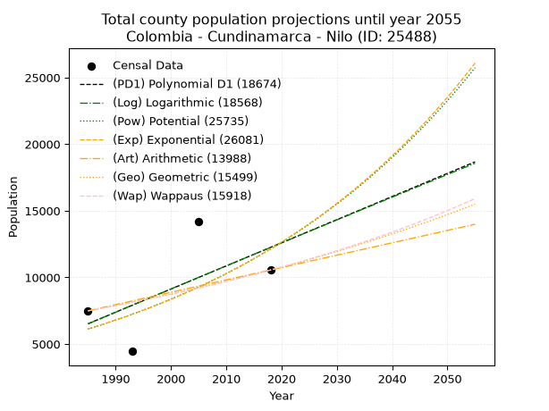
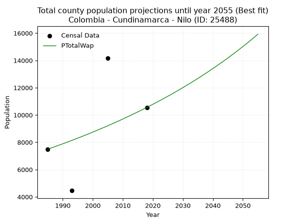
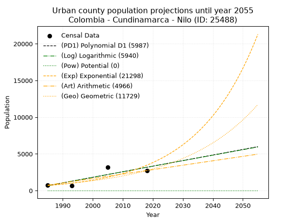
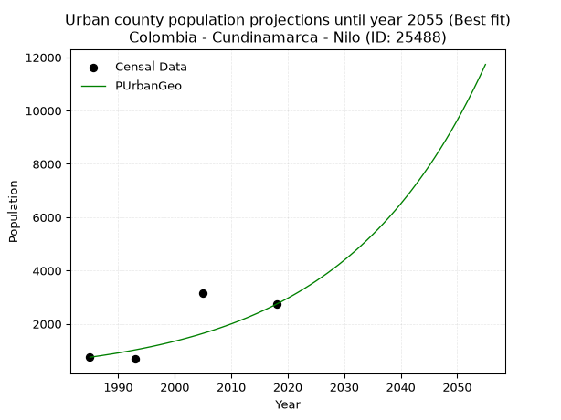
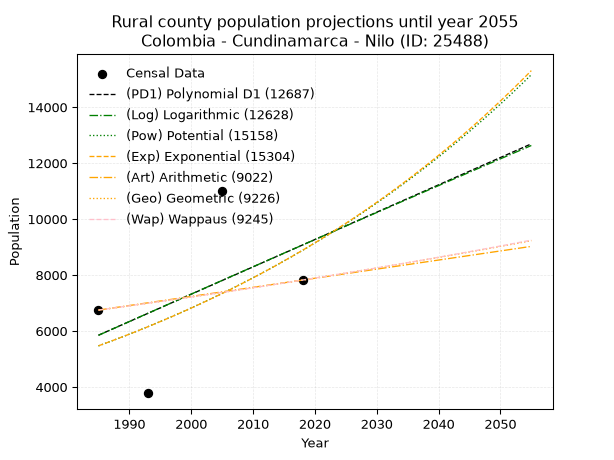
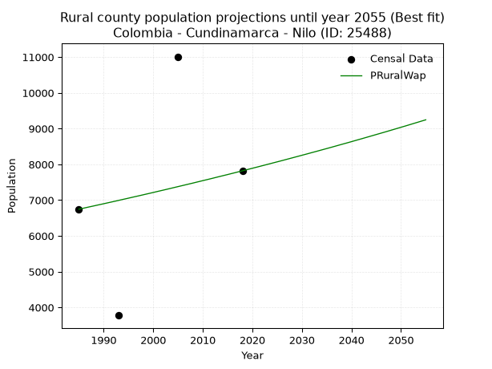

<div align="center">


</div>

# _“Population and Public Services Demand Projections (PPSD) until Year 2050 for Colombia - Cundinamarca - Nilo (ID: 25488)”_
Keywords: `population` `public-service` `projection` `lineal` `polynomial` `logarithmic` `potential` `exponential` `arithmetic` `geometric` `wappaus` `dane` `colombia` `south-america`

PPSD are analytical estimates used by governments and planners to anticipate future changes in population size, age distribution, and the resulting community needs for utilities, healthcare, education, and infrastructure as sizing future water treatment facilities, electrical grids, and road networks based on spatial growth.

> **General running parameters**: • app_version: _v20260806_. • Python version: _3.14.7_. • Pandas version: _3.0.5_. • NumPy version: _2.5.1_. • Creates, save and include plots into reports (create_plot): _False_. • Projection until year: _2050_. • Process polynomial degree 2 and up: _False_. • Process Wappaus: _True_. • Process Wappaus: _True_. • Set negative values to zero: _True_. • Set infinite values to zero: _True_. • Drop dataset notes: _True_. 
<div align="center">

Dynamic map: [:earth_americas:Google](http://maps.google.com/maps?q=4.305838031,-74.6200094) [:earth_americas:OSM](https://www.openstreetmap.org/#map=18/4.305838031/-74.6200094&layers=P) [:earth_americas:Bing](https://www.bing.com/maps?cp=4.305838031~-74.6200094&lvl=18) [:earth_americas:Apple](https://maps.apple.com/frame?center=4.305838031%2C-74.6200094&span=0.003%2C0.006)

</div>


<div align="center">

```geojson
{
  "type": "Feature",
  "geometry": {
    "type": "Point", 
    "coordinates": [-74.6200094, 4.305838031]
  }, 
  "properties": {
    "Name": "Colombia - Cundinamarca - Nilo (ID: 25488)"
  }
}
```

</div>


## 0. Census Data (4 records)

Census data are official statistics collected by a government about the people and housing in a country. They usually include counts of total population, age, sex, race, income, education, and jobs.

📅Global census file: [Population.xlsx](../data/Population.xlsx)

| Source   |   Year |   CountryID | CountryName   |   StateID | StateName    |   CountyID | CountyName   |   PTotal |   PUrban |   PRural |
|:---------|-------:|------------:|:--------------|----------:|:-------------|-----------:|:-------------|---------:|---------:|---------:|
| DANE     |   1985 |          57 | Colombia      |        25 | Cundinamarca |      25488 | Nilo         |     7493 |      747 |     6746 |
| DANE     |   1993 |          57 | Colombia      |        25 | Cundinamarca |      25488 | Nilo         |     4456 |      680 |     3776 |
| DANE     |   2005 |          57 | Colombia      |        25 | Cundinamarca |      25488 | Nilo         |    14174 |     3163 |    11011 |
| DANE     |   2018 |          57 | Colombia      |        25 | Cundinamarca |      25488 | Nilo         |    10555 |     2736 |     7819 |

> 🔥Some records could had specific notes about the registered values or the corresponding urban or rural distribution.

**Local public utility companies (RUPS)**

 | SERVICIO       | ESTADO    | NOMBRE                             | NIT         | DEPARTAMENTO_DOMICILIO   | MUNICIPIO_DOMICILIO   | DIRECCION                               |   TELEFONO | EMAIL                        | TIPO_INSCRIPCION    | REPRESENTANTE_LEGAL                | TIPO_PRESTADOR                             | CLASIFICACION                 |
|:---------------|:----------|:-----------------------------------|:------------|:-------------------------|:----------------------|:----------------------------------------|-----------:|:-----------------------------|:--------------------|:-----------------------------------|:-------------------------------------------|:------------------------------|
| ASEO           | OPERATIVA | SERVICIOS AMBIENTALES S.A.  E.S.P. | 830131031-1 | CUNDINAMARCA             | GIRARDOT              | Calle 21A No  2 - 07 Barrio San Antonio |    6164821 | yeselis.aycardi@pacaribe.com | Registro por la ESP | SANDRA FERNANDA MENESES VILLAMIZAR | SOCIEDADES (EMPRESA DE SERVICIOS PUBLICOS) | MAYOR O IGUAL A 5001 USUARIOS |
| ACUEDUCTO      | OPERATIVA | EMPRESAS PUBLICAS DE NILO SAS ESP  | 900431288-8 | CUNDINAMARCA             | NILO                  | CALLE 4 N° 4 -46                        |    8392556 | gerencia@empunilo.gov.co     | Registro por la ESP | LUIS ALBERTO SALAMANCA RODRIGUEZ   | SOCIEDADES (EMPRESA DE SERVICIOS PUBLICOS) | MENOR O IGUAL A 2500 USUARIOS |
| ALCANTARILLADO | OPERATIVA | EMPRESAS PUBLICAS DE NILO SAS ESP  | 900431288-8 | CUNDINAMARCA             | NILO                  | CALLE 4 N° 4 -46                        |    8392556 | gerencia@empunilo.gov.co     | Registro por la ESP | LUIS ALBERTO SALAMANCA RODRIGUEZ   | SOCIEDADES (EMPRESA DE SERVICIOS PUBLICOS) | MENOR O IGUAL A 2500 USUARIOS |
| ASEO           | OPERATIVA | EMPRESAS PUBLICAS DE NILO SAS ESP  | 900431288-8 | CUNDINAMARCA             | NILO                  | CALLE 4 N° 4 -46                        |    8392556 | gerencia@empunilo.gov.co     | Registro por la ESP | LUIS ALBERTO SALAMANCA RODRIGUEZ   | SOCIEDADES (EMPRESA DE SERVICIOS PUBLICOS) | MENOR O IGUAL A 2500 USUARIOS |

> [📅RUPS Database: Registro Único de Prestadores de Servicios Públicos de Colombia Suramérica - RUPS](https://www.datos.gov.co/Hacienda-y-Cr-dito-P-blico/Registro-nico-de-Prestadores-de-Servicios-P-blicos/4qkq-csdn/about_data)

## 1. Total

### 1.1. Coefficients and Parameters

* (PD1) Polynomial Deg 1: 173.59052589321732, -338054.949417908 (lineal)
* (Log) Logarithmic: 347777.6426565839, -2634291.1487478185
* (Pow) Potential: 41.400701774519675, -132.74221837429877
* (Exp) Exponential: 0.020678416768067687, 9.14846373602923e-15
* (Art) Arithmetic: Year diff. 2018 - 1985 = 33, Population diff. 10555 - 7493 = 3062, Annual growth = 92.78787878787878
* (Geo) Geometric: Year diff. 2018 - 1985 = 33, Population diff. 10555 - 7493 = 3062, Annual growth % = 0.010436827979320551
* (Wap) Wappaus: i = 1.0282344723834085, Condition values only valid for < 200)

<sub>
Wappaus condition values: ['0.00', '1.03', '2.06', '3.08', '4.11', '5.14', '6.17', '7.20', '8.23', '9.25', '10.28', '11.31', '12.34', '13.37', '14.40', '15.42', '16.45', '17.48', '18.51', '19.54', '20.56', '21.59', '22.62', '23.65', '24.68', '25.71', '26.73', '27.76', '28.79', '29.82', '30.85', '31.88', '32.90', '33.93', '34.96', '35.99', '37.02', '38.04', '39.07', '40.10', '41.13', '42.16', '43.19', '44.21', '45.24', '46.27', '47.30', '48.33', '49.36', '50.38', '51.41', '52.44', '53.47', '54.50', '55.52', '56.55', '57.58', '58.61', '59.64', '60.67', '61.69', '62.72', '63.75', '64.78', '65.81', '66.84']
</sub>


### 1.2. Projected Dataset

|   Year |   CountyID |   PTotalPD1 |   PTotalLog |   PTotalPow |   PTotalExp |   PTotalArt |   PTotalGeo |   PTotalWap |
|-------:|-----------:|------------:|------------:|------------:|------------:|------------:|------------:|------------:|
|   1985 |      25488 |        6522 |        6515 |        6129 |        6133 |        7493 |        7493 |        7493 |
|   1986 |      25488 |        6696 |        6690 |        6258 |        6261 |        7586 |        7571 |        7570 |
|   1987 |      25488 |        6869 |        6865 |        6390 |        6392 |        7679 |        7650 |        7649 |
|   1988 |      25488 |        7043 |        7040 |        6524 |        6526 |        7771 |        7730 |        7728 |
|   1989 |      25488 |        7217 |        7215 |        6662 |        6662 |        7864 |        7811 |        7808 |
|   1990 |      25488 |        7390 |        7390 |        6802 |        6801 |        7957 |        7892 |        7888 |
|   1991 |      25488 |        7564 |        7564 |        6945 |        6943 |        8050 |        7975 |        7970 |
|   1992 |      25488 |        7737 |        7739 |        7090 |        7088 |        8143 |        8058 |        8052 |
|   1993 |      25488 |        7911 |        7913 |        7239 |        7237 |        8235 |        8142 |        8136 |
|   1994 |      25488 |        8085 |        8088 |        7391 |        7388 |        8328 |        8227 |        8220 |
|   1995 |      25488 |        8258 |        8262 |        7546 |        7542 |        8421 |        8313 |        8305 |
|   1996 |      25488 |        8432 |        8437 |        7704 |        7700 |        8514 |        8400 |        8391 |
|   1997 |      25488 |        8605 |        8611 |        7866 |        7861 |        8606 |        8487 |        8478 |
|   1998 |      25488 |        8779 |        8785 |        8031 |        8025 |        8699 |        8576 |        8566 |
|   1999 |      25488 |        8953 |        8959 |        8199 |        8192 |        8792 |        8665 |        8655 |
|   2000 |      25488 |        9126 |        9133 |        8370 |        8364 |        8885 |        8756 |        8745 |
|   2001 |      25488 |        9300 |        9307 |        8545 |        8538 |        8978 |        8847 |        8836 |
|   2002 |      25488 |        9473 |        9480 |        8724 |        8717 |        9070 |        8939 |        8928 |
|   2003 |      25488 |        9647 |        9654 |        8906 |        8899 |        9163 |        9033 |        9021 |
|   2004 |      25488 |        9820 |        9828 |        9092 |        9085 |        9256 |        9127 |        9115 |
|   2005 |      25488 |        9994 |       10001 |        9282 |        9275 |        9349 |        9222 |        9211 |
|   2006 |      25488 |       10168 |       10175 |        9475 |        9468 |        9442 |        9319 |        9307 |
|   2007 |      25488 |       10341 |       10348 |        9673 |        9666 |        9534 |        9416 |        9404 |
|   2008 |      25488 |       10515 |       10521 |        9875 |        9868 |        9627 |        9514 |        9503 |
|   2009 |      25488 |       10688 |       10694 |       10080 |       10074 |        9720 |        9613 |        9602 |
|   2010 |      25488 |       10862 |       10867 |       10290 |       10285 |        9813 |        9714 |        9703 |
|   2011 |      25488 |       11036 |       11040 |       10504 |       10500 |        9905 |        9815 |        9805 |
|   2012 |      25488 |       11209 |       11213 |       10723 |       10719 |        9998 |        9918 |        9909 |
|   2013 |      25488 |       11383 |       11386 |       10945 |       10943 |       10091 |       10021 |       10013 |
|   2014 |      25488 |       11556 |       11559 |       11173 |       11172 |       10184 |       10126 |       10119 |
|   2015 |      25488 |       11730 |       11731 |       11405 |       11405 |       10277 |       10231 |       10226 |
|   2016 |      25488 |       11904 |       11904 |       11641 |       11643 |       10369 |       10338 |       10334 |
|   2017 |      25488 |       12077 |       12076 |       11883 |       11887 |       10462 |       10446 |       10444 |
|   2018 |      25488 |       12251 |       12249 |       12129 |       12135 |       10555 |       10555 |       10555 |
|   2019 |      25488 |       12424 |       12421 |       12381 |       12389 |       10648 |       10665 |       10667 |
|   2020 |      25488 |       12598 |       12593 |       12637 |       12647 |       10741 |       10776 |       10781 |
|   2021 |      25488 |       12772 |       12765 |       12899 |       12912 |       10833 |       10889 |       10897 |
|   2022 |      25488 |       12945 |       12937 |       13166 |       13181 |       10926 |       11003 |       11013 |
|   2023 |      25488 |       13119 |       13109 |       13438 |       13457 |       11019 |       11117 |       11132 |
|   2024 |      25488 |       13292 |       13281 |       13716 |       13738 |       11112 |       11233 |       11251 |
|   2025 |      25488 |       13466 |       13453 |       13999 |       14025 |       11205 |       11351 |       11373 |
|   2026 |      25488 |       13639 |       13625 |       14288 |       14318 |       11297 |       11469 |       11496 |
|   2027 |      25488 |       13813 |       13796 |       14583 |       14617 |       11390 |       11589 |       11620 |
|   2028 |      25488 |       13987 |       13968 |       14884 |       14923 |       11483 |       11710 |       11746 |
|   2029 |      25488 |       14160 |       14139 |       15191 |       15234 |       11576 |       11832 |       11874 |
|   2030 |      25488 |       14334 |       14311 |       15504 |       15553 |       11668 |       11956 |       12004 |
|   2031 |      25488 |       14507 |       14482 |       15823 |       15878 |       11761 |       12080 |       12135 |
|   2032 |      25488 |       14681 |       14653 |       16149 |       16209 |       11854 |       12206 |       12268 |
|   2033 |      25488 |       14855 |       14824 |       16481 |       16548 |       11947 |       12334 |       12403 |
|   2034 |      25488 |       15028 |       14995 |       16820 |       16894 |       12040 |       12462 |       12540 |
|   2035 |      25488 |       15202 |       15166 |       17166 |       17247 |       12132 |       12593 |       12678 |
|   2036 |      25488 |       15375 |       15337 |       17519 |       17607 |       12225 |       12724 |       12819 |
|   2037 |      25488 |       15549 |       15508 |       17879 |       17975 |       12318 |       12857 |       12961 |
|   2038 |      25488 |       15723 |       15679 |       18246 |       18351 |       12411 |       12991 |       13106 |
|   2039 |      25488 |       15896 |       15849 |       18620 |       18734 |       12504 |       13127 |       13252 |
|   2040 |      25488 |       16070 |       16020 |       19002 |       19126 |       12596 |       13264 |       13401 |
|   2041 |      25488 |       16243 |       16190 |       19391 |       19525 |       12689 |       13402 |       13552 |
|   2042 |      25488 |       16417 |       16360 |       19788 |       19933 |       12782 |       13542 |       13705 |
|   2043 |      25488 |       16590 |       16531 |       20194 |       20350 |       12875 |       13683 |       13860 |
|   2044 |      25488 |       16764 |       16701 |       20607 |       20775 |       12967 |       13826 |       14018 |
|   2045 |      25488 |       16938 |       16871 |       21028 |       21209 |       13060 |       13970 |       14178 |
|   2046 |      25488 |       17111 |       17041 |       21458 |       21652 |       13153 |       14116 |       14340 |
|   2047 |      25488 |       17285 |       17211 |       21897 |       22104 |       13246 |       14263 |       14505 |
|   2048 |      25488 |       17458 |       17381 |       22344 |       22566 |       13339 |       14412 |       14672 |
|   2049 |      25488 |       17632 |       17551 |       22800 |       23038 |       13431 |       14563 |       14842 |
|   2050 |      25488 |       17806 |       17720 |       23266 |       23519 |       13524 |       14715 |       15014 |
<div align="center">

</img>

</div>


### 1.3. Best fit with absolute and relative error (%)

Relative error puts that difference into context by dividing the absolute error by the true value, creating a unitless ratio or percentage that shows the scale of the mistake.

Absolute and relative error

|   Year | Source   |   CountryID | CountryName   |   StateID | StateName    |   CountyID_x | CountyName   |   PTotal |   PUrban |   PRural |   CountyID_y |   PTotalPD1 |   PTotalLog |   PTotalPow |   PTotalExp |   PTotalArt |   PTotalGeo |   PTotalWap |   PTotalPD1AbsError |   PTotalLogAbsError |   PTotalPowAbsError |   PTotalExpAbsError |   PTotalArtAbsError |   PTotalGeoAbsError |   PTotalWapAbsError |   PTotalPD1RelError |   PTotalLogRelError |   PTotalPowRelError |   PTotalExpRelError |   PTotalArtRelError |   PTotalGeoRelError |   PTotalWapRelError |
|-------:|:---------|------------:|:--------------|----------:|:-------------|-------------:|:-------------|---------:|---------:|---------:|-------------:|------------:|------------:|------------:|------------:|------------:|------------:|------------:|--------------------:|--------------------:|--------------------:|--------------------:|--------------------:|--------------------:|--------------------:|--------------------:|--------------------:|--------------------:|--------------------:|--------------------:|--------------------:|--------------------:|
|   1985 | DANE     |          57 | Colombia      |        25 | Cundinamarca |        25488 | Nilo         |     7493 |      747 |     6746 |        25488 |        6522 |        6515 |        6129 |        6133 |        7493 |        7493 |        7493 |                 971 |                 978 |                1364 |                1360 |                   0 |                   0 |                   0 |             12.9588 |             13.0522 |             18.2037 |             18.1503 |              0      |              0      |              0      |
|   1993 | DANE     |          57 | Colombia      |        25 | Cundinamarca |        25488 | Nilo         |     4456 |      680 |     3776 |        25488 |        7911 |        7913 |        7239 |        7237 |        8235 |        8142 |        8136 |                3455 |                3457 |                2783 |                2781 |                3779 |                3686 |                3680 |             77.5359 |             77.5808 |             62.4551 |             62.4102 |             84.807  |             82.7199 |             82.5853 |
|   2005 | DANE     |          57 | Colombia      |        25 | Cundinamarca |        25488 | Nilo         |    14174 |     3163 |    11011 |        25488 |        9994 |       10001 |        9282 |        9275 |        9349 |        9222 |        9211 |                4180 |                4173 |                4892 |                4899 |                4825 |                4952 |                4963 |             29.4906 |             29.4412 |             34.5139 |             34.5633 |             34.0412 |             34.9372 |             35.0148 |
|   2018 | DANE     |          57 | Colombia      |        25 | Cundinamarca |        25488 | Nilo         |    10555 |     2736 |     7819 |        25488 |       12251 |       12249 |       12129 |       12135 |       10555 |       10555 |       10555 |                1696 |                1694 |                1574 |                1580 |                   0 |                   0 |                   0 |             16.0682 |             16.0493 |             14.9124 |             14.9692 |              0      |              0      |              0      |

Relative error mean

| Method    |   RelError | Best   |
|:----------|-----------:|:-------|
| PTotalPD1 |    34.0134 |        |
| PTotalLog |    34.0309 |        |
| PTotalPow |    32.5213 |        |
| PTotalExp |    32.5233 |        |
| PTotalArt |    29.7121 |        |
| PTotalGeo |    29.4143 |        |
| PTotalWap |    29.4    | True   |

💙Best method: _**PTotalWap**_
<div align="center">

</img>

</div>


### 1.4. Fresh water supply demand in liters per capita per day (lpcd)

The fresh water supply demand typically ranges from 100 to 300 liters per capita per day (lpcd) for standard domestic and municipal planning, though absolute survival minimums set by the World Health Organization are as low as 7.5 to 20 liters per day, and total consumption in high-income nations can exceed 400 liters.

> `CZ`: Level in meters above the sea level (masl)<br> `WS`: Fresh water supply demand in liters per capita per day (lpcd or l/h/d)<br> `WSAll`: Zonal fresh water supply demand in liters per second (l/s)<br> `A`: Zonal area in square meters<br> `DP`: Population density (people/hectare or p/ha)

Reference values (RAS Colombia)

|    CZ |   WS |
|------:|-----:|
|  1000 |  120 |
|  2000 |  130 |
| 99999 |  140 |

County shapefile geometry properties and water supply values

|   CountyID |      ATotal |   CZTotal |   WSTotal |
|-----------:|------------:|----------:|----------:|
|      25488 | 2.24453e+08 |   607.778 |       120 |

Projected values for best method: PTotalWap

|   CountyID |   Year |   PTotalWap |   DPTotal |   WSTotal |   WSTotalAll |
|-----------:|-------:|------------:|----------:|----------:|-------------:|
|      25488 |   1985 |        7493 |      0.33 |       120 |      10.4069 |
|      25488 |   1986 |        7570 |      0.34 |       120 |      10.5139 |
|      25488 |   1987 |        7649 |      0.34 |       120 |      10.6236 |
|      25488 |   1988 |        7728 |      0.34 |       120 |      10.7333 |
|      25488 |   1989 |        7808 |      0.35 |       120 |      10.8444 |
|      25488 |   1990 |        7888 |      0.35 |       120 |      10.9556 |
|      25488 |   1991 |        7970 |      0.36 |       120 |      11.0694 |
|      25488 |   1992 |        8052 |      0.36 |       120 |      11.1833 |
|      25488 |   1993 |        8136 |      0.36 |       120 |      11.3    |
|      25488 |   1994 |        8220 |      0.37 |       120 |      11.4167 |
|      25488 |   1995 |        8305 |      0.37 |       120 |      11.5347 |
|      25488 |   1996 |        8391 |      0.37 |       120 |      11.6542 |
|      25488 |   1997 |        8478 |      0.38 |       120 |      11.775  |
|      25488 |   1998 |        8566 |      0.38 |       120 |      11.8972 |
|      25488 |   1999 |        8655 |      0.39 |       120 |      12.0208 |
|      25488 |   2000 |        8745 |      0.39 |       120 |      12.1458 |
|      25488 |   2001 |        8836 |      0.39 |       120 |      12.2722 |
|      25488 |   2002 |        8928 |      0.4  |       120 |      12.4    |
|      25488 |   2003 |        9021 |      0.4  |       120 |      12.5292 |
|      25488 |   2004 |        9115 |      0.41 |       120 |      12.6597 |
|      25488 |   2005 |        9211 |      0.41 |       120 |      12.7931 |
|      25488 |   2006 |        9307 |      0.41 |       120 |      12.9264 |
|      25488 |   2007 |        9404 |      0.42 |       120 |      13.0611 |
|      25488 |   2008 |        9503 |      0.42 |       120 |      13.1986 |
|      25488 |   2009 |        9602 |      0.43 |       120 |      13.3361 |
|      25488 |   2010 |        9703 |      0.43 |       120 |      13.4764 |
|      25488 |   2011 |        9805 |      0.44 |       120 |      13.6181 |
|      25488 |   2012 |        9909 |      0.44 |       120 |      13.7625 |
|      25488 |   2013 |       10013 |      0.45 |       120 |      13.9069 |
|      25488 |   2014 |       10119 |      0.45 |       120 |      14.0542 |
|      25488 |   2015 |       10226 |      0.46 |       120 |      14.2028 |
|      25488 |   2016 |       10334 |      0.46 |       120 |      14.3528 |
|      25488 |   2017 |       10444 |      0.47 |       120 |      14.5056 |
|      25488 |   2018 |       10555 |      0.47 |       120 |      14.6597 |
|      25488 |   2019 |       10667 |      0.48 |       120 |      14.8153 |
|      25488 |   2020 |       10781 |      0.48 |       120 |      14.9736 |
|      25488 |   2021 |       10897 |      0.49 |       120 |      15.1347 |
|      25488 |   2022 |       11013 |      0.49 |       120 |      15.2958 |
|      25488 |   2023 |       11132 |      0.5  |       120 |      15.4611 |
|      25488 |   2024 |       11251 |      0.5  |       120 |      15.6264 |
|      25488 |   2025 |       11373 |      0.51 |       120 |      15.7958 |
|      25488 |   2026 |       11496 |      0.51 |       120 |      15.9667 |
|      25488 |   2027 |       11620 |      0.52 |       120 |      16.1389 |
|      25488 |   2028 |       11746 |      0.52 |       120 |      16.3139 |
|      25488 |   2029 |       11874 |      0.53 |       120 |      16.4917 |
|      25488 |   2030 |       12004 |      0.53 |       120 |      16.6722 |
|      25488 |   2031 |       12135 |      0.54 |       120 |      16.8542 |
|      25488 |   2032 |       12268 |      0.55 |       120 |      17.0389 |
|      25488 |   2033 |       12403 |      0.55 |       120 |      17.2264 |
|      25488 |   2034 |       12540 |      0.56 |       120 |      17.4167 |
|      25488 |   2035 |       12678 |      0.56 |       120 |      17.6083 |
|      25488 |   2036 |       12819 |      0.57 |       120 |      17.8042 |
|      25488 |   2037 |       12961 |      0.58 |       120 |      18.0014 |
|      25488 |   2038 |       13106 |      0.58 |       120 |      18.2028 |
|      25488 |   2039 |       13252 |      0.59 |       120 |      18.4056 |
|      25488 |   2040 |       13401 |      0.6  |       120 |      18.6125 |
|      25488 |   2041 |       13552 |      0.6  |       120 |      18.8222 |
|      25488 |   2042 |       13705 |      0.61 |       120 |      19.0347 |
|      25488 |   2043 |       13860 |      0.62 |       120 |      19.25   |
|      25488 |   2044 |       14018 |      0.62 |       120 |      19.4694 |
|      25488 |   2045 |       14178 |      0.63 |       120 |      19.6917 |
|      25488 |   2046 |       14340 |      0.64 |       120 |      19.9167 |
|      25488 |   2047 |       14505 |      0.65 |       120 |      20.1458 |
|      25488 |   2048 |       14672 |      0.65 |       120 |      20.3778 |
|      25488 |   2049 |       14842 |      0.66 |       120 |      20.6139 |
|      25488 |   2050 |       15014 |      0.67 |       120 |      20.8528 |

## 2. Urban

### 2.1. Coefficients and Parameters

* (PD1) Polynomial Deg 1: 75.89963869931768, -149986.75230831016 (lineal)
* (Log) Logarithmic: 152027.9506735699, -1153734.1713453436
* (Pow) Potential: 98.33703651507511, -321.45725393837466
* (Exp) Exponential: 0.04910377061159545, 3.194747884274633e-40
* (Art) Arithmetic: Year diff. 2018 - 1985 = 33, Population diff. 2736 - 747 = 1989, Annual growth = 60.27272727272727
* (Geo) Geometric: Year diff. 2018 - 1985 = 33, Population diff. 2736 - 747 = 1989, Annual growth % = 0.040123028547069506
* (Wap) Wappaus: i = 3.460966251663926, Condition values only valid for < 200)

<sub>
Wappaus condition values: ['0.00', '3.46', '6.92', '10.38', '13.84', '17.30', '20.77', '24.23', '27.69', '31.15', '34.61', '38.07', '41.53', '44.99', '48.45', '51.91', '55.38', '58.84', '62.30', '65.76', '69.22', '72.68', '76.14', '79.60', '83.06', '86.52', '89.99', '93.45', '96.91', '100.37', '103.83', '107.29', '110.75', '114.21', '117.67', '121.13', '124.59', '128.06', '131.52', '134.98', '138.44', '141.90', '145.36', '148.82', '152.28', '155.74', '159.20', '162.67', '166.13', '169.59', '173.05', '176.51', '179.97', '183.43', '186.89', '190.35', '193.81', '197.28', '200.74', '204.20', '207.66', '211.12', '214.58', '218.04', '221.50', '224.96']
</sub>


### 2.2. Projected Dataset

|   Year |   CountyID |   PUrbanPD1 |   PUrbanLog |   PUrbanPow |   PUrbanExp |   PUrbanArt |   PUrbanGeo |
|-------:|-----------:|------------:|------------:|------------:|------------:|------------:|------------:|
|   1985 |      25488 |         674 |         671 |           0 |         685 |         747 |         747 |
|   1986 |      25488 |         750 |         748 |           0 |         719 |         807 |         777 |
|   1987 |      25488 |         826 |         824 |           0 |         755 |         868 |         808 |
|   1988 |      25488 |         902 |         901 |           0 |         793 |         928 |         841 |
|   1989 |      25488 |         978 |         977 |           0 |         833 |         988 |         874 |
|   1990 |      25488 |        1054 |        1053 |           0 |         875 |        1048 |         909 |
|   1991 |      25488 |        1129 |        1130 |           0 |         919 |        1109 |         946 |
|   1992 |      25488 |        1205 |        1206 |           0 |         966 |        1169 |         984 |
|   1993 |      25488 |        1281 |        1282 |           0 |        1014 |        1229 |        1023 |
|   1994 |      25488 |        1357 |        1359 |           0 |        1065 |        1289 |        1064 |
|   1995 |      25488 |        1433 |        1435 |           0 |        1119 |        1350 |        1107 |
|   1996 |      25488 |        1509 |        1511 |           0 |        1175 |        1410 |        1151 |
|   1997 |      25488 |        1585 |        1587 |           0 |        1234 |        1470 |        1198 |
|   1998 |      25488 |        1661 |        1663 |           0 |        1297 |        1531 |        1246 |
|   1999 |      25488 |        1737 |        1739 |           0 |        1362 |        1591 |        1296 |
|   2000 |      25488 |        1813 |        1815 |           0 |        1430 |        1651 |        1348 |
|   2001 |      25488 |        1888 |        1891 |           0 |        1502 |        1711 |        1402 |
|   2002 |      25488 |        1964 |        1967 |           0 |        1578 |        1772 |        1458 |
|   2003 |      25488 |        2040 |        2043 |           0 |        1657 |        1832 |        1517 |
|   2004 |      25488 |        2116 |        2119 |           0 |        1741 |        1892 |        1577 |
|   2005 |      25488 |        2192 |        2195 |           0 |        1828 |        1952 |        1641 |
|   2006 |      25488 |        2268 |        2271 |           0 |        1920 |        2013 |        1706 |
|   2007 |      25488 |        2344 |        2347 |           0 |        2017 |        2073 |        1775 |
|   2008 |      25488 |        2420 |        2422 |           0 |        2119 |        2133 |        1846 |
|   2009 |      25488 |        2496 |        2498 |           0 |        2225 |        2194 |        1920 |
|   2010 |      25488 |        2572 |        2574 |           0 |        2337 |        2254 |        1997 |
|   2011 |      25488 |        2647 |        2649 |           0 |        2455 |        2314 |        2077 |
|   2012 |      25488 |        2723 |        2725 |           0 |        2578 |        2374 |        2161 |
|   2013 |      25488 |        2799 |        2800 |           0 |        2708 |        2435 |        2247 |
|   2014 |      25488 |        2875 |        2876 |           0 |        2844 |        2495 |        2338 |
|   2015 |      25488 |        2951 |        2951 |           0 |        2988 |        2555 |        2431 |
|   2016 |      25488 |        3027 |        3027 |           0 |        3138 |        2615 |        2529 |
|   2017 |      25488 |        3103 |        3102 |           0 |        3296 |        2676 |        2630 |
|   2018 |      25488 |        3179 |        3178 |           0 |        3462 |        2736 |        2736 |
|   2019 |      25488 |        3255 |        3253 |           0 |        3636 |        2796 |        2846 |
|   2020 |      25488 |        3331 |        3328 |           0 |        3819 |        2857 |        2960 |
|   2021 |      25488 |        3406 |        3403 |           0 |        4011 |        2917 |        3079 |
|   2022 |      25488 |        3482 |        3479 |           0 |        4213 |        2977 |        3202 |
|   2023 |      25488 |        3558 |        3554 |           0 |        4425 |        3037 |        3331 |
|   2024 |      25488 |        3634 |        3629 |           0 |        4648 |        3098 |        3464 |
|   2025 |      25488 |        3710 |        3704 |           0 |        4882 |        3158 |        3603 |
|   2026 |      25488 |        3786 |        3779 |           0 |        5127 |        3218 |        3748 |
|   2027 |      25488 |        3862 |        3854 |           0 |        5385 |        3278 |        3898 |
|   2028 |      25488 |        3938 |        3929 |           0 |        5656 |        3339 |        4055 |
|   2029 |      25488 |        4014 |        4004 |           0 |        5941 |        3399 |        4217 |
|   2030 |      25488 |        4090 |        4079 |           0 |        6240 |        3459 |        4387 |
|   2031 |      25488 |        4165 |        4154 |           0 |        6554 |        3520 |        4563 |
|   2032 |      25488 |        4241 |        4229 |           0 |        6884 |        3580 |        4746 |
|   2033 |      25488 |        4317 |        4303 |           0 |        7231 |        3640 |        4936 |
|   2034 |      25488 |        4393 |        4378 |           0 |        7594 |        3700 |        5134 |
|   2035 |      25488 |        4469 |        4453 |           0 |        7977 |        3761 |        5340 |
|   2036 |      25488 |        4545 |        4528 |           0 |        8378 |        3821 |        5554 |
|   2037 |      25488 |        4621 |        4602 |           0 |        8800 |        3881 |        5777 |
|   2038 |      25488 |        4697 |        4677 |           0 |        9243 |        3941 |        6009 |
|   2039 |      25488 |        4773 |        4751 |           0 |        9708 |        4002 |        6250 |
|   2040 |      25488 |        4849 |        4826 |           0 |       10196 |        4062 |        6501 |
|   2041 |      25488 |        4924 |        4901 |           0 |       10710 |        4122 |        6762 |
|   2042 |      25488 |        5000 |        4975 |           0 |       11249 |        4183 |        7033 |
|   2043 |      25488 |        5076 |        5049 |           0 |       11815 |        4243 |        7315 |
|   2044 |      25488 |        5152 |        5124 |           0 |       12409 |        4303 |        7609 |
|   2045 |      25488 |        5228 |        5198 |           0 |       13034 |        4363 |        7914 |
|   2046 |      25488 |        5304 |        5272 |           0 |       13690 |        4424 |        8232 |
|   2047 |      25488 |        5380 |        5347 |           0 |       14379 |        4484 |        8562 |
|   2048 |      25488 |        5456 |        5421 |           0 |       15103 |        4544 |        8905 |
|   2049 |      25488 |        5532 |        5495 |           0 |       15863 |        4604 |        9263 |
|   2050 |      25488 |        5608 |        5569 |           0 |       16661 |        4665 |        9634 |
<div align="center">

</img>

</div>


### 2.3. Best fit with absolute and relative error (%)

Relative error puts that difference into context by dividing the absolute error by the true value, creating a unitless ratio or percentage that shows the scale of the mistake.

Absolute and relative error

|   Year | Source   |   CountryID | CountryName   |   StateID | StateName    |   CountyID_x | CountyName   |   PTotal |   PUrban |   PRural |   CountyID_y |   PUrbanPD1 |   PUrbanLog |   PUrbanPow |   PUrbanExp |   PUrbanArt |   PUrbanGeo |   PUrbanPD1AbsError |   PUrbanLogAbsError |   PUrbanPowAbsError |   PUrbanExpAbsError |   PUrbanArtAbsError |   PUrbanGeoAbsError |   PUrbanPD1RelError |   PUrbanLogRelError |   PUrbanPowRelError |   PUrbanExpRelError |   PUrbanArtRelError |   PUrbanGeoRelError |
|-------:|:---------|------------:|:--------------|----------:|:-------------|-------------:|:-------------|---------:|---------:|---------:|-------------:|------------:|------------:|------------:|------------:|------------:|------------:|--------------------:|--------------------:|--------------------:|--------------------:|--------------------:|--------------------:|--------------------:|--------------------:|--------------------:|--------------------:|--------------------:|--------------------:|
|   1985 | DANE     |          57 | Colombia      |        25 | Cundinamarca |        25488 | Nilo         |     7493 |      747 |     6746 |        25488 |         674 |         671 |           0 |         685 |         747 |         747 |                  73 |                  76 |                 747 |                  62 |                   0 |                   0 |             9.77242 |             10.174  |                 100 |             8.29987 |              0      |              0      |
|   1993 | DANE     |          57 | Colombia      |        25 | Cundinamarca |        25488 | Nilo         |     4456 |      680 |     3776 |        25488 |        1281 |        1282 |           0 |        1014 |        1229 |        1023 |                 601 |                 602 |                 680 |                 334 |                 549 |                 343 |            88.3824  |             88.5294 |                 100 |            49.1176  |             80.7353 |             50.4412 |
|   2005 | DANE     |          57 | Colombia      |        25 | Cundinamarca |        25488 | Nilo         |    14174 |     3163 |    11011 |        25488 |        2192 |        2195 |           0 |        1828 |        1952 |        1641 |                 971 |                 968 |                3163 |                1335 |                1211 |                1522 |            30.6987  |             30.6039 |                 100 |            42.2068  |             38.2864 |             48.1189 |
|   2018 | DANE     |          57 | Colombia      |        25 | Cundinamarca |        25488 | Nilo         |    10555 |     2736 |     7819 |        25488 |        3179 |        3178 |           0 |        3462 |        2736 |        2736 |                 443 |                 442 |                2736 |                 726 |                   0 |                   0 |            16.1915  |             16.155  |                 100 |            26.5351  |              0      |              0      |

Relative error mean

| Method    |   RelError | Best   |
|:----------|-----------:|:-------|
| PUrbanPD1 |    36.2613 |        |
| PUrbanLog |    36.3656 |        |
| PUrbanPow |   100      |        |
| PUrbanExp |    31.5398 |        |
| PUrbanArt |    29.7554 |        |
| PUrbanGeo |    24.64   | True   |

💙Best method: _**PUrbanGeo**_
<div align="center">

</img>

</div>


### 2.4. Fresh water supply demand in liters per capita per day (lpcd)

The fresh water supply demand typically ranges from 100 to 300 liters per capita per day (lpcd) for standard domestic and municipal planning, though absolute survival minimums set by the World Health Organization are as low as 7.5 to 20 liters per day, and total consumption in high-income nations can exceed 400 liters.

> `CZ`: Level in meters above the sea level (masl)<br> `WS`: Fresh water supply demand in liters per capita per day (lpcd or l/h/d)<br> `WSAll`: Zonal fresh water supply demand in liters per second (l/s)<br> `A`: Zonal area in square meters<br> `DP`: Population density (people/hectare or p/ha)

Reference values (RAS Colombia)

|    CZ |   WS |
|------:|-----:|
|  1000 |  120 |
|  2000 |  130 |
| 99999 |  140 |

County shapefile geometry properties and water supply values

|   CountyID |   AUrban |   CZUrban |   WSUrban |
|-----------:|---------:|----------:|----------:|
|      25488 |   557605 |   338.998 |       120 |

Projected values for best method: PUrbanGeo

|   CountyID |   Year |   PUrbanGeo |   DPUrban |   WSUrban |   WSUrbanAll |
|-----------:|-------:|------------:|----------:|----------:|-------------:|
|      25488 |   1985 |         747 |     13.4  |       120 |      1.0375  |
|      25488 |   1986 |         777 |     13.93 |       120 |      1.07917 |
|      25488 |   1987 |         808 |     14.49 |       120 |      1.12222 |
|      25488 |   1988 |         841 |     15.08 |       120 |      1.16806 |
|      25488 |   1989 |         874 |     15.67 |       120 |      1.21389 |
|      25488 |   1990 |         909 |     16.3  |       120 |      1.2625  |
|      25488 |   1991 |         946 |     16.97 |       120 |      1.31389 |
|      25488 |   1992 |         984 |     17.65 |       120 |      1.36667 |
|      25488 |   1993 |        1023 |     18.35 |       120 |      1.42083 |
|      25488 |   1994 |        1064 |     19.08 |       120 |      1.47778 |
|      25488 |   1995 |        1107 |     19.85 |       120 |      1.5375  |
|      25488 |   1996 |        1151 |     20.64 |       120 |      1.59861 |
|      25488 |   1997 |        1198 |     21.48 |       120 |      1.66389 |
|      25488 |   1998 |        1246 |     22.35 |       120 |      1.73056 |
|      25488 |   1999 |        1296 |     23.24 |       120 |      1.8     |
|      25488 |   2000 |        1348 |     24.17 |       120 |      1.87222 |
|      25488 |   2001 |        1402 |     25.14 |       120 |      1.94722 |
|      25488 |   2002 |        1458 |     26.15 |       120 |      2.025   |
|      25488 |   2003 |        1517 |     27.21 |       120 |      2.10694 |
|      25488 |   2004 |        1577 |     28.28 |       120 |      2.19028 |
|      25488 |   2005 |        1641 |     29.43 |       120 |      2.27917 |
|      25488 |   2006 |        1706 |     30.6  |       120 |      2.36944 |
|      25488 |   2007 |        1775 |     31.83 |       120 |      2.46528 |
|      25488 |   2008 |        1846 |     33.11 |       120 |      2.56389 |
|      25488 |   2009 |        1920 |     34.43 |       120 |      2.66667 |
|      25488 |   2010 |        1997 |     35.81 |       120 |      2.77361 |
|      25488 |   2011 |        2077 |     37.25 |       120 |      2.88472 |
|      25488 |   2012 |        2161 |     38.76 |       120 |      3.00139 |
|      25488 |   2013 |        2247 |     40.3  |       120 |      3.12083 |
|      25488 |   2014 |        2338 |     41.93 |       120 |      3.24722 |
|      25488 |   2015 |        2431 |     43.6  |       120 |      3.37639 |
|      25488 |   2016 |        2529 |     45.35 |       120 |      3.5125  |
|      25488 |   2017 |        2630 |     47.17 |       120 |      3.65278 |
|      25488 |   2018 |        2736 |     49.07 |       120 |      3.8     |
|      25488 |   2019 |        2846 |     51.04 |       120 |      3.95278 |
|      25488 |   2020 |        2960 |     53.08 |       120 |      4.11111 |
|      25488 |   2021 |        3079 |     55.22 |       120 |      4.27639 |
|      25488 |   2022 |        3202 |     57.42 |       120 |      4.44722 |
|      25488 |   2023 |        3331 |     59.74 |       120 |      4.62639 |
|      25488 |   2024 |        3464 |     62.12 |       120 |      4.81111 |
|      25488 |   2025 |        3603 |     64.62 |       120 |      5.00417 |
|      25488 |   2026 |        3748 |     67.22 |       120 |      5.20556 |
|      25488 |   2027 |        3898 |     69.91 |       120 |      5.41389 |
|      25488 |   2028 |        4055 |     72.72 |       120 |      5.63194 |
|      25488 |   2029 |        4217 |     75.63 |       120 |      5.85694 |
|      25488 |   2030 |        4387 |     78.68 |       120 |      6.09306 |
|      25488 |   2031 |        4563 |     81.83 |       120 |      6.3375  |
|      25488 |   2032 |        4746 |     85.11 |       120 |      6.59167 |
|      25488 |   2033 |        4936 |     88.52 |       120 |      6.85556 |
|      25488 |   2034 |        5134 |     92.07 |       120 |      7.13056 |
|      25488 |   2035 |        5340 |     95.77 |       120 |      7.41667 |
|      25488 |   2036 |        5554 |     99.6  |       120 |      7.71389 |
|      25488 |   2037 |        5777 |    103.6  |       120 |      8.02361 |
|      25488 |   2038 |        6009 |    107.76 |       120 |      8.34583 |
|      25488 |   2039 |        6250 |    112.09 |       120 |      8.68056 |
|      25488 |   2040 |        6501 |    116.59 |       120 |      9.02917 |
|      25488 |   2041 |        6762 |    121.27 |       120 |      9.39167 |
|      25488 |   2042 |        7033 |    126.13 |       120 |      9.76806 |
|      25488 |   2043 |        7315 |    131.19 |       120 |     10.1597  |
|      25488 |   2044 |        7609 |    136.46 |       120 |     10.5681  |
|      25488 |   2045 |        7914 |    141.93 |       120 |     10.9917  |
|      25488 |   2046 |        8232 |    147.63 |       120 |     11.4333  |
|      25488 |   2047 |        8562 |    153.55 |       120 |     11.8917  |
|      25488 |   2048 |        8905 |    159.7  |       120 |     12.3681  |
|      25488 |   2049 |        9263 |    166.12 |       120 |     12.8653  |
|      25488 |   2050 |        9634 |    172.77 |       120 |     13.3806  |

## 3. Rural

### 3.1. Coefficients and Parameters

* (PD1) Polynomial Deg 1: 97.69088719389953, -188068.19710959756 (lineal)
* (Log) Logarithmic: 195749.69198301403, -1480556.9774024745
* (Pow) Potential: 29.42952811187646, -93.31384007469765
* (Exp) Exponential: 0.014699838644474269, 1.162921617117797e-09
* (Art) Arithmetic: Year diff. 2018 - 1985 = 33, Population diff. 7819 - 6746 = 1073, Annual growth = 32.515151515151516
* (Geo) Geometric: Year diff. 2018 - 1985 = 33, Population diff. 7819 - 6746 = 1073, Annual growth % = 0.004482955864664184
* (Wap) Wappaus: i = 0.44648337130314475, Condition values only valid for < 200)

<sub>
Wappaus condition values: ['0.00', '0.45', '0.89', '1.34', '1.79', '2.23', '2.68', '3.13', '3.57', '4.02', '4.46', '4.91', '5.36', '5.80', '6.25', '6.70', '7.14', '7.59', '8.04', '8.48', '8.93', '9.38', '9.82', '10.27', '10.72', '11.16', '11.61', '12.06', '12.50', '12.95', '13.39', '13.84', '14.29', '14.73', '15.18', '15.63', '16.07', '16.52', '16.97', '17.41', '17.86', '18.31', '18.75', '19.20', '19.65', '20.09', '20.54', '20.98', '21.43', '21.88', '22.32', '22.77', '23.22', '23.66', '24.11', '24.56', '25.00', '25.45', '25.90', '26.34', '26.79', '27.24', '27.68', '28.13', '28.57', '29.02']
</sub>


### 3.2. Projected Dataset

|   Year |   CountyID |   PRuralPD1 |   PRuralLog |   PRuralPow |   PRuralExp |   PRuralArt |   PRuralGeo |   PRuralWap |
|-------:|-----------:|------------:|------------:|------------:|------------:|------------:|------------:|------------:|
|   1985 |      25488 |        5848 |        5844 |        5466 |        5469 |        6746 |        6746 |        6746 |
|   1986 |      25488 |        5946 |        5942 |        5548 |        5550 |        6779 |        6776 |        6776 |
|   1987 |      25488 |        6044 |        6041 |        5631 |        5632 |        6811 |        6807 |        6807 |
|   1988 |      25488 |        6141 |        6139 |        5715 |        5716 |        6844 |        6837 |        6837 |
|   1989 |      25488 |        6239 |        6238 |        5800 |        5800 |        6876 |        6868 |        6868 |
|   1990 |      25488 |        6337 |        6336 |        5886 |        5886 |        6909 |        6899 |        6898 |
|   1991 |      25488 |        6434 |        6434 |        5974 |        5973 |        6941 |        6929 |        6929 |
|   1992 |      25488 |        6532 |        6533 |        6063 |        6062 |        6974 |        6961 |        6960 |
|   1993 |      25488 |        6630 |        6631 |        6153 |        6151 |        7006 |        6992 |        6991 |
|   1994 |      25488 |        6727 |        6729 |        6245 |        6243 |        7039 |        7023 |        7023 |
|   1995 |      25488 |        6825 |        6827 |        6338 |        6335 |        7071 |        7055 |        7054 |
|   1996 |      25488 |        6923 |        6925 |        6432 |        6429 |        7104 |        7086 |        7086 |
|   1997 |      25488 |        7021 |        7023 |        6527 |        6524 |        7136 |        7118 |        7117 |
|   1998 |      25488 |        7118 |        7121 |        6624 |        6621 |        7169 |        7150 |        7149 |
|   1999 |      25488 |        7216 |        7219 |        6722 |        6719 |        7201 |        7182 |        7181 |
|   2000 |      25488 |        7314 |        7317 |        6822 |        6818 |        7234 |        7214 |        7213 |
|   2001 |      25488 |        7411 |        7415 |        6923 |        6919 |        7266 |        7246 |        7246 |
|   2002 |      25488 |        7509 |        7513 |        7026 |        7022 |        7299 |        7279 |        7278 |
|   2003 |      25488 |        7607 |        7611 |        7130 |        7126 |        7331 |        7312 |        7311 |
|   2004 |      25488 |        7704 |        7708 |        7235 |        7231 |        7364 |        7344 |        7344 |
|   2005 |      25488 |        7802 |        7806 |        7342 |        7338 |        7396 |        7377 |        7377 |
|   2006 |      25488 |        7900 |        7904 |        7451 |        7447 |        7429 |        7410 |        7410 |
|   2007 |      25488 |        7997 |        8001 |        7561 |        7557 |        7461 |        7444 |        7443 |
|   2008 |      25488 |        8095 |        8099 |        7673 |        7669 |        7494 |        7477 |        7476 |
|   2009 |      25488 |        8193 |        8196 |        7786 |        7783 |        7526 |        7510 |        7510 |
|   2010 |      25488 |        8290 |        8294 |        7901 |        7898 |        7559 |        7544 |        7544 |
|   2011 |      25488 |        8388 |        8391 |        8017 |        8015 |        7591 |        7578 |        7577 |
|   2012 |      25488 |        8486 |        8488 |        8135 |        8133 |        7624 |        7612 |        7611 |
|   2013 |      25488 |        8584 |        8586 |        8255 |        8254 |        7656 |        7646 |        7646 |
|   2014 |      25488 |        8681 |        8683 |        8377 |        8376 |        7689 |        7680 |        7680 |
|   2015 |      25488 |        8779 |        8780 |        8500 |        8500 |        7721 |        7715 |        7714 |
|   2016 |      25488 |        8877 |        8877 |        8625 |        8626 |        7754 |        7749 |        7749 |
|   2017 |      25488 |        8974 |        8974 |        8752 |        8754 |        7786 |        7784 |        7784 |
|   2018 |      25488 |        9072 |        9071 |        8880 |        8883 |        7819 |        7819 |        7819 |
|   2019 |      25488 |        9170 |        9168 |        9011 |        9015 |        7852 |        7854 |        7854 |
|   2020 |      25488 |        9267 |        9265 |        9143 |        9148 |        7884 |        7889 |        7890 |
|   2021 |      25488 |        9365 |        9362 |        9277 |        9284 |        7917 |        7925 |        7925 |
|   2022 |      25488 |        9463 |        9459 |        9413 |        9421 |        7949 |        7960 |        7961 |
|   2023 |      25488 |        9560 |        9556 |        9551 |        9561 |        7982 |        7996 |        7997 |
|   2024 |      25488 |        9658 |        9652 |        9691 |        9703 |        8014 |        8032 |        8033 |
|   2025 |      25488 |        9756 |        9749 |        9833 |        9846 |        8047 |        8068 |        8069 |
|   2026 |      25488 |        9854 |        9846 |        9977 |        9992 |        8079 |        8104 |        8105 |
|   2027 |      25488 |        9951 |        9942 |       10123 |       10140 |        8112 |        8140 |        8142 |
|   2028 |      25488 |       10049 |       10039 |       10271 |       10290 |        8144 |        8177 |        8179 |
|   2029 |      25488 |       10147 |       10135 |       10421 |       10443 |        8177 |        8213 |        8216 |
|   2030 |      25488 |       10244 |       10232 |       10573 |       10597 |        8209 |        8250 |        8253 |
|   2031 |      25488 |       10342 |       10328 |       10728 |       10754 |        8242 |        8287 |        8290 |
|   2032 |      25488 |       10440 |       10425 |       10884 |       10913 |        8274 |        8324 |        8328 |
|   2033 |      25488 |       10537 |       10521 |       11043 |       11075 |        8307 |        8362 |        8365 |
|   2034 |      25488 |       10635 |       10617 |       11204 |       11239 |        8339 |        8399 |        8403 |
|   2035 |      25488 |       10733 |       10713 |       11367 |       11405 |        8372 |        8437 |        8441 |
|   2036 |      25488 |       10830 |       10809 |       11533 |       11574 |        8404 |        8475 |        8479 |
|   2037 |      25488 |       10928 |       10906 |       11701 |       11746 |        8437 |        8513 |        8518 |
|   2038 |      25488 |       11026 |       11002 |       11871 |       11920 |        8469 |        8551 |        8557 |
|   2039 |      25488 |       11124 |       11098 |       12043 |       12096 |        8502 |        8589 |        8595 |
|   2040 |      25488 |       11221 |       11194 |       12218 |       12275 |        8534 |        8628 |        8634 |
|   2041 |      25488 |       11319 |       11290 |       12396 |       12457 |        8567 |        8666 |        8674 |
|   2042 |      25488 |       11417 |       11386 |       12576 |       12641 |        8599 |        8705 |        8713 |
|   2043 |      25488 |       11514 |       11481 |       12758 |       12829 |        8632 |        8744 |        8753 |
|   2044 |      25488 |       11612 |       11577 |       12943 |       13019 |        8664 |        8783 |        8793 |
|   2045 |      25488 |       11710 |       11673 |       13131 |       13211 |        8697 |        8823 |        8833 |
|   2046 |      25488 |       11807 |       11769 |       13321 |       13407 |        8729 |        8862 |        8873 |
|   2047 |      25488 |       11905 |       11864 |       13514 |       13606 |        8762 |        8902 |        8913 |
|   2048 |      25488 |       12003 |       11960 |       13710 |       13807 |        8794 |        8942 |        8954 |
|   2049 |      25488 |       12100 |       12055 |       13908 |       14012 |        8827 |        8982 |        8995 |
|   2050 |      25488 |       12198 |       12151 |       14110 |       14219 |        8859 |        9022 |        9036 |
<div align="center">

</img>

</div>


### 3.3. Best fit with absolute and relative error (%)

Relative error puts that difference into context by dividing the absolute error by the true value, creating a unitless ratio or percentage that shows the scale of the mistake.

Absolute and relative error

|   Year | Source   |   CountryID | CountryName   |   StateID | StateName    |   CountyID_x | CountyName   |   PTotal |   PUrban |   PRural |   CountyID_y |   PRuralPD1 |   PRuralLog |   PRuralPow |   PRuralExp |   PRuralArt |   PRuralGeo |   PRuralWap |   PRuralPD1AbsError |   PRuralLogAbsError |   PRuralPowAbsError |   PRuralExpAbsError |   PRuralArtAbsError |   PRuralGeoAbsError |   PRuralWapAbsError |   PRuralPD1RelError |   PRuralLogRelError |   PRuralPowRelError |   PRuralExpRelError |   PRuralArtRelError |   PRuralGeoRelError |   PRuralWapRelError |
|-------:|:---------|------------:|:--------------|----------:|:-------------|-------------:|:-------------|---------:|---------:|---------:|-------------:|------------:|------------:|------------:|------------:|------------:|------------:|------------:|--------------------:|--------------------:|--------------------:|--------------------:|--------------------:|--------------------:|--------------------:|--------------------:|--------------------:|--------------------:|--------------------:|--------------------:|--------------------:|--------------------:|
|   1985 | DANE     |          57 | Colombia      |        25 | Cundinamarca |        25488 | Nilo         |     7493 |      747 |     6746 |        25488 |        5848 |        5844 |        5466 |        5469 |        6746 |        6746 |        6746 |                 898 |                 902 |                1280 |                1277 |                   0 |                   0 |                   0 |             13.3116 |             13.3709 |             18.9742 |             18.9297 |              0      |              0      |              0      |
|   1993 | DANE     |          57 | Colombia      |        25 | Cundinamarca |        25488 | Nilo         |     4456 |      680 |     3776 |        25488 |        6630 |        6631 |        6153 |        6151 |        7006 |        6992 |        6991 |                2854 |                2855 |                2377 |                2375 |                3230 |                3216 |                3215 |             75.5826 |             75.6091 |             62.9502 |             62.8972 |             85.5403 |             85.1695 |             85.143  |
|   2005 | DANE     |          57 | Colombia      |        25 | Cundinamarca |        25488 | Nilo         |    14174 |     3163 |    11011 |        25488 |        7802 |        7806 |        7342 |        7338 |        7396 |        7377 |        7377 |                3209 |                3205 |                3669 |                3673 |                3615 |                3634 |                3634 |             29.1436 |             29.1073 |             33.3212 |             33.3576 |             32.8308 |             33.0034 |             33.0034 |
|   2018 | DANE     |          57 | Colombia      |        25 | Cundinamarca |        25488 | Nilo         |    10555 |     2736 |     7819 |        25488 |        9072 |        9071 |        8880 |        8883 |        7819 |        7819 |        7819 |                1253 |                1252 |                1061 |                1064 |                   0 |                   0 |                   0 |             16.0251 |             16.0123 |             13.5695 |             13.6079 |              0      |              0      |              0      |

Relative error mean

| Method    |   RelError | Best   |
|:----------|-----------:|:-------|
| PRuralPD1 |    33.5157 |        |
| PRuralLog |    33.5249 |        |
| PRuralPow |    32.2038 |        |
| PRuralExp |    32.1981 |        |
| PRuralArt |    29.5928 |        |
| PRuralGeo |    29.5432 |        |
| PRuralWap |    29.5366 | True   |

💙Best method: _**PRuralWap**_
<div align="center">

</img>

</div>


### 3.4. Fresh water supply demand in liters per capita per day (lpcd)

The fresh water supply demand typically ranges from 100 to 300 liters per capita per day (lpcd) for standard domestic and municipal planning, though absolute survival minimums set by the World Health Organization are as low as 7.5 to 20 liters per day, and total consumption in high-income nations can exceed 400 liters.

> `CZ`: Level in meters above the sea level (masl)<br> `WS`: Fresh water supply demand in liters per capita per day (lpcd or l/h/d)<br> `WSAll`: Zonal fresh water supply demand in liters per second (l/s)<br> `A`: Zonal area in square meters<br> `DP`: Population density (people/hectare or p/ha)

Reference values (RAS Colombia)

|    CZ |   WS |
|------:|-----:|
|  1000 |  120 |
|  2000 |  130 |
| 99999 |  140 |

County shapefile geometry properties and water supply values

|   CountyID |      ARural |   CZRural |   WSRural |
|-----------:|------------:|----------:|----------:|
|      25488 | 2.23896e+08 |   608.498 |       120 |

Projected values for best method: PRuralWap

|   CountyID |   Year |   PRuralWap |   DPRural |   WSRural |   WSRuralAll |
|-----------:|-------:|------------:|----------:|----------:|-------------:|
|      25488 |   1985 |        6746 |      0.3  |       120 |      9.36944 |
|      25488 |   1986 |        6776 |      0.3  |       120 |      9.41111 |
|      25488 |   1987 |        6807 |      0.3  |       120 |      9.45417 |
|      25488 |   1988 |        6837 |      0.31 |       120 |      9.49583 |
|      25488 |   1989 |        6868 |      0.31 |       120 |      9.53889 |
|      25488 |   1990 |        6898 |      0.31 |       120 |      9.58056 |
|      25488 |   1991 |        6929 |      0.31 |       120 |      9.62361 |
|      25488 |   1992 |        6960 |      0.31 |       120 |      9.66667 |
|      25488 |   1993 |        6991 |      0.31 |       120 |      9.70972 |
|      25488 |   1994 |        7023 |      0.31 |       120 |      9.75417 |
|      25488 |   1995 |        7054 |      0.32 |       120 |      9.79722 |
|      25488 |   1996 |        7086 |      0.32 |       120 |      9.84167 |
|      25488 |   1997 |        7117 |      0.32 |       120 |      9.88472 |
|      25488 |   1998 |        7149 |      0.32 |       120 |      9.92917 |
|      25488 |   1999 |        7181 |      0.32 |       120 |      9.97361 |
|      25488 |   2000 |        7213 |      0.32 |       120 |     10.0181  |
|      25488 |   2001 |        7246 |      0.32 |       120 |     10.0639  |
|      25488 |   2002 |        7278 |      0.33 |       120 |     10.1083  |
|      25488 |   2003 |        7311 |      0.33 |       120 |     10.1542  |
|      25488 |   2004 |        7344 |      0.33 |       120 |     10.2     |
|      25488 |   2005 |        7377 |      0.33 |       120 |     10.2458  |
|      25488 |   2006 |        7410 |      0.33 |       120 |     10.2917  |
|      25488 |   2007 |        7443 |      0.33 |       120 |     10.3375  |
|      25488 |   2008 |        7476 |      0.33 |       120 |     10.3833  |
|      25488 |   2009 |        7510 |      0.34 |       120 |     10.4306  |
|      25488 |   2010 |        7544 |      0.34 |       120 |     10.4778  |
|      25488 |   2011 |        7577 |      0.34 |       120 |     10.5236  |
|      25488 |   2012 |        7611 |      0.34 |       120 |     10.5708  |
|      25488 |   2013 |        7646 |      0.34 |       120 |     10.6194  |
|      25488 |   2014 |        7680 |      0.34 |       120 |     10.6667  |
|      25488 |   2015 |        7714 |      0.34 |       120 |     10.7139  |
|      25488 |   2016 |        7749 |      0.35 |       120 |     10.7625  |
|      25488 |   2017 |        7784 |      0.35 |       120 |     10.8111  |
|      25488 |   2018 |        7819 |      0.35 |       120 |     10.8597  |
|      25488 |   2019 |        7854 |      0.35 |       120 |     10.9083  |
|      25488 |   2020 |        7890 |      0.35 |       120 |     10.9583  |
|      25488 |   2021 |        7925 |      0.35 |       120 |     11.0069  |
|      25488 |   2022 |        7961 |      0.36 |       120 |     11.0569  |
|      25488 |   2023 |        7997 |      0.36 |       120 |     11.1069  |
|      25488 |   2024 |        8033 |      0.36 |       120 |     11.1569  |
|      25488 |   2025 |        8069 |      0.36 |       120 |     11.2069  |
|      25488 |   2026 |        8105 |      0.36 |       120 |     11.2569  |
|      25488 |   2027 |        8142 |      0.36 |       120 |     11.3083  |
|      25488 |   2028 |        8179 |      0.37 |       120 |     11.3597  |
|      25488 |   2029 |        8216 |      0.37 |       120 |     11.4111  |
|      25488 |   2030 |        8253 |      0.37 |       120 |     11.4625  |
|      25488 |   2031 |        8290 |      0.37 |       120 |     11.5139  |
|      25488 |   2032 |        8328 |      0.37 |       120 |     11.5667  |
|      25488 |   2033 |        8365 |      0.37 |       120 |     11.6181  |
|      25488 |   2034 |        8403 |      0.38 |       120 |     11.6708  |
|      25488 |   2035 |        8441 |      0.38 |       120 |     11.7236  |
|      25488 |   2036 |        8479 |      0.38 |       120 |     11.7764  |
|      25488 |   2037 |        8518 |      0.38 |       120 |     11.8306  |
|      25488 |   2038 |        8557 |      0.38 |       120 |     11.8847  |
|      25488 |   2039 |        8595 |      0.38 |       120 |     11.9375  |
|      25488 |   2040 |        8634 |      0.39 |       120 |     11.9917  |
|      25488 |   2041 |        8674 |      0.39 |       120 |     12.0472  |
|      25488 |   2042 |        8713 |      0.39 |       120 |     12.1014  |
|      25488 |   2043 |        8753 |      0.39 |       120 |     12.1569  |
|      25488 |   2044 |        8793 |      0.39 |       120 |     12.2125  |
|      25488 |   2045 |        8833 |      0.39 |       120 |     12.2681  |
|      25488 |   2046 |        8873 |      0.4  |       120 |     12.3236  |
|      25488 |   2047 |        8913 |      0.4  |       120 |     12.3792  |
|      25488 |   2048 |        8954 |      0.4  |       120 |     12.4361  |
|      25488 |   2049 |        8995 |      0.4  |       120 |     12.4931  |
|      25488 |   2050 |        9036 |      0.4  |       120 |     12.55    |

<div align="center"><br><sub>Share this research</sub></div><br>

<sub>**APPS & TOOLS & CONTENT DISCLAIMER**: • NO WARRANTY - This content and software is provided by <a href="https://github.com/rcfdtools" target="_blank">github.com/rcfdtools</a> "as is", without any express or implied warranty, including warranties of merchantability, fitness for a particular purpose, or non-infringement. There is no guarantee that the software will be error-free or operate without interruption. • LIMITATION OF LIABILITY - Neither the authors nor copyright holders will be liable for claims or damages arising from the software or its use. You are responsible for determining if the software is appropriate for your use and assume all associated risks, including errors, legal compliance, and data loss. • NO PROFESSIONAL ADVICE - The software provides general information and does not offer professional advice. It should not replace consultation with professional advisors. [Clauses and global license for rcfdtools use.](https://github.com/rcfdtools/rcfdtools/blob/main/LICENSE.md)</sub>

| [:house: Home](Readme.md)  | [:beginner: Help / Collaborate](https://github.com/rcfdtools/R.HydroTools/discussions/31) |
|----------------------------|-------------------------------------------------------------------------------------------|