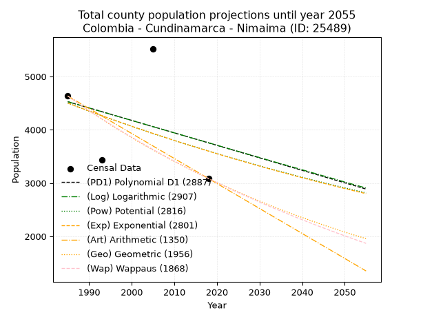
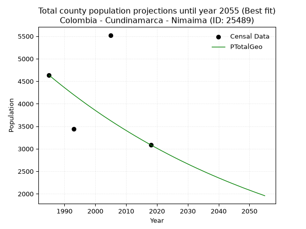
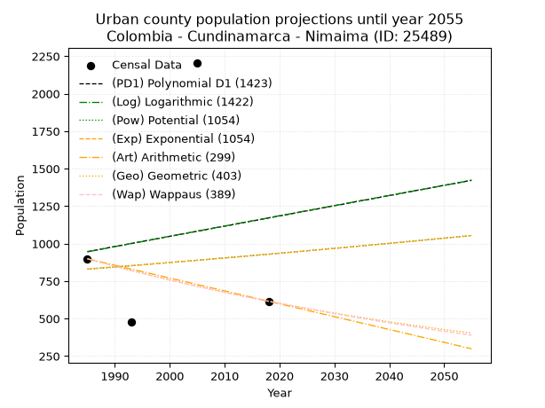
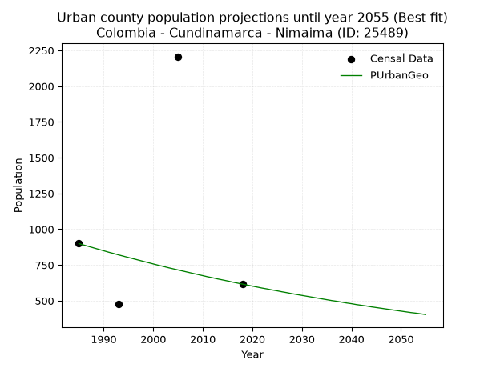
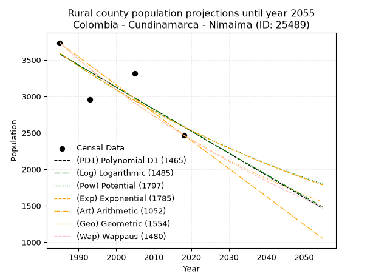
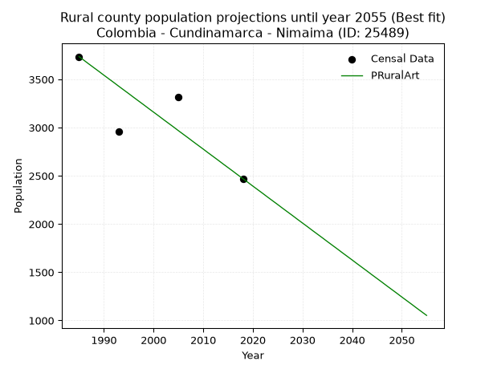

<div align="center">


</div>

# 📜 _“Population and Public Services Demand Projections (PPSD) until Year 2050 for Colombia - Cundinamarca - Nimaima (ID: 25489)”_
Keywords: `population` `public-service` `projection` `lineal` `polynomial` `logarithmic` `potential` `exponential` `arithmetic` `geometric` `wappaus` `dane` `colombia` `south-america`

PPSD are analytical estimates used by governments and planners to anticipate future changes in population size, age distribution, and the resulting community needs for utilities, healthcare, education, and infrastructure as sizing future water treatment facilities, electrical grids, and road networks based on spatial growth.

<div align="center">

</img>

</div>


> **General running parameters**: • app_version: _v20260806_. • Python version: _3.14.7_. • Pandas version: _3.0.5_. • NumPy version: _2.5.1_. • Creates, save and include plots into reports (create_plot): _False_. • Projection until year: _2050_. • Process polynomial degree 2 and up: _False_. • Process Wappaus: _True_. • Process Wappaus: _True_. • Set negative values to zero: _True_. • Set infinite values to zero: _True_. • Drop dataset notes: _True_. 
<div align="center">

Maps & GIS Layers: [:earth_americas:Google](http://maps.google.com/maps?q=5.125992156,-74.38604) [:earth_americas:OSM](https://www.openstreetmap.org/#map=18/5.125992156/-74.38604&layers=P) [:earth_americas:Bing](https://www.bing.com/maps?cp=5.125992156~-74.38604&lvl=18) [:earth_americas:Apple](https://maps.apple.com/frame?center=5.125992156%2C-74.38604&span=0.003%2C0.006) [:earth_americas:GISMobile](https://github.com/rcfdtools/R.GISMobile/blob/main/file/gis/CountyLayer_CO/Readme.md)

</div>


<div align="center">

```geojson
{
  "type": "Feature",
  "geometry": {
    "type": "Point", 
    "coordinates": [-74.38604, 5.125992156]
  }, 
  "properties": {
    "Name": "Colombia - Cundinamarca - Nimaima (ID: 25489)"
  }
}
```

</div>


## 0. Census Data (4 records)

Census data are official statistics collected by a government about the people and housing in a country. They usually include counts of total population, age, sex, race, income, education, and jobs.

📅Global census file: [Population.xlsx](../data/Population.xlsx)

| Source   |   Year |   CountryID | CountryName   |   StateID | StateName    |   CountyID | CountyName   |   PTotal |   PUrban |   PRural |
|:---------|-------:|------------:|:--------------|----------:|:-------------|-----------:|:-------------|---------:|---------:|---------:|
| DANE     |   1985 |          57 | Colombia      |        25 | Cundinamarca |      25489 | Nimaima      |     4634 |      899 |     3735 |
| DANE     |   1993 |          57 | Colombia      |        25 | Cundinamarca |      25489 | Nimaima      |     3440 |      479 |     2961 |
| DANE     |   2005 |          57 | Colombia      |        25 | Cundinamarca |      25489 | Nimaima      |     5523 |     2207 |     3316 |
| DANE     |   2018 |          57 | Colombia      |        25 | Cundinamarca |      25489 | Nimaima      |     3086 |      616 |     2470 |

> 🔥Some records could had specific notes about the registered values or the corresponding urban or rural distribution.

📅[SUI-RUPS](https://www.datos.gov.co/Hacienda-y-Cr-dito-P-blico/Registro-nico-de-Prestadores-de-Servicios-P-blicos/4qkq-csdn/about_data) - Local public utility companies: [RUPS.csv](../data/RUPS.csv)

 | SERVICIO       | ESTADO    | NOMBRE                                                                                           | NIT         | DEPARTAMENTO_DOMICILIO   | MUNICIPIO_DOMICILIO   | DIRECCION                               |   TELEFONO | EMAIL                        | TIPO_PRESTADOR                 | CLASIFICACION                 |
|:---------------|:----------|:-------------------------------------------------------------------------------------------------|:------------|:-------------------------|:----------------------|:----------------------------------------|-----------:|:-----------------------------|:-------------------------------|:------------------------------|
| ACUEDUCTO      | OPERATIVA | OFICINA DE SERVICIOS PUBLICOS DE ASEO, AGUA POTABLE Y ALCANTARILLADO DEL MUNICIPIO DE NIMAIMA    | 800094713-8 | CUNDINAMARCA             | NIMAIMA               | CALLE 3 CON CARRERA 3 PALACIO MUNICIPAL |    8433075 | nimaima@cundinamarca.gov.co  | MUNICIPIO (PRESTACIÓN DIRECTA) | MENOR O IGUAL A 2500 USUARIOS |
| ALCANTARILLADO | OPERATIVA | OFICINA DE SERVICIOS PUBLICOS DE ASEO, AGUA POTABLE Y ALCANTARILLADO DEL MUNICIPIO DE NIMAIMA    | 800094713-8 | CUNDINAMARCA             | NIMAIMA               | CALLE 3 CON CARRERA 3 PALACIO MUNICIPAL |    8433075 | nimaima@cundinamarca.gov.co  | MUNICIPIO (PRESTACIÓN DIRECTA) | MENOR O IGUAL A 2500 USUARIOS |
| ACUEDUCTO      | OPERATIVA | ASOCIACION DE USUARIOS ACUEDUCTO, ALCANTARILLADO Y OTROS SERVICIOS DE TOBIA MUNICIPIO DE NIMAIMA | 832003137-2 | CUNDINAMARCA             | NIMAIMA               | EDIFICIO INSPECCION DE POLICIA          |    8433075 | acueductodetobia@outlook.com | ORGANIZACION AUTORIZADA        | MENOR O IGUAL A 2500 USUARIOS |

## 1. Total

### 1.1. Coefficients and Parameters

* (PD1) Polynomial Deg 1: -23.44078683259594, 51058.183861900034 (lineal)
* (Log) Logarithmic: -46759.41180948982, 359589.4138703421
* (Pow) Potential: -13.535227380259325, 48.28933341474114
* (Exp) Exponential: -0.006780263950029491, 3151519188.5178905
* (Art) Arithmetic: Year diff. 2018 - 1985 = 33, Population diff. 3086 - 4634 = -1548, Annual growth = -46.90909090909091
* (Geo) Geometric: Year diff. 2018 - 1985 = 33, Population diff. 3086 - 4634 = -1548, Annual growth % = -0.01224396070677336
* (Wap) Wappaus: i = -1.2152614225153084, Condition values only valid for < 200)

<sub>
Wappaus condition values: ['-0.00', '-1.22', '-2.43', '-3.65', '-4.86', '-6.08', '-7.29', '-8.51', '-9.72', '-10.94', '-12.15', '-13.37', '-14.58', '-15.80', '-17.01', '-18.23', '-19.44', '-20.66', '-21.87', '-23.09', '-24.31', '-25.52', '-26.74', '-27.95', '-29.17', '-30.38', '-31.60', '-32.81', '-34.03', '-35.24', '-36.46', '-37.67', '-38.89', '-40.10', '-41.32', '-42.53', '-43.75', '-44.96', '-46.18', '-47.40', '-48.61', '-49.83', '-51.04', '-52.26', '-53.47', '-54.69', '-55.90', '-57.12', '-58.33', '-59.55', '-60.76', '-61.98', '-63.19', '-64.41', '-65.62', '-66.84', '-68.05', '-69.27', '-70.49', '-71.70', '-72.92', '-74.13', '-75.35', '-76.56', '-77.78', '-78.99']
</sub>


### 1.2. Projected Dataset

|   Year |   CountyID |   PTotalPD1 |   PTotalLog |   PTotalPow |   PTotalExp |   PTotalArt |   PTotalGeo |   PTotalWap |
|-------:|-----------:|------------:|------------:|------------:|------------:|------------:|------------:|------------:|
|   1985 |      25489 |        4528 |        4528 |        4502 |        4502 |        4634 |        4634 |        4634 |
|   1986 |      25489 |        4505 |        4504 |        4471 |        4472 |        4587 |        4577 |        4578 |
|   1987 |      25489 |        4481 |        4481 |        4441 |        4442 |        4540 |        4521 |        4523 |
|   1988 |      25489 |        4458 |        4457 |        4411 |        4412 |        4493 |        4466 |        4468 |
|   1989 |      25489 |        4434 |        4434 |        4381 |        4382 |        4446 |        4411 |        4414 |
|   1990 |      25489 |        4411 |        4410 |        4351 |        4352 |        4399 |        4357 |        4361 |
|   1991 |      25489 |        4388 |        4387 |        4322 |        4323 |        4353 |        4304 |        4308 |
|   1992 |      25489 |        4364 |        4363 |        4292 |        4294 |        4306 |        4251 |        4256 |
|   1993 |      25489 |        4341 |        4340 |        4263 |        4265 |        4259 |        4199 |        4204 |
|   1994 |      25489 |        4317 |        4316 |        4235 |        4236 |        4212 |        4148 |        4153 |
|   1995 |      25489 |        4294 |        4293 |        4206 |        4207 |        4165 |        4097 |        4103 |
|   1996 |      25489 |        4270 |        4269 |        4177 |        4179 |        4118 |        4047 |        4053 |
|   1997 |      25489 |        4247 |        4246 |        4149 |        4150 |        4071 |        3997 |        4004 |
|   1998 |      25489 |        4223 |        4222 |        4121 |        4122 |        4024 |        3948 |        3955 |
|   1999 |      25489 |        4200 |        4199 |        4093 |        4095 |        3977 |        3900 |        3907 |
|   2000 |      25489 |        4177 |        4176 |        4066 |        4067 |        3930 |        3852 |        3860 |
|   2001 |      25489 |        4153 |        4152 |        4038 |        4039 |        3883 |        3805 |        3813 |
|   2002 |      25489 |        4130 |        4129 |        4011 |        4012 |        3837 |        3758 |        3766 |
|   2003 |      25489 |        4106 |        4106 |        3984 |        3985 |        3790 |        3712 |        3720 |
|   2004 |      25489 |        4083 |        4082 |        3957 |        3958 |        3743 |        3667 |        3675 |
|   2005 |      25489 |        4059 |        4059 |        3931 |        3931 |        3696 |        3622 |        3630 |
|   2006 |      25489 |        4036 |        4036 |        3904 |        3905 |        3649 |        3578 |        3585 |
|   2007 |      25489 |        4013 |        4012 |        3878 |        3878 |        3602 |        3534 |        3541 |
|   2008 |      25489 |        3989 |        3989 |        3852 |        3852 |        3555 |        3491 |        3498 |
|   2009 |      25489 |        3966 |        3966 |        3826 |        3826 |        3508 |        3448 |        3454 |
|   2010 |      25489 |        3942 |        3942 |        3800 |        3800 |        3461 |        3406 |        3412 |
|   2011 |      25489 |        3919 |        3919 |        3775 |        3775 |        3414 |        3364 |        3370 |
|   2012 |      25489 |        3895 |        3896 |        3750 |        3749 |        3367 |        3323 |        3328 |
|   2013 |      25489 |        3872 |        3873 |        3724 |        3724 |        3321 |        3282 |        3286 |
|   2014 |      25489 |        3848 |        3850 |        3699 |        3699 |        3274 |        3242 |        3246 |
|   2015 |      25489 |        3825 |        3826 |        3675 |        3674 |        3227 |        3202 |        3205 |
|   2016 |      25489 |        3802 |        3803 |        3650 |        3649 |        3180 |        3163 |        3165 |
|   2017 |      25489 |        3778 |        3780 |        3626 |        3624 |        3133 |        3124 |        3125 |
|   2018 |      25489 |        3755 |        3757 |        3601 |        3600 |        3086 |        3086 |        3086 |
|   2019 |      25489 |        3731 |        3734 |        3577 |        3575 |        3039 |        3048 |        3047 |
|   2020 |      25489 |        3708 |        3710 |        3553 |        3551 |        2992 |        3011 |        3009 |
|   2021 |      25489 |        3684 |        3687 |        3530 |        3527 |        2945 |        2974 |        2971 |
|   2022 |      25489 |        3661 |        3664 |        3506 |        3503 |        2898 |        2938 |        2933 |
|   2023 |      25489 |        3637 |        3641 |        3483 |        3480 |        2851 |        2902 |        2895 |
|   2024 |      25489 |        3614 |        3618 |        3460 |        3456 |        2805 |        2866 |        2858 |
|   2025 |      25489 |        3591 |        3595 |        3437 |        3433 |        2758 |        2831 |        2822 |
|   2026 |      25489 |        3567 |        3572 |        3414 |        3410 |        2711 |        2796 |        2786 |
|   2027 |      25489 |        3544 |        3549 |        3391 |        3387 |        2664 |        2762 |        2750 |
|   2028 |      25489 |        3520 |        3526 |        3368 |        3364 |        2617 |        2728 |        2714 |
|   2029 |      25489 |        3497 |        3503 |        3346 |        3341 |        2570 |        2695 |        2679 |
|   2030 |      25489 |        3473 |        3480 |        3324 |        3318 |        2523 |        2662 |        2644 |
|   2031 |      25489 |        3450 |        3456 |        3302 |        3296 |        2476 |        2629 |        2609 |
|   2032 |      25489 |        3427 |        3433 |        3280 |        3274 |        2429 |        2597 |        2575 |
|   2033 |      25489 |        3403 |        3410 |        3258 |        3252 |        2382 |        2565 |        2541 |
|   2034 |      25489 |        3380 |        3387 |        3236 |        3230 |        2335 |        2534 |        2508 |
|   2035 |      25489 |        3356 |        3364 |        3215 |        3208 |        2289 |        2503 |        2474 |
|   2036 |      25489 |        3333 |        3342 |        3194 |        3186 |        2242 |        2472 |        2441 |
|   2037 |      25489 |        3309 |        3319 |        3172 |        3165 |        2195 |        2442 |        2409 |
|   2038 |      25489 |        3286 |        3296 |        3151 |        3143 |        2148 |        2412 |        2376 |
|   2039 |      25489 |        3262 |        3273 |        3131 |        3122 |        2101 |        2383 |        2344 |
|   2040 |      25489 |        3239 |        3250 |        3110 |        3101 |        2054 |        2353 |        2313 |
|   2041 |      25489 |        3216 |        3227 |        3089 |        3080 |        2007 |        2325 |        2281 |
|   2042 |      25489 |        3192 |        3204 |        3069 |        3059 |        1960 |        2296 |        2250 |
|   2043 |      25489 |        3169 |        3181 |        3049 |        3038 |        1913 |        2268 |        2219 |
|   2044 |      25489 |        3145 |        3158 |        3028 |        3018 |        1866 |        2240 |        2188 |
|   2045 |      25489 |        3122 |        3135 |        3008 |        2997 |        1819 |        2213 |        2158 |
|   2046 |      25489 |        3098 |        3112 |        2989 |        2977 |        1773 |        2186 |        2128 |
|   2047 |      25489 |        3075 |        3090 |        2969 |        2957 |        1726 |        2159 |        2098 |
|   2048 |      25489 |        3051 |        3067 |        2949 |        2937 |        1679 |        2132 |        2068 |
|   2049 |      25489 |        3028 |        3044 |        2930 |        2917 |        1632 |        2106 |        2039 |
|   2050 |      25489 |        3005 |        3021 |        2911 |        2898 |        1585 |        2081 |        2010 |
<div align="center">

</img>

</div>


### 1.3. Best fit with absolute and relative error (%)

Relative error puts that difference into context by dividing the absolute error by the true value, creating a unitless ratio or percentage that shows the scale of the mistake.

Absolute and relative error

|   Year | Source   |   CountryID | CountryName   |   StateID | StateName    |   CountyID_x | CountyName   |   PTotal |   PUrban |   PRural |   CountyID_y |   PTotalPD1 |   PTotalLog |   PTotalPow |   PTotalExp |   PTotalArt |   PTotalGeo |   PTotalWap |   PTotalPD1AbsError |   PTotalLogAbsError |   PTotalPowAbsError |   PTotalExpAbsError |   PTotalArtAbsError |   PTotalGeoAbsError |   PTotalWapAbsError |   PTotalPD1RelError |   PTotalLogRelError |   PTotalPowRelError |   PTotalExpRelError |   PTotalArtRelError |   PTotalGeoRelError |   PTotalWapRelError |
|-------:|:---------|------------:|:--------------|----------:|:-------------|-------------:|:-------------|---------:|---------:|---------:|-------------:|------------:|------------:|------------:|------------:|------------:|------------:|------------:|--------------------:|--------------------:|--------------------:|--------------------:|--------------------:|--------------------:|--------------------:|--------------------:|--------------------:|--------------------:|--------------------:|--------------------:|--------------------:|--------------------:|
|   1985 | DANE     |          57 | Colombia      |        25 | Cundinamarca |        25489 | Nimaima      |     4634 |      899 |     3735 |        25489 |        4528 |        4528 |        4502 |        4502 |        4634 |        4634 |        4634 |                 106 |                 106 |                 132 |                 132 |                   0 |                   0 |                   0 |             2.28744 |             2.28744 |             2.84851 |             2.84851 |              0      |              0      |              0      |
|   1993 | DANE     |          57 | Colombia      |        25 | Cundinamarca |        25489 | Nimaima      |     3440 |      479 |     2961 |        25489 |        4341 |        4340 |        4263 |        4265 |        4259 |        4199 |        4204 |                 901 |                 900 |                 823 |                 825 |                 819 |                 759 |                 764 |            26.1919  |            26.1628  |            23.9244  |            23.9826  |             23.8081 |             22.064  |             22.2093 |
|   2005 | DANE     |          57 | Colombia      |        25 | Cundinamarca |        25489 | Nimaima      |     5523 |     2207 |     3316 |        25489 |        4059 |        4059 |        3931 |        3931 |        3696 |        3622 |        3630 |                1464 |                1464 |                1592 |                1592 |                1827 |                1901 |                1893 |            26.5073  |            26.5073  |            28.8249  |            28.8249  |             33.0798 |             34.4197 |             34.2749 |
|   2018 | DANE     |          57 | Colombia      |        25 | Cundinamarca |        25489 | Nimaima      |     3086 |      616 |     2470 |        25489 |        3755 |        3757 |        3601 |        3600 |        3086 |        3086 |        3086 |                 669 |                 671 |                 515 |                 514 |                   0 |                   0 |                   0 |            21.6785  |            21.7434  |            16.6883  |            16.6559  |              0      |              0      |              0      |

Relative error mean

| Method    |   RelError | Best   |
|:----------|-----------:|:-------|
| PTotalPD1 |    19.1663 |        |
| PTotalLog |    19.1752 |        |
| PTotalPow |    18.0715 |        |
| PTotalExp |    18.078  |        |
| PTotalArt |    14.222  |        |
| PTotalGeo |    14.1209 | True   |
| PTotalWap |    14.121  |        |

💙Best method: _**PTotalGeo**_
<div align="center">

</img>

</div>


### 1.4. Fresh water supply demand in liters per capita per day (lpcd)

The fresh water supply demand typically ranges from 100 to 300 liters per capita per day (lpcd) for standard domestic and municipal planning, though absolute survival minimums set by the World Health Organization are as low as 7.5 to 20 liters per day, and total consumption in high-income nations can exceed 400 liters.

> `CZ`: Level in meters above the sea level (masl)<br> `WS`: Fresh water supply demand in liters per capita per day (lpcd or l/h/d)<br> `WSAll`: Zonal fresh water supply demand in liters per second (l/s)<br> `A`: Zonal area in square meters<br> `DP`: Population density (people/hectare or p/ha)

Reference values (RAS Colombia)

|    CZ |   WS |
|------:|-----:|
|  1000 |  120 |
|  2000 |  130 |
| 99999 |  140 |

County shapefile geometry properties and water supply values

|   CountyID |      ATotal |   CZTotal |   WSTotal |
|-----------:|------------:|----------:|----------:|
|      25489 | 5.94388e+07 |   1066.67 |       130 |

Projected values for best method: PTotalGeo

|   CountyID |   Year |   PTotalGeo |   DPTotal |   WSTotal |   WSTotalAll |
|-----------:|-------:|------------:|----------:|----------:|-------------:|
|      25489 |   1985 |        4634 |      0.78 |       130 |      6.97245 |
|      25489 |   1986 |        4577 |      0.77 |       130 |      6.88669 |
|      25489 |   1987 |        4521 |      0.76 |       130 |      6.80243 |
|      25489 |   1988 |        4466 |      0.75 |       130 |      6.71968 |
|      25489 |   1989 |        4411 |      0.74 |       130 |      6.63692 |
|      25489 |   1990 |        4357 |      0.73 |       130 |      6.55567 |
|      25489 |   1991 |        4304 |      0.72 |       130 |      6.47593 |
|      25489 |   1992 |        4251 |      0.72 |       130 |      6.39618 |
|      25489 |   1993 |        4199 |      0.71 |       130 |      6.31794 |
|      25489 |   1994 |        4148 |      0.7  |       130 |      6.2412  |
|      25489 |   1995 |        4097 |      0.69 |       130 |      6.16447 |
|      25489 |   1996 |        4047 |      0.68 |       130 |      6.08924 |
|      25489 |   1997 |        3997 |      0.67 |       130 |      6.014   |
|      25489 |   1998 |        3948 |      0.66 |       130 |      5.94028 |
|      25489 |   1999 |        3900 |      0.66 |       130 |      5.86806 |
|      25489 |   2000 |        3852 |      0.65 |       130 |      5.79583 |
|      25489 |   2001 |        3805 |      0.64 |       130 |      5.72512 |
|      25489 |   2002 |        3758 |      0.63 |       130 |      5.6544  |
|      25489 |   2003 |        3712 |      0.62 |       130 |      5.58519 |
|      25489 |   2004 |        3667 |      0.62 |       130 |      5.51748 |
|      25489 |   2005 |        3622 |      0.61 |       130 |      5.44977 |
|      25489 |   2006 |        3578 |      0.6  |       130 |      5.38356 |
|      25489 |   2007 |        3534 |      0.59 |       130 |      5.31736 |
|      25489 |   2008 |        3491 |      0.59 |       130 |      5.25266 |
|      25489 |   2009 |        3448 |      0.58 |       130 |      5.18796 |
|      25489 |   2010 |        3406 |      0.57 |       130 |      5.12477 |
|      25489 |   2011 |        3364 |      0.57 |       130 |      5.06157 |
|      25489 |   2012 |        3323 |      0.56 |       130 |      4.99988 |
|      25489 |   2013 |        3282 |      0.55 |       130 |      4.93819 |
|      25489 |   2014 |        3242 |      0.55 |       130 |      4.87801 |
|      25489 |   2015 |        3202 |      0.54 |       130 |      4.81782 |
|      25489 |   2016 |        3163 |      0.53 |       130 |      4.75914 |
|      25489 |   2017 |        3124 |      0.53 |       130 |      4.70046 |
|      25489 |   2018 |        3086 |      0.52 |       130 |      4.64329 |
|      25489 |   2019 |        3048 |      0.51 |       130 |      4.58611 |
|      25489 |   2020 |        3011 |      0.51 |       130 |      4.53044 |
|      25489 |   2021 |        2974 |      0.5  |       130 |      4.47477 |
|      25489 |   2022 |        2938 |      0.49 |       130 |      4.4206  |
|      25489 |   2023 |        2902 |      0.49 |       130 |      4.36644 |
|      25489 |   2024 |        2866 |      0.48 |       130 |      4.31227 |
|      25489 |   2025 |        2831 |      0.48 |       130 |      4.25961 |
|      25489 |   2026 |        2796 |      0.47 |       130 |      4.20694 |
|      25489 |   2027 |        2762 |      0.46 |       130 |      4.15579 |
|      25489 |   2028 |        2728 |      0.46 |       130 |      4.10463 |
|      25489 |   2029 |        2695 |      0.45 |       130 |      4.05498 |
|      25489 |   2030 |        2662 |      0.45 |       130 |      4.00532 |
|      25489 |   2031 |        2629 |      0.44 |       130 |      3.95567 |
|      25489 |   2032 |        2597 |      0.44 |       130 |      3.90752 |
|      25489 |   2033 |        2565 |      0.43 |       130 |      3.85938 |
|      25489 |   2034 |        2534 |      0.43 |       130 |      3.81273 |
|      25489 |   2035 |        2503 |      0.42 |       130 |      3.76609 |
|      25489 |   2036 |        2472 |      0.42 |       130 |      3.71944 |
|      25489 |   2037 |        2442 |      0.41 |       130 |      3.67431 |
|      25489 |   2038 |        2412 |      0.41 |       130 |      3.62917 |
|      25489 |   2039 |        2383 |      0.4  |       130 |      3.58553 |
|      25489 |   2040 |        2353 |      0.4  |       130 |      3.54039 |
|      25489 |   2041 |        2325 |      0.39 |       130 |      3.49826 |
|      25489 |   2042 |        2296 |      0.39 |       130 |      3.45463 |
|      25489 |   2043 |        2268 |      0.38 |       130 |      3.4125  |
|      25489 |   2044 |        2240 |      0.38 |       130 |      3.37037 |
|      25489 |   2045 |        2213 |      0.37 |       130 |      3.32975 |
|      25489 |   2046 |        2186 |      0.37 |       130 |      3.28912 |
|      25489 |   2047 |        2159 |      0.36 |       130 |      3.2485  |
|      25489 |   2048 |        2132 |      0.36 |       130 |      3.20787 |
|      25489 |   2049 |        2106 |      0.35 |       130 |      3.16875 |
|      25489 |   2050 |        2081 |      0.35 |       130 |      3.13113 |

## 2. Urban

### 2.1. Coefficients and Parameters

* (PD1) Polynomial Deg 1: 6.800080289041427, -12551.610598155114 (lineal)
* (Log) Logarithmic: 13761.611768298771, -103551.87132947468
* (Pow) Potential: 6.911727826990486, -19.8742681601151
* (Exp) Exponential: 0.0034047975520169384, 0.9641182720934068
* (Art) Arithmetic: Year diff. 2018 - 1985 = 33, Population diff. 616 - 899 = -283, Annual growth = -8.575757575757576
* (Geo) Geometric: Year diff. 2018 - 1985 = 33, Population diff. 616 - 899 = -283, Annual growth % = -0.011390272527534995
* (Wap) Wappaus: i = -1.132113211321132, Condition values only valid for < 200)

<sub>
Wappaus condition values: ['-0.00', '-1.13', '-2.26', '-3.40', '-4.53', '-5.66', '-6.79', '-7.92', '-9.06', '-10.19', '-11.32', '-12.45', '-13.59', '-14.72', '-15.85', '-16.98', '-18.11', '-19.25', '-20.38', '-21.51', '-22.64', '-23.77', '-24.91', '-26.04', '-27.17', '-28.30', '-29.43', '-30.57', '-31.70', '-32.83', '-33.96', '-35.10', '-36.23', '-37.36', '-38.49', '-39.62', '-40.76', '-41.89', '-43.02', '-44.15', '-45.28', '-46.42', '-47.55', '-48.68', '-49.81', '-50.95', '-52.08', '-53.21', '-54.34', '-55.47', '-56.61', '-57.74', '-58.87', '-60.00', '-61.13', '-62.27', '-63.40', '-64.53', '-65.66', '-66.79', '-67.93', '-69.06', '-70.19', '-71.32', '-72.46', '-73.59']
</sub>


### 2.2. Projected Dataset

|   Year |   CountyID |   PUrbanPD1 |   PUrbanLog |   PUrbanPow |   PUrbanExp |   PUrbanArt |   PUrbanGeo |   PUrbanWap |
|-------:|-----------:|------------:|------------:|------------:|------------:|------------:|------------:|------------:|
|   1985 |      25489 |         947 |         945 |         830 |         830 |         899 |         899 |         899 |
|   1986 |      25489 |         953 |         952 |         833 |         833 |         890 |         889 |         889 |
|   1987 |      25489 |         960 |         959 |         836 |         836 |         882 |         879 |         879 |
|   1988 |      25489 |         967 |         966 |         838 |         839 |         873 |         869 |         869 |
|   1989 |      25489 |         974 |         973 |         841 |         842 |         865 |         859 |         859 |
|   1990 |      25489 |         981 |         980 |         844 |         845 |         856 |         849 |         850 |
|   1991 |      25489 |         987 |         987 |         847 |         848 |         848 |         839 |         840 |
|   1992 |      25489 |         994 |         994 |         850 |         850 |         839 |         830 |         830 |
|   1993 |      25489 |        1001 |        1001 |         853 |         853 |         830 |         820 |         821 |
|   1994 |      25489 |        1008 |        1007 |         856 |         856 |         822 |         811 |         812 |
|   1995 |      25489 |        1015 |        1014 |         859 |         859 |         813 |         802 |         803 |
|   1996 |      25489 |        1021 |        1021 |         862 |         862 |         805 |         793 |         794 |
|   1997 |      25489 |        1028 |        1028 |         865 |         865 |         796 |         784 |         785 |
|   1998 |      25489 |        1035 |        1035 |         868 |         868 |         788 |         775 |         776 |
|   1999 |      25489 |        1042 |        1042 |         871 |         871 |         779 |         766 |         767 |
|   2000 |      25489 |        1049 |        1049 |         874 |         874 |         770 |         757 |         758 |
|   2001 |      25489 |        1055 |        1056 |         877 |         877 |         762 |         748 |         750 |
|   2002 |      25489 |        1062 |        1063 |         880 |         880 |         753 |         740 |         741 |
|   2003 |      25489 |        1069 |        1069 |         883 |         883 |         745 |         731 |         733 |
|   2004 |      25489 |        1076 |        1076 |         886 |         886 |         736 |         723 |         724 |
|   2005 |      25489 |        1083 |        1083 |         889 |         889 |         727 |         715 |         716 |
|   2006 |      25489 |        1089 |        1090 |         892 |         892 |         719 |         707 |         708 |
|   2007 |      25489 |        1096 |        1097 |         895 |         895 |         710 |         699 |         700 |
|   2008 |      25489 |        1103 |        1104 |         899 |         898 |         702 |         691 |         692 |
|   2009 |      25489 |        1110 |        1111 |         902 |         901 |         693 |         683 |         684 |
|   2010 |      25489 |        1117 |        1117 |         905 |         904 |         685 |         675 |         676 |
|   2011 |      25489 |        1123 |        1124 |         908 |         907 |         676 |         667 |         668 |
|   2012 |      25489 |        1130 |        1131 |         911 |         910 |         667 |         660 |         661 |
|   2013 |      25489 |        1137 |        1138 |         914 |         914 |         659 |         652 |         653 |
|   2014 |      25489 |        1144 |        1145 |         917 |         917 |         650 |         645 |         645 |
|   2015 |      25489 |        1151 |        1152 |         920 |         920 |         642 |         638 |         638 |
|   2016 |      25489 |        1157 |        1158 |         924 |         923 |         633 |         630 |         631 |
|   2017 |      25489 |        1164 |        1165 |         927 |         926 |         625 |         623 |         623 |
|   2018 |      25489 |        1171 |        1172 |         930 |         929 |         616 |         616 |         616 |
|   2019 |      25489 |        1178 |        1179 |         933 |         932 |         607 |         609 |         609 |
|   2020 |      25489 |        1185 |        1186 |         936 |         936 |         599 |         602 |         602 |
|   2021 |      25489 |        1191 |        1193 |         940 |         939 |         590 |         595 |         595 |
|   2022 |      25489 |        1198 |        1199 |         943 |         942 |         582 |         588 |         588 |
|   2023 |      25489 |        1205 |        1206 |         946 |         945 |         573 |         582 |         581 |
|   2024 |      25489 |        1212 |        1213 |         949 |         948 |         565 |         575 |         574 |
|   2025 |      25489 |        1219 |        1220 |         952 |         952 |         556 |         569 |         567 |
|   2026 |      25489 |        1225 |        1227 |         956 |         955 |         547 |         562 |         560 |
|   2027 |      25489 |        1232 |        1233 |         959 |         958 |         539 |         556 |         554 |
|   2028 |      25489 |        1239 |        1240 |         962 |         961 |         530 |         549 |         547 |
|   2029 |      25489 |        1246 |        1247 |         966 |         965 |         522 |         543 |         540 |
|   2030 |      25489 |        1253 |        1254 |         969 |         968 |         513 |         537 |         534 |
|   2031 |      25489 |        1259 |        1260 |         972 |         971 |         505 |         531 |         528 |
|   2032 |      25489 |        1266 |        1267 |         975 |         975 |         496 |         525 |         521 |
|   2033 |      25489 |        1273 |        1274 |         979 |         978 |         487 |         519 |         515 |
|   2034 |      25489 |        1280 |        1281 |         982 |         981 |         479 |         513 |         509 |
|   2035 |      25489 |        1287 |        1288 |         985 |         985 |         470 |         507 |         502 |
|   2036 |      25489 |        1293 |        1294 |         989 |         988 |         462 |         501 |         496 |
|   2037 |      25489 |        1300 |        1301 |         992 |         991 |         453 |         496 |         490 |
|   2038 |      25489 |        1307 |        1308 |         996 |         995 |         444 |         490 |         484 |
|   2039 |      25489 |        1314 |        1315 |         999 |         998 |         436 |         484 |         478 |
|   2040 |      25489 |        1321 |        1321 |        1002 |        1001 |         427 |         479 |         472 |
|   2041 |      25489 |        1327 |        1328 |        1006 |        1005 |         419 |         473 |         466 |
|   2042 |      25489 |        1334 |        1335 |        1009 |        1008 |         410 |         468 |         460 |
|   2043 |      25489 |        1341 |        1342 |        1013 |        1012 |         402 |         463 |         455 |
|   2044 |      25489 |        1348 |        1348 |        1016 |        1015 |         393 |         457 |         449 |
|   2045 |      25489 |        1355 |        1355 |        1019 |        1019 |         384 |         452 |         443 |
|   2046 |      25489 |        1361 |        1362 |        1023 |        1022 |         376 |         447 |         438 |
|   2047 |      25489 |        1368 |        1368 |        1026 |        1026 |         367 |         442 |         432 |
|   2048 |      25489 |        1375 |        1375 |        1030 |        1029 |         359 |         437 |         426 |
|   2049 |      25489 |        1382 |        1382 |        1033 |        1033 |         350 |         432 |         421 |
|   2050 |      25489 |        1389 |        1389 |        1037 |        1036 |         342 |         427 |         415 |
<div align="center">

</img>

</div>


### 2.3. Best fit with absolute and relative error (%)

Relative error puts that difference into context by dividing the absolute error by the true value, creating a unitless ratio or percentage that shows the scale of the mistake.

Absolute and relative error

|   Year | Source   |   CountryID | CountryName   |   StateID | StateName    |   CountyID_x | CountyName   |   PTotal |   PUrban |   PRural |   CountyID_y |   PUrbanPD1 |   PUrbanLog |   PUrbanPow |   PUrbanExp |   PUrbanArt |   PUrbanGeo |   PUrbanWap |   PUrbanPD1AbsError |   PUrbanLogAbsError |   PUrbanPowAbsError |   PUrbanExpAbsError |   PUrbanArtAbsError |   PUrbanGeoAbsError |   PUrbanWapAbsError |   PUrbanPD1RelError |   PUrbanLogRelError |   PUrbanPowRelError |   PUrbanExpRelError |   PUrbanArtRelError |   PUrbanGeoRelError |   PUrbanWapRelError |
|-------:|:---------|------------:|:--------------|----------:|:-------------|-------------:|:-------------|---------:|---------:|---------:|-------------:|------------:|------------:|------------:|------------:|------------:|------------:|------------:|--------------------:|--------------------:|--------------------:|--------------------:|--------------------:|--------------------:|--------------------:|--------------------:|--------------------:|--------------------:|--------------------:|--------------------:|--------------------:|--------------------:|
|   1985 | DANE     |          57 | Colombia      |        25 | Cundinamarca |        25489 | Nimaima      |     4634 |      899 |     3735 |        25489 |         947 |         945 |         830 |         830 |         899 |         899 |         899 |                  48 |                  46 |                  69 |                  69 |                   0 |                   0 |                   0 |             5.33927 |              5.1168 |             7.67519 |             7.67519 |              0      |              0      |              0      |
|   1993 | DANE     |          57 | Colombia      |        25 | Cundinamarca |        25489 | Nimaima      |     3440 |      479 |     2961 |        25489 |        1001 |        1001 |         853 |         853 |         830 |         820 |         821 |                 522 |                 522 |                 374 |                 374 |                 351 |                 341 |                 342 |           108.977   |            108.977  |            78.0793  |            78.0793  |             73.2777 |             71.19   |             71.3987 |
|   2005 | DANE     |          57 | Colombia      |        25 | Cundinamarca |        25489 | Nimaima      |     5523 |     2207 |     3316 |        25489 |        1083 |        1083 |         889 |         889 |         727 |         715 |         716 |                1124 |                1124 |                1318 |                1318 |                1480 |                1492 |                1491 |            50.9289  |             50.9289 |            59.7191  |            59.7191  |             67.0594 |             67.6031 |             67.5578 |
|   2018 | DANE     |          57 | Colombia      |        25 | Cundinamarca |        25489 | Nimaima      |     3086 |      616 |     2470 |        25489 |        1171 |        1172 |         930 |         929 |         616 |         616 |         616 |                 555 |                 556 |                 314 |                 313 |                   0 |                   0 |                   0 |            90.0974  |             90.2597 |            50.974   |            50.8117  |              0      |              0      |              0      |

Relative error mean

| Method    |   RelError | Best   |
|:----------|-----------:|:-------|
| PUrbanPD1 |    63.8356 |        |
| PUrbanLog |    63.8206 |        |
| PUrbanPow |    49.1119 |        |
| PUrbanExp |    49.0713 |        |
| PUrbanArt |    35.0843 |        |
| PUrbanGeo |    34.6983 | True   |
| PUrbanWap |    34.7391 |        |

💙Best method: _**PUrbanGeo**_
<div align="center">

</img>

</div>


### 2.4. Fresh water supply demand in liters per capita per day (lpcd)

The fresh water supply demand typically ranges from 100 to 300 liters per capita per day (lpcd) for standard domestic and municipal planning, though absolute survival minimums set by the World Health Organization are as low as 7.5 to 20 liters per day, and total consumption in high-income nations can exceed 400 liters.

> `CZ`: Level in meters above the sea level (masl)<br> `WS`: Fresh water supply demand in liters per capita per day (lpcd or l/h/d)<br> `WSAll`: Zonal fresh water supply demand in liters per second (l/s)<br> `A`: Zonal area in square meters<br> `DP`: Population density (people/hectare or p/ha)

Reference values (RAS Colombia)

|    CZ |   WS |
|------:|-----:|
|  1000 |  120 |
|  2000 |  130 |
| 99999 |  140 |

County shapefile geometry properties and water supply values

|   CountyID |   AUrban |   CZUrban |   WSUrban |
|-----------:|---------:|----------:|----------:|
|      25489 |   152926 |   1102.35 |       130 |

Projected values for best method: PUrbanGeo

|   CountyID |   Year |   PUrbanGeo |   DPUrban |   WSUrban |   WSUrbanAll |
|-----------:|-------:|------------:|----------:|----------:|-------------:|
|      25489 |   1985 |         899 |     58.79 |       130 |     1.35266  |
|      25489 |   1986 |         889 |     58.13 |       130 |     1.33762  |
|      25489 |   1987 |         879 |     57.48 |       130 |     1.32257  |
|      25489 |   1988 |         869 |     56.82 |       130 |     1.30752  |
|      25489 |   1989 |         859 |     56.17 |       130 |     1.29248  |
|      25489 |   1990 |         849 |     55.52 |       130 |     1.27743  |
|      25489 |   1991 |         839 |     54.86 |       130 |     1.26238  |
|      25489 |   1992 |         830 |     54.27 |       130 |     1.24884  |
|      25489 |   1993 |         820 |     53.62 |       130 |     1.2338   |
|      25489 |   1994 |         811 |     53.03 |       130 |     1.22025  |
|      25489 |   1995 |         802 |     52.44 |       130 |     1.20671  |
|      25489 |   1996 |         793 |     51.86 |       130 |     1.19317  |
|      25489 |   1997 |         784 |     51.27 |       130 |     1.17963  |
|      25489 |   1998 |         775 |     50.68 |       130 |     1.16609  |
|      25489 |   1999 |         766 |     50.09 |       130 |     1.15255  |
|      25489 |   2000 |         757 |     49.5  |       130 |     1.139    |
|      25489 |   2001 |         748 |     48.91 |       130 |     1.12546  |
|      25489 |   2002 |         740 |     48.39 |       130 |     1.11343  |
|      25489 |   2003 |         731 |     47.8  |       130 |     1.09988  |
|      25489 |   2004 |         723 |     47.28 |       130 |     1.08785  |
|      25489 |   2005 |         715 |     46.75 |       130 |     1.07581  |
|      25489 |   2006 |         707 |     46.23 |       130 |     1.06377  |
|      25489 |   2007 |         699 |     45.71 |       130 |     1.05174  |
|      25489 |   2008 |         691 |     45.19 |       130 |     1.0397   |
|      25489 |   2009 |         683 |     44.66 |       130 |     1.02766  |
|      25489 |   2010 |         675 |     44.14 |       130 |     1.01562  |
|      25489 |   2011 |         667 |     43.62 |       130 |     1.00359  |
|      25489 |   2012 |         660 |     43.16 |       130 |     0.993056 |
|      25489 |   2013 |         652 |     42.63 |       130 |     0.981019 |
|      25489 |   2014 |         645 |     42.18 |       130 |     0.970486 |
|      25489 |   2015 |         638 |     41.72 |       130 |     0.959954 |
|      25489 |   2016 |         630 |     41.2  |       130 |     0.947917 |
|      25489 |   2017 |         623 |     40.74 |       130 |     0.937384 |
|      25489 |   2018 |         616 |     40.28 |       130 |     0.926852 |
|      25489 |   2019 |         609 |     39.82 |       130 |     0.916319 |
|      25489 |   2020 |         602 |     39.37 |       130 |     0.905787 |
|      25489 |   2021 |         595 |     38.91 |       130 |     0.895255 |
|      25489 |   2022 |         588 |     38.45 |       130 |     0.884722 |
|      25489 |   2023 |         582 |     38.06 |       130 |     0.875694 |
|      25489 |   2024 |         575 |     37.6  |       130 |     0.865162 |
|      25489 |   2025 |         569 |     37.21 |       130 |     0.856134 |
|      25489 |   2026 |         562 |     36.75 |       130 |     0.845602 |
|      25489 |   2027 |         556 |     36.36 |       130 |     0.836574 |
|      25489 |   2028 |         549 |     35.9  |       130 |     0.826042 |
|      25489 |   2029 |         543 |     35.51 |       130 |     0.817014 |
|      25489 |   2030 |         537 |     35.11 |       130 |     0.807986 |
|      25489 |   2031 |         531 |     34.72 |       130 |     0.798958 |
|      25489 |   2032 |         525 |     34.33 |       130 |     0.789931 |
|      25489 |   2033 |         519 |     33.94 |       130 |     0.780903 |
|      25489 |   2034 |         513 |     33.55 |       130 |     0.771875 |
|      25489 |   2035 |         507 |     33.15 |       130 |     0.762847 |
|      25489 |   2036 |         501 |     32.76 |       130 |     0.753819 |
|      25489 |   2037 |         496 |     32.43 |       130 |     0.746296 |
|      25489 |   2038 |         490 |     32.04 |       130 |     0.737269 |
|      25489 |   2039 |         484 |     31.65 |       130 |     0.728241 |
|      25489 |   2040 |         479 |     31.32 |       130 |     0.720718 |
|      25489 |   2041 |         473 |     30.93 |       130 |     0.71169  |
|      25489 |   2042 |         468 |     30.6  |       130 |     0.704167 |
|      25489 |   2043 |         463 |     30.28 |       130 |     0.696644 |
|      25489 |   2044 |         457 |     29.88 |       130 |     0.687616 |
|      25489 |   2045 |         452 |     29.56 |       130 |     0.680093 |
|      25489 |   2046 |         447 |     29.23 |       130 |     0.672569 |
|      25489 |   2047 |         442 |     28.9  |       130 |     0.665046 |
|      25489 |   2048 |         437 |     28.58 |       130 |     0.657523 |
|      25489 |   2049 |         432 |     28.25 |       130 |     0.65     |
|      25489 |   2050 |         427 |     27.92 |       130 |     0.642477 |

## 3. Rural

### 3.1. Coefficients and Parameters

* (PD1) Polynomial Deg 1: -30.240867121637393, 63609.79446005519 (lineal)
* (Log) Logarithmic: -60521.023577788575, 463141.28519981675
* (Pow) Potential: -19.991038981474116, 69.48119586372106
* (Exp) Exponential: -0.009990761603579111, 1473025022117.3008
* (Art) Arithmetic: Year diff. 2018 - 1985 = 33, Population diff. 2470 - 3735 = -1265, Annual growth = -38.333333333333336
* (Geo) Geometric: Year diff. 2018 - 1985 = 33, Population diff. 2470 - 3735 = -1265, Annual growth % = -0.012453013486121378
* (Wap) Wappaus: i = -1.23556271823798, Condition values only valid for < 200)

<sub>
Wappaus condition values: ['-0.00', '-1.24', '-2.47', '-3.71', '-4.94', '-6.18', '-7.41', '-8.65', '-9.88', '-11.12', '-12.36', '-13.59', '-14.83', '-16.06', '-17.30', '-18.53', '-19.77', '-21.00', '-22.24', '-23.48', '-24.71', '-25.95', '-27.18', '-28.42', '-29.65', '-30.89', '-32.12', '-33.36', '-34.60', '-35.83', '-37.07', '-38.30', '-39.54', '-40.77', '-42.01', '-43.24', '-44.48', '-45.72', '-46.95', '-48.19', '-49.42', '-50.66', '-51.89', '-53.13', '-54.36', '-55.60', '-56.84', '-58.07', '-59.31', '-60.54', '-61.78', '-63.01', '-64.25', '-65.48', '-66.72', '-67.96', '-69.19', '-70.43', '-71.66', '-72.90', '-74.13', '-75.37', '-76.60', '-77.84', '-79.08', '-80.31']
</sub>


### 3.2. Projected Dataset

|   Year |   CountyID |   PRuralPD1 |   PRuralLog |   PRuralPow |   PRuralExp |   PRuralArt |   PRuralGeo |   PRuralWap |
|-------:|-----------:|------------:|------------:|------------:|------------:|------------:|------------:|------------:|
|   1985 |      25489 |        3582 |        3583 |        3594 |        3593 |        3735 |        3735 |        3735 |
|   1986 |      25489 |        3551 |        3552 |        3558 |        3557 |        3697 |        3688 |        3689 |
|   1987 |      25489 |        3521 |        3522 |        3522 |        3522 |        3658 |        3643 |        3644 |
|   1988 |      25489 |        3491 |        3491 |        3487 |        3487 |        3620 |        3597 |        3599 |
|   1989 |      25489 |        3461 |        3461 |        3452 |        3452 |        3582 |        3552 |        3555 |
|   1990 |      25489 |        3430 |        3430 |        3417 |        3418 |        3543 |        3508 |        3511 |
|   1991 |      25489 |        3400 |        3400 |        3383 |        3384 |        3505 |        3464 |        3468 |
|   1992 |      25489 |        3370 |        3369 |        3349 |        3350 |        3467 |        3421 |        3425 |
|   1993 |      25489 |        3340 |        3339 |        3316 |        3317 |        3428 |        3379 |        3383 |
|   1994 |      25489 |        3310 |        3309 |        3283 |        3284 |        3390 |        3337 |        3342 |
|   1995 |      25489 |        3279 |        3278 |        3250 |        3251 |        3352 |        3295 |        3300 |
|   1996 |      25489 |        3249 |        3248 |        3218 |        3219 |        3313 |        3254 |        3260 |
|   1997 |      25489 |        3219 |        3218 |        3186 |        3187 |        3275 |        3214 |        3219 |
|   1998 |      25489 |        3189 |        3187 |        3154 |        3155 |        3237 |        3174 |        3180 |
|   1999 |      25489 |        3158 |        3157 |        3123 |        3124 |        3198 |        3134 |        3140 |
|   2000 |      25489 |        3128 |        3127 |        3092 |        3093 |        3160 |        3095 |        3101 |
|   2001 |      25489 |        3098 |        3097 |        3061 |        3062 |        3122 |        3056 |        3063 |
|   2002 |      25489 |        3068 |        3066 |        3030 |        3032 |        3083 |        3018 |        3025 |
|   2003 |      25489 |        3037 |        3036 |        3000 |        3001 |        3045 |        2981 |        2987 |
|   2004 |      25489 |        3007 |        3006 |        2971 |        2972 |        3007 |        2944 |        2950 |
|   2005 |      25489 |        2977 |        2976 |        2941 |        2942 |        2968 |        2907 |        2914 |
|   2006 |      25489 |        2947 |        2946 |        2912 |        2913 |        2930 |        2871 |        2877 |
|   2007 |      25489 |        2916 |        2915 |        2883 |        2884 |        2892 |        2835 |        2841 |
|   2008 |      25489 |        2886 |        2885 |        2854 |        2855 |        2853 |        2800 |        2806 |
|   2009 |      25489 |        2856 |        2855 |        2826 |        2827 |        2815 |        2765 |        2770 |
|   2010 |      25489 |        2826 |        2825 |        2798 |        2799 |        2777 |        2730 |        2736 |
|   2011 |      25489 |        2795 |        2795 |        2770 |        2771 |        2738 |        2696 |        2701 |
|   2012 |      25489 |        2765 |        2765 |        2743 |        2743 |        2700 |        2663 |        2667 |
|   2013 |      25489 |        2735 |        2735 |        2716 |        2716 |        2662 |        2630 |        2633 |
|   2014 |      25489 |        2705 |        2705 |        2689 |        2689 |        2623 |        2597 |        2600 |
|   2015 |      25489 |        2674 |        2675 |        2663 |        2662 |        2585 |        2565 |        2567 |
|   2016 |      25489 |        2644 |        2645 |        2636 |        2636 |        2547 |        2533 |        2534 |
|   2017 |      25489 |        2614 |        2615 |        2610 |        2610 |        2508 |        2501 |        2502 |
|   2018 |      25489 |        2584 |        2585 |        2585 |        2584 |        2470 |        2470 |        2470 |
|   2019 |      25489 |        2553 |        2555 |        2559 |        2558 |        2432 |        2439 |        2438 |
|   2020 |      25489 |        2523 |        2525 |        2534 |        2533 |        2393 |        2409 |        2407 |
|   2021 |      25489 |        2493 |        2495 |        2509 |        2507 |        2355 |        2379 |        2376 |
|   2022 |      25489 |        2463 |        2465 |        2484 |        2482 |        2317 |        2349 |        2345 |
|   2023 |      25489 |        2433 |        2435 |        2460 |        2458 |        2278 |        2320 |        2315 |
|   2024 |      25489 |        2402 |        2405 |        2436 |        2433 |        2240 |        2291 |        2285 |
|   2025 |      25489 |        2372 |        2375 |        2412 |        2409 |        2202 |        2263 |        2255 |
|   2026 |      25489 |        2342 |        2345 |        2388 |        2385 |        2163 |        2234 |        2225 |
|   2027 |      25489 |        2312 |        2315 |        2365 |        2362 |        2125 |        2207 |        2196 |
|   2028 |      25489 |        2281 |        2285 |        2341 |        2338 |        2087 |        2179 |        2167 |
|   2029 |      25489 |        2251 |        2256 |        2318 |        2315 |        2048 |        2152 |        2138 |
|   2030 |      25489 |        2221 |        2226 |        2296 |        2292 |        2010 |        2125 |        2110 |
|   2031 |      25489 |        2191 |        2196 |        2273 |        2269 |        1972 |        2099 |        2082 |
|   2032 |      25489 |        2160 |        2166 |        2251 |        2246 |        1933 |        2073 |        2054 |
|   2033 |      25489 |        2130 |        2136 |        2229 |        2224 |        1895 |        2047 |        2027 |
|   2034 |      25489 |        2100 |        2107 |        2207 |        2202 |        1857 |        2021 |        1999 |
|   2035 |      25489 |        2070 |        2077 |        2186 |        2180 |        1818 |        1996 |        1972 |
|   2036 |      25489 |        2039 |        2047 |        2164 |        2158 |        1780 |        1971 |        1945 |
|   2037 |      25489 |        2009 |        2017 |        2143 |        2137 |        1742 |        1947 |        1919 |
|   2038 |      25489 |        1979 |        1988 |        2122 |        2116 |        1703 |        1922 |        1892 |
|   2039 |      25489 |        1949 |        1958 |        2101 |        2095 |        1665 |        1898 |        1866 |
|   2040 |      25489 |        1918 |        1928 |        2081 |        2074 |        1627 |        1875 |        1841 |
|   2041 |      25489 |        1888 |        1899 |        2061 |        2053 |        1588 |        1852 |        1815 |
|   2042 |      25489 |        1858 |        1869 |        2041 |        2033 |        1550 |        1828 |        1790 |
|   2043 |      25489 |        1828 |        1839 |        2021 |        2013 |        1512 |        1806 |        1764 |
|   2044 |      25489 |        1797 |        1810 |        2001 |        1993 |        1473 |        1783 |        1740 |
|   2045 |      25489 |        1767 |        1780 |        1982 |        1973 |        1435 |        1761 |        1715 |
|   2046 |      25489 |        1737 |        1751 |        1962 |        1953 |        1397 |        1739 |        1690 |
|   2047 |      25489 |        1707 |        1721 |        1943 |        1934 |        1358 |        1717 |        1666 |
|   2048 |      25489 |        1676 |        1692 |        1924 |        1915 |        1320 |        1696 |        1642 |
|   2049 |      25489 |        1646 |        1662 |        1906 |        1896 |        1282 |        1675 |        1618 |
|   2050 |      25489 |        1616 |        1632 |        1887 |        1877 |        1243 |        1654 |        1595 |
<div align="center">

</img>

</div>


### 3.3. Best fit with absolute and relative error (%)

Relative error puts that difference into context by dividing the absolute error by the true value, creating a unitless ratio or percentage that shows the scale of the mistake.

Absolute and relative error

|   Year | Source   |   CountryID | CountryName   |   StateID | StateName    |   CountyID_x | CountyName   |   PTotal |   PUrban |   PRural |   CountyID_y |   PRuralPD1 |   PRuralLog |   PRuralPow |   PRuralExp |   PRuralArt |   PRuralGeo |   PRuralWap |   PRuralPD1AbsError |   PRuralLogAbsError |   PRuralPowAbsError |   PRuralExpAbsError |   PRuralArtAbsError |   PRuralGeoAbsError |   PRuralWapAbsError |   PRuralPD1RelError |   PRuralLogRelError |   PRuralPowRelError |   PRuralExpRelError |   PRuralArtRelError |   PRuralGeoRelError |   PRuralWapRelError |
|-------:|:---------|------------:|:--------------|----------:|:-------------|-------------:|:-------------|---------:|---------:|---------:|-------------:|------------:|------------:|------------:|------------:|------------:|------------:|------------:|--------------------:|--------------------:|--------------------:|--------------------:|--------------------:|--------------------:|--------------------:|--------------------:|--------------------:|--------------------:|--------------------:|--------------------:|--------------------:|--------------------:|
|   1985 | DANE     |          57 | Colombia      |        25 | Cundinamarca |        25489 | Nimaima      |     4634 |      899 |     3735 |        25489 |        3582 |        3583 |        3594 |        3593 |        3735 |        3735 |        3735 |                 153 |                 152 |                 141 |                 142 |                   0 |                   0 |                   0 |             4.09639 |             4.06961 |             3.7751  |             3.80187 |              0      |              0      |              0      |
|   1993 | DANE     |          57 | Colombia      |        25 | Cundinamarca |        25489 | Nimaima      |     3440 |      479 |     2961 |        25489 |        3340 |        3339 |        3316 |        3317 |        3428 |        3379 |        3383 |                 379 |                 378 |                 355 |                 356 |                 467 |                 418 |                 422 |            12.7997  |            12.766   |            11.9892  |            12.023   |             15.7717 |             14.1169 |             14.2519 |
|   2005 | DANE     |          57 | Colombia      |        25 | Cundinamarca |        25489 | Nimaima      |     5523 |     2207 |     3316 |        25489 |        2977 |        2976 |        2941 |        2942 |        2968 |        2907 |        2914 |                 339 |                 340 |                 375 |                 374 |                 348 |                 409 |                 402 |            10.2232  |            10.2533  |            11.3088  |            11.2786  |             10.4946 |             12.3341 |             12.123  |
|   2018 | DANE     |          57 | Colombia      |        25 | Cundinamarca |        25489 | Nimaima      |     3086 |      616 |     2470 |        25489 |        2584 |        2585 |        2585 |        2584 |        2470 |        2470 |        2470 |                 114 |                 115 |                 115 |                 114 |                   0 |                   0 |                   0 |             4.61538 |             4.65587 |             4.65587 |             4.61538 |              0      |              0      |              0      |

Relative error mean

| Method    |   RelError | Best   |
|:----------|-----------:|:-------|
| PRuralPD1 |    7.93367 |        |
| PRuralLog |    7.93619 |        |
| PRuralPow |    7.93224 |        |
| PRuralExp |    7.92972 |        |
| PRuralArt |    6.56657 | True   |
| PRuralGeo |    6.61275 |        |
| PRuralWap |    6.59375 |        |

💙Best method: _**PRuralArt**_
<div align="center">

</img>

</div>


### 3.4. Fresh water supply demand in liters per capita per day (lpcd)

The fresh water supply demand typically ranges from 100 to 300 liters per capita per day (lpcd) for standard domestic and municipal planning, though absolute survival minimums set by the World Health Organization are as low as 7.5 to 20 liters per day, and total consumption in high-income nations can exceed 400 liters.

> `CZ`: Level in meters above the sea level (masl)<br> `WS`: Fresh water supply demand in liters per capita per day (lpcd or l/h/d)<br> `WSAll`: Zonal fresh water supply demand in liters per second (l/s)<br> `A`: Zonal area in square meters<br> `DP`: Population density (people/hectare or p/ha)

Reference values (RAS Colombia)

|    CZ |   WS |
|------:|-----:|
|  1000 |  120 |
|  2000 |  130 |
| 99999 |  140 |

County shapefile geometry properties and water supply values

|   CountyID |      ARural |   CZRural |   WSRural |
|-----------:|------------:|----------:|----------:|
|      25489 | 5.92859e+07 |   1066.58 |       130 |

Projected values for best method: PRuralArt

|   CountyID |   Year |   PRuralArt |   DPRural |   WSRural |   WSRuralAll |
|-----------:|-------:|------------:|----------:|----------:|-------------:|
|      25489 |   1985 |        3735 |      0.63 |       130 |      5.61979 |
|      25489 |   1986 |        3697 |      0.62 |       130 |      5.56262 |
|      25489 |   1987 |        3658 |      0.62 |       130 |      5.50394 |
|      25489 |   1988 |        3620 |      0.61 |       130 |      5.44676 |
|      25489 |   1989 |        3582 |      0.6  |       130 |      5.38958 |
|      25489 |   1990 |        3543 |      0.6  |       130 |      5.3309  |
|      25489 |   1991 |        3505 |      0.59 |       130 |      5.27373 |
|      25489 |   1992 |        3467 |      0.58 |       130 |      5.21655 |
|      25489 |   1993 |        3428 |      0.58 |       130 |      5.15787 |
|      25489 |   1994 |        3390 |      0.57 |       130 |      5.10069 |
|      25489 |   1995 |        3352 |      0.57 |       130 |      5.04352 |
|      25489 |   1996 |        3313 |      0.56 |       130 |      4.98484 |
|      25489 |   1997 |        3275 |      0.55 |       130 |      4.92766 |
|      25489 |   1998 |        3237 |      0.55 |       130 |      4.87049 |
|      25489 |   1999 |        3198 |      0.54 |       130 |      4.81181 |
|      25489 |   2000 |        3160 |      0.53 |       130 |      4.75463 |
|      25489 |   2001 |        3122 |      0.53 |       130 |      4.69745 |
|      25489 |   2002 |        3083 |      0.52 |       130 |      4.63877 |
|      25489 |   2003 |        3045 |      0.51 |       130 |      4.5816  |
|      25489 |   2004 |        3007 |      0.51 |       130 |      4.52442 |
|      25489 |   2005 |        2968 |      0.5  |       130 |      4.46574 |
|      25489 |   2006 |        2930 |      0.49 |       130 |      4.40856 |
|      25489 |   2007 |        2892 |      0.49 |       130 |      4.35139 |
|      25489 |   2008 |        2853 |      0.48 |       130 |      4.29271 |
|      25489 |   2009 |        2815 |      0.47 |       130 |      4.23553 |
|      25489 |   2010 |        2777 |      0.47 |       130 |      4.17836 |
|      25489 |   2011 |        2738 |      0.46 |       130 |      4.11968 |
|      25489 |   2012 |        2700 |      0.46 |       130 |      4.0625  |
|      25489 |   2013 |        2662 |      0.45 |       130 |      4.00532 |
|      25489 |   2014 |        2623 |      0.44 |       130 |      3.94664 |
|      25489 |   2015 |        2585 |      0.44 |       130 |      3.88947 |
|      25489 |   2016 |        2547 |      0.43 |       130 |      3.83229 |
|      25489 |   2017 |        2508 |      0.42 |       130 |      3.77361 |
|      25489 |   2018 |        2470 |      0.42 |       130 |      3.71644 |
|      25489 |   2019 |        2432 |      0.41 |       130 |      3.65926 |
|      25489 |   2020 |        2393 |      0.4  |       130 |      3.60058 |
|      25489 |   2021 |        2355 |      0.4  |       130 |      3.5434  |
|      25489 |   2022 |        2317 |      0.39 |       130 |      3.48623 |
|      25489 |   2023 |        2278 |      0.38 |       130 |      3.42755 |
|      25489 |   2024 |        2240 |      0.38 |       130 |      3.37037 |
|      25489 |   2025 |        2202 |      0.37 |       130 |      3.31319 |
|      25489 |   2026 |        2163 |      0.36 |       130 |      3.25451 |
|      25489 |   2027 |        2125 |      0.36 |       130 |      3.19734 |
|      25489 |   2028 |        2087 |      0.35 |       130 |      3.14016 |
|      25489 |   2029 |        2048 |      0.35 |       130 |      3.08148 |
|      25489 |   2030 |        2010 |      0.34 |       130 |      3.02431 |
|      25489 |   2031 |        1972 |      0.33 |       130 |      2.96713 |
|      25489 |   2032 |        1933 |      0.33 |       130 |      2.90845 |
|      25489 |   2033 |        1895 |      0.32 |       130 |      2.85127 |
|      25489 |   2034 |        1857 |      0.31 |       130 |      2.7941  |
|      25489 |   2035 |        1818 |      0.31 |       130 |      2.73542 |
|      25489 |   2036 |        1780 |      0.3  |       130 |      2.67824 |
|      25489 |   2037 |        1742 |      0.29 |       130 |      2.62106 |
|      25489 |   2038 |        1703 |      0.29 |       130 |      2.56238 |
|      25489 |   2039 |        1665 |      0.28 |       130 |      2.50521 |
|      25489 |   2040 |        1627 |      0.27 |       130 |      2.44803 |
|      25489 |   2041 |        1588 |      0.27 |       130 |      2.38935 |
|      25489 |   2042 |        1550 |      0.26 |       130 |      2.33218 |
|      25489 |   2043 |        1512 |      0.26 |       130 |      2.275   |
|      25489 |   2044 |        1473 |      0.25 |       130 |      2.21632 |
|      25489 |   2045 |        1435 |      0.24 |       130 |      2.15914 |
|      25489 |   2046 |        1397 |      0.24 |       130 |      2.10197 |
|      25489 |   2047 |        1358 |      0.23 |       130 |      2.04329 |
|      25489 |   2048 |        1320 |      0.22 |       130 |      1.98611 |
|      25489 |   2049 |        1282 |      0.22 |       130 |      1.92894 |
|      25489 |   2050 |        1243 |      0.21 |       130 |      1.87025 |

#

<div align="center"><br><sub>Share this research</sub></div><br>

<sub>**APPS & TOOLS & CONTENT DISCLAIMER**: • NO WARRANTY - This content and software is provided by <a href="https://github.com/rcfdtools" target="_blank">github.com/rcfdtools</a> "as is", without any express or implied warranty, including warranties of merchantability, fitness for a particular purpose, or non-infringement. There is no guarantee that the software will be error-free or operate without interruption. • LIMITATION OF LIABILITY - Neither the authors nor copyright holders will be liable for claims or damages arising from the software or its use. You are responsible for determining if the software is appropriate for your use and assume all associated risks, including errors, legal compliance, and data loss. • NO PROFESSIONAL ADVICE - The software provides general information and does not offer professional advice. It should not replace consultation with professional advisors. [Clauses and global license for rcfdtools use.](https://github.com/rcfdtools/rcfdtools/blob/main/LICENSE.md)</sub>

| [:house: Home](Readme.md)  | [:beginner: Help / Collab](https://github.com/rcfdtools/R.HydroTools/discussions/31) |
|----------------------------|-------------------------------------------------------------------------------------------|