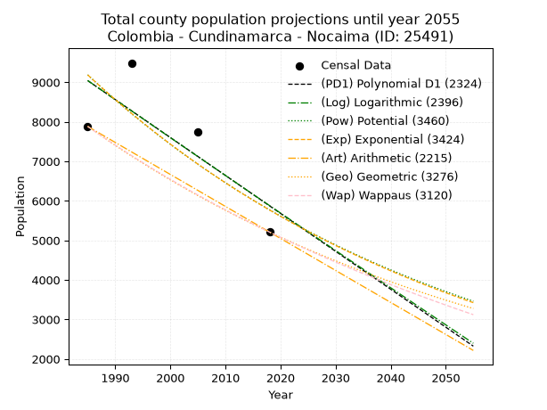
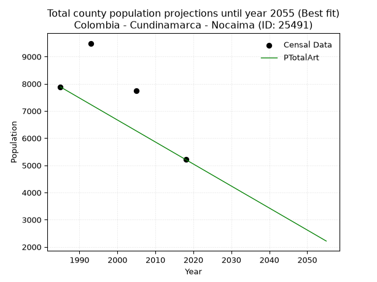
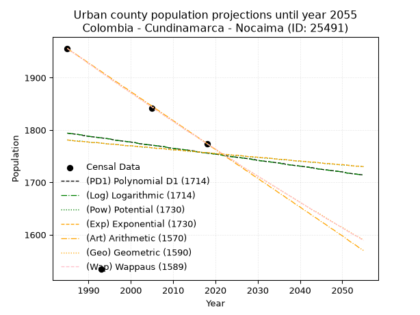
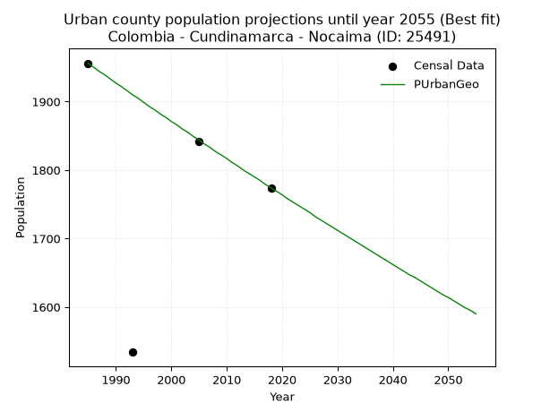
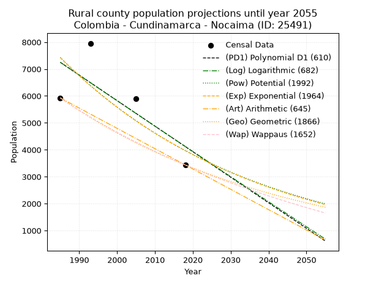
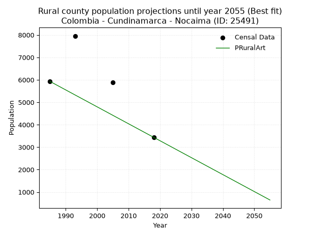

<div align="center">


</div>

# _“Population and Public Services Demand Projections (PPSD) until Year 2050 for Colombia - Cundinamarca - Nocaima (ID: 25491)”_
Keywords: `population` `public-service` `projection` `lineal` `polynomial` `logarithmic` `potential` `exponential` `arithmetic` `geometric` `wappaus` `dane` `colombia` `south-america`

PPSD are analytical estimates used by governments and planners to anticipate future changes in population size, age distribution, and the resulting community needs for utilities, healthcare, education, and infrastructure as sizing future water treatment facilities, electrical grids, and road networks based on spatial growth.

> **General running parameters**: • app_version: _v20260806_. • Python version: _3.14.7_. • Pandas version: _3.0.5_. • NumPy version: _2.5.1_. • Creates, save and include plots into reports (create_plot): _False_. • Projection until year: _2050_. • Process polynomial degree 2 and up: _False_. • Process Wappaus: _True_. • Process Wappaus: _True_. • Set negative values to zero: _True_. • Set infinite values to zero: _True_. • Drop dataset notes: _True_. 
<div align="center">

Dynamic map: [:earth_americas:Google](http://maps.google.com/maps?q=5.06946593,-74.3790925) [:earth_americas:OSM](https://www.openstreetmap.org/#map=18/5.06946593/-74.3790925&layers=P) [:earth_americas:Bing](https://www.bing.com/maps?cp=5.06946593~-74.3790925&lvl=18) [:earth_americas:Apple](https://maps.apple.com/frame?center=5.06946593%2C-74.3790925&span=0.003%2C0.006)

</div>


<div align="center">

```geojson
{
  "type": "Feature",
  "geometry": {
    "type": "Point", 
    "coordinates": [-74.3790925, 5.06946593]
  }, 
  "properties": {
    "Name": "Colombia - Cundinamarca - Nocaima (ID: 25491)"
  }
}
```

</div>


## 0. Census Data (4 records)

Census data are official statistics collected by a government about the people and housing in a country. They usually include counts of total population, age, sex, race, income, education, and jobs.

📅Global census file: [Population.xlsx](../data/Population.xlsx)

| Source   |   Year |   CountryID | CountryName   |   StateID | StateName    |   CountyID | CountyName   |   PTotal |   PUrban |   PRural |
|:---------|-------:|------------:|:--------------|----------:|:-------------|-----------:|:-------------|---------:|---------:|---------:|
| DANE     |   1985 |          57 | Colombia      |        25 | Cundinamarca |      25491 | Nocaima      |     7883 |     1956 |     5927 |
| DANE     |   1993 |          57 | Colombia      |        25 | Cundinamarca |      25491 | Nocaima      |     9489 |     1534 |     7955 |
| DANE     |   2005 |          57 | Colombia      |        25 | Cundinamarca |      25491 | Nocaima      |     7734 |     1842 |     5892 |
| DANE     |   2018 |          57 | Colombia      |        25 | Cundinamarca |      25491 | Nocaima      |     5211 |     1774 |     3437 |

> 🔥Some records has specific notes about the registered values or the corresponding urban or rural distribution.

## 1. Total

### 1.1. Coefficients and Parameters

* (PD1) Polynomial Deg 1: -95.99237254114647, 199587.99317542822 (lineal)
* (Log) Logarithmic: -191817.47413076807, 1465585.407996737
* (Pow) Potential: -28.181643171435326, 96.89955062833353
* (Exp) Exponential: -0.014102525516724525, 1.3201962396513156e+16
* (Art) Arithmetic: Year diff. 2018 - 1985 = 33, Population diff. 5211 - 7883 = -2672, Annual growth = -80.96969696969697
* (Geo) Geometric: Year diff. 2018 - 1985 = 33, Population diff. 5211 - 7883 = -2672, Annual growth % = -0.012465196096017928
* (Wap) Wappaus: i = -1.2367450277943635, Condition values only valid for < 200)

<sub>
Wappaus condition values: ['-0.00', '-1.24', '-2.47', '-3.71', '-4.95', '-6.18', '-7.42', '-8.66', '-9.89', '-11.13', '-12.37', '-13.60', '-14.84', '-16.08', '-17.31', '-18.55', '-19.79', '-21.02', '-22.26', '-23.50', '-24.73', '-25.97', '-27.21', '-28.45', '-29.68', '-30.92', '-32.16', '-33.39', '-34.63', '-35.87', '-37.10', '-38.34', '-39.58', '-40.81', '-42.05', '-43.29', '-44.52', '-45.76', '-47.00', '-48.23', '-49.47', '-50.71', '-51.94', '-53.18', '-54.42', '-55.65', '-56.89', '-58.13', '-59.36', '-60.60', '-61.84', '-63.07', '-64.31', '-65.55', '-66.78', '-68.02', '-69.26', '-70.49', '-71.73', '-72.97', '-74.20', '-75.44', '-76.68', '-77.91', '-79.15', '-80.39']
</sub>


### 1.2. Projected Dataset

|   Year |   CountyID |   PTotalPD1 |   PTotalLog |   PTotalPow |   PTotalExp |   PTotalArt |   PTotalGeo |   PTotalWap |
|-------:|-----------:|------------:|------------:|------------:|------------:|------------:|------------:|------------:|
|   1985 |      25491 |        9043 |        9044 |        9188 |        9188 |        7883 |        7883 |        7883 |
|   1986 |      25491 |        8947 |        8947 |        9059 |        9059 |        7802 |        7785 |        7786 |
|   1987 |      25491 |        8851 |        8850 |        8931 |        8932 |        7721 |        7688 |        7690 |
|   1988 |      25491 |        8755 |        8754 |        8806 |        8807 |        7640 |        7592 |        7596 |
|   1989 |      25491 |        8659 |        8657 |        8682 |        8684 |        7559 |        7497 |        7502 |
|   1990 |      25491 |        8563 |        8561 |        8560 |        8562 |        7478 |        7404 |        7410 |
|   1991 |      25491 |        8467 |        8465 |        8439 |        8442 |        7397 |        7311 |        7319 |
|   1992 |      25491 |        8371 |        8368 |        8321 |        8324 |        7316 |        7220 |        7229 |
|   1993 |      25491 |        8275 |        8272 |        8204 |        8208 |        7235 |        7130 |        7140 |
|   1994 |      25491 |        8179 |        8176 |        8089 |        8093 |        7154 |        7041 |        7052 |
|   1995 |      25491 |        8083 |        8080 |        7975 |        7979 |        7073 |        6954 |        6965 |
|   1996 |      25491 |        7987 |        7984 |        7863 |        7868 |        6992 |        6867 |        6879 |
|   1997 |      25491 |        7891 |        7887 |        7753 |        7757 |        6911 |        6781 |        6794 |
|   1998 |      25491 |        7795 |        7791 |        7644 |        7649 |        6830 |        6697 |        6710 |
|   1999 |      25491 |        7699 |        7695 |        7537 |        7542 |        6749 |        6613 |        6627 |
|   2000 |      25491 |        7603 |        7599 |        7432 |        7436 |        6668 |        6531 |        6545 |
|   2001 |      25491 |        7507 |        7504 |        7328 |        7332 |        6587 |        6450 |        6464 |
|   2002 |      25491 |        7411 |        7408 |        7226 |        7229 |        6507 |        6369 |        6383 |
|   2003 |      25491 |        7315 |        7312 |        7125 |        7128 |        6426 |        6290 |        6304 |
|   2004 |      25491 |        7219 |        7216 |        7025 |        7028 |        6345 |        6211 |        6225 |
|   2005 |      25491 |        7123 |        7121 |        6927 |        6930 |        6264 |        6134 |        6148 |
|   2006 |      25491 |        7027 |        7025 |        6830 |        6833 |        6183 |        6057 |        6071 |
|   2007 |      25491 |        6931 |        6929 |        6735 |        6737 |        6102 |        5982 |        5995 |
|   2008 |      25491 |        6835 |        6834 |        6641 |        6643 |        6021 |        5907 |        5920 |
|   2009 |      25491 |        6739 |        6738 |        6549 |        6550 |        5940 |        5834 |        5846 |
|   2010 |      25491 |        6643 |        6643 |        6457 |        6458 |        5859 |        5761 |        5772 |
|   2011 |      25491 |        6547 |        6547 |        6368 |        6368 |        5778 |        5689 |        5699 |
|   2012 |      25491 |        6451 |        6452 |        6279 |        6278 |        5697 |        5618 |        5627 |
|   2013 |      25491 |        6355 |        6357 |        6192 |        6190 |        5616 |        5548 |        5556 |
|   2014 |      25491 |        6259 |        6261 |        6106 |        6104 |        5535 |        5479 |        5486 |
|   2015 |      25491 |        6163 |        6166 |        6021 |        6018 |        5454 |        5411 |        5416 |
|   2016 |      25491 |        6067 |        6071 |        5937 |        5934 |        5373 |        5343 |        5347 |
|   2017 |      25491 |        5971 |        5976 |        5855 |        5851 |        5292 |        5277 |        5279 |
|   2018 |      25491 |        5875 |        5881 |        5774 |        5769 |        5211 |        5211 |        5211 |
|   2019 |      25491 |        5779 |        5786 |        5693 |        5688 |        5130 |        5146 |        5144 |
|   2020 |      25491 |        5683 |        5691 |        5615 |        5609 |        5049 |        5082 |        5078 |
|   2021 |      25491 |        5587 |        5596 |        5537 |        5530 |        4968 |        5019 |        5012 |
|   2022 |      25491 |        5491 |        5501 |        5460 |        5453 |        4887 |        4956 |        4947 |
|   2023 |      25491 |        5395 |        5406 |        5385 |        5376 |        4806 |        4894 |        4883 |
|   2024 |      25491 |        5299 |        5311 |        5310 |        5301 |        4725 |        4833 |        4820 |
|   2025 |      25491 |        5203 |        5217 |        5237 |        5227 |        4644 |        4773 |        4757 |
|   2026 |      25491 |        5107 |        5122 |        5164 |        5153 |        4563 |        4713 |        4694 |
|   2027 |      25491 |        5011 |        5027 |        5093 |        5081 |        4482 |        4655 |        4633 |
|   2028 |      25491 |        4915 |        4933 |        5023 |        5010 |        4401 |        4597 |        4571 |
|   2029 |      25491 |        4819 |        4838 |        4953 |        4940 |        4320 |        4539 |        4511 |
|   2030 |      25491 |        4723 |        4744 |        4885 |        4871 |        4239 |        4483 |        4451 |
|   2031 |      25491 |        4627 |        4649 |        4818 |        4803 |        4158 |        4427 |        4392 |
|   2032 |      25491 |        4531 |        4555 |        4751 |        4735 |        4077 |        4372 |        4333 |
|   2033 |      25491 |        4435 |        4460 |        4686 |        4669 |        3996 |        4317 |        4274 |
|   2034 |      25491 |        4340 |        4366 |        4622 |        4604 |        3915 |        4263 |        4217 |
|   2035 |      25491 |        4244 |        4272 |        4558 |        4539 |        3835 |        4210 |        4160 |
|   2036 |      25491 |        4148 |        4177 |        4495 |        4476 |        3754 |        4158 |        4103 |
|   2037 |      25491 |        4052 |        4083 |        4433 |        4413 |        3673 |        4106 |        4047 |
|   2038 |      25491 |        3956 |        3989 |        4373 |        4351 |        3592 |        4055 |        3991 |
|   2039 |      25491 |        3860 |        3895 |        4313 |        4290 |        3511 |        4004 |        3936 |
|   2040 |      25491 |        3764 |        3801 |        4253 |        4230 |        3430 |        3954 |        3882 |
|   2041 |      25491 |        3668 |        3707 |        4195 |        4171 |        3349 |        3905 |        3828 |
|   2042 |      25491 |        3572 |        3613 |        4138 |        4112 |        3268 |        3856 |        3774 |
|   2043 |      25491 |        3476 |        3519 |        4081 |        4055 |        3187 |        3808 |        3721 |
|   2044 |      25491 |        3380 |        3425 |        4025 |        3998 |        3106 |        3761 |        3669 |
|   2045 |      25491 |        3284 |        3331 |        3970 |        3942 |        3025 |        3714 |        3616 |
|   2046 |      25491 |        3188 |        3238 |        3916 |        3887 |        2944 |        3668 |        3565 |
|   2047 |      25491 |        3092 |        3144 |        3862 |        3832 |        2863 |        3622 |        3514 |
|   2048 |      25491 |        2996 |        3050 |        3809 |        3779 |        2782 |        3577 |        3463 |
|   2049 |      25491 |        2900 |        2957 |        3757 |        3726 |        2701 |        3532 |        3413 |
|   2050 |      25491 |        2804 |        2863 |        3706 |        3674 |        2620 |        3488 |        3363 |
<div align="center">

</img>

</div>


### 1.3. Best fit with absolute error and relative error (%)

Relative error puts that difference into context by dividing the absolute error by the true value, creating a unitless ratio or percentage that shows the scale of the mistake.

Absolute and relative error

|   Year | Source   |   CountryID | CountryName   |   StateID | StateName    |   CountyID_x | CountyName   |   PTotal |   PUrban |   PRural |   CountyID_y |   PTotalPD1 |   PTotalLog |   PTotalPow |   PTotalExp |   PTotalArt |   PTotalGeo |   PTotalWap |   PTotalPD1AbsError |   PTotalLogAbsError |   PTotalPowAbsError |   PTotalExpAbsError |   PTotalArtAbsError |   PTotalGeoAbsError |   PTotalWapAbsError |   PTotalPD1RelError |   PTotalLogRelError |   PTotalPowRelError |   PTotalExpRelError |   PTotalArtRelError |   PTotalGeoRelError |   PTotalWapRelError |
|-------:|:---------|------------:|:--------------|----------:|:-------------|-------------:|:-------------|---------:|---------:|---------:|-------------:|------------:|------------:|------------:|------------:|------------:|------------:|------------:|--------------------:|--------------------:|--------------------:|--------------------:|--------------------:|--------------------:|--------------------:|--------------------:|--------------------:|--------------------:|--------------------:|--------------------:|--------------------:|--------------------:|
|   1985 | DANE     |          57 | Colombia      |        25 | Cundinamarca |        25491 | Nocaima      |     7883 |     1956 |     5927 |        25491 |        9043 |        9044 |        9188 |        9188 |        7883 |        7883 |        7883 |                1160 |                1161 |                1305 |                1305 |                   0 |                   0 |                   0 |            14.7152  |            14.7279  |             16.5546 |             16.5546 |              0      |              0      |              0      |
|   1993 | DANE     |          57 | Colombia      |        25 | Cundinamarca |        25491 | Nocaima      |     9489 |     1534 |     7955 |        25491 |        8275 |        8272 |        8204 |        8208 |        7235 |        7130 |        7140 |                1214 |                1217 |                1285 |                1281 |                2254 |                2359 |                2349 |            12.7938  |            12.8254  |             13.542  |             13.4998 |             23.7538 |             24.8604 |             24.755  |
|   2005 | DANE     |          57 | Colombia      |        25 | Cundinamarca |        25491 | Nocaima      |     7734 |     1842 |     5892 |        25491 |        7123 |        7121 |        6927 |        6930 |        6264 |        6134 |        6148 |                 611 |                 613 |                 807 |                 804 |                1470 |                1600 |                1586 |             7.90018 |             7.92604 |             10.4344 |             10.3957 |             19.007  |             20.6879 |             20.5069 |
|   2018 | DANE     |          57 | Colombia      |        25 | Cundinamarca |        25491 | Nocaima      |     5211 |     1774 |     3437 |        25491 |        5875 |        5881 |        5774 |        5769 |        5211 |        5211 |        5211 |                 664 |                 670 |                 563 |                 558 |                   0 |                   0 |                   0 |            12.7423  |            12.8574  |             10.8041 |             10.7081 |              0      |              0      |              0      |

Relative error mean

| Method    |   RelError | Best   |
|:----------|-----------:|:-------|
| PTotalPD1 |    12.0379 |        |
| PTotalLog |    12.0842 |        |
| PTotalPow |    12.8338 |        |
| PTotalExp |    12.7896 |        |
| PTotalArt |    10.6902 | True   |
| PTotalGeo |    11.3871 |        |
| PTotalWap |    11.3155 |        |

💙Best method: _**PTotalArt**_
<div align="center">

</img>

</div>


### 1.4. Fresh water supply demand in liters per capita per day (lpcd)

The fresh water supply demand typically ranges from 100 to 300 liters per capita per day (lpcd) for standard domestic and municipal planning, though absolute survival minimums set by the World Health Organization are as low as 7.5 to 20 liters per day, and total consumption in high-income nations can exceed 400 liters.

> `CZ`: Level in meters above the sea level (masl).<br> `WS`: Fresh water supply demand in liters per capita per day (lpcd or l/h/d).<br> `WSAll`: Zonal fresh water supply demand in liters per second (l/s).<br> `A`: Zonal area in square meters.

Reference values (RAS Colombia)

|    CZ |   WS |
|------:|-----:|
|  1000 |  120 |
|  2000 |  130 |
| 99999 |  140 |

County shapefile geometry properties and water supply values

|   CountyID |      ATotal |   CZTotal |   WSTotal |
|-----------:|------------:|----------:|----------:|
|      25491 | 6.88664e+07 |   1149.73 |       130 |

Projected values for best method: PTotalArt

|   CountyID |   Year |   PTotalArt |   WSTotal |   WSTotalAll |
|-----------:|-------:|------------:|----------:|-------------:|
|      25491 |   1985 |        7883 |       130 |     11.861   |
|      25491 |   1986 |        7802 |       130 |     11.7391  |
|      25491 |   1987 |        7721 |       130 |     11.6172  |
|      25491 |   1988 |        7640 |       130 |     11.4954  |
|      25491 |   1989 |        7559 |       130 |     11.3735  |
|      25491 |   1990 |        7478 |       130 |     11.2516  |
|      25491 |   1991 |        7397 |       130 |     11.1297  |
|      25491 |   1992 |        7316 |       130 |     11.0079  |
|      25491 |   1993 |        7235 |       130 |     10.886   |
|      25491 |   1994 |        7154 |       130 |     10.7641  |
|      25491 |   1995 |        7073 |       130 |     10.6422  |
|      25491 |   1996 |        6992 |       130 |     10.5204  |
|      25491 |   1997 |        6911 |       130 |     10.3985  |
|      25491 |   1998 |        6830 |       130 |     10.2766  |
|      25491 |   1999 |        6749 |       130 |     10.1547  |
|      25491 |   2000 |        6668 |       130 |     10.0329  |
|      25491 |   2001 |        6587 |       130 |      9.911   |
|      25491 |   2002 |        6507 |       130 |      9.79063 |
|      25491 |   2003 |        6426 |       130 |      9.66875 |
|      25491 |   2004 |        6345 |       130 |      9.54688 |
|      25491 |   2005 |        6264 |       130 |      9.425   |
|      25491 |   2006 |        6183 |       130 |      9.30312 |
|      25491 |   2007 |        6102 |       130 |      9.18125 |
|      25491 |   2008 |        6021 |       130 |      9.05937 |
|      25491 |   2009 |        5940 |       130 |      8.9375  |
|      25491 |   2010 |        5859 |       130 |      8.81563 |
|      25491 |   2011 |        5778 |       130 |      8.69375 |
|      25491 |   2012 |        5697 |       130 |      8.57188 |
|      25491 |   2013 |        5616 |       130 |      8.45    |
|      25491 |   2014 |        5535 |       130 |      8.32812 |
|      25491 |   2015 |        5454 |       130 |      8.20625 |
|      25491 |   2016 |        5373 |       130 |      8.08437 |
|      25491 |   2017 |        5292 |       130 |      7.9625  |
|      25491 |   2018 |        5211 |       130 |      7.84063 |
|      25491 |   2019 |        5130 |       130 |      7.71875 |
|      25491 |   2020 |        5049 |       130 |      7.59687 |
|      25491 |   2021 |        4968 |       130 |      7.475   |
|      25491 |   2022 |        4887 |       130 |      7.35313 |
|      25491 |   2023 |        4806 |       130 |      7.23125 |
|      25491 |   2024 |        4725 |       130 |      7.10938 |
|      25491 |   2025 |        4644 |       130 |      6.9875  |
|      25491 |   2026 |        4563 |       130 |      6.86562 |
|      25491 |   2027 |        4482 |       130 |      6.74375 |
|      25491 |   2028 |        4401 |       130 |      6.62188 |
|      25491 |   2029 |        4320 |       130 |      6.5     |
|      25491 |   2030 |        4239 |       130 |      6.37812 |
|      25491 |   2031 |        4158 |       130 |      6.25625 |
|      25491 |   2032 |        4077 |       130 |      6.13438 |
|      25491 |   2033 |        3996 |       130 |      6.0125  |
|      25491 |   2034 |        3915 |       130 |      5.89062 |
|      25491 |   2035 |        3835 |       130 |      5.77025 |
|      25491 |   2036 |        3754 |       130 |      5.64838 |
|      25491 |   2037 |        3673 |       130 |      5.5265  |
|      25491 |   2038 |        3592 |       130 |      5.40463 |
|      25491 |   2039 |        3511 |       130 |      5.28275 |
|      25491 |   2040 |        3430 |       130 |      5.16088 |
|      25491 |   2041 |        3349 |       130 |      5.039   |
|      25491 |   2042 |        3268 |       130 |      4.91713 |
|      25491 |   2043 |        3187 |       130 |      4.79525 |
|      25491 |   2044 |        3106 |       130 |      4.67338 |
|      25491 |   2045 |        3025 |       130 |      4.5515  |
|      25491 |   2046 |        2944 |       130 |      4.42963 |
|      25491 |   2047 |        2863 |       130 |      4.30775 |
|      25491 |   2048 |        2782 |       130 |      4.18588 |
|      25491 |   2049 |        2701 |       130 |      4.064   |
|      25491 |   2050 |        2620 |       130 |      3.94213 |

## 2. Urban

### 2.1. Coefficients and Parameters

* (PD1) Polynomial Deg 1: -1.1441188277799879, 4065.0236852669213 (lineal)
* (Log) Logarithmic: -2315.6922210764906, 19378.095129195255
* (Pow) Potential: -0.8403253620142646, 6.021837110756799
* (Exp) Exponential: -0.0004124739778976841, 4038.076030072557
* (Art) Arithmetic: Year diff. 2018 - 1985 = 33, Population diff. 1774 - 1956 = -182, Annual growth = -5.515151515151516
* (Geo) Geometric: Year diff. 2018 - 1985 = 33, Population diff. 1774 - 1956 = -182, Annual growth % = -0.002955160882193164
* (Wap) Wappaus: i = -0.2957185799008855, Condition values only valid for < 200)

<sub>
Wappaus condition values: ['-0.00', '-0.30', '-0.59', '-0.89', '-1.18', '-1.48', '-1.77', '-2.07', '-2.37', '-2.66', '-2.96', '-3.25', '-3.55', '-3.84', '-4.14', '-4.44', '-4.73', '-5.03', '-5.32', '-5.62', '-5.91', '-6.21', '-6.51', '-6.80', '-7.10', '-7.39', '-7.69', '-7.98', '-8.28', '-8.58', '-8.87', '-9.17', '-9.46', '-9.76', '-10.05', '-10.35', '-10.65', '-10.94', '-11.24', '-11.53', '-11.83', '-12.12', '-12.42', '-12.72', '-13.01', '-13.31', '-13.60', '-13.90', '-14.19', '-14.49', '-14.79', '-15.08', '-15.38', '-15.67', '-15.97', '-16.26', '-16.56', '-16.86', '-17.15', '-17.45', '-17.74', '-18.04', '-18.33', '-18.63', '-18.93', '-19.22']
</sub>


### 2.2. Projected Dataset

|   Year |   CountyID |   PUrbanPD1 |   PUrbanLog |   PUrbanPow |   PUrbanExp |   PUrbanArt |   PUrbanGeo |   PUrbanWap |
|-------:|-----------:|------------:|------------:|------------:|------------:|------------:|------------:|------------:|
|   1985 |      25491 |        1794 |        1794 |        1781 |        1781 |        1956 |        1956 |        1956 |
|   1986 |      25491 |        1793 |        1793 |        1780 |        1780 |        1950 |        1950 |        1950 |
|   1987 |      25491 |        1792 |        1792 |        1779 |        1779 |        1945 |        1944 |        1944 |
|   1988 |      25491 |        1791 |        1791 |        1779 |        1778 |        1939 |        1939 |        1939 |
|   1989 |      25491 |        1789 |        1790 |        1778 |        1778 |        1934 |        1933 |        1933 |
|   1990 |      25491 |        1788 |        1788 |        1777 |        1777 |        1928 |        1927 |        1927 |
|   1991 |      25491 |        1787 |        1787 |        1776 |        1776 |        1923 |        1922 |        1922 |
|   1992 |      25491 |        1786 |        1786 |        1776 |        1776 |        1917 |        1916 |        1916 |
|   1993 |      25491 |        1785 |        1785 |        1775 |        1775 |        1912 |        1910 |        1910 |
|   1994 |      25491 |        1784 |        1784 |        1774 |        1774 |        1906 |        1905 |        1905 |
|   1995 |      25491 |        1783 |        1783 |        1773 |        1773 |        1901 |        1899 |        1899 |
|   1996 |      25491 |        1781 |        1781 |        1773 |        1773 |        1895 |        1893 |        1893 |
|   1997 |      25491 |        1780 |        1780 |        1772 |        1772 |        1890 |        1888 |        1888 |
|   1998 |      25491 |        1779 |        1779 |        1771 |        1771 |        1884 |        1882 |        1882 |
|   1999 |      25491 |        1778 |        1778 |        1770 |        1770 |        1879 |        1877 |        1877 |
|   2000 |      25491 |        1777 |        1777 |        1770 |        1770 |        1873 |        1871 |        1871 |
|   2001 |      25491 |        1776 |        1776 |        1769 |        1769 |        1868 |        1866 |        1866 |
|   2002 |      25491 |        1774 |        1774 |        1768 |        1768 |        1862 |        1860 |        1860 |
|   2003 |      25491 |        1773 |        1773 |        1767 |        1768 |        1857 |        1855 |        1855 |
|   2004 |      25491 |        1772 |        1772 |        1767 |        1767 |        1851 |        1849 |        1849 |
|   2005 |      25491 |        1771 |        1771 |        1766 |        1766 |        1846 |        1844 |        1844 |
|   2006 |      25491 |        1770 |        1770 |        1765 |        1765 |        1840 |        1838 |        1838 |
|   2007 |      25491 |        1769 |        1769 |        1765 |        1765 |        1835 |        1833 |        1833 |
|   2008 |      25491 |        1768 |        1768 |        1764 |        1764 |        1829 |        1827 |        1827 |
|   2009 |      25491 |        1766 |        1766 |        1763 |        1763 |        1824 |        1822 |        1822 |
|   2010 |      25491 |        1765 |        1765 |        1762 |        1762 |        1818 |        1817 |        1817 |
|   2011 |      25491 |        1764 |        1764 |        1762 |        1762 |        1813 |        1811 |        1811 |
|   2012 |      25491 |        1763 |        1763 |        1761 |        1761 |        1807 |        1806 |        1806 |
|   2013 |      25491 |        1762 |        1762 |        1760 |        1760 |        1802 |        1800 |        1800 |
|   2014 |      25491 |        1761 |        1761 |        1759 |        1760 |        1796 |        1795 |        1795 |
|   2015 |      25491 |        1760 |        1759 |        1759 |        1759 |        1791 |        1790 |        1790 |
|   2016 |      25491 |        1758 |        1758 |        1758 |        1758 |        1785 |        1785 |        1785 |
|   2017 |      25491 |        1757 |        1757 |        1757 |        1757 |        1780 |        1779 |        1779 |
|   2018 |      25491 |        1756 |        1756 |        1756 |        1757 |        1774 |        1774 |        1774 |
|   2019 |      25491 |        1755 |        1755 |        1756 |        1756 |        1768 |        1769 |        1769 |
|   2020 |      25491 |        1754 |        1754 |        1755 |        1755 |        1763 |        1764 |        1764 |
|   2021 |      25491 |        1753 |        1753 |        1754 |        1754 |        1757 |        1758 |        1758 |
|   2022 |      25491 |        1752 |        1751 |        1753 |        1754 |        1752 |        1753 |        1753 |
|   2023 |      25491 |        1750 |        1750 |        1753 |        1753 |        1746 |        1748 |        1748 |
|   2024 |      25491 |        1749 |        1749 |        1752 |        1752 |        1741 |        1743 |        1743 |
|   2025 |      25491 |        1748 |        1748 |        1751 |        1752 |        1735 |        1738 |        1738 |
|   2026 |      25491 |        1747 |        1747 |        1751 |        1751 |        1730 |        1732 |        1732 |
|   2027 |      25491 |        1746 |        1746 |        1750 |        1750 |        1724 |        1727 |        1727 |
|   2028 |      25491 |        1745 |        1745 |        1749 |        1749 |        1719 |        1722 |        1722 |
|   2029 |      25491 |        1744 |        1743 |        1748 |        1749 |        1713 |        1717 |        1717 |
|   2030 |      25491 |        1742 |        1742 |        1748 |        1748 |        1708 |        1712 |        1712 |
|   2031 |      25491 |        1741 |        1741 |        1747 |        1747 |        1702 |        1707 |        1707 |
|   2032 |      25491 |        1740 |        1740 |        1746 |        1747 |        1697 |        1702 |        1702 |
|   2033 |      25491 |        1739 |        1739 |        1746 |        1746 |        1691 |        1697 |        1697 |
|   2034 |      25491 |        1738 |        1738 |        1745 |        1745 |        1686 |        1692 |        1692 |
|   2035 |      25491 |        1737 |        1737 |        1744 |        1744 |        1680 |        1687 |        1687 |
|   2036 |      25491 |        1736 |        1735 |        1743 |        1744 |        1675 |        1682 |        1682 |
|   2037 |      25491 |        1734 |        1734 |        1743 |        1743 |        1669 |        1677 |        1677 |
|   2038 |      25491 |        1733 |        1733 |        1742 |        1742 |        1664 |        1672 |        1672 |
|   2039 |      25491 |        1732 |        1732 |        1741 |        1741 |        1658 |        1667 |        1667 |
|   2040 |      25491 |        1731 |        1731 |        1740 |        1741 |        1653 |        1662 |        1662 |
|   2041 |      25491 |        1730 |        1730 |        1740 |        1740 |        1647 |        1657 |        1657 |
|   2042 |      25491 |        1729 |        1729 |        1739 |        1739 |        1642 |        1652 |        1652 |
|   2043 |      25491 |        1728 |        1727 |        1738 |        1739 |        1636 |        1647 |        1647 |
|   2044 |      25491 |        1726 |        1726 |        1738 |        1738 |        1631 |        1643 |        1642 |
|   2045 |      25491 |        1725 |        1725 |        1737 |        1737 |        1625 |        1638 |        1637 |
|   2046 |      25491 |        1724 |        1724 |        1736 |        1736 |        1620 |        1633 |        1632 |
|   2047 |      25491 |        1723 |        1723 |        1735 |        1736 |        1614 |        1628 |        1627 |
|   2048 |      25491 |        1722 |        1722 |        1735 |        1735 |        1609 |        1623 |        1623 |
|   2049 |      25491 |        1721 |        1721 |        1734 |        1734 |        1603 |        1618 |        1618 |
|   2050 |      25491 |        1720 |        1720 |        1733 |        1734 |        1598 |        1614 |        1613 |
<div align="center">

</img>

</div>


### 2.3. Best fit with absolute error and relative error (%)

Relative error puts that difference into context by dividing the absolute error by the true value, creating a unitless ratio or percentage that shows the scale of the mistake.

Absolute and relative error

|   Year | Source   |   CountryID | CountryName   |   StateID | StateName    |   CountyID_x | CountyName   |   PTotal |   PUrban |   PRural |   CountyID_y |   PUrbanPD1 |   PUrbanLog |   PUrbanPow |   PUrbanExp |   PUrbanArt |   PUrbanGeo |   PUrbanWap |   PUrbanPD1AbsError |   PUrbanLogAbsError |   PUrbanPowAbsError |   PUrbanExpAbsError |   PUrbanArtAbsError |   PUrbanGeoAbsError |   PUrbanWapAbsError |   PUrbanPD1RelError |   PUrbanLogRelError |   PUrbanPowRelError |   PUrbanExpRelError |   PUrbanArtRelError |   PUrbanGeoRelError |   PUrbanWapRelError |
|-------:|:---------|------------:|:--------------|----------:|:-------------|-------------:|:-------------|---------:|---------:|---------:|-------------:|------------:|------------:|------------:|------------:|------------:|------------:|------------:|--------------------:|--------------------:|--------------------:|--------------------:|--------------------:|--------------------:|--------------------:|--------------------:|--------------------:|--------------------:|--------------------:|--------------------:|--------------------:|--------------------:|
|   1985 | DANE     |          57 | Colombia      |        25 | Cundinamarca |        25491 | Nocaima      |     7883 |     1956 |     5927 |        25491 |        1794 |        1794 |        1781 |        1781 |        1956 |        1956 |        1956 |                 162 |                 162 |                 175 |                 175 |                   0 |                   0 |                   0 |             8.28221 |             8.28221 |             8.94683 |            8.94683  |            0        |            0        |            0        |
|   1993 | DANE     |          57 | Colombia      |        25 | Cundinamarca |        25491 | Nocaima      |     9489 |     1534 |     7955 |        25491 |        1785 |        1785 |        1775 |        1775 |        1912 |        1910 |        1910 |                 251 |                 251 |                 241 |                 241 |                 378 |                 376 |                 376 |            16.3625  |            16.3625  |            15.7106  |           15.7106   |           24.6415   |           24.5111   |           24.5111   |
|   2005 | DANE     |          57 | Colombia      |        25 | Cundinamarca |        25491 | Nocaima      |     7734 |     1842 |     5892 |        25491 |        1771 |        1771 |        1766 |        1766 |        1846 |        1844 |        1844 |                  71 |                  71 |                  76 |                  76 |                   4 |                   2 |                   2 |             3.85451 |             3.85451 |             4.12595 |            4.12595  |            0.217155 |            0.108578 |            0.108578 |
|   2018 | DANE     |          57 | Colombia      |        25 | Cundinamarca |        25491 | Nocaima      |     5211 |     1774 |     3437 |        25491 |        1756 |        1756 |        1756 |        1757 |        1774 |        1774 |        1774 |                  18 |                  18 |                  18 |                  17 |                   0 |                   0 |                   0 |             1.01466 |             1.01466 |             1.01466 |            0.958286 |            0        |            0        |            0        |

Relative error mean

| Method    |   RelError | Best   |
|:----------|-----------:|:-------|
| PUrbanPD1 |    7.37846 |        |
| PUrbanLog |    7.37846 |        |
| PUrbanPow |    7.4495  |        |
| PUrbanExp |    7.43541 |        |
| PUrbanArt |    6.21465 |        |
| PUrbanGeo |    6.15491 | True   |
| PUrbanWap |    6.15491 | True   |

💙Best method: _**PUrbanGeo**_
<div align="center">

</img>

</div>


### 2.4. Fresh water supply demand in liters per capita per day (lpcd)

The fresh water supply demand typically ranges from 100 to 300 liters per capita per day (lpcd) for standard domestic and municipal planning, though absolute survival minimums set by the World Health Organization are as low as 7.5 to 20 liters per day, and total consumption in high-income nations can exceed 400 liters.

> `CZ`: Level in meters above the sea level (masl).<br> `WS`: Fresh water supply demand in liters per capita per day (lpcd or l/h/d).<br> `WSAll`: Zonal fresh water supply demand in liters per second (l/s).<br> `A`: Zonal area in square meters.

Reference values (RAS Colombia)

|    CZ |   WS |
|------:|-----:|
|  1000 |  120 |
|  2000 |  130 |
| 99999 |  140 |

County shapefile geometry properties and water supply values

|   CountyID |   AUrban |   CZUrban |   WSUrban |
|-----------:|---------:|----------:|----------:|
|      25491 |   459499 |   1112.62 |       130 |

Projected values for best method: PUrbanGeo

|   CountyID |   Year |   PUrbanGeo |   WSUrban |   WSUrbanAll |
|-----------:|-------:|------------:|----------:|-------------:|
|      25491 |   1985 |        1956 |       130 |      2.94306 |
|      25491 |   1986 |        1950 |       130 |      2.93403 |
|      25491 |   1987 |        1944 |       130 |      2.925   |
|      25491 |   1988 |        1939 |       130 |      2.91748 |
|      25491 |   1989 |        1933 |       130 |      2.90845 |
|      25491 |   1990 |        1927 |       130 |      2.89942 |
|      25491 |   1991 |        1922 |       130 |      2.8919  |
|      25491 |   1992 |        1916 |       130 |      2.88287 |
|      25491 |   1993 |        1910 |       130 |      2.87384 |
|      25491 |   1994 |        1905 |       130 |      2.86632 |
|      25491 |   1995 |        1899 |       130 |      2.85729 |
|      25491 |   1996 |        1893 |       130 |      2.84826 |
|      25491 |   1997 |        1888 |       130 |      2.84074 |
|      25491 |   1998 |        1882 |       130 |      2.83171 |
|      25491 |   1999 |        1877 |       130 |      2.82419 |
|      25491 |   2000 |        1871 |       130 |      2.81516 |
|      25491 |   2001 |        1866 |       130 |      2.80764 |
|      25491 |   2002 |        1860 |       130 |      2.79861 |
|      25491 |   2003 |        1855 |       130 |      2.79109 |
|      25491 |   2004 |        1849 |       130 |      2.78206 |
|      25491 |   2005 |        1844 |       130 |      2.77454 |
|      25491 |   2006 |        1838 |       130 |      2.76551 |
|      25491 |   2007 |        1833 |       130 |      2.75799 |
|      25491 |   2008 |        1827 |       130 |      2.74896 |
|      25491 |   2009 |        1822 |       130 |      2.74144 |
|      25491 |   2010 |        1817 |       130 |      2.73391 |
|      25491 |   2011 |        1811 |       130 |      2.72488 |
|      25491 |   2012 |        1806 |       130 |      2.71736 |
|      25491 |   2013 |        1800 |       130 |      2.70833 |
|      25491 |   2014 |        1795 |       130 |      2.70081 |
|      25491 |   2015 |        1790 |       130 |      2.69329 |
|      25491 |   2016 |        1785 |       130 |      2.68576 |
|      25491 |   2017 |        1779 |       130 |      2.67674 |
|      25491 |   2018 |        1774 |       130 |      2.66921 |
|      25491 |   2019 |        1769 |       130 |      2.66169 |
|      25491 |   2020 |        1764 |       130 |      2.65417 |
|      25491 |   2021 |        1758 |       130 |      2.64514 |
|      25491 |   2022 |        1753 |       130 |      2.63762 |
|      25491 |   2023 |        1748 |       130 |      2.63009 |
|      25491 |   2024 |        1743 |       130 |      2.62257 |
|      25491 |   2025 |        1738 |       130 |      2.61505 |
|      25491 |   2026 |        1732 |       130 |      2.60602 |
|      25491 |   2027 |        1727 |       130 |      2.5985  |
|      25491 |   2028 |        1722 |       130 |      2.59097 |
|      25491 |   2029 |        1717 |       130 |      2.58345 |
|      25491 |   2030 |        1712 |       130 |      2.57593 |
|      25491 |   2031 |        1707 |       130 |      2.5684  |
|      25491 |   2032 |        1702 |       130 |      2.56088 |
|      25491 |   2033 |        1697 |       130 |      2.55336 |
|      25491 |   2034 |        1692 |       130 |      2.54583 |
|      25491 |   2035 |        1687 |       130 |      2.53831 |
|      25491 |   2036 |        1682 |       130 |      2.53079 |
|      25491 |   2037 |        1677 |       130 |      2.52326 |
|      25491 |   2038 |        1672 |       130 |      2.51574 |
|      25491 |   2039 |        1667 |       130 |      2.50822 |
|      25491 |   2040 |        1662 |       130 |      2.50069 |
|      25491 |   2041 |        1657 |       130 |      2.49317 |
|      25491 |   2042 |        1652 |       130 |      2.48565 |
|      25491 |   2043 |        1647 |       130 |      2.47812 |
|      25491 |   2044 |        1643 |       130 |      2.47211 |
|      25491 |   2045 |        1638 |       130 |      2.46458 |
|      25491 |   2046 |        1633 |       130 |      2.45706 |
|      25491 |   2047 |        1628 |       130 |      2.44954 |
|      25491 |   2048 |        1623 |       130 |      2.44201 |
|      25491 |   2049 |        1618 |       130 |      2.43449 |
|      25491 |   2050 |        1614 |       130 |      2.42847 |

## 3. Rural

### 3.1. Coefficients and Parameters

* (PD1) Polynomial Deg 1: -94.84825371336652, 195522.96949016137 (lineal)
* (Log) Logarithmic: -189501.78190969146, 1446207.3128675409
* (Pow) Potential: -37.969905240516084, 129.08651607426353
* (Exp) Exponential: -0.01900280410318575, 1.7892394866266115e+20
* (Art) Arithmetic: Year diff. 2018 - 1985 = 33, Population diff. 3437 - 5927 = -2490, Annual growth = -75.45454545454545
* (Geo) Geometric: Year diff. 2018 - 1985 = 33, Population diff. 3437 - 5927 = -2490, Annual growth % = -0.016377115231047124
* (Wap) Wappaus: i = -1.6115878994990487, Condition values only valid for < 200)

<sub>
Wappaus condition values: ['-0.00', '-1.61', '-3.22', '-4.83', '-6.45', '-8.06', '-9.67', '-11.28', '-12.89', '-14.50', '-16.12', '-17.73', '-19.34', '-20.95', '-22.56', '-24.17', '-25.79', '-27.40', '-29.01', '-30.62', '-32.23', '-33.84', '-35.45', '-37.07', '-38.68', '-40.29', '-41.90', '-43.51', '-45.12', '-46.74', '-48.35', '-49.96', '-51.57', '-53.18', '-54.79', '-56.41', '-58.02', '-59.63', '-61.24', '-62.85', '-64.46', '-66.08', '-67.69', '-69.30', '-70.91', '-72.52', '-74.13', '-75.74', '-77.36', '-78.97', '-80.58', '-82.19', '-83.80', '-85.41', '-87.03', '-88.64', '-90.25', '-91.86', '-93.47', '-95.08', '-96.70', '-98.31', '-99.92', '-101.53', '-103.14', '-104.75']
</sub>


### 3.2. Projected Dataset

|   Year |   CountyID |   PRuralPD1 |   PRuralLog |   PRuralPow |   PRuralExp |   PRuralArt |   PRuralGeo |   PRuralWap |
|-------:|-----------:|------------:|------------:|------------:|------------:|------------:|------------:|------------:|
|   1985 |      25491 |        7249 |        7249 |        7428 |        7427 |        5927 |        5927 |        5927 |
|   1986 |      25491 |        7154 |        7154 |        7287 |        7288 |        5852 |        5830 |        5832 |
|   1987 |      25491 |        7059 |        7059 |        7149 |        7150 |        5776 |        5734 |        5739 |
|   1988 |      25491 |        6965 |        6963 |        7014 |        7016 |        5701 |        5641 |        5647 |
|   1989 |      25491 |        6870 |        6868 |        6881 |        6884 |        5625 |        5548 |        5557 |
|   1990 |      25491 |        6775 |        6773 |        6751 |        6754 |        5550 |        5457 |        5468 |
|   1991 |      25491 |        6680 |        6677 |        6624 |        6627 |        5474 |        5368 |        5380 |
|   1992 |      25491 |        6585 |        6582 |        6498 |        6502 |        5399 |        5280 |        5294 |
|   1993 |      25491 |        6490 |        6487 |        6376 |        6380 |        5323 |        5194 |        5209 |
|   1994 |      25491 |        6396 |        6392 |        6256 |        6260 |        5248 |        5108 |        5125 |
|   1995 |      25491 |        6301 |        6297 |        6138 |        6142 |        5172 |        5025 |        5043 |
|   1996 |      25491 |        6206 |        6202 |        6022 |        6026 |        5097 |        4943 |        4962 |
|   1997 |      25491 |        6111 |        6107 |        5908 |        5913 |        5022 |        4862 |        4882 |
|   1998 |      25491 |        6016 |        6012 |        5797 |        5802 |        4946 |        4782 |        4803 |
|   1999 |      25491 |        5921 |        5918 |        5688 |        5692 |        4871 |        4704 |        4725 |
|   2000 |      25491 |        5826 |        5823 |        5581 |        5585 |        4795 |        4627 |        4649 |
|   2001 |      25491 |        5732 |        5728 |        5476 |        5480 |        4720 |        4551 |        4573 |
|   2002 |      25491 |        5637 |        5633 |        5373 |        5377 |        4644 |        4476 |        4499 |
|   2003 |      25491 |        5542 |        5539 |        5272 |        5276 |        4569 |        4403 |        4425 |
|   2004 |      25491 |        5447 |        5444 |        5173 |        5176 |        4493 |        4331 |        4353 |
|   2005 |      25491 |        5352 |        5350 |        5076 |        5079 |        4418 |        4260 |        4282 |
|   2006 |      25491 |        5257 |        5255 |        4981 |        4983 |        4342 |        4190 |        4211 |
|   2007 |      25491 |        5163 |        5161 |        4888 |        4890 |        4267 |        4122 |        4142 |
|   2008 |      25491 |        5068 |        5066 |        4796 |        4798 |        4192 |        4054 |        4074 |
|   2009 |      25491 |        4973 |        4972 |        4706 |        4707 |        4116 |        3988 |        4006 |
|   2010 |      25491 |        4878 |        4878 |        4618 |        4619 |        4041 |        3922 |        3939 |
|   2011 |      25491 |        4783 |        4783 |        4532 |        4532 |        3965 |        3858 |        3874 |
|   2012 |      25491 |        4688 |        4689 |        4447 |        4446 |        3890 |        3795 |        3809 |
|   2013 |      25491 |        4593 |        4595 |        4364 |        4363 |        3814 |        3733 |        3745 |
|   2014 |      25491 |        4499 |        4501 |        4282 |        4281 |        3739 |        3672 |        3682 |
|   2015 |      25491 |        4404 |        4407 |        4202 |        4200 |        3663 |        3612 |        3619 |
|   2016 |      25491 |        4309 |        4313 |        4124 |        4121 |        3588 |        3552 |        3558 |
|   2017 |      25491 |        4214 |        4219 |        4047 |        4043 |        3512 |        3494 |        3497 |
|   2018 |      25491 |        4119 |        4125 |        3972 |        3967 |        3437 |        3437 |        3437 |
|   2019 |      25491 |        4024 |        4031 |        3898 |        3893 |        3362 |        3381 |        3378 |
|   2020 |      25491 |        3929 |        3937 |        3825 |        3819 |        3286 |        3325 |        3319 |
|   2021 |      25491 |        3835 |        3843 |        3754 |        3747 |        3211 |        3271 |        3262 |
|   2022 |      25491 |        3740 |        3750 |        3684 |        3677 |        3135 |        3217 |        3205 |
|   2023 |      25491 |        3645 |        3656 |        3615 |        3608 |        3060 |        3165 |        3148 |
|   2024 |      25491 |        3550 |        3562 |        3548 |        3540 |        2984 |        3113 |        3093 |
|   2025 |      25491 |        3455 |        3469 |        3482 |        3473 |        2909 |        3062 |        3038 |
|   2026 |      25491 |        3360 |        3375 |        3418 |        3408 |        2833 |        3012 |        2983 |
|   2027 |      25491 |        3266 |        3282 |        3354 |        3344 |        2758 |        2962 |        2930 |
|   2028 |      25491 |        3171 |        3188 |        3292 |        3281 |        2682 |        2914 |        2877 |
|   2029 |      25491 |        3076 |        3095 |        3231 |        3219 |        2607 |        2866 |        2824 |
|   2030 |      25491 |        2981 |        3001 |        3171 |        3158 |        2532 |        2819 |        2772 |
|   2031 |      25491 |        2886 |        2908 |        3112 |        3099 |        2456 |        2773 |        2721 |
|   2032 |      25491 |        2791 |        2815 |        3055 |        3041 |        2381 |        2728 |        2671 |
|   2033 |      25491 |        2696 |        2721 |        2998 |        2983 |        2305 |        2683 |        2621 |
|   2034 |      25491 |        2602 |        2628 |        2943 |        2927 |        2230 |        2639 |        2571 |
|   2035 |      25491 |        2507 |        2535 |        2888 |        2872 |        2154 |        2596 |        2523 |
|   2036 |      25491 |        2412 |        2442 |        2835 |        2818 |        2079 |        2553 |        2474 |
|   2037 |      25491 |        2317 |        2349 |        2783 |        2765 |        2003 |        2511 |        2427 |
|   2038 |      25491 |        2222 |        2256 |        2731 |        2713 |        1928 |        2470 |        2380 |
|   2039 |      25491 |        2127 |        2163 |        2681 |        2662 |        1852 |        2430 |        2333 |
|   2040 |      25491 |        2033 |        2070 |        2631 |        2612 |        1777 |        2390 |        2287 |
|   2041 |      25491 |        1938 |        1977 |        2583 |        2563 |        1702 |        2351 |        2241 |
|   2042 |      25491 |        1843 |        1884 |        2535 |        2514 |        1626 |        2312 |        2196 |
|   2043 |      25491 |        1748 |        1792 |        2489 |        2467 |        1551 |        2275 |        2151 |
|   2044 |      25491 |        1653 |        1699 |        2443 |        2421 |        1475 |        2237 |        2107 |
|   2045 |      25491 |        1558 |        1606 |        2398 |        2375 |        1400 |        2201 |        2064 |
|   2046 |      25491 |        1463 |        1514 |        2354 |        2330 |        1324 |        2165 |        2021 |
|   2047 |      25491 |        1369 |        1421 |        2310 |        2286 |        1249 |        2129 |        1978 |
|   2048 |      25491 |        1274 |        1328 |        2268 |        2243 |        1173 |        2094 |        1936 |
|   2049 |      25491 |        1179 |        1236 |        2226 |        2201 |        1098 |        2060 |        1894 |
|   2050 |      25491 |        1084 |        1143 |        2185 |        2160 |        1022 |        2026 |        1852 |
<div align="center">

</img>

</div>


### 3.3. Best fit with absolute error and relative error (%)

Relative error puts that difference into context by dividing the absolute error by the true value, creating a unitless ratio or percentage that shows the scale of the mistake.

Absolute and relative error

|   Year | Source   |   CountryID | CountryName   |   StateID | StateName    |   CountyID_x | CountyName   |   PTotal |   PUrban |   PRural |   CountyID_y |   PRuralPD1 |   PRuralLog |   PRuralPow |   PRuralExp |   PRuralArt |   PRuralGeo |   PRuralWap |   PRuralPD1AbsError |   PRuralLogAbsError |   PRuralPowAbsError |   PRuralExpAbsError |   PRuralArtAbsError |   PRuralGeoAbsError |   PRuralWapAbsError |   PRuralPD1RelError |   PRuralLogRelError |   PRuralPowRelError |   PRuralExpRelError |   PRuralArtRelError |   PRuralGeoRelError |   PRuralWapRelError |
|-------:|:---------|------------:|:--------------|----------:|:-------------|-------------:|:-------------|---------:|---------:|---------:|-------------:|------------:|------------:|------------:|------------:|------------:|------------:|------------:|--------------------:|--------------------:|--------------------:|--------------------:|--------------------:|--------------------:|--------------------:|--------------------:|--------------------:|--------------------:|--------------------:|--------------------:|--------------------:|--------------------:|
|   1985 | DANE     |          57 | Colombia      |        25 | Cundinamarca |        25491 | Nocaima      |     7883 |     1956 |     5927 |        25491 |        7249 |        7249 |        7428 |        7427 |        5927 |        5927 |        5927 |                1322 |                1322 |                1501 |                1500 |                   0 |                   0 |                   0 |            22.3047  |            22.3047  |             25.3248 |             25.3079 |              0      |              0      |              0      |
|   1993 | DANE     |          57 | Colombia      |        25 | Cundinamarca |        25491 | Nocaima      |     9489 |     1534 |     7955 |        25491 |        6490 |        6487 |        6376 |        6380 |        5323 |        5194 |        5209 |                1465 |                1468 |                1579 |                1575 |                2632 |                2761 |                2746 |            18.4161  |            18.4538  |             19.8492 |             19.7989 |             33.0861 |             34.7077 |             34.5192 |
|   2005 | DANE     |          57 | Colombia      |        25 | Cundinamarca |        25491 | Nocaima      |     7734 |     1842 |     5892 |        25491 |        5352 |        5350 |        5076 |        5079 |        4418 |        4260 |        4282 |                 540 |                 542 |                 816 |                 813 |                1474 |                1632 |                1610 |             9.16497 |             9.19891 |             13.8493 |             13.7984 |             25.017  |             27.6986 |             27.3252 |
|   2018 | DANE     |          57 | Colombia      |        25 | Cundinamarca |        25491 | Nocaima      |     5211 |     1774 |     3437 |        25491 |        4119 |        4125 |        3972 |        3967 |        3437 |        3437 |        3437 |                 682 |                 688 |                 535 |                 530 |                   0 |                   0 |                   0 |            19.8429  |            20.0175  |             15.5659 |             15.4204 |              0      |              0      |              0      |

Relative error mean

| Method    |   RelError | Best   |
|:----------|-----------:|:-------|
| PRuralPD1 |    17.4322 |        |
| PRuralLog |    17.4937 |        |
| PRuralPow |    18.6473 |        |
| PRuralExp |    18.5814 |        |
| PRuralArt |    14.5258 | True   |
| PRuralGeo |    15.6016 |        |
| PRuralWap |    15.4611 |        |

💙Best method: _**PRuralArt**_
<div align="center">

</img>

</div>


### 3.4. Fresh water supply demand in liters per capita per day (lpcd)

The fresh water supply demand typically ranges from 100 to 300 liters per capita per day (lpcd) for standard domestic and municipal planning, though absolute survival minimums set by the World Health Organization are as low as 7.5 to 20 liters per day, and total consumption in high-income nations can exceed 400 liters.

> `CZ`: Level in meters above the sea level (masl).<br> `WS`: Fresh water supply demand in liters per capita per day (lpcd or l/h/d).<br> `WSAll`: Zonal fresh water supply demand in liters per second (l/s).<br> `A`: Zonal area in square meters.

Reference values (RAS Colombia)

|    CZ |   WS |
|------:|-----:|
|  1000 |  120 |
|  2000 |  130 |
| 99999 |  140 |

County shapefile geometry properties and water supply values

|   CountyID |      ARural |   CZRural |   WSRural |
|-----------:|------------:|----------:|----------:|
|      25491 | 6.84069e+07 |   1149.99 |       130 |

Projected values for best method: PRuralArt

|   CountyID |   Year |   PRuralArt |   WSRural |   WSRuralAll |
|-----------:|-------:|------------:|----------:|-------------:|
|      25491 |   1985 |        5927 |       130 |      8.91794 |
|      25491 |   1986 |        5852 |       130 |      8.80509 |
|      25491 |   1987 |        5776 |       130 |      8.69074 |
|      25491 |   1988 |        5701 |       130 |      8.57789 |
|      25491 |   1989 |        5625 |       130 |      8.46354 |
|      25491 |   1990 |        5550 |       130 |      8.35069 |
|      25491 |   1991 |        5474 |       130 |      8.23634 |
|      25491 |   1992 |        5399 |       130 |      8.1235  |
|      25491 |   1993 |        5323 |       130 |      8.00914 |
|      25491 |   1994 |        5248 |       130 |      7.8963  |
|      25491 |   1995 |        5172 |       130 |      7.78194 |
|      25491 |   1996 |        5097 |       130 |      7.6691  |
|      25491 |   1997 |        5022 |       130 |      7.55625 |
|      25491 |   1998 |        4946 |       130 |      7.4419  |
|      25491 |   1999 |        4871 |       130 |      7.32905 |
|      25491 |   2000 |        4795 |       130 |      7.2147  |
|      25491 |   2001 |        4720 |       130 |      7.10185 |
|      25491 |   2002 |        4644 |       130 |      6.9875  |
|      25491 |   2003 |        4569 |       130 |      6.87465 |
|      25491 |   2004 |        4493 |       130 |      6.7603  |
|      25491 |   2005 |        4418 |       130 |      6.64745 |
|      25491 |   2006 |        4342 |       130 |      6.5331  |
|      25491 |   2007 |        4267 |       130 |      6.42025 |
|      25491 |   2008 |        4192 |       130 |      6.30741 |
|      25491 |   2009 |        4116 |       130 |      6.19306 |
|      25491 |   2010 |        4041 |       130 |      6.08021 |
|      25491 |   2011 |        3965 |       130 |      5.96586 |
|      25491 |   2012 |        3890 |       130 |      5.85301 |
|      25491 |   2013 |        3814 |       130 |      5.73866 |
|      25491 |   2014 |        3739 |       130 |      5.62581 |
|      25491 |   2015 |        3663 |       130 |      5.51146 |
|      25491 |   2016 |        3588 |       130 |      5.39861 |
|      25491 |   2017 |        3512 |       130 |      5.28426 |
|      25491 |   2018 |        3437 |       130 |      5.17141 |
|      25491 |   2019 |        3362 |       130 |      5.05856 |
|      25491 |   2020 |        3286 |       130 |      4.94421 |
|      25491 |   2021 |        3211 |       130 |      4.83137 |
|      25491 |   2022 |        3135 |       130 |      4.71701 |
|      25491 |   2023 |        3060 |       130 |      4.60417 |
|      25491 |   2024 |        2984 |       130 |      4.48981 |
|      25491 |   2025 |        2909 |       130 |      4.37697 |
|      25491 |   2026 |        2833 |       130 |      4.26262 |
|      25491 |   2027 |        2758 |       130 |      4.14977 |
|      25491 |   2028 |        2682 |       130 |      4.03542 |
|      25491 |   2029 |        2607 |       130 |      3.92257 |
|      25491 |   2030 |        2532 |       130 |      3.80972 |
|      25491 |   2031 |        2456 |       130 |      3.69537 |
|      25491 |   2032 |        2381 |       130 |      3.58252 |
|      25491 |   2033 |        2305 |       130 |      3.46817 |
|      25491 |   2034 |        2230 |       130 |      3.35532 |
|      25491 |   2035 |        2154 |       130 |      3.24097 |
|      25491 |   2036 |        2079 |       130 |      3.12812 |
|      25491 |   2037 |        2003 |       130 |      3.01377 |
|      25491 |   2038 |        1928 |       130 |      2.90093 |
|      25491 |   2039 |        1852 |       130 |      2.78657 |
|      25491 |   2040 |        1777 |       130 |      2.67373 |
|      25491 |   2041 |        1702 |       130 |      2.56088 |
|      25491 |   2042 |        1626 |       130 |      2.44653 |
|      25491 |   2043 |        1551 |       130 |      2.33368 |
|      25491 |   2044 |        1475 |       130 |      2.21933 |
|      25491 |   2045 |        1400 |       130 |      2.10648 |
|      25491 |   2046 |        1324 |       130 |      1.99213 |
|      25491 |   2047 |        1249 |       130 |      1.87928 |
|      25491 |   2048 |        1173 |       130 |      1.76493 |
|      25491 |   2049 |        1098 |       130 |      1.65208 |
|      25491 |   2050 |        1022 |       130 |      1.53773 |

<div align="center"><br><sub>Share this research</sub></div><br>

<sub>**APPS & TOOLS & CONTENT DISCLAIMER**: • NO WARRANTY - This content and software is provided by <a href="https://github.com/rcfdtools" target="_blank">github.com/rcfdtools</a> "as is", without any express or implied warranty, including warranties of merchantability, fitness for a particular purpose, or non-infringement. There is no guarantee that the software will be error-free or operate without interruption. • LIMITATION OF LIABILITY - Neither the authors nor copyright holders will be liable for claims or damages arising from the software or its use. You are responsible for determining if the software is appropriate for your use and assume all associated risks, including errors, legal compliance, and data loss. • NO PROFESSIONAL ADVICE - The software provides general information and does not offer professional advice. It should not replace consultation with professional advisors. [Clauses and global license for rcfdtools use.](https://github.com/rcfdtools/rcfdtools/blob/main/LICENSE.md)</sub>