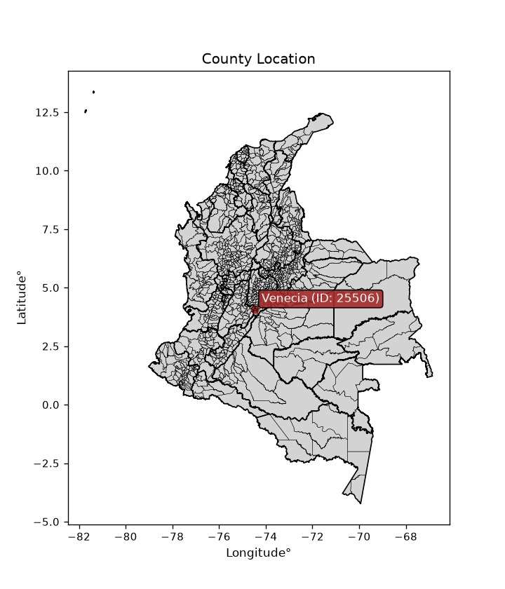
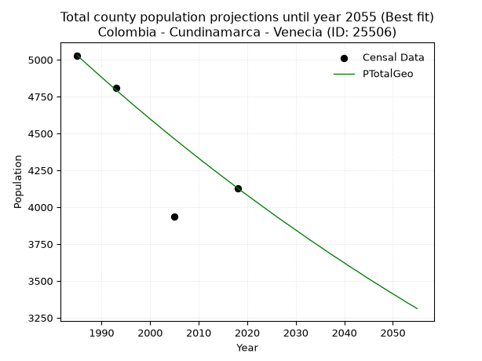
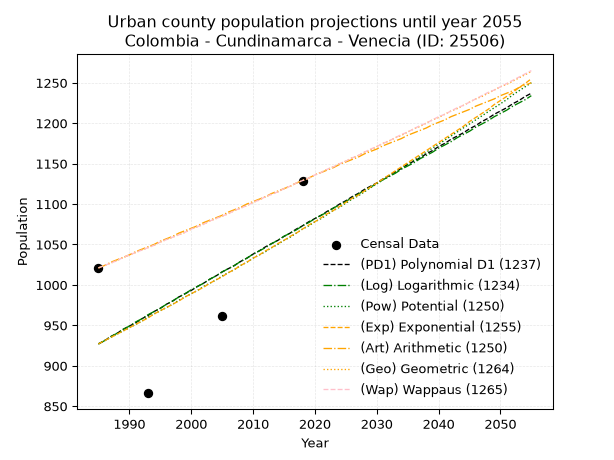
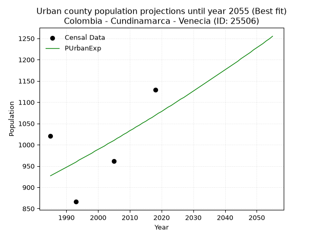
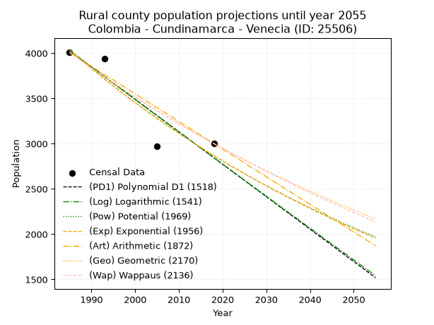
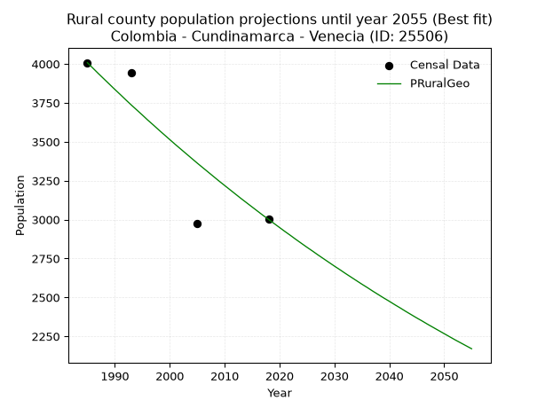

<div align="center">


</div>

# _“Population and Public Services Demand Projections (PPSD) until Year 2050 for Colombia - Cundinamarca - Venecia (ID: 25506)”_
Keywords: `population` `public-service` `projection` `lineal` `polynomial` `logarithmic` `potential` `exponential` `arithmetic` `geometric` `wappaus` `dane` `colombia` `south-america`

PPSD are analytical estimates used by governments and planners to anticipate future changes in population size, age distribution, and the resulting community needs for utilities, healthcare, education, and infrastructure as sizing future water treatment facilities, electrical grids, and road networks based on spatial growth.

<div align="center">

</img>

</div>


> **General running parameters**: • app_version: _v20260806_. • Python version: _3.14.7_. • Pandas version: _3.0.5_. • NumPy version: _2.5.1_. • Creates, save and include plots into reports (create_plot): _False_. • Projection until year: _2050_. • Process polynomial degree 2 and up: _False_. • Process Wappaus: _True_. • Process Wappaus: _True_. • Set negative values to zero: _True_. • Set infinite values to zero: _True_. • Drop dataset notes: _True_. 
<div align="center">

Dynamic map: [:earth_americas:Google](http://maps.google.com/maps?q=4.08905561,-74.4783014) [:earth_americas:OSM](https://www.openstreetmap.org/#map=18/4.08905561/-74.4783014&layers=P) [:earth_americas:Bing](https://www.bing.com/maps?cp=4.08905561~-74.4783014&lvl=18) [:earth_americas:Apple](https://maps.apple.com/frame?center=4.08905561%2C-74.4783014&span=0.003%2C0.006)

</div>


<div align="center">

```geojson
{
  "type": "Feature",
  "geometry": {
    "type": "Point", 
    "coordinates": [-74.4783014, 4.08905561]
  }, 
  "properties": {
    "Name": "Colombia - Cundinamarca - Venecia (ID: 25506)"
  }
}
```

</div>


## 0. Census Data (4 records)

Census data are official statistics collected by a government about the people and housing in a country. They usually include counts of total population, age, sex, race, income, education, and jobs.

📅Global census file: [Population.xlsx](../data/Population.xlsx)

| Source   |   Year |   CountryID | CountryName   |   StateID | StateName    |   CountyID | CountyName   |   PTotal |   PUrban |   PRural |
|:---------|-------:|------------:|:--------------|----------:|:-------------|-----------:|:-------------|---------:|---------:|---------:|
| DANE     |   1985 |          57 | Colombia      |        25 | Cundinamarca |      25506 | Venecia      |     5029 |     1021 |     4008 |
| DANE     |   1993 |          57 | Colombia      |        25 | Cundinamarca |      25506 | Venecia      |     4809 |      866 |     3943 |
| DANE     |   2005 |          57 | Colombia      |        25 | Cundinamarca |      25506 | Venecia      |     3934 |      962 |     2972 |
| DANE     |   2018 |          57 | Colombia      |        25 | Cundinamarca |      25506 | Venecia      |     4130 |     1129 |     3001 |

> 🔥Some records could had specific notes about the registered values or the corresponding urban or rural distribution.

📅[SUI-RUPS](https://www.datos.gov.co/Hacienda-y-Cr-dito-P-blico/Registro-nico-de-Prestadores-de-Servicios-P-blicos/4qkq-csdn/about_data) - Local public utility companies: [RUPS.csv](../data/RUPS.xlsx)

 | SERVICIO       | ESTADO    | NOMBRE                                                 | NIT         | DEPARTAMENTO_DOMICILIO   | MUNICIPIO_DOMICILIO   | DIRECCION                                                 |   TELEFONO | EMAIL                                        | TIPO_PRESTADOR                 | CLASIFICACION                 |
|:---------------|:----------|:-------------------------------------------------------|:------------|:-------------------------|:----------------------|:----------------------------------------------------------|-----------:|:---------------------------------------------|:-------------------------------|:------------------------------|
| ACUEDUCTO      | OPERATIVA | OFICINA DE SERVICIOS PÚBLICOS DEL MUNICPIO DE VENECIA  | 890680088-3 | CUNDINAMARCA             | VENECIA               | Calle 3 No. 3-97                                          |    8681167 | despachoalcaldia@venecia-cundinamarca.gov.co | MUNICIPIO (PRESTACIÓN DIRECTA) | MENOR O IGUAL A 2500 USUARIOS |
| ALCANTARILLADO | OPERATIVA | OFICINA DE SERVICIOS PÚBLICOS DEL MUNICPIO DE VENECIA  | 890680088-3 | CUNDINAMARCA             | VENECIA               | Calle 3 No. 3-97                                          |    8681167 | despachoalcaldia@venecia-cundinamarca.gov.co | MUNICIPIO (PRESTACIÓN DIRECTA) | MENOR O IGUAL A 2500 USUARIOS |
| ACUEDUCTO      | OPERATIVA | ACUEDUCTO CENTRAL VEREDA QUEBRADA GRANDE ALTO DE VIVAS | 900191354-5 | CUNDINAMARCA             | VENECIA               | FINCA CALIFORNIA VEREDA QUEBRADA GRANDE MUNICIPIO VENECIA |    6306639 | jairosilvapre@hotmail.com                    | ORGANIZACION AUTORIZADA        | HASTA 2500 SUSCRIPTORES       |

## 1. Total

### 1.1. Coefficients and Parameters

* (PD1) Polynomial Deg 1: -31.414692894419943, 67312.73946206349 (lineal)
* (Log) Logarithmic: -62945.078339686646, 482921.5448701596
* (Pow) Potential: -13.95727246377061, 49.72259508785372
* (Exp) Exponential: -0.006965677527378706, 5007801656.997041
* (Art) Arithmetic: Year diff. 2018 - 1985 = 33, Population diff. 4130 - 5029 = -899, Annual growth = -27.242424242424242
* (Geo) Geometric: Year diff. 2018 - 1985 = 33, Population diff. 4130 - 5029 = -899, Annual growth % = -0.005950219338125451
* (Wap) Wappaus: i = -0.5948776993650888, Condition values only valid for < 200)

<sub>
Wappaus condition values: ['-0.00', '-0.59', '-1.19', '-1.78', '-2.38', '-2.97', '-3.57', '-4.16', '-4.76', '-5.35', '-5.95', '-6.54', '-7.14', '-7.73', '-8.33', '-8.92', '-9.52', '-10.11', '-10.71', '-11.30', '-11.90', '-12.49', '-13.09', '-13.68', '-14.28', '-14.87', '-15.47', '-16.06', '-16.66', '-17.25', '-17.85', '-18.44', '-19.04', '-19.63', '-20.23', '-20.82', '-21.42', '-22.01', '-22.61', '-23.20', '-23.80', '-24.39', '-24.98', '-25.58', '-26.17', '-26.77', '-27.36', '-27.96', '-28.55', '-29.15', '-29.74', '-30.34', '-30.93', '-31.53', '-32.12', '-32.72', '-33.31', '-33.91', '-34.50', '-35.10', '-35.69', '-36.29', '-36.88', '-37.48', '-38.07', '-38.67']
</sub>


### 1.2. Projected Dataset

|   Year |   CountyID |   PTotalPD1 |   PTotalLog |   PTotalPow |   PTotalExp |   PTotalArt |   PTotalGeo |   PTotalWap |
|-------:|-----------:|------------:|------------:|------------:|------------:|------------:|------------:|------------:|
|   1985 |      25506 |        4955 |        4956 |        4953 |        4951 |        5029 |        5029 |        5029 |
|   1986 |      25506 |        4923 |        4924 |        4918 |        4917 |        5002 |        4999 |        4999 |
|   1987 |      25506 |        4892 |        4893 |        4884 |        4883 |        4975 |        4969 |        4970 |
|   1988 |      25506 |        4860 |        4861 |        4850 |        4849 |        4947 |        4940 |        4940 |
|   1989 |      25506 |        4829 |        4829 |        4816 |        4815 |        4920 |        4910 |        4911 |
|   1990 |      25506 |        4798 |        4798 |        4782 |        4782 |        4893 |        4881 |        4882 |
|   1991 |      25506 |        4766 |        4766 |        4749 |        4749 |        4866 |        4852 |        4853 |
|   1992 |      25506 |        4735 |        4734 |        4715 |        4716 |        4838 |        4823 |        4824 |
|   1993 |      25506 |        4703 |        4703 |        4682 |        4683 |        4811 |        4795 |        4795 |
|   1994 |      25506 |        4672 |        4671 |        4650 |        4650 |        4784 |        4766 |        4767 |
|   1995 |      25506 |        4640 |        4640 |        4617 |        4618 |        4757 |        4738 |        4738 |
|   1996 |      25506 |        4609 |        4608 |        4585 |        4586 |        4729 |        4709 |        4710 |
|   1997 |      25506 |        4578 |        4577 |        4553 |        4554 |        4702 |        4681 |        4682 |
|   1998 |      25506 |        4546 |        4545 |        4522 |        4523 |        4675 |        4654 |        4655 |
|   1999 |      25506 |        4515 |        4514 |        4490 |        4491 |        4648 |        4626 |        4627 |
|   2000 |      25506 |        4483 |        4482 |        4459 |        4460 |        4620 |        4598 |        4599 |
|   2001 |      25506 |        4452 |        4451 |        4428 |        4429 |        4593 |        4571 |        4572 |
|   2002 |      25506 |        4421 |        4419 |        4397 |        4398 |        4566 |        4544 |        4545 |
|   2003 |      25506 |        4389 |        4388 |        4367 |        4368 |        4539 |        4517 |        4518 |
|   2004 |      25506 |        4358 |        4356 |        4336 |        4337 |        4511 |        4490 |        4491 |
|   2005 |      25506 |        4326 |        4325 |        4306 |        4307 |        4484 |        4463 |        4464 |
|   2006 |      25506 |        4295 |        4294 |        4276 |        4277 |        4457 |        4437 |        4438 |
|   2007 |      25506 |        4263 |        4262 |        4247 |        4248 |        4430 |        4410 |        4411 |
|   2008 |      25506 |        4232 |        4231 |        4217 |        4218 |        4402 |        4384 |        4385 |
|   2009 |      25506 |        4201 |        4200 |        4188 |        4189 |        4375 |        4358 |        4359 |
|   2010 |      25506 |        4169 |        4168 |        4159 |        4160 |        4348 |        4332 |        4333 |
|   2011 |      25506 |        4138 |        4137 |        4130 |        4131 |        4321 |        4306 |        4307 |
|   2012 |      25506 |        4106 |        4106 |        4102 |        4102 |        4293 |        4281 |        4281 |
|   2013 |      25506 |        4075 |        4074 |        4073 |        4074 |        4266 |        4255 |        4256 |
|   2014 |      25506 |        4044 |        4043 |        4045 |        4046 |        4239 |        4230 |        4230 |
|   2015 |      25506 |        4012 |        4012 |        4017 |        4018 |        4212 |        4205 |        4205 |
|   2016 |      25506 |        3981 |        3981 |        3990 |        3990 |        4184 |        4180 |        4180 |
|   2017 |      25506 |        3949 |        3949 |        3962 |        3962 |        4157 |        4155 |        4155 |
|   2018 |      25506 |        3918 |        3918 |        3935 |        3934 |        4130 |        4130 |        4130 |
|   2019 |      25506 |        3886 |        3887 |        3908 |        3907 |        4103 |        4105 |        4105 |
|   2020 |      25506 |        3855 |        3856 |        3881 |        3880 |        4076 |        4081 |        4081 |
|   2021 |      25506 |        3824 |        3825 |        3854 |        3853 |        4048 |        4057 |        4056 |
|   2022 |      25506 |        3792 |        3794 |        3827 |        3826 |        4021 |        4033 |        4032 |
|   2023 |      25506 |        3761 |        3762 |        3801 |        3800 |        3994 |        4009 |        4008 |
|   2024 |      25506 |        3729 |        3731 |        3775 |        3773 |        3967 |        3985 |        3984 |
|   2025 |      25506 |        3698 |        3700 |        3749 |        3747 |        3939 |        3961 |        3960 |
|   2026 |      25506 |        3667 |        3669 |        3723 |        3721 |        3912 |        3937 |        3936 |
|   2027 |      25506 |        3635 |        3638 |        3698 |        3695 |        3885 |        3914 |        3912 |
|   2028 |      25506 |        3604 |        3607 |        3672 |        3670 |        3858 |        3891 |        3888 |
|   2029 |      25506 |        3572 |        3576 |        3647 |        3644 |        3830 |        3868 |        3865 |
|   2030 |      25506 |        3541 |        3545 |        3622 |        3619 |        3803 |        3845 |        3842 |
|   2031 |      25506 |        3509 |        3514 |        3597 |        3594 |        3776 |        3822 |        3818 |
|   2032 |      25506 |        3478 |        3483 |        3573 |        3569 |        3749 |        3799 |        3795 |
|   2033 |      25506 |        3447 |        3452 |        3548 |        3544 |        3721 |        3776 |        3772 |
|   2034 |      25506 |        3415 |        3421 |        3524 |        3520 |        3694 |        3754 |        3750 |
|   2035 |      25506 |        3384 |        3390 |        3500 |        3495 |        3667 |        3732 |        3727 |
|   2036 |      25506 |        3352 |        3359 |        3476 |        3471 |        3640 |        3709 |        3704 |
|   2037 |      25506 |        3321 |        3328 |        3452 |        3447 |        3612 |        3687 |        3682 |
|   2038 |      25506 |        3290 |        3297 |        3429 |        3423 |        3585 |        3665 |        3659 |
|   2039 |      25506 |        3258 |        3267 |        3405 |        3399 |        3558 |        3644 |        3637 |
|   2040 |      25506 |        3227 |        3236 |        3382 |        3375 |        3531 |        3622 |        3615 |
|   2041 |      25506 |        3195 |        3205 |        3359 |        3352 |        3503 |        3600 |        3593 |
|   2042 |      25506 |        3164 |        3174 |        3336 |        3329 |        3476 |        3579 |        3571 |
|   2043 |      25506 |        3133 |        3143 |        3313 |        3306 |        3449 |        3558 |        3549 |
|   2044 |      25506 |        3101 |        3112 |        3291 |        3283 |        3422 |        3536 |        3527 |
|   2045 |      25506 |        3070 |        3082 |        3268 |        3260 |        3394 |        3515 |        3506 |
|   2046 |      25506 |        3038 |        3051 |        3246 |        3237 |        3367 |        3494 |        3484 |
|   2047 |      25506 |        3007 |        3020 |        3224 |        3215 |        3340 |        3474 |        3463 |
|   2048 |      25506 |        2975 |        2989 |        3202 |        3192 |        3313 |        3453 |        3442 |
|   2049 |      25506 |        2944 |        2959 |        3181 |        3170 |        3285 |        3432 |        3421 |
|   2050 |      25506 |        2913 |        2928 |        3159 |        3148 |        3258 |        3412 |        3399 |
<div align="center">

</img>

</div>


### 1.3. Best fit with absolute and relative error (%)

Relative error puts that difference into context by dividing the absolute error by the true value, creating a unitless ratio or percentage that shows the scale of the mistake.

Absolute and relative error

|   Year | Source   |   CountryID | CountryName   |   StateID | StateName    |   CountyID_x | CountyName   |   PTotal |   PUrban |   PRural |   CountyID_y |   PTotalPD1 |   PTotalLog |   PTotalPow |   PTotalExp |   PTotalArt |   PTotalGeo |   PTotalWap |   PTotalPD1AbsError |   PTotalLogAbsError |   PTotalPowAbsError |   PTotalExpAbsError |   PTotalArtAbsError |   PTotalGeoAbsError |   PTotalWapAbsError |   PTotalPD1RelError |   PTotalLogRelError |   PTotalPowRelError |   PTotalExpRelError |   PTotalArtRelError |   PTotalGeoRelError |   PTotalWapRelError |
|-------:|:---------|------------:|:--------------|----------:|:-------------|-------------:|:-------------|---------:|---------:|---------:|-------------:|------------:|------------:|------------:|------------:|------------:|------------:|------------:|--------------------:|--------------------:|--------------------:|--------------------:|--------------------:|--------------------:|--------------------:|--------------------:|--------------------:|--------------------:|--------------------:|--------------------:|--------------------:|--------------------:|
|   1985 | DANE     |          57 | Colombia      |        25 | Cundinamarca |        25506 | Venecia      |     5029 |     1021 |     4008 |        25506 |        4955 |        4956 |        4953 |        4951 |        5029 |        5029 |        5029 |                  74 |                  73 |                  76 |                  78 |                   0 |                   0 |                   0 |             1.47147 |             1.45158 |             1.51123 |             1.551   |           0         |            0        |            0        |
|   1993 | DANE     |          57 | Colombia      |        25 | Cundinamarca |        25506 | Venecia      |     4809 |      866 |     3943 |        25506 |        4703 |        4703 |        4682 |        4683 |        4811 |        4795 |        4795 |                 106 |                 106 |                 127 |                 126 |                   2 |                  14 |                  14 |             2.2042  |             2.2042  |             2.64088 |             2.62009 |           0.0415887 |            0.291121 |            0.291121 |
|   2005 | DANE     |          57 | Colombia      |        25 | Cundinamarca |        25506 | Venecia      |     3934 |      962 |     2972 |        25506 |        4326 |        4325 |        4306 |        4307 |        4484 |        4463 |        4464 |                 392 |                 391 |                 372 |                 373 |                 550 |                 529 |                 530 |             9.96441 |             9.93899 |             9.45602 |             9.48144 |          13.9807    |           13.4469   |           13.4723   |
|   2018 | DANE     |          57 | Colombia      |        25 | Cundinamarca |        25506 | Venecia      |     4130 |     1129 |     3001 |        25506 |        3918 |        3918 |        3935 |        3934 |        4130 |        4130 |        4130 |                 212 |                 212 |                 195 |                 196 |                   0 |                   0 |                   0 |             5.13317 |             5.13317 |             4.72155 |             4.74576 |           0         |            0        |            0        |

Relative error mean

| Method    |   RelError | Best   |
|:----------|-----------:|:-------|
| PTotalPD1 |    4.69331 |        |
| PTotalLog |    4.68199 |        |
| PTotalPow |    4.58242 |        |
| PTotalExp |    4.59957 |        |
| PTotalArt |    3.50557 |        |
| PTotalGeo |    3.4345  | True   |
| PTotalWap |    3.44085 |        |

💙Best method: _**PTotalGeo**_
<div align="center">

</img>

</div>


### 1.4. Fresh water supply demand in liters per capita per day (lpcd)

The fresh water supply demand typically ranges from 100 to 300 liters per capita per day (lpcd) for standard domestic and municipal planning, though absolute survival minimums set by the World Health Organization are as low as 7.5 to 20 liters per day, and total consumption in high-income nations can exceed 400 liters.

> `CZ`: Level in meters above the sea level (masl)<br> `WS`: Fresh water supply demand in liters per capita per day (lpcd or l/h/d)<br> `WSAll`: Zonal fresh water supply demand in liters per second (l/s)<br> `A`: Zonal area in square meters<br> `DP`: Population density (people/hectare or p/ha)

Reference values (RAS Colombia)

|    CZ |   WS |
|------:|-----:|
|  1000 |  120 |
|  2000 |  130 |
| 99999 |  140 |

County shapefile geometry properties and water supply values

|   CountyID |      ATotal |   CZTotal |   WSTotal |
|-----------:|------------:|----------:|----------:|
|      25506 | 1.22081e+08 |   2304.74 |       140 |

Projected values for best method: PTotalGeo

|   CountyID |   Year |   PTotalGeo |   DPTotal |   WSTotal |   WSTotalAll |
|-----------:|-------:|------------:|----------:|----------:|-------------:|
|      25506 |   1985 |        5029 |      0.41 |       140 |      8.14884 |
|      25506 |   1986 |        4999 |      0.41 |       140 |      8.10023 |
|      25506 |   1987 |        4969 |      0.41 |       140 |      8.05162 |
|      25506 |   1988 |        4940 |      0.4  |       140 |      8.00463 |
|      25506 |   1989 |        4910 |      0.4  |       140 |      7.95602 |
|      25506 |   1990 |        4881 |      0.4  |       140 |      7.90903 |
|      25506 |   1991 |        4852 |      0.4  |       140 |      7.86204 |
|      25506 |   1992 |        4823 |      0.4  |       140 |      7.81505 |
|      25506 |   1993 |        4795 |      0.39 |       140 |      7.76968 |
|      25506 |   1994 |        4766 |      0.39 |       140 |      7.72269 |
|      25506 |   1995 |        4738 |      0.39 |       140 |      7.67731 |
|      25506 |   1996 |        4709 |      0.39 |       140 |      7.63032 |
|      25506 |   1997 |        4681 |      0.38 |       140 |      7.58495 |
|      25506 |   1998 |        4654 |      0.38 |       140 |      7.5412  |
|      25506 |   1999 |        4626 |      0.38 |       140 |      7.49583 |
|      25506 |   2000 |        4598 |      0.38 |       140 |      7.45046 |
|      25506 |   2001 |        4571 |      0.37 |       140 |      7.40671 |
|      25506 |   2002 |        4544 |      0.37 |       140 |      7.36296 |
|      25506 |   2003 |        4517 |      0.37 |       140 |      7.31921 |
|      25506 |   2004 |        4490 |      0.37 |       140 |      7.27546 |
|      25506 |   2005 |        4463 |      0.37 |       140 |      7.23171 |
|      25506 |   2006 |        4437 |      0.36 |       140 |      7.18958 |
|      25506 |   2007 |        4410 |      0.36 |       140 |      7.14583 |
|      25506 |   2008 |        4384 |      0.36 |       140 |      7.1037  |
|      25506 |   2009 |        4358 |      0.36 |       140 |      7.06157 |
|      25506 |   2010 |        4332 |      0.35 |       140 |      7.01944 |
|      25506 |   2011 |        4306 |      0.35 |       140 |      6.97731 |
|      25506 |   2012 |        4281 |      0.35 |       140 |      6.93681 |
|      25506 |   2013 |        4255 |      0.35 |       140 |      6.89468 |
|      25506 |   2014 |        4230 |      0.35 |       140 |      6.85417 |
|      25506 |   2015 |        4205 |      0.34 |       140 |      6.81366 |
|      25506 |   2016 |        4180 |      0.34 |       140 |      6.77315 |
|      25506 |   2017 |        4155 |      0.34 |       140 |      6.73264 |
|      25506 |   2018 |        4130 |      0.34 |       140 |      6.69213 |
|      25506 |   2019 |        4105 |      0.34 |       140 |      6.65162 |
|      25506 |   2020 |        4081 |      0.33 |       140 |      6.61273 |
|      25506 |   2021 |        4057 |      0.33 |       140 |      6.57384 |
|      25506 |   2022 |        4033 |      0.33 |       140 |      6.53495 |
|      25506 |   2023 |        4009 |      0.33 |       140 |      6.49606 |
|      25506 |   2024 |        3985 |      0.33 |       140 |      6.45718 |
|      25506 |   2025 |        3961 |      0.32 |       140 |      6.41829 |
|      25506 |   2026 |        3937 |      0.32 |       140 |      6.3794  |
|      25506 |   2027 |        3914 |      0.32 |       140 |      6.34213 |
|      25506 |   2028 |        3891 |      0.32 |       140 |      6.30486 |
|      25506 |   2029 |        3868 |      0.32 |       140 |      6.26759 |
|      25506 |   2030 |        3845 |      0.31 |       140 |      6.23032 |
|      25506 |   2031 |        3822 |      0.31 |       140 |      6.19306 |
|      25506 |   2032 |        3799 |      0.31 |       140 |      6.15579 |
|      25506 |   2033 |        3776 |      0.31 |       140 |      6.11852 |
|      25506 |   2034 |        3754 |      0.31 |       140 |      6.08287 |
|      25506 |   2035 |        3732 |      0.31 |       140 |      6.04722 |
|      25506 |   2036 |        3709 |      0.3  |       140 |      6.00995 |
|      25506 |   2037 |        3687 |      0.3  |       140 |      5.97431 |
|      25506 |   2038 |        3665 |      0.3  |       140 |      5.93866 |
|      25506 |   2039 |        3644 |      0.3  |       140 |      5.90463 |
|      25506 |   2040 |        3622 |      0.3  |       140 |      5.86898 |
|      25506 |   2041 |        3600 |      0.29 |       140 |      5.83333 |
|      25506 |   2042 |        3579 |      0.29 |       140 |      5.79931 |
|      25506 |   2043 |        3558 |      0.29 |       140 |      5.76528 |
|      25506 |   2044 |        3536 |      0.29 |       140 |      5.72963 |
|      25506 |   2045 |        3515 |      0.29 |       140 |      5.6956  |
|      25506 |   2046 |        3494 |      0.29 |       140 |      5.66157 |
|      25506 |   2047 |        3474 |      0.28 |       140 |      5.62917 |
|      25506 |   2048 |        3453 |      0.28 |       140 |      5.59514 |
|      25506 |   2049 |        3432 |      0.28 |       140 |      5.56111 |
|      25506 |   2050 |        3412 |      0.28 |       140 |      5.5287  |

## 2. Urban

### 2.1. Coefficients and Parameters

* (PD1) Polynomial Deg 1: 4.432757928542643, -7872.124046567422 (lineal)
* (Log) Logarithmic: 8846.011719146814, -66244.10596472403
* (Pow) Potential: 8.637858995938418, -25.518624454306785
* (Exp) Exponential: 0.004328792597719385, 0.17186668185669549
* (Art) Arithmetic: Year diff. 2018 - 1985 = 33, Population diff. 1129 - 1021 = 108, Annual growth = 3.272727272727273
* (Geo) Geometric: Year diff. 2018 - 1985 = 33, Population diff. 1129 - 1021 = 108, Annual growth % = 0.00305160870650667
* (Wap) Wappaus: i = 0.3044397463002114, Condition values only valid for < 200)

<sub>
Wappaus condition values: ['0.00', '0.30', '0.61', '0.91', '1.22', '1.52', '1.83', '2.13', '2.44', '2.74', '3.04', '3.35', '3.65', '3.96', '4.26', '4.57', '4.87', '5.18', '5.48', '5.78', '6.09', '6.39', '6.70', '7.00', '7.31', '7.61', '7.92', '8.22', '8.52', '8.83', '9.13', '9.44', '9.74', '10.05', '10.35', '10.66', '10.96', '11.26', '11.57', '11.87', '12.18', '12.48', '12.79', '13.09', '13.40', '13.70', '14.00', '14.31', '14.61', '14.92', '15.22', '15.53', '15.83', '16.14', '16.44', '16.74', '17.05', '17.35', '17.66', '17.96', '18.27', '18.57', '18.88', '19.18', '19.48', '19.79']
</sub>


### 2.2. Projected Dataset

|   Year |   CountyID |   PUrbanPD1 |   PUrbanLog |   PUrbanPow |   PUrbanExp |   PUrbanArt |   PUrbanGeo |   PUrbanWap |
|-------:|-----------:|------------:|------------:|------------:|------------:|------------:|------------:|------------:|
|   1985 |      25506 |         927 |         927 |         927 |         927 |        1021 |        1021 |        1021 |
|   1986 |      25506 |         931 |         931 |         931 |         931 |        1024 |        1024 |        1024 |
|   1987 |      25506 |         936 |         936 |         935 |         935 |        1028 |        1027 |        1027 |
|   1988 |      25506 |         940 |         940 |         939 |         939 |        1031 |        1030 |        1030 |
|   1989 |      25506 |         945 |         945 |         943 |         943 |        1034 |        1034 |        1034 |
|   1990 |      25506 |         949 |         949 |         947 |         947 |        1037 |        1037 |        1037 |
|   1991 |      25506 |         953 |         954 |         951 |         951 |        1041 |        1040 |        1040 |
|   1992 |      25506 |         958 |         958 |         955 |         955 |        1044 |        1043 |        1043 |
|   1993 |      25506 |         962 |         963 |         960 |         959 |        1047 |        1046 |        1046 |
|   1994 |      25506 |         967 |         967 |         964 |         964 |        1050 |        1049 |        1049 |
|   1995 |      25506 |         971 |         971 |         968 |         968 |        1054 |        1053 |        1053 |
|   1996 |      25506 |         976 |         976 |         972 |         972 |        1057 |        1056 |        1056 |
|   1997 |      25506 |         980 |         980 |         976 |         976 |        1060 |        1059 |        1059 |
|   1998 |      25506 |         985 |         985 |         981 |         980 |        1064 |        1062 |        1062 |
|   1999 |      25506 |         989 |         989 |         985 |         985 |        1067 |        1065 |        1065 |
|   2000 |      25506 |         993 |         994 |         989 |         989 |        1070 |        1069 |        1069 |
|   2001 |      25506 |         998 |         998 |         993 |         993 |        1073 |        1072 |        1072 |
|   2002 |      25506 |        1002 |        1002 |         998 |         997 |        1077 |        1075 |        1075 |
|   2003 |      25506 |        1007 |        1007 |        1002 |        1002 |        1080 |        1079 |        1079 |
|   2004 |      25506 |        1011 |        1011 |        1006 |        1006 |        1083 |        1082 |        1082 |
|   2005 |      25506 |        1016 |        1016 |        1011 |        1010 |        1086 |        1085 |        1085 |
|   2006 |      25506 |        1020 |        1020 |        1015 |        1015 |        1090 |        1088 |        1088 |
|   2007 |      25506 |        1024 |        1024 |        1019 |        1019 |        1093 |        1092 |        1092 |
|   2008 |      25506 |        1029 |        1029 |        1024 |        1024 |        1096 |        1095 |        1095 |
|   2009 |      25506 |        1033 |        1033 |        1028 |        1028 |        1100 |        1098 |        1098 |
|   2010 |      25506 |        1038 |        1038 |        1033 |        1033 |        1103 |        1102 |        1102 |
|   2011 |      25506 |        1042 |        1042 |        1037 |        1037 |        1106 |        1105 |        1105 |
|   2012 |      25506 |        1047 |        1046 |        1041 |        1042 |        1109 |        1109 |        1109 |
|   2013 |      25506 |        1051 |        1051 |        1046 |        1046 |        1113 |        1112 |        1112 |
|   2014 |      25506 |        1055 |        1055 |        1050 |        1051 |        1116 |        1115 |        1115 |
|   2015 |      25506 |        1060 |        1060 |        1055 |        1055 |        1119 |        1119 |        1119 |
|   2016 |      25506 |        1064 |        1064 |        1059 |        1060 |        1122 |        1122 |        1122 |
|   2017 |      25506 |        1069 |        1068 |        1064 |        1064 |        1126 |        1126 |        1126 |
|   2018 |      25506 |        1073 |        1073 |        1069 |        1069 |        1129 |        1129 |        1129 |
|   2019 |      25506 |        1078 |        1077 |        1073 |        1074 |        1132 |        1132 |        1132 |
|   2020 |      25506 |        1082 |        1082 |        1078 |        1078 |        1136 |        1136 |        1136 |
|   2021 |      25506 |        1086 |        1086 |        1082 |        1083 |        1139 |        1139 |        1139 |
|   2022 |      25506 |        1091 |        1090 |        1087 |        1088 |        1142 |        1143 |        1143 |
|   2023 |      25506 |        1095 |        1095 |        1092 |        1092 |        1145 |        1146 |        1146 |
|   2024 |      25506 |        1100 |        1099 |        1096 |        1097 |        1149 |        1150 |        1150 |
|   2025 |      25506 |        1104 |        1103 |        1101 |        1102 |        1152 |        1153 |        1153 |
|   2026 |      25506 |        1109 |        1108 |        1106 |        1107 |        1155 |        1157 |        1157 |
|   2027 |      25506 |        1113 |        1112 |        1110 |        1111 |        1158 |        1160 |        1160 |
|   2028 |      25506 |        1118 |        1117 |        1115 |        1116 |        1162 |        1164 |        1164 |
|   2029 |      25506 |        1122 |        1121 |        1120 |        1121 |        1165 |        1167 |        1168 |
|   2030 |      25506 |        1126 |        1125 |        1125 |        1126 |        1168 |        1171 |        1171 |
|   2031 |      25506 |        1131 |        1130 |        1130 |        1131 |        1172 |        1175 |        1175 |
|   2032 |      25506 |        1135 |        1134 |        1134 |        1136 |        1175 |        1178 |        1178 |
|   2033 |      25506 |        1140 |        1138 |        1139 |        1141 |        1178 |        1182 |        1182 |
|   2034 |      25506 |        1144 |        1143 |        1144 |        1146 |        1181 |        1185 |        1186 |
|   2035 |      25506 |        1149 |        1147 |        1149 |        1151 |        1185 |        1189 |        1189 |
|   2036 |      25506 |        1153 |        1151 |        1154 |        1156 |        1188 |        1193 |        1193 |
|   2037 |      25506 |        1157 |        1156 |        1159 |        1161 |        1191 |        1196 |        1197 |
|   2038 |      25506 |        1162 |        1160 |        1164 |        1166 |        1194 |        1200 |        1200 |
|   2039 |      25506 |        1166 |        1164 |        1169 |        1171 |        1198 |        1204 |        1204 |
|   2040 |      25506 |        1171 |        1169 |        1174 |        1176 |        1201 |        1207 |        1208 |
|   2041 |      25506 |        1175 |        1173 |        1179 |        1181 |        1204 |        1211 |        1211 |
|   2042 |      25506 |        1180 |        1177 |        1184 |        1186 |        1208 |        1215 |        1215 |
|   2043 |      25506 |        1184 |        1182 |        1189 |        1191 |        1211 |        1218 |        1219 |
|   2044 |      25506 |        1188 |        1186 |        1194 |        1196 |        1214 |        1222 |        1222 |
|   2045 |      25506 |        1193 |        1190 |        1199 |        1202 |        1217 |        1226 |        1226 |
|   2046 |      25506 |        1197 |        1195 |        1204 |        1207 |        1221 |        1230 |        1230 |
|   2047 |      25506 |        1202 |        1199 |        1209 |        1212 |        1224 |        1233 |        1234 |
|   2048 |      25506 |        1206 |        1203 |        1214 |        1217 |        1227 |        1237 |        1238 |
|   2049 |      25506 |        1211 |        1208 |        1219 |        1223 |        1230 |        1241 |        1241 |
|   2050 |      25506 |        1215 |        1212 |        1224 |        1228 |        1234 |        1245 |        1245 |
<div align="center">

</img>

</div>


### 2.3. Best fit with absolute and relative error (%)

Relative error puts that difference into context by dividing the absolute error by the true value, creating a unitless ratio or percentage that shows the scale of the mistake.

Absolute and relative error

|   Year | Source   |   CountryID | CountryName   |   StateID | StateName    |   CountyID_x | CountyName   |   PTotal |   PUrban |   PRural |   CountyID_y |   PUrbanPD1 |   PUrbanLog |   PUrbanPow |   PUrbanExp |   PUrbanArt |   PUrbanGeo |   PUrbanWap |   PUrbanPD1AbsError |   PUrbanLogAbsError |   PUrbanPowAbsError |   PUrbanExpAbsError |   PUrbanArtAbsError |   PUrbanGeoAbsError |   PUrbanWapAbsError |   PUrbanPD1RelError |   PUrbanLogRelError |   PUrbanPowRelError |   PUrbanExpRelError |   PUrbanArtRelError |   PUrbanGeoRelError |   PUrbanWapRelError |
|-------:|:---------|------------:|:--------------|----------:|:-------------|-------------:|:-------------|---------:|---------:|---------:|-------------:|------------:|------------:|------------:|------------:|------------:|------------:|------------:|--------------------:|--------------------:|--------------------:|--------------------:|--------------------:|--------------------:|--------------------:|--------------------:|--------------------:|--------------------:|--------------------:|--------------------:|--------------------:|--------------------:|
|   1985 | DANE     |          57 | Colombia      |        25 | Cundinamarca |        25506 | Venecia      |     5029 |     1021 |     4008 |        25506 |         927 |         927 |         927 |         927 |        1021 |        1021 |        1021 |                  94 |                  94 |                  94 |                  94 |                   0 |                   0 |                   0 |             9.20666 |             9.20666 |             9.20666 |             9.20666 |              0      |              0      |              0      |
|   1993 | DANE     |          57 | Colombia      |        25 | Cundinamarca |        25506 | Venecia      |     4809 |      866 |     3943 |        25506 |         962 |         963 |         960 |         959 |        1047 |        1046 |        1046 |                  96 |                  97 |                  94 |                  93 |                 181 |                 180 |                 180 |            11.0855  |            11.2009  |            10.8545  |            10.739   |             20.9007 |             20.7852 |             20.7852 |
|   2005 | DANE     |          57 | Colombia      |        25 | Cundinamarca |        25506 | Venecia      |     3934 |      962 |     2972 |        25506 |        1016 |        1016 |        1011 |        1010 |        1086 |        1085 |        1085 |                  54 |                  54 |                  49 |                  48 |                 124 |                 123 |                 123 |             5.61331 |             5.61331 |             5.09356 |             4.9896  |             12.8898 |             12.7859 |             12.7859 |
|   2018 | DANE     |          57 | Colombia      |        25 | Cundinamarca |        25506 | Venecia      |     4130 |     1129 |     3001 |        25506 |        1073 |        1073 |        1069 |        1069 |        1129 |        1129 |        1129 |                  56 |                  56 |                  60 |                  60 |                   0 |                   0 |                   0 |             4.96014 |             4.96014 |             5.31444 |             5.31444 |              0      |              0      |              0      |

Relative error mean

| Method    |   RelError | Best   |
|:----------|-----------:|:-------|
| PUrbanPD1 |    7.71639 |        |
| PUrbanLog |    7.74526 |        |
| PUrbanPow |    7.61729 |        |
| PUrbanExp |    7.56243 | True   |
| PUrbanArt |    8.44763 |        |
| PUrbanGeo |    8.39277 |        |
| PUrbanWap |    8.39277 |        |

💙Best method: _**PUrbanExp**_
<div align="center">

</img>

</div>


### 2.4. Fresh water supply demand in liters per capita per day (lpcd)

The fresh water supply demand typically ranges from 100 to 300 liters per capita per day (lpcd) for standard domestic and municipal planning, though absolute survival minimums set by the World Health Organization are as low as 7.5 to 20 liters per day, and total consumption in high-income nations can exceed 400 liters.

> `CZ`: Level in meters above the sea level (masl)<br> `WS`: Fresh water supply demand in liters per capita per day (lpcd or l/h/d)<br> `WSAll`: Zonal fresh water supply demand in liters per second (l/s)<br> `A`: Zonal area in square meters<br> `DP`: Population density (people/hectare or p/ha)

Reference values (RAS Colombia)

|    CZ |   WS |
|------:|-----:|
|  1000 |  120 |
|  2000 |  130 |
| 99999 |  140 |

County shapefile geometry properties and water supply values

|   CountyID |   AUrban |   CZUrban |   WSUrban |
|-----------:|---------:|----------:|----------:|
|      25506 |   248510 |   1635.69 |       130 |

Projected values for best method: PUrbanExp

|   CountyID |   Year |   PUrbanExp |   DPUrban |   WSUrban |   WSUrbanAll |
|-----------:|-------:|------------:|----------:|----------:|-------------:|
|      25506 |   1985 |         927 |     37.3  |       130 |      1.39479 |
|      25506 |   1986 |         931 |     37.46 |       130 |      1.40081 |
|      25506 |   1987 |         935 |     37.62 |       130 |      1.40683 |
|      25506 |   1988 |         939 |     37.79 |       130 |      1.41285 |
|      25506 |   1989 |         943 |     37.95 |       130 |      1.41887 |
|      25506 |   1990 |         947 |     38.11 |       130 |      1.42488 |
|      25506 |   1991 |         951 |     38.27 |       130 |      1.4309  |
|      25506 |   1992 |         955 |     38.43 |       130 |      1.43692 |
|      25506 |   1993 |         959 |     38.59 |       130 |      1.44294 |
|      25506 |   1994 |         964 |     38.79 |       130 |      1.45046 |
|      25506 |   1995 |         968 |     38.95 |       130 |      1.45648 |
|      25506 |   1996 |         972 |     39.11 |       130 |      1.4625  |
|      25506 |   1997 |         976 |     39.27 |       130 |      1.46852 |
|      25506 |   1998 |         980 |     39.43 |       130 |      1.47454 |
|      25506 |   1999 |         985 |     39.64 |       130 |      1.48206 |
|      25506 |   2000 |         989 |     39.8  |       130 |      1.48808 |
|      25506 |   2001 |         993 |     39.96 |       130 |      1.4941  |
|      25506 |   2002 |         997 |     40.12 |       130 |      1.50012 |
|      25506 |   2003 |        1002 |     40.32 |       130 |      1.50764 |
|      25506 |   2004 |        1006 |     40.48 |       130 |      1.51366 |
|      25506 |   2005 |        1010 |     40.64 |       130 |      1.51968 |
|      25506 |   2006 |        1015 |     40.84 |       130 |      1.5272  |
|      25506 |   2007 |        1019 |     41    |       130 |      1.53322 |
|      25506 |   2008 |        1024 |     41.21 |       130 |      1.54074 |
|      25506 |   2009 |        1028 |     41.37 |       130 |      1.54676 |
|      25506 |   2010 |        1033 |     41.57 |       130 |      1.55428 |
|      25506 |   2011 |        1037 |     41.73 |       130 |      1.5603  |
|      25506 |   2012 |        1042 |     41.93 |       130 |      1.56782 |
|      25506 |   2013 |        1046 |     42.09 |       130 |      1.57384 |
|      25506 |   2014 |        1051 |     42.29 |       130 |      1.58137 |
|      25506 |   2015 |        1055 |     42.45 |       130 |      1.58738 |
|      25506 |   2016 |        1060 |     42.65 |       130 |      1.59491 |
|      25506 |   2017 |        1064 |     42.82 |       130 |      1.60093 |
|      25506 |   2018 |        1069 |     43.02 |       130 |      1.60845 |
|      25506 |   2019 |        1074 |     43.22 |       130 |      1.61597 |
|      25506 |   2020 |        1078 |     43.38 |       130 |      1.62199 |
|      25506 |   2021 |        1083 |     43.58 |       130 |      1.62951 |
|      25506 |   2022 |        1088 |     43.78 |       130 |      1.63704 |
|      25506 |   2023 |        1092 |     43.94 |       130 |      1.64306 |
|      25506 |   2024 |        1097 |     44.14 |       130 |      1.65058 |
|      25506 |   2025 |        1102 |     44.34 |       130 |      1.6581  |
|      25506 |   2026 |        1107 |     44.55 |       130 |      1.66562 |
|      25506 |   2027 |        1111 |     44.71 |       130 |      1.67164 |
|      25506 |   2028 |        1116 |     44.91 |       130 |      1.67917 |
|      25506 |   2029 |        1121 |     45.11 |       130 |      1.68669 |
|      25506 |   2030 |        1126 |     45.31 |       130 |      1.69421 |
|      25506 |   2031 |        1131 |     45.51 |       130 |      1.70174 |
|      25506 |   2032 |        1136 |     45.71 |       130 |      1.70926 |
|      25506 |   2033 |        1141 |     45.91 |       130 |      1.71678 |
|      25506 |   2034 |        1146 |     46.11 |       130 |      1.72431 |
|      25506 |   2035 |        1151 |     46.32 |       130 |      1.73183 |
|      25506 |   2036 |        1156 |     46.52 |       130 |      1.73935 |
|      25506 |   2037 |        1161 |     46.72 |       130 |      1.74687 |
|      25506 |   2038 |        1166 |     46.92 |       130 |      1.7544  |
|      25506 |   2039 |        1171 |     47.12 |       130 |      1.76192 |
|      25506 |   2040 |        1176 |     47.32 |       130 |      1.76944 |
|      25506 |   2041 |        1181 |     47.52 |       130 |      1.77697 |
|      25506 |   2042 |        1186 |     47.72 |       130 |      1.78449 |
|      25506 |   2043 |        1191 |     47.93 |       130 |      1.79201 |
|      25506 |   2044 |        1196 |     48.13 |       130 |      1.79954 |
|      25506 |   2045 |        1202 |     48.37 |       130 |      1.80856 |
|      25506 |   2046 |        1207 |     48.57 |       130 |      1.81609 |
|      25506 |   2047 |        1212 |     48.77 |       130 |      1.82361 |
|      25506 |   2048 |        1217 |     48.97 |       130 |      1.83113 |
|      25506 |   2049 |        1223 |     49.21 |       130 |      1.84016 |
|      25506 |   2050 |        1228 |     49.41 |       130 |      1.84769 |

## 3. Rural

### 3.1. Coefficients and Parameters

* (PD1) Polynomial Deg 1: -35.84745082296261, 75184.86350863095 (lineal)
* (Log) Logarithmic: -71791.09005883348, 549165.6508348838
* (Pow) Potential: -20.703374903292065, 71.88067796362016
* (Exp) Exponential: -0.010337834345209374, 3293961817165.255
* (Art) Arithmetic: Year diff. 2018 - 1985 = 33, Population diff. 3001 - 4008 = -1007, Annual growth = -30.515151515151516
* (Geo) Geometric: Year diff. 2018 - 1985 = 33, Population diff. 3001 - 4008 = -1007, Annual growth % = -0.008729757213708389
* (Wap) Wappaus: i = -0.870741946501684, Condition values only valid for < 200)

<sub>
Wappaus condition values: ['-0.00', '-0.87', '-1.74', '-2.61', '-3.48', '-4.35', '-5.22', '-6.10', '-6.97', '-7.84', '-8.71', '-9.58', '-10.45', '-11.32', '-12.19', '-13.06', '-13.93', '-14.80', '-15.67', '-16.54', '-17.41', '-18.29', '-19.16', '-20.03', '-20.90', '-21.77', '-22.64', '-23.51', '-24.38', '-25.25', '-26.12', '-26.99', '-27.86', '-28.73', '-29.61', '-30.48', '-31.35', '-32.22', '-33.09', '-33.96', '-34.83', '-35.70', '-36.57', '-37.44', '-38.31', '-39.18', '-40.05', '-40.92', '-41.80', '-42.67', '-43.54', '-44.41', '-45.28', '-46.15', '-47.02', '-47.89', '-48.76', '-49.63', '-50.50', '-51.37', '-52.24', '-53.12', '-53.99', '-54.86', '-55.73', '-56.60']
</sub>


### 3.2. Projected Dataset

|   Year |   CountyID |   PRuralPD1 |   PRuralLog |   PRuralPow |   PRuralExp |   PRuralArt |   PRuralGeo |   PRuralWap |
|-------:|-----------:|------------:|------------:|------------:|------------:|------------:|------------:|------------:|
|   1985 |      25506 |        4028 |        4029 |        4036 |        4034 |        4008 |        4008 |        4008 |
|   1986 |      25506 |        3992 |        3993 |        3994 |        3993 |        3977 |        3973 |        3973 |
|   1987 |      25506 |        3956 |        3957 |        3952 |        3951 |        3947 |        3938 |        3939 |
|   1988 |      25506 |        3920 |        3921 |        3911 |        3911 |        3916 |        3904 |        3905 |
|   1989 |      25506 |        3884 |        3885 |        3871 |        3871 |        3886 |        3870 |        3871 |
|   1990 |      25506 |        3848 |        3848 |        3831 |        3831 |        3855 |        3836 |        3837 |
|   1991 |      25506 |        3813 |        3812 |        3791 |        3791 |        3825 |        3803 |        3804 |
|   1992 |      25506 |        3777 |        3776 |        3752 |        3752 |        3794 |        3769 |        3771 |
|   1993 |      25506 |        3741 |        3740 |        3713 |        3714 |        3764 |        3736 |        3738 |
|   1994 |      25506 |        3705 |        3704 |        3675 |        3676 |        3733 |        3704 |        3706 |
|   1995 |      25506 |        3669 |        3668 |        3637 |        3638 |        3703 |        3672 |        3674 |
|   1996 |      25506 |        3633 |        3632 |        3599 |        3600 |        3672 |        3639 |        3642 |
|   1997 |      25506 |        3598 |        3596 |        3562 |        3563 |        3642 |        3608 |        3610 |
|   1998 |      25506 |        3562 |        3560 |        3525 |        3527 |        3611 |        3576 |        3579 |
|   1999 |      25506 |        3526 |        3524 |        3489 |        3490 |        3581 |        3545 |        3547 |
|   2000 |      25506 |        3490 |        3489 |        3453 |        3455 |        3550 |        3514 |        3517 |
|   2001 |      25506 |        3454 |        3453 |        3418 |        3419 |        3520 |        3483 |        3486 |
|   2002 |      25506 |        3418 |        3417 |        3382 |        3384 |        3489 |        3453 |        3456 |
|   2003 |      25506 |        3382 |        3381 |        3348 |        3349 |        3459 |        3423 |        3425 |
|   2004 |      25506 |        3347 |        3345 |        3313 |        3315 |        3428 |        3393 |        3396 |
|   2005 |      25506 |        3311 |        3309 |        3279 |        3281 |        3398 |        3363 |        3366 |
|   2006 |      25506 |        3275 |        3274 |        3246 |        3247 |        3367 |        3334 |        3337 |
|   2007 |      25506 |        3239 |        3238 |        3212 |        3213 |        3337 |        3305 |        3307 |
|   2008 |      25506 |        3203 |        3202 |        3179 |        3180 |        3306 |        3276 |        3278 |
|   2009 |      25506 |        3167 |        3166 |        3147 |        3148 |        3276 |        3247 |        3250 |
|   2010 |      25506 |        3131 |        3131 |        3114 |        3115 |        3245 |        3219 |        3221 |
|   2011 |      25506 |        3096 |        3095 |        3082 |        3083 |        3215 |        3191 |        3193 |
|   2012 |      25506 |        3060 |        3059 |        3051 |        3052 |        3184 |        3163 |        3165 |
|   2013 |      25506 |        3024 |        3023 |        3020 |        3020 |        3154 |        3135 |        3137 |
|   2014 |      25506 |        2988 |        2988 |        2989 |        2989 |        3123 |        3108 |        3109 |
|   2015 |      25506 |        2952 |        2952 |        2958 |        2958 |        3093 |        3081 |        3082 |
|   2016 |      25506 |        2916 |        2917 |        2928 |        2928 |        3062 |        3054 |        3055 |
|   2017 |      25506 |        2881 |        2881 |        2898 |        2898 |        3032 |        3027 |        3028 |
|   2018 |      25506 |        2845 |        2845 |        2869 |        2868 |        3001 |        3001 |        3001 |
|   2019 |      25506 |        2809 |        2810 |        2839 |        2838 |        2970 |        2975 |        2974 |
|   2020 |      25506 |        2773 |        2774 |        2810 |        2809 |        2940 |        2949 |        2948 |
|   2021 |      25506 |        2737 |        2739 |        2782 |        2780 |        2909 |        2923 |        2922 |
|   2022 |      25506 |        2701 |        2703 |        2753 |        2752 |        2879 |        2898 |        2896 |
|   2023 |      25506 |        2665 |        2668 |        2725 |        2724 |        2848 |        2872 |        2870 |
|   2024 |      25506 |        2630 |        2632 |        2698 |        2695 |        2818 |        2847 |        2844 |
|   2025 |      25506 |        2594 |        2597 |        2670 |        2668 |        2787 |        2822 |        2819 |
|   2026 |      25506 |        2558 |        2561 |        2643 |        2640 |        2757 |        2798 |        2794 |
|   2027 |      25506 |        2522 |        2526 |        2616 |        2613 |        2726 |        2773 |        2769 |
|   2028 |      25506 |        2486 |        2490 |        2589 |        2586 |        2696 |        2749 |        2744 |
|   2029 |      25506 |        2450 |        2455 |        2563 |        2560 |        2665 |        2725 |        2719 |
|   2030 |      25506 |        2415 |        2420 |        2537 |        2533 |        2635 |        2701 |        2695 |
|   2031 |      25506 |        2379 |        2384 |        2511 |        2507 |        2604 |        2678 |        2670 |
|   2032 |      25506 |        2343 |        2349 |        2486 |        2482 |        2574 |        2654 |        2646 |
|   2033 |      25506 |        2307 |        2314 |        2461 |        2456 |        2543 |        2631 |        2622 |
|   2034 |      25506 |        2271 |        2278 |        2436 |        2431 |        2513 |        2608 |        2599 |
|   2035 |      25506 |        2235 |        2243 |        2411 |        2406 |        2482 |        2585 |        2575 |
|   2036 |      25506 |        2199 |        2208 |        2387 |        2381 |        2452 |        2563 |        2552 |
|   2037 |      25506 |        2164 |        2173 |        2363 |        2357 |        2421 |        2540 |        2528 |
|   2038 |      25506 |        2128 |        2137 |        2339 |        2332 |        2391 |        2518 |        2505 |
|   2039 |      25506 |        2092 |        2102 |        2315 |        2308 |        2360 |        2496 |        2482 |
|   2040 |      25506 |        2056 |        2067 |        2292 |        2285 |        2330 |        2475 |        2459 |
|   2041 |      25506 |        2020 |        2032 |        2269 |        2261 |        2299 |        2453 |        2437 |
|   2042 |      25506 |        1984 |        1997 |        2246 |        2238 |        2269 |        2432 |        2414 |
|   2043 |      25506 |        1949 |        1961 |        2223 |        2215 |        2238 |        2410 |        2392 |
|   2044 |      25506 |        1913 |        1926 |        2201 |        2192 |        2208 |        2389 |        2370 |
|   2045 |      25506 |        1877 |        1891 |        2178 |        2169 |        2177 |        2368 |        2348 |
|   2046 |      25506 |        1841 |        1856 |        2157 |        2147 |        2147 |        2348 |        2326 |
|   2047 |      25506 |        1805 |        1821 |        2135 |        2125 |        2116 |        2327 |        2304 |
|   2048 |      25506 |        1769 |        1786 |        2113 |        2103 |        2086 |        2307 |        2283 |
|   2049 |      25506 |        1733 |        1751 |        2092 |        2082 |        2055 |        2287 |        2261 |
|   2050 |      25506 |        1698 |        1716 |        2071 |        2060 |        2025 |        2267 |        2240 |
<div align="center">

</img>

</div>


### 3.3. Best fit with absolute and relative error (%)

Relative error puts that difference into context by dividing the absolute error by the true value, creating a unitless ratio or percentage that shows the scale of the mistake.

Absolute and relative error

|   Year | Source   |   CountryID | CountryName   |   StateID | StateName    |   CountyID_x | CountyName   |   PTotal |   PUrban |   PRural |   CountyID_y |   PRuralPD1 |   PRuralLog |   PRuralPow |   PRuralExp |   PRuralArt |   PRuralGeo |   PRuralWap |   PRuralPD1AbsError |   PRuralLogAbsError |   PRuralPowAbsError |   PRuralExpAbsError |   PRuralArtAbsError |   PRuralGeoAbsError |   PRuralWapAbsError |   PRuralPD1RelError |   PRuralLogRelError |   PRuralPowRelError |   PRuralExpRelError |   PRuralArtRelError |   PRuralGeoRelError |   PRuralWapRelError |
|-------:|:---------|------------:|:--------------|----------:|:-------------|-------------:|:-------------|---------:|---------:|---------:|-------------:|------------:|------------:|------------:|------------:|------------:|------------:|------------:|--------------------:|--------------------:|--------------------:|--------------------:|--------------------:|--------------------:|--------------------:|--------------------:|--------------------:|--------------------:|--------------------:|--------------------:|--------------------:|--------------------:|
|   1985 | DANE     |          57 | Colombia      |        25 | Cundinamarca |        25506 | Venecia      |     5029 |     1021 |     4008 |        25506 |        4028 |        4029 |        4036 |        4034 |        4008 |        4008 |        4008 |                  20 |                  21 |                  28 |                  26 |                   0 |                   0 |                   0 |            0.499002 |            0.523952 |            0.698603 |            0.648703 |             0       |             0       |             0       |
|   1993 | DANE     |          57 | Colombia      |        25 | Cundinamarca |        25506 | Venecia      |     4809 |      866 |     3943 |        25506 |        3741 |        3740 |        3713 |        3714 |        3764 |        3736 |        3738 |                 202 |                 203 |                 230 |                 229 |                 179 |                 207 |                 205 |            5.123    |            5.14836  |            5.83312  |            5.80776  |             4.53969 |             5.24981 |             5.19909 |
|   2005 | DANE     |          57 | Colombia      |        25 | Cundinamarca |        25506 | Venecia      |     3934 |      962 |     2972 |        25506 |        3311 |        3309 |        3279 |        3281 |        3398 |        3363 |        3366 |                 339 |                 337 |                 307 |                 309 |                 426 |                 391 |                 394 |           11.4065   |           11.3392   |           10.3297   |           10.397    |            14.3338  |            13.1561  |            13.2571  |
|   2018 | DANE     |          57 | Colombia      |        25 | Cundinamarca |        25506 | Venecia      |     4130 |     1129 |     3001 |        25506 |        2845 |        2845 |        2869 |        2868 |        3001 |        3001 |        3001 |                 156 |                 156 |                 132 |                 133 |                   0 |                   0 |                   0 |            5.19827  |            5.19827  |            4.39853  |            4.43186  |             0       |             0       |             0       |

Relative error mean

| Method    |   RelError | Best   |
|:----------|-----------:|:-------|
| PRuralPD1 |    5.55668 |        |
| PRuralLog |    5.55244 |        |
| PRuralPow |    5.315   |        |
| PRuralExp |    5.32134 |        |
| PRuralArt |    4.71837 |        |
| PRuralGeo |    4.60148 | True   |
| PRuralWap |    4.61404 |        |

💙Best method: _**PRuralGeo**_
<div align="center">

</img>

</div>


### 3.4. Fresh water supply demand in liters per capita per day (lpcd)

The fresh water supply demand typically ranges from 100 to 300 liters per capita per day (lpcd) for standard domestic and municipal planning, though absolute survival minimums set by the World Health Organization are as low as 7.5 to 20 liters per day, and total consumption in high-income nations can exceed 400 liters.

> `CZ`: Level in meters above the sea level (masl)<br> `WS`: Fresh water supply demand in liters per capita per day (lpcd or l/h/d)<br> `WSAll`: Zonal fresh water supply demand in liters per second (l/s)<br> `A`: Zonal area in square meters<br> `DP`: Population density (people/hectare or p/ha)

Reference values (RAS Colombia)

|    CZ |   WS |
|------:|-----:|
|  1000 |  120 |
|  2000 |  130 |
| 99999 |  140 |

County shapefile geometry properties and water supply values

|   CountyID |      ARural |   CZRural |   WSRural |
|-----------:|------------:|----------:|----------:|
|      25506 | 1.21833e+08 |   2306.14 |       140 |

Projected values for best method: PRuralGeo

|   CountyID |   Year |   PRuralGeo |   DPRural |   WSRural |   WSRuralAll |
|-----------:|-------:|------------:|----------:|----------:|-------------:|
|      25506 |   1985 |        4008 |      0.33 |       140 |      6.49444 |
|      25506 |   1986 |        3973 |      0.33 |       140 |      6.43773 |
|      25506 |   1987 |        3938 |      0.32 |       140 |      6.38102 |
|      25506 |   1988 |        3904 |      0.32 |       140 |      6.32593 |
|      25506 |   1989 |        3870 |      0.32 |       140 |      6.27083 |
|      25506 |   1990 |        3836 |      0.31 |       140 |      6.21574 |
|      25506 |   1991 |        3803 |      0.31 |       140 |      6.16227 |
|      25506 |   1992 |        3769 |      0.31 |       140 |      6.10718 |
|      25506 |   1993 |        3736 |      0.31 |       140 |      6.0537  |
|      25506 |   1994 |        3704 |      0.3  |       140 |      6.00185 |
|      25506 |   1995 |        3672 |      0.3  |       140 |      5.95    |
|      25506 |   1996 |        3639 |      0.3  |       140 |      5.89653 |
|      25506 |   1997 |        3608 |      0.3  |       140 |      5.8463  |
|      25506 |   1998 |        3576 |      0.29 |       140 |      5.79444 |
|      25506 |   1999 |        3545 |      0.29 |       140 |      5.74421 |
|      25506 |   2000 |        3514 |      0.29 |       140 |      5.69398 |
|      25506 |   2001 |        3483 |      0.29 |       140 |      5.64375 |
|      25506 |   2002 |        3453 |      0.28 |       140 |      5.59514 |
|      25506 |   2003 |        3423 |      0.28 |       140 |      5.54653 |
|      25506 |   2004 |        3393 |      0.28 |       140 |      5.49792 |
|      25506 |   2005 |        3363 |      0.28 |       140 |      5.44931 |
|      25506 |   2006 |        3334 |      0.27 |       140 |      5.40231 |
|      25506 |   2007 |        3305 |      0.27 |       140 |      5.35532 |
|      25506 |   2008 |        3276 |      0.27 |       140 |      5.30833 |
|      25506 |   2009 |        3247 |      0.27 |       140 |      5.26134 |
|      25506 |   2010 |        3219 |      0.26 |       140 |      5.21597 |
|      25506 |   2011 |        3191 |      0.26 |       140 |      5.1706  |
|      25506 |   2012 |        3163 |      0.26 |       140 |      5.12523 |
|      25506 |   2013 |        3135 |      0.26 |       140 |      5.07986 |
|      25506 |   2014 |        3108 |      0.26 |       140 |      5.03611 |
|      25506 |   2015 |        3081 |      0.25 |       140 |      4.99236 |
|      25506 |   2016 |        3054 |      0.25 |       140 |      4.94861 |
|      25506 |   2017 |        3027 |      0.25 |       140 |      4.90486 |
|      25506 |   2018 |        3001 |      0.25 |       140 |      4.86273 |
|      25506 |   2019 |        2975 |      0.24 |       140 |      4.8206  |
|      25506 |   2020 |        2949 |      0.24 |       140 |      4.77847 |
|      25506 |   2021 |        2923 |      0.24 |       140 |      4.73634 |
|      25506 |   2022 |        2898 |      0.24 |       140 |      4.69583 |
|      25506 |   2023 |        2872 |      0.24 |       140 |      4.6537  |
|      25506 |   2024 |        2847 |      0.23 |       140 |      4.61319 |
|      25506 |   2025 |        2822 |      0.23 |       140 |      4.57269 |
|      25506 |   2026 |        2798 |      0.23 |       140 |      4.5338  |
|      25506 |   2027 |        2773 |      0.23 |       140 |      4.49329 |
|      25506 |   2028 |        2749 |      0.23 |       140 |      4.4544  |
|      25506 |   2029 |        2725 |      0.22 |       140 |      4.41551 |
|      25506 |   2030 |        2701 |      0.22 |       140 |      4.37662 |
|      25506 |   2031 |        2678 |      0.22 |       140 |      4.33935 |
|      25506 |   2032 |        2654 |      0.22 |       140 |      4.30046 |
|      25506 |   2033 |        2631 |      0.22 |       140 |      4.26319 |
|      25506 |   2034 |        2608 |      0.21 |       140 |      4.22593 |
|      25506 |   2035 |        2585 |      0.21 |       140 |      4.18866 |
|      25506 |   2036 |        2563 |      0.21 |       140 |      4.15301 |
|      25506 |   2037 |        2540 |      0.21 |       140 |      4.11574 |
|      25506 |   2038 |        2518 |      0.21 |       140 |      4.08009 |
|      25506 |   2039 |        2496 |      0.2  |       140 |      4.04444 |
|      25506 |   2040 |        2475 |      0.2  |       140 |      4.01042 |
|      25506 |   2041 |        2453 |      0.2  |       140 |      3.97477 |
|      25506 |   2042 |        2432 |      0.2  |       140 |      3.94074 |
|      25506 |   2043 |        2410 |      0.2  |       140 |      3.90509 |
|      25506 |   2044 |        2389 |      0.2  |       140 |      3.87106 |
|      25506 |   2045 |        2368 |      0.19 |       140 |      3.83704 |
|      25506 |   2046 |        2348 |      0.19 |       140 |      3.80463 |
|      25506 |   2047 |        2327 |      0.19 |       140 |      3.7706  |
|      25506 |   2048 |        2307 |      0.19 |       140 |      3.73819 |
|      25506 |   2049 |        2287 |      0.19 |       140 |      3.70579 |
|      25506 |   2050 |        2267 |      0.19 |       140 |      3.67338 |

#

<div align="center"><br><sub>Share this research</sub></div><br>

<sub>**APPS & TOOLS & CONTENT DISCLAIMER**: • NO WARRANTY - This content and software is provided by <a href="https://github.com/rcfdtools" target="_blank">github.com/rcfdtools</a> "as is", without any express or implied warranty, including warranties of merchantability, fitness for a particular purpose, or non-infringement. There is no guarantee that the software will be error-free or operate without interruption. • LIMITATION OF LIABILITY - Neither the authors nor copyright holders will be liable for claims or damages arising from the software or its use. You are responsible for determining if the software is appropriate for your use and assume all associated risks, including errors, legal compliance, and data loss. • NO PROFESSIONAL ADVICE - The software provides general information and does not offer professional advice. It should not replace consultation with professional advisors. [Clauses and global license for rcfdtools use.](https://github.com/rcfdtools/rcfdtools/blob/main/LICENSE.md)</sub>

| [:house: Home](Readme.md)  | [:beginner: Help / Collab](https://github.com/rcfdtools/R.HydroTools/discussions/31) |
|----------------------------|-------------------------------------------------------------------------------------------|