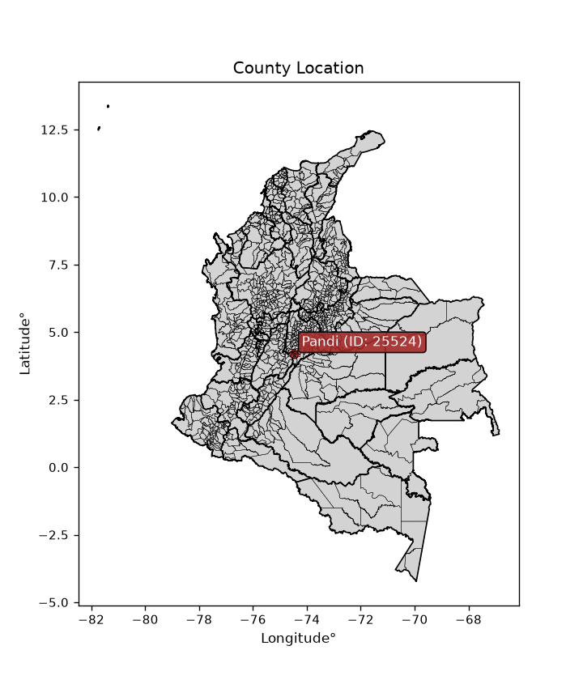
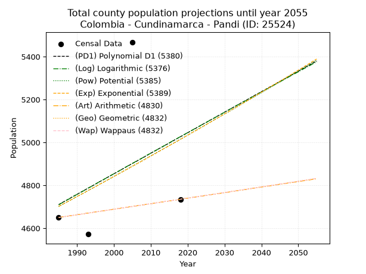
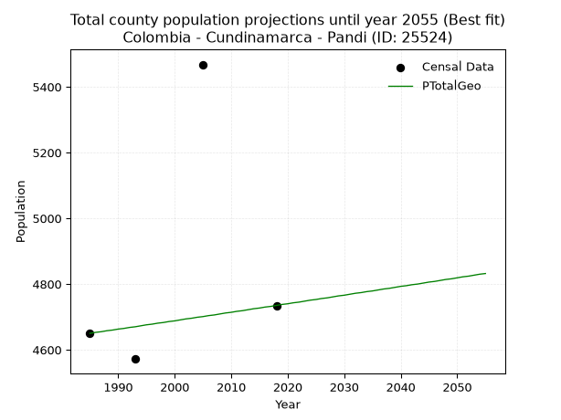
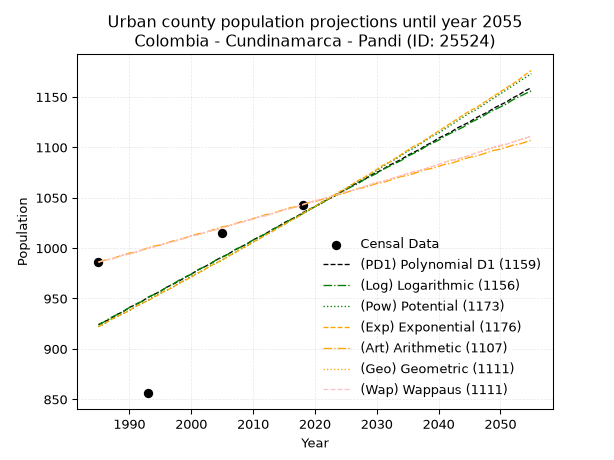
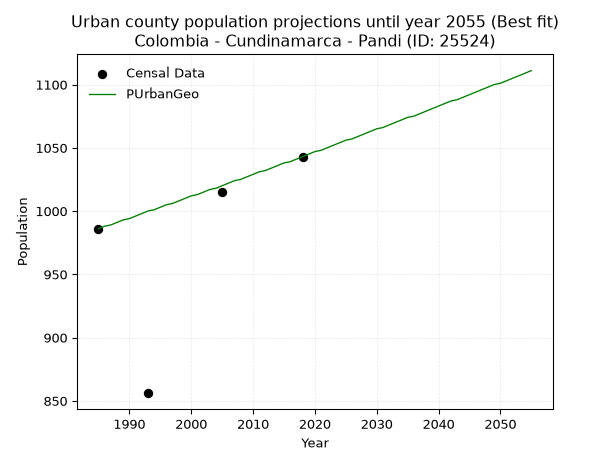
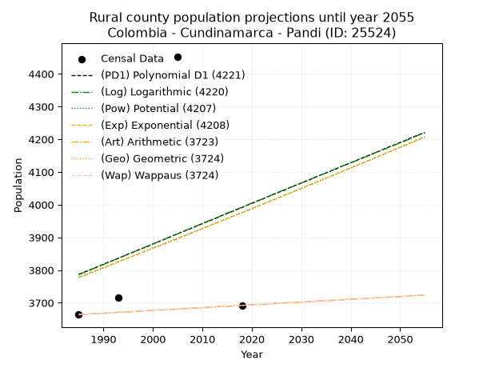
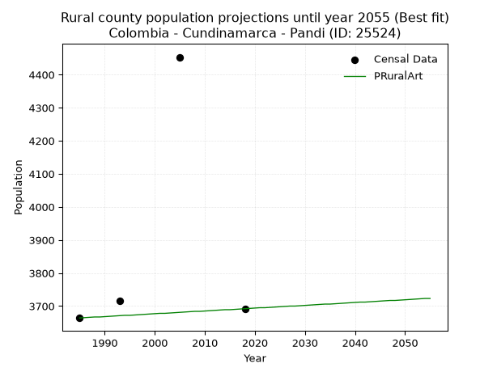

<div align="center">


</div>

# _“Population and Public Services Demand Projections (PPSD) until Year 2050 for Colombia - Cundinamarca - Pandi (ID: 25524)”_
Keywords: `population` `public-service` `projection` `lineal` `polynomial` `logarithmic` `potential` `exponential` `arithmetic` `geometric` `wappaus` `dane` `colombia` `south-america`

PPSD are analytical estimates used by governments and planners to anticipate future changes in population size, age distribution, and the resulting community needs for utilities, healthcare, education, and infrastructure as sizing future water treatment facilities, electrical grids, and road networks based on spatial growth.

<div align="center">

</img>

</div>


> **General running parameters**: • app_version: _v20260806_. • Python version: _3.14.7_. • Pandas version: _3.0.5_. • NumPy version: _2.5.1_. • Creates, save and include plots into reports (create_plot): _False_. • Projection until year: _2050_. • Process polynomial degree 2 and up: _False_. • Process Wappaus: _True_. • Process Wappaus: _True_. • Set negative values to zero: _True_. • Set infinite values to zero: _True_. • Drop dataset notes: _True_. 
<div align="center">

Dynamic map: [:earth_americas:Google](http://maps.google.com/maps?q=4.190392841,-74.4866413) [:earth_americas:OSM](https://www.openstreetmap.org/#map=18/4.190392841/-74.4866413&layers=P) [:earth_americas:Bing](https://www.bing.com/maps?cp=4.190392841~-74.4866413&lvl=18) [:earth_americas:Apple](https://maps.apple.com/frame?center=4.190392841%2C-74.4866413&span=0.003%2C0.006)

</div>


<div align="center">

```geojson
{
  "type": "Feature",
  "geometry": {
    "type": "Point", 
    "coordinates": [-74.4866413, 4.190392841]
  }, 
  "properties": {
    "Name": "Colombia - Cundinamarca - Pandi (ID: 25524)"
  }
}
```

</div>


## 0. Census Data (4 records)

Census data are official statistics collected by a government about the people and housing in a country. They usually include counts of total population, age, sex, race, income, education, and jobs.

📅Global census file: [Population.xlsx](../data/Population.xlsx)

| Source   |   Year |   CountryID | CountryName   |   StateID | StateName    |   CountyID | CountyName   |   PTotal |   PUrban |   PRural |
|:---------|-------:|------------:|:--------------|----------:|:-------------|-----------:|:-------------|---------:|---------:|---------:|
| DANE     |   1985 |          57 | Colombia      |        25 | Cundinamarca |      25524 | Pandi        |     4650 |      986 |     3664 |
| DANE     |   1993 |          57 | Colombia      |        25 | Cundinamarca |      25524 | Pandi        |     4572 |      856 |     3716 |
| DANE     |   2005 |          57 | Colombia      |        25 | Cundinamarca |      25524 | Pandi        |     5468 |     1015 |     4453 |
| DANE     |   2018 |          57 | Colombia      |        25 | Cundinamarca |      25524 | Pandi        |     4735 |     1043 |     3692 |

> 🔥Some records could had specific notes about the registered values or the corresponding urban or rural distribution.

📅[SUI-RUPS](https://www.datos.gov.co/Hacienda-y-Cr-dito-P-blico/Registro-nico-de-Prestadores-de-Servicios-P-blicos/4qkq-csdn/about_data) - Local public utility companies: [RUPS.csv](../data/RUPS.xlsx)

 | SERVICIO       | ESTADO      | NOMBRE                                                                                                                                           | NIT         | DEPARTAMENTO_DOMICILIO   | MUNICIPIO_DOMICILIO   | DIRECCION                            |   TELEFONO | EMAIL                                 | TIPO_PRESTADOR                             | CLASIFICACION                 |
|:---------------|:------------|:-------------------------------------------------------------------------------------------------------------------------------------------------|:------------|:-------------------------|:----------------------|:-------------------------------------|-----------:|:--------------------------------------|:-------------------------------------------|:------------------------------|
| ACUEDUCTO      | OPERATIVA   | SECRETARIA DE SERVICIOS PUBLICOS DE PANDI - CUNDINAMARCA                                                                                         | 890680173-1 | CUNDINAMARCA             | PANDI                 | Cra. 4ª Nº 3-55/65 Piso 1 y 2        |    8419365 | yennypotes11@hotmail.com              | MUNICIPIO (PRESTACIÓN DIRECTA)             | HASTA 2500 SUSCRIPTORES       |
| ALCANTARILLADO | OPERATIVA   | SECRETARIA DE SERVICIOS PUBLICOS DE PANDI - CUNDINAMARCA                                                                                         | 890680173-1 | CUNDINAMARCA             | PANDI                 | Cra. 4ª Nº 3-55/65 Piso 1 y 2        |    8419365 | yennypotes11@hotmail.com              | MUNICIPIO (PRESTACIÓN DIRECTA)             | HASTA 2500 SUSCRIPTORES       |
| ACUEDUCTO      | OPERATIVA   | ASOCIACION DE USUARIOS DEL ACUEDUCTO REGIONAL VEREDA SANTA HELENA  BAJA                                                                          | 808002681-6 | CUNDINAMARCA             | PANDI                 | Carrera 4 N 3 - 55 Palacio Municipal |    8419300 | contactenos@pandi-cundinamarca.gov.co | ORGANIZACION AUTORIZADA                    | HASTA 2500 SUSCRIPTORES       |
| ACUEDUCTO      | OPERATIVA   | ASOCIACION DE SUSCRIPTORES DEL SERVICIO DE ACUEDUCTO DE VALDEPEÑA VEREDA MERCADILLO SECTORES POMARROSO CAMBULOS Y TENDIDO DEL MUNICIPIO DE PANDI | 808003578-1 | CUNDINAMARCA             | PANDI                 | AV 3 No 2 - 19                       |    8419136 | asousuariosvaldepena@gmail.com        | ORGANIZACION AUTORIZADA                    | HASTA 2500 SUSCRIPTORES       |
| ACUEDUCTO      | CANCELACION | ACUAPANDI SAS ESP                                                                                                                                | 900486777-4 | CUNDINAMARCA             | PANDI                 | CARRERA 4 No. 3-55 PRIMER PISO       |    8419306 | acuapandi.sasesp@yahoo.es             | nan                                        | nan                           |
| ALCANTARILLADO | CANCELACION | ACUAPANDI SAS ESP                                                                                                                                | 900486777-4 | CUNDINAMARCA             | PANDI                 | CARRERA 4 No. 3-55 PRIMER PISO       |    8419306 | acuapandi.sasesp@yahoo.es             | nan                                        | nan                           |
| ACUEDUCTO      | OPERATIVA   | EMPRESA DE SERVICIOS PÚBLICOS DE PANDI SAS ESP                                                                                                   | 901154779-8 | CUNDINAMARCA             | PANDI                 | CALLE 4 N° 5-20                      |    0000000 | empandiespaaa@gmail.com               | SOCIEDADES (EMPRESA DE SERVICIOS PUBLICOS) | MENOR O IGUAL A 2500 USUARIOS |
| ALCANTARILLADO | OPERATIVA   | EMPRESA DE SERVICIOS PÚBLICOS DE PANDI SAS ESP                                                                                                   | 901154779-8 | CUNDINAMARCA             | PANDI                 | CALLE 4 N° 5-20                      |    0000000 | empandiespaaa@gmail.com               | SOCIEDADES (EMPRESA DE SERVICIOS PUBLICOS) | MENOR O IGUAL A 2500 USUARIOS |

## 1. Total

### 1.1. Coefficients and Parameters

* (PD1) Polynomial Deg 1: 9.570052187876762, -14286.246888800491 (lineal)
* (Log) Logarithmic: 19239.104607913534, -141380.33829725935
* (Pow) Potential: 3.9179849127273396, -9.248388409815956
* (Exp) Exponential: 0.0019492477005514943, 98.14546537741839
* (Art) Arithmetic: Year diff. 2018 - 1985 = 33, Population diff. 4735 - 4650 = 85, Annual growth = 2.5757575757575757
* (Geo) Geometric: Year diff. 2018 - 1985 = 33, Population diff. 4735 - 4650 = 85, Annual growth % = 0.0005490751423200546
* (Wap) Wappaus: i = 0.05489094460857913, Condition values only valid for < 200)

<sub>
Wappaus condition values: ['0.00', '0.05', '0.11', '0.16', '0.22', '0.27', '0.33', '0.38', '0.44', '0.49', '0.55', '0.60', '0.66', '0.71', '0.77', '0.82', '0.88', '0.93', '0.99', '1.04', '1.10', '1.15', '1.21', '1.26', '1.32', '1.37', '1.43', '1.48', '1.54', '1.59', '1.65', '1.70', '1.76', '1.81', '1.87', '1.92', '1.98', '2.03', '2.09', '2.14', '2.20', '2.25', '2.31', '2.36', '2.42', '2.47', '2.52', '2.58', '2.63', '2.69', '2.74', '2.80', '2.85', '2.91', '2.96', '3.02', '3.07', '3.13', '3.18', '3.24', '3.29', '3.35', '3.40', '3.46', '3.51', '3.57']
</sub>


### 1.2. Projected Dataset

|   Year |   CountyID |   PTotalPD1 |   PTotalLog |   PTotalPow |   PTotalExp |   PTotalArt |   PTotalGeo |   PTotalWap |
|-------:|-----------:|------------:|------------:|------------:|------------:|------------:|------------:|------------:|
|   1985 |      25524 |        4710 |        4709 |        4701 |        4702 |        4650 |        4650 |        4650 |
|   1986 |      25524 |        4720 |        4719 |        4710 |        4711 |        4653 |        4653 |        4653 |
|   1987 |      25524 |        4729 |        4729 |        4720 |        4720 |        4655 |        4655 |        4655 |
|   1988 |      25524 |        4739 |        4738 |        4729 |        4729 |        4658 |        4658 |        4658 |
|   1989 |      25524 |        4749 |        4748 |        4738 |        4739 |        4660 |        4660 |        4660 |
|   1990 |      25524 |        4758 |        4758 |        4748 |        4748 |        4663 |        4663 |        4663 |
|   1991 |      25524 |        4768 |        4767 |        4757 |        4757 |        4665 |        4665 |        4665 |
|   1992 |      25524 |        4777 |        4777 |        4766 |        4766 |        4668 |        4668 |        4668 |
|   1993 |      25524 |        4787 |        4787 |        4776 |        4776 |        4671 |        4670 |        4670 |
|   1994 |      25524 |        4796 |        4796 |        4785 |        4785 |        4673 |        4673 |        4673 |
|   1995 |      25524 |        4806 |        4806 |        4794 |        4794 |        4676 |        4676 |        4676 |
|   1996 |      25524 |        4816 |        4816 |        4804 |        4804 |        4678 |        4678 |        4678 |
|   1997 |      25524 |        4825 |        4825 |        4813 |        4813 |        4681 |        4681 |        4681 |
|   1998 |      25524 |        4835 |        4835 |        4823 |        4822 |        4683 |        4683 |        4683 |
|   1999 |      25524 |        4844 |        4845 |        4832 |        4832 |        4686 |        4686 |        4686 |
|   2000 |      25524 |        4854 |        4854 |        4842 |        4841 |        4689 |        4688 |        4688 |
|   2001 |      25524 |        4863 |        4864 |        4851 |        4851 |        4691 |        4691 |        4691 |
|   2002 |      25524 |        4873 |        4873 |        4861 |        4860 |        4694 |        4694 |        4694 |
|   2003 |      25524 |        4883 |        4883 |        4870 |        4870 |        4696 |        4696 |        4696 |
|   2004 |      25524 |        4892 |        4893 |        4880 |        4879 |        4699 |        4699 |        4699 |
|   2005 |      25524 |        4902 |        4902 |        4889 |        4889 |        4702 |        4701 |        4701 |
|   2006 |      25524 |        4911 |        4912 |        4899 |        4898 |        4704 |        4704 |        4704 |
|   2007 |      25524 |        4921 |        4921 |        4908 |        4908 |        4707 |        4706 |        4706 |
|   2008 |      25524 |        4930 |        4931 |        4918 |        4917 |        4709 |        4709 |        4709 |
|   2009 |      25524 |        4940 |        4941 |        4928 |        4927 |        4712 |        4712 |        4712 |
|   2010 |      25524 |        4950 |        4950 |        4937 |        4937 |        4714 |        4714 |        4714 |
|   2011 |      25524 |        4959 |        4960 |        4947 |        4946 |        4717 |        4717 |        4717 |
|   2012 |      25524 |        4969 |        4969 |        4957 |        4956 |        4720 |        4719 |        4719 |
|   2013 |      25524 |        4978 |        4979 |        4966 |        4966 |        4722 |        4722 |        4722 |
|   2014 |      25524 |        4988 |        4988 |        4976 |        4975 |        4725 |        4725 |        4725 |
|   2015 |      25524 |        4997 |        4998 |        4986 |        4985 |        4727 |        4727 |        4727 |
|   2016 |      25524 |        5007 |        5008 |        4995 |        4995 |        4730 |        4730 |        4730 |
|   2017 |      25524 |        5017 |        5017 |        5005 |        5004 |        4732 |        4732 |        4732 |
|   2018 |      25524 |        5026 |        5027 |        5015 |        5014 |        4735 |        4735 |        4735 |
|   2019 |      25524 |        5036 |        5036 |        5024 |        5024 |        4738 |        4738 |        4738 |
|   2020 |      25524 |        5045 |        5046 |        5034 |        5034 |        4740 |        4740 |        4740 |
|   2021 |      25524 |        5055 |        5055 |        5044 |        5044 |        4743 |        4743 |        4743 |
|   2022 |      25524 |        5064 |        5065 |        5054 |        5053 |        4745 |        4745 |        4745 |
|   2023 |      25524 |        5074 |        5074 |        5064 |        5063 |        4748 |        4748 |        4748 |
|   2024 |      25524 |        5084 |        5084 |        5073 |        5073 |        4750 |        4751 |        4751 |
|   2025 |      25524 |        5093 |        5093 |        5083 |        5083 |        4753 |        4753 |        4753 |
|   2026 |      25524 |        5103 |        5103 |        5093 |        5093 |        4756 |        4756 |        4756 |
|   2027 |      25524 |        5112 |        5112 |        5103 |        5103 |        4758 |        4758 |        4758 |
|   2028 |      25524 |        5122 |        5122 |        5113 |        5113 |        4761 |        4761 |        4761 |
|   2029 |      25524 |        5131 |        5131 |        5123 |        5123 |        4763 |        4764 |        4764 |
|   2030 |      25524 |        5141 |        5141 |        5133 |        5133 |        4766 |        4766 |        4766 |
|   2031 |      25524 |        5151 |        5150 |        5142 |        5143 |        4768 |        4769 |        4769 |
|   2032 |      25524 |        5160 |        5160 |        5152 |        5153 |        4771 |        4772 |        4772 |
|   2033 |      25524 |        5170 |        5169 |        5162 |        5163 |        4774 |        4774 |        4774 |
|   2034 |      25524 |        5179 |        5179 |        5172 |        5173 |        4776 |        4777 |        4777 |
|   2035 |      25524 |        5189 |        5188 |        5182 |        5183 |        4779 |        4779 |        4779 |
|   2036 |      25524 |        5198 |        5197 |        5192 |        5193 |        4781 |        4782 |        4782 |
|   2037 |      25524 |        5208 |        5207 |        5202 |        5203 |        4784 |        4785 |        4785 |
|   2038 |      25524 |        5218 |        5216 |        5212 |        5214 |        4787 |        4787 |        4787 |
|   2039 |      25524 |        5227 |        5226 |        5222 |        5224 |        4789 |        4790 |        4790 |
|   2040 |      25524 |        5237 |        5235 |        5232 |        5234 |        4792 |        4793 |        4793 |
|   2041 |      25524 |        5246 |        5245 |        5242 |        5244 |        4794 |        4795 |        4795 |
|   2042 |      25524 |        5256 |        5254 |        5252 |        5254 |        4797 |        4798 |        4798 |
|   2043 |      25524 |        5265 |        5263 |        5263 |        5265 |        4799 |        4800 |        4800 |
|   2044 |      25524 |        5275 |        5273 |        5273 |        5275 |        4802 |        4803 |        4803 |
|   2045 |      25524 |        5285 |        5282 |        5283 |        5285 |        4805 |        4806 |        4806 |
|   2046 |      25524 |        5294 |        5292 |        5293 |        5295 |        4807 |        4808 |        4808 |
|   2047 |      25524 |        5304 |        5301 |        5303 |        5306 |        4810 |        4811 |        4811 |
|   2048 |      25524 |        5313 |        5311 |        5313 |        5316 |        4812 |        4814 |        4814 |
|   2049 |      25524 |        5323 |        5320 |        5323 |        5327 |        4815 |        4816 |        4816 |
|   2050 |      25524 |        5332 |        5329 |        5334 |        5337 |        4817 |        4819 |        4819 |
<div align="center">

</img>

</div>


### 1.3. Best fit with absolute and relative error (%)

Relative error puts that difference into context by dividing the absolute error by the true value, creating a unitless ratio or percentage that shows the scale of the mistake.

Absolute and relative error

|   Year | Source   |   CountryID | CountryName   |   StateID | StateName    |   CountyID_x | CountyName   |   PTotal |   PUrban |   PRural |   CountyID_y |   PTotalPD1 |   PTotalLog |   PTotalPow |   PTotalExp |   PTotalArt |   PTotalGeo |   PTotalWap |   PTotalPD1AbsError |   PTotalLogAbsError |   PTotalPowAbsError |   PTotalExpAbsError |   PTotalArtAbsError |   PTotalGeoAbsError |   PTotalWapAbsError |   PTotalPD1RelError |   PTotalLogRelError |   PTotalPowRelError |   PTotalExpRelError |   PTotalArtRelError |   PTotalGeoRelError |   PTotalWapRelError |
|-------:|:---------|------------:|:--------------|----------:|:-------------|-------------:|:-------------|---------:|---------:|---------:|-------------:|------------:|------------:|------------:|------------:|------------:|------------:|------------:|--------------------:|--------------------:|--------------------:|--------------------:|--------------------:|--------------------:|--------------------:|--------------------:|--------------------:|--------------------:|--------------------:|--------------------:|--------------------:|--------------------:|
|   1985 | DANE     |          57 | Colombia      |        25 | Cundinamarca |        25524 | Pandi        |     4650 |      986 |     3664 |        25524 |        4710 |        4709 |        4701 |        4702 |        4650 |        4650 |        4650 |                  60 |                  59 |                  51 |                  52 |                   0 |                   0 |                   0 |             1.29032 |             1.26882 |             1.09677 |             1.11828 |             0       |             0       |             0       |
|   1993 | DANE     |          57 | Colombia      |        25 | Cundinamarca |        25524 | Pandi        |     4572 |      856 |     3716 |        25524 |        4787 |        4787 |        4776 |        4776 |        4671 |        4670 |        4670 |                 215 |                 215 |                 204 |                 204 |                  99 |                  98 |                  98 |             4.70254 |             4.70254 |             4.46194 |             4.46194 |             2.16535 |             2.14348 |             2.14348 |
|   2005 | DANE     |          57 | Colombia      |        25 | Cundinamarca |        25524 | Pandi        |     5468 |     1015 |     4453 |        25524 |        4902 |        4902 |        4889 |        4889 |        4702 |        4701 |        4701 |                 566 |                 566 |                 579 |                 579 |                 766 |                 767 |                 767 |            10.3511  |            10.3511  |            10.5889  |            10.5889  |            14.0088  |            14.0271  |            14.0271  |
|   2018 | DANE     |          57 | Colombia      |        25 | Cundinamarca |        25524 | Pandi        |     4735 |     1043 |     3692 |        25524 |        5026 |        5027 |        5015 |        5014 |        4735 |        4735 |        4735 |                 291 |                 292 |                 280 |                 279 |                   0 |                   0 |                   0 |             6.14572 |             6.16684 |             5.91341 |             5.89229 |             0       |             0       |             0       |

Relative error mean

| Method    |   RelError | Best   |
|:----------|-----------:|:-------|
| PTotalPD1 |    5.62243 |        |
| PTotalLog |    5.62233 |        |
| PTotalPow |    5.51525 |        |
| PTotalExp |    5.51535 |        |
| PTotalArt |    4.04353 |        |
| PTotalGeo |    4.04264 | True   |
| PTotalWap |    4.04264 | True   |

💙Best method: _**PTotalGeo**_
<div align="center">

</img>

</div>


### 1.4. Fresh water supply demand in liters per capita per day (lpcd)

The fresh water supply demand typically ranges from 100 to 300 liters per capita per day (lpcd) for standard domestic and municipal planning, though absolute survival minimums set by the World Health Organization are as low as 7.5 to 20 liters per day, and total consumption in high-income nations can exceed 400 liters.

> `CZ`: Level in meters above the sea level (masl)<br> `WS`: Fresh water supply demand in liters per capita per day (lpcd or l/h/d)<br> `WSAll`: Zonal fresh water supply demand in liters per second (l/s)<br> `A`: Zonal area in square meters<br> `DP`: Population density (people/hectare or p/ha)

Reference values (RAS Colombia)

|    CZ |   WS |
|------:|-----:|
|  1000 |  120 |
|  2000 |  130 |
| 99999 |  140 |

County shapefile geometry properties and water supply values

|   CountyID |      ATotal |   CZTotal |   WSTotal |
|-----------:|------------:|----------:|----------:|
|      25524 | 7.16268e+07 |   1351.89 |       130 |

Projected values for best method: PTotalGeo

|   CountyID |   Year |   PTotalGeo |   DPTotal |   WSTotal |   WSTotalAll |
|-----------:|-------:|------------:|----------:|----------:|-------------:|
|      25524 |   1985 |        4650 |      0.65 |       130 |      6.99653 |
|      25524 |   1986 |        4653 |      0.65 |       130 |      7.00104 |
|      25524 |   1987 |        4655 |      0.65 |       130 |      7.00405 |
|      25524 |   1988 |        4658 |      0.65 |       130 |      7.00856 |
|      25524 |   1989 |        4660 |      0.65 |       130 |      7.01157 |
|      25524 |   1990 |        4663 |      0.65 |       130 |      7.01609 |
|      25524 |   1991 |        4665 |      0.65 |       130 |      7.0191  |
|      25524 |   1992 |        4668 |      0.65 |       130 |      7.02361 |
|      25524 |   1993 |        4670 |      0.65 |       130 |      7.02662 |
|      25524 |   1994 |        4673 |      0.65 |       130 |      7.03113 |
|      25524 |   1995 |        4676 |      0.65 |       130 |      7.03565 |
|      25524 |   1996 |        4678 |      0.65 |       130 |      7.03866 |
|      25524 |   1997 |        4681 |      0.65 |       130 |      7.04317 |
|      25524 |   1998 |        4683 |      0.65 |       130 |      7.04618 |
|      25524 |   1999 |        4686 |      0.65 |       130 |      7.05069 |
|      25524 |   2000 |        4688 |      0.65 |       130 |      7.0537  |
|      25524 |   2001 |        4691 |      0.65 |       130 |      7.05822 |
|      25524 |   2002 |        4694 |      0.66 |       130 |      7.06273 |
|      25524 |   2003 |        4696 |      0.66 |       130 |      7.06574 |
|      25524 |   2004 |        4699 |      0.66 |       130 |      7.07025 |
|      25524 |   2005 |        4701 |      0.66 |       130 |      7.07326 |
|      25524 |   2006 |        4704 |      0.66 |       130 |      7.07778 |
|      25524 |   2007 |        4706 |      0.66 |       130 |      7.08079 |
|      25524 |   2008 |        4709 |      0.66 |       130 |      7.0853  |
|      25524 |   2009 |        4712 |      0.66 |       130 |      7.08981 |
|      25524 |   2010 |        4714 |      0.66 |       130 |      7.09282 |
|      25524 |   2011 |        4717 |      0.66 |       130 |      7.09734 |
|      25524 |   2012 |        4719 |      0.66 |       130 |      7.10035 |
|      25524 |   2013 |        4722 |      0.66 |       130 |      7.10486 |
|      25524 |   2014 |        4725 |      0.66 |       130 |      7.10938 |
|      25524 |   2015 |        4727 |      0.66 |       130 |      7.11238 |
|      25524 |   2016 |        4730 |      0.66 |       130 |      7.1169  |
|      25524 |   2017 |        4732 |      0.66 |       130 |      7.11991 |
|      25524 |   2018 |        4735 |      0.66 |       130 |      7.12442 |
|      25524 |   2019 |        4738 |      0.66 |       130 |      7.12894 |
|      25524 |   2020 |        4740 |      0.66 |       130 |      7.13194 |
|      25524 |   2021 |        4743 |      0.66 |       130 |      7.13646 |
|      25524 |   2022 |        4745 |      0.66 |       130 |      7.13947 |
|      25524 |   2023 |        4748 |      0.66 |       130 |      7.14398 |
|      25524 |   2024 |        4751 |      0.66 |       130 |      7.1485  |
|      25524 |   2025 |        4753 |      0.66 |       130 |      7.1515  |
|      25524 |   2026 |        4756 |      0.66 |       130 |      7.15602 |
|      25524 |   2027 |        4758 |      0.66 |       130 |      7.15903 |
|      25524 |   2028 |        4761 |      0.66 |       130 |      7.16354 |
|      25524 |   2029 |        4764 |      0.67 |       130 |      7.16806 |
|      25524 |   2030 |        4766 |      0.67 |       130 |      7.17106 |
|      25524 |   2031 |        4769 |      0.67 |       130 |      7.17558 |
|      25524 |   2032 |        4772 |      0.67 |       130 |      7.18009 |
|      25524 |   2033 |        4774 |      0.67 |       130 |      7.1831  |
|      25524 |   2034 |        4777 |      0.67 |       130 |      7.18762 |
|      25524 |   2035 |        4779 |      0.67 |       130 |      7.19062 |
|      25524 |   2036 |        4782 |      0.67 |       130 |      7.19514 |
|      25524 |   2037 |        4785 |      0.67 |       130 |      7.19965 |
|      25524 |   2038 |        4787 |      0.67 |       130 |      7.20266 |
|      25524 |   2039 |        4790 |      0.67 |       130 |      7.20718 |
|      25524 |   2040 |        4793 |      0.67 |       130 |      7.21169 |
|      25524 |   2041 |        4795 |      0.67 |       130 |      7.2147  |
|      25524 |   2042 |        4798 |      0.67 |       130 |      7.21921 |
|      25524 |   2043 |        4800 |      0.67 |       130 |      7.22222 |
|      25524 |   2044 |        4803 |      0.67 |       130 |      7.22674 |
|      25524 |   2045 |        4806 |      0.67 |       130 |      7.23125 |
|      25524 |   2046 |        4808 |      0.67 |       130 |      7.23426 |
|      25524 |   2047 |        4811 |      0.67 |       130 |      7.23877 |
|      25524 |   2048 |        4814 |      0.67 |       130 |      7.24329 |
|      25524 |   2049 |        4816 |      0.67 |       130 |      7.2463  |
|      25524 |   2050 |        4819 |      0.67 |       130 |      7.25081 |

## 2. Urban

### 2.1. Coefficients and Parameters

* (PD1) Polynomial Deg 1: 3.359293456443168, -5744.426736250447 (lineal)
* (Log) Logarithmic: 6713.8021422279135, -50056.66388410824
* (Pow) Potential: 6.932610526139272, -19.897297838734865
* (Exp) Exponential: 0.0034689537150643756, 0.9425485026822438
* (Art) Arithmetic: Year diff. 2018 - 1985 = 33, Population diff. 1043 - 986 = 57, Annual growth = 1.7272727272727273
* (Geo) Geometric: Year diff. 2018 - 1985 = 33, Population diff. 1043 - 986 = 57, Annual growth % = 0.0017044843302607138
* (Wap) Wappaus: i = 0.17025852412742506, Condition values only valid for < 200)

<sub>
Wappaus condition values: ['0.00', '0.17', '0.34', '0.51', '0.68', '0.85', '1.02', '1.19', '1.36', '1.53', '1.70', '1.87', '2.04', '2.21', '2.38', '2.55', '2.72', '2.89', '3.06', '3.23', '3.41', '3.58', '3.75', '3.92', '4.09', '4.26', '4.43', '4.60', '4.77', '4.94', '5.11', '5.28', '5.45', '5.62', '5.79', '5.96', '6.13', '6.30', '6.47', '6.64', '6.81', '6.98', '7.15', '7.32', '7.49', '7.66', '7.83', '8.00', '8.17', '8.34', '8.51', '8.68', '8.85', '9.02', '9.19', '9.36', '9.53', '9.70', '9.87', '10.05', '10.22', '10.39', '10.56', '10.73', '10.90', '11.07']
</sub>


### 2.2. Projected Dataset

|   Year |   CountyID |   PUrbanPD1 |   PUrbanLog |   PUrbanPow |   PUrbanExp |   PUrbanArt |   PUrbanGeo |   PUrbanWap |
|-------:|-----------:|------------:|------------:|------------:|------------:|------------:|------------:|------------:|
|   1985 |      25524 |         924 |         924 |         922 |         922 |         986 |         986 |         986 |
|   1986 |      25524 |         927 |         927 |         925 |         925 |         988 |         988 |         988 |
|   1987 |      25524 |         930 |         931 |         929 |         929 |         989 |         989 |         989 |
|   1988 |      25524 |         934 |         934 |         932 |         932 |         991 |         991 |         991 |
|   1989 |      25524 |         937 |         937 |         935 |         935 |         993 |         993 |         993 |
|   1990 |      25524 |         941 |         941 |         938 |         938 |         995 |         994 |         994 |
|   1991 |      25524 |         944 |         944 |         942 |         942 |         996 |         996 |         996 |
|   1992 |      25524 |         947 |         947 |         945 |         945 |         998 |         998 |         998 |
|   1993 |      25524 |         951 |         951 |         948 |         948 |        1000 |        1000 |        1000 |
|   1994 |      25524 |         954 |         954 |         952 |         951 |        1002 |        1001 |        1001 |
|   1995 |      25524 |         957 |         957 |         955 |         955 |        1003 |        1003 |        1003 |
|   1996 |      25524 |         961 |         961 |         958 |         958 |        1005 |        1005 |        1005 |
|   1997 |      25524 |         964 |         964 |         961 |         961 |        1007 |        1006 |        1006 |
|   1998 |      25524 |         967 |         968 |         965 |         965 |        1008 |        1008 |        1008 |
|   1999 |      25524 |         971 |         971 |         968 |         968 |        1010 |        1010 |        1010 |
|   2000 |      25524 |         974 |         974 |         972 |         971 |        1012 |        1012 |        1012 |
|   2001 |      25524 |         978 |         978 |         975 |         975 |        1014 |        1013 |        1013 |
|   2002 |      25524 |         981 |         981 |         978 |         978 |        1015 |        1015 |        1015 |
|   2003 |      25524 |         984 |         984 |         982 |         982 |        1017 |        1017 |        1017 |
|   2004 |      25524 |         988 |         988 |         985 |         985 |        1019 |        1018 |        1018 |
|   2005 |      25524 |         991 |         991 |         988 |         988 |        1021 |        1020 |        1020 |
|   2006 |      25524 |         994 |         994 |         992 |         992 |        1022 |        1022 |        1022 |
|   2007 |      25524 |         998 |         998 |         995 |         995 |        1024 |        1024 |        1024 |
|   2008 |      25524 |        1001 |        1001 |         999 |         999 |        1026 |        1025 |        1025 |
|   2009 |      25524 |        1004 |        1004 |        1002 |        1002 |        1027 |        1027 |        1027 |
|   2010 |      25524 |        1008 |        1008 |        1006 |        1006 |        1029 |        1029 |        1029 |
|   2011 |      25524 |        1011 |        1011 |        1009 |        1009 |        1031 |        1031 |        1031 |
|   2012 |      25524 |        1014 |        1014 |        1013 |        1013 |        1033 |        1032 |        1032 |
|   2013 |      25524 |        1018 |        1018 |        1016 |        1016 |        1034 |        1034 |        1034 |
|   2014 |      25524 |        1021 |        1021 |        1020 |        1020 |        1036 |        1036 |        1036 |
|   2015 |      25524 |        1025 |        1024 |        1023 |        1023 |        1038 |        1038 |        1038 |
|   2016 |      25524 |        1028 |        1028 |        1027 |        1027 |        1040 |        1039 |        1039 |
|   2017 |      25524 |        1031 |        1031 |        1030 |        1030 |        1041 |        1041 |        1041 |
|   2018 |      25524 |        1035 |        1034 |        1034 |        1034 |        1043 |        1043 |        1043 |
|   2019 |      25524 |        1038 |        1038 |        1037 |        1038 |        1045 |        1045 |        1045 |
|   2020 |      25524 |        1041 |        1041 |        1041 |        1041 |        1046 |        1047 |        1047 |
|   2021 |      25524 |        1045 |        1044 |        1044 |        1045 |        1048 |        1048 |        1048 |
|   2022 |      25524 |        1048 |        1048 |        1048 |        1048 |        1050 |        1050 |        1050 |
|   2023 |      25524 |        1051 |        1051 |        1052 |        1052 |        1052 |        1052 |        1052 |
|   2024 |      25524 |        1055 |        1054 |        1055 |        1056 |        1053 |        1054 |        1054 |
|   2025 |      25524 |        1058 |        1058 |        1059 |        1059 |        1055 |        1056 |        1056 |
|   2026 |      25524 |        1062 |        1061 |        1063 |        1063 |        1057 |        1057 |        1057 |
|   2027 |      25524 |        1065 |        1064 |        1066 |        1067 |        1059 |        1059 |        1059 |
|   2028 |      25524 |        1068 |        1068 |        1070 |        1070 |        1060 |        1061 |        1061 |
|   2029 |      25524 |        1072 |        1071 |        1073 |        1074 |        1062 |        1063 |        1063 |
|   2030 |      25524 |        1075 |        1074 |        1077 |        1078 |        1064 |        1065 |        1065 |
|   2031 |      25524 |        1078 |        1078 |        1081 |        1082 |        1065 |        1066 |        1066 |
|   2032 |      25524 |        1082 |        1081 |        1085 |        1085 |        1067 |        1068 |        1068 |
|   2033 |      25524 |        1085 |        1084 |        1088 |        1089 |        1069 |        1070 |        1070 |
|   2034 |      25524 |        1088 |        1087 |        1092 |        1093 |        1071 |        1072 |        1072 |
|   2035 |      25524 |        1092 |        1091 |        1096 |        1097 |        1072 |        1074 |        1074 |
|   2036 |      25524 |        1095 |        1094 |        1099 |        1101 |        1074 |        1075 |        1076 |
|   2037 |      25524 |        1098 |        1097 |        1103 |        1104 |        1076 |        1077 |        1077 |
|   2038 |      25524 |        1102 |        1101 |        1107 |        1108 |        1078 |        1079 |        1079 |
|   2039 |      25524 |        1105 |        1104 |        1111 |        1112 |        1079 |        1081 |        1081 |
|   2040 |      25524 |        1109 |        1107 |        1114 |        1116 |        1081 |        1083 |        1083 |
|   2041 |      25524 |        1112 |        1111 |        1118 |        1120 |        1083 |        1085 |        1085 |
|   2042 |      25524 |        1115 |        1114 |        1122 |        1124 |        1084 |        1087 |        1087 |
|   2043 |      25524 |        1119 |        1117 |        1126 |        1128 |        1086 |        1088 |        1088 |
|   2044 |      25524 |        1122 |        1120 |        1130 |        1132 |        1088 |        1090 |        1090 |
|   2045 |      25524 |        1125 |        1124 |        1134 |        1136 |        1090 |        1092 |        1092 |
|   2046 |      25524 |        1129 |        1127 |        1137 |        1139 |        1091 |        1094 |        1094 |
|   2047 |      25524 |        1132 |        1130 |        1141 |        1143 |        1093 |        1096 |        1096 |
|   2048 |      25524 |        1135 |        1134 |        1145 |        1147 |        1095 |        1098 |        1098 |
|   2049 |      25524 |        1139 |        1137 |        1149 |        1151 |        1097 |        1100 |        1100 |
|   2050 |      25524 |        1142 |        1140 |        1153 |        1155 |        1098 |        1101 |        1102 |
<div align="center">

</img>

</div>


### 2.3. Best fit with absolute and relative error (%)

Relative error puts that difference into context by dividing the absolute error by the true value, creating a unitless ratio or percentage that shows the scale of the mistake.

Absolute and relative error

|   Year | Source   |   CountryID | CountryName   |   StateID | StateName    |   CountyID_x | CountyName   |   PTotal |   PUrban |   PRural |   CountyID_y |   PUrbanPD1 |   PUrbanLog |   PUrbanPow |   PUrbanExp |   PUrbanArt |   PUrbanGeo |   PUrbanWap |   PUrbanPD1AbsError |   PUrbanLogAbsError |   PUrbanPowAbsError |   PUrbanExpAbsError |   PUrbanArtAbsError |   PUrbanGeoAbsError |   PUrbanWapAbsError |   PUrbanPD1RelError |   PUrbanLogRelError |   PUrbanPowRelError |   PUrbanExpRelError |   PUrbanArtRelError |   PUrbanGeoRelError |   PUrbanWapRelError |
|-------:|:---------|------------:|:--------------|----------:|:-------------|-------------:|:-------------|---------:|---------:|---------:|-------------:|------------:|------------:|------------:|------------:|------------:|------------:|------------:|--------------------:|--------------------:|--------------------:|--------------------:|--------------------:|--------------------:|--------------------:|--------------------:|--------------------:|--------------------:|--------------------:|--------------------:|--------------------:|--------------------:|
|   1985 | DANE     |          57 | Colombia      |        25 | Cundinamarca |        25524 | Pandi        |     4650 |      986 |     3664 |        25524 |         924 |         924 |         922 |         922 |         986 |         986 |         986 |                  62 |                  62 |                  64 |                  64 |                   0 |                   0 |                   0 |            6.28803  |            6.28803  |            6.49087  |            6.49087  |            0        |            0        |            0        |
|   1993 | DANE     |          57 | Colombia      |        25 | Cundinamarca |        25524 | Pandi        |     4572 |      856 |     3716 |        25524 |         951 |         951 |         948 |         948 |        1000 |        1000 |        1000 |                  95 |                  95 |                  92 |                  92 |                 144 |                 144 |                 144 |           11.0981   |           11.0981   |           10.7477   |           10.7477   |           16.8224   |           16.8224   |           16.8224   |
|   2005 | DANE     |          57 | Colombia      |        25 | Cundinamarca |        25524 | Pandi        |     5468 |     1015 |     4453 |        25524 |         991 |         991 |         988 |         988 |        1021 |        1020 |        1020 |                  24 |                  24 |                  27 |                  27 |                   6 |                   5 |                   5 |            2.36453  |            2.36453  |            2.6601   |            2.6601   |            0.591133 |            0.492611 |            0.492611 |
|   2018 | DANE     |          57 | Colombia      |        25 | Cundinamarca |        25524 | Pandi        |     4735 |     1043 |     3692 |        25524 |        1035 |        1034 |        1034 |        1034 |        1043 |        1043 |        1043 |                   8 |                   9 |                   9 |                   9 |                   0 |                   0 |                   0 |            0.767018 |            0.862895 |            0.862895 |            0.862895 |            0        |            0        |            0        |

Relative error mean

| Method    |   RelError | Best   |
|:----------|-----------:|:-------|
| PUrbanPD1 |    5.12943 |        |
| PUrbanLog |    5.1534  |        |
| PUrbanPow |    5.19038 |        |
| PUrbanExp |    5.19038 |        |
| PUrbanArt |    4.35339 |        |
| PUrbanGeo |    4.32876 | True   |
| PUrbanWap |    4.32876 | True   |

💙Best method: _**PUrbanGeo**_
<div align="center">

</img>

</div>


### 2.4. Fresh water supply demand in liters per capita per day (lpcd)

The fresh water supply demand typically ranges from 100 to 300 liters per capita per day (lpcd) for standard domestic and municipal planning, though absolute survival minimums set by the World Health Organization are as low as 7.5 to 20 liters per day, and total consumption in high-income nations can exceed 400 liters.

> `CZ`: Level in meters above the sea level (masl)<br> `WS`: Fresh water supply demand in liters per capita per day (lpcd or l/h/d)<br> `WSAll`: Zonal fresh water supply demand in liters per second (l/s)<br> `A`: Zonal area in square meters<br> `DP`: Population density (people/hectare or p/ha)

Reference values (RAS Colombia)

|    CZ |   WS |
|------:|-----:|
|  1000 |  120 |
|  2000 |  130 |
| 99999 |  140 |

County shapefile geometry properties and water supply values

|   CountyID |   AUrban |   CZUrban |   WSUrban |
|-----------:|---------:|----------:|----------:|
|      25524 |   387068 |   938.632 |       120 |

Projected values for best method: PUrbanGeo

|   CountyID |   Year |   PUrbanGeo |   DPUrban |   WSUrban |   WSUrbanAll |
|-----------:|-------:|------------:|----------:|----------:|-------------:|
|      25524 |   1985 |         986 |     25.47 |       120 |      1.36944 |
|      25524 |   1986 |         988 |     25.53 |       120 |      1.37222 |
|      25524 |   1987 |         989 |     25.55 |       120 |      1.37361 |
|      25524 |   1988 |         991 |     25.6  |       120 |      1.37639 |
|      25524 |   1989 |         993 |     25.65 |       120 |      1.37917 |
|      25524 |   1990 |         994 |     25.68 |       120 |      1.38056 |
|      25524 |   1991 |         996 |     25.73 |       120 |      1.38333 |
|      25524 |   1992 |         998 |     25.78 |       120 |      1.38611 |
|      25524 |   1993 |        1000 |     25.84 |       120 |      1.38889 |
|      25524 |   1994 |        1001 |     25.86 |       120 |      1.39028 |
|      25524 |   1995 |        1003 |     25.91 |       120 |      1.39306 |
|      25524 |   1996 |        1005 |     25.96 |       120 |      1.39583 |
|      25524 |   1997 |        1006 |     25.99 |       120 |      1.39722 |
|      25524 |   1998 |        1008 |     26.04 |       120 |      1.4     |
|      25524 |   1999 |        1010 |     26.09 |       120 |      1.40278 |
|      25524 |   2000 |        1012 |     26.15 |       120 |      1.40556 |
|      25524 |   2001 |        1013 |     26.17 |       120 |      1.40694 |
|      25524 |   2002 |        1015 |     26.22 |       120 |      1.40972 |
|      25524 |   2003 |        1017 |     26.27 |       120 |      1.4125  |
|      25524 |   2004 |        1018 |     26.3  |       120 |      1.41389 |
|      25524 |   2005 |        1020 |     26.35 |       120 |      1.41667 |
|      25524 |   2006 |        1022 |     26.4  |       120 |      1.41944 |
|      25524 |   2007 |        1024 |     26.46 |       120 |      1.42222 |
|      25524 |   2008 |        1025 |     26.48 |       120 |      1.42361 |
|      25524 |   2009 |        1027 |     26.53 |       120 |      1.42639 |
|      25524 |   2010 |        1029 |     26.58 |       120 |      1.42917 |
|      25524 |   2011 |        1031 |     26.64 |       120 |      1.43194 |
|      25524 |   2012 |        1032 |     26.66 |       120 |      1.43333 |
|      25524 |   2013 |        1034 |     26.71 |       120 |      1.43611 |
|      25524 |   2014 |        1036 |     26.77 |       120 |      1.43889 |
|      25524 |   2015 |        1038 |     26.82 |       120 |      1.44167 |
|      25524 |   2016 |        1039 |     26.84 |       120 |      1.44306 |
|      25524 |   2017 |        1041 |     26.89 |       120 |      1.44583 |
|      25524 |   2018 |        1043 |     26.95 |       120 |      1.44861 |
|      25524 |   2019 |        1045 |     27    |       120 |      1.45139 |
|      25524 |   2020 |        1047 |     27.05 |       120 |      1.45417 |
|      25524 |   2021 |        1048 |     27.08 |       120 |      1.45556 |
|      25524 |   2022 |        1050 |     27.13 |       120 |      1.45833 |
|      25524 |   2023 |        1052 |     27.18 |       120 |      1.46111 |
|      25524 |   2024 |        1054 |     27.23 |       120 |      1.46389 |
|      25524 |   2025 |        1056 |     27.28 |       120 |      1.46667 |
|      25524 |   2026 |        1057 |     27.31 |       120 |      1.46806 |
|      25524 |   2027 |        1059 |     27.36 |       120 |      1.47083 |
|      25524 |   2028 |        1061 |     27.41 |       120 |      1.47361 |
|      25524 |   2029 |        1063 |     27.46 |       120 |      1.47639 |
|      25524 |   2030 |        1065 |     27.51 |       120 |      1.47917 |
|      25524 |   2031 |        1066 |     27.54 |       120 |      1.48056 |
|      25524 |   2032 |        1068 |     27.59 |       120 |      1.48333 |
|      25524 |   2033 |        1070 |     27.64 |       120 |      1.48611 |
|      25524 |   2034 |        1072 |     27.7  |       120 |      1.48889 |
|      25524 |   2035 |        1074 |     27.75 |       120 |      1.49167 |
|      25524 |   2036 |        1075 |     27.77 |       120 |      1.49306 |
|      25524 |   2037 |        1077 |     27.82 |       120 |      1.49583 |
|      25524 |   2038 |        1079 |     27.88 |       120 |      1.49861 |
|      25524 |   2039 |        1081 |     27.93 |       120 |      1.50139 |
|      25524 |   2040 |        1083 |     27.98 |       120 |      1.50417 |
|      25524 |   2041 |        1085 |     28.03 |       120 |      1.50694 |
|      25524 |   2042 |        1087 |     28.08 |       120 |      1.50972 |
|      25524 |   2043 |        1088 |     28.11 |       120 |      1.51111 |
|      25524 |   2044 |        1090 |     28.16 |       120 |      1.51389 |
|      25524 |   2045 |        1092 |     28.21 |       120 |      1.51667 |
|      25524 |   2046 |        1094 |     28.26 |       120 |      1.51944 |
|      25524 |   2047 |        1096 |     28.32 |       120 |      1.52222 |
|      25524 |   2048 |        1098 |     28.37 |       120 |      1.525   |
|      25524 |   2049 |        1100 |     28.42 |       120 |      1.52778 |
|      25524 |   2050 |        1101 |     28.44 |       120 |      1.52917 |

## 3. Rural

### 3.1. Coefficients and Parameters

* (PD1) Polynomial Deg 1: 6.210758731433576, -8541.82015255001 (lineal)
* (Log) Logarithmic: 12525.302465685581, -91323.67441315085
* (Pow) Potential: 3.1065863073719133, -6.6675906058798855
* (Exp) Exponential: 0.0015404511918161844, 177.5416421811441
* (Art) Arithmetic: Year diff. 2018 - 1985 = 33, Population diff. 3692 - 3664 = 28, Annual growth = 0.8484848484848485
* (Geo) Geometric: Year diff. 2018 - 1985 = 33, Population diff. 3692 - 3664 = 28, Annual growth % = 0.00023071963679499596
* (Wap) Wappaus: i = 0.02306919109529224, Condition values only valid for < 200)

<sub>
Wappaus condition values: ['0.00', '0.02', '0.05', '0.07', '0.09', '0.12', '0.14', '0.16', '0.18', '0.21', '0.23', '0.25', '0.28', '0.30', '0.32', '0.35', '0.37', '0.39', '0.42', '0.44', '0.46', '0.48', '0.51', '0.53', '0.55', '0.58', '0.60', '0.62', '0.65', '0.67', '0.69', '0.72', '0.74', '0.76', '0.78', '0.81', '0.83', '0.85', '0.88', '0.90', '0.92', '0.95', '0.97', '0.99', '1.02', '1.04', '1.06', '1.08', '1.11', '1.13', '1.15', '1.18', '1.20', '1.22', '1.25', '1.27', '1.29', '1.31', '1.34', '1.36', '1.38', '1.41', '1.43', '1.45', '1.48', '1.50']
</sub>


### 3.2. Projected Dataset

|   Year |   CountyID |   PRuralPD1 |   PRuralLog |   PRuralPow |   PRuralExp |   PRuralArt |   PRuralGeo |   PRuralWap |
|-------:|-----------:|------------:|------------:|------------:|------------:|------------:|------------:|------------:|
|   1985 |      25524 |        3787 |        3786 |        3777 |        3778 |        3664 |        3664 |        3664 |
|   1986 |      25524 |        3793 |        3792 |        3783 |        3784 |        3665 |        3665 |        3665 |
|   1987 |      25524 |        3799 |        3798 |        3789 |        3790 |        3666 |        3666 |        3666 |
|   1988 |      25524 |        3805 |        3805 |        3795 |        3796 |        3667 |        3667 |        3667 |
|   1989 |      25524 |        3811 |        3811 |        3801 |        3802 |        3667 |        3667 |        3667 |
|   1990 |      25524 |        3818 |        3817 |        3807 |        3807 |        3668 |        3668 |        3668 |
|   1991 |      25524 |        3824 |        3823 |        3813 |        3813 |        3669 |        3669 |        3669 |
|   1992 |      25524 |        3830 |        3830 |        3819 |        3819 |        3670 |        3670 |        3670 |
|   1993 |      25524 |        3836 |        3836 |        3825 |        3825 |        3671 |        3671 |        3671 |
|   1994 |      25524 |        3842 |        3842 |        3831 |        3831 |        3672 |        3672 |        3672 |
|   1995 |      25524 |        3849 |        3849 |        3837 |        3837 |        3672 |        3672 |        3672 |
|   1996 |      25524 |        3855 |        3855 |        3843 |        3843 |        3673 |        3673 |        3673 |
|   1997 |      25524 |        3861 |        3861 |        3849 |        3849 |        3674 |        3674 |        3674 |
|   1998 |      25524 |        3867 |        3867 |        3855 |        3855 |        3675 |        3675 |        3675 |
|   1999 |      25524 |        3873 |        3874 |        3861 |        3861 |        3676 |        3676 |        3676 |
|   2000 |      25524 |        3880 |        3880 |        3867 |        3867 |        3677 |        3677 |        3677 |
|   2001 |      25524 |        3886 |        3886 |        3873 |        3872 |        3678 |        3678 |        3678 |
|   2002 |      25524 |        3892 |        3892 |        3879 |        3878 |        3678 |        3678 |        3678 |
|   2003 |      25524 |        3898 |        3899 |        3885 |        3884 |        3679 |        3679 |        3679 |
|   2004 |      25524 |        3905 |        3905 |        3891 |        3890 |        3680 |        3680 |        3680 |
|   2005 |      25524 |        3911 |        3911 |        3897 |        3896 |        3681 |        3681 |        3681 |
|   2006 |      25524 |        3917 |        3917 |        3903 |        3902 |        3682 |        3682 |        3682 |
|   2007 |      25524 |        3923 |        3924 |        3909 |        3908 |        3683 |        3683 |        3683 |
|   2008 |      25524 |        3929 |        3930 |        3915 |        3914 |        3684 |        3683 |        3683 |
|   2009 |      25524 |        3936 |        3936 |        3921 |        3920 |        3684 |        3684 |        3684 |
|   2010 |      25524 |        3942 |        3942 |        3927 |        3927 |        3685 |        3685 |        3685 |
|   2011 |      25524 |        3948 |        3949 |        3933 |        3933 |        3686 |        3686 |        3686 |
|   2012 |      25524 |        3954 |        3955 |        3939 |        3939 |        3687 |        3687 |        3687 |
|   2013 |      25524 |        3960 |        3961 |        3945 |        3945 |        3688 |        3688 |        3688 |
|   2014 |      25524 |        3967 |        3967 |        3951 |        3951 |        3689 |        3689 |        3689 |
|   2015 |      25524 |        3973 |        3974 |        3958 |        3957 |        3689 |        3689 |        3689 |
|   2016 |      25524 |        3979 |        3980 |        3964 |        3963 |        3690 |        3690 |        3690 |
|   2017 |      25524 |        3985 |        3986 |        3970 |        3969 |        3691 |        3691 |        3691 |
|   2018 |      25524 |        3991 |        3992 |        3976 |        3975 |        3692 |        3692 |        3692 |
|   2019 |      25524 |        3998 |        3998 |        3982 |        3981 |        3693 |        3693 |        3693 |
|   2020 |      25524 |        4004 |        4005 |        3988 |        3987 |        3694 |        3694 |        3694 |
|   2021 |      25524 |        4010 |        4011 |        3994 |        3994 |        3695 |        3695 |        3695 |
|   2022 |      25524 |        4016 |        4017 |        4000 |        4000 |        3695 |        3695 |        3695 |
|   2023 |      25524 |        4023 |        4023 |        4007 |        4006 |        3696 |        3696 |        3696 |
|   2024 |      25524 |        4029 |        4029 |        4013 |        4012 |        3697 |        3697 |        3697 |
|   2025 |      25524 |        4035 |        4036 |        4019 |        4018 |        3698 |        3698 |        3698 |
|   2026 |      25524 |        4041 |        4042 |        4025 |        4025 |        3699 |        3699 |        3699 |
|   2027 |      25524 |        4047 |        4048 |        4031 |        4031 |        3700 |        3700 |        3700 |
|   2028 |      25524 |        4054 |        4054 |        4037 |        4037 |        3700 |        3701 |        3701 |
|   2029 |      25524 |        4060 |        4060 |        4044 |        4043 |        3701 |        3701 |        3701 |
|   2030 |      25524 |        4066 |        4066 |        4050 |        4049 |        3702 |        3702 |        3702 |
|   2031 |      25524 |        4072 |        4073 |        4056 |        4056 |        3703 |        3703 |        3703 |
|   2032 |      25524 |        4078 |        4079 |        4062 |        4062 |        3704 |        3704 |        3704 |
|   2033 |      25524 |        4085 |        4085 |        4068 |        4068 |        3705 |        3705 |        3705 |
|   2034 |      25524 |        4091 |        4091 |        4075 |        4074 |        3706 |        3706 |        3706 |
|   2035 |      25524 |        4097 |        4097 |        4081 |        4081 |        3706 |        3707 |        3707 |
|   2036 |      25524 |        4103 |        4103 |        4087 |        4087 |        3707 |        3707 |        3707 |
|   2037 |      25524 |        4109 |        4110 |        4093 |        4093 |        3708 |        3708 |        3708 |
|   2038 |      25524 |        4116 |        4116 |        4100 |        4100 |        3709 |        3709 |        3709 |
|   2039 |      25524 |        4122 |        4122 |        4106 |        4106 |        3710 |        3710 |        3710 |
|   2040 |      25524 |        4128 |        4128 |        4112 |        4112 |        3711 |        3711 |        3711 |
|   2041 |      25524 |        4134 |        4134 |        4118 |        4119 |        3712 |        3712 |        3712 |
|   2042 |      25524 |        4141 |        4140 |        4125 |        4125 |        3712 |        3712 |        3712 |
|   2043 |      25524 |        4147 |        4146 |        4131 |        4131 |        3713 |        3713 |        3713 |
|   2044 |      25524 |        4153 |        4152 |        4137 |        4138 |        3714 |        3714 |        3714 |
|   2045 |      25524 |        4159 |        4159 |        4143 |        4144 |        3715 |        3715 |        3715 |
|   2046 |      25524 |        4165 |        4165 |        4150 |        4150 |        3716 |        3716 |        3716 |
|   2047 |      25524 |        4172 |        4171 |        4156 |        4157 |        3717 |        3717 |        3717 |
|   2048 |      25524 |        4178 |        4177 |        4162 |        4163 |        3717 |        3718 |        3718 |
|   2049 |      25524 |        4184 |        4183 |        4169 |        4170 |        3718 |        3718 |        3718 |
|   2050 |      25524 |        4190 |        4189 |        4175 |        4176 |        3719 |        3719 |        3719 |
<div align="center">

</img>

</div>


### 3.3. Best fit with absolute and relative error (%)

Relative error puts that difference into context by dividing the absolute error by the true value, creating a unitless ratio or percentage that shows the scale of the mistake.

Absolute and relative error

|   Year | Source   |   CountryID | CountryName   |   StateID | StateName    |   CountyID_x | CountyName   |   PTotal |   PUrban |   PRural |   CountyID_y |   PRuralPD1 |   PRuralLog |   PRuralPow |   PRuralExp |   PRuralArt |   PRuralGeo |   PRuralWap |   PRuralPD1AbsError |   PRuralLogAbsError |   PRuralPowAbsError |   PRuralExpAbsError |   PRuralArtAbsError |   PRuralGeoAbsError |   PRuralWapAbsError |   PRuralPD1RelError |   PRuralLogRelError |   PRuralPowRelError |   PRuralExpRelError |   PRuralArtRelError |   PRuralGeoRelError |   PRuralWapRelError |
|-------:|:---------|------------:|:--------------|----------:|:-------------|-------------:|:-------------|---------:|---------:|---------:|-------------:|------------:|------------:|------------:|------------:|------------:|------------:|------------:|--------------------:|--------------------:|--------------------:|--------------------:|--------------------:|--------------------:|--------------------:|--------------------:|--------------------:|--------------------:|--------------------:|--------------------:|--------------------:|--------------------:|
|   1985 | DANE     |          57 | Colombia      |        25 | Cundinamarca |        25524 | Pandi        |     4650 |      986 |     3664 |        25524 |        3787 |        3786 |        3777 |        3778 |        3664 |        3664 |        3664 |                 123 |                 122 |                 113 |                 114 |                   0 |                   0 |                   0 |             3.35699 |             3.32969 |             3.08406 |             3.11135 |             0       |             0       |             0       |
|   1993 | DANE     |          57 | Colombia      |        25 | Cundinamarca |        25524 | Pandi        |     4572 |      856 |     3716 |        25524 |        3836 |        3836 |        3825 |        3825 |        3671 |        3671 |        3671 |                 120 |                 120 |                 109 |                 109 |                  45 |                  45 |                  45 |             3.22928 |             3.22928 |             2.93326 |             2.93326 |             1.21098 |             1.21098 |             1.21098 |
|   2005 | DANE     |          57 | Colombia      |        25 | Cundinamarca |        25524 | Pandi        |     5468 |     1015 |     4453 |        25524 |        3911 |        3911 |        3897 |        3896 |        3681 |        3681 |        3681 |                 542 |                 542 |                 556 |                 557 |                 772 |                 772 |                 772 |            12.1716  |            12.1716  |            12.486   |            12.5084  |            17.3366  |            17.3366  |            17.3366  |
|   2018 | DANE     |          57 | Colombia      |        25 | Cundinamarca |        25524 | Pandi        |     4735 |     1043 |     3692 |        25524 |        3991 |        3992 |        3976 |        3975 |        3692 |        3692 |        3692 |                 299 |                 300 |                 284 |                 283 |                   0 |                   0 |                   0 |             8.09859 |             8.12568 |             7.69231 |             7.66522 |             0       |             0       |             0       |

Relative error mean

| Method    |   RelError | Best   |
|:----------|-----------:|:-------|
| PRuralPD1 |    6.71411 |        |
| PRuralLog |    6.71405 |        |
| PRuralPow |    6.5489  |        |
| PRuralExp |    6.55456 |        |
| PRuralArt |    4.6369  | True   |
| PRuralGeo |    4.6369  | True   |
| PRuralWap |    4.6369  | True   |

💙Best method: _**PRuralArt**_
<div align="center">

</img>

</div>


### 3.4. Fresh water supply demand in liters per capita per day (lpcd)

The fresh water supply demand typically ranges from 100 to 300 liters per capita per day (lpcd) for standard domestic and municipal planning, though absolute survival minimums set by the World Health Organization are as low as 7.5 to 20 liters per day, and total consumption in high-income nations can exceed 400 liters.

> `CZ`: Level in meters above the sea level (masl)<br> `WS`: Fresh water supply demand in liters per capita per day (lpcd or l/h/d)<br> `WSAll`: Zonal fresh water supply demand in liters per second (l/s)<br> `A`: Zonal area in square meters<br> `DP`: Population density (people/hectare or p/ha)

Reference values (RAS Colombia)

|    CZ |   WS |
|------:|-----:|
|  1000 |  120 |
|  2000 |  130 |
| 99999 |  140 |

County shapefile geometry properties and water supply values

|   CountyID |      ARural |   CZRural |   WSRural |
|-----------:|------------:|----------:|----------:|
|      25524 | 7.12397e+07 |   1354.07 |       130 |

Projected values for best method: PRuralArt

|   CountyID |   Year |   PRuralArt |   DPRural |   WSRural |   WSRuralAll |
|-----------:|-------:|------------:|----------:|----------:|-------------:|
|      25524 |   1985 |        3664 |      0.51 |       130 |      5.51296 |
|      25524 |   1986 |        3665 |      0.51 |       130 |      5.51447 |
|      25524 |   1987 |        3666 |      0.51 |       130 |      5.51597 |
|      25524 |   1988 |        3667 |      0.51 |       130 |      5.51748 |
|      25524 |   1989 |        3667 |      0.51 |       130 |      5.51748 |
|      25524 |   1990 |        3668 |      0.51 |       130 |      5.51898 |
|      25524 |   1991 |        3669 |      0.52 |       130 |      5.52049 |
|      25524 |   1992 |        3670 |      0.52 |       130 |      5.52199 |
|      25524 |   1993 |        3671 |      0.52 |       130 |      5.5235  |
|      25524 |   1994 |        3672 |      0.52 |       130 |      5.525   |
|      25524 |   1995 |        3672 |      0.52 |       130 |      5.525   |
|      25524 |   1996 |        3673 |      0.52 |       130 |      5.5265  |
|      25524 |   1997 |        3674 |      0.52 |       130 |      5.52801 |
|      25524 |   1998 |        3675 |      0.52 |       130 |      5.52951 |
|      25524 |   1999 |        3676 |      0.52 |       130 |      5.53102 |
|      25524 |   2000 |        3677 |      0.52 |       130 |      5.53252 |
|      25524 |   2001 |        3678 |      0.52 |       130 |      5.53403 |
|      25524 |   2002 |        3678 |      0.52 |       130 |      5.53403 |
|      25524 |   2003 |        3679 |      0.52 |       130 |      5.53553 |
|      25524 |   2004 |        3680 |      0.52 |       130 |      5.53704 |
|      25524 |   2005 |        3681 |      0.52 |       130 |      5.53854 |
|      25524 |   2006 |        3682 |      0.52 |       130 |      5.54005 |
|      25524 |   2007 |        3683 |      0.52 |       130 |      5.54155 |
|      25524 |   2008 |        3684 |      0.52 |       130 |      5.54306 |
|      25524 |   2009 |        3684 |      0.52 |       130 |      5.54306 |
|      25524 |   2010 |        3685 |      0.52 |       130 |      5.54456 |
|      25524 |   2011 |        3686 |      0.52 |       130 |      5.54606 |
|      25524 |   2012 |        3687 |      0.52 |       130 |      5.54757 |
|      25524 |   2013 |        3688 |      0.52 |       130 |      5.54907 |
|      25524 |   2014 |        3689 |      0.52 |       130 |      5.55058 |
|      25524 |   2015 |        3689 |      0.52 |       130 |      5.55058 |
|      25524 |   2016 |        3690 |      0.52 |       130 |      5.55208 |
|      25524 |   2017 |        3691 |      0.52 |       130 |      5.55359 |
|      25524 |   2018 |        3692 |      0.52 |       130 |      5.55509 |
|      25524 |   2019 |        3693 |      0.52 |       130 |      5.5566  |
|      25524 |   2020 |        3694 |      0.52 |       130 |      5.5581  |
|      25524 |   2021 |        3695 |      0.52 |       130 |      5.55961 |
|      25524 |   2022 |        3695 |      0.52 |       130 |      5.55961 |
|      25524 |   2023 |        3696 |      0.52 |       130 |      5.56111 |
|      25524 |   2024 |        3697 |      0.52 |       130 |      5.56262 |
|      25524 |   2025 |        3698 |      0.52 |       130 |      5.56412 |
|      25524 |   2026 |        3699 |      0.52 |       130 |      5.56562 |
|      25524 |   2027 |        3700 |      0.52 |       130 |      5.56713 |
|      25524 |   2028 |        3700 |      0.52 |       130 |      5.56713 |
|      25524 |   2029 |        3701 |      0.52 |       130 |      5.56863 |
|      25524 |   2030 |        3702 |      0.52 |       130 |      5.57014 |
|      25524 |   2031 |        3703 |      0.52 |       130 |      5.57164 |
|      25524 |   2032 |        3704 |      0.52 |       130 |      5.57315 |
|      25524 |   2033 |        3705 |      0.52 |       130 |      5.57465 |
|      25524 |   2034 |        3706 |      0.52 |       130 |      5.57616 |
|      25524 |   2035 |        3706 |      0.52 |       130 |      5.57616 |
|      25524 |   2036 |        3707 |      0.52 |       130 |      5.57766 |
|      25524 |   2037 |        3708 |      0.52 |       130 |      5.57917 |
|      25524 |   2038 |        3709 |      0.52 |       130 |      5.58067 |
|      25524 |   2039 |        3710 |      0.52 |       130 |      5.58218 |
|      25524 |   2040 |        3711 |      0.52 |       130 |      5.58368 |
|      25524 |   2041 |        3712 |      0.52 |       130 |      5.58519 |
|      25524 |   2042 |        3712 |      0.52 |       130 |      5.58519 |
|      25524 |   2043 |        3713 |      0.52 |       130 |      5.58669 |
|      25524 |   2044 |        3714 |      0.52 |       130 |      5.58819 |
|      25524 |   2045 |        3715 |      0.52 |       130 |      5.5897  |
|      25524 |   2046 |        3716 |      0.52 |       130 |      5.5912  |
|      25524 |   2047 |        3717 |      0.52 |       130 |      5.59271 |
|      25524 |   2048 |        3717 |      0.52 |       130 |      5.59271 |
|      25524 |   2049 |        3718 |      0.52 |       130 |      5.59421 |
|      25524 |   2050 |        3719 |      0.52 |       130 |      5.59572 |

<div align="center"><br><sub>Share this research</sub></div><br>

<sub>**APPS & TOOLS & CONTENT DISCLAIMER**: • NO WARRANTY - This content and software is provided by <a href="https://github.com/rcfdtools" target="_blank">github.com/rcfdtools</a> "as is", without any express or implied warranty, including warranties of merchantability, fitness for a particular purpose, or non-infringement. There is no guarantee that the software will be error-free or operate without interruption. • LIMITATION OF LIABILITY - Neither the authors nor copyright holders will be liable for claims or damages arising from the software or its use. You are responsible for determining if the software is appropriate for your use and assume all associated risks, including errors, legal compliance, and data loss. • NO PROFESSIONAL ADVICE - The software provides general information and does not offer professional advice. It should not replace consultation with professional advisors. [Clauses and global license for rcfdtools use.](https://github.com/rcfdtools/rcfdtools/blob/main/LICENSE.md)</sub>

| [:house: Home](Readme.md)  | [:beginner: Help / Collab](https://github.com/rcfdtools/R.HydroTools/discussions/31) |
|----------------------------|-------------------------------------------------------------------------------------------|