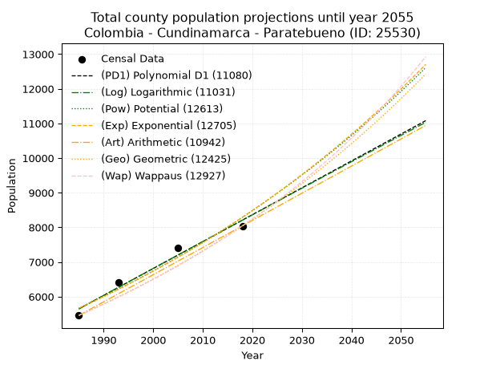
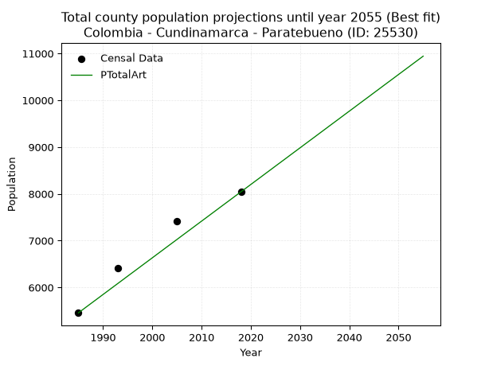
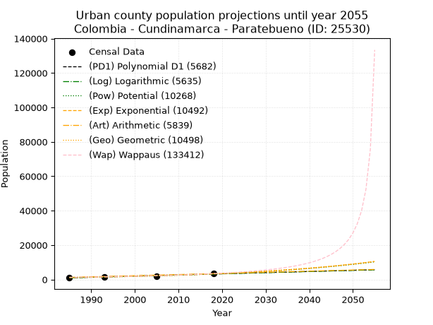
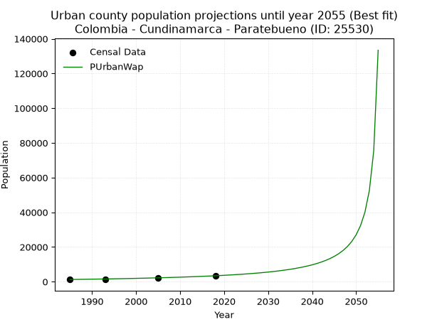
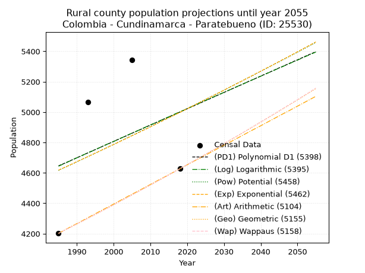
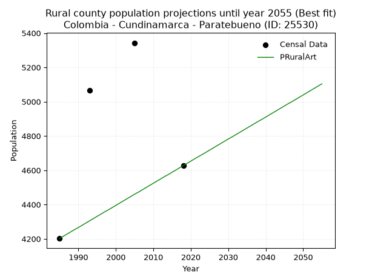

<div align="center">


</div>

# _“Population and Public Services Demand Projections (PPSD) until Year 2050 for Colombia - Cundinamarca - Paratebueno (ID: 25530)”_
Keywords: `population` `public-service` `projection` `lineal` `polynomial` `logarithmic` `potential` `exponential` `arithmetic` `geometric` `wappaus` `dane` `colombia` `south-america`

PPSD are analytical estimates used by governments and planners to anticipate future changes in population size, age distribution, and the resulting community needs for utilities, healthcare, education, and infrastructure as sizing future water treatment facilities, electrical grids, and road networks based on spatial growth.

> **General running parameters**: • app_version: _v20260806_. • Python version: _3.14.7_. • Pandas version: _3.0.5_. • NumPy version: _2.5.1_. • Creates, save and include plots into reports (create_plot): _False_. • Projection until year: _2050_. • Process polynomial degree 2 and up: _False_. • Process Wappaus: _True_. • Process Wappaus: _True_. • Set negative values to zero: _True_. • Set infinite values to zero: _True_. • Drop dataset notes: _True_. 
<div align="center">

Dynamic map: [:earth_americas:Google](http://maps.google.com/maps?q=4.374831765,-73.212825) [:earth_americas:OSM](https://www.openstreetmap.org/#map=18/4.374831765/-73.212825&layers=P) [:earth_americas:Bing](https://www.bing.com/maps?cp=4.374831765~-73.212825&lvl=18) [:earth_americas:Apple](https://maps.apple.com/frame?center=4.374831765%2C-73.212825&span=0.003%2C0.006)

</div>


<div align="center">

```geojson
{
  "type": "Feature",
  "geometry": {
    "type": "Point", 
    "coordinates": [-73.212825, 4.374831765]
  }, 
  "properties": {
    "Name": "Colombia - Cundinamarca - Paratebueno (ID: 25530)"
  }
}
```

</div>


## 0. Census Data (4 records)

Census data are official statistics collected by a government about the people and housing in a country. They usually include counts of total population, age, sex, race, income, education, and jobs.

📅Global census file: [Population.xlsx](../data/Population.xlsx)

| Source   |   Year |   CountryID | CountryName   |   StateID | StateName    |   CountyID | CountyName   |   PTotal |   PUrban |   PRural |
|:---------|-------:|------------:|:--------------|----------:|:-------------|-----------:|:-------------|---------:|---------:|---------:|
| DANE     |   1985 |          57 | Colombia      |        25 | Cundinamarca |      25530 | Paratebueno  |     5457 |     1255 |     4202 |
| DANE     |   1993 |          57 | Colombia      |        25 | Cundinamarca |      25530 | Paratebueno  |     6404 |     1337 |     5067 |
| DANE     |   2005 |          57 | Colombia      |        25 | Cundinamarca |      25530 | Paratebueno  |     7416 |     2073 |     5343 |
| DANE     |   2018 |          57 | Colombia      |        25 | Cundinamarca |      25530 | Paratebueno  |     8043 |     3416 |     4627 |

> 🔥Some records could had specific notes about the registered values or the corresponding urban or rural distribution.

## 1. Total

### 1.1. Coefficients and Parameters

* (PD1) Polynomial Deg 1: 77.62505018064991, -148439.50662384497 (lineal)
* (Log) Logarithmic: 155443.25680781493, -1174695.4406402858
* (Pow) Potential: 23.097340276504397, -72.4163236228103
* (Exp) Exponential: 0.011532917583346085, 6.473380909520051e-07
* (Art) Arithmetic: Year diff. 2018 - 1985 = 33, Population diff. 8043 - 5457 = 2586, Annual growth = 78.36363636363636
* (Geo) Geometric: Year diff. 2018 - 1985 = 33, Population diff. 8043 - 5457 = 2586, Annual growth % = 0.011823992356475355
* (Wap) Wappaus: i = 1.160942760942761, Condition values only valid for < 200)

<sub>
Wappaus condition values: ['0.00', '1.16', '2.32', '3.48', '4.64', '5.80', '6.97', '8.13', '9.29', '10.45', '11.61', '12.77', '13.93', '15.09', '16.25', '17.41', '18.58', '19.74', '20.90', '22.06', '23.22', '24.38', '25.54', '26.70', '27.86', '29.02', '30.18', '31.35', '32.51', '33.67', '34.83', '35.99', '37.15', '38.31', '39.47', '40.63', '41.79', '42.95', '44.12', '45.28', '46.44', '47.60', '48.76', '49.92', '51.08', '52.24', '53.40', '54.56', '55.73', '56.89', '58.05', '59.21', '60.37', '61.53', '62.69', '63.85', '65.01', '66.17', '67.33', '68.50', '69.66', '70.82', '71.98', '73.14', '74.30', '75.46']
</sub>


### 1.2. Projected Dataset

|   Year |   CountyID |   PTotalPD1 |   PTotalLog |   PTotalPow |   PTotalExp |   PTotalArt |   PTotalGeo |   PTotalWap |
|-------:|-----------:|------------:|------------:|------------:|------------:|------------:|------------:|------------:|
|   1985 |      25530 |        5646 |        5643 |        5665 |        5667 |        5457 |        5457 |        5457 |
|   1986 |      25530 |        5724 |        5722 |        5731 |        5733 |        5535 |        5522 |        5521 |
|   1987 |      25530 |        5801 |        5800 |        5798 |        5799 |        5614 |        5587 |        5585 |
|   1988 |      25530 |        5879 |        5878 |        5866 |        5867 |        5692 |        5653 |        5650 |
|   1989 |      25530 |        5957 |        5956 |        5934 |        5935 |        5770 |        5720 |        5716 |
|   1990 |      25530 |        6034 |        6034 |        6004 |        6004 |        5849 |        5787 |        5783 |
|   1991 |      25530 |        6112 |        6113 |        6074 |        6073 |        5927 |        5856 |        5851 |
|   1992 |      25530 |        6190 |        6191 |        6144 |        6144 |        6006 |        5925 |        5919 |
|   1993 |      25530 |        6267 |        6269 |        6216 |        6215 |        6084 |        5995 |        5989 |
|   1994 |      25530 |        6345 |        6347 |        6289 |        6287 |        6162 |        6066 |        6059 |
|   1995 |      25530 |        6422 |        6424 |        6362 |        6360 |        6241 |        6138 |        6130 |
|   1996 |      25530 |        6500 |        6502 |        6436 |        6434 |        6319 |        6210 |        6201 |
|   1997 |      25530 |        6578 |        6580 |        6511 |        6508 |        6397 |        6284 |        6274 |
|   1998 |      25530 |        6655 |        6658 |        6586 |        6584 |        6476 |        6358 |        6348 |
|   1999 |      25530 |        6733 |        6736 |        6663 |        6660 |        6554 |        6433 |        6422 |
|   2000 |      25530 |        6811 |        6814 |        6740 |        6737 |        6632 |        6509 |        6498 |
|   2001 |      25530 |        6888 |        6891 |        6819 |        6816 |        6711 |        6586 |        6574 |
|   2002 |      25530 |        6966 |        6969 |        6898 |        6895 |        6789 |        6664 |        6652 |
|   2003 |      25530 |        7043 |        7047 |        6978 |        6975 |        6868 |        6743 |        6730 |
|   2004 |      25530 |        7121 |        7124 |        7059 |        7056 |        6946 |        6823 |        6810 |
|   2005 |      25530 |        7199 |        7202 |        7141 |        7137 |        7024 |        6903 |        6890 |
|   2006 |      25530 |        7276 |        7279 |        7223 |        7220 |        7103 |        6985 |        6972 |
|   2007 |      25530 |        7354 |        7357 |        7307 |        7304 |        7181 |        7067 |        7055 |
|   2008 |      25530 |        7432 |        7434 |        7392 |        7389 |        7259 |        7151 |        7139 |
|   2009 |      25530 |        7509 |        7512 |        7477 |        7474 |        7338 |        7236 |        7224 |
|   2010 |      25530 |        7587 |        7589 |        7563 |        7561 |        7416 |        7321 |        7310 |
|   2011 |      25530 |        7664 |        7666 |        7651 |        7649 |        7494 |        7408 |        7397 |
|   2012 |      25530 |        7742 |        7743 |        7739 |        7737 |        7573 |        7495 |        7485 |
|   2013 |      25530 |        7820 |        7821 |        7829 |        7827 |        7651 |        7584 |        7575 |
|   2014 |      25530 |        7897 |        7898 |        7919 |        7918 |        7730 |        7674 |        7666 |
|   2015 |      25530 |        7975 |        7975 |        8010 |        8010 |        7808 |        7764 |        7758 |
|   2016 |      25530 |        8053 |        8052 |        8102 |        8103 |        7886 |        7856 |        7852 |
|   2017 |      25530 |        8130 |        8129 |        8196 |        8197 |        7965 |        7949 |        7947 |
|   2018 |      25530 |        8208 |        8206 |        8290 |        8292 |        8043 |        8043 |        8043 |
|   2019 |      25530 |        8285 |        8283 |        8386 |        8388 |        8121 |        8138 |        8141 |
|   2020 |      25530 |        8363 |        8360 |        8482 |        8485 |        8200 |        8234 |        8240 |
|   2021 |      25530 |        8441 |        8437 |        8580 |        8584 |        8278 |        8332 |        8340 |
|   2022 |      25530 |        8518 |        8514 |        8678 |        8683 |        8356 |        8430 |        8442 |
|   2023 |      25530 |        8596 |        8591 |        8778 |        8784 |        8435 |        8530 |        8546 |
|   2024 |      25530 |        8674 |        8668 |        8879 |        8886 |        8513 |        8631 |        8651 |
|   2025 |      25530 |        8751 |        8745 |        8980 |        8989 |        8592 |        8733 |        8757 |
|   2026 |      25530 |        8829 |        8821 |        9083 |        9093 |        8670 |        8836 |        8866 |
|   2027 |      25530 |        8906 |        8898 |        9188 |        9199 |        8748 |        8941 |        8976 |
|   2028 |      25530 |        8984 |        8975 |        9293 |        9305 |        8827 |        9046 |        9087 |
|   2029 |      25530 |        9062 |        9051 |        9399 |        9413 |        8905 |        9153 |        9201 |
|   2030 |      25530 |        9139 |        9128 |        9507 |        9523 |        8983 |        9261 |        9316 |
|   2031 |      25530 |        9217 |        9204 |        9616 |        9633 |        9062 |        9371 |        9433 |
|   2032 |      25530 |        9295 |        9281 |        9726 |        9745 |        9140 |        9482 |        9552 |
|   2033 |      25530 |        9372 |        9357 |        9837 |        9858 |        9218 |        9594 |        9672 |
|   2034 |      25530 |        9450 |        9434 |        9949 |        9972 |        9297 |        9707 |        9795 |
|   2035 |      25530 |        9527 |        9510 |       10063 |       10088 |        9375 |        9822 |        9920 |
|   2036 |      25530 |        9605 |        9587 |       10178 |       10205 |        9454 |        9938 |       10047 |
|   2037 |      25530 |        9683 |        9663 |       10294 |       10323 |        9532 |       10056 |       10176 |
|   2038 |      25530 |        9760 |        9739 |       10411 |       10443 |        9610 |       10175 |       10307 |
|   2039 |      25530 |        9838 |        9816 |       10530 |       10564 |        9689 |       10295 |       10440 |
|   2040 |      25530 |        9916 |        9892 |       10650 |       10687 |        9767 |       10417 |       10576 |
|   2041 |      25530 |        9993 |        9968 |       10771 |       10811 |        9845 |       10540 |       10713 |
|   2042 |      25530 |       10071 |       10044 |       10893 |       10936 |        9924 |       10664 |       10854 |
|   2043 |      25530 |       10148 |       10120 |       11017 |       11063 |       10002 |       10791 |       10996 |
|   2044 |      25530 |       10226 |       10196 |       11142 |       11191 |       10080 |       10918 |       11142 |
|   2045 |      25530 |       10304 |       10272 |       11269 |       11321 |       10159 |       11047 |       11290 |
|   2046 |      25530 |       10381 |       10348 |       11397 |       11452 |       10237 |       11178 |       11440 |
|   2047 |      25530 |       10459 |       10424 |       11526 |       11585 |       10316 |       11310 |       11593 |
|   2048 |      25530 |       10537 |       10500 |       11657 |       11720 |       10394 |       11444 |       11749 |
|   2049 |      25530 |       10614 |       10576 |       11789 |       11856 |       10472 |       11579 |       11908 |
|   2050 |      25530 |       10692 |       10652 |       11923 |       11993 |       10551 |       11716 |       12070 |
<div align="center">

</img>

</div>


### 1.3. Best fit with absolute and relative error (%)

Relative error puts that difference into context by dividing the absolute error by the true value, creating a unitless ratio or percentage that shows the scale of the mistake.

Absolute and relative error

|   Year | Source   |   CountryID | CountryName   |   StateID | StateName    |   CountyID_x | CountyName   |   PTotal |   PUrban |   PRural |   CountyID_y |   PTotalPD1 |   PTotalLog |   PTotalPow |   PTotalExp |   PTotalArt |   PTotalGeo |   PTotalWap |   PTotalPD1AbsError |   PTotalLogAbsError |   PTotalPowAbsError |   PTotalExpAbsError |   PTotalArtAbsError |   PTotalGeoAbsError |   PTotalWapAbsError |   PTotalPD1RelError |   PTotalLogRelError |   PTotalPowRelError |   PTotalExpRelError |   PTotalArtRelError |   PTotalGeoRelError |   PTotalWapRelError |
|-------:|:---------|------------:|:--------------|----------:|:-------------|-------------:|:-------------|---------:|---------:|---------:|-------------:|------------:|------------:|------------:|------------:|------------:|------------:|------------:|--------------------:|--------------------:|--------------------:|--------------------:|--------------------:|--------------------:|--------------------:|--------------------:|--------------------:|--------------------:|--------------------:|--------------------:|--------------------:|--------------------:|
|   1985 | DANE     |          57 | Colombia      |        25 | Cundinamarca |        25530 | Paratebueno  |     5457 |     1255 |     4202 |        25530 |        5646 |        5643 |        5665 |        5667 |        5457 |        5457 |        5457 |                 189 |                 186 |                 208 |                 210 |                   0 |                   0 |                   0 |             3.46344 |             3.40847 |             3.81162 |             3.84827 |             0       |             0       |             0       |
|   1993 | DANE     |          57 | Colombia      |        25 | Cundinamarca |        25530 | Paratebueno  |     6404 |     1337 |     5067 |        25530 |        6267 |        6269 |        6216 |        6215 |        6084 |        5995 |        5989 |                 137 |                 135 |                 188 |                 189 |                 320 |                 409 |                 415 |             2.13929 |             2.10806 |             2.93567 |             2.95128 |             4.99688 |             6.38663 |             6.48032 |
|   2005 | DANE     |          57 | Colombia      |        25 | Cundinamarca |        25530 | Paratebueno  |     7416 |     2073 |     5343 |        25530 |        7199 |        7202 |        7141 |        7137 |        7024 |        6903 |        6890 |                 217 |                 214 |                 275 |                 279 |                 392 |                 513 |                 526 |             2.92611 |             2.88565 |             3.7082  |             3.76214 |             5.28587 |             6.91748 |             7.09277 |
|   2018 | DANE     |          57 | Colombia      |        25 | Cundinamarca |        25530 | Paratebueno  |     8043 |     3416 |     4627 |        25530 |        8208 |        8206 |        8290 |        8292 |        8043 |        8043 |        8043 |                 165 |                 163 |                 247 |                 249 |                   0 |                   0 |                   0 |             2.05147 |             2.02661 |             3.07099 |             3.09586 |             0       |             0       |             0       |

Relative error mean

| Method    |   RelError | Best   |
|:----------|-----------:|:-------|
| PTotalPD1 |    2.64508 |        |
| PTotalLog |    2.6072  |        |
| PTotalPow |    3.38162 |        |
| PTotalExp |    3.41439 |        |
| PTotalArt |    2.57069 | True   |
| PTotalGeo |    3.32603 |        |
| PTotalWap |    3.39327 |        |

💙Best method: _**PTotalArt**_
<div align="center">

</img>

</div>


### 1.4. Fresh water supply demand in liters per capita per day (lpcd)

The fresh water supply demand typically ranges from 100 to 300 liters per capita per day (lpcd) for standard domestic and municipal planning, though absolute survival minimums set by the World Health Organization are as low as 7.5 to 20 liters per day, and total consumption in high-income nations can exceed 400 liters.

> `CZ`: Level in meters above the sea level (masl).<br> `WS`: Fresh water supply demand in liters per capita per day (lpcd or l/h/d).<br> `WSAll`: Zonal fresh water supply demand in liters per second (l/s).<br> `A`: Zonal area in square meters.

Reference values (RAS Colombia)

|    CZ |   WS |
|------:|-----:|
|  1000 |  120 |
|  2000 |  130 |
| 99999 |  140 |

County shapefile geometry properties and water supply values

|   CountyID |      ATotal |   CZTotal |   WSTotal |
|-----------:|------------:|----------:|----------:|
|      25530 | 8.83907e+08 |   359.464 |       120 |

Projected values for best method: PTotalArt

|   CountyID |   Year |   PTotalArt |   WSTotal |   WSTotalAll |
|-----------:|-------:|------------:|----------:|-------------:|
|      25530 |   1985 |        5457 |       120 |      7.57917 |
|      25530 |   1986 |        5535 |       120 |      7.6875  |
|      25530 |   1987 |        5614 |       120 |      7.79722 |
|      25530 |   1988 |        5692 |       120 |      7.90556 |
|      25530 |   1989 |        5770 |       120 |      8.01389 |
|      25530 |   1990 |        5849 |       120 |      8.12361 |
|      25530 |   1991 |        5927 |       120 |      8.23194 |
|      25530 |   1992 |        6006 |       120 |      8.34167 |
|      25530 |   1993 |        6084 |       120 |      8.45    |
|      25530 |   1994 |        6162 |       120 |      8.55833 |
|      25530 |   1995 |        6241 |       120 |      8.66806 |
|      25530 |   1996 |        6319 |       120 |      8.77639 |
|      25530 |   1997 |        6397 |       120 |      8.88472 |
|      25530 |   1998 |        6476 |       120 |      8.99444 |
|      25530 |   1999 |        6554 |       120 |      9.10278 |
|      25530 |   2000 |        6632 |       120 |      9.21111 |
|      25530 |   2001 |        6711 |       120 |      9.32083 |
|      25530 |   2002 |        6789 |       120 |      9.42917 |
|      25530 |   2003 |        6868 |       120 |      9.53889 |
|      25530 |   2004 |        6946 |       120 |      9.64722 |
|      25530 |   2005 |        7024 |       120 |      9.75556 |
|      25530 |   2006 |        7103 |       120 |      9.86528 |
|      25530 |   2007 |        7181 |       120 |      9.97361 |
|      25530 |   2008 |        7259 |       120 |     10.0819  |
|      25530 |   2009 |        7338 |       120 |     10.1917  |
|      25530 |   2010 |        7416 |       120 |     10.3     |
|      25530 |   2011 |        7494 |       120 |     10.4083  |
|      25530 |   2012 |        7573 |       120 |     10.5181  |
|      25530 |   2013 |        7651 |       120 |     10.6264  |
|      25530 |   2014 |        7730 |       120 |     10.7361  |
|      25530 |   2015 |        7808 |       120 |     10.8444  |
|      25530 |   2016 |        7886 |       120 |     10.9528  |
|      25530 |   2017 |        7965 |       120 |     11.0625  |
|      25530 |   2018 |        8043 |       120 |     11.1708  |
|      25530 |   2019 |        8121 |       120 |     11.2792  |
|      25530 |   2020 |        8200 |       120 |     11.3889  |
|      25530 |   2021 |        8278 |       120 |     11.4972  |
|      25530 |   2022 |        8356 |       120 |     11.6056  |
|      25530 |   2023 |        8435 |       120 |     11.7153  |
|      25530 |   2024 |        8513 |       120 |     11.8236  |
|      25530 |   2025 |        8592 |       120 |     11.9333  |
|      25530 |   2026 |        8670 |       120 |     12.0417  |
|      25530 |   2027 |        8748 |       120 |     12.15    |
|      25530 |   2028 |        8827 |       120 |     12.2597  |
|      25530 |   2029 |        8905 |       120 |     12.3681  |
|      25530 |   2030 |        8983 |       120 |     12.4764  |
|      25530 |   2031 |        9062 |       120 |     12.5861  |
|      25530 |   2032 |        9140 |       120 |     12.6944  |
|      25530 |   2033 |        9218 |       120 |     12.8028  |
|      25530 |   2034 |        9297 |       120 |     12.9125  |
|      25530 |   2035 |        9375 |       120 |     13.0208  |
|      25530 |   2036 |        9454 |       120 |     13.1306  |
|      25530 |   2037 |        9532 |       120 |     13.2389  |
|      25530 |   2038 |        9610 |       120 |     13.3472  |
|      25530 |   2039 |        9689 |       120 |     13.4569  |
|      25530 |   2040 |        9767 |       120 |     13.5653  |
|      25530 |   2041 |        9845 |       120 |     13.6736  |
|      25530 |   2042 |        9924 |       120 |     13.7833  |
|      25530 |   2043 |       10002 |       120 |     13.8917  |
|      25530 |   2044 |       10080 |       120 |     14       |
|      25530 |   2045 |       10159 |       120 |     14.1097  |
|      25530 |   2046 |       10237 |       120 |     14.2181  |
|      25530 |   2047 |       10316 |       120 |     14.3278  |
|      25530 |   2048 |       10394 |       120 |     14.4361  |
|      25530 |   2049 |       10472 |       120 |     14.5444  |
|      25530 |   2050 |       10551 |       120 |     14.6542  |

## 2. Urban

### 2.1. Coefficients and Parameters

* (PD1) Polynomial Deg 1: 66.87876354877471, -131753.99678843663 (lineal)
* (Log) Logarithmic: 133778.72512161738, -1014832.9116848367
* (Pow) Potential: 63.29043911664856, -205.65781621718162
* (Exp) Exponential: 0.031631729768488256, 6.1704568530802525e-25
* (Art) Arithmetic: Year diff. 2018 - 1985 = 33, Population diff. 3416 - 1255 = 2161, Annual growth = 65.48484848484848
* (Geo) Geometric: Year diff. 2018 - 1985 = 33, Population diff. 3416 - 1255 = 2161, Annual growth % = 0.030808531000828587
* (Wap) Wappaus: i = 2.803889894448661, Condition values only valid for < 200)

<sub>
Wappaus condition values: ['0.00', '2.80', '5.61', '8.41', '11.22', '14.02', '16.82', '19.63', '22.43', '25.24', '28.04', '30.84', '33.65', '36.45', '39.25', '42.06', '44.86', '47.67', '50.47', '53.27', '56.08', '58.88', '61.69', '64.49', '67.29', '70.10', '72.90', '75.71', '78.51', '81.31', '84.12', '86.92', '89.72', '92.53', '95.33', '98.14', '100.94', '103.74', '106.55', '109.35', '112.16', '114.96', '117.76', '120.57', '123.37', '126.18', '128.98', '131.78', '134.59', '137.39', '140.19', '143.00', '145.80', '148.61', '151.41', '154.21', '157.02', '159.82', '162.63', '165.43', '168.23', '171.04', '173.84', '176.65', '179.45', '182.25']
</sub>


### 2.2. Projected Dataset

|   Year |   CountyID |   PUrbanPD1 |   PUrbanLog |   PUrbanPow |   PUrbanExp |   PUrbanArt |   PUrbanGeo |   PUrbanWap |
|-------:|-----------:|------------:|------------:|------------:|------------:|------------:|------------:|------------:|
|   1985 |      25530 |        1000 |         999 |        1145 |        1146 |        1255 |        1255 |        1255 |
|   1986 |      25530 |        1067 |        1066 |        1182 |        1183 |        1320 |        1294 |        1291 |
|   1987 |      25530 |        1134 |        1134 |        1221 |        1221 |        1386 |        1334 |        1327 |
|   1988 |      25530 |        1201 |        1201 |        1260 |        1260 |        1451 |        1375 |        1365 |
|   1989 |      25530 |        1268 |        1268 |        1301 |        1301 |        1517 |        1417 |        1404 |
|   1990 |      25530 |        1335 |        1336 |        1343 |        1342 |        1582 |        1461 |        1444 |
|   1991 |      25530 |        1402 |        1403 |        1386 |        1386 |        1648 |        1506 |        1486 |
|   1992 |      25530 |        1469 |        1470 |        1431 |        1430 |        1713 |        1552 |        1528 |
|   1993 |      25530 |        1535 |        1537 |        1477 |        1476 |        1779 |        1600 |        1572 |
|   1994 |      25530 |        1602 |        1604 |        1525 |        1524 |        1844 |        1649 |        1617 |
|   1995 |      25530 |        1669 |        1671 |        1574 |        1573 |        1910 |        1700 |        1664 |
|   1996 |      25530 |        1736 |        1738 |        1625 |        1623 |        1975 |        1752 |        1713 |
|   1997 |      25530 |        1803 |        1805 |        1677 |        1675 |        2041 |        1806 |        1763 |
|   1998 |      25530 |        1870 |        1872 |        1731 |        1729 |        2106 |        1862 |        1814 |
|   1999 |      25530 |        1937 |        1939 |        1787 |        1785 |        2172 |        1919 |        1868 |
|   2000 |      25530 |        2004 |        2006 |        1844 |        1842 |        2237 |        1978 |        1923 |
|   2001 |      25530 |        2070 |        2073 |        1904 |        1901 |        2303 |        2039 |        1981 |
|   2002 |      25530 |        2137 |        2140 |        1965 |        1962 |        2368 |        2102 |        2040 |
|   2003 |      25530 |        2204 |        2207 |        2028 |        2025 |        2434 |        2167 |        2102 |
|   2004 |      25530 |        2271 |        2273 |        2093 |        2090 |        2499 |        2234 |        2166 |
|   2005 |      25530 |        2338 |        2340 |        2160 |        2158 |        2565 |        2303 |        2233 |
|   2006 |      25530 |        2405 |        2407 |        2229 |        2227 |        2630 |        2373 |        2302 |
|   2007 |      25530 |        2472 |        2474 |        2301 |        2299 |        2696 |        2447 |        2374 |
|   2008 |      25530 |        2539 |        2540 |        2374 |        2372 |        2761 |        2522 |        2450 |
|   2009 |      25530 |        2605 |        2607 |        2450 |        2449 |        2827 |        2600 |        2528 |
|   2010 |      25530 |        2672 |        2673 |        2529 |        2527 |        2892 |        2680 |        2609 |
|   2011 |      25530 |        2739 |        2740 |        2610 |        2609 |        2958 |        2762 |        2695 |
|   2012 |      25530 |        2806 |        2806 |        2693 |        2692 |        3023 |        2847 |        2784 |
|   2013 |      25530 |        2873 |        2873 |        2779 |        2779 |        3089 |        2935 |        2877 |
|   2014 |      25530 |        2940 |        2939 |        2868 |        2868 |        3154 |        3026 |        2975 |
|   2015 |      25530 |        3007 |        3006 |        2959 |        2960 |        3220 |        3119 |        3077 |
|   2016 |      25530 |        3074 |        3072 |        3054 |        3056 |        3285 |        3215 |        3184 |
|   2017 |      25530 |        3140 |        3138 |        3151 |        3154 |        3351 |        3314 |        3297 |
|   2018 |      25530 |        3207 |        3205 |        3252 |        3255 |        3416 |        3416 |        3416 |
|   2019 |      25530 |        3274 |        3271 |        3355 |        3360 |        3481 |        3521 |        3541 |
|   2020 |      25530 |        3341 |        3337 |        3462 |        3468 |        3547 |        3630 |        3673 |
|   2021 |      25530 |        3408 |        3403 |        3572 |        3579 |        3612 |        3742 |        3813 |
|   2022 |      25530 |        3475 |        3470 |        3686 |        3694 |        3678 |        3857 |        3960 |
|   2023 |      25530 |        3542 |        3536 |        3803 |        3813 |        3743 |        3976 |        4117 |
|   2024 |      25530 |        3609 |        3602 |        3924 |        3935 |        3809 |        4098 |        4283 |
|   2025 |      25530 |        3675 |        3668 |        4048 |        4062 |        3874 |        4224 |        4460 |
|   2026 |      25530 |        3742 |        3734 |        4177 |        4192 |        3940 |        4355 |        4648 |
|   2027 |      25530 |        3809 |        3800 |        4309 |        4327 |        4005 |        4489 |        4849 |
|   2028 |      25530 |        3876 |        3866 |        4446 |        4466 |        4071 |        4627 |        5065 |
|   2029 |      25530 |        3943 |        3932 |        4587 |        4610 |        4136 |        4770 |        5296 |
|   2030 |      25530 |        4010 |        3998 |        4732 |        4758 |        4202 |        4916 |        5545 |
|   2031 |      25530 |        4077 |        4064 |        4882 |        4911 |        4267 |        5068 |        5813 |
|   2032 |      25530 |        4144 |        4130 |        5036 |        5069 |        4333 |        5224 |        6104 |
|   2033 |      25530 |        4211 |        4195 |        5196 |        5231 |        4398 |        5385 |        6419 |
|   2034 |      25530 |        4277 |        4261 |        5360 |        5400 |        4464 |        5551 |        6763 |
|   2035 |      25530 |        4344 |        4327 |        5529 |        5573 |        4529 |        5722 |        7139 |
|   2036 |      25530 |        4411 |        4393 |        5704 |        5752 |        4595 |        5898 |        7552 |
|   2037 |      25530 |        4478 |        4458 |        5884 |        5937 |        4660 |        6080 |        8007 |
|   2038 |      25530 |        4545 |        4524 |        6070 |        6128 |        4726 |        6267 |        8513 |
|   2039 |      25530 |        4612 |        4590 |        6261 |        6325 |        4791 |        6460 |        9076 |
|   2040 |      25530 |        4679 |        4655 |        6458 |        6528 |        4857 |        6659 |        9709 |
|   2041 |      25530 |        4746 |        4721 |        6662 |        6738 |        4922 |        6865 |       10424 |
|   2042 |      25530 |        4812 |        4786 |        6872 |        6954 |        4988 |        7076 |       11239 |
|   2043 |      25530 |        4879 |        4852 |        7088 |        7178 |        5053 |        7294 |       12177 |
|   2044 |      25530 |        4946 |        4917 |        7311 |        7409 |        5119 |        7519 |       13266 |
|   2045 |      25530 |        5013 |        4983 |        7541 |        7647 |        5184 |        7750 |       14548 |
|   2046 |      25530 |        5080 |        5048 |        7778 |        7892 |        5250 |        7989 |       16078 |
|   2047 |      25530 |        5147 |        5114 |        8022 |        8146 |        5315 |        8235 |       17935 |
|   2048 |      25530 |        5214 |        5179 |        8274 |        8408 |        5381 |        8489 |       20239 |
|   2049 |      25530 |        5281 |        5244 |        8534 |        8678 |        5446 |        8751 |       23172 |
|   2050 |      25530 |        5347 |        5309 |        8801 |        8957 |        5512 |        9020 |       27031 |
<div align="center">

</img>

</div>


### 2.3. Best fit with absolute and relative error (%)

Relative error puts that difference into context by dividing the absolute error by the true value, creating a unitless ratio or percentage that shows the scale of the mistake.

Absolute and relative error

|   Year | Source   |   CountryID | CountryName   |   StateID | StateName    |   CountyID_x | CountyName   |   PTotal |   PUrban |   PRural |   CountyID_y |   PUrbanPD1 |   PUrbanLog |   PUrbanPow |   PUrbanExp |   PUrbanArt |   PUrbanGeo |   PUrbanWap |   PUrbanPD1AbsError |   PUrbanLogAbsError |   PUrbanPowAbsError |   PUrbanExpAbsError |   PUrbanArtAbsError |   PUrbanGeoAbsError |   PUrbanWapAbsError |   PUrbanPD1RelError |   PUrbanLogRelError |   PUrbanPowRelError |   PUrbanExpRelError |   PUrbanArtRelError |   PUrbanGeoRelError |   PUrbanWapRelError |
|-------:|:---------|------------:|:--------------|----------:|:-------------|-------------:|:-------------|---------:|---------:|---------:|-------------:|------------:|------------:|------------:|------------:|------------:|------------:|------------:|--------------------:|--------------------:|--------------------:|--------------------:|--------------------:|--------------------:|--------------------:|--------------------:|--------------------:|--------------------:|--------------------:|--------------------:|--------------------:|--------------------:|
|   1985 | DANE     |          57 | Colombia      |        25 | Cundinamarca |        25530 | Paratebueno  |     5457 |     1255 |     4202 |        25530 |        1000 |         999 |        1145 |        1146 |        1255 |        1255 |        1255 |                 255 |                 256 |                 110 |                 109 |                   0 |                   0 |                   0 |            20.3187  |            20.3984  |             8.76494 |             8.68526 |              0      |              0      |             0       |
|   1993 | DANE     |          57 | Colombia      |        25 | Cundinamarca |        25530 | Paratebueno  |     6404 |     1337 |     5067 |        25530 |        1535 |        1537 |        1477 |        1476 |        1779 |        1600 |        1572 |                 198 |                 200 |                 140 |                 139 |                 442 |                 263 |                 235 |            14.8093  |            14.9589  |            10.4712  |            10.3964  |             33.0591 |             19.6709 |            17.5767  |
|   2005 | DANE     |          57 | Colombia      |        25 | Cundinamarca |        25530 | Paratebueno  |     7416 |     2073 |     5343 |        25530 |        2338 |        2340 |        2160 |        2158 |        2565 |        2303 |        2233 |                 265 |                 267 |                  87 |                  85 |                 492 |                 230 |                 160 |            12.7834  |            12.8799  |             4.19682 |             4.10034 |             23.7337 |             11.095  |             7.71828 |
|   2018 | DANE     |          57 | Colombia      |        25 | Cundinamarca |        25530 | Paratebueno  |     8043 |     3416 |     4627 |        25530 |        3207 |        3205 |        3252 |        3255 |        3416 |        3416 |        3416 |                 209 |                 211 |                 164 |                 161 |                   0 |                   0 |                   0 |             6.11827 |             6.17681 |             4.80094 |             4.71311 |              0      |              0      |             0       |

Relative error mean

| Method    |   RelError | Best   |
|:----------|-----------:|:-------|
| PUrbanPD1 |   13.5074  |        |
| PUrbanLog |   13.6035  |        |
| PUrbanPow |    7.05847 |        |
| PUrbanExp |    6.97378 |        |
| PUrbanArt |   14.1982  |        |
| PUrbanGeo |    7.69148 |        |
| PUrbanWap |    6.32374 | True   |

💙Best method: _**PUrbanWap**_
<div align="center">

</img>

</div>


### 2.4. Fresh water supply demand in liters per capita per day (lpcd)

The fresh water supply demand typically ranges from 100 to 300 liters per capita per day (lpcd) for standard domestic and municipal planning, though absolute survival minimums set by the World Health Organization are as low as 7.5 to 20 liters per day, and total consumption in high-income nations can exceed 400 liters.

> `CZ`: Level in meters above the sea level (masl).<br> `WS`: Fresh water supply demand in liters per capita per day (lpcd or l/h/d).<br> `WSAll`: Zonal fresh water supply demand in liters per second (l/s).<br> `A`: Zonal area in square meters.

Reference values (RAS Colombia)

|    CZ |   WS |
|------:|-----:|
|  1000 |  120 |
|  2000 |  130 |
| 99999 |  140 |

County shapefile geometry properties and water supply values

|   CountyID |   AUrban |   CZUrban |   WSUrban |
|-----------:|---------:|----------:|----------:|
|      25530 |   605608 |   255.977 |       120 |

Projected values for best method: PUrbanWap

|   CountyID |   Year |   PUrbanWap |   WSUrban |   WSUrbanAll |
|-----------:|-------:|------------:|----------:|-------------:|
|      25530 |   1985 |        1255 |       120 |      1.74306 |
|      25530 |   1986 |        1291 |       120 |      1.79306 |
|      25530 |   1987 |        1327 |       120 |      1.84306 |
|      25530 |   1988 |        1365 |       120 |      1.89583 |
|      25530 |   1989 |        1404 |       120 |      1.95    |
|      25530 |   1990 |        1444 |       120 |      2.00556 |
|      25530 |   1991 |        1486 |       120 |      2.06389 |
|      25530 |   1992 |        1528 |       120 |      2.12222 |
|      25530 |   1993 |        1572 |       120 |      2.18333 |
|      25530 |   1994 |        1617 |       120 |      2.24583 |
|      25530 |   1995 |        1664 |       120 |      2.31111 |
|      25530 |   1996 |        1713 |       120 |      2.37917 |
|      25530 |   1997 |        1763 |       120 |      2.44861 |
|      25530 |   1998 |        1814 |       120 |      2.51944 |
|      25530 |   1999 |        1868 |       120 |      2.59444 |
|      25530 |   2000 |        1923 |       120 |      2.67083 |
|      25530 |   2001 |        1981 |       120 |      2.75139 |
|      25530 |   2002 |        2040 |       120 |      2.83333 |
|      25530 |   2003 |        2102 |       120 |      2.91944 |
|      25530 |   2004 |        2166 |       120 |      3.00833 |
|      25530 |   2005 |        2233 |       120 |      3.10139 |
|      25530 |   2006 |        2302 |       120 |      3.19722 |
|      25530 |   2007 |        2374 |       120 |      3.29722 |
|      25530 |   2008 |        2450 |       120 |      3.40278 |
|      25530 |   2009 |        2528 |       120 |      3.51111 |
|      25530 |   2010 |        2609 |       120 |      3.62361 |
|      25530 |   2011 |        2695 |       120 |      3.74306 |
|      25530 |   2012 |        2784 |       120 |      3.86667 |
|      25530 |   2013 |        2877 |       120 |      3.99583 |
|      25530 |   2014 |        2975 |       120 |      4.13194 |
|      25530 |   2015 |        3077 |       120 |      4.27361 |
|      25530 |   2016 |        3184 |       120 |      4.42222 |
|      25530 |   2017 |        3297 |       120 |      4.57917 |
|      25530 |   2018 |        3416 |       120 |      4.74444 |
|      25530 |   2019 |        3541 |       120 |      4.91806 |
|      25530 |   2020 |        3673 |       120 |      5.10139 |
|      25530 |   2021 |        3813 |       120 |      5.29583 |
|      25530 |   2022 |        3960 |       120 |      5.5     |
|      25530 |   2023 |        4117 |       120 |      5.71806 |
|      25530 |   2024 |        4283 |       120 |      5.94861 |
|      25530 |   2025 |        4460 |       120 |      6.19444 |
|      25530 |   2026 |        4648 |       120 |      6.45556 |
|      25530 |   2027 |        4849 |       120 |      6.73472 |
|      25530 |   2028 |        5065 |       120 |      7.03472 |
|      25530 |   2029 |        5296 |       120 |      7.35556 |
|      25530 |   2030 |        5545 |       120 |      7.70139 |
|      25530 |   2031 |        5813 |       120 |      8.07361 |
|      25530 |   2032 |        6104 |       120 |      8.47778 |
|      25530 |   2033 |        6419 |       120 |      8.91528 |
|      25530 |   2034 |        6763 |       120 |      9.39306 |
|      25530 |   2035 |        7139 |       120 |      9.91528 |
|      25530 |   2036 |        7552 |       120 |     10.4889  |
|      25530 |   2037 |        8007 |       120 |     11.1208  |
|      25530 |   2038 |        8513 |       120 |     11.8236  |
|      25530 |   2039 |        9076 |       120 |     12.6056  |
|      25530 |   2040 |        9709 |       120 |     13.4847  |
|      25530 |   2041 |       10424 |       120 |     14.4778  |
|      25530 |   2042 |       11239 |       120 |     15.6097  |
|      25530 |   2043 |       12177 |       120 |     16.9125  |
|      25530 |   2044 |       13266 |       120 |     18.425   |
|      25530 |   2045 |       14548 |       120 |     20.2056  |
|      25530 |   2046 |       16078 |       120 |     22.3306  |
|      25530 |   2047 |       17935 |       120 |     24.9097  |
|      25530 |   2048 |       20239 |       120 |     28.1097  |
|      25530 |   2049 |       23172 |       120 |     32.1833  |
|      25530 |   2050 |       27031 |       120 |     37.5431  |

## 3. Rural

### 3.1. Coefficients and Parameters

* (PD1) Polynomial Deg 1: 10.746286631875167, -16685.509835408302 (lineal)
* (Log) Logarithmic: 21664.531686197635, -159862.52895544964
* (Pow) Potential: 4.834687328309715, -12.279346613216187
* (Exp) Exponential: 0.0023992618848220856, 39.453906908371266
* (Art) Arithmetic: Year diff. 2018 - 1985 = 33, Population diff. 4627 - 4202 = 425, Annual growth = 12.878787878787879
* (Geo) Geometric: Year diff. 2018 - 1985 = 33, Population diff. 4627 - 4202 = 425, Annual growth % = 0.0029239059200414363
* (Wap) Wappaus: i = 0.29173831416441, Condition values only valid for < 200)

<sub>
Wappaus condition values: ['0.00', '0.29', '0.58', '0.88', '1.17', '1.46', '1.75', '2.04', '2.33', '2.63', '2.92', '3.21', '3.50', '3.79', '4.08', '4.38', '4.67', '4.96', '5.25', '5.54', '5.83', '6.13', '6.42', '6.71', '7.00', '7.29', '7.59', '7.88', '8.17', '8.46', '8.75', '9.04', '9.34', '9.63', '9.92', '10.21', '10.50', '10.79', '11.09', '11.38', '11.67', '11.96', '12.25', '12.54', '12.84', '13.13', '13.42', '13.71', '14.00', '14.30', '14.59', '14.88', '15.17', '15.46', '15.75', '16.05', '16.34', '16.63', '16.92', '17.21', '17.50', '17.80', '18.09', '18.38', '18.67', '18.96']
</sub>


### 3.2. Projected Dataset

|   Year |   CountyID |   PRuralPD1 |   PRuralLog |   PRuralPow |   PRuralExp |   PRuralArt |   PRuralGeo |   PRuralWap |
|-------:|-----------:|------------:|------------:|------------:|------------:|------------:|------------:|------------:|
|   1985 |      25530 |        4646 |        4644 |        4616 |        4618 |        4202 |        4202 |        4202 |
|   1986 |      25530 |        4657 |        4655 |        4628 |        4629 |        4215 |        4214 |        4214 |
|   1987 |      25530 |        4667 |        4666 |        4639 |        4640 |        4228 |        4227 |        4227 |
|   1988 |      25530 |        4678 |        4677 |        4650 |        4651 |        4241 |        4239 |        4239 |
|   1989 |      25530 |        4689 |        4688 |        4661 |        4662 |        4254 |        4251 |        4251 |
|   1990 |      25530 |        4700 |        4699 |        4673 |        4674 |        4266 |        4264 |        4264 |
|   1991 |      25530 |        4710 |        4710 |        4684 |        4685 |        4279 |        4276 |        4276 |
|   1992 |      25530 |        4721 |        4721 |        4696 |        4696 |        4292 |        4289 |        4289 |
|   1993 |      25530 |        4732 |        4732 |        4707 |        4707 |        4305 |        4301 |        4301 |
|   1994 |      25530 |        4743 |        4742 |        4718 |        4719 |        4318 |        4314 |        4314 |
|   1995 |      25530 |        4753 |        4753 |        4730 |        4730 |        4331 |        4326 |        4326 |
|   1996 |      25530 |        4764 |        4764 |        4741 |        4741 |        4344 |        4339 |        4339 |
|   1997 |      25530 |        4775 |        4775 |        4753 |        4753 |        4357 |        4352 |        4352 |
|   1998 |      25530 |        4786 |        4786 |        4764 |        4764 |        4369 |        4365 |        4364 |
|   1999 |      25530 |        4796 |        4797 |        4776 |        4776 |        4382 |        4377 |        4377 |
|   2000 |      25530 |        4807 |        4807 |        4787 |        4787 |        4395 |        4390 |        4390 |
|   2001 |      25530 |        4818 |        4818 |        4799 |        4798 |        4408 |        4403 |        4403 |
|   2002 |      25530 |        4829 |        4829 |        4811 |        4810 |        4421 |        4416 |        4416 |
|   2003 |      25530 |        4839 |        4840 |        4822 |        4822 |        4434 |        4429 |        4429 |
|   2004 |      25530 |        4850 |        4851 |        4834 |        4833 |        4447 |        4442 |        4442 |
|   2005 |      25530 |        4861 |        4862 |        4846 |        4845 |        4460 |        4455 |        4455 |
|   2006 |      25530 |        4872 |        4872 |        4857 |        4856 |        4472 |        4468 |        4468 |
|   2007 |      25530 |        4882 |        4883 |        4869 |        4868 |        4485 |        4481 |        4481 |
|   2008 |      25530 |        4893 |        4894 |        4881 |        4880 |        4498 |        4494 |        4494 |
|   2009 |      25530 |        4904 |        4905 |        4892 |        4891 |        4511 |        4507 |        4507 |
|   2010 |      25530 |        4915 |        4916 |        4904 |        4903 |        4524 |        4520 |        4520 |
|   2011 |      25530 |        4925 |        4926 |        4916 |        4915 |        4537 |        4533 |        4533 |
|   2012 |      25530 |        4936 |        4937 |        4928 |        4927 |        4550 |        4547 |        4547 |
|   2013 |      25530 |        4947 |        4948 |        4940 |        4939 |        4563 |        4560 |        4560 |
|   2014 |      25530 |        4958 |        4959 |        4952 |        4951 |        4575 |        4573 |        4573 |
|   2015 |      25530 |        4968 |        4969 |        4964 |        4962 |        4588 |        4587 |        4587 |
|   2016 |      25530 |        4979 |        4980 |        4975 |        4974 |        4601 |        4600 |        4600 |
|   2017 |      25530 |        4990 |        4991 |        4987 |        4986 |        4614 |        4614 |        4613 |
|   2018 |      25530 |        5000 |        5002 |        4999 |        4998 |        4627 |        4627 |        4627 |
|   2019 |      25530 |        5011 |        5012 |        5011 |        5010 |        4640 |        4641 |        4641 |
|   2020 |      25530 |        5022 |        5023 |        5023 |        5022 |        4653 |        4654 |        4654 |
|   2021 |      25530 |        5033 |        5034 |        5035 |        5034 |        4666 |        4668 |        4668 |
|   2022 |      25530 |        5043 |        5044 |        5047 |        5046 |        4679 |        4681 |        4681 |
|   2023 |      25530 |        5054 |        5055 |        5060 |        5059 |        4691 |        4695 |        4695 |
|   2024 |      25530 |        5065 |        5066 |        5072 |        5071 |        4704 |        4709 |        4709 |
|   2025 |      25530 |        5076 |        5077 |        5084 |        5083 |        4717 |        4723 |        4723 |
|   2026 |      25530 |        5086 |        5087 |        5096 |        5095 |        4730 |        4736 |        4737 |
|   2027 |      25530 |        5097 |        5098 |        5108 |        5107 |        4743 |        4750 |        4750 |
|   2028 |      25530 |        5108 |        5109 |        5120 |        5120 |        4756 |        4764 |        4764 |
|   2029 |      25530 |        5119 |        5119 |        5132 |        5132 |        4769 |        4778 |        4778 |
|   2030 |      25530 |        5129 |        5130 |        5145 |        5144 |        4782 |        4792 |        4792 |
|   2031 |      25530 |        5140 |        5141 |        5157 |        5157 |        4794 |        4806 |        4806 |
|   2032 |      25530 |        5151 |        5151 |        5169 |        5169 |        4807 |        4820 |        4821 |
|   2033 |      25530 |        5162 |        5162 |        5182 |        5181 |        4820 |        4834 |        4835 |
|   2034 |      25530 |        5172 |        5173 |        5194 |        5194 |        4833 |        4848 |        4849 |
|   2035 |      25530 |        5183 |        5183 |        5206 |        5206 |        4846 |        4862 |        4863 |
|   2036 |      25530 |        5194 |        5194 |        5219 |        5219 |        4859 |        4877 |        4877 |
|   2037 |      25530 |        5205 |        5205 |        5231 |        5231 |        4872 |        4891 |        4892 |
|   2038 |      25530 |        5215 |        5215 |        5243 |        5244 |        4885 |        4905 |        4906 |
|   2039 |      25530 |        5226 |        5226 |        5256 |        5257 |        4897 |        4920 |        4921 |
|   2040 |      25530 |        5237 |        5236 |        5268 |        5269 |        4910 |        4934 |        4935 |
|   2041 |      25530 |        5248 |        5247 |        5281 |        5282 |        4923 |        4948 |        4950 |
|   2042 |      25530 |        5258 |        5258 |        5293 |        5295 |        4936 |        4963 |        4964 |
|   2043 |      25530 |        5269 |        5268 |        5306 |        5307 |        4949 |        4977 |        4979 |
|   2044 |      25530 |        5280 |        5279 |        5319 |        5320 |        4962 |        4992 |        4993 |
|   2045 |      25530 |        5291 |        5290 |        5331 |        5333 |        4975 |        5007 |        5008 |
|   2046 |      25530 |        5301 |        5300 |        5344 |        5346 |        4988 |        5021 |        5023 |
|   2047 |      25530 |        5312 |        5311 |        5356 |        5358 |        5000 |        5036 |        5038 |
|   2048 |      25530 |        5323 |        5321 |        5369 |        5371 |        5013 |        5051 |        5052 |
|   2049 |      25530 |        5334 |        5332 |        5382 |        5384 |        5026 |        5065 |        5067 |
|   2050 |      25530 |        5344 |        5342 |        5394 |        5397 |        5039 |        5080 |        5082 |
<div align="center">

</img>

</div>


### 3.3. Best fit with absolute and relative error (%)

Relative error puts that difference into context by dividing the absolute error by the true value, creating a unitless ratio or percentage that shows the scale of the mistake.

Absolute and relative error

|   Year | Source   |   CountryID | CountryName   |   StateID | StateName    |   CountyID_x | CountyName   |   PTotal |   PUrban |   PRural |   CountyID_y |   PRuralPD1 |   PRuralLog |   PRuralPow |   PRuralExp |   PRuralArt |   PRuralGeo |   PRuralWap |   PRuralPD1AbsError |   PRuralLogAbsError |   PRuralPowAbsError |   PRuralExpAbsError |   PRuralArtAbsError |   PRuralGeoAbsError |   PRuralWapAbsError |   PRuralPD1RelError |   PRuralLogRelError |   PRuralPowRelError |   PRuralExpRelError |   PRuralArtRelError |   PRuralGeoRelError |   PRuralWapRelError |
|-------:|:---------|------------:|:--------------|----------:|:-------------|-------------:|:-------------|---------:|---------:|---------:|-------------:|------------:|------------:|------------:|------------:|------------:|------------:|------------:|--------------------:|--------------------:|--------------------:|--------------------:|--------------------:|--------------------:|--------------------:|--------------------:|--------------------:|--------------------:|--------------------:|--------------------:|--------------------:|--------------------:|
|   1985 | DANE     |          57 | Colombia      |        25 | Cundinamarca |        25530 | Paratebueno  |     5457 |     1255 |     4202 |        25530 |        4646 |        4644 |        4616 |        4618 |        4202 |        4202 |        4202 |                 444 |                 442 |                 414 |                 416 |                   0 |                   0 |                   0 |            10.5664  |            10.5188  |             9.85245 |             9.90005 |              0      |              0      |              0      |
|   1993 | DANE     |          57 | Colombia      |        25 | Cundinamarca |        25530 | Paratebueno  |     6404 |     1337 |     5067 |        25530 |        4732 |        4732 |        4707 |        4707 |        4305 |        4301 |        4301 |                 335 |                 335 |                 360 |                 360 |                 762 |                 766 |                 766 |             6.61141 |             6.61141 |             7.1048  |             7.1048  |             15.0385 |             15.1174 |             15.1174 |
|   2005 | DANE     |          57 | Colombia      |        25 | Cundinamarca |        25530 | Paratebueno  |     7416 |     2073 |     5343 |        25530 |        4861 |        4862 |        4846 |        4845 |        4460 |        4455 |        4455 |                 482 |                 481 |                 497 |                 498 |                 883 |                 888 |                 888 |             9.02115 |             9.00243 |             9.30189 |             9.32061 |             16.5263 |             16.6199 |             16.6199 |
|   2018 | DANE     |          57 | Colombia      |        25 | Cundinamarca |        25530 | Paratebueno  |     8043 |     3416 |     4627 |        25530 |        5000 |        5002 |        4999 |        4998 |        4627 |        4627 |        4627 |                 373 |                 375 |                 372 |                 371 |                   0 |                   0 |                   0 |             8.06138 |             8.1046  |             8.03977 |             8.01815 |              0      |              0      |              0      |

Relative error mean

| Method    |   RelError | Best   |
|:----------|-----------:|:-------|
| PRuralPD1 |    8.56508 |        |
| PRuralLog |    8.55931 |        |
| PRuralPow |    8.57473 |        |
| PRuralExp |    8.5859  |        |
| PRuralArt |    7.8912  | True   |
| PRuralGeo |    7.93433 |        |
| PRuralWap |    7.93433 |        |

💙Best method: _**PRuralArt**_
<div align="center">

</img>

</div>


### 3.4. Fresh water supply demand in liters per capita per day (lpcd)

The fresh water supply demand typically ranges from 100 to 300 liters per capita per day (lpcd) for standard domestic and municipal planning, though absolute survival minimums set by the World Health Organization are as low as 7.5 to 20 liters per day, and total consumption in high-income nations can exceed 400 liters.

> `CZ`: Level in meters above the sea level (masl).<br> `WS`: Fresh water supply demand in liters per capita per day (lpcd or l/h/d).<br> `WSAll`: Zonal fresh water supply demand in liters per second (l/s).<br> `A`: Zonal area in square meters.

Reference values (RAS Colombia)

|    CZ |   WS |
|------:|-----:|
|  1000 |  120 |
|  2000 |  130 |
| 99999 |  140 |

County shapefile geometry properties and water supply values

|   CountyID |      ARural |   CZRural |   WSRural |
|-----------:|------------:|----------:|----------:|
|      25530 | 8.83301e+08 |   359.538 |       120 |

Projected values for best method: PRuralArt

|   CountyID |   Year |   PRuralArt |   WSRural |   WSRuralAll |
|-----------:|-------:|------------:|----------:|-------------:|
|      25530 |   1985 |        4202 |       120 |      5.83611 |
|      25530 |   1986 |        4215 |       120 |      5.85417 |
|      25530 |   1987 |        4228 |       120 |      5.87222 |
|      25530 |   1988 |        4241 |       120 |      5.89028 |
|      25530 |   1989 |        4254 |       120 |      5.90833 |
|      25530 |   1990 |        4266 |       120 |      5.925   |
|      25530 |   1991 |        4279 |       120 |      5.94306 |
|      25530 |   1992 |        4292 |       120 |      5.96111 |
|      25530 |   1993 |        4305 |       120 |      5.97917 |
|      25530 |   1994 |        4318 |       120 |      5.99722 |
|      25530 |   1995 |        4331 |       120 |      6.01528 |
|      25530 |   1996 |        4344 |       120 |      6.03333 |
|      25530 |   1997 |        4357 |       120 |      6.05139 |
|      25530 |   1998 |        4369 |       120 |      6.06806 |
|      25530 |   1999 |        4382 |       120 |      6.08611 |
|      25530 |   2000 |        4395 |       120 |      6.10417 |
|      25530 |   2001 |        4408 |       120 |      6.12222 |
|      25530 |   2002 |        4421 |       120 |      6.14028 |
|      25530 |   2003 |        4434 |       120 |      6.15833 |
|      25530 |   2004 |        4447 |       120 |      6.17639 |
|      25530 |   2005 |        4460 |       120 |      6.19444 |
|      25530 |   2006 |        4472 |       120 |      6.21111 |
|      25530 |   2007 |        4485 |       120 |      6.22917 |
|      25530 |   2008 |        4498 |       120 |      6.24722 |
|      25530 |   2009 |        4511 |       120 |      6.26528 |
|      25530 |   2010 |        4524 |       120 |      6.28333 |
|      25530 |   2011 |        4537 |       120 |      6.30139 |
|      25530 |   2012 |        4550 |       120 |      6.31944 |
|      25530 |   2013 |        4563 |       120 |      6.3375  |
|      25530 |   2014 |        4575 |       120 |      6.35417 |
|      25530 |   2015 |        4588 |       120 |      6.37222 |
|      25530 |   2016 |        4601 |       120 |      6.39028 |
|      25530 |   2017 |        4614 |       120 |      6.40833 |
|      25530 |   2018 |        4627 |       120 |      6.42639 |
|      25530 |   2019 |        4640 |       120 |      6.44444 |
|      25530 |   2020 |        4653 |       120 |      6.4625  |
|      25530 |   2021 |        4666 |       120 |      6.48056 |
|      25530 |   2022 |        4679 |       120 |      6.49861 |
|      25530 |   2023 |        4691 |       120 |      6.51528 |
|      25530 |   2024 |        4704 |       120 |      6.53333 |
|      25530 |   2025 |        4717 |       120 |      6.55139 |
|      25530 |   2026 |        4730 |       120 |      6.56944 |
|      25530 |   2027 |        4743 |       120 |      6.5875  |
|      25530 |   2028 |        4756 |       120 |      6.60556 |
|      25530 |   2029 |        4769 |       120 |      6.62361 |
|      25530 |   2030 |        4782 |       120 |      6.64167 |
|      25530 |   2031 |        4794 |       120 |      6.65833 |
|      25530 |   2032 |        4807 |       120 |      6.67639 |
|      25530 |   2033 |        4820 |       120 |      6.69444 |
|      25530 |   2034 |        4833 |       120 |      6.7125  |
|      25530 |   2035 |        4846 |       120 |      6.73056 |
|      25530 |   2036 |        4859 |       120 |      6.74861 |
|      25530 |   2037 |        4872 |       120 |      6.76667 |
|      25530 |   2038 |        4885 |       120 |      6.78472 |
|      25530 |   2039 |        4897 |       120 |      6.80139 |
|      25530 |   2040 |        4910 |       120 |      6.81944 |
|      25530 |   2041 |        4923 |       120 |      6.8375  |
|      25530 |   2042 |        4936 |       120 |      6.85556 |
|      25530 |   2043 |        4949 |       120 |      6.87361 |
|      25530 |   2044 |        4962 |       120 |      6.89167 |
|      25530 |   2045 |        4975 |       120 |      6.90972 |
|      25530 |   2046 |        4988 |       120 |      6.92778 |
|      25530 |   2047 |        5000 |       120 |      6.94444 |
|      25530 |   2048 |        5013 |       120 |      6.9625  |
|      25530 |   2049 |        5026 |       120 |      6.98056 |
|      25530 |   2050 |        5039 |       120 |      6.99861 |

<div align="center"><br><sub>Share this research</sub></div><br>

<sub>**APPS & TOOLS & CONTENT DISCLAIMER**: • NO WARRANTY - This content and software is provided by <a href="https://github.com/rcfdtools" target="_blank">github.com/rcfdtools</a> "as is", without any express or implied warranty, including warranties of merchantability, fitness for a particular purpose, or non-infringement. There is no guarantee that the software will be error-free or operate without interruption. • LIMITATION OF LIABILITY - Neither the authors nor copyright holders will be liable for claims or damages arising from the software or its use. You are responsible for determining if the software is appropriate for your use and assume all associated risks, including errors, legal compliance, and data loss. • NO PROFESSIONAL ADVICE - The software provides general information and does not offer professional advice. It should not replace consultation with professional advisors. [Clauses and global license for rcfdtools use.](https://github.com/rcfdtools/rcfdtools/blob/main/LICENSE.md)</sub>