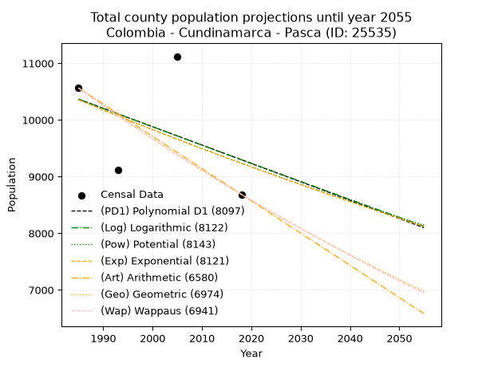
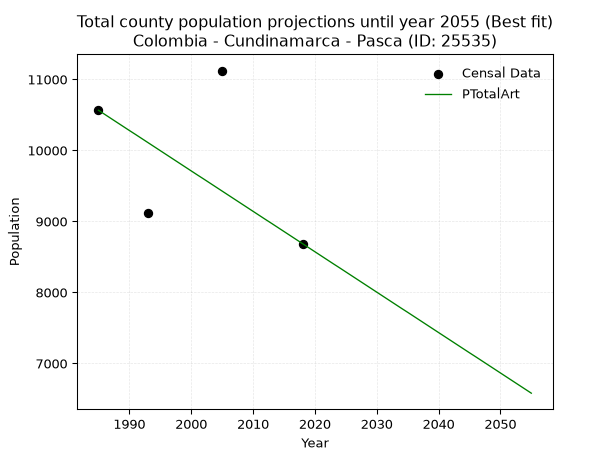
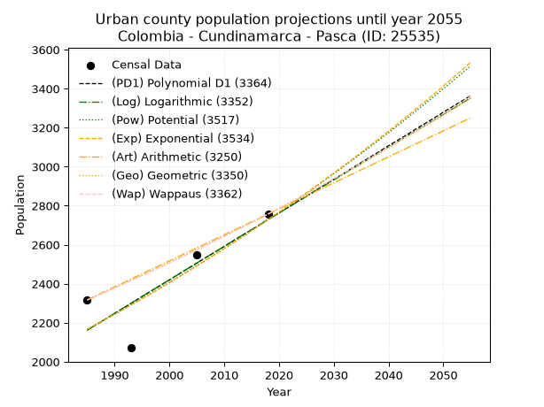
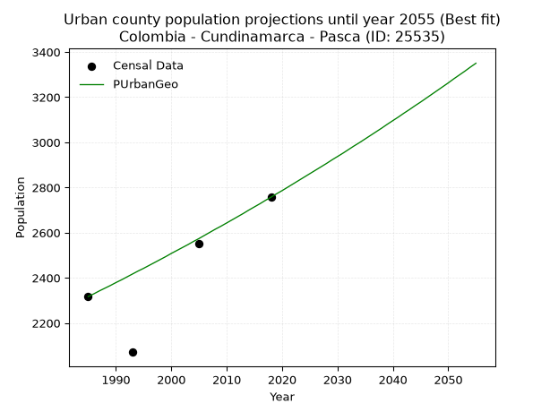
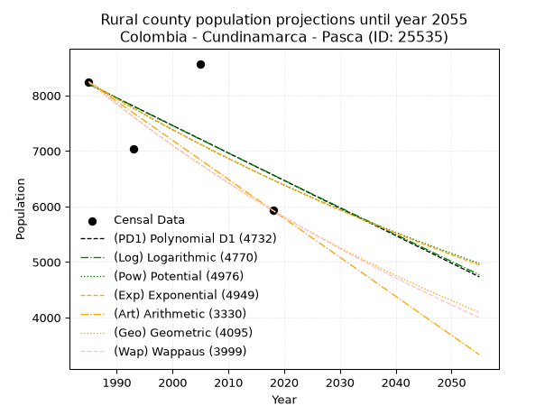
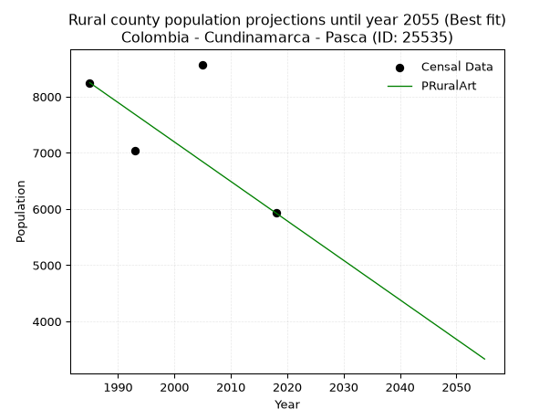

<div align="center">


</div>

# 📜 _“Population and Public Services Demand Projections (PPSD) until Year 2050 for Colombia - Cundinamarca - Pasca (ID: 25535)”_
Keywords: `population` `public-service` `projection` `lineal` `polynomial` `logarithmic` `potential` `exponential` `arithmetic` `geometric` `wappaus` `dane` `colombia` `south-america`

PPSD are analytical estimates used by governments and planners to anticipate future changes in population size, age distribution, and the resulting community needs for utilities, healthcare, education, and infrastructure as sizing future water treatment facilities, electrical grids, and road networks based on spatial growth.

<div align="center">

</img>

</div>


> **General running parameters**: • app_version: _v20260806_. • Python version: _3.14.7_. • Pandas version: _3.0.5_. • NumPy version: _2.5.1_. • Creates, save and include plots into reports (create_plot): _False_. • Projection until year: _2050_. • Process polynomial degree 2 and up: _False_. • Process Wappaus: _True_. • Process Wappaus: _True_. • Set negative values to zero: _True_. • Set infinite values to zero: _True_. • Drop dataset notes: _True_. 
<div align="center">

Maps & GIS Layers: [:earth_americas:Google](http://maps.google.com/maps?q=4.308979001,-74.3022759) [:earth_americas:OSM](https://www.openstreetmap.org/#map=18/4.308979001/-74.3022759&layers=P) [:earth_americas:Bing](https://www.bing.com/maps?cp=4.308979001~-74.3022759&lvl=18) [:earth_americas:Apple](https://maps.apple.com/frame?center=4.308979001%2C-74.3022759&span=0.003%2C0.006) [:earth_americas:GISMobile](https://github.com/rcfdtools/R.GISMobile/blob/main/file/gis/CountyLayer_CO/Readme.md)

</div>


<div align="center">

```geojson
{
  "type": "Feature",
  "geometry": {
    "type": "Point", 
    "coordinates": [-74.3022759, 4.308979001]
  }, 
  "properties": {
    "Name": "Colombia - Cundinamarca - Pasca (ID: 25535)"
  }
}
```

</div>


## 0. Census Data (4 records)

Census data are official statistics collected by a government about the people and housing in a country. They usually include counts of total population, age, sex, race, income, education, and jobs.

📅Global census file: [Population.xlsx](../data/Population.xlsx)

| Source   |   Year |   CountryID | CountryName   |   StateID | StateName    |   CountyID | CountyName   |   PTotal |   PUrban |   PRural |
|:---------|-------:|------------:|:--------------|----------:|:-------------|-----------:|:-------------|---------:|---------:|---------:|
| DANE     |   1985 |          57 | Colombia      |        25 | Cundinamarca |      25535 | Pasca        |    10564 |     2317 |     8247 |
| DANE     |   1993 |          57 | Colombia      |        25 | Cundinamarca |      25535 | Pasca        |     9117 |     2071 |     7046 |
| DANE     |   2005 |          57 | Colombia      |        25 | Cundinamarca |      25535 | Pasca        |    11122 |     2550 |     8572 |
| DANE     |   2018 |          57 | Colombia      |        25 | Cundinamarca |      25535 | Pasca        |     8686 |     2757 |     5929 |

> 🔥Some records could had specific notes about the registered values or the corresponding urban or rural distribution.

📅[SUI-RUPS](https://www.datos.gov.co/Hacienda-y-Cr-dito-P-blico/Registro-nico-de-Prestadores-de-Servicios-P-blicos/4qkq-csdn/about_data) - Local public utility companies: [RUPS.csv](../data/RUPS.csv)

 | SERVICIO       | ESTADO    | NOMBRE                                                                                       | NIT         | DEPARTAMENTO_DOMICILIO   | MUNICIPIO_DOMICILIO   | DIRECCION                             |   TELEFONO | EMAIL                     | TIPO_PRESTADOR                 | CLASIFICACION                 |
|:---------------|:----------|:---------------------------------------------------------------------------------------------|:------------|:-------------------------|:----------------------|:--------------------------------------|-----------:|:--------------------------|:-------------------------------|:------------------------------|
| ACUEDUCTO      | OPERATIVA | JUNTA ADMINISTRADORA DE SERVICIOS PUBLICOS-MUNICIPIO DE PASCA                                | 890680154-1 | CUNDINAMARCA             | PASCA                 | Carrrera 1 No 2-06                    |    7954883 | wperezcaicedo@hotmail.com | MUNICIPIO (PRESTACIÓN DIRECTA) | MENOR O IGUAL A 2500 USUARIOS |
| ALCANTARILLADO | OPERATIVA | JUNTA ADMINISTRADORA DE SERVICIOS PUBLICOS-MUNICIPIO DE PASCA                                | 890680154-1 | CUNDINAMARCA             | PASCA                 | Carrrera 1 No 2-06                    |    7954883 | wperezcaicedo@hotmail.com | MUNICIPIO (PRESTACIÓN DIRECTA) | MENOR O IGUAL A 2500 USUARIOS |
| ACUEDUCTO      | OPERATIVA | ASOCIACION DE USUARIOS DEL ACUEDUCTO INTERVEREDAL EL RETIRO Y OTRAS ASUAINRO                 | 808001365-9 | CUNDINAMARCA             | PASCA                 | DIAGONAL 4A No. 1 - 73 barrio Flandes |    8674907 | asuainro@yahoo.es         | ORGANIZACION AUTORIZADA        | MENOR O IGUAL A 2500 USUARIOS |
| ACUEDUCTO      | OPERATIVA | ASOCIACION  DE USUARIOS DEL ACUEDUCTO INTERVEREDAL DEL CARMEN DE PASCA Y BATAN DE FUSAGASUGA | 808002340-1 | CUNDINAMARCA             | PASCA                 | Vereda El Carmen                      |    7536248 | joviriga@gmail.com        | ORGANIZACION AUTORIZADA        | MENOR O IGUAL A 2500 USUARIOS |

## 1. Total

### 1.1. Coefficients and Parameters

* (PD1) Polynomial Deg 1: -32.42593336009489, 74732.22320352981 (lineal)
* (Log) Logarithmic: -64771.180813249724, 502198.5144051795
* (Pow) Potential: -6.935275948962254, 26.886042624960563
* (Exp) Exponential: -0.0034714923996262675, 10182341.641044378
* (Art) Arithmetic: Year diff. 2018 - 1985 = 33, Population diff. 8686 - 10564 = -1878, Annual growth = -56.90909090909091
* (Geo) Geometric: Year diff. 2018 - 1985 = 33, Population diff. 8686 - 10564 = -1878, Annual growth % = -0.0059139421881381216
* (Wap) Wappaus: i = -0.5912632821723731, Condition values only valid for < 200)

<sub>
Wappaus condition values: ['-0.00', '-0.59', '-1.18', '-1.77', '-2.37', '-2.96', '-3.55', '-4.14', '-4.73', '-5.32', '-5.91', '-6.50', '-7.10', '-7.69', '-8.28', '-8.87', '-9.46', '-10.05', '-10.64', '-11.23', '-11.83', '-12.42', '-13.01', '-13.60', '-14.19', '-14.78', '-15.37', '-15.96', '-16.56', '-17.15', '-17.74', '-18.33', '-18.92', '-19.51', '-20.10', '-20.69', '-21.29', '-21.88', '-22.47', '-23.06', '-23.65', '-24.24', '-24.83', '-25.42', '-26.02', '-26.61', '-27.20', '-27.79', '-28.38', '-28.97', '-29.56', '-30.15', '-30.75', '-31.34', '-31.93', '-32.52', '-33.11', '-33.70', '-34.29', '-34.88', '-35.48', '-36.07', '-36.66', '-37.25', '-37.84', '-38.43']
</sub>


### 1.2. Projected Dataset

|   Year |   CountyID |   PTotalPD1 |   PTotalLog |   PTotalPow |   PTotalExp |   PTotalArt |   PTotalGeo |   PTotalWap |
|-------:|-----------:|------------:|------------:|------------:|------------:|------------:|------------:|------------:|
|   1985 |      25535 |       10367 |       10367 |       10355 |       10355 |       10564 |       10564 |       10564 |
|   1986 |      25535 |       10334 |       10334 |       10319 |       10319 |       10507 |       10502 |       10502 |
|   1987 |      25535 |       10302 |       10301 |       10283 |       10284 |       10450 |       10439 |       10440 |
|   1988 |      25535 |       10269 |       10269 |       10247 |       10248 |       10393 |       10378 |       10378 |
|   1989 |      25535 |       10237 |       10236 |       10212 |       10212 |       10336 |       10316 |       10317 |
|   1990 |      25535 |       10205 |       10204 |       10176 |       10177 |       10279 |       10255 |       10256 |
|   1991 |      25535 |       10172 |       10171 |       10141 |       10142 |       10223 |       10195 |       10196 |
|   1992 |      25535 |       10140 |       10139 |       10106 |       10107 |       10166 |       10134 |       10136 |
|   1993 |      25535 |       10107 |       10106 |       10070 |       10072 |       10109 |       10074 |       10076 |
|   1994 |      25535 |       10075 |       10074 |       10035 |       10037 |       10052 |       10015 |       10016 |
|   1995 |      25535 |       10042 |       10041 |       10001 |       10002 |        9995 |        9956 |        9957 |
|   1996 |      25535 |       10010 |       10009 |        9966 |        9967 |        9938 |        9897 |        9899 |
|   1997 |      25535 |        9978 |        9976 |        9931 |        9933 |        9881 |        9838 |        9840 |
|   1998 |      25535 |        9945 |        9944 |        9897 |        9898 |        9824 |        9780 |        9782 |
|   1999 |      25535 |        9913 |        9911 |        9863 |        9864 |        9767 |        9722 |        9724 |
|   2000 |      25535 |        9880 |        9879 |        9829 |        9830 |        9710 |        9665 |        9667 |
|   2001 |      25535 |        9848 |        9847 |        9795 |        9796 |        9653 |        9608 |        9610 |
|   2002 |      25535 |        9816 |        9814 |        9761 |        9762 |        9597 |        9551 |        9553 |
|   2003 |      25535 |        9783 |        9782 |        9727 |        9728 |        9540 |        9494 |        9497 |
|   2004 |      25535 |        9751 |        9750 |        9693 |        9694 |        9483 |        9438 |        9440 |
|   2005 |      25535 |        9718 |        9717 |        9660 |        9661 |        9426 |        9382 |        9385 |
|   2006 |      25535 |        9686 |        9685 |        9626 |        9627 |        9369 |        9327 |        9329 |
|   2007 |      25535 |        9653 |        9653 |        9593 |        9594 |        9312 |        9272 |        9274 |
|   2008 |      25535 |        9621 |        9621 |        9560 |        9561 |        9255 |        9217 |        9219 |
|   2009 |      25535 |        9589 |        9588 |        9527 |        9527 |        9198 |        9162 |        9164 |
|   2010 |      25535 |        9556 |        9556 |        9494 |        9494 |        9141 |        9108 |        9110 |
|   2011 |      25535 |        9524 |        9524 |        9462 |        9462 |        9084 |        9054 |        9056 |
|   2012 |      25535 |        9491 |        9492 |        9429 |        9429 |        9027 |        9001 |        9002 |
|   2013 |      25535 |        9459 |        9459 |        9397 |        9396 |        8971 |        8947 |        8949 |
|   2014 |      25535 |        9426 |        9427 |        9364 |        9364 |        8914 |        8895 |        8896 |
|   2015 |      25535 |        9394 |        9395 |        9332 |        9331 |        8857 |        8842 |        8843 |
|   2016 |      25535 |        9362 |        9363 |        9300 |        9299 |        8800 |        8790 |        8790 |
|   2017 |      25535 |        9329 |        9331 |        9268 |        9267 |        8743 |        8738 |        8738 |
|   2018 |      25535 |        9297 |        9299 |        9236 |        9234 |        8686 |        8686 |        8686 |
|   2019 |      25535 |        9264 |        9267 |        9205 |        9202 |        8629 |        8635 |        8634 |
|   2020 |      25535 |        9232 |        9235 |        9173 |        9171 |        8572 |        8584 |        8583 |
|   2021 |      25535 |        9199 |        9203 |        9142 |        9139 |        8515 |        8533 |        8532 |
|   2022 |      25535 |        9167 |        9170 |        9110 |        9107 |        8458 |        8482 |        8481 |
|   2023 |      25535 |        9135 |        9138 |        9079 |        9076 |        8401 |        8432 |        8430 |
|   2024 |      25535 |        9102 |        9106 |        9048 |        9044 |        8345 |        8382 |        8380 |
|   2025 |      25535 |        9070 |        9074 |        9017 |        9013 |        8288 |        8333 |        8330 |
|   2026 |      25535 |        9037 |        9042 |        8986 |        8981 |        8231 |        8283 |        8280 |
|   2027 |      25535 |        9005 |        9011 |        8956 |        8950 |        8174 |        8234 |        8230 |
|   2028 |      25535 |        8972 |        8979 |        8925 |        8919 |        8117 |        8186 |        8181 |
|   2029 |      25535 |        8940 |        8947 |        8895 |        8888 |        8060 |        8137 |        8132 |
|   2030 |      25535 |        8908 |        8915 |        8864 |        8858 |        8003 |        8089 |        8083 |
|   2031 |      25535 |        8875 |        8883 |        8834 |        8827 |        7946 |        8041 |        8035 |
|   2032 |      25535 |        8843 |        8851 |        8804 |        8796 |        7889 |        7994 |        7986 |
|   2033 |      25535 |        8810 |        8819 |        8774 |        8766 |        7832 |        7947 |        7938 |
|   2034 |      25535 |        8778 |        8787 |        8744 |        8735 |        7775 |        7900 |        7891 |
|   2035 |      25535 |        8745 |        8755 |        8714 |        8705 |        7719 |        7853 |        7843 |
|   2036 |      25535 |        8713 |        8724 |        8685 |        8675 |        7662 |        7806 |        7796 |
|   2037 |      25535 |        8681 |        8692 |        8655 |        8645 |        7605 |        7760 |        7749 |
|   2038 |      25535 |        8648 |        8660 |        8626 |        8615 |        7548 |        7714 |        7702 |
|   2039 |      25535 |        8616 |        8628 |        8596 |        8585 |        7491 |        7669 |        7655 |
|   2040 |      25535 |        8583 |        8596 |        8567 |        8555 |        7434 |        7623 |        7609 |
|   2041 |      25535 |        8551 |        8565 |        8538 |        8526 |        7377 |        7578 |        7563 |
|   2042 |      25535 |        8518 |        8533 |        8509 |        8496 |        7320 |        7533 |        7517 |
|   2043 |      25535 |        8486 |        8501 |        8480 |        8467 |        7263 |        7489 |        7472 |
|   2044 |      25535 |        8454 |        8470 |        8452 |        8437 |        7206 |        7445 |        7426 |
|   2045 |      25535 |        8421 |        8438 |        8423 |        8408 |        7149 |        7401 |        7381 |
|   2046 |      25535 |        8389 |        8406 |        8395 |        8379 |        7093 |        7357 |        7336 |
|   2047 |      25535 |        8356 |        8375 |        8366 |        8350 |        7036 |        7313 |        7291 |
|   2048 |      25535 |        8324 |        8343 |        8338 |        8321 |        6979 |        7270 |        7247 |
|   2049 |      25535 |        8291 |        8311 |        8310 |        8292 |        6922 |        7227 |        7203 |
|   2050 |      25535 |        8259 |        8280 |        8282 |        8264 |        6865 |        7184 |        7158 |
<div align="center">

</img>

</div>


### 1.3. Best fit with absolute and relative error (%)

Relative error puts that difference into context by dividing the absolute error by the true value, creating a unitless ratio or percentage that shows the scale of the mistake.

Absolute and relative error

|   Year | Source   |   CountryID | CountryName   |   StateID | StateName    |   CountyID_x | CountyName   |   PTotal |   PUrban |   PRural |   CountyID_y |   PTotalPD1 |   PTotalLog |   PTotalPow |   PTotalExp |   PTotalArt |   PTotalGeo |   PTotalWap |   PTotalPD1AbsError |   PTotalLogAbsError |   PTotalPowAbsError |   PTotalExpAbsError |   PTotalArtAbsError |   PTotalGeoAbsError |   PTotalWapAbsError |   PTotalPD1RelError |   PTotalLogRelError |   PTotalPowRelError |   PTotalExpRelError |   PTotalArtRelError |   PTotalGeoRelError |   PTotalWapRelError |
|-------:|:---------|------------:|:--------------|----------:|:-------------|-------------:|:-------------|---------:|---------:|---------:|-------------:|------------:|------------:|------------:|------------:|------------:|------------:|------------:|--------------------:|--------------------:|--------------------:|--------------------:|--------------------:|--------------------:|--------------------:|--------------------:|--------------------:|--------------------:|--------------------:|--------------------:|--------------------:|--------------------:|
|   1985 | DANE     |          57 | Colombia      |        25 | Cundinamarca |        25535 | Pasca        |    10564 |     2317 |     8247 |        25535 |       10367 |       10367 |       10355 |       10355 |       10564 |       10564 |       10564 |                 197 |                 197 |                 209 |                 209 |                   0 |                   0 |                   0 |             1.86482 |             1.86482 |             1.97842 |             1.97842 |              0      |              0      |              0      |
|   1993 | DANE     |          57 | Colombia      |        25 | Cundinamarca |        25535 | Pasca        |     9117 |     2071 |     7046 |        25535 |       10107 |       10106 |       10070 |       10072 |       10109 |       10074 |       10076 |                 990 |                 989 |                 953 |                 955 |                 992 |                 957 |                 959 |            10.8588  |            10.8479  |            10.453   |            10.4749  |             10.8808 |             10.4969 |             10.5188 |
|   2005 | DANE     |          57 | Colombia      |        25 | Cundinamarca |        25535 | Pasca        |    11122 |     2550 |     8572 |        25535 |        9718 |        9717 |        9660 |        9661 |        9426 |        9382 |        9385 |                1404 |                1405 |                1462 |                1461 |                1696 |                1740 |                1737 |            12.6236  |            12.6326  |            13.1451  |            13.1361  |             15.2491 |             15.6447 |             15.6177 |
|   2018 | DANE     |          57 | Colombia      |        25 | Cundinamarca |        25535 | Pasca        |     8686 |     2757 |     5929 |        25535 |        9297 |        9299 |        9236 |        9234 |        8686 |        8686 |        8686 |                 611 |                 613 |                 550 |                 548 |                   0 |                   0 |                   0 |             7.03431 |             7.05733 |             6.33203 |             6.309   |              0      |              0      |              0      |

Relative error mean

| Method    |   RelError | Best   |
|:----------|-----------:|:-------|
| PTotalPD1 |    8.0954  |        |
| PTotalLog |    8.10066 |        |
| PTotalPow |    7.97714 |        |
| PTotalExp |    7.97462 |        |
| PTotalArt |    6.53246 | True   |
| PTotalGeo |    6.53539 |        |
| PTotalWap |    6.53413 |        |

💙Best method: _**PTotalArt**_
<div align="center">

</img>

</div>


### 1.4. Fresh water supply demand in liters per capita per day (lpcd)

The fresh water supply demand typically ranges from 100 to 300 liters per capita per day (lpcd) for standard domestic and municipal planning, though absolute survival minimums set by the World Health Organization are as low as 7.5 to 20 liters per day, and total consumption in high-income nations can exceed 400 liters.

> `CZ`: Level in meters above the sea level (masl)<br> `WS`: Fresh water supply demand in liters per capita per day (lpcd or l/h/d)<br> `WSAll`: Zonal fresh water supply demand in liters per second (l/s)<br> `A`: Zonal area in square meters<br> `DP`: Population density (people/hectare or p/ha)

Reference values (RAS Colombia)

|    CZ |   WS |
|------:|-----:|
|  1000 |  120 |
|  2000 |  130 |
| 99999 |  140 |

County shapefile geometry properties and water supply values

|   CountyID |      ATotal |   CZTotal |   WSTotal |
|-----------:|------------:|----------:|----------:|
|      25535 | 2.71377e+08 |    3015.8 |       140 |

Projected values for best method: PTotalArt

|   CountyID |   Year |   PTotalArt |   DPTotal |   WSTotal |   WSTotalAll |
|-----------:|-------:|------------:|----------:|----------:|-------------:|
|      25535 |   1985 |       10564 |      0.39 |       140 |      17.1176 |
|      25535 |   1986 |       10507 |      0.39 |       140 |      17.0252 |
|      25535 |   1987 |       10450 |      0.39 |       140 |      16.9329 |
|      25535 |   1988 |       10393 |      0.38 |       140 |      16.8405 |
|      25535 |   1989 |       10336 |      0.38 |       140 |      16.7481 |
|      25535 |   1990 |       10279 |      0.38 |       140 |      16.6558 |
|      25535 |   1991 |       10223 |      0.38 |       140 |      16.565  |
|      25535 |   1992 |       10166 |      0.37 |       140 |      16.4727 |
|      25535 |   1993 |       10109 |      0.37 |       140 |      16.3803 |
|      25535 |   1994 |       10052 |      0.37 |       140 |      16.288  |
|      25535 |   1995 |        9995 |      0.37 |       140 |      16.1956 |
|      25535 |   1996 |        9938 |      0.37 |       140 |      16.1032 |
|      25535 |   1997 |        9881 |      0.36 |       140 |      16.0109 |
|      25535 |   1998 |        9824 |      0.36 |       140 |      15.9185 |
|      25535 |   1999 |        9767 |      0.36 |       140 |      15.8262 |
|      25535 |   2000 |        9710 |      0.36 |       140 |      15.7338 |
|      25535 |   2001 |        9653 |      0.36 |       140 |      15.6414 |
|      25535 |   2002 |        9597 |      0.35 |       140 |      15.5507 |
|      25535 |   2003 |        9540 |      0.35 |       140 |      15.4583 |
|      25535 |   2004 |        9483 |      0.35 |       140 |      15.366  |
|      25535 |   2005 |        9426 |      0.35 |       140 |      15.2736 |
|      25535 |   2006 |        9369 |      0.35 |       140 |      15.1813 |
|      25535 |   2007 |        9312 |      0.34 |       140 |      15.0889 |
|      25535 |   2008 |        9255 |      0.34 |       140 |      14.9965 |
|      25535 |   2009 |        9198 |      0.34 |       140 |      14.9042 |
|      25535 |   2010 |        9141 |      0.34 |       140 |      14.8118 |
|      25535 |   2011 |        9084 |      0.33 |       140 |      14.7194 |
|      25535 |   2012 |        9027 |      0.33 |       140 |      14.6271 |
|      25535 |   2013 |        8971 |      0.33 |       140 |      14.5363 |
|      25535 |   2014 |        8914 |      0.33 |       140 |      14.444  |
|      25535 |   2015 |        8857 |      0.33 |       140 |      14.3516 |
|      25535 |   2016 |        8800 |      0.32 |       140 |      14.2593 |
|      25535 |   2017 |        8743 |      0.32 |       140 |      14.1669 |
|      25535 |   2018 |        8686 |      0.32 |       140 |      14.0745 |
|      25535 |   2019 |        8629 |      0.32 |       140 |      13.9822 |
|      25535 |   2020 |        8572 |      0.32 |       140 |      13.8898 |
|      25535 |   2021 |        8515 |      0.31 |       140 |      13.7975 |
|      25535 |   2022 |        8458 |      0.31 |       140 |      13.7051 |
|      25535 |   2023 |        8401 |      0.31 |       140 |      13.6127 |
|      25535 |   2024 |        8345 |      0.31 |       140 |      13.522  |
|      25535 |   2025 |        8288 |      0.31 |       140 |      13.4296 |
|      25535 |   2026 |        8231 |      0.3  |       140 |      13.3373 |
|      25535 |   2027 |        8174 |      0.3  |       140 |      13.2449 |
|      25535 |   2028 |        8117 |      0.3  |       140 |      13.1525 |
|      25535 |   2029 |        8060 |      0.3  |       140 |      13.0602 |
|      25535 |   2030 |        8003 |      0.29 |       140 |      12.9678 |
|      25535 |   2031 |        7946 |      0.29 |       140 |      12.8755 |
|      25535 |   2032 |        7889 |      0.29 |       140 |      12.7831 |
|      25535 |   2033 |        7832 |      0.29 |       140 |      12.6907 |
|      25535 |   2034 |        7775 |      0.29 |       140 |      12.5984 |
|      25535 |   2035 |        7719 |      0.28 |       140 |      12.5076 |
|      25535 |   2036 |        7662 |      0.28 |       140 |      12.4153 |
|      25535 |   2037 |        7605 |      0.28 |       140 |      12.3229 |
|      25535 |   2038 |        7548 |      0.28 |       140 |      12.2306 |
|      25535 |   2039 |        7491 |      0.28 |       140 |      12.1382 |
|      25535 |   2040 |        7434 |      0.27 |       140 |      12.0458 |
|      25535 |   2041 |        7377 |      0.27 |       140 |      11.9535 |
|      25535 |   2042 |        7320 |      0.27 |       140 |      11.8611 |
|      25535 |   2043 |        7263 |      0.27 |       140 |      11.7688 |
|      25535 |   2044 |        7206 |      0.27 |       140 |      11.6764 |
|      25535 |   2045 |        7149 |      0.26 |       140 |      11.584  |
|      25535 |   2046 |        7093 |      0.26 |       140 |      11.4933 |
|      25535 |   2047 |        7036 |      0.26 |       140 |      11.4009 |
|      25535 |   2048 |        6979 |      0.26 |       140 |      11.3086 |
|      25535 |   2049 |        6922 |      0.26 |       140 |      11.2162 |
|      25535 |   2050 |        6865 |      0.25 |       140 |      11.1238 |

## 2. Urban

### 2.1. Coefficients and Parameters

* (PD1) Polynomial Deg 1: 17.182256122039195, -31945.057808108904 (lineal)
* (Log) Logarithmic: 34364.91881575599, -258784.27330173785
* (Pow) Potential: 13.986563638648107, -42.788686502694574
* (Exp) Exponential: 0.006993316875447415, 0.0020274195110886626
* (Art) Arithmetic: Year diff. 2018 - 1985 = 33, Population diff. 2757 - 2317 = 440, Annual growth = 13.333333333333334
* (Geo) Geometric: Year diff. 2018 - 1985 = 33, Population diff. 2757 - 2317 = 440, Annual growth % = 0.005282688896044441
* (Wap) Wappaus: i = 0.5255551175929576, Condition values only valid for < 200)

<sub>
Wappaus condition values: ['0.00', '0.53', '1.05', '1.58', '2.10', '2.63', '3.15', '3.68', '4.20', '4.73', '5.26', '5.78', '6.31', '6.83', '7.36', '7.88', '8.41', '8.93', '9.46', '9.99', '10.51', '11.04', '11.56', '12.09', '12.61', '13.14', '13.66', '14.19', '14.72', '15.24', '15.77', '16.29', '16.82', '17.34', '17.87', '18.39', '18.92', '19.45', '19.97', '20.50', '21.02', '21.55', '22.07', '22.60', '23.12', '23.65', '24.18', '24.70', '25.23', '25.75', '26.28', '26.80', '27.33', '27.85', '28.38', '28.91', '29.43', '29.96', '30.48', '31.01', '31.53', '32.06', '32.58', '33.11', '33.64', '34.16']
</sub>


### 2.2. Projected Dataset

|   Year |   CountyID |   PUrbanPD1 |   PUrbanLog |   PUrbanPow |   PUrbanExp |   PUrbanArt |   PUrbanGeo |   PUrbanWap |
|-------:|-----------:|------------:|------------:|------------:|------------:|------------:|------------:|------------:|
|   1985 |      25535 |        2162 |        2161 |        2166 |        2166 |        2317 |        2317 |        2317 |
|   1986 |      25535 |        2179 |        2179 |        2181 |        2181 |        2330 |        2329 |        2329 |
|   1987 |      25535 |        2196 |        2196 |        2197 |        2197 |        2344 |        2342 |        2341 |
|   1988 |      25535 |        2213 |        2213 |        2212 |        2212 |        2357 |        2354 |        2354 |
|   1989 |      25535 |        2230 |        2231 |        2228 |        2228 |        2370 |        2366 |        2366 |
|   1990 |      25535 |        2248 |        2248 |        2244 |        2243 |        2384 |        2379 |        2379 |
|   1991 |      25535 |        2265 |        2265 |        2259 |        2259 |        2397 |        2391 |        2391 |
|   1992 |      25535 |        2282 |        2282 |        2275 |        2275 |        2410 |        2404 |        2404 |
|   1993 |      25535 |        2299 |        2300 |        2291 |        2291 |        2424 |        2417 |        2417 |
|   1994 |      25535 |        2316 |        2317 |        2307 |        2307 |        2437 |        2430 |        2429 |
|   1995 |      25535 |        2334 |        2334 |        2324 |        2323 |        2450 |        2442 |        2442 |
|   1996 |      25535 |        2351 |        2351 |        2340 |        2339 |        2464 |        2455 |        2455 |
|   1997 |      25535 |        2368 |        2369 |        2356 |        2356 |        2477 |        2468 |        2468 |
|   1998 |      25535 |        2385 |        2386 |        2373 |        2372 |        2490 |        2481 |        2481 |
|   1999 |      25535 |        2402 |        2403 |        2390 |        2389 |        2504 |        2494 |        2494 |
|   2000 |      25535 |        2419 |        2420 |        2406 |        2406 |        2517 |        2508 |        2507 |
|   2001 |      25535 |        2437 |        2437 |        2423 |        2423 |        2530 |        2521 |        2520 |
|   2002 |      25535 |        2454 |        2454 |        2440 |        2440 |        2544 |        2534 |        2534 |
|   2003 |      25535 |        2471 |        2472 |        2457 |        2457 |        2557 |        2547 |        2547 |
|   2004 |      25535 |        2488 |        2489 |        2475 |        2474 |        2570 |        2561 |        2561 |
|   2005 |      25535 |        2505 |        2506 |        2492 |        2491 |        2584 |        2574 |        2574 |
|   2006 |      25535 |        2523 |        2523 |        2509 |        2509 |        2597 |        2588 |        2588 |
|   2007 |      25535 |        2540 |        2540 |        2527 |        2527 |        2610 |        2602 |        2601 |
|   2008 |      25535 |        2557 |        2557 |        2545 |        2544 |        2624 |        2616 |        2615 |
|   2009 |      25535 |        2574 |        2574 |        2562 |        2562 |        2637 |        2629 |        2629 |
|   2010 |      25535 |        2591 |        2592 |        2580 |        2580 |        2650 |        2643 |        2643 |
|   2011 |      25535 |        2608 |        2609 |        2598 |        2598 |        2664 |        2657 |        2657 |
|   2012 |      25535 |        2626 |        2626 |        2616 |        2616 |        2677 |        2671 |        2671 |
|   2013 |      25535 |        2643 |        2643 |        2635 |        2635 |        2690 |        2685 |        2685 |
|   2014 |      25535 |        2660 |        2660 |        2653 |        2653 |        2704 |        2700 |        2699 |
|   2015 |      25535 |        2677 |        2677 |        2672 |        2672 |        2717 |        2714 |        2714 |
|   2016 |      25535 |        2694 |        2694 |        2690 |        2691 |        2730 |        2728 |        2728 |
|   2017 |      25535 |        2712 |        2711 |        2709 |        2710 |        2744 |        2743 |        2742 |
|   2018 |      25535 |        2729 |        2728 |        2728 |        2729 |        2757 |        2757 |        2757 |
|   2019 |      25535 |        2746 |        2745 |        2747 |        2748 |        2770 |        2772 |        2772 |
|   2020 |      25535 |        2763 |        2762 |        2766 |        2767 |        2784 |        2786 |        2786 |
|   2021 |      25535 |        2780 |        2779 |        2785 |        2786 |        2797 |        2801 |        2801 |
|   2022 |      25535 |        2797 |        2796 |        2804 |        2806 |        2810 |        2816 |        2816 |
|   2023 |      25535 |        2815 |        2813 |        2824 |        2826 |        2824 |        2831 |        2831 |
|   2024 |      25535 |        2832 |        2830 |        2843 |        2845 |        2837 |        2846 |        2846 |
|   2025 |      25535 |        2849 |        2847 |        2863 |        2865 |        2850 |        2861 |        2861 |
|   2026 |      25535 |        2866 |        2864 |        2883 |        2886 |        2864 |        2876 |        2877 |
|   2027 |      25535 |        2883 |        2881 |        2903 |        2906 |        2877 |        2891 |        2892 |
|   2028 |      25535 |        2901 |        2898 |        2923 |        2926 |        2890 |        2906 |        2907 |
|   2029 |      25535 |        2918 |        2915 |        2943 |        2947 |        2904 |        2922 |        2923 |
|   2030 |      25535 |        2935 |        2932 |        2964 |        2967 |        2917 |        2937 |        2938 |
|   2031 |      25535 |        2952 |        2949 |        2984 |        2988 |        2930 |        2952 |        2954 |
|   2032 |      25535 |        2969 |        2966 |        3005 |        3009 |        2944 |        2968 |        2970 |
|   2033 |      25535 |        2986 |        2983 |        3025 |        3030 |        2957 |        2984 |        2986 |
|   2034 |      25535 |        3004 |        2999 |        3046 |        3052 |        2970 |        2999 |        3002 |
|   2035 |      25535 |        3021 |        3016 |        3067 |        3073 |        2984 |        3015 |        3018 |
|   2036 |      25535 |        3038 |        3033 |        3088 |        3095 |        2997 |        3031 |        3034 |
|   2037 |      25535 |        3055 |        3050 |        3110 |        3116 |        3010 |        3047 |        3050 |
|   2038 |      25535 |        3072 |        3067 |        3131 |        3138 |        3024 |        3063 |        3067 |
|   2039 |      25535 |        3090 |        3084 |        3153 |        3160 |        3037 |        3080 |        3083 |
|   2040 |      25535 |        3107 |        3101 |        3174 |        3182 |        3050 |        3096 |        3100 |
|   2041 |      25535 |        3124 |        3117 |        3196 |        3205 |        3064 |        3112 |        3117 |
|   2042 |      25535 |        3141 |        3134 |        3218 |        3227 |        3077 |        3129 |        3133 |
|   2043 |      25535 |        3158 |        3151 |        3240 |        3250 |        3090 |        3145 |        3150 |
|   2044 |      25535 |        3175 |        3168 |        3263 |        3273 |        3104 |        3162 |        3167 |
|   2045 |      25535 |        3193 |        3185 |        3285 |        3296 |        3117 |        3178 |        3184 |
|   2046 |      25535 |        3210 |        3202 |        3308 |        3319 |        3130 |        3195 |        3202 |
|   2047 |      25535 |        3227 |        3218 |        3330 |        3342 |        3144 |        3212 |        3219 |
|   2048 |      25535 |        3244 |        3235 |        3353 |        3365 |        3157 |        3229 |        3236 |
|   2049 |      25535 |        3261 |        3252 |        3376 |        3389 |        3170 |        3246 |        3254 |
|   2050 |      25535 |        3279 |        3269 |        3399 |        3413 |        3184 |        3263 |        3272 |
<div align="center">

</img>

</div>


### 2.3. Best fit with absolute and relative error (%)

Relative error puts that difference into context by dividing the absolute error by the true value, creating a unitless ratio or percentage that shows the scale of the mistake.

Absolute and relative error

|   Year | Source   |   CountryID | CountryName   |   StateID | StateName    |   CountyID_x | CountyName   |   PTotal |   PUrban |   PRural |   CountyID_y |   PUrbanPD1 |   PUrbanLog |   PUrbanPow |   PUrbanExp |   PUrbanArt |   PUrbanGeo |   PUrbanWap |   PUrbanPD1AbsError |   PUrbanLogAbsError |   PUrbanPowAbsError |   PUrbanExpAbsError |   PUrbanArtAbsError |   PUrbanGeoAbsError |   PUrbanWapAbsError |   PUrbanPD1RelError |   PUrbanLogRelError |   PUrbanPowRelError |   PUrbanExpRelError |   PUrbanArtRelError |   PUrbanGeoRelError |   PUrbanWapRelError |
|-------:|:---------|------------:|:--------------|----------:|:-------------|-------------:|:-------------|---------:|---------:|---------:|-------------:|------------:|------------:|------------:|------------:|------------:|------------:|------------:|--------------------:|--------------------:|--------------------:|--------------------:|--------------------:|--------------------:|--------------------:|--------------------:|--------------------:|--------------------:|--------------------:|--------------------:|--------------------:|--------------------:|
|   1985 | DANE     |          57 | Colombia      |        25 | Cundinamarca |        25535 | Pasca        |    10564 |     2317 |     8247 |        25535 |        2162 |        2161 |        2166 |        2166 |        2317 |        2317 |        2317 |                 155 |                 156 |                 151 |                 151 |                   0 |                   0 |                   0 |             6.68968 |             6.73284 |             6.51705 |             6.51705 |             0       |            0        |            0        |
|   1993 | DANE     |          57 | Colombia      |        25 | Cundinamarca |        25535 | Pasca        |     9117 |     2071 |     7046 |        25535 |        2299 |        2300 |        2291 |        2291 |        2424 |        2417 |        2417 |                 228 |                 229 |                 220 |                 220 |                 353 |                 346 |                 346 |            11.0092  |            11.0575  |            10.6229  |            10.6229  |            17.0449  |           16.7069   |           16.7069   |
|   2005 | DANE     |          57 | Colombia      |        25 | Cundinamarca |        25535 | Pasca        |    11122 |     2550 |     8572 |        25535 |        2505 |        2506 |        2492 |        2491 |        2584 |        2574 |        2574 |                  45 |                  44 |                  58 |                  59 |                  34 |                  24 |                  24 |             1.76471 |             1.72549 |             2.27451 |             2.31373 |             1.33333 |            0.941176 |            0.941176 |
|   2018 | DANE     |          57 | Colombia      |        25 | Cundinamarca |        25535 | Pasca        |     8686 |     2757 |     5929 |        25535 |        2729 |        2728 |        2728 |        2729 |        2757 |        2757 |        2757 |                  28 |                  29 |                  29 |                  28 |                   0 |                   0 |                   0 |             1.0156  |             1.05187 |             1.05187 |             1.0156  |             0       |            0        |            0        |

Relative error mean

| Method    |   RelError | Best   |
|:----------|-----------:|:-------|
| PUrbanPD1 |    5.11979 |        |
| PUrbanLog |    5.14192 |        |
| PUrbanPow |    5.11658 |        |
| PUrbanExp |    5.11731 |        |
| PUrbanArt |    4.59456 |        |
| PUrbanGeo |    4.41202 | True   |
| PUrbanWap |    4.41202 | True   |

💙Best method: _**PUrbanGeo**_
<div align="center">

</img>

</div>


### 2.4. Fresh water supply demand in liters per capita per day (lpcd)

The fresh water supply demand typically ranges from 100 to 300 liters per capita per day (lpcd) for standard domestic and municipal planning, though absolute survival minimums set by the World Health Organization are as low as 7.5 to 20 liters per day, and total consumption in high-income nations can exceed 400 liters.

> `CZ`: Level in meters above the sea level (masl)<br> `WS`: Fresh water supply demand in liters per capita per day (lpcd or l/h/d)<br> `WSAll`: Zonal fresh water supply demand in liters per second (l/s)<br> `A`: Zonal area in square meters<br> `DP`: Population density (people/hectare or p/ha)

Reference values (RAS Colombia)

|    CZ |   WS |
|------:|-----:|
|  1000 |  120 |
|  2000 |  130 |
| 99999 |  140 |

County shapefile geometry properties and water supply values

|   CountyID |   AUrban |   CZUrban |   WSUrban |
|-----------:|---------:|----------:|----------:|
|      25535 |   607963 |   2167.23 |       140 |

Projected values for best method: PUrbanGeo

|   CountyID |   Year |   PUrbanGeo |   DPUrban |   WSUrban |   WSUrbanAll |
|-----------:|-------:|------------:|----------:|----------:|-------------:|
|      25535 |   1985 |        2317 |     38.11 |       140 |      3.7544  |
|      25535 |   1986 |        2329 |     38.31 |       140 |      3.77384 |
|      25535 |   1987 |        2342 |     38.52 |       140 |      3.79491 |
|      25535 |   1988 |        2354 |     38.72 |       140 |      3.81435 |
|      25535 |   1989 |        2366 |     38.92 |       140 |      3.8338  |
|      25535 |   1990 |        2379 |     39.13 |       140 |      3.85486 |
|      25535 |   1991 |        2391 |     39.33 |       140 |      3.87431 |
|      25535 |   1992 |        2404 |     39.54 |       140 |      3.89537 |
|      25535 |   1993 |        2417 |     39.76 |       140 |      3.91644 |
|      25535 |   1994 |        2430 |     39.97 |       140 |      3.9375  |
|      25535 |   1995 |        2442 |     40.17 |       140 |      3.95694 |
|      25535 |   1996 |        2455 |     40.38 |       140 |      3.97801 |
|      25535 |   1997 |        2468 |     40.59 |       140 |      3.99907 |
|      25535 |   1998 |        2481 |     40.81 |       140 |      4.02014 |
|      25535 |   1999 |        2494 |     41.02 |       140 |      4.0412  |
|      25535 |   2000 |        2508 |     41.25 |       140 |      4.06389 |
|      25535 |   2001 |        2521 |     41.47 |       140 |      4.08495 |
|      25535 |   2002 |        2534 |     41.68 |       140 |      4.10602 |
|      25535 |   2003 |        2547 |     41.89 |       140 |      4.12708 |
|      25535 |   2004 |        2561 |     42.12 |       140 |      4.14977 |
|      25535 |   2005 |        2574 |     42.34 |       140 |      4.17083 |
|      25535 |   2006 |        2588 |     42.57 |       140 |      4.19352 |
|      25535 |   2007 |        2602 |     42.8  |       140 |      4.2162  |
|      25535 |   2008 |        2616 |     43.03 |       140 |      4.23889 |
|      25535 |   2009 |        2629 |     43.24 |       140 |      4.25995 |
|      25535 |   2010 |        2643 |     43.47 |       140 |      4.28264 |
|      25535 |   2011 |        2657 |     43.7  |       140 |      4.30532 |
|      25535 |   2012 |        2671 |     43.93 |       140 |      4.32801 |
|      25535 |   2013 |        2685 |     44.16 |       140 |      4.35069 |
|      25535 |   2014 |        2700 |     44.41 |       140 |      4.375   |
|      25535 |   2015 |        2714 |     44.64 |       140 |      4.39769 |
|      25535 |   2016 |        2728 |     44.87 |       140 |      4.42037 |
|      25535 |   2017 |        2743 |     45.12 |       140 |      4.44468 |
|      25535 |   2018 |        2757 |     45.35 |       140 |      4.46736 |
|      25535 |   2019 |        2772 |     45.59 |       140 |      4.49167 |
|      25535 |   2020 |        2786 |     45.83 |       140 |      4.51435 |
|      25535 |   2021 |        2801 |     46.07 |       140 |      4.53866 |
|      25535 |   2022 |        2816 |     46.32 |       140 |      4.56296 |
|      25535 |   2023 |        2831 |     46.57 |       140 |      4.58727 |
|      25535 |   2024 |        2846 |     46.81 |       140 |      4.61157 |
|      25535 |   2025 |        2861 |     47.06 |       140 |      4.63588 |
|      25535 |   2026 |        2876 |     47.31 |       140 |      4.66019 |
|      25535 |   2027 |        2891 |     47.55 |       140 |      4.68449 |
|      25535 |   2028 |        2906 |     47.8  |       140 |      4.7088  |
|      25535 |   2029 |        2922 |     48.06 |       140 |      4.73472 |
|      25535 |   2030 |        2937 |     48.31 |       140 |      4.75903 |
|      25535 |   2031 |        2952 |     48.56 |       140 |      4.78333 |
|      25535 |   2032 |        2968 |     48.82 |       140 |      4.80926 |
|      25535 |   2033 |        2984 |     49.08 |       140 |      4.83519 |
|      25535 |   2034 |        2999 |     49.33 |       140 |      4.85949 |
|      25535 |   2035 |        3015 |     49.59 |       140 |      4.88542 |
|      25535 |   2036 |        3031 |     49.86 |       140 |      4.91134 |
|      25535 |   2037 |        3047 |     50.12 |       140 |      4.93727 |
|      25535 |   2038 |        3063 |     50.38 |       140 |      4.96319 |
|      25535 |   2039 |        3080 |     50.66 |       140 |      4.99074 |
|      25535 |   2040 |        3096 |     50.92 |       140 |      5.01667 |
|      25535 |   2041 |        3112 |     51.19 |       140 |      5.04259 |
|      25535 |   2042 |        3129 |     51.47 |       140 |      5.07014 |
|      25535 |   2043 |        3145 |     51.73 |       140 |      5.09606 |
|      25535 |   2044 |        3162 |     52.01 |       140 |      5.12361 |
|      25535 |   2045 |        3178 |     52.27 |       140 |      5.14954 |
|      25535 |   2046 |        3195 |     52.55 |       140 |      5.17708 |
|      25535 |   2047 |        3212 |     52.83 |       140 |      5.20463 |
|      25535 |   2048 |        3229 |     53.11 |       140 |      5.23218 |
|      25535 |   2049 |        3246 |     53.39 |       140 |      5.25972 |
|      25535 |   2050 |        3263 |     53.67 |       140 |      5.28727 |

## 3. Rural

### 3.1. Coefficients and Parameters

* (PD1) Polynomial Deg 1: -49.60818948213415, 106677.28101163886 (lineal)
* (Log) Logarithmic: -99136.0996290057, 760982.7877069172
* (Pow) Potential: -14.54603433694571, 51.885138037782724
* (Exp) Exponential: -0.007278561267149513, 15504001806.678663
* (Art) Arithmetic: Year diff. 2018 - 1985 = 33, Population diff. 5929 - 8247 = -2318, Annual growth = -70.24242424242425
* (Geo) Geometric: Year diff. 2018 - 1985 = 33, Population diff. 5929 - 8247 = -2318, Annual growth % = -0.00994998423543314
* (Wap) Wappaus: i = -0.9910048566933443, Condition values only valid for < 200)

<sub>
Wappaus condition values: ['-0.00', '-0.99', '-1.98', '-2.97', '-3.96', '-4.96', '-5.95', '-6.94', '-7.93', '-8.92', '-9.91', '-10.90', '-11.89', '-12.88', '-13.87', '-14.87', '-15.86', '-16.85', '-17.84', '-18.83', '-19.82', '-20.81', '-21.80', '-22.79', '-23.78', '-24.78', '-25.77', '-26.76', '-27.75', '-28.74', '-29.73', '-30.72', '-31.71', '-32.70', '-33.69', '-34.69', '-35.68', '-36.67', '-37.66', '-38.65', '-39.64', '-40.63', '-41.62', '-42.61', '-43.60', '-44.60', '-45.59', '-46.58', '-47.57', '-48.56', '-49.55', '-50.54', '-51.53', '-52.52', '-53.51', '-54.51', '-55.50', '-56.49', '-57.48', '-58.47', '-59.46', '-60.45', '-61.44', '-62.43', '-63.42', '-64.42']
</sub>


### 3.2. Projected Dataset

|   Year |   CountyID |   PRuralPD1 |   PRuralLog |   PRuralPow |   PRuralExp |   PRuralArt |   PRuralGeo |   PRuralWap |
|-------:|-----------:|------------:|------------:|------------:|------------:|------------:|------------:|------------:|
|   1985 |      25535 |        8205 |        8205 |        8238 |        8237 |        8247 |        8247 |        8247 |
|   1986 |      25535 |        8155 |        8155 |        8177 |        8177 |        8177 |        8165 |        8166 |
|   1987 |      25535 |        8106 |        8105 |        8118 |        8118 |        8107 |        8084 |        8085 |
|   1988 |      25535 |        8056 |        8056 |        8059 |        8059 |        8036 |        8003 |        8005 |
|   1989 |      25535 |        8007 |        8006 |        8000 |        8001 |        7966 |        7924 |        7926 |
|   1990 |      25535 |        7957 |        7956 |        7942 |        7943 |        7896 |        7845 |        7848 |
|   1991 |      25535 |        7907 |        7906 |        7884 |        7885 |        7826 |        7767 |        7771 |
|   1992 |      25535 |        7858 |        7856 |        7826 |        7828 |        7755 |        7689 |        7694 |
|   1993 |      25535 |        7808 |        7807 |        7769 |        7771 |        7685 |        7613 |        7618 |
|   1994 |      25535 |        7759 |        7757 |        7713 |        7715 |        7615 |        7537 |        7543 |
|   1995 |      25535 |        7709 |        7707 |        7657 |        7659 |        7545 |        7462 |        7468 |
|   1996 |      25535 |        7659 |        7657 |        7601 |        7603 |        7474 |        7388 |        7394 |
|   1997 |      25535 |        7610 |        7608 |        7546 |        7548 |        7404 |        7314 |        7321 |
|   1998 |      25535 |        7560 |        7558 |        7491 |        7494 |        7334 |        7242 |        7249 |
|   1999 |      25535 |        7511 |        7509 |        7437 |        7439 |        7264 |        7170 |        7177 |
|   2000 |      25535 |        7461 |        7459 |        7383 |        7385 |        7193 |        7098 |        7106 |
|   2001 |      25535 |        7411 |        7409 |        7330 |        7332 |        7123 |        7028 |        7035 |
|   2002 |      25535 |        7362 |        7360 |        7277 |        7279 |        7053 |        6958 |        6966 |
|   2003 |      25535 |        7312 |        7310 |        7224 |        7226 |        6983 |        6888 |        6896 |
|   2004 |      25535 |        7262 |        7261 |        7172 |        7173 |        6912 |        6820 |        6828 |
|   2005 |      25535 |        7213 |        7211 |        7120 |        7121 |        6842 |        6752 |        6760 |
|   2006 |      25535 |        7163 |        7162 |        7068 |        7070 |        6772 |        6685 |        6692 |
|   2007 |      25535 |        7114 |        7113 |        7017 |        7018 |        6702 |        6618 |        6626 |
|   2008 |      25535 |        7064 |        7063 |        6967 |        6968 |        6631 |        6553 |        6560 |
|   2009 |      25535 |        7014 |        7014 |        6916 |        6917 |        6561 |        6487 |        6494 |
|   2010 |      25535 |        6965 |        6965 |        6866 |        6867 |        6491 |        6423 |        6429 |
|   2011 |      25535 |        6915 |        6915 |        6817 |        6817 |        6421 |        6359 |        6365 |
|   2012 |      25535 |        6866 |        6866 |        6768 |        6768 |        6350 |        6296 |        6301 |
|   2013 |      25535 |        6816 |        6817 |        6719 |        6718 |        6280 |        6233 |        6237 |
|   2014 |      25535 |        6766 |        6767 |        6671 |        6670 |        6210 |        6171 |        6175 |
|   2015 |      25535 |        6717 |        6718 |        6623 |        6621 |        6140 |        6110 |        6112 |
|   2016 |      25535 |        6667 |        6669 |        6575 |        6573 |        6069 |        6049 |        6051 |
|   2017 |      25535 |        6618 |        6620 |        6528 |        6526 |        5999 |        5989 |        5990 |
|   2018 |      25535 |        6568 |        6571 |        6481 |        6478 |        5929 |        5929 |        5929 |
|   2019 |      25535 |        6518 |        6522 |        6434 |        6431 |        5859 |        5870 |        5869 |
|   2020 |      25535 |        6469 |        6473 |        6388 |        6385 |        5789 |        5812 |        5809 |
|   2021 |      25535 |        6419 |        6423 |        6342 |        6338 |        5718 |        5754 |        5750 |
|   2022 |      25535 |        6370 |        6374 |        6297 |        6292 |        5648 |        5697 |        5692 |
|   2023 |      25535 |        6320 |        6325 |        6252 |        6247 |        5578 |        5640 |        5633 |
|   2024 |      25535 |        6270 |        6276 |        6207 |        6202 |        5508 |        5584 |        5576 |
|   2025 |      25535 |        6221 |        6227 |        6163 |        6157 |        5437 |        5528 |        5519 |
|   2026 |      25535 |        6171 |        6179 |        6119 |        6112 |        5367 |        5473 |        5462 |
|   2027 |      25535 |        6121 |        6130 |        6075 |        6068 |        5297 |        5419 |        5406 |
|   2028 |      25535 |        6072 |        6081 |        6031 |        6024 |        5227 |        5365 |        5350 |
|   2029 |      25535 |        6022 |        6032 |        5988 |        5980 |        5156 |        5311 |        5295 |
|   2030 |      25535 |        5973 |        5983 |        5945 |        5937 |        5086 |        5259 |        5240 |
|   2031 |      25535 |        5923 |        5934 |        5903 |        5894 |        5016 |        5206 |        5185 |
|   2032 |      25535 |        5873 |        5885 |        5861 |        5851 |        4946 |        5154 |        5131 |
|   2033 |      25535 |        5824 |        5837 |        5819 |        5808 |        4875 |        5103 |        5078 |
|   2034 |      25535 |        5774 |        5788 |        5778 |        5766 |        4805 |        5052 |        5025 |
|   2035 |      25535 |        5725 |        5739 |        5736 |        5724 |        4735 |        5002 |        4972 |
|   2036 |      25535 |        5675 |        5690 |        5696 |        5683 |        4665 |        4952 |        4920 |
|   2037 |      25535 |        5625 |        5642 |        5655 |        5642 |        4594 |        4903 |        4868 |
|   2038 |      25535 |        5576 |        5593 |        5615 |        5601 |        4524 |        4854 |        4816 |
|   2039 |      25535 |        5526 |        5544 |        5575 |        5560 |        4454 |        4806 |        4765 |
|   2040 |      25535 |        5477 |        5496 |        5535 |        5520 |        4384 |        4758 |        4715 |
|   2041 |      25535 |        5427 |        5447 |        5496 |        5480 |        4313 |        4711 |        4664 |
|   2042 |      25535 |        5377 |        5399 |        5457 |        5440 |        4243 |        4664 |        4614 |
|   2043 |      25535 |        5328 |        5350 |        5418 |        5401 |        4173 |        4618 |        4565 |
|   2044 |      25535 |        5278 |        5302 |        5380 |        5361 |        4103 |        4572 |        4516 |
|   2045 |      25535 |        5229 |        5253 |        5342 |        5323 |        4032 |        4526 |        4467 |
|   2046 |      25535 |        5179 |        5205 |        5304 |        5284 |        3962 |        4481 |        4419 |
|   2047 |      25535 |        5129 |        5156 |        5266 |        5246 |        3892 |        4436 |        4371 |
|   2048 |      25535 |        5080 |        5108 |        5229 |        5208 |        3822 |        4392 |        4323 |
|   2049 |      25535 |        5030 |        5059 |        5192 |        5170 |        3751 |        4349 |        4276 |
|   2050 |      25535 |        4980 |        5011 |        5155 |        5132 |        3681 |        4305 |        4229 |
<div align="center">

</img>

</div>


### 3.3. Best fit with absolute and relative error (%)

Relative error puts that difference into context by dividing the absolute error by the true value, creating a unitless ratio or percentage that shows the scale of the mistake.

Absolute and relative error

|   Year | Source   |   CountryID | CountryName   |   StateID | StateName    |   CountyID_x | CountyName   |   PTotal |   PUrban |   PRural |   CountyID_y |   PRuralPD1 |   PRuralLog |   PRuralPow |   PRuralExp |   PRuralArt |   PRuralGeo |   PRuralWap |   PRuralPD1AbsError |   PRuralLogAbsError |   PRuralPowAbsError |   PRuralExpAbsError |   PRuralArtAbsError |   PRuralGeoAbsError |   PRuralWapAbsError |   PRuralPD1RelError |   PRuralLogRelError |   PRuralPowRelError |   PRuralExpRelError |   PRuralArtRelError |   PRuralGeoRelError |   PRuralWapRelError |
|-------:|:---------|------------:|:--------------|----------:|:-------------|-------------:|:-------------|---------:|---------:|---------:|-------------:|------------:|------------:|------------:|------------:|------------:|------------:|------------:|--------------------:|--------------------:|--------------------:|--------------------:|--------------------:|--------------------:|--------------------:|--------------------:|--------------------:|--------------------:|--------------------:|--------------------:|--------------------:|--------------------:|
|   1985 | DANE     |          57 | Colombia      |        25 | Cundinamarca |        25535 | Pasca        |    10564 |     2317 |     8247 |        25535 |        8205 |        8205 |        8238 |        8237 |        8247 |        8247 |        8247 |                  42 |                  42 |                   9 |                  10 |                   0 |                   0 |                   0 |            0.509276 |            0.509276 |            0.109131 |            0.121256 |             0       |             0       |             0       |
|   1993 | DANE     |          57 | Colombia      |        25 | Cundinamarca |        25535 | Pasca        |     9117 |     2071 |     7046 |        25535 |        7808 |        7807 |        7769 |        7771 |        7685 |        7613 |        7618 |                 762 |                 761 |                 723 |                 725 |                 639 |                 567 |                 572 |           10.8146   |           10.8005   |           10.2611   |           10.2895   |             9.06898 |             8.04712 |             8.11808 |
|   2005 | DANE     |          57 | Colombia      |        25 | Cundinamarca |        25535 | Pasca        |    11122 |     2550 |     8572 |        25535 |        7213 |        7211 |        7120 |        7121 |        6842 |        6752 |        6760 |                1359 |                1361 |                1452 |                1451 |                1730 |                1820 |                1812 |           15.8539   |           15.8773   |           16.9389   |           16.9272   |            20.182   |            21.2319  |            21.1386  |
|   2018 | DANE     |          57 | Colombia      |        25 | Cundinamarca |        25535 | Pasca        |     8686 |     2757 |     5929 |        25535 |        6568 |        6571 |        6481 |        6478 |        5929 |        5929 |        5929 |                 639 |                 642 |                 552 |                 549 |                   0 |                   0 |                   0 |           10.7775   |           10.8281   |            9.31017  |            9.25957  |             0       |             0       |             0       |

Relative error mean

| Method    |   RelError | Best   |
|:----------|-----------:|:-------|
| PRuralPD1 |    9.48885 |        |
| PRuralLog |    9.50378 |        |
| PRuralPow |    9.15483 |        |
| PRuralExp |    9.14939 |        |
| PRuralArt |    7.31274 | True   |
| PRuralGeo |    7.31976 |        |
| PRuralWap |    7.31417 |        |

💙Best method: _**PRuralArt**_
<div align="center">

</img>

</div>


### 3.4. Fresh water supply demand in liters per capita per day (lpcd)

The fresh water supply demand typically ranges from 100 to 300 liters per capita per day (lpcd) for standard domestic and municipal planning, though absolute survival minimums set by the World Health Organization are as low as 7.5 to 20 liters per day, and total consumption in high-income nations can exceed 400 liters.

> `CZ`: Level in meters above the sea level (masl)<br> `WS`: Fresh water supply demand in liters per capita per day (lpcd or l/h/d)<br> `WSAll`: Zonal fresh water supply demand in liters per second (l/s)<br> `A`: Zonal area in square meters<br> `DP`: Population density (people/hectare or p/ha)

Reference values (RAS Colombia)

|    CZ |   WS |
|------:|-----:|
|  1000 |  120 |
|  2000 |  130 |
| 99999 |  140 |

County shapefile geometry properties and water supply values

|   CountyID |      ARural |   CZRural |   WSRural |
|-----------:|------------:|----------:|----------:|
|      25535 | 2.70769e+08 |   3017.56 |       140 |

Projected values for best method: PRuralArt

|   CountyID |   Year |   PRuralArt |   DPRural |   WSRural |   WSRuralAll |
|-----------:|-------:|------------:|----------:|----------:|-------------:|
|      25535 |   1985 |        8247 |      0.3  |       140 |     13.3632  |
|      25535 |   1986 |        8177 |      0.3  |       140 |     13.2498  |
|      25535 |   1987 |        8107 |      0.3  |       140 |     13.1363  |
|      25535 |   1988 |        8036 |      0.3  |       140 |     13.0213  |
|      25535 |   1989 |        7966 |      0.29 |       140 |     12.9079  |
|      25535 |   1990 |        7896 |      0.29 |       140 |     12.7944  |
|      25535 |   1991 |        7826 |      0.29 |       140 |     12.681   |
|      25535 |   1992 |        7755 |      0.29 |       140 |     12.566   |
|      25535 |   1993 |        7685 |      0.28 |       140 |     12.4525  |
|      25535 |   1994 |        7615 |      0.28 |       140 |     12.3391  |
|      25535 |   1995 |        7545 |      0.28 |       140 |     12.2257  |
|      25535 |   1996 |        7474 |      0.28 |       140 |     12.1106  |
|      25535 |   1997 |        7404 |      0.27 |       140 |     11.9972  |
|      25535 |   1998 |        7334 |      0.27 |       140 |     11.8838  |
|      25535 |   1999 |        7264 |      0.27 |       140 |     11.7704  |
|      25535 |   2000 |        7193 |      0.27 |       140 |     11.6553  |
|      25535 |   2001 |        7123 |      0.26 |       140 |     11.5419  |
|      25535 |   2002 |        7053 |      0.26 |       140 |     11.4285  |
|      25535 |   2003 |        6983 |      0.26 |       140 |     11.315   |
|      25535 |   2004 |        6912 |      0.26 |       140 |     11.2     |
|      25535 |   2005 |        6842 |      0.25 |       140 |     11.0866  |
|      25535 |   2006 |        6772 |      0.25 |       140 |     10.9731  |
|      25535 |   2007 |        6702 |      0.25 |       140 |     10.8597  |
|      25535 |   2008 |        6631 |      0.24 |       140 |     10.7447  |
|      25535 |   2009 |        6561 |      0.24 |       140 |     10.6312  |
|      25535 |   2010 |        6491 |      0.24 |       140 |     10.5178  |
|      25535 |   2011 |        6421 |      0.24 |       140 |     10.4044  |
|      25535 |   2012 |        6350 |      0.23 |       140 |     10.2894  |
|      25535 |   2013 |        6280 |      0.23 |       140 |     10.1759  |
|      25535 |   2014 |        6210 |      0.23 |       140 |     10.0625  |
|      25535 |   2015 |        6140 |      0.23 |       140 |      9.94907 |
|      25535 |   2016 |        6069 |      0.22 |       140 |      9.83403 |
|      25535 |   2017 |        5999 |      0.22 |       140 |      9.7206  |
|      25535 |   2018 |        5929 |      0.22 |       140 |      9.60718 |
|      25535 |   2019 |        5859 |      0.22 |       140 |      9.49375 |
|      25535 |   2020 |        5789 |      0.21 |       140 |      9.38032 |
|      25535 |   2021 |        5718 |      0.21 |       140 |      9.26528 |
|      25535 |   2022 |        5648 |      0.21 |       140 |      9.15185 |
|      25535 |   2023 |        5578 |      0.21 |       140 |      9.03843 |
|      25535 |   2024 |        5508 |      0.2  |       140 |      8.925   |
|      25535 |   2025 |        5437 |      0.2  |       140 |      8.80995 |
|      25535 |   2026 |        5367 |      0.2  |       140 |      8.69653 |
|      25535 |   2027 |        5297 |      0.2  |       140 |      8.5831  |
|      25535 |   2028 |        5227 |      0.19 |       140 |      8.46968 |
|      25535 |   2029 |        5156 |      0.19 |       140 |      8.35463 |
|      25535 |   2030 |        5086 |      0.19 |       140 |      8.2412  |
|      25535 |   2031 |        5016 |      0.19 |       140 |      8.12778 |
|      25535 |   2032 |        4946 |      0.18 |       140 |      8.01435 |
|      25535 |   2033 |        4875 |      0.18 |       140 |      7.89931 |
|      25535 |   2034 |        4805 |      0.18 |       140 |      7.78588 |
|      25535 |   2035 |        4735 |      0.17 |       140 |      7.67245 |
|      25535 |   2036 |        4665 |      0.17 |       140 |      7.55903 |
|      25535 |   2037 |        4594 |      0.17 |       140 |      7.44398 |
|      25535 |   2038 |        4524 |      0.17 |       140 |      7.33056 |
|      25535 |   2039 |        4454 |      0.16 |       140 |      7.21713 |
|      25535 |   2040 |        4384 |      0.16 |       140 |      7.1037  |
|      25535 |   2041 |        4313 |      0.16 |       140 |      6.98866 |
|      25535 |   2042 |        4243 |      0.16 |       140 |      6.87523 |
|      25535 |   2043 |        4173 |      0.15 |       140 |      6.76181 |
|      25535 |   2044 |        4103 |      0.15 |       140 |      6.64838 |
|      25535 |   2045 |        4032 |      0.15 |       140 |      6.53333 |
|      25535 |   2046 |        3962 |      0.15 |       140 |      6.41991 |
|      25535 |   2047 |        3892 |      0.14 |       140 |      6.30648 |
|      25535 |   2048 |        3822 |      0.14 |       140 |      6.19306 |
|      25535 |   2049 |        3751 |      0.14 |       140 |      6.07801 |
|      25535 |   2050 |        3681 |      0.14 |       140 |      5.96458 |

#

<div align="center"><br><sub>Share this research</sub></div><br>

<sub>**APPS & TOOLS & CONTENT DISCLAIMER**: • NO WARRANTY - This content and software is provided by <a href="https://github.com/rcfdtools" target="_blank">github.com/rcfdtools</a> "as is", without any express or implied warranty, including warranties of merchantability, fitness for a particular purpose, or non-infringement. There is no guarantee that the software will be error-free or operate without interruption. • LIMITATION OF LIABILITY - Neither the authors nor copyright holders will be liable for claims or damages arising from the software or its use. You are responsible for determining if the software is appropriate for your use and assume all associated risks, including errors, legal compliance, and data loss. • NO PROFESSIONAL ADVICE - The software provides general information and does not offer professional advice. It should not replace consultation with professional advisors. [Clauses and global license for rcfdtools use.](https://github.com/rcfdtools/rcfdtools/blob/main/LICENSE.md)</sub>

| [:house: Home](Readme.md)  | [:beginner: Help / Collab](https://github.com/rcfdtools/R.HydroTools/discussions/31) |
|----------------------------|-------------------------------------------------------------------------------------------|