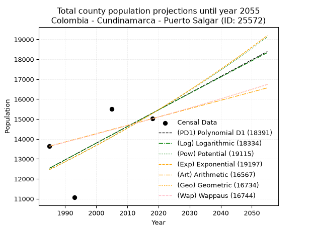
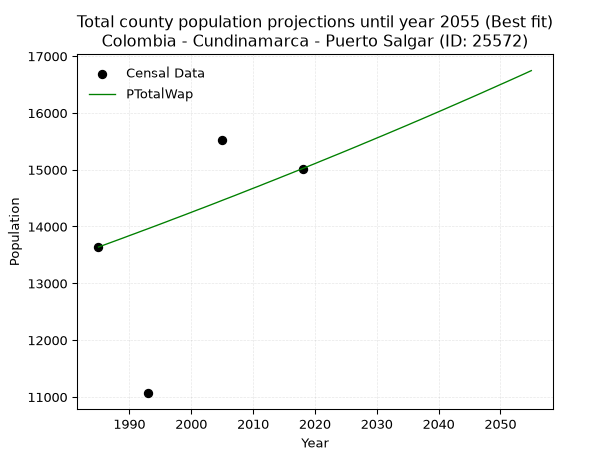
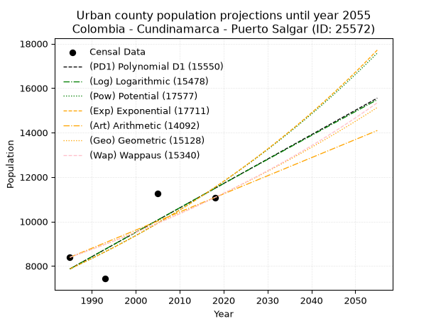
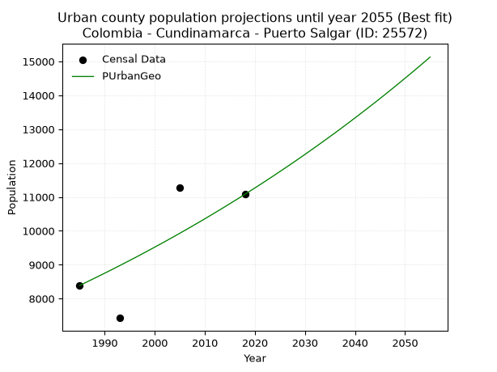
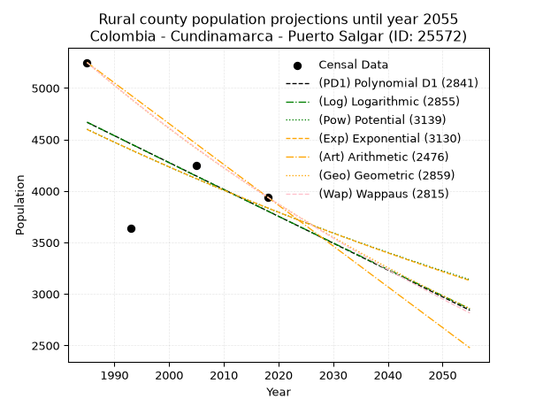
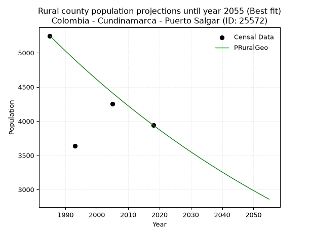

<div align="center">


</div>

# 📜 _“Population and Public Services Demand Projections (PPSD) until Year 2050 for Colombia - Cundinamarca - Puerto Salgar (ID: 25572)”_
Keywords: `population` `public-service` `projection` `lineal` `polynomial` `logarithmic` `potential` `exponential` `arithmetic` `geometric` `wappaus` `dane` `colombia` `south-america`

PPSD are analytical estimates used by governments and planners to anticipate future changes in population size, age distribution, and the resulting community needs for utilities, healthcare, education, and infrastructure as sizing future water treatment facilities, electrical grids, and road networks based on spatial growth.

<div align="center">

</img>

</div>


> **General running parameters**: • app_version: _v20260806_. • Python version: _3.14.7_. • Pandas version: _3.0.5_. • NumPy version: _2.5.1_. • Creates, save and include plots into reports (create_plot): _False_. • Projection until year: _2050_. • Process polynomial degree 2 and up: _False_. • Process Wappaus: _True_. • Process Wappaus: _True_. • Set negative values to zero: _True_. • Set infinite values to zero: _True_. • Drop dataset notes: _True_. 
<div align="center">

Maps & GIS Layers: [:earth_americas:Google](http://maps.google.com/maps?q=5.465412871,-74.6536952) [:earth_americas:OSM](https://www.openstreetmap.org/#map=18/5.465412871/-74.6536952&layers=P) [:earth_americas:Bing](https://www.bing.com/maps?cp=5.465412871~-74.6536952&lvl=18) [:earth_americas:Apple](https://maps.apple.com/frame?center=5.465412871%2C-74.6536952&span=0.003%2C0.006) [:earth_americas:GISMobile](https://github.com/rcfdtools/R.GISMobile/blob/main/file/gis/CountyLayer_CO/Readme.md)

</div>


<div align="center">

```geojson
{
  "type": "Feature",
  "geometry": {
    "type": "Point", 
    "coordinates": [-74.6536952, 5.465412871]
  }, 
  "properties": {
    "Name": "Colombia - Cundinamarca - Puerto Salgar (ID: 25572)"
  }
}
```

</div>


## 0. Census Data (4 records)

Census data are official statistics collected by a government about the people and housing in a country. They usually include counts of total population, age, sex, race, income, education, and jobs.

📅Global census file: [Population.xlsx](../data/Population.xlsx)

| Source   |   Year |   CountryID | CountryName   |   StateID | StateName    |   CountyID | CountyName    |   PTotal |   PUrban |   PRural |
|:---------|-------:|------------:|:--------------|----------:|:-------------|-----------:|:--------------|---------:|---------:|---------:|
| DANE     |   1985 |          57 | Colombia      |        25 | Cundinamarca |      25572 | Puerto Salgar |    13638 |     8390 |     5248 |
| DANE     |   1993 |          57 | Colombia      |        25 | Cundinamarca |      25572 | Puerto Salgar |    11065 |     7429 |     3636 |
| DANE     |   2005 |          57 | Colombia      |        25 | Cundinamarca |      25572 | Puerto Salgar |    15519 |    11267 |     4252 |
| DANE     |   2018 |          57 | Colombia      |        25 | Cundinamarca |      25572 | Puerto Salgar |    15019 |    11078 |     3941 |

> 🔥Some records could had specific notes about the registered values or the corresponding urban or rural distribution.

📅[SUI-RUPS](https://www.datos.gov.co/Hacienda-y-Cr-dito-P-blico/Registro-nico-de-Prestadores-de-Servicios-P-blicos/4qkq-csdn/about_data) - Local public utility companies: [RUPS.csv](../data/RUPS.csv)

 | SERVICIO       | ESTADO    | NOMBRE                                                | NIT         | DEPARTAMENTO_DOMICILIO   | MUNICIPIO_DOMICILIO   | DIRECCION                               |   TELEFONO | EMAIL             | TIPO_PRESTADOR                            | CLASIFICACION                  |
|:---------------|:----------|:------------------------------------------------------|:------------|:-------------------------|:----------------------|:----------------------------------------|-----------:|:------------------|:------------------------------------------|:-------------------------------|
| ACUEDUCTO      | OPERATIVA | EMPRESA DE SERVICIOS PUBLICOS DE PUERTO SALGAR E.S.P. | 832004274-8 | CUNDINAMARCA             | PUERTO SALGAR         | CARRERA 5 N° 11-18 B/ ALTO BUENOS AIRES |    8399705 | espsalg@gmail.com | EMPRESA INDUSTRIAL Y COMERCIAL DEL ESTADO | DESDE 2501 HASTA 5000 USUARIOS |
| ALCANTARILLADO | OPERATIVA | EMPRESA DE SERVICIOS PUBLICOS DE PUERTO SALGAR E.S.P. | 832004274-8 | CUNDINAMARCA             | PUERTO SALGAR         | CARRERA 5 N° 11-18 B/ ALTO BUENOS AIRES |    8399705 | espsalg@gmail.com | EMPRESA INDUSTRIAL Y COMERCIAL DEL ESTADO | DESDE 2501 HASTA 5000 USUARIOS |

## 1. Total

### 1.1. Coefficients and Parameters

* (PD1) Polynomial Deg 1: 83.66399036531514, -153538.64672822162 (lineal)
* (Log) Logarithmic: 167392.59667617746, -1258542.2187357096
* (Pow) Potential: 12.340359885369724, -36.59991212580578
* (Exp) Exponential: 0.006168765204484674, 0.059946050000588
* (Art) Arithmetic: Year diff. 2018 - 1985 = 33, Population diff. 15019 - 13638 = 1381, Annual growth = 41.84848484848485
* (Geo) Geometric: Year diff. 2018 - 1985 = 33, Population diff. 15019 - 13638 = 1381, Annual growth % = 0.0029271865388265095
* (Wap) Wappaus: i = 0.2920646602818498, Condition values only valid for < 200)

<sub>
Wappaus condition values: ['0.00', '0.29', '0.58', '0.88', '1.17', '1.46', '1.75', '2.04', '2.34', '2.63', '2.92', '3.21', '3.50', '3.80', '4.09', '4.38', '4.67', '4.97', '5.26', '5.55', '5.84', '6.13', '6.43', '6.72', '7.01', '7.30', '7.59', '7.89', '8.18', '8.47', '8.76', '9.05', '9.35', '9.64', '9.93', '10.22', '10.51', '10.81', '11.10', '11.39', '11.68', '11.97', '12.27', '12.56', '12.85', '13.14', '13.43', '13.73', '14.02', '14.31', '14.60', '14.90', '15.19', '15.48', '15.77', '16.06', '16.36', '16.65', '16.94', '17.23', '17.52', '17.82', '18.11', '18.40', '18.69', '18.98']
</sub>


### 1.2. Projected Dataset

|   Year |   CountyID |   PTotalPD1 |   PTotalLog |   PTotalPow |   PTotalExp |   PTotalArt |   PTotalGeo |   PTotalWap |
|-------:|-----------:|------------:|------------:|------------:|------------:|------------:|------------:|------------:|
|   1985 |      25572 |       12534 |       12532 |       12463 |       12465 |       13638 |       13638 |       13638 |
|   1986 |      25572 |       12618 |       12617 |       12541 |       12542 |       13680 |       13678 |       13678 |
|   1987 |      25572 |       12702 |       12701 |       12619 |       12620 |       13722 |       13718 |       13718 |
|   1988 |      25572 |       12785 |       12785 |       12698 |       12698 |       13764 |       13758 |       13758 |
|   1989 |      25572 |       12869 |       12869 |       12777 |       12777 |       13805 |       13798 |       13798 |
|   1990 |      25572 |       12953 |       12954 |       12856 |       12856 |       13847 |       13839 |       13839 |
|   1991 |      25572 |       13036 |       13038 |       12936 |       12935 |       13889 |       13879 |       13879 |
|   1992 |      25572 |       13120 |       13122 |       13017 |       13015 |       13931 |       13920 |       13920 |
|   1993 |      25572 |       13204 |       13206 |       13098 |       13096 |       13973 |       13961 |       13960 |
|   1994 |      25572 |       13287 |       13290 |       13179 |       13177 |       14015 |       14002 |       14001 |
|   1995 |      25572 |       13371 |       13374 |       13261 |       13258 |       14056 |       14043 |       14042 |
|   1996 |      25572 |       13455 |       13457 |       13343 |       13340 |       14098 |       14084 |       14083 |
|   1997 |      25572 |       13538 |       13541 |       13426 |       13423 |       14140 |       14125 |       14125 |
|   1998 |      25572 |       13622 |       13625 |       13509 |       13506 |       14182 |       14166 |       14166 |
|   1999 |      25572 |       13706 |       13709 |       13593 |       13589 |       14224 |       14208 |       14207 |
|   2000 |      25572 |       13789 |       13793 |       13677 |       13674 |       14266 |       14249 |       14249 |
|   2001 |      25572 |       13873 |       13876 |       13761 |       13758 |       14308 |       14291 |       14291 |
|   2002 |      25572 |       13957 |       13960 |       13847 |       13843 |       14349 |       14333 |       14332 |
|   2003 |      25572 |       14040 |       14043 |       13932 |       13929 |       14391 |       14375 |       14374 |
|   2004 |      25572 |       14124 |       14127 |       14018 |       14015 |       14433 |       14417 |       14416 |
|   2005 |      25572 |       14208 |       14211 |       14105 |       14102 |       14475 |       14459 |       14459 |
|   2006 |      25572 |       14291 |       14294 |       14192 |       14189 |       14517 |       14501 |       14501 |
|   2007 |      25572 |       14375 |       14377 |       14279 |       14277 |       14559 |       14544 |       14543 |
|   2008 |      25572 |       14459 |       14461 |       14367 |       14365 |       14601 |       14586 |       14586 |
|   2009 |      25572 |       14542 |       14544 |       14456 |       14454 |       14642 |       14629 |       14629 |
|   2010 |      25572 |       14626 |       14627 |       14545 |       14544 |       14684 |       14672 |       14672 |
|   2011 |      25572 |       14710 |       14711 |       14635 |       14634 |       14726 |       14715 |       14714 |
|   2012 |      25572 |       14793 |       14794 |       14725 |       14724 |       14768 |       14758 |       14758 |
|   2013 |      25572 |       14877 |       14877 |       14815 |       14815 |       14810 |       14801 |       14801 |
|   2014 |      25572 |       14961 |       14960 |       14906 |       14907 |       14852 |       14844 |       14844 |
|   2015 |      25572 |       15044 |       15043 |       14998 |       14999 |       14893 |       14888 |       14888 |
|   2016 |      25572 |       15128 |       15126 |       15090 |       15092 |       14935 |       14931 |       14931 |
|   2017 |      25572 |       15212 |       15209 |       15183 |       15185 |       14977 |       14975 |       14975 |
|   2018 |      25572 |       15295 |       15292 |       15276 |       15279 |       15019 |       15019 |       15019 |
|   2019 |      25572 |       15379 |       15375 |       15369 |       15374 |       15061 |       15063 |       15063 |
|   2020 |      25572 |       15463 |       15458 |       15464 |       15469 |       15103 |       15107 |       15107 |
|   2021 |      25572 |       15546 |       15541 |       15558 |       15565 |       15145 |       15151 |       15152 |
|   2022 |      25572 |       15630 |       15624 |       15654 |       15661 |       15186 |       15196 |       15196 |
|   2023 |      25572 |       15714 |       15707 |       15750 |       15758 |       15228 |       15240 |       15241 |
|   2024 |      25572 |       15797 |       15789 |       15846 |       15855 |       15270 |       15285 |       15285 |
|   2025 |      25572 |       15881 |       15872 |       15943 |       15954 |       15312 |       15329 |       15330 |
|   2026 |      25572 |       15965 |       15955 |       16040 |       16052 |       15354 |       15374 |       15375 |
|   2027 |      25572 |       16048 |       16037 |       16138 |       16152 |       15396 |       15419 |       15420 |
|   2028 |      25572 |       16132 |       16120 |       16237 |       16252 |       15437 |       15464 |       15466 |
|   2029 |      25572 |       16216 |       16202 |       16336 |       16352 |       15479 |       15510 |       15511 |
|   2030 |      25572 |       16299 |       16285 |       16435 |       16453 |       15521 |       15555 |       15557 |
|   2031 |      25572 |       16383 |       16367 |       16536 |       16555 |       15563 |       15601 |       15602 |
|   2032 |      25572 |       16467 |       16450 |       16636 |       16658 |       15605 |       15646 |       15648 |
|   2033 |      25572 |       16550 |       16532 |       16738 |       16761 |       15647 |       15692 |       15694 |
|   2034 |      25572 |       16634 |       16614 |       16840 |       16864 |       15689 |       15738 |       15740 |
|   2035 |      25572 |       16718 |       16697 |       16942 |       16969 |       15730 |       15784 |       15786 |
|   2036 |      25572 |       16801 |       16779 |       17045 |       17074 |       15772 |       15830 |       15833 |
|   2037 |      25572 |       16885 |       16861 |       17149 |       17179 |       15814 |       15877 |       15879 |
|   2038 |      25572 |       16969 |       16943 |       17253 |       17286 |       15856 |       15923 |       15926 |
|   2039 |      25572 |       17052 |       17025 |       17358 |       17393 |       15898 |       15970 |       15973 |
|   2040 |      25572 |       17136 |       17107 |       17463 |       17500 |       15940 |       16017 |       16020 |
|   2041 |      25572 |       17220 |       17189 |       17569 |       17609 |       15982 |       16063 |       16067 |
|   2042 |      25572 |       17303 |       17271 |       17675 |       17718 |       16023 |       16110 |       16115 |
|   2043 |      25572 |       17387 |       17353 |       17782 |       17827 |       16065 |       16158 |       16162 |
|   2044 |      25572 |       17471 |       17435 |       17890 |       17937 |       16107 |       16205 |       16210 |
|   2045 |      25572 |       17554 |       17517 |       17998 |       18048 |       16149 |       16252 |       16257 |
|   2046 |      25572 |       17638 |       17599 |       18107 |       18160 |       16191 |       16300 |       16305 |
|   2047 |      25572 |       17722 |       17681 |       18217 |       18272 |       16233 |       16348 |       16353 |
|   2048 |      25572 |       17805 |       17763 |       18327 |       18386 |       16274 |       16395 |       16402 |
|   2049 |      25572 |       17889 |       17844 |       18438 |       18499 |       16316 |       16443 |       16450 |
|   2050 |      25572 |       17973 |       17926 |       18549 |       18614 |       16358 |       16492 |       16499 |
<div align="center">

</img>

</div>


### 1.3. Best fit with absolute and relative error (%)

Relative error puts that difference into context by dividing the absolute error by the true value, creating a unitless ratio or percentage that shows the scale of the mistake.

Absolute and relative error

|   Year | Source   |   CountryID | CountryName   |   StateID | StateName    |   CountyID_x | CountyName    |   PTotal |   PUrban |   PRural |   CountyID_y |   PTotalPD1 |   PTotalLog |   PTotalPow |   PTotalExp |   PTotalArt |   PTotalGeo |   PTotalWap |   PTotalPD1AbsError |   PTotalLogAbsError |   PTotalPowAbsError |   PTotalExpAbsError |   PTotalArtAbsError |   PTotalGeoAbsError |   PTotalWapAbsError |   PTotalPD1RelError |   PTotalLogRelError |   PTotalPowRelError |   PTotalExpRelError |   PTotalArtRelError |   PTotalGeoRelError |   PTotalWapRelError |
|-------:|:---------|------------:|:--------------|----------:|:-------------|-------------:|:--------------|---------:|---------:|---------:|-------------:|------------:|------------:|------------:|------------:|------------:|------------:|------------:|--------------------:|--------------------:|--------------------:|--------------------:|--------------------:|--------------------:|--------------------:|--------------------:|--------------------:|--------------------:|--------------------:|--------------------:|--------------------:|--------------------:|
|   1985 | DANE     |          57 | Colombia      |        25 | Cundinamarca |        25572 | Puerto Salgar |    13638 |     8390 |     5248 |        25572 |       12534 |       12532 |       12463 |       12465 |       13638 |       13638 |       13638 |                1104 |                1106 |                1175 |                1173 |                   0 |                   0 |                   0 |             8.09503 |             8.10969 |             8.61563 |             8.60097 |             0       |             0       |             0       |
|   1993 | DANE     |          57 | Colombia      |        25 | Cundinamarca |        25572 | Puerto Salgar |    11065 |     7429 |     3636 |        25572 |       13204 |       13206 |       13098 |       13096 |       13973 |       13961 |       13960 |                2139 |                2141 |                2033 |                2031 |                2908 |                2896 |                2895 |            19.3312  |            19.3493  |            18.3732  |            18.3552  |            26.2811  |            26.1726  |            26.1636  |
|   2005 | DANE     |          57 | Colombia      |        25 | Cundinamarca |        25572 | Puerto Salgar |    15519 |    11267 |     4252 |        25572 |       14208 |       14211 |       14105 |       14102 |       14475 |       14459 |       14459 |                1311 |                1308 |                1414 |                1417 |                1044 |                1060 |                1060 |             8.44771 |             8.42838 |             9.11141 |             9.13074 |             6.72724 |             6.83034 |             6.83034 |
|   2018 | DANE     |          57 | Colombia      |        25 | Cundinamarca |        25572 | Puerto Salgar |    15019 |    11078 |     3941 |        25572 |       15295 |       15292 |       15276 |       15279 |       15019 |       15019 |       15019 |                 276 |                 273 |                 257 |                 260 |                   0 |                   0 |                   0 |             1.83767 |             1.8177  |             1.71117 |             1.73114 |             0       |             0       |             0       |

Relative error mean

| Method    |   RelError | Best   |
|:----------|-----------:|:-------|
| PTotalPD1 |    9.42791 |        |
| PTotalLog |    9.42627 |        |
| PTotalPow |    9.45286 |        |
| PTotalExp |    9.45451 |        |
| PTotalArt |    8.25208 |        |
| PTotalGeo |    8.25074 |        |
| PTotalWap |    8.24848 | True   |

💙Best method: _**PTotalWap**_
<div align="center">

</img>

</div>


### 1.4. Fresh water supply demand in liters per capita per day (lpcd)

The fresh water supply demand typically ranges from 100 to 300 liters per capita per day (lpcd) for standard domestic and municipal planning, though absolute survival minimums set by the World Health Organization are as low as 7.5 to 20 liters per day, and total consumption in high-income nations can exceed 400 liters.

> `CZ`: Level in meters above the sea level (masl)<br> `WS`: Fresh water supply demand in liters per capita per day (lpcd or l/h/d)<br> `WSAll`: Zonal fresh water supply demand in liters per second (l/s)<br> `A`: Zonal area in square meters<br> `DP`: Population density (people/hectare or p/ha)

Reference values (RAS Colombia)

|    CZ |   WS |
|------:|-----:|
|  1000 |  120 |
|  2000 |  130 |
| 99999 |  140 |

County shapefile geometry properties and water supply values

|   CountyID |      ATotal |   CZTotal |   WSTotal |
|-----------:|------------:|----------:|----------:|
|      25572 | 5.15253e+08 |   246.378 |       120 |

Projected values for best method: PTotalWap

|   CountyID |   Year |   PTotalWap |   DPTotal |   WSTotal |   WSTotalAll |
|-----------:|-------:|------------:|----------:|----------:|-------------:|
|      25572 |   1985 |       13638 |      0.26 |       120 |      18.9417 |
|      25572 |   1986 |       13678 |      0.27 |       120 |      18.9972 |
|      25572 |   1987 |       13718 |      0.27 |       120 |      19.0528 |
|      25572 |   1988 |       13758 |      0.27 |       120 |      19.1083 |
|      25572 |   1989 |       13798 |      0.27 |       120 |      19.1639 |
|      25572 |   1990 |       13839 |      0.27 |       120 |      19.2208 |
|      25572 |   1991 |       13879 |      0.27 |       120 |      19.2764 |
|      25572 |   1992 |       13920 |      0.27 |       120 |      19.3333 |
|      25572 |   1993 |       13960 |      0.27 |       120 |      19.3889 |
|      25572 |   1994 |       14001 |      0.27 |       120 |      19.4458 |
|      25572 |   1995 |       14042 |      0.27 |       120 |      19.5028 |
|      25572 |   1996 |       14083 |      0.27 |       120 |      19.5597 |
|      25572 |   1997 |       14125 |      0.27 |       120 |      19.6181 |
|      25572 |   1998 |       14166 |      0.27 |       120 |      19.675  |
|      25572 |   1999 |       14207 |      0.28 |       120 |      19.7319 |
|      25572 |   2000 |       14249 |      0.28 |       120 |      19.7903 |
|      25572 |   2001 |       14291 |      0.28 |       120 |      19.8486 |
|      25572 |   2002 |       14332 |      0.28 |       120 |      19.9056 |
|      25572 |   2003 |       14374 |      0.28 |       120 |      19.9639 |
|      25572 |   2004 |       14416 |      0.28 |       120 |      20.0222 |
|      25572 |   2005 |       14459 |      0.28 |       120 |      20.0819 |
|      25572 |   2006 |       14501 |      0.28 |       120 |      20.1403 |
|      25572 |   2007 |       14543 |      0.28 |       120 |      20.1986 |
|      25572 |   2008 |       14586 |      0.28 |       120 |      20.2583 |
|      25572 |   2009 |       14629 |      0.28 |       120 |      20.3181 |
|      25572 |   2010 |       14672 |      0.28 |       120 |      20.3778 |
|      25572 |   2011 |       14714 |      0.29 |       120 |      20.4361 |
|      25572 |   2012 |       14758 |      0.29 |       120 |      20.4972 |
|      25572 |   2013 |       14801 |      0.29 |       120 |      20.5569 |
|      25572 |   2014 |       14844 |      0.29 |       120 |      20.6167 |
|      25572 |   2015 |       14888 |      0.29 |       120 |      20.6778 |
|      25572 |   2016 |       14931 |      0.29 |       120 |      20.7375 |
|      25572 |   2017 |       14975 |      0.29 |       120 |      20.7986 |
|      25572 |   2018 |       15019 |      0.29 |       120 |      20.8597 |
|      25572 |   2019 |       15063 |      0.29 |       120 |      20.9208 |
|      25572 |   2020 |       15107 |      0.29 |       120 |      20.9819 |
|      25572 |   2021 |       15152 |      0.29 |       120 |      21.0444 |
|      25572 |   2022 |       15196 |      0.29 |       120 |      21.1056 |
|      25572 |   2023 |       15241 |      0.3  |       120 |      21.1681 |
|      25572 |   2024 |       15285 |      0.3  |       120 |      21.2292 |
|      25572 |   2025 |       15330 |      0.3  |       120 |      21.2917 |
|      25572 |   2026 |       15375 |      0.3  |       120 |      21.3542 |
|      25572 |   2027 |       15420 |      0.3  |       120 |      21.4167 |
|      25572 |   2028 |       15466 |      0.3  |       120 |      21.4806 |
|      25572 |   2029 |       15511 |      0.3  |       120 |      21.5431 |
|      25572 |   2030 |       15557 |      0.3  |       120 |      21.6069 |
|      25572 |   2031 |       15602 |      0.3  |       120 |      21.6694 |
|      25572 |   2032 |       15648 |      0.3  |       120 |      21.7333 |
|      25572 |   2033 |       15694 |      0.3  |       120 |      21.7972 |
|      25572 |   2034 |       15740 |      0.31 |       120 |      21.8611 |
|      25572 |   2035 |       15786 |      0.31 |       120 |      21.925  |
|      25572 |   2036 |       15833 |      0.31 |       120 |      21.9903 |
|      25572 |   2037 |       15879 |      0.31 |       120 |      22.0542 |
|      25572 |   2038 |       15926 |      0.31 |       120 |      22.1194 |
|      25572 |   2039 |       15973 |      0.31 |       120 |      22.1847 |
|      25572 |   2040 |       16020 |      0.31 |       120 |      22.25   |
|      25572 |   2041 |       16067 |      0.31 |       120 |      22.3153 |
|      25572 |   2042 |       16115 |      0.31 |       120 |      22.3819 |
|      25572 |   2043 |       16162 |      0.31 |       120 |      22.4472 |
|      25572 |   2044 |       16210 |      0.31 |       120 |      22.5139 |
|      25572 |   2045 |       16257 |      0.32 |       120 |      22.5792 |
|      25572 |   2046 |       16305 |      0.32 |       120 |      22.6458 |
|      25572 |   2047 |       16353 |      0.32 |       120 |      22.7125 |
|      25572 |   2048 |       16402 |      0.32 |       120 |      22.7806 |
|      25572 |   2049 |       16450 |      0.32 |       120 |      22.8472 |
|      25572 |   2050 |       16499 |      0.32 |       120 |      22.9153 |

## 2. Urban

### 2.1. Coefficients and Parameters

* (PD1) Polynomial Deg 1: 109.74708952228008, -209980.61581694076 (lineal)
* (Log) Logarithmic: 219711.2784895955, -1660486.1884551041
* (Pow) Potential: 23.194151535202096, -72.59291270280379
* (Exp) Exponential: 0.011586554766233265, 8.082187116521088e-07
* (Art) Arithmetic: Year diff. 2018 - 1985 = 33, Population diff. 11078 - 8390 = 2688, Annual growth = 81.45454545454545
* (Geo) Geometric: Year diff. 2018 - 1985 = 33, Population diff. 11078 - 8390 = 2688, Annual growth % = 0.008457400989702046
* (Wap) Wappaus: i = 0.8368044529951248, Condition values only valid for < 200)

<sub>
Wappaus condition values: ['0.00', '0.84', '1.67', '2.51', '3.35', '4.18', '5.02', '5.86', '6.69', '7.53', '8.37', '9.20', '10.04', '10.88', '11.72', '12.55', '13.39', '14.23', '15.06', '15.90', '16.74', '17.57', '18.41', '19.25', '20.08', '20.92', '21.76', '22.59', '23.43', '24.27', '25.10', '25.94', '26.78', '27.61', '28.45', '29.29', '30.12', '30.96', '31.80', '32.64', '33.47', '34.31', '35.15', '35.98', '36.82', '37.66', '38.49', '39.33', '40.17', '41.00', '41.84', '42.68', '43.51', '44.35', '45.19', '46.02', '46.86', '47.70', '48.53', '49.37', '50.21', '51.05', '51.88', '52.72', '53.56', '54.39']
</sub>


### 2.2. Projected Dataset

|   Year |   CountyID |   PUrbanPD1 |   PUrbanLog |   PUrbanPow |   PUrbanExp |   PUrbanArt |   PUrbanGeo |   PUrbanWap |
|-------:|-----------:|------------:|------------:|------------:|------------:|------------:|------------:|------------:|
|   1985 |      25572 |        7867 |        7864 |        7868 |        7871 |        8390 |        8390 |        8390 |
|   1986 |      25572 |        7977 |        7974 |        7960 |        7962 |        8471 |        8461 |        8461 |
|   1987 |      25572 |        8087 |        8085 |        8054 |        8055 |        8553 |        8533 |        8532 |
|   1988 |      25572 |        8197 |        8196 |        8148 |        8149 |        8634 |        8605 |        8603 |
|   1989 |      25572 |        8306 |        8306 |        8244 |        8244 |        8716 |        8677 |        8676 |
|   1990 |      25572 |        8416 |        8416 |        8340 |        8340 |        8797 |        8751 |        8749 |
|   1991 |      25572 |        8526 |        8527 |        8438 |        8437 |        8879 |        8825 |        8822 |
|   1992 |      25572 |        8636 |        8637 |        8537 |        8535 |        8960 |        8899 |        8896 |
|   1993 |      25572 |        8745 |        8747 |        8637 |        8635 |        9042 |        8975 |        8971 |
|   1994 |      25572 |        8855 |        8858 |        8738 |        8736 |        9123 |        9051 |        9047 |
|   1995 |      25572 |        8965 |        8968 |        8840 |        8837 |        9205 |        9127 |        9123 |
|   1996 |      25572 |        9075 |        9078 |        8944 |        8940 |        9286 |        9204 |        9200 |
|   1997 |      25572 |        9184 |        9188 |        9048 |        9045 |        9367 |        9282 |        9277 |
|   1998 |      25572 |        9294 |        9298 |        9154 |        9150 |        9449 |        9361 |        9355 |
|   1999 |      25572 |        9404 |        9408 |        9261 |        9257 |        9530 |        9440 |        9434 |
|   2000 |      25572 |        9514 |        9518 |        9369 |        9364 |        9612 |        9520 |        9514 |
|   2001 |      25572 |        9623 |        9628 |        9478 |        9474 |        9693 |        9600 |        9594 |
|   2002 |      25572 |        9733 |        9737 |        9588 |        9584 |        9775 |        9681 |        9675 |
|   2003 |      25572 |        9843 |        9847 |        9700 |        9696 |        9856 |        9763 |        9757 |
|   2004 |      25572 |        9953 |        9957 |        9813 |        9809 |        9938 |        9846 |        9839 |
|   2005 |      25572 |       10062 |       10066 |        9927 |        9923 |       10019 |        9929 |        9922 |
|   2006 |      25572 |       10172 |       10176 |       10043 |       10039 |       10101 |       10013 |       10006 |
|   2007 |      25572 |       10282 |       10285 |       10159 |       10156 |       10182 |       10098 |       10091 |
|   2008 |      25572 |       10392 |       10395 |       10278 |       10274 |       10263 |       10183 |       10177 |
|   2009 |      25572 |       10501 |       10504 |       10397 |       10394 |       10345 |       10269 |       10263 |
|   2010 |      25572 |       10611 |       10614 |       10518 |       10515 |       10426 |       10356 |       10350 |
|   2011 |      25572 |       10721 |       10723 |       10640 |       10637 |       10508 |       10444 |       10438 |
|   2012 |      25572 |       10831 |       10832 |       10763 |       10761 |       10589 |       10532 |       10527 |
|   2013 |      25572 |       10940 |       10941 |       10888 |       10887 |       10671 |       10621 |       10617 |
|   2014 |      25572 |       11050 |       11050 |       11014 |       11014 |       10752 |       10711 |       10707 |
|   2015 |      25572 |       11160 |       11159 |       11141 |       11142 |       10834 |       10802 |       10799 |
|   2016 |      25572 |       11270 |       11269 |       11270 |       11272 |       10915 |       10893 |       10891 |
|   2017 |      25572 |       11379 |       11377 |       11401 |       11403 |       10997 |       10985 |       10984 |
|   2018 |      25572 |       11489 |       11486 |       11533 |       11536 |       11078 |       11078 |       11078 |
|   2019 |      25572 |       11599 |       11595 |       11666 |       11671 |       11159 |       11172 |       11173 |
|   2020 |      25572 |       11709 |       11704 |       11801 |       11807 |       11241 |       11266 |       11269 |
|   2021 |      25572 |       11818 |       11813 |       11937 |       11944 |       11322 |       11361 |       11366 |
|   2022 |      25572 |       11928 |       11921 |       12075 |       12083 |       11404 |       11458 |       11463 |
|   2023 |      25572 |       12038 |       12030 |       12214 |       12224 |       11485 |       11554 |       11562 |
|   2024 |      25572 |       12147 |       12139 |       12355 |       12367 |       11567 |       11652 |       11662 |
|   2025 |      25572 |       12257 |       12247 |       12497 |       12511 |       11648 |       11751 |       11763 |
|   2026 |      25572 |       12367 |       12356 |       12641 |       12657 |       11730 |       11850 |       11865 |
|   2027 |      25572 |       12477 |       12464 |       12787 |       12804 |       11811 |       11950 |       11967 |
|   2028 |      25572 |       12586 |       12572 |       12934 |       12953 |       11893 |       12051 |       12071 |
|   2029 |      25572 |       12696 |       12681 |       13082 |       13104 |       11974 |       12153 |       12176 |
|   2030 |      25572 |       12806 |       12789 |       13233 |       13257 |       12055 |       12256 |       12282 |
|   2031 |      25572 |       12916 |       12897 |       13385 |       13411 |       12137 |       12360 |       12389 |
|   2032 |      25572 |       13025 |       13005 |       13539 |       13568 |       12218 |       12464 |       12498 |
|   2033 |      25572 |       13135 |       13113 |       13694 |       13726 |       12300 |       12570 |       12607 |
|   2034 |      25572 |       13245 |       13222 |       13851 |       13886 |       12381 |       12676 |       12717 |
|   2035 |      25572 |       13355 |       13330 |       14010 |       14048 |       12463 |       12783 |       12829 |
|   2036 |      25572 |       13464 |       13437 |       14170 |       14211 |       12544 |       12891 |       12942 |
|   2037 |      25572 |       13574 |       13545 |       14333 |       14377 |       12626 |       13000 |       13056 |
|   2038 |      25572 |       13684 |       13653 |       14497 |       14544 |       12707 |       13110 |       13171 |
|   2039 |      25572 |       13794 |       13761 |       14663 |       14714 |       12789 |       13221 |       13288 |
|   2040 |      25572 |       13903 |       13869 |       14830 |       14885 |       12870 |       13333 |       13406 |
|   2041 |      25572 |       14013 |       13976 |       15000 |       15059 |       12951 |       13446 |       13525 |
|   2042 |      25572 |       14123 |       14084 |       15171 |       15234 |       13033 |       13559 |       13645 |
|   2043 |      25572 |       14233 |       14192 |       15345 |       15412 |       13114 |       13674 |       13767 |
|   2044 |      25572 |       14342 |       14299 |       15520 |       15592 |       13196 |       13790 |       13890 |
|   2045 |      25572 |       14452 |       14407 |       15697 |       15773 |       13277 |       13906 |       14014 |
|   2046 |      25572 |       14562 |       14514 |       15876 |       15957 |       13359 |       14024 |       14140 |
|   2047 |      25572 |       14672 |       14621 |       16057 |       16143 |       13440 |       14143 |       14268 |
|   2048 |      25572 |       14781 |       14729 |       16240 |       16331 |       13522 |       14262 |       14396 |
|   2049 |      25572 |       14891 |       14836 |       16425 |       16521 |       13603 |       14383 |       14527 |
|   2050 |      25572 |       15001 |       14943 |       16611 |       16714 |       13685 |       14505 |       14658 |
<div align="center">

</img>

</div>


### 2.3. Best fit with absolute and relative error (%)

Relative error puts that difference into context by dividing the absolute error by the true value, creating a unitless ratio or percentage that shows the scale of the mistake.

Absolute and relative error

|   Year | Source   |   CountryID | CountryName   |   StateID | StateName    |   CountyID_x | CountyName    |   PTotal |   PUrban |   PRural |   CountyID_y |   PUrbanPD1 |   PUrbanLog |   PUrbanPow |   PUrbanExp |   PUrbanArt |   PUrbanGeo |   PUrbanWap |   PUrbanPD1AbsError |   PUrbanLogAbsError |   PUrbanPowAbsError |   PUrbanExpAbsError |   PUrbanArtAbsError |   PUrbanGeoAbsError |   PUrbanWapAbsError |   PUrbanPD1RelError |   PUrbanLogRelError |   PUrbanPowRelError |   PUrbanExpRelError |   PUrbanArtRelError |   PUrbanGeoRelError |   PUrbanWapRelError |
|-------:|:---------|------------:|:--------------|----------:|:-------------|-------------:|:--------------|---------:|---------:|---------:|-------------:|------------:|------------:|------------:|------------:|------------:|------------:|------------:|--------------------:|--------------------:|--------------------:|--------------------:|--------------------:|--------------------:|--------------------:|--------------------:|--------------------:|--------------------:|--------------------:|--------------------:|--------------------:|--------------------:|
|   1985 | DANE     |          57 | Colombia      |        25 | Cundinamarca |        25572 | Puerto Salgar |    13638 |     8390 |     5248 |        25572 |        7867 |        7864 |        7868 |        7871 |        8390 |        8390 |        8390 |                 523 |                 526 |                 522 |                 519 |                   0 |                   0 |                   0 |             6.23361 |             6.26937 |             6.22169 |             6.18594 |              0      |              0      |              0      |
|   1993 | DANE     |          57 | Colombia      |        25 | Cundinamarca |        25572 | Puerto Salgar |    11065 |     7429 |     3636 |        25572 |        8745 |        8747 |        8637 |        8635 |        9042 |        8975 |        8971 |                1316 |                1318 |                1208 |                1206 |                1613 |                1546 |                1542 |            17.7144  |            17.7413  |            16.2606  |            16.2337  |             21.7122 |             20.8103 |             20.7565 |
|   2005 | DANE     |          57 | Colombia      |        25 | Cundinamarca |        25572 | Puerto Salgar |    15519 |    11267 |     4252 |        25572 |       10062 |       10066 |        9927 |        9923 |       10019 |        9929 |        9922 |                1205 |                1201 |                1340 |                1344 |                1248 |                1338 |                1345 |            10.6949  |            10.6594  |            11.8931  |            11.9286  |             11.0766 |             11.8754 |             11.9375 |
|   2018 | DANE     |          57 | Colombia      |        25 | Cundinamarca |        25572 | Puerto Salgar |    15019 |    11078 |     3941 |        25572 |       11489 |       11486 |       11533 |       11536 |       11078 |       11078 |       11078 |                 411 |                 408 |                 455 |                 458 |                   0 |                   0 |                   0 |             3.71006 |             3.68298 |             4.10724 |             4.13432 |              0      |              0      |              0      |

Relative error mean

| Method    |   RelError | Best   |
|:----------|-----------:|:-------|
| PUrbanPD1 |    9.58824 |        |
| PUrbanLog |    9.58827 |        |
| PUrbanPow |    9.62067 |        |
| PUrbanExp |    9.62064 |        |
| PUrbanArt |    8.1972  |        |
| PUrbanGeo |    8.17143 | True   |
| PUrbanWap |    8.1735  |        |

💙Best method: _**PUrbanGeo**_
<div align="center">

</img>

</div>


### 2.4. Fresh water supply demand in liters per capita per day (lpcd)

The fresh water supply demand typically ranges from 100 to 300 liters per capita per day (lpcd) for standard domestic and municipal planning, though absolute survival minimums set by the World Health Organization are as low as 7.5 to 20 liters per day, and total consumption in high-income nations can exceed 400 liters.

> `CZ`: Level in meters above the sea level (masl)<br> `WS`: Fresh water supply demand in liters per capita per day (lpcd or l/h/d)<br> `WSAll`: Zonal fresh water supply demand in liters per second (l/s)<br> `A`: Zonal area in square meters<br> `DP`: Population density (people/hectare or p/ha)

Reference values (RAS Colombia)

|    CZ |   WS |
|------:|-----:|
|  1000 |  120 |
|  2000 |  130 |
| 99999 |  140 |

County shapefile geometry properties and water supply values

|   CountyID |      AUrban |   CZUrban |   WSUrban |
|-----------:|------------:|----------:|----------:|
|      25572 | 1.97784e+06 |   178.803 |       120 |

Projected values for best method: PUrbanGeo

|   CountyID |   Year |   PUrbanGeo |   DPUrban |   WSUrban |   WSUrbanAll |
|-----------:|-------:|------------:|----------:|----------:|-------------:|
|      25572 |   1985 |        8390 |     42.42 |       120 |      11.6528 |
|      25572 |   1986 |        8461 |     42.78 |       120 |      11.7514 |
|      25572 |   1987 |        8533 |     43.14 |       120 |      11.8514 |
|      25572 |   1988 |        8605 |     43.51 |       120 |      11.9514 |
|      25572 |   1989 |        8677 |     43.87 |       120 |      12.0514 |
|      25572 |   1990 |        8751 |     44.25 |       120 |      12.1542 |
|      25572 |   1991 |        8825 |     44.62 |       120 |      12.2569 |
|      25572 |   1992 |        8899 |     44.99 |       120 |      12.3597 |
|      25572 |   1993 |        8975 |     45.38 |       120 |      12.4653 |
|      25572 |   1994 |        9051 |     45.76 |       120 |      12.5708 |
|      25572 |   1995 |        9127 |     46.15 |       120 |      12.6764 |
|      25572 |   1996 |        9204 |     46.54 |       120 |      12.7833 |
|      25572 |   1997 |        9282 |     46.93 |       120 |      12.8917 |
|      25572 |   1998 |        9361 |     47.33 |       120 |      13.0014 |
|      25572 |   1999 |        9440 |     47.73 |       120 |      13.1111 |
|      25572 |   2000 |        9520 |     48.13 |       120 |      13.2222 |
|      25572 |   2001 |        9600 |     48.54 |       120 |      13.3333 |
|      25572 |   2002 |        9681 |     48.95 |       120 |      13.4458 |
|      25572 |   2003 |        9763 |     49.36 |       120 |      13.5597 |
|      25572 |   2004 |        9846 |     49.78 |       120 |      13.675  |
|      25572 |   2005 |        9929 |     50.2  |       120 |      13.7903 |
|      25572 |   2006 |       10013 |     50.63 |       120 |      13.9069 |
|      25572 |   2007 |       10098 |     51.06 |       120 |      14.025  |
|      25572 |   2008 |       10183 |     51.49 |       120 |      14.1431 |
|      25572 |   2009 |       10269 |     51.92 |       120 |      14.2625 |
|      25572 |   2010 |       10356 |     52.36 |       120 |      14.3833 |
|      25572 |   2011 |       10444 |     52.8  |       120 |      14.5056 |
|      25572 |   2012 |       10532 |     53.25 |       120 |      14.6278 |
|      25572 |   2013 |       10621 |     53.7  |       120 |      14.7514 |
|      25572 |   2014 |       10711 |     54.15 |       120 |      14.8764 |
|      25572 |   2015 |       10802 |     54.62 |       120 |      15.0028 |
|      25572 |   2016 |       10893 |     55.08 |       120 |      15.1292 |
|      25572 |   2017 |       10985 |     55.54 |       120 |      15.2569 |
|      25572 |   2018 |       11078 |     56.01 |       120 |      15.3861 |
|      25572 |   2019 |       11172 |     56.49 |       120 |      15.5167 |
|      25572 |   2020 |       11266 |     56.96 |       120 |      15.6472 |
|      25572 |   2021 |       11361 |     57.44 |       120 |      15.7792 |
|      25572 |   2022 |       11458 |     57.93 |       120 |      15.9139 |
|      25572 |   2023 |       11554 |     58.42 |       120 |      16.0472 |
|      25572 |   2024 |       11652 |     58.91 |       120 |      16.1833 |
|      25572 |   2025 |       11751 |     59.41 |       120 |      16.3208 |
|      25572 |   2026 |       11850 |     59.91 |       120 |      16.4583 |
|      25572 |   2027 |       11950 |     60.42 |       120 |      16.5972 |
|      25572 |   2028 |       12051 |     60.93 |       120 |      16.7375 |
|      25572 |   2029 |       12153 |     61.45 |       120 |      16.8792 |
|      25572 |   2030 |       12256 |     61.97 |       120 |      17.0222 |
|      25572 |   2031 |       12360 |     62.49 |       120 |      17.1667 |
|      25572 |   2032 |       12464 |     63.02 |       120 |      17.3111 |
|      25572 |   2033 |       12570 |     63.55 |       120 |      17.4583 |
|      25572 |   2034 |       12676 |     64.09 |       120 |      17.6056 |
|      25572 |   2035 |       12783 |     64.63 |       120 |      17.7542 |
|      25572 |   2036 |       12891 |     65.18 |       120 |      17.9042 |
|      25572 |   2037 |       13000 |     65.73 |       120 |      18.0556 |
|      25572 |   2038 |       13110 |     66.28 |       120 |      18.2083 |
|      25572 |   2039 |       13221 |     66.85 |       120 |      18.3625 |
|      25572 |   2040 |       13333 |     67.41 |       120 |      18.5181 |
|      25572 |   2041 |       13446 |     67.98 |       120 |      18.675  |
|      25572 |   2042 |       13559 |     68.55 |       120 |      18.8319 |
|      25572 |   2043 |       13674 |     69.14 |       120 |      18.9917 |
|      25572 |   2044 |       13790 |     69.72 |       120 |      19.1528 |
|      25572 |   2045 |       13906 |     70.31 |       120 |      19.3139 |
|      25572 |   2046 |       14024 |     70.91 |       120 |      19.4778 |
|      25572 |   2047 |       14143 |     71.51 |       120 |      19.6431 |
|      25572 |   2048 |       14262 |     72.11 |       120 |      19.8083 |
|      25572 |   2049 |       14383 |     72.72 |       120 |      19.9764 |
|      25572 |   2050 |       14505 |     73.34 |       120 |      20.1458 |

## 3. Rural

### 3.1. Coefficients and Parameters

* (PD1) Polynomial Deg 1: -26.08309915696488, 56441.96908871901 (lineal)
* (Log) Logarithmic: -52318.68181341804, 401943.96971939446
* (Pow) Potential: -11.026281390525188, 40.02479541994434
* (Exp) Exponential: -0.005496612662008383, 251824645.69098204
* (Art) Arithmetic: Year diff. 2018 - 1985 = 33, Population diff. 3941 - 5248 = -1307, Annual growth = -39.60606060606061
* (Geo) Geometric: Year diff. 2018 - 1985 = 33, Population diff. 3941 - 5248 = -1307, Annual growth % = -0.008641613032649431
* (Wap) Wappaus: i = -0.8620320079673655, Condition values only valid for < 200)

<sub>
Wappaus condition values: ['-0.00', '-0.86', '-1.72', '-2.59', '-3.45', '-4.31', '-5.17', '-6.03', '-6.90', '-7.76', '-8.62', '-9.48', '-10.34', '-11.21', '-12.07', '-12.93', '-13.79', '-14.65', '-15.52', '-16.38', '-17.24', '-18.10', '-18.96', '-19.83', '-20.69', '-21.55', '-22.41', '-23.27', '-24.14', '-25.00', '-25.86', '-26.72', '-27.59', '-28.45', '-29.31', '-30.17', '-31.03', '-31.90', '-32.76', '-33.62', '-34.48', '-35.34', '-36.21', '-37.07', '-37.93', '-38.79', '-39.65', '-40.52', '-41.38', '-42.24', '-43.10', '-43.96', '-44.83', '-45.69', '-46.55', '-47.41', '-48.27', '-49.14', '-50.00', '-50.86', '-51.72', '-52.58', '-53.45', '-54.31', '-55.17', '-56.03']
</sub>


### 3.2. Projected Dataset

|   Year |   CountyID |   PRuralPD1 |   PRuralLog |   PRuralPow |   PRuralExp |   PRuralArt |   PRuralGeo |   PRuralWap |
|-------:|-----------:|------------:|------------:|------------:|------------:|------------:|------------:|------------:|
|   1985 |      25572 |        4667 |        4669 |        4600 |        4598 |        5248 |        5248 |        5248 |
|   1986 |      25572 |        4641 |        4642 |        4575 |        4573 |        5208 |        5203 |        5203 |
|   1987 |      25572 |        4615 |        4616 |        4549 |        4548 |        5169 |        5158 |        5158 |
|   1988 |      25572 |        4589 |        4590 |        4524 |        4523 |        5129 |        5113 |        5114 |
|   1989 |      25572 |        4563 |        4563 |        4499 |        4498 |        5090 |        5069 |        5070 |
|   1990 |      25572 |        4537 |        4537 |        4474 |        4474 |        5050 |        5025 |        5027 |
|   1991 |      25572 |        4511 |        4511 |        4449 |        4449 |        5010 |        4982 |        4983 |
|   1992 |      25572 |        4484 |        4484 |        4425 |        4425 |        4971 |        4939 |        4941 |
|   1993 |      25572 |        4458 |        4458 |        4400 |        4401 |        4931 |        4896 |        4898 |
|   1994 |      25572 |        4432 |        4432 |        4376 |        4376 |        4892 |        4854 |        4856 |
|   1995 |      25572 |        4406 |        4406 |        4352 |        4352 |        4852 |        4812 |        4814 |
|   1996 |      25572 |        4380 |        4380 |        4328 |        4329 |        4812 |        4770 |        4773 |
|   1997 |      25572 |        4354 |        4353 |        4304 |        4305 |        4773 |        4729 |        4732 |
|   1998 |      25572 |        4328 |        4327 |        4281 |        4281 |        4733 |        4688 |        4691 |
|   1999 |      25572 |        4302 |        4301 |        4257 |        4258 |        4694 |        4648 |        4651 |
|   2000 |      25572 |        4276 |        4275 |        4234 |        4234 |        4654 |        4607 |        4611 |
|   2001 |      25572 |        4250 |        4249 |        4210 |        4211 |        4614 |        4568 |        4571 |
|   2002 |      25572 |        4224 |        4222 |        4187 |        4188 |        4575 |        4528 |        4531 |
|   2003 |      25572 |        4198 |        4196 |        4164 |        4165 |        4535 |        4489 |        4492 |
|   2004 |      25572 |        4171 |        4170 |        4141 |        4142 |        4495 |        4450 |        4454 |
|   2005 |      25572 |        4145 |        4144 |        4119 |        4120 |        4456 |        4412 |        4415 |
|   2006 |      25572 |        4119 |        4118 |        4096 |        4097 |        4416 |        4374 |        4377 |
|   2007 |      25572 |        4093 |        4092 |        4074 |        4075 |        4377 |        4336 |        4339 |
|   2008 |      25572 |        4067 |        4066 |        4051 |        4052 |        4337 |        4298 |        4301 |
|   2009 |      25572 |        4041 |        4040 |        4029 |        4030 |        4297 |        4261 |        4264 |
|   2010 |      25572 |        4015 |        4014 |        4007 |        4008 |        4258 |        4224 |        4227 |
|   2011 |      25572 |        3989 |        3988 |        3985 |        3986 |        4218 |        4188 |        4190 |
|   2012 |      25572 |        3963 |        3962 |        3963 |        3964 |        4179 |        4152 |        4154 |
|   2013 |      25572 |        3937 |        3936 |        3942 |        3942 |        4139 |        4116 |        4118 |
|   2014 |      25572 |        3911 |        3910 |        3920 |        3921 |        4099 |        4080 |        4082 |
|   2015 |      25572 |        3885 |        3884 |        3899 |        3899 |        4060 |        4045 |        4046 |
|   2016 |      25572 |        3858 |        3858 |        3878 |        3878 |        4020 |        4010 |        4011 |
|   2017 |      25572 |        3832 |        3832 |        3856 |        3857 |        3981 |        3975 |        3976 |
|   2018 |      25572 |        3806 |        3806 |        3835 |        3836 |        3941 |        3941 |        3941 |
|   2019 |      25572 |        3780 |        3780 |        3814 |        3815 |        3901 |        3907 |        3906 |
|   2020 |      25572 |        3754 |        3754 |        3794 |        3794 |        3862 |        3873 |        3872 |
|   2021 |      25572 |        3728 |        3728 |        3773 |        3773 |        3822 |        3840 |        3838 |
|   2022 |      25572 |        3702 |        3702 |        3753 |        3752 |        3783 |        3807 |        3804 |
|   2023 |      25572 |        3676 |        3677 |        3732 |        3732 |        3743 |        3774 |        3771 |
|   2024 |      25572 |        3650 |        3651 |        3712 |        3711 |        3703 |        3741 |        3738 |
|   2025 |      25572 |        3624 |        3625 |        3692 |        3691 |        3664 |        3709 |        3705 |
|   2026 |      25572 |        3598 |        3599 |        3672 |        3671 |        3624 |        3677 |        3672 |
|   2027 |      25572 |        3572 |        3573 |        3652 |        3650 |        3585 |        3645 |        3639 |
|   2028 |      25572 |        3545 |        3547 |        3632 |        3630 |        3545 |        3613 |        3607 |
|   2029 |      25572 |        3519 |        3522 |        3612 |        3611 |        3505 |        3582 |        3575 |
|   2030 |      25572 |        3493 |        3496 |        3593 |        3591 |        3466 |        3551 |        3543 |
|   2031 |      25572 |        3467 |        3470 |        3573 |        3571 |        3426 |        3521 |        3511 |
|   2032 |      25572 |        3441 |        3444 |        3554 |        3552 |        3387 |        3490 |        3480 |
|   2033 |      25572 |        3415 |        3419 |        3535 |        3532 |        3347 |        3460 |        3449 |
|   2034 |      25572 |        3389 |        3393 |        3515 |        3513 |        3307 |        3430 |        3418 |
|   2035 |      25572 |        3363 |        3367 |        3496 |        3493 |        3268 |        3400 |        3387 |
|   2036 |      25572 |        3337 |        3341 |        3478 |        3474 |        3228 |        3371 |        3357 |
|   2037 |      25572 |        3311 |        3316 |        3459 |        3455 |        3188 |        3342 |        3326 |
|   2038 |      25572 |        3285 |        3290 |        3440 |        3436 |        3149 |        3313 |        3296 |
|   2039 |      25572 |        3259 |        3264 |        3422 |        3417 |        3109 |        3284 |        3266 |
|   2040 |      25572 |        3232 |        3239 |        3403 |        3399 |        3070 |        3256 |        3237 |
|   2041 |      25572 |        3206 |        3213 |        3385 |        3380 |        3030 |        3228 |        3207 |
|   2042 |      25572 |        3180 |        3187 |        3367 |        3362 |        2990 |        3200 |        3178 |
|   2043 |      25572 |        3154 |        3162 |        3348 |        3343 |        2951 |        3172 |        3149 |
|   2044 |      25572 |        3128 |        3136 |        3330 |        3325 |        2911 |        3145 |        3120 |
|   2045 |      25572 |        3102 |        3111 |        3313 |        3307 |        2872 |        3118 |        3091 |
|   2046 |      25572 |        3076 |        3085 |        3295 |        3288 |        2832 |        3091 |        3063 |
|   2047 |      25572 |        3050 |        3060 |        3277 |        3270 |        2792 |        3064 |        3035 |
|   2048 |      25572 |        3024 |        3034 |        3259 |        3253 |        2753 |        3038 |        3007 |
|   2049 |      25572 |        2998 |        3008 |        3242 |        3235 |        2713 |        3011 |        2979 |
|   2050 |      25572 |        2972 |        2983 |        3225 |        3217 |        2674 |        2985 |        2951 |
<div align="center">

</img>

</div>


### 3.3. Best fit with absolute and relative error (%)

Relative error puts that difference into context by dividing the absolute error by the true value, creating a unitless ratio or percentage that shows the scale of the mistake.

Absolute and relative error

|   Year | Source   |   CountryID | CountryName   |   StateID | StateName    |   CountyID_x | CountyName    |   PTotal |   PUrban |   PRural |   CountyID_y |   PRuralPD1 |   PRuralLog |   PRuralPow |   PRuralExp |   PRuralArt |   PRuralGeo |   PRuralWap |   PRuralPD1AbsError |   PRuralLogAbsError |   PRuralPowAbsError |   PRuralExpAbsError |   PRuralArtAbsError |   PRuralGeoAbsError |   PRuralWapAbsError |   PRuralPD1RelError |   PRuralLogRelError |   PRuralPowRelError |   PRuralExpRelError |   PRuralArtRelError |   PRuralGeoRelError |   PRuralWapRelError |
|-------:|:---------|------------:|:--------------|----------:|:-------------|-------------:|:--------------|---------:|---------:|---------:|-------------:|------------:|------------:|------------:|------------:|------------:|------------:|------------:|--------------------:|--------------------:|--------------------:|--------------------:|--------------------:|--------------------:|--------------------:|--------------------:|--------------------:|--------------------:|--------------------:|--------------------:|--------------------:|--------------------:|
|   1985 | DANE     |          57 | Colombia      |        25 | Cundinamarca |        25572 | Puerto Salgar |    13638 |     8390 |     5248 |        25572 |        4667 |        4669 |        4600 |        4598 |        5248 |        5248 |        5248 |                 581 |                 579 |                 648 |                 650 |                   0 |                   0 |                   0 |            11.0709  |            11.0328  |            12.3476  |            12.3857  |             0       |             0       |             0       |
|   1993 | DANE     |          57 | Colombia      |        25 | Cundinamarca |        25572 | Puerto Salgar |    11065 |     7429 |     3636 |        25572 |        4458 |        4458 |        4400 |        4401 |        4931 |        4896 |        4898 |                 822 |                 822 |                 764 |                 765 |                1295 |                1260 |                1262 |            22.6073  |            22.6073  |            21.0121  |            21.0396  |            35.6161  |            34.6535  |            34.7085  |
|   2005 | DANE     |          57 | Colombia      |        25 | Cundinamarca |        25572 | Puerto Salgar |    15519 |    11267 |     4252 |        25572 |        4145 |        4144 |        4119 |        4120 |        4456 |        4412 |        4415 |                 107 |                 108 |                 133 |                 132 |                 204 |                 160 |                 163 |             2.51646 |             2.53998 |             3.12794 |             3.10442 |             4.79774 |             3.76294 |             3.83349 |
|   2018 | DANE     |          57 | Colombia      |        25 | Cundinamarca |        25572 | Puerto Salgar |    15019 |    11078 |     3941 |        25572 |        3806 |        3806 |        3835 |        3836 |        3941 |        3941 |        3941 |                 135 |                 135 |                 106 |                 105 |                   0 |                   0 |                   0 |             3.42553 |             3.42553 |             2.68967 |             2.6643  |             0       |             0       |             0       |

Relative error mean

| Method    |   RelError | Best   |
|:----------|-----------:|:-------|
| PRuralPD1 |    9.90503 |        |
| PRuralLog |    9.90139 |        |
| PRuralPow |    9.79432 |        |
| PRuralExp |    9.7985  |        |
| PRuralArt |   10.1035  |        |
| PRuralGeo |    9.6041  | True   |
| PRuralWap |    9.63549 |        |

💙Best method: _**PRuralGeo**_
<div align="center">

</img>

</div>


### 3.4. Fresh water supply demand in liters per capita per day (lpcd)

The fresh water supply demand typically ranges from 100 to 300 liters per capita per day (lpcd) for standard domestic and municipal planning, though absolute survival minimums set by the World Health Organization are as low as 7.5 to 20 liters per day, and total consumption in high-income nations can exceed 400 liters.

> `CZ`: Level in meters above the sea level (masl)<br> `WS`: Fresh water supply demand in liters per capita per day (lpcd or l/h/d)<br> `WSAll`: Zonal fresh water supply demand in liters per second (l/s)<br> `A`: Zonal area in square meters<br> `DP`: Population density (people/hectare or p/ha)

Reference values (RAS Colombia)

|    CZ |   WS |
|------:|-----:|
|  1000 |  120 |
|  2000 |  130 |
| 99999 |  140 |

County shapefile geometry properties and water supply values

|   CountyID |      ARural |   CZRural |   WSRural |
|-----------:|------------:|----------:|----------:|
|      25572 | 5.13275e+08 |   246.643 |       120 |

Projected values for best method: PRuralGeo

|   CountyID |   Year |   PRuralGeo |   DPRural |   WSRural |   WSRuralAll |
|-----------:|-------:|------------:|----------:|----------:|-------------:|
|      25572 |   1985 |        5248 |      0.1  |       120 |      7.28889 |
|      25572 |   1986 |        5203 |      0.1  |       120 |      7.22639 |
|      25572 |   1987 |        5158 |      0.1  |       120 |      7.16389 |
|      25572 |   1988 |        5113 |      0.1  |       120 |      7.10139 |
|      25572 |   1989 |        5069 |      0.1  |       120 |      7.04028 |
|      25572 |   1990 |        5025 |      0.1  |       120 |      6.97917 |
|      25572 |   1991 |        4982 |      0.1  |       120 |      6.91944 |
|      25572 |   1992 |        4939 |      0.1  |       120 |      6.85972 |
|      25572 |   1993 |        4896 |      0.1  |       120 |      6.8     |
|      25572 |   1994 |        4854 |      0.09 |       120 |      6.74167 |
|      25572 |   1995 |        4812 |      0.09 |       120 |      6.68333 |
|      25572 |   1996 |        4770 |      0.09 |       120 |      6.625   |
|      25572 |   1997 |        4729 |      0.09 |       120 |      6.56806 |
|      25572 |   1998 |        4688 |      0.09 |       120 |      6.51111 |
|      25572 |   1999 |        4648 |      0.09 |       120 |      6.45556 |
|      25572 |   2000 |        4607 |      0.09 |       120 |      6.39861 |
|      25572 |   2001 |        4568 |      0.09 |       120 |      6.34444 |
|      25572 |   2002 |        4528 |      0.09 |       120 |      6.28889 |
|      25572 |   2003 |        4489 |      0.09 |       120 |      6.23472 |
|      25572 |   2004 |        4450 |      0.09 |       120 |      6.18056 |
|      25572 |   2005 |        4412 |      0.09 |       120 |      6.12778 |
|      25572 |   2006 |        4374 |      0.09 |       120 |      6.075   |
|      25572 |   2007 |        4336 |      0.08 |       120 |      6.02222 |
|      25572 |   2008 |        4298 |      0.08 |       120 |      5.96944 |
|      25572 |   2009 |        4261 |      0.08 |       120 |      5.91806 |
|      25572 |   2010 |        4224 |      0.08 |       120 |      5.86667 |
|      25572 |   2011 |        4188 |      0.08 |       120 |      5.81667 |
|      25572 |   2012 |        4152 |      0.08 |       120 |      5.76667 |
|      25572 |   2013 |        4116 |      0.08 |       120 |      5.71667 |
|      25572 |   2014 |        4080 |      0.08 |       120 |      5.66667 |
|      25572 |   2015 |        4045 |      0.08 |       120 |      5.61806 |
|      25572 |   2016 |        4010 |      0.08 |       120 |      5.56944 |
|      25572 |   2017 |        3975 |      0.08 |       120 |      5.52083 |
|      25572 |   2018 |        3941 |      0.08 |       120 |      5.47361 |
|      25572 |   2019 |        3907 |      0.08 |       120 |      5.42639 |
|      25572 |   2020 |        3873 |      0.08 |       120 |      5.37917 |
|      25572 |   2021 |        3840 |      0.07 |       120 |      5.33333 |
|      25572 |   2022 |        3807 |      0.07 |       120 |      5.2875  |
|      25572 |   2023 |        3774 |      0.07 |       120 |      5.24167 |
|      25572 |   2024 |        3741 |      0.07 |       120 |      5.19583 |
|      25572 |   2025 |        3709 |      0.07 |       120 |      5.15139 |
|      25572 |   2026 |        3677 |      0.07 |       120 |      5.10694 |
|      25572 |   2027 |        3645 |      0.07 |       120 |      5.0625  |
|      25572 |   2028 |        3613 |      0.07 |       120 |      5.01806 |
|      25572 |   2029 |        3582 |      0.07 |       120 |      4.975   |
|      25572 |   2030 |        3551 |      0.07 |       120 |      4.93194 |
|      25572 |   2031 |        3521 |      0.07 |       120 |      4.89028 |
|      25572 |   2032 |        3490 |      0.07 |       120 |      4.84722 |
|      25572 |   2033 |        3460 |      0.07 |       120 |      4.80556 |
|      25572 |   2034 |        3430 |      0.07 |       120 |      4.76389 |
|      25572 |   2035 |        3400 |      0.07 |       120 |      4.72222 |
|      25572 |   2036 |        3371 |      0.07 |       120 |      4.68194 |
|      25572 |   2037 |        3342 |      0.07 |       120 |      4.64167 |
|      25572 |   2038 |        3313 |      0.06 |       120 |      4.60139 |
|      25572 |   2039 |        3284 |      0.06 |       120 |      4.56111 |
|      25572 |   2040 |        3256 |      0.06 |       120 |      4.52222 |
|      25572 |   2041 |        3228 |      0.06 |       120 |      4.48333 |
|      25572 |   2042 |        3200 |      0.06 |       120 |      4.44444 |
|      25572 |   2043 |        3172 |      0.06 |       120 |      4.40556 |
|      25572 |   2044 |        3145 |      0.06 |       120 |      4.36806 |
|      25572 |   2045 |        3118 |      0.06 |       120 |      4.33056 |
|      25572 |   2046 |        3091 |      0.06 |       120 |      4.29306 |
|      25572 |   2047 |        3064 |      0.06 |       120 |      4.25556 |
|      25572 |   2048 |        3038 |      0.06 |       120 |      4.21944 |
|      25572 |   2049 |        3011 |      0.06 |       120 |      4.18194 |
|      25572 |   2050 |        2985 |      0.06 |       120 |      4.14583 |

#

<div align="center"><br><sub>Share this research</sub></div><br>

<sub>**APPS & TOOLS & CONTENT DISCLAIMER**: • NO WARRANTY - This content and software is provided by <a href="https://github.com/rcfdtools" target="_blank">github.com/rcfdtools</a> "as is", without any express or implied warranty, including warranties of merchantability, fitness for a particular purpose, or non-infringement. There is no guarantee that the software will be error-free or operate without interruption. • LIMITATION OF LIABILITY - Neither the authors nor copyright holders will be liable for claims or damages arising from the software or its use. You are responsible for determining if the software is appropriate for your use and assume all associated risks, including errors, legal compliance, and data loss. • NO PROFESSIONAL ADVICE - The software provides general information and does not offer professional advice. It should not replace consultation with professional advisors. [Clauses and global license for rcfdtools use.](https://github.com/rcfdtools/rcfdtools/blob/main/LICENSE.md)</sub>

| [:house: Home](Readme.md)  | [:beginner: Help / Collab](https://github.com/rcfdtools/R.HydroTools/discussions/31) |
|----------------------------|-------------------------------------------------------------------------------------------|