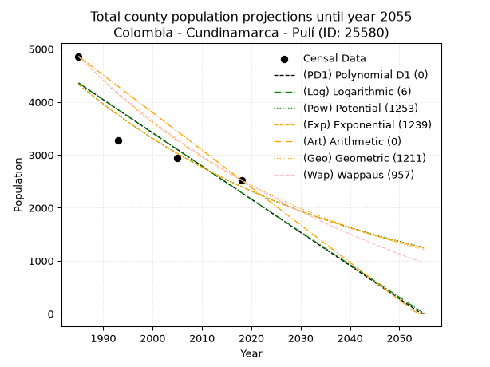
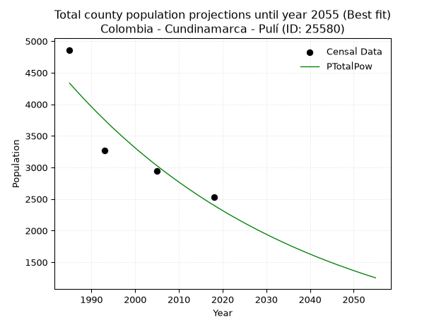
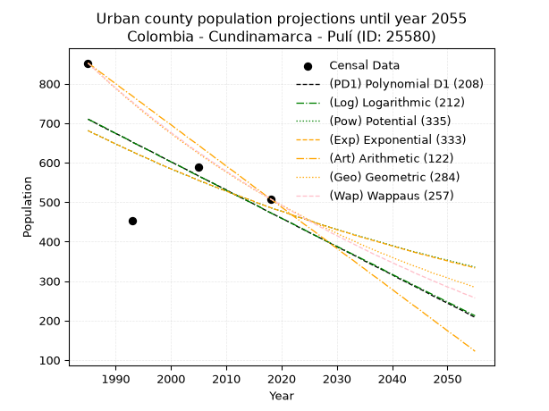
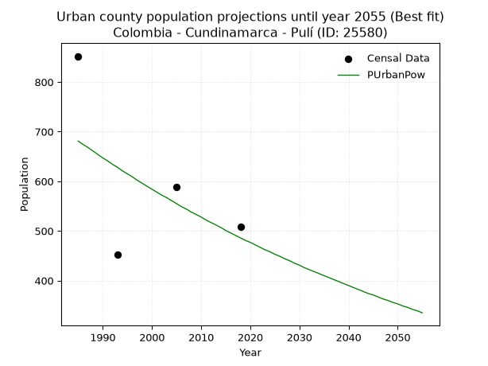
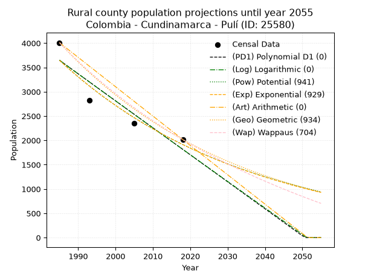
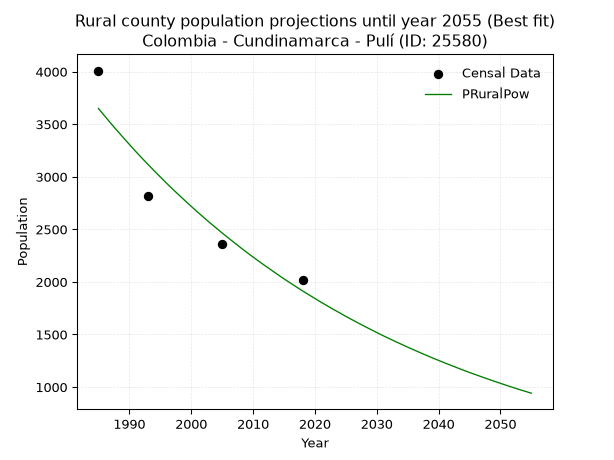

<div align="center">


</div>

# 📜 _“Population and Public Services Demand Projections (PPSD) until Year 2050 for Colombia - Cundinamarca - Pulí (ID: 25580)”_
Keywords: `population` `public-service` `projection` `lineal` `polynomial` `logarithmic` `potential` `exponential` `arithmetic` `geometric` `wappaus` `dane` `colombia` `south-america`

PPSD are analytical estimates used by governments and planners to anticipate future changes in population size, age distribution, and the resulting community needs for utilities, healthcare, education, and infrastructure as sizing future water treatment facilities, electrical grids, and road networks based on spatial growth.

<div align="center">

</img>

</div>


> **General running parameters**: • app_version: _v20260806_. • Python version: _3.14.7_. • Pandas version: _3.0.5_. • NumPy version: _2.5.1_. • Creates, save and include plots into reports (create_plot): _False_. • Projection until year: _2050_. • Process polynomial degree 2 and up: _False_. • Process Wappaus: _True_. • Process Wappaus: _True_. • Set negative values to zero: _True_. • Set infinite values to zero: _True_. • Drop dataset notes: _True_. 
<div align="center">

Dynamic map: [:earth_americas:Google](http://maps.google.com/maps?q=4.682021984,-74.71438) [:earth_americas:OSM](https://www.openstreetmap.org/#map=18/4.682021984/-74.71438&layers=P) [:earth_americas:Bing](https://www.bing.com/maps?cp=4.682021984~-74.71438&lvl=18) [:earth_americas:Apple](https://maps.apple.com/frame?center=4.682021984%2C-74.71438&span=0.003%2C0.006)

</div>


<div align="center">

```geojson
{
  "type": "Feature",
  "geometry": {
    "type": "Point", 
    "coordinates": [-74.71438, 4.682021984]
  }, 
  "properties": {
    "Name": "Colombia - Cundinamarca - Pulí (ID: 25580)"
  }
}
```

</div>


## 0. Census Data (4 records)

Census data are official statistics collected by a government about the people and housing in a country. They usually include counts of total population, age, sex, race, income, education, and jobs.

📅Global census file: [Population.xlsx](../data/Population.xlsx)

| Source   |   Year |   CountryID | CountryName   |   StateID | StateName    |   CountyID | CountyName   |   PTotal |   PUrban |   PRural |
|:---------|-------:|------------:|:--------------|----------:|:-------------|-----------:|:-------------|---------:|---------:|---------:|
| DANE     |   1985 |          57 | Colombia      |        25 | Cundinamarca |      25580 | Pulí         |     4861 |      852 |     4009 |
| DANE     |   1993 |          57 | Colombia      |        25 | Cundinamarca |      25580 | Pulí         |     3271 |      453 |     2818 |
| DANE     |   2005 |          57 | Colombia      |        25 | Cundinamarca |      25580 | Pulí         |     2945 |      589 |     2356 |
| DANE     |   2018 |          57 | Colombia      |        25 | Cundinamarca |      25580 | Pulí         |     2525 |      508 |     2017 |

> 🔥Some records could had specific notes about the registered values or the corresponding urban or rural distribution.

📅[SUI-RUPS](https://www.datos.gov.co/Hacienda-y-Cr-dito-P-blico/Registro-nico-de-Prestadores-de-Servicios-P-blicos/4qkq-csdn/about_data) - Local public utility companies: [RUPS.csv](../data/RUPS.xlsx)

 | SERVICIO       | ESTADO    | NOMBRE                                   | NIT         | DEPARTAMENTO_DOMICILIO   | MUNICIPIO_DOMICILIO   | DIRECCION                            |   TELEFONO | EMAIL                              | TIPO_PRESTADOR                             | CLASIFICACION                 |
|:---------------|:----------|:-----------------------------------------|:------------|:-------------------------|:----------------------|:-------------------------------------|-----------:|:-----------------------------------|:-------------------------------------------|:------------------------------|
| ACUEDUCTO      | OPERATIVA | MUNICIPIO DE PULI, OFICINA DE PLANEACION | 800085612-4 | CUNDINAMARCA             | PULI                  | Calle 3 No. 3 - 40 palacio municipal |    8465243 | alcladia@puli-cundinamarca.gov.co  | MUNICIPIO (PRESTACIÓN DIRECTA)             | HASTA 2500 SUSCRIPTORES       |
| ALCANTARILLADO | OPERATIVA | MUNICIPIO DE PULI, OFICINA DE PLANEACION | 800085612-4 | CUNDINAMARCA             | PULI                  | Calle 3 No. 3 - 40 palacio municipal |    8465243 | alcladia@puli-cundinamarca.gov.co  | MUNICIPIO (PRESTACIÓN DIRECTA)             | HASTA 2500 SUSCRIPTORES       |
| ACUEDUCTO      | OPERATIVA | SERVIPULI S.A. E.S.P.                    | 900267885-2 | CUNDINAMARCA             | PULI                  | cr 3 no. 3 - 40                      |    8465243 | SERVIPULI@PULI-CUNDINAMARCA.GOV.CO | SOCIEDADES (EMPRESA DE SERVICIOS PUBLICOS) | MENOR O IGUAL A 2500 USUARIOS |
| ALCANTARILLADO | OPERATIVA | SERVIPULI S.A. E.S.P.                    | 900267885-2 | CUNDINAMARCA             | PULI                  | cr 3 no. 3 - 40                      |    8465243 | SERVIPULI@PULI-CUNDINAMARCA.GOV.CO | SOCIEDADES (EMPRESA DE SERVICIOS PUBLICOS) | MENOR O IGUAL A 2500 USUARIOS |

## 1. Total

### 1.1. Coefficients and Parameters

* (PD1) Polynomial Deg 1: -62.68566840626225, 128787.50822962607 (lineal)
* (Log) Logarithmic: -125599.8877662501, 958086.2534056008
* (Pow) Potential: -35.816550610954835, 121.75133800408523
* (Exp) Exponential: -0.017879762581849035, 1.12277810847186e+19
* (Art) Arithmetic: Year diff. 2018 - 1985 = 33, Population diff. 2525 - 4861 = -2336, Annual growth = -70.78787878787878
* (Geo) Geometric: Year diff. 2018 - 1985 = 33, Population diff. 2525 - 4861 = -2336, Annual growth % = -0.01965289303985418
* (Wap) Wappaus: i = -1.9168123148626803, Condition values only valid for < 200)

<sub>
Wappaus condition values: ['-0.00', '-1.92', '-3.83', '-5.75', '-7.67', '-9.58', '-11.50', '-13.42', '-15.33', '-17.25', '-19.17', '-21.08', '-23.00', '-24.92', '-26.84', '-28.75', '-30.67', '-32.59', '-34.50', '-36.42', '-38.34', '-40.25', '-42.17', '-44.09', '-46.00', '-47.92', '-49.84', '-51.75', '-53.67', '-55.59', '-57.50', '-59.42', '-61.34', '-63.25', '-65.17', '-67.09', '-69.01', '-70.92', '-72.84', '-74.76', '-76.67', '-78.59', '-80.51', '-82.42', '-84.34', '-86.26', '-88.17', '-90.09', '-92.01', '-93.92', '-95.84', '-97.76', '-99.67', '-101.59', '-103.51', '-105.42', '-107.34', '-109.26', '-111.18', '-113.09', '-115.01', '-116.93', '-118.84', '-120.76', '-122.68', '-124.59']
</sub>


### 1.2. Projected Dataset

|   Year |   CountyID |   PTotalPD1 |   PTotalLog |   PTotalPow |   PTotalExp |   PTotalArt |   PTotalGeo |   PTotalWap |
|-------:|-----------:|------------:|------------:|------------:|------------:|------------:|------------:|------------:|
|   1985 |      25580 |        4356 |        4359 |        4334 |        4331 |        4861 |        4861 |        4861 |
|   1986 |      25580 |        4294 |        4296 |        4257 |        4254 |        4790 |        4765 |        4769 |
|   1987 |      25580 |        4231 |        4233 |        4181 |        4179 |        4719 |        4672 |        4678 |
|   1988 |      25580 |        4168 |        4170 |        4106 |        4105 |        4649 |        4580 |        4589 |
|   1989 |      25580 |        4106 |        4106 |        4033 |        4032 |        4578 |        4490 |        4502 |
|   1990 |      25580 |        4043 |        4043 |        3961 |        3961 |        4507 |        4402 |        4416 |
|   1991 |      25580 |        3980 |        3980 |        3890 |        3891 |        4436 |        4315 |        4332 |
|   1992 |      25580 |        3918 |        3917 |        3821 |        3822 |        4365 |        4230 |        4250 |
|   1993 |      25580 |        3855 |        3854 |        3753 |        3754 |        4295 |        4147 |        4169 |
|   1994 |      25580 |        3792 |        3791 |        3686 |        3687 |        4224 |        4066 |        4089 |
|   1995 |      25580 |        3730 |        3728 |        3620 |        3622 |        4153 |        3986 |        4011 |
|   1996 |      25580 |        3667 |        3665 |        3556 |        3558 |        4082 |        3908 |        3934 |
|   1997 |      25580 |        3604 |        3602 |        3493 |        3495 |        4012 |        3831 |        3858 |
|   1998 |      25580 |        3542 |        3539 |        3431 |        3433 |        3941 |        3755 |        3784 |
|   1999 |      25580 |        3479 |        3477 |        3370 |        3372 |        3870 |        3682 |        3711 |
|   2000 |      25580 |        3416 |        3414 |        3310 |        3312 |        3799 |        3609 |        3639 |
|   2001 |      25580 |        3353 |        3351 |        3251 |        3254 |        3728 |        3538 |        3568 |
|   2002 |      25580 |        3291 |        3288 |        3194 |        3196 |        3658 |        3469 |        3499 |
|   2003 |      25580 |        3228 |        3225 |        3137 |        3139 |        3587 |        3401 |        3431 |
|   2004 |      25580 |        3165 |        3163 |        3081 |        3084 |        3516 |        3334 |        3363 |
|   2005 |      25580 |        3103 |        3100 |        3027 |        3029 |        3445 |        3268 |        3297 |
|   2006 |      25580 |        3040 |        3038 |        2973 |        2975 |        3374 |        3204 |        3232 |
|   2007 |      25580 |        2977 |        2975 |        2921 |        2923 |        3304 |        3141 |        3168 |
|   2008 |      25580 |        2915 |        2912 |        2869 |        2871 |        3233 |        3079 |        3105 |
|   2009 |      25580 |        2852 |        2850 |        2818 |        2820 |        3162 |        3019 |        3043 |
|   2010 |      25580 |        2789 |        2787 |        2769 |        2770 |        3091 |        2960 |        2982 |
|   2011 |      25580 |        2727 |        2725 |        2720 |        2721 |        3021 |        2901 |        2922 |
|   2012 |      25580 |        2664 |        2662 |        2672 |        2673 |        2950 |        2844 |        2862 |
|   2013 |      25580 |        2601 |        2600 |        2625 |        2625 |        2879 |        2788 |        2804 |
|   2014 |      25580 |        2539 |        2538 |        2578 |        2579 |        2808 |        2734 |        2747 |
|   2015 |      25580 |        2476 |        2475 |        2533 |        2533 |        2737 |        2680 |        2690 |
|   2016 |      25580 |        2413 |        2413 |        2488 |        2488 |        2667 |        2627 |        2634 |
|   2017 |      25580 |        2351 |        2351 |        2444 |        2444 |        2596 |        2576 |        2579 |
|   2018 |      25580 |        2288 |        2288 |        2401 |        2401 |        2525 |        2525 |        2525 |
|   2019 |      25580 |        2225 |        2226 |        2359 |        2358 |        2454 |        2475 |        2472 |
|   2020 |      25580 |        2162 |        2164 |        2318 |        2316 |        2383 |        2427 |        2419 |
|   2021 |      25580 |        2100 |        2102 |        2277 |        2275 |        2313 |        2379 |        2367 |
|   2022 |      25580 |        2037 |        2040 |        2237 |        2235 |        2242 |        2332 |        2316 |
|   2023 |      25580 |        1974 |        1978 |        2198 |        2195 |        2171 |        2286 |        2266 |
|   2024 |      25580 |        1912 |        1916 |        2159 |        2157 |        2100 |        2242 |        2216 |
|   2025 |      25580 |        1849 |        1853 |        2121 |        2118 |        2029 |        2197 |        2167 |
|   2026 |      25580 |        1786 |        1791 |        2084 |        2081 |        1959 |        2154 |        2118 |
|   2027 |      25580 |        1724 |        1730 |        2048 |        2044 |        1888 |        2112 |        2071 |
|   2028 |      25580 |        1661 |        1668 |        2012 |        2008 |        1817 |        2070 |        2024 |
|   2029 |      25580 |        1598 |        1606 |        1977 |        1972 |        1746 |        2030 |        1977 |
|   2030 |      25580 |        1536 |        1544 |        1942 |        1937 |        1676 |        1990 |        1932 |
|   2031 |      25580 |        1473 |        1482 |        1908 |        1903 |        1605 |        1951 |        1886 |
|   2032 |      25580 |        1410 |        1420 |        1875 |        1869 |        1534 |        1912 |        1842 |
|   2033 |      25580 |        1348 |        1358 |        1842 |        1836 |        1463 |        1875 |        1798 |
|   2034 |      25580 |        1285 |        1297 |        1810 |        1804 |        1392 |        1838 |        1754 |
|   2035 |      25580 |        1222 |        1235 |        1778 |        1772 |        1322 |        1802 |        1711 |
|   2036 |      25580 |        1159 |        1173 |        1747 |        1740 |        1251 |        1766 |        1669 |
|   2037 |      25580 |        1097 |        1111 |        1717 |        1709 |        1180 |        1732 |        1627 |
|   2038 |      25580 |        1034 |        1050 |        1687 |        1679 |        1109 |        1698 |        1586 |
|   2039 |      25580 |         971 |         988 |        1657 |        1649 |        1038 |        1664 |        1545 |
|   2040 |      25580 |         909 |         927 |        1629 |        1620 |         968 |        1632 |        1505 |
|   2041 |      25580 |         846 |         865 |        1600 |        1591 |         897 |        1600 |        1466 |
|   2042 |      25580 |         783 |         803 |        1572 |        1563 |         826 |        1568 |        1426 |
|   2043 |      25580 |         721 |         742 |        1545 |        1535 |         755 |        1537 |        1388 |
|   2044 |      25580 |         658 |         681 |        1518 |        1508 |         685 |        1507 |        1349 |
|   2045 |      25580 |         595 |         619 |        1492 |        1481 |         614 |        1477 |        1312 |
|   2046 |      25580 |         533 |         558 |        1466 |        1455 |         543 |        1448 |        1274 |
|   2047 |      25580 |         470 |         496 |        1441 |        1429 |         472 |        1420 |        1237 |
|   2048 |      25580 |         407 |         435 |        1416 |        1404 |         401 |        1392 |        1201 |
|   2049 |      25580 |         345 |         374 |        1391 |        1379 |         331 |        1365 |        1165 |
|   2050 |      25580 |         282 |         312 |        1367 |        1355 |         260 |        1338 |        1129 |
<div align="center">

</img>

</div>


### 1.3. Best fit with absolute and relative error (%)

Relative error puts that difference into context by dividing the absolute error by the true value, creating a unitless ratio or percentage that shows the scale of the mistake.

Absolute and relative error

|   Year | Source   |   CountryID | CountryName   |   StateID | StateName    |   CountyID_x | CountyName   |   PTotal |   PUrban |   PRural |   CountyID_y |   PTotalPD1 |   PTotalLog |   PTotalPow |   PTotalExp |   PTotalArt |   PTotalGeo |   PTotalWap |   PTotalPD1AbsError |   PTotalLogAbsError |   PTotalPowAbsError |   PTotalExpAbsError |   PTotalArtAbsError |   PTotalGeoAbsError |   PTotalWapAbsError |   PTotalPD1RelError |   PTotalLogRelError |   PTotalPowRelError |   PTotalExpRelError |   PTotalArtRelError |   PTotalGeoRelError |   PTotalWapRelError |
|-------:|:---------|------------:|:--------------|----------:|:-------------|-------------:|:-------------|---------:|---------:|---------:|-------------:|------------:|------------:|------------:|------------:|------------:|------------:|------------:|--------------------:|--------------------:|--------------------:|--------------------:|--------------------:|--------------------:|--------------------:|--------------------:|--------------------:|--------------------:|--------------------:|--------------------:|--------------------:|--------------------:|
|   1985 | DANE     |          57 | Colombia      |        25 | Cundinamarca |        25580 | Pulí         |     4861 |      852 |     4009 |        25580 |        4356 |        4359 |        4334 |        4331 |        4861 |        4861 |        4861 |                 505 |                 502 |                 527 |                 530 |                   0 |                   0 |                   0 |            10.3888  |            10.3271  |            10.8414  |            10.9031  |              0      |              0      |              0      |
|   1993 | DANE     |          57 | Colombia      |        25 | Cundinamarca |        25580 | Pulí         |     3271 |      453 |     2818 |        25580 |        3855 |        3854 |        3753 |        3754 |        4295 |        4147 |        4169 |                 584 |                 583 |                 482 |                 483 |                1024 |                 876 |                 898 |            17.8539  |            17.8233  |            14.7356  |            14.7661  |             31.3054 |             26.7808 |             27.4534 |
|   2005 | DANE     |          57 | Colombia      |        25 | Cundinamarca |        25580 | Pulí         |     2945 |      589 |     2356 |        25580 |        3103 |        3100 |        3027 |        3029 |        3445 |        3268 |        3297 |                 158 |                 155 |                  82 |                  84 |                 500 |                 323 |                 352 |             5.36503 |             5.26316 |             2.78438 |             2.85229 |             16.9779 |             10.9677 |             11.9525 |
|   2018 | DANE     |          57 | Colombia      |        25 | Cundinamarca |        25580 | Pulí         |     2525 |      508 |     2017 |        25580 |        2288 |        2288 |        2401 |        2401 |        2525 |        2525 |        2525 |                 237 |                 237 |                 124 |                 124 |                   0 |                   0 |                   0 |             9.38614 |             9.38614 |             4.91089 |             4.91089 |              0      |              0      |              0      |

Relative error mean

| Method    |   RelError | Best   |
|:----------|-----------:|:-------|
| PTotalPD1 |   10.7485  |        |
| PTotalLog |   10.6999  |        |
| PTotalPow |    8.31805 | True   |
| PTotalExp |    8.3581  |        |
| PTotalArt |   12.0708  |        |
| PTotalGeo |    9.43714 |        |
| PTotalWap |    9.85146 |        |

💙Best method: _**PTotalPow**_
<div align="center">

</img>

</div>


### 1.4. Fresh water supply demand in liters per capita per day (lpcd)

The fresh water supply demand typically ranges from 100 to 300 liters per capita per day (lpcd) for standard domestic and municipal planning, though absolute survival minimums set by the World Health Organization are as low as 7.5 to 20 liters per day, and total consumption in high-income nations can exceed 400 liters.

> `CZ`: Level in meters above the sea level (masl)<br> `WS`: Fresh water supply demand in liters per capita per day (lpcd or l/h/d)<br> `WSAll`: Zonal fresh water supply demand in liters per second (l/s)<br> `A`: Zonal area in square meters<br> `DP`: Population density (people/hectare or p/ha)

Reference values (RAS Colombia)

|    CZ |   WS |
|------:|-----:|
|  1000 |  120 |
|  2000 |  130 |
| 99999 |  140 |

County shapefile geometry properties and water supply values

|   CountyID |     ATotal |   CZTotal |   WSTotal |
|-----------:|-----------:|----------:|----------:|
|      25580 | 1.9752e+08 |   931.013 |       120 |

Projected values for best method: PTotalPow

|   CountyID |   Year |   PTotalPow |   DPTotal |   WSTotal |   WSTotalAll |
|-----------:|-------:|------------:|----------:|----------:|-------------:|
|      25580 |   1985 |        4334 |      0.22 |       120 |      6.01944 |
|      25580 |   1986 |        4257 |      0.22 |       120 |      5.9125  |
|      25580 |   1987 |        4181 |      0.21 |       120 |      5.80694 |
|      25580 |   1988 |        4106 |      0.21 |       120 |      5.70278 |
|      25580 |   1989 |        4033 |      0.2  |       120 |      5.60139 |
|      25580 |   1990 |        3961 |      0.2  |       120 |      5.50139 |
|      25580 |   1991 |        3890 |      0.2  |       120 |      5.40278 |
|      25580 |   1992 |        3821 |      0.19 |       120 |      5.30694 |
|      25580 |   1993 |        3753 |      0.19 |       120 |      5.2125  |
|      25580 |   1994 |        3686 |      0.19 |       120 |      5.11944 |
|      25580 |   1995 |        3620 |      0.18 |       120 |      5.02778 |
|      25580 |   1996 |        3556 |      0.18 |       120 |      4.93889 |
|      25580 |   1997 |        3493 |      0.18 |       120 |      4.85139 |
|      25580 |   1998 |        3431 |      0.17 |       120 |      4.76528 |
|      25580 |   1999 |        3370 |      0.17 |       120 |      4.68056 |
|      25580 |   2000 |        3310 |      0.17 |       120 |      4.59722 |
|      25580 |   2001 |        3251 |      0.16 |       120 |      4.51528 |
|      25580 |   2002 |        3194 |      0.16 |       120 |      4.43611 |
|      25580 |   2003 |        3137 |      0.16 |       120 |      4.35694 |
|      25580 |   2004 |        3081 |      0.16 |       120 |      4.27917 |
|      25580 |   2005 |        3027 |      0.15 |       120 |      4.20417 |
|      25580 |   2006 |        2973 |      0.15 |       120 |      4.12917 |
|      25580 |   2007 |        2921 |      0.15 |       120 |      4.05694 |
|      25580 |   2008 |        2869 |      0.15 |       120 |      3.98472 |
|      25580 |   2009 |        2818 |      0.14 |       120 |      3.91389 |
|      25580 |   2010 |        2769 |      0.14 |       120 |      3.84583 |
|      25580 |   2011 |        2720 |      0.14 |       120 |      3.77778 |
|      25580 |   2012 |        2672 |      0.14 |       120 |      3.71111 |
|      25580 |   2013 |        2625 |      0.13 |       120 |      3.64583 |
|      25580 |   2014 |        2578 |      0.13 |       120 |      3.58056 |
|      25580 |   2015 |        2533 |      0.13 |       120 |      3.51806 |
|      25580 |   2016 |        2488 |      0.13 |       120 |      3.45556 |
|      25580 |   2017 |        2444 |      0.12 |       120 |      3.39444 |
|      25580 |   2018 |        2401 |      0.12 |       120 |      3.33472 |
|      25580 |   2019 |        2359 |      0.12 |       120 |      3.27639 |
|      25580 |   2020 |        2318 |      0.12 |       120 |      3.21944 |
|      25580 |   2021 |        2277 |      0.12 |       120 |      3.1625  |
|      25580 |   2022 |        2237 |      0.11 |       120 |      3.10694 |
|      25580 |   2023 |        2198 |      0.11 |       120 |      3.05278 |
|      25580 |   2024 |        2159 |      0.11 |       120 |      2.99861 |
|      25580 |   2025 |        2121 |      0.11 |       120 |      2.94583 |
|      25580 |   2026 |        2084 |      0.11 |       120 |      2.89444 |
|      25580 |   2027 |        2048 |      0.1  |       120 |      2.84444 |
|      25580 |   2028 |        2012 |      0.1  |       120 |      2.79444 |
|      25580 |   2029 |        1977 |      0.1  |       120 |      2.74583 |
|      25580 |   2030 |        1942 |      0.1  |       120 |      2.69722 |
|      25580 |   2031 |        1908 |      0.1  |       120 |      2.65    |
|      25580 |   2032 |        1875 |      0.09 |       120 |      2.60417 |
|      25580 |   2033 |        1842 |      0.09 |       120 |      2.55833 |
|      25580 |   2034 |        1810 |      0.09 |       120 |      2.51389 |
|      25580 |   2035 |        1778 |      0.09 |       120 |      2.46944 |
|      25580 |   2036 |        1747 |      0.09 |       120 |      2.42639 |
|      25580 |   2037 |        1717 |      0.09 |       120 |      2.38472 |
|      25580 |   2038 |        1687 |      0.09 |       120 |      2.34306 |
|      25580 |   2039 |        1657 |      0.08 |       120 |      2.30139 |
|      25580 |   2040 |        1629 |      0.08 |       120 |      2.2625  |
|      25580 |   2041 |        1600 |      0.08 |       120 |      2.22222 |
|      25580 |   2042 |        1572 |      0.08 |       120 |      2.18333 |
|      25580 |   2043 |        1545 |      0.08 |       120 |      2.14583 |
|      25580 |   2044 |        1518 |      0.08 |       120 |      2.10833 |
|      25580 |   2045 |        1492 |      0.08 |       120 |      2.07222 |
|      25580 |   2046 |        1466 |      0.07 |       120 |      2.03611 |
|      25580 |   2047 |        1441 |      0.07 |       120 |      2.00139 |
|      25580 |   2048 |        1416 |      0.07 |       120 |      1.96667 |
|      25580 |   2049 |        1391 |      0.07 |       120 |      1.93194 |
|      25580 |   2050 |        1367 |      0.07 |       120 |      1.89861 |

## 2. Urban

### 2.1. Coefficients and Parameters

* (PD1) Polynomial Deg 1: -7.1657968687273765, 14933.885186671934 (lineal)
* (Log) Logarithmic: -14370.631734491773, 109831.7869728874
* (Pow) Potential: -20.457744342584736, 70.29819473315128
* (Exp) Exponential: -0.010200469493433815, 423401049812.88586
* (Art) Arithmetic: Year diff. 2018 - 1985 = 33, Population diff. 508 - 852 = -344, Annual growth = -10.424242424242424
* (Geo) Geometric: Year diff. 2018 - 1985 = 33, Population diff. 508 - 852 = -344, Annual growth % = -0.015547717542245265
* (Wap) Wappaus: i = -1.5329768270944741, Condition values only valid for < 200)

<sub>
Wappaus condition values: ['-0.00', '-1.53', '-3.07', '-4.60', '-6.13', '-7.66', '-9.20', '-10.73', '-12.26', '-13.80', '-15.33', '-16.86', '-18.40', '-19.93', '-21.46', '-22.99', '-24.53', '-26.06', '-27.59', '-29.13', '-30.66', '-32.19', '-33.73', '-35.26', '-36.79', '-38.32', '-39.86', '-41.39', '-42.92', '-44.46', '-45.99', '-47.52', '-49.06', '-50.59', '-52.12', '-53.65', '-55.19', '-56.72', '-58.25', '-59.79', '-61.32', '-62.85', '-64.39', '-65.92', '-67.45', '-68.98', '-70.52', '-72.05', '-73.58', '-75.12', '-76.65', '-78.18', '-79.71', '-81.25', '-82.78', '-84.31', '-85.85', '-87.38', '-88.91', '-90.45', '-91.98', '-93.51', '-95.04', '-96.58', '-98.11', '-99.64']
</sub>


### 2.2. Projected Dataset

|   Year |   CountyID |   PUrbanPD1 |   PUrbanLog |   PUrbanPow |   PUrbanExp |   PUrbanArt |   PUrbanGeo |   PUrbanWap |
|-------:|-----------:|------------:|------------:|------------:|------------:|------------:|------------:|------------:|
|   1985 |      25580 |         710 |         710 |         681 |         681 |         852 |         852 |         852 |
|   1986 |      25580 |         703 |         703 |         674 |         674 |         842 |         839 |         839 |
|   1987 |      25580 |         695 |         696 |         668 |         667 |         831 |         826 |         826 |
|   1988 |      25580 |         688 |         689 |         661 |         661 |         821 |         813 |         814 |
|   1989 |      25580 |         681 |         681 |         654 |         654 |         810 |         800 |         801 |
|   1990 |      25580 |         674 |         674 |         647 |         647 |         800 |         788 |         789 |
|   1991 |      25580 |         667 |         667 |         641 |         641 |         789 |         776 |         777 |
|   1992 |      25580 |         660 |         660 |         634 |         634 |         779 |         763 |         765 |
|   1993 |      25580 |         652 |         652 |         628 |         628 |         769 |         752 |         754 |
|   1994 |      25580 |         645 |         645 |         621 |         621 |         758 |         740 |         742 |
|   1995 |      25580 |         638 |         638 |         615 |         615 |         748 |         728 |         731 |
|   1996 |      25580 |         631 |         631 |         609 |         609 |         737 |         717 |         720 |
|   1997 |      25580 |         624 |         624 |         602 |         603 |         727 |         706 |         708 |
|   1998 |      25580 |         617 |         616 |         596 |         596 |         716 |         695 |         698 |
|   1999 |      25580 |         609 |         609 |         590 |         590 |         706 |         684 |         687 |
|   2000 |      25580 |         602 |         602 |         584 |         584 |         696 |         674 |         676 |
|   2001 |      25580 |         595 |         595 |         578 |         579 |         685 |         663 |         666 |
|   2002 |      25580 |         588 |         588 |         572 |         573 |         675 |         653 |         656 |
|   2003 |      25580 |         581 |         580 |         567 |         567 |         664 |         643 |         645 |
|   2004 |      25580 |         574 |         573 |         561 |         561 |         654 |         633 |         635 |
|   2005 |      25580 |         566 |         566 |         555 |         555 |         644 |         623 |         626 |
|   2006 |      25580 |         559 |         559 |         549 |         550 |         633 |         613 |         616 |
|   2007 |      25580 |         552 |         552 |         544 |         544 |         623 |         604 |         606 |
|   2008 |      25580 |         545 |         545 |         538 |         539 |         612 |         594 |         597 |
|   2009 |      25580 |         538 |         537 |         533 |         533 |         602 |         585 |         587 |
|   2010 |      25580 |         531 |         530 |         528 |         528 |         591 |         576 |         578 |
|   2011 |      25580 |         523 |         523 |         522 |         522 |         581 |         567 |         569 |
|   2012 |      25580 |         516 |         516 |         517 |         517 |         571 |         558 |         560 |
|   2013 |      25580 |         509 |         509 |         512 |         512 |         560 |         549 |         551 |
|   2014 |      25580 |         502 |         502 |         507 |         507 |         550 |         541 |         542 |
|   2015 |      25580 |         495 |         495 |         501 |         502 |         539 |         532 |         533 |
|   2016 |      25580 |         488 |         488 |         496 |         496 |         529 |         524 |         525 |
|   2017 |      25580 |         480 |         480 |         491 |         491 |         518 |         516 |         516 |
|   2018 |      25580 |         473 |         473 |         486 |         486 |         508 |         508 |         508 |
|   2019 |      25580 |         466 |         466 |         481 |         481 |         498 |         500 |         500 |
|   2020 |      25580 |         459 |         459 |         477 |         477 |         487 |         492 |         492 |
|   2021 |      25580 |         452 |         452 |         472 |         472 |         477 |         485 |         483 |
|   2022 |      25580 |         445 |         445 |         467 |         467 |         466 |         477 |         476 |
|   2023 |      25580 |         437 |         438 |         462 |         462 |         456 |         470 |         468 |
|   2024 |      25580 |         430 |         431 |         458 |         458 |         445 |         462 |         460 |
|   2025 |      25580 |         423 |         423 |         453 |         453 |         435 |         455 |         452 |
|   2026 |      25580 |         416 |         416 |         449 |         448 |         425 |         448 |         445 |
|   2027 |      25580 |         409 |         409 |         444 |         444 |         414 |         441 |         437 |
|   2028 |      25580 |         402 |         402 |         440 |         439 |         404 |         434 |         430 |
|   2029 |      25580 |         394 |         395 |         435 |         435 |         393 |         428 |         422 |
|   2030 |      25580 |         387 |         388 |         431 |         430 |         383 |         421 |         415 |
|   2031 |      25580 |         380 |         381 |         426 |         426 |         372 |         414 |         408 |
|   2032 |      25580 |         373 |         374 |         422 |         422 |         362 |         408 |         401 |
|   2033 |      25580 |         366 |         367 |         418 |         417 |         352 |         402 |         394 |
|   2034 |      25580 |         359 |         360 |         414 |         413 |         341 |         395 |         387 |
|   2035 |      25580 |         351 |         353 |         410 |         409 |         331 |         389 |         380 |
|   2036 |      25580 |         344 |         346 |         406 |         405 |         320 |         383 |         373 |
|   2037 |      25580 |         337 |         339 |         402 |         401 |         310 |         377 |         366 |
|   2038 |      25580 |         330 |         332 |         398 |         397 |         300 |         371 |         360 |
|   2039 |      25580 |         323 |         324 |         394 |         393 |         289 |         366 |         353 |
|   2040 |      25580 |         316 |         317 |         390 |         389 |         279 |         360 |         347 |
|   2041 |      25580 |         308 |         310 |         386 |         385 |         268 |         354 |         340 |
|   2042 |      25580 |         301 |         303 |         382 |         381 |         258 |         349 |         334 |
|   2043 |      25580 |         294 |         296 |         378 |         377 |         247 |         343 |         328 |
|   2044 |      25580 |         287 |         289 |         374 |         373 |         237 |         338 |         321 |
|   2045 |      25580 |         280 |         282 |         371 |         369 |         227 |         333 |         315 |
|   2046 |      25580 |         273 |         275 |         367 |         366 |         216 |         328 |         309 |
|   2047 |      25580 |         265 |         268 |         363 |         362 |         206 |         322 |         303 |
|   2048 |      25580 |         258 |         261 |         360 |         358 |         195 |         317 |         297 |
|   2049 |      25580 |         251 |         254 |         356 |         355 |         185 |         313 |         291 |
|   2050 |      25580 |         244 |         247 |         353 |         351 |         174 |         308 |         285 |
<div align="center">

</img>

</div>


### 2.3. Best fit with absolute and relative error (%)

Relative error puts that difference into context by dividing the absolute error by the true value, creating a unitless ratio or percentage that shows the scale of the mistake.

Absolute and relative error

|   Year | Source   |   CountryID | CountryName   |   StateID | StateName    |   CountyID_x | CountyName   |   PTotal |   PUrban |   PRural |   CountyID_y |   PUrbanPD1 |   PUrbanLog |   PUrbanPow |   PUrbanExp |   PUrbanArt |   PUrbanGeo |   PUrbanWap |   PUrbanPD1AbsError |   PUrbanLogAbsError |   PUrbanPowAbsError |   PUrbanExpAbsError |   PUrbanArtAbsError |   PUrbanGeoAbsError |   PUrbanWapAbsError |   PUrbanPD1RelError |   PUrbanLogRelError |   PUrbanPowRelError |   PUrbanExpRelError |   PUrbanArtRelError |   PUrbanGeoRelError |   PUrbanWapRelError |
|-------:|:---------|------------:|:--------------|----------:|:-------------|-------------:|:-------------|---------:|---------:|---------:|-------------:|------------:|------------:|------------:|------------:|------------:|------------:|------------:|--------------------:|--------------------:|--------------------:|--------------------:|--------------------:|--------------------:|--------------------:|--------------------:|--------------------:|--------------------:|--------------------:|--------------------:|--------------------:|--------------------:|
|   1985 | DANE     |          57 | Colombia      |        25 | Cundinamarca |        25580 | Pulí         |     4861 |      852 |     4009 |        25580 |         710 |         710 |         681 |         681 |         852 |         852 |         852 |                 142 |                 142 |                 171 |                 171 |                   0 |                   0 |                   0 |            16.6667  |            16.6667  |            20.0704  |            20.0704  |             0       |              0      |             0       |
|   1993 | DANE     |          57 | Colombia      |        25 | Cundinamarca |        25580 | Pulí         |     3271 |      453 |     2818 |        25580 |         652 |         652 |         628 |         628 |         769 |         752 |         754 |                 199 |                 199 |                 175 |                 175 |                 316 |                 299 |                 301 |            43.9294  |            43.9294  |            38.6313  |            38.6313  |            69.7572  |             66.0044 |            66.4459  |
|   2005 | DANE     |          57 | Colombia      |        25 | Cundinamarca |        25580 | Pulí         |     2945 |      589 |     2356 |        25580 |         566 |         566 |         555 |         555 |         644 |         623 |         626 |                  23 |                  23 |                  34 |                  34 |                  55 |                  34 |                  37 |             3.90492 |             3.90492 |             5.7725  |             5.7725  |             9.33786 |              5.7725 |             6.28183 |
|   2018 | DANE     |          57 | Colombia      |        25 | Cundinamarca |        25580 | Pulí         |     2525 |      508 |     2017 |        25580 |         473 |         473 |         486 |         486 |         508 |         508 |         508 |                  35 |                  35 |                  22 |                  22 |                   0 |                   0 |                   0 |             6.88976 |             6.88976 |             4.33071 |             4.33071 |             0       |              0      |             0       |

Relative error mean

| Method    |   RelError | Best   |
|:----------|-----------:|:-------|
| PUrbanPD1 |    17.8477 |        |
| PUrbanLog |    17.8477 |        |
| PUrbanPow |    17.2012 | True   |
| PUrbanExp |    17.2012 | True   |
| PUrbanArt |    19.7738 |        |
| PUrbanGeo |    17.9442 |        |
| PUrbanWap |    18.1819 |        |

💙Best method: _**PUrbanPow**_
<div align="center">

</img>

</div>


### 2.4. Fresh water supply demand in liters per capita per day (lpcd)

The fresh water supply demand typically ranges from 100 to 300 liters per capita per day (lpcd) for standard domestic and municipal planning, though absolute survival minimums set by the World Health Organization are as low as 7.5 to 20 liters per day, and total consumption in high-income nations can exceed 400 liters.

> `CZ`: Level in meters above the sea level (masl)<br> `WS`: Fresh water supply demand in liters per capita per day (lpcd or l/h/d)<br> `WSAll`: Zonal fresh water supply demand in liters per second (l/s)<br> `A`: Zonal area in square meters<br> `DP`: Population density (people/hectare or p/ha)

Reference values (RAS Colombia)

|    CZ |   WS |
|------:|-----:|
|  1000 |  120 |
|  2000 |  130 |
| 99999 |  140 |

County shapefile geometry properties and water supply values

|   CountyID |   AUrban |   CZUrban |   WSUrban |
|-----------:|---------:|----------:|----------:|
|      25580 |   190155 |   1289.13 |       130 |

Projected values for best method: PUrbanPow

|   CountyID |   Year |   PUrbanPow |   DPUrban |   WSUrban |   WSUrbanAll |
|-----------:|-------:|------------:|----------:|----------:|-------------:|
|      25580 |   1985 |         681 |     35.81 |       130 |     1.02465  |
|      25580 |   1986 |         674 |     35.44 |       130 |     1.01412  |
|      25580 |   1987 |         668 |     35.13 |       130 |     1.00509  |
|      25580 |   1988 |         661 |     34.76 |       130 |     0.99456  |
|      25580 |   1989 |         654 |     34.39 |       130 |     0.984028 |
|      25580 |   1990 |         647 |     34.02 |       130 |     0.973495 |
|      25580 |   1991 |         641 |     33.71 |       130 |     0.964468 |
|      25580 |   1992 |         634 |     33.34 |       130 |     0.953935 |
|      25580 |   1993 |         628 |     33.03 |       130 |     0.944907 |
|      25580 |   1994 |         621 |     32.66 |       130 |     0.934375 |
|      25580 |   1995 |         615 |     32.34 |       130 |     0.925347 |
|      25580 |   1996 |         609 |     32.03 |       130 |     0.916319 |
|      25580 |   1997 |         602 |     31.66 |       130 |     0.905787 |
|      25580 |   1998 |         596 |     31.34 |       130 |     0.896759 |
|      25580 |   1999 |         590 |     31.03 |       130 |     0.887731 |
|      25580 |   2000 |         584 |     30.71 |       130 |     0.878704 |
|      25580 |   2001 |         578 |     30.4  |       130 |     0.869676 |
|      25580 |   2002 |         572 |     30.08 |       130 |     0.860648 |
|      25580 |   2003 |         567 |     29.82 |       130 |     0.853125 |
|      25580 |   2004 |         561 |     29.5  |       130 |     0.844097 |
|      25580 |   2005 |         555 |     29.19 |       130 |     0.835069 |
|      25580 |   2006 |         549 |     28.87 |       130 |     0.826042 |
|      25580 |   2007 |         544 |     28.61 |       130 |     0.818519 |
|      25580 |   2008 |         538 |     28.29 |       130 |     0.809491 |
|      25580 |   2009 |         533 |     28.03 |       130 |     0.801968 |
|      25580 |   2010 |         528 |     27.77 |       130 |     0.794444 |
|      25580 |   2011 |         522 |     27.45 |       130 |     0.785417 |
|      25580 |   2012 |         517 |     27.19 |       130 |     0.777894 |
|      25580 |   2013 |         512 |     26.93 |       130 |     0.77037  |
|      25580 |   2014 |         507 |     26.66 |       130 |     0.762847 |
|      25580 |   2015 |         501 |     26.35 |       130 |     0.753819 |
|      25580 |   2016 |         496 |     26.08 |       130 |     0.746296 |
|      25580 |   2017 |         491 |     25.82 |       130 |     0.738773 |
|      25580 |   2018 |         486 |     25.56 |       130 |     0.73125  |
|      25580 |   2019 |         481 |     25.3  |       130 |     0.723727 |
|      25580 |   2020 |         477 |     25.08 |       130 |     0.717708 |
|      25580 |   2021 |         472 |     24.82 |       130 |     0.710185 |
|      25580 |   2022 |         467 |     24.56 |       130 |     0.702662 |
|      25580 |   2023 |         462 |     24.3  |       130 |     0.695139 |
|      25580 |   2024 |         458 |     24.09 |       130 |     0.68912  |
|      25580 |   2025 |         453 |     23.82 |       130 |     0.681597 |
|      25580 |   2026 |         449 |     23.61 |       130 |     0.675579 |
|      25580 |   2027 |         444 |     23.35 |       130 |     0.668056 |
|      25580 |   2028 |         440 |     23.14 |       130 |     0.662037 |
|      25580 |   2029 |         435 |     22.88 |       130 |     0.654514 |
|      25580 |   2030 |         431 |     22.67 |       130 |     0.648495 |
|      25580 |   2031 |         426 |     22.4  |       130 |     0.640972 |
|      25580 |   2032 |         422 |     22.19 |       130 |     0.634954 |
|      25580 |   2033 |         418 |     21.98 |       130 |     0.628935 |
|      25580 |   2034 |         414 |     21.77 |       130 |     0.622917 |
|      25580 |   2035 |         410 |     21.56 |       130 |     0.616898 |
|      25580 |   2036 |         406 |     21.35 |       130 |     0.61088  |
|      25580 |   2037 |         402 |     21.14 |       130 |     0.604861 |
|      25580 |   2038 |         398 |     20.93 |       130 |     0.598843 |
|      25580 |   2039 |         394 |     20.72 |       130 |     0.592824 |
|      25580 |   2040 |         390 |     20.51 |       130 |     0.586806 |
|      25580 |   2041 |         386 |     20.3  |       130 |     0.580787 |
|      25580 |   2042 |         382 |     20.09 |       130 |     0.574769 |
|      25580 |   2043 |         378 |     19.88 |       130 |     0.56875  |
|      25580 |   2044 |         374 |     19.67 |       130 |     0.562731 |
|      25580 |   2045 |         371 |     19.51 |       130 |     0.558218 |
|      25580 |   2046 |         367 |     19.3  |       130 |     0.552199 |
|      25580 |   2047 |         363 |     19.09 |       130 |     0.546181 |
|      25580 |   2048 |         360 |     18.93 |       130 |     0.541667 |
|      25580 |   2049 |         356 |     18.72 |       130 |     0.535648 |
|      25580 |   2050 |         353 |     18.56 |       130 |     0.531134 |

## 3. Rural

### 3.1. Coefficients and Parameters

* (PD1) Polynomial Deg 1: -55.519871537534875, 113853.62304295413 (lineal)
* (Log) Logarithmic: -111229.25603175827, 848254.466432713
* (Pow) Potential: -39.117483383326956, 132.5622437647098
* (Exp) Exponential: -0.01952995078566264, 2.5008331118425565e+20
* (Art) Arithmetic: Year diff. 2018 - 1985 = 33, Population diff. 2017 - 4009 = -1992, Annual growth = -60.36363636363637
* (Geo) Geometric: Year diff. 2018 - 1985 = 33, Population diff. 2017 - 4009 = -1992, Annual growth % = -0.020600918977383365
* (Wap) Wappaus: i = -2.003439640346378, Condition values only valid for < 200)

<sub>
Wappaus condition values: ['-0.00', '-2.00', '-4.01', '-6.01', '-8.01', '-10.02', '-12.02', '-14.02', '-16.03', '-18.03', '-20.03', '-22.04', '-24.04', '-26.04', '-28.05', '-30.05', '-32.06', '-34.06', '-36.06', '-38.07', '-40.07', '-42.07', '-44.08', '-46.08', '-48.08', '-50.09', '-52.09', '-54.09', '-56.10', '-58.10', '-60.10', '-62.11', '-64.11', '-66.11', '-68.12', '-70.12', '-72.12', '-74.13', '-76.13', '-78.13', '-80.14', '-82.14', '-84.14', '-86.15', '-88.15', '-90.15', '-92.16', '-94.16', '-96.17', '-98.17', '-100.17', '-102.18', '-104.18', '-106.18', '-108.19', '-110.19', '-112.19', '-114.20', '-116.20', '-118.20', '-120.21', '-122.21', '-124.21', '-126.22', '-128.22', '-130.22']
</sub>


### 3.2. Projected Dataset

|   Year |   CountyID |   PRuralPD1 |   PRuralLog |   PRuralPow |   PRuralExp |   PRuralArt |   PRuralGeo |   PRuralWap |
|-------:|-----------:|------------:|------------:|------------:|------------:|------------:|------------:|------------:|
|   1985 |      25580 |        3647 |        3649 |        3649 |        3646 |        4009 |        4009 |        4009 |
|   1986 |      25580 |        3591 |        3593 |        3578 |        3575 |        3949 |        3926 |        3929 |
|   1987 |      25580 |        3536 |        3537 |        3508 |        3506 |        3888 |        3846 |        3852 |
|   1988 |      25580 |        3480 |        3481 |        3440 |        3438 |        3828 |        3766 |        3775 |
|   1989 |      25580 |        3425 |        3425 |        3373 |        3372 |        3768 |        3689 |        3700 |
|   1990 |      25580 |        3369 |        3369 |        3307 |        3307 |        3707 |        3613 |        3627 |
|   1991 |      25580 |        3314 |        3313 |        3242 |        3243 |        3647 |        3538 |        3554 |
|   1992 |      25580 |        3258 |        3258 |        3179 |        3180 |        3586 |        3465 |        3484 |
|   1993 |      25580 |        3203 |        3202 |        3118 |        3119 |        3526 |        3394 |        3414 |
|   1994 |      25580 |        3147 |        3146 |        3057 |        3058 |        3466 |        3324 |        3346 |
|   1995 |      25580 |        3091 |        3090 |        2998 |        2999 |        3405 |        3256 |        3279 |
|   1996 |      25580 |        3036 |        3034 |        2939 |        2941 |        3345 |        3189 |        3213 |
|   1997 |      25580 |        2980 |        2979 |        2882 |        2884 |        3285 |        3123 |        3149 |
|   1998 |      25580 |        2925 |        2923 |        2827 |        2828 |        3224 |        3059 |        3085 |
|   1999 |      25580 |        2869 |        2867 |        2772 |        2774 |        3164 |        2996 |        3023 |
|   2000 |      25580 |        2814 |        2812 |        2718 |        2720 |        3104 |        2934 |        2962 |
|   2001 |      25580 |        2758 |        2756 |        2665 |        2667 |        3043 |        2873 |        2901 |
|   2002 |      25580 |        2703 |        2701 |        2614 |        2616 |        2983 |        2814 |        2842 |
|   2003 |      25580 |        2647 |        2645 |        2563 |        2565 |        2922 |        2756 |        2784 |
|   2004 |      25580 |        2592 |        2590 |        2514 |        2516 |        2862 |        2699 |        2727 |
|   2005 |      25580 |        2536 |        2534 |        2465 |        2467 |        2802 |        2644 |        2671 |
|   2006 |      25580 |        2481 |        2479 |        2418 |        2419 |        2741 |        2589 |        2615 |
|   2007 |      25580 |        2425 |        2423 |        2371 |        2373 |        2681 |        2536 |        2561 |
|   2008 |      25580 |        2370 |        2368 |        2325 |        2327 |        2621 |        2484 |        2508 |
|   2009 |      25580 |        2314 |        2312 |        2280 |        2282 |        2560 |        2433 |        2455 |
|   2010 |      25580 |        2259 |        2257 |        2236 |        2238 |        2500 |        2382 |        2403 |
|   2011 |      25580 |        2203 |        2202 |        2193 |        2194 |        2440 |        2333 |        2352 |
|   2012 |      25580 |        2148 |        2146 |        2151 |        2152 |        2379 |        2285 |        2302 |
|   2013 |      25580 |        2092 |        2091 |        2110 |        2110 |        2319 |        2238 |        2253 |
|   2014 |      25580 |        2037 |        2036 |        2069 |        2069 |        2258 |        2192 |        2204 |
|   2015 |      25580 |        1981 |        1981 |        2029 |        2029 |        2198 |        2147 |        2156 |
|   2016 |      25580 |        1926 |        1925 |        1990 |        1990 |        2138 |        2103 |        2109 |
|   2017 |      25580 |        1870 |        1870 |        1952 |        1952 |        2077 |        2059 |        2063 |
|   2018 |      25580 |        1815 |        1815 |        1914 |        1914 |        2017 |        2017 |        2017 |
|   2019 |      25580 |        1759 |        1760 |        1878 |        1877 |        1957 |        1975 |        1972 |
|   2020 |      25580 |        1703 |        1705 |        1842 |        1841 |        1896 |        1935 |        1928 |
|   2021 |      25580 |        1648 |        1650 |        1806 |        1805 |        1836 |        1895 |        1884 |
|   2022 |      25580 |        1592 |        1595 |        1772 |        1770 |        1776 |        1856 |        1841 |
|   2023 |      25580 |        1537 |        1540 |        1738 |        1736 |        1715 |        1818 |        1798 |
|   2024 |      25580 |        1481 |        1485 |        1705 |        1702 |        1655 |        1780 |        1757 |
|   2025 |      25580 |        1426 |        1430 |        1672 |        1669 |        1594 |        1744 |        1715 |
|   2026 |      25580 |        1370 |        1375 |        1640 |        1637 |        1534 |        1708 |        1675 |
|   2027 |      25580 |        1315 |        1320 |        1609 |        1605 |        1474 |        1672 |        1635 |
|   2028 |      25580 |        1259 |        1265 |        1578 |        1574 |        1413 |        1638 |        1595 |
|   2029 |      25580 |        1204 |        1210 |        1548 |        1544 |        1353 |        1604 |        1556 |
|   2030 |      25580 |        1148 |        1156 |        1518 |        1514 |        1293 |        1571 |        1518 |
|   2031 |      25580 |        1093 |        1101 |        1489 |        1485 |        1232 |        1539 |        1480 |
|   2032 |      25580 |        1037 |        1046 |        1461 |        1456 |        1172 |        1507 |        1442 |
|   2033 |      25580 |         982 |         991 |        1433 |        1428 |        1112 |        1476 |        1406 |
|   2034 |      25580 |         926 |         937 |        1406 |        1400 |        1051 |        1446 |        1369 |
|   2035 |      25580 |         871 |         882 |        1379 |        1373 |         991 |        1416 |        1333 |
|   2036 |      25580 |         815 |         827 |        1353 |        1347 |         930 |        1387 |        1298 |
|   2037 |      25580 |         760 |         773 |        1327 |        1321 |         870 |        1358 |        1263 |
|   2038 |      25580 |         704 |         718 |        1302 |        1295 |         810 |        1330 |        1228 |
|   2039 |      25580 |         649 |         664 |        1277 |        1270 |         749 |        1303 |        1194 |
|   2040 |      25580 |         593 |         609 |        1253 |        1245 |         689 |        1276 |        1161 |
|   2041 |      25580 |         538 |         555 |        1229 |        1221 |         629 |        1250 |        1128 |
|   2042 |      25580 |         482 |         500 |        1206 |        1198 |         568 |        1224 |        1095 |
|   2043 |      25580 |         427 |         446 |        1183 |        1175 |         508 |        1199 |        1062 |
|   2044 |      25580 |         371 |         391 |        1160 |        1152 |         448 |        1174 |        1031 |
|   2045 |      25580 |         315 |         337 |        1138 |        1130 |         387 |        1150 |         999 |
|   2046 |      25580 |         260 |         282 |        1117 |        1108 |         327 |        1126 |         968 |
|   2047 |      25580 |         204 |         228 |        1096 |        1086 |         266 |        1103 |         937 |
|   2048 |      25580 |         149 |         174 |        1075 |        1065 |         206 |        1080 |         907 |
|   2049 |      25580 |          93 |         119 |        1055 |        1045 |         146 |        1058 |         877 |
|   2050 |      25580 |          38 |          65 |        1035 |        1024 |          85 |        1036 |         847 |
<div align="center">

</img>

</div>


### 3.3. Best fit with absolute and relative error (%)

Relative error puts that difference into context by dividing the absolute error by the true value, creating a unitless ratio or percentage that shows the scale of the mistake.

Absolute and relative error

|   Year | Source   |   CountryID | CountryName   |   StateID | StateName    |   CountyID_x | CountyName   |   PTotal |   PUrban |   PRural |   CountyID_y |   PRuralPD1 |   PRuralLog |   PRuralPow |   PRuralExp |   PRuralArt |   PRuralGeo |   PRuralWap |   PRuralPD1AbsError |   PRuralLogAbsError |   PRuralPowAbsError |   PRuralExpAbsError |   PRuralArtAbsError |   PRuralGeoAbsError |   PRuralWapAbsError |   PRuralPD1RelError |   PRuralLogRelError |   PRuralPowRelError |   PRuralExpRelError |   PRuralArtRelError |   PRuralGeoRelError |   PRuralWapRelError |
|-------:|:---------|------------:|:--------------|----------:|:-------------|-------------:|:-------------|---------:|---------:|---------:|-------------:|------------:|------------:|------------:|------------:|------------:|------------:|------------:|--------------------:|--------------------:|--------------------:|--------------------:|--------------------:|--------------------:|--------------------:|--------------------:|--------------------:|--------------------:|--------------------:|--------------------:|--------------------:|--------------------:|
|   1985 | DANE     |          57 | Colombia      |        25 | Cundinamarca |        25580 | Pulí         |     4861 |      852 |     4009 |        25580 |        3647 |        3649 |        3649 |        3646 |        4009 |        4009 |        4009 |                 362 |                 360 |                 360 |                 363 |                   0 |                   0 |                   0 |             9.02968 |             8.9798  |             8.9798  |             9.05463 |              0      |              0      |              0      |
|   1993 | DANE     |          57 | Colombia      |        25 | Cundinamarca |        25580 | Pulí         |     3271 |      453 |     2818 |        25580 |        3203 |        3202 |        3118 |        3119 |        3526 |        3394 |        3414 |                 385 |                 384 |                 300 |                 301 |                 708 |                 576 |                 596 |            13.6622  |            13.6267  |            10.6458  |            10.6813  |             25.1242 |             20.44   |             21.1498 |
|   2005 | DANE     |          57 | Colombia      |        25 | Cundinamarca |        25580 | Pulí         |     2945 |      589 |     2356 |        25580 |        2536 |        2534 |        2465 |        2467 |        2802 |        2644 |        2671 |                 180 |                 178 |                 109 |                 111 |                 446 |                 288 |                 315 |             7.64007 |             7.55518 |             4.62649 |             4.71138 |             18.9304 |             12.2241 |             13.3701 |
|   2018 | DANE     |          57 | Colombia      |        25 | Cundinamarca |        25580 | Pulí         |     2525 |      508 |     2017 |        25580 |        1815 |        1815 |        1914 |        1914 |        2017 |        2017 |        2017 |                 202 |                 202 |                 103 |                 103 |                   0 |                   0 |                   0 |            10.0149  |            10.0149  |             5.10659 |             5.10659 |              0      |              0      |              0      |

Relative error mean

| Method    |   RelError | Best   |
|:----------|-----------:|:-------|
| PRuralPD1 |   10.0867  |        |
| PRuralLog |   10.0441  |        |
| PRuralPow |    7.33968 | True   |
| PRuralExp |    7.38848 |        |
| PRuralArt |   11.0136  |        |
| PRuralGeo |    8.16603 |        |
| PRuralWap |    8.62997 |        |

💙Best method: _**PRuralPow**_
<div align="center">

</img>

</div>


### 3.4. Fresh water supply demand in liters per capita per day (lpcd)

The fresh water supply demand typically ranges from 100 to 300 liters per capita per day (lpcd) for standard domestic and municipal planning, though absolute survival minimums set by the World Health Organization are as low as 7.5 to 20 liters per day, and total consumption in high-income nations can exceed 400 liters.

> `CZ`: Level in meters above the sea level (masl)<br> `WS`: Fresh water supply demand in liters per capita per day (lpcd or l/h/d)<br> `WSAll`: Zonal fresh water supply demand in liters per second (l/s)<br> `A`: Zonal area in square meters<br> `DP`: Population density (people/hectare or p/ha)

Reference values (RAS Colombia)

|    CZ |   WS |
|------:|-----:|
|  1000 |  120 |
|  2000 |  130 |
| 99999 |  140 |

County shapefile geometry properties and water supply values

|   CountyID |     ARural |   CZRural |   WSRural |
|-----------:|-----------:|----------:|----------:|
|      25580 | 1.9733e+08 |   930.673 |       120 |

Projected values for best method: PRuralPow

|   CountyID |   Year |   PRuralPow |   DPRural |   WSRural |   WSRuralAll |
|-----------:|-------:|------------:|----------:|----------:|-------------:|
|      25580 |   1985 |        3649 |      0.18 |       120 |      5.06806 |
|      25580 |   1986 |        3578 |      0.18 |       120 |      4.96944 |
|      25580 |   1987 |        3508 |      0.18 |       120 |      4.87222 |
|      25580 |   1988 |        3440 |      0.17 |       120 |      4.77778 |
|      25580 |   1989 |        3373 |      0.17 |       120 |      4.68472 |
|      25580 |   1990 |        3307 |      0.17 |       120 |      4.59306 |
|      25580 |   1991 |        3242 |      0.16 |       120 |      4.50278 |
|      25580 |   1992 |        3179 |      0.16 |       120 |      4.41528 |
|      25580 |   1993 |        3118 |      0.16 |       120 |      4.33056 |
|      25580 |   1994 |        3057 |      0.15 |       120 |      4.24583 |
|      25580 |   1995 |        2998 |      0.15 |       120 |      4.16389 |
|      25580 |   1996 |        2939 |      0.15 |       120 |      4.08194 |
|      25580 |   1997 |        2882 |      0.15 |       120 |      4.00278 |
|      25580 |   1998 |        2827 |      0.14 |       120 |      3.92639 |
|      25580 |   1999 |        2772 |      0.14 |       120 |      3.85    |
|      25580 |   2000 |        2718 |      0.14 |       120 |      3.775   |
|      25580 |   2001 |        2665 |      0.14 |       120 |      3.70139 |
|      25580 |   2002 |        2614 |      0.13 |       120 |      3.63056 |
|      25580 |   2003 |        2563 |      0.13 |       120 |      3.55972 |
|      25580 |   2004 |        2514 |      0.13 |       120 |      3.49167 |
|      25580 |   2005 |        2465 |      0.12 |       120 |      3.42361 |
|      25580 |   2006 |        2418 |      0.12 |       120 |      3.35833 |
|      25580 |   2007 |        2371 |      0.12 |       120 |      3.29306 |
|      25580 |   2008 |        2325 |      0.12 |       120 |      3.22917 |
|      25580 |   2009 |        2280 |      0.12 |       120 |      3.16667 |
|      25580 |   2010 |        2236 |      0.11 |       120 |      3.10556 |
|      25580 |   2011 |        2193 |      0.11 |       120 |      3.04583 |
|      25580 |   2012 |        2151 |      0.11 |       120 |      2.9875  |
|      25580 |   2013 |        2110 |      0.11 |       120 |      2.93056 |
|      25580 |   2014 |        2069 |      0.1  |       120 |      2.87361 |
|      25580 |   2015 |        2029 |      0.1  |       120 |      2.81806 |
|      25580 |   2016 |        1990 |      0.1  |       120 |      2.76389 |
|      25580 |   2017 |        1952 |      0.1  |       120 |      2.71111 |
|      25580 |   2018 |        1914 |      0.1  |       120 |      2.65833 |
|      25580 |   2019 |        1878 |      0.1  |       120 |      2.60833 |
|      25580 |   2020 |        1842 |      0.09 |       120 |      2.55833 |
|      25580 |   2021 |        1806 |      0.09 |       120 |      2.50833 |
|      25580 |   2022 |        1772 |      0.09 |       120 |      2.46111 |
|      25580 |   2023 |        1738 |      0.09 |       120 |      2.41389 |
|      25580 |   2024 |        1705 |      0.09 |       120 |      2.36806 |
|      25580 |   2025 |        1672 |      0.08 |       120 |      2.32222 |
|      25580 |   2026 |        1640 |      0.08 |       120 |      2.27778 |
|      25580 |   2027 |        1609 |      0.08 |       120 |      2.23472 |
|      25580 |   2028 |        1578 |      0.08 |       120 |      2.19167 |
|      25580 |   2029 |        1548 |      0.08 |       120 |      2.15    |
|      25580 |   2030 |        1518 |      0.08 |       120 |      2.10833 |
|      25580 |   2031 |        1489 |      0.08 |       120 |      2.06806 |
|      25580 |   2032 |        1461 |      0.07 |       120 |      2.02917 |
|      25580 |   2033 |        1433 |      0.07 |       120 |      1.99028 |
|      25580 |   2034 |        1406 |      0.07 |       120 |      1.95278 |
|      25580 |   2035 |        1379 |      0.07 |       120 |      1.91528 |
|      25580 |   2036 |        1353 |      0.07 |       120 |      1.87917 |
|      25580 |   2037 |        1327 |      0.07 |       120 |      1.84306 |
|      25580 |   2038 |        1302 |      0.07 |       120 |      1.80833 |
|      25580 |   2039 |        1277 |      0.06 |       120 |      1.77361 |
|      25580 |   2040 |        1253 |      0.06 |       120 |      1.74028 |
|      25580 |   2041 |        1229 |      0.06 |       120 |      1.70694 |
|      25580 |   2042 |        1206 |      0.06 |       120 |      1.675   |
|      25580 |   2043 |        1183 |      0.06 |       120 |      1.64306 |
|      25580 |   2044 |        1160 |      0.06 |       120 |      1.61111 |
|      25580 |   2045 |        1138 |      0.06 |       120 |      1.58056 |
|      25580 |   2046 |        1117 |      0.06 |       120 |      1.55139 |
|      25580 |   2047 |        1096 |      0.06 |       120 |      1.52222 |
|      25580 |   2048 |        1075 |      0.05 |       120 |      1.49306 |
|      25580 |   2049 |        1055 |      0.05 |       120 |      1.46528 |
|      25580 |   2050 |        1035 |      0.05 |       120 |      1.4375  |

#

<div align="center"><br><sub>Share this research</sub></div><br>

<sub>**APPS & TOOLS & CONTENT DISCLAIMER**: • NO WARRANTY - This content and software is provided by <a href="https://github.com/rcfdtools" target="_blank">github.com/rcfdtools</a> "as is", without any express or implied warranty, including warranties of merchantability, fitness for a particular purpose, or non-infringement. There is no guarantee that the software will be error-free or operate without interruption. • LIMITATION OF LIABILITY - Neither the authors nor copyright holders will be liable for claims or damages arising from the software or its use. You are responsible for determining if the software is appropriate for your use and assume all associated risks, including errors, legal compliance, and data loss. • NO PROFESSIONAL ADVICE - The software provides general information and does not offer professional advice. It should not replace consultation with professional advisors. [Clauses and global license for rcfdtools use.](https://github.com/rcfdtools/rcfdtools/blob/main/LICENSE.md)</sub>

| [:house: Home](Readme.md)  | [:beginner: Help / Collab](https://github.com/rcfdtools/R.HydroTools/discussions/31) |
|----------------------------|-------------------------------------------------------------------------------------------|