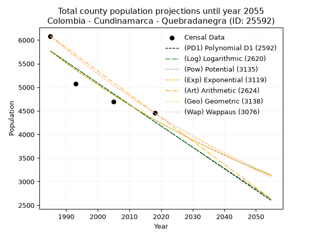
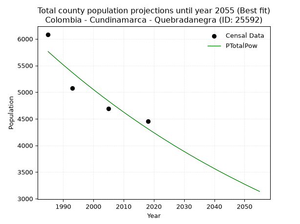
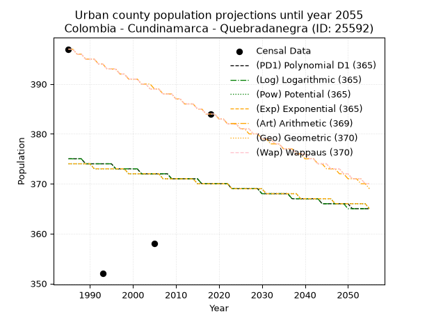
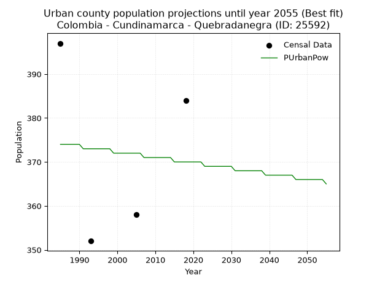
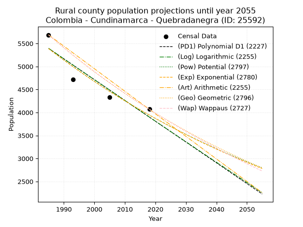
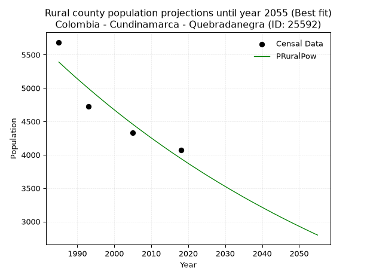

<div align="center">


</div>

# 📜 _“Population and Public Services Demand Projections (PPSD) until Year 2050 for Colombia - Cundinamarca - Quebradanegra (ID: 25592)”_
Keywords: `population` `public-service` `projection` `lineal` `polynomial` `logarithmic` `potential` `exponential` `arithmetic` `geometric` `wappaus` `dane` `colombia` `south-america`

PPSD are analytical estimates used by governments and planners to anticipate future changes in population size, age distribution, and the resulting community needs for utilities, healthcare, education, and infrastructure as sizing future water treatment facilities, electrical grids, and road networks based on spatial growth.

<div align="center">

</img>

</div>


> **General running parameters**: • app_version: _v20260806_. • Python version: _3.14.7_. • Pandas version: _3.0.5_. • NumPy version: _2.5.1_. • Creates, save and include plots into reports (create_plot): _False_. • Projection until year: _2050_. • Process polynomial degree 2 and up: _False_. • Process Wappaus: _True_. • Process Wappaus: _True_. • Set negative values to zero: _True_. • Set infinite values to zero: _True_. • Drop dataset notes: _True_. 
<div align="center">

Maps & GIS Layers: [:earth_americas:Google](http://maps.google.com/maps?q=5.118076171,-74.4801396) [:earth_americas:OSM](https://www.openstreetmap.org/#map=18/5.118076171/-74.4801396&layers=P) [:earth_americas:Bing](https://www.bing.com/maps?cp=5.118076171~-74.4801396&lvl=18) [:earth_americas:Apple](https://maps.apple.com/frame?center=5.118076171%2C-74.4801396&span=0.003%2C0.006) [:earth_americas:GISMobile](https://github.com/rcfdtools/R.GISMobile/blob/main/file/gis/CountyLayer_CO/Readme.md)

</div>


<div align="center">

```geojson
{
  "type": "Feature",
  "geometry": {
    "type": "Point", 
    "coordinates": [-74.4801396, 5.118076171]
  }, 
  "properties": {
    "Name": "Colombia - Cundinamarca - Quebradanegra (ID: 25592)"
  }
}
```

</div>


## 0. Census Data (4 records)

Census data are official statistics collected by a government about the people and housing in a country. They usually include counts of total population, age, sex, race, income, education, and jobs.

📅Global census file: [Population.xlsx](../data/Population.xlsx)

| Source   |   Year |   CountryID | CountryName   |   StateID | StateName    |   CountyID | CountyName    |   PTotal |   PUrban |   PRural |
|:---------|-------:|------------:|:--------------|----------:|:-------------|-----------:|:--------------|---------:|---------:|---------:|
| DANE     |   1985 |          57 | Colombia      |        25 | Cundinamarca |      25592 | Quebradanegra |     6084 |      397 |     5687 |
| DANE     |   1993 |          57 | Colombia      |        25 | Cundinamarca |      25592 | Quebradanegra |     5074 |      352 |     4722 |
| DANE     |   2005 |          57 | Colombia      |        25 | Cundinamarca |      25592 | Quebradanegra |     4691 |      358 |     4333 |
| DANE     |   2018 |          57 | Colombia      |        25 | Cundinamarca |      25592 | Quebradanegra |     4453 |      384 |     4069 |

> 🔥Some records could had specific notes about the registered values or the corresponding urban or rural distribution.

📅[SUI-RUPS](https://www.datos.gov.co/Hacienda-y-Cr-dito-P-blico/Registro-nico-de-Prestadores-de-Servicios-P-blicos/4qkq-csdn/about_data) - Local public utility companies: [RUPS.csv](../data/RUPS.csv)

 | SERVICIO       | ESTADO    | NOMBRE                                                                                | NIT         | DEPARTAMENTO_DOMICILIO   | MUNICIPIO_DOMICILIO   | DIRECCION             |   TELEFONO | EMAIL                   | TIPO_PRESTADOR                 | CLASIFICACION                 |
|:---------------|:----------|:--------------------------------------------------------------------------------------|:------------|:-------------------------|:----------------------|:----------------------|-----------:|:------------------------|:-------------------------------|:------------------------------|
| ACUEDUCTO      | OPERATIVA | UNIDAD DE SERVICIOS PUBLICOS DOMICILIARIOS DEL MUNICIPIO DE QUEBRADANEGRA             | 899999432-8 | CUNDINAMARCA             | QUEBRADANEGRA         | PALACIO MUNICIPAL     |    8408057 | dchernandezm7@gmail.com | MUNICIPIO (PRESTACIÓN DIRECTA) | MENOR O IGUAL A 2500 USUARIOS |
| ALCANTARILLADO | OPERATIVA | UNIDAD DE SERVICIOS PUBLICOS DOMICILIARIOS DEL MUNICIPIO DE QUEBRADANEGRA             | 899999432-8 | CUNDINAMARCA             | QUEBRADANEGRA         | PALACIO MUNICIPAL     |    8408057 | dchernandezm7@gmail.com | MUNICIPIO (PRESTACIÓN DIRECTA) | MENOR O IGUAL A 2500 USUARIOS |
| ACUEDUCTO      | OPERATIVA | ASOCIACION DE AFILIADOS ACUEDUCTO VEREDA SANTA BARBARA MUNICIPIO DE QUEBRADANEGRA     | 900065807-0 | CUNDINAMARCA             | QUEBRADANEGRA         | VEREDA SANTABARBARA   |    2590779 | dchernandezm7@gmail.com | ORGANIZACION AUTORIZADA        | MENOR O IGUAL A 2500 USUARIOS |
| ACUEDUCTO      | OPERATIVA | ASOCIACION DEL ACUEDUCTO VEREDA AGUAFRIA DEL MUNICIPIO DE QUEBRADANEGRA               | 832007160-0 | CUNDINAMARCA             | QUEBRADANEGRA         | VEREDA AGUAFRIA       |    8408056 | dchernandezm7@gmail.com | ORGANIZACION AUTORIZADA        | MENOR O IGUAL A 2500 USUARIOS |
| ACUEDUCTO      | OPERATIVA | ASOCIACIÓN DE AFILIADOS DEL ACUEDUCTO DE LA CONCEPCIÓN DEL MUNICIPIO DE QUEBRADANEGRA | 900110347-7 | CUNDINAMARCA             | QUEBRADANEGRA         | Vereda  La Concepción |    3142138 | claudiakaro@gmail.com   | ORGANIZACION AUTORIZADA        | HASTA 2500 SUSCRIPTORES       |

## 1. Total

### 1.1. Coefficients and Parameters

* (PD1) Polynomial Deg 1: -45.35447611401022, 95795.79084704895 (lineal)
* (Log) Logarithmic: -90870.92119879212, 695786.1002258806
* (Pow) Potential: -17.55977302839753, 61.6685068992166
* (Exp) Exponential: -0.008765094152816623, 207290860775.74344
* (Art) Arithmetic: Year diff. 2018 - 1985 = 33, Population diff. 4453 - 6084 = -1631, Annual growth = -49.42424242424242
* (Geo) Geometric: Year diff. 2018 - 1985 = 33, Population diff. 4453 - 6084 = -1631, Annual growth % = -0.009412523708415166
* (Wap) Wappaus: i = -0.9381084260082078, Condition values only valid for < 200)

<sub>
Wappaus condition values: ['-0.00', '-0.94', '-1.88', '-2.81', '-3.75', '-4.69', '-5.63', '-6.57', '-7.50', '-8.44', '-9.38', '-10.32', '-11.26', '-12.20', '-13.13', '-14.07', '-15.01', '-15.95', '-16.89', '-17.82', '-18.76', '-19.70', '-20.64', '-21.58', '-22.51', '-23.45', '-24.39', '-25.33', '-26.27', '-27.21', '-28.14', '-29.08', '-30.02', '-30.96', '-31.90', '-32.83', '-33.77', '-34.71', '-35.65', '-36.59', '-37.52', '-38.46', '-39.40', '-40.34', '-41.28', '-42.21', '-43.15', '-44.09', '-45.03', '-45.97', '-46.91', '-47.84', '-48.78', '-49.72', '-50.66', '-51.60', '-52.53', '-53.47', '-54.41', '-55.35', '-56.29', '-57.22', '-58.16', '-59.10', '-60.04', '-60.98']
</sub>


### 1.2. Projected Dataset

|   Year |   CountyID |   PTotalPD1 |   PTotalLog |   PTotalPow |   PTotalExp |   PTotalArt |   PTotalGeo |   PTotalWap |
|-------:|-----------:|------------:|------------:|------------:|------------:|------------:|------------:|------------:|
|   1985 |      25592 |        5767 |        5769 |        5762 |        5760 |        6084 |        6084 |        6084 |
|   1986 |      25592 |        5722 |        5723 |        5711 |        5710 |        6035 |        6027 |        6027 |
|   1987 |      25592 |        5676 |        5678 |        5661 |        5660 |        5985 |        5970 |        5971 |
|   1988 |      25592 |        5631 |        5632 |        5611 |        5610 |        5936 |        5914 |        5915 |
|   1989 |      25592 |        5586 |        5586 |        5562 |        5561 |        5886 |        5858 |        5860 |
|   1990 |      25592 |        5540 |        5541 |        5513 |        5513 |        5837 |        5803 |        5805 |
|   1991 |      25592 |        5495 |        5495 |        5465 |        5465 |        5787 |        5748 |        5751 |
|   1992 |      25592 |        5450 |        5449 |        5417 |        5417 |        5738 |        5694 |        5697 |
|   1993 |      25592 |        5404 |        5404 |        5369 |        5370 |        5689 |        5641 |        5644 |
|   1994 |      25592 |        5359 |        5358 |        5322 |        5323 |        5639 |        5588 |        5591 |
|   1995 |      25592 |        5314 |        5313 |        5275 |        5277 |        5590 |        5535 |        5539 |
|   1996 |      25592 |        5268 |        5267 |        5229 |        5230 |        5540 |        5483 |        5487 |
|   1997 |      25592 |        5223 |        5222 |        5183 |        5185 |        5491 |        5431 |        5436 |
|   1998 |      25592 |        5178 |        5176 |        5138 |        5140 |        5441 |        5380 |        5385 |
|   1999 |      25592 |        5132 |        5131 |        5093 |        5095 |        5392 |        5330 |        5334 |
|   2000 |      25592 |        5087 |        5085 |        5049 |        5050 |        5343 |        5279 |        5284 |
|   2001 |      25592 |        5041 |        5040 |        5004 |        5006 |        5293 |        5230 |        5235 |
|   2002 |      25592 |        4996 |        4994 |        4961 |        4963 |        5244 |        5180 |        5185 |
|   2003 |      25592 |        4951 |        4949 |        4917 |        4919 |        5194 |        5132 |        5137 |
|   2004 |      25592 |        4905 |        4904 |        4875 |        4876 |        5145 |        5083 |        5088 |
|   2005 |      25592 |        4860 |        4858 |        4832 |        4834 |        5096 |        5036 |        5040 |
|   2006 |      25592 |        4815 |        4813 |        4790 |        4792 |        5046 |        4988 |        4993 |
|   2007 |      25592 |        4769 |        4768 |        4748 |        4750 |        4997 |        4941 |        4946 |
|   2008 |      25592 |        4724 |        4722 |        4707 |        4708 |        4947 |        4895 |        4899 |
|   2009 |      25592 |        4679 |        4677 |        4666 |        4667 |        4898 |        4849 |        4853 |
|   2010 |      25592 |        4633 |        4632 |        4625 |        4626 |        4848 |        4803 |        4807 |
|   2011 |      25592 |        4588 |        4587 |        4585 |        4586 |        4799 |        4758 |        4761 |
|   2012 |      25592 |        4543 |        4541 |        4545 |        4546 |        4750 |        4713 |        4716 |
|   2013 |      25592 |        4497 |        4496 |        4506 |        4506 |        4700 |        4669 |        4671 |
|   2014 |      25592 |        4452 |        4451 |        4467 |        4467 |        4651 |        4625 |        4627 |
|   2015 |      25592 |        4407 |        4406 |        4428 |        4428 |        4601 |        4581 |        4583 |
|   2016 |      25592 |        4361 |        4361 |        4389 |        4389 |        4552 |        4538 |        4539 |
|   2017 |      25592 |        4316 |        4316 |        4351 |        4351 |        4502 |        4495 |        4496 |
|   2018 |      25592 |        4270 |        4271 |        4314 |        4313 |        4453 |        4453 |        4453 |
|   2019 |      25592 |        4225 |        4226 |        4276 |        4276 |        4404 |        4411 |        4410 |
|   2020 |      25592 |        4180 |        4181 |        4239 |        4238 |        4354 |        4370 |        4368 |
|   2021 |      25592 |        4134 |        4136 |        4203 |        4201 |        4305 |        4328 |        4326 |
|   2022 |      25592 |        4089 |        4091 |        4166 |        4165 |        4255 |        4288 |        4285 |
|   2023 |      25592 |        4044 |        4046 |        4130 |        4128 |        4206 |        4247 |        4243 |
|   2024 |      25592 |        3998 |        4001 |        4094 |        4092 |        4156 |        4207 |        4202 |
|   2025 |      25592 |        3953 |        3956 |        4059 |        4056 |        4107 |        4168 |        4162 |
|   2026 |      25592 |        3908 |        3911 |        4024 |        4021 |        4058 |        4129 |        4121 |
|   2027 |      25592 |        3862 |        3867 |        3989 |        3986 |        4008 |        4090 |        4081 |
|   2028 |      25592 |        3817 |        3822 |        3955 |        3951 |        3959 |        4051 |        4042 |
|   2029 |      25592 |        3772 |        3777 |        3921 |        3917 |        3909 |        4013 |        4002 |
|   2030 |      25592 |        3726 |        3732 |        3887 |        3883 |        3860 |        3975 |        3963 |
|   2031 |      25592 |        3681 |        3687 |        3854 |        3849 |        3810 |        3938 |        3925 |
|   2032 |      25592 |        3635 |        3643 |        3820 |        3815 |        3761 |        3901 |        3886 |
|   2033 |      25592 |        3590 |        3598 |        3788 |        3782 |        3712 |        3864 |        3848 |
|   2034 |      25592 |        3545 |        3553 |        3755 |        3749 |        3662 |        3828 |        3810 |
|   2035 |      25592 |        3499 |        3509 |        3723 |        3716 |        3613 |        3792 |        3772 |
|   2036 |      25592 |        3454 |        3464 |        3691 |        3684 |        3563 |        3756 |        3735 |
|   2037 |      25592 |        3409 |        3419 |        3659 |        3651 |        3514 |        3721 |        3698 |
|   2038 |      25592 |        3363 |        3375 |        3628 |        3620 |        3465 |        3686 |        3661 |
|   2039 |      25592 |        3318 |        3330 |        3597 |        3588 |        3415 |        3651 |        3625 |
|   2040 |      25592 |        3273 |        3286 |        3566 |        3557 |        3366 |        3617 |        3589 |
|   2041 |      25592 |        3227 |        3241 |        3535 |        3526 |        3316 |        3583 |        3553 |
|   2042 |      25592 |        3182 |        3197 |        3505 |        3495 |        3267 |        3549 |        3517 |
|   2043 |      25592 |        3137 |        3152 |        3475 |        3464 |        3217 |        3515 |        3482 |
|   2044 |      25592 |        3091 |        3108 |        3445 |        3434 |        3168 |        3482 |        3447 |
|   2045 |      25592 |        3046 |        3063 |        3416 |        3404 |        3119 |        3450 |        3412 |
|   2046 |      25592 |        3001 |        3019 |        3387 |        3375 |        3069 |        3417 |        3377 |
|   2047 |      25592 |        2955 |        2974 |        3358 |        3345 |        3020 |        3385 |        3343 |
|   2048 |      25592 |        2910 |        2930 |        3329 |        3316 |        2970 |        3353 |        3308 |
|   2049 |      25592 |        2864 |        2886 |        3301 |        3287 |        2921 |        3321 |        3275 |
|   2050 |      25592 |        2819 |        2841 |        3272 |        3258 |        2871 |        3290 |        3241 |
<div align="center">

</img>

</div>


### 1.3. Best fit with absolute and relative error (%)

Relative error puts that difference into context by dividing the absolute error by the true value, creating a unitless ratio or percentage that shows the scale of the mistake.

Absolute and relative error

|   Year | Source   |   CountryID | CountryName   |   StateID | StateName    |   CountyID_x | CountyName    |   PTotal |   PUrban |   PRural |   CountyID_y |   PTotalPD1 |   PTotalLog |   PTotalPow |   PTotalExp |   PTotalArt |   PTotalGeo |   PTotalWap |   PTotalPD1AbsError |   PTotalLogAbsError |   PTotalPowAbsError |   PTotalExpAbsError |   PTotalArtAbsError |   PTotalGeoAbsError |   PTotalWapAbsError |   PTotalPD1RelError |   PTotalLogRelError |   PTotalPowRelError |   PTotalExpRelError |   PTotalArtRelError |   PTotalGeoRelError |   PTotalWapRelError |
|-------:|:---------|------------:|:--------------|----------:|:-------------|-------------:|:--------------|---------:|---------:|---------:|-------------:|------------:|------------:|------------:|------------:|------------:|------------:|------------:|--------------------:|--------------------:|--------------------:|--------------------:|--------------------:|--------------------:|--------------------:|--------------------:|--------------------:|--------------------:|--------------------:|--------------------:|--------------------:|--------------------:|
|   1985 | DANE     |          57 | Colombia      |        25 | Cundinamarca |        25592 | Quebradanegra |     6084 |      397 |     5687 |        25592 |        5767 |        5769 |        5762 |        5760 |        6084 |        6084 |        6084 |                 317 |                 315 |                 322 |                 324 |                   0 |                   0 |                   0 |             5.21039 |             5.17751 |             5.29257 |             5.32544 |             0       |             0       |             0       |
|   1993 | DANE     |          57 | Colombia      |        25 | Cundinamarca |        25592 | Quebradanegra |     5074 |      352 |     4722 |        25592 |        5404 |        5404 |        5369 |        5370 |        5689 |        5641 |        5644 |                 330 |                 330 |                 295 |                 296 |                 615 |                 567 |                 570 |             6.50374 |             6.50374 |             5.81395 |             5.83366 |            12.1206  |            11.1746  |            11.2337  |
|   2005 | DANE     |          57 | Colombia      |        25 | Cundinamarca |        25592 | Quebradanegra |     4691 |      358 |     4333 |        25592 |        4860 |        4858 |        4832 |        4834 |        5096 |        5036 |        5040 |                 169 |                 167 |                 141 |                 143 |                 405 |                 345 |                 349 |             3.60264 |             3.56001 |             3.00576 |             3.04839 |             8.63355 |             7.35451 |             7.43978 |
|   2018 | DANE     |          57 | Colombia      |        25 | Cundinamarca |        25592 | Quebradanegra |     4453 |      384 |     4069 |        25592 |        4270 |        4271 |        4314 |        4313 |        4453 |        4453 |        4453 |                 183 |                 182 |                 139 |                 140 |                   0 |                   0 |                   0 |             4.10959 |             4.08713 |             3.12149 |             3.14395 |             0       |             0       |             0       |

Relative error mean

| Method    |   RelError | Best   |
|:----------|-----------:|:-------|
| PTotalPD1 |    4.85659 |        |
| PTotalLog |    4.8321  |        |
| PTotalPow |    4.30844 | True   |
| PTotalExp |    4.33786 |        |
| PTotalArt |    5.18854 |        |
| PTotalGeo |    4.63228 |        |
| PTotalWap |    4.66838 |        |

💙Best method: _**PTotalPow**_
<div align="center">

</img>

</div>


### 1.4. Fresh water supply demand in liters per capita per day (lpcd)

The fresh water supply demand typically ranges from 100 to 300 liters per capita per day (lpcd) for standard domestic and municipal planning, though absolute survival minimums set by the World Health Organization are as low as 7.5 to 20 liters per day, and total consumption in high-income nations can exceed 400 liters.

> `CZ`: Level in meters above the sea level (masl)<br> `WS`: Fresh water supply demand in liters per capita per day (lpcd or l/h/d)<br> `WSAll`: Zonal fresh water supply demand in liters per second (l/s)<br> `A`: Zonal area in square meters<br> `DP`: Population density (people/hectare or p/ha)

Reference values (RAS Colombia)

|    CZ |   WS |
|------:|-----:|
|  1000 |  120 |
|  2000 |  130 |
| 99999 |  140 |

County shapefile geometry properties and water supply values

|   CountyID |      ATotal |   CZTotal |   WSTotal |
|-----------:|------------:|----------:|----------:|
|      25592 | 7.97774e+07 |      1175 |       130 |

Projected values for best method: PTotalPow

|   CountyID |   Year |   PTotalPow |   DPTotal |   WSTotal |   WSTotalAll |
|-----------:|-------:|------------:|----------:|----------:|-------------:|
|      25592 |   1985 |        5762 |      0.72 |       130 |      8.66968 |
|      25592 |   1986 |        5711 |      0.72 |       130 |      8.59294 |
|      25592 |   1987 |        5661 |      0.71 |       130 |      8.51771 |
|      25592 |   1988 |        5611 |      0.7  |       130 |      8.44248 |
|      25592 |   1989 |        5562 |      0.7  |       130 |      8.36875 |
|      25592 |   1990 |        5513 |      0.69 |       130 |      8.29502 |
|      25592 |   1991 |        5465 |      0.69 |       130 |      8.2228  |
|      25592 |   1992 |        5417 |      0.68 |       130 |      8.15058 |
|      25592 |   1993 |        5369 |      0.67 |       130 |      8.07836 |
|      25592 |   1994 |        5322 |      0.67 |       130 |      8.00764 |
|      25592 |   1995 |        5275 |      0.66 |       130 |      7.93692 |
|      25592 |   1996 |        5229 |      0.66 |       130 |      7.86771 |
|      25592 |   1997 |        5183 |      0.65 |       130 |      7.7985  |
|      25592 |   1998 |        5138 |      0.64 |       130 |      7.73079 |
|      25592 |   1999 |        5093 |      0.64 |       130 |      7.66308 |
|      25592 |   2000 |        5049 |      0.63 |       130 |      7.59687 |
|      25592 |   2001 |        5004 |      0.63 |       130 |      7.52917 |
|      25592 |   2002 |        4961 |      0.62 |       130 |      7.46447 |
|      25592 |   2003 |        4917 |      0.62 |       130 |      7.39826 |
|      25592 |   2004 |        4875 |      0.61 |       130 |      7.33507 |
|      25592 |   2005 |        4832 |      0.61 |       130 |      7.27037 |
|      25592 |   2006 |        4790 |      0.6  |       130 |      7.20718 |
|      25592 |   2007 |        4748 |      0.6  |       130 |      7.14398 |
|      25592 |   2008 |        4707 |      0.59 |       130 |      7.08229 |
|      25592 |   2009 |        4666 |      0.58 |       130 |      7.0206  |
|      25592 |   2010 |        4625 |      0.58 |       130 |      6.95891 |
|      25592 |   2011 |        4585 |      0.57 |       130 |      6.89873 |
|      25592 |   2012 |        4545 |      0.57 |       130 |      6.83854 |
|      25592 |   2013 |        4506 |      0.56 |       130 |      6.77986 |
|      25592 |   2014 |        4467 |      0.56 |       130 |      6.72118 |
|      25592 |   2015 |        4428 |      0.56 |       130 |      6.6625  |
|      25592 |   2016 |        4389 |      0.55 |       130 |      6.60382 |
|      25592 |   2017 |        4351 |      0.55 |       130 |      6.54664 |
|      25592 |   2018 |        4314 |      0.54 |       130 |      6.49097 |
|      25592 |   2019 |        4276 |      0.54 |       130 |      6.4338  |
|      25592 |   2020 |        4239 |      0.53 |       130 |      6.37812 |
|      25592 |   2021 |        4203 |      0.53 |       130 |      6.32396 |
|      25592 |   2022 |        4166 |      0.52 |       130 |      6.26829 |
|      25592 |   2023 |        4130 |      0.52 |       130 |      6.21412 |
|      25592 |   2024 |        4094 |      0.51 |       130 |      6.15995 |
|      25592 |   2025 |        4059 |      0.51 |       130 |      6.10729 |
|      25592 |   2026 |        4024 |      0.5  |       130 |      6.05463 |
|      25592 |   2027 |        3989 |      0.5  |       130 |      6.00197 |
|      25592 |   2028 |        3955 |      0.5  |       130 |      5.95081 |
|      25592 |   2029 |        3921 |      0.49 |       130 |      5.89965 |
|      25592 |   2030 |        3887 |      0.49 |       130 |      5.8485  |
|      25592 |   2031 |        3854 |      0.48 |       130 |      5.79884 |
|      25592 |   2032 |        3820 |      0.48 |       130 |      5.74769 |
|      25592 |   2033 |        3788 |      0.47 |       130 |      5.69954 |
|      25592 |   2034 |        3755 |      0.47 |       130 |      5.64988 |
|      25592 |   2035 |        3723 |      0.47 |       130 |      5.60174 |
|      25592 |   2036 |        3691 |      0.46 |       130 |      5.55359 |
|      25592 |   2037 |        3659 |      0.46 |       130 |      5.50544 |
|      25592 |   2038 |        3628 |      0.45 |       130 |      5.4588  |
|      25592 |   2039 |        3597 |      0.45 |       130 |      5.41215 |
|      25592 |   2040 |        3566 |      0.45 |       130 |      5.36551 |
|      25592 |   2041 |        3535 |      0.44 |       130 |      5.31887 |
|      25592 |   2042 |        3505 |      0.44 |       130 |      5.27373 |
|      25592 |   2043 |        3475 |      0.44 |       130 |      5.22859 |
|      25592 |   2044 |        3445 |      0.43 |       130 |      5.18345 |
|      25592 |   2045 |        3416 |      0.43 |       130 |      5.13981 |
|      25592 |   2046 |        3387 |      0.42 |       130 |      5.09618 |
|      25592 |   2047 |        3358 |      0.42 |       130 |      5.05255 |
|      25592 |   2048 |        3329 |      0.42 |       130 |      5.00891 |
|      25592 |   2049 |        3301 |      0.41 |       130 |      4.96678 |
|      25592 |   2050 |        3272 |      0.41 |       130 |      4.92315 |

## 2. Urban

### 2.1. Coefficients and Parameters

* (PD1) Polynomial Deg 1: -0.14411882778002438, 661.0236852669938 (lineal)
* (Log) Logarithmic: -294.9147540958164, 2614.3994091808217
* (Pow) Potential: -0.6919615527862196, 4.855104417462357
* (Exp) Exponential: -0.0003370811878448687, 730.6484260971794
* (Art) Arithmetic: Year diff. 2018 - 1985 = 33, Population diff. 384 - 397 = -13, Annual growth = -0.3939393939393939
* (Geo) Geometric: Year diff. 2018 - 1985 = 33, Population diff. 384 - 397 = -13, Annual growth % = -0.0010083920821485348
* (Wap) Wappaus: i = -0.10088076669382687, Condition values only valid for < 200)

<sub>
Wappaus condition values: ['-0.00', '-0.10', '-0.20', '-0.30', '-0.40', '-0.50', '-0.61', '-0.71', '-0.81', '-0.91', '-1.01', '-1.11', '-1.21', '-1.31', '-1.41', '-1.51', '-1.61', '-1.71', '-1.82', '-1.92', '-2.02', '-2.12', '-2.22', '-2.32', '-2.42', '-2.52', '-2.62', '-2.72', '-2.82', '-2.93', '-3.03', '-3.13', '-3.23', '-3.33', '-3.43', '-3.53', '-3.63', '-3.73', '-3.83', '-3.93', '-4.04', '-4.14', '-4.24', '-4.34', '-4.44', '-4.54', '-4.64', '-4.74', '-4.84', '-4.94', '-5.04', '-5.14', '-5.25', '-5.35', '-5.45', '-5.55', '-5.65', '-5.75', '-5.85', '-5.95', '-6.05', '-6.15', '-6.25', '-6.36', '-6.46', '-6.56']
</sub>


### 2.2. Projected Dataset

|   Year |   CountyID |   PUrbanPD1 |   PUrbanLog |   PUrbanPow |   PUrbanExp |   PUrbanArt |   PUrbanGeo |   PUrbanWap |
|-------:|-----------:|------------:|------------:|------------:|------------:|------------:|------------:|------------:|
|   1985 |      25592 |         375 |         375 |         374 |         374 |         397 |         397 |         397 |
|   1986 |      25592 |         375 |         375 |         374 |         374 |         397 |         397 |         397 |
|   1987 |      25592 |         375 |         375 |         374 |         374 |         396 |         396 |         396 |
|   1988 |      25592 |         375 |         375 |         374 |         374 |         396 |         396 |         396 |
|   1989 |      25592 |         374 |         374 |         374 |         374 |         395 |         395 |         395 |
|   1990 |      25592 |         374 |         374 |         374 |         374 |         395 |         395 |         395 |
|   1991 |      25592 |         374 |         374 |         373 |         373 |         395 |         395 |         395 |
|   1992 |      25592 |         374 |         374 |         373 |         373 |         394 |         394 |         394 |
|   1993 |      25592 |         374 |         374 |         373 |         373 |         394 |         394 |         394 |
|   1994 |      25592 |         374 |         374 |         373 |         373 |         393 |         393 |         393 |
|   1995 |      25592 |         374 |         374 |         373 |         373 |         393 |         393 |         393 |
|   1996 |      25592 |         373 |         373 |         373 |         373 |         393 |         393 |         393 |
|   1997 |      25592 |         373 |         373 |         373 |         373 |         392 |         392 |         392 |
|   1998 |      25592 |         373 |         373 |         373 |         373 |         392 |         392 |         392 |
|   1999 |      25592 |         373 |         373 |         372 |         372 |         391 |         391 |         391 |
|   2000 |      25592 |         373 |         373 |         372 |         372 |         391 |         391 |         391 |
|   2001 |      25592 |         373 |         373 |         372 |         372 |         391 |         391 |         391 |
|   2002 |      25592 |         372 |         372 |         372 |         372 |         390 |         390 |         390 |
|   2003 |      25592 |         372 |         372 |         372 |         372 |         390 |         390 |         390 |
|   2004 |      25592 |         372 |         372 |         372 |         372 |         390 |         389 |         389 |
|   2005 |      25592 |         372 |         372 |         372 |         372 |         389 |         389 |         389 |
|   2006 |      25592 |         372 |         372 |         372 |         372 |         389 |         389 |         389 |
|   2007 |      25592 |         372 |         372 |         371 |         371 |         388 |         388 |         388 |
|   2008 |      25592 |         372 |         372 |         371 |         371 |         388 |         388 |         388 |
|   2009 |      25592 |         371 |         371 |         371 |         371 |         388 |         388 |         388 |
|   2010 |      25592 |         371 |         371 |         371 |         371 |         387 |         387 |         387 |
|   2011 |      25592 |         371 |         371 |         371 |         371 |         387 |         387 |         387 |
|   2012 |      25592 |         371 |         371 |         371 |         371 |         386 |         386 |         386 |
|   2013 |      25592 |         371 |         371 |         371 |         371 |         386 |         386 |         386 |
|   2014 |      25592 |         371 |         371 |         371 |         371 |         386 |         386 |         386 |
|   2015 |      25592 |         371 |         371 |         370 |         370 |         385 |         385 |         385 |
|   2016 |      25592 |         370 |         370 |         370 |         370 |         385 |         385 |         385 |
|   2017 |      25592 |         370 |         370 |         370 |         370 |         384 |         384 |         384 |
|   2018 |      25592 |         370 |         370 |         370 |         370 |         384 |         384 |         384 |
|   2019 |      25592 |         370 |         370 |         370 |         370 |         384 |         384 |         384 |
|   2020 |      25592 |         370 |         370 |         370 |         370 |         383 |         383 |         383 |
|   2021 |      25592 |         370 |         370 |         370 |         370 |         383 |         383 |         383 |
|   2022 |      25592 |         370 |         370 |         370 |         370 |         382 |         382 |         382 |
|   2023 |      25592 |         369 |         369 |         369 |         369 |         382 |         382 |         382 |
|   2024 |      25592 |         369 |         369 |         369 |         369 |         382 |         382 |         382 |
|   2025 |      25592 |         369 |         369 |         369 |         369 |         381 |         381 |         381 |
|   2026 |      25592 |         369 |         369 |         369 |         369 |         381 |         381 |         381 |
|   2027 |      25592 |         369 |         369 |         369 |         369 |         380 |         381 |         381 |
|   2028 |      25592 |         369 |         369 |         369 |         369 |         380 |         380 |         380 |
|   2029 |      25592 |         369 |         369 |         369 |         369 |         380 |         380 |         380 |
|   2030 |      25592 |         368 |         368 |         369 |         369 |         379 |         379 |         379 |
|   2031 |      25592 |         368 |         368 |         368 |         368 |         379 |         379 |         379 |
|   2032 |      25592 |         368 |         368 |         368 |         368 |         378 |         379 |         379 |
|   2033 |      25592 |         368 |         368 |         368 |         368 |         378 |         378 |         378 |
|   2034 |      25592 |         368 |         368 |         368 |         368 |         378 |         378 |         378 |
|   2035 |      25592 |         368 |         368 |         368 |         368 |         377 |         377 |         377 |
|   2036 |      25592 |         368 |         368 |         368 |         368 |         377 |         377 |         377 |
|   2037 |      25592 |         367 |         367 |         368 |         368 |         377 |         377 |         377 |
|   2038 |      25592 |         367 |         367 |         368 |         368 |         376 |         376 |         376 |
|   2039 |      25592 |         367 |         367 |         367 |         367 |         376 |         376 |         376 |
|   2040 |      25592 |         367 |         367 |         367 |         367 |         375 |         376 |         376 |
|   2041 |      25592 |         367 |         367 |         367 |         367 |         375 |         375 |         375 |
|   2042 |      25592 |         367 |         367 |         367 |         367 |         375 |         375 |         375 |
|   2043 |      25592 |         367 |         367 |         367 |         367 |         374 |         374 |         374 |
|   2044 |      25592 |         366 |         366 |         367 |         367 |         374 |         374 |         374 |
|   2045 |      25592 |         366 |         366 |         367 |         367 |         373 |         374 |         374 |
|   2046 |      25592 |         366 |         366 |         367 |         367 |         373 |         373 |         373 |
|   2047 |      25592 |         366 |         366 |         366 |         366 |         373 |         373 |         373 |
|   2048 |      25592 |         366 |         366 |         366 |         366 |         372 |         373 |         373 |
|   2049 |      25592 |         366 |         366 |         366 |         366 |         372 |         372 |         372 |
|   2050 |      25592 |         366 |         365 |         366 |         366 |         371 |         372 |         372 |
<div align="center">

</img>

</div>


### 2.3. Best fit with absolute and relative error (%)

Relative error puts that difference into context by dividing the absolute error by the true value, creating a unitless ratio or percentage that shows the scale of the mistake.

Absolute and relative error

|   Year | Source   |   CountryID | CountryName   |   StateID | StateName    |   CountyID_x | CountyName    |   PTotal |   PUrban |   PRural |   CountyID_y |   PUrbanPD1 |   PUrbanLog |   PUrbanPow |   PUrbanExp |   PUrbanArt |   PUrbanGeo |   PUrbanWap |   PUrbanPD1AbsError |   PUrbanLogAbsError |   PUrbanPowAbsError |   PUrbanExpAbsError |   PUrbanArtAbsError |   PUrbanGeoAbsError |   PUrbanWapAbsError |   PUrbanPD1RelError |   PUrbanLogRelError |   PUrbanPowRelError |   PUrbanExpRelError |   PUrbanArtRelError |   PUrbanGeoRelError |   PUrbanWapRelError |
|-------:|:---------|------------:|:--------------|----------:|:-------------|-------------:|:--------------|---------:|---------:|---------:|-------------:|------------:|------------:|------------:|------------:|------------:|------------:|------------:|--------------------:|--------------------:|--------------------:|--------------------:|--------------------:|--------------------:|--------------------:|--------------------:|--------------------:|--------------------:|--------------------:|--------------------:|--------------------:|--------------------:|
|   1985 | DANE     |          57 | Colombia      |        25 | Cundinamarca |        25592 | Quebradanegra |     6084 |      397 |     5687 |        25592 |         375 |         375 |         374 |         374 |         397 |         397 |         397 |                  22 |                  22 |                  23 |                  23 |                   0 |                   0 |                   0 |             5.54156 |             5.54156 |             5.79345 |             5.79345 |             0       |             0       |             0       |
|   1993 | DANE     |          57 | Colombia      |        25 | Cundinamarca |        25592 | Quebradanegra |     5074 |      352 |     4722 |        25592 |         374 |         374 |         373 |         373 |         394 |         394 |         394 |                  22 |                  22 |                  21 |                  21 |                  42 |                  42 |                  42 |             6.25    |             6.25    |             5.96591 |             5.96591 |            11.9318  |            11.9318  |            11.9318  |
|   2005 | DANE     |          57 | Colombia      |        25 | Cundinamarca |        25592 | Quebradanegra |     4691 |      358 |     4333 |        25592 |         372 |         372 |         372 |         372 |         389 |         389 |         389 |                  14 |                  14 |                  14 |                  14 |                  31 |                  31 |                  31 |             3.91061 |             3.91061 |             3.91061 |             3.91061 |             8.65922 |             8.65922 |             8.65922 |
|   2018 | DANE     |          57 | Colombia      |        25 | Cundinamarca |        25592 | Quebradanegra |     4453 |      384 |     4069 |        25592 |         370 |         370 |         370 |         370 |         384 |         384 |         384 |                  14 |                  14 |                  14 |                  14 |                   0 |                   0 |                   0 |             3.64583 |             3.64583 |             3.64583 |             3.64583 |             0       |             0       |             0       |

Relative error mean

| Method    |   RelError | Best   |
|:----------|-----------:|:-------|
| PUrbanPD1 |    4.837   |        |
| PUrbanLog |    4.837   |        |
| PUrbanPow |    4.82895 | True   |
| PUrbanExp |    4.82895 | True   |
| PUrbanArt |    5.14776 |        |
| PUrbanGeo |    5.14776 |        |
| PUrbanWap |    5.14776 |        |

💙Best method: _**PUrbanPow**_
<div align="center">

</img>

</div>


### 2.4. Fresh water supply demand in liters per capita per day (lpcd)

The fresh water supply demand typically ranges from 100 to 300 liters per capita per day (lpcd) for standard domestic and municipal planning, though absolute survival minimums set by the World Health Organization are as low as 7.5 to 20 liters per day, and total consumption in high-income nations can exceed 400 liters.

> `CZ`: Level in meters above the sea level (masl)<br> `WS`: Fresh water supply demand in liters per capita per day (lpcd or l/h/d)<br> `WSAll`: Zonal fresh water supply demand in liters per second (l/s)<br> `A`: Zonal area in square meters<br> `DP`: Population density (people/hectare or p/ha)

Reference values (RAS Colombia)

|    CZ |   WS |
|------:|-----:|
|  1000 |  120 |
|  2000 |  130 |
| 99999 |  140 |

County shapefile geometry properties and water supply values

|   CountyID |   AUrban |   CZUrban |   WSUrban |
|-----------:|---------:|----------:|----------:|
|      25592 |   185279 |   1366.35 |       130 |

Projected values for best method: PUrbanPow

|   CountyID |   Year |   PUrbanPow |   DPUrban |   WSUrban |   WSUrbanAll |
|-----------:|-------:|------------:|----------:|----------:|-------------:|
|      25592 |   1985 |         374 |     20.19 |       130 |     0.562731 |
|      25592 |   1986 |         374 |     20.19 |       130 |     0.562731 |
|      25592 |   1987 |         374 |     20.19 |       130 |     0.562731 |
|      25592 |   1988 |         374 |     20.19 |       130 |     0.562731 |
|      25592 |   1989 |         374 |     20.19 |       130 |     0.562731 |
|      25592 |   1990 |         374 |     20.19 |       130 |     0.562731 |
|      25592 |   1991 |         373 |     20.13 |       130 |     0.561227 |
|      25592 |   1992 |         373 |     20.13 |       130 |     0.561227 |
|      25592 |   1993 |         373 |     20.13 |       130 |     0.561227 |
|      25592 |   1994 |         373 |     20.13 |       130 |     0.561227 |
|      25592 |   1995 |         373 |     20.13 |       130 |     0.561227 |
|      25592 |   1996 |         373 |     20.13 |       130 |     0.561227 |
|      25592 |   1997 |         373 |     20.13 |       130 |     0.561227 |
|      25592 |   1998 |         373 |     20.13 |       130 |     0.561227 |
|      25592 |   1999 |         372 |     20.08 |       130 |     0.559722 |
|      25592 |   2000 |         372 |     20.08 |       130 |     0.559722 |
|      25592 |   2001 |         372 |     20.08 |       130 |     0.559722 |
|      25592 |   2002 |         372 |     20.08 |       130 |     0.559722 |
|      25592 |   2003 |         372 |     20.08 |       130 |     0.559722 |
|      25592 |   2004 |         372 |     20.08 |       130 |     0.559722 |
|      25592 |   2005 |         372 |     20.08 |       130 |     0.559722 |
|      25592 |   2006 |         372 |     20.08 |       130 |     0.559722 |
|      25592 |   2007 |         371 |     20.02 |       130 |     0.558218 |
|      25592 |   2008 |         371 |     20.02 |       130 |     0.558218 |
|      25592 |   2009 |         371 |     20.02 |       130 |     0.558218 |
|      25592 |   2010 |         371 |     20.02 |       130 |     0.558218 |
|      25592 |   2011 |         371 |     20.02 |       130 |     0.558218 |
|      25592 |   2012 |         371 |     20.02 |       130 |     0.558218 |
|      25592 |   2013 |         371 |     20.02 |       130 |     0.558218 |
|      25592 |   2014 |         371 |     20.02 |       130 |     0.558218 |
|      25592 |   2015 |         370 |     19.97 |       130 |     0.556713 |
|      25592 |   2016 |         370 |     19.97 |       130 |     0.556713 |
|      25592 |   2017 |         370 |     19.97 |       130 |     0.556713 |
|      25592 |   2018 |         370 |     19.97 |       130 |     0.556713 |
|      25592 |   2019 |         370 |     19.97 |       130 |     0.556713 |
|      25592 |   2020 |         370 |     19.97 |       130 |     0.556713 |
|      25592 |   2021 |         370 |     19.97 |       130 |     0.556713 |
|      25592 |   2022 |         370 |     19.97 |       130 |     0.556713 |
|      25592 |   2023 |         369 |     19.92 |       130 |     0.555208 |
|      25592 |   2024 |         369 |     19.92 |       130 |     0.555208 |
|      25592 |   2025 |         369 |     19.92 |       130 |     0.555208 |
|      25592 |   2026 |         369 |     19.92 |       130 |     0.555208 |
|      25592 |   2027 |         369 |     19.92 |       130 |     0.555208 |
|      25592 |   2028 |         369 |     19.92 |       130 |     0.555208 |
|      25592 |   2029 |         369 |     19.92 |       130 |     0.555208 |
|      25592 |   2030 |         369 |     19.92 |       130 |     0.555208 |
|      25592 |   2031 |         368 |     19.86 |       130 |     0.553704 |
|      25592 |   2032 |         368 |     19.86 |       130 |     0.553704 |
|      25592 |   2033 |         368 |     19.86 |       130 |     0.553704 |
|      25592 |   2034 |         368 |     19.86 |       130 |     0.553704 |
|      25592 |   2035 |         368 |     19.86 |       130 |     0.553704 |
|      25592 |   2036 |         368 |     19.86 |       130 |     0.553704 |
|      25592 |   2037 |         368 |     19.86 |       130 |     0.553704 |
|      25592 |   2038 |         368 |     19.86 |       130 |     0.553704 |
|      25592 |   2039 |         367 |     19.81 |       130 |     0.552199 |
|      25592 |   2040 |         367 |     19.81 |       130 |     0.552199 |
|      25592 |   2041 |         367 |     19.81 |       130 |     0.552199 |
|      25592 |   2042 |         367 |     19.81 |       130 |     0.552199 |
|      25592 |   2043 |         367 |     19.81 |       130 |     0.552199 |
|      25592 |   2044 |         367 |     19.81 |       130 |     0.552199 |
|      25592 |   2045 |         367 |     19.81 |       130 |     0.552199 |
|      25592 |   2046 |         367 |     19.81 |       130 |     0.552199 |
|      25592 |   2047 |         366 |     19.75 |       130 |     0.550694 |
|      25592 |   2048 |         366 |     19.75 |       130 |     0.550694 |
|      25592 |   2049 |         366 |     19.75 |       130 |     0.550694 |
|      25592 |   2050 |         366 |     19.75 |       130 |     0.550694 |

## 3. Rural

### 3.1. Coefficients and Parameters

* (PD1) Polynomial Deg 1: -45.21035728623021, 95134.76716178197 (lineal)
* (Log) Logarithmic: -90576.00644469637, 693171.7008167001
* (Pow) Potential: -18.93345582758477, 66.16959494392601
* (Exp) Exponential: -0.009451524237757837, 757420800636.4507
* (Art) Arithmetic: Year diff. 2018 - 1985 = 33, Population diff. 4069 - 5687 = -1618, Annual growth = -49.03030303030303
* (Geo) Geometric: Year diff. 2018 - 1985 = 33, Population diff. 4069 - 5687 = -1618, Annual growth % = -0.010093731046780907
* (Wap) Wappaus: i = -1.0051312634338465, Condition values only valid for < 200)

<sub>
Wappaus condition values: ['-0.00', '-1.01', '-2.01', '-3.02', '-4.02', '-5.03', '-6.03', '-7.04', '-8.04', '-9.05', '-10.05', '-11.06', '-12.06', '-13.07', '-14.07', '-15.08', '-16.08', '-17.09', '-18.09', '-19.10', '-20.10', '-21.11', '-22.11', '-23.12', '-24.12', '-25.13', '-26.13', '-27.14', '-28.14', '-29.15', '-30.15', '-31.16', '-32.16', '-33.17', '-34.17', '-35.18', '-36.18', '-37.19', '-38.19', '-39.20', '-40.21', '-41.21', '-42.22', '-43.22', '-44.23', '-45.23', '-46.24', '-47.24', '-48.25', '-49.25', '-50.26', '-51.26', '-52.27', '-53.27', '-54.28', '-55.28', '-56.29', '-57.29', '-58.30', '-59.30', '-60.31', '-61.31', '-62.32', '-63.32', '-64.33', '-65.33']
</sub>


### 3.2. Projected Dataset

|   Year |   CountyID |   PRuralPD1 |   PRuralLog |   PRuralPow |   PRuralExp |   PRuralArt |   PRuralGeo |   PRuralWap |
|-------:|-----------:|------------:|------------:|------------:|------------:|------------:|------------:|------------:|
|   1985 |      25592 |        5392 |        5394 |        5390 |        5388 |        5687 |        5687 |        5687 |
|   1986 |      25592 |        5347 |        5349 |        5339 |        5337 |        5638 |        5630 |        5630 |
|   1987 |      25592 |        5302 |        5303 |        5288 |        5287 |        5589 |        5573 |        5574 |
|   1988 |      25592 |        5257 |        5257 |        5238 |        5237 |        5540 |        5517 |        5518 |
|   1989 |      25592 |        5211 |        5212 |        5188 |        5188 |        5491 |        5461 |        5463 |
|   1990 |      25592 |        5166 |        5166 |        5139 |        5139 |        5442 |        5406 |        5408 |
|   1991 |      25592 |        5121 |        5121 |        5091 |        5091 |        5393 |        5351 |        5354 |
|   1992 |      25592 |        5076 |        5075 |        5043 |        5043 |        5344 |        5297 |        5300 |
|   1993 |      25592 |        5031 |        5030 |        4995 |        4996 |        5295 |        5244 |        5247 |
|   1994 |      25592 |        4985 |        4984 |        4948 |        4949 |        5246 |        5191 |        5195 |
|   1995 |      25592 |        4940 |        4939 |        4901 |        4902 |        5197 |        5138 |        5143 |
|   1996 |      25592 |        4895 |        4894 |        4855 |        4856 |        5148 |        5086 |        5091 |
|   1997 |      25592 |        4850 |        4848 |        4809 |        4810 |        5099 |        5035 |        5040 |
|   1998 |      25592 |        4804 |        4803 |        4763 |        4765 |        5050 |        4984 |        4989 |
|   1999 |      25592 |        4759 |        4758 |        4718 |        4720 |        5001 |        4934 |        4939 |
|   2000 |      25592 |        4714 |        4712 |        4674 |        4676 |        4952 |        4884 |        4890 |
|   2001 |      25592 |        4669 |        4667 |        4630 |        4632 |        4903 |        4835 |        4840 |
|   2002 |      25592 |        4624 |        4622 |        4586 |        4588 |        4853 |        4786 |        4792 |
|   2003 |      25592 |        4578 |        4577 |        4543 |        4545 |        4804 |        4738 |        4743 |
|   2004 |      25592 |        4533 |        4531 |        4500 |        4502 |        4755 |        4690 |        4696 |
|   2005 |      25592 |        4488 |        4486 |        4458 |        4460 |        4706 |        4643 |        4648 |
|   2006 |      25592 |        4443 |        4441 |        4416 |        4418 |        4657 |        4596 |        4601 |
|   2007 |      25592 |        4398 |        4396 |        4375 |        4376 |        4608 |        4549 |        4555 |
|   2008 |      25592 |        4352 |        4351 |        4334 |        4335 |        4559 |        4503 |        4509 |
|   2009 |      25592 |        4307 |        4306 |        4293 |        4294 |        4510 |        4458 |        4463 |
|   2010 |      25592 |        4262 |        4261 |        4253 |        4254 |        4461 |        4413 |        4417 |
|   2011 |      25592 |        4217 |        4216 |        4213 |        4214 |        4412 |        4368 |        4373 |
|   2012 |      25592 |        4172 |        4170 |        4174 |        4174 |        4363 |        4324 |        4328 |
|   2013 |      25592 |        4126 |        4125 |        4134 |        4135 |        4314 |        4281 |        4284 |
|   2014 |      25592 |        4081 |        4080 |        4096 |        4096 |        4265 |        4238 |        4240 |
|   2015 |      25592 |        4036 |        4036 |        4057 |        4058 |        4216 |        4195 |        4197 |
|   2016 |      25592 |        3991 |        3991 |        4019 |        4019 |        4167 |        4152 |        4154 |
|   2017 |      25592 |        3945 |        3946 |        3982 |        3982 |        4118 |        4110 |        4111 |
|   2018 |      25592 |        3900 |        3901 |        3945 |        3944 |        4069 |        4069 |        4069 |
|   2019 |      25592 |        3855 |        3856 |        3908 |        3907 |        4020 |        4028 |        4027 |
|   2020 |      25592 |        3810 |        3811 |        3871 |        3870 |        3971 |        3987 |        3986 |
|   2021 |      25592 |        3765 |        3766 |        3835 |        3834 |        3922 |        3947 |        3944 |
|   2022 |      25592 |        3719 |        3721 |        3800 |        3798 |        3873 |        3907 |        3904 |
|   2023 |      25592 |        3674 |        3677 |        3764 |        3762 |        3824 |        3868 |        3863 |
|   2024 |      25592 |        3629 |        3632 |        3729 |        3727 |        3775 |        3829 |        3823 |
|   2025 |      25592 |        3584 |        3587 |        3694 |        3692 |        3726 |        3790 |        3783 |
|   2026 |      25592 |        3539 |        3542 |        3660 |        3657 |        3677 |        3752 |        3744 |
|   2027 |      25592 |        3493 |        3498 |        3626 |        3623 |        3628 |        3714 |        3705 |
|   2028 |      25592 |        3448 |        3453 |        3592 |        3589 |        3579 |        3676 |        3666 |
|   2029 |      25592 |        3403 |        3408 |        3559 |        3555 |        3530 |        3639 |        3627 |
|   2030 |      25592 |        3358 |        3364 |        3526 |        3521 |        3481 |        3603 |        3589 |
|   2031 |      25592 |        3313 |        3319 |        3493 |        3488 |        3432 |        3566 |        3551 |
|   2032 |      25592 |        3267 |        3275 |        3461 |        3455 |        3383 |        3530 |        3514 |
|   2033 |      25592 |        3222 |        3230 |        3429 |        3423 |        3334 |        3495 |        3476 |
|   2034 |      25592 |        3177 |        3185 |        3397 |        3391 |        3285 |        3459 |        3440 |
|   2035 |      25592 |        3132 |        3141 |        3365 |        3359 |        3235 |        3424 |        3403 |
|   2036 |      25592 |        3086 |        3096 |        3334 |        3327 |        3186 |        3390 |        3367 |
|   2037 |      25592 |        3041 |        3052 |        3303 |        3296 |        3137 |        3356 |        3330 |
|   2038 |      25592 |        2996 |        3008 |        3273 |        3265 |        3088 |        3322 |        3295 |
|   2039 |      25592 |        2951 |        2963 |        3243 |        3234 |        3039 |        3288 |        3259 |
|   2040 |      25592 |        2906 |        2919 |        3213 |        3204 |        2990 |        3255 |        3224 |
|   2041 |      25592 |        2860 |        2874 |        3183 |        3174 |        2941 |        3222 |        3189 |
|   2042 |      25592 |        2815 |        2830 |        3154 |        3144 |        2892 |        3190 |        3154 |
|   2043 |      25592 |        2770 |        2786 |        3124 |        3114 |        2843 |        3157 |        3120 |
|   2044 |      25592 |        2725 |        2741 |        3096 |        3085 |        2794 |        3126 |        3086 |
|   2045 |      25592 |        2680 |        2697 |        3067 |        3056 |        2745 |        3094 |        3052 |
|   2046 |      25592 |        2634 |        2653 |        3039 |        3027 |        2696 |        3063 |        3018 |
|   2047 |      25592 |        2589 |        2608 |        3011 |        2999 |        2647 |        3032 |        2985 |
|   2048 |      25592 |        2544 |        2564 |        2983 |        2970 |        2598 |        3001 |        2952 |
|   2049 |      25592 |        2499 |        2520 |        2956 |        2942 |        2549 |        2971 |        2919 |
|   2050 |      25592 |        2454 |        2476 |        2929 |        2915 |        2500 |        2941 |        2886 |
<div align="center">

</img>

</div>


### 3.3. Best fit with absolute and relative error (%)

Relative error puts that difference into context by dividing the absolute error by the true value, creating a unitless ratio or percentage that shows the scale of the mistake.

Absolute and relative error

|   Year | Source   |   CountryID | CountryName   |   StateID | StateName    |   CountyID_x | CountyName    |   PTotal |   PUrban |   PRural |   CountyID_y |   PRuralPD1 |   PRuralLog |   PRuralPow |   PRuralExp |   PRuralArt |   PRuralGeo |   PRuralWap |   PRuralPD1AbsError |   PRuralLogAbsError |   PRuralPowAbsError |   PRuralExpAbsError |   PRuralArtAbsError |   PRuralGeoAbsError |   PRuralWapAbsError |   PRuralPD1RelError |   PRuralLogRelError |   PRuralPowRelError |   PRuralExpRelError |   PRuralArtRelError |   PRuralGeoRelError |   PRuralWapRelError |
|-------:|:---------|------------:|:--------------|----------:|:-------------|-------------:|:--------------|---------:|---------:|---------:|-------------:|------------:|------------:|------------:|------------:|------------:|------------:|------------:|--------------------:|--------------------:|--------------------:|--------------------:|--------------------:|--------------------:|--------------------:|--------------------:|--------------------:|--------------------:|--------------------:|--------------------:|--------------------:|--------------------:|
|   1985 | DANE     |          57 | Colombia      |        25 | Cundinamarca |        25592 | Quebradanegra |     6084 |      397 |     5687 |        25592 |        5392 |        5394 |        5390 |        5388 |        5687 |        5687 |        5687 |                 295 |                 293 |                 297 |                 299 |                   0 |                   0 |                   0 |             5.18727 |             5.1521  |             5.22244 |             5.25761 |             0       |              0      |             0       |
|   1993 | DANE     |          57 | Colombia      |        25 | Cundinamarca |        25592 | Quebradanegra |     5074 |      352 |     4722 |        25592 |        5031 |        5030 |        4995 |        4996 |        5295 |        5244 |        5247 |                 309 |                 308 |                 273 |                 274 |                 573 |                 522 |                 525 |             6.54384 |             6.52266 |             5.78145 |             5.80263 |            12.1347  |             11.0546 |            11.1182  |
|   2005 | DANE     |          57 | Colombia      |        25 | Cundinamarca |        25592 | Quebradanegra |     4691 |      358 |     4333 |        25592 |        4488 |        4486 |        4458 |        4460 |        4706 |        4643 |        4648 |                 155 |                 153 |                 125 |                 127 |                 373 |                 310 |                 315 |             3.5772  |             3.53104 |             2.88484 |             2.93099 |             8.60835 |              7.1544 |             7.26979 |
|   2018 | DANE     |          57 | Colombia      |        25 | Cundinamarca |        25592 | Quebradanegra |     4453 |      384 |     4069 |        25592 |        3900 |        3901 |        3945 |        3944 |        4069 |        4069 |        4069 |                 169 |                 168 |                 124 |                 125 |                   0 |                   0 |                   0 |             4.15335 |             4.12878 |             3.04743 |             3.07201 |             0       |              0      |             0       |

Relative error mean

| Method    |   RelError | Best   |
|:----------|-----------:|:-------|
| PRuralPD1 |    4.86541 |        |
| PRuralLog |    4.83365 |        |
| PRuralPow |    4.23404 | True   |
| PRuralExp |    4.26581 |        |
| PRuralArt |    5.18576 |        |
| PRuralGeo |    4.55226 |        |
| PRuralWap |    4.59699 |        |

💙Best method: _**PRuralPow**_
<div align="center">

</img>

</div>


### 3.4. Fresh water supply demand in liters per capita per day (lpcd)

The fresh water supply demand typically ranges from 100 to 300 liters per capita per day (lpcd) for standard domestic and municipal planning, though absolute survival minimums set by the World Health Organization are as low as 7.5 to 20 liters per day, and total consumption in high-income nations can exceed 400 liters.

> `CZ`: Level in meters above the sea level (masl)<br> `WS`: Fresh water supply demand in liters per capita per day (lpcd or l/h/d)<br> `WSAll`: Zonal fresh water supply demand in liters per second (l/s)<br> `A`: Zonal area in square meters<br> `DP`: Population density (people/hectare or p/ha)

Reference values (RAS Colombia)

|    CZ |   WS |
|------:|-----:|
|  1000 |  120 |
|  2000 |  130 |
| 99999 |  140 |

County shapefile geometry properties and water supply values

|   CountyID |      ARural |   CZRural |   WSRural |
|-----------:|------------:|----------:|----------:|
|      25592 | 7.95922e+07 |   1174.59 |       130 |

Projected values for best method: PRuralPow

|   CountyID |   Year |   PRuralPow |   DPRural |   WSRural |   WSRuralAll |
|-----------:|-------:|------------:|----------:|----------:|-------------:|
|      25592 |   1985 |        5390 |      0.68 |       130 |      8.10995 |
|      25592 |   1986 |        5339 |      0.67 |       130 |      8.03322 |
|      25592 |   1987 |        5288 |      0.66 |       130 |      7.95648 |
|      25592 |   1988 |        5238 |      0.66 |       130 |      7.88125 |
|      25592 |   1989 |        5188 |      0.65 |       130 |      7.80602 |
|      25592 |   1990 |        5139 |      0.65 |       130 |      7.73229 |
|      25592 |   1991 |        5091 |      0.64 |       130 |      7.66007 |
|      25592 |   1992 |        5043 |      0.63 |       130 |      7.58785 |
|      25592 |   1993 |        4995 |      0.63 |       130 |      7.51562 |
|      25592 |   1994 |        4948 |      0.62 |       130 |      7.44491 |
|      25592 |   1995 |        4901 |      0.62 |       130 |      7.37419 |
|      25592 |   1996 |        4855 |      0.61 |       130 |      7.30498 |
|      25592 |   1997 |        4809 |      0.6  |       130 |      7.23576 |
|      25592 |   1998 |        4763 |      0.6  |       130 |      7.16655 |
|      25592 |   1999 |        4718 |      0.59 |       130 |      7.09884 |
|      25592 |   2000 |        4674 |      0.59 |       130 |      7.03264 |
|      25592 |   2001 |        4630 |      0.58 |       130 |      6.96644 |
|      25592 |   2002 |        4586 |      0.58 |       130 |      6.90023 |
|      25592 |   2003 |        4543 |      0.57 |       130 |      6.83553 |
|      25592 |   2004 |        4500 |      0.57 |       130 |      6.77083 |
|      25592 |   2005 |        4458 |      0.56 |       130 |      6.70764 |
|      25592 |   2006 |        4416 |      0.55 |       130 |      6.64444 |
|      25592 |   2007 |        4375 |      0.55 |       130 |      6.58275 |
|      25592 |   2008 |        4334 |      0.54 |       130 |      6.52106 |
|      25592 |   2009 |        4293 |      0.54 |       130 |      6.45937 |
|      25592 |   2010 |        4253 |      0.53 |       130 |      6.39919 |
|      25592 |   2011 |        4213 |      0.53 |       130 |      6.339   |
|      25592 |   2012 |        4174 |      0.52 |       130 |      6.28032 |
|      25592 |   2013 |        4134 |      0.52 |       130 |      6.22014 |
|      25592 |   2014 |        4096 |      0.51 |       130 |      6.16296 |
|      25592 |   2015 |        4057 |      0.51 |       130 |      6.10428 |
|      25592 |   2016 |        4019 |      0.5  |       130 |      6.04711 |
|      25592 |   2017 |        3982 |      0.5  |       130 |      5.99144 |
|      25592 |   2018 |        3945 |      0.5  |       130 |      5.93576 |
|      25592 |   2019 |        3908 |      0.49 |       130 |      5.88009 |
|      25592 |   2020 |        3871 |      0.49 |       130 |      5.82442 |
|      25592 |   2021 |        3835 |      0.48 |       130 |      5.77025 |
|      25592 |   2022 |        3800 |      0.48 |       130 |      5.71759 |
|      25592 |   2023 |        3764 |      0.47 |       130 |      5.66343 |
|      25592 |   2024 |        3729 |      0.47 |       130 |      5.61076 |
|      25592 |   2025 |        3694 |      0.46 |       130 |      5.5581  |
|      25592 |   2026 |        3660 |      0.46 |       130 |      5.50694 |
|      25592 |   2027 |        3626 |      0.46 |       130 |      5.45579 |
|      25592 |   2028 |        3592 |      0.45 |       130 |      5.40463 |
|      25592 |   2029 |        3559 |      0.45 |       130 |      5.35498 |
|      25592 |   2030 |        3526 |      0.44 |       130 |      5.30532 |
|      25592 |   2031 |        3493 |      0.44 |       130 |      5.25567 |
|      25592 |   2032 |        3461 |      0.43 |       130 |      5.20752 |
|      25592 |   2033 |        3429 |      0.43 |       130 |      5.15937 |
|      25592 |   2034 |        3397 |      0.43 |       130 |      5.11123 |
|      25592 |   2035 |        3365 |      0.42 |       130 |      5.06308 |
|      25592 |   2036 |        3334 |      0.42 |       130 |      5.01644 |
|      25592 |   2037 |        3303 |      0.41 |       130 |      4.96979 |
|      25592 |   2038 |        3273 |      0.41 |       130 |      4.92465 |
|      25592 |   2039 |        3243 |      0.41 |       130 |      4.87951 |
|      25592 |   2040 |        3213 |      0.4  |       130 |      4.83437 |
|      25592 |   2041 |        3183 |      0.4  |       130 |      4.78924 |
|      25592 |   2042 |        3154 |      0.4  |       130 |      4.7456  |
|      25592 |   2043 |        3124 |      0.39 |       130 |      4.70046 |
|      25592 |   2044 |        3096 |      0.39 |       130 |      4.65833 |
|      25592 |   2045 |        3067 |      0.39 |       130 |      4.6147  |
|      25592 |   2046 |        3039 |      0.38 |       130 |      4.57257 |
|      25592 |   2047 |        3011 |      0.38 |       130 |      4.53044 |
|      25592 |   2048 |        2983 |      0.37 |       130 |      4.48831 |
|      25592 |   2049 |        2956 |      0.37 |       130 |      4.44769 |
|      25592 |   2050 |        2929 |      0.37 |       130 |      4.40706 |

#

<div align="center"><br><sub>Share this research</sub></div><br>

<sub>**APPS & TOOLS & CONTENT DISCLAIMER**: • NO WARRANTY - This content and software is provided by <a href="https://github.com/rcfdtools" target="_blank">github.com/rcfdtools</a> "as is", without any express or implied warranty, including warranties of merchantability, fitness for a particular purpose, or non-infringement. There is no guarantee that the software will be error-free or operate without interruption. • LIMITATION OF LIABILITY - Neither the authors nor copyright holders will be liable for claims or damages arising from the software or its use. You are responsible for determining if the software is appropriate for your use and assume all associated risks, including errors, legal compliance, and data loss. • NO PROFESSIONAL ADVICE - The software provides general information and does not offer professional advice. It should not replace consultation with professional advisors. [Clauses and global license for rcfdtools use.](https://github.com/rcfdtools/rcfdtools/blob/main/LICENSE.md)</sub>

| [:house: Home](Readme.md)  | [:beginner: Help / Collab](https://github.com/rcfdtools/R.HydroTools/discussions/31) |
|----------------------------|-------------------------------------------------------------------------------------------|