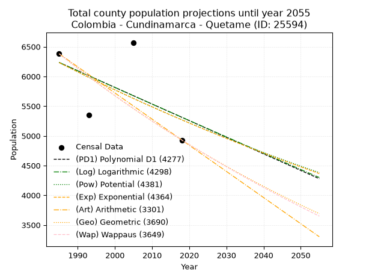
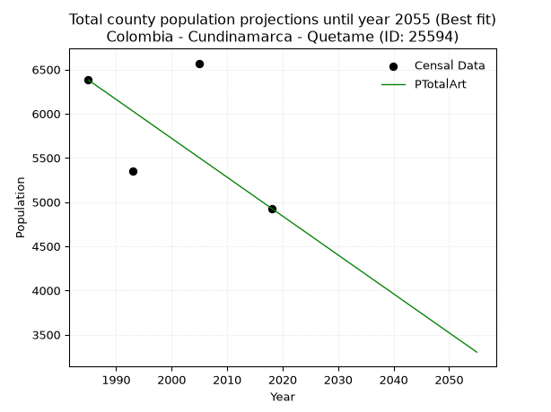
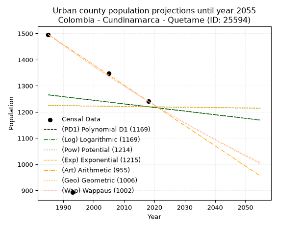
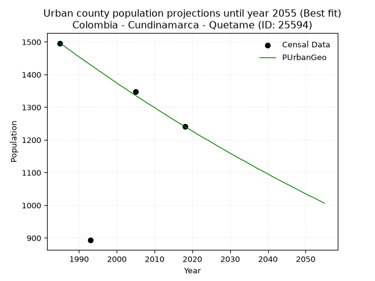
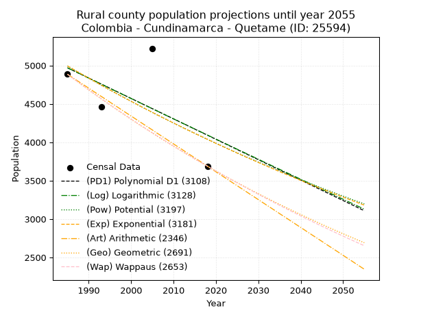
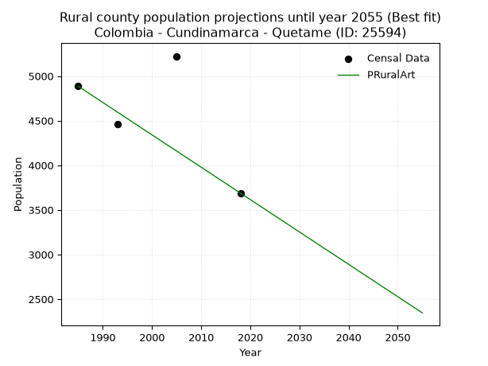

<div align="center">


</div>

# _“Population and Public Services Demand Projections (PPSD) until Year 2050 for Colombia - Cundinamarca - Quetame (ID: 25594)”_
Keywords: `population` `public-service` `projection` `lineal` `polynomial` `logarithmic` `potential` `exponential` `arithmetic` `geometric` `wappaus` `dane` `colombia` `south-america`

PPSD are analytical estimates used by governments and planners to anticipate future changes in population size, age distribution, and the resulting community needs for utilities, healthcare, education, and infrastructure as sizing future water treatment facilities, electrical grids, and road networks based on spatial growth.

> **General running parameters**: • app_version: _v20260806_. • Python version: _3.14.7_. • Pandas version: _3.0.5_. • NumPy version: _2.5.1_. • Creates, save and include plots into reports (create_plot): _False_. • Projection until year: _2050_. • Process polynomial degree 2 and up: _False_. • Process Wappaus: _True_. • Process Wappaus: _True_. • Set negative values to zero: _True_. • Set infinite values to zero: _True_. • Drop dataset notes: _True_. 
<div align="center">

Dynamic map: [:earth_americas:Google](http://maps.google.com/maps?q=4.329884231,-73.8632138) [:earth_americas:OSM](https://www.openstreetmap.org/#map=18/4.329884231/-73.8632138&layers=P) [:earth_americas:Bing](https://www.bing.com/maps?cp=4.329884231~-73.8632138&lvl=18) [:earth_americas:Apple](https://maps.apple.com/frame?center=4.329884231%2C-73.8632138&span=0.003%2C0.006)

</div>


<div align="center">

```geojson
{
  "type": "Feature",
  "geometry": {
    "type": "Point", 
    "coordinates": [-73.8632138, 4.329884231]
  }, 
  "properties": {
    "Name": "Colombia - Cundinamarca - Quetame (ID: 25594)"
  }
}
```

</div>


## 0. Census Data (4 records)

Census data are official statistics collected by a government about the people and housing in a country. They usually include counts of total population, age, sex, race, income, education, and jobs.

📅Global census file: [Population.xlsx](../data/Population.xlsx)

| Source   |   Year |   CountryID | CountryName   |   StateID | StateName    |   CountyID | CountyName   |   PTotal |   PUrban |   PRural |
|:---------|-------:|------------:|:--------------|----------:|:-------------|-----------:|:-------------|---------:|---------:|---------:|
| DANE     |   1985 |          57 | Colombia      |        25 | Cundinamarca |      25594 | Quetame      |     6381 |     1496 |     4885 |
| DANE     |   1993 |          57 | Colombia      |        25 | Cundinamarca |      25594 | Quetame      |     5352 |      893 |     4459 |
| DANE     |   2005 |          57 | Colombia      |        25 | Cundinamarca |      25594 | Quetame      |     6570 |     1348 |     5222 |
| DANE     |   2018 |          57 | Colombia      |        25 | Cundinamarca |      25594 | Quetame      |     4929 |     1241 |     3688 |

> 🔥Some records could had specific notes about the registered values or the corresponding urban or rural distribution.

📅   [RUPS](https://www.datos.gov.co/Hacienda-y-Cr-dito-P-blico/Registro-nico-de-Prestadores-de-Servicios-P-blicos/4qkq-csdn/about_data) - Local public utility companies: [RUPS.csv](../data/RUPS.xlsx)

 | SERVICIO       | ESTADO    | NOMBRE                                                                                                                 | NIT         | DEPARTAMENTO_DOMICILIO   | MUNICIPIO_DOMICILIO   | DIRECCION   |   TELEFONO | EMAIL                            | TIPO_PRESTADOR                 | CLASIFICACION                 |
|:---------------|:----------|:-----------------------------------------------------------------------------------------------------------------------|:------------|:-------------------------|:----------------------|:------------|-----------:|:---------------------------------|:-------------------------------|:------------------------------|
| ACUEDUCTO      | OPERATIVA | UNIDAD DE SERVICIOS PUBLICOS DOMICILIARIOS DE ACUEDUCTO, ALCANTARILLADO Y ASEO EN EL MUNICIPIO DE QUETAME CUNDINAMARCA | 800094716-1 | CUNDINAMARCA             | QUETAME               | C 5 4 16    |    8492018 | uspd@quetame-cundinamarca.gov.co | MUNICIPIO (PRESTACIÓN DIRECTA) | MENOR O IGUAL A 2500 USUARIOS |
| ALCANTARILLADO | OPERATIVA | UNIDAD DE SERVICIOS PUBLICOS DOMICILIARIOS DE ACUEDUCTO, ALCANTARILLADO Y ASEO EN EL MUNICIPIO DE QUETAME CUNDINAMARCA | 800094716-1 | CUNDINAMARCA             | QUETAME               | C 5 4 16    |    8492018 | uspd@quetame-cundinamarca.gov.co | MUNICIPIO (PRESTACIÓN DIRECTA) | MENOR O IGUAL A 2500 USUARIOS |

## 1. Total

### 1.1. Coefficients and Parameters

* (PD1) Polynomial Deg 1: -27.96467282215883, 61744.3368125232 (lineal)
* (Log) Logarithmic: -55894.15791334632, 430659.9422070166
* (Pow) Potential: -10.172239431867958, 37.340266057662156
* (Exp) Exponential: -0.005089131189974462, 152001541.27276242
* (Art) Arithmetic: Year diff. 2018 - 1985 = 33, Population diff. 4929 - 6381 = -1452, Annual growth = -44.0
* (Geo) Geometric: Year diff. 2018 - 1985 = 33, Population diff. 4929 - 6381 = -1452, Annual growth % = -0.0077933728744779
* (Wap) Wappaus: i = -0.7780725022104332, Condition values only valid for < 200)

<sub>
Wappaus condition values: ['-0.00', '-0.78', '-1.56', '-2.33', '-3.11', '-3.89', '-4.67', '-5.45', '-6.22', '-7.00', '-7.78', '-8.56', '-9.34', '-10.11', '-10.89', '-11.67', '-12.45', '-13.23', '-14.01', '-14.78', '-15.56', '-16.34', '-17.12', '-17.90', '-18.67', '-19.45', '-20.23', '-21.01', '-21.79', '-22.56', '-23.34', '-24.12', '-24.90', '-25.68', '-26.45', '-27.23', '-28.01', '-28.79', '-29.57', '-30.34', '-31.12', '-31.90', '-32.68', '-33.46', '-34.24', '-35.01', '-35.79', '-36.57', '-37.35', '-38.13', '-38.90', '-39.68', '-40.46', '-41.24', '-42.02', '-42.79', '-43.57', '-44.35', '-45.13', '-45.91', '-46.68', '-47.46', '-48.24', '-49.02', '-49.80', '-50.57']
</sub>


### 1.2. Projected Dataset

|   Year |   CountyID |   PTotalPD1 |   PTotalLog |   PTotalPow |   PTotalExp |   PTotalArt |   PTotalGeo |   PTotalWap |
|-------:|-----------:|------------:|------------:|------------:|------------:|------------:|------------:|------------:|
|   1985 |      25594 |        6234 |        6235 |        6232 |        6232 |        6381 |        6381 |        6381 |
|   1986 |      25594 |        6206 |        6207 |        6201 |        6201 |        6337 |        6331 |        6332 |
|   1987 |      25594 |        6179 |        6178 |        6169 |        6169 |        6293 |        6282 |        6282 |
|   1988 |      25594 |        6151 |        6150 |        6137 |        6138 |        6249 |        6233 |        6234 |
|   1989 |      25594 |        6123 |        6122 |        6106 |        6107 |        6205 |        6184 |        6185 |
|   1990 |      25594 |        6095 |        6094 |        6075 |        6076 |        6161 |        6136 |        6137 |
|   1991 |      25594 |        6067 |        6066 |        6044 |        6045 |        6117 |        6088 |        6090 |
|   1992 |      25594 |        6039 |        6038 |        6013 |        6014 |        6073 |        6041 |        6043 |
|   1993 |      25594 |        6011 |        6010 |        5983 |        5984 |        6029 |        5994 |        5996 |
|   1994 |      25594 |        5983 |        5982 |        5952 |        5953 |        5985 |        5947 |        5949 |
|   1995 |      25594 |        5955 |        5954 |        5922 |        5923 |        5941 |        5901 |        5903 |
|   1996 |      25594 |        5927 |        5926 |        5892 |        5893 |        5897 |        5855 |        5857 |
|   1997 |      25594 |        5899 |        5898 |        5862 |        5863 |        5853 |        5809 |        5812 |
|   1998 |      25594 |        5871 |        5870 |        5832 |        5833 |        5809 |        5764 |        5767 |
|   1999 |      25594 |        5843 |        5842 |        5802 |        5804 |        5765 |        5719 |        5722 |
|   2000 |      25594 |        5815 |        5814 |        5773 |        5774 |        5721 |        5674 |        5677 |
|   2001 |      25594 |        5787 |        5786 |        5744 |        5745 |        5677 |        5630 |        5633 |
|   2002 |      25594 |        5759 |        5758 |        5715 |        5716 |        5633 |        5586 |        5589 |
|   2003 |      25594 |        5731 |        5730 |        5686 |        5687 |        5589 |        5543 |        5546 |
|   2004 |      25594 |        5703 |        5702 |        5657 |        5658 |        5545 |        5500 |        5503 |
|   2005 |      25594 |        5675 |        5674 |        5628 |        5629 |        5501 |        5457 |        5460 |
|   2006 |      25594 |        5647 |        5646 |        5600 |        5600 |        5457 |        5414 |        5417 |
|   2007 |      25594 |        5619 |        5619 |        5571 |        5572 |        5413 |        5372 |        5375 |
|   2008 |      25594 |        5591 |        5591 |        5543 |        5544 |        5369 |        5330 |        5333 |
|   2009 |      25594 |        5563 |        5563 |        5515 |        5516 |        5325 |        5289 |        5291 |
|   2010 |      25594 |        5535 |        5535 |        5487 |        5488 |        5281 |        5247 |        5250 |
|   2011 |      25594 |        5507 |        5507 |        5460 |        5460 |        5237 |        5206 |        5209 |
|   2012 |      25594 |        5479 |        5480 |        5432 |        5432 |        5193 |        5166 |        5168 |
|   2013 |      25594 |        5451 |        5452 |        5405 |        5404 |        5149 |        5126 |        5127 |
|   2014 |      25594 |        5423 |        5424 |        5378 |        5377 |        5105 |        5086 |        5087 |
|   2015 |      25594 |        5396 |        5396 |        5350 |        5350 |        5061 |        5046 |        5047 |
|   2016 |      25594 |        5368 |        5369 |        5323 |        5323 |        5017 |        5007 |        5008 |
|   2017 |      25594 |        5340 |        5341 |        5297 |        5296 |        4973 |        4968 |        4968 |
|   2018 |      25594 |        5312 |        5313 |        5270 |        5269 |        4929 |        4929 |        4929 |
|   2019 |      25594 |        5284 |        5285 |        5244 |        5242 |        4885 |        4891 |        4890 |
|   2020 |      25594 |        5256 |        5258 |        5217 |        5215 |        4841 |        4852 |        4852 |
|   2021 |      25594 |        5228 |        5230 |        5191 |        5189 |        4797 |        4815 |        4813 |
|   2022 |      25594 |        5200 |        5202 |        5165 |        5163 |        4753 |        4777 |        4775 |
|   2023 |      25594 |        5172 |        5175 |        5139 |        5136 |        4709 |        4740 |        4737 |
|   2024 |      25594 |        5144 |        5147 |        5113 |        5110 |        4665 |        4703 |        4700 |
|   2025 |      25594 |        5116 |        5120 |        5088 |        5084 |        4621 |        4666 |        4662 |
|   2026 |      25594 |        5088 |        5092 |        5062 |        5058 |        4577 |        4630 |        4625 |
|   2027 |      25594 |        5060 |        5064 |        5037 |        5033 |        4533 |        4594 |        4589 |
|   2028 |      25594 |        5032 |        5037 |        5012 |        5007 |        4489 |        4558 |        4552 |
|   2029 |      25594 |        5004 |        5009 |        4987 |        4982 |        4445 |        4523 |        4516 |
|   2030 |      25594 |        4976 |        4982 |        4962 |        4957 |        4401 |        4487 |        4480 |
|   2031 |      25594 |        4948 |        4954 |        4937 |        4931 |        4357 |        4452 |        4444 |
|   2032 |      25594 |        4920 |        4927 |        4912 |        4906 |        4313 |        4418 |        4408 |
|   2033 |      25594 |        4892 |        4899 |        4888 |        4881 |        4269 |        4383 |        4373 |
|   2034 |      25594 |        4864 |        4872 |        4863 |        4857 |        4225 |        4349 |        4338 |
|   2035 |      25594 |        4836 |        4844 |        4839 |        4832 |        4181 |        4315 |        4303 |
|   2036 |      25594 |        4808 |        4817 |        4815 |        4807 |        4137 |        4282 |        4268 |
|   2037 |      25594 |        4780 |        4789 |        4791 |        4783 |        4093 |        4248 |        4234 |
|   2038 |      25594 |        4752 |        4762 |        4767 |        4759 |        4049 |        4215 |        4199 |
|   2039 |      25594 |        4724 |        4734 |        4743 |        4735 |        4005 |        4182 |        4165 |
|   2040 |      25594 |        4696 |        4707 |        4720 |        4711 |        3961 |        4150 |        4132 |
|   2041 |      25594 |        4668 |        4680 |        4696 |        4687 |        3917 |        4117 |        4098 |
|   2042 |      25594 |        4640 |        4652 |        4673 |        4663 |        3873 |        4085 |        4065 |
|   2043 |      25594 |        4613 |        4625 |        4650 |        4639 |        3829 |        4053 |        4032 |
|   2044 |      25594 |        4585 |        4598 |        4627 |        4616 |        3785 |        4022 |        3999 |
|   2045 |      25594 |        4557 |        4570 |        4604 |        4592 |        3741 |        3990 |        3966 |
|   2046 |      25594 |        4529 |        4543 |        4581 |        4569 |        3697 |        3959 |        3933 |
|   2047 |      25594 |        4501 |        4516 |        4558 |        4546 |        3653 |        3928 |        3901 |
|   2048 |      25594 |        4473 |        4488 |        4535 |        4523 |        3609 |        3898 |        3869 |
|   2049 |      25594 |        4445 |        4461 |        4513 |        4500 |        3565 |        3867 |        3837 |
|   2050 |      25594 |        4417 |        4434 |        4491 |        4477 |        3521 |        3837 |        3805 |
<div align="center">

</img>

</div>


### 1.3. Best fit with absolute and relative error (%)

Relative error puts that difference into context by dividing the absolute error by the true value, creating a unitless ratio or percentage that shows the scale of the mistake.

Absolute and relative error

|   Year | Source   |   CountryID | CountryName   |   StateID | StateName    |   CountyID_x | CountyName   |   PTotal |   PUrban |   PRural |   CountyID_y |   PTotalPD1 |   PTotalLog |   PTotalPow |   PTotalExp |   PTotalArt |   PTotalGeo |   PTotalWap |   PTotalPD1AbsError |   PTotalLogAbsError |   PTotalPowAbsError |   PTotalExpAbsError |   PTotalArtAbsError |   PTotalGeoAbsError |   PTotalWapAbsError |   PTotalPD1RelError |   PTotalLogRelError |   PTotalPowRelError |   PTotalExpRelError |   PTotalArtRelError |   PTotalGeoRelError |   PTotalWapRelError |
|-------:|:---------|------------:|:--------------|----------:|:-------------|-------------:|:-------------|---------:|---------:|---------:|-------------:|------------:|------------:|------------:|------------:|------------:|------------:|------------:|--------------------:|--------------------:|--------------------:|--------------------:|--------------------:|--------------------:|--------------------:|--------------------:|--------------------:|--------------------:|--------------------:|--------------------:|--------------------:|--------------------:|
|   1985 | DANE     |          57 | Colombia      |        25 | Cundinamarca |        25594 | Quetame      |     6381 |     1496 |     4885 |        25594 |        6234 |        6235 |        6232 |        6232 |        6381 |        6381 |        6381 |                 147 |                 146 |                 149 |                 149 |                   0 |                   0 |                   0 |             2.30371 |             2.28804 |             2.33506 |             2.33506 |              0      |              0      |              0      |
|   1993 | DANE     |          57 | Colombia      |        25 | Cundinamarca |        25594 | Quetame      |     5352 |      893 |     4459 |        25594 |        6011 |        6010 |        5983 |        5984 |        6029 |        5994 |        5996 |                 659 |                 658 |                 631 |                 632 |                 677 |                 642 |                 644 |            12.3132  |            12.2945  |            11.79    |            11.8087  |             12.6495 |             11.9955 |             12.0329 |
|   2005 | DANE     |          57 | Colombia      |        25 | Cundinamarca |        25594 | Quetame      |     6570 |     1348 |     5222 |        25594 |        5675 |        5674 |        5628 |        5629 |        5501 |        5457 |        5460 |                 895 |                 896 |                 942 |                 941 |                1069 |                1113 |                1110 |            13.6225  |            13.6377  |            14.3379  |            14.3227  |             16.2709 |             16.9406 |             16.895  |
|   2018 | DANE     |          57 | Colombia      |        25 | Cundinamarca |        25594 | Quetame      |     4929 |     1241 |     3688 |        25594 |        5312 |        5313 |        5270 |        5269 |        4929 |        4929 |        4929 |                 383 |                 384 |                 341 |                 340 |                   0 |                   0 |                   0 |             7.77034 |             7.79063 |             6.91824 |             6.89795 |              0      |              0      |              0      |

Relative error mean

| Method    |   RelError | Best   |
|:----------|-----------:|:-------|
| PTotalPD1 |    9.00243 |        |
| PTotalLog |    9.00272 |        |
| PTotalPow |    8.8453  |        |
| PTotalExp |    8.84109 |        |
| PTotalArt |    7.2301  | True   |
| PTotalGeo |    7.23404 |        |
| PTotalWap |    7.23197 |        |

💙Best method: _**PTotalArt**_
<div align="center">

</img>

</div>


### 1.4. Fresh water supply demand in liters per capita per day (lpcd)

The fresh water supply demand typically ranges from 100 to 300 liters per capita per day (lpcd) for standard domestic and municipal planning, though absolute survival minimums set by the World Health Organization are as low as 7.5 to 20 liters per day, and total consumption in high-income nations can exceed 400 liters.

> `CZ`: Level in meters above the sea level (masl)<br> `WS`: Fresh water supply demand in liters per capita per day (lpcd or l/h/d)<br> `WSAll`: Zonal fresh water supply demand in liters per second (l/s)<br> `A`: Zonal area in square meters<br> `DP`: Population density (people/hectare or p/ha)

Reference values (RAS Colombia)

|    CZ |   WS |
|------:|-----:|
|  1000 |  120 |
|  2000 |  130 |
| 99999 |  140 |

County shapefile geometry properties and water supply values

|   CountyID |      ATotal |   CZTotal |   WSTotal |
|-----------:|------------:|----------:|----------:|
|      25594 | 1.37596e+08 |   2196.16 |       140 |

Projected values for best method: PTotalArt

|   CountyID |   Year |   PTotalArt |   DPTotal |   WSTotal |   WSTotalAll |
|-----------:|-------:|------------:|----------:|----------:|-------------:|
|      25594 |   1985 |        6381 |      0.46 |       140 |     10.3396  |
|      25594 |   1986 |        6337 |      0.46 |       140 |     10.2683  |
|      25594 |   1987 |        6293 |      0.46 |       140 |     10.197   |
|      25594 |   1988 |        6249 |      0.45 |       140 |     10.1257  |
|      25594 |   1989 |        6205 |      0.45 |       140 |     10.0544  |
|      25594 |   1990 |        6161 |      0.45 |       140 |      9.9831  |
|      25594 |   1991 |        6117 |      0.44 |       140 |      9.91181 |
|      25594 |   1992 |        6073 |      0.44 |       140 |      9.84051 |
|      25594 |   1993 |        6029 |      0.44 |       140 |      9.76921 |
|      25594 |   1994 |        5985 |      0.43 |       140 |      9.69792 |
|      25594 |   1995 |        5941 |      0.43 |       140 |      9.62662 |
|      25594 |   1996 |        5897 |      0.43 |       140 |      9.55532 |
|      25594 |   1997 |        5853 |      0.43 |       140 |      9.48403 |
|      25594 |   1998 |        5809 |      0.42 |       140 |      9.41273 |
|      25594 |   1999 |        5765 |      0.42 |       140 |      9.34144 |
|      25594 |   2000 |        5721 |      0.42 |       140 |      9.27014 |
|      25594 |   2001 |        5677 |      0.41 |       140 |      9.19884 |
|      25594 |   2002 |        5633 |      0.41 |       140 |      9.12755 |
|      25594 |   2003 |        5589 |      0.41 |       140 |      9.05625 |
|      25594 |   2004 |        5545 |      0.4  |       140 |      8.98495 |
|      25594 |   2005 |        5501 |      0.4  |       140 |      8.91366 |
|      25594 |   2006 |        5457 |      0.4  |       140 |      8.84236 |
|      25594 |   2007 |        5413 |      0.39 |       140 |      8.77106 |
|      25594 |   2008 |        5369 |      0.39 |       140 |      8.69977 |
|      25594 |   2009 |        5325 |      0.39 |       140 |      8.62847 |
|      25594 |   2010 |        5281 |      0.38 |       140 |      8.55718 |
|      25594 |   2011 |        5237 |      0.38 |       140 |      8.48588 |
|      25594 |   2012 |        5193 |      0.38 |       140 |      8.41458 |
|      25594 |   2013 |        5149 |      0.37 |       140 |      8.34329 |
|      25594 |   2014 |        5105 |      0.37 |       140 |      8.27199 |
|      25594 |   2015 |        5061 |      0.37 |       140 |      8.20069 |
|      25594 |   2016 |        5017 |      0.36 |       140 |      8.1294  |
|      25594 |   2017 |        4973 |      0.36 |       140 |      8.0581  |
|      25594 |   2018 |        4929 |      0.36 |       140 |      7.98681 |
|      25594 |   2019 |        4885 |      0.36 |       140 |      7.91551 |
|      25594 |   2020 |        4841 |      0.35 |       140 |      7.84421 |
|      25594 |   2021 |        4797 |      0.35 |       140 |      7.77292 |
|      25594 |   2022 |        4753 |      0.35 |       140 |      7.70162 |
|      25594 |   2023 |        4709 |      0.34 |       140 |      7.63032 |
|      25594 |   2024 |        4665 |      0.34 |       140 |      7.55903 |
|      25594 |   2025 |        4621 |      0.34 |       140 |      7.48773 |
|      25594 |   2026 |        4577 |      0.33 |       140 |      7.41644 |
|      25594 |   2027 |        4533 |      0.33 |       140 |      7.34514 |
|      25594 |   2028 |        4489 |      0.33 |       140 |      7.27384 |
|      25594 |   2029 |        4445 |      0.32 |       140 |      7.20255 |
|      25594 |   2030 |        4401 |      0.32 |       140 |      7.13125 |
|      25594 |   2031 |        4357 |      0.32 |       140 |      7.05995 |
|      25594 |   2032 |        4313 |      0.31 |       140 |      6.98866 |
|      25594 |   2033 |        4269 |      0.31 |       140 |      6.91736 |
|      25594 |   2034 |        4225 |      0.31 |       140 |      6.84606 |
|      25594 |   2035 |        4181 |      0.3  |       140 |      6.77477 |
|      25594 |   2036 |        4137 |      0.3  |       140 |      6.70347 |
|      25594 |   2037 |        4093 |      0.3  |       140 |      6.63218 |
|      25594 |   2038 |        4049 |      0.29 |       140 |      6.56088 |
|      25594 |   2039 |        4005 |      0.29 |       140 |      6.48958 |
|      25594 |   2040 |        3961 |      0.29 |       140 |      6.41829 |
|      25594 |   2041 |        3917 |      0.28 |       140 |      6.34699 |
|      25594 |   2042 |        3873 |      0.28 |       140 |      6.27569 |
|      25594 |   2043 |        3829 |      0.28 |       140 |      6.2044  |
|      25594 |   2044 |        3785 |      0.28 |       140 |      6.1331  |
|      25594 |   2045 |        3741 |      0.27 |       140 |      6.06181 |
|      25594 |   2046 |        3697 |      0.27 |       140 |      5.99051 |
|      25594 |   2047 |        3653 |      0.27 |       140 |      5.91921 |
|      25594 |   2048 |        3609 |      0.26 |       140 |      5.84792 |
|      25594 |   2049 |        3565 |      0.26 |       140 |      5.77662 |
|      25594 |   2050 |        3521 |      0.26 |       140 |      5.70532 |

## 2. Urban

### 2.1. Coefficients and Parameters

* (PD1) Polynomial Deg 1: -1.3769570453632625, 3998.758329987866 (lineal)
* (Log) Logarithmic: -2791.4182222705813, 22462.092276500465
* (Pow) Potential: -0.2589925617245792, 3.942265269043015
* (Exp) Exponential: -0.00011426504557134813, 1536.6428701898901
* (Art) Arithmetic: Year diff. 2018 - 1985 = 33, Population diff. 1241 - 1496 = -255, Annual growth = -7.7272727272727275
* (Geo) Geometric: Year diff. 2018 - 1985 = 33, Population diff. 1241 - 1496 = -255, Annual growth % = -0.005646946426344779
* (Wap) Wappaus: i = -0.564652738565782, Condition values only valid for < 200)

<sub>
Wappaus condition values: ['-0.00', '-0.56', '-1.13', '-1.69', '-2.26', '-2.82', '-3.39', '-3.95', '-4.52', '-5.08', '-5.65', '-6.21', '-6.78', '-7.34', '-7.91', '-8.47', '-9.03', '-9.60', '-10.16', '-10.73', '-11.29', '-11.86', '-12.42', '-12.99', '-13.55', '-14.12', '-14.68', '-15.25', '-15.81', '-16.37', '-16.94', '-17.50', '-18.07', '-18.63', '-19.20', '-19.76', '-20.33', '-20.89', '-21.46', '-22.02', '-22.59', '-23.15', '-23.72', '-24.28', '-24.84', '-25.41', '-25.97', '-26.54', '-27.10', '-27.67', '-28.23', '-28.80', '-29.36', '-29.93', '-30.49', '-31.06', '-31.62', '-32.19', '-32.75', '-33.31', '-33.88', '-34.44', '-35.01', '-35.57', '-36.14', '-36.70']
</sub>


### 2.2. Projected Dataset

|   Year |   CountyID |   PUrbanPD1 |   PUrbanLog |   PUrbanPow |   PUrbanExp |   PUrbanArt |   PUrbanGeo |   PUrbanWap |
|-------:|-----------:|------------:|------------:|------------:|------------:|------------:|------------:|------------:|
|   1985 |      25594 |        1265 |        1266 |        1225 |        1225 |        1496 |        1496 |        1496 |
|   1986 |      25594 |        1264 |        1264 |        1225 |        1225 |        1488 |        1488 |        1488 |
|   1987 |      25594 |        1263 |        1263 |        1225 |        1225 |        1481 |        1479 |        1479 |
|   1988 |      25594 |        1261 |        1262 |        1225 |        1224 |        1473 |        1471 |        1471 |
|   1989 |      25594 |        1260 |        1260 |        1224 |        1224 |        1465 |        1462 |        1463 |
|   1990 |      25594 |        1259 |        1259 |        1224 |        1224 |        1457 |        1454 |        1454 |
|   1991 |      25594 |        1257 |        1257 |        1224 |        1224 |        1450 |        1446 |        1446 |
|   1992 |      25594 |        1256 |        1256 |        1224 |        1224 |        1442 |        1438 |        1438 |
|   1993 |      25594 |        1254 |        1255 |        1224 |        1224 |        1434 |        1430 |        1430 |
|   1994 |      25594 |        1253 |        1253 |        1224 |        1224 |        1426 |        1422 |        1422 |
|   1995 |      25594 |        1252 |        1252 |        1224 |        1223 |        1419 |        1414 |        1414 |
|   1996 |      25594 |        1250 |        1250 |        1223 |        1223 |        1411 |        1406 |        1406 |
|   1997 |      25594 |        1249 |        1249 |        1223 |        1223 |        1403 |        1398 |        1398 |
|   1998 |      25594 |        1248 |        1248 |        1223 |        1223 |        1396 |        1390 |        1390 |
|   1999 |      25594 |        1246 |        1246 |        1223 |        1223 |        1388 |        1382 |        1382 |
|   2000 |      25594 |        1245 |        1245 |        1223 |        1223 |        1380 |        1374 |        1374 |
|   2001 |      25594 |        1243 |        1243 |        1223 |        1223 |        1372 |        1366 |        1367 |
|   2002 |      25594 |        1242 |        1242 |        1222 |        1222 |        1365 |        1359 |        1359 |
|   2003 |      25594 |        1241 |        1241 |        1222 |        1222 |        1357 |        1351 |        1351 |
|   2004 |      25594 |        1239 |        1239 |        1222 |        1222 |        1349 |        1343 |        1344 |
|   2005 |      25594 |        1238 |        1238 |        1222 |        1222 |        1341 |        1336 |        1336 |
|   2006 |      25594 |        1237 |        1236 |        1222 |        1222 |        1334 |        1328 |        1329 |
|   2007 |      25594 |        1235 |        1235 |        1222 |        1222 |        1326 |        1321 |        1321 |
|   2008 |      25594 |        1234 |        1234 |        1221 |        1222 |        1318 |        1313 |        1314 |
|   2009 |      25594 |        1232 |        1232 |        1221 |        1221 |        1311 |        1306 |        1306 |
|   2010 |      25594 |        1231 |        1231 |        1221 |        1221 |        1303 |        1299 |        1299 |
|   2011 |      25594 |        1230 |        1229 |        1221 |        1221 |        1295 |        1291 |        1291 |
|   2012 |      25594 |        1228 |        1228 |        1221 |        1221 |        1287 |        1284 |        1284 |
|   2013 |      25594 |        1227 |        1227 |        1221 |        1221 |        1280 |        1277 |        1277 |
|   2014 |      25594 |        1226 |        1225 |        1221 |        1221 |        1272 |        1269 |        1270 |
|   2015 |      25594 |        1224 |        1224 |        1220 |        1221 |        1264 |        1262 |        1262 |
|   2016 |      25594 |        1223 |        1223 |        1220 |        1220 |        1256 |        1255 |        1255 |
|   2017 |      25594 |        1221 |        1221 |        1220 |        1220 |        1249 |        1248 |        1248 |
|   2018 |      25594 |        1220 |        1220 |        1220 |        1220 |        1241 |        1241 |        1241 |
|   2019 |      25594 |        1219 |        1218 |        1220 |        1220 |        1233 |        1234 |        1234 |
|   2020 |      25594 |        1217 |        1217 |        1220 |        1220 |        1226 |        1227 |        1227 |
|   2021 |      25594 |        1216 |        1216 |        1219 |        1220 |        1218 |        1220 |        1220 |
|   2022 |      25594 |        1215 |        1214 |        1219 |        1220 |        1210 |        1213 |        1213 |
|   2023 |      25594 |        1213 |        1213 |        1219 |        1220 |        1202 |        1206 |        1206 |
|   2024 |      25594 |        1212 |        1211 |        1219 |        1219 |        1195 |        1200 |        1199 |
|   2025 |      25594 |        1210 |        1210 |        1219 |        1219 |        1187 |        1193 |        1192 |
|   2026 |      25594 |        1209 |        1209 |        1219 |        1219 |        1179 |        1186 |        1186 |
|   2027 |      25594 |        1208 |        1207 |        1218 |        1219 |        1171 |        1179 |        1179 |
|   2028 |      25594 |        1206 |        1206 |        1218 |        1219 |        1164 |        1173 |        1172 |
|   2029 |      25594 |        1205 |        1205 |        1218 |        1219 |        1156 |        1166 |        1165 |
|   2030 |      25594 |        1204 |        1203 |        1218 |        1219 |        1148 |        1159 |        1159 |
|   2031 |      25594 |        1202 |        1202 |        1218 |        1218 |        1141 |        1153 |        1152 |
|   2032 |      25594 |        1201 |        1200 |        1218 |        1218 |        1133 |        1146 |        1145 |
|   2033 |      25594 |        1199 |        1199 |        1218 |        1218 |        1125 |        1140 |        1139 |
|   2034 |      25594 |        1198 |        1198 |        1217 |        1218 |        1117 |        1134 |        1132 |
|   2035 |      25594 |        1197 |        1196 |        1217 |        1218 |        1110 |        1127 |        1126 |
|   2036 |      25594 |        1195 |        1195 |        1217 |        1218 |        1102 |        1121 |        1119 |
|   2037 |      25594 |        1194 |        1194 |        1217 |        1218 |        1094 |        1114 |        1113 |
|   2038 |      25594 |        1193 |        1192 |        1217 |        1217 |        1086 |        1108 |        1107 |
|   2039 |      25594 |        1191 |        1191 |        1217 |        1217 |        1079 |        1102 |        1100 |
|   2040 |      25594 |        1190 |        1190 |        1216 |        1217 |        1071 |        1096 |        1094 |
|   2041 |      25594 |        1188 |        1188 |        1216 |        1217 |        1063 |        1089 |        1088 |
|   2042 |      25594 |        1187 |        1187 |        1216 |        1217 |        1056 |        1083 |        1081 |
|   2043 |      25594 |        1186 |        1185 |        1216 |        1217 |        1048 |        1077 |        1075 |
|   2044 |      25594 |        1184 |        1184 |        1216 |        1217 |        1040 |        1071 |        1069 |
|   2045 |      25594 |        1183 |        1183 |        1216 |        1216 |        1032 |        1065 |        1063 |
|   2046 |      25594 |        1182 |        1181 |        1216 |        1216 |        1025 |        1059 |        1056 |
|   2047 |      25594 |        1180 |        1180 |        1215 |        1216 |        1017 |        1053 |        1050 |
|   2048 |      25594 |        1179 |        1179 |        1215 |        1216 |        1009 |        1047 |        1044 |
|   2049 |      25594 |        1177 |        1177 |        1215 |        1216 |        1001 |        1041 |        1038 |
|   2050 |      25594 |        1176 |        1176 |        1215 |        1216 |         994 |        1035 |        1032 |
<div align="center">

</img>

</div>


### 2.3. Best fit with absolute and relative error (%)

Relative error puts that difference into context by dividing the absolute error by the true value, creating a unitless ratio or percentage that shows the scale of the mistake.

Absolute and relative error

|   Year | Source   |   CountryID | CountryName   |   StateID | StateName    |   CountyID_x | CountyName   |   PTotal |   PUrban |   PRural |   CountyID_y |   PUrbanPD1 |   PUrbanLog |   PUrbanPow |   PUrbanExp |   PUrbanArt |   PUrbanGeo |   PUrbanWap |   PUrbanPD1AbsError |   PUrbanLogAbsError |   PUrbanPowAbsError |   PUrbanExpAbsError |   PUrbanArtAbsError |   PUrbanGeoAbsError |   PUrbanWapAbsError |   PUrbanPD1RelError |   PUrbanLogRelError |   PUrbanPowRelError |   PUrbanExpRelError |   PUrbanArtRelError |   PUrbanGeoRelError |   PUrbanWapRelError |
|-------:|:---------|------------:|:--------------|----------:|:-------------|-------------:|:-------------|---------:|---------:|---------:|-------------:|------------:|------------:|------------:|------------:|------------:|------------:|------------:|--------------------:|--------------------:|--------------------:|--------------------:|--------------------:|--------------------:|--------------------:|--------------------:|--------------------:|--------------------:|--------------------:|--------------------:|--------------------:|--------------------:|
|   1985 | DANE     |          57 | Colombia      |        25 | Cundinamarca |        25594 | Quetame      |     6381 |     1496 |     4885 |        25594 |        1265 |        1266 |        1225 |        1225 |        1496 |        1496 |        1496 |                 231 |                 230 |                 271 |                 271 |                   0 |                   0 |                   0 |            15.4412  |            15.3743  |            18.115   |            18.115   |            0        |            0        |            0        |
|   1993 | DANE     |          57 | Colombia      |        25 | Cundinamarca |        25594 | Quetame      |     5352 |      893 |     4459 |        25594 |        1254 |        1255 |        1224 |        1224 |        1434 |        1430 |        1430 |                 361 |                 362 |                 331 |                 331 |                 541 |                 537 |                 537 |            40.4255  |            40.5375  |            37.0661  |            37.0661  |           60.5823   |           60.1344   |           60.1344   |
|   2005 | DANE     |          57 | Colombia      |        25 | Cundinamarca |        25594 | Quetame      |     6570 |     1348 |     5222 |        25594 |        1238 |        1238 |        1222 |        1222 |        1341 |        1336 |        1336 |                 110 |                 110 |                 126 |                 126 |                   7 |                  12 |                  12 |             8.16024 |             8.16024 |             9.34718 |             9.34718 |            0.519288 |            0.890208 |            0.890208 |
|   2018 | DANE     |          57 | Colombia      |        25 | Cundinamarca |        25594 | Quetame      |     4929 |     1241 |     3688 |        25594 |        1220 |        1220 |        1220 |        1220 |        1241 |        1241 |        1241 |                  21 |                  21 |                  21 |                  21 |                   0 |                   0 |                   0 |             1.69218 |             1.69218 |             1.69218 |             1.69218 |            0        |            0        |            0        |

Relative error mean

| Method    |   RelError | Best   |
|:----------|-----------:|:-------|
| PUrbanPD1 |    16.4298 |        |
| PUrbanLog |    16.4411 |        |
| PUrbanPow |    16.5551 |        |
| PUrbanExp |    16.5551 |        |
| PUrbanArt |    15.2754 |        |
| PUrbanGeo |    15.2561 | True   |
| PUrbanWap |    15.2561 | True   |

💙Best method: _**PUrbanGeo**_
<div align="center">

</img>

</div>


### 2.4. Fresh water supply demand in liters per capita per day (lpcd)

The fresh water supply demand typically ranges from 100 to 300 liters per capita per day (lpcd) for standard domestic and municipal planning, though absolute survival minimums set by the World Health Organization are as low as 7.5 to 20 liters per day, and total consumption in high-income nations can exceed 400 liters.

> `CZ`: Level in meters above the sea level (masl)<br> `WS`: Fresh water supply demand in liters per capita per day (lpcd or l/h/d)<br> `WSAll`: Zonal fresh water supply demand in liters per second (l/s)<br> `A`: Zonal area in square meters<br> `DP`: Population density (people/hectare or p/ha)

Reference values (RAS Colombia)

|    CZ |   WS |
|------:|-----:|
|  1000 |  120 |
|  2000 |  130 |
| 99999 |  140 |

County shapefile geometry properties and water supply values

|   CountyID |   AUrban |   CZUrban |   WSUrban |
|-----------:|---------:|----------:|----------:|
|      25594 |   254304 |   1469.89 |       130 |

Projected values for best method: PUrbanGeo

|   CountyID |   Year |   PUrbanGeo |   DPUrban |   WSUrban |   WSUrbanAll |
|-----------:|-------:|------------:|----------:|----------:|-------------:|
|      25594 |   1985 |        1496 |     58.83 |       130 |      2.25093 |
|      25594 |   1986 |        1488 |     58.51 |       130 |      2.23889 |
|      25594 |   1987 |        1479 |     58.16 |       130 |      2.22535 |
|      25594 |   1988 |        1471 |     57.84 |       130 |      2.21331 |
|      25594 |   1989 |        1462 |     57.49 |       130 |      2.19977 |
|      25594 |   1990 |        1454 |     57.18 |       130 |      2.18773 |
|      25594 |   1991 |        1446 |     56.86 |       130 |      2.17569 |
|      25594 |   1992 |        1438 |     56.55 |       130 |      2.16366 |
|      25594 |   1993 |        1430 |     56.23 |       130 |      2.15162 |
|      25594 |   1994 |        1422 |     55.92 |       130 |      2.13958 |
|      25594 |   1995 |        1414 |     55.6  |       130 |      2.12755 |
|      25594 |   1996 |        1406 |     55.29 |       130 |      2.11551 |
|      25594 |   1997 |        1398 |     54.97 |       130 |      2.10347 |
|      25594 |   1998 |        1390 |     54.66 |       130 |      2.09144 |
|      25594 |   1999 |        1382 |     54.34 |       130 |      2.0794  |
|      25594 |   2000 |        1374 |     54.03 |       130 |      2.06736 |
|      25594 |   2001 |        1366 |     53.72 |       130 |      2.05532 |
|      25594 |   2002 |        1359 |     53.44 |       130 |      2.04479 |
|      25594 |   2003 |        1351 |     53.13 |       130 |      2.03275 |
|      25594 |   2004 |        1343 |     52.81 |       130 |      2.02072 |
|      25594 |   2005 |        1336 |     52.54 |       130 |      2.01019 |
|      25594 |   2006 |        1328 |     52.22 |       130 |      1.99815 |
|      25594 |   2007 |        1321 |     51.95 |       130 |      1.98762 |
|      25594 |   2008 |        1313 |     51.63 |       130 |      1.97558 |
|      25594 |   2009 |        1306 |     51.36 |       130 |      1.96505 |
|      25594 |   2010 |        1299 |     51.08 |       130 |      1.95451 |
|      25594 |   2011 |        1291 |     50.77 |       130 |      1.94248 |
|      25594 |   2012 |        1284 |     50.49 |       130 |      1.93194 |
|      25594 |   2013 |        1277 |     50.22 |       130 |      1.92141 |
|      25594 |   2014 |        1269 |     49.9  |       130 |      1.90938 |
|      25594 |   2015 |        1262 |     49.63 |       130 |      1.89884 |
|      25594 |   2016 |        1255 |     49.35 |       130 |      1.88831 |
|      25594 |   2017 |        1248 |     49.08 |       130 |      1.87778 |
|      25594 |   2018 |        1241 |     48.8  |       130 |      1.86725 |
|      25594 |   2019 |        1234 |     48.52 |       130 |      1.85671 |
|      25594 |   2020 |        1227 |     48.25 |       130 |      1.84618 |
|      25594 |   2021 |        1220 |     47.97 |       130 |      1.83565 |
|      25594 |   2022 |        1213 |     47.7  |       130 |      1.82512 |
|      25594 |   2023 |        1206 |     47.42 |       130 |      1.81458 |
|      25594 |   2024 |        1200 |     47.19 |       130 |      1.80556 |
|      25594 |   2025 |        1193 |     46.91 |       130 |      1.79502 |
|      25594 |   2026 |        1186 |     46.64 |       130 |      1.78449 |
|      25594 |   2027 |        1179 |     46.36 |       130 |      1.77396 |
|      25594 |   2028 |        1173 |     46.13 |       130 |      1.76493 |
|      25594 |   2029 |        1166 |     45.85 |       130 |      1.7544  |
|      25594 |   2030 |        1159 |     45.58 |       130 |      1.74387 |
|      25594 |   2031 |        1153 |     45.34 |       130 |      1.73484 |
|      25594 |   2032 |        1146 |     45.06 |       130 |      1.72431 |
|      25594 |   2033 |        1140 |     44.83 |       130 |      1.71528 |
|      25594 |   2034 |        1134 |     44.59 |       130 |      1.70625 |
|      25594 |   2035 |        1127 |     44.32 |       130 |      1.69572 |
|      25594 |   2036 |        1121 |     44.08 |       130 |      1.68669 |
|      25594 |   2037 |        1114 |     43.81 |       130 |      1.67616 |
|      25594 |   2038 |        1108 |     43.57 |       130 |      1.66713 |
|      25594 |   2039 |        1102 |     43.33 |       130 |      1.6581  |
|      25594 |   2040 |        1096 |     43.1  |       130 |      1.64907 |
|      25594 |   2041 |        1089 |     42.82 |       130 |      1.63854 |
|      25594 |   2042 |        1083 |     42.59 |       130 |      1.62951 |
|      25594 |   2043 |        1077 |     42.35 |       130 |      1.62049 |
|      25594 |   2044 |        1071 |     42.11 |       130 |      1.61146 |
|      25594 |   2045 |        1065 |     41.88 |       130 |      1.60243 |
|      25594 |   2046 |        1059 |     41.64 |       130 |      1.5934  |
|      25594 |   2047 |        1053 |     41.41 |       130 |      1.58438 |
|      25594 |   2048 |        1047 |     41.17 |       130 |      1.57535 |
|      25594 |   2049 |        1041 |     40.94 |       130 |      1.56632 |
|      25594 |   2050 |        1035 |     40.7  |       130 |      1.55729 |

## 3. Rural

### 3.1. Coefficients and Parameters

* (PD1) Polynomial Deg 1: -26.58771577679559, 57745.57848253539 (lineal)
* (Log) Logarithmic: -53102.73969107579, 408197.84993051644
* (Pow) Potential: -12.865234428458056, 46.12479696630382
* (Exp) Exponential: -0.006440555206476644, 1780643187.928048
* (Art) Arithmetic: Year diff. 2018 - 1985 = 33, Population diff. 3688 - 4885 = -1197, Annual growth = -36.27272727272727
* (Geo) Geometric: Year diff. 2018 - 1985 = 33, Population diff. 3688 - 4885 = -1197, Annual growth % = -0.008481553603814751
* (Wap) Wappaus: i = -0.8462084981389776, Condition values only valid for < 200)

<sub>
Wappaus condition values: ['-0.00', '-0.85', '-1.69', '-2.54', '-3.38', '-4.23', '-5.08', '-5.92', '-6.77', '-7.62', '-8.46', '-9.31', '-10.15', '-11.00', '-11.85', '-12.69', '-13.54', '-14.39', '-15.23', '-16.08', '-16.92', '-17.77', '-18.62', '-19.46', '-20.31', '-21.16', '-22.00', '-22.85', '-23.69', '-24.54', '-25.39', '-26.23', '-27.08', '-27.92', '-28.77', '-29.62', '-30.46', '-31.31', '-32.16', '-33.00', '-33.85', '-34.69', '-35.54', '-36.39', '-37.23', '-38.08', '-38.93', '-39.77', '-40.62', '-41.46', '-42.31', '-43.16', '-44.00', '-44.85', '-45.70', '-46.54', '-47.39', '-48.23', '-49.08', '-49.93', '-50.77', '-51.62', '-52.46', '-53.31', '-54.16', '-55.00']
</sub>


### 3.2. Projected Dataset

|   Year |   CountyID |   PRuralPD1 |   PRuralLog |   PRuralPow |   PRuralExp |   PRuralArt |   PRuralGeo |   PRuralWap |
|-------:|-----------:|------------:|------------:|------------:|------------:|------------:|------------:|------------:|
|   1985 |      25594 |        4969 |        4969 |        4993 |        4993 |        4885 |        4885 |        4885 |
|   1986 |      25594 |        4942 |        4942 |        4960 |        4961 |        4849 |        4844 |        4844 |
|   1987 |      25594 |        4916 |        4915 |        4928 |        4929 |        4812 |        4802 |        4803 |
|   1988 |      25594 |        4889 |        4889 |        4897 |        4897 |        4776 |        4762 |        4763 |
|   1989 |      25594 |        4863 |        4862 |        4865 |        4866 |        4740 |        4721 |        4722 |
|   1990 |      25594 |        4836 |        4835 |        4834 |        4835 |        4704 |        4681 |        4683 |
|   1991 |      25594 |        4809 |        4809 |        4803 |        4803 |        4667 |        4642 |        4643 |
|   1992 |      25594 |        4783 |        4782 |        4772 |        4773 |        4631 |        4602 |        4604 |
|   1993 |      25594 |        4756 |        4755 |        4741 |        4742 |        4595 |        4563 |        4565 |
|   1994 |      25594 |        4730 |        4729 |        4710 |        4712 |        4559 |        4525 |        4527 |
|   1995 |      25594 |        4703 |        4702 |        4680 |        4681 |        4522 |        4486 |        4488 |
|   1996 |      25594 |        4676 |        4675 |        4650 |        4651 |        4486 |        4448 |        4451 |
|   1997 |      25594 |        4650 |        4649 |        4620 |        4621 |        4450 |        4410 |        4413 |
|   1998 |      25594 |        4623 |        4622 |        4591 |        4592 |        4413 |        4373 |        4376 |
|   1999 |      25594 |        4597 |        4596 |        4561 |        4562 |        4377 |        4336 |        4339 |
|   2000 |      25594 |        4570 |        4569 |        4532 |        4533 |        4341 |        4299 |        4302 |
|   2001 |      25594 |        4544 |        4543 |        4503 |        4504 |        4305 |        4263 |        4266 |
|   2002 |      25594 |        4517 |        4516 |        4474 |        4475 |        4268 |        4226 |        4229 |
|   2003 |      25594 |        4490 |        4490 |        4445 |        4446 |        4232 |        4191 |        4194 |
|   2004 |      25594 |        4464 |        4463 |        4417 |        4418 |        4196 |        4155 |        4158 |
|   2005 |      25594 |        4437 |        4437 |        4389 |        4389 |        4160 |        4120 |        4123 |
|   2006 |      25594 |        4411 |        4410 |        4360 |        4361 |        4123 |        4085 |        4088 |
|   2007 |      25594 |        4384 |        4384 |        4333 |        4333 |        4087 |        4050 |        4053 |
|   2008 |      25594 |        4357 |        4357 |        4305 |        4305 |        4051 |        4016 |        4019 |
|   2009 |      25594 |        4331 |        4331 |        4277 |        4278 |        4014 |        3982 |        3984 |
|   2010 |      25594 |        4304 |        4304 |        4250 |        4250 |        3978 |        3948 |        3950 |
|   2011 |      25594 |        4278 |        4278 |        4223 |        4223 |        3942 |        3915 |        3917 |
|   2012 |      25594 |        4251 |        4251 |        4196 |        4196 |        3906 |        3881 |        3883 |
|   2013 |      25594 |        4225 |        4225 |        4169 |        4169 |        3869 |        3848 |        3850 |
|   2014 |      25594 |        4198 |        4199 |        4143 |        4142 |        3833 |        3816 |        3817 |
|   2015 |      25594 |        4171 |        4172 |        4116 |        4116 |        3797 |        3783 |        3785 |
|   2016 |      25594 |        4145 |        4146 |        4090 |        4089 |        3761 |        3751 |        3752 |
|   2017 |      25594 |        4118 |        4120 |        4064 |        4063 |        3724 |        3720 |        3720 |
|   2018 |      25594 |        4092 |        4093 |        4038 |        4037 |        3688 |        3688 |        3688 |
|   2019 |      25594 |        4065 |        4067 |        4013 |        4011 |        3652 |        3657 |        3656 |
|   2020 |      25594 |        4038 |        4041 |        3987 |        3985 |        3615 |        3626 |        3625 |
|   2021 |      25594 |        4012 |        4014 |        3962 |        3960 |        3579 |        3595 |        3594 |
|   2022 |      25594 |        3985 |        3988 |        3937 |        3934 |        3543 |        3564 |        3563 |
|   2023 |      25594 |        3959 |        3962 |        3912 |        3909 |        3507 |        3534 |        3532 |
|   2024 |      25594 |        3932 |        3936 |        3887 |        3884 |        3470 |        3504 |        3501 |
|   2025 |      25594 |        3905 |        3909 |        3862 |        3859 |        3434 |        3475 |        3471 |
|   2026 |      25594 |        3879 |        3883 |        3838 |        3834 |        3398 |        3445 |        3441 |
|   2027 |      25594 |        3852 |        3857 |        3814 |        3809 |        3362 |        3416 |        3411 |
|   2028 |      25594 |        3826 |        3831 |        3790 |        3785 |        3325 |        3387 |        3381 |
|   2029 |      25594 |        3799 |        3805 |        3766 |        3761 |        3289 |        3358 |        3352 |
|   2030 |      25594 |        3773 |        3778 |        3742 |        3737 |        3253 |        3330 |        3322 |
|   2031 |      25594 |        3746 |        3752 |        3718 |        3713 |        3216 |        3301 |        3293 |
|   2032 |      25594 |        3719 |        3726 |        3695 |        3689 |        3180 |        3273 |        3264 |
|   2033 |      25594 |        3693 |        3700 |        3671 |        3665 |        3144 |        3246 |        3236 |
|   2034 |      25594 |        3666 |        3674 |        3648 |        3642 |        3108 |        3218 |        3207 |
|   2035 |      25594 |        3640 |        3648 |        3625 |        3618 |        3071 |        3191 |        3179 |
|   2036 |      25594 |        3613 |        3622 |        3602 |        3595 |        3035 |        3164 |        3151 |
|   2037 |      25594 |        3586 |        3596 |        3580 |        3572 |        2999 |        3137 |        3123 |
|   2038 |      25594 |        3560 |        3570 |        3557 |        3549 |        2963 |        3110 |        3095 |
|   2039 |      25594 |        3533 |        3544 |        3535 |        3526 |        2926 |        3084 |        3068 |
|   2040 |      25594 |        3507 |        3518 |        3513 |        3503 |        2890 |        3058 |        3041 |
|   2041 |      25594 |        3480 |        3492 |        3491 |        3481 |        2854 |        3032 |        3014 |
|   2042 |      25594 |        3453 |        3465 |        3469 |        3459 |        2817 |        3006 |        2987 |
|   2043 |      25594 |        3427 |        3439 |        3447 |        3436 |        2781 |        2981 |        2960 |
|   2044 |      25594 |        3400 |        3414 |        3425 |        3414 |        2745 |        2955 |        2933 |
|   2045 |      25594 |        3374 |        3388 |        3404 |        3392 |        2709 |        2930 |        2907 |
|   2046 |      25594 |        3347 |        3362 |        3382 |        3371 |        2672 |        2905 |        2881 |
|   2047 |      25594 |        3321 |        3336 |        3361 |        3349 |        2636 |        2881 |        2855 |
|   2048 |      25594 |        3294 |        3310 |        3340 |        3328 |        2600 |        2856 |        2829 |
|   2049 |      25594 |        3267 |        3284 |        3319 |        3306 |        2564 |        2832 |        2803 |
|   2050 |      25594 |        3241 |        3258 |        3298 |        3285 |        2527 |        2808 |        2778 |
<div align="center">

</img>

</div>


### 3.3. Best fit with absolute and relative error (%)

Relative error puts that difference into context by dividing the absolute error by the true value, creating a unitless ratio or percentage that shows the scale of the mistake.

Absolute and relative error

|   Year | Source   |   CountryID | CountryName   |   StateID | StateName    |   CountyID_x | CountyName   |   PTotal |   PUrban |   PRural |   CountyID_y |   PRuralPD1 |   PRuralLog |   PRuralPow |   PRuralExp |   PRuralArt |   PRuralGeo |   PRuralWap |   PRuralPD1AbsError |   PRuralLogAbsError |   PRuralPowAbsError |   PRuralExpAbsError |   PRuralArtAbsError |   PRuralGeoAbsError |   PRuralWapAbsError |   PRuralPD1RelError |   PRuralLogRelError |   PRuralPowRelError |   PRuralExpRelError |   PRuralArtRelError |   PRuralGeoRelError |   PRuralWapRelError |
|-------:|:---------|------------:|:--------------|----------:|:-------------|-------------:|:-------------|---------:|---------:|---------:|-------------:|------------:|------------:|------------:|------------:|------------:|------------:|------------:|--------------------:|--------------------:|--------------------:|--------------------:|--------------------:|--------------------:|--------------------:|--------------------:|--------------------:|--------------------:|--------------------:|--------------------:|--------------------:|--------------------:|
|   1985 | DANE     |          57 | Colombia      |        25 | Cundinamarca |        25594 | Quetame      |     6381 |     1496 |     4885 |        25594 |        4969 |        4969 |        4993 |        4993 |        4885 |        4885 |        4885 |                  84 |                  84 |                 108 |                 108 |                   0 |                   0 |                   0 |             1.71955 |             1.71955 |             2.21085 |             2.21085 |             0       |             0       |             0       |
|   1993 | DANE     |          57 | Colombia      |        25 | Cundinamarca |        25594 | Quetame      |     5352 |      893 |     4459 |        25594 |        4756 |        4755 |        4741 |        4742 |        4595 |        4563 |        4565 |                 297 |                 296 |                 282 |                 283 |                 136 |                 104 |                 106 |             6.66069 |             6.63826 |             6.32429 |             6.34671 |             3.05001 |             2.33236 |             2.37721 |
|   2005 | DANE     |          57 | Colombia      |        25 | Cundinamarca |        25594 | Quetame      |     6570 |     1348 |     5222 |        25594 |        4437 |        4437 |        4389 |        4389 |        4160 |        4120 |        4123 |                 785 |                 785 |                 833 |                 833 |                1062 |                1102 |                1099 |            15.0326  |            15.0326  |            15.9517  |            15.9517  |            20.337   |            21.103   |            21.0456  |
|   2018 | DANE     |          57 | Colombia      |        25 | Cundinamarca |        25594 | Quetame      |     4929 |     1241 |     3688 |        25594 |        4092 |        4093 |        4038 |        4037 |        3688 |        3688 |        3688 |                 404 |                 405 |                 350 |                 349 |                   0 |                   0 |                   0 |            10.9544  |            10.9816  |             9.49024 |             9.46312 |             0       |             0       |             0       |

Relative error mean

| Method    |   RelError | Best   |
|:----------|-----------:|:-------|
| PRuralPD1 |    8.59181 |        |
| PRuralLog |    8.59298 |        |
| PRuralPow |    8.49428 |        |
| PRuralExp |    8.49311 |        |
| PRuralArt |    5.84676 | True   |
| PRuralGeo |    5.85885 |        |
| PRuralWap |    5.8557  |        |

💙Best method: _**PRuralArt**_
<div align="center">

</img>

</div>


### 3.4. Fresh water supply demand in liters per capita per day (lpcd)

The fresh water supply demand typically ranges from 100 to 300 liters per capita per day (lpcd) for standard domestic and municipal planning, though absolute survival minimums set by the World Health Organization are as low as 7.5 to 20 liters per day, and total consumption in high-income nations can exceed 400 liters.

> `CZ`: Level in meters above the sea level (masl)<br> `WS`: Fresh water supply demand in liters per capita per day (lpcd or l/h/d)<br> `WSAll`: Zonal fresh water supply demand in liters per second (l/s)<br> `A`: Zonal area in square meters<br> `DP`: Population density (people/hectare or p/ha)

Reference values (RAS Colombia)

|    CZ |   WS |
|------:|-----:|
|  1000 |  120 |
|  2000 |  130 |
| 99999 |  140 |

County shapefile geometry properties and water supply values

|   CountyID |      ARural |   CZRural |   WSRural |
|-----------:|------------:|----------:|----------:|
|      25594 | 1.37342e+08 |   2197.47 |       140 |

Projected values for best method: PRuralArt

|   CountyID |   Year |   PRuralArt |   DPRural |   WSRural |   WSRuralAll |
|-----------:|-------:|------------:|----------:|----------:|-------------:|
|      25594 |   1985 |        4885 |      0.36 |       140 |      7.91551 |
|      25594 |   1986 |        4849 |      0.35 |       140 |      7.85718 |
|      25594 |   1987 |        4812 |      0.35 |       140 |      7.79722 |
|      25594 |   1988 |        4776 |      0.35 |       140 |      7.73889 |
|      25594 |   1989 |        4740 |      0.35 |       140 |      7.68056 |
|      25594 |   1990 |        4704 |      0.34 |       140 |      7.62222 |
|      25594 |   1991 |        4667 |      0.34 |       140 |      7.56227 |
|      25594 |   1992 |        4631 |      0.34 |       140 |      7.50394 |
|      25594 |   1993 |        4595 |      0.33 |       140 |      7.4456  |
|      25594 |   1994 |        4559 |      0.33 |       140 |      7.38727 |
|      25594 |   1995 |        4522 |      0.33 |       140 |      7.32731 |
|      25594 |   1996 |        4486 |      0.33 |       140 |      7.26898 |
|      25594 |   1997 |        4450 |      0.32 |       140 |      7.21065 |
|      25594 |   1998 |        4413 |      0.32 |       140 |      7.15069 |
|      25594 |   1999 |        4377 |      0.32 |       140 |      7.09236 |
|      25594 |   2000 |        4341 |      0.32 |       140 |      7.03403 |
|      25594 |   2001 |        4305 |      0.31 |       140 |      6.97569 |
|      25594 |   2002 |        4268 |      0.31 |       140 |      6.91574 |
|      25594 |   2003 |        4232 |      0.31 |       140 |      6.85741 |
|      25594 |   2004 |        4196 |      0.31 |       140 |      6.79907 |
|      25594 |   2005 |        4160 |      0.3  |       140 |      6.74074 |
|      25594 |   2006 |        4123 |      0.3  |       140 |      6.68079 |
|      25594 |   2007 |        4087 |      0.3  |       140 |      6.62245 |
|      25594 |   2008 |        4051 |      0.29 |       140 |      6.56412 |
|      25594 |   2009 |        4014 |      0.29 |       140 |      6.50417 |
|      25594 |   2010 |        3978 |      0.29 |       140 |      6.44583 |
|      25594 |   2011 |        3942 |      0.29 |       140 |      6.3875  |
|      25594 |   2012 |        3906 |      0.28 |       140 |      6.32917 |
|      25594 |   2013 |        3869 |      0.28 |       140 |      6.26921 |
|      25594 |   2014 |        3833 |      0.28 |       140 |      6.21088 |
|      25594 |   2015 |        3797 |      0.28 |       140 |      6.15255 |
|      25594 |   2016 |        3761 |      0.27 |       140 |      6.09421 |
|      25594 |   2017 |        3724 |      0.27 |       140 |      6.03426 |
|      25594 |   2018 |        3688 |      0.27 |       140 |      5.97593 |
|      25594 |   2019 |        3652 |      0.27 |       140 |      5.91759 |
|      25594 |   2020 |        3615 |      0.26 |       140 |      5.85764 |
|      25594 |   2021 |        3579 |      0.26 |       140 |      5.79931 |
|      25594 |   2022 |        3543 |      0.26 |       140 |      5.74097 |
|      25594 |   2023 |        3507 |      0.26 |       140 |      5.68264 |
|      25594 |   2024 |        3470 |      0.25 |       140 |      5.62269 |
|      25594 |   2025 |        3434 |      0.25 |       140 |      5.56435 |
|      25594 |   2026 |        3398 |      0.25 |       140 |      5.50602 |
|      25594 |   2027 |        3362 |      0.24 |       140 |      5.44769 |
|      25594 |   2028 |        3325 |      0.24 |       140 |      5.38773 |
|      25594 |   2029 |        3289 |      0.24 |       140 |      5.3294  |
|      25594 |   2030 |        3253 |      0.24 |       140 |      5.27106 |
|      25594 |   2031 |        3216 |      0.23 |       140 |      5.21111 |
|      25594 |   2032 |        3180 |      0.23 |       140 |      5.15278 |
|      25594 |   2033 |        3144 |      0.23 |       140 |      5.09444 |
|      25594 |   2034 |        3108 |      0.23 |       140 |      5.03611 |
|      25594 |   2035 |        3071 |      0.22 |       140 |      4.97616 |
|      25594 |   2036 |        3035 |      0.22 |       140 |      4.91782 |
|      25594 |   2037 |        2999 |      0.22 |       140 |      4.85949 |
|      25594 |   2038 |        2963 |      0.22 |       140 |      4.80116 |
|      25594 |   2039 |        2926 |      0.21 |       140 |      4.7412  |
|      25594 |   2040 |        2890 |      0.21 |       140 |      4.68287 |
|      25594 |   2041 |        2854 |      0.21 |       140 |      4.62454 |
|      25594 |   2042 |        2817 |      0.21 |       140 |      4.56458 |
|      25594 |   2043 |        2781 |      0.2  |       140 |      4.50625 |
|      25594 |   2044 |        2745 |      0.2  |       140 |      4.44792 |
|      25594 |   2045 |        2709 |      0.2  |       140 |      4.38958 |
|      25594 |   2046 |        2672 |      0.19 |       140 |      4.32963 |
|      25594 |   2047 |        2636 |      0.19 |       140 |      4.2713  |
|      25594 |   2048 |        2600 |      0.19 |       140 |      4.21296 |
|      25594 |   2049 |        2564 |      0.19 |       140 |      4.15463 |
|      25594 |   2050 |        2527 |      0.18 |       140 |      4.09468 |

<div align="center"><br><sub>Share this research</sub></div><br>

<sub>**APPS & TOOLS & CONTENT DISCLAIMER**: • NO WARRANTY - This content and software is provided by <a href="https://github.com/rcfdtools" target="_blank">github.com/rcfdtools</a> "as is", without any express or implied warranty, including warranties of merchantability, fitness for a particular purpose, or non-infringement. There is no guarantee that the software will be error-free or operate without interruption. • LIMITATION OF LIABILITY - Neither the authors nor copyright holders will be liable for claims or damages arising from the software or its use. You are responsible for determining if the software is appropriate for your use and assume all associated risks, including errors, legal compliance, and data loss. • NO PROFESSIONAL ADVICE - The software provides general information and does not offer professional advice. It should not replace consultation with professional advisors. [Clauses and global license for rcfdtools use.](https://github.com/rcfdtools/rcfdtools/blob/main/LICENSE.md)</sub>

| [:house: Home](Readme.md)  | [:beginner: Help / Collab](https://github.com/rcfdtools/R.HydroTools/discussions/31) |
|----------------------------|-------------------------------------------------------------------------------------------|