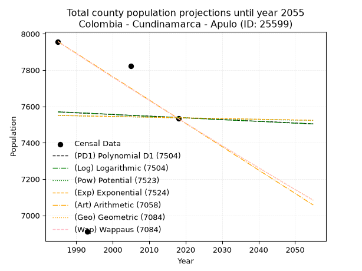
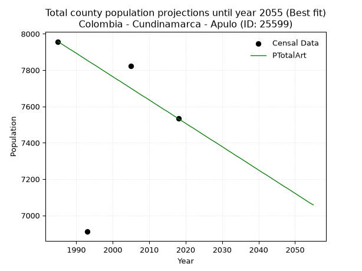
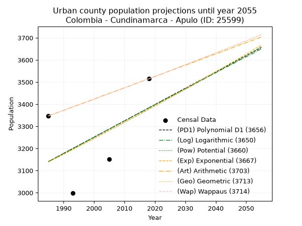
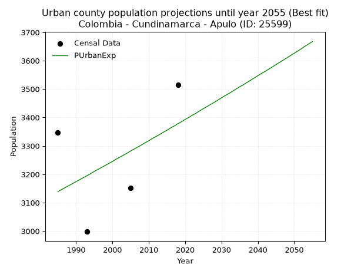
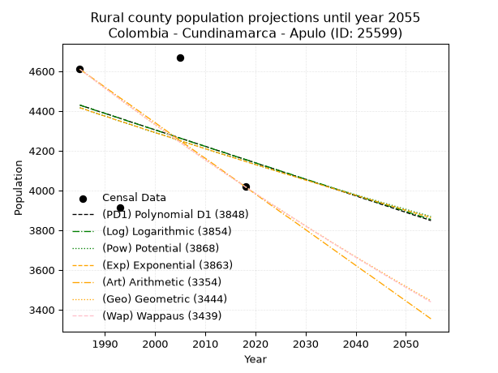
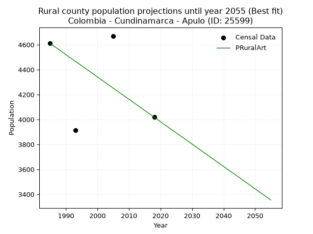

<div align="center">


</div>

# _“Population and Public Services Demand Projections (PPSD) until Year 2050 for Colombia - Cundinamarca - Apulo (ID: 25599)”_
Keywords: `population` `public-service` `projection` `lineal` `polynomial` `logarithmic` `potential` `exponential` `arithmetic` `geometric` `wappaus` `dane` `colombia` `south-america`

PPSD are analytical estimates used by governments and planners to anticipate future changes in population size, age distribution, and the resulting community needs for utilities, healthcare, education, and infrastructure as sizing future water treatment facilities, electrical grids, and road networks based on spatial growth.

> **General running parameters**: • app_version: _v20260806_. • Python version: _3.14.7_. • Pandas version: _3.0.5_. • NumPy version: _2.5.1_. • Creates, save and include plots into reports (create_plot): _False_. • Projection until year: _2050_. • Process polynomial degree 2 and up: _False_. • Process Wappaus: _True_. • Process Wappaus: _True_. • Set negative values to zero: _True_. • Set infinite values to zero: _True_. • Drop dataset notes: _True_. 
<div align="center">

Dynamic map: [:earth_americas:Google](http://maps.google.com/maps?q=4.520303598,-74.5939259) [:earth_americas:OSM](https://www.openstreetmap.org/#map=18/4.520303598/-74.5939259&layers=P) [:earth_americas:Bing](https://www.bing.com/maps?cp=4.520303598~-74.5939259&lvl=18) [:earth_americas:Apple](https://maps.apple.com/frame?center=4.520303598%2C-74.5939259&span=0.003%2C0.006)

</div>


<div align="center">

```geojson
{
  "type": "Feature",
  "geometry": {
    "type": "Point", 
    "coordinates": [-74.5939259, 4.520303598]
  }, 
  "properties": {
    "Name": "Colombia - Cundinamarca - Apulo (ID: 25599)"
  }
}
```

</div>


## 0. Census Data (4 records)

Census data are official statistics collected by a government about the people and housing in a country. They usually include counts of total population, age, sex, race, income, education, and jobs.

📅Global census file: [Population.xlsx](../data/Population.xlsx)

| Source   |   Year |   CountryID | CountryName   |   StateID | StateName    |   CountyID | CountyName   |   PTotal |   PUrban |   PRural |
|:---------|-------:|------------:|:--------------|----------:|:-------------|-----------:|:-------------|---------:|---------:|---------:|
| DANE     |   1985 |          57 | Colombia      |        25 | Cundinamarca |      25599 | Apulo        |     7957 |     3347 |     4610 |
| DANE     |   1993 |          57 | Colombia      |        25 | Cundinamarca |      25599 | Apulo        |     6911 |     2998 |     3913 |
| DANE     |   2005 |          57 | Colombia      |        25 | Cundinamarca |      25599 | Apulo        |     7822 |     3152 |     4670 |
| DANE     |   2018 |          57 | Colombia      |        25 | Cundinamarca |      25599 | Apulo        |     7533 |     3515 |     4018 |

> 🔥Some records could had specific notes about the registered values or the corresponding urban or rural distribution.

## 1. Total

### 1.1. Coefficients and Parameters

* (PD1) Polynomial Deg 1: -0.9373745483740348, 9430.733440385164 (lineal)
* (Log) Logarithmic: -1924.7535466458805, 22185.81713206226
* (Pow) Potential: -0.10769579045694452, 4.233155979161401
* (Exp) Exponential: -5.050031234917052e-05, 8346.675020707802
* (Art) Arithmetic: Year diff. 2018 - 1985 = 33, Population diff. 7533 - 7957 = -424, Annual growth = -12.848484848484848
* (Geo) Geometric: Year diff. 2018 - 1985 = 33, Population diff. 7533 - 7957 = -424, Annual growth % = -0.0016579778382537214
* (Wap) Wappaus: i = -0.1658939296124577, Condition values only valid for < 200)

<sub>
Wappaus condition values: ['-0.00', '-0.17', '-0.33', '-0.50', '-0.66', '-0.83', '-1.00', '-1.16', '-1.33', '-1.49', '-1.66', '-1.82', '-1.99', '-2.16', '-2.32', '-2.49', '-2.65', '-2.82', '-2.99', '-3.15', '-3.32', '-3.48', '-3.65', '-3.82', '-3.98', '-4.15', '-4.31', '-4.48', '-4.65', '-4.81', '-4.98', '-5.14', '-5.31', '-5.47', '-5.64', '-5.81', '-5.97', '-6.14', '-6.30', '-6.47', '-6.64', '-6.80', '-6.97', '-7.13', '-7.30', '-7.47', '-7.63', '-7.80', '-7.96', '-8.13', '-8.29', '-8.46', '-8.63', '-8.79', '-8.96', '-9.12', '-9.29', '-9.46', '-9.62', '-9.79', '-9.95', '-10.12', '-10.29', '-10.45', '-10.62', '-10.78']
</sub>


### 1.2. Projected Dataset

|   Year |   CountyID |   PTotalPD1 |   PTotalLog |   PTotalPow |   PTotalExp |   PTotalArt |   PTotalGeo |   PTotalWap |
|-------:|-----------:|------------:|------------:|------------:|------------:|------------:|------------:|------------:|
|   1985 |      25599 |        7570 |        7570 |        7551 |        7551 |        7957 |        7957 |        7957 |
|   1986 |      25599 |        7569 |        7569 |        7551 |        7550 |        7944 |        7944 |        7944 |
|   1987 |      25599 |        7568 |        7569 |        7550 |        7550 |        7931 |        7931 |        7931 |
|   1988 |      25599 |        7567 |        7568 |        7550 |        7549 |        7918 |        7917 |        7917 |
|   1989 |      25599 |        7566 |        7567 |        7549 |        7549 |        7906 |        7904 |        7904 |
|   1990 |      25599 |        7565 |        7566 |        7549 |        7549 |        7893 |        7891 |        7891 |
|   1991 |      25599 |        7564 |        7565 |        7548 |        7548 |        7880 |        7878 |        7878 |
|   1992 |      25599 |        7563 |        7564 |        7548 |        7548 |        7867 |        7865 |        7865 |
|   1993 |      25599 |        7563 |        7563 |        7548 |        7547 |        7854 |        7852 |        7852 |
|   1994 |      25599 |        7562 |        7562 |        7547 |        7547 |        7841 |        7839 |        7839 |
|   1995 |      25599 |        7561 |        7561 |        7547 |        7547 |        7829 |        7826 |        7826 |
|   1996 |      25599 |        7560 |        7560 |        7546 |        7546 |        7816 |        7813 |        7813 |
|   1997 |      25599 |        7559 |        7559 |        7546 |        7546 |        7803 |        7800 |        7800 |
|   1998 |      25599 |        7558 |        7558 |        7546 |        7546 |        7790 |        7787 |        7787 |
|   1999 |      25599 |        7557 |        7557 |        7545 |        7545 |        7777 |        7774 |        7774 |
|   2000 |      25599 |        7556 |        7556 |        7545 |        7545 |        7764 |        7761 |        7761 |
|   2001 |      25599 |        7555 |        7555 |        7544 |        7544 |        7751 |        7749 |        7749 |
|   2002 |      25599 |        7554 |        7554 |        7544 |        7544 |        7739 |        7736 |        7736 |
|   2003 |      25599 |        7553 |        7553 |        7544 |        7544 |        7726 |        7723 |        7723 |
|   2004 |      25599 |        7552 |        7552 |        7543 |        7543 |        7713 |        7710 |        7710 |
|   2005 |      25599 |        7551 |        7551 |        7543 |        7543 |        7700 |        7697 |        7697 |
|   2006 |      25599 |        7550 |        7550 |        7542 |        7543 |        7687 |        7685 |        7685 |
|   2007 |      25599 |        7549 |        7549 |        7542 |        7542 |        7674 |        7672 |        7672 |
|   2008 |      25599 |        7548 |        7548 |        7542 |        7542 |        7661 |        7659 |        7659 |
|   2009 |      25599 |        7548 |        7547 |        7541 |        7541 |        7649 |        7646 |        7646 |
|   2010 |      25599 |        7547 |        7546 |        7541 |        7541 |        7636 |        7634 |        7634 |
|   2011 |      25599 |        7546 |        7545 |        7540 |        7541 |        7623 |        7621 |        7621 |
|   2012 |      25599 |        7545 |        7544 |        7540 |        7540 |        7610 |        7608 |        7608 |
|   2013 |      25599 |        7544 |        7543 |        7540 |        7540 |        7597 |        7596 |        7596 |
|   2014 |      25599 |        7543 |        7543 |        7539 |        7539 |        7584 |        7583 |        7583 |
|   2015 |      25599 |        7542 |        7542 |        7539 |        7539 |        7572 |        7571 |        7571 |
|   2016 |      25599 |        7541 |        7541 |        7538 |        7539 |        7559 |        7558 |        7558 |
|   2017 |      25599 |        7540 |        7540 |        7538 |        7538 |        7546 |        7546 |        7546 |
|   2018 |      25599 |        7539 |        7539 |        7538 |        7538 |        7533 |        7533 |        7533 |
|   2019 |      25599 |        7538 |        7538 |        7537 |        7538 |        7520 |        7521 |        7521 |
|   2020 |      25599 |        7537 |        7537 |        7537 |        7537 |        7507 |        7508 |        7508 |
|   2021 |      25599 |        7536 |        7536 |        7536 |        7537 |        7494 |        7496 |        7496 |
|   2022 |      25599 |        7535 |        7535 |        7536 |        7536 |        7482 |        7483 |        7483 |
|   2023 |      25599 |        7534 |        7534 |        7536 |        7536 |        7469 |        7471 |        7471 |
|   2024 |      25599 |        7533 |        7533 |        7535 |        7536 |        7456 |        7458 |        7458 |
|   2025 |      25599 |        7533 |        7532 |        7535 |        7535 |        7443 |        7446 |        7446 |
|   2026 |      25599 |        7532 |        7531 |        7534 |        7535 |        7430 |        7434 |        7434 |
|   2027 |      25599 |        7531 |        7530 |        7534 |        7535 |        7417 |        7421 |        7421 |
|   2028 |      25599 |        7530 |        7529 |        7534 |        7534 |        7405 |        7409 |        7409 |
|   2029 |      25599 |        7529 |        7528 |        7533 |        7534 |        7392 |        7397 |        7397 |
|   2030 |      25599 |        7528 |        7527 |        7533 |        7533 |        7379 |        7384 |        7384 |
|   2031 |      25599 |        7527 |        7526 |        7532 |        7533 |        7366 |        7372 |        7372 |
|   2032 |      25599 |        7526 |        7525 |        7532 |        7533 |        7353 |        7360 |        7360 |
|   2033 |      25599 |        7525 |        7524 |        7532 |        7532 |        7340 |        7348 |        7348 |
|   2034 |      25599 |        7524 |        7524 |        7531 |        7532 |        7327 |        7336 |        7335 |
|   2035 |      25599 |        7523 |        7523 |        7531 |        7532 |        7315 |        7323 |        7323 |
|   2036 |      25599 |        7522 |        7522 |        7530 |        7531 |        7302 |        7311 |        7311 |
|   2037 |      25599 |        7521 |        7521 |        7530 |        7531 |        7289 |        7299 |        7299 |
|   2038 |      25599 |        7520 |        7520 |        7530 |        7530 |        7276 |        7287 |        7287 |
|   2039 |      25599 |        7519 |        7519 |        7529 |        7530 |        7263 |        7275 |        7275 |
|   2040 |      25599 |        7518 |        7518 |        7529 |        7530 |        7250 |        7263 |        7263 |
|   2041 |      25599 |        7518 |        7517 |        7528 |        7529 |        7237 |        7251 |        7251 |
|   2042 |      25599 |        7517 |        7516 |        7528 |        7529 |        7225 |        7239 |        7239 |
|   2043 |      25599 |        7516 |        7515 |        7528 |        7528 |        7212 |        7227 |        7227 |
|   2044 |      25599 |        7515 |        7514 |        7527 |        7528 |        7199 |        7215 |        7215 |
|   2045 |      25599 |        7514 |        7513 |        7527 |        7528 |        7186 |        7203 |        7203 |
|   2046 |      25599 |        7513 |        7512 |        7526 |        7527 |        7173 |        7191 |        7191 |
|   2047 |      25599 |        7512 |        7511 |        7526 |        7527 |        7160 |        7179 |        7179 |
|   2048 |      25599 |        7511 |        7510 |        7526 |        7527 |        7148 |        7167 |        7167 |
|   2049 |      25599 |        7510 |        7509 |        7525 |        7526 |        7135 |        7155 |        7155 |
|   2050 |      25599 |        7509 |        7508 |        7525 |        7526 |        7122 |        7143 |        7143 |
<div align="center">

</img>

</div>


### 1.3. Best fit with absolute and relative error (%)

Relative error puts that difference into context by dividing the absolute error by the true value, creating a unitless ratio or percentage that shows the scale of the mistake.

Absolute and relative error

|   Year | Source   |   CountryID | CountryName   |   StateID | StateName    |   CountyID_x | CountyName   |   PTotal |   PUrban |   PRural |   CountyID_y |   PTotalPD1 |   PTotalLog |   PTotalPow |   PTotalExp |   PTotalArt |   PTotalGeo |   PTotalWap |   PTotalPD1AbsError |   PTotalLogAbsError |   PTotalPowAbsError |   PTotalExpAbsError |   PTotalArtAbsError |   PTotalGeoAbsError |   PTotalWapAbsError |   PTotalPD1RelError |   PTotalLogRelError |   PTotalPowRelError |   PTotalExpRelError |   PTotalArtRelError |   PTotalGeoRelError |   PTotalWapRelError |
|-------:|:---------|------------:|:--------------|----------:|:-------------|-------------:|:-------------|---------:|---------:|---------:|-------------:|------------:|------------:|------------:|------------:|------------:|------------:|------------:|--------------------:|--------------------:|--------------------:|--------------------:|--------------------:|--------------------:|--------------------:|--------------------:|--------------------:|--------------------:|--------------------:|--------------------:|--------------------:|--------------------:|
|   1985 | DANE     |          57 | Colombia      |        25 | Cundinamarca |        25599 | Apulo        |     7957 |     3347 |     4610 |        25599 |        7570 |        7570 |        7551 |        7551 |        7957 |        7957 |        7957 |                 387 |                 387 |                 406 |                 406 |                   0 |                   0 |                   0 |           4.86364   |           4.86364   |           5.10243   |           5.10243   |              0      |             0       |             0       |
|   1993 | DANE     |          57 | Colombia      |        25 | Cundinamarca |        25599 | Apulo        |     6911 |     2998 |     3913 |        25599 |        7563 |        7563 |        7548 |        7547 |        7854 |        7852 |        7852 |                 652 |                 652 |                 637 |                 636 |                 943 |                 941 |                 941 |           9.43424   |           9.43424   |           9.21719   |           9.20272   |             13.6449 |            13.616   |            13.616   |
|   2005 | DANE     |          57 | Colombia      |        25 | Cundinamarca |        25599 | Apulo        |     7822 |     3152 |     4670 |        25599 |        7551 |        7551 |        7543 |        7543 |        7700 |        7697 |        7697 |                 271 |                 271 |                 279 |                 279 |                 122 |                 125 |                 125 |           3.46459   |           3.46459   |           3.56686   |           3.56686   |              1.5597 |             1.59806 |             1.59806 |
|   2018 | DANE     |          57 | Colombia      |        25 | Cundinamarca |        25599 | Apulo        |     7533 |     3515 |     4018 |        25599 |        7539 |        7539 |        7538 |        7538 |        7533 |        7533 |        7533 |                   6 |                   6 |                   5 |                   5 |                   0 |                   0 |                   0 |           0.0796495 |           0.0796495 |           0.0663746 |           0.0663746 |              0      |             0       |             0       |

Relative error mean

| Method    |   RelError | Best   |
|:----------|-----------:|:-------|
| PTotalPD1 |    4.46053 |        |
| PTotalLog |    4.46053 |        |
| PTotalPow |    4.48821 |        |
| PTotalExp |    4.4846  |        |
| PTotalArt |    3.80115 | True   |
| PTotalGeo |    3.80351 |        |
| PTotalWap |    3.80351 |        |

💙Best method: _**PTotalArt**_
<div align="center">

</img>

</div>


### 1.4. Fresh water supply demand in liters per capita per day (lpcd)

The fresh water supply demand typically ranges from 100 to 300 liters per capita per day (lpcd) for standard domestic and municipal planning, though absolute survival minimums set by the World Health Organization are as low as 7.5 to 20 liters per day, and total consumption in high-income nations can exceed 400 liters.

> `CZ`: Level in meters above the sea level (masl)<br> `WS`: Fresh water supply demand in liters per capita per day (lpcd or l/h/d)<br> `WSAll`: Zonal fresh water supply demand in liters per second (l/s)<br> `A`: Zonal area in square meters<br> `DP`: Population density (people/hectare)

Reference values (RAS Colombia)

|    CZ |   WS |
|------:|-----:|
|  1000 |  120 |
|  2000 |  130 |
| 99999 |  140 |

County shapefile geometry properties and water supply values

|   CountyID |      ATotal |   CZTotal |   WSTotal |
|-----------:|------------:|----------:|----------:|
|      25599 | 1.21872e+08 |   660.822 |       120 |

Projected values for best method: PTotalArt

|   CountyID |   Year |   PTotalArt |   DPTotal |   WSTotal |   WSTotalAll |
|-----------:|-------:|------------:|----------:|----------:|-------------:|
|      25599 |   1985 |        7957 |      0.65 |       120 |     11.0514  |
|      25599 |   1986 |        7944 |      0.65 |       120 |     11.0333  |
|      25599 |   1987 |        7931 |      0.65 |       120 |     11.0153  |
|      25599 |   1988 |        7918 |      0.65 |       120 |     10.9972  |
|      25599 |   1989 |        7906 |      0.65 |       120 |     10.9806  |
|      25599 |   1990 |        7893 |      0.65 |       120 |     10.9625  |
|      25599 |   1991 |        7880 |      0.65 |       120 |     10.9444  |
|      25599 |   1992 |        7867 |      0.65 |       120 |     10.9264  |
|      25599 |   1993 |        7854 |      0.64 |       120 |     10.9083  |
|      25599 |   1994 |        7841 |      0.64 |       120 |     10.8903  |
|      25599 |   1995 |        7829 |      0.64 |       120 |     10.8736  |
|      25599 |   1996 |        7816 |      0.64 |       120 |     10.8556  |
|      25599 |   1997 |        7803 |      0.64 |       120 |     10.8375  |
|      25599 |   1998 |        7790 |      0.64 |       120 |     10.8194  |
|      25599 |   1999 |        7777 |      0.64 |       120 |     10.8014  |
|      25599 |   2000 |        7764 |      0.64 |       120 |     10.7833  |
|      25599 |   2001 |        7751 |      0.64 |       120 |     10.7653  |
|      25599 |   2002 |        7739 |      0.64 |       120 |     10.7486  |
|      25599 |   2003 |        7726 |      0.63 |       120 |     10.7306  |
|      25599 |   2004 |        7713 |      0.63 |       120 |     10.7125  |
|      25599 |   2005 |        7700 |      0.63 |       120 |     10.6944  |
|      25599 |   2006 |        7687 |      0.63 |       120 |     10.6764  |
|      25599 |   2007 |        7674 |      0.63 |       120 |     10.6583  |
|      25599 |   2008 |        7661 |      0.63 |       120 |     10.6403  |
|      25599 |   2009 |        7649 |      0.63 |       120 |     10.6236  |
|      25599 |   2010 |        7636 |      0.63 |       120 |     10.6056  |
|      25599 |   2011 |        7623 |      0.63 |       120 |     10.5875  |
|      25599 |   2012 |        7610 |      0.62 |       120 |     10.5694  |
|      25599 |   2013 |        7597 |      0.62 |       120 |     10.5514  |
|      25599 |   2014 |        7584 |      0.62 |       120 |     10.5333  |
|      25599 |   2015 |        7572 |      0.62 |       120 |     10.5167  |
|      25599 |   2016 |        7559 |      0.62 |       120 |     10.4986  |
|      25599 |   2017 |        7546 |      0.62 |       120 |     10.4806  |
|      25599 |   2018 |        7533 |      0.62 |       120 |     10.4625  |
|      25599 |   2019 |        7520 |      0.62 |       120 |     10.4444  |
|      25599 |   2020 |        7507 |      0.62 |       120 |     10.4264  |
|      25599 |   2021 |        7494 |      0.61 |       120 |     10.4083  |
|      25599 |   2022 |        7482 |      0.61 |       120 |     10.3917  |
|      25599 |   2023 |        7469 |      0.61 |       120 |     10.3736  |
|      25599 |   2024 |        7456 |      0.61 |       120 |     10.3556  |
|      25599 |   2025 |        7443 |      0.61 |       120 |     10.3375  |
|      25599 |   2026 |        7430 |      0.61 |       120 |     10.3194  |
|      25599 |   2027 |        7417 |      0.61 |       120 |     10.3014  |
|      25599 |   2028 |        7405 |      0.61 |       120 |     10.2847  |
|      25599 |   2029 |        7392 |      0.61 |       120 |     10.2667  |
|      25599 |   2030 |        7379 |      0.61 |       120 |     10.2486  |
|      25599 |   2031 |        7366 |      0.6  |       120 |     10.2306  |
|      25599 |   2032 |        7353 |      0.6  |       120 |     10.2125  |
|      25599 |   2033 |        7340 |      0.6  |       120 |     10.1944  |
|      25599 |   2034 |        7327 |      0.6  |       120 |     10.1764  |
|      25599 |   2035 |        7315 |      0.6  |       120 |     10.1597  |
|      25599 |   2036 |        7302 |      0.6  |       120 |     10.1417  |
|      25599 |   2037 |        7289 |      0.6  |       120 |     10.1236  |
|      25599 |   2038 |        7276 |      0.6  |       120 |     10.1056  |
|      25599 |   2039 |        7263 |      0.6  |       120 |     10.0875  |
|      25599 |   2040 |        7250 |      0.59 |       120 |     10.0694  |
|      25599 |   2041 |        7237 |      0.59 |       120 |     10.0514  |
|      25599 |   2042 |        7225 |      0.59 |       120 |     10.0347  |
|      25599 |   2043 |        7212 |      0.59 |       120 |     10.0167  |
|      25599 |   2044 |        7199 |      0.59 |       120 |      9.99861 |
|      25599 |   2045 |        7186 |      0.59 |       120 |      9.98056 |
|      25599 |   2046 |        7173 |      0.59 |       120 |      9.9625  |
|      25599 |   2047 |        7160 |      0.59 |       120 |      9.94444 |
|      25599 |   2048 |        7148 |      0.59 |       120 |      9.92778 |
|      25599 |   2049 |        7135 |      0.59 |       120 |      9.90972 |
|      25599 |   2050 |        7122 |      0.58 |       120 |      9.89167 |

## 2. Urban

### 2.1. Coefficients and Parameters

* (PD1) Polynomial Deg 1: 7.364110798875737, -11477.062625451194 (lineal)
* (Log) Logarithmic: 14679.328551336177, -108324.69395146277
* (Pow) Potential: 4.425051160451402, -11.095929744220586
* (Exp) Exponential: 0.002220058697250499, 38.27720309795916
* (Art) Arithmetic: Year diff. 2018 - 1985 = 33, Population diff. 3515 - 3347 = 168, Annual growth = 5.090909090909091
* (Geo) Geometric: Year diff. 2018 - 1985 = 33, Population diff. 3515 - 3347 = 168, Annual growth % = 0.0014851958438601987
* (Wap) Wappaus: i = 0.14837974616464852, Condition values only valid for < 200)

<sub>
Wappaus condition values: ['0.00', '0.15', '0.30', '0.45', '0.59', '0.74', '0.89', '1.04', '1.19', '1.34', '1.48', '1.63', '1.78', '1.93', '2.08', '2.23', '2.37', '2.52', '2.67', '2.82', '2.97', '3.12', '3.26', '3.41', '3.56', '3.71', '3.86', '4.01', '4.15', '4.30', '4.45', '4.60', '4.75', '4.90', '5.04', '5.19', '5.34', '5.49', '5.64', '5.79', '5.94', '6.08', '6.23', '6.38', '6.53', '6.68', '6.83', '6.97', '7.12', '7.27', '7.42', '7.57', '7.72', '7.86', '8.01', '8.16', '8.31', '8.46', '8.61', '8.75', '8.90', '9.05', '9.20', '9.35', '9.50', '9.64']
</sub>


### 2.2. Projected Dataset

|   Year |   CountyID |   PUrbanPD1 |   PUrbanLog |   PUrbanPow |   PUrbanExp |   PUrbanArt |   PUrbanGeo |   PUrbanWap |
|-------:|-----------:|------------:|------------:|------------:|------------:|------------:|------------:|------------:|
|   1985 |      25599 |        3141 |        3141 |        3139 |        3139 |        3347 |        3347 |        3347 |
|   1986 |      25599 |        3148 |        3148 |        3146 |        3146 |        3352 |        3352 |        3352 |
|   1987 |      25599 |        3155 |        3156 |        3153 |        3153 |        3357 |        3357 |        3357 |
|   1988 |      25599 |        3163 |        3163 |        3160 |        3160 |        3362 |        3362 |        3362 |
|   1989 |      25599 |        3170 |        3170 |        3167 |        3167 |        3367 |        3367 |        3367 |
|   1990 |      25599 |        3178 |        3178 |        3174 |        3174 |        3372 |        3372 |        3372 |
|   1991 |      25599 |        3185 |        3185 |        3181 |        3181 |        3378 |        3377 |        3377 |
|   1992 |      25599 |        3192 |        3193 |        3189 |        3188 |        3383 |        3382 |        3382 |
|   1993 |      25599 |        3200 |        3200 |        3196 |        3195 |        3388 |        3387 |        3387 |
|   1994 |      25599 |        3207 |        3207 |        3203 |        3202 |        3393 |        3392 |        3392 |
|   1995 |      25599 |        3214 |        3215 |        3210 |        3210 |        3398 |        3397 |        3397 |
|   1996 |      25599 |        3222 |        3222 |        3217 |        3217 |        3403 |        3402 |        3402 |
|   1997 |      25599 |        3229 |        3229 |        3224 |        3224 |        3408 |        3407 |        3407 |
|   1998 |      25599 |        3236 |        3237 |        3231 |        3231 |        3413 |        3412 |        3412 |
|   1999 |      25599 |        3244 |        3244 |        3238 |        3238 |        3418 |        3417 |        3417 |
|   2000 |      25599 |        3251 |        3251 |        3246 |        3245 |        3423 |        3422 |        3422 |
|   2001 |      25599 |        3259 |        3259 |        3253 |        3253 |        3428 |        3427 |        3427 |
|   2002 |      25599 |        3266 |        3266 |        3260 |        3260 |        3434 |        3433 |        3433 |
|   2003 |      25599 |        3273 |        3273 |        3267 |        3267 |        3439 |        3438 |        3438 |
|   2004 |      25599 |        3281 |        3281 |        3274 |        3274 |        3444 |        3443 |        3443 |
|   2005 |      25599 |        3288 |        3288 |        3282 |        3282 |        3449 |        3448 |        3448 |
|   2006 |      25599 |        3295 |        3295 |        3289 |        3289 |        3454 |        3453 |        3453 |
|   2007 |      25599 |        3303 |        3303 |        3296 |        3296 |        3459 |        3458 |        3458 |
|   2008 |      25599 |        3310 |        3310 |        3303 |        3303 |        3464 |        3463 |        3463 |
|   2009 |      25599 |        3317 |        3317 |        3311 |        3311 |        3469 |        3468 |        3468 |
|   2010 |      25599 |        3325 |        3325 |        3318 |        3318 |        3474 |        3474 |        3474 |
|   2011 |      25599 |        3332 |        3332 |        3325 |        3326 |        3479 |        3479 |        3479 |
|   2012 |      25599 |        3340 |        3339 |        3333 |        3333 |        3484 |        3484 |        3484 |
|   2013 |      25599 |        3347 |        3347 |        3340 |        3340 |        3490 |        3489 |        3489 |
|   2014 |      25599 |        3354 |        3354 |        3347 |        3348 |        3495 |        3494 |        3494 |
|   2015 |      25599 |        3362 |        3361 |        3355 |        3355 |        3500 |        3499 |        3499 |
|   2016 |      25599 |        3369 |        3368 |        3362 |        3363 |        3505 |        3505 |        3505 |
|   2017 |      25599 |        3376 |        3376 |        3369 |        3370 |        3510 |        3510 |        3510 |
|   2018 |      25599 |        3384 |        3383 |        3377 |        3378 |        3515 |        3515 |        3515 |
|   2019 |      25599 |        3391 |        3390 |        3384 |        3385 |        3520 |        3520 |        3520 |
|   2020 |      25599 |        3398 |        3398 |        3392 |        3393 |        3525 |        3525 |        3525 |
|   2021 |      25599 |        3406 |        3405 |        3399 |        3400 |        3530 |        3531 |        3531 |
|   2022 |      25599 |        3413 |        3412 |        3407 |        3408 |        3535 |        3536 |        3536 |
|   2023 |      25599 |        3421 |        3419 |        3414 |        3415 |        3540 |        3541 |        3541 |
|   2024 |      25599 |        3428 |        3427 |        3422 |        3423 |        3546 |        3546 |        3546 |
|   2025 |      25599 |        3435 |        3434 |        3429 |        3431 |        3551 |        3552 |        3552 |
|   2026 |      25599 |        3443 |        3441 |        3437 |        3438 |        3556 |        3557 |        3557 |
|   2027 |      25599 |        3450 |        3448 |        3444 |        3446 |        3561 |        3562 |        3562 |
|   2028 |      25599 |        3457 |        3456 |        3452 |        3453 |        3566 |        3568 |        3568 |
|   2029 |      25599 |        3465 |        3463 |        3459 |        3461 |        3571 |        3573 |        3573 |
|   2030 |      25599 |        3472 |        3470 |        3467 |        3469 |        3576 |        3578 |        3578 |
|   2031 |      25599 |        3479 |        3477 |        3474 |        3477 |        3581 |        3583 |        3584 |
|   2032 |      25599 |        3487 |        3484 |        3482 |        3484 |        3586 |        3589 |        3589 |
|   2033 |      25599 |        3494 |        3492 |        3489 |        3492 |        3591 |        3594 |        3594 |
|   2034 |      25599 |        3502 |        3499 |        3497 |        3500 |        3596 |        3599 |        3600 |
|   2035 |      25599 |        3509 |        3506 |        3505 |        3508 |        3602 |        3605 |        3605 |
|   2036 |      25599 |        3516 |        3513 |        3512 |        3515 |        3607 |        3610 |        3610 |
|   2037 |      25599 |        3524 |        3521 |        3520 |        3523 |        3612 |        3616 |        3616 |
|   2038 |      25599 |        3531 |        3528 |        3528 |        3531 |        3617 |        3621 |        3621 |
|   2039 |      25599 |        3538 |        3535 |        3535 |        3539 |        3622 |        3626 |        3626 |
|   2040 |      25599 |        3546 |        3542 |        3543 |        3547 |        3627 |        3632 |        3632 |
|   2041 |      25599 |        3553 |        3549 |        3551 |        3555 |        3632 |        3637 |        3637 |
|   2042 |      25599 |        3560 |        3557 |        3558 |        3562 |        3637 |        3642 |        3643 |
|   2043 |      25599 |        3568 |        3564 |        3566 |        3570 |        3642 |        3648 |        3648 |
|   2044 |      25599 |        3575 |        3571 |        3574 |        3578 |        3647 |        3653 |        3653 |
|   2045 |      25599 |        3583 |        3578 |        3581 |        3586 |        3652 |        3659 |        3659 |
|   2046 |      25599 |        3590 |        3585 |        3589 |        3594 |        3658 |        3664 |        3664 |
|   2047 |      25599 |        3597 |        3592 |        3597 |        3602 |        3663 |        3670 |        3670 |
|   2048 |      25599 |        3605 |        3600 |        3605 |        3610 |        3668 |        3675 |        3675 |
|   2049 |      25599 |        3612 |        3607 |        3613 |        3618 |        3673 |        3680 |        3681 |
|   2050 |      25599 |        3619 |        3614 |        3620 |        3626 |        3678 |        3686 |        3686 |
<div align="center">

</img>

</div>


### 2.3. Best fit with absolute and relative error (%)

Relative error puts that difference into context by dividing the absolute error by the true value, creating a unitless ratio or percentage that shows the scale of the mistake.

Absolute and relative error

|   Year | Source   |   CountryID | CountryName   |   StateID | StateName    |   CountyID_x | CountyName   |   PTotal |   PUrban |   PRural |   CountyID_y |   PUrbanPD1 |   PUrbanLog |   PUrbanPow |   PUrbanExp |   PUrbanArt |   PUrbanGeo |   PUrbanWap |   PUrbanPD1AbsError |   PUrbanLogAbsError |   PUrbanPowAbsError |   PUrbanExpAbsError |   PUrbanArtAbsError |   PUrbanGeoAbsError |   PUrbanWapAbsError |   PUrbanPD1RelError |   PUrbanLogRelError |   PUrbanPowRelError |   PUrbanExpRelError |   PUrbanArtRelError |   PUrbanGeoRelError |   PUrbanWapRelError |
|-------:|:---------|------------:|:--------------|----------:|:-------------|-------------:|:-------------|---------:|---------:|---------:|-------------:|------------:|------------:|------------:|------------:|------------:|------------:|------------:|--------------------:|--------------------:|--------------------:|--------------------:|--------------------:|--------------------:|--------------------:|--------------------:|--------------------:|--------------------:|--------------------:|--------------------:|--------------------:|--------------------:|
|   1985 | DANE     |          57 | Colombia      |        25 | Cundinamarca |        25599 | Apulo        |     7957 |     3347 |     4610 |        25599 |        3141 |        3141 |        3139 |        3139 |        3347 |        3347 |        3347 |                 206 |                 206 |                 208 |                 208 |                   0 |                   0 |                   0 |             6.15477 |             6.15477 |             6.21452 |             6.21452 |             0       |             0       |             0       |
|   1993 | DANE     |          57 | Colombia      |        25 | Cundinamarca |        25599 | Apulo        |     6911 |     2998 |     3913 |        25599 |        3200 |        3200 |        3196 |        3195 |        3388 |        3387 |        3387 |                 202 |                 202 |                 198 |                 197 |                 390 |                 389 |                 389 |             6.73783 |             6.73783 |             6.6044  |             6.57105 |            13.0087  |            12.9753  |            12.9753  |
|   2005 | DANE     |          57 | Colombia      |        25 | Cundinamarca |        25599 | Apulo        |     7822 |     3152 |     4670 |        25599 |        3288 |        3288 |        3282 |        3282 |        3449 |        3448 |        3448 |                 136 |                 136 |                 130 |                 130 |                 297 |                 296 |                 296 |             4.31472 |             4.31472 |             4.12437 |             4.12437 |             9.42259 |             9.39086 |             9.39086 |
|   2018 | DANE     |          57 | Colombia      |        25 | Cundinamarca |        25599 | Apulo        |     7533 |     3515 |     4018 |        25599 |        3384 |        3383 |        3377 |        3378 |        3515 |        3515 |        3515 |                 131 |                 132 |                 138 |                 137 |                   0 |                   0 |                   0 |             3.72688 |             3.75533 |             3.92603 |             3.89758 |             0       |             0       |             0       |

Relative error mean

| Method    |   RelError | Best   |
|:----------|-----------:|:-------|
| PUrbanPD1 |    5.23355 |        |
| PUrbanLog |    5.24066 |        |
| PUrbanPow |    5.21733 |        |
| PUrbanExp |    5.20188 | True   |
| PUrbanArt |    5.60782 |        |
| PUrbanGeo |    5.59154 |        |
| PUrbanWap |    5.59154 |        |

💙Best method: _**PUrbanExp**_
<div align="center">

</img>

</div>


### 2.4. Fresh water supply demand in liters per capita per day (lpcd)

The fresh water supply demand typically ranges from 100 to 300 liters per capita per day (lpcd) for standard domestic and municipal planning, though absolute survival minimums set by the World Health Organization are as low as 7.5 to 20 liters per day, and total consumption in high-income nations can exceed 400 liters.

> `CZ`: Level in meters above the sea level (masl)<br> `WS`: Fresh water supply demand in liters per capita per day (lpcd or l/h/d)<br> `WSAll`: Zonal fresh water supply demand in liters per second (l/s)<br> `A`: Zonal area in square meters<br> `DP`: Population density (people/hectare)

Reference values (RAS Colombia)

|    CZ |   WS |
|------:|-----:|
|  1000 |  120 |
|  2000 |  130 |
| 99999 |  140 |

County shapefile geometry properties and water supply values

|   CountyID |      AUrban |   CZUrban |   WSUrban |
|-----------:|------------:|----------:|----------:|
|      25599 | 1.43091e+06 |   429.667 |       120 |

Projected values for best method: PUrbanExp

|   CountyID |   Year |   PUrbanExp |   DPUrban |   WSUrban |   WSUrbanAll |
|-----------:|-------:|------------:|----------:|----------:|-------------:|
|      25599 |   1985 |        3139 |     21.94 |       120 |      4.35972 |
|      25599 |   1986 |        3146 |     21.99 |       120 |      4.36944 |
|      25599 |   1987 |        3153 |     22.03 |       120 |      4.37917 |
|      25599 |   1988 |        3160 |     22.08 |       120 |      4.38889 |
|      25599 |   1989 |        3167 |     22.13 |       120 |      4.39861 |
|      25599 |   1990 |        3174 |     22.18 |       120 |      4.40833 |
|      25599 |   1991 |        3181 |     22.23 |       120 |      4.41806 |
|      25599 |   1992 |        3188 |     22.28 |       120 |      4.42778 |
|      25599 |   1993 |        3195 |     22.33 |       120 |      4.4375  |
|      25599 |   1994 |        3202 |     22.38 |       120 |      4.44722 |
|      25599 |   1995 |        3210 |     22.43 |       120 |      4.45833 |
|      25599 |   1996 |        3217 |     22.48 |       120 |      4.46806 |
|      25599 |   1997 |        3224 |     22.53 |       120 |      4.47778 |
|      25599 |   1998 |        3231 |     22.58 |       120 |      4.4875  |
|      25599 |   1999 |        3238 |     22.63 |       120 |      4.49722 |
|      25599 |   2000 |        3245 |     22.68 |       120 |      4.50694 |
|      25599 |   2001 |        3253 |     22.73 |       120 |      4.51806 |
|      25599 |   2002 |        3260 |     22.78 |       120 |      4.52778 |
|      25599 |   2003 |        3267 |     22.83 |       120 |      4.5375  |
|      25599 |   2004 |        3274 |     22.88 |       120 |      4.54722 |
|      25599 |   2005 |        3282 |     22.94 |       120 |      4.55833 |
|      25599 |   2006 |        3289 |     22.99 |       120 |      4.56806 |
|      25599 |   2007 |        3296 |     23.03 |       120 |      4.57778 |
|      25599 |   2008 |        3303 |     23.08 |       120 |      4.5875  |
|      25599 |   2009 |        3311 |     23.14 |       120 |      4.59861 |
|      25599 |   2010 |        3318 |     23.19 |       120 |      4.60833 |
|      25599 |   2011 |        3326 |     23.24 |       120 |      4.61944 |
|      25599 |   2012 |        3333 |     23.29 |       120 |      4.62917 |
|      25599 |   2013 |        3340 |     23.34 |       120 |      4.63889 |
|      25599 |   2014 |        3348 |     23.4  |       120 |      4.65    |
|      25599 |   2015 |        3355 |     23.45 |       120 |      4.65972 |
|      25599 |   2016 |        3363 |     23.5  |       120 |      4.67083 |
|      25599 |   2017 |        3370 |     23.55 |       120 |      4.68056 |
|      25599 |   2018 |        3378 |     23.61 |       120 |      4.69167 |
|      25599 |   2019 |        3385 |     23.66 |       120 |      4.70139 |
|      25599 |   2020 |        3393 |     23.71 |       120 |      4.7125  |
|      25599 |   2021 |        3400 |     23.76 |       120 |      4.72222 |
|      25599 |   2022 |        3408 |     23.82 |       120 |      4.73333 |
|      25599 |   2023 |        3415 |     23.87 |       120 |      4.74306 |
|      25599 |   2024 |        3423 |     23.92 |       120 |      4.75417 |
|      25599 |   2025 |        3431 |     23.98 |       120 |      4.76528 |
|      25599 |   2026 |        3438 |     24.03 |       120 |      4.775   |
|      25599 |   2027 |        3446 |     24.08 |       120 |      4.78611 |
|      25599 |   2028 |        3453 |     24.13 |       120 |      4.79583 |
|      25599 |   2029 |        3461 |     24.19 |       120 |      4.80694 |
|      25599 |   2030 |        3469 |     24.24 |       120 |      4.81806 |
|      25599 |   2031 |        3477 |     24.3  |       120 |      4.82917 |
|      25599 |   2032 |        3484 |     24.35 |       120 |      4.83889 |
|      25599 |   2033 |        3492 |     24.4  |       120 |      4.85    |
|      25599 |   2034 |        3500 |     24.46 |       120 |      4.86111 |
|      25599 |   2035 |        3508 |     24.52 |       120 |      4.87222 |
|      25599 |   2036 |        3515 |     24.56 |       120 |      4.88194 |
|      25599 |   2037 |        3523 |     24.62 |       120 |      4.89306 |
|      25599 |   2038 |        3531 |     24.68 |       120 |      4.90417 |
|      25599 |   2039 |        3539 |     24.73 |       120 |      4.91528 |
|      25599 |   2040 |        3547 |     24.79 |       120 |      4.92639 |
|      25599 |   2041 |        3555 |     24.84 |       120 |      4.9375  |
|      25599 |   2042 |        3562 |     24.89 |       120 |      4.94722 |
|      25599 |   2043 |        3570 |     24.95 |       120 |      4.95833 |
|      25599 |   2044 |        3578 |     25.01 |       120 |      4.96944 |
|      25599 |   2045 |        3586 |     25.06 |       120 |      4.98056 |
|      25599 |   2046 |        3594 |     25.12 |       120 |      4.99167 |
|      25599 |   2047 |        3602 |     25.17 |       120 |      5.00278 |
|      25599 |   2048 |        3610 |     25.23 |       120 |      5.01389 |
|      25599 |   2049 |        3618 |     25.28 |       120 |      5.025   |
|      25599 |   2050 |        3626 |     25.34 |       120 |      5.03611 |

## 3. Rural

### 3.1. Coefficients and Parameters

* (PD1) Polynomial Deg 1: -8.301485347249725, 20907.796065836268 (lineal)
* (Log) Logarithmic: -16604.08209798201, 130510.51108352463
* (Pow) Potential: -3.821459540964642, 16.247312149946058
* (Exp) Exponential: -0.001910485730759411, 195892.87771062483
* (Art) Arithmetic: Year diff. 2018 - 1985 = 33, Population diff. 4018 - 4610 = -592, Annual growth = -17.939393939393938
* (Geo) Geometric: Year diff. 2018 - 1985 = 33, Population diff. 4018 - 4610 = -592, Annual growth % = -0.004156295885736072
* (Wap) Wappaus: i = -0.41584130596647984, Condition values only valid for < 200)

<sub>
Wappaus condition values: ['-0.00', '-0.42', '-0.83', '-1.25', '-1.66', '-2.08', '-2.50', '-2.91', '-3.33', '-3.74', '-4.16', '-4.57', '-4.99', '-5.41', '-5.82', '-6.24', '-6.65', '-7.07', '-7.49', '-7.90', '-8.32', '-8.73', '-9.15', '-9.56', '-9.98', '-10.40', '-10.81', '-11.23', '-11.64', '-12.06', '-12.48', '-12.89', '-13.31', '-13.72', '-14.14', '-14.55', '-14.97', '-15.39', '-15.80', '-16.22', '-16.63', '-17.05', '-17.47', '-17.88', '-18.30', '-18.71', '-19.13', '-19.54', '-19.96', '-20.38', '-20.79', '-21.21', '-21.62', '-22.04', '-22.46', '-22.87', '-23.29', '-23.70', '-24.12', '-24.53', '-24.95', '-25.37', '-25.78', '-26.20', '-26.61', '-27.03']
</sub>


### 3.2. Projected Dataset

|   Year |   CountyID |   PRuralPD1 |   PRuralLog |   PRuralPow |   PRuralExp |   PRuralArt |   PRuralGeo |   PRuralWap |
|-------:|-----------:|------------:|------------:|------------:|------------:|------------:|------------:|------------:|
|   1985 |      25599 |        4429 |        4430 |        4416 |        4416 |        4610 |        4610 |        4610 |
|   1986 |      25599 |        4421 |        4421 |        4408 |        4408 |        4592 |        4591 |        4591 |
|   1987 |      25599 |        4413 |        4413 |        4399 |        4399 |        4574 |        4572 |        4572 |
|   1988 |      25599 |        4404 |        4404 |        4391 |        4391 |        4556 |        4553 |        4553 |
|   1989 |      25599 |        4396 |        4396 |        4382 |        4382 |        4538 |        4534 |        4534 |
|   1990 |      25599 |        4388 |        4388 |        4374 |        4374 |        4520 |        4515 |        4515 |
|   1991 |      25599 |        4380 |        4379 |        4366 |        4366 |        4502 |        4496 |        4496 |
|   1992 |      25599 |        4371 |        4371 |        4357 |        4357 |        4484 |        4478 |        4478 |
|   1993 |      25599 |        4363 |        4363 |        4349 |        4349 |        4466 |        4459 |        4459 |
|   1994 |      25599 |        4355 |        4354 |        4341 |        4341 |        4449 |        4440 |        4441 |
|   1995 |      25599 |        4346 |        4346 |        4332 |        4333 |        4431 |        4422 |        4422 |
|   1996 |      25599 |        4338 |        4338 |        4324 |        4324 |        4413 |        4404 |        4404 |
|   1997 |      25599 |        4330 |        4329 |        4316 |        4316 |        4395 |        4385 |        4386 |
|   1998 |      25599 |        4321 |        4321 |        4307 |        4308 |        4377 |        4367 |        4367 |
|   1999 |      25599 |        4313 |        4313 |        4299 |        4300 |        4359 |        4349 |        4349 |
|   2000 |      25599 |        4305 |        4305 |        4291 |        4291 |        4341 |        4331 |        4331 |
|   2001 |      25599 |        4297 |        4296 |        4283 |        4283 |        4323 |        4313 |        4313 |
|   2002 |      25599 |        4288 |        4288 |        4275 |        4275 |        4305 |        4295 |        4295 |
|   2003 |      25599 |        4280 |        4280 |        4267 |        4267 |        4287 |        4277 |        4277 |
|   2004 |      25599 |        4272 |        4271 |        4258 |        4259 |        4269 |        4259 |        4260 |
|   2005 |      25599 |        4263 |        4263 |        4250 |        4251 |        4251 |        4242 |        4242 |
|   2006 |      25599 |        4255 |        4255 |        4242 |        4242 |        4233 |        4224 |        4224 |
|   2007 |      25599 |        4247 |        4246 |        4234 |        4234 |        4215 |        4206 |        4207 |
|   2008 |      25599 |        4238 |        4238 |        4226 |        4226 |        4197 |        4189 |        4189 |
|   2009 |      25599 |        4230 |        4230 |        4218 |        4218 |        4179 |        4171 |        4172 |
|   2010 |      25599 |        4222 |        4222 |        4210 |        4210 |        4162 |        4154 |        4154 |
|   2011 |      25599 |        4214 |        4213 |        4202 |        4202 |        4144 |        4137 |        4137 |
|   2012 |      25599 |        4205 |        4205 |        4194 |        4194 |        4126 |        4120 |        4120 |
|   2013 |      25599 |        4197 |        4197 |        4186 |        4186 |        4108 |        4103 |        4103 |
|   2014 |      25599 |        4189 |        4189 |        4178 |        4178 |        4090 |        4085 |        4086 |
|   2015 |      25599 |        4180 |        4180 |        4170 |        4170 |        4072 |        4069 |        4069 |
|   2016 |      25599 |        4172 |        4172 |        4162 |        4162 |        4054 |        4052 |        4052 |
|   2017 |      25599 |        4164 |        4164 |        4154 |        4154 |        4036 |        4035 |        4035 |
|   2018 |      25599 |        4155 |        4156 |        4147 |        4146 |        4018 |        4018 |        4018 |
|   2019 |      25599 |        4147 |        4148 |        4139 |        4138 |        4000 |        4001 |        4001 |
|   2020 |      25599 |        4139 |        4139 |        4131 |        4130 |        3982 |        3985 |        3985 |
|   2021 |      25599 |        4130 |        4131 |        4123 |        4123 |        3964 |        3968 |        3968 |
|   2022 |      25599 |        4122 |        4123 |        4115 |        4115 |        3946 |        3952 |        3951 |
|   2023 |      25599 |        4114 |        4115 |        4108 |        4107 |        3928 |        3935 |        3935 |
|   2024 |      25599 |        4106 |        4106 |        4100 |        4099 |        3910 |        3919 |        3918 |
|   2025 |      25599 |        4097 |        4098 |        4092 |        4091 |        3892 |        3903 |        3902 |
|   2026 |      25599 |        4089 |        4090 |        4084 |        4083 |        3874 |        3886 |        3886 |
|   2027 |      25599 |        4081 |        4082 |        4077 |        4076 |        3857 |        3870 |        3870 |
|   2028 |      25599 |        4072 |        4074 |        4069 |        4068 |        3839 |        3854 |        3853 |
|   2029 |      25599 |        4064 |        4065 |        4061 |        4060 |        3821 |        3838 |        3837 |
|   2030 |      25599 |        4056 |        4057 |        4054 |        4052 |        3803 |        3822 |        3821 |
|   2031 |      25599 |        4047 |        4049 |        4046 |        4045 |        3785 |        3806 |        3805 |
|   2032 |      25599 |        4039 |        4041 |        4038 |        4037 |        3767 |        3790 |        3789 |
|   2033 |      25599 |        4031 |        4033 |        4031 |        4029 |        3749 |        3775 |        3773 |
|   2034 |      25599 |        4023 |        4025 |        4023 |        4021 |        3731 |        3759 |        3758 |
|   2035 |      25599 |        4014 |        4016 |        4016 |        4014 |        3713 |        3743 |        3742 |
|   2036 |      25599 |        4006 |        4008 |        4008 |        4006 |        3695 |        3728 |        3726 |
|   2037 |      25599 |        3998 |        4000 |        4001 |        3998 |        3677 |        3712 |        3710 |
|   2038 |      25599 |        3989 |        3992 |        3993 |        3991 |        3659 |        3697 |        3695 |
|   2039 |      25599 |        3981 |        3984 |        3986 |        3983 |        3641 |        3681 |        3679 |
|   2040 |      25599 |        3973 |        3976 |        3978 |        3976 |        3623 |        3666 |        3664 |
|   2041 |      25599 |        3964 |        3968 |        3971 |        3968 |        3605 |        3651 |        3648 |
|   2042 |      25599 |        3956 |        3959 |        3963 |        3960 |        3587 |        3636 |        3633 |
|   2043 |      25599 |        3948 |        3951 |        3956 |        3953 |        3570 |        3621 |        3618 |
|   2044 |      25599 |        3940 |        3943 |        3949 |        3945 |        3552 |        3606 |        3603 |
|   2045 |      25599 |        3931 |        3935 |        3941 |        3938 |        3534 |        3591 |        3587 |
|   2046 |      25599 |        3923 |        3927 |        3934 |        3930 |        3516 |        3576 |        3572 |
|   2047 |      25599 |        3915 |        3919 |        3927 |        3923 |        3498 |        3561 |        3557 |
|   2048 |      25599 |        3906 |        3911 |        3919 |        3915 |        3480 |        3546 |        3542 |
|   2049 |      25599 |        3898 |        3903 |        3912 |        3908 |        3462 |        3531 |        3527 |
|   2050 |      25599 |        3890 |        3895 |        3905 |        3900 |        3444 |        3517 |        3512 |
<div align="center">

</img>

</div>


### 3.3. Best fit with absolute and relative error (%)

Relative error puts that difference into context by dividing the absolute error by the true value, creating a unitless ratio or percentage that shows the scale of the mistake.

Absolute and relative error

|   Year | Source   |   CountryID | CountryName   |   StateID | StateName    |   CountyID_x | CountyName   |   PTotal |   PUrban |   PRural |   CountyID_y |   PRuralPD1 |   PRuralLog |   PRuralPow |   PRuralExp |   PRuralArt |   PRuralGeo |   PRuralWap |   PRuralPD1AbsError |   PRuralLogAbsError |   PRuralPowAbsError |   PRuralExpAbsError |   PRuralArtAbsError |   PRuralGeoAbsError |   PRuralWapAbsError |   PRuralPD1RelError |   PRuralLogRelError |   PRuralPowRelError |   PRuralExpRelError |   PRuralArtRelError |   PRuralGeoRelError |   PRuralWapRelError |
|-------:|:---------|------------:|:--------------|----------:|:-------------|-------------:|:-------------|---------:|---------:|---------:|-------------:|------------:|------------:|------------:|------------:|------------:|------------:|------------:|--------------------:|--------------------:|--------------------:|--------------------:|--------------------:|--------------------:|--------------------:|--------------------:|--------------------:|--------------------:|--------------------:|--------------------:|--------------------:|--------------------:|
|   1985 | DANE     |          57 | Colombia      |        25 | Cundinamarca |        25599 | Apulo        |     7957 |     3347 |     4610 |        25599 |        4429 |        4430 |        4416 |        4416 |        4610 |        4610 |        4610 |                 181 |                 180 |                 194 |                 194 |                   0 |                   0 |                   0 |             3.92625 |             3.90456 |             4.20824 |             4.20824 |             0       |             0       |             0       |
|   1993 | DANE     |          57 | Colombia      |        25 | Cundinamarca |        25599 | Apulo        |     6911 |     2998 |     3913 |        25599 |        4363 |        4363 |        4349 |        4349 |        4466 |        4459 |        4459 |                 450 |                 450 |                 436 |                 436 |                 553 |                 546 |                 546 |            11.5001  |            11.5001  |            11.1423  |            11.1423  |            14.1324  |            13.9535  |            13.9535  |
|   2005 | DANE     |          57 | Colombia      |        25 | Cundinamarca |        25599 | Apulo        |     7822 |     3152 |     4670 |        25599 |        4263 |        4263 |        4250 |        4251 |        4251 |        4242 |        4242 |                 407 |                 407 |                 420 |                 419 |                 419 |                 428 |                 428 |             8.7152  |             8.7152  |             8.99358 |             8.97216 |             8.97216 |             9.16488 |             9.16488 |
|   2018 | DANE     |          57 | Colombia      |        25 | Cundinamarca |        25599 | Apulo        |     7533 |     3515 |     4018 |        25599 |        4155 |        4156 |        4147 |        4146 |        4018 |        4018 |        4018 |                 137 |                 138 |                 129 |                 128 |                   0 |                   0 |                   0 |             3.40966 |             3.43454 |             3.21055 |             3.18566 |             0       |             0       |             0       |

Relative error mean

| Method    |   RelError | Best   |
|:----------|-----------:|:-------|
| PRuralPD1 |    6.88781 |        |
| PRuralLog |    6.88861 |        |
| PRuralPow |    6.88868 |        |
| PRuralExp |    6.8771  |        |
| PRuralArt |    5.77614 | True   |
| PRuralGeo |    5.77959 |        |
| PRuralWap |    5.77959 |        |

💙Best method: _**PRuralArt**_
<div align="center">

</img>

</div>


### 3.4. Fresh water supply demand in liters per capita per day (lpcd)

The fresh water supply demand typically ranges from 100 to 300 liters per capita per day (lpcd) for standard domestic and municipal planning, though absolute survival minimums set by the World Health Organization are as low as 7.5 to 20 liters per day, and total consumption in high-income nations can exceed 400 liters.

> `CZ`: Level in meters above the sea level (masl)<br> `WS`: Fresh water supply demand in liters per capita per day (lpcd or l/h/d)<br> `WSAll`: Zonal fresh water supply demand in liters per second (l/s)<br> `A`: Zonal area in square meters<br> `DP`: Population density (people/hectare)

Reference values (RAS Colombia)

|    CZ |   WS |
|------:|-----:|
|  1000 |  120 |
|  2000 |  130 |
| 99999 |  140 |

County shapefile geometry properties and water supply values

|   CountyID |      ARural |   CZRural |   WSRural |
|-----------:|------------:|----------:|----------:|
|      25599 | 1.20441e+08 |     663.6 |       120 |

Projected values for best method: PRuralArt

|   CountyID |   Year |   PRuralArt |   DPRural |   WSRural |   WSRuralAll |
|-----------:|-------:|------------:|----------:|----------:|-------------:|
|      25599 |   1985 |        4610 |      0.38 |       120 |      6.40278 |
|      25599 |   1986 |        4592 |      0.38 |       120 |      6.37778 |
|      25599 |   1987 |        4574 |      0.38 |       120 |      6.35278 |
|      25599 |   1988 |        4556 |      0.38 |       120 |      6.32778 |
|      25599 |   1989 |        4538 |      0.38 |       120 |      6.30278 |
|      25599 |   1990 |        4520 |      0.38 |       120 |      6.27778 |
|      25599 |   1991 |        4502 |      0.37 |       120 |      6.25278 |
|      25599 |   1992 |        4484 |      0.37 |       120 |      6.22778 |
|      25599 |   1993 |        4466 |      0.37 |       120 |      6.20278 |
|      25599 |   1994 |        4449 |      0.37 |       120 |      6.17917 |
|      25599 |   1995 |        4431 |      0.37 |       120 |      6.15417 |
|      25599 |   1996 |        4413 |      0.37 |       120 |      6.12917 |
|      25599 |   1997 |        4395 |      0.36 |       120 |      6.10417 |
|      25599 |   1998 |        4377 |      0.36 |       120 |      6.07917 |
|      25599 |   1999 |        4359 |      0.36 |       120 |      6.05417 |
|      25599 |   2000 |        4341 |      0.36 |       120 |      6.02917 |
|      25599 |   2001 |        4323 |      0.36 |       120 |      6.00417 |
|      25599 |   2002 |        4305 |      0.36 |       120 |      5.97917 |
|      25599 |   2003 |        4287 |      0.36 |       120 |      5.95417 |
|      25599 |   2004 |        4269 |      0.35 |       120 |      5.92917 |
|      25599 |   2005 |        4251 |      0.35 |       120 |      5.90417 |
|      25599 |   2006 |        4233 |      0.35 |       120 |      5.87917 |
|      25599 |   2007 |        4215 |      0.35 |       120 |      5.85417 |
|      25599 |   2008 |        4197 |      0.35 |       120 |      5.82917 |
|      25599 |   2009 |        4179 |      0.35 |       120 |      5.80417 |
|      25599 |   2010 |        4162 |      0.35 |       120 |      5.78056 |
|      25599 |   2011 |        4144 |      0.34 |       120 |      5.75556 |
|      25599 |   2012 |        4126 |      0.34 |       120 |      5.73056 |
|      25599 |   2013 |        4108 |      0.34 |       120 |      5.70556 |
|      25599 |   2014 |        4090 |      0.34 |       120 |      5.68056 |
|      25599 |   2015 |        4072 |      0.34 |       120 |      5.65556 |
|      25599 |   2016 |        4054 |      0.34 |       120 |      5.63056 |
|      25599 |   2017 |        4036 |      0.34 |       120 |      5.60556 |
|      25599 |   2018 |        4018 |      0.33 |       120 |      5.58056 |
|      25599 |   2019 |        4000 |      0.33 |       120 |      5.55556 |
|      25599 |   2020 |        3982 |      0.33 |       120 |      5.53056 |
|      25599 |   2021 |        3964 |      0.33 |       120 |      5.50556 |
|      25599 |   2022 |        3946 |      0.33 |       120 |      5.48056 |
|      25599 |   2023 |        3928 |      0.33 |       120 |      5.45556 |
|      25599 |   2024 |        3910 |      0.32 |       120 |      5.43056 |
|      25599 |   2025 |        3892 |      0.32 |       120 |      5.40556 |
|      25599 |   2026 |        3874 |      0.32 |       120 |      5.38056 |
|      25599 |   2027 |        3857 |      0.32 |       120 |      5.35694 |
|      25599 |   2028 |        3839 |      0.32 |       120 |      5.33194 |
|      25599 |   2029 |        3821 |      0.32 |       120 |      5.30694 |
|      25599 |   2030 |        3803 |      0.32 |       120 |      5.28194 |
|      25599 |   2031 |        3785 |      0.31 |       120 |      5.25694 |
|      25599 |   2032 |        3767 |      0.31 |       120 |      5.23194 |
|      25599 |   2033 |        3749 |      0.31 |       120 |      5.20694 |
|      25599 |   2034 |        3731 |      0.31 |       120 |      5.18194 |
|      25599 |   2035 |        3713 |      0.31 |       120 |      5.15694 |
|      25599 |   2036 |        3695 |      0.31 |       120 |      5.13194 |
|      25599 |   2037 |        3677 |      0.31 |       120 |      5.10694 |
|      25599 |   2038 |        3659 |      0.3  |       120 |      5.08194 |
|      25599 |   2039 |        3641 |      0.3  |       120 |      5.05694 |
|      25599 |   2040 |        3623 |      0.3  |       120 |      5.03194 |
|      25599 |   2041 |        3605 |      0.3  |       120 |      5.00694 |
|      25599 |   2042 |        3587 |      0.3  |       120 |      4.98194 |
|      25599 |   2043 |        3570 |      0.3  |       120 |      4.95833 |
|      25599 |   2044 |        3552 |      0.29 |       120 |      4.93333 |
|      25599 |   2045 |        3534 |      0.29 |       120 |      4.90833 |
|      25599 |   2046 |        3516 |      0.29 |       120 |      4.88333 |
|      25599 |   2047 |        3498 |      0.29 |       120 |      4.85833 |
|      25599 |   2048 |        3480 |      0.29 |       120 |      4.83333 |
|      25599 |   2049 |        3462 |      0.29 |       120 |      4.80833 |
|      25599 |   2050 |        3444 |      0.29 |       120 |      4.78333 |

<div align="center"><br><sub>Share this research</sub></div><br>

<sub>**APPS & TOOLS & CONTENT DISCLAIMER**: • NO WARRANTY - This content and software is provided by <a href="https://github.com/rcfdtools" target="_blank">github.com/rcfdtools</a> "as is", without any express or implied warranty, including warranties of merchantability, fitness for a particular purpose, or non-infringement. There is no guarantee that the software will be error-free or operate without interruption. • LIMITATION OF LIABILITY - Neither the authors nor copyright holders will be liable for claims or damages arising from the software or its use. You are responsible for determining if the software is appropriate for your use and assume all associated risks, including errors, legal compliance, and data loss. • NO PROFESSIONAL ADVICE - The software provides general information and does not offer professional advice. It should not replace consultation with professional advisors. [Clauses and global license for rcfdtools use.](https://github.com/rcfdtools/rcfdtools/blob/main/LICENSE.md)</sub>

| [:house: Home](Readme.md)  | [:beginner: Help / Collaborate](https://github.com/rcfdtools/R.HydroTools/discussions/31) |
|----------------------------|-------------------------------------------------------------------------------------------|