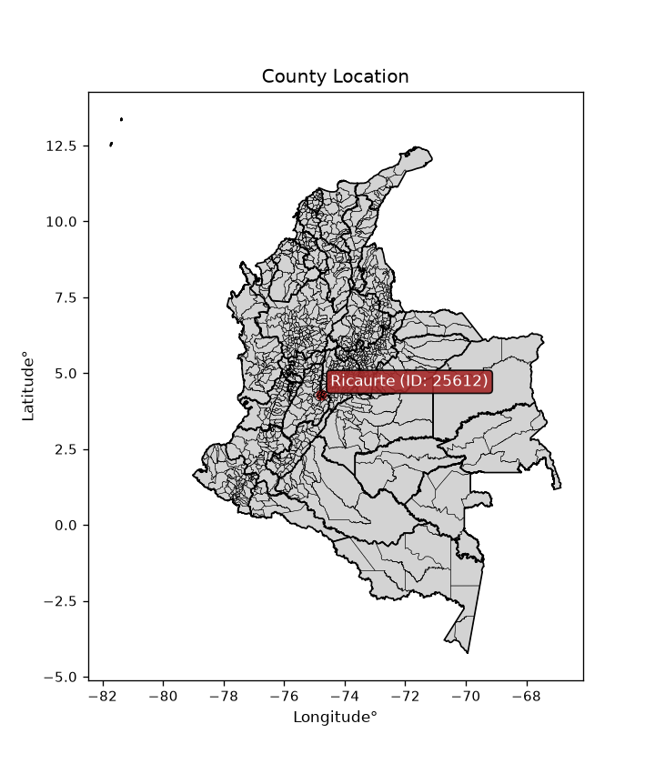
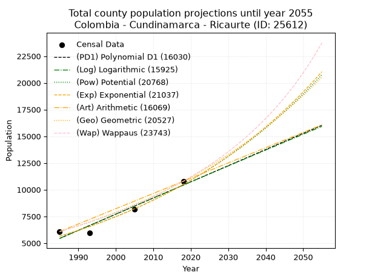
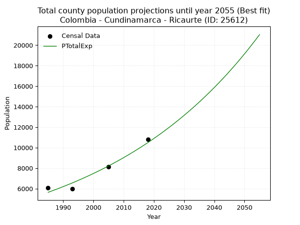
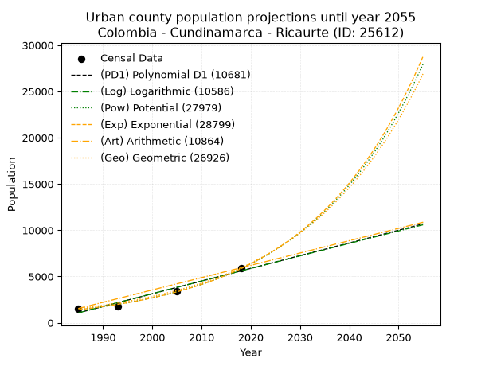
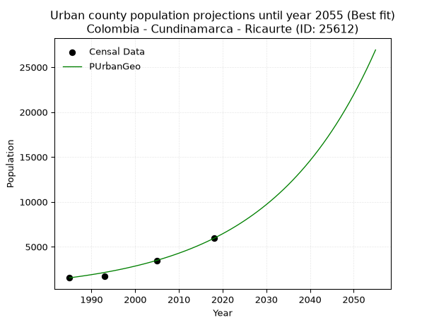
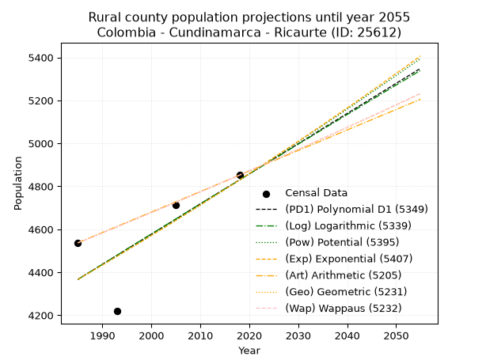
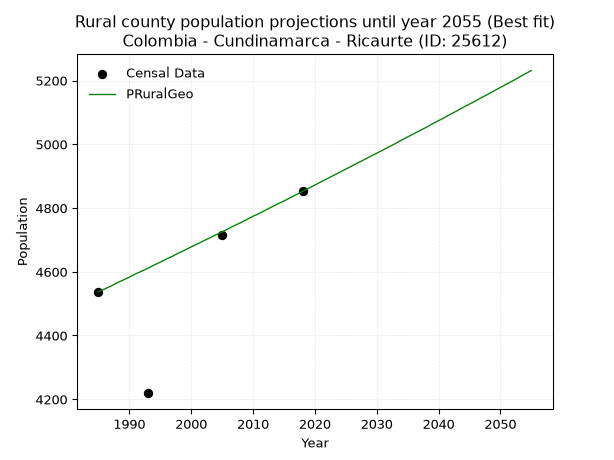

<div align="center">


</div>

# _“Population and Public Services Demand Projections (PPSD) until Year 2050 for Colombia - Cundinamarca - Ricaurte (ID: 25612)”_
Keywords: `population` `public-service` `projection` `lineal` `polynomial` `logarithmic` `potential` `exponential` `arithmetic` `geometric` `wappaus` `dane` `colombia` `south-america`

PPSD are analytical estimates used by governments and planners to anticipate future changes in population size, age distribution, and the resulting community needs for utilities, healthcare, education, and infrastructure as sizing future water treatment facilities, electrical grids, and road networks based on spatial growth.

> **General running parameters**: • app_version: _v20260806_. • Python version: _3.14.7_. • Pandas version: _3.0.5_. • NumPy version: _2.5.1_. • Creates, save and include plots into reports (create_plot): _False_. • Projection until year: _2050_. • Process polynomial degree 2 and up: _False_. • Process Wappaus: _True_. • Process Wappaus: _True_. • Set negative values to zero: _True_. • Set infinite values to zero: _True_. • Drop dataset notes: _True_. 
<div align="center">

Dynamic map: [:earth_americas:Google](http://maps.google.com/maps?q=4.2821129,-74.7728611) [:earth_americas:OSM](https://www.openstreetmap.org/#map=18/4.2821129/-74.7728611&layers=P) [:earth_americas:Bing](https://www.bing.com/maps?cp=4.2821129~-74.7728611&lvl=18) [:earth_americas:Apple](https://maps.apple.com/frame?center=4.2821129%2C-74.7728611&span=0.003%2C0.006)

</div>


<div align="center">

```geojson
{
  "type": "Feature",
  "geometry": {
    "type": "Point", 
    "coordinates": [-74.7728611, 4.2821129]
  }, 
  "properties": {
    "Name": "Colombia - Cundinamarca - Ricaurte (ID: 25612)"
  }
}
```

</div>


<div align="center">

</img>

</div>


## 0. Census Data (4 records)

Census data are official statistics collected by a government about the people and housing in a country. They usually include counts of total population, age, sex, race, income, education, and jobs.

📅Global census file: [Population.xlsx](../data/Population.xlsx)

| Source   |   Year |   CountryID | CountryName   |   StateID | StateName    |   CountyID | CountyName   |   PTotal |   PUrban |   PRural |
|:---------|-------:|------------:|:--------------|----------:|:-------------|-----------:|:-------------|---------:|---------:|---------:|
| DANE     |   1985 |          57 | Colombia      |        25 | Cundinamarca |      25612 | Ricaurte     |     6078 |     1541 |     4537 |
| DANE     |   1993 |          57 | Colombia      |        25 | Cundinamarca |      25612 | Ricaurte     |     5963 |     1744 |     4219 |
| DANE     |   2005 |          57 | Colombia      |        25 | Cundinamarca |      25612 | Ricaurte     |     8145 |     3430 |     4715 |
| DANE     |   2018 |          57 | Colombia      |        25 | Cundinamarca |      25612 | Ricaurte     |    10788 |     5936 |     4852 |

> 🔥Some records could had specific notes about the registered values or the corresponding urban or rural distribution.

📅   [RUPS](https://www.datos.gov.co/Hacienda-y-Cr-dito-P-blico/Registro-nico-de-Prestadores-de-Servicios-P-blicos/4qkq-csdn/about_data) - Local public utility companies: [RUPS.csv](../data/RUPS.xlsx)

 | SERVICIO       | ESTADO    | NOMBRE                                                                                              | NIT         | DEPARTAMENTO_DOMICILIO   | MUNICIPIO_DOMICILIO   | DIRECCION             |   TELEFONO | EMAIL                  | TIPO_PRESTADOR                             | CLASIFICACION                  |
|:---------------|:----------|:----------------------------------------------------------------------------------------------------|:------------|:-------------------------|:----------------------|:----------------------|-----------:|:-----------------------|:-------------------------------------------|:-------------------------------|
| ACUEDUCTO      | OPERATIVA | EMPRESA DE AGUAS DE GIRARDOT, RICAURTE Y LA REGION S.A.  E.S.P.                                     | 890600003-6 | CUNDINAMARCA             | GIRARDOT              | CALLE 16 CARRERA 1    |    8335656 | sui@acuagyr.com        | SOCIEDADES (EMPRESA DE SERVICIOS PUBLICOS) | MAYOR O IGUAL A 5001 USUARIOS  |
| ALCANTARILLADO | OPERATIVA | EMPRESA DE AGUAS DE GIRARDOT, RICAURTE Y LA REGION S.A.  E.S.P.                                     | 890600003-6 | CUNDINAMARCA             | GIRARDOT              | CALLE 16 CARRERA 1    |    8335656 | sui@acuagyr.com        | SOCIEDADES (EMPRESA DE SERVICIOS PUBLICOS) | MAYOR O IGUAL A 5001 USUARIOS  |
| ACUEDUCTO      | OPERATIVA | AGUAS MARAKATA S.A. EMPRESA DE SERVICIOS PUBLICOS                                                   | 900462275-5 | BOGOTA, D.C.             | BOGOTA, D.C.          | CALLE 72 #6-30 PISO 3 |    3267450 | jctayo@mazuera.com     | SOCIEDADES (EMPRESA DE SERVICIOS PUBLICOS) | MENOR O IGUAL A 2500 USUARIOS  |
| ALCANTARILLADO | OPERATIVA | AGUAS MARAKATA S.A. EMPRESA DE SERVICIOS PUBLICOS                                                   | 900462275-5 | BOGOTA, D.C.             | BOGOTA, D.C.          | CALLE 72 #6-30 PISO 3 |    3267450 | jctayo@mazuera.com     | SOCIEDADES (EMPRESA DE SERVICIOS PUBLICOS) | MENOR O IGUAL A 2500 USUARIOS  |
| ALCANTARILLADO | OPERATIVA | EMPRESA DE SERVICIOS PÚBLICOS DE ALCANTARILLADO Y ACUEDUCTO DEL MUNICIPIO DE RICAURTE S.A.S. E.S.P. | 900639486-4 | CUNDINAMARCA             | RICAURTE              | CR 15 6 22            |    8366621 | ALCARISASESP@GMAIL.COM | SOCIEDADES (EMPRESA DE SERVICIOS PUBLICOS) | DESDE 2501 HASTA 5000 USUARIOS |

## 1. Total

### 1.1. Coefficients and Parameters

* (PD1) Polynomial Deg 1: 151.35206744279225, -294998.47290244524 (lineal)
* (Log) Logarithmic: 302773.2138111207, -2293638.1244505933
* (Pow) Potential: 37.63104514332682, -120.34716946699182
* (Exp) Exponential: 0.01880877897048099, 3.4405225543800684e-13
* (Art) Arithmetic: Year diff. 2018 - 1985 = 33, Population diff. 10788 - 6078 = 4710, Annual growth = 142.72727272727272
* (Geo) Geometric: Year diff. 2018 - 1985 = 33, Population diff. 10788 - 6078 = 4710, Annual growth % = 0.017538654811232846
* (Wap) Wappaus: i = 1.6924851503293339, Condition values only valid for < 200)

<sub>
Wappaus condition values: ['0.00', '1.69', '3.38', '5.08', '6.77', '8.46', '10.15', '11.85', '13.54', '15.23', '16.92', '18.62', '20.31', '22.00', '23.69', '25.39', '27.08', '28.77', '30.46', '32.16', '33.85', '35.54', '37.23', '38.93', '40.62', '42.31', '44.00', '45.70', '47.39', '49.08', '50.77', '52.47', '54.16', '55.85', '57.54', '59.24', '60.93', '62.62', '64.31', '66.01', '67.70', '69.39', '71.08', '72.78', '74.47', '76.16', '77.85', '79.55', '81.24', '82.93', '84.62', '86.32', '88.01', '89.70', '91.39', '93.09', '94.78', '96.47', '98.16', '99.86', '101.55', '103.24', '104.93', '106.63', '108.32', '110.01']
</sub>


### 1.2. Projected Dataset

|   Year |   CountyID |   PTotalPD1 |   PTotalLog |   PTotalPow |   PTotalExp |   PTotalArt |   PTotalGeo |   PTotalWap |
|-------:|-----------:|------------:|------------:|------------:|------------:|------------:|------------:|------------:|
|   1985 |      25612 |        5435 |        5432 |        5636 |        5639 |        6078 |        6078 |        6078 |
|   1986 |      25612 |        5587 |        5585 |        5744 |        5746 |        6221 |        6185 |        6182 |
|   1987 |      25612 |        5738 |        5737 |        5854 |        5855 |        6363 |        6293 |        6287 |
|   1988 |      25612 |        5889 |        5889 |        5966 |        5966 |        6506 |        6403 |        6395 |
|   1989 |      25612 |        6041 |        6042 |        6080 |        6080 |        6649 |        6516 |        6504 |
|   1990 |      25612 |        6192 |        6194 |        6196 |        6195 |        6792 |        6630 |        6615 |
|   1991 |      25612 |        6343 |        6346 |        6314 |        6313 |        6934 |        6746 |        6728 |
|   1992 |      25612 |        6495 |        6498 |        6435 |        6432 |        7077 |        6865 |        6843 |
|   1993 |      25612 |        6646 |        6650 |        6558 |        6555 |        7220 |        6985 |        6961 |
|   1994 |      25612 |        6798 |        6802 |        6682 |        6679 |        7363 |        7108 |        7080 |
|   1995 |      25612 |        6949 |        6954 |        6810 |        6806 |        7505 |        7232 |        7202 |
|   1996 |      25612 |        7100 |        7105 |        6939 |        6935 |        7648 |        7359 |        7326 |
|   1997 |      25612 |        7252 |        7257 |        7071 |        7067 |        7791 |        7488 |        7452 |
|   1998 |      25612 |        7403 |        7409 |        7206 |        7201 |        7933 |        7619 |        7581 |
|   1999 |      25612 |        7554 |        7560 |        7343 |        7338 |        8076 |        7753 |        7712 |
|   2000 |      25612 |        7706 |        7712 |        7482 |        7477 |        8219 |        7889 |        7845 |
|   2001 |      25612 |        7857 |        7863 |        7624 |        7619 |        8362 |        8027 |        7982 |
|   2002 |      25612 |        8008 |        8014 |        7769 |        7764 |        8504 |        8168 |        8121 |
|   2003 |      25612 |        8160 |        8165 |        7917 |        7911 |        8647 |        8311 |        8262 |
|   2004 |      25612 |        8311 |        8316 |        8067 |        8061 |        8790 |        8457 |        8407 |
|   2005 |      25612 |        8462 |        8468 |        8220 |        8214 |        8933 |        8606 |        8555 |
|   2006 |      25612 |        8614 |        8619 |        8375 |        8370 |        9075 |        8756 |        8705 |
|   2007 |      25612 |        8765 |        8769 |        8534 |        8529 |        9218 |        8910 |        8859 |
|   2008 |      25612 |        8916 |        8920 |        8695 |        8691 |        9361 |        9066 |        9016 |
|   2009 |      25612 |        9068 |        9071 |        8860 |        8856 |        9503 |        9225 |        9176 |
|   2010 |      25612 |        9219 |        9222 |        9027 |        9024 |        9646 |        9387 |        9340 |
|   2011 |      25612 |        9371 |        9372 |        9198 |        9196 |        9789 |        9552 |        9507 |
|   2012 |      25612 |        9522 |        9523 |        9371 |        9370 |        9932 |        9719 |        9678 |
|   2013 |      25612 |        9673 |        9673 |        9548 |        9548 |       10074 |        9890 |        9853 |
|   2014 |      25612 |        9825 |        9824 |        9728 |        9729 |       10217 |       10063 |       10031 |
|   2015 |      25612 |        9976 |        9974 |        9912 |        9914 |       10360 |       10240 |       10214 |
|   2016 |      25612 |       10127 |       10124 |       10099 |       10102 |       10503 |       10419 |       10401 |
|   2017 |      25612 |       10279 |       10274 |       10289 |       10294 |       10645 |       10602 |       10592 |
|   2018 |      25612 |       10430 |       10424 |       10483 |       10490 |       10788 |       10788 |       10788 |
|   2019 |      25612 |       10581 |       10574 |       10680 |       10689 |       10931 |       10977 |       10988 |
|   2020 |      25612 |       10733 |       10724 |       10881 |       10892 |       11073 |       11170 |       11194 |
|   2021 |      25612 |       10884 |       10874 |       11085 |       11098 |       11216 |       11366 |       11404 |
|   2022 |      25612 |       11035 |       11024 |       11294 |       11309 |       11359 |       11565 |       11619 |
|   2023 |      25612 |       11187 |       11174 |       11506 |       11524 |       11502 |       11768 |       11840 |
|   2024 |      25612 |       11338 |       11323 |       11722 |       11743 |       11644 |       11974 |       12066 |
|   2025 |      25612 |       11489 |       11473 |       11942 |       11966 |       11787 |       12184 |       12298 |
|   2026 |      25612 |       11641 |       11622 |       12165 |       12193 |       11930 |       12398 |       12536 |
|   2027 |      25612 |       11792 |       11772 |       12393 |       12424 |       12073 |       12615 |       12781 |
|   2028 |      25612 |       11944 |       11921 |       12626 |       12660 |       12215 |       12837 |       13032 |
|   2029 |      25612 |       12095 |       12070 |       12862 |       12901 |       12358 |       13062 |       13289 |
|   2030 |      25612 |       12246 |       12219 |       13103 |       13146 |       12501 |       13291 |       13554 |
|   2031 |      25612 |       12398 |       12369 |       13348 |       13395 |       12643 |       13524 |       13826 |
|   2032 |      25612 |       12549 |       12518 |       13597 |       13649 |       12786 |       13761 |       14106 |
|   2033 |      25612 |       12700 |       12667 |       13852 |       13909 |       12929 |       14002 |       14393 |
|   2034 |      25612 |       12852 |       12815 |       14110 |       14173 |       13072 |       14248 |       14689 |
|   2035 |      25612 |       13003 |       12964 |       14374 |       14442 |       13214 |       14498 |       14994 |
|   2036 |      25612 |       13154 |       13113 |       14642 |       14716 |       13357 |       14752 |       15308 |
|   2037 |      25612 |       13306 |       13262 |       14915 |       14995 |       13500 |       15011 |       15631 |
|   2038 |      25612 |       13457 |       13410 |       15193 |       15280 |       13643 |       15274 |       15964 |
|   2039 |      25612 |       13608 |       13559 |       15476 |       15570 |       13785 |       15542 |       16308 |
|   2040 |      25612 |       13760 |       13707 |       15764 |       15866 |       13928 |       15815 |       16662 |
|   2041 |      25612 |       13911 |       13856 |       16058 |       16167 |       14071 |       16092 |       17028 |
|   2042 |      25612 |       14062 |       14004 |       16356 |       16474 |       14213 |       16374 |       17405 |
|   2043 |      25612 |       14214 |       14152 |       16661 |       16787 |       14356 |       16661 |       17796 |
|   2044 |      25612 |       14365 |       14300 |       16970 |       17106 |       14499 |       16954 |       18199 |
|   2045 |      25612 |       14517 |       14448 |       17285 |       17430 |       14642 |       17251 |       18617 |
|   2046 |      25612 |       14668 |       14596 |       17606 |       17761 |       14784 |       17554 |       19048 |
|   2047 |      25612 |       14819 |       14744 |       17933 |       18099 |       14927 |       17861 |       19496 |
|   2048 |      25612 |       14971 |       14892 |       18266 |       18442 |       15070 |       18175 |       19959 |
|   2049 |      25612 |       15122 |       15040 |       18604 |       18792 |       15213 |       18494 |       20440 |
|   2050 |      25612 |       15273 |       15188 |       18949 |       19149 |       15355 |       18818 |       20939 |
<div align="center">

</img>

</div>


### 1.3. Best fit with absolute and relative error (%)

Relative error puts that difference into context by dividing the absolute error by the true value, creating a unitless ratio or percentage that shows the scale of the mistake.

Absolute and relative error

|   Year | Source   |   CountryID | CountryName   |   StateID | StateName    |   CountyID_x | CountyName   |   PTotal |   PUrban |   PRural |   CountyID_y |   PTotalPD1 |   PTotalLog |   PTotalPow |   PTotalExp |   PTotalArt |   PTotalGeo |   PTotalWap |   PTotalPD1AbsError |   PTotalLogAbsError |   PTotalPowAbsError |   PTotalExpAbsError |   PTotalArtAbsError |   PTotalGeoAbsError |   PTotalWapAbsError |   PTotalPD1RelError |   PTotalLogRelError |   PTotalPowRelError |   PTotalExpRelError |   PTotalArtRelError |   PTotalGeoRelError |   PTotalWapRelError |
|-------:|:---------|------------:|:--------------|----------:|:-------------|-------------:|:-------------|---------:|---------:|---------:|-------------:|------------:|------------:|------------:|------------:|------------:|------------:|------------:|--------------------:|--------------------:|--------------------:|--------------------:|--------------------:|--------------------:|--------------------:|--------------------:|--------------------:|--------------------:|--------------------:|--------------------:|--------------------:|--------------------:|
|   1985 | DANE     |          57 | Colombia      |        25 | Cundinamarca |        25612 | Ricaurte     |     6078 |     1541 |     4537 |        25612 |        5435 |        5432 |        5636 |        5639 |        6078 |        6078 |        6078 |                 643 |                 646 |                 442 |                 439 |                   0 |                   0 |                   0 |            10.5791  |            10.6285  |             7.27213 |            7.22277  |             0       |             0       |             0       |
|   1993 | DANE     |          57 | Colombia      |        25 | Cundinamarca |        25612 | Ricaurte     |     5963 |     1744 |     4219 |        25612 |        6646 |        6650 |        6558 |        6555 |        7220 |        6985 |        6961 |                 683 |                 687 |                 595 |                 592 |                1257 |                1022 |                 998 |            11.454   |            11.521   |             9.9782  |            9.92789  |            21.08    |            17.139   |            16.7365  |
|   2005 | DANE     |          57 | Colombia      |        25 | Cundinamarca |        25612 | Ricaurte     |     8145 |     3430 |     4715 |        25612 |        8462 |        8468 |        8220 |        8214 |        8933 |        8606 |        8555 |                 317 |                 323 |                  75 |                  69 |                 788 |                 461 |                 410 |             3.89196 |             3.96562 |             0.92081 |            0.847145 |             9.67465 |             5.65991 |             5.03376 |
|   2018 | DANE     |          57 | Colombia      |        25 | Cundinamarca |        25612 | Ricaurte     |    10788 |     5936 |     4852 |        25612 |       10430 |       10424 |       10483 |       10490 |       10788 |       10788 |       10788 |                 358 |                 364 |                 305 |                 298 |                   0 |                   0 |                   0 |             3.3185  |             3.37412 |             2.82722 |            2.76233  |             0       |             0       |             0       |

Relative error mean

| Method    |   RelError | Best   |
|:----------|-----------:|:-------|
| PTotalPD1 |    7.31089 |        |
| PTotalLog |    7.37232 |        |
| PTotalPow |    5.24959 |        |
| PTotalExp |    5.19003 | True   |
| PTotalArt |    7.68866 |        |
| PTotalGeo |    5.69973 |        |
| PTotalWap |    5.44258 |        |

💙Best method: _**PTotalExp**_
<div align="center">

</img>

</div>


### 1.4. Fresh water supply demand in liters per capita per day (lpcd)

The fresh water supply demand typically ranges from 100 to 300 liters per capita per day (lpcd) for standard domestic and municipal planning, though absolute survival minimums set by the World Health Organization are as low as 7.5 to 20 liters per day, and total consumption in high-income nations can exceed 400 liters.

> `CZ`: Level in meters above the sea level (masl)<br> `WS`: Fresh water supply demand in liters per capita per day (lpcd or l/h/d)<br> `WSAll`: Zonal fresh water supply demand in liters per second (l/s)<br> `A`: Zonal area in square meters<br> `DP`: Population density (people/hectare or p/ha)

Reference values (RAS Colombia)

|    CZ |   WS |
|------:|-----:|
|  1000 |  120 |
|  2000 |  130 |
| 99999 |  140 |

County shapefile geometry properties and water supply values

|   CountyID |      ATotal |   CZTotal |   WSTotal |
|-----------:|------------:|----------:|----------:|
|      25612 | 1.27918e+08 |   345.365 |       120 |

Projected values for best method: PTotalExp

|   CountyID |   Year |   PTotalExp |   DPTotal |   WSTotal |   WSTotalAll |
|-----------:|-------:|------------:|----------:|----------:|-------------:|
|      25612 |   1985 |        5639 |      0.44 |       120 |      7.83194 |
|      25612 |   1986 |        5746 |      0.45 |       120 |      7.98056 |
|      25612 |   1987 |        5855 |      0.46 |       120 |      8.13194 |
|      25612 |   1988 |        5966 |      0.47 |       120 |      8.28611 |
|      25612 |   1989 |        6080 |      0.48 |       120 |      8.44444 |
|      25612 |   1990 |        6195 |      0.48 |       120 |      8.60417 |
|      25612 |   1991 |        6313 |      0.49 |       120 |      8.76806 |
|      25612 |   1992 |        6432 |      0.5  |       120 |      8.93333 |
|      25612 |   1993 |        6555 |      0.51 |       120 |      9.10417 |
|      25612 |   1994 |        6679 |      0.52 |       120 |      9.27639 |
|      25612 |   1995 |        6806 |      0.53 |       120 |      9.45278 |
|      25612 |   1996 |        6935 |      0.54 |       120 |      9.63194 |
|      25612 |   1997 |        7067 |      0.55 |       120 |      9.81528 |
|      25612 |   1998 |        7201 |      0.56 |       120 |     10.0014  |
|      25612 |   1999 |        7338 |      0.57 |       120 |     10.1917  |
|      25612 |   2000 |        7477 |      0.58 |       120 |     10.3847  |
|      25612 |   2001 |        7619 |      0.6  |       120 |     10.5819  |
|      25612 |   2002 |        7764 |      0.61 |       120 |     10.7833  |
|      25612 |   2003 |        7911 |      0.62 |       120 |     10.9875  |
|      25612 |   2004 |        8061 |      0.63 |       120 |     11.1958  |
|      25612 |   2005 |        8214 |      0.64 |       120 |     11.4083  |
|      25612 |   2006 |        8370 |      0.65 |       120 |     11.625   |
|      25612 |   2007 |        8529 |      0.67 |       120 |     11.8458  |
|      25612 |   2008 |        8691 |      0.68 |       120 |     12.0708  |
|      25612 |   2009 |        8856 |      0.69 |       120 |     12.3     |
|      25612 |   2010 |        9024 |      0.71 |       120 |     12.5333  |
|      25612 |   2011 |        9196 |      0.72 |       120 |     12.7722  |
|      25612 |   2012 |        9370 |      0.73 |       120 |     13.0139  |
|      25612 |   2013 |        9548 |      0.75 |       120 |     13.2611  |
|      25612 |   2014 |        9729 |      0.76 |       120 |     13.5125  |
|      25612 |   2015 |        9914 |      0.78 |       120 |     13.7694  |
|      25612 |   2016 |       10102 |      0.79 |       120 |     14.0306  |
|      25612 |   2017 |       10294 |      0.8  |       120 |     14.2972  |
|      25612 |   2018 |       10490 |      0.82 |       120 |     14.5694  |
|      25612 |   2019 |       10689 |      0.84 |       120 |     14.8458  |
|      25612 |   2020 |       10892 |      0.85 |       120 |     15.1278  |
|      25612 |   2021 |       11098 |      0.87 |       120 |     15.4139  |
|      25612 |   2022 |       11309 |      0.88 |       120 |     15.7069  |
|      25612 |   2023 |       11524 |      0.9  |       120 |     16.0056  |
|      25612 |   2024 |       11743 |      0.92 |       120 |     16.3097  |
|      25612 |   2025 |       11966 |      0.94 |       120 |     16.6194  |
|      25612 |   2026 |       12193 |      0.95 |       120 |     16.9347  |
|      25612 |   2027 |       12424 |      0.97 |       120 |     17.2556  |
|      25612 |   2028 |       12660 |      0.99 |       120 |     17.5833  |
|      25612 |   2029 |       12901 |      1.01 |       120 |     17.9181  |
|      25612 |   2030 |       13146 |      1.03 |       120 |     18.2583  |
|      25612 |   2031 |       13395 |      1.05 |       120 |     18.6042  |
|      25612 |   2032 |       13649 |      1.07 |       120 |     18.9569  |
|      25612 |   2033 |       13909 |      1.09 |       120 |     19.3181  |
|      25612 |   2034 |       14173 |      1.11 |       120 |     19.6847  |
|      25612 |   2035 |       14442 |      1.13 |       120 |     20.0583  |
|      25612 |   2036 |       14716 |      1.15 |       120 |     20.4389  |
|      25612 |   2037 |       14995 |      1.17 |       120 |     20.8264  |
|      25612 |   2038 |       15280 |      1.19 |       120 |     21.2222  |
|      25612 |   2039 |       15570 |      1.22 |       120 |     21.625   |
|      25612 |   2040 |       15866 |      1.24 |       120 |     22.0361  |
|      25612 |   2041 |       16167 |      1.26 |       120 |     22.4542  |
|      25612 |   2042 |       16474 |      1.29 |       120 |     22.8806  |
|      25612 |   2043 |       16787 |      1.31 |       120 |     23.3153  |
|      25612 |   2044 |       17106 |      1.34 |       120 |     23.7583  |
|      25612 |   2045 |       17430 |      1.36 |       120 |     24.2083  |
|      25612 |   2046 |       17761 |      1.39 |       120 |     24.6681  |
|      25612 |   2047 |       18099 |      1.41 |       120 |     25.1375  |
|      25612 |   2048 |       18442 |      1.44 |       120 |     25.6139  |
|      25612 |   2049 |       18792 |      1.47 |       120 |     26.1     |
|      25612 |   2050 |       19149 |      1.5  |       120 |     26.5958  |

## 2. Urban

### 2.1. Coefficients and Parameters

* (PD1) Polynomial Deg 1: 137.31393014853307, -271499.4387796032 (lineal)
* (Log) Logarithmic: 274701.9666824488, -2084849.1000767013
* (Pow) Potential: 86.25629772306232, -281.30404593393337
* (Exp) Exponential: 0.0431009965889463, 9.835686675245443e-35
* (Art) Arithmetic: Year diff. 2018 - 1985 = 33, Population diff. 5936 - 1541 = 4395, Annual growth = 133.1818181818182
* (Geo) Geometric: Year diff. 2018 - 1985 = 33, Population diff. 5936 - 1541 = 4395, Annual growth % = 0.0417133258668958
* (Wap) Wappaus: i = 3.5624399674152247, Condition values only valid for < 200)

<sub>
Wappaus condition values: ['0.00', '3.56', '7.12', '10.69', '14.25', '17.81', '21.37', '24.94', '28.50', '32.06', '35.62', '39.19', '42.75', '46.31', '49.87', '53.44', '57.00', '60.56', '64.12', '67.69', '71.25', '74.81', '78.37', '81.94', '85.50', '89.06', '92.62', '96.19', '99.75', '103.31', '106.87', '110.44', '114.00', '117.56', '121.12', '124.69', '128.25', '131.81', '135.37', '138.94', '142.50', '146.06', '149.62', '153.18', '156.75', '160.31', '163.87', '167.43', '171.00', '174.56', '178.12', '181.68', '185.25', '188.81', '192.37', '195.93', '199.50', '203.06', '206.62', '210.18', '213.75', '217.31', '220.87', '224.43', '228.00', '231.56']
</sub>


### 2.2. Projected Dataset

|   Year |   CountyID |   PUrbanPD1 |   PUrbanLog |   PUrbanPow |   PUrbanExp |   PUrbanArt |   PUrbanGeo |
|-------:|-----------:|------------:|------------:|------------:|------------:|------------:|------------:|
|   1985 |      25612 |        1069 |        1066 |        1408 |        1410 |        1541 |        1541 |
|   1986 |      25612 |        1206 |        1204 |        1470 |        1472 |        1674 |        1605 |
|   1987 |      25612 |        1343 |        1342 |        1536 |        1536 |        1807 |        1672 |
|   1988 |      25612 |        1481 |        1481 |        1604 |        1604 |        1941 |        1742 |
|   1989 |      25612 |        1618 |        1619 |        1675 |        1675 |        2074 |        1815 |
|   1990 |      25612 |        1755 |        1757 |        1749 |        1749 |        2207 |        1890 |
|   1991 |      25612 |        1893 |        1895 |        1827 |        1826 |        2340 |        1969 |
|   1992 |      25612 |        2030 |        2033 |        1907 |        1906 |        2473 |        2051 |
|   1993 |      25612 |        2167 |        2171 |        1992 |        1990 |        2606 |        2137 |
|   1994 |      25612 |        2305 |        2308 |        2080 |        2078 |        2740 |        2226 |
|   1995 |      25612 |        2442 |        2446 |        2172 |        2169 |        2873 |        2319 |
|   1996 |      25612 |        2579 |        2584 |        2268 |        2265 |        3006 |        2416 |
|   1997 |      25612 |        2716 |        2721 |        2368 |        2364 |        3139 |        2516 |
|   1998 |      25612 |        2854 |        2859 |        2472 |        2468 |        3272 |        2621 |
|   1999 |      25612 |        2991 |        2996 |        2581 |        2577 |        3406 |        2731 |
|   2000 |      25612 |        3128 |        3134 |        2695 |        2691 |        3539 |        2845 |
|   2001 |      25612 |        3266 |        3271 |        2814 |        2809 |        3672 |        2963 |
|   2002 |      25612 |        3403 |        3408 |        2938 |        2933 |        3805 |        3087 |
|   2003 |      25612 |        3540 |        3545 |        3067 |        3062 |        3938 |        3216 |
|   2004 |      25612 |        3678 |        3683 |        3202 |        3197 |        4071 |        3350 |
|   2005 |      25612 |        3815 |        3820 |        3343 |        3338 |        4205 |        3490 |
|   2006 |      25612 |        3952 |        3957 |        3490 |        3485 |        4338 |        3635 |
|   2007 |      25612 |        4090 |        4094 |        3643 |        3638 |        4471 |        3787 |
|   2008 |      25612 |        4227 |        4230 |        3803 |        3798 |        4604 |        3945 |
|   2009 |      25612 |        4364 |        4367 |        3970 |        3966 |        4737 |        4109 |
|   2010 |      25612 |        4502 |        4504 |        4144 |        4140 |        4871 |        4281 |
|   2011 |      25612 |        4639 |        4640 |        4326 |        4323 |        5004 |        4459 |
|   2012 |      25612 |        4776 |        4777 |        4515 |        4513 |        5137 |        4645 |
|   2013 |      25612 |        4914 |        4914 |        4713 |        4712 |        5270 |        4839 |
|   2014 |      25612 |        5051 |        5050 |        4919 |        4919 |        5403 |        5041 |
|   2015 |      25612 |        5188 |        5186 |        5134 |        5136 |        5536 |        5251 |
|   2016 |      25612 |        5325 |        5323 |        5359 |        5362 |        5670 |        5470 |
|   2017 |      25612 |        5463 |        5459 |        5593 |        5598 |        5803 |        5698 |
|   2018 |      25612 |        5600 |        5595 |        5837 |        5845 |        5936 |        5936 |
|   2019 |      25612 |        5737 |        5731 |        6092 |        6102 |        6069 |        6184 |
|   2020 |      25612 |        5875 |        5867 |        6358 |        6371 |        6202 |        6442 |
|   2021 |      25612 |        6012 |        6003 |        6635 |        6652 |        6336 |        6710 |
|   2022 |      25612 |        6149 |        6139 |        6925 |        6945 |        6469 |        6990 |
|   2023 |      25612 |        6287 |        6275 |        7226 |        7251 |        6602 |        7282 |
|   2024 |      25612 |        6424 |        6411 |        7541 |        7570 |        6735 |        7585 |
|   2025 |      25612 |        6561 |        6546 |        7869 |        7903 |        6868 |        7902 |
|   2026 |      25612 |        6699 |        6682 |        8212 |        8252 |        7001 |        8232 |
|   2027 |      25612 |        6836 |        6817 |        8569 |        8615 |        7135 |        8575 |
|   2028 |      25612 |        6973 |        6953 |        8941 |        8994 |        7268 |        8933 |
|   2029 |      25612 |        7111 |        7088 |        9330 |        9391 |        7401 |        9305 |
|   2030 |      25612 |        7248 |        7224 |        9735 |        9804 |        7534 |        9693 |
|   2031 |      25612 |        7385 |        7359 |       10157 |       10236 |        7667 |       10098 |
|   2032 |      25612 |        7522 |        7494 |       10598 |       10687 |        7801 |       10519 |
|   2033 |      25612 |        7660 |        7629 |       11057 |       11157 |        7934 |       10958 |
|   2034 |      25612 |        7797 |        7764 |       11536 |       11649 |        8067 |       11415 |
|   2035 |      25612 |        7934 |        7899 |       12036 |       12162 |        8200 |       11891 |
|   2036 |      25612 |        8072 |        8034 |       12557 |       12698 |        8333 |       12387 |
|   2037 |      25612 |        8209 |        8169 |       13100 |       13257 |        8466 |       12904 |
|   2038 |      25612 |        8346 |        8304 |       13666 |       13841 |        8600 |       13442 |
|   2039 |      25612 |        8484 |        8439 |       14257 |       14450 |        8733 |       14003 |
|   2040 |      25612 |        8621 |        8574 |       14873 |       15087 |        8866 |       14587 |
|   2041 |      25612 |        8758 |        8708 |       15515 |       15751 |        8999 |       15195 |
|   2042 |      25612 |        8896 |        8843 |       16185 |       16445 |        9132 |       15829 |
|   2043 |      25612 |        9033 |        8977 |       16883 |       17169 |        9266 |       16489 |
|   2044 |      25612 |        9170 |        9112 |       17611 |       17925 |        9399 |       17177 |
|   2045 |      25612 |        9308 |        9246 |       18370 |       18715 |        9532 |       17894 |
|   2046 |      25612 |        9445 |        9380 |       19161 |       19539 |        9665 |       18640 |
|   2047 |      25612 |        9582 |        9515 |       19986 |       20400 |        9798 |       19417 |
|   2048 |      25612 |        9719 |        9649 |       20846 |       21298 |        9931 |       20227 |
|   2049 |      25612 |        9857 |        9783 |       21742 |       22236 |       10065 |       21071 |
|   2050 |      25612 |        9994 |        9917 |       22677 |       23216 |       10198 |       21950 |
<div align="center">

</img>

</div>


### 2.3. Best fit with absolute and relative error (%)

Relative error puts that difference into context by dividing the absolute error by the true value, creating a unitless ratio or percentage that shows the scale of the mistake.

Absolute and relative error

|   Year | Source   |   CountryID | CountryName   |   StateID | StateName    |   CountyID_x | CountyName   |   PTotal |   PUrban |   PRural |   CountyID_y |   PUrbanPD1 |   PUrbanLog |   PUrbanPow |   PUrbanExp |   PUrbanArt |   PUrbanGeo |   PUrbanPD1AbsError |   PUrbanLogAbsError |   PUrbanPowAbsError |   PUrbanExpAbsError |   PUrbanArtAbsError |   PUrbanGeoAbsError |   PUrbanPD1RelError |   PUrbanLogRelError |   PUrbanPowRelError |   PUrbanExpRelError |   PUrbanArtRelError |   PUrbanGeoRelError |
|-------:|:---------|------------:|:--------------|----------:|:-------------|-------------:|:-------------|---------:|---------:|---------:|-------------:|------------:|------------:|------------:|------------:|------------:|------------:|--------------------:|--------------------:|--------------------:|--------------------:|--------------------:|--------------------:|--------------------:|--------------------:|--------------------:|--------------------:|--------------------:|--------------------:|
|   1985 | DANE     |          57 | Colombia      |        25 | Cundinamarca |        25612 | Ricaurte     |     6078 |     1541 |     4537 |        25612 |        1069 |        1066 |        1408 |        1410 |        1541 |        1541 |                 472 |                 475 |                 133 |                 131 |                   0 |                   0 |            30.6295  |            30.8241  |             8.63076 |             8.50097 |              0      |             0       |
|   1993 | DANE     |          57 | Colombia      |        25 | Cundinamarca |        25612 | Ricaurte     |     5963 |     1744 |     4219 |        25612 |        2167 |        2171 |        1992 |        1990 |        2606 |        2137 |                 423 |                 427 |                 248 |                 246 |                 862 |                 393 |            24.2546  |            24.4839  |            14.2202  |            14.1055  |             49.4266 |            22.5344  |
|   2005 | DANE     |          57 | Colombia      |        25 | Cundinamarca |        25612 | Ricaurte     |     8145 |     3430 |     4715 |        25612 |        3815 |        3820 |        3343 |        3338 |        4205 |        3490 |                 385 |                 390 |                  87 |                  92 |                 775 |                  60 |            11.2245  |            11.3703  |             2.53644 |             2.68222 |             22.5948 |             1.74927 |
|   2018 | DANE     |          57 | Colombia      |        25 | Cundinamarca |        25612 | Ricaurte     |    10788 |     5936 |     4852 |        25612 |        5600 |        5595 |        5837 |        5845 |        5936 |        5936 |                 336 |                 341 |                  99 |                  91 |                   0 |                   0 |             5.66038 |             5.74461 |             1.66779 |             1.53302 |              0      |             0       |

Relative error mean

| Method    |   RelError | Best   |
|:----------|-----------:|:-------|
| PUrbanPD1 |   17.9422  |        |
| PUrbanLog |   18.1057  |        |
| PUrbanPow |    6.76379 |        |
| PUrbanExp |    6.70543 |        |
| PUrbanArt |   18.0053  |        |
| PUrbanGeo |    6.07092 | True   |

💙Best method: _**PUrbanGeo**_
<div align="center">

</img>

</div>


### 2.4. Fresh water supply demand in liters per capita per day (lpcd)

The fresh water supply demand typically ranges from 100 to 300 liters per capita per day (lpcd) for standard domestic and municipal planning, though absolute survival minimums set by the World Health Organization are as low as 7.5 to 20 liters per day, and total consumption in high-income nations can exceed 400 liters.

> `CZ`: Level in meters above the sea level (masl)<br> `WS`: Fresh water supply demand in liters per capita per day (lpcd or l/h/d)<br> `WSAll`: Zonal fresh water supply demand in liters per second (l/s)<br> `A`: Zonal area in square meters<br> `DP`: Population density (people/hectare or p/ha)

Reference values (RAS Colombia)

|    CZ |   WS |
|------:|-----:|
|  1000 |  120 |
|  2000 |  130 |
| 99999 |  140 |

County shapefile geometry properties and water supply values

|   CountyID |      AUrban |   CZUrban |   WSUrban |
|-----------:|------------:|----------:|----------:|
|      25612 | 1.34911e+07 |   283.352 |       120 |

Projected values for best method: PUrbanGeo

|   CountyID |   Year |   PUrbanGeo |   DPUrban |   WSUrban |   WSUrbanAll |
|-----------:|-------:|------------:|----------:|----------:|-------------:|
|      25612 |   1985 |        1541 |      1.14 |       120 |      2.14028 |
|      25612 |   1986 |        1605 |      1.19 |       120 |      2.22917 |
|      25612 |   1987 |        1672 |      1.24 |       120 |      2.32222 |
|      25612 |   1988 |        1742 |      1.29 |       120 |      2.41944 |
|      25612 |   1989 |        1815 |      1.35 |       120 |      2.52083 |
|      25612 |   1990 |        1890 |      1.4  |       120 |      2.625   |
|      25612 |   1991 |        1969 |      1.46 |       120 |      2.73472 |
|      25612 |   1992 |        2051 |      1.52 |       120 |      2.84861 |
|      25612 |   1993 |        2137 |      1.58 |       120 |      2.96806 |
|      25612 |   1994 |        2226 |      1.65 |       120 |      3.09167 |
|      25612 |   1995 |        2319 |      1.72 |       120 |      3.22083 |
|      25612 |   1996 |        2416 |      1.79 |       120 |      3.35556 |
|      25612 |   1997 |        2516 |      1.86 |       120 |      3.49444 |
|      25612 |   1998 |        2621 |      1.94 |       120 |      3.64028 |
|      25612 |   1999 |        2731 |      2.02 |       120 |      3.79306 |
|      25612 |   2000 |        2845 |      2.11 |       120 |      3.95139 |
|      25612 |   2001 |        2963 |      2.2  |       120 |      4.11528 |
|      25612 |   2002 |        3087 |      2.29 |       120 |      4.2875  |
|      25612 |   2003 |        3216 |      2.38 |       120 |      4.46667 |
|      25612 |   2004 |        3350 |      2.48 |       120 |      4.65278 |
|      25612 |   2005 |        3490 |      2.59 |       120 |      4.84722 |
|      25612 |   2006 |        3635 |      2.69 |       120 |      5.04861 |
|      25612 |   2007 |        3787 |      2.81 |       120 |      5.25972 |
|      25612 |   2008 |        3945 |      2.92 |       120 |      5.47917 |
|      25612 |   2009 |        4109 |      3.05 |       120 |      5.70694 |
|      25612 |   2010 |        4281 |      3.17 |       120 |      5.94583 |
|      25612 |   2011 |        4459 |      3.31 |       120 |      6.19306 |
|      25612 |   2012 |        4645 |      3.44 |       120 |      6.45139 |
|      25612 |   2013 |        4839 |      3.59 |       120 |      6.72083 |
|      25612 |   2014 |        5041 |      3.74 |       120 |      7.00139 |
|      25612 |   2015 |        5251 |      3.89 |       120 |      7.29306 |
|      25612 |   2016 |        5470 |      4.05 |       120 |      7.59722 |
|      25612 |   2017 |        5698 |      4.22 |       120 |      7.91389 |
|      25612 |   2018 |        5936 |      4.4  |       120 |      8.24444 |
|      25612 |   2019 |        6184 |      4.58 |       120 |      8.58889 |
|      25612 |   2020 |        6442 |      4.78 |       120 |      8.94722 |
|      25612 |   2021 |        6710 |      4.97 |       120 |      9.31944 |
|      25612 |   2022 |        6990 |      5.18 |       120 |      9.70833 |
|      25612 |   2023 |        7282 |      5.4  |       120 |     10.1139  |
|      25612 |   2024 |        7585 |      5.62 |       120 |     10.5347  |
|      25612 |   2025 |        7902 |      5.86 |       120 |     10.975   |
|      25612 |   2026 |        8232 |      6.1  |       120 |     11.4333  |
|      25612 |   2027 |        8575 |      6.36 |       120 |     11.9097  |
|      25612 |   2028 |        8933 |      6.62 |       120 |     12.4069  |
|      25612 |   2029 |        9305 |      6.9  |       120 |     12.9236  |
|      25612 |   2030 |        9693 |      7.18 |       120 |     13.4625  |
|      25612 |   2031 |       10098 |      7.48 |       120 |     14.025   |
|      25612 |   2032 |       10519 |      7.8  |       120 |     14.6097  |
|      25612 |   2033 |       10958 |      8.12 |       120 |     15.2194  |
|      25612 |   2034 |       11415 |      8.46 |       120 |     15.8542  |
|      25612 |   2035 |       11891 |      8.81 |       120 |     16.5153  |
|      25612 |   2036 |       12387 |      9.18 |       120 |     17.2042  |
|      25612 |   2037 |       12904 |      9.56 |       120 |     17.9222  |
|      25612 |   2038 |       13442 |      9.96 |       120 |     18.6694  |
|      25612 |   2039 |       14003 |     10.38 |       120 |     19.4486  |
|      25612 |   2040 |       14587 |     10.81 |       120 |     20.2597  |
|      25612 |   2041 |       15195 |     11.26 |       120 |     21.1042  |
|      25612 |   2042 |       15829 |     11.73 |       120 |     21.9847  |
|      25612 |   2043 |       16489 |     12.22 |       120 |     22.9014  |
|      25612 |   2044 |       17177 |     12.73 |       120 |     23.8569  |
|      25612 |   2045 |       17894 |     13.26 |       120 |     24.8528  |
|      25612 |   2046 |       18640 |     13.82 |       120 |     25.8889  |
|      25612 |   2047 |       19417 |     14.39 |       120 |     26.9681  |
|      25612 |   2048 |       20227 |     14.99 |       120 |     28.0931  |
|      25612 |   2049 |       21071 |     15.62 |       120 |     29.2653  |
|      25612 |   2050 |       21950 |     16.27 |       120 |     30.4861  |

## 3. Rural

### 3.1. Coefficients and Parameters

* (PD1) Polynomial Deg 1: 14.038137294259242, -23499.034122842048 (lineal)
* (Log) Logarithmic: 28071.247128672, -208789.02437389275
* (Pow) Potential: 6.104280454024995, -16.49034751157655
* (Exp) Exponential: 0.0030527570733503606, 10.195831428346166
* (Art) Arithmetic: Year diff. 2018 - 1985 = 33, Population diff. 4852 - 4537 = 315, Annual growth = 9.545454545454545
* (Geo) Geometric: Year diff. 2018 - 1985 = 33, Population diff. 4852 - 4537 = 315, Annual growth % = 0.0020361607838994544
* (Wap) Wappaus: i = 0.2033327201076695, Condition values only valid for < 200)

<sub>
Wappaus condition values: ['0.00', '0.20', '0.41', '0.61', '0.81', '1.02', '1.22', '1.42', '1.63', '1.83', '2.03', '2.24', '2.44', '2.64', '2.85', '3.05', '3.25', '3.46', '3.66', '3.86', '4.07', '4.27', '4.47', '4.68', '4.88', '5.08', '5.29', '5.49', '5.69', '5.90', '6.10', '6.30', '6.51', '6.71', '6.91', '7.12', '7.32', '7.52', '7.73', '7.93', '8.13', '8.34', '8.54', '8.74', '8.95', '9.15', '9.35', '9.56', '9.76', '9.96', '10.17', '10.37', '10.57', '10.78', '10.98', '11.18', '11.39', '11.59', '11.79', '12.00', '12.20', '12.40', '12.61', '12.81', '13.01', '13.22']
</sub>


### 3.2. Projected Dataset

|   Year |   CountyID |   PRuralPD1 |   PRuralLog |   PRuralPow |   PRuralExp |   PRuralArt |   PRuralGeo |   PRuralWap |
|-------:|-----------:|------------:|------------:|------------:|------------:|------------:|------------:|------------:|
|   1985 |      25612 |        4367 |        4366 |        4366 |        4366 |        4537 |        4537 |        4537 |
|   1986 |      25612 |        4381 |        4381 |        4380 |        4380 |        4547 |        4546 |        4546 |
|   1987 |      25612 |        4395 |        4395 |        4393 |        4393 |        4556 |        4555 |        4555 |
|   1988 |      25612 |        4409 |        4409 |        4407 |        4407 |        4566 |        4565 |        4565 |
|   1989 |      25612 |        4423 |        4423 |        4420 |        4420 |        4575 |        4574 |        4574 |
|   1990 |      25612 |        4437 |        4437 |        4434 |        4434 |        4585 |        4583 |        4583 |
|   1991 |      25612 |        4451 |        4451 |        4447 |        4447 |        4594 |        4593 |        4593 |
|   1992 |      25612 |        4465 |        4465 |        4461 |        4461 |        4604 |        4602 |        4602 |
|   1993 |      25612 |        4479 |        4479 |        4475 |        4474 |        4613 |        4611 |        4611 |
|   1994 |      25612 |        4493 |        4493 |        4488 |        4488 |        4623 |        4621 |        4621 |
|   1995 |      25612 |        4507 |        4508 |        4502 |        4502 |        4632 |        4630 |        4630 |
|   1996 |      25612 |        4521 |        4522 |        4516 |        4516 |        4642 |        4640 |        4640 |
|   1997 |      25612 |        4535 |        4536 |        4530 |        4529 |        4652 |        4649 |        4649 |
|   1998 |      25612 |        4549 |        4550 |        4544 |        4543 |        4661 |        4659 |        4659 |
|   1999 |      25612 |        4563 |        4564 |        4558 |        4557 |        4671 |        4668 |        4668 |
|   2000 |      25612 |        4577 |        4578 |        4572 |        4571 |        4680 |        4678 |        4678 |
|   2001 |      25612 |        4591 |        4592 |        4586 |        4585 |        4690 |        4687 |        4687 |
|   2002 |      25612 |        4605 |        4606 |        4600 |        4599 |        4699 |        4697 |        4697 |
|   2003 |      25612 |        4619 |        4620 |        4614 |        4613 |        4709 |        4706 |        4706 |
|   2004 |      25612 |        4633 |        4634 |        4628 |        4627 |        4718 |        4716 |        4716 |
|   2005 |      25612 |        4647 |        4648 |        4642 |        4641 |        4728 |        4725 |        4725 |
|   2006 |      25612 |        4661 |        4662 |        4656 |        4656 |        4737 |        4735 |        4735 |
|   2007 |      25612 |        4676 |        4676 |        4670 |        4670 |        4747 |        4745 |        4745 |
|   2008 |      25612 |        4690 |        4690 |        4684 |        4684 |        4757 |        4754 |        4754 |
|   2009 |      25612 |        4704 |        4704 |        4699 |        4698 |        4766 |        4764 |        4764 |
|   2010 |      25612 |        4718 |        4718 |        4713 |        4713 |        4776 |        4774 |        4774 |
|   2011 |      25612 |        4732 |        4732 |        4727 |        4727 |        4785 |        4783 |        4783 |
|   2012 |      25612 |        4746 |        4746 |        4742 |        4742 |        4795 |        4793 |        4793 |
|   2013 |      25612 |        4760 |        4760 |        4756 |        4756 |        4804 |        4803 |        4803 |
|   2014 |      25612 |        4774 |        4774 |        4770 |        4771 |        4814 |        4813 |        4813 |
|   2015 |      25612 |        4788 |        4788 |        4785 |        4785 |        4823 |        4822 |        4822 |
|   2016 |      25612 |        4802 |        4801 |        4799 |        4800 |        4833 |        4832 |        4832 |
|   2017 |      25612 |        4816 |        4815 |        4814 |        4815 |        4842 |        4842 |        4842 |
|   2018 |      25612 |        4830 |        4829 |        4829 |        4829 |        4852 |        4852 |        4852 |
|   2019 |      25612 |        4844 |        4843 |        4843 |        4844 |        4862 |        4862 |        4862 |
|   2020 |      25612 |        4858 |        4857 |        4858 |        4859 |        4871 |        4872 |        4872 |
|   2021 |      25612 |        4872 |        4871 |        4873 |        4874 |        4881 |        4882 |        4882 |
|   2022 |      25612 |        4886 |        4885 |        4887 |        4889 |        4890 |        4892 |        4892 |
|   2023 |      25612 |        4900 |        4899 |        4902 |        4904 |        4900 |        4902 |        4902 |
|   2024 |      25612 |        4914 |        4913 |        4917 |        4919 |        4909 |        4912 |        4912 |
|   2025 |      25612 |        4928 |        4927 |        4932 |        4934 |        4919 |        4922 |        4922 |
|   2026 |      25612 |        4942 |        4940 |        4947 |        4949 |        4928 |        4932 |        4932 |
|   2027 |      25612 |        4956 |        4954 |        4962 |        4964 |        4938 |        4942 |        4942 |
|   2028 |      25612 |        4970 |        4968 |        4976 |        4979 |        4947 |        4952 |        4952 |
|   2029 |      25612 |        4984 |        4982 |        4991 |        4994 |        4957 |        4962 |        4962 |
|   2030 |      25612 |        4998 |        4996 |        5007 |        5009 |        4967 |        4972 |        4972 |
|   2031 |      25612 |        5012 |        5010 |        5022 |        5025 |        4976 |        4982 |        4982 |
|   2032 |      25612 |        5026 |        5023 |        5037 |        5040 |        4986 |        4992 |        4992 |
|   2033 |      25612 |        5040 |        5037 |        5052 |        5056 |        4995 |        5002 |        5003 |
|   2034 |      25612 |        5055 |        5051 |        5067 |        5071 |        5005 |        5013 |        5013 |
|   2035 |      25612 |        5069 |        5065 |        5082 |        5086 |        5014 |        5023 |        5023 |
|   2036 |      25612 |        5083 |        5079 |        5098 |        5102 |        5024 |        5033 |        5033 |
|   2037 |      25612 |        5097 |        5092 |        5113 |        5118 |        5033 |        5043 |        5043 |
|   2038 |      25612 |        5111 |        5106 |        5128 |        5133 |        5043 |        5053 |        5054 |
|   2039 |      25612 |        5125 |        5120 |        5144 |        5149 |        5052 |        5064 |        5064 |
|   2040 |      25612 |        5139 |        5134 |        5159 |        5165 |        5062 |        5074 |        5074 |
|   2041 |      25612 |        5153 |        5147 |        5174 |        5180 |        5072 |        5084 |        5085 |
|   2042 |      25612 |        5167 |        5161 |        5190 |        5196 |        5081 |        5095 |        5095 |
|   2043 |      25612 |        5181 |        5175 |        5205 |        5212 |        5091 |        5105 |        5106 |
|   2044 |      25612 |        5195 |        5189 |        5221 |        5228 |        5100 |        5116 |        5116 |
|   2045 |      25612 |        5209 |        5202 |        5237 |        5244 |        5110 |        5126 |        5126 |
|   2046 |      25612 |        5223 |        5216 |        5252 |        5260 |        5119 |        5136 |        5137 |
|   2047 |      25612 |        5237 |        5230 |        5268 |        5276 |        5129 |        5147 |        5147 |
|   2048 |      25612 |        5251 |        5244 |        5284 |        5292 |        5138 |        5157 |        5158 |
|   2049 |      25612 |        5265 |        5257 |        5299 |        5309 |        5148 |        5168 |        5169 |
|   2050 |      25612 |        5279 |        5271 |        5315 |        5325 |        5157 |        5178 |        5179 |
<div align="center">

</img>

</div>


### 3.3. Best fit with absolute and relative error (%)

Relative error puts that difference into context by dividing the absolute error by the true value, creating a unitless ratio or percentage that shows the scale of the mistake.

Absolute and relative error

|   Year | Source   |   CountryID | CountryName   |   StateID | StateName    |   CountyID_x | CountyName   |   PTotal |   PUrban |   PRural |   CountyID_y |   PRuralPD1 |   PRuralLog |   PRuralPow |   PRuralExp |   PRuralArt |   PRuralGeo |   PRuralWap |   PRuralPD1AbsError |   PRuralLogAbsError |   PRuralPowAbsError |   PRuralExpAbsError |   PRuralArtAbsError |   PRuralGeoAbsError |   PRuralWapAbsError |   PRuralPD1RelError |   PRuralLogRelError |   PRuralPowRelError |   PRuralExpRelError |   PRuralArtRelError |   PRuralGeoRelError |   PRuralWapRelError |
|-------:|:---------|------------:|:--------------|----------:|:-------------|-------------:|:-------------|---------:|---------:|---------:|-------------:|------------:|------------:|------------:|------------:|------------:|------------:|------------:|--------------------:|--------------------:|--------------------:|--------------------:|--------------------:|--------------------:|--------------------:|--------------------:|--------------------:|--------------------:|--------------------:|--------------------:|--------------------:|--------------------:|
|   1985 | DANE     |          57 | Colombia      |        25 | Cundinamarca |        25612 | Ricaurte     |     6078 |     1541 |     4537 |        25612 |        4367 |        4366 |        4366 |        4366 |        4537 |        4537 |        4537 |                 170 |                 171 |                 171 |                 171 |                   0 |                   0 |                   0 |            3.74697  |            3.76901  |            3.76901  |            3.76901  |            0        |            0        |            0        |
|   1993 | DANE     |          57 | Colombia      |        25 | Cundinamarca |        25612 | Ricaurte     |     5963 |     1744 |     4219 |        25612 |        4479 |        4479 |        4475 |        4474 |        4613 |        4611 |        4611 |                 260 |                 260 |                 256 |                 255 |                 394 |                 392 |                 392 |            6.1626   |            6.1626   |            6.06779  |            6.04409  |            9.33871  |            9.2913   |            9.2913   |
|   2005 | DANE     |          57 | Colombia      |        25 | Cundinamarca |        25612 | Ricaurte     |     8145 |     3430 |     4715 |        25612 |        4647 |        4648 |        4642 |        4641 |        4728 |        4725 |        4725 |                  68 |                  67 |                  73 |                  74 |                  13 |                  10 |                  10 |            1.44221  |            1.421    |            1.54825  |            1.56946  |            0.275716 |            0.212089 |            0.212089 |
|   2018 | DANE     |          57 | Colombia      |        25 | Cundinamarca |        25612 | Ricaurte     |    10788 |     5936 |     4852 |        25612 |        4830 |        4829 |        4829 |        4829 |        4852 |        4852 |        4852 |                  22 |                  23 |                  23 |                  23 |                   0 |                   0 |                   0 |            0.453421 |            0.474031 |            0.474031 |            0.474031 |            0        |            0        |            0        |

Relative error mean

| Method    |   RelError | Best   |
|:----------|-----------:|:-------|
| PRuralPD1 |    2.9513  |        |
| PRuralLog |    2.95666 |        |
| PRuralPow |    2.96477 |        |
| PRuralExp |    2.96415 |        |
| PRuralArt |    2.40361 |        |
| PRuralGeo |    2.37585 | True   |
| PRuralWap |    2.37585 | True   |

💙Best method: _**PRuralGeo**_
<div align="center">

</img>

</div>


### 3.4. Fresh water supply demand in liters per capita per day (lpcd)

The fresh water supply demand typically ranges from 100 to 300 liters per capita per day (lpcd) for standard domestic and municipal planning, though absolute survival minimums set by the World Health Organization are as low as 7.5 to 20 liters per day, and total consumption in high-income nations can exceed 400 liters.

> `CZ`: Level in meters above the sea level (masl)<br> `WS`: Fresh water supply demand in liters per capita per day (lpcd or l/h/d)<br> `WSAll`: Zonal fresh water supply demand in liters per second (l/s)<br> `A`: Zonal area in square meters<br> `DP`: Population density (people/hectare or p/ha)

Reference values (RAS Colombia)

|    CZ |   WS |
|------:|-----:|
|  1000 |  120 |
|  2000 |  130 |
| 99999 |  140 |

County shapefile geometry properties and water supply values

|   CountyID |      ARural |   CZRural |   WSRural |
|-----------:|------------:|----------:|----------:|
|      25612 | 1.14427e+08 |   352.476 |       120 |

Projected values for best method: PRuralGeo

|   CountyID |   Year |   PRuralGeo |   DPRural |   WSRural |   WSRuralAll |
|-----------:|-------:|------------:|----------:|----------:|-------------:|
|      25612 |   1985 |        4537 |      0.4  |       120 |      6.30139 |
|      25612 |   1986 |        4546 |      0.4  |       120 |      6.31389 |
|      25612 |   1987 |        4555 |      0.4  |       120 |      6.32639 |
|      25612 |   1988 |        4565 |      0.4  |       120 |      6.34028 |
|      25612 |   1989 |        4574 |      0.4  |       120 |      6.35278 |
|      25612 |   1990 |        4583 |      0.4  |       120 |      6.36528 |
|      25612 |   1991 |        4593 |      0.4  |       120 |      6.37917 |
|      25612 |   1992 |        4602 |      0.4  |       120 |      6.39167 |
|      25612 |   1993 |        4611 |      0.4  |       120 |      6.40417 |
|      25612 |   1994 |        4621 |      0.4  |       120 |      6.41806 |
|      25612 |   1995 |        4630 |      0.4  |       120 |      6.43056 |
|      25612 |   1996 |        4640 |      0.41 |       120 |      6.44444 |
|      25612 |   1997 |        4649 |      0.41 |       120 |      6.45694 |
|      25612 |   1998 |        4659 |      0.41 |       120 |      6.47083 |
|      25612 |   1999 |        4668 |      0.41 |       120 |      6.48333 |
|      25612 |   2000 |        4678 |      0.41 |       120 |      6.49722 |
|      25612 |   2001 |        4687 |      0.41 |       120 |      6.50972 |
|      25612 |   2002 |        4697 |      0.41 |       120 |      6.52361 |
|      25612 |   2003 |        4706 |      0.41 |       120 |      6.53611 |
|      25612 |   2004 |        4716 |      0.41 |       120 |      6.55    |
|      25612 |   2005 |        4725 |      0.41 |       120 |      6.5625  |
|      25612 |   2006 |        4735 |      0.41 |       120 |      6.57639 |
|      25612 |   2007 |        4745 |      0.41 |       120 |      6.59028 |
|      25612 |   2008 |        4754 |      0.42 |       120 |      6.60278 |
|      25612 |   2009 |        4764 |      0.42 |       120 |      6.61667 |
|      25612 |   2010 |        4774 |      0.42 |       120 |      6.63056 |
|      25612 |   2011 |        4783 |      0.42 |       120 |      6.64306 |
|      25612 |   2012 |        4793 |      0.42 |       120 |      6.65694 |
|      25612 |   2013 |        4803 |      0.42 |       120 |      6.67083 |
|      25612 |   2014 |        4813 |      0.42 |       120 |      6.68472 |
|      25612 |   2015 |        4822 |      0.42 |       120 |      6.69722 |
|      25612 |   2016 |        4832 |      0.42 |       120 |      6.71111 |
|      25612 |   2017 |        4842 |      0.42 |       120 |      6.725   |
|      25612 |   2018 |        4852 |      0.42 |       120 |      6.73889 |
|      25612 |   2019 |        4862 |      0.42 |       120 |      6.75278 |
|      25612 |   2020 |        4872 |      0.43 |       120 |      6.76667 |
|      25612 |   2021 |        4882 |      0.43 |       120 |      6.78056 |
|      25612 |   2022 |        4892 |      0.43 |       120 |      6.79444 |
|      25612 |   2023 |        4902 |      0.43 |       120 |      6.80833 |
|      25612 |   2024 |        4912 |      0.43 |       120 |      6.82222 |
|      25612 |   2025 |        4922 |      0.43 |       120 |      6.83611 |
|      25612 |   2026 |        4932 |      0.43 |       120 |      6.85    |
|      25612 |   2027 |        4942 |      0.43 |       120 |      6.86389 |
|      25612 |   2028 |        4952 |      0.43 |       120 |      6.87778 |
|      25612 |   2029 |        4962 |      0.43 |       120 |      6.89167 |
|      25612 |   2030 |        4972 |      0.43 |       120 |      6.90556 |
|      25612 |   2031 |        4982 |      0.44 |       120 |      6.91944 |
|      25612 |   2032 |        4992 |      0.44 |       120 |      6.93333 |
|      25612 |   2033 |        5002 |      0.44 |       120 |      6.94722 |
|      25612 |   2034 |        5013 |      0.44 |       120 |      6.9625  |
|      25612 |   2035 |        5023 |      0.44 |       120 |      6.97639 |
|      25612 |   2036 |        5033 |      0.44 |       120 |      6.99028 |
|      25612 |   2037 |        5043 |      0.44 |       120 |      7.00417 |
|      25612 |   2038 |        5053 |      0.44 |       120 |      7.01806 |
|      25612 |   2039 |        5064 |      0.44 |       120 |      7.03333 |
|      25612 |   2040 |        5074 |      0.44 |       120 |      7.04722 |
|      25612 |   2041 |        5084 |      0.44 |       120 |      7.06111 |
|      25612 |   2042 |        5095 |      0.45 |       120 |      7.07639 |
|      25612 |   2043 |        5105 |      0.45 |       120 |      7.09028 |
|      25612 |   2044 |        5116 |      0.45 |       120 |      7.10556 |
|      25612 |   2045 |        5126 |      0.45 |       120 |      7.11944 |
|      25612 |   2046 |        5136 |      0.45 |       120 |      7.13333 |
|      25612 |   2047 |        5147 |      0.45 |       120 |      7.14861 |
|      25612 |   2048 |        5157 |      0.45 |       120 |      7.1625  |
|      25612 |   2049 |        5168 |      0.45 |       120 |      7.17778 |
|      25612 |   2050 |        5178 |      0.45 |       120 |      7.19167 |

<div align="center"><br><sub>Share this research</sub></div><br>

<sub>**APPS & TOOLS & CONTENT DISCLAIMER**: • NO WARRANTY - This content and software is provided by <a href="https://github.com/rcfdtools" target="_blank">github.com/rcfdtools</a> "as is", without any express or implied warranty, including warranties of merchantability, fitness for a particular purpose, or non-infringement. There is no guarantee that the software will be error-free or operate without interruption. • LIMITATION OF LIABILITY - Neither the authors nor copyright holders will be liable for claims or damages arising from the software or its use. You are responsible for determining if the software is appropriate for your use and assume all associated risks, including errors, legal compliance, and data loss. • NO PROFESSIONAL ADVICE - The software provides general information and does not offer professional advice. It should not replace consultation with professional advisors. [Clauses and global license for rcfdtools use.](https://github.com/rcfdtools/rcfdtools/blob/main/LICENSE.md)</sub>

| [:house: Home](Readme.md)  | [:beginner: Help / Collab](https://github.com/rcfdtools/R.HydroTools/discussions/31) |
|----------------------------|-------------------------------------------------------------------------------------------|