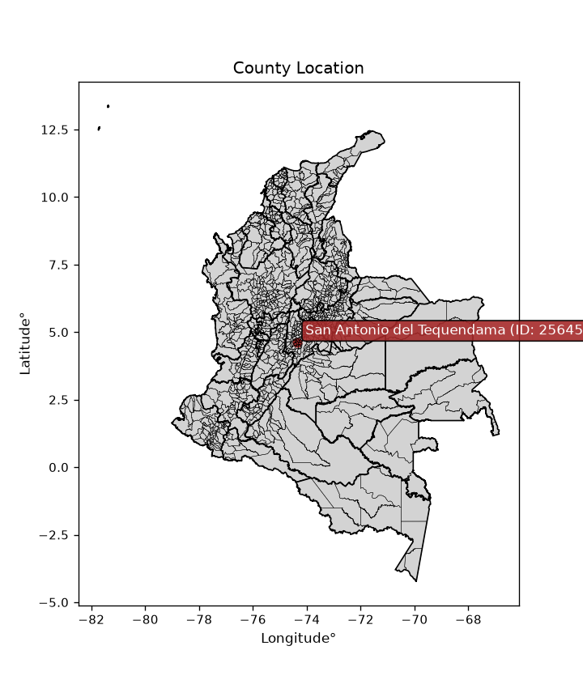
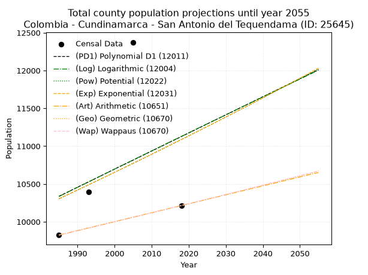
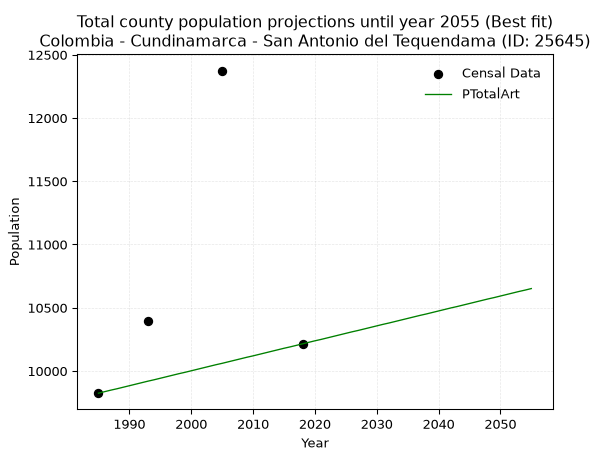
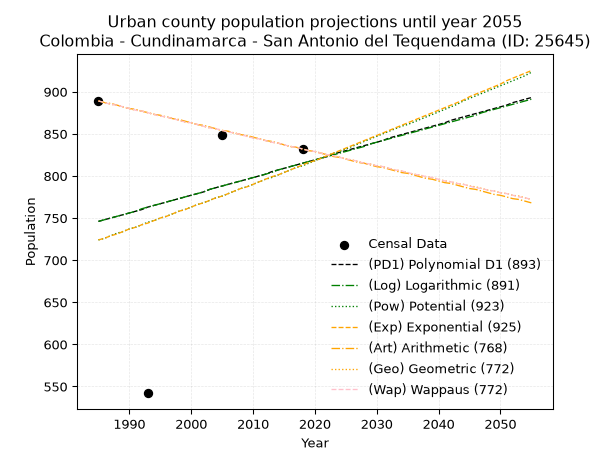
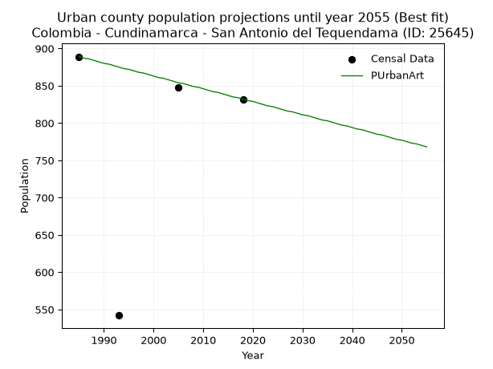
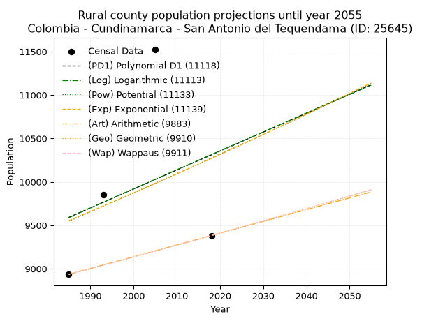
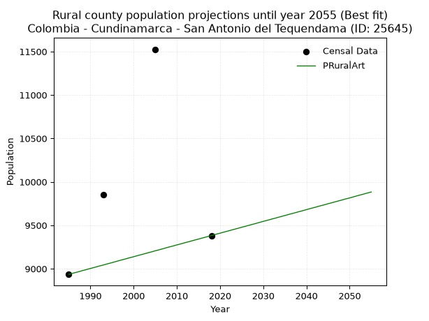

<div align="center">


</div>

# _“Population and Public Services Demand Projections (PPSD) until Year 2050 for Colombia - Cundinamarca - San Antonio del Tequendama (ID: 25645)”_
Keywords: `population` `public-service` `projection` `lineal` `polynomial` `logarithmic` `potential` `exponential` `arithmetic` `geometric` `wappaus` `dane` `colombia` `south-america`

PPSD are analytical estimates used by governments and planners to anticipate future changes in population size, age distribution, and the resulting community needs for utilities, healthcare, education, and infrastructure as sizing future water treatment facilities, electrical grids, and road networks based on spatial growth.

> **General running parameters**: • app_version: _v20260806_. • Python version: _3.14.7_. • Pandas version: _3.0.5_. • NumPy version: _2.5.1_. • Creates, save and include plots into reports (create_plot): _False_. • Projection until year: _2050_. • Process polynomial degree 2 and up: _False_. • Process Wappaus: _True_. • Process Wappaus: _True_. • Set negative values to zero: _True_. • Set infinite values to zero: _True_. • Drop dataset notes: _True_. 
<div align="center">

Dynamic map: [:earth_americas:Google](http://maps.google.com/maps?q=4.616138045,-74.3514426) [:earth_americas:OSM](https://www.openstreetmap.org/#map=18/4.616138045/-74.3514426&layers=P) [:earth_americas:Bing](https://www.bing.com/maps?cp=4.616138045~-74.3514426&lvl=18) [:earth_americas:Apple](https://maps.apple.com/frame?center=4.616138045%2C-74.3514426&span=0.003%2C0.006)

</div>


<div align="center">

```geojson
{
  "type": "Feature",
  "geometry": {
    "type": "Point", 
    "coordinates": [-74.3514426, 4.616138045]
  }, 
  "properties": {
    "Name": "Colombia - Cundinamarca - San Antonio del Tequendama (ID: 25645)"
  }
}
```

</div>


<div align="center">

</img>

</div>


## 0. Census Data (4 records)

Census data are official statistics collected by a government about the people and housing in a country. They usually include counts of total population, age, sex, race, income, education, and jobs.

📅Global census file: [Population.xlsx](../data/Population.xlsx)

| Source   |   Year |   CountryID | CountryName   |   StateID | StateName    |   CountyID | CountyName                 |   PTotal |   PUrban |   PRural |
|:---------|-------:|------------:|:--------------|----------:|:-------------|-----------:|:---------------------------|---------:|---------:|---------:|
| DANE     |   1985 |          57 | Colombia      |        25 | Cundinamarca |      25645 | San Antonio del Tequendama |     9824 |      889 |     8935 |
| DANE     |   1993 |          57 | Colombia      |        25 | Cundinamarca |      25645 | San Antonio del Tequendama |    10395 |      542 |     9853 |
| DANE     |   2005 |          57 | Colombia      |        25 | Cundinamarca |      25645 | San Antonio del Tequendama |    12374 |      848 |    11526 |
| DANE     |   2018 |          57 | Colombia      |        25 | Cundinamarca |      25645 | San Antonio del Tequendama |    10214 |      832 |     9382 |

> 🔥Some records could had specific notes about the registered values or the corresponding urban or rural distribution.

📅   [RUPS](https://www.datos.gov.co/Hacienda-y-Cr-dito-P-blico/Registro-nico-de-Prestadores-de-Servicios-P-blicos/4qkq-csdn/about_data) - Local public utility companies: [RUPS.csv](../data/RUPS.xlsx)

 | SERVICIO       | ESTADO    | NOMBRE                                                                                                                                                 | NIT         | DEPARTAMENTO_DOMICILIO   | MUNICIPIO_DOMICILIO        | DIRECCION                                    |      TELEFONO | EMAIL                                   | TIPO_PRESTADOR                             | CLASIFICACION                 |
|:---------------|:----------|:-------------------------------------------------------------------------------------------------------------------------------------------------------|:------------|:-------------------------|:---------------------------|:---------------------------------------------|--------------:|:----------------------------------------|:-------------------------------------------|:------------------------------|
| ACUEDUCTO      | OPERATIVA | EMPRESA DE ACUEDUCTO COMUNITARIO DE SANTANDERCITO E.S.P.                                                                                               | 808002667-2 | CUNDINAMARCA             | SAN ANTONIO DEL TEQUENDAMA | calle 3A No. 2A-08                           |   8.47386e+06 | acuecosan@hotmail.com                   | ORGANIZACION AUTORIZADA                    | HASTA 2500 SUSCRIPTORES       |
| ACUEDUCTO      | OPERATIVA | ASOCIACION DE USUARIOS DEL ACUEDUCTO Y ALCANTARILLADO DE LA VEREDA CUSIO                                                                               | 808002708-6 | CUNDINAMARCA             | SAN ANTONIO DEL TEQUENDAMA | VEREDA DE CUSIO                              |   8.45006e+06 | acueductocusio@gmail.com                | ORGANIZACION AUTORIZADA                    | MENOR O IGUAL A 2500 USUARIOS |
| ACUEDUCTO      | OPERATIVA | ASOCIACION DE SUSCRIPTORES DEL ACUEDUCTO LA VARILICE                                                                                                   | 808003327-8 | CUNDINAMARCA             | SAN ANTONIO DEL TEQUENDAMA | KM 23 VIA EL COLEGIO VEREDA LAS ANGUSTIAS    |   2.70712e+06 | oamartinezm@gmail.com                   | ORGANIZACION AUTORIZADA                    | MENOR O IGUAL A 2500 USUARIOS |
| ACUEDUCTO      | OPERATIVA | ASOCIACION DE USUARIOS ACUEDUCTO DE AGUA POTABLE LOS RAMBLUNOS                                                                                         | 808002078-4 | CUNDINAMARCA             | SAN ANTONIO DEL TEQUENDAMA | VEREDA LA RAMBLA - FINCA LA ESPERANZA        |   8.47348e+06 | acueductosveredales@yahoo.com           | ORGANIZACION AUTORIZADA                    | HASTA 2500 SUSCRIPTORES       |
| ACUEDUCTO      | OPERATIVA | ASOCIACION DE USUARIOS DEL ACUEDUCTO RURAL DEL CARMEN Y SAN JUAN DE LA VEREDA PATIO DE BOLAS                                                           | 900049682-1 | CUNDINAMARCA             | SAN ANTONIO DEL TEQUENDAMA | VEREDA PATIO DE BOLAS FINCA LA CAMPIÑA       |   8.4503e+06  | acueductosveredales@yahoo.com           | ORGANIZACION AUTORIZADA                    | HASTA 2500 SUSCRIPTORES       |
| ACUEDUCTO      | OPERATIVA | ASOCIACION DE ACUEDUCTO LOS CRISTALES VANCOUVER PARTE MEDIA  Y LA RAMBLA PARTE BAJA                                                                    | 808000693-5 | CUNDINAMARCA             | SAN ANTONIO DEL TEQUENDAMA | BELLAVISTA                                   |   8.47379e+06 | acueductosveredales@yahoo.com           | ORGANIZACION AUTORIZADA                    | HASTA 2500 SUSCRIPTORES       |
| ACUEDUCTO      | OPERATIVA | ASOCIACION DE USUARIOS DEL ACUEDUCTO SANTIVAR ALTO Y BAJO QUEBRADA VARILICE                                                                            | 900023729-4 | CUNDINAMARCA             | SAN ANTONIO DEL TEQUENDAMA | VEREDA SANTIVAR ALTO - FINCA EL RECUERDO     |   8.981e+06   | acuedusctosveredales@yahoo.com          | ORGANIZACION AUTORIZADA                    | HASTA 2500 SUSCRIPTORES       |
| ACUEDUCTO      | OPERATIVA | ASOCIACIÓN DE USUARIOS DEL ACUEDUCTO VEREDAL SANTIVAR PUEBLO NUEVO LAS ANGUSTIAS                                                                       | 808002172-9 | CUNDINAMARCA             | SAN ANTONIO DEL TEQUENDAMA | VEREDA SANTIVAR MEDIO- FINCA SANTA TERESITA  |   8.981e+06   | acueductosveredales@yahoo.com           | ORGANIZACION AUTORIZADA                    | HASTA 2500 SUSCRIPTORES       |
| ACUEDUCTO      | OPERATIVA | ASOCIACION DEL ACUEDUCTO AGUACHICAQUE                                                                                                                  | 808000730-1 | CUNDINAMARCA             | SAN ANTONIO DEL TEQUENDAMA | VEREDA CHICAQUE                              |   8.45032e+06 | acueductosveredales@yahoo.com           | ORGANIZACION AUTORIZADA                    | HASTA 2500 SUSCRIPTORES       |
| ACUEDUCTO      | OPERATIVA | ASOCIACIÓN DE USUARIOS DEL ACUEDUCTO COLECTIVO LOS CRISTALES VEREDA LA RAMBLA                                                                          | 808000802-1 | CUNDINAMARCA             | SAN ANTONIO DEL TEQUENDAMA | VEREDA LA RAMBLA KM 9 VIA EL COLEGIO         |   8.47389e+06 | acueductosveredales@yahoo.com           | ORGANIZACION AUTORIZADA                    | HASTA 2500 SUSCRIPTORES       |
| ACUEDUCTO      | OPERATIVA | ASOCIACION DE SUSCRIPTORES USUARIOS O CONSUMIDORES DEL ACUEDUCTO LAS ANGUSTIAS SANTAFE MUNICIPIO DE SAN ANTONIO DEL TEQUENDAMA DEPARTAMENTO DE CUNDINA | 808001545-8 | CUNDINAMARCA             | SAN ANTONIO DEL TEQUENDAMA | VEREDA LAS ANGUSTIAS                         |   8.98106e+06 | aguasantaesp@hotmail.com                | ORGANIZACION AUTORIZADA                    | MENOR O IGUAL A 2500 USUARIOS |
| ACUEDUCTO      | OPERATIVA | COMITÉ DE USUARIOS DEL ACUEDUCTO Y ALCANTARILLADO DE LA VEREDA CAICEDO                                                                                 | 808002140-3 | CUNDINAMARCA             | SAN ANTONIO DEL TEQUENDAMA | VEREDA CAICEDO - FINCA VILLA ADRIANA         |   8.45006e+06 | acueductosveredales@yahoo.com           | ORGANIZACION AUTORIZADA                    | HASTA 2500 SUSCRIPTORES       |
| ACUEDUCTO      | OPERATIVA | ASOCIACION DE USUARIOS DEL ACUEDUCTO RURAL EL PROGRESO                                                                                                 | 900072706-4 | CUNDINAMARCA             | SAN ANTONIO DEL TEQUENDAMA | KILOMETRO 17 VIA MESITAS                     |   8.4736e+06  | maros2203@hotmail.com                   | ORGANIZACION AUTORIZADA                    | HASTA 2500 SUSCRIPTORES       |
| ACUEDUCTO      | OPERATIVA | ASOCIACION DE USUARIOS DEL ACUEDUCTO RURAL LOS NARANJOS VEREDA LAS ANGUSTIAS                                                                           | 860534506-7 | CUNDINAMARCA             | SAN ANTONIO DEL TEQUENDAMA | VEREDA LAS ANGUSTIAS                         |   8.45023e+06 | asuanaranjos@gmail.com                  | ORGANIZACION AUTORIZADA                    | MENOR O IGUAL A 2500 USUARIOS |
| ACUEDUCTO      | OPERATIVA | ASOCIACION DE USUARIOS DEL ACUEDUCTO Y ALCANTARILLADO DE LA VEREDA SAN JOSE                                                                            | 808002709-3 | CUNDINAMARCA             | SAN ANTONIO DEL TEQUENDAMA | VEREDA SAN JOSE - FINCA EL MIRADOR           |   8.45006e+06 | acueductosveredales@yahoo.com           | ORGANIZACION AUTORIZADA                    | HASTA 2500 SUSCRIPTORES       |
| ACUEDUCTO      | OPERATIVA | JUNTA DE USUARIOS DE ABASTECIMIENTO DE AGUA ACUEDUCTO LA MALOCHA VEREDA LA RAMBLA                                                                      | 808003055-1 | nan                      | nan                        | nan                                          | nan           | nan                                     | ORGANIZACION AUTORIZADA                    | HASTA 2500 SUSCRIPTORES       |
| ACUEDUCTO      | OPERATIVA | ASOCIACION DE USUARIOS DEL ACUEDUCTO DE LAS VEREDAS NAPOLES, PONCHOS Y SEBASTOPOL                                                                      | 808001440-3 | CUNDINAMARCA             | SAN ANTONIO DEL TEQUENDAMA | VEREDA PONCHOS                               |   4.82128e+06 | olgalucia.espejoburgos@gmail.com        | ORGANIZACION AUTORIZADA                    | MENOR O IGUAL A 2500 USUARIOS |
| ACUEDUCTO      | OPERATIVA | ASOCIACION DE USUARIOS DEL ACUEDUCTO EL MORICHAL                                                                                                       | 808001927-8 | CUNDINAMARCA             | SAN ANTONIO DEL TEQUENDAMA | VEREDA SANTIVAR ALTO- FINCA EL DURAZNAL      |   8.45006e+06 | acueductosveredales@yahoo.com           | ORGANIZACION AUTORIZADA                    | HASTA 2500 SUSCRIPTORES       |
| ACUEDUCTO      | OPERATIVA | ASOCIACION DE USUARIOS JUNTA DEL ACUEDUCTO VIEJO DE SANTANDERCITO                                                                                      | 808003858-7 | CUNDINAMARCA             | SAN ANTONIO DEL TEQUENDAMA | CALLE 4 # 4-03 SANTANDERCITO                 |   8.47382e+06 | acueductoviejosantandercito@yahoo.es    | ORGANIZACION AUTORIZADA                    | HASTA 2500 SUSCRIPTORES       |
| ACUEDUCTO      | OPERATIVA | ASOCIACION DE USUARIOS DEL ACUEDUCTO LAS PALMAS DE LAS VEREDAS RAMBLA Y VANCOUVER                                                                      | 808001863-5 | CUNDINAMARCA             | SAN ANTONIO DEL TEQUENDAMA | VEREDA LA RAMBLA FINCA VILLA JOHANA          |   8.47347e+06 | acueductosveredales@yahoo.com           | ORGANIZACION AUTORIZADA                    | HASTA 2500 SUSCRIPTORES       |
| ACUEDUCTO      | OPERATIVA | ASOCIACION DE USUARIOS DEL ACUEDUCTO ANTIGUO DE PUEBLO NUEVO DE SANTIVAR DEL MUNICIPIO DE SAN ANTONIO DEL TEQUENDAMA                                   | 900018916-5 | CUNDINAMARCA             | SAN ANTONIO DEL TEQUENDAMA | VEREDA SANTIVAR- PUEBLO NUEVO                |   8.98108e+06 | maros2203@hotmail.com                   | ORGANIZACION AUTORIZADA                    | HASTA 2500 SUSCRIPTORES       |
| ACUEDUCTO      | OPERATIVA | ASOCIACION DE USUARIOS DEL ACUEDUCTO DE LA VEREDA QUEBRADA GRANDE DEL MUNICIPIO DE SAN ANTONIO DEL TEQUENDAMA DEPARTAMENTO DE CUNDINAMARCA             | 808001482-2 | CUNDINAMARCA             | SAN ANTONIO DEL TEQUENDAMA | VEREDA QUEBRADA GRANDE FINCA SANTA ANA       |   8.45006e+06 | ricardomejian@hotmail.com               | ORGANIZACION AUTORIZADA                    | MENOR O IGUAL A 2500 USUARIOS |
| ACUEDUCTO      | OPERATIVA | ASOCIACION DE USUARIOS DEL ACUEDUCTO RURAL DE LA VEREDA VANCOUVER LA RAMBLA PARTE ALTA                                                                 | 900091581-1 | CUNDINAMARCA             | SAN ANTONIO DEL TEQUENDAMA | VEREDA VANCOUVER SALON MULTIPLE              |   7.58338e+06 | acueductorural@hotmail.com              | ORGANIZACION AUTORIZADA                    | MENOR O IGUAL A 2500 USUARIOS |
| ACUEDUCTO      | OPERATIVA | ASOCIACION DE USUARIOS DEL ACUEDUCTO LA MARIA PARTE BAJA Y LAS ANGUSTIAS                                                                               | 808001857-0 | CUNDINAMARCA             | SAN ANTONIO DEL TEQUENDAMA | VEREDA LA MARIA FINCA SAN CARLOS             |   9.88104e+06 | guzman.mary@gmail.com                   | ORGANIZACION AUTORIZADA                    | HASTA 2500 SUSCRIPTORES       |
| ACUEDUCTO      | OPERATIVA | JUNTA DE ACUEDUCTO BELLAVISTA CENTRO VEREDA VANCOUVER                                                                                                  | 900141977-1 | CUNDINAMARCA             | SAN ANTONIO DEL TEQUENDAMA | CENTRO POBLADO BELLAVISTA - VEREDA VANCOUVER |   8.47356e+06 | acueductosveredales@yahoo.com           | ORGANIZACION AUTORIZADA                    | HASTA 2500 SUSCRIPTORES       |
| ACUEDUCTO      | OPERATIVA | ASOCIACION DE USUARIOS DEL ACUEDUCTO RURAL EL ARRACACHAL DE LA VEREDA ARRACACHAL                                                                       | 900147856-4 | CUNDINAMARCA             | SAN ANTONIO DEL TEQUENDAMA | VEREDA EL ARRACACHAL FINCA PICACHOS          |   7.10797e+06 | acueductoarracachal@gmail.com           | ORGANIZACION AUTORIZADA                    | MENOR O IGUAL A 2500 USUARIOS |
| ACUEDUCTO      | OPERATIVA | EMPRESA DE SERVICIOS PUBLICOS DE SAN ANTONIO DEL TEQUENDAMA - PROGRESAR SA. ESP                                                                        | 900403698-5 | CUNDINAMARCA             | SAN ANTONIO DEL TEQUENDAMA | Cra 4 No 4-01 B CENTRO                       |   8.45018e+06 | progresar@sanantoniodetequendama.gov.co | SOCIEDADES (EMPRESA DE SERVICIOS PUBLICOS) | MENOR O IGUAL A 2500 USUARIOS |
| ALCANTARILLADO | OPERATIVA | EMPRESA DE SERVICIOS PUBLICOS DE SAN ANTONIO DEL TEQUENDAMA - PROGRESAR SA. ESP                                                                        | 900403698-5 | CUNDINAMARCA             | SAN ANTONIO DEL TEQUENDAMA | Cra 4 No 4-01 B CENTRO                       |   8.45018e+06 | progresar@sanantoniodetequendama.gov.co | SOCIEDADES (EMPRESA DE SERVICIOS PUBLICOS) | MENOR O IGUAL A 2500 USUARIOS |
| ACUEDUCTO      | OPERATIVA | ASOCIACION DE USUARIOS AGUAS DE SANTANDERCITO ESP                                                                                                      | 900479590-5 | CUNDINAMARCA             | SAN ANTONIO DEL TEQUENDAMA | CALLE 3 Nº 1A-14 SANTANDERCITO               |   8.47375e+06 | mpatarroyo@aguassantandercito.com       | ORGANIZACION AUTORIZADA                    | HASTA 2500 SUSCRIPTORES       |
| ACUEDUCTO      | OPERATIVA | ASOCIACION DE USUARIOS DEL ACUEDUCTO DE LAS VEREDAS PONCHOS Y ZARAGOZA                                                                                 | 808000708-7 | CUNDINAMARCA             | SAN ANTONIO DEL TEQUENDAMA | FINCA EL MANANTIAL VEREDA ZARAGOZA           |   8.45006e+06 | acuazaragoza@gmail.com                  | ORGANIZACION AUTORIZADA                    | MENOR O IGUAL A 2500 USUARIOS |

## 1. Total

### 1.1. Coefficients and Parameters

* (PD1) Polynomial Deg 1: 23.918506623847044, -37141.24287435006 (lineal)
* (Log) Logarithmic: 48179.34542848594, -355509.8406869655
* (Pow) Potential: 4.455236895705267, -10.679370162087979
* (Exp) Exponential: 0.0022120880671992766, 127.6642348398173
* (Art) Arithmetic: Year diff. 2018 - 1985 = 33, Population diff. 10214 - 9824 = 390, Annual growth = 11.818181818181818
* (Geo) Geometric: Year diff. 2018 - 1985 = 33, Population diff. 10214 - 9824 = 390, Annual growth % = 0.0011804221146665128
* (Wap) Wappaus: i = 0.1179576985545645, Condition values only valid for < 200)

<sub>
Wappaus condition values: ['0.00', '0.12', '0.24', '0.35', '0.47', '0.59', '0.71', '0.83', '0.94', '1.06', '1.18', '1.30', '1.42', '1.53', '1.65', '1.77', '1.89', '2.01', '2.12', '2.24', '2.36', '2.48', '2.60', '2.71', '2.83', '2.95', '3.07', '3.18', '3.30', '3.42', '3.54', '3.66', '3.77', '3.89', '4.01', '4.13', '4.25', '4.36', '4.48', '4.60', '4.72', '4.84', '4.95', '5.07', '5.19', '5.31', '5.43', '5.54', '5.66', '5.78', '5.90', '6.02', '6.13', '6.25', '6.37', '6.49', '6.61', '6.72', '6.84', '6.96', '7.08', '7.20', '7.31', '7.43', '7.55', '7.67']
</sub>


### 1.2. Projected Dataset

|   Year |   CountyID |   PTotalPD1 |   PTotalLog |   PTotalPow |   PTotalExp |   PTotalArt |   PTotalGeo |   PTotalWap |
|-------:|-----------:|------------:|------------:|------------:|------------:|------------:|------------:|------------:|
|   1985 |      25645 |       10337 |       10334 |       10302 |       10305 |        9824 |        9824 |        9824 |
|   1986 |      25645 |       10361 |       10358 |       10325 |       10328 |        9836 |        9836 |        9836 |
|   1987 |      25645 |       10385 |       10382 |       10349 |       10351 |        9848 |        9847 |        9847 |
|   1988 |      25645 |       10409 |       10407 |       10372 |       10374 |        9859 |        9859 |        9859 |
|   1989 |      25645 |       10433 |       10431 |       10395 |       10397 |        9871 |        9870 |        9870 |
|   1990 |      25645 |       10457 |       10455 |       10418 |       10420 |        9883 |        9882 |        9882 |
|   1991 |      25645 |       10481 |       10479 |       10442 |       10443 |        9895 |        9894 |        9894 |
|   1992 |      25645 |       10504 |       10504 |       10465 |       10466 |        9907 |        9905 |        9905 |
|   1993 |      25645 |       10528 |       10528 |       10489 |       10489 |        9919 |        9917 |        9917 |
|   1994 |      25645 |       10552 |       10552 |       10512 |       10512 |        9930 |        9929 |        9929 |
|   1995 |      25645 |       10576 |       10576 |       10536 |       10536 |        9942 |        9941 |        9941 |
|   1996 |      25645 |       10600 |       10600 |       10559 |       10559 |        9954 |        9952 |        9952 |
|   1997 |      25645 |       10624 |       10624 |       10583 |       10582 |        9966 |        9964 |        9964 |
|   1998 |      25645 |       10648 |       10648 |       10606 |       10606 |        9978 |        9976 |        9976 |
|   1999 |      25645 |       10672 |       10673 |       10630 |       10629 |        9989 |        9988 |        9988 |
|   2000 |      25645 |       10696 |       10697 |       10654 |       10653 |       10001 |        9999 |        9999 |
|   2001 |      25645 |       10720 |       10721 |       10677 |       10676 |       10013 |       10011 |       10011 |
|   2002 |      25645 |       10744 |       10745 |       10701 |       10700 |       10025 |       10023 |       10023 |
|   2003 |      25645 |       10768 |       10769 |       10725 |       10724 |       10037 |       10035 |       10035 |
|   2004 |      25645 |       10791 |       10793 |       10749 |       10747 |       10049 |       10047 |       10047 |
|   2005 |      25645 |       10815 |       10817 |       10773 |       10771 |       10060 |       10059 |       10059 |
|   2006 |      25645 |       10839 |       10841 |       10797 |       10795 |       10072 |       10070 |       10070 |
|   2007 |      25645 |       10863 |       10865 |       10821 |       10819 |       10084 |       10082 |       10082 |
|   2008 |      25645 |       10887 |       10889 |       10845 |       10843 |       10096 |       10094 |       10094 |
|   2009 |      25645 |       10911 |       10913 |       10869 |       10867 |       10108 |       10106 |       10106 |
|   2010 |      25645 |       10935 |       10937 |       10893 |       10891 |       10119 |       10118 |       10118 |
|   2011 |      25645 |       10959 |       10961 |       10917 |       10915 |       10131 |       10130 |       10130 |
|   2012 |      25645 |       10983 |       10985 |       10941 |       10939 |       10143 |       10142 |       10142 |
|   2013 |      25645 |       11007 |       11009 |       10966 |       10964 |       10155 |       10154 |       10154 |
|   2014 |      25645 |       11031 |       11033 |       10990 |       10988 |       10167 |       10166 |       10166 |
|   2015 |      25645 |       11055 |       11057 |       11014 |       11012 |       10179 |       10178 |       10178 |
|   2016 |      25645 |       11078 |       11081 |       11039 |       11037 |       10190 |       10190 |       10190 |
|   2017 |      25645 |       11102 |       11104 |       11063 |       11061 |       10202 |       10202 |       10202 |
|   2018 |      25645 |       11126 |       11128 |       11088 |       11086 |       10214 |       10214 |       10214 |
|   2019 |      25645 |       11150 |       11152 |       11112 |       11110 |       10226 |       10226 |       10226 |
|   2020 |      25645 |       11174 |       11176 |       11137 |       11135 |       10238 |       10238 |       10238 |
|   2021 |      25645 |       11198 |       11200 |       11161 |       11159 |       10249 |       10250 |       10250 |
|   2022 |      25645 |       11222 |       11224 |       11186 |       11184 |       10261 |       10262 |       10262 |
|   2023 |      25645 |       11246 |       11248 |       11210 |       11209 |       10273 |       10274 |       10274 |
|   2024 |      25645 |       11270 |       11271 |       11235 |       11234 |       10285 |       10287 |       10287 |
|   2025 |      25645 |       11294 |       11295 |       11260 |       11259 |       10297 |       10299 |       10299 |
|   2026 |      25645 |       11318 |       11319 |       11285 |       11283 |       10309 |       10311 |       10311 |
|   2027 |      25645 |       11342 |       11343 |       11310 |       11308 |       10320 |       10323 |       10323 |
|   2028 |      25645 |       11365 |       11366 |       11334 |       11334 |       10332 |       10335 |       10335 |
|   2029 |      25645 |       11389 |       11390 |       11359 |       11359 |       10344 |       10347 |       10347 |
|   2030 |      25645 |       11413 |       11414 |       11384 |       11384 |       10356 |       10360 |       10360 |
|   2031 |      25645 |       11437 |       11438 |       11409 |       11409 |       10368 |       10372 |       10372 |
|   2032 |      25645 |       11461 |       11461 |       11434 |       11434 |       10379 |       10384 |       10384 |
|   2033 |      25645 |       11485 |       11485 |       11459 |       11460 |       10391 |       10396 |       10396 |
|   2034 |      25645 |       11509 |       11509 |       11485 |       11485 |       10403 |       10409 |       10409 |
|   2035 |      25645 |       11533 |       11533 |       11510 |       11510 |       10415 |       10421 |       10421 |
|   2036 |      25645 |       11557 |       11556 |       11535 |       11536 |       10427 |       10433 |       10433 |
|   2037 |      25645 |       11581 |       11580 |       11560 |       11561 |       10439 |       10446 |       10446 |
|   2038 |      25645 |       11605 |       11603 |       11586 |       11587 |       10450 |       10458 |       10458 |
|   2039 |      25645 |       11629 |       11627 |       11611 |       11613 |       10462 |       10470 |       10470 |
|   2040 |      25645 |       11653 |       11651 |       11636 |       11638 |       10474 |       10483 |       10483 |
|   2041 |      25645 |       11676 |       11674 |       11662 |       11664 |       10486 |       10495 |       10495 |
|   2042 |      25645 |       11700 |       11698 |       11687 |       11690 |       10498 |       10507 |       10508 |
|   2043 |      25645 |       11724 |       11722 |       11713 |       11716 |       10509 |       10520 |       10520 |
|   2044 |      25645 |       11748 |       11745 |       11738 |       11742 |       10521 |       10532 |       10532 |
|   2045 |      25645 |       11772 |       11769 |       11764 |       11768 |       10533 |       10545 |       10545 |
|   2046 |      25645 |       11796 |       11792 |       11790 |       11794 |       10545 |       10557 |       10557 |
|   2047 |      25645 |       11820 |       11816 |       11815 |       11820 |       10557 |       10569 |       10570 |
|   2048 |      25645 |       11844 |       11839 |       11841 |       11846 |       10569 |       10582 |       10582 |
|   2049 |      25645 |       11868 |       11863 |       11867 |       11872 |       10580 |       10594 |       10595 |
|   2050 |      25645 |       11892 |       11886 |       11893 |       11899 |       10592 |       10607 |       10607 |
<div align="center">

</img>

</div>


### 1.3. Best fit with absolute and relative error (%)

Relative error puts that difference into context by dividing the absolute error by the true value, creating a unitless ratio or percentage that shows the scale of the mistake.

Absolute and relative error

|   Year | Source   |   CountryID | CountryName   |   StateID | StateName    |   CountyID_x | CountyName                 |   PTotal |   PUrban |   PRural |   CountyID_y |   PTotalPD1 |   PTotalLog |   PTotalPow |   PTotalExp |   PTotalArt |   PTotalGeo |   PTotalWap |   PTotalPD1AbsError |   PTotalLogAbsError |   PTotalPowAbsError |   PTotalExpAbsError |   PTotalArtAbsError |   PTotalGeoAbsError |   PTotalWapAbsError |   PTotalPD1RelError |   PTotalLogRelError |   PTotalPowRelError |   PTotalExpRelError |   PTotalArtRelError |   PTotalGeoRelError |   PTotalWapRelError |
|-------:|:---------|------------:|:--------------|----------:|:-------------|-------------:|:---------------------------|---------:|---------:|---------:|-------------:|------------:|------------:|------------:|------------:|------------:|------------:|------------:|--------------------:|--------------------:|--------------------:|--------------------:|--------------------:|--------------------:|--------------------:|--------------------:|--------------------:|--------------------:|--------------------:|--------------------:|--------------------:|--------------------:|
|   1985 | DANE     |          57 | Colombia      |        25 | Cundinamarca |        25645 | San Antonio del Tequendama |     9824 |      889 |     8935 |        25645 |       10337 |       10334 |       10302 |       10305 |        9824 |        9824 |        9824 |                 513 |                 510 |                 478 |                 481 |                   0 |                   0 |                   0 |             5.22191 |             5.19137 |            4.86564  |            4.89617  |             0       |             0       |             0       |
|   1993 | DANE     |          57 | Colombia      |        25 | Cundinamarca |        25645 | San Antonio del Tequendama |    10395 |      542 |     9853 |        25645 |       10528 |       10528 |       10489 |       10489 |        9919 |        9917 |        9917 |                 133 |                 133 |                  94 |                  94 |                 476 |                 478 |                 478 |             1.27946 |             1.27946 |            0.904281 |            0.904281 |             4.57912 |             4.59836 |             4.59836 |
|   2005 | DANE     |          57 | Colombia      |        25 | Cundinamarca |        25645 | San Antonio del Tequendama |    12374 |      848 |    11526 |        25645 |       10815 |       10817 |       10773 |       10771 |       10060 |       10059 |       10059 |                1559 |                1557 |                1601 |                1603 |                2314 |                2315 |                2315 |            12.599   |            12.5828  |           12.9384   |           12.9546   |            18.7005  |            18.7086  |            18.7086  |
|   2018 | DANE     |          57 | Colombia      |        25 | Cundinamarca |        25645 | San Antonio del Tequendama |    10214 |      832 |     9382 |        25645 |       11126 |       11128 |       11088 |       11086 |       10214 |       10214 |       10214 |                 912 |                 914 |                 874 |                 872 |                   0 |                   0 |                   0 |             8.92892 |             8.9485  |            8.55688  |            8.5373   |             0       |             0       |             0       |

Relative error mean

| Method    |   RelError | Best   |
|:----------|-----------:|:-------|
| PTotalPD1 |    7.00732 |        |
| PTotalLog |    7.00054 |        |
| PTotalPow |    6.8163  |        |
| PTotalExp |    6.82308 |        |
| PTotalArt |    5.81991 | True   |
| PTotalGeo |    5.82674 |        |
| PTotalWap |    5.82674 |        |

💙Best method: _**PTotalArt**_
<div align="center">

</img>

</div>


### 1.4. Fresh water supply demand in liters per capita per day (lpcd)

The fresh water supply demand typically ranges from 100 to 300 liters per capita per day (lpcd) for standard domestic and municipal planning, though absolute survival minimums set by the World Health Organization are as low as 7.5 to 20 liters per day, and total consumption in high-income nations can exceed 400 liters.

> `CZ`: Level in meters above the sea level (masl)<br> `WS`: Fresh water supply demand in liters per capita per day (lpcd or l/h/d)<br> `WSAll`: Zonal fresh water supply demand in liters per second (l/s)<br> `A`: Zonal area in square meters<br> `DP`: Population density (people/hectare or p/ha)

Reference values (RAS Colombia)

|    CZ |   WS |
|------:|-----:|
|  1000 |  120 |
|  2000 |  130 |
| 99999 |  140 |

County shapefile geometry properties and water supply values

|   CountyID |      ATotal |   CZTotal |   WSTotal |
|-----------:|------------:|----------:|----------:|
|      25645 | 8.84741e+07 |   1828.68 |       130 |

Projected values for best method: PTotalArt

|   CountyID |   Year |   PTotalArt |   DPTotal |   WSTotal |   WSTotalAll |
|-----------:|-------:|------------:|----------:|----------:|-------------:|
|      25645 |   1985 |        9824 |      1.11 |       130 |      14.7815 |
|      25645 |   1986 |        9836 |      1.11 |       130 |      14.7995 |
|      25645 |   1987 |        9848 |      1.11 |       130 |      14.8176 |
|      25645 |   1988 |        9859 |      1.11 |       130 |      14.8341 |
|      25645 |   1989 |        9871 |      1.12 |       130 |      14.8522 |
|      25645 |   1990 |        9883 |      1.12 |       130 |      14.8703 |
|      25645 |   1991 |        9895 |      1.12 |       130 |      14.8883 |
|      25645 |   1992 |        9907 |      1.12 |       130 |      14.9064 |
|      25645 |   1993 |        9919 |      1.12 |       130 |      14.9244 |
|      25645 |   1994 |        9930 |      1.12 |       130 |      14.941  |
|      25645 |   1995 |        9942 |      1.12 |       130 |      14.959  |
|      25645 |   1996 |        9954 |      1.13 |       130 |      14.9771 |
|      25645 |   1997 |        9966 |      1.13 |       130 |      14.9951 |
|      25645 |   1998 |        9978 |      1.13 |       130 |      15.0132 |
|      25645 |   1999 |        9989 |      1.13 |       130 |      15.0297 |
|      25645 |   2000 |       10001 |      1.13 |       130 |      15.0478 |
|      25645 |   2001 |       10013 |      1.13 |       130 |      15.0659 |
|      25645 |   2002 |       10025 |      1.13 |       130 |      15.0839 |
|      25645 |   2003 |       10037 |      1.13 |       130 |      15.102  |
|      25645 |   2004 |       10049 |      1.14 |       130 |      15.12   |
|      25645 |   2005 |       10060 |      1.14 |       130 |      15.1366 |
|      25645 |   2006 |       10072 |      1.14 |       130 |      15.1546 |
|      25645 |   2007 |       10084 |      1.14 |       130 |      15.1727 |
|      25645 |   2008 |       10096 |      1.14 |       130 |      15.1907 |
|      25645 |   2009 |       10108 |      1.14 |       130 |      15.2088 |
|      25645 |   2010 |       10119 |      1.14 |       130 |      15.2253 |
|      25645 |   2011 |       10131 |      1.15 |       130 |      15.2434 |
|      25645 |   2012 |       10143 |      1.15 |       130 |      15.2615 |
|      25645 |   2013 |       10155 |      1.15 |       130 |      15.2795 |
|      25645 |   2014 |       10167 |      1.15 |       130 |      15.2976 |
|      25645 |   2015 |       10179 |      1.15 |       130 |      15.3156 |
|      25645 |   2016 |       10190 |      1.15 |       130 |      15.3322 |
|      25645 |   2017 |       10202 |      1.15 |       130 |      15.3502 |
|      25645 |   2018 |       10214 |      1.15 |       130 |      15.3683 |
|      25645 |   2019 |       10226 |      1.16 |       130 |      15.3863 |
|      25645 |   2020 |       10238 |      1.16 |       130 |      15.4044 |
|      25645 |   2021 |       10249 |      1.16 |       130 |      15.4209 |
|      25645 |   2022 |       10261 |      1.16 |       130 |      15.439  |
|      25645 |   2023 |       10273 |      1.16 |       130 |      15.4571 |
|      25645 |   2024 |       10285 |      1.16 |       130 |      15.4751 |
|      25645 |   2025 |       10297 |      1.16 |       130 |      15.4932 |
|      25645 |   2026 |       10309 |      1.17 |       130 |      15.5112 |
|      25645 |   2027 |       10320 |      1.17 |       130 |      15.5278 |
|      25645 |   2028 |       10332 |      1.17 |       130 |      15.5458 |
|      25645 |   2029 |       10344 |      1.17 |       130 |      15.5639 |
|      25645 |   2030 |       10356 |      1.17 |       130 |      15.5819 |
|      25645 |   2031 |       10368 |      1.17 |       130 |      15.6    |
|      25645 |   2032 |       10379 |      1.17 |       130 |      15.6166 |
|      25645 |   2033 |       10391 |      1.17 |       130 |      15.6346 |
|      25645 |   2034 |       10403 |      1.18 |       130 |      15.6527 |
|      25645 |   2035 |       10415 |      1.18 |       130 |      15.6707 |
|      25645 |   2036 |       10427 |      1.18 |       130 |      15.6888 |
|      25645 |   2037 |       10439 |      1.18 |       130 |      15.7068 |
|      25645 |   2038 |       10450 |      1.18 |       130 |      15.7234 |
|      25645 |   2039 |       10462 |      1.18 |       130 |      15.7414 |
|      25645 |   2040 |       10474 |      1.18 |       130 |      15.7595 |
|      25645 |   2041 |       10486 |      1.19 |       130 |      15.7775 |
|      25645 |   2042 |       10498 |      1.19 |       130 |      15.7956 |
|      25645 |   2043 |       10509 |      1.19 |       130 |      15.8122 |
|      25645 |   2044 |       10521 |      1.19 |       130 |      15.8302 |
|      25645 |   2045 |       10533 |      1.19 |       130 |      15.8483 |
|      25645 |   2046 |       10545 |      1.19 |       130 |      15.8663 |
|      25645 |   2047 |       10557 |      1.19 |       130 |      15.8844 |
|      25645 |   2048 |       10569 |      1.19 |       130 |      15.9024 |
|      25645 |   2049 |       10580 |      1.2  |       130 |      15.919  |
|      25645 |   2050 |       10592 |      1.2  |       130 |      15.937  |

## 2. Urban

### 2.1. Coefficients and Parameters

* (PD1) Polynomial Deg 1: 2.102368526696103, -3427.51264552388 (lineal)
* (Log) Logarithmic: 4185.197092061711, -31033.966634825745
* (Pow) Potential: 6.9968161156666575, -20.214165559994118
* (Exp) Exponential: 0.003511918896127613, 0.6792970988499145
* (Art) Arithmetic: Year diff. 2018 - 1985 = 33, Population diff. 832 - 889 = -57, Annual growth = -1.7272727272727273
* (Geo) Geometric: Year diff. 2018 - 1985 = 33, Population diff. 832 - 889 = -57, Annual growth % = -0.0020060093500094967
* (Wap) Wappaus: i = -0.20072896307643548, Condition values only valid for < 200)

<sub>
Wappaus condition values: ['-0.00', '-0.20', '-0.40', '-0.60', '-0.80', '-1.00', '-1.20', '-1.41', '-1.61', '-1.81', '-2.01', '-2.21', '-2.41', '-2.61', '-2.81', '-3.01', '-3.21', '-3.41', '-3.61', '-3.81', '-4.01', '-4.22', '-4.42', '-4.62', '-4.82', '-5.02', '-5.22', '-5.42', '-5.62', '-5.82', '-6.02', '-6.22', '-6.42', '-6.62', '-6.82', '-7.03', '-7.23', '-7.43', '-7.63', '-7.83', '-8.03', '-8.23', '-8.43', '-8.63', '-8.83', '-9.03', '-9.23', '-9.43', '-9.63', '-9.84', '-10.04', '-10.24', '-10.44', '-10.64', '-10.84', '-11.04', '-11.24', '-11.44', '-11.64', '-11.84', '-12.04', '-12.24', '-12.45', '-12.65', '-12.85', '-13.05']
</sub>


### 2.2. Projected Dataset

|   Year |   CountyID |   PUrbanPD1 |   PUrbanLog |   PUrbanPow |   PUrbanExp |   PUrbanArt |   PUrbanGeo |   PUrbanWap |
|-------:|-----------:|------------:|------------:|------------:|------------:|------------:|------------:|------------:|
|   1985 |      25645 |         746 |         746 |         724 |         724 |         889 |         889 |         889 |
|   1986 |      25645 |         748 |         748 |         726 |         726 |         887 |         887 |         887 |
|   1987 |      25645 |         750 |         750 |         729 |         729 |         886 |         885 |         885 |
|   1988 |      25645 |         752 |         752 |         732 |         731 |         884 |         884 |         884 |
|   1989 |      25645 |         754 |         754 |         734 |         734 |         882 |         882 |         882 |
|   1990 |      25645 |         756 |         756 |         737 |         737 |         880 |         880 |         880 |
|   1991 |      25645 |         758 |         758 |         739 |         739 |         879 |         878 |         878 |
|   1992 |      25645 |         760 |         761 |         742 |         742 |         877 |         877 |         877 |
|   1993 |      25645 |         763 |         763 |         745 |         744 |         875 |         875 |         875 |
|   1994 |      25645 |         765 |         765 |         747 |         747 |         873 |         873 |         873 |
|   1995 |      25645 |         767 |         767 |         750 |         750 |         872 |         871 |         871 |
|   1996 |      25645 |         769 |         769 |         752 |         752 |         870 |         870 |         870 |
|   1997 |      25645 |         771 |         771 |         755 |         755 |         868 |         868 |         868 |
|   1998 |      25645 |         773 |         773 |         758 |         758 |         867 |         866 |         866 |
|   1999 |      25645 |         775 |         775 |         760 |         760 |         865 |         864 |         864 |
|   2000 |      25645 |         777 |         777 |         763 |         763 |         863 |         863 |         863 |
|   2001 |      25645 |         779 |         779 |         766 |         766 |         861 |         861 |         861 |
|   2002 |      25645 |         781 |         781 |         768 |         768 |         860 |         859 |         859 |
|   2003 |      25645 |         784 |         784 |         771 |         771 |         858 |         857 |         857 |
|   2004 |      25645 |         786 |         786 |         774 |         774 |         856 |         856 |         856 |
|   2005 |      25645 |         788 |         788 |         776 |         776 |         854 |         854 |         854 |
|   2006 |      25645 |         790 |         790 |         779 |         779 |         853 |         852 |         852 |
|   2007 |      25645 |         792 |         792 |         782 |         782 |         851 |         851 |         851 |
|   2008 |      25645 |         794 |         794 |         785 |         785 |         849 |         849 |         849 |
|   2009 |      25645 |         796 |         796 |         787 |         787 |         848 |         847 |         847 |
|   2010 |      25645 |         798 |         798 |         790 |         790 |         846 |         845 |         845 |
|   2011 |      25645 |         800 |         800 |         793 |         793 |         844 |         844 |         844 |
|   2012 |      25645 |         802 |         802 |         796 |         796 |         842 |         842 |         842 |
|   2013 |      25645 |         805 |         804 |         798 |         799 |         841 |         840 |         840 |
|   2014 |      25645 |         807 |         807 |         801 |         801 |         839 |         839 |         839 |
|   2015 |      25645 |         809 |         809 |         804 |         804 |         837 |         837 |         837 |
|   2016 |      25645 |         811 |         811 |         807 |         807 |         835 |         835 |         835 |
|   2017 |      25645 |         813 |         813 |         810 |         810 |         834 |         834 |         834 |
|   2018 |      25645 |         815 |         815 |         812 |         813 |         832 |         832 |         832 |
|   2019 |      25645 |         817 |         817 |         815 |         816 |         830 |         830 |         830 |
|   2020 |      25645 |         819 |         819 |         818 |         818 |         829 |         829 |         829 |
|   2021 |      25645 |         821 |         821 |         821 |         821 |         827 |         827 |         827 |
|   2022 |      25645 |         823 |         823 |         824 |         824 |         825 |         825 |         825 |
|   2023 |      25645 |         826 |         825 |         827 |         827 |         823 |         824 |         824 |
|   2024 |      25645 |         828 |         827 |         829 |         830 |         822 |         822 |         822 |
|   2025 |      25645 |         830 |         829 |         832 |         833 |         820 |         820 |         820 |
|   2026 |      25645 |         832 |         831 |         835 |         836 |         818 |         819 |         819 |
|   2027 |      25645 |         834 |         833 |         838 |         839 |         816 |         817 |         817 |
|   2028 |      25645 |         836 |         835 |         841 |         842 |         815 |         815 |         815 |
|   2029 |      25645 |         838 |         838 |         844 |         845 |         813 |         814 |         814 |
|   2030 |      25645 |         840 |         840 |         847 |         848 |         811 |         812 |         812 |
|   2031 |      25645 |         842 |         842 |         850 |         851 |         810 |         811 |         811 |
|   2032 |      25645 |         845 |         844 |         853 |         854 |         808 |         809 |         809 |
|   2033 |      25645 |         847 |         846 |         856 |         857 |         806 |         807 |         807 |
|   2034 |      25645 |         849 |         848 |         859 |         860 |         804 |         806 |         806 |
|   2035 |      25645 |         851 |         850 |         861 |         863 |         803 |         804 |         804 |
|   2036 |      25645 |         853 |         852 |         864 |         866 |         801 |         802 |         802 |
|   2037 |      25645 |         855 |         854 |         867 |         869 |         799 |         801 |         801 |
|   2038 |      25645 |         857 |         856 |         870 |         872 |         797 |         799 |         799 |
|   2039 |      25645 |         859 |         858 |         873 |         875 |         796 |         798 |         798 |
|   2040 |      25645 |         861 |         860 |         876 |         878 |         794 |         796 |         796 |
|   2041 |      25645 |         863 |         862 |         879 |         881 |         792 |         794 |         794 |
|   2042 |      25645 |         866 |         864 |         882 |         884 |         791 |         793 |         793 |
|   2043 |      25645 |         868 |         866 |         885 |         887 |         789 |         791 |         791 |
|   2044 |      25645 |         870 |         868 |         889 |         890 |         787 |         790 |         790 |
|   2045 |      25645 |         872 |         870 |         892 |         894 |         785 |         788 |         788 |
|   2046 |      25645 |         874 |         872 |         895 |         897 |         784 |         787 |         786 |
|   2047 |      25645 |         876 |         875 |         898 |         900 |         782 |         785 |         785 |
|   2048 |      25645 |         878 |         877 |         901 |         903 |         780 |         783 |         783 |
|   2049 |      25645 |         880 |         879 |         904 |         906 |         778 |         782 |         782 |
|   2050 |      25645 |         882 |         881 |         907 |         909 |         777 |         780 |         780 |
<div align="center">

</img>

</div>


### 2.3. Best fit with absolute and relative error (%)

Relative error puts that difference into context by dividing the absolute error by the true value, creating a unitless ratio or percentage that shows the scale of the mistake.

Absolute and relative error

|   Year | Source   |   CountryID | CountryName   |   StateID | StateName    |   CountyID_x | CountyName                 |   PTotal |   PUrban |   PRural |   CountyID_y |   PUrbanPD1 |   PUrbanLog |   PUrbanPow |   PUrbanExp |   PUrbanArt |   PUrbanGeo |   PUrbanWap |   PUrbanPD1AbsError |   PUrbanLogAbsError |   PUrbanPowAbsError |   PUrbanExpAbsError |   PUrbanArtAbsError |   PUrbanGeoAbsError |   PUrbanWapAbsError |   PUrbanPD1RelError |   PUrbanLogRelError |   PUrbanPowRelError |   PUrbanExpRelError |   PUrbanArtRelError |   PUrbanGeoRelError |   PUrbanWapRelError |
|-------:|:---------|------------:|:--------------|----------:|:-------------|-------------:|:---------------------------|---------:|---------:|---------:|-------------:|------------:|------------:|------------:|------------:|------------:|------------:|------------:|--------------------:|--------------------:|--------------------:|--------------------:|--------------------:|--------------------:|--------------------:|--------------------:|--------------------:|--------------------:|--------------------:|--------------------:|--------------------:|--------------------:|
|   1985 | DANE     |          57 | Colombia      |        25 | Cundinamarca |        25645 | San Antonio del Tequendama |     9824 |      889 |     8935 |        25645 |         746 |         746 |         724 |         724 |         889 |         889 |         889 |                 143 |                 143 |                 165 |                 165 |                   0 |                   0 |                   0 |            16.0855  |            16.0855  |            18.5602  |            18.5602  |            0        |            0        |            0        |
|   1993 | DANE     |          57 | Colombia      |        25 | Cundinamarca |        25645 | San Antonio del Tequendama |    10395 |      542 |     9853 |        25645 |         763 |         763 |         745 |         744 |         875 |         875 |         875 |                 221 |                 221 |                 203 |                 202 |                 333 |                 333 |                 333 |            40.7749  |            40.7749  |            37.4539  |            37.2694  |           61.4391   |           61.4391   |           61.4391   |
|   2005 | DANE     |          57 | Colombia      |        25 | Cundinamarca |        25645 | San Antonio del Tequendama |    12374 |      848 |    11526 |        25645 |         788 |         788 |         776 |         776 |         854 |         854 |         854 |                  60 |                  60 |                  72 |                  72 |                   6 |                   6 |                   6 |             7.07547 |             7.07547 |             8.49057 |             8.49057 |            0.707547 |            0.707547 |            0.707547 |
|   2018 | DANE     |          57 | Colombia      |        25 | Cundinamarca |        25645 | San Antonio del Tequendama |    10214 |      832 |     9382 |        25645 |         815 |         815 |         812 |         813 |         832 |         832 |         832 |                  17 |                  17 |                  20 |                  19 |                   0 |                   0 |                   0 |             2.04327 |             2.04327 |             2.40385 |             2.28365 |            0        |            0        |            0        |

Relative error mean

| Method    |   RelError | Best   |
|:----------|-----------:|:-------|
| PUrbanPD1 |    16.4948 |        |
| PUrbanLog |    16.4948 |        |
| PUrbanPow |    16.7271 |        |
| PUrbanExp |    16.6509 |        |
| PUrbanArt |    15.5367 | True   |
| PUrbanGeo |    15.5367 | True   |
| PUrbanWap |    15.5367 | True   |

💙Best method: _**PUrbanArt**_
<div align="center">

</img>

</div>


### 2.4. Fresh water supply demand in liters per capita per day (lpcd)

The fresh water supply demand typically ranges from 100 to 300 liters per capita per day (lpcd) for standard domestic and municipal planning, though absolute survival minimums set by the World Health Organization are as low as 7.5 to 20 liters per day, and total consumption in high-income nations can exceed 400 liters.

> `CZ`: Level in meters above the sea level (masl)<br> `WS`: Fresh water supply demand in liters per capita per day (lpcd or l/h/d)<br> `WSAll`: Zonal fresh water supply demand in liters per second (l/s)<br> `A`: Zonal area in square meters<br> `DP`: Population density (people/hectare or p/ha)

Reference values (RAS Colombia)

|    CZ |   WS |
|------:|-----:|
|  1000 |  120 |
|  2000 |  130 |
| 99999 |  140 |

County shapefile geometry properties and water supply values

|   CountyID |   AUrban |   CZUrban |   WSUrban |
|-----------:|---------:|----------:|----------:|
|      25645 |   208324 |   1495.14 |       130 |

Projected values for best method: PUrbanArt

|   CountyID |   Year |   PUrbanArt |   DPUrban |   WSUrban |   WSUrbanAll |
|-----------:|-------:|------------:|----------:|----------:|-------------:|
|      25645 |   1985 |         889 |     42.67 |       130 |      1.33762 |
|      25645 |   1986 |         887 |     42.58 |       130 |      1.33461 |
|      25645 |   1987 |         886 |     42.53 |       130 |      1.3331  |
|      25645 |   1988 |         884 |     42.43 |       130 |      1.33009 |
|      25645 |   1989 |         882 |     42.34 |       130 |      1.32708 |
|      25645 |   1990 |         880 |     42.24 |       130 |      1.32407 |
|      25645 |   1991 |         879 |     42.19 |       130 |      1.32257 |
|      25645 |   1992 |         877 |     42.1  |       130 |      1.31956 |
|      25645 |   1993 |         875 |     42    |       130 |      1.31655 |
|      25645 |   1994 |         873 |     41.91 |       130 |      1.31354 |
|      25645 |   1995 |         872 |     41.86 |       130 |      1.31204 |
|      25645 |   1996 |         870 |     41.76 |       130 |      1.30903 |
|      25645 |   1997 |         868 |     41.67 |       130 |      1.30602 |
|      25645 |   1998 |         867 |     41.62 |       130 |      1.30451 |
|      25645 |   1999 |         865 |     41.52 |       130 |      1.3015  |
|      25645 |   2000 |         863 |     41.43 |       130 |      1.2985  |
|      25645 |   2001 |         861 |     41.33 |       130 |      1.29549 |
|      25645 |   2002 |         860 |     41.28 |       130 |      1.29398 |
|      25645 |   2003 |         858 |     41.19 |       130 |      1.29097 |
|      25645 |   2004 |         856 |     41.09 |       130 |      1.28796 |
|      25645 |   2005 |         854 |     40.99 |       130 |      1.28495 |
|      25645 |   2006 |         853 |     40.95 |       130 |      1.28345 |
|      25645 |   2007 |         851 |     40.85 |       130 |      1.28044 |
|      25645 |   2008 |         849 |     40.75 |       130 |      1.27743 |
|      25645 |   2009 |         848 |     40.71 |       130 |      1.27593 |
|      25645 |   2010 |         846 |     40.61 |       130 |      1.27292 |
|      25645 |   2011 |         844 |     40.51 |       130 |      1.26991 |
|      25645 |   2012 |         842 |     40.42 |       130 |      1.2669  |
|      25645 |   2013 |         841 |     40.37 |       130 |      1.26539 |
|      25645 |   2014 |         839 |     40.27 |       130 |      1.26238 |
|      25645 |   2015 |         837 |     40.18 |       130 |      1.25937 |
|      25645 |   2016 |         835 |     40.08 |       130 |      1.25637 |
|      25645 |   2017 |         834 |     40.03 |       130 |      1.25486 |
|      25645 |   2018 |         832 |     39.94 |       130 |      1.25185 |
|      25645 |   2019 |         830 |     39.84 |       130 |      1.24884 |
|      25645 |   2020 |         829 |     39.79 |       130 |      1.24734 |
|      25645 |   2021 |         827 |     39.7  |       130 |      1.24433 |
|      25645 |   2022 |         825 |     39.6  |       130 |      1.24132 |
|      25645 |   2023 |         823 |     39.51 |       130 |      1.23831 |
|      25645 |   2024 |         822 |     39.46 |       130 |      1.23681 |
|      25645 |   2025 |         820 |     39.36 |       130 |      1.2338  |
|      25645 |   2026 |         818 |     39.27 |       130 |      1.23079 |
|      25645 |   2027 |         816 |     39.17 |       130 |      1.22778 |
|      25645 |   2028 |         815 |     39.12 |       130 |      1.22627 |
|      25645 |   2029 |         813 |     39.03 |       130 |      1.22326 |
|      25645 |   2030 |         811 |     38.93 |       130 |      1.22025 |
|      25645 |   2031 |         810 |     38.88 |       130 |      1.21875 |
|      25645 |   2032 |         808 |     38.79 |       130 |      1.21574 |
|      25645 |   2033 |         806 |     38.69 |       130 |      1.21273 |
|      25645 |   2034 |         804 |     38.59 |       130 |      1.20972 |
|      25645 |   2035 |         803 |     38.55 |       130 |      1.20822 |
|      25645 |   2036 |         801 |     38.45 |       130 |      1.20521 |
|      25645 |   2037 |         799 |     38.35 |       130 |      1.2022  |
|      25645 |   2038 |         797 |     38.26 |       130 |      1.19919 |
|      25645 |   2039 |         796 |     38.21 |       130 |      1.19769 |
|      25645 |   2040 |         794 |     38.11 |       130 |      1.19468 |
|      25645 |   2041 |         792 |     38.02 |       130 |      1.19167 |
|      25645 |   2042 |         791 |     37.97 |       130 |      1.19016 |
|      25645 |   2043 |         789 |     37.87 |       130 |      1.18715 |
|      25645 |   2044 |         787 |     37.78 |       130 |      1.18414 |
|      25645 |   2045 |         785 |     37.68 |       130 |      1.18113 |
|      25645 |   2046 |         784 |     37.63 |       130 |      1.17963 |
|      25645 |   2047 |         782 |     37.54 |       130 |      1.17662 |
|      25645 |   2048 |         780 |     37.44 |       130 |      1.17361 |
|      25645 |   2049 |         778 |     37.35 |       130 |      1.1706  |
|      25645 |   2050 |         777 |     37.3  |       130 |      1.1691  |

## 3. Rural

### 3.1. Coefficients and Parameters

* (PD1) Polynomial Deg 1: 21.816138097150862, -33713.73022882601 (lineal)
* (Log) Logarithmic: 43994.14833642416, -324475.8740521393
* (Pow) Potential: 4.425730379370271, -10.61501234627069
* (Exp) Exponential: 0.0021950033931977335, 122.42362320004506
* (Art) Arithmetic: Year diff. 2018 - 1985 = 33, Population diff. 9382 - 8935 = 447, Annual growth = 13.545454545454545
* (Geo) Geometric: Year diff. 2018 - 1985 = 33, Population diff. 9382 - 8935 = 447, Annual growth % = 0.0014803920119634828
* (Wap) Wappaus: i = 0.1479003608173232, Condition values only valid for < 200)

<sub>
Wappaus condition values: ['0.00', '0.15', '0.30', '0.44', '0.59', '0.74', '0.89', '1.04', '1.18', '1.33', '1.48', '1.63', '1.77', '1.92', '2.07', '2.22', '2.37', '2.51', '2.66', '2.81', '2.96', '3.11', '3.25', '3.40', '3.55', '3.70', '3.85', '3.99', '4.14', '4.29', '4.44', '4.58', '4.73', '4.88', '5.03', '5.18', '5.32', '5.47', '5.62', '5.77', '5.92', '6.06', '6.21', '6.36', '6.51', '6.66', '6.80', '6.95', '7.10', '7.25', '7.40', '7.54', '7.69', '7.84', '7.99', '8.13', '8.28', '8.43', '8.58', '8.73', '8.87', '9.02', '9.17', '9.32', '9.47', '9.61']
</sub>


### 3.2. Projected Dataset

|   Year |   CountyID |   PRuralPD1 |   PRuralLog |   PRuralPow |   PRuralExp |   PRuralArt |   PRuralGeo |   PRuralWap |
|-------:|-----------:|------------:|------------:|------------:|------------:|------------:|------------:|------------:|
|   1985 |      25645 |        9591 |        9588 |        9550 |        9553 |        8935 |        8935 |        8935 |
|   1986 |      25645 |        9613 |        9610 |        9571 |        9574 |        8949 |        8948 |        8948 |
|   1987 |      25645 |        9635 |        9632 |        9592 |        9595 |        8962 |        8961 |        8961 |
|   1988 |      25645 |        9657 |        9655 |        9614 |        9616 |        8976 |        8975 |        8975 |
|   1989 |      25645 |        9679 |        9677 |        9635 |        9637 |        8989 |        8988 |        8988 |
|   1990 |      25645 |        9700 |        9699 |        9657 |        9658 |        9003 |        9001 |        9001 |
|   1991 |      25645 |        9722 |        9721 |        9678 |        9679 |        9016 |        9015 |        9015 |
|   1992 |      25645 |        9744 |        9743 |        9700 |        9701 |        9030 |        9028 |        9028 |
|   1993 |      25645 |        9766 |        9765 |        9721 |        9722 |        9043 |        9041 |        9041 |
|   1994 |      25645 |        9788 |        9787 |        9743 |        9743 |        9057 |        9055 |        9055 |
|   1995 |      25645 |        9809 |        9809 |        9764 |        9765 |        9070 |        9068 |        9068 |
|   1996 |      25645 |        9831 |        9831 |        9786 |        9786 |        9084 |        9082 |        9082 |
|   1997 |      25645 |        9853 |        9853 |        9808 |        9808 |        9098 |        9095 |        9095 |
|   1998 |      25645 |        9875 |        9875 |        9830 |        9829 |        9111 |        9108 |        9108 |
|   1999 |      25645 |        9897 |        9897 |        9851 |        9851 |        9125 |        9122 |        9122 |
|   2000 |      25645 |        9919 |        9919 |        9873 |        9872 |        9138 |        9135 |        9135 |
|   2001 |      25645 |        9940 |        9941 |        9895 |        9894 |        9152 |        9149 |        9149 |
|   2002 |      25645 |        9962 |        9963 |        9917 |        9916 |        9165 |        9163 |        9163 |
|   2003 |      25645 |        9984 |        9985 |        9939 |        9938 |        9179 |        9176 |        9176 |
|   2004 |      25645 |       10006 |       10007 |        9961 |        9959 |        9192 |        9190 |        9190 |
|   2005 |      25645 |       10028 |       10029 |        9983 |        9981 |        9206 |        9203 |        9203 |
|   2006 |      25645 |       10049 |       10051 |       10005 |       10003 |        9219 |        9217 |        9217 |
|   2007 |      25645 |       10071 |       10073 |       10027 |       10025 |        9233 |        9231 |        9231 |
|   2008 |      25645 |       10093 |       10095 |       10049 |       10047 |        9247 |        9244 |        9244 |
|   2009 |      25645 |       10115 |       10117 |       10071 |       10069 |        9260 |        9258 |        9258 |
|   2010 |      25645 |       10137 |       10139 |       10094 |       10091 |        9274 |        9272 |        9272 |
|   2011 |      25645 |       10159 |       10161 |       10116 |       10114 |        9287 |        9285 |        9285 |
|   2012 |      25645 |       10180 |       10183 |       10138 |       10136 |        9301 |        9299 |        9299 |
|   2013 |      25645 |       10202 |       10204 |       10160 |       10158 |        9314 |        9313 |        9313 |
|   2014 |      25645 |       10224 |       10226 |       10183 |       10180 |        9328 |        9327 |        9327 |
|   2015 |      25645 |       10246 |       10248 |       10205 |       10203 |        9341 |        9340 |        9340 |
|   2016 |      25645 |       10268 |       10270 |       10228 |       10225 |        9355 |        9354 |        9354 |
|   2017 |      25645 |       10289 |       10292 |       10250 |       10248 |        9368 |        9368 |        9368 |
|   2018 |      25645 |       10311 |       10314 |       10273 |       10270 |        9382 |        9382 |        9382 |
|   2019 |      25645 |       10333 |       10335 |       10295 |       10293 |        9396 |        9396 |        9396 |
|   2020 |      25645 |       10355 |       10357 |       10318 |       10315 |        9409 |        9410 |        9410 |
|   2021 |      25645 |       10377 |       10379 |       10340 |       10338 |        9423 |        9424 |        9424 |
|   2022 |      25645 |       10399 |       10401 |       10363 |       10361 |        9436 |        9438 |        9438 |
|   2023 |      25645 |       10420 |       10422 |       10386 |       10384 |        9450 |        9452 |        9452 |
|   2024 |      25645 |       10442 |       10444 |       10408 |       10406 |        9463 |        9466 |        9466 |
|   2025 |      25645 |       10464 |       10466 |       10431 |       10429 |        9477 |        9480 |        9480 |
|   2026 |      25645 |       10486 |       10488 |       10454 |       10452 |        9490 |        9494 |        9494 |
|   2027 |      25645 |       10508 |       10509 |       10477 |       10475 |        9504 |        9508 |        9508 |
|   2028 |      25645 |       10529 |       10531 |       10500 |       10498 |        9517 |        9522 |        9522 |
|   2029 |      25645 |       10551 |       10553 |       10523 |       10521 |        9531 |        9536 |        9536 |
|   2030 |      25645 |       10573 |       10574 |       10546 |       10544 |        9545 |        9550 |        9550 |
|   2031 |      25645 |       10595 |       10596 |       10569 |       10568 |        9558 |        9564 |        9564 |
|   2032 |      25645 |       10617 |       10618 |       10592 |       10591 |        9572 |        9578 |        9578 |
|   2033 |      25645 |       10638 |       10639 |       10615 |       10614 |        9585 |        9593 |        9593 |
|   2034 |      25645 |       10660 |       10661 |       10638 |       10637 |        9599 |        9607 |        9607 |
|   2035 |      25645 |       10682 |       10683 |       10661 |       10661 |        9612 |        9621 |        9621 |
|   2036 |      25645 |       10704 |       10704 |       10684 |       10684 |        9626 |        9635 |        9635 |
|   2037 |      25645 |       10726 |       10726 |       10708 |       10708 |        9639 |        9649 |        9650 |
|   2038 |      25645 |       10748 |       10747 |       10731 |       10731 |        9653 |        9664 |        9664 |
|   2039 |      25645 |       10769 |       10769 |       10754 |       10755 |        9666 |        9678 |        9678 |
|   2040 |      25645 |       10791 |       10791 |       10778 |       10778 |        9680 |        9692 |        9693 |
|   2041 |      25645 |       10813 |       10812 |       10801 |       10802 |        9694 |        9707 |        9707 |
|   2042 |      25645 |       10835 |       10834 |       10824 |       10826 |        9707 |        9721 |        9721 |
|   2043 |      25645 |       10857 |       10855 |       10848 |       10850 |        9721 |        9735 |        9736 |
|   2044 |      25645 |       10878 |       10877 |       10871 |       10873 |        9734 |        9750 |        9750 |
|   2045 |      25645 |       10900 |       10898 |       10895 |       10897 |        9748 |        9764 |        9765 |
|   2046 |      25645 |       10922 |       10920 |       10919 |       10921 |        9761 |        9779 |        9779 |
|   2047 |      25645 |       10944 |       10941 |       10942 |       10945 |        9775 |        9793 |        9794 |
|   2048 |      25645 |       10966 |       10963 |       10966 |       10969 |        9788 |        9808 |        9808 |
|   2049 |      25645 |       10988 |       10984 |       10990 |       10993 |        9802 |        9822 |        9823 |
|   2050 |      25645 |       11009 |       11006 |       11013 |       11018 |        9815 |        9837 |        9837 |
<div align="center">

</img>

</div>


### 3.3. Best fit with absolute and relative error (%)

Relative error puts that difference into context by dividing the absolute error by the true value, creating a unitless ratio or percentage that shows the scale of the mistake.

Absolute and relative error

|   Year | Source   |   CountryID | CountryName   |   StateID | StateName    |   CountyID_x | CountyName                 |   PTotal |   PUrban |   PRural |   CountyID_y |   PRuralPD1 |   PRuralLog |   PRuralPow |   PRuralExp |   PRuralArt |   PRuralGeo |   PRuralWap |   PRuralPD1AbsError |   PRuralLogAbsError |   PRuralPowAbsError |   PRuralExpAbsError |   PRuralArtAbsError |   PRuralGeoAbsError |   PRuralWapAbsError |   PRuralPD1RelError |   PRuralLogRelError |   PRuralPowRelError |   PRuralExpRelError |   PRuralArtRelError |   PRuralGeoRelError |   PRuralWapRelError |
|-------:|:---------|------------:|:--------------|----------:|:-------------|-------------:|:---------------------------|---------:|---------:|---------:|-------------:|------------:|------------:|------------:|------------:|------------:|------------:|------------:|--------------------:|--------------------:|--------------------:|--------------------:|--------------------:|--------------------:|--------------------:|--------------------:|--------------------:|--------------------:|--------------------:|--------------------:|--------------------:|--------------------:|
|   1985 | DANE     |          57 | Colombia      |        25 | Cundinamarca |        25645 | San Antonio del Tequendama |     9824 |      889 |     8935 |        25645 |        9591 |        9588 |        9550 |        9553 |        8935 |        8935 |        8935 |                 656 |                 653 |                 615 |                 618 |                   0 |                   0 |                   0 |             7.34191 |            7.30834  |             6.88304 |             6.91662 |             0       |             0       |             0       |
|   1993 | DANE     |          57 | Colombia      |        25 | Cundinamarca |        25645 | San Antonio del Tequendama |    10395 |      542 |     9853 |        25645 |        9766 |        9765 |        9721 |        9722 |        9043 |        9041 |        9041 |                  87 |                  88 |                 132 |                 131 |                 810 |                 812 |                 812 |             0.88298 |            0.893129 |             1.33969 |             1.32954 |             8.22085 |             8.24114 |             8.24114 |
|   2005 | DANE     |          57 | Colombia      |        25 | Cundinamarca |        25645 | San Antonio del Tequendama |    12374 |      848 |    11526 |        25645 |       10028 |       10029 |        9983 |        9981 |        9206 |        9203 |        9203 |                1498 |                1497 |                1543 |                1545 |                2320 |                2323 |                2323 |            12.9967  |           12.988    |            13.3871  |            13.4045  |            20.1284  |            20.1544  |            20.1544  |
|   2018 | DANE     |          57 | Colombia      |        25 | Cundinamarca |        25645 | San Antonio del Tequendama |    10214 |      832 |     9382 |        25645 |       10311 |       10314 |       10273 |       10270 |        9382 |        9382 |        9382 |                 929 |                 932 |                 891 |                 888 |                   0 |                   0 |                   0 |             9.90194 |            9.93392  |             9.49691 |             9.46493 |             0       |             0       |             0       |

Relative error mean

| Method    |   RelError | Best   |
|:----------|-----------:|:-------|
| PRuralPD1 |    7.78088 |        |
| PRuralLog |    7.78085 |        |
| PRuralPow |    7.77669 |        |
| PRuralExp |    7.77889 |        |
| PRuralArt |    7.08731 | True   |
| PRuralGeo |    7.09889 |        |
| PRuralWap |    7.09889 |        |

💙Best method: _**PRuralArt**_
<div align="center">

</img>

</div>


### 3.4. Fresh water supply demand in liters per capita per day (lpcd)

The fresh water supply demand typically ranges from 100 to 300 liters per capita per day (lpcd) for standard domestic and municipal planning, though absolute survival minimums set by the World Health Organization are as low as 7.5 to 20 liters per day, and total consumption in high-income nations can exceed 400 liters.

> `CZ`: Level in meters above the sea level (masl)<br> `WS`: Fresh water supply demand in liters per capita per day (lpcd or l/h/d)<br> `WSAll`: Zonal fresh water supply demand in liters per second (l/s)<br> `A`: Zonal area in square meters<br> `DP`: Population density (people/hectare or p/ha)

Reference values (RAS Colombia)

|    CZ |   WS |
|------:|-----:|
|  1000 |  120 |
|  2000 |  130 |
| 99999 |  140 |

County shapefile geometry properties and water supply values

|   CountyID |      ARural |   CZRural |   WSRural |
|-----------:|------------:|----------:|----------:|
|      25645 | 8.82657e+07 |   1829.45 |       130 |

Projected values for best method: PRuralArt

|   CountyID |   Year |   PRuralArt |   DPRural |   WSRural |   WSRuralAll |
|-----------:|-------:|------------:|----------:|----------:|-------------:|
|      25645 |   1985 |        8935 |      1.01 |       130 |      13.4439 |
|      25645 |   1986 |        8949 |      1.01 |       130 |      13.4649 |
|      25645 |   1987 |        8962 |      1.02 |       130 |      13.4845 |
|      25645 |   1988 |        8976 |      1.02 |       130 |      13.5056 |
|      25645 |   1989 |        8989 |      1.02 |       130 |      13.5251 |
|      25645 |   1990 |        9003 |      1.02 |       130 |      13.5462 |
|      25645 |   1991 |        9016 |      1.02 |       130 |      13.5657 |
|      25645 |   1992 |        9030 |      1.02 |       130 |      13.5868 |
|      25645 |   1993 |        9043 |      1.02 |       130 |      13.6064 |
|      25645 |   1994 |        9057 |      1.03 |       130 |      13.6274 |
|      25645 |   1995 |        9070 |      1.03 |       130 |      13.647  |
|      25645 |   1996 |        9084 |      1.03 |       130 |      13.6681 |
|      25645 |   1997 |        9098 |      1.03 |       130 |      13.6891 |
|      25645 |   1998 |        9111 |      1.03 |       130 |      13.7087 |
|      25645 |   1999 |        9125 |      1.03 |       130 |      13.7297 |
|      25645 |   2000 |        9138 |      1.04 |       130 |      13.7493 |
|      25645 |   2001 |        9152 |      1.04 |       130 |      13.7704 |
|      25645 |   2002 |        9165 |      1.04 |       130 |      13.7899 |
|      25645 |   2003 |        9179 |      1.04 |       130 |      13.811  |
|      25645 |   2004 |        9192 |      1.04 |       130 |      13.8306 |
|      25645 |   2005 |        9206 |      1.04 |       130 |      13.8516 |
|      25645 |   2006 |        9219 |      1.04 |       130 |      13.8712 |
|      25645 |   2007 |        9233 |      1.05 |       130 |      13.8922 |
|      25645 |   2008 |        9247 |      1.05 |       130 |      13.9133 |
|      25645 |   2009 |        9260 |      1.05 |       130 |      13.9329 |
|      25645 |   2010 |        9274 |      1.05 |       130 |      13.9539 |
|      25645 |   2011 |        9287 |      1.05 |       130 |      13.9735 |
|      25645 |   2012 |        9301 |      1.05 |       130 |      13.9946 |
|      25645 |   2013 |        9314 |      1.06 |       130 |      14.0141 |
|      25645 |   2014 |        9328 |      1.06 |       130 |      14.0352 |
|      25645 |   2015 |        9341 |      1.06 |       130 |      14.0547 |
|      25645 |   2016 |        9355 |      1.06 |       130 |      14.0758 |
|      25645 |   2017 |        9368 |      1.06 |       130 |      14.0954 |
|      25645 |   2018 |        9382 |      1.06 |       130 |      14.1164 |
|      25645 |   2019 |        9396 |      1.06 |       130 |      14.1375 |
|      25645 |   2020 |        9409 |      1.07 |       130 |      14.1571 |
|      25645 |   2021 |        9423 |      1.07 |       130 |      14.1781 |
|      25645 |   2022 |        9436 |      1.07 |       130 |      14.1977 |
|      25645 |   2023 |        9450 |      1.07 |       130 |      14.2188 |
|      25645 |   2024 |        9463 |      1.07 |       130 |      14.2383 |
|      25645 |   2025 |        9477 |      1.07 |       130 |      14.2594 |
|      25645 |   2026 |        9490 |      1.08 |       130 |      14.2789 |
|      25645 |   2027 |        9504 |      1.08 |       130 |      14.3    |
|      25645 |   2028 |        9517 |      1.08 |       130 |      14.3196 |
|      25645 |   2029 |        9531 |      1.08 |       130 |      14.3406 |
|      25645 |   2030 |        9545 |      1.08 |       130 |      14.3617 |
|      25645 |   2031 |        9558 |      1.08 |       130 |      14.3812 |
|      25645 |   2032 |        9572 |      1.08 |       130 |      14.4023 |
|      25645 |   2033 |        9585 |      1.09 |       130 |      14.4219 |
|      25645 |   2034 |        9599 |      1.09 |       130 |      14.4429 |
|      25645 |   2035 |        9612 |      1.09 |       130 |      14.4625 |
|      25645 |   2036 |        9626 |      1.09 |       130 |      14.4836 |
|      25645 |   2037 |        9639 |      1.09 |       130 |      14.5031 |
|      25645 |   2038 |        9653 |      1.09 |       130 |      14.5242 |
|      25645 |   2039 |        9666 |      1.1  |       130 |      14.5437 |
|      25645 |   2040 |        9680 |      1.1  |       130 |      14.5648 |
|      25645 |   2041 |        9694 |      1.1  |       130 |      14.5859 |
|      25645 |   2042 |        9707 |      1.1  |       130 |      14.6054 |
|      25645 |   2043 |        9721 |      1.1  |       130 |      14.6265 |
|      25645 |   2044 |        9734 |      1.1  |       130 |      14.6461 |
|      25645 |   2045 |        9748 |      1.1  |       130 |      14.6671 |
|      25645 |   2046 |        9761 |      1.11 |       130 |      14.6867 |
|      25645 |   2047 |        9775 |      1.11 |       130 |      14.7078 |
|      25645 |   2048 |        9788 |      1.11 |       130 |      14.7273 |
|      25645 |   2049 |        9802 |      1.11 |       130 |      14.7484 |
|      25645 |   2050 |        9815 |      1.11 |       130 |      14.7679 |

<div align="center"><br><sub>Share this research</sub></div><br>

<sub>**APPS & TOOLS & CONTENT DISCLAIMER**: • NO WARRANTY - This content and software is provided by <a href="https://github.com/rcfdtools" target="_blank">github.com/rcfdtools</a> "as is", without any express or implied warranty, including warranties of merchantability, fitness for a particular purpose, or non-infringement. There is no guarantee that the software will be error-free or operate without interruption. • LIMITATION OF LIABILITY - Neither the authors nor copyright holders will be liable for claims or damages arising from the software or its use. You are responsible for determining if the software is appropriate for your use and assume all associated risks, including errors, legal compliance, and data loss. • NO PROFESSIONAL ADVICE - The software provides general information and does not offer professional advice. It should not replace consultation with professional advisors. [Clauses and global license for rcfdtools use.](https://github.com/rcfdtools/rcfdtools/blob/main/LICENSE.md)</sub>

| [:house: Home](Readme.md)  | [:beginner: Help / Collab](https://github.com/rcfdtools/R.HydroTools/discussions/31) |
|----------------------------|-------------------------------------------------------------------------------------------|