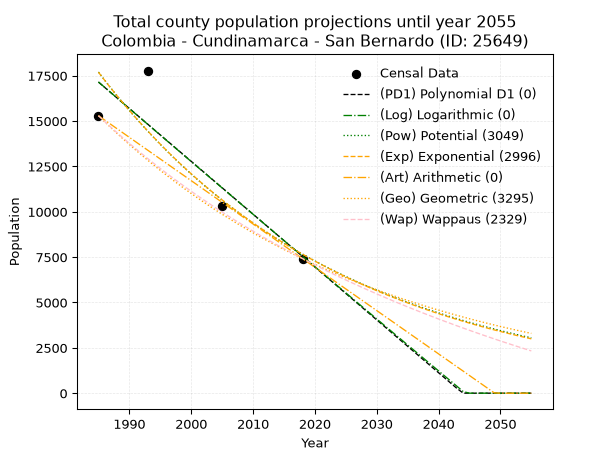
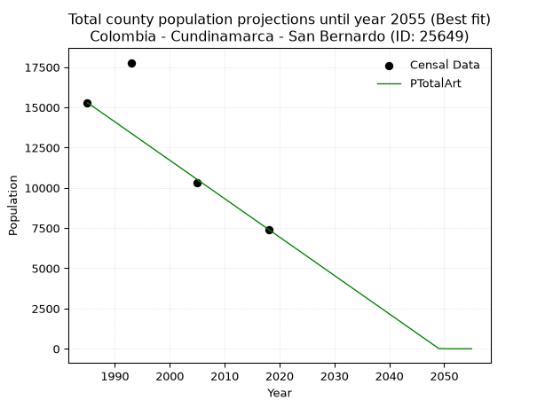
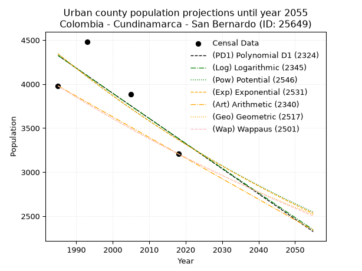
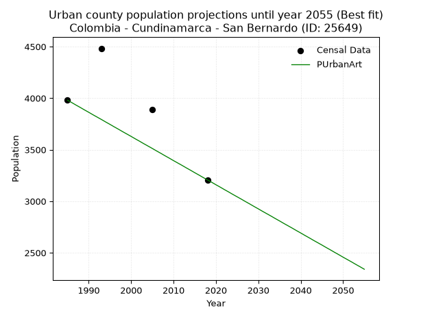
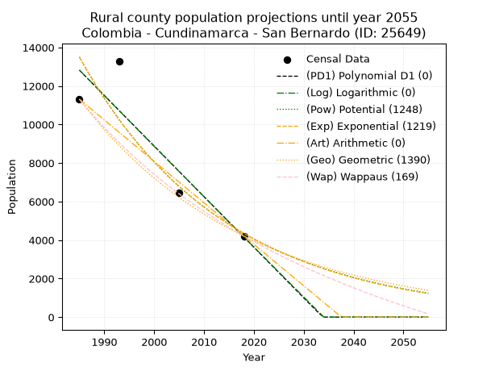
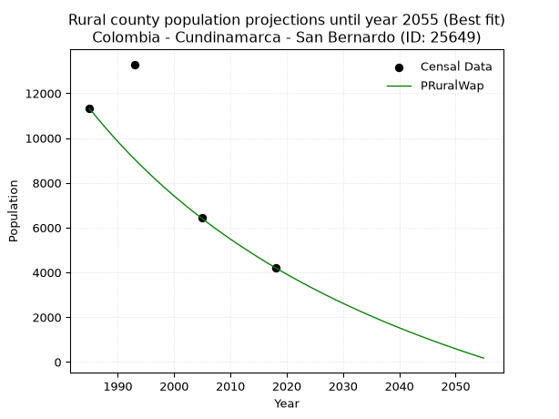

<div align="center">


</div>

# 📜 _“Population and Public Services Demand Projections (PPSD) until Year 2050 for Colombia - Cundinamarca - San Bernardo (ID: 25649)”_
Keywords: `population` `public-service` `projection` `lineal` `polynomial` `logarithmic` `potential` `exponential` `arithmetic` `geometric` `wappaus` `dane` `colombia` `south-america`

PPSD are analytical estimates used by governments and planners to anticipate future changes in population size, age distribution, and the resulting community needs for utilities, healthcare, education, and infrastructure as sizing future water treatment facilities, electrical grids, and road networks based on spatial growth.

<div align="center">

</img>

</div>


> **General running parameters**: • app_version: _v20260806_. • Python version: _3.14.7_. • Pandas version: _3.0.5_. • NumPy version: _2.5.1_. • Creates, save and include plots into reports (create_plot): _False_. • Projection until year: _2050_. • Process polynomial degree 2 and up: _False_. • Process Wappaus: _True_. • Process Wappaus: _True_. • Set negative values to zero: _True_. • Set infinite values to zero: _True_. • Drop dataset notes: _True_. 
<div align="center">

Maps & GIS Layers: [:earth_americas:Google](http://maps.google.com/maps?q=4.179433339,-74.4229596) [:earth_americas:OSM](https://www.openstreetmap.org/#map=18/4.179433339/-74.4229596&layers=P) [:earth_americas:Bing](https://www.bing.com/maps?cp=4.179433339~-74.4229596&lvl=18) [:earth_americas:Apple](https://maps.apple.com/frame?center=4.179433339%2C-74.4229596&span=0.003%2C0.006) [:earth_americas:GISMobile](https://github.com/rcfdtools/R.GISMobile/blob/main/file/gis/CountyLayer_CO/Readme.md)

</div>


<div align="center">

```geojson
{
  "type": "Feature",
  "geometry": {
    "type": "Point", 
    "coordinates": [-74.4229596, 4.179433339]
  }, 
  "properties": {
    "Name": "Colombia - Cundinamarca - San Bernardo (ID: 25649)"
  }
}
```

</div>


## 0. Census Data (4 records)

Census data are official statistics collected by a government about the people and housing in a country. They usually include counts of total population, age, sex, race, income, education, and jobs.

📅Global census file: [Population.xlsx](../data/Population.xlsx)

| Source   |   Year |   CountryID | CountryName   |   StateID | StateName    |   CountyID | CountyName   |   PTotal |   PUrban |   PRural |
|:---------|-------:|------------:|:--------------|----------:|:-------------|-----------:|:-------------|---------:|---------:|---------:|
| DANE     |   1985 |          57 | Colombia      |        25 | Cundinamarca |      25649 | San Bernardo |    15293 |     3980 |    11313 |
| DANE     |   1993 |          57 | Colombia      |        25 | Cundinamarca |      25649 | San Bernardo |    17777 |     4483 |    13294 |
| DANE     |   2005 |          57 | Colombia      |        25 | Cundinamarca |      25649 | San Bernardo |    10334 |     3888 |     6446 |
| DANE     |   2018 |          57 | Colombia      |        25 | Cundinamarca |      25649 | San Bernardo |     7417 |     3207 |     4210 |

> 🔥Some records could had specific notes about the registered values or the corresponding urban or rural distribution.

📅[SUI-RUPS](https://www.datos.gov.co/Hacienda-y-Cr-dito-P-blico/Registro-nico-de-Prestadores-de-Servicios-P-blicos/4qkq-csdn/about_data) - Local public utility companies: [RUPS.csv](../data/RUPS.csv)

 | SERVICIO       | ESTADO    | NOMBRE                                                                                                                                      | NIT         | DEPARTAMENTO_DOMICILIO   | MUNICIPIO_DOMICILIO   | DIRECCION                       |   TELEFONO | EMAIL                         | TIPO_PRESTADOR                 | CLASIFICACION                 |
|:---------------|:----------|:--------------------------------------------------------------------------------------------------------------------------------------------|:------------|:-------------------------|:----------------------|:--------------------------------|-----------:|:------------------------------|:-------------------------------|:------------------------------|
| ACUEDUCTO      | OPERATIVA | ASOCIACION DE USUARIOS DEL ACUEDUCTO REGIONAL  PORTONES HATO VIEJO Y OTRAS DE LOS  MUNICIPIOS DE SAN BERNARDO Y ARBELAEZ CUNDINAMARCA E.S.P | 800239597-4 | CUNDINAMARCA             | SAN BERNARDO          | vereda portones                 |    4709525 | acueductoportones@yahoo.es    | ORGANIZACION AUTORIZADA        | HASTA 2500 SUSCRIPTORES       |
| ACUEDUCTO      | OPERATIVA | ASOCIACION DE USUARIOS DEL SERVICIO DE AGUA POTABLE DEL MUNICIPIO DE SAN BERNARDO CUNDINAMARCA                                              | 808001349-0 | CUNDINAMARCA             | SAN BERNARDO          | CARRERA 5 CALLE 5 CASA DEL CAFE |    8680329 | adusapsanbernardo@hotmail.com | ORGANIZACION AUTORIZADA        | MENOR O IGUAL A 2500 USUARIOS |
| ALCANTARILLADO | OPERATIVA | OFICINA DE SERVICIOS PUBLICOS DE SAN BERNARDO CUNDINAMARCA                                                                                  | 800093437-5 | CUNDINAMARCA             | SAN BERNARDO          | CALLE 6 NO. 3ª 16-28            |    8680708 | asesoriaservipub@gmail.com    | MUNICIPIO (PRESTACIÓN DIRECTA) | MENOR O IGUAL A 2500 USUARIOS |

## 1. Total

### 1.1. Coefficients and Parameters

* (PD1) Polynomial Deg 1: -291.2296266559591, 595237.3107185821 (lineal)
* (Log) Logarithmic: -582660.5055224433, 4441512.421624351
* (Pow) Potential: -50.74778790616956, 171.60200842088065
* (Exp) Exponential: -0.025366927558250353, 1.305868590889843e+26
* (Art) Arithmetic: Year diff. 2018 - 1985 = 33, Population diff. 7417 - 15293 = -7876, Annual growth = -238.66666666666666
* (Geo) Geometric: Year diff. 2018 - 1985 = 33, Population diff. 7417 - 15293 = -7876, Annual growth % = -0.021689226678523243
* (Wap) Wappaus: i = -2.1018640833700277, Condition values only valid for < 200)

<sub>
Wappaus condition values: ['-0.00', '-2.10', '-4.20', '-6.31', '-8.41', '-10.51', '-12.61', '-14.71', '-16.81', '-18.92', '-21.02', '-23.12', '-25.22', '-27.32', '-29.43', '-31.53', '-33.63', '-35.73', '-37.83', '-39.94', '-42.04', '-44.14', '-46.24', '-48.34', '-50.44', '-52.55', '-54.65', '-56.75', '-58.85', '-60.95', '-63.06', '-65.16', '-67.26', '-69.36', '-71.46', '-73.57', '-75.67', '-77.77', '-79.87', '-81.97', '-84.07', '-86.18', '-88.28', '-90.38', '-92.48', '-94.58', '-96.69', '-98.79', '-100.89', '-102.99', '-105.09', '-107.20', '-109.30', '-111.40', '-113.50', '-115.60', '-117.70', '-119.81', '-121.91', '-124.01', '-126.11', '-128.21', '-130.32', '-132.42', '-134.52', '-136.62']
</sub>


### 1.2. Projected Dataset

|   Year |   CountyID |   PTotalPD1 |   PTotalLog |   PTotalPow |   PTotalExp |   PTotalArt |   PTotalGeo |   PTotalWap |
|-------:|-----------:|------------:|------------:|------------:|------------:|------------:|------------:|------------:|
|   1985 |      25649 |       17147 |       17153 |       17699 |       17690 |       15293 |       15293 |       15293 |
|   1986 |      25649 |       16855 |       16860 |       17253 |       17246 |       15054 |       14961 |       14975 |
|   1987 |      25649 |       16564 |       16566 |       16818 |       16814 |       14816 |       14637 |       14663 |
|   1988 |      25649 |       16273 |       16273 |       16394 |       16393 |       14577 |       14319 |       14358 |
|   1989 |      25649 |       15982 |       15980 |       15980 |       15983 |       14338 |       14009 |       14059 |
|   1990 |      25649 |       15690 |       15687 |       15578 |       15582 |       14100 |       13705 |       13766 |
|   1991 |      25649 |       15399 |       15395 |       15186 |       15192 |       13861 |       13408 |       13479 |
|   1992 |      25649 |       15108 |       15102 |       14804 |       14812 |       13622 |       13117 |       13197 |
|   1993 |      25649 |       14817 |       14810 |       14432 |       14441 |       13384 |       12832 |       12921 |
|   1994 |      25649 |       14525 |       14517 |       14069 |       14079 |       13145 |       12554 |       12650 |
|   1995 |      25649 |       14234 |       14225 |       13715 |       13726 |       12906 |       12282 |       12384 |
|   1996 |      25649 |       13943 |       13933 |       13371 |       13382 |       12668 |       12015 |       12124 |
|   1997 |      25649 |       13652 |       13641 |       13035 |       13047 |       12429 |       11755 |       11868 |
|   1998 |      25649 |       13361 |       13350 |       12708 |       12720 |       12190 |       11500 |       11617 |
|   1999 |      25649 |       13069 |       13058 |       12390 |       12402 |       11952 |       11250 |       11370 |
|   2000 |      25649 |       12778 |       12767 |       12079 |       12091 |       11713 |       11006 |       11128 |
|   2001 |      25649 |       12487 |       12475 |       11777 |       11788 |       11474 |       10768 |       10890 |
|   2002 |      25649 |       12196 |       12184 |       11482 |       11493 |       11236 |       10534 |       10657 |
|   2003 |      25649 |       11904 |       11893 |       11194 |       11205 |       10997 |       10306 |       10428 |
|   2004 |      25649 |       11613 |       11603 |       10914 |       10924 |       10758 |       10082 |       10202 |
|   2005 |      25649 |       11322 |       11312 |       10642 |       10651 |       10520 |        9863 |        9981 |
|   2006 |      25649 |       11031 |       11021 |       10376 |       10384 |       10281 |        9650 |        9763 |
|   2007 |      25649 |       10739 |       10731 |       10117 |       10124 |       10042 |        9440 |        9549 |
|   2008 |      25649 |       10448 |       10441 |        9864 |        9870 |        9804 |        9235 |        9339 |
|   2009 |      25649 |       10157 |       10151 |        9618 |        9623 |        9565 |        9035 |        9132 |
|   2010 |      25649 |        9866 |        9861 |        9378 |        9382 |        9326 |        8839 |        8929 |
|   2011 |      25649 |        9575 |        9571 |        9144 |        9147 |        9088 |        8647 |        8729 |
|   2012 |      25649 |        9283 |        9281 |        8917 |        8918 |        8849 |        8460 |        8532 |
|   2013 |      25649 |        8992 |        8992 |        8695 |        8695 |        8610 |        8276 |        8339 |
|   2014 |      25649 |        8701 |        8702 |        8478 |        8477 |        8372 |        8097 |        8149 |
|   2015 |      25649 |        8410 |        8413 |        8267 |        8264 |        8133 |        7921 |        7961 |
|   2016 |      25649 |        8118 |        8124 |        8062 |        8057 |        7894 |        7750 |        7777 |
|   2017 |      25649 |        7827 |        7835 |        7861 |        7856 |        7656 |        7581 |        7596 |
|   2018 |      25649 |        7536 |        7546 |        7666 |        7659 |        7417 |        7417 |        7417 |
|   2019 |      25649 |        7245 |        7258 |        7476 |        7467 |        7178 |        7256 |        7241 |
|   2020 |      25649 |        6953 |        6969 |        7290 |        7280 |        6940 |        7099 |        7068 |
|   2021 |      25649 |        6662 |        6681 |        7109 |        7098 |        6701 |        6945 |        6898 |
|   2022 |      25649 |        6371 |        6392 |        6933 |        6920 |        6462 |        6794 |        6730 |
|   2023 |      25649 |        6080 |        6104 |        6761 |        6747 |        6224 |        6647 |        6564 |
|   2024 |      25649 |        5789 |        5816 |        6594 |        6578 |        5985 |        6503 |        6401 |
|   2025 |      25649 |        5497 |        5529 |        6431 |        6413 |        5746 |        6362 |        6241 |
|   2026 |      25649 |        5206 |        5241 |        6271 |        6252 |        5508 |        6224 |        6083 |
|   2027 |      25649 |        4915 |        4953 |        6116 |        6096 |        5269 |        6089 |        5927 |
|   2028 |      25649 |        4624 |        4666 |        5965 |        5943 |        5030 |        5957 |        5773 |
|   2029 |      25649 |        4332 |        4379 |        5818 |        5794 |        4792 |        5827 |        5622 |
|   2030 |      25649 |        4041 |        4092 |        5674 |        5649 |        4553 |        5701 |        5473 |
|   2031 |      25649 |        3750 |        3805 |        5534 |        5507 |        4314 |        5577 |        5325 |
|   2032 |      25649 |        3459 |        3518 |        5398 |        5369 |        4076 |        5456 |        5180 |
|   2033 |      25649 |        3167 |        3231 |        5264 |        5235 |        3837 |        5338 |        5037 |
|   2034 |      25649 |        2876 |        2945 |        5135 |        5104 |        3598 |        5222 |        4896 |
|   2035 |      25649 |        2585 |        2658 |        5008 |        4976 |        3360 |        5109 |        4757 |
|   2036 |      25649 |        2294 |        2372 |        4885 |        4851 |        3121 |        4998 |        4620 |
|   2037 |      25649 |        2003 |        2086 |        4765 |        4730 |        2882 |        4890 |        4485 |
|   2038 |      25649 |        1711 |        1800 |        4647 |        4611 |        2644 |        4784 |        4351 |
|   2039 |      25649 |        1420 |        1514 |        4533 |        4496 |        2405 |        4680 |        4220 |
|   2040 |      25649 |        1129 |        1229 |        4422 |        4383 |        2166 |        4578 |        4090 |
|   2041 |      25649 |         838 |         943 |        4313 |        4273 |        1928 |        4479 |        3961 |
|   2042 |      25649 |         546 |         658 |        4207 |        4166 |        1689 |        4382 |        3835 |
|   2043 |      25649 |         255 |         372 |        4104 |        4062 |        1450 |        4287 |        3710 |
|   2044 |      25649 |           0 |          87 |        4003 |        3960 |        1212 |        4194 |        3587 |
|   2045 |      25649 |           0 |           0 |        3905 |        3861 |         973 |        4103 |        3465 |
|   2046 |      25649 |           0 |           0 |        3810 |        3764 |         734 |        4014 |        3345 |
|   2047 |      25649 |           0 |           0 |        3716 |        3670 |         496 |        3927 |        3226 |
|   2048 |      25649 |           0 |           0 |        3625 |        3578 |         257 |        3842 |        3109 |
|   2049 |      25649 |           0 |           0 |        3537 |        3489 |          18 |        3758 |        2994 |
|   2050 |      25649 |           0 |           0 |        3450 |        3401 |           0 |        3677 |        2879 |
<div align="center">

</img>

</div>


### 1.3. Best fit with absolute and relative error (%)

Relative error puts that difference into context by dividing the absolute error by the true value, creating a unitless ratio or percentage that shows the scale of the mistake.

Absolute and relative error

|   Year | Source   |   CountryID | CountryName   |   StateID | StateName    |   CountyID_x | CountyName   |   PTotal |   PUrban |   PRural |   CountyID_y |   PTotalPD1 |   PTotalLog |   PTotalPow |   PTotalExp |   PTotalArt |   PTotalGeo |   PTotalWap |   PTotalPD1AbsError |   PTotalLogAbsError |   PTotalPowAbsError |   PTotalExpAbsError |   PTotalArtAbsError |   PTotalGeoAbsError |   PTotalWapAbsError |   PTotalPD1RelError |   PTotalLogRelError |   PTotalPowRelError |   PTotalExpRelError |   PTotalArtRelError |   PTotalGeoRelError |   PTotalWapRelError |
|-------:|:---------|------------:|:--------------|----------:|:-------------|-------------:|:-------------|---------:|---------:|---------:|-------------:|------------:|------------:|------------:|------------:|------------:|------------:|------------:|--------------------:|--------------------:|--------------------:|--------------------:|--------------------:|--------------------:|--------------------:|--------------------:|--------------------:|--------------------:|--------------------:|--------------------:|--------------------:|--------------------:|
|   1985 | DANE     |          57 | Colombia      |        25 | Cundinamarca |        25649 | San Bernardo |    15293 |     3980 |    11313 |        25649 |       17147 |       17153 |       17699 |       17690 |       15293 |       15293 |       15293 |                1854 |                1860 |                2406 |                2397 |                   0 |                   0 |                   0 |            12.1232  |            12.1624  |            15.7327  |            15.6738  |             0       |             0       |             0       |
|   1993 | DANE     |          57 | Colombia      |        25 | Cundinamarca |        25649 | San Bernardo |    17777 |     4483 |    13294 |        25649 |       14817 |       14810 |       14432 |       14441 |       13384 |       12832 |       12921 |                2960 |                2967 |                3345 |                3336 |                4393 |                4945 |                4856 |            16.6507  |            16.6901  |            18.8164  |            18.7658  |            24.7117  |            27.8168  |            27.3162  |
|   2005 | DANE     |          57 | Colombia      |        25 | Cundinamarca |        25649 | San Bernardo |    10334 |     3888 |     6446 |        25649 |       11322 |       11312 |       10642 |       10651 |       10520 |        9863 |        9981 |                 988 |                 978 |                 308 |                 317 |                 186 |                 471 |                 353 |             9.56067 |             9.46391 |             2.98045 |             3.06754 |             1.79988 |             4.55777 |             3.41591 |
|   2018 | DANE     |          57 | Colombia      |        25 | Cundinamarca |        25649 | San Bernardo |     7417 |     3207 |     4210 |        25649 |        7536 |        7546 |        7666 |        7659 |        7417 |        7417 |        7417 |                 119 |                 129 |                 249 |                 242 |                   0 |                   0 |                   0 |             1.60442 |             1.73925 |             3.35715 |             3.26277 |             0       |             0       |             0       |

Relative error mean

| Method    |   RelError | Best   |
|:----------|-----------:|:-------|
| PTotalPD1 |    9.98475 |        |
| PTotalLog |   10.0139  |        |
| PTotalPow |   10.2217  |        |
| PTotalExp |   10.1925  |        |
| PTotalArt |    6.6279  | True   |
| PTotalGeo |    8.09365 |        |
| PTotalWap |    7.68303 |        |

💙Best method: _**PTotalArt**_
<div align="center">

</img>

</div>


### 1.4. Fresh water supply demand in liters per capita per day (lpcd)

The fresh water supply demand typically ranges from 100 to 300 liters per capita per day (lpcd) for standard domestic and municipal planning, though absolute survival minimums set by the World Health Organization are as low as 7.5 to 20 liters per day, and total consumption in high-income nations can exceed 400 liters.

> `CZ`: Level in meters above the sea level (masl)<br> `WS`: Fresh water supply demand in liters per capita per day (lpcd or l/h/d)<br> `WSAll`: Zonal fresh water supply demand in liters per second (l/s)<br> `A`: Zonal area in square meters<br> `DP`: Population density (people/hectare or p/ha)

Reference values (RAS Colombia)

|    CZ |   WS |
|------:|-----:|
|  1000 |  120 |
|  2000 |  130 |
| 99999 |  140 |

County shapefile geometry properties and water supply values

|   CountyID |     ATotal |   CZTotal |   WSTotal |
|-----------:|-----------:|----------:|----------:|
|      25649 | 2.4675e+08 |   2871.25 |       140 |

Projected values for best method: PTotalArt

|   CountyID |   Year |   PTotalArt |   DPTotal |   WSTotal |   WSTotalAll |
|-----------:|-------:|------------:|----------:|----------:|-------------:|
|      25649 |   1985 |       15293 |      0.62 |       140 |   24.7803    |
|      25649 |   1986 |       15054 |      0.61 |       140 |   24.3931    |
|      25649 |   1987 |       14816 |      0.6  |       140 |   24.0074    |
|      25649 |   1988 |       14577 |      0.59 |       140 |   23.6201    |
|      25649 |   1989 |       14338 |      0.58 |       140 |   23.2329    |
|      25649 |   1990 |       14100 |      0.57 |       140 |   22.8472    |
|      25649 |   1991 |       13861 |      0.56 |       140 |   22.46      |
|      25649 |   1992 |       13622 |      0.55 |       140 |   22.0727    |
|      25649 |   1993 |       13384 |      0.54 |       140 |   21.687     |
|      25649 |   1994 |       13145 |      0.53 |       140 |   21.2998    |
|      25649 |   1995 |       12906 |      0.52 |       140 |   20.9125    |
|      25649 |   1996 |       12668 |      0.51 |       140 |   20.5269    |
|      25649 |   1997 |       12429 |      0.5  |       140 |   20.1396    |
|      25649 |   1998 |       12190 |      0.49 |       140 |   19.7523    |
|      25649 |   1999 |       11952 |      0.48 |       140 |   19.3667    |
|      25649 |   2000 |       11713 |      0.47 |       140 |   18.9794    |
|      25649 |   2001 |       11474 |      0.47 |       140 |   18.5921    |
|      25649 |   2002 |       11236 |      0.46 |       140 |   18.2065    |
|      25649 |   2003 |       10997 |      0.45 |       140 |   17.8192    |
|      25649 |   2004 |       10758 |      0.44 |       140 |   17.4319    |
|      25649 |   2005 |       10520 |      0.43 |       140 |   17.0463    |
|      25649 |   2006 |       10281 |      0.42 |       140 |   16.659     |
|      25649 |   2007 |       10042 |      0.41 |       140 |   16.2718    |
|      25649 |   2008 |        9804 |      0.4  |       140 |   15.8861    |
|      25649 |   2009 |        9565 |      0.39 |       140 |   15.4988    |
|      25649 |   2010 |        9326 |      0.38 |       140 |   15.1116    |
|      25649 |   2011 |        9088 |      0.37 |       140 |   14.7259    |
|      25649 |   2012 |        8849 |      0.36 |       140 |   14.3387    |
|      25649 |   2013 |        8610 |      0.35 |       140 |   13.9514    |
|      25649 |   2014 |        8372 |      0.34 |       140 |   13.5657    |
|      25649 |   2015 |        8133 |      0.33 |       140 |   13.1785    |
|      25649 |   2016 |        7894 |      0.32 |       140 |   12.7912    |
|      25649 |   2017 |        7656 |      0.31 |       140 |   12.4056    |
|      25649 |   2018 |        7417 |      0.3  |       140 |   12.0183    |
|      25649 |   2019 |        7178 |      0.29 |       140 |   11.631     |
|      25649 |   2020 |        6940 |      0.28 |       140 |   11.2454    |
|      25649 |   2021 |        6701 |      0.27 |       140 |   10.8581    |
|      25649 |   2022 |        6462 |      0.26 |       140 |   10.4708    |
|      25649 |   2023 |        6224 |      0.25 |       140 |   10.0852    |
|      25649 |   2024 |        5985 |      0.24 |       140 |    9.69792   |
|      25649 |   2025 |        5746 |      0.23 |       140 |    9.31065   |
|      25649 |   2026 |        5508 |      0.22 |       140 |    8.925     |
|      25649 |   2027 |        5269 |      0.21 |       140 |    8.53773   |
|      25649 |   2028 |        5030 |      0.2  |       140 |    8.15046   |
|      25649 |   2029 |        4792 |      0.19 |       140 |    7.76481   |
|      25649 |   2030 |        4553 |      0.18 |       140 |    7.37755   |
|      25649 |   2031 |        4314 |      0.17 |       140 |    6.99028   |
|      25649 |   2032 |        4076 |      0.17 |       140 |    6.60463   |
|      25649 |   2033 |        3837 |      0.16 |       140 |    6.21736   |
|      25649 |   2034 |        3598 |      0.15 |       140 |    5.83009   |
|      25649 |   2035 |        3360 |      0.14 |       140 |    5.44444   |
|      25649 |   2036 |        3121 |      0.13 |       140 |    5.05718   |
|      25649 |   2037 |        2882 |      0.12 |       140 |    4.66991   |
|      25649 |   2038 |        2644 |      0.11 |       140 |    4.28426   |
|      25649 |   2039 |        2405 |      0.1  |       140 |    3.89699   |
|      25649 |   2040 |        2166 |      0.09 |       140 |    3.50972   |
|      25649 |   2041 |        1928 |      0.08 |       140 |    3.12407   |
|      25649 |   2042 |        1689 |      0.07 |       140 |    2.73681   |
|      25649 |   2043 |        1450 |      0.06 |       140 |    2.34954   |
|      25649 |   2044 |        1212 |      0.05 |       140 |    1.96389   |
|      25649 |   2045 |         973 |      0.04 |       140 |    1.57662   |
|      25649 |   2046 |         734 |      0.03 |       140 |    1.18935   |
|      25649 |   2047 |         496 |      0.02 |       140 |    0.803704  |
|      25649 |   2048 |         257 |      0.01 |       140 |    0.416435  |
|      25649 |   2049 |          18 |      0    |       140 |    0.0291667 |
|      25649 |   2050 |           0 |      0    |       140 |    0         |

## 2. Urban

### 2.1. Coefficients and Parameters

* (PD1) Polynomial Deg 1: -28.590124448012393, 61076.896427136795 (lineal)
* (Log) Logarithmic: -57136.37494818892, 438183.54384335777
* (Pow) Potential: -15.426300951409143, 54.510208584300045
* (Exp) Exponential: -0.007718915797372404, 19598480518.6887
* (Art) Arithmetic: Year diff. 2018 - 1985 = 33, Population diff. 3207 - 3980 = -773, Annual growth = -23.424242424242426
* (Geo) Geometric: Year diff. 2018 - 1985 = 33, Population diff. 3207 - 3980 = -773, Annual growth % = -0.00652245097693549
* (Wap) Wappaus: i = -0.6518503526991074, Condition values only valid for < 200)

<sub>
Wappaus condition values: ['-0.00', '-0.65', '-1.30', '-1.96', '-2.61', '-3.26', '-3.91', '-4.56', '-5.21', '-5.87', '-6.52', '-7.17', '-7.82', '-8.47', '-9.13', '-9.78', '-10.43', '-11.08', '-11.73', '-12.39', '-13.04', '-13.69', '-14.34', '-14.99', '-15.64', '-16.30', '-16.95', '-17.60', '-18.25', '-18.90', '-19.56', '-20.21', '-20.86', '-21.51', '-22.16', '-22.81', '-23.47', '-24.12', '-24.77', '-25.42', '-26.07', '-26.73', '-27.38', '-28.03', '-28.68', '-29.33', '-29.99', '-30.64', '-31.29', '-31.94', '-32.59', '-33.24', '-33.90', '-34.55', '-35.20', '-35.85', '-36.50', '-37.16', '-37.81', '-38.46', '-39.11', '-39.76', '-40.41', '-41.07', '-41.72', '-42.37']
</sub>


### 2.2. Projected Dataset

|   Year |   CountyID |   PUrbanPD1 |   PUrbanLog |   PUrbanPow |   PUrbanExp |   PUrbanArt |   PUrbanGeo |   PUrbanWap |
|-------:|-----------:|------------:|------------:|------------:|------------:|------------:|------------:|------------:|
|   1985 |      25649 |        4325 |        4326 |        4345 |        4345 |        3980 |        3980 |        3980 |
|   1986 |      25649 |        4297 |        4297 |        4311 |        4311 |        3957 |        3954 |        3954 |
|   1987 |      25649 |        4268 |        4268 |        4278 |        4278 |        3933 |        3928 |        3928 |
|   1988 |      25649 |        4240 |        4239 |        4245 |        4245 |        3910 |        3903 |        3903 |
|   1989 |      25649 |        4211 |        4211 |        4212 |        4212 |        3886 |        3877 |        3878 |
|   1990 |      25649 |        4183 |        4182 |        4179 |        4180 |        3863 |        3852 |        3852 |
|   1991 |      25649 |        4154 |        4153 |        4147 |        4148 |        3839 |        3827 |        3827 |
|   1992 |      25649 |        4125 |        4125 |        4115 |        4116 |        3816 |        3802 |        3802 |
|   1993 |      25649 |        4097 |        4096 |        4083 |        4084 |        3793 |        3777 |        3778 |
|   1994 |      25649 |        4068 |        4067 |        4052 |        4053 |        3769 |        3752 |        3753 |
|   1995 |      25649 |        4040 |        4039 |        4021 |        4022 |        3746 |        3728 |        3729 |
|   1996 |      25649 |        4011 |        4010 |        3990 |        3991 |        3722 |        3704 |        3704 |
|   1997 |      25649 |        3982 |        3981 |        3959 |        3960 |        3699 |        3679 |        3680 |
|   1998 |      25649 |        3954 |        3953 |        3929 |        3930 |        3675 |        3655 |        3656 |
|   1999 |      25649 |        3925 |        3924 |        3898 |        3900 |        3652 |        3632 |        3633 |
|   2000 |      25649 |        3897 |        3896 |        3868 |        3870 |        3629 |        3608 |        3609 |
|   2001 |      25649 |        3868 |        3867 |        3839 |        3840 |        3605 |        3584 |        3585 |
|   2002 |      25649 |        3839 |        3838 |        3809 |        3810 |        3582 |        3561 |        3562 |
|   2003 |      25649 |        3811 |        3810 |        3780 |        3781 |        3558 |        3538 |        3539 |
|   2004 |      25649 |        3782 |        3781 |        3751 |        3752 |        3535 |        3515 |        3516 |
|   2005 |      25649 |        3754 |        3753 |        3722 |        3723 |        3512 |        3492 |        3493 |
|   2006 |      25649 |        3725 |        3724 |        3694 |        3694 |        3488 |        3469 |        3470 |
|   2007 |      25649 |        3697 |        3696 |        3665 |        3666 |        3465 |        3446 |        3447 |
|   2008 |      25649 |        3668 |        3667 |        3637 |        3638 |        3441 |        3424 |        3425 |
|   2009 |      25649 |        3639 |        3639 |        3609 |        3610 |        3418 |        3402 |        3403 |
|   2010 |      25649 |        3611 |        3611 |        3582 |        3582 |        3394 |        3379 |        3380 |
|   2011 |      25649 |        3582 |        3582 |        3555 |        3555 |        3371 |        3357 |        3358 |
|   2012 |      25649 |        3554 |        3554 |        3527 |        3527 |        3348 |        3335 |        3336 |
|   2013 |      25649 |        3525 |        3525 |        3500 |        3500 |        3324 |        3314 |        3314 |
|   2014 |      25649 |        3496 |        3497 |        3474 |        3473 |        3301 |        3292 |        3293 |
|   2015 |      25649 |        3468 |        3469 |        3447 |        3446 |        3277 |        3271 |        3271 |
|   2016 |      25649 |        3439 |        3440 |        3421 |        3420 |        3254 |        3249 |        3250 |
|   2017 |      25649 |        3411 |        3412 |        3395 |        3394 |        3230 |        3228 |        3228 |
|   2018 |      25649 |        3382 |        3384 |        3369 |        3368 |        3207 |        3207 |        3207 |
|   2019 |      25649 |        3353 |        3355 |        3343 |        3342 |        3184 |        3186 |        3186 |
|   2020 |      25649 |        3325 |        3327 |        3318 |        3316 |        3160 |        3165 |        3165 |
|   2021 |      25649 |        3296 |        3299 |        3293 |        3290 |        3137 |        3145 |        3144 |
|   2022 |      25649 |        3268 |        3270 |        3268 |        3265 |        3113 |        3124 |        3123 |
|   2023 |      25649 |        3239 |        3242 |        3243 |        3240 |        3090 |        3104 |        3103 |
|   2024 |      25649 |        3210 |        3214 |        3218 |        3215 |        3066 |        3084 |        3082 |
|   2025 |      25649 |        3182 |        3186 |        3194 |        3190 |        3043 |        3063 |        3062 |
|   2026 |      25649 |        3153 |        3158 |        3170 |        3166 |        3020 |        3043 |        3042 |
|   2027 |      25649 |        3125 |        3129 |        3145 |        3142 |        2996 |        3024 |        3022 |
|   2028 |      25649 |        3096 |        3101 |        3122 |        3117 |        2973 |        3004 |        3002 |
|   2029 |      25649 |        3068 |        3073 |        3098 |        3093 |        2949 |        2984 |        2982 |
|   2030 |      25649 |        3039 |        3045 |        3075 |        3070 |        2926 |        2965 |        2962 |
|   2031 |      25649 |        3010 |        3017 |        3051 |        3046 |        2902 |        2945 |        2942 |
|   2032 |      25649 |        2982 |        2989 |        3028 |        3023 |        2879 |        2926 |        2923 |
|   2033 |      25649 |        2953 |        2960 |        3005 |        2999 |        2856 |        2907 |        2903 |
|   2034 |      25649 |        2925 |        2932 |        2983 |        2976 |        2832 |        2888 |        2884 |
|   2035 |      25649 |        2896 |        2904 |        2960 |        2953 |        2809 |        2869 |        2865 |
|   2036 |      25649 |        2867 |        2876 |        2938 |        2931 |        2785 |        2851 |        2845 |
|   2037 |      25649 |        2839 |        2848 |        2916 |        2908 |        2762 |        2832 |        2826 |
|   2038 |      25649 |        2810 |        2820 |        2894 |        2886 |        2739 |        2814 |        2808 |
|   2039 |      25649 |        2782 |        2792 |        2872 |        2864 |        2715 |        2795 |        2789 |
|   2040 |      25649 |        2753 |        2764 |        2850 |        2842 |        2692 |        2777 |        2770 |
|   2041 |      25649 |        2724 |        2736 |        2829 |        2820 |        2668 |        2759 |        2751 |
|   2042 |      25649 |        2696 |        2708 |        2807 |        2798 |        2645 |        2741 |        2733 |
|   2043 |      25649 |        2667 |        2680 |        2786 |        2777 |        2621 |        2723 |        2714 |
|   2044 |      25649 |        2639 |        2652 |        2765 |        2755 |        2598 |        2705 |        2696 |
|   2045 |      25649 |        2610 |        2624 |        2744 |        2734 |        2575 |        2688 |        2678 |
|   2046 |      25649 |        2582 |        2596 |        2724 |        2713 |        2551 |        2670 |        2660 |
|   2047 |      25649 |        2553 |        2568 |        2703 |        2692 |        2528 |        2653 |        2642 |
|   2048 |      25649 |        2524 |        2540 |        2683 |        2671 |        2504 |        2635 |        2624 |
|   2049 |      25649 |        2496 |        2513 |        2663 |        2651 |        2481 |        2618 |        2606 |
|   2050 |      25649 |        2467 |        2485 |        2643 |        2631 |        2457 |        2601 |        2588 |
<div align="center">

</img>

</div>


### 2.3. Best fit with absolute and relative error (%)

Relative error puts that difference into context by dividing the absolute error by the true value, creating a unitless ratio or percentage that shows the scale of the mistake.

Absolute and relative error

|   Year | Source   |   CountryID | CountryName   |   StateID | StateName    |   CountyID_x | CountyName   |   PTotal |   PUrban |   PRural |   CountyID_y |   PUrbanPD1 |   PUrbanLog |   PUrbanPow |   PUrbanExp |   PUrbanArt |   PUrbanGeo |   PUrbanWap |   PUrbanPD1AbsError |   PUrbanLogAbsError |   PUrbanPowAbsError |   PUrbanExpAbsError |   PUrbanArtAbsError |   PUrbanGeoAbsError |   PUrbanWapAbsError |   PUrbanPD1RelError |   PUrbanLogRelError |   PUrbanPowRelError |   PUrbanExpRelError |   PUrbanArtRelError |   PUrbanGeoRelError |   PUrbanWapRelError |
|-------:|:---------|------------:|:--------------|----------:|:-------------|-------------:|:-------------|---------:|---------:|---------:|-------------:|------------:|------------:|------------:|------------:|------------:|------------:|------------:|--------------------:|--------------------:|--------------------:|--------------------:|--------------------:|--------------------:|--------------------:|--------------------:|--------------------:|--------------------:|--------------------:|--------------------:|--------------------:|--------------------:|
|   1985 | DANE     |          57 | Colombia      |        25 | Cundinamarca |        25649 | San Bernardo |    15293 |     3980 |    11313 |        25649 |        4325 |        4326 |        4345 |        4345 |        3980 |        3980 |        3980 |                 345 |                 346 |                 365 |                 365 |                   0 |                   0 |                   0 |             8.66834 |             8.69347 |             9.17085 |             9.17085 |             0       |              0      |              0      |
|   1993 | DANE     |          57 | Colombia      |        25 | Cundinamarca |        25649 | San Bernardo |    17777 |     4483 |    13294 |        25649 |        4097 |        4096 |        4083 |        4084 |        3793 |        3777 |        3778 |                 386 |                 387 |                 400 |                 399 |                 690 |                 706 |                 705 |             8.61031 |             8.63261 |             8.9226  |             8.90029 |            15.3915  |             15.7484 |             15.7261 |
|   2005 | DANE     |          57 | Colombia      |        25 | Cundinamarca |        25649 | San Bernardo |    10334 |     3888 |     6446 |        25649 |        3754 |        3753 |        3722 |        3723 |        3512 |        3492 |        3493 |                 134 |                 135 |                 166 |                 165 |                 376 |                 396 |                 395 |             3.4465  |             3.47222 |             4.26955 |             4.24383 |             9.67078 |             10.1852 |             10.1595 |
|   2018 | DANE     |          57 | Colombia      |        25 | Cundinamarca |        25649 | San Bernardo |     7417 |     3207 |     4210 |        25649 |        3382 |        3384 |        3369 |        3368 |        3207 |        3207 |        3207 |                 175 |                 177 |                 162 |                 161 |                   0 |                   0 |                   0 |             5.45681 |             5.51918 |             5.05145 |             5.02027 |             0       |              0      |              0      |

Relative error mean

| Method    |   RelError | Best   |
|:----------|-----------:|:-------|
| PUrbanPD1 |    6.54549 |        |
| PUrbanLog |    6.57937 |        |
| PUrbanPow |    6.85361 |        |
| PUrbanExp |    6.83381 |        |
| PUrbanArt |    6.26557 | True   |
| PUrbanGeo |    6.48339 |        |
| PUrbanWap |    6.47139 |        |

💙Best method: _**PUrbanArt**_
<div align="center">

</img>

</div>


### 2.4. Fresh water supply demand in liters per capita per day (lpcd)

The fresh water supply demand typically ranges from 100 to 300 liters per capita per day (lpcd) for standard domestic and municipal planning, though absolute survival minimums set by the World Health Organization are as low as 7.5 to 20 liters per day, and total consumption in high-income nations can exceed 400 liters.

> `CZ`: Level in meters above the sea level (masl)<br> `WS`: Fresh water supply demand in liters per capita per day (lpcd or l/h/d)<br> `WSAll`: Zonal fresh water supply demand in liters per second (l/s)<br> `A`: Zonal area in square meters<br> `DP`: Population density (people/hectare or p/ha)

Reference values (RAS Colombia)

|    CZ |   WS |
|------:|-----:|
|  1000 |  120 |
|  2000 |  130 |
| 99999 |  140 |

County shapefile geometry properties and water supply values

|   CountyID |   AUrban |   CZUrban |   WSUrban |
|-----------:|---------:|----------:|----------:|
|      25649 |   648791 |   1755.43 |       130 |

Projected values for best method: PUrbanArt

|   CountyID |   Year |   PUrbanArt |   DPUrban |   WSUrban |   WSUrbanAll |
|-----------:|-------:|------------:|----------:|----------:|-------------:|
|      25649 |   1985 |        3980 |     61.34 |       130 |      5.98843 |
|      25649 |   1986 |        3957 |     60.99 |       130 |      5.95382 |
|      25649 |   1987 |        3933 |     60.62 |       130 |      5.91771 |
|      25649 |   1988 |        3910 |     60.27 |       130 |      5.8831  |
|      25649 |   1989 |        3886 |     59.9  |       130 |      5.84699 |
|      25649 |   1990 |        3863 |     59.54 |       130 |      5.81238 |
|      25649 |   1991 |        3839 |     59.17 |       130 |      5.77627 |
|      25649 |   1992 |        3816 |     58.82 |       130 |      5.74167 |
|      25649 |   1993 |        3793 |     58.46 |       130 |      5.70706 |
|      25649 |   1994 |        3769 |     58.09 |       130 |      5.67095 |
|      25649 |   1995 |        3746 |     57.74 |       130 |      5.63634 |
|      25649 |   1996 |        3722 |     57.37 |       130 |      5.60023 |
|      25649 |   1997 |        3699 |     57.01 |       130 |      5.56562 |
|      25649 |   1998 |        3675 |     56.64 |       130 |      5.52951 |
|      25649 |   1999 |        3652 |     56.29 |       130 |      5.49491 |
|      25649 |   2000 |        3629 |     55.93 |       130 |      5.4603  |
|      25649 |   2001 |        3605 |     55.56 |       130 |      5.42419 |
|      25649 |   2002 |        3582 |     55.21 |       130 |      5.38958 |
|      25649 |   2003 |        3558 |     54.84 |       130 |      5.35347 |
|      25649 |   2004 |        3535 |     54.49 |       130 |      5.31887 |
|      25649 |   2005 |        3512 |     54.13 |       130 |      5.28426 |
|      25649 |   2006 |        3488 |     53.76 |       130 |      5.24815 |
|      25649 |   2007 |        3465 |     53.41 |       130 |      5.21354 |
|      25649 |   2008 |        3441 |     53.04 |       130 |      5.17743 |
|      25649 |   2009 |        3418 |     52.68 |       130 |      5.14282 |
|      25649 |   2010 |        3394 |     52.31 |       130 |      5.10671 |
|      25649 |   2011 |        3371 |     51.96 |       130 |      5.07211 |
|      25649 |   2012 |        3348 |     51.6  |       130 |      5.0375  |
|      25649 |   2013 |        3324 |     51.23 |       130 |      5.00139 |
|      25649 |   2014 |        3301 |     50.88 |       130 |      4.96678 |
|      25649 |   2015 |        3277 |     50.51 |       130 |      4.93067 |
|      25649 |   2016 |        3254 |     50.15 |       130 |      4.89606 |
|      25649 |   2017 |        3230 |     49.78 |       130 |      4.85995 |
|      25649 |   2018 |        3207 |     49.43 |       130 |      4.82535 |
|      25649 |   2019 |        3184 |     49.08 |       130 |      4.79074 |
|      25649 |   2020 |        3160 |     48.71 |       130 |      4.75463 |
|      25649 |   2021 |        3137 |     48.35 |       130 |      4.72002 |
|      25649 |   2022 |        3113 |     47.98 |       130 |      4.68391 |
|      25649 |   2023 |        3090 |     47.63 |       130 |      4.64931 |
|      25649 |   2024 |        3066 |     47.26 |       130 |      4.61319 |
|      25649 |   2025 |        3043 |     46.9  |       130 |      4.57859 |
|      25649 |   2026 |        3020 |     46.55 |       130 |      4.54398 |
|      25649 |   2027 |        2996 |     46.18 |       130 |      4.50787 |
|      25649 |   2028 |        2973 |     45.82 |       130 |      4.47326 |
|      25649 |   2029 |        2949 |     45.45 |       130 |      4.43715 |
|      25649 |   2030 |        2926 |     45.1  |       130 |      4.40255 |
|      25649 |   2031 |        2902 |     44.73 |       130 |      4.36644 |
|      25649 |   2032 |        2879 |     44.37 |       130 |      4.33183 |
|      25649 |   2033 |        2856 |     44.02 |       130 |      4.29722 |
|      25649 |   2034 |        2832 |     43.65 |       130 |      4.26111 |
|      25649 |   2035 |        2809 |     43.3  |       130 |      4.2265  |
|      25649 |   2036 |        2785 |     42.93 |       130 |      4.19039 |
|      25649 |   2037 |        2762 |     42.57 |       130 |      4.15579 |
|      25649 |   2038 |        2739 |     42.22 |       130 |      4.12118 |
|      25649 |   2039 |        2715 |     41.85 |       130 |      4.08507 |
|      25649 |   2040 |        2692 |     41.49 |       130 |      4.05046 |
|      25649 |   2041 |        2668 |     41.12 |       130 |      4.01435 |
|      25649 |   2042 |        2645 |     40.77 |       130 |      3.97975 |
|      25649 |   2043 |        2621 |     40.4  |       130 |      3.94363 |
|      25649 |   2044 |        2598 |     40.04 |       130 |      3.90903 |
|      25649 |   2045 |        2575 |     39.69 |       130 |      3.87442 |
|      25649 |   2046 |        2551 |     39.32 |       130 |      3.83831 |
|      25649 |   2047 |        2528 |     38.96 |       130 |      3.8037  |
|      25649 |   2048 |        2504 |     38.59 |       130 |      3.76759 |
|      25649 |   2049 |        2481 |     38.24 |       130 |      3.73299 |
|      25649 |   2050 |        2457 |     37.87 |       130 |      3.69687 |

## 3. Rural

### 3.1. Coefficients and Parameters

* (PD1) Polynomial Deg 1: -262.6395022079468, 534160.4142914455 (lineal)
* (Log) Logarithmic: -525524.1305742544, 4003328.877780994
* (Pow) Potential: -68.71160449850076, 230.7249188074262
* (Exp) Exponential: -0.03434347266792424, 5.454960346777287e+33
* (Art) Arithmetic: Year diff. 2018 - 1985 = 33, Population diff. 4210 - 11313 = -7103, Annual growth = -215.24242424242425
* (Geo) Geometric: Year diff. 2018 - 1985 = 33, Population diff. 4210 - 11313 = -7103, Annual growth % = -0.029510056061232914
* (Wap) Wappaus: i = -2.7732065224817912, Condition values only valid for < 200)

<sub>
Wappaus condition values: ['-0.00', '-2.77', '-5.55', '-8.32', '-11.09', '-13.87', '-16.64', '-19.41', '-22.19', '-24.96', '-27.73', '-30.51', '-33.28', '-36.05', '-38.82', '-41.60', '-44.37', '-47.14', '-49.92', '-52.69', '-55.46', '-58.24', '-61.01', '-63.78', '-66.56', '-69.33', '-72.10', '-74.88', '-77.65', '-80.42', '-83.20', '-85.97', '-88.74', '-91.52', '-94.29', '-97.06', '-99.84', '-102.61', '-105.38', '-108.16', '-110.93', '-113.70', '-116.47', '-119.25', '-122.02', '-124.79', '-127.57', '-130.34', '-133.11', '-135.89', '-138.66', '-141.43', '-144.21', '-146.98', '-149.75', '-152.53', '-155.30', '-158.07', '-160.85', '-163.62', '-166.39', '-169.17', '-171.94', '-174.71', '-177.49', '-180.26']
</sub>


### 3.2. Projected Dataset

|   Year |   CountyID |   PRuralPD1 |   PRuralLog |   PRuralPow |   PRuralExp |   PRuralArt |   PRuralGeo |   PRuralWap |
|-------:|-----------:|------------:|------------:|------------:|------------:|------------:|------------:|------------:|
|   1985 |      25649 |       12821 |       12828 |       13505 |       13495 |       11313 |       11313 |       11313 |
|   1986 |      25649 |       12558 |       12563 |       13046 |       13039 |       11098 |       10979 |       11004 |
|   1987 |      25649 |       12296 |       12298 |       12602 |       12599 |       10883 |       10655 |       10702 |
|   1988 |      25649 |       12033 |       12034 |       12174 |       12173 |       10667 |       10341 |       10409 |
|   1989 |      25649 |       11770 |       11770 |       11761 |       11762 |       10452 |       10036 |       10124 |
|   1990 |      25649 |       11508 |       11505 |       11361 |       11365 |       10237 |        9739 |        9846 |
|   1991 |      25649 |       11245 |       11241 |       10976 |       10982 |       10022 |        9452 |        9575 |
|   1992 |      25649 |       10983 |       10978 |       10604 |       10611 |        9806 |        9173 |        9311 |
|   1993 |      25649 |       10720 |       10714 |       10244 |       10253 |        9591 |        8902 |        9054 |
|   1994 |      25649 |       10457 |       10450 |        9897 |        9907 |        9376 |        8640 |        8803 |
|   1995 |      25649 |       10195 |       10187 |        9562 |        9572 |        9161 |        8385 |        8558 |
|   1996 |      25649 |        9932 |        9923 |        9238 |        9249 |        8945 |        8137 |        8319 |
|   1997 |      25649 |        9669 |        9660 |        8926 |        8937 |        8730 |        7897 |        8085 |
|   1998 |      25649 |        9407 |        9397 |        8624 |        8635 |        8515 |        7664 |        7857 |
|   1999 |      25649 |        9144 |        9134 |        8333 |        8343 |        8300 |        7438 |        7635 |
|   2000 |      25649 |        8881 |        8871 |        8051 |        8062 |        8084 |        7218 |        7417 |
|   2001 |      25649 |        8619 |        8609 |        7779 |        7790 |        7869 |        7005 |        7205 |
|   2002 |      25649 |        8356 |        8346 |        7517 |        7527 |        7654 |        6799 |        6997 |
|   2003 |      25649 |        8093 |        8084 |        7263 |        7273 |        7439 |        6598 |        6794 |
|   2004 |      25649 |        7831 |        7821 |        7018 |        7027 |        7223 |        6403 |        6595 |
|   2005 |      25649 |        7568 |        7559 |        6782 |        6790 |        7008 |        6214 |        6401 |
|   2006 |      25649 |        7306 |        7297 |        6553 |        6561 |        6793 |        6031 |        6210 |
|   2007 |      25649 |        7043 |        7035 |        6333 |        6339 |        6578 |        5853 |        6024 |
|   2008 |      25649 |        6780 |        6773 |        6120 |        6125 |        6362 |        5680 |        5842 |
|   2009 |      25649 |        6518 |        6512 |        5914 |        5918 |        6147 |        5513 |        5663 |
|   2010 |      25649 |        6255 |        6250 |        5715 |        5718 |        5932 |        5350 |        5489 |
|   2011 |      25649 |        5992 |        5989 |        5523 |        5525 |        5717 |        5192 |        5317 |
|   2012 |      25649 |        5730 |        5727 |        5338 |        5339 |        5501 |        5039 |        5150 |
|   2013 |      25649 |        5467 |        5466 |        5158 |        5159 |        5286 |        4890 |        4985 |
|   2014 |      25649 |        5204 |        5205 |        4985 |        4984 |        5071 |        4746 |        4824 |
|   2015 |      25649 |        4942 |        4944 |        4818 |        4816 |        4856 |        4606 |        4666 |
|   2016 |      25649 |        4679 |        4684 |        4657 |        4654 |        4640 |        4470 |        4511 |
|   2017 |      25649 |        4417 |        4423 |        4501 |        4496 |        4425 |        4338 |        4359 |
|   2018 |      25649 |        4154 |        4163 |        4350 |        4345 |        4210 |        4210 |        4210 |
|   2019 |      25649 |        3891 |        3902 |        4204 |        4198 |        3995 |        4086 |        4064 |
|   2020 |      25649 |        3629 |        3642 |        4064 |        4056 |        3780 |        3965 |        3920 |
|   2021 |      25649 |        3366 |        3382 |        3928 |        3919 |        3564 |        3848 |        3779 |
|   2022 |      25649 |        3103 |        3122 |        3797 |        3787 |        3349 |        3735 |        3641 |
|   2023 |      25649 |        2841 |        2862 |        3670 |        3659 |        3134 |        3624 |        3505 |
|   2024 |      25649 |        2578 |        2602 |        3547 |        3536 |        2919 |        3517 |        3372 |
|   2025 |      25649 |        2315 |        2343 |        3429 |        3416 |        2703 |        3414 |        3241 |
|   2026 |      25649 |        2053 |        2083 |        3314 |        3301 |        2488 |        3313 |        3112 |
|   2027 |      25649 |        1790 |        1824 |        3204 |        3189 |        2273 |        3215 |        2986 |
|   2028 |      25649 |        1528 |        1565 |        3097 |        3082 |        2058 |        3120 |        2862 |
|   2029 |      25649 |        1265 |        1306 |        2994 |        2978 |        1842 |        3028 |        2739 |
|   2030 |      25649 |        1002 |        1047 |        2894 |        2877 |        1627 |        2939 |        2620 |
|   2031 |      25649 |         740 |         788 |        2798 |        2780 |        1412 |        2852 |        2502 |
|   2032 |      25649 |         477 |         529 |        2705 |        2686 |        1197 |        2768 |        2386 |
|   2033 |      25649 |         214 |         271 |        2615 |        2596 |         981 |        2686 |        2272 |
|   2034 |      25649 |           0 |          12 |        2528 |        2508 |         766 |        2607 |        2159 |
|   2035 |      25649 |           0 |           0 |        2444 |        2423 |         551 |        2530 |        2049 |
|   2036 |      25649 |           0 |           0 |        2363 |        2341 |         336 |        2455 |        1941 |
|   2037 |      25649 |           0 |           0 |        2285 |        2262 |         120 |        2383 |        1834 |
|   2038 |      25649 |           0 |           0 |        2209 |        2186 |           0 |        2313 |        1729 |
|   2039 |      25649 |           0 |           0 |        2136 |        2112 |           0 |        2244 |        1625 |
|   2040 |      25649 |           0 |           0 |        2065 |        2041 |           0 |        2178 |        1523 |
|   2041 |      25649 |           0 |           0 |        1997 |        1972 |           0 |        2114 |        1423 |
|   2042 |      25649 |           0 |           0 |        1931 |        1905 |           0 |        2051 |        1325 |
|   2043 |      25649 |           0 |           0 |        1867 |        1841 |           0 |        1991 |        1228 |
|   2044 |      25649 |           0 |           0 |        1805 |        1779 |           0 |        1932 |        1132 |
|   2045 |      25649 |           0 |           0 |        1745 |        1719 |           0 |        1875 |        1038 |
|   2046 |      25649 |           0 |           0 |        1688 |        1661 |           0 |        1820 |         945 |
|   2047 |      25649 |           0 |           0 |        1632 |        1605 |           0 |        1766 |         854 |
|   2048 |      25649 |           0 |           0 |        1578 |        1551 |           0 |        1714 |         763 |
|   2049 |      25649 |           0 |           0 |        1526 |        1498 |           0 |        1663 |         675 |
|   2050 |      25649 |           0 |           0 |        1476 |        1448 |           0 |        1614 |         587 |
<div align="center">

</img>

</div>


### 3.3. Best fit with absolute and relative error (%)

Relative error puts that difference into context by dividing the absolute error by the true value, creating a unitless ratio or percentage that shows the scale of the mistake.

Absolute and relative error

|   Year | Source   |   CountryID | CountryName   |   StateID | StateName    |   CountyID_x | CountyName   |   PTotal |   PUrban |   PRural |   CountyID_y |   PRuralPD1 |   PRuralLog |   PRuralPow |   PRuralExp |   PRuralArt |   PRuralGeo |   PRuralWap |   PRuralPD1AbsError |   PRuralLogAbsError |   PRuralPowAbsError |   PRuralExpAbsError |   PRuralArtAbsError |   PRuralGeoAbsError |   PRuralWapAbsError |   PRuralPD1RelError |   PRuralLogRelError |   PRuralPowRelError |   PRuralExpRelError |   PRuralArtRelError |   PRuralGeoRelError |   PRuralWapRelError |
|-------:|:---------|------------:|:--------------|----------:|:-------------|-------------:|:-------------|---------:|---------:|---------:|-------------:|------------:|------------:|------------:|------------:|------------:|------------:|------------:|--------------------:|--------------------:|--------------------:|--------------------:|--------------------:|--------------------:|--------------------:|--------------------:|--------------------:|--------------------:|--------------------:|--------------------:|--------------------:|--------------------:|
|   1985 | DANE     |          57 | Colombia      |        25 | Cundinamarca |        25649 | San Bernardo |    15293 |     3980 |    11313 |        25649 |       12821 |       12828 |       13505 |       13495 |       11313 |       11313 |       11313 |                1508 |                1515 |                2192 |                2182 |                   0 |                   0 |                   0 |            13.3298  |            13.3917  |            19.3759  |            19.2875  |             0       |             0       |            0        |
|   1993 | DANE     |          57 | Colombia      |        25 | Cundinamarca |        25649 | San Bernardo |    17777 |     4483 |    13294 |        25649 |       10720 |       10714 |       10244 |       10253 |        9591 |        8902 |        9054 |                2574 |                2580 |                3050 |                3041 |                3703 |                4392 |                4240 |            19.3621  |            19.4073  |            22.9427  |            22.875   |            27.8547  |            33.0375  |           31.8941   |
|   2005 | DANE     |          57 | Colombia      |        25 | Cundinamarca |        25649 | San Bernardo |    10334 |     3888 |     6446 |        25649 |        7568 |        7559 |        6782 |        6790 |        7008 |        6214 |        6401 |                1122 |                1113 |                 336 |                 344 |                 562 |                 232 |                  45 |            17.4061  |            17.2665  |             5.21253 |             5.33664 |             8.71859 |             3.59913 |            0.698107 |
|   2018 | DANE     |          57 | Colombia      |        25 | Cundinamarca |        25649 | San Bernardo |     7417 |     3207 |     4210 |        25649 |        4154 |        4163 |        4350 |        4345 |        4210 |        4210 |        4210 |                  56 |                  47 |                 140 |                 135 |                   0 |                   0 |                   0 |             1.33017 |             1.11639 |             3.32542 |             3.20665 |             0       |             0       |            0        |

Relative error mean

| Method    |   RelError | Best   |
|:----------|-----------:|:-------|
| PRuralPD1 |   12.8571  |        |
| PRuralLog |   12.7955  |        |
| PRuralPow |   12.7141  |        |
| PRuralExp |   12.6765  |        |
| PRuralArt |    9.14331 |        |
| PRuralGeo |    9.15915 |        |
| PRuralWap |    8.14805 | True   |

💙Best method: _**PRuralWap**_
<div align="center">

</img>

</div>


### 3.4. Fresh water supply demand in liters per capita per day (lpcd)

The fresh water supply demand typically ranges from 100 to 300 liters per capita per day (lpcd) for standard domestic and municipal planning, though absolute survival minimums set by the World Health Organization are as low as 7.5 to 20 liters per day, and total consumption in high-income nations can exceed 400 liters.

> `CZ`: Level in meters above the sea level (masl)<br> `WS`: Fresh water supply demand in liters per capita per day (lpcd or l/h/d)<br> `WSAll`: Zonal fresh water supply demand in liters per second (l/s)<br> `A`: Zonal area in square meters<br> `DP`: Population density (people/hectare or p/ha)

Reference values (RAS Colombia)

|    CZ |   WS |
|------:|-----:|
|  1000 |  120 |
|  2000 |  130 |
| 99999 |  140 |

County shapefile geometry properties and water supply values

|   CountyID |      ARural |   CZRural |   WSRural |
|-----------:|------------:|----------:|----------:|
|      25649 | 2.46101e+08 |   2874.06 |       140 |

Projected values for best method: PRuralWap

|   CountyID |   Year |   PRuralWap |   DPRural |   WSRural |   WSRuralAll |
|-----------:|-------:|------------:|----------:|----------:|-------------:|
|      25649 |   1985 |       11313 |      0.46 |       140 |    18.3313   |
|      25649 |   1986 |       11004 |      0.45 |       140 |    17.8306   |
|      25649 |   1987 |       10702 |      0.43 |       140 |    17.3412   |
|      25649 |   1988 |       10409 |      0.42 |       140 |    16.8664   |
|      25649 |   1989 |       10124 |      0.41 |       140 |    16.4046   |
|      25649 |   1990 |        9846 |      0.4  |       140 |    15.9542   |
|      25649 |   1991 |        9575 |      0.39 |       140 |    15.515    |
|      25649 |   1992 |        9311 |      0.38 |       140 |    15.0873   |
|      25649 |   1993 |        9054 |      0.37 |       140 |    14.6708   |
|      25649 |   1994 |        8803 |      0.36 |       140 |    14.2641   |
|      25649 |   1995 |        8558 |      0.35 |       140 |    13.8671   |
|      25649 |   1996 |        8319 |      0.34 |       140 |    13.4799   |
|      25649 |   1997 |        8085 |      0.33 |       140 |    13.1007   |
|      25649 |   1998 |        7857 |      0.32 |       140 |    12.7312   |
|      25649 |   1999 |        7635 |      0.31 |       140 |    12.3715   |
|      25649 |   2000 |        7417 |      0.3  |       140 |    12.0183   |
|      25649 |   2001 |        7205 |      0.29 |       140 |    11.6748   |
|      25649 |   2002 |        6997 |      0.28 |       140 |    11.3377   |
|      25649 |   2003 |        6794 |      0.28 |       140 |    11.0088   |
|      25649 |   2004 |        6595 |      0.27 |       140 |    10.6863   |
|      25649 |   2005 |        6401 |      0.26 |       140 |    10.372    |
|      25649 |   2006 |        6210 |      0.25 |       140 |    10.0625   |
|      25649 |   2007 |        6024 |      0.24 |       140 |     9.76111  |
|      25649 |   2008 |        5842 |      0.24 |       140 |     9.4662   |
|      25649 |   2009 |        5663 |      0.23 |       140 |     9.17616  |
|      25649 |   2010 |        5489 |      0.22 |       140 |     8.89421  |
|      25649 |   2011 |        5317 |      0.22 |       140 |     8.61551  |
|      25649 |   2012 |        5150 |      0.21 |       140 |     8.34491  |
|      25649 |   2013 |        4985 |      0.2  |       140 |     8.07755  |
|      25649 |   2014 |        4824 |      0.2  |       140 |     7.81667  |
|      25649 |   2015 |        4666 |      0.19 |       140 |     7.56065  |
|      25649 |   2016 |        4511 |      0.18 |       140 |     7.30949  |
|      25649 |   2017 |        4359 |      0.18 |       140 |     7.06319  |
|      25649 |   2018 |        4210 |      0.17 |       140 |     6.82176  |
|      25649 |   2019 |        4064 |      0.17 |       140 |     6.58519  |
|      25649 |   2020 |        3920 |      0.16 |       140 |     6.35185  |
|      25649 |   2021 |        3779 |      0.15 |       140 |     6.12338  |
|      25649 |   2022 |        3641 |      0.15 |       140 |     5.89977  |
|      25649 |   2023 |        3505 |      0.14 |       140 |     5.6794   |
|      25649 |   2024 |        3372 |      0.14 |       140 |     5.46389  |
|      25649 |   2025 |        3241 |      0.13 |       140 |     5.25162  |
|      25649 |   2026 |        3112 |      0.13 |       140 |     5.04259  |
|      25649 |   2027 |        2986 |      0.12 |       140 |     4.83843  |
|      25649 |   2028 |        2862 |      0.12 |       140 |     4.6375   |
|      25649 |   2029 |        2739 |      0.11 |       140 |     4.43819  |
|      25649 |   2030 |        2620 |      0.11 |       140 |     4.24537  |
|      25649 |   2031 |        2502 |      0.1  |       140 |     4.05417  |
|      25649 |   2032 |        2386 |      0.1  |       140 |     3.8662   |
|      25649 |   2033 |        2272 |      0.09 |       140 |     3.68148  |
|      25649 |   2034 |        2159 |      0.09 |       140 |     3.49838  |
|      25649 |   2035 |        2049 |      0.08 |       140 |     3.32014  |
|      25649 |   2036 |        1941 |      0.08 |       140 |     3.14514  |
|      25649 |   2037 |        1834 |      0.07 |       140 |     2.97176  |
|      25649 |   2038 |        1729 |      0.07 |       140 |     2.80162  |
|      25649 |   2039 |        1625 |      0.07 |       140 |     2.6331   |
|      25649 |   2040 |        1523 |      0.06 |       140 |     2.46782  |
|      25649 |   2041 |        1423 |      0.06 |       140 |     2.30579  |
|      25649 |   2042 |        1325 |      0.05 |       140 |     2.14699  |
|      25649 |   2043 |        1228 |      0.05 |       140 |     1.98981  |
|      25649 |   2044 |        1132 |      0.05 |       140 |     1.83426  |
|      25649 |   2045 |        1038 |      0.04 |       140 |     1.68194  |
|      25649 |   2046 |         945 |      0.04 |       140 |     1.53125  |
|      25649 |   2047 |         854 |      0.03 |       140 |     1.3838   |
|      25649 |   2048 |         763 |      0.03 |       140 |     1.23634  |
|      25649 |   2049 |         675 |      0.03 |       140 |     1.09375  |
|      25649 |   2050 |         587 |      0.02 |       140 |     0.951157 |

#

<div align="center"><br><sub>Share this research</sub></div><br>

<sub>**APPS & TOOLS & CONTENT DISCLAIMER**: • NO WARRANTY - This content and software is provided by <a href="https://github.com/rcfdtools" target="_blank">github.com/rcfdtools</a> "as is", without any express or implied warranty, including warranties of merchantability, fitness for a particular purpose, or non-infringement. There is no guarantee that the software will be error-free or operate without interruption. • LIMITATION OF LIABILITY - Neither the authors nor copyright holders will be liable for claims or damages arising from the software or its use. You are responsible for determining if the software is appropriate for your use and assume all associated risks, including errors, legal compliance, and data loss. • NO PROFESSIONAL ADVICE - The software provides general information and does not offer professional advice. It should not replace consultation with professional advisors. [Clauses and global license for rcfdtools use.](https://github.com/rcfdtools/rcfdtools/blob/main/LICENSE.md)</sub>

| [:house: Home](Readme.md)  | [:beginner: Help / Collab](https://github.com/rcfdtools/R.HydroTools/discussions/31) |
|----------------------------|-------------------------------------------------------------------------------------------|