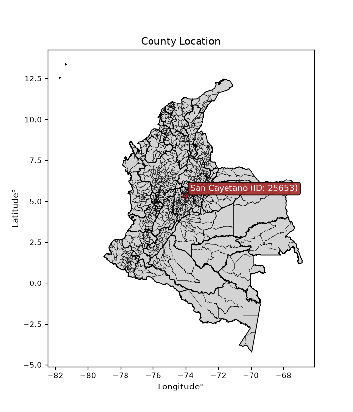
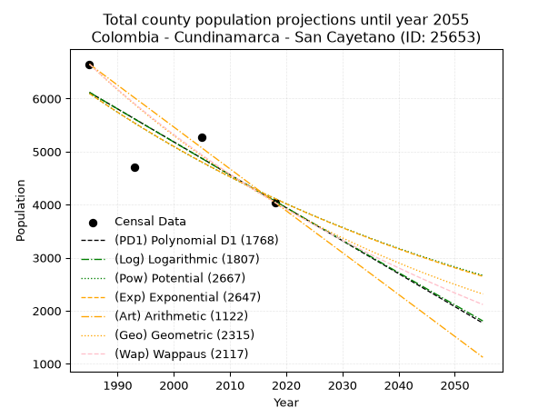
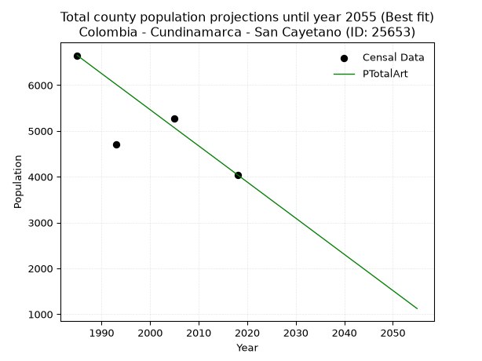
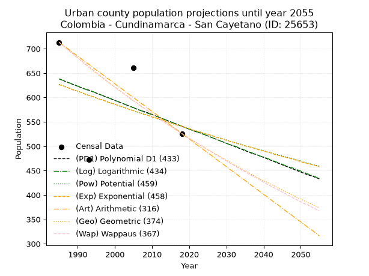
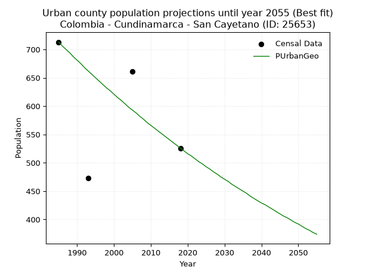
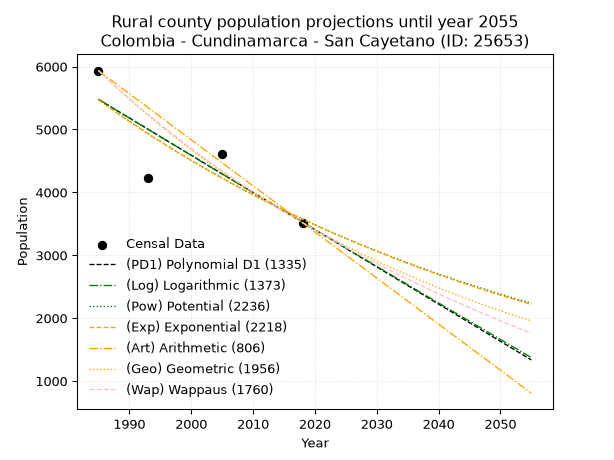
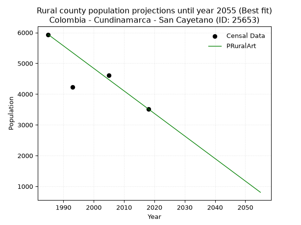

<div align="center">


</div>

# _“Population and Public Services Demand Projections (PPSD) until Year 2050 for Colombia - Cundinamarca - San Cayetano (ID: 25653)”_
Keywords: `population` `public-service` `projection` `lineal` `polynomial` `logarithmic` `potential` `exponential` `arithmetic` `geometric` `wappaus` `dane` `colombia` `south-america`

PPSD are analytical estimates used by governments and planners to anticipate future changes in population size, age distribution, and the resulting community needs for utilities, healthcare, education, and infrastructure as sizing future water treatment facilities, electrical grids, and road networks based on spatial growth.

<div align="center">

</img>

</div>


> **General running parameters**: • app_version: _v20260806_. • Python version: _3.14.7_. • Pandas version: _3.0.5_. • NumPy version: _2.5.1_. • Creates, save and include plots into reports (create_plot): _False_. • Projection until year: _2050_. • Process polynomial degree 2 and up: _False_. • Process Wappaus: _True_. • Process Wappaus: _True_. • Set negative values to zero: _True_. • Set infinite values to zero: _True_. • Drop dataset notes: _True_. 
<div align="center">

Dynamic map: [:earth_americas:Google](http://maps.google.com/maps?q=5.332937545,-74.0247539) [:earth_americas:OSM](https://www.openstreetmap.org/#map=18/5.332937545/-74.0247539&layers=P) [:earth_americas:Bing](https://www.bing.com/maps?cp=5.332937545~-74.0247539&lvl=18) [:earth_americas:Apple](https://maps.apple.com/frame?center=5.332937545%2C-74.0247539&span=0.003%2C0.006)

</div>


<div align="center">

```geojson
{
  "type": "Feature",
  "geometry": {
    "type": "Point", 
    "coordinates": [-74.0247539, 5.332937545]
  }, 
  "properties": {
    "Name": "Colombia - Cundinamarca - San Cayetano (ID: 25653)"
  }
}
```

</div>


## 0. Census Data (4 records)

Census data are official statistics collected by a government about the people and housing in a country. They usually include counts of total population, age, sex, race, income, education, and jobs.

📅Global census file: [Population.xlsx](../data/Population.xlsx)

| Source   |   Year |   CountryID | CountryName   |   StateID | StateName    |   CountyID | CountyName   |   PTotal |   PUrban |   PRural |
|:---------|-------:|------------:|:--------------|----------:|:-------------|-----------:|:-------------|---------:|---------:|---------:|
| DANE     |   1985 |          57 | Colombia      |        25 | Cundinamarca |      25653 | San Cayetano |     6648 |      713 |     5935 |
| DANE     |   1993 |          57 | Colombia      |        25 | Cundinamarca |      25653 | San Cayetano |     4706 |      473 |     4233 |
| DANE     |   2005 |          57 | Colombia      |        25 | Cundinamarca |      25653 | San Cayetano |     5276 |      661 |     4615 |
| DANE     |   2018 |          57 | Colombia      |        25 | Cundinamarca |      25653 | San Cayetano |     4043 |      526 |     3517 |

> 🔥Some records could had specific notes about the registered values or the corresponding urban or rural distribution.

📅[SUI-RUPS](https://www.datos.gov.co/Hacienda-y-Cr-dito-P-blico/Registro-nico-de-Prestadores-de-Servicios-P-blicos/4qkq-csdn/about_data) - Local public utility companies: [RUPS.csv](../data/RUPS.xlsx)

 | SERVICIO       | ESTADO    | NOMBRE                                                     | NIT         | DEPARTAMENTO_DOMICILIO   | MUNICIPIO_DOMICILIO   | DIRECCION        |   TELEFONO | EMAIL                                      | TIPO_PRESTADOR                 | CLASIFICACION                 |
|:---------------|:----------|:-----------------------------------------------------------|:------------|:-------------------------|:----------------------|:-----------------|-----------:|:-------------------------------------------|:-------------------------------|:------------------------------|
| ACUEDUCTO      | OPERATIVA | UNIDAD DE SERVICIOS PÚBLICOS DEL MUNICIPIO DE SAN CAYETANO | 800094751-8 | CUNDINAMARCA             | SAN CAYETANO          | PARQUE PRINCIPAL |    8505432 | uspublicos@sancayetano-cundinamarca.gov.co | MUNICIPIO (PRESTACIÓN DIRECTA) | MENOR O IGUAL A 2500 USUARIOS |
| ALCANTARILLADO | OPERATIVA | UNIDAD DE SERVICIOS PÚBLICOS DEL MUNICIPIO DE SAN CAYETANO | 800094751-8 | CUNDINAMARCA             | SAN CAYETANO          | PARQUE PRINCIPAL |    8505432 | uspublicos@sancayetano-cundinamarca.gov.co | MUNICIPIO (PRESTACIÓN DIRECTA) | MENOR O IGUAL A 2500 USUARIOS |

## 1. Total

### 1.1. Coefficients and Parameters

* (PD1) Polynomial Deg 1: -62.10558008831721, 129394.9365716565 (lineal)
* (Log) Logarithmic: -124374.79968678222, 950542.0990963258
* (Pow) Potential: -23.858487499929, 82.46476446275524
* (Exp) Exponential: -0.011916225263180317, 114204550030036.56
* (Art) Arithmetic: Year diff. 2018 - 1985 = 33, Population diff. 4043 - 6648 = -2605, Annual growth = -78.93939393939394
* (Geo) Geometric: Year diff. 2018 - 1985 = 33, Population diff. 4043 - 6648 = -2605, Annual growth % = -0.014957584961824755
* (Wap) Wappaus: i = -1.4767448122606668, Condition values only valid for < 200)

<sub>
Wappaus condition values: ['-0.00', '-1.48', '-2.95', '-4.43', '-5.91', '-7.38', '-8.86', '-10.34', '-11.81', '-13.29', '-14.77', '-16.24', '-17.72', '-19.20', '-20.67', '-22.15', '-23.63', '-25.10', '-26.58', '-28.06', '-29.53', '-31.01', '-32.49', '-33.97', '-35.44', '-36.92', '-38.40', '-39.87', '-41.35', '-42.83', '-44.30', '-45.78', '-47.26', '-48.73', '-50.21', '-51.69', '-53.16', '-54.64', '-56.12', '-57.59', '-59.07', '-60.55', '-62.02', '-63.50', '-64.98', '-66.45', '-67.93', '-69.41', '-70.88', '-72.36', '-73.84', '-75.31', '-76.79', '-78.27', '-79.74', '-81.22', '-82.70', '-84.17', '-85.65', '-87.13', '-88.60', '-90.08', '-91.56', '-93.03', '-94.51', '-95.99']
</sub>


### 1.2. Projected Dataset

|   Year |   CountyID |   PTotalPD1 |   PTotalLog |   PTotalPow |   PTotalExp |   PTotalArt |   PTotalGeo |   PTotalWap |
|-------:|-----------:|------------:|------------:|------------:|------------:|------------:|------------:|------------:|
|   1985 |      25653 |        6115 |        6118 |        6098 |        6095 |        6648 |        6648 |        6648 |
|   1986 |      25653 |        6053 |        6055 |        6025 |        6023 |        6569 |        6549 |        6551 |
|   1987 |      25653 |        5991 |        5992 |        5953 |        5952 |        6490 |        6451 |        6455 |
|   1988 |      25653 |        5929 |        5930 |        5882 |        5881 |        6411 |        6354 |        6360 |
|   1989 |      25653 |        5867 |        5867 |        5812 |        5812 |        6332 |        6259 |        6267 |
|   1990 |      25653 |        5805 |        5805 |        5743 |        5743 |        6253 |        6165 |        6175 |
|   1991 |      25653 |        5743 |        5742 |        5674 |        5675 |        6174 |        6073 |        6084 |
|   1992 |      25653 |        5681 |        5680 |        5607 |        5608 |        6095 |        5982 |        5995 |
|   1993 |      25653 |        5619 |        5617 |        5540 |        5541 |        6016 |        5893 |        5906 |
|   1994 |      25653 |        5556 |        5555 |        5474 |        5476 |        5938 |        5805 |        5819 |
|   1995 |      25653 |        5494 |        5493 |        5409 |        5411 |        5859 |        5718 |        5734 |
|   1996 |      25653 |        5432 |        5430 |        5345 |        5347 |        5780 |        5632 |        5649 |
|   1997 |      25653 |        5370 |        5368 |        5281 |        5283 |        5701 |        5548 |        5566 |
|   1998 |      25653 |        5308 |        5306 |        5219 |        5221 |        5622 |        5465 |        5484 |
|   1999 |      25653 |        5246 |        5244 |        5157 |        5159 |        5543 |        5383 |        5402 |
|   2000 |      25653 |        5184 |        5181 |        5095 |        5098 |        5464 |        5303 |        5322 |
|   2001 |      25653 |        5122 |        5119 |        5035 |        5037 |        5385 |        5224 |        5243 |
|   2002 |      25653 |        5060 |        5057 |        4975 |        4978 |        5306 |        5145 |        5165 |
|   2003 |      25653 |        4997 |        4995 |        4916 |        4919 |        5227 |        5069 |        5088 |
|   2004 |      25653 |        4935 |        4933 |        4858 |        4861 |        5148 |        4993 |        5012 |
|   2005 |      25653 |        4873 |        4871 |        4801 |        4803 |        5069 |        4918 |        4937 |
|   2006 |      25653 |        4811 |        4809 |        4744 |        4746 |        4990 |        4844 |        4863 |
|   2007 |      25653 |        4749 |        4747 |        4688 |        4690 |        4911 |        4772 |        4790 |
|   2008 |      25653 |        4687 |        4685 |        4633 |        4634 |        4832 |        4701 |        4718 |
|   2009 |      25653 |        4625 |        4623 |        4578 |        4579 |        4753 |        4630 |        4647 |
|   2010 |      25653 |        4563 |        4561 |        4524 |        4525 |        4675 |        4561 |        4576 |
|   2011 |      25653 |        4501 |        4499 |        4470 |        4472 |        4596 |        4493 |        4507 |
|   2012 |      25653 |        4439 |        4437 |        4418 |        4419 |        4517 |        4426 |        4438 |
|   2013 |      25653 |        4376 |        4376 |        4366 |        4366 |        4438 |        4359 |        4370 |
|   2014 |      25653 |        4314 |        4314 |        4314 |        4314 |        4359 |        4294 |        4303 |
|   2015 |      25653 |        4252 |        4252 |        4263 |        4263 |        4280 |        4230 |        4237 |
|   2016 |      25653 |        4190 |        4190 |        4213 |        4213 |        4201 |        4167 |        4171 |
|   2017 |      25653 |        4128 |        4129 |        4164 |        4163 |        4122 |        4104 |        4107 |
|   2018 |      25653 |        4066 |        4067 |        4115 |        4114 |        4043 |        4043 |        4043 |
|   2019 |      25653 |        4004 |        4005 |        4066 |        4065 |        3964 |        3983 |        3980 |
|   2020 |      25653 |        3942 |        3944 |        4019 |        4017 |        3885 |        3923 |        3918 |
|   2021 |      25653 |        3880 |        3882 |        3971 |        3969 |        3806 |        3864 |        3856 |
|   2022 |      25653 |        3817 |        3821 |        3925 |        3922 |        3727 |        3806 |        3795 |
|   2023 |      25653 |        3755 |        3759 |        3879 |        3876 |        3648 |        3750 |        3735 |
|   2024 |      25653 |        3693 |        3698 |        3833 |        3830 |        3569 |        3693 |        3675 |
|   2025 |      25653 |        3631 |        3636 |        3788 |        3784 |        3490 |        3638 |        3616 |
|   2026 |      25653 |        3569 |        3575 |        3744 |        3740 |        3411 |        3584 |        3558 |
|   2027 |      25653 |        3507 |        3514 |        3700 |        3695 |        3333 |        3530 |        3501 |
|   2028 |      25653 |        3445 |        3452 |        3657 |        3652 |        3254 |        3477 |        3444 |
|   2029 |      25653 |        3383 |        3391 |        3614 |        3608 |        3175 |        3425 |        3388 |
|   2030 |      25653 |        3321 |        3330 |        3572 |        3566 |        3096 |        3374 |        3332 |
|   2031 |      25653 |        3259 |        3268 |        3530 |        3523 |        3017 |        3324 |        3277 |
|   2032 |      25653 |        3196 |        3207 |        3489 |        3482 |        2938 |        3274 |        3223 |
|   2033 |      25653 |        3134 |        3146 |        3448 |        3440 |        2859 |        3225 |        3169 |
|   2034 |      25653 |        3072 |        3085 |        3408 |        3400 |        2780 |        3177 |        3116 |
|   2035 |      25653 |        3010 |        3024 |        3368 |        3359 |        2701 |        3129 |        3063 |
|   2036 |      25653 |        2948 |        2963 |        3329 |        3320 |        2622 |        3082 |        3011 |
|   2037 |      25653 |        2886 |        2901 |        3290 |        3280 |        2543 |        3036 |        2959 |
|   2038 |      25653 |        2824 |        2840 |        3252 |        3241 |        2464 |        2991 |        2908 |
|   2039 |      25653 |        2762 |        2779 |        3214 |        3203 |        2385 |        2946 |        2858 |
|   2040 |      25653 |        2700 |        2718 |        3177 |        3165 |        2306 |        2902 |        2808 |
|   2041 |      25653 |        2637 |        2657 |        3140 |        3128 |        2227 |        2859 |        2759 |
|   2042 |      25653 |        2575 |        2597 |        3103 |        3090 |        2148 |        2816 |        2710 |
|   2043 |      25653 |        2513 |        2536 |        3067 |        3054 |        2070 |        2774 |        2661 |
|   2044 |      25653 |        2451 |        2475 |        3032 |        3018 |        1991 |        2732 |        2613 |
|   2045 |      25653 |        2389 |        2414 |        2997 |        2982 |        1912 |        2691 |        2566 |
|   2046 |      25653 |        2327 |        2353 |        2962 |        2947 |        1833 |        2651 |        2519 |
|   2047 |      25653 |        2265 |        2292 |        2928 |        2912 |        1754 |        2612 |        2473 |
|   2048 |      25653 |        2203 |        2232 |        2894 |        2877 |        1675 |        2572 |        2427 |
|   2049 |      25653 |        2141 |        2171 |        2860 |        2843 |        1596 |        2534 |        2381 |
|   2050 |      25653 |        2078 |        2110 |        2827 |        2809 |        1517 |        2496 |        2336 |
<div align="center">

</img>

</div>


### 1.3. Best fit with absolute and relative error (%)

Relative error puts that difference into context by dividing the absolute error by the true value, creating a unitless ratio or percentage that shows the scale of the mistake.

Absolute and relative error

|   Year | Source   |   CountryID | CountryName   |   StateID | StateName    |   CountyID_x | CountyName   |   PTotal |   PUrban |   PRural |   CountyID_y |   PTotalPD1 |   PTotalLog |   PTotalPow |   PTotalExp |   PTotalArt |   PTotalGeo |   PTotalWap |   PTotalPD1AbsError |   PTotalLogAbsError |   PTotalPowAbsError |   PTotalExpAbsError |   PTotalArtAbsError |   PTotalGeoAbsError |   PTotalWapAbsError |   PTotalPD1RelError |   PTotalLogRelError |   PTotalPowRelError |   PTotalExpRelError |   PTotalArtRelError |   PTotalGeoRelError |   PTotalWapRelError |
|-------:|:---------|------------:|:--------------|----------:|:-------------|-------------:|:-------------|---------:|---------:|---------:|-------------:|------------:|------------:|------------:|------------:|------------:|------------:|------------:|--------------------:|--------------------:|--------------------:|--------------------:|--------------------:|--------------------:|--------------------:|--------------------:|--------------------:|--------------------:|--------------------:|--------------------:|--------------------:|--------------------:|
|   1985 | DANE     |          57 | Colombia      |        25 | Cundinamarca |        25653 | San Cayetano |     6648 |      713 |     5935 |        25653 |        6115 |        6118 |        6098 |        6095 |        6648 |        6648 |        6648 |                 533 |                 530 |                 550 |                 553 |                   0 |                   0 |                   0 |            8.01745  |            7.97232  |             8.27316 |             8.31829 |             0       |             0       |             0       |
|   1993 | DANE     |          57 | Colombia      |        25 | Cundinamarca |        25653 | San Cayetano |     4706 |      473 |     4233 |        25653 |        5619 |        5617 |        5540 |        5541 |        6016 |        5893 |        5906 |                 913 |                 911 |                 834 |                 835 |                1310 |                1187 |                1200 |           19.4008   |           19.3583   |            17.7221  |            17.7433  |            27.8368  |            25.2231  |            25.4994  |
|   2005 | DANE     |          57 | Colombia      |        25 | Cundinamarca |        25653 | San Cayetano |     5276 |      661 |     4615 |        25653 |        4873 |        4871 |        4801 |        4803 |        5069 |        4918 |        4937 |                 403 |                 405 |                 475 |                 473 |                 207 |                 358 |                 339 |            7.63836  |            7.67627  |             9.00303 |             8.96513 |             3.92343 |             6.78544 |             6.42532 |
|   2018 | DANE     |          57 | Colombia      |        25 | Cundinamarca |        25653 | San Cayetano |     4043 |      526 |     3517 |        25653 |        4066 |        4067 |        4115 |        4114 |        4043 |        4043 |        4043 |                  23 |                  24 |                  72 |                  71 |                   0 |                   0 |                   0 |            0.568884 |            0.593619 |             1.78086 |             1.75612 |             0       |             0       |             0       |

Relative error mean

| Method    |   RelError | Best   |
|:----------|-----------:|:-------|
| PTotalPD1 |    8.90637 |        |
| PTotalLog |    8.90012 |        |
| PTotalPow |    9.19478 |        |
| PTotalExp |    9.19571 |        |
| PTotalArt |    7.94006 | True   |
| PTotalGeo |    8.00214 |        |
| PTotalWap |    7.98117 |        |

💙Best method: _**PTotalArt**_
<div align="center">

</img>

</div>


### 1.4. Fresh water supply demand in liters per capita per day (lpcd)

The fresh water supply demand typically ranges from 100 to 300 liters per capita per day (lpcd) for standard domestic and municipal planning, though absolute survival minimums set by the World Health Organization are as low as 7.5 to 20 liters per day, and total consumption in high-income nations can exceed 400 liters.

> `CZ`: Level in meters above the sea level (masl)<br> `WS`: Fresh water supply demand in liters per capita per day (lpcd or l/h/d)<br> `WSAll`: Zonal fresh water supply demand in liters per second (l/s)<br> `A`: Zonal area in square meters<br> `DP`: Population density (people/hectare or p/ha)

Reference values (RAS Colombia)

|    CZ |   WS |
|------:|-----:|
|  1000 |  120 |
|  2000 |  130 |
| 99999 |  140 |

County shapefile geometry properties and water supply values

|   CountyID |      ATotal |   CZTotal |   WSTotal |
|-----------:|------------:|----------:|----------:|
|      25653 | 2.87448e+08 |   2350.13 |       140 |

Projected values for best method: PTotalArt

|   CountyID |   Year |   PTotalArt |   DPTotal |   WSTotal |   WSTotalAll |
|-----------:|-------:|------------:|----------:|----------:|-------------:|
|      25653 |   1985 |        6648 |      0.23 |       140 |     10.7722  |
|      25653 |   1986 |        6569 |      0.23 |       140 |     10.6442  |
|      25653 |   1987 |        6490 |      0.23 |       140 |     10.5162  |
|      25653 |   1988 |        6411 |      0.22 |       140 |     10.3882  |
|      25653 |   1989 |        6332 |      0.22 |       140 |     10.2602  |
|      25653 |   1990 |        6253 |      0.22 |       140 |     10.1322  |
|      25653 |   1991 |        6174 |      0.21 |       140 |     10.0042  |
|      25653 |   1992 |        6095 |      0.21 |       140 |      9.87616 |
|      25653 |   1993 |        6016 |      0.21 |       140 |      9.74815 |
|      25653 |   1994 |        5938 |      0.21 |       140 |      9.62176 |
|      25653 |   1995 |        5859 |      0.2  |       140 |      9.49375 |
|      25653 |   1996 |        5780 |      0.2  |       140 |      9.36574 |
|      25653 |   1997 |        5701 |      0.2  |       140 |      9.23773 |
|      25653 |   1998 |        5622 |      0.2  |       140 |      9.10972 |
|      25653 |   1999 |        5543 |      0.19 |       140 |      8.98171 |
|      25653 |   2000 |        5464 |      0.19 |       140 |      8.8537  |
|      25653 |   2001 |        5385 |      0.19 |       140 |      8.72569 |
|      25653 |   2002 |        5306 |      0.18 |       140 |      8.59769 |
|      25653 |   2003 |        5227 |      0.18 |       140 |      8.46968 |
|      25653 |   2004 |        5148 |      0.18 |       140 |      8.34167 |
|      25653 |   2005 |        5069 |      0.18 |       140 |      8.21366 |
|      25653 |   2006 |        4990 |      0.17 |       140 |      8.08565 |
|      25653 |   2007 |        4911 |      0.17 |       140 |      7.95764 |
|      25653 |   2008 |        4832 |      0.17 |       140 |      7.82963 |
|      25653 |   2009 |        4753 |      0.17 |       140 |      7.70162 |
|      25653 |   2010 |        4675 |      0.16 |       140 |      7.57523 |
|      25653 |   2011 |        4596 |      0.16 |       140 |      7.44722 |
|      25653 |   2012 |        4517 |      0.16 |       140 |      7.31921 |
|      25653 |   2013 |        4438 |      0.15 |       140 |      7.1912  |
|      25653 |   2014 |        4359 |      0.15 |       140 |      7.06319 |
|      25653 |   2015 |        4280 |      0.15 |       140 |      6.93519 |
|      25653 |   2016 |        4201 |      0.15 |       140 |      6.80718 |
|      25653 |   2017 |        4122 |      0.14 |       140 |      6.67917 |
|      25653 |   2018 |        4043 |      0.14 |       140 |      6.55116 |
|      25653 |   2019 |        3964 |      0.14 |       140 |      6.42315 |
|      25653 |   2020 |        3885 |      0.14 |       140 |      6.29514 |
|      25653 |   2021 |        3806 |      0.13 |       140 |      6.16713 |
|      25653 |   2022 |        3727 |      0.13 |       140 |      6.03912 |
|      25653 |   2023 |        3648 |      0.13 |       140 |      5.91111 |
|      25653 |   2024 |        3569 |      0.12 |       140 |      5.7831  |
|      25653 |   2025 |        3490 |      0.12 |       140 |      5.65509 |
|      25653 |   2026 |        3411 |      0.12 |       140 |      5.52708 |
|      25653 |   2027 |        3333 |      0.12 |       140 |      5.40069 |
|      25653 |   2028 |        3254 |      0.11 |       140 |      5.27269 |
|      25653 |   2029 |        3175 |      0.11 |       140 |      5.14468 |
|      25653 |   2030 |        3096 |      0.11 |       140 |      5.01667 |
|      25653 |   2031 |        3017 |      0.1  |       140 |      4.88866 |
|      25653 |   2032 |        2938 |      0.1  |       140 |      4.76065 |
|      25653 |   2033 |        2859 |      0.1  |       140 |      4.63264 |
|      25653 |   2034 |        2780 |      0.1  |       140 |      4.50463 |
|      25653 |   2035 |        2701 |      0.09 |       140 |      4.37662 |
|      25653 |   2036 |        2622 |      0.09 |       140 |      4.24861 |
|      25653 |   2037 |        2543 |      0.09 |       140 |      4.1206  |
|      25653 |   2038 |        2464 |      0.09 |       140 |      3.99259 |
|      25653 |   2039 |        2385 |      0.08 |       140 |      3.86458 |
|      25653 |   2040 |        2306 |      0.08 |       140 |      3.73657 |
|      25653 |   2041 |        2227 |      0.08 |       140 |      3.60856 |
|      25653 |   2042 |        2148 |      0.07 |       140 |      3.48056 |
|      25653 |   2043 |        2070 |      0.07 |       140 |      3.35417 |
|      25653 |   2044 |        1991 |      0.07 |       140 |      3.22616 |
|      25653 |   2045 |        1912 |      0.07 |       140 |      3.09815 |
|      25653 |   2046 |        1833 |      0.06 |       140 |      2.97014 |
|      25653 |   2047 |        1754 |      0.06 |       140 |      2.84213 |
|      25653 |   2048 |        1675 |      0.06 |       140 |      2.71412 |
|      25653 |   2049 |        1596 |      0.06 |       140 |      2.58611 |
|      25653 |   2050 |        1517 |      0.05 |       140 |      2.4581  |

## 2. Urban

### 2.1. Coefficients and Parameters

* (PD1) Polynomial Deg 1: -2.9325572059413108, 6459.097551184107 (lineal)
* (Log) Logarithmic: -5875.6256202632485, 45253.9274239297
* (Pow) Potential: -8.956624084754553, 32.333779817303245
* (Exp) Exponential: -0.004469861039734341, 4469323.040768303
* (Art) Arithmetic: Year diff. 2018 - 1985 = 33, Population diff. 526 - 713 = -187, Annual growth = -5.666666666666667
* (Geo) Geometric: Year diff. 2018 - 1985 = 33, Population diff. 526 - 713 = -187, Annual growth % = -0.009175230367970855
* (Wap) Wappaus: i = -0.9147161689534571, Condition values only valid for < 200)

<sub>
Wappaus condition values: ['-0.00', '-0.91', '-1.83', '-2.74', '-3.66', '-4.57', '-5.49', '-6.40', '-7.32', '-8.23', '-9.15', '-10.06', '-10.98', '-11.89', '-12.81', '-13.72', '-14.64', '-15.55', '-16.46', '-17.38', '-18.29', '-19.21', '-20.12', '-21.04', '-21.95', '-22.87', '-23.78', '-24.70', '-25.61', '-26.53', '-27.44', '-28.36', '-29.27', '-30.19', '-31.10', '-32.02', '-32.93', '-33.84', '-34.76', '-35.67', '-36.59', '-37.50', '-38.42', '-39.33', '-40.25', '-41.16', '-42.08', '-42.99', '-43.91', '-44.82', '-45.74', '-46.65', '-47.57', '-48.48', '-49.39', '-50.31', '-51.22', '-52.14', '-53.05', '-53.97', '-54.88', '-55.80', '-56.71', '-57.63', '-58.54', '-59.46']
</sub>


### 2.2. Projected Dataset

|   Year |   CountyID |   PUrbanPD1 |   PUrbanLog |   PUrbanPow |   PUrbanExp |   PUrbanArt |   PUrbanGeo |   PUrbanWap |
|-------:|-----------:|------------:|------------:|------------:|------------:|------------:|------------:|------------:|
|   1985 |      25653 |         638 |         638 |         627 |         626 |         713 |         713 |         713 |
|   1986 |      25653 |         635 |         635 |         624 |         624 |         707 |         706 |         707 |
|   1987 |      25653 |         632 |         632 |         621 |         621 |         702 |         700 |         700 |
|   1988 |      25653 |         629 |         629 |         618 |         618 |         696 |         694 |         694 |
|   1989 |      25653 |         626 |         626 |         615 |         615 |         690 |         687 |         687 |
|   1990 |      25653 |         623 |         623 |         613 |         613 |         685 |         681 |         681 |
|   1991 |      25653 |         620 |         620 |         610 |         610 |         679 |         675 |         675 |
|   1992 |      25653 |         617 |         617 |         607 |         607 |         673 |         668 |         669 |
|   1993 |      25653 |         615 |         614 |         604 |         604 |         668 |         662 |         663 |
|   1994 |      25653 |         612 |         612 |         602 |         602 |         662 |         656 |         657 |
|   1995 |      25653 |         609 |         609 |         599 |         599 |         656 |         650 |         651 |
|   1996 |      25653 |         606 |         606 |         596 |         596 |         651 |         644 |         645 |
|   1997 |      25653 |         603 |         603 |         594 |         594 |         645 |         638 |         639 |
|   1998 |      25653 |         600 |         600 |         591 |         591 |         639 |         632 |         633 |
|   1999 |      25653 |         597 |         597 |         588 |         588 |         634 |         627 |         627 |
|   2000 |      25653 |         594 |         594 |         586 |         586 |         628 |         621 |         621 |
|   2001 |      25653 |         591 |         591 |         583 |         583 |         622 |         615 |         616 |
|   2002 |      25653 |         588 |         588 |         581 |         581 |         617 |         610 |         610 |
|   2003 |      25653 |         585 |         585 |         578 |         578 |         611 |         604 |         605 |
|   2004 |      25653 |         582 |         582 |         575 |         575 |         605 |         598 |         599 |
|   2005 |      25653 |         579 |         579 |         573 |         573 |         600 |         593 |         593 |
|   2006 |      25653 |         576 |         576 |         570 |         570 |         594 |         588 |         588 |
|   2007 |      25653 |         573 |         573 |         568 |         568 |         588 |         582 |         583 |
|   2008 |      25653 |         571 |         570 |         565 |         565 |         583 |         577 |         577 |
|   2009 |      25653 |         568 |         567 |         563 |         563 |         577 |         571 |         572 |
|   2010 |      25653 |         565 |         565 |         560 |         560 |         571 |         566 |         567 |
|   2011 |      25653 |         562 |         562 |         558 |         558 |         566 |         561 |         561 |
|   2012 |      25653 |         559 |         559 |         555 |         555 |         560 |         556 |         556 |
|   2013 |      25653 |         556 |         556 |         553 |         553 |         554 |         551 |         551 |
|   2014 |      25653 |         553 |         553 |         550 |         550 |         549 |         546 |         546 |
|   2015 |      25653 |         550 |         550 |         548 |         548 |         543 |         541 |         541 |
|   2016 |      25653 |         547 |         547 |         545 |         545 |         537 |         536 |         536 |
|   2017 |      25653 |         544 |         544 |         543 |         543 |         532 |         531 |         531 |
|   2018 |      25653 |         541 |         541 |         541 |         541 |         526 |         526 |         526 |
|   2019 |      25653 |         538 |         538 |         538 |         538 |         520 |         521 |         521 |
|   2020 |      25653 |         535 |         535 |         536 |         536 |         515 |         516 |         516 |
|   2021 |      25653 |         532 |         532 |         533 |         533 |         509 |         512 |         511 |
|   2022 |      25653 |         529 |         530 |         531 |         531 |         503 |         507 |         507 |
|   2023 |      25653 |         527 |         527 |         529 |         529 |         498 |         502 |         502 |
|   2024 |      25653 |         524 |         524 |         526 |         526 |         492 |         498 |         497 |
|   2025 |      25653 |         521 |         521 |         524 |         524 |         486 |         493 |         492 |
|   2026 |      25653 |         518 |         518 |         522 |         522 |         481 |         489 |         488 |
|   2027 |      25653 |         515 |         515 |         519 |         519 |         475 |         484 |         483 |
|   2028 |      25653 |         512 |         512 |         517 |         517 |         469 |         480 |         479 |
|   2029 |      25653 |         509 |         509 |         515 |         515 |         464 |         475 |         474 |
|   2030 |      25653 |         506 |         506 |         513 |         512 |         458 |         471 |         470 |
|   2031 |      25653 |         503 |         503 |         510 |         510 |         452 |         467 |         465 |
|   2032 |      25653 |         500 |         501 |         508 |         508 |         447 |         462 |         461 |
|   2033 |      25653 |         497 |         498 |         506 |         505 |         441 |         458 |         456 |
|   2034 |      25653 |         494 |         495 |         504 |         503 |         435 |         454 |         452 |
|   2035 |      25653 |         491 |         492 |         501 |         501 |         430 |         450 |         448 |
|   2036 |      25653 |         488 |         489 |         499 |         499 |         424 |         446 |         443 |
|   2037 |      25653 |         485 |         486 |         497 |         497 |         418 |         441 |         439 |
|   2038 |      25653 |         483 |         483 |         495 |         494 |         413 |         437 |         435 |
|   2039 |      25653 |         480 |         480 |         493 |         492 |         407 |         433 |         431 |
|   2040 |      25653 |         477 |         478 |         491 |         490 |         401 |         429 |         426 |
|   2041 |      25653 |         474 |         475 |         488 |         488 |         396 |         426 |         422 |
|   2042 |      25653 |         471 |         472 |         486 |         486 |         390 |         422 |         418 |
|   2043 |      25653 |         468 |         469 |         484 |         483 |         384 |         418 |         414 |
|   2044 |      25653 |         465 |         466 |         482 |         481 |         379 |         414 |         410 |
|   2045 |      25653 |         462 |         463 |         480 |         479 |         373 |         410 |         406 |
|   2046 |      25653 |         459 |         460 |         478 |         477 |         367 |         406 |         402 |
|   2047 |      25653 |         456 |         457 |         476 |         475 |         362 |         403 |         398 |
|   2048 |      25653 |         453 |         455 |         474 |         473 |         356 |         399 |         394 |
|   2049 |      25653 |         450 |         452 |         472 |         471 |         350 |         395 |         390 |
|   2050 |      25653 |         447 |         449 |         470 |         468 |         345 |         392 |         386 |
<div align="center">

</img>

</div>


### 2.3. Best fit with absolute and relative error (%)

Relative error puts that difference into context by dividing the absolute error by the true value, creating a unitless ratio or percentage that shows the scale of the mistake.

Absolute and relative error

|   Year | Source   |   CountryID | CountryName   |   StateID | StateName    |   CountyID_x | CountyName   |   PTotal |   PUrban |   PRural |   CountyID_y |   PUrbanPD1 |   PUrbanLog |   PUrbanPow |   PUrbanExp |   PUrbanArt |   PUrbanGeo |   PUrbanWap |   PUrbanPD1AbsError |   PUrbanLogAbsError |   PUrbanPowAbsError |   PUrbanExpAbsError |   PUrbanArtAbsError |   PUrbanGeoAbsError |   PUrbanWapAbsError |   PUrbanPD1RelError |   PUrbanLogRelError |   PUrbanPowRelError |   PUrbanExpRelError |   PUrbanArtRelError |   PUrbanGeoRelError |   PUrbanWapRelError |
|-------:|:---------|------------:|:--------------|----------:|:-------------|-------------:|:-------------|---------:|---------:|---------:|-------------:|------------:|------------:|------------:|------------:|------------:|------------:|------------:|--------------------:|--------------------:|--------------------:|--------------------:|--------------------:|--------------------:|--------------------:|--------------------:|--------------------:|--------------------:|--------------------:|--------------------:|--------------------:|--------------------:|
|   1985 | DANE     |          57 | Colombia      |        25 | Cundinamarca |        25653 | San Cayetano |     6648 |      713 |     5935 |        25653 |         638 |         638 |         627 |         626 |         713 |         713 |         713 |                  75 |                  75 |                  86 |                  87 |                   0 |                   0 |                   0 |            10.5189  |            10.5189  |            12.0617  |            12.202   |             0       |              0      |              0      |
|   1993 | DANE     |          57 | Colombia      |        25 | Cundinamarca |        25653 | San Cayetano |     4706 |      473 |     4233 |        25653 |         615 |         614 |         604 |         604 |         668 |         662 |         663 |                 142 |                 141 |                 131 |                 131 |                 195 |                 189 |                 190 |            30.0211  |            29.8097  |            27.6956  |            27.6956  |            41.2262  |             39.9577 |             40.1691 |
|   2005 | DANE     |          57 | Colombia      |        25 | Cundinamarca |        25653 | San Cayetano |     5276 |      661 |     4615 |        25653 |         579 |         579 |         573 |         573 |         600 |         593 |         593 |                  82 |                  82 |                  88 |                  88 |                  61 |                  68 |                  68 |            12.4054  |            12.4054  |            13.3132  |            13.3132  |             9.22844 |             10.2874 |             10.2874 |
|   2018 | DANE     |          57 | Colombia      |        25 | Cundinamarca |        25653 | San Cayetano |     4043 |      526 |     3517 |        25653 |         541 |         541 |         541 |         541 |         526 |         526 |         526 |                  15 |                  15 |                  15 |                  15 |                   0 |                   0 |                   0 |             2.85171 |             2.85171 |             2.85171 |             2.85171 |             0       |              0      |              0      |

Relative error mean

| Method    |   RelError | Best   |
|:----------|-----------:|:-------|
| PUrbanPD1 |    13.9493 |        |
| PUrbanLog |    13.8965 |        |
| PUrbanPow |    13.9805 |        |
| PUrbanExp |    14.0156 |        |
| PUrbanArt |    12.6137 |        |
| PUrbanGeo |    12.5613 | True   |
| PUrbanWap |    12.6141 |        |

💙Best method: _**PUrbanGeo**_
<div align="center">

</img>

</div>


### 2.4. Fresh water supply demand in liters per capita per day (lpcd)

The fresh water supply demand typically ranges from 100 to 300 liters per capita per day (lpcd) for standard domestic and municipal planning, though absolute survival minimums set by the World Health Organization are as low as 7.5 to 20 liters per day, and total consumption in high-income nations can exceed 400 liters.

> `CZ`: Level in meters above the sea level (masl)<br> `WS`: Fresh water supply demand in liters per capita per day (lpcd or l/h/d)<br> `WSAll`: Zonal fresh water supply demand in liters per second (l/s)<br> `A`: Zonal area in square meters<br> `DP`: Population density (people/hectare or p/ha)

Reference values (RAS Colombia)

|    CZ |   WS |
|------:|-----:|
|  1000 |  120 |
|  2000 |  130 |
| 99999 |  140 |

County shapefile geometry properties and water supply values

|   CountyID |   AUrban |   CZUrban |   WSUrban |
|-----------:|---------:|----------:|----------:|
|      25653 |   209129 |   2803.64 |       140 |

Projected values for best method: PUrbanGeo

|   CountyID |   Year |   PUrbanGeo |   DPUrban |   WSUrban |   WSUrbanAll |
|-----------:|-------:|------------:|----------:|----------:|-------------:|
|      25653 |   1985 |         713 |     34.09 |       140 |     1.15532  |
|      25653 |   1986 |         706 |     33.76 |       140 |     1.14398  |
|      25653 |   1987 |         700 |     33.47 |       140 |     1.13426  |
|      25653 |   1988 |         694 |     33.19 |       140 |     1.12454  |
|      25653 |   1989 |         687 |     32.85 |       140 |     1.11319  |
|      25653 |   1990 |         681 |     32.56 |       140 |     1.10347  |
|      25653 |   1991 |         675 |     32.28 |       140 |     1.09375  |
|      25653 |   1992 |         668 |     31.94 |       140 |     1.08241  |
|      25653 |   1993 |         662 |     31.66 |       140 |     1.07269  |
|      25653 |   1994 |         656 |     31.37 |       140 |     1.06296  |
|      25653 |   1995 |         650 |     31.08 |       140 |     1.05324  |
|      25653 |   1996 |         644 |     30.79 |       140 |     1.04352  |
|      25653 |   1997 |         638 |     30.51 |       140 |     1.0338   |
|      25653 |   1998 |         632 |     30.22 |       140 |     1.02407  |
|      25653 |   1999 |         627 |     29.98 |       140 |     1.01597  |
|      25653 |   2000 |         621 |     29.69 |       140 |     1.00625  |
|      25653 |   2001 |         615 |     29.41 |       140 |     0.996528 |
|      25653 |   2002 |         610 |     29.17 |       140 |     0.988426 |
|      25653 |   2003 |         604 |     28.88 |       140 |     0.978704 |
|      25653 |   2004 |         598 |     28.59 |       140 |     0.968981 |
|      25653 |   2005 |         593 |     28.36 |       140 |     0.96088  |
|      25653 |   2006 |         588 |     28.12 |       140 |     0.952778 |
|      25653 |   2007 |         582 |     27.83 |       140 |     0.943056 |
|      25653 |   2008 |         577 |     27.59 |       140 |     0.934954 |
|      25653 |   2009 |         571 |     27.3  |       140 |     0.925231 |
|      25653 |   2010 |         566 |     27.06 |       140 |     0.91713  |
|      25653 |   2011 |         561 |     26.83 |       140 |     0.909028 |
|      25653 |   2012 |         556 |     26.59 |       140 |     0.900926 |
|      25653 |   2013 |         551 |     26.35 |       140 |     0.892824 |
|      25653 |   2014 |         546 |     26.11 |       140 |     0.884722 |
|      25653 |   2015 |         541 |     25.87 |       140 |     0.87662  |
|      25653 |   2016 |         536 |     25.63 |       140 |     0.868519 |
|      25653 |   2017 |         531 |     25.39 |       140 |     0.860417 |
|      25653 |   2018 |         526 |     25.15 |       140 |     0.852315 |
|      25653 |   2019 |         521 |     24.91 |       140 |     0.844213 |
|      25653 |   2020 |         516 |     24.67 |       140 |     0.836111 |
|      25653 |   2021 |         512 |     24.48 |       140 |     0.82963  |
|      25653 |   2022 |         507 |     24.24 |       140 |     0.821528 |
|      25653 |   2023 |         502 |     24    |       140 |     0.813426 |
|      25653 |   2024 |         498 |     23.81 |       140 |     0.806944 |
|      25653 |   2025 |         493 |     23.57 |       140 |     0.798843 |
|      25653 |   2026 |         489 |     23.38 |       140 |     0.792361 |
|      25653 |   2027 |         484 |     23.14 |       140 |     0.784259 |
|      25653 |   2028 |         480 |     22.95 |       140 |     0.777778 |
|      25653 |   2029 |         475 |     22.71 |       140 |     0.769676 |
|      25653 |   2030 |         471 |     22.52 |       140 |     0.763194 |
|      25653 |   2031 |         467 |     22.33 |       140 |     0.756713 |
|      25653 |   2032 |         462 |     22.09 |       140 |     0.748611 |
|      25653 |   2033 |         458 |     21.9  |       140 |     0.74213  |
|      25653 |   2034 |         454 |     21.71 |       140 |     0.735648 |
|      25653 |   2035 |         450 |     21.52 |       140 |     0.729167 |
|      25653 |   2036 |         446 |     21.33 |       140 |     0.722685 |
|      25653 |   2037 |         441 |     21.09 |       140 |     0.714583 |
|      25653 |   2038 |         437 |     20.9  |       140 |     0.708102 |
|      25653 |   2039 |         433 |     20.7  |       140 |     0.70162  |
|      25653 |   2040 |         429 |     20.51 |       140 |     0.695139 |
|      25653 |   2041 |         426 |     20.37 |       140 |     0.690278 |
|      25653 |   2042 |         422 |     20.18 |       140 |     0.683796 |
|      25653 |   2043 |         418 |     19.99 |       140 |     0.677315 |
|      25653 |   2044 |         414 |     19.8  |       140 |     0.670833 |
|      25653 |   2045 |         410 |     19.61 |       140 |     0.664352 |
|      25653 |   2046 |         406 |     19.41 |       140 |     0.65787  |
|      25653 |   2047 |         403 |     19.27 |       140 |     0.653009 |
|      25653 |   2048 |         399 |     19.08 |       140 |     0.646528 |
|      25653 |   2049 |         395 |     18.89 |       140 |     0.640046 |
|      25653 |   2050 |         392 |     18.74 |       140 |     0.635185 |

## 3. Rural

### 3.1. Coefficients and Parameters

* (PD1) Polynomial Deg 1: -59.173022882375896, 122935.83902047238 (lineal)
* (Log) Logarithmic: -118499.17406651887, 905288.1716723953
* (Pow) Potential: -25.82428049756564, 88.90051162902495
* (Exp) Exponential: -0.012898509838346573, 720289359859406.6
* (Art) Arithmetic: Year diff. 2018 - 1985 = 33, Population diff. 3517 - 5935 = -2418, Annual growth = -73.27272727272727
* (Geo) Geometric: Year diff. 2018 - 1985 = 33, Population diff. 3517 - 5935 = -2418, Annual growth % = -0.015731273789944655
* (Wap) Wappaus: i = -1.5504174200746355, Condition values only valid for < 200)

<sub>
Wappaus condition values: ['-0.00', '-1.55', '-3.10', '-4.65', '-6.20', '-7.75', '-9.30', '-10.85', '-12.40', '-13.95', '-15.50', '-17.05', '-18.61', '-20.16', '-21.71', '-23.26', '-24.81', '-26.36', '-27.91', '-29.46', '-31.01', '-32.56', '-34.11', '-35.66', '-37.21', '-38.76', '-40.31', '-41.86', '-43.41', '-44.96', '-46.51', '-48.06', '-49.61', '-51.16', '-52.71', '-54.26', '-55.82', '-57.37', '-58.92', '-60.47', '-62.02', '-63.57', '-65.12', '-66.67', '-68.22', '-69.77', '-71.32', '-72.87', '-74.42', '-75.97', '-77.52', '-79.07', '-80.62', '-82.17', '-83.72', '-85.27', '-86.82', '-88.37', '-89.92', '-91.47', '-93.03', '-94.58', '-96.13', '-97.68', '-99.23', '-100.78']
</sub>


### 3.2. Projected Dataset

|   Year |   CountyID |   PRuralPD1 |   PRuralLog |   PRuralPow |   PRuralExp |   PRuralArt |   PRuralGeo |   PRuralWap |
|-------:|-----------:|------------:|------------:|------------:|------------:|------------:|------------:|------------:|
|   1985 |      25653 |        5477 |        5480 |        5473 |        5471 |        5935 |        5935 |        5935 |
|   1986 |      25653 |        5418 |        5420 |        5402 |        5400 |        5862 |        5842 |        5844 |
|   1987 |      25653 |        5359 |        5360 |        5332 |        5331 |        5788 |        5750 |        5754 |
|   1988 |      25653 |        5300 |        5301 |        5264 |        5263 |        5715 |        5659 |        5665 |
|   1989 |      25653 |        5241 |        5241 |        5196 |        5195 |        5642 |        5570 |        5578 |
|   1990 |      25653 |        5182 |        5181 |        5129 |        5129 |        5569 |        5483 |        5492 |
|   1991 |      25653 |        5122 |        5122 |        5063 |        5063 |        5495 |        5396 |        5407 |
|   1992 |      25653 |        5063 |        5062 |        4997 |        4998 |        5422 |        5311 |        5324 |
|   1993 |      25653 |        5004 |        5003 |        4933 |        4934 |        5349 |        5228 |        5242 |
|   1994 |      25653 |        4945 |        4944 |        4869 |        4871 |        5276 |        5146 |        5161 |
|   1995 |      25653 |        4886 |        4884 |        4807 |        4809 |        5202 |        5065 |        5081 |
|   1996 |      25653 |        4826 |        4825 |        4745 |        4747 |        5129 |        4985 |        5002 |
|   1997 |      25653 |        4767 |        4765 |        4684 |        4686 |        5056 |        4907 |        4925 |
|   1998 |      25653 |        4708 |        4706 |        4624 |        4626 |        4982 |        4829 |        4848 |
|   1999 |      25653 |        4649 |        4647 |        4565 |        4567 |        4909 |        4753 |        4773 |
|   2000 |      25653 |        4590 |        4588 |        4506 |        4508 |        4836 |        4679 |        4699 |
|   2001 |      25653 |        4531 |        4528 |        4448 |        4450 |        4763 |        4605 |        4625 |
|   2002 |      25653 |        4471 |        4469 |        4391 |        4393 |        4689 |        4533 |        4553 |
|   2003 |      25653 |        4412 |        4410 |        4335 |        4337 |        4616 |        4461 |        4482 |
|   2004 |      25653 |        4353 |        4351 |        4279 |        4282 |        4543 |        4391 |        4411 |
|   2005 |      25653 |        4294 |        4292 |        4225 |        4227 |        4470 |        4322 |        4342 |
|   2006 |      25653 |        4235 |        4233 |        4171 |        4172 |        4396 |        4254 |        4273 |
|   2007 |      25653 |        4176 |        4173 |        4117 |        4119 |        4323 |        4187 |        4206 |
|   2008 |      25653 |        4116 |        4114 |        4065 |        4066 |        4250 |        4121 |        4139 |
|   2009 |      25653 |        4057 |        4055 |        4013 |        4014 |        4176 |        4056 |        4073 |
|   2010 |      25653 |        3998 |        3996 |        3961 |        3963 |        4103 |        3993 |        4008 |
|   2011 |      25653 |        3939 |        3938 |        3911 |        3912 |        4030 |        3930 |        3944 |
|   2012 |      25653 |        3880 |        3879 |        3861 |        3862 |        3957 |        3868 |        3881 |
|   2013 |      25653 |        3821 |        3820 |        3812 |        3812 |        3883 |        3807 |        3818 |
|   2014 |      25653 |        3761 |        3761 |        3763 |        3763 |        3810 |        3747 |        3756 |
|   2015 |      25653 |        3702 |        3702 |        3715 |        3715 |        3737 |        3688 |        3695 |
|   2016 |      25653 |        3643 |        3643 |        3668 |        3668 |        3664 |        3630 |        3635 |
|   2017 |      25653 |        3584 |        3585 |        3621 |        3621 |        3590 |        3573 |        3576 |
|   2018 |      25653 |        3525 |        3526 |        3575 |        3574 |        3517 |        3517 |        3517 |
|   2019 |      25653 |        3466 |        3467 |        3530 |        3528 |        3444 |        3462 |        3459 |
|   2020 |      25653 |        3406 |        3408 |        3485 |        3483 |        3370 |        3407 |        3402 |
|   2021 |      25653 |        3347 |        3350 |        3441 |        3438 |        3297 |        3354 |        3345 |
|   2022 |      25653 |        3288 |        3291 |        3397 |        3394 |        3224 |        3301 |        3289 |
|   2023 |      25653 |        3229 |        3233 |        3354 |        3351 |        3151 |        3249 |        3234 |
|   2024 |      25653 |        3170 |        3174 |        3311 |        3308 |        3077 |        3198 |        3179 |
|   2025 |      25653 |        3110 |        3115 |        3269 |        3266 |        3004 |        3148 |        3125 |
|   2026 |      25653 |        3051 |        3057 |        3228 |        3224 |        2931 |        3098 |        3072 |
|   2027 |      25653 |        2992 |        2998 |        3187 |        3182 |        2858 |        3049 |        3020 |
|   2028 |      25653 |        2933 |        2940 |        3147 |        3142 |        2784 |        3001 |        2967 |
|   2029 |      25653 |        2874 |        2882 |        3107 |        3101 |        2711 |        2954 |        2916 |
|   2030 |      25653 |        2815 |        2823 |        3068 |        3062 |        2638 |        2908 |        2865 |
|   2031 |      25653 |        2755 |        2765 |        3029 |        3022 |        2564 |        2862 |        2815 |
|   2032 |      25653 |        2696 |        2707 |        2991 |        2984 |        2491 |        2817 |        2765 |
|   2033 |      25653 |        2637 |        2648 |        2953 |        2945 |        2418 |        2773 |        2716 |
|   2034 |      25653 |        2578 |        2590 |        2916 |        2908 |        2345 |        2729 |        2667 |
|   2035 |      25653 |        2519 |        2532 |        2879 |        2870 |        2271 |        2686 |        2619 |
|   2036 |      25653 |        2460 |        2473 |        2843 |        2834 |        2198 |        2644 |        2572 |
|   2037 |      25653 |        2400 |        2415 |        2807 |        2797 |        2125 |        2602 |        2525 |
|   2038 |      25653 |        2341 |        2357 |        2771 |        2761 |        2052 |        2561 |        2478 |
|   2039 |      25653 |        2282 |        2299 |        2736 |        2726 |        1978 |        2521 |        2432 |
|   2040 |      25653 |        2223 |        2241 |        2702 |        2691 |        1905 |        2481 |        2387 |
|   2041 |      25653 |        2164 |        2183 |        2668 |        2657 |        1832 |        2442 |        2342 |
|   2042 |      25653 |        2105 |        2125 |        2635 |        2623 |        1758 |        2404 |        2297 |
|   2043 |      25653 |        2045 |        2067 |        2601 |        2589 |        1685 |        2366 |        2253 |
|   2044 |      25653 |        1986 |        2009 |        2569 |        2556 |        1612 |        2329 |        2210 |
|   2045 |      25653 |        1927 |        1951 |        2537 |        2523 |        1539 |        2292 |        2167 |
|   2046 |      25653 |        1868 |        1893 |        2505 |        2491 |        1465 |        2256 |        2124 |
|   2047 |      25653 |        1809 |        1835 |        2473 |        2459 |        1392 |        2221 |        2082 |
|   2048 |      25653 |        1749 |        1777 |        2442 |        2427 |        1319 |        2186 |        2040 |
|   2049 |      25653 |        1690 |        1719 |        2412 |        2396 |        1246 |        2151 |        1999 |
|   2050 |      25653 |        1631 |        1661 |        2382 |        2365 |        1172 |        2117 |        1958 |
<div align="center">

</img>

</div>


### 3.3. Best fit with absolute and relative error (%)

Relative error puts that difference into context by dividing the absolute error by the true value, creating a unitless ratio or percentage that shows the scale of the mistake.

Absolute and relative error

|   Year | Source   |   CountryID | CountryName   |   StateID | StateName    |   CountyID_x | CountyName   |   PTotal |   PUrban |   PRural |   CountyID_y |   PRuralPD1 |   PRuralLog |   PRuralPow |   PRuralExp |   PRuralArt |   PRuralGeo |   PRuralWap |   PRuralPD1AbsError |   PRuralLogAbsError |   PRuralPowAbsError |   PRuralExpAbsError |   PRuralArtAbsError |   PRuralGeoAbsError |   PRuralWapAbsError |   PRuralPD1RelError |   PRuralLogRelError |   PRuralPowRelError |   PRuralExpRelError |   PRuralArtRelError |   PRuralGeoRelError |   PRuralWapRelError |
|-------:|:---------|------------:|:--------------|----------:|:-------------|-------------:|:-------------|---------:|---------:|---------:|-------------:|------------:|------------:|------------:|------------:|------------:|------------:|------------:|--------------------:|--------------------:|--------------------:|--------------------:|--------------------:|--------------------:|--------------------:|--------------------:|--------------------:|--------------------:|--------------------:|--------------------:|--------------------:|--------------------:|
|   1985 | DANE     |          57 | Colombia      |        25 | Cundinamarca |        25653 | San Cayetano |     6648 |      713 |     5935 |        25653 |        5477 |        5480 |        5473 |        5471 |        5935 |        5935 |        5935 |                 458 |                 455 |                 462 |                 464 |                   0 |                   0 |                   0 |            7.71693  |             7.66639 |             7.78433 |             7.81803 |             0       |             0       |             0       |
|   1993 | DANE     |          57 | Colombia      |        25 | Cundinamarca |        25653 | San Cayetano |     4706 |      473 |     4233 |        25653 |        5004 |        5003 |        4933 |        4934 |        5349 |        5228 |        5242 |                 771 |                 770 |                 700 |                 701 |                1116 |                 995 |                1009 |           18.214    |            18.1904  |            16.5367  |            16.5604  |            26.3643  |            23.5058  |            23.8365  |
|   2005 | DANE     |          57 | Colombia      |        25 | Cundinamarca |        25653 | San Cayetano |     5276 |      661 |     4615 |        25653 |        4294 |        4292 |        4225 |        4227 |        4470 |        4322 |        4342 |                 321 |                 323 |                 390 |                 388 |                 145 |                 293 |                 273 |            6.95558  |             6.99892 |             8.4507  |             8.40737 |             3.14193 |             6.34886 |             5.91549 |
|   2018 | DANE     |          57 | Colombia      |        25 | Cundinamarca |        25653 | San Cayetano |     4043 |      526 |     3517 |        25653 |        3525 |        3526 |        3575 |        3574 |        3517 |        3517 |        3517 |                   8 |                   9 |                  58 |                  57 |                   0 |                   0 |                   0 |            0.227467 |             0.2559  |             1.64913 |             1.6207  |             0       |             0       |             0       |

Relative error mean

| Method    |   RelError | Best   |
|:----------|-----------:|:-------|
| PRuralPD1 |    8.2785  |        |
| PRuralLog |    8.2779  |        |
| PRuralPow |    8.60523 |        |
| PRuralExp |    8.60161 |        |
| PRuralArt |    7.37655 | True   |
| PRuralGeo |    7.46366 |        |
| PRuralWap |    7.438   |        |

💙Best method: _**PRuralArt**_
<div align="center">

</img>

</div>


### 3.4. Fresh water supply demand in liters per capita per day (lpcd)

The fresh water supply demand typically ranges from 100 to 300 liters per capita per day (lpcd) for standard domestic and municipal planning, though absolute survival minimums set by the World Health Organization are as low as 7.5 to 20 liters per day, and total consumption in high-income nations can exceed 400 liters.

> `CZ`: Level in meters above the sea level (masl)<br> `WS`: Fresh water supply demand in liters per capita per day (lpcd or l/h/d)<br> `WSAll`: Zonal fresh water supply demand in liters per second (l/s)<br> `A`: Zonal area in square meters<br> `DP`: Population density (people/hectare or p/ha)

Reference values (RAS Colombia)

|    CZ |   WS |
|------:|-----:|
|  1000 |  120 |
|  2000 |  130 |
| 99999 |  140 |

County shapefile geometry properties and water supply values

|   CountyID |      ARural |   CZRural |   WSRural |
|-----------:|------------:|----------:|----------:|
|      25653 | 2.87239e+08 |   2349.82 |       140 |

Projected values for best method: PRuralArt

|   CountyID |   Year |   PRuralArt |   DPRural |   WSRural |   WSRuralAll |
|-----------:|-------:|------------:|----------:|----------:|-------------:|
|      25653 |   1985 |        5935 |      0.21 |       140 |      9.6169  |
|      25653 |   1986 |        5862 |      0.2  |       140 |      9.49861 |
|      25653 |   1987 |        5788 |      0.2  |       140 |      9.3787  |
|      25653 |   1988 |        5715 |      0.2  |       140 |      9.26042 |
|      25653 |   1989 |        5642 |      0.2  |       140 |      9.14213 |
|      25653 |   1990 |        5569 |      0.19 |       140 |      9.02384 |
|      25653 |   1991 |        5495 |      0.19 |       140 |      8.90394 |
|      25653 |   1992 |        5422 |      0.19 |       140 |      8.78565 |
|      25653 |   1993 |        5349 |      0.19 |       140 |      8.66736 |
|      25653 |   1994 |        5276 |      0.18 |       140 |      8.54907 |
|      25653 |   1995 |        5202 |      0.18 |       140 |      8.42917 |
|      25653 |   1996 |        5129 |      0.18 |       140 |      8.31088 |
|      25653 |   1997 |        5056 |      0.18 |       140 |      8.19259 |
|      25653 |   1998 |        4982 |      0.17 |       140 |      8.07269 |
|      25653 |   1999 |        4909 |      0.17 |       140 |      7.9544  |
|      25653 |   2000 |        4836 |      0.17 |       140 |      7.83611 |
|      25653 |   2001 |        4763 |      0.17 |       140 |      7.71782 |
|      25653 |   2002 |        4689 |      0.16 |       140 |      7.59792 |
|      25653 |   2003 |        4616 |      0.16 |       140 |      7.47963 |
|      25653 |   2004 |        4543 |      0.16 |       140 |      7.36134 |
|      25653 |   2005 |        4470 |      0.16 |       140 |      7.24306 |
|      25653 |   2006 |        4396 |      0.15 |       140 |      7.12315 |
|      25653 |   2007 |        4323 |      0.15 |       140 |      7.00486 |
|      25653 |   2008 |        4250 |      0.15 |       140 |      6.88657 |
|      25653 |   2009 |        4176 |      0.15 |       140 |      6.76667 |
|      25653 |   2010 |        4103 |      0.14 |       140 |      6.64838 |
|      25653 |   2011 |        4030 |      0.14 |       140 |      6.53009 |
|      25653 |   2012 |        3957 |      0.14 |       140 |      6.41181 |
|      25653 |   2013 |        3883 |      0.14 |       140 |      6.2919  |
|      25653 |   2014 |        3810 |      0.13 |       140 |      6.17361 |
|      25653 |   2015 |        3737 |      0.13 |       140 |      6.05532 |
|      25653 |   2016 |        3664 |      0.13 |       140 |      5.93704 |
|      25653 |   2017 |        3590 |      0.12 |       140 |      5.81713 |
|      25653 |   2018 |        3517 |      0.12 |       140 |      5.69884 |
|      25653 |   2019 |        3444 |      0.12 |       140 |      5.58056 |
|      25653 |   2020 |        3370 |      0.12 |       140 |      5.46065 |
|      25653 |   2021 |        3297 |      0.11 |       140 |      5.34236 |
|      25653 |   2022 |        3224 |      0.11 |       140 |      5.22407 |
|      25653 |   2023 |        3151 |      0.11 |       140 |      5.10579 |
|      25653 |   2024 |        3077 |      0.11 |       140 |      4.98588 |
|      25653 |   2025 |        3004 |      0.1  |       140 |      4.86759 |
|      25653 |   2026 |        2931 |      0.1  |       140 |      4.74931 |
|      25653 |   2027 |        2858 |      0.1  |       140 |      4.63102 |
|      25653 |   2028 |        2784 |      0.1  |       140 |      4.51111 |
|      25653 |   2029 |        2711 |      0.09 |       140 |      4.39282 |
|      25653 |   2030 |        2638 |      0.09 |       140 |      4.27454 |
|      25653 |   2031 |        2564 |      0.09 |       140 |      4.15463 |
|      25653 |   2032 |        2491 |      0.09 |       140 |      4.03634 |
|      25653 |   2033 |        2418 |      0.08 |       140 |      3.91806 |
|      25653 |   2034 |        2345 |      0.08 |       140 |      3.79977 |
|      25653 |   2035 |        2271 |      0.08 |       140 |      3.67986 |
|      25653 |   2036 |        2198 |      0.08 |       140 |      3.56157 |
|      25653 |   2037 |        2125 |      0.07 |       140 |      3.44329 |
|      25653 |   2038 |        2052 |      0.07 |       140 |      3.325   |
|      25653 |   2039 |        1978 |      0.07 |       140 |      3.20509 |
|      25653 |   2040 |        1905 |      0.07 |       140 |      3.08681 |
|      25653 |   2041 |        1832 |      0.06 |       140 |      2.96852 |
|      25653 |   2042 |        1758 |      0.06 |       140 |      2.84861 |
|      25653 |   2043 |        1685 |      0.06 |       140 |      2.73032 |
|      25653 |   2044 |        1612 |      0.06 |       140 |      2.61204 |
|      25653 |   2045 |        1539 |      0.05 |       140 |      2.49375 |
|      25653 |   2046 |        1465 |      0.05 |       140 |      2.37384 |
|      25653 |   2047 |        1392 |      0.05 |       140 |      2.25556 |
|      25653 |   2048 |        1319 |      0.05 |       140 |      2.13727 |
|      25653 |   2049 |        1246 |      0.04 |       140 |      2.01898 |
|      25653 |   2050 |        1172 |      0.04 |       140 |      1.89907 |

<div align="center"><br><sub>Share this research</sub></div><br>

<sub>**APPS & TOOLS & CONTENT DISCLAIMER**: • NO WARRANTY - This content and software is provided by <a href="https://github.com/rcfdtools" target="_blank">github.com/rcfdtools</a> "as is", without any express or implied warranty, including warranties of merchantability, fitness for a particular purpose, or non-infringement. There is no guarantee that the software will be error-free or operate without interruption. • LIMITATION OF LIABILITY - Neither the authors nor copyright holders will be liable for claims or damages arising from the software or its use. You are responsible for determining if the software is appropriate for your use and assume all associated risks, including errors, legal compliance, and data loss. • NO PROFESSIONAL ADVICE - The software provides general information and does not offer professional advice. It should not replace consultation with professional advisors. [Clauses and global license for rcfdtools use.](https://github.com/rcfdtools/rcfdtools/blob/main/LICENSE.md)</sub>

| [:house: Home](Readme.md)  | [:beginner: Help / Collab](https://github.com/rcfdtools/R.HydroTools/discussions/31) |
|----------------------------|-------------------------------------------------------------------------------------------|