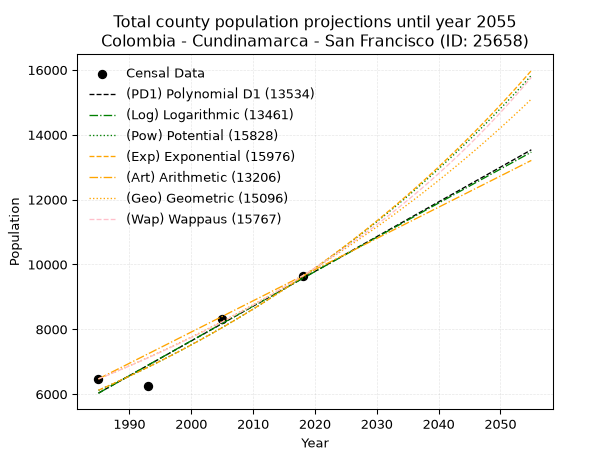
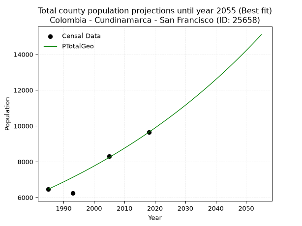
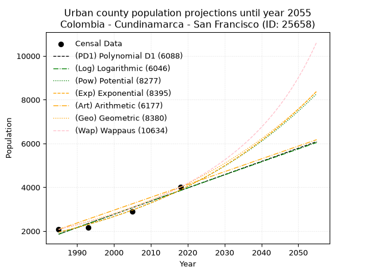
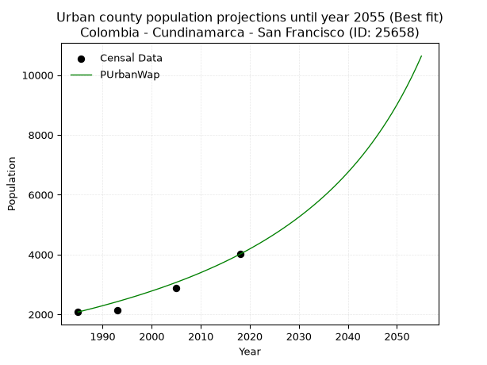
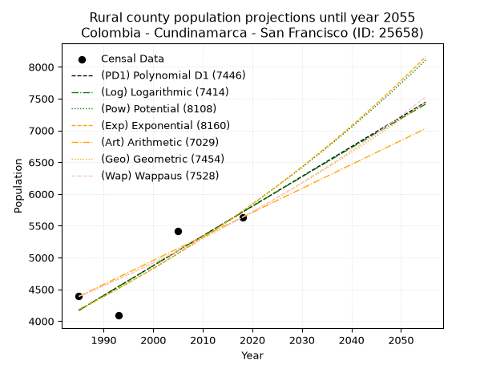
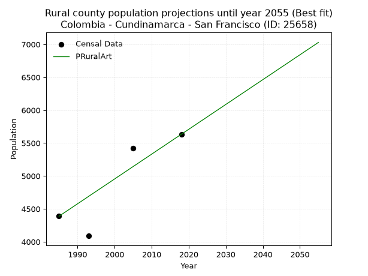

<div align="center">


</div>

# 📜 _“Population and Public Services Demand Projections (PPSD) until Year 2050 for Colombia - Cundinamarca - San Francisco (ID: 25658)”_
Keywords: `population` `public-service` `projection` `lineal` `polynomial` `logarithmic` `potential` `exponential` `arithmetic` `geometric` `wappaus` `dane` `colombia` `south-america`

PPSD are analytical estimates used by governments and planners to anticipate future changes in population size, age distribution, and the resulting community needs for utilities, healthcare, education, and infrastructure as sizing future water treatment facilities, electrical grids, and road networks based on spatial growth.

<div align="center">

</img>

</div>


> **General running parameters**: • app_version: _v20260806_. • Python version: _3.14.7_. • Pandas version: _3.0.5_. • NumPy version: _2.5.1_. • Creates, save and include plots into reports (create_plot): _False_. • Projection until year: _2050_. • Process polynomial degree 2 and up: _False_. • Process Wappaus: _True_. • Process Wappaus: _True_. • Set negative values to zero: _True_. • Set infinite values to zero: _True_. • Drop dataset notes: _True_. 
<div align="center">

Maps & GIS Layers: [:earth_americas:Google](http://maps.google.com/maps?q=4.972916939,-74.2896719) [:earth_americas:OSM](https://www.openstreetmap.org/#map=18/4.972916939/-74.2896719&layers=P) [:earth_americas:Bing](https://www.bing.com/maps?cp=4.972916939~-74.2896719&lvl=18) [:earth_americas:Apple](https://maps.apple.com/frame?center=4.972916939%2C-74.2896719&span=0.003%2C0.006) [:earth_americas:GISMobile](https://github.com/rcfdtools/R.GISMobile/blob/main/file/gis/CountyLayer_CO/Readme.md)

</div>


<div align="center">

```geojson
{
  "type": "Feature",
  "geometry": {
    "type": "Point", 
    "coordinates": [-74.2896719, 4.972916939]
  }, 
  "properties": {
    "Name": "Colombia - Cundinamarca - San Francisco (ID: 25658)"
  }
}
```

</div>


## 0. Census Data (4 records)

Census data are official statistics collected by a government about the people and housing in a country. They usually include counts of total population, age, sex, race, income, education, and jobs.

📅Global census file: [Population.xlsx](../data/Population.xlsx)

| Source   |   Year |   CountryID | CountryName   |   StateID | StateName    |   CountyID | CountyName    |   PTotal |   PUrban |   PRural |
|:---------|-------:|------------:|:--------------|----------:|:-------------|-----------:|:--------------|---------:|---------:|---------:|
| DANE     |   1985 |          57 | Colombia      |        25 | Cundinamarca |      25658 | San Francisco |     6467 |     2079 |     4388 |
| DANE     |   1993 |          57 | Colombia      |        25 | Cundinamarca |      25658 | San Francisco |     6239 |     2150 |     4089 |
| DANE     |   2005 |          57 | Colombia      |        25 | Cundinamarca |      25658 | San Francisco |     8304 |     2886 |     5418 |
| DANE     |   2018 |          57 | Colombia      |        25 | Cundinamarca |      25658 | San Francisco |     9644 |     4011 |     5633 |

> 🔥Some records could had specific notes about the registered values or the corresponding urban or rural distribution.

📅[SUI-RUPS](https://www.datos.gov.co/Hacienda-y-Cr-dito-P-blico/Registro-nico-de-Prestadores-de-Servicios-P-blicos/4qkq-csdn/about_data) - Local public utility companies: [RUPS.csv](../data/RUPS.csv)

 | SERVICIO       | ESTADO    | NOMBRE                                                                     | NIT         | DEPARTAMENTO_DOMICILIO   | MUNICIPIO_DOMICILIO   | DIRECCION           |   TELEFONO | EMAIL                                   | TIPO_PRESTADOR                             | CLASIFICACION                 |
|:---------------|:----------|:---------------------------------------------------------------------------|:------------|:-------------------------|:----------------------|:--------------------|-----------:|:----------------------------------------|:-------------------------------------------|:------------------------------|
| ACUEDUCTO      | OPERATIVA | ASOCIACION DE USUARIOS DEL ACUEDUCTO DE LA VEREDA EL ARRAYAN               | 832005717-3 | CUNDINAMARCA             | SAN FRANCISCO         | ESCUELA BUENA VISTA |    8478912 | sippdbg@gmail.com                       | ORGANIZACION AUTORIZADA                    | MENOR O IGUAL A 2500 USUARIOS |
| ACUEDUCTO      | OPERATIVA | ASOCIACION DE USUARIOS DEL ACUEDUCTO ZONA URBANA DE SAN FRANCISCO          | 800204055-3 | CUNDINAMARCA             | SAN FRANCISCO         | Calle 4 No 7 - 56   |    8478215 | acuasafra@hotmail.com                   | ORGANIZACION AUTORIZADA                    | MENOR O IGUAL A 2500 USUARIOS |
| ACUEDUCTO      | OPERATIVA | ASOCIACION DE USUARIOS DEL ACUEDUCTO SAN MIGUEL MUÑA SAN ANTONIO           | 800247792-8 | CUNDINAMARCA             | SAN FRANCISCO         | CARRERA 8 No. 4-10  |    8478562 | acueducto.sanmiguel@hotmail.com         | ORGANIZACION AUTORIZADA                    | MENOR O IGUAL A 2500 USUARIOS |
| ACUEDUCTO      | OPERATIVA | ASOCIACION DE USUARIOS DEL ACUEDUCTO DE PUEBLO VIEJO- SECTOR LA CARLINA    | 832008624-0 | CUNDINAMARCA             | SAN FRANCISCO         | Carrera 8 No. 4-10  |    8478562 | acueducto.sanmiguel@hotmail.com         | ORGANIZACION AUTORIZADA                    | HASTA 2500 SUSCRIPTORES       |
| ACUEDUCTO      | OPERATIVA | ASOCIACIÓN DE USUARIOS DEL ACUEDUCTO TORIBA DEL MUNICIPIO DE SAN FRANCISCO | 900029352-9 | CUNDINAMARCA             | SAN FRANCISCO         | Calle 2 No 7 - 04   |    0000000 | acueductotoriba@hotmail.com             | ORGANIZACION AUTORIZADA                    | MENOR O IGUAL A 2500 USUARIOS |
| ALCANTARILLADO | OPERATIVA | EMPRESA DE SERVICIOS PUBLICOS DE SAN FRANCISCO SAS E.S.P.                  | 900358638-0 | CUNDINAMARCA             | SAN FRANCISCO         | CALLE 4 No.. 7-56   |    8478214 | emserpsafra@gmail.com                   | SOCIEDADES (EMPRESA DE SERVICIOS PUBLICOS) | MENOR O IGUAL A 2500 USUARIOS |
| ACUEDUCTO      | OPERATIVA | ASOCIACION DE USUARIOS ACUEDUCTO VEREDA JUAN DE VERA                       | 900090962-1 | CUNDINAMARCA             | SAN FRANCISCO         | Cra 8 No. 4 -10     |    8478562 | acueductojuandevera.tesoreria@gmail.com | ORGANIZACION AUTORIZADA                    | MENOR O IGUAL A 2500 USUARIOS |

## 1. Total

### 1.1. Coefficients and Parameters

* (PD1) Polynomial Deg 1: 107.21878763548685, -206800.87996788256 (lineal)
* (Log) Logarithmic: 214534.4856050317, -1623014.84425532
* (Pow) Potential: 27.444763399618676, -86.71990471797223
* (Exp) Exponential: 0.013715228114663929, 9.182389456627045e-09
* (Art) Arithmetic: Year diff. 2018 - 1985 = 33, Population diff. 9644 - 6467 = 3177, Annual growth = 96.27272727272727
* (Geo) Geometric: Year diff. 2018 - 1985 = 33, Population diff. 9644 - 6467 = 3177, Annual growth % = 0.01218342779993642
* (Wap) Wappaus: i = 1.1951179600611666, Condition values only valid for < 200)

<sub>
Wappaus condition values: ['0.00', '1.20', '2.39', '3.59', '4.78', '5.98', '7.17', '8.37', '9.56', '10.76', '11.95', '13.15', '14.34', '15.54', '16.73', '17.93', '19.12', '20.32', '21.51', '22.71', '23.90', '25.10', '26.29', '27.49', '28.68', '29.88', '31.07', '32.27', '33.46', '34.66', '35.85', '37.05', '38.24', '39.44', '40.63', '41.83', '43.02', '44.22', '45.41', '46.61', '47.80', '49.00', '50.19', '51.39', '52.59', '53.78', '54.98', '56.17', '57.37', '58.56', '59.76', '60.95', '62.15', '63.34', '64.54', '65.73', '66.93', '68.12', '69.32', '70.51', '71.71', '72.90', '74.10', '75.29', '76.49', '77.68']
</sub>


### 1.2. Projected Dataset

|   Year |   CountyID |   PTotalPD1 |   PTotalLog |   PTotalPow |   PTotalExp |   PTotalArt |   PTotalGeo |   PTotalWap |
|-------:|-----------:|------------:|------------:|------------:|------------:|------------:|------------:|------------:|
|   1985 |      25658 |        6028 |        6026 |        6114 |        6117 |        6467 |        6467 |        6467 |
|   1986 |      25658 |        6136 |        6134 |        6199 |        6201 |        6563 |        6546 |        6545 |
|   1987 |      25658 |        6243 |        6242 |        6286 |        6287 |        6660 |        6626 |        6623 |
|   1988 |      25658 |        6350 |        6350 |        6373 |        6373 |        6756 |        6706 |        6703 |
|   1989 |      25658 |        6457 |        6458 |        6462 |        6461 |        6852 |        6788 |        6784 |
|   1990 |      25658 |        6565 |        6565 |        6551 |        6551 |        6948 |        6871 |        6865 |
|   1991 |      25658 |        6672 |        6673 |        6642 |        6641 |        7045 |        6954 |        6948 |
|   1992 |      25658 |        6779 |        6781 |        6735 |        6733 |        7141 |        7039 |        7032 |
|   1993 |      25658 |        6886 |        6889 |        6828 |        6826 |        7237 |        7125 |        7116 |
|   1994 |      25658 |        6993 |        6996 |        6923 |        6920 |        7333 |        7212 |        7202 |
|   1995 |      25658 |        7101 |        7104 |        7019 |        7016 |        7430 |        7300 |        7289 |
|   1996 |      25658 |        7208 |        7211 |        7116 |        7113 |        7526 |        7388 |        7377 |
|   1997 |      25658 |        7315 |        7319 |        7214 |        7211 |        7622 |        7478 |        7466 |
|   1998 |      25658 |        7422 |        7426 |        7314 |        7310 |        7719 |        7570 |        7556 |
|   1999 |      25658 |        7529 |        7534 |        7415 |        7411 |        7815 |        7662 |        7648 |
|   2000 |      25658 |        7637 |        7641 |        7518 |        7514 |        7911 |        7755 |        7740 |
|   2001 |      25658 |        7744 |        7748 |        7622 |        7617 |        8007 |        7850 |        7834 |
|   2002 |      25658 |        7851 |        7855 |        7727 |        7723 |        8104 |        7945 |        7929 |
|   2003 |      25658 |        7958 |        7962 |        7833 |        7829 |        8200 |        8042 |        8026 |
|   2004 |      25658 |        8066 |        8069 |        7941 |        7937 |        8296 |        8140 |        8124 |
|   2005 |      25658 |        8173 |        8177 |        8051 |        8047 |        8392 |        8239 |        8223 |
|   2006 |      25658 |        8280 |        8283 |        8162 |        8158 |        8489 |        8340 |        8323 |
|   2007 |      25658 |        8387 |        8390 |        8274 |        8271 |        8585 |        8441 |        8425 |
|   2008 |      25658 |        8494 |        8497 |        8388 |        8385 |        8681 |        8544 |        8528 |
|   2009 |      25658 |        8602 |        8604 |        8504 |        8501 |        8778 |        8648 |        8632 |
|   2010 |      25658 |        8709 |        8711 |        8620 |        8618 |        8874 |        8754 |        8739 |
|   2011 |      25658 |        8816 |        8818 |        8739 |        8737 |        8970 |        8860 |        8846 |
|   2012 |      25658 |        8923 |        8924 |        8859 |        8858 |        9066 |        8968 |        8955 |
|   2013 |      25658 |        9031 |        9031 |        8981 |        8980 |        9163 |        9077 |        9066 |
|   2014 |      25658 |        9138 |        9137 |        9104 |        9104 |        9259 |        9188 |        9178 |
|   2015 |      25658 |        9245 |        9244 |        9229 |        9230 |        9355 |        9300 |        9292 |
|   2016 |      25658 |        9352 |        9350 |        9355 |        9357 |        9451 |        9413 |        9408 |
|   2017 |      25658 |        9459 |        9457 |        9483 |        9487 |        9548 |        9528 |        9525 |
|   2018 |      25658 |        9567 |        9563 |        9613 |        9618 |        9644 |        9644 |        9644 |
|   2019 |      25658 |        9674 |        9669 |        9745 |        9750 |        9740 |        9761 |        9765 |
|   2020 |      25658 |        9781 |        9776 |        9878 |        9885 |        9837 |        9880 |        9887 |
|   2021 |      25658 |        9888 |        9882 |       10013 |       10022 |        9933 |       10001 |       10012 |
|   2022 |      25658 |        9996 |        9988 |       10150 |       10160 |       10029 |       10123 |       10138 |
|   2023 |      25658 |       10103 |       10094 |       10289 |       10300 |       10125 |       10246 |       10267 |
|   2024 |      25658 |       10210 |       10200 |       10429 |       10443 |       10222 |       10371 |       10397 |
|   2025 |      25658 |       10317 |       10306 |       10572 |       10587 |       10318 |       10497 |       10530 |
|   2026 |      25658 |       10424 |       10412 |       10716 |       10733 |       10414 |       10625 |       10664 |
|   2027 |      25658 |       10532 |       10518 |       10862 |       10881 |       10510 |       10754 |       10801 |
|   2028 |      25658 |       10639 |       10624 |       11010 |       11031 |       10607 |       10886 |       10940 |
|   2029 |      25658 |       10746 |       10729 |       11160 |       11184 |       10703 |       11018 |       11081 |
|   2030 |      25658 |       10853 |       10835 |       11312 |       11338 |       10799 |       11152 |       11224 |
|   2031 |      25658 |       10960 |       10941 |       11466 |       11495 |       10896 |       11288 |       11370 |
|   2032 |      25658 |       11068 |       11046 |       11622 |       11654 |       10992 |       11426 |       11518 |
|   2033 |      25658 |       11175 |       11152 |       11780 |       11814 |       11088 |       11565 |       11669 |
|   2034 |      25658 |       11282 |       11257 |       11940 |       11978 |       11184 |       11706 |       11822 |
|   2035 |      25658 |       11389 |       11363 |       12102 |       12143 |       11281 |       11849 |       11978 |
|   2036 |      25658 |       11497 |       11468 |       12266 |       12311 |       11377 |       11993 |       12137 |
|   2037 |      25658 |       11604 |       11573 |       12433 |       12481 |       11473 |       12139 |       12298 |
|   2038 |      25658 |       11711 |       11679 |       12601 |       12653 |       11569 |       12287 |       12462 |
|   2039 |      25658 |       11818 |       11784 |       12772 |       12828 |       11666 |       12437 |       12629 |
|   2040 |      25658 |       11925 |       11889 |       12945 |       13005 |       11762 |       12588 |       12799 |
|   2041 |      25658 |       12033 |       11994 |       13121 |       13185 |       11858 |       12741 |       12972 |
|   2042 |      25658 |       12140 |       12099 |       13298 |       13367 |       11955 |       12897 |       13148 |
|   2043 |      25658 |       12247 |       12204 |       13478 |       13551 |       12051 |       13054 |       13327 |
|   2044 |      25658 |       12354 |       12309 |       13660 |       13738 |       12147 |       13213 |       13510 |
|   2045 |      25658 |       12462 |       12414 |       13845 |       13928 |       12243 |       13374 |       13696 |
|   2046 |      25658 |       12569 |       12519 |       14032 |       14120 |       12340 |       13537 |       13886 |
|   2047 |      25658 |       12676 |       12624 |       14221 |       14315 |       12436 |       13702 |       14079 |
|   2048 |      25658 |       12783 |       12729 |       14413 |       14513 |       12532 |       13869 |       14276 |
|   2049 |      25658 |       12890 |       12834 |       14608 |       14714 |       12628 |       14038 |       14477 |
|   2050 |      25658 |       12998 |       12938 |       14805 |       14917 |       12725 |       14209 |       14681 |
<div align="center">

</img>

</div>


### 1.3. Best fit with absolute and relative error (%)

Relative error puts that difference into context by dividing the absolute error by the true value, creating a unitless ratio or percentage that shows the scale of the mistake.

Absolute and relative error

|   Year | Source   |   CountryID | CountryName   |   StateID | StateName    |   CountyID_x | CountyName    |   PTotal |   PUrban |   PRural |   CountyID_y |   PTotalPD1 |   PTotalLog |   PTotalPow |   PTotalExp |   PTotalArt |   PTotalGeo |   PTotalWap |   PTotalPD1AbsError |   PTotalLogAbsError |   PTotalPowAbsError |   PTotalExpAbsError |   PTotalArtAbsError |   PTotalGeoAbsError |   PTotalWapAbsError |   PTotalPD1RelError |   PTotalLogRelError |   PTotalPowRelError |   PTotalExpRelError |   PTotalArtRelError |   PTotalGeoRelError |   PTotalWapRelError |
|-------:|:---------|------------:|:--------------|----------:|:-------------|-------------:|:--------------|---------:|---------:|---------:|-------------:|------------:|------------:|------------:|------------:|------------:|------------:|------------:|--------------------:|--------------------:|--------------------:|--------------------:|--------------------:|--------------------:|--------------------:|--------------------:|--------------------:|--------------------:|--------------------:|--------------------:|--------------------:|--------------------:|
|   1985 | DANE     |          57 | Colombia      |        25 | Cundinamarca |        25658 | San Francisco |     6467 |     2079 |     4388 |        25658 |        6028 |        6026 |        6114 |        6117 |        6467 |        6467 |        6467 |                 439 |                 441 |                 353 |                 350 |                   0 |                   0 |                   0 |            6.78831  |             6.81924 |            5.45848  |            5.41209  |             0       |            0        |            0        |
|   1993 | DANE     |          57 | Colombia      |        25 | Cundinamarca |        25658 | San Francisco |     6239 |     2150 |     4089 |        25658 |        6886 |        6889 |        6828 |        6826 |        7237 |        7125 |        7116 |                 647 |                 650 |                 589 |                 587 |                 998 |                 886 |                 877 |           10.3703   |            10.4183  |            9.44062  |            9.40856  |            15.9962  |           14.201    |           14.0567   |
|   2005 | DANE     |          57 | Colombia      |        25 | Cundinamarca |        25658 | San Francisco |     8304 |     2886 |     5418 |        25658 |        8173 |        8177 |        8051 |        8047 |        8392 |        8239 |        8223 |                 131 |                 127 |                 253 |                 257 |                  88 |                  65 |                  81 |            1.57755  |             1.52938 |            3.04672  |            3.09489  |             1.05973 |            0.782755 |            0.975434 |
|   2018 | DANE     |          57 | Colombia      |        25 | Cundinamarca |        25658 | San Francisco |     9644 |     4011 |     5633 |        25658 |        9567 |        9563 |        9613 |        9618 |        9644 |        9644 |        9644 |                  77 |                  81 |                  31 |                  26 |                   0 |                   0 |                   0 |            0.798424 |             0.8399  |            0.321443 |            0.269598 |             0       |            0        |            0        |

Relative error mean

| Method    |   RelError | Best   |
|:----------|-----------:|:-------|
| PTotalPD1 |    4.88363 |        |
| PTotalLog |    4.90171 |        |
| PTotalPow |    4.56682 |        |
| PTotalExp |    4.54629 |        |
| PTotalArt |    4.26397 |        |
| PTotalGeo |    3.74594 | True   |
| PTotalWap |    3.75804 |        |

💙Best method: _**PTotalGeo**_
<div align="center">

</img>

</div>


### 1.4. Fresh water supply demand in liters per capita per day (lpcd)

The fresh water supply demand typically ranges from 100 to 300 liters per capita per day (lpcd) for standard domestic and municipal planning, though absolute survival minimums set by the World Health Organization are as low as 7.5 to 20 liters per day, and total consumption in high-income nations can exceed 400 liters.

> `CZ`: Level in meters above the sea level (masl)<br> `WS`: Fresh water supply demand in liters per capita per day (lpcd or l/h/d)<br> `WSAll`: Zonal fresh water supply demand in liters per second (l/s)<br> `A`: Zonal area in square meters<br> `DP`: Population density (people/hectare or p/ha)

Reference values (RAS Colombia)

|    CZ |   WS |
|------:|-----:|
|  1000 |  120 |
|  2000 |  130 |
| 99999 |  140 |

County shapefile geometry properties and water supply values

|   CountyID |      ATotal |   CZTotal |   WSTotal |
|-----------:|------------:|----------:|----------:|
|      25658 | 1.18616e+08 |   2163.66 |       140 |

Projected values for best method: PTotalGeo

|   CountyID |   Year |   PTotalGeo |   DPTotal |   WSTotal |   WSTotalAll |
|-----------:|-------:|------------:|----------:|----------:|-------------:|
|      25658 |   1985 |        6467 |      0.55 |       140 |      10.4789 |
|      25658 |   1986 |        6546 |      0.55 |       140 |      10.6069 |
|      25658 |   1987 |        6626 |      0.56 |       140 |      10.7366 |
|      25658 |   1988 |        6706 |      0.57 |       140 |      10.8662 |
|      25658 |   1989 |        6788 |      0.57 |       140 |      10.9991 |
|      25658 |   1990 |        6871 |      0.58 |       140 |      11.1336 |
|      25658 |   1991 |        6954 |      0.59 |       140 |      11.2681 |
|      25658 |   1992 |        7039 |      0.59 |       140 |      11.4058 |
|      25658 |   1993 |        7125 |      0.6  |       140 |      11.5451 |
|      25658 |   1994 |        7212 |      0.61 |       140 |      11.6861 |
|      25658 |   1995 |        7300 |      0.62 |       140 |      11.8287 |
|      25658 |   1996 |        7388 |      0.62 |       140 |      11.9713 |
|      25658 |   1997 |        7478 |      0.63 |       140 |      12.1171 |
|      25658 |   1998 |        7570 |      0.64 |       140 |      12.2662 |
|      25658 |   1999 |        7662 |      0.65 |       140 |      12.4153 |
|      25658 |   2000 |        7755 |      0.65 |       140 |      12.566  |
|      25658 |   2001 |        7850 |      0.66 |       140 |      12.7199 |
|      25658 |   2002 |        7945 |      0.67 |       140 |      12.8738 |
|      25658 |   2003 |        8042 |      0.68 |       140 |      13.031  |
|      25658 |   2004 |        8140 |      0.69 |       140 |      13.1898 |
|      25658 |   2005 |        8239 |      0.69 |       140 |      13.3502 |
|      25658 |   2006 |        8340 |      0.7  |       140 |      13.5139 |
|      25658 |   2007 |        8441 |      0.71 |       140 |      13.6775 |
|      25658 |   2008 |        8544 |      0.72 |       140 |      13.8444 |
|      25658 |   2009 |        8648 |      0.73 |       140 |      14.013  |
|      25658 |   2010 |        8754 |      0.74 |       140 |      14.1847 |
|      25658 |   2011 |        8860 |      0.75 |       140 |      14.3565 |
|      25658 |   2012 |        8968 |      0.76 |       140 |      14.5315 |
|      25658 |   2013 |        9077 |      0.77 |       140 |      14.7081 |
|      25658 |   2014 |        9188 |      0.77 |       140 |      14.888  |
|      25658 |   2015 |        9300 |      0.78 |       140 |      15.0694 |
|      25658 |   2016 |        9413 |      0.79 |       140 |      15.2525 |
|      25658 |   2017 |        9528 |      0.8  |       140 |      15.4389 |
|      25658 |   2018 |        9644 |      0.81 |       140 |      15.6269 |
|      25658 |   2019 |        9761 |      0.82 |       140 |      15.8164 |
|      25658 |   2020 |        9880 |      0.83 |       140 |      16.0093 |
|      25658 |   2021 |       10001 |      0.84 |       140 |      16.2053 |
|      25658 |   2022 |       10123 |      0.85 |       140 |      16.403  |
|      25658 |   2023 |       10246 |      0.86 |       140 |      16.6023 |
|      25658 |   2024 |       10371 |      0.87 |       140 |      16.8049 |
|      25658 |   2025 |       10497 |      0.88 |       140 |      17.009  |
|      25658 |   2026 |       10625 |      0.9  |       140 |      17.2164 |
|      25658 |   2027 |       10754 |      0.91 |       140 |      17.4255 |
|      25658 |   2028 |       10886 |      0.92 |       140 |      17.6394 |
|      25658 |   2029 |       11018 |      0.93 |       140 |      17.8532 |
|      25658 |   2030 |       11152 |      0.94 |       140 |      18.0704 |
|      25658 |   2031 |       11288 |      0.95 |       140 |      18.2907 |
|      25658 |   2032 |       11426 |      0.96 |       140 |      18.5144 |
|      25658 |   2033 |       11565 |      0.97 |       140 |      18.7396 |
|      25658 |   2034 |       11706 |      0.99 |       140 |      18.9681 |
|      25658 |   2035 |       11849 |      1    |       140 |      19.1998 |
|      25658 |   2036 |       11993 |      1.01 |       140 |      19.4331 |
|      25658 |   2037 |       12139 |      1.02 |       140 |      19.6697 |
|      25658 |   2038 |       12287 |      1.04 |       140 |      19.9095 |
|      25658 |   2039 |       12437 |      1.05 |       140 |      20.1525 |
|      25658 |   2040 |       12588 |      1.06 |       140 |      20.3972 |
|      25658 |   2041 |       12741 |      1.07 |       140 |      20.6451 |
|      25658 |   2042 |       12897 |      1.09 |       140 |      20.8979 |
|      25658 |   2043 |       13054 |      1.1  |       140 |      21.1523 |
|      25658 |   2044 |       13213 |      1.11 |       140 |      21.41   |
|      25658 |   2045 |       13374 |      1.13 |       140 |      21.6708 |
|      25658 |   2046 |       13537 |      1.14 |       140 |      21.935  |
|      25658 |   2047 |       13702 |      1.16 |       140 |      22.2023 |
|      25658 |   2048 |       13869 |      1.17 |       140 |      22.4729 |
|      25658 |   2049 |       14038 |      1.18 |       140 |      22.7468 |
|      25658 |   2050 |       14209 |      1.2  |       140 |      23.0238 |

## 2. Urban

### 2.1. Coefficients and Parameters

* (PD1) Polynomial Deg 1: 60.39582496989087, -118025.2488960242 (lineal)
* (Log) Logarithmic: 120820.31915071051, -915574.7140578253
* (Pow) Potential: 41.6998168319799, -134.2257972737244
* (Exp) Exponential: 0.020841334582556145, 2.10690258479433e-15
* (Art) Arithmetic: Year diff. 2018 - 1985 = 33, Population diff. 4011 - 2079 = 1932, Annual growth = 58.54545454545455
* (Geo) Geometric: Year diff. 2018 - 1985 = 33, Population diff. 4011 - 2079 = 1932, Annual growth % = 0.020113346136066745
* (Wap) Wappaus: i = 1.9226750261233019, Condition values only valid for < 200)

<sub>
Wappaus condition values: ['0.00', '1.92', '3.85', '5.77', '7.69', '9.61', '11.54', '13.46', '15.38', '17.30', '19.23', '21.15', '23.07', '24.99', '26.92', '28.84', '30.76', '32.69', '34.61', '36.53', '38.45', '40.38', '42.30', '44.22', '46.14', '48.07', '49.99', '51.91', '53.83', '55.76', '57.68', '59.60', '61.53', '63.45', '65.37', '67.29', '69.22', '71.14', '73.06', '74.98', '76.91', '78.83', '80.75', '82.68', '84.60', '86.52', '88.44', '90.37', '92.29', '94.21', '96.13', '98.06', '99.98', '101.90', '103.82', '105.75', '107.67', '109.59', '111.52', '113.44', '115.36', '117.28', '119.21', '121.13', '123.05', '124.97']
</sub>


### 2.2. Projected Dataset

|   Year |   CountyID |   PUrbanPD1 |   PUrbanLog |   PUrbanPow |   PUrbanExp |   PUrbanArt |   PUrbanGeo |   PUrbanWap |
|-------:|-----------:|------------:|------------:|------------:|------------:|------------:|------------:|------------:|
|   1985 |      25658 |        1860 |        1859 |        1951 |        1952 |        2079 |        2079 |        2079 |
|   1986 |      25658 |        1921 |        1920 |        1992 |        1993 |        2138 |        2121 |        2119 |
|   1987 |      25658 |        1981 |        1981 |        2034 |        2035 |        2196 |        2163 |        2161 |
|   1988 |      25658 |        2042 |        2042 |        2078 |        2078 |        2255 |        2207 |        2202 |
|   1989 |      25658 |        2102 |        2102 |        2122 |        2121 |        2313 |        2251 |        2245 |
|   1990 |      25658 |        2162 |        2163 |        2167 |        2166 |        2372 |        2297 |        2289 |
|   1991 |      25658 |        2223 |        2224 |        2212 |        2212 |        2430 |        2343 |        2334 |
|   1992 |      25658 |        2283 |        2284 |        2259 |        2258 |        2489 |        2390 |        2379 |
|   1993 |      25658 |        2344 |        2345 |        2307 |        2306 |        2547 |        2438 |        2425 |
|   1994 |      25658 |        2404 |        2406 |        2356 |        2354 |        2606 |        2487 |        2473 |
|   1995 |      25658 |        2464 |        2466 |        2406 |        2404 |        2664 |        2537 |        2521 |
|   1996 |      25658 |        2525 |        2527 |        2456 |        2455 |        2723 |        2588 |        2571 |
|   1997 |      25658 |        2585 |        2587 |        2508 |        2506 |        2782 |        2640 |        2621 |
|   1998 |      25658 |        2646 |        2648 |        2561 |        2559 |        2840 |        2693 |        2673 |
|   1999 |      25658 |        2706 |        2708 |        2615 |        2613 |        2899 |        2747 |        2726 |
|   2000 |      25658 |        2766 |        2769 |        2670 |        2668 |        2957 |        2803 |        2780 |
|   2001 |      25658 |        2827 |        2829 |        2726 |        2724 |        3016 |        2859 |        2835 |
|   2002 |      25658 |        2887 |        2890 |        2784 |        2782 |        3074 |        2917 |        2891 |
|   2003 |      25658 |        2948 |        2950 |        2842 |        2840 |        3133 |        2975 |        2949 |
|   2004 |      25658 |        3008 |        3010 |        2902 |        2900 |        3191 |        3035 |        3008 |
|   2005 |      25658 |        3068 |        3070 |        2963 |        2961 |        3250 |        3096 |        3069 |
|   2006 |      25658 |        3129 |        3131 |        3026 |        3023 |        3308 |        3158 |        3131 |
|   2007 |      25658 |        3189 |        3191 |        3089 |        3087 |        3367 |        3222 |        3194 |
|   2008 |      25658 |        3250 |        3251 |        3154 |        3152 |        3426 |        3287 |        3259 |
|   2009 |      25658 |        3310 |        3311 |        3220 |        3219 |        3484 |        3353 |        3326 |
|   2010 |      25658 |        3370 |        3371 |        3288 |        3286 |        3543 |        3420 |        3394 |
|   2011 |      25658 |        3431 |        3431 |        3356 |        3356 |        3601 |        3489 |        3465 |
|   2012 |      25658 |        3491 |        3492 |        3427 |        3426 |        3660 |        3559 |        3537 |
|   2013 |      25658 |        3552 |        3552 |        3499 |        3498 |        3718 |        3631 |        3610 |
|   2014 |      25658 |        3612 |        3612 |        3572 |        3572 |        3777 |        3704 |        3686 |
|   2015 |      25658 |        3672 |        3672 |        3646 |        3647 |        3835 |        3778 |        3764 |
|   2016 |      25658 |        3733 |        3731 |        3723 |        3724 |        3894 |        3854 |        3844 |
|   2017 |      25658 |        3793 |        3791 |        3800 |        3803 |        3952 |        3932 |        3926 |
|   2018 |      25658 |        3854 |        3851 |        3880 |        3883 |        4011 |        4011 |        4011 |
|   2019 |      25658 |        3914 |        3911 |        3961 |        3964 |        4070 |        4092 |        4098 |
|   2020 |      25658 |        3974 |        3971 |        4043 |        4048 |        4128 |        4174 |        4187 |
|   2021 |      25658 |        4035 |        4031 |        4128 |        4133 |        4187 |        4258 |        4280 |
|   2022 |      25658 |        4095 |        4091 |        4214 |        4220 |        4245 |        4344 |        4374 |
|   2023 |      25658 |        4156 |        4150 |        4302 |        4309 |        4304 |        4431 |        4472 |
|   2024 |      25658 |        4216 |        4210 |        4391 |        4400 |        4362 |        4520 |        4573 |
|   2025 |      25658 |        4276 |        4270 |        4483 |        4492 |        4421 |        4611 |        4677 |
|   2026 |      25658 |        4337 |        4329 |        4576 |        4587 |        4479 |        4704 |        4784 |
|   2027 |      25658 |        4397 |        4389 |        4671 |        4684 |        4538 |        4798 |        4895 |
|   2028 |      25658 |        4457 |        4449 |        4768 |        4782 |        4596 |        4895 |        5009 |
|   2029 |      25658 |        4518 |        4508 |        4867 |        4883 |        4655 |        4993 |        5127 |
|   2030 |      25658 |        4578 |        4568 |        4968 |        4986 |        4714 |        5094 |        5249 |
|   2031 |      25658 |        4639 |        4627 |        5071 |        5091 |        4772 |        5196 |        5375 |
|   2032 |      25658 |        4699 |        4687 |        5176 |        5198 |        4831 |        5301 |        5506 |
|   2033 |      25658 |        4759 |        4746 |        5284 |        5307 |        4889 |        5407 |        5642 |
|   2034 |      25658 |        4820 |        4805 |        5393 |        5419 |        4948 |        5516 |        5782 |
|   2035 |      25658 |        4880 |        4865 |        5505 |        5533 |        5006 |        5627 |        5927 |
|   2036 |      25658 |        4941 |        4924 |        5619 |        5650 |        5065 |        5740 |        6078 |
|   2037 |      25658 |        5001 |        4983 |        5735 |        5769 |        5123 |        5856 |        6235 |
|   2038 |      25658 |        5061 |        5043 |        5853 |        5890 |        5182 |        5973 |        6398 |
|   2039 |      25658 |        5122 |        5102 |        5974 |        6014 |        5240 |        6094 |        6568 |
|   2040 |      25658 |        5182 |        5161 |        6098 |        6141 |        5299 |        6216 |        6744 |
|   2041 |      25658 |        5243 |        5221 |        6224 |        6270 |        5358 |        6341 |        6928 |
|   2042 |      25658 |        5303 |        5280 |        6352 |        6403 |        5416 |        6469 |        7119 |
|   2043 |      25658 |        5363 |        5339 |        6483 |        6537 |        5475 |        6599 |        7319 |
|   2044 |      25658 |        5424 |        5398 |        6617 |        6675 |        5533 |        6731 |        7528 |
|   2045 |      25658 |        5484 |        5457 |        6753 |        6816 |        5592 |        6867 |        7746 |
|   2046 |      25658 |        5545 |        5516 |        6892 |        6959 |        5650 |        7005 |        7975 |
|   2047 |      25658 |        5605 |        5575 |        7034 |        7106 |        5709 |        7146 |        8214 |
|   2048 |      25658 |        5665 |        5634 |        7179 |        7255 |        5767 |        7290 |        8465 |
|   2049 |      25658 |        5726 |        5693 |        7326 |        7408 |        5826 |        7436 |        8728 |
|   2050 |      25658 |        5786 |        5752 |        7477 |        7564 |        5884 |        7586 |        9005 |
<div align="center">

</img>

</div>


### 2.3. Best fit with absolute and relative error (%)

Relative error puts that difference into context by dividing the absolute error by the true value, creating a unitless ratio or percentage that shows the scale of the mistake.

Absolute and relative error

|   Year | Source   |   CountryID | CountryName   |   StateID | StateName    |   CountyID_x | CountyName    |   PTotal |   PUrban |   PRural |   CountyID_y |   PUrbanPD1 |   PUrbanLog |   PUrbanPow |   PUrbanExp |   PUrbanArt |   PUrbanGeo |   PUrbanWap |   PUrbanPD1AbsError |   PUrbanLogAbsError |   PUrbanPowAbsError |   PUrbanExpAbsError |   PUrbanArtAbsError |   PUrbanGeoAbsError |   PUrbanWapAbsError |   PUrbanPD1RelError |   PUrbanLogRelError |   PUrbanPowRelError |   PUrbanExpRelError |   PUrbanArtRelError |   PUrbanGeoRelError |   PUrbanWapRelError |
|-------:|:---------|------------:|:--------------|----------:|:-------------|-------------:|:--------------|---------:|---------:|---------:|-------------:|------------:|------------:|------------:|------------:|------------:|------------:|------------:|--------------------:|--------------------:|--------------------:|--------------------:|--------------------:|--------------------:|--------------------:|--------------------:|--------------------:|--------------------:|--------------------:|--------------------:|--------------------:|--------------------:|
|   1985 | DANE     |          57 | Colombia      |        25 | Cundinamarca |        25658 | San Francisco |     6467 |     2079 |     4388 |        25658 |        1860 |        1859 |        1951 |        1952 |        2079 |        2079 |        2079 |                 219 |                 220 |                 128 |                 127 |                   0 |                   0 |                   0 |            10.5339  |            10.582   |             6.15681 |             6.10871 |              0      |             0       |             0       |
|   1993 | DANE     |          57 | Colombia      |        25 | Cundinamarca |        25658 | San Francisco |     6239 |     2150 |     4089 |        25658 |        2344 |        2345 |        2307 |        2306 |        2547 |        2438 |        2425 |                 194 |                 195 |                 157 |                 156 |                 397 |                 288 |                 275 |             9.02326 |             9.06977 |             7.30233 |             7.25581 |             18.4651 |            13.3953  |            12.7907  |
|   2005 | DANE     |          57 | Colombia      |        25 | Cundinamarca |        25658 | San Francisco |     8304 |     2886 |     5418 |        25658 |        3068 |        3070 |        2963 |        2961 |        3250 |        3096 |        3069 |                 182 |                 184 |                  77 |                  75 |                 364 |                 210 |                 183 |             6.30631 |             6.37561 |             2.66805 |             2.59875 |             12.6126 |             7.27651 |             6.34096 |
|   2018 | DANE     |          57 | Colombia      |        25 | Cundinamarca |        25658 | San Francisco |     9644 |     4011 |     5633 |        25658 |        3854 |        3851 |        3880 |        3883 |        4011 |        4011 |        4011 |                 157 |                 160 |                 131 |                 128 |                   0 |                   0 |                   0 |             3.91424 |             3.98903 |             3.26602 |             3.19122 |              0      |             0       |             0       |

Relative error mean

| Method    |   RelError | Best   |
|:----------|-----------:|:-------|
| PUrbanPD1 |    7.44443 |        |
| PUrbanLog |    7.5041  |        |
| PUrbanPow |    4.8483  |        |
| PUrbanExp |    4.78862 |        |
| PUrbanArt |    7.76943 |        |
| PUrbanGeo |    5.16796 |        |
| PUrbanWap |    4.78291 | True   |

💙Best method: _**PUrbanWap**_
<div align="center">

</img>

</div>


### 2.4. Fresh water supply demand in liters per capita per day (lpcd)

The fresh water supply demand typically ranges from 100 to 300 liters per capita per day (lpcd) for standard domestic and municipal planning, though absolute survival minimums set by the World Health Organization are as low as 7.5 to 20 liters per day, and total consumption in high-income nations can exceed 400 liters.

> `CZ`: Level in meters above the sea level (masl)<br> `WS`: Fresh water supply demand in liters per capita per day (lpcd or l/h/d)<br> `WSAll`: Zonal fresh water supply demand in liters per second (l/s)<br> `A`: Zonal area in square meters<br> `DP`: Population density (people/hectare or p/ha)

Reference values (RAS Colombia)

|    CZ |   WS |
|------:|-----:|
|  1000 |  120 |
|  2000 |  130 |
| 99999 |  140 |

County shapefile geometry properties and water supply values

|   CountyID |   AUrban |   CZUrban |   WSUrban |
|-----------:|---------:|----------:|----------:|
|      25658 |   770767 |   1521.82 |       130 |

Projected values for best method: PUrbanWap

|   CountyID |   Year |   PUrbanWap |   DPUrban |   WSUrban |   WSUrbanAll |
|-----------:|-------:|------------:|----------:|----------:|-------------:|
|      25658 |   1985 |        2079 |     26.97 |       130 |      3.12812 |
|      25658 |   1986 |        2119 |     27.49 |       130 |      3.18831 |
|      25658 |   1987 |        2161 |     28.04 |       130 |      3.2515  |
|      25658 |   1988 |        2202 |     28.57 |       130 |      3.31319 |
|      25658 |   1989 |        2245 |     29.13 |       130 |      3.37789 |
|      25658 |   1990 |        2289 |     29.7  |       130 |      3.4441  |
|      25658 |   1991 |        2334 |     30.28 |       130 |      3.51181 |
|      25658 |   1992 |        2379 |     30.87 |       130 |      3.57951 |
|      25658 |   1993 |        2425 |     31.46 |       130 |      3.64873 |
|      25658 |   1994 |        2473 |     32.08 |       130 |      3.72095 |
|      25658 |   1995 |        2521 |     32.71 |       130 |      3.79317 |
|      25658 |   1996 |        2571 |     33.36 |       130 |      3.8684  |
|      25658 |   1997 |        2621 |     34.01 |       130 |      3.94363 |
|      25658 |   1998 |        2673 |     34.68 |       130 |      4.02187 |
|      25658 |   1999 |        2726 |     35.37 |       130 |      4.10162 |
|      25658 |   2000 |        2780 |     36.07 |       130 |      4.18287 |
|      25658 |   2001 |        2835 |     36.78 |       130 |      4.26562 |
|      25658 |   2002 |        2891 |     37.51 |       130 |      4.34988 |
|      25658 |   2003 |        2949 |     38.26 |       130 |      4.43715 |
|      25658 |   2004 |        3008 |     39.03 |       130 |      4.52593 |
|      25658 |   2005 |        3069 |     39.82 |       130 |      4.61771 |
|      25658 |   2006 |        3131 |     40.62 |       130 |      4.711   |
|      25658 |   2007 |        3194 |     41.44 |       130 |      4.80579 |
|      25658 |   2008 |        3259 |     42.28 |       130 |      4.90359 |
|      25658 |   2009 |        3326 |     43.15 |       130 |      5.0044  |
|      25658 |   2010 |        3394 |     44.03 |       130 |      5.10671 |
|      25658 |   2011 |        3465 |     44.96 |       130 |      5.21354 |
|      25658 |   2012 |        3537 |     45.89 |       130 |      5.32188 |
|      25658 |   2013 |        3610 |     46.84 |       130 |      5.43171 |
|      25658 |   2014 |        3686 |     47.82 |       130 |      5.54606 |
|      25658 |   2015 |        3764 |     48.83 |       130 |      5.66343 |
|      25658 |   2016 |        3844 |     49.87 |       130 |      5.7838  |
|      25658 |   2017 |        3926 |     50.94 |       130 |      5.90718 |
|      25658 |   2018 |        4011 |     52.04 |       130 |      6.03507 |
|      25658 |   2019 |        4098 |     53.17 |       130 |      6.16597 |
|      25658 |   2020 |        4187 |     54.32 |       130 |      6.29988 |
|      25658 |   2021 |        4280 |     55.53 |       130 |      6.43981 |
|      25658 |   2022 |        4374 |     56.75 |       130 |      6.58125 |
|      25658 |   2023 |        4472 |     58.02 |       130 |      6.7287  |
|      25658 |   2024 |        4573 |     59.33 |       130 |      6.88067 |
|      25658 |   2025 |        4677 |     60.68 |       130 |      7.03715 |
|      25658 |   2026 |        4784 |     62.07 |       130 |      7.19815 |
|      25658 |   2027 |        4895 |     63.51 |       130 |      7.36516 |
|      25658 |   2028 |        5009 |     64.99 |       130 |      7.53669 |
|      25658 |   2029 |        5127 |     66.52 |       130 |      7.71424 |
|      25658 |   2030 |        5249 |     68.1  |       130 |      7.8978  |
|      25658 |   2031 |        5375 |     69.74 |       130 |      8.08738 |
|      25658 |   2032 |        5506 |     71.44 |       130 |      8.28449 |
|      25658 |   2033 |        5642 |     73.2  |       130 |      8.48912 |
|      25658 |   2034 |        5782 |     75.02 |       130 |      8.69977 |
|      25658 |   2035 |        5927 |     76.9  |       130 |      8.91794 |
|      25658 |   2036 |        6078 |     78.86 |       130 |      9.14514 |
|      25658 |   2037 |        6235 |     80.89 |       130 |      9.38137 |
|      25658 |   2038 |        6398 |     83.01 |       130 |      9.62662 |
|      25658 |   2039 |        6568 |     85.21 |       130 |      9.88241 |
|      25658 |   2040 |        6744 |     87.5  |       130 |     10.1472  |
|      25658 |   2041 |        6928 |     89.88 |       130 |     10.4241  |
|      25658 |   2042 |        7119 |     92.36 |       130 |     10.7115  |
|      25658 |   2043 |        7319 |     94.96 |       130 |     11.0124  |
|      25658 |   2044 |        7528 |     97.67 |       130 |     11.3269  |
|      25658 |   2045 |        7746 |    100.5  |       130 |     11.6549  |
|      25658 |   2046 |        7975 |    103.47 |       130 |     11.9994  |
|      25658 |   2047 |        8214 |    106.57 |       130 |     12.359   |
|      25658 |   2048 |        8465 |    109.83 |       130 |     12.7367  |
|      25658 |   2049 |        8728 |    113.24 |       130 |     13.1324  |
|      25658 |   2050 |        9005 |    116.83 |       130 |     13.5492  |

## 3. Rural

### 3.1. Coefficients and Parameters

* (PD1) Polynomial Deg 1: 46.822962665595895, -88775.6310718582 (lineal)
* (Log) Logarithmic: 93714.16645432117, -707440.1301974945
* (Pow) Potential: 19.111607044853745, -59.40424860479602
* (Exp) Exponential: 0.009548937212405982, 2.451756745729096e-05
* (Art) Arithmetic: Year diff. 2018 - 1985 = 33, Population diff. 5633 - 4388 = 1245, Annual growth = 37.72727272727273
* (Geo) Geometric: Year diff. 2018 - 1985 = 33, Population diff. 5633 - 4388 = 1245, Annual growth % = 0.0075974613434288685
* (Wap) Wappaus: i = 0.7529642296631619, Condition values only valid for < 200)

<sub>
Wappaus condition values: ['0.00', '0.75', '1.51', '2.26', '3.01', '3.76', '4.52', '5.27', '6.02', '6.78', '7.53', '8.28', '9.04', '9.79', '10.54', '11.29', '12.05', '12.80', '13.55', '14.31', '15.06', '15.81', '16.57', '17.32', '18.07', '18.82', '19.58', '20.33', '21.08', '21.84', '22.59', '23.34', '24.09', '24.85', '25.60', '26.35', '27.11', '27.86', '28.61', '29.37', '30.12', '30.87', '31.62', '32.38', '33.13', '33.88', '34.64', '35.39', '36.14', '36.90', '37.65', '38.40', '39.15', '39.91', '40.66', '41.41', '42.17', '42.92', '43.67', '44.42', '45.18', '45.93', '46.68', '47.44', '48.19', '48.94']
</sub>


### 3.2. Projected Dataset

|   Year |   CountyID |   PRuralPD1 |   PRuralLog |   PRuralPow |   PRuralExp |   PRuralArt |   PRuralGeo |   PRuralWap |
|-------:|-----------:|------------:|------------:|------------:|------------:|------------:|------------:|------------:|
|   1985 |      25658 |        4168 |        4167 |        4181 |        4182 |        4388 |        4388 |        4388 |
|   1986 |      25658 |        4215 |        4214 |        4221 |        4222 |        4426 |        4421 |        4421 |
|   1987 |      25658 |        4262 |        4261 |        4262 |        4263 |        4463 |        4455 |        4455 |
|   1988 |      25658 |        4308 |        4308 |        4303 |        4303 |        4501 |        4489 |        4488 |
|   1989 |      25658 |        4355 |        4355 |        4345 |        4345 |        4539 |        4523 |        4522 |
|   1990 |      25658 |        4402 |        4402 |        4387 |        4386 |        4577 |        4557 |        4556 |
|   1991 |      25658 |        4449 |        4449 |        4429 |        4428 |        4614 |        4592 |        4591 |
|   1992 |      25658 |        4496 |        4496 |        4472 |        4471 |        4652 |        4627 |        4626 |
|   1993 |      25658 |        4543 |        4544 |        4515 |        4514 |        4690 |        4662 |        4661 |
|   1994 |      25658 |        4589 |        4591 |        4558 |        4557 |        4728 |        4697 |        4696 |
|   1995 |      25658 |        4636 |        4638 |        4602 |        4601 |        4765 |        4733 |        4731 |
|   1996 |      25658 |        4683 |        4684 |        4646 |        4645 |        4803 |        4769 |        4767 |
|   1997 |      25658 |        4730 |        4731 |        4691 |        4690 |        4841 |        4805 |        4803 |
|   1998 |      25658 |        4777 |        4778 |        4736 |        4735 |        4878 |        4842 |        4840 |
|   1999 |      25658 |        4823 |        4825 |        4782 |        4780 |        4916 |        4878 |        4876 |
|   2000 |      25658 |        4870 |        4872 |        4828 |        4826 |        4954 |        4916 |        4913 |
|   2001 |      25658 |        4917 |        4919 |        4874 |        4872 |        4992 |        4953 |        4951 |
|   2002 |      25658 |        4964 |        4966 |        4921 |        4919 |        5029 |        4991 |        4988 |
|   2003 |      25658 |        5011 |        5013 |        4968 |        4966 |        5067 |        5028 |        5026 |
|   2004 |      25658 |        5058 |        5059 |        5016 |        5014 |        5105 |        5067 |        5064 |
|   2005 |      25658 |        5104 |        5106 |        5064 |        5062 |        5143 |        5105 |        5103 |
|   2006 |      25658 |        5151 |        5153 |        5112 |        5110 |        5180 |        5144 |        5141 |
|   2007 |      25658 |        5198 |        5200 |        5161 |        5160 |        5218 |        5183 |        5181 |
|   2008 |      25658 |        5245 |        5246 |        5210 |        5209 |        5256 |        5222 |        5220 |
|   2009 |      25658 |        5292 |        5293 |        5260 |        5259 |        5293 |        5262 |        5260 |
|   2010 |      25658 |        5339 |        5340 |        5311 |        5309 |        5331 |        5302 |        5300 |
|   2011 |      25658 |        5385 |        5386 |        5361 |        5360 |        5369 |        5342 |        5340 |
|   2012 |      25658 |        5432 |        5433 |        5412 |        5412 |        5407 |        5383 |        5381 |
|   2013 |      25658 |        5479 |        5479 |        5464 |        5464 |        5444 |        5424 |        5422 |
|   2014 |      25658 |        5526 |        5526 |        5516 |        5516 |        5482 |        5465 |        5464 |
|   2015 |      25658 |        5573 |        5572 |        5569 |        5569 |        5520 |        5507 |        5505 |
|   2016 |      25658 |        5619 |        5619 |        5622 |        5623 |        5558 |        5548 |        5548 |
|   2017 |      25658 |        5666 |        5665 |        5675 |        5676 |        5595 |        5591 |        5590 |
|   2018 |      25658 |        5713 |        5712 |        5729 |        5731 |        5633 |        5633 |        5633 |
|   2019 |      25658 |        5760 |        5758 |        5784 |        5786 |        5671 |        5676 |        5676 |
|   2020 |      25658 |        5807 |        5805 |        5839 |        5841 |        5708 |        5719 |        5720 |
|   2021 |      25658 |        5854 |        5851 |        5894 |        5897 |        5746 |        5762 |        5764 |
|   2022 |      25658 |        5900 |        5897 |        5950 |        5954 |        5784 |        5806 |        5808 |
|   2023 |      25658 |        5947 |        5944 |        6007 |        6011 |        5822 |        5850 |        5853 |
|   2024 |      25658 |        5994 |        5990 |        6064 |        6069 |        5859 |        5895 |        5898 |
|   2025 |      25658 |        6041 |        6036 |        6121 |        6127 |        5897 |        5939 |        5944 |
|   2026 |      25658 |        6088 |        6083 |        6179 |        6186 |        5935 |        5985 |        5990 |
|   2027 |      25658 |        6135 |        6129 |        6238 |        6245 |        5973 |        6030 |        6036 |
|   2028 |      25658 |        6181 |        6175 |        6297 |        6305 |        6010 |        6076 |        6083 |
|   2029 |      25658 |        6228 |        6221 |        6357 |        6366 |        6048 |        6122 |        6130 |
|   2030 |      25658 |        6275 |        6267 |        6417 |        6427 |        6086 |        6169 |        6178 |
|   2031 |      25658 |        6322 |        6314 |        6477 |        6488 |        6123 |        6215 |        6226 |
|   2032 |      25658 |        6369 |        6360 |        6539 |        6551 |        6161 |        6263 |        6275 |
|   2033 |      25658 |        6415 |        6406 |        6600 |        6614 |        6199 |        6310 |        6324 |
|   2034 |      25658 |        6462 |        6452 |        6663 |        6677 |        6237 |        6358 |        6373 |
|   2035 |      25658 |        6509 |        6498 |        6726 |        6741 |        6274 |        6406 |        6423 |
|   2036 |      25658 |        6556 |        6544 |        6789 |        6806 |        6312 |        6455 |        6473 |
|   2037 |      25658 |        6603 |        6590 |        6853 |        6871 |        6350 |        6504 |        6524 |
|   2038 |      25658 |        6650 |        6636 |        6918 |        6937 |        6388 |        6554 |        6576 |
|   2039 |      25658 |        6696 |        6682 |        6983 |        7003 |        6425 |        6603 |        6627 |
|   2040 |      25658 |        6743 |        6728 |        7049 |        7071 |        6463 |        6654 |        6680 |
|   2041 |      25658 |        6790 |        6774 |        7115 |        7139 |        6501 |        6704 |        6733 |
|   2042 |      25658 |        6837 |        6820 |        7182 |        7207 |        6538 |        6755 |        6786 |
|   2043 |      25658 |        6884 |        6866 |        7249 |        7276 |        6576 |        6806 |        6840 |
|   2044 |      25658 |        6931 |        6911 |        7317 |        7346 |        6614 |        6858 |        6894 |
|   2045 |      25658 |        6977 |        6957 |        7386 |        7416 |        6652 |        6910 |        6949 |
|   2046 |      25658 |        7024 |        7003 |        7456 |        7488 |        6689 |        6963 |        7004 |
|   2047 |      25658 |        7071 |        7049 |        7525 |        7559 |        6727 |        7016 |        7060 |
|   2048 |      25658 |        7118 |        7095 |        7596 |        7632 |        6765 |        7069 |        7117 |
|   2049 |      25658 |        7165 |        7140 |        7667 |        7705 |        6803 |        7123 |        7174 |
|   2050 |      25658 |        7211 |        7186 |        7739 |        7779 |        6840 |        7177 |        7231 |
<div align="center">

</img>

</div>


### 3.3. Best fit with absolute and relative error (%)

Relative error puts that difference into context by dividing the absolute error by the true value, creating a unitless ratio or percentage that shows the scale of the mistake.

Absolute and relative error

|   Year | Source   |   CountryID | CountryName   |   StateID | StateName    |   CountyID_x | CountyName    |   PTotal |   PUrban |   PRural |   CountyID_y |   PRuralPD1 |   PRuralLog |   PRuralPow |   PRuralExp |   PRuralArt |   PRuralGeo |   PRuralWap |   PRuralPD1AbsError |   PRuralLogAbsError |   PRuralPowAbsError |   PRuralExpAbsError |   PRuralArtAbsError |   PRuralGeoAbsError |   PRuralWapAbsError |   PRuralPD1RelError |   PRuralLogRelError |   PRuralPowRelError |   PRuralExpRelError |   PRuralArtRelError |   PRuralGeoRelError |   PRuralWapRelError |
|-------:|:---------|------------:|:--------------|----------:|:-------------|-------------:|:--------------|---------:|---------:|---------:|-------------:|------------:|------------:|------------:|------------:|------------:|------------:|------------:|--------------------:|--------------------:|--------------------:|--------------------:|--------------------:|--------------------:|--------------------:|--------------------:|--------------------:|--------------------:|--------------------:|--------------------:|--------------------:|--------------------:|
|   1985 | DANE     |          57 | Colombia      |        25 | Cundinamarca |        25658 | San Francisco |     6467 |     2079 |     4388 |        25658 |        4168 |        4167 |        4181 |        4182 |        4388 |        4388 |        4388 |                 220 |                 221 |                 207 |                 206 |                   0 |                   0 |                   0 |             5.01367 |             5.03646 |             4.71741 |             4.69462 |             0       |             0       |             0       |
|   1993 | DANE     |          57 | Colombia      |        25 | Cundinamarca |        25658 | San Francisco |     6239 |     2150 |     4089 |        25658 |        4543 |        4544 |        4515 |        4514 |        4690 |        4662 |        4661 |                 454 |                 455 |                 426 |                 425 |                 601 |                 573 |                 572 |            11.103   |            11.1274  |            10.4182  |            10.3937  |            14.698   |            14.0132  |            13.9888  |
|   2005 | DANE     |          57 | Colombia      |        25 | Cundinamarca |        25658 | San Francisco |     8304 |     2886 |     5418 |        25658 |        5104 |        5106 |        5064 |        5062 |        5143 |        5105 |        5103 |                 314 |                 312 |                 354 |                 356 |                 275 |                 313 |                 315 |             5.7955  |             5.75858 |             6.53378 |             6.57069 |             5.07567 |             5.77704 |             5.81395 |
|   2018 | DANE     |          57 | Colombia      |        25 | Cundinamarca |        25658 | San Francisco |     9644 |     4011 |     5633 |        25658 |        5713 |        5712 |        5729 |        5731 |        5633 |        5633 |        5633 |                  80 |                  79 |                  96 |                  98 |                   0 |                   0 |                   0 |             1.4202  |             1.40245 |             1.70424 |             1.73975 |             0       |             0       |             0       |

Relative error mean

| Method    |   RelError | Best   |
|:----------|-----------:|:-------|
| PRuralPD1 |    5.83308 |        |
| PRuralLog |    5.83123 |        |
| PRuralPow |    5.84341 |        |
| PRuralExp |    5.8497  |        |
| PRuralArt |    4.94341 | True   |
| PRuralGeo |    4.94756 |        |
| PRuralWap |    4.95068 |        |

💙Best method: _**PRuralArt**_
<div align="center">

</img>

</div>


### 3.4. Fresh water supply demand in liters per capita per day (lpcd)

The fresh water supply demand typically ranges from 100 to 300 liters per capita per day (lpcd) for standard domestic and municipal planning, though absolute survival minimums set by the World Health Organization are as low as 7.5 to 20 liters per day, and total consumption in high-income nations can exceed 400 liters.

> `CZ`: Level in meters above the sea level (masl)<br> `WS`: Fresh water supply demand in liters per capita per day (lpcd or l/h/d)<br> `WSAll`: Zonal fresh water supply demand in liters per second (l/s)<br> `A`: Zonal area in square meters<br> `DP`: Population density (people/hectare or p/ha)

Reference values (RAS Colombia)

|    CZ |   WS |
|------:|-----:|
|  1000 |  120 |
|  2000 |  130 |
| 99999 |  140 |

County shapefile geometry properties and water supply values

|   CountyID |      ARural |   CZRural |   WSRural |
|-----------:|------------:|----------:|----------:|
|      25658 | 1.17845e+08 |   2168.01 |       140 |

Projected values for best method: PRuralArt

|   CountyID |   Year |   PRuralArt |   DPRural |   WSRural |   WSRuralAll |
|-----------:|-------:|------------:|----------:|----------:|-------------:|
|      25658 |   1985 |        4388 |      0.37 |       140 |      7.11019 |
|      25658 |   1986 |        4426 |      0.38 |       140 |      7.17176 |
|      25658 |   1987 |        4463 |      0.38 |       140 |      7.23171 |
|      25658 |   1988 |        4501 |      0.38 |       140 |      7.29329 |
|      25658 |   1989 |        4539 |      0.39 |       140 |      7.35486 |
|      25658 |   1990 |        4577 |      0.39 |       140 |      7.41644 |
|      25658 |   1991 |        4614 |      0.39 |       140 |      7.47639 |
|      25658 |   1992 |        4652 |      0.39 |       140 |      7.53796 |
|      25658 |   1993 |        4690 |      0.4  |       140 |      7.59954 |
|      25658 |   1994 |        4728 |      0.4  |       140 |      7.66111 |
|      25658 |   1995 |        4765 |      0.4  |       140 |      7.72106 |
|      25658 |   1996 |        4803 |      0.41 |       140 |      7.78264 |
|      25658 |   1997 |        4841 |      0.41 |       140 |      7.84421 |
|      25658 |   1998 |        4878 |      0.41 |       140 |      7.90417 |
|      25658 |   1999 |        4916 |      0.42 |       140 |      7.96574 |
|      25658 |   2000 |        4954 |      0.42 |       140 |      8.02731 |
|      25658 |   2001 |        4992 |      0.42 |       140 |      8.08889 |
|      25658 |   2002 |        5029 |      0.43 |       140 |      8.14884 |
|      25658 |   2003 |        5067 |      0.43 |       140 |      8.21042 |
|      25658 |   2004 |        5105 |      0.43 |       140 |      8.27199 |
|      25658 |   2005 |        5143 |      0.44 |       140 |      8.33356 |
|      25658 |   2006 |        5180 |      0.44 |       140 |      8.39352 |
|      25658 |   2007 |        5218 |      0.44 |       140 |      8.45509 |
|      25658 |   2008 |        5256 |      0.45 |       140 |      8.51667 |
|      25658 |   2009 |        5293 |      0.45 |       140 |      8.57662 |
|      25658 |   2010 |        5331 |      0.45 |       140 |      8.63819 |
|      25658 |   2011 |        5369 |      0.46 |       140 |      8.69977 |
|      25658 |   2012 |        5407 |      0.46 |       140 |      8.76134 |
|      25658 |   2013 |        5444 |      0.46 |       140 |      8.8213  |
|      25658 |   2014 |        5482 |      0.47 |       140 |      8.88287 |
|      25658 |   2015 |        5520 |      0.47 |       140 |      8.94444 |
|      25658 |   2016 |        5558 |      0.47 |       140 |      9.00602 |
|      25658 |   2017 |        5595 |      0.47 |       140 |      9.06597 |
|      25658 |   2018 |        5633 |      0.48 |       140 |      9.12755 |
|      25658 |   2019 |        5671 |      0.48 |       140 |      9.18912 |
|      25658 |   2020 |        5708 |      0.48 |       140 |      9.24907 |
|      25658 |   2021 |        5746 |      0.49 |       140 |      9.31065 |
|      25658 |   2022 |        5784 |      0.49 |       140 |      9.37222 |
|      25658 |   2023 |        5822 |      0.49 |       140 |      9.4338  |
|      25658 |   2024 |        5859 |      0.5  |       140 |      9.49375 |
|      25658 |   2025 |        5897 |      0.5  |       140 |      9.55532 |
|      25658 |   2026 |        5935 |      0.5  |       140 |      9.6169  |
|      25658 |   2027 |        5973 |      0.51 |       140 |      9.67847 |
|      25658 |   2028 |        6010 |      0.51 |       140 |      9.73843 |
|      25658 |   2029 |        6048 |      0.51 |       140 |      9.8     |
|      25658 |   2030 |        6086 |      0.52 |       140 |      9.86157 |
|      25658 |   2031 |        6123 |      0.52 |       140 |      9.92153 |
|      25658 |   2032 |        6161 |      0.52 |       140 |      9.9831  |
|      25658 |   2033 |        6199 |      0.53 |       140 |     10.0447  |
|      25658 |   2034 |        6237 |      0.53 |       140 |     10.1062  |
|      25658 |   2035 |        6274 |      0.53 |       140 |     10.1662  |
|      25658 |   2036 |        6312 |      0.54 |       140 |     10.2278  |
|      25658 |   2037 |        6350 |      0.54 |       140 |     10.2894  |
|      25658 |   2038 |        6388 |      0.54 |       140 |     10.3509  |
|      25658 |   2039 |        6425 |      0.55 |       140 |     10.4109  |
|      25658 |   2040 |        6463 |      0.55 |       140 |     10.4725  |
|      25658 |   2041 |        6501 |      0.55 |       140 |     10.534   |
|      25658 |   2042 |        6538 |      0.55 |       140 |     10.594   |
|      25658 |   2043 |        6576 |      0.56 |       140 |     10.6556  |
|      25658 |   2044 |        6614 |      0.56 |       140 |     10.7171  |
|      25658 |   2045 |        6652 |      0.56 |       140 |     10.7787  |
|      25658 |   2046 |        6689 |      0.57 |       140 |     10.8387  |
|      25658 |   2047 |        6727 |      0.57 |       140 |     10.9002  |
|      25658 |   2048 |        6765 |      0.57 |       140 |     10.9618  |
|      25658 |   2049 |        6803 |      0.58 |       140 |     11.0234  |
|      25658 |   2050 |        6840 |      0.58 |       140 |     11.0833  |

#

<div align="center"><br><sub>Share this research</sub></div><br>

<sub>**APPS & TOOLS & CONTENT DISCLAIMER**: • NO WARRANTY - This content and software is provided by <a href="https://github.com/rcfdtools" target="_blank">github.com/rcfdtools</a> "as is", without any express or implied warranty, including warranties of merchantability, fitness for a particular purpose, or non-infringement. There is no guarantee that the software will be error-free or operate without interruption. • LIMITATION OF LIABILITY - Neither the authors nor copyright holders will be liable for claims or damages arising from the software or its use. You are responsible for determining if the software is appropriate for your use and assume all associated risks, including errors, legal compliance, and data loss. • NO PROFESSIONAL ADVICE - The software provides general information and does not offer professional advice. It should not replace consultation with professional advisors. [Clauses and global license for rcfdtools use.](https://github.com/rcfdtools/rcfdtools/blob/main/LICENSE.md)</sub>

| [:house: Home](Readme.md)  | [:beginner: Help / Collab](https://github.com/rcfdtools/R.HydroTools/discussions/31) |
|----------------------------|-------------------------------------------------------------------------------------------|