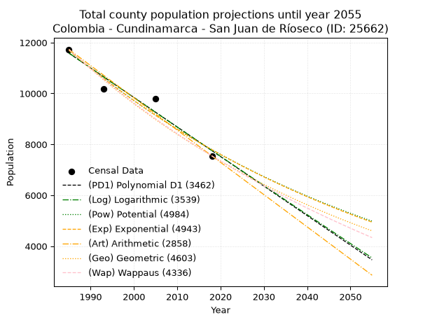
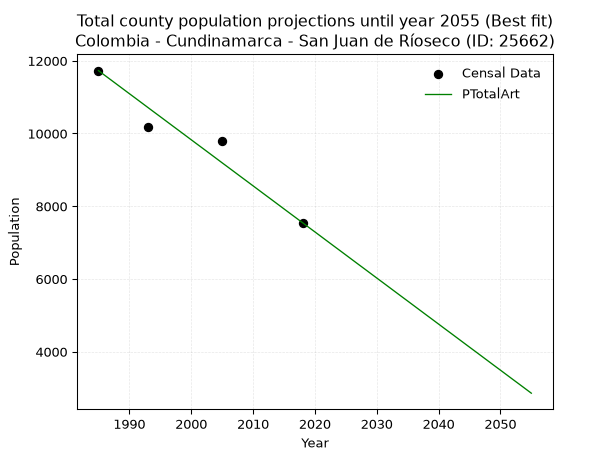
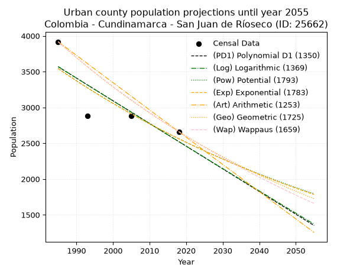
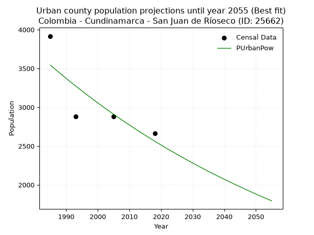
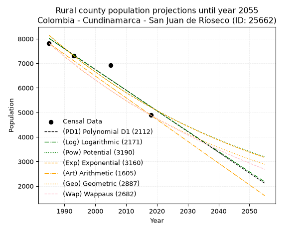
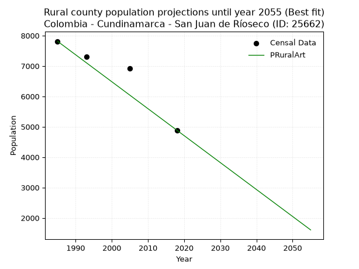

<div align="center">


</div>

# _“Population and Public Services Demand Projections (PPSD) until Year 2050 for Colombia - Cundinamarca - San Juan de Ríoseco (ID: 25662)”_
Keywords: `population` `public-service` `projection` `lineal` `polynomial` `logarithmic` `potential` `exponential` `arithmetic` `geometric` `wappaus` `dane` `colombia` `south-america`

PPSD are analytical estimates used by governments and planners to anticipate future changes in population size, age distribution, and the resulting community needs for utilities, healthcare, education, and infrastructure as sizing future water treatment facilities, electrical grids, and road networks based on spatial growth.

> **General running parameters**: • app_version: _v20260806_. • Python version: _3.14.7_. • Pandas version: _3.0.5_. • NumPy version: _2.5.1_. • Creates, save and include plots into reports (create_plot): _False_. • Projection until year: _2050_. • Process polynomial degree 2 and up: _False_. • Process Wappaus: _True_. • Process Wappaus: _True_. • Set negative values to zero: _True_. • Set infinite values to zero: _True_. • Drop dataset notes: _True_. 
<div align="center">

Dynamic map: [:earth_americas:Google](http://maps.google.com/maps?q=4.84757501,-74.6219187) [:earth_americas:OSM](https://www.openstreetmap.org/#map=18/4.84757501/-74.6219187&layers=P) [:earth_americas:Bing](https://www.bing.com/maps?cp=4.84757501~-74.6219187&lvl=18) [:earth_americas:Apple](https://maps.apple.com/frame?center=4.84757501%2C-74.6219187&span=0.003%2C0.006)

</div>


<div align="center">

```geojson
{
  "type": "Feature",
  "geometry": {
    "type": "Point", 
    "coordinates": [-74.6219187, 4.84757501]
  }, 
  "properties": {
    "Name": "Colombia - Cundinamarca - San Juan de Ríoseco (ID: 25662)"
  }
}
```

</div>


## 0. Census Data (4 records)

Census data are official statistics collected by a government about the people and housing in a country. They usually include counts of total population, age, sex, race, income, education, and jobs.

📅Global census file: [Population.xlsx](../data/Population.xlsx)

| Source   |   Year |   CountryID | CountryName   |   StateID | StateName    |   CountyID | CountyName          |   PTotal |   PUrban |   PRural |
|:---------|-------:|------------:|:--------------|----------:|:-------------|-----------:|:--------------------|---------:|---------:|---------:|
| DANE     |   1985 |          57 | Colombia      |        25 | Cundinamarca |      25662 | San Juan de Ríoseco |    11729 |     3917 |     7812 |
| DANE     |   1993 |          57 | Colombia      |        25 | Cundinamarca |      25662 | San Juan de Ríoseco |    10187 |     2883 |     7304 |
| DANE     |   2005 |          57 | Colombia      |        25 | Cundinamarca |      25662 | San Juan de Ríoseco |     9792 |     2878 |     6914 |
| DANE     |   2018 |          57 | Colombia      |        25 | Cundinamarca |      25662 | San Juan de Ríoseco |     7547 |     2661 |     4886 |

> 🔥Some records could had specific notes about the registered values or the corresponding urban or rural distribution.

📅   [RUPS](https://www.datos.gov.co/Hacienda-y-Cr-dito-P-blico/Registro-nico-de-Prestadores-de-Servicios-P-blicos/4qkq-csdn/about_data) - Local public utility companies: [RUPS.csv](../data/RUPS.xlsx)

 | SERVICIO       | ESTADO    | NOMBRE                                                         | NIT         | DEPARTAMENTO_DOMICILIO   | MUNICIPIO_DOMICILIO   | DIRECCION                            |   TELEFONO | EMAIL                                                         | TIPO_PRESTADOR                 | CLASIFICACION                 |
|:---------------|:----------|:---------------------------------------------------------------|:------------|:-------------------------|:----------------------|:-------------------------------------|-----------:|:--------------------------------------------------------------|:-------------------------------|:------------------------------|
| ACUEDUCTO      | OPERATIVA | MUNICIPIO DE SAN JUAN DE RIOSECO - CUNDINAMARCA                | 899999422-4 | CUNDINAMARCA             | SAN JUAN DE RIOSECO   | CLL. 4 No. 6 - 06 ALCALDIA MUNICIPAL |    8465013 | oficinaserviciospublicos@sanjuanderioseco-cundinamarca.gov.co | MUNICIPIO (PRESTACIÓN DIRECTA) | MENOR O IGUAL A 2500 USUARIOS |
| ALCANTARILLADO | OPERATIVA | MUNICIPIO DE SAN JUAN DE RIOSECO - CUNDINAMARCA                | 899999422-4 | CUNDINAMARCA             | SAN JUAN DE RIOSECO   | CLL. 4 No. 6 - 06 ALCALDIA MUNICIPAL |    8465013 | oficinaserviciospublicos@sanjuanderioseco-cundinamarca.gov.co | MUNICIPIO (PRESTACIÓN DIRECTA) | MENOR O IGUAL A 2500 USUARIOS |
| ACUEDUCTO      | OPERATIVA | ASOCIACION DE USUARIOS DEL ACUEDUCTO DE LA VEREDA EL LIMON     | 900154362-7 | CUNDINAMARCA             | SAN JUAN DE RIOSECO   | VEREDA EL LIMON ESCUELA VEREDAL      |    8465052 | acueductosveredales@yahoo.com                                 | ORGANIZACION AUTORIZADA        | HASTA 2500 SUSCRIPTORES       |
| ACUEDUCTO      | OPERATIVA | ASOCIACION DE SUSCRIPTORES DEL ACUEDUCTO DE LA VEREDA VARSOVIA | 900145536-3 | CUNDINAMARCA             | SAN JUAN DE RIOSECO   | VEREDA VARSOVIA                      |    8545551 | acueductosveredales@yahoo.com                                 | ORGANIZACION AUTORIZADA        | HASTA 2500 SUSCRIPTORES       |

## 1. Total

### 1.1. Coefficients and Parameters

* (PD1) Polynomial Deg 1: -116.02047370533784, 241883.702529102 (lineal)
* (Log) Logarithmic: -232193.9613478802, 1774721.9108908686
* (Pow) Potential: -24.618025745468998, 85.25245820886236
* (Exp) Exponential: -0.01230300286487662, 472146259580653.3
* (Art) Arithmetic: Year diff. 2018 - 1985 = 33, Population diff. 7547 - 11729 = -4182, Annual growth = -126.72727272727273
* (Geo) Geometric: Year diff. 2018 - 1985 = 33, Population diff. 7547 - 11729 = -4182, Annual growth % = -0.013272176142048564
* (Wap) Wappaus: i = -1.3148710596313833, Condition values only valid for < 200)

<sub>
Wappaus condition values: ['-0.00', '-1.31', '-2.63', '-3.94', '-5.26', '-6.57', '-7.89', '-9.20', '-10.52', '-11.83', '-13.15', '-14.46', '-15.78', '-17.09', '-18.41', '-19.72', '-21.04', '-22.35', '-23.67', '-24.98', '-26.30', '-27.61', '-28.93', '-30.24', '-31.56', '-32.87', '-34.19', '-35.50', '-36.82', '-38.13', '-39.45', '-40.76', '-42.08', '-43.39', '-44.71', '-46.02', '-47.34', '-48.65', '-49.97', '-51.28', '-52.59', '-53.91', '-55.22', '-56.54', '-57.85', '-59.17', '-60.48', '-61.80', '-63.11', '-64.43', '-65.74', '-67.06', '-68.37', '-69.69', '-71.00', '-72.32', '-73.63', '-74.95', '-76.26', '-77.58', '-78.89', '-80.21', '-81.52', '-82.84', '-84.15', '-85.47']
</sub>


### 1.2. Projected Dataset

|   Year |   CountyID |   PTotalPD1 |   PTotalLog |   PTotalPow |   PTotalExp |   PTotalArt |   PTotalGeo |   PTotalWap |
|-------:|-----------:|------------:|------------:|------------:|------------:|------------:|------------:|------------:|
|   1985 |      25662 |       11583 |       11586 |       11698 |       11694 |       11729 |       11729 |       11729 |
|   1986 |      25662 |       11467 |       11469 |       11554 |       11551 |       11602 |       11573 |       11576 |
|   1987 |      25662 |       11351 |       11352 |       11411 |       11410 |       11476 |       11420 |       11425 |
|   1988 |      25662 |       11235 |       11236 |       11271 |       11270 |       11349 |       11268 |       11275 |
|   1989 |      25662 |       11119 |       11119 |       11132 |       11133 |       11222 |       11119 |       11128 |
|   1990 |      25662 |       11003 |       11002 |       10995 |       10997 |       11095 |       10971 |       10982 |
|   1991 |      25662 |       10887 |       10885 |       10860 |       10862 |       10969 |       10825 |       10839 |
|   1992 |      25662 |       10771 |       10769 |       10727 |       10729 |       10842 |       10682 |       10697 |
|   1993 |      25662 |       10655 |       10652 |       10595 |       10598 |       10715 |       10540 |       10557 |
|   1994 |      25662 |       10539 |       10536 |       10465 |       10468 |       10588 |       10400 |       10419 |
|   1995 |      25662 |       10423 |       10419 |       10337 |       10340 |       10462 |       10262 |       10282 |
|   1996 |      25662 |       10307 |       10303 |       10210 |       10214 |       10335 |       10126 |       10147 |
|   1997 |      25662 |       10191 |       10187 |       10085 |       10089 |       10208 |        9991 |       10014 |
|   1998 |      25662 |       10075 |       10071 |        9961 |        9966 |       10082 |        9859 |        9882 |
|   1999 |      25662 |        9959 |        9954 |        9839 |        9844 |        9955 |        9728 |        9752 |
|   2000 |      25662 |        9843 |        9838 |        9719 |        9724 |        9828 |        9599 |        9623 |
|   2001 |      25662 |        9727 |        9722 |        9600 |        9605 |        9701 |        9472 |        9496 |
|   2002 |      25662 |        9611 |        9606 |        9483 |        9487 |        9575 |        9346 |        9371 |
|   2003 |      25662 |        9495 |        9490 |        9367 |        9371 |        9448 |        9222 |        9247 |
|   2004 |      25662 |        9379 |        9374 |        9252 |        9257 |        9321 |        9099 |        9124 |
|   2005 |      25662 |        9263 |        9258 |        9139 |        9143 |        9194 |        8979 |        9003 |
|   2006 |      25662 |        9147 |        9143 |        9028 |        9032 |        9068 |        8859 |        8883 |
|   2007 |      25662 |        9031 |        9027 |        8918 |        8921 |        8941 |        8742 |        8765 |
|   2008 |      25662 |        8915 |        8911 |        8809 |        8812 |        8814 |        8626 |        8648 |
|   2009 |      25662 |        8799 |        8796 |        8702 |        8704 |        8688 |        8511 |        8532 |
|   2010 |      25662 |        8683 |        8680 |        8596 |        8598 |        8561 |        8398 |        8418 |
|   2011 |      25662 |        8567 |        8565 |        8491 |        8493 |        8434 |        8287 |        8305 |
|   2012 |      25662 |        8451 |        8449 |        8388 |        8389 |        8307 |        8177 |        8193 |
|   2013 |      25662 |        8334 |        8334 |        8286 |        8286 |        8181 |        8068 |        8082 |
|   2014 |      25662 |        8218 |        8219 |        8185 |        8185 |        8054 |        7961 |        7973 |
|   2015 |      25662 |        8102 |        8103 |        8086 |        8085 |        7927 |        7856 |        7865 |
|   2016 |      25662 |        7986 |        7988 |        7988 |        7986 |        7800 |        7751 |        7758 |
|   2017 |      25662 |        7870 |        7873 |        7891 |        7888 |        7674 |        7649 |        7652 |
|   2018 |      25662 |        7754 |        7758 |        7795 |        7792 |        7547 |        7547 |        7547 |
|   2019 |      25662 |        7638 |        7643 |        7701 |        7697 |        7420 |        7447 |        7443 |
|   2020 |      25662 |        7522 |        7528 |        7607 |        7603 |        7294 |        7348 |        7341 |
|   2021 |      25662 |        7406 |        7413 |        7515 |        7510 |        7167 |        7250 |        7240 |
|   2022 |      25662 |        7290 |        7298 |        7424 |        7418 |        7040 |        7154 |        7139 |
|   2023 |      25662 |        7174 |        7183 |        7334 |        7327 |        6913 |        7059 |        7040 |
|   2024 |      25662 |        7058 |        7069 |        7246 |        7238 |        6787 |        6966 |        6942 |
|   2025 |      25662 |        6942 |        6954 |        7158 |        7149 |        6660 |        6873 |        6845 |
|   2026 |      25662 |        6826 |        6839 |        7072 |        7062 |        6533 |        6782 |        6748 |
|   2027 |      25662 |        6710 |        6725 |        6986 |        6975 |        6406 |        6692 |        6653 |
|   2028 |      25662 |        6594 |        6610 |        6902 |        6890 |        6280 |        6603 |        6559 |
|   2029 |      25662 |        6478 |        6496 |        6819 |        6806 |        6153 |        6515 |        6466 |
|   2030 |      25662 |        6362 |        6381 |        6737 |        6722 |        6026 |        6429 |        6373 |
|   2031 |      25662 |        6246 |        6267 |        6655 |        6640 |        5900 |        6344 |        6282 |
|   2032 |      25662 |        6130 |        6153 |        6575 |        6559 |        5773 |        6259 |        6192 |
|   2033 |      25662 |        6014 |        6038 |        6496 |        6479 |        5646 |        6176 |        6102 |
|   2034 |      25662 |        5898 |        5924 |        6418 |        6400 |        5519 |        6094 |        6013 |
|   2035 |      25662 |        5782 |        5810 |        6341 |        6321 |        5393 |        6014 |        5926 |
|   2036 |      25662 |        5666 |        5696 |        6264 |        6244 |        5266 |        5934 |        5839 |
|   2037 |      25662 |        5550 |        5582 |        6189 |        6168 |        5139 |        5855 |        5753 |
|   2038 |      25662 |        5434 |        5468 |        6115 |        6092 |        5012 |        5777 |        5667 |
|   2039 |      25662 |        5318 |        5354 |        6041 |        6018 |        4886 |        5701 |        5583 |
|   2040 |      25662 |        5202 |        5240 |        5969 |        5944 |        4759 |        5625 |        5499 |
|   2041 |      25662 |        5086 |        5126 |        5897 |        5872 |        4632 |        5550 |        5417 |
|   2042 |      25662 |        4970 |        5013 |        5827 |        5800 |        4506 |        5477 |        5335 |
|   2043 |      25662 |        4854 |        4899 |        5757 |        5729 |        4379 |        5404 |        5253 |
|   2044 |      25662 |        4738 |        4785 |        5688 |        5659 |        4252 |        5332 |        5173 |
|   2045 |      25662 |        4622 |        4672 |        5620 |        5590 |        4125 |        5261 |        5093 |
|   2046 |      25662 |        4506 |        4558 |        5553 |        5521 |        3999 |        5192 |        5014 |
|   2047 |      25662 |        4390 |        4445 |        5486 |        5454 |        3872 |        5123 |        4936 |
|   2048 |      25662 |        4274 |        4331 |        5421 |        5387 |        3745 |        5055 |        4859 |
|   2049 |      25662 |        4158 |        4218 |        5356 |        5321 |        3618 |        4988 |        4782 |
|   2050 |      25662 |        4042 |        4105 |        5292 |        5256 |        3492 |        4921 |        4706 |
<div align="center">

</img>

</div>


### 1.3. Best fit with absolute and relative error (%)

Relative error puts that difference into context by dividing the absolute error by the true value, creating a unitless ratio or percentage that shows the scale of the mistake.

Absolute and relative error

|   Year | Source   |   CountryID | CountryName   |   StateID | StateName    |   CountyID_x | CountyName          |   PTotal |   PUrban |   PRural |   CountyID_y |   PTotalPD1 |   PTotalLog |   PTotalPow |   PTotalExp |   PTotalArt |   PTotalGeo |   PTotalWap |   PTotalPD1AbsError |   PTotalLogAbsError |   PTotalPowAbsError |   PTotalExpAbsError |   PTotalArtAbsError |   PTotalGeoAbsError |   PTotalWapAbsError |   PTotalPD1RelError |   PTotalLogRelError |   PTotalPowRelError |   PTotalExpRelError |   PTotalArtRelError |   PTotalGeoRelError |   PTotalWapRelError |
|-------:|:---------|------------:|:--------------|----------:|:-------------|-------------:|:--------------------|---------:|---------:|---------:|-------------:|------------:|------------:|------------:|------------:|------------:|------------:|------------:|--------------------:|--------------------:|--------------------:|--------------------:|--------------------:|--------------------:|--------------------:|--------------------:|--------------------:|--------------------:|--------------------:|--------------------:|--------------------:|--------------------:|
|   1985 | DANE     |          57 | Colombia      |        25 | Cundinamarca |        25662 | San Juan de Ríoseco |    11729 |     3917 |     7812 |        25662 |       11583 |       11586 |       11698 |       11694 |       11729 |       11729 |       11729 |                 146 |                 143 |                  31 |                  35 |                   0 |                   0 |                   0 |             1.24478 |             1.2192  |            0.264302 |            0.298406 |             0       |              0      |             0       |
|   1993 | DANE     |          57 | Colombia      |        25 | Cundinamarca |        25662 | San Juan de Ríoseco |    10187 |     2883 |     7304 |        25662 |       10655 |       10652 |       10595 |       10598 |       10715 |       10540 |       10557 |                 468 |                 465 |                 408 |                 411 |                 528 |                 353 |                 370 |             4.59409 |             4.56464 |            4.0051   |            4.03455  |             5.18308 |              3.4652 |             3.63208 |
|   2005 | DANE     |          57 | Colombia      |        25 | Cundinamarca |        25662 | San Juan de Ríoseco |     9792 |     2878 |     6914 |        25662 |        9263 |        9258 |        9139 |        9143 |        9194 |        8979 |        9003 |                 529 |                 534 |                 653 |                 649 |                 598 |                 813 |                 789 |             5.40237 |             5.45343 |            6.66871  |            6.62786  |             6.10703 |              8.3027 |             8.0576  |
|   2018 | DANE     |          57 | Colombia      |        25 | Cundinamarca |        25662 | San Juan de Ríoseco |     7547 |     2661 |     4886 |        25662 |        7754 |        7758 |        7795 |        7792 |        7547 |        7547 |        7547 |                 207 |                 211 |                 248 |                 245 |                   0 |                   0 |                   0 |             2.74281 |             2.79581 |            3.28607  |            3.24632  |             0       |              0      |             0       |

Relative error mean

| Method    |   RelError | Best   |
|:----------|-----------:|:-------|
| PTotalPD1 |    3.49601 |        |
| PTotalLog |    3.50827 |        |
| PTotalPow |    3.55605 |        |
| PTotalExp |    3.55179 |        |
| PTotalArt |    2.82253 | True   |
| PTotalGeo |    2.94197 |        |
| PTotalWap |    2.92242 |        |

💙Best method: _**PTotalArt**_
<div align="center">

</img>

</div>


### 1.4. Fresh water supply demand in liters per capita per day (lpcd)

The fresh water supply demand typically ranges from 100 to 300 liters per capita per day (lpcd) for standard domestic and municipal planning, though absolute survival minimums set by the World Health Organization are as low as 7.5 to 20 liters per day, and total consumption in high-income nations can exceed 400 liters.

> `CZ`: Level in meters above the sea level (masl)<br> `WS`: Fresh water supply demand in liters per capita per day (lpcd or l/h/d)<br> `WSAll`: Zonal fresh water supply demand in liters per second (l/s)<br> `A`: Zonal area in square meters<br> `DP`: Population density (people/hectare or p/ha)

Reference values (RAS Colombia)

|    CZ |   WS |
|------:|-----:|
|  1000 |  120 |
|  2000 |  130 |
| 99999 |  140 |

County shapefile geometry properties and water supply values

|   CountyID |      ATotal |   CZTotal |   WSTotal |
|-----------:|------------:|----------:|----------:|
|      25662 | 3.13817e+08 |   949.666 |       120 |

Projected values for best method: PTotalArt

|   CountyID |   Year |   PTotalArt |   DPTotal |   WSTotal |   WSTotalAll |
|-----------:|-------:|------------:|----------:|----------:|-------------:|
|      25662 |   1985 |       11729 |      0.37 |       120 |     16.2903  |
|      25662 |   1986 |       11602 |      0.37 |       120 |     16.1139  |
|      25662 |   1987 |       11476 |      0.37 |       120 |     15.9389  |
|      25662 |   1988 |       11349 |      0.36 |       120 |     15.7625  |
|      25662 |   1989 |       11222 |      0.36 |       120 |     15.5861  |
|      25662 |   1990 |       11095 |      0.35 |       120 |     15.4097  |
|      25662 |   1991 |       10969 |      0.35 |       120 |     15.2347  |
|      25662 |   1992 |       10842 |      0.35 |       120 |     15.0583  |
|      25662 |   1993 |       10715 |      0.34 |       120 |     14.8819  |
|      25662 |   1994 |       10588 |      0.34 |       120 |     14.7056  |
|      25662 |   1995 |       10462 |      0.33 |       120 |     14.5306  |
|      25662 |   1996 |       10335 |      0.33 |       120 |     14.3542  |
|      25662 |   1997 |       10208 |      0.33 |       120 |     14.1778  |
|      25662 |   1998 |       10082 |      0.32 |       120 |     14.0028  |
|      25662 |   1999 |        9955 |      0.32 |       120 |     13.8264  |
|      25662 |   2000 |        9828 |      0.31 |       120 |     13.65    |
|      25662 |   2001 |        9701 |      0.31 |       120 |     13.4736  |
|      25662 |   2002 |        9575 |      0.31 |       120 |     13.2986  |
|      25662 |   2003 |        9448 |      0.3  |       120 |     13.1222  |
|      25662 |   2004 |        9321 |      0.3  |       120 |     12.9458  |
|      25662 |   2005 |        9194 |      0.29 |       120 |     12.7694  |
|      25662 |   2006 |        9068 |      0.29 |       120 |     12.5944  |
|      25662 |   2007 |        8941 |      0.28 |       120 |     12.4181  |
|      25662 |   2008 |        8814 |      0.28 |       120 |     12.2417  |
|      25662 |   2009 |        8688 |      0.28 |       120 |     12.0667  |
|      25662 |   2010 |        8561 |      0.27 |       120 |     11.8903  |
|      25662 |   2011 |        8434 |      0.27 |       120 |     11.7139  |
|      25662 |   2012 |        8307 |      0.26 |       120 |     11.5375  |
|      25662 |   2013 |        8181 |      0.26 |       120 |     11.3625  |
|      25662 |   2014 |        8054 |      0.26 |       120 |     11.1861  |
|      25662 |   2015 |        7927 |      0.25 |       120 |     11.0097  |
|      25662 |   2016 |        7800 |      0.25 |       120 |     10.8333  |
|      25662 |   2017 |        7674 |      0.24 |       120 |     10.6583  |
|      25662 |   2018 |        7547 |      0.24 |       120 |     10.4819  |
|      25662 |   2019 |        7420 |      0.24 |       120 |     10.3056  |
|      25662 |   2020 |        7294 |      0.23 |       120 |     10.1306  |
|      25662 |   2021 |        7167 |      0.23 |       120 |      9.95417 |
|      25662 |   2022 |        7040 |      0.22 |       120 |      9.77778 |
|      25662 |   2023 |        6913 |      0.22 |       120 |      9.60139 |
|      25662 |   2024 |        6787 |      0.22 |       120 |      9.42639 |
|      25662 |   2025 |        6660 |      0.21 |       120 |      9.25    |
|      25662 |   2026 |        6533 |      0.21 |       120 |      9.07361 |
|      25662 |   2027 |        6406 |      0.2  |       120 |      8.89722 |
|      25662 |   2028 |        6280 |      0.2  |       120 |      8.72222 |
|      25662 |   2029 |        6153 |      0.2  |       120 |      8.54583 |
|      25662 |   2030 |        6026 |      0.19 |       120 |      8.36944 |
|      25662 |   2031 |        5900 |      0.19 |       120 |      8.19444 |
|      25662 |   2032 |        5773 |      0.18 |       120 |      8.01806 |
|      25662 |   2033 |        5646 |      0.18 |       120 |      7.84167 |
|      25662 |   2034 |        5519 |      0.18 |       120 |      7.66528 |
|      25662 |   2035 |        5393 |      0.17 |       120 |      7.49028 |
|      25662 |   2036 |        5266 |      0.17 |       120 |      7.31389 |
|      25662 |   2037 |        5139 |      0.16 |       120 |      7.1375  |
|      25662 |   2038 |        5012 |      0.16 |       120 |      6.96111 |
|      25662 |   2039 |        4886 |      0.16 |       120 |      6.78611 |
|      25662 |   2040 |        4759 |      0.15 |       120 |      6.60972 |
|      25662 |   2041 |        4632 |      0.15 |       120 |      6.43333 |
|      25662 |   2042 |        4506 |      0.14 |       120 |      6.25833 |
|      25662 |   2043 |        4379 |      0.14 |       120 |      6.08194 |
|      25662 |   2044 |        4252 |      0.14 |       120 |      5.90556 |
|      25662 |   2045 |        4125 |      0.13 |       120 |      5.72917 |
|      25662 |   2046 |        3999 |      0.13 |       120 |      5.55417 |
|      25662 |   2047 |        3872 |      0.12 |       120 |      5.37778 |
|      25662 |   2048 |        3745 |      0.12 |       120 |      5.20139 |
|      25662 |   2049 |        3618 |      0.12 |       120 |      5.025   |
|      25662 |   2050 |        3492 |      0.11 |       120 |      4.85    |

## 2. Urban

### 2.1. Coefficients and Parameters

* (PD1) Polynomial Deg 1: -31.68647129666784, 66465.61421115985 (lineal)
* (Log) Logarithmic: -63505.52173254881, 485790.7295904165
* (Pow) Potential: -19.643994935937208, 68.33055049791983
* (Exp) Exponential: -0.009802626448901773, 999426650347.2993
* (Art) Arithmetic: Year diff. 2018 - 1985 = 33, Population diff. 2661 - 3917 = -1256, Annual growth = -38.06060606060606
* (Geo) Geometric: Year diff. 2018 - 1985 = 33, Population diff. 2661 - 3917 = -1256, Annual growth % = -0.011647516998108842
* (Wap) Wappaus: i = -1.1572090623474023, Condition values only valid for < 200)

<sub>
Wappaus condition values: ['-0.00', '-1.16', '-2.31', '-3.47', '-4.63', '-5.79', '-6.94', '-8.10', '-9.26', '-10.41', '-11.57', '-12.73', '-13.89', '-15.04', '-16.20', '-17.36', '-18.52', '-19.67', '-20.83', '-21.99', '-23.14', '-24.30', '-25.46', '-26.62', '-27.77', '-28.93', '-30.09', '-31.24', '-32.40', '-33.56', '-34.72', '-35.87', '-37.03', '-38.19', '-39.35', '-40.50', '-41.66', '-42.82', '-43.97', '-45.13', '-46.29', '-47.45', '-48.60', '-49.76', '-50.92', '-52.07', '-53.23', '-54.39', '-55.55', '-56.70', '-57.86', '-59.02', '-60.17', '-61.33', '-62.49', '-63.65', '-64.80', '-65.96', '-67.12', '-68.28', '-69.43', '-70.59', '-71.75', '-72.90', '-74.06', '-75.22']
</sub>


### 2.2. Projected Dataset

|   Year |   CountyID |   PUrbanPD1 |   PUrbanLog |   PUrbanPow |   PUrbanExp |   PUrbanArt |   PUrbanGeo |   PUrbanWap |
|-------:|-----------:|------------:|------------:|------------:|------------:|------------:|------------:|------------:|
|   1985 |      25662 |        3568 |        3570 |        3543 |        3541 |        3917 |        3917 |        3917 |
|   1986 |      25662 |        3536 |        3538 |        3508 |        3507 |        3879 |        3871 |        3872 |
|   1987 |      25662 |        3505 |        3506 |        3474 |        3472 |        3841 |        3826 |        3827 |
|   1988 |      25662 |        3473 |        3474 |        3439 |        3439 |        3803 |        3782 |        3783 |
|   1989 |      25662 |        3441 |        3442 |        3406 |        3405 |        3765 |        3738 |        3740 |
|   1990 |      25662 |        3410 |        3410 |        3372 |        3372 |        3727 |        3694 |        3697 |
|   1991 |      25662 |        3378 |        3378 |        3339 |        3339 |        3689 |        3651 |        3654 |
|   1992 |      25662 |        3346 |        3346 |        3306 |        3306 |        3651 |        3609 |        3612 |
|   1993 |      25662 |        3314 |        3314 |        3274 |        3274 |        3613 |        3567 |        3570 |
|   1994 |      25662 |        3283 |        3282 |        3242 |        3242 |        3574 |        3525 |        3529 |
|   1995 |      25662 |        3251 |        3250 |        3210 |        3211 |        3536 |        3484 |        3489 |
|   1996 |      25662 |        3219 |        3219 |        3178 |        3179 |        3498 |        3443 |        3448 |
|   1997 |      25662 |        3188 |        3187 |        3147 |        3148 |        3460 |        3403 |        3408 |
|   1998 |      25662 |        3156 |        3155 |        3117 |        3118 |        3422 |        3364 |        3369 |
|   1999 |      25662 |        3124 |        3123 |        3086 |        3087 |        3384 |        3324 |        3330 |
|   2000 |      25662 |        3093 |        3091 |        3056 |        3057 |        3346 |        3286 |        3291 |
|   2001 |      25662 |        3061 |        3060 |        3026 |        3027 |        3308 |        3247 |        3253 |
|   2002 |      25662 |        3029 |        3028 |        2996 |        2998 |        3270 |        3210 |        3215 |
|   2003 |      25662 |        2998 |        2996 |        2967 |        2968 |        3232 |        3172 |        3178 |
|   2004 |      25662 |        2966 |        2965 |        2938 |        2939 |        3194 |        3135 |        3141 |
|   2005 |      25662 |        2934 |        2933 |        2910 |        2911 |        3156 |        3099 |        3104 |
|   2006 |      25662 |        2903 |        2901 |        2881 |        2882 |        3118 |        3063 |        3068 |
|   2007 |      25662 |        2871 |        2870 |        2853 |        2854 |        3080 |        3027 |        3032 |
|   2008 |      25662 |        2839 |        2838 |        2825 |        2826 |        3042 |        2992 |        2997 |
|   2009 |      25662 |        2807 |        2806 |        2798 |        2799 |        3004 |        2957 |        2962 |
|   2010 |      25662 |        2776 |        2775 |        2771 |        2772 |        2965 |        2922 |        2927 |
|   2011 |      25662 |        2744 |        2743 |        2744 |        2745 |        2927 |        2888 |        2893 |
|   2012 |      25662 |        2712 |        2712 |        2717 |        2718 |        2889 |        2855 |        2859 |
|   2013 |      25662 |        2681 |        2680 |        2691 |        2691 |        2851 |        2822 |        2825 |
|   2014 |      25662 |        2649 |        2648 |        2665 |        2665 |        2813 |        2789 |        2791 |
|   2015 |      25662 |        2617 |        2617 |        2639 |        2639 |        2775 |        2756 |        2758 |
|   2016 |      25662 |        2586 |        2585 |        2613 |        2613 |        2737 |        2724 |        2726 |
|   2017 |      25662 |        2554 |        2554 |        2588 |        2588 |        2699 |        2692 |        2693 |
|   2018 |      25662 |        2522 |        2522 |        2563 |        2563 |        2661 |        2661 |        2661 |
|   2019 |      25662 |        2491 |        2491 |        2538 |        2538 |        2623 |        2630 |        2629 |
|   2020 |      25662 |        2459 |        2460 |        2513 |        2513 |        2585 |        2599 |        2598 |
|   2021 |      25662 |        2427 |        2428 |        2489 |        2488 |        2547 |        2569 |        2567 |
|   2022 |      25662 |        2396 |        2397 |        2465 |        2464 |        2509 |        2539 |        2536 |
|   2023 |      25662 |        2364 |        2365 |        2441 |        2440 |        2471 |        2510 |        2505 |
|   2024 |      25662 |        2332 |        2334 |        2418 |        2416 |        2433 |        2480 |        2475 |
|   2025 |      25662 |        2301 |        2303 |        2394 |        2393 |        2395 |        2451 |        2445 |
|   2026 |      25662 |        2269 |        2271 |        2371 |        2369 |        2357 |        2423 |        2415 |
|   2027 |      25662 |        2237 |        2240 |        2348 |        2346 |        2318 |        2395 |        2385 |
|   2028 |      25662 |        2205 |        2209 |        2326 |        2323 |        2280 |        2367 |        2356 |
|   2029 |      25662 |        2174 |        2177 |        2303 |        2301 |        2242 |        2339 |        2327 |
|   2030 |      25662 |        2142 |        2146 |        2281 |        2278 |        2204 |        2312 |        2299 |
|   2031 |      25662 |        2110 |        2115 |        2259 |        2256 |        2166 |        2285 |        2270 |
|   2032 |      25662 |        2079 |        2083 |        2237 |        2234 |        2128 |        2258 |        2242 |
|   2033 |      25662 |        2047 |        2052 |        2216 |        2212 |        2090 |        2232 |        2214 |
|   2034 |      25662 |        2015 |        2021 |        2194 |        2191 |        2052 |        2206 |        2187 |
|   2035 |      25662 |        1984 |        1990 |        2173 |        2169 |        2014 |        2180 |        2159 |
|   2036 |      25662 |        1952 |        1959 |        2152 |        2148 |        1976 |        2155 |        2132 |
|   2037 |      25662 |        1920 |        1927 |        2132 |        2127 |        1938 |        2130 |        2105 |
|   2038 |      25662 |        1889 |        1896 |        2111 |        2106 |        1900 |        2105 |        2078 |
|   2039 |      25662 |        1857 |        1865 |        2091 |        2086 |        1862 |        2081 |        2052 |
|   2040 |      25662 |        1825 |        1834 |        2071 |        2065 |        1824 |        2056 |        2026 |
|   2041 |      25662 |        1794 |        1803 |        2051 |        2045 |        1786 |        2032 |        2000 |
|   2042 |      25662 |        1762 |        1772 |        2032 |        2025 |        1748 |        2009 |        1974 |
|   2043 |      25662 |        1730 |        1741 |        2012 |        2006 |        1709 |        1985 |        1949 |
|   2044 |      25662 |        1698 |        1709 |        1993 |        1986 |        1671 |        1962 |        1923 |
|   2045 |      25662 |        1667 |        1678 |        1974 |        1967 |        1633 |        1939 |        1898 |
|   2046 |      25662 |        1635 |        1647 |        1955 |        1947 |        1595 |        1917 |        1873 |
|   2047 |      25662 |        1603 |        1616 |        1936 |        1928 |        1557 |        1894 |        1849 |
|   2048 |      25662 |        1572 |        1585 |        1918 |        1910 |        1519 |        1872 |        1824 |
|   2049 |      25662 |        1540 |        1554 |        1899 |        1891 |        1481 |        1851 |        1800 |
|   2050 |      25662 |        1508 |        1523 |        1881 |        1873 |        1443 |        1829 |        1776 |
<div align="center">

</img>

</div>


### 2.3. Best fit with absolute and relative error (%)

Relative error puts that difference into context by dividing the absolute error by the true value, creating a unitless ratio or percentage that shows the scale of the mistake.

Absolute and relative error

|   Year | Source   |   CountryID | CountryName   |   StateID | StateName    |   CountyID_x | CountyName          |   PTotal |   PUrban |   PRural |   CountyID_y |   PUrbanPD1 |   PUrbanLog |   PUrbanPow |   PUrbanExp |   PUrbanArt |   PUrbanGeo |   PUrbanWap |   PUrbanPD1AbsError |   PUrbanLogAbsError |   PUrbanPowAbsError |   PUrbanExpAbsError |   PUrbanArtAbsError |   PUrbanGeoAbsError |   PUrbanWapAbsError |   PUrbanPD1RelError |   PUrbanLogRelError |   PUrbanPowRelError |   PUrbanExpRelError |   PUrbanArtRelError |   PUrbanGeoRelError |   PUrbanWapRelError |
|-------:|:---------|------------:|:--------------|----------:|:-------------|-------------:|:--------------------|---------:|---------:|---------:|-------------:|------------:|------------:|------------:|------------:|------------:|------------:|------------:|--------------------:|--------------------:|--------------------:|--------------------:|--------------------:|--------------------:|--------------------:|--------------------:|--------------------:|--------------------:|--------------------:|--------------------:|--------------------:|--------------------:|
|   1985 | DANE     |          57 | Colombia      |        25 | Cundinamarca |        25662 | San Juan de Ríoseco |    11729 |     3917 |     7812 |        25662 |        3568 |        3570 |        3543 |        3541 |        3917 |        3917 |        3917 |                 349 |                 347 |                 374 |                 376 |                   0 |                   0 |                   0 |             8.90988 |             8.85882 |             9.54812 |             9.59918 |             0       |             0       |             0       |
|   1993 | DANE     |          57 | Colombia      |        25 | Cundinamarca |        25662 | San Juan de Ríoseco |    10187 |     2883 |     7304 |        25662 |        3314 |        3314 |        3274 |        3274 |        3613 |        3567 |        3570 |                 431 |                 431 |                 391 |                 391 |                 730 |                 684 |                 687 |            14.9497  |            14.9497  |            13.5623  |            13.5623  |            25.3208  |            23.7253  |            23.8293  |
|   2005 | DANE     |          57 | Colombia      |        25 | Cundinamarca |        25662 | San Juan de Ríoseco |     9792 |     2878 |     6914 |        25662 |        2934 |        2933 |        2910 |        2911 |        3156 |        3099 |        3104 |                  56 |                  55 |                  32 |                  33 |                 278 |                 221 |                 226 |             1.9458  |             1.91105 |             1.11188 |             1.14663 |             9.65949 |             7.67894 |             7.85268 |
|   2018 | DANE     |          57 | Colombia      |        25 | Cundinamarca |        25662 | San Juan de Ríoseco |     7547 |     2661 |     4886 |        25662 |        2522 |        2522 |        2563 |        2563 |        2661 |        2661 |        2661 |                 139 |                 139 |                  98 |                  98 |                   0 |                   0 |                   0 |             5.2236  |             5.2236  |             3.68283 |             3.68283 |             0       |             0       |             0       |

Relative error mean

| Method    |   RelError | Best   |
|:----------|-----------:|:-------|
| PUrbanPD1 |    7.75725 |        |
| PUrbanLog |    7.73579 |        |
| PUrbanPow |    6.97627 | True   |
| PUrbanExp |    6.99773 |        |
| PUrbanArt |    8.74508 |        |
| PUrbanGeo |    7.85106 |        |
| PUrbanWap |    7.9205  |        |

💙Best method: _**PUrbanPow**_
<div align="center">

</img>

</div>


### 2.4. Fresh water supply demand in liters per capita per day (lpcd)

The fresh water supply demand typically ranges from 100 to 300 liters per capita per day (lpcd) for standard domestic and municipal planning, though absolute survival minimums set by the World Health Organization are as low as 7.5 to 20 liters per day, and total consumption in high-income nations can exceed 400 liters.

> `CZ`: Level in meters above the sea level (masl)<br> `WS`: Fresh water supply demand in liters per capita per day (lpcd or l/h/d)<br> `WSAll`: Zonal fresh water supply demand in liters per second (l/s)<br> `A`: Zonal area in square meters<br> `DP`: Population density (people/hectare or p/ha)

Reference values (RAS Colombia)

|    CZ |   WS |
|------:|-----:|
|  1000 |  120 |
|  2000 |  130 |
| 99999 |  140 |

County shapefile geometry properties and water supply values

|   CountyID |   AUrban |   CZUrban |   WSUrban |
|-----------:|---------:|----------:|----------:|
|      25662 |   582764 |    1273.7 |       130 |

Projected values for best method: PUrbanPow

|   CountyID |   Year |   PUrbanPow |   DPUrban |   WSUrban |   WSUrbanAll |
|-----------:|-------:|------------:|----------:|----------:|-------------:|
|      25662 |   1985 |        3543 |     60.8  |       130 |      5.3309  |
|      25662 |   1986 |        3508 |     60.2  |       130 |      5.27824 |
|      25662 |   1987 |        3474 |     59.61 |       130 |      5.22708 |
|      25662 |   1988 |        3439 |     59.01 |       130 |      5.17442 |
|      25662 |   1989 |        3406 |     58.45 |       130 |      5.12477 |
|      25662 |   1990 |        3372 |     57.86 |       130 |      5.07361 |
|      25662 |   1991 |        3339 |     57.3  |       130 |      5.02396 |
|      25662 |   1992 |        3306 |     56.73 |       130 |      4.97431 |
|      25662 |   1993 |        3274 |     56.18 |       130 |      4.92616 |
|      25662 |   1994 |        3242 |     55.63 |       130 |      4.87801 |
|      25662 |   1995 |        3210 |     55.08 |       130 |      4.82986 |
|      25662 |   1996 |        3178 |     54.53 |       130 |      4.78171 |
|      25662 |   1997 |        3147 |     54    |       130 |      4.73507 |
|      25662 |   1998 |        3117 |     53.49 |       130 |      4.68993 |
|      25662 |   1999 |        3086 |     52.95 |       130 |      4.64329 |
|      25662 |   2000 |        3056 |     52.44 |       130 |      4.59815 |
|      25662 |   2001 |        3026 |     51.93 |       130 |      4.55301 |
|      25662 |   2002 |        2996 |     51.41 |       130 |      4.50787 |
|      25662 |   2003 |        2967 |     50.91 |       130 |      4.46424 |
|      25662 |   2004 |        2938 |     50.41 |       130 |      4.4206  |
|      25662 |   2005 |        2910 |     49.93 |       130 |      4.37847 |
|      25662 |   2006 |        2881 |     49.44 |       130 |      4.33484 |
|      25662 |   2007 |        2853 |     48.96 |       130 |      4.29271 |
|      25662 |   2008 |        2825 |     48.48 |       130 |      4.25058 |
|      25662 |   2009 |        2798 |     48.01 |       130 |      4.20995 |
|      25662 |   2010 |        2771 |     47.55 |       130 |      4.16933 |
|      25662 |   2011 |        2744 |     47.09 |       130 |      4.1287  |
|      25662 |   2012 |        2717 |     46.62 |       130 |      4.08808 |
|      25662 |   2013 |        2691 |     46.18 |       130 |      4.04896 |
|      25662 |   2014 |        2665 |     45.73 |       130 |      4.00984 |
|      25662 |   2015 |        2639 |     45.28 |       130 |      3.97072 |
|      25662 |   2016 |        2613 |     44.84 |       130 |      3.9316  |
|      25662 |   2017 |        2588 |     44.41 |       130 |      3.89398 |
|      25662 |   2018 |        2563 |     43.98 |       130 |      3.85637 |
|      25662 |   2019 |        2538 |     43.55 |       130 |      3.81875 |
|      25662 |   2020 |        2513 |     43.12 |       130 |      3.78113 |
|      25662 |   2021 |        2489 |     42.71 |       130 |      3.74502 |
|      25662 |   2022 |        2465 |     42.3  |       130 |      3.70891 |
|      25662 |   2023 |        2441 |     41.89 |       130 |      3.6728  |
|      25662 |   2024 |        2418 |     41.49 |       130 |      3.63819 |
|      25662 |   2025 |        2394 |     41.08 |       130 |      3.60208 |
|      25662 |   2026 |        2371 |     40.69 |       130 |      3.56748 |
|      25662 |   2027 |        2348 |     40.29 |       130 |      3.53287 |
|      25662 |   2028 |        2326 |     39.91 |       130 |      3.49977 |
|      25662 |   2029 |        2303 |     39.52 |       130 |      3.46516 |
|      25662 |   2030 |        2281 |     39.14 |       130 |      3.43206 |
|      25662 |   2031 |        2259 |     38.76 |       130 |      3.39896 |
|      25662 |   2032 |        2237 |     38.39 |       130 |      3.36586 |
|      25662 |   2033 |        2216 |     38.03 |       130 |      3.33426 |
|      25662 |   2034 |        2194 |     37.65 |       130 |      3.30116 |
|      25662 |   2035 |        2173 |     37.29 |       130 |      3.26956 |
|      25662 |   2036 |        2152 |     36.93 |       130 |      3.23796 |
|      25662 |   2037 |        2132 |     36.58 |       130 |      3.20787 |
|      25662 |   2038 |        2111 |     36.22 |       130 |      3.17627 |
|      25662 |   2039 |        2091 |     35.88 |       130 |      3.14618 |
|      25662 |   2040 |        2071 |     35.54 |       130 |      3.11609 |
|      25662 |   2041 |        2051 |     35.19 |       130 |      3.086   |
|      25662 |   2042 |        2032 |     34.87 |       130 |      3.05741 |
|      25662 |   2043 |        2012 |     34.53 |       130 |      3.02731 |
|      25662 |   2044 |        1993 |     34.2  |       130 |      2.99873 |
|      25662 |   2045 |        1974 |     33.87 |       130 |      2.97014 |
|      25662 |   2046 |        1955 |     33.55 |       130 |      2.94155 |
|      25662 |   2047 |        1936 |     33.22 |       130 |      2.91296 |
|      25662 |   2048 |        1918 |     32.91 |       130 |      2.88588 |
|      25662 |   2049 |        1899 |     32.59 |       130 |      2.85729 |
|      25662 |   2050 |        1881 |     32.28 |       130 |      2.83021 |

## 3. Rural

### 3.1. Coefficients and Parameters

* (PD1) Polynomial Deg 1: -84.33400240866995, 175418.08831794208 (lineal)
* (Log) Logarithmic: -168688.43961533147, 1288931.1813004524
* (Pow) Potential: -27.048803696441844, 93.11140376576775
* (Exp) Exponential: -0.01352452564815494, 3715126316918143.5
* (Art) Arithmetic: Year diff. 2018 - 1985 = 33, Population diff. 4886 - 7812 = -2926, Annual growth = -88.66666666666667
* (Geo) Geometric: Year diff. 2018 - 1985 = 33, Population diff. 4886 - 7812 = -2926, Annual growth % = -0.014120181164688939
* (Wap) Wappaus: i = -1.396545387725101, Condition values only valid for < 200)

<sub>
Wappaus condition values: ['-0.00', '-1.40', '-2.79', '-4.19', '-5.59', '-6.98', '-8.38', '-9.78', '-11.17', '-12.57', '-13.97', '-15.36', '-16.76', '-18.16', '-19.55', '-20.95', '-22.34', '-23.74', '-25.14', '-26.53', '-27.93', '-29.33', '-30.72', '-32.12', '-33.52', '-34.91', '-36.31', '-37.71', '-39.10', '-40.50', '-41.90', '-43.29', '-44.69', '-46.09', '-47.48', '-48.88', '-50.28', '-51.67', '-53.07', '-54.47', '-55.86', '-57.26', '-58.65', '-60.05', '-61.45', '-62.84', '-64.24', '-65.64', '-67.03', '-68.43', '-69.83', '-71.22', '-72.62', '-74.02', '-75.41', '-76.81', '-78.21', '-79.60', '-81.00', '-82.40', '-83.79', '-85.19', '-86.59', '-87.98', '-89.38', '-90.78']
</sub>


### 3.2. Projected Dataset

|   Year |   CountyID |   PRuralPD1 |   PRuralLog |   PRuralPow |   PRuralExp |   PRuralArt |   PRuralGeo |   PRuralWap |
|-------:|-----------:|------------:|------------:|------------:|------------:|------------:|------------:|------------:|
|   1985 |      25662 |        8015 |        8017 |        8146 |        8144 |        7812 |        7812 |        7812 |
|   1986 |      25662 |        7931 |        7932 |        8035 |        8034 |        7723 |        7702 |        7704 |
|   1987 |      25662 |        7846 |        7847 |        7927 |        7926 |        7635 |        7593 |        7597 |
|   1988 |      25662 |        7762 |        7762 |        7820 |        7820 |        7546 |        7486 |        7491 |
|   1989 |      25662 |        7678 |        7677 |        7714 |        7715 |        7457 |        7380 |        7387 |
|   1990 |      25662 |        7593 |        7592 |        7610 |        7611 |        7369 |        7276 |        7285 |
|   1991 |      25662 |        7509 |        7508 |        7507 |        7509 |        7280 |        7173 |        7184 |
|   1992 |      25662 |        7425 |        7423 |        7406 |        7408 |        7191 |        7072 |        7084 |
|   1993 |      25662 |        7340 |        7338 |        7306 |        7309 |        7103 |        6972 |        6985 |
|   1994 |      25662 |        7256 |        7254 |        7208 |        7210 |        7014 |        6874 |        6888 |
|   1995 |      25662 |        7172 |        7169 |        7110 |        7114 |        6925 |        6776 |        6792 |
|   1996 |      25662 |        7087 |        7085 |        7015 |        7018 |        6837 |        6681 |        6698 |
|   1997 |      25662 |        7003 |        7000 |        6920 |        6924 |        6748 |        6586 |        6604 |
|   1998 |      25662 |        6919 |        6916 |        6827 |        6831 |        6659 |        6493 |        6512 |
|   1999 |      25662 |        6834 |        6831 |        6735 |        6739 |        6571 |        6402 |        6421 |
|   2000 |      25662 |        6750 |        6747 |        6645 |        6648 |        6482 |        6311 |        6331 |
|   2001 |      25662 |        6666 |        6662 |        6556 |        6559 |        6393 |        6222 |        6242 |
|   2002 |      25662 |        6581 |        6578 |        6468 |        6471 |        6305 |        6134 |        6154 |
|   2003 |      25662 |        6497 |        6494 |        6381 |        6384 |        6216 |        6048 |        6067 |
|   2004 |      25662 |        6413 |        6410 |        6295 |        6298 |        6127 |        5962 |        5982 |
|   2005 |      25662 |        6328 |        6326 |        6211 |        6214 |        6039 |        5878 |        5897 |
|   2006 |      25662 |        6244 |        6241 |        6128 |        6130 |        5950 |        5795 |        5814 |
|   2007 |      25662 |        6160 |        6157 |        6046 |        6048 |        5861 |        5713 |        5731 |
|   2008 |      25662 |        6075 |        6073 |        5965 |        5967 |        5773 |        5633 |        5650 |
|   2009 |      25662 |        5991 |        5989 |        5885 |        5887 |        5684 |        5553 |        5569 |
|   2010 |      25662 |        5907 |        5905 |        5806 |        5807 |        5595 |        5475 |        5490 |
|   2011 |      25662 |        5822 |        5822 |        5729 |        5729 |        5507 |        5397 |        5411 |
|   2012 |      25662 |        5738 |        5738 |        5652 |        5652 |        5418 |        5321 |        5334 |
|   2013 |      25662 |        5654 |        5654 |        5577 |        5577 |        5329 |        5246 |        5257 |
|   2014 |      25662 |        5569 |        5570 |        5502 |        5502 |        5241 |        5172 |        5181 |
|   2015 |      25662 |        5485 |        5486 |        5429 |        5428 |        5152 |        5099 |        5106 |
|   2016 |      25662 |        5401 |        5403 |        5357 |        5355 |        5063 |        5027 |        5032 |
|   2017 |      25662 |        5316 |        5319 |        5285 |        5283 |        4975 |        4956 |        4958 |
|   2018 |      25662 |        5232 |        5235 |        5215 |        5212 |        4886 |        4886 |        4886 |
|   2019 |      25662 |        5148 |        5152 |        5145 |        5142 |        4797 |        4817 |        4814 |
|   2020 |      25662 |        5063 |        5068 |        5077 |        5073 |        4709 |        4749 |        4743 |
|   2021 |      25662 |        4979 |        4985 |        5009 |        5005 |        4620 |        4682 |        4673 |
|   2022 |      25662 |        4895 |        4901 |        4943 |        4937 |        4531 |        4616 |        4604 |
|   2023 |      25662 |        4810 |        4818 |        4877 |        4871 |        4443 |        4551 |        4536 |
|   2024 |      25662 |        4726 |        4735 |        4812 |        4806 |        4354 |        4486 |        4468 |
|   2025 |      25662 |        4642 |        4651 |        4749 |        4741 |        4265 |        4423 |        4401 |
|   2026 |      25662 |        4557 |        4568 |        4686 |        4677 |        4177 |        4361 |        4335 |
|   2027 |      25662 |        4473 |        4485 |        4623 |        4615 |        4088 |        4299 |        4269 |
|   2028 |      25662 |        4389 |        4402 |        4562 |        4553 |        3999 |        4238 |        4204 |
|   2029 |      25662 |        4304 |        4318 |        4502 |        4491 |        3911 |        4178 |        4140 |
|   2030 |      25662 |        4220 |        4235 |        4442 |        4431 |        3822 |        4119 |        4076 |
|   2031 |      25662 |        4136 |        4152 |        4383 |        4372 |        3733 |        4061 |        4014 |
|   2032 |      25662 |        4051 |        4069 |        4325 |        4313 |        3645 |        4004 |        3951 |
|   2033 |      25662 |        3967 |        3986 |        4268 |        4255 |        3556 |        3947 |        3890 |
|   2034 |      25662 |        3883 |        3903 |        4212 |        4198 |        3467 |        3892 |        3829 |
|   2035 |      25662 |        3798 |        3820 |        4156 |        4141 |        3379 |        3837 |        3769 |
|   2036 |      25662 |        3714 |        3737 |        4101 |        4086 |        3290 |        3783 |        3709 |
|   2037 |      25662 |        3630 |        3655 |        4047 |        4031 |        3201 |        3729 |        3650 |
|   2038 |      25662 |        3545 |        3572 |        3994 |        3977 |        3113 |        3676 |        3592 |
|   2039 |      25662 |        3461 |        3489 |        3941 |        3923 |        3024 |        3625 |        3534 |
|   2040 |      25662 |        3377 |        3406 |        3889 |        3871 |        2935 |        3573 |        3477 |
|   2041 |      25662 |        3292 |        3324 |        3838 |        3819 |        2847 |        3523 |        3420 |
|   2042 |      25662 |        3208 |        3241 |        3788 |        3767 |        2758 |        3473 |        3364 |
|   2043 |      25662 |        3124 |        3158 |        3738 |        3717 |        2669 |        3424 |        3308 |
|   2044 |      25662 |        3039 |        3076 |        3689 |        3667 |        2581 |        3376 |        3253 |
|   2045 |      25662 |        2955 |        2993 |        3640 |        3617 |        2492 |        3328 |        3199 |
|   2046 |      25662 |        2871 |        2911 |        3592 |        3569 |        2403 |        3281 |        3145 |
|   2047 |      25662 |        2786 |        2828 |        3545 |        3521 |        2315 |        3235 |        3092 |
|   2048 |      25662 |        2702 |        2746 |        3499 |        3474 |        2226 |        3189 |        3039 |
|   2049 |      25662 |        2618 |        2664 |        3453 |        3427 |        2137 |        3144 |        2986 |
|   2050 |      25662 |        2533 |        2581 |        3407 |        3381 |        2049 |        3100 |        2934 |
<div align="center">

</img>

</div>


### 3.3. Best fit with absolute and relative error (%)

Relative error puts that difference into context by dividing the absolute error by the true value, creating a unitless ratio or percentage that shows the scale of the mistake.

Absolute and relative error

|   Year | Source   |   CountryID | CountryName   |   StateID | StateName    |   CountyID_x | CountyName          |   PTotal |   PUrban |   PRural |   CountyID_y |   PRuralPD1 |   PRuralLog |   PRuralPow |   PRuralExp |   PRuralArt |   PRuralGeo |   PRuralWap |   PRuralPD1AbsError |   PRuralLogAbsError |   PRuralPowAbsError |   PRuralExpAbsError |   PRuralArtAbsError |   PRuralGeoAbsError |   PRuralWapAbsError |   PRuralPD1RelError |   PRuralLogRelError |   PRuralPowRelError |   PRuralExpRelError |   PRuralArtRelError |   PRuralGeoRelError |   PRuralWapRelError |
|-------:|:---------|------------:|:--------------|----------:|:-------------|-------------:|:--------------------|---------:|---------:|---------:|-------------:|------------:|------------:|------------:|------------:|------------:|------------:|------------:|--------------------:|--------------------:|--------------------:|--------------------:|--------------------:|--------------------:|--------------------:|--------------------:|--------------------:|--------------------:|--------------------:|--------------------:|--------------------:|--------------------:|
|   1985 | DANE     |          57 | Colombia      |        25 | Cundinamarca |        25662 | San Juan de Ríoseco |    11729 |     3917 |     7812 |        25662 |        8015 |        8017 |        8146 |        8144 |        7812 |        7812 |        7812 |                 203 |                 205 |                 334 |                 332 |                   0 |                   0 |                   0 |            2.59857  |            2.62417  |           4.27547   |           4.24987   |             0       |             0       |             0       |
|   1993 | DANE     |          57 | Colombia      |        25 | Cundinamarca |        25662 | San Juan de Ríoseco |    10187 |     2883 |     7304 |        25662 |        7340 |        7338 |        7306 |        7309 |        7103 |        6972 |        6985 |                  36 |                  34 |                   2 |                   5 |                 201 |                 332 |                 319 |            0.492881 |            0.465498 |           0.0273823 |           0.0684556 |             2.75192 |             4.54545 |             4.36747 |
|   2005 | DANE     |          57 | Colombia      |        25 | Cundinamarca |        25662 | San Juan de Ríoseco |     9792 |     2878 |     6914 |        25662 |        6328 |        6326 |        6211 |        6214 |        6039 |        5878 |        5897 |                 586 |                 588 |                 703 |                 700 |                 875 |                1036 |                1017 |            8.47556  |            8.50448  |          10.1678    |          10.1244    |            12.6555  |            14.9841  |            14.7093  |
|   2018 | DANE     |          57 | Colombia      |        25 | Cundinamarca |        25662 | San Juan de Ríoseco |     7547 |     2661 |     4886 |        25662 |        5232 |        5235 |        5215 |        5212 |        4886 |        4886 |        4886 |                 346 |                 349 |                 329 |                 326 |                   0 |                   0 |                   0 |            7.08146  |            7.14286  |           6.73352   |           6.67212   |             0       |             0       |             0       |

Relative error mean

| Method    |   RelError | Best   |
|:----------|-----------:|:-------|
| PRuralPD1 |    4.66212 |        |
| PRuralLog |    4.68425 |        |
| PRuralPow |    5.30104 |        |
| PRuralExp |    5.27871 |        |
| PRuralArt |    3.85185 | True   |
| PRuralGeo |    4.88239 |        |
| PRuralWap |    4.76919 |        |

💙Best method: _**PRuralArt**_
<div align="center">

</img>

</div>


### 3.4. Fresh water supply demand in liters per capita per day (lpcd)

The fresh water supply demand typically ranges from 100 to 300 liters per capita per day (lpcd) for standard domestic and municipal planning, though absolute survival minimums set by the World Health Organization are as low as 7.5 to 20 liters per day, and total consumption in high-income nations can exceed 400 liters.

> `CZ`: Level in meters above the sea level (masl)<br> `WS`: Fresh water supply demand in liters per capita per day (lpcd or l/h/d)<br> `WSAll`: Zonal fresh water supply demand in liters per second (l/s)<br> `A`: Zonal area in square meters<br> `DP`: Population density (people/hectare or p/ha)

Reference values (RAS Colombia)

|    CZ |   WS |
|------:|-----:|
|  1000 |  120 |
|  2000 |  130 |
| 99999 |  140 |

County shapefile geometry properties and water supply values

|   CountyID |      ARural |   CZRural |   WSRural |
|-----------:|------------:|----------:|----------:|
|      25662 | 3.13234e+08 |   949.085 |       120 |

Projected values for best method: PRuralArt

|   CountyID |   Year |   PRuralArt |   DPRural |   WSRural |   WSRuralAll |
|-----------:|-------:|------------:|----------:|----------:|-------------:|
|      25662 |   1985 |        7812 |      0.25 |       120 |     10.85    |
|      25662 |   1986 |        7723 |      0.25 |       120 |     10.7264  |
|      25662 |   1987 |        7635 |      0.24 |       120 |     10.6042  |
|      25662 |   1988 |        7546 |      0.24 |       120 |     10.4806  |
|      25662 |   1989 |        7457 |      0.24 |       120 |     10.3569  |
|      25662 |   1990 |        7369 |      0.24 |       120 |     10.2347  |
|      25662 |   1991 |        7280 |      0.23 |       120 |     10.1111  |
|      25662 |   1992 |        7191 |      0.23 |       120 |      9.9875  |
|      25662 |   1993 |        7103 |      0.23 |       120 |      9.86528 |
|      25662 |   1994 |        7014 |      0.22 |       120 |      9.74167 |
|      25662 |   1995 |        6925 |      0.22 |       120 |      9.61806 |
|      25662 |   1996 |        6837 |      0.22 |       120 |      9.49583 |
|      25662 |   1997 |        6748 |      0.22 |       120 |      9.37222 |
|      25662 |   1998 |        6659 |      0.21 |       120 |      9.24861 |
|      25662 |   1999 |        6571 |      0.21 |       120 |      9.12639 |
|      25662 |   2000 |        6482 |      0.21 |       120 |      9.00278 |
|      25662 |   2001 |        6393 |      0.2  |       120 |      8.87917 |
|      25662 |   2002 |        6305 |      0.2  |       120 |      8.75694 |
|      25662 |   2003 |        6216 |      0.2  |       120 |      8.63333 |
|      25662 |   2004 |        6127 |      0.2  |       120 |      8.50972 |
|      25662 |   2005 |        6039 |      0.19 |       120 |      8.3875  |
|      25662 |   2006 |        5950 |      0.19 |       120 |      8.26389 |
|      25662 |   2007 |        5861 |      0.19 |       120 |      8.14028 |
|      25662 |   2008 |        5773 |      0.18 |       120 |      8.01806 |
|      25662 |   2009 |        5684 |      0.18 |       120 |      7.89444 |
|      25662 |   2010 |        5595 |      0.18 |       120 |      7.77083 |
|      25662 |   2011 |        5507 |      0.18 |       120 |      7.64861 |
|      25662 |   2012 |        5418 |      0.17 |       120 |      7.525   |
|      25662 |   2013 |        5329 |      0.17 |       120 |      7.40139 |
|      25662 |   2014 |        5241 |      0.17 |       120 |      7.27917 |
|      25662 |   2015 |        5152 |      0.16 |       120 |      7.15556 |
|      25662 |   2016 |        5063 |      0.16 |       120 |      7.03194 |
|      25662 |   2017 |        4975 |      0.16 |       120 |      6.90972 |
|      25662 |   2018 |        4886 |      0.16 |       120 |      6.78611 |
|      25662 |   2019 |        4797 |      0.15 |       120 |      6.6625  |
|      25662 |   2020 |        4709 |      0.15 |       120 |      6.54028 |
|      25662 |   2021 |        4620 |      0.15 |       120 |      6.41667 |
|      25662 |   2022 |        4531 |      0.14 |       120 |      6.29306 |
|      25662 |   2023 |        4443 |      0.14 |       120 |      6.17083 |
|      25662 |   2024 |        4354 |      0.14 |       120 |      6.04722 |
|      25662 |   2025 |        4265 |      0.14 |       120 |      5.92361 |
|      25662 |   2026 |        4177 |      0.13 |       120 |      5.80139 |
|      25662 |   2027 |        4088 |      0.13 |       120 |      5.67778 |
|      25662 |   2028 |        3999 |      0.13 |       120 |      5.55417 |
|      25662 |   2029 |        3911 |      0.12 |       120 |      5.43194 |
|      25662 |   2030 |        3822 |      0.12 |       120 |      5.30833 |
|      25662 |   2031 |        3733 |      0.12 |       120 |      5.18472 |
|      25662 |   2032 |        3645 |      0.12 |       120 |      5.0625  |
|      25662 |   2033 |        3556 |      0.11 |       120 |      4.93889 |
|      25662 |   2034 |        3467 |      0.11 |       120 |      4.81528 |
|      25662 |   2035 |        3379 |      0.11 |       120 |      4.69306 |
|      25662 |   2036 |        3290 |      0.11 |       120 |      4.56944 |
|      25662 |   2037 |        3201 |      0.1  |       120 |      4.44583 |
|      25662 |   2038 |        3113 |      0.1  |       120 |      4.32361 |
|      25662 |   2039 |        3024 |      0.1  |       120 |      4.2     |
|      25662 |   2040 |        2935 |      0.09 |       120 |      4.07639 |
|      25662 |   2041 |        2847 |      0.09 |       120 |      3.95417 |
|      25662 |   2042 |        2758 |      0.09 |       120 |      3.83056 |
|      25662 |   2043 |        2669 |      0.09 |       120 |      3.70694 |
|      25662 |   2044 |        2581 |      0.08 |       120 |      3.58472 |
|      25662 |   2045 |        2492 |      0.08 |       120 |      3.46111 |
|      25662 |   2046 |        2403 |      0.08 |       120 |      3.3375  |
|      25662 |   2047 |        2315 |      0.07 |       120 |      3.21528 |
|      25662 |   2048 |        2226 |      0.07 |       120 |      3.09167 |
|      25662 |   2049 |        2137 |      0.07 |       120 |      2.96806 |
|      25662 |   2050 |        2049 |      0.07 |       120 |      2.84583 |

<div align="center"><br><sub>Share this research</sub></div><br>

<sub>**APPS & TOOLS & CONTENT DISCLAIMER**: • NO WARRANTY - This content and software is provided by <a href="https://github.com/rcfdtools" target="_blank">github.com/rcfdtools</a> "as is", without any express or implied warranty, including warranties of merchantability, fitness for a particular purpose, or non-infringement. There is no guarantee that the software will be error-free or operate without interruption. • LIMITATION OF LIABILITY - Neither the authors nor copyright holders will be liable for claims or damages arising from the software or its use. You are responsible for determining if the software is appropriate for your use and assume all associated risks, including errors, legal compliance, and data loss. • NO PROFESSIONAL ADVICE - The software provides general information and does not offer professional advice. It should not replace consultation with professional advisors. [Clauses and global license for rcfdtools use.](https://github.com/rcfdtools/rcfdtools/blob/main/LICENSE.md)</sub>

| [:house: Home](Readme.md)  | [:beginner: Help / Collab](https://github.com/rcfdtools/R.HydroTools/discussions/31) |
|----------------------------|-------------------------------------------------------------------------------------------|