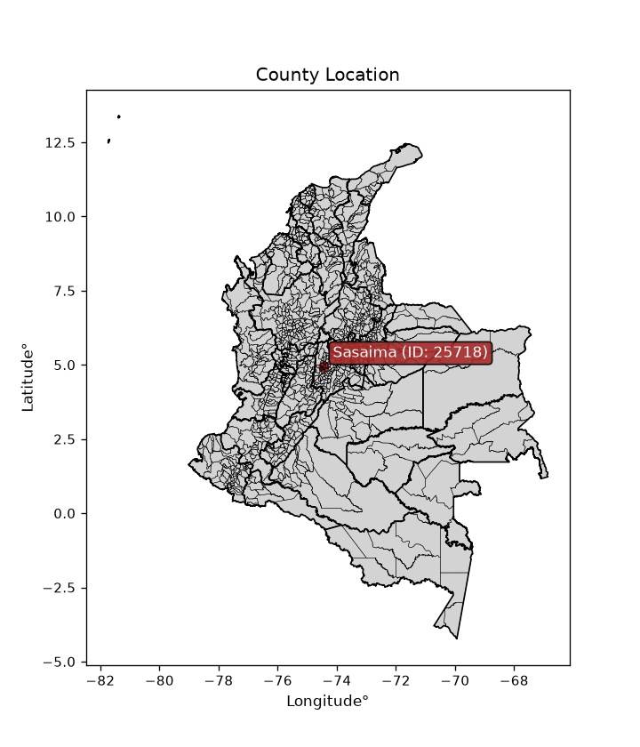
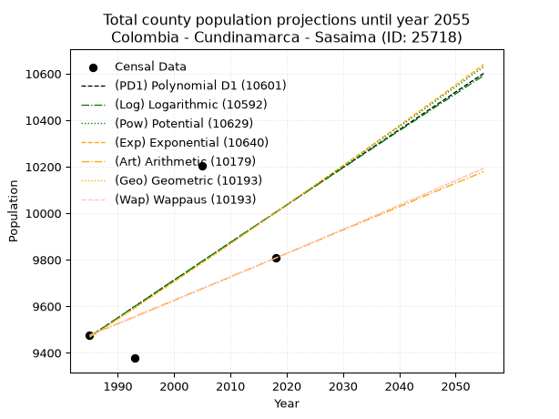
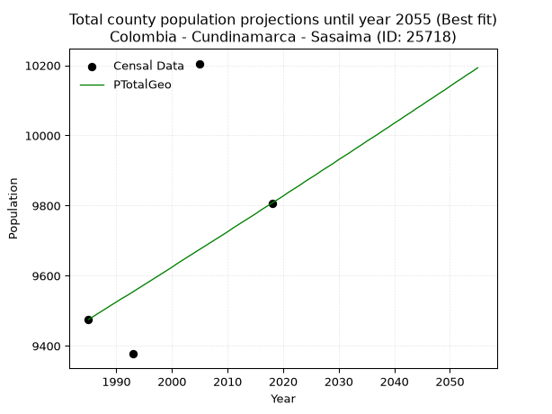
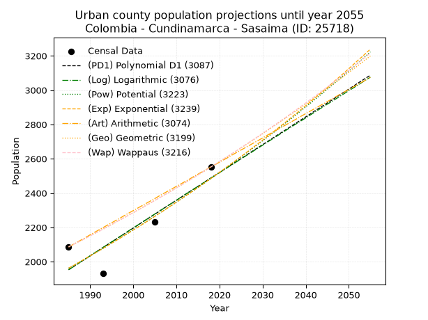
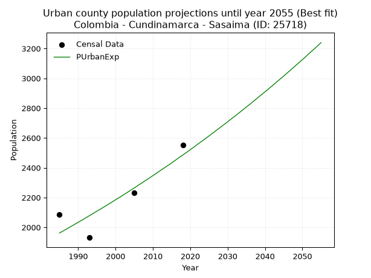
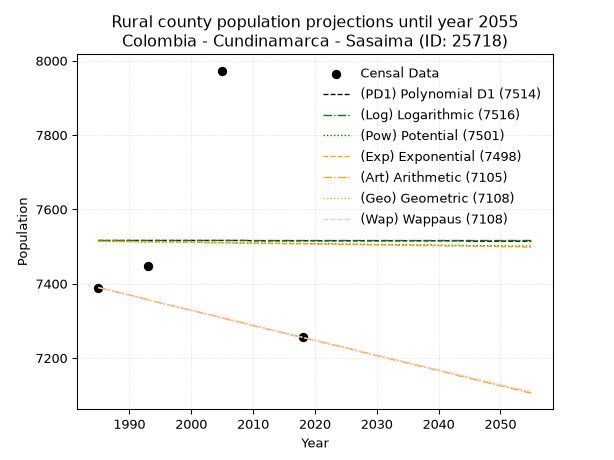
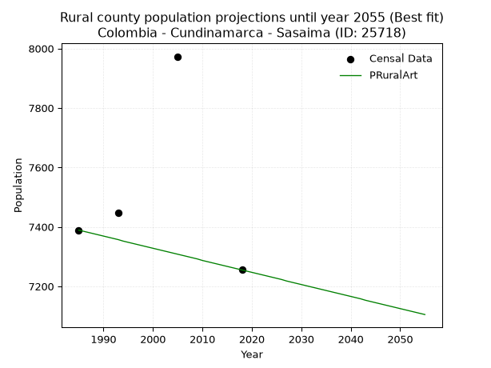

<div align="center">


</div>

# _“Population and Public Services Demand Projections (PPSD) until Year 2050 for Colombia - Cundinamarca - Sasaima (ID: 25718)”_
Keywords: `population` `public-service` `projection` `lineal` `polynomial` `logarithmic` `potential` `exponential` `arithmetic` `geometric` `wappaus` `dane` `colombia` `south-america`

PPSD are analytical estimates used by governments and planners to anticipate future changes in population size, age distribution, and the resulting community needs for utilities, healthcare, education, and infrastructure as sizing future water treatment facilities, electrical grids, and road networks based on spatial growth.

<div align="center">

</img>

</div>


> **General running parameters**: • app_version: _v20260806_. • Python version: _3.14.7_. • Pandas version: _3.0.5_. • NumPy version: _2.5.1_. • Creates, save and include plots into reports (create_plot): _False_. • Projection until year: _2050_. • Process polynomial degree 2 and up: _False_. • Process Wappaus: _True_. • Process Wappaus: _True_. • Set negative values to zero: _True_. • Set infinite values to zero: _True_. • Drop dataset notes: _True_. 
<div align="center">

Dynamic map: [:earth_americas:Google](http://maps.google.com/maps?q=4.962166987,-74.4326279) [:earth_americas:OSM](https://www.openstreetmap.org/#map=18/4.962166987/-74.4326279&layers=P) [:earth_americas:Bing](https://www.bing.com/maps?cp=4.962166987~-74.4326279&lvl=18) [:earth_americas:Apple](https://maps.apple.com/frame?center=4.962166987%2C-74.4326279&span=0.003%2C0.006)

</div>


<div align="center">

```geojson
{
  "type": "Feature",
  "geometry": {
    "type": "Point", 
    "coordinates": [-74.4326279, 4.962166987]
  }, 
  "properties": {
    "Name": "Colombia - Cundinamarca - Sasaima (ID: 25718)"
  }
}
```

</div>


## 0. Census Data (4 records)

Census data are official statistics collected by a government about the people and housing in a country. They usually include counts of total population, age, sex, race, income, education, and jobs.

📅Global census file: [Population.xlsx](../data/Population.xlsx)

| Source   |   Year |   CountryID | CountryName   |   StateID | StateName    |   CountyID | CountyName   |   PTotal |   PUrban |   PRural |
|:---------|-------:|------------:|:--------------|----------:|:-------------|-----------:|:-------------|---------:|---------:|---------:|
| DANE     |   1985 |          57 | Colombia      |        25 | Cundinamarca |      25718 | Sasaima      |     9475 |     2086 |     7389 |
| DANE     |   1993 |          57 | Colombia      |        25 | Cundinamarca |      25718 | Sasaima      |     9377 |     1931 |     7446 |
| DANE     |   2005 |          57 | Colombia      |        25 | Cundinamarca |      25718 | Sasaima      |    10205 |     2232 |     7973 |
| DANE     |   2018 |          57 | Colombia      |        25 | Cundinamarca |      25718 | Sasaima      |     9807 |     2552 |     7255 |

> 🔥Some records could had specific notes about the registered values or the corresponding urban or rural distribution.

📅[SUI-RUPS](https://www.datos.gov.co/Hacienda-y-Cr-dito-P-blico/Registro-nico-de-Prestadores-de-Servicios-P-blicos/4qkq-csdn/about_data) - Local public utility companies: [RUPS.csv](../data/RUPS.xlsx)

 | SERVICIO       | ESTADO    | NOMBRE                                                                                                        | NIT         | DEPARTAMENTO_DOMICILIO   | MUNICIPIO_DOMICILIO   | DIRECCION                |   TELEFONO | EMAIL                               | TIPO_PRESTADOR                 | CLASIFICACION                 |
|:---------------|:----------|:--------------------------------------------------------------------------------------------------------------|:------------|:-------------------------|:----------------------|:-------------------------|-----------:|:------------------------------------|:-------------------------------|:------------------------------|
| ACUEDUCTO      | OPERATIVA | ASOCIACION ACUEDUCTO GUANE-SANTA TERESA                                                                       | 832002774-1 | CUNDINAMARCA             | SASAIMA               | Calle 8 No 4-34          |    0000000 | acueductoguanesantateresa@gmail.com | ORGANIZACION AUTORIZADA        | MENOR O IGUAL A 2500 USUARIOS |
| ACUEDUCTO      | OPERATIVA | ACUEDUCTO VEREDAL LA MORENA Y MESETAS                                                                         | 832004608-4 | CUNDINAMARCA             | SASAIMA               | KM 1 VIA SASAIMA LA VEGA |    0000000 | acuemome@hotmail.com                | ORGANIZACION AUTORIZADA        | MENOR O IGUAL A 2500 USUARIOS |
| ACUEDUCTO      | OPERATIVA | SECRETARIA DE SERVICIOS PÚBLICOS DOMICILIARIOS DEL MUNICIPIO DE SASAIMA - CUNDINAMARCA                        | 800094752-5 | CUNDINAMARCA             | SASAIMA               | calle 7  No 3-13         |    8468022 | spsasasaima@gmail.com               | MUNICIPIO (PRESTACIÓN DIRECTA) | MENOR O IGUAL A 2500 USUARIOS |
| ALCANTARILLADO | OPERATIVA | SECRETARIA DE SERVICIOS PÚBLICOS DOMICILIARIOS DEL MUNICIPIO DE SASAIMA - CUNDINAMARCA                        | 800094752-5 | CUNDINAMARCA             | SASAIMA               | calle 7  No 3-13         |    8468022 | spsasasaima@gmail.com               | MUNICIPIO (PRESTACIÓN DIRECTA) | MENOR O IGUAL A 2500 USUARIOS |
| ACUEDUCTO      | OPERATIVA | ASOCIACION DE SUSCRIPTORES Y USUARIOS DEL ACUEDUCTO REGIONAL ACUALIMONAL                                      | 832005342-5 | CUNDINAMARCA             | SASAIMA               | CARRERA 3 No. 3 - 01     |    3157783 | usacualimonal@gmail.com             | ORGANIZACION AUTORIZADA        | MENOR O IGUAL A 2500 USUARIOS |
| ACUEDUCTO      | OPERATIVA | ASOCIACION DE USUARIOS ACUEDUCTO REGIONAL SUR OCCIDENTE DEL MUNICIPIO DE SASAIMA DEPARTAMENTO DE CUNDINAMARCA | 832010362-2 | CUNDINAMARCA             | SASAIMA               | calle 7 numero 4-58      |    0000000 | acueductosasaimasur@hotmail.com     | ORGANIZACION AUTORIZADA        | MENOR O IGUAL A 2500 USUARIOS |

## 1. Total

### 1.1. Coefficients and Parameters

* (PD1) Polynomial Deg 1: 16.171818546768534, -22631.680048173763 (lineal)
* (Log) Logarithmic: 32420.090128067674, -236709.36486173994
* (Pow) Potential: 3.345279790507039, -7.05577420524637
* (Exp) Exponential: 0.0016687777175160151, 344.814075799336
* (Art) Arithmetic: Year diff. 2018 - 1985 = 33, Population diff. 9807 - 9475 = 332, Annual growth = 10.06060606060606
* (Geo) Geometric: Year diff. 2018 - 1985 = 33, Population diff. 9807 - 9475 = 332, Annual growth % = 0.0010441709928499243
* (Wap) Wappaus: i = 0.10435230848051096, Condition values only valid for < 200)

<sub>
Wappaus condition values: ['0.00', '0.10', '0.21', '0.31', '0.42', '0.52', '0.63', '0.73', '0.83', '0.94', '1.04', '1.15', '1.25', '1.36', '1.46', '1.57', '1.67', '1.77', '1.88', '1.98', '2.09', '2.19', '2.30', '2.40', '2.50', '2.61', '2.71', '2.82', '2.92', '3.03', '3.13', '3.23', '3.34', '3.44', '3.55', '3.65', '3.76', '3.86', '3.97', '4.07', '4.17', '4.28', '4.38', '4.49', '4.59', '4.70', '4.80', '4.90', '5.01', '5.11', '5.22', '5.32', '5.43', '5.53', '5.64', '5.74', '5.84', '5.95', '6.05', '6.16', '6.26', '6.37', '6.47', '6.57', '6.68', '6.78']
</sub>


### 1.2. Projected Dataset

|   Year |   CountyID |   PTotalPD1 |   PTotalLog |   PTotalPow |   PTotalExp |   PTotalArt |   PTotalGeo |   PTotalWap |
|-------:|-----------:|------------:|------------:|------------:|------------:|------------:|------------:|------------:|
|   1985 |      25718 |        9469 |        9469 |        9466 |        9467 |        9475 |        9475 |        9475 |
|   1986 |      25718 |        9486 |        9485 |        9482 |        9482 |        9485 |        9485 |        9485 |
|   1987 |      25718 |        9502 |        9501 |        9498 |        9498 |        9495 |        9495 |        9495 |
|   1988 |      25718 |        9518 |        9517 |        9514 |        9514 |        9505 |        9505 |        9505 |
|   1989 |      25718 |        9534 |        9534 |        9530 |        9530 |        9515 |        9515 |        9515 |
|   1990 |      25718 |        9550 |        9550 |        9546 |        9546 |        9525 |        9525 |        9525 |
|   1991 |      25718 |        9566 |        9566 |        9562 |        9562 |        9535 |        9535 |        9535 |
|   1992 |      25718 |        9583 |        9583 |        9578 |        9578 |        9545 |        9544 |        9544 |
|   1993 |      25718 |        9599 |        9599 |        9594 |        9594 |        9555 |        9554 |        9554 |
|   1994 |      25718 |        9615 |        9615 |        9610 |        9610 |        9566 |        9564 |        9564 |
|   1995 |      25718 |        9631 |        9631 |        9626 |        9626 |        9576 |        9574 |        9574 |
|   1996 |      25718 |        9647 |        9648 |        9642 |        9642 |        9586 |        9584 |        9584 |
|   1997 |      25718 |        9663 |        9664 |        9659 |        9658 |        9596 |        9594 |        9594 |
|   1998 |      25718 |        9680 |        9680 |        9675 |        9674 |        9606 |        9604 |        9604 |
|   1999 |      25718 |        9696 |        9696 |        9691 |        9690 |        9616 |        9614 |        9614 |
|   2000 |      25718 |        9712 |        9713 |        9707 |        9707 |        9626 |        9624 |        9624 |
|   2001 |      25718 |        9728 |        9729 |        9723 |        9723 |        9636 |        9635 |        9635 |
|   2002 |      25718 |        9744 |        9745 |        9740 |        9739 |        9646 |        9645 |        9645 |
|   2003 |      25718 |        9760 |        9761 |        9756 |        9755 |        9656 |        9655 |        9655 |
|   2004 |      25718 |        9777 |        9777 |        9772 |        9772 |        9666 |        9665 |        9665 |
|   2005 |      25718 |        9793 |        9794 |        9789 |        9788 |        9676 |        9675 |        9675 |
|   2006 |      25718 |        9809 |        9810 |        9805 |        9804 |        9686 |        9685 |        9685 |
|   2007 |      25718 |        9825 |        9826 |        9821 |        9821 |        9696 |        9695 |        9695 |
|   2008 |      25718 |        9841 |        9842 |        9838 |        9837 |        9706 |        9705 |        9705 |
|   2009 |      25718 |        9858 |        9858 |        9854 |        9853 |        9716 |        9715 |        9715 |
|   2010 |      25718 |        9874 |        9874 |        9871 |        9870 |        9727 |        9725 |        9725 |
|   2011 |      25718 |        9890 |        9890 |        9887 |        9886 |        9737 |        9736 |        9736 |
|   2012 |      25718 |        9906 |        9907 |        9903 |        9903 |        9747 |        9746 |        9746 |
|   2013 |      25718 |        9922 |        9923 |        9920 |        9919 |        9757 |        9756 |        9756 |
|   2014 |      25718 |        9938 |        9939 |        9936 |        9936 |        9767 |        9766 |        9766 |
|   2015 |      25718 |        9955 |        9955 |        9953 |        9953 |        9777 |        9776 |        9776 |
|   2016 |      25718 |        9971 |        9971 |        9969 |        9969 |        9787 |        9787 |        9787 |
|   2017 |      25718 |        9987 |        9987 |        9986 |        9986 |        9797 |        9797 |        9797 |
|   2018 |      25718 |       10003 |       10003 |       10003 |       10003 |        9807 |        9807 |        9807 |
|   2019 |      25718 |       10019 |       10019 |       10019 |       10019 |        9817 |        9817 |        9817 |
|   2020 |      25718 |       10035 |       10035 |       10036 |       10036 |        9827 |        9827 |        9827 |
|   2021 |      25718 |       10052 |       10051 |       10052 |       10053 |        9837 |        9838 |        9838 |
|   2022 |      25718 |       10068 |       10067 |       10069 |       10070 |        9847 |        9848 |        9848 |
|   2023 |      25718 |       10084 |       10083 |       10086 |       10086 |        9857 |        9858 |        9858 |
|   2024 |      25718 |       10100 |       10099 |       10102 |       10103 |        9867 |        9869 |        9869 |
|   2025 |      25718 |       10116 |       10115 |       10119 |       10120 |        9877 |        9879 |        9879 |
|   2026 |      25718 |       10132 |       10131 |       10136 |       10137 |        9887 |        9889 |        9889 |
|   2027 |      25718 |       10149 |       10147 |       10153 |       10154 |        9898 |        9900 |        9900 |
|   2028 |      25718 |       10165 |       10163 |       10169 |       10171 |        9908 |        9910 |        9910 |
|   2029 |      25718 |       10181 |       10179 |       10186 |       10188 |        9918 |        9920 |        9920 |
|   2030 |      25718 |       10197 |       10195 |       10203 |       10205 |        9928 |        9931 |        9931 |
|   2031 |      25718 |       10213 |       10211 |       10220 |       10222 |        9938 |        9941 |        9941 |
|   2032 |      25718 |       10229 |       10227 |       10237 |       10239 |        9948 |        9951 |        9951 |
|   2033 |      25718 |       10246 |       10243 |       10253 |       10256 |        9958 |        9962 |        9962 |
|   2034 |      25718 |       10262 |       10259 |       10270 |       10273 |        9968 |        9972 |        9972 |
|   2035 |      25718 |       10278 |       10275 |       10287 |       10290 |        9978 |        9983 |        9983 |
|   2036 |      25718 |       10294 |       10291 |       10304 |       10308 |        9988 |        9993 |        9993 |
|   2037 |      25718 |       10310 |       10307 |       10321 |       10325 |        9998 |       10003 |       10003 |
|   2038 |      25718 |       10326 |       10323 |       10338 |       10342 |       10008 |       10014 |       10014 |
|   2039 |      25718 |       10343 |       10339 |       10355 |       10359 |       10018 |       10024 |       10024 |
|   2040 |      25718 |       10359 |       10355 |       10372 |       10377 |       10028 |       10035 |       10035 |
|   2041 |      25718 |       10375 |       10370 |       10389 |       10394 |       10038 |       10045 |       10045 |
|   2042 |      25718 |       10391 |       10386 |       10406 |       10411 |       10048 |       10056 |       10056 |
|   2043 |      25718 |       10407 |       10402 |       10423 |       10429 |       10059 |       10066 |       10066 |
|   2044 |      25718 |       10424 |       10418 |       10440 |       10446 |       10069 |       10077 |       10077 |
|   2045 |      25718 |       10440 |       10434 |       10457 |       10464 |       10079 |       10087 |       10087 |
|   2046 |      25718 |       10456 |       10450 |       10474 |       10481 |       10089 |       10098 |       10098 |
|   2047 |      25718 |       10472 |       10466 |       10492 |       10499 |       10099 |       10108 |       10109 |
|   2048 |      25718 |       10488 |       10481 |       10509 |       10516 |       10109 |       10119 |       10119 |
|   2049 |      25718 |       10504 |       10497 |       10526 |       10534 |       10119 |       10129 |       10130 |
|   2050 |      25718 |       10521 |       10513 |       10543 |       10551 |       10129 |       10140 |       10140 |
<div align="center">

</img>

</div>


### 1.3. Best fit with absolute and relative error (%)

Relative error puts that difference into context by dividing the absolute error by the true value, creating a unitless ratio or percentage that shows the scale of the mistake.

Absolute and relative error

|   Year | Source   |   CountryID | CountryName   |   StateID | StateName    |   CountyID_x | CountyName   |   PTotal |   PUrban |   PRural |   CountyID_y |   PTotalPD1 |   PTotalLog |   PTotalPow |   PTotalExp |   PTotalArt |   PTotalGeo |   PTotalWap |   PTotalPD1AbsError |   PTotalLogAbsError |   PTotalPowAbsError |   PTotalExpAbsError |   PTotalArtAbsError |   PTotalGeoAbsError |   PTotalWapAbsError |   PTotalPD1RelError |   PTotalLogRelError |   PTotalPowRelError |   PTotalExpRelError |   PTotalArtRelError |   PTotalGeoRelError |   PTotalWapRelError |
|-------:|:---------|------------:|:--------------|----------:|:-------------|-------------:|:-------------|---------:|---------:|---------:|-------------:|------------:|------------:|------------:|------------:|------------:|------------:|------------:|--------------------:|--------------------:|--------------------:|--------------------:|--------------------:|--------------------:|--------------------:|--------------------:|--------------------:|--------------------:|--------------------:|--------------------:|--------------------:|--------------------:|
|   1985 | DANE     |          57 | Colombia      |        25 | Cundinamarca |        25718 | Sasaima      |     9475 |     2086 |     7389 |        25718 |        9469 |        9469 |        9466 |        9467 |        9475 |        9475 |        9475 |                   6 |                   6 |                   9 |                   8 |                   0 |                   0 |                   0 |           0.0633245 |           0.0633245 |           0.0949868 |           0.0844327 |             0       |             0       |             0       |
|   1993 | DANE     |          57 | Colombia      |        25 | Cundinamarca |        25718 | Sasaima      |     9377 |     1931 |     7446 |        25718 |        9599 |        9599 |        9594 |        9594 |        9555 |        9554 |        9554 |                 222 |                 222 |                 217 |                 217 |                 178 |                 177 |                 177 |           2.36749   |           2.36749   |           2.31417   |           2.31417   |             1.89826 |             1.8876  |             1.8876  |
|   2005 | DANE     |          57 | Colombia      |        25 | Cundinamarca |        25718 | Sasaima      |    10205 |     2232 |     7973 |        25718 |        9793 |        9794 |        9789 |        9788 |        9676 |        9675 |        9675 |                 412 |                 411 |                 416 |                 417 |                 529 |                 530 |                 530 |           4.03724   |           4.02744   |           4.07643   |           4.08623   |             5.18373 |             5.19353 |             5.19353 |
|   2018 | DANE     |          57 | Colombia      |        25 | Cundinamarca |        25718 | Sasaima      |     9807 |     2552 |     7255 |        25718 |       10003 |       10003 |       10003 |       10003 |        9807 |        9807 |        9807 |                 196 |                 196 |                 196 |                 196 |                   0 |                   0 |                   0 |           1.99857   |           1.99857   |           1.99857   |           1.99857   |             0       |             0       |             0       |

Relative error mean

| Method    |   RelError | Best   |
|:----------|-----------:|:-------|
| PTotalPD1 |    2.11666 |        |
| PTotalLog |    2.11421 |        |
| PTotalPow |    2.12104 |        |
| PTotalExp |    2.12085 |        |
| PTotalArt |    1.7705  |        |
| PTotalGeo |    1.77028 | True   |
| PTotalWap |    1.77028 | True   |

💙Best method: _**PTotalGeo**_
<div align="center">

</img>

</div>


### 1.4. Fresh water supply demand in liters per capita per day (lpcd)

The fresh water supply demand typically ranges from 100 to 300 liters per capita per day (lpcd) for standard domestic and municipal planning, though absolute survival minimums set by the World Health Organization are as low as 7.5 to 20 liters per day, and total consumption in high-income nations can exceed 400 liters.

> `CZ`: Level in meters above the sea level (masl)<br> `WS`: Fresh water supply demand in liters per capita per day (lpcd or l/h/d)<br> `WSAll`: Zonal fresh water supply demand in liters per second (l/s)<br> `A`: Zonal area in square meters<br> `DP`: Population density (people/hectare or p/ha)

Reference values (RAS Colombia)

|    CZ |   WS |
|------:|-----:|
|  1000 |  120 |
|  2000 |  130 |
| 99999 |  140 |

County shapefile geometry properties and water supply values

|   CountyID |      ATotal |   CZTotal |   WSTotal |
|-----------:|------------:|----------:|----------:|
|      25718 | 1.11507e+08 |   1581.79 |       130 |

Projected values for best method: PTotalGeo

|   CountyID |   Year |   PTotalGeo |   DPTotal |   WSTotal |   WSTotalAll |
|-----------:|-------:|------------:|----------:|----------:|-------------:|
|      25718 |   1985 |        9475 |      0.85 |       130 |      14.2564 |
|      25718 |   1986 |        9485 |      0.85 |       130 |      14.2714 |
|      25718 |   1987 |        9495 |      0.85 |       130 |      14.2865 |
|      25718 |   1988 |        9505 |      0.85 |       130 |      14.3015 |
|      25718 |   1989 |        9515 |      0.85 |       130 |      14.3166 |
|      25718 |   1990 |        9525 |      0.85 |       130 |      14.3316 |
|      25718 |   1991 |        9535 |      0.86 |       130 |      14.3466 |
|      25718 |   1992 |        9544 |      0.86 |       130 |      14.3602 |
|      25718 |   1993 |        9554 |      0.86 |       130 |      14.3752 |
|      25718 |   1994 |        9564 |      0.86 |       130 |      14.3903 |
|      25718 |   1995 |        9574 |      0.86 |       130 |      14.4053 |
|      25718 |   1996 |        9584 |      0.86 |       130 |      14.4204 |
|      25718 |   1997 |        9594 |      0.86 |       130 |      14.4354 |
|      25718 |   1998 |        9604 |      0.86 |       130 |      14.4505 |
|      25718 |   1999 |        9614 |      0.86 |       130 |      14.4655 |
|      25718 |   2000 |        9624 |      0.86 |       130 |      14.4806 |
|      25718 |   2001 |        9635 |      0.86 |       130 |      14.4971 |
|      25718 |   2002 |        9645 |      0.86 |       130 |      14.5122 |
|      25718 |   2003 |        9655 |      0.87 |       130 |      14.5272 |
|      25718 |   2004 |        9665 |      0.87 |       130 |      14.5422 |
|      25718 |   2005 |        9675 |      0.87 |       130 |      14.5573 |
|      25718 |   2006 |        9685 |      0.87 |       130 |      14.5723 |
|      25718 |   2007 |        9695 |      0.87 |       130 |      14.5874 |
|      25718 |   2008 |        9705 |      0.87 |       130 |      14.6024 |
|      25718 |   2009 |        9715 |      0.87 |       130 |      14.6175 |
|      25718 |   2010 |        9725 |      0.87 |       130 |      14.6325 |
|      25718 |   2011 |        9736 |      0.87 |       130 |      14.6491 |
|      25718 |   2012 |        9746 |      0.87 |       130 |      14.6641 |
|      25718 |   2013 |        9756 |      0.87 |       130 |      14.6792 |
|      25718 |   2014 |        9766 |      0.88 |       130 |      14.6942 |
|      25718 |   2015 |        9776 |      0.88 |       130 |      14.7093 |
|      25718 |   2016 |        9787 |      0.88 |       130 |      14.7258 |
|      25718 |   2017 |        9797 |      0.88 |       130 |      14.7409 |
|      25718 |   2018 |        9807 |      0.88 |       130 |      14.7559 |
|      25718 |   2019 |        9817 |      0.88 |       130 |      14.7709 |
|      25718 |   2020 |        9827 |      0.88 |       130 |      14.786  |
|      25718 |   2021 |        9838 |      0.88 |       130 |      14.8025 |
|      25718 |   2022 |        9848 |      0.88 |       130 |      14.8176 |
|      25718 |   2023 |        9858 |      0.88 |       130 |      14.8326 |
|      25718 |   2024 |        9869 |      0.89 |       130 |      14.8492 |
|      25718 |   2025 |        9879 |      0.89 |       130 |      14.8642 |
|      25718 |   2026 |        9889 |      0.89 |       130 |      14.8793 |
|      25718 |   2027 |        9900 |      0.89 |       130 |      14.8958 |
|      25718 |   2028 |        9910 |      0.89 |       130 |      14.9109 |
|      25718 |   2029 |        9920 |      0.89 |       130 |      14.9259 |
|      25718 |   2030 |        9931 |      0.89 |       130 |      14.9425 |
|      25718 |   2031 |        9941 |      0.89 |       130 |      14.9575 |
|      25718 |   2032 |        9951 |      0.89 |       130 |      14.9726 |
|      25718 |   2033 |        9962 |      0.89 |       130 |      14.9891 |
|      25718 |   2034 |        9972 |      0.89 |       130 |      15.0042 |
|      25718 |   2035 |        9983 |      0.9  |       130 |      15.0207 |
|      25718 |   2036 |        9993 |      0.9  |       130 |      15.0358 |
|      25718 |   2037 |       10003 |      0.9  |       130 |      15.0508 |
|      25718 |   2038 |       10014 |      0.9  |       130 |      15.0674 |
|      25718 |   2039 |       10024 |      0.9  |       130 |      15.0824 |
|      25718 |   2040 |       10035 |      0.9  |       130 |      15.099  |
|      25718 |   2041 |       10045 |      0.9  |       130 |      15.114  |
|      25718 |   2042 |       10056 |      0.9  |       130 |      15.1306 |
|      25718 |   2043 |       10066 |      0.9  |       130 |      15.1456 |
|      25718 |   2044 |       10077 |      0.9  |       130 |      15.1622 |
|      25718 |   2045 |       10087 |      0.9  |       130 |      15.1772 |
|      25718 |   2046 |       10098 |      0.91 |       130 |      15.1937 |
|      25718 |   2047 |       10108 |      0.91 |       130 |      15.2088 |
|      25718 |   2048 |       10119 |      0.91 |       130 |      15.2253 |
|      25718 |   2049 |       10129 |      0.91 |       130 |      15.2404 |
|      25718 |   2050 |       10140 |      0.91 |       130 |      15.2569 |

## 2. Urban

### 2.1. Coefficients and Parameters

* (PD1) Polynomial Deg 1: 16.20032115616194, -30204.442392612924 (lineal)
* (Log) Logarithmic: 32393.02475935103, -244019.3907772365
* (Pow) Potential: 14.320449660854676, -43.93272249322719
* (Exp) Exponential: 0.007161824144473833, 0.0013143434396225846
* (Art) Arithmetic: Year diff. 2018 - 1985 = 33, Population diff. 2552 - 2086 = 466, Annual growth = 14.121212121212121
* (Geo) Geometric: Year diff. 2018 - 1985 = 33, Population diff. 2552 - 2086 = 466, Annual growth % = 0.0061286739073855845
* (Wap) Wappaus: i = 0.608935408417944, Condition values only valid for < 200)

<sub>
Wappaus condition values: ['0.00', '0.61', '1.22', '1.83', '2.44', '3.04', '3.65', '4.26', '4.87', '5.48', '6.09', '6.70', '7.31', '7.92', '8.53', '9.13', '9.74', '10.35', '10.96', '11.57', '12.18', '12.79', '13.40', '14.01', '14.61', '15.22', '15.83', '16.44', '17.05', '17.66', '18.27', '18.88', '19.49', '20.09', '20.70', '21.31', '21.92', '22.53', '23.14', '23.75', '24.36', '24.97', '25.58', '26.18', '26.79', '27.40', '28.01', '28.62', '29.23', '29.84', '30.45', '31.06', '31.66', '32.27', '32.88', '33.49', '34.10', '34.71', '35.32', '35.93', '36.54', '37.15', '37.75', '38.36', '38.97', '39.58']
</sub>


### 2.2. Projected Dataset

|   Year |   CountyID |   PUrbanPD1 |   PUrbanLog |   PUrbanPow |   PUrbanExp |   PUrbanArt |   PUrbanGeo |   PUrbanWap |
|-------:|-----------:|------------:|------------:|------------:|------------:|------------:|------------:|------------:|
|   1985 |      25718 |        1953 |        1953 |        1962 |        1962 |        2086 |        2086 |        2086 |
|   1986 |      25718 |        1969 |        1969 |        1976 |        1976 |        2100 |        2099 |        2099 |
|   1987 |      25718 |        1986 |        1986 |        1990 |        1990 |        2114 |        2112 |        2112 |
|   1988 |      25718 |        2002 |        2002 |        2005 |        2005 |        2128 |        2125 |        2124 |
|   1989 |      25718 |        2018 |        2018 |        2019 |        2019 |        2142 |        2138 |        2137 |
|   1990 |      25718 |        2034 |        2034 |        2034 |        2034 |        2157 |        2151 |        2150 |
|   1991 |      25718 |        2050 |        2051 |        2049 |        2048 |        2171 |        2164 |        2164 |
|   1992 |      25718 |        2067 |        2067 |        2063 |        2063 |        2185 |        2177 |        2177 |
|   1993 |      25718 |        2083 |        2083 |        2078 |        2078 |        2199 |        2190 |        2190 |
|   1994 |      25718 |        2099 |        2100 |        2093 |        2093 |        2213 |        2204 |        2204 |
|   1995 |      25718 |        2115 |        2116 |        2108 |        2108 |        2227 |        2217 |        2217 |
|   1996 |      25718 |        2131 |        2132 |        2124 |        2123 |        2241 |        2231 |        2231 |
|   1997 |      25718 |        2148 |        2148 |        2139 |        2138 |        2255 |        2245 |        2244 |
|   1998 |      25718 |        2164 |        2164 |        2154 |        2154 |        2270 |        2258 |        2258 |
|   1999 |      25718 |        2180 |        2181 |        2170 |        2169 |        2284 |        2272 |        2272 |
|   2000 |      25718 |        2196 |        2197 |        2185 |        2185 |        2298 |        2286 |        2286 |
|   2001 |      25718 |        2212 |        2213 |        2201 |        2200 |        2312 |        2300 |        2300 |
|   2002 |      25718 |        2229 |        2229 |        2217 |        2216 |        2326 |        2314 |        2314 |
|   2003 |      25718 |        2245 |        2245 |        2233 |        2232 |        2340 |        2329 |        2328 |
|   2004 |      25718 |        2261 |        2262 |        2249 |        2248 |        2354 |        2343 |        2342 |
|   2005 |      25718 |        2277 |        2278 |        2265 |        2264 |        2368 |        2357 |        2357 |
|   2006 |      25718 |        2293 |        2294 |        2281 |        2281 |        2383 |        2372 |        2371 |
|   2007 |      25718 |        2310 |        2310 |        2297 |        2297 |        2397 |        2386 |        2386 |
|   2008 |      25718 |        2326 |        2326 |        2314 |        2314 |        2411 |        2401 |        2400 |
|   2009 |      25718 |        2342 |        2342 |        2330 |        2330 |        2425 |        2415 |        2415 |
|   2010 |      25718 |        2358 |        2358 |        2347 |        2347 |        2439 |        2430 |        2430 |
|   2011 |      25718 |        2374 |        2375 |        2364 |        2364 |        2453 |        2445 |        2445 |
|   2012 |      25718 |        2391 |        2391 |        2381 |        2381 |        2467 |        2460 |        2460 |
|   2013 |      25718 |        2407 |        2407 |        2398 |        2398 |        2481 |        2475 |        2475 |
|   2014 |      25718 |        2423 |        2423 |        2415 |        2415 |        2496 |        2490 |        2490 |
|   2015 |      25718 |        2439 |        2439 |        2432 |        2432 |        2510 |        2506 |        2505 |
|   2016 |      25718 |        2455 |        2455 |        2449 |        2450 |        2524 |        2521 |        2521 |
|   2017 |      25718 |        2472 |        2471 |        2467 |        2468 |        2538 |        2536 |        2536 |
|   2018 |      25718 |        2488 |        2487 |        2484 |        2485 |        2552 |        2552 |        2552 |
|   2019 |      25718 |        2504 |        2503 |        2502 |        2503 |        2566 |        2568 |        2568 |
|   2020 |      25718 |        2520 |        2519 |        2520 |        2521 |        2580 |        2583 |        2584 |
|   2021 |      25718 |        2536 |        2535 |        2538 |        2539 |        2594 |        2599 |        2600 |
|   2022 |      25718 |        2553 |        2551 |        2556 |        2558 |        2608 |        2615 |        2616 |
|   2023 |      25718 |        2569 |        2567 |        2574 |        2576 |        2623 |        2631 |        2632 |
|   2024 |      25718 |        2585 |        2583 |        2592 |        2594 |        2637 |        2647 |        2648 |
|   2025 |      25718 |        2601 |        2599 |        2611 |        2613 |        2651 |        2664 |        2665 |
|   2026 |      25718 |        2617 |        2615 |        2629 |        2632 |        2665 |        2680 |        2681 |
|   2027 |      25718 |        2634 |        2631 |        2648 |        2651 |        2679 |        2696 |        2698 |
|   2028 |      25718 |        2650 |        2647 |        2667 |        2670 |        2693 |        2713 |        2714 |
|   2029 |      25718 |        2666 |        2663 |        2686 |        2689 |        2707 |        2729 |        2731 |
|   2030 |      25718 |        2682 |        2679 |        2705 |        2708 |        2721 |        2746 |        2748 |
|   2031 |      25718 |        2698 |        2695 |        2724 |        2728 |        2736 |        2763 |        2765 |
|   2032 |      25718 |        2715 |        2711 |        2743 |        2747 |        2750 |        2780 |        2783 |
|   2033 |      25718 |        2731 |        2727 |        2762 |        2767 |        2764 |        2797 |        2800 |
|   2034 |      25718 |        2747 |        2743 |        2782 |        2787 |        2778 |        2814 |        2818 |
|   2035 |      25718 |        2763 |        2759 |        2802 |        2807 |        2792 |        2831 |        2835 |
|   2036 |      25718 |        2779 |        2775 |        2821 |        2827 |        2806 |        2849 |        2853 |
|   2037 |      25718 |        2796 |        2791 |        2841 |        2848 |        2820 |        2866 |        2871 |
|   2038 |      25718 |        2812 |        2807 |        2861 |        2868 |        2834 |        2884 |        2889 |
|   2039 |      25718 |        2828 |        2822 |        2882 |        2889 |        2849 |        2901 |        2907 |
|   2040 |      25718 |        2844 |        2838 |        2902 |        2909 |        2863 |        2919 |        2925 |
|   2041 |      25718 |        2860 |        2854 |        2922 |        2930 |        2877 |        2937 |        2944 |
|   2042 |      25718 |        2877 |        2870 |        2943 |        2951 |        2891 |        2955 |        2962 |
|   2043 |      25718 |        2893 |        2886 |        2964 |        2973 |        2905 |        2973 |        2981 |
|   2044 |      25718 |        2909 |        2902 |        2984 |        2994 |        2919 |        2991 |        3000 |
|   2045 |      25718 |        2925 |        2918 |        3005 |        3015 |        2933 |        3010 |        3018 |
|   2046 |      25718 |        2941 |        2933 |        3026 |        3037 |        2947 |        3028 |        3038 |
|   2047 |      25718 |        2958 |        2949 |        3048 |        3059 |        2962 |        3047 |        3057 |
|   2048 |      25718 |        2974 |        2965 |        3069 |        3081 |        2976 |        3065 |        3076 |
|   2049 |      25718 |        2990 |        2981 |        3091 |        3103 |        2990 |        3084 |        3096 |
|   2050 |      25718 |        3006 |        2997 |        3112 |        3125 |        3004 |        3103 |        3115 |
<div align="center">

</img>

</div>


### 2.3. Best fit with absolute and relative error (%)

Relative error puts that difference into context by dividing the absolute error by the true value, creating a unitless ratio or percentage that shows the scale of the mistake.

Absolute and relative error

|   Year | Source   |   CountryID | CountryName   |   StateID | StateName    |   CountyID_x | CountyName   |   PTotal |   PUrban |   PRural |   CountyID_y |   PUrbanPD1 |   PUrbanLog |   PUrbanPow |   PUrbanExp |   PUrbanArt |   PUrbanGeo |   PUrbanWap |   PUrbanPD1AbsError |   PUrbanLogAbsError |   PUrbanPowAbsError |   PUrbanExpAbsError |   PUrbanArtAbsError |   PUrbanGeoAbsError |   PUrbanWapAbsError |   PUrbanPD1RelError |   PUrbanLogRelError |   PUrbanPowRelError |   PUrbanExpRelError |   PUrbanArtRelError |   PUrbanGeoRelError |   PUrbanWapRelError |
|-------:|:---------|------------:|:--------------|----------:|:-------------|-------------:|:-------------|---------:|---------:|---------:|-------------:|------------:|------------:|------------:|------------:|------------:|------------:|------------:|--------------------:|--------------------:|--------------------:|--------------------:|--------------------:|--------------------:|--------------------:|--------------------:|--------------------:|--------------------:|--------------------:|--------------------:|--------------------:|--------------------:|
|   1985 | DANE     |          57 | Colombia      |        25 | Cundinamarca |        25718 | Sasaima      |     9475 |     2086 |     7389 |        25718 |        1953 |        1953 |        1962 |        1962 |        2086 |        2086 |        2086 |                 133 |                 133 |                 124 |                 124 |                   0 |                   0 |                   0 |             6.37584 |             6.37584 |             5.94439 |             5.94439 |             0       |             0       |             0       |
|   1993 | DANE     |          57 | Colombia      |        25 | Cundinamarca |        25718 | Sasaima      |     9377 |     1931 |     7446 |        25718 |        2083 |        2083 |        2078 |        2078 |        2199 |        2190 |        2190 |                 152 |                 152 |                 147 |                 147 |                 268 |                 259 |                 259 |             7.87157 |             7.87157 |             7.61264 |             7.61264 |            13.8788  |            13.4127  |            13.4127  |
|   2005 | DANE     |          57 | Colombia      |        25 | Cundinamarca |        25718 | Sasaima      |    10205 |     2232 |     7973 |        25718 |        2277 |        2278 |        2265 |        2264 |        2368 |        2357 |        2357 |                  45 |                  46 |                  33 |                  32 |                 136 |                 125 |                 125 |             2.01613 |             2.06093 |             1.47849 |             1.43369 |             6.09319 |             5.60036 |             5.60036 |
|   2018 | DANE     |          57 | Colombia      |        25 | Cundinamarca |        25718 | Sasaima      |     9807 |     2552 |     7255 |        25718 |        2488 |        2487 |        2484 |        2485 |        2552 |        2552 |        2552 |                  64 |                  65 |                  68 |                  67 |                   0 |                   0 |                   0 |             2.50784 |             2.54702 |             2.66458 |             2.62539 |             0       |             0       |             0       |

Relative error mean

| Method    |   RelError | Best   |
|:----------|-----------:|:-------|
| PUrbanPD1 |    4.69284 |        |
| PUrbanLog |    4.71384 |        |
| PUrbanPow |    4.42502 |        |
| PUrbanExp |    4.40403 | True   |
| PUrbanArt |    4.993   |        |
| PUrbanGeo |    4.75327 |        |
| PUrbanWap |    4.75327 |        |

💙Best method: _**PUrbanExp**_
<div align="center">

</img>

</div>


### 2.4. Fresh water supply demand in liters per capita per day (lpcd)

The fresh water supply demand typically ranges from 100 to 300 liters per capita per day (lpcd) for standard domestic and municipal planning, though absolute survival minimums set by the World Health Organization are as low as 7.5 to 20 liters per day, and total consumption in high-income nations can exceed 400 liters.

> `CZ`: Level in meters above the sea level (masl)<br> `WS`: Fresh water supply demand in liters per capita per day (lpcd or l/h/d)<br> `WSAll`: Zonal fresh water supply demand in liters per second (l/s)<br> `A`: Zonal area in square meters<br> `DP`: Population density (people/hectare or p/ha)

Reference values (RAS Colombia)

|    CZ |   WS |
|------:|-----:|
|  1000 |  120 |
|  2000 |  130 |
| 99999 |  140 |

County shapefile geometry properties and water supply values

|   CountyID |   AUrban |   CZUrban |   WSUrban |
|-----------:|---------:|----------:|----------:|
|      25718 |   630724 |   1189.08 |       130 |

Projected values for best method: PUrbanExp

|   CountyID |   Year |   PUrbanExp |   DPUrban |   WSUrban |   WSUrbanAll |
|-----------:|-------:|------------:|----------:|----------:|-------------:|
|      25718 |   1985 |        1962 |     31.11 |       130 |      2.95208 |
|      25718 |   1986 |        1976 |     31.33 |       130 |      2.97315 |
|      25718 |   1987 |        1990 |     31.55 |       130 |      2.99421 |
|      25718 |   1988 |        2005 |     31.79 |       130 |      3.01678 |
|      25718 |   1989 |        2019 |     32.01 |       130 |      3.03785 |
|      25718 |   1990 |        2034 |     32.25 |       130 |      3.06042 |
|      25718 |   1991 |        2048 |     32.47 |       130 |      3.08148 |
|      25718 |   1992 |        2063 |     32.71 |       130 |      3.10405 |
|      25718 |   1993 |        2078 |     32.95 |       130 |      3.12662 |
|      25718 |   1994 |        2093 |     33.18 |       130 |      3.14919 |
|      25718 |   1995 |        2108 |     33.42 |       130 |      3.17176 |
|      25718 |   1996 |        2123 |     33.66 |       130 |      3.19433 |
|      25718 |   1997 |        2138 |     33.9  |       130 |      3.2169  |
|      25718 |   1998 |        2154 |     34.15 |       130 |      3.24097 |
|      25718 |   1999 |        2169 |     34.39 |       130 |      3.26354 |
|      25718 |   2000 |        2185 |     34.64 |       130 |      3.28762 |
|      25718 |   2001 |        2200 |     34.88 |       130 |      3.31019 |
|      25718 |   2002 |        2216 |     35.13 |       130 |      3.33426 |
|      25718 |   2003 |        2232 |     35.39 |       130 |      3.35833 |
|      25718 |   2004 |        2248 |     35.64 |       130 |      3.38241 |
|      25718 |   2005 |        2264 |     35.9  |       130 |      3.40648 |
|      25718 |   2006 |        2281 |     36.16 |       130 |      3.43206 |
|      25718 |   2007 |        2297 |     36.42 |       130 |      3.45613 |
|      25718 |   2008 |        2314 |     36.69 |       130 |      3.48171 |
|      25718 |   2009 |        2330 |     36.94 |       130 |      3.50579 |
|      25718 |   2010 |        2347 |     37.21 |       130 |      3.53137 |
|      25718 |   2011 |        2364 |     37.48 |       130 |      3.55694 |
|      25718 |   2012 |        2381 |     37.75 |       130 |      3.58252 |
|      25718 |   2013 |        2398 |     38.02 |       130 |      3.6081  |
|      25718 |   2014 |        2415 |     38.29 |       130 |      3.63368 |
|      25718 |   2015 |        2432 |     38.56 |       130 |      3.65926 |
|      25718 |   2016 |        2450 |     38.84 |       130 |      3.68634 |
|      25718 |   2017 |        2468 |     39.13 |       130 |      3.71343 |
|      25718 |   2018 |        2485 |     39.4  |       130 |      3.739   |
|      25718 |   2019 |        2503 |     39.68 |       130 |      3.76609 |
|      25718 |   2020 |        2521 |     39.97 |       130 |      3.79317 |
|      25718 |   2021 |        2539 |     40.26 |       130 |      3.82025 |
|      25718 |   2022 |        2558 |     40.56 |       130 |      3.84884 |
|      25718 |   2023 |        2576 |     40.84 |       130 |      3.87593 |
|      25718 |   2024 |        2594 |     41.13 |       130 |      3.90301 |
|      25718 |   2025 |        2613 |     41.43 |       130 |      3.9316  |
|      25718 |   2026 |        2632 |     41.73 |       130 |      3.96019 |
|      25718 |   2027 |        2651 |     42.03 |       130 |      3.98877 |
|      25718 |   2028 |        2670 |     42.33 |       130 |      4.01736 |
|      25718 |   2029 |        2689 |     42.63 |       130 |      4.04595 |
|      25718 |   2030 |        2708 |     42.93 |       130 |      4.07454 |
|      25718 |   2031 |        2728 |     43.25 |       130 |      4.10463 |
|      25718 |   2032 |        2747 |     43.55 |       130 |      4.13322 |
|      25718 |   2033 |        2767 |     43.87 |       130 |      4.16331 |
|      25718 |   2034 |        2787 |     44.19 |       130 |      4.1934  |
|      25718 |   2035 |        2807 |     44.5  |       130 |      4.2235  |
|      25718 |   2036 |        2827 |     44.82 |       130 |      4.25359 |
|      25718 |   2037 |        2848 |     45.15 |       130 |      4.28519 |
|      25718 |   2038 |        2868 |     45.47 |       130 |      4.31528 |
|      25718 |   2039 |        2889 |     45.8  |       130 |      4.34687 |
|      25718 |   2040 |        2909 |     46.12 |       130 |      4.37697 |
|      25718 |   2041 |        2930 |     46.45 |       130 |      4.40856 |
|      25718 |   2042 |        2951 |     46.79 |       130 |      4.44016 |
|      25718 |   2043 |        2973 |     47.14 |       130 |      4.47326 |
|      25718 |   2044 |        2994 |     47.47 |       130 |      4.50486 |
|      25718 |   2045 |        3015 |     47.8  |       130 |      4.53646 |
|      25718 |   2046 |        3037 |     48.15 |       130 |      4.56956 |
|      25718 |   2047 |        3059 |     48.5  |       130 |      4.60266 |
|      25718 |   2048 |        3081 |     48.85 |       130 |      4.63576 |
|      25718 |   2049 |        3103 |     49.2  |       130 |      4.66887 |
|      25718 |   2050 |        3125 |     49.55 |       130 |      4.70197 |

## 3. Rural

### 3.1. Coefficients and Parameters

* (PD1) Polynomial Deg 1: -0.028502609393438127, 7572.762344439227 (lineal)
* (Log) Logarithmic: 27.06536871661289, 7310.025915496773
* (Pow) Potential: -0.050792930462633404, 4.043363285276022
* (Exp) Exponential: -3.089538238003961e-05, 7989.704412268682
* (Art) Arithmetic: Year diff. 2018 - 1985 = 33, Population diff. 7255 - 7389 = -134, Annual growth = -4.0606060606060606
* (Geo) Geometric: Year diff. 2018 - 1985 = 33, Population diff. 7255 - 7389 = -134, Annual growth % = -0.0005544378022342977
* (Wap) Wappaus: i = -0.05545760803886999, Condition values only valid for < 200)

<sub>
Wappaus condition values: ['-0.00', '-0.06', '-0.11', '-0.17', '-0.22', '-0.28', '-0.33', '-0.39', '-0.44', '-0.50', '-0.55', '-0.61', '-0.67', '-0.72', '-0.78', '-0.83', '-0.89', '-0.94', '-1.00', '-1.05', '-1.11', '-1.16', '-1.22', '-1.28', '-1.33', '-1.39', '-1.44', '-1.50', '-1.55', '-1.61', '-1.66', '-1.72', '-1.77', '-1.83', '-1.89', '-1.94', '-2.00', '-2.05', '-2.11', '-2.16', '-2.22', '-2.27', '-2.33', '-2.38', '-2.44', '-2.50', '-2.55', '-2.61', '-2.66', '-2.72', '-2.77', '-2.83', '-2.88', '-2.94', '-2.99', '-3.05', '-3.11', '-3.16', '-3.22', '-3.27', '-3.33', '-3.38', '-3.44', '-3.49', '-3.55', '-3.60']
</sub>


### 3.2. Projected Dataset

|   Year |   CountyID |   PRuralPD1 |   PRuralLog |   PRuralPow |   PRuralExp |   PRuralArt |   PRuralGeo |   PRuralWap |
|-------:|-----------:|------------:|------------:|------------:|------------:|------------:|------------:|------------:|
|   1985 |      25718 |        7516 |        7516 |        7514 |        7514 |        7389 |        7389 |        7389 |
|   1986 |      25718 |        7516 |        7516 |        7514 |        7514 |        7385 |        7385 |        7385 |
|   1987 |      25718 |        7516 |        7516 |        7513 |        7514 |        7381 |        7381 |        7381 |
|   1988 |      25718 |        7516 |        7516 |        7513 |        7514 |        7377 |        7377 |        7377 |
|   1989 |      25718 |        7516 |        7516 |        7513 |        7514 |        7373 |        7373 |        7373 |
|   1990 |      25718 |        7516 |        7516 |        7513 |        7513 |        7369 |        7369 |        7369 |
|   1991 |      25718 |        7516 |        7516 |        7513 |        7513 |        7365 |        7364 |        7364 |
|   1992 |      25718 |        7516 |        7516 |        7512 |        7513 |        7361 |        7360 |        7360 |
|   1993 |      25718 |        7516 |        7516 |        7512 |        7513 |        7357 |        7356 |        7356 |
|   1994 |      25718 |        7516 |        7516 |        7512 |        7512 |        7352 |        7352 |        7352 |
|   1995 |      25718 |        7516 |        7516 |        7512 |        7512 |        7348 |        7348 |        7348 |
|   1996 |      25718 |        7516 |        7516 |        7512 |        7512 |        7344 |        7344 |        7344 |
|   1997 |      25718 |        7516 |        7516 |        7512 |        7512 |        7340 |        7340 |        7340 |
|   1998 |      25718 |        7516 |        7516 |        7511 |        7511 |        7336 |        7336 |        7336 |
|   1999 |      25718 |        7516 |        7516 |        7511 |        7511 |        7332 |        7332 |        7332 |
|   2000 |      25718 |        7516 |        7516 |        7511 |        7511 |        7328 |        7328 |        7328 |
|   2001 |      25718 |        7516 |        7516 |        7511 |        7511 |        7324 |        7324 |        7324 |
|   2002 |      25718 |        7516 |        7516 |        7511 |        7510 |        7320 |        7320 |        7320 |
|   2003 |      25718 |        7516 |        7516 |        7510 |        7510 |        7316 |        7316 |        7316 |
|   2004 |      25718 |        7516 |        7516 |        7510 |        7510 |        7312 |        7312 |        7312 |
|   2005 |      25718 |        7516 |        7516 |        7510 |        7510 |        7308 |        7307 |        7307 |
|   2006 |      25718 |        7516 |        7516 |        7510 |        7510 |        7304 |        7303 |        7303 |
|   2007 |      25718 |        7516 |        7516 |        7510 |        7509 |        7300 |        7299 |        7299 |
|   2008 |      25718 |        7516 |        7516 |        7509 |        7509 |        7296 |        7295 |        7295 |
|   2009 |      25718 |        7516 |        7516 |        7509 |        7509 |        7292 |        7291 |        7291 |
|   2010 |      25718 |        7515 |        7516 |        7509 |        7509 |        7287 |        7287 |        7287 |
|   2011 |      25718 |        7515 |        7516 |        7509 |        7508 |        7283 |        7283 |        7283 |
|   2012 |      25718 |        7515 |        7516 |        7509 |        7508 |        7279 |        7279 |        7279 |
|   2013 |      25718 |        7515 |        7516 |        7508 |        7508 |        7275 |        7275 |        7275 |
|   2014 |      25718 |        7515 |        7516 |        7508 |        7508 |        7271 |        7271 |        7271 |
|   2015 |      25718 |        7515 |        7516 |        7508 |        7507 |        7267 |        7267 |        7267 |
|   2016 |      25718 |        7515 |        7516 |        7508 |        7507 |        7263 |        7263 |        7263 |
|   2017 |      25718 |        7515 |        7516 |        7508 |        7507 |        7259 |        7259 |        7259 |
|   2018 |      25718 |        7515 |        7516 |        7508 |        7507 |        7255 |        7255 |        7255 |
|   2019 |      25718 |        7515 |        7516 |        7507 |        7507 |        7251 |        7251 |        7251 |
|   2020 |      25718 |        7515 |        7516 |        7507 |        7506 |        7247 |        7247 |        7247 |
|   2021 |      25718 |        7515 |        7516 |        7507 |        7506 |        7243 |        7243 |        7243 |
|   2022 |      25718 |        7515 |        7516 |        7507 |        7506 |        7239 |        7239 |        7239 |
|   2023 |      25718 |        7515 |        7516 |        7507 |        7506 |        7235 |        7235 |        7235 |
|   2024 |      25718 |        7515 |        7516 |        7506 |        7505 |        7231 |        7231 |        7231 |
|   2025 |      25718 |        7515 |        7516 |        7506 |        7505 |        7227 |        7227 |        7227 |
|   2026 |      25718 |        7515 |        7516 |        7506 |        7505 |        7223 |        7223 |        7223 |
|   2027 |      25718 |        7515 |        7516 |        7506 |        7505 |        7218 |        7219 |        7219 |
|   2028 |      25718 |        7515 |        7516 |        7506 |        7504 |        7214 |        7215 |        7215 |
|   2029 |      25718 |        7515 |        7516 |        7505 |        7504 |        7210 |        7211 |        7211 |
|   2030 |      25718 |        7515 |        7516 |        7505 |        7504 |        7206 |        7207 |        7207 |
|   2031 |      25718 |        7515 |        7516 |        7505 |        7504 |        7202 |        7203 |        7203 |
|   2032 |      25718 |        7515 |        7516 |        7505 |        7504 |        7198 |        7199 |        7199 |
|   2033 |      25718 |        7515 |        7516 |        7505 |        7503 |        7194 |        7195 |        7195 |
|   2034 |      25718 |        7515 |        7516 |        7505 |        7503 |        7190 |        7191 |        7191 |
|   2035 |      25718 |        7515 |        7516 |        7504 |        7503 |        7186 |        7187 |        7187 |
|   2036 |      25718 |        7515 |        7516 |        7504 |        7503 |        7182 |        7183 |        7183 |
|   2037 |      25718 |        7515 |        7516 |        7504 |        7502 |        7178 |        7179 |        7179 |
|   2038 |      25718 |        7515 |        7516 |        7504 |        7502 |        7174 |        7175 |        7175 |
|   2039 |      25718 |        7515 |        7516 |        7504 |        7502 |        7170 |        7171 |        7171 |
|   2040 |      25718 |        7515 |        7516 |        7503 |        7502 |        7166 |        7167 |        7167 |
|   2041 |      25718 |        7515 |        7516 |        7503 |        7501 |        7162 |        7163 |        7163 |
|   2042 |      25718 |        7515 |        7516 |        7503 |        7501 |        7158 |        7159 |        7159 |
|   2043 |      25718 |        7515 |        7516 |        7503 |        7501 |        7153 |        7155 |        7155 |
|   2044 |      25718 |        7515 |        7516 |        7503 |        7501 |        7149 |        7151 |        7151 |
|   2045 |      25718 |        7514 |        7516 |        7502 |        7501 |        7145 |        7147 |        7147 |
|   2046 |      25718 |        7514 |        7516 |        7502 |        7500 |        7141 |        7143 |        7143 |
|   2047 |      25718 |        7514 |        7516 |        7502 |        7500 |        7137 |        7139 |        7139 |
|   2048 |      25718 |        7514 |        7516 |        7502 |        7500 |        7133 |        7135 |        7135 |
|   2049 |      25718 |        7514 |        7516 |        7502 |        7500 |        7129 |        7131 |        7131 |
|   2050 |      25718 |        7514 |        7516 |        7502 |        7499 |        7125 |        7127 |        7127 |
<div align="center">

</img>

</div>


### 3.3. Best fit with absolute and relative error (%)

Relative error puts that difference into context by dividing the absolute error by the true value, creating a unitless ratio or percentage that shows the scale of the mistake.

Absolute and relative error

|   Year | Source   |   CountryID | CountryName   |   StateID | StateName    |   CountyID_x | CountyName   |   PTotal |   PUrban |   PRural |   CountyID_y |   PRuralPD1 |   PRuralLog |   PRuralPow |   PRuralExp |   PRuralArt |   PRuralGeo |   PRuralWap |   PRuralPD1AbsError |   PRuralLogAbsError |   PRuralPowAbsError |   PRuralExpAbsError |   PRuralArtAbsError |   PRuralGeoAbsError |   PRuralWapAbsError |   PRuralPD1RelError |   PRuralLogRelError |   PRuralPowRelError |   PRuralExpRelError |   PRuralArtRelError |   PRuralGeoRelError |   PRuralWapRelError |
|-------:|:---------|------------:|:--------------|----------:|:-------------|-------------:|:-------------|---------:|---------:|---------:|-------------:|------------:|------------:|------------:|------------:|------------:|------------:|------------:|--------------------:|--------------------:|--------------------:|--------------------:|--------------------:|--------------------:|--------------------:|--------------------:|--------------------:|--------------------:|--------------------:|--------------------:|--------------------:|--------------------:|
|   1985 | DANE     |          57 | Colombia      |        25 | Cundinamarca |        25718 | Sasaima      |     9475 |     2086 |     7389 |        25718 |        7516 |        7516 |        7514 |        7514 |        7389 |        7389 |        7389 |                 127 |                 127 |                 125 |                 125 |                   0 |                   0 |                   0 |            1.71877  |            1.71877  |            1.6917   |            1.6917   |             0       |             0       |             0       |
|   1993 | DANE     |          57 | Colombia      |        25 | Cundinamarca |        25718 | Sasaima      |     9377 |     1931 |     7446 |        25718 |        7516 |        7516 |        7512 |        7513 |        7357 |        7356 |        7356 |                  70 |                  70 |                  66 |                  67 |                  89 |                  90 |                  90 |            0.940102 |            0.940102 |            0.886382 |            0.899812 |             1.19527 |             1.2087  |             1.2087  |
|   2005 | DANE     |          57 | Colombia      |        25 | Cundinamarca |        25718 | Sasaima      |    10205 |     2232 |     7973 |        25718 |        7516 |        7516 |        7510 |        7510 |        7308 |        7307 |        7307 |                 457 |                 457 |                 463 |                 463 |                 665 |                 666 |                 666 |            5.73184  |            5.73184  |            5.8071   |            5.8071   |             8.34065 |             8.35319 |             8.35319 |
|   2018 | DANE     |          57 | Colombia      |        25 | Cundinamarca |        25718 | Sasaima      |     9807 |     2552 |     7255 |        25718 |        7515 |        7516 |        7508 |        7507 |        7255 |        7255 |        7255 |                 260 |                 261 |                 253 |                 252 |                   0 |                   0 |                   0 |            3.58374  |            3.59752  |            3.48725  |            3.47347  |             0       |             0       |             0       |

Relative error mean

| Method    |   RelError | Best   |
|:----------|-----------:|:-------|
| PRuralPD1 |    2.99361 |        |
| PRuralLog |    2.99706 |        |
| PRuralPow |    2.96811 |        |
| PRuralExp |    2.96802 |        |
| PRuralArt |    2.38398 | True   |
| PRuralGeo |    2.39047 |        |
| PRuralWap |    2.39047 |        |

💙Best method: _**PRuralArt**_
<div align="center">

</img>

</div>


### 3.4. Fresh water supply demand in liters per capita per day (lpcd)

The fresh water supply demand typically ranges from 100 to 300 liters per capita per day (lpcd) for standard domestic and municipal planning, though absolute survival minimums set by the World Health Organization are as low as 7.5 to 20 liters per day, and total consumption in high-income nations can exceed 400 liters.

> `CZ`: Level in meters above the sea level (masl)<br> `WS`: Fresh water supply demand in liters per capita per day (lpcd or l/h/d)<br> `WSAll`: Zonal fresh water supply demand in liters per second (l/s)<br> `A`: Zonal area in square meters<br> `DP`: Population density (people/hectare or p/ha)

Reference values (RAS Colombia)

|    CZ |   WS |
|------:|-----:|
|  1000 |  120 |
|  2000 |  130 |
| 99999 |  140 |

County shapefile geometry properties and water supply values

|   CountyID |      ARural |   CZRural |   WSRural |
|-----------:|------------:|----------:|----------:|
|      25718 | 1.10876e+08 |   1584.11 |       130 |

Projected values for best method: PRuralArt

|   CountyID |   Year |   PRuralArt |   DPRural |   WSRural |   WSRuralAll |
|-----------:|-------:|------------:|----------:|----------:|-------------:|
|      25718 |   1985 |        7389 |      0.67 |       130 |      11.1177 |
|      25718 |   1986 |        7385 |      0.67 |       130 |      11.1117 |
|      25718 |   1987 |        7381 |      0.67 |       130 |      11.1057 |
|      25718 |   1988 |        7377 |      0.67 |       130 |      11.0997 |
|      25718 |   1989 |        7373 |      0.66 |       130 |      11.0936 |
|      25718 |   1990 |        7369 |      0.66 |       130 |      11.0876 |
|      25718 |   1991 |        7365 |      0.66 |       130 |      11.0816 |
|      25718 |   1992 |        7361 |      0.66 |       130 |      11.0756 |
|      25718 |   1993 |        7357 |      0.66 |       130 |      11.0696 |
|      25718 |   1994 |        7352 |      0.66 |       130 |      11.062  |
|      25718 |   1995 |        7348 |      0.66 |       130 |      11.056  |
|      25718 |   1996 |        7344 |      0.66 |       130 |      11.05   |
|      25718 |   1997 |        7340 |      0.66 |       130 |      11.044  |
|      25718 |   1998 |        7336 |      0.66 |       130 |      11.038  |
|      25718 |   1999 |        7332 |      0.66 |       130 |      11.0319 |
|      25718 |   2000 |        7328 |      0.66 |       130 |      11.0259 |
|      25718 |   2001 |        7324 |      0.66 |       130 |      11.0199 |
|      25718 |   2002 |        7320 |      0.66 |       130 |      11.0139 |
|      25718 |   2003 |        7316 |      0.66 |       130 |      11.0079 |
|      25718 |   2004 |        7312 |      0.66 |       130 |      11.0019 |
|      25718 |   2005 |        7308 |      0.66 |       130 |      10.9958 |
|      25718 |   2006 |        7304 |      0.66 |       130 |      10.9898 |
|      25718 |   2007 |        7300 |      0.66 |       130 |      10.9838 |
|      25718 |   2008 |        7296 |      0.66 |       130 |      10.9778 |
|      25718 |   2009 |        7292 |      0.66 |       130 |      10.9718 |
|      25718 |   2010 |        7287 |      0.66 |       130 |      10.9642 |
|      25718 |   2011 |        7283 |      0.66 |       130 |      10.9582 |
|      25718 |   2012 |        7279 |      0.66 |       130 |      10.9522 |
|      25718 |   2013 |        7275 |      0.66 |       130 |      10.9462 |
|      25718 |   2014 |        7271 |      0.66 |       130 |      10.9402 |
|      25718 |   2015 |        7267 |      0.66 |       130 |      10.9341 |
|      25718 |   2016 |        7263 |      0.66 |       130 |      10.9281 |
|      25718 |   2017 |        7259 |      0.65 |       130 |      10.9221 |
|      25718 |   2018 |        7255 |      0.65 |       130 |      10.9161 |
|      25718 |   2019 |        7251 |      0.65 |       130 |      10.9101 |
|      25718 |   2020 |        7247 |      0.65 |       130 |      10.9041 |
|      25718 |   2021 |        7243 |      0.65 |       130 |      10.898  |
|      25718 |   2022 |        7239 |      0.65 |       130 |      10.892  |
|      25718 |   2023 |        7235 |      0.65 |       130 |      10.886  |
|      25718 |   2024 |        7231 |      0.65 |       130 |      10.88   |
|      25718 |   2025 |        7227 |      0.65 |       130 |      10.874  |
|      25718 |   2026 |        7223 |      0.65 |       130 |      10.8679 |
|      25718 |   2027 |        7218 |      0.65 |       130 |      10.8604 |
|      25718 |   2028 |        7214 |      0.65 |       130 |      10.8544 |
|      25718 |   2029 |        7210 |      0.65 |       130 |      10.8484 |
|      25718 |   2030 |        7206 |      0.65 |       130 |      10.8424 |
|      25718 |   2031 |        7202 |      0.65 |       130 |      10.8363 |
|      25718 |   2032 |        7198 |      0.65 |       130 |      10.8303 |
|      25718 |   2033 |        7194 |      0.65 |       130 |      10.8243 |
|      25718 |   2034 |        7190 |      0.65 |       130 |      10.8183 |
|      25718 |   2035 |        7186 |      0.65 |       130 |      10.8123 |
|      25718 |   2036 |        7182 |      0.65 |       130 |      10.8063 |
|      25718 |   2037 |        7178 |      0.65 |       130 |      10.8002 |
|      25718 |   2038 |        7174 |      0.65 |       130 |      10.7942 |
|      25718 |   2039 |        7170 |      0.65 |       130 |      10.7882 |
|      25718 |   2040 |        7166 |      0.65 |       130 |      10.7822 |
|      25718 |   2041 |        7162 |      0.65 |       130 |      10.7762 |
|      25718 |   2042 |        7158 |      0.65 |       130 |      10.7701 |
|      25718 |   2043 |        7153 |      0.65 |       130 |      10.7626 |
|      25718 |   2044 |        7149 |      0.64 |       130 |      10.7566 |
|      25718 |   2045 |        7145 |      0.64 |       130 |      10.7506 |
|      25718 |   2046 |        7141 |      0.64 |       130 |      10.7446 |
|      25718 |   2047 |        7137 |      0.64 |       130 |      10.7385 |
|      25718 |   2048 |        7133 |      0.64 |       130 |      10.7325 |
|      25718 |   2049 |        7129 |      0.64 |       130 |      10.7265 |
|      25718 |   2050 |        7125 |      0.64 |       130 |      10.7205 |

#

<div align="center"><br><sub>Share this research</sub></div><br>

<sub>**APPS & TOOLS & CONTENT DISCLAIMER**: • NO WARRANTY - This content and software is provided by <a href="https://github.com/rcfdtools" target="_blank">github.com/rcfdtools</a> "as is", without any express or implied warranty, including warranties of merchantability, fitness for a particular purpose, or non-infringement. There is no guarantee that the software will be error-free or operate without interruption. • LIMITATION OF LIABILITY - Neither the authors nor copyright holders will be liable for claims or damages arising from the software or its use. You are responsible for determining if the software is appropriate for your use and assume all associated risks, including errors, legal compliance, and data loss. • NO PROFESSIONAL ADVICE - The software provides general information and does not offer professional advice. It should not replace consultation with professional advisors. [Clauses and global license for rcfdtools use.](https://github.com/rcfdtools/rcfdtools/blob/main/LICENSE.md)</sub>

| [:house: Home](Readme.md)  | [:beginner: Help / Collab](https://github.com/rcfdtools/R.HydroTools/discussions/31) |
|----------------------------|-------------------------------------------------------------------------------------------|