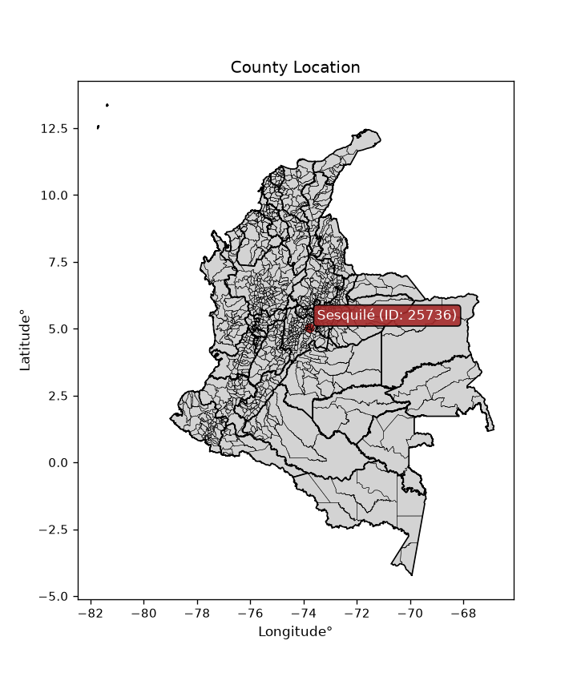
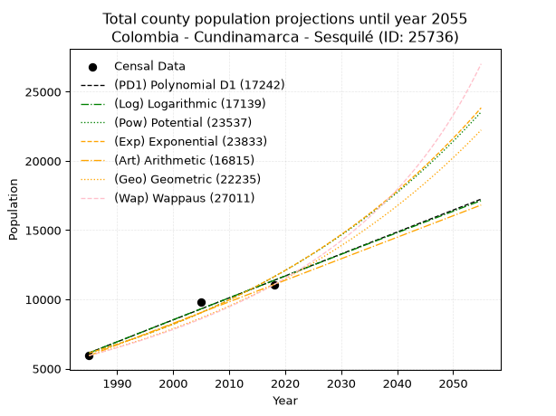
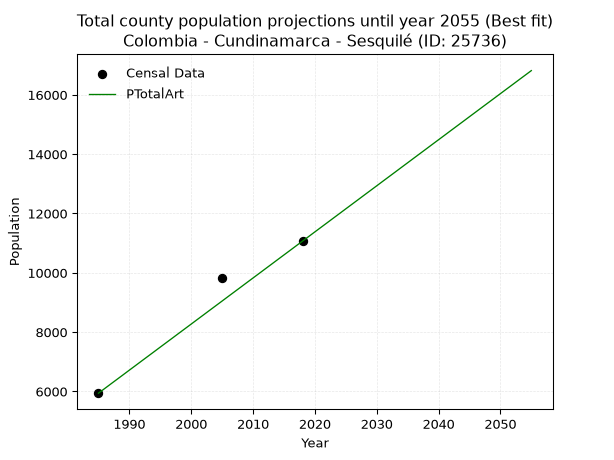
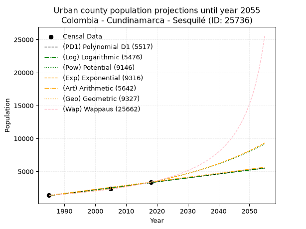
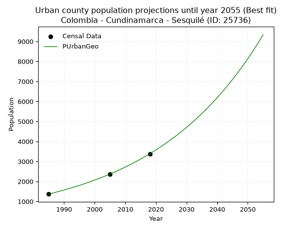
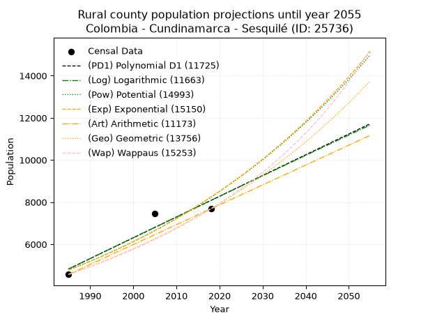
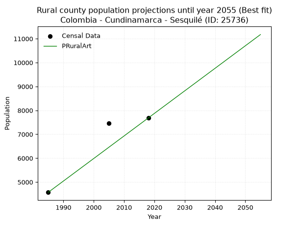

<div align="center">


</div>

# _“Population and Public Services Demand Projections (PPSD) until Year 2050 for Colombia - Cundinamarca - Sesquilé (ID: 25736)”_
Keywords: `population` `public-service` `projection` `lineal` `polynomial` `logarithmic` `potential` `exponential` `arithmetic` `geometric` `wappaus` `dane` `colombia` `south-america`

PPSD are analytical estimates used by governments and planners to anticipate future changes in population size, age distribution, and the resulting community needs for utilities, healthcare, education, and infrastructure as sizing future water treatment facilities, electrical grids, and road networks based on spatial growth.

<div align="center">

</img>

</div>


> **General running parameters**: • app_version: _v20260806_. • Python version: _3.14.7_. • Pandas version: _3.0.5_. • NumPy version: _2.5.1_. • Creates, save and include plots into reports (create_plot): _False_. • Projection until year: _2050_. • Process polynomial degree 2 and up: _False_. • Process Wappaus: _True_. • Process Wappaus: _True_. • Set negative values to zero: _True_. • Set infinite values to zero: _True_. • Drop dataset notes: _True_. 
<div align="center">

Dynamic map: [:earth_americas:Google](http://maps.google.com/maps?q=5.044759739,-73.7960987) [:earth_americas:OSM](https://www.openstreetmap.org/#map=18/5.044759739/-73.7960987&layers=P) [:earth_americas:Bing](https://www.bing.com/maps?cp=5.044759739~-73.7960987&lvl=18) [:earth_americas:Apple](https://maps.apple.com/frame?center=5.044759739%2C-73.7960987&span=0.003%2C0.006)

</div>


<div align="center">

```geojson
{
  "type": "Feature",
  "geometry": {
    "type": "Point", 
    "coordinates": [-73.7960987, 5.044759739]
  }, 
  "properties": {
    "Name": "Colombia - Cundinamarca - Sesquilé (ID: 25736)"
  }
}
```

</div>


## 0. Census Data (3 records)

Census data are official statistics collected by a government about the people and housing in a country. They usually include counts of total population, age, sex, race, income, education, and jobs.

📅Global census file: [Population.xlsx](../data/Population.xlsx)

| Source   |   Year |   CountryID | CountryName   |   StateID | StateName    |   CountyID | CountyName   |   PTotal |   PUrban |   PRural |
|:---------|-------:|------------:|:--------------|----------:|:-------------|-----------:|:-------------|---------:|---------:|---------:|
| DANE     |   1985 |          57 | Colombia      |        25 | Cundinamarca |      25736 | Sesquilé     |     5940 |     1370 |     4570 |
| DANE     |   2005 |          57 | Colombia      |        25 | Cundinamarca |      25736 | Sesquilé     |     9817 |     2365 |     7452 |
| DANE     |   2018 |          57 | Colombia      |        25 | Cundinamarca |      25736 | Sesquilé     |    11067 |     3384 |     7683 |

> 🔥Some records could had specific notes about the registered values or the corresponding urban or rural distribution.

📅   [RUPS](https://www.datos.gov.co/Hacienda-y-Cr-dito-P-blico/Registro-nico-de-Prestadores-de-Servicios-P-blicos/4qkq-csdn/about_data) - Local public utility companies: [RUPS.csv](../data/RUPS.xlsx)

 | SERVICIO       | ESTADO    | NOMBRE                                                                                            | NIT         | DEPARTAMENTO_DOMICILIO   | MUNICIPIO_DOMICILIO   | DIRECCION                             |   TELEFONO | EMAIL                       | TIPO_PRESTADOR                             | CLASIFICACION                 |
|:---------------|:----------|:--------------------------------------------------------------------------------------------------|:------------|:-------------------------|:----------------------|:--------------------------------------|-----------:|:----------------------------|:-------------------------------------------|:------------------------------|
| ACUEDUCTO      | OPERATIVA | JUNTA DE USUARIOS DEL ACUEDUCTO ELMANANTIAL                                                       | 832006342-1 | CUNDINAMARCA             | GUATAVITA             | BARRIO TEJARES CASA 39                |    8568104 | josedariofandio@yahoo.es    | ORGANIZACION AUTORIZADA                    | HASTA 2500 SUSCRIPTORES       |
| ACUEDUCTO      | OPERATIVA | JUNTA ADMINISTRADORA DEL ACUEDUCTO DE LA VEREDA SAN JOSE-JAAVSJ-                                  | 900031525-2 | CUNDINAMARCA             | SESQUILE              | Carrera 6 No  4 - 35                  |    8568266 | sanjose.acueducto@gmail.com | ORGANIZACION AUTORIZADA                    | MENOR O IGUAL A 2500 USUARIOS |
| ACUEDUCTO      | OPERATIVA | JUNTA COMUNITARIA SERVICIO ACUEDUCTO DE LA VEREDA DE CHALECHE MUNICIPIO DE SESQUILE               | 900251688-8 | CUNDINAMARCA             | SESQUILE              | VEREDA CHALECHE                       |    8568266 | acueduto.chaleche@gmail.com | ORGANIZACION AUTORIZADA                    | HASTA 2500 SUSCRIPTORES       |
| ACUEDUCTO      | OPERATIVA | JUNTA ADMINISTRADORA DEL ACUEDUCTO DE LA VEREDA GOBERNADOR                                        | 900001339-0 | CUNDINAMARCA             | SESQUILE              | CALL6#6-120                           |    8568028 | YARITO7@HOTMAIL.COM         | ORGANIZACION AUTORIZADA                    | HASTA 2500 SUSCRIPTORES       |
| ACUEDUCTO      | OPERATIVA | COMITÉ EMPRESARIAL DEL ACUEDUCTO CEAB DE LA VEREDA BOITIVA DEL MUNICIPIO DE SESQUILE CUNDINAMARCA | 900290932-7 | CUNDINAMARCA             | SESQUILE              | Salon Comunal Vereda Boitivá Sesquilé |    8568035 | clara_ayala9@hotmail.com    | ORGANIZACION AUTORIZADA                    | HASTA 2500 SUSCRIPTORES       |
| ACUEDUCTO      | OPERATIVA | EMPRESA DE SERVICIOS PUBLICOS DE SESQUILE CUNDINAMARCA SA ESP                                     | 900275140-8 | CUNDINAMARCA             | SESQUILE              | carrera 8 No 5-35                     |    8568104 | saneamientobasico@gmail.com | SOCIEDADES (EMPRESA DE SERVICIOS PUBLICOS) | MENOR O IGUAL A 2500 USUARIOS |
| ALCANTARILLADO | OPERATIVA | EMPRESA DE SERVICIOS PUBLICOS DE SESQUILE CUNDINAMARCA SA ESP                                     | 900275140-8 | CUNDINAMARCA             | SESQUILE              | carrera 8 No 5-35                     |    8568104 | saneamientobasico@gmail.com | SOCIEDADES (EMPRESA DE SERVICIOS PUBLICOS) | MENOR O IGUAL A 2500 USUARIOS |
| ACUEDUCTO      | OPERATIVA | ASOCIACION DE USUARIOS DEL SERVICIO DE AGUA POTABLE Y ALCANTARILLADO DEL SECTOR LA VILLA          | 832008486-0 | CUNDINAMARCA             | SESQUILE              | VEREDA NESCUATA LA VILLA              |    8568130 | ausalavilla@gmail.com       | ORGANIZACION AUTORIZADA                    | HASTA 2500 SUSCRIPTORES       |

## 1. Total

### 1.1. Coefficients and Parameters

* (PD1) Polynomial Deg 1: 158.61338962606044, -308708.41495779034 (lineal)
* (Log) Logarithmic: 317487.70746461174, -2404667.4980322924
* (Pow) Potential: 38.80719681549251, -124.18919152734732
* (Exp) Exponential: 0.019385246986202753, 1.192165016820824e-13
* (Art) Arithmetic: Year diff. 2018 - 1985 = 33, Population diff. 11067 - 5940 = 5127, Annual growth = 155.36363636363637
* (Geo) Geometric: Year diff. 2018 - 1985 = 33, Population diff. 11067 - 5940 = 5127, Annual growth % = 0.01903522354707432
* (Wap) Wappaus: i = 1.827055169796394, Condition values only valid for < 200)

<sub>
Wappaus condition values: ['0.00', '1.83', '3.65', '5.48', '7.31', '9.14', '10.96', '12.79', '14.62', '16.44', '18.27', '20.10', '21.92', '23.75', '25.58', '27.41', '29.23', '31.06', '32.89', '34.71', '36.54', '38.37', '40.20', '42.02', '43.85', '45.68', '47.50', '49.33', '51.16', '52.98', '54.81', '56.64', '58.47', '60.29', '62.12', '63.95', '65.77', '67.60', '69.43', '71.26', '73.08', '74.91', '76.74', '78.56', '80.39', '82.22', '84.04', '85.87', '87.70', '89.53', '91.35', '93.18', '95.01', '96.83', '98.66', '100.49', '102.32', '104.14', '105.97', '107.80', '109.62', '111.45', '113.28', '115.10', '116.93', '118.76']
</sub>


### 1.2. Projected Dataset

|   Year |   CountyID |   PTotalPD1 |   PTotalLog |   PTotalPow |   PTotalExp |   PTotalArt |   PTotalGeo |   PTotalWap |
|-------:|-----------:|------------:|------------:|------------:|------------:|------------:|------------:|------------:|
|   1985 |      25736 |        6139 |        6135 |        6133 |        6136 |        5940 |        5940 |        5940 |
|   1986 |      25736 |        6298 |        6295 |        6254 |        6256 |        6095 |        6053 |        6050 |
|   1987 |      25736 |        6456 |        6455 |        6377 |        6378 |        6251 |        6168 |        6161 |
|   1988 |      25736 |        6615 |        6615 |        6503 |        6503 |        6406 |        6286 |        6275 |
|   1989 |      25736 |        6774 |        6775 |        6631 |        6630 |        6561 |        6405 |        6391 |
|   1990 |      25736 |        6932 |        6934 |        6762 |        6760 |        6717 |        6527 |        6509 |
|   1991 |      25736 |        7091 |        7094 |        6895 |        6893 |        6872 |        6652 |        6629 |
|   1992 |      25736 |        7249 |        7253 |        7030 |        7027 |        7028 |        6778 |        6752 |
|   1993 |      25736 |        7408 |        7412 |        7169 |        7165 |        7183 |        6907 |        6877 |
|   1994 |      25736 |        7567 |        7572 |        7310 |        7305 |        7338 |        7039 |        7004 |
|   1995 |      25736 |        7725 |        7731 |        7453 |        7448 |        7494 |        7173 |        7134 |
|   1996 |      25736 |        7884 |        7890 |        7600 |        7594 |        7649 |        7309 |        7267 |
|   1997 |      25736 |        8043 |        8049 |        7749 |        7743 |        7804 |        7448 |        7403 |
|   1998 |      25736 |        8201 |        8208 |        7901 |        7894 |        7960 |        7590 |        7541 |
|   1999 |      25736 |        8360 |        8367 |        8056 |        8049 |        8115 |        7735 |        7682 |
|   2000 |      25736 |        8518 |        8526 |        8214 |        8206 |        8270 |        7882 |        7826 |
|   2001 |      25736 |        8677 |        8684 |        8374 |        8367 |        8426 |        8032 |        7974 |
|   2002 |      25736 |        8836 |        8843 |        8538 |        8531 |        8581 |        8185 |        8124 |
|   2003 |      25736 |        8994 |        9001 |        8705 |        8698 |        8737 |        8340 |        8278 |
|   2004 |      25736 |        9153 |        9160 |        8876 |        8868 |        8892 |        8499 |        8435 |
|   2005 |      25736 |        9311 |        9318 |        9049 |        9042 |        9047 |        8661 |        8596 |
|   2006 |      25736 |        9470 |        9477 |        9226 |        9219 |        9203 |        8826 |        8760 |
|   2007 |      25736 |        9629 |        9635 |        9406 |        9399 |        9358 |        8994 |        8928 |
|   2008 |      25736 |        9787 |        9793 |        9590 |        9583 |        9513 |        9165 |        9100 |
|   2009 |      25736 |        9946 |        9951 |        9777 |        9771 |        9669 |        9340 |        9276 |
|   2010 |      25736 |       10104 |       10109 |        9968 |        9962 |        9824 |        9517 |        9456 |
|   2011 |      25736 |       10263 |       10267 |       10162 |       10157 |        9979 |        9699 |        9641 |
|   2012 |      25736 |       10422 |       10425 |       10360 |       10356 |       10135 |        9883 |        9830 |
|   2013 |      25736 |       10580 |       10583 |       10561 |       10558 |       10290 |       10071 |       10023 |
|   2014 |      25736 |       10739 |       10740 |       10767 |       10765 |       10446 |       10263 |       10222 |
|   2015 |      25736 |       10898 |       10898 |       10976 |       10976 |       10601 |       10458 |       10425 |
|   2016 |      25736 |       11056 |       11055 |       11190 |       11191 |       10756 |       10657 |       10634 |
|   2017 |      25736 |       11215 |       11213 |       11407 |       11410 |       10912 |       10860 |       10847 |
|   2018 |      25736 |       11373 |       11370 |       11629 |       11633 |       11067 |       11067 |       11067 |
|   2019 |      25736 |       11532 |       11527 |       11855 |       11861 |       11222 |       11278 |       11292 |
|   2020 |      25736 |       11691 |       11685 |       12085 |       12093 |       11378 |       11492 |       11524 |
|   2021 |      25736 |       11849 |       11842 |       12319 |       12329 |       11533 |       11711 |       11761 |
|   2022 |      25736 |       12008 |       11999 |       12558 |       12571 |       11688 |       11934 |       12006 |
|   2023 |      25736 |       12166 |       12156 |       12801 |       12817 |       11844 |       12161 |       12257 |
|   2024 |      25736 |       12325 |       12313 |       13049 |       13068 |       11999 |       12393 |       12515 |
|   2025 |      25736 |       12484 |       12470 |       13301 |       13324 |       12155 |       12629 |       12781 |
|   2026 |      25736 |       12642 |       12626 |       13559 |       13584 |       12310 |       12869 |       13054 |
|   2027 |      25736 |       12801 |       12783 |       13821 |       13850 |       12465 |       13114 |       13336 |
|   2028 |      25736 |       12960 |       12940 |       14088 |       14121 |       12621 |       13364 |       13626 |
|   2029 |      25736 |       13118 |       13096 |       14360 |       14398 |       12776 |       13618 |       13925 |
|   2030 |      25736 |       13277 |       13253 |       14637 |       14680 |       12931 |       13877 |       14233 |
|   2031 |      25736 |       13435 |       13409 |       14920 |       14967 |       13087 |       14141 |       14551 |
|   2032 |      25736 |       13594 |       13565 |       15207 |       15260 |       13242 |       14410 |       14879 |
|   2033 |      25736 |       13753 |       13721 |       15501 |       15559 |       13397 |       14685 |       15217 |
|   2034 |      25736 |       13911 |       13878 |       15799 |       15863 |       13553 |       14964 |       15567 |
|   2035 |      25736 |       14070 |       14034 |       16103 |       16174 |       13708 |       15249 |       15929 |
|   2036 |      25736 |       14228 |       14190 |       16413 |       16490 |       13864 |       15539 |       16303 |
|   2037 |      25736 |       14387 |       14345 |       16729 |       16813 |       14019 |       15835 |       16690 |
|   2038 |      25736 |       14546 |       14501 |       17051 |       17142 |       14174 |       16137 |       17091 |
|   2039 |      25736 |       14704 |       14657 |       17379 |       17478 |       14330 |       16444 |       17506 |
|   2040 |      25736 |       14863 |       14813 |       17712 |       17820 |       14485 |       16757 |       17937 |
|   2041 |      25736 |       15022 |       14968 |       18053 |       18169 |       14640 |       17076 |       18383 |
|   2042 |      25736 |       15180 |       15124 |       18399 |       18524 |       14796 |       17401 |       18847 |
|   2043 |      25736 |       15339 |       15279 |       18752 |       18887 |       14951 |       17732 |       19328 |
|   2044 |      25736 |       15497 |       15435 |       19111 |       19257 |       15106 |       18070 |       19829 |
|   2045 |      25736 |       15656 |       15590 |       19478 |       19634 |       15262 |       18414 |       20350 |
|   2046 |      25736 |       15815 |       15745 |       19851 |       20018 |       15417 |       18764 |       20892 |
|   2047 |      25736 |       15973 |       15900 |       20231 |       20410 |       15573 |       19121 |       21458 |
|   2048 |      25736 |       16132 |       16055 |       20618 |       20809 |       15728 |       19485 |       22047 |
|   2049 |      25736 |       16290 |       16210 |       21012 |       21217 |       15883 |       19856 |       22663 |
|   2050 |      25736 |       16449 |       16365 |       21414 |       21632 |       16039 |       20234 |       23306 |
<div align="center">

</img>

</div>


### 1.3. Best fit with absolute and relative error (%)

Relative error puts that difference into context by dividing the absolute error by the true value, creating a unitless ratio or percentage that shows the scale of the mistake.

Absolute and relative error

|   Year | Source   |   CountryID | CountryName   |   StateID | StateName    |   CountyID_x | CountyName   |   PTotal |   PUrban |   PRural |   CountyID_y |   PTotalPD1 |   PTotalLog |   PTotalPow |   PTotalExp |   PTotalArt |   PTotalGeo |   PTotalWap |   PTotalPD1AbsError |   PTotalLogAbsError |   PTotalPowAbsError |   PTotalExpAbsError |   PTotalArtAbsError |   PTotalGeoAbsError |   PTotalWapAbsError |   PTotalPD1RelError |   PTotalLogRelError |   PTotalPowRelError |   PTotalExpRelError |   PTotalArtRelError |   PTotalGeoRelError |   PTotalWapRelError |
|-------:|:---------|------------:|:--------------|----------:|:-------------|-------------:|:-------------|---------:|---------:|---------:|-------------:|------------:|------------:|------------:|------------:|------------:|------------:|------------:|--------------------:|--------------------:|--------------------:|--------------------:|--------------------:|--------------------:|--------------------:|--------------------:|--------------------:|--------------------:|--------------------:|--------------------:|--------------------:|--------------------:|
|   1985 | DANE     |          57 | Colombia      |        25 | Cundinamarca |        25736 | Sesquilé     |     5940 |     1370 |     4570 |        25736 |        6139 |        6135 |        6133 |        6136 |        5940 |        5940 |        5940 |                 199 |                 195 |                 193 |                 196 |                   0 |                   0 |                   0 |             3.35017 |             3.28283 |             3.24916 |             3.29966 |             0       |              0      |              0      |
|   2005 | DANE     |          57 | Colombia      |        25 | Cundinamarca |        25736 | Sesquilé     |     9817 |     2365 |     7452 |        25736 |        9311 |        9318 |        9049 |        9042 |        9047 |        8661 |        8596 |                 506 |                 499 |                 768 |                 775 |                 770 |                1156 |                1221 |             5.15432 |             5.08302 |             7.82316 |             7.89447 |             7.84354 |             11.7755 |             12.4376 |
|   2018 | DANE     |          57 | Colombia      |        25 | Cundinamarca |        25736 | Sesquilé     |    11067 |     3384 |     7683 |        25736 |       11373 |       11370 |       11629 |       11633 |       11067 |       11067 |       11067 |                 306 |                 303 |                 562 |                 566 |                   0 |                   0 |                   0 |             2.76498 |             2.73787 |             5.07816 |             5.1143  |             0       |              0      |              0      |

Relative error mean

| Method    |   RelError | Best   |
|:----------|-----------:|:-------|
| PTotalPD1 |    3.75649 |        |
| PTotalLog |    3.70124 |        |
| PTotalPow |    5.38349 |        |
| PTotalExp |    5.43615 |        |
| PTotalArt |    2.61451 | True   |
| PTotalGeo |    3.92516 |        |
| PTotalWap |    4.14587 |        |

💙Best method: _**PTotalArt**_
<div align="center">

</img>

</div>


### 1.4. Fresh water supply demand in liters per capita per day (lpcd)

The fresh water supply demand typically ranges from 100 to 300 liters per capita per day (lpcd) for standard domestic and municipal planning, though absolute survival minimums set by the World Health Organization are as low as 7.5 to 20 liters per day, and total consumption in high-income nations can exceed 400 liters.

> `CZ`: Level in meters above the sea level (masl)<br> `WS`: Fresh water supply demand in liters per capita per day (lpcd or l/h/d)<br> `WSAll`: Zonal fresh water supply demand in liters per second (l/s)<br> `A`: Zonal area in square meters<br> `DP`: Population density (people/hectare or p/ha)

Reference values (RAS Colombia)

|    CZ |   WS |
|------:|-----:|
|  1000 |  120 |
|  2000 |  130 |
| 99999 |  140 |

County shapefile geometry properties and water supply values

|   CountyID |      ATotal |   CZTotal |   WSTotal |
|-----------:|------------:|----------:|----------:|
|      25736 | 1.40987e+08 |   2834.66 |       140 |

Projected values for best method: PTotalArt

|   CountyID |   Year |   PTotalArt |   DPTotal |   WSTotal |   WSTotalAll |
|-----------:|-------:|------------:|----------:|----------:|-------------:|
|      25736 |   1985 |        5940 |      0.42 |       140 |      9.625   |
|      25736 |   1986 |        6095 |      0.43 |       140 |      9.87616 |
|      25736 |   1987 |        6251 |      0.44 |       140 |     10.1289  |
|      25736 |   1988 |        6406 |      0.45 |       140 |     10.3801  |
|      25736 |   1989 |        6561 |      0.47 |       140 |     10.6312  |
|      25736 |   1990 |        6717 |      0.48 |       140 |     10.884   |
|      25736 |   1991 |        6872 |      0.49 |       140 |     11.1352  |
|      25736 |   1992 |        7028 |      0.5  |       140 |     11.388   |
|      25736 |   1993 |        7183 |      0.51 |       140 |     11.6391  |
|      25736 |   1994 |        7338 |      0.52 |       140 |     11.8903  |
|      25736 |   1995 |        7494 |      0.53 |       140 |     12.1431  |
|      25736 |   1996 |        7649 |      0.54 |       140 |     12.3942  |
|      25736 |   1997 |        7804 |      0.55 |       140 |     12.6454  |
|      25736 |   1998 |        7960 |      0.56 |       140 |     12.8981  |
|      25736 |   1999 |        8115 |      0.58 |       140 |     13.1493  |
|      25736 |   2000 |        8270 |      0.59 |       140 |     13.4005  |
|      25736 |   2001 |        8426 |      0.6  |       140 |     13.6532  |
|      25736 |   2002 |        8581 |      0.61 |       140 |     13.9044  |
|      25736 |   2003 |        8737 |      0.62 |       140 |     14.1572  |
|      25736 |   2004 |        8892 |      0.63 |       140 |     14.4083  |
|      25736 |   2005 |        9047 |      0.64 |       140 |     14.6595  |
|      25736 |   2006 |        9203 |      0.65 |       140 |     14.9123  |
|      25736 |   2007 |        9358 |      0.66 |       140 |     15.1634  |
|      25736 |   2008 |        9513 |      0.67 |       140 |     15.4146  |
|      25736 |   2009 |        9669 |      0.69 |       140 |     15.6674  |
|      25736 |   2010 |        9824 |      0.7  |       140 |     15.9185  |
|      25736 |   2011 |        9979 |      0.71 |       140 |     16.1697  |
|      25736 |   2012 |       10135 |      0.72 |       140 |     16.4225  |
|      25736 |   2013 |       10290 |      0.73 |       140 |     16.6736  |
|      25736 |   2014 |       10446 |      0.74 |       140 |     16.9264  |
|      25736 |   2015 |       10601 |      0.75 |       140 |     17.1775  |
|      25736 |   2016 |       10756 |      0.76 |       140 |     17.4287  |
|      25736 |   2017 |       10912 |      0.77 |       140 |     17.6815  |
|      25736 |   2018 |       11067 |      0.78 |       140 |     17.9326  |
|      25736 |   2019 |       11222 |      0.8  |       140 |     18.1838  |
|      25736 |   2020 |       11378 |      0.81 |       140 |     18.4366  |
|      25736 |   2021 |       11533 |      0.82 |       140 |     18.6877  |
|      25736 |   2022 |       11688 |      0.83 |       140 |     18.9389  |
|      25736 |   2023 |       11844 |      0.84 |       140 |     19.1917  |
|      25736 |   2024 |       11999 |      0.85 |       140 |     19.4428  |
|      25736 |   2025 |       12155 |      0.86 |       140 |     19.6956  |
|      25736 |   2026 |       12310 |      0.87 |       140 |     19.9468  |
|      25736 |   2027 |       12465 |      0.88 |       140 |     20.1979  |
|      25736 |   2028 |       12621 |      0.9  |       140 |     20.4507  |
|      25736 |   2029 |       12776 |      0.91 |       140 |     20.7019  |
|      25736 |   2030 |       12931 |      0.92 |       140 |     20.953   |
|      25736 |   2031 |       13087 |      0.93 |       140 |     21.2058  |
|      25736 |   2032 |       13242 |      0.94 |       140 |     21.4569  |
|      25736 |   2033 |       13397 |      0.95 |       140 |     21.7081  |
|      25736 |   2034 |       13553 |      0.96 |       140 |     21.9609  |
|      25736 |   2035 |       13708 |      0.97 |       140 |     22.212   |
|      25736 |   2036 |       13864 |      0.98 |       140 |     22.4648  |
|      25736 |   2037 |       14019 |      0.99 |       140 |     22.716   |
|      25736 |   2038 |       14174 |      1.01 |       140 |     22.9671  |
|      25736 |   2039 |       14330 |      1.02 |       140 |     23.2199  |
|      25736 |   2040 |       14485 |      1.03 |       140 |     23.4711  |
|      25736 |   2041 |       14640 |      1.04 |       140 |     23.7222  |
|      25736 |   2042 |       14796 |      1.05 |       140 |     23.975   |
|      25736 |   2043 |       14951 |      1.06 |       140 |     24.2262  |
|      25736 |   2044 |       15106 |      1.07 |       140 |     24.4773  |
|      25736 |   2045 |       15262 |      1.08 |       140 |     24.7301  |
|      25736 |   2046 |       15417 |      1.09 |       140 |     24.9812  |
|      25736 |   2047 |       15573 |      1.1  |       140 |     25.234   |
|      25736 |   2048 |       15728 |      1.12 |       140 |     25.4852  |
|      25736 |   2049 |       15883 |      1.13 |       140 |     25.7363  |
|      25736 |   2050 |       16039 |      1.14 |       140 |     25.9891  |

## 2. Urban

### 2.1. Coefficients and Parameters

* (PD1) Polynomial Deg 1: 60.077804583838144, -117942.81664656654 (lineal)
* (Log) Logarithmic: 120174.6791849681, -911220.3775316335
* (Pow) Potential: 54.809725087178165, -177.61305549202396
* (Exp) Exponential: 0.027392741412732163, 3.3258584807043798e-21
* (Art) Arithmetic: Year diff. 2018 - 1985 = 33, Population diff. 3384 - 1370 = 2014, Annual growth = 61.03030303030303
* (Geo) Geometric: Year diff. 2018 - 1985 = 33, Population diff. 3384 - 1370 = 2014, Annual growth % = 0.02778031775293499
* (Wap) Wappaus: i = 2.5675348350989915, Condition values only valid for < 200)

<sub>
Wappaus condition values: ['0.00', '2.57', '5.14', '7.70', '10.27', '12.84', '15.41', '17.97', '20.54', '23.11', '25.68', '28.24', '30.81', '33.38', '35.95', '38.51', '41.08', '43.65', '46.22', '48.78', '51.35', '53.92', '56.49', '59.05', '61.62', '64.19', '66.76', '69.32', '71.89', '74.46', '77.03', '79.59', '82.16', '84.73', '87.30', '89.86', '92.43', '95.00', '97.57', '100.13', '102.70', '105.27', '107.84', '110.40', '112.97', '115.54', '118.11', '120.67', '123.24', '125.81', '128.38', '130.94', '133.51', '136.08', '138.65', '141.21', '143.78', '146.35', '148.92', '151.48', '154.05', '156.62', '159.19', '161.75', '164.32', '166.89']
</sub>


### 2.2. Projected Dataset

|   Year |   CountyID |   PUrbanPD1 |   PUrbanLog |   PUrbanPow |   PUrbanExp |   PUrbanArt |   PUrbanGeo |   PUrbanWap |
|-------:|-----------:|------------:|------------:|------------:|------------:|------------:|------------:|------------:|
|   1985 |      25736 |        1312 |        1311 |        1369 |        1369 |        1370 |        1370 |        1370 |
|   1986 |      25736 |        1372 |        1371 |        1407 |        1407 |        1431 |        1408 |        1406 |
|   1987 |      25736 |        1432 |        1432 |        1446 |        1446 |        1492 |        1447 |        1442 |
|   1988 |      25736 |        1492 |        1492 |        1487 |        1487 |        1553 |        1487 |        1480 |
|   1989 |      25736 |        1552 |        1553 |        1528 |        1528 |        1614 |        1529 |        1518 |
|   1990 |      25736 |        1612 |        1613 |        1571 |        1570 |        1675 |        1571 |        1558 |
|   1991 |      25736 |        1672 |        1674 |        1615 |        1614 |        1736 |        1615 |        1599 |
|   1992 |      25736 |        1732 |        1734 |        1660 |        1659 |        1797 |        1660 |        1641 |
|   1993 |      25736 |        1792 |        1794 |        1706 |        1705 |        1858 |        1706 |        1684 |
|   1994 |      25736 |        1852 |        1855 |        1754 |        1752 |        1919 |        1753 |        1728 |
|   1995 |      25736 |        1912 |        1915 |        1803 |        1801 |        1980 |        1802 |        1774 |
|   1996 |      25736 |        1972 |        1975 |        1853 |        1851 |        2041 |        1852 |        1821 |
|   1997 |      25736 |        2033 |        2035 |        1904 |        1902 |        2102 |        1903 |        1869 |
|   1998 |      25736 |        2093 |        2095 |        1957 |        1955 |        2163 |        1956 |        1919 |
|   1999 |      25736 |        2153 |        2156 |        2012 |        2009 |        2224 |        2011 |        1970 |
|   2000 |      25736 |        2213 |        2216 |        2068 |        2065 |        2285 |        2066 |        2023 |
|   2001 |      25736 |        2273 |        2276 |        2125 |        2122 |        2346 |        2124 |        2078 |
|   2002 |      25736 |        2333 |        2336 |        2184 |        2181 |        2408 |        2183 |        2135 |
|   2003 |      25736 |        2393 |        2396 |        2245 |        2242 |        2469 |        2243 |        2193 |
|   2004 |      25736 |        2453 |        2456 |        2307 |        2304 |        2530 |        2306 |        2254 |
|   2005 |      25736 |        2513 |        2516 |        2371 |        2368 |        2591 |        2370 |        2317 |
|   2006 |      25736 |        2573 |        2576 |        2437 |        2434 |        2652 |        2436 |        2381 |
|   2007 |      25736 |        2633 |        2636 |        2504 |        2502 |        2713 |        2503 |        2448 |
|   2008 |      25736 |        2693 |        2695 |        2573 |        2571 |        2774 |        2573 |        2518 |
|   2009 |      25736 |        2753 |        2755 |        2645 |        2642 |        2835 |        2644 |        2590 |
|   2010 |      25736 |        2814 |        2815 |        2718 |        2716 |        2896 |        2718 |        2665 |
|   2011 |      25736 |        2874 |        2875 |        2793 |        2791 |        2957 |        2793 |        2743 |
|   2012 |      25736 |        2934 |        2935 |        2870 |        2869 |        3018 |        2871 |        2824 |
|   2013 |      25736 |        2994 |        2994 |        2949 |        2948 |        3079 |        2951 |        2908 |
|   2014 |      25736 |        3054 |        3054 |        3031 |        3030 |        3140 |        3033 |        2995 |
|   2015 |      25736 |        3114 |        3114 |        3114 |        3114 |        3201 |        3117 |        3086 |
|   2016 |      25736 |        3174 |        3173 |        3200 |        3201 |        3262 |        3204 |        3181 |
|   2017 |      25736 |        3234 |        3233 |        3288 |        3290 |        3323 |        3293 |        3280 |
|   2018 |      25736 |        3294 |        3292 |        3379 |        3381 |        3384 |        3384 |        3384 |
|   2019 |      25736 |        3354 |        3352 |        3472 |        3475 |        3445 |        3478 |        3492 |
|   2020 |      25736 |        3414 |        3411 |        3567 |        3572 |        3506 |        3575 |        3606 |
|   2021 |      25736 |        3474 |        3471 |        3665 |        3671 |        3567 |        3674 |        3724 |
|   2022 |      25736 |        3535 |        3530 |        3766 |        3773 |        3628 |        3776 |        3849 |
|   2023 |      25736 |        3595 |        3590 |        3870 |        3878 |        3689 |        3881 |        3980 |
|   2024 |      25736 |        3655 |        3649 |        3976 |        3985 |        3750 |        3989 |        4117 |
|   2025 |      25736 |        3715 |        3709 |        4085 |        4096 |        3811 |        4100 |        4262 |
|   2026 |      25736 |        3775 |        3768 |        4197 |        4210 |        3872 |        4213 |        4415 |
|   2027 |      25736 |        3835 |        3827 |        4312 |        4327 |        3933 |        4330 |        4576 |
|   2028 |      25736 |        3895 |        3886 |        4430 |        4447 |        3994 |        4451 |        4746 |
|   2029 |      25736 |        3955 |        3946 |        4552 |        4570 |        4055 |        4574 |        4927 |
|   2030 |      25736 |        4015 |        4005 |        4676 |        4697 |        4116 |        4701 |        5118 |
|   2031 |      25736 |        4075 |        4064 |        4804 |        4828 |        4177 |        4832 |        5322 |
|   2032 |      25736 |        4135 |        4123 |        4936 |        4962 |        4238 |        4966 |        5538 |
|   2033 |      25736 |        4195 |        4182 |        5070 |        5099 |        4299 |        5104 |        5769 |
|   2034 |      25736 |        4255 |        4241 |        5209 |        5241 |        4360 |        5246 |        6016 |
|   2035 |      25736 |        4316 |        4301 |        5351 |        5387 |        4422 |        5392 |        6281 |
|   2036 |      25736 |        4376 |        4360 |        5497 |        5536 |        4483 |        5542 |        6566 |
|   2037 |      25736 |        4436 |        4419 |        5647 |        5690 |        4544 |        5696 |        6872 |
|   2038 |      25736 |        4496 |        4478 |        5801 |        5848 |        4605 |        5854 |        7203 |
|   2039 |      25736 |        4556 |        4536 |        5959 |        6010 |        4666 |        6016 |        7562 |
|   2040 |      25736 |        4616 |        4595 |        6122 |        6177 |        4727 |        6184 |        7952 |
|   2041 |      25736 |        4676 |        4654 |        6288 |        6349 |        4788 |        6355 |        8378 |
|   2042 |      25736 |        4736 |        4713 |        6459 |        6525 |        4849 |        6532 |        8844 |
|   2043 |      25736 |        4796 |        4772 |        6635 |        6706 |        4910 |        6713 |        9358 |
|   2044 |      25736 |        4856 |        4831 |        6815 |        6893 |        4971 |        6900 |        9925 |
|   2045 |      25736 |        4916 |        4890 |        7001 |        7084 |        5032 |        7092 |       10557 |
|   2046 |      25736 |        4976 |        4948 |        7191 |        7281 |        5093 |        7289 |       11262 |
|   2047 |      25736 |        5036 |        5007 |        7386 |        7483 |        5154 |        7491 |       12057 |
|   2048 |      25736 |        5097 |        5066 |        7586 |        7691 |        5215 |        7699 |       12959 |
|   2049 |      25736 |        5157 |        5124 |        7792 |        7904 |        5276 |        7913 |       13990 |
|   2050 |      25736 |        5217 |        5183 |        8003 |        8124 |        5337 |        8133 |       15181 |
<div align="center">

</img>

</div>


### 2.3. Best fit with absolute and relative error (%)

Relative error puts that difference into context by dividing the absolute error by the true value, creating a unitless ratio or percentage that shows the scale of the mistake.

Absolute and relative error

|   Year | Source   |   CountryID | CountryName   |   StateID | StateName    |   CountyID_x | CountyName   |   PTotal |   PUrban |   PRural |   CountyID_y |   PUrbanPD1 |   PUrbanLog |   PUrbanPow |   PUrbanExp |   PUrbanArt |   PUrbanGeo |   PUrbanWap |   PUrbanPD1AbsError |   PUrbanLogAbsError |   PUrbanPowAbsError |   PUrbanExpAbsError |   PUrbanArtAbsError |   PUrbanGeoAbsError |   PUrbanWapAbsError |   PUrbanPD1RelError |   PUrbanLogRelError |   PUrbanPowRelError |   PUrbanExpRelError |   PUrbanArtRelError |   PUrbanGeoRelError |   PUrbanWapRelError |
|-------:|:---------|------------:|:--------------|----------:|:-------------|-------------:|:-------------|---------:|---------:|---------:|-------------:|------------:|------------:|------------:|------------:|------------:|------------:|------------:|--------------------:|--------------------:|--------------------:|--------------------:|--------------------:|--------------------:|--------------------:|--------------------:|--------------------:|--------------------:|--------------------:|--------------------:|--------------------:|--------------------:|
|   1985 | DANE     |          57 | Colombia      |        25 | Cundinamarca |        25736 | Sesquilé     |     5940 |     1370 |     4570 |        25736 |        1312 |        1311 |        1369 |        1369 |        1370 |        1370 |        1370 |                  58 |                  59 |                   1 |                   1 |                   0 |                   0 |                   0 |             4.23358 |             4.30657 |           0.0729927 |           0.0729927 |             0       |            0        |              0      |
|   2005 | DANE     |          57 | Colombia      |        25 | Cundinamarca |        25736 | Sesquilé     |     9817 |     2365 |     7452 |        25736 |        2513 |        2516 |        2371 |        2368 |        2591 |        2370 |        2317 |                 148 |                 151 |                   6 |                   3 |                 226 |                   5 |                  48 |             6.25793 |             6.38478 |           0.2537    |           0.12685   |             9.55603 |            0.211416 |              2.0296 |
|   2018 | DANE     |          57 | Colombia      |        25 | Cundinamarca |        25736 | Sesquilé     |    11067 |     3384 |     7683 |        25736 |        3294 |        3292 |        3379 |        3381 |        3384 |        3384 |        3384 |                  90 |                  92 |                   5 |                   3 |                   0 |                   0 |                   0 |             2.65957 |             2.71868 |           0.147754  |           0.0886525 |             0       |            0        |              0      |

Relative error mean

| Method    |   RelError | Best   |
|:----------|-----------:|:-------|
| PUrbanPD1 |  4.38369   |        |
| PUrbanLog |  4.47001   |        |
| PUrbanPow |  0.158149  |        |
| PUrbanExp |  0.096165  |        |
| PUrbanArt |  3.18534   |        |
| PUrbanGeo |  0.0704722 | True   |
| PUrbanWap |  0.676533  |        |

💙Best method: _**PUrbanGeo**_
<div align="center">

</img>

</div>


### 2.4. Fresh water supply demand in liters per capita per day (lpcd)

The fresh water supply demand typically ranges from 100 to 300 liters per capita per day (lpcd) for standard domestic and municipal planning, though absolute survival minimums set by the World Health Organization are as low as 7.5 to 20 liters per day, and total consumption in high-income nations can exceed 400 liters.

> `CZ`: Level in meters above the sea level (masl)<br> `WS`: Fresh water supply demand in liters per capita per day (lpcd or l/h/d)<br> `WSAll`: Zonal fresh water supply demand in liters per second (l/s)<br> `A`: Zonal area in square meters<br> `DP`: Population density (people/hectare or p/ha)

Reference values (RAS Colombia)

|    CZ |   WS |
|------:|-----:|
|  1000 |  120 |
|  2000 |  130 |
| 99999 |  140 |

County shapefile geometry properties and water supply values

|   CountyID |   AUrban |   CZUrban |   WSUrban |
|-----------:|---------:|----------:|----------:|
|      25736 |   745734 |    2606.4 |       140 |

Projected values for best method: PUrbanGeo

|   CountyID |   Year |   PUrbanGeo |   DPUrban |   WSUrban |   WSUrbanAll |
|-----------:|-------:|------------:|----------:|----------:|-------------:|
|      25736 |   1985 |        1370 |     18.37 |       140 |      2.21991 |
|      25736 |   1986 |        1408 |     18.88 |       140 |      2.28148 |
|      25736 |   1987 |        1447 |     19.4  |       140 |      2.34468 |
|      25736 |   1988 |        1487 |     19.94 |       140 |      2.40949 |
|      25736 |   1989 |        1529 |     20.5  |       140 |      2.47755 |
|      25736 |   1990 |        1571 |     21.07 |       140 |      2.5456  |
|      25736 |   1991 |        1615 |     21.66 |       140 |      2.6169  |
|      25736 |   1992 |        1660 |     22.26 |       140 |      2.68981 |
|      25736 |   1993 |        1706 |     22.88 |       140 |      2.76435 |
|      25736 |   1994 |        1753 |     23.51 |       140 |      2.84051 |
|      25736 |   1995 |        1802 |     24.16 |       140 |      2.91991 |
|      25736 |   1996 |        1852 |     24.83 |       140 |      3.00093 |
|      25736 |   1997 |        1903 |     25.52 |       140 |      3.08356 |
|      25736 |   1998 |        1956 |     26.23 |       140 |      3.16944 |
|      25736 |   1999 |        2011 |     26.97 |       140 |      3.25856 |
|      25736 |   2000 |        2066 |     27.7  |       140 |      3.34769 |
|      25736 |   2001 |        2124 |     28.48 |       140 |      3.44167 |
|      25736 |   2002 |        2183 |     29.27 |       140 |      3.53727 |
|      25736 |   2003 |        2243 |     30.08 |       140 |      3.63449 |
|      25736 |   2004 |        2306 |     30.92 |       140 |      3.73657 |
|      25736 |   2005 |        2370 |     31.78 |       140 |      3.84028 |
|      25736 |   2006 |        2436 |     32.67 |       140 |      3.94722 |
|      25736 |   2007 |        2503 |     33.56 |       140 |      4.05579 |
|      25736 |   2008 |        2573 |     34.5  |       140 |      4.16921 |
|      25736 |   2009 |        2644 |     35.46 |       140 |      4.28426 |
|      25736 |   2010 |        2718 |     36.45 |       140 |      4.40417 |
|      25736 |   2011 |        2793 |     37.45 |       140 |      4.52569 |
|      25736 |   2012 |        2871 |     38.5  |       140 |      4.65208 |
|      25736 |   2013 |        2951 |     39.57 |       140 |      4.78171 |
|      25736 |   2014 |        3033 |     40.67 |       140 |      4.91458 |
|      25736 |   2015 |        3117 |     41.8  |       140 |      5.05069 |
|      25736 |   2016 |        3204 |     42.96 |       140 |      5.19167 |
|      25736 |   2017 |        3293 |     44.16 |       140 |      5.33588 |
|      25736 |   2018 |        3384 |     45.38 |       140 |      5.48333 |
|      25736 |   2019 |        3478 |     46.64 |       140 |      5.63565 |
|      25736 |   2020 |        3575 |     47.94 |       140 |      5.79282 |
|      25736 |   2021 |        3674 |     49.27 |       140 |      5.95324 |
|      25736 |   2022 |        3776 |     50.63 |       140 |      6.11852 |
|      25736 |   2023 |        3881 |     52.04 |       140 |      6.28866 |
|      25736 |   2024 |        3989 |     53.49 |       140 |      6.46366 |
|      25736 |   2025 |        4100 |     54.98 |       140 |      6.64352 |
|      25736 |   2026 |        4213 |     56.49 |       140 |      6.82662 |
|      25736 |   2027 |        4330 |     58.06 |       140 |      7.0162  |
|      25736 |   2028 |        4451 |     59.69 |       140 |      7.21227 |
|      25736 |   2029 |        4574 |     61.34 |       140 |      7.41157 |
|      25736 |   2030 |        4701 |     63.04 |       140 |      7.61736 |
|      25736 |   2031 |        4832 |     64.8  |       140 |      7.82963 |
|      25736 |   2032 |        4966 |     66.59 |       140 |      8.04676 |
|      25736 |   2033 |        5104 |     68.44 |       140 |      8.27037 |
|      25736 |   2034 |        5246 |     70.35 |       140 |      8.50046 |
|      25736 |   2035 |        5392 |     72.3  |       140 |      8.73704 |
|      25736 |   2036 |        5542 |     74.32 |       140 |      8.98009 |
|      25736 |   2037 |        5696 |     76.38 |       140 |      9.22963 |
|      25736 |   2038 |        5854 |     78.5  |       140 |      9.48565 |
|      25736 |   2039 |        6016 |     80.67 |       140 |      9.74815 |
|      25736 |   2040 |        6184 |     82.93 |       140 |     10.0204  |
|      25736 |   2041 |        6355 |     85.22 |       140 |     10.2975  |
|      25736 |   2042 |        6532 |     87.59 |       140 |     10.5843  |
|      25736 |   2043 |        6713 |     90.02 |       140 |     10.8775  |
|      25736 |   2044 |        6900 |     92.53 |       140 |     11.1806  |
|      25736 |   2045 |        7092 |     95.1  |       140 |     11.4917  |
|      25736 |   2046 |        7289 |     97.74 |       140 |     11.8109  |
|      25736 |   2047 |        7491 |    100.45 |       140 |     12.1382  |
|      25736 |   2048 |        7699 |    103.24 |       140 |     12.4752  |
|      25736 |   2049 |        7913 |    106.11 |       140 |     12.822   |
|      25736 |   2050 |        8133 |    109.06 |       140 |     13.1785  |

## 3. Rural

### 3.1. Coefficients and Parameters

* (PD1) Polynomial Deg 1: 98.53558504222227, -190765.59831122382 (lineal)
* (Log) Logarithmic: 197313.02827964356, -1493447.120500658
* (Pow) Potential: 32.996564528717975, -105.13550737556314
* (Exp) Exponential: 0.01647746786482809, 2.983163284736831e-11
* (Art) Arithmetic: Year diff. 2018 - 1985 = 33, Population diff. 7683 - 4570 = 3113, Annual growth = 94.33333333333333
* (Geo) Geometric: Year diff. 2018 - 1985 = 33, Population diff. 7683 - 4570 = 3113, Annual growth % = 0.015866893287315387
* (Wap) Wappaus: i = 1.5397589705922359, Condition values only valid for < 200)

<sub>
Wappaus condition values: ['0.00', '1.54', '3.08', '4.62', '6.16', '7.70', '9.24', '10.78', '12.32', '13.86', '15.40', '16.94', '18.48', '20.02', '21.56', '23.10', '24.64', '26.18', '27.72', '29.26', '30.80', '32.33', '33.87', '35.41', '36.95', '38.49', '40.03', '41.57', '43.11', '44.65', '46.19', '47.73', '49.27', '50.81', '52.35', '53.89', '55.43', '56.97', '58.51', '60.05', '61.59', '63.13', '64.67', '66.21', '67.75', '69.29', '70.83', '72.37', '73.91', '75.45', '76.99', '78.53', '80.07', '81.61', '83.15', '84.69', '86.23', '87.77', '89.31', '90.85', '92.39', '93.93', '95.47', '97.00', '98.54', '100.08']
</sub>


### 3.2. Projected Dataset

|   Year |   CountyID |   PRuralPD1 |   PRuralLog |   PRuralPow |   PRuralExp |   PRuralArt |   PRuralGeo |   PRuralWap |
|-------:|-----------:|------------:|------------:|------------:|------------:|------------:|------------:|------------:|
|   1985 |      25736 |        4828 |        4825 |        4778 |        4781 |        4570 |        4570 |        4570 |
|   1986 |      25736 |        4926 |        4924 |        4858 |        4860 |        4664 |        4643 |        4641 |
|   1987 |      25736 |        5025 |        5023 |        4940 |        4941 |        4759 |        4716 |        4713 |
|   1988 |      25736 |        5123 |        5123 |        5022 |        5023 |        4853 |        4791 |        4786 |
|   1989 |      25736 |        5222 |        5222 |        5106 |        5106 |        4947 |        4867 |        4860 |
|   1990 |      25736 |        5320 |        5321 |        5192 |        5191 |        5042 |        4944 |        4936 |
|   1991 |      25736 |        5419 |        5420 |        5278 |        5277 |        5136 |        5023 |        5013 |
|   1992 |      25736 |        5517 |        5519 |        5367 |        5365 |        5230 |        5102 |        5091 |
|   1993 |      25736 |        5616 |        5618 |        5456 |        5454 |        5325 |        5183 |        5170 |
|   1994 |      25736 |        5714 |        5717 |        5547 |        5545 |        5419 |        5266 |        5250 |
|   1995 |      25736 |        5813 |        5816 |        5640 |        5637 |        5513 |        5349 |        5332 |
|   1996 |      25736 |        5911 |        5915 |        5734 |        5731 |        5608 |        5434 |        5416 |
|   1997 |      25736 |        6010 |        6014 |        5829 |        5826 |        5702 |        5520 |        5500 |
|   1998 |      25736 |        6109 |        6113 |        5927 |        5923 |        5796 |        5608 |        5587 |
|   1999 |      25736 |        6207 |        6211 |        6025 |        6021 |        5891 |        5697 |        5674 |
|   2000 |      25736 |        6306 |        6310 |        6126 |        6121 |        5985 |        5787 |        5763 |
|   2001 |      25736 |        6404 |        6409 |        6227 |        6223 |        6079 |        5879 |        5854 |
|   2002 |      25736 |        6503 |        6507 |        6331 |        6326 |        6174 |        5972 |        5946 |
|   2003 |      25736 |        6601 |        6606 |        6436 |        6431 |        6268 |        6067 |        6040 |
|   2004 |      25736 |        6700 |        6704 |        6543 |        6538 |        6362 |        6163 |        6136 |
|   2005 |      25736 |        6798 |        6803 |        6652 |        6647 |        6457 |        6261 |        6233 |
|   2006 |      25736 |        6897 |        6901 |        6762 |        6757 |        6551 |        6360 |        6333 |
|   2007 |      25736 |        6995 |        6999 |        6874 |        6869 |        6645 |        6461 |        6434 |
|   2008 |      25736 |        7094 |        7098 |        6988 |        6983 |        6740 |        6564 |        6537 |
|   2009 |      25736 |        7192 |        7196 |        7104 |        7100 |        6834 |        6668 |        6642 |
|   2010 |      25736 |        7291 |        7294 |        7221 |        7217 |        6928 |        6774 |        6748 |
|   2011 |      25736 |        7389 |        7392 |        7341 |        7337 |        7023 |        6881 |        6857 |
|   2012 |      25736 |        7488 |        7490 |        7462 |        7459 |        7117 |        6991 |        6968 |
|   2013 |      25736 |        7587 |        7588 |        7586 |        7583 |        7211 |        7101 |        7082 |
|   2014 |      25736 |        7685 |        7686 |        7711 |        7709 |        7306 |        7214 |        7197 |
|   2015 |      25736 |        7784 |        7784 |        7838 |        7837 |        7400 |        7329 |        7315 |
|   2016 |      25736 |        7882 |        7882 |        7968 |        7967 |        7494 |        7445 |        7435 |
|   2017 |      25736 |        7981 |        7980 |        8099 |        8100 |        7589 |        7563 |        7558 |
|   2018 |      25736 |        8079 |        8078 |        8233 |        8234 |        7683 |        7683 |        7683 |
|   2019 |      25736 |        8178 |        8176 |        8368 |        8371 |        7777 |        7805 |        7811 |
|   2020 |      25736 |        8276 |        8273 |        8506 |        8510 |        7872 |        7929 |        7941 |
|   2021 |      25736 |        8375 |        8371 |        8646 |        8652 |        7966 |        8055 |        8075 |
|   2022 |      25736 |        8473 |        8469 |        8788 |        8795 |        8060 |        8182 |        8211 |
|   2023 |      25736 |        8572 |        8566 |        8933 |        8942 |        8155 |        8312 |        8350 |
|   2024 |      25736 |        8670 |        8664 |        9080 |        9090 |        8249 |        8444 |        8492 |
|   2025 |      25736 |        8769 |        8761 |        9229 |        9241 |        8343 |        8578 |        8637 |
|   2026 |      25736 |        8867 |        8859 |        9381 |        9395 |        8438 |        8714 |        8786 |
|   2027 |      25736 |        8966 |        8956 |        9535 |        9551 |        8532 |        8852 |        8938 |
|   2028 |      25736 |        9065 |        9053 |        9691 |        9709 |        8626 |        8993 |        9093 |
|   2029 |      25736 |        9163 |        9150 |        9850 |        9871 |        8721 |        9136 |        9252 |
|   2030 |      25736 |        9262 |        9248 |       10011 |       10035 |        8815 |        9281 |        9415 |
|   2031 |      25736 |        9360 |        9345 |       10176 |       10201 |        8909 |        9428 |        9582 |
|   2032 |      25736 |        9459 |        9442 |       10342 |       10371 |        9004 |        9577 |        9753 |
|   2033 |      25736 |        9557 |        9539 |       10511 |       10543 |        9098 |        9729 |        9927 |
|   2034 |      25736 |        9656 |        9636 |       10683 |       10718 |        9192 |        9884 |       10107 |
|   2035 |      25736 |        9754 |        9733 |       10858 |       10896 |        9287 |       10041 |       10290 |
|   2036 |      25736 |        9853 |        9830 |       11035 |       11078 |        9381 |       10200 |       10479 |
|   2037 |      25736 |        9951 |        9927 |       11216 |       11262 |        9475 |       10362 |       10672 |
|   2038 |      25736 |       10050 |       10024 |       11399 |       11449 |        9570 |       10526 |       10870 |
|   2039 |      25736 |       10148 |       10121 |       11585 |       11639 |        9664 |       10693 |       11074 |
|   2040 |      25736 |       10247 |       10217 |       11774 |       11832 |        9758 |       10863 |       11282 |
|   2041 |      25736 |       10346 |       10314 |       11966 |       12029 |        9853 |       11035 |       11497 |
|   2042 |      25736 |       10444 |       10411 |       12161 |       12229 |        9947 |       11210 |       11717 |
|   2043 |      25736 |       10543 |       10507 |       12359 |       12432 |       10041 |       11388 |       11944 |
|   2044 |      25736 |       10641 |       10604 |       12560 |       12638 |       10136 |       11569 |       12177 |
|   2045 |      25736 |       10740 |       10700 |       12764 |       12848 |       10230 |       11752 |       12417 |
|   2046 |      25736 |       10838 |       10797 |       12972 |       13062 |       10324 |       11939 |       12663 |
|   2047 |      25736 |       10937 |       10893 |       13183 |       13279 |       10419 |       12128 |       12917 |
|   2048 |      25736 |       11035 |       10990 |       13397 |       13499 |       10513 |       12321 |       13178 |
|   2049 |      25736 |       11134 |       11086 |       13614 |       13724 |       10607 |       12516 |       13448 |
|   2050 |      25736 |       11232 |       11182 |       13835 |       13952 |       10702 |       12715 |       13725 |
<div align="center">

</img>

</div>


### 3.3. Best fit with absolute and relative error (%)

Relative error puts that difference into context by dividing the absolute error by the true value, creating a unitless ratio or percentage that shows the scale of the mistake.

Absolute and relative error

|   Year | Source   |   CountryID | CountryName   |   StateID | StateName    |   CountyID_x | CountyName   |   PTotal |   PUrban |   PRural |   CountyID_y |   PRuralPD1 |   PRuralLog |   PRuralPow |   PRuralExp |   PRuralArt |   PRuralGeo |   PRuralWap |   PRuralPD1AbsError |   PRuralLogAbsError |   PRuralPowAbsError |   PRuralExpAbsError |   PRuralArtAbsError |   PRuralGeoAbsError |   PRuralWapAbsError |   PRuralPD1RelError |   PRuralLogRelError |   PRuralPowRelError |   PRuralExpRelError |   PRuralArtRelError |   PRuralGeoRelError |   PRuralWapRelError |
|-------:|:---------|------------:|:--------------|----------:|:-------------|-------------:|:-------------|---------:|---------:|---------:|-------------:|------------:|------------:|------------:|------------:|------------:|------------:|------------:|--------------------:|--------------------:|--------------------:|--------------------:|--------------------:|--------------------:|--------------------:|--------------------:|--------------------:|--------------------:|--------------------:|--------------------:|--------------------:|--------------------:|
|   1985 | DANE     |          57 | Colombia      |        25 | Cundinamarca |        25736 | Sesquilé     |     5940 |     1370 |     4570 |        25736 |        4828 |        4825 |        4778 |        4781 |        4570 |        4570 |        4570 |                 258 |                 255 |                 208 |                 211 |                   0 |                   0 |                   0 |             5.64551 |             5.57987 |             4.55142 |             4.61707 |              0      |              0      |               0     |
|   2005 | DANE     |          57 | Colombia      |        25 | Cundinamarca |        25736 | Sesquilé     |     9817 |     2365 |     7452 |        25736 |        6798 |        6803 |        6652 |        6647 |        6457 |        6261 |        6233 |                 654 |                 649 |                 800 |                 805 |                 995 |                1191 |                1219 |             8.77617 |             8.70907 |            10.7354  |            10.8025  |             13.3521 |             15.9823 |              16.358 |
|   2018 | DANE     |          57 | Colombia      |        25 | Cundinamarca |        25736 | Sesquilé     |    11067 |     3384 |     7683 |        25736 |        8079 |        8078 |        8233 |        8234 |        7683 |        7683 |        7683 |                 396 |                 395 |                 550 |                 551 |                   0 |                   0 |                   0 |             5.15424 |             5.14122 |             7.15866 |             7.17168 |              0      |              0      |               0     |

Relative error mean

| Method    |   RelError | Best   |
|:----------|-----------:|:-------|
| PRuralPD1 |    6.52531 |        |
| PRuralLog |    6.47672 |        |
| PRuralPow |    7.48182 |        |
| PRuralExp |    7.5304  |        |
| PRuralArt |    4.45071 | True   |
| PRuralGeo |    5.32743 |        |
| PRuralWap |    5.45267 |        |

💙Best method: _**PRuralArt**_
<div align="center">

</img>

</div>


### 3.4. Fresh water supply demand in liters per capita per day (lpcd)

The fresh water supply demand typically ranges from 100 to 300 liters per capita per day (lpcd) for standard domestic and municipal planning, though absolute survival minimums set by the World Health Organization are as low as 7.5 to 20 liters per day, and total consumption in high-income nations can exceed 400 liters.

> `CZ`: Level in meters above the sea level (masl)<br> `WS`: Fresh water supply demand in liters per capita per day (lpcd or l/h/d)<br> `WSAll`: Zonal fresh water supply demand in liters per second (l/s)<br> `A`: Zonal area in square meters<br> `DP`: Population density (people/hectare or p/ha)

Reference values (RAS Colombia)

|    CZ |   WS |
|------:|-----:|
|  1000 |  120 |
|  2000 |  130 |
| 99999 |  140 |

County shapefile geometry properties and water supply values

|   CountyID |      ARural |   CZRural |   WSRural |
|-----------:|------------:|----------:|----------:|
|      25736 | 1.40242e+08 |   2835.89 |       140 |

Projected values for best method: PRuralArt

|   CountyID |   Year |   PRuralArt |   DPRural |   WSRural |   WSRuralAll |
|-----------:|-------:|------------:|----------:|----------:|-------------:|
|      25736 |   1985 |        4570 |      0.33 |       140 |      7.40509 |
|      25736 |   1986 |        4664 |      0.33 |       140 |      7.55741 |
|      25736 |   1987 |        4759 |      0.34 |       140 |      7.71134 |
|      25736 |   1988 |        4853 |      0.35 |       140 |      7.86366 |
|      25736 |   1989 |        4947 |      0.35 |       140 |      8.01597 |
|      25736 |   1990 |        5042 |      0.36 |       140 |      8.16991 |
|      25736 |   1991 |        5136 |      0.37 |       140 |      8.32222 |
|      25736 |   1992 |        5230 |      0.37 |       140 |      8.47454 |
|      25736 |   1993 |        5325 |      0.38 |       140 |      8.62847 |
|      25736 |   1994 |        5419 |      0.39 |       140 |      8.78079 |
|      25736 |   1995 |        5513 |      0.39 |       140 |      8.9331  |
|      25736 |   1996 |        5608 |      0.4  |       140 |      9.08704 |
|      25736 |   1997 |        5702 |      0.41 |       140 |      9.23935 |
|      25736 |   1998 |        5796 |      0.41 |       140 |      9.39167 |
|      25736 |   1999 |        5891 |      0.42 |       140 |      9.5456  |
|      25736 |   2000 |        5985 |      0.43 |       140 |      9.69792 |
|      25736 |   2001 |        6079 |      0.43 |       140 |      9.85023 |
|      25736 |   2002 |        6174 |      0.44 |       140 |     10.0042  |
|      25736 |   2003 |        6268 |      0.45 |       140 |     10.1565  |
|      25736 |   2004 |        6362 |      0.45 |       140 |     10.3088  |
|      25736 |   2005 |        6457 |      0.46 |       140 |     10.4627  |
|      25736 |   2006 |        6551 |      0.47 |       140 |     10.615   |
|      25736 |   2007 |        6645 |      0.47 |       140 |     10.7674  |
|      25736 |   2008 |        6740 |      0.48 |       140 |     10.9213  |
|      25736 |   2009 |        6834 |      0.49 |       140 |     11.0736  |
|      25736 |   2010 |        6928 |      0.49 |       140 |     11.2259  |
|      25736 |   2011 |        7023 |      0.5  |       140 |     11.3799  |
|      25736 |   2012 |        7117 |      0.51 |       140 |     11.5322  |
|      25736 |   2013 |        7211 |      0.51 |       140 |     11.6845  |
|      25736 |   2014 |        7306 |      0.52 |       140 |     11.8384  |
|      25736 |   2015 |        7400 |      0.53 |       140 |     11.9907  |
|      25736 |   2016 |        7494 |      0.53 |       140 |     12.1431  |
|      25736 |   2017 |        7589 |      0.54 |       140 |     12.297   |
|      25736 |   2018 |        7683 |      0.55 |       140 |     12.4493  |
|      25736 |   2019 |        7777 |      0.55 |       140 |     12.6016  |
|      25736 |   2020 |        7872 |      0.56 |       140 |     12.7556  |
|      25736 |   2021 |        7966 |      0.57 |       140 |     12.9079  |
|      25736 |   2022 |        8060 |      0.57 |       140 |     13.0602  |
|      25736 |   2023 |        8155 |      0.58 |       140 |     13.2141  |
|      25736 |   2024 |        8249 |      0.59 |       140 |     13.3664  |
|      25736 |   2025 |        8343 |      0.59 |       140 |     13.5188  |
|      25736 |   2026 |        8438 |      0.6  |       140 |     13.6727  |
|      25736 |   2027 |        8532 |      0.61 |       140 |     13.825   |
|      25736 |   2028 |        8626 |      0.62 |       140 |     13.9773  |
|      25736 |   2029 |        8721 |      0.62 |       140 |     14.1312  |
|      25736 |   2030 |        8815 |      0.63 |       140 |     14.2836  |
|      25736 |   2031 |        8909 |      0.64 |       140 |     14.4359  |
|      25736 |   2032 |        9004 |      0.64 |       140 |     14.5898  |
|      25736 |   2033 |        9098 |      0.65 |       140 |     14.7421  |
|      25736 |   2034 |        9192 |      0.66 |       140 |     14.8944  |
|      25736 |   2035 |        9287 |      0.66 |       140 |     15.0484  |
|      25736 |   2036 |        9381 |      0.67 |       140 |     15.2007  |
|      25736 |   2037 |        9475 |      0.68 |       140 |     15.353   |
|      25736 |   2038 |        9570 |      0.68 |       140 |     15.5069  |
|      25736 |   2039 |        9664 |      0.69 |       140 |     15.6593  |
|      25736 |   2040 |        9758 |      0.7  |       140 |     15.8116  |
|      25736 |   2041 |        9853 |      0.7  |       140 |     15.9655  |
|      25736 |   2042 |        9947 |      0.71 |       140 |     16.1178  |
|      25736 |   2043 |       10041 |      0.72 |       140 |     16.2701  |
|      25736 |   2044 |       10136 |      0.72 |       140 |     16.4241  |
|      25736 |   2045 |       10230 |      0.73 |       140 |     16.5764  |
|      25736 |   2046 |       10324 |      0.74 |       140 |     16.7287  |
|      25736 |   2047 |       10419 |      0.74 |       140 |     16.8826  |
|      25736 |   2048 |       10513 |      0.75 |       140 |     17.035   |
|      25736 |   2049 |       10607 |      0.76 |       140 |     17.1873  |
|      25736 |   2050 |       10702 |      0.76 |       140 |     17.3412  |

<div align="center"><br><sub>Share this research</sub></div><br>

<sub>**APPS & TOOLS & CONTENT DISCLAIMER**: • NO WARRANTY - This content and software is provided by <a href="https://github.com/rcfdtools" target="_blank">github.com/rcfdtools</a> "as is", without any express or implied warranty, including warranties of merchantability, fitness for a particular purpose, or non-infringement. There is no guarantee that the software will be error-free or operate without interruption. • LIMITATION OF LIABILITY - Neither the authors nor copyright holders will be liable for claims or damages arising from the software or its use. You are responsible for determining if the software is appropriate for your use and assume all associated risks, including errors, legal compliance, and data loss. • NO PROFESSIONAL ADVICE - The software provides general information and does not offer professional advice. It should not replace consultation with professional advisors. [Clauses and global license for rcfdtools use.](https://github.com/rcfdtools/rcfdtools/blob/main/LICENSE.md)</sub>

| [:house: Home](Readme.md)  | [:beginner: Help / Collab](https://github.com/rcfdtools/R.HydroTools/discussions/31) |
|----------------------------|-------------------------------------------------------------------------------------------|