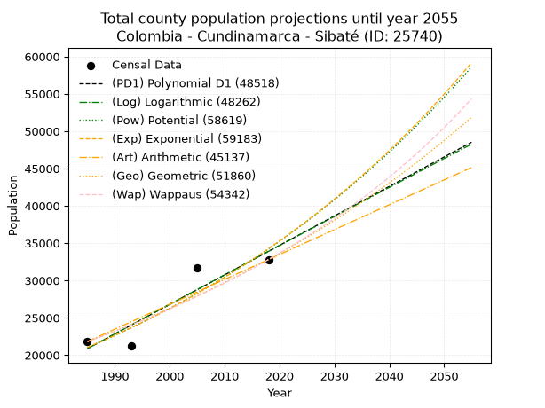
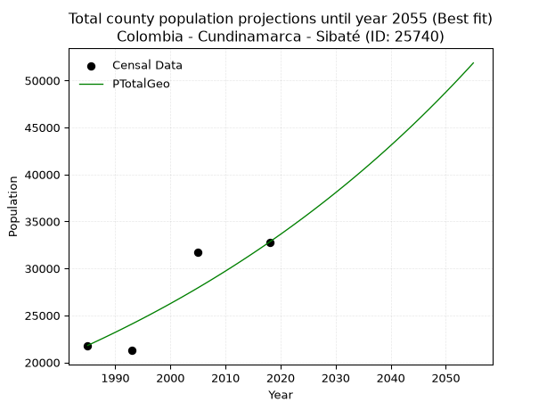
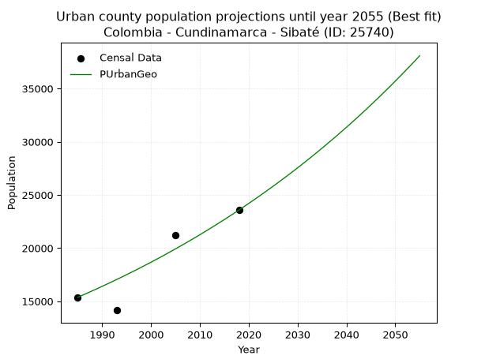
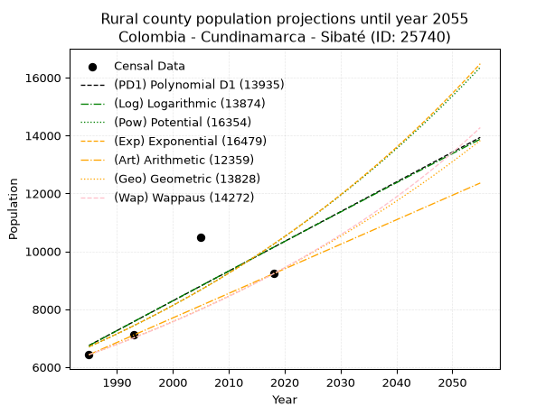
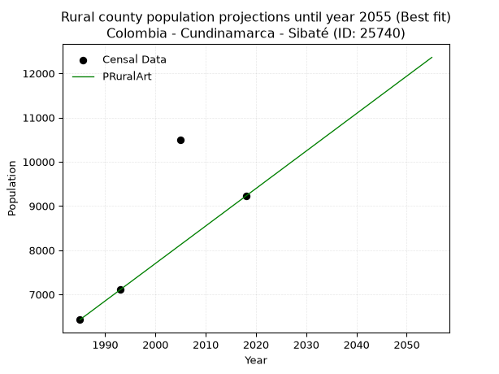

<div align="center">


</div>

# 📜 _“Population and Public Services Demand Projections (PPSD) until Year 2050 for Colombia - Cundinamarca - Sibaté (ID: 25740)”_
Keywords: `population` `public-service` `projection` `lineal` `polynomial` `logarithmic` `potential` `exponential` `arithmetic` `geometric` `wappaus` `dane` `colombia` `south-america`

PPSD are analytical estimates used by governments and planners to anticipate future changes in population size, age distribution, and the resulting community needs for utilities, healthcare, education, and infrastructure as sizing future water treatment facilities, electrical grids, and road networks based on spatial growth.

<div align="center">

</img>

</div>


> **General running parameters**: • app_version: _v20260806_. • Python version: _3.14.7_. • Pandas version: _3.0.5_. • NumPy version: _2.5.1_. • Creates, save and include plots into reports (create_plot): _False_. • Projection until year: _2050_. • Process polynomial degree 2 and up: _False_. • Process Wappaus: _True_. • Process Wappaus: _True_. • Set negative values to zero: _True_. • Set infinite values to zero: _True_. • Drop dataset notes: _True_. 
<div align="center">

Dynamic map: [:earth_americas:Google](http://maps.google.com/maps?q=4.492625087,-74.2578736) [:earth_americas:OSM](https://www.openstreetmap.org/#map=18/4.492625087/-74.2578736&layers=P) [:earth_americas:Bing](https://www.bing.com/maps?cp=4.492625087~-74.2578736&lvl=18) [:earth_americas:Apple](https://maps.apple.com/frame?center=4.492625087%2C-74.2578736&span=0.003%2C0.006)

</div>


<div align="center">

```geojson
{
  "type": "Feature",
  "geometry": {
    "type": "Point", 
    "coordinates": [-74.2578736, 4.492625087]
  }, 
  "properties": {
    "Name": "Colombia - Cundinamarca - Sibaté (ID: 25740)"
  }
}
```

</div>


## 0. Census Data (4 records)

Census data are official statistics collected by a government about the people and housing in a country. They usually include counts of total population, age, sex, race, income, education, and jobs.

📅Global census file: [Population.xlsx](../data/Population.xlsx)

| Source   |   Year |   CountryID | CountryName   |   StateID | StateName    |   CountyID | CountyName   |   PTotal |   PUrban |   PRural |
|:---------|-------:|------------:|:--------------|----------:|:-------------|-----------:|:-------------|---------:|---------:|---------:|
| DANE     |   1985 |          57 | Colombia      |        25 | Cundinamarca |      25740 | Sibaté       |    21802 |    15374 |     6428 |
| DANE     |   1993 |          57 | Colombia      |        25 | Cundinamarca |      25740 | Sibaté       |    21266 |    14153 |     7113 |
| DANE     |   2005 |          57 | Colombia      |        25 | Cundinamarca |      25740 | Sibaté       |    31675 |    21188 |    10487 |
| DANE     |   2018 |          57 | Colombia      |        25 | Cundinamarca |      25740 | Sibaté       |    32803 |    23579 |     9224 |

> 🔥Some records could had specific notes about the registered values or the corresponding urban or rural distribution.

📅[SUI-RUPS](https://www.datos.gov.co/Hacienda-y-Cr-dito-P-blico/Registro-nico-de-Prestadores-de-Servicios-P-blicos/4qkq-csdn/about_data) - Local public utility companies: [RUPS.csv](../data/RUPS.csv)

 | SERVICIO       | ESTADO    | NOMBRE                                                                                                                                                 | NIT         | DEPARTAMENTO_DOMICILIO   | MUNICIPIO_DOMICILIO   | DIRECCION                          |   TELEFONO | EMAIL                        | TIPO_PRESTADOR                             | CLASIFICACION                  |
|:---------------|:----------|:-------------------------------------------------------------------------------------------------------------------------------------------------------|:------------|:-------------------------|:----------------------|:-----------------------------------|-----------:|:-----------------------------|:-------------------------------------------|:-------------------------------|
| ACUEDUCTO      | OPERATIVA | ASOCIACION DE AFILIADOS ACUEDUCTO REGIONAL VEREDAS Y SECTORES DE LOS MUNICIPIOS DE SIBATÉ  SOACHA Y GRANADA                                            | 832001775-2 | CUNDINAMARCA             | SIBATE                | Calle 8  No.7 - 46                 |    5297175 | aguasiso_esp@hotmail.com     | ORGANIZACION AUTORIZADA                    | MENOR O IGUAL A 2500 USUARIOS  |
| ACUEDUCTO      | OPERATIVA | ASOCIACION DE USUARIOS DEL SERVICIO DE ACUEDUCTO DE LA VEREDA DE USABA LA CANTERA                                                                      | 832008425-1 | CUNDINAMARCA             | SIBATE                | VEREDA USABA - SECTOR LA CANTERA   |    5299852 | aveusibate@hotmail.com       | ORGANIZACION AUTORIZADA                    | HASTA 2500 SUSCRIPTORES        |
| ACUEDUCTO      | OPERATIVA | JUNTA DE ACCION COMUNAL DEL BARRIO LA PAZ DE SIBATE                                                                                                    | 832005994-7 | CUNDINAMARCA             | SIBATE                | CALLE 1 A  No. 6 A - 94 LA PAZ     |    5297099 | obberru266@hotmail.com       | ORGANIZACION AUTORIZADA                    | MENOR O IGUAL A 2500 USUARIOS  |
| ACUEDUCTO      | OPERATIVA | ASOCIACION DESUSCRIPTORES DEL SERVICIO DE AGUA POTABLE DE LA VEREDA LAS DELICIAS Y BARRIO SANTA TERESA, MUNICIPIO DE SIBATE, DEPARTAMENTO DE CUNDINAMA | 832000215-5 | CUNDINAMARCA             | SIBATE                | cra 3 numero 3-10                  |    5295391 | acueductoasuacdesa@gmail.com | ORGANIZACION AUTORIZADA                    | MENOR O IGUAL A 2500 USUARIOS  |
| ACUEDUCTO      | OPERATIVA | EMPRESAS PUBLICAS MUNICIPALES DE SIBATE  S.C.A.  E.S.P                                                                                                 | 900171710-9 | CUNDINAMARCA             | SIBATE                | CALLE 4 Nº 6A 77                   |    7250225 | jully.reyes@gmail.com        | SOCIEDADES (EMPRESA DE SERVICIOS PUBLICOS) | DESDE 2501 HASTA 5000 USUARIOS |
| ALCANTARILLADO | OPERATIVA | EMPRESAS PUBLICAS MUNICIPALES DE SIBATE  S.C.A.  E.S.P                                                                                                 | 900171710-9 | CUNDINAMARCA             | SIBATE                | CALLE 4 Nº 6A 77                   |    7250225 | jully.reyes@gmail.com        | SOCIEDADES (EMPRESA DE SERVICIOS PUBLICOS) | DESDE 2501 HASTA 5000 USUARIOS |
| ACUEDUCTO      | OPERATIVA | JUNTA ADMINISTRADORA DEL ACUEDUCTO DE LA VEREDA SAN BENITO                                                                                             | 832000265-3 | CUNDINAMARCA             | SIBATE                | VEREDA SAN BENITO CALLE 23N° 4 -30 |    7250741 | acueductosanbenito@gmail.com | ORGANIZACION AUTORIZADA                    | MENOR O IGUAL A 2500 USUARIOS  |
| ACUEDUCTO      | OPERATIVA | ASOCIACION DE SUSCRIPTORES DEL SERVICIO DE ACUEDUCTO                                                                                                   | 900336306-6 | CUNDINAMARCA             | SIBATE                | Avenida 6 No. 5-10                 |    5299726 | aguasdechacua@hotmail.com    | ORGANIZACION AUTORIZADA                    | MENOR O IGUAL A 2500 USUARIOS  |

## 1. Total

### 1.1. Coefficients and Parameters

* (PD1) Polynomial Deg 1: 395.10317141710027, -763418.618627055 (lineal)
* (Log) Logarithmic: 791010.0659570216, -5985587.3500961745
* (Pow) Potential: 29.595869634128004, -93.27750704599212
* (Exp) Exponential: 0.014782683147892267, 3.7933475584285994e-09
* (Art) Arithmetic: Year diff. 2018 - 1985 = 33, Population diff. 32803 - 21802 = 11001, Annual growth = 333.3636363636364
* (Geo) Geometric: Year diff. 2018 - 1985 = 33, Population diff. 32803 - 21802 = 11001, Annual growth % = 0.01245628260408349
* (Wap) Wappaus: i = 1.2210004078880556, Condition values only valid for < 200)

<sub>
Wappaus condition values: ['0.00', '1.22', '2.44', '3.66', '4.88', '6.11', '7.33', '8.55', '9.77', '10.99', '12.21', '13.43', '14.65', '15.87', '17.09', '18.32', '19.54', '20.76', '21.98', '23.20', '24.42', '25.64', '26.86', '28.08', '29.30', '30.53', '31.75', '32.97', '34.19', '35.41', '36.63', '37.85', '39.07', '40.29', '41.51', '42.74', '43.96', '45.18', '46.40', '47.62', '48.84', '50.06', '51.28', '52.50', '53.72', '54.95', '56.17', '57.39', '58.61', '59.83', '61.05', '62.27', '63.49', '64.71', '65.93', '67.16', '68.38', '69.60', '70.82', '72.04', '73.26', '74.48', '75.70', '76.92', '78.14', '79.37']
</sub>


### 1.2. Projected Dataset

|   Year |   CountyID |   PTotalPD1 |   PTotalLog |   PTotalPow |   PTotalExp |   PTotalArt |   PTotalGeo |   PTotalWap |
|-------:|-----------:|------------:|------------:|------------:|------------:|------------:|------------:|------------:|
|   1985 |      25740 |       20861 |       20848 |       21018 |       21028 |       21802 |       21802 |       21802 |
|   1986 |      25740 |       21256 |       21246 |       21333 |       21341 |       22135 |       22074 |       22070 |
|   1987 |      25740 |       21651 |       21645 |       21653 |       21659 |       22469 |       22349 |       22341 |
|   1988 |      25740 |       22046 |       22043 |       21978 |       21982 |       22802 |       22627 |       22616 |
|   1989 |      25740 |       22442 |       22440 |       22308 |       22309 |       23135 |       22909 |       22893 |
|   1990 |      25740 |       22837 |       22838 |       22642 |       22641 |       23469 |       23194 |       23175 |
|   1991 |      25740 |       23232 |       23235 |       22981 |       22978 |       23802 |       23483 |       23460 |
|   1992 |      25740 |       23627 |       23633 |       23325 |       23320 |       24136 |       23776 |       23749 |
|   1993 |      25740 |       24022 |       24030 |       23675 |       23668 |       24469 |       24072 |       24041 |
|   1994 |      25740 |       24417 |       24426 |       24029 |       24020 |       24802 |       24372 |       24337 |
|   1995 |      25740 |       24812 |       24823 |       24388 |       24378 |       25136 |       24675 |       24637 |
|   1996 |      25740 |       25207 |       25219 |       24752 |       24741 |       25469 |       24982 |       24941 |
|   1997 |      25740 |       25602 |       25616 |       25122 |       25109 |       25802 |       25294 |       25249 |
|   1998 |      25740 |       25998 |       26012 |       25497 |       25483 |       26136 |       25609 |       25561 |
|   1999 |      25740 |       26393 |       26407 |       25877 |       25863 |       26469 |       25928 |       25877 |
|   2000 |      25740 |       26788 |       26803 |       26263 |       26248 |       26802 |       26251 |       26198 |
|   2001 |      25740 |       27183 |       27198 |       26655 |       26639 |       27136 |       26578 |       26522 |
|   2002 |      25740 |       27578 |       27594 |       27052 |       27036 |       27469 |       26909 |       26852 |
|   2003 |      25740 |       27973 |       27989 |       27454 |       27438 |       27803 |       27244 |       27185 |
|   2004 |      25740 |       28368 |       28383 |       27863 |       27847 |       28136 |       27583 |       27524 |
|   2005 |      25740 |       28763 |       28778 |       28277 |       28262 |       28469 |       27927 |       27867 |
|   2006 |      25740 |       29158 |       29172 |       28698 |       28683 |       28803 |       28275 |       28214 |
|   2007 |      25740 |       29553 |       29567 |       29124 |       29110 |       29136 |       28627 |       28567 |
|   2008 |      25740 |       29949 |       29961 |       29557 |       29543 |       29469 |       28983 |       28925 |
|   2009 |      25740 |       30344 |       30355 |       29996 |       29983 |       29803 |       29345 |       29288 |
|   2010 |      25740 |       30739 |       30748 |       30441 |       30430 |       30136 |       29710 |       29656 |
|   2011 |      25740 |       31134 |       31142 |       30892 |       30883 |       30469 |       30080 |       30029 |
|   2012 |      25740 |       31529 |       31535 |       31350 |       31343 |       30803 |       30455 |       30408 |
|   2013 |      25740 |       31924 |       31928 |       31814 |       31810 |       31136 |       30834 |       30793 |
|   2014 |      25740 |       32319 |       32321 |       32285 |       32283 |       31470 |       31218 |       31183 |
|   2015 |      25740 |       32714 |       32713 |       32763 |       32764 |       31803 |       31607 |       31579 |
|   2016 |      25740 |       33109 |       33106 |       33248 |       33252 |       32136 |       32001 |       31981 |
|   2017 |      25740 |       33504 |       33498 |       33739 |       33747 |       32470 |       32399 |       32389 |
|   2018 |      25740 |       33900 |       33890 |       34238 |       34250 |       32803 |       32803 |       32803 |
|   2019 |      25740 |       34295 |       34282 |       34744 |       34760 |       33136 |       33212 |       33224 |
|   2020 |      25740 |       34690 |       34674 |       35257 |       35278 |       33470 |       33625 |       33651 |
|   2021 |      25740 |       35085 |       35065 |       35777 |       35803 |       33803 |       34044 |       34085 |
|   2022 |      25740 |       35480 |       35457 |       36305 |       36336 |       34136 |       34468 |       34526 |
|   2023 |      25740 |       35875 |       35848 |       36840 |       36877 |       34470 |       34898 |       34973 |
|   2024 |      25740 |       36270 |       36239 |       37382 |       37426 |       34803 |       35332 |       35428 |
|   2025 |      25740 |       36665 |       36629 |       37933 |       37984 |       35137 |       35772 |       35891 |
|   2026 |      25740 |       37060 |       37020 |       38491 |       38550 |       35470 |       36218 |       36360 |
|   2027 |      25740 |       37456 |       37410 |       39058 |       39124 |       35803 |       36669 |       36838 |
|   2028 |      25740 |       37851 |       37800 |       39632 |       39706 |       36137 |       37126 |       37323 |
|   2029 |      25740 |       38246 |       38190 |       40214 |       40298 |       36470 |       37588 |       37817 |
|   2030 |      25740 |       38641 |       38580 |       40805 |       40898 |       36803 |       38057 |       38319 |
|   2031 |      25740 |       39036 |       38970 |       41404 |       41507 |       37137 |       38531 |       38829 |
|   2032 |      25740 |       39431 |       39359 |       42012 |       42125 |       37470 |       39010 |       39348 |
|   2033 |      25740 |       39826 |       39748 |       42628 |       42752 |       37803 |       39496 |       39876 |
|   2034 |      25740 |       40221 |       40137 |       43253 |       43389 |       38137 |       39988 |       40413 |
|   2035 |      25740 |       40616 |       40526 |       43887 |       44035 |       38470 |       40487 |       40960 |
|   2036 |      25740 |       41011 |       40915 |       44530 |       44691 |       38804 |       40991 |       41517 |
|   2037 |      25740 |       41407 |       41303 |       45181 |       45356 |       39137 |       41501 |       42083 |
|   2038 |      25740 |       41802 |       41691 |       45843 |       46032 |       39470 |       42018 |       42659 |
|   2039 |      25740 |       42197 |       42079 |       46513 |       46717 |       39804 |       42542 |       43247 |
|   2040 |      25740 |       42592 |       42467 |       47193 |       47413 |       40137 |       43072 |       43844 |
|   2041 |      25740 |       42987 |       42855 |       47882 |       48119 |       40470 |       43608 |       44453 |
|   2042 |      25740 |       43382 |       43242 |       48582 |       48836 |       40804 |       44151 |       45074 |
|   2043 |      25740 |       43777 |       43629 |       49291 |       49563 |       41137 |       44701 |       45706 |
|   2044 |      25740 |       44172 |       44017 |       50010 |       50301 |       41470 |       45258 |       46350 |
|   2045 |      25740 |       44567 |       44403 |       50739 |       51050 |       41804 |       45822 |       47007 |
|   2046 |      25740 |       44962 |       44790 |       51478 |       51811 |       42137 |       46393 |       47676 |
|   2047 |      25740 |       45358 |       45177 |       52228 |       52582 |       42471 |       46971 |       48358 |
|   2048 |      25740 |       45753 |       45563 |       52989 |       53365 |       42804 |       47556 |       49054 |
|   2049 |      25740 |       46148 |       45949 |       53760 |       54160 |       43137 |       48148 |       49764 |
|   2050 |      25740 |       46543 |       46335 |       54542 |       54967 |       43471 |       48748 |       50489 |
<div align="center">

</img>

</div>


### 1.3. Best fit with absolute and relative error (%)

Relative error puts that difference into context by dividing the absolute error by the true value, creating a unitless ratio or percentage that shows the scale of the mistake.

Absolute and relative error

|   Year | Source   |   CountryID | CountryName   |   StateID | StateName    |   CountyID_x | CountyName   |   PTotal |   PUrban |   PRural |   CountyID_y |   PTotalPD1 |   PTotalLog |   PTotalPow |   PTotalExp |   PTotalArt |   PTotalGeo |   PTotalWap |   PTotalPD1AbsError |   PTotalLogAbsError |   PTotalPowAbsError |   PTotalExpAbsError |   PTotalArtAbsError |   PTotalGeoAbsError |   PTotalWapAbsError |   PTotalPD1RelError |   PTotalLogRelError |   PTotalPowRelError |   PTotalExpRelError |   PTotalArtRelError |   PTotalGeoRelError |   PTotalWapRelError |
|-------:|:---------|------------:|:--------------|----------:|:-------------|-------------:|:-------------|---------:|---------:|---------:|-------------:|------------:|------------:|------------:|------------:|------------:|------------:|------------:|--------------------:|--------------------:|--------------------:|--------------------:|--------------------:|--------------------:|--------------------:|--------------------:|--------------------:|--------------------:|--------------------:|--------------------:|--------------------:|--------------------:|
|   1985 | DANE     |          57 | Colombia      |        25 | Cundinamarca |        25740 | Sibaté       |    21802 |    15374 |     6428 |        25740 |       20861 |       20848 |       21018 |       21028 |       21802 |       21802 |       21802 |                 941 |                 954 |                 784 |                 774 |                   0 |                   0 |                   0 |             4.31612 |             4.37575 |              3.596  |             3.55013 |              0      |              0      |              0      |
|   1993 | DANE     |          57 | Colombia      |        25 | Cundinamarca |        25740 | Sibaté       |    21266 |    14153 |     7113 |        25740 |       24022 |       24030 |       23675 |       23668 |       24469 |       24072 |       24041 |                2756 |                2764 |                2409 |                2402 |                3203 |                2806 |                2775 |            12.9597  |            12.9973  |             11.3279 |            11.295   |             15.0616 |             13.1948 |             13.049  |
|   2005 | DANE     |          57 | Colombia      |        25 | Cundinamarca |        25740 | Sibaté       |    31675 |    21188 |    10487 |        25740 |       28763 |       28778 |       28277 |       28262 |       28469 |       27927 |       27867 |                2912 |                2897 |                3398 |                3413 |                3206 |                3748 |                3808 |             9.19337 |             9.14601 |             10.7277 |            10.7751  |             10.1215 |             11.8327 |             12.0221 |
|   2018 | DANE     |          57 | Colombia      |        25 | Cundinamarca |        25740 | Sibaté       |    32803 |    23579 |     9224 |        25740 |       33900 |       33890 |       34238 |       34250 |       32803 |       32803 |       32803 |                1097 |                1087 |                1435 |                1447 |                   0 |                   0 |                   0 |             3.34421 |             3.31372 |              4.3746 |             4.41118 |              0      |              0      |              0      |

Relative error mean

| Method    |   RelError | Best   |
|:----------|-----------:|:-------|
| PTotalPD1 |    7.45334 |        |
| PTotalLog |    7.45819 |        |
| PTotalPow |    7.50656 |        |
| PTotalExp |    7.50785 |        |
| PTotalArt |    6.29579 |        |
| PTotalGeo |    6.25686 | True   |
| PTotalWap |    6.26777 |        |

💙Best method: _**PTotalGeo**_
<div align="center">

</img>

</div>


### 1.4. Fresh water supply demand in liters per capita per day (lpcd)

The fresh water supply demand typically ranges from 100 to 300 liters per capita per day (lpcd) for standard domestic and municipal planning, though absolute survival minimums set by the World Health Organization are as low as 7.5 to 20 liters per day, and total consumption in high-income nations can exceed 400 liters.

> `CZ`: Level in meters above the sea level (masl)<br> `WS`: Fresh water supply demand in liters per capita per day (lpcd or l/h/d)<br> `WSAll`: Zonal fresh water supply demand in liters per second (l/s)<br> `A`: Zonal area in square meters<br> `DP`: Population density (people/hectare or p/ha)

Reference values (RAS Colombia)

|    CZ |   WS |
|------:|-----:|
|  1000 |  120 |
|  2000 |  130 |
| 99999 |  140 |

County shapefile geometry properties and water supply values

|   CountyID |      ATotal |   CZTotal |   WSTotal |
|-----------:|------------:|----------:|----------:|
|      25740 | 1.25859e+08 |   2861.93 |       140 |

Projected values for best method: PTotalGeo

|   CountyID |   Year |   PTotalGeo |   DPTotal |   WSTotal |   WSTotalAll |
|-----------:|-------:|------------:|----------:|----------:|-------------:|
|      25740 |   1985 |       21802 |      1.73 |       140 |      35.3273 |
|      25740 |   1986 |       22074 |      1.75 |       140 |      35.7681 |
|      25740 |   1987 |       22349 |      1.78 |       140 |      36.2137 |
|      25740 |   1988 |       22627 |      1.8  |       140 |      36.6641 |
|      25740 |   1989 |       22909 |      1.82 |       140 |      37.1211 |
|      25740 |   1990 |       23194 |      1.84 |       140 |      37.5829 |
|      25740 |   1991 |       23483 |      1.87 |       140 |      38.0512 |
|      25740 |   1992 |       23776 |      1.89 |       140 |      38.5259 |
|      25740 |   1993 |       24072 |      1.91 |       140 |      39.0056 |
|      25740 |   1994 |       24372 |      1.94 |       140 |      39.4917 |
|      25740 |   1995 |       24675 |      1.96 |       140 |      39.9826 |
|      25740 |   1996 |       24982 |      1.98 |       140 |      40.4801 |
|      25740 |   1997 |       25294 |      2.01 |       140 |      40.9856 |
|      25740 |   1998 |       25609 |      2.03 |       140 |      41.4961 |
|      25740 |   1999 |       25928 |      2.06 |       140 |      42.013  |
|      25740 |   2000 |       26251 |      2.09 |       140 |      42.5363 |
|      25740 |   2001 |       26578 |      2.11 |       140 |      43.0662 |
|      25740 |   2002 |       26909 |      2.14 |       140 |      43.6025 |
|      25740 |   2003 |       27244 |      2.16 |       140 |      44.1454 |
|      25740 |   2004 |       27583 |      2.19 |       140 |      44.6947 |
|      25740 |   2005 |       27927 |      2.22 |       140 |      45.2521 |
|      25740 |   2006 |       28275 |      2.25 |       140 |      45.816  |
|      25740 |   2007 |       28627 |      2.27 |       140 |      46.3863 |
|      25740 |   2008 |       28983 |      2.3  |       140 |      46.9632 |
|      25740 |   2009 |       29345 |      2.33 |       140 |      47.5498 |
|      25740 |   2010 |       29710 |      2.36 |       140 |      48.1412 |
|      25740 |   2011 |       30080 |      2.39 |       140 |      48.7407 |
|      25740 |   2012 |       30455 |      2.42 |       140 |      49.3484 |
|      25740 |   2013 |       30834 |      2.45 |       140 |      49.9625 |
|      25740 |   2014 |       31218 |      2.48 |       140 |      50.5847 |
|      25740 |   2015 |       31607 |      2.51 |       140 |      51.215  |
|      25740 |   2016 |       32001 |      2.54 |       140 |      51.8535 |
|      25740 |   2017 |       32399 |      2.57 |       140 |      52.4984 |
|      25740 |   2018 |       32803 |      2.61 |       140 |      53.153  |
|      25740 |   2019 |       33212 |      2.64 |       140 |      53.8157 |
|      25740 |   2020 |       33625 |      2.67 |       140 |      54.485  |
|      25740 |   2021 |       34044 |      2.7  |       140 |      55.1639 |
|      25740 |   2022 |       34468 |      2.74 |       140 |      55.8509 |
|      25740 |   2023 |       34898 |      2.77 |       140 |      56.5477 |
|      25740 |   2024 |       35332 |      2.81 |       140 |      57.2509 |
|      25740 |   2025 |       35772 |      2.84 |       140 |      57.9639 |
|      25740 |   2026 |       36218 |      2.88 |       140 |      58.6866 |
|      25740 |   2027 |       36669 |      2.91 |       140 |      59.4174 |
|      25740 |   2028 |       37126 |      2.95 |       140 |      60.1579 |
|      25740 |   2029 |       37588 |      2.99 |       140 |      60.9065 |
|      25740 |   2030 |       38057 |      3.02 |       140 |      61.6664 |
|      25740 |   2031 |       38531 |      3.06 |       140 |      62.4345 |
|      25740 |   2032 |       39010 |      3.1  |       140 |      63.2106 |
|      25740 |   2033 |       39496 |      3.14 |       140 |      63.9981 |
|      25740 |   2034 |       39988 |      3.18 |       140 |      64.7954 |
|      25740 |   2035 |       40487 |      3.22 |       140 |      65.6039 |
|      25740 |   2036 |       40991 |      3.26 |       140 |      66.4206 |
|      25740 |   2037 |       41501 |      3.3  |       140 |      67.247  |
|      25740 |   2038 |       42018 |      3.34 |       140 |      68.0847 |
|      25740 |   2039 |       42542 |      3.38 |       140 |      68.9338 |
|      25740 |   2040 |       43072 |      3.42 |       140 |      69.7926 |
|      25740 |   2041 |       43608 |      3.46 |       140 |      70.6611 |
|      25740 |   2042 |       44151 |      3.51 |       140 |      71.541  |
|      25740 |   2043 |       44701 |      3.55 |       140 |      72.4322 |
|      25740 |   2044 |       45258 |      3.6  |       140 |      73.3347 |
|      25740 |   2045 |       45822 |      3.64 |       140 |      74.2486 |
|      25740 |   2046 |       46393 |      3.69 |       140 |      75.1738 |
|      25740 |   2047 |       46971 |      3.73 |       140 |      76.1104 |
|      25740 |   2048 |       47556 |      3.78 |       140 |      77.0583 |
|      25740 |   2049 |       48148 |      3.83 |       140 |      78.0176 |
|      25740 |   2050 |       48748 |      3.87 |       140 |      78.9898 |

## 2. Urban

### 2.1. Coefficients and Parameters

* (PD1) Polynomial Deg 1: 292.42472902448606, -566349.0642312282 (lineal)
* (Log) Logarithmic: 585208.4770460625, -4429600.823593543
* (Pow) Potential: 31.219907694646633, -98.80022024676455
* (Exp) Exponential: 0.015599903359788475, 5.098765631738687e-10
* (Art) Arithmetic: Year diff. 2018 - 1985 = 33, Population diff. 23579 - 15374 = 8205, Annual growth = 248.63636363636363
* (Geo) Geometric: Year diff. 2018 - 1985 = 33, Population diff. 23579 - 15374 = 8205, Annual growth % = 0.013044305311723292
* (Wap) Wappaus: i = 1.2765967377935648, Condition values only valid for < 200)

<sub>
Wappaus condition values: ['0.00', '1.28', '2.55', '3.83', '5.11', '6.38', '7.66', '8.94', '10.21', '11.49', '12.77', '14.04', '15.32', '16.60', '17.87', '19.15', '20.43', '21.70', '22.98', '24.26', '25.53', '26.81', '28.09', '29.36', '30.64', '31.91', '33.19', '34.47', '35.74', '37.02', '38.30', '39.57', '40.85', '42.13', '43.40', '44.68', '45.96', '47.23', '48.51', '49.79', '51.06', '52.34', '53.62', '54.89', '56.17', '57.45', '58.72', '60.00', '61.28', '62.55', '63.83', '65.11', '66.38', '67.66', '68.94', '70.21', '71.49', '72.77', '74.04', '75.32', '76.60', '77.87', '79.15', '80.43', '81.70', '82.98']
</sub>


### 2.2. Projected Dataset

|   Year |   CountyID |   PUrbanPD1 |   PUrbanLog |   PUrbanPow |   PUrbanExp |   PUrbanArt |   PUrbanGeo |   PUrbanWap |
|-------:|-----------:|------------:|------------:|------------:|------------:|------------:|------------:|------------:|
|   1985 |      25740 |       14114 |       14106 |       14307 |       14313 |       15374 |       15374 |       15374 |
|   1986 |      25740 |       14406 |       14401 |       14534 |       14539 |       15623 |       15575 |       15572 |
|   1987 |      25740 |       14699 |       14695 |       14764 |       14767 |       15871 |       15778 |       15772 |
|   1988 |      25740 |       14991 |       14990 |       14998 |       14999 |       16120 |       15984 |       15974 |
|   1989 |      25740 |       15284 |       15284 |       15235 |       15235 |       16369 |       16192 |       16180 |
|   1990 |      25740 |       15576 |       15578 |       15476 |       15475 |       16617 |       16403 |       16388 |
|   1991 |      25740 |       15869 |       15872 |       15721 |       15718 |       16866 |       16617 |       16598 |
|   1992 |      25740 |       16161 |       16166 |       15969 |       15965 |       17114 |       16834 |       16812 |
|   1993 |      25740 |       16453 |       16460 |       16222 |       16216 |       17363 |       17054 |       17029 |
|   1994 |      25740 |       16746 |       16753 |       16478 |       16471 |       17612 |       17276 |       17248 |
|   1995 |      25740 |       17038 |       17047 |       16738 |       16730 |       17860 |       17501 |       17470 |
|   1996 |      25740 |       17331 |       17340 |       17001 |       16993 |       18109 |       17730 |       17696 |
|   1997 |      25740 |       17623 |       17633 |       17269 |       17260 |       18358 |       17961 |       17925 |
|   1998 |      25740 |       17916 |       17926 |       17541 |       17531 |       18606 |       18195 |       18156 |
|   1999 |      25740 |       18208 |       18219 |       17818 |       17807 |       18855 |       18433 |       18391 |
|   2000 |      25740 |       18500 |       18512 |       18098 |       18087 |       19104 |       18673 |       18630 |
|   2001 |      25740 |       18793 |       18804 |       18383 |       18371 |       19352 |       18917 |       18871 |
|   2002 |      25740 |       19085 |       19097 |       18672 |       18660 |       19601 |       19163 |       19117 |
|   2003 |      25740 |       19378 |       19389 |       18965 |       18954 |       19849 |       19413 |       19365 |
|   2004 |      25740 |       19670 |       19681 |       19263 |       19252 |       20098 |       19667 |       19618 |
|   2005 |      25740 |       19963 |       19973 |       19565 |       19554 |       20347 |       19923 |       19874 |
|   2006 |      25740 |       20255 |       20265 |       19872 |       19862 |       20595 |       20183 |       20134 |
|   2007 |      25740 |       20547 |       20556 |       20184 |       20174 |       20844 |       20446 |       20397 |
|   2008 |      25740 |       20840 |       20848 |       20500 |       20491 |       21093 |       20713 |       20665 |
|   2009 |      25740 |       21132 |       21139 |       20821 |       20813 |       21341 |       20983 |       20936 |
|   2010 |      25740 |       21425 |       21430 |       21147 |       21141 |       21590 |       21257 |       21212 |
|   2011 |      25740 |       21717 |       21722 |       21478 |       21473 |       21839 |       21534 |       21492 |
|   2012 |      25740 |       22009 |       22012 |       21814 |       21811 |       22087 |       21815 |       21777 |
|   2013 |      25740 |       22302 |       22303 |       22155 |       22154 |       22336 |       22100 |       22065 |
|   2014 |      25740 |       22594 |       22594 |       22501 |       22502 |       22584 |       22388 |       22359 |
|   2015 |      25740 |       22887 |       22884 |       22853 |       22856 |       22833 |       22680 |       22656 |
|   2016 |      25740 |       23179 |       23175 |       23210 |       23215 |       23082 |       22976 |       22959 |
|   2017 |      25740 |       23472 |       23465 |       23572 |       23580 |       23330 |       23275 |       23267 |
|   2018 |      25740 |       23764 |       23755 |       23939 |       23951 |       23579 |       23579 |       23579 |
|   2019 |      25740 |       24056 |       24045 |       24313 |       24327 |       23828 |       23887 |       23897 |
|   2020 |      25740 |       24349 |       24335 |       24691 |       24710 |       24076 |       24198 |       24219 |
|   2021 |      25740 |       24641 |       24624 |       25076 |       25098 |       24325 |       24514 |       24547 |
|   2022 |      25740 |       24934 |       24914 |       25466 |       25493 |       24574 |       24834 |       24881 |
|   2023 |      25740 |       25226 |       25203 |       25862 |       25894 |       24822 |       25158 |       25220 |
|   2024 |      25740 |       25519 |       25492 |       26264 |       26301 |       25071 |       25486 |       25565 |
|   2025 |      25740 |       25811 |       25781 |       26673 |       26714 |       25319 |       25818 |       25916 |
|   2026 |      25740 |       26103 |       26070 |       27087 |       27134 |       25568 |       26155 |       26273 |
|   2027 |      25740 |       26396 |       26359 |       27507 |       27561 |       25817 |       26496 |       26636 |
|   2028 |      25740 |       26688 |       26648 |       27934 |       27994 |       26065 |       26842 |       27006 |
|   2029 |      25740 |       26981 |       26936 |       28367 |       28434 |       26314 |       27192 |       27382 |
|   2030 |      25740 |       27273 |       27225 |       28807 |       28881 |       26563 |       27547 |       27765 |
|   2031 |      25740 |       27566 |       27513 |       29254 |       29335 |       26811 |       27906 |       28155 |
|   2032 |      25740 |       27858 |       27801 |       29707 |       29797 |       27060 |       28270 |       28552 |
|   2033 |      25740 |       28150 |       28089 |       30166 |       30265 |       27309 |       28639 |       28956 |
|   2034 |      25740 |       28443 |       28377 |       30633 |       30741 |       27557 |       29012 |       29368 |
|   2035 |      25740 |       28735 |       28664 |       31107 |       31224 |       27806 |       29391 |       29787 |
|   2036 |      25740 |       29028 |       28952 |       31588 |       31715 |       28054 |       29774 |       30215 |
|   2037 |      25740 |       29320 |       29239 |       32076 |       32214 |       28303 |       30162 |       30650 |
|   2038 |      25740 |       29613 |       29526 |       32571 |       32720 |       28552 |       30556 |       31094 |
|   2039 |      25740 |       29905 |       29813 |       33073 |       33235 |       28800 |       30954 |       31547 |
|   2040 |      25740 |       30197 |       30100 |       33584 |       33757 |       29049 |       31358 |       32008 |
|   2041 |      25740 |       30490 |       30387 |       34101 |       34288 |       29298 |       31767 |       32479 |
|   2042 |      25740 |       30782 |       30674 |       34627 |       34827 |       29546 |       32182 |       32959 |
|   2043 |      25740 |       31075 |       30960 |       35160 |       35375 |       29795 |       32601 |       33449 |
|   2044 |      25740 |       31367 |       31247 |       35702 |       35931 |       30044 |       33027 |       33949 |
|   2045 |      25740 |       31660 |       31533 |       36251 |       36496 |       30292 |       33457 |       34459 |
|   2046 |      25740 |       31952 |       31819 |       36808 |       37070 |       30541 |       33894 |       34980 |
|   2047 |      25740 |       32244 |       32105 |       37374 |       37652 |       30789 |       34336 |       35512 |
|   2048 |      25740 |       32537 |       32391 |       37949 |       38244 |       31038 |       34784 |       36055 |
|   2049 |      25740 |       32829 |       32677 |       38531 |       38846 |       31287 |       35238 |       36610 |
|   2050 |      25740 |       33122 |       32962 |       39123 |       39456 |       31535 |       35697 |       37177 |
<div align="center">

</img>

</div>


### 2.3. Best fit with absolute and relative error (%)

Relative error puts that difference into context by dividing the absolute error by the true value, creating a unitless ratio or percentage that shows the scale of the mistake.

Absolute and relative error

|   Year | Source   |   CountryID | CountryName   |   StateID | StateName    |   CountyID_x | CountyName   |   PTotal |   PUrban |   PRural |   CountyID_y |   PUrbanPD1 |   PUrbanLog |   PUrbanPow |   PUrbanExp |   PUrbanArt |   PUrbanGeo |   PUrbanWap |   PUrbanPD1AbsError |   PUrbanLogAbsError |   PUrbanPowAbsError |   PUrbanExpAbsError |   PUrbanArtAbsError |   PUrbanGeoAbsError |   PUrbanWapAbsError |   PUrbanPD1RelError |   PUrbanLogRelError |   PUrbanPowRelError |   PUrbanExpRelError |   PUrbanArtRelError |   PUrbanGeoRelError |   PUrbanWapRelError |
|-------:|:---------|------------:|:--------------|----------:|:-------------|-------------:|:-------------|---------:|---------:|---------:|-------------:|------------:|------------:|------------:|------------:|------------:|------------:|------------:|--------------------:|--------------------:|--------------------:|--------------------:|--------------------:|--------------------:|--------------------:|--------------------:|--------------------:|--------------------:|--------------------:|--------------------:|--------------------:|--------------------:|
|   1985 | DANE     |          57 | Colombia      |        25 | Cundinamarca |        25740 | Sibaté       |    21802 |    15374 |     6428 |        25740 |       14114 |       14106 |       14307 |       14313 |       15374 |       15374 |       15374 |                1260 |                1268 |                1067 |                1061 |                   0 |                   0 |                   0 |            8.19566  |            8.24769  |             6.94029 |             6.90126 |             0       |             0       |             0       |
|   1993 | DANE     |          57 | Colombia      |        25 | Cundinamarca |        25740 | Sibaté       |    21266 |    14153 |     7113 |        25740 |       16453 |       16460 |       16222 |       16216 |       17363 |       17054 |       17029 |                2300 |                2307 |                2069 |                2063 |                3210 |                2901 |                2876 |           16.251    |           16.3004   |            14.6188  |            14.5764  |            22.6807  |            20.4974  |            20.3208  |
|   2005 | DANE     |          57 | Colombia      |        25 | Cundinamarca |        25740 | Sibaté       |    31675 |    21188 |    10487 |        25740 |       19963 |       19973 |       19565 |       19554 |       20347 |       19923 |       19874 |                1225 |                1215 |                1623 |                1634 |                 841 |                1265 |                1314 |            5.78157  |            5.73438  |             7.66    |             7.71191 |             3.96923 |             5.97036 |             6.20162 |
|   2018 | DANE     |          57 | Colombia      |        25 | Cundinamarca |        25740 | Sibaté       |    32803 |    23579 |     9224 |        25740 |       23764 |       23755 |       23939 |       23951 |       23579 |       23579 |       23579 |                 185 |                 176 |                 360 |                 372 |                   0 |                   0 |                   0 |            0.784596 |            0.746427 |             1.52678 |             1.57768 |             0       |             0       |             0       |

Relative error mean

| Method    |   RelError | Best   |
|:----------|-----------:|:-------|
| PUrbanPD1 |    7.7532  |        |
| PUrbanLog |    7.75723 |        |
| PUrbanPow |    7.68647 |        |
| PUrbanExp |    7.69182 |        |
| PUrbanArt |    6.66248 |        |
| PUrbanGeo |    6.61695 | True   |
| PUrbanWap |    6.6306  |        |

💙Best method: _**PUrbanGeo**_
<div align="center">

</img>

</div>


### 2.4. Fresh water supply demand in liters per capita per day (lpcd)

The fresh water supply demand typically ranges from 100 to 300 liters per capita per day (lpcd) for standard domestic and municipal planning, though absolute survival minimums set by the World Health Organization are as low as 7.5 to 20 liters per day, and total consumption in high-income nations can exceed 400 liters.

> `CZ`: Level in meters above the sea level (masl)<br> `WS`: Fresh water supply demand in liters per capita per day (lpcd or l/h/d)<br> `WSAll`: Zonal fresh water supply demand in liters per second (l/s)<br> `A`: Zonal area in square meters<br> `DP`: Population density (people/hectare or p/ha)

Reference values (RAS Colombia)

|    CZ |   WS |
|------:|-----:|
|  1000 |  120 |
|  2000 |  130 |
| 99999 |  140 |

County shapefile geometry properties and water supply values

|   CountyID |      AUrban |   CZUrban |   WSUrban |
|-----------:|------------:|----------:|----------:|
|      25740 | 1.90722e+06 |    2586.9 |       140 |

Projected values for best method: PUrbanGeo

|   CountyID |   Year |   PUrbanGeo |   DPUrban |   WSUrban |   WSUrbanAll |
|-----------:|-------:|------------:|----------:|----------:|-------------:|
|      25740 |   1985 |       15374 |     80.61 |       140 |      24.9116 |
|      25740 |   1986 |       15575 |     81.66 |       140 |      25.2373 |
|      25740 |   1987 |       15778 |     82.73 |       140 |      25.5662 |
|      25740 |   1988 |       15984 |     83.81 |       140 |      25.9    |
|      25740 |   1989 |       16192 |     84.9  |       140 |      26.237  |
|      25740 |   1990 |       16403 |     86    |       140 |      26.5789 |
|      25740 |   1991 |       16617 |     87.13 |       140 |      26.9257 |
|      25740 |   1992 |       16834 |     88.26 |       140 |      27.2773 |
|      25740 |   1993 |       17054 |     89.42 |       140 |      27.6338 |
|      25740 |   1994 |       17276 |     90.58 |       140 |      27.9935 |
|      25740 |   1995 |       17501 |     91.76 |       140 |      28.3581 |
|      25740 |   1996 |       17730 |     92.96 |       140 |      28.7292 |
|      25740 |   1997 |       17961 |     94.17 |       140 |      29.1035 |
|      25740 |   1998 |       18195 |     95.4  |       140 |      29.4826 |
|      25740 |   1999 |       18433 |     96.65 |       140 |      29.8683 |
|      25740 |   2000 |       18673 |     97.91 |       140 |      30.2572 |
|      25740 |   2001 |       18917 |     99.19 |       140 |      30.6525 |
|      25740 |   2002 |       19163 |    100.48 |       140 |      31.0512 |
|      25740 |   2003 |       19413 |    101.79 |       140 |      31.4563 |
|      25740 |   2004 |       19667 |    103.12 |       140 |      31.8678 |
|      25740 |   2005 |       19923 |    104.46 |       140 |      32.2826 |
|      25740 |   2006 |       20183 |    105.82 |       140 |      32.7039 |
|      25740 |   2007 |       20446 |    107.2  |       140 |      33.1301 |
|      25740 |   2008 |       20713 |    108.6  |       140 |      33.5627 |
|      25740 |   2009 |       20983 |    110.02 |       140 |      34.0002 |
|      25740 |   2010 |       21257 |    111.46 |       140 |      34.4442 |
|      25740 |   2011 |       21534 |    112.91 |       140 |      34.8931 |
|      25740 |   2012 |       21815 |    114.38 |       140 |      35.3484 |
|      25740 |   2013 |       22100 |    115.88 |       140 |      35.8102 |
|      25740 |   2014 |       22388 |    117.39 |       140 |      36.2769 |
|      25740 |   2015 |       22680 |    118.92 |       140 |      36.75   |
|      25740 |   2016 |       22976 |    120.47 |       140 |      37.2296 |
|      25740 |   2017 |       23275 |    122.04 |       140 |      37.7141 |
|      25740 |   2018 |       23579 |    123.63 |       140 |      38.2067 |
|      25740 |   2019 |       23887 |    125.25 |       140 |      38.7058 |
|      25740 |   2020 |       24198 |    126.88 |       140 |      39.2097 |
|      25740 |   2021 |       24514 |    128.53 |       140 |      39.7218 |
|      25740 |   2022 |       24834 |    130.21 |       140 |      40.2403 |
|      25740 |   2023 |       25158 |    131.91 |       140 |      40.7653 |
|      25740 |   2024 |       25486 |    133.63 |       140 |      41.2968 |
|      25740 |   2025 |       25818 |    135.37 |       140 |      41.8347 |
|      25740 |   2026 |       26155 |    137.14 |       140 |      42.3808 |
|      25740 |   2027 |       26496 |    138.92 |       140 |      42.9333 |
|      25740 |   2028 |       26842 |    140.74 |       140 |      43.494  |
|      25740 |   2029 |       27192 |    142.57 |       140 |      44.0611 |
|      25740 |   2030 |       27547 |    144.44 |       140 |      44.6363 |
|      25740 |   2031 |       27906 |    146.32 |       140 |      45.2181 |
|      25740 |   2032 |       28270 |    148.23 |       140 |      45.8079 |
|      25740 |   2033 |       28639 |    150.16 |       140 |      46.4058 |
|      25740 |   2034 |       29012 |    152.12 |       140 |      47.0102 |
|      25740 |   2035 |       29391 |    154.1  |       140 |      47.6243 |
|      25740 |   2036 |       29774 |    156.11 |       140 |      48.2449 |
|      25740 |   2037 |       30162 |    158.15 |       140 |      48.8736 |
|      25740 |   2038 |       30556 |    160.21 |       140 |      49.512  |
|      25740 |   2039 |       30954 |    162.3  |       140 |      50.1569 |
|      25740 |   2040 |       31358 |    164.42 |       140 |      50.8116 |
|      25740 |   2041 |       31767 |    166.56 |       140 |      51.4743 |
|      25740 |   2042 |       32182 |    168.74 |       140 |      52.1468 |
|      25740 |   2043 |       32601 |    170.93 |       140 |      52.8257 |
|      25740 |   2044 |       33027 |    173.17 |       140 |      53.516  |
|      25740 |   2045 |       33457 |    175.42 |       140 |      54.2127 |
|      25740 |   2046 |       33894 |    177.71 |       140 |      54.9208 |
|      25740 |   2047 |       34336 |    180.03 |       140 |      55.637  |
|      25740 |   2048 |       34784 |    182.38 |       140 |      56.363  |
|      25740 |   2049 |       35238 |    184.76 |       140 |      57.0986 |
|      25740 |   2050 |       35697 |    187.17 |       140 |      57.8424 |

## 3. Rural

### 3.1. Coefficients and Parameters

* (PD1) Polynomial Deg 1: 102.67844239261396, -197069.55439582607 (lineal)
* (Log) Logarithmic: 205801.58891095943, -1555986.5265026344
* (Pow) Potential: 25.749833832468607, -81.09072946558477
* (Exp) Exponential: 0.012848151744541075, 5.6268719074536437e-08
* (Art) Arithmetic: Year diff. 2018 - 1985 = 33, Population diff. 9224 - 6428 = 2796, Annual growth = 84.72727272727273
* (Geo) Geometric: Year diff. 2018 - 1985 = 33, Population diff. 9224 - 6428 = 2796, Annual growth % = 0.01100390044020716
* (Wap) Wappaus: i = 1.0826382919406174, Condition values only valid for < 200)

<sub>
Wappaus condition values: ['0.00', '1.08', '2.17', '3.25', '4.33', '5.41', '6.50', '7.58', '8.66', '9.74', '10.83', '11.91', '12.99', '14.07', '15.16', '16.24', '17.32', '18.40', '19.49', '20.57', '21.65', '22.74', '23.82', '24.90', '25.98', '27.07', '28.15', '29.23', '30.31', '31.40', '32.48', '33.56', '34.64', '35.73', '36.81', '37.89', '38.97', '40.06', '41.14', '42.22', '43.31', '44.39', '45.47', '46.55', '47.64', '48.72', '49.80', '50.88', '51.97', '53.05', '54.13', '55.21', '56.30', '57.38', '58.46', '59.55', '60.63', '61.71', '62.79', '63.88', '64.96', '66.04', '67.12', '68.21', '69.29', '70.37']
</sub>


### 3.2. Projected Dataset

|   Year |   CountyID |   PRuralPD1 |   PRuralLog |   PRuralPow |   PRuralExp |   PRuralArt |   PRuralGeo |   PRuralWap |
|-------:|-----------:|------------:|------------:|------------:|------------:|------------:|------------:|------------:|
|   1985 |      25740 |        6747 |        6742 |        6700 |        6704 |        6428 |        6428 |        6428 |
|   1986 |      25740 |        6850 |        6846 |        6787 |        6791 |        6513 |        6499 |        6498 |
|   1987 |      25740 |        6953 |        6949 |        6876 |        6878 |        6597 |        6570 |        6569 |
|   1988 |      25740 |        7055 |        7053 |        6965 |        6967 |        6682 |        6643 |        6640 |
|   1989 |      25740 |        7158 |        7156 |        7056 |        7058 |        6767 |        6716 |        6713 |
|   1990 |      25740 |        7261 |        7260 |        7148 |        7149 |        6852 |        6790 |        6786 |
|   1991 |      25740 |        7363 |        7363 |        7241 |        7241 |        6936 |        6864 |        6860 |
|   1992 |      25740 |        7466 |        7466 |        7335 |        7335 |        7021 |        6940 |        6934 |
|   1993 |      25740 |        7569 |        7570 |        7431 |        7430 |        7106 |        7016 |        7010 |
|   1994 |      25740 |        7671 |        7673 |        7527 |        7526 |        7191 |        7093 |        7086 |
|   1995 |      25740 |        7774 |        7776 |        7625 |        7623 |        7275 |        7171 |        7164 |
|   1996 |      25740 |        7877 |        7879 |        7724 |        7722 |        7360 |        7250 |        7242 |
|   1997 |      25740 |        7979 |        7982 |        7825 |        7822 |        7445 |        7330 |        7321 |
|   1998 |      25740 |        8082 |        8085 |        7926 |        7923 |        7529 |        7411 |        7401 |
|   1999 |      25740 |        8185 |        8188 |        8029 |        8025 |        7614 |        7492 |        7482 |
|   2000 |      25740 |        8287 |        8291 |        8133 |        8129 |        7699 |        7575 |        7564 |
|   2001 |      25740 |        8390 |        8394 |        8238 |        8234 |        7784 |        7658 |        7647 |
|   2002 |      25740 |        8493 |        8497 |        8345 |        8340 |        7868 |        7742 |        7731 |
|   2003 |      25740 |        8595 |        8600 |        8453 |        8448 |        7953 |        7828 |        7816 |
|   2004 |      25740 |        8698 |        8702 |        8562 |        8558 |        8038 |        7914 |        7902 |
|   2005 |      25740 |        8801 |        8805 |        8673 |        8668 |        8123 |        8001 |        7989 |
|   2006 |      25740 |        8903 |        8908 |        8785 |        8780 |        8207 |        8089 |        8077 |
|   2007 |      25740 |        9006 |        9010 |        8898 |        8894 |        8292 |        8178 |        8166 |
|   2008 |      25740 |        9109 |        9113 |        9013 |        9009 |        8377 |        8268 |        8256 |
|   2009 |      25740 |        9211 |        9215 |        9130 |        9125 |        8461 |        8359 |        8348 |
|   2010 |      25740 |        9314 |        9318 |        9247 |        9243 |        8546 |        8451 |        8440 |
|   2011 |      25740 |        9417 |        9420 |        9367 |        9363 |        8631 |        8544 |        8534 |
|   2012 |      25740 |        9519 |        9522 |        9487 |        9484 |        8716 |        8638 |        8629 |
|   2013 |      25740 |        9622 |        9625 |        9609 |        9607 |        8800 |        8733 |        8725 |
|   2014 |      25740 |        9725 |        9727 |        9733 |        9731 |        8885 |        8829 |        8822 |
|   2015 |      25740 |        9828 |        9829 |        9858 |        9857 |        8970 |        8926 |        8921 |
|   2016 |      25740 |        9930 |        9931 |        9985 |        9984 |        9055 |        9024 |        9020 |
|   2017 |      25740 |       10033 |       10033 |       10113 |       10113 |        9139 |        9124 |        9122 |
|   2018 |      25740 |       10136 |       10135 |       10243 |       10244 |        9224 |        9224 |        9224 |
|   2019 |      25740 |       10238 |       10237 |       10375 |       10376 |        9309 |        9325 |        9328 |
|   2020 |      25740 |       10341 |       10339 |       10508 |       10511 |        9393 |        9428 |        9433 |
|   2021 |      25740 |       10444 |       10441 |       10643 |       10647 |        9478 |        9532 |        9540 |
|   2022 |      25740 |       10546 |       10543 |       10779 |       10784 |        9563 |        9637 |        9648 |
|   2023 |      25740 |       10649 |       10644 |       10917 |       10924 |        9648 |        9743 |        9757 |
|   2024 |      25740 |       10752 |       10746 |       11057 |       11065 |        9732 |        9850 |        9868 |
|   2025 |      25740 |       10854 |       10848 |       11199 |       11208 |        9817 |        9958 |        9981 |
|   2026 |      25740 |       10957 |       10949 |       11342 |       11353 |        9902 |       10068 |       10095 |
|   2027 |      25740 |       11060 |       11051 |       11487 |       11500 |        9987 |       10179 |       10211 |
|   2028 |      25740 |       11162 |       11153 |       11634 |       11648 |       10071 |       10291 |       10328 |
|   2029 |      25740 |       11265 |       11254 |       11782 |       11799 |       10156 |       10404 |       10447 |
|   2030 |      25740 |       11368 |       11355 |       11933 |       11952 |       10241 |       10518 |       10568 |
|   2031 |      25740 |       11470 |       11457 |       12085 |       12106 |       10325 |       10634 |       10691 |
|   2032 |      25740 |       11573 |       11558 |       12239 |       12263 |       10410 |       10751 |       10815 |
|   2033 |      25740 |       11676 |       11659 |       12395 |       12421 |       10495 |       10870 |       10941 |
|   2034 |      25740 |       11778 |       11760 |       12553 |       12582 |       10580 |       10989 |       11069 |
|   2035 |      25740 |       11881 |       11862 |       12713 |       12745 |       10664 |       11110 |       11199 |
|   2036 |      25740 |       11984 |       11963 |       12875 |       12909 |       10749 |       11232 |       11331 |
|   2037 |      25740 |       12086 |       12064 |       13039 |       13076 |       10834 |       11356 |       11464 |
|   2038 |      25740 |       12189 |       12165 |       13205 |       13245 |       10919 |       11481 |       11600 |
|   2039 |      25740 |       12292 |       12266 |       13373 |       13417 |       11003 |       11607 |       11738 |
|   2040 |      25740 |       12394 |       12367 |       13542 |       13590 |       11088 |       11735 |       11878 |
|   2041 |      25740 |       12497 |       12468 |       13714 |       13766 |       11173 |       11864 |       12020 |
|   2042 |      25740 |       12600 |       12568 |       13889 |       13944 |       11257 |       11995 |       12165 |
|   2043 |      25740 |       12703 |       12669 |       14065 |       14124 |       11342 |       12127 |       12312 |
|   2044 |      25740 |       12805 |       12770 |       14243 |       14307 |       11427 |       12260 |       12461 |
|   2045 |      25740 |       12908 |       12870 |       14424 |       14492 |       11512 |       12395 |       12612 |
|   2046 |      25740 |       13011 |       12971 |       14606 |       14679 |       11596 |       12531 |       12766 |
|   2047 |      25740 |       13113 |       13072 |       14791 |       14869 |       11681 |       12669 |       12922 |
|   2048 |      25740 |       13216 |       13172 |       14978 |       15061 |       11766 |       12809 |       13081 |
|   2049 |      25740 |       13319 |       13273 |       15168 |       15256 |       11851 |       12950 |       13243 |
|   2050 |      25740 |       13421 |       13373 |       15360 |       15453 |       11935 |       13092 |       13407 |
<div align="center">

</img>

</div>


### 3.3. Best fit with absolute and relative error (%)

Relative error puts that difference into context by dividing the absolute error by the true value, creating a unitless ratio or percentage that shows the scale of the mistake.

Absolute and relative error

|   Year | Source   |   CountryID | CountryName   |   StateID | StateName    |   CountyID_x | CountyName   |   PTotal |   PUrban |   PRural |   CountyID_y |   PRuralPD1 |   PRuralLog |   PRuralPow |   PRuralExp |   PRuralArt |   PRuralGeo |   PRuralWap |   PRuralPD1AbsError |   PRuralLogAbsError |   PRuralPowAbsError |   PRuralExpAbsError |   PRuralArtAbsError |   PRuralGeoAbsError |   PRuralWapAbsError |   PRuralPD1RelError |   PRuralLogRelError |   PRuralPowRelError |   PRuralExpRelError |   PRuralArtRelError |   PRuralGeoRelError |   PRuralWapRelError |
|-------:|:---------|------------:|:--------------|----------:|:-------------|-------------:|:-------------|---------:|---------:|---------:|-------------:|------------:|------------:|------------:|------------:|------------:|------------:|------------:|--------------------:|--------------------:|--------------------:|--------------------:|--------------------:|--------------------:|--------------------:|--------------------:|--------------------:|--------------------:|--------------------:|--------------------:|--------------------:|--------------------:|
|   1985 | DANE     |          57 | Colombia      |        25 | Cundinamarca |        25740 | Sibaté       |    21802 |    15374 |     6428 |        25740 |        6747 |        6742 |        6700 |        6704 |        6428 |        6428 |        6428 |                 319 |                 314 |                 272 |                 276 |                   0 |                   0 |                   0 |             4.96266 |             4.88488 |             4.23149 |             4.29371 |           0         |              0      |             0       |
|   1993 | DANE     |          57 | Colombia      |        25 | Cundinamarca |        25740 | Sibaté       |    21266 |    14153 |     7113 |        25740 |        7569 |        7570 |        7431 |        7430 |        7106 |        7016 |        7010 |                 456 |                 457 |                 318 |                 317 |                   7 |                  97 |                 103 |             6.4108  |             6.42486 |             4.47069 |             4.45663 |           0.0984114 |              1.3637 |             1.44805 |
|   2005 | DANE     |          57 | Colombia      |        25 | Cundinamarca |        25740 | Sibaté       |    31675 |    21188 |    10487 |        25740 |        8801 |        8805 |        8673 |        8668 |        8123 |        8001 |        7989 |                1686 |                1682 |                1814 |                1819 |                2364 |                2486 |                2498 |            16.077   |            16.0389  |            17.2976  |            17.3453  |          22.5422    |             23.7055 |            23.82    |
|   2018 | DANE     |          57 | Colombia      |        25 | Cundinamarca |        25740 | Sibaté       |    32803 |    23579 |     9224 |        25740 |       10136 |       10135 |       10243 |       10244 |        9224 |        9224 |        9224 |                 912 |                 911 |                1019 |                1020 |                   0 |                   0 |                   0 |             9.88725 |             9.87641 |            11.0473  |            11.0581  |           0         |              0      |             0       |

Relative error mean

| Method    |   RelError | Best   |
|:----------|-----------:|:-------|
| PRuralPD1 |    9.33444 |        |
| PRuralLog |    9.30626 |        |
| PRuralPow |    9.26176 |        |
| PRuralExp |    9.28843 |        |
| PRuralArt |    5.66015 | True   |
| PRuralGeo |    6.26731 |        |
| PRuralWap |    6.31701 |        |

💙Best method: _**PRuralArt**_
<div align="center">

</img>

</div>


### 3.4. Fresh water supply demand in liters per capita per day (lpcd)

The fresh water supply demand typically ranges from 100 to 300 liters per capita per day (lpcd) for standard domestic and municipal planning, though absolute survival minimums set by the World Health Organization are as low as 7.5 to 20 liters per day, and total consumption in high-income nations can exceed 400 liters.

> `CZ`: Level in meters above the sea level (masl)<br> `WS`: Fresh water supply demand in liters per capita per day (lpcd or l/h/d)<br> `WSAll`: Zonal fresh water supply demand in liters per second (l/s)<br> `A`: Zonal area in square meters<br> `DP`: Population density (people/hectare or p/ha)

Reference values (RAS Colombia)

|    CZ |   WS |
|------:|-----:|
|  1000 |  120 |
|  2000 |  130 |
| 99999 |  140 |

County shapefile geometry properties and water supply values

|   CountyID |      ARural |   CZRural |   WSRural |
|-----------:|------------:|----------:|----------:|
|      25740 | 1.23951e+08 |   2866.16 |       140 |

Projected values for best method: PRuralArt

|   CountyID |   Year |   PRuralArt |   DPRural |   WSRural |   WSRuralAll |
|-----------:|-------:|------------:|----------:|----------:|-------------:|
|      25740 |   1985 |        6428 |      0.52 |       140 |      10.4157 |
|      25740 |   1986 |        6513 |      0.53 |       140 |      10.5535 |
|      25740 |   1987 |        6597 |      0.53 |       140 |      10.6896 |
|      25740 |   1988 |        6682 |      0.54 |       140 |      10.8273 |
|      25740 |   1989 |        6767 |      0.55 |       140 |      10.965  |
|      25740 |   1990 |        6852 |      0.55 |       140 |      11.1028 |
|      25740 |   1991 |        6936 |      0.56 |       140 |      11.2389 |
|      25740 |   1992 |        7021 |      0.57 |       140 |      11.3766 |
|      25740 |   1993 |        7106 |      0.57 |       140 |      11.5144 |
|      25740 |   1994 |        7191 |      0.58 |       140 |      11.6521 |
|      25740 |   1995 |        7275 |      0.59 |       140 |      11.7882 |
|      25740 |   1996 |        7360 |      0.59 |       140 |      11.9259 |
|      25740 |   1997 |        7445 |      0.6  |       140 |      12.0637 |
|      25740 |   1998 |        7529 |      0.61 |       140 |      12.1998 |
|      25740 |   1999 |        7614 |      0.61 |       140 |      12.3375 |
|      25740 |   2000 |        7699 |      0.62 |       140 |      12.4752 |
|      25740 |   2001 |        7784 |      0.63 |       140 |      12.613  |
|      25740 |   2002 |        7868 |      0.63 |       140 |      12.7491 |
|      25740 |   2003 |        7953 |      0.64 |       140 |      12.8868 |
|      25740 |   2004 |        8038 |      0.65 |       140 |      13.0245 |
|      25740 |   2005 |        8123 |      0.66 |       140 |      13.1623 |
|      25740 |   2006 |        8207 |      0.66 |       140 |      13.2984 |
|      25740 |   2007 |        8292 |      0.67 |       140 |      13.4361 |
|      25740 |   2008 |        8377 |      0.68 |       140 |      13.5738 |
|      25740 |   2009 |        8461 |      0.68 |       140 |      13.71   |
|      25740 |   2010 |        8546 |      0.69 |       140 |      13.8477 |
|      25740 |   2011 |        8631 |      0.7  |       140 |      13.9854 |
|      25740 |   2012 |        8716 |      0.7  |       140 |      14.1231 |
|      25740 |   2013 |        8800 |      0.71 |       140 |      14.2593 |
|      25740 |   2014 |        8885 |      0.72 |       140 |      14.397  |
|      25740 |   2015 |        8970 |      0.72 |       140 |      14.5347 |
|      25740 |   2016 |        9055 |      0.73 |       140 |      14.6725 |
|      25740 |   2017 |        9139 |      0.74 |       140 |      14.8086 |
|      25740 |   2018 |        9224 |      0.74 |       140 |      14.9463 |
|      25740 |   2019 |        9309 |      0.75 |       140 |      15.084  |
|      25740 |   2020 |        9393 |      0.76 |       140 |      15.2201 |
|      25740 |   2021 |        9478 |      0.76 |       140 |      15.3579 |
|      25740 |   2022 |        9563 |      0.77 |       140 |      15.4956 |
|      25740 |   2023 |        9648 |      0.78 |       140 |      15.6333 |
|      25740 |   2024 |        9732 |      0.79 |       140 |      15.7694 |
|      25740 |   2025 |        9817 |      0.79 |       140 |      15.9072 |
|      25740 |   2026 |        9902 |      0.8  |       140 |      16.0449 |
|      25740 |   2027 |        9987 |      0.81 |       140 |      16.1826 |
|      25740 |   2028 |       10071 |      0.81 |       140 |      16.3188 |
|      25740 |   2029 |       10156 |      0.82 |       140 |      16.4565 |
|      25740 |   2030 |       10241 |      0.83 |       140 |      16.5942 |
|      25740 |   2031 |       10325 |      0.83 |       140 |      16.7303 |
|      25740 |   2032 |       10410 |      0.84 |       140 |      16.8681 |
|      25740 |   2033 |       10495 |      0.85 |       140 |      17.0058 |
|      25740 |   2034 |       10580 |      0.85 |       140 |      17.1435 |
|      25740 |   2035 |       10664 |      0.86 |       140 |      17.2796 |
|      25740 |   2036 |       10749 |      0.87 |       140 |      17.4174 |
|      25740 |   2037 |       10834 |      0.87 |       140 |      17.5551 |
|      25740 |   2038 |       10919 |      0.88 |       140 |      17.6928 |
|      25740 |   2039 |       11003 |      0.89 |       140 |      17.8289 |
|      25740 |   2040 |       11088 |      0.89 |       140 |      17.9667 |
|      25740 |   2041 |       11173 |      0.9  |       140 |      18.1044 |
|      25740 |   2042 |       11257 |      0.91 |       140 |      18.2405 |
|      25740 |   2043 |       11342 |      0.92 |       140 |      18.3782 |
|      25740 |   2044 |       11427 |      0.92 |       140 |      18.516  |
|      25740 |   2045 |       11512 |      0.93 |       140 |      18.6537 |
|      25740 |   2046 |       11596 |      0.94 |       140 |      18.7898 |
|      25740 |   2047 |       11681 |      0.94 |       140 |      18.9275 |
|      25740 |   2048 |       11766 |      0.95 |       140 |      19.0653 |
|      25740 |   2049 |       11851 |      0.96 |       140 |      19.203  |
|      25740 |   2050 |       11935 |      0.96 |       140 |      19.3391 |

#

<div align="center"><br><sub>Share this research</sub></div><br>

<sub>**APPS & TOOLS & CONTENT DISCLAIMER**: • NO WARRANTY - This content and software is provided by <a href="https://github.com/rcfdtools" target="_blank">github.com/rcfdtools</a> "as is", without any express or implied warranty, including warranties of merchantability, fitness for a particular purpose, or non-infringement. There is no guarantee that the software will be error-free or operate without interruption. • LIMITATION OF LIABILITY - Neither the authors nor copyright holders will be liable for claims or damages arising from the software or its use. You are responsible for determining if the software is appropriate for your use and assume all associated risks, including errors, legal compliance, and data loss. • NO PROFESSIONAL ADVICE - The software provides general information and does not offer professional advice. It should not replace consultation with professional advisors. [Clauses and global license for rcfdtools use.](https://github.com/rcfdtools/rcfdtools/blob/main/LICENSE.md)</sub>

| [:house: Home](Readme.md)  | [:beginner: Help / Collab](https://github.com/rcfdtools/R.HydroTools/discussions/31) |
|----------------------------|-------------------------------------------------------------------------------------------|