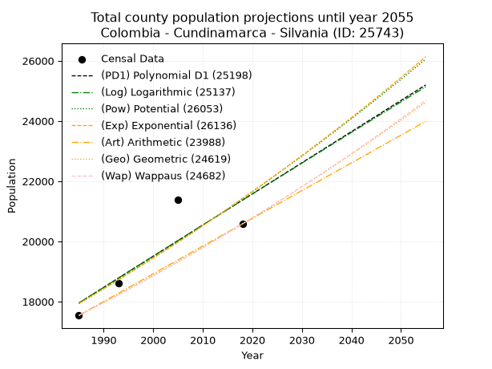
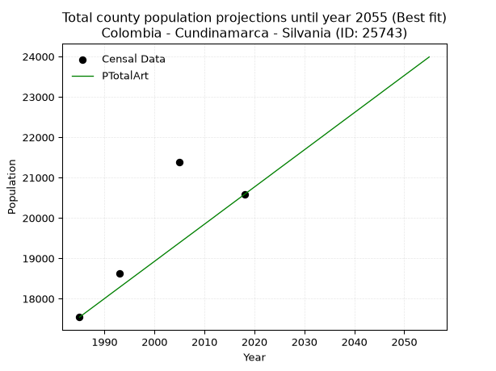
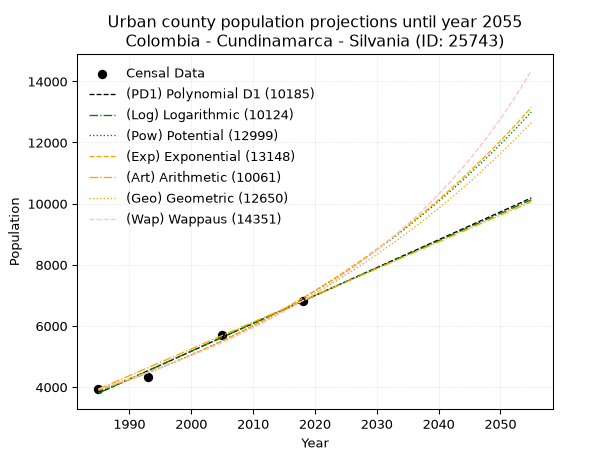
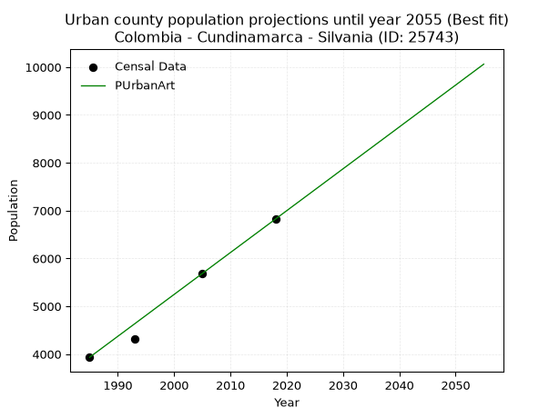
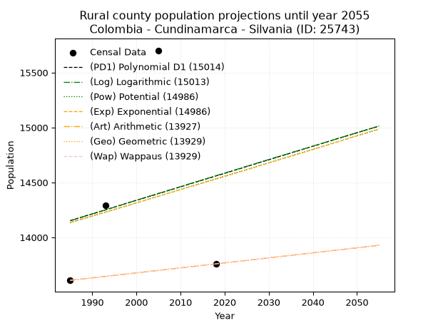
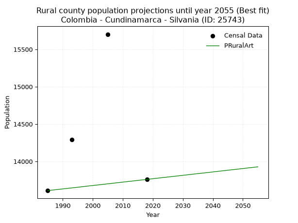

<div align="center">


</div>

# _“Population and Public Services Demand Projections (PPSD) until Year 2050 for Colombia - Cundinamarca - Silvania (ID: 25743)”_
Keywords: `population` `public-service` `projection` `lineal` `polynomial` `logarithmic` `potential` `exponential` `arithmetic` `geometric` `wappaus` `dane` `colombia` `south-america`

PPSD are analytical estimates used by governments and planners to anticipate future changes in population size, age distribution, and the resulting community needs for utilities, healthcare, education, and infrastructure as sizing future water treatment facilities, electrical grids, and road networks based on spatial growth.

> **General running parameters**: • app_version: _v20260806_. • Python version: _3.14.7_. • Pandas version: _3.0.5_. • NumPy version: _2.5.1_. • Creates, save and include plots into reports (create_plot): _False_. • Projection until year: _2050_. • Process polynomial degree 2 and up: _False_. • Process Wappaus: _True_. • Process Wappaus: _True_. • Set negative values to zero: _True_. • Set infinite values to zero: _True_. • Drop dataset notes: _True_. 
<div align="center">

Dynamic map: [:earth_americas:Google](http://maps.google.com/maps?q=4.381981443,-74.4055341) [:earth_americas:OSM](https://www.openstreetmap.org/#map=18/4.381981443/-74.4055341&layers=P) [:earth_americas:Bing](https://www.bing.com/maps?cp=4.381981443~-74.4055341&lvl=18) [:earth_americas:Apple](https://maps.apple.com/frame?center=4.381981443%2C-74.4055341&span=0.003%2C0.006)

</div>


<div align="center">

```geojson
{
  "type": "Feature",
  "geometry": {
    "type": "Point", 
    "coordinates": [-74.4055341, 4.381981443]
  }, 
  "properties": {
    "Name": "Colombia - Cundinamarca - Silvania (ID: 25743)"
  }
}
```

</div>


## 0. Census Data (4 records)

Census data are official statistics collected by a government about the people and housing in a country. They usually include counts of total population, age, sex, race, income, education, and jobs.

📅Global census file: [Population.xlsx](../data/Population.xlsx)

| Source   |   Year |   CountryID | CountryName   |   StateID | StateName    |   CountyID | CountyName   |   PTotal |   PUrban |   PRural |
|:---------|-------:|------------:|:--------------|----------:|:-------------|-----------:|:-------------|---------:|---------:|---------:|
| DANE     |   1985 |          57 | Colombia      |        25 | Cundinamarca |      25743 | Silvania     |    17542 |     3933 |    13609 |
| DANE     |   1993 |          57 | Colombia      |        25 | Cundinamarca |      25743 | Silvania     |    18616 |     4325 |    14291 |
| DANE     |   2005 |          57 | Colombia      |        25 | Cundinamarca |      25743 | Silvania     |    21392 |     5690 |    15702 |
| DANE     |   2018 |          57 | Colombia      |        25 | Cundinamarca |      25743 | Silvania     |    20581 |     6822 |    13759 |

> 🔥Some records could had specific notes about the registered values or the corresponding urban or rural distribution.

📅   [RUPS](https://www.datos.gov.co/Hacienda-y-Cr-dito-P-blico/Registro-nico-de-Prestadores-de-Servicios-P-blicos/4qkq-csdn/about_data) - Local public utility companies: [RUPS.csv](../data/RUPS.xlsx)

 | SERVICIO       | ESTADO    | NOMBRE                                                                                               | NIT         | DEPARTAMENTO_DOMICILIO   | MUNICIPIO_DOMICILIO   | DIRECCION                             |   TELEFONO | EMAIL                                 | TIPO_INSCRIPCION    | REPRESENTANTE_LEGAL               | TIPO_PRESTADOR                             | CLASIFICACION                  |
|:---------------|:----------|:-----------------------------------------------------------------------------------------------------|:------------|:-------------------------|:----------------------|:--------------------------------------|-----------:|:--------------------------------------|:--------------------|:----------------------------------|:-------------------------------------------|:-------------------------------|
| ACUEDUCTO      | OPERATIVA | ASOCIACION DE USUARIOS DEL ACUEDUCTO AGUABONITA SECTOR EL PORVENIR                                   | 808001632-0 | CUNDINAMARCA             | SILVANIA              | VEREDA AGUABONITA CENTRAL             |    3165861 | germancastellanos123@hotmail.com      | Registro por la ESP | BLANCA CECILIA ROMERO DE GONZALEZ | ORGANIZACION AUTORIZADA                    | HASTA 2500 SUSCRIPTORES        |
| ACUEDUCTO      | OPERATIVA | JUNTA ACUEDUCTO GUAYURIBE LOS ROBLES                                                                 | 808002812-4 | CUNDINAMARCA             | SILVANIA              | VEREDA NORUEGA BAJA                   |    8684340 | acueductoguayuribelosrobles@gmail.com | Registro por la ESP | ANTONIO MAXIMILIANO ACOSTA ACOSTA | ORGANIZACION AUTORIZADA                    | MENOR O IGUAL A 2500 USUARIOS  |
| ACUEDUCTO      | OPERATIVA | ASOCIACION DE USURIOS DEL ACUEDUCTO REGIONAL DE LAS VEREDAS NORUEGA BAJA SUBIA ALTA Y SUBIA ORIENTAL | 808001966-5 | CUNDINAMARCA             | SILVANIA              | Vereda Subia Oriental Finca el Regalo |    8683661 | acueductoauar@hotmail.com             | Registro por la ESP | RIGOBERTO VILLALOBOS VELASQUEZ    | ORGANIZACION AUTORIZADA                    | HASTA 2500 SUSCRIPTORES        |
| ACUEDUCTO      | OPERATIVA | EMPRESA DE ACUEDUCTO, ALCANTARILLADO Y ASEO DE SILVANIA S.A. ESP EMPUSILVANIA S.A. ESP               | 900342704-9 | CUNDINAMARCA             | SILVANIA              | Calle 10 No 4-29                      |    8684096 | empusilvania@hotmail.com              | Registro por la ESP | BRIGITTE QUINTERO PLATA           | SOCIEDADES (EMPRESA DE SERVICIOS PUBLICOS) | DESDE 2501 HASTA 5000 USUARIOS |
| ALCANTARILLADO | OPERATIVA | EMPRESA DE ACUEDUCTO, ALCANTARILLADO Y ASEO DE SILVANIA S.A. ESP EMPUSILVANIA S.A. ESP               | 900342704-9 | CUNDINAMARCA             | SILVANIA              | Calle 10 No 4-29                      |    8684096 | empusilvania@hotmail.com              | Registro por la ESP | BRIGITTE QUINTERO PLATA           | SOCIEDADES (EMPRESA DE SERVICIOS PUBLICOS) | DESDE 2501 HASTA 5000 USUARIOS |

## 1. Total

### 1.1. Coefficients and Parameters

* (PD1) Polynomial Deg 1: 103.481734243276, -187456.5889201128 (lineal)
* (Log) Logarithmic: 207389.59853849304, -1556837.250407028
* (Pow) Potential: 10.773029585569276, -31.273166823095764
* (Exp) Exponential: 0.005375501574453948, 0.4166159135201839
* (Art) Arithmetic: Year diff. 2018 - 1985 = 33, Population diff. 20581 - 17542 = 3039, Annual growth = 92.0909090909091
* (Geo) Geometric: Year diff. 2018 - 1985 = 33, Population diff. 20581 - 17542 = 3039, Annual growth % = 0.004853263801732677
* (Wap) Wappaus: i = 0.48312519524124065, Condition values only valid for < 200)

<sub>
Wappaus condition values: ['0.00', '0.48', '0.97', '1.45', '1.93', '2.42', '2.90', '3.38', '3.87', '4.35', '4.83', '5.31', '5.80', '6.28', '6.76', '7.25', '7.73', '8.21', '8.70', '9.18', '9.66', '10.15', '10.63', '11.11', '11.60', '12.08', '12.56', '13.04', '13.53', '14.01', '14.49', '14.98', '15.46', '15.94', '16.43', '16.91', '17.39', '17.88', '18.36', '18.84', '19.33', '19.81', '20.29', '20.77', '21.26', '21.74', '22.22', '22.71', '23.19', '23.67', '24.16', '24.64', '25.12', '25.61', '26.09', '26.57', '27.06', '27.54', '28.02', '28.50', '28.99', '29.47', '29.95', '30.44', '30.92', '31.40']
</sub>


### 1.2. Projected Dataset

|   Year |   CountyID |   PTotalPD1 |   PTotalLog |   PTotalPow |   PTotalExp |   PTotalArt |   PTotalGeo |   PTotalWap |
|-------:|-----------:|------------:|------------:|------------:|------------:|------------:|------------:|------------:|
|   1985 |      25743 |       17955 |       17950 |       17935 |       17940 |       17542 |       17542 |       17542 |
|   1986 |      25743 |       18058 |       18054 |       18033 |       18037 |       17634 |       17627 |       17627 |
|   1987 |      25743 |       18162 |       18158 |       18131 |       18134 |       17726 |       17713 |       17712 |
|   1988 |      25743 |       18265 |       18263 |       18229 |       18232 |       17818 |       17799 |       17798 |
|   1989 |      25743 |       18369 |       18367 |       18328 |       18330 |       17910 |       17885 |       17884 |
|   1990 |      25743 |       18472 |       18471 |       18428 |       18429 |       18002 |       17972 |       17971 |
|   1991 |      25743 |       18576 |       18575 |       18528 |       18528 |       18095 |       18059 |       18058 |
|   1992 |      25743 |       18679 |       18680 |       18628 |       18628 |       18187 |       18147 |       18145 |
|   1993 |      25743 |       18783 |       18784 |       18729 |       18728 |       18279 |       18235 |       18233 |
|   1994 |      25743 |       18886 |       18888 |       18831 |       18829 |       18371 |       18323 |       18322 |
|   1995 |      25743 |       18989 |       18992 |       18933 |       18931 |       18463 |       18412 |       18410 |
|   1996 |      25743 |       19093 |       19096 |       19035 |       19033 |       18555 |       18502 |       18500 |
|   1997 |      25743 |       19196 |       19200 |       19138 |       19135 |       18647 |       18591 |       18589 |
|   1998 |      25743 |       19300 |       19303 |       19242 |       19238 |       18739 |       18682 |       18679 |
|   1999 |      25743 |       19403 |       19407 |       19346 |       19342 |       18831 |       18772 |       18770 |
|   2000 |      25743 |       19507 |       19511 |       19450 |       19446 |       18923 |       18863 |       18861 |
|   2001 |      25743 |       19610 |       19615 |       19555 |       19551 |       19015 |       18955 |       18953 |
|   2002 |      25743 |       19714 |       19718 |       19661 |       19657 |       19108 |       19047 |       19044 |
|   2003 |      25743 |       19817 |       19822 |       19767 |       19762 |       19200 |       19139 |       19137 |
|   2004 |      25743 |       19921 |       19925 |       19874 |       19869 |       19292 |       19232 |       19230 |
|   2005 |      25743 |       20024 |       20029 |       19981 |       19976 |       19384 |       19326 |       19323 |
|   2006 |      25743 |       20128 |       20132 |       20088 |       20084 |       19476 |       19419 |       19417 |
|   2007 |      25743 |       20231 |       20235 |       20196 |       20192 |       19568 |       19514 |       19511 |
|   2008 |      25743 |       20335 |       20339 |       20305 |       20301 |       19660 |       19608 |       19606 |
|   2009 |      25743 |       20438 |       20442 |       20414 |       20410 |       19752 |       19703 |       19701 |
|   2010 |      25743 |       20542 |       20545 |       20524 |       20520 |       19844 |       19799 |       19797 |
|   2011 |      25743 |       20645 |       20648 |       20634 |       20631 |       19936 |       19895 |       19893 |
|   2012 |      25743 |       20749 |       20751 |       20745 |       20742 |       20028 |       19992 |       19990 |
|   2013 |      25743 |       20852 |       20855 |       20856 |       20854 |       20121 |       20089 |       20087 |
|   2014 |      25743 |       20956 |       20958 |       20968 |       20966 |       20213 |       20186 |       20185 |
|   2015 |      25743 |       21059 |       21060 |       21081 |       21079 |       20305 |       20284 |       20283 |
|   2016 |      25743 |       21163 |       21163 |       21194 |       21193 |       20397 |       20383 |       20382 |
|   2017 |      25743 |       21266 |       21266 |       21307 |       21307 |       20489 |       20482 |       20481 |
|   2018 |      25743 |       21370 |       21369 |       21421 |       21422 |       20581 |       20581 |       20581 |
|   2019 |      25743 |       21473 |       21472 |       21536 |       21537 |       20673 |       20681 |       20681 |
|   2020 |      25743 |       21577 |       21574 |       21651 |       21654 |       20765 |       20781 |       20782 |
|   2021 |      25743 |       21680 |       21677 |       21767 |       21770 |       20857 |       20882 |       20884 |
|   2022 |      25743 |       21783 |       21780 |       21883 |       21888 |       20949 |       20983 |       20986 |
|   2023 |      25743 |       21887 |       21882 |       22000 |       22006 |       21041 |       21085 |       21088 |
|   2024 |      25743 |       21990 |       21985 |       22118 |       22124 |       21134 |       21188 |       21191 |
|   2025 |      25743 |       22094 |       22087 |       22236 |       22243 |       21226 |       21290 |       21295 |
|   2026 |      25743 |       22197 |       22190 |       22354 |       22363 |       21318 |       21394 |       21399 |
|   2027 |      25743 |       22301 |       22292 |       22473 |       22484 |       21410 |       21498 |       21503 |
|   2028 |      25743 |       22404 |       22394 |       22593 |       22605 |       21502 |       21602 |       21609 |
|   2029 |      25743 |       22508 |       22496 |       22713 |       22727 |       21594 |       21707 |       21714 |
|   2030 |      25743 |       22611 |       22599 |       22834 |       22849 |       21686 |       21812 |       21821 |
|   2031 |      25743 |       22715 |       22701 |       22956 |       22973 |       21778 |       21918 |       21928 |
|   2032 |      25743 |       22818 |       22803 |       23078 |       23096 |       21870 |       22024 |       22035 |
|   2033 |      25743 |       22922 |       22905 |       23200 |       23221 |       21962 |       22131 |       22144 |
|   2034 |      25743 |       23025 |       23007 |       23324 |       23346 |       22054 |       22239 |       22252 |
|   2035 |      25743 |       23129 |       23109 |       23447 |       23472 |       22147 |       22347 |       22362 |
|   2036 |      25743 |       23232 |       23211 |       23572 |       23598 |       22239 |       22455 |       22472 |
|   2037 |      25743 |       23336 |       23313 |       23697 |       23726 |       22331 |       22564 |       22582 |
|   2038 |      25743 |       23439 |       23414 |       23823 |       23853 |       22423 |       22674 |       22693 |
|   2039 |      25743 |       23543 |       23516 |       23949 |       23982 |       22515 |       22784 |       22805 |
|   2040 |      25743 |       23646 |       23618 |       24076 |       24111 |       22607 |       22894 |       22917 |
|   2041 |      25743 |       23750 |       23719 |       24203 |       24241 |       22699 |       23005 |       23030 |
|   2042 |      25743 |       23853 |       23821 |       24331 |       24372 |       22791 |       23117 |       23144 |
|   2043 |      25743 |       23957 |       23922 |       24460 |       24503 |       22883 |       23229 |       23258 |
|   2044 |      25743 |       24060 |       24024 |       24589 |       24635 |       22975 |       23342 |       23373 |
|   2045 |      25743 |       24164 |       24125 |       24719 |       24768 |       23067 |       23455 |       23489 |
|   2046 |      25743 |       24267 |       24227 |       24849 |       24902 |       23160 |       23569 |       23605 |
|   2047 |      25743 |       24371 |       24328 |       24981 |       25036 |       23252 |       23683 |       23722 |
|   2048 |      25743 |       24474 |       24429 |       25112 |       25171 |       23344 |       23798 |       23840 |
|   2049 |      25743 |       24577 |       24531 |       25245 |       25306 |       23436 |       23914 |       23958 |
|   2050 |      25743 |       24681 |       24632 |       25378 |       25443 |       23528 |       24030 |       24077 |
<div align="center">

</img>

</div>


### 1.3. Best fit with absolute and relative error (%)

Relative error puts that difference into context by dividing the absolute error by the true value, creating a unitless ratio or percentage that shows the scale of the mistake.

Absolute and relative error

|   Year | Source   |   CountryID | CountryName   |   StateID | StateName    |   CountyID_x | CountyName   |   PTotal |   PUrban |   PRural |   CountyID_y |   PTotalPD1 |   PTotalLog |   PTotalPow |   PTotalExp |   PTotalArt |   PTotalGeo |   PTotalWap |   PTotalPD1AbsError |   PTotalLogAbsError |   PTotalPowAbsError |   PTotalExpAbsError |   PTotalArtAbsError |   PTotalGeoAbsError |   PTotalWapAbsError |   PTotalPD1RelError |   PTotalLogRelError |   PTotalPowRelError |   PTotalExpRelError |   PTotalArtRelError |   PTotalGeoRelError |   PTotalWapRelError |
|-------:|:---------|------------:|:--------------|----------:|:-------------|-------------:|:-------------|---------:|---------:|---------:|-------------:|------------:|------------:|------------:|------------:|------------:|------------:|------------:|--------------------:|--------------------:|--------------------:|--------------------:|--------------------:|--------------------:|--------------------:|--------------------:|--------------------:|--------------------:|--------------------:|--------------------:|--------------------:|--------------------:|
|   1985 | DANE     |          57 | Colombia      |        25 | Cundinamarca |        25743 | Silvania     |    17542 |     3933 |    13609 |        25743 |       17955 |       17950 |       17935 |       17940 |       17542 |       17542 |       17542 |                 413 |                 408 |                 393 |                 398 |                   0 |                   0 |                   0 |            2.35435  |             2.32585 |            2.24034  |            2.26884  |             0       |             0       |             0       |
|   1993 | DANE     |          57 | Colombia      |        25 | Cundinamarca |        25743 | Silvania     |    18616 |     4325 |    14291 |        25743 |       18783 |       18784 |       18729 |       18728 |       18279 |       18235 |       18233 |                 167 |                 168 |                 113 |                 112 |                 337 |                 381 |                 383 |            0.897078 |             0.90245 |            0.607005 |            0.601633 |             1.81027 |             2.04663 |             2.05737 |
|   2005 | DANE     |          57 | Colombia      |        25 | Cundinamarca |        25743 | Silvania     |    21392 |     5690 |    15702 |        25743 |       20024 |       20029 |       19981 |       19976 |       19384 |       19326 |       19323 |                1368 |                1363 |                1411 |                1416 |                2008 |                2066 |                2069 |            6.39491  |             6.37154 |            6.59592  |            6.6193   |             9.38669 |             9.65782 |             9.67184 |
|   2018 | DANE     |          57 | Colombia      |        25 | Cundinamarca |        25743 | Silvania     |    20581 |     6822 |    13759 |        25743 |       21370 |       21369 |       21421 |       21422 |       20581 |       20581 |       20581 |                 789 |                 788 |                 840 |                 841 |                   0 |                   0 |                   0 |            3.83363  |             3.82877 |            4.08143  |            4.08629  |             0       |             0       |             0       |

Relative error mean

| Method    |   RelError | Best   |
|:----------|-----------:|:-------|
| PTotalPD1 |    3.36999 |        |
| PTotalLog |    3.35715 |        |
| PTotalPow |    3.38118 |        |
| PTotalExp |    3.39402 |        |
| PTotalArt |    2.79924 | True   |
| PTotalGeo |    2.92611 |        |
| PTotalWap |    2.9323  |        |

💙Best method: _**PTotalArt**_
<div align="center">

</img>

</div>


### 1.4. Fresh water supply demand in liters per capita per day (lpcd)

The fresh water supply demand typically ranges from 100 to 300 liters per capita per day (lpcd) for standard domestic and municipal planning, though absolute survival minimums set by the World Health Organization are as low as 7.5 to 20 liters per day, and total consumption in high-income nations can exceed 400 liters.

> `CZ`: Level in meters above the sea level (masl)<br> `WS`: Fresh water supply demand in liters per capita per day (lpcd or l/h/d)<br> `WSAll`: Zonal fresh water supply demand in liters per second (l/s)<br> `A`: Zonal area in square meters<br> `DP`: Population density (people/hectare or p/ha)

Reference values (RAS Colombia)

|    CZ |   WS |
|------:|-----:|
|  1000 |  120 |
|  2000 |  130 |
| 99999 |  140 |

County shapefile geometry properties and water supply values

|   CountyID |      ATotal |   CZTotal |   WSTotal |
|-----------:|------------:|----------:|----------:|
|      25743 | 1.62785e+08 |   2085.12 |       140 |

Projected values for best method: PTotalArt

|   CountyID |   Year |   PTotalArt |   DPTotal |   WSTotal |   WSTotalAll |
|-----------:|-------:|------------:|----------:|----------:|-------------:|
|      25743 |   1985 |       17542 |      1.08 |       140 |      28.4245 |
|      25743 |   1986 |       17634 |      1.08 |       140 |      28.5736 |
|      25743 |   1987 |       17726 |      1.09 |       140 |      28.7227 |
|      25743 |   1988 |       17818 |      1.09 |       140 |      28.8718 |
|      25743 |   1989 |       17910 |      1.1  |       140 |      29.0208 |
|      25743 |   1990 |       18002 |      1.11 |       140 |      29.1699 |
|      25743 |   1991 |       18095 |      1.11 |       140 |      29.3206 |
|      25743 |   1992 |       18187 |      1.12 |       140 |      29.4697 |
|      25743 |   1993 |       18279 |      1.12 |       140 |      29.6187 |
|      25743 |   1994 |       18371 |      1.13 |       140 |      29.7678 |
|      25743 |   1995 |       18463 |      1.13 |       140 |      29.9169 |
|      25743 |   1996 |       18555 |      1.14 |       140 |      30.066  |
|      25743 |   1997 |       18647 |      1.15 |       140 |      30.215  |
|      25743 |   1998 |       18739 |      1.15 |       140 |      30.3641 |
|      25743 |   1999 |       18831 |      1.16 |       140 |      30.5132 |
|      25743 |   2000 |       18923 |      1.16 |       140 |      30.6623 |
|      25743 |   2001 |       19015 |      1.17 |       140 |      30.8113 |
|      25743 |   2002 |       19108 |      1.17 |       140 |      30.962  |
|      25743 |   2003 |       19200 |      1.18 |       140 |      31.1111 |
|      25743 |   2004 |       19292 |      1.19 |       140 |      31.2602 |
|      25743 |   2005 |       19384 |      1.19 |       140 |      31.4093 |
|      25743 |   2006 |       19476 |      1.2  |       140 |      31.5583 |
|      25743 |   2007 |       19568 |      1.2  |       140 |      31.7074 |
|      25743 |   2008 |       19660 |      1.21 |       140 |      31.8565 |
|      25743 |   2009 |       19752 |      1.21 |       140 |      32.0056 |
|      25743 |   2010 |       19844 |      1.22 |       140 |      32.1546 |
|      25743 |   2011 |       19936 |      1.22 |       140 |      32.3037 |
|      25743 |   2012 |       20028 |      1.23 |       140 |      32.4528 |
|      25743 |   2013 |       20121 |      1.24 |       140 |      32.6035 |
|      25743 |   2014 |       20213 |      1.24 |       140 |      32.7525 |
|      25743 |   2015 |       20305 |      1.25 |       140 |      32.9016 |
|      25743 |   2016 |       20397 |      1.25 |       140 |      33.0507 |
|      25743 |   2017 |       20489 |      1.26 |       140 |      33.1998 |
|      25743 |   2018 |       20581 |      1.26 |       140 |      33.3488 |
|      25743 |   2019 |       20673 |      1.27 |       140 |      33.4979 |
|      25743 |   2020 |       20765 |      1.28 |       140 |      33.647  |
|      25743 |   2021 |       20857 |      1.28 |       140 |      33.7961 |
|      25743 |   2022 |       20949 |      1.29 |       140 |      33.9451 |
|      25743 |   2023 |       21041 |      1.29 |       140 |      34.0942 |
|      25743 |   2024 |       21134 |      1.3  |       140 |      34.2449 |
|      25743 |   2025 |       21226 |      1.3  |       140 |      34.394  |
|      25743 |   2026 |       21318 |      1.31 |       140 |      34.5431 |
|      25743 |   2027 |       21410 |      1.32 |       140 |      34.6921 |
|      25743 |   2028 |       21502 |      1.32 |       140 |      34.8412 |
|      25743 |   2029 |       21594 |      1.33 |       140 |      34.9903 |
|      25743 |   2030 |       21686 |      1.33 |       140 |      35.1394 |
|      25743 |   2031 |       21778 |      1.34 |       140 |      35.2884 |
|      25743 |   2032 |       21870 |      1.34 |       140 |      35.4375 |
|      25743 |   2033 |       21962 |      1.35 |       140 |      35.5866 |
|      25743 |   2034 |       22054 |      1.35 |       140 |      35.7356 |
|      25743 |   2035 |       22147 |      1.36 |       140 |      35.8863 |
|      25743 |   2036 |       22239 |      1.37 |       140 |      36.0354 |
|      25743 |   2037 |       22331 |      1.37 |       140 |      36.1845 |
|      25743 |   2038 |       22423 |      1.38 |       140 |      36.3336 |
|      25743 |   2039 |       22515 |      1.38 |       140 |      36.4826 |
|      25743 |   2040 |       22607 |      1.39 |       140 |      36.6317 |
|      25743 |   2041 |       22699 |      1.39 |       140 |      36.7808 |
|      25743 |   2042 |       22791 |      1.4  |       140 |      36.9299 |
|      25743 |   2043 |       22883 |      1.41 |       140 |      37.0789 |
|      25743 |   2044 |       22975 |      1.41 |       140 |      37.228  |
|      25743 |   2045 |       23067 |      1.42 |       140 |      37.3771 |
|      25743 |   2046 |       23160 |      1.42 |       140 |      37.5278 |
|      25743 |   2047 |       23252 |      1.43 |       140 |      37.6769 |
|      25743 |   2048 |       23344 |      1.43 |       140 |      37.8259 |
|      25743 |   2049 |       23436 |      1.44 |       140 |      37.975  |
|      25743 |   2050 |       23528 |      1.45 |       140 |      38.1241 |

## 2. Urban

### 2.1. Coefficients and Parameters

* (PD1) Polynomial Deg 1: 91.18185467683583, -177194.00481734084 (lineal)
* (Log) Logarithmic: 182491.6757189639, -1381928.189536355
* (Pow) Potential: 34.84703151239149, -111.327760212535
* (Exp) Exponential: 0.017408603415019222, 3.820521018175808e-12
* (Art) Arithmetic: Year diff. 2018 - 1985 = 33, Population diff. 6822 - 3933 = 2889, Annual growth = 87.54545454545455
* (Geo) Geometric: Year diff. 2018 - 1985 = 33, Population diff. 6822 - 3933 = 2889, Annual growth % = 0.01682944575497003
* (Wap) Wappaus: i = 1.6279954355268162, Condition values only valid for < 200)

<sub>
Wappaus condition values: ['0.00', '1.63', '3.26', '4.88', '6.51', '8.14', '9.77', '11.40', '13.02', '14.65', '16.28', '17.91', '19.54', '21.16', '22.79', '24.42', '26.05', '27.68', '29.30', '30.93', '32.56', '34.19', '35.82', '37.44', '39.07', '40.70', '42.33', '43.96', '45.58', '47.21', '48.84', '50.47', '52.10', '53.72', '55.35', '56.98', '58.61', '60.24', '61.86', '63.49', '65.12', '66.75', '68.38', '70.00', '71.63', '73.26', '74.89', '76.52', '78.14', '79.77', '81.40', '83.03', '84.66', '86.28', '87.91', '89.54', '91.17', '92.80', '94.42', '96.05', '97.68', '99.31', '100.94', '102.56', '104.19', '105.82']
</sub>


### 2.2. Projected Dataset

|   Year |   CountyID |   PUrbanPD1 |   PUrbanLog |   PUrbanPow |   PUrbanExp |   PUrbanArt |   PUrbanGeo |   PUrbanWap |
|-------:|-----------:|------------:|------------:|------------:|------------:|------------:|------------:|------------:|
|   1985 |      25743 |        3802 |        3799 |        3885 |        3887 |        3933 |        3933 |        3933 |
|   1986 |      25743 |        3893 |        3891 |        3954 |        3955 |        4021 |        3999 |        3998 |
|   1987 |      25743 |        3984 |        3983 |        4024 |        4025 |        4108 |        4066 |        4063 |
|   1988 |      25743 |        4076 |        4075 |        4095 |        4096 |        4196 |        4135 |        4130 |
|   1989 |      25743 |        4167 |        4167 |        4167 |        4168 |        4283 |        4205 |        4198 |
|   1990 |      25743 |        4258 |        4258 |        4241 |        4241 |        4371 |        4275 |        4267 |
|   1991 |      25743 |        4349 |        4350 |        4316 |        4315 |        4458 |        4347 |        4337 |
|   1992 |      25743 |        4440 |        4442 |        4392 |        4391 |        4546 |        4420 |        4408 |
|   1993 |      25743 |        4531 |        4533 |        4470 |        4468 |        4633 |        4495 |        4481 |
|   1994 |      25743 |        4623 |        4625 |        4548 |        4547 |        4721 |        4570 |        4555 |
|   1995 |      25743 |        4714 |        4716 |        4629 |        4626 |        4808 |        4647 |        4630 |
|   1996 |      25743 |        4805 |        4808 |        4710 |        4708 |        4896 |        4726 |        4707 |
|   1997 |      25743 |        4896 |        4899 |        4793 |        4790 |        4984 |        4805 |        4785 |
|   1998 |      25743 |        4987 |        4991 |        4877 |        4874 |        5071 |        4886 |        4864 |
|   1999 |      25743 |        5079 |        5082 |        4963 |        4960 |        5159 |        4968 |        4945 |
|   2000 |      25743 |        5170 |        5173 |        5051 |        5047 |        5246 |        5052 |        5027 |
|   2001 |      25743 |        5261 |        5264 |        5139 |        5136 |        5334 |        5137 |        5111 |
|   2002 |      25743 |        5352 |        5356 |        5230 |        5226 |        5421 |        5223 |        5196 |
|   2003 |      25743 |        5443 |        5447 |        5321 |        5318 |        5509 |        5311 |        5283 |
|   2004 |      25743 |        5534 |        5538 |        5415 |        5411 |        5596 |        5401 |        5372 |
|   2005 |      25743 |        5626 |        5629 |        5510 |        5506 |        5684 |        5491 |        5463 |
|   2006 |      25743 |        5717 |        5720 |        5606 |        5603 |        5771 |        5584 |        5555 |
|   2007 |      25743 |        5808 |        5811 |        5704 |        5701 |        5859 |        5678 |        5649 |
|   2008 |      25743 |        5899 |        5902 |        5804 |        5801 |        5947 |        5773 |        5745 |
|   2009 |      25743 |        5990 |        5993 |        5906 |        5903 |        6034 |        5871 |        5843 |
|   2010 |      25743 |        6082 |        6083 |        6009 |        6007 |        6122 |        5969 |        5943 |
|   2011 |      25743 |        6173 |        6174 |        6114 |        6112 |        6209 |        6070 |        6045 |
|   2012 |      25743 |        6264 |        6265 |        6221 |        6220 |        6297 |        6172 |        6149 |
|   2013 |      25743 |        6355 |        6356 |        6330 |        6329 |        6384 |        6276 |        6255 |
|   2014 |      25743 |        6446 |        6446 |        6440 |        6440 |        6472 |        6381 |        6364 |
|   2015 |      25743 |        6537 |        6537 |        6553 |        6553 |        6559 |        6489 |        6475 |
|   2016 |      25743 |        6629 |        6627 |        6667 |        6668 |        6647 |        6598 |        6588 |
|   2017 |      25743 |        6720 |        6718 |        6783 |        6785 |        6734 |        6709 |        6704 |
|   2018 |      25743 |        6811 |        6808 |        6901 |        6904 |        6822 |        6822 |        6822 |
|   2019 |      25743 |        6902 |        6899 |        7021 |        7026 |        6910 |        6937 |        6943 |
|   2020 |      25743 |        6993 |        6989 |        7144 |        7149 |        6997 |        7054 |        7067 |
|   2021 |      25743 |        7085 |        7079 |        7268 |        7275 |        7085 |        7172 |        7194 |
|   2022 |      25743 |        7176 |        7170 |        7394 |        7402 |        7172 |        7293 |        7323 |
|   2023 |      25743 |        7267 |        7260 |        7523 |        7532 |        7260 |        7416 |        7456 |
|   2024 |      25743 |        7358 |        7350 |        7654 |        7665 |        7347 |        7541 |        7592 |
|   2025 |      25743 |        7449 |        7440 |        7786 |        7799 |        7435 |        7667 |        7731 |
|   2026 |      25743 |        7540 |        7530 |        7922 |        7936 |        7522 |        7796 |        7873 |
|   2027 |      25743 |        7632 |        7620 |        8059 |        8076 |        7610 |        7928 |        8019 |
|   2028 |      25743 |        7723 |        7710 |        8199 |        8217 |        7697 |        8061 |        8169 |
|   2029 |      25743 |        7814 |        7800 |        8341 |        8362 |        7785 |        8197 |        8322 |
|   2030 |      25743 |        7905 |        7890 |        8485 |        8509 |        7873 |        8335 |        8480 |
|   2031 |      25743 |        7996 |        7980 |        8632 |        8658 |        7960 |        8475 |        8641 |
|   2032 |      25743 |        8088 |        8070 |        8781 |        8810 |        8048 |        8618 |        8807 |
|   2033 |      25743 |        8179 |        8160 |        8933 |        8965 |        8135 |        8763 |        8977 |
|   2034 |      25743 |        8270 |        8250 |        9088 |        9122 |        8223 |        8910 |        9152 |
|   2035 |      25743 |        8361 |        8339 |        9245 |        9282 |        8310 |        9060 |        9332 |
|   2036 |      25743 |        8452 |        8429 |        9404 |        9445 |        8398 |        9213 |        9516 |
|   2037 |      25743 |        8543 |        8518 |        9567 |        9611 |        8485 |        9368 |        9706 |
|   2038 |      25743 |        8635 |        8608 |        9732 |        9780 |        8573 |        9525 |        9901 |
|   2039 |      25743 |        8726 |        8698 |        9899 |        9952 |        8660 |        9686 |       10102 |
|   2040 |      25743 |        8817 |        8787 |       10070 |       10127 |        8748 |        9849 |       10309 |
|   2041 |      25743 |        8908 |        8876 |       10243 |       10304 |        8836 |       10014 |       10522 |
|   2042 |      25743 |        8999 |        8966 |       10420 |       10485 |        8923 |       10183 |       10742 |
|   2043 |      25743 |        9091 |        9055 |       10599 |       10669 |        9011 |       10354 |       10968 |
|   2044 |      25743 |        9182 |        9145 |       10781 |       10857 |        9098 |       10528 |       11201 |
|   2045 |      25743 |        9273 |        9234 |       10967 |       11048 |        9186 |       10706 |       11442 |
|   2046 |      25743 |        9364 |        9323 |       11155 |       11242 |        9273 |       10886 |       11691 |
|   2047 |      25743 |        9455 |        9412 |       11347 |       11439 |        9361 |       11069 |       11948 |
|   2048 |      25743 |        9546 |        9501 |       11541 |       11640 |        9448 |       11255 |       12213 |
|   2049 |      25743 |        9638 |        9590 |       11739 |       11844 |        9536 |       11445 |       12487 |
|   2050 |      25743 |        9729 |        9679 |       11941 |       12052 |        9623 |       11637 |       12771 |
<div align="center">

</img>

</div>


### 2.3. Best fit with absolute and relative error (%)

Relative error puts that difference into context by dividing the absolute error by the true value, creating a unitless ratio or percentage that shows the scale of the mistake.

Absolute and relative error

|   Year | Source   |   CountryID | CountryName   |   StateID | StateName    |   CountyID_x | CountyName   |   PTotal |   PUrban |   PRural |   CountyID_y |   PUrbanPD1 |   PUrbanLog |   PUrbanPow |   PUrbanExp |   PUrbanArt |   PUrbanGeo |   PUrbanWap |   PUrbanPD1AbsError |   PUrbanLogAbsError |   PUrbanPowAbsError |   PUrbanExpAbsError |   PUrbanArtAbsError |   PUrbanGeoAbsError |   PUrbanWapAbsError |   PUrbanPD1RelError |   PUrbanLogRelError |   PUrbanPowRelError |   PUrbanExpRelError |   PUrbanArtRelError |   PUrbanGeoRelError |   PUrbanWapRelError |
|-------:|:---------|------------:|:--------------|----------:|:-------------|-------------:|:-------------|---------:|---------:|---------:|-------------:|------------:|------------:|------------:|------------:|------------:|------------:|------------:|--------------------:|--------------------:|--------------------:|--------------------:|--------------------:|--------------------:|--------------------:|--------------------:|--------------------:|--------------------:|--------------------:|--------------------:|--------------------:|--------------------:|
|   1985 | DANE     |          57 | Colombia      |        25 | Cundinamarca |        25743 | Silvania     |    17542 |     3933 |    13609 |        25743 |        3802 |        3799 |        3885 |        3887 |        3933 |        3933 |        3933 |                 131 |                 134 |                  48 |                  46 |                   0 |                   0 |                   0 |            3.33079  |            3.40707  |             1.22044 |             1.16959 |            0        |             0       |             0       |
|   1993 | DANE     |          57 | Colombia      |        25 | Cundinamarca |        25743 | Silvania     |    18616 |     4325 |    14291 |        25743 |        4531 |        4533 |        4470 |        4468 |        4633 |        4495 |        4481 |                 206 |                 208 |                 145 |                 143 |                 308 |                 170 |                 156 |            4.76301  |            4.80925  |             3.3526  |             3.30636 |            7.12139  |             3.93064 |             3.60694 |
|   2005 | DANE     |          57 | Colombia      |        25 | Cundinamarca |        25743 | Silvania     |    21392 |     5690 |    15702 |        25743 |        5626 |        5629 |        5510 |        5506 |        5684 |        5491 |        5463 |                  64 |                  61 |                 180 |                 184 |                   6 |                 199 |                 227 |            1.12478  |            1.07206  |             3.16344 |             3.23374 |            0.105448 |             3.49736 |             3.98946 |
|   2018 | DANE     |          57 | Colombia      |        25 | Cundinamarca |        25743 | Silvania     |    20581 |     6822 |    13759 |        25743 |        6811 |        6808 |        6901 |        6904 |        6822 |        6822 |        6822 |                  11 |                  14 |                  79 |                  82 |                   0 |                   0 |                   0 |            0.161243 |            0.205218 |             1.15802 |             1.20199 |            0        |             0       |             0       |

Relative error mean

| Method    |   RelError | Best   |
|:----------|-----------:|:-------|
| PUrbanPD1 |    2.34495 |        |
| PUrbanLog |    2.3734  |        |
| PUrbanPow |    2.22363 |        |
| PUrbanExp |    2.22792 |        |
| PUrbanArt |    1.80671 | True   |
| PUrbanGeo |    1.857   |        |
| PUrbanWap |    1.8991  |        |

💙Best method: _**PUrbanArt**_
<div align="center">

</img>

</div>


### 2.4. Fresh water supply demand in liters per capita per day (lpcd)

The fresh water supply demand typically ranges from 100 to 300 liters per capita per day (lpcd) for standard domestic and municipal planning, though absolute survival minimums set by the World Health Organization are as low as 7.5 to 20 liters per day, and total consumption in high-income nations can exceed 400 liters.

> `CZ`: Level in meters above the sea level (masl)<br> `WS`: Fresh water supply demand in liters per capita per day (lpcd or l/h/d)<br> `WSAll`: Zonal fresh water supply demand in liters per second (l/s)<br> `A`: Zonal area in square meters<br> `DP`: Population density (people/hectare or p/ha)

Reference values (RAS Colombia)

|    CZ |   WS |
|------:|-----:|
|  1000 |  120 |
|  2000 |  130 |
| 99999 |  140 |

County shapefile geometry properties and water supply values

|   CountyID |      AUrban |   CZUrban |   WSUrban |
|-----------:|------------:|----------:|----------:|
|      25743 | 7.31181e+06 |   1380.96 |       130 |

Projected values for best method: PUrbanArt

|   CountyID |   Year |   PUrbanArt |   DPUrban |   WSUrban |   WSUrbanAll |
|-----------:|-------:|------------:|----------:|----------:|-------------:|
|      25743 |   1985 |        3933 |      5.38 |       130 |      5.91771 |
|      25743 |   1986 |        4021 |      5.5  |       130 |      6.05012 |
|      25743 |   1987 |        4108 |      5.62 |       130 |      6.18102 |
|      25743 |   1988 |        4196 |      5.74 |       130 |      6.31343 |
|      25743 |   1989 |        4283 |      5.86 |       130 |      6.44433 |
|      25743 |   1990 |        4371 |      5.98 |       130 |      6.57674 |
|      25743 |   1991 |        4458 |      6.1  |       130 |      6.70764 |
|      25743 |   1992 |        4546 |      6.22 |       130 |      6.84005 |
|      25743 |   1993 |        4633 |      6.34 |       130 |      6.97095 |
|      25743 |   1994 |        4721 |      6.46 |       130 |      7.10336 |
|      25743 |   1995 |        4808 |      6.58 |       130 |      7.23426 |
|      25743 |   1996 |        4896 |      6.7  |       130 |      7.36667 |
|      25743 |   1997 |        4984 |      6.82 |       130 |      7.49907 |
|      25743 |   1998 |        5071 |      6.94 |       130 |      7.62998 |
|      25743 |   1999 |        5159 |      7.06 |       130 |      7.76238 |
|      25743 |   2000 |        5246 |      7.17 |       130 |      7.89329 |
|      25743 |   2001 |        5334 |      7.3  |       130 |      8.02569 |
|      25743 |   2002 |        5421 |      7.41 |       130 |      8.1566  |
|      25743 |   2003 |        5509 |      7.53 |       130 |      8.289   |
|      25743 |   2004 |        5596 |      7.65 |       130 |      8.41991 |
|      25743 |   2005 |        5684 |      7.77 |       130 |      8.55231 |
|      25743 |   2006 |        5771 |      7.89 |       130 |      8.68322 |
|      25743 |   2007 |        5859 |      8.01 |       130 |      8.81563 |
|      25743 |   2008 |        5947 |      8.13 |       130 |      8.94803 |
|      25743 |   2009 |        6034 |      8.25 |       130 |      9.07894 |
|      25743 |   2010 |        6122 |      8.37 |       130 |      9.21134 |
|      25743 |   2011 |        6209 |      8.49 |       130 |      9.34225 |
|      25743 |   2012 |        6297 |      8.61 |       130 |      9.47465 |
|      25743 |   2013 |        6384 |      8.73 |       130 |      9.60556 |
|      25743 |   2014 |        6472 |      8.85 |       130 |      9.73796 |
|      25743 |   2015 |        6559 |      8.97 |       130 |      9.86887 |
|      25743 |   2016 |        6647 |      9.09 |       130 |     10.0013  |
|      25743 |   2017 |        6734 |      9.21 |       130 |     10.1322  |
|      25743 |   2018 |        6822 |      9.33 |       130 |     10.2646  |
|      25743 |   2019 |        6910 |      9.45 |       130 |     10.397   |
|      25743 |   2020 |        6997 |      9.57 |       130 |     10.5279  |
|      25743 |   2021 |        7085 |      9.69 |       130 |     10.6603  |
|      25743 |   2022 |        7172 |      9.81 |       130 |     10.7912  |
|      25743 |   2023 |        7260 |      9.93 |       130 |     10.9236  |
|      25743 |   2024 |        7347 |     10.05 |       130 |     11.0545  |
|      25743 |   2025 |        7435 |     10.17 |       130 |     11.1869  |
|      25743 |   2026 |        7522 |     10.29 |       130 |     11.3178  |
|      25743 |   2027 |        7610 |     10.41 |       130 |     11.4502  |
|      25743 |   2028 |        7697 |     10.53 |       130 |     11.5811  |
|      25743 |   2029 |        7785 |     10.65 |       130 |     11.7135  |
|      25743 |   2030 |        7873 |     10.77 |       130 |     11.8459  |
|      25743 |   2031 |        7960 |     10.89 |       130 |     11.9769  |
|      25743 |   2032 |        8048 |     11.01 |       130 |     12.1093  |
|      25743 |   2033 |        8135 |     11.13 |       130 |     12.2402  |
|      25743 |   2034 |        8223 |     11.25 |       130 |     12.3726  |
|      25743 |   2035 |        8310 |     11.37 |       130 |     12.5035  |
|      25743 |   2036 |        8398 |     11.49 |       130 |     12.6359  |
|      25743 |   2037 |        8485 |     11.6  |       130 |     12.7668  |
|      25743 |   2038 |        8573 |     11.72 |       130 |     12.8992  |
|      25743 |   2039 |        8660 |     11.84 |       130 |     13.0301  |
|      25743 |   2040 |        8748 |     11.96 |       130 |     13.1625  |
|      25743 |   2041 |        8836 |     12.08 |       130 |     13.2949  |
|      25743 |   2042 |        8923 |     12.2  |       130 |     13.4258  |
|      25743 |   2043 |        9011 |     12.32 |       130 |     13.5582  |
|      25743 |   2044 |        9098 |     12.44 |       130 |     13.6891  |
|      25743 |   2045 |        9186 |     12.56 |       130 |     13.8215  |
|      25743 |   2046 |        9273 |     12.68 |       130 |     13.9524  |
|      25743 |   2047 |        9361 |     12.8  |       130 |     14.0848  |
|      25743 |   2048 |        9448 |     12.92 |       130 |     14.2157  |
|      25743 |   2049 |        9536 |     13.04 |       130 |     14.3481  |
|      25743 |   2050 |        9623 |     13.16 |       130 |     14.4791  |

## 3. Rural

### 3.1. Coefficients and Parameters

* (PD1) Polynomial Deg 1: 12.299879566440241, -10262.58410277209 (lineal)
* (Log) Logarithmic: 24897.92281952886, -174909.06087067068
* (Pow) Potential: 1.6891121284542736, -1.420029564257004
* (Exp) Exponential: 0.0008343263988878799, 2698.238788055479
* (Art) Arithmetic: Year diff. 2018 - 1985 = 33, Population diff. 13759 - 13609 = 150, Annual growth = 4.545454545454546
* (Geo) Geometric: Year diff. 2018 - 1985 = 33, Population diff. 13759 - 13609 = 150, Annual growth % = 0.0003322314453582109
* (Wap) Wappaus: i = 0.0332172942520794, Condition values only valid for < 200)

<sub>
Wappaus condition values: ['0.00', '0.03', '0.07', '0.10', '0.13', '0.17', '0.20', '0.23', '0.27', '0.30', '0.33', '0.37', '0.40', '0.43', '0.47', '0.50', '0.53', '0.56', '0.60', '0.63', '0.66', '0.70', '0.73', '0.76', '0.80', '0.83', '0.86', '0.90', '0.93', '0.96', '1.00', '1.03', '1.06', '1.10', '1.13', '1.16', '1.20', '1.23', '1.26', '1.30', '1.33', '1.36', '1.40', '1.43', '1.46', '1.49', '1.53', '1.56', '1.59', '1.63', '1.66', '1.69', '1.73', '1.76', '1.79', '1.83', '1.86', '1.89', '1.93', '1.96', '1.99', '2.03', '2.06', '2.09', '2.13', '2.16']
</sub>


### 3.2. Projected Dataset

|   Year |   CountyID |   PRuralPD1 |   PRuralLog |   PRuralPow |   PRuralExp |   PRuralArt |   PRuralGeo |   PRuralWap |
|-------:|-----------:|------------:|------------:|------------:|------------:|------------:|------------:|------------:|
|   1985 |      25743 |       14153 |       14150 |       14134 |       14136 |       13609 |       13609 |       13609 |
|   1986 |      25743 |       14165 |       14163 |       14146 |       14148 |       13614 |       13614 |       13614 |
|   1987 |      25743 |       14177 |       14175 |       14158 |       14160 |       13618 |       13618 |       13618 |
|   1988 |      25743 |       14190 |       14188 |       14170 |       14172 |       13623 |       13623 |       13623 |
|   1989 |      25743 |       14202 |       14200 |       14182 |       14183 |       13627 |       13627 |       13627 |
|   1990 |      25743 |       14214 |       14213 |       14194 |       14195 |       13632 |       13632 |       13632 |
|   1991 |      25743 |       14226 |       14225 |       14206 |       14207 |       13636 |       13636 |       13636 |
|   1992 |      25743 |       14239 |       14238 |       14218 |       14219 |       13641 |       13641 |       13641 |
|   1993 |      25743 |       14251 |       14250 |       14230 |       14231 |       13645 |       13645 |       13645 |
|   1994 |      25743 |       14263 |       14263 |       14242 |       14243 |       13650 |       13650 |       13650 |
|   1995 |      25743 |       14276 |       14275 |       14254 |       14255 |       13654 |       13654 |       13654 |
|   1996 |      25743 |       14288 |       14288 |       14266 |       14267 |       13659 |       13659 |       13659 |
|   1997 |      25743 |       14300 |       14300 |       14278 |       14278 |       13664 |       13663 |       13663 |
|   1998 |      25743 |       14313 |       14313 |       14290 |       14290 |       13668 |       13668 |       13668 |
|   1999 |      25743 |       14325 |       14325 |       14303 |       14302 |       13673 |       13672 |       13672 |
|   2000 |      25743 |       14337 |       14338 |       14315 |       14314 |       13677 |       13677 |       13677 |
|   2001 |      25743 |       14349 |       14350 |       14327 |       14326 |       13682 |       13682 |       13682 |
|   2002 |      25743 |       14362 |       14363 |       14339 |       14338 |       13686 |       13686 |       13686 |
|   2003 |      25743 |       14374 |       14375 |       14351 |       14350 |       13691 |       13691 |       13691 |
|   2004 |      25743 |       14386 |       14387 |       14363 |       14362 |       13695 |       13695 |       13695 |
|   2005 |      25743 |       14399 |       14400 |       14375 |       14374 |       13700 |       13700 |       13700 |
|   2006 |      25743 |       14411 |       14412 |       14387 |       14386 |       13704 |       13704 |       13704 |
|   2007 |      25743 |       14423 |       14425 |       14399 |       14398 |       13709 |       13709 |       13709 |
|   2008 |      25743 |       14436 |       14437 |       14411 |       14410 |       13714 |       13713 |       13713 |
|   2009 |      25743 |       14448 |       14449 |       14424 |       14422 |       13718 |       13718 |       13718 |
|   2010 |      25743 |       14460 |       14462 |       14436 |       14434 |       13723 |       13722 |       13722 |
|   2011 |      25743 |       14472 |       14474 |       14448 |       14446 |       13727 |       13727 |       13727 |
|   2012 |      25743 |       14485 |       14487 |       14460 |       14458 |       13732 |       13732 |       13732 |
|   2013 |      25743 |       14497 |       14499 |       14472 |       14470 |       13736 |       13736 |       13736 |
|   2014 |      25743 |       14509 |       14511 |       14484 |       14482 |       13741 |       13741 |       13741 |
|   2015 |      25743 |       14522 |       14524 |       14496 |       14494 |       13745 |       13745 |       13745 |
|   2016 |      25743 |       14534 |       14536 |       14509 |       14507 |       13750 |       13750 |       13750 |
|   2017 |      25743 |       14546 |       14548 |       14521 |       14519 |       13754 |       13754 |       13754 |
|   2018 |      25743 |       14559 |       14561 |       14533 |       14531 |       13759 |       13759 |       13759 |
|   2019 |      25743 |       14571 |       14573 |       14545 |       14543 |       13764 |       13764 |       13764 |
|   2020 |      25743 |       14583 |       14585 |       14557 |       14555 |       13768 |       13768 |       13768 |
|   2021 |      25743 |       14595 |       14598 |       14569 |       14567 |       13773 |       13773 |       13773 |
|   2022 |      25743 |       14608 |       14610 |       14582 |       14579 |       13777 |       13777 |       13777 |
|   2023 |      25743 |       14620 |       14622 |       14594 |       14592 |       13782 |       13782 |       13782 |
|   2024 |      25743 |       14632 |       14635 |       14606 |       14604 |       13786 |       13786 |       13786 |
|   2025 |      25743 |       14645 |       14647 |       14618 |       14616 |       13791 |       13791 |       13791 |
|   2026 |      25743 |       14657 |       14659 |       14630 |       14628 |       13795 |       13796 |       13796 |
|   2027 |      25743 |       14669 |       14671 |       14643 |       14640 |       13800 |       13800 |       13800 |
|   2028 |      25743 |       14682 |       14684 |       14655 |       14653 |       13804 |       13805 |       13805 |
|   2029 |      25743 |       14694 |       14696 |       14667 |       14665 |       13809 |       13809 |       13809 |
|   2030 |      25743 |       14706 |       14708 |       14679 |       14677 |       13814 |       13814 |       13814 |
|   2031 |      25743 |       14718 |       14721 |       14691 |       14689 |       13818 |       13819 |       13819 |
|   2032 |      25743 |       14731 |       14733 |       14704 |       14702 |       13823 |       13823 |       13823 |
|   2033 |      25743 |       14743 |       14745 |       14716 |       14714 |       13827 |       13828 |       13828 |
|   2034 |      25743 |       14755 |       14757 |       14728 |       14726 |       13832 |       13832 |       13832 |
|   2035 |      25743 |       14768 |       14770 |       14740 |       14738 |       13836 |       13837 |       13837 |
|   2036 |      25743 |       14780 |       14782 |       14753 |       14751 |       13841 |       13842 |       13842 |
|   2037 |      25743 |       14792 |       14794 |       14765 |       14763 |       13845 |       13846 |       13846 |
|   2038 |      25743 |       14805 |       14806 |       14777 |       14775 |       13850 |       13851 |       13851 |
|   2039 |      25743 |       14817 |       14818 |       14789 |       14788 |       13854 |       13855 |       13855 |
|   2040 |      25743 |       14829 |       14831 |       14802 |       14800 |       13859 |       13860 |       13860 |
|   2041 |      25743 |       14841 |       14843 |       14814 |       14812 |       13864 |       13865 |       13865 |
|   2042 |      25743 |       14854 |       14855 |       14826 |       14825 |       13868 |       13869 |       13869 |
|   2043 |      25743 |       14866 |       14867 |       14838 |       14837 |       13873 |       13874 |       13874 |
|   2044 |      25743 |       14878 |       14879 |       14851 |       14849 |       13877 |       13878 |       13878 |
|   2045 |      25743 |       14891 |       14892 |       14863 |       14862 |       13882 |       13883 |       13883 |
|   2046 |      25743 |       14903 |       14904 |       14875 |       14874 |       13886 |       13888 |       13888 |
|   2047 |      25743 |       14915 |       14916 |       14887 |       14887 |       13891 |       13892 |       13892 |
|   2048 |      25743 |       14928 |       14928 |       14900 |       14899 |       13895 |       13897 |       13897 |
|   2049 |      25743 |       14940 |       14940 |       14912 |       14912 |       13900 |       13901 |       13901 |
|   2050 |      25743 |       14952 |       14952 |       14924 |       14924 |       13904 |       13906 |       13906 |
<div align="center">

</img>

</div>


### 3.3. Best fit with absolute and relative error (%)

Relative error puts that difference into context by dividing the absolute error by the true value, creating a unitless ratio or percentage that shows the scale of the mistake.

Absolute and relative error

|   Year | Source   |   CountryID | CountryName   |   StateID | StateName    |   CountyID_x | CountyName   |   PTotal |   PUrban |   PRural |   CountyID_y |   PRuralPD1 |   PRuralLog |   PRuralPow |   PRuralExp |   PRuralArt |   PRuralGeo |   PRuralWap |   PRuralPD1AbsError |   PRuralLogAbsError |   PRuralPowAbsError |   PRuralExpAbsError |   PRuralArtAbsError |   PRuralGeoAbsError |   PRuralWapAbsError |   PRuralPD1RelError |   PRuralLogRelError |   PRuralPowRelError |   PRuralExpRelError |   PRuralArtRelError |   PRuralGeoRelError |   PRuralWapRelError |
|-------:|:---------|------------:|:--------------|----------:|:-------------|-------------:|:-------------|---------:|---------:|---------:|-------------:|------------:|------------:|------------:|------------:|------------:|------------:|------------:|--------------------:|--------------------:|--------------------:|--------------------:|--------------------:|--------------------:|--------------------:|--------------------:|--------------------:|--------------------:|--------------------:|--------------------:|--------------------:|--------------------:|
|   1985 | DANE     |          57 | Colombia      |        25 | Cundinamarca |        25743 | Silvania     |    17542 |     3933 |    13609 |        25743 |       14153 |       14150 |       14134 |       14136 |       13609 |       13609 |       13609 |                 544 |                 541 |                 525 |                 527 |                   0 |                   0 |                   0 |            3.99735  |            3.97531  |            3.85774  |            3.87244  |             0       |             0       |             0       |
|   1993 | DANE     |          57 | Colombia      |        25 | Cundinamarca |        25743 | Silvania     |    18616 |     4325 |    14291 |        25743 |       14251 |       14250 |       14230 |       14231 |       13645 |       13645 |       13645 |                  40 |                  41 |                  61 |                  60 |                 646 |                 646 |                 646 |            0.279896 |            0.286894 |            0.426842 |            0.419845 |             4.52033 |             4.52033 |             4.52033 |
|   2005 | DANE     |          57 | Colombia      |        25 | Cundinamarca |        25743 | Silvania     |    21392 |     5690 |    15702 |        25743 |       14399 |       14400 |       14375 |       14374 |       13700 |       13700 |       13700 |                1303 |                1302 |                1327 |                1328 |                2002 |                2002 |                2002 |            8.29831  |            8.29194  |            8.45115  |            8.45752  |            12.75    |            12.75    |            12.75    |
|   2018 | DANE     |          57 | Colombia      |        25 | Cundinamarca |        25743 | Silvania     |    20581 |     6822 |    13759 |        25743 |       14559 |       14561 |       14533 |       14531 |       13759 |       13759 |       13759 |                 800 |                 802 |                 774 |                 772 |                   0 |                   0 |                   0 |            5.81438  |            5.82891  |            5.62541  |            5.61087  |             0       |             0       |             0       |

Relative error mean

| Method    |   RelError | Best   |
|:----------|-----------:|:-------|
| PRuralPD1 |    4.59748 |        |
| PRuralLog |    4.59576 |        |
| PRuralPow |    4.59029 |        |
| PRuralExp |    4.59017 |        |
| PRuralArt |    4.31757 | True   |
| PRuralGeo |    4.31757 | True   |
| PRuralWap |    4.31757 | True   |

💙Best method: _**PRuralArt**_
<div align="center">

</img>

</div>


### 3.4. Fresh water supply demand in liters per capita per day (lpcd)

The fresh water supply demand typically ranges from 100 to 300 liters per capita per day (lpcd) for standard domestic and municipal planning, though absolute survival minimums set by the World Health Organization are as low as 7.5 to 20 liters per day, and total consumption in high-income nations can exceed 400 liters.

> `CZ`: Level in meters above the sea level (masl)<br> `WS`: Fresh water supply demand in liters per capita per day (lpcd or l/h/d)<br> `WSAll`: Zonal fresh water supply demand in liters per second (l/s)<br> `A`: Zonal area in square meters<br> `DP`: Population density (people/hectare or p/ha)

Reference values (RAS Colombia)

|    CZ |   WS |
|------:|-----:|
|  1000 |  120 |
|  2000 |  130 |
| 99999 |  140 |

County shapefile geometry properties and water supply values

|   CountyID |      ARural |   CZRural |   WSRural |
|-----------:|------------:|----------:|----------:|
|      25743 | 1.55473e+08 |      2118 |       140 |

Projected values for best method: PRuralArt

|   CountyID |   Year |   PRuralArt |   DPRural |   WSRural |   WSRuralAll |
|-----------:|-------:|------------:|----------:|----------:|-------------:|
|      25743 |   1985 |       13609 |      0.88 |       140 |      22.0516 |
|      25743 |   1986 |       13614 |      0.88 |       140 |      22.0597 |
|      25743 |   1987 |       13618 |      0.88 |       140 |      22.0662 |
|      25743 |   1988 |       13623 |      0.88 |       140 |      22.0743 |
|      25743 |   1989 |       13627 |      0.88 |       140 |      22.0808 |
|      25743 |   1990 |       13632 |      0.88 |       140 |      22.0889 |
|      25743 |   1991 |       13636 |      0.88 |       140 |      22.0954 |
|      25743 |   1992 |       13641 |      0.88 |       140 |      22.1035 |
|      25743 |   1993 |       13645 |      0.88 |       140 |      22.11   |
|      25743 |   1994 |       13650 |      0.88 |       140 |      22.1181 |
|      25743 |   1995 |       13654 |      0.88 |       140 |      22.1245 |
|      25743 |   1996 |       13659 |      0.88 |       140 |      22.1326 |
|      25743 |   1997 |       13664 |      0.88 |       140 |      22.1407 |
|      25743 |   1998 |       13668 |      0.88 |       140 |      22.1472 |
|      25743 |   1999 |       13673 |      0.88 |       140 |      22.1553 |
|      25743 |   2000 |       13677 |      0.88 |       140 |      22.1618 |
|      25743 |   2001 |       13682 |      0.88 |       140 |      22.1699 |
|      25743 |   2002 |       13686 |      0.88 |       140 |      22.1764 |
|      25743 |   2003 |       13691 |      0.88 |       140 |      22.1845 |
|      25743 |   2004 |       13695 |      0.88 |       140 |      22.191  |
|      25743 |   2005 |       13700 |      0.88 |       140 |      22.1991 |
|      25743 |   2006 |       13704 |      0.88 |       140 |      22.2056 |
|      25743 |   2007 |       13709 |      0.88 |       140 |      22.2137 |
|      25743 |   2008 |       13714 |      0.88 |       140 |      22.2218 |
|      25743 |   2009 |       13718 |      0.88 |       140 |      22.2282 |
|      25743 |   2010 |       13723 |      0.88 |       140 |      22.2363 |
|      25743 |   2011 |       13727 |      0.88 |       140 |      22.2428 |
|      25743 |   2012 |       13732 |      0.88 |       140 |      22.2509 |
|      25743 |   2013 |       13736 |      0.88 |       140 |      22.2574 |
|      25743 |   2014 |       13741 |      0.88 |       140 |      22.2655 |
|      25743 |   2015 |       13745 |      0.88 |       140 |      22.272  |
|      25743 |   2016 |       13750 |      0.88 |       140 |      22.2801 |
|      25743 |   2017 |       13754 |      0.88 |       140 |      22.2866 |
|      25743 |   2018 |       13759 |      0.88 |       140 |      22.2947 |
|      25743 |   2019 |       13764 |      0.89 |       140 |      22.3028 |
|      25743 |   2020 |       13768 |      0.89 |       140 |      22.3093 |
|      25743 |   2021 |       13773 |      0.89 |       140 |      22.3174 |
|      25743 |   2022 |       13777 |      0.89 |       140 |      22.3238 |
|      25743 |   2023 |       13782 |      0.89 |       140 |      22.3319 |
|      25743 |   2024 |       13786 |      0.89 |       140 |      22.3384 |
|      25743 |   2025 |       13791 |      0.89 |       140 |      22.3465 |
|      25743 |   2026 |       13795 |      0.89 |       140 |      22.353  |
|      25743 |   2027 |       13800 |      0.89 |       140 |      22.3611 |
|      25743 |   2028 |       13804 |      0.89 |       140 |      22.3676 |
|      25743 |   2029 |       13809 |      0.89 |       140 |      22.3757 |
|      25743 |   2030 |       13814 |      0.89 |       140 |      22.3838 |
|      25743 |   2031 |       13818 |      0.89 |       140 |      22.3903 |
|      25743 |   2032 |       13823 |      0.89 |       140 |      22.3984 |
|      25743 |   2033 |       13827 |      0.89 |       140 |      22.4049 |
|      25743 |   2034 |       13832 |      0.89 |       140 |      22.413  |
|      25743 |   2035 |       13836 |      0.89 |       140 |      22.4194 |
|      25743 |   2036 |       13841 |      0.89 |       140 |      22.4275 |
|      25743 |   2037 |       13845 |      0.89 |       140 |      22.434  |
|      25743 |   2038 |       13850 |      0.89 |       140 |      22.4421 |
|      25743 |   2039 |       13854 |      0.89 |       140 |      22.4486 |
|      25743 |   2040 |       13859 |      0.89 |       140 |      22.4567 |
|      25743 |   2041 |       13864 |      0.89 |       140 |      22.4648 |
|      25743 |   2042 |       13868 |      0.89 |       140 |      22.4713 |
|      25743 |   2043 |       13873 |      0.89 |       140 |      22.4794 |
|      25743 |   2044 |       13877 |      0.89 |       140 |      22.4859 |
|      25743 |   2045 |       13882 |      0.89 |       140 |      22.494  |
|      25743 |   2046 |       13886 |      0.89 |       140 |      22.5005 |
|      25743 |   2047 |       13891 |      0.89 |       140 |      22.5086 |
|      25743 |   2048 |       13895 |      0.89 |       140 |      22.515  |
|      25743 |   2049 |       13900 |      0.89 |       140 |      22.5231 |
|      25743 |   2050 |       13904 |      0.89 |       140 |      22.5296 |

<div align="center"><br><sub>Share this research</sub></div><br>

<sub>**APPS & TOOLS & CONTENT DISCLAIMER**: • NO WARRANTY - This content and software is provided by <a href="https://github.com/rcfdtools" target="_blank">github.com/rcfdtools</a> "as is", without any express or implied warranty, including warranties of merchantability, fitness for a particular purpose, or non-infringement. There is no guarantee that the software will be error-free or operate without interruption. • LIMITATION OF LIABILITY - Neither the authors nor copyright holders will be liable for claims or damages arising from the software or its use. You are responsible for determining if the software is appropriate for your use and assume all associated risks, including errors, legal compliance, and data loss. • NO PROFESSIONAL ADVICE - The software provides general information and does not offer professional advice. It should not replace consultation with professional advisors. [Clauses and global license for rcfdtools use.](https://github.com/rcfdtools/rcfdtools/blob/main/LICENSE.md)</sub>

| [:house: Home](Readme.md)  | [:beginner: Help / Collaborate](https://github.com/rcfdtools/R.HydroTools/discussions/31) |
|----------------------------|-------------------------------------------------------------------------------------------|