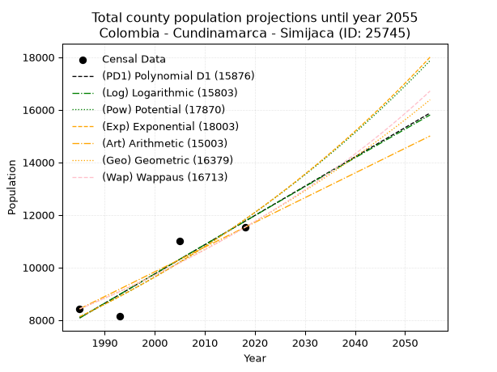
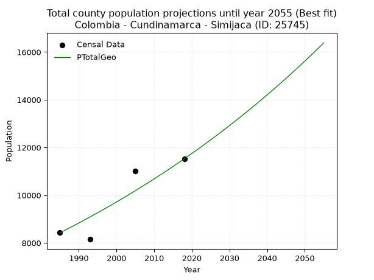
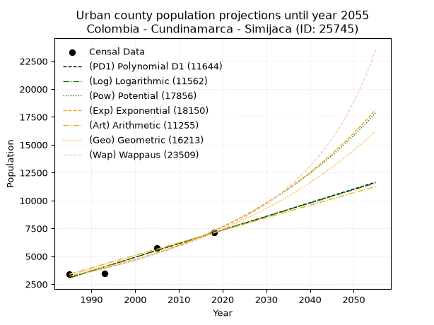
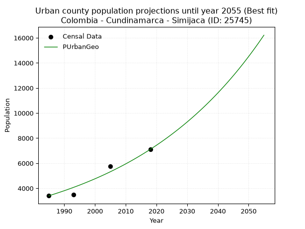
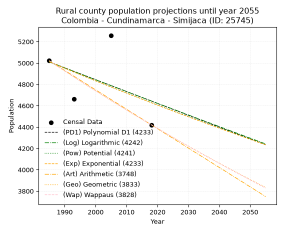
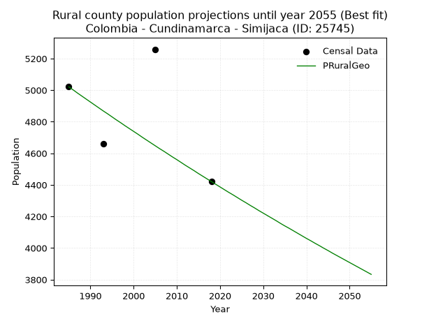

<div align="center">


</div>

# 📜 _“Population and Public Services Demand Projections (PPSD) until Year 2050 for Colombia - Cundinamarca - Simijaca (ID: 25745)”_
Keywords: `population` `public-service` `projection` `lineal` `polynomial` `logarithmic` `potential` `exponential` `arithmetic` `geometric` `wappaus` `dane` `colombia` `south-america`

PPSD are analytical estimates used by governments and planners to anticipate future changes in population size, age distribution, and the resulting community needs for utilities, healthcare, education, and infrastructure as sizing future water treatment facilities, electrical grids, and road networks based on spatial growth.

<div align="center">

</img>

</div>


> **General running parameters**: • app_version: _v20260806_. • Python version: _3.14.7_. • Pandas version: _3.0.5_. • NumPy version: _2.5.1_. • Creates, save and include plots into reports (create_plot): _False_. • Projection until year: _2050_. • Process polynomial degree 2 and up: _False_. • Process Wappaus: _True_. • Process Wappaus: _True_. • Set negative values to zero: _True_. • Set infinite values to zero: _True_. • Drop dataset notes: _True_. 
<div align="center">

Maps & GIS Layers: [:earth_americas:Google](http://maps.google.com/maps?q=5.505231274,-73.8507028) [:earth_americas:OSM](https://www.openstreetmap.org/#map=18/5.505231274/-73.8507028&layers=P) [:earth_americas:Bing](https://www.bing.com/maps?cp=5.505231274~-73.8507028&lvl=18) [:earth_americas:Apple](https://maps.apple.com/frame?center=5.505231274%2C-73.8507028&span=0.003%2C0.006) [:earth_americas:GISMobile](https://github.com/rcfdtools/R.GISMobile/blob/main/file/gis/CountyLayer_CO/Readme.md)

</div>


<div align="center">

```geojson
{
  "type": "Feature",
  "geometry": {
    "type": "Point", 
    "coordinates": [-73.8507028, 5.505231274]
  }, 
  "properties": {
    "Name": "Colombia - Cundinamarca - Simijaca (ID: 25745)"
  }
}
```

</div>


## 0. Census Data (4 records)

Census data are official statistics collected by a government about the people and housing in a country. They usually include counts of total population, age, sex, race, income, education, and jobs.

📅Global census file: [Population.xlsx](../data/Population.xlsx)

| Source   |   Year |   CountryID | CountryName   |   StateID | StateName    |   CountyID | CountyName   |   PTotal |   PUrban |   PRural |
|:---------|-------:|------------:|:--------------|----------:|:-------------|-----------:|:-------------|---------:|---------:|---------:|
| DANE     |   1985 |          57 | Colombia      |        25 | Cundinamarca |      25745 | Simijaca     |     8425 |     3404 |     5021 |
| DANE     |   1993 |          57 | Colombia      |        25 | Cundinamarca |      25745 | Simijaca     |     8150 |     3488 |     4662 |
| DANE     |   2005 |          57 | Colombia      |        25 | Cundinamarca |      25745 | Simijaca     |    11017 |     5758 |     5259 |
| DANE     |   2018 |          57 | Colombia      |        25 | Cundinamarca |      25745 | Simijaca     |    11526 |     7105 |     4421 |

> 🔥Some records could had specific notes about the registered values or the corresponding urban or rural distribution.

📅[SUI-RUPS](https://www.datos.gov.co/Hacienda-y-Cr-dito-P-blico/Registro-nico-de-Prestadores-de-Servicios-P-blicos/4qkq-csdn/about_data) - Local public utility companies: [RUPS.csv](../data/RUPS.csv)

 | SERVICIO       | ESTADO    | NOMBRE                                                          | NIT         | DEPARTAMENTO_DOMICILIO   | MUNICIPIO_DOMICILIO   | DIRECCION        |   TELEFONO | EMAIL                                 | TIPO_PRESTADOR                 | CLASIFICACION                  |
|:---------------|:----------|:----------------------------------------------------------------|:------------|:-------------------------|:----------------------|:-----------------|-----------:|:--------------------------------------|:-------------------------------|:-------------------------------|
| ACUEDUCTO      | OPERATIVA | JUNTA MUNICIPAL DE SERVICIOS PUBLICOS DEL MUNICIPIO DE SIMIJACA | 899999384-2 | CUNDINAMARCA             | SIMIJACA              | Calle 7 No. 7-42 |    8555117 | alcaldia@simijaca-cundinamarca.gov.co | MUNICIPIO (PRESTACIÓN DIRECTA) | DESDE 2501 HASTA 5000 USUARIOS |
| ALCANTARILLADO | OPERATIVA | JUNTA MUNICIPAL DE SERVICIOS PUBLICOS DEL MUNICIPIO DE SIMIJACA | 899999384-2 | CUNDINAMARCA             | SIMIJACA              | Calle 7 No. 7-42 |    8555117 | alcaldia@simijaca-cundinamarca.gov.co | MUNICIPIO (PRESTACIÓN DIRECTA) | DESDE 2501 HASTA 5000 USUARIOS |

## 1. Total

### 1.1. Coefficients and Parameters

* (PD1) Polynomial Deg 1: 111.35849056603723, -212965.32075471597 (lineal)
* (Log) Logarithmic: 222912.8164560151, -1684582.6041933747
* (Pow) Potential: 22.750497608978975, -71.11600056972172
* (Exp) Exponential: 0.011365073976697653, 1.2951068323510008e-06
* (Art) Arithmetic: Year diff. 2018 - 1985 = 33, Population diff. 11526 - 8425 = 3101, Annual growth = 93.96969696969697
* (Geo) Geometric: Year diff. 2018 - 1985 = 33, Population diff. 11526 - 8425 = 3101, Annual growth % = 0.009542266427094104
* (Wap) Wappaus: i = 0.9420048816570294, Condition values only valid for < 200)

<sub>
Wappaus condition values: ['0.00', '0.94', '1.88', '2.83', '3.77', '4.71', '5.65', '6.59', '7.54', '8.48', '9.42', '10.36', '11.30', '12.25', '13.19', '14.13', '15.07', '16.01', '16.96', '17.90', '18.84', '19.78', '20.72', '21.67', '22.61', '23.55', '24.49', '25.43', '26.38', '27.32', '28.26', '29.20', '30.14', '31.09', '32.03', '32.97', '33.91', '34.85', '35.80', '36.74', '37.68', '38.62', '39.56', '40.51', '41.45', '42.39', '43.33', '44.27', '45.22', '46.16', '47.10', '48.04', '48.98', '49.93', '50.87', '51.81', '52.75', '53.69', '54.64', '55.58', '56.52', '57.46', '58.40', '59.35', '60.29', '61.23']
</sub>


### 1.2. Projected Dataset

|   Year |   CountyID |   PTotalPD1 |   PTotalLog |   PTotalPow |   PTotalExp |   PTotalArt |   PTotalGeo |   PTotalWap |
|-------:|-----------:|------------:|------------:|------------:|------------:|------------:|------------:|------------:|
|   1985 |      25745 |        8081 |        8078 |        8123 |        8125 |        8425 |        8425 |        8425 |
|   1986 |      25745 |        8193 |        8190 |        8216 |        8218 |        8519 |        8505 |        8505 |
|   1987 |      25745 |        8304 |        8302 |        8311 |        8312 |        8613 |        8587 |        8585 |
|   1988 |      25745 |        8415 |        8414 |        8406 |        8407 |        8707 |        8668 |        8667 |
|   1989 |      25745 |        8527 |        8527 |        8503 |        8503 |        8801 |        8751 |        8749 |
|   1990 |      25745 |        8638 |        8639 |        8601 |        8601 |        8895 |        8835 |        8831 |
|   1991 |      25745 |        8749 |        8751 |        8700 |        8699 |        8989 |        8919 |        8915 |
|   1992 |      25745 |        8861 |        8863 |        8800 |        8798 |        9083 |        9004 |        8999 |
|   1993 |      25745 |        8972 |        8974 |        8901 |        8899 |        9177 |        9090 |        9085 |
|   1994 |      25745 |        9084 |        9086 |        9003 |        9001 |        9271 |        9177 |        9171 |
|   1995 |      25745 |        9195 |        9198 |        9106 |        9103 |        9365 |        9264 |        9258 |
|   1996 |      25745 |        9306 |        9310 |        9211 |        9207 |        9459 |        9353 |        9346 |
|   1997 |      25745 |        9418 |        9421 |        9316 |        9313 |        9553 |        9442 |        9434 |
|   1998 |      25745 |        9529 |        9533 |        9423 |        9419 |        9647 |        9532 |        9524 |
|   1999 |      25745 |        9640 |        9644 |        9531 |        9527 |        9741 |        9623 |        9615 |
|   2000 |      25745 |        9752 |        9756 |        9640 |        9636 |        9835 |        9715 |        9706 |
|   2001 |      25745 |        9863 |        9867 |        9750 |        9746 |        9929 |        9808 |        9798 |
|   2002 |      25745 |        9974 |        9979 |        9862 |        9857 |       10022 |        9901 |        9892 |
|   2003 |      25745 |       10086 |       10090 |        9974 |        9970 |       10116 |        9996 |        9986 |
|   2004 |      25745 |       10197 |       10201 |       10088 |       10084 |       10210 |       10091 |       10081 |
|   2005 |      25745 |       10308 |       10313 |       10203 |       10199 |       10304 |       10187 |       10177 |
|   2006 |      25745 |       10420 |       10424 |       10320 |       10316 |       10398 |       10285 |       10275 |
|   2007 |      25745 |       10531 |       10535 |       10437 |       10434 |       10492 |       10383 |       10373 |
|   2008 |      25745 |       10643 |       10646 |       10556 |       10553 |       10586 |       10482 |       10472 |
|   2009 |      25745 |       10754 |       10757 |       10677 |       10673 |       10680 |       10582 |       10572 |
|   2010 |      25745 |       10865 |       10868 |       10798 |       10795 |       10774 |       10683 |       10674 |
|   2011 |      25745 |       10977 |       10979 |       10921 |       10919 |       10868 |       10785 |       10776 |
|   2012 |      25745 |       11088 |       11089 |       11045 |       11044 |       10962 |       10888 |       10880 |
|   2013 |      25745 |       11199 |       11200 |       11171 |       11170 |       11056 |       10991 |       10985 |
|   2014 |      25745 |       11311 |       11311 |       11298 |       11298 |       11150 |       11096 |       11091 |
|   2015 |      25745 |       11422 |       11422 |       11426 |       11427 |       11244 |       11202 |       11198 |
|   2016 |      25745 |       11533 |       11532 |       11556 |       11557 |       11338 |       11309 |       11306 |
|   2017 |      25745 |       11645 |       11643 |       11687 |       11689 |       11432 |       11417 |       11415 |
|   2018 |      25745 |       11756 |       11753 |       11820 |       11823 |       11526 |       11526 |       11526 |
|   2019 |      25745 |       11867 |       11864 |       11954 |       11958 |       11620 |       11636 |       11638 |
|   2020 |      25745 |       11979 |       11974 |       12089 |       12095 |       11714 |       11747 |       11751 |
|   2021 |      25745 |       12090 |       12084 |       12226 |       12233 |       11808 |       11859 |       11865 |
|   2022 |      25745 |       12202 |       12195 |       12364 |       12373 |       11902 |       11972 |       11981 |
|   2023 |      25745 |       12313 |       12305 |       12504 |       12514 |       11996 |       12087 |       12098 |
|   2024 |      25745 |       12424 |       12415 |       12645 |       12657 |       12090 |       12202 |       12217 |
|   2025 |      25745 |       12536 |       12525 |       12788 |       12802 |       12184 |       12318 |       12336 |
|   2026 |      25745 |       12647 |       12635 |       12933 |       12948 |       12278 |       12436 |       12458 |
|   2027 |      25745 |       12758 |       12745 |       13079 |       13096 |       12372 |       12554 |       12580 |
|   2028 |      25745 |       12870 |       12855 |       13226 |       13246 |       12466 |       12674 |       12704 |
|   2029 |      25745 |       12981 |       12965 |       13376 |       13397 |       12560 |       12795 |       12830 |
|   2030 |      25745 |       13092 |       13075 |       13526 |       13551 |       12654 |       12917 |       12957 |
|   2031 |      25745 |       13204 |       13185 |       13679 |       13705 |       12748 |       13041 |       13085 |
|   2032 |      25745 |       13315 |       13294 |       13833 |       13862 |       12842 |       13165 |       13216 |
|   2033 |      25745 |       13426 |       13404 |       13988 |       14021 |       12936 |       13291 |       13347 |
|   2034 |      25745 |       13538 |       13514 |       14146 |       14181 |       13030 |       13417 |       13481 |
|   2035 |      25745 |       13649 |       13623 |       14305 |       14343 |       13123 |       13546 |       13616 |
|   2036 |      25745 |       13761 |       13733 |       14466 |       14507 |       13217 |       13675 |       13752 |
|   2037 |      25745 |       13872 |       13842 |       14628 |       14673 |       13311 |       13805 |       13891 |
|   2038 |      25745 |       13983 |       13952 |       14792 |       14840 |       13405 |       13937 |       14031 |
|   2039 |      25745 |       14095 |       14061 |       14959 |       15010 |       13499 |       14070 |       14172 |
|   2040 |      25745 |       14206 |       14170 |       15126 |       15182 |       13593 |       14204 |       14316 |
|   2041 |      25745 |       14317 |       14279 |       15296 |       15355 |       13687 |       14340 |       14462 |
|   2042 |      25745 |       14429 |       14389 |       15467 |       15531 |       13781 |       14477 |       14609 |
|   2043 |      25745 |       14540 |       14498 |       15641 |       15708 |       13875 |       14615 |       14758 |
|   2044 |      25745 |       14651 |       14607 |       15816 |       15888 |       13969 |       14754 |       14909 |
|   2045 |      25745 |       14763 |       14716 |       15993 |       16069 |       14063 |       14895 |       15063 |
|   2046 |      25745 |       14874 |       14825 |       16171 |       16253 |       14157 |       15037 |       15218 |
|   2047 |      25745 |       14986 |       14934 |       16352 |       16439 |       14251 |       15181 |       15375 |
|   2048 |      25745 |       15097 |       15043 |       16535 |       16627 |       14345 |       15325 |       15535 |
|   2049 |      25745 |       15208 |       15152 |       16720 |       16817 |       14439 |       15472 |       15696 |
|   2050 |      25745 |       15320 |       15260 |       16906 |       17009 |       14533 |       15619 |       15860 |
<div align="center">

</img>

</div>


### 1.3. Best fit with absolute and relative error (%)

Relative error puts that difference into context by dividing the absolute error by the true value, creating a unitless ratio or percentage that shows the scale of the mistake.

Absolute and relative error

|   Year | Source   |   CountryID | CountryName   |   StateID | StateName    |   CountyID_x | CountyName   |   PTotal |   PUrban |   PRural |   CountyID_y |   PTotalPD1 |   PTotalLog |   PTotalPow |   PTotalExp |   PTotalArt |   PTotalGeo |   PTotalWap |   PTotalPD1AbsError |   PTotalLogAbsError |   PTotalPowAbsError |   PTotalExpAbsError |   PTotalArtAbsError |   PTotalGeoAbsError |   PTotalWapAbsError |   PTotalPD1RelError |   PTotalLogRelError |   PTotalPowRelError |   PTotalExpRelError |   PTotalArtRelError |   PTotalGeoRelError |   PTotalWapRelError |
|-------:|:---------|------------:|:--------------|----------:|:-------------|-------------:|:-------------|---------:|---------:|---------:|-------------:|------------:|------------:|------------:|------------:|------------:|------------:|------------:|--------------------:|--------------------:|--------------------:|--------------------:|--------------------:|--------------------:|--------------------:|--------------------:|--------------------:|--------------------:|--------------------:|--------------------:|--------------------:|--------------------:|
|   1985 | DANE     |          57 | Colombia      |        25 | Cundinamarca |        25745 | Simijaca     |     8425 |     3404 |     5021 |        25745 |        8081 |        8078 |        8123 |        8125 |        8425 |        8425 |        8425 |                 344 |                 347 |                 302 |                 300 |                   0 |                   0 |                   0 |             4.08309 |             4.11869 |             3.58457 |             3.56083 |             0       |             0       |             0       |
|   1993 | DANE     |          57 | Colombia      |        25 | Cundinamarca |        25745 | Simijaca     |     8150 |     3488 |     4662 |        25745 |        8972 |        8974 |        8901 |        8899 |        9177 |        9090 |        9085 |                 822 |                 824 |                 751 |                 749 |                1027 |                 940 |                 935 |            10.0859  |            10.1104  |             9.21472 |             9.19018 |            12.6012  |            11.5337  |            11.4724  |
|   2005 | DANE     |          57 | Colombia      |        25 | Cundinamarca |        25745 | Simijaca     |    11017 |     5758 |     5259 |        25745 |       10308 |       10313 |       10203 |       10199 |       10304 |       10187 |       10177 |                 709 |                 704 |                 814 |                 818 |                 713 |                 830 |                 840 |             6.43551 |             6.39012 |             7.38858 |             7.42489 |             6.47182 |             7.53381 |             7.62458 |
|   2018 | DANE     |          57 | Colombia      |        25 | Cundinamarca |        25745 | Simijaca     |    11526 |     7105 |     4421 |        25745 |       11756 |       11753 |       11820 |       11823 |       11526 |       11526 |       11526 |                 230 |                 227 |                 294 |                 297 |                   0 |                   0 |                   0 |             1.99549 |             1.96946 |             2.55075 |             2.57678 |             0       |             0       |             0       |

Relative error mean

| Method    |   RelError | Best   |
|:----------|-----------:|:-------|
| PTotalPD1 |    5.64999 |        |
| PTotalLog |    5.64718 |        |
| PTotalPow |    5.68466 |        |
| PTotalExp |    5.68817 |        |
| PTotalArt |    4.76826 |        |
| PTotalGeo |    4.76689 | True   |
| PTotalWap |    4.77424 |        |

💙Best method: _**PTotalGeo**_
<div align="center">

</img>

</div>


### 1.4. Fresh water supply demand in liters per capita per day (lpcd)

The fresh water supply demand typically ranges from 100 to 300 liters per capita per day (lpcd) for standard domestic and municipal planning, though absolute survival minimums set by the World Health Organization are as low as 7.5 to 20 liters per day, and total consumption in high-income nations can exceed 400 liters.

> `CZ`: Level in meters above the sea level (masl)<br> `WS`: Fresh water supply demand in liters per capita per day (lpcd or l/h/d)<br> `WSAll`: Zonal fresh water supply demand in liters per second (l/s)<br> `A`: Zonal area in square meters<br> `DP`: Population density (people/hectare or p/ha)

Reference values (RAS Colombia)

|    CZ |   WS |
|------:|-----:|
|  1000 |  120 |
|  2000 |  130 |
| 99999 |  140 |

County shapefile geometry properties and water supply values

|   CountyID |      ATotal |   CZTotal |   WSTotal |
|-----------:|------------:|----------:|----------:|
|      25745 | 9.65803e+07 |   2676.91 |       140 |

Projected values for best method: PTotalGeo

|   CountyID |   Year |   PTotalGeo |   DPTotal |   WSTotal |   WSTotalAll |
|-----------:|-------:|------------:|----------:|----------:|-------------:|
|      25745 |   1985 |        8425 |      0.87 |       140 |      13.6516 |
|      25745 |   1986 |        8505 |      0.88 |       140 |      13.7812 |
|      25745 |   1987 |        8587 |      0.89 |       140 |      13.9141 |
|      25745 |   1988 |        8668 |      0.9  |       140 |      14.0454 |
|      25745 |   1989 |        8751 |      0.91 |       140 |      14.1799 |
|      25745 |   1990 |        8835 |      0.91 |       140 |      14.316  |
|      25745 |   1991 |        8919 |      0.92 |       140 |      14.4521 |
|      25745 |   1992 |        9004 |      0.93 |       140 |      14.5898 |
|      25745 |   1993 |        9090 |      0.94 |       140 |      14.7292 |
|      25745 |   1994 |        9177 |      0.95 |       140 |      14.8701 |
|      25745 |   1995 |        9264 |      0.96 |       140 |      15.0111 |
|      25745 |   1996 |        9353 |      0.97 |       140 |      15.1553 |
|      25745 |   1997 |        9442 |      0.98 |       140 |      15.2995 |
|      25745 |   1998 |        9532 |      0.99 |       140 |      15.4454 |
|      25745 |   1999 |        9623 |      1    |       140 |      15.5928 |
|      25745 |   2000 |        9715 |      1.01 |       140 |      15.7419 |
|      25745 |   2001 |        9808 |      1.02 |       140 |      15.8926 |
|      25745 |   2002 |        9901 |      1.03 |       140 |      16.0433 |
|      25745 |   2003 |        9996 |      1.03 |       140 |      16.1972 |
|      25745 |   2004 |       10091 |      1.04 |       140 |      16.3512 |
|      25745 |   2005 |       10187 |      1.05 |       140 |      16.5067 |
|      25745 |   2006 |       10285 |      1.06 |       140 |      16.6655 |
|      25745 |   2007 |       10383 |      1.08 |       140 |      16.8243 |
|      25745 |   2008 |       10482 |      1.09 |       140 |      16.9847 |
|      25745 |   2009 |       10582 |      1.1  |       140 |      17.1468 |
|      25745 |   2010 |       10683 |      1.11 |       140 |      17.3104 |
|      25745 |   2011 |       10785 |      1.12 |       140 |      17.4757 |
|      25745 |   2012 |       10888 |      1.13 |       140 |      17.6426 |
|      25745 |   2013 |       10991 |      1.14 |       140 |      17.8095 |
|      25745 |   2014 |       11096 |      1.15 |       140 |      17.9796 |
|      25745 |   2015 |       11202 |      1.16 |       140 |      18.1514 |
|      25745 |   2016 |       11309 |      1.17 |       140 |      18.3248 |
|      25745 |   2017 |       11417 |      1.18 |       140 |      18.4998 |
|      25745 |   2018 |       11526 |      1.19 |       140 |      18.6764 |
|      25745 |   2019 |       11636 |      1.2  |       140 |      18.8546 |
|      25745 |   2020 |       11747 |      1.22 |       140 |      19.0345 |
|      25745 |   2021 |       11859 |      1.23 |       140 |      19.216  |
|      25745 |   2022 |       11972 |      1.24 |       140 |      19.3991 |
|      25745 |   2023 |       12087 |      1.25 |       140 |      19.5854 |
|      25745 |   2024 |       12202 |      1.26 |       140 |      19.7718 |
|      25745 |   2025 |       12318 |      1.28 |       140 |      19.9597 |
|      25745 |   2026 |       12436 |      1.29 |       140 |      20.1509 |
|      25745 |   2027 |       12554 |      1.3  |       140 |      20.3421 |
|      25745 |   2028 |       12674 |      1.31 |       140 |      20.5366 |
|      25745 |   2029 |       12795 |      1.32 |       140 |      20.7326 |
|      25745 |   2030 |       12917 |      1.34 |       140 |      20.9303 |
|      25745 |   2031 |       13041 |      1.35 |       140 |      21.1313 |
|      25745 |   2032 |       13165 |      1.36 |       140 |      21.3322 |
|      25745 |   2033 |       13291 |      1.38 |       140 |      21.5363 |
|      25745 |   2034 |       13417 |      1.39 |       140 |      21.7405 |
|      25745 |   2035 |       13546 |      1.4  |       140 |      21.9495 |
|      25745 |   2036 |       13675 |      1.42 |       140 |      22.1586 |
|      25745 |   2037 |       13805 |      1.43 |       140 |      22.3692 |
|      25745 |   2038 |       13937 |      1.44 |       140 |      22.5831 |
|      25745 |   2039 |       14070 |      1.46 |       140 |      22.7986 |
|      25745 |   2040 |       14204 |      1.47 |       140 |      23.0157 |
|      25745 |   2041 |       14340 |      1.48 |       140 |      23.2361 |
|      25745 |   2042 |       14477 |      1.5  |       140 |      23.4581 |
|      25745 |   2043 |       14615 |      1.51 |       140 |      23.6817 |
|      25745 |   2044 |       14754 |      1.53 |       140 |      23.9069 |
|      25745 |   2045 |       14895 |      1.54 |       140 |      24.1354 |
|      25745 |   2046 |       15037 |      1.56 |       140 |      24.3655 |
|      25745 |   2047 |       15181 |      1.57 |       140 |      24.5988 |
|      25745 |   2048 |       15325 |      1.59 |       140 |      24.8322 |
|      25745 |   2049 |       15472 |      1.6  |       140 |      25.0704 |
|      25745 |   2050 |       15619 |      1.62 |       140 |      25.3086 |

## 2. Urban

### 2.1. Coefficients and Parameters

* (PD1) Polynomial Deg 1: 122.46527498996291, -240022.41629867328 (lineal)
* (Log) Logarithmic: 245087.92108201724, -1857976.5021557529
* (Pow) Potential: 49.43726954247193, -159.52457549940704
* (Exp) Exponential: 0.024699066717325906, 1.6427898410675591e-18
* (Art) Arithmetic: Year diff. 2018 - 1985 = 33, Population diff. 7105 - 3404 = 3701, Annual growth = 112.15151515151516
* (Geo) Geometric: Year diff. 2018 - 1985 = 33, Population diff. 7105 - 3404 = 3701, Annual growth % = 0.02254887840303299
* (Wap) Wappaus: i = 2.1343898591971673, Condition values only valid for < 200)

<sub>
Wappaus condition values: ['0.00', '2.13', '4.27', '6.40', '8.54', '10.67', '12.81', '14.94', '17.08', '19.21', '21.34', '23.48', '25.61', '27.75', '29.88', '32.02', '34.15', '36.28', '38.42', '40.55', '42.69', '44.82', '46.96', '49.09', '51.23', '53.36', '55.49', '57.63', '59.76', '61.90', '64.03', '66.17', '68.30', '70.43', '72.57', '74.70', '76.84', '78.97', '81.11', '83.24', '85.38', '87.51', '89.64', '91.78', '93.91', '96.05', '98.18', '100.32', '102.45', '104.59', '106.72', '108.85', '110.99', '113.12', '115.26', '117.39', '119.53', '121.66', '123.79', '125.93', '128.06', '130.20', '132.33', '134.47', '136.60', '138.74']
</sub>


### 2.2. Projected Dataset

|   Year |   CountyID |   PUrbanPD1 |   PUrbanLog |   PUrbanPow |   PUrbanExp |   PUrbanArt |   PUrbanGeo |   PUrbanWap |
|-------:|-----------:|------------:|------------:|------------:|------------:|------------:|------------:|------------:|
|   1985 |      25745 |        3071 |        3068 |        3219 |        3221 |        3404 |        3404 |        3404 |
|   1986 |      25745 |        3194 |        3191 |        3300 |        3302 |        3516 |        3481 |        3477 |
|   1987 |      25745 |        3316 |        3315 |        3383 |        3384 |        3628 |        3559 |        3552 |
|   1988 |      25745 |        3439 |        3438 |        3468 |        3469 |        3740 |        3640 |        3629 |
|   1989 |      25745 |        3561 |        3561 |        3556 |        3556 |        3853 |        3722 |        3708 |
|   1990 |      25745 |        3683 |        3684 |        3645 |        3645 |        3965 |        3805 |        3788 |
|   1991 |      25745 |        3806 |        3807 |        3737 |        3736 |        4077 |        3891 |        3870 |
|   1992 |      25745 |        3928 |        3931 |        3831 |        3829 |        4189 |        3979 |        3954 |
|   1993 |      25745 |        4051 |        4054 |        3927 |        3925 |        4301 |        4069 |        4039 |
|   1994 |      25745 |        4173 |        4177 |        4026 |        4023 |        4413 |        4161 |        4127 |
|   1995 |      25745 |        4296 |        4299 |        4127 |        4124 |        4526 |        4254 |        4217 |
|   1996 |      25745 |        4418 |        4422 |        4230 |        4227 |        4638 |        4350 |        4309 |
|   1997 |      25745 |        4541 |        4545 |        4336 |        4333 |        4750 |        4448 |        4404 |
|   1998 |      25745 |        4663 |        4668 |        4445 |        4441 |        4862 |        4549 |        4501 |
|   1999 |      25745 |        4786 |        4790 |        4556 |        4552 |        4974 |        4651 |        4600 |
|   2000 |      25745 |        4908 |        4913 |        4670 |        4666 |        5086 |        4756 |        4702 |
|   2001 |      25745 |        5031 |        5035 |        4787 |        4782 |        5198 |        4863 |        4806 |
|   2002 |      25745 |        5153 |        5158 |        4907 |        4902 |        5311 |        4973 |        4913 |
|   2003 |      25745 |        5276 |        5280 |        5029 |        5025 |        5423 |        5085 |        5023 |
|   2004 |      25745 |        5398 |        5403 |        5155 |        5150 |        5535 |        5200 |        5136 |
|   2005 |      25745 |        5520 |        5525 |        5284 |        5279 |        5647 |        5317 |        5251 |
|   2006 |      25745 |        5643 |        5647 |        5416 |        5411 |        5759 |        5437 |        5370 |
|   2007 |      25745 |        5765 |        5769 |        5551 |        5546 |        5871 |        5560 |        5493 |
|   2008 |      25745 |        5888 |        5891 |        5689 |        5685 |        5983 |        5685 |        5619 |
|   2009 |      25745 |        6010 |        6013 |        5831 |        5827 |        6096 |        5813 |        5748 |
|   2010 |      25745 |        6133 |        6135 |        5976 |        5973 |        6208 |        5944 |        5881 |
|   2011 |      25745 |        6255 |        6257 |        6125 |        6122 |        6320 |        6078 |        6018 |
|   2012 |      25745 |        6378 |        6379 |        6277 |        6275 |        6432 |        6215 |        6160 |
|   2013 |      25745 |        6500 |        6501 |        6433 |        6432 |        6544 |        6355 |        6305 |
|   2014 |      25745 |        6623 |        6623 |        6593 |        6593 |        6656 |        6499 |        6455 |
|   2015 |      25745 |        6745 |        6744 |        6757 |        6758 |        6769 |        6645 |        6610 |
|   2016 |      25745 |        6868 |        6866 |        6925 |        6927 |        6881 |        6795 |        6770 |
|   2017 |      25745 |        6990 |        6987 |        7097 |        7100 |        6993 |        6948 |        6935 |
|   2018 |      25745 |        7113 |        7109 |        7273 |        7278 |        7105 |        7105 |        7105 |
|   2019 |      25745 |        7235 |        7230 |        7453 |        7460 |        7217 |        7265 |        7281 |
|   2020 |      25745 |        7357 |        7352 |        7638 |        7646 |        7329 |        7429 |        7463 |
|   2021 |      25745 |        7480 |        7473 |        7827 |        7838 |        7441 |        7597 |        7651 |
|   2022 |      25745 |        7602 |        7594 |        8021 |        8034 |        7554 |        7768 |        7846 |
|   2023 |      25745 |        7725 |        7715 |        8219 |        8234 |        7666 |        7943 |        8048 |
|   2024 |      25745 |        7847 |        7836 |        8423 |        8440 |        7778 |        8122 |        8258 |
|   2025 |      25745 |        7970 |        7957 |        8631 |        8651 |        7890 |        8305 |        8475 |
|   2026 |      25745 |        8092 |        8078 |        8844 |        8868 |        8002 |        8493 |        8700 |
|   2027 |      25745 |        8215 |        8199 |        9062 |        9089 |        8114 |        8684 |        8934 |
|   2028 |      25745 |        8337 |        8320 |        9286 |        9317 |        8227 |        8880 |        9178 |
|   2029 |      25745 |        8460 |        8441 |        9515 |        9550 |        8339 |        9080 |        9431 |
|   2030 |      25745 |        8582 |        8562 |        9750 |        9789 |        8451 |        9285 |        9694 |
|   2031 |      25745 |        8705 |        8683 |        9990 |       10033 |        8563 |        9494 |        9969 |
|   2032 |      25745 |        8827 |        8803 |       10236 |       10284 |        8675 |        9708 |       10255 |
|   2033 |      25745 |        8949 |        8924 |       10488 |       10541 |        8787 |        9927 |       10554 |
|   2034 |      25745 |        9072 |        9044 |       10746 |       10805 |        8899 |       10151 |       10866 |
|   2035 |      25745 |        9194 |        9165 |       11011 |       11075 |        9012 |       10380 |       11193 |
|   2036 |      25745 |        9317 |        9285 |       11281 |       11352 |        9124 |       10614 |       11535 |
|   2037 |      25745 |        9439 |        9406 |       11559 |       11636 |        9236 |       10853 |       11893 |
|   2038 |      25745 |        9562 |        9526 |       11843 |       11927 |        9348 |       11098 |       12269 |
|   2039 |      25745 |        9684 |        9646 |       12133 |       12225 |        9460 |       11348 |       12663 |
|   2040 |      25745 |        9807 |        9766 |       12431 |       12531 |        9572 |       11604 |       13079 |
|   2041 |      25745 |        9929 |        9886 |       12736 |       12844 |        9684 |       11866 |       13516 |
|   2042 |      25745 |       10052 |       10006 |       13048 |       13166 |        9797 |       12133 |       13977 |
|   2043 |      25745 |       10174 |       10126 |       13368 |       13495 |        9909 |       12407 |       14464 |
|   2044 |      25745 |       10297 |       10246 |       13695 |       13832 |       10021 |       12687 |       14978 |
|   2045 |      25745 |       10419 |       10366 |       14030 |       14178 |       10133 |       12973 |       15524 |
|   2046 |      25745 |       10542 |       10486 |       14373 |       14533 |       10245 |       13265 |       16103 |
|   2047 |      25745 |       10664 |       10606 |       14725 |       14896 |       10357 |       13564 |       16718 |
|   2048 |      25745 |       10786 |       10726 |       15085 |       15269 |       10470 |       13870 |       17373 |
|   2049 |      25745 |       10909 |       10845 |       15453 |       15650 |       10582 |       14183 |       18073 |
|   2050 |      25745 |       11031 |       10965 |       15830 |       16042 |       10694 |       14503 |       18821 |
<div align="center">

</img>

</div>


### 2.3. Best fit with absolute and relative error (%)

Relative error puts that difference into context by dividing the absolute error by the true value, creating a unitless ratio or percentage that shows the scale of the mistake.

Absolute and relative error

|   Year | Source   |   CountryID | CountryName   |   StateID | StateName    |   CountyID_x | CountyName   |   PTotal |   PUrban |   PRural |   CountyID_y |   PUrbanPD1 |   PUrbanLog |   PUrbanPow |   PUrbanExp |   PUrbanArt |   PUrbanGeo |   PUrbanWap |   PUrbanPD1AbsError |   PUrbanLogAbsError |   PUrbanPowAbsError |   PUrbanExpAbsError |   PUrbanArtAbsError |   PUrbanGeoAbsError |   PUrbanWapAbsError |   PUrbanPD1RelError |   PUrbanLogRelError |   PUrbanPowRelError |   PUrbanExpRelError |   PUrbanArtRelError |   PUrbanGeoRelError |   PUrbanWapRelError |
|-------:|:---------|------------:|:--------------|----------:|:-------------|-------------:|:-------------|---------:|---------:|---------:|-------------:|------------:|------------:|------------:|------------:|------------:|------------:|------------:|--------------------:|--------------------:|--------------------:|--------------------:|--------------------:|--------------------:|--------------------:|--------------------:|--------------------:|--------------------:|--------------------:|--------------------:|--------------------:|--------------------:|
|   1985 | DANE     |          57 | Colombia      |        25 | Cundinamarca |        25745 | Simijaca     |     8425 |     3404 |     5021 |        25745 |        3071 |        3068 |        3219 |        3221 |        3404 |        3404 |        3404 |                 333 |                 336 |                 185 |                 183 |                   0 |                   0 |                   0 |            9.78261  |           9.87074   |             5.43478 |             5.37603 |             0       |             0       |             0       |
|   1993 | DANE     |          57 | Colombia      |        25 | Cundinamarca |        25745 | Simijaca     |     8150 |     3488 |     4662 |        25745 |        4051 |        4054 |        3927 |        3925 |        4301 |        4069 |        4039 |                 563 |                 566 |                 439 |                 437 |                 813 |                 581 |                 551 |           16.1411   |          16.2271    |            12.586   |            12.5287  |            23.3085  |            16.6571  |            15.797   |
|   2005 | DANE     |          57 | Colombia      |        25 | Cundinamarca |        25745 | Simijaca     |    11017 |     5758 |     5259 |        25745 |        5520 |        5525 |        5284 |        5279 |        5647 |        5317 |        5251 |                 238 |                 233 |                 474 |                 479 |                 111 |                 441 |                 507 |            4.13338  |           4.04654   |             8.23203 |             8.31886 |             1.92775 |             7.65891 |             8.80514 |
|   2018 | DANE     |          57 | Colombia      |        25 | Cundinamarca |        25745 | Simijaca     |    11526 |     7105 |     4421 |        25745 |        7113 |        7109 |        7273 |        7278 |        7105 |        7105 |        7105 |                   8 |                   4 |                 168 |                 173 |                   0 |                   0 |                   0 |            0.112597 |           0.0562984 |             2.36453 |             2.4349  |             0       |             0       |             0       |

Relative error mean

| Method    |   RelError | Best   |
|:----------|-----------:|:-------|
| PUrbanPD1 |    7.54241 |        |
| PUrbanLog |    7.55016 |        |
| PUrbanPow |    7.15434 |        |
| PUrbanExp |    7.16462 |        |
| PUrbanArt |    6.30906 |        |
| PUrbanGeo |    6.079   | True   |
| PUrbanWap |    6.15054 |        |

💙Best method: _**PUrbanGeo**_
<div align="center">

</img>

</div>


### 2.4. Fresh water supply demand in liters per capita per day (lpcd)

The fresh water supply demand typically ranges from 100 to 300 liters per capita per day (lpcd) for standard domestic and municipal planning, though absolute survival minimums set by the World Health Organization are as low as 7.5 to 20 liters per day, and total consumption in high-income nations can exceed 400 liters.

> `CZ`: Level in meters above the sea level (masl)<br> `WS`: Fresh water supply demand in liters per capita per day (lpcd or l/h/d)<br> `WSAll`: Zonal fresh water supply demand in liters per second (l/s)<br> `A`: Zonal area in square meters<br> `DP`: Population density (people/hectare or p/ha)

Reference values (RAS Colombia)

|    CZ |   WS |
|------:|-----:|
|  1000 |  120 |
|  2000 |  130 |
| 99999 |  140 |

County shapefile geometry properties and water supply values

|   CountyID |     AUrban |   CZUrban |   WSUrban |
|-----------:|-----------:|----------:|----------:|
|      25745 | 1.7357e+06 |   2561.93 |       140 |

Projected values for best method: PUrbanGeo

|   CountyID |   Year |   PUrbanGeo |   DPUrban |   WSUrban |   WSUrbanAll |
|-----------:|-------:|------------:|----------:|----------:|-------------:|
|      25745 |   1985 |        3404 |     19.61 |       140 |      5.51574 |
|      25745 |   1986 |        3481 |     20.06 |       140 |      5.64051 |
|      25745 |   1987 |        3559 |     20.5  |       140 |      5.7669  |
|      25745 |   1988 |        3640 |     20.97 |       140 |      5.89815 |
|      25745 |   1989 |        3722 |     21.44 |       140 |      6.03102 |
|      25745 |   1990 |        3805 |     21.92 |       140 |      6.16551 |
|      25745 |   1991 |        3891 |     22.42 |       140 |      6.30486 |
|      25745 |   1992 |        3979 |     22.92 |       140 |      6.44745 |
|      25745 |   1993 |        4069 |     23.44 |       140 |      6.59329 |
|      25745 |   1994 |        4161 |     23.97 |       140 |      6.74236 |
|      25745 |   1995 |        4254 |     24.51 |       140 |      6.89306 |
|      25745 |   1996 |        4350 |     25.06 |       140 |      7.04861 |
|      25745 |   1997 |        4448 |     25.63 |       140 |      7.20741 |
|      25745 |   1998 |        4549 |     26.21 |       140 |      7.37106 |
|      25745 |   1999 |        4651 |     26.8  |       140 |      7.53634 |
|      25745 |   2000 |        4756 |     27.4  |       140 |      7.70648 |
|      25745 |   2001 |        4863 |     28.02 |       140 |      7.87986 |
|      25745 |   2002 |        4973 |     28.65 |       140 |      8.0581  |
|      25745 |   2003 |        5085 |     29.3  |       140 |      8.23958 |
|      25745 |   2004 |        5200 |     29.96 |       140 |      8.42593 |
|      25745 |   2005 |        5317 |     30.63 |       140 |      8.61551 |
|      25745 |   2006 |        5437 |     31.32 |       140 |      8.80995 |
|      25745 |   2007 |        5560 |     32.03 |       140 |      9.00926 |
|      25745 |   2008 |        5685 |     32.75 |       140 |      9.21181 |
|      25745 |   2009 |        5813 |     33.49 |       140 |      9.41921 |
|      25745 |   2010 |        5944 |     34.25 |       140 |      9.63148 |
|      25745 |   2011 |        6078 |     35.02 |       140 |      9.84861 |
|      25745 |   2012 |        6215 |     35.81 |       140 |     10.0706  |
|      25745 |   2013 |        6355 |     36.61 |       140 |     10.2975  |
|      25745 |   2014 |        6499 |     37.44 |       140 |     10.5308  |
|      25745 |   2015 |        6645 |     38.28 |       140 |     10.7674  |
|      25745 |   2016 |        6795 |     39.15 |       140 |     11.0104  |
|      25745 |   2017 |        6948 |     40.03 |       140 |     11.2583  |
|      25745 |   2018 |        7105 |     40.93 |       140 |     11.5127  |
|      25745 |   2019 |        7265 |     41.86 |       140 |     11.772   |
|      25745 |   2020 |        7429 |     42.8  |       140 |     12.0377  |
|      25745 |   2021 |        7597 |     43.77 |       140 |     12.31    |
|      25745 |   2022 |        7768 |     44.75 |       140 |     12.587   |
|      25745 |   2023 |        7943 |     45.76 |       140 |     12.8706  |
|      25745 |   2024 |        8122 |     46.79 |       140 |     13.1606  |
|      25745 |   2025 |        8305 |     47.85 |       140 |     13.4572  |
|      25745 |   2026 |        8493 |     48.93 |       140 |     13.7618  |
|      25745 |   2027 |        8684 |     50.03 |       140 |     14.0713  |
|      25745 |   2028 |        8880 |     51.16 |       140 |     14.3889  |
|      25745 |   2029 |        9080 |     52.31 |       140 |     14.713   |
|      25745 |   2030 |        9285 |     53.49 |       140 |     15.0451  |
|      25745 |   2031 |        9494 |     54.7  |       140 |     15.3838  |
|      25745 |   2032 |        9708 |     55.93 |       140 |     15.7306  |
|      25745 |   2033 |        9927 |     57.19 |       140 |     16.0854  |
|      25745 |   2034 |       10151 |     58.48 |       140 |     16.4484  |
|      25745 |   2035 |       10380 |     59.8  |       140 |     16.8194  |
|      25745 |   2036 |       10614 |     61.15 |       140 |     17.1986  |
|      25745 |   2037 |       10853 |     62.53 |       140 |     17.5859  |
|      25745 |   2038 |       11098 |     63.94 |       140 |     17.9829  |
|      25745 |   2039 |       11348 |     65.38 |       140 |     18.388   |
|      25745 |   2040 |       11604 |     66.85 |       140 |     18.8028  |
|      25745 |   2041 |       11866 |     68.36 |       140 |     19.2273  |
|      25745 |   2042 |       12133 |     69.9  |       140 |     19.66    |
|      25745 |   2043 |       12407 |     71.48 |       140 |     20.1039  |
|      25745 |   2044 |       12687 |     73.09 |       140 |     20.5576  |
|      25745 |   2045 |       12973 |     74.74 |       140 |     21.0211  |
|      25745 |   2046 |       13265 |     76.42 |       140 |     21.4942  |
|      25745 |   2047 |       13564 |     78.15 |       140 |     21.9787  |
|      25745 |   2048 |       13870 |     79.91 |       140 |     22.4745  |
|      25745 |   2049 |       14183 |     81.71 |       140 |     22.9817  |
|      25745 |   2050 |       14503 |     83.56 |       140 |     23.5002  |

## 3. Rural

### 3.1. Coefficients and Parameters

* (PD1) Polynomial Deg 1: -11.106784423925633, 27057.095543957254 (lineal)
* (Log) Logarithmic: -22175.104626002132, 173393.8979623784
* (Pow) Potential: -4.8131732043703, 19.57259630910244
* (Exp) Exponential: -0.002410441937587838, 599641.275612722
* (Art) Arithmetic: Year diff. 2018 - 1985 = 33, Population diff. 4421 - 5021 = -600, Annual growth = -18.181818181818183
* (Geo) Geometric: Year diff. 2018 - 1985 = 33, Population diff. 4421 - 5021 = -600, Annual growth % = -0.003849034078379887
* (Wap) Wappaus: i = -0.3851264177466253, Condition values only valid for < 200)

<sub>
Wappaus condition values: ['-0.00', '-0.39', '-0.77', '-1.16', '-1.54', '-1.93', '-2.31', '-2.70', '-3.08', '-3.47', '-3.85', '-4.24', '-4.62', '-5.01', '-5.39', '-5.78', '-6.16', '-6.55', '-6.93', '-7.32', '-7.70', '-8.09', '-8.47', '-8.86', '-9.24', '-9.63', '-10.01', '-10.40', '-10.78', '-11.17', '-11.55', '-11.94', '-12.32', '-12.71', '-13.09', '-13.48', '-13.86', '-14.25', '-14.63', '-15.02', '-15.41', '-15.79', '-16.18', '-16.56', '-16.95', '-17.33', '-17.72', '-18.10', '-18.49', '-18.87', '-19.26', '-19.64', '-20.03', '-20.41', '-20.80', '-21.18', '-21.57', '-21.95', '-22.34', '-22.72', '-23.11', '-23.49', '-23.88', '-24.26', '-24.65', '-25.03']
</sub>


### 3.2. Projected Dataset

|   Year |   CountyID |   PRuralPD1 |   PRuralLog |   PRuralPow |   PRuralExp |   PRuralArt |   PRuralGeo |   PRuralWap |
|-------:|-----------:|------------:|------------:|------------:|------------:|------------:|------------:|------------:|
|   1985 |      25745 |        5010 |        5010 |        5011 |        5011 |        5021 |        5021 |        5021 |
|   1986 |      25745 |        4999 |        4999 |        4999 |        4999 |        5003 |        5002 |        5002 |
|   1987 |      25745 |        4988 |        4988 |        4987 |        4987 |        4985 |        4982 |        4982 |
|   1988 |      25745 |        4977 |        4977 |        4974 |        4975 |        4966 |        4963 |        4963 |
|   1989 |      25745 |        4966 |        4965 |        4962 |        4963 |        4948 |        4944 |        4944 |
|   1990 |      25745 |        4955 |        4954 |        4950 |        4951 |        4930 |        4925 |        4925 |
|   1991 |      25745 |        4943 |        4943 |        4938 |        4939 |        4912 |        4906 |        4906 |
|   1992 |      25745 |        4932 |        4932 |        4927 |        4927 |        4894 |        4887 |        4887 |
|   1993 |      25745 |        4921 |        4921 |        4915 |        4915 |        4876 |        4868 |        4869 |
|   1994 |      25745 |        4910 |        4910 |        4903 |        4903 |        4857 |        4850 |        4850 |
|   1995 |      25745 |        4899 |        4899 |        4891 |        4892 |        4839 |        4831 |        4831 |
|   1996 |      25745 |        4888 |        4887 |        4879 |        4880 |        4821 |        4812 |        4813 |
|   1997 |      25745 |        4877 |        4876 |        4867 |        4868 |        4803 |        4794 |        4794 |
|   1998 |      25745 |        4866 |        4865 |        4856 |        4856 |        4785 |        4775 |        4776 |
|   1999 |      25745 |        4855 |        4854 |        4844 |        4845 |        4766 |        4757 |        4757 |
|   2000 |      25745 |        4844 |        4843 |        4832 |        4833 |        4748 |        4739 |        4739 |
|   2001 |      25745 |        4832 |        4832 |        4821 |        4821 |        4730 |        4721 |        4721 |
|   2002 |      25745 |        4821 |        4821 |        4809 |        4810 |        4712 |        4702 |        4703 |
|   2003 |      25745 |        4810 |        4810 |        4798 |        4798 |        4694 |        4684 |        4685 |
|   2004 |      25745 |        4799 |        4799 |        4786 |        4787 |        4676 |        4666 |        4667 |
|   2005 |      25745 |        4788 |        4788 |        4775 |        4775 |        4657 |        4648 |        4649 |
|   2006 |      25745 |        4777 |        4777 |        4763 |        4764 |        4639 |        4630 |        4631 |
|   2007 |      25745 |        4766 |        4766 |        4752 |        4752 |        4621 |        4613 |        4613 |
|   2008 |      25745 |        4755 |        4755 |        4740 |        4741 |        4603 |        4595 |        4595 |
|   2009 |      25745 |        4744 |        4744 |        4729 |        4729 |        4585 |        4577 |        4577 |
|   2010 |      25745 |        4732 |        4732 |        4718 |        4718 |        4566 |        4560 |        4560 |
|   2011 |      25745 |        4721 |        4721 |        4707 |        4706 |        4548 |        4542 |        4542 |
|   2012 |      25745 |        4710 |        4710 |        4695 |        4695 |        4530 |        4524 |        4525 |
|   2013 |      25745 |        4699 |        4699 |        4684 |        4684 |        4512 |        4507 |        4507 |
|   2014 |      25745 |        4688 |        4688 |        4673 |        4673 |        4494 |        4490 |        4490 |
|   2015 |      25745 |        4677 |        4677 |        4662 |        4661 |        4476 |        4472 |        4473 |
|   2016 |      25745 |        4666 |        4666 |        4651 |        4650 |        4457 |        4455 |        4455 |
|   2017 |      25745 |        4655 |        4655 |        4640 |        4639 |        4439 |        4438 |        4438 |
|   2018 |      25745 |        4644 |        4644 |        4628 |        4628 |        4421 |        4421 |        4421 |
|   2019 |      25745 |        4632 |        4633 |        4617 |        4617 |        4403 |        4404 |        4404 |
|   2020 |      25745 |        4621 |        4622 |        4606 |        4605 |        4385 |        4387 |        4387 |
|   2021 |      25745 |        4610 |        4611 |        4596 |        4594 |        4366 |        4370 |        4370 |
|   2022 |      25745 |        4599 |        4600 |        4585 |        4583 |        4348 |        4353 |        4353 |
|   2023 |      25745 |        4588 |        4590 |        4574 |        4572 |        4330 |        4337 |        4336 |
|   2024 |      25745 |        4577 |        4579 |        4563 |        4561 |        4312 |        4320 |        4320 |
|   2025 |      25745 |        4566 |        4568 |        4552 |        4550 |        4294 |        4303 |        4303 |
|   2026 |      25745 |        4555 |        4557 |        4541 |        4539 |        4276 |        4287 |        4286 |
|   2027 |      25745 |        4544 |        4546 |        4530 |        4528 |        4257 |        4270 |        4270 |
|   2028 |      25745 |        4533 |        4535 |        4520 |        4517 |        4239 |        4254 |        4253 |
|   2029 |      25745 |        4521 |        4524 |        4509 |        4507 |        4221 |        4237 |        4237 |
|   2030 |      25745 |        4510 |        4513 |        4498 |        4496 |        4203 |        4221 |        4220 |
|   2031 |      25745 |        4499 |        4502 |        4488 |        4485 |        4185 |        4205 |        4204 |
|   2032 |      25745 |        4488 |        4491 |        4477 |        4474 |        4166 |        4189 |        4188 |
|   2033 |      25745 |        4477 |        4480 |        4466 |        4463 |        4148 |        4173 |        4171 |
|   2034 |      25745 |        4466 |        4469 |        4456 |        4453 |        4130 |        4156 |        4155 |
|   2035 |      25745 |        4455 |        4458 |        4445 |        4442 |        4112 |        4140 |        4139 |
|   2036 |      25745 |        4444 |        4447 |        4435 |        4431 |        4094 |        4125 |        4123 |
|   2037 |      25745 |        4433 |        4437 |        4424 |        4421 |        4076 |        4109 |        4107 |
|   2038 |      25745 |        4421 |        4426 |        4414 |        4410 |        4057 |        4093 |        4091 |
|   2039 |      25745 |        4410 |        4415 |        4403 |        4399 |        4039 |        4077 |        4075 |
|   2040 |      25745 |        4399 |        4404 |        4393 |        4389 |        4021 |        4061 |        4059 |
|   2041 |      25745 |        4388 |        4393 |        4383 |        4378 |        4003 |        4046 |        4044 |
|   2042 |      25745 |        4377 |        4382 |        4372 |        4368 |        3985 |        4030 |        4028 |
|   2043 |      25745 |        4366 |        4371 |        4362 |        4357 |        3966 |        4015 |        4012 |
|   2044 |      25745 |        4355 |        4361 |        4352 |        4347 |        3948 |        3999 |        3997 |
|   2045 |      25745 |        4344 |        4350 |        4342 |        4336 |        3930 |        3984 |        3981 |
|   2046 |      25745 |        4333 |        4339 |        4331 |        4326 |        3912 |        3968 |        3965 |
|   2047 |      25745 |        4322 |        4328 |        4321 |        4315 |        3894 |        3953 |        3950 |
|   2048 |      25745 |        4310 |        4317 |        4311 |        4305 |        3876 |        3938 |        3935 |
|   2049 |      25745 |        4299 |        4306 |        4301 |        4295 |        3857 |        3923 |        3919 |
|   2050 |      25745 |        4288 |        4296 |        4291 |        4284 |        3839 |        3908 |        3904 |
<div align="center">

</img>

</div>


### 3.3. Best fit with absolute and relative error (%)

Relative error puts that difference into context by dividing the absolute error by the true value, creating a unitless ratio or percentage that shows the scale of the mistake.

Absolute and relative error

|   Year | Source   |   CountryID | CountryName   |   StateID | StateName    |   CountyID_x | CountyName   |   PTotal |   PUrban |   PRural |   CountyID_y |   PRuralPD1 |   PRuralLog |   PRuralPow |   PRuralExp |   PRuralArt |   PRuralGeo |   PRuralWap |   PRuralPD1AbsError |   PRuralLogAbsError |   PRuralPowAbsError |   PRuralExpAbsError |   PRuralArtAbsError |   PRuralGeoAbsError |   PRuralWapAbsError |   PRuralPD1RelError |   PRuralLogRelError |   PRuralPowRelError |   PRuralExpRelError |   PRuralArtRelError |   PRuralGeoRelError |   PRuralWapRelError |
|-------:|:---------|------------:|:--------------|----------:|:-------------|-------------:|:-------------|---------:|---------:|---------:|-------------:|------------:|------------:|------------:|------------:|------------:|------------:|------------:|--------------------:|--------------------:|--------------------:|--------------------:|--------------------:|--------------------:|--------------------:|--------------------:|--------------------:|--------------------:|--------------------:|--------------------:|--------------------:|--------------------:|
|   1985 | DANE     |          57 | Colombia      |        25 | Cundinamarca |        25745 | Simijaca     |     8425 |     3404 |     5021 |        25745 |        5010 |        5010 |        5011 |        5011 |        5021 |        5021 |        5021 |                  11 |                  11 |                  10 |                  10 |                   0 |                   0 |                   0 |             0.21908 |             0.21908 |            0.199164 |            0.199164 |              0      |              0      |             0       |
|   1993 | DANE     |          57 | Colombia      |        25 | Cundinamarca |        25745 | Simijaca     |     8150 |     3488 |     4662 |        25745 |        4921 |        4921 |        4915 |        4915 |        4876 |        4868 |        4869 |                 259 |                 259 |                 253 |                 253 |                 214 |                 206 |                 207 |             5.55556 |             5.55556 |            5.42686  |            5.42686  |              4.5903 |              4.4187 |             4.44015 |
|   2005 | DANE     |          57 | Colombia      |        25 | Cundinamarca |        25745 | Simijaca     |    11017 |     5758 |     5259 |        25745 |        4788 |        4788 |        4775 |        4775 |        4657 |        4648 |        4649 |                 471 |                 471 |                 484 |                 484 |                 602 |                 611 |                 610 |             8.95608 |             8.95608 |            9.20327  |            9.20327  |             11.447  |             11.6182 |            11.5992  |
|   2018 | DANE     |          57 | Colombia      |        25 | Cundinamarca |        25745 | Simijaca     |    11526 |     7105 |     4421 |        25745 |        4644 |        4644 |        4628 |        4628 |        4421 |        4421 |        4421 |                 223 |                 223 |                 207 |                 207 |                   0 |                   0 |                   0 |             5.04411 |             5.04411 |            4.6822   |            4.6822   |              0      |              0      |             0       |

Relative error mean

| Method    |   RelError | Best   |
|:----------|-----------:|:-------|
| PRuralPD1 |    4.9437  |        |
| PRuralLog |    4.9437  |        |
| PRuralPow |    4.87787 |        |
| PRuralExp |    4.87787 |        |
| PRuralArt |    4.00934 |        |
| PRuralGeo |    4.00922 | True   |
| PRuralWap |    4.00983 |        |

💙Best method: _**PRuralGeo**_
<div align="center">

</img>

</div>


### 3.4. Fresh water supply demand in liters per capita per day (lpcd)

The fresh water supply demand typically ranges from 100 to 300 liters per capita per day (lpcd) for standard domestic and municipal planning, though absolute survival minimums set by the World Health Organization are as low as 7.5 to 20 liters per day, and total consumption in high-income nations can exceed 400 liters.

> `CZ`: Level in meters above the sea level (masl)<br> `WS`: Fresh water supply demand in liters per capita per day (lpcd or l/h/d)<br> `WSAll`: Zonal fresh water supply demand in liters per second (l/s)<br> `A`: Zonal area in square meters<br> `DP`: Population density (people/hectare or p/ha)

Reference values (RAS Colombia)

|    CZ |   WS |
|------:|-----:|
|  1000 |  120 |
|  2000 |  130 |
| 99999 |  140 |

County shapefile geometry properties and water supply values

|   CountyID |      ARural |   CZRural |   WSRural |
|-----------:|------------:|----------:|----------:|
|      25745 | 9.48446e+07 |   2678.99 |       140 |

Projected values for best method: PRuralGeo

|   CountyID |   Year |   PRuralGeo |   DPRural |   WSRural |   WSRuralAll |
|-----------:|-------:|------------:|----------:|----------:|-------------:|
|      25745 |   1985 |        5021 |      0.53 |       140 |      8.13588 |
|      25745 |   1986 |        5002 |      0.53 |       140 |      8.10509 |
|      25745 |   1987 |        4982 |      0.53 |       140 |      8.07269 |
|      25745 |   1988 |        4963 |      0.52 |       140 |      8.0419  |
|      25745 |   1989 |        4944 |      0.52 |       140 |      8.01111 |
|      25745 |   1990 |        4925 |      0.52 |       140 |      7.98032 |
|      25745 |   1991 |        4906 |      0.52 |       140 |      7.94954 |
|      25745 |   1992 |        4887 |      0.52 |       140 |      7.91875 |
|      25745 |   1993 |        4868 |      0.51 |       140 |      7.88796 |
|      25745 |   1994 |        4850 |      0.51 |       140 |      7.8588  |
|      25745 |   1995 |        4831 |      0.51 |       140 |      7.82801 |
|      25745 |   1996 |        4812 |      0.51 |       140 |      7.79722 |
|      25745 |   1997 |        4794 |      0.51 |       140 |      7.76806 |
|      25745 |   1998 |        4775 |      0.5  |       140 |      7.73727 |
|      25745 |   1999 |        4757 |      0.5  |       140 |      7.7081  |
|      25745 |   2000 |        4739 |      0.5  |       140 |      7.67894 |
|      25745 |   2001 |        4721 |      0.5  |       140 |      7.64977 |
|      25745 |   2002 |        4702 |      0.5  |       140 |      7.61898 |
|      25745 |   2003 |        4684 |      0.49 |       140 |      7.58981 |
|      25745 |   2004 |        4666 |      0.49 |       140 |      7.56065 |
|      25745 |   2005 |        4648 |      0.49 |       140 |      7.53148 |
|      25745 |   2006 |        4630 |      0.49 |       140 |      7.50231 |
|      25745 |   2007 |        4613 |      0.49 |       140 |      7.47477 |
|      25745 |   2008 |        4595 |      0.48 |       140 |      7.4456  |
|      25745 |   2009 |        4577 |      0.48 |       140 |      7.41644 |
|      25745 |   2010 |        4560 |      0.48 |       140 |      7.38889 |
|      25745 |   2011 |        4542 |      0.48 |       140 |      7.35972 |
|      25745 |   2012 |        4524 |      0.48 |       140 |      7.33056 |
|      25745 |   2013 |        4507 |      0.48 |       140 |      7.30301 |
|      25745 |   2014 |        4490 |      0.47 |       140 |      7.27546 |
|      25745 |   2015 |        4472 |      0.47 |       140 |      7.2463  |
|      25745 |   2016 |        4455 |      0.47 |       140 |      7.21875 |
|      25745 |   2017 |        4438 |      0.47 |       140 |      7.1912  |
|      25745 |   2018 |        4421 |      0.47 |       140 |      7.16366 |
|      25745 |   2019 |        4404 |      0.46 |       140 |      7.13611 |
|      25745 |   2020 |        4387 |      0.46 |       140 |      7.10856 |
|      25745 |   2021 |        4370 |      0.46 |       140 |      7.08102 |
|      25745 |   2022 |        4353 |      0.46 |       140 |      7.05347 |
|      25745 |   2023 |        4337 |      0.46 |       140 |      7.02755 |
|      25745 |   2024 |        4320 |      0.46 |       140 |      7       |
|      25745 |   2025 |        4303 |      0.45 |       140 |      6.97245 |
|      25745 |   2026 |        4287 |      0.45 |       140 |      6.94653 |
|      25745 |   2027 |        4270 |      0.45 |       140 |      6.91898 |
|      25745 |   2028 |        4254 |      0.45 |       140 |      6.89306 |
|      25745 |   2029 |        4237 |      0.45 |       140 |      6.86551 |
|      25745 |   2030 |        4221 |      0.45 |       140 |      6.83958 |
|      25745 |   2031 |        4205 |      0.44 |       140 |      6.81366 |
|      25745 |   2032 |        4189 |      0.44 |       140 |      6.78773 |
|      25745 |   2033 |        4173 |      0.44 |       140 |      6.76181 |
|      25745 |   2034 |        4156 |      0.44 |       140 |      6.73426 |
|      25745 |   2035 |        4140 |      0.44 |       140 |      6.70833 |
|      25745 |   2036 |        4125 |      0.43 |       140 |      6.68403 |
|      25745 |   2037 |        4109 |      0.43 |       140 |      6.6581  |
|      25745 |   2038 |        4093 |      0.43 |       140 |      6.63218 |
|      25745 |   2039 |        4077 |      0.43 |       140 |      6.60625 |
|      25745 |   2040 |        4061 |      0.43 |       140 |      6.58032 |
|      25745 |   2041 |        4046 |      0.43 |       140 |      6.55602 |
|      25745 |   2042 |        4030 |      0.42 |       140 |      6.53009 |
|      25745 |   2043 |        4015 |      0.42 |       140 |      6.50579 |
|      25745 |   2044 |        3999 |      0.42 |       140 |      6.47986 |
|      25745 |   2045 |        3984 |      0.42 |       140 |      6.45556 |
|      25745 |   2046 |        3968 |      0.42 |       140 |      6.42963 |
|      25745 |   2047 |        3953 |      0.42 |       140 |      6.40532 |
|      25745 |   2048 |        3938 |      0.42 |       140 |      6.38102 |
|      25745 |   2049 |        3923 |      0.41 |       140 |      6.35671 |
|      25745 |   2050 |        3908 |      0.41 |       140 |      6.33241 |

#

<div align="center"><br><sub>Share this research</sub></div><br>

<sub>**APPS & TOOLS & CONTENT DISCLAIMER**: • NO WARRANTY - This content and software is provided by <a href="https://github.com/rcfdtools" target="_blank">github.com/rcfdtools</a> "as is", without any express or implied warranty, including warranties of merchantability, fitness for a particular purpose, or non-infringement. There is no guarantee that the software will be error-free or operate without interruption. • LIMITATION OF LIABILITY - Neither the authors nor copyright holders will be liable for claims or damages arising from the software or its use. You are responsible for determining if the software is appropriate for your use and assume all associated risks, including errors, legal compliance, and data loss. • NO PROFESSIONAL ADVICE - The software provides general information and does not offer professional advice. It should not replace consultation with professional advisors. [Clauses and global license for rcfdtools use.](https://github.com/rcfdtools/rcfdtools/blob/main/LICENSE.md)</sub>

| [:house: Home](Readme.md)  | [:beginner: Help / Collab](https://github.com/rcfdtools/R.HydroTools/discussions/31) |
|----------------------------|-------------------------------------------------------------------------------------------|