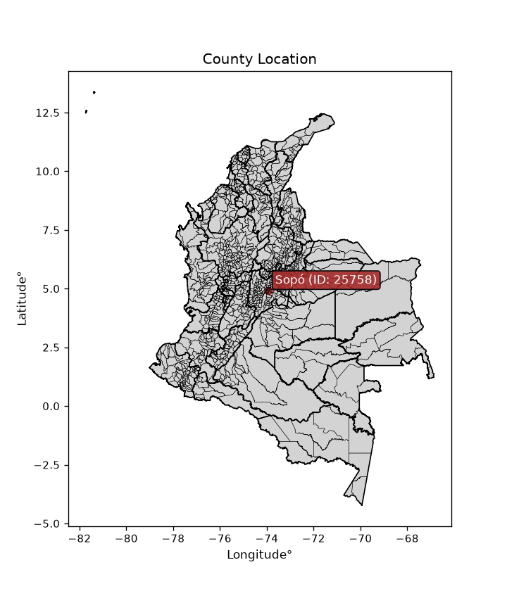
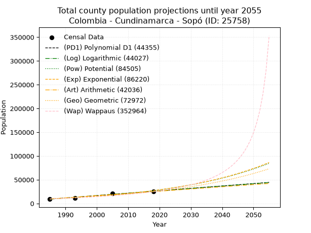
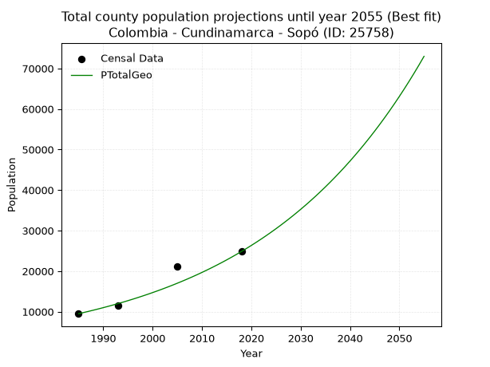
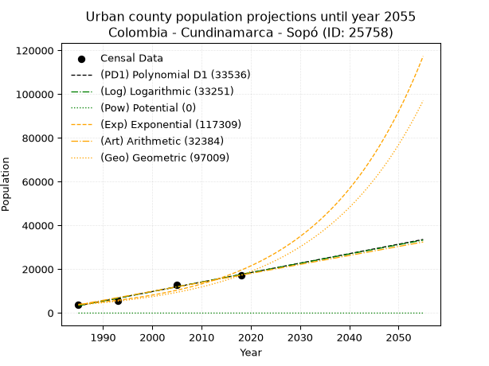
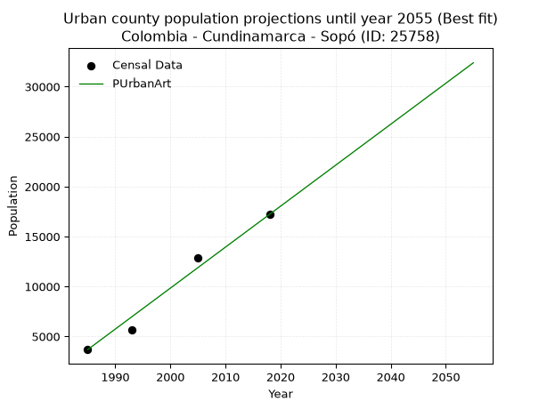
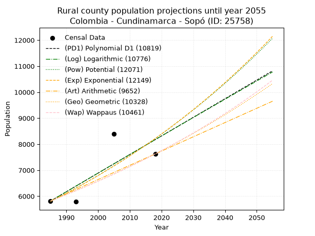
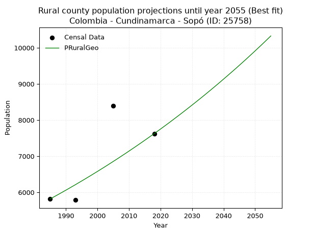

<div align="center">


</div>

# _“Population and Public Services Demand Projections (PPSD) until Year 2050 for Colombia - Cundinamarca - Sopó (ID: 25758)”_
Keywords: `population` `public-service` `projection` `lineal` `polynomial` `logarithmic` `potential` `exponential` `arithmetic` `geometric` `wappaus` `dane` `colombia` `south-america`

PPSD are analytical estimates used by governments and planners to anticipate future changes in population size, age distribution, and the resulting community needs for utilities, healthcare, education, and infrastructure as sizing future water treatment facilities, electrical grids, and road networks based on spatial growth.

<div align="center">

</img>

</div>


> **General running parameters**: • app_version: _v20260806_. • Python version: _3.14.7_. • Pandas version: _3.0.5_. • NumPy version: _2.5.1_. • Creates, save and include plots into reports (create_plot): _False_. • Projection until year: _2050_. • Process polynomial degree 2 and up: _False_. • Process Wappaus: _True_. • Process Wappaus: _True_. • Set negative values to zero: _True_. • Set infinite values to zero: _True_. • Drop dataset notes: _True_. 
<div align="center">

Dynamic map: [:earth_americas:Google](http://maps.google.com/maps?q=4.915395471,-73.9433275) [:earth_americas:OSM](https://www.openstreetmap.org/#map=18/4.915395471/-73.9433275&layers=P) [:earth_americas:Bing](https://www.bing.com/maps?cp=4.915395471~-73.9433275&lvl=18) [:earth_americas:Apple](https://maps.apple.com/frame?center=4.915395471%2C-73.9433275&span=0.003%2C0.006)

</div>


<div align="center">

```geojson
{
  "type": "Feature",
  "geometry": {
    "type": "Point", 
    "coordinates": [-73.9433275, 4.915395471]
  }, 
  "properties": {
    "Name": "Colombia - Cundinamarca - Sopó (ID: 25758)"
  }
}
```

</div>


## 0. Census Data (4 records)

Census data are official statistics collected by a government about the people and housing in a country. They usually include counts of total population, age, sex, race, income, education, and jobs.

📅Global census file: [Population.xlsx](../data/Population.xlsx)

| Source   |   Year |   CountryID | CountryName   |   StateID | StateName    |   CountyID | CountyName   |   PTotal |   PUrban |   PRural |
|:---------|-------:|------------:|:--------------|----------:|:-------------|-----------:|:-------------|---------:|---------:|---------:|
| DANE     |   1985 |          57 | Colombia      |        25 | Cundinamarca |      25758 | Sopó         |     9499 |     3682 |     5817 |
| DANE     |   1993 |          57 | Colombia      |        25 | Cundinamarca |      25758 | Sopó         |    11416 |     5629 |     5787 |
| DANE     |   2005 |          57 | Colombia      |        25 | Cundinamarca |      25758 | Sopó         |    21223 |    12834 |     8389 |
| DANE     |   2018 |          57 | Colombia      |        25 | Cundinamarca |      25758 | Sopó         |    24838 |    17213 |     7625 |

> 🔥Some records could had specific notes about the registered values or the corresponding urban or rural distribution.

📅[SUI-RUPS](https://www.datos.gov.co/Hacienda-y-Cr-dito-P-blico/Registro-nico-de-Prestadores-de-Servicios-P-blicos/4qkq-csdn/about_data) - Local public utility companies: [RUPS.csv](../data/RUPS.xlsx)

 | SERVICIO       | ESTADO    | NOMBRE                                                                            | NIT         | DEPARTAMENTO_DOMICILIO   | MUNICIPIO_DOMICILIO   | DIRECCION                                   |   TELEFONO | EMAIL                             | TIPO_PRESTADOR                             | CLASIFICACION                  |
|:---------------|:----------|:----------------------------------------------------------------------------------|:------------|:-------------------------|:----------------------|:--------------------------------------------|-----------:|:----------------------------------|:-------------------------------------------|:-------------------------------|
| ALCANTARILLADO | OPERATIVA | EMPRESA DE SERVICIOS PUBLICOS DE SOPO                                             | 832003318-9 | CUNDINAMARCA             | SOPO                  | CARRERA 3 No. 3- 83 PISO 2 OFICINA 204      |    8572655 | emsersopo@emsersopo.co            | EMPRESA INDUSTRIAL Y COMERCIAL DEL ESTADO  | DESDE 2501 HASTA 5000 USUARIOS |
| ACUEDUCTO      | OPERATIVA | EMPRESA DE SERVICIOS PUBLICOS DE SOPO                                             | 832003318-9 | CUNDINAMARCA             | SOPO                  | CARRERA 3 No. 3- 83 PISO 2 OFICINA 204      |    8572655 | emsersopo@emsersopo.co            | EMPRESA INDUSTRIAL Y COMERCIAL DEL ESTADO  | MAYOR O IGUAL A 5001 USUARIOS  |
| ACUEDUCTO      | OPERATIVA | ASOCIACION DE USUARIOS PRESTADORA DE SERVICIOS PUBLICOS DEL TEUSACA               | 832002062-4 | CUNDINAMARCA             | CHIA                  | CENTRO CHIA LOCAL 2021                      |    8616917 | gerencia@progresaresp.com         | ORGANIZACION AUTORIZADA                    | MENOR O IGUAL A 2500 USUARIOS  |
| ACUEDUCTO      | OPERATIVA | EMPRESA COLOMBIANA DE SERVICIOS PUBLICOS S.A. ESP                                 | 830040550-1 | BOGOTA, D.C.             | BOGOTA, D.C.          | Carrera 49 Nº 134 A-32                      |    2160775 | emcolsaesp@gmail.com              | SOCIEDADES (EMPRESA DE SERVICIOS PUBLICOS) | MENOR O IGUAL A 2500 USUARIOS  |
| ALCANTARILLADO | OPERATIVA | EMPRESA COLOMBIANA DE SERVICIOS PUBLICOS S.A. ESP                                 | 830040550-1 | BOGOTA, D.C.             | BOGOTA, D.C.          | Carrera 49 Nº 134 A-32                      |    2160775 | emcolsaesp@gmail.com              | SOCIEDADES (EMPRESA DE SERVICIOS PUBLICOS) | MENOR O IGUAL A 2500 USUARIOS  |
| ACUEDUCTO      | OPERATIVA | ACUEDUCTO VEREDAL EL CHUSCAL E.S.P.                                               | 832003923-5 | CUNDINAMARCA             | SOPO                  | Carrera 3 No. 7 - 38 Sur  Vereda el Chuscal |    8789936 | espelchuscal@hotmail.com          | ORGANIZACION AUTORIZADA                    | MENOR O IGUAL A 2500 USUARIOS  |
| ACUEDUCTO      | OPERATIVA | ASOCIACION DE USUARIOS DE AGUA POTABLE DE  LA VEREDA MERCENARIO MUNICIPIO DE SOPO | 832004777-0 | CUNDINAMARCA             | SOPO                  | Vereda Mercenario Finca Los Duraznos        |    8788514 | acueductomercenario@yahoo.es      | ORGANIZACION AUTORIZADA                    | HASTA 2500 SUSCRIPTORES        |
| ACUEDUCTO      | OPERATIVA | ACUEDUCTO VEREDA MEUSA ESP                                                        | 900103171-9 | CUNDINAMARCA             | SOPO                  | SOPO VEREDA MEUSA                           |    8570656 | ACUEDUCTOVEREDALMEUSA@HOTMAIL.COM | ORGANIZACION AUTORIZADA                    | HASTA 2500 SUSCRIPTORES        |
| ACUEDUCTO      | OPERATIVA | ASOCIACION DE USUARIOS DE ACUEDUCTO VEREDA SAN GABRIEL                            | 900358055-7 | CUNDINAMARCA             | SOPO                  | VEREDA SAN GABRIEL SALON COMUNAL            |    8757618 | auasangabriel@hotmail.com         | ORGANIZACION AUTORIZADA                    | MENOR O IGUAL A 2500 USUARIOS  |

## 1. Total

### 1.1. Coefficients and Parameters

* (PD1) Polynomial Deg 1: 504.3083099156937, -991998.6969088663 (lineal)
* (Log) Logarithmic: 1009599.2497445778, -7657227.987729175
* (Pow) Potential: 62.849512838177155, -203.2817293964974
* (Exp) Exponential: 0.0313879534611396, 8.368371169513095e-24
* (Art) Arithmetic: Year diff. 2018 - 1985 = 33, Population diff. 24838 - 9499 = 15339, Annual growth = 464.8181818181818
* (Geo) Geometric: Year diff. 2018 - 1985 = 33, Population diff. 24838 - 9499 = 15339, Annual growth % = 0.029555252613431948
* (Wap) Wappaus: i = 2.707389590343838, Condition values only valid for < 200)

<sub>
Wappaus condition values: ['0.00', '2.71', '5.41', '8.12', '10.83', '13.54', '16.24', '18.95', '21.66', '24.37', '27.07', '29.78', '32.49', '35.20', '37.90', '40.61', '43.32', '46.03', '48.73', '51.44', '54.15', '56.86', '59.56', '62.27', '64.98', '67.68', '70.39', '73.10', '75.81', '78.51', '81.22', '83.93', '86.64', '89.34', '92.05', '94.76', '97.47', '100.17', '102.88', '105.59', '108.30', '111.00', '113.71', '116.42', '119.13', '121.83', '124.54', '127.25', '129.95', '132.66', '135.37', '138.08', '140.78', '143.49', '146.20', '148.91', '151.61', '154.32', '157.03', '159.74', '162.44', '165.15', '167.86', '170.57', '173.27', '175.98']
</sub>


### 1.2. Projected Dataset

|   Year |   CountyID |   PTotalPD1 |   PTotalLog |   PTotalPow |   PTotalExp |   PTotalArt |   PTotalGeo |   PTotalWap |
|-------:|-----------:|------------:|------------:|------------:|------------:|------------:|------------:|------------:|
|   1985 |      25758 |        9053 |        9037 |        9570 |        9581 |        9499 |        9499 |        9499 |
|   1986 |      25758 |        9558 |        9545 |        9878 |        9886 |        9964 |        9780 |        9760 |
|   1987 |      25758 |       10062 |       10054 |       10195 |       10201 |       10429 |       10069 |       10028 |
|   1988 |      25758 |       10566 |       10562 |       10523 |       10527 |       10893 |       10366 |       10303 |
|   1989 |      25758 |       11071 |       11069 |       10861 |       10862 |       11358 |       10673 |       10587 |
|   1990 |      25758 |       11575 |       11577 |       11209 |       11209 |       11823 |       10988 |       10878 |
|   1991 |      25758 |       12079 |       12084 |       11569 |       11566 |       12288 |       11313 |       11178 |
|   1992 |      25758 |       12583 |       12591 |       11940 |       11935 |       12753 |       11647 |       11488 |
|   1993 |      25758 |       13088 |       13098 |       12322 |       12315 |       13218 |       11992 |       11806 |
|   1994 |      25758 |       13592 |       13604 |       12717 |       12708 |       13682 |       12346 |       12135 |
|   1995 |      25758 |       14096 |       14110 |       13124 |       13113 |       14147 |       12711 |       12473 |
|   1996 |      25758 |       14601 |       14616 |       13544 |       13531 |       14612 |       13087 |       12823 |
|   1997 |      25758 |       15105 |       15122 |       13977 |       13963 |       15077 |       13473 |       13184 |
|   1998 |      25758 |       15609 |       15627 |       14424 |       14408 |       15542 |       13872 |       13556 |
|   1999 |      25758 |       16114 |       16133 |       14885 |       14868 |       16006 |       14281 |       13941 |
|   2000 |      25758 |       16618 |       16637 |       15360 |       15342 |       16471 |       14704 |       14340 |
|   2001 |      25758 |       17122 |       17142 |       15850 |       15831 |       16936 |       15138 |       14751 |
|   2002 |      25758 |       17627 |       17647 |       16356 |       16336 |       17401 |       15586 |       15178 |
|   2003 |      25758 |       18131 |       18151 |       16878 |       16856 |       17866 |       16046 |       15620 |
|   2004 |      25758 |       18635 |       18655 |       17415 |       17394 |       18331 |       16520 |       16077 |
|   2005 |      25758 |       19139 |       19158 |       17970 |       17949 |       18795 |       17009 |       16552 |
|   2006 |      25758 |       19644 |       19662 |       18542 |       18521 |       19260 |       17511 |       17045 |
|   2007 |      25758 |       20148 |       20165 |       19132 |       19111 |       19725 |       18029 |       17556 |
|   2008 |      25758 |       20652 |       20668 |       19741 |       19721 |       20190 |       18562 |       18088 |
|   2009 |      25758 |       21157 |       21170 |       20368 |       20350 |       20655 |       19110 |       18641 |
|   2010 |      25758 |       21661 |       21673 |       21015 |       20998 |       21119 |       19675 |       19217 |
|   2011 |      25758 |       22165 |       22175 |       21683 |       21668 |       21584 |       20257 |       19817 |
|   2012 |      25758 |       22670 |       22677 |       22371 |       22359 |       22049 |       20855 |       20443 |
|   2013 |      25758 |       23174 |       23179 |       23080 |       23072 |       22514 |       21472 |       21095 |
|   2014 |      25758 |       23678 |       23680 |       23812 |       23807 |       22979 |       22106 |       21777 |
|   2015 |      25758 |       24183 |       24181 |       24567 |       24567 |       23444 |       22760 |       22490 |
|   2016 |      25758 |       24687 |       24682 |       25345 |       25350 |       23908 |       23432 |       23236 |
|   2017 |      25758 |       25191 |       25183 |       26147 |       26158 |       24373 |       24125 |       24018 |
|   2018 |      25758 |       25695 |       25683 |       26975 |       26992 |       24838 |       24838 |       24838 |
|   2019 |      25758 |       26200 |       26183 |       27828 |       27853 |       25303 |       25572 |       25699 |
|   2020 |      25758 |       26704 |       26683 |       28707 |       28741 |       25768 |       26328 |       26605 |
|   2021 |      25758 |       27208 |       27183 |       29614 |       29658 |       26232 |       27106 |       27558 |
|   2022 |      25758 |       27713 |       27682 |       30550 |       30603 |       26697 |       27907 |       28563 |
|   2023 |      25758 |       28217 |       28182 |       31514 |       31579 |       27162 |       28732 |       29624 |
|   2024 |      25758 |       28721 |       28681 |       32508 |       32586 |       27627 |       29581 |       30746 |
|   2025 |      25758 |       29226 |       29179 |       33533 |       33625 |       28092 |       30455 |       31934 |
|   2026 |      25758 |       29730 |       29678 |       34590 |       34697 |       28557 |       31356 |       33195 |
|   2027 |      25758 |       30234 |       30176 |       35679 |       35803 |       29021 |       32282 |       34534 |
|   2028 |      25758 |       30739 |       30674 |       36803 |       36945 |       29486 |       33236 |       35960 |
|   2029 |      25758 |       31243 |       31172 |       37961 |       38123 |       29951 |       34219 |       37482 |
|   2030 |      25758 |       31747 |       31669 |       39155 |       39339 |       30416 |       35230 |       39109 |
|   2031 |      25758 |       32251 |       32166 |       40386 |       40593 |       30881 |       36271 |       40853 |
|   2032 |      25758 |       32756 |       32663 |       41655 |       41887 |       31345 |       37343 |       42727 |
|   2033 |      25758 |       33260 |       33160 |       42963 |       43223 |       31810 |       38447 |       44746 |
|   2034 |      25758 |       33764 |       33656 |       44311 |       44601 |       32275 |       39583 |       46927 |
|   2035 |      25758 |       34269 |       34153 |       45702 |       46023 |       32740 |       40753 |       49291 |
|   2036 |      25758 |       34773 |       34649 |       47135 |       47491 |       33205 |       41958 |       51861 |
|   2037 |      25758 |       35277 |       35144 |       48612 |       49005 |       33670 |       43198 |       54666 |
|   2038 |      25758 |       35782 |       35640 |       50135 |       50568 |       34134 |       44474 |       57741 |
|   2039 |      25758 |       36286 |       36135 |       51705 |       52180 |       34599 |       45789 |       61124 |
|   2040 |      25758 |       36790 |       36630 |       53323 |       53844 |       35064 |       47142 |       64867 |
|   2041 |      25758 |       37295 |       37125 |       54991 |       55561 |       35529 |       48535 |       69028 |
|   2042 |      25758 |       37799 |       37619 |       56710 |       57332 |       35994 |       49970 |       73682 |
|   2043 |      25758 |       38303 |       38114 |       58482 |       59160 |       36458 |       51447 |       78923 |
|   2044 |      25758 |       38807 |       38608 |       60309 |       61047 |       36923 |       52967 |       84868 |
|   2045 |      25758 |       39312 |       39102 |       62192 |       62993 |       37388 |       54533 |       91671 |
|   2046 |      25758 |       39816 |       39595 |       64132 |       65002 |       37853 |       56144 |       99531 |
|   2047 |      25758 |       40320 |       40089 |       66132 |       67074 |       38318 |       57804 |      108714 |
|   2048 |      25758 |       40825 |       40582 |       68194 |       69213 |       38783 |       59512 |      119588 |
|   2049 |      25758 |       41329 |       41074 |       70318 |       71420 |       39247 |       61271 |      132664 |
|   2050 |      25758 |       41833 |       41567 |       72508 |       73697 |       39712 |       63082 |      148688 |
<div align="center">

</img>

</div>


### 1.3. Best fit with absolute and relative error (%)

Relative error puts that difference into context by dividing the absolute error by the true value, creating a unitless ratio or percentage that shows the scale of the mistake.

Absolute and relative error

|   Year | Source   |   CountryID | CountryName   |   StateID | StateName    |   CountyID_x | CountyName   |   PTotal |   PUrban |   PRural |   CountyID_y |   PTotalPD1 |   PTotalLog |   PTotalPow |   PTotalExp |   PTotalArt |   PTotalGeo |   PTotalWap |   PTotalPD1AbsError |   PTotalLogAbsError |   PTotalPowAbsError |   PTotalExpAbsError |   PTotalArtAbsError |   PTotalGeoAbsError |   PTotalWapAbsError |   PTotalPD1RelError |   PTotalLogRelError |   PTotalPowRelError |   PTotalExpRelError |   PTotalArtRelError |   PTotalGeoRelError |   PTotalWapRelError |
|-------:|:---------|------------:|:--------------|----------:|:-------------|-------------:|:-------------|---------:|---------:|---------:|-------------:|------------:|------------:|------------:|------------:|------------:|------------:|------------:|--------------------:|--------------------:|--------------------:|--------------------:|--------------------:|--------------------:|--------------------:|--------------------:|--------------------:|--------------------:|--------------------:|--------------------:|--------------------:|--------------------:|
|   1985 | DANE     |          57 | Colombia      |        25 | Cundinamarca |        25758 | Sopó         |     9499 |     3682 |     5817 |        25758 |        9053 |        9037 |        9570 |        9581 |        9499 |        9499 |        9499 |                 446 |                 462 |                  71 |                  82 |                   0 |                   0 |                   0 |             4.69523 |             4.86367 |            0.747447 |            0.863249 |              0      |             0       |             0       |
|   1993 | DANE     |          57 | Colombia      |        25 | Cundinamarca |        25758 | Sopó         |    11416 |     5629 |     5787 |        25758 |       13088 |       13098 |       12322 |       12315 |       13218 |       11992 |       11806 |                1672 |                1682 |                 906 |                 899 |                1802 |                 576 |                 390 |            14.6461  |            14.7337  |            7.93623  |            7.87491  |             15.7849 |             5.04555 |             3.41626 |
|   2005 | DANE     |          57 | Colombia      |        25 | Cundinamarca |        25758 | Sopó         |    21223 |    12834 |     8389 |        25758 |       19139 |       19158 |       17970 |       17949 |       18795 |       17009 |       16552 |                2084 |                2065 |                3253 |                3274 |                2428 |                4214 |                4671 |             9.81954 |             9.73001 |           15.3277   |           15.4267   |             11.4404 |            19.8558  |            22.0091  |
|   2018 | DANE     |          57 | Colombia      |        25 | Cundinamarca |        25758 | Sopó         |    24838 |    17213 |     7625 |        25758 |       25695 |       25683 |       26975 |       26992 |       24838 |       24838 |       24838 |                 857 |                 845 |                2137 |                2154 |                   0 |                   0 |                   0 |             3.45036 |             3.40205 |            8.60375  |            8.6722   |              0      |             0       |             0       |

Relative error mean

| Method    |   RelError | Best   |
|:----------|-----------:|:-------|
| PTotalPD1 |    8.15281 |        |
| PTotalLog |    8.18236 |        |
| PTotalPow |    8.15378 |        |
| PTotalExp |    8.20925 |        |
| PTotalArt |    6.80632 |        |
| PTotalGeo |    6.22534 | True   |
| PTotalWap |    6.35635 |        |

💙Best method: _**PTotalGeo**_
<div align="center">

</img>

</div>


### 1.4. Fresh water supply demand in liters per capita per day (lpcd)

The fresh water supply demand typically ranges from 100 to 300 liters per capita per day (lpcd) for standard domestic and municipal planning, though absolute survival minimums set by the World Health Organization are as low as 7.5 to 20 liters per day, and total consumption in high-income nations can exceed 400 liters.

> `CZ`: Level in meters above the sea level (masl)<br> `WS`: Fresh water supply demand in liters per capita per day (lpcd or l/h/d)<br> `WSAll`: Zonal fresh water supply demand in liters per second (l/s)<br> `A`: Zonal area in square meters<br> `DP`: Population density (people/hectare or p/ha)

Reference values (RAS Colombia)

|    CZ |   WS |
|------:|-----:|
|  1000 |  120 |
|  2000 |  130 |
| 99999 |  140 |

County shapefile geometry properties and water supply values

|   CountyID |     ATotal |   CZTotal |   WSTotal |
|-----------:|-----------:|----------:|----------:|
|      25758 | 1.1115e+08 |    2673.3 |       140 |

Projected values for best method: PTotalGeo

|   CountyID |   Year |   PTotalGeo |   DPTotal |   WSTotal |   WSTotalAll |
|-----------:|-------:|------------:|----------:|----------:|-------------:|
|      25758 |   1985 |        9499 |      0.85 |       140 |      15.3919 |
|      25758 |   1986 |        9780 |      0.88 |       140 |      15.8472 |
|      25758 |   1987 |       10069 |      0.91 |       140 |      16.3155 |
|      25758 |   1988 |       10366 |      0.93 |       140 |      16.7968 |
|      25758 |   1989 |       10673 |      0.96 |       140 |      17.2942 |
|      25758 |   1990 |       10988 |      0.99 |       140 |      17.8046 |
|      25758 |   1991 |       11313 |      1.02 |       140 |      18.3313 |
|      25758 |   1992 |       11647 |      1.05 |       140 |      18.8725 |
|      25758 |   1993 |       11992 |      1.08 |       140 |      19.4315 |
|      25758 |   1994 |       12346 |      1.11 |       140 |      20.0051 |
|      25758 |   1995 |       12711 |      1.14 |       140 |      20.5965 |
|      25758 |   1996 |       13087 |      1.18 |       140 |      21.2058 |
|      25758 |   1997 |       13473 |      1.21 |       140 |      21.8313 |
|      25758 |   1998 |       13872 |      1.25 |       140 |      22.4778 |
|      25758 |   1999 |       14281 |      1.28 |       140 |      23.1405 |
|      25758 |   2000 |       14704 |      1.32 |       140 |      23.8259 |
|      25758 |   2001 |       15138 |      1.36 |       140 |      24.5292 |
|      25758 |   2002 |       15586 |      1.4  |       140 |      25.2551 |
|      25758 |   2003 |       16046 |      1.44 |       140 |      26.0005 |
|      25758 |   2004 |       16520 |      1.49 |       140 |      26.7685 |
|      25758 |   2005 |       17009 |      1.53 |       140 |      27.5609 |
|      25758 |   2006 |       17511 |      1.58 |       140 |      28.3743 |
|      25758 |   2007 |       18029 |      1.62 |       140 |      29.2137 |
|      25758 |   2008 |       18562 |      1.67 |       140 |      30.0773 |
|      25758 |   2009 |       19110 |      1.72 |       140 |      30.9653 |
|      25758 |   2010 |       19675 |      1.77 |       140 |      31.8808 |
|      25758 |   2011 |       20257 |      1.82 |       140 |      32.8238 |
|      25758 |   2012 |       20855 |      1.88 |       140 |      33.7928 |
|      25758 |   2013 |       21472 |      1.93 |       140 |      34.7926 |
|      25758 |   2014 |       22106 |      1.99 |       140 |      35.8199 |
|      25758 |   2015 |       22760 |      2.05 |       140 |      36.8796 |
|      25758 |   2016 |       23432 |      2.11 |       140 |      37.9685 |
|      25758 |   2017 |       24125 |      2.17 |       140 |      39.0914 |
|      25758 |   2018 |       24838 |      2.23 |       140 |      40.2468 |
|      25758 |   2019 |       25572 |      2.3  |       140 |      41.4361 |
|      25758 |   2020 |       26328 |      2.37 |       140 |      42.6611 |
|      25758 |   2021 |       27106 |      2.44 |       140 |      43.9218 |
|      25758 |   2022 |       27907 |      2.51 |       140 |      45.2197 |
|      25758 |   2023 |       28732 |      2.58 |       140 |      46.5565 |
|      25758 |   2024 |       29581 |      2.66 |       140 |      47.9322 |
|      25758 |   2025 |       30455 |      2.74 |       140 |      49.3484 |
|      25758 |   2026 |       31356 |      2.82 |       140 |      50.8083 |
|      25758 |   2027 |       32282 |      2.9  |       140 |      52.3088 |
|      25758 |   2028 |       33236 |      2.99 |       140 |      53.8546 |
|      25758 |   2029 |       34219 |      3.08 |       140 |      55.4475 |
|      25758 |   2030 |       35230 |      3.17 |       140 |      57.0856 |
|      25758 |   2031 |       36271 |      3.26 |       140 |      58.7725 |
|      25758 |   2032 |       37343 |      3.36 |       140 |      60.5095 |
|      25758 |   2033 |       38447 |      3.46 |       140 |      62.2984 |
|      25758 |   2034 |       39583 |      3.56 |       140 |      64.1391 |
|      25758 |   2035 |       40753 |      3.67 |       140 |      66.035  |
|      25758 |   2036 |       41958 |      3.77 |       140 |      67.9875 |
|      25758 |   2037 |       43198 |      3.89 |       140 |      69.9968 |
|      25758 |   2038 |       44474 |      4    |       140 |      72.0644 |
|      25758 |   2039 |       45789 |      4.12 |       140 |      74.1951 |
|      25758 |   2040 |       47142 |      4.24 |       140 |      76.3875 |
|      25758 |   2041 |       48535 |      4.37 |       140 |      78.6447 |
|      25758 |   2042 |       49970 |      4.5  |       140 |      80.9699 |
|      25758 |   2043 |       51447 |      4.63 |       140 |      83.3632 |
|      25758 |   2044 |       52967 |      4.77 |       140 |      85.8262 |
|      25758 |   2045 |       54533 |      4.91 |       140 |      88.3637 |
|      25758 |   2046 |       56144 |      5.05 |       140 |      90.9741 |
|      25758 |   2047 |       57804 |      5.2  |       140 |      93.6639 |
|      25758 |   2048 |       59512 |      5.35 |       140 |      96.4315 |
|      25758 |   2049 |       61271 |      5.51 |       140 |      99.2817 |
|      25758 |   2050 |       63082 |      5.68 |       140 |     102.216  |

## 2. Urban

### 2.1. Coefficients and Parameters

* (PD1) Polynomial Deg 1: 432.80851063829465, -855885.723404249 (lineal)
* (Log) Logarithmic: 866341.5054648757, -6575229.225463644
* (Pow) Potential: 97.19739423551395, -316.9407861370418
* (Exp) Exponential: 0.04853923140118177, 5.61400276671472e-39
* (Art) Arithmetic: Year diff. 2018 - 1985 = 33, Population diff. 17213 - 3682 = 13531, Annual growth = 410.030303030303
* (Geo) Geometric: Year diff. 2018 - 1985 = 33, Population diff. 17213 - 3682 = 13531, Annual growth % = 0.047842827501223706
* (Wap) Wappaus: i = 3.924673874422618, Condition values only valid for < 200)

<sub>
Wappaus condition values: ['0.00', '3.92', '7.85', '11.77', '15.70', '19.62', '23.55', '27.47', '31.40', '35.32', '39.25', '43.17', '47.10', '51.02', '54.95', '58.87', '62.79', '66.72', '70.64', '74.57', '78.49', '82.42', '86.34', '90.27', '94.19', '98.12', '102.04', '105.97', '109.89', '113.82', '117.74', '121.66', '125.59', '129.51', '133.44', '137.36', '141.29', '145.21', '149.14', '153.06', '156.99', '160.91', '164.84', '168.76', '172.69', '176.61', '180.53', '184.46', '188.38', '192.31', '196.23', '200.16', '204.08', '208.01', '211.93', '215.86', '219.78', '223.71', '227.63', '231.56', '235.48', '239.41', '243.33', '247.25', '251.18', '255.10']
</sub>


### 2.2. Projected Dataset

|   Year |   CountyID |   PUrbanPD1 |   PUrbanLog |   PUrbanPow |   PUrbanExp |   PUrbanArt |   PUrbanGeo |
|-------:|-----------:|------------:|------------:|------------:|------------:|------------:|------------:|
|   1985 |      25758 |        3239 |        3226 |           0 |        3924 |        3682 |        3682 |
|   1986 |      25758 |        3672 |        3662 |           0 |        4119 |        4092 |        3858 |
|   1987 |      25758 |        4105 |        4098 |           0 |        4324 |        4502 |        4043 |
|   1988 |      25758 |        4538 |        4534 |           0 |        4539 |        4912 |        4236 |
|   1989 |      25758 |        4970 |        4970 |           0 |        4765 |        5322 |        4439 |
|   1990 |      25758 |        5403 |        5405 |           0 |        5002 |        5732 |        4651 |
|   1991 |      25758 |        5836 |        5841 |           0 |        5250 |        6142 |        4874 |
|   1992 |      25758 |        6269 |        6276 |           0 |        5512 |        6552 |        5107 |
|   1993 |      25758 |        6702 |        6711 |           0 |        5786 |        6962 |        5351 |
|   1994 |      25758 |        7134 |        7145 |           0 |        6073 |        7372 |        5607 |
|   1995 |      25758 |        7567 |        7579 |           0 |        6375 |        7782 |        5876 |
|   1996 |      25758 |        8000 |        8014 |           0 |        6693 |        8192 |        6157 |
|   1997 |      25758 |        8433 |        8448 |           0 |        7025 |        8602 |        6451 |
|   1998 |      25758 |        8866 |        8881 |           0 |        7375 |        9012 |        6760 |
|   1999 |      25758 |        9298 |        9315 |           0 |        7742 |        9422 |        7083 |
|   2000 |      25758 |        9731 |        9748 |           0 |        8127 |        9832 |        7422 |
|   2001 |      25758 |       10164 |       10181 |           0 |        8531 |       10242 |        7777 |
|   2002 |      25758 |       10597 |       10614 |           0 |        8955 |       10653 |        8149 |
|   2003 |      25758 |       11030 |       11047 |           0 |        9401 |       11063 |        8539 |
|   2004 |      25758 |       11463 |       11479 |           0 |        9868 |       11473 |        8948 |
|   2005 |      25758 |       11895 |       11911 |           0 |       10359 |       11883 |        9376 |
|   2006 |      25758 |       12328 |       12343 |           0 |       10874 |       12293 |        9824 |
|   2007 |      25758 |       12761 |       12775 |           0 |       11415 |       12703 |       10294 |
|   2008 |      25758 |       13194 |       13207 |           0 |       11983 |       13113 |       10787 |
|   2009 |      25758 |       13627 |       13638 |           0 |       12579 |       13523 |       11303 |
|   2010 |      25758 |       14059 |       14069 |           0 |       13204 |       13933 |       11844 |
|   2011 |      25758 |       14492 |       14500 |           0 |       13861 |       14343 |       12410 |
|   2012 |      25758 |       14925 |       14931 |           0 |       14550 |       14753 |       13004 |
|   2013 |      25758 |       15358 |       15361 |           0 |       15274 |       15163 |       13626 |
|   2014 |      25758 |       15791 |       15791 |           0 |       16034 |       15573 |       14278 |
|   2015 |      25758 |       16223 |       16221 |           0 |       16831 |       15983 |       14961 |
|   2016 |      25758 |       16656 |       16651 |           0 |       17668 |       16393 |       15677 |
|   2017 |      25758 |       17089 |       17081 |           0 |       18547 |       16803 |       16427 |
|   2018 |      25758 |       17522 |       17510 |           0 |       19470 |       17213 |       17213 |
|   2019 |      25758 |       17955 |       17939 |           0 |       20438 |       17623 |       18037 |
|   2020 |      25758 |       18387 |       18368 |           0 |       21455 |       18033 |       18899 |
|   2021 |      25758 |       18820 |       18797 |           0 |       22522 |       18443 |       19804 |
|   2022 |      25758 |       19253 |       19226 |           0 |       23642 |       18853 |       20751 |
|   2023 |      25758 |       19686 |       19654 |           0 |       24818 |       19263 |       21744 |
|   2024 |      25758 |       20119 |       20082 |           0 |       26052 |       19673 |       22784 |
|   2025 |      25758 |       20552 |       20510 |           0 |       27348 |       20083 |       23874 |
|   2026 |      25758 |       20984 |       20938 |           0 |       28708 |       20493 |       25016 |
|   2027 |      25758 |       21417 |       21365 |           0 |       30136 |       20903 |       26213 |
|   2028 |      25758 |       21850 |       21793 |           0 |       31635 |       21313 |       27467 |
|   2029 |      25758 |       22283 |       22220 |           0 |       33208 |       21723 |       28782 |
|   2030 |      25758 |       22716 |       22647 |           0 |       34860 |       22133 |       30159 |
|   2031 |      25758 |       23148 |       23073 |           0 |       36593 |       22543 |       31601 |
|   2032 |      25758 |       23581 |       23500 |           0 |       38413 |       22953 |       33113 |
|   2033 |      25758 |       24014 |       23926 |           0 |       40324 |       23363 |       34698 |
|   2034 |      25758 |       24447 |       24352 |           0 |       42330 |       23773 |       36358 |
|   2035 |      25758 |       24880 |       24778 |           0 |       44435 |       24184 |       38097 |
|   2036 |      25758 |       25312 |       25204 |           0 |       46645 |       24594 |       39920 |
|   2037 |      25758 |       25745 |       25629 |           0 |       48965 |       25004 |       41830 |
|   2038 |      25758 |       26178 |       26054 |           0 |       51400 |       25414 |       43831 |
|   2039 |      25758 |       26611 |       26479 |           0 |       53957 |       25824 |       45928 |
|   2040 |      25758 |       27044 |       26904 |           0 |       56640 |       26234 |       48125 |
|   2041 |      25758 |       27476 |       27328 |           0 |       59457 |       26644 |       50428 |
|   2042 |      25758 |       27909 |       27753 |           0 |       62415 |       27054 |       52840 |
|   2043 |      25758 |       28342 |       28177 |           0 |       65519 |       27464 |       55368 |
|   2044 |      25758 |       28775 |       28601 |           0 |       68778 |       27874 |       58017 |
|   2045 |      25758 |       29208 |       29025 |           0 |       72198 |       28284 |       60793 |
|   2046 |      25758 |       29640 |       29448 |           0 |       75789 |       28694 |       63701 |
|   2047 |      25758 |       30073 |       29872 |           0 |       79559 |       29104 |       66749 |
|   2048 |      25758 |       30506 |       30295 |           0 |       83516 |       29514 |       69942 |
|   2049 |      25758 |       30939 |       30718 |           0 |       87670 |       29924 |       73289 |
|   2050 |      25758 |       31372 |       31140 |           0 |       92030 |       30334 |       76795 |
<div align="center">

</img>

</div>


### 2.3. Best fit with absolute and relative error (%)

Relative error puts that difference into context by dividing the absolute error by the true value, creating a unitless ratio or percentage that shows the scale of the mistake.

Absolute and relative error

|   Year | Source   |   CountryID | CountryName   |   StateID | StateName    |   CountyID_x | CountyName   |   PTotal |   PUrban |   PRural |   CountyID_y |   PUrbanPD1 |   PUrbanLog |   PUrbanPow |   PUrbanExp |   PUrbanArt |   PUrbanGeo |   PUrbanPD1AbsError |   PUrbanLogAbsError |   PUrbanPowAbsError |   PUrbanExpAbsError |   PUrbanArtAbsError |   PUrbanGeoAbsError |   PUrbanPD1RelError |   PUrbanLogRelError |   PUrbanPowRelError |   PUrbanExpRelError |   PUrbanArtRelError |   PUrbanGeoRelError |
|-------:|:---------|------------:|:--------------|----------:|:-------------|-------------:|:-------------|---------:|---------:|---------:|-------------:|------------:|------------:|------------:|------------:|------------:|------------:|--------------------:|--------------------:|--------------------:|--------------------:|--------------------:|--------------------:|--------------------:|--------------------:|--------------------:|--------------------:|--------------------:|--------------------:|
|   1985 | DANE     |          57 | Colombia      |        25 | Cundinamarca |        25758 | Sopó         |     9499 |     3682 |     5817 |        25758 |        3239 |        3226 |           0 |        3924 |        3682 |        3682 |                 443 |                 456 |                3682 |                 242 |                   0 |                   0 |            12.0315  |            12.3846  |                 100 |             6.57251 |              0      |             0       |
|   1993 | DANE     |          57 | Colombia      |        25 | Cundinamarca |        25758 | Sopó         |    11416 |     5629 |     5787 |        25758 |        6702 |        6711 |           0 |        5786 |        6962 |        5351 |                1073 |                1082 |                5629 |                 157 |                1333 |                 278 |            19.062   |            19.2219  |                 100 |             2.78913 |             23.6809 |             4.93871 |
|   2005 | DANE     |          57 | Colombia      |        25 | Cundinamarca |        25758 | Sopó         |    21223 |    12834 |     8389 |        25758 |       11895 |       11911 |           0 |       10359 |       11883 |        9376 |                 939 |                 923 |               12834 |                2475 |                 951 |                3458 |             7.3165  |             7.19183 |                 100 |            19.2847  |              7.41   |            26.9441  |
|   2018 | DANE     |          57 | Colombia      |        25 | Cundinamarca |        25758 | Sopó         |    24838 |    17213 |     7625 |        25758 |       17522 |       17510 |           0 |       19470 |       17213 |       17213 |                 309 |                 297 |               17213 |                2257 |                   0 |                   0 |             1.79515 |             1.72544 |                 100 |            13.1122  |              0      |             0       |

Relative error mean

| Method    |   RelError | Best   |
|:----------|-----------:|:-------|
| PUrbanPD1 |   10.0513  |        |
| PUrbanLog |   10.1309  |        |
| PUrbanPow |  100       |        |
| PUrbanExp |   10.4396  |        |
| PUrbanArt |    7.77274 | True   |
| PUrbanGeo |    7.97069 |        |

💙Best method: _**PUrbanArt**_
<div align="center">

</img>

</div>


### 2.4. Fresh water supply demand in liters per capita per day (lpcd)

The fresh water supply demand typically ranges from 100 to 300 liters per capita per day (lpcd) for standard domestic and municipal planning, though absolute survival minimums set by the World Health Organization are as low as 7.5 to 20 liters per day, and total consumption in high-income nations can exceed 400 liters.

> `CZ`: Level in meters above the sea level (masl)<br> `WS`: Fresh water supply demand in liters per capita per day (lpcd or l/h/d)<br> `WSAll`: Zonal fresh water supply demand in liters per second (l/s)<br> `A`: Zonal area in square meters<br> `DP`: Population density (people/hectare or p/ha)

Reference values (RAS Colombia)

|    CZ |   WS |
|------:|-----:|
|  1000 |  120 |
|  2000 |  130 |
| 99999 |  140 |

County shapefile geometry properties and water supply values

|   CountyID |      AUrban |   CZUrban |   WSUrban |
|-----------:|------------:|----------:|----------:|
|      25758 | 2.61142e+06 |   2601.44 |       140 |

Projected values for best method: PUrbanArt

|   CountyID |   Year |   PUrbanArt |   DPUrban |   WSUrban |   WSUrbanAll |
|-----------:|-------:|------------:|----------:|----------:|-------------:|
|      25758 |   1985 |        3682 |     14.1  |       140 |      5.9662  |
|      25758 |   1986 |        4092 |     15.67 |       140 |      6.63056 |
|      25758 |   1987 |        4502 |     17.24 |       140 |      7.29491 |
|      25758 |   1988 |        4912 |     18.81 |       140 |      7.95926 |
|      25758 |   1989 |        5322 |     20.38 |       140 |      8.62361 |
|      25758 |   1990 |        5732 |     21.95 |       140 |      9.28796 |
|      25758 |   1991 |        6142 |     23.52 |       140 |      9.95231 |
|      25758 |   1992 |        6552 |     25.09 |       140 |     10.6167  |
|      25758 |   1993 |        6962 |     26.66 |       140 |     11.281   |
|      25758 |   1994 |        7372 |     28.23 |       140 |     11.9454  |
|      25758 |   1995 |        7782 |     29.8  |       140 |     12.6097  |
|      25758 |   1996 |        8192 |     31.37 |       140 |     13.2741  |
|      25758 |   1997 |        8602 |     32.94 |       140 |     13.9384  |
|      25758 |   1998 |        9012 |     34.51 |       140 |     14.6028  |
|      25758 |   1999 |        9422 |     36.08 |       140 |     15.2671  |
|      25758 |   2000 |        9832 |     37.65 |       140 |     15.9315  |
|      25758 |   2001 |       10242 |     39.22 |       140 |     16.5958  |
|      25758 |   2002 |       10653 |     40.79 |       140 |     17.2618  |
|      25758 |   2003 |       11063 |     42.36 |       140 |     17.9262  |
|      25758 |   2004 |       11473 |     43.93 |       140 |     18.5905  |
|      25758 |   2005 |       11883 |     45.5  |       140 |     19.2549  |
|      25758 |   2006 |       12293 |     47.07 |       140 |     19.9192  |
|      25758 |   2007 |       12703 |     48.64 |       140 |     20.5836  |
|      25758 |   2008 |       13113 |     50.21 |       140 |     21.2479  |
|      25758 |   2009 |       13523 |     51.78 |       140 |     21.9123  |
|      25758 |   2010 |       13933 |     53.35 |       140 |     22.5766  |
|      25758 |   2011 |       14343 |     54.92 |       140 |     23.241   |
|      25758 |   2012 |       14753 |     56.49 |       140 |     23.9053  |
|      25758 |   2013 |       15163 |     58.06 |       140 |     24.5697  |
|      25758 |   2014 |       15573 |     59.63 |       140 |     25.234   |
|      25758 |   2015 |       15983 |     61.2  |       140 |     25.8984  |
|      25758 |   2016 |       16393 |     62.77 |       140 |     26.5627  |
|      25758 |   2017 |       16803 |     64.34 |       140 |     27.2271  |
|      25758 |   2018 |       17213 |     65.91 |       140 |     27.8914  |
|      25758 |   2019 |       17623 |     67.48 |       140 |     28.5558  |
|      25758 |   2020 |       18033 |     69.05 |       140 |     29.2201  |
|      25758 |   2021 |       18443 |     70.62 |       140 |     29.8845  |
|      25758 |   2022 |       18853 |     72.19 |       140 |     30.5488  |
|      25758 |   2023 |       19263 |     73.76 |       140 |     31.2132  |
|      25758 |   2024 |       19673 |     75.33 |       140 |     31.8775  |
|      25758 |   2025 |       20083 |     76.9  |       140 |     32.5419  |
|      25758 |   2026 |       20493 |     78.47 |       140 |     33.2062  |
|      25758 |   2027 |       20903 |     80.04 |       140 |     33.8706  |
|      25758 |   2028 |       21313 |     81.61 |       140 |     34.535   |
|      25758 |   2029 |       21723 |     83.18 |       140 |     35.1993  |
|      25758 |   2030 |       22133 |     84.75 |       140 |     35.8637  |
|      25758 |   2031 |       22543 |     86.32 |       140 |     36.528   |
|      25758 |   2032 |       22953 |     87.89 |       140 |     37.1924  |
|      25758 |   2033 |       23363 |     89.46 |       140 |     37.8567  |
|      25758 |   2034 |       23773 |     91.03 |       140 |     38.5211  |
|      25758 |   2035 |       24184 |     92.61 |       140 |     39.187   |
|      25758 |   2036 |       24594 |     94.18 |       140 |     39.8514  |
|      25758 |   2037 |       25004 |     95.75 |       140 |     40.5157  |
|      25758 |   2038 |       25414 |     97.32 |       140 |     41.1801  |
|      25758 |   2039 |       25824 |     98.89 |       140 |     41.8444  |
|      25758 |   2040 |       26234 |    100.46 |       140 |     42.5088  |
|      25758 |   2041 |       26644 |    102.03 |       140 |     43.1731  |
|      25758 |   2042 |       27054 |    103.6  |       140 |     43.8375  |
|      25758 |   2043 |       27464 |    105.17 |       140 |     44.5019  |
|      25758 |   2044 |       27874 |    106.74 |       140 |     45.1662  |
|      25758 |   2045 |       28284 |    108.31 |       140 |     45.8306  |
|      25758 |   2046 |       28694 |    109.88 |       140 |     46.4949  |
|      25758 |   2047 |       29104 |    111.45 |       140 |     47.1593  |
|      25758 |   2048 |       29514 |    113.02 |       140 |     47.8236  |
|      25758 |   2049 |       29924 |    114.59 |       140 |     48.488   |
|      25758 |   2050 |       30334 |    116.16 |       140 |     49.1523  |

## 3. Rural

### 3.1. Coefficients and Parameters

* (PD1) Polynomial Deg 1: 71.499799277399, -136112.97350461734 (lineal)
* (Log) Logarithmic: 143257.74427970208, -1081998.7622655309
* (Pow) Potential: 21.17026505050618, -66.05137477744293
* (Exp) Exponential: 0.010567052924387968, 4.505082970919336e-06
* (Art) Arithmetic: Year diff. 2018 - 1985 = 33, Population diff. 7625 - 5817 = 1808, Annual growth = 54.78787878787879
* (Geo) Geometric: Year diff. 2018 - 1985 = 33, Population diff. 7625 - 5817 = 1808, Annual growth % = 0.00823516814391212
* (Wap) Wappaus: i = 0.8151745095652252, Condition values only valid for < 200)

<sub>
Wappaus condition values: ['0.00', '0.82', '1.63', '2.45', '3.26', '4.08', '4.89', '5.71', '6.52', '7.34', '8.15', '8.97', '9.78', '10.60', '11.41', '12.23', '13.04', '13.86', '14.67', '15.49', '16.30', '17.12', '17.93', '18.75', '19.56', '20.38', '21.19', '22.01', '22.82', '23.64', '24.46', '25.27', '26.09', '26.90', '27.72', '28.53', '29.35', '30.16', '30.98', '31.79', '32.61', '33.42', '34.24', '35.05', '35.87', '36.68', '37.50', '38.31', '39.13', '39.94', '40.76', '41.57', '42.39', '43.20', '44.02', '44.83', '45.65', '46.46', '47.28', '48.10', '48.91', '49.73', '50.54', '51.36', '52.17', '52.99']
</sub>


### 3.2. Projected Dataset

|   Year |   CountyID |   PRuralPD1 |   PRuralLog |   PRuralPow |   PRuralExp |   PRuralArt |   PRuralGeo |   PRuralWap |
|-------:|-----------:|------------:|------------:|------------:|------------:|------------:|------------:|------------:|
|   1985 |      25758 |        5814 |        5811 |        5795 |        5798 |        5817 |        5817 |        5817 |
|   1986 |      25758 |        5886 |        5883 |        5858 |        5860 |        5872 |        5865 |        5865 |
|   1987 |      25758 |        5957 |        5955 |        5920 |        5922 |        5927 |        5913 |        5913 |
|   1988 |      25758 |        6029 |        6027 |        5984 |        5985 |        5981 |        5962 |        5961 |
|   1989 |      25758 |        6100 |        6099 |        6048 |        6048 |        6036 |        6011 |        6010 |
|   1990 |      25758 |        6172 |        6171 |        6113 |        6113 |        6091 |        6060 |        6059 |
|   1991 |      25758 |        6243 |        6243 |        6178 |        6178 |        6146 |        6110 |        6109 |
|   1992 |      25758 |        6315 |        6315 |        6244 |        6243 |        6201 |        6161 |        6159 |
|   1993 |      25758 |        6386 |        6387 |        6311 |        6310 |        6255 |        6211 |        6209 |
|   1994 |      25758 |        6458 |        6459 |        6378 |        6377 |        6310 |        6263 |        6260 |
|   1995 |      25758 |        6529 |        6531 |        6446 |        6444 |        6365 |        6314 |        6311 |
|   1996 |      25758 |        6601 |        6603 |        6515 |        6513 |        6420 |        6366 |        6363 |
|   1997 |      25758 |        6672 |        6674 |        6584 |        6582 |        6474 |        6419 |        6415 |
|   1998 |      25758 |        6744 |        6746 |        6654 |        6652 |        6529 |        6471 |        6468 |
|   1999 |      25758 |        6815 |        6818 |        6725 |        6723 |        6584 |        6525 |        6521 |
|   2000 |      25758 |        6887 |        6889 |        6797 |        6794 |        6639 |        6578 |        6575 |
|   2001 |      25758 |        6958 |        6961 |        6869 |        6866 |        6694 |        6633 |        6629 |
|   2002 |      25758 |        7030 |        7033 |        6942 |        6939 |        6748 |        6687 |        6683 |
|   2003 |      25758 |        7101 |        7104 |        7016 |        7013 |        6803 |        6742 |        6738 |
|   2004 |      25758 |        7173 |        7176 |        7090 |        7087 |        6858 |        6798 |        6794 |
|   2005 |      25758 |        7244 |        7247 |        7166 |        7163 |        6913 |        6854 |        6850 |
|   2006 |      25758 |        7316 |        7319 |        7242 |        7239 |        6968 |        6910 |        6906 |
|   2007 |      25758 |        7387 |        7390 |        7319 |        7316 |        7022 |        6967 |        6963 |
|   2008 |      25758 |        7459 |        7461 |        7396 |        7393 |        7077 |        7025 |        7020 |
|   2009 |      25758 |        7530 |        7533 |        7475 |        7472 |        7132 |        7082 |        7078 |
|   2010 |      25758 |        7602 |        7604 |        7554 |        7551 |        7187 |        7141 |        7137 |
|   2011 |      25758 |        7673 |        7675 |        7634 |        7631 |        7241 |        7200 |        7196 |
|   2012 |      25758 |        7745 |        7746 |        7714 |        7713 |        7296 |        7259 |        7256 |
|   2013 |      25758 |        7816 |        7818 |        7796 |        7794 |        7351 |        7319 |        7316 |
|   2014 |      25758 |        7888 |        7889 |        7878 |        7877 |        7406 |        7379 |        7376 |
|   2015 |      25758 |        7959 |        7960 |        7962 |        7961 |        7461 |        7440 |        7438 |
|   2016 |      25758 |        8031 |        8031 |        8046 |        8046 |        7515 |        7501 |        7500 |
|   2017 |      25758 |        8102 |        8102 |        8131 |        8131 |        7570 |        7563 |        7562 |
|   2018 |      25758 |        8174 |        8173 |        8216 |        8217 |        7625 |        7625 |        7625 |
|   2019 |      25758 |        8245 |        8244 |        8303 |        8305 |        7680 |        7688 |        7689 |
|   2020 |      25758 |        8317 |        8315 |        8391 |        8393 |        7735 |        7751 |        7753 |
|   2021 |      25758 |        8388 |        8386 |        8479 |        8482 |        7789 |        7815 |        7818 |
|   2022 |      25758 |        8460 |        8457 |        8568 |        8572 |        7844 |        7879 |        7883 |
|   2023 |      25758 |        8531 |        8527 |        8658 |        8663 |        7899 |        7944 |        7949 |
|   2024 |      25758 |        8603 |        8598 |        8749 |        8755 |        7954 |        8010 |        8016 |
|   2025 |      25758 |        8674 |        8669 |        8841 |        8848 |        8009 |        8076 |        8083 |
|   2026 |      25758 |        8746 |        8740 |        8934 |        8942 |        8063 |        8142 |        8151 |
|   2027 |      25758 |        8817 |        8810 |        9028 |        9037 |        8118 |        8209 |        8220 |
|   2028 |      25758 |        8889 |        8881 |        9123 |        9133 |        8173 |        8277 |        8289 |
|   2029 |      25758 |        8960 |        8952 |        9219 |        9230 |        8228 |        8345 |        8359 |
|   2030 |      25758 |        9032 |        9022 |        9315 |        9328 |        8282 |        8414 |        8430 |
|   2031 |      25758 |        9103 |        9093 |        9413 |        9427 |        8337 |        8483 |        8502 |
|   2032 |      25758 |        9175 |        9163 |        9511 |        9528 |        8392 |        8553 |        8574 |
|   2033 |      25758 |        9246 |        9234 |        9611 |        9629 |        8447 |        8623 |        8647 |
|   2034 |      25758 |        9318 |        9304 |        9712 |        9731 |        8502 |        8694 |        8720 |
|   2035 |      25758 |        9389 |        9375 |        9813 |        9834 |        8556 |        8766 |        8795 |
|   2036 |      25758 |        9461 |        9445 |        9916 |        9939 |        8611 |        8838 |        8870 |
|   2037 |      25758 |        9532 |        9515 |       10019 |       10045 |        8666 |        8911 |        8946 |
|   2038 |      25758 |        9604 |        9586 |       10124 |       10151 |        8721 |        8984 |        9023 |
|   2039 |      25758 |        9675 |        9656 |       10230 |       10259 |        8776 |        9058 |        9100 |
|   2040 |      25758 |        9747 |        9726 |       10336 |       10368 |        8830 |        9133 |        9179 |
|   2041 |      25758 |        9818 |        9796 |       10444 |       10478 |        8885 |        9208 |        9258 |
|   2042 |      25758 |        9890 |        9867 |       10553 |       10589 |        8940 |        9284 |        9338 |
|   2043 |      25758 |        9961 |        9937 |       10663 |       10702 |        8995 |        9360 |        9419 |
|   2044 |      25758 |       10033 |       10007 |       10774 |       10816 |        9049 |        9437 |        9500 |
|   2045 |      25758 |       10104 |       10077 |       10886 |       10931 |        9104 |        9515 |        9583 |
|   2046 |      25758 |       10176 |       10147 |       11000 |       11047 |        9159 |        9593 |        9667 |
|   2047 |      25758 |       10247 |       10217 |       11114 |       11164 |        9214 |        9672 |        9751 |
|   2048 |      25758 |       10319 |       10287 |       11229 |       11283 |        9269 |        9752 |        9837 |
|   2049 |      25758 |       10390 |       10357 |       11346 |       11402 |        9323 |        9832 |        9923 |
|   2050 |      25758 |       10462 |       10427 |       11464 |       11524 |        9378 |        9913 |       10010 |
<div align="center">

</img>

</div>


### 3.3. Best fit with absolute and relative error (%)

Relative error puts that difference into context by dividing the absolute error by the true value, creating a unitless ratio or percentage that shows the scale of the mistake.

Absolute and relative error

|   Year | Source   |   CountryID | CountryName   |   StateID | StateName    |   CountyID_x | CountyName   |   PTotal |   PUrban |   PRural |   CountyID_y |   PRuralPD1 |   PRuralLog |   PRuralPow |   PRuralExp |   PRuralArt |   PRuralGeo |   PRuralWap |   PRuralPD1AbsError |   PRuralLogAbsError |   PRuralPowAbsError |   PRuralExpAbsError |   PRuralArtAbsError |   PRuralGeoAbsError |   PRuralWapAbsError |   PRuralPD1RelError |   PRuralLogRelError |   PRuralPowRelError |   PRuralExpRelError |   PRuralArtRelError |   PRuralGeoRelError |   PRuralWapRelError |
|-------:|:---------|------------:|:--------------|----------:|:-------------|-------------:|:-------------|---------:|---------:|---------:|-------------:|------------:|------------:|------------:|------------:|------------:|------------:|------------:|--------------------:|--------------------:|--------------------:|--------------------:|--------------------:|--------------------:|--------------------:|--------------------:|--------------------:|--------------------:|--------------------:|--------------------:|--------------------:|--------------------:|
|   1985 | DANE     |          57 | Colombia      |        25 | Cundinamarca |        25758 | Sopó         |     9499 |     3682 |     5817 |        25758 |        5814 |        5811 |        5795 |        5798 |        5817 |        5817 |        5817 |                   3 |                   6 |                  22 |                  19 |                   0 |                   0 |                   0 |            0.051573 |            0.103146 |            0.378202 |            0.326629 |             0       |             0       |             0       |
|   1993 | DANE     |          57 | Colombia      |        25 | Cundinamarca |        25758 | Sopó         |    11416 |     5629 |     5787 |        25758 |        6386 |        6387 |        6311 |        6310 |        6255 |        6211 |        6209 |                 599 |                 600 |                 524 |                 523 |                 468 |                 424 |                 422 |           10.3508   |           10.3681   |            9.05478  |            9.0375   |             8.08709 |             7.32677 |             7.29221 |
|   2005 | DANE     |          57 | Colombia      |        25 | Cundinamarca |        25758 | Sopó         |    21223 |    12834 |     8389 |        25758 |        7244 |        7247 |        7166 |        7163 |        6913 |        6854 |        6850 |                1145 |                1142 |                1223 |                1226 |                1476 |                1535 |                1539 |           13.6488   |           13.6131   |           14.5786   |           14.6144   |            17.5945  |            18.2978  |            18.3455  |
|   2018 | DANE     |          57 | Colombia      |        25 | Cundinamarca |        25758 | Sopó         |    24838 |    17213 |     7625 |        25758 |        8174 |        8173 |        8216 |        8217 |        7625 |        7625 |        7625 |                 549 |                 548 |                 591 |                 592 |                   0 |                   0 |                   0 |            7.2      |            7.18689  |            7.75082  |            7.76393  |             0       |             0       |             0       |

Relative error mean

| Method    |   RelError | Best   |
|:----------|-----------:|:-------|
| PRuralPD1 |    7.8128  |        |
| PRuralLog |    7.81779 |        |
| PRuralPow |    7.9406  |        |
| PRuralExp |    7.93561 |        |
| PRuralArt |    6.42039 |        |
| PRuralGeo |    6.40613 | True   |
| PRuralWap |    6.40941 |        |

💙Best method: _**PRuralGeo**_
<div align="center">

</img>

</div>


### 3.4. Fresh water supply demand in liters per capita per day (lpcd)

The fresh water supply demand typically ranges from 100 to 300 liters per capita per day (lpcd) for standard domestic and municipal planning, though absolute survival minimums set by the World Health Organization are as low as 7.5 to 20 liters per day, and total consumption in high-income nations can exceed 400 liters.

> `CZ`: Level in meters above the sea level (masl)<br> `WS`: Fresh water supply demand in liters per capita per day (lpcd or l/h/d)<br> `WSAll`: Zonal fresh water supply demand in liters per second (l/s)<br> `A`: Zonal area in square meters<br> `DP`: Population density (people/hectare or p/ha)

Reference values (RAS Colombia)

|    CZ |   WS |
|------:|-----:|
|  1000 |  120 |
|  2000 |  130 |
| 99999 |  140 |

County shapefile geometry properties and water supply values

|   CountyID |      ARural |   CZRural |   WSRural |
|-----------:|------------:|----------:|----------:|
|      25758 | 1.08539e+08 |   2675.02 |       140 |

Projected values for best method: PRuralGeo

|   CountyID |   Year |   PRuralGeo |   DPRural |   WSRural |   WSRuralAll |
|-----------:|-------:|------------:|----------:|----------:|-------------:|
|      25758 |   1985 |        5817 |      0.54 |       140 |      9.42569 |
|      25758 |   1986 |        5865 |      0.54 |       140 |      9.50347 |
|      25758 |   1987 |        5913 |      0.54 |       140 |      9.58125 |
|      25758 |   1988 |        5962 |      0.55 |       140 |      9.66065 |
|      25758 |   1989 |        6011 |      0.55 |       140 |      9.74005 |
|      25758 |   1990 |        6060 |      0.56 |       140 |      9.81944 |
|      25758 |   1991 |        6110 |      0.56 |       140 |      9.90046 |
|      25758 |   1992 |        6161 |      0.57 |       140 |      9.9831  |
|      25758 |   1993 |        6211 |      0.57 |       140 |     10.0641  |
|      25758 |   1994 |        6263 |      0.58 |       140 |     10.1484  |
|      25758 |   1995 |        6314 |      0.58 |       140 |     10.231   |
|      25758 |   1996 |        6366 |      0.59 |       140 |     10.3153  |
|      25758 |   1997 |        6419 |      0.59 |       140 |     10.4012  |
|      25758 |   1998 |        6471 |      0.6  |       140 |     10.4854  |
|      25758 |   1999 |        6525 |      0.6  |       140 |     10.5729  |
|      25758 |   2000 |        6578 |      0.61 |       140 |     10.6588  |
|      25758 |   2001 |        6633 |      0.61 |       140 |     10.7479  |
|      25758 |   2002 |        6687 |      0.62 |       140 |     10.8354  |
|      25758 |   2003 |        6742 |      0.62 |       140 |     10.9245  |
|      25758 |   2004 |        6798 |      0.63 |       140 |     11.0153  |
|      25758 |   2005 |        6854 |      0.63 |       140 |     11.106   |
|      25758 |   2006 |        6910 |      0.64 |       140 |     11.1968  |
|      25758 |   2007 |        6967 |      0.64 |       140 |     11.2891  |
|      25758 |   2008 |        7025 |      0.65 |       140 |     11.3831  |
|      25758 |   2009 |        7082 |      0.65 |       140 |     11.4755  |
|      25758 |   2010 |        7141 |      0.66 |       140 |     11.5711  |
|      25758 |   2011 |        7200 |      0.66 |       140 |     11.6667  |
|      25758 |   2012 |        7259 |      0.67 |       140 |     11.7623  |
|      25758 |   2013 |        7319 |      0.67 |       140 |     11.8595  |
|      25758 |   2014 |        7379 |      0.68 |       140 |     11.9567  |
|      25758 |   2015 |        7440 |      0.69 |       140 |     12.0556  |
|      25758 |   2016 |        7501 |      0.69 |       140 |     12.1544  |
|      25758 |   2017 |        7563 |      0.7  |       140 |     12.2549  |
|      25758 |   2018 |        7625 |      0.7  |       140 |     12.3553  |
|      25758 |   2019 |        7688 |      0.71 |       140 |     12.4574  |
|      25758 |   2020 |        7751 |      0.71 |       140 |     12.5595  |
|      25758 |   2021 |        7815 |      0.72 |       140 |     12.6632  |
|      25758 |   2022 |        7879 |      0.73 |       140 |     12.7669  |
|      25758 |   2023 |        7944 |      0.73 |       140 |     12.8722  |
|      25758 |   2024 |        8010 |      0.74 |       140 |     12.9792  |
|      25758 |   2025 |        8076 |      0.74 |       140 |     13.0861  |
|      25758 |   2026 |        8142 |      0.75 |       140 |     13.1931  |
|      25758 |   2027 |        8209 |      0.76 |       140 |     13.3016  |
|      25758 |   2028 |        8277 |      0.76 |       140 |     13.4118  |
|      25758 |   2029 |        8345 |      0.77 |       140 |     13.522   |
|      25758 |   2030 |        8414 |      0.78 |       140 |     13.6338  |
|      25758 |   2031 |        8483 |      0.78 |       140 |     13.7456  |
|      25758 |   2032 |        8553 |      0.79 |       140 |     13.859   |
|      25758 |   2033 |        8623 |      0.79 |       140 |     13.9725  |
|      25758 |   2034 |        8694 |      0.8  |       140 |     14.0875  |
|      25758 |   2035 |        8766 |      0.81 |       140 |     14.2042  |
|      25758 |   2036 |        8838 |      0.81 |       140 |     14.3208  |
|      25758 |   2037 |        8911 |      0.82 |       140 |     14.4391  |
|      25758 |   2038 |        8984 |      0.83 |       140 |     14.5574  |
|      25758 |   2039 |        9058 |      0.83 |       140 |     14.6773  |
|      25758 |   2040 |        9133 |      0.84 |       140 |     14.7988  |
|      25758 |   2041 |        9208 |      0.85 |       140 |     14.9204  |
|      25758 |   2042 |        9284 |      0.86 |       140 |     15.0435  |
|      25758 |   2043 |        9360 |      0.86 |       140 |     15.1667  |
|      25758 |   2044 |        9437 |      0.87 |       140 |     15.2914  |
|      25758 |   2045 |        9515 |      0.88 |       140 |     15.4178  |
|      25758 |   2046 |        9593 |      0.88 |       140 |     15.5442  |
|      25758 |   2047 |        9672 |      0.89 |       140 |     15.6722  |
|      25758 |   2048 |        9752 |      0.9  |       140 |     15.8019  |
|      25758 |   2049 |        9832 |      0.91 |       140 |     15.9315  |
|      25758 |   2050 |        9913 |      0.91 |       140 |     16.0627  |

<div align="center"><br><sub>Share this research</sub></div><br>

<sub>**APPS & TOOLS & CONTENT DISCLAIMER**: • NO WARRANTY - This content and software is provided by <a href="https://github.com/rcfdtools" target="_blank">github.com/rcfdtools</a> "as is", without any express or implied warranty, including warranties of merchantability, fitness for a particular purpose, or non-infringement. There is no guarantee that the software will be error-free or operate without interruption. • LIMITATION OF LIABILITY - Neither the authors nor copyright holders will be liable for claims or damages arising from the software or its use. You are responsible for determining if the software is appropriate for your use and assume all associated risks, including errors, legal compliance, and data loss. • NO PROFESSIONAL ADVICE - The software provides general information and does not offer professional advice. It should not replace consultation with professional advisors. [Clauses and global license for rcfdtools use.](https://github.com/rcfdtools/rcfdtools/blob/main/LICENSE.md)</sub>

| [:house: Home](Readme.md)  | [:beginner: Help / Collab](https://github.com/rcfdtools/R.HydroTools/discussions/31) |
|----------------------------|-------------------------------------------------------------------------------------------|