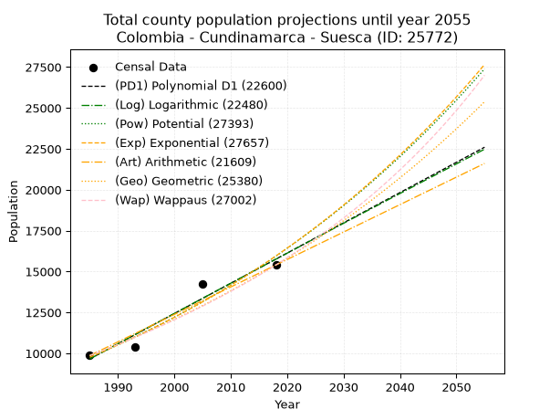
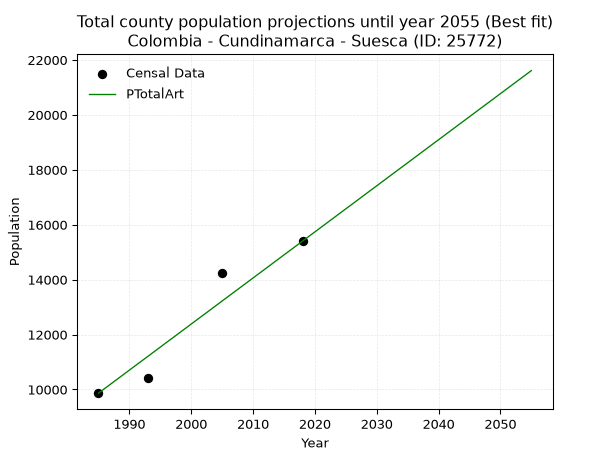
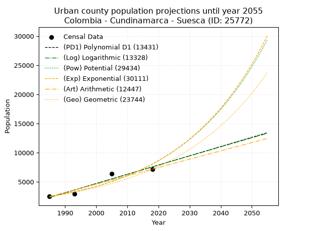
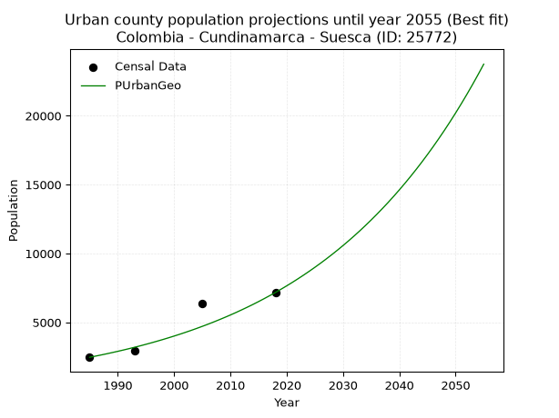
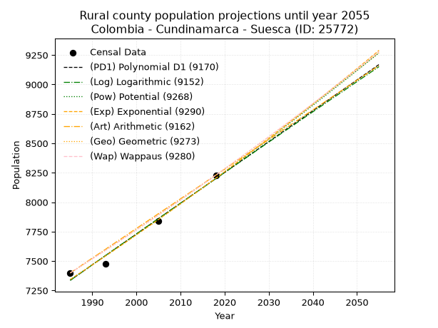
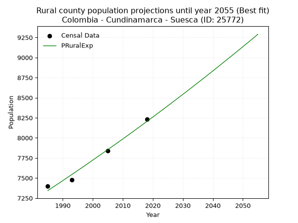

<div align="center">


</div>

# _“Population and Public Services Demand Projections (PPSD) until Year 2050 for Colombia - Cundinamarca - Suesca (ID: 25772)”_
Keywords: `population` `public-service` `projection` `lineal` `polynomial` `logarithmic` `potential` `exponential` `arithmetic` `geometric` `wappaus` `dane` `colombia` `south-america`

PPSD are analytical estimates used by governments and planners to anticipate future changes in population size, age distribution, and the resulting community needs for utilities, healthcare, education, and infrastructure as sizing future water treatment facilities, electrical grids, and road networks based on spatial growth.

> **General running parameters**: • app_version: _v20260806_. • Python version: _3.14.7_. • Pandas version: _3.0.5_. • NumPy version: _2.5.1_. • Creates, save and include plots into reports (create_plot): _True_. • Projection until year: _2050_. • Process polynomial degree 2 and up: _False_. • Process Wappaus: _True_. • Process Wappaus: _True_. • Set negative values to zero: _True_. • Set infinite values to zero: _True_. • Drop dataset notes: _True_. 
<div align="center">

Dynamic map: [:earth_americas:Google](http://maps.google.com/maps?q=5.103495457,-73.7982274) [:earth_americas:OSM](https://www.openstreetmap.org/#map=18/5.103495457/-73.7982274&layers=P) [:earth_americas:Bing](https://www.bing.com/maps?cp=5.103495457~-73.7982274&lvl=18) [:earth_americas:Apple](https://maps.apple.com/frame?center=5.103495457%2C-73.7982274&span=0.003%2C0.006)

</div>


<div align="center">

```geojson
{
  "type": "Feature",
  "geometry": {
    "type": "Point", 
    "coordinates": [-73.7982274, 5.103495457]
  }, 
  "properties": {
    "Name": "Colombia - Cundinamarca - Suesca (ID: 25772)"
  }
}
```

</div>


## 0. Census Data (4 records)

Census data are official statistics collected by a government about the people and housing in a country. They usually include counts of total population, age, sex, race, income, education, and jobs.

📅Global census file: [Population.xlsx](../data/Population.xlsx)

| Source   |   Year |   CountryID | CountryName   |   StateID | StateName    |   CountyID | CountyName   |   PTotal |   PUrban |   PRural |
|:---------|-------:|------------:|:--------------|----------:|:-------------|-----------:|:-------------|---------:|---------:|---------:|
| DANE     |   1985 |          57 | Colombia      |        25 | Cundinamarca |      25772 | Suesca       |     9864 |     2465 |     7399 |
| DANE     |   1993 |          57 | Colombia      |        25 | Cundinamarca |      25772 | Suesca       |    10410 |     2936 |     7474 |
| DANE     |   2005 |          57 | Colombia      |        25 | Cundinamarca |      25772 | Suesca       |    14242 |     6401 |     7841 |
| DANE     |   2018 |          57 | Colombia      |        25 | Cundinamarca |      25772 | Suesca       |    15401 |     7171 |     8230 |

> 🔥Some records has specific notes about the registered values or the corresponding urban or rural distribution.

## 1. Total

### 1.1. Coefficients and Parameters

* (PD1) Polynomial Deg 1: 184.85547972701636, -357277.92332396447 (lineal)
* (Log) Logarithmic: 370077.64587087475, -2800483.901880653
* (Pow) Potential: 29.77884209825172, -94.21406018541788
* (Exp) Exponential: 0.01487345550405213, 1.4710307610429061e-09
* (Art) Arithmetic: Year diff. 2018 - 1985 = 33, Population diff. 15401 - 9864 = 5537, Annual growth = 167.78787878787878
* (Geo) Geometric: Year diff. 2018 - 1985 = 33, Population diff. 15401 - 9864 = 5537, Annual growth % = 0.013592785825843112
* (Wap) Wappaus: i = 1.3282238574144372, Condition values only valid for < 200)

<sub>
Wappaus condition values: ['0.00', '1.33', '2.66', '3.98', '5.31', '6.64', '7.97', '9.30', '10.63', '11.95', '13.28', '14.61', '15.94', '17.27', '18.60', '19.92', '21.25', '22.58', '23.91', '25.24', '26.56', '27.89', '29.22', '30.55', '31.88', '33.21', '34.53', '35.86', '37.19', '38.52', '39.85', '41.17', '42.50', '43.83', '45.16', '46.49', '47.82', '49.14', '50.47', '51.80', '53.13', '54.46', '55.79', '57.11', '58.44', '59.77', '61.10', '62.43', '63.75', '65.08', '66.41', '67.74', '69.07', '70.40', '71.72', '73.05', '74.38', '75.71', '77.04', '78.37', '79.69', '81.02', '82.35', '83.68', '85.01', '86.33']
</sub>


### 1.2. Projected Dataset

|   Year |   CountyID |   PTotalPD1 |   PTotalLog |   PTotalPow |   PTotalExp |   PTotalArt |   PTotalGeo |   PTotalWap |
|-------:|-----------:|------------:|------------:|------------:|------------:|------------:|------------:|------------:|
|   1985 |      25772 |        9660 |        9654 |        9760 |        9764 |        9864 |        9864 |        9864 |
|   1986 |      25772 |        9845 |        9841 |        9907 |        9911 |       10032 |        9998 |        9996 |
|   1987 |      25772 |       10030 |       10027 |       10057 |       10059 |       10200 |       10134 |       10130 |
|   1988 |      25772 |       10215 |       10213 |       10208 |       10210 |       10367 |       10272 |       10265 |
|   1989 |      25772 |       10400 |       10399 |       10362 |       10363 |       10535 |       10411 |       10402 |
|   1990 |      25772 |       10584 |       10585 |       10519 |       10518 |       10703 |       10553 |       10542 |
|   1991 |      25772 |       10769 |       10771 |       10677 |       10676 |       10871 |       10696 |       10683 |
|   1992 |      25772 |       10954 |       10957 |       10838 |       10836 |       11039 |       10842 |       10826 |
|   1993 |      25772 |       11139 |       11143 |       11001 |       10998 |       11206 |       10989 |       10971 |
|   1994 |      25772 |       11324 |       11328 |       11167 |       11163 |       11374 |       11138 |       11118 |
|   1995 |      25772 |       11509 |       11514 |       11335 |       11330 |       11542 |       11290 |       11267 |
|   1996 |      25772 |       11694 |       11699 |       11505 |       11500 |       11710 |       11443 |       11419 |
|   1997 |      25772 |       11878 |       11885 |       11678 |       11672 |       11877 |       11599 |       11572 |
|   1998 |      25772 |       12063 |       12070 |       11854 |       11847 |       12045 |       11757 |       11728 |
|   1999 |      25772 |       12248 |       12255 |       12032 |       12025 |       12213 |       11916 |       11886 |
|   2000 |      25772 |       12433 |       12440 |       12212 |       12205 |       12381 |       12078 |       12047 |
|   2001 |      25772 |       12618 |       12625 |       12395 |       12388 |       12549 |       12242 |       12209 |
|   2002 |      25772 |       12803 |       12810 |       12581 |       12574 |       12716 |       12409 |       12375 |
|   2003 |      25772 |       12988 |       12995 |       12770 |       12762 |       12884 |       12578 |       12542 |
|   2004 |      25772 |       13172 |       13180 |       12961 |       12953 |       13052 |       12749 |       12713 |
|   2005 |      25772 |       13357 |       13364 |       13155 |       13147 |       13220 |       12922 |       12886 |
|   2006 |      25772 |       13542 |       13549 |       13352 |       13344 |       13388 |       13097 |       13061 |
|   2007 |      25772 |       13727 |       13733 |       13551 |       13544 |       13555 |       13275 |       13240 |
|   2008 |      25772 |       13912 |       13918 |       13754 |       13747 |       13723 |       13456 |       13421 |
|   2009 |      25772 |       14097 |       14102 |       13959 |       13953 |       13891 |       13639 |       13605 |
|   2010 |      25772 |       14282 |       14286 |       14168 |       14162 |       14059 |       13824 |       13791 |
|   2011 |      25772 |       14466 |       14470 |       14379 |       14375 |       14226 |       14012 |       13981 |
|   2012 |      25772 |       14651 |       14654 |       14593 |       14590 |       14394 |       14203 |       14174 |
|   2013 |      25772 |       14836 |       14838 |       14811 |       14809 |       14562 |       14396 |       14370 |
|   2014 |      25772 |       15021 |       15022 |       15032 |       15031 |       14730 |       14591 |       14570 |
|   2015 |      25772 |       15206 |       15205 |       15255 |       15256 |       14898 |       14790 |       14772 |
|   2016 |      25772 |       15391 |       15389 |       15483 |       15484 |       15065 |       14991 |       14978 |
|   2017 |      25772 |       15576 |       15573 |       15713 |       15716 |       15233 |       15194 |       15188 |
|   2018 |      25772 |       15760 |       15756 |       15946 |       15952 |       15401 |       15401 |       15401 |
|   2019 |      25772 |       15945 |       15939 |       16183 |       16191 |       15569 |       15610 |       15618 |
|   2020 |      25772 |       16130 |       16123 |       16424 |       16434 |       15737 |       15823 |       15838 |
|   2021 |      25772 |       16315 |       16306 |       16668 |       16680 |       15904 |       16038 |       16063 |
|   2022 |      25772 |       16500 |       16489 |       16915 |       16930 |       16072 |       16256 |       16291 |
|   2023 |      25772 |       16685 |       16672 |       17166 |       17183 |       16240 |       16477 |       16523 |
|   2024 |      25772 |       16870 |       16855 |       17420 |       17441 |       16408 |       16701 |       16760 |
|   2025 |      25772 |       17054 |       17037 |       17679 |       17702 |       16576 |       16928 |       17000 |
|   2026 |      25772 |       17239 |       17220 |       17940 |       17967 |       16743 |       17158 |       17246 |
|   2027 |      25772 |       17424 |       17403 |       18206 |       18237 |       16911 |       17391 |       17495 |
|   2028 |      25772 |       17609 |       17585 |       18475 |       18510 |       17079 |       17627 |       17750 |
|   2029 |      25772 |       17794 |       17768 |       18749 |       18787 |       17247 |       17867 |       18009 |
|   2030 |      25772 |       17979 |       17950 |       19026 |       19069 |       17414 |       18110 |       18273 |
|   2031 |      25772 |       18164 |       18132 |       19307 |       19355 |       17582 |       18356 |       18542 |
|   2032 |      25772 |       18348 |       18315 |       19592 |       19645 |       17750 |       18605 |       18816 |
|   2033 |      25772 |       18533 |       18497 |       19881 |       19939 |       17918 |       18858 |       19096 |
|   2034 |      25772 |       18718 |       18679 |       20174 |       20238 |       18086 |       19115 |       19381 |
|   2035 |      25772 |       18903 |       18861 |       20472 |       20541 |       18253 |       19374 |       19671 |
|   2036 |      25772 |       19088 |       19042 |       20774 |       20849 |       18421 |       19638 |       19968 |
|   2037 |      25772 |       19273 |       19224 |       21080 |       21161 |       18589 |       19905 |       20271 |
|   2038 |      25772 |       19458 |       19406 |       21390 |       21478 |       18757 |       20175 |       20579 |
|   2039 |      25772 |       19642 |       19587 |       21705 |       21800 |       18925 |       20449 |       20895 |
|   2040 |      25772 |       19827 |       19769 |       22024 |       22127 |       19092 |       20727 |       21217 |
|   2041 |      25772 |       20012 |       19950 |       22348 |       22458 |       19260 |       21009 |       21545 |
|   2042 |      25772 |       20197 |       20131 |       22676 |       22795 |       19428 |       21295 |       21881 |
|   2043 |      25772 |       20382 |       20313 |       23009 |       23137 |       19596 |       21584 |       22224 |
|   2044 |      25772 |       20567 |       20494 |       23347 |       23483 |       19763 |       21878 |       22574 |
|   2045 |      25772 |       20752 |       20675 |       23689 |       23835 |       19931 |       22175 |       22932 |
|   2046 |      25772 |       20936 |       20856 |       24037 |       24192 |       20099 |       22476 |       23298 |
|   2047 |      25772 |       21121 |       21036 |       24389 |       24555 |       20267 |       22782 |       23673 |
|   2048 |      25772 |       21306 |       21217 |       24746 |       24923 |       20435 |       23092 |       24056 |
|   2049 |      25772 |       21491 |       21398 |       25109 |       25296 |       20602 |       23405 |       24447 |
|   2050 |      25772 |       21676 |       21578 |       25476 |       25675 |       20770 |       23724 |       24848 |
<div align="center">

</img>

</div>


### 1.3. Best fit with absolute error and relative error (%)

Relative error puts that difference into context by dividing the absolute error by the true value, creating a unitless ratio or percentage that shows the scale of the mistake.

Absolute and relative error

|   Year | Source   |   CountryID | CountryName   |   StateID | StateName    |   CountyID_x | CountyName   |   PTotal |   PUrban |   PRural |   CountyID_y |   PTotalPD1 |   PTotalLog |   PTotalPow |   PTotalExp |   PTotalArt |   PTotalGeo |   PTotalWap |   PTotalPD1AbsError |   PTotalLogAbsError |   PTotalPowAbsError |   PTotalExpAbsError |   PTotalArtAbsError |   PTotalGeoAbsError |   PTotalWapAbsError |   PTotalPD1RelError |   PTotalLogRelError |   PTotalPowRelError |   PTotalExpRelError |   PTotalArtRelError |   PTotalGeoRelError |   PTotalWapRelError |
|-------:|:---------|------------:|:--------------|----------:|:-------------|-------------:|:-------------|---------:|---------:|---------:|-------------:|------------:|------------:|------------:|------------:|------------:|------------:|------------:|--------------------:|--------------------:|--------------------:|--------------------:|--------------------:|--------------------:|--------------------:|--------------------:|--------------------:|--------------------:|--------------------:|--------------------:|--------------------:|--------------------:|
|   1985 | DANE     |          57 | Colombia      |        25 | Cundinamarca |        25772 | Suesca       |     9864 |     2465 |     7399 |        25772 |        9660 |        9654 |        9760 |        9764 |        9864 |        9864 |        9864 |                 204 |                 210 |                 104 |                 100 |                   0 |                   0 |                   0 |             2.06813 |             2.12895 |             1.05434 |             1.01379 |             0       |             0       |             0       |
|   1993 | DANE     |          57 | Colombia      |        25 | Cundinamarca |        25772 | Suesca       |    10410 |     2936 |     7474 |        25772 |       11139 |       11143 |       11001 |       10998 |       11206 |       10989 |       10971 |                 729 |                 733 |                 591 |                 588 |                 796 |                 579 |                 561 |             7.00288 |             7.04131 |             5.67723 |             5.64841 |             7.64649 |             5.56196 |             5.38905 |
|   2005 | DANE     |          57 | Colombia      |        25 | Cundinamarca |        25772 | Suesca       |    14242 |     6401 |     7841 |        25772 |       13357 |       13364 |       13155 |       13147 |       13220 |       12922 |       12886 |                 885 |                 878 |                1087 |                1095 |                1022 |                1320 |                1356 |             6.21401 |             6.16486 |             7.63236 |             7.68853 |             7.17596 |             9.26836 |             9.52113 |
|   2018 | DANE     |          57 | Colombia      |        25 | Cundinamarca |        25772 | Suesca       |    15401 |     7171 |     8230 |        25772 |       15760 |       15756 |       15946 |       15952 |       15401 |       15401 |       15401 |                 359 |                 355 |                 545 |                 551 |                   0 |                   0 |                   0 |             2.33102 |             2.30505 |             3.53873 |             3.57769 |             0       |             0       |             0       |

Relative error mean

| Method    |   RelError | Best   |
|:----------|-----------:|:-------|
| PTotalPD1 |    4.40401 |        |
| PTotalLog |    4.41004 |        |
| PTotalPow |    4.47566 |        |
| PTotalExp |    4.4821  |        |
| PTotalArt |    3.70561 | True   |
| PTotalGeo |    3.70758 |        |
| PTotalWap |    3.72755 |        |

💙Best method: _**PTotalArt**_
<div align="center">

</img>

</div>


### 1.4. Fresh water supply demand in liters per capita per day (lpcd)

The fresh water supply demand typically ranges from 100 to 300 liters per capita per day (lpcd) for standard domestic and municipal planning, though absolute survival minimums set by the World Health Organization are as low as 7.5 to 20 liters per day, and total consumption in high-income nations can exceed 400 liters.

> `CZ`: Level in meters above the sea level (masl).<br> `WS`: Fresh water supply demand in liters per capita per day (lpcd or l/h/d).<br> `WSAll`: Zonal fresh water supply demand in liters per second (l/s).<br> `A`: Zonal area in square meters.

Reference values (RAS Colombia)

|    CZ |   WS |
|------:|-----:|
|  1000 |  120 |
|  2000 |  130 |
| 99999 |  140 |

County shapefile geometry properties and water supply values

|   CountyID |      ATotal |   CZTotal |   WSTotal |
|-----------:|------------:|----------:|----------:|
|      25772 | 1.73019e+08 |   2823.87 |       140 |

Projected values for best method: PTotalArt

|   CountyID |   Year |   PTotalArt |   WSTotal |   WSTotalAll |
|-----------:|-------:|------------:|----------:|-------------:|
|      25772 |   1985 |        9864 |       140 |      15.9833 |
|      25772 |   1986 |       10032 |       140 |      16.2556 |
|      25772 |   1987 |       10200 |       140 |      16.5278 |
|      25772 |   1988 |       10367 |       140 |      16.7984 |
|      25772 |   1989 |       10535 |       140 |      17.0706 |
|      25772 |   1990 |       10703 |       140 |      17.3428 |
|      25772 |   1991 |       10871 |       140 |      17.615  |
|      25772 |   1992 |       11039 |       140 |      17.8873 |
|      25772 |   1993 |       11206 |       140 |      18.1579 |
|      25772 |   1994 |       11374 |       140 |      18.4301 |
|      25772 |   1995 |       11542 |       140 |      18.7023 |
|      25772 |   1996 |       11710 |       140 |      18.9745 |
|      25772 |   1997 |       11877 |       140 |      19.2451 |
|      25772 |   1998 |       12045 |       140 |      19.5174 |
|      25772 |   1999 |       12213 |       140 |      19.7896 |
|      25772 |   2000 |       12381 |       140 |      20.0618 |
|      25772 |   2001 |       12549 |       140 |      20.334  |
|      25772 |   2002 |       12716 |       140 |      20.6046 |
|      25772 |   2003 |       12884 |       140 |      20.8769 |
|      25772 |   2004 |       13052 |       140 |      21.1491 |
|      25772 |   2005 |       13220 |       140 |      21.4213 |
|      25772 |   2006 |       13388 |       140 |      21.6935 |
|      25772 |   2007 |       13555 |       140 |      21.9641 |
|      25772 |   2008 |       13723 |       140 |      22.2363 |
|      25772 |   2009 |       13891 |       140 |      22.5086 |
|      25772 |   2010 |       14059 |       140 |      22.7808 |
|      25772 |   2011 |       14226 |       140 |      23.0514 |
|      25772 |   2012 |       14394 |       140 |      23.3236 |
|      25772 |   2013 |       14562 |       140 |      23.5958 |
|      25772 |   2014 |       14730 |       140 |      23.8681 |
|      25772 |   2015 |       14898 |       140 |      24.1403 |
|      25772 |   2016 |       15065 |       140 |      24.4109 |
|      25772 |   2017 |       15233 |       140 |      24.6831 |
|      25772 |   2018 |       15401 |       140 |      24.9553 |
|      25772 |   2019 |       15569 |       140 |      25.2275 |
|      25772 |   2020 |       15737 |       140 |      25.4998 |
|      25772 |   2021 |       15904 |       140 |      25.7704 |
|      25772 |   2022 |       16072 |       140 |      26.0426 |
|      25772 |   2023 |       16240 |       140 |      26.3148 |
|      25772 |   2024 |       16408 |       140 |      26.587  |
|      25772 |   2025 |       16576 |       140 |      26.8593 |
|      25772 |   2026 |       16743 |       140 |      27.1299 |
|      25772 |   2027 |       16911 |       140 |      27.4021 |
|      25772 |   2028 |       17079 |       140 |      27.6743 |
|      25772 |   2029 |       17247 |       140 |      27.9465 |
|      25772 |   2030 |       17414 |       140 |      28.2171 |
|      25772 |   2031 |       17582 |       140 |      28.4894 |
|      25772 |   2032 |       17750 |       140 |      28.7616 |
|      25772 |   2033 |       17918 |       140 |      29.0338 |
|      25772 |   2034 |       18086 |       140 |      29.306  |
|      25772 |   2035 |       18253 |       140 |      29.5766 |
|      25772 |   2036 |       18421 |       140 |      29.8488 |
|      25772 |   2037 |       18589 |       140 |      30.1211 |
|      25772 |   2038 |       18757 |       140 |      30.3933 |
|      25772 |   2039 |       18925 |       140 |      30.6655 |
|      25772 |   2040 |       19092 |       140 |      30.9361 |
|      25772 |   2041 |       19260 |       140 |      31.2083 |
|      25772 |   2042 |       19428 |       140 |      31.4806 |
|      25772 |   2043 |       19596 |       140 |      31.7528 |
|      25772 |   2044 |       19763 |       140 |      32.0234 |
|      25772 |   2045 |       19931 |       140 |      32.2956 |
|      25772 |   2046 |       20099 |       140 |      32.5678 |
|      25772 |   2047 |       20267 |       140 |      32.84   |
|      25772 |   2048 |       20435 |       140 |      33.1123 |
|      25772 |   2049 |       20602 |       140 |      33.3829 |
|      25772 |   2050 |       20770 |       140 |      33.6551 |

## 2. Urban

### 2.1. Coefficients and Parameters

* (PD1) Polynomial Deg 1: 158.67161782416625, -312639.6535527886 (lineal)
* (Log) Logarithmic: 317683.14678516396, -2409968.8944670004
* (Pow) Potential: 71.44739633542227, -232.22292354001624
* (Exp) Exponential: 0.03567954155920462, 4.321357955202657e-28
* (Art) Arithmetic: Year diff. 2018 - 1985 = 33, Population diff. 7171 - 2465 = 4706, Annual growth = 142.6060606060606
* (Geo) Geometric: Year diff. 2018 - 1985 = 33, Population diff. 7171 - 2465 = 4706, Annual growth % = 0.032888443053003424
* (Wap) Wappaus: i = 2.959860120507692, Condition values only valid for < 200)

<sub>
Wappaus condition values: ['0.00', '2.96', '5.92', '8.88', '11.84', '14.80', '17.76', '20.72', '23.68', '26.64', '29.60', '32.56', '35.52', '38.48', '41.44', '44.40', '47.36', '50.32', '53.28', '56.24', '59.20', '62.16', '65.12', '68.08', '71.04', '74.00', '76.96', '79.92', '82.88', '85.84', '88.80', '91.76', '94.72', '97.68', '100.64', '103.60', '106.55', '109.51', '112.47', '115.43', '118.39', '121.35', '124.31', '127.27', '130.23', '133.19', '136.15', '139.11', '142.07', '145.03', '147.99', '150.95', '153.91', '156.87', '159.83', '162.79', '165.75', '168.71', '171.67', '174.63', '177.59', '180.55', '183.51', '186.47', '189.43', '192.39']
</sub>


### 2.2. Projected Dataset

|   Year |   CountyID |   PUrbanPD1 |   PUrbanLog |   PUrbanPow |   PUrbanExp |   PUrbanArt |   PUrbanGeo |   PUrbanWap |
|-------:|-----------:|------------:|------------:|------------:|------------:|------------:|------------:|------------:|
|   1985 |      25772 |        2324 |        2318 |        2474 |        2478 |        2465 |        2465 |        2465 |
|   1986 |      25772 |        2482 |        2478 |        2565 |        2568 |        2608 |        2546 |        2539 |
|   1987 |      25772 |        2641 |        2638 |        2659 |        2661 |        2750 |        2630 |        2615 |
|   1988 |      25772 |        2800 |        2798 |        2756 |        2758 |        2893 |        2716 |        2694 |
|   1989 |      25772 |        2958 |        2958 |        2857 |        2858 |        3035 |        2806 |        2775 |
|   1990 |      25772 |        3117 |        3117 |        2962 |        2962 |        3178 |        2898 |        2859 |
|   1991 |      25772 |        3276 |        3277 |        3070 |        3069 |        3321 |        2993 |        2945 |
|   1992 |      25772 |        3434 |        3436 |        3182 |        3181 |        3463 |        3092 |        3035 |
|   1993 |      25772 |        3593 |        3596 |        3298 |        3296 |        3606 |        3193 |        3127 |
|   1994 |      25772 |        3752 |        3755 |        3419 |        3416 |        3748 |        3298 |        3223 |
|   1995 |      25772 |        3910 |        3915 |        3543 |        3540 |        3891 |        3407 |        3321 |
|   1996 |      25772 |        4069 |        4074 |        3672 |        3669 |        4034 |        3519 |        3424 |
|   1997 |      25772 |        4228 |        4233 |        3806 |        3802 |        4176 |        3635 |        3530 |
|   1998 |      25772 |        4386 |        4392 |        3945 |        3940 |        4319 |        3754 |        3639 |
|   1999 |      25772 |        4545 |        4551 |        4088 |        4083 |        4461 |        3878 |        3753 |
|   2000 |      25772 |        4704 |        4710 |        4237 |        4231 |        4604 |        4005 |        3872 |
|   2001 |      25772 |        4862 |        4869 |        4391 |        4385 |        4747 |        4137 |        3995 |
|   2002 |      25772 |        5021 |        5027 |        4551 |        4544 |        4889 |        4273 |        4122 |
|   2003 |      25772 |        5180 |        5186 |        4716 |        4709 |        5032 |        4413 |        4255 |
|   2004 |      25772 |        5338 |        5344 |        4887 |        4880 |        5175 |        4559 |        4394 |
|   2005 |      25772 |        5497 |        5503 |        5065 |        5058 |        5317 |        4709 |        4538 |
|   2006 |      25772 |        5656 |        5661 |        5248 |        5241 |        5460 |        4863 |        4688 |
|   2007 |      25772 |        5814 |        5820 |        5439 |        5432 |        5602 |        5023 |        4845 |
|   2008 |      25772 |        5973 |        5978 |        5636 |        5629 |        5745 |        5189 |        5009 |
|   2009 |      25772 |        6132 |        6136 |        5840 |        5834 |        5888 |        5359 |        5181 |
|   2010 |      25772 |        6290 |        6294 |        6051 |        6045 |        6030 |        5535 |        5360 |
|   2011 |      25772 |        6449 |        6452 |        6270 |        6265 |        6173 |        5717 |        5548 |
|   2012 |      25772 |        6608 |        6610 |        6497 |        6493 |        6315 |        5906 |        5746 |
|   2013 |      25772 |        6766 |        6768 |        6732 |        6728 |        6458 |        6100 |        5953 |
|   2014 |      25772 |        6925 |        6926 |        6975 |        6973 |        6601 |        6300 |        6172 |
|   2015 |      25772 |        7084 |        7083 |        7226 |        7226 |        6743 |        6508 |        6402 |
|   2016 |      25772 |        7242 |        7241 |        7487 |        7489 |        6886 |        6722 |        6644 |
|   2017 |      25772 |        7401 |        7399 |        7757 |        7761 |        7028 |        6943 |        6900 |
|   2018 |      25772 |        7560 |        7556 |        8037 |        8043 |        7171 |        7171 |        7171 |
|   2019 |      25772 |        7718 |        7713 |        8326 |        8335 |        7314 |        7407 |        7458 |
|   2020 |      25772 |        7877 |        7871 |        8626 |        8637 |        7456 |        7650 |        7763 |
|   2021 |      25772 |        8036 |        8028 |        8937 |        8951 |        7599 |        7902 |        8087 |
|   2022 |      25772 |        8194 |        8185 |        9258 |        9276 |        7741 |        8162 |        8432 |
|   2023 |      25772 |        8353 |        8342 |        9591 |        9613 |        7884 |        8430 |        8800 |
|   2024 |      25772 |        8512 |        8499 |        9936 |        9962 |        8027 |        8708 |        9195 |
|   2025 |      25772 |        8670 |        8656 |       10293 |       10324 |        8169 |        8994 |        9618 |
|   2026 |      25772 |        8829 |        8813 |       10662 |       10699 |        8312 |        9290 |       10072 |
|   2027 |      25772 |        8988 |        8970 |       11045 |       11088 |        8454 |        9595 |       10563 |
|   2028 |      25772 |        9146 |        9126 |       11441 |       11491 |        8597 |        9911 |       11093 |
|   2029 |      25772 |        9305 |        9283 |       11851 |       11908 |        8740 |       10237 |       11668 |
|   2030 |      25772 |        9464 |        9440 |       12276 |       12341 |        8882 |       10574 |       12294 |
|   2031 |      25772 |        9622 |        9596 |       12716 |       12789 |        9025 |       10921 |       12978 |
|   2032 |      25772 |        9781 |        9752 |       13171 |       13253 |        9167 |       11280 |       13729 |
|   2033 |      25772 |        9940 |        9909 |       13642 |       13735 |        9310 |       11651 |       14557 |
|   2034 |      25772 |       10098 |       10065 |       14130 |       14234 |        9453 |       12035 |       15473 |
|   2035 |      25772 |       10257 |       10221 |       14635 |       14751 |        9595 |       12430 |       16494 |
|   2036 |      25772 |       10416 |       10377 |       15158 |       15287 |        9738 |       12839 |       17638 |
|   2037 |      25772 |       10574 |       10533 |       15699 |       15842 |        9881 |       13262 |       18929 |
|   2038 |      25772 |       10733 |       10689 |       16259 |       16417 |       10023 |       13698 |       20397 |
|   2039 |      25772 |       10892 |       10845 |       16839 |       17014 |       10166 |       14148 |       22082 |
|   2040 |      25772 |       11050 |       11001 |       17440 |       17632 |       10308 |       14614 |       24035 |
|   2041 |      25772 |       11209 |       11156 |       18061 |       18272 |       10451 |       15094 |       26325 |
|   2042 |      25772 |       11368 |       11312 |       18704 |       18936 |       10594 |       15591 |       29049 |
|   2043 |      25772 |       11526 |       11468 |       19370 |       19624 |       10736 |       16103 |       32341 |
|   2044 |      25772 |       11685 |       11623 |       20059 |       20336 |       10879 |       16633 |       36402 |
|   2045 |      25772 |       11844 |       11778 |       20773 |       21075 |       11021 |       17180 |       41536 |
|   2046 |      25772 |       12002 |       11934 |       21511 |       21841 |       11164 |       17745 |       48233 |
|   2047 |      25772 |       12161 |       12089 |       22275 |       22634 |       11307 |       18329 |       57334 |
|   2048 |      25772 |       12320 |       12244 |       23066 |       23456 |       11449 |       18931 |       70416 |
|   2049 |      25772 |       12478 |       12399 |       23885 |       24308 |       11592 |       19554 |       90827 |
|   2050 |      25772 |       12637 |       12554 |       24732 |       25191 |       11734 |       20197 |      127117 |
<div align="center">

</img>

</div>


### 2.3. Best fit with absolute error and relative error (%)

Relative error puts that difference into context by dividing the absolute error by the true value, creating a unitless ratio or percentage that shows the scale of the mistake.

Absolute and relative error

|   Year | Source   |   CountryID | CountryName   |   StateID | StateName    |   CountyID_x | CountyName   |   PTotal |   PUrban |   PRural |   CountyID_y |   PUrbanPD1 |   PUrbanLog |   PUrbanPow |   PUrbanExp |   PUrbanArt |   PUrbanGeo |   PUrbanWap |   PUrbanPD1AbsError |   PUrbanLogAbsError |   PUrbanPowAbsError |   PUrbanExpAbsError |   PUrbanArtAbsError |   PUrbanGeoAbsError |   PUrbanWapAbsError |   PUrbanPD1RelError |   PUrbanLogRelError |   PUrbanPowRelError |   PUrbanExpRelError |   PUrbanArtRelError |   PUrbanGeoRelError |   PUrbanWapRelError |
|-------:|:---------|------------:|:--------------|----------:|:-------------|-------------:|:-------------|---------:|---------:|---------:|-------------:|------------:|------------:|------------:|------------:|------------:|------------:|------------:|--------------------:|--------------------:|--------------------:|--------------------:|--------------------:|--------------------:|--------------------:|--------------------:|--------------------:|--------------------:|--------------------:|--------------------:|--------------------:|--------------------:|
|   1985 | DANE     |          57 | Colombia      |        25 | Cundinamarca |        25772 | Suesca       |     9864 |     2465 |     7399 |        25772 |        2324 |        2318 |        2474 |        2478 |        2465 |        2465 |        2465 |                 141 |                 147 |                   9 |                  13 |                   0 |                   0 |                   0 |             5.72008 |             5.96349 |            0.365112 |            0.527383 |              0      |             0       |             0       |
|   1993 | DANE     |          57 | Colombia      |        25 | Cundinamarca |        25772 | Suesca       |    10410 |     2936 |     7474 |        25772 |        3593 |        3596 |        3298 |        3296 |        3606 |        3193 |        3127 |                 657 |                 660 |                 362 |                 360 |                 670 |                 257 |                 191 |            22.3774  |            22.4796  |           12.3297   |           12.2616   |             22.8202 |             8.75341 |             6.50545 |
|   2005 | DANE     |          57 | Colombia      |        25 | Cundinamarca |        25772 | Suesca       |    14242 |     6401 |     7841 |        25772 |        5497 |        5503 |        5065 |        5058 |        5317 |        4709 |        4538 |                 904 |                 898 |                1336 |                1343 |                1084 |                1692 |                1863 |            14.1228  |            14.0291  |           20.8717   |           20.9811   |             16.9349 |            26.4334  |            29.1048  |
|   2018 | DANE     |          57 | Colombia      |        25 | Cundinamarca |        25772 | Suesca       |    15401 |     7171 |     8230 |        25772 |        7560 |        7556 |        8037 |        8043 |        7171 |        7171 |        7171 |                 389 |                 385 |                 866 |                 872 |                   0 |                   0 |                   0 |             5.42463 |             5.36885 |           12.0764   |           12.1601   |              0      |             0       |             0       |

Relative error mean

| Method    |   RelError | Best   |
|:----------|-----------:|:-------|
| PUrbanPD1 |   11.9112  |        |
| PUrbanLog |   11.9602  |        |
| PUrbanPow |   11.4107  |        |
| PUrbanExp |   11.4825  |        |
| PUrbanArt |    9.93875 |        |
| PUrbanGeo |    8.79669 | True   |
| PUrbanWap |    8.90257 |        |

💙Best method: _**PUrbanGeo**_
<div align="center">

</img>

</div>


### 2.4. Fresh water supply demand in liters per capita per day (lpcd)

The fresh water supply demand typically ranges from 100 to 300 liters per capita per day (lpcd) for standard domestic and municipal planning, though absolute survival minimums set by the World Health Organization are as low as 7.5 to 20 liters per day, and total consumption in high-income nations can exceed 400 liters.

> `CZ`: Level in meters above the sea level (masl).<br> `WS`: Fresh water supply demand in liters per capita per day (lpcd or l/h/d).<br> `WSAll`: Zonal fresh water supply demand in liters per second (l/s).<br> `A`: Zonal area in square meters.

Reference values (RAS Colombia)

|    CZ |   WS |
|------:|-----:|
|  1000 |  120 |
|  2000 |  130 |
| 99999 |  140 |

County shapefile geometry properties and water supply values

|   CountyID |      AUrban |   CZUrban |   WSUrban |
|-----------:|------------:|----------:|----------:|
|      25772 | 1.04044e+06 |   2584.62 |       140 |

Projected values for best method: PUrbanGeo

|   CountyID |   Year |   PUrbanGeo |   WSUrban |   WSUrbanAll |
|-----------:|-------:|------------:|----------:|-------------:|
|      25772 |   1985 |        2465 |       140 |      3.99421 |
|      25772 |   1986 |        2546 |       140 |      4.12546 |
|      25772 |   1987 |        2630 |       140 |      4.26157 |
|      25772 |   1988 |        2716 |       140 |      4.40093 |
|      25772 |   1989 |        2806 |       140 |      4.54676 |
|      25772 |   1990 |        2898 |       140 |      4.69583 |
|      25772 |   1991 |        2993 |       140 |      4.84977 |
|      25772 |   1992 |        3092 |       140 |      5.01019 |
|      25772 |   1993 |        3193 |       140 |      5.17384 |
|      25772 |   1994 |        3298 |       140 |      5.34398 |
|      25772 |   1995 |        3407 |       140 |      5.5206  |
|      25772 |   1996 |        3519 |       140 |      5.70208 |
|      25772 |   1997 |        3635 |       140 |      5.89005 |
|      25772 |   1998 |        3754 |       140 |      6.08287 |
|      25772 |   1999 |        3878 |       140 |      6.2838  |
|      25772 |   2000 |        4005 |       140 |      6.48958 |
|      25772 |   2001 |        4137 |       140 |      6.70347 |
|      25772 |   2002 |        4273 |       140 |      6.92384 |
|      25772 |   2003 |        4413 |       140 |      7.15069 |
|      25772 |   2004 |        4559 |       140 |      7.38727 |
|      25772 |   2005 |        4709 |       140 |      7.63032 |
|      25772 |   2006 |        4863 |       140 |      7.87986 |
|      25772 |   2007 |        5023 |       140 |      8.13912 |
|      25772 |   2008 |        5189 |       140 |      8.4081  |
|      25772 |   2009 |        5359 |       140 |      8.68356 |
|      25772 |   2010 |        5535 |       140 |      8.96875 |
|      25772 |   2011 |        5717 |       140 |      9.26366 |
|      25772 |   2012 |        5906 |       140 |      9.56991 |
|      25772 |   2013 |        6100 |       140 |      9.88426 |
|      25772 |   2014 |        6300 |       140 |     10.2083  |
|      25772 |   2015 |        6508 |       140 |     10.5454  |
|      25772 |   2016 |        6722 |       140 |     10.8921  |
|      25772 |   2017 |        6943 |       140 |     11.2502  |
|      25772 |   2018 |        7171 |       140 |     11.6197  |
|      25772 |   2019 |        7407 |       140 |     12.0021  |
|      25772 |   2020 |        7650 |       140 |     12.3958  |
|      25772 |   2021 |        7902 |       140 |     12.8042  |
|      25772 |   2022 |        8162 |       140 |     13.2255  |
|      25772 |   2023 |        8430 |       140 |     13.6597  |
|      25772 |   2024 |        8708 |       140 |     14.1102  |
|      25772 |   2025 |        8994 |       140 |     14.5736  |
|      25772 |   2026 |        9290 |       140 |     15.0532  |
|      25772 |   2027 |        9595 |       140 |     15.5475  |
|      25772 |   2028 |        9911 |       140 |     16.0595  |
|      25772 |   2029 |       10237 |       140 |     16.5877  |
|      25772 |   2030 |       10574 |       140 |     17.1338  |
|      25772 |   2031 |       10921 |       140 |     17.6961  |
|      25772 |   2032 |       11280 |       140 |     18.2778  |
|      25772 |   2033 |       11651 |       140 |     18.8789  |
|      25772 |   2034 |       12035 |       140 |     19.5012  |
|      25772 |   2035 |       12430 |       140 |     20.1412  |
|      25772 |   2036 |       12839 |       140 |     20.8039  |
|      25772 |   2037 |       13262 |       140 |     21.4894  |
|      25772 |   2038 |       13698 |       140 |     22.1958  |
|      25772 |   2039 |       14148 |       140 |     22.925   |
|      25772 |   2040 |       14614 |       140 |     23.6801  |
|      25772 |   2041 |       15094 |       140 |     24.4579  |
|      25772 |   2042 |       15591 |       140 |     25.2632  |
|      25772 |   2043 |       16103 |       140 |     26.0928  |
|      25772 |   2044 |       16633 |       140 |     26.9516  |
|      25772 |   2045 |       17180 |       140 |     27.838   |
|      25772 |   2046 |       17745 |       140 |     28.7535  |
|      25772 |   2047 |       18329 |       140 |     29.6998  |
|      25772 |   2048 |       18931 |       140 |     30.6752  |
|      25772 |   2049 |       19554 |       140 |     31.6847  |
|      25772 |   2050 |       20197 |       140 |     32.7266  |

## 3. Rural

### 3.1. Coefficients and Parameters

* (PD1) Polynomial Deg 1: 26.183861902849955, -44638.26977117563 (lineal)
* (Log) Logarithmic: 52394.49908571111, -390515.0074136556
* (Pow) Potential: 6.721621773707778, -18.300458871267423
* (Exp) Exponential: 0.0033589933349099633, 9.336306791418755
* (Art) Arithmetic: Year diff. 2018 - 1985 = 33, Population diff. 8230 - 7399 = 831, Annual growth = 25.181818181818183
* (Geo) Geometric: Year diff. 2018 - 1985 = 33, Population diff. 8230 - 7399 = 831, Annual growth % = 0.0032306971481221858
* (Wap) Wappaus: i = 0.3222447780640883, Condition values only valid for < 200)

<sub>
Wappaus condition values: ['0.00', '0.32', '0.64', '0.97', '1.29', '1.61', '1.93', '2.26', '2.58', '2.90', '3.22', '3.54', '3.87', '4.19', '4.51', '4.83', '5.16', '5.48', '5.80', '6.12', '6.44', '6.77', '7.09', '7.41', '7.73', '8.06', '8.38', '8.70', '9.02', '9.35', '9.67', '9.99', '10.31', '10.63', '10.96', '11.28', '11.60', '11.92', '12.25', '12.57', '12.89', '13.21', '13.53', '13.86', '14.18', '14.50', '14.82', '15.15', '15.47', '15.79', '16.11', '16.43', '16.76', '17.08', '17.40', '17.72', '18.05', '18.37', '18.69', '19.01', '19.33', '19.66', '19.98', '20.30', '20.62', '20.95']
</sub>


### 3.2. Projected Dataset

|   Year |   CountyID |   PRuralPD1 |   PRuralLog |   PRuralPow |   PRuralExp |   PRuralArt |   PRuralGeo |   PRuralWap |
|-------:|-----------:|------------:|------------:|------------:|------------:|------------:|------------:|------------:|
|   1985 |      25772 |        7337 |        7336 |        7342 |        7343 |        7399 |        7399 |        7399 |
|   1986 |      25772 |        7363 |        7362 |        7367 |        7368 |        7424 |        7423 |        7423 |
|   1987 |      25772 |        7389 |        7389 |        7392 |        7393 |        7449 |        7447 |        7447 |
|   1988 |      25772 |        7415 |        7415 |        7417 |        7417 |        7475 |        7471 |        7471 |
|   1989 |      25772 |        7441 |        7442 |        7442 |        7442 |        7500 |        7495 |        7495 |
|   1990 |      25772 |        7468 |        7468 |        7468 |        7467 |        7525 |        7519 |        7519 |
|   1991 |      25772 |        7494 |        7494 |        7493 |        7493 |        7550 |        7544 |        7543 |
|   1992 |      25772 |        7520 |        7520 |        7518 |        7518 |        7575 |        7568 |        7568 |
|   1993 |      25772 |        7546 |        7547 |        7544 |        7543 |        7600 |        7592 |        7592 |
|   1994 |      25772 |        7572 |        7573 |        7569 |        7568 |        7626 |        7617 |        7617 |
|   1995 |      25772 |        7599 |        7599 |        7595 |        7594 |        7651 |        7642 |        7641 |
|   1996 |      25772 |        7625 |        7626 |        7620 |        7619 |        7676 |        7666 |        7666 |
|   1997 |      25772 |        7651 |        7652 |        7646 |        7645 |        7701 |        7691 |        7691 |
|   1998 |      25772 |        7677 |        7678 |        7672 |        7671 |        7726 |        7716 |        7716 |
|   1999 |      25772 |        7703 |        7704 |        7698 |        7697 |        7752 |        7741 |        7741 |
|   2000 |      25772 |        7729 |        7730 |        7724 |        7723 |        7777 |        7766 |        7766 |
|   2001 |      25772 |        7756 |        7757 |        7750 |        7749 |        7802 |        7791 |        7791 |
|   2002 |      25772 |        7782 |        7783 |        7776 |        7775 |        7827 |        7816 |        7816 |
|   2003 |      25772 |        7808 |        7809 |        7802 |        7801 |        7852 |        7841 |        7841 |
|   2004 |      25772 |        7834 |        7835 |        7828 |        7827 |        7877 |        7867 |        7866 |
|   2005 |      25772 |        7860 |        7861 |        7854 |        7853 |        7903 |        7892 |        7892 |
|   2006 |      25772 |        7887 |        7887 |        7881 |        7880 |        7928 |        7918 |        7917 |
|   2007 |      25772 |        7913 |        7914 |        7907 |        7906 |        7953 |        7943 |        7943 |
|   2008 |      25772 |        7939 |        7940 |        7934 |        7933 |        7978 |        7969 |        7968 |
|   2009 |      25772 |        7965 |        7966 |        7960 |        7960 |        8003 |        7995 |        7994 |
|   2010 |      25772 |        7991 |        7992 |        7987 |        7986 |        8029 |        8020 |        8020 |
|   2011 |      25772 |        8017 |        8018 |        8014 |        8013 |        8054 |        8046 |        8046 |
|   2012 |      25772 |        8044 |        8044 |        8040 |        8040 |        8079 |        8072 |        8072 |
|   2013 |      25772 |        8070 |        8070 |        8067 |        8067 |        8104 |        8098 |        8098 |
|   2014 |      25772 |        8096 |        8096 |        8094 |        8094 |        8129 |        8124 |        8124 |
|   2015 |      25772 |        8122 |        8122 |        8121 |        8122 |        8154 |        8151 |        8151 |
|   2016 |      25772 |        8148 |        8148 |        8148 |        8149 |        8180 |        8177 |        8177 |
|   2017 |      25772 |        8175 |        8174 |        8176 |        8176 |        8205 |        8203 |        8203 |
|   2018 |      25772 |        8201 |        8200 |        8203 |        8204 |        8230 |        8230 |        8230 |
|   2019 |      25772 |        8227 |        8226 |        8230 |        8231 |        8255 |        8257 |        8257 |
|   2020 |      25772 |        8253 |        8252 |        8258 |        8259 |        8280 |        8283 |        8283 |
|   2021 |      25772 |        8279 |        8278 |        8285 |        8287 |        8306 |        8310 |        8310 |
|   2022 |      25772 |        8305 |        8304 |        8313 |        8315 |        8331 |        8337 |        8337 |
|   2023 |      25772 |        8332 |        8330 |        8341 |        8343 |        8356 |        8364 |        8364 |
|   2024 |      25772 |        8358 |        8355 |        8368 |        8371 |        8381 |        8391 |        8391 |
|   2025 |      25772 |        8384 |        8381 |        8396 |        8399 |        8406 |        8418 |        8418 |
|   2026 |      25772 |        8410 |        8407 |        8424 |        8427 |        8431 |        8445 |        8446 |
|   2027 |      25772 |        8436 |        8433 |        8452 |        8456 |        8457 |        8472 |        8473 |
|   2028 |      25772 |        8463 |        8459 |        8480 |        8484 |        8482 |        8500 |        8501 |
|   2029 |      25772 |        8489 |        8485 |        8508 |        8513 |        8507 |        8527 |        8528 |
|   2030 |      25772 |        8515 |        8511 |        8536 |        8541 |        8532 |        8555 |        8556 |
|   2031 |      25772 |        8541 |        8536 |        8565 |        8570 |        8557 |        8582 |        8584 |
|   2032 |      25772 |        8567 |        8562 |        8593 |        8599 |        8583 |        8610 |        8611 |
|   2033 |      25772 |        8594 |        8588 |        8622 |        8628 |        8608 |        8638 |        8639 |
|   2034 |      25772 |        8620 |        8614 |        8650 |        8657 |        8633 |        8666 |        8667 |
|   2035 |      25772 |        8646 |        8639 |        8679 |        8686 |        8658 |        8694 |        8696 |
|   2036 |      25772 |        8672 |        8665 |        8708 |        8715 |        8683 |        8722 |        8724 |
|   2037 |      25772 |        8698 |        8691 |        8736 |        8744 |        8708 |        8750 |        8752 |
|   2038 |      25772 |        8724 |        8717 |        8765 |        8774 |        8734 |        8778 |        8781 |
|   2039 |      25772 |        8751 |        8742 |        8794 |        8803 |        8759 |        8807 |        8809 |
|   2040 |      25772 |        8777 |        8768 |        8823 |        8833 |        8784 |        8835 |        8838 |
|   2041 |      25772 |        8803 |        8794 |        8852 |        8863 |        8809 |        8864 |        8867 |
|   2042 |      25772 |        8829 |        8819 |        8881 |        8893 |        8834 |        8892 |        8895 |
|   2043 |      25772 |        8855 |        8845 |        8911 |        8923 |        8860 |        8921 |        8924 |
|   2044 |      25772 |        8882 |        8871 |        8940 |        8953 |        8885 |        8950 |        8954 |
|   2045 |      25772 |        8908 |        8896 |        8970 |        8983 |        8910 |        8979 |        8983 |
|   2046 |      25772 |        8934 |        8922 |        8999 |        9013 |        8935 |        9008 |        9012 |
|   2047 |      25772 |        8960 |        8947 |        9029 |        9043 |        8960 |        9037 |        9041 |
|   2048 |      25772 |        8986 |        8973 |        9058 |        9074 |        8985 |        9066 |        9071 |
|   2049 |      25772 |        9012 |        8999 |        9088 |        9104 |        9011 |        9095 |        9100 |
|   2050 |      25772 |        9039 |        9024 |        9118 |        9135 |        9036 |        9125 |        9130 |
<div align="center">

</img>

</div>


### 3.3. Best fit with absolute error and relative error (%)

Relative error puts that difference into context by dividing the absolute error by the true value, creating a unitless ratio or percentage that shows the scale of the mistake.

Absolute and relative error

|   Year | Source   |   CountryID | CountryName   |   StateID | StateName    |   CountyID_x | CountyName   |   PTotal |   PUrban |   PRural |   CountyID_y |   PRuralPD1 |   PRuralLog |   PRuralPow |   PRuralExp |   PRuralArt |   PRuralGeo |   PRuralWap |   PRuralPD1AbsError |   PRuralLogAbsError |   PRuralPowAbsError |   PRuralExpAbsError |   PRuralArtAbsError |   PRuralGeoAbsError |   PRuralWapAbsError |   PRuralPD1RelError |   PRuralLogRelError |   PRuralPowRelError |   PRuralExpRelError |   PRuralArtRelError |   PRuralGeoRelError |   PRuralWapRelError |
|-------:|:---------|------------:|:--------------|----------:|:-------------|-------------:|:-------------|---------:|---------:|---------:|-------------:|------------:|------------:|------------:|------------:|------------:|------------:|------------:|--------------------:|--------------------:|--------------------:|--------------------:|--------------------:|--------------------:|--------------------:|--------------------:|--------------------:|--------------------:|--------------------:|--------------------:|--------------------:|--------------------:|
|   1985 | DANE     |          57 | Colombia      |        25 | Cundinamarca |        25772 | Suesca       |     9864 |     2465 |     7399 |        25772 |        7337 |        7336 |        7342 |        7343 |        7399 |        7399 |        7399 |                  62 |                  63 |                  57 |                  56 |                   0 |                   0 |                   0 |            0.837951 |            0.851466 |            0.770374 |            0.756859 |            0        |            0        |            0        |
|   1993 | DANE     |          57 | Colombia      |        25 | Cundinamarca |        25772 | Suesca       |    10410 |     2936 |     7474 |        25772 |        7546 |        7547 |        7544 |        7543 |        7600 |        7592 |        7592 |                  72 |                  73 |                  70 |                  69 |                 126 |                 118 |                 118 |            0.96334  |            0.976719 |            0.93658  |            0.9232   |            1.68584  |            1.57881  |            1.57881  |
|   2005 | DANE     |          57 | Colombia      |        25 | Cundinamarca |        25772 | Suesca       |    14242 |     6401 |     7841 |        25772 |        7860 |        7861 |        7854 |        7853 |        7903 |        7892 |        7892 |                  19 |                  20 |                  13 |                  12 |                  62 |                  51 |                  51 |            0.242316 |            0.25507  |            0.165795 |            0.153042 |            0.790715 |            0.650427 |            0.650427 |
|   2018 | DANE     |          57 | Colombia      |        25 | Cundinamarca |        25772 | Suesca       |    15401 |     7171 |     8230 |        25772 |        8201 |        8200 |        8203 |        8204 |        8230 |        8230 |        8230 |                  29 |                  30 |                  27 |                  26 |                   0 |                   0 |                   0 |            0.352369 |            0.36452  |            0.328068 |            0.315917 |            0        |            0        |            0        |

Relative error mean

| Method    |   RelError | Best   |
|:----------|-----------:|:-------|
| PRuralPD1 |   0.598994 |        |
| PRuralLog |   0.611944 |        |
| PRuralPow |   0.550204 |        |
| PRuralExp |   0.537255 | True   |
| PRuralArt |   0.61914  |        |
| PRuralGeo |   0.557308 |        |
| PRuralWap |   0.557308 |        |

💙Best method: _**PRuralExp**_
<div align="center">

</img>

</div>


### 3.4. Fresh water supply demand in liters per capita per day (lpcd)

The fresh water supply demand typically ranges from 100 to 300 liters per capita per day (lpcd) for standard domestic and municipal planning, though absolute survival minimums set by the World Health Organization are as low as 7.5 to 20 liters per day, and total consumption in high-income nations can exceed 400 liters.

> `CZ`: Level in meters above the sea level (masl).<br> `WS`: Fresh water supply demand in liters per capita per day (lpcd or l/h/d).<br> `WSAll`: Zonal fresh water supply demand in liters per second (l/s).<br> `A`: Zonal area in square meters.

Reference values (RAS Colombia)

|    CZ |   WS |
|------:|-----:|
|  1000 |  120 |
|  2000 |  130 |
| 99999 |  140 |

County shapefile geometry properties and water supply values

|   CountyID |      ARural |   CZRural |   WSRural |
|-----------:|------------:|----------:|----------:|
|      25772 | 1.71978e+08 |   2825.33 |       140 |

Projected values for best method: PRuralExp

|   CountyID |   Year |   PRuralExp |   WSRural |   WSRuralAll |
|-----------:|-------:|------------:|----------:|-------------:|
|      25772 |   1985 |        7343 |       140 |      11.8984 |
|      25772 |   1986 |        7368 |       140 |      11.9389 |
|      25772 |   1987 |        7393 |       140 |      11.9794 |
|      25772 |   1988 |        7417 |       140 |      12.0183 |
|      25772 |   1989 |        7442 |       140 |      12.0588 |
|      25772 |   1990 |        7467 |       140 |      12.0993 |
|      25772 |   1991 |        7493 |       140 |      12.1414 |
|      25772 |   1992 |        7518 |       140 |      12.1819 |
|      25772 |   1993 |        7543 |       140 |      12.2225 |
|      25772 |   1994 |        7568 |       140 |      12.263  |
|      25772 |   1995 |        7594 |       140 |      12.3051 |
|      25772 |   1996 |        7619 |       140 |      12.3456 |
|      25772 |   1997 |        7645 |       140 |      12.3877 |
|      25772 |   1998 |        7671 |       140 |      12.4299 |
|      25772 |   1999 |        7697 |       140 |      12.472  |
|      25772 |   2000 |        7723 |       140 |      12.5141 |
|      25772 |   2001 |        7749 |       140 |      12.5563 |
|      25772 |   2002 |        7775 |       140 |      12.5984 |
|      25772 |   2003 |        7801 |       140 |      12.6405 |
|      25772 |   2004 |        7827 |       140 |      12.6826 |
|      25772 |   2005 |        7853 |       140 |      12.7248 |
|      25772 |   2006 |        7880 |       140 |      12.7685 |
|      25772 |   2007 |        7906 |       140 |      12.8106 |
|      25772 |   2008 |        7933 |       140 |      12.8544 |
|      25772 |   2009 |        7960 |       140 |      12.8981 |
|      25772 |   2010 |        7986 |       140 |      12.9403 |
|      25772 |   2011 |        8013 |       140 |      12.984  |
|      25772 |   2012 |        8040 |       140 |      13.0278 |
|      25772 |   2013 |        8067 |       140 |      13.0715 |
|      25772 |   2014 |        8094 |       140 |      13.1153 |
|      25772 |   2015 |        8122 |       140 |      13.1606 |
|      25772 |   2016 |        8149 |       140 |      13.2044 |
|      25772 |   2017 |        8176 |       140 |      13.2481 |
|      25772 |   2018 |        8204 |       140 |      13.2935 |
|      25772 |   2019 |        8231 |       140 |      13.3373 |
|      25772 |   2020 |        8259 |       140 |      13.3826 |
|      25772 |   2021 |        8287 |       140 |      13.428  |
|      25772 |   2022 |        8315 |       140 |      13.4734 |
|      25772 |   2023 |        8343 |       140 |      13.5188 |
|      25772 |   2024 |        8371 |       140 |      13.5641 |
|      25772 |   2025 |        8399 |       140 |      13.6095 |
|      25772 |   2026 |        8427 |       140 |      13.6549 |
|      25772 |   2027 |        8456 |       140 |      13.7019 |
|      25772 |   2028 |        8484 |       140 |      13.7472 |
|      25772 |   2029 |        8513 |       140 |      13.7942 |
|      25772 |   2030 |        8541 |       140 |      13.8396 |
|      25772 |   2031 |        8570 |       140 |      13.8866 |
|      25772 |   2032 |        8599 |       140 |      13.9336 |
|      25772 |   2033 |        8628 |       140 |      13.9806 |
|      25772 |   2034 |        8657 |       140 |      14.0275 |
|      25772 |   2035 |        8686 |       140 |      14.0745 |
|      25772 |   2036 |        8715 |       140 |      14.1215 |
|      25772 |   2037 |        8744 |       140 |      14.1685 |
|      25772 |   2038 |        8774 |       140 |      14.2171 |
|      25772 |   2039 |        8803 |       140 |      14.2641 |
|      25772 |   2040 |        8833 |       140 |      14.3127 |
|      25772 |   2041 |        8863 |       140 |      14.3613 |
|      25772 |   2042 |        8893 |       140 |      14.41   |
|      25772 |   2043 |        8923 |       140 |      14.4586 |
|      25772 |   2044 |        8953 |       140 |      14.5072 |
|      25772 |   2045 |        8983 |       140 |      14.5558 |
|      25772 |   2046 |        9013 |       140 |      14.6044 |
|      25772 |   2047 |        9043 |       140 |      14.653  |
|      25772 |   2048 |        9074 |       140 |      14.7032 |
|      25772 |   2049 |        9104 |       140 |      14.7519 |
|      25772 |   2050 |        9135 |       140 |      14.8021 |

<div align="center"><br><sub>Share this research</sub></div><br>

<sub>**APPS & TOOLS & CONTENT DISCLAIMER**: • NO WARRANTY - This content and software is provided by <a href="https://github.com/rcfdtools" target="_blank">github.com/rcfdtools</a> "as is", without any express or implied warranty, including warranties of merchantability, fitness for a particular purpose, or non-infringement. There is no guarantee that the software will be error-free or operate without interruption. • LIMITATION OF LIABILITY - Neither the authors nor copyright holders will be liable for claims or damages arising from the software or its use. You are responsible for determining if the software is appropriate for your use and assume all associated risks, including errors, legal compliance, and data loss. • NO PROFESSIONAL ADVICE - The software provides general information and does not offer professional advice. It should not replace consultation with professional advisors. [Clauses and global license for rcfdtools use.](https://github.com/rcfdtools/rcfdtools/blob/main/LICENSE.md)</sub>