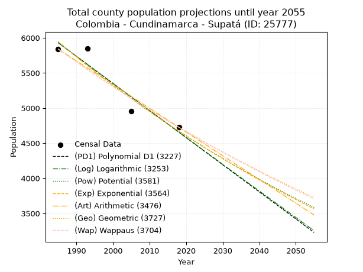
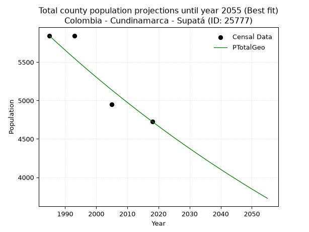
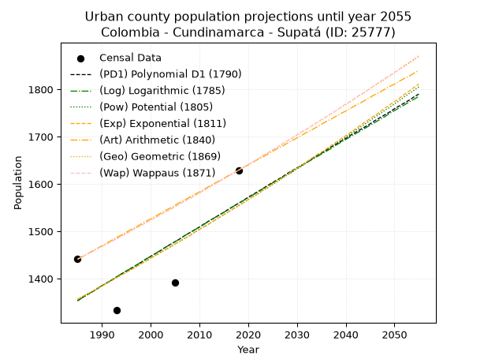
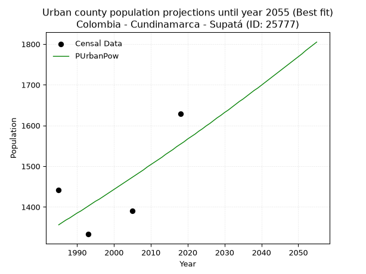
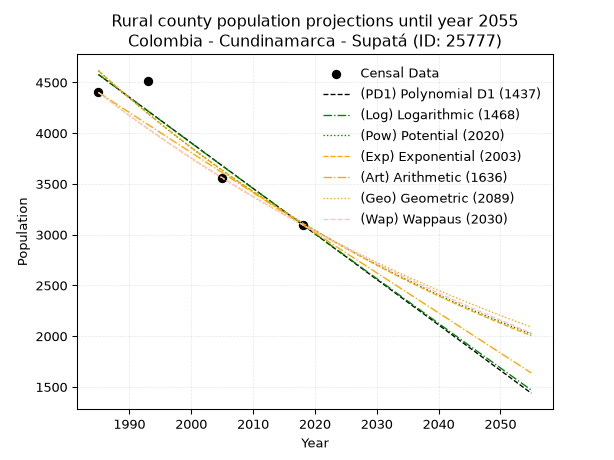
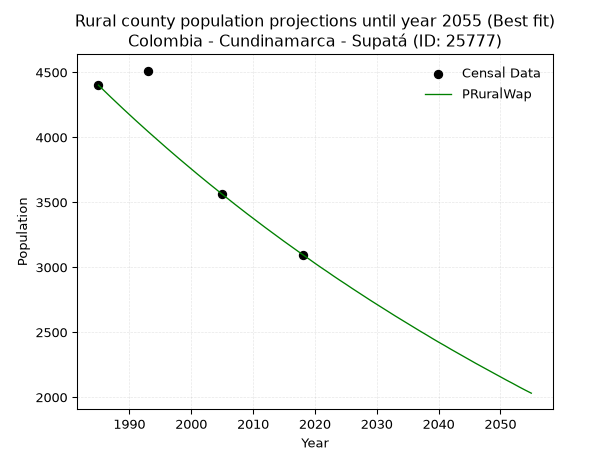

<div align="center">


</div>

# 📜 _“Population and Public Services Demand Projections (PPSD) until Year 2050 for Colombia - Cundinamarca - Supatá (ID: 25777)”_
Keywords: `population` `public-service` `projection` `lineal` `polynomial` `logarithmic` `potential` `exponential` `arithmetic` `geometric` `wappaus` `dane` `colombia` `south-america`

PPSD are analytical estimates used by governments and planners to anticipate future changes in population size, age distribution, and the resulting community needs for utilities, healthcare, education, and infrastructure as sizing future water treatment facilities, electrical grids, and road networks based on spatial growth.

<div align="center">

</img>

</div>


> **General running parameters**: • app_version: _v20260806_. • Python version: _3.14.7_. • Pandas version: _3.0.5_. • NumPy version: _2.5.1_. • Creates, save and include plots into reports (create_plot): _False_. • Projection until year: _2050_. • Process polynomial degree 2 and up: _False_. • Process Wappaus: _True_. • Process Wappaus: _True_. • Set negative values to zero: _True_. • Set infinite values to zero: _True_. • Drop dataset notes: _True_. 
<div align="center">

Maps & GIS Layers: [:earth_americas:Google](http://maps.google.com/maps?q=5.061619548,-74.235403) [:earth_americas:OSM](https://www.openstreetmap.org/#map=18/5.061619548/-74.235403&layers=P) [:earth_americas:Bing](https://www.bing.com/maps?cp=5.061619548~-74.235403&lvl=18) [:earth_americas:Apple](https://maps.apple.com/frame?center=5.061619548%2C-74.235403&span=0.003%2C0.006) [:earth_americas:GISMobile](https://github.com/rcfdtools/R.GISMobile/blob/main/file/gis/CountyLayer_CO/Readme.md)

</div>


<div align="center">

```geojson
{
  "type": "Feature",
  "geometry": {
    "type": "Point", 
    "coordinates": [-74.235403, 5.061619548]
  }, 
  "properties": {
    "Name": "Colombia - Cundinamarca - Supatá (ID: 25777)"
  }
}
```

</div>


## 0. Census Data (4 records)

Census data are official statistics collected by a government about the people and housing in a country. They usually include counts of total population, age, sex, race, income, education, and jobs.

📅Global census file: [Population.xlsx](../data/Population.xlsx)

| Source   |   Year |   CountryID | CountryName   |   StateID | StateName    |   CountyID | CountyName   |   PTotal |   PUrban |   PRural |
|:---------|-------:|------------:|:--------------|----------:|:-------------|-----------:|:-------------|---------:|---------:|---------:|
| DANE     |   1985 |          57 | Colombia      |        25 | Cundinamarca |      25777 | Supatá       |     5841 |     1441 |     4400 |
| DANE     |   1993 |          57 | Colombia      |        25 | Cundinamarca |      25777 | Supatá       |     5845 |     1333 |     4512 |
| DANE     |   2005 |          57 | Colombia      |        25 | Cundinamarca |      25777 | Supatá       |     4952 |     1391 |     3561 |
| DANE     |   2018 |          57 | Colombia      |        25 | Cundinamarca |      25777 | Supatá       |     4726 |     1629 |     3097 |

> 🔥Some records could had specific notes about the registered values or the corresponding urban or rural distribution.

📅[SUI-RUPS](https://www.datos.gov.co/Hacienda-y-Cr-dito-P-blico/Registro-nico-de-Prestadores-de-Servicios-P-blicos/4qkq-csdn/about_data) - Local public utility companies: [RUPS.csv](../data/RUPS.csv)

 | SERVICIO       | ESTADO    | NOMBRE                                                                                       | NIT         | DEPARTAMENTO_DOMICILIO   | MUNICIPIO_DOMICILIO   | DIRECCION           |   TELEFONO | EMAIL                                        | TIPO_PRESTADOR                 | CLASIFICACION                 |
|:---------------|:----------|:---------------------------------------------------------------------------------------------|:------------|:-------------------------|:----------------------|:--------------------|-----------:|:---------------------------------------------|:-------------------------------|:------------------------------|
| ACUEDUCTO      | OPERATIVA | OFICINA DE SERVICIOS PÚBLICOS  DOMICIILIARIOS DE ACUEDUCTO,  ALCANTARILLADO Y ASEO DE SUPATA | 899999398-5 | CUNDINAMARCA             | SUPATA                | Carrera 7 No 4 - 14 |    8479520 | serviciospublicos@supata-cundinamarca.gov.co | MUNICIPIO (PRESTACIÓN DIRECTA) | MENOR O IGUAL A 2500 USUARIOS |
| ALCANTARILLADO | OPERATIVA | OFICINA DE SERVICIOS PÚBLICOS  DOMICIILIARIOS DE ACUEDUCTO,  ALCANTARILLADO Y ASEO DE SUPATA | 899999398-5 | CUNDINAMARCA             | SUPATA                | Carrera 7 No 4 - 14 |    8479520 | serviciospublicos@supata-cundinamarca.gov.co | MUNICIPIO (PRESTACIÓN DIRECTA) | MENOR O IGUAL A 2500 USUARIOS |
| ACUEDUCTO      | OPERATIVA | ASOCIACIÓN DE USUARIOS DEL ACUEDUCTO DE LA VEREDA PARAÍSO DEL MUNICIPIO DE SUPATÁ            | 900137932-3 | CUNDINAMARCA             | SUPATA                | Vereda Paraíso      |    4734286 | asoacueductoparaiso@hotmail.com              | ORGANIZACION AUTORIZADA        | HASTA 2500 SUSCRIPTORES       |

## 1. Total

### 1.1. Coefficients and Parameters

* (PD1) Polynomial Deg 1: -38.60778803693274, 82566.22802087471 (lineal)
* (Log) Logarithmic: -77284.93776934012, 592784.4313073774
* (Pow) Potential: -14.622383595802564, 51.995233688611194
* (Exp) Exponential: -0.0073048467710906005, 11785253268.89921
* (Art) Arithmetic: Year diff. 2018 - 1985 = 33, Population diff. 4726 - 5841 = -1115, Annual growth = -33.78787878787879
* (Geo) Geometric: Year diff. 2018 - 1985 = 33, Population diff. 4726 - 5841 = -1115, Annual growth % = -0.006398316864171583
* (Wap) Wappaus: i = -0.6394980370564737, Condition values only valid for < 200)

<sub>
Wappaus condition values: ['-0.00', '-0.64', '-1.28', '-1.92', '-2.56', '-3.20', '-3.84', '-4.48', '-5.12', '-5.76', '-6.39', '-7.03', '-7.67', '-8.31', '-8.95', '-9.59', '-10.23', '-10.87', '-11.51', '-12.15', '-12.79', '-13.43', '-14.07', '-14.71', '-15.35', '-15.99', '-16.63', '-17.27', '-17.91', '-18.55', '-19.18', '-19.82', '-20.46', '-21.10', '-21.74', '-22.38', '-23.02', '-23.66', '-24.30', '-24.94', '-25.58', '-26.22', '-26.86', '-27.50', '-28.14', '-28.78', '-29.42', '-30.06', '-30.70', '-31.34', '-31.97', '-32.61', '-33.25', '-33.89', '-34.53', '-35.17', '-35.81', '-36.45', '-37.09', '-37.73', '-38.37', '-39.01', '-39.65', '-40.29', '-40.93', '-41.57']
</sub>


### 1.2. Projected Dataset

|   Year |   CountyID |   PTotalPD1 |   PTotalLog |   PTotalPow |   PTotalExp |   PTotalArt |   PTotalGeo |   PTotalWap |
|-------:|-----------:|------------:|------------:|------------:|------------:|------------:|------------:|------------:|
|   1985 |      25777 |        5930 |        5931 |        5944 |        5943 |        5841 |        5841 |        5841 |
|   1986 |      25777 |        5891 |        5892 |        5901 |        5900 |        5807 |        5804 |        5804 |
|   1987 |      25777 |        5853 |        5853 |        5858 |        5857 |        5773 |        5766 |        5767 |
|   1988 |      25777 |        5814 |        5814 |        5815 |        5814 |        5740 |        5730 |        5730 |
|   1989 |      25777 |        5775 |        5775 |        5772 |        5772 |        5706 |        5693 |        5693 |
|   1990 |      25777 |        5737 |        5737 |        5730 |        5730 |        5672 |        5657 |        5657 |
|   1991 |      25777 |        5698 |        5698 |        5688 |        5688 |        5638 |        5620 |        5621 |
|   1992 |      25777 |        5660 |        5659 |        5646 |        5647 |        5604 |        5584 |        5585 |
|   1993 |      25777 |        5621 |        5620 |        5605 |        5606 |        5571 |        5549 |        5550 |
|   1994 |      25777 |        5582 |        5581 |        5564 |        5565 |        5537 |        5513 |        5514 |
|   1995 |      25777 |        5544 |        5543 |        5523 |        5524 |        5503 |        5478 |        5479 |
|   1996 |      25777 |        5505 |        5504 |        5483 |        5484 |        5469 |        5443 |        5444 |
|   1997 |      25777 |        5466 |        5465 |        5443 |        5444 |        5436 |        5408 |        5409 |
|   1998 |      25777 |        5428 |        5426 |        5403 |        5405 |        5402 |        5373 |        5375 |
|   1999 |      25777 |        5389 |        5388 |        5364 |        5365 |        5368 |        5339 |        5340 |
|   2000 |      25777 |        5351 |        5349 |        5325 |        5326 |        5334 |        5305 |        5306 |
|   2001 |      25777 |        5312 |        5311 |        5286 |        5288 |        5300 |        5271 |        5272 |
|   2002 |      25777 |        5273 |        5272 |        5248 |        5249 |        5267 |        5237 |        5239 |
|   2003 |      25777 |        5235 |        5233 |        5209 |        5211 |        5233 |        5204 |        5205 |
|   2004 |      25777 |        5196 |        5195 |        5172 |        5173 |        5199 |        5170 |        5172 |
|   2005 |      25777 |        5158 |        5156 |        5134 |        5135 |        5165 |        5137 |        5139 |
|   2006 |      25777 |        5119 |        5118 |        5097 |        5098 |        5131 |        5104 |        5106 |
|   2007 |      25777 |        5080 |        5079 |        5060 |        5061 |        5098 |        5072 |        5073 |
|   2008 |      25777 |        5042 |        5041 |        5023 |        5024 |        5064 |        5039 |        5041 |
|   2009 |      25777 |        5003 |        5002 |        4986 |        4987 |        5030 |        5007 |        5008 |
|   2010 |      25777 |        4965 |        4964 |        4950 |        4951 |        4996 |        4975 |        4976 |
|   2011 |      25777 |        4926 |        4925 |        4914 |        4915 |        4963 |        4943 |        4944 |
|   2012 |      25777 |        4887 |        4887 |        4879 |        4879 |        4929 |        4912 |        4913 |
|   2013 |      25777 |        4849 |        4848 |        4844 |        4844 |        4895 |        4880 |        4881 |
|   2014 |      25777 |        4810 |        4810 |        4808 |        4809 |        4861 |        4849 |        4850 |
|   2015 |      25777 |        4772 |        4772 |        4774 |        4774 |        4827 |        4818 |        4818 |
|   2016 |      25777 |        4733 |        4733 |        4739 |        4739 |        4794 |        4787 |        4787 |
|   2017 |      25777 |        4694 |        4695 |        4705 |        4704 |        4760 |        4756 |        4757 |
|   2018 |      25777 |        4656 |        4657 |        4671 |        4670 |        4726 |        4726 |        4726 |
|   2019 |      25777 |        4617 |        4618 |        4637 |        4636 |        4692 |        4696 |        4696 |
|   2020 |      25777 |        4578 |        4580 |        4604 |        4602 |        4658 |        4666 |        4665 |
|   2021 |      25777 |        4540 |        4542 |        4571 |        4569 |        4625 |        4636 |        4635 |
|   2022 |      25777 |        4501 |        4504 |        4538 |        4536 |        4591 |        4606 |        4605 |
|   2023 |      25777 |        4463 |        4465 |        4505 |        4503 |        4557 |        4577 |        4575 |
|   2024 |      25777 |        4424 |        4427 |        4473 |        4470 |        4523 |        4547 |        4546 |
|   2025 |      25777 |        4385 |        4389 |        4440 |        4437 |        4489 |        4518 |        4516 |
|   2026 |      25777 |        4347 |        4351 |        4408 |        4405 |        4456 |        4489 |        4487 |
|   2027 |      25777 |        4308 |        4313 |        4377 |        4373 |        4422 |        4461 |        4458 |
|   2028 |      25777 |        4270 |        4275 |        4345 |        4341 |        4388 |        4432 |        4429 |
|   2029 |      25777 |        4231 |        4237 |        4314 |        4310 |        4354 |        4404 |        4400 |
|   2030 |      25777 |        4192 |        4198 |        4283 |        4278 |        4321 |        4376 |        4372 |
|   2031 |      25777 |        4154 |        4160 |        4252 |        4247 |        4287 |        4348 |        4343 |
|   2032 |      25777 |        4115 |        4122 |        4222 |        4216 |        4253 |        4320 |        4315 |
|   2033 |      25777 |        4077 |        4084 |        4192 |        4185 |        4219 |        4292 |        4287 |
|   2034 |      25777 |        4038 |        4046 |        4162 |        4155 |        4185 |        4265 |        4259 |
|   2035 |      25777 |        3999 |        4008 |        4132 |        4125 |        4152 |        4237 |        4231 |
|   2036 |      25777 |        3961 |        3970 |        4102 |        4095 |        4118 |        4210 |        4203 |
|   2037 |      25777 |        3922 |        3932 |        4073 |        4065 |        4084 |        4183 |        4176 |
|   2038 |      25777 |        3884 |        3895 |        4044 |        4035 |        4050 |        4157 |        4148 |
|   2039 |      25777 |        3845 |        3857 |        4015 |        4006 |        4016 |        4130 |        4121 |
|   2040 |      25777 |        3806 |        3819 |        3986 |        3977 |        3983 |        4104 |        4094 |
|   2041 |      25777 |        3768 |        3781 |        3958 |        3948 |        3949 |        4077 |        4067 |
|   2042 |      25777 |        3729 |        3743 |        3929 |        3919 |        3915 |        4051 |        4040 |
|   2043 |      25777 |        3691 |        3705 |        3901 |        3891 |        3881 |        4025 |        4013 |
|   2044 |      25777 |        3652 |        3667 |        3874 |        3862 |        3848 |        4000 |        3987 |
|   2045 |      25777 |        3613 |        3630 |        3846 |        3834 |        3814 |        3974 |        3961 |
|   2046 |      25777 |        3575 |        3592 |        3819 |        3806 |        3780 |        3949 |        3934 |
|   2047 |      25777 |        3536 |        3554 |        3791 |        3779 |        3746 |        3923 |        3908 |
|   2048 |      25777 |        3497 |        3516 |        3764 |        3751 |        3712 |        3898 |        3882 |
|   2049 |      25777 |        3459 |        3478 |        3738 |        3724 |        3679 |        3873 |        3857 |
|   2050 |      25777 |        3420 |        3441 |        3711 |        3697 |        3645 |        3848 |        3831 |
<div align="center">

</img>

</div>


### 1.3. Best fit with absolute and relative error (%)

Relative error puts that difference into context by dividing the absolute error by the true value, creating a unitless ratio or percentage that shows the scale of the mistake.

Absolute and relative error

|   Year | Source   |   CountryID | CountryName   |   StateID | StateName    |   CountyID_x | CountyName   |   PTotal |   PUrban |   PRural |   CountyID_y |   PTotalPD1 |   PTotalLog |   PTotalPow |   PTotalExp |   PTotalArt |   PTotalGeo |   PTotalWap |   PTotalPD1AbsError |   PTotalLogAbsError |   PTotalPowAbsError |   PTotalExpAbsError |   PTotalArtAbsError |   PTotalGeoAbsError |   PTotalWapAbsError |   PTotalPD1RelError |   PTotalLogRelError |   PTotalPowRelError |   PTotalExpRelError |   PTotalArtRelError |   PTotalGeoRelError |   PTotalWapRelError |
|-------:|:---------|------------:|:--------------|----------:|:-------------|-------------:|:-------------|---------:|---------:|---------:|-------------:|------------:|------------:|------------:|------------:|------------:|------------:|------------:|--------------------:|--------------------:|--------------------:|--------------------:|--------------------:|--------------------:|--------------------:|--------------------:|--------------------:|--------------------:|--------------------:|--------------------:|--------------------:|--------------------:|
|   1985 | DANE     |          57 | Colombia      |        25 | Cundinamarca |        25777 | Supatá       |     5841 |     1441 |     4400 |        25777 |        5930 |        5931 |        5944 |        5943 |        5841 |        5841 |        5841 |                  89 |                  90 |                 103 |                 102 |                   0 |                   0 |                   0 |             1.52371 |             1.54083 |             1.7634  |             1.74628 |             0       |             0       |             0       |
|   1993 | DANE     |          57 | Colombia      |        25 | Cundinamarca |        25777 | Supatá       |     5845 |     1333 |     4512 |        25777 |        5621 |        5620 |        5605 |        5606 |        5571 |        5549 |        5550 |                 224 |                 225 |                 240 |                 239 |                 274 |                 296 |                 295 |             3.83234 |             3.84944 |             4.10607 |             4.08896 |             4.68777 |             5.06416 |             5.04705 |
|   2005 | DANE     |          57 | Colombia      |        25 | Cundinamarca |        25777 | Supatá       |     4952 |     1391 |     3561 |        25777 |        5158 |        5156 |        5134 |        5135 |        5165 |        5137 |        5139 |                 206 |                 204 |                 182 |                 183 |                 213 |                 185 |                 187 |             4.15994 |             4.11955 |             3.67528 |             3.69548 |             4.30129 |             3.73586 |             3.77625 |
|   2018 | DANE     |          57 | Colombia      |        25 | Cundinamarca |        25777 | Supatá       |     4726 |     1629 |     3097 |        25777 |        4656 |        4657 |        4671 |        4670 |        4726 |        4726 |        4726 |                  70 |                  69 |                  55 |                  56 |                   0 |                   0 |                   0 |             1.48117 |             1.46001 |             1.16377 |             1.18493 |             0       |             0       |             0       |

Relative error mean

| Method    |   RelError | Best   |
|:----------|-----------:|:-------|
| PTotalPD1 |    2.74929 |        |
| PTotalLog |    2.74246 |        |
| PTotalPow |    2.67713 |        |
| PTotalExp |    2.67891 |        |
| PTotalArt |    2.24726 |        |
| PTotalGeo |    2.20001 | True   |
| PTotalWap |    2.20583 |        |

💙Best method: _**PTotalGeo**_
<div align="center">

</img>

</div>


### 1.4. Fresh water supply demand in liters per capita per day (lpcd)

The fresh water supply demand typically ranges from 100 to 300 liters per capita per day (lpcd) for standard domestic and municipal planning, though absolute survival minimums set by the World Health Organization are as low as 7.5 to 20 liters per day, and total consumption in high-income nations can exceed 400 liters.

> `CZ`: Level in meters above the sea level (masl)<br> `WS`: Fresh water supply demand in liters per capita per day (lpcd or l/h/d)<br> `WSAll`: Zonal fresh water supply demand in liters per second (l/s)<br> `A`: Zonal area in square meters<br> `DP`: Population density (people/hectare or p/ha)

Reference values (RAS Colombia)

|    CZ |   WS |
|------:|-----:|
|  1000 |  120 |
|  2000 |  130 |
| 99999 |  140 |

County shapefile geometry properties and water supply values

|   CountyID |      ATotal |   CZTotal |   WSTotal |
|-----------:|------------:|----------:|----------:|
|      25777 | 1.30238e+08 |   2118.04 |       140 |

Projected values for best method: PTotalGeo

|   CountyID |   Year |   PTotalGeo |   DPTotal |   WSTotal |   WSTotalAll |
|-----------:|-------:|------------:|----------:|----------:|-------------:|
|      25777 |   1985 |        5841 |      0.45 |       140 |      9.46458 |
|      25777 |   1986 |        5804 |      0.45 |       140 |      9.40463 |
|      25777 |   1987 |        5766 |      0.44 |       140 |      9.34306 |
|      25777 |   1988 |        5730 |      0.44 |       140 |      9.28472 |
|      25777 |   1989 |        5693 |      0.44 |       140 |      9.22477 |
|      25777 |   1990 |        5657 |      0.43 |       140 |      9.16644 |
|      25777 |   1991 |        5620 |      0.43 |       140 |      9.10648 |
|      25777 |   1992 |        5584 |      0.43 |       140 |      9.04815 |
|      25777 |   1993 |        5549 |      0.43 |       140 |      8.99144 |
|      25777 |   1994 |        5513 |      0.42 |       140 |      8.9331  |
|      25777 |   1995 |        5478 |      0.42 |       140 |      8.87639 |
|      25777 |   1996 |        5443 |      0.42 |       140 |      8.81968 |
|      25777 |   1997 |        5408 |      0.42 |       140 |      8.76296 |
|      25777 |   1998 |        5373 |      0.41 |       140 |      8.70625 |
|      25777 |   1999 |        5339 |      0.41 |       140 |      8.65116 |
|      25777 |   2000 |        5305 |      0.41 |       140 |      8.59606 |
|      25777 |   2001 |        5271 |      0.4  |       140 |      8.54097 |
|      25777 |   2002 |        5237 |      0.4  |       140 |      8.48588 |
|      25777 |   2003 |        5204 |      0.4  |       140 |      8.43241 |
|      25777 |   2004 |        5170 |      0.4  |       140 |      8.37731 |
|      25777 |   2005 |        5137 |      0.39 |       140 |      8.32384 |
|      25777 |   2006 |        5104 |      0.39 |       140 |      8.27037 |
|      25777 |   2007 |        5072 |      0.39 |       140 |      8.21852 |
|      25777 |   2008 |        5039 |      0.39 |       140 |      8.16505 |
|      25777 |   2009 |        5007 |      0.38 |       140 |      8.11319 |
|      25777 |   2010 |        4975 |      0.38 |       140 |      8.06134 |
|      25777 |   2011 |        4943 |      0.38 |       140 |      8.00949 |
|      25777 |   2012 |        4912 |      0.38 |       140 |      7.95926 |
|      25777 |   2013 |        4880 |      0.37 |       140 |      7.90741 |
|      25777 |   2014 |        4849 |      0.37 |       140 |      7.85718 |
|      25777 |   2015 |        4818 |      0.37 |       140 |      7.80694 |
|      25777 |   2016 |        4787 |      0.37 |       140 |      7.75671 |
|      25777 |   2017 |        4756 |      0.37 |       140 |      7.70648 |
|      25777 |   2018 |        4726 |      0.36 |       140 |      7.65787 |
|      25777 |   2019 |        4696 |      0.36 |       140 |      7.60926 |
|      25777 |   2020 |        4666 |      0.36 |       140 |      7.56065 |
|      25777 |   2021 |        4636 |      0.36 |       140 |      7.51204 |
|      25777 |   2022 |        4606 |      0.35 |       140 |      7.46343 |
|      25777 |   2023 |        4577 |      0.35 |       140 |      7.41644 |
|      25777 |   2024 |        4547 |      0.35 |       140 |      7.36782 |
|      25777 |   2025 |        4518 |      0.35 |       140 |      7.32083 |
|      25777 |   2026 |        4489 |      0.34 |       140 |      7.27384 |
|      25777 |   2027 |        4461 |      0.34 |       140 |      7.22847 |
|      25777 |   2028 |        4432 |      0.34 |       140 |      7.18148 |
|      25777 |   2029 |        4404 |      0.34 |       140 |      7.13611 |
|      25777 |   2030 |        4376 |      0.34 |       140 |      7.09074 |
|      25777 |   2031 |        4348 |      0.33 |       140 |      7.04537 |
|      25777 |   2032 |        4320 |      0.33 |       140 |      7       |
|      25777 |   2033 |        4292 |      0.33 |       140 |      6.95463 |
|      25777 |   2034 |        4265 |      0.33 |       140 |      6.91088 |
|      25777 |   2035 |        4237 |      0.33 |       140 |      6.86551 |
|      25777 |   2036 |        4210 |      0.32 |       140 |      6.82176 |
|      25777 |   2037 |        4183 |      0.32 |       140 |      6.77801 |
|      25777 |   2038 |        4157 |      0.32 |       140 |      6.73588 |
|      25777 |   2039 |        4130 |      0.32 |       140 |      6.69213 |
|      25777 |   2040 |        4104 |      0.32 |       140 |      6.65    |
|      25777 |   2041 |        4077 |      0.31 |       140 |      6.60625 |
|      25777 |   2042 |        4051 |      0.31 |       140 |      6.56412 |
|      25777 |   2043 |        4025 |      0.31 |       140 |      6.52199 |
|      25777 |   2044 |        4000 |      0.31 |       140 |      6.48148 |
|      25777 |   2045 |        3974 |      0.31 |       140 |      6.43935 |
|      25777 |   2046 |        3949 |      0.3  |       140 |      6.39884 |
|      25777 |   2047 |        3923 |      0.3  |       140 |      6.35671 |
|      25777 |   2048 |        3898 |      0.3  |       140 |      6.3162  |
|      25777 |   2049 |        3873 |      0.3  |       140 |      6.27569 |
|      25777 |   2050 |        3848 |      0.3  |       140 |      6.23519 |

## 2. Urban

### 2.1. Coefficients and Parameters

* (PD1) Polynomial Deg 1: 6.23444399839407, -11021.94660778774 (lineal)
* (Log) Logarithmic: 12449.503352146477, -93180.27474372413
* (Pow) Potential: 8.252357021251113, -24.081970776372106
* (Exp) Exponential: 0.004132853960713358, 0.37109536319926933
* (Art) Arithmetic: Year diff. 2018 - 1985 = 33, Population diff. 1629 - 1441 = 188, Annual growth = 5.696969696969697
* (Geo) Geometric: Year diff. 2018 - 1985 = 33, Population diff. 1629 - 1441 = 188, Annual growth % = 0.003722943687274549
* (Wap) Wappaus: i = 0.3711380910077978, Condition values only valid for < 200)

<sub>
Wappaus condition values: ['0.00', '0.37', '0.74', '1.11', '1.48', '1.86', '2.23', '2.60', '2.97', '3.34', '3.71', '4.08', '4.45', '4.82', '5.20', '5.57', '5.94', '6.31', '6.68', '7.05', '7.42', '7.79', '8.17', '8.54', '8.91', '9.28', '9.65', '10.02', '10.39', '10.76', '11.13', '11.51', '11.88', '12.25', '12.62', '12.99', '13.36', '13.73', '14.10', '14.47', '14.85', '15.22', '15.59', '15.96', '16.33', '16.70', '17.07', '17.44', '17.81', '18.19', '18.56', '18.93', '19.30', '19.67', '20.04', '20.41', '20.78', '21.15', '21.53', '21.90', '22.27', '22.64', '23.01', '23.38', '23.75', '24.12']
</sub>


### 2.2. Projected Dataset

|   Year |   CountyID |   PUrbanPD1 |   PUrbanLog |   PUrbanPow |   PUrbanExp |   PUrbanArt |   PUrbanGeo |   PUrbanWap |
|-------:|-----------:|------------:|------------:|------------:|------------:|------------:|------------:|------------:|
|   1985 |      25777 |        1353 |        1353 |        1356 |        1356 |        1441 |        1441 |        1441 |
|   1986 |      25777 |        1360 |        1360 |        1362 |        1362 |        1447 |        1446 |        1446 |
|   1987 |      25777 |        1366 |        1366 |        1368 |        1367 |        1452 |        1452 |        1452 |
|   1988 |      25777 |        1372 |        1372 |        1373 |        1373 |        1458 |        1457 |        1457 |
|   1989 |      25777 |        1378 |        1379 |        1379 |        1379 |        1464 |        1463 |        1463 |
|   1990 |      25777 |        1385 |        1385 |        1385 |        1384 |        1469 |        1468 |        1468 |
|   1991 |      25777 |        1391 |        1391 |        1390 |        1390 |        1475 |        1473 |        1473 |
|   1992 |      25777 |        1397 |        1397 |        1396 |        1396 |        1481 |        1479 |        1479 |
|   1993 |      25777 |        1403 |        1404 |        1402 |        1402 |        1487 |        1484 |        1484 |
|   1994 |      25777 |        1410 |        1410 |        1408 |        1408 |        1492 |        1490 |        1490 |
|   1995 |      25777 |        1416 |        1416 |        1414 |        1413 |        1498 |        1496 |        1495 |
|   1996 |      25777 |        1422 |        1422 |        1419 |        1419 |        1504 |        1501 |        1501 |
|   1997 |      25777 |        1428 |        1428 |        1425 |        1425 |        1509 |        1507 |        1507 |
|   1998 |      25777 |        1434 |        1435 |        1431 |        1431 |        1515 |        1512 |        1512 |
|   1999 |      25777 |        1441 |        1441 |        1437 |        1437 |        1521 |        1518 |        1518 |
|   2000 |      25777 |        1447 |        1447 |        1443 |        1443 |        1526 |        1524 |        1524 |
|   2001 |      25777 |        1453 |        1453 |        1449 |        1449 |        1532 |        1529 |        1529 |
|   2002 |      25777 |        1459 |        1460 |        1455 |        1455 |        1538 |        1535 |        1535 |
|   2003 |      25777 |        1466 |        1466 |        1461 |        1461 |        1544 |        1541 |        1541 |
|   2004 |      25777 |        1472 |        1472 |        1467 |        1467 |        1549 |        1546 |        1546 |
|   2005 |      25777 |        1478 |        1478 |        1473 |        1473 |        1555 |        1552 |        1552 |
|   2006 |      25777 |        1484 |        1484 |        1479 |        1479 |        1561 |        1558 |        1558 |
|   2007 |      25777 |        1491 |        1491 |        1485 |        1485 |        1566 |        1564 |        1564 |
|   2008 |      25777 |        1497 |        1497 |        1491 |        1491 |        1572 |        1570 |        1569 |
|   2009 |      25777 |        1503 |        1503 |        1498 |        1498 |        1578 |        1575 |        1575 |
|   2010 |      25777 |        1509 |        1509 |        1504 |        1504 |        1583 |        1581 |        1581 |
|   2011 |      25777 |        1516 |        1515 |        1510 |        1510 |        1589 |        1587 |        1587 |
|   2012 |      25777 |        1522 |        1522 |        1516 |        1516 |        1595 |        1593 |        1593 |
|   2013 |      25777 |        1528 |        1528 |        1522 |        1523 |        1601 |        1599 |        1599 |
|   2014 |      25777 |        1534 |        1534 |        1529 |        1529 |        1606 |        1605 |        1605 |
|   2015 |      25777 |        1540 |        1540 |        1535 |        1535 |        1612 |        1611 |        1611 |
|   2016 |      25777 |        1547 |        1546 |        1541 |        1542 |        1618 |        1617 |        1617 |
|   2017 |      25777 |        1553 |        1553 |        1548 |        1548 |        1623 |        1623 |        1623 |
|   2018 |      25777 |        1559 |        1559 |        1554 |        1554 |        1629 |        1629 |        1629 |
|   2019 |      25777 |        1565 |        1565 |        1560 |        1561 |        1635 |        1635 |        1635 |
|   2020 |      25777 |        1572 |        1571 |        1567 |        1567 |        1640 |        1641 |        1641 |
|   2021 |      25777 |        1578 |        1577 |        1573 |        1574 |        1646 |        1647 |        1647 |
|   2022 |      25777 |        1584 |        1583 |        1579 |        1580 |        1652 |        1653 |        1653 |
|   2023 |      25777 |        1590 |        1590 |        1586 |        1587 |        1657 |        1660 |        1660 |
|   2024 |      25777 |        1597 |        1596 |        1592 |        1593 |        1663 |        1666 |        1666 |
|   2025 |      25777 |        1603 |        1602 |        1599 |        1600 |        1669 |        1672 |        1672 |
|   2026 |      25777 |        1609 |        1608 |        1605 |        1607 |        1675 |        1678 |        1678 |
|   2027 |      25777 |        1615 |        1614 |        1612 |        1613 |        1680 |        1684 |        1685 |
|   2028 |      25777 |        1622 |        1620 |        1619 |        1620 |        1686 |        1691 |        1691 |
|   2029 |      25777 |        1628 |        1626 |        1625 |        1627 |        1692 |        1697 |        1697 |
|   2030 |      25777 |        1634 |        1633 |        1632 |        1633 |        1697 |        1703 |        1704 |
|   2031 |      25777 |        1640 |        1639 |        1638 |        1640 |        1703 |        1710 |        1710 |
|   2032 |      25777 |        1646 |        1645 |        1645 |        1647 |        1709 |        1716 |        1716 |
|   2033 |      25777 |        1653 |        1651 |        1652 |        1654 |        1714 |        1722 |        1723 |
|   2034 |      25777 |        1659 |        1657 |        1659 |        1661 |        1720 |        1729 |        1729 |
|   2035 |      25777 |        1665 |        1663 |        1665 |        1667 |        1726 |        1735 |        1736 |
|   2036 |      25777 |        1671 |        1669 |        1672 |        1674 |        1732 |        1742 |        1742 |
|   2037 |      25777 |        1678 |        1675 |        1679 |        1681 |        1737 |        1748 |        1749 |
|   2038 |      25777 |        1684 |        1682 |        1686 |        1688 |        1743 |        1755 |        1755 |
|   2039 |      25777 |        1690 |        1688 |        1692 |        1695 |        1749 |        1761 |        1762 |
|   2040 |      25777 |        1696 |        1694 |        1699 |        1702 |        1754 |        1768 |        1769 |
|   2041 |      25777 |        1703 |        1700 |        1706 |        1709 |        1760 |        1774 |        1775 |
|   2042 |      25777 |        1709 |        1706 |        1713 |        1716 |        1766 |        1781 |        1782 |
|   2043 |      25777 |        1715 |        1712 |        1720 |        1724 |        1771 |        1788 |        1789 |
|   2044 |      25777 |        1721 |        1718 |        1727 |        1731 |        1777 |        1794 |        1795 |
|   2045 |      25777 |        1727 |        1724 |        1734 |        1738 |        1783 |        1801 |        1802 |
|   2046 |      25777 |        1734 |        1730 |        1741 |        1745 |        1789 |        1808 |        1809 |
|   2047 |      25777 |        1740 |        1736 |        1748 |        1752 |        1794 |        1814 |        1816 |
|   2048 |      25777 |        1746 |        1742 |        1755 |        1760 |        1800 |        1821 |        1823 |
|   2049 |      25777 |        1752 |        1749 |        1762 |        1767 |        1806 |        1828 |        1829 |
|   2050 |      25777 |        1759 |        1755 |        1769 |        1774 |        1811 |        1835 |        1836 |
<div align="center">

</img>

</div>


### 2.3. Best fit with absolute and relative error (%)

Relative error puts that difference into context by dividing the absolute error by the true value, creating a unitless ratio or percentage that shows the scale of the mistake.

Absolute and relative error

|   Year | Source   |   CountryID | CountryName   |   StateID | StateName    |   CountyID_x | CountyName   |   PTotal |   PUrban |   PRural |   CountyID_y |   PUrbanPD1 |   PUrbanLog |   PUrbanPow |   PUrbanExp |   PUrbanArt |   PUrbanGeo |   PUrbanWap |   PUrbanPD1AbsError |   PUrbanLogAbsError |   PUrbanPowAbsError |   PUrbanExpAbsError |   PUrbanArtAbsError |   PUrbanGeoAbsError |   PUrbanWapAbsError |   PUrbanPD1RelError |   PUrbanLogRelError |   PUrbanPowRelError |   PUrbanExpRelError |   PUrbanArtRelError |   PUrbanGeoRelError |   PUrbanWapRelError |
|-------:|:---------|------------:|:--------------|----------:|:-------------|-------------:|:-------------|---------:|---------:|---------:|-------------:|------------:|------------:|------------:|------------:|------------:|------------:|------------:|--------------------:|--------------------:|--------------------:|--------------------:|--------------------:|--------------------:|--------------------:|--------------------:|--------------------:|--------------------:|--------------------:|--------------------:|--------------------:|--------------------:|
|   1985 | DANE     |          57 | Colombia      |        25 | Cundinamarca |        25777 | Supatá       |     5841 |     1441 |     4400 |        25777 |        1353 |        1353 |        1356 |        1356 |        1441 |        1441 |        1441 |                  88 |                  88 |                  85 |                  85 |                   0 |                   0 |                   0 |             6.10687 |             6.10687 |             5.89868 |             5.89868 |              0      |              0      |              0      |
|   1993 | DANE     |          57 | Colombia      |        25 | Cundinamarca |        25777 | Supatá       |     5845 |     1333 |     4512 |        25777 |        1403 |        1404 |        1402 |        1402 |        1487 |        1484 |        1484 |                  70 |                  71 |                  69 |                  69 |                 154 |                 151 |                 151 |             5.25131 |             5.32633 |             5.17629 |             5.17629 |             11.5529 |             11.3278 |             11.3278 |
|   2005 | DANE     |          57 | Colombia      |        25 | Cundinamarca |        25777 | Supatá       |     4952 |     1391 |     3561 |        25777 |        1478 |        1478 |        1473 |        1473 |        1555 |        1552 |        1552 |                  87 |                  87 |                  82 |                  82 |                 164 |                 161 |                 161 |             6.25449 |             6.25449 |             5.89504 |             5.89504 |             11.7901 |             11.5744 |             11.5744 |
|   2018 | DANE     |          57 | Colombia      |        25 | Cundinamarca |        25777 | Supatá       |     4726 |     1629 |     3097 |        25777 |        1559 |        1559 |        1554 |        1554 |        1629 |        1629 |        1629 |                  70 |                  70 |                  75 |                  75 |                   0 |                   0 |                   0 |             4.29711 |             4.29711 |             4.60405 |             4.60405 |              0      |              0      |              0      |

Relative error mean

| Method    |   RelError | Best   |
|:----------|-----------:|:-------|
| PUrbanPD1 |    5.47745 |        |
| PUrbanLog |    5.4962  |        |
| PUrbanPow |    5.39352 | True   |
| PUrbanExp |    5.39352 | True   |
| PUrbanArt |    5.83574 |        |
| PUrbanGeo |    5.72556 |        |
| PUrbanWap |    5.72556 |        |

💙Best method: _**PUrbanPow**_
<div align="center">

</img>

</div>


### 2.4. Fresh water supply demand in liters per capita per day (lpcd)

The fresh water supply demand typically ranges from 100 to 300 liters per capita per day (lpcd) for standard domestic and municipal planning, though absolute survival minimums set by the World Health Organization are as low as 7.5 to 20 liters per day, and total consumption in high-income nations can exceed 400 liters.

> `CZ`: Level in meters above the sea level (masl)<br> `WS`: Fresh water supply demand in liters per capita per day (lpcd or l/h/d)<br> `WSAll`: Zonal fresh water supply demand in liters per second (l/s)<br> `A`: Zonal area in square meters<br> `DP`: Population density (people/hectare or p/ha)

Reference values (RAS Colombia)

|    CZ |   WS |
|------:|-----:|
|  1000 |  120 |
|  2000 |  130 |
| 99999 |  140 |

County shapefile geometry properties and water supply values

|   CountyID |   AUrban |   CZUrban |   WSUrban |
|-----------:|---------:|----------:|----------:|
|      25777 |   484837 |   1795.35 |       130 |

Projected values for best method: PUrbanPow

|   CountyID |   Year |   PUrbanPow |   DPUrban |   WSUrban |   WSUrbanAll |
|-----------:|-------:|------------:|----------:|----------:|-------------:|
|      25777 |   1985 |        1356 |     27.97 |       130 |      2.04028 |
|      25777 |   1986 |        1362 |     28.09 |       130 |      2.04931 |
|      25777 |   1987 |        1368 |     28.22 |       130 |      2.05833 |
|      25777 |   1988 |        1373 |     28.32 |       130 |      2.06586 |
|      25777 |   1989 |        1379 |     28.44 |       130 |      2.07488 |
|      25777 |   1990 |        1385 |     28.57 |       130 |      2.08391 |
|      25777 |   1991 |        1390 |     28.67 |       130 |      2.09144 |
|      25777 |   1992 |        1396 |     28.79 |       130 |      2.10046 |
|      25777 |   1993 |        1402 |     28.92 |       130 |      2.10949 |
|      25777 |   1994 |        1408 |     29.04 |       130 |      2.11852 |
|      25777 |   1995 |        1414 |     29.16 |       130 |      2.12755 |
|      25777 |   1996 |        1419 |     29.27 |       130 |      2.13507 |
|      25777 |   1997 |        1425 |     29.39 |       130 |      2.1441  |
|      25777 |   1998 |        1431 |     29.52 |       130 |      2.15313 |
|      25777 |   1999 |        1437 |     29.64 |       130 |      2.16215 |
|      25777 |   2000 |        1443 |     29.76 |       130 |      2.17118 |
|      25777 |   2001 |        1449 |     29.89 |       130 |      2.18021 |
|      25777 |   2002 |        1455 |     30.01 |       130 |      2.18924 |
|      25777 |   2003 |        1461 |     30.13 |       130 |      2.19826 |
|      25777 |   2004 |        1467 |     30.26 |       130 |      2.20729 |
|      25777 |   2005 |        1473 |     30.38 |       130 |      2.21632 |
|      25777 |   2006 |        1479 |     30.51 |       130 |      2.22535 |
|      25777 |   2007 |        1485 |     30.63 |       130 |      2.23438 |
|      25777 |   2008 |        1491 |     30.75 |       130 |      2.2434  |
|      25777 |   2009 |        1498 |     30.9  |       130 |      2.25394 |
|      25777 |   2010 |        1504 |     31.02 |       130 |      2.26296 |
|      25777 |   2011 |        1510 |     31.14 |       130 |      2.27199 |
|      25777 |   2012 |        1516 |     31.27 |       130 |      2.28102 |
|      25777 |   2013 |        1522 |     31.39 |       130 |      2.29005 |
|      25777 |   2014 |        1529 |     31.54 |       130 |      2.30058 |
|      25777 |   2015 |        1535 |     31.66 |       130 |      2.30961 |
|      25777 |   2016 |        1541 |     31.78 |       130 |      2.31863 |
|      25777 |   2017 |        1548 |     31.93 |       130 |      2.32917 |
|      25777 |   2018 |        1554 |     32.05 |       130 |      2.33819 |
|      25777 |   2019 |        1560 |     32.18 |       130 |      2.34722 |
|      25777 |   2020 |        1567 |     32.32 |       130 |      2.35775 |
|      25777 |   2021 |        1573 |     32.44 |       130 |      2.36678 |
|      25777 |   2022 |        1579 |     32.57 |       130 |      2.37581 |
|      25777 |   2023 |        1586 |     32.71 |       130 |      2.38634 |
|      25777 |   2024 |        1592 |     32.84 |       130 |      2.39537 |
|      25777 |   2025 |        1599 |     32.98 |       130 |      2.4059  |
|      25777 |   2026 |        1605 |     33.1  |       130 |      2.41493 |
|      25777 |   2027 |        1612 |     33.25 |       130 |      2.42546 |
|      25777 |   2028 |        1619 |     33.39 |       130 |      2.436   |
|      25777 |   2029 |        1625 |     33.52 |       130 |      2.44502 |
|      25777 |   2030 |        1632 |     33.66 |       130 |      2.45556 |
|      25777 |   2031 |        1638 |     33.78 |       130 |      2.46458 |
|      25777 |   2032 |        1645 |     33.93 |       130 |      2.47512 |
|      25777 |   2033 |        1652 |     34.07 |       130 |      2.48565 |
|      25777 |   2034 |        1659 |     34.22 |       130 |      2.49618 |
|      25777 |   2035 |        1665 |     34.34 |       130 |      2.50521 |
|      25777 |   2036 |        1672 |     34.49 |       130 |      2.51574 |
|      25777 |   2037 |        1679 |     34.63 |       130 |      2.52627 |
|      25777 |   2038 |        1686 |     34.77 |       130 |      2.53681 |
|      25777 |   2039 |        1692 |     34.9  |       130 |      2.54583 |
|      25777 |   2040 |        1699 |     35.04 |       130 |      2.55637 |
|      25777 |   2041 |        1706 |     35.19 |       130 |      2.5669  |
|      25777 |   2042 |        1713 |     35.33 |       130 |      2.57743 |
|      25777 |   2043 |        1720 |     35.48 |       130 |      2.58796 |
|      25777 |   2044 |        1727 |     35.62 |       130 |      2.5985  |
|      25777 |   2045 |        1734 |     35.76 |       130 |      2.60903 |
|      25777 |   2046 |        1741 |     35.91 |       130 |      2.61956 |
|      25777 |   2047 |        1748 |     36.05 |       130 |      2.63009 |
|      25777 |   2048 |        1755 |     36.2  |       130 |      2.64062 |
|      25777 |   2049 |        1762 |     36.34 |       130 |      2.65116 |
|      25777 |   2050 |        1769 |     36.49 |       130 |      2.66169 |

## 3. Rural

### 3.1. Coefficients and Parameters

* (PD1) Polynomial Deg 1: -44.842232035326816, 93588.17462866247 (lineal)
* (Log) Logarithmic: -89734.44112148658, 685964.7060511014
* (Pow) Potential: -23.843019125387947, 82.29269805648467
* (Exp) Exponential: -0.011915599460486223, 86324812736828.64
* (Art) Arithmetic: Year diff. 2018 - 1985 = 33, Population diff. 3097 - 4400 = -1303, Annual growth = -39.484848484848484
* (Geo) Geometric: Year diff. 2018 - 1985 = 33, Population diff. 3097 - 4400 = -1303, Annual growth % = -0.010585113726751527
* (Wap) Wappaus: i = -1.053350633182566, Condition values only valid for < 200)

<sub>
Wappaus condition values: ['-0.00', '-1.05', '-2.11', '-3.16', '-4.21', '-5.27', '-6.32', '-7.37', '-8.43', '-9.48', '-10.53', '-11.59', '-12.64', '-13.69', '-14.75', '-15.80', '-16.85', '-17.91', '-18.96', '-20.01', '-21.07', '-22.12', '-23.17', '-24.23', '-25.28', '-26.33', '-27.39', '-28.44', '-29.49', '-30.55', '-31.60', '-32.65', '-33.71', '-34.76', '-35.81', '-36.87', '-37.92', '-38.97', '-40.03', '-41.08', '-42.13', '-43.19', '-44.24', '-45.29', '-46.35', '-47.40', '-48.45', '-49.51', '-50.56', '-51.61', '-52.67', '-53.72', '-54.77', '-55.83', '-56.88', '-57.93', '-58.99', '-60.04', '-61.09', '-62.15', '-63.20', '-64.25', '-65.31', '-66.36', '-67.41', '-68.47']
</sub>


### 3.2. Projected Dataset

|   Year |   CountyID |   PRuralPD1 |   PRuralLog |   PRuralPow |   PRuralExp |   PRuralArt |   PRuralGeo |   PRuralWap |
|-------:|-----------:|------------:|------------:|------------:|------------:|------------:|------------:|------------:|
|   1985 |      25777 |        4576 |        4578 |        4615 |        4613 |        4400 |        4400 |        4400 |
|   1986 |      25777 |        4532 |        4532 |        4559 |        4559 |        4361 |        4353 |        4354 |
|   1987 |      25777 |        4487 |        4487 |        4505 |        4505 |        4321 |        4307 |        4308 |
|   1988 |      25777 |        4442 |        4442 |        4451 |        4451 |        4282 |        4262 |        4263 |
|   1989 |      25777 |        4397 |        4397 |        4398 |        4398 |        4242 |        4217 |        4218 |
|   1990 |      25777 |        4352 |        4352 |        4346 |        4346 |        4203 |        4172 |        4174 |
|   1991 |      25777 |        4307 |        4307 |        4294 |        4295 |        4163 |        4128 |        4130 |
|   1992 |      25777 |        4262 |        4262 |        4243 |        4244 |        4124 |        4084 |        4087 |
|   1993 |      25777 |        4218 |        4217 |        4193 |        4194 |        4084 |        4041 |        4044 |
|   1994 |      25777 |        4173 |        4172 |        4143 |        4144 |        4045 |        3998 |        4002 |
|   1995 |      25777 |        4128 |        4127 |        4094 |        4095 |        4005 |        3956 |        3960 |
|   1996 |      25777 |        4083 |        4082 |        4045 |        4046 |        3966 |        3914 |        3918 |
|   1997 |      25777 |        4038 |        4037 |        3997 |        3999 |        3926 |        3873 |        3877 |
|   1998 |      25777 |        3993 |        3992 |        3949 |        3951 |        3887 |        3832 |        3836 |
|   1999 |      25777 |        3949 |        3947 |        3903 |        3904 |        3847 |        3791 |        3796 |
|   2000 |      25777 |        3904 |        3902 |        3856 |        3858 |        3808 |        3751 |        3756 |
|   2001 |      25777 |        3859 |        3857 |        3811 |        3812 |        3768 |        3711 |        3716 |
|   2002 |      25777 |        3814 |        3812 |        3766 |        3767 |        3729 |        3672 |        3677 |
|   2003 |      25777 |        3769 |        3767 |        3721 |        3723 |        3689 |        3633 |        3638 |
|   2004 |      25777 |        3724 |        3723 |        3677 |        3679 |        3650 |        3595 |        3600 |
|   2005 |      25777 |        3679 |        3678 |        3633 |        3635 |        3610 |        3556 |        3561 |
|   2006 |      25777 |        3635 |        3633 |        3591 |        3592 |        3571 |        3519 |        3524 |
|   2007 |      25777 |        3590 |        3588 |        3548 |        3549 |        3531 |        3482 |        3486 |
|   2008 |      25777 |        3545 |        3544 |        3506 |        3507 |        3492 |        3445 |        3449 |
|   2009 |      25777 |        3500 |        3499 |        3465 |        3466 |        3452 |        3408 |        3412 |
|   2010 |      25777 |        3455 |        3454 |        3424 |        3425 |        3413 |        3372 |        3376 |
|   2011 |      25777 |        3410 |        3410 |        3384 |        3384 |        3373 |        3337 |        3340 |
|   2012 |      25777 |        3366 |        3365 |        3344 |        3344 |        3334 |        3301 |        3304 |
|   2013 |      25777 |        3321 |        3321 |        3304 |        3304 |        3294 |        3266 |        3269 |
|   2014 |      25777 |        3276 |        3276 |        3265 |        3265 |        3255 |        3232 |        3234 |
|   2015 |      25777 |        3231 |        3231 |        3227 |        3227 |        3215 |        3197 |        3199 |
|   2016 |      25777 |        3186 |        3187 |        3189 |        3188 |        3176 |        3164 |        3165 |
|   2017 |      25777 |        3141 |        3142 |        3152 |        3151 |        3136 |        3130 |        3131 |
|   2018 |      25777 |        3097 |        3098 |        3115 |        3113 |        3097 |        3097 |        3097 |
|   2019 |      25777 |        3052 |        3054 |        3078 |        3076 |        3058 |        3064 |        3064 |
|   2020 |      25777 |        3007 |        3009 |        3042 |        3040 |        3018 |        3032 |        3030 |
|   2021 |      25777 |        2962 |        2965 |        3006 |        3004 |        2979 |        3000 |        2997 |
|   2022 |      25777 |        2917 |        2920 |        2971 |        2968 |        2939 |        2968 |        2965 |
|   2023 |      25777 |        2872 |        2876 |        2936 |        2933 |        2900 |        2937 |        2932 |
|   2024 |      25777 |        2827 |        2832 |        2902 |        2899 |        2860 |        2905 |        2900 |
|   2025 |      25777 |        2783 |        2787 |        2868 |        2864 |        2821 |        2875 |        2869 |
|   2026 |      25777 |        2738 |        2743 |        2834 |        2830 |        2781 |        2844 |        2837 |
|   2027 |      25777 |        2693 |        2699 |        2801 |        2797 |        2742 |        2814 |        2806 |
|   2028 |      25777 |        2648 |        2654 |        2768 |        2764 |        2702 |        2784 |        2775 |
|   2029 |      25777 |        2603 |        2610 |        2736 |        2731 |        2663 |        2755 |        2744 |
|   2030 |      25777 |        2558 |        2566 |        2704 |        2699 |        2623 |        2726 |        2714 |
|   2031 |      25777 |        2514 |        2522 |        2672 |        2667 |        2584 |        2697 |        2684 |
|   2032 |      25777 |        2469 |        2478 |        2641 |        2635 |        2544 |        2668 |        2654 |
|   2033 |      25777 |        2424 |        2433 |        2610 |        2604 |        2505 |        2640 |        2624 |
|   2034 |      25777 |        2379 |        2389 |        2580 |        2573 |        2465 |        2612 |        2595 |
|   2035 |      25777 |        2334 |        2345 |        2550 |        2542 |        2426 |        2584 |        2566 |
|   2036 |      25777 |        2289 |        2301 |        2520 |        2512 |        2386 |        2557 |        2537 |
|   2037 |      25777 |        2245 |        2257 |        2491 |        2483 |        2347 |        2530 |        2508 |
|   2038 |      25777 |        2200 |        2213 |        2462 |        2453 |        2307 |        2503 |        2480 |
|   2039 |      25777 |        2155 |        2169 |        2433 |        2424 |        2268 |        2477 |        2451 |
|   2040 |      25777 |        2110 |        2125 |        2405 |        2395 |        2228 |        2451 |        2423 |
|   2041 |      25777 |        2065 |        2081 |        2377 |        2367 |        2189 |        2425 |        2396 |
|   2042 |      25777 |        2020 |        2037 |        2350 |        2339 |        2149 |        2399 |        2368 |
|   2043 |      25777 |        1975 |        1993 |        2322 |        2311 |        2110 |        2374 |        2341 |
|   2044 |      25777 |        1931 |        1949 |        2295 |        2284 |        2070 |        2348 |        2314 |
|   2045 |      25777 |        1886 |        1905 |        2269 |        2257 |        2031 |        2324 |        2287 |
|   2046 |      25777 |        1841 |        1861 |        2242 |        2230 |        1991 |        2299 |        2260 |
|   2047 |      25777 |        1796 |        1818 |        2216 |        2204 |        1952 |        2275 |        2234 |
|   2048 |      25777 |        1751 |        1774 |        2191 |        2178 |        1912 |        2251 |        2208 |
|   2049 |      25777 |        1706 |        1730 |        2165 |        2152 |        1873 |        2227 |        2182 |
|   2050 |      25777 |        1662 |        1686 |        2140 |        2126 |        1833 |        2203 |        2156 |
<div align="center">

</img>

</div>


### 3.3. Best fit with absolute and relative error (%)

Relative error puts that difference into context by dividing the absolute error by the true value, creating a unitless ratio or percentage that shows the scale of the mistake.

Absolute and relative error

|   Year | Source   |   CountryID | CountryName   |   StateID | StateName    |   CountyID_x | CountyName   |   PTotal |   PUrban |   PRural |   CountyID_y |   PRuralPD1 |   PRuralLog |   PRuralPow |   PRuralExp |   PRuralArt |   PRuralGeo |   PRuralWap |   PRuralPD1AbsError |   PRuralLogAbsError |   PRuralPowAbsError |   PRuralExpAbsError |   PRuralArtAbsError |   PRuralGeoAbsError |   PRuralWapAbsError |   PRuralPD1RelError |   PRuralLogRelError |   PRuralPowRelError |   PRuralExpRelError |   PRuralArtRelError |   PRuralGeoRelError |   PRuralWapRelError |
|-------:|:---------|------------:|:--------------|----------:|:-------------|-------------:|:-------------|---------:|---------:|---------:|-------------:|------------:|------------:|------------:|------------:|------------:|------------:|------------:|--------------------:|--------------------:|--------------------:|--------------------:|--------------------:|--------------------:|--------------------:|--------------------:|--------------------:|--------------------:|--------------------:|--------------------:|--------------------:|--------------------:|
|   1985 | DANE     |          57 | Colombia      |        25 | Cundinamarca |        25777 | Supatá       |     5841 |     1441 |     4400 |        25777 |        4576 |        4578 |        4615 |        4613 |        4400 |        4400 |        4400 |                 176 |                 178 |                 215 |                 213 |                   0 |                   0 |                   0 |             4       |           4.04545   |            4.88636  |            4.84091  |             0       |             0       |              0      |
|   1993 | DANE     |          57 | Colombia      |        25 | Cundinamarca |        25777 | Supatá       |     5845 |     1333 |     4512 |        25777 |        4218 |        4217 |        4193 |        4194 |        4084 |        4041 |        4044 |                 294 |                 295 |                 319 |                 318 |                 428 |                 471 |                 468 |             6.51596 |           6.53812   |            7.07004  |            7.04787  |             9.48582 |            10.4388  |             10.3723 |
|   2005 | DANE     |          57 | Colombia      |        25 | Cundinamarca |        25777 | Supatá       |     4952 |     1391 |     3561 |        25777 |        3679 |        3678 |        3633 |        3635 |        3610 |        3556 |        3561 |                 118 |                 117 |                  72 |                  74 |                  49 |                   5 |                   0 |             3.31368 |           3.28559   |            2.0219   |            2.07807  |             1.37602 |             0.14041 |              0      |
|   2018 | DANE     |          57 | Colombia      |        25 | Cundinamarca |        25777 | Supatá       |     4726 |     1629 |     3097 |        25777 |        3097 |        3098 |        3115 |        3113 |        3097 |        3097 |        3097 |                   0 |                   1 |                  18 |                  16 |                   0 |                   0 |                   0 |             0       |           0.0322893 |            0.581208 |            0.516629 |             0       |             0       |              0      |

Relative error mean

| Method    |   RelError | Best   |
|:----------|-----------:|:-------|
| PRuralPD1 |    3.45741 |        |
| PRuralLog |    3.47536 |        |
| PRuralPow |    3.63988 |        |
| PRuralExp |    3.62087 |        |
| PRuralArt |    2.71546 |        |
| PRuralGeo |    2.64481 |        |
| PRuralWap |    2.59309 | True   |

💙Best method: _**PRuralWap**_
<div align="center">

</img>

</div>


### 3.4. Fresh water supply demand in liters per capita per day (lpcd)

The fresh water supply demand typically ranges from 100 to 300 liters per capita per day (lpcd) for standard domestic and municipal planning, though absolute survival minimums set by the World Health Organization are as low as 7.5 to 20 liters per day, and total consumption in high-income nations can exceed 400 liters.

> `CZ`: Level in meters above the sea level (masl)<br> `WS`: Fresh water supply demand in liters per capita per day (lpcd or l/h/d)<br> `WSAll`: Zonal fresh water supply demand in liters per second (l/s)<br> `A`: Zonal area in square meters<br> `DP`: Population density (people/hectare or p/ha)

Reference values (RAS Colombia)

|    CZ |   WS |
|------:|-----:|
|  1000 |  120 |
|  2000 |  130 |
| 99999 |  140 |

County shapefile geometry properties and water supply values

|   CountyID |      ARural |   CZRural |   WSRural |
|-----------:|------------:|----------:|----------:|
|      25777 | 1.29753e+08 |   2119.18 |       140 |

Projected values for best method: PRuralWap

|   CountyID |   Year |   PRuralWap |   DPRural |   WSRural |   WSRuralAll |
|-----------:|-------:|------------:|----------:|----------:|-------------:|
|      25777 |   1985 |        4400 |      0.34 |       140 |      7.12963 |
|      25777 |   1986 |        4354 |      0.34 |       140 |      7.05509 |
|      25777 |   1987 |        4308 |      0.33 |       140 |      6.98056 |
|      25777 |   1988 |        4263 |      0.33 |       140 |      6.90764 |
|      25777 |   1989 |        4218 |      0.33 |       140 |      6.83472 |
|      25777 |   1990 |        4174 |      0.32 |       140 |      6.76343 |
|      25777 |   1991 |        4130 |      0.32 |       140 |      6.69213 |
|      25777 |   1992 |        4087 |      0.31 |       140 |      6.62245 |
|      25777 |   1993 |        4044 |      0.31 |       140 |      6.55278 |
|      25777 |   1994 |        4002 |      0.31 |       140 |      6.48472 |
|      25777 |   1995 |        3960 |      0.31 |       140 |      6.41667 |
|      25777 |   1996 |        3918 |      0.3  |       140 |      6.34861 |
|      25777 |   1997 |        3877 |      0.3  |       140 |      6.28218 |
|      25777 |   1998 |        3836 |      0.3  |       140 |      6.21574 |
|      25777 |   1999 |        3796 |      0.29 |       140 |      6.15093 |
|      25777 |   2000 |        3756 |      0.29 |       140 |      6.08611 |
|      25777 |   2001 |        3716 |      0.29 |       140 |      6.0213  |
|      25777 |   2002 |        3677 |      0.28 |       140 |      5.9581  |
|      25777 |   2003 |        3638 |      0.28 |       140 |      5.89491 |
|      25777 |   2004 |        3600 |      0.28 |       140 |      5.83333 |
|      25777 |   2005 |        3561 |      0.27 |       140 |      5.77014 |
|      25777 |   2006 |        3524 |      0.27 |       140 |      5.71019 |
|      25777 |   2007 |        3486 |      0.27 |       140 |      5.64861 |
|      25777 |   2008 |        3449 |      0.27 |       140 |      5.58866 |
|      25777 |   2009 |        3412 |      0.26 |       140 |      5.5287  |
|      25777 |   2010 |        3376 |      0.26 |       140 |      5.47037 |
|      25777 |   2011 |        3340 |      0.26 |       140 |      5.41204 |
|      25777 |   2012 |        3304 |      0.25 |       140 |      5.3537  |
|      25777 |   2013 |        3269 |      0.25 |       140 |      5.29699 |
|      25777 |   2014 |        3234 |      0.25 |       140 |      5.24028 |
|      25777 |   2015 |        3199 |      0.25 |       140 |      5.18356 |
|      25777 |   2016 |        3165 |      0.24 |       140 |      5.12847 |
|      25777 |   2017 |        3131 |      0.24 |       140 |      5.07338 |
|      25777 |   2018 |        3097 |      0.24 |       140 |      5.01829 |
|      25777 |   2019 |        3064 |      0.24 |       140 |      4.96481 |
|      25777 |   2020 |        3030 |      0.23 |       140 |      4.90972 |
|      25777 |   2021 |        2997 |      0.23 |       140 |      4.85625 |
|      25777 |   2022 |        2965 |      0.23 |       140 |      4.8044  |
|      25777 |   2023 |        2932 |      0.23 |       140 |      4.75093 |
|      25777 |   2024 |        2900 |      0.22 |       140 |      4.69907 |
|      25777 |   2025 |        2869 |      0.22 |       140 |      4.64884 |
|      25777 |   2026 |        2837 |      0.22 |       140 |      4.59699 |
|      25777 |   2027 |        2806 |      0.22 |       140 |      4.54676 |
|      25777 |   2028 |        2775 |      0.21 |       140 |      4.49653 |
|      25777 |   2029 |        2744 |      0.21 |       140 |      4.4463  |
|      25777 |   2030 |        2714 |      0.21 |       140 |      4.39769 |
|      25777 |   2031 |        2684 |      0.21 |       140 |      4.34907 |
|      25777 |   2032 |        2654 |      0.2  |       140 |      4.30046 |
|      25777 |   2033 |        2624 |      0.2  |       140 |      4.25185 |
|      25777 |   2034 |        2595 |      0.2  |       140 |      4.20486 |
|      25777 |   2035 |        2566 |      0.2  |       140 |      4.15787 |
|      25777 |   2036 |        2537 |      0.2  |       140 |      4.11088 |
|      25777 |   2037 |        2508 |      0.19 |       140 |      4.06389 |
|      25777 |   2038 |        2480 |      0.19 |       140 |      4.01852 |
|      25777 |   2039 |        2451 |      0.19 |       140 |      3.97153 |
|      25777 |   2040 |        2423 |      0.19 |       140 |      3.92616 |
|      25777 |   2041 |        2396 |      0.18 |       140 |      3.88241 |
|      25777 |   2042 |        2368 |      0.18 |       140 |      3.83704 |
|      25777 |   2043 |        2341 |      0.18 |       140 |      3.79329 |
|      25777 |   2044 |        2314 |      0.18 |       140 |      3.74954 |
|      25777 |   2045 |        2287 |      0.18 |       140 |      3.70579 |
|      25777 |   2046 |        2260 |      0.17 |       140 |      3.66204 |
|      25777 |   2047 |        2234 |      0.17 |       140 |      3.61991 |
|      25777 |   2048 |        2208 |      0.17 |       140 |      3.57778 |
|      25777 |   2049 |        2182 |      0.17 |       140 |      3.53565 |
|      25777 |   2050 |        2156 |      0.17 |       140 |      3.49352 |

#

<div align="center"><br><sub>Share this research</sub></div><br>

<sub>**APPS & TOOLS & CONTENT DISCLAIMER**: • NO WARRANTY - This content and software is provided by <a href="https://github.com/rcfdtools" target="_blank">github.com/rcfdtools</a> "as is", without any express or implied warranty, including warranties of merchantability, fitness for a particular purpose, or non-infringement. There is no guarantee that the software will be error-free or operate without interruption. • LIMITATION OF LIABILITY - Neither the authors nor copyright holders will be liable for claims or damages arising from the software or its use. You are responsible for determining if the software is appropriate for your use and assume all associated risks, including errors, legal compliance, and data loss. • NO PROFESSIONAL ADVICE - The software provides general information and does not offer professional advice. It should not replace consultation with professional advisors. [Clauses and global license for rcfdtools use.](https://github.com/rcfdtools/rcfdtools/blob/main/LICENSE.md)</sub>

| [:house: Home](Readme.md)  | [:beginner: Help / Collab](https://github.com/rcfdtools/R.HydroTools/discussions/31) |
|----------------------------|-------------------------------------------------------------------------------------------|