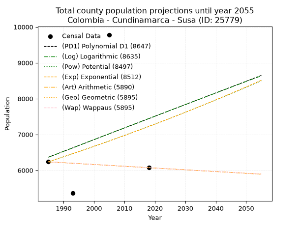
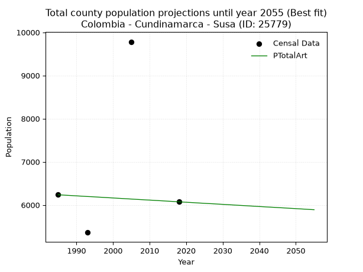
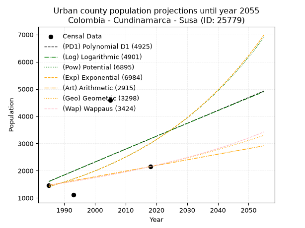
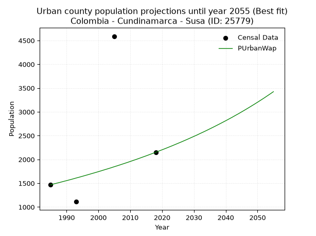
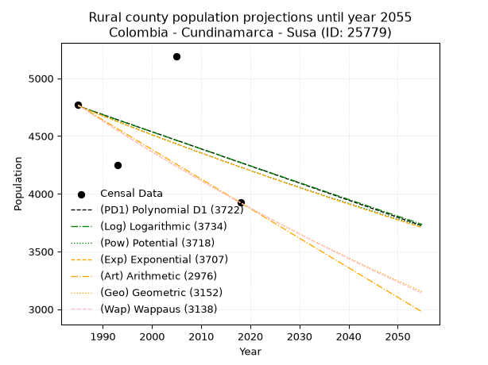
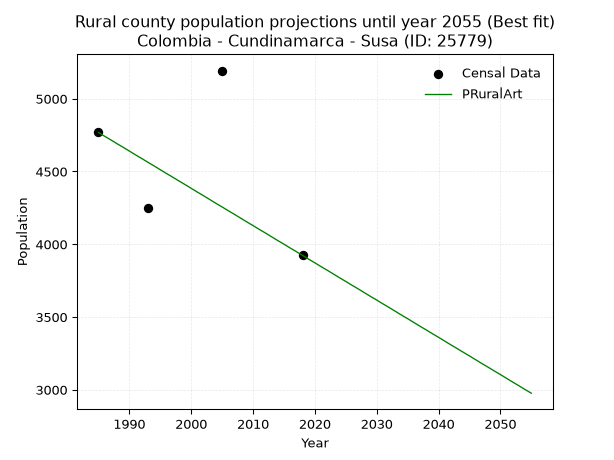

<div align="center">


</div>

# 📜 _“Population and Public Services Demand Projections (PPSD) until Year 2050 for Colombia - Cundinamarca - Susa (ID: 25779)”_
Keywords: `population` `public-service` `projection` `lineal` `polynomial` `logarithmic` `potential` `exponential` `arithmetic` `geometric` `wappaus` `dane` `colombia` `south-america`

PPSD are analytical estimates used by governments and planners to anticipate future changes in population size, age distribution, and the resulting community needs for utilities, healthcare, education, and infrastructure as sizing future water treatment facilities, electrical grids, and road networks based on spatial growth.

<div align="center">

</img>

</div>


> **General running parameters**: • app_version: _v20260806_. • Python version: _3.14.7_. • Pandas version: _3.0.5_. • NumPy version: _2.5.1_. • Creates, save and include plots into reports (create_plot): _False_. • Projection until year: _2050_. • Process polynomial degree 2 and up: _False_. • Process Wappaus: _True_. • Process Wappaus: _True_. • Set negative values to zero: _True_. • Set infinite values to zero: _True_. • Drop dataset notes: _True_. 
<div align="center">

Maps & GIS Layers: [:earth_americas:Google](http://maps.google.com/maps?q=5.455290545,-73.8139379) [:earth_americas:OSM](https://www.openstreetmap.org/#map=18/5.455290545/-73.8139379&layers=P) [:earth_americas:Bing](https://www.bing.com/maps?cp=5.455290545~-73.8139379&lvl=18) [:earth_americas:Apple](https://maps.apple.com/frame?center=5.455290545%2C-73.8139379&span=0.003%2C0.006) [:earth_americas:GISMobile](https://github.com/rcfdtools/R.GISMobile/blob/main/file/gis/CountyLayer_CO/Readme.md)

</div>


<div align="center">

```geojson
{
  "type": "Feature",
  "geometry": {
    "type": "Point", 
    "coordinates": [-73.8139379, 5.455290545]
  }, 
  "properties": {
    "Name": "Colombia - Cundinamarca - Susa (ID: 25779)"
  }
}
```

</div>


## 0. Census Data (4 records)

Census data are official statistics collected by a government about the people and housing in a country. They usually include counts of total population, age, sex, race, income, education, and jobs.

📅Global census file: [Population.xlsx](../data/Population.xlsx)

| Source   |   Year |   CountryID | CountryName   |   StateID | StateName    |   CountyID | CountyName   |   PTotal |   PUrban |   PRural |
|:---------|-------:|------------:|:--------------|----------:|:-------------|-----------:|:-------------|---------:|---------:|---------:|
| DANE     |   1985 |          57 | Colombia      |        25 | Cundinamarca |      25779 | Susa         |     6236 |     1468 |     4768 |
| DANE     |   1993 |          57 | Colombia      |        25 | Cundinamarca |      25779 | Susa         |     5362 |     1111 |     4251 |
| DANE     |   2005 |          57 | Colombia      |        25 | Cundinamarca |      25779 | Susa         |     9782 |     4589 |     5193 |
| DANE     |   2018 |          57 | Colombia      |        25 | Cundinamarca |      25779 | Susa         |     6073 |     2150 |     3923 |

> 🔥Some records could had specific notes about the registered values or the corresponding urban or rural distribution.

📅[SUI-RUPS](https://www.datos.gov.co/Hacienda-y-Cr-dito-P-blico/Registro-nico-de-Prestadores-de-Servicios-P-blicos/4qkq-csdn/about_data) - Local public utility companies: [RUPS.csv](../data/RUPS.csv)

 | SERVICIO       | ESTADO    | NOMBRE                                                                              | NIT         | DEPARTAMENTO_DOMICILIO   | MUNICIPIO_DOMICILIO   | DIRECCION           |   TELEFONO | EMAIL                                      | TIPO_PRESTADOR                 | CLASIFICACION                 |
|:---------------|:----------|:------------------------------------------------------------------------------------|:------------|:-------------------------|:----------------------|:--------------------|-----------:|:-------------------------------------------|:-------------------------------|:------------------------------|
| ACUEDUCTO      | OPERATIVA | ALCALDIA MUNICIPAL DE SUSA                                                          | 899999700-7 | CUNDINAMARCA             | SUSA                  | carrera 4 Nº 6 - 07 |    8559010 | serviciospublicos@susa-cundinamarca.gov.co | MUNICIPIO (PRESTACIÓN DIRECTA) | MENOR O IGUAL A 2500 USUARIOS |
| ALCANTARILLADO | OPERATIVA | ALCALDIA MUNICIPAL DE SUSA                                                          | 899999700-7 | CUNDINAMARCA             | SUSA                  | carrera 4 Nº 6 - 07 |    8559010 | serviciospublicos@susa-cundinamarca.gov.co | MUNICIPIO (PRESTACIÓN DIRECTA) | MENOR O IGUAL A 2500 USUARIOS |
| ACUEDUCTO      | OPERATIVA | ACUEDUCTO COMUNAL INTERVEREDAL CENTRO LA ESTACION LLANO GRANDE  PUNTA DE CRUZ. SUSA | 832003941-8 | CUNDINAMARCA             | SUSA                  | CARRERA 3  # 4-21   |    2117878 | acueductocomunal@hotmail.com               | ORGANIZACION AUTORIZADA        | MENOR O IGUAL A 2500 USUARIOS |

## 1. Total

### 1.1. Coefficients and Parameters

* (PD1) Polynomial Deg 1: 32.57607386591933, -58297.041750305136 (lineal)
* (Log) Logarithmic: 65577.60669938089, -491592.66402795404
* (Pow) Potential: 8.926232670488599, -25.641655021512516
* (Exp) Exponential: 0.004436944200600648, 0.9335841357042841
* (Art) Arithmetic: Year diff. 2018 - 1985 = 33, Population diff. 6073 - 6236 = -163, Annual growth = -4.9393939393939394
* (Geo) Geometric: Year diff. 2018 - 1985 = 33, Population diff. 6073 - 6236 = -163, Annual growth % = -0.0008022911522154175
* (Wap) Wappaus: i = -0.08025662424882508, Condition values only valid for < 200)

<sub>
Wappaus condition values: ['-0.00', '-0.08', '-0.16', '-0.24', '-0.32', '-0.40', '-0.48', '-0.56', '-0.64', '-0.72', '-0.80', '-0.88', '-0.96', '-1.04', '-1.12', '-1.20', '-1.28', '-1.36', '-1.44', '-1.52', '-1.61', '-1.69', '-1.77', '-1.85', '-1.93', '-2.01', '-2.09', '-2.17', '-2.25', '-2.33', '-2.41', '-2.49', '-2.57', '-2.65', '-2.73', '-2.81', '-2.89', '-2.97', '-3.05', '-3.13', '-3.21', '-3.29', '-3.37', '-3.45', '-3.53', '-3.61', '-3.69', '-3.77', '-3.85', '-3.93', '-4.01', '-4.09', '-4.17', '-4.25', '-4.33', '-4.41', '-4.49', '-4.57', '-4.65', '-4.74', '-4.82', '-4.90', '-4.98', '-5.06', '-5.14', '-5.22']
</sub>


### 1.2. Projected Dataset

|   Year |   CountyID |   PTotalPD1 |   PTotalLog |   PTotalPow |   PTotalExp |   PTotalArt |   PTotalGeo |   PTotalWap |
|-------:|-----------:|------------:|------------:|------------:|------------:|------------:|------------:|------------:|
|   1985 |      25779 |        6366 |        6363 |        6236 |        6239 |        6236 |        6236 |        6236 |
|   1986 |      25779 |        6399 |        6396 |        6264 |        6267 |        6231 |        6231 |        6231 |
|   1987 |      25779 |        6432 |        6429 |        6293 |        6295 |        6226 |        6226 |        6226 |
|   1988 |      25779 |        6464 |        6462 |        6321 |        6323 |        6221 |        6221 |        6221 |
|   1989 |      25779 |        6497 |        6495 |        6349 |        6351 |        6216 |        6216 |        6216 |
|   1990 |      25779 |        6529 |        6528 |        6378 |        6379 |        6211 |        6211 |        6211 |
|   1991 |      25779 |        6562 |        6561 |        6407 |        6408 |        6206 |        6206 |        6206 |
|   1992 |      25779 |        6594 |        6593 |        6435 |        6436 |        6201 |        6201 |        6201 |
|   1993 |      25779 |        6627 |        6626 |        6464 |        6465 |        6196 |        6196 |        6196 |
|   1994 |      25779 |        6660 |        6659 |        6493 |        6493 |        6192 |        6191 |        6191 |
|   1995 |      25779 |        6692 |        6692 |        6522 |        6522 |        6187 |        6186 |        6186 |
|   1996 |      25779 |        6725 |        6725 |        6552 |        6551 |        6182 |        6181 |        6181 |
|   1997 |      25779 |        6757 |        6758 |        6581 |        6580 |        6177 |        6176 |        6176 |
|   1998 |      25779 |        6790 |        6791 |        6610 |        6610 |        6172 |        6171 |        6171 |
|   1999 |      25779 |        6823 |        6824 |        6640 |        6639 |        6167 |        6166 |        6166 |
|   2000 |      25779 |        6855 |        6856 |        6670 |        6669 |        6162 |        6161 |        6161 |
|   2001 |      25779 |        6888 |        6889 |        6700 |        6698 |        6157 |        6156 |        6156 |
|   2002 |      25779 |        6920 |        6922 |        6729 |        6728 |        6152 |        6151 |        6151 |
|   2003 |      25779 |        6953 |        6955 |        6760 |        6758 |        6147 |        6147 |        6147 |
|   2004 |      25779 |        6985 |        6987 |        6790 |        6788 |        6142 |        6142 |        6142 |
|   2005 |      25779 |        7018 |        7020 |        6820 |        6818 |        6137 |        6137 |        6137 |
|   2006 |      25779 |        7051 |        7053 |        6850 |        6849 |        6132 |        6132 |        6132 |
|   2007 |      25779 |        7083 |        7085 |        6881 |        6879 |        6127 |        6127 |        6127 |
|   2008 |      25779 |        7116 |        7118 |        6912 |        6910 |        6122 |        6122 |        6122 |
|   2009 |      25779 |        7148 |        7151 |        6942 |        6940 |        6117 |        6117 |        6117 |
|   2010 |      25779 |        7181 |        7183 |        6973 |        6971 |        6113 |        6112 |        6112 |
|   2011 |      25779 |        7213 |        7216 |        7004 |        7002 |        6108 |        6107 |        6107 |
|   2012 |      25779 |        7246 |        7249 |        7036 |        7033 |        6103 |        6102 |        6102 |
|   2013 |      25779 |        7279 |        7281 |        7067 |        7065 |        6098 |        6097 |        6097 |
|   2014 |      25779 |        7311 |        7314 |        7098 |        7096 |        6093 |        6093 |        6093 |
|   2015 |      25779 |        7344 |        7346 |        7130 |        7128 |        6088 |        6088 |        6088 |
|   2016 |      25779 |        7376 |        7379 |        7161 |        7159 |        6083 |        6083 |        6083 |
|   2017 |      25779 |        7409 |        7411 |        7193 |        7191 |        6078 |        6078 |        6078 |
|   2018 |      25779 |        7441 |        7444 |        7225 |        7223 |        6073 |        6073 |        6073 |
|   2019 |      25779 |        7474 |        7476 |        7257 |        7255 |        6068 |        6068 |        6068 |
|   2020 |      25779 |        7507 |        7509 |        7289 |        7287 |        6063 |        6063 |        6063 |
|   2021 |      25779 |        7539 |        7541 |        7321 |        7320 |        6058 |        6058 |        6058 |
|   2022 |      25779 |        7572 |        7574 |        7354 |        7352 |        6053 |        6054 |        6054 |
|   2023 |      25779 |        7604 |        7606 |        7386 |        7385 |        6048 |        6049 |        6049 |
|   2024 |      25779 |        7637 |        7639 |        7419 |        7418 |        6043 |        6044 |        6044 |
|   2025 |      25779 |        7670 |        7671 |        7452 |        7451 |        6038 |        6039 |        6039 |
|   2026 |      25779 |        7702 |        7703 |        7485 |        7484 |        6033 |        6034 |        6034 |
|   2027 |      25779 |        7735 |        7736 |        7518 |        7517 |        6029 |        6029 |        6029 |
|   2028 |      25779 |        7767 |        7768 |        7551 |        7551 |        6024 |        6024 |        6024 |
|   2029 |      25779 |        7800 |        7800 |        7584 |        7584 |        6019 |        6020 |        6020 |
|   2030 |      25779 |        7832 |        7833 |        7618 |        7618 |        6014 |        6015 |        6015 |
|   2031 |      25779 |        7865 |        7865 |        7651 |        7652 |        6009 |        6010 |        6010 |
|   2032 |      25779 |        7898 |        7897 |        7685 |        7686 |        6004 |        6005 |        6005 |
|   2033 |      25779 |        7930 |        7930 |        7719 |        7720 |        5999 |        6000 |        6000 |
|   2034 |      25779 |        7963 |        7962 |        7753 |        7754 |        5994 |        5996 |        5995 |
|   2035 |      25779 |        7995 |        7994 |        7787 |        7789 |        5989 |        5991 |        5991 |
|   2036 |      25779 |        8028 |        8026 |        7821 |        7824 |        5984 |        5986 |        5986 |
|   2037 |      25779 |        8060 |        8058 |        7855 |        7858 |        5979 |        5981 |        5981 |
|   2038 |      25779 |        8093 |        8091 |        7890 |        7893 |        5974 |        5976 |        5976 |
|   2039 |      25779 |        8126 |        8123 |        7925 |        7928 |        5969 |        5971 |        5971 |
|   2040 |      25779 |        8158 |        8155 |        7959 |        7964 |        5964 |        5967 |        5967 |
|   2041 |      25779 |        8191 |        8187 |        7994 |        7999 |        5959 |        5962 |        5962 |
|   2042 |      25779 |        8223 |        8219 |        8029 |        8035 |        5954 |        5957 |        5957 |
|   2043 |      25779 |        8256 |        8251 |        8064 |        8070 |        5950 |        5952 |        5952 |
|   2044 |      25779 |        8288 |        8283 |        8100 |        8106 |        5945 |        5948 |        5948 |
|   2045 |      25779 |        8321 |        8315 |        8135 |        8142 |        5940 |        5943 |        5943 |
|   2046 |      25779 |        8354 |        8348 |        8171 |        8178 |        5935 |        5938 |        5938 |
|   2047 |      25779 |        8386 |        8380 |        8206 |        8215 |        5930 |        5933 |        5933 |
|   2048 |      25779 |        8419 |        8412 |        8242 |        8251 |        5925 |        5929 |        5928 |
|   2049 |      25779 |        8451 |        8444 |        8278 |        8288 |        5920 |        5924 |        5924 |
|   2050 |      25779 |        8484 |        8476 |        8314 |        8325 |        5915 |        5919 |        5919 |
<div align="center">

</img>

</div>


### 1.3. Best fit with absolute and relative error (%)

Relative error puts that difference into context by dividing the absolute error by the true value, creating a unitless ratio or percentage that shows the scale of the mistake.

Absolute and relative error

|   Year | Source   |   CountryID | CountryName   |   StateID | StateName    |   CountyID_x | CountyName   |   PTotal |   PUrban |   PRural |   CountyID_y |   PTotalPD1 |   PTotalLog |   PTotalPow |   PTotalExp |   PTotalArt |   PTotalGeo |   PTotalWap |   PTotalPD1AbsError |   PTotalLogAbsError |   PTotalPowAbsError |   PTotalExpAbsError |   PTotalArtAbsError |   PTotalGeoAbsError |   PTotalWapAbsError |   PTotalPD1RelError |   PTotalLogRelError |   PTotalPowRelError |   PTotalExpRelError |   PTotalArtRelError |   PTotalGeoRelError |   PTotalWapRelError |
|-------:|:---------|------------:|:--------------|----------:|:-------------|-------------:|:-------------|---------:|---------:|---------:|-------------:|------------:|------------:|------------:|------------:|------------:|------------:|------------:|--------------------:|--------------------:|--------------------:|--------------------:|--------------------:|--------------------:|--------------------:|--------------------:|--------------------:|--------------------:|--------------------:|--------------------:|--------------------:|--------------------:|
|   1985 | DANE     |          57 | Colombia      |        25 | Cundinamarca |        25779 | Susa         |     6236 |     1468 |     4768 |        25779 |        6366 |        6363 |        6236 |        6239 |        6236 |        6236 |        6236 |                 130 |                 127 |                   0 |                   3 |                   0 |                   0 |                   0 |             2.08467 |             2.03656 |              0      |           0.0481078 |              0      |              0      |              0      |
|   1993 | DANE     |          57 | Colombia      |        25 | Cundinamarca |        25779 | Susa         |     5362 |     1111 |     4251 |        25779 |        6627 |        6626 |        6464 |        6465 |        6196 |        6196 |        6196 |                1265 |                1264 |                1102 |                1103 |                 834 |                 834 |                 834 |            23.5919  |            23.5733  |             20.552  |          20.5707    |             15.5539 |             15.5539 |             15.5539 |
|   2005 | DANE     |          57 | Colombia      |        25 | Cundinamarca |        25779 | Susa         |     9782 |     4589 |     5193 |        25779 |        7018 |        7020 |        6820 |        6818 |        6137 |        6137 |        6137 |                2764 |                2762 |                2962 |                2964 |                3645 |                3645 |                3645 |            28.256   |            28.2355  |             30.2801 |          30.3006    |             37.2623 |             37.2623 |             37.2623 |
|   2018 | DANE     |          57 | Colombia      |        25 | Cundinamarca |        25779 | Susa         |     6073 |     2150 |     3923 |        25779 |        7441 |        7444 |        7225 |        7223 |        6073 |        6073 |        6073 |                1368 |                1371 |                1152 |                1150 |                   0 |                   0 |                   0 |            22.5259  |            22.5753  |             18.9692 |          18.9363    |              0      |              0      |              0      |

Relative error mean

| Method    |   RelError | Best   |
|:----------|-----------:|:-------|
| PTotalPD1 |    19.1146 |        |
| PTotalLog |    19.1052 |        |
| PTotalPow |    17.4503 |        |
| PTotalExp |    17.4639 |        |
| PTotalArt |    13.2041 | True   |
| PTotalGeo |    13.2041 | True   |
| PTotalWap |    13.2041 | True   |

💙Best method: _**PTotalArt**_
<div align="center">

</img>

</div>


### 1.4. Fresh water supply demand in liters per capita per day (lpcd)

The fresh water supply demand typically ranges from 100 to 300 liters per capita per day (lpcd) for standard domestic and municipal planning, though absolute survival minimums set by the World Health Organization are as low as 7.5 to 20 liters per day, and total consumption in high-income nations can exceed 400 liters.

> `CZ`: Level in meters above the sea level (masl)<br> `WS`: Fresh water supply demand in liters per capita per day (lpcd or l/h/d)<br> `WSAll`: Zonal fresh water supply demand in liters per second (l/s)<br> `A`: Zonal area in square meters<br> `DP`: Population density (people/hectare or p/ha)

Reference values (RAS Colombia)

|    CZ |   WS |
|------:|-----:|
|  1000 |  120 |
|  2000 |  130 |
| 99999 |  140 |

County shapefile geometry properties and water supply values

|   CountyID |      ATotal |   CZTotal |   WSTotal |
|-----------:|------------:|----------:|----------:|
|      25779 | 1.04007e+08 |   2857.68 |       140 |

Projected values for best method: PTotalArt

|   CountyID |   Year |   PTotalArt |   DPTotal |   WSTotal |   WSTotalAll |
|-----------:|-------:|------------:|----------:|----------:|-------------:|
|      25779 |   1985 |        6236 |      0.6  |       140 |     10.1046  |
|      25779 |   1986 |        6231 |      0.6  |       140 |     10.0965  |
|      25779 |   1987 |        6226 |      0.6  |       140 |     10.0884  |
|      25779 |   1988 |        6221 |      0.6  |       140 |     10.0803  |
|      25779 |   1989 |        6216 |      0.6  |       140 |     10.0722  |
|      25779 |   1990 |        6211 |      0.6  |       140 |     10.0641  |
|      25779 |   1991 |        6206 |      0.6  |       140 |     10.056   |
|      25779 |   1992 |        6201 |      0.6  |       140 |     10.0479  |
|      25779 |   1993 |        6196 |      0.6  |       140 |     10.0398  |
|      25779 |   1994 |        6192 |      0.6  |       140 |     10.0333  |
|      25779 |   1995 |        6187 |      0.59 |       140 |     10.0252  |
|      25779 |   1996 |        6182 |      0.59 |       140 |     10.0171  |
|      25779 |   1997 |        6177 |      0.59 |       140 |     10.009   |
|      25779 |   1998 |        6172 |      0.59 |       140 |     10.0009  |
|      25779 |   1999 |        6167 |      0.59 |       140 |      9.99282 |
|      25779 |   2000 |        6162 |      0.59 |       140 |      9.98472 |
|      25779 |   2001 |        6157 |      0.59 |       140 |      9.97662 |
|      25779 |   2002 |        6152 |      0.59 |       140 |      9.96852 |
|      25779 |   2003 |        6147 |      0.59 |       140 |      9.96042 |
|      25779 |   2004 |        6142 |      0.59 |       140 |      9.95231 |
|      25779 |   2005 |        6137 |      0.59 |       140 |      9.94421 |
|      25779 |   2006 |        6132 |      0.59 |       140 |      9.93611 |
|      25779 |   2007 |        6127 |      0.59 |       140 |      9.92801 |
|      25779 |   2008 |        6122 |      0.59 |       140 |      9.91991 |
|      25779 |   2009 |        6117 |      0.59 |       140 |      9.91181 |
|      25779 |   2010 |        6113 |      0.59 |       140 |      9.90532 |
|      25779 |   2011 |        6108 |      0.59 |       140 |      9.89722 |
|      25779 |   2012 |        6103 |      0.59 |       140 |      9.88912 |
|      25779 |   2013 |        6098 |      0.59 |       140 |      9.88102 |
|      25779 |   2014 |        6093 |      0.59 |       140 |      9.87292 |
|      25779 |   2015 |        6088 |      0.59 |       140 |      9.86481 |
|      25779 |   2016 |        6083 |      0.58 |       140 |      9.85671 |
|      25779 |   2017 |        6078 |      0.58 |       140 |      9.84861 |
|      25779 |   2018 |        6073 |      0.58 |       140 |      9.84051 |
|      25779 |   2019 |        6068 |      0.58 |       140 |      9.83241 |
|      25779 |   2020 |        6063 |      0.58 |       140 |      9.82431 |
|      25779 |   2021 |        6058 |      0.58 |       140 |      9.8162  |
|      25779 |   2022 |        6053 |      0.58 |       140 |      9.8081  |
|      25779 |   2023 |        6048 |      0.58 |       140 |      9.8     |
|      25779 |   2024 |        6043 |      0.58 |       140 |      9.7919  |
|      25779 |   2025 |        6038 |      0.58 |       140 |      9.7838  |
|      25779 |   2026 |        6033 |      0.58 |       140 |      9.77569 |
|      25779 |   2027 |        6029 |      0.58 |       140 |      9.76921 |
|      25779 |   2028 |        6024 |      0.58 |       140 |      9.76111 |
|      25779 |   2029 |        6019 |      0.58 |       140 |      9.75301 |
|      25779 |   2030 |        6014 |      0.58 |       140 |      9.74491 |
|      25779 |   2031 |        6009 |      0.58 |       140 |      9.73681 |
|      25779 |   2032 |        6004 |      0.58 |       140 |      9.7287  |
|      25779 |   2033 |        5999 |      0.58 |       140 |      9.7206  |
|      25779 |   2034 |        5994 |      0.58 |       140 |      9.7125  |
|      25779 |   2035 |        5989 |      0.58 |       140 |      9.7044  |
|      25779 |   2036 |        5984 |      0.58 |       140 |      9.6963  |
|      25779 |   2037 |        5979 |      0.57 |       140 |      9.68819 |
|      25779 |   2038 |        5974 |      0.57 |       140 |      9.68009 |
|      25779 |   2039 |        5969 |      0.57 |       140 |      9.67199 |
|      25779 |   2040 |        5964 |      0.57 |       140 |      9.66389 |
|      25779 |   2041 |        5959 |      0.57 |       140 |      9.65579 |
|      25779 |   2042 |        5954 |      0.57 |       140 |      9.64769 |
|      25779 |   2043 |        5950 |      0.57 |       140 |      9.6412  |
|      25779 |   2044 |        5945 |      0.57 |       140 |      9.6331  |
|      25779 |   2045 |        5940 |      0.57 |       140 |      9.625   |
|      25779 |   2046 |        5935 |      0.57 |       140 |      9.6169  |
|      25779 |   2047 |        5930 |      0.57 |       140 |      9.6088  |
|      25779 |   2048 |        5925 |      0.57 |       140 |      9.60069 |
|      25779 |   2049 |        5920 |      0.57 |       140 |      9.59259 |
|      25779 |   2050 |        5915 |      0.57 |       140 |      9.58449 |

## 2. Urban

### 2.1. Coefficients and Parameters

* (PD1) Polynomial Deg 1: 47.40024086712291, -92482.8317944626 (lineal)
* (Log) Logarithmic: 95160.65162842075, -720987.3755972299
* (Pow) Potential: 45.745083424422695, -147.70634040338857
* (Exp) Exponential: 0.022813041274168038, 3.0480099608876426e-17
* (Art) Arithmetic: Year diff. 2018 - 1985 = 33, Population diff. 2150 - 1468 = 682, Annual growth = 20.666666666666668
* (Geo) Geometric: Year diff. 2018 - 1985 = 33, Population diff. 2150 - 1468 = 682, Annual growth % = 0.01162973933426037
* (Wap) Wappaus: i = 1.142435968306615, Condition values only valid for < 200)

<sub>
Wappaus condition values: ['0.00', '1.14', '2.28', '3.43', '4.57', '5.71', '6.85', '8.00', '9.14', '10.28', '11.42', '12.57', '13.71', '14.85', '15.99', '17.14', '18.28', '19.42', '20.56', '21.71', '22.85', '23.99', '25.13', '26.28', '27.42', '28.56', '29.70', '30.85', '31.99', '33.13', '34.27', '35.42', '36.56', '37.70', '38.84', '39.99', '41.13', '42.27', '43.41', '44.56', '45.70', '46.84', '47.98', '49.12', '50.27', '51.41', '52.55', '53.69', '54.84', '55.98', '57.12', '58.26', '59.41', '60.55', '61.69', '62.83', '63.98', '65.12', '66.26', '67.40', '68.55', '69.69', '70.83', '71.97', '73.12', '74.26']
</sub>


### 2.2. Projected Dataset

|   Year |   CountyID |   PUrbanPD1 |   PUrbanLog |   PUrbanPow |   PUrbanExp |   PUrbanArt |   PUrbanGeo |   PUrbanWap |
|-------:|-----------:|------------:|------------:|------------:|------------:|------------:|------------:|------------:|
|   1985 |      25779 |        1607 |        1603 |        1413 |        1414 |        1468 |        1468 |        1468 |
|   1986 |      25779 |        1654 |        1651 |        1445 |        1447 |        1489 |        1485 |        1485 |
|   1987 |      25779 |        1701 |        1699 |        1479 |        1480 |        1509 |        1502 |        1502 |
|   1988 |      25779 |        1749 |        1747 |        1514 |        1515 |        1530 |        1520 |        1519 |
|   1989 |      25779 |        1796 |        1795 |        1549 |        1549 |        1551 |        1537 |        1537 |
|   1990 |      25779 |        1844 |        1842 |        1585 |        1585 |        1571 |        1555 |        1554 |
|   1991 |      25779 |        1891 |        1890 |        1622 |        1622 |        1592 |        1573 |        1572 |
|   1992 |      25779 |        1938 |        1938 |        1659 |        1659 |        1613 |        1592 |        1590 |
|   1993 |      25779 |        1986 |        1986 |        1698 |        1698 |        1633 |        1610 |        1609 |
|   1994 |      25779 |        2033 |        2034 |        1737 |        1737 |        1654 |        1629 |        1627 |
|   1995 |      25779 |        2081 |        2081 |        1778 |        1777 |        1675 |        1648 |        1646 |
|   1996 |      25779 |        2128 |        2129 |        1819 |        1818 |        1695 |        1667 |        1665 |
|   1997 |      25779 |        2175 |        2177 |        1861 |        1860 |        1716 |        1686 |        1684 |
|   1998 |      25779 |        2223 |        2224 |        1904 |        1903 |        1737 |        1706 |        1704 |
|   1999 |      25779 |        2270 |        2272 |        1948 |        1947 |        1757 |        1726 |        1723 |
|   2000 |      25779 |        2318 |        2319 |        1993 |        1991 |        1778 |        1746 |        1743 |
|   2001 |      25779 |        2365 |        2367 |        2039 |        2037 |        1799 |        1766 |        1763 |
|   2002 |      25779 |        2412 |        2415 |        2086 |        2084 |        1819 |        1787 |        1784 |
|   2003 |      25779 |        2460 |        2462 |        2135 |        2133 |        1840 |        1808 |        1804 |
|   2004 |      25779 |        2507 |        2510 |        2184 |        2182 |        1861 |        1829 |        1825 |
|   2005 |      25779 |        2555 |        2557 |        2234 |        2232 |        1881 |        1850 |        1847 |
|   2006 |      25779 |        2602 |        2605 |        2286 |        2284 |        1902 |        1871 |        1868 |
|   2007 |      25779 |        2649 |        2652 |        2339 |        2336 |        1923 |        1893 |        1890 |
|   2008 |      25779 |        2697 |        2699 |        2393 |        2390 |        1943 |        1915 |        1912 |
|   2009 |      25779 |        2744 |        2747 |        2448 |        2445 |        1964 |        1938 |        1934 |
|   2010 |      25779 |        2792 |        2794 |        2504 |        2502 |        1985 |        1960 |        1957 |
|   2011 |      25779 |        2839 |        2841 |        2562 |        2560 |        2005 |        1983 |        1980 |
|   2012 |      25779 |        2886 |        2889 |        2621 |        2619 |        2026 |        2006 |        2003 |
|   2013 |      25779 |        2934 |        2936 |        2681 |        2679 |        2047 |        2029 |        2027 |
|   2014 |      25779 |        2981 |        2983 |        2742 |        2741 |        2067 |        2053 |        2051 |
|   2015 |      25779 |        3029 |        3030 |        2805 |        2804 |        2088 |        2077 |        2075 |
|   2016 |      25779 |        3076 |        3078 |        2870 |        2869 |        2109 |        2101 |        2100 |
|   2017 |      25779 |        3123 |        3125 |        2936 |        2935 |        2129 |        2125 |        2125 |
|   2018 |      25779 |        3171 |        3172 |        3003 |        3003 |        2150 |        2150 |        2150 |
|   2019 |      25779 |        3218 |        3219 |        3072 |        3072 |        2171 |        2175 |        2176 |
|   2020 |      25779 |        3266 |        3266 |        3142 |        3143 |        2191 |        2200 |        2202 |
|   2021 |      25779 |        3313 |        3313 |        3214 |        3215 |        2212 |        2226 |        2228 |
|   2022 |      25779 |        3360 |        3361 |        3288 |        3290 |        2233 |        2252 |        2255 |
|   2023 |      25779 |        3408 |        3408 |        3363 |        3365 |        2253 |        2278 |        2282 |
|   2024 |      25779 |        3455 |        3455 |        3440 |        3443 |        2274 |        2304 |        2310 |
|   2025 |      25779 |        3503 |        3502 |        3518 |        3523 |        2295 |        2331 |        2338 |
|   2026 |      25779 |        3550 |        3549 |        3599 |        3604 |        2315 |        2358 |        2366 |
|   2027 |      25779 |        3597 |        3596 |        3681 |        3687 |        2336 |        2386 |        2395 |
|   2028 |      25779 |        3645 |        3642 |        3765 |        3772 |        2357 |        2414 |        2424 |
|   2029 |      25779 |        3692 |        3689 |        3851 |        3859 |        2377 |        2442 |        2454 |
|   2030 |      25779 |        3740 |        3736 |        3939 |        3948 |        2398 |        2470 |        2484 |
|   2031 |      25779 |        3787 |        3783 |        4028 |        4039 |        2419 |        2499 |        2514 |
|   2032 |      25779 |        3834 |        3830 |        4120 |        4133 |        2439 |        2528 |        2546 |
|   2033 |      25779 |        3882 |        3877 |        4214 |        4228 |        2460 |        2557 |        2577 |
|   2034 |      25779 |        3929 |        3924 |        4310 |        4325 |        2481 |        2587 |        2609 |
|   2035 |      25779 |        3977 |        3970 |        4408 |        4425 |        2501 |        2617 |        2642 |
|   2036 |      25779 |        4024 |        4017 |        4508 |        4527 |        2522 |        2647 |        2675 |
|   2037 |      25779 |        4071 |        4064 |        4610 |        4632 |        2543 |        2678 |        2709 |
|   2038 |      25779 |        4119 |        4111 |        4715 |        4739 |        2563 |        2709 |        2743 |
|   2039 |      25779 |        4166 |        4157 |        4822 |        4848 |        2584 |        2741 |        2778 |
|   2040 |      25779 |        4214 |        4204 |        4931 |        4960 |        2605 |        2773 |        2813 |
|   2041 |      25779 |        4261 |        4251 |        5043 |        5074 |        2625 |        2805 |        2849 |
|   2042 |      25779 |        4308 |        4297 |        5157 |        5191 |        2646 |        2838 |        2885 |
|   2043 |      25779 |        4356 |        4344 |        5274 |        5311 |        2667 |        2871 |        2923 |
|   2044 |      25779 |        4403 |        4390 |        5394 |        5434 |        2687 |        2904 |        2960 |
|   2045 |      25779 |        4451 |        4437 |        5516 |        5559 |        2708 |        2938 |        2999 |
|   2046 |      25779 |        4498 |        4483 |        5640 |        5687 |        2729 |        2972 |        3038 |
|   2047 |      25779 |        4545 |        4530 |        5768 |        5819 |        2749 |        3007 |        3078 |
|   2048 |      25779 |        4593 |        4576 |        5898 |        5953 |        2770 |        3041 |        3119 |
|   2049 |      25779 |        4640 |        4623 |        6031 |        6090 |        2791 |        3077 |        3160 |
|   2050 |      25779 |        4688 |        4669 |        6168 |        6231 |        2811 |        3113 |        3202 |
<div align="center">

</img>

</div>


### 2.3. Best fit with absolute and relative error (%)

Relative error puts that difference into context by dividing the absolute error by the true value, creating a unitless ratio or percentage that shows the scale of the mistake.

Absolute and relative error

|   Year | Source   |   CountryID | CountryName   |   StateID | StateName    |   CountyID_x | CountyName   |   PTotal |   PUrban |   PRural |   CountyID_y |   PUrbanPD1 |   PUrbanLog |   PUrbanPow |   PUrbanExp |   PUrbanArt |   PUrbanGeo |   PUrbanWap |   PUrbanPD1AbsError |   PUrbanLogAbsError |   PUrbanPowAbsError |   PUrbanExpAbsError |   PUrbanArtAbsError |   PUrbanGeoAbsError |   PUrbanWapAbsError |   PUrbanPD1RelError |   PUrbanLogRelError |   PUrbanPowRelError |   PUrbanExpRelError |   PUrbanArtRelError |   PUrbanGeoRelError |   PUrbanWapRelError |
|-------:|:---------|------------:|:--------------|----------:|:-------------|-------------:|:-------------|---------:|---------:|---------:|-------------:|------------:|------------:|------------:|------------:|------------:|------------:|------------:|--------------------:|--------------------:|--------------------:|--------------------:|--------------------:|--------------------:|--------------------:|--------------------:|--------------------:|--------------------:|--------------------:|--------------------:|--------------------:|--------------------:|
|   1985 | DANE     |          57 | Colombia      |        25 | Cundinamarca |        25779 | Susa         |     6236 |     1468 |     4768 |        25779 |        1607 |        1603 |        1413 |        1414 |        1468 |        1468 |        1468 |                 139 |                 135 |                  55 |                  54 |                   0 |                   0 |                   0 |             9.46866 |             9.19619 |             3.74659 |             3.67847 |              0      |              0      |              0      |
|   1993 | DANE     |          57 | Colombia      |        25 | Cundinamarca |        25779 | Susa         |     5362 |     1111 |     4251 |        25779 |        1986 |        1986 |        1698 |        1698 |        1633 |        1610 |        1609 |                 875 |                 875 |                 587 |                 587 |                 522 |                 499 |                 498 |            78.7579  |            78.7579  |            52.8353  |            52.8353  |             46.9847 |             44.9145 |             44.8245 |
|   2005 | DANE     |          57 | Colombia      |        25 | Cundinamarca |        25779 | Susa         |     9782 |     4589 |     5193 |        25779 |        2555 |        2557 |        2234 |        2232 |        1881 |        1850 |        1847 |                2034 |                2032 |                2355 |                2357 |                2708 |                2739 |                2742 |            44.3234  |            44.2798  |            51.3184  |            51.362   |             59.0107 |             59.6862 |             59.7516 |
|   2018 | DANE     |          57 | Colombia      |        25 | Cundinamarca |        25779 | Susa         |     6073 |     2150 |     3923 |        25779 |        3171 |        3172 |        3003 |        3003 |        2150 |        2150 |        2150 |                1021 |                1022 |                 853 |                 853 |                   0 |                   0 |                   0 |            47.4884  |            47.5349  |            39.6744  |            39.6744  |              0      |              0      |              0      |

Relative error mean

| Method    |   RelError | Best   |
|:----------|-----------:|:-------|
| PUrbanPD1 |    45.0096 |        |
| PUrbanLog |    44.9422 |        |
| PUrbanPow |    36.8937 |        |
| PUrbanExp |    36.8875 |        |
| PUrbanArt |    26.4988 |        |
| PUrbanGeo |    26.1502 |        |
| PUrbanWap |    26.144  | True   |

💙Best method: _**PUrbanWap**_
<div align="center">

</img>

</div>


### 2.4. Fresh water supply demand in liters per capita per day (lpcd)

The fresh water supply demand typically ranges from 100 to 300 liters per capita per day (lpcd) for standard domestic and municipal planning, though absolute survival minimums set by the World Health Organization are as low as 7.5 to 20 liters per day, and total consumption in high-income nations can exceed 400 liters.

> `CZ`: Level in meters above the sea level (masl)<br> `WS`: Fresh water supply demand in liters per capita per day (lpcd or l/h/d)<br> `WSAll`: Zonal fresh water supply demand in liters per second (l/s)<br> `A`: Zonal area in square meters<br> `DP`: Population density (people/hectare or p/ha)

Reference values (RAS Colombia)

|    CZ |   WS |
|------:|-----:|
|  1000 |  120 |
|  2000 |  130 |
| 99999 |  140 |

County shapefile geometry properties and water supply values

|   CountyID |   AUrban |   CZUrban |   WSUrban |
|-----------:|---------:|----------:|----------:|
|      25779 |   742739 |   2559.23 |       140 |

Projected values for best method: PUrbanWap

|   CountyID |   Year |   PUrbanWap |   DPUrban |   WSUrban |   WSUrbanAll |
|-----------:|-------:|------------:|----------:|----------:|-------------:|
|      25779 |   1985 |        1468 |     19.76 |       140 |      2.3787  |
|      25779 |   1986 |        1485 |     19.99 |       140 |      2.40625 |
|      25779 |   1987 |        1502 |     20.22 |       140 |      2.4338  |
|      25779 |   1988 |        1519 |     20.45 |       140 |      2.46134 |
|      25779 |   1989 |        1537 |     20.69 |       140 |      2.49051 |
|      25779 |   1990 |        1554 |     20.92 |       140 |      2.51806 |
|      25779 |   1991 |        1572 |     21.16 |       140 |      2.54722 |
|      25779 |   1992 |        1590 |     21.41 |       140 |      2.57639 |
|      25779 |   1993 |        1609 |     21.66 |       140 |      2.60718 |
|      25779 |   1994 |        1627 |     21.91 |       140 |      2.63634 |
|      25779 |   1995 |        1646 |     22.16 |       140 |      2.66713 |
|      25779 |   1996 |        1665 |     22.42 |       140 |      2.69792 |
|      25779 |   1997 |        1684 |     22.67 |       140 |      2.7287  |
|      25779 |   1998 |        1704 |     22.94 |       140 |      2.76111 |
|      25779 |   1999 |        1723 |     23.2  |       140 |      2.7919  |
|      25779 |   2000 |        1743 |     23.47 |       140 |      2.82431 |
|      25779 |   2001 |        1763 |     23.74 |       140 |      2.85671 |
|      25779 |   2002 |        1784 |     24.02 |       140 |      2.89074 |
|      25779 |   2003 |        1804 |     24.29 |       140 |      2.92315 |
|      25779 |   2004 |        1825 |     24.57 |       140 |      2.95718 |
|      25779 |   2005 |        1847 |     24.87 |       140 |      2.99282 |
|      25779 |   2006 |        1868 |     25.15 |       140 |      3.02685 |
|      25779 |   2007 |        1890 |     25.45 |       140 |      3.0625  |
|      25779 |   2008 |        1912 |     25.74 |       140 |      3.09815 |
|      25779 |   2009 |        1934 |     26.04 |       140 |      3.1338  |
|      25779 |   2010 |        1957 |     26.35 |       140 |      3.17106 |
|      25779 |   2011 |        1980 |     26.66 |       140 |      3.20833 |
|      25779 |   2012 |        2003 |     26.97 |       140 |      3.2456  |
|      25779 |   2013 |        2027 |     27.29 |       140 |      3.28449 |
|      25779 |   2014 |        2051 |     27.61 |       140 |      3.32338 |
|      25779 |   2015 |        2075 |     27.94 |       140 |      3.36227 |
|      25779 |   2016 |        2100 |     28.27 |       140 |      3.40278 |
|      25779 |   2017 |        2125 |     28.61 |       140 |      3.44329 |
|      25779 |   2018 |        2150 |     28.95 |       140 |      3.4838  |
|      25779 |   2019 |        2176 |     29.3  |       140 |      3.52593 |
|      25779 |   2020 |        2202 |     29.65 |       140 |      3.56806 |
|      25779 |   2021 |        2228 |     30    |       140 |      3.61019 |
|      25779 |   2022 |        2255 |     30.36 |       140 |      3.65394 |
|      25779 |   2023 |        2282 |     30.72 |       140 |      3.69769 |
|      25779 |   2024 |        2310 |     31.1  |       140 |      3.74306 |
|      25779 |   2025 |        2338 |     31.48 |       140 |      3.78843 |
|      25779 |   2026 |        2366 |     31.86 |       140 |      3.8338  |
|      25779 |   2027 |        2395 |     32.25 |       140 |      3.88079 |
|      25779 |   2028 |        2424 |     32.64 |       140 |      3.92778 |
|      25779 |   2029 |        2454 |     33.04 |       140 |      3.97639 |
|      25779 |   2030 |        2484 |     33.44 |       140 |      4.025   |
|      25779 |   2031 |        2514 |     33.85 |       140 |      4.07361 |
|      25779 |   2032 |        2546 |     34.28 |       140 |      4.12546 |
|      25779 |   2033 |        2577 |     34.7  |       140 |      4.17569 |
|      25779 |   2034 |        2609 |     35.13 |       140 |      4.22755 |
|      25779 |   2035 |        2642 |     35.57 |       140 |      4.28102 |
|      25779 |   2036 |        2675 |     36.02 |       140 |      4.33449 |
|      25779 |   2037 |        2709 |     36.47 |       140 |      4.38958 |
|      25779 |   2038 |        2743 |     36.93 |       140 |      4.44468 |
|      25779 |   2039 |        2778 |     37.4  |       140 |      4.50139 |
|      25779 |   2040 |        2813 |     37.87 |       140 |      4.5581  |
|      25779 |   2041 |        2849 |     38.36 |       140 |      4.61644 |
|      25779 |   2042 |        2885 |     38.84 |       140 |      4.67477 |
|      25779 |   2043 |        2923 |     39.35 |       140 |      4.73634 |
|      25779 |   2044 |        2960 |     39.85 |       140 |      4.7963  |
|      25779 |   2045 |        2999 |     40.38 |       140 |      4.85949 |
|      25779 |   2046 |        3038 |     40.9  |       140 |      4.92269 |
|      25779 |   2047 |        3078 |     41.44 |       140 |      4.9875  |
|      25779 |   2048 |        3119 |     41.99 |       140 |      5.05394 |
|      25779 |   2049 |        3160 |     42.55 |       140 |      5.12037 |
|      25779 |   2050 |        3202 |     43.11 |       140 |      5.18843 |

## 3. Rural

### 3.1. Coefficients and Parameters

* (PD1) Polynomial Deg 1: -14.82416700120358, 34185.79004415746 (lineal)
* (Log) Logarithmic: -29583.044929039876, 229394.7115692762
* (Pow) Potential: -7.13150288546011, 27.195597853464957
* (Exp) Exponential: -0.003572570390180944, 5720698.977471134
* (Art) Arithmetic: Year diff. 2018 - 1985 = 33, Population diff. 3923 - 4768 = -845, Annual growth = -25.606060606060606
* (Geo) Geometric: Year diff. 2018 - 1985 = 33, Population diff. 3923 - 4768 = -845, Annual growth % = -0.005893783190115243
* (Wap) Wappaus: i = -0.5892546451745623, Condition values only valid for < 200)

<sub>
Wappaus condition values: ['-0.00', '-0.59', '-1.18', '-1.77', '-2.36', '-2.95', '-3.54', '-4.12', '-4.71', '-5.30', '-5.89', '-6.48', '-7.07', '-7.66', '-8.25', '-8.84', '-9.43', '-10.02', '-10.61', '-11.20', '-11.79', '-12.37', '-12.96', '-13.55', '-14.14', '-14.73', '-15.32', '-15.91', '-16.50', '-17.09', '-17.68', '-18.27', '-18.86', '-19.45', '-20.03', '-20.62', '-21.21', '-21.80', '-22.39', '-22.98', '-23.57', '-24.16', '-24.75', '-25.34', '-25.93', '-26.52', '-27.11', '-27.69', '-28.28', '-28.87', '-29.46', '-30.05', '-30.64', '-31.23', '-31.82', '-32.41', '-33.00', '-33.59', '-34.18', '-34.77', '-35.36', '-35.94', '-36.53', '-37.12', '-37.71', '-38.30']
</sub>


### 3.2. Projected Dataset

|   Year |   CountyID |   PRuralPD1 |   PRuralLog |   PRuralPow |   PRuralExp |   PRuralArt |   PRuralGeo |   PRuralWap |
|-------:|-----------:|------------:|------------:|------------:|------------:|------------:|------------:|------------:|
|   1985 |      25779 |        4760 |        4760 |        4760 |        4760 |        4768 |        4768 |        4768 |
|   1986 |      25779 |        4745 |        4745 |        4743 |        4743 |        4742 |        4740 |        4740 |
|   1987 |      25779 |        4730 |        4730 |        4726 |        4726 |        4717 |        4712 |        4712 |
|   1988 |      25779 |        4715 |        4715 |        4709 |        4709 |        4691 |        4684 |        4684 |
|   1989 |      25779 |        4701 |        4700 |        4692 |        4693 |        4666 |        4657 |        4657 |
|   1990 |      25779 |        4686 |        4685 |        4675 |        4676 |        4640 |        4629 |        4630 |
|   1991 |      25779 |        4671 |        4670 |        4659 |        4659 |        4614 |        4602 |        4602 |
|   1992 |      25779 |        4656 |        4655 |        4642 |        4643 |        4589 |        4575 |        4575 |
|   1993 |      25779 |        4641 |        4641 |        4625 |        4626 |        4563 |        4548 |        4548 |
|   1994 |      25779 |        4626 |        4626 |        4609 |        4610 |        4538 |        4521 |        4522 |
|   1995 |      25779 |        4612 |        4611 |        4592 |        4593 |        4512 |        4494 |        4495 |
|   1996 |      25779 |        4597 |        4596 |        4576 |        4577 |        4486 |        4468 |        4469 |
|   1997 |      25779 |        4582 |        4581 |        4560 |        4560 |        4461 |        4442 |        4442 |
|   1998 |      25779 |        4567 |        4566 |        4544 |        4544 |        4435 |        4415 |        4416 |
|   1999 |      25779 |        4552 |        4552 |        4527 |        4528 |        4410 |        4389 |        4390 |
|   2000 |      25779 |        4537 |        4537 |        4511 |        4512 |        4384 |        4363 |        4364 |
|   2001 |      25779 |        4523 |        4522 |        4495 |        4496 |        4358 |        4338 |        4339 |
|   2002 |      25779 |        4508 |        4507 |        4479 |        4480 |        4333 |        4312 |        4313 |
|   2003 |      25779 |        4493 |        4493 |        4463 |        4464 |        4307 |        4287 |        4288 |
|   2004 |      25779 |        4478 |        4478 |        4447 |        4448 |        4281 |        4261 |        4262 |
|   2005 |      25779 |        4463 |        4463 |        4432 |        4432 |        4256 |        4236 |        4237 |
|   2006 |      25779 |        4449 |        4448 |        4416 |        4416 |        4230 |        4211 |        4212 |
|   2007 |      25779 |        4434 |        4434 |        4400 |        4400 |        4205 |        4187 |        4188 |
|   2008 |      25779 |        4419 |        4419 |        4385 |        4385 |        4179 |        4162 |        4163 |
|   2009 |      25779 |        4404 |        4404 |        4369 |        4369 |        4153 |        4137 |        4138 |
|   2010 |      25779 |        4389 |        4389 |        4354 |        4353 |        4128 |        4113 |        4114 |
|   2011 |      25779 |        4374 |        4375 |        4338 |        4338 |        4102 |        4089 |        4089 |
|   2012 |      25779 |        4360 |        4360 |        4323 |        4323 |        4077 |        4065 |        4065 |
|   2013 |      25779 |        4345 |        4345 |        4308 |        4307 |        4051 |        4041 |        4041 |
|   2014 |      25779 |        4330 |        4331 |        4292 |        4292 |        4025 |        4017 |        4017 |
|   2015 |      25779 |        4315 |        4316 |        4277 |        4276 |        4000 |        3993 |        3994 |
|   2016 |      25779 |        4300 |        4301 |        4262 |        4261 |        3974 |        3970 |        3970 |
|   2017 |      25779 |        4285 |        4286 |        4247 |        4246 |        3949 |        3946 |        3946 |
|   2018 |      25779 |        4271 |        4272 |        4232 |        4231 |        3923 |        3923 |        3923 |
|   2019 |      25779 |        4256 |        4257 |        4217 |        4216 |        3897 |        3900 |        3900 |
|   2020 |      25779 |        4241 |        4243 |        4202 |        4201 |        3872 |        3877 |        3877 |
|   2021 |      25779 |        4226 |        4228 |        4187 |        4186 |        3846 |        3854 |        3854 |
|   2022 |      25779 |        4211 |        4213 |        4173 |        4171 |        3821 |        3831 |        3831 |
|   2023 |      25779 |        4197 |        4199 |        4158 |        4156 |        3795 |        3809 |        3808 |
|   2024 |      25779 |        4182 |        4184 |        4143 |        4141 |        3769 |        3786 |        3785 |
|   2025 |      25779 |        4167 |        4169 |        4129 |        4126 |        3744 |        3764 |        3763 |
|   2026 |      25779 |        4152 |        4155 |        4114 |        4112 |        3718 |        3742 |        3740 |
|   2027 |      25779 |        4137 |        4140 |        4100 |        4097 |        3693 |        3720 |        3718 |
|   2028 |      25779 |        4122 |        4126 |        4085 |        4082 |        3667 |        3698 |        3696 |
|   2029 |      25779 |        4108 |        4111 |        4071 |        4068 |        3641 |        3676 |        3674 |
|   2030 |      25779 |        4093 |        4096 |        4057 |        4053 |        3616 |        3654 |        3652 |
|   2031 |      25779 |        4078 |        4082 |        4043 |        4039 |        3590 |        3633 |        3630 |
|   2032 |      25779 |        4063 |        4067 |        4028 |        4024 |        3565 |        3611 |        3608 |
|   2033 |      25779 |        4048 |        4053 |        4014 |        4010 |        3539 |        3590 |        3586 |
|   2034 |      25779 |        4033 |        4038 |        4000 |        3996 |        3513 |        3569 |        3565 |
|   2035 |      25779 |        4019 |        4024 |        3986 |        3982 |        3488 |        3548 |        3544 |
|   2036 |      25779 |        4004 |        4009 |        3972 |        3967 |        3462 |        3527 |        3522 |
|   2037 |      25779 |        3989 |        3995 |        3958 |        3953 |        3436 |        3506 |        3501 |
|   2038 |      25779 |        3974 |        3980 |        3945 |        3939 |        3411 |        3486 |        3480 |
|   2039 |      25779 |        3959 |        3966 |        3931 |        3925 |        3385 |        3465 |        3459 |
|   2040 |      25779 |        3944 |        3951 |        3917 |        3911 |        3360 |        3445 |        3438 |
|   2041 |      25779 |        3930 |        3937 |        3903 |        3897 |        3334 |        3424 |        3417 |
|   2042 |      25779 |        3915 |        3922 |        3890 |        3883 |        3308 |        3404 |        3397 |
|   2043 |      25779 |        3900 |        3908 |        3876 |        3869 |        3283 |        3384 |        3376 |
|   2044 |      25779 |        3885 |        3893 |        3863 |        3856 |        3257 |        3364 |        3356 |
|   2045 |      25779 |        3870 |        3879 |        3849 |        3842 |        3232 |        3344 |        3335 |
|   2046 |      25779 |        3856 |        3864 |        3836 |        3828 |        3206 |        3325 |        3315 |
|   2047 |      25779 |        3841 |        3850 |        3823 |        3814 |        3180 |        3305 |        3295 |
|   2048 |      25779 |        3826 |        3835 |        3809 |        3801 |        3155 |        3286 |        3275 |
|   2049 |      25779 |        3811 |        3821 |        3796 |        3787 |        3129 |        3266 |        3255 |
|   2050 |      25779 |        3796 |        3806 |        3783 |        3774 |        3104 |        3247 |        3235 |
<div align="center">

</img>

</div>


### 3.3. Best fit with absolute and relative error (%)

Relative error puts that difference into context by dividing the absolute error by the true value, creating a unitless ratio or percentage that shows the scale of the mistake.

Absolute and relative error

|   Year | Source   |   CountryID | CountryName   |   StateID | StateName    |   CountyID_x | CountyName   |   PTotal |   PUrban |   PRural |   CountyID_y |   PRuralPD1 |   PRuralLog |   PRuralPow |   PRuralExp |   PRuralArt |   PRuralGeo |   PRuralWap |   PRuralPD1AbsError |   PRuralLogAbsError |   PRuralPowAbsError |   PRuralExpAbsError |   PRuralArtAbsError |   PRuralGeoAbsError |   PRuralWapAbsError |   PRuralPD1RelError |   PRuralLogRelError |   PRuralPowRelError |   PRuralExpRelError |   PRuralArtRelError |   PRuralGeoRelError |   PRuralWapRelError |
|-------:|:---------|------------:|:--------------|----------:|:-------------|-------------:|:-------------|---------:|---------:|---------:|-------------:|------------:|------------:|------------:|------------:|------------:|------------:|------------:|--------------------:|--------------------:|--------------------:|--------------------:|--------------------:|--------------------:|--------------------:|--------------------:|--------------------:|--------------------:|--------------------:|--------------------:|--------------------:|--------------------:|
|   1985 | DANE     |          57 | Colombia      |        25 | Cundinamarca |        25779 | Susa         |     6236 |     1468 |     4768 |        25779 |        4760 |        4760 |        4760 |        4760 |        4768 |        4768 |        4768 |                   8 |                   8 |                   8 |                   8 |                   0 |                   0 |                   0 |            0.167785 |            0.167785 |            0.167785 |            0.167785 |             0       |             0       |             0       |
|   1993 | DANE     |          57 | Colombia      |        25 | Cundinamarca |        25779 | Susa         |     5362 |     1111 |     4251 |        25779 |        4641 |        4641 |        4625 |        4626 |        4563 |        4548 |        4548 |                 390 |                 390 |                 374 |                 375 |                 312 |                 297 |                 297 |            9.17431  |            9.17431  |            8.79793  |            8.82145  |             7.33945 |             6.98659 |             6.98659 |
|   2005 | DANE     |          57 | Colombia      |        25 | Cundinamarca |        25779 | Susa         |     9782 |     4589 |     5193 |        25779 |        4463 |        4463 |        4432 |        4432 |        4256 |        4236 |        4237 |                 730 |                 730 |                 761 |                 761 |                 937 |                 957 |                 956 |           14.0574   |           14.0574   |           14.6543   |           14.6543   |            18.0435  |            18.4287  |            18.4094  |
|   2018 | DANE     |          57 | Colombia      |        25 | Cundinamarca |        25779 | Susa         |     6073 |     2150 |     3923 |        25779 |        4271 |        4272 |        4232 |        4231 |        3923 |        3923 |        3923 |                 348 |                 349 |                 309 |                 308 |                   0 |                   0 |                   0 |            8.87076  |            8.89625  |            7.87663  |            7.85113  |             0       |             0       |             0       |

Relative error mean

| Method    |   RelError | Best   |
|:----------|-----------:|:-------|
| PRuralPD1 |    8.06756 |        |
| PRuralLog |    8.07393 |        |
| PRuralPow |    7.87417 |        |
| PRuralExp |    7.87368 |        |
| PRuralArt |    6.34574 | True   |
| PRuralGeo |    6.35381 |        |
| PRuralWap |    6.349   |        |

💙Best method: _**PRuralArt**_
<div align="center">

</img>

</div>


### 3.4. Fresh water supply demand in liters per capita per day (lpcd)

The fresh water supply demand typically ranges from 100 to 300 liters per capita per day (lpcd) for standard domestic and municipal planning, though absolute survival minimums set by the World Health Organization are as low as 7.5 to 20 liters per day, and total consumption in high-income nations can exceed 400 liters.

> `CZ`: Level in meters above the sea level (masl)<br> `WS`: Fresh water supply demand in liters per capita per day (lpcd or l/h/d)<br> `WSAll`: Zonal fresh water supply demand in liters per second (l/s)<br> `A`: Zonal area in square meters<br> `DP`: Population density (people/hectare or p/ha)

Reference values (RAS Colombia)

|    CZ |   WS |
|------:|-----:|
|  1000 |  120 |
|  2000 |  130 |
| 99999 |  140 |

County shapefile geometry properties and water supply values

|   CountyID |      ARural |   CZRural |   WSRural |
|-----------:|------------:|----------:|----------:|
|      25779 | 1.03265e+08 |   2859.77 |       140 |

Projected values for best method: PRuralArt

|   CountyID |   Year |   PRuralArt |   DPRural |   WSRural |   WSRuralAll |
|-----------:|-------:|------------:|----------:|----------:|-------------:|
|      25779 |   1985 |        4768 |      0.46 |       140 |      7.72593 |
|      25779 |   1986 |        4742 |      0.46 |       140 |      7.6838  |
|      25779 |   1987 |        4717 |      0.46 |       140 |      7.64329 |
|      25779 |   1988 |        4691 |      0.45 |       140 |      7.60116 |
|      25779 |   1989 |        4666 |      0.45 |       140 |      7.56065 |
|      25779 |   1990 |        4640 |      0.45 |       140 |      7.51852 |
|      25779 |   1991 |        4614 |      0.45 |       140 |      7.47639 |
|      25779 |   1992 |        4589 |      0.44 |       140 |      7.43588 |
|      25779 |   1993 |        4563 |      0.44 |       140 |      7.39375 |
|      25779 |   1994 |        4538 |      0.44 |       140 |      7.35324 |
|      25779 |   1995 |        4512 |      0.44 |       140 |      7.31111 |
|      25779 |   1996 |        4486 |      0.43 |       140 |      7.26898 |
|      25779 |   1997 |        4461 |      0.43 |       140 |      7.22847 |
|      25779 |   1998 |        4435 |      0.43 |       140 |      7.18634 |
|      25779 |   1999 |        4410 |      0.43 |       140 |      7.14583 |
|      25779 |   2000 |        4384 |      0.42 |       140 |      7.1037  |
|      25779 |   2001 |        4358 |      0.42 |       140 |      7.06157 |
|      25779 |   2002 |        4333 |      0.42 |       140 |      7.02106 |
|      25779 |   2003 |        4307 |      0.42 |       140 |      6.97894 |
|      25779 |   2004 |        4281 |      0.41 |       140 |      6.93681 |
|      25779 |   2005 |        4256 |      0.41 |       140 |      6.8963  |
|      25779 |   2006 |        4230 |      0.41 |       140 |      6.85417 |
|      25779 |   2007 |        4205 |      0.41 |       140 |      6.81366 |
|      25779 |   2008 |        4179 |      0.4  |       140 |      6.77153 |
|      25779 |   2009 |        4153 |      0.4  |       140 |      6.7294  |
|      25779 |   2010 |        4128 |      0.4  |       140 |      6.68889 |
|      25779 |   2011 |        4102 |      0.4  |       140 |      6.64676 |
|      25779 |   2012 |        4077 |      0.39 |       140 |      6.60625 |
|      25779 |   2013 |        4051 |      0.39 |       140 |      6.56412 |
|      25779 |   2014 |        4025 |      0.39 |       140 |      6.52199 |
|      25779 |   2015 |        4000 |      0.39 |       140 |      6.48148 |
|      25779 |   2016 |        3974 |      0.38 |       140 |      6.43935 |
|      25779 |   2017 |        3949 |      0.38 |       140 |      6.39884 |
|      25779 |   2018 |        3923 |      0.38 |       140 |      6.35671 |
|      25779 |   2019 |        3897 |      0.38 |       140 |      6.31458 |
|      25779 |   2020 |        3872 |      0.37 |       140 |      6.27407 |
|      25779 |   2021 |        3846 |      0.37 |       140 |      6.23194 |
|      25779 |   2022 |        3821 |      0.37 |       140 |      6.19144 |
|      25779 |   2023 |        3795 |      0.37 |       140 |      6.14931 |
|      25779 |   2024 |        3769 |      0.36 |       140 |      6.10718 |
|      25779 |   2025 |        3744 |      0.36 |       140 |      6.06667 |
|      25779 |   2026 |        3718 |      0.36 |       140 |      6.02454 |
|      25779 |   2027 |        3693 |      0.36 |       140 |      5.98403 |
|      25779 |   2028 |        3667 |      0.36 |       140 |      5.9419  |
|      25779 |   2029 |        3641 |      0.35 |       140 |      5.89977 |
|      25779 |   2030 |        3616 |      0.35 |       140 |      5.85926 |
|      25779 |   2031 |        3590 |      0.35 |       140 |      5.81713 |
|      25779 |   2032 |        3565 |      0.35 |       140 |      5.77662 |
|      25779 |   2033 |        3539 |      0.34 |       140 |      5.73449 |
|      25779 |   2034 |        3513 |      0.34 |       140 |      5.69236 |
|      25779 |   2035 |        3488 |      0.34 |       140 |      5.65185 |
|      25779 |   2036 |        3462 |      0.34 |       140 |      5.60972 |
|      25779 |   2037 |        3436 |      0.33 |       140 |      5.56759 |
|      25779 |   2038 |        3411 |      0.33 |       140 |      5.52708 |
|      25779 |   2039 |        3385 |      0.33 |       140 |      5.48495 |
|      25779 |   2040 |        3360 |      0.33 |       140 |      5.44444 |
|      25779 |   2041 |        3334 |      0.32 |       140 |      5.40231 |
|      25779 |   2042 |        3308 |      0.32 |       140 |      5.36019 |
|      25779 |   2043 |        3283 |      0.32 |       140 |      5.31968 |
|      25779 |   2044 |        3257 |      0.32 |       140 |      5.27755 |
|      25779 |   2045 |        3232 |      0.31 |       140 |      5.23704 |
|      25779 |   2046 |        3206 |      0.31 |       140 |      5.19491 |
|      25779 |   2047 |        3180 |      0.31 |       140 |      5.15278 |
|      25779 |   2048 |        3155 |      0.31 |       140 |      5.11227 |
|      25779 |   2049 |        3129 |      0.3  |       140 |      5.07014 |
|      25779 |   2050 |        3104 |      0.3  |       140 |      5.02963 |

#

<div align="center"><br><sub>Share this research</sub></div><br>

<sub>**APPS & TOOLS & CONTENT DISCLAIMER**: • NO WARRANTY - This content and software is provided by <a href="https://github.com/rcfdtools" target="_blank">github.com/rcfdtools</a> "as is", without any express or implied warranty, including warranties of merchantability, fitness for a particular purpose, or non-infringement. There is no guarantee that the software will be error-free or operate without interruption. • LIMITATION OF LIABILITY - Neither the authors nor copyright holders will be liable for claims or damages arising from the software or its use. You are responsible for determining if the software is appropriate for your use and assume all associated risks, including errors, legal compliance, and data loss. • NO PROFESSIONAL ADVICE - The software provides general information and does not offer professional advice. It should not replace consultation with professional advisors. [Clauses and global license for rcfdtools use.](https://github.com/rcfdtools/rcfdtools/blob/main/LICENSE.md)</sub>

| [:house: Home](Readme.md)  | [:beginner: Help / Collab](https://github.com/rcfdtools/R.HydroTools/discussions/31) |
|----------------------------|-------------------------------------------------------------------------------------------|