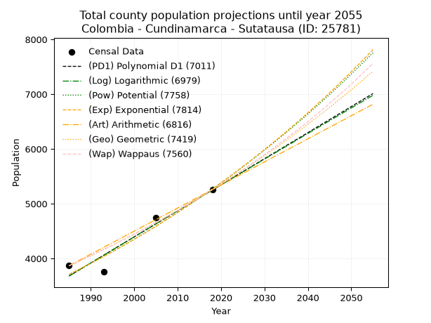
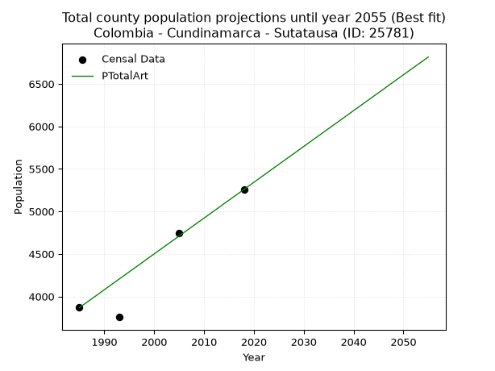
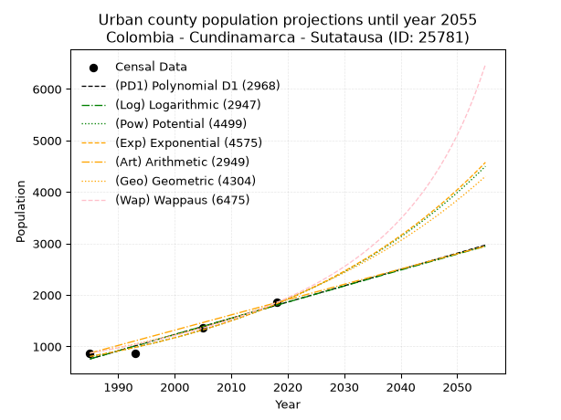
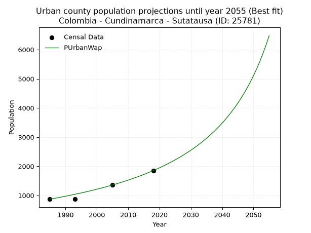
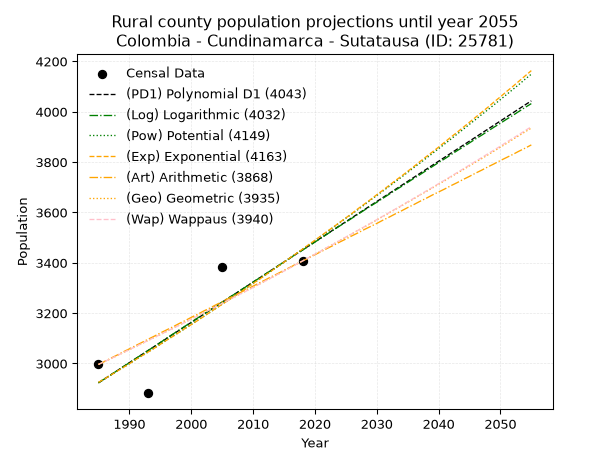
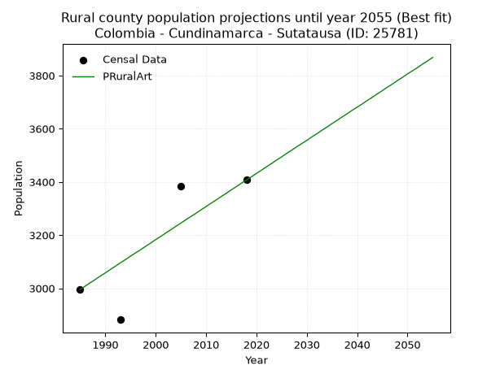

<div align="center">


</div>

# _“Population and Public Services Demand Projections (PPSD) until Year 2050 for Colombia - Cundinamarca - Sutatausa (ID: 25781)”_
Keywords: `population` `public-service` `projection` `lineal` `polynomial` `logarithmic` `potential` `exponential` `arithmetic` `geometric` `wappaus` `dane` `colombia` `south-america`

PPSD are analytical estimates used by governments and planners to anticipate future changes in population size, age distribution, and the resulting community needs for utilities, healthcare, education, and infrastructure as sizing future water treatment facilities, electrical grids, and road networks based on spatial growth.

> **General running parameters**: • app_version: _v20260806_. • Python version: _3.14.7_. • Pandas version: _3.0.5_. • NumPy version: _2.5.1_. • Creates, save and include plots into reports (create_plot): _False_. • Projection until year: _2050_. • Process polynomial degree 2 and up: _False_. • Process Wappaus: _True_. • Process Wappaus: _True_. • Set negative values to zero: _True_. • Set infinite values to zero: _True_. • Drop dataset notes: _True_. 
<div align="center">

Dynamic map: [:earth_americas:Google](http://maps.google.com/maps?q=5.247482312,-73.8531588) [:earth_americas:OSM](https://www.openstreetmap.org/#map=18/5.247482312/-73.8531588&layers=P) [:earth_americas:Bing](https://www.bing.com/maps?cp=5.247482312~-73.8531588&lvl=18) [:earth_americas:Apple](https://maps.apple.com/frame?center=5.247482312%2C-73.8531588&span=0.003%2C0.006)

</div>


<div align="center">

```geojson
{
  "type": "Feature",
  "geometry": {
    "type": "Point", 
    "coordinates": [-73.8531588, 5.247482312]
  }, 
  "properties": {
    "Name": "Colombia - Cundinamarca - Sutatausa (ID: 25781)"
  }
}
```

</div>


## 0. Census Data (4 records)

Census data are official statistics collected by a government about the people and housing in a country. They usually include counts of total population, age, sex, race, income, education, and jobs.

📅Global census file: [Population.xlsx](../data/Population.xlsx)

| Source   |   Year |   CountryID | CountryName   |   StateID | StateName    |   CountyID | CountyName   |   PTotal |   PUrban |   PRural |
|:---------|-------:|------------:|:--------------|----------:|:-------------|-----------:|:-------------|---------:|---------:|---------:|
| DANE     |   1985 |          57 | Colombia      |        25 | Cundinamarca |      25781 | Sutatausa    |     3868 |      872 |     2996 |
| DANE     |   1993 |          57 | Colombia      |        25 | Cundinamarca |      25781 | Sutatausa    |     3757 |      875 |     2882 |
| DANE     |   2005 |          57 | Colombia      |        25 | Cundinamarca |      25781 | Sutatausa    |     4742 |     1359 |     3383 |
| DANE     |   2018 |          57 | Colombia      |        25 | Cundinamarca |      25781 | Sutatausa    |     5258 |     1851 |     3407 |

> 🔥Some records could had specific notes about the registered values or the corresponding urban or rural distribution.

📅   [RUPS](https://www.datos.gov.co/Hacienda-y-Cr-dito-P-blico/Registro-nico-de-Prestadores-de-Servicios-P-blicos/4qkq-csdn/about_data) - Local public utility companies: [RUPS.csv](../data/RUPS.xlsx)

 | SERVICIO       | ESTADO    | NOMBRE                                                                                                                        | NIT         | DEPARTAMENTO_DOMICILIO   | MUNICIPIO_DOMICILIO         | DIRECCION                        |   TELEFONO | EMAIL                                  | TIPO_PRESTADOR                 | CLASIFICACION                  |
|:---------------|:----------|:------------------------------------------------------------------------------------------------------------------------------|:------------|:-------------------------|:----------------------------|:---------------------------------|-----------:|:---------------------------------------|:-------------------------------|:-------------------------------|
| ACUEDUCTO      | OPERATIVA | ASOCIACION DE USUARIOS DE ACUEDUCTO REGIONAL DE RASGATA Y OTRAS DE LOS MUNICIPIOS DE TAUSA,NEMOCON,CUCUNUBA,SUTATAUSA Y COGUA | 800095463-6 | CUNDINAMARCA             | VILLA DE SAN DIEGO DE UBATE | CARRERA 9 No. 11-105 APTO 401    |    8826800 | sucuneta@gmail.com                     | ORGANIZACION AUTORIZADA        | DESDE 2501 HASTA 5000 USUARIOS |
| ACUEDUCTO      | OPERATIVA | ASOCIACION DE USUARIOS DEL ACUEDUCTO RURAL NOVOA ESP                                                                          | 832004618-8 | CUNDINAMARCA             | SUTATAUSA                   | CRA 6  4-86                      |    7130421 | contbaco@yahoo.com                     | ORGANIZACION AUTORIZADA        | HASTA 2500 SUSCRIPTORES        |
| ACUEDUCTO      | OPERATIVA | OFICINA DE SERVICIOS PUBLICOS DE ACUEDUCTO, ALCANTARILLADO Y ASEO DEL MUNICIPIO DE SUTATAUSA                                  | 899999476-1 | CUNDINAMARCA             | SUTATAUSA                   | CARRERA 4 No. 4-08               |    8582020 | spublicos@suttausa-cundinamarca-gov.co | MUNICIPIO (PRESTACIÓN DIRECTA) | MENOR O IGUAL A 2500 USUARIOS  |
| ALCANTARILLADO | OPERATIVA | OFICINA DE SERVICIOS PUBLICOS DE ACUEDUCTO, ALCANTARILLADO Y ASEO DEL MUNICIPIO DE SUTATAUSA                                  | 899999476-1 | CUNDINAMARCA             | SUTATAUSA                   | CARRERA 4 No. 4-08               |    8582020 | spublicos@suttausa-cundinamarca-gov.co | MUNICIPIO (PRESTACIÓN DIRECTA) | MENOR O IGUAL A 2500 USUARIOS  |
| ACUEDUCTO      | OPERATIVA | ASOCIACION DE USUARIOS DEL ACUEDUCTO DE LA VEREDA DE PALACIO                                                                  | 800216712-6 | CUNDINAMARCA             | SUTATAUSA                   | VEREDA PALACIO SECTOR LA ESCUELA |    8582020 | acueductoveredapalacio@gmail.com       | ORGANIZACION AUTORIZADA        | MENOR O IGUAL A 2500 USUARIOS  |

## 1. Total

### 1.1. Coefficients and Parameters

* (PD1) Polynomial Deg 1: 47.5772782015251, -90760.20072260057 (lineal)
* (Log) Logarithmic: 95205.54557595715, -719251.8648522117
* (Pow) Potential: 21.299484936954496, -66.67143762145116
* (Exp) Exponential: 0.010643527847791975, 2.47611617444572e-06
* (Art) Arithmetic: Year diff. 2018 - 1985 = 33, Population diff. 5258 - 3868 = 1390, Annual growth = 42.121212121212125
* (Geo) Geometric: Year diff. 2018 - 1985 = 33, Population diff. 5258 - 3868 = 1390, Annual growth % = 0.009346840162793857
* (Wap) Wappaus: i = 0.9231034872060513, Condition values only valid for < 200)

<sub>
Wappaus condition values: ['0.00', '0.92', '1.85', '2.77', '3.69', '4.62', '5.54', '6.46', '7.38', '8.31', '9.23', '10.15', '11.08', '12.00', '12.92', '13.85', '14.77', '15.69', '16.62', '17.54', '18.46', '19.39', '20.31', '21.23', '22.15', '23.08', '24.00', '24.92', '25.85', '26.77', '27.69', '28.62', '29.54', '30.46', '31.39', '32.31', '33.23', '34.15', '35.08', '36.00', '36.92', '37.85', '38.77', '39.69', '40.62', '41.54', '42.46', '43.39', '44.31', '45.23', '46.16', '47.08', '48.00', '48.92', '49.85', '50.77', '51.69', '52.62', '53.54', '54.46', '55.39', '56.31', '57.23', '58.16', '59.08', '60.00']
</sub>


### 1.2. Projected Dataset

|   Year |   CountyID |   PTotalPD1 |   PTotalLog |   PTotalPow |   PTotalExp |   PTotalArt |   PTotalGeo |   PTotalWap |
|-------:|-----------:|------------:|------------:|------------:|------------:|------------:|------------:|------------:|
|   1985 |      25781 |        3681 |        3679 |        3708 |        3709 |        3868 |        3868 |        3868 |
|   1986 |      25781 |        3728 |        3727 |        3748 |        3749 |        3910 |        3904 |        3904 |
|   1987 |      25781 |        3776 |        3775 |        3789 |        3789 |        3952 |        3941 |        3940 |
|   1988 |      25781 |        3823 |        3823 |        3829 |        3830 |        3994 |        3977 |        3977 |
|   1989 |      25781 |        3871 |        3871 |        3871 |        3871 |        4036 |        4015 |        4014 |
|   1990 |      25781 |        3919 |        3919 |        3912 |        3912 |        4079 |        4052 |        4051 |
|   1991 |      25781 |        3966 |        3967 |        3954 |        3954 |        4121 |        4090 |        4088 |
|   1992 |      25781 |        4014 |        4015 |        3997 |        3996 |        4163 |        4128 |        4126 |
|   1993 |      25781 |        4061 |        4062 |        4040 |        4039 |        4205 |        4167 |        4165 |
|   1994 |      25781 |        4109 |        4110 |        4083 |        4082 |        4247 |        4206 |        4203 |
|   1995 |      25781 |        4156 |        4158 |        4127 |        4126 |        4289 |        4245 |        4242 |
|   1996 |      25781 |        4204 |        4206 |        4171 |        4170 |        4331 |        4285 |        4282 |
|   1997 |      25781 |        4252 |        4253 |        4216 |        4215 |        4373 |        4325 |        4322 |
|   1998 |      25781 |        4299 |        4301 |        4261 |        4260 |        4416 |        4365 |        4362 |
|   1999 |      25781 |        4347 |        4349 |        4307 |        4305 |        4458 |        4406 |        4402 |
|   2000 |      25781 |        4394 |        4396 |        4353 |        4351 |        4500 |        4447 |        4443 |
|   2001 |      25781 |        4442 |        4444 |        4400 |        4398 |        4542 |        4489 |        4485 |
|   2002 |      25781 |        4490 |        4491 |        4447 |        4445 |        4584 |        4531 |        4527 |
|   2003 |      25781 |        4537 |        4539 |        4494 |        4493 |        4626 |        4573 |        4569 |
|   2004 |      25781 |        4585 |        4586 |        4542 |        4541 |        4668 |        4616 |        4612 |
|   2005 |      25781 |        4632 |        4634 |        4591 |        4589 |        4710 |        4659 |        4655 |
|   2006 |      25781 |        4680 |        4681 |        4640 |        4638 |        4753 |        4703 |        4698 |
|   2007 |      25781 |        4727 |        4729 |        4689 |        4688 |        4795 |        4747 |        4742 |
|   2008 |      25781 |        4775 |        4776 |        4739 |        4738 |        4837 |        4791 |        4787 |
|   2009 |      25781 |        4823 |        4824 |        4790 |        4789 |        4879 |        4836 |        4832 |
|   2010 |      25781 |        4870 |        4871 |        4841 |        4840 |        4921 |        4881 |        4877 |
|   2011 |      25781 |        4918 |        4918 |        4893 |        4892 |        4963 |        4926 |        4923 |
|   2012 |      25781 |        4965 |        4966 |        4945 |        4944 |        5005 |        4973 |        4969 |
|   2013 |      25781 |        5013 |        5013 |        4997 |        4997 |        5047 |        5019 |        5016 |
|   2014 |      25781 |        5060 |        5060 |        5050 |        5051 |        5090 |        5066 |        5063 |
|   2015 |      25781 |        5108 |        5108 |        5104 |        5105 |        5132 |        5113 |        5111 |
|   2016 |      25781 |        5156 |        5155 |        5158 |        5159 |        5174 |        5161 |        5160 |
|   2017 |      25781 |        5203 |        5202 |        5213 |        5214 |        5216 |        5209 |        5209 |
|   2018 |      25781 |        5251 |        5249 |        5268 |        5270 |        5258 |        5258 |        5258 |
|   2019 |      25781 |        5298 |        5296 |        5324 |        5327 |        5300 |        5307 |        5308 |
|   2020 |      25781 |        5346 |        5344 |        5381 |        5384 |        5342 |        5357 |        5358 |
|   2021 |      25781 |        5393 |        5391 |        5438 |        5441 |        5384 |        5407 |        5410 |
|   2022 |      25781 |        5441 |        5438 |        5495 |        5499 |        5426 |        5457 |        5461 |
|   2023 |      25781 |        5489 |        5485 |        5554 |        5558 |        5469 |        5508 |        5513 |
|   2024 |      25781 |        5536 |        5532 |        5612 |        5618 |        5511 |        5560 |        5566 |
|   2025 |      25781 |        5584 |        5579 |        5672 |        5678 |        5553 |        5612 |        5620 |
|   2026 |      25781 |        5631 |        5626 |        5732 |        5739 |        5595 |        5664 |        5674 |
|   2027 |      25781 |        5679 |        5673 |        5792 |        5800 |        5637 |        5717 |        5728 |
|   2028 |      25781 |        5727 |        5720 |        5853 |        5862 |        5679 |        5771 |        5784 |
|   2029 |      25781 |        5774 |        5767 |        5915 |        5925 |        5721 |        5825 |        5839 |
|   2030 |      25781 |        5822 |        5814 |        5978 |        5988 |        5763 |        5879 |        5896 |
|   2031 |      25781 |        5869 |        5861 |        6041 |        6052 |        5806 |        5934 |        5953 |
|   2032 |      25781 |        5917 |        5907 |        6104 |        6117 |        5848 |        5989 |        6011 |
|   2033 |      25781 |        5964 |        5954 |        6169 |        6182 |        5890 |        6045 |        6070 |
|   2034 |      25781 |        6012 |        6001 |        6234 |        6249 |        5932 |        6102 |        6129 |
|   2035 |      25781 |        6060 |        6048 |        6299 |        6315 |        5974 |        6159 |        6189 |
|   2036 |      25781 |        6107 |        6095 |        6365 |        6383 |        6016 |        6217 |        6250 |
|   2037 |      25781 |        6155 |        6141 |        6432 |        6451 |        6058 |        6275 |        6311 |
|   2038 |      25781 |        6202 |        6188 |        6500 |        6520 |        6100 |        6333 |        6373 |
|   2039 |      25781 |        6250 |        6235 |        6568 |        6590 |        6143 |        6392 |        6436 |
|   2040 |      25781 |        6297 |        6282 |        6637 |        6661 |        6185 |        6452 |        6500 |
|   2041 |      25781 |        6345 |        6328 |        6707 |        6732 |        6227 |        6513 |        6564 |
|   2042 |      25781 |        6393 |        6375 |        6777 |        6804 |        6269 |        6573 |        6630 |
|   2043 |      25781 |        6440 |        6421 |        6848 |        6877 |        6311 |        6635 |        6696 |
|   2044 |      25781 |        6488 |        6468 |        6920 |        6950 |        6353 |        6697 |        6763 |
|   2045 |      25781 |        6535 |        6515 |        6992 |        7025 |        6395 |        6759 |        6831 |
|   2046 |      25781 |        6583 |        6561 |        7066 |        7100 |        6437 |        6823 |        6900 |
|   2047 |      25781 |        6630 |        6608 |        7139 |        7176 |        6480 |        6886 |        6969 |
|   2048 |      25781 |        6678 |        6654 |        7214 |        7253 |        6522 |        6951 |        7040 |
|   2049 |      25781 |        6726 |        6701 |        7290 |        7330 |        6564 |        7016 |        7111 |
|   2050 |      25781 |        6773 |        6747 |        7366 |        7409 |        6606 |        7081 |        7184 |
<div align="center">

</img>

</div>


### 1.3. Best fit with absolute and relative error (%)

Relative error puts that difference into context by dividing the absolute error by the true value, creating a unitless ratio or percentage that shows the scale of the mistake.

Absolute and relative error

|   Year | Source   |   CountryID | CountryName   |   StateID | StateName    |   CountyID_x | CountyName   |   PTotal |   PUrban |   PRural |   CountyID_y |   PTotalPD1 |   PTotalLog |   PTotalPow |   PTotalExp |   PTotalArt |   PTotalGeo |   PTotalWap |   PTotalPD1AbsError |   PTotalLogAbsError |   PTotalPowAbsError |   PTotalExpAbsError |   PTotalArtAbsError |   PTotalGeoAbsError |   PTotalWapAbsError |   PTotalPD1RelError |   PTotalLogRelError |   PTotalPowRelError |   PTotalExpRelError |   PTotalArtRelError |   PTotalGeoRelError |   PTotalWapRelError |
|-------:|:---------|------------:|:--------------|----------:|:-------------|-------------:|:-------------|---------:|---------:|---------:|-------------:|------------:|------------:|------------:|------------:|------------:|------------:|------------:|--------------------:|--------------------:|--------------------:|--------------------:|--------------------:|--------------------:|--------------------:|--------------------:|--------------------:|--------------------:|--------------------:|--------------------:|--------------------:|--------------------:|
|   1985 | DANE     |          57 | Colombia      |        25 | Cundinamarca |        25781 | Sutatausa    |     3868 |      872 |     2996 |        25781 |        3681 |        3679 |        3708 |        3709 |        3868 |        3868 |        3868 |                 187 |                 189 |                 160 |                 159 |                   0 |                   0 |                   0 |             4.83454 |            4.88625  |            4.1365   |            4.11065  |            0        |             0       |             0       |
|   1993 | DANE     |          57 | Colombia      |        25 | Cundinamarca |        25781 | Sutatausa    |     3757 |      875 |     2882 |        25781 |        4061 |        4062 |        4040 |        4039 |        4205 |        4167 |        4165 |                 304 |                 305 |                 283 |                 282 |                 448 |                 410 |                 408 |             8.09156 |            8.11818  |            7.53261  |            7.50599  |           11.9244   |            10.913   |            10.8597  |
|   2005 | DANE     |          57 | Colombia      |        25 | Cundinamarca |        25781 | Sutatausa    |     4742 |     1359 |     3383 |        25781 |        4632 |        4634 |        4591 |        4589 |        4710 |        4659 |        4655 |                 110 |                 108 |                 151 |                 153 |                  32 |                  83 |                  87 |             2.3197  |            2.27752  |            3.18431  |            3.22649  |            0.674821 |             1.75032 |             1.83467 |
|   2018 | DANE     |          57 | Colombia      |        25 | Cundinamarca |        25781 | Sutatausa    |     5258 |     1851 |     3407 |        25781 |        5251 |        5249 |        5268 |        5270 |        5258 |        5258 |        5258 |                   7 |                   9 |                  10 |                  12 |                   0 |                   0 |                   0 |             0.13313 |            0.171168 |            0.190186 |            0.228224 |            0        |             0       |             0       |

Relative error mean

| Method    |   RelError | Best   |
|:----------|-----------:|:-------|
| PTotalPD1 |    3.84473 |        |
| PTotalLog |    3.86328 |        |
| PTotalPow |    3.7609  |        |
| PTotalExp |    3.76784 |        |
| PTotalArt |    3.14981 | True   |
| PTotalGeo |    3.16582 |        |
| PTotalWap |    3.1736  |        |

💙Best method: _**PTotalArt**_
<div align="center">

</img>

</div>


### 1.4. Fresh water supply demand in liters per capita per day (lpcd)

The fresh water supply demand typically ranges from 100 to 300 liters per capita per day (lpcd) for standard domestic and municipal planning, though absolute survival minimums set by the World Health Organization are as low as 7.5 to 20 liters per day, and total consumption in high-income nations can exceed 400 liters.

> `CZ`: Level in meters above the sea level (masl)<br> `WS`: Fresh water supply demand in liters per capita per day (lpcd or l/h/d)<br> `WSAll`: Zonal fresh water supply demand in liters per second (l/s)<br> `A`: Zonal area in square meters<br> `DP`: Population density (people/hectare or p/ha)

Reference values (RAS Colombia)

|    CZ |   WS |
|------:|-----:|
|  1000 |  120 |
|  2000 |  130 |
| 99999 |  140 |

County shapefile geometry properties and water supply values

|   CountyID |      ATotal |   CZTotal |   WSTotal |
|-----------:|------------:|----------:|----------:|
|      25781 | 6.44977e+07 |   2826.76 |       140 |

Projected values for best method: PTotalArt

|   CountyID |   Year |   PTotalArt |   DPTotal |   WSTotal |   WSTotalAll |
|-----------:|-------:|------------:|----------:|----------:|-------------:|
|      25781 |   1985 |        3868 |      0.6  |       140 |      6.26759 |
|      25781 |   1986 |        3910 |      0.61 |       140 |      6.33565 |
|      25781 |   1987 |        3952 |      0.61 |       140 |      6.4037  |
|      25781 |   1988 |        3994 |      0.62 |       140 |      6.47176 |
|      25781 |   1989 |        4036 |      0.63 |       140 |      6.53981 |
|      25781 |   1990 |        4079 |      0.63 |       140 |      6.60949 |
|      25781 |   1991 |        4121 |      0.64 |       140 |      6.67755 |
|      25781 |   1992 |        4163 |      0.65 |       140 |      6.7456  |
|      25781 |   1993 |        4205 |      0.65 |       140 |      6.81366 |
|      25781 |   1994 |        4247 |      0.66 |       140 |      6.88171 |
|      25781 |   1995 |        4289 |      0.66 |       140 |      6.94977 |
|      25781 |   1996 |        4331 |      0.67 |       140 |      7.01782 |
|      25781 |   1997 |        4373 |      0.68 |       140 |      7.08588 |
|      25781 |   1998 |        4416 |      0.68 |       140 |      7.15556 |
|      25781 |   1999 |        4458 |      0.69 |       140 |      7.22361 |
|      25781 |   2000 |        4500 |      0.7  |       140 |      7.29167 |
|      25781 |   2001 |        4542 |      0.7  |       140 |      7.35972 |
|      25781 |   2002 |        4584 |      0.71 |       140 |      7.42778 |
|      25781 |   2003 |        4626 |      0.72 |       140 |      7.49583 |
|      25781 |   2004 |        4668 |      0.72 |       140 |      7.56389 |
|      25781 |   2005 |        4710 |      0.73 |       140 |      7.63194 |
|      25781 |   2006 |        4753 |      0.74 |       140 |      7.70162 |
|      25781 |   2007 |        4795 |      0.74 |       140 |      7.76968 |
|      25781 |   2008 |        4837 |      0.75 |       140 |      7.83773 |
|      25781 |   2009 |        4879 |      0.76 |       140 |      7.90579 |
|      25781 |   2010 |        4921 |      0.76 |       140 |      7.97384 |
|      25781 |   2011 |        4963 |      0.77 |       140 |      8.0419  |
|      25781 |   2012 |        5005 |      0.78 |       140 |      8.10995 |
|      25781 |   2013 |        5047 |      0.78 |       140 |      8.17801 |
|      25781 |   2014 |        5090 |      0.79 |       140 |      8.24769 |
|      25781 |   2015 |        5132 |      0.8  |       140 |      8.31574 |
|      25781 |   2016 |        5174 |      0.8  |       140 |      8.3838  |
|      25781 |   2017 |        5216 |      0.81 |       140 |      8.45185 |
|      25781 |   2018 |        5258 |      0.82 |       140 |      8.51991 |
|      25781 |   2019 |        5300 |      0.82 |       140 |      8.58796 |
|      25781 |   2020 |        5342 |      0.83 |       140 |      8.65602 |
|      25781 |   2021 |        5384 |      0.83 |       140 |      8.72407 |
|      25781 |   2022 |        5426 |      0.84 |       140 |      8.79213 |
|      25781 |   2023 |        5469 |      0.85 |       140 |      8.86181 |
|      25781 |   2024 |        5511 |      0.85 |       140 |      8.92986 |
|      25781 |   2025 |        5553 |      0.86 |       140 |      8.99792 |
|      25781 |   2026 |        5595 |      0.87 |       140 |      9.06597 |
|      25781 |   2027 |        5637 |      0.87 |       140 |      9.13403 |
|      25781 |   2028 |        5679 |      0.88 |       140 |      9.20208 |
|      25781 |   2029 |        5721 |      0.89 |       140 |      9.27014 |
|      25781 |   2030 |        5763 |      0.89 |       140 |      9.33819 |
|      25781 |   2031 |        5806 |      0.9  |       140 |      9.40787 |
|      25781 |   2032 |        5848 |      0.91 |       140 |      9.47593 |
|      25781 |   2033 |        5890 |      0.91 |       140 |      9.54398 |
|      25781 |   2034 |        5932 |      0.92 |       140 |      9.61204 |
|      25781 |   2035 |        5974 |      0.93 |       140 |      9.68009 |
|      25781 |   2036 |        6016 |      0.93 |       140 |      9.74815 |
|      25781 |   2037 |        6058 |      0.94 |       140 |      9.8162  |
|      25781 |   2038 |        6100 |      0.95 |       140 |      9.88426 |
|      25781 |   2039 |        6143 |      0.95 |       140 |      9.95394 |
|      25781 |   2040 |        6185 |      0.96 |       140 |     10.022   |
|      25781 |   2041 |        6227 |      0.97 |       140 |     10.09    |
|      25781 |   2042 |        6269 |      0.97 |       140 |     10.1581  |
|      25781 |   2043 |        6311 |      0.98 |       140 |     10.2262  |
|      25781 |   2044 |        6353 |      0.98 |       140 |     10.2942  |
|      25781 |   2045 |        6395 |      0.99 |       140 |     10.3623  |
|      25781 |   2046 |        6437 |      1    |       140 |     10.4303  |
|      25781 |   2047 |        6480 |      1    |       140 |     10.5     |
|      25781 |   2048 |        6522 |      1.01 |       140 |     10.5681  |
|      25781 |   2049 |        6564 |      1.02 |       140 |     10.6361  |
|      25781 |   2050 |        6606 |      1.02 |       140 |     10.7042  |

## 2. Urban

### 2.1. Coefficients and Parameters

* (PD1) Polynomial Deg 1: 31.583701324768825, -61936.048574868844 (lineal)
* (Log) Logarithmic: 63190.49393895777, -479072.20080685656
* (Pow) Potential: 49.623039116053164, -160.73862778929595
* (Exp) Exponential: 0.02479811702078318, 3.3785038221094596e-19
* (Art) Arithmetic: Year diff. 2018 - 1985 = 33, Population diff. 1851 - 872 = 979, Annual growth = 29.666666666666668
* (Geo) Geometric: Year diff. 2018 - 1985 = 33, Population diff. 1851 - 872 = 979, Annual growth % = 0.02307095583946661
* (Wap) Wappaus: i = 2.178969274084955, Condition values only valid for < 200)

<sub>
Wappaus condition values: ['0.00', '2.18', '4.36', '6.54', '8.72', '10.89', '13.07', '15.25', '17.43', '19.61', '21.79', '23.97', '26.15', '28.33', '30.51', '32.68', '34.86', '37.04', '39.22', '41.40', '43.58', '45.76', '47.94', '50.12', '52.30', '54.47', '56.65', '58.83', '61.01', '63.19', '65.37', '67.55', '69.73', '71.91', '74.08', '76.26', '78.44', '80.62', '82.80', '84.98', '87.16', '89.34', '91.52', '93.70', '95.87', '98.05', '100.23', '102.41', '104.59', '106.77', '108.95', '111.13', '113.31', '115.49', '117.66', '119.84', '122.02', '124.20', '126.38', '128.56', '130.74', '132.92', '135.10', '137.28', '139.45', '141.63']
</sub>


### 2.2. Projected Dataset

|   Year |   CountyID |   PUrbanPD1 |   PUrbanLog |   PUrbanPow |   PUrbanExp |   PUrbanArt |   PUrbanGeo |   PUrbanWap |
|-------:|-----------:|------------:|------------:|------------:|------------:|------------:|------------:|------------:|
|   1985 |      25781 |         758 |         757 |         806 |         806 |         872 |         872 |         872 |
|   1986 |      25781 |         789 |         789 |         826 |         827 |         902 |         892 |         891 |
|   1987 |      25781 |         821 |         821 |         847 |         847 |         931 |         913 |         911 |
|   1988 |      25781 |         852 |         852 |         869 |         869 |         961 |         934 |         931 |
|   1989 |      25781 |         884 |         884 |         891 |         890 |         991 |         955 |         951 |
|   1990 |      25781 |         916 |         916 |         913 |         913 |        1020 |         977 |         972 |
|   1991 |      25781 |         947 |         948 |         936 |         936 |        1050 |        1000 |         994 |
|   1992 |      25781 |         979 |         979 |         960 |         959 |        1080 |        1023 |        1016 |
|   1993 |      25781 |        1010 |        1011 |         984 |         983 |        1109 |        1047 |        1039 |
|   1994 |      25781 |        1042 |        1043 |        1009 |        1008 |        1139 |        1071 |        1062 |
|   1995 |      25781 |        1073 |        1074 |        1034 |        1033 |        1169 |        1095 |        1085 |
|   1996 |      25781 |        1105 |        1106 |        1060 |        1059 |        1198 |        1121 |        1109 |
|   1997 |      25781 |        1137 |        1138 |        1087 |        1086 |        1228 |        1147 |        1134 |
|   1998 |      25781 |        1168 |        1169 |        1114 |        1113 |        1258 |        1173 |        1160 |
|   1999 |      25781 |        1200 |        1201 |        1142 |        1141 |        1287 |        1200 |        1186 |
|   2000 |      25781 |        1231 |        1233 |        1171 |        1170 |        1317 |        1228 |        1213 |
|   2001 |      25781 |        1263 |        1264 |        1200 |        1199 |        1347 |        1256 |        1240 |
|   2002 |      25781 |        1295 |        1296 |        1230 |        1229 |        1376 |        1285 |        1268 |
|   2003 |      25781 |        1326 |        1327 |        1261 |        1260 |        1406 |        1315 |        1297 |
|   2004 |      25781 |        1358 |        1359 |        1293 |        1292 |        1436 |        1345 |        1327 |
|   2005 |      25781 |        1389 |        1390 |        1325 |        1324 |        1465 |        1376 |        1358 |
|   2006 |      25781 |        1421 |        1422 |        1359 |        1357 |        1495 |        1408 |        1389 |
|   2007 |      25781 |        1452 |        1453 |        1393 |        1391 |        1525 |        1440 |        1422 |
|   2008 |      25781 |        1484 |        1485 |        1427 |        1426 |        1554 |        1473 |        1455 |
|   2009 |      25781 |        1516 |        1516 |        1463 |        1462 |        1584 |        1507 |        1489 |
|   2010 |      25781 |        1547 |        1548 |        1500 |        1499 |        1614 |        1542 |        1525 |
|   2011 |      25781 |        1579 |        1579 |        1537 |        1537 |        1643 |        1578 |        1561 |
|   2012 |      25781 |        1610 |        1611 |        1576 |        1575 |        1673 |        1614 |        1599 |
|   2013 |      25781 |        1642 |        1642 |        1615 |        1615 |        1703 |        1651 |        1638 |
|   2014 |      25781 |        1674 |        1673 |        1655 |        1655 |        1732 |        1690 |        1678 |
|   2015 |      25781 |        1705 |        1705 |        1696 |        1697 |        1762 |        1729 |        1719 |
|   2016 |      25781 |        1737 |        1736 |        1739 |        1739 |        1792 |        1768 |        1761 |
|   2017 |      25781 |        1768 |        1767 |        1782 |        1783 |        1821 |        1809 |        1805 |
|   2018 |      25781 |        1800 |        1799 |        1826 |        1828 |        1851 |        1851 |        1851 |
|   2019 |      25781 |        1831 |        1830 |        1872 |        1874 |        1881 |        1894 |        1898 |
|   2020 |      25781 |        1863 |        1861 |        1918 |        1921 |        1910 |        1937 |        1947 |
|   2021 |      25781 |        1895 |        1893 |        1966 |        1969 |        1940 |        1982 |        1997 |
|   2022 |      25781 |        1926 |        1924 |        2015 |        2018 |        1970 |        2028 |        2050 |
|   2023 |      25781 |        1958 |        1955 |        2065 |        2069 |        1999 |        2075 |        2104 |
|   2024 |      25781 |        1989 |        1986 |        2116 |        2121 |        2029 |        2122 |        2161 |
|   2025 |      25781 |        2021 |        2018 |        2169 |        2174 |        2059 |        2171 |        2219 |
|   2026 |      25781 |        2053 |        2049 |        2223 |        2229 |        2088 |        2222 |        2280 |
|   2027 |      25781 |        2084 |        2080 |        2278 |        2285 |        2118 |        2273 |        2343 |
|   2028 |      25781 |        2116 |        2111 |        2334 |        2342 |        2148 |        2325 |        2409 |
|   2029 |      25781 |        2147 |        2142 |        2392 |        2401 |        2177 |        2379 |        2478 |
|   2030 |      25781 |        2179 |        2173 |        2451 |        2461 |        2207 |        2434 |        2549 |
|   2031 |      25781 |        2210 |        2205 |        2512 |        2523 |        2237 |        2490 |        2624 |
|   2032 |      25781 |        2242 |        2236 |        2574 |        2587 |        2266 |        2547 |        2702 |
|   2033 |      25781 |        2274 |        2267 |        2638 |        2652 |        2296 |        2606 |        2784 |
|   2034 |      25781 |        2305 |        2298 |        2703 |        2718 |        2326 |        2666 |        2869 |
|   2035 |      25781 |        2337 |        2329 |        2769 |        2786 |        2355 |        2728 |        2959 |
|   2036 |      25781 |        2368 |        2360 |        2838 |        2856 |        2385 |        2791 |        3053 |
|   2037 |      25781 |        2400 |        2391 |        2908 |        2928 |        2415 |        2855 |        3151 |
|   2038 |      25781 |        2432 |        2422 |        2979 |        3002 |        2444 |        2921 |        3255 |
|   2039 |      25781 |        2463 |        2453 |        3053 |        3077 |        2474 |        2988 |        3364 |
|   2040 |      25781 |        2495 |        2484 |        3128 |        3154 |        2504 |        3057 |        3479 |
|   2041 |      25781 |        2526 |        2515 |        3205 |        3233 |        2533 |        3128 |        3601 |
|   2042 |      25781 |        2558 |        2546 |        3284 |        3315 |        2563 |        3200 |        3730 |
|   2043 |      25781 |        2589 |        2577 |        3365 |        3398 |        2593 |        3274 |        3866 |
|   2044 |      25781 |        2621 |        2608 |        3447 |        3483 |        2622 |        3349 |        4010 |
|   2045 |      25781 |        2653 |        2639 |        3532 |        3571 |        2652 |        3427 |        4164 |
|   2046 |      25781 |        2684 |        2669 |        3619 |        3660 |        2682 |        3506 |        4328 |
|   2047 |      25781 |        2716 |        2700 |        3708 |        3752 |        2711 |        3587 |        4502 |
|   2048 |      25781 |        2747 |        2731 |        3799 |        3846 |        2741 |        3669 |        4689 |
|   2049 |      25781 |        2779 |        2762 |        3892 |        3943 |        2771 |        3754 |        4889 |
|   2050 |      25781 |        2811 |        2793 |        3987 |        4042 |        2800 |        3841 |        5104 |
<div align="center">

</img>

</div>


### 2.3. Best fit with absolute and relative error (%)

Relative error puts that difference into context by dividing the absolute error by the true value, creating a unitless ratio or percentage that shows the scale of the mistake.

Absolute and relative error

|   Year | Source   |   CountryID | CountryName   |   StateID | StateName    |   CountyID_x | CountyName   |   PTotal |   PUrban |   PRural |   CountyID_y |   PUrbanPD1 |   PUrbanLog |   PUrbanPow |   PUrbanExp |   PUrbanArt |   PUrbanGeo |   PUrbanWap |   PUrbanPD1AbsError |   PUrbanLogAbsError |   PUrbanPowAbsError |   PUrbanExpAbsError |   PUrbanArtAbsError |   PUrbanGeoAbsError |   PUrbanWapAbsError |   PUrbanPD1RelError |   PUrbanLogRelError |   PUrbanPowRelError |   PUrbanExpRelError |   PUrbanArtRelError |   PUrbanGeoRelError |   PUrbanWapRelError |
|-------:|:---------|------------:|:--------------|----------:|:-------------|-------------:|:-------------|---------:|---------:|---------:|-------------:|------------:|------------:|------------:|------------:|------------:|------------:|------------:|--------------------:|--------------------:|--------------------:|--------------------:|--------------------:|--------------------:|--------------------:|--------------------:|--------------------:|--------------------:|--------------------:|--------------------:|--------------------:|--------------------:|
|   1985 | DANE     |          57 | Colombia      |        25 | Cundinamarca |        25781 | Sutatausa    |     3868 |      872 |     2996 |        25781 |         758 |         757 |         806 |         806 |         872 |         872 |         872 |                 114 |                 115 |                  66 |                  66 |                   0 |                   0 |                   0 |            13.0734  |            13.1881  |             7.56881 |             7.56881 |             0       |             0       |           0         |
|   1993 | DANE     |          57 | Colombia      |        25 | Cundinamarca |        25781 | Sutatausa    |     3757 |      875 |     2882 |        25781 |        1010 |        1011 |         984 |         983 |        1109 |        1047 |        1039 |                 135 |                 136 |                 109 |                 108 |                 234 |                 172 |                 164 |            15.4286  |            15.5429  |            12.4571  |            12.3429  |            26.7429  |            19.6571  |          18.7429    |
|   2005 | DANE     |          57 | Colombia      |        25 | Cundinamarca |        25781 | Sutatausa    |     4742 |     1359 |     3383 |        25781 |        1389 |        1390 |        1325 |        1324 |        1465 |        1376 |        1358 |                  30 |                  31 |                  34 |                  35 |                 106 |                  17 |                   1 |             2.20751 |             2.28109 |             2.50184 |             2.57542 |             7.79985 |             1.25092 |           0.0735835 |
|   2018 | DANE     |          57 | Colombia      |        25 | Cundinamarca |        25781 | Sutatausa    |     5258 |     1851 |     3407 |        25781 |        1800 |        1799 |        1826 |        1828 |        1851 |        1851 |        1851 |                  51 |                  52 |                  25 |                  23 |                   0 |                   0 |                   0 |             2.75527 |             2.80929 |             1.35062 |             1.24257 |             0       |             0       |           0         |

Relative error mean

| Method    |   RelError | Best   |
|:----------|-----------:|:-------|
| PUrbanPD1 |    8.36618 |        |
| PUrbanLog |    8.45533 |        |
| PUrbanPow |    5.9696  |        |
| PUrbanExp |    5.93241 |        |
| PUrbanArt |    8.63568 |        |
| PUrbanGeo |    5.22702 |        |
| PUrbanWap |    4.70411 | True   |

💙Best method: _**PUrbanWap**_
<div align="center">

</img>

</div>


### 2.4. Fresh water supply demand in liters per capita per day (lpcd)

The fresh water supply demand typically ranges from 100 to 300 liters per capita per day (lpcd) for standard domestic and municipal planning, though absolute survival minimums set by the World Health Organization are as low as 7.5 to 20 liters per day, and total consumption in high-income nations can exceed 400 liters.

> `CZ`: Level in meters above the sea level (masl)<br> `WS`: Fresh water supply demand in liters per capita per day (lpcd or l/h/d)<br> `WSAll`: Zonal fresh water supply demand in liters per second (l/s)<br> `A`: Zonal area in square meters<br> `DP`: Population density (people/hectare or p/ha)

Reference values (RAS Colombia)

|    CZ |   WS |
|------:|-----:|
|  1000 |  120 |
|  2000 |  130 |
| 99999 |  140 |

County shapefile geometry properties and water supply values

|   CountyID |   AUrban |   CZUrban |   WSUrban |
|-----------:|---------:|----------:|----------:|
|      25781 |   210569 |   2595.92 |       140 |

Projected values for best method: PUrbanWap

|   CountyID |   Year |   PUrbanWap |   DPUrban |   WSUrban |   WSUrbanAll |
|-----------:|-------:|------------:|----------:|----------:|-------------:|
|      25781 |   1985 |         872 |     41.41 |       140 |      1.41296 |
|      25781 |   1986 |         891 |     42.31 |       140 |      1.44375 |
|      25781 |   1987 |         911 |     43.26 |       140 |      1.47616 |
|      25781 |   1988 |         931 |     44.21 |       140 |      1.50856 |
|      25781 |   1989 |         951 |     45.16 |       140 |      1.54097 |
|      25781 |   1990 |         972 |     46.16 |       140 |      1.575   |
|      25781 |   1991 |         994 |     47.21 |       140 |      1.61065 |
|      25781 |   1992 |        1016 |     48.25 |       140 |      1.6463  |
|      25781 |   1993 |        1039 |     49.34 |       140 |      1.68356 |
|      25781 |   1994 |        1062 |     50.43 |       140 |      1.72083 |
|      25781 |   1995 |        1085 |     51.53 |       140 |      1.7581  |
|      25781 |   1996 |        1109 |     52.67 |       140 |      1.79699 |
|      25781 |   1997 |        1134 |     53.85 |       140 |      1.8375  |
|      25781 |   1998 |        1160 |     55.09 |       140 |      1.87963 |
|      25781 |   1999 |        1186 |     56.32 |       140 |      1.92176 |
|      25781 |   2000 |        1213 |     57.61 |       140 |      1.96551 |
|      25781 |   2001 |        1240 |     58.89 |       140 |      2.00926 |
|      25781 |   2002 |        1268 |     60.22 |       140 |      2.05463 |
|      25781 |   2003 |        1297 |     61.6  |       140 |      2.10162 |
|      25781 |   2004 |        1327 |     63.02 |       140 |      2.15023 |
|      25781 |   2005 |        1358 |     64.49 |       140 |      2.20046 |
|      25781 |   2006 |        1389 |     65.96 |       140 |      2.25069 |
|      25781 |   2007 |        1422 |     67.53 |       140 |      2.30417 |
|      25781 |   2008 |        1455 |     69.1  |       140 |      2.35764 |
|      25781 |   2009 |        1489 |     70.71 |       140 |      2.41273 |
|      25781 |   2010 |        1525 |     72.42 |       140 |      2.47106 |
|      25781 |   2011 |        1561 |     74.13 |       140 |      2.5294  |
|      25781 |   2012 |        1599 |     75.94 |       140 |      2.59097 |
|      25781 |   2013 |        1638 |     77.79 |       140 |      2.65417 |
|      25781 |   2014 |        1678 |     79.69 |       140 |      2.71898 |
|      25781 |   2015 |        1719 |     81.64 |       140 |      2.78542 |
|      25781 |   2016 |        1761 |     83.63 |       140 |      2.85347 |
|      25781 |   2017 |        1805 |     85.72 |       140 |      2.92477 |
|      25781 |   2018 |        1851 |     87.9  |       140 |      2.99931 |
|      25781 |   2019 |        1898 |     90.14 |       140 |      3.07546 |
|      25781 |   2020 |        1947 |     92.46 |       140 |      3.15486 |
|      25781 |   2021 |        1997 |     94.84 |       140 |      3.23588 |
|      25781 |   2022 |        2050 |     97.36 |       140 |      3.32176 |
|      25781 |   2023 |        2104 |     99.92 |       140 |      3.40926 |
|      25781 |   2024 |        2161 |    102.63 |       140 |      3.50162 |
|      25781 |   2025 |        2219 |    105.38 |       140 |      3.5956  |
|      25781 |   2026 |        2280 |    108.28 |       140 |      3.69444 |
|      25781 |   2027 |        2343 |    111.27 |       140 |      3.79653 |
|      25781 |   2028 |        2409 |    114.4  |       140 |      3.90347 |
|      25781 |   2029 |        2478 |    117.68 |       140 |      4.01528 |
|      25781 |   2030 |        2549 |    121.05 |       140 |      4.13032 |
|      25781 |   2031 |        2624 |    124.61 |       140 |      4.25185 |
|      25781 |   2032 |        2702 |    128.32 |       140 |      4.37824 |
|      25781 |   2033 |        2784 |    132.21 |       140 |      4.51111 |
|      25781 |   2034 |        2869 |    136.25 |       140 |      4.64884 |
|      25781 |   2035 |        2959 |    140.52 |       140 |      4.79468 |
|      25781 |   2036 |        3053 |    144.99 |       140 |      4.94699 |
|      25781 |   2037 |        3151 |    149.64 |       140 |      5.10579 |
|      25781 |   2038 |        3255 |    154.58 |       140 |      5.27431 |
|      25781 |   2039 |        3364 |    159.76 |       140 |      5.45093 |
|      25781 |   2040 |        3479 |    165.22 |       140 |      5.63727 |
|      25781 |   2041 |        3601 |    171.01 |       140 |      5.83495 |
|      25781 |   2042 |        3730 |    177.14 |       140 |      6.04398 |
|      25781 |   2043 |        3866 |    183.6  |       140 |      6.26435 |
|      25781 |   2044 |        4010 |    190.44 |       140 |      6.49769 |
|      25781 |   2045 |        4164 |    197.75 |       140 |      6.74722 |
|      25781 |   2046 |        4328 |    205.54 |       140 |      7.01296 |
|      25781 |   2047 |        4502 |    213.8  |       140 |      7.29491 |
|      25781 |   2048 |        4689 |    222.68 |       140 |      7.59792 |
|      25781 |   2049 |        4889 |    232.18 |       140 |      7.92199 |
|      25781 |   2050 |        5104 |    242.39 |       140 |      8.27037 |

## 3. Rural

### 3.1. Coefficients and Parameters

* (PD1) Polynomial Deg 1: 15.993576876756258, -28824.152147731707 (lineal)
* (Log) Logarithmic: 32015.051636999433, -240179.6640453555
* (Pow) Potential: 10.093389710620915, -29.819567409596928
* (Exp) Exponential: 0.005042378288909598, 0.13157575685584305
* (Art) Arithmetic: Year diff. 2018 - 1985 = 33, Population diff. 3407 - 2996 = 411, Annual growth = 12.454545454545455
* (Geo) Geometric: Year diff. 2018 - 1985 = 33, Population diff. 3407 - 2996 = 411, Annual growth % = 0.00390317559679354
* (Wap) Wappaus: i = 0.3890221913023725, Condition values only valid for < 200)

<sub>
Wappaus condition values: ['0.00', '0.39', '0.78', '1.17', '1.56', '1.95', '2.33', '2.72', '3.11', '3.50', '3.89', '4.28', '4.67', '5.06', '5.45', '5.84', '6.22', '6.61', '7.00', '7.39', '7.78', '8.17', '8.56', '8.95', '9.34', '9.73', '10.11', '10.50', '10.89', '11.28', '11.67', '12.06', '12.45', '12.84', '13.23', '13.62', '14.00', '14.39', '14.78', '15.17', '15.56', '15.95', '16.34', '16.73', '17.12', '17.51', '17.90', '18.28', '18.67', '19.06', '19.45', '19.84', '20.23', '20.62', '21.01', '21.40', '21.79', '22.17', '22.56', '22.95', '23.34', '23.73', '24.12', '24.51', '24.90', '25.29']
</sub>


### 3.2. Projected Dataset

|   Year |   CountyID |   PRuralPD1 |   PRuralLog |   PRuralPow |   PRuralExp |   PRuralArt |   PRuralGeo |   PRuralWap |
|-------:|-----------:|------------:|------------:|------------:|------------:|------------:|------------:|------------:|
|   1985 |      25781 |        2923 |        2923 |        2924 |        2925 |        2996 |        2996 |        2996 |
|   1986 |      25781 |        2939 |        2939 |        2939 |        2939 |        3008 |        3008 |        3008 |
|   1987 |      25781 |        2955 |        2955 |        2954 |        2954 |        3021 |        3019 |        3019 |
|   1988 |      25781 |        2971 |        2971 |        2969 |        2969 |        3033 |        3031 |        3031 |
|   1989 |      25781 |        2987 |        2987 |        2984 |        2984 |        3046 |        3043 |        3043 |
|   1990 |      25781 |        3003 |        3003 |        2999 |        2999 |        3058 |        3055 |        3055 |
|   1991 |      25781 |        3019 |        3019 |        3015 |        3015 |        3071 |        3067 |        3067 |
|   1992 |      25781 |        3035 |        3035 |        3030 |        3030 |        3083 |        3079 |        3079 |
|   1993 |      25781 |        3051 |        3051 |        3045 |        3045 |        3096 |        3091 |        3091 |
|   1994 |      25781 |        3067 |        3067 |        3061 |        3060 |        3108 |        3103 |        3103 |
|   1995 |      25781 |        3083 |        3083 |        3076 |        3076 |        3121 |        3115 |        3115 |
|   1996 |      25781 |        3099 |        3100 |        3092 |        3092 |        3133 |        3127 |        3127 |
|   1997 |      25781 |        3115 |        3116 |        3108 |        3107 |        3145 |        3139 |        3139 |
|   1998 |      25781 |        3131 |        3132 |        3123 |        3123 |        3158 |        3152 |        3151 |
|   1999 |      25781 |        3147 |        3148 |        3139 |        3139 |        3170 |        3164 |        3164 |
|   2000 |      25781 |        3163 |        3164 |        3155 |        3154 |        3183 |        3176 |        3176 |
|   2001 |      25781 |        3179 |        3180 |        3171 |        3170 |        3195 |        3189 |        3188 |
|   2002 |      25781 |        3195 |        3196 |        3187 |        3186 |        3208 |        3201 |        3201 |
|   2003 |      25781 |        3211 |        3212 |        3203 |        3203 |        3220 |        3214 |        3213 |
|   2004 |      25781 |        3227 |        3228 |        3219 |        3219 |        3233 |        3226 |        3226 |
|   2005 |      25781 |        3243 |        3244 |        3236 |        3235 |        3245 |        3239 |        3239 |
|   2006 |      25781 |        3259 |        3260 |        3252 |        3251 |        3258 |        3251 |        3251 |
|   2007 |      25781 |        3275 |        3275 |        3268 |        3268 |        3270 |        3264 |        3264 |
|   2008 |      25781 |        3291 |        3291 |        3285 |        3284 |        3282 |        3277 |        3277 |
|   2009 |      25781 |        3307 |        3307 |        3301 |        3301 |        3295 |        3290 |        3289 |
|   2010 |      25781 |        3323 |        3323 |        3318 |        3318 |        3307 |        3302 |        3302 |
|   2011 |      25781 |        3339 |        3339 |        3335 |        3334 |        3320 |        3315 |        3315 |
|   2012 |      25781 |        3355 |        3355 |        3351 |        3351 |        3332 |        3328 |        3328 |
|   2013 |      25781 |        3371 |        3371 |        3368 |        3368 |        3345 |        3341 |        3341 |
|   2014 |      25781 |        3387 |        3387 |        3385 |        3385 |        3357 |        3354 |        3354 |
|   2015 |      25781 |        3403 |        3403 |        3402 |        3402 |        3370 |        3367 |        3367 |
|   2016 |      25781 |        3419 |        3419 |        3419 |        3420 |        3382 |        3381 |        3380 |
|   2017 |      25781 |        3435 |        3435 |        3437 |        3437 |        3395 |        3394 |        3394 |
|   2018 |      25781 |        3451 |        3450 |        3454 |        3454 |        3407 |        3407 |        3407 |
|   2019 |      25781 |        3467 |        3466 |        3471 |        3472 |        3419 |        3420 |        3420 |
|   2020 |      25781 |        3483 |        3482 |        3488 |        3489 |        3432 |        3434 |        3434 |
|   2021 |      25781 |        3499 |        3498 |        3506 |        3507 |        3444 |        3447 |        3447 |
|   2022 |      25781 |        3515 |        3514 |        3523 |        3525 |        3457 |        3461 |        3461 |
|   2023 |      25781 |        3531 |        3530 |        3541 |        3542 |        3469 |        3474 |        3474 |
|   2024 |      25781 |        3547 |        3546 |        3559 |        3560 |        3482 |        3488 |        3488 |
|   2025 |      25781 |        3563 |        3561 |        3577 |        3578 |        3494 |        3501 |        3502 |
|   2026 |      25781 |        3579 |        3577 |        3594 |        3596 |        3507 |        3515 |        3515 |
|   2027 |      25781 |        3595 |        3593 |        3612 |        3615 |        3519 |        3529 |        3529 |
|   2028 |      25781 |        3611 |        3609 |        3630 |        3633 |        3532 |        3542 |        3543 |
|   2029 |      25781 |        3627 |        3625 |        3649 |        3651 |        3544 |        3556 |        3557 |
|   2030 |      25781 |        3643 |        3640 |        3667 |        3670 |        3556 |        3570 |        3571 |
|   2031 |      25781 |        3659 |        3656 |        3685 |        3688 |        3569 |        3584 |        3585 |
|   2032 |      25781 |        3675 |        3672 |        3703 |        3707 |        3581 |        3598 |        3599 |
|   2033 |      25781 |        3691 |        3688 |        3722 |        3726 |        3594 |        3612 |        3613 |
|   2034 |      25781 |        3707 |        3703 |        3740 |        3744 |        3606 |        3626 |        3627 |
|   2035 |      25781 |        3723 |        3719 |        3759 |        3763 |        3619 |        3640 |        3642 |
|   2036 |      25781 |        3739 |        3735 |        3778 |        3782 |        3631 |        3654 |        3656 |
|   2037 |      25781 |        3755 |        3750 |        3796 |        3802 |        3644 |        3669 |        3670 |
|   2038 |      25781 |        3771 |        3766 |        3815 |        3821 |        3656 |        3683 |        3685 |
|   2039 |      25781 |        3787 |        3782 |        3834 |        3840 |        3669 |        3697 |        3699 |
|   2040 |      25781 |        3803 |        3798 |        3853 |        3859 |        3681 |        3712 |        3714 |
|   2041 |      25781 |        3819 |        3813 |        3872 |        3879 |        3693 |        3726 |        3728 |
|   2042 |      25781 |        3835 |        3829 |        3891 |        3899 |        3706 |        3741 |        3743 |
|   2043 |      25781 |        3851 |        3845 |        3911 |        3918 |        3718 |        3756 |        3758 |
|   2044 |      25781 |        3867 |        3860 |        3930 |        3938 |        3731 |        3770 |        3773 |
|   2045 |      25781 |        3883 |        3876 |        3950 |        3958 |        3743 |        3785 |        3788 |
|   2046 |      25781 |        3899 |        3892 |        3969 |        3978 |        3756 |        3800 |        3803 |
|   2047 |      25781 |        3915 |        3907 |        3989 |        3998 |        3768 |        3814 |        3818 |
|   2048 |      25781 |        3931 |        3923 |        4008 |        4018 |        3781 |        3829 |        3833 |
|   2049 |      25781 |        3947 |        3939 |        4028 |        4039 |        3793 |        3844 |        3848 |
|   2050 |      25781 |        3963 |        3954 |        4048 |        4059 |        3806 |        3859 |        3863 |
<div align="center">

</img>

</div>


### 3.3. Best fit with absolute and relative error (%)

Relative error puts that difference into context by dividing the absolute error by the true value, creating a unitless ratio or percentage that shows the scale of the mistake.

Absolute and relative error

|   Year | Source   |   CountryID | CountryName   |   StateID | StateName    |   CountyID_x | CountyName   |   PTotal |   PUrban |   PRural |   CountyID_y |   PRuralPD1 |   PRuralLog |   PRuralPow |   PRuralExp |   PRuralArt |   PRuralGeo |   PRuralWap |   PRuralPD1AbsError |   PRuralLogAbsError |   PRuralPowAbsError |   PRuralExpAbsError |   PRuralArtAbsError |   PRuralGeoAbsError |   PRuralWapAbsError |   PRuralPD1RelError |   PRuralLogRelError |   PRuralPowRelError |   PRuralExpRelError |   PRuralArtRelError |   PRuralGeoRelError |   PRuralWapRelError |
|-------:|:---------|------------:|:--------------|----------:|:-------------|-------------:|:-------------|---------:|---------:|---------:|-------------:|------------:|------------:|------------:|------------:|------------:|------------:|------------:|--------------------:|--------------------:|--------------------:|--------------------:|--------------------:|--------------------:|--------------------:|--------------------:|--------------------:|--------------------:|--------------------:|--------------------:|--------------------:|--------------------:|
|   1985 | DANE     |          57 | Colombia      |        25 | Cundinamarca |        25781 | Sutatausa    |     3868 |      872 |     2996 |        25781 |        2923 |        2923 |        2924 |        2925 |        2996 |        2996 |        2996 |                  73 |                  73 |                  72 |                  71 |                   0 |                   0 |                   0 |             2.43658 |             2.43658 |             2.4032  |             2.36983 |             0       |             0       |             0       |
|   1993 | DANE     |          57 | Colombia      |        25 | Cundinamarca |        25781 | Sutatausa    |     3757 |      875 |     2882 |        25781 |        3051 |        3051 |        3045 |        3045 |        3096 |        3091 |        3091 |                 169 |                 169 |                 163 |                 163 |                 214 |                 209 |                 209 |             5.86398 |             5.86398 |             5.65579 |             5.65579 |             7.4254  |             7.25191 |             7.25191 |
|   2005 | DANE     |          57 | Colombia      |        25 | Cundinamarca |        25781 | Sutatausa    |     4742 |     1359 |     3383 |        25781 |        3243 |        3244 |        3236 |        3235 |        3245 |        3239 |        3239 |                 140 |                 139 |                 147 |                 148 |                 138 |                 144 |                 144 |             4.13834 |             4.10878 |             4.34526 |             4.37482 |             4.07922 |             4.25658 |             4.25658 |
|   2018 | DANE     |          57 | Colombia      |        25 | Cundinamarca |        25781 | Sutatausa    |     5258 |     1851 |     3407 |        25781 |        3451 |        3450 |        3454 |        3454 |        3407 |        3407 |        3407 |                  44 |                  43 |                  47 |                  47 |                   0 |                   0 |                   0 |             1.29146 |             1.26211 |             1.37951 |             1.37951 |             0       |             0       |             0       |

Relative error mean

| Method    |   RelError | Best   |
|:----------|-----------:|:-------|
| PRuralPD1 |    3.43259 |        |
| PRuralLog |    3.41786 |        |
| PRuralPow |    3.44594 |        |
| PRuralExp |    3.44499 |        |
| PRuralArt |    2.87615 | True   |
| PRuralGeo |    2.87712 |        |
| PRuralWap |    2.87712 |        |

💙Best method: _**PRuralArt**_
<div align="center">

</img>

</div>


### 3.4. Fresh water supply demand in liters per capita per day (lpcd)

The fresh water supply demand typically ranges from 100 to 300 liters per capita per day (lpcd) for standard domestic and municipal planning, though absolute survival minimums set by the World Health Organization are as low as 7.5 to 20 liters per day, and total consumption in high-income nations can exceed 400 liters.

> `CZ`: Level in meters above the sea level (masl)<br> `WS`: Fresh water supply demand in liters per capita per day (lpcd or l/h/d)<br> `WSAll`: Zonal fresh water supply demand in liters per second (l/s)<br> `A`: Zonal area in square meters<br> `DP`: Population density (people/hectare or p/ha)

Reference values (RAS Colombia)

|    CZ |   WS |
|------:|-----:|
|  1000 |  120 |
|  2000 |  130 |
| 99999 |  140 |

County shapefile geometry properties and water supply values

|   CountyID |      ARural |   CZRural |   WSRural |
|-----------:|------------:|----------:|----------:|
|      25781 | 6.42871e+07 |   2827.43 |       140 |

Projected values for best method: PRuralArt

|   CountyID |   Year |   PRuralArt |   DPRural |   WSRural |   WSRuralAll |
|-----------:|-------:|------------:|----------:|----------:|-------------:|
|      25781 |   1985 |        2996 |      0.47 |       140 |      4.85463 |
|      25781 |   1986 |        3008 |      0.47 |       140 |      4.87407 |
|      25781 |   1987 |        3021 |      0.47 |       140 |      4.89514 |
|      25781 |   1988 |        3033 |      0.47 |       140 |      4.91458 |
|      25781 |   1989 |        3046 |      0.47 |       140 |      4.93565 |
|      25781 |   1990 |        3058 |      0.48 |       140 |      4.95509 |
|      25781 |   1991 |        3071 |      0.48 |       140 |      4.97616 |
|      25781 |   1992 |        3083 |      0.48 |       140 |      4.9956  |
|      25781 |   1993 |        3096 |      0.48 |       140 |      5.01667 |
|      25781 |   1994 |        3108 |      0.48 |       140 |      5.03611 |
|      25781 |   1995 |        3121 |      0.49 |       140 |      5.05718 |
|      25781 |   1996 |        3133 |      0.49 |       140 |      5.07662 |
|      25781 |   1997 |        3145 |      0.49 |       140 |      5.09606 |
|      25781 |   1998 |        3158 |      0.49 |       140 |      5.11713 |
|      25781 |   1999 |        3170 |      0.49 |       140 |      5.13657 |
|      25781 |   2000 |        3183 |      0.5  |       140 |      5.15764 |
|      25781 |   2001 |        3195 |      0.5  |       140 |      5.17708 |
|      25781 |   2002 |        3208 |      0.5  |       140 |      5.19815 |
|      25781 |   2003 |        3220 |      0.5  |       140 |      5.21759 |
|      25781 |   2004 |        3233 |      0.5  |       140 |      5.23866 |
|      25781 |   2005 |        3245 |      0.5  |       140 |      5.2581  |
|      25781 |   2006 |        3258 |      0.51 |       140 |      5.27917 |
|      25781 |   2007 |        3270 |      0.51 |       140 |      5.29861 |
|      25781 |   2008 |        3282 |      0.51 |       140 |      5.31806 |
|      25781 |   2009 |        3295 |      0.51 |       140 |      5.33912 |
|      25781 |   2010 |        3307 |      0.51 |       140 |      5.35856 |
|      25781 |   2011 |        3320 |      0.52 |       140 |      5.37963 |
|      25781 |   2012 |        3332 |      0.52 |       140 |      5.39907 |
|      25781 |   2013 |        3345 |      0.52 |       140 |      5.42014 |
|      25781 |   2014 |        3357 |      0.52 |       140 |      5.43958 |
|      25781 |   2015 |        3370 |      0.52 |       140 |      5.46065 |
|      25781 |   2016 |        3382 |      0.53 |       140 |      5.48009 |
|      25781 |   2017 |        3395 |      0.53 |       140 |      5.50116 |
|      25781 |   2018 |        3407 |      0.53 |       140 |      5.5206  |
|      25781 |   2019 |        3419 |      0.53 |       140 |      5.54005 |
|      25781 |   2020 |        3432 |      0.53 |       140 |      5.56111 |
|      25781 |   2021 |        3444 |      0.54 |       140 |      5.58056 |
|      25781 |   2022 |        3457 |      0.54 |       140 |      5.60162 |
|      25781 |   2023 |        3469 |      0.54 |       140 |      5.62106 |
|      25781 |   2024 |        3482 |      0.54 |       140 |      5.64213 |
|      25781 |   2025 |        3494 |      0.54 |       140 |      5.66157 |
|      25781 |   2026 |        3507 |      0.55 |       140 |      5.68264 |
|      25781 |   2027 |        3519 |      0.55 |       140 |      5.70208 |
|      25781 |   2028 |        3532 |      0.55 |       140 |      5.72315 |
|      25781 |   2029 |        3544 |      0.55 |       140 |      5.74259 |
|      25781 |   2030 |        3556 |      0.55 |       140 |      5.76204 |
|      25781 |   2031 |        3569 |      0.56 |       140 |      5.7831  |
|      25781 |   2032 |        3581 |      0.56 |       140 |      5.80255 |
|      25781 |   2033 |        3594 |      0.56 |       140 |      5.82361 |
|      25781 |   2034 |        3606 |      0.56 |       140 |      5.84306 |
|      25781 |   2035 |        3619 |      0.56 |       140 |      5.86412 |
|      25781 |   2036 |        3631 |      0.56 |       140 |      5.88356 |
|      25781 |   2037 |        3644 |      0.57 |       140 |      5.90463 |
|      25781 |   2038 |        3656 |      0.57 |       140 |      5.92407 |
|      25781 |   2039 |        3669 |      0.57 |       140 |      5.94514 |
|      25781 |   2040 |        3681 |      0.57 |       140 |      5.96458 |
|      25781 |   2041 |        3693 |      0.57 |       140 |      5.98403 |
|      25781 |   2042 |        3706 |      0.58 |       140 |      6.00509 |
|      25781 |   2043 |        3718 |      0.58 |       140 |      6.02454 |
|      25781 |   2044 |        3731 |      0.58 |       140 |      6.0456  |
|      25781 |   2045 |        3743 |      0.58 |       140 |      6.06505 |
|      25781 |   2046 |        3756 |      0.58 |       140 |      6.08611 |
|      25781 |   2047 |        3768 |      0.59 |       140 |      6.10556 |
|      25781 |   2048 |        3781 |      0.59 |       140 |      6.12662 |
|      25781 |   2049 |        3793 |      0.59 |       140 |      6.14606 |
|      25781 |   2050 |        3806 |      0.59 |       140 |      6.16713 |

<div align="center"><br><sub>Share this research</sub></div><br>

<sub>**APPS & TOOLS & CONTENT DISCLAIMER**: • NO WARRANTY - This content and software is provided by <a href="https://github.com/rcfdtools" target="_blank">github.com/rcfdtools</a> "as is", without any express or implied warranty, including warranties of merchantability, fitness for a particular purpose, or non-infringement. There is no guarantee that the software will be error-free or operate without interruption. • LIMITATION OF LIABILITY - Neither the authors nor copyright holders will be liable for claims or damages arising from the software or its use. You are responsible for determining if the software is appropriate for your use and assume all associated risks, including errors, legal compliance, and data loss. • NO PROFESSIONAL ADVICE - The software provides general information and does not offer professional advice. It should not replace consultation with professional advisors. [Clauses and global license for rcfdtools use.](https://github.com/rcfdtools/rcfdtools/blob/main/LICENSE.md)</sub>

| [:house: Home](Readme.md)  | [:beginner: Help / Collab](https://github.com/rcfdtools/R.HydroTools/discussions/31) |
|----------------------------|-------------------------------------------------------------------------------------------|