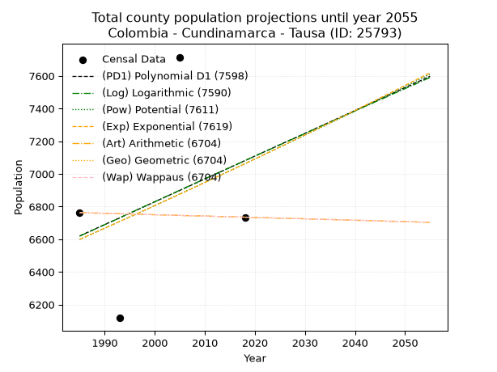
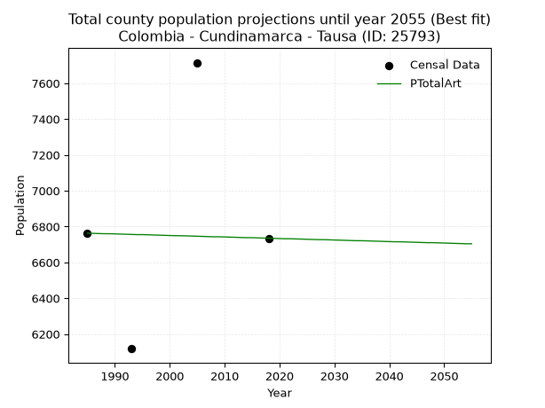
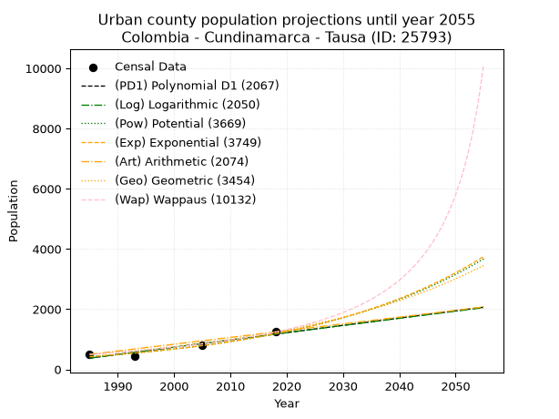
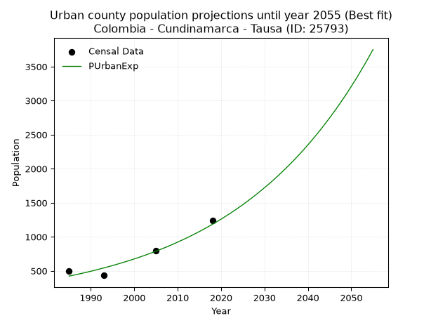
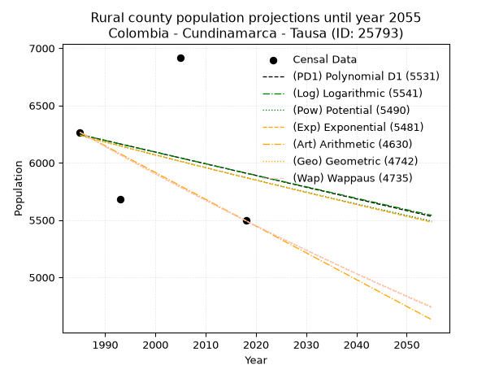
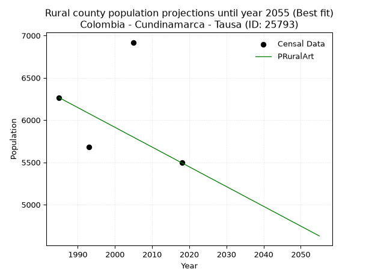

<div align="center">


</div>

# _“Population and Public Services Demand Projections (PPSD) until Year 2050 for Colombia - Cundinamarca - Tausa (ID: 25793)”_
Keywords: `population` `public-service` `projection` `lineal` `polynomial` `logarithmic` `potential` `exponential` `arithmetic` `geometric` `wappaus` `dane` `colombia` `south-america`

PPSD are analytical estimates used by governments and planners to anticipate future changes in population size, age distribution, and the resulting community needs for utilities, healthcare, education, and infrastructure as sizing future water treatment facilities, electrical grids, and road networks based on spatial growth.

> **General running parameters**: • app_version: _v20260806_. • Python version: _3.14.7_. • Pandas version: _3.0.5_. • NumPy version: _2.5.1_. • Creates, save and include plots into reports (create_plot): _False_. • Projection until year: _2050_. • Process polynomial degree 2 and up: _False_. • Process Wappaus: _True_. • Process Wappaus: _True_. • Set negative values to zero: _True_. • Set infinite values to zero: _True_. • Drop dataset notes: _True_. 
<div align="center">

Dynamic map: [:earth_americas:Google](http://maps.google.com/maps?q=5.196333075,-73.887813) [:earth_americas:OSM](https://www.openstreetmap.org/#map=18/5.196333075/-73.887813&layers=P) [:earth_americas:Bing](https://www.bing.com/maps?cp=5.196333075~-73.887813&lvl=18) [:earth_americas:Apple](https://maps.apple.com/frame?center=5.196333075%2C-73.887813&span=0.003%2C0.006)

</div>


<div align="center">

```geojson
{
  "type": "Feature",
  "geometry": {
    "type": "Point", 
    "coordinates": [-73.887813, 5.196333075]
  }, 
  "properties": {
    "Name": "Colombia - Cundinamarca - Tausa (ID: 25793)"
  }
}
```

</div>


## 0. Census Data (4 records)

Census data are official statistics collected by a government about the people and housing in a country. They usually include counts of total population, age, sex, race, income, education, and jobs.

📅Global census file: [Population.xlsx](../data/Population.xlsx)

| Source   |   Year |   CountryID | CountryName   |   StateID | StateName    |   CountyID | CountyName   |   PTotal |   PUrban |   PRural |
|:---------|-------:|------------:|:--------------|----------:|:-------------|-----------:|:-------------|---------:|---------:|---------:|
| DANE     |   1985 |          57 | Colombia      |        25 | Cundinamarca |      25793 | Tausa        |     6763 |      498 |     6265 |
| DANE     |   1993 |          57 | Colombia      |        25 | Cundinamarca |      25793 | Tausa        |     6118 |      435 |     5683 |
| DANE     |   2005 |          57 | Colombia      |        25 | Cundinamarca |      25793 | Tausa        |     7715 |      796 |     6919 |
| DANE     |   2018 |          57 | Colombia      |        25 | Cundinamarca |      25793 | Tausa        |     6735 |     1241 |     5494 |

> 🔥Some records could had specific notes about the registered values or the corresponding urban or rural distribution.

## 1. Total

### 1.1. Coefficients and Parameters

* (PD1) Polynomial Deg 1: 13.972300281012178, -21115.34363709461 (lineal)
* (Log) Logarithmic: 28038.589877544528, -206288.79634637403
* (Pow) Potential: 4.118826995452227, -9.763454674513834
* (Exp) Exponential: 0.002053169133046677, 112.0785820374251
* (Art) Arithmetic: Year diff. 2018 - 1985 = 33, Population diff. 6735 - 6763 = -28, Annual growth = -0.8484848484848485
* (Geo) Geometric: Year diff. 2018 - 1985 = 33, Population diff. 6735 - 6763 = -28, Annual growth % = -0.0001257123620985734
* (Wap) Wappaus: i = -0.012572008423245644, Condition values only valid for < 200)

<sub>
Wappaus condition values: ['-0.00', '-0.01', '-0.03', '-0.04', '-0.05', '-0.06', '-0.08', '-0.09', '-0.10', '-0.11', '-0.13', '-0.14', '-0.15', '-0.16', '-0.18', '-0.19', '-0.20', '-0.21', '-0.23', '-0.24', '-0.25', '-0.26', '-0.28', '-0.29', '-0.30', '-0.31', '-0.33', '-0.34', '-0.35', '-0.36', '-0.38', '-0.39', '-0.40', '-0.41', '-0.43', '-0.44', '-0.45', '-0.47', '-0.48', '-0.49', '-0.50', '-0.52', '-0.53', '-0.54', '-0.55', '-0.57', '-0.58', '-0.59', '-0.60', '-0.62', '-0.63', '-0.64', '-0.65', '-0.67', '-0.68', '-0.69', '-0.70', '-0.72', '-0.73', '-0.74', '-0.75', '-0.77', '-0.78', '-0.79', '-0.80', '-0.82']
</sub>


### 1.2. Projected Dataset

|   Year |   CountyID |   PTotalPD1 |   PTotalLog |   PTotalPow |   PTotalExp |   PTotalArt |   PTotalGeo |   PTotalWap |
|-------:|-----------:|------------:|------------:|------------:|------------:|------------:|------------:|------------:|
|   1985 |      25793 |        6620 |        6619 |        6599 |        6599 |        6763 |        6763 |        6763 |
|   1986 |      25793 |        6634 |        6633 |        6612 |        6613 |        6762 |        6762 |        6762 |
|   1987 |      25793 |        6648 |        6647 |        6626 |        6627 |        6761 |        6761 |        6761 |
|   1988 |      25793 |        6662 |        6661 |        6640 |        6640 |        6760 |        6760 |        6760 |
|   1989 |      25793 |        6676 |        6675 |        6654 |        6654 |        6760 |        6760 |        6760 |
|   1990 |      25793 |        6690 |        6689 |        6667 |        6668 |        6759 |        6759 |        6759 |
|   1991 |      25793 |        6704 |        6703 |        6681 |        6681 |        6758 |        6758 |        6758 |
|   1992 |      25793 |        6717 |        6717 |        6695 |        6695 |        6757 |        6757 |        6757 |
|   1993 |      25793 |        6731 |        6731 |        6709 |        6709 |        6756 |        6756 |        6756 |
|   1994 |      25793 |        6745 |        6746 |        6723 |        6723 |        6755 |        6755 |        6755 |
|   1995 |      25793 |        6759 |        6760 |        6737 |        6736 |        6755 |        6755 |        6755 |
|   1996 |      25793 |        6773 |        6774 |        6750 |        6750 |        6754 |        6754 |        6754 |
|   1997 |      25793 |        6787 |        6788 |        6764 |        6764 |        6753 |        6753 |        6753 |
|   1998 |      25793 |        6801 |        6802 |        6778 |        6778 |        6752 |        6752 |        6752 |
|   1999 |      25793 |        6815 |        6816 |        6792 |        6792 |        6751 |        6751 |        6751 |
|   2000 |      25793 |        6829 |        6830 |        6806 |        6806 |        6750 |        6750 |        6750 |
|   2001 |      25793 |        6843 |        6844 |        6820 |        6820 |        6749 |        6749 |        6749 |
|   2002 |      25793 |        6857 |        6858 |        6834 |        6834 |        6749 |        6749 |        6749 |
|   2003 |      25793 |        6871 |        6872 |        6849 |        6848 |        6748 |        6748 |        6748 |
|   2004 |      25793 |        6885 |        6886 |        6863 |        6862 |        6747 |        6747 |        6747 |
|   2005 |      25793 |        6899 |        6900 |        6877 |        6876 |        6746 |        6746 |        6746 |
|   2006 |      25793 |        6913 |        6914 |        6891 |        6890 |        6745 |        6745 |        6745 |
|   2007 |      25793 |        6927 |        6928 |        6905 |        6904 |        6744 |        6744 |        6744 |
|   2008 |      25793 |        6941 |        6942 |        6919 |        6919 |        6743 |        6743 |        6743 |
|   2009 |      25793 |        6955 |        6956 |        6933 |        6933 |        6743 |        6743 |        6743 |
|   2010 |      25793 |        6969 |        6970 |        6948 |        6947 |        6742 |        6742 |        6742 |
|   2011 |      25793 |        6983 |        6984 |        6962 |        6961 |        6741 |        6741 |        6741 |
|   2012 |      25793 |        6997 |        6998 |        6976 |        6976 |        6740 |        6740 |        6740 |
|   2013 |      25793 |        7011 |        7011 |        6990 |        6990 |        6739 |        6739 |        6739 |
|   2014 |      25793 |        7025 |        7025 |        7005 |        7004 |        6738 |        6738 |        6738 |
|   2015 |      25793 |        7039 |        7039 |        7019 |        7019 |        6738 |        6738 |        6738 |
|   2016 |      25793 |        7053 |        7053 |        7033 |        7033 |        6737 |        6737 |        6737 |
|   2017 |      25793 |        7067 |        7067 |        7048 |        7048 |        6736 |        6736 |        6736 |
|   2018 |      25793 |        7081 |        7081 |        7062 |        7062 |        6735 |        6735 |        6735 |
|   2019 |      25793 |        7095 |        7095 |        7077 |        7077 |        6734 |        6734 |        6734 |
|   2020 |      25793 |        7109 |        7109 |        7091 |        7091 |        6733 |        6733 |        6733 |
|   2021 |      25793 |        7123 |        7123 |        7106 |        7106 |        6732 |        6732 |        6732 |
|   2022 |      25793 |        7137 |        7137 |        7120 |        7120 |        6732 |        6732 |        6732 |
|   2023 |      25793 |        7151 |        7150 |        7135 |        7135 |        6731 |        6731 |        6731 |
|   2024 |      25793 |        7165 |        7164 |        7149 |        7150 |        6730 |        6730 |        6730 |
|   2025 |      25793 |        7179 |        7178 |        7164 |        7164 |        6729 |        6729 |        6729 |
|   2026 |      25793 |        7193 |        7192 |        7178 |        7179 |        6728 |        6728 |        6728 |
|   2027 |      25793 |        7207 |        7206 |        7193 |        7194 |        6727 |        6727 |        6727 |
|   2028 |      25793 |        7220 |        7220 |        7208 |        7209 |        6727 |        6727 |        6727 |
|   2029 |      25793 |        7234 |        7233 |        7222 |        7223 |        6726 |        6726 |        6726 |
|   2030 |      25793 |        7248 |        7247 |        7237 |        7238 |        6725 |        6725 |        6725 |
|   2031 |      25793 |        7262 |        7261 |        7252 |        7253 |        6724 |        6724 |        6724 |
|   2032 |      25793 |        7276 |        7275 |        7266 |        7268 |        6723 |        6723 |        6723 |
|   2033 |      25793 |        7290 |        7289 |        7281 |        7283 |        6722 |        6722 |        6722 |
|   2034 |      25793 |        7304 |        7302 |        7296 |        7298 |        6721 |        6721 |        6721 |
|   2035 |      25793 |        7318 |        7316 |        7311 |        7313 |        6721 |        6721 |        6721 |
|   2036 |      25793 |        7332 |        7330 |        7325 |        7328 |        6720 |        6720 |        6720 |
|   2037 |      25793 |        7346 |        7344 |        7340 |        7343 |        6719 |        6719 |        6719 |
|   2038 |      25793 |        7360 |        7358 |        7355 |        7358 |        6718 |        6718 |        6718 |
|   2039 |      25793 |        7374 |        7371 |        7370 |        7373 |        6717 |        6717 |        6717 |
|   2040 |      25793 |        7388 |        7385 |        7385 |        7388 |        6716 |        6716 |        6716 |
|   2041 |      25793 |        7402 |        7399 |        7400 |        7404 |        6715 |        6716 |        6716 |
|   2042 |      25793 |        7416 |        7413 |        7415 |        7419 |        6715 |        6715 |        6715 |
|   2043 |      25793 |        7430 |        7426 |        7430 |        7434 |        6714 |        6714 |        6714 |
|   2044 |      25793 |        7444 |        7440 |        7445 |        7449 |        6713 |        6713 |        6713 |
|   2045 |      25793 |        7458 |        7454 |        7460 |        7465 |        6712 |        6712 |        6712 |
|   2046 |      25793 |        7472 |        7467 |        7475 |        7480 |        6711 |        6711 |        6711 |
|   2047 |      25793 |        7486 |        7481 |        7490 |        7495 |        6710 |        6710 |        6710 |
|   2048 |      25793 |        7500 |        7495 |        7505 |        7511 |        6710 |        6710 |        6710 |
|   2049 |      25793 |        7514 |        7508 |        7520 |        7526 |        6709 |        6709 |        6709 |
|   2050 |      25793 |        7528 |        7522 |        7535 |        7542 |        6708 |        6708 |        6708 |
<div align="center">

</img>

</div>


### 1.3. Best fit with absolute and relative error (%)

Relative error puts that difference into context by dividing the absolute error by the true value, creating a unitless ratio or percentage that shows the scale of the mistake.

Absolute and relative error

|   Year | Source   |   CountryID | CountryName   |   StateID | StateName    |   CountyID_x | CountyName   |   PTotal |   PUrban |   PRural |   CountyID_y |   PTotalPD1 |   PTotalLog |   PTotalPow |   PTotalExp |   PTotalArt |   PTotalGeo |   PTotalWap |   PTotalPD1AbsError |   PTotalLogAbsError |   PTotalPowAbsError |   PTotalExpAbsError |   PTotalArtAbsError |   PTotalGeoAbsError |   PTotalWapAbsError |   PTotalPD1RelError |   PTotalLogRelError |   PTotalPowRelError |   PTotalExpRelError |   PTotalArtRelError |   PTotalGeoRelError |   PTotalWapRelError |
|-------:|:---------|------------:|:--------------|----------:|:-------------|-------------:|:-------------|---------:|---------:|---------:|-------------:|------------:|------------:|------------:|------------:|------------:|------------:|------------:|--------------------:|--------------------:|--------------------:|--------------------:|--------------------:|--------------------:|--------------------:|--------------------:|--------------------:|--------------------:|--------------------:|--------------------:|--------------------:|--------------------:|
|   1985 | DANE     |          57 | Colombia      |        25 | Cundinamarca |        25793 | Tausa        |     6763 |      498 |     6265 |        25793 |        6620 |        6619 |        6599 |        6599 |        6763 |        6763 |        6763 |                 143 |                 144 |                 164 |                 164 |                   0 |                   0 |                   0 |             2.11445 |             2.12923 |             2.42496 |             2.42496 |              0      |              0      |              0      |
|   1993 | DANE     |          57 | Colombia      |        25 | Cundinamarca |        25793 | Tausa        |     6118 |      435 |     5683 |        25793 |        6731 |        6731 |        6709 |        6709 |        6756 |        6756 |        6756 |                 613 |                 613 |                 591 |                 591 |                 638 |                 638 |                 638 |            10.0196  |            10.0196  |             9.66002 |             9.66002 |             10.4282 |             10.4282 |             10.4282 |
|   2005 | DANE     |          57 | Colombia      |        25 | Cundinamarca |        25793 | Tausa        |     7715 |      796 |     6919 |        25793 |        6899 |        6900 |        6877 |        6876 |        6746 |        6746 |        6746 |                 816 |                 815 |                 838 |                 839 |                 969 |                 969 |                 969 |            10.5768  |            10.5638  |            10.862   |            10.8749  |             12.5599 |             12.5599 |             12.5599 |
|   2018 | DANE     |          57 | Colombia      |        25 | Cundinamarca |        25793 | Tausa        |     6735 |     1241 |     5494 |        25793 |        7081 |        7081 |        7062 |        7062 |        6735 |        6735 |        6735 |                 346 |                 346 |                 327 |                 327 |                   0 |                   0 |                   0 |             5.13734 |             5.13734 |             4.85523 |             4.85523 |              0      |              0      |              0      |

Relative error mean

| Method    |   RelError | Best   |
|:----------|-----------:|:-------|
| PTotalPD1 |    6.96205 |        |
| PTotalLog |    6.96251 |        |
| PTotalPow |    6.95054 |        |
| PTotalExp |    6.95378 |        |
| PTotalArt |    5.74705 | True   |
| PTotalGeo |    5.74705 | True   |
| PTotalWap |    5.74705 | True   |

💙Best method: _**PTotalArt**_
<div align="center">

</img>

</div>


### 1.4. Fresh water supply demand in liters per capita per day (lpcd)

The fresh water supply demand typically ranges from 100 to 300 liters per capita per day (lpcd) for standard domestic and municipal planning, though absolute survival minimums set by the World Health Organization are as low as 7.5 to 20 liters per day, and total consumption in high-income nations can exceed 400 liters.

> `CZ`: Level in meters above the sea level (masl).<br> `WS`: Fresh water supply demand in liters per capita per day (lpcd or l/h/d).<br> `WSAll`: Zonal fresh water supply demand in liters per second (l/s).<br> `A`: Zonal area in square meters.

Reference values (RAS Colombia)

|    CZ |   WS |
|------:|-----:|
|  1000 |  120 |
|  2000 |  130 |
| 99999 |  140 |

County shapefile geometry properties and water supply values

|   CountyID |      ATotal |   CZTotal |   WSTotal |
|-----------:|------------:|----------:|----------:|
|      25793 | 2.01916e+08 |   3223.77 |       140 |

Projected values for best method: PTotalArt

|   CountyID |   Year |   PTotalArt |   WSTotal |   WSTotalAll |
|-----------:|-------:|------------:|----------:|-------------:|
|      25793 |   1985 |        6763 |       140 |      10.9586 |
|      25793 |   1986 |        6762 |       140 |      10.9569 |
|      25793 |   1987 |        6761 |       140 |      10.9553 |
|      25793 |   1988 |        6760 |       140 |      10.9537 |
|      25793 |   1989 |        6760 |       140 |      10.9537 |
|      25793 |   1990 |        6759 |       140 |      10.9521 |
|      25793 |   1991 |        6758 |       140 |      10.9505 |
|      25793 |   1992 |        6757 |       140 |      10.9488 |
|      25793 |   1993 |        6756 |       140 |      10.9472 |
|      25793 |   1994 |        6755 |       140 |      10.9456 |
|      25793 |   1995 |        6755 |       140 |      10.9456 |
|      25793 |   1996 |        6754 |       140 |      10.944  |
|      25793 |   1997 |        6753 |       140 |      10.9424 |
|      25793 |   1998 |        6752 |       140 |      10.9407 |
|      25793 |   1999 |        6751 |       140 |      10.9391 |
|      25793 |   2000 |        6750 |       140 |      10.9375 |
|      25793 |   2001 |        6749 |       140 |      10.9359 |
|      25793 |   2002 |        6749 |       140 |      10.9359 |
|      25793 |   2003 |        6748 |       140 |      10.9343 |
|      25793 |   2004 |        6747 |       140 |      10.9326 |
|      25793 |   2005 |        6746 |       140 |      10.931  |
|      25793 |   2006 |        6745 |       140 |      10.9294 |
|      25793 |   2007 |        6744 |       140 |      10.9278 |
|      25793 |   2008 |        6743 |       140 |      10.9262 |
|      25793 |   2009 |        6743 |       140 |      10.9262 |
|      25793 |   2010 |        6742 |       140 |      10.9245 |
|      25793 |   2011 |        6741 |       140 |      10.9229 |
|      25793 |   2012 |        6740 |       140 |      10.9213 |
|      25793 |   2013 |        6739 |       140 |      10.9197 |
|      25793 |   2014 |        6738 |       140 |      10.9181 |
|      25793 |   2015 |        6738 |       140 |      10.9181 |
|      25793 |   2016 |        6737 |       140 |      10.9164 |
|      25793 |   2017 |        6736 |       140 |      10.9148 |
|      25793 |   2018 |        6735 |       140 |      10.9132 |
|      25793 |   2019 |        6734 |       140 |      10.9116 |
|      25793 |   2020 |        6733 |       140 |      10.91   |
|      25793 |   2021 |        6732 |       140 |      10.9083 |
|      25793 |   2022 |        6732 |       140 |      10.9083 |
|      25793 |   2023 |        6731 |       140 |      10.9067 |
|      25793 |   2024 |        6730 |       140 |      10.9051 |
|      25793 |   2025 |        6729 |       140 |      10.9035 |
|      25793 |   2026 |        6728 |       140 |      10.9019 |
|      25793 |   2027 |        6727 |       140 |      10.9002 |
|      25793 |   2028 |        6727 |       140 |      10.9002 |
|      25793 |   2029 |        6726 |       140 |      10.8986 |
|      25793 |   2030 |        6725 |       140 |      10.897  |
|      25793 |   2031 |        6724 |       140 |      10.8954 |
|      25793 |   2032 |        6723 |       140 |      10.8938 |
|      25793 |   2033 |        6722 |       140 |      10.8921 |
|      25793 |   2034 |        6721 |       140 |      10.8905 |
|      25793 |   2035 |        6721 |       140 |      10.8905 |
|      25793 |   2036 |        6720 |       140 |      10.8889 |
|      25793 |   2037 |        6719 |       140 |      10.8873 |
|      25793 |   2038 |        6718 |       140 |      10.8856 |
|      25793 |   2039 |        6717 |       140 |      10.884  |
|      25793 |   2040 |        6716 |       140 |      10.8824 |
|      25793 |   2041 |        6715 |       140 |      10.8808 |
|      25793 |   2042 |        6715 |       140 |      10.8808 |
|      25793 |   2043 |        6714 |       140 |      10.8792 |
|      25793 |   2044 |        6713 |       140 |      10.8775 |
|      25793 |   2045 |        6712 |       140 |      10.8759 |
|      25793 |   2046 |        6711 |       140 |      10.8743 |
|      25793 |   2047 |        6710 |       140 |      10.8727 |
|      25793 |   2048 |        6710 |       140 |      10.8727 |
|      25793 |   2049 |        6709 |       140 |      10.8711 |
|      25793 |   2050 |        6708 |       140 |      10.8694 |

## 2. Urban

### 2.1. Coefficients and Parameters

* (PD1) Polynomial Deg 1: 24.18386190284996, -47631.26977117563 (lineal)
* (Log) Logarithmic: 48372.83514195361, -366939.8075495626
* (Pow) Potential: 62.37055180767369, -203.05732066067054
* (Exp) Exponential: 0.03117684170232593, 5.615070981763004e-25
* (Art) Arithmetic: Year diff. 2018 - 1985 = 33, Population diff. 1241 - 498 = 743, Annual growth = 22.515151515151516
* (Geo) Geometric: Year diff. 2018 - 1985 = 33, Population diff. 1241 - 498 = 743, Annual growth % = 0.02805520807581008
* (Wap) Wappaus: i = 2.5894366319898237, Condition values only valid for < 200)

<sub>
Wappaus condition values: ['0.00', '2.59', '5.18', '7.77', '10.36', '12.95', '15.54', '18.13', '20.72', '23.30', '25.89', '28.48', '31.07', '33.66', '36.25', '38.84', '41.43', '44.02', '46.61', '49.20', '51.79', '54.38', '56.97', '59.56', '62.15', '64.74', '67.33', '69.91', '72.50', '75.09', '77.68', '80.27', '82.86', '85.45', '88.04', '90.63', '93.22', '95.81', '98.40', '100.99', '103.58', '106.17', '108.76', '111.35', '113.94', '116.52', '119.11', '121.70', '124.29', '126.88', '129.47', '132.06', '134.65', '137.24', '139.83', '142.42', '145.01', '147.60', '150.19', '152.78', '155.37', '157.96', '160.55', '163.13', '165.72', '168.31']
</sub>


### 2.2. Projected Dataset

|   Year |   CountyID |   PUrbanPD1 |   PUrbanLog |   PUrbanPow |   PUrbanExp |   PUrbanArt |   PUrbanGeo |   PUrbanWap |
|-------:|-----------:|------------:|------------:|------------:|------------:|------------:|------------:|------------:|
|   1985 |      25793 |         374 |         373 |         422 |         423 |         498 |         498 |         498 |
|   1986 |      25793 |         398 |         398 |         436 |         436 |         521 |         512 |         511 |
|   1987 |      25793 |         422 |         422 |         450 |         450 |         543 |         526 |         524 |
|   1988 |      25793 |         446 |         446 |         464 |         464 |         566 |         541 |         538 |
|   1989 |      25793 |         470 |         471 |         479 |         479 |         588 |         556 |         552 |
|   1990 |      25793 |         495 |         495 |         494 |         494 |         611 |         572 |         567 |
|   1991 |      25793 |         519 |         519 |         510 |         510 |         633 |         588 |         582 |
|   1992 |      25793 |         543 |         544 |         526 |         526 |         656 |         604 |         597 |
|   1993 |      25793 |         567 |         568 |         543 |         543 |         678 |         621 |         613 |
|   1994 |      25793 |         591 |         592 |         560 |         560 |         701 |         639 |         629 |
|   1995 |      25793 |         616 |         616 |         578 |         577 |         723 |         657 |         646 |
|   1996 |      25793 |         640 |         641 |         596 |         596 |         746 |         675 |         663 |
|   1997 |      25793 |         664 |         665 |         615 |         615 |         768 |         694 |         681 |
|   1998 |      25793 |         688 |         689 |         635 |         634 |         791 |         714 |         700 |
|   1999 |      25793 |         712 |         713 |         655 |         654 |         813 |         734 |         719 |
|   2000 |      25793 |         736 |         737 |         676 |         675 |         836 |         754 |         738 |
|   2001 |      25793 |         761 |         762 |         697 |         696 |         858 |         775 |         758 |
|   2002 |      25793 |         785 |         786 |         719 |         718 |         881 |         797 |         779 |
|   2003 |      25793 |         809 |         810 |         742 |         741 |         903 |         819 |         801 |
|   2004 |      25793 |         833 |         834 |         765 |         764 |         926 |         842 |         823 |
|   2005 |      25793 |         857 |         858 |         790 |         789 |         948 |         866 |         846 |
|   2006 |      25793 |         882 |         882 |         814 |         814 |         971 |         890 |         870 |
|   2007 |      25793 |         906 |         906 |         840 |         839 |         993 |         915 |         895 |
|   2008 |      25793 |         930 |         930 |         867 |         866 |        1016 |         941 |         920 |
|   2009 |      25793 |         954 |         955 |         894 |         893 |        1038 |         967 |         947 |
|   2010 |      25793 |         978 |         979 |         922 |         922 |        1061 |         995 |         975 |
|   2011 |      25793 |        1002 |        1003 |         951 |         951 |        1083 |        1022 |        1003 |
|   2012 |      25793 |        1027 |        1027 |         981 |         981 |        1106 |        1051 |        1033 |
|   2013 |      25793 |        1051 |        1051 |        1012 |        1012 |        1128 |        1081 |        1064 |
|   2014 |      25793 |        1075 |        1075 |        1044 |        1044 |        1151 |        1111 |        1097 |
|   2015 |      25793 |        1099 |        1099 |        1077 |        1077 |        1173 |        1142 |        1131 |
|   2016 |      25793 |        1123 |        1123 |        1111 |        1111 |        1196 |        1174 |        1166 |
|   2017 |      25793 |        1148 |        1147 |        1146 |        1147 |        1218 |        1207 |        1203 |
|   2018 |      25793 |        1172 |        1171 |        1182 |        1183 |        1241 |        1241 |        1241 |
|   2019 |      25793 |        1196 |        1195 |        1219 |        1220 |        1264 |        1276 |        1281 |
|   2020 |      25793 |        1220 |        1219 |        1257 |        1259 |        1286 |        1312 |        1323 |
|   2021 |      25793 |        1244 |        1243 |        1296 |        1299 |        1309 |        1348 |        1368 |
|   2022 |      25793 |        1268 |        1267 |        1337 |        1340 |        1331 |        1386 |        1414 |
|   2023 |      25793 |        1293 |        1291 |        1379 |        1382 |        1354 |        1425 |        1463 |
|   2024 |      25793 |        1317 |        1314 |        1422 |        1426 |        1376 |        1465 |        1514 |
|   2025 |      25793 |        1341 |        1338 |        1466 |        1471 |        1399 |        1506 |        1568 |
|   2026 |      25793 |        1365 |        1362 |        1512 |        1518 |        1421 |        1548 |        1625 |
|   2027 |      25793 |        1389 |        1386 |        1559 |        1566 |        1444 |        1592 |        1685 |
|   2028 |      25793 |        1414 |        1410 |        1608 |        1616 |        1466 |        1637 |        1749 |
|   2029 |      25793 |        1438 |        1434 |        1658 |        1667 |        1489 |        1682 |        1817 |
|   2030 |      25793 |        1462 |        1458 |        1710 |        1720 |        1511 |        1730 |        1888 |
|   2031 |      25793 |        1486 |        1481 |        1763 |        1774 |        1534 |        1778 |        1965 |
|   2032 |      25793 |        1510 |        1505 |        1818 |        1830 |        1556 |        1828 |        2046 |
|   2033 |      25793 |        1535 |        1529 |        1875 |        1888 |        1579 |        1879 |        2133 |
|   2034 |      25793 |        1559 |        1553 |        1934 |        1948 |        1601 |        1932 |        2226 |
|   2035 |      25793 |        1583 |        1577 |        1994 |        2010 |        1624 |        1986 |        2326 |
|   2036 |      25793 |        1607 |        1600 |        2056 |        2073 |        1646 |        2042 |        2434 |
|   2037 |      25793 |        1631 |        1624 |        2120 |        2139 |        1669 |        2099 |        2550 |
|   2038 |      25793 |        1655 |        1648 |        2186 |        2207 |        1691 |        2158 |        2676 |
|   2039 |      25793 |        1680 |        1672 |        2254 |        2277 |        1714 |        2219 |        2813 |
|   2040 |      25793 |        1704 |        1695 |        2323 |        2349 |        1736 |        2281 |        2961 |
|   2041 |      25793 |        1728 |        1719 |        2396 |        2423 |        1759 |        2345 |        3124 |
|   2042 |      25793 |        1752 |        1743 |        2470 |        2500 |        1781 |        2411 |        3303 |
|   2043 |      25793 |        1776 |        1766 |        2547 |        2579 |        1804 |        2478 |        3501 |
|   2044 |      25793 |        1801 |        1790 |        2625 |        2661 |        1826 |        2548 |        3720 |
|   2045 |      25793 |        1825 |        1814 |        2707 |        2745 |        1849 |        2619 |        3965 |
|   2046 |      25793 |        1849 |        1837 |        2791 |        2832 |        1871 |        2693 |        4240 |
|   2047 |      25793 |        1873 |        1861 |        2877 |        2921 |        1894 |        2769 |        4551 |
|   2048 |      25793 |        1897 |        1885 |        2966 |        3014 |        1916 |        2846 |        4905 |
|   2049 |      25793 |        1921 |        1908 |        3058 |        3109 |        1939 |        2926 |        5314 |
|   2050 |      25793 |        1946 |        1932 |        3152 |        3208 |        1961 |        3008 |        5789 |
<div align="center">

</img>

</div>


### 2.3. Best fit with absolute and relative error (%)

Relative error puts that difference into context by dividing the absolute error by the true value, creating a unitless ratio or percentage that shows the scale of the mistake.

Absolute and relative error

|   Year | Source   |   CountryID | CountryName   |   StateID | StateName    |   CountyID_x | CountyName   |   PTotal |   PUrban |   PRural |   CountyID_y |   PUrbanPD1 |   PUrbanLog |   PUrbanPow |   PUrbanExp |   PUrbanArt |   PUrbanGeo |   PUrbanWap |   PUrbanPD1AbsError |   PUrbanLogAbsError |   PUrbanPowAbsError |   PUrbanExpAbsError |   PUrbanArtAbsError |   PUrbanGeoAbsError |   PUrbanWapAbsError |   PUrbanPD1RelError |   PUrbanLogRelError |   PUrbanPowRelError |   PUrbanExpRelError |   PUrbanArtRelError |   PUrbanGeoRelError |   PUrbanWapRelError |
|-------:|:---------|------------:|:--------------|----------:|:-------------|-------------:|:-------------|---------:|---------:|---------:|-------------:|------------:|------------:|------------:|------------:|------------:|------------:|------------:|--------------------:|--------------------:|--------------------:|--------------------:|--------------------:|--------------------:|--------------------:|--------------------:|--------------------:|--------------------:|--------------------:|--------------------:|--------------------:|--------------------:|
|   1985 | DANE     |          57 | Colombia      |        25 | Cundinamarca |        25793 | Tausa        |     6763 |      498 |     6265 |        25793 |         374 |         373 |         422 |         423 |         498 |         498 |         498 |                 124 |                 125 |                  76 |                  75 |                   0 |                   0 |                   0 |            24.8996  |            25.1004  |           15.261    |           15.0602   |              0      |             0       |             0       |
|   1993 | DANE     |          57 | Colombia      |        25 | Cundinamarca |        25793 | Tausa        |     6118 |      435 |     5683 |        25793 |         567 |         568 |         543 |         543 |         678 |         621 |         613 |                 132 |                 133 |                 108 |                 108 |                 243 |                 186 |                 178 |            30.3448  |            30.5747  |           24.8276   |           24.8276   |             55.8621 |            42.7586  |            40.9195  |
|   2005 | DANE     |          57 | Colombia      |        25 | Cundinamarca |        25793 | Tausa        |     7715 |      796 |     6919 |        25793 |         857 |         858 |         790 |         789 |         948 |         866 |         846 |                  61 |                  62 |                   6 |                   7 |                 152 |                  70 |                  50 |             7.66332 |             7.78894 |            0.753769 |            0.879397 |             19.0955 |             8.79397 |             6.28141 |
|   2018 | DANE     |          57 | Colombia      |        25 | Cundinamarca |        25793 | Tausa        |     6735 |     1241 |     5494 |        25793 |        1172 |        1171 |        1182 |        1183 |        1241 |        1241 |        1241 |                  69 |                  70 |                  59 |                  58 |                   0 |                   0 |                   0 |             5.56003 |             5.64061 |            4.75423  |            4.67365  |              0      |             0       |             0       |

Relative error mean

| Method    |   RelError | Best   |
|:----------|-----------:|:-------|
| PUrbanPD1 |    17.1169 |        |
| PUrbanLog |    17.2762 |        |
| PUrbanPow |    11.3992 |        |
| PUrbanExp |    11.3602 | True   |
| PUrbanArt |    18.7394 |        |
| PUrbanGeo |    12.8881 |        |
| PUrbanWap |    11.8002 |        |

💙Best method: _**PUrbanExp**_
<div align="center">

</img>

</div>


### 2.4. Fresh water supply demand in liters per capita per day (lpcd)

The fresh water supply demand typically ranges from 100 to 300 liters per capita per day (lpcd) for standard domestic and municipal planning, though absolute survival minimums set by the World Health Organization are as low as 7.5 to 20 liters per day, and total consumption in high-income nations can exceed 400 liters.

> `CZ`: Level in meters above the sea level (masl).<br> `WS`: Fresh water supply demand in liters per capita per day (lpcd or l/h/d).<br> `WSAll`: Zonal fresh water supply demand in liters per second (l/s).<br> `A`: Zonal area in square meters.

Reference values (RAS Colombia)

|    CZ |   WS |
|------:|-----:|
|  1000 |  120 |
|  2000 |  130 |
| 99999 |  140 |

County shapefile geometry properties and water supply values

|   CountyID |   AUrban |   CZUrban |   WSUrban |
|-----------:|---------:|----------:|----------:|
|      25793 |   241538 |    2957.4 |       140 |

Projected values for best method: PUrbanExp

|   CountyID |   Year |   PUrbanExp |   WSUrban |   WSUrbanAll |
|-----------:|-------:|------------:|----------:|-------------:|
|      25793 |   1985 |         423 |       140 |     0.685417 |
|      25793 |   1986 |         436 |       140 |     0.706481 |
|      25793 |   1987 |         450 |       140 |     0.729167 |
|      25793 |   1988 |         464 |       140 |     0.751852 |
|      25793 |   1989 |         479 |       140 |     0.776157 |
|      25793 |   1990 |         494 |       140 |     0.800463 |
|      25793 |   1991 |         510 |       140 |     0.826389 |
|      25793 |   1992 |         526 |       140 |     0.852315 |
|      25793 |   1993 |         543 |       140 |     0.879861 |
|      25793 |   1994 |         560 |       140 |     0.907407 |
|      25793 |   1995 |         577 |       140 |     0.934954 |
|      25793 |   1996 |         596 |       140 |     0.965741 |
|      25793 |   1997 |         615 |       140 |     0.996528 |
|      25793 |   1998 |         634 |       140 |     1.02731  |
|      25793 |   1999 |         654 |       140 |     1.05972  |
|      25793 |   2000 |         675 |       140 |     1.09375  |
|      25793 |   2001 |         696 |       140 |     1.12778  |
|      25793 |   2002 |         718 |       140 |     1.16343  |
|      25793 |   2003 |         741 |       140 |     1.20069  |
|      25793 |   2004 |         764 |       140 |     1.23796  |
|      25793 |   2005 |         789 |       140 |     1.27847  |
|      25793 |   2006 |         814 |       140 |     1.31898  |
|      25793 |   2007 |         839 |       140 |     1.35949  |
|      25793 |   2008 |         866 |       140 |     1.40324  |
|      25793 |   2009 |         893 |       140 |     1.44699  |
|      25793 |   2010 |         922 |       140 |     1.49398  |
|      25793 |   2011 |         951 |       140 |     1.54097  |
|      25793 |   2012 |         981 |       140 |     1.58958  |
|      25793 |   2013 |        1012 |       140 |     1.63981  |
|      25793 |   2014 |        1044 |       140 |     1.69167  |
|      25793 |   2015 |        1077 |       140 |     1.74514  |
|      25793 |   2016 |        1111 |       140 |     1.80023  |
|      25793 |   2017 |        1147 |       140 |     1.85856  |
|      25793 |   2018 |        1183 |       140 |     1.9169   |
|      25793 |   2019 |        1220 |       140 |     1.97685  |
|      25793 |   2020 |        1259 |       140 |     2.04005  |
|      25793 |   2021 |        1299 |       140 |     2.10486  |
|      25793 |   2022 |        1340 |       140 |     2.1713   |
|      25793 |   2023 |        1382 |       140 |     2.23935  |
|      25793 |   2024 |        1426 |       140 |     2.31065  |
|      25793 |   2025 |        1471 |       140 |     2.38356  |
|      25793 |   2026 |        1518 |       140 |     2.45972  |
|      25793 |   2027 |        1566 |       140 |     2.5375   |
|      25793 |   2028 |        1616 |       140 |     2.61852  |
|      25793 |   2029 |        1667 |       140 |     2.70116  |
|      25793 |   2030 |        1720 |       140 |     2.78704  |
|      25793 |   2031 |        1774 |       140 |     2.87454  |
|      25793 |   2032 |        1830 |       140 |     2.96528  |
|      25793 |   2033 |        1888 |       140 |     3.05926  |
|      25793 |   2034 |        1948 |       140 |     3.15648  |
|      25793 |   2035 |        2010 |       140 |     3.25694  |
|      25793 |   2036 |        2073 |       140 |     3.35903  |
|      25793 |   2037 |        2139 |       140 |     3.46597  |
|      25793 |   2038 |        2207 |       140 |     3.57616  |
|      25793 |   2039 |        2277 |       140 |     3.68958  |
|      25793 |   2040 |        2349 |       140 |     3.80625  |
|      25793 |   2041 |        2423 |       140 |     3.92616  |
|      25793 |   2042 |        2500 |       140 |     4.05093  |
|      25793 |   2043 |        2579 |       140 |     4.17894  |
|      25793 |   2044 |        2661 |       140 |     4.31181  |
|      25793 |   2045 |        2745 |       140 |     4.44792  |
|      25793 |   2046 |        2832 |       140 |     4.58889  |
|      25793 |   2047 |        2921 |       140 |     4.7331   |
|      25793 |   2048 |        3014 |       140 |     4.8838   |
|      25793 |   2049 |        3109 |       140 |     5.03773  |
|      25793 |   2050 |        3208 |       140 |     5.19815  |

## 3. Rural

### 3.1. Coefficients and Parameters

* (PD1) Polynomial Deg 1: -10.211561621837772, 26515.926134081 (lineal)
* (Log) Logarithmic: -20334.24526440911, 160651.0112031887
* (Pow) Potential: -3.687536300864881, 15.95569466071657
* (Exp) Exponential: -0.001850590530613651, 245731.66086458805
* (Art) Arithmetic: Year diff. 2018 - 1985 = 33, Population diff. 5494 - 6265 = -771, Annual growth = -23.363636363636363
* (Geo) Geometric: Year diff. 2018 - 1985 = 33, Population diff. 5494 - 6265 = -771, Annual growth % = -0.003971547029291589
* (Wap) Wappaus: i = -0.39737454483606366, Condition values only valid for < 200)

<sub>
Wappaus condition values: ['-0.00', '-0.40', '-0.79', '-1.19', '-1.59', '-1.99', '-2.38', '-2.78', '-3.18', '-3.58', '-3.97', '-4.37', '-4.77', '-5.17', '-5.56', '-5.96', '-6.36', '-6.76', '-7.15', '-7.55', '-7.95', '-8.34', '-8.74', '-9.14', '-9.54', '-9.93', '-10.33', '-10.73', '-11.13', '-11.52', '-11.92', '-12.32', '-12.72', '-13.11', '-13.51', '-13.91', '-14.31', '-14.70', '-15.10', '-15.50', '-15.89', '-16.29', '-16.69', '-17.09', '-17.48', '-17.88', '-18.28', '-18.68', '-19.07', '-19.47', '-19.87', '-20.27', '-20.66', '-21.06', '-21.46', '-21.86', '-22.25', '-22.65', '-23.05', '-23.45', '-23.84', '-24.24', '-24.64', '-25.03', '-25.43', '-25.83']
</sub>


### 3.2. Projected Dataset

|   Year |   CountyID |   PRuralPD1 |   PRuralLog |   PRuralPow |   PRuralExp |   PRuralArt |   PRuralGeo |   PRuralWap |
|-------:|-----------:|------------:|------------:|------------:|------------:|------------:|------------:|------------:|
|   1985 |      25793 |        6246 |        6245 |        6239 |        6239 |        6265 |        6265 |        6265 |
|   1986 |      25793 |        6236 |        6235 |        6227 |        6227 |        6242 |        6240 |        6240 |
|   1987 |      25793 |        6226 |        6225 |        6215 |        6216 |        6218 |        6215 |        6215 |
|   1988 |      25793 |        6215 |        6215 |        6204 |        6204 |        6195 |        6191 |        6191 |
|   1989 |      25793 |        6205 |        6205 |        6192 |        6193 |        6172 |        6166 |        6166 |
|   1990 |      25793 |        6195 |        6194 |        6181 |        6182 |        6148 |        6142 |        6142 |
|   1991 |      25793 |        6185 |        6184 |        6169 |        6170 |        6125 |        6117 |        6117 |
|   1992 |      25793 |        6174 |        6174 |        6158 |        6159 |        6101 |        6093 |        6093 |
|   1993 |      25793 |        6164 |        6164 |        6147 |        6147 |        6078 |        6069 |        6069 |
|   1994 |      25793 |        6154 |        6153 |        6135 |        6136 |        6055 |        6045 |        6045 |
|   1995 |      25793 |        6144 |        6143 |        6124 |        6125 |        6031 |        6021 |        6021 |
|   1996 |      25793 |        6134 |        6133 |        6113 |        6113 |        6008 |        5997 |        5997 |
|   1997 |      25793 |        6123 |        6123 |        6101 |        6102 |        5985 |        5973 |        5973 |
|   1998 |      25793 |        6113 |        6113 |        6090 |        6091 |        5961 |        5949 |        5950 |
|   1999 |      25793 |        6103 |        6103 |        6079 |        6079 |        5938 |        5926 |        5926 |
|   2000 |      25793 |        6093 |        6092 |        6068 |        6068 |        5915 |        5902 |        5902 |
|   2001 |      25793 |        6083 |        6082 |        6057 |        6057 |        5891 |        5879 |        5879 |
|   2002 |      25793 |        6072 |        6072 |        6045 |        6046 |        5868 |        5855 |        5856 |
|   2003 |      25793 |        6062 |        6062 |        6034 |        6035 |        5844 |        5832 |        5832 |
|   2004 |      25793 |        6052 |        6052 |        6023 |        6023 |        5821 |        5809 |        5809 |
|   2005 |      25793 |        6042 |        6042 |        6012 |        6012 |        5798 |        5786 |        5786 |
|   2006 |      25793 |        6032 |        6031 |        6001 |        6001 |        5774 |        5763 |        5763 |
|   2007 |      25793 |        6021 |        6021 |        5990 |        5990 |        5751 |        5740 |        5740 |
|   2008 |      25793 |        6011 |        6011 |        5979 |        5979 |        5728 |        5717 |        5717 |
|   2009 |      25793 |        6001 |        6001 |        5968 |        5968 |        5704 |        5694 |        5695 |
|   2010 |      25793 |        5991 |        5991 |        5957 |        5957 |        5681 |        5672 |        5672 |
|   2011 |      25793 |        5980 |        5981 |        5946 |        5946 |        5658 |        5649 |        5650 |
|   2012 |      25793 |        5970 |        5971 |        5935 |        5935 |        5634 |        5627 |        5627 |
|   2013 |      25793 |        5960 |        5961 |        5924 |        5924 |        5611 |        5604 |        5605 |
|   2014 |      25793 |        5950 |        5951 |        5914 |        5913 |        5587 |        5582 |        5582 |
|   2015 |      25793 |        5940 |        5940 |        5903 |        5902 |        5564 |        5560 |        5560 |
|   2016 |      25793 |        5929 |        5930 |        5892 |        5891 |        5541 |        5538 |        5538 |
|   2017 |      25793 |        5919 |        5920 |        5881 |        5880 |        5517 |        5516 |        5516 |
|   2018 |      25793 |        5909 |        5910 |        5871 |        5869 |        5494 |        5494 |        5494 |
|   2019 |      25793 |        5899 |        5900 |        5860 |        5859 |        5471 |        5472 |        5472 |
|   2020 |      25793 |        5889 |        5890 |        5849 |        5848 |        5447 |        5450 |        5450 |
|   2021 |      25793 |        5878 |        5880 |        5838 |        5837 |        5424 |        5429 |        5429 |
|   2022 |      25793 |        5868 |        5870 |        5828 |        5826 |        5401 |        5407 |        5407 |
|   2023 |      25793 |        5858 |        5860 |        5817 |        5815 |        5377 |        5386 |        5385 |
|   2024 |      25793 |        5848 |        5850 |        5807 |        5805 |        5354 |        5364 |        5364 |
|   2025 |      25793 |        5838 |        5840 |        5796 |        5794 |        5330 |        5343 |        5342 |
|   2026 |      25793 |        5827 |        5830 |        5786 |        5783 |        5307 |        5322 |        5321 |
|   2027 |      25793 |        5817 |        5820 |        5775 |        5772 |        5284 |        5301 |        5300 |
|   2028 |      25793 |        5807 |        5810 |        5764 |        5762 |        5260 |        5280 |        5279 |
|   2029 |      25793 |        5797 |        5800 |        5754 |        5751 |        5237 |        5259 |        5258 |
|   2030 |      25793 |        5786 |        5790 |        5744 |        5740 |        5214 |        5238 |        5237 |
|   2031 |      25793 |        5776 |        5780 |        5733 |        5730 |        5190 |        5217 |        5216 |
|   2032 |      25793 |        5766 |        5770 |        5723 |        5719 |        5167 |        5196 |        5195 |
|   2033 |      25793 |        5756 |        5760 |        5712 |        5709 |        5144 |        5176 |        5174 |
|   2034 |      25793 |        5746 |        5750 |        5702 |        5698 |        5120 |        5155 |        5153 |
|   2035 |      25793 |        5735 |        5740 |        5692 |        5688 |        5097 |        5135 |        5133 |
|   2036 |      25793 |        5725 |        5730 |        5681 |        5677 |        5073 |        5114 |        5112 |
|   2037 |      25793 |        5715 |        5720 |        5671 |        5667 |        5050 |        5094 |        5092 |
|   2038 |      25793 |        5705 |        5710 |        5661 |        5656 |        5027 |        5074 |        5071 |
|   2039 |      25793 |        5695 |        5700 |        5651 |        5646 |        5003 |        5054 |        5051 |
|   2040 |      25793 |        5684 |        5690 |        5640 |        5635 |        4980 |        5033 |        5031 |
|   2041 |      25793 |        5674 |        5680 |        5630 |        5625 |        4957 |        5013 |        5010 |
|   2042 |      25793 |        5664 |        5670 |        5620 |        5614 |        4933 |        4994 |        4990 |
|   2043 |      25793 |        5654 |        5660 |        5610 |        5604 |        4910 |        4974 |        4970 |
|   2044 |      25793 |        5643 |        5650 |        5600 |        5594 |        4887 |        4954 |        4950 |
|   2045 |      25793 |        5633 |        5640 |        5590 |        5583 |        4863 |        4934 |        4930 |
|   2046 |      25793 |        5623 |        5630 |        5580 |        5573 |        4840 |        4915 |        4911 |
|   2047 |      25793 |        5613 |        5620 |        5570 |        5563 |        4816 |        4895 |        4891 |
|   2048 |      25793 |        5603 |        5610 |        5560 |        5552 |        4793 |        4876 |        4871 |
|   2049 |      25793 |        5592 |        5600 |        5550 |        5542 |        4770 |        4856 |        4851 |
|   2050 |      25793 |        5582 |        5590 |        5540 |        5532 |        4746 |        4837 |        4832 |
<div align="center">

</img>

</div>


### 3.3. Best fit with absolute and relative error (%)

Relative error puts that difference into context by dividing the absolute error by the true value, creating a unitless ratio or percentage that shows the scale of the mistake.

Absolute and relative error

|   Year | Source   |   CountryID | CountryName   |   StateID | StateName    |   CountyID_x | CountyName   |   PTotal |   PUrban |   PRural |   CountyID_y |   PRuralPD1 |   PRuralLog |   PRuralPow |   PRuralExp |   PRuralArt |   PRuralGeo |   PRuralWap |   PRuralPD1AbsError |   PRuralLogAbsError |   PRuralPowAbsError |   PRuralExpAbsError |   PRuralArtAbsError |   PRuralGeoAbsError |   PRuralWapAbsError |   PRuralPD1RelError |   PRuralLogRelError |   PRuralPowRelError |   PRuralExpRelError |   PRuralArtRelError |   PRuralGeoRelError |   PRuralWapRelError |
|-------:|:---------|------------:|:--------------|----------:|:-------------|-------------:|:-------------|---------:|---------:|---------:|-------------:|------------:|------------:|------------:|------------:|------------:|------------:|------------:|--------------------:|--------------------:|--------------------:|--------------------:|--------------------:|--------------------:|--------------------:|--------------------:|--------------------:|--------------------:|--------------------:|--------------------:|--------------------:|--------------------:|
|   1985 | DANE     |          57 | Colombia      |        25 | Cundinamarca |        25793 | Tausa        |     6763 |      498 |     6265 |        25793 |        6246 |        6245 |        6239 |        6239 |        6265 |        6265 |        6265 |                  19 |                  20 |                  26 |                  26 |                   0 |                   0 |                   0 |            0.303272 |            0.319234 |            0.415004 |            0.415004 |             0       |             0       |             0       |
|   1993 | DANE     |          57 | Colombia      |        25 | Cundinamarca |        25793 | Tausa        |     6118 |      435 |     5683 |        25793 |        6164 |        6164 |        6147 |        6147 |        6078 |        6069 |        6069 |                 481 |                 481 |                 464 |                 464 |                 395 |                 386 |                 386 |            8.46384  |            8.46384  |            8.1647   |            8.1647   |             6.95055 |             6.79219 |             6.79219 |
|   2005 | DANE     |          57 | Colombia      |        25 | Cundinamarca |        25793 | Tausa        |     7715 |      796 |     6919 |        25793 |        6042 |        6042 |        6012 |        6012 |        5798 |        5786 |        5786 |                 877 |                 877 |                 907 |                 907 |                1121 |                1133 |                1133 |           12.6752   |           12.6752   |           13.1088   |           13.1088   |            16.2018  |            16.3752  |            16.3752  |
|   2018 | DANE     |          57 | Colombia      |        25 | Cundinamarca |        25793 | Tausa        |     6735 |     1241 |     5494 |        25793 |        5909 |        5910 |        5871 |        5869 |        5494 |        5494 |        5494 |                 415 |                 416 |                 377 |                 375 |                   0 |                   0 |                   0 |            7.55369  |            7.5719   |            6.86203  |            6.82563  |             0       |             0       |             0       |

Relative error mean

| Method    |   RelError | Best   |
|:----------|-----------:|:-------|
| PRuralPD1 |    7.24901 |        |
| PRuralLog |    7.25755 |        |
| PRuralPow |    7.13764 |        |
| PRuralExp |    7.12854 |        |
| PRuralArt |    5.78808 | True   |
| PRuralGeo |    5.79185 |        |
| PRuralWap |    5.79185 |        |

💙Best method: _**PRuralArt**_
<div align="center">

</img>

</div>


### 3.4. Fresh water supply demand in liters per capita per day (lpcd)

The fresh water supply demand typically ranges from 100 to 300 liters per capita per day (lpcd) for standard domestic and municipal planning, though absolute survival minimums set by the World Health Organization are as low as 7.5 to 20 liters per day, and total consumption in high-income nations can exceed 400 liters.

> `CZ`: Level in meters above the sea level (masl).<br> `WS`: Fresh water supply demand in liters per capita per day (lpcd or l/h/d).<br> `WSAll`: Zonal fresh water supply demand in liters per second (l/s).<br> `A`: Zonal area in square meters.

Reference values (RAS Colombia)

|    CZ |   WS |
|------:|-----:|
|  1000 |  120 |
|  2000 |  130 |
| 99999 |  140 |

County shapefile geometry properties and water supply values

|   CountyID |      ARural |   CZRural |   WSRural |
|-----------:|------------:|----------:|----------:|
|      25793 | 2.01675e+08 |    3224.1 |       140 |

Projected values for best method: PRuralArt

|   CountyID |   Year |   PRuralArt |   WSRural |   WSRuralAll |
|-----------:|-------:|------------:|----------:|-------------:|
|      25793 |   1985 |        6265 |       140 |     10.1516  |
|      25793 |   1986 |        6242 |       140 |     10.1144  |
|      25793 |   1987 |        6218 |       140 |     10.0755  |
|      25793 |   1988 |        6195 |       140 |     10.0382  |
|      25793 |   1989 |        6172 |       140 |     10.0009  |
|      25793 |   1990 |        6148 |       140 |      9.96204 |
|      25793 |   1991 |        6125 |       140 |      9.92477 |
|      25793 |   1992 |        6101 |       140 |      9.88588 |
|      25793 |   1993 |        6078 |       140 |      9.84861 |
|      25793 |   1994 |        6055 |       140 |      9.81134 |
|      25793 |   1995 |        6031 |       140 |      9.77245 |
|      25793 |   1996 |        6008 |       140 |      9.73519 |
|      25793 |   1997 |        5985 |       140 |      9.69792 |
|      25793 |   1998 |        5961 |       140 |      9.65903 |
|      25793 |   1999 |        5938 |       140 |      9.62176 |
|      25793 |   2000 |        5915 |       140 |      9.58449 |
|      25793 |   2001 |        5891 |       140 |      9.5456  |
|      25793 |   2002 |        5868 |       140 |      9.50833 |
|      25793 |   2003 |        5844 |       140 |      9.46944 |
|      25793 |   2004 |        5821 |       140 |      9.43218 |
|      25793 |   2005 |        5798 |       140 |      9.39491 |
|      25793 |   2006 |        5774 |       140 |      9.35602 |
|      25793 |   2007 |        5751 |       140 |      9.31875 |
|      25793 |   2008 |        5728 |       140 |      9.28148 |
|      25793 |   2009 |        5704 |       140 |      9.24259 |
|      25793 |   2010 |        5681 |       140 |      9.20532 |
|      25793 |   2011 |        5658 |       140 |      9.16806 |
|      25793 |   2012 |        5634 |       140 |      9.12917 |
|      25793 |   2013 |        5611 |       140 |      9.0919  |
|      25793 |   2014 |        5587 |       140 |      9.05301 |
|      25793 |   2015 |        5564 |       140 |      9.01574 |
|      25793 |   2016 |        5541 |       140 |      8.97847 |
|      25793 |   2017 |        5517 |       140 |      8.93958 |
|      25793 |   2018 |        5494 |       140 |      8.90231 |
|      25793 |   2019 |        5471 |       140 |      8.86505 |
|      25793 |   2020 |        5447 |       140 |      8.82616 |
|      25793 |   2021 |        5424 |       140 |      8.78889 |
|      25793 |   2022 |        5401 |       140 |      8.75162 |
|      25793 |   2023 |        5377 |       140 |      8.71273 |
|      25793 |   2024 |        5354 |       140 |      8.67546 |
|      25793 |   2025 |        5330 |       140 |      8.63657 |
|      25793 |   2026 |        5307 |       140 |      8.59931 |
|      25793 |   2027 |        5284 |       140 |      8.56204 |
|      25793 |   2028 |        5260 |       140 |      8.52315 |
|      25793 |   2029 |        5237 |       140 |      8.48588 |
|      25793 |   2030 |        5214 |       140 |      8.44861 |
|      25793 |   2031 |        5190 |       140 |      8.40972 |
|      25793 |   2032 |        5167 |       140 |      8.37245 |
|      25793 |   2033 |        5144 |       140 |      8.33519 |
|      25793 |   2034 |        5120 |       140 |      8.2963  |
|      25793 |   2035 |        5097 |       140 |      8.25903 |
|      25793 |   2036 |        5073 |       140 |      8.22014 |
|      25793 |   2037 |        5050 |       140 |      8.18287 |
|      25793 |   2038 |        5027 |       140 |      8.1456  |
|      25793 |   2039 |        5003 |       140 |      8.10671 |
|      25793 |   2040 |        4980 |       140 |      8.06944 |
|      25793 |   2041 |        4957 |       140 |      8.03218 |
|      25793 |   2042 |        4933 |       140 |      7.99329 |
|      25793 |   2043 |        4910 |       140 |      7.95602 |
|      25793 |   2044 |        4887 |       140 |      7.91875 |
|      25793 |   2045 |        4863 |       140 |      7.87986 |
|      25793 |   2046 |        4840 |       140 |      7.84259 |
|      25793 |   2047 |        4816 |       140 |      7.8037  |
|      25793 |   2048 |        4793 |       140 |      7.76644 |
|      25793 |   2049 |        4770 |       140 |      7.72917 |
|      25793 |   2050 |        4746 |       140 |      7.69028 |

<div align="center"><br><sub>Share this research</sub></div><br>

<sub>**APPS & TOOLS & CONTENT DISCLAIMER**: • NO WARRANTY - This content and software is provided by <a href="https://github.com/rcfdtools" target="_blank">github.com/rcfdtools</a> "as is", without any express or implied warranty, including warranties of merchantability, fitness for a particular purpose, or non-infringement. There is no guarantee that the software will be error-free or operate without interruption. • LIMITATION OF LIABILITY - Neither the authors nor copyright holders will be liable for claims or damages arising from the software or its use. You are responsible for determining if the software is appropriate for your use and assume all associated risks, including errors, legal compliance, and data loss. • NO PROFESSIONAL ADVICE - The software provides general information and does not offer professional advice. It should not replace consultation with professional advisors. [Clauses and global license for rcfdtools use.](https://github.com/rcfdtools/rcfdtools/blob/main/LICENSE.md)</sub>

| [:house: Home](Readme.md)  | [:beginner: Help / Collaborate](https://github.com/rcfdtools/R.HydroTools/discussions/31) |
|----------------------------|-------------------------------------------------------------------------------------------|