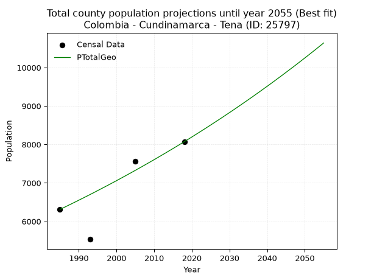
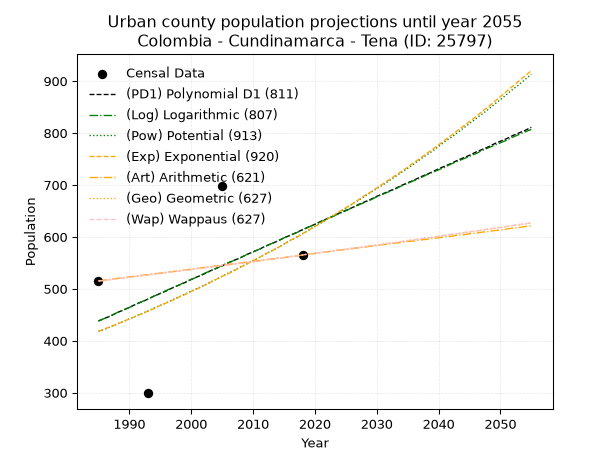
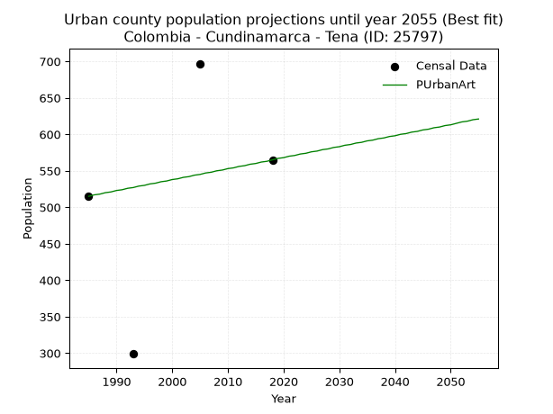
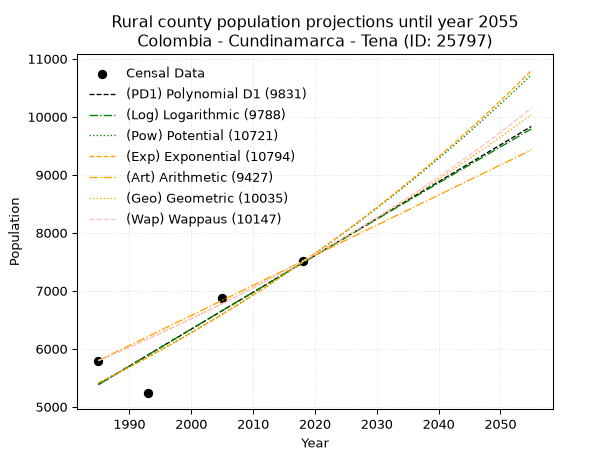
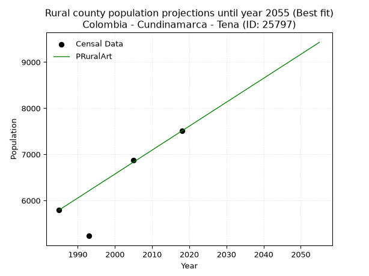

<div align="center">


</div>

# 📜 _“Population and Public Services Demand Projections (PPSD) until Year 2050 for Colombia - Cundinamarca - Tena (ID: 25797)”_
Keywords: `population` `public-service` `projection` `lineal` `polynomial` `logarithmic` `potential` `exponential` `arithmetic` `geometric` `wappaus` `dane` `colombia` `south-america`

PPSD are analytical estimates used by governments and planners to anticipate future changes in population size, age distribution, and the resulting community needs for utilities, healthcare, education, and infrastructure as sizing future water treatment facilities, electrical grids, and road networks based on spatial growth.

<div align="center">

</img>

</div>


> **General running parameters**: • app_version: _v20260806_. • Python version: _3.14.7_. • Pandas version: _3.0.5_. • NumPy version: _2.5.1_. • Creates, save and include plots into reports (create_plot): _False_. • Projection until year: _2050_. • Process polynomial degree 2 and up: _False_. • Process Wappaus: _True_. • Process Wappaus: _True_. • Set negative values to zero: _True_. • Set infinite values to zero: _True_. • Drop dataset notes: _True_. 
<div align="center">

Dynamic map: [:earth_americas:Google](http://maps.google.com/maps?q=4.655286052,-74.3891929) [:earth_americas:OSM](https://www.openstreetmap.org/#map=18/4.655286052/-74.3891929&layers=P) [:earth_americas:Bing](https://www.bing.com/maps?cp=4.655286052~-74.3891929&lvl=18) [:earth_americas:Apple](https://maps.apple.com/frame?center=4.655286052%2C-74.3891929&span=0.003%2C0.006)

</div>


<div align="center">

```geojson
{
  "type": "Feature",
  "geometry": {
    "type": "Point", 
    "coordinates": [-74.3891929, 4.655286052]
  }, 
  "properties": {
    "Name": "Colombia - Cundinamarca - Tena (ID: 25797)"
  }
}
```

</div>


## 0. Census Data (4 records)

Census data are official statistics collected by a government about the people and housing in a country. They usually include counts of total population, age, sex, race, income, education, and jobs.

📅Global census file: [Population.xlsx](../data/Population.xlsx)

| Source   |   Year |   CountryID | CountryName   |   StateID | StateName    |   CountyID | CountyName   |   PTotal |   PUrban |   PRural |
|:---------|-------:|------------:|:--------------|----------:|:-------------|-----------:|:-------------|---------:|---------:|---------:|
| DANE     |   1985 |          57 | Colombia      |        25 | Cundinamarca |      25797 | Tena         |     6310 |      515 |     5795 |
| DANE     |   1993 |          57 | Colombia      |        25 | Cundinamarca |      25797 | Tena         |     5532 |      299 |     5233 |
| DANE     |   2005 |          57 | Colombia      |        25 | Cundinamarca |      25797 | Tena         |     7569 |      697 |     6872 |
| DANE     |   2018 |          57 | Colombia      |        25 | Cundinamarca |      25797 | Tena         |     8072 |      565 |     7507 |

> 🔥Some records could had specific notes about the registered values or the corresponding urban or rural distribution.

📅[SUI-RUPS](https://www.datos.gov.co/Hacienda-y-Cr-dito-P-blico/Registro-nico-de-Prestadores-de-Servicios-P-blicos/4qkq-csdn/about_data) - Local public utility companies: [RUPS.csv](../data/RUPS.csv)

 | SERVICIO       | ESTADO    | NOMBRE                                                                       | NIT         | DEPARTAMENTO_DOMICILIO   | MUNICIPIO_DOMICILIO   | DIRECCION                      |   TELEFONO | EMAIL                                  | TIPO_PRESTADOR                             | CLASIFICACION                 |
|:---------------|:----------|:-----------------------------------------------------------------------------|:------------|:-------------------------|:----------------------|:-------------------------------|-----------:|:---------------------------------------|:-------------------------------------------|:------------------------------|
| ACUEDUCTO      | OPERATIVA | ASUARTELAM                                                                   | 808000038-0 | CUNDINAMARCA             | TENA                  | TRANSVERSAL 4D No. 4-11        |    8165505 | asuartelam@gmail.com                   | ORGANIZACION AUTORIZADA                    | MENOR O IGUAL A 2500 USUARIOS |
| ACUEDUCTO      | OPERATIVA | ASOCIACION DE USUARIOS DEL ACUEDUCTO RURAL SECTOR ALTO                       | 808000449-4 | CUNDINAMARCA             | TENA                  | VEREDA EL ROSARIO - MCPIO TENA |    8494936 | acueductoaverosa@hotmail.com           | ORGANIZACION AUTORIZADA                    | MENOR O IGUAL A 2500 USUARIOS |
| ACUEDUCTO      | OPERATIVA | ASOCIACION DE USUARIOS DEL ACUEDUCTO VEREDA GUASIMAL_AGUASIMAL               | 808001659-9 | CUNDINAMARCA             | TENA                  | Oficina Acueducto Gusimal      |    8494636 | acueductoaguasimale.s.p@gmail.com      | ORGANIZACION AUTORIZADA                    | MENOR O IGUAL A 2500 USUARIOS |
| ACUEDUCTO      | OPERATIVA | ASOCIACIÓN DEL ACUEDUCTO EL TAMBO ALTO DE LA CAPILLA DE TENA                 | 808001792-0 | CUNDINAMARCA             | TENA                  | VEREDA CATIVA                  |    3105730 | acueductoeltamboasatac@hotmail.com     | ORGANIZACION AUTORIZADA                    | MENOR O IGUAL A 2500 USUARIOS |
| ACUEDUCTO      | OPERATIVA | Asociación de usuarios suscriptores del acueducto San Isidro vereda laguneta | 808003698-5 | CUNDINAMARCA             | TENA                  | Finca Villa F vereda laguneta  |    8286813 | acueductosanisidro@yahoo.com           | ORGANIZACION AUTORIZADA                    | MENOR O IGUAL A 2500 USUARIOS |
| ACUEDUCTO      | OPERATIVA | EMPRESA DE SERVICIOS PUBLICOS DE TENA S.A. E.S.P.                            | 900888021-0 | CUNDINAMARCA             | TENA                  | CALLE 4 No 2-34                |    8494946 | acuatenasaesp@tena-cundinamarca.gov.co | SOCIEDADES (EMPRESA DE SERVICIOS PUBLICOS) | MENOR O IGUAL A 2500 USUARIOS |
| ALCANTARILLADO | OPERATIVA | EMPRESA DE SERVICIOS PUBLICOS DE TENA S.A. E.S.P.                            | 900888021-0 | CUNDINAMARCA             | TENA                  | CALLE 4 No 2-34                |    8494946 | acuatenasaesp@tena-cundinamarca.gov.co | SOCIEDADES (EMPRESA DE SERVICIOS PUBLICOS) | MENOR O IGUAL A 2500 USUARIOS |

## 1. Total

### 1.1. Coefficients and Parameters

* (PD1) Polynomial Deg 1: 68.88197511039701, -130910.42071457162 (lineal)
* (Log) Logarithmic: 137817.78879442564, -1040683.3670288775
* (Pow) Potential: 19.88471936116021, -61.808733814629825
* (Exp) Exponential: 0.009938755533859082, 1.5792843798374377e-05
* (Art) Arithmetic: Year diff. 2018 - 1985 = 33, Population diff. 8072 - 6310 = 1762, Annual growth = 53.39393939393939
* (Geo) Geometric: Year diff. 2018 - 1985 = 33, Population diff. 8072 - 6310 = 1762, Annual growth % = 0.007490508687047148
* (Wap) Wappaus: i = 0.7425106298698289, Condition values only valid for < 200)

<sub>
Wappaus condition values: ['0.00', '0.74', '1.49', '2.23', '2.97', '3.71', '4.46', '5.20', '5.94', '6.68', '7.43', '8.17', '8.91', '9.65', '10.40', '11.14', '11.88', '12.62', '13.37', '14.11', '14.85', '15.59', '16.34', '17.08', '17.82', '18.56', '19.31', '20.05', '20.79', '21.53', '22.28', '23.02', '23.76', '24.50', '25.25', '25.99', '26.73', '27.47', '28.22', '28.96', '29.70', '30.44', '31.19', '31.93', '32.67', '33.41', '34.16', '34.90', '35.64', '36.38', '37.13', '37.87', '38.61', '39.35', '40.10', '40.84', '41.58', '42.32', '43.07', '43.81', '44.55', '45.29', '46.04', '46.78', '47.52', '48.26']
</sub>


### 1.2. Projected Dataset

|   Year |   CountyID |   PTotalPD1 |   PTotalLog |   PTotalPow |   PTotalExp |   PTotalArt |   PTotalGeo |   PTotalWap |
|-------:|-----------:|------------:|------------:|------------:|------------:|------------:|------------:|------------:|
|   1985 |      25797 |        5820 |        5819 |        5839 |        5840 |        6310 |        6310 |        6310 |
|   1986 |      25797 |        5889 |        5888 |        5897 |        5898 |        6363 |        6357 |        6357 |
|   1987 |      25797 |        5958 |        5957 |        5957 |        5957 |        6417 |        6405 |        6404 |
|   1988 |      25797 |        6027 |        6027 |        6017 |        6017 |        6470 |        6453 |        6452 |
|   1989 |      25797 |        6096 |        6096 |        6077 |        6077 |        6524 |        6501 |        6500 |
|   1990 |      25797 |        6165 |        6165 |        6138 |        6137 |        6577 |        6550 |        6549 |
|   1991 |      25797 |        6234 |        6235 |        6200 |        6199 |        6630 |        6599 |        6598 |
|   1992 |      25797 |        6302 |        6304 |        6262 |        6261 |        6684 |        6648 |        6647 |
|   1993 |      25797 |        6371 |        6373 |        6325 |        6323 |        6737 |        6698 |        6696 |
|   1994 |      25797 |        6440 |        6442 |        6388 |        6386 |        6791 |        6748 |        6746 |
|   1995 |      25797 |        6509 |        6511 |        6452 |        6450 |        6844 |        6799 |        6797 |
|   1996 |      25797 |        6578 |        6580 |        6517 |        6515 |        6897 |        6850 |        6847 |
|   1997 |      25797 |        6647 |        6649 |        6582 |        6580 |        6951 |        6901 |        6898 |
|   1998 |      25797 |        6716 |        6718 |        6648 |        6645 |        7004 |        6953 |        6950 |
|   1999 |      25797 |        6785 |        6787 |        6714 |        6712 |        7058 |        7005 |        7002 |
|   2000 |      25797 |        6854 |        6856 |        6781 |        6779 |        7111 |        7057 |        7054 |
|   2001 |      25797 |        6922 |        6925 |        6849 |        6847 |        7164 |        7110 |        7107 |
|   2002 |      25797 |        6991 |        6994 |        6918 |        6915 |        7218 |        7164 |        7160 |
|   2003 |      25797 |        7060 |        7063 |        6987 |        6984 |        7271 |        7217 |        7214 |
|   2004 |      25797 |        7129 |        7132 |        7056 |        7054 |        7324 |        7271 |        7268 |
|   2005 |      25797 |        7198 |        7200 |        7127 |        7124 |        7378 |        7326 |        7322 |
|   2006 |      25797 |        7267 |        7269 |        7198 |        7195 |        7431 |        7381 |        7377 |
|   2007 |      25797 |        7336 |        7338 |        7269 |        7267 |        7485 |        7436 |        7432 |
|   2008 |      25797 |        7405 |        7406 |        7342 |        7340 |        7538 |        7492 |        7488 |
|   2009 |      25797 |        7473 |        7475 |        7415 |        7413 |        7591 |        7548 |        7544 |
|   2010 |      25797 |        7542 |        7544 |        7488 |        7487 |        7645 |        7604 |        7601 |
|   2011 |      25797 |        7611 |        7612 |        7563 |        7562 |        7698 |        7661 |        7658 |
|   2012 |      25797 |        7680 |        7681 |        7638 |        7637 |        7752 |        7719 |        7716 |
|   2013 |      25797 |        7749 |        7749 |        7714 |        7714 |        7805 |        7776 |        7774 |
|   2014 |      25797 |        7818 |        7818 |        7790 |        7791 |        7858 |        7835 |        7833 |
|   2015 |      25797 |        7887 |        7886 |        7868 |        7869 |        7912 |        7893 |        7892 |
|   2016 |      25797 |        7956 |        7954 |        7946 |        7947 |        7965 |        7952 |        7951 |
|   2017 |      25797 |        8025 |        8023 |        8024 |        8027 |        8019 |        8012 |        8011 |
|   2018 |      25797 |        8093 |        8091 |        8104 |        8107 |        8072 |        8072 |        8072 |
|   2019 |      25797 |        8162 |        8159 |        8184 |        8188 |        8125 |        8132 |        8133 |
|   2020 |      25797 |        8231 |        8228 |        8265 |        8270 |        8179 |        8193 |        8195 |
|   2021 |      25797 |        8300 |        8296 |        8347 |        8352 |        8232 |        8255 |        8257 |
|   2022 |      25797 |        8369 |        8364 |        8429 |        8436 |        8286 |        8317 |        8320 |
|   2023 |      25797 |        8438 |        8432 |        8513 |        8520 |        8339 |        8379 |        8383 |
|   2024 |      25797 |        8507 |        8500 |        8597 |        8605 |        8392 |        8442 |        8447 |
|   2025 |      25797 |        8576 |        8568 |        8682 |        8691 |        8446 |        8505 |        8511 |
|   2026 |      25797 |        8644 |        8636 |        8767 |        8778 |        8499 |        8569 |        8576 |
|   2027 |      25797 |        8713 |        8704 |        8854 |        8865 |        8553 |        8633 |        8641 |
|   2028 |      25797 |        8782 |        8772 |        8941 |        8954 |        8606 |        8697 |        8707 |
|   2029 |      25797 |        8851 |        8840 |        9029 |        9043 |        8659 |        8763 |        8774 |
|   2030 |      25797 |        8920 |        8908 |        9118 |        9134 |        8713 |        8828 |        8841 |
|   2031 |      25797 |        8989 |        8976 |        9208 |        9225 |        8766 |        8894 |        8909 |
|   2032 |      25797 |        9058 |        9044 |        9298 |        9317 |        8820 |        8961 |        8978 |
|   2033 |      25797 |        9127 |        9112 |        9390 |        9410 |        8873 |        9028 |        9047 |
|   2034 |      25797 |        9196 |        9179 |        9482 |        9504 |        8926 |        9096 |        9116 |
|   2035 |      25797 |        9264 |        9247 |        9575 |        9599 |        8980 |        9164 |        9187 |
|   2036 |      25797 |        9333 |        9315 |        9669 |        9695 |        9033 |        9232 |        9258 |
|   2037 |      25797 |        9402 |        9383 |        9764 |        9792 |        9086 |        9302 |        9329 |
|   2038 |      25797 |        9471 |        9450 |        9860 |        9890 |        9140 |        9371 |        9401 |
|   2039 |      25797 |        9540 |        9518 |        9956 |        9988 |        9193 |        9442 |        9474 |
|   2040 |      25797 |        9609 |        9585 |       10054 |       10088 |        9247 |        9512 |        9548 |
|   2041 |      25797 |        9678 |        9653 |       10152 |       10189 |        9300 |        9583 |        9622 |
|   2042 |      25797 |        9747 |        9720 |       10252 |       10291 |        9353 |        9655 |        9697 |
|   2043 |      25797 |        9815 |        9788 |       10352 |       10393 |        9407 |        9728 |        9773 |
|   2044 |      25797 |        9884 |        9855 |       10453 |       10497 |        9460 |        9800 |        9850 |
|   2045 |      25797 |        9953 |        9923 |       10555 |       10602 |        9514 |        9874 |        9927 |
|   2046 |      25797 |       10022 |        9990 |       10658 |       10708 |        9567 |        9948 |       10005 |
|   2047 |      25797 |       10091 |       10057 |       10763 |       10815 |        9620 |       10022 |       10083 |
|   2048 |      25797 |       10160 |       10125 |       10868 |       10923 |        9674 |       10097 |       10163 |
|   2049 |      25797 |       10229 |       10192 |       10974 |       11032 |        9727 |       10173 |       10243 |
|   2050 |      25797 |       10298 |       10259 |       11081 |       11142 |        9781 |       10249 |       10324 |
<div align="center">

</img>

</div>


### 1.3. Best fit with absolute and relative error (%)

Relative error puts that difference into context by dividing the absolute error by the true value, creating a unitless ratio or percentage that shows the scale of the mistake.

Absolute and relative error

|   Year | Source   |   CountryID | CountryName   |   StateID | StateName    |   CountyID_x | CountyName   |   PTotal |   PUrban |   PRural |   CountyID_y |   PTotalPD1 |   PTotalLog |   PTotalPow |   PTotalExp |   PTotalArt |   PTotalGeo |   PTotalWap |   PTotalPD1AbsError |   PTotalLogAbsError |   PTotalPowAbsError |   PTotalExpAbsError |   PTotalArtAbsError |   PTotalGeoAbsError |   PTotalWapAbsError |   PTotalPD1RelError |   PTotalLogRelError |   PTotalPowRelError |   PTotalExpRelError |   PTotalArtRelError |   PTotalGeoRelError |   PTotalWapRelError |
|-------:|:---------|------------:|:--------------|----------:|:-------------|-------------:|:-------------|---------:|---------:|---------:|-------------:|------------:|------------:|------------:|------------:|------------:|------------:|------------:|--------------------:|--------------------:|--------------------:|--------------------:|--------------------:|--------------------:|--------------------:|--------------------:|--------------------:|--------------------:|--------------------:|--------------------:|--------------------:|--------------------:|
|   1985 | DANE     |          57 | Colombia      |        25 | Cundinamarca |        25797 | Tena         |     6310 |      515 |     5795 |        25797 |        5820 |        5819 |        5839 |        5840 |        6310 |        6310 |        6310 |                 490 |                 491 |                 471 |                 470 |                   0 |                   0 |                   0 |            7.76545  |            7.7813   |            7.46434  |            7.44849  |             0       |             0       |             0       |
|   1993 | DANE     |          57 | Colombia      |        25 | Cundinamarca |        25797 | Tena         |     5532 |      299 |     5233 |        25797 |        6371 |        6373 |        6325 |        6323 |        6737 |        6698 |        6696 |                 839 |                 841 |                 793 |                 791 |                1205 |                1166 |                1164 |           15.1663   |           15.2025   |           14.3348   |           14.2986   |            21.7824  |            21.0774  |            21.0412  |
|   2005 | DANE     |          57 | Colombia      |        25 | Cundinamarca |        25797 | Tena         |     7569 |      697 |     6872 |        25797 |        7198 |        7200 |        7127 |        7124 |        7378 |        7326 |        7322 |                 371 |                 369 |                 442 |                 445 |                 191 |                 243 |                 247 |            4.90157  |            4.87515  |            5.83961  |            5.87924  |             2.52345 |             3.21046 |             3.26331 |
|   2018 | DANE     |          57 | Colombia      |        25 | Cundinamarca |        25797 | Tena         |     8072 |      565 |     7507 |        25797 |        8093 |        8091 |        8104 |        8107 |        8072 |        8072 |        8072 |                  21 |                  19 |                  32 |                  35 |                   0 |                   0 |                   0 |            0.260159 |            0.235382 |            0.396432 |            0.433598 |             0       |             0       |             0       |

Relative error mean

| Method    |   RelError | Best   |
|:----------|-----------:|:-------|
| PTotalPD1 |    7.02337 |        |
| PTotalLog |    7.02357 |        |
| PTotalPow |    7.00879 |        |
| PTotalExp |    7.01499 |        |
| PTotalArt |    6.07645 |        |
| PTotalGeo |    6.07196 | True   |
| PTotalWap |    6.07613 |        |

💙Best method: _**PTotalGeo**_
<div align="center">

</img>

</div>


### 1.4. Fresh water supply demand in liters per capita per day (lpcd)

The fresh water supply demand typically ranges from 100 to 300 liters per capita per day (lpcd) for standard domestic and municipal planning, though absolute survival minimums set by the World Health Organization are as low as 7.5 to 20 liters per day, and total consumption in high-income nations can exceed 400 liters.

> `CZ`: Level in meters above the sea level (masl)<br> `WS`: Fresh water supply demand in liters per capita per day (lpcd or l/h/d)<br> `WSAll`: Zonal fresh water supply demand in liters per second (l/s)<br> `A`: Zonal area in square meters<br> `DP`: Population density (people/hectare or p/ha)

Reference values (RAS Colombia)

|    CZ |   WS |
|------:|-----:|
|  1000 |  120 |
|  2000 |  130 |
| 99999 |  140 |

County shapefile geometry properties and water supply values

|   CountyID |      ATotal |   CZTotal |   WSTotal |
|-----------:|------------:|----------:|----------:|
|      25797 | 5.13837e+07 |   1458.47 |       130 |

Projected values for best method: PTotalGeo

|   CountyID |   Year |   PTotalGeo |   DPTotal |   WSTotal |   WSTotalAll |
|-----------:|-------:|------------:|----------:|----------:|-------------:|
|      25797 |   1985 |        6310 |      1.23 |       130 |      9.49421 |
|      25797 |   1986 |        6357 |      1.24 |       130 |      9.56493 |
|      25797 |   1987 |        6405 |      1.25 |       130 |      9.63715 |
|      25797 |   1988 |        6453 |      1.26 |       130 |      9.70937 |
|      25797 |   1989 |        6501 |      1.27 |       130 |      9.7816  |
|      25797 |   1990 |        6550 |      1.27 |       130 |      9.85532 |
|      25797 |   1991 |        6599 |      1.28 |       130 |      9.92905 |
|      25797 |   1992 |        6648 |      1.29 |       130 |     10.0028  |
|      25797 |   1993 |        6698 |      1.3  |       130 |     10.078   |
|      25797 |   1994 |        6748 |      1.31 |       130 |     10.1532  |
|      25797 |   1995 |        6799 |      1.32 |       130 |     10.23    |
|      25797 |   1996 |        6850 |      1.33 |       130 |     10.3067  |
|      25797 |   1997 |        6901 |      1.34 |       130 |     10.3834  |
|      25797 |   1998 |        6953 |      1.35 |       130 |     10.4617  |
|      25797 |   1999 |        7005 |      1.36 |       130 |     10.5399  |
|      25797 |   2000 |        7057 |      1.37 |       130 |     10.6182  |
|      25797 |   2001 |        7110 |      1.38 |       130 |     10.6979  |
|      25797 |   2002 |        7164 |      1.39 |       130 |     10.7792  |
|      25797 |   2003 |        7217 |      1.4  |       130 |     10.8589  |
|      25797 |   2004 |        7271 |      1.42 |       130 |     10.9402  |
|      25797 |   2005 |        7326 |      1.43 |       130 |     11.0229  |
|      25797 |   2006 |        7381 |      1.44 |       130 |     11.1057  |
|      25797 |   2007 |        7436 |      1.45 |       130 |     11.1884  |
|      25797 |   2008 |        7492 |      1.46 |       130 |     11.2727  |
|      25797 |   2009 |        7548 |      1.47 |       130 |     11.3569  |
|      25797 |   2010 |        7604 |      1.48 |       130 |     11.4412  |
|      25797 |   2011 |        7661 |      1.49 |       130 |     11.527   |
|      25797 |   2012 |        7719 |      1.5  |       130 |     11.6142  |
|      25797 |   2013 |        7776 |      1.51 |       130 |     11.7     |
|      25797 |   2014 |        7835 |      1.52 |       130 |     11.7888  |
|      25797 |   2015 |        7893 |      1.54 |       130 |     11.876   |
|      25797 |   2016 |        7952 |      1.55 |       130 |     11.9648  |
|      25797 |   2017 |        8012 |      1.56 |       130 |     12.0551  |
|      25797 |   2018 |        8072 |      1.57 |       130 |     12.1454  |
|      25797 |   2019 |        8132 |      1.58 |       130 |     12.2356  |
|      25797 |   2020 |        8193 |      1.59 |       130 |     12.3274  |
|      25797 |   2021 |        8255 |      1.61 |       130 |     12.4207  |
|      25797 |   2022 |        8317 |      1.62 |       130 |     12.514   |
|      25797 |   2023 |        8379 |      1.63 |       130 |     12.6073  |
|      25797 |   2024 |        8442 |      1.64 |       130 |     12.7021  |
|      25797 |   2025 |        8505 |      1.66 |       130 |     12.7969  |
|      25797 |   2026 |        8569 |      1.67 |       130 |     12.8932  |
|      25797 |   2027 |        8633 |      1.68 |       130 |     12.9895  |
|      25797 |   2028 |        8697 |      1.69 |       130 |     13.0858  |
|      25797 |   2029 |        8763 |      1.71 |       130 |     13.1851  |
|      25797 |   2030 |        8828 |      1.72 |       130 |     13.2829  |
|      25797 |   2031 |        8894 |      1.73 |       130 |     13.3822  |
|      25797 |   2032 |        8961 |      1.74 |       130 |     13.483   |
|      25797 |   2033 |        9028 |      1.76 |       130 |     13.5838  |
|      25797 |   2034 |        9096 |      1.77 |       130 |     13.6861  |
|      25797 |   2035 |        9164 |      1.78 |       130 |     13.7884  |
|      25797 |   2036 |        9232 |      1.8  |       130 |     13.8907  |
|      25797 |   2037 |        9302 |      1.81 |       130 |     13.9961  |
|      25797 |   2038 |        9371 |      1.82 |       130 |     14.0999  |
|      25797 |   2039 |        9442 |      1.84 |       130 |     14.2067  |
|      25797 |   2040 |        9512 |      1.85 |       130 |     14.312   |
|      25797 |   2041 |        9583 |      1.86 |       130 |     14.4189  |
|      25797 |   2042 |        9655 |      1.88 |       130 |     14.5272  |
|      25797 |   2043 |        9728 |      1.89 |       130 |     14.637   |
|      25797 |   2044 |        9800 |      1.91 |       130 |     14.7454  |
|      25797 |   2045 |        9874 |      1.92 |       130 |     14.8567  |
|      25797 |   2046 |        9948 |      1.94 |       130 |     14.9681  |
|      25797 |   2047 |       10022 |      1.95 |       130 |     15.0794  |
|      25797 |   2048 |       10097 |      1.97 |       130 |     15.1922  |
|      25797 |   2049 |       10173 |      1.98 |       130 |     15.3066  |
|      25797 |   2050 |       10249 |      1.99 |       130 |     15.4209  |

## 2. Urban

### 2.1. Coefficients and Parameters

* (PD1) Polynomial Deg 1: 5.327980730630333, -10138.293456443325 (lineal)
* (Log) Logarithmic: 10667.227923627528, -80562.68492929265
* (Pow) Potential: 22.567946397417575, -71.80281263611076
* (Exp) Exponential: 0.011279207204748915, 7.897150013849662e-08
* (Art) Arithmetic: Year diff. 2018 - 1985 = 33, Population diff. 565 - 515 = 50, Annual growth = 1.5151515151515151
* (Geo) Geometric: Year diff. 2018 - 1985 = 33, Population diff. 565 - 515 = 50, Annual growth % = 0.002811789032184153
* (Wap) Wappaus: i = 0.28058361391694725, Condition values only valid for < 200)

<sub>
Wappaus condition values: ['0.00', '0.28', '0.56', '0.84', '1.12', '1.40', '1.68', '1.96', '2.24', '2.53', '2.81', '3.09', '3.37', '3.65', '3.93', '4.21', '4.49', '4.77', '5.05', '5.33', '5.61', '5.89', '6.17', '6.45', '6.73', '7.01', '7.30', '7.58', '7.86', '8.14', '8.42', '8.70', '8.98', '9.26', '9.54', '9.82', '10.10', '10.38', '10.66', '10.94', '11.22', '11.50', '11.78', '12.07', '12.35', '12.63', '12.91', '13.19', '13.47', '13.75', '14.03', '14.31', '14.59', '14.87', '15.15', '15.43', '15.71', '15.99', '16.27', '16.55', '16.84', '17.12', '17.40', '17.68', '17.96', '18.24']
</sub>


### 2.2. Projected Dataset

|   Year |   CountyID |   PUrbanPD1 |   PUrbanLog |   PUrbanPow |   PUrbanExp |   PUrbanArt |   PUrbanGeo |   PUrbanWap |
|-------:|-----------:|------------:|------------:|------------:|------------:|------------:|------------:|------------:|
|   1985 |      25797 |         438 |         438 |         418 |         418 |         515 |         515 |         515 |
|   1986 |      25797 |         443 |         443 |         422 |         423 |         517 |         516 |         516 |
|   1987 |      25797 |         448 |         448 |         427 |         427 |         518 |         518 |         518 |
|   1988 |      25797 |         454 |         454 |         432 |         432 |         520 |         519 |         519 |
|   1989 |      25797 |         459 |         459 |         437 |         437 |         521 |         521 |         521 |
|   1990 |      25797 |         464 |         464 |         442 |         442 |         523 |         522 |         522 |
|   1991 |      25797 |         470 |         470 |         447 |         447 |         524 |         524 |         524 |
|   1992 |      25797 |         475 |         475 |         452 |         452 |         526 |         525 |         525 |
|   1993 |      25797 |         480 |         480 |         457 |         457 |         527 |         527 |         527 |
|   1994 |      25797 |         486 |         486 |         463 |         462 |         529 |         528 |         528 |
|   1995 |      25797 |         491 |         491 |         468 |         468 |         530 |         530 |         530 |
|   1996 |      25797 |         496 |         497 |         473 |         473 |         532 |         531 |         531 |
|   1997 |      25797 |         502 |         502 |         479 |         478 |         533 |         533 |         533 |
|   1998 |      25797 |         507 |         507 |         484 |         484 |         535 |         534 |         534 |
|   1999 |      25797 |         512 |         513 |         490 |         489 |         536 |         536 |         536 |
|   2000 |      25797 |         518 |         518 |         495 |         495 |         538 |         537 |         537 |
|   2001 |      25797 |         523 |         523 |         501 |         500 |         539 |         539 |         539 |
|   2002 |      25797 |         528 |         529 |         506 |         506 |         541 |         540 |         540 |
|   2003 |      25797 |         534 |         534 |         512 |         512 |         542 |         542 |         542 |
|   2004 |      25797 |         539 |         539 |         518 |         518 |         544 |         543 |         543 |
|   2005 |      25797 |         544 |         545 |         524 |         524 |         545 |         545 |         545 |
|   2006 |      25797 |         550 |         550 |         530 |         529 |         547 |         546 |         546 |
|   2007 |      25797 |         555 |         555 |         536 |         535 |         548 |         548 |         548 |
|   2008 |      25797 |         560 |         560 |         542 |         542 |         550 |         549 |         549 |
|   2009 |      25797 |         566 |         566 |         548 |         548 |         551 |         551 |         551 |
|   2010 |      25797 |         571 |         571 |         554 |         554 |         553 |         552 |         552 |
|   2011 |      25797 |         576 |         576 |         560 |         560 |         554 |         554 |         554 |
|   2012 |      25797 |         582 |         582 |         567 |         567 |         556 |         556 |         556 |
|   2013 |      25797 |         587 |         587 |         573 |         573 |         557 |         557 |         557 |
|   2014 |      25797 |         592 |         592 |         579 |         579 |         559 |         559 |         559 |
|   2015 |      25797 |         598 |         598 |         586 |         586 |         560 |         560 |         560 |
|   2016 |      25797 |         603 |         603 |         593 |         593 |         562 |         562 |         562 |
|   2017 |      25797 |         608 |         608 |         599 |         599 |         563 |         563 |         563 |
|   2018 |      25797 |         614 |         613 |         606 |         606 |         565 |         565 |         565 |
|   2019 |      25797 |         619 |         619 |         613 |         613 |         567 |         567 |         567 |
|   2020 |      25797 |         624 |         624 |         620 |         620 |         568 |         568 |         568 |
|   2021 |      25797 |         630 |         629 |         627 |         627 |         570 |         570 |         570 |
|   2022 |      25797 |         635 |         635 |         634 |         634 |         571 |         571 |         571 |
|   2023 |      25797 |         640 |         640 |         641 |         641 |         573 |         573 |         573 |
|   2024 |      25797 |         646 |         645 |         648 |         649 |         574 |         575 |         575 |
|   2025 |      25797 |         651 |         650 |         655 |         656 |         576 |         576 |         576 |
|   2026 |      25797 |         656 |         656 |         663 |         663 |         577 |         578 |         578 |
|   2027 |      25797 |         662 |         661 |         670 |         671 |         579 |         579 |         579 |
|   2028 |      25797 |         667 |         666 |         678 |         679 |         580 |         581 |         581 |
|   2029 |      25797 |         672 |         671 |         685 |         686 |         582 |         583 |         583 |
|   2030 |      25797 |         678 |         677 |         693 |         694 |         583 |         584 |         584 |
|   2031 |      25797 |         683 |         682 |         700 |         702 |         585 |         586 |         586 |
|   2032 |      25797 |         688 |         687 |         708 |         710 |         586 |         588 |         588 |
|   2033 |      25797 |         693 |         692 |         716 |         718 |         588 |         589 |         589 |
|   2034 |      25797 |         699 |         698 |         724 |         726 |         589 |         591 |         591 |
|   2035 |      25797 |         704 |         703 |         732 |         734 |         591 |         593 |         593 |
|   2036 |      25797 |         709 |         708 |         740 |         743 |         592 |         594 |         594 |
|   2037 |      25797 |         715 |         713 |         749 |         751 |         594 |         596 |         596 |
|   2038 |      25797 |         720 |         719 |         757 |         760 |         595 |         598 |         598 |
|   2039 |      25797 |         725 |         724 |         765 |         768 |         597 |         599 |         599 |
|   2040 |      25797 |         731 |         729 |         774 |         777 |         598 |         601 |         601 |
|   2041 |      25797 |         736 |         734 |         783 |         786 |         600 |         603 |         603 |
|   2042 |      25797 |         741 |         740 |         791 |         795 |         601 |         604 |         605 |
|   2043 |      25797 |         747 |         745 |         800 |         804 |         603 |         606 |         606 |
|   2044 |      25797 |         752 |         750 |         809 |         813 |         604 |         608 |         608 |
|   2045 |      25797 |         757 |         755 |         818 |         822 |         606 |         609 |         610 |
|   2046 |      25797 |         763 |         760 |         827 |         831 |         607 |         611 |         611 |
|   2047 |      25797 |         768 |         766 |         836 |         841 |         609 |         613 |         613 |
|   2048 |      25797 |         773 |         771 |         845 |         850 |         610 |         615 |         615 |
|   2049 |      25797 |         779 |         776 |         855 |         860 |         612 |         616 |         617 |
|   2050 |      25797 |         784 |         781 |         864 |         870 |         613 |         618 |         618 |
<div align="center">

</img>

</div>


### 2.3. Best fit with absolute and relative error (%)

Relative error puts that difference into context by dividing the absolute error by the true value, creating a unitless ratio or percentage that shows the scale of the mistake.

Absolute and relative error

|   Year | Source   |   CountryID | CountryName   |   StateID | StateName    |   CountyID_x | CountyName   |   PTotal |   PUrban |   PRural |   CountyID_y |   PUrbanPD1 |   PUrbanLog |   PUrbanPow |   PUrbanExp |   PUrbanArt |   PUrbanGeo |   PUrbanWap |   PUrbanPD1AbsError |   PUrbanLogAbsError |   PUrbanPowAbsError |   PUrbanExpAbsError |   PUrbanArtAbsError |   PUrbanGeoAbsError |   PUrbanWapAbsError |   PUrbanPD1RelError |   PUrbanLogRelError |   PUrbanPowRelError |   PUrbanExpRelError |   PUrbanArtRelError |   PUrbanGeoRelError |   PUrbanWapRelError |
|-------:|:---------|------------:|:--------------|----------:|:-------------|-------------:|:-------------|---------:|---------:|---------:|-------------:|------------:|------------:|------------:|------------:|------------:|------------:|------------:|--------------------:|--------------------:|--------------------:|--------------------:|--------------------:|--------------------:|--------------------:|--------------------:|--------------------:|--------------------:|--------------------:|--------------------:|--------------------:|--------------------:|
|   1985 | DANE     |          57 | Colombia      |        25 | Cundinamarca |        25797 | Tena         |     6310 |      515 |     5795 |        25797 |         438 |         438 |         418 |         418 |         515 |         515 |         515 |                  77 |                  77 |                  97 |                  97 |                   0 |                   0 |                   0 |            14.9515  |            14.9515  |            18.835   |            18.835   |              0      |              0      |              0      |
|   1993 | DANE     |          57 | Colombia      |        25 | Cundinamarca |        25797 | Tena         |     5532 |      299 |     5233 |        25797 |         480 |         480 |         457 |         457 |         527 |         527 |         527 |                 181 |                 181 |                 158 |                 158 |                 228 |                 228 |                 228 |            60.5351  |            60.5351  |            52.8428  |            52.8428  |             76.2542 |             76.2542 |             76.2542 |
|   2005 | DANE     |          57 | Colombia      |        25 | Cundinamarca |        25797 | Tena         |     7569 |      697 |     6872 |        25797 |         544 |         545 |         524 |         524 |         545 |         545 |         545 |                 153 |                 152 |                 173 |                 173 |                 152 |                 152 |                 152 |            21.9512  |            21.8077  |            24.8207  |            24.8207  |             21.8077 |             21.8077 |             21.8077 |
|   2018 | DANE     |          57 | Colombia      |        25 | Cundinamarca |        25797 | Tena         |     8072 |      565 |     7507 |        25797 |         614 |         613 |         606 |         606 |         565 |         565 |         565 |                  49 |                  48 |                  41 |                  41 |                   0 |                   0 |                   0 |             8.67257 |             8.49558 |             7.25664 |             7.25664 |              0      |              0      |              0      |

Relative error mean

| Method    |   RelError | Best   |
|:----------|-----------:|:-------|
| PUrbanPD1 |    26.5276 |        |
| PUrbanLog |    26.4475 |        |
| PUrbanPow |    25.9388 |        |
| PUrbanExp |    25.9388 |        |
| PUrbanArt |    24.5155 | True   |
| PUrbanGeo |    24.5155 | True   |
| PUrbanWap |    24.5155 | True   |

💙Best method: _**PUrbanArt**_
<div align="center">

</img>

</div>


### 2.4. Fresh water supply demand in liters per capita per day (lpcd)

The fresh water supply demand typically ranges from 100 to 300 liters per capita per day (lpcd) for standard domestic and municipal planning, though absolute survival minimums set by the World Health Organization are as low as 7.5 to 20 liters per day, and total consumption in high-income nations can exceed 400 liters.

> `CZ`: Level in meters above the sea level (masl)<br> `WS`: Fresh water supply demand in liters per capita per day (lpcd or l/h/d)<br> `WSAll`: Zonal fresh water supply demand in liters per second (l/s)<br> `A`: Zonal area in square meters<br> `DP`: Population density (people/hectare or p/ha)

Reference values (RAS Colombia)

|    CZ |   WS |
|------:|-----:|
|  1000 |  120 |
|  2000 |  130 |
| 99999 |  140 |

County shapefile geometry properties and water supply values

|   CountyID |   AUrban |   CZUrban |   WSUrban |
|-----------:|---------:|----------:|----------:|
|      25797 |   197709 |   1352.52 |       130 |

Projected values for best method: PUrbanArt

|   CountyID |   Year |   PUrbanArt |   DPUrban |   WSUrban |   WSUrbanAll |
|-----------:|-------:|------------:|----------:|----------:|-------------:|
|      25797 |   1985 |         515 |     26.05 |       130 |     0.774884 |
|      25797 |   1986 |         517 |     26.15 |       130 |     0.777894 |
|      25797 |   1987 |         518 |     26.2  |       130 |     0.779398 |
|      25797 |   1988 |         520 |     26.3  |       130 |     0.782407 |
|      25797 |   1989 |         521 |     26.35 |       130 |     0.783912 |
|      25797 |   1990 |         523 |     26.45 |       130 |     0.786921 |
|      25797 |   1991 |         524 |     26.5  |       130 |     0.788426 |
|      25797 |   1992 |         526 |     26.6  |       130 |     0.791435 |
|      25797 |   1993 |         527 |     26.66 |       130 |     0.79294  |
|      25797 |   1994 |         529 |     26.76 |       130 |     0.795949 |
|      25797 |   1995 |         530 |     26.81 |       130 |     0.797454 |
|      25797 |   1996 |         532 |     26.91 |       130 |     0.800463 |
|      25797 |   1997 |         533 |     26.96 |       130 |     0.801968 |
|      25797 |   1998 |         535 |     27.06 |       130 |     0.804977 |
|      25797 |   1999 |         536 |     27.11 |       130 |     0.806481 |
|      25797 |   2000 |         538 |     27.21 |       130 |     0.809491 |
|      25797 |   2001 |         539 |     27.26 |       130 |     0.810995 |
|      25797 |   2002 |         541 |     27.36 |       130 |     0.814005 |
|      25797 |   2003 |         542 |     27.41 |       130 |     0.815509 |
|      25797 |   2004 |         544 |     27.52 |       130 |     0.818519 |
|      25797 |   2005 |         545 |     27.57 |       130 |     0.820023 |
|      25797 |   2006 |         547 |     27.67 |       130 |     0.823032 |
|      25797 |   2007 |         548 |     27.72 |       130 |     0.824537 |
|      25797 |   2008 |         550 |     27.82 |       130 |     0.827546 |
|      25797 |   2009 |         551 |     27.87 |       130 |     0.829051 |
|      25797 |   2010 |         553 |     27.97 |       130 |     0.83206  |
|      25797 |   2011 |         554 |     28.02 |       130 |     0.833565 |
|      25797 |   2012 |         556 |     28.12 |       130 |     0.836574 |
|      25797 |   2013 |         557 |     28.17 |       130 |     0.838079 |
|      25797 |   2014 |         559 |     28.27 |       130 |     0.841088 |
|      25797 |   2015 |         560 |     28.32 |       130 |     0.842593 |
|      25797 |   2016 |         562 |     28.43 |       130 |     0.845602 |
|      25797 |   2017 |         563 |     28.48 |       130 |     0.847106 |
|      25797 |   2018 |         565 |     28.58 |       130 |     0.850116 |
|      25797 |   2019 |         567 |     28.68 |       130 |     0.853125 |
|      25797 |   2020 |         568 |     28.73 |       130 |     0.85463  |
|      25797 |   2021 |         570 |     28.83 |       130 |     0.857639 |
|      25797 |   2022 |         571 |     28.88 |       130 |     0.859144 |
|      25797 |   2023 |         573 |     28.98 |       130 |     0.862153 |
|      25797 |   2024 |         574 |     29.03 |       130 |     0.863657 |
|      25797 |   2025 |         576 |     29.13 |       130 |     0.866667 |
|      25797 |   2026 |         577 |     29.18 |       130 |     0.868171 |
|      25797 |   2027 |         579 |     29.29 |       130 |     0.871181 |
|      25797 |   2028 |         580 |     29.34 |       130 |     0.872685 |
|      25797 |   2029 |         582 |     29.44 |       130 |     0.875694 |
|      25797 |   2030 |         583 |     29.49 |       130 |     0.877199 |
|      25797 |   2031 |         585 |     29.59 |       130 |     0.880208 |
|      25797 |   2032 |         586 |     29.64 |       130 |     0.881713 |
|      25797 |   2033 |         588 |     29.74 |       130 |     0.884722 |
|      25797 |   2034 |         589 |     29.79 |       130 |     0.886227 |
|      25797 |   2035 |         591 |     29.89 |       130 |     0.889236 |
|      25797 |   2036 |         592 |     29.94 |       130 |     0.890741 |
|      25797 |   2037 |         594 |     30.04 |       130 |     0.89375  |
|      25797 |   2038 |         595 |     30.09 |       130 |     0.895255 |
|      25797 |   2039 |         597 |     30.2  |       130 |     0.898264 |
|      25797 |   2040 |         598 |     30.25 |       130 |     0.899769 |
|      25797 |   2041 |         600 |     30.35 |       130 |     0.902778 |
|      25797 |   2042 |         601 |     30.4  |       130 |     0.904282 |
|      25797 |   2043 |         603 |     30.5  |       130 |     0.907292 |
|      25797 |   2044 |         604 |     30.55 |       130 |     0.908796 |
|      25797 |   2045 |         606 |     30.65 |       130 |     0.911806 |
|      25797 |   2046 |         607 |     30.7  |       130 |     0.91331  |
|      25797 |   2047 |         609 |     30.8  |       130 |     0.916319 |
|      25797 |   2048 |         610 |     30.85 |       130 |     0.917824 |
|      25797 |   2049 |         612 |     30.95 |       130 |     0.920833 |
|      25797 |   2050 |         613 |     31.01 |       130 |     0.922338 |

## 3. Rural

### 3.1. Coefficients and Parameters

* (PD1) Polynomial Deg 1: 63.553994379766685, -120772.12725812831 (lineal)
* (Log) Logarithmic: 127150.56087079825, -960120.6820995857
* (Pow) Potential: 19.73741844140368, -61.35612666948414
* (Exp) Exponential: 0.009865402469009106, 1.6925347920244177e-05
* (Art) Arithmetic: Year diff. 2018 - 1985 = 33, Population diff. 7507 - 5795 = 1712, Annual growth = 51.878787878787875
* (Geo) Geometric: Year diff. 2018 - 1985 = 33, Population diff. 7507 - 5795 = 1712, Annual growth % = 0.007874491757430047
* (Wap) Wappaus: i = 0.7800148530865716, Condition values only valid for < 200)

<sub>
Wappaus condition values: ['0.00', '0.78', '1.56', '2.34', '3.12', '3.90', '4.68', '5.46', '6.24', '7.02', '7.80', '8.58', '9.36', '10.14', '10.92', '11.70', '12.48', '13.26', '14.04', '14.82', '15.60', '16.38', '17.16', '17.94', '18.72', '19.50', '20.28', '21.06', '21.84', '22.62', '23.40', '24.18', '24.96', '25.74', '26.52', '27.30', '28.08', '28.86', '29.64', '30.42', '31.20', '31.98', '32.76', '33.54', '34.32', '35.10', '35.88', '36.66', '37.44', '38.22', '39.00', '39.78', '40.56', '41.34', '42.12', '42.90', '43.68', '44.46', '45.24', '46.02', '46.80', '47.58', '48.36', '49.14', '49.92', '50.70']
</sub>


### 3.2. Projected Dataset

|   Year |   CountyID |   PRuralPD1 |   PRuralLog |   PRuralPow |   PRuralExp |   PRuralArt |   PRuralGeo |   PRuralWap |
|-------:|-----------:|------------:|------------:|------------:|------------:|------------:|------------:|------------:|
|   1985 |      25797 |        5383 |        5381 |        5409 |        5411 |        5795 |        5795 |        5795 |
|   1986 |      25797 |        5446 |        5445 |        5463 |        5464 |        5847 |        5841 |        5840 |
|   1987 |      25797 |        5510 |        5509 |        5518 |        5518 |        5899 |        5887 |        5886 |
|   1988 |      25797 |        5573 |        5573 |        5573 |        5573 |        5951 |        5933 |        5932 |
|   1989 |      25797 |        5637 |        5637 |        5629 |        5628 |        6003 |        5980 |        5979 |
|   1990 |      25797 |        5700 |        5701 |        5685 |        5684 |        6054 |        6027 |        6026 |
|   1991 |      25797 |        5764 |        5765 |        5741 |        5741 |        6106 |        6074 |        6073 |
|   1992 |      25797 |        5827 |        5829 |        5799 |        5798 |        6158 |        6122 |        6120 |
|   1993 |      25797 |        5891 |        5893 |        5856 |        5855 |        6210 |        6170 |        6168 |
|   1994 |      25797 |        5955 |        5956 |        5915 |        5913 |        6262 |        6219 |        6217 |
|   1995 |      25797 |        6018 |        6020 |        5973 |        5972 |        6314 |        6268 |        6265 |
|   1996 |      25797 |        6082 |        6084 |        6033 |        6031 |        6366 |        6317 |        6315 |
|   1997 |      25797 |        6145 |        6147 |        6093 |        6091 |        6418 |        6367 |        6364 |
|   1998 |      25797 |        6209 |        6211 |        6153 |        6151 |        6469 |        6417 |        6414 |
|   1999 |      25797 |        6272 |        6275 |        6214 |        6212 |        6521 |        6468 |        6464 |
|   2000 |      25797 |        6336 |        6338 |        6276 |        6274 |        6573 |        6519 |        6515 |
|   2001 |      25797 |        6399 |        6402 |        6338 |        6336 |        6625 |        6570 |        6566 |
|   2002 |      25797 |        6463 |        6465 |        6401 |        6399 |        6677 |        6622 |        6618 |
|   2003 |      25797 |        6527 |        6529 |        6464 |        6462 |        6729 |        6674 |        6670 |
|   2004 |      25797 |        6590 |        6592 |        6528 |        6526 |        6781 |        6726 |        6723 |
|   2005 |      25797 |        6654 |        6656 |        6593 |        6591 |        6833 |        6779 |        6776 |
|   2006 |      25797 |        6717 |        6719 |        6658 |        6656 |        6884 |        6833 |        6829 |
|   2007 |      25797 |        6781 |        6783 |        6724 |        6722 |        6936 |        6886 |        6883 |
|   2008 |      25797 |        6844 |        6846 |        6791 |        6789 |        6988 |        6941 |        6937 |
|   2009 |      25797 |        6908 |        6909 |        6858 |        6856 |        7040 |        6995 |        6992 |
|   2010 |      25797 |        6971 |        6972 |        6925 |        6924 |        7092 |        7050 |        7047 |
|   2011 |      25797 |        7035 |        7036 |        6994 |        6993 |        7144 |        7106 |        7103 |
|   2012 |      25797 |        7099 |        7099 |        7063 |        7062 |        7196 |        7162 |        7159 |
|   2013 |      25797 |        7162 |        7162 |        7132 |        7132 |        7248 |        7218 |        7216 |
|   2014 |      25797 |        7226 |        7225 |        7202 |        7203 |        7299 |        7275 |        7273 |
|   2015 |      25797 |        7289 |        7288 |        7273 |        7274 |        7351 |        7332 |        7331 |
|   2016 |      25797 |        7353 |        7351 |        7345 |        7346 |        7403 |        7390 |        7389 |
|   2017 |      25797 |        7416 |        7415 |        7417 |        7419 |        7455 |        7448 |        7448 |
|   2018 |      25797 |        7480 |        7478 |        7490 |        7493 |        7507 |        7507 |        7507 |
|   2019 |      25797 |        7543 |        7541 |        7564 |        7567 |        7559 |        7566 |        7567 |
|   2020 |      25797 |        7607 |        7604 |        7638 |        7642 |        7611 |        7626 |        7627 |
|   2021 |      25797 |        7670 |        7666 |        7713 |        7718 |        7663 |        7686 |        7688 |
|   2022 |      25797 |        7734 |        7729 |        7789 |        7794 |        7715 |        7746 |        7750 |
|   2023 |      25797 |        7798 |        7792 |        7865 |        7872 |        7766 |        7807 |        7812 |
|   2024 |      25797 |        7861 |        7855 |        7942 |        7950 |        7818 |        7869 |        7874 |
|   2025 |      25797 |        7925 |        7918 |        8020 |        8028 |        7870 |        7931 |        7937 |
|   2026 |      25797 |        7988 |        7981 |        8098 |        8108 |        7922 |        7993 |        8001 |
|   2027 |      25797 |        8052 |        8043 |        8178 |        8188 |        7974 |        8056 |        8065 |
|   2028 |      25797 |        8115 |        8106 |        8258 |        8270 |        8026 |        8120 |        8130 |
|   2029 |      25797 |        8179 |        8169 |        8338 |        8352 |        8078 |        8183 |        8196 |
|   2030 |      25797 |        8242 |        8231 |        8420 |        8434 |        8130 |        8248 |        8262 |
|   2031 |      25797 |        8306 |        8294 |        8502 |        8518 |        8181 |        8313 |        8329 |
|   2032 |      25797 |        8370 |        8357 |        8585 |        8602 |        8233 |        8378 |        8396 |
|   2033 |      25797 |        8433 |        8419 |        8669 |        8688 |        8285 |        8444 |        8464 |
|   2034 |      25797 |        8497 |        8482 |        8753 |        8774 |        8337 |        8511 |        8533 |
|   2035 |      25797 |        8560 |        8544 |        8839 |        8861 |        8389 |        8578 |        8603 |
|   2036 |      25797 |        8624 |        8607 |        8925 |        8949 |        8441 |        8645 |        8673 |
|   2037 |      25797 |        8687 |        8669 |        9012 |        9037 |        8493 |        8713 |        8743 |
|   2038 |      25797 |        8751 |        8732 |        9100 |        9127 |        8545 |        8782 |        8815 |
|   2039 |      25797 |        8814 |        8794 |        9188 |        9217 |        8596 |        8851 |        8887 |
|   2040 |      25797 |        8878 |        8856 |        9277 |        9309 |        8648 |        8921 |        8960 |
|   2041 |      25797 |        8942 |        8919 |        9368 |        9401 |        8700 |        8991 |        9034 |
|   2042 |      25797 |        9005 |        8981 |        9459 |        9494 |        8752 |        9062 |        9108 |
|   2043 |      25797 |        9069 |        9043 |        9550 |        9588 |        8804 |        9133 |        9183 |
|   2044 |      25797 |        9132 |        9105 |        9643 |        9684 |        8856 |        9205 |        9259 |
|   2045 |      25797 |        9196 |        9168 |        9737 |        9780 |        8908 |        9278 |        9336 |
|   2046 |      25797 |        9259 |        9230 |        9831 |        9877 |        8960 |        9351 |        9413 |
|   2047 |      25797 |        9323 |        9292 |        9926 |        9974 |        9011 |        9424 |        9491 |
|   2048 |      25797 |        9386 |        9354 |       10023 |       10073 |        9063 |        9499 |        9570 |
|   2049 |      25797 |        9450 |        9416 |       10120 |       10173 |        9115 |        9573 |        9650 |
|   2050 |      25797 |        9514 |        9478 |       10218 |       10274 |        9167 |        9649 |        9731 |
<div align="center">

</img>

</div>


### 3.3. Best fit with absolute and relative error (%)

Relative error puts that difference into context by dividing the absolute error by the true value, creating a unitless ratio or percentage that shows the scale of the mistake.

Absolute and relative error

|   Year | Source   |   CountryID | CountryName   |   StateID | StateName    |   CountyID_x | CountyName   |   PTotal |   PUrban |   PRural |   CountyID_y |   PRuralPD1 |   PRuralLog |   PRuralPow |   PRuralExp |   PRuralArt |   PRuralGeo |   PRuralWap |   PRuralPD1AbsError |   PRuralLogAbsError |   PRuralPowAbsError |   PRuralExpAbsError |   PRuralArtAbsError |   PRuralGeoAbsError |   PRuralWapAbsError |   PRuralPD1RelError |   PRuralLogRelError |   PRuralPowRelError |   PRuralExpRelError |   PRuralArtRelError |   PRuralGeoRelError |   PRuralWapRelError |
|-------:|:---------|------------:|:--------------|----------:|:-------------|-------------:|:-------------|---------:|---------:|---------:|-------------:|------------:|------------:|------------:|------------:|------------:|------------:|------------:|--------------------:|--------------------:|--------------------:|--------------------:|--------------------:|--------------------:|--------------------:|--------------------:|--------------------:|--------------------:|--------------------:|--------------------:|--------------------:|--------------------:|
|   1985 | DANE     |          57 | Colombia      |        25 | Cundinamarca |        25797 | Tena         |     6310 |      515 |     5795 |        25797 |        5383 |        5381 |        5409 |        5411 |        5795 |        5795 |        5795 |                 412 |                 414 |                 386 |                 384 |                   0 |                   0 |                   0 |            7.10958  |            7.14409  |            6.66091  |            6.6264   |             0       |             0       |             0       |
|   1993 | DANE     |          57 | Colombia      |        25 | Cundinamarca |        25797 | Tena         |     5532 |      299 |     5233 |        25797 |        5891 |        5893 |        5856 |        5855 |        6210 |        6170 |        6168 |                 658 |                 660 |                 623 |                 622 |                 977 |                 937 |                 935 |           12.574    |           12.6123   |           11.9052   |           11.8861   |            18.67    |            17.9056  |            17.8674  |
|   2005 | DANE     |          57 | Colombia      |        25 | Cundinamarca |        25797 | Tena         |     7569 |      697 |     6872 |        25797 |        6654 |        6656 |        6593 |        6591 |        6833 |        6779 |        6776 |                 218 |                 216 |                 279 |                 281 |                  39 |                  93 |                  96 |            3.17229  |            3.14319  |            4.05995  |            4.08906  |             0.56752 |             1.35332 |             1.39697 |
|   2018 | DANE     |          57 | Colombia      |        25 | Cundinamarca |        25797 | Tena         |     8072 |      565 |     7507 |        25797 |        7480 |        7478 |        7490 |        7493 |        7507 |        7507 |        7507 |                  27 |                  29 |                  17 |                  14 |                   0 |                   0 |                   0 |            0.359664 |            0.386306 |            0.226455 |            0.186493 |             0       |             0       |             0       |

Relative error mean

| Method    |   RelError | Best   |
|:----------|-----------:|:-------|
| PRuralPD1 |    5.8039  |        |
| PRuralLog |    5.82146 |        |
| PRuralPow |    5.71314 |        |
| PRuralExp |    5.69701 |        |
| PRuralArt |    4.80937 | True   |
| PRuralGeo |    4.81473 |        |
| PRuralWap |    4.81609 |        |

💙Best method: _**PRuralArt**_
<div align="center">

</img>

</div>


### 3.4. Fresh water supply demand in liters per capita per day (lpcd)

The fresh water supply demand typically ranges from 100 to 300 liters per capita per day (lpcd) for standard domestic and municipal planning, though absolute survival minimums set by the World Health Organization are as low as 7.5 to 20 liters per day, and total consumption in high-income nations can exceed 400 liters.

> `CZ`: Level in meters above the sea level (masl)<br> `WS`: Fresh water supply demand in liters per capita per day (lpcd or l/h/d)<br> `WSAll`: Zonal fresh water supply demand in liters per second (l/s)<br> `A`: Zonal area in square meters<br> `DP`: Population density (people/hectare or p/ha)

Reference values (RAS Colombia)

|    CZ |   WS |
|------:|-----:|
|  1000 |  120 |
|  2000 |  130 |
| 99999 |  140 |

County shapefile geometry properties and water supply values

|   CountyID |     ARural |   CZRural |   WSRural |
|-----------:|-----------:|----------:|----------:|
|      25797 | 5.1186e+07 |   1458.89 |       130 |

Projected values for best method: PRuralArt

|   CountyID |   Year |   PRuralArt |   DPRural |   WSRural |   WSRuralAll |
|-----------:|-------:|------------:|----------:|----------:|-------------:|
|      25797 |   1985 |        5795 |      1.13 |       130 |      8.71933 |
|      25797 |   1986 |        5847 |      1.14 |       130 |      8.79757 |
|      25797 |   1987 |        5899 |      1.15 |       130 |      8.87581 |
|      25797 |   1988 |        5951 |      1.16 |       130 |      8.95405 |
|      25797 |   1989 |        6003 |      1.17 |       130 |      9.03229 |
|      25797 |   1990 |        6054 |      1.18 |       130 |      9.10903 |
|      25797 |   1991 |        6106 |      1.19 |       130 |      9.18727 |
|      25797 |   1992 |        6158 |      1.2  |       130 |      9.26551 |
|      25797 |   1993 |        6210 |      1.21 |       130 |      9.34375 |
|      25797 |   1994 |        6262 |      1.22 |       130 |      9.42199 |
|      25797 |   1995 |        6314 |      1.23 |       130 |      9.50023 |
|      25797 |   1996 |        6366 |      1.24 |       130 |      9.57847 |
|      25797 |   1997 |        6418 |      1.25 |       130 |      9.65671 |
|      25797 |   1998 |        6469 |      1.26 |       130 |      9.73345 |
|      25797 |   1999 |        6521 |      1.27 |       130 |      9.81169 |
|      25797 |   2000 |        6573 |      1.28 |       130 |      9.88993 |
|      25797 |   2001 |        6625 |      1.29 |       130 |      9.96817 |
|      25797 |   2002 |        6677 |      1.3  |       130 |     10.0464  |
|      25797 |   2003 |        6729 |      1.31 |       130 |     10.1247  |
|      25797 |   2004 |        6781 |      1.32 |       130 |     10.2029  |
|      25797 |   2005 |        6833 |      1.33 |       130 |     10.2811  |
|      25797 |   2006 |        6884 |      1.34 |       130 |     10.3579  |
|      25797 |   2007 |        6936 |      1.36 |       130 |     10.4361  |
|      25797 |   2008 |        6988 |      1.37 |       130 |     10.5144  |
|      25797 |   2009 |        7040 |      1.38 |       130 |     10.5926  |
|      25797 |   2010 |        7092 |      1.39 |       130 |     10.6708  |
|      25797 |   2011 |        7144 |      1.4  |       130 |     10.7491  |
|      25797 |   2012 |        7196 |      1.41 |       130 |     10.8273  |
|      25797 |   2013 |        7248 |      1.42 |       130 |     10.9056  |
|      25797 |   2014 |        7299 |      1.43 |       130 |     10.9823  |
|      25797 |   2015 |        7351 |      1.44 |       130 |     11.0605  |
|      25797 |   2016 |        7403 |      1.45 |       130 |     11.1388  |
|      25797 |   2017 |        7455 |      1.46 |       130 |     11.217   |
|      25797 |   2018 |        7507 |      1.47 |       130 |     11.2953  |
|      25797 |   2019 |        7559 |      1.48 |       130 |     11.3735  |
|      25797 |   2020 |        7611 |      1.49 |       130 |     11.4517  |
|      25797 |   2021 |        7663 |      1.5  |       130 |     11.53    |
|      25797 |   2022 |        7715 |      1.51 |       130 |     11.6082  |
|      25797 |   2023 |        7766 |      1.52 |       130 |     11.685   |
|      25797 |   2024 |        7818 |      1.53 |       130 |     11.7632  |
|      25797 |   2025 |        7870 |      1.54 |       130 |     11.8414  |
|      25797 |   2026 |        7922 |      1.55 |       130 |     11.9197  |
|      25797 |   2027 |        7974 |      1.56 |       130 |     11.9979  |
|      25797 |   2028 |        8026 |      1.57 |       130 |     12.0762  |
|      25797 |   2029 |        8078 |      1.58 |       130 |     12.1544  |
|      25797 |   2030 |        8130 |      1.59 |       130 |     12.2326  |
|      25797 |   2031 |        8181 |      1.6  |       130 |     12.3094  |
|      25797 |   2032 |        8233 |      1.61 |       130 |     12.3876  |
|      25797 |   2033 |        8285 |      1.62 |       130 |     12.4659  |
|      25797 |   2034 |        8337 |      1.63 |       130 |     12.5441  |
|      25797 |   2035 |        8389 |      1.64 |       130 |     12.6223  |
|      25797 |   2036 |        8441 |      1.65 |       130 |     12.7006  |
|      25797 |   2037 |        8493 |      1.66 |       130 |     12.7788  |
|      25797 |   2038 |        8545 |      1.67 |       130 |     12.8571  |
|      25797 |   2039 |        8596 |      1.68 |       130 |     12.9338  |
|      25797 |   2040 |        8648 |      1.69 |       130 |     13.012   |
|      25797 |   2041 |        8700 |      1.7  |       130 |     13.0903  |
|      25797 |   2042 |        8752 |      1.71 |       130 |     13.1685  |
|      25797 |   2043 |        8804 |      1.72 |       130 |     13.2468  |
|      25797 |   2044 |        8856 |      1.73 |       130 |     13.325   |
|      25797 |   2045 |        8908 |      1.74 |       130 |     13.4032  |
|      25797 |   2046 |        8960 |      1.75 |       130 |     13.4815  |
|      25797 |   2047 |        9011 |      1.76 |       130 |     13.5582  |
|      25797 |   2048 |        9063 |      1.77 |       130 |     13.6365  |
|      25797 |   2049 |        9115 |      1.78 |       130 |     13.7147  |
|      25797 |   2050 |        9167 |      1.79 |       130 |     13.7929  |

#

<div align="center"><br><sub>Share this research</sub></div><br>

<sub>**APPS & TOOLS & CONTENT DISCLAIMER**: • NO WARRANTY - This content and software is provided by <a href="https://github.com/rcfdtools" target="_blank">github.com/rcfdtools</a> "as is", without any express or implied warranty, including warranties of merchantability, fitness for a particular purpose, or non-infringement. There is no guarantee that the software will be error-free or operate without interruption. • LIMITATION OF LIABILITY - Neither the authors nor copyright holders will be liable for claims or damages arising from the software or its use. You are responsible for determining if the software is appropriate for your use and assume all associated risks, including errors, legal compliance, and data loss. • NO PROFESSIONAL ADVICE - The software provides general information and does not offer professional advice. It should not replace consultation with professional advisors. [Clauses and global license for rcfdtools use.](https://github.com/rcfdtools/rcfdtools/blob/main/LICENSE.md)</sub>

| [:house: Home](Readme.md)  | [:beginner: Help / Collab](https://github.com/rcfdtools/R.HydroTools/discussions/31) |
|----------------------------|-------------------------------------------------------------------------------------------|