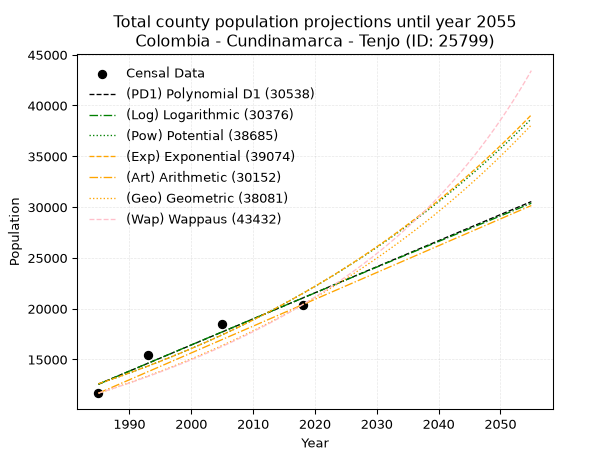
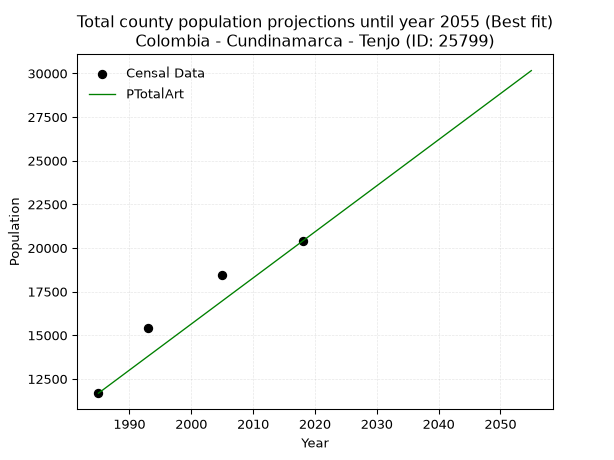
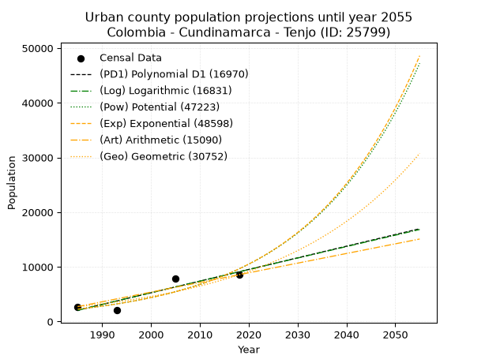
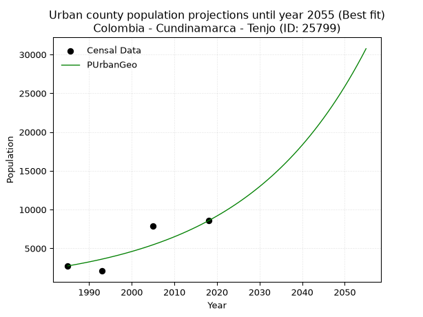
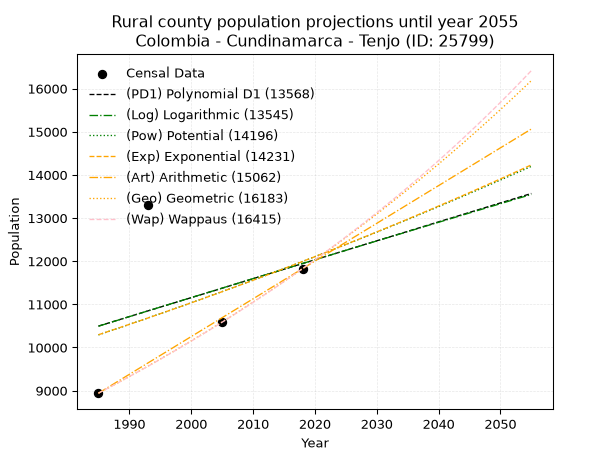
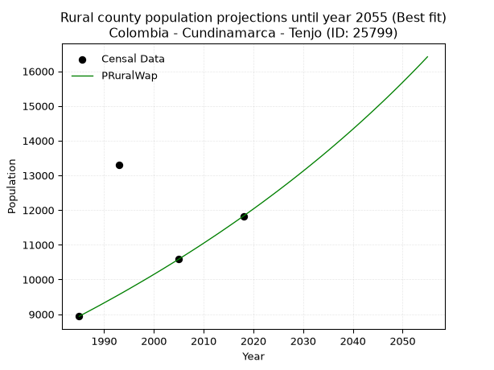

<div align="center">


</div>

# 📜 _“Population and Public Services Demand Projections (PPSD) until Year 2050 for Colombia - Cundinamarca - Tenjo (ID: 25799)”_
Keywords: `population` `public-service` `projection` `lineal` `polynomial` `logarithmic` `potential` `exponential` `arithmetic` `geometric` `wappaus` `dane` `colombia` `south-america`

PPSD are analytical estimates used by governments and planners to anticipate future changes in population size, age distribution, and the resulting community needs for utilities, healthcare, education, and infrastructure as sizing future water treatment facilities, electrical grids, and road networks based on spatial growth.

<div align="center">

</img>

</div>


> **General running parameters**: • app_version: _v20260806_. • Python version: _3.14.7_. • Pandas version: _3.0.5_. • NumPy version: _2.5.1_. • Creates, save and include plots into reports (create_plot): _False_. • Projection until year: _2050_. • Process polynomial degree 2 and up: _False_. • Process Wappaus: _True_. • Process Wappaus: _True_. • Set negative values to zero: _True_. • Set infinite values to zero: _True_. • Drop dataset notes: _True_. 
<div align="center">

Dynamic map: [:earth_americas:Google](http://maps.google.com/maps?q=4.872014126,-74.1437236) [:earth_americas:OSM](https://www.openstreetmap.org/#map=18/4.872014126/-74.1437236&layers=P) [:earth_americas:Bing](https://www.bing.com/maps?cp=4.872014126~-74.1437236&lvl=18) [:earth_americas:Apple](https://maps.apple.com/frame?center=4.872014126%2C-74.1437236&span=0.003%2C0.006)

</div>


<div align="center">

```geojson
{
  "type": "Feature",
  "geometry": {
    "type": "Point", 
    "coordinates": [-74.1437236, 4.872014126]
  }, 
  "properties": {
    "Name": "Colombia - Cundinamarca - Tenjo (ID: 25799)"
  }
}
```

</div>


## 0. Census Data (4 records)

Census data are official statistics collected by a government about the people and housing in a country. They usually include counts of total population, age, sex, race, income, education, and jobs.

📅Global census file: [Population.xlsx](../data/Population.xlsx)

| Source   |   Year |   CountryID | CountryName   |   StateID | StateName    |   CountyID | CountyName   |   PTotal |   PUrban |   PRural |
|:---------|-------:|------------:|:--------------|----------:|:-------------|-----------:|:-------------|---------:|---------:|---------:|
| DANE     |   1985 |          57 | Colombia      |        25 | Cundinamarca |      25799 | Tenjo        |    11676 |     2736 |     8940 |
| DANE     |   1993 |          57 | Colombia      |        25 | Cundinamarca |      25799 | Tenjo        |    15395 |     2084 |    13311 |
| DANE     |   2005 |          57 | Colombia      |        25 | Cundinamarca |      25799 | Tenjo        |    18466 |     7884 |    10582 |
| DANE     |   2018 |          57 | Colombia      |        25 | Cundinamarca |      25799 | Tenjo        |    20386 |     8560 |    11826 |

> 🔥Some records could had specific notes about the registered values or the corresponding urban or rural distribution.

📅[SUI-RUPS](https://www.datos.gov.co/Hacienda-y-Cr-dito-P-blico/Registro-nico-de-Prestadores-de-Servicios-P-blicos/4qkq-csdn/about_data) - Local public utility companies: [RUPS.csv](../data/RUPS.xlsx)

 | SERVICIO       | ESTADO    | NOMBRE                                                  | NIT         | DEPARTAMENTO_DOMICILIO   | MUNICIPIO_DOMICILIO   | DIRECCION                                             |   TELEFONO | EMAIL                      | TIPO_PRESTADOR                             | CLASIFICACION                 |
|:---------------|:----------|:--------------------------------------------------------|:------------|:-------------------------|:----------------------|:------------------------------------------------------|-----------:|:---------------------------|:-------------------------------------------|:------------------------------|
| ACUEDUCTO      | OPERATIVA | EMPRESA ASOCIATIVA ACUEDUCTO COMUNAL DE LA PUNTA E.S.P. | 832005813-2 | CUNDINAMARCA             | TENJO                 | VEREDA LA PUNTA AUTOPISTA MEDELLIN KM 12.5            |    8772298 | clarasalazar33@hotmail.com | ORGANIZACION AUTORIZADA                    | HASTA 2500 SUSCRIPTORES       |
| ACUEDUCTO      | OPERATIVA | AGUAS DE  LA SABANA DE BOGOTA S.A.  E.S.P.              | 900021737-4 | CUNDINAMARCA             | COTA                  | AUT MEDELLIN KM 3.9 CTRO EMPRESARIAL METROPOLITANO P5 |    8415892 | algora00@gmail.com         | SOCIEDADES (EMPRESA DE SERVICIOS PUBLICOS) | MENOR O IGUAL A 2500 USUARIOS |
| ALCANTARILLADO | OPERATIVA | AGUAS DE  LA SABANA DE BOGOTA S.A.  E.S.P.              | 900021737-4 | CUNDINAMARCA             | COTA                  | AUT MEDELLIN KM 3.9 CTRO EMPRESARIAL METROPOLITANO P5 |    8415892 | algora00@gmail.com         | SOCIEDADES (EMPRESA DE SERVICIOS PUBLICOS) | MENOR O IGUAL A 2500 USUARIOS |
| ACUEDUCTO      | OPERATIVA | EMPRESA DE SERVICIOS PUBLICOS DE TENJO S.A. E.S.P.      | 900149883-2 | CUNDINAMARCA             | TENJO                 | Carrera 3 No. 3-67                                    |    8658916 | EMPSERTENJO@GMAIL.COM      | SOCIEDADES (EMPRESA DE SERVICIOS PUBLICOS) | MAYOR O IGUAL A 5001 USUARIOS |
| ALCANTARILLADO | OPERATIVA | EMPRESA DE SERVICIOS PUBLICOS DE TENJO S.A. E.S.P.      | 900149883-2 | CUNDINAMARCA             | TENJO                 | Carrera 3 No. 3-67                                    |    8658916 | EMPSERTENJO@GMAIL.COM      | SOCIEDADES (EMPRESA DE SERVICIOS PUBLICOS) | MAYOR O IGUAL A 5001 USUARIOS |

## 1. Total

### 1.1. Coefficients and Parameters

* (PD1) Polynomial Deg 1: 256.75190686471154, -497087.2517061393 (lineal)
* (Log) Logarithmic: 514204.56612158293, -3891992.2776669404
* (Pow) Potential: 32.374173750226696, -102.6620080573642
* (Exp) Exponential: 0.016162194024174414, 1.4707420497669647e-10
* (Art) Arithmetic: Year diff. 2018 - 1985 = 33, Population diff. 20386 - 11676 = 8710, Annual growth = 263.93939393939394
* (Geo) Geometric: Year diff. 2018 - 1985 = 33, Population diff. 20386 - 11676 = 8710, Annual growth % = 0.017031683882320348
* (Wap) Wappaus: i = 1.6464312515712927, Condition values only valid for < 200)

<sub>
Wappaus condition values: ['0.00', '1.65', '3.29', '4.94', '6.59', '8.23', '9.88', '11.53', '13.17', '14.82', '16.46', '18.11', '19.76', '21.40', '23.05', '24.70', '26.34', '27.99', '29.64', '31.28', '32.93', '34.58', '36.22', '37.87', '39.51', '41.16', '42.81', '44.45', '46.10', '47.75', '49.39', '51.04', '52.69', '54.33', '55.98', '57.63', '59.27', '60.92', '62.56', '64.21', '65.86', '67.50', '69.15', '70.80', '72.44', '74.09', '75.74', '77.38', '79.03', '80.68', '82.32', '83.97', '85.61', '87.26', '88.91', '90.55', '92.20', '93.85', '95.49', '97.14', '98.79', '100.43', '102.08', '103.73', '105.37', '107.02']
</sub>


### 1.2. Projected Dataset

|   Year |   CountyID |   PTotalPD1 |   PTotalLog |   PTotalPow |   PTotalExp |   PTotalArt |   PTotalGeo |   PTotalWap |
|-------:|-----------:|------------:|------------:|------------:|------------:|------------:|------------:|------------:|
|   1985 |      25799 |       12565 |       12555 |       12597 |       12605 |       11676 |       11676 |       11676 |
|   1986 |      25799 |       12822 |       12814 |       12804 |       12811 |       11940 |       11875 |       11870 |
|   1987 |      25799 |       13079 |       13073 |       13014 |       13019 |       12204 |       12077 |       12067 |
|   1988 |      25799 |       13336 |       13332 |       13228 |       13232 |       12468 |       12283 |       12267 |
|   1989 |      25799 |       13592 |       13591 |       13445 |       13447 |       12732 |       12492 |       12471 |
|   1990 |      25799 |       13849 |       13849 |       13666 |       13666 |       12996 |       12705 |       12678 |
|   1991 |      25799 |       14106 |       14107 |       13890 |       13889 |       13260 |       12921 |       12889 |
|   1992 |      25799 |       14363 |       14366 |       14118 |       14115 |       13524 |       13141 |       13104 |
|   1993 |      25799 |       14619 |       14624 |       14349 |       14345 |       13788 |       13365 |       13322 |
|   1994 |      25799 |       14876 |       14882 |       14584 |       14579 |       14051 |       13593 |       13545 |
|   1995 |      25799 |       15133 |       15139 |       14822 |       14816 |       14315 |       13824 |       13771 |
|   1996 |      25799 |       15390 |       15397 |       15065 |       15058 |       14579 |       14060 |       14001 |
|   1997 |      25799 |       15646 |       15655 |       15311 |       15303 |       14843 |       14299 |       14236 |
|   1998 |      25799 |       15903 |       15912 |       15561 |       15553 |       15107 |       14543 |       14475 |
|   1999 |      25799 |       16160 |       16169 |       15815 |       15806 |       15371 |       14790 |       14718 |
|   2000 |      25799 |       16417 |       16426 |       16074 |       16063 |       15635 |       15042 |       14966 |
|   2001 |      25799 |       16673 |       16684 |       16336 |       16325 |       15899 |       15298 |       15218 |
|   2002 |      25799 |       16930 |       16940 |       16602 |       16591 |       16163 |       15559 |       15476 |
|   2003 |      25799 |       17187 |       17197 |       16873 |       16862 |       16427 |       15824 |       15738 |
|   2004 |      25799 |       17444 |       17454 |       17148 |       17136 |       16691 |       16093 |       16006 |
|   2005 |      25799 |       17700 |       17710 |       17427 |       17415 |       16955 |       16368 |       16279 |
|   2006 |      25799 |       17957 |       17967 |       17710 |       17699 |       17219 |       16646 |       16557 |
|   2007 |      25799 |       18214 |       18223 |       17998 |       17988 |       17483 |       16930 |       16841 |
|   2008 |      25799 |       18471 |       18479 |       18291 |       18281 |       17747 |       17218 |       17130 |
|   2009 |      25799 |       18727 |       18735 |       18588 |       18579 |       18011 |       17511 |       17426 |
|   2010 |      25799 |       18984 |       18991 |       18890 |       18881 |       18274 |       17810 |       17727 |
|   2011 |      25799 |       19241 |       19247 |       19197 |       19189 |       18538 |       18113 |       18035 |
|   2012 |      25799 |       19498 |       19502 |       19508 |       19502 |       18802 |       18422 |       18350 |
|   2013 |      25799 |       19754 |       19758 |       19825 |       19819 |       19066 |       18735 |       18671 |
|   2014 |      25799 |       20011 |       20013 |       20146 |       20142 |       19330 |       19054 |       18999 |
|   2015 |      25799 |       20268 |       20269 |       20472 |       20470 |       19594 |       19379 |       19334 |
|   2016 |      25799 |       20525 |       20524 |       20804 |       20804 |       19858 |       19709 |       19677 |
|   2017 |      25799 |       20781 |       20779 |       21140 |       21143 |       20122 |       20045 |       20028 |
|   2018 |      25799 |       21038 |       21034 |       21482 |       21487 |       20386 |       20386 |       20386 |
|   2019 |      25799 |       21295 |       21288 |       21830 |       21838 |       20650 |       20733 |       20753 |
|   2020 |      25799 |       21552 |       21543 |       22183 |       22193 |       20914 |       21086 |       21128 |
|   2021 |      25799 |       21808 |       21797 |       22541 |       22555 |       21178 |       21445 |       21511 |
|   2022 |      25799 |       22065 |       22052 |       22905 |       22922 |       21442 |       21811 |       21904 |
|   2023 |      25799 |       22322 |       22306 |       23274 |       23296 |       21706 |       22182 |       22306 |
|   2024 |      25799 |       22579 |       22560 |       23650 |       23676 |       21970 |       22560 |       22718 |
|   2025 |      25799 |       22835 |       22814 |       24031 |       24061 |       22234 |       22944 |       23141 |
|   2026 |      25799 |       23092 |       23068 |       24418 |       24453 |       22498 |       23335 |       23573 |
|   2027 |      25799 |       23349 |       23322 |       24811 |       24852 |       22761 |       23732 |       24017 |
|   2028 |      25799 |       23606 |       23575 |       25211 |       25257 |       23025 |       24137 |       24472 |
|   2029 |      25799 |       23862 |       23829 |       25616 |       25668 |       23289 |       24548 |       24938 |
|   2030 |      25799 |       24119 |       24082 |       26028 |       26086 |       23553 |       24966 |       25417 |
|   2031 |      25799 |       24376 |       24336 |       26446 |       26511 |       23817 |       25391 |       25908 |
|   2032 |      25799 |       24633 |       24589 |       26871 |       26943 |       24081 |       25823 |       26413 |
|   2033 |      25799 |       24889 |       24842 |       27303 |       27382 |       24345 |       26263 |       26932 |
|   2034 |      25799 |       25146 |       25094 |       27741 |       27829 |       24609 |       26711 |       27464 |
|   2035 |      25799 |       25403 |       25347 |       28186 |       28282 |       24873 |       27166 |       28012 |
|   2036 |      25799 |       25660 |       25600 |       28638 |       28743 |       25137 |       27628 |       28575 |
|   2037 |      25799 |       25916 |       25852 |       29097 |       29211 |       25401 |       28099 |       29154 |
|   2038 |      25799 |       26173 |       26105 |       29563 |       29687 |       25665 |       28577 |       29751 |
|   2039 |      25799 |       26430 |       26357 |       30036 |       30171 |       25929 |       29064 |       30365 |
|   2040 |      25799 |       26687 |       26609 |       30516 |       30662 |       26193 |       29559 |       30997 |
|   2041 |      25799 |       26943 |       26861 |       31004 |       31162 |       26457 |       30063 |       31649 |
|   2042 |      25799 |       27200 |       27113 |       31500 |       31670 |       26721 |       30575 |       32321 |
|   2043 |      25799 |       27457 |       27365 |       32003 |       32186 |       26984 |       31095 |       33014 |
|   2044 |      25799 |       27714 |       27616 |       32514 |       32710 |       27248 |       31625 |       33729 |
|   2045 |      25799 |       27970 |       27868 |       33033 |       33243 |       27512 |       32163 |       34468 |
|   2046 |      25799 |       28227 |       28119 |       33560 |       33785 |       27776 |       32711 |       35231 |
|   2047 |      25799 |       28484 |       28370 |       34095 |       34335 |       28040 |       33268 |       36019 |
|   2048 |      25799 |       28741 |       28622 |       34639 |       34895 |       28304 |       33835 |       36835 |
|   2049 |      25799 |       28997 |       28873 |       35191 |       35463 |       28568 |       34411 |       37679 |
|   2050 |      25799 |       29254 |       29124 |       35751 |       36041 |       28832 |       34997 |       38553 |
<div align="center">

</img>

</div>


### 1.3. Best fit with absolute and relative error (%)

Relative error puts that difference into context by dividing the absolute error by the true value, creating a unitless ratio or percentage that shows the scale of the mistake.

Absolute and relative error

|   Year | Source   |   CountryID | CountryName   |   StateID | StateName    |   CountyID_x | CountyName   |   PTotal |   PUrban |   PRural |   CountyID_y |   PTotalPD1 |   PTotalLog |   PTotalPow |   PTotalExp |   PTotalArt |   PTotalGeo |   PTotalWap |   PTotalPD1AbsError |   PTotalLogAbsError |   PTotalPowAbsError |   PTotalExpAbsError |   PTotalArtAbsError |   PTotalGeoAbsError |   PTotalWapAbsError |   PTotalPD1RelError |   PTotalLogRelError |   PTotalPowRelError |   PTotalExpRelError |   PTotalArtRelError |   PTotalGeoRelError |   PTotalWapRelError |
|-------:|:---------|------------:|:--------------|----------:|:-------------|-------------:|:-------------|---------:|---------:|---------:|-------------:|------------:|------------:|------------:|------------:|------------:|------------:|------------:|--------------------:|--------------------:|--------------------:|--------------------:|--------------------:|--------------------:|--------------------:|--------------------:|--------------------:|--------------------:|--------------------:|--------------------:|--------------------:|--------------------:|
|   1985 | DANE     |          57 | Colombia      |        25 | Cundinamarca |        25799 | Tenjo        |    11676 |     2736 |     8940 |        25799 |       12565 |       12555 |       12597 |       12605 |       11676 |       11676 |       11676 |                 889 |                 879 |                 921 |                 929 |                   0 |                   0 |                   0 |             7.61391 |             7.52826 |             7.88798 |             7.95649 |             0       |              0      |              0      |
|   1993 | DANE     |          57 | Colombia      |        25 | Cundinamarca |        25799 | Tenjo        |    15395 |     2084 |    13311 |        25799 |       14619 |       14624 |       14349 |       14345 |       13788 |       13365 |       13322 |                 776 |                 771 |                1046 |                1050 |                1607 |                2030 |                2073 |             5.0406  |             5.00812 |             6.79441 |             6.8204  |            10.4385  |             13.1861 |             13.4654 |
|   2005 | DANE     |          57 | Colombia      |        25 | Cundinamarca |        25799 | Tenjo        |    18466 |     7884 |    10582 |        25799 |       17700 |       17710 |       17427 |       17415 |       16955 |       16368 |       16279 |                 766 |                 756 |                1039 |                1051 |                1511 |                2098 |                2187 |             4.14816 |             4.09401 |             5.62656 |             5.69154 |             8.18261 |             11.3614 |             11.8434 |
|   2018 | DANE     |          57 | Colombia      |        25 | Cundinamarca |        25799 | Tenjo        |    20386 |     8560 |    11826 |        25799 |       21038 |       21034 |       21482 |       21487 |       20386 |       20386 |       20386 |                 652 |                 648 |                1096 |                1101 |                   0 |                   0 |                   0 |             3.19827 |             3.17865 |             5.37624 |             5.40077 |             0       |              0      |              0      |

Relative error mean

| Method    |   RelError | Best   |
|:----------|-----------:|:-------|
| PTotalPD1 |    5.00024 |        |
| PTotalLog |    4.95226 |        |
| PTotalPow |    6.4213  |        |
| PTotalExp |    6.4673  |        |
| PTotalArt |    4.65526 | True   |
| PTotalGeo |    6.13688 |        |
| PTotalWap |    6.3272  |        |

💙Best method: _**PTotalArt**_
<div align="center">

</img>

</div>


### 1.4. Fresh water supply demand in liters per capita per day (lpcd)

The fresh water supply demand typically ranges from 100 to 300 liters per capita per day (lpcd) for standard domestic and municipal planning, though absolute survival minimums set by the World Health Organization are as low as 7.5 to 20 liters per day, and total consumption in high-income nations can exceed 400 liters.

> `CZ`: Level in meters above the sea level (masl)<br> `WS`: Fresh water supply demand in liters per capita per day (lpcd or l/h/d)<br> `WSAll`: Zonal fresh water supply demand in liters per second (l/s)<br> `A`: Zonal area in square meters<br> `DP`: Population density (people/hectare or p/ha)

Reference values (RAS Colombia)

|    CZ |   WS |
|------:|-----:|
|  1000 |  120 |
|  2000 |  130 |
| 99999 |  140 |

County shapefile geometry properties and water supply values

|   CountyID |     ATotal |   CZTotal |   WSTotal |
|-----------:|-----------:|----------:|----------:|
|      25799 | 1.1401e+08 |   2607.08 |       140 |

Projected values for best method: PTotalArt

|   CountyID |   Year |   PTotalArt |   DPTotal |   WSTotal |   WSTotalAll |
|-----------:|-------:|------------:|----------:|----------:|-------------:|
|      25799 |   1985 |       11676 |      1.02 |       140 |      18.9194 |
|      25799 |   1986 |       11940 |      1.05 |       140 |      19.3472 |
|      25799 |   1987 |       12204 |      1.07 |       140 |      19.775  |
|      25799 |   1988 |       12468 |      1.09 |       140 |      20.2028 |
|      25799 |   1989 |       12732 |      1.12 |       140 |      20.6306 |
|      25799 |   1990 |       12996 |      1.14 |       140 |      21.0583 |
|      25799 |   1991 |       13260 |      1.16 |       140 |      21.4861 |
|      25799 |   1992 |       13524 |      1.19 |       140 |      21.9139 |
|      25799 |   1993 |       13788 |      1.21 |       140 |      22.3417 |
|      25799 |   1994 |       14051 |      1.23 |       140 |      22.7678 |
|      25799 |   1995 |       14315 |      1.26 |       140 |      23.1956 |
|      25799 |   1996 |       14579 |      1.28 |       140 |      23.6234 |
|      25799 |   1997 |       14843 |      1.3  |       140 |      24.0512 |
|      25799 |   1998 |       15107 |      1.33 |       140 |      24.4789 |
|      25799 |   1999 |       15371 |      1.35 |       140 |      24.9067 |
|      25799 |   2000 |       15635 |      1.37 |       140 |      25.3345 |
|      25799 |   2001 |       15899 |      1.39 |       140 |      25.7623 |
|      25799 |   2002 |       16163 |      1.42 |       140 |      26.19   |
|      25799 |   2003 |       16427 |      1.44 |       140 |      26.6178 |
|      25799 |   2004 |       16691 |      1.46 |       140 |      27.0456 |
|      25799 |   2005 |       16955 |      1.49 |       140 |      27.4734 |
|      25799 |   2006 |       17219 |      1.51 |       140 |      27.9012 |
|      25799 |   2007 |       17483 |      1.53 |       140 |      28.3289 |
|      25799 |   2008 |       17747 |      1.56 |       140 |      28.7567 |
|      25799 |   2009 |       18011 |      1.58 |       140 |      29.1845 |
|      25799 |   2010 |       18274 |      1.6  |       140 |      29.6106 |
|      25799 |   2011 |       18538 |      1.63 |       140 |      30.0384 |
|      25799 |   2012 |       18802 |      1.65 |       140 |      30.4662 |
|      25799 |   2013 |       19066 |      1.67 |       140 |      30.894  |
|      25799 |   2014 |       19330 |      1.7  |       140 |      31.3218 |
|      25799 |   2015 |       19594 |      1.72 |       140 |      31.7495 |
|      25799 |   2016 |       19858 |      1.74 |       140 |      32.1773 |
|      25799 |   2017 |       20122 |      1.76 |       140 |      32.6051 |
|      25799 |   2018 |       20386 |      1.79 |       140 |      33.0329 |
|      25799 |   2019 |       20650 |      1.81 |       140 |      33.4606 |
|      25799 |   2020 |       20914 |      1.83 |       140 |      33.8884 |
|      25799 |   2021 |       21178 |      1.86 |       140 |      34.3162 |
|      25799 |   2022 |       21442 |      1.88 |       140 |      34.744  |
|      25799 |   2023 |       21706 |      1.9  |       140 |      35.1718 |
|      25799 |   2024 |       21970 |      1.93 |       140 |      35.5995 |
|      25799 |   2025 |       22234 |      1.95 |       140 |      36.0273 |
|      25799 |   2026 |       22498 |      1.97 |       140 |      36.4551 |
|      25799 |   2027 |       22761 |      2    |       140 |      36.8813 |
|      25799 |   2028 |       23025 |      2.02 |       140 |      37.309  |
|      25799 |   2029 |       23289 |      2.04 |       140 |      37.7368 |
|      25799 |   2030 |       23553 |      2.07 |       140 |      38.1646 |
|      25799 |   2031 |       23817 |      2.09 |       140 |      38.5924 |
|      25799 |   2032 |       24081 |      2.11 |       140 |      39.0201 |
|      25799 |   2033 |       24345 |      2.14 |       140 |      39.4479 |
|      25799 |   2034 |       24609 |      2.16 |       140 |      39.8757 |
|      25799 |   2035 |       24873 |      2.18 |       140 |      40.3035 |
|      25799 |   2036 |       25137 |      2.2  |       140 |      40.7313 |
|      25799 |   2037 |       25401 |      2.23 |       140 |      41.159  |
|      25799 |   2038 |       25665 |      2.25 |       140 |      41.5868 |
|      25799 |   2039 |       25929 |      2.27 |       140 |      42.0146 |
|      25799 |   2040 |       26193 |      2.3  |       140 |      42.4424 |
|      25799 |   2041 |       26457 |      2.32 |       140 |      42.8701 |
|      25799 |   2042 |       26721 |      2.34 |       140 |      43.2979 |
|      25799 |   2043 |       26984 |      2.37 |       140 |      43.7241 |
|      25799 |   2044 |       27248 |      2.39 |       140 |      44.1519 |
|      25799 |   2045 |       27512 |      2.41 |       140 |      44.5796 |
|      25799 |   2046 |       27776 |      2.44 |       140 |      45.0074 |
|      25799 |   2047 |       28040 |      2.46 |       140 |      45.4352 |
|      25799 |   2048 |       28304 |      2.48 |       140 |      45.863  |
|      25799 |   2049 |       28568 |      2.51 |       140 |      46.2907 |
|      25799 |   2050 |       28832 |      2.53 |       140 |      46.7185 |

## 2. Urban

### 2.1. Coefficients and Parameters

* (PD1) Polynomial Deg 1: 212.85588117221923, -420448.9763147315 (lineal)
* (Log) Logarithmic: 426109.4466838112, -3233545.3188704555
* (Pow) Potential: 87.58073536339126, -285.4643407621711
* (Exp) Exponential: 0.043751619558091794, 4.3589750021580796e-35
* (Art) Arithmetic: Year diff. 2018 - 1985 = 33, Population diff. 8560 - 2736 = 5824, Annual growth = 176.4848484848485
* (Geo) Geometric: Year diff. 2018 - 1985 = 33, Population diff. 8560 - 2736 = 5824, Annual growth % = 0.03516800067967907
* (Wap) Wappaus: i = 3.124731736629754, Condition values only valid for < 200)

<sub>
Wappaus condition values: ['0.00', '3.12', '6.25', '9.37', '12.50', '15.62', '18.75', '21.87', '25.00', '28.12', '31.25', '34.37', '37.50', '40.62', '43.75', '46.87', '50.00', '53.12', '56.25', '59.37', '62.49', '65.62', '68.74', '71.87', '74.99', '78.12', '81.24', '84.37', '87.49', '90.62', '93.74', '96.87', '99.99', '103.12', '106.24', '109.37', '112.49', '115.62', '118.74', '121.86', '124.99', '128.11', '131.24', '134.36', '137.49', '140.61', '143.74', '146.86', '149.99', '153.11', '156.24', '159.36', '162.49', '165.61', '168.74', '171.86', '174.98', '178.11', '181.23', '184.36', '187.48', '190.61', '193.73', '196.86', '199.98', '203.11']
</sub>


### 2.2. Projected Dataset

|   Year |   CountyID |   PUrbanPD1 |   PUrbanLog |   PUrbanPow |   PUrbanExp |   PUrbanArt |   PUrbanGeo |
|-------:|-----------:|------------:|------------:|------------:|------------:|------------:|------------:|
|   1985 |      25799 |        2070 |        2063 |        2270 |        2273 |        2736 |        2736 |
|   1986 |      25799 |        2283 |        2278 |        2372 |        2374 |        2912 |        2832 |
|   1987 |      25799 |        2496 |        2492 |        2479 |        2481 |        3089 |        2932 |
|   1988 |      25799 |        2709 |        2707 |        2591 |        2591 |        3265 |        3035 |
|   1989 |      25799 |        2921 |        2921 |        2707 |        2707 |        3442 |        3142 |
|   1990 |      25799 |        3134 |        3135 |        2829 |        2828 |        3618 |        3252 |
|   1991 |      25799 |        3347 |        3349 |        2956 |        2955 |        3795 |        3367 |
|   1992 |      25799 |        3560 |        3563 |        3089 |        3087 |        3971 |        3485 |
|   1993 |      25799 |        3773 |        3777 |        3228 |        3225 |        4148 |        3607 |
|   1994 |      25799 |        3986 |        3991 |        3373 |        3369 |        4324 |        3734 |
|   1995 |      25799 |        4199 |        4204 |        3524 |        3520 |        4501 |        3866 |
|   1996 |      25799 |        4411 |        4418 |        3683 |        3678 |        4677 |        4002 |
|   1997 |      25799 |        4624 |        4631 |        3848 |        3842 |        4854 |        4142 |
|   1998 |      25799 |        4837 |        4845 |        4020 |        4014 |        5030 |        4288 |
|   1999 |      25799 |        5050 |        5058 |        4200 |        4193 |        5207 |        4439 |
|   2000 |      25799 |        5263 |        5271 |        4388 |        4381 |        5383 |        4595 |
|   2001 |      25799 |        5476 |        5484 |        4585 |        4577 |        5560 |        4757 |
|   2002 |      25799 |        5688 |        5697 |        4790 |        4781 |        5736 |        4924 |
|   2003 |      25799 |        5901 |        5910 |        5004 |        4995 |        5913 |        5097 |
|   2004 |      25799 |        6114 |        6122 |        5227 |        5219 |        6089 |        5276 |
|   2005 |      25799 |        6327 |        6335 |        5461 |        5452 |        6266 |        5462 |
|   2006 |      25799 |        6540 |        6547 |        5705 |        5696 |        6442 |        5654 |
|   2007 |      25799 |        6753 |        6760 |        5959 |        5951 |        6619 |        5853 |
|   2008 |      25799 |        6966 |        6972 |        6225 |        6217 |        6795 |        6059 |
|   2009 |      25799 |        7178 |        7184 |        6502 |        6495 |        6972 |        6272 |
|   2010 |      25799 |        7391 |        7396 |        6792 |        6785 |        7148 |        6492 |
|   2011 |      25799 |        7604 |        7608 |        7094 |        7089 |        7325 |        6720 |
|   2012 |      25799 |        7817 |        7820 |        7410 |        7406 |        7501 |        6957 |
|   2013 |      25799 |        8030 |        8032 |        7740 |        7737 |        7678 |        7201 |
|   2014 |      25799 |        8243 |        8243 |        8084 |        8083 |        7854 |        7455 |
|   2015 |      25799 |        8456 |        8455 |        8443 |        8445 |        8031 |        7717 |
|   2016 |      25799 |        8668 |        8666 |        8818 |        8822 |        8207 |        7988 |
|   2017 |      25799 |        8881 |        8878 |        9209 |        9217 |        8384 |        8269 |
|   2018 |      25799 |        9094 |        9089 |        9618 |        9629 |        8560 |        8560 |
|   2019 |      25799 |        9307 |        9300 |       10045 |       10060 |        8736 |        8861 |
|   2020 |      25799 |        9520 |        9511 |       10490 |       10509 |        8913 |        9173 |
|   2021 |      25799 |        9733 |        9722 |       10954 |       10979 |        9089 |        9495 |
|   2022 |      25799 |        9946 |        9933 |       11439 |       11470 |        9266 |        9829 |
|   2023 |      25799 |       10158 |       10143 |       11946 |       11983 |        9442 |       10175 |
|   2024 |      25799 |       10371 |       10354 |       12474 |       12519 |        9619 |       10533 |
|   2025 |      25799 |       10584 |       10564 |       13026 |       13079 |        9795 |       10903 |
|   2026 |      25799 |       10797 |       10775 |       13601 |       13664 |        9972 |       11287 |
|   2027 |      25799 |       11010 |       10985 |       14202 |       14275 |       10148 |       11683 |
|   2028 |      25799 |       11223 |       11195 |       14829 |       14914 |       10325 |       12094 |
|   2029 |      25799 |       11436 |       11405 |       15483 |       15581 |       10501 |       12520 |
|   2030 |      25799 |       11648 |       11615 |       16166 |       16278 |       10678 |       12960 |
|   2031 |      25799 |       11861 |       11825 |       16878 |       17006 |       10854 |       13416 |
|   2032 |      25799 |       12074 |       12035 |       17622 |       17766 |       11031 |       13888 |
|   2033 |      25799 |       12287 |       12244 |       18398 |       18561 |       11207 |       14376 |
|   2034 |      25799 |       12500 |       12454 |       19207 |       19391 |       11384 |       14882 |
|   2035 |      25799 |       12713 |       12663 |       20052 |       20258 |       11560 |       15405 |
|   2036 |      25799 |       12926 |       12873 |       20934 |       21164 |       11737 |       15947 |
|   2037 |      25799 |       13138 |       13082 |       21854 |       22110 |       11913 |       16507 |
|   2038 |      25799 |       13351 |       13291 |       22814 |       23099 |       12090 |       17088 |
|   2039 |      25799 |       13564 |       13500 |       23815 |       24132 |       12266 |       17689 |
|   2040 |      25799 |       13777 |       13709 |       24860 |       25212 |       12443 |       18311 |
|   2041 |      25799 |       13990 |       13918 |       25950 |       26339 |       12619 |       18955 |
|   2042 |      25799 |       14203 |       14127 |       27088 |       27517 |       12796 |       19622 |
|   2043 |      25799 |       14416 |       14335 |       28275 |       28748 |       12972 |       20312 |
|   2044 |      25799 |       14628 |       14544 |       29513 |       30034 |       13149 |       21026 |
|   2045 |      25799 |       14841 |       14752 |       30804 |       31377 |       13325 |       21765 |
|   2046 |      25799 |       15054 |       14961 |       32152 |       32780 |       13502 |       22531 |
|   2047 |      25799 |       15267 |       15169 |       33558 |       34246 |       13678 |       23323 |
|   2048 |      25799 |       15480 |       15377 |       35024 |       35778 |       13855 |       24143 |
|   2049 |      25799 |       15693 |       15585 |       36554 |       37378 |       14031 |       24993 |
|   2050 |      25799 |       15906 |       15793 |       38150 |       39049 |       14208 |       25871 |
<div align="center">

</img>

</div>


### 2.3. Best fit with absolute and relative error (%)

Relative error puts that difference into context by dividing the absolute error by the true value, creating a unitless ratio or percentage that shows the scale of the mistake.

Absolute and relative error

|   Year | Source   |   CountryID | CountryName   |   StateID | StateName    |   CountyID_x | CountyName   |   PTotal |   PUrban |   PRural |   CountyID_y |   PUrbanPD1 |   PUrbanLog |   PUrbanPow |   PUrbanExp |   PUrbanArt |   PUrbanGeo |   PUrbanPD1AbsError |   PUrbanLogAbsError |   PUrbanPowAbsError |   PUrbanExpAbsError |   PUrbanArtAbsError |   PUrbanGeoAbsError |   PUrbanPD1RelError |   PUrbanLogRelError |   PUrbanPowRelError |   PUrbanExpRelError |   PUrbanArtRelError |   PUrbanGeoRelError |
|-------:|:---------|------------:|:--------------|----------:|:-------------|-------------:|:-------------|---------:|---------:|---------:|-------------:|------------:|------------:|------------:|------------:|------------:|------------:|--------------------:|--------------------:|--------------------:|--------------------:|--------------------:|--------------------:|--------------------:|--------------------:|--------------------:|--------------------:|--------------------:|--------------------:|
|   1985 | DANE     |          57 | Colombia      |        25 | Cundinamarca |        25799 | Tenjo        |    11676 |     2736 |     8940 |        25799 |        2070 |        2063 |        2270 |        2273 |        2736 |        2736 |                 666 |                 673 |                 466 |                 463 |                   0 |                   0 |            24.3421  |            24.598   |             17.0322 |             16.9225 |              0      |              0      |
|   1993 | DANE     |          57 | Colombia      |        25 | Cundinamarca |        25799 | Tenjo        |    15395 |     2084 |    13311 |        25799 |        3773 |        3777 |        3228 |        3225 |        4148 |        3607 |                1689 |                1693 |                1144 |                1141 |                2064 |                1523 |            81.0461  |            81.238   |             54.8944 |             54.7505 |             99.0403 |             73.0806 |
|   2005 | DANE     |          57 | Colombia      |        25 | Cundinamarca |        25799 | Tenjo        |    18466 |     7884 |    10582 |        25799 |        6327 |        6335 |        5461 |        5452 |        6266 |        5462 |                1557 |                1549 |                2423 |                2432 |                1618 |                2422 |            19.7489  |            19.6474  |             30.7331 |             30.8473 |             20.5226 |             30.7204 |
|   2018 | DANE     |          57 | Colombia      |        25 | Cundinamarca |        25799 | Tenjo        |    20386 |     8560 |    11826 |        25799 |        9094 |        9089 |        9618 |        9629 |        8560 |        8560 |                 534 |                 529 |                1058 |                1069 |                   0 |                   0 |             6.23832 |             6.17991 |             12.3598 |             12.4883 |              0      |              0      |

Relative error mean

| Method    |   RelError | Best   |
|:----------|-----------:|:-------|
| PUrbanPD1 |    32.8438 |        |
| PUrbanLog |    32.9158 |        |
| PUrbanPow |    28.7549 |        |
| PUrbanExp |    28.7521 |        |
| PUrbanArt |    29.8907 |        |
| PUrbanGeo |    25.9503 | True   |

💙Best method: _**PUrbanGeo**_
<div align="center">

</img>

</div>


### 2.4. Fresh water supply demand in liters per capita per day (lpcd)

The fresh water supply demand typically ranges from 100 to 300 liters per capita per day (lpcd) for standard domestic and municipal planning, though absolute survival minimums set by the World Health Organization are as low as 7.5 to 20 liters per day, and total consumption in high-income nations can exceed 400 liters.

> `CZ`: Level in meters above the sea level (masl)<br> `WS`: Fresh water supply demand in liters per capita per day (lpcd or l/h/d)<br> `WSAll`: Zonal fresh water supply demand in liters per second (l/s)<br> `A`: Zonal area in square meters<br> `DP`: Population density (people/hectare or p/ha)

Reference values (RAS Colombia)

|    CZ |   WS |
|------:|-----:|
|  1000 |  120 |
|  2000 |  130 |
| 99999 |  140 |

County shapefile geometry properties and water supply values

|   CountyID |      AUrban |   CZUrban |   WSUrban |
|-----------:|------------:|----------:|----------:|
|      25799 | 1.70764e+06 |   2589.56 |       140 |

Projected values for best method: PUrbanGeo

|   CountyID |   Year |   PUrbanGeo |   DPUrban |   WSUrban |   WSUrbanAll |
|-----------:|-------:|------------:|----------:|----------:|-------------:|
|      25799 |   1985 |        2736 |     16.02 |       140 |      4.43333 |
|      25799 |   1986 |        2832 |     16.58 |       140 |      4.58889 |
|      25799 |   1987 |        2932 |     17.17 |       140 |      4.75093 |
|      25799 |   1988 |        3035 |     17.77 |       140 |      4.91782 |
|      25799 |   1989 |        3142 |     18.4  |       140 |      5.0912  |
|      25799 |   1990 |        3252 |     19.04 |       140 |      5.26944 |
|      25799 |   1991 |        3367 |     19.72 |       140 |      5.45579 |
|      25799 |   1992 |        3485 |     20.41 |       140 |      5.64699 |
|      25799 |   1993 |        3607 |     21.12 |       140 |      5.84468 |
|      25799 |   1994 |        3734 |     21.87 |       140 |      6.05046 |
|      25799 |   1995 |        3866 |     22.64 |       140 |      6.26435 |
|      25799 |   1996 |        4002 |     23.44 |       140 |      6.48472 |
|      25799 |   1997 |        4142 |     24.26 |       140 |      6.71157 |
|      25799 |   1998 |        4288 |     25.11 |       140 |      6.94815 |
|      25799 |   1999 |        4439 |     25.99 |       140 |      7.19282 |
|      25799 |   2000 |        4595 |     26.91 |       140 |      7.4456  |
|      25799 |   2001 |        4757 |     27.86 |       140 |      7.7081  |
|      25799 |   2002 |        4924 |     28.84 |       140 |      7.9787  |
|      25799 |   2003 |        5097 |     29.85 |       140 |      8.25903 |
|      25799 |   2004 |        5276 |     30.9  |       140 |      8.54907 |
|      25799 |   2005 |        5462 |     31.99 |       140 |      8.85046 |
|      25799 |   2006 |        5654 |     33.11 |       140 |      9.16157 |
|      25799 |   2007 |        5853 |     34.28 |       140 |      9.48403 |
|      25799 |   2008 |        6059 |     35.48 |       140 |      9.81782 |
|      25799 |   2009 |        6272 |     36.73 |       140 |     10.163   |
|      25799 |   2010 |        6492 |     38.02 |       140 |     10.5194  |
|      25799 |   2011 |        6720 |     39.35 |       140 |     10.8889  |
|      25799 |   2012 |        6957 |     40.74 |       140 |     11.2729  |
|      25799 |   2013 |        7201 |     42.17 |       140 |     11.6683  |
|      25799 |   2014 |        7455 |     43.66 |       140 |     12.0799  |
|      25799 |   2015 |        7717 |     45.19 |       140 |     12.5044  |
|      25799 |   2016 |        7988 |     46.78 |       140 |     12.9435  |
|      25799 |   2017 |        8269 |     48.42 |       140 |     13.3988  |
|      25799 |   2018 |        8560 |     50.13 |       140 |     13.8704  |
|      25799 |   2019 |        8861 |     51.89 |       140 |     14.3581  |
|      25799 |   2020 |        9173 |     53.72 |       140 |     14.8637  |
|      25799 |   2021 |        9495 |     55.6  |       140 |     15.3854  |
|      25799 |   2022 |        9829 |     57.56 |       140 |     15.9266  |
|      25799 |   2023 |       10175 |     59.59 |       140 |     16.4873  |
|      25799 |   2024 |       10533 |     61.68 |       140 |     17.0674  |
|      25799 |   2025 |       10903 |     63.85 |       140 |     17.6669  |
|      25799 |   2026 |       11287 |     66.1  |       140 |     18.2891  |
|      25799 |   2027 |       11683 |     68.42 |       140 |     18.9308  |
|      25799 |   2028 |       12094 |     70.82 |       140 |     19.5968  |
|      25799 |   2029 |       12520 |     73.32 |       140 |     20.287   |
|      25799 |   2030 |       12960 |     75.89 |       140 |     21       |
|      25799 |   2031 |       13416 |     78.56 |       140 |     21.7389  |
|      25799 |   2032 |       13888 |     81.33 |       140 |     22.5037  |
|      25799 |   2033 |       14376 |     84.19 |       140 |     23.2944  |
|      25799 |   2034 |       14882 |     87.15 |       140 |     24.1144  |
|      25799 |   2035 |       15405 |     90.21 |       140 |     24.9618  |
|      25799 |   2036 |       15947 |     93.39 |       140 |     25.84    |
|      25799 |   2037 |       16507 |     96.67 |       140 |     26.7475  |
|      25799 |   2038 |       17088 |    100.07 |       140 |     27.6889  |
|      25799 |   2039 |       17689 |    103.59 |       140 |     28.6627  |
|      25799 |   2040 |       18311 |    107.23 |       140 |     29.6706  |
|      25799 |   2041 |       18955 |    111    |       140 |     30.7141  |
|      25799 |   2042 |       19622 |    114.91 |       140 |     31.7949  |
|      25799 |   2043 |       20312 |    118.95 |       140 |     32.913   |
|      25799 |   2044 |       21026 |    123.13 |       140 |     34.0699  |
|      25799 |   2045 |       21765 |    127.46 |       140 |     35.2674  |
|      25799 |   2046 |       22531 |    131.94 |       140 |     36.5086  |
|      25799 |   2047 |       23323 |    136.58 |       140 |     37.7919  |
|      25799 |   2048 |       24143 |    141.38 |       140 |     39.1206  |
|      25799 |   2049 |       24993 |    146.36 |       140 |     40.4979  |
|      25799 |   2050 |       25871 |    151.5  |       140 |     41.9206  |

## 3. Rural

### 3.1. Coefficients and Parameters

* (PD1) Polynomial Deg 1: 43.89602569249235, -76638.27539140783 (lineal)
* (Log) Logarithmic: 88095.1194377718, -658446.9587964859
* (Pow) Potential: 9.28146156868358, -26.59557005942649
* (Exp) Exponential: 0.004626040445310153, 1.0582993165137629
* (Art) Arithmetic: Year diff. 2018 - 1985 = 33, Population diff. 11826 - 8940 = 2886, Annual growth = 87.45454545454545
* (Geo) Geometric: Year diff. 2018 - 1985 = 33, Population diff. 11826 - 8940 = 2886, Annual growth % = 0.008513762164752858
* (Wap) Wappaus: i = 0.8422859044066787, Condition values only valid for < 200)

<sub>
Wappaus condition values: ['0.00', '0.84', '1.68', '2.53', '3.37', '4.21', '5.05', '5.90', '6.74', '7.58', '8.42', '9.27', '10.11', '10.95', '11.79', '12.63', '13.48', '14.32', '15.16', '16.00', '16.85', '17.69', '18.53', '19.37', '20.21', '21.06', '21.90', '22.74', '23.58', '24.43', '25.27', '26.11', '26.95', '27.80', '28.64', '29.48', '30.32', '31.16', '32.01', '32.85', '33.69', '34.53', '35.38', '36.22', '37.06', '37.90', '38.75', '39.59', '40.43', '41.27', '42.11', '42.96', '43.80', '44.64', '45.48', '46.33', '47.17', '48.01', '48.85', '49.69', '50.54', '51.38', '52.22', '53.06', '53.91', '54.75']
</sub>


### 3.2. Projected Dataset

|   Year |   CountyID |   PRuralPD1 |   PRuralLog |   PRuralPow |   PRuralExp |   PRuralArt |   PRuralGeo |   PRuralWap |
|-------:|-----------:|------------:|------------:|------------:|------------:|------------:|------------:|------------:|
|   1985 |      25799 |       10495 |       10492 |       10291 |       10294 |        8940 |        8940 |        8940 |
|   1986 |      25799 |       10539 |       10537 |       10339 |       10342 |        9027 |        9016 |        9016 |
|   1987 |      25799 |       10583 |       10581 |       10388 |       10390 |        9115 |        9093 |        9092 |
|   1988 |      25799 |       10627 |       10625 |       10436 |       10438 |        9202 |        9170 |        9169 |
|   1989 |      25799 |       10671 |       10670 |       10485 |       10487 |        9290 |        9248 |        9246 |
|   1990 |      25799 |       10715 |       10714 |       10534 |       10535 |        9377 |        9327 |        9325 |
|   1991 |      25799 |       10759 |       10758 |       10584 |       10584 |        9465 |        9407 |        9404 |
|   1992 |      25799 |       10803 |       10802 |       10633 |       10633 |        9552 |        9487 |        9483 |
|   1993 |      25799 |       10847 |       10847 |       10683 |       10682 |        9640 |        9567 |        9563 |
|   1994 |      25799 |       10890 |       10891 |       10733 |       10732 |        9727 |        9649 |        9644 |
|   1995 |      25799 |       10934 |       10935 |       10783 |       10782 |        9815 |        9731 |        9726 |
|   1996 |      25799 |       10978 |       10979 |       10833 |       10832 |        9902 |        9814 |        9809 |
|   1997 |      25799 |       11022 |       11023 |       10883 |       10882 |        9989 |        9897 |        9892 |
|   1998 |      25799 |       11066 |       11067 |       10934 |       10932 |       10077 |        9982 |        9976 |
|   1999 |      25799 |       11110 |       11111 |       10985 |       10983 |       10164 |       10067 |       10060 |
|   2000 |      25799 |       11154 |       11155 |       11036 |       11034 |       10252 |       10152 |       10146 |
|   2001 |      25799 |       11198 |       11199 |       11087 |       11085 |       10339 |       10239 |       10232 |
|   2002 |      25799 |       11242 |       11244 |       11139 |       11137 |       10427 |       10326 |       10319 |
|   2003 |      25799 |       11285 |       11287 |       11191 |       11188 |       10514 |       10414 |       10407 |
|   2004 |      25799 |       11329 |       11331 |       11243 |       11240 |       10602 |       10502 |       10495 |
|   2005 |      25799 |       11373 |       11375 |       11295 |       11292 |       10689 |       10592 |       10585 |
|   2006 |      25799 |       11417 |       11419 |       11347 |       11345 |       10777 |       10682 |       10675 |
|   2007 |      25799 |       11461 |       11463 |       11400 |       11397 |       10864 |       10773 |       10766 |
|   2008 |      25799 |       11505 |       11507 |       11453 |       11450 |       10951 |       10865 |       10858 |
|   2009 |      25799 |       11549 |       11551 |       11506 |       11503 |       11039 |       10957 |       10950 |
|   2010 |      25799 |       11593 |       11595 |       11559 |       11557 |       11126 |       11051 |       11044 |
|   2011 |      25799 |       11637 |       11639 |       11612 |       11610 |       11214 |       11145 |       11139 |
|   2012 |      25799 |       11681 |       11682 |       11666 |       11664 |       11301 |       11239 |       11234 |
|   2013 |      25799 |       11724 |       11726 |       11720 |       11718 |       11389 |       11335 |       11330 |
|   2014 |      25799 |       11768 |       11770 |       11774 |       11772 |       11476 |       11432 |       11428 |
|   2015 |      25799 |       11812 |       11814 |       11829 |       11827 |       11564 |       11529 |       11526 |
|   2016 |      25799 |       11856 |       11857 |       11883 |       11882 |       11651 |       11627 |       11625 |
|   2017 |      25799 |       11900 |       11901 |       11938 |       11937 |       11739 |       11726 |       11725 |
|   2018 |      25799 |       11944 |       11945 |       11993 |       11992 |       11826 |       11826 |       11826 |
|   2019 |      25799 |       11988 |       11988 |       12048 |       12048 |       11913 |       11927 |       11928 |
|   2020 |      25799 |       12032 |       12032 |       12104 |       12104 |       12001 |       12028 |       12031 |
|   2021 |      25799 |       12076 |       12076 |       12160 |       12160 |       12088 |       12131 |       12135 |
|   2022 |      25799 |       12119 |       12119 |       12215 |       12216 |       12176 |       12234 |       12240 |
|   2023 |      25799 |       12163 |       12163 |       12272 |       12273 |       12263 |       12338 |       12347 |
|   2024 |      25799 |       12207 |       12206 |       12328 |       12330 |       12351 |       12443 |       12454 |
|   2025 |      25799 |       12251 |       12250 |       12385 |       12387 |       12438 |       12549 |       12562 |
|   2026 |      25799 |       12295 |       12293 |       12442 |       12444 |       12526 |       12656 |       12672 |
|   2027 |      25799 |       12339 |       12337 |       12499 |       12502 |       12613 |       12764 |       12782 |
|   2028 |      25799 |       12383 |       12380 |       12556 |       12560 |       12701 |       12872 |       12894 |
|   2029 |      25799 |       12427 |       12424 |       12614 |       12618 |       12788 |       12982 |       13007 |
|   2030 |      25799 |       12471 |       12467 |       12671 |       12677 |       12875 |       13092 |       13121 |
|   2031 |      25799 |       12515 |       12510 |       12730 |       12736 |       12963 |       13204 |       13236 |
|   2032 |      25799 |       12558 |       12554 |       12788 |       12795 |       13050 |       13316 |       13353 |
|   2033 |      25799 |       12602 |       12597 |       12846 |       12854 |       13138 |       13430 |       13470 |
|   2034 |      25799 |       12646 |       12640 |       12905 |       12914 |       13225 |       13544 |       13589 |
|   2035 |      25799 |       12690 |       12684 |       12964 |       12973 |       13313 |       13659 |       13709 |
|   2036 |      25799 |       12734 |       12727 |       13023 |       13034 |       13400 |       13776 |       13831 |
|   2037 |      25799 |       12778 |       12770 |       13083 |       13094 |       13488 |       13893 |       13954 |
|   2038 |      25799 |       12822 |       12814 |       13143 |       13155 |       13575 |       14011 |       14078 |
|   2039 |      25799 |       12866 |       12857 |       13203 |       13216 |       13663 |       14130 |       14203 |
|   2040 |      25799 |       12910 |       12900 |       13263 |       13277 |       13750 |       14251 |       14330 |
|   2041 |      25799 |       12954 |       12943 |       13323 |       13339 |       13837 |       14372 |       14458 |
|   2042 |      25799 |       12997 |       12986 |       13384 |       13400 |       13925 |       14494 |       14588 |
|   2043 |      25799 |       13041 |       13029 |       13445 |       13463 |       14012 |       14618 |       14719 |
|   2044 |      25799 |       13085 |       13073 |       13506 |       13525 |       14100 |       14742 |       14852 |
|   2045 |      25799 |       13129 |       13116 |       13568 |       13588 |       14187 |       14868 |       14986 |
|   2046 |      25799 |       13173 |       13159 |       13629 |       13651 |       14275 |       14994 |       15121 |
|   2047 |      25799 |       13217 |       13202 |       13691 |       13714 |       14362 |       15122 |       15258 |
|   2048 |      25799 |       13261 |       13245 |       13753 |       13778 |       14450 |       15251 |       15397 |
|   2049 |      25799 |       13305 |       13288 |       13816 |       13841 |       14537 |       15381 |       15537 |
|   2050 |      25799 |       13349 |       13331 |       13879 |       13906 |       14625 |       15512 |       15679 |
<div align="center">

</img>

</div>


### 3.3. Best fit with absolute and relative error (%)

Relative error puts that difference into context by dividing the absolute error by the true value, creating a unitless ratio or percentage that shows the scale of the mistake.

Absolute and relative error

|   Year | Source   |   CountryID | CountryName   |   StateID | StateName    |   CountyID_x | CountyName   |   PTotal |   PUrban |   PRural |   CountyID_y |   PRuralPD1 |   PRuralLog |   PRuralPow |   PRuralExp |   PRuralArt |   PRuralGeo |   PRuralWap |   PRuralPD1AbsError |   PRuralLogAbsError |   PRuralPowAbsError |   PRuralExpAbsError |   PRuralArtAbsError |   PRuralGeoAbsError |   PRuralWapAbsError |   PRuralPD1RelError |   PRuralLogRelError |   PRuralPowRelError |   PRuralExpRelError |   PRuralArtRelError |   PRuralGeoRelError |   PRuralWapRelError |
|-------:|:---------|------------:|:--------------|----------:|:-------------|-------------:|:-------------|---------:|---------:|---------:|-------------:|------------:|------------:|------------:|------------:|------------:|------------:|------------:|--------------------:|--------------------:|--------------------:|--------------------:|--------------------:|--------------------:|--------------------:|--------------------:|--------------------:|--------------------:|--------------------:|--------------------:|--------------------:|--------------------:|
|   1985 | DANE     |          57 | Colombia      |        25 | Cundinamarca |        25799 | Tenjo        |    11676 |     2736 |     8940 |        25799 |       10495 |       10492 |       10291 |       10294 |        8940 |        8940 |        8940 |                1555 |                1552 |                1351 |                1354 |                   0 |                   0 |                   0 |           17.3937   |            17.3602  |            15.1119  |            15.1454  |             0       |           0         |             0       |
|   1993 | DANE     |          57 | Colombia      |        25 | Cundinamarca |        25799 | Tenjo        |    15395 |     2084 |    13311 |        25799 |       10847 |       10847 |       10683 |       10682 |        9640 |        9567 |        9563 |                2464 |                2464 |                2628 |                2629 |                3671 |                3744 |                3748 |           18.511    |            18.511   |            19.7431  |            19.7506  |            27.5787  |          28.1271    |            28.1572  |
|   2005 | DANE     |          57 | Colombia      |        25 | Cundinamarca |        25799 | Tenjo        |    18466 |     7884 |    10582 |        25799 |       11373 |       11375 |       11295 |       11292 |       10689 |       10592 |       10585 |                 791 |                 793 |                 713 |                 710 |                 107 |                  10 |                   3 |            7.47496  |             7.49386 |             6.73786 |             6.70951 |             1.01115 |           0.0945001 |             0.02835 |
|   2018 | DANE     |          57 | Colombia      |        25 | Cundinamarca |        25799 | Tenjo        |    20386 |     8560 |    11826 |        25799 |       11944 |       11945 |       11993 |       11992 |       11826 |       11826 |       11826 |                 118 |                 119 |                 167 |                 166 |                   0 |                   0 |                   0 |            0.997801 |             1.00626 |             1.41214 |             1.40369 |             0       |           0         |             0       |

Relative error mean

| Method    |   RelError | Best   |
|:----------|-----------:|:-------|
| PRuralPD1 |   11.0944  |        |
| PRuralLog |   11.0928  |        |
| PRuralPow |   10.7512  |        |
| PRuralExp |   10.7523  |        |
| PRuralArt |    7.14746 |        |
| PRuralGeo |    7.0554  |        |
| PRuralWap |    7.04638 | True   |

💙Best method: _**PRuralWap**_
<div align="center">

</img>

</div>


### 3.4. Fresh water supply demand in liters per capita per day (lpcd)

The fresh water supply demand typically ranges from 100 to 300 liters per capita per day (lpcd) for standard domestic and municipal planning, though absolute survival minimums set by the World Health Organization are as low as 7.5 to 20 liters per day, and total consumption in high-income nations can exceed 400 liters.

> `CZ`: Level in meters above the sea level (masl)<br> `WS`: Fresh water supply demand in liters per capita per day (lpcd or l/h/d)<br> `WSAll`: Zonal fresh water supply demand in liters per second (l/s)<br> `A`: Zonal area in square meters<br> `DP`: Population density (people/hectare or p/ha)

Reference values (RAS Colombia)

|    CZ |   WS |
|------:|-----:|
|  1000 |  120 |
|  2000 |  130 |
| 99999 |  140 |

County shapefile geometry properties and water supply values

|   CountyID |      ARural |   CZRural |   WSRural |
|-----------:|------------:|----------:|----------:|
|      25799 | 1.12302e+08 |   2607.35 |       140 |

Projected values for best method: PRuralWap

|   CountyID |   Year |   PRuralWap |   DPRural |   WSRural |   WSRuralAll |
|-----------:|-------:|------------:|----------:|----------:|-------------:|
|      25799 |   1985 |        8940 |      0.8  |       140 |      14.4861 |
|      25799 |   1986 |        9016 |      0.8  |       140 |      14.6093 |
|      25799 |   1987 |        9092 |      0.81 |       140 |      14.7324 |
|      25799 |   1988 |        9169 |      0.82 |       140 |      14.8572 |
|      25799 |   1989 |        9246 |      0.82 |       140 |      14.9819 |
|      25799 |   1990 |        9325 |      0.83 |       140 |      15.11   |
|      25799 |   1991 |        9404 |      0.84 |       140 |      15.238  |
|      25799 |   1992 |        9483 |      0.84 |       140 |      15.366  |
|      25799 |   1993 |        9563 |      0.85 |       140 |      15.4956 |
|      25799 |   1994 |        9644 |      0.86 |       140 |      15.6269 |
|      25799 |   1995 |        9726 |      0.87 |       140 |      15.7597 |
|      25799 |   1996 |        9809 |      0.87 |       140 |      15.8942 |
|      25799 |   1997 |        9892 |      0.88 |       140 |      16.0287 |
|      25799 |   1998 |        9976 |      0.89 |       140 |      16.1648 |
|      25799 |   1999 |       10060 |      0.9  |       140 |      16.3009 |
|      25799 |   2000 |       10146 |      0.9  |       140 |      16.4403 |
|      25799 |   2001 |       10232 |      0.91 |       140 |      16.5796 |
|      25799 |   2002 |       10319 |      0.92 |       140 |      16.7206 |
|      25799 |   2003 |       10407 |      0.93 |       140 |      16.8632 |
|      25799 |   2004 |       10495 |      0.93 |       140 |      17.0058 |
|      25799 |   2005 |       10585 |      0.94 |       140 |      17.1516 |
|      25799 |   2006 |       10675 |      0.95 |       140 |      17.2975 |
|      25799 |   2007 |       10766 |      0.96 |       140 |      17.4449 |
|      25799 |   2008 |       10858 |      0.97 |       140 |      17.594  |
|      25799 |   2009 |       10950 |      0.98 |       140 |      17.7431 |
|      25799 |   2010 |       11044 |      0.98 |       140 |      17.8954 |
|      25799 |   2011 |       11139 |      0.99 |       140 |      18.0493 |
|      25799 |   2012 |       11234 |      1    |       140 |      18.2032 |
|      25799 |   2013 |       11330 |      1.01 |       140 |      18.3588 |
|      25799 |   2014 |       11428 |      1.02 |       140 |      18.5176 |
|      25799 |   2015 |       11526 |      1.03 |       140 |      18.6764 |
|      25799 |   2016 |       11625 |      1.04 |       140 |      18.8368 |
|      25799 |   2017 |       11725 |      1.04 |       140 |      18.9988 |
|      25799 |   2018 |       11826 |      1.05 |       140 |      19.1625 |
|      25799 |   2019 |       11928 |      1.06 |       140 |      19.3278 |
|      25799 |   2020 |       12031 |      1.07 |       140 |      19.4947 |
|      25799 |   2021 |       12135 |      1.08 |       140 |      19.6632 |
|      25799 |   2022 |       12240 |      1.09 |       140 |      19.8333 |
|      25799 |   2023 |       12347 |      1.1  |       140 |      20.0067 |
|      25799 |   2024 |       12454 |      1.11 |       140 |      20.1801 |
|      25799 |   2025 |       12562 |      1.12 |       140 |      20.3551 |
|      25799 |   2026 |       12672 |      1.13 |       140 |      20.5333 |
|      25799 |   2027 |       12782 |      1.14 |       140 |      20.7116 |
|      25799 |   2028 |       12894 |      1.15 |       140 |      20.8931 |
|      25799 |   2029 |       13007 |      1.16 |       140 |      21.0762 |
|      25799 |   2030 |       13121 |      1.17 |       140 |      21.2609 |
|      25799 |   2031 |       13236 |      1.18 |       140 |      21.4472 |
|      25799 |   2032 |       13353 |      1.19 |       140 |      21.6368 |
|      25799 |   2033 |       13470 |      1.2  |       140 |      21.8264 |
|      25799 |   2034 |       13589 |      1.21 |       140 |      22.0192 |
|      25799 |   2035 |       13709 |      1.22 |       140 |      22.2137 |
|      25799 |   2036 |       13831 |      1.23 |       140 |      22.4113 |
|      25799 |   2037 |       13954 |      1.24 |       140 |      22.6106 |
|      25799 |   2038 |       14078 |      1.25 |       140 |      22.8116 |
|      25799 |   2039 |       14203 |      1.26 |       140 |      23.0141 |
|      25799 |   2040 |       14330 |      1.28 |       140 |      23.2199 |
|      25799 |   2041 |       14458 |      1.29 |       140 |      23.4273 |
|      25799 |   2042 |       14588 |      1.3  |       140 |      23.638  |
|      25799 |   2043 |       14719 |      1.31 |       140 |      23.8502 |
|      25799 |   2044 |       14852 |      1.32 |       140 |      24.0657 |
|      25799 |   2045 |       14986 |      1.33 |       140 |      24.2829 |
|      25799 |   2046 |       15121 |      1.35 |       140 |      24.5016 |
|      25799 |   2047 |       15258 |      1.36 |       140 |      24.7236 |
|      25799 |   2048 |       15397 |      1.37 |       140 |      24.9488 |
|      25799 |   2049 |       15537 |      1.38 |       140 |      25.1757 |
|      25799 |   2050 |       15679 |      1.4  |       140 |      25.4058 |

#

<div align="center"><br><sub>Share this research</sub></div><br>

<sub>**APPS & TOOLS & CONTENT DISCLAIMER**: • NO WARRANTY - This content and software is provided by <a href="https://github.com/rcfdtools" target="_blank">github.com/rcfdtools</a> "as is", without any express or implied warranty, including warranties of merchantability, fitness for a particular purpose, or non-infringement. There is no guarantee that the software will be error-free or operate without interruption. • LIMITATION OF LIABILITY - Neither the authors nor copyright holders will be liable for claims or damages arising from the software or its use. You are responsible for determining if the software is appropriate for your use and assume all associated risks, including errors, legal compliance, and data loss. • NO PROFESSIONAL ADVICE - The software provides general information and does not offer professional advice. It should not replace consultation with professional advisors. [Clauses and global license for rcfdtools use.](https://github.com/rcfdtools/rcfdtools/blob/main/LICENSE.md)</sub>

| [:house: Home](Readme.md)  | [:beginner: Help / Collab](https://github.com/rcfdtools/R.HydroTools/discussions/31) |
|----------------------------|-------------------------------------------------------------------------------------------|