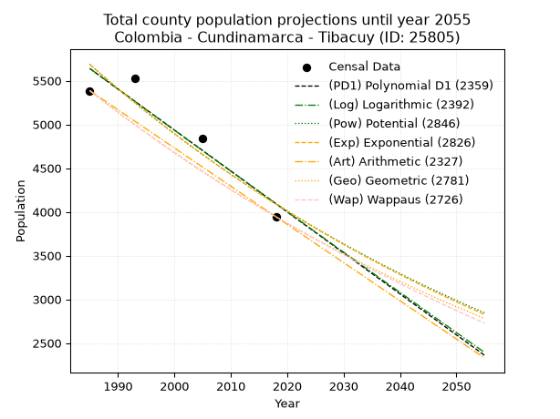
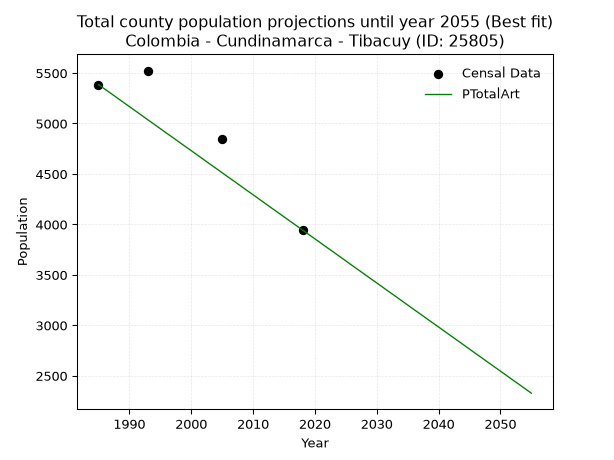
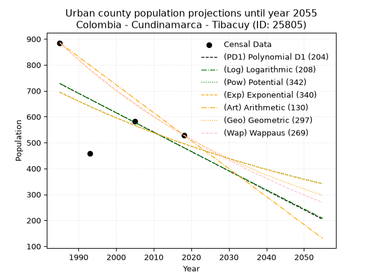
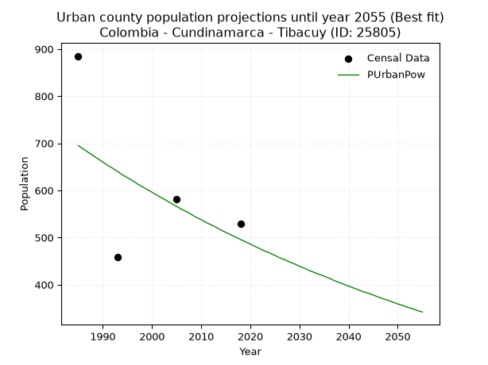
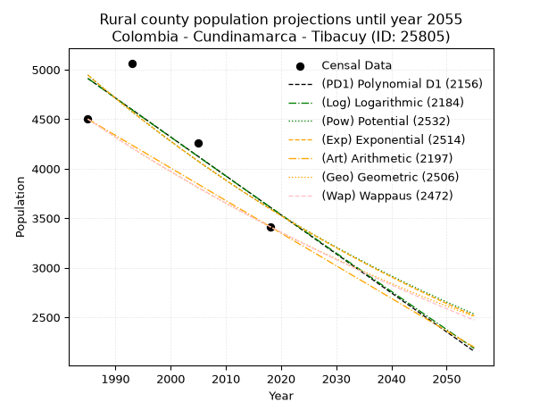
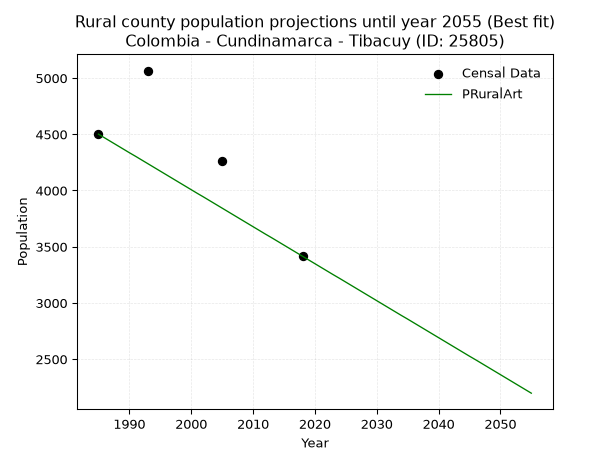

<div align="center">


</div>

# 📜 _“Population and Public Services Demand Projections (PPSD) until Year 2050 for Colombia - Cundinamarca - Tibacuy (ID: 25805)”_
Keywords: `population` `public-service` `projection` `lineal` `polynomial` `logarithmic` `potential` `exponential` `arithmetic` `geometric` `wappaus` `dane` `colombia` `south-america`

PPSD are analytical estimates used by governments and planners to anticipate future changes in population size, age distribution, and the resulting community needs for utilities, healthcare, education, and infrastructure as sizing future water treatment facilities, electrical grids, and road networks based on spatial growth.

<div align="center">

</img>

</div>


> **General running parameters**: • app_version: _v20260806_. • Python version: _3.14.7_. • Pandas version: _3.0.5_. • NumPy version: _2.5.1_. • Creates, save and include plots into reports (create_plot): _False_. • Projection until year: _2050_. • Process polynomial degree 2 and up: _False_. • Process Wappaus: _True_. • Process Wappaus: _True_. • Set negative values to zero: _True_. • Set infinite values to zero: _True_. • Drop dataset notes: _True_. 
<div align="center">

Dynamic map: [:earth_americas:Google](http://maps.google.com/maps?q=4.348605203,-74.4526615) [:earth_americas:OSM](https://www.openstreetmap.org/#map=18/4.348605203/-74.4526615&layers=P) [:earth_americas:Bing](https://www.bing.com/maps?cp=4.348605203~-74.4526615&lvl=18) [:earth_americas:Apple](https://maps.apple.com/frame?center=4.348605203%2C-74.4526615&span=0.003%2C0.006)

</div>


<div align="center">

```geojson
{
  "type": "Feature",
  "geometry": {
    "type": "Point", 
    "coordinates": [-74.4526615, 4.348605203]
  }, 
  "properties": {
    "Name": "Colombia - Cundinamarca - Tibacuy (ID: 25805)"
  }
}
```

</div>


## 0. Census Data (4 records)

Census data are official statistics collected by a government about the people and housing in a country. They usually include counts of total population, age, sex, race, income, education, and jobs.

📅Global census file: [Population.xlsx](../data/Population.xlsx)

| Source   |   Year |   CountryID | CountryName   |   StateID | StateName    |   CountyID | CountyName   |   PTotal |   PUrban |   PRural |
|:---------|-------:|------------:|:--------------|----------:|:-------------|-----------:|:-------------|---------:|---------:|---------:|
| DANE     |   1985 |          57 | Colombia      |        25 | Cundinamarca |      25805 | Tibacuy      |     5386 |      885 |     4501 |
| DANE     |   1993 |          57 | Colombia      |        25 | Cundinamarca |      25805 | Tibacuy      |     5524 |      458 |     5066 |
| DANE     |   2005 |          57 | Colombia      |        25 | Cundinamarca |      25805 | Tibacuy      |     4843 |      582 |     4261 |
| DANE     |   2018 |          57 | Colombia      |        25 | Cundinamarca |      25805 | Tibacuy      |     3944 |      529 |     3415 |

> 🔥Some records could had specific notes about the registered values or the corresponding urban or rural distribution.

📅[SUI-RUPS](https://www.datos.gov.co/Hacienda-y-Cr-dito-P-blico/Registro-nico-de-Prestadores-de-Servicios-P-blicos/4qkq-csdn/about_data) - Local public utility companies: [RUPS.csv](../data/RUPS.csv)

 | SERVICIO       | ESTADO    | NOMBRE                                                                                 | NIT         | DEPARTAMENTO_DOMICILIO   | MUNICIPIO_DOMICILIO   | DIRECCION                          |   TELEFONO | EMAIL                       | TIPO_PRESTADOR                 | CLASIFICACION                 |
|:---------------|:----------|:---------------------------------------------------------------------------------------|:------------|:-------------------------|:----------------------|:-----------------------------------|-----------:|:----------------------------|:-------------------------------|:------------------------------|
| ACUEDUCTO      | OPERATIVA | SECRETARIA DE PLANEACION, OBRAS PUBLICAS Y SERVICIOS PUBLICOS DEL MUNICIPIO DE TIBACUY | 800018689-5 | CUNDINAMARCA             | TIBACUY               | Calle 5 No.2-21, Palacio Municipal |    8668158 | wperezcaicedo@hotmail.com   | MUNICIPIO (PRESTACIÓN DIRECTA) | MENOR O IGUAL A 2500 USUARIOS |
| ALCANTARILLADO | OPERATIVA | SECRETARIA DE PLANEACION, OBRAS PUBLICAS Y SERVICIOS PUBLICOS DEL MUNICIPIO DE TIBACUY | 800018689-5 | CUNDINAMARCA             | TIBACUY               | Calle 5 No.2-21, Palacio Municipal |    8668158 | wperezcaicedo@hotmail.com   | MUNICIPIO (PRESTACIÓN DIRECTA) | MENOR O IGUAL A 2500 USUARIOS |
| ACUEDUCTO      | OPERATIVA | ASOCIACION DE USUARIOS DEL ACUEDUCTO DE CUMACA                                         | 830502386-3 | CUNDINAMARCA             | TIBACUY               | cra 4 N 8-14 salon Comunal         |    0000000 | wperezcaicedo@hotmail.com   | ORGANIZACION AUTORIZADA        | MENOR O IGUAL A 2500 USUARIOS |
| ACUEDUCTO      | OPERATIVA | ASOCIACION DE USUARIOS DEL ACUEDUCTO VEREDA LA VUELTA EL OCOBO MUNICIPIO TIBACUY       | 900115555-5 | CUNDINAMARCA             | TIBACUY               | CALLE 5 No 2-21                    |    0000000 | ROMANBLANCO2010@HOTMAIL.COM | ORGANIZACION AUTORIZADA        | MENOR O IGUAL A 2500 USUARIOS |
| ACUEDUCTO      | OPERATIVA | ASOCIACION DE USUARIOS DEL ACUEDCUTO NOE VEREDA LA VUELTA                              | 900216662-9 | CUNDINAMARCA             | TIBACUY               | VDA LA VUELTA FCA LA VUELTA        |    8668158 | wperezcaicedo@hotmail.com   | ORGANIZACION AUTORIZADA        | MENOR O IGUAL A 2500 USUARIOS |
| ACUEDUCTO      | OPERATIVA | ASOCIACION DE USUARIOS DE ACUEDUCTO DE SAN FRANCISCO CALANDAIMA                        | 900188274-3 | CUNDINAMARCA             | TIBACUY               | CALLE 16A N 2 48                   |    8718762 | wperezcaicedo@hotmail.com   | ORGANIZACION AUTORIZADA        | MENOR O IGUAL A 2500 USUARIOS |

## 1. Total

### 1.1. Coefficients and Parameters

* (PD1) Polynomial Deg 1: -46.84905660377302, 98634.075471697 (lineal)
* (Log) Logarithmic: -93702.69167234222, 717159.1602877191
* (Pow) Potential: -19.973206888356003, 69.62171349840759
* (Exp) Exponential: -0.009986719620654172, 2312499193832.8906
* (Art) Arithmetic: Year diff. 2018 - 1985 = 33, Population diff. 3944 - 5386 = -1442, Annual growth = -43.696969696969695
* (Geo) Geometric: Year diff. 2018 - 1985 = 33, Population diff. 3944 - 5386 = -1442, Annual growth % = -0.009398211404796575
* (Wap) Wappaus: i = -0.9366981714248596, Condition values only valid for < 200)

<sub>
Wappaus condition values: ['-0.00', '-0.94', '-1.87', '-2.81', '-3.75', '-4.68', '-5.62', '-6.56', '-7.49', '-8.43', '-9.37', '-10.30', '-11.24', '-12.18', '-13.11', '-14.05', '-14.99', '-15.92', '-16.86', '-17.80', '-18.73', '-19.67', '-20.61', '-21.54', '-22.48', '-23.42', '-24.35', '-25.29', '-26.23', '-27.16', '-28.10', '-29.04', '-29.97', '-30.91', '-31.85', '-32.78', '-33.72', '-34.66', '-35.59', '-36.53', '-37.47', '-38.40', '-39.34', '-40.28', '-41.21', '-42.15', '-43.09', '-44.02', '-44.96', '-45.90', '-46.83', '-47.77', '-48.71', '-49.65', '-50.58', '-51.52', '-52.46', '-53.39', '-54.33', '-55.27', '-56.20', '-57.14', '-58.08', '-59.01', '-59.95', '-60.89']
</sub>


### 1.2. Projected Dataset

|   Year |   CountyID |   PTotalPD1 |   PTotalLog |   PTotalPow |   PTotalExp |   PTotalArt |   PTotalGeo |   PTotalWap |
|-------:|-----------:|------------:|------------:|------------:|------------:|------------:|------------:|------------:|
|   1985 |      25805 |        5639 |        5640 |        5687 |        5686 |        5386 |        5386 |        5386 |
|   1986 |      25805 |        5592 |        5592 |        5630 |        5629 |        5342 |        5335 |        5336 |
|   1987 |      25805 |        5545 |        5545 |        5573 |        5573 |        5299 |        5285 |        5286 |
|   1988 |      25805 |        5498 |        5498 |        5518 |        5518 |        5255 |        5236 |        5237 |
|   1989 |      25805 |        5451 |        5451 |        5463 |        5463 |        5211 |        5186 |        5188 |
|   1990 |      25805 |        5404 |        5404 |        5408 |        5409 |        5168 |        5138 |        5140 |
|   1991 |      25805 |        5358 |        5357 |        5354 |        5355 |        5124 |        5089 |        5092 |
|   1992 |      25805 |        5311 |        5310 |        5301 |        5302 |        5080 |        5042 |        5044 |
|   1993 |      25805 |        5264 |        5263 |        5248 |        5249 |        5036 |        4994 |        4997 |
|   1994 |      25805 |        5217 |        5216 |        5195 |        5197 |        4993 |        4947 |        4950 |
|   1995 |      25805 |        5170 |        5169 |        5144 |        5145 |        4949 |        4901 |        4904 |
|   1996 |      25805 |        5123 |        5122 |        5092 |        5094 |        4905 |        4855 |        4858 |
|   1997 |      25805 |        5077 |        5075 |        5042 |        5044 |        4862 |        4809 |        4813 |
|   1998 |      25805 |        5030 |        5028 |        4992 |        4993 |        4818 |        4764 |        4768 |
|   1999 |      25805 |        4983 |        4981 |        4942 |        4944 |        4774 |        4719 |        4723 |
|   2000 |      25805 |        4936 |        4934 |        4893 |        4895 |        4731 |        4675 |        4679 |
|   2001 |      25805 |        4889 |        4887 |        4844 |        4846 |        4687 |        4631 |        4635 |
|   2002 |      25805 |        4842 |        4840 |        4796 |        4798 |        4643 |        4587 |        4592 |
|   2003 |      25805 |        4795 |        4794 |        4749 |        4750 |        4599 |        4544 |        4548 |
|   2004 |      25805 |        4749 |        4747 |        4701 |        4703 |        4556 |        4501 |        4506 |
|   2005 |      25805 |        4702 |        4700 |        4655 |        4656 |        4512 |        4459 |        4463 |
|   2006 |      25805 |        4655 |        4653 |        4609 |        4610 |        4468 |        4417 |        4421 |
|   2007 |      25805 |        4608 |        4607 |        4563 |        4564 |        4425 |        4376 |        4380 |
|   2008 |      25805 |        4561 |        4560 |        4518 |        4519 |        4381 |        4335 |        4338 |
|   2009 |      25805 |        4514 |        4513 |        4473 |        4474 |        4337 |        4294 |        4298 |
|   2010 |      25805 |        4467 |        4467 |        4429 |        4430 |        4294 |        4253 |        4257 |
|   2011 |      25805 |        4421 |        4420 |        4385 |        4385 |        4250 |        4214 |        4217 |
|   2012 |      25805 |        4374 |        4374 |        4342 |        4342 |        4206 |        4174 |        4177 |
|   2013 |      25805 |        4327 |        4327 |        4299 |        4299 |        4162 |        4135 |        4137 |
|   2014 |      25805 |        4280 |        4281 |        4256 |        4256 |        4119 |        4096 |        4098 |
|   2015 |      25805 |        4233 |        4234 |        4214 |        4214 |        4075 |        4057 |        4059 |
|   2016 |      25805 |        4186 |        4188 |        4173 |        4172 |        4031 |        4019 |        4020 |
|   2017 |      25805 |        4140 |        4141 |        4132 |        4130 |        3988 |        3981 |        3982 |
|   2018 |      25805 |        4093 |        4095 |        4091 |        4089 |        3944 |        3944 |        3944 |
|   2019 |      25805 |        4046 |        4048 |        4051 |        4049 |        3900 |        3907 |        3906 |
|   2020 |      25805 |        3999 |        4002 |        4011 |        4009 |        3857 |        3870 |        3869 |
|   2021 |      25805 |        3952 |        3955 |        3971 |        3969 |        3813 |        3834 |        3832 |
|   2022 |      25805 |        3905 |        3909 |        3932 |        3929 |        3769 |        3798 |        3795 |
|   2023 |      25805 |        3858 |        3863 |        3894 |        3890 |        3726 |        3762 |        3759 |
|   2024 |      25805 |        3812 |        3816 |        3856 |        3852 |        3682 |        3727 |        3722 |
|   2025 |      25805 |        3765 |        3770 |        3818 |        3813 |        3638 |        3692 |        3686 |
|   2026 |      25805 |        3718 |        3724 |        3780 |        3775 |        3594 |        3657 |        3651 |
|   2027 |      25805 |        3671 |        3678 |        3743 |        3738 |        3551 |        3623 |        3615 |
|   2028 |      25805 |        3624 |        3631 |        3706 |        3701 |        3507 |        3589 |        3580 |
|   2029 |      25805 |        3577 |        3585 |        3670 |        3664 |        3463 |        3555 |        3545 |
|   2030 |      25805 |        3530 |        3539 |        3634 |        3628 |        3420 |        3521 |        3511 |
|   2031 |      25805 |        3484 |        3493 |        3599 |        3591 |        3376 |        3488 |        3477 |
|   2032 |      25805 |        3437 |        3447 |        3563 |        3556 |        3332 |        3456 |        3443 |
|   2033 |      25805 |        3390 |        3401 |        3529 |        3520 |        3289 |        3423 |        3409 |
|   2034 |      25805 |        3343 |        3355 |        3494 |        3485 |        3245 |        3391 |        3375 |
|   2035 |      25805 |        3296 |        3309 |        3460 |        3451 |        3201 |        3359 |        3342 |
|   2036 |      25805 |        3249 |        3262 |        3426 |        3417 |        3157 |        3328 |        3309 |
|   2037 |      25805 |        3203 |        3216 |        3393 |        3383 |        3114 |        3296 |        3276 |
|   2038 |      25805 |        3156 |        3170 |        3360 |        3349 |        3070 |        3265 |        3244 |
|   2039 |      25805 |        3109 |        3125 |        3327 |        3316 |        3026 |        3235 |        3212 |
|   2040 |      25805 |        3062 |        3079 |        3294 |        3283 |        2983 |        3204 |        3180 |
|   2041 |      25805 |        3015 |        3033 |        3262 |        3250 |        2939 |        3174 |        3148 |
|   2042 |      25805 |        2968 |        2987 |        3231 |        3218 |        2895 |        3144 |        3116 |
|   2043 |      25805 |        2921 |        2941 |        3199 |        3186 |        2852 |        3115 |        3085 |
|   2044 |      25805 |        2875 |        2895 |        3168 |        3154 |        2808 |        3085 |        3054 |
|   2045 |      25805 |        2828 |        2849 |        3137 |        3123 |        2764 |        3056 |        3023 |
|   2046 |      25805 |        2781 |        2803 |        3107 |        3092 |        2720 |        3028 |        2992 |
|   2047 |      25805 |        2734 |        2758 |        3077 |        3061 |        2677 |        2999 |        2962 |
|   2048 |      25805 |        2687 |        2712 |        3047 |        3031 |        2633 |        2971 |        2932 |
|   2049 |      25805 |        2640 |        2666 |        3017 |        3001 |        2589 |        2943 |        2902 |
|   2050 |      25805 |        2594 |        2620 |        2988 |        2971 |        2546 |        2915 |        2872 |
<div align="center">

</img>

</div>


### 1.3. Best fit with absolute and relative error (%)

Relative error puts that difference into context by dividing the absolute error by the true value, creating a unitless ratio or percentage that shows the scale of the mistake.

Absolute and relative error

|   Year | Source   |   CountryID | CountryName   |   StateID | StateName    |   CountyID_x | CountyName   |   PTotal |   PUrban |   PRural |   CountyID_y |   PTotalPD1 |   PTotalLog |   PTotalPow |   PTotalExp |   PTotalArt |   PTotalGeo |   PTotalWap |   PTotalPD1AbsError |   PTotalLogAbsError |   PTotalPowAbsError |   PTotalExpAbsError |   PTotalArtAbsError |   PTotalGeoAbsError |   PTotalWapAbsError |   PTotalPD1RelError |   PTotalLogRelError |   PTotalPowRelError |   PTotalExpRelError |   PTotalArtRelError |   PTotalGeoRelError |   PTotalWapRelError |
|-------:|:---------|------------:|:--------------|----------:|:-------------|-------------:|:-------------|---------:|---------:|---------:|-------------:|------------:|------------:|------------:|------------:|------------:|------------:|------------:|--------------------:|--------------------:|--------------------:|--------------------:|--------------------:|--------------------:|--------------------:|--------------------:|--------------------:|--------------------:|--------------------:|--------------------:|--------------------:|--------------------:|
|   1985 | DANE     |          57 | Colombia      |        25 | Cundinamarca |        25805 | Tibacuy      |     5386 |      885 |     4501 |        25805 |        5639 |        5640 |        5687 |        5686 |        5386 |        5386 |        5386 |                 253 |                 254 |                 301 |                 300 |                   0 |                   0 |                   0 |             4.69736 |             4.71593 |             5.58856 |             5.57    |             0       |             0       |             0       |
|   1993 | DANE     |          57 | Colombia      |        25 | Cundinamarca |        25805 | Tibacuy      |     5524 |      458 |     5066 |        25805 |        5264 |        5263 |        5248 |        5249 |        5036 |        4994 |        4997 |                 260 |                 261 |                 276 |                 275 |                 488 |                 530 |                 527 |             4.70673 |             4.72484 |             4.99638 |             4.97828 |             8.83418 |             9.5945  |             9.54019 |
|   2005 | DANE     |          57 | Colombia      |        25 | Cundinamarca |        25805 | Tibacuy      |     4843 |      582 |     4261 |        25805 |        4702 |        4700 |        4655 |        4656 |        4512 |        4459 |        4463 |                 141 |                 143 |                 188 |                 187 |                 331 |                 384 |                 380 |             2.91142 |             2.95272 |             3.88189 |             3.86124 |             6.83461 |             7.92897 |             7.84638 |
|   2018 | DANE     |          57 | Colombia      |        25 | Cundinamarca |        25805 | Tibacuy      |     3944 |      529 |     3415 |        25805 |        4093 |        4095 |        4091 |        4089 |        3944 |        3944 |        3944 |                 149 |                 151 |                 147 |                 145 |                   0 |                   0 |                   0 |             3.77789 |             3.8286  |             3.72718 |             3.67647 |             0       |             0       |             0       |

Relative error mean

| Method    |   RelError | Best   |
|:----------|-----------:|:-------|
| PTotalPD1 |    4.02335 |        |
| PTotalLog |    4.05552 |        |
| PTotalPow |    4.5485  |        |
| PTotalExp |    4.5215  |        |
| PTotalArt |    3.9172  | True   |
| PTotalGeo |    4.38087 |        |
| PTotalWap |    4.34664 |        |

💙Best method: _**PTotalArt**_
<div align="center">

</img>

</div>


### 1.4. Fresh water supply demand in liters per capita per day (lpcd)

The fresh water supply demand typically ranges from 100 to 300 liters per capita per day (lpcd) for standard domestic and municipal planning, though absolute survival minimums set by the World Health Organization are as low as 7.5 to 20 liters per day, and total consumption in high-income nations can exceed 400 liters.

> `CZ`: Level in meters above the sea level (masl)<br> `WS`: Fresh water supply demand in liters per capita per day (lpcd or l/h/d)<br> `WSAll`: Zonal fresh water supply demand in liters per second (l/s)<br> `A`: Zonal area in square meters<br> `DP`: Population density (people/hectare or p/ha)

Reference values (RAS Colombia)

|    CZ |   WS |
|------:|-----:|
|  1000 |  120 |
|  2000 |  130 |
| 99999 |  140 |

County shapefile geometry properties and water supply values

|   CountyID |      ATotal |   CZTotal |   WSTotal |
|-----------:|------------:|----------:|----------:|
|      25805 | 8.46438e+07 |   1290.38 |       130 |

Projected values for best method: PTotalArt

|   CountyID |   Year |   PTotalArt |   DPTotal |   WSTotal |   WSTotalAll |
|-----------:|-------:|------------:|----------:|----------:|-------------:|
|      25805 |   1985 |        5386 |      0.64 |       130 |      8.10394 |
|      25805 |   1986 |        5342 |      0.63 |       130 |      8.03773 |
|      25805 |   1987 |        5299 |      0.63 |       130 |      7.97303 |
|      25805 |   1988 |        5255 |      0.62 |       130 |      7.90683 |
|      25805 |   1989 |        5211 |      0.62 |       130 |      7.84063 |
|      25805 |   1990 |        5168 |      0.61 |       130 |      7.77593 |
|      25805 |   1991 |        5124 |      0.61 |       130 |      7.70972 |
|      25805 |   1992 |        5080 |      0.6  |       130 |      7.64352 |
|      25805 |   1993 |        5036 |      0.59 |       130 |      7.57731 |
|      25805 |   1994 |        4993 |      0.59 |       130 |      7.51262 |
|      25805 |   1995 |        4949 |      0.58 |       130 |      7.44641 |
|      25805 |   1996 |        4905 |      0.58 |       130 |      7.38021 |
|      25805 |   1997 |        4862 |      0.57 |       130 |      7.31551 |
|      25805 |   1998 |        4818 |      0.57 |       130 |      7.24931 |
|      25805 |   1999 |        4774 |      0.56 |       130 |      7.1831  |
|      25805 |   2000 |        4731 |      0.56 |       130 |      7.1184  |
|      25805 |   2001 |        4687 |      0.55 |       130 |      7.0522  |
|      25805 |   2002 |        4643 |      0.55 |       130 |      6.986   |
|      25805 |   2003 |        4599 |      0.54 |       130 |      6.91979 |
|      25805 |   2004 |        4556 |      0.54 |       130 |      6.85509 |
|      25805 |   2005 |        4512 |      0.53 |       130 |      6.78889 |
|      25805 |   2006 |        4468 |      0.53 |       130 |      6.72269 |
|      25805 |   2007 |        4425 |      0.52 |       130 |      6.65799 |
|      25805 |   2008 |        4381 |      0.52 |       130 |      6.59178 |
|      25805 |   2009 |        4337 |      0.51 |       130 |      6.52558 |
|      25805 |   2010 |        4294 |      0.51 |       130 |      6.46088 |
|      25805 |   2011 |        4250 |      0.5  |       130 |      6.39468 |
|      25805 |   2012 |        4206 |      0.5  |       130 |      6.32847 |
|      25805 |   2013 |        4162 |      0.49 |       130 |      6.26227 |
|      25805 |   2014 |        4119 |      0.49 |       130 |      6.19757 |
|      25805 |   2015 |        4075 |      0.48 |       130 |      6.13137 |
|      25805 |   2016 |        4031 |      0.48 |       130 |      6.06516 |
|      25805 |   2017 |        3988 |      0.47 |       130 |      6.00046 |
|      25805 |   2018 |        3944 |      0.47 |       130 |      5.93426 |
|      25805 |   2019 |        3900 |      0.46 |       130 |      5.86806 |
|      25805 |   2020 |        3857 |      0.46 |       130 |      5.80336 |
|      25805 |   2021 |        3813 |      0.45 |       130 |      5.73715 |
|      25805 |   2022 |        3769 |      0.45 |       130 |      5.67095 |
|      25805 |   2023 |        3726 |      0.44 |       130 |      5.60625 |
|      25805 |   2024 |        3682 |      0.43 |       130 |      5.54005 |
|      25805 |   2025 |        3638 |      0.43 |       130 |      5.47384 |
|      25805 |   2026 |        3594 |      0.42 |       130 |      5.40764 |
|      25805 |   2027 |        3551 |      0.42 |       130 |      5.34294 |
|      25805 |   2028 |        3507 |      0.41 |       130 |      5.27674 |
|      25805 |   2029 |        3463 |      0.41 |       130 |      5.21053 |
|      25805 |   2030 |        3420 |      0.4  |       130 |      5.14583 |
|      25805 |   2031 |        3376 |      0.4  |       130 |      5.07963 |
|      25805 |   2032 |        3332 |      0.39 |       130 |      5.01343 |
|      25805 |   2033 |        3289 |      0.39 |       130 |      4.94873 |
|      25805 |   2034 |        3245 |      0.38 |       130 |      4.88252 |
|      25805 |   2035 |        3201 |      0.38 |       130 |      4.81632 |
|      25805 |   2036 |        3157 |      0.37 |       130 |      4.75012 |
|      25805 |   2037 |        3114 |      0.37 |       130 |      4.68542 |
|      25805 |   2038 |        3070 |      0.36 |       130 |      4.61921 |
|      25805 |   2039 |        3026 |      0.36 |       130 |      4.55301 |
|      25805 |   2040 |        2983 |      0.35 |       130 |      4.48831 |
|      25805 |   2041 |        2939 |      0.35 |       130 |      4.42211 |
|      25805 |   2042 |        2895 |      0.34 |       130 |      4.3559  |
|      25805 |   2043 |        2852 |      0.34 |       130 |      4.2912  |
|      25805 |   2044 |        2808 |      0.33 |       130 |      4.225   |
|      25805 |   2045 |        2764 |      0.33 |       130 |      4.1588  |
|      25805 |   2046 |        2720 |      0.32 |       130 |      4.09259 |
|      25805 |   2047 |        2677 |      0.32 |       130 |      4.02789 |
|      25805 |   2048 |        2633 |      0.31 |       130 |      3.96169 |
|      25805 |   2049 |        2589 |      0.31 |       130 |      3.89549 |
|      25805 |   2050 |        2546 |      0.3  |       130 |      3.83079 |

## 2. Urban

### 2.1. Coefficients and Parameters

* (PD1) Polynomial Deg 1: -7.486953030911253, 15589.277800080234 (lineal)
* (Log) Logarithmic: -15018.980783955436, 114772.89329340392
* (Pow) Potential: -20.455641296088753, 70.299670067563
* (Exp) Exponential: -0.01019547792692025, 427398918965.1829
* (Art) Arithmetic: Year diff. 2018 - 1985 = 33, Population diff. 529 - 885 = -356, Annual growth = -10.787878787878787
* (Geo) Geometric: Year diff. 2018 - 1985 = 33, Population diff. 529 - 885 = -356, Annual growth % = -0.01547295998867293
* (Wap) Wappaus: i = -1.5258668724015259, Condition values only valid for < 200)

<sub>
Wappaus condition values: ['-0.00', '-1.53', '-3.05', '-4.58', '-6.10', '-7.63', '-9.16', '-10.68', '-12.21', '-13.73', '-15.26', '-16.78', '-18.31', '-19.84', '-21.36', '-22.89', '-24.41', '-25.94', '-27.47', '-28.99', '-30.52', '-32.04', '-33.57', '-35.09', '-36.62', '-38.15', '-39.67', '-41.20', '-42.72', '-44.25', '-45.78', '-47.30', '-48.83', '-50.35', '-51.88', '-53.41', '-54.93', '-56.46', '-57.98', '-59.51', '-61.03', '-62.56', '-64.09', '-65.61', '-67.14', '-68.66', '-70.19', '-71.72', '-73.24', '-74.77', '-76.29', '-77.82', '-79.35', '-80.87', '-82.40', '-83.92', '-85.45', '-86.97', '-88.50', '-90.03', '-91.55', '-93.08', '-94.60', '-96.13', '-97.66', '-99.18']
</sub>


### 2.2. Projected Dataset

|   Year |   CountyID |   PUrbanPD1 |   PUrbanLog |   PUrbanPow |   PUrbanExp |   PUrbanArt |   PUrbanGeo |   PUrbanWap |
|-------:|-----------:|------------:|------------:|------------:|------------:|------------:|------------:|------------:|
|   1985 |      25805 |         728 |         728 |         695 |         694 |         885 |         885 |         885 |
|   1986 |      25805 |         720 |         721 |         688 |         687 |         874 |         871 |         872 |
|   1987 |      25805 |         713 |         713 |         681 |         680 |         863 |         858 |         858 |
|   1988 |      25805 |         705 |         705 |         674 |         673 |         853 |         845 |         845 |
|   1989 |      25805 |         698 |         698 |         667 |         667 |         842 |         831 |         833 |
|   1990 |      25805 |         690 |         690 |         660 |         660 |         831 |         819 |         820 |
|   1991 |      25805 |         683 |         683 |         653 |         653 |         820 |         806 |         808 |
|   1992 |      25805 |         675 |         675 |         647 |         647 |         809 |         793 |         795 |
|   1993 |      25805 |         668 |         668 |         640 |         640 |         799 |         781 |         783 |
|   1994 |      25805 |         660 |         660 |         633 |         633 |         788 |         769 |         771 |
|   1995 |      25805 |         653 |         653 |         627 |         627 |         777 |         757 |         760 |
|   1996 |      25805 |         645 |         645 |         621 |         621 |         766 |         745 |         748 |
|   1997 |      25805 |         638 |         638 |         614 |         614 |         756 |         734 |         737 |
|   1998 |      25805 |         630 |         630 |         608 |         608 |         745 |         723 |         725 |
|   1999 |      25805 |         623 |         623 |         602 |         602 |         734 |         711 |         714 |
|   2000 |      25805 |         615 |         615 |         596 |         596 |         723 |         700 |         703 |
|   2001 |      25805 |         608 |         608 |         590 |         590 |         712 |         690 |         692 |
|   2002 |      25805 |         600 |         600 |         584 |         584 |         702 |         679 |         682 |
|   2003 |      25805 |         593 |         593 |         578 |         578 |         691 |         668 |         671 |
|   2004 |      25805 |         585 |         585 |         572 |         572 |         680 |         658 |         661 |
|   2005 |      25805 |         578 |         578 |         566 |         566 |         669 |         648 |         651 |
|   2006 |      25805 |         570 |         570 |         560 |         561 |         658 |         638 |         641 |
|   2007 |      25805 |         563 |         563 |         555 |         555 |         648 |         628 |         631 |
|   2008 |      25805 |         555 |         555 |         549 |         549 |         637 |         618 |         621 |
|   2009 |      25805 |         548 |         548 |         543 |         544 |         626 |         609 |         611 |
|   2010 |      25805 |         541 |         540 |         538 |         538 |         615 |         599 |         601 |
|   2011 |      25805 |         533 |         533 |         532 |         533 |         605 |         590 |         592 |
|   2012 |      25805 |         526 |         525 |         527 |         527 |         594 |         581 |         583 |
|   2013 |      25805 |         518 |         518 |         522 |         522 |         583 |         572 |         573 |
|   2014 |      25805 |         511 |         510 |         516 |         517 |         572 |         563 |         564 |
|   2015 |      25805 |         503 |         503 |         511 |         511 |         561 |         554 |         555 |
|   2016 |      25805 |         496 |         495 |         506 |         506 |         551 |         546 |         546 |
|   2017 |      25805 |         488 |         488 |         501 |         501 |         540 |         537 |         538 |
|   2018 |      25805 |         481 |         481 |         496 |         496 |         529 |         529 |         529 |
|   2019 |      25805 |         473 |         473 |         491 |         491 |         518 |         521 |         520 |
|   2020 |      25805 |         466 |         466 |         486 |         486 |         507 |         513 |         512 |
|   2021 |      25805 |         458 |         458 |         481 |         481 |         497 |         505 |         504 |
|   2022 |      25805 |         451 |         451 |         476 |         476 |         486 |         497 |         495 |
|   2023 |      25805 |         443 |         443 |         471 |         471 |         475 |         489 |         487 |
|   2024 |      25805 |         436 |         436 |         467 |         467 |         464 |         482 |         479 |
|   2025 |      25805 |         428 |         429 |         462 |         462 |         453 |         474 |         471 |
|   2026 |      25805 |         421 |         421 |         457 |         457 |         443 |         467 |         463 |
|   2027 |      25805 |         413 |         414 |         453 |         452 |         432 |         460 |         455 |
|   2028 |      25805 |         406 |         406 |         448 |         448 |         421 |         453 |         448 |
|   2029 |      25805 |         398 |         399 |         444 |         443 |         410 |         446 |         440 |
|   2030 |      25805 |         391 |         391 |         439 |         439 |         400 |         439 |         433 |
|   2031 |      25805 |         383 |         384 |         435 |         434 |         389 |         432 |         425 |
|   2032 |      25805 |         376 |         377 |         430 |         430 |         378 |         425 |         418 |
|   2033 |      25805 |         368 |         369 |         426 |         426 |         367 |         419 |         411 |
|   2034 |      25805 |         361 |         362 |         422 |         421 |         356 |         412 |         403 |
|   2035 |      25805 |         353 |         355 |         418 |         417 |         346 |         406 |         396 |
|   2036 |      25805 |         346 |         347 |         414 |         413 |         335 |         400 |         389 |
|   2037 |      25805 |         338 |         340 |         409 |         409 |         324 |         393 |         382 |
|   2038 |      25805 |         331 |         332 |         405 |         404 |         313 |         387 |         375 |
|   2039 |      25805 |         323 |         325 |         401 |         400 |         302 |         381 |         369 |
|   2040 |      25805 |         316 |         318 |         397 |         396 |         292 |         375 |         362 |
|   2041 |      25805 |         308 |         310 |         393 |         392 |         281 |         370 |         355 |
|   2042 |      25805 |         301 |         303 |         389 |         388 |         270 |         364 |         349 |
|   2043 |      25805 |         293 |         296 |         385 |         384 |         259 |         358 |         342 |
|   2044 |      25805 |         286 |         288 |         382 |         380 |         249 |         353 |         336 |
|   2045 |      25805 |         278 |         281 |         378 |         377 |         238 |         347 |         329 |
|   2046 |      25805 |         271 |         274 |         374 |         373 |         227 |         342 |         323 |
|   2047 |      25805 |         263 |         266 |         370 |         369 |         216 |         337 |         317 |
|   2048 |      25805 |         256 |         259 |         367 |         365 |         205 |         331 |         310 |
|   2049 |      25805 |         249 |         252 |         363 |         362 |         195 |         326 |         304 |
|   2050 |      25805 |         241 |         244 |         359 |         358 |         184 |         321 |         298 |
<div align="center">

</img>

</div>


### 2.3. Best fit with absolute and relative error (%)

Relative error puts that difference into context by dividing the absolute error by the true value, creating a unitless ratio or percentage that shows the scale of the mistake.

Absolute and relative error

|   Year | Source   |   CountryID | CountryName   |   StateID | StateName    |   CountyID_x | CountyName   |   PTotal |   PUrban |   PRural |   CountyID_y |   PUrbanPD1 |   PUrbanLog |   PUrbanPow |   PUrbanExp |   PUrbanArt |   PUrbanGeo |   PUrbanWap |   PUrbanPD1AbsError |   PUrbanLogAbsError |   PUrbanPowAbsError |   PUrbanExpAbsError |   PUrbanArtAbsError |   PUrbanGeoAbsError |   PUrbanWapAbsError |   PUrbanPD1RelError |   PUrbanLogRelError |   PUrbanPowRelError |   PUrbanExpRelError |   PUrbanArtRelError |   PUrbanGeoRelError |   PUrbanWapRelError |
|-------:|:---------|------------:|:--------------|----------:|:-------------|-------------:|:-------------|---------:|---------:|---------:|-------------:|------------:|------------:|------------:|------------:|------------:|------------:|------------:|--------------------:|--------------------:|--------------------:|--------------------:|--------------------:|--------------------:|--------------------:|--------------------:|--------------------:|--------------------:|--------------------:|--------------------:|--------------------:|--------------------:|
|   1985 | DANE     |          57 | Colombia      |        25 | Cundinamarca |        25805 | Tibacuy      |     5386 |      885 |     4501 |        25805 |         728 |         728 |         695 |         694 |         885 |         885 |         885 |                 157 |                 157 |                 190 |                 191 |                   0 |                   0 |                   0 |           17.7401   |           17.7401   |            21.4689  |            21.5819  |              0      |              0      |              0      |
|   1993 | DANE     |          57 | Colombia      |        25 | Cundinamarca |        25805 | Tibacuy      |     5524 |      458 |     5066 |        25805 |         668 |         668 |         640 |         640 |         799 |         781 |         783 |                 210 |                 210 |                 182 |                 182 |                 341 |                 323 |                 325 |           45.8515   |           45.8515   |            39.738   |            39.738   |             74.4541 |             70.524  |             70.9607 |
|   2005 | DANE     |          57 | Colombia      |        25 | Cundinamarca |        25805 | Tibacuy      |     4843 |      582 |     4261 |        25805 |         578 |         578 |         566 |         566 |         669 |         648 |         651 |                   4 |                   4 |                  16 |                  16 |                  87 |                  66 |                  69 |            0.687285 |            0.687285 |             2.74914 |             2.74914 |             14.9485 |             11.3402 |             11.8557 |
|   2018 | DANE     |          57 | Colombia      |        25 | Cundinamarca |        25805 | Tibacuy      |     3944 |      529 |     3415 |        25805 |         481 |         481 |         496 |         496 |         529 |         529 |         529 |                  48 |                  48 |                  33 |                  33 |                   0 |                   0 |                   0 |            9.07372  |            9.07372  |             6.23819 |             6.23819 |              0      |              0      |              0      |

Relative error mean

| Method    |   RelError | Best   |
|:----------|-----------:|:-------|
| PUrbanPD1 |    18.3382 |        |
| PUrbanLog |    18.3382 |        |
| PUrbanPow |    17.5486 | True   |
| PUrbanExp |    17.5768 |        |
| PUrbanArt |    22.3507 |        |
| PUrbanGeo |    20.4661 |        |
| PUrbanWap |    20.7041 |        |

💙Best method: _**PUrbanPow**_
<div align="center">

</img>

</div>


### 2.4. Fresh water supply demand in liters per capita per day (lpcd)

The fresh water supply demand typically ranges from 100 to 300 liters per capita per day (lpcd) for standard domestic and municipal planning, though absolute survival minimums set by the World Health Organization are as low as 7.5 to 20 liters per day, and total consumption in high-income nations can exceed 400 liters.

> `CZ`: Level in meters above the sea level (masl)<br> `WS`: Fresh water supply demand in liters per capita per day (lpcd or l/h/d)<br> `WSAll`: Zonal fresh water supply demand in liters per second (l/s)<br> `A`: Zonal area in square meters<br> `DP`: Population density (people/hectare or p/ha)

Reference values (RAS Colombia)

|    CZ |   WS |
|------:|-----:|
|  1000 |  120 |
|  2000 |  130 |
| 99999 |  140 |

County shapefile geometry properties and water supply values

|   CountyID |   AUrban |   CZUrban |   WSUrban |
|-----------:|---------:|----------:|----------:|
|      25805 |   235193 |   1645.49 |       130 |

Projected values for best method: PUrbanPow

|   CountyID |   Year |   PUrbanPow |   DPUrban |   WSUrban |   WSUrbanAll |
|-----------:|-------:|------------:|----------:|----------:|-------------:|
|      25805 |   1985 |         695 |     29.55 |       130 |     1.04572  |
|      25805 |   1986 |         688 |     29.25 |       130 |     1.03519  |
|      25805 |   1987 |         681 |     28.95 |       130 |     1.02465  |
|      25805 |   1988 |         674 |     28.66 |       130 |     1.01412  |
|      25805 |   1989 |         667 |     28.36 |       130 |     1.00359  |
|      25805 |   1990 |         660 |     28.06 |       130 |     0.993056 |
|      25805 |   1991 |         653 |     27.76 |       130 |     0.982523 |
|      25805 |   1992 |         647 |     27.51 |       130 |     0.973495 |
|      25805 |   1993 |         640 |     27.21 |       130 |     0.962963 |
|      25805 |   1994 |         633 |     26.91 |       130 |     0.952431 |
|      25805 |   1995 |         627 |     26.66 |       130 |     0.943403 |
|      25805 |   1996 |         621 |     26.4  |       130 |     0.934375 |
|      25805 |   1997 |         614 |     26.11 |       130 |     0.923843 |
|      25805 |   1998 |         608 |     25.85 |       130 |     0.914815 |
|      25805 |   1999 |         602 |     25.6  |       130 |     0.905787 |
|      25805 |   2000 |         596 |     25.34 |       130 |     0.896759 |
|      25805 |   2001 |         590 |     25.09 |       130 |     0.887731 |
|      25805 |   2002 |         584 |     24.83 |       130 |     0.878704 |
|      25805 |   2003 |         578 |     24.58 |       130 |     0.869676 |
|      25805 |   2004 |         572 |     24.32 |       130 |     0.860648 |
|      25805 |   2005 |         566 |     24.07 |       130 |     0.85162  |
|      25805 |   2006 |         560 |     23.81 |       130 |     0.842593 |
|      25805 |   2007 |         555 |     23.6  |       130 |     0.835069 |
|      25805 |   2008 |         549 |     23.34 |       130 |     0.826042 |
|      25805 |   2009 |         543 |     23.09 |       130 |     0.817014 |
|      25805 |   2010 |         538 |     22.87 |       130 |     0.809491 |
|      25805 |   2011 |         532 |     22.62 |       130 |     0.800463 |
|      25805 |   2012 |         527 |     22.41 |       130 |     0.79294  |
|      25805 |   2013 |         522 |     22.19 |       130 |     0.785417 |
|      25805 |   2014 |         516 |     21.94 |       130 |     0.776389 |
|      25805 |   2015 |         511 |     21.73 |       130 |     0.768866 |
|      25805 |   2016 |         506 |     21.51 |       130 |     0.761343 |
|      25805 |   2017 |         501 |     21.3  |       130 |     0.753819 |
|      25805 |   2018 |         496 |     21.09 |       130 |     0.746296 |
|      25805 |   2019 |         491 |     20.88 |       130 |     0.738773 |
|      25805 |   2020 |         486 |     20.66 |       130 |     0.73125  |
|      25805 |   2021 |         481 |     20.45 |       130 |     0.723727 |
|      25805 |   2022 |         476 |     20.24 |       130 |     0.716204 |
|      25805 |   2023 |         471 |     20.03 |       130 |     0.708681 |
|      25805 |   2024 |         467 |     19.86 |       130 |     0.702662 |
|      25805 |   2025 |         462 |     19.64 |       130 |     0.695139 |
|      25805 |   2026 |         457 |     19.43 |       130 |     0.687616 |
|      25805 |   2027 |         453 |     19.26 |       130 |     0.681597 |
|      25805 |   2028 |         448 |     19.05 |       130 |     0.674074 |
|      25805 |   2029 |         444 |     18.88 |       130 |     0.668056 |
|      25805 |   2030 |         439 |     18.67 |       130 |     0.660532 |
|      25805 |   2031 |         435 |     18.5  |       130 |     0.654514 |
|      25805 |   2032 |         430 |     18.28 |       130 |     0.646991 |
|      25805 |   2033 |         426 |     18.11 |       130 |     0.640972 |
|      25805 |   2034 |         422 |     17.94 |       130 |     0.634954 |
|      25805 |   2035 |         418 |     17.77 |       130 |     0.628935 |
|      25805 |   2036 |         414 |     17.6  |       130 |     0.622917 |
|      25805 |   2037 |         409 |     17.39 |       130 |     0.615394 |
|      25805 |   2038 |         405 |     17.22 |       130 |     0.609375 |
|      25805 |   2039 |         401 |     17.05 |       130 |     0.603356 |
|      25805 |   2040 |         397 |     16.88 |       130 |     0.597338 |
|      25805 |   2041 |         393 |     16.71 |       130 |     0.591319 |
|      25805 |   2042 |         389 |     16.54 |       130 |     0.585301 |
|      25805 |   2043 |         385 |     16.37 |       130 |     0.579282 |
|      25805 |   2044 |         382 |     16.24 |       130 |     0.574769 |
|      25805 |   2045 |         378 |     16.07 |       130 |     0.56875  |
|      25805 |   2046 |         374 |     15.9  |       130 |     0.562731 |
|      25805 |   2047 |         370 |     15.73 |       130 |     0.556713 |
|      25805 |   2048 |         367 |     15.6  |       130 |     0.552199 |
|      25805 |   2049 |         363 |     15.43 |       130 |     0.546181 |
|      25805 |   2050 |         359 |     15.26 |       130 |     0.540162 |

## 3. Rural

### 3.1. Coefficients and Parameters

* (PD1) Polynomial Deg 1: -39.3621035728617, 83044.7976716166 (lineal)
* (Log) Logarithmic: -78683.71088838676, 602386.2669943152
* (Pow) Potential: -19.319770058564696, 67.40624523004864
* (Exp) Exponential: -0.009664831243801663, 1061779194931.6444
* (Art) Arithmetic: Year diff. 2018 - 1985 = 33, Population diff. 3415 - 4501 = -1086, Annual growth = -32.90909090909091
* (Geo) Geometric: Year diff. 2018 - 1985 = 33, Population diff. 3415 - 4501 = -1086, Annual growth % = -0.008332427675636578
* (Wap) Wappaus: i = -0.8314575772888052, Condition values only valid for < 200)

<sub>
Wappaus condition values: ['-0.00', '-0.83', '-1.66', '-2.49', '-3.33', '-4.16', '-4.99', '-5.82', '-6.65', '-7.48', '-8.31', '-9.15', '-9.98', '-10.81', '-11.64', '-12.47', '-13.30', '-14.13', '-14.97', '-15.80', '-16.63', '-17.46', '-18.29', '-19.12', '-19.95', '-20.79', '-21.62', '-22.45', '-23.28', '-24.11', '-24.94', '-25.78', '-26.61', '-27.44', '-28.27', '-29.10', '-29.93', '-30.76', '-31.60', '-32.43', '-33.26', '-34.09', '-34.92', '-35.75', '-36.58', '-37.42', '-38.25', '-39.08', '-39.91', '-40.74', '-41.57', '-42.40', '-43.24', '-44.07', '-44.90', '-45.73', '-46.56', '-47.39', '-48.22', '-49.06', '-49.89', '-50.72', '-51.55', '-52.38', '-53.21', '-54.04']
</sub>


### 3.2. Projected Dataset

|   Year |   CountyID |   PRuralPD1 |   PRuralLog |   PRuralPow |   PRuralExp |   PRuralArt |   PRuralGeo |   PRuralWap |
|-------:|-----------:|------------:|------------:|------------:|------------:|------------:|------------:|------------:|
|   1985 |      25805 |        4911 |        4911 |        4946 |        4946 |        4501 |        4501 |        4501 |
|   1986 |      25805 |        4872 |        4872 |        4898 |        4898 |        4468 |        4463 |        4464 |
|   1987 |      25805 |        4832 |        4832 |        4851 |        4851 |        4435 |        4426 |        4427 |
|   1988 |      25805 |        4793 |        4793 |        4804 |        4804 |        4402 |        4389 |        4390 |
|   1989 |      25805 |        4754 |        4753 |        4758 |        4758 |        4369 |        4353 |        4354 |
|   1990 |      25805 |        4714 |        4713 |        4712 |        4712 |        4336 |        4317 |        4318 |
|   1991 |      25805 |        4675 |        4674 |        4666 |        4667 |        4304 |        4281 |        4282 |
|   1992 |      25805 |        4635 |        4634 |        4621 |        4622 |        4271 |        4245 |        4246 |
|   1993 |      25805 |        4596 |        4595 |        4576 |        4578 |        4238 |        4210 |        4211 |
|   1994 |      25805 |        4557 |        4555 |        4532 |        4534 |        4205 |        4174 |        4176 |
|   1995 |      25805 |        4517 |        4516 |        4489 |        4490 |        4172 |        4140 |        4142 |
|   1996 |      25805 |        4478 |        4477 |        4445 |        4447 |        4139 |        4105 |        4107 |
|   1997 |      25805 |        4439 |        4437 |        4403 |        4404 |        4106 |        4071 |        4073 |
|   1998 |      25805 |        4399 |        4398 |        4360 |        4362 |        4073 |        4037 |        4039 |
|   1999 |      25805 |        4360 |        4358 |        4318 |        4320 |        4040 |        4003 |        4006 |
|   2000 |      25805 |        4321 |        4319 |        4277 |        4278 |        4007 |        3970 |        3973 |
|   2001 |      25805 |        4281 |        4280 |        4236 |        4237 |        3974 |        3937 |        3940 |
|   2002 |      25805 |        4242 |        4240 |        4195 |        4196 |        3942 |        3904 |        3907 |
|   2003 |      25805 |        4203 |        4201 |        4155 |        4156 |        3909 |        3872 |        3874 |
|   2004 |      25805 |        4163 |        4162 |        4115 |        4116 |        3876 |        3839 |        3842 |
|   2005 |      25805 |        4124 |        4123 |        4075 |        4076 |        3843 |        3807 |        3810 |
|   2006 |      25805 |        4084 |        4083 |        4036 |        4037 |        3810 |        3776 |        3778 |
|   2007 |      25805 |        4045 |        4044 |        3998 |        3998 |        3777 |        3744 |        3747 |
|   2008 |      25805 |        4006 |        4005 |        3959 |        3960 |        3744 |        3713 |        3715 |
|   2009 |      25805 |        3966 |        3966 |        3921 |        3922 |        3711 |        3682 |        3684 |
|   2010 |      25805 |        3927 |        3927 |        3884 |        3884 |        3678 |        3651 |        3653 |
|   2011 |      25805 |        3888 |        3887 |        3847 |        3847 |        3645 |        3621 |        3623 |
|   2012 |      25805 |        3848 |        3848 |        3810 |        3810 |        3612 |        3591 |        3593 |
|   2013 |      25805 |        3809 |        3809 |        3773 |        3773 |        3580 |        3561 |        3562 |
|   2014 |      25805 |        3770 |        3770 |        3737 |        3737 |        3547 |        3531 |        3532 |
|   2015 |      25805 |        3730 |        3731 |        3702 |        3701 |        3514 |        3502 |        3503 |
|   2016 |      25805 |        3691 |        3692 |        3666 |        3665 |        3481 |        3473 |        3473 |
|   2017 |      25805 |        3651 |        3653 |        3632 |        3630 |        3448 |        3444 |        3444 |
|   2018 |      25805 |        3612 |        3614 |        3597 |        3595 |        3415 |        3415 |        3415 |
|   2019 |      25805 |        3573 |        3575 |        3563 |        3561 |        3382 |        3387 |        3386 |
|   2020 |      25805 |        3533 |        3536 |        3529 |        3526 |        3349 |        3358 |        3358 |
|   2021 |      25805 |        3494 |        3497 |        3495 |        3492 |        3316 |        3330 |        3329 |
|   2022 |      25805 |        3455 |        3458 |        3462 |        3459 |        3283 |        3303 |        3301 |
|   2023 |      25805 |        3415 |        3419 |        3429 |        3426 |        3250 |        3275 |        3273 |
|   2024 |      25805 |        3376 |        3380 |        3396 |        3393 |        3218 |        3248 |        3245 |
|   2025 |      25805 |        3337 |        3342 |        3364 |        3360 |        3185 |        3221 |        3217 |
|   2026 |      25805 |        3297 |        3303 |        3332 |        3328 |        3152 |        3194 |        3190 |
|   2027 |      25805 |        3258 |        3264 |        3301 |        3296 |        3119 |        3167 |        3163 |
|   2028 |      25805 |        3218 |        3225 |        3269 |        3264 |        3086 |        3141 |        3136 |
|   2029 |      25805 |        3179 |        3186 |        3238 |        3233 |        3053 |        3115 |        3109 |
|   2030 |      25805 |        3140 |        3148 |        3208 |        3201 |        3020 |        3089 |        3082 |
|   2031 |      25805 |        3100 |        3109 |        3177 |        3171 |        2987 |        3063 |        3056 |
|   2032 |      25805 |        3061 |        3070 |        3147 |        3140 |        2954 |        3037 |        3030 |
|   2033 |      25805 |        3022 |        3031 |        3117 |        3110 |        2921 |        3012 |        3003 |
|   2034 |      25805 |        2982 |        2993 |        3088 |        3080 |        2888 |        2987 |        2978 |
|   2035 |      25805 |        2943 |        2954 |        3059 |        3050 |        2856 |        2962 |        2952 |
|   2036 |      25805 |        2904 |        2915 |        3030 |        3021 |        2823 |        2938 |        2926 |
|   2037 |      25805 |        2864 |        2877 |        3001 |        2992 |        2790 |        2913 |        2901 |
|   2038 |      25805 |        2825 |        2838 |        2973 |        2963 |        2757 |        2889 |        2876 |
|   2039 |      25805 |        2785 |        2799 |        2945 |        2935 |        2724 |        2865 |        2851 |
|   2040 |      25805 |        2746 |        2761 |        2917 |        2907 |        2691 |        2841 |        2826 |
|   2041 |      25805 |        2707 |        2722 |        2890 |        2879 |        2658 |        2817 |        2801 |
|   2042 |      25805 |        2667 |        2684 |        2862 |        2851 |        2625 |        2794 |        2776 |
|   2043 |      25805 |        2628 |        2645 |        2835 |        2823 |        2592 |        2770 |        2752 |
|   2044 |      25805 |        2589 |        2607 |        2809 |        2796 |        2559 |        2747 |        2728 |
|   2045 |      25805 |        2549 |        2568 |        2782 |        2769 |        2526 |        2724 |        2704 |
|   2046 |      25805 |        2510 |        2530 |        2756 |        2743 |        2494 |        2702 |        2680 |
|   2047 |      25805 |        2471 |        2491 |        2730 |        2716 |        2461 |        2679 |        2656 |
|   2048 |      25805 |        2431 |        2453 |        2705 |        2690 |        2428 |        2657 |        2633 |
|   2049 |      25805 |        2392 |        2415 |        2679 |        2664 |        2395 |        2635 |        2609 |
|   2050 |      25805 |        2352 |        2376 |        2654 |        2639 |        2362 |        2613 |        2586 |
<div align="center">

</img>

</div>


### 3.3. Best fit with absolute and relative error (%)

Relative error puts that difference into context by dividing the absolute error by the true value, creating a unitless ratio or percentage that shows the scale of the mistake.

Absolute and relative error

|   Year | Source   |   CountryID | CountryName   |   StateID | StateName    |   CountyID_x | CountyName   |   PTotal |   PUrban |   PRural |   CountyID_y |   PRuralPD1 |   PRuralLog |   PRuralPow |   PRuralExp |   PRuralArt |   PRuralGeo |   PRuralWap |   PRuralPD1AbsError |   PRuralLogAbsError |   PRuralPowAbsError |   PRuralExpAbsError |   PRuralArtAbsError |   PRuralGeoAbsError |   PRuralWapAbsError |   PRuralPD1RelError |   PRuralLogRelError |   PRuralPowRelError |   PRuralExpRelError |   PRuralArtRelError |   PRuralGeoRelError |   PRuralWapRelError |
|-------:|:---------|------------:|:--------------|----------:|:-------------|-------------:|:-------------|---------:|---------:|---------:|-------------:|------------:|------------:|------------:|------------:|------------:|------------:|------------:|--------------------:|--------------------:|--------------------:|--------------------:|--------------------:|--------------------:|--------------------:|--------------------:|--------------------:|--------------------:|--------------------:|--------------------:|--------------------:|--------------------:|
|   1985 | DANE     |          57 | Colombia      |        25 | Cundinamarca |        25805 | Tibacuy      |     5386 |      885 |     4501 |        25805 |        4911 |        4911 |        4946 |        4946 |        4501 |        4501 |        4501 |                 410 |                 410 |                 445 |                 445 |                   0 |                   0 |                   0 |             9.10909 |             9.10909 |             9.88669 |             9.88669 |              0      |              0      |              0      |
|   1993 | DANE     |          57 | Colombia      |        25 | Cundinamarca |        25805 | Tibacuy      |     5524 |      458 |     5066 |        25805 |        4596 |        4595 |        4576 |        4578 |        4238 |        4210 |        4211 |                 470 |                 471 |                 490 |                 488 |                 828 |                 856 |                 855 |             9.27754 |             9.29728 |             9.67233 |             9.63285 |             16.3443 |             16.897  |             16.8772 |
|   2005 | DANE     |          57 | Colombia      |        25 | Cundinamarca |        25805 | Tibacuy      |     4843 |      582 |     4261 |        25805 |        4124 |        4123 |        4075 |        4076 |        3843 |        3807 |        3810 |                 137 |                 138 |                 186 |                 185 |                 418 |                 454 |                 451 |             3.21521 |             3.23868 |             4.36517 |             4.3417  |              9.8099 |             10.6548 |             10.5844 |
|   2018 | DANE     |          57 | Colombia      |        25 | Cundinamarca |        25805 | Tibacuy      |     3944 |      529 |     3415 |        25805 |        3612 |        3614 |        3597 |        3595 |        3415 |        3415 |        3415 |                 197 |                 199 |                 182 |                 180 |                   0 |                   0 |                   0 |             5.76867 |             5.82723 |             5.32943 |             5.27086 |              0      |              0      |              0      |

Relative error mean

| Method    |   RelError | Best   |
|:----------|-----------:|:-------|
| PRuralPD1 |    6.84262 |        |
| PRuralLog |    6.86807 |        |
| PRuralPow |    7.3134  |        |
| PRuralExp |    7.28303 |        |
| PRuralArt |    6.53854 | True   |
| PRuralGeo |    6.88793 |        |
| PRuralWap |    6.8654  |        |

💙Best method: _**PRuralArt**_
<div align="center">

</img>

</div>


### 3.4. Fresh water supply demand in liters per capita per day (lpcd)

The fresh water supply demand typically ranges from 100 to 300 liters per capita per day (lpcd) for standard domestic and municipal planning, though absolute survival minimums set by the World Health Organization are as low as 7.5 to 20 liters per day, and total consumption in high-income nations can exceed 400 liters.

> `CZ`: Level in meters above the sea level (masl)<br> `WS`: Fresh water supply demand in liters per capita per day (lpcd or l/h/d)<br> `WSAll`: Zonal fresh water supply demand in liters per second (l/s)<br> `A`: Zonal area in square meters<br> `DP`: Population density (people/hectare or p/ha)

Reference values (RAS Colombia)

|    CZ |   WS |
|------:|-----:|
|  1000 |  120 |
|  2000 |  130 |
| 99999 |  140 |

County shapefile geometry properties and water supply values

|   CountyID |      ARural |   CZRural |   WSRural |
|-----------:|------------:|----------:|----------:|
|      25805 | 8.44086e+07 |   1289.38 |       130 |

Projected values for best method: PRuralArt

|   CountyID |   Year |   PRuralArt |   DPRural |   WSRural |   WSRuralAll |
|-----------:|-------:|------------:|----------:|----------:|-------------:|
|      25805 |   1985 |        4501 |      0.53 |       130 |      6.77234 |
|      25805 |   1986 |        4468 |      0.53 |       130 |      6.72269 |
|      25805 |   1987 |        4435 |      0.53 |       130 |      6.67303 |
|      25805 |   1988 |        4402 |      0.52 |       130 |      6.62338 |
|      25805 |   1989 |        4369 |      0.52 |       130 |      6.57373 |
|      25805 |   1990 |        4336 |      0.51 |       130 |      6.52407 |
|      25805 |   1991 |        4304 |      0.51 |       130 |      6.47593 |
|      25805 |   1992 |        4271 |      0.51 |       130 |      6.42627 |
|      25805 |   1993 |        4238 |      0.5  |       130 |      6.37662 |
|      25805 |   1994 |        4205 |      0.5  |       130 |      6.32697 |
|      25805 |   1995 |        4172 |      0.49 |       130 |      6.27731 |
|      25805 |   1996 |        4139 |      0.49 |       130 |      6.22766 |
|      25805 |   1997 |        4106 |      0.49 |       130 |      6.17801 |
|      25805 |   1998 |        4073 |      0.48 |       130 |      6.12836 |
|      25805 |   1999 |        4040 |      0.48 |       130 |      6.0787  |
|      25805 |   2000 |        4007 |      0.47 |       130 |      6.02905 |
|      25805 |   2001 |        3974 |      0.47 |       130 |      5.9794  |
|      25805 |   2002 |        3942 |      0.47 |       130 |      5.93125 |
|      25805 |   2003 |        3909 |      0.46 |       130 |      5.8816  |
|      25805 |   2004 |        3876 |      0.46 |       130 |      5.83194 |
|      25805 |   2005 |        3843 |      0.46 |       130 |      5.78229 |
|      25805 |   2006 |        3810 |      0.45 |       130 |      5.73264 |
|      25805 |   2007 |        3777 |      0.45 |       130 |      5.68299 |
|      25805 |   2008 |        3744 |      0.44 |       130 |      5.63333 |
|      25805 |   2009 |        3711 |      0.44 |       130 |      5.58368 |
|      25805 |   2010 |        3678 |      0.44 |       130 |      5.53403 |
|      25805 |   2011 |        3645 |      0.43 |       130 |      5.48438 |
|      25805 |   2012 |        3612 |      0.43 |       130 |      5.43472 |
|      25805 |   2013 |        3580 |      0.42 |       130 |      5.38657 |
|      25805 |   2014 |        3547 |      0.42 |       130 |      5.33692 |
|      25805 |   2015 |        3514 |      0.42 |       130 |      5.28727 |
|      25805 |   2016 |        3481 |      0.41 |       130 |      5.23762 |
|      25805 |   2017 |        3448 |      0.41 |       130 |      5.18796 |
|      25805 |   2018 |        3415 |      0.4  |       130 |      5.13831 |
|      25805 |   2019 |        3382 |      0.4  |       130 |      5.08866 |
|      25805 |   2020 |        3349 |      0.4  |       130 |      5.039   |
|      25805 |   2021 |        3316 |      0.39 |       130 |      4.98935 |
|      25805 |   2022 |        3283 |      0.39 |       130 |      4.9397  |
|      25805 |   2023 |        3250 |      0.39 |       130 |      4.89005 |
|      25805 |   2024 |        3218 |      0.38 |       130 |      4.8419  |
|      25805 |   2025 |        3185 |      0.38 |       130 |      4.79225 |
|      25805 |   2026 |        3152 |      0.37 |       130 |      4.74259 |
|      25805 |   2027 |        3119 |      0.37 |       130 |      4.69294 |
|      25805 |   2028 |        3086 |      0.37 |       130 |      4.64329 |
|      25805 |   2029 |        3053 |      0.36 |       130 |      4.59363 |
|      25805 |   2030 |        3020 |      0.36 |       130 |      4.54398 |
|      25805 |   2031 |        2987 |      0.35 |       130 |      4.49433 |
|      25805 |   2032 |        2954 |      0.35 |       130 |      4.44468 |
|      25805 |   2033 |        2921 |      0.35 |       130 |      4.39502 |
|      25805 |   2034 |        2888 |      0.34 |       130 |      4.34537 |
|      25805 |   2035 |        2856 |      0.34 |       130 |      4.29722 |
|      25805 |   2036 |        2823 |      0.33 |       130 |      4.24757 |
|      25805 |   2037 |        2790 |      0.33 |       130 |      4.19792 |
|      25805 |   2038 |        2757 |      0.33 |       130 |      4.14826 |
|      25805 |   2039 |        2724 |      0.32 |       130 |      4.09861 |
|      25805 |   2040 |        2691 |      0.32 |       130 |      4.04896 |
|      25805 |   2041 |        2658 |      0.31 |       130 |      3.99931 |
|      25805 |   2042 |        2625 |      0.31 |       130 |      3.94965 |
|      25805 |   2043 |        2592 |      0.31 |       130 |      3.9     |
|      25805 |   2044 |        2559 |      0.3  |       130 |      3.85035 |
|      25805 |   2045 |        2526 |      0.3  |       130 |      3.80069 |
|      25805 |   2046 |        2494 |      0.3  |       130 |      3.75255 |
|      25805 |   2047 |        2461 |      0.29 |       130 |      3.70289 |
|      25805 |   2048 |        2428 |      0.29 |       130 |      3.65324 |
|      25805 |   2049 |        2395 |      0.28 |       130 |      3.60359 |
|      25805 |   2050 |        2362 |      0.28 |       130 |      3.55394 |

#

<div align="center"><br><sub>Share this research</sub></div><br>

<sub>**APPS & TOOLS & CONTENT DISCLAIMER**: • NO WARRANTY - This content and software is provided by <a href="https://github.com/rcfdtools" target="_blank">github.com/rcfdtools</a> "as is", without any express or implied warranty, including warranties of merchantability, fitness for a particular purpose, or non-infringement. There is no guarantee that the software will be error-free or operate without interruption. • LIMITATION OF LIABILITY - Neither the authors nor copyright holders will be liable for claims or damages arising from the software or its use. You are responsible for determining if the software is appropriate for your use and assume all associated risks, including errors, legal compliance, and data loss. • NO PROFESSIONAL ADVICE - The software provides general information and does not offer professional advice. It should not replace consultation with professional advisors. [Clauses and global license for rcfdtools use.](https://github.com/rcfdtools/rcfdtools/blob/main/LICENSE.md)</sub>

| [:house: Home](Readme.md)  | [:beginner: Help / Collab](https://github.com/rcfdtools/R.HydroTools/discussions/31) |
|----------------------------|-------------------------------------------------------------------------------------------|