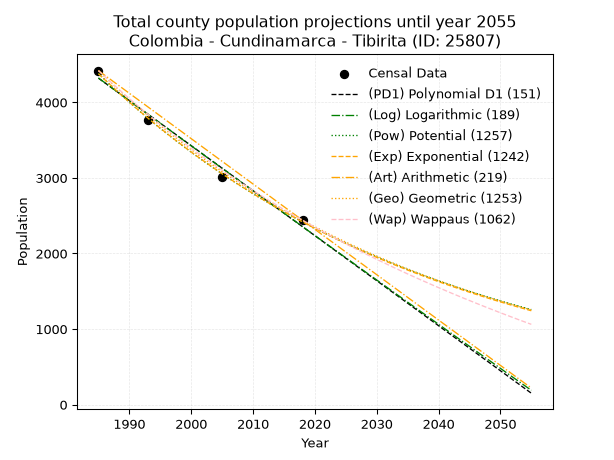
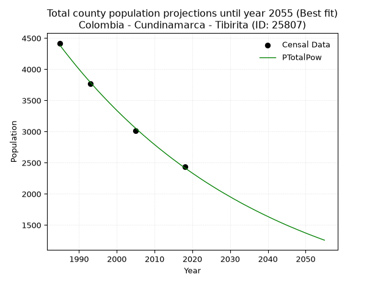
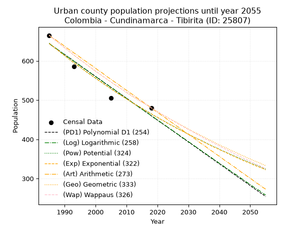
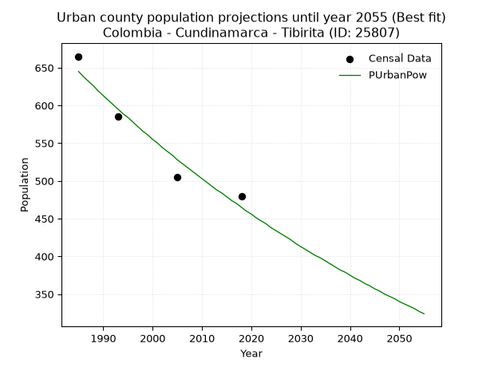
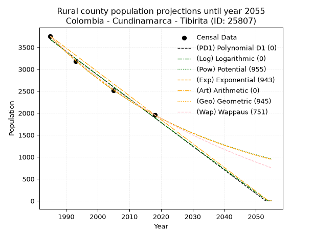
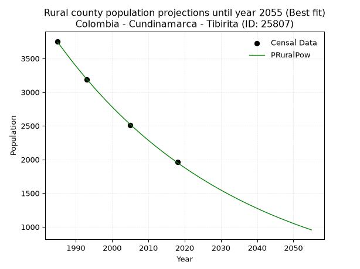

<div align="center">


</div>

# _“Population and Public Services Demand Projections (PPSD) until Year 2050 for Colombia - Cundinamarca - Tibirita (ID: 25807)”_
Keywords: `population` `public-service` `projection` `lineal` `polynomial` `logarithmic` `potential` `exponential` `arithmetic` `geometric` `wappaus` `dane` `colombia` `south-america`

PPSD are analytical estimates used by governments and planners to anticipate future changes in population size, age distribution, and the resulting community needs for utilities, healthcare, education, and infrastructure as sizing future water treatment facilities, electrical grids, and road networks based on spatial growth.

> **General running parameters**: • app_version: _v20260806_. • Python version: _3.14.7_. • Pandas version: _3.0.5_. • NumPy version: _2.5.1_. • Creates, save and include plots into reports (create_plot): _False_. • Projection until year: _2050_. • Process polynomial degree 2 and up: _False_. • Process Wappaus: _True_. • Process Wappaus: _True_. • Set negative values to zero: _True_. • Set infinite values to zero: _True_. • Drop dataset notes: _True_. 
<div align="center">

Dynamic map: [:earth_americas:Google](http://maps.google.com/maps?q=5.052277837,-73.504514) [:earth_americas:OSM](https://www.openstreetmap.org/#map=18/5.052277837/-73.504514&layers=P) [:earth_americas:Bing](https://www.bing.com/maps?cp=5.052277837~-73.504514&lvl=18) [:earth_americas:Apple](https://maps.apple.com/frame?center=5.052277837%2C-73.504514&span=0.003%2C0.006)

</div>


<div align="center">

```geojson
{
  "type": "Feature",
  "geometry": {
    "type": "Point", 
    "coordinates": [-73.504514, 5.052277837]
  }, 
  "properties": {
    "Name": "Colombia - Cundinamarca - Tibirita (ID: 25807)"
  }
}
```

</div>


## 0. Census Data (4 records)

Census data are official statistics collected by a government about the people and housing in a country. They usually include counts of total population, age, sex, race, income, education, and jobs.

📅Global census file: [Population.xlsx](../data/Population.xlsx)

| Source   |   Year |   CountryID | CountryName   |   StateID | StateName    |   CountyID | CountyName   |   PTotal |   PUrban |   PRural |
|:---------|-------:|------------:|:--------------|----------:|:-------------|-----------:|:-------------|---------:|---------:|---------:|
| DANE     |   1985 |          57 | Colombia      |        25 | Cundinamarca |      25807 | Tibirita     |     4419 |      665 |     3754 |
| DANE     |   1993 |          57 | Colombia      |        25 | Cundinamarca |      25807 | Tibirita     |     3769 |      585 |     3184 |
| DANE     |   2005 |          57 | Colombia      |        25 | Cundinamarca |      25807 | Tibirita     |     3018 |      505 |     2513 |
| DANE     |   2018 |          57 | Colombia      |        25 | Cundinamarca |      25807 | Tibirita     |     2439 |      480 |     1959 |

> 🔥Some records could had specific notes about the registered values or the corresponding urban or rural distribution.

📅   [RUPS](https://www.datos.gov.co/Hacienda-y-Cr-dito-P-blico/Registro-nico-de-Prestadores-de-Servicios-P-blicos/4qkq-csdn/about_data) - Local public utility companies: [RUPS.csv](../data/RUPS.xlsx)

 | SERVICIO       | ESTADO    | NOMBRE                                                                                                                                 | NIT         | DEPARTAMENTO_DOMICILIO   | MUNICIPIO_DOMICILIO   | DIRECCION                         |   TELEFONO | EMAIL                                          | TIPO_PRESTADOR                 | CLASIFICACION                 |
|:---------------|:----------|:---------------------------------------------------------------------------------------------------------------------------------------|:------------|:-------------------------|:----------------------|:----------------------------------|-----------:|:-----------------------------------------------|:-------------------------------|:------------------------------|
| ACUEDUCTO      | OPERATIVA | COORDINACION DE SERVICIOS PUBLICOS TIBIRITA                                                                                            | 800094782-6 | CUNDINAMARCA             | TIBIRITA              | Carrera 4 No 5 -21                |    8566027 | serviciospublicos@tibirita-cundinamarca.gov.co | MUNICIPIO (PRESTACIÓN DIRECTA) | MENOR O IGUAL A 2500 USUARIOS |
| ALCANTARILLADO | OPERATIVA | COORDINACION DE SERVICIOS PUBLICOS TIBIRITA                                                                                            | 800094782-6 | CUNDINAMARCA             | TIBIRITA              | Carrera 4 No 5 -21                |    8566027 | serviciospublicos@tibirita-cundinamarca.gov.co | MUNICIPIO (PRESTACIÓN DIRECTA) | MENOR O IGUAL A 2500 USUARIOS |
| ACUEDUCTO      | OPERATIVA | ASOCIACION DE USUARIOS DEL ACUEDUCTO DE LAS VEREDAS LA LAGUNA SOCUATA Y GUSVITA DEL MUNICIPIO DE TIBIRITA DEPARTAMENTO DE CUNDINAMARCA | 830080222-1 | CUNDINAMARCA             | TIBIRITA              | VEREDA GUSVITA MUNICIPIO TIBIRITA |    3115264 | lasogu98@gmail.com                             | ORGANIZACION AUTORIZADA        | MENOR O IGUAL A 2500 USUARIOS |

## 1. Total

### 1.1. Coefficients and Parameters

* (PD1) Polynomial Deg 1: -59.55399437976674, 122534.12725812844 (lineal)
* (Log) Logarithmic: -119239.45106478641, 909751.2730684344
* (Pow) Potential: -36.02474281691358, 122.44252834665853
* (Exp) Exponential: -0.017996046325637522, 1.4296884879618363e+19
* (Art) Arithmetic: Year diff. 2018 - 1985 = 33, Population diff. 2439 - 4419 = -1980, Annual growth = -60.0
* (Geo) Geometric: Year diff. 2018 - 1985 = 33, Population diff. 2439 - 4419 = -1980, Annual growth % = -0.017848649526562843
* (Wap) Wappaus: i = -1.7497812773403325, Condition values only valid for < 200)

<sub>
Wappaus condition values: ['-0.00', '-1.75', '-3.50', '-5.25', '-7.00', '-8.75', '-10.50', '-12.25', '-14.00', '-15.75', '-17.50', '-19.25', '-21.00', '-22.75', '-24.50', '-26.25', '-28.00', '-29.75', '-31.50', '-33.25', '-35.00', '-36.75', '-38.50', '-40.24', '-41.99', '-43.74', '-45.49', '-47.24', '-48.99', '-50.74', '-52.49', '-54.24', '-55.99', '-57.74', '-59.49', '-61.24', '-62.99', '-64.74', '-66.49', '-68.24', '-69.99', '-71.74', '-73.49', '-75.24', '-76.99', '-78.74', '-80.49', '-82.24', '-83.99', '-85.74', '-87.49', '-89.24', '-90.99', '-92.74', '-94.49', '-96.24', '-97.99', '-99.74', '-101.49', '-103.24', '-104.99', '-106.74', '-108.49', '-110.24', '-111.99', '-113.74']
</sub>


### 1.2. Projected Dataset

|   Year |   CountyID |   PTotalPD1 |   PTotalLog |   PTotalPow |   PTotalExp |   PTotalArt |   PTotalGeo |   PTotalWap |
|-------:|-----------:|------------:|------------:|------------:|------------:|------------:|------------:|------------:|
|   1985 |      25807 |        4319 |        4322 |        4381 |        4378 |        4419 |        4419 |        4419 |
|   1986 |      25807 |        4260 |        4261 |        4302 |        4300 |        4359 |        4340 |        4342 |
|   1987 |      25807 |        4200 |        4201 |        4225 |        4224 |        4299 |        4263 |        4267 |
|   1988 |      25807 |        4141 |        4141 |        4149 |        4148 |        4239 |        4187 |        4193 |
|   1989 |      25807 |        4081 |        4081 |        4074 |        4074 |        4179 |        4112 |        4120 |
|   1990 |      25807 |        4022 |        4022 |        4001 |        4002 |        4119 |        4038 |        4049 |
|   1991 |      25807 |        3962 |        3962 |        3929 |        3930 |        4059 |        3966 |        3978 |
|   1992 |      25807 |        3903 |        3902 |        3859 |        3860 |        3999 |        3896 |        3909 |
|   1993 |      25807 |        3843 |        3842 |        3790 |        3791 |        3939 |        3826 |        3841 |
|   1994 |      25807 |        3783 |        3782 |        3722 |        3724 |        3879 |        3758 |        3774 |
|   1995 |      25807 |        3724 |        3722 |        3655 |        3657 |        3819 |        3691 |        3708 |
|   1996 |      25807 |        3664 |        3663 |        3590 |        3592 |        3759 |        3625 |        3643 |
|   1997 |      25807 |        3605 |        3603 |        3526 |        3528 |        3699 |        3560 |        3579 |
|   1998 |      25807 |        3545 |        3543 |        3463 |        3465 |        3639 |        3497 |        3516 |
|   1999 |      25807 |        3486 |        3483 |        3401 |        3403 |        3579 |        3434 |        3455 |
|   2000 |      25807 |        3426 |        3424 |        3340 |        3343 |        3519 |        3373 |        3394 |
|   2001 |      25807 |        3367 |        3364 |        3281 |        3283 |        3459 |        3313 |        3334 |
|   2002 |      25807 |        3307 |        3305 |        3222 |        3224 |        3399 |        3254 |        3275 |
|   2003 |      25807 |        3247 |        3245 |        3165 |        3167 |        3339 |        3195 |        3217 |
|   2004 |      25807 |        3188 |        3186 |        3108 |        3110 |        3279 |        3138 |        3159 |
|   2005 |      25807 |        3128 |        3126 |        3053 |        3055 |        3219 |        3082 |        3103 |
|   2006 |      25807 |        3069 |        3067 |        2999 |        3000 |        3159 |        3027 |        3047 |
|   2007 |      25807 |        3009 |        3007 |        2945 |        2947 |        3099 |        2973 |        2992 |
|   2008 |      25807 |        2950 |        2948 |        2893 |        2894 |        3039 |        2920 |        2938 |
|   2009 |      25807 |        2890 |        2888 |        2841 |        2843 |        2979 |        2868 |        2885 |
|   2010 |      25807 |        2831 |        2829 |        2791 |        2792 |        2919 |        2817 |        2833 |
|   2011 |      25807 |        2771 |        2770 |        2741 |        2742 |        2859 |        2767 |        2781 |
|   2012 |      25807 |        2711 |        2711 |        2693 |        2693 |        2799 |        2717 |        2730 |
|   2013 |      25807 |        2652 |        2651 |        2645 |        2645 |        2739 |        2669 |        2680 |
|   2014 |      25807 |        2592 |        2592 |        2598 |        2598 |        2679 |        2621 |        2630 |
|   2015 |      25807 |        2533 |        2533 |        2552 |        2552 |        2619 |        2574 |        2582 |
|   2016 |      25807 |        2473 |        2474 |        2507 |        2506 |        2559 |        2528 |        2533 |
|   2017 |      25807 |        2414 |        2415 |        2462 |        2462 |        2499 |        2483 |        2486 |
|   2018 |      25807 |        2354 |        2355 |        2419 |        2418 |        2439 |        2439 |        2439 |
|   2019 |      25807 |        2295 |        2296 |        2376 |        2375 |        2379 |        2395 |        2393 |
|   2020 |      25807 |        2235 |        2237 |        2334 |        2332 |        2319 |        2353 |        2347 |
|   2021 |      25807 |        2176 |        2178 |        2293 |        2291 |        2259 |        2311 |        2302 |
|   2022 |      25807 |        2116 |        2119 |        2252 |        2250 |        2199 |        2269 |        2258 |
|   2023 |      25807 |        2056 |        2060 |        2212 |        2210 |        2139 |        2229 |        2214 |
|   2024 |      25807 |        1997 |        2001 |        2173 |        2170 |        2079 |        2189 |        2171 |
|   2025 |      25807 |        1937 |        1943 |        2135 |        2131 |        2019 |        2150 |        2128 |
|   2026 |      25807 |        1878 |        1884 |        2097 |        2093 |        1959 |        2112 |        2086 |
|   2027 |      25807 |        1818 |        1825 |        2060 |        2056 |        1899 |        2074 |        2044 |
|   2028 |      25807 |        1759 |        1766 |        2024 |        2019 |        1839 |        2037 |        2003 |
|   2029 |      25807 |        1699 |        1707 |        1989 |        1983 |        1779 |        2001 |        1962 |
|   2030 |      25807 |        1640 |        1649 |        1954 |        1948 |        1719 |        1965 |        1922 |
|   2031 |      25807 |        1580 |        1590 |        1919 |        1913 |        1659 |        1930 |        1883 |
|   2032 |      25807 |        1520 |        1531 |        1886 |        1879 |        1599 |        1895 |        1844 |
|   2033 |      25807 |        1461 |        1472 |        1852 |        1846 |        1539 |        1862 |        1805 |
|   2034 |      25807 |        1401 |        1414 |        1820 |        1813 |        1479 |        1828 |        1767 |
|   2035 |      25807 |        1342 |        1355 |        1788 |        1780 |        1419 |        1796 |        1729 |
|   2036 |      25807 |        1282 |        1297 |        1757 |        1749 |        1359 |        1764 |        1692 |
|   2037 |      25807 |        1223 |        1238 |        1726 |        1718 |        1299 |        1732 |        1655 |
|   2038 |      25807 |        1163 |        1180 |        1696 |        1687 |        1239 |        1701 |        1619 |
|   2039 |      25807 |        1104 |        1121 |        1666 |        1657 |        1179 |        1671 |        1583 |
|   2040 |      25807 |        1044 |        1063 |        1637 |        1627 |        1119 |        1641 |        1548 |
|   2041 |      25807 |         984 |        1004 |        1608 |        1598 |        1059 |        1612 |        1513 |
|   2042 |      25807 |         925 |         946 |        1580 |        1570 |         999 |        1583 |        1478 |
|   2043 |      25807 |         865 |         887 |        1552 |        1542 |         939 |        1555 |        1444 |
|   2044 |      25807 |         806 |         829 |        1525 |        1514 |         879 |        1527 |        1410 |
|   2045 |      25807 |         746 |         771 |        1498 |        1487 |         819 |        1500 |        1377 |
|   2046 |      25807 |         687 |         712 |        1472 |        1461 |         759 |        1473 |        1344 |
|   2047 |      25807 |         627 |         654 |        1447 |        1435 |         699 |        1447 |        1311 |
|   2048 |      25807 |         568 |         596 |        1421 |        1409 |         639 |        1421 |        1279 |
|   2049 |      25807 |         508 |         538 |        1397 |        1384 |         579 |        1396 |        1247 |
|   2050 |      25807 |         448 |         480 |        1372 |        1359 |         519 |        1371 |        1215 |
<div align="center">

</img>

</div>


### 1.3. Best fit with absolute and relative error (%)

Relative error puts that difference into context by dividing the absolute error by the true value, creating a unitless ratio or percentage that shows the scale of the mistake.

Absolute and relative error

|   Year | Source   |   CountryID | CountryName   |   StateID | StateName    |   CountyID_x | CountyName   |   PTotal |   PUrban |   PRural |   CountyID_y |   PTotalPD1 |   PTotalLog |   PTotalPow |   PTotalExp |   PTotalArt |   PTotalGeo |   PTotalWap |   PTotalPD1AbsError |   PTotalLogAbsError |   PTotalPowAbsError |   PTotalExpAbsError |   PTotalArtAbsError |   PTotalGeoAbsError |   PTotalWapAbsError |   PTotalPD1RelError |   PTotalLogRelError |   PTotalPowRelError |   PTotalExpRelError |   PTotalArtRelError |   PTotalGeoRelError |   PTotalWapRelError |
|-------:|:---------|------------:|:--------------|----------:|:-------------|-------------:|:-------------|---------:|---------:|---------:|-------------:|------------:|------------:|------------:|------------:|------------:|------------:|------------:|--------------------:|--------------------:|--------------------:|--------------------:|--------------------:|--------------------:|--------------------:|--------------------:|--------------------:|--------------------:|--------------------:|--------------------:|--------------------:|--------------------:|
|   1985 | DANE     |          57 | Colombia      |        25 | Cundinamarca |        25807 | Tibirita     |     4419 |      665 |     3754 |        25807 |        4319 |        4322 |        4381 |        4378 |        4419 |        4419 |        4419 |                 100 |                  97 |                  38 |                  41 |                   0 |                   0 |                   0 |             2.26296 |             2.19507 |            0.859923 |            0.927812 |             0       |             0       |             0       |
|   1993 | DANE     |          57 | Colombia      |        25 | Cundinamarca |        25807 | Tibirita     |     3769 |      585 |     3184 |        25807 |        3843 |        3842 |        3790 |        3791 |        3939 |        3826 |        3841 |                  74 |                  73 |                  21 |                  22 |                 170 |                  57 |                  72 |             1.96339 |             1.93685 |            0.557177 |            0.583709 |             4.51048 |             1.51234 |             1.91032 |
|   2005 | DANE     |          57 | Colombia      |        25 | Cundinamarca |        25807 | Tibirita     |     3018 |      505 |     2513 |        25807 |        3128 |        3126 |        3053 |        3055 |        3219 |        3082 |        3103 |                 110 |                 108 |                  35 |                  37 |                 201 |                  64 |                  85 |             3.6448  |             3.57853 |            1.15971  |            1.22598  |             6.66004 |             2.12061 |             2.81643 |
|   2018 | DANE     |          57 | Colombia      |        25 | Cundinamarca |        25807 | Tibirita     |     2439 |      480 |     1959 |        25807 |        2354 |        2355 |        2419 |        2418 |        2439 |        2439 |        2439 |                  85 |                  84 |                  20 |                  21 |                   0 |                   0 |                   0 |             3.48503 |             3.44403 |            0.820008 |            0.861009 |             0       |             0       |             0       |

Relative error mean

| Method    |   RelError | Best   |
|:----------|-----------:|:-------|
| PTotalPD1 |   2.83904  |        |
| PTotalLog |   2.78862  |        |
| PTotalPow |   0.849204 | True   |
| PTotalExp |   0.899627 |        |
| PTotalArt |   2.79263  |        |
| PTotalGeo |   0.908237 |        |
| PTotalWap |   1.18169  |        |

💙Best method: _**PTotalPow**_
<div align="center">

</img>

</div>


### 1.4. Fresh water supply demand in liters per capita per day (lpcd)

The fresh water supply demand typically ranges from 100 to 300 liters per capita per day (lpcd) for standard domestic and municipal planning, though absolute survival minimums set by the World Health Organization are as low as 7.5 to 20 liters per day, and total consumption in high-income nations can exceed 400 liters.

> `CZ`: Level in meters above the sea level (masl)<br> `WS`: Fresh water supply demand in liters per capita per day (lpcd or l/h/d)<br> `WSAll`: Zonal fresh water supply demand in liters per second (l/s)<br> `A`: Zonal area in square meters<br> `DP`: Population density (people/hectare or p/ha)

Reference values (RAS Colombia)

|    CZ |   WS |
|------:|-----:|
|  1000 |  120 |
|  2000 |  130 |
| 99999 |  140 |

County shapefile geometry properties and water supply values

|   CountyID |     ATotal |   CZTotal |   WSTotal |
|-----------:|-----------:|----------:|----------:|
|      25807 | 5.6456e+07 |   2303.41 |       140 |

Projected values for best method: PTotalPow

|   CountyID |   Year |   PTotalPow |   DPTotal |   WSTotal |   WSTotalAll |
|-----------:|-------:|------------:|----------:|----------:|-------------:|
|      25807 |   1985 |        4381 |      0.78 |       140 |      7.09884 |
|      25807 |   1986 |        4302 |      0.76 |       140 |      6.97083 |
|      25807 |   1987 |        4225 |      0.75 |       140 |      6.84606 |
|      25807 |   1988 |        4149 |      0.73 |       140 |      6.72292 |
|      25807 |   1989 |        4074 |      0.72 |       140 |      6.60139 |
|      25807 |   1990 |        4001 |      0.71 |       140 |      6.4831  |
|      25807 |   1991 |        3929 |      0.7  |       140 |      6.36644 |
|      25807 |   1992 |        3859 |      0.68 |       140 |      6.25301 |
|      25807 |   1993 |        3790 |      0.67 |       140 |      6.1412  |
|      25807 |   1994 |        3722 |      0.66 |       140 |      6.03102 |
|      25807 |   1995 |        3655 |      0.65 |       140 |      5.92245 |
|      25807 |   1996 |        3590 |      0.64 |       140 |      5.81713 |
|      25807 |   1997 |        3526 |      0.62 |       140 |      5.71343 |
|      25807 |   1998 |        3463 |      0.61 |       140 |      5.61134 |
|      25807 |   1999 |        3401 |      0.6  |       140 |      5.51088 |
|      25807 |   2000 |        3340 |      0.59 |       140 |      5.41204 |
|      25807 |   2001 |        3281 |      0.58 |       140 |      5.31644 |
|      25807 |   2002 |        3222 |      0.57 |       140 |      5.22083 |
|      25807 |   2003 |        3165 |      0.56 |       140 |      5.12847 |
|      25807 |   2004 |        3108 |      0.55 |       140 |      5.03611 |
|      25807 |   2005 |        3053 |      0.54 |       140 |      4.94699 |
|      25807 |   2006 |        2999 |      0.53 |       140 |      4.85949 |
|      25807 |   2007 |        2945 |      0.52 |       140 |      4.77199 |
|      25807 |   2008 |        2893 |      0.51 |       140 |      4.68773 |
|      25807 |   2009 |        2841 |      0.5  |       140 |      4.60347 |
|      25807 |   2010 |        2791 |      0.49 |       140 |      4.52245 |
|      25807 |   2011 |        2741 |      0.49 |       140 |      4.44144 |
|      25807 |   2012 |        2693 |      0.48 |       140 |      4.36366 |
|      25807 |   2013 |        2645 |      0.47 |       140 |      4.28588 |
|      25807 |   2014 |        2598 |      0.46 |       140 |      4.20972 |
|      25807 |   2015 |        2552 |      0.45 |       140 |      4.13519 |
|      25807 |   2016 |        2507 |      0.44 |       140 |      4.06227 |
|      25807 |   2017 |        2462 |      0.44 |       140 |      3.98935 |
|      25807 |   2018 |        2419 |      0.43 |       140 |      3.91968 |
|      25807 |   2019 |        2376 |      0.42 |       140 |      3.85    |
|      25807 |   2020 |        2334 |      0.41 |       140 |      3.78194 |
|      25807 |   2021 |        2293 |      0.41 |       140 |      3.71551 |
|      25807 |   2022 |        2252 |      0.4  |       140 |      3.64907 |
|      25807 |   2023 |        2212 |      0.39 |       140 |      3.58426 |
|      25807 |   2024 |        2173 |      0.38 |       140 |      3.52106 |
|      25807 |   2025 |        2135 |      0.38 |       140 |      3.45949 |
|      25807 |   2026 |        2097 |      0.37 |       140 |      3.39792 |
|      25807 |   2027 |        2060 |      0.36 |       140 |      3.33796 |
|      25807 |   2028 |        2024 |      0.36 |       140 |      3.27963 |
|      25807 |   2029 |        1989 |      0.35 |       140 |      3.22292 |
|      25807 |   2030 |        1954 |      0.35 |       140 |      3.1662  |
|      25807 |   2031 |        1919 |      0.34 |       140 |      3.10949 |
|      25807 |   2032 |        1886 |      0.33 |       140 |      3.05602 |
|      25807 |   2033 |        1852 |      0.33 |       140 |      3.00093 |
|      25807 |   2034 |        1820 |      0.32 |       140 |      2.94907 |
|      25807 |   2035 |        1788 |      0.32 |       140 |      2.89722 |
|      25807 |   2036 |        1757 |      0.31 |       140 |      2.84699 |
|      25807 |   2037 |        1726 |      0.31 |       140 |      2.79676 |
|      25807 |   2038 |        1696 |      0.3  |       140 |      2.74815 |
|      25807 |   2039 |        1666 |      0.3  |       140 |      2.69954 |
|      25807 |   2040 |        1637 |      0.29 |       140 |      2.65255 |
|      25807 |   2041 |        1608 |      0.28 |       140 |      2.60556 |
|      25807 |   2042 |        1580 |      0.28 |       140 |      2.56019 |
|      25807 |   2043 |        1552 |      0.27 |       140 |      2.51481 |
|      25807 |   2044 |        1525 |      0.27 |       140 |      2.47106 |
|      25807 |   2045 |        1498 |      0.27 |       140 |      2.42731 |
|      25807 |   2046 |        1472 |      0.26 |       140 |      2.38519 |
|      25807 |   2047 |        1447 |      0.26 |       140 |      2.34468 |
|      25807 |   2048 |        1421 |      0.25 |       140 |      2.30255 |
|      25807 |   2049 |        1397 |      0.25 |       140 |      2.26366 |
|      25807 |   2050 |        1372 |      0.24 |       140 |      2.22315 |

## 2. Urban

### 2.1. Coefficients and Parameters

* (PD1) Polynomial Deg 1: -5.562023283821736, 11684.187073464427 (lineal)
* (Log) Logarithmic: -11141.02785766802, 85241.79202472881
* (Pow) Potential: -19.826376834887636, 68.19200103987907
* (Exp) Exponential: -0.00989896809171475, 220209847450.493
* (Art) Arithmetic: Year diff. 2018 - 1985 = 33, Population diff. 480 - 665 = -185, Annual growth = -5.606060606060606
* (Geo) Geometric: Year diff. 2018 - 1985 = 33, Population diff. 480 - 665 = -185, Annual growth % = -0.009830181044428787
* (Wap) Wappaus: i = -0.9792245600105862, Condition values only valid for < 200)

<sub>
Wappaus condition values: ['-0.00', '-0.98', '-1.96', '-2.94', '-3.92', '-4.90', '-5.88', '-6.85', '-7.83', '-8.81', '-9.79', '-10.77', '-11.75', '-12.73', '-13.71', '-14.69', '-15.67', '-16.65', '-17.63', '-18.61', '-19.58', '-20.56', '-21.54', '-22.52', '-23.50', '-24.48', '-25.46', '-26.44', '-27.42', '-28.40', '-29.38', '-30.36', '-31.34', '-32.31', '-33.29', '-34.27', '-35.25', '-36.23', '-37.21', '-38.19', '-39.17', '-40.15', '-41.13', '-42.11', '-43.09', '-44.07', '-45.04', '-46.02', '-47.00', '-47.98', '-48.96', '-49.94', '-50.92', '-51.90', '-52.88', '-53.86', '-54.84', '-55.82', '-56.80', '-57.77', '-58.75', '-59.73', '-60.71', '-61.69', '-62.67', '-63.65']
</sub>


### 2.2. Projected Dataset

|   Year |   CountyID |   PUrbanPD1 |   PUrbanLog |   PUrbanPow |   PUrbanExp |   PUrbanArt |   PUrbanGeo |   PUrbanWap |
|-------:|-----------:|------------:|------------:|------------:|------------:|------------:|------------:|------------:|
|   1985 |      25807 |         644 |         644 |         645 |         644 |         665 |         665 |         665 |
|   1986 |      25807 |         638 |         638 |         638 |         638 |         659 |         658 |         659 |
|   1987 |      25807 |         632 |         633 |         632 |         632 |         654 |         652 |         652 |
|   1988 |      25807 |         627 |         627 |         626 |         626 |         648 |         646 |         646 |
|   1989 |      25807 |         621 |         621 |         619 |         619 |         643 |         639 |         639 |
|   1990 |      25807 |         616 |         616 |         613 |         613 |         637 |         633 |         633 |
|   1991 |      25807 |         610 |         610 |         607 |         607 |         631 |         627 |         627 |
|   1992 |      25807 |         605 |         605 |         601 |         601 |         626 |         621 |         621 |
|   1993 |      25807 |         599 |         599 |         595 |         595 |         620 |         614 |         615 |
|   1994 |      25807 |         594 |         593 |         589 |         590 |         615 |         608 |         609 |
|   1995 |      25807 |         588 |         588 |         584 |         584 |         609 |         602 |         603 |
|   1996 |      25807 |         582 |         582 |         578 |         578 |         603 |         597 |         597 |
|   1997 |      25807 |         577 |         577 |         572 |         572 |         598 |         591 |         591 |
|   1998 |      25807 |         571 |         571 |         566 |         567 |         592 |         585 |         585 |
|   1999 |      25807 |         566 |         565 |         561 |         561 |         587 |         579 |         580 |
|   2000 |      25807 |         560 |         560 |         555 |         556 |         581 |         573 |         574 |
|   2001 |      25807 |         555 |         554 |         550 |         550 |         575 |         568 |         568 |
|   2002 |      25807 |         549 |         549 |         544 |         545 |         570 |         562 |         563 |
|   2003 |      25807 |         543 |         543 |         539 |         539 |         564 |         557 |         557 |
|   2004 |      25807 |         538 |         538 |         534 |         534 |         558 |         551 |         552 |
|   2005 |      25807 |         532 |         532 |         528 |         529 |         553 |         546 |         546 |
|   2006 |      25807 |         527 |         527 |         523 |         523 |         547 |         540 |         541 |
|   2007 |      25807 |         521 |         521 |         518 |         518 |         542 |         535 |         536 |
|   2008 |      25807 |         516 |         515 |         513 |         513 |         536 |         530 |         530 |
|   2009 |      25807 |         510 |         510 |         508 |         508 |         530 |         525 |         525 |
|   2010 |      25807 |         505 |         504 |         503 |         503 |         525 |         519 |         520 |
|   2011 |      25807 |         499 |         499 |         498 |         498 |         519 |         514 |         515 |
|   2012 |      25807 |         493 |         493 |         493 |         493 |         514 |         509 |         510 |
|   2013 |      25807 |         488 |         488 |         488 |         488 |         508 |         504 |         505 |
|   2014 |      25807 |         482 |         482 |         484 |         484 |         502 |         499 |         500 |
|   2015 |      25807 |         477 |         477 |         479 |         479 |         497 |         494 |         495 |
|   2016 |      25807 |         471 |         471 |         474 |         474 |         491 |         490 |         490 |
|   2017 |      25807 |         466 |         466 |         470 |         469 |         486 |         485 |         485 |
|   2018 |      25807 |         460 |         460 |         465 |         465 |         480 |         480 |         480 |
|   2019 |      25807 |         454 |         455 |         460 |         460 |         474 |         475 |         475 |
|   2020 |      25807 |         449 |         449 |         456 |         456 |         469 |         471 |         470 |
|   2021 |      25807 |         443 |         444 |         451 |         451 |         463 |         466 |         466 |
|   2022 |      25807 |         438 |         438 |         447 |         447 |         458 |         461 |         461 |
|   2023 |      25807 |         432 |         433 |         443 |         442 |         452 |         457 |         456 |
|   2024 |      25807 |         427 |         427 |         438 |         438 |         446 |         452 |         452 |
|   2025 |      25807 |         421 |         422 |         434 |         434 |         441 |         448 |         447 |
|   2026 |      25807 |         416 |         416 |         430 |         429 |         435 |         444 |         443 |
|   2027 |      25807 |         410 |         411 |         426 |         425 |         430 |         439 |         438 |
|   2028 |      25807 |         404 |         405 |         422 |         421 |         424 |         435 |         434 |
|   2029 |      25807 |         399 |         400 |         417 |         417 |         418 |         431 |         429 |
|   2030 |      25807 |         393 |         394 |         413 |         413 |         413 |         426 |         425 |
|   2031 |      25807 |         388 |         389 |         409 |         409 |         407 |         422 |         421 |
|   2032 |      25807 |         382 |         383 |         405 |         405 |         402 |         418 |         416 |
|   2033 |      25807 |         377 |         378 |         401 |         401 |         396 |         414 |         412 |
|   2034 |      25807 |         371 |         372 |         398 |         397 |         390 |         410 |         408 |
|   2035 |      25807 |         365 |         367 |         394 |         393 |         385 |         406 |         403 |
|   2036 |      25807 |         360 |         361 |         390 |         389 |         379 |         402 |         399 |
|   2037 |      25807 |         354 |         356 |         386 |         385 |         373 |         398 |         395 |
|   2038 |      25807 |         349 |         350 |         382 |         381 |         368 |         394 |         391 |
|   2039 |      25807 |         343 |         345 |         379 |         378 |         362 |         390 |         387 |
|   2040 |      25807 |         338 |         339 |         375 |         374 |         357 |         386 |         383 |
|   2041 |      25807 |         332 |         334 |         371 |         370 |         351 |         382 |         379 |
|   2042 |      25807 |         327 |         328 |         368 |         367 |         345 |         379 |         375 |
|   2043 |      25807 |         321 |         323 |         364 |         363 |         340 |         375 |         371 |
|   2044 |      25807 |         315 |         317 |         361 |         359 |         334 |         371 |         367 |
|   2045 |      25807 |         310 |         312 |         357 |         356 |         329 |         368 |         363 |
|   2046 |      25807 |         304 |         307 |         354 |         352 |         323 |         364 |         359 |
|   2047 |      25807 |         299 |         301 |         350 |         349 |         317 |         360 |         355 |
|   2048 |      25807 |         293 |         296 |         347 |         345 |         312 |         357 |         351 |
|   2049 |      25807 |         288 |         290 |         344 |         342 |         306 |         353 |         348 |
|   2050 |      25807 |         282 |         285 |         340 |         339 |         301 |         350 |         344 |
<div align="center">

</img>

</div>


### 2.3. Best fit with absolute and relative error (%)

Relative error puts that difference into context by dividing the absolute error by the true value, creating a unitless ratio or percentage that shows the scale of the mistake.

Absolute and relative error

|   Year | Source   |   CountryID | CountryName   |   StateID | StateName    |   CountyID_x | CountyName   |   PTotal |   PUrban |   PRural |   CountyID_y |   PUrbanPD1 |   PUrbanLog |   PUrbanPow |   PUrbanExp |   PUrbanArt |   PUrbanGeo |   PUrbanWap |   PUrbanPD1AbsError |   PUrbanLogAbsError |   PUrbanPowAbsError |   PUrbanExpAbsError |   PUrbanArtAbsError |   PUrbanGeoAbsError |   PUrbanWapAbsError |   PUrbanPD1RelError |   PUrbanLogRelError |   PUrbanPowRelError |   PUrbanExpRelError |   PUrbanArtRelError |   PUrbanGeoRelError |   PUrbanWapRelError |
|-------:|:---------|------------:|:--------------|----------:|:-------------|-------------:|:-------------|---------:|---------:|---------:|-------------:|------------:|------------:|------------:|------------:|------------:|------------:|------------:|--------------------:|--------------------:|--------------------:|--------------------:|--------------------:|--------------------:|--------------------:|--------------------:|--------------------:|--------------------:|--------------------:|--------------------:|--------------------:|--------------------:|
|   1985 | DANE     |          57 | Colombia      |        25 | Cundinamarca |        25807 | Tibirita     |     4419 |      665 |     3754 |        25807 |         644 |         644 |         645 |         644 |         665 |         665 |         665 |                  21 |                  21 |                  20 |                  21 |                   0 |                   0 |                   0 |             3.15789 |             3.15789 |             3.00752 |             3.15789 |             0       |             0       |             0       |
|   1993 | DANE     |          57 | Colombia      |        25 | Cundinamarca |        25807 | Tibirita     |     3769 |      585 |     3184 |        25807 |         599 |         599 |         595 |         595 |         620 |         614 |         615 |                  14 |                  14 |                  10 |                  10 |                  35 |                  29 |                  30 |             2.39316 |             2.39316 |             1.7094  |             1.7094  |             5.98291 |             4.95726 |             5.12821 |
|   2005 | DANE     |          57 | Colombia      |        25 | Cundinamarca |        25807 | Tibirita     |     3018 |      505 |     2513 |        25807 |         532 |         532 |         528 |         529 |         553 |         546 |         546 |                  27 |                  27 |                  23 |                  24 |                  48 |                  41 |                  41 |             5.34653 |             5.34653 |             4.55446 |             4.75248 |             9.50495 |             8.11881 |             8.11881 |
|   2018 | DANE     |          57 | Colombia      |        25 | Cundinamarca |        25807 | Tibirita     |     2439 |      480 |     1959 |        25807 |         460 |         460 |         465 |         465 |         480 |         480 |         480 |                  20 |                  20 |                  15 |                  15 |                   0 |                   0 |                   0 |             4.16667 |             4.16667 |             3.125   |             3.125   |             0       |             0       |             0       |

Relative error mean

| Method    |   RelError | Best   |
|:----------|-----------:|:-------|
| PUrbanPD1 |    3.76606 |        |
| PUrbanLog |    3.76606 |        |
| PUrbanPow |    3.09909 | True   |
| PUrbanExp |    3.18619 |        |
| PUrbanArt |    3.87196 |        |
| PUrbanGeo |    3.26902 |        |
| PUrbanWap |    3.31175 |        |

💙Best method: _**PUrbanPow**_
<div align="center">

</img>

</div>


### 2.4. Fresh water supply demand in liters per capita per day (lpcd)

The fresh water supply demand typically ranges from 100 to 300 liters per capita per day (lpcd) for standard domestic and municipal planning, though absolute survival minimums set by the World Health Organization are as low as 7.5 to 20 liters per day, and total consumption in high-income nations can exceed 400 liters.

> `CZ`: Level in meters above the sea level (masl)<br> `WS`: Fresh water supply demand in liters per capita per day (lpcd or l/h/d)<br> `WSAll`: Zonal fresh water supply demand in liters per second (l/s)<br> `A`: Zonal area in square meters<br> `DP`: Population density (people/hectare or p/ha)

Reference values (RAS Colombia)

|    CZ |   WS |
|------:|-----:|
|  1000 |  120 |
|  2000 |  130 |
| 99999 |  140 |

County shapefile geometry properties and water supply values

|   CountyID |   AUrban |   CZUrban |   WSUrban |
|-----------:|---------:|----------:|----------:|
|      25807 |   330968 |   1960.07 |       130 |

Projected values for best method: PUrbanPow

|   CountyID |   Year |   PUrbanPow |   DPUrban |   WSUrban |   WSUrbanAll |
|-----------:|-------:|------------:|----------:|----------:|-------------:|
|      25807 |   1985 |         645 |     19.49 |       130 |     0.970486 |
|      25807 |   1986 |         638 |     19.28 |       130 |     0.959954 |
|      25807 |   1987 |         632 |     19.1  |       130 |     0.950926 |
|      25807 |   1988 |         626 |     18.91 |       130 |     0.941898 |
|      25807 |   1989 |         619 |     18.7  |       130 |     0.931366 |
|      25807 |   1990 |         613 |     18.52 |       130 |     0.922338 |
|      25807 |   1991 |         607 |     18.34 |       130 |     0.91331  |
|      25807 |   1992 |         601 |     18.16 |       130 |     0.904282 |
|      25807 |   1993 |         595 |     17.98 |       130 |     0.895255 |
|      25807 |   1994 |         589 |     17.8  |       130 |     0.886227 |
|      25807 |   1995 |         584 |     17.65 |       130 |     0.878704 |
|      25807 |   1996 |         578 |     17.46 |       130 |     0.869676 |
|      25807 |   1997 |         572 |     17.28 |       130 |     0.860648 |
|      25807 |   1998 |         566 |     17.1  |       130 |     0.85162  |
|      25807 |   1999 |         561 |     16.95 |       130 |     0.844097 |
|      25807 |   2000 |         555 |     16.77 |       130 |     0.835069 |
|      25807 |   2001 |         550 |     16.62 |       130 |     0.827546 |
|      25807 |   2002 |         544 |     16.44 |       130 |     0.818519 |
|      25807 |   2003 |         539 |     16.29 |       130 |     0.810995 |
|      25807 |   2004 |         534 |     16.13 |       130 |     0.803472 |
|      25807 |   2005 |         528 |     15.95 |       130 |     0.794444 |
|      25807 |   2006 |         523 |     15.8  |       130 |     0.786921 |
|      25807 |   2007 |         518 |     15.65 |       130 |     0.779398 |
|      25807 |   2008 |         513 |     15.5  |       130 |     0.771875 |
|      25807 |   2009 |         508 |     15.35 |       130 |     0.764352 |
|      25807 |   2010 |         503 |     15.2  |       130 |     0.756829 |
|      25807 |   2011 |         498 |     15.05 |       130 |     0.749306 |
|      25807 |   2012 |         493 |     14.9  |       130 |     0.741782 |
|      25807 |   2013 |         488 |     14.74 |       130 |     0.734259 |
|      25807 |   2014 |         484 |     14.62 |       130 |     0.728241 |
|      25807 |   2015 |         479 |     14.47 |       130 |     0.720718 |
|      25807 |   2016 |         474 |     14.32 |       130 |     0.713194 |
|      25807 |   2017 |         470 |     14.2  |       130 |     0.707176 |
|      25807 |   2018 |         465 |     14.05 |       130 |     0.699653 |
|      25807 |   2019 |         460 |     13.9  |       130 |     0.69213  |
|      25807 |   2020 |         456 |     13.78 |       130 |     0.686111 |
|      25807 |   2021 |         451 |     13.63 |       130 |     0.678588 |
|      25807 |   2022 |         447 |     13.51 |       130 |     0.672569 |
|      25807 |   2023 |         443 |     13.38 |       130 |     0.666551 |
|      25807 |   2024 |         438 |     13.23 |       130 |     0.659028 |
|      25807 |   2025 |         434 |     13.11 |       130 |     0.653009 |
|      25807 |   2026 |         430 |     12.99 |       130 |     0.646991 |
|      25807 |   2027 |         426 |     12.87 |       130 |     0.640972 |
|      25807 |   2028 |         422 |     12.75 |       130 |     0.634954 |
|      25807 |   2029 |         417 |     12.6  |       130 |     0.627431 |
|      25807 |   2030 |         413 |     12.48 |       130 |     0.621412 |
|      25807 |   2031 |         409 |     12.36 |       130 |     0.615394 |
|      25807 |   2032 |         405 |     12.24 |       130 |     0.609375 |
|      25807 |   2033 |         401 |     12.12 |       130 |     0.603356 |
|      25807 |   2034 |         398 |     12.03 |       130 |     0.598843 |
|      25807 |   2035 |         394 |     11.9  |       130 |     0.592824 |
|      25807 |   2036 |         390 |     11.78 |       130 |     0.586806 |
|      25807 |   2037 |         386 |     11.66 |       130 |     0.580787 |
|      25807 |   2038 |         382 |     11.54 |       130 |     0.574769 |
|      25807 |   2039 |         379 |     11.45 |       130 |     0.570255 |
|      25807 |   2040 |         375 |     11.33 |       130 |     0.564236 |
|      25807 |   2041 |         371 |     11.21 |       130 |     0.558218 |
|      25807 |   2042 |         368 |     11.12 |       130 |     0.553704 |
|      25807 |   2043 |         364 |     11    |       130 |     0.547685 |
|      25807 |   2044 |         361 |     10.91 |       130 |     0.543171 |
|      25807 |   2045 |         357 |     10.79 |       130 |     0.537153 |
|      25807 |   2046 |         354 |     10.7  |       130 |     0.532639 |
|      25807 |   2047 |         350 |     10.58 |       130 |     0.52662  |
|      25807 |   2048 |         347 |     10.48 |       130 |     0.522106 |
|      25807 |   2049 |         344 |     10.39 |       130 |     0.517593 |
|      25807 |   2050 |         340 |     10.27 |       130 |     0.511574 |

## 3. Rural

### 3.1. Coefficients and Parameters

* (PD1) Polynomial Deg 1: -53.991971095945, 110849.94018466398 (lineal)
* (Log) Logarithmic: -108098.42320711844, 824509.481043706
* (Pow) Potential: -39.39672325859489, 133.49399477537617
* (Exp) Exponential: -0.019681756812728452, 3.466707806536275e+20
* (Art) Arithmetic: Year diff. 2018 - 1985 = 33, Population diff. 1959 - 3754 = -1795, Annual growth = -54.39393939393939
* (Geo) Geometric: Year diff. 2018 - 1985 = 33, Population diff. 1959 - 3754 = -1795, Annual growth % = -0.019515774002392572
* (Wap) Wappaus: i = -1.9042163274615576, Condition values only valid for < 200)

<sub>
Wappaus condition values: ['-0.00', '-1.90', '-3.81', '-5.71', '-7.62', '-9.52', '-11.43', '-13.33', '-15.23', '-17.14', '-19.04', '-20.95', '-22.85', '-24.75', '-26.66', '-28.56', '-30.47', '-32.37', '-34.28', '-36.18', '-38.08', '-39.99', '-41.89', '-43.80', '-45.70', '-47.61', '-49.51', '-51.41', '-53.32', '-55.22', '-57.13', '-59.03', '-60.93', '-62.84', '-64.74', '-66.65', '-68.55', '-70.46', '-72.36', '-74.26', '-76.17', '-78.07', '-79.98', '-81.88', '-83.79', '-85.69', '-87.59', '-89.50', '-91.40', '-93.31', '-95.21', '-97.12', '-99.02', '-100.92', '-102.83', '-104.73', '-106.64', '-108.54', '-110.44', '-112.35', '-114.25', '-116.16', '-118.06', '-119.97', '-121.87', '-123.77']
</sub>


### 3.2. Projected Dataset

|   Year |   CountyID |   PRuralPD1 |   PRuralLog |   PRuralPow |   PRuralExp |   PRuralArt |   PRuralGeo |   PRuralWap |
|-------:|-----------:|------------:|------------:|------------:|------------:|------------:|------------:|------------:|
|   1985 |      25807 |        3676 |        3678 |        3741 |        3739 |        3754 |        3754 |        3754 |
|   1986 |      25807 |        3622 |        3623 |        3668 |        3666 |        3700 |        3681 |        3683 |
|   1987 |      25807 |        3568 |        3569 |        3596 |        3595 |        3645 |        3609 |        3614 |
|   1988 |      25807 |        3514 |        3514 |        3525 |        3525 |        3591 |        3538 |        3546 |
|   1989 |      25807 |        3460 |        3460 |        3456 |        3456 |        3536 |        3469 |        3479 |
|   1990 |      25807 |        3406 |        3406 |        3388 |        3389 |        3482 |        3402 |        3413 |
|   1991 |      25807 |        3352 |        3351 |        3322 |        3323 |        3428 |        3335 |        3348 |
|   1992 |      25807 |        3298 |        3297 |        3257 |        3258 |        3373 |        3270 |        3285 |
|   1993 |      25807 |        3244 |        3243 |        3193 |        3194 |        3319 |        3206 |        3223 |
|   1994 |      25807 |        3190 |        3189 |        3131 |        3132 |        3264 |        3144 |        3161 |
|   1995 |      25807 |        3136 |        3134 |        3069 |        3071 |        3210 |        3082 |        3101 |
|   1996 |      25807 |        3082 |        3080 |        3009 |        3011 |        3156 |        3022 |        3042 |
|   1997 |      25807 |        3028 |        3026 |        2951 |        2953 |        3101 |        2963 |        2984 |
|   1998 |      25807 |        2974 |        2972 |        2893 |        2895 |        3047 |        2906 |        2927 |
|   1999 |      25807 |        2920 |        2918 |        2837 |        2839 |        2992 |        2849 |        2871 |
|   2000 |      25807 |        2866 |        2864 |        2781 |        2783 |        2938 |        2793 |        2816 |
|   2001 |      25807 |        2812 |        2810 |        2727 |        2729 |        2884 |        2739 |        2761 |
|   2002 |      25807 |        2758 |        2756 |        2674 |        2676 |        2829 |        2685 |        2708 |
|   2003 |      25807 |        2704 |        2702 |        2622 |        2624 |        2775 |        2633 |        2656 |
|   2004 |      25807 |        2650 |        2648 |        2571 |        2573 |        2721 |        2581 |        2604 |
|   2005 |      25807 |        2596 |        2594 |        2521 |        2522 |        2666 |        2531 |        2553 |
|   2006 |      25807 |        2542 |        2540 |        2472 |        2473 |        2612 |        2482 |        2503 |
|   2007 |      25807 |        2488 |        2486 |        2424 |        2425 |        2557 |        2433 |        2454 |
|   2008 |      25807 |        2434 |        2432 |        2376 |        2378 |        2503 |        2386 |        2405 |
|   2009 |      25807 |        2380 |        2379 |        2330 |        2331 |        2449 |        2339 |        2357 |
|   2010 |      25807 |        2326 |        2325 |        2285 |        2286 |        2394 |        2294 |        2310 |
|   2011 |      25807 |        2272 |        2271 |        2241 |        2241 |        2340 |        2249 |        2264 |
|   2012 |      25807 |        2218 |        2217 |        2197 |        2198 |        2285 |        2205 |        2219 |
|   2013 |      25807 |        2164 |        2164 |        2155 |        2155 |        2231 |        2162 |        2174 |
|   2014 |      25807 |        2110 |        2110 |        2113 |        2113 |        2177 |        2120 |        2129 |
|   2015 |      25807 |        2056 |        2056 |        2072 |        2072 |        2122 |        2078 |        2086 |
|   2016 |      25807 |        2002 |        2003 |        2032 |        2031 |        2068 |        2038 |        2043 |
|   2017 |      25807 |        1948 |        1949 |        1993 |        1992 |        2013 |        1998 |        2001 |
|   2018 |      25807 |        1894 |        1895 |        1954 |        1953 |        1959 |        1959 |        1959 |
|   2019 |      25807 |        1840 |        1842 |        1916 |        1915 |        1905 |        1921 |        1918 |
|   2020 |      25807 |        1786 |        1788 |        1879 |        1878 |        1850 |        1883 |        1877 |
|   2021 |      25807 |        1732 |        1735 |        1843 |        1841 |        1796 |        1847 |        1837 |
|   2022 |      25807 |        1678 |        1681 |        1807 |        1805 |        1741 |        1810 |        1798 |
|   2023 |      25807 |        1624 |        1628 |        1773 |        1770 |        1687 |        1775 |        1759 |
|   2024 |      25807 |        1570 |        1574 |        1738 |        1735 |        1633 |        1741 |        1721 |
|   2025 |      25807 |        1516 |        1521 |        1705 |        1702 |        1578 |        1707 |        1683 |
|   2026 |      25807 |        1462 |        1468 |        1672 |        1668 |        1524 |        1673 |        1646 |
|   2027 |      25807 |        1408 |        1414 |        1640 |        1636 |        1469 |        1641 |        1609 |
|   2028 |      25807 |        1354 |        1361 |        1608 |        1604 |        1415 |        1609 |        1573 |
|   2029 |      25807 |        1300 |        1308 |        1577 |        1573 |        1361 |        1577 |        1537 |
|   2030 |      25807 |        1246 |        1254 |        1547 |        1542 |        1306 |        1546 |        1502 |
|   2031 |      25807 |        1192 |        1201 |        1517 |        1512 |        1252 |        1516 |        1467 |
|   2032 |      25807 |        1138 |        1148 |        1488 |        1483 |        1197 |        1487 |        1433 |
|   2033 |      25807 |        1084 |        1095 |        1460 |        1454 |        1143 |        1458 |        1399 |
|   2034 |      25807 |        1030 |        1042 |        1432 |        1425 |        1089 |        1429 |        1366 |
|   2035 |      25807 |         976 |         989 |        1404 |        1398 |        1034 |        1401 |        1333 |
|   2036 |      25807 |         922 |         935 |        1377 |        1370 |         980 |        1374 |        1300 |
|   2037 |      25807 |         868 |         882 |        1351 |        1344 |         926 |        1347 |        1268 |
|   2038 |      25807 |         814 |         829 |        1325 |        1317 |         871 |        1321 |        1236 |
|   2039 |      25807 |         760 |         776 |        1300 |        1292 |         817 |        1295 |        1205 |
|   2040 |      25807 |         706 |         723 |        1275 |        1267 |         762 |        1270 |        1174 |
|   2041 |      25807 |         652 |         670 |        1250 |        1242 |         708 |        1245 |        1143 |
|   2042 |      25807 |         598 |         617 |        1226 |        1218 |         654 |        1221 |        1113 |
|   2043 |      25807 |         544 |         564 |        1203 |        1194 |         599 |        1197 |        1083 |
|   2044 |      25807 |         490 |         512 |        1180 |        1171 |         545 |        1174 |        1053 |
|   2045 |      25807 |         436 |         459 |        1158 |        1148 |         490 |        1151 |        1024 |
|   2046 |      25807 |         382 |         406 |        1135 |        1126 |         436 |        1128 |         996 |
|   2047 |      25807 |         328 |         353 |        1114 |        1104 |         382 |        1106 |         967 |
|   2048 |      25807 |         274 |         300 |        1093 |        1082 |         327 |        1085 |         939 |
|   2049 |      25807 |         220 |         247 |        1072 |        1061 |         273 |        1063 |         911 |
|   2050 |      25807 |         166 |         195 |        1051 |        1040 |         218 |        1043 |         884 |
<div align="center">

</img>

</div>


### 3.3. Best fit with absolute and relative error (%)

Relative error puts that difference into context by dividing the absolute error by the true value, creating a unitless ratio or percentage that shows the scale of the mistake.

Absolute and relative error

|   Year | Source   |   CountryID | CountryName   |   StateID | StateName    |   CountyID_x | CountyName   |   PTotal |   PUrban |   PRural |   CountyID_y |   PRuralPD1 |   PRuralLog |   PRuralPow |   PRuralExp |   PRuralArt |   PRuralGeo |   PRuralWap |   PRuralPD1AbsError |   PRuralLogAbsError |   PRuralPowAbsError |   PRuralExpAbsError |   PRuralArtAbsError |   PRuralGeoAbsError |   PRuralWapAbsError |   PRuralPD1RelError |   PRuralLogRelError |   PRuralPowRelError |   PRuralExpRelError |   PRuralArtRelError |   PRuralGeoRelError |   PRuralWapRelError |
|-------:|:---------|------------:|:--------------|----------:|:-------------|-------------:|:-------------|---------:|---------:|---------:|-------------:|------------:|------------:|------------:|------------:|------------:|------------:|------------:|--------------------:|--------------------:|--------------------:|--------------------:|--------------------:|--------------------:|--------------------:|--------------------:|--------------------:|--------------------:|--------------------:|--------------------:|--------------------:|--------------------:|
|   1985 | DANE     |          57 | Colombia      |        25 | Cundinamarca |        25807 | Tibirita     |     4419 |      665 |     3754 |        25807 |        3676 |        3678 |        3741 |        3739 |        3754 |        3754 |        3754 |                  78 |                  76 |                  13 |                  15 |                   0 |                   0 |                   0 |             2.07778 |             2.02451 |            0.346297 |            0.399574 |             0       |            0        |             0       |
|   1993 | DANE     |          57 | Colombia      |        25 | Cundinamarca |        25807 | Tibirita     |     3769 |      585 |     3184 |        25807 |        3244 |        3243 |        3193 |        3194 |        3319 |        3206 |        3223 |                  60 |                  59 |                   9 |                  10 |                 135 |                  22 |                  39 |             1.88442 |             1.85302 |            0.282663 |            0.31407  |             4.23995 |            0.690955 |             1.22487 |
|   2005 | DANE     |          57 | Colombia      |        25 | Cundinamarca |        25807 | Tibirita     |     3018 |      505 |     2513 |        25807 |        2596 |        2594 |        2521 |        2522 |        2666 |        2531 |        2553 |                  83 |                  81 |                   8 |                   9 |                 153 |                  18 |                  40 |             3.30283 |             3.22324 |            0.318345 |            0.358138 |             6.08834 |            0.716275 |             1.59172 |
|   2018 | DANE     |          57 | Colombia      |        25 | Cundinamarca |        25807 | Tibirita     |     2439 |      480 |     1959 |        25807 |        1894 |        1895 |        1954 |        1953 |        1959 |        1959 |        1959 |                  65 |                  64 |                   5 |                   6 |                   0 |                   0 |                   0 |             3.31802 |             3.26697 |            0.255232 |            0.306279 |             0       |            0        |             0       |

Relative error mean

| Method    |   RelError | Best   |
|:----------|-----------:|:-------|
| PRuralPD1 |   2.64576  |        |
| PRuralLog |   2.59193  |        |
| PRuralPow |   0.300634 | True   |
| PRuralExp |   0.344515 |        |
| PRuralArt |   2.58207  |        |
| PRuralGeo |   0.351808 |        |
| PRuralWap |   0.704149 |        |

💙Best method: _**PRuralPow**_
<div align="center">

</img>

</div>


### 3.4. Fresh water supply demand in liters per capita per day (lpcd)

The fresh water supply demand typically ranges from 100 to 300 liters per capita per day (lpcd) for standard domestic and municipal planning, though absolute survival minimums set by the World Health Organization are as low as 7.5 to 20 liters per day, and total consumption in high-income nations can exceed 400 liters.

> `CZ`: Level in meters above the sea level (masl)<br> `WS`: Fresh water supply demand in liters per capita per day (lpcd or l/h/d)<br> `WSAll`: Zonal fresh water supply demand in liters per second (l/s)<br> `A`: Zonal area in square meters<br> `DP`: Population density (people/hectare or p/ha)

Reference values (RAS Colombia)

|    CZ |   WS |
|------:|-----:|
|  1000 |  120 |
|  2000 |  130 |
| 99999 |  140 |

County shapefile geometry properties and water supply values

|   CountyID |      ARural |   CZRural |   WSRural |
|-----------:|------------:|----------:|----------:|
|      25807 | 5.61251e+07 |   2305.49 |       140 |

Projected values for best method: PRuralPow

|   CountyID |   Year |   PRuralPow |   DPRural |   WSRural |   WSRuralAll |
|-----------:|-------:|------------:|----------:|----------:|-------------:|
|      25807 |   1985 |        3741 |      0.67 |       140 |      6.06181 |
|      25807 |   1986 |        3668 |      0.65 |       140 |      5.94352 |
|      25807 |   1987 |        3596 |      0.64 |       140 |      5.82685 |
|      25807 |   1988 |        3525 |      0.63 |       140 |      5.71181 |
|      25807 |   1989 |        3456 |      0.62 |       140 |      5.6     |
|      25807 |   1990 |        3388 |      0.6  |       140 |      5.48981 |
|      25807 |   1991 |        3322 |      0.59 |       140 |      5.38287 |
|      25807 |   1992 |        3257 |      0.58 |       140 |      5.27755 |
|      25807 |   1993 |        3193 |      0.57 |       140 |      5.17384 |
|      25807 |   1994 |        3131 |      0.56 |       140 |      5.07338 |
|      25807 |   1995 |        3069 |      0.55 |       140 |      4.97292 |
|      25807 |   1996 |        3009 |      0.54 |       140 |      4.87569 |
|      25807 |   1997 |        2951 |      0.53 |       140 |      4.78171 |
|      25807 |   1998 |        2893 |      0.52 |       140 |      4.68773 |
|      25807 |   1999 |        2837 |      0.51 |       140 |      4.59699 |
|      25807 |   2000 |        2781 |      0.5  |       140 |      4.50625 |
|      25807 |   2001 |        2727 |      0.49 |       140 |      4.41875 |
|      25807 |   2002 |        2674 |      0.48 |       140 |      4.33287 |
|      25807 |   2003 |        2622 |      0.47 |       140 |      4.24861 |
|      25807 |   2004 |        2571 |      0.46 |       140 |      4.16597 |
|      25807 |   2005 |        2521 |      0.45 |       140 |      4.08495 |
|      25807 |   2006 |        2472 |      0.44 |       140 |      4.00556 |
|      25807 |   2007 |        2424 |      0.43 |       140 |      3.92778 |
|      25807 |   2008 |        2376 |      0.42 |       140 |      3.85    |
|      25807 |   2009 |        2330 |      0.42 |       140 |      3.77546 |
|      25807 |   2010 |        2285 |      0.41 |       140 |      3.70255 |
|      25807 |   2011 |        2241 |      0.4  |       140 |      3.63125 |
|      25807 |   2012 |        2197 |      0.39 |       140 |      3.55995 |
|      25807 |   2013 |        2155 |      0.38 |       140 |      3.4919  |
|      25807 |   2014 |        2113 |      0.38 |       140 |      3.42384 |
|      25807 |   2015 |        2072 |      0.37 |       140 |      3.35741 |
|      25807 |   2016 |        2032 |      0.36 |       140 |      3.29259 |
|      25807 |   2017 |        1993 |      0.36 |       140 |      3.2294  |
|      25807 |   2018 |        1954 |      0.35 |       140 |      3.1662  |
|      25807 |   2019 |        1916 |      0.34 |       140 |      3.10463 |
|      25807 |   2020 |        1879 |      0.33 |       140 |      3.04468 |
|      25807 |   2021 |        1843 |      0.33 |       140 |      2.98634 |
|      25807 |   2022 |        1807 |      0.32 |       140 |      2.92801 |
|      25807 |   2023 |        1773 |      0.32 |       140 |      2.87292 |
|      25807 |   2024 |        1738 |      0.31 |       140 |      2.8162  |
|      25807 |   2025 |        1705 |      0.3  |       140 |      2.76273 |
|      25807 |   2026 |        1672 |      0.3  |       140 |      2.70926 |
|      25807 |   2027 |        1640 |      0.29 |       140 |      2.65741 |
|      25807 |   2028 |        1608 |      0.29 |       140 |      2.60556 |
|      25807 |   2029 |        1577 |      0.28 |       140 |      2.55532 |
|      25807 |   2030 |        1547 |      0.28 |       140 |      2.50671 |
|      25807 |   2031 |        1517 |      0.27 |       140 |      2.4581  |
|      25807 |   2032 |        1488 |      0.27 |       140 |      2.41111 |
|      25807 |   2033 |        1460 |      0.26 |       140 |      2.36574 |
|      25807 |   2034 |        1432 |      0.26 |       140 |      2.32037 |
|      25807 |   2035 |        1404 |      0.25 |       140 |      2.275   |
|      25807 |   2036 |        1377 |      0.25 |       140 |      2.23125 |
|      25807 |   2037 |        1351 |      0.24 |       140 |      2.18912 |
|      25807 |   2038 |        1325 |      0.24 |       140 |      2.14699 |
|      25807 |   2039 |        1300 |      0.23 |       140 |      2.10648 |
|      25807 |   2040 |        1275 |      0.23 |       140 |      2.06597 |
|      25807 |   2041 |        1250 |      0.22 |       140 |      2.02546 |
|      25807 |   2042 |        1226 |      0.22 |       140 |      1.98657 |
|      25807 |   2043 |        1203 |      0.21 |       140 |      1.94931 |
|      25807 |   2044 |        1180 |      0.21 |       140 |      1.91204 |
|      25807 |   2045 |        1158 |      0.21 |       140 |      1.87639 |
|      25807 |   2046 |        1135 |      0.2  |       140 |      1.83912 |
|      25807 |   2047 |        1114 |      0.2  |       140 |      1.80509 |
|      25807 |   2048 |        1093 |      0.19 |       140 |      1.77106 |
|      25807 |   2049 |        1072 |      0.19 |       140 |      1.73704 |
|      25807 |   2050 |        1051 |      0.19 |       140 |      1.70301 |

<div align="center"><br><sub>Share this research</sub></div><br>

<sub>**APPS & TOOLS & CONTENT DISCLAIMER**: • NO WARRANTY - This content and software is provided by <a href="https://github.com/rcfdtools" target="_blank">github.com/rcfdtools</a> "as is", without any express or implied warranty, including warranties of merchantability, fitness for a particular purpose, or non-infringement. There is no guarantee that the software will be error-free or operate without interruption. • LIMITATION OF LIABILITY - Neither the authors nor copyright holders will be liable for claims or damages arising from the software or its use. You are responsible for determining if the software is appropriate for your use and assume all associated risks, including errors, legal compliance, and data loss. • NO PROFESSIONAL ADVICE - The software provides general information and does not offer professional advice. It should not replace consultation with professional advisors. [Clauses and global license for rcfdtools use.](https://github.com/rcfdtools/rcfdtools/blob/main/LICENSE.md)</sub>

| [:house: Home](Readme.md)  | [:beginner: Help / Collab](https://github.com/rcfdtools/R.HydroTools/discussions/31) |
|----------------------------|-------------------------------------------------------------------------------------------|