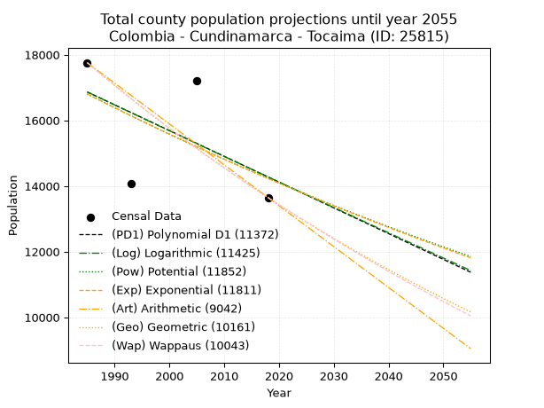
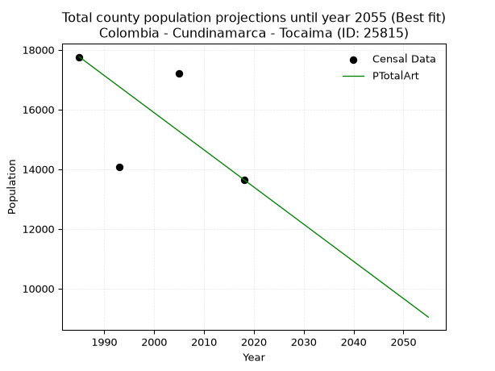
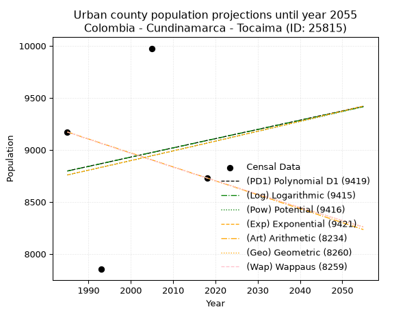
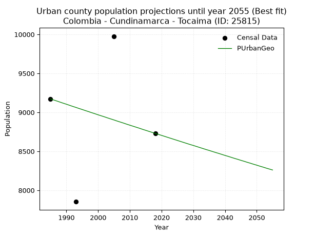
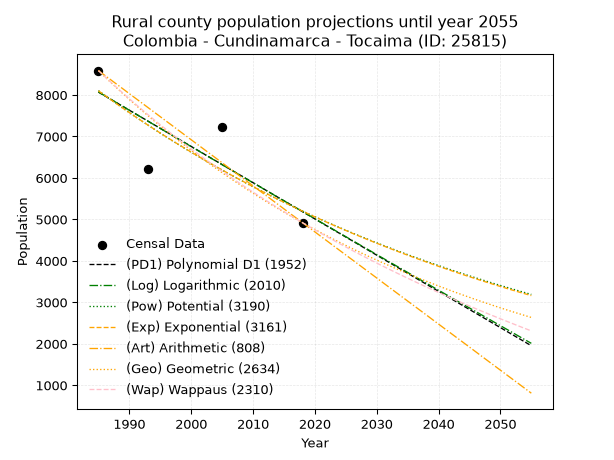
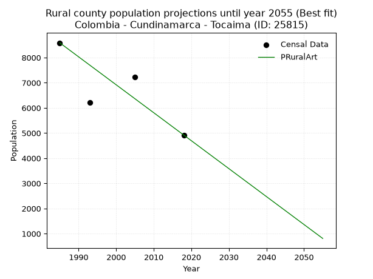

<div align="center">


</div>

# 📜 _“Population and Public Services Demand Projections (PPSD) until Year 2050 for Colombia - Cundinamarca - Tocaima (ID: 25815)”_
Keywords: `population` `public-service` `projection` `lineal` `polynomial` `logarithmic` `potential` `exponential` `arithmetic` `geometric` `wappaus` `dane` `colombia` `south-america`

PPSD are analytical estimates used by governments and planners to anticipate future changes in population size, age distribution, and the resulting community needs for utilities, healthcare, education, and infrastructure as sizing future water treatment facilities, electrical grids, and road networks based on spatial growth.

<div align="center">

</img>

</div>


> **General running parameters**: • app_version: _v20260806_. • Python version: _3.14.7_. • Pandas version: _3.0.5_. • NumPy version: _2.5.1_. • Creates, save and include plots into reports (create_plot): _False_. • Projection until year: _2050_. • Process polynomial degree 2 and up: _False_. • Process Wappaus: _True_. • Process Wappaus: _True_. • Set negative values to zero: _True_. • Set infinite values to zero: _True_. • Drop dataset notes: _True_. 
<div align="center">

Maps & GIS Layers: [:earth_americas:Google](http://maps.google.com/maps?q=4.459279363,-74.6362956) [:earth_americas:OSM](https://www.openstreetmap.org/#map=18/4.459279363/-74.6362956&layers=P) [:earth_americas:Bing](https://www.bing.com/maps?cp=4.459279363~-74.6362956&lvl=18) [:earth_americas:Apple](https://maps.apple.com/frame?center=4.459279363%2C-74.6362956&span=0.003%2C0.006) [:earth_americas:GISMobile](https://github.com/rcfdtools/R.GISMobile/blob/main/file/gis/CountyLayer_CO/Readme.md)

</div>


<div align="center">

```geojson
{
  "type": "Feature",
  "geometry": {
    "type": "Point", 
    "coordinates": [-74.6362956, 4.459279363]
  }, 
  "properties": {
    "Name": "Colombia - Cundinamarca - Tocaima (ID: 25815)"
  }
}
```

</div>


## 0. Census Data (4 records)

Census data are official statistics collected by a government about the people and housing in a country. They usually include counts of total population, age, sex, race, income, education, and jobs.

📅Global census file: [Population.xlsx](../data/Population.xlsx)

| Source   |   Year |   CountryID | CountryName   |   StateID | StateName    |   CountyID | CountyName   |   PTotal |   PUrban |   PRural |
|:---------|-------:|------------:|:--------------|----------:|:-------------|-----------:|:-------------|---------:|---------:|---------:|
| DANE     |   1985 |          57 | Colombia      |        25 | Cundinamarca |      25815 | Tocaima      |    17758 |     9172 |     8586 |
| DANE     |   1993 |          57 | Colombia      |        25 | Cundinamarca |      25815 | Tocaima      |    14071 |     7853 |     6218 |
| DANE     |   2005 |          57 | Colombia      |        25 | Cundinamarca |      25815 | Tocaima      |    17196 |     9976 |     7220 |
| DANE     |   2018 |          57 | Colombia      |        25 | Cundinamarca |      25815 | Tocaima      |    13649 |     8730 |     4919 |

> 🔥Some records could had specific notes about the registered values or the corresponding urban or rural distribution.

📅[SUI-RUPS](https://www.datos.gov.co/Hacienda-y-Cr-dito-P-blico/Registro-nico-de-Prestadores-de-Servicios-P-blicos/4qkq-csdn/about_data) - Local public utility companies: [RUPS.csv](../data/RUPS.csv)

 | SERVICIO       | ESTADO    | NOMBRE                                                                                                                 | NIT         | DEPARTAMENTO_DOMICILIO   | MUNICIPIO_DOMICILIO   | DIRECCION          |   TELEFONO | EMAIL             | TIPO_PRESTADOR                             | CLASIFICACION                 |
|:---------------|:----------|:-----------------------------------------------------------------------------------------------------------------------|:------------|:-------------------------|:----------------------|:-------------------|-----------:|:------------------|:-------------------------------------------|:------------------------------|
| ACUEDUCTO      | OPERATIVA | EMPRESA DE AGUAS DE GIRARDOT, RICAURTE Y LA REGION S.A.  E.S.P.                                                        | 890600003-6 | CUNDINAMARCA             | GIRARDOT              | CALLE 16 CARRERA 1 |    8335656 | sui@acuagyr.com   | SOCIEDADES (EMPRESA DE SERVICIOS PUBLICOS) | MAYOR O IGUAL A 5001 USUARIOS |
| ACUEDUCTO      | OPERATIVA | ASOCIACION DE USUARIOS DEL ACUEDUCTO REGIONAL LA SALADA ALTO DEVIGA VILA ASOMADERO Y MALBERTO DEL MUNICIPIO DE TOCAIMA | 808001352-3 | CUNDINAMARCA             | TOCAIMA               | VEREDA LA SALADA   |    8367676 | asoresa@live.com  | ORGANIZACION AUTORIZADA                    | HASTA 2500 SUSCRIPTORES       |
| ACUEDUCTO      | OPERATIVA | INGENIERIA Y GESTION DEL AGUA SAS ESP                                                                                  | 900546589-4 | CUNDINAMARCA             | TOCAIMA               | CALLE 4 N° 6-31    |    8367562 | sippdbg@gmail.com | SOCIEDADES (EMPRESA DE SERVICIOS PUBLICOS) | MAYOR O IGUAL A 5001 USUARIOS |
| ALCANTARILLADO | OPERATIVA | INGENIERIA Y GESTION DEL AGUA SAS ESP                                                                                  | 900546589-4 | CUNDINAMARCA             | TOCAIMA               | CALLE 4 N° 6-31    |    8367562 | sippdbg@gmail.com | SOCIEDADES (EMPRESA DE SERVICIOS PUBLICOS) | MAYOR O IGUAL A 5001 USUARIOS |

## 1. Total

### 1.1. Coefficients and Parameters

* (PD1) Polynomial Deg 1: -78.4801284624628, 172648.37695704124 (lineal)
* (Log) Logarithmic: -157040.10233286428, 1209331.5762725028
* (Pow) Potential: -10.07848063449598, 37.46189071908724
* (Exp) Exponential: -0.005037014047968891, 369575795.7555441
* (Art) Arithmetic: Year diff. 2018 - 1985 = 33, Population diff. 13649 - 17758 = -4109, Annual growth = -124.51515151515152
* (Geo) Geometric: Year diff. 2018 - 1985 = 33, Population diff. 13649 - 17758 = -4109, Annual growth % = -0.007943129526760573
* (Wap) Wappaus: i = -0.7929133729114625, Condition values only valid for < 200)

<sub>
Wappaus condition values: ['-0.00', '-0.79', '-1.59', '-2.38', '-3.17', '-3.96', '-4.76', '-5.55', '-6.34', '-7.14', '-7.93', '-8.72', '-9.51', '-10.31', '-11.10', '-11.89', '-12.69', '-13.48', '-14.27', '-15.07', '-15.86', '-16.65', '-17.44', '-18.24', '-19.03', '-19.82', '-20.62', '-21.41', '-22.20', '-22.99', '-23.79', '-24.58', '-25.37', '-26.17', '-26.96', '-27.75', '-28.54', '-29.34', '-30.13', '-30.92', '-31.72', '-32.51', '-33.30', '-34.10', '-34.89', '-35.68', '-36.47', '-37.27', '-38.06', '-38.85', '-39.65', '-40.44', '-41.23', '-42.02', '-42.82', '-43.61', '-44.40', '-45.20', '-45.99', '-46.78', '-47.57', '-48.37', '-49.16', '-49.95', '-50.75', '-51.54']
</sub>


### 1.2. Projected Dataset

|   Year |   CountyID |   PTotalPD1 |   PTotalLog |   PTotalPow |   PTotalExp |   PTotalArt |   PTotalGeo |   PTotalWap |
|-------:|-----------:|------------:|------------:|------------:|------------:|------------:|------------:|------------:|
|   1985 |      25815 |       16865 |       16867 |       16806 |       16804 |       17758 |       17758 |       17758 |
|   1986 |      25815 |       16787 |       16788 |       16721 |       16720 |       17633 |       17617 |       17618 |
|   1987 |      25815 |       16708 |       16709 |       16637 |       16636 |       17509 |       17477 |       17479 |
|   1988 |      25815 |       16630 |       16630 |       16553 |       16552 |       17384 |       17338 |       17341 |
|   1989 |      25815 |       16551 |       16551 |       16469 |       16469 |       17260 |       17200 |       17204 |
|   1990 |      25815 |       16473 |       16472 |       16386 |       16386 |       17135 |       17064 |       17068 |
|   1991 |      25815 |       16394 |       16393 |       16303 |       16304 |       17011 |       16928 |       16933 |
|   1992 |      25815 |       16316 |       16314 |       16221 |       16222 |       16886 |       16794 |       16799 |
|   1993 |      25815 |       16237 |       16236 |       16139 |       16141 |       16762 |       16660 |       16666 |
|   1994 |      25815 |       16159 |       16157 |       16057 |       16060 |       16637 |       16528 |       16534 |
|   1995 |      25815 |       16081 |       16078 |       15976 |       15979 |       16513 |       16397 |       16404 |
|   1996 |      25815 |       16002 |       15999 |       15896 |       15899 |       16388 |       16267 |       16274 |
|   1997 |      25815 |       15924 |       15921 |       15816 |       15819 |       16264 |       16137 |       16145 |
|   1998 |      25815 |       15845 |       15842 |       15736 |       15739 |       16139 |       16009 |       16017 |
|   1999 |      25815 |       15767 |       15764 |       15657 |       15660 |       16015 |       15882 |       15890 |
|   2000 |      25815 |       15688 |       15685 |       15578 |       15581 |       15890 |       15756 |       15764 |
|   2001 |      25815 |       15610 |       15607 |       15500 |       15503 |       15766 |       15631 |       15639 |
|   2002 |      25815 |       15531 |       15528 |       15422 |       15425 |       15641 |       15507 |       15515 |
|   2003 |      25815 |       15453 |       15450 |       15345 |       15348 |       15517 |       15383 |       15392 |
|   2004 |      25815 |       15374 |       15371 |       15268 |       15271 |       15392 |       15261 |       15270 |
|   2005 |      25815 |       15296 |       15293 |       15191 |       15194 |       15268 |       15140 |       15149 |
|   2006 |      25815 |       15217 |       15215 |       15115 |       15118 |       15143 |       15020 |       15028 |
|   2007 |      25815 |       15139 |       15136 |       15039 |       15042 |       15019 |       14900 |       14909 |
|   2008 |      25815 |       15060 |       15058 |       14964 |       14966 |       14894 |       14782 |       14790 |
|   2009 |      25815 |       14982 |       14980 |       14889 |       14891 |       14770 |       14665 |       14672 |
|   2010 |      25815 |       14903 |       14902 |       14815 |       14816 |       14645 |       14548 |       14555 |
|   2011 |      25815 |       14825 |       14824 |       14741 |       14742 |       14521 |       14433 |       14439 |
|   2012 |      25815 |       14746 |       14746 |       14667 |       14668 |       14396 |       14318 |       14324 |
|   2013 |      25815 |       14668 |       14668 |       14594 |       14594 |       14272 |       14204 |       14209 |
|   2014 |      25815 |       14589 |       14590 |       14521 |       14521 |       14147 |       14091 |       14096 |
|   2015 |      25815 |       14511 |       14512 |       14448 |       14448 |       14023 |       13979 |       13983 |
|   2016 |      25815 |       14432 |       14434 |       14376 |       14375 |       13898 |       13868 |       13871 |
|   2017 |      25815 |       14354 |       14356 |       14305 |       14303 |       13774 |       13758 |       13759 |
|   2018 |      25815 |       14275 |       14278 |       14233 |       14231 |       13649 |       13649 |       13649 |
|   2019 |      25815 |       14197 |       14200 |       14162 |       14159 |       13524 |       13541 |       13539 |
|   2020 |      25815 |       14119 |       14122 |       14092 |       14088 |       13400 |       13433 |       13430 |
|   2021 |      25815 |       14040 |       14045 |       14022 |       14017 |       13275 |       13326 |       13322 |
|   2022 |      25815 |       13962 |       13967 |       13952 |       13947 |       13151 |       13220 |       13215 |
|   2023 |      25815 |       13883 |       13889 |       13883 |       13877 |       13026 |       13115 |       13108 |
|   2024 |      25815 |       13805 |       13812 |       13814 |       13807 |       12902 |       13011 |       13002 |
|   2025 |      25815 |       13726 |       13734 |       13745 |       13738 |       12777 |       12908 |       12897 |
|   2026 |      25815 |       13648 |       13657 |       13677 |       13669 |       12653 |       12805 |       12792 |
|   2027 |      25815 |       13569 |       13579 |       13609 |       13600 |       12528 |       12704 |       12688 |
|   2028 |      25815 |       13491 |       13502 |       13542 |       13532 |       12404 |       12603 |       12585 |
|   2029 |      25815 |       13412 |       13424 |       13474 |       13464 |       12279 |       12503 |       12483 |
|   2030 |      25815 |       13334 |       13347 |       13408 |       13396 |       12155 |       12403 |       12381 |
|   2031 |      25815 |       13255 |       13270 |       13341 |       13329 |       12030 |       12305 |       12280 |
|   2032 |      25815 |       13177 |       13192 |       13275 |       13262 |       11906 |       12207 |       12180 |
|   2033 |      25815 |       13098 |       13115 |       13210 |       13195 |       11781 |       12110 |       12080 |
|   2034 |      25815 |       13020 |       13038 |       13144 |       13129 |       11657 |       12014 |       11981 |
|   2035 |      25815 |       12941 |       12961 |       13079 |       13063 |       11532 |       11919 |       11882 |
|   2036 |      25815 |       12863 |       12883 |       13015 |       12997 |       11408 |       11824 |       11785 |
|   2037 |      25815 |       12784 |       12806 |       12951 |       12932 |       11283 |       11730 |       11688 |
|   2038 |      25815 |       12706 |       12729 |       12887 |       12867 |       11159 |       11637 |       11591 |
|   2039 |      25815 |       12627 |       12652 |       12823 |       12802 |       11034 |       11544 |       11495 |
|   2040 |      25815 |       12549 |       12575 |       12760 |       12738 |       10910 |       11453 |       11400 |
|   2041 |      25815 |       12470 |       12498 |       12697 |       12674 |       10785 |       11362 |       11305 |
|   2042 |      25815 |       12392 |       12421 |       12635 |       12610 |       10661 |       11271 |       11211 |
|   2043 |      25815 |       12313 |       12344 |       12572 |       12547 |       10536 |       11182 |       11118 |
|   2044 |      25815 |       12235 |       12268 |       12510 |       12484 |       10412 |       11093 |       11025 |
|   2045 |      25815 |       12157 |       12191 |       12449 |       12421 |       10287 |       11005 |       10933 |
|   2046 |      25815 |       12078 |       12114 |       12388 |       12359 |       10163 |       10918 |       10842 |
|   2047 |      25815 |       12000 |       12037 |       12327 |       12297 |       10038 |       10831 |       10751 |
|   2048 |      25815 |       11921 |       11961 |       12266 |       12235 |        9914 |       10745 |       10660 |
|   2049 |      25815 |       11843 |       11884 |       12206 |       12174 |        9789 |       10659 |       10570 |
|   2050 |      25815 |       11764 |       11807 |       12146 |       12112 |        9665 |       10575 |       10481 |
<div align="center">

</img>

</div>


### 1.3. Best fit with absolute and relative error (%)

Relative error puts that difference into context by dividing the absolute error by the true value, creating a unitless ratio or percentage that shows the scale of the mistake.

Absolute and relative error

|   Year | Source   |   CountryID | CountryName   |   StateID | StateName    |   CountyID_x | CountyName   |   PTotal |   PUrban |   PRural |   CountyID_y |   PTotalPD1 |   PTotalLog |   PTotalPow |   PTotalExp |   PTotalArt |   PTotalGeo |   PTotalWap |   PTotalPD1AbsError |   PTotalLogAbsError |   PTotalPowAbsError |   PTotalExpAbsError |   PTotalArtAbsError |   PTotalGeoAbsError |   PTotalWapAbsError |   PTotalPD1RelError |   PTotalLogRelError |   PTotalPowRelError |   PTotalExpRelError |   PTotalArtRelError |   PTotalGeoRelError |   PTotalWapRelError |
|-------:|:---------|------------:|:--------------|----------:|:-------------|-------------:|:-------------|---------:|---------:|---------:|-------------:|------------:|------------:|------------:|------------:|------------:|------------:|------------:|--------------------:|--------------------:|--------------------:|--------------------:|--------------------:|--------------------:|--------------------:|--------------------:|--------------------:|--------------------:|--------------------:|--------------------:|--------------------:|--------------------:|
|   1985 | DANE     |          57 | Colombia      |        25 | Cundinamarca |        25815 | Tocaima      |    17758 |     9172 |     8586 |        25815 |       16865 |       16867 |       16806 |       16804 |       17758 |       17758 |       17758 |                 893 |                 891 |                 952 |                 954 |                   0 |                   0 |                   0 |             5.02872 |             5.01746 |             5.36096 |             5.37223 |              0      |              0      |              0      |
|   1993 | DANE     |          57 | Colombia      |        25 | Cundinamarca |        25815 | Tocaima      |    14071 |     7853 |     6218 |        25815 |       16237 |       16236 |       16139 |       16141 |       16762 |       16660 |       16666 |                2166 |                2165 |                2068 |                2070 |                2691 |                2589 |                2595 |            15.3934  |            15.3863  |            14.6969  |            14.7111  |             19.1244 |             18.3995 |             18.4422 |
|   2005 | DANE     |          57 | Colombia      |        25 | Cundinamarca |        25815 | Tocaima      |    17196 |     9976 |     7220 |        25815 |       15296 |       15293 |       15191 |       15194 |       15268 |       15140 |       15149 |                1900 |                1903 |                2005 |                2002 |                1928 |                2056 |                2047 |            11.0491  |            11.0665  |            11.6597  |            11.6422  |             11.2119 |             11.9563 |             11.9039 |
|   2018 | DANE     |          57 | Colombia      |        25 | Cundinamarca |        25815 | Tocaima      |    13649 |     8730 |     4919 |        25815 |       14275 |       14278 |       14233 |       14231 |       13649 |       13649 |       13649 |                 626 |                 629 |                 584 |                 582 |                   0 |                   0 |                   0 |             4.58642 |             4.6084  |             4.2787  |             4.26405 |              0      |              0      |              0      |

Relative error mean

| Method    |   RelError | Best   |
|:----------|-----------:|:-------|
| PTotalPD1 |    9.01439 |        |
| PTotalLog |    9.01966 |        |
| PTotalPow |    8.99906 |        |
| PTotalExp |    8.99741 |        |
| PTotalArt |    7.58409 | True   |
| PTotalGeo |    7.58895 |        |
| PTotalWap |    7.58653 |        |

💙Best method: _**PTotalArt**_
<div align="center">

</img>

</div>


### 1.4. Fresh water supply demand in liters per capita per day (lpcd)

The fresh water supply demand typically ranges from 100 to 300 liters per capita per day (lpcd) for standard domestic and municipal planning, though absolute survival minimums set by the World Health Organization are as low as 7.5 to 20 liters per day, and total consumption in high-income nations can exceed 400 liters.

> `CZ`: Level in meters above the sea level (masl)<br> `WS`: Fresh water supply demand in liters per capita per day (lpcd or l/h/d)<br> `WSAll`: Zonal fresh water supply demand in liters per second (l/s)<br> `A`: Zonal area in square meters<br> `DP`: Population density (people/hectare or p/ha)

Reference values (RAS Colombia)

|    CZ |   WS |
|------:|-----:|
|  1000 |  120 |
|  2000 |  130 |
| 99999 |  140 |

County shapefile geometry properties and water supply values

|   CountyID |      ATotal |   CZTotal |   WSTotal |
|-----------:|------------:|----------:|----------:|
|      25815 | 2.45581e+08 |   548.575 |       120 |

Projected values for best method: PTotalArt

|   CountyID |   Year |   PTotalArt |   DPTotal |   WSTotal |   WSTotalAll |
|-----------:|-------:|------------:|----------:|----------:|-------------:|
|      25815 |   1985 |       17758 |      0.72 |       120 |      24.6639 |
|      25815 |   1986 |       17633 |      0.72 |       120 |      24.4903 |
|      25815 |   1987 |       17509 |      0.71 |       120 |      24.3181 |
|      25815 |   1988 |       17384 |      0.71 |       120 |      24.1444 |
|      25815 |   1989 |       17260 |      0.7  |       120 |      23.9722 |
|      25815 |   1990 |       17135 |      0.7  |       120 |      23.7986 |
|      25815 |   1991 |       17011 |      0.69 |       120 |      23.6264 |
|      25815 |   1992 |       16886 |      0.69 |       120 |      23.4528 |
|      25815 |   1993 |       16762 |      0.68 |       120 |      23.2806 |
|      25815 |   1994 |       16637 |      0.68 |       120 |      23.1069 |
|      25815 |   1995 |       16513 |      0.67 |       120 |      22.9347 |
|      25815 |   1996 |       16388 |      0.67 |       120 |      22.7611 |
|      25815 |   1997 |       16264 |      0.66 |       120 |      22.5889 |
|      25815 |   1998 |       16139 |      0.66 |       120 |      22.4153 |
|      25815 |   1999 |       16015 |      0.65 |       120 |      22.2431 |
|      25815 |   2000 |       15890 |      0.65 |       120 |      22.0694 |
|      25815 |   2001 |       15766 |      0.64 |       120 |      21.8972 |
|      25815 |   2002 |       15641 |      0.64 |       120 |      21.7236 |
|      25815 |   2003 |       15517 |      0.63 |       120 |      21.5514 |
|      25815 |   2004 |       15392 |      0.63 |       120 |      21.3778 |
|      25815 |   2005 |       15268 |      0.62 |       120 |      21.2056 |
|      25815 |   2006 |       15143 |      0.62 |       120 |      21.0319 |
|      25815 |   2007 |       15019 |      0.61 |       120 |      20.8597 |
|      25815 |   2008 |       14894 |      0.61 |       120 |      20.6861 |
|      25815 |   2009 |       14770 |      0.6  |       120 |      20.5139 |
|      25815 |   2010 |       14645 |      0.6  |       120 |      20.3403 |
|      25815 |   2011 |       14521 |      0.59 |       120 |      20.1681 |
|      25815 |   2012 |       14396 |      0.59 |       120 |      19.9944 |
|      25815 |   2013 |       14272 |      0.58 |       120 |      19.8222 |
|      25815 |   2014 |       14147 |      0.58 |       120 |      19.6486 |
|      25815 |   2015 |       14023 |      0.57 |       120 |      19.4764 |
|      25815 |   2016 |       13898 |      0.57 |       120 |      19.3028 |
|      25815 |   2017 |       13774 |      0.56 |       120 |      19.1306 |
|      25815 |   2018 |       13649 |      0.56 |       120 |      18.9569 |
|      25815 |   2019 |       13524 |      0.55 |       120 |      18.7833 |
|      25815 |   2020 |       13400 |      0.55 |       120 |      18.6111 |
|      25815 |   2021 |       13275 |      0.54 |       120 |      18.4375 |
|      25815 |   2022 |       13151 |      0.54 |       120 |      18.2653 |
|      25815 |   2023 |       13026 |      0.53 |       120 |      18.0917 |
|      25815 |   2024 |       12902 |      0.53 |       120 |      17.9194 |
|      25815 |   2025 |       12777 |      0.52 |       120 |      17.7458 |
|      25815 |   2026 |       12653 |      0.52 |       120 |      17.5736 |
|      25815 |   2027 |       12528 |      0.51 |       120 |      17.4    |
|      25815 |   2028 |       12404 |      0.51 |       120 |      17.2278 |
|      25815 |   2029 |       12279 |      0.5  |       120 |      17.0542 |
|      25815 |   2030 |       12155 |      0.49 |       120 |      16.8819 |
|      25815 |   2031 |       12030 |      0.49 |       120 |      16.7083 |
|      25815 |   2032 |       11906 |      0.48 |       120 |      16.5361 |
|      25815 |   2033 |       11781 |      0.48 |       120 |      16.3625 |
|      25815 |   2034 |       11657 |      0.47 |       120 |      16.1903 |
|      25815 |   2035 |       11532 |      0.47 |       120 |      16.0167 |
|      25815 |   2036 |       11408 |      0.46 |       120 |      15.8444 |
|      25815 |   2037 |       11283 |      0.46 |       120 |      15.6708 |
|      25815 |   2038 |       11159 |      0.45 |       120 |      15.4986 |
|      25815 |   2039 |       11034 |      0.45 |       120 |      15.325  |
|      25815 |   2040 |       10910 |      0.44 |       120 |      15.1528 |
|      25815 |   2041 |       10785 |      0.44 |       120 |      14.9792 |
|      25815 |   2042 |       10661 |      0.43 |       120 |      14.8069 |
|      25815 |   2043 |       10536 |      0.43 |       120 |      14.6333 |
|      25815 |   2044 |       10412 |      0.42 |       120 |      14.4611 |
|      25815 |   2045 |       10287 |      0.42 |       120 |      14.2875 |
|      25815 |   2046 |       10163 |      0.41 |       120 |      14.1153 |
|      25815 |   2047 |       10038 |      0.41 |       120 |      13.9417 |
|      25815 |   2048 |        9914 |      0.4  |       120 |      13.7694 |
|      25815 |   2049 |        9789 |      0.4  |       120 |      13.5958 |
|      25815 |   2050 |        9665 |      0.39 |       120 |      13.4236 |

## 2. Urban

### 2.1. Coefficients and Parameters

* (PD1) Polynomial Deg 1: 8.890004014452735, -8849.480529909086 (lineal)
* (Log) Logarithmic: 17839.648212609132, -126666.55902201086
* (Pow) Potential: 2.0869088819387183, -2.939676902609646
* (Exp) Exponential: 0.0010406876140144272, 1110.0046915889814
* (Art) Arithmetic: Year diff. 2018 - 1985 = 33, Population diff. 8730 - 9172 = -442, Annual growth = -13.393939393939394
* (Geo) Geometric: Year diff. 2018 - 1985 = 33, Population diff. 8730 - 9172 = -442, Annual growth % = -0.0014955470727334719
* (Wap) Wappaus: i = -0.14963623498982676, Condition values only valid for < 200)

<sub>
Wappaus condition values: ['-0.00', '-0.15', '-0.30', '-0.45', '-0.60', '-0.75', '-0.90', '-1.05', '-1.20', '-1.35', '-1.50', '-1.65', '-1.80', '-1.95', '-2.09', '-2.24', '-2.39', '-2.54', '-2.69', '-2.84', '-2.99', '-3.14', '-3.29', '-3.44', '-3.59', '-3.74', '-3.89', '-4.04', '-4.19', '-4.34', '-4.49', '-4.64', '-4.79', '-4.94', '-5.09', '-5.24', '-5.39', '-5.54', '-5.69', '-5.84', '-5.99', '-6.14', '-6.28', '-6.43', '-6.58', '-6.73', '-6.88', '-7.03', '-7.18', '-7.33', '-7.48', '-7.63', '-7.78', '-7.93', '-8.08', '-8.23', '-8.38', '-8.53', '-8.68', '-8.83', '-8.98', '-9.13', '-9.28', '-9.43', '-9.58', '-9.73']
</sub>


### 2.2. Projected Dataset

|   Year |   CountyID |   PUrbanPD1 |   PUrbanLog |   PUrbanPow |   PUrbanExp |   PUrbanArt |   PUrbanGeo |   PUrbanWap |
|-------:|-----------:|------------:|------------:|------------:|------------:|------------:|------------:|------------:|
|   1985 |      25815 |        8797 |        8797 |        8759 |        8759 |        9172 |        9172 |        9172 |
|   1986 |      25815 |        8806 |        8806 |        8768 |        8769 |        9159 |        9158 |        9158 |
|   1987 |      25815 |        8815 |        8815 |        8777 |        8778 |        9145 |        9145 |        9145 |
|   1988 |      25815 |        8824 |        8824 |        8787 |        8787 |        9132 |        9131 |        9131 |
|   1989 |      25815 |        8833 |        8832 |        8796 |        8796 |        9118 |        9117 |        9117 |
|   1990 |      25815 |        8842 |        8841 |        8805 |        8805 |        9105 |        9104 |        9104 |
|   1991 |      25815 |        8851 |        8850 |        8814 |        8814 |        9092 |        9090 |        9090 |
|   1992 |      25815 |        8859 |        8859 |        8823 |        8823 |        9078 |        9076 |        9076 |
|   1993 |      25815 |        8868 |        8868 |        8833 |        8833 |        9065 |        9063 |        9063 |
|   1994 |      25815 |        8877 |        8877 |        8842 |        8842 |        9051 |        9049 |        9049 |
|   1995 |      25815 |        8886 |        8886 |        8851 |        8851 |        9038 |        9036 |        9036 |
|   1996 |      25815 |        8895 |        8895 |        8860 |        8860 |        9025 |        9022 |        9022 |
|   1997 |      25815 |        8904 |        8904 |        8870 |        8869 |        9011 |        9009 |        9009 |
|   1998 |      25815 |        8913 |        8913 |        8879 |        8879 |        8998 |        8995 |        8995 |
|   1999 |      25815 |        8922 |        8922 |        8888 |        8888 |        8984 |        8982 |        8982 |
|   2000 |      25815 |        8931 |        8931 |        8898 |        8897 |        8971 |        8968 |        8968 |
|   2001 |      25815 |        8939 |        8940 |        8907 |        8906 |        8958 |        8955 |        8955 |
|   2002 |      25815 |        8948 |        8949 |        8916 |        8916 |        8944 |        8942 |        8942 |
|   2003 |      25815 |        8957 |        8958 |        8925 |        8925 |        8931 |        8928 |        8928 |
|   2004 |      25815 |        8966 |        8967 |        8935 |        8934 |        8918 |        8915 |        8915 |
|   2005 |      25815 |        8975 |        8975 |        8944 |        8944 |        8904 |        8902 |        8902 |
|   2006 |      25815 |        8984 |        8984 |        8953 |        8953 |        8891 |        8888 |        8888 |
|   2007 |      25815 |        8993 |        8993 |        8963 |        8962 |        8877 |        8875 |        8875 |
|   2008 |      25815 |        9002 |        9002 |        8972 |        8972 |        8864 |        8862 |        8862 |
|   2009 |      25815 |        9011 |        9011 |        8981 |        8981 |        8851 |        8848 |        8848 |
|   2010 |      25815 |        9019 |        9020 |        8991 |        8990 |        8837 |        8835 |        8835 |
|   2011 |      25815 |        9028 |        9029 |        9000 |        9000 |        8824 |        8822 |        8822 |
|   2012 |      25815 |        9037 |        9038 |        9009 |        9009 |        8810 |        8809 |        8809 |
|   2013 |      25815 |        9046 |        9046 |        9019 |        9018 |        8797 |        8796 |        8796 |
|   2014 |      25815 |        9055 |        9055 |        9028 |        9028 |        8784 |        8782 |        8782 |
|   2015 |      25815 |        9064 |        9064 |        9037 |        9037 |        8770 |        8769 |        8769 |
|   2016 |      25815 |        9073 |        9073 |        9047 |        9047 |        8757 |        8756 |        8756 |
|   2017 |      25815 |        9082 |        9082 |        9056 |        9056 |        8743 |        8743 |        8743 |
|   2018 |      25815 |        9091 |        9091 |        9066 |        9065 |        8730 |        8730 |        8730 |
|   2019 |      25815 |        9099 |        9100 |        9075 |        9075 |        8717 |        8717 |        8717 |
|   2020 |      25815 |        9108 |        9108 |        9084 |        9084 |        8703 |        8704 |        8704 |
|   2021 |      25815 |        9117 |        9117 |        9094 |        9094 |        8690 |        8691 |        8691 |
|   2022 |      25815 |        9126 |        9126 |        9103 |        9103 |        8676 |        8678 |        8678 |
|   2023 |      25815 |        9135 |        9135 |        9112 |        9113 |        8663 |        8665 |        8665 |
|   2024 |      25815 |        9144 |        9144 |        9122 |        9122 |        8650 |        8652 |        8652 |
|   2025 |      25815 |        9153 |        9152 |        9131 |        9132 |        8636 |        8639 |        8639 |
|   2026 |      25815 |        9162 |        9161 |        9141 |        9141 |        8623 |        8626 |        8626 |
|   2027 |      25815 |        9171 |        9170 |        9150 |        9151 |        8609 |        8613 |        8613 |
|   2028 |      25815 |        9179 |        9179 |        9160 |        9160 |        8596 |        8600 |        8600 |
|   2029 |      25815 |        9188 |        9188 |        9169 |        9170 |        8583 |        8587 |        8587 |
|   2030 |      25815 |        9197 |        9196 |        9178 |        9179 |        8569 |        8575 |        8575 |
|   2031 |      25815 |        9206 |        9205 |        9188 |        9189 |        8556 |        8562 |        8562 |
|   2032 |      25815 |        9215 |        9214 |        9197 |        9199 |        8542 |        8549 |        8549 |
|   2033 |      25815 |        9224 |        9223 |        9207 |        9208 |        8529 |        8536 |        8536 |
|   2034 |      25815 |        9233 |        9232 |        9216 |        9218 |        8516 |        8523 |        8523 |
|   2035 |      25815 |        9242 |        9240 |        9226 |        9227 |        8502 |        8511 |        8511 |
|   2036 |      25815 |        9251 |        9249 |        9235 |        9237 |        8489 |        8498 |        8498 |
|   2037 |      25815 |        9259 |        9258 |        9245 |        9246 |        8476 |        8485 |        8485 |
|   2038 |      25815 |        9268 |        9267 |        9254 |        9256 |        8462 |        8473 |        8472 |
|   2039 |      25815 |        9277 |        9275 |        9264 |        9266 |        8449 |        8460 |        8460 |
|   2040 |      25815 |        9286 |        9284 |        9273 |        9275 |        8435 |        8447 |        8447 |
|   2041 |      25815 |        9295 |        9293 |        9282 |        9285 |        8422 |        8435 |        8434 |
|   2042 |      25815 |        9304 |        9302 |        9292 |        9295 |        8409 |        8422 |        8422 |
|   2043 |      25815 |        9313 |        9310 |        9301 |        9304 |        8395 |        8409 |        8409 |
|   2044 |      25815 |        9322 |        9319 |        9311 |        9314 |        8382 |        8397 |        8396 |
|   2045 |      25815 |        9331 |        9328 |        9320 |        9324 |        8368 |        8384 |        8384 |
|   2046 |      25815 |        9339 |        9337 |        9330 |        9334 |        8355 |        8372 |        8371 |
|   2047 |      25815 |        9348 |        9345 |        9340 |        9343 |        8342 |        8359 |        8359 |
|   2048 |      25815 |        9357 |        9354 |        9349 |        9353 |        8328 |        8347 |        8346 |
|   2049 |      25815 |        9366 |        9363 |        9359 |        9363 |        8315 |        8334 |        8334 |
|   2050 |      25815 |        9375 |        9371 |        9368 |        9372 |        8301 |        8322 |        8321 |
<div align="center">

</img>

</div>


### 2.3. Best fit with absolute and relative error (%)

Relative error puts that difference into context by dividing the absolute error by the true value, creating a unitless ratio or percentage that shows the scale of the mistake.

Absolute and relative error

|   Year | Source   |   CountryID | CountryName   |   StateID | StateName    |   CountyID_x | CountyName   |   PTotal |   PUrban |   PRural |   CountyID_y |   PUrbanPD1 |   PUrbanLog |   PUrbanPow |   PUrbanExp |   PUrbanArt |   PUrbanGeo |   PUrbanWap |   PUrbanPD1AbsError |   PUrbanLogAbsError |   PUrbanPowAbsError |   PUrbanExpAbsError |   PUrbanArtAbsError |   PUrbanGeoAbsError |   PUrbanWapAbsError |   PUrbanPD1RelError |   PUrbanLogRelError |   PUrbanPowRelError |   PUrbanExpRelError |   PUrbanArtRelError |   PUrbanGeoRelError |   PUrbanWapRelError |
|-------:|:---------|------------:|:--------------|----------:|:-------------|-------------:|:-------------|---------:|---------:|---------:|-------------:|------------:|------------:|------------:|------------:|------------:|------------:|------------:|--------------------:|--------------------:|--------------------:|--------------------:|--------------------:|--------------------:|--------------------:|--------------------:|--------------------:|--------------------:|--------------------:|--------------------:|--------------------:|--------------------:|
|   1985 | DANE     |          57 | Colombia      |        25 | Cundinamarca |        25815 | Tocaima      |    17758 |     9172 |     8586 |        25815 |        8797 |        8797 |        8759 |        8759 |        9172 |        9172 |        9172 |                 375 |                 375 |                 413 |                 413 |                   0 |                   0 |                   0 |             4.08853 |             4.08853 |             4.50283 |             4.50283 |              0      |              0      |              0      |
|   1993 | DANE     |          57 | Colombia      |        25 | Cundinamarca |        25815 | Tocaima      |    14071 |     7853 |     6218 |        25815 |        8868 |        8868 |        8833 |        8833 |        9065 |        9063 |        9063 |                1015 |                1015 |                 980 |                 980 |                1212 |                1210 |                1210 |            12.925   |            12.925   |            12.4793  |            12.4793  |             15.4336 |             15.4081 |             15.4081 |
|   2005 | DANE     |          57 | Colombia      |        25 | Cundinamarca |        25815 | Tocaima      |    17196 |     9976 |     7220 |        25815 |        8975 |        8975 |        8944 |        8944 |        8904 |        8902 |        8902 |                1001 |                1001 |                1032 |                1032 |                1072 |                1074 |                1074 |            10.0341  |            10.0341  |            10.3448  |            10.3448  |             10.7458 |             10.7658 |             10.7658 |
|   2018 | DANE     |          57 | Colombia      |        25 | Cundinamarca |        25815 | Tocaima      |    13649 |     8730 |     4919 |        25815 |        9091 |        9091 |        9066 |        9065 |        8730 |        8730 |        8730 |                 361 |                 361 |                 336 |                 335 |                   0 |                   0 |                   0 |             4.13517 |             4.13517 |             3.8488  |             3.83734 |              0      |              0      |              0      |

Relative error mean

| Method    |   RelError | Best   |
|:----------|-----------:|:-------|
| PUrbanPD1 |    7.79569 |        |
| PUrbanLog |    7.79569 |        |
| PUrbanPow |    7.79394 |        |
| PUrbanExp |    7.79108 |        |
| PUrbanArt |    6.54485 |        |
| PUrbanGeo |    6.54349 | True   |
| PUrbanWap |    6.54349 | True   |

💙Best method: _**PUrbanGeo**_
<div align="center">

</img>

</div>


### 2.4. Fresh water supply demand in liters per capita per day (lpcd)

The fresh water supply demand typically ranges from 100 to 300 liters per capita per day (lpcd) for standard domestic and municipal planning, though absolute survival minimums set by the World Health Organization are as low as 7.5 to 20 liters per day, and total consumption in high-income nations can exceed 400 liters.

> `CZ`: Level in meters above the sea level (masl)<br> `WS`: Fresh water supply demand in liters per capita per day (lpcd or l/h/d)<br> `WSAll`: Zonal fresh water supply demand in liters per second (l/s)<br> `A`: Zonal area in square meters<br> `DP`: Population density (people/hectare or p/ha)

Reference values (RAS Colombia)

|    CZ |   WS |
|------:|-----:|
|  1000 |  120 |
|  2000 |  130 |
| 99999 |  140 |

County shapefile geometry properties and water supply values

|   CountyID |      AUrban |   CZUrban |   WSUrban |
|-----------:|------------:|----------:|----------:|
|      25815 | 3.15667e+06 |   380.333 |       120 |

Projected values for best method: PUrbanGeo

|   CountyID |   Year |   PUrbanGeo |   DPUrban |   WSUrban |   WSUrbanAll |
|-----------:|-------:|------------:|----------:|----------:|-------------:|
|      25815 |   1985 |        9172 |     29.06 |       120 |      12.7389 |
|      25815 |   1986 |        9158 |     29.01 |       120 |      12.7194 |
|      25815 |   1987 |        9145 |     28.97 |       120 |      12.7014 |
|      25815 |   1988 |        9131 |     28.93 |       120 |      12.6819 |
|      25815 |   1989 |        9117 |     28.88 |       120 |      12.6625 |
|      25815 |   1990 |        9104 |     28.84 |       120 |      12.6444 |
|      25815 |   1991 |        9090 |     28.8  |       120 |      12.625  |
|      25815 |   1992 |        9076 |     28.75 |       120 |      12.6056 |
|      25815 |   1993 |        9063 |     28.71 |       120 |      12.5875 |
|      25815 |   1994 |        9049 |     28.67 |       120 |      12.5681 |
|      25815 |   1995 |        9036 |     28.63 |       120 |      12.55   |
|      25815 |   1996 |        9022 |     28.58 |       120 |      12.5306 |
|      25815 |   1997 |        9009 |     28.54 |       120 |      12.5125 |
|      25815 |   1998 |        8995 |     28.5  |       120 |      12.4931 |
|      25815 |   1999 |        8982 |     28.45 |       120 |      12.475  |
|      25815 |   2000 |        8968 |     28.41 |       120 |      12.4556 |
|      25815 |   2001 |        8955 |     28.37 |       120 |      12.4375 |
|      25815 |   2002 |        8942 |     28.33 |       120 |      12.4194 |
|      25815 |   2003 |        8928 |     28.28 |       120 |      12.4    |
|      25815 |   2004 |        8915 |     28.24 |       120 |      12.3819 |
|      25815 |   2005 |        8902 |     28.2  |       120 |      12.3639 |
|      25815 |   2006 |        8888 |     28.16 |       120 |      12.3444 |
|      25815 |   2007 |        8875 |     28.12 |       120 |      12.3264 |
|      25815 |   2008 |        8862 |     28.07 |       120 |      12.3083 |
|      25815 |   2009 |        8848 |     28.03 |       120 |      12.2889 |
|      25815 |   2010 |        8835 |     27.99 |       120 |      12.2708 |
|      25815 |   2011 |        8822 |     27.95 |       120 |      12.2528 |
|      25815 |   2012 |        8809 |     27.91 |       120 |      12.2347 |
|      25815 |   2013 |        8796 |     27.86 |       120 |      12.2167 |
|      25815 |   2014 |        8782 |     27.82 |       120 |      12.1972 |
|      25815 |   2015 |        8769 |     27.78 |       120 |      12.1792 |
|      25815 |   2016 |        8756 |     27.74 |       120 |      12.1611 |
|      25815 |   2017 |        8743 |     27.7  |       120 |      12.1431 |
|      25815 |   2018 |        8730 |     27.66 |       120 |      12.125  |
|      25815 |   2019 |        8717 |     27.61 |       120 |      12.1069 |
|      25815 |   2020 |        8704 |     27.57 |       120 |      12.0889 |
|      25815 |   2021 |        8691 |     27.53 |       120 |      12.0708 |
|      25815 |   2022 |        8678 |     27.49 |       120 |      12.0528 |
|      25815 |   2023 |        8665 |     27.45 |       120 |      12.0347 |
|      25815 |   2024 |        8652 |     27.41 |       120 |      12.0167 |
|      25815 |   2025 |        8639 |     27.37 |       120 |      11.9986 |
|      25815 |   2026 |        8626 |     27.33 |       120 |      11.9806 |
|      25815 |   2027 |        8613 |     27.29 |       120 |      11.9625 |
|      25815 |   2028 |        8600 |     27.24 |       120 |      11.9444 |
|      25815 |   2029 |        8587 |     27.2  |       120 |      11.9264 |
|      25815 |   2030 |        8575 |     27.16 |       120 |      11.9097 |
|      25815 |   2031 |        8562 |     27.12 |       120 |      11.8917 |
|      25815 |   2032 |        8549 |     27.08 |       120 |      11.8736 |
|      25815 |   2033 |        8536 |     27.04 |       120 |      11.8556 |
|      25815 |   2034 |        8523 |     27    |       120 |      11.8375 |
|      25815 |   2035 |        8511 |     26.96 |       120 |      11.8208 |
|      25815 |   2036 |        8498 |     26.92 |       120 |      11.8028 |
|      25815 |   2037 |        8485 |     26.88 |       120 |      11.7847 |
|      25815 |   2038 |        8473 |     26.84 |       120 |      11.7681 |
|      25815 |   2039 |        8460 |     26.8  |       120 |      11.75   |
|      25815 |   2040 |        8447 |     26.76 |       120 |      11.7319 |
|      25815 |   2041 |        8435 |     26.72 |       120 |      11.7153 |
|      25815 |   2042 |        8422 |     26.68 |       120 |      11.6972 |
|      25815 |   2043 |        8409 |     26.64 |       120 |      11.6792 |
|      25815 |   2044 |        8397 |     26.6  |       120 |      11.6625 |
|      25815 |   2045 |        8384 |     26.56 |       120 |      11.6444 |
|      25815 |   2046 |        8372 |     26.52 |       120 |      11.6278 |
|      25815 |   2047 |        8359 |     26.48 |       120 |      11.6097 |
|      25815 |   2048 |        8347 |     26.44 |       120 |      11.5931 |
|      25815 |   2049 |        8334 |     26.4  |       120 |      11.575  |
|      25815 |   2050 |        8322 |     26.36 |       120 |      11.5583 |

## 3. Rural

### 3.1. Coefficients and Parameters

* (PD1) Polynomial Deg 1: -87.37013247691554, 181497.8574869503 (lineal)
* (Log) Logarithmic: -174879.75054547316, 1335998.1352945117
* (Pow) Potential: -26.89847390824717, 92.61336618060074
* (Exp) Exponential: -0.013441748207738708, 3135288231214497.5
* (Art) Arithmetic: Year diff. 2018 - 1985 = 33, Population diff. 4919 - 8586 = -3667, Annual growth = -111.12121212121212
* (Geo) Geometric: Year diff. 2018 - 1985 = 33, Population diff. 4919 - 8586 = -3667, Annual growth % = -0.016737964912734937
* (Wap) Wappaus: i = -1.645630686726577, Condition values only valid for < 200)

<sub>
Wappaus condition values: ['-0.00', '-1.65', '-3.29', '-4.94', '-6.58', '-8.23', '-9.87', '-11.52', '-13.17', '-14.81', '-16.46', '-18.10', '-19.75', '-21.39', '-23.04', '-24.68', '-26.33', '-27.98', '-29.62', '-31.27', '-32.91', '-34.56', '-36.20', '-37.85', '-39.50', '-41.14', '-42.79', '-44.43', '-46.08', '-47.72', '-49.37', '-51.01', '-52.66', '-54.31', '-55.95', '-57.60', '-59.24', '-60.89', '-62.53', '-64.18', '-65.83', '-67.47', '-69.12', '-70.76', '-72.41', '-74.05', '-75.70', '-77.34', '-78.99', '-80.64', '-82.28', '-83.93', '-85.57', '-87.22', '-88.86', '-90.51', '-92.16', '-93.80', '-95.45', '-97.09', '-98.74', '-100.38', '-102.03', '-103.67', '-105.32', '-106.97']
</sub>


### 3.2. Projected Dataset

|   Year |   CountyID |   PRuralPD1 |   PRuralLog |   PRuralPow |   PRuralExp |   PRuralArt |   PRuralGeo |   PRuralWap |
|-------:|-----------:|------------:|------------:|------------:|------------:|------------:|------------:|------------:|
|   1985 |      25815 |        8068 |        8071 |        8103 |        8100 |        8586 |        8586 |        8586 |
|   1986 |      25815 |        7981 |        7983 |        7994 |        7992 |        8475 |        8442 |        8446 |
|   1987 |      25815 |        7893 |        7895 |        7886 |        7885 |        8364 |        8301 |        8308 |
|   1988 |      25815 |        7806 |        7807 |        7780 |        7780 |        8253 |        8162 |        8172 |
|   1989 |      25815 |        7719 |        7719 |        7676 |        7676 |        8142 |        8025 |        8039 |
|   1990 |      25815 |        7631 |        7631 |        7573 |        7574 |        8030 |        7891 |        7907 |
|   1991 |      25815 |        7544 |        7543 |        7471 |        7472 |        7919 |        7759 |        7778 |
|   1992 |      25815 |        7457 |        7455 |        7371 |        7373 |        7808 |        7629 |        7651 |
|   1993 |      25815 |        7369 |        7367 |        7272 |        7274 |        7697 |        7501 |        7525 |
|   1994 |      25815 |        7282 |        7280 |        7175 |        7177 |        7586 |        7376 |        7402 |
|   1995 |      25815 |        7194 |        7192 |        7078 |        7081 |        7475 |        7252 |        7280 |
|   1996 |      25815 |        7107 |        7104 |        6984 |        6987 |        7364 |        7131 |        7161 |
|   1997 |      25815 |        7020 |        7017 |        6890 |        6893 |        7253 |        7012 |        7043 |
|   1998 |      25815 |        6932 |        6929 |        6798 |        6801 |        7141 |        6894 |        6927 |
|   1999 |      25815 |        6845 |        6842 |        6707 |        6711 |        7030 |        6779 |        6812 |
|   2000 |      25815 |        6758 |        6754 |        6618 |        6621 |        6919 |        6665 |        6699 |
|   2001 |      25815 |        6670 |        6667 |        6529 |        6533 |        6808 |        6554 |        6588 |
|   2002 |      25815 |        6583 |        6579 |        6442 |        6445 |        6697 |        6444 |        6479 |
|   2003 |      25815 |        6495 |        6492 |        6356 |        6359 |        6586 |        6336 |        6371 |
|   2004 |      25815 |        6408 |        6405 |        6271 |        6274 |        6475 |        6230 |        6264 |
|   2005 |      25815 |        6321 |        6318 |        6188 |        6191 |        6364 |        6126 |        6159 |
|   2006 |      25815 |        6233 |        6230 |        6105 |        6108 |        6252 |        6023 |        6056 |
|   2007 |      25815 |        6146 |        6143 |        6024 |        6026 |        6141 |        5923 |        5954 |
|   2008 |      25815 |        6059 |        6056 |        5944 |        5946 |        6030 |        5824 |        5853 |
|   2009 |      25815 |        5971 |        5969 |        5865 |        5867 |        5919 |        5726 |        5754 |
|   2010 |      25815 |        5884 |        5882 |        5787 |        5788 |        5808 |        5630 |        5656 |
|   2011 |      25815 |        5797 |        5795 |        5710 |        5711 |        5697 |        5536 |        5560 |
|   2012 |      25815 |        5709 |        5708 |        5634 |        5635 |        5586 |        5443 |        5465 |
|   2013 |      25815 |        5622 |        5621 |        5559 |        5559 |        5475 |        5352 |        5371 |
|   2014 |      25815 |        5534 |        5534 |        5485 |        5485 |        5363 |        5263 |        5278 |
|   2015 |      25815 |        5447 |        5448 |        5413 |        5412 |        5252 |        5175 |        5186 |
|   2016 |      25815 |        5360 |        5361 |        5341 |        5340 |        5141 |        5088 |        5096 |
|   2017 |      25815 |        5272 |        5274 |        5270 |        5268 |        5030 |        5003 |        5007 |
|   2018 |      25815 |        5185 |        5187 |        5200 |        5198 |        4919 |        4919 |        4919 |
|   2019 |      25815 |        5098 |        5101 |        5131 |        5129 |        4808 |        4837 |        4832 |
|   2020 |      25815 |        5010 |        5014 |        5064 |        5060 |        4697 |        4756 |        4746 |
|   2021 |      25815 |        4923 |        4928 |        4997 |        4993 |        4586 |        4676 |        4662 |
|   2022 |      25815 |        4835 |        4841 |        4931 |        4926 |        4475 |        4598 |        4578 |
|   2023 |      25815 |        4748 |        4755 |        4865 |        4860 |        4363 |        4521 |        4496 |
|   2024 |      25815 |        4661 |        4668 |        4801 |        4795 |        4252 |        4445 |        4414 |
|   2025 |      25815 |        4573 |        4582 |        4738 |        4731 |        4141 |        4371 |        4334 |
|   2026 |      25815 |        4486 |        4495 |        4675 |        4668 |        4030 |        4298 |        4254 |
|   2027 |      25815 |        4399 |        4409 |        4614 |        4606 |        3919 |        4226 |        4176 |
|   2028 |      25815 |        4311 |        4323 |        4553 |        4544 |        3808 |        4155 |        4098 |
|   2029 |      25815 |        4224 |        4237 |        4493 |        4484 |        3697 |        4085 |        4022 |
|   2030 |      25815 |        4136 |        4150 |        4434 |        4424 |        3586 |        4017 |        3946 |
|   2031 |      25815 |        4049 |        4064 |        4375 |        4365 |        3474 |        3950 |        3871 |
|   2032 |      25815 |        3962 |        3978 |        4318 |        4306 |        3363 |        3884 |        3797 |
|   2033 |      25815 |        3874 |        3892 |        4261 |        4249 |        3252 |        3819 |        3724 |
|   2034 |      25815 |        3787 |        3806 |        4205 |        4192 |        3141 |        3755 |        3652 |
|   2035 |      25815 |        3700 |        3720 |        4150 |        4136 |        3030 |        3692 |        3581 |
|   2036 |      25815 |        3612 |        3634 |        4095 |        4081 |        2919 |        3630 |        3510 |
|   2037 |      25815 |        3525 |        3548 |        4042 |        4027 |        2808 |        3569 |        3440 |
|   2038 |      25815 |        3438 |        3463 |        3989 |        3973 |        2697 |        3510 |        3371 |
|   2039 |      25815 |        3350 |        3377 |        3936 |        3920 |        2585 |        3451 |        3303 |
|   2040 |      25815 |        3263 |        3291 |        3885 |        3867 |        2474 |        3393 |        3236 |
|   2041 |      25815 |        3175 |        3205 |        3834 |        3816 |        2363 |        3336 |        3169 |
|   2042 |      25815 |        3088 |        3120 |        3784 |        3765 |        2252 |        3280 |        3104 |
|   2043 |      25815 |        3001 |        3034 |        3734 |        3715 |        2141 |        3226 |        3038 |
|   2044 |      25815 |        2913 |        2949 |        3685 |        3665 |        2030 |        3172 |        2974 |
|   2045 |      25815 |        2826 |        2863 |        3637 |        3616 |        1919 |        3119 |        2910 |
|   2046 |      25815 |        2739 |        2778 |        3590 |        3568 |        1808 |        3066 |        2847 |
|   2047 |      25815 |        2651 |        2692 |        3543 |        3520 |        1696 |        3015 |        2785 |
|   2048 |      25815 |        2564 |        2607 |        3497 |        3473 |        1585 |        2965 |        2723 |
|   2049 |      25815 |        2476 |        2521 |        3451 |        3427 |        1474 |        2915 |        2663 |
|   2050 |      25815 |        2389 |        2436 |        3406 |        3381 |        1363 |        2866 |        2602 |
<div align="center">

</img>

</div>


### 3.3. Best fit with absolute and relative error (%)

Relative error puts that difference into context by dividing the absolute error by the true value, creating a unitless ratio or percentage that shows the scale of the mistake.

Absolute and relative error

|   Year | Source   |   CountryID | CountryName   |   StateID | StateName    |   CountyID_x | CountyName   |   PTotal |   PUrban |   PRural |   CountyID_y |   PRuralPD1 |   PRuralLog |   PRuralPow |   PRuralExp |   PRuralArt |   PRuralGeo |   PRuralWap |   PRuralPD1AbsError |   PRuralLogAbsError |   PRuralPowAbsError |   PRuralExpAbsError |   PRuralArtAbsError |   PRuralGeoAbsError |   PRuralWapAbsError |   PRuralPD1RelError |   PRuralLogRelError |   PRuralPowRelError |   PRuralExpRelError |   PRuralArtRelError |   PRuralGeoRelError |   PRuralWapRelError |
|-------:|:---------|------------:|:--------------|----------:|:-------------|-------------:|:-------------|---------:|---------:|---------:|-------------:|------------:|------------:|------------:|------------:|------------:|------------:|------------:|--------------------:|--------------------:|--------------------:|--------------------:|--------------------:|--------------------:|--------------------:|--------------------:|--------------------:|--------------------:|--------------------:|--------------------:|--------------------:|--------------------:|
|   1985 | DANE     |          57 | Colombia      |        25 | Cundinamarca |        25815 | Tocaima      |    17758 |     9172 |     8586 |        25815 |        8068 |        8071 |        8103 |        8100 |        8586 |        8586 |        8586 |                 518 |                 515 |                 483 |                 486 |                   0 |                   0 |                   0 |             6.03308 |             5.99814 |             5.62544 |             5.66038 |              0      |              0      |              0      |
|   1993 | DANE     |          57 | Colombia      |        25 | Cundinamarca |        25815 | Tocaima      |    14071 |     7853 |     6218 |        25815 |        7369 |        7367 |        7272 |        7274 |        7697 |        7501 |        7525 |                1151 |                1149 |                1054 |                1056 |                1479 |                1283 |                1307 |            18.5108  |            18.4786  |            16.9508  |            16.983   |             23.7858 |             20.6336 |             21.0196 |
|   2005 | DANE     |          57 | Colombia      |        25 | Cundinamarca |        25815 | Tocaima      |    17196 |     9976 |     7220 |        25815 |        6321 |        6318 |        6188 |        6191 |        6364 |        6126 |        6159 |                 899 |                 902 |                1032 |                1029 |                 856 |                1094 |                1061 |            12.4515  |            12.4931  |            14.2936  |            14.2521  |             11.856  |             15.1524 |             14.6953 |
|   2018 | DANE     |          57 | Colombia      |        25 | Cundinamarca |        25815 | Tocaima      |    13649 |     8730 |     4919 |        25815 |        5185 |        5187 |        5200 |        5198 |        4919 |        4919 |        4919 |                 266 |                 268 |                 281 |                 279 |                   0 |                   0 |                   0 |             5.4076  |             5.44826 |             5.71254 |             5.67188 |              0      |              0      |              0      |

Relative error mean

| Method    |   RelError | Best   |
|:----------|-----------:|:-------|
| PRuralPD1 |   10.6007  |        |
| PRuralLog |   10.6045  |        |
| PRuralPow |   10.6456  |        |
| PRuralExp |   10.6418  |        |
| PRuralArt |    8.91043 | True   |
| PRuralGeo |    8.9465  |        |
| PRuralWap |    8.92873 |        |

💙Best method: _**PRuralArt**_
<div align="center">

</img>

</div>


### 3.4. Fresh water supply demand in liters per capita per day (lpcd)

The fresh water supply demand typically ranges from 100 to 300 liters per capita per day (lpcd) for standard domestic and municipal planning, though absolute survival minimums set by the World Health Organization are as low as 7.5 to 20 liters per day, and total consumption in high-income nations can exceed 400 liters.

> `CZ`: Level in meters above the sea level (masl)<br> `WS`: Fresh water supply demand in liters per capita per day (lpcd or l/h/d)<br> `WSAll`: Zonal fresh water supply demand in liters per second (l/s)<br> `A`: Zonal area in square meters<br> `DP`: Population density (people/hectare or p/ha)

Reference values (RAS Colombia)

|    CZ |   WS |
|------:|-----:|
|  1000 |  120 |
|  2000 |  130 |
| 99999 |  140 |

County shapefile geometry properties and water supply values

|   CountyID |      ARural |   CZRural |   WSRural |
|-----------:|------------:|----------:|----------:|
|      25815 | 2.42424e+08 |   550.744 |       120 |

Projected values for best method: PRuralArt

|   CountyID |   Year |   PRuralArt |   DPRural |   WSRural |   WSRuralAll |
|-----------:|-------:|------------:|----------:|----------:|-------------:|
|      25815 |   1985 |        8586 |      0.35 |       120 |     11.925   |
|      25815 |   1986 |        8475 |      0.35 |       120 |     11.7708  |
|      25815 |   1987 |        8364 |      0.35 |       120 |     11.6167  |
|      25815 |   1988 |        8253 |      0.34 |       120 |     11.4625  |
|      25815 |   1989 |        8142 |      0.34 |       120 |     11.3083  |
|      25815 |   1990 |        8030 |      0.33 |       120 |     11.1528  |
|      25815 |   1991 |        7919 |      0.33 |       120 |     10.9986  |
|      25815 |   1992 |        7808 |      0.32 |       120 |     10.8444  |
|      25815 |   1993 |        7697 |      0.32 |       120 |     10.6903  |
|      25815 |   1994 |        7586 |      0.31 |       120 |     10.5361  |
|      25815 |   1995 |        7475 |      0.31 |       120 |     10.3819  |
|      25815 |   1996 |        7364 |      0.3  |       120 |     10.2278  |
|      25815 |   1997 |        7253 |      0.3  |       120 |     10.0736  |
|      25815 |   1998 |        7141 |      0.29 |       120 |      9.91806 |
|      25815 |   1999 |        7030 |      0.29 |       120 |      9.76389 |
|      25815 |   2000 |        6919 |      0.29 |       120 |      9.60972 |
|      25815 |   2001 |        6808 |      0.28 |       120 |      9.45556 |
|      25815 |   2002 |        6697 |      0.28 |       120 |      9.30139 |
|      25815 |   2003 |        6586 |      0.27 |       120 |      9.14722 |
|      25815 |   2004 |        6475 |      0.27 |       120 |      8.99306 |
|      25815 |   2005 |        6364 |      0.26 |       120 |      8.83889 |
|      25815 |   2006 |        6252 |      0.26 |       120 |      8.68333 |
|      25815 |   2007 |        6141 |      0.25 |       120 |      8.52917 |
|      25815 |   2008 |        6030 |      0.25 |       120 |      8.375   |
|      25815 |   2009 |        5919 |      0.24 |       120 |      8.22083 |
|      25815 |   2010 |        5808 |      0.24 |       120 |      8.06667 |
|      25815 |   2011 |        5697 |      0.24 |       120 |      7.9125  |
|      25815 |   2012 |        5586 |      0.23 |       120 |      7.75833 |
|      25815 |   2013 |        5475 |      0.23 |       120 |      7.60417 |
|      25815 |   2014 |        5363 |      0.22 |       120 |      7.44861 |
|      25815 |   2015 |        5252 |      0.22 |       120 |      7.29444 |
|      25815 |   2016 |        5141 |      0.21 |       120 |      7.14028 |
|      25815 |   2017 |        5030 |      0.21 |       120 |      6.98611 |
|      25815 |   2018 |        4919 |      0.2  |       120 |      6.83194 |
|      25815 |   2019 |        4808 |      0.2  |       120 |      6.67778 |
|      25815 |   2020 |        4697 |      0.19 |       120 |      6.52361 |
|      25815 |   2021 |        4586 |      0.19 |       120 |      6.36944 |
|      25815 |   2022 |        4475 |      0.18 |       120 |      6.21528 |
|      25815 |   2023 |        4363 |      0.18 |       120 |      6.05972 |
|      25815 |   2024 |        4252 |      0.18 |       120 |      5.90556 |
|      25815 |   2025 |        4141 |      0.17 |       120 |      5.75139 |
|      25815 |   2026 |        4030 |      0.17 |       120 |      5.59722 |
|      25815 |   2027 |        3919 |      0.16 |       120 |      5.44306 |
|      25815 |   2028 |        3808 |      0.16 |       120 |      5.28889 |
|      25815 |   2029 |        3697 |      0.15 |       120 |      5.13472 |
|      25815 |   2030 |        3586 |      0.15 |       120 |      4.98056 |
|      25815 |   2031 |        3474 |      0.14 |       120 |      4.825   |
|      25815 |   2032 |        3363 |      0.14 |       120 |      4.67083 |
|      25815 |   2033 |        3252 |      0.13 |       120 |      4.51667 |
|      25815 |   2034 |        3141 |      0.13 |       120 |      4.3625  |
|      25815 |   2035 |        3030 |      0.12 |       120 |      4.20833 |
|      25815 |   2036 |        2919 |      0.12 |       120 |      4.05417 |
|      25815 |   2037 |        2808 |      0.12 |       120 |      3.9     |
|      25815 |   2038 |        2697 |      0.11 |       120 |      3.74583 |
|      25815 |   2039 |        2585 |      0.11 |       120 |      3.59028 |
|      25815 |   2040 |        2474 |      0.1  |       120 |      3.43611 |
|      25815 |   2041 |        2363 |      0.1  |       120 |      3.28194 |
|      25815 |   2042 |        2252 |      0.09 |       120 |      3.12778 |
|      25815 |   2043 |        2141 |      0.09 |       120 |      2.97361 |
|      25815 |   2044 |        2030 |      0.08 |       120 |      2.81944 |
|      25815 |   2045 |        1919 |      0.08 |       120 |      2.66528 |
|      25815 |   2046 |        1808 |      0.07 |       120 |      2.51111 |
|      25815 |   2047 |        1696 |      0.07 |       120 |      2.35556 |
|      25815 |   2048 |        1585 |      0.07 |       120 |      2.20139 |
|      25815 |   2049 |        1474 |      0.06 |       120 |      2.04722 |
|      25815 |   2050 |        1363 |      0.06 |       120 |      1.89306 |

#

<div align="center"><br><sub>Share this research</sub></div><br>

<sub>**APPS & TOOLS & CONTENT DISCLAIMER**: • NO WARRANTY - This content and software is provided by <a href="https://github.com/rcfdtools" target="_blank">github.com/rcfdtools</a> "as is", without any express or implied warranty, including warranties of merchantability, fitness for a particular purpose, or non-infringement. There is no guarantee that the software will be error-free or operate without interruption. • LIMITATION OF LIABILITY - Neither the authors nor copyright holders will be liable for claims or damages arising from the software or its use. You are responsible for determining if the software is appropriate for your use and assume all associated risks, including errors, legal compliance, and data loss. • NO PROFESSIONAL ADVICE - The software provides general information and does not offer professional advice. It should not replace consultation with professional advisors. [Clauses and global license for rcfdtools use.](https://github.com/rcfdtools/rcfdtools/blob/main/LICENSE.md)</sub>

| [:house: Home](Readme.md)  | [:beginner: Help / Collab](https://github.com/rcfdtools/R.HydroTools/discussions/31) |
|----------------------------|-------------------------------------------------------------------------------------------|