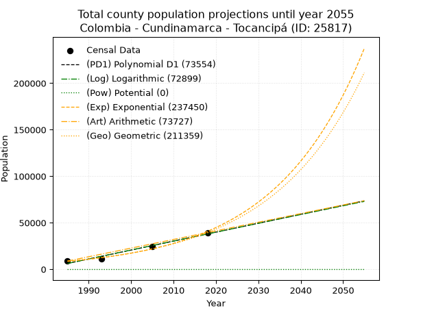
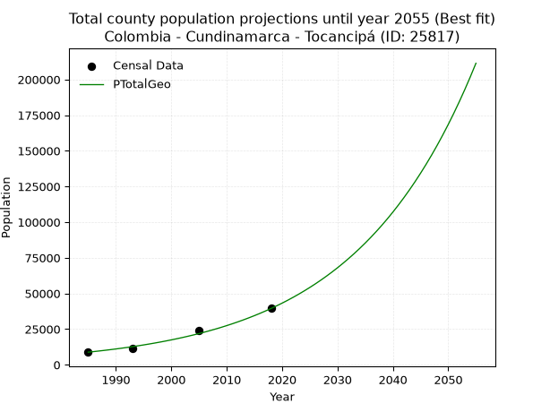
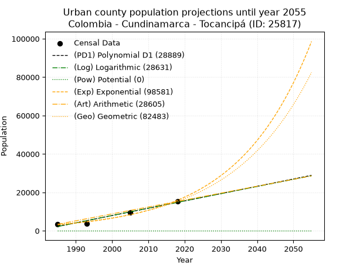
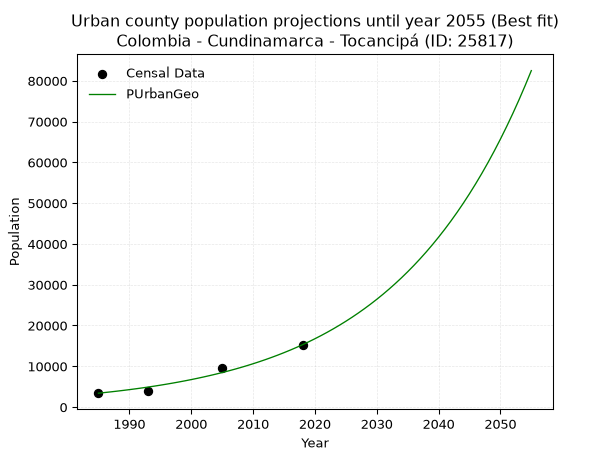
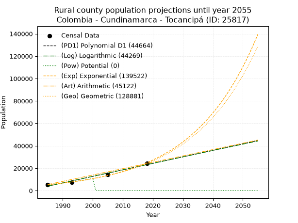
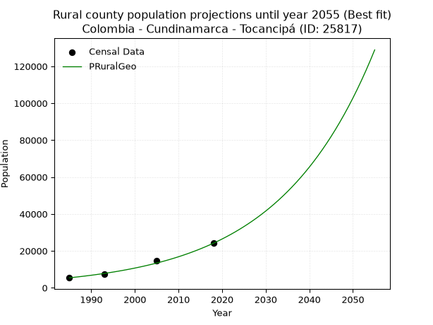

<div align="center">


</div>

# 📜 _“Population and Public Services Demand Projections (PPSD) until Year 2050 for Colombia - Cundinamarca - Tocancipá (ID: 25817)”_
Keywords: `population` `public-service` `projection` `lineal` `polynomial` `logarithmic` `potential` `exponential` `arithmetic` `geometric` `wappaus` `dane` `colombia` `south-america`

PPSD are analytical estimates used by governments and planners to anticipate future changes in population size, age distribution, and the resulting community needs for utilities, healthcare, education, and infrastructure as sizing future water treatment facilities, electrical grids, and road networks based on spatial growth.

<div align="center">

</img>

</div>


> **General running parameters**: • app_version: _v20260806_. • Python version: _3.14.7_. • Pandas version: _3.0.5_. • NumPy version: _2.5.1_. • Creates, save and include plots into reports (create_plot): _False_. • Projection until year: _2050_. • Process polynomial degree 2 and up: _False_. • Process Wappaus: _True_. • Process Wappaus: _True_. • Set negative values to zero: _True_. • Set infinite values to zero: _True_. • Drop dataset notes: _True_. 
<div align="center">

Dynamic map: [:earth_americas:Google](http://maps.google.com/maps?q=4.964640802,-73.9120696) [:earth_americas:OSM](https://www.openstreetmap.org/#map=18/4.964640802/-73.9120696&layers=P) [:earth_americas:Bing](https://www.bing.com/maps?cp=4.964640802~-73.9120696&lvl=18) [:earth_americas:Apple](https://maps.apple.com/frame?center=4.964640802%2C-73.9120696&span=0.003%2C0.006)

</div>


<div align="center">

```geojson
{
  "type": "Feature",
  "geometry": {
    "type": "Point", 
    "coordinates": [-73.9120696, 4.964640802]
  }, 
  "properties": {
    "Name": "Colombia - Cundinamarca - Tocancipá (ID: 25817)"
  }
}
```

</div>


## 0. Census Data (4 records)

Census data are official statistics collected by a government about the people and housing in a country. They usually include counts of total population, age, sex, race, income, education, and jobs.

📅Global census file: [Population.xlsx](../data/Population.xlsx)

| Source   |   Year |   CountryID | CountryName   |   StateID | StateName    |   CountyID | CountyName   |   PTotal |   PUrban |   PRural |
|:---------|-------:|------------:|:--------------|----------:|:-------------|-----------:|:-------------|---------:|---------:|---------:|
| DANE     |   1985 |          57 | Colombia      |        25 | Cundinamarca |      25817 | Tocancipá    |     8814 |     3397 |     5417 |
| DANE     |   1993 |          57 | Colombia      |        25 | Cundinamarca |      25817 | Tocancipá    |    11155 |     3861 |     7294 |
| DANE     |   2005 |          57 | Colombia      |        25 | Cundinamarca |      25817 | Tocancipá    |    24154 |     9622 |    14532 |
| DANE     |   2018 |          57 | Colombia      |        25 | Cundinamarca |      25817 | Tocancipá    |    39416 |    15281 |    24135 |

> 🔥Some records could had specific notes about the registered values or the corresponding urban or rural distribution.

📅[SUI-RUPS](https://www.datos.gov.co/Hacienda-y-Cr-dito-P-blico/Registro-nico-de-Prestadores-de-Servicios-P-blicos/4qkq-csdn/about_data) - Local public utility companies: [RUPS.csv](../data/RUPS.csv)

 | SERVICIO       | ESTADO    | NOMBRE                                                  | NIT         | DEPARTAMENTO_DOMICILIO   | MUNICIPIO_DOMICILIO   | DIRECCION                                            |   TELEFONO | EMAIL                        | TIPO_PRESTADOR                             | CLASIFICACION                 |
|:---------------|:----------|:--------------------------------------------------------|:------------|:-------------------------|:----------------------|:-----------------------------------------------------|-----------:|:-----------------------------|:-------------------------------------------|:------------------------------|
| ACUEDUCTO      | OPERATIVA | EMPRESA DE ACUEDUCTO Y ALCANTARILLADO DE BOGOTÁ E.S.P   | 899999094-1 | BOGOTA, D.C.             | BOGOTA, D.C.          | Av Calle 24 No 37 - 15                               |    3447000 | lortega@acueducto.com.co     | EMPRESA INDUSTRIAL Y COMERCIAL DEL ESTADO  | MAYOR O IGUAL A 5001 USUARIOS |
| ACUEDUCTO      | OPERATIVA | AQUAPOLIS SOCIEDAD ANONIMA E.S.P.                       | 832007545-2 | BOGOTA, D.C.             | BOGOTA, D.C.          | Av Cra 45  169 25  of 202 Centro Comercial Punto 169 |    2320402 | aquapolis@yahoo.com          | SOCIEDADES (EMPRESA DE SERVICIOS PUBLICOS) | MENOR O IGUAL A 2500 USUARIOS |
| ACUEDUCTO      | OPERATIVA | EMPRESA DE SERVICIOS PUBLICOS DE TOCANCIPA S.A.  E.S.P. | 900227413-9 | CUNDINAMARCA             | TOCANCIPA             | CALLE 10 # 6 - 63                                    |    8788339 | PUCOMERCIAL@ESPTOCANCIPA.COM | SOCIEDADES (EMPRESA DE SERVICIOS PUBLICOS) | MAYOR O IGUAL A 5001 USUARIOS |
| ALCANTARILLADO | OPERATIVA | EMPRESA DE SERVICIOS PUBLICOS DE TOCANCIPA S.A.  E.S.P. | 900227413-9 | CUNDINAMARCA             | TOCANCIPA             | CALLE 10 # 6 - 63                                    |    8788339 | PUCOMERCIAL@ESPTOCANCIPA.COM | SOCIEDADES (EMPRESA DE SERVICIOS PUBLICOS) | MAYOR O IGUAL A 5001 USUARIOS |

## 1. Total

### 1.1. Coefficients and Parameters

* (PD1) Polynomial Deg 1: 961.9883580891104, -1903332.4632677431 (lineal)
* (Log) Logarithmic: 1924820.9821145348, -14609694.959599897
* (Pow) Potential: 95.35885153962552, -310.5439746191777
* (Exp) Exponential: 0.047639172698157345, 7.224271349384788e-38
* (Art) Arithmetic: Year diff. 2018 - 1985 = 33, Population diff. 39416 - 8814 = 30602, Annual growth = 927.3333333333334
* (Geo) Geometric: Year diff. 2018 - 1985 = 33, Population diff. 39416 - 8814 = 30602, Annual growth % = 0.046434636477777236
* (Wap) Wappaus: i = 3.8454627133872417, Condition values only valid for < 200)

<sub>
Wappaus condition values: ['0.00', '3.85', '7.69', '11.54', '15.38', '19.23', '23.07', '26.92', '30.76', '34.61', '38.45', '42.30', '46.15', '49.99', '53.84', '57.68', '61.53', '65.37', '69.22', '73.06', '76.91', '80.75', '84.60', '88.45', '92.29', '96.14', '99.98', '103.83', '107.67', '111.52', '115.36', '119.21', '123.05', '126.90', '130.75', '134.59', '138.44', '142.28', '146.13', '149.97', '153.82', '157.66', '161.51', '165.35', '169.20', '173.05', '176.89', '180.74', '184.58', '188.43', '192.27', '196.12', '199.96', '203.81', '207.65', '211.50', '215.35', '219.19', '223.04', '226.88', '230.73', '234.57', '238.42', '242.26', '246.11', '249.96']
</sub>


### 1.2. Projected Dataset

|   Year |   CountyID |   PTotalPD1 |   PTotalLog |   PTotalPow |   PTotalExp |   PTotalArt |   PTotalGeo |
|-------:|-----------:|------------:|------------:|------------:|------------:|------------:|------------:|
|   1985 |      25817 |        6214 |        6191 |           0 |        8459 |        8814 |        8814 |
|   1986 |      25817 |        7176 |        7160 |           0 |        8872 |        9741 |        9223 |
|   1987 |      25817 |        8138 |        8129 |           0 |        9304 |       10669 |        9652 |
|   1988 |      25817 |        9100 |        9098 |           0 |        9758 |       11596 |       10100 |
|   1989 |      25817 |       10062 |       10066 |           0 |       10235 |       12523 |       10569 |
|   1990 |      25817 |       11024 |       11033 |           0 |       10734 |       13451 |       11059 |
|   1991 |      25817 |       11986 |       12000 |           0 |       11258 |       14378 |       11573 |
|   1992 |      25817 |       12948 |       12967 |           0 |       11807 |       15305 |       12110 |
|   1993 |      25817 |       13910 |       13933 |           0 |       12383 |       16233 |       12673 |
|   1994 |      25817 |       14872 |       14898 |           0 |       12987 |       17160 |       13261 |
|   1995 |      25817 |       15834 |       15863 |           0 |       13621 |       18087 |       13877 |
|   1996 |      25817 |       16796 |       16828 |           0 |       14286 |       19015 |       14521 |
|   1997 |      25817 |       17758 |       17792 |           0 |       14983 |       19942 |       15196 |
|   1998 |      25817 |       18720 |       18756 |           0 |       15714 |       20869 |       15901 |
|   1999 |      25817 |       19682 |       19719 |           0 |       16480 |       21797 |       16640 |
|   2000 |      25817 |       20644 |       20682 |           0 |       17284 |       22724 |       17412 |
|   2001 |      25817 |       21606 |       21644 |           0 |       18128 |       23651 |       18221 |
|   2002 |      25817 |       22568 |       22605 |           0 |       19012 |       24579 |       19067 |
|   2003 |      25817 |       23530 |       23567 |           0 |       19940 |       25506 |       19952 |
|   2004 |      25817 |       24492 |       24527 |           0 |       20913 |       26433 |       20879 |
|   2005 |      25817 |       25454 |       25488 |           0 |       21933 |       27361 |       21848 |
|   2006 |      25817 |       26416 |       26447 |           0 |       23003 |       28288 |       22863 |
|   2007 |      25817 |       27378 |       27407 |           0 |       24126 |       29215 |       23924 |
|   2008 |      25817 |       28340 |       28366 |           0 |       25303 |       30143 |       25035 |
|   2009 |      25817 |       29302 |       29324 |           0 |       26537 |       31070 |       26198 |
|   2010 |      25817 |       30264 |       30282 |           0 |       27832 |       31997 |       27414 |
|   2011 |      25817 |       31226 |       31239 |           0 |       29190 |       32925 |       28687 |
|   2012 |      25817 |       32188 |       32196 |           0 |       30614 |       33852 |       30019 |
|   2013 |      25817 |       33150 |       33152 |           0 |       32108 |       34779 |       31413 |
|   2014 |      25817 |       34112 |       34108 |           0 |       33675 |       35707 |       32872 |
|   2015 |      25817 |       35074 |       35064 |           0 |       35318 |       36634 |       34398 |
|   2016 |      25817 |       36036 |       36019 |           0 |       37041 |       37561 |       35996 |
|   2017 |      25817 |       36998 |       36973 |           0 |       38848 |       38489 |       37667 |
|   2018 |      25817 |       37960 |       37927 |           0 |       40744 |       39416 |       39416 |
|   2019 |      25817 |       38922 |       38881 |           0 |       42732 |       40343 |       41246 |
|   2020 |      25817 |       39884 |       39834 |           0 |       44817 |       41271 |       43162 |
|   2021 |      25817 |       40846 |       40787 |           0 |       47004 |       42198 |       45166 |
|   2022 |      25817 |       41808 |       41739 |           0 |       49297 |       43125 |       47263 |
|   2023 |      25817 |       42770 |       42691 |           0 |       51702 |       44053 |       49458 |
|   2024 |      25817 |       43732 |       43642 |           0 |       54225 |       44980 |       51754 |
|   2025 |      25817 |       44694 |       44593 |           0 |       56871 |       45907 |       54157 |
|   2026 |      25817 |       45656 |       45543 |           0 |       59646 |       46835 |       56672 |
|   2027 |      25817 |       46618 |       46493 |           0 |       62556 |       47762 |       59304 |
|   2028 |      25817 |       47580 |       47442 |           0 |       65608 |       48689 |       62057 |
|   2029 |      25817 |       48542 |       48391 |           0 |       68809 |       49617 |       64939 |
|   2030 |      25817 |       49504 |       49339 |           0 |       72167 |       50544 |       67954 |
|   2031 |      25817 |       50466 |       50287 |           0 |       75688 |       51471 |       71110 |
|   2032 |      25817 |       51428 |       51235 |           0 |       79381 |       52399 |       74412 |
|   2033 |      25817 |       52390 |       52182 |           0 |       83254 |       53326 |       77867 |
|   2034 |      25817 |       53352 |       53129 |           0 |       87316 |       54253 |       81483 |
|   2035 |      25817 |       54314 |       54075 |           0 |       91576 |       55181 |       85266 |
|   2036 |      25817 |       55276 |       55020 |           0 |       96045 |       56108 |       89226 |
|   2037 |      25817 |       56238 |       55965 |           0 |      100731 |       57035 |       93369 |
|   2038 |      25817 |       57200 |       56910 |           0 |      105646 |       57963 |       97705 |
|   2039 |      25817 |       58162 |       57854 |           0 |      110800 |       58890 |      102241 |
|   2040 |      25817 |       59124 |       58798 |           0 |      116207 |       59817 |      106989 |
|   2041 |      25817 |       60086 |       59741 |           0 |      121877 |       60745 |      111957 |
|   2042 |      25817 |       61048 |       60684 |           0 |      127823 |       61672 |      117156 |
|   2043 |      25817 |       62010 |       61627 |           0 |      134060 |       62599 |      122596 |
|   2044 |      25817 |       62972 |       62569 |           0 |      140601 |       63527 |      128288 |
|   2045 |      25817 |       63934 |       63510 |           0 |      147461 |       64454 |      134245 |
|   2046 |      25817 |       64896 |       64451 |           0 |      154656 |       65381 |      140479 |
|   2047 |      25817 |       65858 |       65392 |           0 |      162202 |       66309 |      147002 |
|   2048 |      25817 |       66820 |       66332 |           0 |      170116 |       67236 |      153828 |
|   2049 |      25817 |       67782 |       67271 |           0 |      178417 |       68163 |      160971 |
|   2050 |      25817 |       68744 |       68210 |           0 |      187122 |       69091 |      168446 |
<div align="center">

</img>

</div>


### 1.3. Best fit with absolute and relative error (%)

Relative error puts that difference into context by dividing the absolute error by the true value, creating a unitless ratio or percentage that shows the scale of the mistake.

Absolute and relative error

|   Year | Source   |   CountryID | CountryName   |   StateID | StateName    |   CountyID_x | CountyName   |   PTotal |   PUrban |   PRural |   CountyID_y |   PTotalPD1 |   PTotalLog |   PTotalPow |   PTotalExp |   PTotalArt |   PTotalGeo |   PTotalPD1AbsError |   PTotalLogAbsError |   PTotalPowAbsError |   PTotalExpAbsError |   PTotalArtAbsError |   PTotalGeoAbsError |   PTotalPD1RelError |   PTotalLogRelError |   PTotalPowRelError |   PTotalExpRelError |   PTotalArtRelError |   PTotalGeoRelError |
|-------:|:---------|------------:|:--------------|----------:|:-------------|-------------:|:-------------|---------:|---------:|---------:|-------------:|------------:|------------:|------------:|------------:|------------:|------------:|--------------------:|--------------------:|--------------------:|--------------------:|--------------------:|--------------------:|--------------------:|--------------------:|--------------------:|--------------------:|--------------------:|--------------------:|
|   1985 | DANE     |          57 | Colombia      |        25 | Cundinamarca |        25817 | Tocancipá    |     8814 |     3397 |     5417 |        25817 |        6214 |        6191 |           0 |        8459 |        8814 |        8814 |                2600 |                2623 |                8814 |                 355 |                   0 |                   0 |            29.4985  |            29.7595  |                 100 |             4.02768 |              0      |             0       |
|   1993 | DANE     |          57 | Colombia      |        25 | Cundinamarca |        25817 | Tocancipá    |    11155 |     3861 |     7294 |        25817 |       13910 |       13933 |           0 |       12383 |       16233 |       12673 |                2755 |                2778 |               11155 |                1228 |                5078 |                1518 |            24.6974  |            24.9036  |                 100 |            11.0085  |             45.5222 |            13.6082  |
|   2005 | DANE     |          57 | Colombia      |        25 | Cundinamarca |        25817 | Tocancipá    |    24154 |     9622 |    14532 |        25817 |       25454 |       25488 |           0 |       21933 |       27361 |       21848 |                1300 |                1334 |               24154 |                2221 |                3207 |                2306 |             5.38213 |             5.52289 |                 100 |             9.19516 |             13.2773 |             9.54707 |
|   2018 | DANE     |          57 | Colombia      |        25 | Cundinamarca |        25817 | Tocancipá    |    39416 |    15281 |    24135 |        25817 |       37960 |       37927 |           0 |       40744 |       39416 |       39416 |                1456 |                1489 |               39416 |                1328 |                   0 |                   0 |             3.69393 |             3.77765 |                 100 |             3.36919 |              0      |             0       |

Relative error mean

| Method    |   RelError | Best   |
|:----------|-----------:|:-------|
| PTotalPD1 |   15.818   |        |
| PTotalLog |   15.9909  |        |
| PTotalPow |  100       |        |
| PTotalExp |    6.90014 |        |
| PTotalArt |   14.6999  |        |
| PTotalGeo |    5.78883 | True   |

💙Best method: _**PTotalGeo**_
<div align="center">

</img>

</div>


### 1.4. Fresh water supply demand in liters per capita per day (lpcd)

The fresh water supply demand typically ranges from 100 to 300 liters per capita per day (lpcd) for standard domestic and municipal planning, though absolute survival minimums set by the World Health Organization are as low as 7.5 to 20 liters per day, and total consumption in high-income nations can exceed 400 liters.

> `CZ`: Level in meters above the sea level (masl)<br> `WS`: Fresh water supply demand in liters per capita per day (lpcd or l/h/d)<br> `WSAll`: Zonal fresh water supply demand in liters per second (l/s)<br> `A`: Zonal area in square meters<br> `DP`: Population density (people/hectare or p/ha)

Reference values (RAS Colombia)

|    CZ |   WS |
|------:|-----:|
|  1000 |  120 |
|  2000 |  130 |
| 99999 |  140 |

County shapefile geometry properties and water supply values

|   CountyID |      ATotal |   CZTotal |   WSTotal |
|-----------:|------------:|----------:|----------:|
|      25817 | 7.31481e+07 |   2642.95 |       140 |

Projected values for best method: PTotalGeo

|   CountyID |   Year |   PTotalGeo |   DPTotal |   WSTotal |   WSTotalAll |
|-----------:|-------:|------------:|----------:|----------:|-------------:|
|      25817 |   1985 |        8814 |      1.2  |       140 |      14.2819 |
|      25817 |   1986 |        9223 |      1.26 |       140 |      14.9447 |
|      25817 |   1987 |        9652 |      1.32 |       140 |      15.6398 |
|      25817 |   1988 |       10100 |      1.38 |       140 |      16.3657 |
|      25817 |   1989 |       10569 |      1.44 |       140 |      17.1257 |
|      25817 |   1990 |       11059 |      1.51 |       140 |      17.9197 |
|      25817 |   1991 |       11573 |      1.58 |       140 |      18.7525 |
|      25817 |   1992 |       12110 |      1.66 |       140 |      19.6227 |
|      25817 |   1993 |       12673 |      1.73 |       140 |      20.535  |
|      25817 |   1994 |       13261 |      1.81 |       140 |      21.4877 |
|      25817 |   1995 |       13877 |      1.9  |       140 |      22.4859 |
|      25817 |   1996 |       14521 |      1.99 |       140 |      23.5294 |
|      25817 |   1997 |       15196 |      2.08 |       140 |      24.6231 |
|      25817 |   1998 |       15901 |      2.17 |       140 |      25.7655 |
|      25817 |   1999 |       16640 |      2.27 |       140 |      26.963  |
|      25817 |   2000 |       17412 |      2.38 |       140 |      28.2139 |
|      25817 |   2001 |       18221 |      2.49 |       140 |      29.5248 |
|      25817 |   2002 |       19067 |      2.61 |       140 |      30.8956 |
|      25817 |   2003 |       19952 |      2.73 |       140 |      32.3296 |
|      25817 |   2004 |       20879 |      2.85 |       140 |      33.8317 |
|      25817 |   2005 |       21848 |      2.99 |       140 |      35.4019 |
|      25817 |   2006 |       22863 |      3.13 |       140 |      37.0465 |
|      25817 |   2007 |       23924 |      3.27 |       140 |      38.7657 |
|      25817 |   2008 |       25035 |      3.42 |       140 |      40.566  |
|      25817 |   2009 |       26198 |      3.58 |       140 |      42.4505 |
|      25817 |   2010 |       27414 |      3.75 |       140 |      44.4208 |
|      25817 |   2011 |       28687 |      3.92 |       140 |      46.4836 |
|      25817 |   2012 |       30019 |      4.1  |       140 |      48.6419 |
|      25817 |   2013 |       31413 |      4.29 |       140 |      50.9007 |
|      25817 |   2014 |       32872 |      4.49 |       140 |      53.2648 |
|      25817 |   2015 |       34398 |      4.7  |       140 |      55.7375 |
|      25817 |   2016 |       35996 |      4.92 |       140 |      58.3269 |
|      25817 |   2017 |       37667 |      5.15 |       140 |      61.0345 |
|      25817 |   2018 |       39416 |      5.39 |       140 |      63.8685 |
|      25817 |   2019 |       41246 |      5.64 |       140 |      66.8338 |
|      25817 |   2020 |       43162 |      5.9  |       140 |      69.9384 |
|      25817 |   2021 |       45166 |      6.17 |       140 |      73.1856 |
|      25817 |   2022 |       47263 |      6.46 |       140 |      76.5836 |
|      25817 |   2023 |       49458 |      6.76 |       140 |      80.1403 |
|      25817 |   2024 |       51754 |      7.08 |       140 |      83.8606 |
|      25817 |   2025 |       54157 |      7.4  |       140 |      87.7544 |
|      25817 |   2026 |       56672 |      7.75 |       140 |      91.8296 |
|      25817 |   2027 |       59304 |      8.11 |       140 |      96.0944 |
|      25817 |   2028 |       62057 |      8.48 |       140 |     100.555  |
|      25817 |   2029 |       64939 |      8.88 |       140 |     105.225  |
|      25817 |   2030 |       67954 |      9.29 |       140 |     110.111  |
|      25817 |   2031 |       71110 |      9.72 |       140 |     115.225  |
|      25817 |   2032 |       74412 |     10.17 |       140 |     120.575  |
|      25817 |   2033 |       77867 |     10.65 |       140 |     126.173  |
|      25817 |   2034 |       81483 |     11.14 |       140 |     132.033  |
|      25817 |   2035 |       85266 |     11.66 |       140 |     138.162  |
|      25817 |   2036 |       89226 |     12.2  |       140 |     144.579  |
|      25817 |   2037 |       93369 |     12.76 |       140 |     151.292  |
|      25817 |   2038 |       97705 |     13.36 |       140 |     158.318  |
|      25817 |   2039 |      102241 |     13.98 |       140 |     165.668  |
|      25817 |   2040 |      106989 |     14.63 |       140 |     173.362  |
|      25817 |   2041 |      111957 |     15.31 |       140 |     181.412  |
|      25817 |   2042 |      117156 |     16.02 |       140 |     189.836  |
|      25817 |   2043 |      122596 |     16.76 |       140 |     198.651  |
|      25817 |   2044 |      128288 |     17.54 |       140 |     207.874  |
|      25817 |   2045 |      134245 |     18.35 |       140 |     217.527  |
|      25817 |   2046 |      140479 |     19.2  |       140 |     227.628  |
|      25817 |   2047 |      147002 |     20.1  |       140 |     238.198  |
|      25817 |   2048 |      153828 |     21.03 |       140 |     249.258  |
|      25817 |   2049 |      160971 |     22.01 |       140 |     260.833  |
|      25817 |   2050 |      168446 |     23.03 |       140 |     272.945  |

## 2. Urban

### 2.1. Coefficients and Parameters

* (PD1) Polynomial Deg 1: 380.80409474106386, -753663.1405058131 (lineal)
* (Log) Logarithmic: 761949.5902880001, -5783544.691659905
* (Pow) Potential: 98.70086339916328, -321.99773215502415
* (Exp) Exponential: 0.049310719579061635, 9.665013213570387e-40
* (Art) Arithmetic: Year diff. 2018 - 1985 = 33, Population diff. 15281 - 3397 = 11884, Annual growth = 360.1212121212121
* (Geo) Geometric: Year diff. 2018 - 1985 = 33, Population diff. 15281 - 3397 = 11884, Annual growth % = 0.04662133322054807
* (Wap) Wappaus: i = 3.856100354654804, Condition values only valid for < 200)

<sub>
Wappaus condition values: ['0.00', '3.86', '7.71', '11.57', '15.42', '19.28', '23.14', '26.99', '30.85', '34.70', '38.56', '42.42', '46.27', '50.13', '53.99', '57.84', '61.70', '65.55', '69.41', '73.27', '77.12', '80.98', '84.83', '88.69', '92.55', '96.40', '100.26', '104.11', '107.97', '111.83', '115.68', '119.54', '123.40', '127.25', '131.11', '134.96', '138.82', '142.68', '146.53', '150.39', '154.24', '158.10', '161.96', '165.81', '169.67', '173.52', '177.38', '181.24', '185.09', '188.95', '192.81', '196.66', '200.52', '204.37', '208.23', '212.09', '215.94', '219.80', '223.65', '227.51', '231.37', '235.22', '239.08', '242.93', '246.79', '250.65']
</sub>


### 2.2. Projected Dataset

|   Year |   CountyID |   PUrbanPD1 |   PUrbanLog |   PUrbanPow |   PUrbanExp |   PUrbanArt |   PUrbanGeo |
|-------:|-----------:|------------:|------------:|------------:|------------:|------------:|------------:|
|   1985 |      25817 |        2233 |        2224 |           0 |        3124 |        3397 |        3397 |
|   1986 |      25817 |        2614 |        2607 |           0 |        3282 |        3757 |        3555 |
|   1987 |      25817 |        2995 |        2991 |           0 |        3448 |        4117 |        3721 |
|   1988 |      25817 |        3375 |        3374 |           0 |        3622 |        4477 |        3895 |
|   1989 |      25817 |        3756 |        3758 |           0 |        3805 |        4837 |        4076 |
|   1990 |      25817 |        4137 |        4141 |           0 |        3998 |        5198 |        4266 |
|   1991 |      25817 |        4518 |        4523 |           0 |        4200 |        5558 |        4465 |
|   1992 |      25817 |        4899 |        4906 |           0 |        4412 |        5918 |        4673 |
|   1993 |      25817 |        5279 |        5288 |           0 |        4635 |        6278 |        4891 |
|   1994 |      25817 |        5660 |        5671 |           0 |        4869 |        6638 |        5119 |
|   1995 |      25817 |        6041 |        6053 |           0 |        5115 |        6998 |        5358 |
|   1996 |      25817 |        6422 |        6434 |           0 |        5374 |        7358 |        5608 |
|   1997 |      25817 |        6803 |        6816 |           0 |        5646 |        7718 |        5869 |
|   1998 |      25817 |        7183 |        7197 |           0 |        5931 |        8079 |        6143 |
|   1999 |      25817 |        7564 |        7579 |           0 |        6231 |        8439 |        6429 |
|   2000 |      25817 |        7945 |        7960 |           0 |        6546 |        8799 |        6729 |
|   2001 |      25817 |        8326 |        8341 |           0 |        6876 |        9159 |        7043 |
|   2002 |      25817 |        8707 |        8721 |           0 |        7224 |        9519 |        7371 |
|   2003 |      25817 |        9087 |        9102 |           0 |        7589 |        9879 |        7715 |
|   2004 |      25817 |        9468 |        9482 |           0 |        7973 |       10239 |        8074 |
|   2005 |      25817 |        9849 |        9862 |           0 |        8376 |       10599 |        8451 |
|   2006 |      25817 |       10230 |       10242 |           0 |        8799 |       10960 |        8845 |
|   2007 |      25817 |       10611 |       10622 |           0 |        9244 |       11320 |        9257 |
|   2008 |      25817 |       10991 |       11002 |           0 |        9711 |       11680 |        9688 |
|   2009 |      25817 |       11372 |       11381 |           0 |       10202 |       12040 |       10140 |
|   2010 |      25817 |       11753 |       11760 |           0 |       10718 |       12400 |       10613 |
|   2011 |      25817 |       12134 |       12139 |           0 |       11259 |       12760 |       11108 |
|   2012 |      25817 |       12515 |       12518 |           0 |       11829 |       13120 |       11626 |
|   2013 |      25817 |       12896 |       12896 |           0 |       12427 |       13480 |       12168 |
|   2014 |      25817 |       13276 |       13275 |           0 |       13055 |       13841 |       12735 |
|   2015 |      25817 |       13657 |       13653 |           0 |       13714 |       14201 |       13329 |
|   2016 |      25817 |       14038 |       14031 |           0 |       14408 |       14561 |       13950 |
|   2017 |      25817 |       14419 |       14409 |           0 |       15136 |       14921 |       14600 |
|   2018 |      25817 |       14800 |       14787 |           0 |       15901 |       15281 |       15281 |
|   2019 |      25817 |       15180 |       15164 |           0 |       16705 |       15641 |       15993 |
|   2020 |      25817 |       15561 |       15541 |           0 |       17549 |       16001 |       16739 |
|   2021 |      25817 |       15942 |       15919 |           0 |       18436 |       16361 |       17519 |
|   2022 |      25817 |       16323 |       16296 |           0 |       19368 |       16721 |       18336 |
|   2023 |      25817 |       16704 |       16672 |           0 |       20347 |       17082 |       19191 |
|   2024 |      25817 |       17084 |       17049 |           0 |       21376 |       17442 |       20086 |
|   2025 |      25817 |       17465 |       17425 |           0 |       22456 |       17802 |       21022 |
|   2026 |      25817 |       17846 |       17801 |           0 |       23591 |       18162 |       22002 |
|   2027 |      25817 |       18227 |       18177 |           0 |       24784 |       18522 |       23028 |
|   2028 |      25817 |       18608 |       18553 |           0 |       26036 |       18882 |       24102 |
|   2029 |      25817 |       18988 |       18929 |           0 |       27352 |       19242 |       25225 |
|   2030 |      25817 |       19369 |       19304 |           0 |       28735 |       19602 |       26401 |
|   2031 |      25817 |       19750 |       19679 |           0 |       30187 |       19963 |       27632 |
|   2032 |      25817 |       20131 |       20055 |           0 |       31713 |       20323 |       28921 |
|   2033 |      25817 |       20512 |       20429 |           0 |       33316 |       20683 |       30269 |
|   2034 |      25817 |       20892 |       20804 |           0 |       35000 |       21043 |       31680 |
|   2035 |      25817 |       21273 |       21179 |           0 |       36769 |       21403 |       33157 |
|   2036 |      25817 |       21654 |       21553 |           0 |       38628 |       21763 |       34703 |
|   2037 |      25817 |       22035 |       21927 |           0 |       40581 |       22123 |       36321 |
|   2038 |      25817 |       22416 |       22301 |           0 |       42632 |       22483 |       38014 |
|   2039 |      25817 |       22796 |       22675 |           0 |       44787 |       22844 |       39786 |
|   2040 |      25817 |       23177 |       23048 |           0 |       47050 |       23204 |       41641 |
|   2041 |      25817 |       23558 |       23422 |           0 |       49429 |       23564 |       43583 |
|   2042 |      25817 |       23939 |       23795 |           0 |       51927 |       23924 |       45614 |
|   2043 |      25817 |       24320 |       24168 |           0 |       54552 |       24284 |       47741 |
|   2044 |      25817 |       24700 |       24541 |           0 |       57309 |       24644 |       49967 |
|   2045 |      25817 |       25081 |       24914 |           0 |       60206 |       25004 |       52296 |
|   2046 |      25817 |       25462 |       25286 |           0 |       63249 |       25364 |       54734 |
|   2047 |      25817 |       25843 |       25658 |           0 |       66446 |       25725 |       57286 |
|   2048 |      25817 |       26224 |       26031 |           0 |       69805 |       26085 |       59957 |
|   2049 |      25817 |       26604 |       26403 |           0 |       73334 |       26445 |       62752 |
|   2050 |      25817 |       26985 |       26774 |           0 |       77040 |       26805 |       65678 |
<div align="center">

</img>

</div>


### 2.3. Best fit with absolute and relative error (%)

Relative error puts that difference into context by dividing the absolute error by the true value, creating a unitless ratio or percentage that shows the scale of the mistake.

Absolute and relative error

|   Year | Source   |   CountryID | CountryName   |   StateID | StateName    |   CountyID_x | CountyName   |   PTotal |   PUrban |   PRural |   CountyID_y |   PUrbanPD1 |   PUrbanLog |   PUrbanPow |   PUrbanExp |   PUrbanArt |   PUrbanGeo |   PUrbanPD1AbsError |   PUrbanLogAbsError |   PUrbanPowAbsError |   PUrbanExpAbsError |   PUrbanArtAbsError |   PUrbanGeoAbsError |   PUrbanPD1RelError |   PUrbanLogRelError |   PUrbanPowRelError |   PUrbanExpRelError |   PUrbanArtRelError |   PUrbanGeoRelError |
|-------:|:---------|------------:|:--------------|----------:|:-------------|-------------:|:-------------|---------:|---------:|---------:|-------------:|------------:|------------:|------------:|------------:|------------:|------------:|--------------------:|--------------------:|--------------------:|--------------------:|--------------------:|--------------------:|--------------------:|--------------------:|--------------------:|--------------------:|--------------------:|--------------------:|
|   1985 | DANE     |          57 | Colombia      |        25 | Cundinamarca |        25817 | Tocancipá    |     8814 |     3397 |     5417 |        25817 |        2233 |        2224 |           0 |        3124 |        3397 |        3397 |                1164 |                1173 |                3397 |                 273 |                   0 |                   0 |            34.2655  |            34.5305  |                 100 |             8.0365  |              0      |               0     |
|   1993 | DANE     |          57 | Colombia      |        25 | Cundinamarca |        25817 | Tocancipá    |    11155 |     3861 |     7294 |        25817 |        5279 |        5288 |           0 |        4635 |        6278 |        4891 |                1418 |                1427 |                3861 |                 774 |                2417 |                1030 |            36.7262  |            36.9593  |                 100 |            20.0466  |             62.6004 |              26.677 |
|   2005 | DANE     |          57 | Colombia      |        25 | Cundinamarca |        25817 | Tocancipá    |    24154 |     9622 |    14532 |        25817 |        9849 |        9862 |           0 |        8376 |       10599 |        8451 |                 227 |                 240 |                9622 |                1246 |                 977 |                1171 |             2.35918 |             2.49428 |                 100 |            12.9495  |             10.1538 |              12.17  |
|   2018 | DANE     |          57 | Colombia      |        25 | Cundinamarca |        25817 | Tocancipá    |    39416 |    15281 |    24135 |        25817 |       14800 |       14787 |           0 |       15901 |       15281 |       15281 |                 481 |                 494 |               15281 |                 620 |                   0 |                   0 |             3.1477  |             3.23277 |                 100 |             4.05733 |              0      |               0     |

Relative error mean

| Method    |   RelError | Best   |
|:----------|-----------:|:-------|
| PUrbanPD1 |   19.1247  |        |
| PUrbanLog |   19.3042  |        |
| PUrbanPow |  100       |        |
| PUrbanExp |   11.2725  |        |
| PUrbanArt |   18.1885  |        |
| PUrbanGeo |    9.71176 | True   |

💙Best method: _**PUrbanGeo**_
<div align="center">

</img>

</div>


### 2.4. Fresh water supply demand in liters per capita per day (lpcd)

The fresh water supply demand typically ranges from 100 to 300 liters per capita per day (lpcd) for standard domestic and municipal planning, though absolute survival minimums set by the World Health Organization are as low as 7.5 to 20 liters per day, and total consumption in high-income nations can exceed 400 liters.

> `CZ`: Level in meters above the sea level (masl)<br> `WS`: Fresh water supply demand in liters per capita per day (lpcd or l/h/d)<br> `WSAll`: Zonal fresh water supply demand in liters per second (l/s)<br> `A`: Zonal area in square meters<br> `DP`: Population density (people/hectare or p/ha)

Reference values (RAS Colombia)

|    CZ |   WS |
|------:|-----:|
|  1000 |  120 |
|  2000 |  130 |
| 99999 |  140 |

County shapefile geometry properties and water supply values

|   CountyID |      AUrban |   CZUrban |   WSUrban |
|-----------:|------------:|----------:|----------:|
|      25817 | 1.70163e+06 |   2573.21 |       140 |

Projected values for best method: PUrbanGeo

|   CountyID |   Year |   PUrbanGeo |   DPUrban |   WSUrban |   WSUrbanAll |
|-----------:|-------:|------------:|----------:|----------:|-------------:|
|      25817 |   1985 |        3397 |     19.96 |       140 |      5.5044  |
|      25817 |   1986 |        3555 |     20.89 |       140 |      5.76042 |
|      25817 |   1987 |        3721 |     21.87 |       140 |      6.0294  |
|      25817 |   1988 |        3895 |     22.89 |       140 |      6.31134 |
|      25817 |   1989 |        4076 |     23.95 |       140 |      6.60463 |
|      25817 |   1990 |        4266 |     25.07 |       140 |      6.9125  |
|      25817 |   1991 |        4465 |     26.24 |       140 |      7.23495 |
|      25817 |   1992 |        4673 |     27.46 |       140 |      7.57199 |
|      25817 |   1993 |        4891 |     28.74 |       140 |      7.92523 |
|      25817 |   1994 |        5119 |     30.08 |       140 |      8.29468 |
|      25817 |   1995 |        5358 |     31.49 |       140 |      8.68194 |
|      25817 |   1996 |        5608 |     32.96 |       140 |      9.08704 |
|      25817 |   1997 |        5869 |     34.49 |       140 |      9.50995 |
|      25817 |   1998 |        6143 |     36.1  |       140 |      9.95394 |
|      25817 |   1999 |        6429 |     37.78 |       140 |     10.4174  |
|      25817 |   2000 |        6729 |     39.54 |       140 |     10.9035  |
|      25817 |   2001 |        7043 |     41.39 |       140 |     11.4123  |
|      25817 |   2002 |        7371 |     43.32 |       140 |     11.9437  |
|      25817 |   2003 |        7715 |     45.34 |       140 |     12.5012  |
|      25817 |   2004 |        8074 |     47.45 |       140 |     13.0829  |
|      25817 |   2005 |        8451 |     49.66 |       140 |     13.6937  |
|      25817 |   2006 |        8845 |     51.98 |       140 |     14.3322  |
|      25817 |   2007 |        9257 |     54.4  |       140 |     14.9998  |
|      25817 |   2008 |        9688 |     56.93 |       140 |     15.6981  |
|      25817 |   2009 |       10140 |     59.59 |       140 |     16.4306  |
|      25817 |   2010 |       10613 |     62.37 |       140 |     17.197   |
|      25817 |   2011 |       11108 |     65.28 |       140 |     17.9991  |
|      25817 |   2012 |       11626 |     68.32 |       140 |     18.8384  |
|      25817 |   2013 |       12168 |     71.51 |       140 |     19.7167  |
|      25817 |   2014 |       12735 |     74.84 |       140 |     20.6354  |
|      25817 |   2015 |       13329 |     78.33 |       140 |     21.5979  |
|      25817 |   2016 |       13950 |     81.98 |       140 |     22.6042  |
|      25817 |   2017 |       14600 |     85.8  |       140 |     23.6574  |
|      25817 |   2018 |       15281 |     89.8  |       140 |     24.7609  |
|      25817 |   2019 |       15993 |     93.99 |       140 |     25.9146  |
|      25817 |   2020 |       16739 |     98.37 |       140 |     27.1234  |
|      25817 |   2021 |       17519 |    102.95 |       140 |     28.3873  |
|      25817 |   2022 |       18336 |    107.76 |       140 |     29.7111  |
|      25817 |   2023 |       19191 |    112.78 |       140 |     31.0965  |
|      25817 |   2024 |       20086 |    118.04 |       140 |     32.5468  |
|      25817 |   2025 |       21022 |    123.54 |       140 |     34.0634  |
|      25817 |   2026 |       22002 |    129.3  |       140 |     35.6514  |
|      25817 |   2027 |       23028 |    135.33 |       140 |     37.3139  |
|      25817 |   2028 |       24102 |    141.64 |       140 |     39.0542  |
|      25817 |   2029 |       25225 |    148.24 |       140 |     40.8738  |
|      25817 |   2030 |       26401 |    155.15 |       140 |     42.7794  |
|      25817 |   2031 |       27632 |    162.39 |       140 |     44.7741  |
|      25817 |   2032 |       28921 |    169.96 |       140 |     46.8627  |
|      25817 |   2033 |       30269 |    177.88 |       140 |     49.047   |
|      25817 |   2034 |       31680 |    186.17 |       140 |     51.3333  |
|      25817 |   2035 |       33157 |    194.85 |       140 |     53.7266  |
|      25817 |   2036 |       34703 |    203.94 |       140 |     56.2317  |
|      25817 |   2037 |       36321 |    213.45 |       140 |     58.8535  |
|      25817 |   2038 |       38014 |    223.4  |       140 |     61.5968  |
|      25817 |   2039 |       39786 |    233.81 |       140 |     64.4681  |
|      25817 |   2040 |       41641 |    244.71 |       140 |     67.4738  |
|      25817 |   2041 |       43583 |    256.12 |       140 |     70.6206  |
|      25817 |   2042 |       45614 |    268.06 |       140 |     73.9116  |
|      25817 |   2043 |       47741 |    280.56 |       140 |     77.3581  |
|      25817 |   2044 |       49967 |    293.64 |       140 |     80.965   |
|      25817 |   2045 |       52296 |    307.33 |       140 |     84.7389  |
|      25817 |   2046 |       54734 |    321.66 |       140 |     88.6894  |
|      25817 |   2047 |       57286 |    336.65 |       140 |     92.8245  |
|      25817 |   2048 |       59957 |    352.35 |       140 |     97.1525  |
|      25817 |   2049 |       62752 |    368.78 |       140 |    101.681   |
|      25817 |   2050 |       65678 |    385.97 |       140 |    106.423   |

## 3. Rural

### 3.1. Coefficients and Parameters

* (PD1) Polynomial Deg 1: 581.1842633480464, -1149669.3227619298 (lineal)
* (Log) Logarithmic: 1162871.391826535, -8826150.267939996
* (Pow) Potential: 93.38009176902911, -304.2193402891879
* (Exp) Exponential: 0.0466496205714067, 3.243499306760383e-37
* (Art) Arithmetic: Year diff. 2018 - 1985 = 33, Population diff. 24135 - 5417 = 18718, Annual growth = 567.2121212121212
* (Geo) Geometric: Year diff. 2018 - 1985 = 33, Population diff. 24135 - 5417 = 18718, Annual growth % = 0.046317012851903705
* (Wap) Wappaus: i = 3.8387393151876097, Condition values only valid for < 200)

<sub>
Wappaus condition values: ['0.00', '3.84', '7.68', '11.52', '15.35', '19.19', '23.03', '26.87', '30.71', '34.55', '38.39', '42.23', '46.06', '49.90', '53.74', '57.58', '61.42', '65.26', '69.10', '72.94', '76.77', '80.61', '84.45', '88.29', '92.13', '95.97', '99.81', '103.65', '107.48', '111.32', '115.16', '119.00', '122.84', '126.68', '130.52', '134.36', '138.19', '142.03', '145.87', '149.71', '153.55', '157.39', '161.23', '165.07', '168.90', '172.74', '176.58', '180.42', '184.26', '188.10', '191.94', '195.78', '199.61', '203.45', '207.29', '211.13', '214.97', '218.81', '222.65', '226.49', '230.32', '234.16', '238.00', '241.84', '245.68', '249.52']
</sub>


### 3.2. Projected Dataset

|   Year |   CountyID |   PRuralPD1 |   PRuralLog |   PRuralPow |   PRuralExp |   PRuralArt |   PRuralGeo |
|-------:|-----------:|------------:|------------:|------------:|------------:|------------:|------------:|
|   1985 |      25817 |        3981 |        3967 |        5319 |        5327 |        5417 |        5417 |
|   1986 |      25817 |        4563 |        4553 |        5575 |        5581 |        5984 |        5668 |
|   1987 |      25817 |        5144 |        5138 |        5844 |        5848 |        6551 |        5930 |
|   1988 |      25817 |        5725 |        5724 |        6125 |        6127 |        7119 |        6205 |
|   1989 |      25817 |        6306 |        6308 |        6419 |        6420 |        7686 |        6493 |
|   1990 |      25817 |        6887 |        6893 |        6728 |        6726 |        8253 |        6793 |
|   1991 |      25817 |        7469 |        7477 |        7051 |        7047 |        8820 |        7108 |
|   1992 |      25817 |        8050 |        8061 |        7389 |        7384 |        9387 |        7437 |
|   1993 |      25817 |        8631 |        8645 |        7744 |        7736 |        9955 |        7782 |
|   1994 |      25817 |        9212 |        9228 |        8115 |        8106 |       10522 |        8142 |
|   1995 |      25817 |        9793 |        9811 |        8504 |        8493 |       11089 |        8519 |
|   1996 |      25817 |       10374 |       10394 |        8912 |        8899 |       11656 |        8914 |
|   1997 |      25817 |       10956 |       10976 |        9338 |        9324 |       12224 |        9326 |
|   1998 |      25817 |       11537 |       11558 |        9785 |        9769 |       12791 |        9758 |
|   1999 |      25817 |       12118 |       12140 |       10253 |       10235 |       13358 |       10210 |
|   2000 |      25817 |       12699 |       12722 |       10743 |       10724 |       13925 |       10683 |
|   2001 |      25817 |       13280 |       13303 |           0 |       11236 |       14492 |       11178 |
|   2002 |      25817 |       13862 |       13884 |           0 |       11773 |       15060 |       11696 |
|   2003 |      25817 |       14443 |       14465 |           0 |       12335 |       15627 |       12238 |
|   2004 |      25817 |       15024 |       15045 |           0 |       12924 |       16194 |       12804 |
|   2005 |      25817 |       15605 |       15625 |           0 |       13541 |       16761 |       13398 |
|   2006 |      25817 |       16186 |       16205 |           0 |       14188 |       17328 |       14018 |
|   2007 |      25817 |       16767 |       16785 |           0 |       14865 |       17896 |       14667 |
|   2008 |      25817 |       17349 |       17364 |           0 |       15575 |       18463 |       15347 |
|   2009 |      25817 |       17930 |       17943 |           0 |       16319 |       19030 |       16057 |
|   2010 |      25817 |       18511 |       18522 |           0 |       17098 |       19597 |       16801 |
|   2011 |      25817 |       19092 |       19100 |           0 |       17915 |       20165 |       17579 |
|   2012 |      25817 |       19673 |       19678 |           0 |       18770 |       20732 |       18394 |
|   2013 |      25817 |       20255 |       20256 |           0 |       19667 |       21299 |       19246 |
|   2014 |      25817 |       20836 |       20833 |           0 |       20606 |       21866 |       20137 |
|   2015 |      25817 |       21417 |       21411 |           0 |       21590 |       22433 |       21070 |
|   2016 |      25817 |       21998 |       21988 |           0 |       22621 |       23001 |       22046 |
|   2017 |      25817 |       22579 |       22564 |           0 |       23701 |       23568 |       23067 |
|   2018 |      25817 |       23161 |       23141 |           0 |       24833 |       24135 |       24135 |
|   2019 |      25817 |       23742 |       23717 |           0 |       26019 |       24702 |       25253 |
|   2020 |      25817 |       24323 |       24293 |           0 |       27262 |       25269 |       26422 |
|   2021 |      25817 |       24904 |       24868 |           0 |       28564 |       25837 |       27646 |
|   2022 |      25817 |       25485 |       25443 |           0 |       29928 |       26404 |       28927 |
|   2023 |      25817 |       26066 |       26018 |           0 |       31357 |       26971 |       30267 |
|   2024 |      25817 |       26648 |       26593 |           0 |       32854 |       27538 |       31668 |
|   2025 |      25817 |       27229 |       27168 |           0 |       34423 |       28105 |       33135 |
|   2026 |      25817 |       27810 |       27742 |           0 |       36067 |       28673 |       34670 |
|   2027 |      25817 |       28391 |       28315 |           0 |       37789 |       29240 |       36276 |
|   2028 |      25817 |       28972 |       28889 |           0 |       39594 |       29807 |       37956 |
|   2029 |      25817 |       29554 |       29462 |           0 |       41485 |       30374 |       39714 |
|   2030 |      25817 |       30135 |       30035 |           0 |       43466 |       30942 |       41553 |
|   2031 |      25817 |       30716 |       30608 |           0 |       45542 |       31509 |       43478 |
|   2032 |      25817 |       31297 |       31180 |           0 |       47717 |       32076 |       45492 |
|   2033 |      25817 |       31878 |       31753 |           0 |       49995 |       32643 |       47599 |
|   2034 |      25817 |       32459 |       32324 |           0 |       52383 |       33210 |       49804 |
|   2035 |      25817 |       33041 |       32896 |           0 |       54884 |       33778 |       52110 |
|   2036 |      25817 |       33622 |       33467 |           0 |       57505 |       34345 |       54524 |
|   2037 |      25817 |       34203 |       34038 |           0 |       60251 |       34912 |       57049 |
|   2038 |      25817 |       34784 |       34609 |           0 |       63129 |       35479 |       59692 |
|   2039 |      25817 |       35365 |       35179 |           0 |       66143 |       36046 |       62456 |
|   2040 |      25817 |       35947 |       35750 |           0 |       69302 |       36614 |       65349 |
|   2041 |      25817 |       36528 |       36320 |           0 |       72612 |       37181 |       68376 |
|   2042 |      25817 |       37109 |       36889 |           0 |       76079 |       37748 |       71543 |
|   2043 |      25817 |       37690 |       37459 |           0 |       79712 |       38315 |       74856 |
|   2044 |      25817 |       38271 |       38028 |           0 |       83519 |       38883 |       78324 |
|   2045 |      25817 |       38852 |       38596 |           0 |       87507 |       39450 |       81951 |
|   2046 |      25817 |       39434 |       39165 |           0 |       91686 |       40017 |       85747 |
|   2047 |      25817 |       40015 |       39733 |           0 |       96065 |       40584 |       89719 |
|   2048 |      25817 |       40596 |       40301 |           0 |      100652 |       41151 |       93874 |
|   2049 |      25817 |       41177 |       40869 |           0 |      105459 |       41719 |       98222 |
|   2050 |      25817 |       41758 |       41436 |           0 |      110495 |       42286 |      102771 |
<div align="center">

</img>

</div>


### 3.3. Best fit with absolute and relative error (%)

Relative error puts that difference into context by dividing the absolute error by the true value, creating a unitless ratio or percentage that shows the scale of the mistake.

Absolute and relative error

|   Year | Source   |   CountryID | CountryName   |   StateID | StateName    |   CountyID_x | CountyName   |   PTotal |   PUrban |   PRural |   CountyID_y |   PRuralPD1 |   PRuralLog |   PRuralPow |   PRuralExp |   PRuralArt |   PRuralGeo |   PRuralPD1AbsError |   PRuralLogAbsError |   PRuralPowAbsError |   PRuralExpAbsError |   PRuralArtAbsError |   PRuralGeoAbsError |   PRuralPD1RelError |   PRuralLogRelError |   PRuralPowRelError |   PRuralExpRelError |   PRuralArtRelError |   PRuralGeoRelError |
|-------:|:---------|------------:|:--------------|----------:|:-------------|-------------:|:-------------|---------:|---------:|---------:|-------------:|------------:|------------:|------------:|------------:|------------:|------------:|--------------------:|--------------------:|--------------------:|--------------------:|--------------------:|--------------------:|--------------------:|--------------------:|--------------------:|--------------------:|--------------------:|--------------------:|
|   1985 | DANE     |          57 | Colombia      |        25 | Cundinamarca |        25817 | Tocancipá    |     8814 |     3397 |     5417 |        25817 |        3981 |        3967 |        5319 |        5327 |        5417 |        5417 |                1436 |                1450 |                  98 |                  90 |                   0 |                   0 |            26.5091  |            26.7676  |             1.80912 |             1.66144 |              0      |             0       |
|   1993 | DANE     |          57 | Colombia      |        25 | Cundinamarca |        25817 | Tocancipá    |    11155 |     3861 |     7294 |        25817 |        8631 |        8645 |        7744 |        7736 |        9955 |        7782 |                1337 |                1351 |                 450 |                 442 |                2661 |                 488 |            18.3301  |            18.5221  |             6.16945 |             6.05978 |             36.482  |             6.69043 |
|   2005 | DANE     |          57 | Colombia      |        25 | Cundinamarca |        25817 | Tocancipá    |    24154 |     9622 |    14532 |        25817 |       15605 |       15625 |           0 |       13541 |       16761 |       13398 |                1073 |                1093 |               14532 |                 991 |                2229 |                1134 |             7.3837  |             7.52133 |           100       |             6.81943 |             15.3386 |             7.80347 |
|   2018 | DANE     |          57 | Colombia      |        25 | Cundinamarca |        25817 | Tocancipá    |    39416 |    15281 |    24135 |        25817 |       23161 |       23141 |           0 |       24833 |       24135 |       24135 |                 974 |                 994 |               24135 |                 698 |                   0 |                   0 |             4.03563 |             4.1185  |           100       |             2.89207 |              0      |             0       |

Relative error mean

| Method    |   RelError | Best   |
|:----------|-----------:|:-------|
| PRuralPD1 |   14.0647  |        |
| PRuralLog |   14.2324  |        |
| PRuralPow |   51.9946  |        |
| PRuralExp |    4.35818 |        |
| PRuralArt |   12.9552  |        |
| PRuralGeo |    3.62347 | True   |

💙Best method: _**PRuralGeo**_
<div align="center">

</img>

</div>


### 3.4. Fresh water supply demand in liters per capita per day (lpcd)

The fresh water supply demand typically ranges from 100 to 300 liters per capita per day (lpcd) for standard domestic and municipal planning, though absolute survival minimums set by the World Health Organization are as low as 7.5 to 20 liters per day, and total consumption in high-income nations can exceed 400 liters.

> `CZ`: Level in meters above the sea level (masl)<br> `WS`: Fresh water supply demand in liters per capita per day (lpcd or l/h/d)<br> `WSAll`: Zonal fresh water supply demand in liters per second (l/s)<br> `A`: Zonal area in square meters<br> `DP`: Population density (people/hectare or p/ha)

Reference values (RAS Colombia)

|    CZ |   WS |
|------:|-----:|
|  1000 |  120 |
|  2000 |  130 |
| 99999 |  140 |

County shapefile geometry properties and water supply values

|   CountyID |      ARural |   CZRural |   WSRural |
|-----------:|------------:|----------:|----------:|
|      25817 | 7.14465e+07 |   2644.65 |       140 |

Projected values for best method: PRuralGeo

|   CountyID |   Year |   PRuralGeo |   DPRural |   WSRural |   WSRuralAll |
|-----------:|-------:|------------:|----------:|----------:|-------------:|
|      25817 |   1985 |        5417 |      0.76 |       140 |      8.77755 |
|      25817 |   1986 |        5668 |      0.79 |       140 |      9.18426 |
|      25817 |   1987 |        5930 |      0.83 |       140 |      9.6088  |
|      25817 |   1988 |        6205 |      0.87 |       140 |     10.0544  |
|      25817 |   1989 |        6493 |      0.91 |       140 |     10.5211  |
|      25817 |   1990 |        6793 |      0.95 |       140 |     11.0072  |
|      25817 |   1991 |        7108 |      0.99 |       140 |     11.5176  |
|      25817 |   1992 |        7437 |      1.04 |       140 |     12.0507  |
|      25817 |   1993 |        7782 |      1.09 |       140 |     12.6097  |
|      25817 |   1994 |        8142 |      1.14 |       140 |     13.1931  |
|      25817 |   1995 |        8519 |      1.19 |       140 |     13.8039  |
|      25817 |   1996 |        8914 |      1.25 |       140 |     14.444   |
|      25817 |   1997 |        9326 |      1.31 |       140 |     15.1116  |
|      25817 |   1998 |        9758 |      1.37 |       140 |     15.8116  |
|      25817 |   1999 |       10210 |      1.43 |       140 |     16.544   |
|      25817 |   2000 |       10683 |      1.5  |       140 |     17.3104  |
|      25817 |   2001 |       11178 |      1.56 |       140 |     18.1125  |
|      25817 |   2002 |       11696 |      1.64 |       140 |     18.9519  |
|      25817 |   2003 |       12238 |      1.71 |       140 |     19.8301  |
|      25817 |   2004 |       12804 |      1.79 |       140 |     20.7472  |
|      25817 |   2005 |       13398 |      1.88 |       140 |     21.7097  |
|      25817 |   2006 |       14018 |      1.96 |       140 |     22.7144  |
|      25817 |   2007 |       14667 |      2.05 |       140 |     23.766   |
|      25817 |   2008 |       15347 |      2.15 |       140 |     24.8678  |
|      25817 |   2009 |       16057 |      2.25 |       140 |     26.0183  |
|      25817 |   2010 |       16801 |      2.35 |       140 |     27.2238  |
|      25817 |   2011 |       17579 |      2.46 |       140 |     28.4845  |
|      25817 |   2012 |       18394 |      2.57 |       140 |     29.8051  |
|      25817 |   2013 |       19246 |      2.69 |       140 |     31.1856  |
|      25817 |   2014 |       20137 |      2.82 |       140 |     32.6294  |
|      25817 |   2015 |       21070 |      2.95 |       140 |     34.1412  |
|      25817 |   2016 |       22046 |      3.09 |       140 |     35.7227  |
|      25817 |   2017 |       23067 |      3.23 |       140 |     37.3771  |
|      25817 |   2018 |       24135 |      3.38 |       140 |     39.1076  |
|      25817 |   2019 |       25253 |      3.53 |       140 |     40.9192  |
|      25817 |   2020 |       26422 |      3.7  |       140 |     42.8134  |
|      25817 |   2021 |       27646 |      3.87 |       140 |     44.7968  |
|      25817 |   2022 |       28927 |      4.05 |       140 |     46.8725  |
|      25817 |   2023 |       30267 |      4.24 |       140 |     49.0438  |
|      25817 |   2024 |       31668 |      4.43 |       140 |     51.3139  |
|      25817 |   2025 |       33135 |      4.64 |       140 |     53.691   |
|      25817 |   2026 |       34670 |      4.85 |       140 |     56.1782  |
|      25817 |   2027 |       36276 |      5.08 |       140 |     58.7806  |
|      25817 |   2028 |       37956 |      5.31 |       140 |     61.5028  |
|      25817 |   2029 |       39714 |      5.56 |       140 |     64.3514  |
|      25817 |   2030 |       41553 |      5.82 |       140 |     67.3312  |
|      25817 |   2031 |       43478 |      6.09 |       140 |     70.4505  |
|      25817 |   2032 |       45492 |      6.37 |       140 |     73.7139  |
|      25817 |   2033 |       47599 |      6.66 |       140 |     77.128   |
|      25817 |   2034 |       49804 |      6.97 |       140 |     80.7009  |
|      25817 |   2035 |       52110 |      7.29 |       140 |     84.4375  |
|      25817 |   2036 |       54524 |      7.63 |       140 |     88.3491  |
|      25817 |   2037 |       57049 |      7.98 |       140 |     92.4405  |
|      25817 |   2038 |       59692 |      8.35 |       140 |     96.7231  |
|      25817 |   2039 |       62456 |      8.74 |       140 |    101.202   |
|      25817 |   2040 |       65349 |      9.15 |       140 |    105.89    |
|      25817 |   2041 |       68376 |      9.57 |       140 |    110.794   |
|      25817 |   2042 |       71543 |     10.01 |       140 |    115.926   |
|      25817 |   2043 |       74856 |     10.48 |       140 |    121.294   |
|      25817 |   2044 |       78324 |     10.96 |       140 |    126.914   |
|      25817 |   2045 |       81951 |     11.47 |       140 |    132.791   |
|      25817 |   2046 |       85747 |     12    |       140 |    138.942   |
|      25817 |   2047 |       89719 |     12.56 |       140 |    145.378   |
|      25817 |   2048 |       93874 |     13.14 |       140 |    152.111   |
|      25817 |   2049 |       98222 |     13.75 |       140 |    159.156   |
|      25817 |   2050 |      102771 |     14.38 |       140 |    166.527   |

#

<div align="center"><br><sub>Share this research</sub></div><br>

<sub>**APPS & TOOLS & CONTENT DISCLAIMER**: • NO WARRANTY - This content and software is provided by <a href="https://github.com/rcfdtools" target="_blank">github.com/rcfdtools</a> "as is", without any express or implied warranty, including warranties of merchantability, fitness for a particular purpose, or non-infringement. There is no guarantee that the software will be error-free or operate without interruption. • LIMITATION OF LIABILITY - Neither the authors nor copyright holders will be liable for claims or damages arising from the software or its use. You are responsible for determining if the software is appropriate for your use and assume all associated risks, including errors, legal compliance, and data loss. • NO PROFESSIONAL ADVICE - The software provides general information and does not offer professional advice. It should not replace consultation with professional advisors. [Clauses and global license for rcfdtools use.](https://github.com/rcfdtools/rcfdtools/blob/main/LICENSE.md)</sub>

| [:house: Home](Readme.md)  | [:beginner: Help / Collab](https://github.com/rcfdtools/R.HydroTools/discussions/31) |
|----------------------------|-------------------------------------------------------------------------------------------|