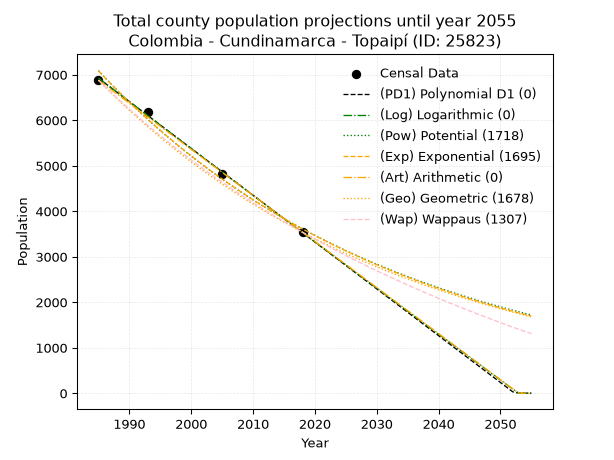
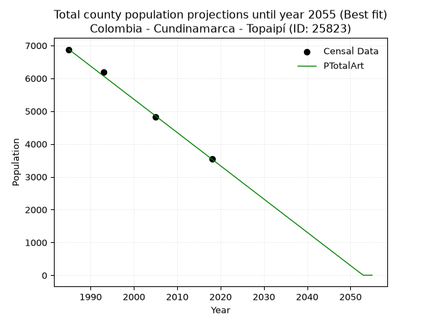
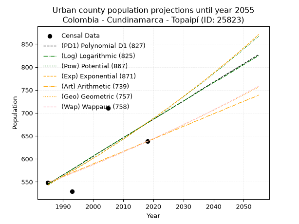
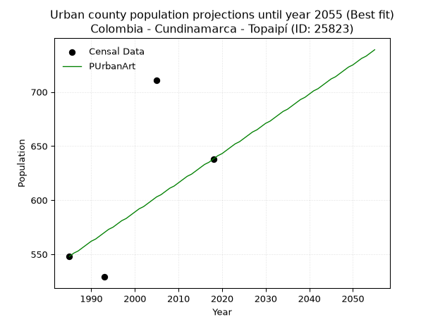
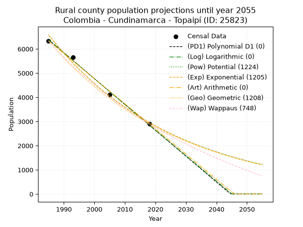
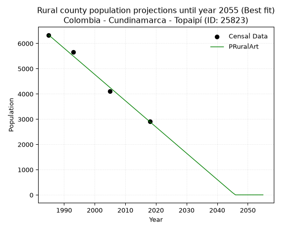

<div align="center">


</div>

# _“Population and Public Services Demand Projections (PPSD) until Year 2050 for Colombia - Cundinamarca - Topaipí (ID: 25823)”_
Keywords: `population` `public-service` `projection` `lineal` `polynomial` `logarithmic` `potential` `exponential` `arithmetic` `geometric` `wappaus` `dane` `colombia` `south-america`

PPSD are analytical estimates used by governments and planners to anticipate future changes in population size, age distribution, and the resulting community needs for utilities, healthcare, education, and infrastructure as sizing future water treatment facilities, electrical grids, and road networks based on spatial growth.

> **General running parameters**: • app_version: _v20260806_. • Python version: _3.14.7_. • Pandas version: _3.0.5_. • NumPy version: _2.5.1_. • Creates, save and include plots into reports (create_plot): _False_. • Projection until year: _2050_. • Process polynomial degree 2 and up: _False_. • Process Wappaus: _True_. • Process Wappaus: _True_. • Set negative values to zero: _True_. • Set infinite values to zero: _True_. • Drop dataset notes: _True_. 
<div align="center">

Dynamic map: [:earth_americas:Google](http://maps.google.com/maps?q=5.336223777,-74.3006257) [:earth_americas:OSM](https://www.openstreetmap.org/#map=18/5.336223777/-74.3006257&layers=P) [:earth_americas:Bing](https://www.bing.com/maps?cp=5.336223777~-74.3006257&lvl=18) [:earth_americas:Apple](https://maps.apple.com/frame?center=5.336223777%2C-74.3006257&span=0.003%2C0.006)

</div>


<div align="center">

```geojson
{
  "type": "Feature",
  "geometry": {
    "type": "Point", 
    "coordinates": [-74.3006257, 5.336223777]
  }, 
  "properties": {
    "Name": "Colombia - Cundinamarca - Topaipí (ID: 25823)"
  }
}
```

</div>


## 0. Census Data (4 records)

Census data are official statistics collected by a government about the people and housing in a country. They usually include counts of total population, age, sex, race, income, education, and jobs.

📅Global census file: [Population.xlsx](../data/Population.xlsx)

| Source   |   Year |   CountryID | CountryName   |   StateID | StateName    |   CountyID | CountyName   |   PTotal |   PUrban |   PRural |
|:---------|-------:|------------:|:--------------|----------:|:-------------|-----------:|:-------------|---------:|---------:|---------:|
| DANE     |   1985 |          57 | Colombia      |        25 | Cundinamarca |      25823 | Topaipí      |     6879 |      548 |     6331 |
| DANE     |   1993 |          57 | Colombia      |        25 | Cundinamarca |      25823 | Topaipí      |     6182 |      529 |     5653 |
| DANE     |   2005 |          57 | Colombia      |        25 | Cundinamarca |      25823 | Topaipí      |     4817 |      711 |     4106 |
| DANE     |   2018 |          57 | Colombia      |        25 | Cundinamarca |      25823 | Topaipí      |     3537 |      638 |     2899 |

> 🔥Some records could had specific notes about the registered values or the corresponding urban or rural distribution.

## 1. Total

### 1.1. Coefficients and Parameters

* (PD1) Polynomial Deg 1: -102.86912886390918, 211117.72501003434 (lineal)
* (Log) Logarithmic: -205901.74357239506, 1570414.5528867957
* (Pow) Potential: -40.89176178430216, 138.70182326930995
* (Exp) Exponential: -0.02043388456908587, 2.923356022102818e+21
* (Art) Arithmetic: Year diff. 2018 - 1985 = 33, Population diff. 3537 - 6879 = -3342, Annual growth = -101.27272727272727
* (Geo) Geometric: Year diff. 2018 - 1985 = 33, Population diff. 3537 - 6879 = -3342, Annual growth % = -0.01995560323757939
* (Wap) Wappaus: i = -1.9445608155285574, Condition values only valid for < 200)

<sub>
Wappaus condition values: ['-0.00', '-1.94', '-3.89', '-5.83', '-7.78', '-9.72', '-11.67', '-13.61', '-15.56', '-17.50', '-19.45', '-21.39', '-23.33', '-25.28', '-27.22', '-29.17', '-31.11', '-33.06', '-35.00', '-36.95', '-38.89', '-40.84', '-42.78', '-44.72', '-46.67', '-48.61', '-50.56', '-52.50', '-54.45', '-56.39', '-58.34', '-60.28', '-62.23', '-64.17', '-66.12', '-68.06', '-70.00', '-71.95', '-73.89', '-75.84', '-77.78', '-79.73', '-81.67', '-83.62', '-85.56', '-87.51', '-89.45', '-91.39', '-93.34', '-95.28', '-97.23', '-99.17', '-101.12', '-103.06', '-105.01', '-106.95', '-108.90', '-110.84', '-112.78', '-114.73', '-116.67', '-118.62', '-120.56', '-122.51', '-124.45', '-126.40']
</sub>


### 1.2. Projected Dataset

|   Year |   CountyID |   PTotalPD1 |   PTotalLog |   PTotalPow |   PTotalExp |   PTotalArt |   PTotalGeo |   PTotalWap |
|-------:|-----------:|------------:|------------:|------------:|------------:|------------:|------------:|------------:|
|   1985 |      25823 |        6923 |        6926 |        7089 |        7085 |        6879 |        6879 |        6879 |
|   1986 |      25823 |        6820 |        6822 |        6945 |        6942 |        6778 |        6742 |        6747 |
|   1987 |      25823 |        6717 |        6718 |        6803 |        6801 |        6676 |        6607 |        6617 |
|   1988 |      25823 |        6614 |        6615 |        6664 |        6664 |        6575 |        6475 |        6489 |
|   1989 |      25823 |        6511 |        6511 |        6529 |        6529 |        6474 |        6346 |        6364 |
|   1990 |      25823 |        6408 |        6408 |        6396 |        6397 |        6373 |        6219 |        6241 |
|   1991 |      25823 |        6305 |        6304 |        6266 |        6268 |        6271 |        6095 |        6121 |
|   1992 |      25823 |        6202 |        6201 |        6139 |        6141 |        6170 |        5974 |        6002 |
|   1993 |      25823 |        6100 |        6097 |        6014 |        6017 |        6069 |        5855 |        5886 |
|   1994 |      25823 |        5997 |        5994 |        5892 |        5895 |        5968 |        5738 |        5772 |
|   1995 |      25823 |        5894 |        5891 |        5772 |        5776 |        5866 |        5623 |        5660 |
|   1996 |      25823 |        5791 |        5788 |        5655 |        5659 |        5765 |        5511 |        5550 |
|   1997 |      25823 |        5688 |        5685 |        5541 |        5544 |        5664 |        5401 |        5442 |
|   1998 |      25823 |        5585 |        5581 |        5428 |        5432 |        5562 |        5293 |        5335 |
|   1999 |      25823 |        5482 |        5478 |        5318 |        5322 |        5461 |        5188 |        5231 |
|   2000 |      25823 |        5379 |        5375 |        5211 |        5215 |        5360 |        5084 |        5128 |
|   2001 |      25823 |        5277 |        5273 |        5105 |        5109 |        5259 |        4983 |        5027 |
|   2002 |      25823 |        5174 |        5170 |        5002 |        5006 |        5157 |        4883 |        4928 |
|   2003 |      25823 |        5071 |        5067 |        4901 |        4905 |        5056 |        4786 |        4830 |
|   2004 |      25823 |        4968 |        4964 |        4802 |        4805 |        4955 |        4690 |        4734 |
|   2005 |      25823 |        4865 |        4861 |        4705 |        4708 |        4854 |        4597 |        4639 |
|   2006 |      25823 |        4762 |        4759 |        4610 |        4613 |        4752 |        4505 |        4546 |
|   2007 |      25823 |        4659 |        4656 |        4517 |        4520 |        4651 |        4415 |        4455 |
|   2008 |      25823 |        4557 |        4554 |        4426 |        4428 |        4550 |        4327 |        4365 |
|   2009 |      25823 |        4454 |        4451 |        4337 |        4339 |        4448 |        4241 |        4276 |
|   2010 |      25823 |        4351 |        4349 |        4249 |        4251 |        4347 |        4156 |        4189 |
|   2011 |      25823 |        4248 |        4246 |        4164 |        4165 |        4246 |        4073 |        4103 |
|   2012 |      25823 |        4145 |        4144 |        4080 |        4081 |        4145 |        3992 |        4018 |
|   2013 |      25823 |        4042 |        4041 |        3998 |        3998 |        4043 |        3912 |        3935 |
|   2014 |      25823 |        3939 |        3939 |        3918 |        3917 |        3942 |        3834 |        3853 |
|   2015 |      25823 |        3836 |        3837 |        3839 |        3838 |        3841 |        3757 |        3772 |
|   2016 |      25823 |        3734 |        3735 |        3762 |        3761 |        3740 |        3683 |        3693 |
|   2017 |      25823 |        3631 |        3633 |        3686 |        3684 |        3638 |        3609 |        3614 |
|   2018 |      25823 |        3528 |        3531 |        3612 |        3610 |        3537 |        3537 |        3537 |
|   2019 |      25823 |        3425 |        3429 |        3540 |        3537 |        3436 |        3466 |        3461 |
|   2020 |      25823 |        3322 |        3327 |        3469 |        3465 |        3334 |        3397 |        3386 |
|   2021 |      25823 |        3219 |        3225 |        3399 |        3395 |        3233 |        3329 |        3312 |
|   2022 |      25823 |        3116 |        3123 |        3331 |        3327 |        3132 |        3263 |        3239 |
|   2023 |      25823 |        3013 |        3021 |        3265 |        3259 |        3031 |        3198 |        3167 |
|   2024 |      25823 |        2911 |        2919 |        3199 |        3193 |        2929 |        3134 |        3096 |
|   2025 |      25823 |        2808 |        2818 |        3135 |        3129 |        2828 |        3072 |        3027 |
|   2026 |      25823 |        2705 |        2716 |        3073 |        3066 |        2727 |        3010 |        2958 |
|   2027 |      25823 |        2602 |        2614 |        3011 |        3004 |        2626 |        2950 |        2890 |
|   2028 |      25823 |        2499 |        2513 |        2951 |        2943 |        2524 |        2891 |        2823 |
|   2029 |      25823 |        2396 |        2411 |        2892 |        2883 |        2423 |        2834 |        2757 |
|   2030 |      25823 |        2293 |        2310 |        2835 |        2825 |        2322 |        2777 |        2692 |
|   2031 |      25823 |        2191 |        2208 |        2778 |        2768 |        2220 |        2722 |        2627 |
|   2032 |      25823 |        2088 |        2107 |        2723 |        2712 |        2119 |        2667 |        2564 |
|   2033 |      25823 |        1985 |        2006 |        2668 |        2657 |        2018 |        2614 |        2501 |
|   2034 |      25823 |        1882 |        1905 |        2615 |        2603 |        1917 |        2562 |        2440 |
|   2035 |      25823 |        1779 |        1803 |        2563 |        2551 |        1815 |        2511 |        2379 |
|   2036 |      25823 |        1676 |        1702 |        2512 |        2499 |        1714 |        2461 |        2318 |
|   2037 |      25823 |        1573 |        1601 |        2462 |        2448 |        1613 |        2412 |        2259 |
|   2038 |      25823 |        1470 |        1500 |        2413 |        2399 |        1512 |        2363 |        2200 |
|   2039 |      25823 |        1368 |        1399 |        2365 |        2350 |        1410 |        2316 |        2142 |
|   2040 |      25823 |        1265 |        1298 |        2319 |        2303 |        1309 |        2270 |        2085 |
|   2041 |      25823 |        1162 |        1197 |        2273 |        2256 |        1208 |        2225 |        2029 |
|   2042 |      25823 |        1059 |        1096 |        2227 |        2211 |        1106 |        2180 |        1973 |
|   2043 |      25823 |         956 |         996 |        2183 |        2166 |        1005 |        2137 |        1918 |
|   2044 |      25823 |         853 |         895 |        2140 |        2122 |         904 |        2094 |        1864 |
|   2045 |      25823 |         750 |         794 |        2098 |        2079 |         803 |        2052 |        1810 |
|   2046 |      25823 |         647 |         693 |        2056 |        2037 |         701 |        2011 |        1757 |
|   2047 |      25823 |         545 |         593 |        2015 |        1996 |         600 |        1971 |        1705 |
|   2048 |      25823 |         442 |         492 |        1976 |        1956 |         499 |        1932 |        1653 |
|   2049 |      25823 |         339 |         392 |        1937 |        1916 |         398 |        1893 |        1602 |
|   2050 |      25823 |         236 |         291 |        1898 |        1877 |         296 |        1856 |        1551 |
<div align="center">

</img>

</div>


### 1.3. Best fit with absolute and relative error (%)

Relative error puts that difference into context by dividing the absolute error by the true value, creating a unitless ratio or percentage that shows the scale of the mistake.

Absolute and relative error

|   Year | Source   |   CountryID | CountryName   |   StateID | StateName    |   CountyID_x | CountyName   |   PTotal |   PUrban |   PRural |   CountyID_y |   PTotalPD1 |   PTotalLog |   PTotalPow |   PTotalExp |   PTotalArt |   PTotalGeo |   PTotalWap |   PTotalPD1AbsError |   PTotalLogAbsError |   PTotalPowAbsError |   PTotalExpAbsError |   PTotalArtAbsError |   PTotalGeoAbsError |   PTotalWapAbsError |   PTotalPD1RelError |   PTotalLogRelError |   PTotalPowRelError |   PTotalExpRelError |   PTotalArtRelError |   PTotalGeoRelError |   PTotalWapRelError |
|-------:|:---------|------------:|:--------------|----------:|:-------------|-------------:|:-------------|---------:|---------:|---------:|-------------:|------------:|------------:|------------:|------------:|------------:|------------:|------------:|--------------------:|--------------------:|--------------------:|--------------------:|--------------------:|--------------------:|--------------------:|--------------------:|--------------------:|--------------------:|--------------------:|--------------------:|--------------------:|--------------------:|
|   1985 | DANE     |          57 | Colombia      |        25 | Cundinamarca |        25823 | Topaipí      |     6879 |      548 |     6331 |        25823 |        6923 |        6926 |        7089 |        7085 |        6879 |        6879 |        6879 |                  44 |                  47 |                 210 |                 206 |                   0 |                   0 |                   0 |            0.639628 |            0.683239 |             3.05277 |             2.99462 |            0        |             0       |             0       |
|   1993 | DANE     |          57 | Colombia      |        25 | Cundinamarca |        25823 | Topaipí      |     6182 |      529 |     5653 |        25823 |        6100 |        6097 |        6014 |        6017 |        6069 |        5855 |        5886 |                  82 |                  85 |                 168 |                 165 |                 113 |                 327 |                 296 |            1.32643  |            1.37496  |             2.71757 |             2.66904 |            1.82789  |             5.28955 |             4.78809 |
|   2005 | DANE     |          57 | Colombia      |        25 | Cundinamarca |        25823 | Topaipí      |     4817 |      711 |     4106 |        25823 |        4865 |        4861 |        4705 |        4708 |        4854 |        4597 |        4639 |                  48 |                  44 |                 112 |                 109 |                  37 |                 220 |                 178 |            0.996471 |            0.913432 |             2.3251  |             2.26282 |            0.768113 |             4.56716 |             3.69525 |
|   2018 | DANE     |          57 | Colombia      |        25 | Cundinamarca |        25823 | Topaipí      |     3537 |      638 |     2899 |        25823 |        3528 |        3531 |        3612 |        3610 |        3537 |        3537 |        3537 |                   9 |                   6 |                  75 |                  73 |                   0 |                   0 |                   0 |            0.254453 |            0.169635 |             2.12044 |             2.0639  |            0        |             0       |             0       |

Relative error mean

| Method    |   RelError | Best   |
|:----------|-----------:|:-------|
| PTotalPD1 |   0.804246 |        |
| PTotalLog |   0.785316 |        |
| PTotalPow |   2.55397  |        |
| PTotalExp |   2.49759  |        |
| PTotalArt |   0.649    | True   |
| PTotalGeo |   2.46418  |        |
| PTotalWap |   2.12084  |        |

💙Best method: _**PTotalArt**_
<div align="center">

</img>

</div>


### 1.4. Fresh water supply demand in liters per capita per day (lpcd)

The fresh water supply demand typically ranges from 100 to 300 liters per capita per day (lpcd) for standard domestic and municipal planning, though absolute survival minimums set by the World Health Organization are as low as 7.5 to 20 liters per day, and total consumption in high-income nations can exceed 400 liters.

> `CZ`: Level in meters above the sea level (masl)<br> `WS`: Fresh water supply demand in liters per capita per day (lpcd or l/h/d)<br> `WSAll`: Zonal fresh water supply demand in liters per second (l/s)<br> `A`: Zonal area in square meters<br> `DP`: Population density (people/hectare)

Reference values (RAS Colombia)

|    CZ |   WS |
|------:|-----:|
|  1000 |  120 |
|  2000 |  130 |
| 99999 |  140 |

County shapefile geometry properties and water supply values

|   CountyID |      ATotal |   CZTotal |   WSTotal |
|-----------:|------------:|----------:|----------:|
|      25823 | 1.43552e+08 |   1290.77 |       130 |

Projected values for best method: PTotalArt

|   CountyID |   Year |   PTotalArt |   DPTotal |   WSTotal |   WSTotalAll |
|-----------:|-------:|------------:|----------:|----------:|-------------:|
|      25823 |   1985 |        6879 |      0.48 |       130 |    10.3503   |
|      25823 |   1986 |        6778 |      0.47 |       130 |    10.1984   |
|      25823 |   1987 |        6676 |      0.47 |       130 |    10.0449   |
|      25823 |   1988 |        6575 |      0.46 |       130 |     9.89294  |
|      25823 |   1989 |        6474 |      0.45 |       130 |     9.74097  |
|      25823 |   1990 |        6373 |      0.44 |       130 |     9.589    |
|      25823 |   1991 |        6271 |      0.44 |       130 |     9.43553  |
|      25823 |   1992 |        6170 |      0.43 |       130 |     9.28356  |
|      25823 |   1993 |        6069 |      0.42 |       130 |     9.1316   |
|      25823 |   1994 |        5968 |      0.42 |       130 |     8.97963  |
|      25823 |   1995 |        5866 |      0.41 |       130 |     8.82616  |
|      25823 |   1996 |        5765 |      0.4  |       130 |     8.67419  |
|      25823 |   1997 |        5664 |      0.39 |       130 |     8.52222  |
|      25823 |   1998 |        5562 |      0.39 |       130 |     8.36875  |
|      25823 |   1999 |        5461 |      0.38 |       130 |     8.21678  |
|      25823 |   2000 |        5360 |      0.37 |       130 |     8.06481  |
|      25823 |   2001 |        5259 |      0.37 |       130 |     7.91285  |
|      25823 |   2002 |        5157 |      0.36 |       130 |     7.75938  |
|      25823 |   2003 |        5056 |      0.35 |       130 |     7.60741  |
|      25823 |   2004 |        4955 |      0.35 |       130 |     7.45544  |
|      25823 |   2005 |        4854 |      0.34 |       130 |     7.30347  |
|      25823 |   2006 |        4752 |      0.33 |       130 |     7.15     |
|      25823 |   2007 |        4651 |      0.32 |       130 |     6.99803  |
|      25823 |   2008 |        4550 |      0.32 |       130 |     6.84606  |
|      25823 |   2009 |        4448 |      0.31 |       130 |     6.69259  |
|      25823 |   2010 |        4347 |      0.3  |       130 |     6.54063  |
|      25823 |   2011 |        4246 |      0.3  |       130 |     6.38866  |
|      25823 |   2012 |        4145 |      0.29 |       130 |     6.23669  |
|      25823 |   2013 |        4043 |      0.28 |       130 |     6.08322  |
|      25823 |   2014 |        3942 |      0.27 |       130 |     5.93125  |
|      25823 |   2015 |        3841 |      0.27 |       130 |     5.77928  |
|      25823 |   2016 |        3740 |      0.26 |       130 |     5.62731  |
|      25823 |   2017 |        3638 |      0.25 |       130 |     5.47384  |
|      25823 |   2018 |        3537 |      0.25 |       130 |     5.32188  |
|      25823 |   2019 |        3436 |      0.24 |       130 |     5.16991  |
|      25823 |   2020 |        3334 |      0.23 |       130 |     5.01644  |
|      25823 |   2021 |        3233 |      0.23 |       130 |     4.86447  |
|      25823 |   2022 |        3132 |      0.22 |       130 |     4.7125   |
|      25823 |   2023 |        3031 |      0.21 |       130 |     4.56053  |
|      25823 |   2024 |        2929 |      0.2  |       130 |     4.40706  |
|      25823 |   2025 |        2828 |      0.2  |       130 |     4.25509  |
|      25823 |   2026 |        2727 |      0.19 |       130 |     4.10313  |
|      25823 |   2027 |        2626 |      0.18 |       130 |     3.95116  |
|      25823 |   2028 |        2524 |      0.18 |       130 |     3.79769  |
|      25823 |   2029 |        2423 |      0.17 |       130 |     3.64572  |
|      25823 |   2030 |        2322 |      0.16 |       130 |     3.49375  |
|      25823 |   2031 |        2220 |      0.15 |       130 |     3.34028  |
|      25823 |   2032 |        2119 |      0.15 |       130 |     3.18831  |
|      25823 |   2033 |        2018 |      0.14 |       130 |     3.03634  |
|      25823 |   2034 |        1917 |      0.13 |       130 |     2.88437  |
|      25823 |   2035 |        1815 |      0.13 |       130 |     2.7309   |
|      25823 |   2036 |        1714 |      0.12 |       130 |     2.57894  |
|      25823 |   2037 |        1613 |      0.11 |       130 |     2.42697  |
|      25823 |   2038 |        1512 |      0.11 |       130 |     2.275    |
|      25823 |   2039 |        1410 |      0.1  |       130 |     2.12153  |
|      25823 |   2040 |        1309 |      0.09 |       130 |     1.96956  |
|      25823 |   2041 |        1208 |      0.08 |       130 |     1.81759  |
|      25823 |   2042 |        1106 |      0.08 |       130 |     1.66412  |
|      25823 |   2043 |        1005 |      0.07 |       130 |     1.51215  |
|      25823 |   2044 |         904 |      0.06 |       130 |     1.36019  |
|      25823 |   2045 |         803 |      0.06 |       130 |     1.20822  |
|      25823 |   2046 |         701 |      0.05 |       130 |     1.05475  |
|      25823 |   2047 |         600 |      0.04 |       130 |     0.902778 |
|      25823 |   2048 |         499 |      0.03 |       130 |     0.75081  |
|      25823 |   2049 |         398 |      0.03 |       130 |     0.598843 |
|      25823 |   2050 |         296 |      0.02 |       130 |     0.44537  |

## 2. Urban

### 2.1. Coefficients and Parameters

* (PD1) Polynomial Deg 1: 4.029706945002043, -7453.921316740336 (lineal)
* (Log) Logarithmic: 8075.969397273111, -60779.008105430104
* (Pow) Potential: 13.488205628164875, -41.74585805834433
* (Exp) Exponential: 0.006731167103983222, 0.0008558217908518883
* (Art) Arithmetic: Year diff. 2018 - 1985 = 33, Population diff. 638 - 548 = 90, Annual growth = 2.727272727272727
* (Geo) Geometric: Year diff. 2018 - 1985 = 33, Population diff. 638 - 548 = 90, Annual growth % = 0.0046186026055761165
* (Wap) Wappaus: i = 0.459911083857121, Condition values only valid for < 200)

<sub>
Wappaus condition values: ['0.00', '0.46', '0.92', '1.38', '1.84', '2.30', '2.76', '3.22', '3.68', '4.14', '4.60', '5.06', '5.52', '5.98', '6.44', '6.90', '7.36', '7.82', '8.28', '8.74', '9.20', '9.66', '10.12', '10.58', '11.04', '11.50', '11.96', '12.42', '12.88', '13.34', '13.80', '14.26', '14.72', '15.18', '15.64', '16.10', '16.56', '17.02', '17.48', '17.94', '18.40', '18.86', '19.32', '19.78', '20.24', '20.70', '21.16', '21.62', '22.08', '22.54', '23.00', '23.46', '23.92', '24.38', '24.84', '25.30', '25.76', '26.21', '26.67', '27.13', '27.59', '28.05', '28.51', '28.97', '29.43', '29.89']
</sub>


### 2.2. Projected Dataset

|   Year |   CountyID |   PUrbanPD1 |   PUrbanLog |   PUrbanPow |   PUrbanExp |   PUrbanArt |   PUrbanGeo |   PUrbanWap |
|-------:|-----------:|------------:|------------:|------------:|------------:|------------:|------------:|------------:|
|   1985 |      25823 |         545 |         545 |         543 |         543 |         548 |         548 |         548 |
|   1986 |      25823 |         549 |         549 |         547 |         547 |         551 |         551 |         551 |
|   1987 |      25823 |         553 |         553 |         551 |         551 |         553 |         553 |         553 |
|   1988 |      25823 |         557 |         557 |         554 |         555 |         556 |         556 |         556 |
|   1989 |      25823 |         561 |         561 |         558 |         558 |         559 |         558 |         558 |
|   1990 |      25823 |         565 |         565 |         562 |         562 |         562 |         561 |         561 |
|   1991 |      25823 |         569 |         569 |         566 |         566 |         564 |         563 |         563 |
|   1992 |      25823 |         573 |         573 |         570 |         570 |         567 |         566 |         566 |
|   1993 |      25823 |         577 |         577 |         574 |         574 |         570 |         569 |         569 |
|   1994 |      25823 |         581 |         581 |         577 |         577 |         573 |         571 |         571 |
|   1995 |      25823 |         585 |         585 |         581 |         581 |         575 |         574 |         574 |
|   1996 |      25823 |         589 |         589 |         585 |         585 |         578 |         576 |         576 |
|   1997 |      25823 |         593 |         594 |         589 |         589 |         581 |         579 |         579 |
|   1998 |      25823 |         597 |         598 |         593 |         593 |         583 |         582 |         582 |
|   1999 |      25823 |         601 |         602 |         597 |         597 |         586 |         585 |         584 |
|   2000 |      25823 |         605 |         606 |         601 |         601 |         589 |         587 |         587 |
|   2001 |      25823 |         610 |         610 |         605 |         605 |         592 |         590 |         590 |
|   2002 |      25823 |         614 |         614 |         609 |         609 |         594 |         593 |         593 |
|   2003 |      25823 |         618 |         618 |         614 |         613 |         597 |         595 |         595 |
|   2004 |      25823 |         622 |         622 |         618 |         618 |         600 |         598 |         598 |
|   2005 |      25823 |         626 |         626 |         622 |         622 |         603 |         601 |         601 |
|   2006 |      25823 |         630 |         630 |         626 |         626 |         605 |         604 |         604 |
|   2007 |      25823 |         634 |         634 |         630 |         630 |         608 |         606 |         606 |
|   2008 |      25823 |         638 |         638 |         635 |         634 |         611 |         609 |         609 |
|   2009 |      25823 |         642 |         642 |         639 |         639 |         613 |         612 |         612 |
|   2010 |      25823 |         646 |         646 |         643 |         643 |         616 |         615 |         615 |
|   2011 |      25823 |         650 |         650 |         648 |         647 |         619 |         618 |         618 |
|   2012 |      25823 |         654 |         654 |         652 |         652 |         622 |         621 |         621 |
|   2013 |      25823 |         658 |         658 |         656 |         656 |         624 |         623 |         623 |
|   2014 |      25823 |         662 |         662 |         661 |         661 |         627 |         626 |         626 |
|   2015 |      25823 |         666 |         666 |         665 |         665 |         630 |         629 |         629 |
|   2016 |      25823 |         670 |         670 |         670 |         670 |         633 |         632 |         632 |
|   2017 |      25823 |         674 |         674 |         674 |         674 |         635 |         635 |         635 |
|   2018 |      25823 |         678 |         678 |         679 |         679 |         638 |         638 |         638 |
|   2019 |      25823 |         682 |         682 |         683 |         683 |         641 |         641 |         641 |
|   2020 |      25823 |         686 |         686 |         688 |         688 |         643 |         644 |         644 |
|   2021 |      25823 |         690 |         690 |         692 |         692 |         646 |         647 |         647 |
|   2022 |      25823 |         694 |         694 |         697 |         697 |         649 |         650 |         650 |
|   2023 |      25823 |         698 |         698 |         702 |         702 |         652 |         653 |         653 |
|   2024 |      25823 |         702 |         702 |         706 |         707 |         654 |         656 |         656 |
|   2025 |      25823 |         706 |         706 |         711 |         711 |         657 |         659 |         659 |
|   2026 |      25823 |         710 |         710 |         716 |         716 |         660 |         662 |         662 |
|   2027 |      25823 |         714 |         714 |         721 |         721 |         663 |         665 |         665 |
|   2028 |      25823 |         718 |         718 |         725 |         726 |         665 |         668 |         668 |
|   2029 |      25823 |         722 |         722 |         730 |         731 |         668 |         671 |         671 |
|   2030 |      25823 |         726 |         726 |         735 |         736 |         671 |         674 |         675 |
|   2031 |      25823 |         730 |         730 |         740 |         741 |         673 |         677 |         678 |
|   2032 |      25823 |         734 |         734 |         745 |         746 |         676 |         681 |         681 |
|   2033 |      25823 |         738 |         738 |         750 |         751 |         679 |         684 |         684 |
|   2034 |      25823 |         743 |         742 |         755 |         756 |         682 |         687 |         687 |
|   2035 |      25823 |         747 |         746 |         760 |         761 |         684 |         690 |         690 |
|   2036 |      25823 |         751 |         750 |         765 |         766 |         687 |         693 |         694 |
|   2037 |      25823 |         755 |         754 |         770 |         771 |         690 |         696 |         697 |
|   2038 |      25823 |         759 |         758 |         775 |         776 |         693 |         700 |         700 |
|   2039 |      25823 |         763 |         762 |         780 |         782 |         695 |         703 |         703 |
|   2040 |      25823 |         767 |         766 |         785 |         787 |         698 |         706 |         707 |
|   2041 |      25823 |         771 |         770 |         791 |         792 |         701 |         709 |         710 |
|   2042 |      25823 |         775 |         773 |         796 |         798 |         703 |         713 |         713 |
|   2043 |      25823 |         779 |         777 |         801 |         803 |         706 |         716 |         717 |
|   2044 |      25823 |         783 |         781 |         806 |         808 |         709 |         719 |         720 |
|   2045 |      25823 |         787 |         785 |         812 |         814 |         712 |         723 |         723 |
|   2046 |      25823 |         791 |         789 |         817 |         819 |         714 |         726 |         727 |
|   2047 |      25823 |         795 |         793 |         823 |         825 |         717 |         729 |         730 |
|   2048 |      25823 |         799 |         797 |         828 |         830 |         720 |         733 |         734 |
|   2049 |      25823 |         803 |         801 |         833 |         836 |         723 |         736 |         737 |
|   2050 |      25823 |         807 |         805 |         839 |         842 |         725 |         739 |         741 |
<div align="center">

</img>

</div>


### 2.3. Best fit with absolute and relative error (%)

Relative error puts that difference into context by dividing the absolute error by the true value, creating a unitless ratio or percentage that shows the scale of the mistake.

Absolute and relative error

|   Year | Source   |   CountryID | CountryName   |   StateID | StateName    |   CountyID_x | CountyName   |   PTotal |   PUrban |   PRural |   CountyID_y |   PUrbanPD1 |   PUrbanLog |   PUrbanPow |   PUrbanExp |   PUrbanArt |   PUrbanGeo |   PUrbanWap |   PUrbanPD1AbsError |   PUrbanLogAbsError |   PUrbanPowAbsError |   PUrbanExpAbsError |   PUrbanArtAbsError |   PUrbanGeoAbsError |   PUrbanWapAbsError |   PUrbanPD1RelError |   PUrbanLogRelError |   PUrbanPowRelError |   PUrbanExpRelError |   PUrbanArtRelError |   PUrbanGeoRelError |   PUrbanWapRelError |
|-------:|:---------|------------:|:--------------|----------:|:-------------|-------------:|:-------------|---------:|---------:|---------:|-------------:|------------:|------------:|------------:|------------:|------------:|------------:|------------:|--------------------:|--------------------:|--------------------:|--------------------:|--------------------:|--------------------:|--------------------:|--------------------:|--------------------:|--------------------:|--------------------:|--------------------:|--------------------:|--------------------:|
|   1985 | DANE     |          57 | Colombia      |        25 | Cundinamarca |        25823 | Topaipí      |     6879 |      548 |     6331 |        25823 |         545 |         545 |         543 |         543 |         548 |         548 |         548 |                   3 |                   3 |                   5 |                   5 |                   0 |                   0 |                   0 |            0.547445 |            0.547445 |            0.912409 |            0.912409 |             0       |             0       |             0       |
|   1993 | DANE     |          57 | Colombia      |        25 | Cundinamarca |        25823 | Topaipí      |     6182 |      529 |     5653 |        25823 |         577 |         577 |         574 |         574 |         570 |         569 |         569 |                  48 |                  48 |                  45 |                  45 |                  41 |                  40 |                  40 |            9.07372  |            9.07372  |            8.50662  |            8.50662  |             7.75047 |             7.56144 |             7.56144 |
|   2005 | DANE     |          57 | Colombia      |        25 | Cundinamarca |        25823 | Topaipí      |     4817 |      711 |     4106 |        25823 |         626 |         626 |         622 |         622 |         603 |         601 |         601 |                  85 |                  85 |                  89 |                  89 |                 108 |                 110 |                 110 |           11.955    |           11.955    |           12.5176   |           12.5176   |            15.1899  |            15.4712  |            15.4712  |
|   2018 | DANE     |          57 | Colombia      |        25 | Cundinamarca |        25823 | Topaipí      |     3537 |      638 |     2899 |        25823 |         678 |         678 |         679 |         679 |         638 |         638 |         638 |                  40 |                  40 |                  41 |                  41 |                   0 |                   0 |                   0 |            6.26959  |            6.26959  |            6.42633  |            6.42633  |             0       |             0       |             0       |

Relative error mean

| Method    |   RelError | Best   |
|:----------|-----------:|:-------|
| PUrbanPD1 |    6.96144 |        |
| PUrbanLog |    6.96144 |        |
| PUrbanPow |    7.09073 |        |
| PUrbanExp |    7.09073 |        |
| PUrbanArt |    5.73509 | True   |
| PUrbanGeo |    5.75815 |        |
| PUrbanWap |    5.75815 |        |

💙Best method: _**PUrbanArt**_
<div align="center">

</img>

</div>


### 2.4. Fresh water supply demand in liters per capita per day (lpcd)

The fresh water supply demand typically ranges from 100 to 300 liters per capita per day (lpcd) for standard domestic and municipal planning, though absolute survival minimums set by the World Health Organization are as low as 7.5 to 20 liters per day, and total consumption in high-income nations can exceed 400 liters.

> `CZ`: Level in meters above the sea level (masl)<br> `WS`: Fresh water supply demand in liters per capita per day (lpcd or l/h/d)<br> `WSAll`: Zonal fresh water supply demand in liters per second (l/s)<br> `A`: Zonal area in square meters<br> `DP`: Population density (people/hectare)

Reference values (RAS Colombia)

|    CZ |   WS |
|------:|-----:|
|  1000 |  120 |
|  2000 |  130 |
| 99999 |  140 |

County shapefile geometry properties and water supply values

|   CountyID |   AUrban |   CZUrban |   WSUrban |
|-----------:|---------:|----------:|----------:|
|      25823 |   278711 |   1333.13 |       130 |

Projected values for best method: PUrbanArt

|   CountyID |   Year |   PUrbanArt |   DPUrban |   WSUrban |   WSUrbanAll |
|-----------:|-------:|------------:|----------:|----------:|-------------:|
|      25823 |   1985 |         548 |     19.66 |       130 |     0.824537 |
|      25823 |   1986 |         551 |     19.77 |       130 |     0.829051 |
|      25823 |   1987 |         553 |     19.84 |       130 |     0.83206  |
|      25823 |   1988 |         556 |     19.95 |       130 |     0.836574 |
|      25823 |   1989 |         559 |     20.06 |       130 |     0.841088 |
|      25823 |   1990 |         562 |     20.16 |       130 |     0.845602 |
|      25823 |   1991 |         564 |     20.24 |       130 |     0.848611 |
|      25823 |   1992 |         567 |     20.34 |       130 |     0.853125 |
|      25823 |   1993 |         570 |     20.45 |       130 |     0.857639 |
|      25823 |   1994 |         573 |     20.56 |       130 |     0.862153 |
|      25823 |   1995 |         575 |     20.63 |       130 |     0.865162 |
|      25823 |   1996 |         578 |     20.74 |       130 |     0.869676 |
|      25823 |   1997 |         581 |     20.85 |       130 |     0.87419  |
|      25823 |   1998 |         583 |     20.92 |       130 |     0.877199 |
|      25823 |   1999 |         586 |     21.03 |       130 |     0.881713 |
|      25823 |   2000 |         589 |     21.13 |       130 |     0.886227 |
|      25823 |   2001 |         592 |     21.24 |       130 |     0.890741 |
|      25823 |   2002 |         594 |     21.31 |       130 |     0.89375  |
|      25823 |   2003 |         597 |     21.42 |       130 |     0.898264 |
|      25823 |   2004 |         600 |     21.53 |       130 |     0.902778 |
|      25823 |   2005 |         603 |     21.64 |       130 |     0.907292 |
|      25823 |   2006 |         605 |     21.71 |       130 |     0.910301 |
|      25823 |   2007 |         608 |     21.81 |       130 |     0.914815 |
|      25823 |   2008 |         611 |     21.92 |       130 |     0.919329 |
|      25823 |   2009 |         613 |     21.99 |       130 |     0.922338 |
|      25823 |   2010 |         616 |     22.1  |       130 |     0.926852 |
|      25823 |   2011 |         619 |     22.21 |       130 |     0.931366 |
|      25823 |   2012 |         622 |     22.32 |       130 |     0.93588  |
|      25823 |   2013 |         624 |     22.39 |       130 |     0.938889 |
|      25823 |   2014 |         627 |     22.5  |       130 |     0.943403 |
|      25823 |   2015 |         630 |     22.6  |       130 |     0.947917 |
|      25823 |   2016 |         633 |     22.71 |       130 |     0.952431 |
|      25823 |   2017 |         635 |     22.78 |       130 |     0.95544  |
|      25823 |   2018 |         638 |     22.89 |       130 |     0.959954 |
|      25823 |   2019 |         641 |     23    |       130 |     0.964468 |
|      25823 |   2020 |         643 |     23.07 |       130 |     0.967477 |
|      25823 |   2021 |         646 |     23.18 |       130 |     0.971991 |
|      25823 |   2022 |         649 |     23.29 |       130 |     0.976505 |
|      25823 |   2023 |         652 |     23.39 |       130 |     0.981019 |
|      25823 |   2024 |         654 |     23.47 |       130 |     0.984028 |
|      25823 |   2025 |         657 |     23.57 |       130 |     0.988542 |
|      25823 |   2026 |         660 |     23.68 |       130 |     0.993056 |
|      25823 |   2027 |         663 |     23.79 |       130 |     0.997569 |
|      25823 |   2028 |         665 |     23.86 |       130 |     1.00058  |
|      25823 |   2029 |         668 |     23.97 |       130 |     1.00509  |
|      25823 |   2030 |         671 |     24.08 |       130 |     1.00961  |
|      25823 |   2031 |         673 |     24.15 |       130 |     1.01262  |
|      25823 |   2032 |         676 |     24.25 |       130 |     1.01713  |
|      25823 |   2033 |         679 |     24.36 |       130 |     1.02164  |
|      25823 |   2034 |         682 |     24.47 |       130 |     1.02616  |
|      25823 |   2035 |         684 |     24.54 |       130 |     1.02917  |
|      25823 |   2036 |         687 |     24.65 |       130 |     1.03368  |
|      25823 |   2037 |         690 |     24.76 |       130 |     1.03819  |
|      25823 |   2038 |         693 |     24.86 |       130 |     1.04271  |
|      25823 |   2039 |         695 |     24.94 |       130 |     1.04572  |
|      25823 |   2040 |         698 |     25.04 |       130 |     1.05023  |
|      25823 |   2041 |         701 |     25.15 |       130 |     1.05475  |
|      25823 |   2042 |         703 |     25.22 |       130 |     1.05775  |
|      25823 |   2043 |         706 |     25.33 |       130 |     1.06227  |
|      25823 |   2044 |         709 |     25.44 |       130 |     1.06678  |
|      25823 |   2045 |         712 |     25.55 |       130 |     1.0713   |
|      25823 |   2046 |         714 |     25.62 |       130 |     1.07431  |
|      25823 |   2047 |         717 |     25.73 |       130 |     1.07882  |
|      25823 |   2048 |         720 |     25.83 |       130 |     1.08333  |
|      25823 |   2049 |         723 |     25.94 |       130 |     1.08785  |
|      25823 |   2050 |         725 |     26.01 |       130 |     1.09086  |

## 3. Rural

### 3.1. Coefficients and Parameters

* (PD1) Polynomial Deg 1: -106.89883580891122, 218571.64632677464 (lineal)
* (Log) Logarithmic: -213977.7129696681, 1631193.5609922253
* (Pow) Potential: -48.523942682803046, 163.83856932898348
* (Exp) Exponential: -0.02424722715750233, 5.258491012647396e+24
* (Art) Arithmetic: Year diff. 2018 - 1985 = 33, Population diff. 2899 - 6331 = -3432, Annual growth = -104.0
* (Geo) Geometric: Year diff. 2018 - 1985 = 33, Population diff. 2899 - 6331 = -3432, Annual growth % = -0.02339154050386627
* (Wap) Wappaus: i = -2.2535211267605635, Condition values only valid for < 200)

<sub>
Wappaus condition values: ['-0.00', '-2.25', '-4.51', '-6.76', '-9.01', '-11.27', '-13.52', '-15.77', '-18.03', '-20.28', '-22.54', '-24.79', '-27.04', '-29.30', '-31.55', '-33.80', '-36.06', '-38.31', '-40.56', '-42.82', '-45.07', '-47.32', '-49.58', '-51.83', '-54.08', '-56.34', '-58.59', '-60.85', '-63.10', '-65.35', '-67.61', '-69.86', '-72.11', '-74.37', '-76.62', '-78.87', '-81.13', '-83.38', '-85.63', '-87.89', '-90.14', '-92.39', '-94.65', '-96.90', '-99.15', '-101.41', '-103.66', '-105.92', '-108.17', '-110.42', '-112.68', '-114.93', '-117.18', '-119.44', '-121.69', '-123.94', '-126.20', '-128.45', '-130.70', '-132.96', '-135.21', '-137.46', '-139.72', '-141.97', '-144.23', '-146.48']
</sub>


### 3.2. Projected Dataset

|   Year |   CountyID |   PRuralPD1 |   PRuralLog |   PRuralPow |   PRuralExp |   PRuralArt |   PRuralGeo |   PRuralWap |
|-------:|-----------:|------------:|------------:|------------:|------------:|------------:|------------:|------------:|
|   1985 |      25823 |        6377 |        6381 |        6580 |        6576 |        6331 |        6331 |        6331 |
|   1986 |      25823 |        6271 |        6273 |        6421 |        6418 |        6227 |        6183 |        6190 |
|   1987 |      25823 |        6164 |        6165 |        6266 |        6264 |        6123 |        6038 |        6052 |
|   1988 |      25823 |        6057 |        6058 |        6115 |        6114 |        6019 |        5897 |        5917 |
|   1989 |      25823 |        5950 |        5950 |        5968 |        5968 |        5915 |        5759 |        5785 |
|   1990 |      25823 |        5843 |        5842 |        5824 |        5825 |        5811 |        5624 |        5656 |
|   1991 |      25823 |        5736 |        5735 |        5684 |        5685 |        5707 |        5493 |        5529 |
|   1992 |      25823 |        5629 |        5627 |        5547 |        5549 |        5603 |        5364 |        5405 |
|   1993 |      25823 |        5522 |        5520 |        5413 |        5416 |        5499 |        5239 |        5284 |
|   1994 |      25823 |        5415 |        5413 |        5283 |        5287 |        5395 |        5116 |        5165 |
|   1995 |      25823 |        5308 |        5305 |        5156 |        5160 |        5291 |        4997 |        5049 |
|   1996 |      25823 |        5202 |        5198 |        5032 |        5036 |        5187 |        4880 |        4935 |
|   1997 |      25823 |        5095 |        5091 |        4911 |        4916 |        5083 |        4766 |        4823 |
|   1998 |      25823 |        4988 |        4984 |        4794 |        4798 |        4979 |        4654 |        4713 |
|   1999 |      25823 |        4881 |        4877 |        4679 |        4683 |        4875 |        4545 |        4606 |
|   2000 |      25823 |        4774 |        4770 |        4566 |        4571 |        4771 |        4439 |        4500 |
|   2001 |      25823 |        4667 |        4663 |        4457 |        4461 |        4667 |        4335 |        4397 |
|   2002 |      25823 |        4560 |        4556 |        4350 |        4354 |        4563 |        4234 |        4296 |
|   2003 |      25823 |        4453 |        4449 |        4246 |        4250 |        4459 |        4135 |        4196 |
|   2004 |      25823 |        4346 |        4342 |        4145 |        4148 |        4355 |        4038 |        4098 |
|   2005 |      25823 |        4239 |        4236 |        4045 |        4049 |        4251 |        3944 |        4002 |
|   2006 |      25823 |        4133 |        4129 |        3949 |        3952 |        4147 |        3851 |        3908 |
|   2007 |      25823 |        4026 |        4022 |        3854 |        3857 |        4043 |        3761 |        3816 |
|   2008 |      25823 |        3919 |        3916 |        3762 |        3765 |        3939 |        3673 |        3725 |
|   2009 |      25823 |        3812 |        3809 |        3672 |        3675 |        3835 |        3587 |        3636 |
|   2010 |      25823 |        3705 |        3703 |        3585 |        3587 |        3731 |        3503 |        3548 |
|   2011 |      25823 |        3598 |        3596 |        3499 |        3501 |        3627 |        3421 |        3462 |
|   2012 |      25823 |        3491 |        3490 |        3416 |        3417 |        3523 |        3341 |        3377 |
|   2013 |      25823 |        3384 |        3383 |        3335 |        3335 |        3419 |        3263 |        3294 |
|   2014 |      25823 |        3277 |        3277 |        3255 |        3255 |        3315 |        3187 |        3213 |
|   2015 |      25823 |        3170 |        3171 |        3178 |        3177 |        3211 |        3112 |        3132 |
|   2016 |      25823 |        3064 |        3065 |        3102 |        3101 |        3107 |        3040 |        3053 |
|   2017 |      25823 |        2957 |        2959 |        3028 |        3027 |        3003 |        2968 |        2975 |
|   2018 |      25823 |        2850 |        2853 |        2956 |        2954 |        2899 |        2899 |        2899 |
|   2019 |      25823 |        2743 |        2747 |        2886 |        2883 |        2795 |        2831 |        2824 |
|   2020 |      25823 |        2636 |        2641 |        2818 |        2814 |        2691 |        2765 |        2750 |
|   2021 |      25823 |        2529 |        2535 |        2751 |        2747 |        2587 |        2700 |        2677 |
|   2022 |      25823 |        2422 |        2429 |        2686 |        2681 |        2483 |        2637 |        2605 |
|   2023 |      25823 |        2315 |        2323 |        2622 |        2617 |        2379 |        2575 |        2535 |
|   2024 |      25823 |        2208 |        2217 |        2560 |        2554 |        2275 |        2515 |        2465 |
|   2025 |      25823 |        2102 |        2112 |        2499 |        2493 |        2171 |        2456 |        2397 |
|   2026 |      25823 |        1995 |        2006 |        2440 |        2433 |        2067 |        2399 |        2330 |
|   2027 |      25823 |        1888 |        1900 |        2382 |        2375 |        1963 |        2343 |        2264 |
|   2028 |      25823 |        1781 |        1795 |        2326 |        2318 |        1859 |        2288 |        2198 |
|   2029 |      25823 |        1674 |        1689 |        2271 |        2263 |        1755 |        2234 |        2134 |
|   2030 |      25823 |        1567 |        1584 |        2217 |        2208 |        1651 |        2182 |        2071 |
|   2031 |      25823 |        1460 |        1479 |        2165 |        2155 |        1547 |        2131 |        2009 |
|   2032 |      25823 |        1353 |        1373 |        2114 |        2104 |        1443 |        2081 |        1947 |
|   2033 |      25823 |        1246 |        1268 |        2064 |        2053 |        1339 |        2033 |        1887 |
|   2034 |      25823 |        1139 |        1163 |        2015 |        2004 |        1235 |        1985 |        1827 |
|   2035 |      25823 |        1033 |        1058 |        1968 |        1956 |        1131 |        1939 |        1768 |
|   2036 |      25823 |         926 |         952 |        1921 |        1909 |        1027 |        1893 |        1710 |
|   2037 |      25823 |         819 |         847 |        1876 |        1864 |         923 |        1849 |        1653 |
|   2038 |      25823 |         712 |         742 |        1832 |        1819 |         819 |        1806 |        1597 |
|   2039 |      25823 |         605 |         637 |        1789 |        1775 |         715 |        1764 |        1541 |
|   2040 |      25823 |         498 |         533 |        1747 |        1733 |         611 |        1722 |        1486 |
|   2041 |      25823 |         391 |         428 |        1706 |        1691 |         507 |        1682 |        1432 |
|   2042 |      25823 |         284 |         323 |        1666 |        1651 |         403 |        1643 |        1379 |
|   2043 |      25823 |         177 |         218 |        1627 |        1611 |         299 |        1604 |        1327 |
|   2044 |      25823 |          70 |         113 |        1588 |        1573 |         195 |        1567 |        1275 |
|   2045 |      25823 |           0 |           9 |        1551 |        1535 |          91 |        1530 |        1224 |
|   2046 |      25823 |           0 |           0 |        1515 |        1498 |           0 |        1494 |        1173 |
|   2047 |      25823 |           0 |           0 |        1479 |        1462 |           0 |        1459 |        1123 |
|   2048 |      25823 |           0 |           0 |        1445 |        1427 |           0 |        1425 |        1074 |
|   2049 |      25823 |           0 |           0 |        1411 |        1393 |           0 |        1392 |        1026 |
|   2050 |      25823 |           0 |           0 |        1378 |        1360 |           0 |        1359 |         978 |
<div align="center">

</img>

</div>


### 3.3. Best fit with absolute and relative error (%)

Relative error puts that difference into context by dividing the absolute error by the true value, creating a unitless ratio or percentage that shows the scale of the mistake.

Absolute and relative error

|   Year | Source   |   CountryID | CountryName   |   StateID | StateName    |   CountyID_x | CountyName   |   PTotal |   PUrban |   PRural |   CountyID_y |   PRuralPD1 |   PRuralLog |   PRuralPow |   PRuralExp |   PRuralArt |   PRuralGeo |   PRuralWap |   PRuralPD1AbsError |   PRuralLogAbsError |   PRuralPowAbsError |   PRuralExpAbsError |   PRuralArtAbsError |   PRuralGeoAbsError |   PRuralWapAbsError |   PRuralPD1RelError |   PRuralLogRelError |   PRuralPowRelError |   PRuralExpRelError |   PRuralArtRelError |   PRuralGeoRelError |   PRuralWapRelError |
|-------:|:---------|------------:|:--------------|----------:|:-------------|-------------:|:-------------|---------:|---------:|---------:|-------------:|------------:|------------:|------------:|------------:|------------:|------------:|------------:|--------------------:|--------------------:|--------------------:|--------------------:|--------------------:|--------------------:|--------------------:|--------------------:|--------------------:|--------------------:|--------------------:|--------------------:|--------------------:|--------------------:|
|   1985 | DANE     |          57 | Colombia      |        25 | Cundinamarca |        25823 | Topaipí      |     6879 |      548 |     6331 |        25823 |        6377 |        6381 |        6580 |        6576 |        6331 |        6331 |        6331 |                  46 |                  50 |                 249 |                 245 |                   0 |                   0 |                   0 |            0.726583 |            0.789765 |             3.93303 |             3.86985 |             0       |             0       |             0       |
|   1993 | DANE     |          57 | Colombia      |        25 | Cundinamarca |        25823 | Topaipí      |     6182 |      529 |     5653 |        25823 |        5522 |        5520 |        5413 |        5416 |        5499 |        5239 |        5284 |                 131 |                 133 |                 240 |                 237 |                 154 |                 414 |                 369 |            2.31735  |            2.35273  |             4.24553 |             4.19246 |             2.72422 |             7.32355 |             6.52751 |
|   2005 | DANE     |          57 | Colombia      |        25 | Cundinamarca |        25823 | Topaipí      |     4817 |      711 |     4106 |        25823 |        4239 |        4236 |        4045 |        4049 |        4251 |        3944 |        4002 |                 133 |                 130 |                  61 |                  57 |                 145 |                 162 |                 104 |            3.23916  |            3.1661   |             1.48563 |             1.38821 |             3.53142 |             3.94545 |             2.53288 |
|   2018 | DANE     |          57 | Colombia      |        25 | Cundinamarca |        25823 | Topaipí      |     3537 |      638 |     2899 |        25823 |        2850 |        2853 |        2956 |        2954 |        2899 |        2899 |        2899 |                  49 |                  46 |                  57 |                  55 |                   0 |                   0 |                   0 |            1.69024  |            1.58675  |             1.9662  |             1.89721 |             0       |             0       |             0       |

Relative error mean

| Method    |   RelError | Best   |
|:----------|-----------:|:-------|
| PRuralPD1 |    1.99333 |        |
| PRuralLog |    1.97384 |        |
| PRuralPow |    2.9076  |        |
| PRuralExp |    2.83693 |        |
| PRuralArt |    1.56391 | True   |
| PRuralGeo |    2.81725 |        |
| PRuralWap |    2.2651  |        |

💙Best method: _**PRuralArt**_
<div align="center">

</img>

</div>


### 3.4. Fresh water supply demand in liters per capita per day (lpcd)

The fresh water supply demand typically ranges from 100 to 300 liters per capita per day (lpcd) for standard domestic and municipal planning, though absolute survival minimums set by the World Health Organization are as low as 7.5 to 20 liters per day, and total consumption in high-income nations can exceed 400 liters.

> `CZ`: Level in meters above the sea level (masl)<br> `WS`: Fresh water supply demand in liters per capita per day (lpcd or l/h/d)<br> `WSAll`: Zonal fresh water supply demand in liters per second (l/s)<br> `A`: Zonal area in square meters<br> `DP`: Population density (people/hectare)

Reference values (RAS Colombia)

|    CZ |   WS |
|------:|-----:|
|  1000 |  120 |
|  2000 |  130 |
| 99999 |  140 |

County shapefile geometry properties and water supply values

|   CountyID |      ARural |   CZRural |   WSRural |
|-----------:|------------:|----------:|----------:|
|      25823 | 1.43273e+08 |   1290.69 |       130 |

Projected values for best method: PRuralArt

|   CountyID |   Year |   PRuralArt |   DPRural |   WSRural |   WSRuralAll |
|-----------:|-------:|------------:|----------:|----------:|-------------:|
|      25823 |   1985 |        6331 |      0.44 |       130 |     9.52581  |
|      25823 |   1986 |        6227 |      0.43 |       130 |     9.36933  |
|      25823 |   1987 |        6123 |      0.43 |       130 |     9.21285  |
|      25823 |   1988 |        6019 |      0.42 |       130 |     9.05637  |
|      25823 |   1989 |        5915 |      0.41 |       130 |     8.89988  |
|      25823 |   1990 |        5811 |      0.41 |       130 |     8.7434   |
|      25823 |   1991 |        5707 |      0.4  |       130 |     8.58692  |
|      25823 |   1992 |        5603 |      0.39 |       130 |     8.43044  |
|      25823 |   1993 |        5499 |      0.38 |       130 |     8.27396  |
|      25823 |   1994 |        5395 |      0.38 |       130 |     8.11748  |
|      25823 |   1995 |        5291 |      0.37 |       130 |     7.961    |
|      25823 |   1996 |        5187 |      0.36 |       130 |     7.80451  |
|      25823 |   1997 |        5083 |      0.35 |       130 |     7.64803  |
|      25823 |   1998 |        4979 |      0.35 |       130 |     7.49155  |
|      25823 |   1999 |        4875 |      0.34 |       130 |     7.33507  |
|      25823 |   2000 |        4771 |      0.33 |       130 |     7.17859  |
|      25823 |   2001 |        4667 |      0.33 |       130 |     7.02211  |
|      25823 |   2002 |        4563 |      0.32 |       130 |     6.86562  |
|      25823 |   2003 |        4459 |      0.31 |       130 |     6.70914  |
|      25823 |   2004 |        4355 |      0.3  |       130 |     6.55266  |
|      25823 |   2005 |        4251 |      0.3  |       130 |     6.39618  |
|      25823 |   2006 |        4147 |      0.29 |       130 |     6.2397   |
|      25823 |   2007 |        4043 |      0.28 |       130 |     6.08322  |
|      25823 |   2008 |        3939 |      0.27 |       130 |     5.92674  |
|      25823 |   2009 |        3835 |      0.27 |       130 |     5.77025  |
|      25823 |   2010 |        3731 |      0.26 |       130 |     5.61377  |
|      25823 |   2011 |        3627 |      0.25 |       130 |     5.45729  |
|      25823 |   2012 |        3523 |      0.25 |       130 |     5.30081  |
|      25823 |   2013 |        3419 |      0.24 |       130 |     5.14433  |
|      25823 |   2014 |        3315 |      0.23 |       130 |     4.98785  |
|      25823 |   2015 |        3211 |      0.22 |       130 |     4.83137  |
|      25823 |   2016 |        3107 |      0.22 |       130 |     4.67488  |
|      25823 |   2017 |        3003 |      0.21 |       130 |     4.5184   |
|      25823 |   2018 |        2899 |      0.2  |       130 |     4.36192  |
|      25823 |   2019 |        2795 |      0.2  |       130 |     4.20544  |
|      25823 |   2020 |        2691 |      0.19 |       130 |     4.04896  |
|      25823 |   2021 |        2587 |      0.18 |       130 |     3.89248  |
|      25823 |   2022 |        2483 |      0.17 |       130 |     3.736    |
|      25823 |   2023 |        2379 |      0.17 |       130 |     3.57951  |
|      25823 |   2024 |        2275 |      0.16 |       130 |     3.42303  |
|      25823 |   2025 |        2171 |      0.15 |       130 |     3.26655  |
|      25823 |   2026 |        2067 |      0.14 |       130 |     3.11007  |
|      25823 |   2027 |        1963 |      0.14 |       130 |     2.95359  |
|      25823 |   2028 |        1859 |      0.13 |       130 |     2.79711  |
|      25823 |   2029 |        1755 |      0.12 |       130 |     2.64062  |
|      25823 |   2030 |        1651 |      0.12 |       130 |     2.48414  |
|      25823 |   2031 |        1547 |      0.11 |       130 |     2.32766  |
|      25823 |   2032 |        1443 |      0.1  |       130 |     2.17118  |
|      25823 |   2033 |        1339 |      0.09 |       130 |     2.0147   |
|      25823 |   2034 |        1235 |      0.09 |       130 |     1.85822  |
|      25823 |   2035 |        1131 |      0.08 |       130 |     1.70174  |
|      25823 |   2036 |        1027 |      0.07 |       130 |     1.54525  |
|      25823 |   2037 |         923 |      0.06 |       130 |     1.38877  |
|      25823 |   2038 |         819 |      0.06 |       130 |     1.23229  |
|      25823 |   2039 |         715 |      0.05 |       130 |     1.07581  |
|      25823 |   2040 |         611 |      0.04 |       130 |     0.919329 |
|      25823 |   2041 |         507 |      0.04 |       130 |     0.762847 |
|      25823 |   2042 |         403 |      0.03 |       130 |     0.606366 |
|      25823 |   2043 |         299 |      0.02 |       130 |     0.449884 |
|      25823 |   2044 |         195 |      0.01 |       130 |     0.293403 |
|      25823 |   2045 |          91 |      0.01 |       130 |     0.136921 |
|      25823 |   2046 |           0 |      0    |       130 |     0        |
|      25823 |   2047 |           0 |      0    |       130 |     0        |
|      25823 |   2048 |           0 |      0    |       130 |     0        |
|      25823 |   2049 |           0 |      0    |       130 |     0        |
|      25823 |   2050 |           0 |      0    |       130 |     0        |

<div align="center"><br><sub>Share this research</sub></div><br>

<sub>**APPS & TOOLS & CONTENT DISCLAIMER**: • NO WARRANTY - This content and software is provided by <a href="https://github.com/rcfdtools" target="_blank">github.com/rcfdtools</a> "as is", without any express or implied warranty, including warranties of merchantability, fitness for a particular purpose, or non-infringement. There is no guarantee that the software will be error-free or operate without interruption. • LIMITATION OF LIABILITY - Neither the authors nor copyright holders will be liable for claims or damages arising from the software or its use. You are responsible for determining if the software is appropriate for your use and assume all associated risks, including errors, legal compliance, and data loss. • NO PROFESSIONAL ADVICE - The software provides general information and does not offer professional advice. It should not replace consultation with professional advisors. [Clauses and global license for rcfdtools use.](https://github.com/rcfdtools/rcfdtools/blob/main/LICENSE.md)</sub>

| [:house: Home](Readme.md)  | [:beginner: Help / Collaborate](https://github.com/rcfdtools/R.HydroTools/discussions/31) |
|----------------------------|-------------------------------------------------------------------------------------------|