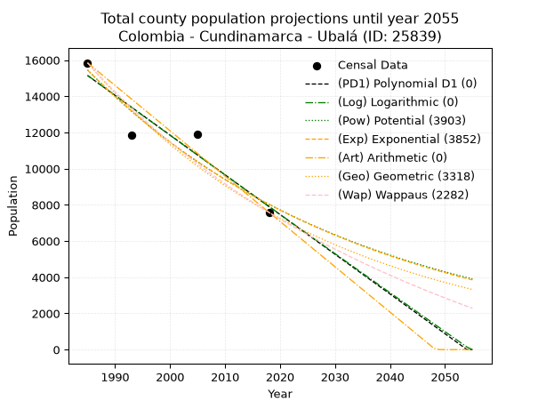
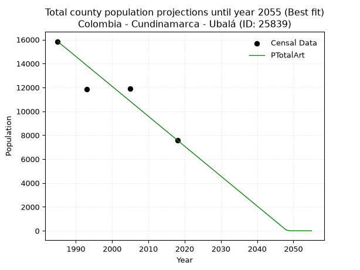
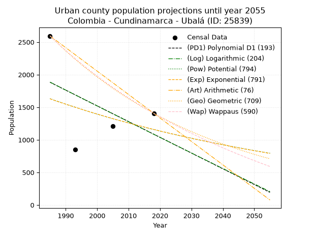
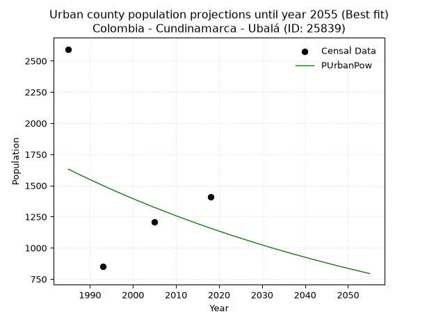
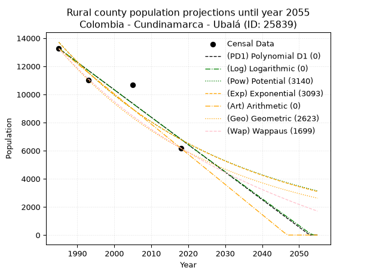
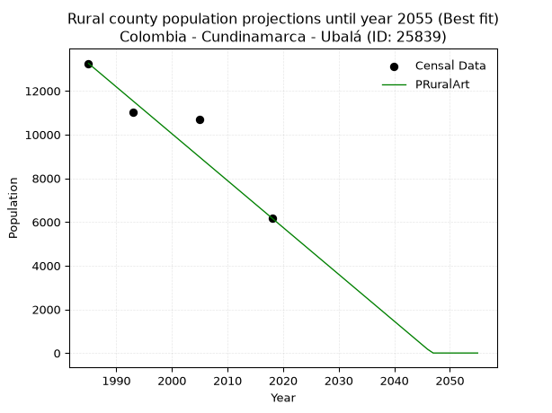

<div align="center">


</div>

# _“Population and Public Services Demand Projections (PPSD) until Year 2050 for Colombia - Cundinamarca - Ubalá (ID: 25839)”_
Keywords: `population` `public-service` `projection` `lineal` `polynomial` `logarithmic` `potential` `exponential` `arithmetic` `geometric` `wappaus` `dane` `colombia` `south-america`

PPSD are analytical estimates used by governments and planners to anticipate future changes in population size, age distribution, and the resulting community needs for utilities, healthcare, education, and infrastructure as sizing future water treatment facilities, electrical grids, and road networks based on spatial growth.

> **General running parameters**: • app_version: _v20260806_. • Python version: _3.14.7_. • Pandas version: _3.0.5_. • NumPy version: _2.5.1_. • Creates, save and include plots into reports (create_plot): _False_. • Projection until year: _2050_. • Process polynomial degree 2 and up: _False_. • Process Wappaus: _True_. • Process Wappaus: _True_. • Set negative values to zero: _True_. • Set infinite values to zero: _True_. • Drop dataset notes: _True_. 
<div align="center">

Dynamic map: [:earth_americas:Google](http://maps.google.com/maps?q=4.747620095,-73.5314887) [:earth_americas:OSM](https://www.openstreetmap.org/#map=18/4.747620095/-73.5314887&layers=P) [:earth_americas:Bing](https://www.bing.com/maps?cp=4.747620095~-73.5314887&lvl=18) [:earth_americas:Apple](https://maps.apple.com/frame?center=4.747620095%2C-73.5314887&span=0.003%2C0.006)

</div>


<div align="center">

```geojson
{
  "type": "Feature",
  "geometry": {
    "type": "Point", 
    "coordinates": [-73.5314887, 4.747620095]
  }, 
  "properties": {
    "Name": "Colombia - Cundinamarca - Ubalá (ID: 25839)"
  }
}
```

</div>


## 0. Census Data (4 records)

Census data are official statistics collected by a government about the people and housing in a country. They usually include counts of total population, age, sex, race, income, education, and jobs.

📅Global census file: [Population.xlsx](../data/Population.xlsx)

| Source   |   Year |   CountryID | CountryName   |   StateID | StateName    |   CountyID | CountyName   |   PTotal |   PUrban |   PRural |
|:---------|-------:|------------:|:--------------|----------:|:-------------|-----------:|:-------------|---------:|---------:|---------:|
| DANE     |   1985 |          57 | Colombia      |        25 | Cundinamarca |      25839 | Ubalá        |    15849 |     2594 |    13255 |
| DANE     |   1993 |          57 | Colombia      |        25 | Cundinamarca |      25839 | Ubalá        |    11875 |      852 |    11023 |
| DANE     |   2005 |          57 | Colombia      |        25 | Cundinamarca |      25839 | Ubalá        |    11892 |     1206 |    10686 |
| DANE     |   2018 |          57 | Colombia      |        25 | Cundinamarca |      25839 | Ubalá        |     7583 |     1407 |     6176 |

> 🔥Some records could had specific notes about the registered values or the corresponding urban or rural distribution.

**Local public utility companies (RUPS)**

 | SERVICIO       | ESTADO    | NOMBRE                                                   | NIT         | DEPARTAMENTO_DOMICILIO   | MUNICIPIO_DOMICILIO   | DIRECCION                        |   TELEFONO | EMAIL                               | TIPO_INSCRIPCION    | REPRESENTANTE_LEGAL             | TIPO_PRESTADOR                             | CLASIFICACION                 |
|:---------------|:----------|:---------------------------------------------------------|:------------|:-------------------------|:----------------------|:---------------------------------|-----------:|:------------------------------------|:--------------------|:--------------------------------|:-------------------------------------------|:------------------------------|
| ASEO           | OPERATIVA | BIOAGRICOLA DEL LLANO S.A  EMPRESA DE SERVICIOS PUBLICOS | 822000268-9 | META                     | VILLAVICENCIO         | CARRERA 38 No 26C 95 Maizaro Sur |    6819100 | yabermudez@grupodellano.com         | Registro por la ESP | MARBEL ASTRID TORRES PARDO      | SOCIEDADES (EMPRESA DE SERVICIOS PUBLICOS) | MAYOR O IGUAL A 5001 USUARIOS |
| ACUEDUCTO      | OPERATIVA | OFICINA DE SERVICIOS PÚBLICOS DEL MUNICIPIO DE UBALÁ     | 899999385-1 | CUNDINAMARCA             | UBALA                 | Carrera 3 No. 2 - 38             |    8537000 | spublicos@ubala-cundinamarca.gov.co | Registro por la ESP | DANILO ANTONIO SALINAS MARTINEZ | MUNICIPIO (PRESTACIÓN DIRECTA)             | MENOR O IGUAL A 2500 USUARIOS |
| ALCANTARILLADO | OPERATIVA | OFICINA DE SERVICIOS PÚBLICOS DEL MUNICIPIO DE UBALÁ     | 899999385-1 | CUNDINAMARCA             | UBALA                 | Carrera 3 No. 2 - 38             |    8537000 | spublicos@ubala-cundinamarca.gov.co | Registro por la ESP | DANILO ANTONIO SALINAS MARTINEZ | MUNICIPIO (PRESTACIÓN DIRECTA)             | MENOR O IGUAL A 2500 USUARIOS |
| ASEO           | OPERATIVA | OFICINA DE SERVICIOS PÚBLICOS DEL MUNICIPIO DE UBALÁ     | 899999385-1 | CUNDINAMARCA             | UBALA                 | Carrera 3 No. 2 - 38             |    8537000 | spublicos@ubala-cundinamarca.gov.co | Registro por la ESP | DANILO ANTONIO SALINAS MARTINEZ | MUNICIPIO (PRESTACIÓN DIRECTA)             | MENOR O IGUAL A 2500 USUARIOS |
| ASEO           | OPERATIVA | NUEVO MONDOÑEDO S.A. E.S.P.                              | 900108696-6 | CUNDINAMARCA             | BOJACA                | KILOMETRO 9 VIA MOSQUERA LA MESA |    6373090 | direccion@nuevomondonedo.com        | Registro por la ESP | JAIME VELEZ RAMIREZ             | SOCIEDADES (EMPRESA DE SERVICIOS PUBLICOS) | MAYOR O IGUAL A 5001 USUARIOS |

> [📅RUPS Database: Registro Único de Prestadores de Servicios Públicos de Colombia Suramérica - RUPS](https://www.datos.gov.co/Hacienda-y-Cr-dito-P-blico/Registro-nico-de-Prestadores-de-Servicios-P-blicos/4qkq-csdn/about_data)

## 1. Total

### 1.1. Coefficients and Parameters

* (PD1) Polynomial Deg 1: -219.51947009232967, 450893.5700521825 (lineal)
* (Log) Logarithmic: -439402.2575742653, 3351699.830970698
* (Pow) Potential: -39.70530764655646, 135.12766453927335
* (Exp) Exponential: -0.019842284981112644, 1.9695951223627548e+21
* (Art) Arithmetic: Year diff. 2018 - 1985 = 33, Population diff. 7583 - 15849 = -8266, Annual growth = -250.4848484848485
* (Geo) Geometric: Year diff. 2018 - 1985 = 33, Population diff. 7583 - 15849 = -8266, Annual growth % = -0.02209164354869053
* (Wap) Wappaus: i = -2.137972417931448, Condition values only valid for < 200)

<sub>
Wappaus condition values: ['-0.00', '-2.14', '-4.28', '-6.41', '-8.55', '-10.69', '-12.83', '-14.97', '-17.10', '-19.24', '-21.38', '-23.52', '-25.66', '-27.79', '-29.93', '-32.07', '-34.21', '-36.35', '-38.48', '-40.62', '-42.76', '-44.90', '-47.04', '-49.17', '-51.31', '-53.45', '-55.59', '-57.73', '-59.86', '-62.00', '-64.14', '-66.28', '-68.42', '-70.55', '-72.69', '-74.83', '-76.97', '-79.10', '-81.24', '-83.38', '-85.52', '-87.66', '-89.79', '-91.93', '-94.07', '-96.21', '-98.35', '-100.48', '-102.62', '-104.76', '-106.90', '-109.04', '-111.17', '-113.31', '-115.45', '-117.59', '-119.73', '-121.86', '-124.00', '-126.14', '-128.28', '-130.42', '-132.55', '-134.69', '-136.83', '-138.97']
</sub>


### 1.2. Projected Dataset

|   Year |   CountyID |   PTotalPD1 |   PTotalLog |   PTotalPow |   PTotalExp |   PTotalArt |   PTotalGeo |   PTotalWap |
|-------:|-----------:|------------:|------------:|------------:|------------:|------------:|------------:|------------:|
|   1985 |      25839 |       15147 |       15154 |       15455 |       15447 |       15849 |       15849 |       15849 |
|   1986 |      25839 |       14928 |       14933 |       15149 |       15144 |       15599 |       15499 |       15514 |
|   1987 |      25839 |       14708 |       14712 |       14849 |       14846 |       15348 |       15156 |       15185 |
|   1988 |      25839 |       14489 |       14490 |       14556 |       14554 |       15098 |       14822 |       14864 |
|   1989 |      25839 |       14269 |       14270 |       14268 |       14269 |       14847 |       14494 |       14549 |
|   1990 |      25839 |       14050 |       14049 |       13986 |       13988 |       14597 |       14174 |       14241 |
|   1991 |      25839 |       13830 |       13828 |       13710 |       13713 |       14346 |       13861 |       13938 |
|   1992 |      25839 |       13611 |       13607 |       13439 |       13444 |       14096 |       13555 |       13642 |
|   1993 |      25839 |       13391 |       13387 |       13174 |       13180 |       13845 |       13255 |       13352 |
|   1994 |      25839 |       13172 |       13166 |       12914 |       12921 |       13595 |       12962 |       13067 |
|   1995 |      25839 |       12952 |       12946 |       12659 |       12667 |       13344 |       12676 |       12788 |
|   1996 |      25839 |       12733 |       12726 |       12410 |       12418 |       13094 |       12396 |       12514 |
|   1997 |      25839 |       12513 |       12506 |       12166 |       12174 |       12843 |       12122 |       12245 |
|   1998 |      25839 |       12294 |       12286 |       11926 |       11935 |       12593 |       11854 |       11981 |
|   1999 |      25839 |       12074 |       12066 |       11692 |       11701 |       12342 |       11592 |       11723 |
|   2000 |      25839 |       11855 |       11846 |       11462 |       11471 |       12092 |       11336 |       11469 |
|   2001 |      25839 |       11635 |       11626 |       11237 |       11245 |       11841 |       11086 |       11219 |
|   2002 |      25839 |       11416 |       11407 |       11016 |       11024 |       11591 |       10841 |       10974 |
|   2003 |      25839 |       11196 |       11188 |       10800 |       10808 |       11340 |       10602 |       10734 |
|   2004 |      25839 |       10977 |       10968 |       10588 |       10595 |       11090 |       10367 |       10498 |
|   2005 |      25839 |       10757 |       10749 |       10380 |       10387 |       10839 |       10138 |       10266 |
|   2006 |      25839 |       10538 |       10530 |       10177 |       10183 |       10589 |        9914 |       10038 |
|   2007 |      25839 |       10318 |       10311 |        9977 |        9983 |       10338 |        9695 |        9814 |
|   2008 |      25839 |       10098 |       10092 |        9782 |        9787 |       10088 |        9481 |        9594 |
|   2009 |      25839 |        9879 |        9873 |        9590 |        9595 |        9837 |        9272 |        9377 |
|   2010 |      25839 |        9659 |        9655 |        9403 |        9406 |        9587 |        9067 |        9164 |
|   2011 |      25839 |        9440 |        9436 |        9219 |        9221 |        9336 |        8867 |        8955 |
|   2012 |      25839 |        9220 |        9218 |        9039 |        9040 |        9086 |        8671 |        8749 |
|   2013 |      25839 |        9001 |        8999 |        8862 |        8863 |        8835 |        8479 |        8547 |
|   2014 |      25839 |        8781 |        8781 |        8689 |        8688 |        8585 |        8292 |        8348 |
|   2015 |      25839 |        8562 |        8563 |        8519 |        8518 |        8334 |        8109 |        8152 |
|   2016 |      25839 |        8342 |        8345 |        8353 |        8350 |        8084 |        7929 |        7959 |
|   2017 |      25839 |        8123 |        8127 |        8190 |        8186 |        7833 |        7754 |        7770 |
|   2018 |      25839 |        7903 |        7909 |        8031 |        8026 |        7583 |        7583 |        7583 |
|   2019 |      25839 |        7684 |        7692 |        7874 |        7868 |        7333 |        7415 |        7399 |
|   2020 |      25839 |        7464 |        7474 |        7721 |        7713 |        7082 |        7252 |        7218 |
|   2021 |      25839 |        7245 |        7256 |        7571 |        7562 |        6832 |        7091 |        7040 |
|   2022 |      25839 |        7025 |        7039 |        7423 |        7413 |        6581 |        6935 |        6865 |
|   2023 |      25839 |        6806 |        6822 |        7279 |        7268 |        6331 |        6782 |        6692 |
|   2024 |      25839 |        6586 |        6605 |        7138 |        7125 |        6080 |        6632 |        6522 |
|   2025 |      25839 |        6367 |        6388 |        6999 |        6985 |        5830 |        6485 |        6355 |
|   2026 |      25839 |        6147 |        6171 |        6863 |        6848 |        5579 |        6342 |        6190 |
|   2027 |      25839 |        5928 |        5954 |        6730 |        6713 |        5329 |        6202 |        6027 |
|   2028 |      25839 |        5708 |        5737 |        6600 |        6581 |        5078 |        6065 |        5867 |
|   2029 |      25839 |        5489 |        5521 |        6472 |        6452 |        4828 |        5931 |        5709 |
|   2030 |      25839 |        5269 |        5304 |        6346 |        6325 |        4577 |        5800 |        5553 |
|   2031 |      25839 |        5050 |        5088 |        6223 |        6201 |        4327 |        5672 |        5400 |
|   2032 |      25839 |        4830 |        4871 |        6103 |        6079 |        4076 |        5546 |        5249 |
|   2033 |      25839 |        4610 |        4655 |        5985 |        5960 |        3826 |        5424 |        5100 |
|   2034 |      25839 |        4391 |        4439 |        5869 |        5842 |        3575 |        5304 |        4953 |
|   2035 |      25839 |        4171 |        4223 |        5756 |        5728 |        3325 |        5187 |        4808 |
|   2036 |      25839 |        3952 |        4007 |        5644 |        5615 |        3074 |        5072 |        4665 |
|   2037 |      25839 |        3732 |        3791 |        5536 |        5505 |        2824 |        4960 |        4524 |
|   2038 |      25839 |        3513 |        3576 |        5429 |        5397 |        2573 |        4851 |        4385 |
|   2039 |      25839 |        3293 |        3360 |        5324 |        5291 |        2323 |        4744 |        4248 |
|   2040 |      25839 |        3074 |        3145 |        5221 |        5187 |        2072 |        4639 |        4113 |
|   2041 |      25839 |        2854 |        2929 |        5121 |        5085 |        1822 |        4536 |        3979 |
|   2042 |      25839 |        2635 |        2714 |        5022 |        4985 |        1571 |        4436 |        3847 |
|   2043 |      25839 |        2415 |        2499 |        4925 |        4887 |        1321 |        4338 |        3718 |
|   2044 |      25839 |        2196 |        2284 |        4831 |        4791 |        1070 |        4242 |        3589 |
|   2045 |      25839 |        1976 |        2069 |        4738 |        4697 |         820 |        4149 |        3463 |
|   2046 |      25839 |        1757 |        1854 |        4647 |        4605 |         569 |        4057 |        3338 |
|   2047 |      25839 |        1537 |        1640 |        4557 |        4514 |         319 |        3967 |        3214 |
|   2048 |      25839 |        1318 |        1425 |        4470 |        4425 |          68 |        3880 |        3093 |
|   2049 |      25839 |        1098 |        1211 |        4384 |        4338 |           0 |        3794 |        2972 |
|   2050 |      25839 |         879 |         996 |        4300 |        4253 |           0 |        3710 |        2854 |
<div align="center">

</img>

</div>


### 1.3. Best fit with absolute and relative error (%)

Relative error puts that difference into context by dividing the absolute error by the true value, creating a unitless ratio or percentage that shows the scale of the mistake.

Absolute and relative error

|   Year | Source   |   CountryID | CountryName   |   StateID | StateName    |   CountyID_x | CountyName   |   PTotal |   PUrban |   PRural |   CountyID_y |   PTotalPD1 |   PTotalLog |   PTotalPow |   PTotalExp |   PTotalArt |   PTotalGeo |   PTotalWap |   PTotalPD1AbsError |   PTotalLogAbsError |   PTotalPowAbsError |   PTotalExpAbsError |   PTotalArtAbsError |   PTotalGeoAbsError |   PTotalWapAbsError |   PTotalPD1RelError |   PTotalLogRelError |   PTotalPowRelError |   PTotalExpRelError |   PTotalArtRelError |   PTotalGeoRelError |   PTotalWapRelError |
|-------:|:---------|------------:|:--------------|----------:|:-------------|-------------:|:-------------|---------:|---------:|---------:|-------------:|------------:|------------:|------------:|------------:|------------:|------------:|------------:|--------------------:|--------------------:|--------------------:|--------------------:|--------------------:|--------------------:|--------------------:|--------------------:|--------------------:|--------------------:|--------------------:|--------------------:|--------------------:|--------------------:|
|   1985 | DANE     |          57 | Colombia      |        25 | Cundinamarca |        25839 | Ubalá        |    15849 |     2594 |    13255 |        25839 |       15147 |       15154 |       15455 |       15447 |       15849 |       15849 |       15849 |                 702 |                 695 |                 394 |                 402 |                   0 |                   0 |                   0 |             4.4293  |             4.38513 |             2.48596 |             2.53644 |             0       |              0      |              0      |
|   1993 | DANE     |          57 | Colombia      |        25 | Cundinamarca |        25839 | Ubalá        |    11875 |      852 |    11023 |        25839 |       13391 |       13387 |       13174 |       13180 |       13845 |       13255 |       13352 |                1516 |                1512 |                1299 |                1305 |                1970 |                1380 |                1477 |            12.7663  |            12.7326  |            10.9389  |            10.9895  |            16.5895  |             11.6211 |             12.4379 |
|   2005 | DANE     |          57 | Colombia      |        25 | Cundinamarca |        25839 | Ubalá        |    11892 |     1206 |    10686 |        25839 |       10757 |       10749 |       10380 |       10387 |       10839 |       10138 |       10266 |                1135 |                1143 |                1512 |                1505 |                1053 |                1754 |                1626 |             9.54423 |             9.6115  |            12.7144  |            12.6556  |             8.85469 |             14.7494 |             13.6731 |
|   2018 | DANE     |          57 | Colombia      |        25 | Cundinamarca |        25839 | Ubalá        |     7583 |     1407 |     6176 |        25839 |        7903 |        7909 |        8031 |        8026 |        7583 |        7583 |        7583 |                 320 |                 326 |                 448 |                 443 |                   0 |                   0 |                   0 |             4.21997 |             4.29909 |             5.90795 |             5.84202 |             0       |              0      |              0      |

Relative error mean

| Method    |   RelError | Best   |
|:----------|-----------:|:-------|
| PTotalPD1 |    7.73995 |        |
| PTotalLog |    7.75709 |        |
| PTotalPow |    8.01182 |        |
| PTotalExp |    8.00587 |        |
| PTotalArt |    6.36104 | True   |
| PTotalGeo |    6.59262 |        |
| PTotalWap |    6.52774 |        |

💙Best method: _**PTotalArt**_
<div align="center">

</img>

</div>


### 1.4. Fresh water supply demand in liters per capita per day (lpcd)

The fresh water supply demand typically ranges from 100 to 300 liters per capita per day (lpcd) for standard domestic and municipal planning, though absolute survival minimums set by the World Health Organization are as low as 7.5 to 20 liters per day, and total consumption in high-income nations can exceed 400 liters.

> `CZ`: Level in meters above the sea level (masl)<br> `WS`: Fresh water supply demand in liters per capita per day (lpcd or l/h/d)<br> `WSAll`: Zonal fresh water supply demand in liters per second (l/s)<br> `A`: Zonal area in square meters<br> `DP`: Population density (people/hectare or p/ha)

Reference values (RAS Colombia)

|    CZ |   WS |
|------:|-----:|
|  1000 |  120 |
|  2000 |  130 |
| 99999 |  140 |

County shapefile geometry properties and water supply values

|   CountyID |      ATotal |   CZTotal |   WSTotal |
|-----------:|------------:|----------:|----------:|
|      25839 | 5.21578e+08 |   1678.87 |       130 |

Projected values for best method: PTotalArt

|   CountyID |   Year |   PTotalArt |   DPTotal |   WSTotal |   WSTotalAll |
|-----------:|-------:|------------:|----------:|----------:|-------------:|
|      25839 |   1985 |       15849 |      0.3  |       130 |    23.8469   |
|      25839 |   1986 |       15599 |      0.3  |       130 |    23.4707   |
|      25839 |   1987 |       15348 |      0.29 |       130 |    23.0931   |
|      25839 |   1988 |       15098 |      0.29 |       130 |    22.7169   |
|      25839 |   1989 |       14847 |      0.28 |       130 |    22.3392   |
|      25839 |   1990 |       14597 |      0.28 |       130 |    21.9631   |
|      25839 |   1991 |       14346 |      0.28 |       130 |    21.5854   |
|      25839 |   1992 |       14096 |      0.27 |       130 |    21.2093   |
|      25839 |   1993 |       13845 |      0.27 |       130 |    20.8316   |
|      25839 |   1994 |       13595 |      0.26 |       130 |    20.4554   |
|      25839 |   1995 |       13344 |      0.26 |       130 |    20.0778   |
|      25839 |   1996 |       13094 |      0.25 |       130 |    19.7016   |
|      25839 |   1997 |       12843 |      0.25 |       130 |    19.324    |
|      25839 |   1998 |       12593 |      0.24 |       130 |    18.9478   |
|      25839 |   1999 |       12342 |      0.24 |       130 |    18.5701   |
|      25839 |   2000 |       12092 |      0.23 |       130 |    18.194    |
|      25839 |   2001 |       11841 |      0.23 |       130 |    17.8163   |
|      25839 |   2002 |       11591 |      0.22 |       130 |    17.4402   |
|      25839 |   2003 |       11340 |      0.22 |       130 |    17.0625   |
|      25839 |   2004 |       11090 |      0.21 |       130 |    16.6863   |
|      25839 |   2005 |       10839 |      0.21 |       130 |    16.3087   |
|      25839 |   2006 |       10589 |      0.2  |       130 |    15.9325   |
|      25839 |   2007 |       10338 |      0.2  |       130 |    15.5549   |
|      25839 |   2008 |       10088 |      0.19 |       130 |    15.1787   |
|      25839 |   2009 |        9837 |      0.19 |       130 |    14.801    |
|      25839 |   2010 |        9587 |      0.18 |       130 |    14.4249   |
|      25839 |   2011 |        9336 |      0.18 |       130 |    14.0472   |
|      25839 |   2012 |        9086 |      0.17 |       130 |    13.6711   |
|      25839 |   2013 |        8835 |      0.17 |       130 |    13.2934   |
|      25839 |   2014 |        8585 |      0.16 |       130 |    12.9172   |
|      25839 |   2015 |        8334 |      0.16 |       130 |    12.5396   |
|      25839 |   2016 |        8084 |      0.15 |       130 |    12.1634   |
|      25839 |   2017 |        7833 |      0.15 |       130 |    11.7858   |
|      25839 |   2018 |        7583 |      0.15 |       130 |    11.4096   |
|      25839 |   2019 |        7333 |      0.14 |       130 |    11.0334   |
|      25839 |   2020 |        7082 |      0.14 |       130 |    10.6558   |
|      25839 |   2021 |        6832 |      0.13 |       130 |    10.2796   |
|      25839 |   2022 |        6581 |      0.13 |       130 |     9.90197  |
|      25839 |   2023 |        6331 |      0.12 |       130 |     9.52581  |
|      25839 |   2024 |        6080 |      0.12 |       130 |     9.14815  |
|      25839 |   2025 |        5830 |      0.11 |       130 |     8.77199  |
|      25839 |   2026 |        5579 |      0.11 |       130 |     8.39433  |
|      25839 |   2027 |        5329 |      0.1  |       130 |     8.01817  |
|      25839 |   2028 |        5078 |      0.1  |       130 |     7.64051  |
|      25839 |   2029 |        4828 |      0.09 |       130 |     7.26435  |
|      25839 |   2030 |        4577 |      0.09 |       130 |     6.88669  |
|      25839 |   2031 |        4327 |      0.08 |       130 |     6.51053  |
|      25839 |   2032 |        4076 |      0.08 |       130 |     6.13287  |
|      25839 |   2033 |        3826 |      0.07 |       130 |     5.75671  |
|      25839 |   2034 |        3575 |      0.07 |       130 |     5.37905  |
|      25839 |   2035 |        3325 |      0.06 |       130 |     5.00289  |
|      25839 |   2036 |        3074 |      0.06 |       130 |     4.62523  |
|      25839 |   2037 |        2824 |      0.05 |       130 |     4.24907  |
|      25839 |   2038 |        2573 |      0.05 |       130 |     3.87141  |
|      25839 |   2039 |        2323 |      0.04 |       130 |     3.49525  |
|      25839 |   2040 |        2072 |      0.04 |       130 |     3.11759  |
|      25839 |   2041 |        1822 |      0.03 |       130 |     2.74144  |
|      25839 |   2042 |        1571 |      0.03 |       130 |     2.36377  |
|      25839 |   2043 |        1321 |      0.03 |       130 |     1.98762  |
|      25839 |   2044 |        1070 |      0.02 |       130 |     1.60995  |
|      25839 |   2045 |         820 |      0.02 |       130 |     1.2338   |
|      25839 |   2046 |         569 |      0.01 |       130 |     0.856134 |
|      25839 |   2047 |         319 |      0.01 |       130 |     0.479977 |
|      25839 |   2048 |          68 |      0    |       130 |     0.102315 |
|      25839 |   2049 |           0 |      0    |       130 |     0        |
|      25839 |   2050 |           0 |      0    |       130 |     0        |

## 2. Urban

### 2.1. Coefficients and Parameters

* (PD1) Polynomial Deg 1: -24.139301485347392, 49799.38779606612 (lineal)
* (Log) Logarithmic: -48493.13292728407, 370111.4419798653
* (Pow) Potential: -20.759979181027667, 71.67377839746024
* (Exp) Exponential: -0.010316280735420768, 1274208251648.3152
* (Art) Arithmetic: Year diff. 2018 - 1985 = 33, Population diff. 1407 - 2594 = -1187, Annual growth = -35.96969696969697
* (Geo) Geometric: Year diff. 2018 - 1985 = 33, Population diff. 1407 - 2594 = -1187, Annual growth % = -0.01836685061322063
* (Wap) Wappaus: i = -1.798035339649936, Condition values only valid for < 200)

<sub>
Wappaus condition values: ['-0.00', '-1.80', '-3.60', '-5.39', '-7.19', '-8.99', '-10.79', '-12.59', '-14.38', '-16.18', '-17.98', '-19.78', '-21.58', '-23.37', '-25.17', '-26.97', '-28.77', '-30.57', '-32.36', '-34.16', '-35.96', '-37.76', '-39.56', '-41.35', '-43.15', '-44.95', '-46.75', '-48.55', '-50.34', '-52.14', '-53.94', '-55.74', '-57.54', '-59.34', '-61.13', '-62.93', '-64.73', '-66.53', '-68.33', '-70.12', '-71.92', '-73.72', '-75.52', '-77.32', '-79.11', '-80.91', '-82.71', '-84.51', '-86.31', '-88.10', '-89.90', '-91.70', '-93.50', '-95.30', '-97.09', '-98.89', '-100.69', '-102.49', '-104.29', '-106.08', '-107.88', '-109.68', '-111.48', '-113.28', '-115.07', '-116.87']
</sub>


### 2.2. Projected Dataset

|   Year |   CountyID |   PUrbanPD1 |   PUrbanLog |   PUrbanPow |   PUrbanExp |   PUrbanArt |   PUrbanGeo |   PUrbanWap |
|-------:|-----------:|------------:|------------:|------------:|------------:|------------:|------------:|------------:|
|   1985 |      25839 |        1883 |        1885 |        1631 |        1629 |        2594 |        2594 |        2594 |
|   1986 |      25839 |        1859 |        1861 |        1614 |        1612 |        2558 |        2546 |        2548 |
|   1987 |      25839 |        1835 |        1836 |        1597 |        1595 |        2522 |        2500 |        2502 |
|   1988 |      25839 |        1810 |        1812 |        1580 |        1579 |        2486 |        2454 |        2458 |
|   1989 |      25839 |        1786 |        1787 |        1564 |        1563 |        2450 |        2409 |        2414 |
|   1990 |      25839 |        1762 |        1763 |        1548 |        1547 |        2414 |        2364 |        2371 |
|   1991 |      25839 |        1738 |        1739 |        1532 |        1531 |        2378 |        2321 |        2328 |
|   1992 |      25839 |        1714 |        1714 |        1516 |        1515 |        2342 |        2278 |        2287 |
|   1993 |      25839 |        1690 |        1690 |        1500 |        1500 |        2306 |        2236 |        2246 |
|   1994 |      25839 |        1666 |        1666 |        1484 |        1484 |        2270 |        2195 |        2206 |
|   1995 |      25839 |        1641 |        1641 |        1469 |        1469 |        2234 |        2155 |        2166 |
|   1996 |      25839 |        1617 |        1617 |        1454 |        1454 |        2198 |        2115 |        2127 |
|   1997 |      25839 |        1593 |        1593 |        1439 |        1439 |        2162 |        2077 |        2089 |
|   1998 |      25839 |        1569 |        1568 |        1424 |        1424 |        2126 |        2038 |        2051 |
|   1999 |      25839 |        1545 |        1544 |        1409 |        1410 |        2090 |        2001 |        2014 |
|   2000 |      25839 |        1521 |        1520 |        1395 |        1395 |        2054 |        1964 |        1978 |
|   2001 |      25839 |        1497 |        1496 |        1380 |        1381 |        2018 |        1928 |        1942 |
|   2002 |      25839 |        1473 |        1471 |        1366 |        1367 |        1983 |        1893 |        1906 |
|   2003 |      25839 |        1448 |        1447 |        1352 |        1353 |        1947 |        1858 |        1871 |
|   2004 |      25839 |        1424 |        1423 |        1338 |        1339 |        1911 |        1824 |        1837 |
|   2005 |      25839 |        1400 |        1399 |        1324 |        1325 |        1875 |        1790 |        1803 |
|   2006 |      25839 |        1376 |        1375 |        1311 |        1311 |        1839 |        1758 |        1770 |
|   2007 |      25839 |        1352 |        1350 |        1297 |        1298 |        1803 |        1725 |        1737 |
|   2008 |      25839 |        1328 |        1326 |        1284 |        1285 |        1767 |        1694 |        1705 |
|   2009 |      25839 |        1304 |        1302 |        1271 |        1271 |        1731 |        1662 |        1673 |
|   2010 |      25839 |        1279 |        1278 |        1257 |        1258 |        1695 |        1632 |        1642 |
|   2011 |      25839 |        1255 |        1254 |        1245 |        1246 |        1659 |        1602 |        1611 |
|   2012 |      25839 |        1231 |        1230 |        1232 |        1233 |        1623 |        1573 |        1581 |
|   2013 |      25839 |        1207 |        1206 |        1219 |        1220 |        1587 |        1544 |        1551 |
|   2014 |      25839 |        1183 |        1182 |        1207 |        1208 |        1551 |        1515 |        1521 |
|   2015 |      25839 |        1159 |        1158 |        1194 |        1195 |        1515 |        1487 |        1492 |
|   2016 |      25839 |        1135 |        1133 |        1182 |        1183 |        1479 |        1460 |        1463 |
|   2017 |      25839 |        1110 |        1109 |        1170 |        1171 |        1443 |        1433 |        1435 |
|   2018 |      25839 |        1086 |        1085 |        1158 |        1159 |        1407 |        1407 |        1407 |
|   2019 |      25839 |        1062 |        1061 |        1146 |        1147 |        1371 |        1381 |        1379 |
|   2020 |      25839 |        1038 |        1037 |        1134 |        1135 |        1335 |        1356 |        1352 |
|   2021 |      25839 |        1014 |        1013 |        1123 |        1123 |        1299 |        1331 |        1325 |
|   2022 |      25839 |         990 |         989 |        1111 |        1112 |        1263 |        1306 |        1299 |
|   2023 |      25839 |         966 |         965 |        1100 |        1100 |        1227 |        1282 |        1273 |
|   2024 |      25839 |         941 |         941 |        1089 |        1089 |        1191 |        1259 |        1247 |
|   2025 |      25839 |         917 |         917 |        1078 |        1078 |        1155 |        1236 |        1222 |
|   2026 |      25839 |         893 |         894 |        1067 |        1067 |        1119 |        1213 |        1197 |
|   2027 |      25839 |         869 |         870 |        1056 |        1056 |        1083 |        1191 |        1172 |
|   2028 |      25839 |         845 |         846 |        1045 |        1045 |        1047 |        1169 |        1148 |
|   2029 |      25839 |         821 |         822 |        1034 |        1034 |        1011 |        1147 |        1123 |
|   2030 |      25839 |         797 |         798 |        1024 |        1024 |         975 |        1126 |        1100 |
|   2031 |      25839 |         772 |         774 |        1013 |        1013 |         939 |        1106 |        1076 |
|   2032 |      25839 |         748 |         750 |        1003 |        1003 |         903 |        1085 |        1053 |
|   2033 |      25839 |         724 |         726 |         993 |         993 |         867 |        1065 |        1030 |
|   2034 |      25839 |         700 |         702 |         983 |         982 |         831 |        1046 |        1007 |
|   2035 |      25839 |         676 |         679 |         973 |         972 |         796 |        1027 |         985 |
|   2036 |      25839 |         652 |         655 |         963 |         962 |         760 |        1008 |         963 |
|   2037 |      25839 |         628 |         631 |         953 |         952 |         724 |         989 |         941 |
|   2038 |      25839 |         603 |         607 |         944 |         943 |         688 |         971 |         920 |
|   2039 |      25839 |         579 |         583 |         934 |         933 |         652 |         953 |         898 |
|   2040 |      25839 |         555 |         560 |         925 |         923 |         616 |         936 |         877 |
|   2041 |      25839 |         531 |         536 |         915 |         914 |         580 |         919 |         857 |
|   2042 |      25839 |         507 |         512 |         906 |         905 |         544 |         902 |         836 |
|   2043 |      25839 |         483 |         488 |         897 |         895 |         508 |         885 |         816 |
|   2044 |      25839 |         459 |         465 |         888 |         886 |         472 |         869 |         796 |
|   2045 |      25839 |         435 |         441 |         879 |         877 |         436 |         853 |         776 |
|   2046 |      25839 |         410 |         417 |         870 |         868 |         400 |         837 |         757 |
|   2047 |      25839 |         386 |         393 |         861 |         859 |         364 |         822 |         737 |
|   2048 |      25839 |         362 |         370 |         852 |         850 |         328 |         807 |         718 |
|   2049 |      25839 |         338 |         346 |         844 |         842 |         292 |         792 |         699 |
|   2050 |      25839 |         314 |         322 |         835 |         833 |         256 |         777 |         681 |
<div align="center">

</img>

</div>


### 2.3. Best fit with absolute and relative error (%)

Relative error puts that difference into context by dividing the absolute error by the true value, creating a unitless ratio or percentage that shows the scale of the mistake.

Absolute and relative error

|   Year | Source   |   CountryID | CountryName   |   StateID | StateName    |   CountyID_x | CountyName   |   PTotal |   PUrban |   PRural |   CountyID_y |   PUrbanPD1 |   PUrbanLog |   PUrbanPow |   PUrbanExp |   PUrbanArt |   PUrbanGeo |   PUrbanWap |   PUrbanPD1AbsError |   PUrbanLogAbsError |   PUrbanPowAbsError |   PUrbanExpAbsError |   PUrbanArtAbsError |   PUrbanGeoAbsError |   PUrbanWapAbsError |   PUrbanPD1RelError |   PUrbanLogRelError |   PUrbanPowRelError |   PUrbanExpRelError |   PUrbanArtRelError |   PUrbanGeoRelError |   PUrbanWapRelError |
|-------:|:---------|------------:|:--------------|----------:|:-------------|-------------:|:-------------|---------:|---------:|---------:|-------------:|------------:|------------:|------------:|------------:|------------:|------------:|------------:|--------------------:|--------------------:|--------------------:|--------------------:|--------------------:|--------------------:|--------------------:|--------------------:|--------------------:|--------------------:|--------------------:|--------------------:|--------------------:|--------------------:|
|   1985 | DANE     |          57 | Colombia      |        25 | Cundinamarca |        25839 | Ubalá        |    15849 |     2594 |    13255 |        25839 |        1883 |        1885 |        1631 |        1629 |        2594 |        2594 |        2594 |                 711 |                 709 |                 963 |                 965 |                   0 |                   0 |                   0 |             27.4094 |             27.3323 |            37.1241  |            37.2012  |              0      |              0      |              0      |
|   1993 | DANE     |          57 | Colombia      |        25 | Cundinamarca |        25839 | Ubalá        |    11875 |      852 |    11023 |        25839 |        1690 |        1690 |        1500 |        1500 |        2306 |        2236 |        2246 |                 838 |                 838 |                 648 |                 648 |                1454 |                1384 |                1394 |             98.3568 |             98.3568 |            76.0563  |            76.0563  |            170.657  |            162.441  |            163.615  |
|   2005 | DANE     |          57 | Colombia      |        25 | Cundinamarca |        25839 | Ubalá        |    11892 |     1206 |    10686 |        25839 |        1400 |        1399 |        1324 |        1325 |        1875 |        1790 |        1803 |                 194 |                 193 |                 118 |                 119 |                 669 |                 584 |                 597 |             16.0862 |             16.0033 |             9.78441 |             9.86733 |             55.4726 |             48.4245 |             49.5025 |
|   2018 | DANE     |          57 | Colombia      |        25 | Cundinamarca |        25839 | Ubalá        |     7583 |     1407 |     6176 |        25839 |        1086 |        1085 |        1158 |        1159 |        1407 |        1407 |        1407 |                 321 |                 322 |                 249 |                 248 |                   0 |                   0 |                   0 |             22.8145 |             22.8856 |            17.6972  |            17.6262  |              0      |              0      |              0      |

Relative error mean

| Method    |   RelError | Best   |
|:----------|-----------:|:-------|
| PUrbanPD1 |    41.1667 |        |
| PUrbanLog |    41.1445 |        |
| PUrbanPow |    35.1655 | True   |
| PUrbanExp |    35.1878 |        |
| PUrbanArt |    56.5325 |        |
| PUrbanGeo |    52.7165 |        |
| PUrbanWap |    53.2794 |        |

💙Best method: _**PUrbanPow**_
<div align="center">

</img>

</div>


### 2.4. Fresh water supply demand in liters per capita per day (lpcd)

The fresh water supply demand typically ranges from 100 to 300 liters per capita per day (lpcd) for standard domestic and municipal planning, though absolute survival minimums set by the World Health Organization are as low as 7.5 to 20 liters per day, and total consumption in high-income nations can exceed 400 liters.

> `CZ`: Level in meters above the sea level (masl)<br> `WS`: Fresh water supply demand in liters per capita per day (lpcd or l/h/d)<br> `WSAll`: Zonal fresh water supply demand in liters per second (l/s)<br> `A`: Zonal area in square meters<br> `DP`: Population density (people/hectare or p/ha)

Reference values (RAS Colombia)

|    CZ |   WS |
|------:|-----:|
|  1000 |  120 |
|  2000 |  130 |
| 99999 |  140 |

County shapefile geometry properties and water supply values

|   CountyID |   AUrban |   CZUrban |   WSUrban |
|-----------:|---------:|----------:|----------:|
|      25839 |   682920 |    1906.2 |       130 |

Projected values for best method: PUrbanPow

|   CountyID |   Year |   PUrbanPow |   DPUrban |   WSUrban |   WSUrbanAll |
|-----------:|-------:|------------:|----------:|----------:|-------------:|
|      25839 |   1985 |        1631 |     23.88 |       130 |      2.45405 |
|      25839 |   1986 |        1614 |     23.63 |       130 |      2.42847 |
|      25839 |   1987 |        1597 |     23.38 |       130 |      2.40289 |
|      25839 |   1988 |        1580 |     23.14 |       130 |      2.37731 |
|      25839 |   1989 |        1564 |     22.9  |       130 |      2.35324 |
|      25839 |   1990 |        1548 |     22.67 |       130 |      2.32917 |
|      25839 |   1991 |        1532 |     22.43 |       130 |      2.30509 |
|      25839 |   1992 |        1516 |     22.2  |       130 |      2.28102 |
|      25839 |   1993 |        1500 |     21.96 |       130 |      2.25694 |
|      25839 |   1994 |        1484 |     21.73 |       130 |      2.23287 |
|      25839 |   1995 |        1469 |     21.51 |       130 |      2.2103  |
|      25839 |   1996 |        1454 |     21.29 |       130 |      2.18773 |
|      25839 |   1997 |        1439 |     21.07 |       130 |      2.16516 |
|      25839 |   1998 |        1424 |     20.85 |       130 |      2.14259 |
|      25839 |   1999 |        1409 |     20.63 |       130 |      2.12002 |
|      25839 |   2000 |        1395 |     20.43 |       130 |      2.09896 |
|      25839 |   2001 |        1380 |     20.21 |       130 |      2.07639 |
|      25839 |   2002 |        1366 |     20    |       130 |      2.05532 |
|      25839 |   2003 |        1352 |     19.8  |       130 |      2.03426 |
|      25839 |   2004 |        1338 |     19.59 |       130 |      2.01319 |
|      25839 |   2005 |        1324 |     19.39 |       130 |      1.99213 |
|      25839 |   2006 |        1311 |     19.2  |       130 |      1.97257 |
|      25839 |   2007 |        1297 |     18.99 |       130 |      1.9515  |
|      25839 |   2008 |        1284 |     18.8  |       130 |      1.93194 |
|      25839 |   2009 |        1271 |     18.61 |       130 |      1.91238 |
|      25839 |   2010 |        1257 |     18.41 |       130 |      1.89132 |
|      25839 |   2011 |        1245 |     18.23 |       130 |      1.87326 |
|      25839 |   2012 |        1232 |     18.04 |       130 |      1.8537  |
|      25839 |   2013 |        1219 |     17.85 |       130 |      1.83414 |
|      25839 |   2014 |        1207 |     17.67 |       130 |      1.81609 |
|      25839 |   2015 |        1194 |     17.48 |       130 |      1.79653 |
|      25839 |   2016 |        1182 |     17.31 |       130 |      1.77847 |
|      25839 |   2017 |        1170 |     17.13 |       130 |      1.76042 |
|      25839 |   2018 |        1158 |     16.96 |       130 |      1.74236 |
|      25839 |   2019 |        1146 |     16.78 |       130 |      1.72431 |
|      25839 |   2020 |        1134 |     16.61 |       130 |      1.70625 |
|      25839 |   2021 |        1123 |     16.44 |       130 |      1.6897  |
|      25839 |   2022 |        1111 |     16.27 |       130 |      1.67164 |
|      25839 |   2023 |        1100 |     16.11 |       130 |      1.65509 |
|      25839 |   2024 |        1089 |     15.95 |       130 |      1.63854 |
|      25839 |   2025 |        1078 |     15.79 |       130 |      1.62199 |
|      25839 |   2026 |        1067 |     15.62 |       130 |      1.60544 |
|      25839 |   2027 |        1056 |     15.46 |       130 |      1.58889 |
|      25839 |   2028 |        1045 |     15.3  |       130 |      1.57234 |
|      25839 |   2029 |        1034 |     15.14 |       130 |      1.55579 |
|      25839 |   2030 |        1024 |     14.99 |       130 |      1.54074 |
|      25839 |   2031 |        1013 |     14.83 |       130 |      1.52419 |
|      25839 |   2032 |        1003 |     14.69 |       130 |      1.50914 |
|      25839 |   2033 |         993 |     14.54 |       130 |      1.4941  |
|      25839 |   2034 |         983 |     14.39 |       130 |      1.47905 |
|      25839 |   2035 |         973 |     14.25 |       130 |      1.464   |
|      25839 |   2036 |         963 |     14.1  |       130 |      1.44896 |
|      25839 |   2037 |         953 |     13.95 |       130 |      1.43391 |
|      25839 |   2038 |         944 |     13.82 |       130 |      1.42037 |
|      25839 |   2039 |         934 |     13.68 |       130 |      1.40532 |
|      25839 |   2040 |         925 |     13.54 |       130 |      1.39178 |
|      25839 |   2041 |         915 |     13.4  |       130 |      1.37674 |
|      25839 |   2042 |         906 |     13.27 |       130 |      1.36319 |
|      25839 |   2043 |         897 |     13.13 |       130 |      1.34965 |
|      25839 |   2044 |         888 |     13    |       130 |      1.33611 |
|      25839 |   2045 |         879 |     12.87 |       130 |      1.32257 |
|      25839 |   2046 |         870 |     12.74 |       130 |      1.30903 |
|      25839 |   2047 |         861 |     12.61 |       130 |      1.29549 |
|      25839 |   2048 |         852 |     12.48 |       130 |      1.28194 |
|      25839 |   2049 |         844 |     12.36 |       130 |      1.26991 |
|      25839 |   2050 |         835 |     12.23 |       130 |      1.25637 |

## 3. Rural

### 3.1. Coefficients and Parameters

* (PD1) Polynomial Deg 1: -195.38016860698235, 401094.1822561164 (lineal)
* (Log) Logarithmic: -390909.12464698113, 2981588.388990832
* (Pow) Potential: -42.53366280200414, 144.402897040949
* (Exp) Exponential: -0.021264158367796767, 2.93881676525437e+22
* (Art) Arithmetic: Year diff. 2018 - 1985 = 33, Population diff. 6176 - 13255 = -7079, Annual growth = -214.5151515151515
* (Geo) Geometric: Year diff. 2018 - 1985 = 33, Population diff. 6176 - 13255 = -7079, Annual growth % = -0.02287681142356779
* (Wap) Wappaus: i = -2.2079682107472753, Condition values only valid for < 200)

<sub>
Wappaus condition values: ['-0.00', '-2.21', '-4.42', '-6.62', '-8.83', '-11.04', '-13.25', '-15.46', '-17.66', '-19.87', '-22.08', '-24.29', '-26.50', '-28.70', '-30.91', '-33.12', '-35.33', '-37.54', '-39.74', '-41.95', '-44.16', '-46.37', '-48.58', '-50.78', '-52.99', '-55.20', '-57.41', '-59.62', '-61.82', '-64.03', '-66.24', '-68.45', '-70.65', '-72.86', '-75.07', '-77.28', '-79.49', '-81.69', '-83.90', '-86.11', '-88.32', '-90.53', '-92.73', '-94.94', '-97.15', '-99.36', '-101.57', '-103.77', '-105.98', '-108.19', '-110.40', '-112.61', '-114.81', '-117.02', '-119.23', '-121.44', '-123.65', '-125.85', '-128.06', '-130.27', '-132.48', '-134.69', '-136.89', '-139.10', '-141.31', '-143.52']
</sub>


### 3.2. Projected Dataset

|   Year |   CountyID |   PRuralPD1 |   PRuralLog |   PRuralPow |   PRuralExp |   PRuralArt |   PRuralGeo |   PRuralWap |
|-------:|-----------:|------------:|------------:|------------:|------------:|------------:|------------:|------------:|
|   1985 |      25839 |       13265 |       13269 |       13711 |       13705 |       13255 |       13255 |       13255 |
|   1986 |      25839 |       13069 |       13072 |       13420 |       13417 |       13040 |       12952 |       12966 |
|   1987 |      25839 |       12874 |       12875 |       13136 |       13134 |       12826 |       12655 |       12682 |
|   1988 |      25839 |       12678 |       12679 |       12858 |       12858 |       12611 |       12366 |       12405 |
|   1989 |      25839 |       12483 |       12482 |       12586 |       12588 |       12397 |       12083 |       12134 |
|   1990 |      25839 |       12288 |       12286 |       12319 |       12323 |       12182 |       11807 |       11868 |
|   1991 |      25839 |       12092 |       12089 |       12059 |       12064 |       11968 |       11537 |       11608 |
|   1992 |      25839 |       11897 |       11893 |       11804 |       11810 |       11753 |       11273 |       11353 |
|   1993 |      25839 |       11702 |       11697 |       11555 |       11561 |       11539 |       11015 |       11104 |
|   1994 |      25839 |       11506 |       11501 |       11311 |       11318 |       11324 |       10763 |       10859 |
|   1995 |      25839 |       11311 |       11305 |       11072 |       11080 |       11110 |       10517 |       10619 |
|   1996 |      25839 |       11115 |       11109 |       10839 |       10847 |       10895 |       10276 |       10384 |
|   1997 |      25839 |       10920 |       10913 |       10610 |       10619 |       10681 |       10041 |       10154 |
|   1998 |      25839 |       10725 |       10717 |       10387 |       10395 |       10466 |        9811 |        9928 |
|   1999 |      25839 |       10529 |       10522 |       10168 |       10176 |       10252 |        9587 |        9706 |
|   2000 |      25839 |       10334 |       10326 |        9954 |        9962 |       10037 |        9367 |        9489 |
|   2001 |      25839 |       10138 |       10131 |        9745 |        9753 |        9823 |        9153 |        9275 |
|   2002 |      25839 |        9943 |        9936 |        9540 |        9547 |        9608 |        8944 |        9066 |
|   2003 |      25839 |        9748 |        9740 |        9339 |        9347 |        9394 |        8739 |        8860 |
|   2004 |      25839 |        9552 |        9545 |        9143 |        9150 |        9179 |        8539 |        8658 |
|   2005 |      25839 |        9357 |        9350 |        8951 |        8957 |        8965 |        8344 |        8460 |
|   2006 |      25839 |        9162 |        9155 |        8763 |        8769 |        8750 |        8153 |        8266 |
|   2007 |      25839 |        8966 |        8960 |        8579 |        8584 |        8536 |        7966 |        8075 |
|   2008 |      25839 |        8771 |        8766 |        8400 |        8404 |        8321 |        7784 |        7887 |
|   2009 |      25839 |        8575 |        8571 |        8224 |        8227 |        8107 |        7606 |        7702 |
|   2010 |      25839 |        8380 |        8377 |        8051 |        8054 |        7892 |        7432 |        7521 |
|   2011 |      25839 |        8185 |        8182 |        7883 |        7885 |        7678 |        7262 |        7343 |
|   2012 |      25839 |        7989 |        7988 |        7718 |        7719 |        7463 |        7096 |        7168 |
|   2013 |      25839 |        7794 |        7794 |        7556 |        7556 |        7249 |        6934 |        6995 |
|   2014 |      25839 |        7599 |        7599 |        7399 |        7397 |        7034 |        6775 |        6826 |
|   2015 |      25839 |        7403 |        7405 |        7244 |        7242 |        6820 |        6620 |        6659 |
|   2016 |      25839 |        7208 |        7211 |        7093 |        7089 |        6605 |        6469 |        6496 |
|   2017 |      25839 |        7012 |        7018 |        6945 |        6940 |        6391 |        6321 |        6335 |
|   2018 |      25839 |        6817 |        6824 |        6800 |        6794 |        6176 |        6176 |        6176 |
|   2019 |      25839 |        6622 |        6630 |        6658 |        6651 |        5961 |        6035 |        6020 |
|   2020 |      25839 |        6426 |        6437 |        6519 |        6511 |        5747 |        5897 |        5867 |
|   2021 |      25839 |        6231 |        6243 |        6383 |        6374 |        5532 |        5762 |        5715 |
|   2022 |      25839 |        6035 |        6050 |        6251 |        6240 |        5318 |        5630 |        5567 |
|   2023 |      25839 |        5840 |        5856 |        6120 |        6109 |        5103 |        5501 |        5420 |
|   2024 |      25839 |        5645 |        5663 |        5993 |        5980 |        4889 |        5375 |        5276 |
|   2025 |      25839 |        5449 |        5470 |        5869 |        5854 |        4674 |        5252 |        5134 |
|   2026 |      25839 |        5254 |        5277 |        5747 |        5731 |        4460 |        5132 |        4995 |
|   2027 |      25839 |        5059 |        5084 |        5627 |        5611 |        4245 |        5015 |        4857 |
|   2028 |      25839 |        4863 |        4891 |        5510 |        5493 |        4031 |        4900 |        4721 |
|   2029 |      25839 |        4668 |        4699 |        5396 |        5377 |        3816 |        4788 |        4588 |
|   2030 |      25839 |        4472 |        4506 |        5284 |        5264 |        3602 |        4678 |        4456 |
|   2031 |      25839 |        4277 |        4314 |        5175 |        5153 |        3387 |        4571 |        4327 |
|   2032 |      25839 |        4082 |        4121 |        5067 |        5045 |        3173 |        4467 |        4199 |
|   2033 |      25839 |        3886 |        3929 |        4962 |        4939 |        2958 |        4365 |        4073 |
|   2034 |      25839 |        3691 |        3737 |        4860 |        4835 |        2744 |        4265 |        3949 |
|   2035 |      25839 |        3496 |        3545 |        4759 |        4733 |        2529 |        4167 |        3826 |
|   2036 |      25839 |        3300 |        3352 |        4661 |        4633 |        2315 |        4072 |        3706 |
|   2037 |      25839 |        3105 |        3161 |        4564 |        4536 |        2100 |        3979 |        3587 |
|   2038 |      25839 |        2909 |        2969 |        4470 |        4441 |        1886 |        3888 |        3469 |
|   2039 |      25839 |        2714 |        2777 |        4378 |        4347 |        1671 |        3799 |        3354 |
|   2040 |      25839 |        2519 |        2585 |        4287 |        4256 |        1457 |        3712 |        3240 |
|   2041 |      25839 |        2323 |        2394 |        4199 |        4166 |        1242 |        3627 |        3127 |
|   2042 |      25839 |        2128 |        2202 |        4112 |        4078 |        1028 |        3544 |        3016 |
|   2043 |      25839 |        1932 |        2011 |        4028 |        3993 |         813 |        3463 |        2907 |
|   2044 |      25839 |        1737 |        1819 |        3945 |        3909 |         599 |        3384 |        2799 |
|   2045 |      25839 |        1542 |        1628 |        3864 |        3826 |         384 |        3306 |        2692 |
|   2046 |      25839 |        1346 |        1437 |        3784 |        3746 |         170 |        3231 |        2587 |
|   2047 |      25839 |        1151 |        1246 |        3706 |        3667 |           0 |        3157 |        2483 |
|   2048 |      25839 |         956 |        1055 |        3630 |        3590 |           0 |        3085 |        2380 |
|   2049 |      25839 |         760 |         864 |        3555 |        3514 |           0 |        3014 |        2279 |
|   2050 |      25839 |         565 |         674 |        3482 |        3440 |           0 |        2945 |        2179 |
<div align="center">

</img>

</div>


### 3.3. Best fit with absolute and relative error (%)

Relative error puts that difference into context by dividing the absolute error by the true value, creating a unitless ratio or percentage that shows the scale of the mistake.

Absolute and relative error

|   Year | Source   |   CountryID | CountryName   |   StateID | StateName    |   CountyID_x | CountyName   |   PTotal |   PUrban |   PRural |   CountyID_y |   PRuralPD1 |   PRuralLog |   PRuralPow |   PRuralExp |   PRuralArt |   PRuralGeo |   PRuralWap |   PRuralPD1AbsError |   PRuralLogAbsError |   PRuralPowAbsError |   PRuralExpAbsError |   PRuralArtAbsError |   PRuralGeoAbsError |   PRuralWapAbsError |   PRuralPD1RelError |   PRuralLogRelError |   PRuralPowRelError |   PRuralExpRelError |   PRuralArtRelError |   PRuralGeoRelError |   PRuralWapRelError |
|-------:|:---------|------------:|:--------------|----------:|:-------------|-------------:|:-------------|---------:|---------:|---------:|-------------:|------------:|------------:|------------:|------------:|------------:|------------:|------------:|--------------------:|--------------------:|--------------------:|--------------------:|--------------------:|--------------------:|--------------------:|--------------------:|--------------------:|--------------------:|--------------------:|--------------------:|--------------------:|--------------------:|
|   1985 | DANE     |          57 | Colombia      |        25 | Cundinamarca |        25839 | Ubalá        |    15849 |     2594 |    13255 |        25839 |       13265 |       13269 |       13711 |       13705 |       13255 |       13255 |       13255 |                  10 |                  14 |                 456 |                 450 |                   0 |                   0 |                   0 |           0.0754432 |            0.105621 |             3.44021 |             3.39495 |             0       |           0         |            0        |
|   1993 | DANE     |          57 | Colombia      |        25 | Cundinamarca |        25839 | Ubalá        |    11875 |      852 |    11023 |        25839 |       11702 |       11697 |       11555 |       11561 |       11539 |       11015 |       11104 |                 679 |                 674 |                 532 |                 538 |                 516 |                   8 |                  81 |           6.15985   |            6.11449  |             4.82627 |             4.8807  |             4.68112 |           0.0725755 |            0.734827 |
|   2005 | DANE     |          57 | Colombia      |        25 | Cundinamarca |        25839 | Ubalá        |    11892 |     1206 |    10686 |        25839 |        9357 |        9350 |        8951 |        8957 |        8965 |        8344 |        8460 |                1329 |                1336 |                1735 |                1729 |                1721 |                2342 |                2226 |          12.4368    |           12.5023   |            16.2362  |            16.18    |            16.1052  |          21.9165    |           20.831    |
|   2018 | DANE     |          57 | Colombia      |        25 | Cundinamarca |        25839 | Ubalá        |     7583 |     1407 |     6176 |        25839 |        6817 |        6824 |        6800 |        6794 |        6176 |        6176 |        6176 |                 641 |                 648 |                 624 |                 618 |                   0 |                   0 |                   0 |          10.3789    |           10.4922   |            10.1036  |            10.0065  |             0       |           0         |            0        |

Relative error mean

| Method    |   RelError | Best   |
|:----------|-----------:|:-------|
| PRuralPD1 |    7.26275 |        |
| PRuralLog |    7.30367 |        |
| PRuralPow |    8.65158 |        |
| PRuralExp |    8.61554 |        |
| PRuralArt |    5.19658 | True   |
| PRuralGeo |    5.49728 |        |
| PRuralWap |    5.39146 |        |

💙Best method: _**PRuralArt**_
<div align="center">

</img>

</div>


### 3.4. Fresh water supply demand in liters per capita per day (lpcd)

The fresh water supply demand typically ranges from 100 to 300 liters per capita per day (lpcd) for standard domestic and municipal planning, though absolute survival minimums set by the World Health Organization are as low as 7.5 to 20 liters per day, and total consumption in high-income nations can exceed 400 liters.

> `CZ`: Level in meters above the sea level (masl)<br> `WS`: Fresh water supply demand in liters per capita per day (lpcd or l/h/d)<br> `WSAll`: Zonal fresh water supply demand in liters per second (l/s)<br> `A`: Zonal area in square meters<br> `DP`: Population density (people/hectare or p/ha)

Reference values (RAS Colombia)

|    CZ |   WS |
|------:|-----:|
|  1000 |  120 |
|  2000 |  130 |
| 99999 |  140 |

County shapefile geometry properties and water supply values

|   CountyID |      ARural |   CZRural |   WSRural |
|-----------:|------------:|----------:|----------:|
|      25839 | 5.20895e+08 |   1678.58 |       130 |

Projected values for best method: PRuralArt

|   CountyID |   Year |   PRuralArt |   DPRural |   WSRural |   WSRuralAll |
|-----------:|-------:|------------:|----------:|----------:|-------------:|
|      25839 |   1985 |       13255 |      0.25 |       130 |    19.9439   |
|      25839 |   1986 |       13040 |      0.25 |       130 |    19.6204   |
|      25839 |   1987 |       12826 |      0.25 |       130 |    19.2984   |
|      25839 |   1988 |       12611 |      0.24 |       130 |    18.9749   |
|      25839 |   1989 |       12397 |      0.24 |       130 |    18.6529   |
|      25839 |   1990 |       12182 |      0.23 |       130 |    18.3294   |
|      25839 |   1991 |       11968 |      0.23 |       130 |    18.0074   |
|      25839 |   1992 |       11753 |      0.23 |       130 |    17.6839   |
|      25839 |   1993 |       11539 |      0.22 |       130 |    17.3619   |
|      25839 |   1994 |       11324 |      0.22 |       130 |    17.0384   |
|      25839 |   1995 |       11110 |      0.21 |       130 |    16.7164   |
|      25839 |   1996 |       10895 |      0.21 |       130 |    16.3929   |
|      25839 |   1997 |       10681 |      0.21 |       130 |    16.0709   |
|      25839 |   1998 |       10466 |      0.2  |       130 |    15.7475   |
|      25839 |   1999 |       10252 |      0.2  |       130 |    15.4255   |
|      25839 |   2000 |       10037 |      0.19 |       130 |    15.102    |
|      25839 |   2001 |        9823 |      0.19 |       130 |    14.78     |
|      25839 |   2002 |        9608 |      0.18 |       130 |    14.4565   |
|      25839 |   2003 |        9394 |      0.18 |       130 |    14.1345   |
|      25839 |   2004 |        9179 |      0.18 |       130 |    13.811    |
|      25839 |   2005 |        8965 |      0.17 |       130 |    13.489    |
|      25839 |   2006 |        8750 |      0.17 |       130 |    13.1655   |
|      25839 |   2007 |        8536 |      0.16 |       130 |    12.8435   |
|      25839 |   2008 |        8321 |      0.16 |       130 |    12.52     |
|      25839 |   2009 |        8107 |      0.16 |       130 |    12.198    |
|      25839 |   2010 |        7892 |      0.15 |       130 |    11.8745   |
|      25839 |   2011 |        7678 |      0.15 |       130 |    11.5525   |
|      25839 |   2012 |        7463 |      0.14 |       130 |    11.2291   |
|      25839 |   2013 |        7249 |      0.14 |       130 |    10.9071   |
|      25839 |   2014 |        7034 |      0.14 |       130 |    10.5836   |
|      25839 |   2015 |        6820 |      0.13 |       130 |    10.2616   |
|      25839 |   2016 |        6605 |      0.13 |       130 |     9.93808  |
|      25839 |   2017 |        6391 |      0.12 |       130 |     9.61609  |
|      25839 |   2018 |        6176 |      0.12 |       130 |     9.29259  |
|      25839 |   2019 |        5961 |      0.11 |       130 |     8.9691   |
|      25839 |   2020 |        5747 |      0.11 |       130 |     8.64711  |
|      25839 |   2021 |        5532 |      0.11 |       130 |     8.32361  |
|      25839 |   2022 |        5318 |      0.1  |       130 |     8.00162  |
|      25839 |   2023 |        5103 |      0.1  |       130 |     7.67812  |
|      25839 |   2024 |        4889 |      0.09 |       130 |     7.35613  |
|      25839 |   2025 |        4674 |      0.09 |       130 |     7.03264  |
|      25839 |   2026 |        4460 |      0.09 |       130 |     6.71065  |
|      25839 |   2027 |        4245 |      0.08 |       130 |     6.38715  |
|      25839 |   2028 |        4031 |      0.08 |       130 |     6.06516  |
|      25839 |   2029 |        3816 |      0.07 |       130 |     5.74167  |
|      25839 |   2030 |        3602 |      0.07 |       130 |     5.41968  |
|      25839 |   2031 |        3387 |      0.07 |       130 |     5.09618  |
|      25839 |   2032 |        3173 |      0.06 |       130 |     4.77419  |
|      25839 |   2033 |        2958 |      0.06 |       130 |     4.45069  |
|      25839 |   2034 |        2744 |      0.05 |       130 |     4.1287   |
|      25839 |   2035 |        2529 |      0.05 |       130 |     3.80521  |
|      25839 |   2036 |        2315 |      0.04 |       130 |     3.48322  |
|      25839 |   2037 |        2100 |      0.04 |       130 |     3.15972  |
|      25839 |   2038 |        1886 |      0.04 |       130 |     2.83773  |
|      25839 |   2039 |        1671 |      0.03 |       130 |     2.51424  |
|      25839 |   2040 |        1457 |      0.03 |       130 |     2.19225  |
|      25839 |   2041 |        1242 |      0.02 |       130 |     1.86875  |
|      25839 |   2042 |        1028 |      0.02 |       130 |     1.54676  |
|      25839 |   2043 |         813 |      0.02 |       130 |     1.22326  |
|      25839 |   2044 |         599 |      0.01 |       130 |     0.901273 |
|      25839 |   2045 |         384 |      0.01 |       130 |     0.577778 |
|      25839 |   2046 |         170 |      0    |       130 |     0.255787 |
|      25839 |   2047 |           0 |      0    |       130 |     0        |
|      25839 |   2048 |           0 |      0    |       130 |     0        |
|      25839 |   2049 |           0 |      0    |       130 |     0        |
|      25839 |   2050 |           0 |      0    |       130 |     0        |

<div align="center"><br><sub>Share this research</sub></div><br>

<sub>**APPS & TOOLS & CONTENT DISCLAIMER**: • NO WARRANTY - This content and software is provided by <a href="https://github.com/rcfdtools" target="_blank">github.com/rcfdtools</a> "as is", without any express or implied warranty, including warranties of merchantability, fitness for a particular purpose, or non-infringement. There is no guarantee that the software will be error-free or operate without interruption. • LIMITATION OF LIABILITY - Neither the authors nor copyright holders will be liable for claims or damages arising from the software or its use. You are responsible for determining if the software is appropriate for your use and assume all associated risks, including errors, legal compliance, and data loss. • NO PROFESSIONAL ADVICE - The software provides general information and does not offer professional advice. It should not replace consultation with professional advisors. [Clauses and global license for rcfdtools use.](https://github.com/rcfdtools/rcfdtools/blob/main/LICENSE.md)</sub>

| [:house: Home](Readme.md)  | [:beginner: Help / Collaborate](https://github.com/rcfdtools/R.HydroTools/discussions/31) |
|----------------------------|-------------------------------------------------------------------------------------------|