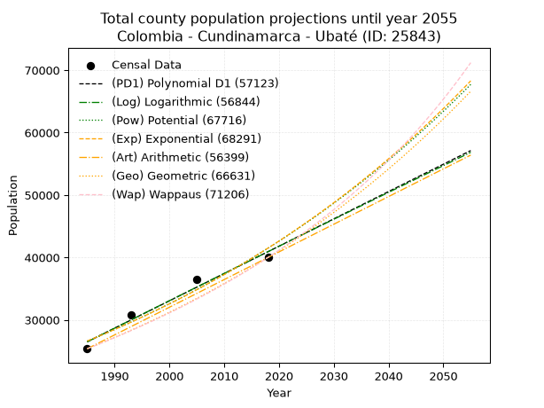
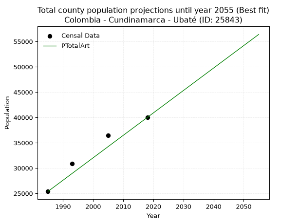
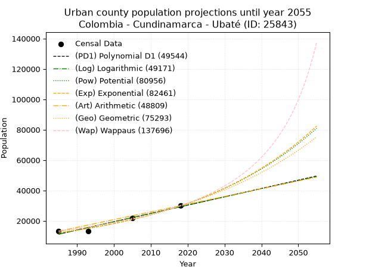
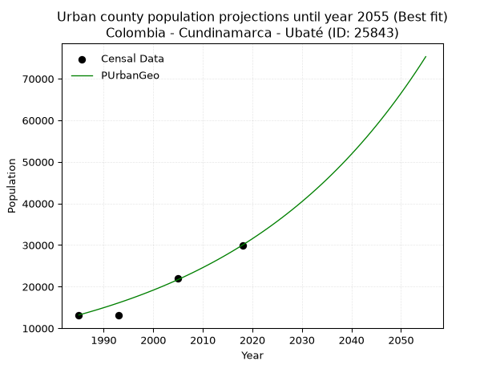
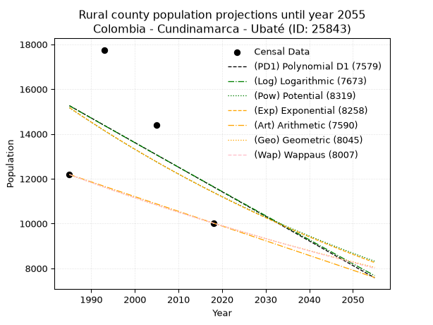
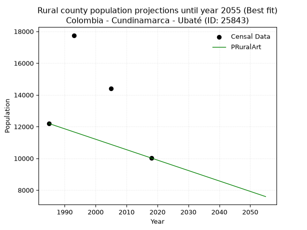

<div align="center">


</div>

# _“Population and Public Services Demand Projections (PPSD) until Year 2050 for Colombia - Cundinamarca - Ubaté (ID: 25843)”_
Keywords: `population` `public-service` `projection` `lineal` `polynomial` `logarithmic` `potential` `exponential` `arithmetic` `geometric` `wappaus` `dane` `colombia` `south-america`

PPSD are analytical estimates used by governments and planners to anticipate future changes in population size, age distribution, and the resulting community needs for utilities, healthcare, education, and infrastructure as sizing future water treatment facilities, electrical grids, and road networks based on spatial growth.

> **General running parameters**: • app_version: _v20260806_. • Python version: _3.14.7_. • Pandas version: _3.0.5_. • NumPy version: _2.5.1_. • Creates, save and include plots into reports (create_plot): _False_. • Projection until year: _2050_. • Process polynomial degree 2 and up: _False_. • Process Wappaus: _True_. • Process Wappaus: _True_. • Set negative values to zero: _True_. • Set infinite values to zero: _True_. • Drop dataset notes: _True_. 
<div align="center">

Dynamic map: [:earth_americas:Google](http://maps.google.com/maps?q=5.307463288,-73.814367) [:earth_americas:OSM](https://www.openstreetmap.org/#map=18/5.307463288/-73.814367&layers=P) [:earth_americas:Bing](https://www.bing.com/maps?cp=5.307463288~-73.814367&lvl=18) [:earth_americas:Apple](https://maps.apple.com/frame?center=5.307463288%2C-73.814367&span=0.003%2C0.006)

</div>


<div align="center">

```geojson
{
  "type": "Feature",
  "geometry": {
    "type": "Point", 
    "coordinates": [-73.814367, 5.307463288]
  }, 
  "properties": {
    "Name": "Colombia - Cundinamarca - Ubaté (ID: 25843)"
  }
}
```

</div>


## 0. Census Data (4 records)

Census data are official statistics collected by a government about the people and housing in a country. They usually include counts of total population, age, sex, race, income, education, and jobs.

📅Global census file: [Population.xlsx](../data/Population.xlsx)

| Source   |   Year |   CountryID | CountryName   |   StateID | StateName    |   CountyID | CountyName   |   PTotal |   PUrban |   PRural |
|:---------|-------:|------------:|:--------------|----------:|:-------------|-----------:|:-------------|---------:|---------:|---------:|
| DANE     |   1985 |          57 | Colombia      |        25 | Cundinamarca |      25843 | Ubaté        |    25376 |    13187 |    12189 |
| DANE     |   1993 |          57 | Colombia      |        25 | Cundinamarca |      25843 | Ubaté        |    30832 |    13080 |    17752 |
| DANE     |   2005 |          57 | Colombia      |        25 | Cundinamarca |      25843 | Ubaté        |    36433 |    22042 |    14391 |
| DANE     |   2018 |          57 | Colombia      |        25 | Cundinamarca |      25843 | Ubaté        |    40001 |    29980 |    10021 |

> 🔥Some records could had specific notes about the registered values or the corresponding urban or rural distribution.

## 1. Total

### 1.1. Coefficients and Parameters

* (PD1) Polynomial Deg 1: 437.66920915294793, -842287.3356081841 (lineal)
* (Log) Logarithmic: 876432.7310497481, -6628611.712000268
* (Pow) Potential: 26.96339554388962, -84.49396585650982
* (Exp) Exponential: 0.013462932797393565, 6.592210910509835e-08
* (Art) Arithmetic: Year diff. 2018 - 1985 = 33, Population diff. 40001 - 25376 = 14625, Annual growth = 443.1818181818182
* (Geo) Geometric: Year diff. 2018 - 1985 = 33, Population diff. 40001 - 25376 = 14625, Annual growth % = 0.013886461026762165
* (Wap) Wappaus: i = 1.3557728809269871, Condition values only valid for < 200)

<sub>
Wappaus condition values: ['0.00', '1.36', '2.71', '4.07', '5.42', '6.78', '8.13', '9.49', '10.85', '12.20', '13.56', '14.91', '16.27', '17.63', '18.98', '20.34', '21.69', '23.05', '24.40', '25.76', '27.12', '28.47', '29.83', '31.18', '32.54', '33.89', '35.25', '36.61', '37.96', '39.32', '40.67', '42.03', '43.38', '44.74', '46.10', '47.45', '48.81', '50.16', '51.52', '52.88', '54.23', '55.59', '56.94', '58.30', '59.65', '61.01', '62.37', '63.72', '65.08', '66.43', '67.79', '69.14', '70.50', '71.86', '73.21', '74.57', '75.92', '77.28', '78.63', '79.99', '81.35', '82.70', '84.06', '85.41', '86.77', '88.13']
</sub>


### 1.2. Projected Dataset

|   Year |   CountyID |   PTotalPD1 |   PTotalLog |   PTotalPow |   PTotalExp |   PTotalArt |   PTotalGeo |   PTotalWap |
|-------:|-----------:|------------:|------------:|------------:|------------:|------------:|------------:|------------:|
|   1985 |      25843 |       26486 |       26470 |       26598 |       26612 |       25376 |       25376 |       25376 |
|   1986 |      25843 |       26924 |       26911 |       26962 |       26973 |       25819 |       25728 |       25722 |
|   1987 |      25843 |       27361 |       27353 |       27331 |       27339 |       26262 |       26086 |       26074 |
|   1988 |      25843 |       27799 |       27794 |       27704 |       27709 |       26706 |       26448 |       26430 |
|   1989 |      25843 |       28237 |       28234 |       28082 |       28085 |       27149 |       26815 |       26791 |
|   1990 |      25843 |       28674 |       28675 |       28465 |       28465 |       27592 |       27188 |       27157 |
|   1991 |      25843 |       29112 |       29115 |       28853 |       28851 |       28035 |       27565 |       27528 |
|   1992 |      25843 |       29550 |       29555 |       29247 |       29242 |       28478 |       27948 |       27904 |
|   1993 |      25843 |       29987 |       29995 |       29645 |       29639 |       28921 |       28336 |       28286 |
|   1994 |      25843 |       30425 |       30435 |       30049 |       30040 |       29365 |       28729 |       28674 |
|   1995 |      25843 |       30863 |       30874 |       30458 |       30447 |       29808 |       29128 |       29067 |
|   1996 |      25843 |       31300 |       31313 |       30872 |       30860 |       30251 |       29533 |       29465 |
|   1997 |      25843 |       31738 |       31752 |       31292 |       31278 |       30694 |       29943 |       29870 |
|   1998 |      25843 |       32176 |       32191 |       31717 |       31702 |       31137 |       30359 |       30281 |
|   1999 |      25843 |       32613 |       32630 |       32148 |       32132 |       31581 |       30780 |       30698 |
|   2000 |      25843 |       33051 |       33068 |       32585 |       32568 |       32024 |       31208 |       31121 |
|   2001 |      25843 |       33489 |       33506 |       33027 |       33009 |       32467 |       31641 |       31550 |
|   2002 |      25843 |       33926 |       33944 |       33475 |       33456 |       32910 |       32081 |       31986 |
|   2003 |      25843 |       34364 |       34382 |       33928 |       33910 |       33353 |       32526 |       32429 |
|   2004 |      25843 |       34802 |       34819 |       34388 |       34370 |       33796 |       32978 |       32879 |
|   2005 |      25843 |       35239 |       35256 |       34854 |       34835 |       34240 |       33436 |       33336 |
|   2006 |      25843 |       35677 |       35693 |       35326 |       35308 |       34683 |       33900 |       33800 |
|   2007 |      25843 |       36115 |       36130 |       35803 |       35786 |       35126 |       34371 |       34272 |
|   2008 |      25843 |       36552 |       36567 |       36288 |       36271 |       35569 |       34848 |       34751 |
|   2009 |      25843 |       36990 |       37003 |       36778 |       36763 |       36012 |       35332 |       35237 |
|   2010 |      25843 |       37428 |       37439 |       37275 |       37261 |       36456 |       35823 |       35732 |
|   2011 |      25843 |       37865 |       37875 |       37778 |       37766 |       36899 |       36320 |       36235 |
|   2012 |      25843 |       38303 |       38311 |       38288 |       38278 |       37342 |       36824 |       36746 |
|   2013 |      25843 |       38741 |       38746 |       38804 |       38797 |       37785 |       37336 |       37266 |
|   2014 |      25843 |       39178 |       39182 |       39328 |       39323 |       38228 |       37854 |       37795 |
|   2015 |      25843 |       39616 |       39617 |       39857 |       39856 |       38671 |       38380 |       38332 |
|   2016 |      25843 |       40054 |       40052 |       40394 |       40396 |       39115 |       38913 |       38879 |
|   2017 |      25843 |       40491 |       40486 |       40938 |       40943 |       39558 |       39453 |       39435 |
|   2018 |      25843 |       40929 |       40921 |       41489 |       41498 |       40001 |       40001 |       40001 |
|   2019 |      25843 |       41367 |       41355 |       42047 |       42061 |       40444 |       40556 |       40577 |
|   2020 |      25843 |       41804 |       41789 |       42612 |       42631 |       40887 |       41120 |       41163 |
|   2021 |      25843 |       42242 |       42223 |       43184 |       43209 |       41331 |       41691 |       41760 |
|   2022 |      25843 |       42680 |       42656 |       43764 |       43794 |       41774 |       42270 |       42367 |
|   2023 |      25843 |       43117 |       43089 |       44352 |       44388 |       42217 |       42857 |       42986 |
|   2024 |      25843 |       43555 |       43523 |       44946 |       44989 |       42660 |       43452 |       43616 |
|   2025 |      25843 |       43993 |       43955 |       45549 |       45599 |       43103 |       44055 |       44257 |
|   2026 |      25843 |       44430 |       44388 |       46160 |       46217 |       43546 |       44667 |       44911 |
|   2027 |      25843 |       44868 |       44821 |       46778 |       46844 |       43990 |       45287 |       45577 |
|   2028 |      25843 |       45306 |       45253 |       47404 |       47479 |       44433 |       45916 |       46256 |
|   2029 |      25843 |       45743 |       45685 |       48038 |       48122 |       44876 |       46554 |       46948 |
|   2030 |      25843 |       46181 |       46117 |       48681 |       48774 |       45319 |       47200 |       47654 |
|   2031 |      25843 |       46619 |       46548 |       49332 |       49436 |       45762 |       47856 |       48373 |
|   2032 |      25843 |       47056 |       46980 |       49991 |       50106 |       46206 |       48520 |       49107 |
|   2033 |      25843 |       47494 |       47411 |       50658 |       50785 |       46649 |       49194 |       49855 |
|   2034 |      25843 |       47932 |       47842 |       51335 |       51473 |       47092 |       49877 |       50619 |
|   2035 |      25843 |       48370 |       48273 |       52019 |       52171 |       47535 |       50570 |       51398 |
|   2036 |      25843 |       48807 |       48703 |       52713 |       52878 |       47978 |       51272 |       52193 |
|   2037 |      25843 |       49245 |       49134 |       53416 |       53595 |       48421 |       51984 |       53006 |
|   2038 |      25843 |       49683 |       49564 |       54127 |       54321 |       48865 |       52706 |       53835 |
|   2039 |      25843 |       50120 |       49994 |       54848 |       55057 |       49308 |       53438 |       54682 |
|   2040 |      25843 |       50558 |       50424 |       55578 |       55803 |       49751 |       54180 |       55547 |
|   2041 |      25843 |       50996 |       50853 |       56317 |       56560 |       50194 |       54932 |       56431 |
|   2042 |      25843 |       51433 |       51282 |       57066 |       57326 |       50637 |       55695 |       57335 |
|   2043 |      25843 |       51871 |       51712 |       57824 |       58103 |       51081 |       56468 |       58259 |
|   2044 |      25843 |       52309 |       52140 |       58592 |       58891 |       51524 |       57252 |       59204 |
|   2045 |      25843 |       52746 |       52569 |       59370 |       59689 |       51967 |       58047 |       60170 |
|   2046 |      25843 |       53184 |       52998 |       60158 |       60498 |       52410 |       58853 |       61159 |
|   2047 |      25843 |       53622 |       53426 |       60956 |       61318 |       52853 |       59671 |       62171 |
|   2048 |      25843 |       54059 |       53854 |       61764 |       62149 |       53296 |       60499 |       63207 |
|   2049 |      25843 |       54497 |       54282 |       62582 |       62992 |       53740 |       61339 |       64268 |
|   2050 |      25843 |       54935 |       54709 |       63411 |       63845 |       54183 |       62191 |       65354 |
<div align="center">

</img>

</div>


### 1.3. Best fit with absolute and relative error (%)

Relative error puts that difference into context by dividing the absolute error by the true value, creating a unitless ratio or percentage that shows the scale of the mistake.

Absolute and relative error

|   Year | Source   |   CountryID | CountryName   |   StateID | StateName    |   CountyID_x | CountyName   |   PTotal |   PUrban |   PRural |   CountyID_y |   PTotalPD1 |   PTotalLog |   PTotalPow |   PTotalExp |   PTotalArt |   PTotalGeo |   PTotalWap |   PTotalPD1AbsError |   PTotalLogAbsError |   PTotalPowAbsError |   PTotalExpAbsError |   PTotalArtAbsError |   PTotalGeoAbsError |   PTotalWapAbsError |   PTotalPD1RelError |   PTotalLogRelError |   PTotalPowRelError |   PTotalExpRelError |   PTotalArtRelError |   PTotalGeoRelError |   PTotalWapRelError |
|-------:|:---------|------------:|:--------------|----------:|:-------------|-------------:|:-------------|---------:|---------:|---------:|-------------:|------------:|------------:|------------:|------------:|------------:|------------:|------------:|--------------------:|--------------------:|--------------------:|--------------------:|--------------------:|--------------------:|--------------------:|--------------------:|--------------------:|--------------------:|--------------------:|--------------------:|--------------------:|--------------------:|
|   1985 | DANE     |          57 | Colombia      |        25 | Cundinamarca |        25843 | Ubaté        |    25376 |    13187 |    12189 |        25843 |       26486 |       26470 |       26598 |       26612 |       25376 |       25376 |       25376 |                1110 |                1094 |                1222 |                1236 |                   0 |                   0 |                   0 |             4.37421 |             4.31116 |             4.81557 |             4.87074 |             0       |             0       |             0       |
|   1993 | DANE     |          57 | Colombia      |        25 | Cundinamarca |        25843 | Ubaté        |    30832 |    13080 |    17752 |        25843 |       29987 |       29995 |       29645 |       29639 |       28921 |       28336 |       28286 |                 845 |                 837 |                1187 |                1193 |                1911 |                2496 |                2546 |             2.74066 |             2.71471 |             3.8499  |             3.86936 |             6.19811 |             8.09549 |             8.25765 |
|   2005 | DANE     |          57 | Colombia      |        25 | Cundinamarca |        25843 | Ubaté        |    36433 |    22042 |    14391 |        25843 |       35239 |       35256 |       34854 |       34835 |       34240 |       33436 |       33336 |                1194 |                1177 |                1579 |                1598 |                2193 |                2997 |                3097 |             3.27725 |             3.23059 |             4.33398 |             4.38613 |             6.01927 |             8.22606 |             8.50054 |
|   2018 | DANE     |          57 | Colombia      |        25 | Cundinamarca |        25843 | Ubaté        |    40001 |    29980 |    10021 |        25843 |       40929 |       40921 |       41489 |       41498 |       40001 |       40001 |       40001 |                 928 |                 920 |                1488 |                1497 |                   0 |                   0 |                   0 |             2.31994 |             2.29994 |             3.71991 |             3.74241 |             0       |             0       |             0       |

Relative error mean

| Method    |   RelError | Best   |
|:----------|-----------:|:-------|
| PTotalPD1 |    3.17802 |        |
| PTotalLog |    3.1391  |        |
| PTotalPow |    4.17984 |        |
| PTotalExp |    4.21716 |        |
| PTotalArt |    3.05434 | True   |
| PTotalGeo |    4.08039 |        |
| PTotalWap |    4.18955 |        |

💙Best method: _**PTotalArt**_
<div align="center">

</img>

</div>


### 1.4. Fresh water supply demand in liters per capita per day (lpcd)

The fresh water supply demand typically ranges from 100 to 300 liters per capita per day (lpcd) for standard domestic and municipal planning, though absolute survival minimums set by the World Health Organization are as low as 7.5 to 20 liters per day, and total consumption in high-income nations can exceed 400 liters.

> `CZ`: Level in meters above the sea level (masl)<br> `WS`: Fresh water supply demand in liters per capita per day (lpcd or l/h/d)<br> `WSAll`: Zonal fresh water supply demand in liters per second (l/s)<br> `A`: Zonal area in square meters<br> `DP`: Population density (people/hectare)

Reference values (RAS Colombia)

|    CZ |   WS |
|------:|-----:|
|  1000 |  120 |
|  2000 |  130 |
| 99999 |  140 |

County shapefile geometry properties and water supply values

|   CountyID |      ATotal |   CZTotal |   WSTotal |
|-----------:|------------:|----------:|----------:|
|      25843 | 1.02112e+08 |   2721.14 |       140 |

Projected values for best method: PTotalArt

|   CountyID |   Year |   PTotalArt |   DPTotal |   WSTotal |   WSTotalAll |
|-----------:|-------:|------------:|----------:|----------:|-------------:|
|      25843 |   1985 |       25376 |      2.49 |       140 |      41.1185 |
|      25843 |   1986 |       25819 |      2.53 |       140 |      41.8363 |
|      25843 |   1987 |       26262 |      2.57 |       140 |      42.5542 |
|      25843 |   1988 |       26706 |      2.62 |       140 |      43.2736 |
|      25843 |   1989 |       27149 |      2.66 |       140 |      43.9914 |
|      25843 |   1990 |       27592 |      2.7  |       140 |      44.7093 |
|      25843 |   1991 |       28035 |      2.75 |       140 |      45.4271 |
|      25843 |   1992 |       28478 |      2.79 |       140 |      46.1449 |
|      25843 |   1993 |       28921 |      2.83 |       140 |      46.8627 |
|      25843 |   1994 |       29365 |      2.88 |       140 |      47.5822 |
|      25843 |   1995 |       29808 |      2.92 |       140 |      48.3    |
|      25843 |   1996 |       30251 |      2.96 |       140 |      49.0178 |
|      25843 |   1997 |       30694 |      3.01 |       140 |      49.7356 |
|      25843 |   1998 |       31137 |      3.05 |       140 |      50.4535 |
|      25843 |   1999 |       31581 |      3.09 |       140 |      51.1729 |
|      25843 |   2000 |       32024 |      3.14 |       140 |      51.8907 |
|      25843 |   2001 |       32467 |      3.18 |       140 |      52.6086 |
|      25843 |   2002 |       32910 |      3.22 |       140 |      53.3264 |
|      25843 |   2003 |       33353 |      3.27 |       140 |      54.0442 |
|      25843 |   2004 |       33796 |      3.31 |       140 |      54.762  |
|      25843 |   2005 |       34240 |      3.35 |       140 |      55.4815 |
|      25843 |   2006 |       34683 |      3.4  |       140 |      56.1993 |
|      25843 |   2007 |       35126 |      3.44 |       140 |      56.9171 |
|      25843 |   2008 |       35569 |      3.48 |       140 |      57.635  |
|      25843 |   2009 |       36012 |      3.53 |       140 |      58.3528 |
|      25843 |   2010 |       36456 |      3.57 |       140 |      59.0722 |
|      25843 |   2011 |       36899 |      3.61 |       140 |      59.79   |
|      25843 |   2012 |       37342 |      3.66 |       140 |      60.5079 |
|      25843 |   2013 |       37785 |      3.7  |       140 |      61.2257 |
|      25843 |   2014 |       38228 |      3.74 |       140 |      61.9435 |
|      25843 |   2015 |       38671 |      3.79 |       140 |      62.6613 |
|      25843 |   2016 |       39115 |      3.83 |       140 |      63.3808 |
|      25843 |   2017 |       39558 |      3.87 |       140 |      64.0986 |
|      25843 |   2018 |       40001 |      3.92 |       140 |      64.8164 |
|      25843 |   2019 |       40444 |      3.96 |       140 |      65.5343 |
|      25843 |   2020 |       40887 |      4    |       140 |      66.2521 |
|      25843 |   2021 |       41331 |      4.05 |       140 |      66.9715 |
|      25843 |   2022 |       41774 |      4.09 |       140 |      67.6894 |
|      25843 |   2023 |       42217 |      4.13 |       140 |      68.4072 |
|      25843 |   2024 |       42660 |      4.18 |       140 |      69.125  |
|      25843 |   2025 |       43103 |      4.22 |       140 |      69.8428 |
|      25843 |   2026 |       43546 |      4.26 |       140 |      70.5606 |
|      25843 |   2027 |       43990 |      4.31 |       140 |      71.2801 |
|      25843 |   2028 |       44433 |      4.35 |       140 |      71.9979 |
|      25843 |   2029 |       44876 |      4.39 |       140 |      72.7157 |
|      25843 |   2030 |       45319 |      4.44 |       140 |      73.4336 |
|      25843 |   2031 |       45762 |      4.48 |       140 |      74.1514 |
|      25843 |   2032 |       46206 |      4.53 |       140 |      74.8708 |
|      25843 |   2033 |       46649 |      4.57 |       140 |      75.5887 |
|      25843 |   2034 |       47092 |      4.61 |       140 |      76.3065 |
|      25843 |   2035 |       47535 |      4.66 |       140 |      77.0243 |
|      25843 |   2036 |       47978 |      4.7  |       140 |      77.7421 |
|      25843 |   2037 |       48421 |      4.74 |       140 |      78.46   |
|      25843 |   2038 |       48865 |      4.79 |       140 |      79.1794 |
|      25843 |   2039 |       49308 |      4.83 |       140 |      79.8972 |
|      25843 |   2040 |       49751 |      4.87 |       140 |      80.615  |
|      25843 |   2041 |       50194 |      4.92 |       140 |      81.3329 |
|      25843 |   2042 |       50637 |      4.96 |       140 |      82.0507 |
|      25843 |   2043 |       51081 |      5    |       140 |      82.7701 |
|      25843 |   2044 |       51524 |      5.05 |       140 |      83.488  |
|      25843 |   2045 |       51967 |      5.09 |       140 |      84.2058 |
|      25843 |   2046 |       52410 |      5.13 |       140 |      84.9236 |
|      25843 |   2047 |       52853 |      5.18 |       140 |      85.6414 |
|      25843 |   2048 |       53296 |      5.22 |       140 |      86.3593 |
|      25843 |   2049 |       53740 |      5.26 |       140 |      87.0787 |
|      25843 |   2050 |       54183 |      5.31 |       140 |      87.7965 |

## 2. Urban

### 2.1. Coefficients and Parameters

* (PD1) Polynomial Deg 1: 547.4311521477265, -1075426.91208349 (lineal)
* (Log) Logarithmic: 1095315.9381919117, -8305932.973507794
* (Pow) Potential: 54.87727409096737, -176.88983441694245
* (Exp) Exponential: 0.02742237754347711, 2.7698563848277154e-20
* (Art) Arithmetic: Year diff. 2018 - 1985 = 33, Population diff. 29980 - 13187 = 16793, Annual growth = 508.8787878787879
* (Geo) Geometric: Year diff. 2018 - 1985 = 33, Population diff. 29980 - 13187 = 16793, Annual growth % = 0.025200136230206116
* (Wap) Wappaus: i = 2.357721351397076, Condition values only valid for < 200)

<sub>
Wappaus condition values: ['0.00', '2.36', '4.72', '7.07', '9.43', '11.79', '14.15', '16.50', '18.86', '21.22', '23.58', '25.93', '28.29', '30.65', '33.01', '35.37', '37.72', '40.08', '42.44', '44.80', '47.15', '49.51', '51.87', '54.23', '56.59', '58.94', '61.30', '63.66', '66.02', '68.37', '70.73', '73.09', '75.45', '77.80', '80.16', '82.52', '84.88', '87.24', '89.59', '91.95', '94.31', '96.67', '99.02', '101.38', '103.74', '106.10', '108.46', '110.81', '113.17', '115.53', '117.89', '120.24', '122.60', '124.96', '127.32', '129.67', '132.03', '134.39', '136.75', '139.11', '141.46', '143.82', '146.18', '148.54', '150.89', '153.25']
</sub>


### 2.2. Projected Dataset

|   Year |   CountyID |   PUrbanPD1 |   PUrbanLog |   PUrbanPow |   PUrbanExp |   PUrbanArt |   PUrbanGeo |   PUrbanWap |
|-------:|-----------:|------------:|------------:|------------:|------------:|------------:|------------:|------------:|
|   1985 |      25843 |       11224 |       11211 |       12086 |       12095 |       13187 |       13187 |       13187 |
|   1986 |      25843 |       11771 |       11762 |       12424 |       12431 |       13696 |       13519 |       13502 |
|   1987 |      25843 |       12319 |       12314 |       12772 |       12776 |       14205 |       13860 |       13824 |
|   1988 |      25843 |       12866 |       12865 |       13130 |       13132 |       14714 |       14209 |       14154 |
|   1989 |      25843 |       13414 |       13416 |       13497 |       13497 |       15223 |       14567 |       14492 |
|   1990 |      25843 |       13961 |       13966 |       13875 |       13872 |       15731 |       14934 |       14839 |
|   1991 |      25843 |       14509 |       14517 |       14263 |       14258 |       16240 |       15311 |       15194 |
|   1992 |      25843 |       15056 |       15067 |       14661 |       14654 |       16749 |       15697 |       15559 |
|   1993 |      25843 |       15603 |       15616 |       15071 |       15061 |       17258 |       16092 |       15933 |
|   1994 |      25843 |       16151 |       16166 |       15491 |       15480 |       17767 |       16498 |       16317 |
|   1995 |      25843 |       16698 |       16715 |       15923 |       15911 |       18276 |       16913 |       16712 |
|   1996 |      25843 |       17246 |       17264 |       16367 |       16353 |       18785 |       17340 |       17117 |
|   1997 |      25843 |       17793 |       17812 |       16824 |       16808 |       19294 |       17777 |       17533 |
|   1998 |      25843 |       18341 |       18361 |       17292 |       17275 |       19802 |       18225 |       17960 |
|   1999 |      25843 |       18888 |       18909 |       17774 |       17755 |       20311 |       18684 |       18400 |
|   2000 |      25843 |       19435 |       19457 |       18268 |       18249 |       20820 |       19155 |       18853 |
|   2001 |      25843 |       19983 |       20004 |       18776 |       18756 |       21329 |       19637 |       19318 |
|   2002 |      25843 |       20530 |       20551 |       19298 |       19277 |       21838 |       20132 |       19797 |
|   2003 |      25843 |       21078 |       21098 |       19834 |       19813 |       22347 |       20640 |       20291 |
|   2004 |      25843 |       21625 |       21645 |       20385 |       20364 |       22856 |       21160 |       20799 |
|   2005 |      25843 |       22173 |       22192 |       20951 |       20930 |       23365 |       21693 |       21324 |
|   2006 |      25843 |       22720 |       22738 |       21532 |       21512 |       23873 |       22240 |       21864 |
|   2007 |      25843 |       23267 |       23284 |       22129 |       22110 |       24382 |       22800 |       22422 |
|   2008 |      25843 |       23815 |       23829 |       22742 |       22725 |       24891 |       23375 |       22998 |
|   2009 |      25843 |       24362 |       24374 |       23372 |       23357 |       25400 |       23964 |       23593 |
|   2010 |      25843 |       24910 |       24920 |       24019 |       24006 |       25909 |       24568 |       24208 |
|   2011 |      25843 |       25457 |       25464 |       24684 |       24674 |       26418 |       25187 |       24843 |
|   2012 |      25843 |       26005 |       26009 |       25367 |       25360 |       26927 |       25821 |       25501 |
|   2013 |      25843 |       26552 |       26553 |       26068 |       26065 |       27436 |       26472 |       26182 |
|   2014 |      25843 |       27099 |       27097 |       26788 |       26789 |       27944 |       27139 |       26887 |
|   2015 |      25843 |       27647 |       27641 |       27528 |       27534 |       28453 |       27823 |       27618 |
|   2016 |      25843 |       28194 |       28184 |       28288 |       28300 |       28962 |       28524 |       28376 |
|   2017 |      25843 |       28742 |       28727 |       29068 |       29086 |       29471 |       29243 |       29163 |
|   2018 |      25843 |       29289 |       29270 |       29870 |       29895 |       29980 |       29980 |       29980 |
|   2019 |      25843 |       29837 |       29813 |       30693 |       30726 |       30489 |       30736 |       30829 |
|   2020 |      25843 |       30384 |       30355 |       31538 |       31581 |       30998 |       31510 |       31713 |
|   2021 |      25843 |       30931 |       30897 |       32407 |       32459 |       31507 |       32304 |       32632 |
|   2022 |      25843 |       31479 |       31439 |       33298 |       33361 |       32016 |       33118 |       33590 |
|   2023 |      25843 |       32026 |       31981 |       34214 |       34288 |       32524 |       33953 |       34589 |
|   2024 |      25843 |       32574 |       32522 |       35155 |       35242 |       33033 |       34808 |       35632 |
|   2025 |      25843 |       33121 |       33063 |       36121 |       36221 |       33542 |       35686 |       36721 |
|   2026 |      25843 |       33669 |       33604 |       37113 |       37229 |       34051 |       36585 |       37859 |
|   2027 |      25843 |       34216 |       34144 |       38132 |       38264 |       34560 |       37507 |       39051 |
|   2028 |      25843 |       34763 |       34685 |       39178 |       39327 |       35069 |       38452 |       40300 |
|   2029 |      25843 |       35311 |       35225 |       40252 |       40421 |       35578 |       39421 |       41610 |
|   2030 |      25843 |       35858 |       35764 |       41355 |       41544 |       36087 |       40414 |       42986 |
|   2031 |      25843 |       36406 |       36304 |       42488 |       42699 |       36595 |       41433 |       44433 |
|   2032 |      25843 |       36953 |       36843 |       43652 |       43887 |       37104 |       42477 |       45956 |
|   2033 |      25843 |       37501 |       37382 |       44846 |       45107 |       37613 |       43547 |       47562 |
|   2034 |      25843 |       38048 |       37921 |       46073 |       46361 |       38122 |       44645 |       49258 |
|   2035 |      25843 |       38595 |       38459 |       47333 |       47650 |       38631 |       45770 |       51051 |
|   2036 |      25843 |       39143 |       38997 |       48626 |       48974 |       39140 |       46923 |       52950 |
|   2037 |      25843 |       39690 |       39535 |       49954 |       50336 |       39649 |       48106 |       54964 |
|   2038 |      25843 |       40238 |       40072 |       51318 |       51735 |       40158 |       49318 |       57105 |
|   2039 |      25843 |       40785 |       40610 |       52718 |       53174 |       40666 |       50561 |       59386 |
|   2040 |      25843 |       41333 |       41147 |       54156 |       54652 |       41175 |       51835 |       61819 |
|   2041 |      25843 |       41880 |       41684 |       55632 |       56172 |       41684 |       53141 |       64421 |
|   2042 |      25843 |       42428 |       42220 |       57148 |       57733 |       42193 |       54480 |       67209 |
|   2043 |      25843 |       42975 |       42756 |       58704 |       59338 |       42702 |       55853 |       70206 |
|   2044 |      25843 |       43522 |       43292 |       60302 |       60988 |       43211 |       57261 |       73435 |
|   2045 |      25843 |       44070 |       43828 |       61943 |       62684 |       43720 |       58704 |       76924 |
|   2046 |      25843 |       44617 |       44364 |       63627 |       64426 |       44229 |       60183 |       80706 |
|   2047 |      25843 |       45165 |       44899 |       65356 |       66218 |       44737 |       61700 |       84819 |
|   2048 |      25843 |       45712 |       45434 |       67132 |       68058 |       45246 |       63254 |       89309 |
|   2049 |      25843 |       46260 |       45968 |       68954 |       69951 |       45755 |       64849 |       94230 |
|   2050 |      25843 |       46807 |       46503 |       70826 |       71895 |       46264 |       66483 |       99648 |
<div align="center">

</img>

</div>


### 2.3. Best fit with absolute and relative error (%)

Relative error puts that difference into context by dividing the absolute error by the true value, creating a unitless ratio or percentage that shows the scale of the mistake.

Absolute and relative error

|   Year | Source   |   CountryID | CountryName   |   StateID | StateName    |   CountyID_x | CountyName   |   PTotal |   PUrban |   PRural |   CountyID_y |   PUrbanPD1 |   PUrbanLog |   PUrbanPow |   PUrbanExp |   PUrbanArt |   PUrbanGeo |   PUrbanWap |   PUrbanPD1AbsError |   PUrbanLogAbsError |   PUrbanPowAbsError |   PUrbanExpAbsError |   PUrbanArtAbsError |   PUrbanGeoAbsError |   PUrbanWapAbsError |   PUrbanPD1RelError |   PUrbanLogRelError |   PUrbanPowRelError |   PUrbanExpRelError |   PUrbanArtRelError |   PUrbanGeoRelError |   PUrbanWapRelError |
|-------:|:---------|------------:|:--------------|----------:|:-------------|-------------:|:-------------|---------:|---------:|---------:|-------------:|------------:|------------:|------------:|------------:|------------:|------------:|------------:|--------------------:|--------------------:|--------------------:|--------------------:|--------------------:|--------------------:|--------------------:|--------------------:|--------------------:|--------------------:|--------------------:|--------------------:|--------------------:|--------------------:|
|   1985 | DANE     |          57 | Colombia      |        25 | Cundinamarca |        25843 | Ubaté        |    25376 |    13187 |    12189 |        25843 |       11224 |       11211 |       12086 |       12095 |       13187 |       13187 |       13187 |                1963 |                1976 |                1101 |                1092 |                   0 |                   0 |                   0 |            14.8859  |           14.9845   |            8.34913  |            8.28088  |             0       |             0       |             0       |
|   1993 | DANE     |          57 | Colombia      |        25 | Cundinamarca |        25843 | Ubaté        |    30832 |    13080 |    17752 |        25843 |       15603 |       15616 |       15071 |       15061 |       17258 |       16092 |       15933 |                2523 |                2536 |                1991 |                1981 |                4178 |                3012 |                2853 |            19.289   |           19.3884   |           15.2217   |           15.1453   |            31.9419  |            23.0275  |            21.8119  |
|   2005 | DANE     |          57 | Colombia      |        25 | Cundinamarca |        25843 | Ubaté        |    36433 |    22042 |    14391 |        25843 |       22173 |       22192 |       20951 |       20930 |       23365 |       21693 |       21324 |                 131 |                 150 |                1091 |                1112 |                1323 |                 349 |                 718 |             0.59432 |            0.680519 |            4.94964  |            5.04491  |             6.00218 |             1.58334 |             3.25742 |
|   2018 | DANE     |          57 | Colombia      |        25 | Cundinamarca |        25843 | Ubaté        |    40001 |    29980 |    10021 |        25843 |       29289 |       29270 |       29870 |       29895 |       29980 |       29980 |       29980 |                 691 |                 710 |                 110 |                  85 |                   0 |                   0 |                   0 |             2.30487 |            2.36825  |            0.366911 |            0.283522 |             0       |             0       |             0       |

Relative error mean

| Method    |   RelError | Best   |
|:----------|-----------:|:-------|
| PUrbanPD1 |    9.26851 |        |
| PUrbanLog |    9.3554  |        |
| PUrbanPow |    7.22185 |        |
| PUrbanExp |    7.18864 |        |
| PUrbanArt |    9.48602 |        |
| PUrbanGeo |    6.15272 | True   |
| PUrbanWap |    6.26734 |        |

💙Best method: _**PUrbanGeo**_
<div align="center">

</img>

</div>


### 2.4. Fresh water supply demand in liters per capita per day (lpcd)

The fresh water supply demand typically ranges from 100 to 300 liters per capita per day (lpcd) for standard domestic and municipal planning, though absolute survival minimums set by the World Health Organization are as low as 7.5 to 20 liters per day, and total consumption in high-income nations can exceed 400 liters.

> `CZ`: Level in meters above the sea level (masl)<br> `WS`: Fresh water supply demand in liters per capita per day (lpcd or l/h/d)<br> `WSAll`: Zonal fresh water supply demand in liters per second (l/s)<br> `A`: Zonal area in square meters<br> `DP`: Population density (people/hectare)

Reference values (RAS Colombia)

|    CZ |   WS |
|------:|-----:|
|  1000 |  120 |
|  2000 |  130 |
| 99999 |  140 |

County shapefile geometry properties and water supply values

|   CountyID |      AUrban |   CZUrban |   WSUrban |
|-----------:|------------:|----------:|----------:|
|      25843 | 4.38173e+06 |   2566.15 |       140 |

Projected values for best method: PUrbanGeo

|   CountyID |   Year |   PUrbanGeo |   DPUrban |   WSUrban |   WSUrbanAll |
|-----------:|-------:|------------:|----------:|----------:|-------------:|
|      25843 |   1985 |       13187 |     30.1  |       140 |      21.3678 |
|      25843 |   1986 |       13519 |     30.85 |       140 |      21.9058 |
|      25843 |   1987 |       13860 |     31.63 |       140 |      22.4583 |
|      25843 |   1988 |       14209 |     32.43 |       140 |      23.0238 |
|      25843 |   1989 |       14567 |     33.24 |       140 |      23.6039 |
|      25843 |   1990 |       14934 |     34.08 |       140 |      24.1986 |
|      25843 |   1991 |       15311 |     34.94 |       140 |      24.8095 |
|      25843 |   1992 |       15697 |     35.82 |       140 |      25.435  |
|      25843 |   1993 |       16092 |     36.73 |       140 |      26.075  |
|      25843 |   1994 |       16498 |     37.65 |       140 |      26.7329 |
|      25843 |   1995 |       16913 |     38.6  |       140 |      27.4053 |
|      25843 |   1996 |       17340 |     39.57 |       140 |      28.0972 |
|      25843 |   1997 |       17777 |     40.57 |       140 |      28.8053 |
|      25843 |   1998 |       18225 |     41.59 |       140 |      29.5312 |
|      25843 |   1999 |       18684 |     42.64 |       140 |      30.275  |
|      25843 |   2000 |       19155 |     43.72 |       140 |      31.0382 |
|      25843 |   2001 |       19637 |     44.82 |       140 |      31.8192 |
|      25843 |   2002 |       20132 |     45.95 |       140 |      32.6213 |
|      25843 |   2003 |       20640 |     47.1  |       140 |      33.4444 |
|      25843 |   2004 |       21160 |     48.29 |       140 |      34.287  |
|      25843 |   2005 |       21693 |     49.51 |       140 |      35.1507 |
|      25843 |   2006 |       22240 |     50.76 |       140 |      36.037  |
|      25843 |   2007 |       22800 |     52.03 |       140 |      36.9444 |
|      25843 |   2008 |       23375 |     53.35 |       140 |      37.8762 |
|      25843 |   2009 |       23964 |     54.69 |       140 |      38.8306 |
|      25843 |   2010 |       24568 |     56.07 |       140 |      39.8093 |
|      25843 |   2011 |       25187 |     57.48 |       140 |      40.8123 |
|      25843 |   2012 |       25821 |     58.93 |       140 |      41.8396 |
|      25843 |   2013 |       26472 |     60.41 |       140 |      42.8944 |
|      25843 |   2014 |       27139 |     61.94 |       140 |      43.9752 |
|      25843 |   2015 |       27823 |     63.5  |       140 |      45.0836 |
|      25843 |   2016 |       28524 |     65.1  |       140 |      46.2194 |
|      25843 |   2017 |       29243 |     66.74 |       140 |      47.3845 |
|      25843 |   2018 |       29980 |     68.42 |       140 |      48.5787 |
|      25843 |   2019 |       30736 |     70.15 |       140 |      49.8037 |
|      25843 |   2020 |       31510 |     71.91 |       140 |      51.0579 |
|      25843 |   2021 |       32304 |     73.72 |       140 |      52.3444 |
|      25843 |   2022 |       33118 |     75.58 |       140 |      53.6634 |
|      25843 |   2023 |       33953 |     77.49 |       140 |      55.0164 |
|      25843 |   2024 |       34808 |     79.44 |       140 |      56.4019 |
|      25843 |   2025 |       35686 |     81.44 |       140 |      57.8245 |
|      25843 |   2026 |       36585 |     83.49 |       140 |      59.2812 |
|      25843 |   2027 |       37507 |     85.6  |       140 |      60.7752 |
|      25843 |   2028 |       38452 |     87.76 |       140 |      62.3065 |
|      25843 |   2029 |       39421 |     89.97 |       140 |      63.8766 |
|      25843 |   2030 |       40414 |     92.23 |       140 |      65.4856 |
|      25843 |   2031 |       41433 |     94.56 |       140 |      67.1368 |
|      25843 |   2032 |       42477 |     96.94 |       140 |      68.8285 |
|      25843 |   2033 |       43547 |     99.38 |       140 |      70.5623 |
|      25843 |   2034 |       44645 |    101.89 |       140 |      72.3414 |
|      25843 |   2035 |       45770 |    104.46 |       140 |      74.1644 |
|      25843 |   2036 |       46923 |    107.09 |       140 |      76.0326 |
|      25843 |   2037 |       48106 |    109.79 |       140 |      77.9495 |
|      25843 |   2038 |       49318 |    112.55 |       140 |      79.9134 |
|      25843 |   2039 |       50561 |    115.39 |       140 |      81.9275 |
|      25843 |   2040 |       51835 |    118.3  |       140 |      83.9919 |
|      25843 |   2041 |       53141 |    121.28 |       140 |      86.1081 |
|      25843 |   2042 |       54480 |    124.33 |       140 |      88.2778 |
|      25843 |   2043 |       55853 |    127.47 |       140 |      90.5025 |
|      25843 |   2044 |       57261 |    130.68 |       140 |      92.784  |
|      25843 |   2045 |       58704 |    133.97 |       140 |      95.1222 |
|      25843 |   2046 |       60183 |    137.35 |       140 |      97.5187 |
|      25843 |   2047 |       61700 |    140.81 |       140 |      99.9769 |
|      25843 |   2048 |       63254 |    144.36 |       140 |     102.495  |
|      25843 |   2049 |       64849 |    148    |       140 |     105.079  |
|      25843 |   2050 |       66483 |    151.73 |       140 |     107.727  |

## 3. Rural

### 3.1. Coefficients and Parameters

* (PD1) Polynomial Deg 1: -109.76194299477837, 233139.57647530545 (lineal)
* (Log) Logarithmic: -218883.2071421634, 1677321.2615075249
* (Pow) Potential: -17.33747526656281, 61.35587503027877
* (Exp) Exponential: -0.008692522340582714, 472854037549.49365
* (Art) Arithmetic: Year diff. 2018 - 1985 = 33, Population diff. 10021 - 12189 = -2168, Annual growth = -65.6969696969697
* (Geo) Geometric: Year diff. 2018 - 1985 = 33, Population diff. 10021 - 12189 = -2168, Annual growth % = -0.005917302623358878
* (Wap) Wappaus: i = -0.5915981062311544, Condition values only valid for < 200)

<sub>
Wappaus condition values: ['-0.00', '-0.59', '-1.18', '-1.77', '-2.37', '-2.96', '-3.55', '-4.14', '-4.73', '-5.32', '-5.92', '-6.51', '-7.10', '-7.69', '-8.28', '-8.87', '-9.47', '-10.06', '-10.65', '-11.24', '-11.83', '-12.42', '-13.02', '-13.61', '-14.20', '-14.79', '-15.38', '-15.97', '-16.56', '-17.16', '-17.75', '-18.34', '-18.93', '-19.52', '-20.11', '-20.71', '-21.30', '-21.89', '-22.48', '-23.07', '-23.66', '-24.26', '-24.85', '-25.44', '-26.03', '-26.62', '-27.21', '-27.81', '-28.40', '-28.99', '-29.58', '-30.17', '-30.76', '-31.35', '-31.95', '-32.54', '-33.13', '-33.72', '-34.31', '-34.90', '-35.50', '-36.09', '-36.68', '-37.27', '-37.86', '-38.45']
</sub>


### 3.2. Projected Dataset

|   Year |   CountyID |   PRuralPD1 |   PRuralLog |   PRuralPow |   PRuralExp |   PRuralArt |   PRuralGeo |   PRuralWap |
|-------:|-----------:|------------:|------------:|------------:|------------:|------------:|------------:|------------:|
|   1985 |      25843 |       15262 |       15259 |       15172 |       15175 |       12189 |       12189 |       12189 |
|   1986 |      25843 |       15152 |       15149 |       15040 |       15044 |       12123 |       12117 |       12117 |
|   1987 |      25843 |       15043 |       15039 |       14909 |       14913 |       12058 |       12045 |       12046 |
|   1988 |      25843 |       14933 |       14929 |       14780 |       14784 |       11992 |       11974 |       11975 |
|   1989 |      25843 |       14823 |       14819 |       14651 |       14656 |       11926 |       11903 |       11904 |
|   1990 |      25843 |       14713 |       14709 |       14524 |       14529 |       11861 |       11833 |       11834 |
|   1991 |      25843 |       14604 |       14599 |       14398 |       14404 |       11795 |       11763 |       11764 |
|   1992 |      25843 |       14494 |       14489 |       14273 |       14279 |       11729 |       11693 |       11694 |
|   1993 |      25843 |       14384 |       14379 |       14150 |       14155 |       11663 |       11624 |       11625 |
|   1994 |      25843 |       14274 |       14269 |       14027 |       14033 |       11598 |       11555 |       11557 |
|   1995 |      25843 |       14165 |       14159 |       13906 |       13911 |       11532 |       11487 |       11489 |
|   1996 |      25843 |       14055 |       14050 |       13786 |       13791 |       11466 |       11419 |       11421 |
|   1997 |      25843 |       13945 |       13940 |       13666 |       13672 |       11401 |       11351 |       11353 |
|   1998 |      25843 |       13835 |       13830 |       13548 |       13553 |       11335 |       11284 |       11286 |
|   1999 |      25843 |       13725 |       13721 |       13431 |       13436 |       11269 |       11217 |       11220 |
|   2000 |      25843 |       13616 |       13611 |       13315 |       13320 |       11204 |       11151 |       11153 |
|   2001 |      25843 |       13506 |       13502 |       13200 |       13205 |       11138 |       11085 |       11087 |
|   2002 |      25843 |       13396 |       13393 |       13086 |       13090 |       11072 |       11019 |       11022 |
|   2003 |      25843 |       13286 |       13283 |       12974 |       12977 |       11006 |       10954 |       10957 |
|   2004 |      25843 |       13177 |       13174 |       12862 |       12865 |       10941 |       10889 |       10892 |
|   2005 |      25843 |       13067 |       13065 |       12751 |       12753 |       10875 |       10825 |       10827 |
|   2006 |      25843 |       12957 |       12956 |       12641 |       12643 |       10809 |       10761 |       10763 |
|   2007 |      25843 |       12847 |       12847 |       12533 |       12533 |       10744 |       10697 |       10700 |
|   2008 |      25843 |       12738 |       12738 |       12425 |       12425 |       10678 |       10634 |       10636 |
|   2009 |      25843 |       12628 |       12629 |       12318 |       12317 |       10612 |       10571 |       10573 |
|   2010 |      25843 |       12518 |       12520 |       12212 |       12211 |       10547 |       10508 |       10510 |
|   2011 |      25843 |       12408 |       12411 |       12107 |       12105 |       10481 |       10446 |       10448 |
|   2012 |      25843 |       12299 |       12302 |       12003 |       12000 |       10415 |       10384 |       10386 |
|   2013 |      25843 |       12189 |       12193 |       11901 |       11897 |       10349 |       10323 |       10324 |
|   2014 |      25843 |       12079 |       12085 |       11798 |       11794 |       10284 |       10262 |       10263 |
|   2015 |      25843 |       11969 |       11976 |       11697 |       11692 |       10218 |       10201 |       10202 |
|   2016 |      25843 |       11859 |       11867 |       11597 |       11590 |       10152 |       10141 |       10141 |
|   2017 |      25843 |       11750 |       11759 |       11498 |       11490 |       10087 |       10081 |       10081 |
|   2018 |      25843 |       11640 |       11650 |       11400 |       11391 |       10021 |       10021 |       10021 |
|   2019 |      25843 |       11530 |       11542 |       11302 |       11292 |        9955 |        9962 |        9961 |
|   2020 |      25843 |       11420 |       11433 |       11205 |       11194 |        9890 |        9903 |        9902 |
|   2021 |      25843 |       11311 |       11325 |       11110 |       11097 |        9824 |        9844 |        9843 |
|   2022 |      25843 |       11201 |       11217 |       11015 |       11001 |        9758 |        9786 |        9784 |
|   2023 |      25843 |       11091 |       11109 |       10921 |       10906 |        9693 |        9728 |        9726 |
|   2024 |      25843 |       10981 |       11000 |       10828 |       10812 |        9627 |        9670 |        9668 |
|   2025 |      25843 |       10872 |       10892 |       10735 |       10718 |        9561 |        9613 |        9610 |
|   2026 |      25843 |       10762 |       10784 |       10644 |       10625 |        9495 |        9556 |        9552 |
|   2027 |      25843 |       10652 |       10676 |       10553 |       10533 |        9430 |        9500 |        9495 |
|   2028 |      25843 |       10542 |       10568 |       10463 |       10442 |        9364 |        9444 |        9438 |
|   2029 |      25843 |       10433 |       10460 |       10374 |       10352 |        9298 |        9388 |        9382 |
|   2030 |      25843 |       10323 |       10352 |       10286 |       10262 |        9233 |        9332 |        9325 |
|   2031 |      25843 |       10213 |       10245 |       10198 |       10173 |        9167 |        9277 |        9269 |
|   2032 |      25843 |       10103 |       10137 |       10112 |       10085 |        9101 |        9222 |        9214 |
|   2033 |      25843 |        9994 |       10029 |       10026 |        9998 |        9036 |        9167 |        9158 |
|   2034 |      25843 |        9884 |        9922 |        9941 |        9912 |        8970 |        9113 |        9103 |
|   2035 |      25843 |        9774 |        9814 |        9856 |        9826 |        8904 |        9059 |        9048 |
|   2036 |      25843 |        9664 |        9706 |        9773 |        9741 |        8838 |        9006 |        8993 |
|   2037 |      25843 |        9554 |        9599 |        9690 |        9656 |        8773 |        8952 |        8939 |
|   2038 |      25843 |        9445 |        9492 |        9608 |        9573 |        8707 |        8899 |        8885 |
|   2039 |      25843 |        9335 |        9384 |        9527 |        9490 |        8641 |        8847 |        8831 |
|   2040 |      25843 |        9225 |        9277 |        9446 |        9408 |        8576 |        8794 |        8778 |
|   2041 |      25843 |        9115 |        9170 |        9366 |        9326 |        8510 |        8742 |        8725 |
|   2042 |      25843 |        9006 |        9062 |        9287 |        9246 |        8444 |        8691 |        8672 |
|   2043 |      25843 |        8896 |        8955 |        9208 |        9166 |        8379 |        8639 |        8619 |
|   2044 |      25843 |        8786 |        8848 |        9130 |        9086 |        8313 |        8588 |        8567 |
|   2045 |      25843 |        8676 |        8741 |        9053 |        9008 |        8247 |        8537 |        8515 |
|   2046 |      25843 |        8567 |        8634 |        8977 |        8930 |        8181 |        8487 |        8463 |
|   2047 |      25843 |        8457 |        8527 |        8901 |        8853 |        8116 |        8437 |        8411 |
|   2048 |      25843 |        8347 |        8420 |        8826 |        8776 |        8050 |        8387 |        8360 |
|   2049 |      25843 |        8237 |        8313 |        8752 |        8700 |        7984 |        8337 |        8309 |
|   2050 |      25843 |        8128 |        8207 |        8678 |        8625 |        7919 |        8288 |        8258 |
<div align="center">

</img>

</div>


### 3.3. Best fit with absolute and relative error (%)

Relative error puts that difference into context by dividing the absolute error by the true value, creating a unitless ratio or percentage that shows the scale of the mistake.

Absolute and relative error

|   Year | Source   |   CountryID | CountryName   |   StateID | StateName    |   CountyID_x | CountyName   |   PTotal |   PUrban |   PRural |   CountyID_y |   PRuralPD1 |   PRuralLog |   PRuralPow |   PRuralExp |   PRuralArt |   PRuralGeo |   PRuralWap |   PRuralPD1AbsError |   PRuralLogAbsError |   PRuralPowAbsError |   PRuralExpAbsError |   PRuralArtAbsError |   PRuralGeoAbsError |   PRuralWapAbsError |   PRuralPD1RelError |   PRuralLogRelError |   PRuralPowRelError |   PRuralExpRelError |   PRuralArtRelError |   PRuralGeoRelError |   PRuralWapRelError |
|-------:|:---------|------------:|:--------------|----------:|:-------------|-------------:|:-------------|---------:|---------:|---------:|-------------:|------------:|------------:|------------:|------------:|------------:|------------:|------------:|--------------------:|--------------------:|--------------------:|--------------------:|--------------------:|--------------------:|--------------------:|--------------------:|--------------------:|--------------------:|--------------------:|--------------------:|--------------------:|--------------------:|
|   1985 | DANE     |          57 | Colombia      |        25 | Cundinamarca |        25843 | Ubaté        |    25376 |    13187 |    12189 |        25843 |       15262 |       15259 |       15172 |       15175 |       12189 |       12189 |       12189 |                3073 |                3070 |                2983 |                2986 |                   0 |                   0 |                   0 |            25.2113  |            25.1866  |             24.4729 |             24.4975 |              0      |              0      |              0      |
|   1993 | DANE     |          57 | Colombia      |        25 | Cundinamarca |        25843 | Ubaté        |    30832 |    13080 |    17752 |        25843 |       14384 |       14379 |       14150 |       14155 |       11663 |       11624 |       11625 |                3368 |                3373 |                3602 |                3597 |                6089 |                6128 |                6127 |            18.9725  |            19.0007  |             20.2907 |             20.2625 |             34.3004 |             34.5201 |             34.5144 |
|   2005 | DANE     |          57 | Colombia      |        25 | Cundinamarca |        25843 | Ubaté        |    36433 |    22042 |    14391 |        25843 |       13067 |       13065 |       12751 |       12753 |       10875 |       10825 |       10827 |                1324 |                1326 |                1640 |                1638 |                3516 |                3566 |                3564 |             9.20019 |             9.21409 |             11.396  |             11.3821 |             24.4319 |             24.7794 |             24.7655 |
|   2018 | DANE     |          57 | Colombia      |        25 | Cundinamarca |        25843 | Ubaté        |    40001 |    29980 |    10021 |        25843 |       11640 |       11650 |       11400 |       11391 |       10021 |       10021 |       10021 |                1619 |                1629 |                1379 |                1370 |                   0 |                   0 |                   0 |            16.1561  |            16.2559  |             13.7611 |             13.6713 |              0      |              0      |              0      |

Relative error mean

| Method    |   RelError | Best   |
|:----------|-----------:|:-------|
| PRuralPD1 |    17.385  |        |
| PRuralLog |    17.4143 |        |
| PRuralPow |    17.4802 |        |
| PRuralExp |    17.4534 |        |
| PRuralArt |    14.6831 | True   |
| PRuralGeo |    14.8249 |        |
| PRuralWap |    14.82   |        |

💙Best method: _**PRuralArt**_
<div align="center">

</img>

</div>


### 3.4. Fresh water supply demand in liters per capita per day (lpcd)

The fresh water supply demand typically ranges from 100 to 300 liters per capita per day (lpcd) for standard domestic and municipal planning, though absolute survival minimums set by the World Health Organization are as low as 7.5 to 20 liters per day, and total consumption in high-income nations can exceed 400 liters.

> `CZ`: Level in meters above the sea level (masl)<br> `WS`: Fresh water supply demand in liters per capita per day (lpcd or l/h/d)<br> `WSAll`: Zonal fresh water supply demand in liters per second (l/s)<br> `A`: Zonal area in square meters<br> `DP`: Population density (people/hectare)

Reference values (RAS Colombia)

|    CZ |   WS |
|------:|-----:|
|  1000 |  120 |
|  2000 |  130 |
| 99999 |  140 |

County shapefile geometry properties and water supply values

|   CountyID |    ARural |   CZRural |   WSRural |
|-----------:|----------:|----------:|----------:|
|      25843 | 9.773e+07 |   2728.11 |       140 |

Projected values for best method: PRuralArt

|   CountyID |   Year |   PRuralArt |   DPRural |   WSRural |   WSRuralAll |
|-----------:|-------:|------------:|----------:|----------:|-------------:|
|      25843 |   1985 |       12189 |      1.25 |       140 |      19.7507 |
|      25843 |   1986 |       12123 |      1.24 |       140 |      19.6438 |
|      25843 |   1987 |       12058 |      1.23 |       140 |      19.5384 |
|      25843 |   1988 |       11992 |      1.23 |       140 |      19.4315 |
|      25843 |   1989 |       11926 |      1.22 |       140 |      19.3245 |
|      25843 |   1990 |       11861 |      1.21 |       140 |      19.2192 |
|      25843 |   1991 |       11795 |      1.21 |       140 |      19.1123 |
|      25843 |   1992 |       11729 |      1.2  |       140 |      19.0053 |
|      25843 |   1993 |       11663 |      1.19 |       140 |      18.8984 |
|      25843 |   1994 |       11598 |      1.19 |       140 |      18.7931 |
|      25843 |   1995 |       11532 |      1.18 |       140 |      18.6861 |
|      25843 |   1996 |       11466 |      1.17 |       140 |      18.5792 |
|      25843 |   1997 |       11401 |      1.17 |       140 |      18.4738 |
|      25843 |   1998 |       11335 |      1.16 |       140 |      18.3669 |
|      25843 |   1999 |       11269 |      1.15 |       140 |      18.26   |
|      25843 |   2000 |       11204 |      1.15 |       140 |      18.1546 |
|      25843 |   2001 |       11138 |      1.14 |       140 |      18.0477 |
|      25843 |   2002 |       11072 |      1.13 |       140 |      17.9407 |
|      25843 |   2003 |       11006 |      1.13 |       140 |      17.8338 |
|      25843 |   2004 |       10941 |      1.12 |       140 |      17.7285 |
|      25843 |   2005 |       10875 |      1.11 |       140 |      17.6215 |
|      25843 |   2006 |       10809 |      1.11 |       140 |      17.5146 |
|      25843 |   2007 |       10744 |      1.1  |       140 |      17.4093 |
|      25843 |   2008 |       10678 |      1.09 |       140 |      17.3023 |
|      25843 |   2009 |       10612 |      1.09 |       140 |      17.1954 |
|      25843 |   2010 |       10547 |      1.08 |       140 |      17.09   |
|      25843 |   2011 |       10481 |      1.07 |       140 |      16.9831 |
|      25843 |   2012 |       10415 |      1.07 |       140 |      16.8762 |
|      25843 |   2013 |       10349 |      1.06 |       140 |      16.7692 |
|      25843 |   2014 |       10284 |      1.05 |       140 |      16.6639 |
|      25843 |   2015 |       10218 |      1.05 |       140 |      16.5569 |
|      25843 |   2016 |       10152 |      1.04 |       140 |      16.45   |
|      25843 |   2017 |       10087 |      1.03 |       140 |      16.3447 |
|      25843 |   2018 |       10021 |      1.03 |       140 |      16.2377 |
|      25843 |   2019 |        9955 |      1.02 |       140 |      16.1308 |
|      25843 |   2020 |        9890 |      1.01 |       140 |      16.0255 |
|      25843 |   2021 |        9824 |      1.01 |       140 |      15.9185 |
|      25843 |   2022 |        9758 |      1    |       140 |      15.8116 |
|      25843 |   2023 |        9693 |      0.99 |       140 |      15.7063 |
|      25843 |   2024 |        9627 |      0.99 |       140 |      15.5993 |
|      25843 |   2025 |        9561 |      0.98 |       140 |      15.4924 |
|      25843 |   2026 |        9495 |      0.97 |       140 |      15.3854 |
|      25843 |   2027 |        9430 |      0.96 |       140 |      15.2801 |
|      25843 |   2028 |        9364 |      0.96 |       140 |      15.1731 |
|      25843 |   2029 |        9298 |      0.95 |       140 |      15.0662 |
|      25843 |   2030 |        9233 |      0.94 |       140 |      14.9609 |
|      25843 |   2031 |        9167 |      0.94 |       140 |      14.8539 |
|      25843 |   2032 |        9101 |      0.93 |       140 |      14.747  |
|      25843 |   2033 |        9036 |      0.92 |       140 |      14.6417 |
|      25843 |   2034 |        8970 |      0.92 |       140 |      14.5347 |
|      25843 |   2035 |        8904 |      0.91 |       140 |      14.4278 |
|      25843 |   2036 |        8838 |      0.9  |       140 |      14.3208 |
|      25843 |   2037 |        8773 |      0.9  |       140 |      14.2155 |
|      25843 |   2038 |        8707 |      0.89 |       140 |      14.1086 |
|      25843 |   2039 |        8641 |      0.88 |       140 |      14.0016 |
|      25843 |   2040 |        8576 |      0.88 |       140 |      13.8963 |
|      25843 |   2041 |        8510 |      0.87 |       140 |      13.7894 |
|      25843 |   2042 |        8444 |      0.86 |       140 |      13.6824 |
|      25843 |   2043 |        8379 |      0.86 |       140 |      13.5771 |
|      25843 |   2044 |        8313 |      0.85 |       140 |      13.4701 |
|      25843 |   2045 |        8247 |      0.84 |       140 |      13.3632 |
|      25843 |   2046 |        8181 |      0.84 |       140 |      13.2562 |
|      25843 |   2047 |        8116 |      0.83 |       140 |      13.1509 |
|      25843 |   2048 |        8050 |      0.82 |       140 |      13.044  |
|      25843 |   2049 |        7984 |      0.82 |       140 |      12.937  |
|      25843 |   2050 |        7919 |      0.81 |       140 |      12.8317 |

<div align="center"><br><sub>Share this research</sub></div><br>

<sub>**APPS & TOOLS & CONTENT DISCLAIMER**: • NO WARRANTY - This content and software is provided by <a href="https://github.com/rcfdtools" target="_blank">github.com/rcfdtools</a> "as is", without any express or implied warranty, including warranties of merchantability, fitness for a particular purpose, or non-infringement. There is no guarantee that the software will be error-free or operate without interruption. • LIMITATION OF LIABILITY - Neither the authors nor copyright holders will be liable for claims or damages arising from the software or its use. You are responsible for determining if the software is appropriate for your use and assume all associated risks, including errors, legal compliance, and data loss. • NO PROFESSIONAL ADVICE - The software provides general information and does not offer professional advice. It should not replace consultation with professional advisors. [Clauses and global license for rcfdtools use.](https://github.com/rcfdtools/rcfdtools/blob/main/LICENSE.md)</sub>

| [:house: Home](Readme.md)  | [:beginner: Help / Collaborate](https://github.com/rcfdtools/R.HydroTools/discussions/31) |
|----------------------------|-------------------------------------------------------------------------------------------|