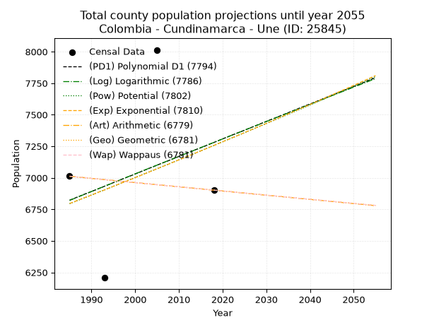
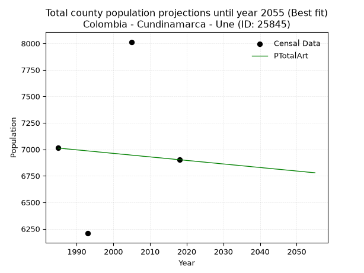
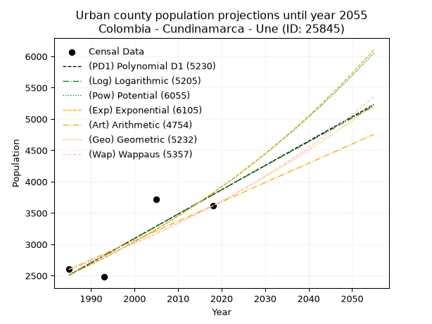
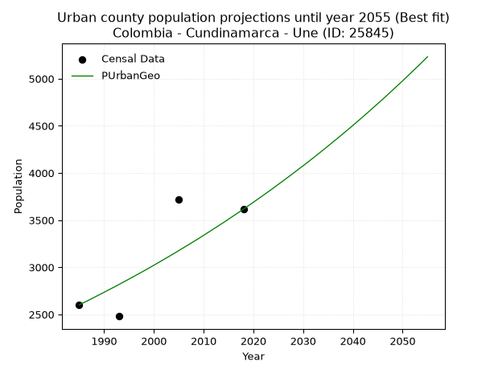
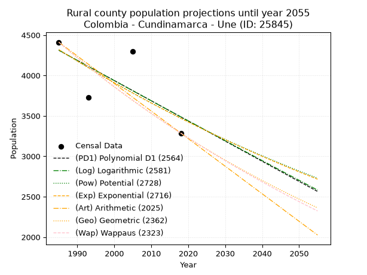
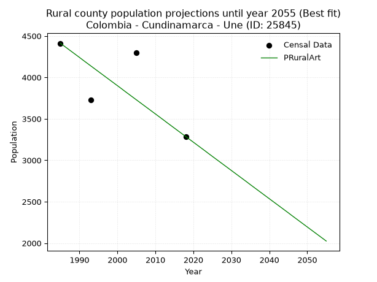

<div align="center">


</div>

# 📜 _“Population and Public Services Demand Projections (PPSD) until Year 2050 for Colombia - Cundinamarca - Une (ID: 25845)”_
Keywords: `population` `public-service` `projection` `lineal` `polynomial` `logarithmic` `potential` `exponential` `arithmetic` `geometric` `wappaus` `dane` `colombia` `south-america`

PPSD are analytical estimates used by governments and planners to anticipate future changes in population size, age distribution, and the resulting community needs for utilities, healthcare, education, and infrastructure as sizing future water treatment facilities, electrical grids, and road networks based on spatial growth.

<div align="center">

</img>

</div>


> **General running parameters**: • app_version: _v20260806_. • Python version: _3.14.7_. • Pandas version: _3.0.5_. • NumPy version: _2.5.1_. • Creates, save and include plots into reports (create_plot): _False_. • Projection until year: _2050_. • Process polynomial degree 2 and up: _False_. • Process Wappaus: _True_. • Process Wappaus: _True_. • Set negative values to zero: _True_. • Set infinite values to zero: _True_. • Drop dataset notes: _True_. 
<div align="center">

Dynamic map: [:earth_americas:Google](http://maps.google.com/maps?q=4.402450478,-74.0251833) [:earth_americas:OSM](https://www.openstreetmap.org/#map=18/4.402450478/-74.0251833&layers=P) [:earth_americas:Bing](https://www.bing.com/maps?cp=4.402450478~-74.0251833&lvl=18) [:earth_americas:Apple](https://maps.apple.com/frame?center=4.402450478%2C-74.0251833&span=0.003%2C0.006)

</div>


<div align="center">

```geojson
{
  "type": "Feature",
  "geometry": {
    "type": "Point", 
    "coordinates": [-74.0251833, 4.402450478]
  }, 
  "properties": {
    "Name": "Colombia - Cundinamarca - Une (ID: 25845)"
  }
}
```

</div>


## 0. Census Data (4 records)

Census data are official statistics collected by a government about the people and housing in a country. They usually include counts of total population, age, sex, race, income, education, and jobs.

📅Global census file: [Population.xlsx](../data/Population.xlsx)

| Source   |   Year |   CountryID | CountryName   |   StateID | StateName    |   CountyID | CountyName   |   PTotal |   PUrban |   PRural |
|:---------|-------:|------------:|:--------------|----------:|:-------------|-----------:|:-------------|---------:|---------:|---------:|
| DANE     |   1985 |          57 | Colombia      |        25 | Cundinamarca |      25845 | Une          |     7012 |     2601 |     4411 |
| DANE     |   1993 |          57 | Colombia      |        25 | Cundinamarca |      25845 | Une          |     6207 |     2480 |     3727 |
| DANE     |   2005 |          57 | Colombia      |        25 | Cundinamarca |      25845 | Une          |     8014 |     3716 |     4298 |
| DANE     |   2018 |          57 | Colombia      |        25 | Cundinamarca |      25845 | Une          |     6902 |     3616 |     3286 |

> 🔥Some records could had specific notes about the registered values or the corresponding urban or rural distribution.

📅[SUI-RUPS](https://www.datos.gov.co/Hacienda-y-Cr-dito-P-blico/Registro-nico-de-Prestadores-de-Servicios-P-blicos/4qkq-csdn/about_data) - Local public utility companies: [RUPS.csv](../data/RUPS.csv)

 | SERVICIO       | ESTADO    | NOMBRE                                                                                               | NIT         | DEPARTAMENTO_DOMICILIO   | MUNICIPIO_DOMICILIO   | DIRECCION                             |   TELEFONO | EMAIL                            | TIPO_PRESTADOR                 | CLASIFICACION                 |
|:---------------|:----------|:-----------------------------------------------------------------------------------------------------|:------------|:-------------------------|:----------------------|:--------------------------------------|-----------:|:---------------------------------|:-------------------------------|:------------------------------|
| ACUEDUCTO      | OPERATIVA | OFICINA DE SERVICIOS PUBLICOS DE ACUEDUCTO, ALCANTARILLADO Y ASEO DEL MUNICIPIO DE  UNE CUNDINAMARCA | 899999388-1 | CUNDINAMARCA             | UNE                   | Cra. 4a.No. 3-25                      |    8488001 | alcaldia@une-cundinamarca.gov.co | MUNICIPIO (PRESTACIÓN DIRECTA) | MENOR O IGUAL A 2500 USUARIOS |
| ALCANTARILLADO | OPERATIVA | OFICINA DE SERVICIOS PUBLICOS DE ACUEDUCTO, ALCANTARILLADO Y ASEO DEL MUNICIPIO DE  UNE CUNDINAMARCA | 899999388-1 | CUNDINAMARCA             | UNE                   | Cra. 4a.No. 3-25                      |    8488001 | alcaldia@une-cundinamarca.gov.co | MUNICIPIO (PRESTACIÓN DIRECTA) | MENOR O IGUAL A 2500 USUARIOS |
| ACUEDUCTO      | OPERATIVA | ASOCIACIÓN DE USUARIOS DEL ACUEDUCTO RURAL SAN ISIDRO MUNICIPIO DE UNE CUNDINAMARCA                  | 832010370-1 | CUNDINAMARCA             | UNE                   | Avenida 3a No. 4 - 27                 |    8488081 | acueducto_san_isidro@hotmail.com | ORGANIZACION AUTORIZADA        | HASTA 2500 SUSCRIPTORES       |
| ACUEDUCTO      | OPERATIVA | ASOCIACION DE USUARIOS DEL ACUEDUCTO RURAL VEREDA, PUENTE DE TIERRA                                  | 900139086-6 | CUNDINAMARCA             | UNE                   | FINCA EL RECUERDO VEREDA PUENTETIERRA |    0000000 | floralba040766@gmail.com         | ORGANIZACION AUTORIZADA        | MENOR O IGUAL A 2500 USUARIOS |
| ACUEDUCTO      | OPERATIVA | ASOCIACION DE USUARIOS ACUEDUCTO RURAL EL PEDREGAL ASUAPE                                            | 832009015-1 | CUNDINAMARCA             | UNE                   | avenida 5a 4-29                       |    8488241 | acueductoelpedregal@gmail.com    | ORGANIZACION AUTORIZADA        | HASTA 2500 SUSCRIPTORES       |

## 1. Total

### 1.1. Coefficients and Parameters

* (PD1) Polynomial Deg 1: 13.879164993978861, -20728.049779206216 (lineal)
* (Log) Logarithmic: 27854.55024165608, -204688.90959918487
* (Pow) Potential: 3.9877294112205828, -9.318410218064376
* (Exp) Exponential: 0.001987777301459476, 131.40434921913072
* (Art) Arithmetic: Year diff. 2018 - 1985 = 33, Population diff. 6902 - 7012 = -110, Annual growth = -3.3333333333333335
* (Geo) Geometric: Year diff. 2018 - 1985 = 33, Population diff. 6902 - 7012 = -110, Annual growth % = -0.0004790289375656842
* (Wap) Wappaus: i = -0.04791337262229888, Condition values only valid for < 200)

<sub>
Wappaus condition values: ['-0.00', '-0.05', '-0.10', '-0.14', '-0.19', '-0.24', '-0.29', '-0.34', '-0.38', '-0.43', '-0.48', '-0.53', '-0.57', '-0.62', '-0.67', '-0.72', '-0.77', '-0.81', '-0.86', '-0.91', '-0.96', '-1.01', '-1.05', '-1.10', '-1.15', '-1.20', '-1.25', '-1.29', '-1.34', '-1.39', '-1.44', '-1.49', '-1.53', '-1.58', '-1.63', '-1.68', '-1.72', '-1.77', '-1.82', '-1.87', '-1.92', '-1.96', '-2.01', '-2.06', '-2.11', '-2.16', '-2.20', '-2.25', '-2.30', '-2.35', '-2.40', '-2.44', '-2.49', '-2.54', '-2.59', '-2.64', '-2.68', '-2.73', '-2.78', '-2.83', '-2.87', '-2.92', '-2.97', '-3.02', '-3.07', '-3.11']
</sub>


### 1.2. Projected Dataset

|   Year |   CountyID |   PTotalPD1 |   PTotalLog |   PTotalPow |   PTotalExp |   PTotalArt |   PTotalGeo |   PTotalWap |
|-------:|-----------:|------------:|------------:|------------:|------------:|------------:|------------:|------------:|
|   1985 |      25845 |        6822 |        6821 |        6795 |        6796 |        7012 |        7012 |        7012 |
|   1986 |      25845 |        6836 |        6835 |        6808 |        6809 |        7009 |        7009 |        7009 |
|   1987 |      25845 |        6850 |        6849 |        6822 |        6823 |        7005 |        7005 |        7005 |
|   1988 |      25845 |        6864 |        6863 |        6836 |        6836 |        7002 |        7002 |        7002 |
|   1989 |      25845 |        6878 |        6877 |        6849 |        6850 |        6999 |        6999 |        6999 |
|   1990 |      25845 |        6891 |        6891 |        6863 |        6863 |        6995 |        6995 |        6995 |
|   1991 |      25845 |        6905 |        6905 |        6877 |        6877 |        6992 |        6992 |        6992 |
|   1992 |      25845 |        6919 |        6919 |        6891 |        6891 |        6989 |        6989 |        6989 |
|   1993 |      25845 |        6933 |        6933 |        6904 |        6904 |        6985 |        6985 |        6985 |
|   1994 |      25845 |        6947 |        6947 |        6918 |        6918 |        6982 |        6982 |        6982 |
|   1995 |      25845 |        6961 |        6961 |        6932 |        6932 |        6979 |        6978 |        6978 |
|   1996 |      25845 |        6975 |        6975 |        6946 |        6946 |        6975 |        6975 |        6975 |
|   1997 |      25845 |        6989 |        6989 |        6960 |        6960 |        6972 |        6972 |        6972 |
|   1998 |      25845 |        7003 |        7003 |        6974 |        6973 |        6969 |        6968 |        6968 |
|   1999 |      25845 |        7016 |        7017 |        6988 |        6987 |        6965 |        6965 |        6965 |
|   2000 |      25845 |        7030 |        7031 |        7002 |        7001 |        6962 |        6962 |        6962 |
|   2001 |      25845 |        7044 |        7045 |        7016 |        7015 |        6959 |        6958 |        6958 |
|   2002 |      25845 |        7058 |        7059 |        7030 |        7029 |        6955 |        6955 |        6955 |
|   2003 |      25845 |        7072 |        7073 |        7044 |        7043 |        6952 |        6952 |        6952 |
|   2004 |      25845 |        7086 |        7086 |        7058 |        7057 |        6949 |        6948 |        6948 |
|   2005 |      25845 |        7100 |        7100 |        7072 |        7071 |        6945 |        6945 |        6945 |
|   2006 |      25845 |        7114 |        7114 |        7086 |        7085 |        6942 |        6942 |        6942 |
|   2007 |      25845 |        7127 |        7128 |        7100 |        7099 |        6939 |        6938 |        6938 |
|   2008 |      25845 |        7141 |        7142 |        7114 |        7113 |        6935 |        6935 |        6935 |
|   2009 |      25845 |        7155 |        7156 |        7128 |        7128 |        6932 |        6932 |        6932 |
|   2010 |      25845 |        7169 |        7170 |        7142 |        7142 |        6929 |        6929 |        6929 |
|   2011 |      25845 |        7183 |        7184 |        7157 |        7156 |        6925 |        6925 |        6925 |
|   2012 |      25845 |        7197 |        7197 |        7171 |        7170 |        6922 |        6922 |        6922 |
|   2013 |      25845 |        7211 |        7211 |        7185 |        7184 |        6919 |        6919 |        6919 |
|   2014 |      25845 |        7225 |        7225 |        7199 |        7199 |        6915 |        6915 |        6915 |
|   2015 |      25845 |        7238 |        7239 |        7213 |        7213 |        6912 |        6912 |        6912 |
|   2016 |      25845 |        7252 |        7253 |        7228 |        7227 |        6909 |        6909 |        6909 |
|   2017 |      25845 |        7266 |        7267 |        7242 |        7242 |        6905 |        6905 |        6905 |
|   2018 |      25845 |        7280 |        7280 |        7256 |        7256 |        6902 |        6902 |        6902 |
|   2019 |      25845 |        7294 |        7294 |        7271 |        7271 |        6899 |        6899 |        6899 |
|   2020 |      25845 |        7308 |        7308 |        7285 |        7285 |        6895 |        6895 |        6895 |
|   2021 |      25845 |        7322 |        7322 |        7300 |        7300 |        6892 |        6892 |        6892 |
|   2022 |      25845 |        7336 |        7336 |        7314 |        7314 |        6889 |        6889 |        6889 |
|   2023 |      25845 |        7350 |        7349 |        7328 |        7329 |        6885 |        6885 |        6885 |
|   2024 |      25845 |        7363 |        7363 |        7343 |        7343 |        6882 |        6882 |        6882 |
|   2025 |      25845 |        7377 |        7377 |        7357 |        7358 |        6879 |        6879 |        6879 |
|   2026 |      25845 |        7391 |        7391 |        7372 |        7373 |        6875 |        6876 |        6876 |
|   2027 |      25845 |        7405 |        7404 |        7386 |        7387 |        6872 |        6872 |        6872 |
|   2028 |      25845 |        7419 |        7418 |        7401 |        7402 |        6869 |        6869 |        6869 |
|   2029 |      25845 |        7433 |        7432 |        7415 |        7417 |        6865 |        6866 |        6866 |
|   2030 |      25845 |        7447 |        7446 |        7430 |        7431 |        6862 |        6862 |        6862 |
|   2031 |      25845 |        7461 |        7459 |        7445 |        7446 |        6859 |        6859 |        6859 |
|   2032 |      25845 |        7474 |        7473 |        7459 |        7461 |        6855 |        6856 |        6856 |
|   2033 |      25845 |        7488 |        7487 |        7474 |        7476 |        6852 |        6853 |        6853 |
|   2034 |      25845 |        7502 |        7500 |        7489 |        7491 |        6849 |        6849 |        6849 |
|   2035 |      25845 |        7516 |        7514 |        7503 |        7506 |        6845 |        6846 |        6846 |
|   2036 |      25845 |        7530 |        7528 |        7518 |        7521 |        6842 |        6843 |        6843 |
|   2037 |      25845 |        7544 |        7541 |        7533 |        7536 |        6839 |        6839 |        6839 |
|   2038 |      25845 |        7558 |        7555 |        7547 |        7551 |        6835 |        6836 |        6836 |
|   2039 |      25845 |        7572 |        7569 |        7562 |        7566 |        6832 |        6833 |        6833 |
|   2040 |      25845 |        7585 |        7582 |        7577 |        7581 |        6829 |        6830 |        6830 |
|   2041 |      25845 |        7599 |        7596 |        7592 |        7596 |        6825 |        6826 |        6826 |
|   2042 |      25845 |        7613 |        7610 |        7607 |        7611 |        6822 |        6823 |        6823 |
|   2043 |      25845 |        7627 |        7623 |        7622 |        7626 |        6819 |        6820 |        6820 |
|   2044 |      25845 |        7641 |        7637 |        7636 |        7641 |        6815 |        6817 |        6817 |
|   2045 |      25845 |        7655 |        7651 |        7651 |        7656 |        6812 |        6813 |        6813 |
|   2046 |      25845 |        7669 |        7664 |        7666 |        7672 |        6809 |        6810 |        6810 |
|   2047 |      25845 |        7683 |        7678 |        7681 |        7687 |        6805 |        6807 |        6807 |
|   2048 |      25845 |        7696 |        7691 |        7696 |        7702 |        6802 |        6803 |        6803 |
|   2049 |      25845 |        7710 |        7705 |        7711 |        7717 |        6799 |        6800 |        6800 |
|   2050 |      25845 |        7724 |        7719 |        7726 |        7733 |        6795 |        6797 |        6797 |
<div align="center">

</img>

</div>


### 1.3. Best fit with absolute and relative error (%)

Relative error puts that difference into context by dividing the absolute error by the true value, creating a unitless ratio or percentage that shows the scale of the mistake.

Absolute and relative error

|   Year | Source   |   CountryID | CountryName   |   StateID | StateName    |   CountyID_x | CountyName   |   PTotal |   PUrban |   PRural |   CountyID_y |   PTotalPD1 |   PTotalLog |   PTotalPow |   PTotalExp |   PTotalArt |   PTotalGeo |   PTotalWap |   PTotalPD1AbsError |   PTotalLogAbsError |   PTotalPowAbsError |   PTotalExpAbsError |   PTotalArtAbsError |   PTotalGeoAbsError |   PTotalWapAbsError |   PTotalPD1RelError |   PTotalLogRelError |   PTotalPowRelError |   PTotalExpRelError |   PTotalArtRelError |   PTotalGeoRelError |   PTotalWapRelError |
|-------:|:---------|------------:|:--------------|----------:|:-------------|-------------:|:-------------|---------:|---------:|---------:|-------------:|------------:|------------:|------------:|------------:|------------:|------------:|------------:|--------------------:|--------------------:|--------------------:|--------------------:|--------------------:|--------------------:|--------------------:|--------------------:|--------------------:|--------------------:|--------------------:|--------------------:|--------------------:|--------------------:|
|   1985 | DANE     |          57 | Colombia      |        25 | Cundinamarca |        25845 | Une          |     7012 |     2601 |     4411 |        25845 |        6822 |        6821 |        6795 |        6796 |        7012 |        7012 |        7012 |                 190 |                 191 |                 217 |                 216 |                   0 |                   0 |                   0 |             2.70964 |             2.7239  |             3.09469 |             3.08043 |              0      |              0      |              0      |
|   1993 | DANE     |          57 | Colombia      |        25 | Cundinamarca |        25845 | Une          |     6207 |     2480 |     3727 |        25845 |        6933 |        6933 |        6904 |        6904 |        6985 |        6985 |        6985 |                 726 |                 726 |                 697 |                 697 |                 778 |                 778 |                 778 |            11.6965  |            11.6965  |            11.2293  |            11.2293  |             12.5342 |             12.5342 |             12.5342 |
|   2005 | DANE     |          57 | Colombia      |        25 | Cundinamarca |        25845 | Une          |     8014 |     3716 |     4298 |        25845 |        7100 |        7100 |        7072 |        7071 |        6945 |        6945 |        6945 |                 914 |                 914 |                 942 |                 943 |                1069 |                1069 |                1069 |            11.405   |            11.405   |            11.7544  |            11.7669  |             13.3392 |             13.3392 |             13.3392 |
|   2018 | DANE     |          57 | Colombia      |        25 | Cundinamarca |        25845 | Une          |     6902 |     3616 |     3286 |        25845 |        7280 |        7280 |        7256 |        7256 |        6902 |        6902 |        6902 |                 378 |                 378 |                 354 |                 354 |                   0 |                   0 |                   0 |             5.47667 |             5.47667 |             5.12895 |             5.12895 |              0      |              0      |              0      |

Relative error mean

| Method    |   RelError | Best   |
|:----------|-----------:|:-------|
| PTotalPD1 |    7.82196 |        |
| PTotalLog |    7.82552 |        |
| PTotalPow |    7.80183 |        |
| PTotalExp |    7.80139 |        |
| PTotalArt |    6.46835 | True   |
| PTotalGeo |    6.46835 | True   |
| PTotalWap |    6.46835 | True   |

💙Best method: _**PTotalArt**_
<div align="center">

</img>

</div>


### 1.4. Fresh water supply demand in liters per capita per day (lpcd)

The fresh water supply demand typically ranges from 100 to 300 liters per capita per day (lpcd) for standard domestic and municipal planning, though absolute survival minimums set by the World Health Organization are as low as 7.5 to 20 liters per day, and total consumption in high-income nations can exceed 400 liters.

> `CZ`: Level in meters above the sea level (masl)<br> `WS`: Fresh water supply demand in liters per capita per day (lpcd or l/h/d)<br> `WSAll`: Zonal fresh water supply demand in liters per second (l/s)<br> `A`: Zonal area in square meters<br> `DP`: Population density (people/hectare or p/ha)

Reference values (RAS Colombia)

|    CZ |   WS |
|------:|-----:|
|  1000 |  120 |
|  2000 |  130 |
| 99999 |  140 |

County shapefile geometry properties and water supply values

|   CountyID |      ATotal |   CZTotal |   WSTotal |
|-----------:|------------:|----------:|----------:|
|      25845 | 2.08866e+08 |   3099.28 |       140 |

Projected values for best method: PTotalArt

|   CountyID |   Year |   PTotalArt |   DPTotal |   WSTotal |   WSTotalAll |
|-----------:|-------:|------------:|----------:|----------:|-------------:|
|      25845 |   1985 |        7012 |      0.34 |       140 |      11.362  |
|      25845 |   1986 |        7009 |      0.34 |       140 |      11.3572 |
|      25845 |   1987 |        7005 |      0.34 |       140 |      11.3507 |
|      25845 |   1988 |        7002 |      0.34 |       140 |      11.3458 |
|      25845 |   1989 |        6999 |      0.34 |       140 |      11.341  |
|      25845 |   1990 |        6995 |      0.33 |       140 |      11.3345 |
|      25845 |   1991 |        6992 |      0.33 |       140 |      11.3296 |
|      25845 |   1992 |        6989 |      0.33 |       140 |      11.3248 |
|      25845 |   1993 |        6985 |      0.33 |       140 |      11.3183 |
|      25845 |   1994 |        6982 |      0.33 |       140 |      11.3134 |
|      25845 |   1995 |        6979 |      0.33 |       140 |      11.3086 |
|      25845 |   1996 |        6975 |      0.33 |       140 |      11.3021 |
|      25845 |   1997 |        6972 |      0.33 |       140 |      11.2972 |
|      25845 |   1998 |        6969 |      0.33 |       140 |      11.2924 |
|      25845 |   1999 |        6965 |      0.33 |       140 |      11.2859 |
|      25845 |   2000 |        6962 |      0.33 |       140 |      11.281  |
|      25845 |   2001 |        6959 |      0.33 |       140 |      11.2762 |
|      25845 |   2002 |        6955 |      0.33 |       140 |      11.2697 |
|      25845 |   2003 |        6952 |      0.33 |       140 |      11.2648 |
|      25845 |   2004 |        6949 |      0.33 |       140 |      11.26   |
|      25845 |   2005 |        6945 |      0.33 |       140 |      11.2535 |
|      25845 |   2006 |        6942 |      0.33 |       140 |      11.2486 |
|      25845 |   2007 |        6939 |      0.33 |       140 |      11.2438 |
|      25845 |   2008 |        6935 |      0.33 |       140 |      11.2373 |
|      25845 |   2009 |        6932 |      0.33 |       140 |      11.2324 |
|      25845 |   2010 |        6929 |      0.33 |       140 |      11.2275 |
|      25845 |   2011 |        6925 |      0.33 |       140 |      11.2211 |
|      25845 |   2012 |        6922 |      0.33 |       140 |      11.2162 |
|      25845 |   2013 |        6919 |      0.33 |       140 |      11.2113 |
|      25845 |   2014 |        6915 |      0.33 |       140 |      11.2049 |
|      25845 |   2015 |        6912 |      0.33 |       140 |      11.2    |
|      25845 |   2016 |        6909 |      0.33 |       140 |      11.1951 |
|      25845 |   2017 |        6905 |      0.33 |       140 |      11.1887 |
|      25845 |   2018 |        6902 |      0.33 |       140 |      11.1838 |
|      25845 |   2019 |        6899 |      0.33 |       140 |      11.1789 |
|      25845 |   2020 |        6895 |      0.33 |       140 |      11.1725 |
|      25845 |   2021 |        6892 |      0.33 |       140 |      11.1676 |
|      25845 |   2022 |        6889 |      0.33 |       140 |      11.1627 |
|      25845 |   2023 |        6885 |      0.33 |       140 |      11.1562 |
|      25845 |   2024 |        6882 |      0.33 |       140 |      11.1514 |
|      25845 |   2025 |        6879 |      0.33 |       140 |      11.1465 |
|      25845 |   2026 |        6875 |      0.33 |       140 |      11.14   |
|      25845 |   2027 |        6872 |      0.33 |       140 |      11.1352 |
|      25845 |   2028 |        6869 |      0.33 |       140 |      11.1303 |
|      25845 |   2029 |        6865 |      0.33 |       140 |      11.1238 |
|      25845 |   2030 |        6862 |      0.33 |       140 |      11.119  |
|      25845 |   2031 |        6859 |      0.33 |       140 |      11.1141 |
|      25845 |   2032 |        6855 |      0.33 |       140 |      11.1076 |
|      25845 |   2033 |        6852 |      0.33 |       140 |      11.1028 |
|      25845 |   2034 |        6849 |      0.33 |       140 |      11.0979 |
|      25845 |   2035 |        6845 |      0.33 |       140 |      11.0914 |
|      25845 |   2036 |        6842 |      0.33 |       140 |      11.0866 |
|      25845 |   2037 |        6839 |      0.33 |       140 |      11.0817 |
|      25845 |   2038 |        6835 |      0.33 |       140 |      11.0752 |
|      25845 |   2039 |        6832 |      0.33 |       140 |      11.0704 |
|      25845 |   2040 |        6829 |      0.33 |       140 |      11.0655 |
|      25845 |   2041 |        6825 |      0.33 |       140 |      11.059  |
|      25845 |   2042 |        6822 |      0.33 |       140 |      11.0542 |
|      25845 |   2043 |        6819 |      0.33 |       140 |      11.0493 |
|      25845 |   2044 |        6815 |      0.33 |       140 |      11.0428 |
|      25845 |   2045 |        6812 |      0.33 |       140 |      11.038  |
|      25845 |   2046 |        6809 |      0.33 |       140 |      11.0331 |
|      25845 |   2047 |        6805 |      0.33 |       140 |      11.0266 |
|      25845 |   2048 |        6802 |      0.33 |       140 |      11.0218 |
|      25845 |   2049 |        6799 |      0.33 |       140 |      11.0169 |
|      25845 |   2050 |        6795 |      0.33 |       140 |      11.0104 |

## 2. Urban

### 2.1. Coefficients and Parameters

* (PD1) Polynomial Deg 1: 38.84343637093535, -74593.33360096344 (lineal)
* (Log) Logarithmic: 77784.11295118785, -588134.415864741
* (Pow) Potential: 25.363543361197657, -80.24250609447876
* (Exp) Exponential: 0.01266652533043679, 3.027573377844922e-08
* (Art) Arithmetic: Year diff. 2018 - 1985 = 33, Population diff. 3616 - 2601 = 1015, Annual growth = 30.757575757575758
* (Geo) Geometric: Year diff. 2018 - 1985 = 33, Population diff. 3616 - 2601 = 1015, Annual growth % = 0.01003402036955503
* (Wap) Wappaus: i = 0.9894668089939122, Condition values only valid for < 200)

<sub>
Wappaus condition values: ['0.00', '0.99', '1.98', '2.97', '3.96', '4.95', '5.94', '6.93', '7.92', '8.91', '9.89', '10.88', '11.87', '12.86', '13.85', '14.84', '15.83', '16.82', '17.81', '18.80', '19.79', '20.78', '21.77', '22.76', '23.75', '24.74', '25.73', '26.72', '27.71', '28.69', '29.68', '30.67', '31.66', '32.65', '33.64', '34.63', '35.62', '36.61', '37.60', '38.59', '39.58', '40.57', '41.56', '42.55', '43.54', '44.53', '45.52', '46.50', '47.49', '48.48', '49.47', '50.46', '51.45', '52.44', '53.43', '54.42', '55.41', '56.40', '57.39', '58.38', '59.37', '60.36', '61.35', '62.34', '63.33', '64.32']
</sub>


### 2.2. Projected Dataset

|   Year |   CountyID |   PUrbanPD1 |   PUrbanLog |   PUrbanPow |   PUrbanExp |   PUrbanArt |   PUrbanGeo |   PUrbanWap |
|-------:|-----------:|------------:|------------:|------------:|------------:|------------:|------------:|------------:|
|   1985 |      25845 |        2511 |        2509 |        2514 |        2515 |        2601 |        2601 |        2601 |
|   1986 |      25845 |        2550 |        2549 |        2546 |        2547 |        2632 |        2627 |        2627 |
|   1987 |      25845 |        2589 |        2588 |        2579 |        2580 |        2663 |        2653 |        2653 |
|   1988 |      25845 |        2627 |        2627 |        2612 |        2613 |        2693 |        2680 |        2679 |
|   1989 |      25845 |        2666 |        2666 |        2646 |        2646 |        2724 |        2707 |        2706 |
|   1990 |      25845 |        2705 |        2705 |        2680 |        2680 |        2755 |        2734 |        2733 |
|   1991 |      25845 |        2744 |        2744 |        2714 |        2714 |        2786 |        2762 |        2760 |
|   1992 |      25845 |        2783 |        2783 |        2749 |        2748 |        2816 |        2789 |        2788 |
|   1993 |      25845 |        2822 |        2822 |        2784 |        2784 |        2847 |        2817 |        2815 |
|   1994 |      25845 |        2860 |        2861 |        2820 |        2819 |        2878 |        2846 |        2843 |
|   1995 |      25845 |        2899 |        2900 |        2856 |        2855 |        2909 |        2874 |        2872 |
|   1996 |      25845 |        2938 |        2939 |        2892 |        2891 |        2939 |        2903 |        2900 |
|   1997 |      25845 |        2977 |        2978 |        2929 |        2928 |        2970 |        2932 |        2929 |
|   1998 |      25845 |        3016 |        3017 |        2967 |        2965 |        3001 |        2961 |        2959 |
|   1999 |      25845 |        3055 |        3056 |        3005 |        3003 |        3032 |        2991 |        2988 |
|   2000 |      25845 |        3094 |        3095 |        3043 |        3042 |        3062 |        3021 |        3018 |
|   2001 |      25845 |        3132 |        3134 |        3082 |        3080 |        3093 |        3052 |        3048 |
|   2002 |      25845 |        3171 |        3173 |        3121 |        3120 |        3124 |        3082 |        3079 |
|   2003 |      25845 |        3210 |        3212 |        3161 |        3159 |        3155 |        3113 |        3110 |
|   2004 |      25845 |        3249 |        3250 |        3201 |        3200 |        3185 |        3144 |        3141 |
|   2005 |      25845 |        3288 |        3289 |        3242 |        3240 |        3216 |        3176 |        3172 |
|   2006 |      25845 |        3327 |        3328 |        3283 |        3282 |        3247 |        3208 |        3204 |
|   2007 |      25845 |        3365 |        3367 |        3325 |        3324 |        3278 |        3240 |        3236 |
|   2008 |      25845 |        3404 |        3406 |        3367 |        3366 |        3308 |        3272 |        3269 |
|   2009 |      25845 |        3443 |        3444 |        3410 |        3409 |        3339 |        3305 |        3302 |
|   2010 |      25845 |        3482 |        3483 |        3453 |        3452 |        3370 |        3338 |        3335 |
|   2011 |      25845 |        3521 |        3522 |        3497 |        3496 |        3401 |        3372 |        3369 |
|   2012 |      25845 |        3560 |        3560 |        3542 |        3541 |        3431 |        3406 |        3403 |
|   2013 |      25845 |        3599 |        3599 |        3587 |        3586 |        3462 |        3440 |        3437 |
|   2014 |      25845 |        3637 |        3638 |        3632 |        3632 |        3493 |        3474 |        3472 |
|   2015 |      25845 |        3676 |        3676 |        3678 |        3678 |        3524 |        3509 |        3508 |
|   2016 |      25845 |        3715 |        3715 |        3725 |        3725 |        3554 |        3545 |        3543 |
|   2017 |      25845 |        3754 |        3753 |        3772 |        3772 |        3585 |        3580 |        3579 |
|   2018 |      25845 |        3793 |        3792 |        3819 |        3820 |        3616 |        3616 |        3616 |
|   2019 |      25845 |        3832 |        3831 |        3868 |        3869 |        3647 |        3652 |        3653 |
|   2020 |      25845 |        3870 |        3869 |        3917 |        3918 |        3678 |        3689 |        3690 |
|   2021 |      25845 |        3909 |        3908 |        3966 |        3968 |        3708 |        3726 |        3728 |
|   2022 |      25845 |        3948 |        3946 |        4016 |        4019 |        3739 |        3763 |        3767 |
|   2023 |      25845 |        3987 |        3984 |        4067 |        4070 |        3770 |        3801 |        3805 |
|   2024 |      25845 |        4026 |        4023 |        4118 |        4122 |        3801 |        3839 |        3845 |
|   2025 |      25845 |        4065 |        4061 |        4170 |        4175 |        3831 |        3878 |        3884 |
|   2026 |      25845 |        4103 |        4100 |        4223 |        4228 |        3862 |        3917 |        3925 |
|   2027 |      25845 |        4142 |        4138 |        4276 |        4282 |        3893 |        3956 |        3965 |
|   2028 |      25845 |        4181 |        4176 |        4330 |        4336 |        3924 |        3996 |        4007 |
|   2029 |      25845 |        4220 |        4215 |        4384 |        4392 |        3954 |        4036 |        4048 |
|   2030 |      25845 |        4259 |        4253 |        4439 |        4448 |        3985 |        4076 |        4091 |
|   2031 |      25845 |        4298 |        4291 |        4495 |        4504 |        4016 |        4117 |        4134 |
|   2032 |      25845 |        4337 |        4330 |        4552 |        4562 |        4047 |        4158 |        4177 |
|   2033 |      25845 |        4375 |        4368 |        4609 |        4620 |        4077 |        4200 |        4221 |
|   2034 |      25845 |        4414 |        4406 |        4667 |        4679 |        4108 |        4242 |        4266 |
|   2035 |      25845 |        4453 |        4444 |        4725 |        4738 |        4139 |        4285 |        4311 |
|   2036 |      25845 |        4492 |        4483 |        4784 |        4799 |        4170 |        4328 |        4356 |
|   2037 |      25845 |        4531 |        4521 |        4844 |        4860 |        4200 |        4371 |        4403 |
|   2038 |      25845 |        4570 |        4559 |        4905 |        4922 |        4231 |        4415 |        4450 |
|   2039 |      25845 |        4608 |        4597 |        4966 |        4985 |        4262 |        4459 |        4497 |
|   2040 |      25845 |        4647 |        4635 |        5029 |        5048 |        4293 |        4504 |        4546 |
|   2041 |      25845 |        4686 |        4673 |        5091 |        5113 |        4323 |        4549 |        4595 |
|   2042 |      25845 |        4725 |        4712 |        5155 |        5178 |        4354 |        4595 |        4644 |
|   2043 |      25845 |        4764 |        4750 |        5220 |        5244 |        4385 |        4641 |        4694 |
|   2044 |      25845 |        4803 |        4788 |        5285 |        5311 |        4416 |        4688 |        4745 |
|   2045 |      25845 |        4841 |        4826 |        5351 |        5378 |        4446 |        4735 |        4797 |
|   2046 |      25845 |        4880 |        4864 |        5417 |        5447 |        4477 |        4782 |        4849 |
|   2047 |      25845 |        4919 |        4902 |        5485 |        5516 |        4508 |        4830 |        4903 |
|   2048 |      25845 |        4958 |        4940 |        5553 |        5587 |        4539 |        4879 |        4957 |
|   2049 |      25845 |        4997 |        4978 |        5623 |        5658 |        4569 |        4928 |        5011 |
|   2050 |      25845 |        5036 |        5016 |        5693 |        5730 |        4600 |        4977 |        5067 |
<div align="center">

</img>

</div>


### 2.3. Best fit with absolute and relative error (%)

Relative error puts that difference into context by dividing the absolute error by the true value, creating a unitless ratio or percentage that shows the scale of the mistake.

Absolute and relative error

|   Year | Source   |   CountryID | CountryName   |   StateID | StateName    |   CountyID_x | CountyName   |   PTotal |   PUrban |   PRural |   CountyID_y |   PUrbanPD1 |   PUrbanLog |   PUrbanPow |   PUrbanExp |   PUrbanArt |   PUrbanGeo |   PUrbanWap |   PUrbanPD1AbsError |   PUrbanLogAbsError |   PUrbanPowAbsError |   PUrbanExpAbsError |   PUrbanArtAbsError |   PUrbanGeoAbsError |   PUrbanWapAbsError |   PUrbanPD1RelError |   PUrbanLogRelError |   PUrbanPowRelError |   PUrbanExpRelError |   PUrbanArtRelError |   PUrbanGeoRelError |   PUrbanWapRelError |
|-------:|:---------|------------:|:--------------|----------:|:-------------|-------------:|:-------------|---------:|---------:|---------:|-------------:|------------:|------------:|------------:|------------:|------------:|------------:|------------:|--------------------:|--------------------:|--------------------:|--------------------:|--------------------:|--------------------:|--------------------:|--------------------:|--------------------:|--------------------:|--------------------:|--------------------:|--------------------:|--------------------:|
|   1985 | DANE     |          57 | Colombia      |        25 | Cundinamarca |        25845 | Une          |     7012 |     2601 |     4411 |        25845 |        2511 |        2509 |        2514 |        2515 |        2601 |        2601 |        2601 |                  90 |                  92 |                  87 |                  86 |                   0 |                   0 |                   0 |             3.46021 |             3.5371  |             3.34487 |             3.30642 |              0      |              0      |              0      |
|   1993 | DANE     |          57 | Colombia      |        25 | Cundinamarca |        25845 | Une          |     6207 |     2480 |     3727 |        25845 |        2822 |        2822 |        2784 |        2784 |        2847 |        2817 |        2815 |                 342 |                 342 |                 304 |                 304 |                 367 |                 337 |                 335 |            13.7903  |            13.7903  |            12.2581  |            12.2581  |             14.7984 |             13.5887 |             13.5081 |
|   2005 | DANE     |          57 | Colombia      |        25 | Cundinamarca |        25845 | Une          |     8014 |     3716 |     4298 |        25845 |        3288 |        3289 |        3242 |        3240 |        3216 |        3176 |        3172 |                 428 |                 427 |                 474 |                 476 |                 500 |                 540 |                 544 |            11.5178  |            11.4909  |            12.7557  |            12.8095  |             13.4553 |             14.5318 |             14.6394 |
|   2018 | DANE     |          57 | Colombia      |        25 | Cundinamarca |        25845 | Une          |     6902 |     3616 |     3286 |        25845 |        3793 |        3792 |        3819 |        3820 |        3616 |        3616 |        3616 |                 177 |                 176 |                 203 |                 204 |                   0 |                   0 |                   0 |             4.89491 |             4.86726 |             5.61394 |             5.64159 |              0      |              0      |              0      |

Relative error mean

| Method    |   RelError | Best   |
|:----------|-----------:|:-------|
| PUrbanPD1 |    8.4158  |        |
| PUrbanLog |    8.42138 |        |
| PUrbanPow |    8.49313 |        |
| PUrbanExp |    8.50389 |        |
| PUrbanArt |    7.06343 |        |
| PUrbanGeo |    7.03012 | True   |
| PUrbanWap |    7.03687 |        |

💙Best method: _**PUrbanGeo**_
<div align="center">

</img>

</div>


### 2.4. Fresh water supply demand in liters per capita per day (lpcd)

The fresh water supply demand typically ranges from 100 to 300 liters per capita per day (lpcd) for standard domestic and municipal planning, though absolute survival minimums set by the World Health Organization are as low as 7.5 to 20 liters per day, and total consumption in high-income nations can exceed 400 liters.

> `CZ`: Level in meters above the sea level (masl)<br> `WS`: Fresh water supply demand in liters per capita per day (lpcd or l/h/d)<br> `WSAll`: Zonal fresh water supply demand in liters per second (l/s)<br> `A`: Zonal area in square meters<br> `DP`: Population density (people/hectare or p/ha)

Reference values (RAS Colombia)

|    CZ |   WS |
|------:|-----:|
|  1000 |  120 |
|  2000 |  130 |
| 99999 |  140 |

County shapefile geometry properties and water supply values

|   CountyID |   AUrban |   CZUrban |   WSUrban |
|-----------:|---------:|----------:|----------:|
|      25845 |   473002 |   2377.88 |       140 |

Projected values for best method: PUrbanGeo

|   CountyID |   Year |   PUrbanGeo |   DPUrban |   WSUrban |   WSUrbanAll |
|-----------:|-------:|------------:|----------:|----------:|-------------:|
|      25845 |   1985 |        2601 |     54.99 |       140 |      4.21458 |
|      25845 |   1986 |        2627 |     55.54 |       140 |      4.25671 |
|      25845 |   1987 |        2653 |     56.09 |       140 |      4.29884 |
|      25845 |   1988 |        2680 |     56.66 |       140 |      4.34259 |
|      25845 |   1989 |        2707 |     57.23 |       140 |      4.38634 |
|      25845 |   1990 |        2734 |     57.8  |       140 |      4.43009 |
|      25845 |   1991 |        2762 |     58.39 |       140 |      4.47546 |
|      25845 |   1992 |        2789 |     58.96 |       140 |      4.51921 |
|      25845 |   1993 |        2817 |     59.56 |       140 |      4.56458 |
|      25845 |   1994 |        2846 |     60.17 |       140 |      4.61157 |
|      25845 |   1995 |        2874 |     60.76 |       140 |      4.65694 |
|      25845 |   1996 |        2903 |     61.37 |       140 |      4.70394 |
|      25845 |   1997 |        2932 |     61.99 |       140 |      4.75093 |
|      25845 |   1998 |        2961 |     62.6  |       140 |      4.79792 |
|      25845 |   1999 |        2991 |     63.23 |       140 |      4.84653 |
|      25845 |   2000 |        3021 |     63.87 |       140 |      4.89514 |
|      25845 |   2001 |        3052 |     64.52 |       140 |      4.94537 |
|      25845 |   2002 |        3082 |     65.16 |       140 |      4.99398 |
|      25845 |   2003 |        3113 |     65.81 |       140 |      5.04421 |
|      25845 |   2004 |        3144 |     66.47 |       140 |      5.09444 |
|      25845 |   2005 |        3176 |     67.15 |       140 |      5.1463  |
|      25845 |   2006 |        3208 |     67.82 |       140 |      5.19815 |
|      25845 |   2007 |        3240 |     68.5  |       140 |      5.25    |
|      25845 |   2008 |        3272 |     69.18 |       140 |      5.30185 |
|      25845 |   2009 |        3305 |     69.87 |       140 |      5.35532 |
|      25845 |   2010 |        3338 |     70.57 |       140 |      5.4088  |
|      25845 |   2011 |        3372 |     71.29 |       140 |      5.46389 |
|      25845 |   2012 |        3406 |     72.01 |       140 |      5.51898 |
|      25845 |   2013 |        3440 |     72.73 |       140 |      5.57407 |
|      25845 |   2014 |        3474 |     73.45 |       140 |      5.62917 |
|      25845 |   2015 |        3509 |     74.19 |       140 |      5.68588 |
|      25845 |   2016 |        3545 |     74.95 |       140 |      5.74421 |
|      25845 |   2017 |        3580 |     75.69 |       140 |      5.80093 |
|      25845 |   2018 |        3616 |     76.45 |       140 |      5.85926 |
|      25845 |   2019 |        3652 |     77.21 |       140 |      5.91759 |
|      25845 |   2020 |        3689 |     77.99 |       140 |      5.97755 |
|      25845 |   2021 |        3726 |     78.77 |       140 |      6.0375  |
|      25845 |   2022 |        3763 |     79.56 |       140 |      6.09745 |
|      25845 |   2023 |        3801 |     80.36 |       140 |      6.15903 |
|      25845 |   2024 |        3839 |     81.16 |       140 |      6.2206  |
|      25845 |   2025 |        3878 |     81.99 |       140 |      6.2838  |
|      25845 |   2026 |        3917 |     82.81 |       140 |      6.34699 |
|      25845 |   2027 |        3956 |     83.64 |       140 |      6.41019 |
|      25845 |   2028 |        3996 |     84.48 |       140 |      6.475   |
|      25845 |   2029 |        4036 |     85.33 |       140 |      6.53981 |
|      25845 |   2030 |        4076 |     86.17 |       140 |      6.60463 |
|      25845 |   2031 |        4117 |     87.04 |       140 |      6.67106 |
|      25845 |   2032 |        4158 |     87.91 |       140 |      6.7375  |
|      25845 |   2033 |        4200 |     88.79 |       140 |      6.80556 |
|      25845 |   2034 |        4242 |     89.68 |       140 |      6.87361 |
|      25845 |   2035 |        4285 |     90.59 |       140 |      6.94329 |
|      25845 |   2036 |        4328 |     91.5  |       140 |      7.01296 |
|      25845 |   2037 |        4371 |     92.41 |       140 |      7.08264 |
|      25845 |   2038 |        4415 |     93.34 |       140 |      7.15394 |
|      25845 |   2039 |        4459 |     94.27 |       140 |      7.22523 |
|      25845 |   2040 |        4504 |     95.22 |       140 |      7.29815 |
|      25845 |   2041 |        4549 |     96.17 |       140 |      7.37106 |
|      25845 |   2042 |        4595 |     97.15 |       140 |      7.4456  |
|      25845 |   2043 |        4641 |     98.12 |       140 |      7.52014 |
|      25845 |   2044 |        4688 |     99.11 |       140 |      7.5963  |
|      25845 |   2045 |        4735 |    100.11 |       140 |      7.67245 |
|      25845 |   2046 |        4782 |    101.1  |       140 |      7.74861 |
|      25845 |   2047 |        4830 |    102.11 |       140 |      7.82639 |
|      25845 |   2048 |        4879 |    103.15 |       140 |      7.90579 |
|      25845 |   2049 |        4928 |    104.19 |       140 |      7.98519 |
|      25845 |   2050 |        4977 |    105.22 |       140 |      8.06458 |

## 3. Rural

### 3.1. Coefficients and Parameters

* (PD1) Polynomial Deg 1: -24.96427137695647, 53865.283821757184 (lineal)
* (Log) Logarithmic: -49929.56270953174, 383445.5062655557
* (Pow) Potential: -13.255981232619265, 47.350456950097964
* (Exp) Exponential: -0.006628343285447801, 2236058155.3679714
* (Art) Arithmetic: Year diff. 2018 - 1985 = 33, Population diff. 3286 - 4411 = -1125, Annual growth = -34.09090909090909
* (Geo) Geometric: Year diff. 2018 - 1985 = 33, Population diff. 3286 - 4411 = -1125, Annual growth % = -0.008882449257047287
* (Wap) Wappaus: i = -0.8858232841602985, Condition values only valid for < 200)

<sub>
Wappaus condition values: ['-0.00', '-0.89', '-1.77', '-2.66', '-3.54', '-4.43', '-5.31', '-6.20', '-7.09', '-7.97', '-8.86', '-9.74', '-10.63', '-11.52', '-12.40', '-13.29', '-14.17', '-15.06', '-15.94', '-16.83', '-17.72', '-18.60', '-19.49', '-20.37', '-21.26', '-22.15', '-23.03', '-23.92', '-24.80', '-25.69', '-26.57', '-27.46', '-28.35', '-29.23', '-30.12', '-31.00', '-31.89', '-32.78', '-33.66', '-34.55', '-35.43', '-36.32', '-37.20', '-38.09', '-38.98', '-39.86', '-40.75', '-41.63', '-42.52', '-43.41', '-44.29', '-45.18', '-46.06', '-46.95', '-47.83', '-48.72', '-49.61', '-50.49', '-51.38', '-52.26', '-53.15', '-54.04', '-54.92', '-55.81', '-56.69', '-57.58']
</sub>


### 3.2. Projected Dataset

|   Year |   CountyID |   PRuralPD1 |   PRuralLog |   PRuralPow |   PRuralExp |   PRuralArt |   PRuralGeo |   PRuralWap |
|-------:|-----------:|------------:|------------:|------------:|------------:|------------:|------------:|------------:|
|   1985 |      25845 |        4311 |        4312 |        4319 |        4319 |        4411 |        4411 |        4411 |
|   1986 |      25845 |        4286 |        4287 |        4290 |        4290 |        4377 |        4372 |        4372 |
|   1987 |      25845 |        4261 |        4261 |        4262 |        4262 |        4343 |        4333 |        4334 |
|   1988 |      25845 |        4236 |        4236 |        4234 |        4234 |        4309 |        4294 |        4295 |
|   1989 |      25845 |        4211 |        4211 |        4205 |        4206 |        4275 |        4256 |        4257 |
|   1990 |      25845 |        4186 |        4186 |        4178 |        4178 |        4241 |        4219 |        4220 |
|   1991 |      25845 |        4161 |        4161 |        4150 |        4150 |        4206 |        4181 |        4183 |
|   1992 |      25845 |        4136 |        4136 |        4122 |        4123 |        4172 |        4144 |        4146 |
|   1993 |      25845 |        4111 |        4111 |        4095 |        4096 |        4138 |        4107 |        4109 |
|   1994 |      25845 |        4087 |        4086 |        4068 |        4069 |        4104 |        4071 |        4073 |
|   1995 |      25845 |        4062 |        4061 |        4041 |        4042 |        4070 |        4034 |        4037 |
|   1996 |      25845 |        4037 |        4036 |        4014 |        4015 |        4036 |        3999 |        4001 |
|   1997 |      25845 |        4012 |        4011 |        3988 |        3989 |        4002 |        3963 |        3966 |
|   1998 |      25845 |        3987 |        3986 |        3961 |        3962 |        3968 |        3928 |        3931 |
|   1999 |      25845 |        3962 |        3961 |        3935 |        3936 |        3934 |        3893 |        3896 |
|   2000 |      25845 |        3937 |        3936 |        3909 |        3910 |        3900 |        3858 |        3861 |
|   2001 |      25845 |        3912 |        3911 |        3883 |        3884 |        3866 |        3824 |        3827 |
|   2002 |      25845 |        3887 |        3886 |        3858 |        3859 |        3831 |        3790 |        3793 |
|   2003 |      25845 |        3862 |        3861 |        3832 |        3833 |        3797 |        3757 |        3760 |
|   2004 |      25845 |        3837 |        3836 |        3807 |        3808 |        3763 |        3723 |        3726 |
|   2005 |      25845 |        3812 |        3811 |        3782 |        3783 |        3729 |        3690 |        3693 |
|   2006 |      25845 |        3787 |        3786 |        3757 |        3758 |        3695 |        3657 |        3660 |
|   2007 |      25845 |        3762 |        3761 |        3732 |        3733 |        3661 |        3625 |        3628 |
|   2008 |      25845 |        3737 |        3736 |        3708 |        3708 |        3627 |        3593 |        3595 |
|   2009 |      25845 |        3712 |        3712 |        3683 |        3684 |        3593 |        3561 |        3563 |
|   2010 |      25845 |        3687 |        3687 |        3659 |        3659 |        3559 |        3529 |        3532 |
|   2011 |      25845 |        3662 |        3662 |        3635 |        3635 |        3525 |        3498 |        3500 |
|   2012 |      25845 |        3637 |        3637 |        3611 |        3611 |        3491 |        3467 |        3469 |
|   2013 |      25845 |        3612 |        3612 |        3587 |        3587 |        3456 |        3436 |        3438 |
|   2014 |      25845 |        3587 |        3587 |        3564 |        3563 |        3422 |        3405 |        3407 |
|   2015 |      25845 |        3562 |        3563 |        3540 |        3540 |        3388 |        3375 |        3376 |
|   2016 |      25845 |        3537 |        3538 |        3517 |        3517 |        3354 |        3345 |        3346 |
|   2017 |      25845 |        3512 |        3513 |        3494 |        3493 |        3320 |        3315 |        3316 |
|   2018 |      25845 |        3487 |        3488 |        3471 |        3470 |        3286 |        3286 |        3286 |
|   2019 |      25845 |        3462 |        3464 |        3449 |        3447 |        3252 |        3257 |        3256 |
|   2020 |      25845 |        3437 |        3439 |        3426 |        3425 |        3218 |        3228 |        3227 |
|   2021 |      25845 |        3412 |        3414 |        3404 |        3402 |        3184 |        3199 |        3198 |
|   2022 |      25845 |        3388 |        3390 |        3381 |        3379 |        3150 |        3171 |        3169 |
|   2023 |      25845 |        3363 |        3365 |        3359 |        3357 |        3116 |        3143 |        3140 |
|   2024 |      25845 |        3338 |        3340 |        3337 |        3335 |        3081 |        3115 |        3112 |
|   2025 |      25845 |        3313 |        3316 |        3315 |        3313 |        3047 |        3087 |        3083 |
|   2026 |      25845 |        3288 |        3291 |        3294 |        3291 |        3013 |        3060 |        3055 |
|   2027 |      25845 |        3263 |        3266 |        3272 |        3269 |        2979 |        3032 |        3027 |
|   2028 |      25845 |        3238 |        3242 |        3251 |        3248 |        2945 |        3006 |        3000 |
|   2029 |      25845 |        3213 |        3217 |        3230 |        3226 |        2911 |        2979 |        2972 |
|   2030 |      25845 |        3188 |        3192 |        3209 |        3205 |        2877 |        2952 |        2945 |
|   2031 |      25845 |        3163 |        3168 |        3188 |        3184 |        2843 |        2926 |        2918 |
|   2032 |      25845 |        3138 |        3143 |        3167 |        3163 |        2809 |        2900 |        2891 |
|   2033 |      25845 |        3113 |        3119 |        3147 |        3142 |        2775 |        2874 |        2864 |
|   2034 |      25845 |        3088 |        3094 |        3126 |        3121 |        2741 |        2849 |        2838 |
|   2035 |      25845 |        3063 |        3070 |        3106 |        3100 |        2706 |        2824 |        2812 |
|   2036 |      25845 |        3038 |        3045 |        3086 |        3080 |        2672 |        2798 |        2785 |
|   2037 |      25845 |        3013 |        3021 |        3066 |        3060 |        2638 |        2774 |        2760 |
|   2038 |      25845 |        2988 |        2996 |        3046 |        3039 |        2604 |        2749 |        2734 |
|   2039 |      25845 |        2963 |        2972 |        3026 |        3019 |        2570 |        2725 |        2708 |
|   2040 |      25845 |        2938 |        2947 |        3007 |        2999 |        2536 |        2700 |        2683 |
|   2041 |      25845 |        2913 |        2923 |        2987 |        2980 |        2502 |        2676 |        2658 |
|   2042 |      25845 |        2888 |        2898 |        2968 |        2960 |        2468 |        2653 |        2633 |
|   2043 |      25845 |        2863 |        2874 |        2949 |        2940 |        2434 |        2629 |        2608 |
|   2044 |      25845 |        2838 |        2849 |        2929 |        2921 |        2400 |        2606 |        2583 |
|   2045 |      25845 |        2813 |        2825 |        2911 |        2902 |        2366 |        2583 |        2559 |
|   2046 |      25845 |        2788 |        2800 |        2892 |        2882 |        2331 |        2560 |        2534 |
|   2047 |      25845 |        2763 |        2776 |        2873 |        2863 |        2297 |        2537 |        2510 |
|   2048 |      25845 |        2738 |        2752 |        2854 |        2844 |        2263 |        2514 |        2486 |
|   2049 |      25845 |        2713 |        2727 |        2836 |        2826 |        2229 |        2492 |        2463 |
|   2050 |      25845 |        2689 |        2703 |        2818 |        2807 |        2195 |        2470 |        2439 |
<div align="center">

</img>

</div>


### 3.3. Best fit with absolute and relative error (%)

Relative error puts that difference into context by dividing the absolute error by the true value, creating a unitless ratio or percentage that shows the scale of the mistake.

Absolute and relative error

|   Year | Source   |   CountryID | CountryName   |   StateID | StateName    |   CountyID_x | CountyName   |   PTotal |   PUrban |   PRural |   CountyID_y |   PRuralPD1 |   PRuralLog |   PRuralPow |   PRuralExp |   PRuralArt |   PRuralGeo |   PRuralWap |   PRuralPD1AbsError |   PRuralLogAbsError |   PRuralPowAbsError |   PRuralExpAbsError |   PRuralArtAbsError |   PRuralGeoAbsError |   PRuralWapAbsError |   PRuralPD1RelError |   PRuralLogRelError |   PRuralPowRelError |   PRuralExpRelError |   PRuralArtRelError |   PRuralGeoRelError |   PRuralWapRelError |
|-------:|:---------|------------:|:--------------|----------:|:-------------|-------------:|:-------------|---------:|---------:|---------:|-------------:|------------:|------------:|------------:|------------:|------------:|------------:|------------:|--------------------:|--------------------:|--------------------:|--------------------:|--------------------:|--------------------:|--------------------:|--------------------:|--------------------:|--------------------:|--------------------:|--------------------:|--------------------:|--------------------:|
|   1985 | DANE     |          57 | Colombia      |        25 | Cundinamarca |        25845 | Une          |     7012 |     2601 |     4411 |        25845 |        4311 |        4312 |        4319 |        4319 |        4411 |        4411 |        4411 |                 100 |                  99 |                  92 |                  92 |                   0 |                   0 |                   0 |             2.26706 |             2.24439 |             2.08569 |             2.08569 |              0      |              0      |              0      |
|   1993 | DANE     |          57 | Colombia      |        25 | Cundinamarca |        25845 | Une          |     6207 |     2480 |     3727 |        25845 |        4111 |        4111 |        4095 |        4096 |        4138 |        4107 |        4109 |                 384 |                 384 |                 368 |                 369 |                 411 |                 380 |                 382 |            10.3032  |            10.3032  |             9.87389 |             9.90072 |             11.0276 |             10.1959 |             10.2495 |
|   2005 | DANE     |          57 | Colombia      |        25 | Cundinamarca |        25845 | Une          |     8014 |     3716 |     4298 |        25845 |        3812 |        3811 |        3782 |        3783 |        3729 |        3690 |        3693 |                 486 |                 487 |                 516 |                 515 |                 569 |                 608 |                 605 |            11.3076  |            11.3309  |            12.0056  |            11.9823  |             13.2387 |             14.1461 |             14.0763 |
|   2018 | DANE     |          57 | Colombia      |        25 | Cundinamarca |        25845 | Une          |     6902 |     3616 |     3286 |        25845 |        3487 |        3488 |        3471 |        3470 |        3286 |        3286 |        3286 |                 201 |                 202 |                 185 |                 184 |                   0 |                   0 |                   0 |             6.11686 |             6.14729 |             5.62995 |             5.59951 |              0      |              0      |              0      |

Relative error mean

| Method    |   RelError | Best   |
|:----------|-----------:|:-------|
| PRuralPD1 |    7.49867 |        |
| PRuralLog |    7.50643 |        |
| PRuralPow |    7.39878 |        |
| PRuralExp |    7.39206 |        |
| PRuralArt |    6.06659 | True   |
| PRuralGeo |    6.0855  |        |
| PRuralWap |    6.08146 |        |

💙Best method: _**PRuralArt**_
<div align="center">

</img>

</div>


### 3.4. Fresh water supply demand in liters per capita per day (lpcd)

The fresh water supply demand typically ranges from 100 to 300 liters per capita per day (lpcd) for standard domestic and municipal planning, though absolute survival minimums set by the World Health Organization are as low as 7.5 to 20 liters per day, and total consumption in high-income nations can exceed 400 liters.

> `CZ`: Level in meters above the sea level (masl)<br> `WS`: Fresh water supply demand in liters per capita per day (lpcd or l/h/d)<br> `WSAll`: Zonal fresh water supply demand in liters per second (l/s)<br> `A`: Zonal area in square meters<br> `DP`: Population density (people/hectare or p/ha)

Reference values (RAS Colombia)

|    CZ |   WS |
|------:|-----:|
|  1000 |  120 |
|  2000 |  130 |
| 99999 |  140 |

County shapefile geometry properties and water supply values

|   CountyID |      ARural |   CZRural |   WSRural |
|-----------:|------------:|----------:|----------:|
|      25845 | 2.08393e+08 |    3100.9 |       140 |

Projected values for best method: PRuralArt

|   CountyID |   Year |   PRuralArt |   DPRural |   WSRural |   WSRuralAll |
|-----------:|-------:|------------:|----------:|----------:|-------------:|
|      25845 |   1985 |        4411 |      0.21 |       140 |      7.14745 |
|      25845 |   1986 |        4377 |      0.21 |       140 |      7.09236 |
|      25845 |   1987 |        4343 |      0.21 |       140 |      7.03727 |
|      25845 |   1988 |        4309 |      0.21 |       140 |      6.98218 |
|      25845 |   1989 |        4275 |      0.21 |       140 |      6.92708 |
|      25845 |   1990 |        4241 |      0.2  |       140 |      6.87199 |
|      25845 |   1991 |        4206 |      0.2  |       140 |      6.81528 |
|      25845 |   1992 |        4172 |      0.2  |       140 |      6.76019 |
|      25845 |   1993 |        4138 |      0.2  |       140 |      6.70509 |
|      25845 |   1994 |        4104 |      0.2  |       140 |      6.65    |
|      25845 |   1995 |        4070 |      0.2  |       140 |      6.59491 |
|      25845 |   1996 |        4036 |      0.19 |       140 |      6.53981 |
|      25845 |   1997 |        4002 |      0.19 |       140 |      6.48472 |
|      25845 |   1998 |        3968 |      0.19 |       140 |      6.42963 |
|      25845 |   1999 |        3934 |      0.19 |       140 |      6.37454 |
|      25845 |   2000 |        3900 |      0.19 |       140 |      6.31944 |
|      25845 |   2001 |        3866 |      0.19 |       140 |      6.26435 |
|      25845 |   2002 |        3831 |      0.18 |       140 |      6.20764 |
|      25845 |   2003 |        3797 |      0.18 |       140 |      6.15255 |
|      25845 |   2004 |        3763 |      0.18 |       140 |      6.09745 |
|      25845 |   2005 |        3729 |      0.18 |       140 |      6.04236 |
|      25845 |   2006 |        3695 |      0.18 |       140 |      5.98727 |
|      25845 |   2007 |        3661 |      0.18 |       140 |      5.93218 |
|      25845 |   2008 |        3627 |      0.17 |       140 |      5.87708 |
|      25845 |   2009 |        3593 |      0.17 |       140 |      5.82199 |
|      25845 |   2010 |        3559 |      0.17 |       140 |      5.7669  |
|      25845 |   2011 |        3525 |      0.17 |       140 |      5.71181 |
|      25845 |   2012 |        3491 |      0.17 |       140 |      5.65671 |
|      25845 |   2013 |        3456 |      0.17 |       140 |      5.6     |
|      25845 |   2014 |        3422 |      0.16 |       140 |      5.54491 |
|      25845 |   2015 |        3388 |      0.16 |       140 |      5.48981 |
|      25845 |   2016 |        3354 |      0.16 |       140 |      5.43472 |
|      25845 |   2017 |        3320 |      0.16 |       140 |      5.37963 |
|      25845 |   2018 |        3286 |      0.16 |       140 |      5.32454 |
|      25845 |   2019 |        3252 |      0.16 |       140 |      5.26944 |
|      25845 |   2020 |        3218 |      0.15 |       140 |      5.21435 |
|      25845 |   2021 |        3184 |      0.15 |       140 |      5.15926 |
|      25845 |   2022 |        3150 |      0.15 |       140 |      5.10417 |
|      25845 |   2023 |        3116 |      0.15 |       140 |      5.04907 |
|      25845 |   2024 |        3081 |      0.15 |       140 |      4.99236 |
|      25845 |   2025 |        3047 |      0.15 |       140 |      4.93727 |
|      25845 |   2026 |        3013 |      0.14 |       140 |      4.88218 |
|      25845 |   2027 |        2979 |      0.14 |       140 |      4.82708 |
|      25845 |   2028 |        2945 |      0.14 |       140 |      4.77199 |
|      25845 |   2029 |        2911 |      0.14 |       140 |      4.7169  |
|      25845 |   2030 |        2877 |      0.14 |       140 |      4.66181 |
|      25845 |   2031 |        2843 |      0.14 |       140 |      4.60671 |
|      25845 |   2032 |        2809 |      0.13 |       140 |      4.55162 |
|      25845 |   2033 |        2775 |      0.13 |       140 |      4.49653 |
|      25845 |   2034 |        2741 |      0.13 |       140 |      4.44144 |
|      25845 |   2035 |        2706 |      0.13 |       140 |      4.38472 |
|      25845 |   2036 |        2672 |      0.13 |       140 |      4.32963 |
|      25845 |   2037 |        2638 |      0.13 |       140 |      4.27454 |
|      25845 |   2038 |        2604 |      0.12 |       140 |      4.21944 |
|      25845 |   2039 |        2570 |      0.12 |       140 |      4.16435 |
|      25845 |   2040 |        2536 |      0.12 |       140 |      4.10926 |
|      25845 |   2041 |        2502 |      0.12 |       140 |      4.05417 |
|      25845 |   2042 |        2468 |      0.12 |       140 |      3.99907 |
|      25845 |   2043 |        2434 |      0.12 |       140 |      3.94398 |
|      25845 |   2044 |        2400 |      0.12 |       140 |      3.88889 |
|      25845 |   2045 |        2366 |      0.11 |       140 |      3.8338  |
|      25845 |   2046 |        2331 |      0.11 |       140 |      3.77708 |
|      25845 |   2047 |        2297 |      0.11 |       140 |      3.72199 |
|      25845 |   2048 |        2263 |      0.11 |       140 |      3.6669  |
|      25845 |   2049 |        2229 |      0.11 |       140 |      3.61181 |
|      25845 |   2050 |        2195 |      0.11 |       140 |      3.55671 |

#

<div align="center"><br><sub>Share this research</sub></div><br>

<sub>**APPS & TOOLS & CONTENT DISCLAIMER**: • NO WARRANTY - This content and software is provided by <a href="https://github.com/rcfdtools" target="_blank">github.com/rcfdtools</a> "as is", without any express or implied warranty, including warranties of merchantability, fitness for a particular purpose, or non-infringement. There is no guarantee that the software will be error-free or operate without interruption. • LIMITATION OF LIABILITY - Neither the authors nor copyright holders will be liable for claims or damages arising from the software or its use. You are responsible for determining if the software is appropriate for your use and assume all associated risks, including errors, legal compliance, and data loss. • NO PROFESSIONAL ADVICE - The software provides general information and does not offer professional advice. It should not replace consultation with professional advisors. [Clauses and global license for rcfdtools use.](https://github.com/rcfdtools/rcfdtools/blob/main/LICENSE.md)</sub>

| [:house: Home](Readme.md)  | [:beginner: Help / Collab](https://github.com/rcfdtools/R.HydroTools/discussions/31) |
|----------------------------|-------------------------------------------------------------------------------------------|