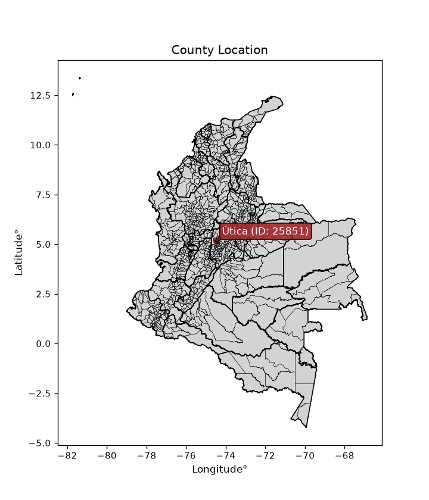
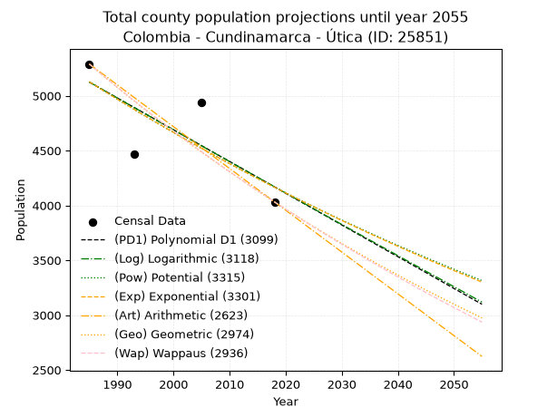
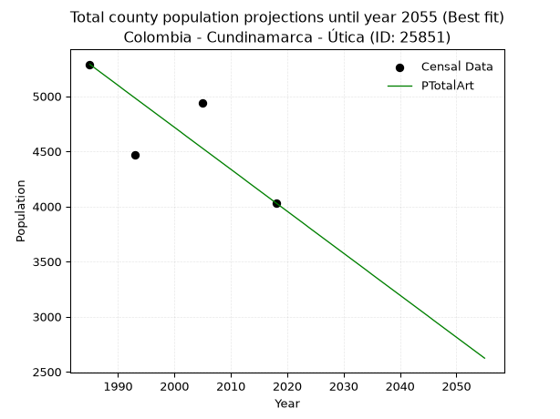
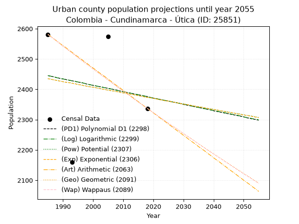
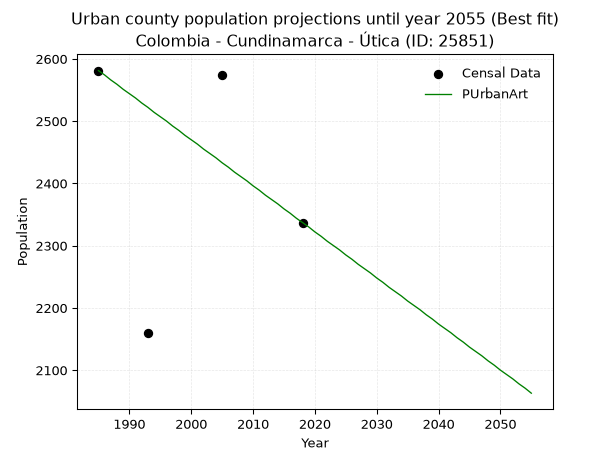
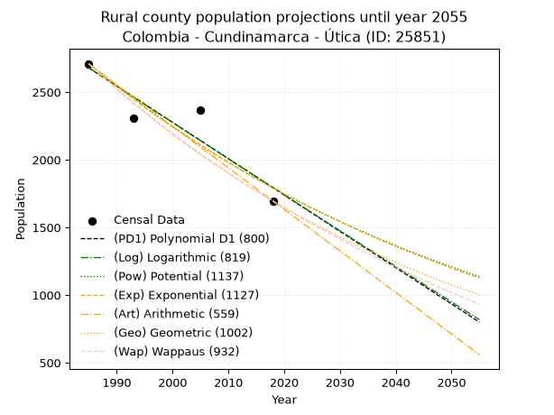
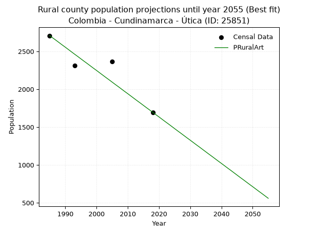

<div align="center">


</div>

# _“Population and Public Services Demand Projections (PPSD) until Year 2050 for Colombia - Cundinamarca - Útica (ID: 25851)”_
Keywords: `population` `public-service` `projection` `lineal` `polynomial` `logarithmic` `potential` `exponential` `arithmetic` `geometric` `wappaus` `dane` `colombia` `south-america`

PPSD are analytical estimates used by governments and planners to anticipate future changes in population size, age distribution, and the resulting community needs for utilities, healthcare, education, and infrastructure as sizing future water treatment facilities, electrical grids, and road networks based on spatial growth.

<div align="center">

</img>

</div>


> **General running parameters**: • app_version: _v20260806_. • Python version: _3.14.7_. • Pandas version: _3.0.5_. • NumPy version: _2.5.1_. • Creates, save and include plots into reports (create_plot): _False_. • Projection until year: _2050_. • Process polynomial degree 2 and up: _False_. • Process Wappaus: _True_. • Process Wappaus: _True_. • Set negative values to zero: _True_. • Set infinite values to zero: _True_. • Drop dataset notes: _True_. 
<div align="center">

Dynamic map: [:earth_americas:Google](http://maps.google.com/maps?q=5.190549621,-74.4831543) [:earth_americas:OSM](https://www.openstreetmap.org/#map=18/5.190549621/-74.4831543&layers=P) [:earth_americas:Bing](https://www.bing.com/maps?cp=5.190549621~-74.4831543&lvl=18) [:earth_americas:Apple](https://maps.apple.com/frame?center=5.190549621%2C-74.4831543&span=0.003%2C0.006)

</div>


<div align="center">

```geojson
{
  "type": "Feature",
  "geometry": {
    "type": "Point", 
    "coordinates": [-74.4831543, 5.190549621]
  }, 
  "properties": {
    "Name": "Colombia - Cundinamarca - Útica (ID: 25851)"
  }
}
```

</div>


## 0. Census Data (4 records)

Census data are official statistics collected by a government about the people and housing in a country. They usually include counts of total population, age, sex, race, income, education, and jobs.

📅Global census file: [Population.xlsx](../data/Population.xlsx)

| Source   |   Year |   CountryID | CountryName   |   StateID | StateName    |   CountyID | CountyName   |   PTotal |   PUrban |   PRural |
|:---------|-------:|------------:|:--------------|----------:|:-------------|-----------:|:-------------|---------:|---------:|---------:|
| DANE     |   1985 |          57 | Colombia      |        25 | Cundinamarca |      25851 | Útica        |     5289 |     2581 |     2708 |
| DANE     |   1993 |          57 | Colombia      |        25 | Cundinamarca |      25851 | Útica        |     4469 |     2159 |     2310 |
| DANE     |   2005 |          57 | Colombia      |        25 | Cundinamarca |      25851 | Útica        |     4941 |     2574 |     2367 |
| DANE     |   2018 |          57 | Colombia      |        25 | Cundinamarca |      25851 | Útica        |     4032 |     2337 |     1695 |

> 🔥Some records could had specific notes about the registered values or the corresponding urban or rural distribution.

📅[SUI-RUPS](https://www.datos.gov.co/Hacienda-y-Cr-dito-P-blico/Registro-nico-de-Prestadores-de-Servicios-P-blicos/4qkq-csdn/about_data) - Local public utility companies: [RUPS.csv](../data/RUPS.xlsx)

 | SERVICIO       | ESTADO    | NOMBRE                                                              | NIT         | DEPARTAMENTO_DOMICILIO   | MUNICIPIO_DOMICILIO   | DIRECCION         |   TELEFONO | EMAIL                      | TIPO_PRESTADOR          | CLASIFICACION                 |
|:---------------|:----------|:--------------------------------------------------------------------|:------------|:-------------------------|:----------------------|:------------------|-----------:|:---------------------------|:------------------------|:------------------------------|
| ACUEDUCTO      | OPERATIVA | ASOCIACION DE  USUARIOS DEL ACUEDUCTO Y ALCANTARILLADO DE UTICA ESP | 800256067-4 | CUNDINAMARCA             | UTICA                 | CALLE 7 No 3 - 46 |    8460128 | acueductoutica@hotmail.com | ORGANIZACION AUTORIZADA | MENOR O IGUAL A 2500 USUARIOS |
| ALCANTARILLADO | OPERATIVA | ASOCIACION DE  USUARIOS DEL ACUEDUCTO Y ALCANTARILLADO DE UTICA ESP | 800256067-4 | CUNDINAMARCA             | UTICA                 | CALLE 7 No 3 - 46 |    8460128 | acueductoutica@hotmail.com | ORGANIZACION AUTORIZADA | MENOR O IGUAL A 2500 USUARIOS |

## 1. Total

### 1.1. Coefficients and Parameters

* (PD1) Polynomial Deg 1: -28.935768767562713, 62561.52147731732 (lineal)
* (Log) Logarithmic: -57904.13192810402, 444812.52080011077
* (Pow) Potential: -12.590800284471177, 45.23141641437922
* (Exp) Exponential: -0.00629254492319949, 1363163985.739895
* (Art) Arithmetic: Year diff. 2018 - 1985 = 33, Population diff. 4032 - 5289 = -1257, Annual growth = -38.09090909090909
* (Geo) Geometric: Year diff. 2018 - 1985 = 33, Population diff. 4032 - 5289 = -1257, Annual growth % = -0.008189513875198284
* (Wap) Wappaus: i = -0.8173137880250851, Condition values only valid for < 200)

<sub>
Wappaus condition values: ['-0.00', '-0.82', '-1.63', '-2.45', '-3.27', '-4.09', '-4.90', '-5.72', '-6.54', '-7.36', '-8.17', '-8.99', '-9.81', '-10.63', '-11.44', '-12.26', '-13.08', '-13.89', '-14.71', '-15.53', '-16.35', '-17.16', '-17.98', '-18.80', '-19.62', '-20.43', '-21.25', '-22.07', '-22.88', '-23.70', '-24.52', '-25.34', '-26.15', '-26.97', '-27.79', '-28.61', '-29.42', '-30.24', '-31.06', '-31.88', '-32.69', '-33.51', '-34.33', '-35.14', '-35.96', '-36.78', '-37.60', '-38.41', '-39.23', '-40.05', '-40.87', '-41.68', '-42.50', '-43.32', '-44.13', '-44.95', '-45.77', '-46.59', '-47.40', '-48.22', '-49.04', '-49.86', '-50.67', '-51.49', '-52.31', '-53.13']
</sub>


### 1.2. Projected Dataset

|   Year |   CountyID |   PTotalPD1 |   PTotalLog |   PTotalPow |   PTotalExp |   PTotalArt |   PTotalGeo |   PTotalWap |
|-------:|-----------:|------------:|------------:|------------:|------------:|------------:|------------:|------------:|
|   1985 |      25851 |        5124 |        5125 |        5128 |        5127 |        5289 |        5289 |        5289 |
|   1986 |      25851 |        5095 |        5096 |        5096 |        5095 |        5251 |        5246 |        5246 |
|   1987 |      25851 |        5066 |        5066 |        5064 |        5063 |        5213 |        5203 |        5203 |
|   1988 |      25851 |        5037 |        5037 |        5032 |        5032 |        5175 |        5160 |        5161 |
|   1989 |      25851 |        5008 |        5008 |        5000 |        5000 |        5137 |        5118 |        5119 |
|   1990 |      25851 |        4979 |        4979 |        4968 |        4969 |        5099 |        5076 |        5077 |
|   1991 |      25851 |        4950 |        4950 |        4937 |        4938 |        5060 |        5034 |        5036 |
|   1992 |      25851 |        4921 |        4921 |        4906 |        4907 |        5022 |        4993 |        4995 |
|   1993 |      25851 |        4893 |        4892 |        4875 |        4876 |        4984 |        4952 |        4954 |
|   1994 |      25851 |        4864 |        4863 |        4844 |        4845 |        4946 |        4912 |        4914 |
|   1995 |      25851 |        4835 |        4834 |        4814 |        4815 |        4908 |        4871 |        4874 |
|   1996 |      25851 |        4806 |        4805 |        4784 |        4785 |        4870 |        4832 |        4834 |
|   1997 |      25851 |        4777 |        4776 |        4754 |        4755 |        4832 |        4792 |        4795 |
|   1998 |      25851 |        4748 |        4747 |        4724 |        4725 |        4794 |        4753 |        4755 |
|   1999 |      25851 |        4719 |        4718 |        4694 |        4695 |        4756 |        4714 |        4717 |
|   2000 |      25851 |        4690 |        4689 |        4665 |        4666 |        4718 |        4675 |        4678 |
|   2001 |      25851 |        4661 |        4660 |        4635 |        4636 |        4680 |        4637 |        4640 |
|   2002 |      25851 |        4632 |        4631 |        4606 |        4607 |        4641 |        4599 |        4602 |
|   2003 |      25851 |        4603 |        4602 |        4577 |        4578 |        4603 |        4561 |        4564 |
|   2004 |      25851 |        4574 |        4573 |        4549 |        4550 |        4565 |        4524 |        4527 |
|   2005 |      25851 |        4545 |        4544 |        4520 |        4521 |        4527 |        4487 |        4490 |
|   2006 |      25851 |        4516 |        4515 |        4492 |        4493 |        4489 |        4450 |        4453 |
|   2007 |      25851 |        4487 |        4487 |        4464 |        4465 |        4451 |        4414 |        4416 |
|   2008 |      25851 |        4458 |        4458 |        4436 |        4437 |        4413 |        4378 |        4380 |
|   2009 |      25851 |        4430 |        4429 |        4408 |        4409 |        4375 |        4342 |        4344 |
|   2010 |      25851 |        4401 |        4400 |        4381 |        4381 |        4337 |        4306 |        4308 |
|   2011 |      25851 |        4372 |        4371 |        4353 |        4354 |        4299 |        4271 |        4273 |
|   2012 |      25851 |        4343 |        4342 |        4326 |        4326 |        4261 |        4236 |        4238 |
|   2013 |      25851 |        4314 |        4314 |        4299 |        4299 |        4222 |        4201 |        4203 |
|   2014 |      25851 |        4285 |        4285 |        4272 |        4272 |        4184 |        4167 |        4168 |
|   2015 |      25851 |        4256 |        4256 |        4246 |        4245 |        4146 |        4133 |        4134 |
|   2016 |      25851 |        4227 |        4227 |        4219 |        4219 |        4108 |        4099 |        4100 |
|   2017 |      25851 |        4198 |        4199 |        4193 |        4192 |        4070 |        4065 |        4066 |
|   2018 |      25851 |        4169 |        4170 |        4167 |        4166 |        4032 |        4032 |        4032 |
|   2019 |      25851 |        4140 |        4141 |        4141 |        4140 |        3994 |        3999 |        3999 |
|   2020 |      25851 |        4111 |        4113 |        4115 |        4114 |        3956 |        3966 |        3965 |
|   2021 |      25851 |        4082 |        4084 |        4090 |        4088 |        3918 |        3934 |        3932 |
|   2022 |      25851 |        4053 |        4055 |        4064 |        4062 |        3880 |        3902 |        3900 |
|   2023 |      25851 |        4024 |        4027 |        4039 |        4037 |        3842 |        3870 |        3867 |
|   2024 |      25851 |        3996 |        3998 |        4014 |        4012 |        3803 |        3838 |        3835 |
|   2025 |      25851 |        3967 |        3970 |        3989 |        3987 |        3765 |        3806 |        3803 |
|   2026 |      25851 |        3938 |        3941 |        3964 |        3962 |        3727 |        3775 |        3771 |
|   2027 |      25851 |        3909 |        3912 |        3940 |        3937 |        3689 |        3744 |        3739 |
|   2028 |      25851 |        3880 |        3884 |        3915 |        3912 |        3651 |        3714 |        3708 |
|   2029 |      25851 |        3851 |        3855 |        3891 |        3887 |        3613 |        3683 |        3677 |
|   2030 |      25851 |        3822 |        3827 |        3867 |        3863 |        3575 |        3653 |        3646 |
|   2031 |      25851 |        3793 |        3798 |        3843 |        3839 |        3537 |        3623 |        3615 |
|   2032 |      25851 |        3764 |        3770 |        3820 |        3815 |        3499 |        3594 |        3585 |
|   2033 |      25851 |        3735 |        3741 |        3796 |        3791 |        3461 |        3564 |        3554 |
|   2034 |      25851 |        3706 |        3713 |        3773 |        3767 |        3423 |        3535 |        3524 |
|   2035 |      25851 |        3677 |        3684 |        3749 |        3743 |        3384 |        3506 |        3494 |
|   2036 |      25851 |        3648 |        3656 |        3726 |        3720 |        3346 |        3477 |        3465 |
|   2037 |      25851 |        3619 |        3627 |        3703 |        3697 |        3308 |        3449 |        3435 |
|   2038 |      25851 |        3590 |        3599 |        3680 |        3673 |        3270 |        3421 |        3406 |
|   2039 |      25851 |        3561 |        3571 |        3658 |        3650 |        3232 |        3393 |        3377 |
|   2040 |      25851 |        3533 |        3542 |        3635 |        3627 |        3194 |        3365 |        3348 |
|   2041 |      25851 |        3504 |        3514 |        3613 |        3605 |        3156 |        3337 |        3319 |
|   2042 |      25851 |        3475 |        3485 |        3591 |        3582 |        3118 |        3310 |        3291 |
|   2043 |      25851 |        3446 |        3457 |        3569 |        3560 |        3080 |        3283 |        3262 |
|   2044 |      25851 |        3417 |        3429 |        3547 |        3537 |        3042 |        3256 |        3234 |
|   2045 |      25851 |        3388 |        3400 |        3525 |        3515 |        3004 |        3229 |        3206 |
|   2046 |      25851 |        3359 |        3372 |        3503 |        3493 |        2965 |        3203 |        3178 |
|   2047 |      25851 |        3330 |        3344 |        3482 |        3471 |        2927 |        3177 |        3151 |
|   2048 |      25851 |        3301 |        3316 |        3460 |        3449 |        2889 |        3151 |        3123 |
|   2049 |      25851 |        3272 |        3287 |        3439 |        3428 |        2851 |        3125 |        3096 |
|   2050 |      25851 |        3243 |        3259 |        3418 |        3406 |        2813 |        3099 |        3069 |
<div align="center">

</img>

</div>


### 1.3. Best fit with absolute and relative error (%)

Relative error puts that difference into context by dividing the absolute error by the true value, creating a unitless ratio or percentage that shows the scale of the mistake.

Absolute and relative error

|   Year | Source   |   CountryID | CountryName   |   StateID | StateName    |   CountyID_x | CountyName   |   PTotal |   PUrban |   PRural |   CountyID_y |   PTotalPD1 |   PTotalLog |   PTotalPow |   PTotalExp |   PTotalArt |   PTotalGeo |   PTotalWap |   PTotalPD1AbsError |   PTotalLogAbsError |   PTotalPowAbsError |   PTotalExpAbsError |   PTotalArtAbsError |   PTotalGeoAbsError |   PTotalWapAbsError |   PTotalPD1RelError |   PTotalLogRelError |   PTotalPowRelError |   PTotalExpRelError |   PTotalArtRelError |   PTotalGeoRelError |   PTotalWapRelError |
|-------:|:---------|------------:|:--------------|----------:|:-------------|-------------:|:-------------|---------:|---------:|---------:|-------------:|------------:|------------:|------------:|------------:|------------:|------------:|------------:|--------------------:|--------------------:|--------------------:|--------------------:|--------------------:|--------------------:|--------------------:|--------------------:|--------------------:|--------------------:|--------------------:|--------------------:|--------------------:|--------------------:|
|   1985 | DANE     |          57 | Colombia      |        25 | Cundinamarca |        25851 | Útica        |     5289 |     2581 |     2708 |        25851 |        5124 |        5125 |        5128 |        5127 |        5289 |        5289 |        5289 |                 165 |                 164 |                 161 |                 162 |                   0 |                   0 |                   0 |             3.11968 |             3.10078 |             3.04405 |             3.06296 |             0       |             0       |             0       |
|   1993 | DANE     |          57 | Colombia      |        25 | Cundinamarca |        25851 | Útica        |     4469 |     2159 |     2310 |        25851 |        4893 |        4892 |        4875 |        4876 |        4984 |        4952 |        4954 |                 424 |                 423 |                 406 |                 407 |                 515 |                 483 |                 485 |             9.48758 |             9.4652  |             9.08481 |             9.10718 |            11.5238  |            10.8078  |            10.8525  |
|   2005 | DANE     |          57 | Colombia      |        25 | Cundinamarca |        25851 | Útica        |     4941 |     2574 |     2367 |        25851 |        4545 |        4544 |        4520 |        4521 |        4527 |        4487 |        4490 |                 396 |                 397 |                 421 |                 420 |                 414 |                 454 |                 451 |             8.01457 |             8.03481 |             8.52054 |             8.5003  |             8.37887 |             9.18842 |             9.12771 |
|   2018 | DANE     |          57 | Colombia      |        25 | Cundinamarca |        25851 | Útica        |     4032 |     2337 |     1695 |        25851 |        4169 |        4170 |        4167 |        4166 |        4032 |        4032 |        4032 |                 137 |                 138 |                 135 |                 134 |                   0 |                   0 |                   0 |             3.39782 |             3.42262 |             3.34821 |             3.32341 |             0       |             0       |             0       |

Relative error mean

| Method    |   RelError | Best   |
|:----------|-----------:|:-------|
| PTotalPD1 |    6.00491 |        |
| PTotalLog |    6.00585 |        |
| PTotalPow |    5.9994  |        |
| PTotalExp |    5.99846 |        |
| PTotalArt |    4.97568 | True   |
| PTotalGeo |    4.99905 |        |
| PTotalWap |    4.99506 |        |

💙Best method: _**PTotalArt**_
<div align="center">

</img>

</div>


### 1.4. Fresh water supply demand in liters per capita per day (lpcd)

The fresh water supply demand typically ranges from 100 to 300 liters per capita per day (lpcd) for standard domestic and municipal planning, though absolute survival minimums set by the World Health Organization are as low as 7.5 to 20 liters per day, and total consumption in high-income nations can exceed 400 liters.

> `CZ`: Level in meters above the sea level (masl)<br> `WS`: Fresh water supply demand in liters per capita per day (lpcd or l/h/d)<br> `WSAll`: Zonal fresh water supply demand in liters per second (l/s)<br> `A`: Zonal area in square meters<br> `DP`: Population density (people/hectare or p/ha)

Reference values (RAS Colombia)

|    CZ |   WS |
|------:|-----:|
|  1000 |  120 |
|  2000 |  130 |
| 99999 |  140 |

County shapefile geometry properties and water supply values

|   CountyID |      ATotal |   CZTotal |   WSTotal |
|-----------:|------------:|----------:|----------:|
|      25851 | 9.19941e+07 |   761.379 |       120 |

Projected values for best method: PTotalArt

|   CountyID |   Year |   PTotalArt |   DPTotal |   WSTotal |   WSTotalAll |
|-----------:|-------:|------------:|----------:|----------:|-------------:|
|      25851 |   1985 |        5289 |      0.57 |       120 |      7.34583 |
|      25851 |   1986 |        5251 |      0.57 |       120 |      7.29306 |
|      25851 |   1987 |        5213 |      0.57 |       120 |      7.24028 |
|      25851 |   1988 |        5175 |      0.56 |       120 |      7.1875  |
|      25851 |   1989 |        5137 |      0.56 |       120 |      7.13472 |
|      25851 |   1990 |        5099 |      0.55 |       120 |      7.08194 |
|      25851 |   1991 |        5060 |      0.55 |       120 |      7.02778 |
|      25851 |   1992 |        5022 |      0.55 |       120 |      6.975   |
|      25851 |   1993 |        4984 |      0.54 |       120 |      6.92222 |
|      25851 |   1994 |        4946 |      0.54 |       120 |      6.86944 |
|      25851 |   1995 |        4908 |      0.53 |       120 |      6.81667 |
|      25851 |   1996 |        4870 |      0.53 |       120 |      6.76389 |
|      25851 |   1997 |        4832 |      0.53 |       120 |      6.71111 |
|      25851 |   1998 |        4794 |      0.52 |       120 |      6.65833 |
|      25851 |   1999 |        4756 |      0.52 |       120 |      6.60556 |
|      25851 |   2000 |        4718 |      0.51 |       120 |      6.55278 |
|      25851 |   2001 |        4680 |      0.51 |       120 |      6.5     |
|      25851 |   2002 |        4641 |      0.5  |       120 |      6.44583 |
|      25851 |   2003 |        4603 |      0.5  |       120 |      6.39306 |
|      25851 |   2004 |        4565 |      0.5  |       120 |      6.34028 |
|      25851 |   2005 |        4527 |      0.49 |       120 |      6.2875  |
|      25851 |   2006 |        4489 |      0.49 |       120 |      6.23472 |
|      25851 |   2007 |        4451 |      0.48 |       120 |      6.18194 |
|      25851 |   2008 |        4413 |      0.48 |       120 |      6.12917 |
|      25851 |   2009 |        4375 |      0.48 |       120 |      6.07639 |
|      25851 |   2010 |        4337 |      0.47 |       120 |      6.02361 |
|      25851 |   2011 |        4299 |      0.47 |       120 |      5.97083 |
|      25851 |   2012 |        4261 |      0.46 |       120 |      5.91806 |
|      25851 |   2013 |        4222 |      0.46 |       120 |      5.86389 |
|      25851 |   2014 |        4184 |      0.45 |       120 |      5.81111 |
|      25851 |   2015 |        4146 |      0.45 |       120 |      5.75833 |
|      25851 |   2016 |        4108 |      0.45 |       120 |      5.70556 |
|      25851 |   2017 |        4070 |      0.44 |       120 |      5.65278 |
|      25851 |   2018 |        4032 |      0.44 |       120 |      5.6     |
|      25851 |   2019 |        3994 |      0.43 |       120 |      5.54722 |
|      25851 |   2020 |        3956 |      0.43 |       120 |      5.49444 |
|      25851 |   2021 |        3918 |      0.43 |       120 |      5.44167 |
|      25851 |   2022 |        3880 |      0.42 |       120 |      5.38889 |
|      25851 |   2023 |        3842 |      0.42 |       120 |      5.33611 |
|      25851 |   2024 |        3803 |      0.41 |       120 |      5.28194 |
|      25851 |   2025 |        3765 |      0.41 |       120 |      5.22917 |
|      25851 |   2026 |        3727 |      0.41 |       120 |      5.17639 |
|      25851 |   2027 |        3689 |      0.4  |       120 |      5.12361 |
|      25851 |   2028 |        3651 |      0.4  |       120 |      5.07083 |
|      25851 |   2029 |        3613 |      0.39 |       120 |      5.01806 |
|      25851 |   2030 |        3575 |      0.39 |       120 |      4.96528 |
|      25851 |   2031 |        3537 |      0.38 |       120 |      4.9125  |
|      25851 |   2032 |        3499 |      0.38 |       120 |      4.85972 |
|      25851 |   2033 |        3461 |      0.38 |       120 |      4.80694 |
|      25851 |   2034 |        3423 |      0.37 |       120 |      4.75417 |
|      25851 |   2035 |        3384 |      0.37 |       120 |      4.7     |
|      25851 |   2036 |        3346 |      0.36 |       120 |      4.64722 |
|      25851 |   2037 |        3308 |      0.36 |       120 |      4.59444 |
|      25851 |   2038 |        3270 |      0.36 |       120 |      4.54167 |
|      25851 |   2039 |        3232 |      0.35 |       120 |      4.48889 |
|      25851 |   2040 |        3194 |      0.35 |       120 |      4.43611 |
|      25851 |   2041 |        3156 |      0.34 |       120 |      4.38333 |
|      25851 |   2042 |        3118 |      0.34 |       120 |      4.33056 |
|      25851 |   2043 |        3080 |      0.33 |       120 |      4.27778 |
|      25851 |   2044 |        3042 |      0.33 |       120 |      4.225   |
|      25851 |   2045 |        3004 |      0.33 |       120 |      4.17222 |
|      25851 |   2046 |        2965 |      0.32 |       120 |      4.11806 |
|      25851 |   2047 |        2927 |      0.32 |       120 |      4.06528 |
|      25851 |   2048 |        2889 |      0.31 |       120 |      4.0125  |
|      25851 |   2049 |        2851 |      0.31 |       120 |      3.95972 |
|      25851 |   2050 |        2813 |      0.31 |       120 |      3.90694 |

## 2. Urban

### 2.1. Coefficients and Parameters

* (PD1) Polynomial Deg 1: -2.095142513046851, 6603.558811721964 (lineal)
* (Log) Logarithmic: -4201.293483404413, 34346.81543441
* (Pow) Potential: -1.5504377804859428, 8.499439669648279
* (Exp) Exponential: -0.0007728255883342111, 11289.602758786046
* (Art) Arithmetic: Year diff. 2018 - 1985 = 33, Population diff. 2337 - 2581 = -244, Annual growth = -7.393939393939394
* (Geo) Geometric: Year diff. 2018 - 1985 = 33, Population diff. 2337 - 2581 = -244, Annual growth % = -0.0030048359672826264
* (Wap) Wappaus: i = -0.3006888732793572, Condition values only valid for < 200)

<sub>
Wappaus condition values: ['-0.00', '-0.30', '-0.60', '-0.90', '-1.20', '-1.50', '-1.80', '-2.10', '-2.41', '-2.71', '-3.01', '-3.31', '-3.61', '-3.91', '-4.21', '-4.51', '-4.81', '-5.11', '-5.41', '-5.71', '-6.01', '-6.31', '-6.62', '-6.92', '-7.22', '-7.52', '-7.82', '-8.12', '-8.42', '-8.72', '-9.02', '-9.32', '-9.62', '-9.92', '-10.22', '-10.52', '-10.82', '-11.13', '-11.43', '-11.73', '-12.03', '-12.33', '-12.63', '-12.93', '-13.23', '-13.53', '-13.83', '-14.13', '-14.43', '-14.73', '-15.03', '-15.34', '-15.64', '-15.94', '-16.24', '-16.54', '-16.84', '-17.14', '-17.44', '-17.74', '-18.04', '-18.34', '-18.64', '-18.94', '-19.24', '-19.54']
</sub>


### 2.2. Projected Dataset

|   Year |   CountyID |   PUrbanPD1 |   PUrbanLog |   PUrbanPow |   PUrbanExp |   PUrbanArt |   PUrbanGeo |   PUrbanWap |
|-------:|-----------:|------------:|------------:|------------:|------------:|------------:|------------:|------------:|
|   1985 |      25851 |        2445 |        2445 |        2435 |        2435 |        2581 |        2581 |        2581 |
|   1986 |      25851 |        2443 |        2443 |        2433 |        2433 |        2574 |        2573 |        2573 |
|   1987 |      25851 |        2441 |        2441 |        2431 |        2431 |        2566 |        2566 |        2566 |
|   1988 |      25851 |        2438 |        2438 |        2429 |        2429 |        2559 |        2558 |        2558 |
|   1989 |      25851 |        2436 |        2436 |        2427 |        2427 |        2551 |        2550 |        2550 |
|   1990 |      25851 |        2434 |        2434 |        2425 |        2425 |        2544 |        2542 |        2542 |
|   1991 |      25851 |        2432 |        2432 |        2423 |        2423 |        2537 |        2535 |        2535 |
|   1992 |      25851 |        2430 |        2430 |        2422 |        2422 |        2529 |        2527 |        2527 |
|   1993 |      25851 |        2428 |        2428 |        2420 |        2420 |        2522 |        2520 |        2520 |
|   1994 |      25851 |        2426 |        2426 |        2418 |        2418 |        2514 |        2512 |        2512 |
|   1995 |      25851 |        2424 |        2424 |        2416 |        2416 |        2507 |        2504 |        2505 |
|   1996 |      25851 |        2422 |        2422 |        2414 |        2414 |        2500 |        2497 |        2497 |
|   1997 |      25851 |        2420 |        2420 |        2412 |        2412 |        2492 |        2489 |        2490 |
|   1998 |      25851 |        2417 |        2417 |        2410 |        2410 |        2485 |        2482 |        2482 |
|   1999 |      25851 |        2415 |        2415 |        2408 |        2408 |        2477 |        2475 |        2475 |
|   2000 |      25851 |        2413 |        2413 |        2407 |        2407 |        2470 |        2467 |        2467 |
|   2001 |      25851 |        2411 |        2411 |        2405 |        2405 |        2463 |        2460 |        2460 |
|   2002 |      25851 |        2409 |        2409 |        2403 |        2403 |        2455 |        2452 |        2452 |
|   2003 |      25851 |        2407 |        2407 |        2401 |        2401 |        2448 |        2445 |        2445 |
|   2004 |      25851 |        2405 |        2405 |        2399 |        2399 |        2441 |        2438 |        2438 |
|   2005 |      25851 |        2403 |        2403 |        2397 |        2397 |        2433 |        2430 |        2430 |
|   2006 |      25851 |        2401 |        2401 |        2395 |        2396 |        2426 |        2423 |        2423 |
|   2007 |      25851 |        2399 |        2399 |        2394 |        2394 |        2418 |        2416 |        2416 |
|   2008 |      25851 |        2397 |        2396 |        2392 |        2392 |        2411 |        2408 |        2408 |
|   2009 |      25851 |        2394 |        2394 |        2390 |        2390 |        2404 |        2401 |        2401 |
|   2010 |      25851 |        2392 |        2392 |        2388 |        2388 |        2396 |        2394 |        2394 |
|   2011 |      25851 |        2390 |        2390 |        2386 |        2386 |        2389 |        2387 |        2387 |
|   2012 |      25851 |        2388 |        2388 |        2384 |        2384 |        2381 |        2380 |        2380 |
|   2013 |      25851 |        2386 |        2386 |        2383 |        2383 |        2374 |        2372 |        2372 |
|   2014 |      25851 |        2384 |        2384 |        2381 |        2381 |        2367 |        2365 |        2365 |
|   2015 |      25851 |        2382 |        2382 |        2379 |        2379 |        2359 |        2358 |        2358 |
|   2016 |      25851 |        2380 |        2380 |        2377 |        2377 |        2352 |        2351 |        2351 |
|   2017 |      25851 |        2378 |        2378 |        2375 |        2375 |        2344 |        2344 |        2344 |
|   2018 |      25851 |        2376 |        2376 |        2373 |        2373 |        2337 |        2337 |        2337 |
|   2019 |      25851 |        2373 |        2373 |        2372 |        2372 |        2330 |        2330 |        2330 |
|   2020 |      25851 |        2371 |        2371 |        2370 |        2370 |        2322 |        2323 |        2323 |
|   2021 |      25851 |        2369 |        2369 |        2368 |        2368 |        2315 |        2316 |        2316 |
|   2022 |      25851 |        2367 |        2367 |        2366 |        2366 |        2307 |        2309 |        2309 |
|   2023 |      25851 |        2365 |        2365 |        2364 |        2364 |        2300 |        2302 |        2302 |
|   2024 |      25851 |        2363 |        2363 |        2362 |        2362 |        2293 |        2295 |        2295 |
|   2025 |      25851 |        2361 |        2361 |        2361 |        2361 |        2285 |        2288 |        2288 |
|   2026 |      25851 |        2359 |        2359 |        2359 |        2359 |        2278 |        2281 |        2281 |
|   2027 |      25851 |        2357 |        2357 |        2357 |        2357 |        2270 |        2275 |        2274 |
|   2028 |      25851 |        2355 |        2355 |        2355 |        2355 |        2263 |        2268 |        2268 |
|   2029 |      25851 |        2353 |        2353 |        2353 |        2353 |        2256 |        2261 |        2261 |
|   2030 |      25851 |        2350 |        2351 |        2352 |        2351 |        2248 |        2254 |        2254 |
|   2031 |      25851 |        2348 |        2349 |        2350 |        2350 |        2241 |        2247 |        2247 |
|   2032 |      25851 |        2346 |        2347 |        2348 |        2348 |        2233 |        2241 |        2240 |
|   2033 |      25851 |        2344 |        2344 |        2346 |        2346 |        2226 |        2234 |        2234 |
|   2034 |      25851 |        2342 |        2342 |        2344 |        2344 |        2219 |        2227 |        2227 |
|   2035 |      25851 |        2340 |        2340 |        2343 |        2342 |        2211 |        2220 |        2220 |
|   2036 |      25851 |        2338 |        2338 |        2341 |        2341 |        2204 |        2214 |        2213 |
|   2037 |      25851 |        2336 |        2336 |        2339 |        2339 |        2197 |        2207 |        2207 |
|   2038 |      25851 |        2334 |        2334 |        2337 |        2337 |        2189 |        2200 |        2200 |
|   2039 |      25851 |        2332 |        2332 |        2336 |        2335 |        2182 |        2194 |        2193 |
|   2040 |      25851 |        2329 |        2330 |        2334 |        2333 |        2174 |        2187 |        2187 |
|   2041 |      25851 |        2327 |        2328 |        2332 |        2332 |        2167 |        2181 |        2180 |
|   2042 |      25851 |        2325 |        2326 |        2330 |        2330 |        2160 |        2174 |        2174 |
|   2043 |      25851 |        2323 |        2324 |        2328 |        2328 |        2152 |        2168 |        2167 |
|   2044 |      25851 |        2321 |        2322 |        2327 |        2326 |        2145 |        2161 |        2160 |
|   2045 |      25851 |        2319 |        2320 |        2325 |        2324 |        2137 |        2155 |        2154 |
|   2046 |      25851 |        2317 |        2318 |        2323 |        2323 |        2130 |        2148 |        2147 |
|   2047 |      25851 |        2315 |        2316 |        2321 |        2321 |        2123 |        2142 |        2141 |
|   2048 |      25851 |        2313 |        2314 |        2320 |        2319 |        2115 |        2135 |        2134 |
|   2049 |      25851 |        2311 |        2312 |        2318 |        2317 |        2108 |        2129 |        2128 |
|   2050 |      25851 |        2309 |        2309 |        2316 |        2315 |        2100 |        2122 |        2121 |
<div align="center">

</img>

</div>


### 2.3. Best fit with absolute and relative error (%)

Relative error puts that difference into context by dividing the absolute error by the true value, creating a unitless ratio or percentage that shows the scale of the mistake.

Absolute and relative error

|   Year | Source   |   CountryID | CountryName   |   StateID | StateName    |   CountyID_x | CountyName   |   PTotal |   PUrban |   PRural |   CountyID_y |   PUrbanPD1 |   PUrbanLog |   PUrbanPow |   PUrbanExp |   PUrbanArt |   PUrbanGeo |   PUrbanWap |   PUrbanPD1AbsError |   PUrbanLogAbsError |   PUrbanPowAbsError |   PUrbanExpAbsError |   PUrbanArtAbsError |   PUrbanGeoAbsError |   PUrbanWapAbsError |   PUrbanPD1RelError |   PUrbanLogRelError |   PUrbanPowRelError |   PUrbanExpRelError |   PUrbanArtRelError |   PUrbanGeoRelError |   PUrbanWapRelError |
|-------:|:---------|------------:|:--------------|----------:|:-------------|-------------:|:-------------|---------:|---------:|---------:|-------------:|------------:|------------:|------------:|------------:|------------:|------------:|------------:|--------------------:|--------------------:|--------------------:|--------------------:|--------------------:|--------------------:|--------------------:|--------------------:|--------------------:|--------------------:|--------------------:|--------------------:|--------------------:|--------------------:|
|   1985 | DANE     |          57 | Colombia      |        25 | Cundinamarca |        25851 | Útica        |     5289 |     2581 |     2708 |        25851 |        2445 |        2445 |        2435 |        2435 |        2581 |        2581 |        2581 |                 136 |                 136 |                 146 |                 146 |                   0 |                   0 |                   0 |             5.26928 |             5.26928 |             5.65672 |             5.65672 |             0       |             0       |             0       |
|   1993 | DANE     |          57 | Colombia      |        25 | Cundinamarca |        25851 | Útica        |     4469 |     2159 |     2310 |        25851 |        2428 |        2428 |        2420 |        2420 |        2522 |        2520 |        2520 |                 269 |                 269 |                 261 |                 261 |                 363 |                 361 |                 361 |            12.4595  |            12.4595  |            12.0889  |            12.0889  |            16.8133  |            16.7207  |            16.7207  |
|   2005 | DANE     |          57 | Colombia      |        25 | Cundinamarca |        25851 | Útica        |     4941 |     2574 |     2367 |        25851 |        2403 |        2403 |        2397 |        2397 |        2433 |        2430 |        2430 |                 171 |                 171 |                 177 |                 177 |                 141 |                 144 |                 144 |             6.64336 |             6.64336 |             6.87646 |             6.87646 |             5.47786 |             5.59441 |             5.59441 |
|   2018 | DANE     |          57 | Colombia      |        25 | Cundinamarca |        25851 | Útica        |     4032 |     2337 |     1695 |        25851 |        2376 |        2376 |        2373 |        2373 |        2337 |        2337 |        2337 |                  39 |                  39 |                  36 |                  36 |                   0 |                   0 |                   0 |             1.66881 |             1.66881 |             1.54044 |             1.54044 |             0       |             0       |             0       |

Relative error mean

| Method    |   RelError | Best   |
|:----------|-----------:|:-------|
| PUrbanPD1 |    6.51023 |        |
| PUrbanLog |    6.51023 |        |
| PUrbanPow |    6.54064 |        |
| PUrbanExp |    6.54064 |        |
| PUrbanArt |    5.5728  | True   |
| PUrbanGeo |    5.57878 |        |
| PUrbanWap |    5.57878 |        |

💙Best method: _**PUrbanArt**_
<div align="center">

</img>

</div>


### 2.4. Fresh water supply demand in liters per capita per day (lpcd)

The fresh water supply demand typically ranges from 100 to 300 liters per capita per day (lpcd) for standard domestic and municipal planning, though absolute survival minimums set by the World Health Organization are as low as 7.5 to 20 liters per day, and total consumption in high-income nations can exceed 400 liters.

> `CZ`: Level in meters above the sea level (masl)<br> `WS`: Fresh water supply demand in liters per capita per day (lpcd or l/h/d)<br> `WSAll`: Zonal fresh water supply demand in liters per second (l/s)<br> `A`: Zonal area in square meters<br> `DP`: Population density (people/hectare or p/ha)

Reference values (RAS Colombia)

|    CZ |   WS |
|------:|-----:|
|  1000 |  120 |
|  2000 |  130 |
| 99999 |  140 |

County shapefile geometry properties and water supply values

|   CountyID |      AUrban |   CZUrban |   WSUrban |
|-----------:|------------:|----------:|----------:|
|      25851 | 2.96859e+06 |   516.115 |       120 |

Projected values for best method: PUrbanArt

|   CountyID |   Year |   PUrbanArt |   DPUrban |   WSUrban |   WSUrbanAll |
|-----------:|-------:|------------:|----------:|----------:|-------------:|
|      25851 |   1985 |        2581 |      8.69 |       120 |      3.58472 |
|      25851 |   1986 |        2574 |      8.67 |       120 |      3.575   |
|      25851 |   1987 |        2566 |      8.64 |       120 |      3.56389 |
|      25851 |   1988 |        2559 |      8.62 |       120 |      3.55417 |
|      25851 |   1989 |        2551 |      8.59 |       120 |      3.54306 |
|      25851 |   1990 |        2544 |      8.57 |       120 |      3.53333 |
|      25851 |   1991 |        2537 |      8.55 |       120 |      3.52361 |
|      25851 |   1992 |        2529 |      8.52 |       120 |      3.5125  |
|      25851 |   1993 |        2522 |      8.5  |       120 |      3.50278 |
|      25851 |   1994 |        2514 |      8.47 |       120 |      3.49167 |
|      25851 |   1995 |        2507 |      8.45 |       120 |      3.48194 |
|      25851 |   1996 |        2500 |      8.42 |       120 |      3.47222 |
|      25851 |   1997 |        2492 |      8.39 |       120 |      3.46111 |
|      25851 |   1998 |        2485 |      8.37 |       120 |      3.45139 |
|      25851 |   1999 |        2477 |      8.34 |       120 |      3.44028 |
|      25851 |   2000 |        2470 |      8.32 |       120 |      3.43056 |
|      25851 |   2001 |        2463 |      8.3  |       120 |      3.42083 |
|      25851 |   2002 |        2455 |      8.27 |       120 |      3.40972 |
|      25851 |   2003 |        2448 |      8.25 |       120 |      3.4     |
|      25851 |   2004 |        2441 |      8.22 |       120 |      3.39028 |
|      25851 |   2005 |        2433 |      8.2  |       120 |      3.37917 |
|      25851 |   2006 |        2426 |      8.17 |       120 |      3.36944 |
|      25851 |   2007 |        2418 |      8.15 |       120 |      3.35833 |
|      25851 |   2008 |        2411 |      8.12 |       120 |      3.34861 |
|      25851 |   2009 |        2404 |      8.1  |       120 |      3.33889 |
|      25851 |   2010 |        2396 |      8.07 |       120 |      3.32778 |
|      25851 |   2011 |        2389 |      8.05 |       120 |      3.31806 |
|      25851 |   2012 |        2381 |      8.02 |       120 |      3.30694 |
|      25851 |   2013 |        2374 |      8    |       120 |      3.29722 |
|      25851 |   2014 |        2367 |      7.97 |       120 |      3.2875  |
|      25851 |   2015 |        2359 |      7.95 |       120 |      3.27639 |
|      25851 |   2016 |        2352 |      7.92 |       120 |      3.26667 |
|      25851 |   2017 |        2344 |      7.9  |       120 |      3.25556 |
|      25851 |   2018 |        2337 |      7.87 |       120 |      3.24583 |
|      25851 |   2019 |        2330 |      7.85 |       120 |      3.23611 |
|      25851 |   2020 |        2322 |      7.82 |       120 |      3.225   |
|      25851 |   2021 |        2315 |      7.8  |       120 |      3.21528 |
|      25851 |   2022 |        2307 |      7.77 |       120 |      3.20417 |
|      25851 |   2023 |        2300 |      7.75 |       120 |      3.19444 |
|      25851 |   2024 |        2293 |      7.72 |       120 |      3.18472 |
|      25851 |   2025 |        2285 |      7.7  |       120 |      3.17361 |
|      25851 |   2026 |        2278 |      7.67 |       120 |      3.16389 |
|      25851 |   2027 |        2270 |      7.65 |       120 |      3.15278 |
|      25851 |   2028 |        2263 |      7.62 |       120 |      3.14306 |
|      25851 |   2029 |        2256 |      7.6  |       120 |      3.13333 |
|      25851 |   2030 |        2248 |      7.57 |       120 |      3.12222 |
|      25851 |   2031 |        2241 |      7.55 |       120 |      3.1125  |
|      25851 |   2032 |        2233 |      7.52 |       120 |      3.10139 |
|      25851 |   2033 |        2226 |      7.5  |       120 |      3.09167 |
|      25851 |   2034 |        2219 |      7.47 |       120 |      3.08194 |
|      25851 |   2035 |        2211 |      7.45 |       120 |      3.07083 |
|      25851 |   2036 |        2204 |      7.42 |       120 |      3.06111 |
|      25851 |   2037 |        2197 |      7.4  |       120 |      3.05139 |
|      25851 |   2038 |        2189 |      7.37 |       120 |      3.04028 |
|      25851 |   2039 |        2182 |      7.35 |       120 |      3.03056 |
|      25851 |   2040 |        2174 |      7.32 |       120 |      3.01944 |
|      25851 |   2041 |        2167 |      7.3  |       120 |      3.00972 |
|      25851 |   2042 |        2160 |      7.28 |       120 |      3       |
|      25851 |   2043 |        2152 |      7.25 |       120 |      2.98889 |
|      25851 |   2044 |        2145 |      7.23 |       120 |      2.97917 |
|      25851 |   2045 |        2137 |      7.2  |       120 |      2.96806 |
|      25851 |   2046 |        2130 |      7.18 |       120 |      2.95833 |
|      25851 |   2047 |        2123 |      7.15 |       120 |      2.94861 |
|      25851 |   2048 |        2115 |      7.12 |       120 |      2.9375  |
|      25851 |   2049 |        2108 |      7.1  |       120 |      2.92778 |
|      25851 |   2050 |        2100 |      7.07 |       120 |      2.91667 |

## 3. Rural

### 3.1. Coefficients and Parameters

* (PD1) Polynomial Deg 1: -26.840626254515815, 55957.96266559527 (lineal)
* (Log) Logarithmic: -53702.83844469966, 410465.7053657011
* (Pow) Potential: -25.066152280577615, 86.0951767741859
* (Exp) Exponential: -0.01253018546379852, 171730884198454.7
* (Art) Arithmetic: Year diff. 2018 - 1985 = 33, Population diff. 1695 - 2708 = -1013, Annual growth = -30.696969696969695
* (Geo) Geometric: Year diff. 2018 - 1985 = 33, Population diff. 1695 - 2708 = -1013, Annual growth % = -0.014097492942140577
* (Wap) Wappaus: i = -1.394366100248453, Condition values only valid for < 200)

<sub>
Wappaus condition values: ['-0.00', '-1.39', '-2.79', '-4.18', '-5.58', '-6.97', '-8.37', '-9.76', '-11.15', '-12.55', '-13.94', '-15.34', '-16.73', '-18.13', '-19.52', '-20.92', '-22.31', '-23.70', '-25.10', '-26.49', '-27.89', '-29.28', '-30.68', '-32.07', '-33.46', '-34.86', '-36.25', '-37.65', '-39.04', '-40.44', '-41.83', '-43.23', '-44.62', '-46.01', '-47.41', '-48.80', '-50.20', '-51.59', '-52.99', '-54.38', '-55.77', '-57.17', '-58.56', '-59.96', '-61.35', '-62.75', '-64.14', '-65.54', '-66.93', '-68.32', '-69.72', '-71.11', '-72.51', '-73.90', '-75.30', '-76.69', '-78.08', '-79.48', '-80.87', '-82.27', '-83.66', '-85.06', '-86.45', '-87.85', '-89.24', '-90.63']
</sub>


### 3.2. Projected Dataset

|   Year |   CountyID |   PRuralPD1 |   PRuralLog |   PRuralPow |   PRuralExp |   PRuralArt |   PRuralGeo |   PRuralWap |
|-------:|-----------:|------------:|------------:|------------:|------------:|------------:|------------:|------------:|
|   1985 |      25851 |        2679 |        2680 |        2710 |        2710 |        2708 |        2708 |        2708 |
|   1986 |      25851 |        2652 |        2653 |        2676 |        2676 |        2677 |        2670 |        2671 |
|   1987 |      25851 |        2626 |        2626 |        2643 |        2642 |        2647 |        2632 |        2634 |
|   1988 |      25851 |        2599 |        2599 |        2610 |        2610 |        2616 |        2595 |        2597 |
|   1989 |      25851 |        2572 |        2572 |        2577 |        2577 |        2585 |        2558 |        2561 |
|   1990 |      25851 |        2545 |        2545 |        2545 |        2545 |        2555 |        2522 |        2526 |
|   1991 |      25851 |        2518 |        2518 |        2513 |        2513 |        2524 |        2487 |        2491 |
|   1992 |      25851 |        2491 |        2491 |        2481 |        2482 |        2493 |        2452 |        2456 |
|   1993 |      25851 |        2465 |        2464 |        2450 |        2451 |        2462 |        2417 |        2422 |
|   1994 |      25851 |        2438 |        2437 |        2420 |        2421 |        2432 |        2383 |        2388 |
|   1995 |      25851 |        2411 |        2410 |        2389 |        2390 |        2401 |        2350 |        2355 |
|   1996 |      25851 |        2384 |        2383 |        2360 |        2361 |        2370 |        2316 |        2322 |
|   1997 |      25851 |        2357 |        2356 |        2330 |        2331 |        2340 |        2284 |        2290 |
|   1998 |      25851 |        2330 |        2329 |        2301 |        2302 |        2309 |        2252 |        2258 |
|   1999 |      25851 |        2304 |        2303 |        2272 |        2274 |        2278 |        2220 |        2226 |
|   2000 |      25851 |        2277 |        2276 |        2244 |        2245 |        2248 |        2189 |        2195 |
|   2001 |      25851 |        2250 |        2249 |        2216 |        2217 |        2217 |        2158 |        2164 |
|   2002 |      25851 |        2223 |        2222 |        2189 |        2190 |        2186 |        2127 |        2134 |
|   2003 |      25851 |        2196 |        2195 |        2161 |        2162 |        2155 |        2097 |        2104 |
|   2004 |      25851 |        2169 |        2168 |        2135 |        2136 |        2125 |        2068 |        2074 |
|   2005 |      25851 |        2143 |        2142 |        2108 |        2109 |        2094 |        2039 |        2045 |
|   2006 |      25851 |        2116 |        2115 |        2082 |        2083 |        2063 |        2010 |        2016 |
|   2007 |      25851 |        2089 |        2088 |        2056 |        2057 |        2033 |        1982 |        1988 |
|   2008 |      25851 |        2062 |        2061 |        2030 |        2031 |        2002 |        1954 |        1960 |
|   2009 |      25851 |        2035 |        2035 |        2005 |        2006 |        1971 |        1926 |        1932 |
|   2010 |      25851 |        2008 |        2008 |        1980 |        1981 |        1941 |        1899 |        1904 |
|   2011 |      25851 |        1981 |        1981 |        1956 |        1956 |        1910 |        1872 |        1877 |
|   2012 |      25851 |        1955 |        1954 |        1932 |        1932 |        1879 |        1846 |        1850 |
|   2013 |      25851 |        1928 |        1928 |        1908 |        1908 |        1848 |        1820 |        1823 |
|   2014 |      25851 |        1901 |        1901 |        1884 |        1884 |        1818 |        1794 |        1797 |
|   2015 |      25851 |        1874 |        1874 |        1861 |        1861 |        1787 |        1769 |        1771 |
|   2016 |      25851 |        1847 |        1848 |        1838 |        1837 |        1756 |        1744 |        1745 |
|   2017 |      25851 |        1820 |        1821 |        1815 |        1815 |        1726 |        1719 |        1720 |
|   2018 |      25851 |        1794 |        1795 |        1793 |        1792 |        1695 |        1695 |        1695 |
|   2019 |      25851 |        1767 |        1768 |        1771 |        1770 |        1664 |        1671 |        1670 |
|   2020 |      25851 |        1740 |        1741 |        1749 |        1748 |        1634 |        1648 |        1646 |
|   2021 |      25851 |        1713 |        1715 |        1727 |        1726 |        1603 |        1624 |        1621 |
|   2022 |      25851 |        1686 |        1688 |        1706 |        1704 |        1572 |        1601 |        1597 |
|   2023 |      25851 |        1659 |        1662 |        1685 |        1683 |        1542 |        1579 |        1574 |
|   2024 |      25851 |        1633 |        1635 |        1664 |        1662 |        1511 |        1557 |        1550 |
|   2025 |      25851 |        1606 |        1609 |        1644 |        1641 |        1480 |        1535 |        1527 |
|   2026 |      25851 |        1579 |        1582 |        1623 |        1621 |        1449 |        1513 |        1504 |
|   2027 |      25851 |        1552 |        1556 |        1604 |        1601 |        1419 |        1492 |        1481 |
|   2028 |      25851 |        1525 |        1529 |        1584 |        1581 |        1388 |        1471 |        1459 |
|   2029 |      25851 |        1498 |        1503 |        1564 |        1561 |        1357 |        1450 |        1437 |
|   2030 |      25851 |        1471 |        1476 |        1545 |        1542 |        1327 |        1429 |        1415 |
|   2031 |      25851 |        1445 |        1450 |        1526 |        1523 |        1296 |        1409 |        1393 |
|   2032 |      25851 |        1418 |        1423 |        1508 |        1504 |        1265 |        1389 |        1371 |
|   2033 |      25851 |        1391 |        1397 |        1489 |        1485 |        1235 |        1370 |        1350 |
|   2034 |      25851 |        1364 |        1370 |        1471 |        1466 |        1204 |        1351 |        1329 |
|   2035 |      25851 |        1337 |        1344 |        1453 |        1448 |        1173 |        1332 |        1308 |
|   2036 |      25851 |        1310 |        1318 |        1435 |        1430 |        1142 |        1313 |        1287 |
|   2037 |      25851 |        1284 |        1291 |        1417 |        1412 |        1112 |        1294 |        1267 |
|   2038 |      25851 |        1257 |        1265 |        1400 |        1395 |        1081 |        1276 |        1247 |
|   2039 |      25851 |        1230 |        1239 |        1383 |        1377 |        1050 |        1258 |        1227 |
|   2040 |      25851 |        1203 |        1212 |        1366 |        1360 |        1020 |        1240 |        1207 |
|   2041 |      25851 |        1176 |        1186 |        1349 |        1343 |         989 |        1223 |        1187 |
|   2042 |      25851 |        1149 |        1160 |        1333 |        1327 |         958 |        1206 |        1168 |
|   2043 |      25851 |        1123 |        1133 |        1317 |        1310 |         928 |        1189 |        1149 |
|   2044 |      25851 |        1096 |        1107 |        1301 |        1294 |         897 |        1172 |        1129 |
|   2045 |      25851 |        1069 |        1081 |        1285 |        1278 |         866 |        1155 |        1111 |
|   2046 |      25851 |        1042 |        1054 |        1269 |        1262 |         835 |        1139 |        1092 |
|   2047 |      25851 |        1015 |        1028 |        1254 |        1246 |         805 |        1123 |        1073 |
|   2048 |      25851 |         988 |        1002 |        1238 |        1230 |         774 |        1107 |        1055 |
|   2049 |      25851 |         962 |         976 |        1223 |        1215 |         743 |        1091 |        1037 |
|   2050 |      25851 |         935 |         950 |        1209 |        1200 |         713 |        1076 |        1019 |
<div align="center">

</img>

</div>


### 3.3. Best fit with absolute and relative error (%)

Relative error puts that difference into context by dividing the absolute error by the true value, creating a unitless ratio or percentage that shows the scale of the mistake.

Absolute and relative error

|   Year | Source   |   CountryID | CountryName   |   StateID | StateName    |   CountyID_x | CountyName   |   PTotal |   PUrban |   PRural |   CountyID_y |   PRuralPD1 |   PRuralLog |   PRuralPow |   PRuralExp |   PRuralArt |   PRuralGeo |   PRuralWap |   PRuralPD1AbsError |   PRuralLogAbsError |   PRuralPowAbsError |   PRuralExpAbsError |   PRuralArtAbsError |   PRuralGeoAbsError |   PRuralWapAbsError |   PRuralPD1RelError |   PRuralLogRelError |   PRuralPowRelError |   PRuralExpRelError |   PRuralArtRelError |   PRuralGeoRelError |   PRuralWapRelError |
|-------:|:---------|------------:|:--------------|----------:|:-------------|-------------:|:-------------|---------:|---------:|---------:|-------------:|------------:|------------:|------------:|------------:|------------:|------------:|------------:|--------------------:|--------------------:|--------------------:|--------------------:|--------------------:|--------------------:|--------------------:|--------------------:|--------------------:|--------------------:|--------------------:|--------------------:|--------------------:|--------------------:|
|   1985 | DANE     |          57 | Colombia      |        25 | Cundinamarca |        25851 | Útica        |     5289 |     2581 |     2708 |        25851 |        2679 |        2680 |        2710 |        2710 |        2708 |        2708 |        2708 |                  29 |                  28 |                   2 |                   2 |                   0 |                   0 |                   0 |             1.0709  |             1.03397 |           0.0738552 |           0.0738552 |             0       |             0       |             0       |
|   1993 | DANE     |          57 | Colombia      |        25 | Cundinamarca |        25851 | Útica        |     4469 |     2159 |     2310 |        25851 |        2465 |        2464 |        2450 |        2451 |        2462 |        2417 |        2422 |                 155 |                 154 |                 140 |                 141 |                 152 |                 107 |                 112 |             6.70996 |             6.66667 |           6.06061   |           6.1039    |             6.58009 |             4.63203 |             4.84848 |
|   2005 | DANE     |          57 | Colombia      |        25 | Cundinamarca |        25851 | Útica        |     4941 |     2574 |     2367 |        25851 |        2143 |        2142 |        2108 |        2109 |        2094 |        2039 |        2045 |                 224 |                 225 |                 259 |                 258 |                 273 |                 328 |                 322 |             9.46346 |             9.5057  |          10.9421    |          10.8999    |            11.5336  |            13.8572  |            13.6037  |
|   2018 | DANE     |          57 | Colombia      |        25 | Cundinamarca |        25851 | Útica        |     4032 |     2337 |     1695 |        25851 |        1794 |        1795 |        1793 |        1792 |        1695 |        1695 |        1695 |                  99 |                 100 |                  98 |                  97 |                   0 |                   0 |                   0 |             5.84071 |             5.89971 |           5.78171   |           5.72271   |             0       |             0       |             0       |

Relative error mean

| Method    |   RelError | Best   |
|:----------|-----------:|:-------|
| PRuralPD1 |    5.77126 |        |
| PRuralLog |    5.77651 |        |
| PRuralPow |    5.71457 |        |
| PRuralExp |    5.70008 |        |
| PRuralArt |    4.52842 | True   |
| PRuralGeo |    4.62231 |        |
| PRuralWap |    4.61305 |        |

💙Best method: _**PRuralArt**_
<div align="center">

</img>

</div>


### 3.4. Fresh water supply demand in liters per capita per day (lpcd)

The fresh water supply demand typically ranges from 100 to 300 liters per capita per day (lpcd) for standard domestic and municipal planning, though absolute survival minimums set by the World Health Organization are as low as 7.5 to 20 liters per day, and total consumption in high-income nations can exceed 400 liters.

> `CZ`: Level in meters above the sea level (masl)<br> `WS`: Fresh water supply demand in liters per capita per day (lpcd or l/h/d)<br> `WSAll`: Zonal fresh water supply demand in liters per second (l/s)<br> `A`: Zonal area in square meters<br> `DP`: Population density (people/hectare or p/ha)

Reference values (RAS Colombia)

|    CZ |   WS |
|------:|-----:|
|  1000 |  120 |
|  2000 |  130 |
| 99999 |  140 |

County shapefile geometry properties and water supply values

|   CountyID |      ARural |   CZRural |   WSRural |
|-----------:|------------:|----------:|----------:|
|      25851 | 8.90255e+07 |    769.51 |       120 |

Projected values for best method: PRuralArt

|   CountyID |   Year |   PRuralArt |   DPRural |   WSRural |   WSRuralAll |
|-----------:|-------:|------------:|----------:|----------:|-------------:|
|      25851 |   1985 |        2708 |      0.3  |       120 |     3.76111  |
|      25851 |   1986 |        2677 |      0.3  |       120 |     3.71806  |
|      25851 |   1987 |        2647 |      0.3  |       120 |     3.67639  |
|      25851 |   1988 |        2616 |      0.29 |       120 |     3.63333  |
|      25851 |   1989 |        2585 |      0.29 |       120 |     3.59028  |
|      25851 |   1990 |        2555 |      0.29 |       120 |     3.54861  |
|      25851 |   1991 |        2524 |      0.28 |       120 |     3.50556  |
|      25851 |   1992 |        2493 |      0.28 |       120 |     3.4625   |
|      25851 |   1993 |        2462 |      0.28 |       120 |     3.41944  |
|      25851 |   1994 |        2432 |      0.27 |       120 |     3.37778  |
|      25851 |   1995 |        2401 |      0.27 |       120 |     3.33472  |
|      25851 |   1996 |        2370 |      0.27 |       120 |     3.29167  |
|      25851 |   1997 |        2340 |      0.26 |       120 |     3.25     |
|      25851 |   1998 |        2309 |      0.26 |       120 |     3.20694  |
|      25851 |   1999 |        2278 |      0.26 |       120 |     3.16389  |
|      25851 |   2000 |        2248 |      0.25 |       120 |     3.12222  |
|      25851 |   2001 |        2217 |      0.25 |       120 |     3.07917  |
|      25851 |   2002 |        2186 |      0.25 |       120 |     3.03611  |
|      25851 |   2003 |        2155 |      0.24 |       120 |     2.99306  |
|      25851 |   2004 |        2125 |      0.24 |       120 |     2.95139  |
|      25851 |   2005 |        2094 |      0.24 |       120 |     2.90833  |
|      25851 |   2006 |        2063 |      0.23 |       120 |     2.86528  |
|      25851 |   2007 |        2033 |      0.23 |       120 |     2.82361  |
|      25851 |   2008 |        2002 |      0.22 |       120 |     2.78056  |
|      25851 |   2009 |        1971 |      0.22 |       120 |     2.7375   |
|      25851 |   2010 |        1941 |      0.22 |       120 |     2.69583  |
|      25851 |   2011 |        1910 |      0.21 |       120 |     2.65278  |
|      25851 |   2012 |        1879 |      0.21 |       120 |     2.60972  |
|      25851 |   2013 |        1848 |      0.21 |       120 |     2.56667  |
|      25851 |   2014 |        1818 |      0.2  |       120 |     2.525    |
|      25851 |   2015 |        1787 |      0.2  |       120 |     2.48194  |
|      25851 |   2016 |        1756 |      0.2  |       120 |     2.43889  |
|      25851 |   2017 |        1726 |      0.19 |       120 |     2.39722  |
|      25851 |   2018 |        1695 |      0.19 |       120 |     2.35417  |
|      25851 |   2019 |        1664 |      0.19 |       120 |     2.31111  |
|      25851 |   2020 |        1634 |      0.18 |       120 |     2.26944  |
|      25851 |   2021 |        1603 |      0.18 |       120 |     2.22639  |
|      25851 |   2022 |        1572 |      0.18 |       120 |     2.18333  |
|      25851 |   2023 |        1542 |      0.17 |       120 |     2.14167  |
|      25851 |   2024 |        1511 |      0.17 |       120 |     2.09861  |
|      25851 |   2025 |        1480 |      0.17 |       120 |     2.05556  |
|      25851 |   2026 |        1449 |      0.16 |       120 |     2.0125   |
|      25851 |   2027 |        1419 |      0.16 |       120 |     1.97083  |
|      25851 |   2028 |        1388 |      0.16 |       120 |     1.92778  |
|      25851 |   2029 |        1357 |      0.15 |       120 |     1.88472  |
|      25851 |   2030 |        1327 |      0.15 |       120 |     1.84306  |
|      25851 |   2031 |        1296 |      0.15 |       120 |     1.8      |
|      25851 |   2032 |        1265 |      0.14 |       120 |     1.75694  |
|      25851 |   2033 |        1235 |      0.14 |       120 |     1.71528  |
|      25851 |   2034 |        1204 |      0.14 |       120 |     1.67222  |
|      25851 |   2035 |        1173 |      0.13 |       120 |     1.62917  |
|      25851 |   2036 |        1142 |      0.13 |       120 |     1.58611  |
|      25851 |   2037 |        1112 |      0.12 |       120 |     1.54444  |
|      25851 |   2038 |        1081 |      0.12 |       120 |     1.50139  |
|      25851 |   2039 |        1050 |      0.12 |       120 |     1.45833  |
|      25851 |   2040 |        1020 |      0.11 |       120 |     1.41667  |
|      25851 |   2041 |         989 |      0.11 |       120 |     1.37361  |
|      25851 |   2042 |         958 |      0.11 |       120 |     1.33056  |
|      25851 |   2043 |         928 |      0.1  |       120 |     1.28889  |
|      25851 |   2044 |         897 |      0.1  |       120 |     1.24583  |
|      25851 |   2045 |         866 |      0.1  |       120 |     1.20278  |
|      25851 |   2046 |         835 |      0.09 |       120 |     1.15972  |
|      25851 |   2047 |         805 |      0.09 |       120 |     1.11806  |
|      25851 |   2048 |         774 |      0.09 |       120 |     1.075    |
|      25851 |   2049 |         743 |      0.08 |       120 |     1.03194  |
|      25851 |   2050 |         713 |      0.08 |       120 |     0.990278 |

#

<div align="center"><br><sub>Share this research</sub></div><br>

<sub>**APPS & TOOLS & CONTENT DISCLAIMER**: • NO WARRANTY - This content and software is provided by <a href="https://github.com/rcfdtools" target="_blank">github.com/rcfdtools</a> "as is", without any express or implied warranty, including warranties of merchantability, fitness for a particular purpose, or non-infringement. There is no guarantee that the software will be error-free or operate without interruption. • LIMITATION OF LIABILITY - Neither the authors nor copyright holders will be liable for claims or damages arising from the software or its use. You are responsible for determining if the software is appropriate for your use and assume all associated risks, including errors, legal compliance, and data loss. • NO PROFESSIONAL ADVICE - The software provides general information and does not offer professional advice. It should not replace consultation with professional advisors. [Clauses and global license for rcfdtools use.](https://github.com/rcfdtools/rcfdtools/blob/main/LICENSE.md)</sub>

| [:house: Home](Readme.md)  | [:beginner: Help / Collab](https://github.com/rcfdtools/R.HydroTools/discussions/31) |
|----------------------------|-------------------------------------------------------------------------------------------|