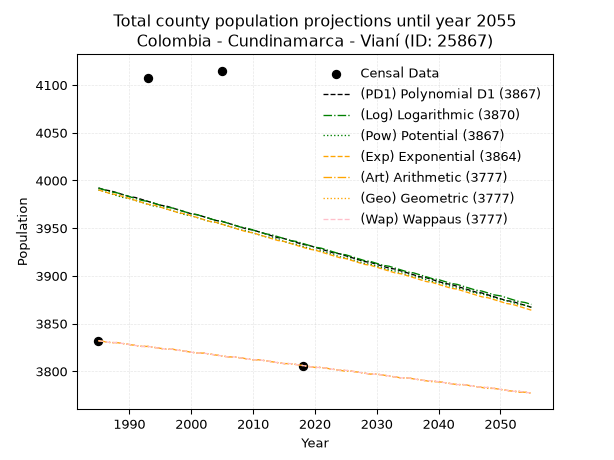
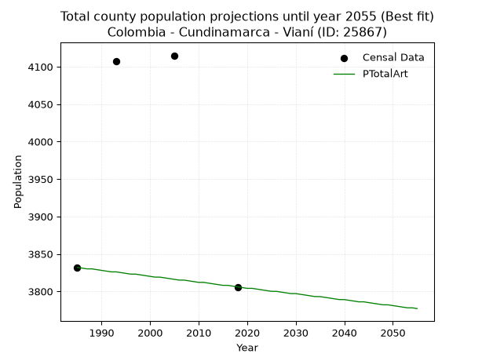
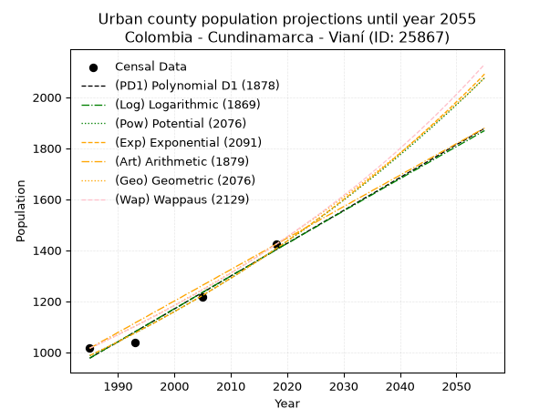
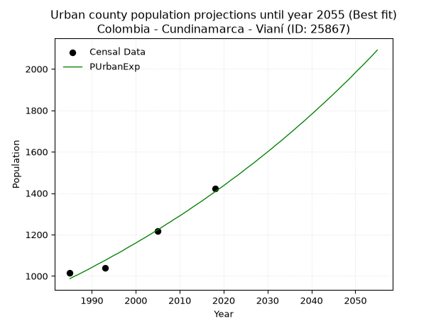
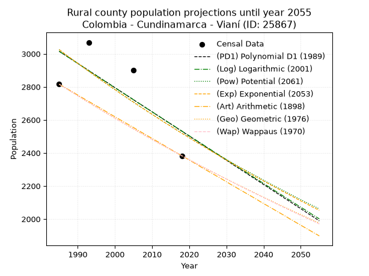
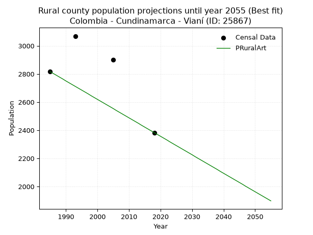

<div align="center">


</div>

# 📜 _“Population and Public Services Demand Projections (PPSD) until Year 2050 for Colombia - Cundinamarca - Vianí (ID: 25867)”_
Keywords: `population` `public-service` `projection` `lineal` `polynomial` `logarithmic` `potential` `exponential` `arithmetic` `geometric` `wappaus` `dane` `colombia` `south-america`

PPSD are analytical estimates used by governments and planners to anticipate future changes in population size, age distribution, and the resulting community needs for utilities, healthcare, education, and infrastructure as sizing future water treatment facilities, electrical grids, and road networks based on spatial growth.

<div align="center">

</img>

</div>


> **General running parameters**: • app_version: _v20260806_. • Python version: _3.14.7_. • Pandas version: _3.0.5_. • NumPy version: _2.5.1_. • Creates, save and include plots into reports (create_plot): _False_. • Projection until year: _2050_. • Process polynomial degree 2 and up: _False_. • Process Wappaus: _True_. • Process Wappaus: _True_. • Set negative values to zero: _True_. • Set infinite values to zero: _True_. • Drop dataset notes: _True_. 
<div align="center">

Maps & GIS Layers: [:earth_americas:Google](http://maps.google.com/maps?q=4.875207524,-74.5613196) [:earth_americas:OSM](https://www.openstreetmap.org/#map=18/4.875207524/-74.5613196&layers=P) [:earth_americas:Bing](https://www.bing.com/maps?cp=4.875207524~-74.5613196&lvl=18) [:earth_americas:Apple](https://maps.apple.com/frame?center=4.875207524%2C-74.5613196&span=0.003%2C0.006) [:earth_americas:GISMobile](https://github.com/rcfdtools/R.GISMobile/blob/main/file/gis/CountyLayer_CO/Readme.md)

</div>


<div align="center">

```geojson
{
  "type": "Feature",
  "geometry": {
    "type": "Point", 
    "coordinates": [-74.5613196, 4.875207524]
  }, 
  "properties": {
    "Name": "Colombia - Cundinamarca - Vianí (ID: 25867)"
  }
}
```

</div>


## 0. Census Data (4 records)

Census data are official statistics collected by a government about the people and housing in a country. They usually include counts of total population, age, sex, race, income, education, and jobs.

📅Global census file: [Population.xlsx](../data/Population.xlsx)

| Source   |   Year |   CountryID | CountryName   |   StateID | StateName    |   CountyID | CountyName   |   PTotal |   PUrban |   PRural |
|:---------|-------:|------------:|:--------------|----------:|:-------------|-----------:|:-------------|---------:|---------:|---------:|
| DANE     |   1985 |          57 | Colombia      |        25 | Cundinamarca |      25867 | Vianí        |     3832 |     1016 |     2816 |
| DANE     |   1993 |          57 | Colombia      |        25 | Cundinamarca |      25867 | Vianí        |     4107 |     1038 |     3069 |
| DANE     |   2005 |          57 | Colombia      |        25 | Cundinamarca |      25867 | Vianí        |     4115 |     1216 |     2899 |
| DANE     |   2018 |          57 | Colombia      |        25 | Cundinamarca |      25867 | Vianí        |     3806 |     1423 |     2383 |

> 🔥Some records could had specific notes about the registered values or the corresponding urban or rural distribution.

📅[SUI-RUPS](https://www.datos.gov.co/Hacienda-y-Cr-dito-P-blico/Registro-nico-de-Prestadores-de-Servicios-P-blicos/4qkq-csdn/about_data) - Local public utility companies: [RUPS.csv](../data/RUPS.csv)

 | SERVICIO       | ESTADO    | NOMBRE                                                                                        | NIT         | DEPARTAMENTO_DOMICILIO   | MUNICIPIO_DOMICILIO   | DIRECCION            |   TELEFONO | EMAIL                         | TIPO_PRESTADOR                             | CLASIFICACION                 |
|:---------------|:----------|:----------------------------------------------------------------------------------------------|:------------|:-------------------------|:----------------------|:---------------------|-----------:|:------------------------------|:-------------------------------------------|:------------------------------|
| ACUEDUCTO      | OPERATIVA | MUNICIPIO DE VIANI                                                                            | 899999709-2 | CUNDINAMARCA             | VIANI                 | Carrera 5 No. 3 - 46 |    8441265 | municipiodeviani@yahoo.es     | MUNICIPIO (PRESTACIÓN DIRECTA)             | HASTA 2500 SUSCRIPTORES       |
| ALCANTARILLADO | OPERATIVA | MUNICIPIO DE VIANI                                                                            | 899999709-2 | CUNDINAMARCA             | VIANI                 | Carrera 5 No. 3 - 46 |    8441265 | municipiodeviani@yahoo.es     | MUNICIPIO (PRESTACIÓN DIRECTA)             | HASTA 2500 SUSCRIPTORES       |
| ACUEDUCTO      | OPERATIVA | EMPRESA DE SERVICIOS PUBLICOS DOMICILIARIOS DEL MUNICIPIO DE VIANI "EMSERVIANI" S.A.S. E.S.P. | 900392869-9 | CUNDINAMARCA             | VIANI                 | CARRERA 5 3-46       |    8441265 | EMSERVIANI.GERENCIA@GMAIL.COM | SOCIEDADES (EMPRESA DE SERVICIOS PUBLICOS) | MENOR O IGUAL A 2500 USUARIOS |
| ALCANTARILLADO | OPERATIVA | EMPRESA DE SERVICIOS PUBLICOS DOMICILIARIOS DEL MUNICIPIO DE VIANI "EMSERVIANI" S.A.S. E.S.P. | 900392869-9 | CUNDINAMARCA             | VIANI                 | CARRERA 5 3-46       |    8441265 | EMSERVIANI.GERENCIA@GMAIL.COM | SOCIEDADES (EMPRESA DE SERVICIOS PUBLICOS) | MENOR O IGUAL A 2500 USUARIOS |

## 1. Total

### 1.1. Coefficients and Parameters

* (PD1) Polynomial Deg 1: -1.7840224809311516, 7533.490967482535 (lineal)
* (Log) Logarithmic: -3517.100671584062, 30698.51038898642
* (Pow) Potential: -0.902021224216597, 6.575587674560522
* (Exp) Exponential: -0.00045743084800517415, 9892.732317865626
* (Art) Arithmetic: Year diff. 2018 - 1985 = 33, Population diff. 3806 - 3832 = -26, Annual growth = -0.7878787878787878
* (Geo) Geometric: Year diff. 2018 - 1985 = 33, Population diff. 3806 - 3832 = -26, Annual growth % = -0.0002062845154124915
* (Wap) Wappaus: i = -0.02063049981353202, Condition values only valid for < 200)

<sub>
Wappaus condition values: ['-0.00', '-0.02', '-0.04', '-0.06', '-0.08', '-0.10', '-0.12', '-0.14', '-0.17', '-0.19', '-0.21', '-0.23', '-0.25', '-0.27', '-0.29', '-0.31', '-0.33', '-0.35', '-0.37', '-0.39', '-0.41', '-0.43', '-0.45', '-0.47', '-0.50', '-0.52', '-0.54', '-0.56', '-0.58', '-0.60', '-0.62', '-0.64', '-0.66', '-0.68', '-0.70', '-0.72', '-0.74', '-0.76', '-0.78', '-0.80', '-0.83', '-0.85', '-0.87', '-0.89', '-0.91', '-0.93', '-0.95', '-0.97', '-0.99', '-1.01', '-1.03', '-1.05', '-1.07', '-1.09', '-1.11', '-1.13', '-1.16', '-1.18', '-1.20', '-1.22', '-1.24', '-1.26', '-1.28', '-1.30', '-1.32', '-1.34']
</sub>


### 1.2. Projected Dataset

|   Year |   CountyID |   PTotalPD1 |   PTotalLog |   PTotalPow |   PTotalExp |   PTotalArt |   PTotalGeo |   PTotalWap |
|-------:|-----------:|------------:|------------:|------------:|------------:|------------:|------------:|------------:|
|   1985 |      25867 |        3992 |        3992 |        3990 |        3990 |        3832 |        3832 |        3832 |
|   1986 |      25867 |        3990 |        3990 |        3988 |        3988 |        3831 |        3831 |        3831 |
|   1987 |      25867 |        3989 |        3988 |        3986 |        3986 |        3830 |        3830 |        3830 |
|   1988 |      25867 |        3987 |        3987 |        3984 |        3985 |        3830 |        3830 |        3830 |
|   1989 |      25867 |        3985 |        3985 |        3982 |        3983 |        3829 |        3829 |        3829 |
|   1990 |      25867 |        3983 |        3983 |        3981 |        3981 |        3828 |        3828 |        3828 |
|   1991 |      25867 |        3982 |        3981 |        3979 |        3979 |        3827 |        3827 |        3827 |
|   1992 |      25867 |        3980 |        3979 |        3977 |        3977 |        3826 |        3826 |        3826 |
|   1993 |      25867 |        3978 |        3978 |        3975 |        3975 |        3826 |        3826 |        3826 |
|   1994 |      25867 |        3976 |        3976 |        3973 |        3974 |        3825 |        3825 |        3825 |
|   1995 |      25867 |        3974 |        3974 |        3972 |        3972 |        3824 |        3824 |        3824 |
|   1996 |      25867 |        3973 |        3972 |        3970 |        3970 |        3823 |        3823 |        3823 |
|   1997 |      25867 |        3971 |        3971 |        3968 |        3968 |        3823 |        3823 |        3823 |
|   1998 |      25867 |        3969 |        3969 |        3966 |        3966 |        3822 |        3822 |        3822 |
|   1999 |      25867 |        3967 |        3967 |        3964 |        3965 |        3821 |        3821 |        3821 |
|   2000 |      25867 |        3965 |        3965 |        3963 |        3963 |        3820 |        3820 |        3820 |
|   2001 |      25867 |        3964 |        3964 |        3961 |        3961 |        3819 |        3819 |        3819 |
|   2002 |      25867 |        3962 |        3962 |        3959 |        3959 |        3819 |        3819 |        3819 |
|   2003 |      25867 |        3960 |        3960 |        3957 |        3957 |        3818 |        3818 |        3818 |
|   2004 |      25867 |        3958 |        3958 |        3956 |        3956 |        3817 |        3817 |        3817 |
|   2005 |      25867 |        3957 |        3957 |        3954 |        3954 |        3816 |        3816 |        3816 |
|   2006 |      25867 |        3955 |        3955 |        3952 |        3952 |        3815 |        3815 |        3815 |
|   2007 |      25867 |        3953 |        3953 |        3950 |        3950 |        3815 |        3815 |        3815 |
|   2008 |      25867 |        3951 |        3951 |        3948 |        3948 |        3814 |        3814 |        3814 |
|   2009 |      25867 |        3949 |        3950 |        3947 |        3946 |        3813 |        3813 |        3813 |
|   2010 |      25867 |        3948 |        3948 |        3945 |        3945 |        3812 |        3812 |        3812 |
|   2011 |      25867 |        3946 |        3946 |        3943 |        3943 |        3812 |        3812 |        3812 |
|   2012 |      25867 |        3944 |        3944 |        3941 |        3941 |        3811 |        3811 |        3811 |
|   2013 |      25867 |        3942 |        3943 |        3940 |        3939 |        3810 |        3810 |        3810 |
|   2014 |      25867 |        3940 |        3941 |        3938 |        3937 |        3809 |        3809 |        3809 |
|   2015 |      25867 |        3939 |        3939 |        3936 |        3936 |        3808 |        3808 |        3808 |
|   2016 |      25867 |        3937 |        3937 |        3934 |        3934 |        3808 |        3808 |        3808 |
|   2017 |      25867 |        3935 |        3936 |        3933 |        3932 |        3807 |        3807 |        3807 |
|   2018 |      25867 |        3933 |        3934 |        3931 |        3930 |        3806 |        3806 |        3806 |
|   2019 |      25867 |        3932 |        3932 |        3929 |        3928 |        3805 |        3805 |        3805 |
|   2020 |      25867 |        3930 |        3930 |        3927 |        3927 |        3804 |        3804 |        3804 |
|   2021 |      25867 |        3928 |        3929 |        3926 |        3925 |        3804 |        3804 |        3804 |
|   2022 |      25867 |        3926 |        3927 |        3924 |        3923 |        3803 |        3803 |        3803 |
|   2023 |      25867 |        3924 |        3925 |        3922 |        3921 |        3802 |        3802 |        3802 |
|   2024 |      25867 |        3923 |        3923 |        3920 |        3919 |        3801 |        3801 |        3801 |
|   2025 |      25867 |        3921 |        3922 |        3919 |        3918 |        3800 |        3801 |        3801 |
|   2026 |      25867 |        3919 |        3920 |        3917 |        3916 |        3800 |        3800 |        3800 |
|   2027 |      25867 |        3917 |        3918 |        3915 |        3914 |        3799 |        3799 |        3799 |
|   2028 |      25867 |        3915 |        3916 |        3913 |        3912 |        3798 |        3798 |        3798 |
|   2029 |      25867 |        3914 |        3915 |        3912 |        3911 |        3797 |        3797 |        3797 |
|   2030 |      25867 |        3912 |        3913 |        3910 |        3909 |        3797 |        3797 |        3797 |
|   2031 |      25867 |        3910 |        3911 |        3908 |        3907 |        3796 |        3796 |        3796 |
|   2032 |      25867 |        3908 |        3910 |        3906 |        3905 |        3795 |        3795 |        3795 |
|   2033 |      25867 |        3907 |        3908 |        3905 |        3903 |        3794 |        3794 |        3794 |
|   2034 |      25867 |        3905 |        3906 |        3903 |        3902 |        3793 |        3793 |        3793 |
|   2035 |      25867 |        3903 |        3904 |        3901 |        3900 |        3793 |        3793 |        3793 |
|   2036 |      25867 |        3901 |        3903 |        3899 |        3898 |        3792 |        3792 |        3792 |
|   2037 |      25867 |        3899 |        3901 |        3898 |        3896 |        3791 |        3791 |        3791 |
|   2038 |      25867 |        3898 |        3899 |        3896 |        3894 |        3790 |        3790 |        3790 |
|   2039 |      25867 |        3896 |        3897 |        3894 |        3893 |        3789 |        3790 |        3790 |
|   2040 |      25867 |        3894 |        3896 |        3893 |        3891 |        3789 |        3789 |        3789 |
|   2041 |      25867 |        3892 |        3894 |        3891 |        3889 |        3788 |        3788 |        3788 |
|   2042 |      25867 |        3891 |        3892 |        3889 |        3887 |        3787 |        3787 |        3787 |
|   2043 |      25867 |        3889 |        3891 |        3887 |        3886 |        3786 |        3786 |        3786 |
|   2044 |      25867 |        3887 |        3889 |        3886 |        3884 |        3786 |        3786 |        3786 |
|   2045 |      25867 |        3885 |        3887 |        3884 |        3882 |        3785 |        3785 |        3785 |
|   2046 |      25867 |        3883 |        3885 |        3882 |        3880 |        3784 |        3784 |        3784 |
|   2047 |      25867 |        3882 |        3884 |        3881 |        3878 |        3783 |        3783 |        3783 |
|   2048 |      25867 |        3880 |        3882 |        3879 |        3877 |        3782 |        3783 |        3783 |
|   2049 |      25867 |        3878 |        3880 |        3877 |        3875 |        3782 |        3782 |        3782 |
|   2050 |      25867 |        3876 |        3879 |        3875 |        3873 |        3781 |        3781 |        3781 |
<div align="center">

</img>

</div>


### 1.3. Best fit with absolute and relative error (%)

Relative error puts that difference into context by dividing the absolute error by the true value, creating a unitless ratio or percentage that shows the scale of the mistake.

Absolute and relative error

|   Year | Source   |   CountryID | CountryName   |   StateID | StateName    |   CountyID_x | CountyName   |   PTotal |   PUrban |   PRural |   CountyID_y |   PTotalPD1 |   PTotalLog |   PTotalPow |   PTotalExp |   PTotalArt |   PTotalGeo |   PTotalWap |   PTotalPD1AbsError |   PTotalLogAbsError |   PTotalPowAbsError |   PTotalExpAbsError |   PTotalArtAbsError |   PTotalGeoAbsError |   PTotalWapAbsError |   PTotalPD1RelError |   PTotalLogRelError |   PTotalPowRelError |   PTotalExpRelError |   PTotalArtRelError |   PTotalGeoRelError |   PTotalWapRelError |
|-------:|:---------|------------:|:--------------|----------:|:-------------|-------------:|:-------------|---------:|---------:|---------:|-------------:|------------:|------------:|------------:|------------:|------------:|------------:|------------:|--------------------:|--------------------:|--------------------:|--------------------:|--------------------:|--------------------:|--------------------:|--------------------:|--------------------:|--------------------:|--------------------:|--------------------:|--------------------:|--------------------:|
|   1985 | DANE     |          57 | Colombia      |        25 | Cundinamarca |        25867 | Vianí        |     3832 |     1016 |     2816 |        25867 |        3992 |        3992 |        3990 |        3990 |        3832 |        3832 |        3832 |                 160 |                 160 |                 158 |                 158 |                   0 |                   0 |                   0 |             4.17537 |             4.17537 |             4.12317 |             4.12317 |             0       |             0       |             0       |
|   1993 | DANE     |          57 | Colombia      |        25 | Cundinamarca |        25867 | Vianí        |     4107 |     1038 |     3069 |        25867 |        3978 |        3978 |        3975 |        3975 |        3826 |        3826 |        3826 |                 129 |                 129 |                 132 |                 132 |                 281 |                 281 |                 281 |             3.14098 |             3.14098 |             3.21402 |             3.21402 |             6.84198 |             6.84198 |             6.84198 |
|   2005 | DANE     |          57 | Colombia      |        25 | Cundinamarca |        25867 | Vianí        |     4115 |     1216 |     2899 |        25867 |        3957 |        3957 |        3954 |        3954 |        3816 |        3816 |        3816 |                 158 |                 158 |                 161 |                 161 |                 299 |                 299 |                 299 |             3.83961 |             3.83961 |             3.91252 |             3.91252 |             7.2661  |             7.2661  |             7.2661  |
|   2018 | DANE     |          57 | Colombia      |        25 | Cundinamarca |        25867 | Vianí        |     3806 |     1423 |     2383 |        25867 |        3933 |        3934 |        3931 |        3930 |        3806 |        3806 |        3806 |                 127 |                 128 |                 125 |                 124 |                   0 |                   0 |                   0 |             3.33684 |             3.36311 |             3.28429 |             3.25801 |             0       |             0       |             0       |

Relative error mean

| Method    |   RelError | Best   |
|:----------|-----------:|:-------|
| PTotalPD1 |    3.6232  |        |
| PTotalLog |    3.62977 |        |
| PTotalPow |    3.6335  |        |
| PTotalExp |    3.62693 |        |
| PTotalArt |    3.52702 | True   |
| PTotalGeo |    3.52702 | True   |
| PTotalWap |    3.52702 | True   |

💙Best method: _**PTotalArt**_
<div align="center">

</img>

</div>


### 1.4. Fresh water supply demand in liters per capita per day (lpcd)

The fresh water supply demand typically ranges from 100 to 300 liters per capita per day (lpcd) for standard domestic and municipal planning, though absolute survival minimums set by the World Health Organization are as low as 7.5 to 20 liters per day, and total consumption in high-income nations can exceed 400 liters.

> `CZ`: Level in meters above the sea level (masl)<br> `WS`: Fresh water supply demand in liters per capita per day (lpcd or l/h/d)<br> `WSAll`: Zonal fresh water supply demand in liters per second (l/s)<br> `A`: Zonal area in square meters<br> `DP`: Population density (people/hectare or p/ha)

Reference values (RAS Colombia)

|    CZ |   WS |
|------:|-----:|
|  1000 |  120 |
|  2000 |  130 |
| 99999 |  140 |

County shapefile geometry properties and water supply values

|   CountyID |      ATotal |   CZTotal |   WSTotal |
|-----------:|------------:|----------:|----------:|
|      25867 | 6.70358e+07 |   1612.83 |       130 |

Projected values for best method: PTotalArt

|   CountyID |   Year |   PTotalArt |   DPTotal |   WSTotal |   WSTotalAll |
|-----------:|-------:|------------:|----------:|----------:|-------------:|
|      25867 |   1985 |        3832 |      0.57 |       130 |      5.76574 |
|      25867 |   1986 |        3831 |      0.57 |       130 |      5.76424 |
|      25867 |   1987 |        3830 |      0.57 |       130 |      5.76273 |
|      25867 |   1988 |        3830 |      0.57 |       130 |      5.76273 |
|      25867 |   1989 |        3829 |      0.57 |       130 |      5.76123 |
|      25867 |   1990 |        3828 |      0.57 |       130 |      5.75972 |
|      25867 |   1991 |        3827 |      0.57 |       130 |      5.75822 |
|      25867 |   1992 |        3826 |      0.57 |       130 |      5.75671 |
|      25867 |   1993 |        3826 |      0.57 |       130 |      5.75671 |
|      25867 |   1994 |        3825 |      0.57 |       130 |      5.75521 |
|      25867 |   1995 |        3824 |      0.57 |       130 |      5.7537  |
|      25867 |   1996 |        3823 |      0.57 |       130 |      5.7522  |
|      25867 |   1997 |        3823 |      0.57 |       130 |      5.7522  |
|      25867 |   1998 |        3822 |      0.57 |       130 |      5.75069 |
|      25867 |   1999 |        3821 |      0.57 |       130 |      5.74919 |
|      25867 |   2000 |        3820 |      0.57 |       130 |      5.74769 |
|      25867 |   2001 |        3819 |      0.57 |       130 |      5.74618 |
|      25867 |   2002 |        3819 |      0.57 |       130 |      5.74618 |
|      25867 |   2003 |        3818 |      0.57 |       130 |      5.74468 |
|      25867 |   2004 |        3817 |      0.57 |       130 |      5.74317 |
|      25867 |   2005 |        3816 |      0.57 |       130 |      5.74167 |
|      25867 |   2006 |        3815 |      0.57 |       130 |      5.74016 |
|      25867 |   2007 |        3815 |      0.57 |       130 |      5.74016 |
|      25867 |   2008 |        3814 |      0.57 |       130 |      5.73866 |
|      25867 |   2009 |        3813 |      0.57 |       130 |      5.73715 |
|      25867 |   2010 |        3812 |      0.57 |       130 |      5.73565 |
|      25867 |   2011 |        3812 |      0.57 |       130 |      5.73565 |
|      25867 |   2012 |        3811 |      0.57 |       130 |      5.73414 |
|      25867 |   2013 |        3810 |      0.57 |       130 |      5.73264 |
|      25867 |   2014 |        3809 |      0.57 |       130 |      5.73113 |
|      25867 |   2015 |        3808 |      0.57 |       130 |      5.72963 |
|      25867 |   2016 |        3808 |      0.57 |       130 |      5.72963 |
|      25867 |   2017 |        3807 |      0.57 |       130 |      5.72813 |
|      25867 |   2018 |        3806 |      0.57 |       130 |      5.72662 |
|      25867 |   2019 |        3805 |      0.57 |       130 |      5.72512 |
|      25867 |   2020 |        3804 |      0.57 |       130 |      5.72361 |
|      25867 |   2021 |        3804 |      0.57 |       130 |      5.72361 |
|      25867 |   2022 |        3803 |      0.57 |       130 |      5.72211 |
|      25867 |   2023 |        3802 |      0.57 |       130 |      5.7206  |
|      25867 |   2024 |        3801 |      0.57 |       130 |      5.7191  |
|      25867 |   2025 |        3800 |      0.57 |       130 |      5.71759 |
|      25867 |   2026 |        3800 |      0.57 |       130 |      5.71759 |
|      25867 |   2027 |        3799 |      0.57 |       130 |      5.71609 |
|      25867 |   2028 |        3798 |      0.57 |       130 |      5.71458 |
|      25867 |   2029 |        3797 |      0.57 |       130 |      5.71308 |
|      25867 |   2030 |        3797 |      0.57 |       130 |      5.71308 |
|      25867 |   2031 |        3796 |      0.57 |       130 |      5.71157 |
|      25867 |   2032 |        3795 |      0.57 |       130 |      5.71007 |
|      25867 |   2033 |        3794 |      0.57 |       130 |      5.70856 |
|      25867 |   2034 |        3793 |      0.57 |       130 |      5.70706 |
|      25867 |   2035 |        3793 |      0.57 |       130 |      5.70706 |
|      25867 |   2036 |        3792 |      0.57 |       130 |      5.70556 |
|      25867 |   2037 |        3791 |      0.57 |       130 |      5.70405 |
|      25867 |   2038 |        3790 |      0.57 |       130 |      5.70255 |
|      25867 |   2039 |        3789 |      0.57 |       130 |      5.70104 |
|      25867 |   2040 |        3789 |      0.57 |       130 |      5.70104 |
|      25867 |   2041 |        3788 |      0.57 |       130 |      5.69954 |
|      25867 |   2042 |        3787 |      0.56 |       130 |      5.69803 |
|      25867 |   2043 |        3786 |      0.56 |       130 |      5.69653 |
|      25867 |   2044 |        3786 |      0.56 |       130 |      5.69653 |
|      25867 |   2045 |        3785 |      0.56 |       130 |      5.69502 |
|      25867 |   2046 |        3784 |      0.56 |       130 |      5.69352 |
|      25867 |   2047 |        3783 |      0.56 |       130 |      5.69201 |
|      25867 |   2048 |        3782 |      0.56 |       130 |      5.69051 |
|      25867 |   2049 |        3782 |      0.56 |       130 |      5.69051 |
|      25867 |   2050 |        3781 |      0.56 |       130 |      5.689   |

## 2. Urban

### 2.1. Coefficients and Parameters

* (PD1) Polynomial Deg 1: 12.869931754315399, -24569.83099156938 (lineal)
* (Log) Logarithmic: 25750.134227235445, -194553.72660984204
* (Pow) Potential: 21.45761834007675, -67.76791804139796
* (Exp) Exponential: 0.01072356342347741, 5.620490857409717e-07
* (Art) Arithmetic: Year diff. 2018 - 1985 = 33, Population diff. 1423 - 1016 = 407, Annual growth = 12.333333333333334
* (Geo) Geometric: Year diff. 2018 - 1985 = 33, Population diff. 1423 - 1016 = 407, Annual growth % = 0.01026119686878868
* (Wap) Wappaus: i = 1.011343446767801, Condition values only valid for < 200)

<sub>
Wappaus condition values: ['0.00', '1.01', '2.02', '3.03', '4.05', '5.06', '6.07', '7.08', '8.09', '9.10', '10.11', '11.12', '12.14', '13.15', '14.16', '15.17', '16.18', '17.19', '18.20', '19.22', '20.23', '21.24', '22.25', '23.26', '24.27', '25.28', '26.29', '27.31', '28.32', '29.33', '30.34', '31.35', '32.36', '33.37', '34.39', '35.40', '36.41', '37.42', '38.43', '39.44', '40.45', '41.47', '42.48', '43.49', '44.50', '45.51', '46.52', '47.53', '48.54', '49.56', '50.57', '51.58', '52.59', '53.60', '54.61', '55.62', '56.64', '57.65', '58.66', '59.67', '60.68', '61.69', '62.70', '63.71', '64.73', '65.74']
</sub>


### 2.2. Projected Dataset

|   Year |   CountyID |   PUrbanPD1 |   PUrbanLog |   PUrbanPow |   PUrbanExp |   PUrbanArt |   PUrbanGeo |   PUrbanWap |
|-------:|-----------:|------------:|------------:|------------:|------------:|------------:|------------:|------------:|
|   1985 |      25867 |         977 |         977 |         987 |         987 |        1016 |        1016 |        1016 |
|   1986 |      25867 |         990 |         990 |         997 |         998 |        1028 |        1026 |        1026 |
|   1987 |      25867 |        1003 |        1003 |        1008 |        1008 |        1041 |        1037 |        1037 |
|   1988 |      25867 |        1016 |        1016 |        1019 |        1019 |        1053 |        1048 |        1047 |
|   1989 |      25867 |        1028 |        1029 |        1030 |        1030 |        1065 |        1058 |        1058 |
|   1990 |      25867 |        1041 |        1041 |        1041 |        1041 |        1078 |        1069 |        1069 |
|   1991 |      25867 |        1054 |        1054 |        1053 |        1053 |        1090 |        1080 |        1080 |
|   1992 |      25867 |        1067 |        1067 |        1064 |        1064 |        1102 |        1091 |        1091 |
|   1993 |      25867 |        1080 |        1080 |        1076 |        1075 |        1115 |        1102 |        1102 |
|   1994 |      25867 |        1093 |        1093 |        1087 |        1087 |        1127 |        1114 |        1113 |
|   1995 |      25867 |        1106 |        1106 |        1099 |        1099 |        1139 |        1125 |        1124 |
|   1996 |      25867 |        1119 |        1119 |        1111 |        1110 |        1152 |        1137 |        1136 |
|   1997 |      25867 |        1131 |        1132 |        1123 |        1122 |        1164 |        1148 |        1147 |
|   1998 |      25867 |        1144 |        1145 |        1135 |        1135 |        1176 |        1160 |        1159 |
|   1999 |      25867 |        1157 |        1158 |        1147 |        1147 |        1189 |        1172 |        1171 |
|   2000 |      25867 |        1170 |        1171 |        1160 |        1159 |        1201 |        1184 |        1183 |
|   2001 |      25867 |        1183 |        1183 |        1172 |        1172 |        1213 |        1196 |        1195 |
|   2002 |      25867 |        1196 |        1196 |        1185 |        1184 |        1226 |        1209 |        1207 |
|   2003 |      25867 |        1209 |        1209 |        1198 |        1197 |        1238 |        1221 |        1219 |
|   2004 |      25867 |        1222 |        1222 |        1210 |        1210 |        1250 |        1233 |        1232 |
|   2005 |      25867 |        1234 |        1235 |        1223 |        1223 |        1263 |        1246 |        1245 |
|   2006 |      25867 |        1247 |        1248 |        1237 |        1236 |        1275 |        1259 |        1257 |
|   2007 |      25867 |        1260 |        1261 |        1250 |        1250 |        1287 |        1272 |        1270 |
|   2008 |      25867 |        1273 |        1273 |        1263 |        1263 |        1300 |        1285 |        1283 |
|   2009 |      25867 |        1286 |        1286 |        1277 |        1277 |        1312 |        1298 |        1297 |
|   2010 |      25867 |        1299 |        1299 |        1291 |        1290 |        1324 |        1311 |        1310 |
|   2011 |      25867 |        1312 |        1312 |        1304 |        1304 |        1337 |        1325 |        1324 |
|   2012 |      25867 |        1324 |        1325 |        1318 |        1318 |        1349 |        1338 |        1337 |
|   2013 |      25867 |        1337 |        1337 |        1333 |        1333 |        1361 |        1352 |        1351 |
|   2014 |      25867 |        1350 |        1350 |        1347 |        1347 |        1374 |        1366 |        1365 |
|   2015 |      25867 |        1363 |        1363 |        1361 |        1361 |        1386 |        1380 |        1379 |
|   2016 |      25867 |        1376 |        1376 |        1376 |        1376 |        1398 |        1394 |        1394 |
|   2017 |      25867 |        1389 |        1388 |        1391 |        1391 |        1411 |        1409 |        1408 |
|   2018 |      25867 |        1402 |        1401 |        1405 |        1406 |        1423 |        1423 |        1423 |
|   2019 |      25867 |        1415 |        1414 |        1420 |        1421 |        1435 |        1438 |        1438 |
|   2020 |      25867 |        1427 |        1427 |        1436 |        1436 |        1448 |        1452 |        1453 |
|   2021 |      25867 |        1440 |        1439 |        1451 |        1452 |        1460 |        1467 |        1468 |
|   2022 |      25867 |        1453 |        1452 |        1466 |        1468 |        1472 |        1482 |        1484 |
|   2023 |      25867 |        1466 |        1465 |        1482 |        1483 |        1485 |        1498 |        1499 |
|   2024 |      25867 |        1479 |        1478 |        1498 |        1499 |        1497 |        1513 |        1515 |
|   2025 |      25867 |        1492 |        1490 |        1514 |        1516 |        1509 |        1528 |        1531 |
|   2026 |      25867 |        1505 |        1503 |        1530 |        1532 |        1522 |        1544 |        1547 |
|   2027 |      25867 |        1518 |        1516 |        1546 |        1548 |        1534 |        1560 |        1564 |
|   2028 |      25867 |        1530 |        1529 |        1563 |        1565 |        1546 |        1576 |        1581 |
|   2029 |      25867 |        1543 |        1541 |        1579 |        1582 |        1559 |        1592 |        1597 |
|   2030 |      25867 |        1556 |        1554 |        1596 |        1599 |        1571 |        1608 |        1615 |
|   2031 |      25867 |        1569 |        1567 |        1613 |        1616 |        1583 |        1625 |        1632 |
|   2032 |      25867 |        1582 |        1579 |        1630 |        1634 |        1596 |        1642 |        1649 |
|   2033 |      25867 |        1595 |        1592 |        1648 |        1651 |        1608 |        1658 |        1667 |
|   2034 |      25867 |        1608 |        1605 |        1665 |        1669 |        1620 |        1675 |        1685 |
|   2035 |      25867 |        1620 |        1617 |        1683 |        1687 |        1633 |        1693 |        1704 |
|   2036 |      25867 |        1633 |        1630 |        1700 |        1705 |        1645 |        1710 |        1722 |
|   2037 |      25867 |        1646 |        1643 |        1718 |        1724 |        1657 |        1728 |        1741 |
|   2038 |      25867 |        1659 |        1655 |        1737 |        1742 |        1670 |        1745 |        1760 |
|   2039 |      25867 |        1672 |        1668 |        1755 |        1761 |        1682 |        1763 |        1779 |
|   2040 |      25867 |        1685 |        1680 |        1774 |        1780 |        1694 |        1781 |        1799 |
|   2041 |      25867 |        1698 |        1693 |        1792 |        1799 |        1707 |        1800 |        1819 |
|   2042 |      25867 |        1711 |        1706 |        1811 |        1819 |        1719 |        1818 |        1839 |
|   2043 |      25867 |        1723 |        1718 |        1830 |        1838 |        1731 |        1837 |        1859 |
|   2044 |      25867 |        1736 |        1731 |        1850 |        1858 |        1744 |        1856 |        1880 |
|   2045 |      25867 |        1749 |        1743 |        1869 |        1878 |        1756 |        1875 |        1901 |
|   2046 |      25867 |        1762 |        1756 |        1889 |        1898 |        1768 |        1894 |        1922 |
|   2047 |      25867 |        1775 |        1769 |        1909 |        1919 |        1781 |        1913 |        1944 |
|   2048 |      25867 |        1788 |        1781 |        1929 |        1939 |        1793 |        1933 |        1966 |
|   2049 |      25867 |        1801 |        1794 |        1949 |        1960 |        1805 |        1953 |        1988 |
|   2050 |      25867 |        1814 |        1806 |        1970 |        1982 |        1818 |        1973 |        2011 |
<div align="center">

</img>

</div>


### 2.3. Best fit with absolute and relative error (%)

Relative error puts that difference into context by dividing the absolute error by the true value, creating a unitless ratio or percentage that shows the scale of the mistake.

Absolute and relative error

|   Year | Source   |   CountryID | CountryName   |   StateID | StateName    |   CountyID_x | CountyName   |   PTotal |   PUrban |   PRural |   CountyID_y |   PUrbanPD1 |   PUrbanLog |   PUrbanPow |   PUrbanExp |   PUrbanArt |   PUrbanGeo |   PUrbanWap |   PUrbanPD1AbsError |   PUrbanLogAbsError |   PUrbanPowAbsError |   PUrbanExpAbsError |   PUrbanArtAbsError |   PUrbanGeoAbsError |   PUrbanWapAbsError |   PUrbanPD1RelError |   PUrbanLogRelError |   PUrbanPowRelError |   PUrbanExpRelError |   PUrbanArtRelError |   PUrbanGeoRelError |   PUrbanWapRelError |
|-------:|:---------|------------:|:--------------|----------:|:-------------|-------------:|:-------------|---------:|---------:|---------:|-------------:|------------:|------------:|------------:|------------:|------------:|------------:|------------:|--------------------:|--------------------:|--------------------:|--------------------:|--------------------:|--------------------:|--------------------:|--------------------:|--------------------:|--------------------:|--------------------:|--------------------:|--------------------:|--------------------:|
|   1985 | DANE     |          57 | Colombia      |        25 | Cundinamarca |        25867 | Vianí        |     3832 |     1016 |     2816 |        25867 |         977 |         977 |         987 |         987 |        1016 |        1016 |        1016 |                  39 |                  39 |                  29 |                  29 |                   0 |                   0 |                   0 |             3.83858 |             3.83858 |            2.85433  |            2.85433  |             0       |             0       |             0       |
|   1993 | DANE     |          57 | Colombia      |        25 | Cundinamarca |        25867 | Vianí        |     4107 |     1038 |     3069 |        25867 |        1080 |        1080 |        1076 |        1075 |        1115 |        1102 |        1102 |                  42 |                  42 |                  38 |                  37 |                  77 |                  64 |                  64 |             4.04624 |             4.04624 |            3.66089  |            3.56455  |             7.41811 |             6.1657  |             6.1657  |
|   2005 | DANE     |          57 | Colombia      |        25 | Cundinamarca |        25867 | Vianí        |     4115 |     1216 |     2899 |        25867 |        1234 |        1235 |        1223 |        1223 |        1263 |        1246 |        1245 |                  18 |                  19 |                   7 |                   7 |                  47 |                  30 |                  29 |             1.48026 |             1.5625  |            0.575658 |            0.575658 |             3.86513 |             2.46711 |             2.38487 |
|   2018 | DANE     |          57 | Colombia      |        25 | Cundinamarca |        25867 | Vianí        |     3806 |     1423 |     2383 |        25867 |        1402 |        1401 |        1405 |        1406 |        1423 |        1423 |        1423 |                  21 |                  22 |                  18 |                  17 |                   0 |                   0 |                   0 |             1.47576 |             1.54603 |            1.26493  |            1.19466  |             0       |             0       |             0       |

Relative error mean

| Method    |   RelError | Best   |
|:----------|-----------:|:-------|
| PUrbanPD1 |    2.71021 |        |
| PUrbanLog |    2.74834 |        |
| PUrbanPow |    2.08895 |        |
| PUrbanExp |    2.0473  | True   |
| PUrbanArt |    2.82081 |        |
| PUrbanGeo |    2.1582  |        |
| PUrbanWap |    2.13764 |        |

💙Best method: _**PUrbanExp**_
<div align="center">

</img>

</div>


### 2.4. Fresh water supply demand in liters per capita per day (lpcd)

The fresh water supply demand typically ranges from 100 to 300 liters per capita per day (lpcd) for standard domestic and municipal planning, though absolute survival minimums set by the World Health Organization are as low as 7.5 to 20 liters per day, and total consumption in high-income nations can exceed 400 liters.

> `CZ`: Level in meters above the sea level (masl)<br> `WS`: Fresh water supply demand in liters per capita per day (lpcd or l/h/d)<br> `WSAll`: Zonal fresh water supply demand in liters per second (l/s)<br> `A`: Zonal area in square meters<br> `DP`: Population density (people/hectare or p/ha)

Reference values (RAS Colombia)

|    CZ |   WS |
|------:|-----:|
|  1000 |  120 |
|  2000 |  130 |
| 99999 |  140 |

County shapefile geometry properties and water supply values

|   CountyID |   AUrban |   CZUrban |   WSUrban |
|-----------:|---------:|----------:|----------:|
|      25867 |   381650 |   1481.08 |       130 |

Projected values for best method: PUrbanExp

|   CountyID |   Year |   PUrbanExp |   DPUrban |   WSUrban |   WSUrbanAll |
|-----------:|-------:|------------:|----------:|----------:|-------------:|
|      25867 |   1985 |         987 |     25.86 |       130 |      1.48507 |
|      25867 |   1986 |         998 |     26.15 |       130 |      1.50162 |
|      25867 |   1987 |        1008 |     26.41 |       130 |      1.51667 |
|      25867 |   1988 |        1019 |     26.7  |       130 |      1.53322 |
|      25867 |   1989 |        1030 |     26.99 |       130 |      1.54977 |
|      25867 |   1990 |        1041 |     27.28 |       130 |      1.56632 |
|      25867 |   1991 |        1053 |     27.59 |       130 |      1.58438 |
|      25867 |   1992 |        1064 |     27.88 |       130 |      1.60093 |
|      25867 |   1993 |        1075 |     28.17 |       130 |      1.61748 |
|      25867 |   1994 |        1087 |     28.48 |       130 |      1.63553 |
|      25867 |   1995 |        1099 |     28.8  |       130 |      1.65359 |
|      25867 |   1996 |        1110 |     29.08 |       130 |      1.67014 |
|      25867 |   1997 |        1122 |     29.4  |       130 |      1.68819 |
|      25867 |   1998 |        1135 |     29.74 |       130 |      1.70775 |
|      25867 |   1999 |        1147 |     30.05 |       130 |      1.72581 |
|      25867 |   2000 |        1159 |     30.37 |       130 |      1.74387 |
|      25867 |   2001 |        1172 |     30.71 |       130 |      1.76343 |
|      25867 |   2002 |        1184 |     31.02 |       130 |      1.78148 |
|      25867 |   2003 |        1197 |     31.36 |       130 |      1.80104 |
|      25867 |   2004 |        1210 |     31.7  |       130 |      1.8206  |
|      25867 |   2005 |        1223 |     32.05 |       130 |      1.84016 |
|      25867 |   2006 |        1236 |     32.39 |       130 |      1.85972 |
|      25867 |   2007 |        1250 |     32.75 |       130 |      1.88079 |
|      25867 |   2008 |        1263 |     33.09 |       130 |      1.90035 |
|      25867 |   2009 |        1277 |     33.46 |       130 |      1.92141 |
|      25867 |   2010 |        1290 |     33.8  |       130 |      1.94097 |
|      25867 |   2011 |        1304 |     34.17 |       130 |      1.96204 |
|      25867 |   2012 |        1318 |     34.53 |       130 |      1.9831  |
|      25867 |   2013 |        1333 |     34.93 |       130 |      2.00567 |
|      25867 |   2014 |        1347 |     35.29 |       130 |      2.02674 |
|      25867 |   2015 |        1361 |     35.66 |       130 |      2.0478  |
|      25867 |   2016 |        1376 |     36.05 |       130 |      2.07037 |
|      25867 |   2017 |        1391 |     36.45 |       130 |      2.09294 |
|      25867 |   2018 |        1406 |     36.84 |       130 |      2.11551 |
|      25867 |   2019 |        1421 |     37.23 |       130 |      2.13808 |
|      25867 |   2020 |        1436 |     37.63 |       130 |      2.16065 |
|      25867 |   2021 |        1452 |     38.05 |       130 |      2.18472 |
|      25867 |   2022 |        1468 |     38.46 |       130 |      2.2088  |
|      25867 |   2023 |        1483 |     38.86 |       130 |      2.23137 |
|      25867 |   2024 |        1499 |     39.28 |       130 |      2.25544 |
|      25867 |   2025 |        1516 |     39.72 |       130 |      2.28102 |
|      25867 |   2026 |        1532 |     40.14 |       130 |      2.30509 |
|      25867 |   2027 |        1548 |     40.56 |       130 |      2.32917 |
|      25867 |   2028 |        1565 |     41.01 |       130 |      2.35475 |
|      25867 |   2029 |        1582 |     41.45 |       130 |      2.38032 |
|      25867 |   2030 |        1599 |     41.9  |       130 |      2.4059  |
|      25867 |   2031 |        1616 |     42.34 |       130 |      2.43148 |
|      25867 |   2032 |        1634 |     42.81 |       130 |      2.45856 |
|      25867 |   2033 |        1651 |     43.26 |       130 |      2.48414 |
|      25867 |   2034 |        1669 |     43.73 |       130 |      2.51123 |
|      25867 |   2035 |        1687 |     44.2  |       130 |      2.53831 |
|      25867 |   2036 |        1705 |     44.67 |       130 |      2.56539 |
|      25867 |   2037 |        1724 |     45.17 |       130 |      2.59398 |
|      25867 |   2038 |        1742 |     45.64 |       130 |      2.62106 |
|      25867 |   2039 |        1761 |     46.14 |       130 |      2.64965 |
|      25867 |   2040 |        1780 |     46.64 |       130 |      2.67824 |
|      25867 |   2041 |        1799 |     47.14 |       130 |      2.70683 |
|      25867 |   2042 |        1819 |     47.66 |       130 |      2.73692 |
|      25867 |   2043 |        1838 |     48.16 |       130 |      2.76551 |
|      25867 |   2044 |        1858 |     48.68 |       130 |      2.7956  |
|      25867 |   2045 |        1878 |     49.21 |       130 |      2.82569 |
|      25867 |   2046 |        1898 |     49.73 |       130 |      2.85579 |
|      25867 |   2047 |        1919 |     50.28 |       130 |      2.88738 |
|      25867 |   2048 |        1939 |     50.81 |       130 |      2.91748 |
|      25867 |   2049 |        1960 |     51.36 |       130 |      2.94907 |
|      25867 |   2050 |        1982 |     51.93 |       130 |      2.98218 |

## 3. Rural

### 3.1. Coefficients and Parameters

* (PD1) Polynomial Deg 1: -14.653954235246582, 32103.32195905198 (lineal)
* (Log) Logarithmic: -29267.234898819534, 225252.23699882868
* (Pow) Potential: -11.062761483920637, 39.96301507603178
* (Exp) Exponential: -0.005538755525653858, 180095862.16402996
* (Art) Arithmetic: Year diff. 2018 - 1985 = 33, Population diff. 2383 - 2816 = -433, Annual growth = -13.121212121212121
* (Geo) Geometric: Year diff. 2018 - 1985 = 33, Population diff. 2383 - 2816 = -433, Annual growth % = -0.005046533554331045
* (Wap) Wappaus: i = -0.5047590737146421, Condition values only valid for < 200)

<sub>
Wappaus condition values: ['-0.00', '-0.50', '-1.01', '-1.51', '-2.02', '-2.52', '-3.03', '-3.53', '-4.04', '-4.54', '-5.05', '-5.55', '-6.06', '-6.56', '-7.07', '-7.57', '-8.08', '-8.58', '-9.09', '-9.59', '-10.10', '-10.60', '-11.10', '-11.61', '-12.11', '-12.62', '-13.12', '-13.63', '-14.13', '-14.64', '-15.14', '-15.65', '-16.15', '-16.66', '-17.16', '-17.67', '-18.17', '-18.68', '-19.18', '-19.69', '-20.19', '-20.70', '-21.20', '-21.70', '-22.21', '-22.71', '-23.22', '-23.72', '-24.23', '-24.73', '-25.24', '-25.74', '-26.25', '-26.75', '-27.26', '-27.76', '-28.27', '-28.77', '-29.28', '-29.78', '-30.29', '-30.79', '-31.30', '-31.80', '-32.30', '-32.81']
</sub>


### 3.2. Projected Dataset

|   Year |   CountyID |   PRuralPD1 |   PRuralLog |   PRuralPow |   PRuralExp |   PRuralArt |   PRuralGeo |   PRuralWap |
|-------:|-----------:|------------:|------------:|------------:|------------:|------------:|------------:|------------:|
|   1985 |      25867 |        3015 |        3015 |        3025 |        3025 |        2816 |        2816 |        2816 |
|   1986 |      25867 |        3001 |        3000 |        3008 |        3008 |        2803 |        2802 |        2802 |
|   1987 |      25867 |        2986 |        2986 |        2991 |        2991 |        2790 |        2788 |        2788 |
|   1988 |      25867 |        2971 |        2971 |        2975 |        2975 |        2777 |        2774 |        2774 |
|   1989 |      25867 |        2957 |        2956 |        2958 |        2958 |        2764 |        2760 |        2760 |
|   1990 |      25867 |        2942 |        2942 |        2942 |        2942 |        2750 |        2746 |        2746 |
|   1991 |      25867 |        2927 |        2927 |        2925 |        2926 |        2737 |        2732 |        2732 |
|   1992 |      25867 |        2913 |        2912 |        2909 |        2910 |        2724 |        2718 |        2718 |
|   1993 |      25867 |        2898 |        2897 |        2893 |        2894 |        2711 |        2704 |        2705 |
|   1994 |      25867 |        2883 |        2883 |        2877 |        2878 |        2698 |        2691 |        2691 |
|   1995 |      25867 |        2869 |        2868 |        2861 |        2862 |        2685 |        2677 |        2677 |
|   1996 |      25867 |        2854 |        2853 |        2845 |        2846 |        2672 |        2664 |        2664 |
|   1997 |      25867 |        2839 |        2839 |        2830 |        2830 |        2659 |        2650 |        2650 |
|   1998 |      25867 |        2825 |        2824 |        2814 |        2815 |        2645 |        2637 |        2637 |
|   1999 |      25867 |        2810 |        2809 |        2798 |        2799 |        2632 |        2623 |        2624 |
|   2000 |      25867 |        2795 |        2795 |        2783 |        2784 |        2619 |        2610 |        2611 |
|   2001 |      25867 |        2781 |        2780 |        2768 |        2768 |        2606 |        2597 |        2597 |
|   2002 |      25867 |        2766 |        2766 |        2752 |        2753 |        2593 |        2584 |        2584 |
|   2003 |      25867 |        2751 |        2751 |        2737 |        2738 |        2580 |        2571 |        2571 |
|   2004 |      25867 |        2737 |        2736 |        2722 |        2723 |        2567 |        2558 |        2558 |
|   2005 |      25867 |        2722 |        2722 |        2707 |        2708 |        2554 |        2545 |        2545 |
|   2006 |      25867 |        2707 |        2707 |        2692 |        2693 |        2540 |        2532 |        2533 |
|   2007 |      25867 |        2693 |        2693 |        2677 |        2678 |        2527 |        2519 |        2520 |
|   2008 |      25867 |        2678 |        2678 |        2663 |        2663 |        2514 |        2507 |        2507 |
|   2009 |      25867 |        2664 |        2663 |        2648 |        2648 |        2501 |        2494 |        2494 |
|   2010 |      25867 |        2649 |        2649 |        2634 |        2634 |        2488 |        2481 |        2482 |
|   2011 |      25867 |        2634 |        2634 |        2619 |        2619 |        2475 |        2469 |        2469 |
|   2012 |      25867 |        2620 |        2620 |        2605 |        2605 |        2462 |        2456 |        2457 |
|   2013 |      25867 |        2605 |        2605 |        2590 |        2590 |        2449 |        2444 |        2444 |
|   2014 |      25867 |        2590 |        2591 |        2576 |        2576 |        2435 |        2432 |        2432 |
|   2015 |      25867 |        2576 |        2576 |        2562 |        2562 |        2422 |        2419 |        2420 |
|   2016 |      25867 |        2561 |        2562 |        2548 |        2548 |        2409 |        2407 |        2407 |
|   2017 |      25867 |        2546 |        2547 |        2534 |        2533 |        2396 |        2395 |        2395 |
|   2018 |      25867 |        2532 |        2533 |        2520 |        2519 |        2383 |        2383 |        2383 |
|   2019 |      25867 |        2517 |        2518 |        2507 |        2506 |        2370 |        2371 |        2371 |
|   2020 |      25867 |        2502 |        2504 |        2493 |        2492 |        2357 |        2359 |        2359 |
|   2021 |      25867 |        2488 |        2489 |        2479 |        2478 |        2344 |        2347 |        2347 |
|   2022 |      25867 |        2473 |        2475 |        2466 |        2464 |        2331 |        2335 |        2335 |
|   2023 |      25867 |        2458 |        2460 |        2452 |        2451 |        2317 |        2323 |        2323 |
|   2024 |      25867 |        2444 |        2446 |        2439 |        2437 |        2304 |        2312 |        2311 |
|   2025 |      25867 |        2429 |        2431 |        2426 |        2424 |        2291 |        2300 |        2300 |
|   2026 |      25867 |        2414 |        2417 |        2412 |        2410 |        2278 |        2288 |        2288 |
|   2027 |      25867 |        2400 |        2402 |        2399 |        2397 |        2265 |        2277 |        2276 |
|   2028 |      25867 |        2385 |        2388 |        2386 |        2384 |        2252 |        2265 |        2265 |
|   2029 |      25867 |        2370 |        2374 |        2373 |        2371 |        2239 |        2254 |        2253 |
|   2030 |      25867 |        2356 |        2359 |        2360 |        2357 |        2226 |        2243 |        2242 |
|   2031 |      25867 |        2341 |        2345 |        2348 |        2344 |        2212 |        2231 |        2230 |
|   2032 |      25867 |        2326 |        2330 |        2335 |        2331 |        2199 |        2220 |        2219 |
|   2033 |      25867 |        2312 |        2316 |        2322 |        2319 |        2186 |        2209 |        2207 |
|   2034 |      25867 |        2297 |        2301 |        2309 |        2306 |        2173 |        2198 |        2196 |
|   2035 |      25867 |        2283 |        2287 |        2297 |        2293 |        2160 |        2187 |        2185 |
|   2036 |      25867 |        2268 |        2273 |        2285 |        2280 |        2147 |        2176 |        2174 |
|   2037 |      25867 |        2253 |        2258 |        2272 |        2268 |        2134 |        2165 |        2163 |
|   2038 |      25867 |        2239 |        2244 |        2260 |        2255 |        2121 |        2154 |        2152 |
|   2039 |      25867 |        2224 |        2230 |        2248 |        2243 |        2107 |        2143 |        2141 |
|   2040 |      25867 |        2209 |        2215 |        2235 |        2230 |        2094 |        2132 |        2130 |
|   2041 |      25867 |        2195 |        2201 |        2223 |        2218 |        2081 |        2121 |        2119 |
|   2042 |      25867 |        2180 |        2187 |        2211 |        2206 |        2068 |        2111 |        2108 |
|   2043 |      25867 |        2165 |        2172 |        2199 |        2194 |        2055 |        2100 |        2097 |
|   2044 |      25867 |        2151 |        2158 |        2188 |        2182 |        2042 |        2089 |        2086 |
|   2045 |      25867 |        2136 |        2144 |        2176 |        2169 |        2029 |        2079 |        2075 |
|   2046 |      25867 |        2121 |        2129 |        2164 |        2158 |        2016 |        2068 |        2065 |
|   2047 |      25867 |        2107 |        2115 |        2152 |        2146 |        2002 |        2058 |        2054 |
|   2048 |      25867 |        2092 |        2101 |        2141 |        2134 |        1989 |        2047 |        2043 |
|   2049 |      25867 |        2077 |        2086 |        2129 |        2122 |        1976 |        2037 |        2033 |
|   2050 |      25867 |        2063 |        2072 |        2118 |        2110 |        1963 |        2027 |        2022 |
<div align="center">

</img>

</div>


### 3.3. Best fit with absolute and relative error (%)

Relative error puts that difference into context by dividing the absolute error by the true value, creating a unitless ratio or percentage that shows the scale of the mistake.

Absolute and relative error

|   Year | Source   |   CountryID | CountryName   |   StateID | StateName    |   CountyID_x | CountyName   |   PTotal |   PUrban |   PRural |   CountyID_y |   PRuralPD1 |   PRuralLog |   PRuralPow |   PRuralExp |   PRuralArt |   PRuralGeo |   PRuralWap |   PRuralPD1AbsError |   PRuralLogAbsError |   PRuralPowAbsError |   PRuralExpAbsError |   PRuralArtAbsError |   PRuralGeoAbsError |   PRuralWapAbsError |   PRuralPD1RelError |   PRuralLogRelError |   PRuralPowRelError |   PRuralExpRelError |   PRuralArtRelError |   PRuralGeoRelError |   PRuralWapRelError |
|-------:|:---------|------------:|:--------------|----------:|:-------------|-------------:|:-------------|---------:|---------:|---------:|-------------:|------------:|------------:|------------:|------------:|------------:|------------:|------------:|--------------------:|--------------------:|--------------------:|--------------------:|--------------------:|--------------------:|--------------------:|--------------------:|--------------------:|--------------------:|--------------------:|--------------------:|--------------------:|--------------------:|
|   1985 | DANE     |          57 | Colombia      |        25 | Cundinamarca |        25867 | Vianí        |     3832 |     1016 |     2816 |        25867 |        3015 |        3015 |        3025 |        3025 |        2816 |        2816 |        2816 |                 199 |                 199 |                 209 |                 209 |                   0 |                   0 |                   0 |             7.06676 |             7.06676 |             7.42188 |             7.42188 |              0      |              0      |              0      |
|   1993 | DANE     |          57 | Colombia      |        25 | Cundinamarca |        25867 | Vianí        |     4107 |     1038 |     3069 |        25867 |        2898 |        2897 |        2893 |        2894 |        2711 |        2704 |        2705 |                 171 |                 172 |                 176 |                 175 |                 358 |                 365 |                 364 |             5.57185 |             5.60443 |             5.73477 |             5.70218 |             11.665  |             11.8931 |             11.8605 |
|   2005 | DANE     |          57 | Colombia      |        25 | Cundinamarca |        25867 | Vianí        |     4115 |     1216 |     2899 |        25867 |        2722 |        2722 |        2707 |        2708 |        2554 |        2545 |        2545 |                 177 |                 177 |                 192 |                 191 |                 345 |                 354 |                 354 |             6.10555 |             6.10555 |             6.62297 |             6.58848 |             11.9007 |             12.2111 |             12.2111 |
|   2018 | DANE     |          57 | Colombia      |        25 | Cundinamarca |        25867 | Vianí        |     3806 |     1423 |     2383 |        25867 |        2532 |        2533 |        2520 |        2519 |        2383 |        2383 |        2383 |                 149 |                 150 |                 137 |                 136 |                   0 |                   0 |                   0 |             6.25262 |             6.29459 |             5.74906 |             5.70709 |              0      |              0      |              0      |

Relative error mean

| Method    |   RelError | Best   |
|:----------|-----------:|:-------|
| PRuralPD1 |    6.2492  |        |
| PRuralLog |    6.26783 |        |
| PRuralPow |    6.38217 |        |
| PRuralExp |    6.35491 |        |
| PRuralArt |    5.89142 | True   |
| PRuralGeo |    6.02606 |        |
| PRuralWap |    6.01791 |        |

💙Best method: _**PRuralArt**_
<div align="center">

</img>

</div>


### 3.4. Fresh water supply demand in liters per capita per day (lpcd)

The fresh water supply demand typically ranges from 100 to 300 liters per capita per day (lpcd) for standard domestic and municipal planning, though absolute survival minimums set by the World Health Organization are as low as 7.5 to 20 liters per day, and total consumption in high-income nations can exceed 400 liters.

> `CZ`: Level in meters above the sea level (masl)<br> `WS`: Fresh water supply demand in liters per capita per day (lpcd or l/h/d)<br> `WSAll`: Zonal fresh water supply demand in liters per second (l/s)<br> `A`: Zonal area in square meters<br> `DP`: Population density (people/hectare or p/ha)

Reference values (RAS Colombia)

|    CZ |   WS |
|------:|-----:|
|  1000 |  120 |
|  2000 |  130 |
| 99999 |  140 |

County shapefile geometry properties and water supply values

|   CountyID |      ARural |   CZRural |   WSRural |
|-----------:|------------:|----------:|----------:|
|      25867 | 6.66542e+07 |    1613.6 |       130 |

Projected values for best method: PRuralArt

|   CountyID |   Year |   PRuralArt |   DPRural |   WSRural |   WSRuralAll |
|-----------:|-------:|------------:|----------:|----------:|-------------:|
|      25867 |   1985 |        2816 |      0.42 |       130 |      4.23704 |
|      25867 |   1986 |        2803 |      0.42 |       130 |      4.21748 |
|      25867 |   1987 |        2790 |      0.42 |       130 |      4.19792 |
|      25867 |   1988 |        2777 |      0.42 |       130 |      4.17836 |
|      25867 |   1989 |        2764 |      0.41 |       130 |      4.1588  |
|      25867 |   1990 |        2750 |      0.41 |       130 |      4.13773 |
|      25867 |   1991 |        2737 |      0.41 |       130 |      4.11817 |
|      25867 |   1992 |        2724 |      0.41 |       130 |      4.09861 |
|      25867 |   1993 |        2711 |      0.41 |       130 |      4.07905 |
|      25867 |   1994 |        2698 |      0.4  |       130 |      4.05949 |
|      25867 |   1995 |        2685 |      0.4  |       130 |      4.03993 |
|      25867 |   1996 |        2672 |      0.4  |       130 |      4.02037 |
|      25867 |   1997 |        2659 |      0.4  |       130 |      4.00081 |
|      25867 |   1998 |        2645 |      0.4  |       130 |      3.97975 |
|      25867 |   1999 |        2632 |      0.39 |       130 |      3.96019 |
|      25867 |   2000 |        2619 |      0.39 |       130 |      3.94062 |
|      25867 |   2001 |        2606 |      0.39 |       130 |      3.92106 |
|      25867 |   2002 |        2593 |      0.39 |       130 |      3.9015  |
|      25867 |   2003 |        2580 |      0.39 |       130 |      3.88194 |
|      25867 |   2004 |        2567 |      0.39 |       130 |      3.86238 |
|      25867 |   2005 |        2554 |      0.38 |       130 |      3.84282 |
|      25867 |   2006 |        2540 |      0.38 |       130 |      3.82176 |
|      25867 |   2007 |        2527 |      0.38 |       130 |      3.8022  |
|      25867 |   2008 |        2514 |      0.38 |       130 |      3.78264 |
|      25867 |   2009 |        2501 |      0.38 |       130 |      3.76308 |
|      25867 |   2010 |        2488 |      0.37 |       130 |      3.74352 |
|      25867 |   2011 |        2475 |      0.37 |       130 |      3.72396 |
|      25867 |   2012 |        2462 |      0.37 |       130 |      3.7044  |
|      25867 |   2013 |        2449 |      0.37 |       130 |      3.68484 |
|      25867 |   2014 |        2435 |      0.37 |       130 |      3.66377 |
|      25867 |   2015 |        2422 |      0.36 |       130 |      3.64421 |
|      25867 |   2016 |        2409 |      0.36 |       130 |      3.62465 |
|      25867 |   2017 |        2396 |      0.36 |       130 |      3.60509 |
|      25867 |   2018 |        2383 |      0.36 |       130 |      3.58553 |
|      25867 |   2019 |        2370 |      0.36 |       130 |      3.56597 |
|      25867 |   2020 |        2357 |      0.35 |       130 |      3.54641 |
|      25867 |   2021 |        2344 |      0.35 |       130 |      3.52685 |
|      25867 |   2022 |        2331 |      0.35 |       130 |      3.50729 |
|      25867 |   2023 |        2317 |      0.35 |       130 |      3.48623 |
|      25867 |   2024 |        2304 |      0.35 |       130 |      3.46667 |
|      25867 |   2025 |        2291 |      0.34 |       130 |      3.44711 |
|      25867 |   2026 |        2278 |      0.34 |       130 |      3.42755 |
|      25867 |   2027 |        2265 |      0.34 |       130 |      3.40799 |
|      25867 |   2028 |        2252 |      0.34 |       130 |      3.38843 |
|      25867 |   2029 |        2239 |      0.34 |       130 |      3.36887 |
|      25867 |   2030 |        2226 |      0.33 |       130 |      3.34931 |
|      25867 |   2031 |        2212 |      0.33 |       130 |      3.32824 |
|      25867 |   2032 |        2199 |      0.33 |       130 |      3.30868 |
|      25867 |   2033 |        2186 |      0.33 |       130 |      3.28912 |
|      25867 |   2034 |        2173 |      0.33 |       130 |      3.26956 |
|      25867 |   2035 |        2160 |      0.32 |       130 |      3.25    |
|      25867 |   2036 |        2147 |      0.32 |       130 |      3.23044 |
|      25867 |   2037 |        2134 |      0.32 |       130 |      3.21088 |
|      25867 |   2038 |        2121 |      0.32 |       130 |      3.19132 |
|      25867 |   2039 |        2107 |      0.32 |       130 |      3.17025 |
|      25867 |   2040 |        2094 |      0.31 |       130 |      3.15069 |
|      25867 |   2041 |        2081 |      0.31 |       130 |      3.13113 |
|      25867 |   2042 |        2068 |      0.31 |       130 |      3.11157 |
|      25867 |   2043 |        2055 |      0.31 |       130 |      3.09201 |
|      25867 |   2044 |        2042 |      0.31 |       130 |      3.07245 |
|      25867 |   2045 |        2029 |      0.3  |       130 |      3.05289 |
|      25867 |   2046 |        2016 |      0.3  |       130 |      3.03333 |
|      25867 |   2047 |        2002 |      0.3  |       130 |      3.01227 |
|      25867 |   2048 |        1989 |      0.3  |       130 |      2.99271 |
|      25867 |   2049 |        1976 |      0.3  |       130 |      2.97315 |
|      25867 |   2050 |        1963 |      0.29 |       130 |      2.95359 |

#

<div align="center"><br><sub>Share this research</sub></div><br>

<sub>**APPS & TOOLS & CONTENT DISCLAIMER**: • NO WARRANTY - This content and software is provided by <a href="https://github.com/rcfdtools" target="_blank">github.com/rcfdtools</a> "as is", without any express or implied warranty, including warranties of merchantability, fitness for a particular purpose, or non-infringement. There is no guarantee that the software will be error-free or operate without interruption. • LIMITATION OF LIABILITY - Neither the authors nor copyright holders will be liable for claims or damages arising from the software or its use. You are responsible for determining if the software is appropriate for your use and assume all associated risks, including errors, legal compliance, and data loss. • NO PROFESSIONAL ADVICE - The software provides general information and does not offer professional advice. It should not replace consultation with professional advisors. [Clauses and global license for rcfdtools use.](https://github.com/rcfdtools/rcfdtools/blob/main/LICENSE.md)</sub>

| [:house: Home](Readme.md)  | [:beginner: Help / Collab](https://github.com/rcfdtools/R.HydroTools/discussions/31) |
|----------------------------|-------------------------------------------------------------------------------------------|