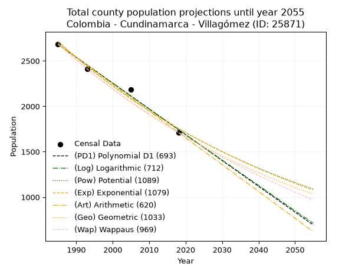
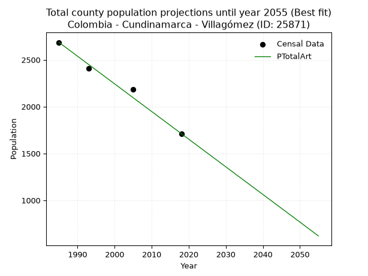
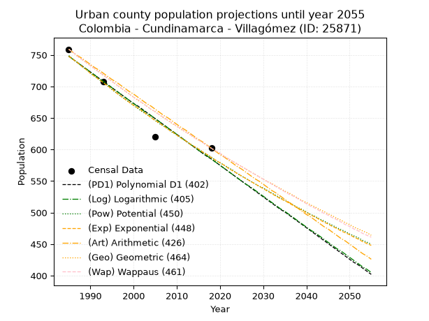
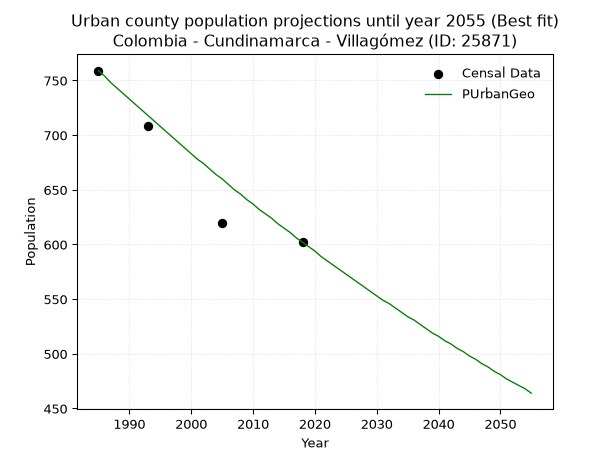
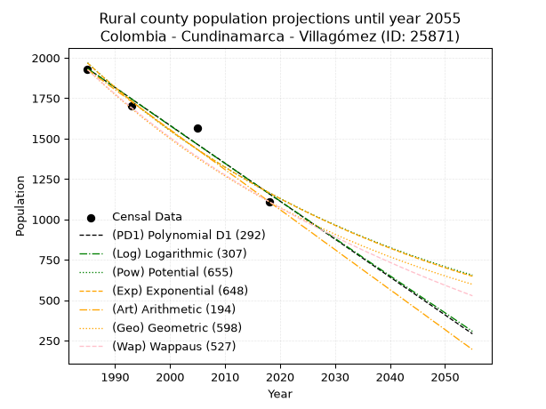
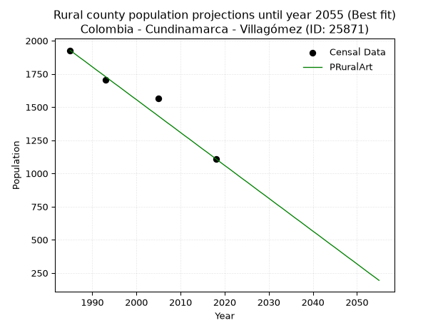

<div align="center">


</div>

# _“Population and Public Services Demand Projections (PPSD) until Year 2050 for Colombia - Cundinamarca - Villagómez (ID: 25871)”_
Keywords: `population` `public-service` `projection` `lineal` `polynomial` `logarithmic` `potential` `exponential` `arithmetic` `geometric` `wappaus` `dane` `colombia` `south-america`

PPSD are analytical estimates used by governments and planners to anticipate future changes in population size, age distribution, and the resulting community needs for utilities, healthcare, education, and infrastructure as sizing future water treatment facilities, electrical grids, and road networks based on spatial growth.

> **General running parameters**: • app_version: _v20260806_. • Python version: _3.14.7_. • Pandas version: _3.0.5_. • NumPy version: _2.5.1_. • Creates, save and include plots into reports (create_plot): _False_. • Projection until year: _2050_. • Process polynomial degree 2 and up: _False_. • Process Wappaus: _True_. • Process Wappaus: _True_. • Set negative values to zero: _True_. • Set infinite values to zero: _True_. • Drop dataset notes: _True_. 
<div align="center">

Dynamic map: [:earth_americas:Google](http://maps.google.com/maps?q=5.273023755,-74.1951454) [:earth_americas:OSM](https://www.openstreetmap.org/#map=18/5.273023755/-74.1951454&layers=P) [:earth_americas:Bing](https://www.bing.com/maps?cp=5.273023755~-74.1951454&lvl=18) [:earth_americas:Apple](https://maps.apple.com/frame?center=5.273023755%2C-74.1951454&span=0.003%2C0.006)

</div>


<div align="center">

```geojson
{
  "type": "Feature",
  "geometry": {
    "type": "Point", 
    "coordinates": [-74.1951454, 5.273023755]
  }, 
  "properties": {
    "Name": "Colombia - Cundinamarca - Villagómez (ID: 25871)"
  }
}
```

</div>


## 0. Census Data (4 records)

Census data are official statistics collected by a government about the people and housing in a country. They usually include counts of total population, age, sex, race, income, education, and jobs.

📅Global census file: [Population.xlsx](../data/Population.xlsx)

| Source   |   Year |   CountryID | CountryName   |   StateID | StateName    |   CountyID | CountyName   |   PTotal |   PUrban |   PRural |
|:---------|-------:|------------:|:--------------|----------:|:-------------|-----------:|:-------------|---------:|---------:|---------:|
| DANE     |   1985 |          57 | Colombia      |        25 | Cundinamarca |      25871 | Villagómez   |     2686 |      759 |     1927 |
| DANE     |   1993 |          57 | Colombia      |        25 | Cundinamarca |      25871 | Villagómez   |     2411 |      708 |     1703 |
| DANE     |   2005 |          57 | Colombia      |        25 | Cundinamarca |      25871 | Villagómez   |     2183 |      620 |     1563 |
| DANE     |   2018 |          57 | Colombia      |        25 | Cundinamarca |      25871 | Villagómez   |     1712 |      602 |     1110 |

> 🔥Some records could had specific notes about the registered values or the corresponding urban or rural distribution.

## 1. Total

### 1.1. Coefficients and Parameters

* (PD1) Polynomial Deg 1: -28.396627860296775, 59048.354877558624 (lineal)
* (Log) Logarithmic: -56831.6126051626, 434225.5428318025
* (Pow) Potential: -26.336405001710077, 90.28443536760507
* (Exp) Exponential: -0.01316143001568005, 601543477780575.6
* (Art) Arithmetic: Year diff. 2018 - 1985 = 33, Population diff. 1712 - 2686 = -974, Annual growth = -29.515151515151516
* (Geo) Geometric: Year diff. 2018 - 1985 = 33, Population diff. 1712 - 2686 = -974, Annual growth % = -0.013555492180297057
* (Wap) Wappaus: i = -1.3422078906389956, Condition values only valid for < 200)

<sub>
Wappaus condition values: ['-0.00', '-1.34', '-2.68', '-4.03', '-5.37', '-6.71', '-8.05', '-9.40', '-10.74', '-12.08', '-13.42', '-14.76', '-16.11', '-17.45', '-18.79', '-20.13', '-21.48', '-22.82', '-24.16', '-25.50', '-26.84', '-28.19', '-29.53', '-30.87', '-32.21', '-33.56', '-34.90', '-36.24', '-37.58', '-38.92', '-40.27', '-41.61', '-42.95', '-44.29', '-45.64', '-46.98', '-48.32', '-49.66', '-51.00', '-52.35', '-53.69', '-55.03', '-56.37', '-57.71', '-59.06', '-60.40', '-61.74', '-63.08', '-64.43', '-65.77', '-67.11', '-68.45', '-69.79', '-71.14', '-72.48', '-73.82', '-75.16', '-76.51', '-77.85', '-79.19', '-80.53', '-81.87', '-83.22', '-84.56', '-85.90', '-87.24']
</sub>


### 1.2. Projected Dataset

|   Year |   CountyID |   PTotalPD1 |   PTotalLog |   PTotalPow |   PTotalExp |   PTotalArt |   PTotalGeo |   PTotalWap |
|-------:|-----------:|------------:|------------:|------------:|------------:|------------:|------------:|------------:|
|   1985 |      25871 |        2681 |        2682 |        2712 |        2711 |        2686 |        2686 |        2686 |
|   1986 |      25871 |        2653 |        2653 |        2676 |        2676 |        2656 |        2650 |        2650 |
|   1987 |      25871 |        2624 |        2625 |        2641 |        2641 |        2627 |        2614 |        2615 |
|   1988 |      25871 |        2596 |        2596 |        2606 |        2606 |        2597 |        2578 |        2580 |
|   1989 |      25871 |        2567 |        2567 |        2572 |        2572 |        2568 |        2543 |        2546 |
|   1990 |      25871 |        2539 |        2539 |        2538 |        2538 |        2538 |        2509 |        2512 |
|   1991 |      25871 |        2511 |        2510 |        2505 |        2505 |        2509 |        2475 |        2478 |
|   1992 |      25871 |        2482 |        2482 |        2472 |        2472 |        2479 |        2441 |        2445 |
|   1993 |      25871 |        2454 |        2453 |        2439 |        2440 |        2450 |        2408 |        2412 |
|   1994 |      25871 |        2425 |        2425 |        2407 |        2408 |        2420 |        2376 |        2380 |
|   1995 |      25871 |        2397 |        2396 |        2376 |        2377 |        2391 |        2343 |        2348 |
|   1996 |      25871 |        2369 |        2368 |        2345 |        2346 |        2361 |        2312 |        2317 |
|   1997 |      25871 |        2340 |        2339 |        2314 |        2315 |        2332 |        2280 |        2286 |
|   1998 |      25871 |        2312 |        2311 |        2284 |        2285 |        2302 |        2249 |        2255 |
|   1999 |      25871 |        2283 |        2282 |        2254 |        2255 |        2273 |        2219 |        2225 |
|   2000 |      25871 |        2255 |        2254 |        2224 |        2225 |        2243 |        2189 |        2195 |
|   2001 |      25871 |        2227 |        2226 |        2195 |        2196 |        2214 |        2159 |        2165 |
|   2002 |      25871 |        2198 |        2197 |        2166 |        2168 |        2184 |        2130 |        2136 |
|   2003 |      25871 |        2170 |        2169 |        2138 |        2139 |        2155 |        2101 |        2107 |
|   2004 |      25871 |        2142 |        2140 |        2110 |        2111 |        2125 |        2072 |        2078 |
|   2005 |      25871 |        2113 |        2112 |        2083 |        2084 |        2096 |        2044 |        2050 |
|   2006 |      25871 |        2085 |        2084 |        2055 |        2056 |        2066 |        2017 |        2022 |
|   2007 |      25871 |        2056 |        2055 |        2029 |        2029 |        2037 |        1989 |        1995 |
|   2008 |      25871 |        2028 |        2027 |        2002 |        2003 |        2007 |        1962 |        1968 |
|   2009 |      25871 |        2000 |        1999 |        1976 |        1977 |        1978 |        1936 |        1941 |
|   2010 |      25871 |        1971 |        1971 |        1950 |        1951 |        1948 |        1910 |        1914 |
|   2011 |      25871 |        1943 |        1942 |        1925 |        1925 |        1919 |        1884 |        1888 |
|   2012 |      25871 |        1914 |        1914 |        1900 |        1900 |        1889 |        1858 |        1862 |
|   2013 |      25871 |        1886 |        1886 |        1875 |        1875 |        1860 |        1833 |        1836 |
|   2014 |      25871 |        1858 |        1858 |        1851 |        1851 |        1830 |        1808 |        1811 |
|   2015 |      25871 |        1829 |        1829 |        1827 |        1827 |        1801 |        1784 |        1786 |
|   2016 |      25871 |        1801 |        1801 |        1803 |        1803 |        1771 |        1759 |        1761 |
|   2017 |      25871 |        1772 |        1773 |        1780 |        1779 |        1742 |        1736 |        1736 |
|   2018 |      25871 |        1744 |        1745 |        1757 |        1756 |        1712 |        1712 |        1712 |
|   2019 |      25871 |        1716 |        1717 |        1734 |        1733 |        1682 |        1689 |        1688 |
|   2020 |      25871 |        1687 |        1689 |        1711 |        1710 |        1653 |        1666 |        1664 |
|   2021 |      25871 |        1659 |        1660 |        1689 |        1688 |        1623 |        1643 |        1641 |
|   2022 |      25871 |        1630 |        1632 |        1667 |        1666 |        1594 |        1621 |        1617 |
|   2023 |      25871 |        1602 |        1604 |        1646 |        1644 |        1564 |        1599 |        1594 |
|   2024 |      25871 |        1574 |        1576 |        1625 |        1623 |        1535 |        1577 |        1572 |
|   2025 |      25871 |        1545 |        1548 |        1604 |        1601 |        1505 |        1556 |        1549 |
|   2026 |      25871 |        1517 |        1520 |        1583 |        1580 |        1476 |        1535 |        1527 |
|   2027 |      25871 |        1488 |        1492 |        1562 |        1560 |        1446 |        1514 |        1505 |
|   2028 |      25871 |        1460 |        1464 |        1542 |        1539 |        1417 |        1494 |        1483 |
|   2029 |      25871 |        1432 |        1436 |        1522 |        1519 |        1387 |        1473 |        1461 |
|   2030 |      25871 |        1403 |        1408 |        1503 |        1499 |        1358 |        1453 |        1440 |
|   2031 |      25871 |        1375 |        1380 |        1483 |        1480 |        1328 |        1434 |        1419 |
|   2032 |      25871 |        1346 |        1352 |        1464 |        1460 |        1299 |        1414 |        1398 |
|   2033 |      25871 |        1318 |        1324 |        1445 |        1441 |        1269 |        1395 |        1377 |
|   2034 |      25871 |        1290 |        1296 |        1427 |        1423 |        1240 |        1376 |        1357 |
|   2035 |      25871 |        1261 |        1268 |        1408 |        1404 |        1210 |        1357 |        1336 |
|   2036 |      25871 |        1233 |        1240 |        1390 |        1386 |        1181 |        1339 |        1316 |
|   2037 |      25871 |        1204 |        1212 |        1372 |        1367 |        1151 |        1321 |        1296 |
|   2038 |      25871 |        1176 |        1184 |        1355 |        1350 |        1122 |        1303 |        1277 |
|   2039 |      25871 |        1148 |        1156 |        1337 |        1332 |        1092 |        1285 |        1257 |
|   2040 |      25871 |        1119 |        1129 |        1320 |        1314 |        1063 |        1268 |        1238 |
|   2041 |      25871 |        1091 |        1101 |        1303 |        1297 |        1033 |        1251 |        1219 |
|   2042 |      25871 |        1062 |        1073 |        1287 |        1280 |        1004 |        1234 |        1200 |
|   2043 |      25871 |        1034 |        1045 |        1270 |        1264 |         974 |        1217 |        1181 |
|   2044 |      25871 |        1006 |        1017 |        1254 |        1247 |         945 |        1201 |        1162 |
|   2045 |      25871 |         977 |         989 |        1238 |        1231 |         915 |        1184 |        1144 |
|   2046 |      25871 |         949 |         962 |        1222 |        1215 |         886 |        1168 |        1126 |
|   2047 |      25871 |         920 |         934 |        1206 |        1199 |         856 |        1152 |        1108 |
|   2048 |      25871 |         892 |         906 |        1191 |        1183 |         827 |        1137 |        1090 |
|   2049 |      25871 |         864 |         878 |        1176 |        1168 |         797 |        1121 |        1072 |
|   2050 |      25871 |         835 |         851 |        1161 |        1152 |         768 |        1106 |        1054 |
<div align="center">

</img>

</div>


### 1.3. Best fit with absolute and relative error (%)

Relative error puts that difference into context by dividing the absolute error by the true value, creating a unitless ratio or percentage that shows the scale of the mistake.

Absolute and relative error

|   Year | Source   |   CountryID | CountryName   |   StateID | StateName    |   CountyID_x | CountyName   |   PTotal |   PUrban |   PRural |   CountyID_y |   PTotalPD1 |   PTotalLog |   PTotalPow |   PTotalExp |   PTotalArt |   PTotalGeo |   PTotalWap |   PTotalPD1AbsError |   PTotalLogAbsError |   PTotalPowAbsError |   PTotalExpAbsError |   PTotalArtAbsError |   PTotalGeoAbsError |   PTotalWapAbsError |   PTotalPD1RelError |   PTotalLogRelError |   PTotalPowRelError |   PTotalExpRelError |   PTotalArtRelError |   PTotalGeoRelError |   PTotalWapRelError |
|-------:|:---------|------------:|:--------------|----------:|:-------------|-------------:|:-------------|---------:|---------:|---------:|-------------:|------------:|------------:|------------:|------------:|------------:|------------:|------------:|--------------------:|--------------------:|--------------------:|--------------------:|--------------------:|--------------------:|--------------------:|--------------------:|--------------------:|--------------------:|--------------------:|--------------------:|--------------------:|--------------------:|
|   1985 | DANE     |          57 | Colombia      |        25 | Cundinamarca |        25871 | Villagómez   |     2686 |      759 |     1927 |        25871 |        2681 |        2682 |        2712 |        2711 |        2686 |        2686 |        2686 |                   5 |                   4 |                  26 |                  25 |                   0 |                   0 |                   0 |             0.18615 |             0.14892 |            0.967982 |            0.930752 |             0       |             0       |           0         |
|   1993 | DANE     |          57 | Colombia      |        25 | Cundinamarca |        25871 | Villagómez   |     2411 |      708 |     1703 |        25871 |        2454 |        2453 |        2439 |        2440 |        2450 |        2408 |        2412 |                  43 |                  42 |                  28 |                  29 |                  39 |                   3 |                   1 |             1.78349 |             1.74202 |            1.16134  |            1.20282  |             1.61759 |             0.12443 |           0.0414766 |
|   2005 | DANE     |          57 | Colombia      |        25 | Cundinamarca |        25871 | Villagómez   |     2183 |      620 |     1563 |        25871 |        2113 |        2112 |        2083 |        2084 |        2096 |        2044 |        2050 |                  70 |                  71 |                 100 |                  99 |                  87 |                 139 |                 133 |             3.2066  |             3.2524  |            4.58085  |            4.53504  |             3.98534 |             6.36738 |           6.09253   |
|   2018 | DANE     |          57 | Colombia      |        25 | Cundinamarca |        25871 | Villagómez   |     1712 |      602 |     1110 |        25871 |        1744 |        1745 |        1757 |        1756 |        1712 |        1712 |        1712 |                  32 |                  33 |                  45 |                  44 |                   0 |                   0 |                   0 |             1.86916 |             1.92757 |            2.6285   |            2.57009  |             0       |             0       |           0         |

Relative error mean

| Method    |   RelError | Best   |
|:----------|-----------:|:-------|
| PTotalPD1 |    1.76135 |        |
| PTotalLog |    1.76773 |        |
| PTotalPow |    2.33467 |        |
| PTotalExp |    2.30968 |        |
| PTotalArt |    1.40073 | True   |
| PTotalGeo |    1.62295 |        |
| PTotalWap |    1.5335  |        |

💙Best method: _**PTotalArt**_
<div align="center">

</img>

</div>


### 1.4. Fresh water supply demand in liters per capita per day (lpcd)

The fresh water supply demand typically ranges from 100 to 300 liters per capita per day (lpcd) for standard domestic and municipal planning, though absolute survival minimums set by the World Health Organization are as low as 7.5 to 20 liters per day, and total consumption in high-income nations can exceed 400 liters.

> `CZ`: Level in meters above the sea level (masl).<br> `WS`: Fresh water supply demand in liters per capita per day (lpcd or l/h/d).<br> `WSAll`: Zonal fresh water supply demand in liters per second (l/s).<br> `A`: Zonal area in square meters.

Reference values (RAS Colombia)

|    CZ |   WS |
|------:|-----:|
|  1000 |  120 |
|  2000 |  130 |
| 99999 |  140 |

County shapefile geometry properties and water supply values

|   CountyID |      ATotal |   CZTotal |   WSTotal |
|-----------:|------------:|----------:|----------:|
|      25871 | 6.28951e+07 |   1829.04 |       130 |

Projected values for best method: PTotalArt

|   CountyID |   Year |   PTotalArt |   WSTotal |   WSTotalAll |
|-----------:|-------:|------------:|----------:|-------------:|
|      25871 |   1985 |        2686 |       130 |      4.04144 |
|      25871 |   1986 |        2656 |       130 |      3.9963  |
|      25871 |   1987 |        2627 |       130 |      3.95266 |
|      25871 |   1988 |        2597 |       130 |      3.90752 |
|      25871 |   1989 |        2568 |       130 |      3.86389 |
|      25871 |   1990 |        2538 |       130 |      3.81875 |
|      25871 |   1991 |        2509 |       130 |      3.77512 |
|      25871 |   1992 |        2479 |       130 |      3.72998 |
|      25871 |   1993 |        2450 |       130 |      3.68634 |
|      25871 |   1994 |        2420 |       130 |      3.6412  |
|      25871 |   1995 |        2391 |       130 |      3.59757 |
|      25871 |   1996 |        2361 |       130 |      3.55243 |
|      25871 |   1997 |        2332 |       130 |      3.5088  |
|      25871 |   1998 |        2302 |       130 |      3.46366 |
|      25871 |   1999 |        2273 |       130 |      3.42002 |
|      25871 |   2000 |        2243 |       130 |      3.37488 |
|      25871 |   2001 |        2214 |       130 |      3.33125 |
|      25871 |   2002 |        2184 |       130 |      3.28611 |
|      25871 |   2003 |        2155 |       130 |      3.24248 |
|      25871 |   2004 |        2125 |       130 |      3.19734 |
|      25871 |   2005 |        2096 |       130 |      3.1537  |
|      25871 |   2006 |        2066 |       130 |      3.10856 |
|      25871 |   2007 |        2037 |       130 |      3.06493 |
|      25871 |   2008 |        2007 |       130 |      3.01979 |
|      25871 |   2009 |        1978 |       130 |      2.97616 |
|      25871 |   2010 |        1948 |       130 |      2.93102 |
|      25871 |   2011 |        1919 |       130 |      2.88738 |
|      25871 |   2012 |        1889 |       130 |      2.84225 |
|      25871 |   2013 |        1860 |       130 |      2.79861 |
|      25871 |   2014 |        1830 |       130 |      2.75347 |
|      25871 |   2015 |        1801 |       130 |      2.70984 |
|      25871 |   2016 |        1771 |       130 |      2.6647  |
|      25871 |   2017 |        1742 |       130 |      2.62106 |
|      25871 |   2018 |        1712 |       130 |      2.57593 |
|      25871 |   2019 |        1682 |       130 |      2.53079 |
|      25871 |   2020 |        1653 |       130 |      2.48715 |
|      25871 |   2021 |        1623 |       130 |      2.44201 |
|      25871 |   2022 |        1594 |       130 |      2.39838 |
|      25871 |   2023 |        1564 |       130 |      2.35324 |
|      25871 |   2024 |        1535 |       130 |      2.30961 |
|      25871 |   2025 |        1505 |       130 |      2.26447 |
|      25871 |   2026 |        1476 |       130 |      2.22083 |
|      25871 |   2027 |        1446 |       130 |      2.17569 |
|      25871 |   2028 |        1417 |       130 |      2.13206 |
|      25871 |   2029 |        1387 |       130 |      2.08692 |
|      25871 |   2030 |        1358 |       130 |      2.04329 |
|      25871 |   2031 |        1328 |       130 |      1.99815 |
|      25871 |   2032 |        1299 |       130 |      1.95451 |
|      25871 |   2033 |        1269 |       130 |      1.90938 |
|      25871 |   2034 |        1240 |       130 |      1.86574 |
|      25871 |   2035 |        1210 |       130 |      1.8206  |
|      25871 |   2036 |        1181 |       130 |      1.77697 |
|      25871 |   2037 |        1151 |       130 |      1.73183 |
|      25871 |   2038 |        1122 |       130 |      1.68819 |
|      25871 |   2039 |        1092 |       130 |      1.64306 |
|      25871 |   2040 |        1063 |       130 |      1.59942 |
|      25871 |   2041 |        1033 |       130 |      1.55428 |
|      25871 |   2042 |        1004 |       130 |      1.51065 |
|      25871 |   2043 |         974 |       130 |      1.46551 |
|      25871 |   2044 |         945 |       130 |      1.42188 |
|      25871 |   2045 |         915 |       130 |      1.37674 |
|      25871 |   2046 |         886 |       130 |      1.3331  |
|      25871 |   2047 |         856 |       130 |      1.28796 |
|      25871 |   2048 |         827 |       130 |      1.24433 |
|      25871 |   2049 |         797 |       130 |      1.19919 |
|      25871 |   2050 |         768 |       130 |      1.15556 |

## 2. Urban

### 2.1. Coefficients and Parameters

* (PD1) Polynomial Deg 1: -4.941389000401433, 10556.263348052966 (lineal)
* (Log) Logarithmic: -9896.800566978509, 75897.9104175861
* (Pow) Potential: -14.69691714469805, 51.34120387075202
* (Exp) Exponential: -0.00733843373688536, 1586518422.2700918
* (Art) Arithmetic: Year diff. 2018 - 1985 = 33, Population diff. 602 - 759 = -157, Annual growth = -4.757575757575758
* (Geo) Geometric: Year diff. 2018 - 1985 = 33, Population diff. 602 - 759 = -157, Annual growth % = -0.006997954994646172
* (Wap) Wappaus: i = -0.6991294280052546, Condition values only valid for < 200)

<sub>
Wappaus condition values: ['-0.00', '-0.70', '-1.40', '-2.10', '-2.80', '-3.50', '-4.19', '-4.89', '-5.59', '-6.29', '-6.99', '-7.69', '-8.39', '-9.09', '-9.79', '-10.49', '-11.19', '-11.89', '-12.58', '-13.28', '-13.98', '-14.68', '-15.38', '-16.08', '-16.78', '-17.48', '-18.18', '-18.88', '-19.58', '-20.27', '-20.97', '-21.67', '-22.37', '-23.07', '-23.77', '-24.47', '-25.17', '-25.87', '-26.57', '-27.27', '-27.97', '-28.66', '-29.36', '-30.06', '-30.76', '-31.46', '-32.16', '-32.86', '-33.56', '-34.26', '-34.96', '-35.66', '-36.35', '-37.05', '-37.75', '-38.45', '-39.15', '-39.85', '-40.55', '-41.25', '-41.95', '-42.65', '-43.35', '-44.05', '-44.74', '-45.44']
</sub>


### 2.2. Projected Dataset

|   Year |   CountyID |   PUrbanPD1 |   PUrbanLog |   PUrbanPow |   PUrbanExp |   PUrbanArt |   PUrbanGeo |   PUrbanWap |
|-------:|-----------:|------------:|------------:|------------:|------------:|------------:|------------:|------------:|
|   1985 |      25871 |         748 |         748 |         749 |         748 |         759 |         759 |         759 |
|   1986 |      25871 |         743 |         743 |         743 |         743 |         754 |         754 |         754 |
|   1987 |      25871 |         738 |         738 |         738 |         738 |         749 |         748 |         748 |
|   1988 |      25871 |         733 |         733 |         732 |         732 |         745 |         743 |         743 |
|   1989 |      25871 |         728 |         728 |         727 |         727 |         740 |         738 |         738 |
|   1990 |      25871 |         723 |         723 |         721 |         721 |         735 |         733 |         733 |
|   1991 |      25871 |         718 |         718 |         716 |         716 |         730 |         728 |         728 |
|   1992 |      25871 |         713 |         713 |         711 |         711 |         726 |         723 |         723 |
|   1993 |      25871 |         708 |         708 |         706 |         706 |         721 |         718 |         718 |
|   1994 |      25871 |         703 |         703 |         701 |         701 |         716 |         713 |         713 |
|   1995 |      25871 |         698 |         698 |         695 |         696 |         711 |         708 |         708 |
|   1996 |      25871 |         693 |         693 |         690 |         690 |         707 |         703 |         703 |
|   1997 |      25871 |         688 |         688 |         685 |         685 |         702 |         698 |         698 |
|   1998 |      25871 |         683 |         683 |         680 |         680 |         697 |         693 |         693 |
|   1999 |      25871 |         678 |         678 |         675 |         675 |         692 |         688 |         688 |
|   2000 |      25871 |         673 |         673 |         670 |         670 |         688 |         683 |         683 |
|   2001 |      25871 |         669 |         668 |         665 |         666 |         683 |         678 |         679 |
|   2002 |      25871 |         664 |         663 |         660 |         661 |         678 |         674 |         674 |
|   2003 |      25871 |         659 |         658 |         656 |         656 |         673 |         669 |         669 |
|   2004 |      25871 |         654 |         654 |         651 |         651 |         669 |         664 |         664 |
|   2005 |      25871 |         649 |         649 |         646 |         646 |         664 |         660 |         660 |
|   2006 |      25871 |         644 |         644 |         641 |         642 |         659 |         655 |         655 |
|   2007 |      25871 |         639 |         639 |         637 |         637 |         654 |         650 |         651 |
|   2008 |      25871 |         634 |         634 |         632 |         632 |         650 |         646 |         646 |
|   2009 |      25871 |         629 |         629 |         627 |         628 |         645 |         641 |         642 |
|   2010 |      25871 |         624 |         624 |         623 |         623 |         640 |         637 |         637 |
|   2011 |      25871 |         619 |         619 |         618 |         618 |         635 |         632 |         633 |
|   2012 |      25871 |         614 |         614 |         614 |         614 |         631 |         628 |         628 |
|   2013 |      25871 |         609 |         609 |         609 |         609 |         626 |         624 |         624 |
|   2014 |      25871 |         604 |         604 |         605 |         605 |         621 |         619 |         619 |
|   2015 |      25871 |         599 |         599 |         601 |         601 |         616 |         615 |         615 |
|   2016 |      25871 |         594 |         594 |         596 |         596 |         612 |         611 |         611 |
|   2017 |      25871 |         589 |         590 |         592 |         592 |         607 |         606 |         606 |
|   2018 |      25871 |         585 |         585 |         588 |         587 |         602 |         602 |         602 |
|   2019 |      25871 |         580 |         580 |         583 |         583 |         597 |         598 |         598 |
|   2020 |      25871 |         575 |         575 |         579 |         579 |         592 |         594 |         594 |
|   2021 |      25871 |         570 |         570 |         575 |         575 |         588 |         589 |         589 |
|   2022 |      25871 |         565 |         565 |         571 |         570 |         583 |         585 |         585 |
|   2023 |      25871 |         560 |         560 |         567 |         566 |         578 |         581 |         581 |
|   2024 |      25871 |         555 |         555 |         562 |         562 |         573 |         577 |         577 |
|   2025 |      25871 |         550 |         550 |         558 |         558 |         569 |         573 |         573 |
|   2026 |      25871 |         545 |         545 |         554 |         554 |         564 |         569 |         569 |
|   2027 |      25871 |         540 |         541 |         550 |         550 |         559 |         565 |         565 |
|   2028 |      25871 |         535 |         536 |         546 |         546 |         554 |         561 |         561 |
|   2029 |      25871 |         530 |         531 |         542 |         542 |         550 |         557 |         557 |
|   2030 |      25871 |         525 |         526 |         539 |         538 |         545 |         553 |         553 |
|   2031 |      25871 |         520 |         521 |         535 |         534 |         540 |         549 |         549 |
|   2032 |      25871 |         515 |         516 |         531 |         530 |         535 |         546 |         545 |
|   2033 |      25871 |         510 |         511 |         527 |         526 |         531 |         542 |         541 |
|   2034 |      25871 |         505 |         506 |         523 |         522 |         526 |         538 |         537 |
|   2035 |      25871 |         501 |         502 |         519 |         519 |         521 |         534 |         533 |
|   2036 |      25871 |         496 |         497 |         516 |         515 |         516 |         531 |         529 |
|   2037 |      25871 |         491 |         492 |         512 |         511 |         512 |         527 |         526 |
|   2038 |      25871 |         486 |         487 |         508 |         507 |         507 |         523 |         522 |
|   2039 |      25871 |         481 |         482 |         505 |         504 |         502 |         519 |         518 |
|   2040 |      25871 |         476 |         477 |         501 |         500 |         497 |         516 |         514 |
|   2041 |      25871 |         471 |         472 |         497 |         496 |         493 |         512 |         510 |
|   2042 |      25871 |         466 |         468 |         494 |         493 |         488 |         509 |         507 |
|   2043 |      25871 |         461 |         463 |         490 |         489 |         483 |         505 |         503 |
|   2044 |      25871 |         456 |         458 |         487 |         485 |         478 |         502 |         499 |
|   2045 |      25871 |         451 |         453 |         483 |         482 |         474 |         498 |         496 |
|   2046 |      25871 |         446 |         448 |         480 |         478 |         469 |         495 |         492 |
|   2047 |      25871 |         441 |         443 |         476 |         475 |         464 |         491 |         489 |
|   2048 |      25871 |         436 |         439 |         473 |         471 |         459 |         488 |         485 |
|   2049 |      25871 |         431 |         434 |         470 |         468 |         455 |         484 |         481 |
|   2050 |      25871 |         426 |         429 |         466 |         465 |         450 |         481 |         478 |
<div align="center">

</img>

</div>


### 2.3. Best fit with absolute and relative error (%)

Relative error puts that difference into context by dividing the absolute error by the true value, creating a unitless ratio or percentage that shows the scale of the mistake.

Absolute and relative error

|   Year | Source   |   CountryID | CountryName   |   StateID | StateName    |   CountyID_x | CountyName   |   PTotal |   PUrban |   PRural |   CountyID_y |   PUrbanPD1 |   PUrbanLog |   PUrbanPow |   PUrbanExp |   PUrbanArt |   PUrbanGeo |   PUrbanWap |   PUrbanPD1AbsError |   PUrbanLogAbsError |   PUrbanPowAbsError |   PUrbanExpAbsError |   PUrbanArtAbsError |   PUrbanGeoAbsError |   PUrbanWapAbsError |   PUrbanPD1RelError |   PUrbanLogRelError |   PUrbanPowRelError |   PUrbanExpRelError |   PUrbanArtRelError |   PUrbanGeoRelError |   PUrbanWapRelError |
|-------:|:---------|------------:|:--------------|----------:|:-------------|-------------:|:-------------|---------:|---------:|---------:|-------------:|------------:|------------:|------------:|------------:|------------:|------------:|------------:|--------------------:|--------------------:|--------------------:|--------------------:|--------------------:|--------------------:|--------------------:|--------------------:|--------------------:|--------------------:|--------------------:|--------------------:|--------------------:|--------------------:|
|   1985 | DANE     |          57 | Colombia      |        25 | Cundinamarca |        25871 | Villagómez   |     2686 |      759 |     1927 |        25871 |         748 |         748 |         749 |         748 |         759 |         759 |         759 |                  11 |                  11 |                  10 |                  11 |                   0 |                   0 |                   0 |             1.44928 |             1.44928 |            1.31752  |            1.44928  |             0       |             0       |             0       |
|   1993 | DANE     |          57 | Colombia      |        25 | Cundinamarca |        25871 | Villagómez   |     2411 |      708 |     1703 |        25871 |         708 |         708 |         706 |         706 |         721 |         718 |         718 |                   0 |                   0 |                   2 |                   2 |                  13 |                  10 |                  10 |             0       |             0       |            0.282486 |            0.282486 |             1.83616 |             1.41243 |             1.41243 |
|   2005 | DANE     |          57 | Colombia      |        25 | Cundinamarca |        25871 | Villagómez   |     2183 |      620 |     1563 |        25871 |         649 |         649 |         646 |         646 |         664 |         660 |         660 |                  29 |                  29 |                  26 |                  26 |                  44 |                  40 |                  40 |             4.67742 |             4.67742 |            4.19355  |            4.19355  |             7.09677 |             6.45161 |             6.45161 |
|   2018 | DANE     |          57 | Colombia      |        25 | Cundinamarca |        25871 | Villagómez   |     1712 |      602 |     1110 |        25871 |         585 |         585 |         588 |         587 |         602 |         602 |         602 |                  17 |                  17 |                  14 |                  15 |                   0 |                   0 |                   0 |             2.82392 |             2.82392 |            2.32558  |            2.49169  |             0       |             0       |             0       |

Relative error mean

| Method    |   RelError | Best   |
|:----------|-----------:|:-------|
| PUrbanPD1 |    2.23765 |        |
| PUrbanLog |    2.23765 |        |
| PUrbanPow |    2.02978 |        |
| PUrbanExp |    2.10425 |        |
| PUrbanArt |    2.23323 |        |
| PUrbanGeo |    1.96601 | True   |
| PUrbanWap |    1.96601 | True   |

💙Best method: _**PUrbanGeo**_
<div align="center">

</img>

</div>


### 2.4. Fresh water supply demand in liters per capita per day (lpcd)

The fresh water supply demand typically ranges from 100 to 300 liters per capita per day (lpcd) for standard domestic and municipal planning, though absolute survival minimums set by the World Health Organization are as low as 7.5 to 20 liters per day, and total consumption in high-income nations can exceed 400 liters.

> `CZ`: Level in meters above the sea level (masl).<br> `WS`: Fresh water supply demand in liters per capita per day (lpcd or l/h/d).<br> `WSAll`: Zonal fresh water supply demand in liters per second (l/s).<br> `A`: Zonal area in square meters.

Reference values (RAS Colombia)

|    CZ |   WS |
|------:|-----:|
|  1000 |  120 |
|  2000 |  130 |
| 99999 |  140 |

County shapefile geometry properties and water supply values

|   CountyID |   AUrban |   CZUrban |   WSUrban |
|-----------:|---------:|----------:|----------:|
|      25871 |   223880 |   1675.04 |       130 |

Projected values for best method: PUrbanGeo

|   CountyID |   Year |   PUrbanGeo |   WSUrban |   WSUrbanAll |
|-----------:|-------:|------------:|----------:|-------------:|
|      25871 |   1985 |         759 |       130 |     1.14201  |
|      25871 |   1986 |         754 |       130 |     1.13449  |
|      25871 |   1987 |         748 |       130 |     1.12546  |
|      25871 |   1988 |         743 |       130 |     1.11794  |
|      25871 |   1989 |         738 |       130 |     1.11042  |
|      25871 |   1990 |         733 |       130 |     1.10289  |
|      25871 |   1991 |         728 |       130 |     1.09537  |
|      25871 |   1992 |         723 |       130 |     1.08785  |
|      25871 |   1993 |         718 |       130 |     1.08032  |
|      25871 |   1994 |         713 |       130 |     1.0728   |
|      25871 |   1995 |         708 |       130 |     1.06528  |
|      25871 |   1996 |         703 |       130 |     1.05775  |
|      25871 |   1997 |         698 |       130 |     1.05023  |
|      25871 |   1998 |         693 |       130 |     1.04271  |
|      25871 |   1999 |         688 |       130 |     1.03519  |
|      25871 |   2000 |         683 |       130 |     1.02766  |
|      25871 |   2001 |         678 |       130 |     1.02014  |
|      25871 |   2002 |         674 |       130 |     1.01412  |
|      25871 |   2003 |         669 |       130 |     1.0066   |
|      25871 |   2004 |         664 |       130 |     0.999074 |
|      25871 |   2005 |         660 |       130 |     0.993056 |
|      25871 |   2006 |         655 |       130 |     0.985532 |
|      25871 |   2007 |         650 |       130 |     0.978009 |
|      25871 |   2008 |         646 |       130 |     0.971991 |
|      25871 |   2009 |         641 |       130 |     0.964468 |
|      25871 |   2010 |         637 |       130 |     0.958449 |
|      25871 |   2011 |         632 |       130 |     0.950926 |
|      25871 |   2012 |         628 |       130 |     0.944907 |
|      25871 |   2013 |         624 |       130 |     0.938889 |
|      25871 |   2014 |         619 |       130 |     0.931366 |
|      25871 |   2015 |         615 |       130 |     0.925347 |
|      25871 |   2016 |         611 |       130 |     0.919329 |
|      25871 |   2017 |         606 |       130 |     0.911806 |
|      25871 |   2018 |         602 |       130 |     0.905787 |
|      25871 |   2019 |         598 |       130 |     0.899769 |
|      25871 |   2020 |         594 |       130 |     0.89375  |
|      25871 |   2021 |         589 |       130 |     0.886227 |
|      25871 |   2022 |         585 |       130 |     0.880208 |
|      25871 |   2023 |         581 |       130 |     0.87419  |
|      25871 |   2024 |         577 |       130 |     0.868171 |
|      25871 |   2025 |         573 |       130 |     0.862153 |
|      25871 |   2026 |         569 |       130 |     0.856134 |
|      25871 |   2027 |         565 |       130 |     0.850116 |
|      25871 |   2028 |         561 |       130 |     0.844097 |
|      25871 |   2029 |         557 |       130 |     0.838079 |
|      25871 |   2030 |         553 |       130 |     0.83206  |
|      25871 |   2031 |         549 |       130 |     0.826042 |
|      25871 |   2032 |         546 |       130 |     0.821528 |
|      25871 |   2033 |         542 |       130 |     0.815509 |
|      25871 |   2034 |         538 |       130 |     0.809491 |
|      25871 |   2035 |         534 |       130 |     0.803472 |
|      25871 |   2036 |         531 |       130 |     0.798958 |
|      25871 |   2037 |         527 |       130 |     0.79294  |
|      25871 |   2038 |         523 |       130 |     0.786921 |
|      25871 |   2039 |         519 |       130 |     0.780903 |
|      25871 |   2040 |         516 |       130 |     0.776389 |
|      25871 |   2041 |         512 |       130 |     0.77037  |
|      25871 |   2042 |         509 |       130 |     0.765856 |
|      25871 |   2043 |         505 |       130 |     0.759838 |
|      25871 |   2044 |         502 |       130 |     0.755324 |
|      25871 |   2045 |         498 |       130 |     0.749306 |
|      25871 |   2046 |         495 |       130 |     0.744792 |
|      25871 |   2047 |         491 |       130 |     0.738773 |
|      25871 |   2048 |         488 |       130 |     0.734259 |
|      25871 |   2049 |         484 |       130 |     0.728241 |
|      25871 |   2050 |         481 |       130 |     0.723727 |

## 3. Rural

### 3.1. Coefficients and Parameters

* (PD1) Polynomial Deg 1: -23.45523885989533, 48492.09152950563 (lineal)
* (Log) Logarithmic: -46934.8120381841, 358327.6324142166
* (Pow) Potential: -31.77118804593984, 108.06794575630737
* (Exp) Exponential: -0.015880402785520976, 9.640762252040067e+16
* (Art) Arithmetic: Year diff. 2018 - 1985 = 33, Population diff. 1110 - 1927 = -817, Annual growth = -24.757575757575758
* (Geo) Geometric: Year diff. 2018 - 1985 = 33, Population diff. 1110 - 1927 = -817, Annual growth % = -0.01657635883842634
* (Wap) Wappaus: i = -1.6303968230211232, Condition values only valid for < 200)

<sub>
Wappaus condition values: ['-0.00', '-1.63', '-3.26', '-4.89', '-6.52', '-8.15', '-9.78', '-11.41', '-13.04', '-14.67', '-16.30', '-17.93', '-19.56', '-21.20', '-22.83', '-24.46', '-26.09', '-27.72', '-29.35', '-30.98', '-32.61', '-34.24', '-35.87', '-37.50', '-39.13', '-40.76', '-42.39', '-44.02', '-45.65', '-47.28', '-48.91', '-50.54', '-52.17', '-53.80', '-55.43', '-57.06', '-58.69', '-60.32', '-61.96', '-63.59', '-65.22', '-66.85', '-68.48', '-70.11', '-71.74', '-73.37', '-75.00', '-76.63', '-78.26', '-79.89', '-81.52', '-83.15', '-84.78', '-86.41', '-88.04', '-89.67', '-91.30', '-92.93', '-94.56', '-96.19', '-97.82', '-99.45', '-101.08', '-102.71', '-104.35', '-105.98']
</sub>


### 3.2. Projected Dataset

|   Year |   CountyID |   PRuralPD1 |   PRuralLog |   PRuralPow |   PRuralExp |   PRuralArt |   PRuralGeo |   PRuralWap |
|-------:|-----------:|------------:|------------:|------------:|------------:|------------:|------------:|------------:|
|   1985 |      25871 |        1933 |        1934 |        1969 |        1968 |        1927 |        1927 |        1927 |
|   1986 |      25871 |        1910 |        1910 |        1937 |        1937 |        1902 |        1895 |        1896 |
|   1987 |      25871 |        1887 |        1887 |        1907 |        1906 |        1877 |        1864 |        1865 |
|   1988 |      25871 |        1863 |        1863 |        1876 |        1876 |        1853 |        1833 |        1835 |
|   1989 |      25871 |        1840 |        1840 |        1847 |        1847 |        1828 |        1802 |        1805 |
|   1990 |      25871 |        1816 |        1816 |        1817 |        1818 |        1803 |        1772 |        1776 |
|   1991 |      25871 |        1793 |        1792 |        1789 |        1789 |        1778 |        1743 |        1747 |
|   1992 |      25871 |        1769 |        1769 |        1760 |        1761 |        1754 |        1714 |        1719 |
|   1993 |      25871 |        1746 |        1745 |        1733 |        1733 |        1729 |        1686 |        1691 |
|   1994 |      25871 |        1722 |        1722 |        1705 |        1706 |        1704 |        1658 |        1664 |
|   1995 |      25871 |        1699 |        1698 |        1678 |        1679 |        1679 |        1630 |        1637 |
|   1996 |      25871 |        1675 |        1675 |        1652 |        1653 |        1655 |        1603 |        1610 |
|   1997 |      25871 |        1652 |        1651 |        1626 |        1627 |        1630 |        1577 |        1584 |
|   1998 |      25871 |        1629 |        1628 |        1600 |        1601 |        1605 |        1551 |        1558 |
|   1999 |      25871 |        1605 |        1604 |        1575 |        1576 |        1580 |        1525 |        1532 |
|   2000 |      25871 |        1582 |        1581 |        1550 |        1551 |        1556 |        1500 |        1507 |
|   2001 |      25871 |        1558 |        1557 |        1525 |        1526 |        1531 |        1475 |        1482 |
|   2002 |      25871 |        1535 |        1534 |        1501 |        1502 |        1506 |        1450 |        1458 |
|   2003 |      25871 |        1511 |        1510 |        1478 |        1479 |        1481 |        1426 |        1434 |
|   2004 |      25871 |        1488 |        1487 |        1455 |        1455 |        1457 |        1403 |        1410 |
|   2005 |      25871 |        1464 |        1464 |        1432 |        1432 |        1432 |        1379 |        1387 |
|   2006 |      25871 |        1441 |        1440 |        1409 |        1410 |        1407 |        1357 |        1364 |
|   2007 |      25871 |        1417 |        1417 |        1387 |        1388 |        1382 |        1334 |        1341 |
|   2008 |      25871 |        1394 |        1393 |        1365 |        1366 |        1358 |        1312 |        1318 |
|   2009 |      25871 |        1371 |        1370 |        1344 |        1344 |        1333 |        1290 |        1296 |
|   2010 |      25871 |        1347 |        1347 |        1323 |        1323 |        1308 |        1269 |        1275 |
|   2011 |      25871 |        1324 |        1323 |        1302 |        1302 |        1283 |        1248 |        1253 |
|   2012 |      25871 |        1300 |        1300 |        1282 |        1282 |        1259 |        1227 |        1232 |
|   2013 |      25871 |        1277 |        1277 |        1262 |        1262 |        1234 |        1207 |        1211 |
|   2014 |      25871 |        1253 |        1253 |        1242 |        1242 |        1209 |        1187 |        1190 |
|   2015 |      25871 |        1230 |        1230 |        1222 |        1222 |        1184 |        1167 |        1170 |
|   2016 |      25871 |        1206 |        1207 |        1203 |        1203 |        1160 |        1148 |        1150 |
|   2017 |      25871 |        1183 |        1183 |        1184 |        1184 |        1135 |        1129 |        1130 |
|   2018 |      25871 |        1159 |        1160 |        1166 |        1165 |        1110 |        1110 |        1110 |
|   2019 |      25871 |        1136 |        1137 |        1148 |        1147 |        1085 |        1092 |        1091 |
|   2020 |      25871 |        1113 |        1114 |        1130 |        1129 |        1060 |        1074 |        1071 |
|   2021 |      25871 |        1089 |        1090 |        1112 |        1111 |        1036 |        1056 |        1053 |
|   2022 |      25871 |        1066 |        1067 |        1095 |        1094 |        1011 |        1038 |        1034 |
|   2023 |      25871 |        1042 |        1044 |        1078 |        1076 |         986 |        1021 |        1015 |
|   2024 |      25871 |        1019 |        1021 |        1061 |        1059 |         961 |        1004 |         997 |
|   2025 |      25871 |         995 |         998 |        1044 |        1043 |         937 |         987 |         979 |
|   2026 |      25871 |         972 |         974 |        1028 |        1026 |         912 |         971 |         962 |
|   2027 |      25871 |         948 |         951 |        1012 |        1010 |         887 |         955 |         944 |
|   2028 |      25871 |         925 |         928 |         996 |         994 |         862 |         939 |         927 |
|   2029 |      25871 |         901 |         905 |         981 |         979 |         838 |         924 |         910 |
|   2030 |      25871 |         878 |         882 |         966 |         963 |         813 |         908 |         893 |
|   2031 |      25871 |         855 |         859 |         951 |         948 |         788 |         893 |         876 |
|   2032 |      25871 |         831 |         836 |         936 |         933 |         763 |         878 |         859 |
|   2033 |      25871 |         808 |         813 |         921 |         918 |         739 |         864 |         843 |
|   2034 |      25871 |         784 |         790 |         907 |         904 |         714 |         850 |         827 |
|   2035 |      25871 |         761 |         766 |         893 |         890 |         689 |         835 |         811 |
|   2036 |      25871 |         737 |         743 |         879 |         876 |         664 |         822 |         795 |
|   2037 |      25871 |         714 |         720 |         866 |         862 |         640 |         808 |         780 |
|   2038 |      25871 |         690 |         697 |         852 |         848 |         615 |         795 |         764 |
|   2039 |      25871 |         667 |         674 |         839 |         835 |         590 |         781 |         749 |
|   2040 |      25871 |         643 |         651 |         826 |         822 |         565 |         768 |         734 |
|   2041 |      25871 |         620 |         628 |         813 |         809 |         541 |         756 |         719 |
|   2042 |      25871 |         596 |         605 |         801 |         796 |         516 |         743 |         704 |
|   2043 |      25871 |         573 |         582 |         788 |         783 |         491 |         731 |         690 |
|   2044 |      25871 |         550 |         559 |         776 |         771 |         466 |         719 |         675 |
|   2045 |      25871 |         526 |         536 |         764 |         759 |         442 |         707 |         661 |
|   2046 |      25871 |         503 |         513 |         753 |         747 |         417 |         695 |         647 |
|   2047 |      25871 |         479 |         490 |         741 |         735 |         392 |         684 |         633 |
|   2048 |      25871 |         456 |         468 |         730 |         724 |         367 |         672 |         619 |
|   2049 |      25871 |         432 |         445 |         718 |         712 |         343 |         661 |         606 |
|   2050 |      25871 |         409 |         422 |         707 |         701 |         318 |         650 |         592 |
<div align="center">

</img>

</div>


### 3.3. Best fit with absolute and relative error (%)

Relative error puts that difference into context by dividing the absolute error by the true value, creating a unitless ratio or percentage that shows the scale of the mistake.

Absolute and relative error

|   Year | Source   |   CountryID | CountryName   |   StateID | StateName    |   CountyID_x | CountyName   |   PTotal |   PUrban |   PRural |   CountyID_y |   PRuralPD1 |   PRuralLog |   PRuralPow |   PRuralExp |   PRuralArt |   PRuralGeo |   PRuralWap |   PRuralPD1AbsError |   PRuralLogAbsError |   PRuralPowAbsError |   PRuralExpAbsError |   PRuralArtAbsError |   PRuralGeoAbsError |   PRuralWapAbsError |   PRuralPD1RelError |   PRuralLogRelError |   PRuralPowRelError |   PRuralExpRelError |   PRuralArtRelError |   PRuralGeoRelError |   PRuralWapRelError |
|-------:|:---------|------------:|:--------------|----------:|:-------------|-------------:|:-------------|---------:|---------:|---------:|-------------:|------------:|------------:|------------:|------------:|------------:|------------:|------------:|--------------------:|--------------------:|--------------------:|--------------------:|--------------------:|--------------------:|--------------------:|--------------------:|--------------------:|--------------------:|--------------------:|--------------------:|--------------------:|--------------------:|
|   1985 | DANE     |          57 | Colombia      |        25 | Cundinamarca |        25871 | Villagómez   |     2686 |      759 |     1927 |        25871 |        1933 |        1934 |        1969 |        1968 |        1927 |        1927 |        1927 |                   6 |                   7 |                  42 |                  41 |                   0 |                   0 |                   0 |            0.311365 |            0.363259 |             2.17955 |             2.12766 |             0       |            0        |            0        |
|   1993 | DANE     |          57 | Colombia      |        25 | Cundinamarca |        25871 | Villagómez   |     2411 |      708 |     1703 |        25871 |        1746 |        1745 |        1733 |        1733 |        1729 |        1686 |        1691 |                  43 |                  42 |                  30 |                  30 |                  26 |                  17 |                  12 |            2.52496  |            2.46624  |             1.7616  |             1.7616  |             1.52672 |            0.998238 |            0.704639 |
|   2005 | DANE     |          57 | Colombia      |        25 | Cundinamarca |        25871 | Villagómez   |     2183 |      620 |     1563 |        25871 |        1464 |        1464 |        1432 |        1432 |        1432 |        1379 |        1387 |                  99 |                  99 |                 131 |                 131 |                 131 |                 184 |                 176 |            6.33397  |            6.33397  |             8.38132 |             8.38132 |             8.38132 |           11.7722   |           11.2604   |
|   2018 | DANE     |          57 | Colombia      |        25 | Cundinamarca |        25871 | Villagómez   |     1712 |      602 |     1110 |        25871 |        1159 |        1160 |        1166 |        1165 |        1110 |        1110 |        1110 |                  49 |                  50 |                  56 |                  55 |                   0 |                   0 |                   0 |            4.41441  |            4.5045   |             5.04505 |             4.95495 |             0       |            0        |            0        |

Relative error mean

| Method    |   RelError | Best   |
|:----------|-----------:|:-------|
| PRuralPD1 |    3.39618 |        |
| PRuralLog |    3.41699 |        |
| PRuralPow |    4.34188 |        |
| PRuralExp |    4.30638 |        |
| PRuralArt |    2.47701 | True   |
| PRuralGeo |    3.19262 |        |
| PRuralWap |    2.99126 |        |

💙Best method: _**PRuralArt**_
<div align="center">

</img>

</div>


### 3.4. Fresh water supply demand in liters per capita per day (lpcd)

The fresh water supply demand typically ranges from 100 to 300 liters per capita per day (lpcd) for standard domestic and municipal planning, though absolute survival minimums set by the World Health Organization are as low as 7.5 to 20 liters per day, and total consumption in high-income nations can exceed 400 liters.

> `CZ`: Level in meters above the sea level (masl).<br> `WS`: Fresh water supply demand in liters per capita per day (lpcd or l/h/d).<br> `WSAll`: Zonal fresh water supply demand in liters per second (l/s).<br> `A`: Zonal area in square meters.

Reference values (RAS Colombia)

|    CZ |   WS |
|------:|-----:|
|  1000 |  120 |
|  2000 |  130 |
| 99999 |  140 |

County shapefile geometry properties and water supply values

|   CountyID |      ARural |   CZRural |   WSRural |
|-----------:|------------:|----------:|----------:|
|      25871 | 6.26712e+07 |    1829.6 |       130 |

Projected values for best method: PRuralArt

|   CountyID |   Year |   PRuralArt |   WSRural |   WSRuralAll |
|-----------:|-------:|------------:|----------:|-------------:|
|      25871 |   1985 |        1927 |       130 |     2.89942  |
|      25871 |   1986 |        1902 |       130 |     2.86181  |
|      25871 |   1987 |        1877 |       130 |     2.82419  |
|      25871 |   1988 |        1853 |       130 |     2.78808  |
|      25871 |   1989 |        1828 |       130 |     2.75046  |
|      25871 |   1990 |        1803 |       130 |     2.71285  |
|      25871 |   1991 |        1778 |       130 |     2.67523  |
|      25871 |   1992 |        1754 |       130 |     2.63912  |
|      25871 |   1993 |        1729 |       130 |     2.6015   |
|      25871 |   1994 |        1704 |       130 |     2.56389  |
|      25871 |   1995 |        1679 |       130 |     2.52627  |
|      25871 |   1996 |        1655 |       130 |     2.49016  |
|      25871 |   1997 |        1630 |       130 |     2.45255  |
|      25871 |   1998 |        1605 |       130 |     2.41493  |
|      25871 |   1999 |        1580 |       130 |     2.37731  |
|      25871 |   2000 |        1556 |       130 |     2.3412   |
|      25871 |   2001 |        1531 |       130 |     2.30359  |
|      25871 |   2002 |        1506 |       130 |     2.26597  |
|      25871 |   2003 |        1481 |       130 |     2.22836  |
|      25871 |   2004 |        1457 |       130 |     2.19225  |
|      25871 |   2005 |        1432 |       130 |     2.15463  |
|      25871 |   2006 |        1407 |       130 |     2.11701  |
|      25871 |   2007 |        1382 |       130 |     2.0794   |
|      25871 |   2008 |        1358 |       130 |     2.04329  |
|      25871 |   2009 |        1333 |       130 |     2.00567  |
|      25871 |   2010 |        1308 |       130 |     1.96806  |
|      25871 |   2011 |        1283 |       130 |     1.93044  |
|      25871 |   2012 |        1259 |       130 |     1.89433  |
|      25871 |   2013 |        1234 |       130 |     1.85671  |
|      25871 |   2014 |        1209 |       130 |     1.8191   |
|      25871 |   2015 |        1184 |       130 |     1.78148  |
|      25871 |   2016 |        1160 |       130 |     1.74537  |
|      25871 |   2017 |        1135 |       130 |     1.70775  |
|      25871 |   2018 |        1110 |       130 |     1.67014  |
|      25871 |   2019 |        1085 |       130 |     1.63252  |
|      25871 |   2020 |        1060 |       130 |     1.59491  |
|      25871 |   2021 |        1036 |       130 |     1.5588   |
|      25871 |   2022 |        1011 |       130 |     1.52118  |
|      25871 |   2023 |         986 |       130 |     1.48356  |
|      25871 |   2024 |         961 |       130 |     1.44595  |
|      25871 |   2025 |         937 |       130 |     1.40984  |
|      25871 |   2026 |         912 |       130 |     1.37222  |
|      25871 |   2027 |         887 |       130 |     1.33461  |
|      25871 |   2028 |         862 |       130 |     1.29699  |
|      25871 |   2029 |         838 |       130 |     1.26088  |
|      25871 |   2030 |         813 |       130 |     1.22326  |
|      25871 |   2031 |         788 |       130 |     1.18565  |
|      25871 |   2032 |         763 |       130 |     1.14803  |
|      25871 |   2033 |         739 |       130 |     1.11192  |
|      25871 |   2034 |         714 |       130 |     1.07431  |
|      25871 |   2035 |         689 |       130 |     1.03669  |
|      25871 |   2036 |         664 |       130 |     0.999074 |
|      25871 |   2037 |         640 |       130 |     0.962963 |
|      25871 |   2038 |         615 |       130 |     0.925347 |
|      25871 |   2039 |         590 |       130 |     0.887731 |
|      25871 |   2040 |         565 |       130 |     0.850116 |
|      25871 |   2041 |         541 |       130 |     0.814005 |
|      25871 |   2042 |         516 |       130 |     0.776389 |
|      25871 |   2043 |         491 |       130 |     0.738773 |
|      25871 |   2044 |         466 |       130 |     0.701157 |
|      25871 |   2045 |         442 |       130 |     0.665046 |
|      25871 |   2046 |         417 |       130 |     0.627431 |
|      25871 |   2047 |         392 |       130 |     0.589815 |
|      25871 |   2048 |         367 |       130 |     0.552199 |
|      25871 |   2049 |         343 |       130 |     0.516088 |
|      25871 |   2050 |         318 |       130 |     0.478472 |

<div align="center"><br><sub>Share this research</sub></div><br>

<sub>**APPS & TOOLS & CONTENT DISCLAIMER**: • NO WARRANTY - This content and software is provided by <a href="https://github.com/rcfdtools" target="_blank">github.com/rcfdtools</a> "as is", without any express or implied warranty, including warranties of merchantability, fitness for a particular purpose, or non-infringement. There is no guarantee that the software will be error-free or operate without interruption. • LIMITATION OF LIABILITY - Neither the authors nor copyright holders will be liable for claims or damages arising from the software or its use. You are responsible for determining if the software is appropriate for your use and assume all associated risks, including errors, legal compliance, and data loss. • NO PROFESSIONAL ADVICE - The software provides general information and does not offer professional advice. It should not replace consultation with professional advisors. [Clauses and global license for rcfdtools use.](https://github.com/rcfdtools/rcfdtools/blob/main/LICENSE.md)</sub>

| [:house: Home](Readme.md)  | [:beginner: Help / Collaborate](https://github.com/rcfdtools/R.HydroTools/discussions/31) |
|----------------------------|-------------------------------------------------------------------------------------------|