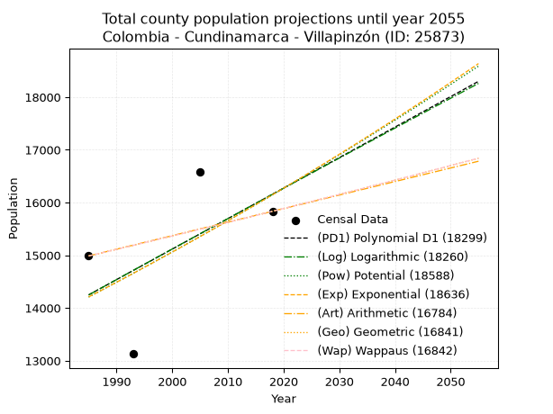
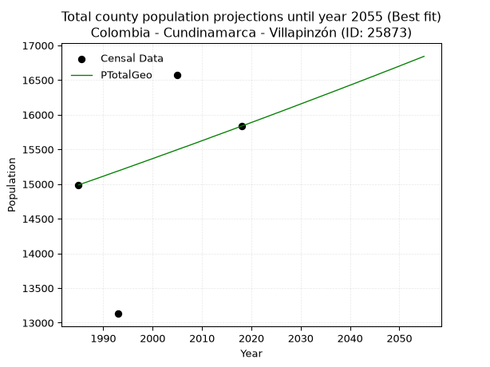
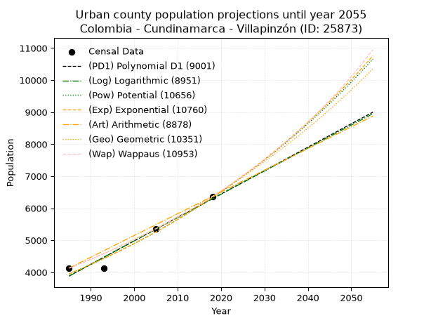
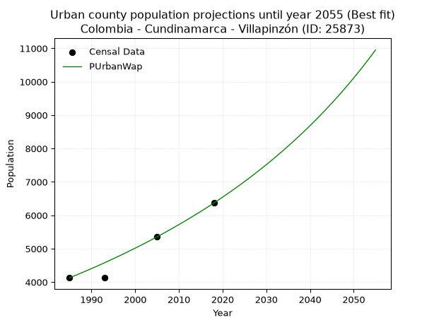
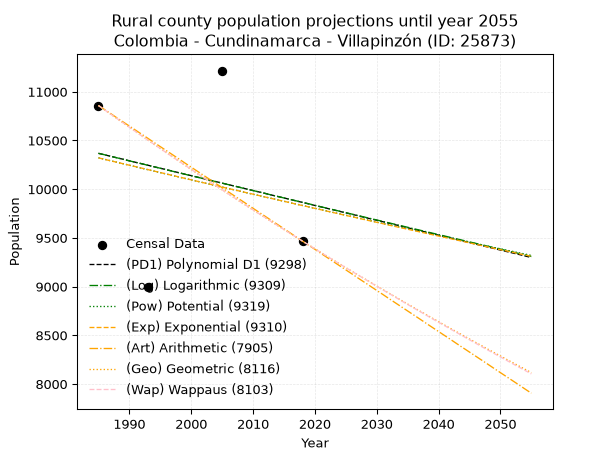
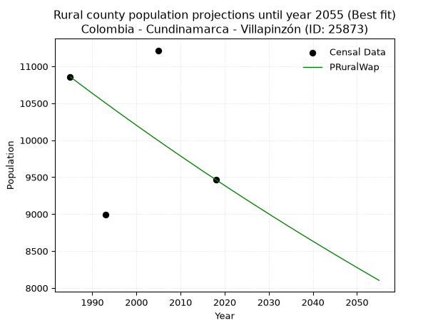

<div align="center">


</div>

# _“Population and Public Services Demand Projections (PPSD) until Year 2050 for Colombia - Cundinamarca - Villapinzón (ID: 25873)”_
Keywords: `population` `public-service` `projection` `lineal` `polynomial` `logarithmic` `potential` `exponential` `arithmetic` `geometric` `wappaus` `dane` `colombia` `south-america`

PPSD are analytical estimates used by governments and planners to anticipate future changes in population size, age distribution, and the resulting community needs for utilities, healthcare, education, and infrastructure as sizing future water treatment facilities, electrical grids, and road networks based on spatial growth.

> **General running parameters**: • app_version: _v20260806_. • Python version: _3.14.7_. • Pandas version: _3.0.5_. • NumPy version: _2.5.1_. • Creates, save and include plots into reports (create_plot): _False_. • Projection until year: _2050_. • Process polynomial degree 2 and up: _False_. • Process Wappaus: _True_. • Process Wappaus: _True_. • Set negative values to zero: _True_. • Set infinite values to zero: _True_. • Drop dataset notes: _True_. 
<div align="center">

Dynamic map: [:earth_americas:Google](http://maps.google.com/maps?q=5.216393039,-73.5957043) [:earth_americas:OSM](https://www.openstreetmap.org/#map=18/5.216393039/-73.5957043&layers=P) [:earth_americas:Bing](https://www.bing.com/maps?cp=5.216393039~-73.5957043&lvl=18) [:earth_americas:Apple](https://maps.apple.com/frame?center=5.216393039%2C-73.5957043&span=0.003%2C0.006)

</div>


<div align="center">

```geojson
{
  "type": "Feature",
  "geometry": {
    "type": "Point", 
    "coordinates": [-73.5957043, 5.216393039]
  }, 
  "properties": {
    "Name": "Colombia - Cundinamarca - Villapinzón (ID: 25873)"
  }
}
```

</div>


## 0. Census Data (4 records)

Census data are official statistics collected by a government about the people and housing in a country. They usually include counts of total population, age, sex, race, income, education, and jobs.

📅Global census file: [Population.xlsx](../data/Population.xlsx)

| Source   |   Year |   CountryID | CountryName   |   StateID | StateName    |   CountyID | CountyName   |   PTotal |   PUrban |   PRural |
|:---------|-------:|------------:|:--------------|----------:|:-------------|-----------:|:-------------|---------:|---------:|---------:|
| DANE     |   1985 |          57 | Colombia      |        25 | Cundinamarca |      25873 | Villapinzón  |    14987 |     4129 |    10858 |
| DANE     |   1993 |          57 | Colombia      |        25 | Cundinamarca |      25873 | Villapinzón  |    13130 |     4134 |     8996 |
| DANE     |   2005 |          57 | Colombia      |        25 | Cundinamarca |      25873 | Villapinzón  |    16573 |     5357 |    11216 |
| DANE     |   2018 |          57 | Colombia      |        25 | Cundinamarca |      25873 | Villapinzón  |    15834 |     6368 |     9466 |

> 🔥Some records could had specific notes about the registered values or the corresponding urban or rural distribution.

## 1. Total

### 1.1. Coefficients and Parameters

* (PD1) Polynomial Deg 1: 57.857888398233946, -100599.24126856746 (lineal)
* (Log) Logarithmic: 115798.23615868781, -865052.3209910134
* (Pow) Potential: 7.753008896710447, -21.415027533159904
* (Exp) Exponential: 0.0038742614200409984, 6.496529967913838
* (Art) Arithmetic: Year diff. 2018 - 1985 = 33, Population diff. 15834 - 14987 = 847, Annual growth = 25.666666666666668
* (Geo) Geometric: Year diff. 2018 - 1985 = 33, Population diff. 15834 - 14987 = 847, Annual growth % = 0.001667339014618241
* (Wap) Wappaus: i = 0.16655310772957832, Condition values only valid for < 200)

<sub>
Wappaus condition values: ['0.00', '0.17', '0.33', '0.50', '0.67', '0.83', '1.00', '1.17', '1.33', '1.50', '1.67', '1.83', '2.00', '2.17', '2.33', '2.50', '2.66', '2.83', '3.00', '3.16', '3.33', '3.50', '3.66', '3.83', '4.00', '4.16', '4.33', '4.50', '4.66', '4.83', '5.00', '5.16', '5.33', '5.50', '5.66', '5.83', '6.00', '6.16', '6.33', '6.50', '6.66', '6.83', '7.00', '7.16', '7.33', '7.49', '7.66', '7.83', '7.99', '8.16', '8.33', '8.49', '8.66', '8.83', '8.99', '9.16', '9.33', '9.49', '9.66', '9.83', '9.99', '10.16', '10.33', '10.49', '10.66', '10.83']
</sub>


### 1.2. Projected Dataset

|   Year |   CountyID |   PTotalPD1 |   PTotalLog |   PTotalPow |   PTotalExp |   PTotalArt |   PTotalGeo |   PTotalWap |
|-------:|-----------:|------------:|------------:|------------:|------------:|------------:|------------:|------------:|
|   1985 |      25873 |       14249 |       14247 |       14208 |       14210 |       14987 |       14987 |       14987 |
|   1986 |      25873 |       14307 |       14305 |       14264 |       14265 |       15013 |       15012 |       15012 |
|   1987 |      25873 |       14364 |       14364 |       14320 |       14320 |       15038 |       15037 |       15037 |
|   1988 |      25873 |       14422 |       14422 |       14376 |       14376 |       15064 |       15062 |       15062 |
|   1989 |      25873 |       14480 |       14480 |       14432 |       14432 |       15090 |       15087 |       15087 |
|   1990 |      25873 |       14538 |       14538 |       14488 |       14488 |       15115 |       15112 |       15112 |
|   1991 |      25873 |       14596 |       14597 |       14545 |       14544 |       15141 |       15138 |       15138 |
|   1992 |      25873 |       14654 |       14655 |       14601 |       14600 |       15167 |       15163 |       15163 |
|   1993 |      25873 |       14712 |       14713 |       14658 |       14657 |       15192 |       15188 |       15188 |
|   1994 |      25873 |       14769 |       14771 |       14715 |       14714 |       15218 |       15213 |       15213 |
|   1995 |      25873 |       14827 |       14829 |       14773 |       14771 |       15244 |       15239 |       15239 |
|   1996 |      25873 |       14885 |       14887 |       14830 |       14828 |       15269 |       15264 |       15264 |
|   1997 |      25873 |       14943 |       14945 |       14888 |       14886 |       15295 |       15290 |       15290 |
|   1998 |      25873 |       15001 |       15003 |       14946 |       14944 |       15321 |       15315 |       15315 |
|   1999 |      25873 |       15059 |       15061 |       15004 |       15002 |       15346 |       15341 |       15341 |
|   2000 |      25873 |       15117 |       15119 |       15062 |       15060 |       15372 |       15366 |       15366 |
|   2001 |      25873 |       15174 |       15177 |       15121 |       15118 |       15398 |       15392 |       15392 |
|   2002 |      25873 |       15232 |       15235 |       15179 |       15177 |       15423 |       15418 |       15417 |
|   2003 |      25873 |       15290 |       15292 |       15238 |       15236 |       15449 |       15443 |       15443 |
|   2004 |      25873 |       15348 |       15350 |       15297 |       15295 |       15475 |       15469 |       15469 |
|   2005 |      25873 |       15406 |       15408 |       15357 |       15354 |       15500 |       15495 |       15495 |
|   2006 |      25873 |       15464 |       15466 |       15416 |       15414 |       15526 |       15521 |       15521 |
|   2007 |      25873 |       15522 |       15523 |       15476 |       15474 |       15552 |       15546 |       15546 |
|   2008 |      25873 |       15579 |       15581 |       15536 |       15534 |       15577 |       15572 |       15572 |
|   2009 |      25873 |       15637 |       15639 |       15596 |       15594 |       15603 |       15598 |       15598 |
|   2010 |      25873 |       15695 |       15696 |       15656 |       15655 |       15629 |       15624 |       15624 |
|   2011 |      25873 |       15753 |       15754 |       15716 |       15716 |       15654 |       15650 |       15650 |
|   2012 |      25873 |       15811 |       15811 |       15777 |       15777 |       15680 |       15677 |       15676 |
|   2013 |      25873 |       15869 |       15869 |       15838 |       15838 |       15706 |       15703 |       15703 |
|   2014 |      25873 |       15927 |       15927 |       15899 |       15899 |       15731 |       15729 |       15729 |
|   2015 |      25873 |       15984 |       15984 |       15960 |       15961 |       15757 |       15755 |       15755 |
|   2016 |      25873 |       16042 |       16041 |       16022 |       16023 |       15783 |       15781 |       15781 |
|   2017 |      25873 |       16100 |       16099 |       16084 |       16085 |       15808 |       15808 |       15808 |
|   2018 |      25873 |       16158 |       16156 |       16146 |       16148 |       15834 |       15834 |       15834 |
|   2019 |      25873 |       16216 |       16214 |       16208 |       16210 |       15860 |       15860 |       15860 |
|   2020 |      25873 |       16274 |       16271 |       16270 |       16273 |       15885 |       15887 |       15887 |
|   2021 |      25873 |       16332 |       16328 |       16333 |       16336 |       15911 |       15913 |       15913 |
|   2022 |      25873 |       16389 |       16386 |       16395 |       16400 |       15937 |       15940 |       15940 |
|   2023 |      25873 |       16447 |       16443 |       16458 |       16463 |       15962 |       15966 |       15967 |
|   2024 |      25873 |       16505 |       16500 |       16522 |       16527 |       15988 |       15993 |       15993 |
|   2025 |      25873 |       16563 |       16557 |       16585 |       16592 |       16014 |       16020 |       16020 |
|   2026 |      25873 |       16621 |       16614 |       16649 |       16656 |       16039 |       16046 |       16047 |
|   2027 |      25873 |       16679 |       16672 |       16712 |       16721 |       16065 |       16073 |       16073 |
|   2028 |      25873 |       16737 |       16729 |       16776 |       16785 |       16091 |       16100 |       16100 |
|   2029 |      25873 |       16794 |       16786 |       16841 |       16851 |       16116 |       16127 |       16127 |
|   2030 |      25873 |       16852 |       16843 |       16905 |       16916 |       16142 |       16154 |       16154 |
|   2031 |      25873 |       16910 |       16900 |       16970 |       16982 |       16168 |       16181 |       16181 |
|   2032 |      25873 |       16968 |       16957 |       17035 |       17048 |       16193 |       16208 |       16208 |
|   2033 |      25873 |       17026 |       17014 |       17100 |       17114 |       16219 |       16235 |       16235 |
|   2034 |      25873 |       17084 |       17071 |       17165 |       17180 |       16245 |       16262 |       16262 |
|   2035 |      25873 |       17142 |       17128 |       17231 |       17247 |       16270 |       16289 |       16289 |
|   2036 |      25873 |       17199 |       17185 |       17296 |       17314 |       16296 |       16316 |       16316 |
|   2037 |      25873 |       17257 |       17241 |       17362 |       17381 |       16322 |       16343 |       16344 |
|   2038 |      25873 |       17315 |       17298 |       17429 |       17449 |       16347 |       16370 |       16371 |
|   2039 |      25873 |       17373 |       17355 |       17495 |       17516 |       16373 |       16398 |       16398 |
|   2040 |      25873 |       17431 |       17412 |       17562 |       17584 |       16399 |       16425 |       16426 |
|   2041 |      25873 |       17489 |       17469 |       17628 |       17653 |       16424 |       16452 |       16453 |
|   2042 |      25873 |       17547 |       17525 |       17696 |       17721 |       16450 |       16480 |       16481 |
|   2043 |      25873 |       17604 |       17582 |       17763 |       17790 |       16476 |       16507 |       16508 |
|   2044 |      25873 |       17662 |       17639 |       17830 |       17859 |       16501 |       16535 |       16536 |
|   2045 |      25873 |       17720 |       17695 |       17898 |       17928 |       16527 |       16562 |       16563 |
|   2046 |      25873 |       17778 |       17752 |       17966 |       17998 |       16553 |       16590 |       16591 |
|   2047 |      25873 |       17836 |       17809 |       18034 |       18068 |       16578 |       16618 |       16619 |
|   2048 |      25873 |       17894 |       17865 |       18103 |       18138 |       16604 |       16645 |       16647 |
|   2049 |      25873 |       17952 |       17922 |       18171 |       18208 |       16630 |       16673 |       16674 |
|   2050 |      25873 |       18009 |       17978 |       18240 |       18279 |       16655 |       16701 |       16702 |
<div align="center">

</img>

</div>


### 1.3. Best fit with absolute and relative error (%)

Relative error puts that difference into context by dividing the absolute error by the true value, creating a unitless ratio or percentage that shows the scale of the mistake.

Absolute and relative error

|   Year | Source   |   CountryID | CountryName   |   StateID | StateName    |   CountyID_x | CountyName   |   PTotal |   PUrban |   PRural |   CountyID_y |   PTotalPD1 |   PTotalLog |   PTotalPow |   PTotalExp |   PTotalArt |   PTotalGeo |   PTotalWap |   PTotalPD1AbsError |   PTotalLogAbsError |   PTotalPowAbsError |   PTotalExpAbsError |   PTotalArtAbsError |   PTotalGeoAbsError |   PTotalWapAbsError |   PTotalPD1RelError |   PTotalLogRelError |   PTotalPowRelError |   PTotalExpRelError |   PTotalArtRelError |   PTotalGeoRelError |   PTotalWapRelError |
|-------:|:---------|------------:|:--------------|----------:|:-------------|-------------:|:-------------|---------:|---------:|---------:|-------------:|------------:|------------:|------------:|------------:|------------:|------------:|------------:|--------------------:|--------------------:|--------------------:|--------------------:|--------------------:|--------------------:|--------------------:|--------------------:|--------------------:|--------------------:|--------------------:|--------------------:|--------------------:|--------------------:|
|   1985 | DANE     |          57 | Colombia      |        25 | Cundinamarca |        25873 | Villapinzón  |    14987 |     4129 |    10858 |        25873 |       14249 |       14247 |       14208 |       14210 |       14987 |       14987 |       14987 |                 738 |                 740 |                 779 |                 777 |                   0 |                   0 |                   0 |             4.92427 |             4.93761 |             5.19784 |             5.18449 |             0       |             0       |             0       |
|   1993 | DANE     |          57 | Colombia      |        25 | Cundinamarca |        25873 | Villapinzón  |    13130 |     4134 |     8996 |        25873 |       14712 |       14713 |       14658 |       14657 |       15192 |       15188 |       15188 |                1582 |                1583 |                1528 |                1527 |                2062 |                2058 |                2058 |            12.0487  |            12.0564  |            11.6375  |            11.6299  |            15.7045  |            15.674   |            15.674   |
|   2005 | DANE     |          57 | Colombia      |        25 | Cundinamarca |        25873 | Villapinzón  |    16573 |     5357 |    11216 |        25873 |       15406 |       15408 |       15357 |       15354 |       15500 |       15495 |       15495 |                1167 |                1165 |                1216 |                1219 |                1073 |                1078 |                1078 |             7.04157 |             7.02951 |             7.33724 |             7.35534 |             6.47439 |             6.50456 |             6.50456 |
|   2018 | DANE     |          57 | Colombia      |        25 | Cundinamarca |        25873 | Villapinzón  |    15834 |     6368 |     9466 |        25873 |       16158 |       16156 |       16146 |       16148 |       15834 |       15834 |       15834 |                 324 |                 322 |                 312 |                 314 |                   0 |                   0 |                   0 |             2.04623 |             2.0336  |             1.97044 |             1.98307 |             0       |             0       |             0       |

Relative error mean

| Method    |   RelError | Best   |
|:----------|-----------:|:-------|
| PTotalPD1 |    6.5152  |        |
| PTotalLog |    6.51427 |        |
| PTotalPow |    6.53575 |        |
| PTotalExp |    6.53819 |        |
| PTotalArt |    5.54472 |        |
| PTotalGeo |    5.54465 | True   |
| PTotalWap |    5.54465 | True   |

💙Best method: _**PTotalGeo**_
<div align="center">

</img>

</div>


### 1.4. Fresh water supply demand in liters per capita per day (lpcd)

The fresh water supply demand typically ranges from 100 to 300 liters per capita per day (lpcd) for standard domestic and municipal planning, though absolute survival minimums set by the World Health Organization are as low as 7.5 to 20 liters per day, and total consumption in high-income nations can exceed 400 liters.

> `CZ`: Level in meters above the sea level (masl).<br> `WS`: Fresh water supply demand in liters per capita per day (lpcd or l/h/d).<br> `WSAll`: Zonal fresh water supply demand in liters per second (l/s).<br> `A`: Zonal area in square meters.

Reference values (RAS Colombia)

|    CZ |   WS |
|------:|-----:|
|  1000 |  120 |
|  2000 |  130 |
| 99999 |  140 |

County shapefile geometry properties and water supply values

|   CountyID |      ATotal |   CZTotal |   WSTotal |
|-----------:|------------:|----------:|----------:|
|      25873 | 2.25804e+08 |   2970.96 |       140 |

Projected values for best method: PTotalGeo

|   CountyID |   Year |   PTotalGeo |   WSTotal |   WSTotalAll |
|-----------:|-------:|------------:|----------:|-------------:|
|      25873 |   1985 |       14987 |       140 |      24.2845 |
|      25873 |   1986 |       15012 |       140 |      24.325  |
|      25873 |   1987 |       15037 |       140 |      24.3655 |
|      25873 |   1988 |       15062 |       140 |      24.406  |
|      25873 |   1989 |       15087 |       140 |      24.4465 |
|      25873 |   1990 |       15112 |       140 |      24.487  |
|      25873 |   1991 |       15138 |       140 |      24.5292 |
|      25873 |   1992 |       15163 |       140 |      24.5697 |
|      25873 |   1993 |       15188 |       140 |      24.6102 |
|      25873 |   1994 |       15213 |       140 |      24.6507 |
|      25873 |   1995 |       15239 |       140 |      24.6928 |
|      25873 |   1996 |       15264 |       140 |      24.7333 |
|      25873 |   1997 |       15290 |       140 |      24.7755 |
|      25873 |   1998 |       15315 |       140 |      24.816  |
|      25873 |   1999 |       15341 |       140 |      24.8581 |
|      25873 |   2000 |       15366 |       140 |      24.8986 |
|      25873 |   2001 |       15392 |       140 |      24.9407 |
|      25873 |   2002 |       15418 |       140 |      24.9829 |
|      25873 |   2003 |       15443 |       140 |      25.0234 |
|      25873 |   2004 |       15469 |       140 |      25.0655 |
|      25873 |   2005 |       15495 |       140 |      25.1076 |
|      25873 |   2006 |       15521 |       140 |      25.1498 |
|      25873 |   2007 |       15546 |       140 |      25.1903 |
|      25873 |   2008 |       15572 |       140 |      25.2324 |
|      25873 |   2009 |       15598 |       140 |      25.2745 |
|      25873 |   2010 |       15624 |       140 |      25.3167 |
|      25873 |   2011 |       15650 |       140 |      25.3588 |
|      25873 |   2012 |       15677 |       140 |      25.4025 |
|      25873 |   2013 |       15703 |       140 |      25.4447 |
|      25873 |   2014 |       15729 |       140 |      25.4868 |
|      25873 |   2015 |       15755 |       140 |      25.5289 |
|      25873 |   2016 |       15781 |       140 |      25.5711 |
|      25873 |   2017 |       15808 |       140 |      25.6148 |
|      25873 |   2018 |       15834 |       140 |      25.6569 |
|      25873 |   2019 |       15860 |       140 |      25.6991 |
|      25873 |   2020 |       15887 |       140 |      25.7428 |
|      25873 |   2021 |       15913 |       140 |      25.785  |
|      25873 |   2022 |       15940 |       140 |      25.8287 |
|      25873 |   2023 |       15966 |       140 |      25.8708 |
|      25873 |   2024 |       15993 |       140 |      25.9146 |
|      25873 |   2025 |       16020 |       140 |      25.9583 |
|      25873 |   2026 |       16046 |       140 |      26.0005 |
|      25873 |   2027 |       16073 |       140 |      26.0442 |
|      25873 |   2028 |       16100 |       140 |      26.088  |
|      25873 |   2029 |       16127 |       140 |      26.1317 |
|      25873 |   2030 |       16154 |       140 |      26.1755 |
|      25873 |   2031 |       16181 |       140 |      26.2192 |
|      25873 |   2032 |       16208 |       140 |      26.263  |
|      25873 |   2033 |       16235 |       140 |      26.3067 |
|      25873 |   2034 |       16262 |       140 |      26.3505 |
|      25873 |   2035 |       16289 |       140 |      26.3942 |
|      25873 |   2036 |       16316 |       140 |      26.438  |
|      25873 |   2037 |       16343 |       140 |      26.4817 |
|      25873 |   2038 |       16370 |       140 |      26.5255 |
|      25873 |   2039 |       16398 |       140 |      26.5708 |
|      25873 |   2040 |       16425 |       140 |      26.6146 |
|      25873 |   2041 |       16452 |       140 |      26.6583 |
|      25873 |   2042 |       16480 |       140 |      26.7037 |
|      25873 |   2043 |       16507 |       140 |      26.7475 |
|      25873 |   2044 |       16535 |       140 |      26.7928 |
|      25873 |   2045 |       16562 |       140 |      26.8366 |
|      25873 |   2046 |       16590 |       140 |      26.8819 |
|      25873 |   2047 |       16618 |       140 |      26.9273 |
|      25873 |   2048 |       16645 |       140 |      26.9711 |
|      25873 |   2049 |       16673 |       140 |      27.0164 |
|      25873 |   2050 |       16701 |       140 |      27.0618 |

## 2. Urban

### 2.1. Coefficients and Parameters

* (PD1) Polynomial Deg 1: 73.12565234845377, -141272.58610999462 (lineal)
* (Log) Logarithmic: 146318.8579912767, -1107173.8121174353
* (Pow) Potential: 28.65728710850681, -90.90859301850122
* (Exp) Exponential: 0.014320624901604323, 1.7823517941195518e-09
* (Art) Arithmetic: Year diff. 2018 - 1985 = 33, Population diff. 6368 - 4129 = 2239, Annual growth = 67.84848484848484
* (Geo) Geometric: Year diff. 2018 - 1985 = 33, Population diff. 6368 - 4129 = 2239, Annual growth % = 0.013215355003938445
* (Wap) Wappaus: i = 1.292721441335331, Condition values only valid for < 200)

<sub>
Wappaus condition values: ['0.00', '1.29', '2.59', '3.88', '5.17', '6.46', '7.76', '9.05', '10.34', '11.63', '12.93', '14.22', '15.51', '16.81', '18.10', '19.39', '20.68', '21.98', '23.27', '24.56', '25.85', '27.15', '28.44', '29.73', '31.03', '32.32', '33.61', '34.90', '36.20', '37.49', '38.78', '40.07', '41.37', '42.66', '43.95', '45.25', '46.54', '47.83', '49.12', '50.42', '51.71', '53.00', '54.29', '55.59', '56.88', '58.17', '59.47', '60.76', '62.05', '63.34', '64.64', '65.93', '67.22', '68.51', '69.81', '71.10', '72.39', '73.69', '74.98', '76.27', '77.56', '78.86', '80.15', '81.44', '82.73', '84.03']
</sub>


### 2.2. Projected Dataset

|   Year |   CountyID |   PUrbanPD1 |   PUrbanLog |   PUrbanPow |   PUrbanExp |   PUrbanArt |   PUrbanGeo |   PUrbanWap |
|-------:|-----------:|------------:|------------:|------------:|------------:|------------:|------------:|------------:|
|   1985 |      25873 |        3882 |        3880 |        3947 |        3949 |        4129 |        4129 |        4129 |
|   1986 |      25873 |        3955 |        3954 |        4004 |        4006 |        4197 |        4184 |        4183 |
|   1987 |      25873 |        4028 |        4027 |        4063 |        4063 |        4265 |        4239 |        4237 |
|   1988 |      25873 |        4101 |        4101 |        4122 |        4122 |        4333 |        4295 |        4292 |
|   1989 |      25873 |        4174 |        4175 |        4181 |        4181 |        4400 |        4352 |        4348 |
|   1990 |      25873 |        4247 |        4248 |        4242 |        4242 |        4468 |        4409 |        4405 |
|   1991 |      25873 |        4321 |        4322 |        4304 |        4303 |        4536 |        4467 |        4462 |
|   1992 |      25873 |        4394 |        4395 |        4366 |        4365 |        4604 |        4526 |        4520 |
|   1993 |      25873 |        4467 |        4469 |        4429 |        4428 |        4672 |        4586 |        4579 |
|   1994 |      25873 |        4540 |        4542 |        4493 |        4492 |        4740 |        4647 |        4639 |
|   1995 |      25873 |        4613 |        4615 |        4558 |        4557 |        4807 |        4708 |        4700 |
|   1996 |      25873 |        4686 |        4689 |        4624 |        4622 |        4875 |        4771 |        4761 |
|   1997 |      25873 |        4759 |        4762 |        4691 |        4689 |        4943 |        4834 |        4823 |
|   1998 |      25873 |        4832 |        4835 |        4759 |        4757 |        5011 |        4897 |        4887 |
|   1999 |      25873 |        4906 |        4908 |        4828 |        4825 |        5079 |        4962 |        4951 |
|   2000 |      25873 |        4979 |        4982 |        4897 |        4895 |        5147 |        5028 |        5016 |
|   2001 |      25873 |        5052 |        5055 |        4968 |        4965 |        5215 |        5094 |        5082 |
|   2002 |      25873 |        5125 |        5128 |        5040 |        5037 |        5282 |        5161 |        5148 |
|   2003 |      25873 |        5198 |        5201 |        5112 |        5110 |        5350 |        5230 |        5216 |
|   2004 |      25873 |        5271 |        5274 |        5186 |        5183 |        5418 |        5299 |        5285 |
|   2005 |      25873 |        5344 |        5347 |        5261 |        5258 |        5486 |        5369 |        5355 |
|   2006 |      25873 |        5417 |        5420 |        5336 |        5334 |        5554 |        5440 |        5426 |
|   2007 |      25873 |        5491 |        5493 |        5413 |        5411 |        5622 |        5512 |        5498 |
|   2008 |      25873 |        5564 |        5566 |        5491 |        5489 |        5690 |        5585 |        5571 |
|   2009 |      25873 |        5637 |        5639 |        5570 |        5568 |        5757 |        5658 |        5645 |
|   2010 |      25873 |        5710 |        5711 |        5650 |        5648 |        5825 |        5733 |        5721 |
|   2011 |      25873 |        5783 |        5784 |        5731 |        5730 |        5893 |        5809 |        5797 |
|   2012 |      25873 |        5856 |        5857 |        5813 |        5812 |        5961 |        5886 |        5875 |
|   2013 |      25873 |        5929 |        5930 |        5897 |        5896 |        6029 |        5963 |        5954 |
|   2014 |      25873 |        6002 |        6002 |        5981 |        5981 |        6097 |        6042 |        6034 |
|   2015 |      25873 |        6076 |        6075 |        6067 |        6068 |        6164 |        6122 |        6115 |
|   2016 |      25873 |        6149 |        6147 |        6154 |        6155 |        6232 |        6203 |        6198 |
|   2017 |      25873 |        6222 |        6220 |        6242 |        6244 |        6300 |        6285 |        6282 |
|   2018 |      25873 |        6295 |        6293 |        6331 |        6334 |        6368 |        6368 |        6368 |
|   2019 |      25873 |        6368 |        6365 |        6422 |        6425 |        6436 |        6452 |        6455 |
|   2020 |      25873 |        6441 |        6437 |        6513 |        6518 |        6504 |        6537 |        6543 |
|   2021 |      25873 |        6514 |        6510 |        6606 |        6612 |        6572 |        6624 |        6633 |
|   2022 |      25873 |        6587 |        6582 |        6701 |        6707 |        6639 |        6711 |        6725 |
|   2023 |      25873 |        6661 |        6655 |        6796 |        6804 |        6707 |        6800 |        6818 |
|   2024 |      25873 |        6734 |        6727 |        6893 |        6902 |        6775 |        6890 |        6912 |
|   2025 |      25873 |        6807 |        6799 |        6992 |        7002 |        6843 |        6981 |        7009 |
|   2026 |      25873 |        6880 |        6871 |        7091 |        7103 |        6911 |        7073 |        7106 |
|   2027 |      25873 |        6953 |        6944 |        7192 |        7205 |        6979 |        7167 |        7206 |
|   2028 |      25873 |        7026 |        7016 |        7295 |        7309 |        7046 |        7261 |        7308 |
|   2029 |      25873 |        7099 |        7088 |        7398 |        7415 |        7114 |        7357 |        7411 |
|   2030 |      25873 |        7172 |        7160 |        7504 |        7522 |        7182 |        7455 |        7516 |
|   2031 |      25873 |        7246 |        7232 |        7610 |        7630 |        7250 |        7553 |        7623 |
|   2032 |      25873 |        7319 |        7304 |        7718 |        7740 |        7318 |        7653 |        7732 |
|   2033 |      25873 |        7392 |        7376 |        7828 |        7852 |        7386 |        7754 |        7844 |
|   2034 |      25873 |        7465 |        7448 |        7939 |        7965 |        7454 |        7857 |        7957 |
|   2035 |      25873 |        7538 |        7520 |        8052 |        8080 |        7521 |        7960 |        8072 |
|   2036 |      25873 |        7611 |        7592 |        8166 |        8196 |        7589 |        8066 |        8190 |
|   2037 |      25873 |        7684 |        7664 |        8282 |        8315 |        7657 |        8172 |        8310 |
|   2038 |      25873 |        7757 |        7736 |        8399 |        8435 |        7725 |        8280 |        8432 |
|   2039 |      25873 |        7831 |        7807 |        8518 |        8556 |        7793 |        8390 |        8557 |
|   2040 |      25873 |        7904 |        7879 |        8638 |        8680 |        7861 |        8500 |        8684 |
|   2041 |      25873 |        7977 |        7951 |        8760 |        8805 |        7929 |        8613 |        8814 |
|   2042 |      25873 |        8050 |        8022 |        8884 |        8932 |        7996 |        8727 |        8946 |
|   2043 |      25873 |        8123 |        8094 |        9010 |        9061 |        8064 |        8842 |        9081 |
|   2044 |      25873 |        8196 |        8166 |        9137 |        9191 |        8132 |        8959 |        9219 |
|   2045 |      25873 |        8269 |        8237 |        9266 |        9324 |        8200 |        9077 |        9360 |
|   2046 |      25873 |        8342 |        8309 |        9397 |        9458 |        8268 |        9197 |        9504 |
|   2047 |      25873 |        8416 |        8380 |        9529 |        9595 |        8336 |        9319 |        9651 |
|   2048 |      25873 |        8489 |        8452 |        9664 |        9733 |        8403 |        9442 |        9802 |
|   2049 |      25873 |        8562 |        8523 |        9800 |        9874 |        8471 |        9567 |        9955 |
|   2050 |      25873 |        8635 |        8595 |        9938 |       10016 |        8539 |        9693 |       10112 |
<div align="center">

</img>

</div>


### 2.3. Best fit with absolute and relative error (%)

Relative error puts that difference into context by dividing the absolute error by the true value, creating a unitless ratio or percentage that shows the scale of the mistake.

Absolute and relative error

|   Year | Source   |   CountryID | CountryName   |   StateID | StateName    |   CountyID_x | CountyName   |   PTotal |   PUrban |   PRural |   CountyID_y |   PUrbanPD1 |   PUrbanLog |   PUrbanPow |   PUrbanExp |   PUrbanArt |   PUrbanGeo |   PUrbanWap |   PUrbanPD1AbsError |   PUrbanLogAbsError |   PUrbanPowAbsError |   PUrbanExpAbsError |   PUrbanArtAbsError |   PUrbanGeoAbsError |   PUrbanWapAbsError |   PUrbanPD1RelError |   PUrbanLogRelError |   PUrbanPowRelError |   PUrbanExpRelError |   PUrbanArtRelError |   PUrbanGeoRelError |   PUrbanWapRelError |
|-------:|:---------|------------:|:--------------|----------:|:-------------|-------------:|:-------------|---------:|---------:|---------:|-------------:|------------:|------------:|------------:|------------:|------------:|------------:|------------:|--------------------:|--------------------:|--------------------:|--------------------:|--------------------:|--------------------:|--------------------:|--------------------:|--------------------:|--------------------:|--------------------:|--------------------:|--------------------:|--------------------:|
|   1985 | DANE     |          57 | Colombia      |        25 | Cundinamarca |        25873 | Villapinzón  |    14987 |     4129 |    10858 |        25873 |        3882 |        3880 |        3947 |        3949 |        4129 |        4129 |        4129 |                 247 |                 249 |                 182 |                 180 |                   0 |                   0 |                   0 |            5.98208  |            6.03052  |             4.40785 |             4.35941 |             0       |            0        |           0         |
|   1993 | DANE     |          57 | Colombia      |        25 | Cundinamarca |        25873 | Villapinzón  |    13130 |     4134 |     8996 |        25873 |        4467 |        4469 |        4429 |        4428 |        4672 |        4586 |        4579 |                 333 |                 335 |                 295 |                 294 |                 538 |                 452 |                 445 |            8.05515  |            8.10353  |             7.13595 |             7.11176 |            13.014   |           10.9337   |          10.7644    |
|   2005 | DANE     |          57 | Colombia      |        25 | Cundinamarca |        25873 | Villapinzón  |    16573 |     5357 |    11216 |        25873 |        5344 |        5347 |        5261 |        5258 |        5486 |        5369 |        5355 |                  13 |                  10 |                  96 |                  99 |                 129 |                  12 |                   2 |            0.242673 |            0.186672 |             1.79205 |             1.84805 |             2.40806 |            0.224006 |           0.0373343 |
|   2018 | DANE     |          57 | Colombia      |        25 | Cundinamarca |        25873 | Villapinzón  |    15834 |     6368 |     9466 |        25873 |        6295 |        6293 |        6331 |        6334 |        6368 |        6368 |        6368 |                  73 |                  75 |                  37 |                  34 |                   0 |                   0 |                   0 |            1.14636  |            1.17776  |             0.58103 |             0.53392 |             0       |            0        |           0         |

Relative error mean

| Method    |   RelError | Best   |
|:----------|-----------:|:-------|
| PUrbanPD1 |    3.85657 |        |
| PUrbanLog |    3.87462 |        |
| PUrbanPow |    3.47922 |        |
| PUrbanExp |    3.46328 |        |
| PUrbanArt |    3.85552 |        |
| PUrbanGeo |    2.78943 |        |
| PUrbanWap |    2.70043 | True   |

💙Best method: _**PUrbanWap**_
<div align="center">

</img>

</div>


### 2.4. Fresh water supply demand in liters per capita per day (lpcd)

The fresh water supply demand typically ranges from 100 to 300 liters per capita per day (lpcd) for standard domestic and municipal planning, though absolute survival minimums set by the World Health Organization are as low as 7.5 to 20 liters per day, and total consumption in high-income nations can exceed 400 liters.

> `CZ`: Level in meters above the sea level (masl).<br> `WS`: Fresh water supply demand in liters per capita per day (lpcd or l/h/d).<br> `WSAll`: Zonal fresh water supply demand in liters per second (l/s).<br> `A`: Zonal area in square meters.

Reference values (RAS Colombia)

|    CZ |   WS |
|------:|-----:|
|  1000 |  120 |
|  2000 |  130 |
| 99999 |  140 |

County shapefile geometry properties and water supply values

|   CountyID |      AUrban |   CZUrban |   WSUrban |
|-----------:|------------:|----------:|----------:|
|      25873 | 1.82621e+06 |   2730.86 |       140 |

Projected values for best method: PUrbanWap

|   CountyID |   Year |   PUrbanWap |   WSUrban |   WSUrbanAll |
|-----------:|-------:|------------:|----------:|-------------:|
|      25873 |   1985 |        4129 |       140 |      6.69051 |
|      25873 |   1986 |        4183 |       140 |      6.77801 |
|      25873 |   1987 |        4237 |       140 |      6.86551 |
|      25873 |   1988 |        4292 |       140 |      6.95463 |
|      25873 |   1989 |        4348 |       140 |      7.04537 |
|      25873 |   1990 |        4405 |       140 |      7.13773 |
|      25873 |   1991 |        4462 |       140 |      7.23009 |
|      25873 |   1992 |        4520 |       140 |      7.32407 |
|      25873 |   1993 |        4579 |       140 |      7.41968 |
|      25873 |   1994 |        4639 |       140 |      7.5169  |
|      25873 |   1995 |        4700 |       140 |      7.61574 |
|      25873 |   1996 |        4761 |       140 |      7.71458 |
|      25873 |   1997 |        4823 |       140 |      7.81505 |
|      25873 |   1998 |        4887 |       140 |      7.91875 |
|      25873 |   1999 |        4951 |       140 |      8.02245 |
|      25873 |   2000 |        5016 |       140 |      8.12778 |
|      25873 |   2001 |        5082 |       140 |      8.23472 |
|      25873 |   2002 |        5148 |       140 |      8.34167 |
|      25873 |   2003 |        5216 |       140 |      8.45185 |
|      25873 |   2004 |        5285 |       140 |      8.56366 |
|      25873 |   2005 |        5355 |       140 |      8.67708 |
|      25873 |   2006 |        5426 |       140 |      8.79213 |
|      25873 |   2007 |        5498 |       140 |      8.9088  |
|      25873 |   2008 |        5571 |       140 |      9.02708 |
|      25873 |   2009 |        5645 |       140 |      9.14699 |
|      25873 |   2010 |        5721 |       140 |      9.27014 |
|      25873 |   2011 |        5797 |       140 |      9.39329 |
|      25873 |   2012 |        5875 |       140 |      9.51968 |
|      25873 |   2013 |        5954 |       140 |      9.64769 |
|      25873 |   2014 |        6034 |       140 |      9.77731 |
|      25873 |   2015 |        6115 |       140 |      9.90856 |
|      25873 |   2016 |        6198 |       140 |     10.0431  |
|      25873 |   2017 |        6282 |       140 |     10.1792  |
|      25873 |   2018 |        6368 |       140 |     10.3185  |
|      25873 |   2019 |        6455 |       140 |     10.4595  |
|      25873 |   2020 |        6543 |       140 |     10.6021  |
|      25873 |   2021 |        6633 |       140 |     10.7479  |
|      25873 |   2022 |        6725 |       140 |     10.897   |
|      25873 |   2023 |        6818 |       140 |     11.0477  |
|      25873 |   2024 |        6912 |       140 |     11.2     |
|      25873 |   2025 |        7009 |       140 |     11.3572  |
|      25873 |   2026 |        7106 |       140 |     11.5144  |
|      25873 |   2027 |        7206 |       140 |     11.6764  |
|      25873 |   2028 |        7308 |       140 |     11.8417  |
|      25873 |   2029 |        7411 |       140 |     12.0086  |
|      25873 |   2030 |        7516 |       140 |     12.1787  |
|      25873 |   2031 |        7623 |       140 |     12.3521  |
|      25873 |   2032 |        7732 |       140 |     12.5287  |
|      25873 |   2033 |        7844 |       140 |     12.7102  |
|      25873 |   2034 |        7957 |       140 |     12.8933  |
|      25873 |   2035 |        8072 |       140 |     13.0796  |
|      25873 |   2036 |        8190 |       140 |     13.2708  |
|      25873 |   2037 |        8310 |       140 |     13.4653  |
|      25873 |   2038 |        8432 |       140 |     13.663   |
|      25873 |   2039 |        8557 |       140 |     13.8655  |
|      25873 |   2040 |        8684 |       140 |     14.0713  |
|      25873 |   2041 |        8814 |       140 |     14.2819  |
|      25873 |   2042 |        8946 |       140 |     14.4958  |
|      25873 |   2043 |        9081 |       140 |     14.7146  |
|      25873 |   2044 |        9219 |       140 |     14.9382  |
|      25873 |   2045 |        9360 |       140 |     15.1667  |
|      25873 |   2046 |        9504 |       140 |     15.4     |
|      25873 |   2047 |        9651 |       140 |     15.6382  |
|      25873 |   2048 |        9802 |       140 |     15.8829  |
|      25873 |   2049 |        9955 |       140 |     16.1308  |
|      25873 |   2050 |       10112 |       140 |     16.3852  |

## 3. Rural

### 3.1. Coefficients and Parameters

* (PD1) Polynomial Deg 1: -15.267763950219761, 40673.344841427075 (lineal)
* (Log) Logarithmic: -30520.621832588822, 242121.49112642158
* (Pow) Potential: -2.9449324352820376, 13.725396250400046
* (Exp) Exponential: -0.001472906199266632, 192070.6182753769
* (Art) Arithmetic: Year diff. 2018 - 1985 = 33, Population diff. 9466 - 10858 = -1392, Annual growth = -42.18181818181818
* (Geo) Geometric: Year diff. 2018 - 1985 = 33, Population diff. 9466 - 10858 = -1392, Annual growth % = -0.004148815362898239
* (Wap) Wappaus: i = -0.41509366445402657, Condition values only valid for < 200)

<sub>
Wappaus condition values: ['-0.00', '-0.42', '-0.83', '-1.25', '-1.66', '-2.08', '-2.49', '-2.91', '-3.32', '-3.74', '-4.15', '-4.57', '-4.98', '-5.40', '-5.81', '-6.23', '-6.64', '-7.06', '-7.47', '-7.89', '-8.30', '-8.72', '-9.13', '-9.55', '-9.96', '-10.38', '-10.79', '-11.21', '-11.62', '-12.04', '-12.45', '-12.87', '-13.28', '-13.70', '-14.11', '-14.53', '-14.94', '-15.36', '-15.77', '-16.19', '-16.60', '-17.02', '-17.43', '-17.85', '-18.26', '-18.68', '-19.09', '-19.51', '-19.92', '-20.34', '-20.75', '-21.17', '-21.58', '-22.00', '-22.42', '-22.83', '-23.25', '-23.66', '-24.08', '-24.49', '-24.91', '-25.32', '-25.74', '-26.15', '-26.57', '-26.98']
</sub>


### 3.2. Projected Dataset

|   Year |   CountyID |   PRuralPD1 |   PRuralLog |   PRuralPow |   PRuralExp |   PRuralArt |   PRuralGeo |   PRuralWap |
|-------:|-----------:|------------:|------------:|------------:|------------:|------------:|------------:|------------:|
|   1985 |      25873 |       10367 |       10367 |       10321 |       10321 |       10858 |       10858 |       10858 |
|   1986 |      25873 |       10352 |       10352 |       10306 |       10305 |       10816 |       10813 |       10813 |
|   1987 |      25873 |       10336 |       10336 |       10290 |       10290 |       10774 |       10768 |       10768 |
|   1988 |      25873 |       10321 |       10321 |       10275 |       10275 |       10731 |       10723 |       10724 |
|   1989 |      25873 |       10306 |       10306 |       10260 |       10260 |       10689 |       10679 |       10679 |
|   1990 |      25873 |       10290 |       10290 |       10245 |       10245 |       10647 |       10635 |       10635 |
|   1991 |      25873 |       10275 |       10275 |       10229 |       10230 |       10605 |       10591 |       10591 |
|   1992 |      25873 |       10260 |       10260 |       10214 |       10215 |       10563 |       10547 |       10547 |
|   1993 |      25873 |       10245 |       10244 |       10199 |       10200 |       10521 |       10503 |       10503 |
|   1994 |      25873 |       10229 |       10229 |       10184 |       10185 |       10478 |       10459 |       10460 |
|   1995 |      25873 |       10214 |       10214 |       10169 |       10170 |       10436 |       10416 |       10416 |
|   1996 |      25873 |       10199 |       10198 |       10154 |       10155 |       10394 |       10373 |       10373 |
|   1997 |      25873 |       10184 |       10183 |       10139 |       10140 |       10352 |       10330 |       10330 |
|   1998 |      25873 |       10168 |       10168 |       10124 |       10125 |       10310 |       10287 |       10287 |
|   1999 |      25873 |       10153 |       10152 |       10109 |       10110 |       10267 |       10244 |       10245 |
|   2000 |      25873 |       10138 |       10137 |       10095 |       10095 |       10225 |       10202 |       10202 |
|   2001 |      25873 |       10123 |       10122 |       10080 |       10080 |       10183 |       10159 |       10160 |
|   2002 |      25873 |       10107 |       10107 |       10065 |       10065 |       10141 |       10117 |       10118 |
|   2003 |      25873 |       10092 |       10091 |       10050 |       10051 |       10099 |       10075 |       10076 |
|   2004 |      25873 |       10077 |       10076 |       10035 |       10036 |       10057 |       10033 |       10034 |
|   2005 |      25873 |       10061 |       10061 |       10021 |       10021 |       10014 |        9992 |        9993 |
|   2006 |      25873 |       10046 |       10046 |       10006 |       10006 |        9972 |        9950 |        9951 |
|   2007 |      25873 |       10031 |       10031 |        9991 |        9992 |        9930 |        9909 |        9910 |
|   2008 |      25873 |       10016 |       10015 |        9977 |        9977 |        9888 |        9868 |        9869 |
|   2009 |      25873 |       10000 |       10000 |        9962 |        9962 |        9846 |        9827 |        9828 |
|   2010 |      25873 |        9985 |        9985 |        9947 |        9948 |        9803 |        9786 |        9787 |
|   2011 |      25873 |        9970 |        9970 |        9933 |        9933 |        9761 |        9746 |        9746 |
|   2012 |      25873 |        9955 |        9955 |        9918 |        9918 |        9719 |        9705 |        9706 |
|   2013 |      25873 |        9939 |        9939 |        9904 |        9904 |        9677 |        9665 |        9665 |
|   2014 |      25873 |        9924 |        9924 |        9889 |        9889 |        9635 |        9625 |        9625 |
|   2015 |      25873 |        9909 |        9909 |        9875 |        9875 |        9593 |        9585 |        9585 |
|   2016 |      25873 |        9894 |        9894 |        9860 |        9860 |        9550 |        9545 |        9545 |
|   2017 |      25873 |        9878 |        9879 |        9846 |        9845 |        9508 |        9505 |        9506 |
|   2018 |      25873 |        9863 |        9864 |        9832 |        9831 |        9466 |        9466 |        9466 |
|   2019 |      25873 |        9848 |        9849 |        9817 |        9817 |        9424 |        9427 |        9427 |
|   2020 |      25873 |        9832 |        9834 |        9803 |        9802 |        9382 |        9388 |        9387 |
|   2021 |      25873 |        9817 |        9818 |        9789 |        9788 |        9339 |        9349 |        9348 |
|   2022 |      25873 |        9802 |        9803 |        9774 |        9773 |        9297 |        9310 |        9309 |
|   2023 |      25873 |        9787 |        9788 |        9760 |        9759 |        9255 |        9271 |        9271 |
|   2024 |      25873 |        9771 |        9773 |        9746 |        9744 |        9213 |        9233 |        9232 |
|   2025 |      25873 |        9756 |        9758 |        9732 |        9730 |        9171 |        9194 |        9193 |
|   2026 |      25873 |        9741 |        9743 |        9718 |        9716 |        9129 |        9156 |        9155 |
|   2027 |      25873 |        9726 |        9728 |        9704 |        9702 |        9086 |        9118 |        9117 |
|   2028 |      25873 |        9710 |        9713 |        9690 |        9687 |        9044 |        9081 |        9079 |
|   2029 |      25873 |        9695 |        9698 |        9676 |        9673 |        9002 |        9043 |        9041 |
|   2030 |      25873 |        9680 |        9683 |        9661 |        9659 |        8960 |        9005 |        9003 |
|   2031 |      25873 |        9665 |        9668 |        9647 |        9645 |        8918 |        8968 |        8965 |
|   2032 |      25873 |        9649 |        9653 |        9634 |        9630 |        8875 |        8931 |        8928 |
|   2033 |      25873 |        9634 |        9638 |        9620 |        9616 |        8833 |        8894 |        8891 |
|   2034 |      25873 |        9619 |        9623 |        9606 |        9602 |        8791 |        8857 |        8853 |
|   2035 |      25873 |        9603 |        9608 |        9592 |        9588 |        8749 |        8820 |        8816 |
|   2036 |      25873 |        9588 |        9593 |        9578 |        9574 |        8707 |        8783 |        8779 |
|   2037 |      25873 |        9573 |        9578 |        9564 |        9560 |        8665 |        8747 |        8743 |
|   2038 |      25873 |        9558 |        9563 |        9550 |        9546 |        8622 |        8711 |        8706 |
|   2039 |      25873 |        9542 |        9548 |        9536 |        9532 |        8580 |        8675 |        8669 |
|   2040 |      25873 |        9527 |        9533 |        9523 |        9518 |        8538 |        8639 |        8633 |
|   2041 |      25873 |        9512 |        9518 |        9509 |        9504 |        8496 |        8603 |        8597 |
|   2042 |      25873 |        9497 |        9503 |        9495 |        9490 |        8454 |        8567 |        8561 |
|   2043 |      25873 |        9481 |        9488 |        9482 |        9476 |        8411 |        8532 |        8525 |
|   2044 |      25873 |        9466 |        9473 |        9468 |        9462 |        8369 |        8496 |        8489 |
|   2045 |      25873 |        9451 |        9458 |        9454 |        9448 |        8327 |        8461 |        8453 |
|   2046 |      25873 |        9435 |        9443 |        9441 |        9434 |        8285 |        8426 |        8418 |
|   2047 |      25873 |        9420 |        9428 |        9427 |        9420 |        8243 |        8391 |        8382 |
|   2048 |      25873 |        9405 |        9413 |        9414 |        9406 |        8201 |        8356 |        8347 |
|   2049 |      25873 |        9390 |        9398 |        9400 |        9392 |        8158 |        8321 |        8312 |
|   2050 |      25873 |        9374 |        9384 |        9387 |        9378 |        8116 |        8287 |        8277 |
<div align="center">

</img>

</div>


### 3.3. Best fit with absolute and relative error (%)

Relative error puts that difference into context by dividing the absolute error by the true value, creating a unitless ratio or percentage that shows the scale of the mistake.

Absolute and relative error

|   Year | Source   |   CountryID | CountryName   |   StateID | StateName    |   CountyID_x | CountyName   |   PTotal |   PUrban |   PRural |   CountyID_y |   PRuralPD1 |   PRuralLog |   PRuralPow |   PRuralExp |   PRuralArt |   PRuralGeo |   PRuralWap |   PRuralPD1AbsError |   PRuralLogAbsError |   PRuralPowAbsError |   PRuralExpAbsError |   PRuralArtAbsError |   PRuralGeoAbsError |   PRuralWapAbsError |   PRuralPD1RelError |   PRuralLogRelError |   PRuralPowRelError |   PRuralExpRelError |   PRuralArtRelError |   PRuralGeoRelError |   PRuralWapRelError |
|-------:|:---------|------------:|:--------------|----------:|:-------------|-------------:|:-------------|---------:|---------:|---------:|-------------:|------------:|------------:|------------:|------------:|------------:|------------:|------------:|--------------------:|--------------------:|--------------------:|--------------------:|--------------------:|--------------------:|--------------------:|--------------------:|--------------------:|--------------------:|--------------------:|--------------------:|--------------------:|--------------------:|
|   1985 | DANE     |          57 | Colombia      |        25 | Cundinamarca |        25873 | Villapinzón  |    14987 |     4129 |    10858 |        25873 |       10367 |       10367 |       10321 |       10321 |       10858 |       10858 |       10858 |                 491 |                 491 |                 537 |                 537 |                   0 |                   0 |                   0 |             4.52201 |             4.52201 |             4.94566 |             4.94566 |              0      |              0      |              0      |
|   1993 | DANE     |          57 | Colombia      |        25 | Cundinamarca |        25873 | Villapinzón  |    13130 |     4134 |     8996 |        25873 |       10245 |       10244 |       10199 |       10200 |       10521 |       10503 |       10503 |                1249 |                1248 |                1203 |                1204 |                1525 |                1507 |                1507 |            13.8839  |            13.8728  |            13.3726  |            13.3837  |             16.952  |             16.7519 |             16.7519 |
|   2005 | DANE     |          57 | Colombia      |        25 | Cundinamarca |        25873 | Villapinzón  |    16573 |     5357 |    11216 |        25873 |       10061 |       10061 |       10021 |       10021 |       10014 |        9992 |        9993 |                1155 |                1155 |                1195 |                1195 |                1202 |                1224 |                1223 |            10.2978  |            10.2978  |            10.6544  |            10.6544  |             10.7168 |             10.913  |             10.9041 |
|   2018 | DANE     |          57 | Colombia      |        25 | Cundinamarca |        25873 | Villapinzón  |    15834 |     6368 |     9466 |        25873 |        9863 |        9864 |        9832 |        9831 |        9466 |        9466 |        9466 |                 397 |                 398 |                 366 |                 365 |                   0 |                   0 |                   0 |             4.19396 |             4.20452 |             3.86647 |             3.85591 |              0      |              0      |              0      |

Relative error mean

| Method    |   RelError | Best   |
|:----------|-----------:|:-------|
| PRuralPD1 |    8.22443 |        |
| PRuralLog |    8.22429 |        |
| PRuralPow |    8.20979 |        |
| PRuralExp |    8.20993 |        |
| PRuralArt |    6.9172  |        |
| PRuralGeo |    6.91622 |        |
| PRuralWap |    6.91399 | True   |

💙Best method: _**PRuralWap**_
<div align="center">

</img>

</div>


### 3.4. Fresh water supply demand in liters per capita per day (lpcd)

The fresh water supply demand typically ranges from 100 to 300 liters per capita per day (lpcd) for standard domestic and municipal planning, though absolute survival minimums set by the World Health Organization are as low as 7.5 to 20 liters per day, and total consumption in high-income nations can exceed 400 liters.

> `CZ`: Level in meters above the sea level (masl).<br> `WS`: Fresh water supply demand in liters per capita per day (lpcd or l/h/d).<br> `WSAll`: Zonal fresh water supply demand in liters per second (l/s).<br> `A`: Zonal area in square meters.

Reference values (RAS Colombia)

|    CZ |   WS |
|------:|-----:|
|  1000 |  120 |
|  2000 |  130 |
| 99999 |  140 |

County shapefile geometry properties and water supply values

|   CountyID |      ARural |   CZRural |   WSRural |
|-----------:|------------:|----------:|----------:|
|      25873 | 2.23978e+08 |   2972.91 |       140 |

Projected values for best method: PRuralWap

|   CountyID |   Year |   PRuralWap |   WSRural |   WSRuralAll |
|-----------:|-------:|------------:|----------:|-------------:|
|      25873 |   1985 |       10858 |       140 |      17.594  |
|      25873 |   1986 |       10813 |       140 |      17.5211 |
|      25873 |   1987 |       10768 |       140 |      17.4481 |
|      25873 |   1988 |       10724 |       140 |      17.3769 |
|      25873 |   1989 |       10679 |       140 |      17.3039 |
|      25873 |   1990 |       10635 |       140 |      17.2326 |
|      25873 |   1991 |       10591 |       140 |      17.1613 |
|      25873 |   1992 |       10547 |       140 |      17.09   |
|      25873 |   1993 |       10503 |       140 |      17.0188 |
|      25873 |   1994 |       10460 |       140 |      16.9491 |
|      25873 |   1995 |       10416 |       140 |      16.8778 |
|      25873 |   1996 |       10373 |       140 |      16.8081 |
|      25873 |   1997 |       10330 |       140 |      16.7384 |
|      25873 |   1998 |       10287 |       140 |      16.6687 |
|      25873 |   1999 |       10245 |       140 |      16.6007 |
|      25873 |   2000 |       10202 |       140 |      16.531  |
|      25873 |   2001 |       10160 |       140 |      16.463  |
|      25873 |   2002 |       10118 |       140 |      16.3949 |
|      25873 |   2003 |       10076 |       140 |      16.3269 |
|      25873 |   2004 |       10034 |       140 |      16.2588 |
|      25873 |   2005 |        9993 |       140 |      16.1924 |
|      25873 |   2006 |        9951 |       140 |      16.1243 |
|      25873 |   2007 |        9910 |       140 |      16.0579 |
|      25873 |   2008 |        9869 |       140 |      15.9914 |
|      25873 |   2009 |        9828 |       140 |      15.925  |
|      25873 |   2010 |        9787 |       140 |      15.8586 |
|      25873 |   2011 |        9746 |       140 |      15.7921 |
|      25873 |   2012 |        9706 |       140 |      15.7273 |
|      25873 |   2013 |        9665 |       140 |      15.6609 |
|      25873 |   2014 |        9625 |       140 |      15.5961 |
|      25873 |   2015 |        9585 |       140 |      15.5312 |
|      25873 |   2016 |        9545 |       140 |      15.4664 |
|      25873 |   2017 |        9506 |       140 |      15.4032 |
|      25873 |   2018 |        9466 |       140 |      15.3384 |
|      25873 |   2019 |        9427 |       140 |      15.2752 |
|      25873 |   2020 |        9387 |       140 |      15.2104 |
|      25873 |   2021 |        9348 |       140 |      15.1472 |
|      25873 |   2022 |        9309 |       140 |      15.084  |
|      25873 |   2023 |        9271 |       140 |      15.0225 |
|      25873 |   2024 |        9232 |       140 |      14.9593 |
|      25873 |   2025 |        9193 |       140 |      14.8961 |
|      25873 |   2026 |        9155 |       140 |      14.8345 |
|      25873 |   2027 |        9117 |       140 |      14.7729 |
|      25873 |   2028 |        9079 |       140 |      14.7113 |
|      25873 |   2029 |        9041 |       140 |      14.6498 |
|      25873 |   2030 |        9003 |       140 |      14.5882 |
|      25873 |   2031 |        8965 |       140 |      14.5266 |
|      25873 |   2032 |        8928 |       140 |      14.4667 |
|      25873 |   2033 |        8891 |       140 |      14.4067 |
|      25873 |   2034 |        8853 |       140 |      14.3451 |
|      25873 |   2035 |        8816 |       140 |      14.2852 |
|      25873 |   2036 |        8779 |       140 |      14.2252 |
|      25873 |   2037 |        8743 |       140 |      14.1669 |
|      25873 |   2038 |        8706 |       140 |      14.1069 |
|      25873 |   2039 |        8669 |       140 |      14.047  |
|      25873 |   2040 |        8633 |       140 |      13.9887 |
|      25873 |   2041 |        8597 |       140 |      13.9303 |
|      25873 |   2042 |        8561 |       140 |      13.872  |
|      25873 |   2043 |        8525 |       140 |      13.8137 |
|      25873 |   2044 |        8489 |       140 |      13.7553 |
|      25873 |   2045 |        8453 |       140 |      13.697  |
|      25873 |   2046 |        8418 |       140 |      13.6403 |
|      25873 |   2047 |        8382 |       140 |      13.5819 |
|      25873 |   2048 |        8347 |       140 |      13.5252 |
|      25873 |   2049 |        8312 |       140 |      13.4685 |
|      25873 |   2050 |        8277 |       140 |      13.4118 |

<div align="center"><br><sub>Share this research</sub></div><br>

<sub>**APPS & TOOLS & CONTENT DISCLAIMER**: • NO WARRANTY - This content and software is provided by <a href="https://github.com/rcfdtools" target="_blank">github.com/rcfdtools</a> "as is", without any express or implied warranty, including warranties of merchantability, fitness for a particular purpose, or non-infringement. There is no guarantee that the software will be error-free or operate without interruption. • LIMITATION OF LIABILITY - Neither the authors nor copyright holders will be liable for claims or damages arising from the software or its use. You are responsible for determining if the software is appropriate for your use and assume all associated risks, including errors, legal compliance, and data loss. • NO PROFESSIONAL ADVICE - The software provides general information and does not offer professional advice. It should not replace consultation with professional advisors. [Clauses and global license for rcfdtools use.](https://github.com/rcfdtools/rcfdtools/blob/main/LICENSE.md)</sub>

| [:house: Home](Readme.md)  | [:beginner: Help / Collaborate](https://github.com/rcfdtools/R.HydroTools/discussions/31) |
|----------------------------|-------------------------------------------------------------------------------------------|