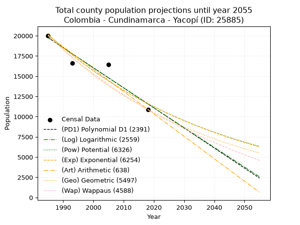
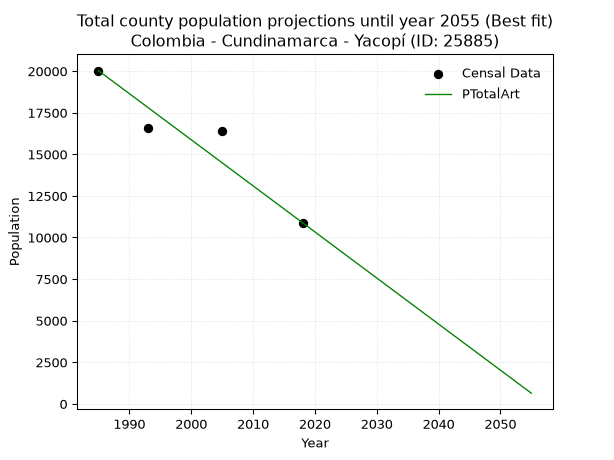
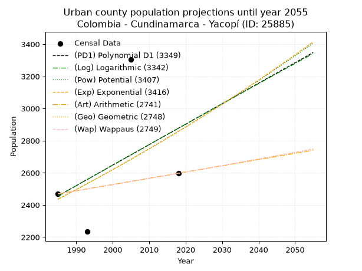
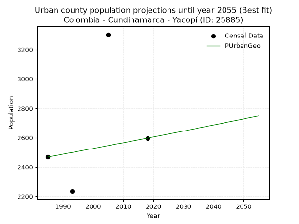
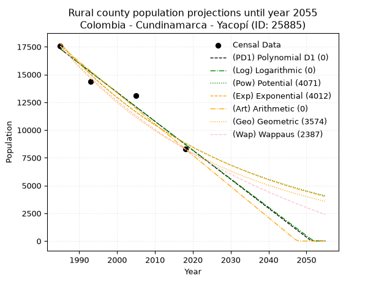
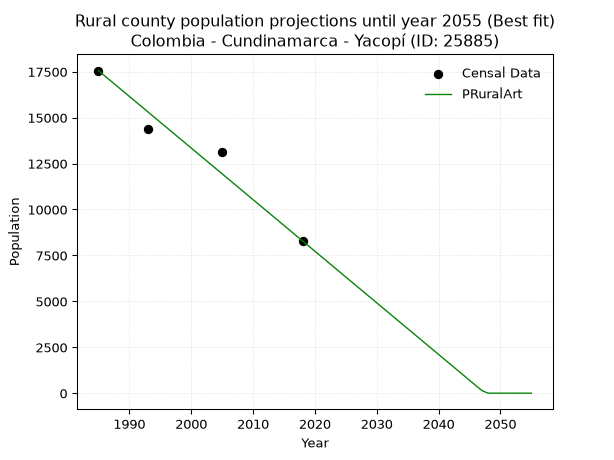

<div align="center">


</div>

# 📜 _“Population and Public Services Demand Projections (PPSD) until Year 2050 for Colombia - Cundinamarca - Yacopí (ID: 25885)”_
Keywords: `population` `public-service` `projection` `lineal` `polynomial` `logarithmic` `potential` `exponential` `arithmetic` `geometric` `wappaus` `dane` `colombia` `south-america`

PPSD are analytical estimates used by governments and planners to anticipate future changes in population size, age distribution, and the resulting community needs for utilities, healthcare, education, and infrastructure as sizing future water treatment facilities, electrical grids, and road networks based on spatial growth.

<div align="center">

</img>

</div>


> **General running parameters**: • app_version: _v20260806_. • Python version: _3.14.7_. • Pandas version: _3.0.5_. • NumPy version: _2.5.1_. • Creates, save and include plots into reports (create_plot): _False_. • Projection until year: _2050_. • Process polynomial degree 2 and up: _False_. • Process Wappaus: _True_. • Process Wappaus: _True_. • Set negative values to zero: _True_. • Set infinite values to zero: _True_. • Drop dataset notes: _True_. 
<div align="center">

Maps & GIS Layers: [:earth_americas:Google](http://maps.google.com/maps?q=5.459272222,-74.3380599) [:earth_americas:OSM](https://www.openstreetmap.org/#map=18/5.459272222/-74.3380599&layers=P) [:earth_americas:Bing](https://www.bing.com/maps?cp=5.459272222~-74.3380599&lvl=18) [:earth_americas:Apple](https://maps.apple.com/frame?center=5.459272222%2C-74.3380599&span=0.003%2C0.006) [:earth_americas:GISMobile](https://github.com/rcfdtools/R.GISMobile/blob/main/file/gis/CountyLayer_CO/Readme.md)

</div>


<div align="center">

```geojson
{
  "type": "Feature",
  "geometry": {
    "type": "Point", 
    "coordinates": [-74.3380599, 5.459272222]
  }, 
  "properties": {
    "Name": "Colombia - Cundinamarca - Yacopí (ID: 25885)"
  }
}
```

</div>


## 0. Census Data (4 records)

Census data are official statistics collected by a government about the people and housing in a country. They usually include counts of total population, age, sex, race, income, education, and jobs.

📅Global census file: [Population.xlsx](../data/Population.xlsx)

| Source   |   Year |   CountryID | CountryName   |   StateID | StateName    |   CountyID | CountyName   |   PTotal |   PUrban |   PRural |
|:---------|-------:|------------:|:--------------|----------:|:-------------|-----------:|:-------------|---------:|---------:|---------:|
| DANE     |   1985 |          57 | Colombia      |        25 | Cundinamarca |      25885 | Yacopí       |    20028 |     2469 |    17559 |
| DANE     |   1993 |          57 | Colombia      |        25 | Cundinamarca |      25885 | Yacopí       |    16601 |     2234 |    14367 |
| DANE     |   2005 |          57 | Colombia      |        25 | Cundinamarca |      25885 | Yacopí       |    16411 |     3303 |    13108 |
| DANE     |   2018 |          57 | Colombia      |        25 | Cundinamarca |      25885 | Yacopí       |    10887 |     2597 |     8290 |

> 🔥Some records could had specific notes about the registered values or the corresponding urban or rural distribution.

📅[SUI-RUPS](https://www.datos.gov.co/Hacienda-y-Cr-dito-P-blico/Registro-nico-de-Prestadores-de-Servicios-P-blicos/4qkq-csdn/about_data) - Local public utility companies: [RUPS.csv](../data/RUPS.csv)

 | SERVICIO       | ESTADO    | NOMBRE                                                            | NIT         | DEPARTAMENTO_DOMICILIO   | MUNICIPIO_DOMICILIO   | DIRECCION         |   TELEFONO | EMAIL                                        | TIPO_PRESTADOR                 | CLASIFICACION                 |
|:---------------|:----------|:------------------------------------------------------------------|:------------|:-------------------------|:----------------------|:------------------|-----------:|:---------------------------------------------|:-------------------------------|:------------------------------|
| ACUEDUCTO      | OPERATIVA | UNIDAD DE SERVICIOS PUBLICOS DOMICILIARIOS DE YACOPI CUNDINAMARCA | 800094776-1 | CUNDINAMARCA             | YACOPI                | CALLE 10 No. 4-38 |    8546092 | serviciospublicos@yacopi-cundinamarca.gov.co | MUNICIPIO (PRESTACIÓN DIRECTA) | MENOR O IGUAL A 2500 USUARIOS |
| ALCANTARILLADO | OPERATIVA | UNIDAD DE SERVICIOS PUBLICOS DOMICILIARIOS DE YACOPI CUNDINAMARCA | 800094776-1 | CUNDINAMARCA             | YACOPI                | CALLE 10 No. 4-38 |    8546092 | serviciospublicos@yacopi-cundinamarca.gov.co | MUNICIPIO (PRESTACIÓN DIRECTA) | MENOR O IGUAL A 2500 USUARIOS |

## 1. Total

### 1.1. Coefficients and Parameters

* (PD1) Polynomial Deg 1: -248.2340425531881, 512511.8936170145 (lineal)
* (Log) Logarithmic: -496725.1333428362, 3791593.469044303
* (Pow) Potential: -33.42677244468547, 114.537764606711
* (Exp) Exponential: -0.01670851885639936, 5.106260416096807e+18
* (Art) Arithmetic: Year diff. 2018 - 1985 = 33, Population diff. 10887 - 20028 = -9141, Annual growth = -277.0
* (Geo) Geometric: Year diff. 2018 - 1985 = 33, Population diff. 10887 - 20028 = -9141, Annual growth % = -0.018302018141320375
* (Wap) Wappaus: i = -1.792010350962316, Condition values only valid for < 200)

<sub>
Wappaus condition values: ['-0.00', '-1.79', '-3.58', '-5.38', '-7.17', '-8.96', '-10.75', '-12.54', '-14.34', '-16.13', '-17.92', '-19.71', '-21.50', '-23.30', '-25.09', '-26.88', '-28.67', '-30.46', '-32.26', '-34.05', '-35.84', '-37.63', '-39.42', '-41.22', '-43.01', '-44.80', '-46.59', '-48.38', '-50.18', '-51.97', '-53.76', '-55.55', '-57.34', '-59.14', '-60.93', '-62.72', '-64.51', '-66.30', '-68.10', '-69.89', '-71.68', '-73.47', '-75.26', '-77.06', '-78.85', '-80.64', '-82.43', '-84.22', '-86.02', '-87.81', '-89.60', '-91.39', '-93.18', '-94.98', '-96.77', '-98.56', '-100.35', '-102.14', '-103.94', '-105.73', '-107.52', '-109.31', '-111.10', '-112.90', '-114.69', '-116.48']
</sub>


### 1.2. Projected Dataset

|   Year |   CountyID |   PTotalPD1 |   PTotalLog |   PTotalPow |   PTotalExp |   PTotalArt |   PTotalGeo |   PTotalWap |
|-------:|-----------:|------------:|------------:|------------:|------------:|------------:|------------:|------------:|
|   1985 |      25885 |       19767 |       19774 |       20150 |       20143 |       20028 |       20028 |       20028 |
|   1986 |      25885 |       19519 |       19523 |       19814 |       19809 |       19751 |       19661 |       19672 |
|   1987 |      25885 |       19271 |       19273 |       19483 |       19481 |       19474 |       19302 |       19323 |
|   1988 |      25885 |       19023 |       19024 |       19158 |       19158 |       19197 |       18948 |       18979 |
|   1989 |      25885 |       18774 |       18774 |       18839 |       18840 |       18920 |       18602 |       18642 |
|   1990 |      25885 |       18526 |       18524 |       18525 |       18528 |       18643 |       18261 |       18310 |
|   1991 |      25885 |       18278 |       18274 |       18216 |       18221 |       18366 |       17927 |       17984 |
|   1992 |      25885 |       18030 |       18025 |       17913 |       17919 |       18089 |       17599 |       17664 |
|   1993 |      25885 |       17781 |       17776 |       17615 |       17622 |       17812 |       17277 |       17349 |
|   1994 |      25885 |       17533 |       17527 |       17322 |       17330 |       17535 |       16961 |       17039 |
|   1995 |      25885 |       17285 |       17278 |       17034 |       17043 |       17258 |       16650 |       16734 |
|   1996 |      25885 |       17037 |       17029 |       16751 |       16761 |       16981 |       16345 |       16434 |
|   1997 |      25885 |       16789 |       16780 |       16473 |       16483 |       16704 |       16046 |       16139 |
|   1998 |      25885 |       16540 |       16531 |       16200 |       16210 |       16427 |       15753 |       15849 |
|   1999 |      25885 |       16292 |       16283 |       15931 |       15941 |       16150 |       15464 |       15563 |
|   2000 |      25885 |       16044 |       16034 |       15667 |       15677 |       15873 |       15181 |       15282 |
|   2001 |      25885 |       15796 |       15786 |       15407 |       15417 |       15596 |       14903 |       15006 |
|   2002 |      25885 |       15547 |       15538 |       15152 |       15162 |       15319 |       14631 |       14733 |
|   2003 |      25885 |       15299 |       15290 |       14901 |       14911 |       15042 |       14363 |       14465 |
|   2004 |      25885 |       15051 |       15042 |       14655 |       14664 |       14765 |       14100 |       14201 |
|   2005 |      25885 |       14803 |       14794 |       14412 |       14421 |       14488 |       13842 |       13941 |
|   2006 |      25885 |       14554 |       14546 |       14174 |       14182 |       14211 |       13589 |       13685 |
|   2007 |      25885 |       14306 |       14299 |       13940 |       13947 |       13934 |       13340 |       13432 |
|   2008 |      25885 |       14058 |       14051 |       13710 |       13716 |       13657 |       13096 |       13184 |
|   2009 |      25885 |       13810 |       13804 |       13484 |       13488 |       13380 |       12856 |       12939 |
|   2010 |      25885 |       13561 |       13557 |       13261 |       13265 |       13103 |       12621 |       12697 |
|   2011 |      25885 |       13313 |       13310 |       13043 |       13045 |       12826 |       12390 |       12460 |
|   2012 |      25885 |       13065 |       13063 |       12828 |       12829 |       12549 |       12163 |       12225 |
|   2013 |      25885 |       12817 |       12816 |       12616 |       12616 |       12272 |       11940 |       11994 |
|   2014 |      25885 |       12569 |       12569 |       12409 |       12407 |       11995 |       11722 |       11766 |
|   2015 |      25885 |       12320 |       12323 |       12204 |       12202 |       11718 |       11507 |       11542 |
|   2016 |      25885 |       12072 |       12076 |       12004 |       12000 |       11441 |       11297 |       11321 |
|   2017 |      25885 |       11824 |       11830 |       11806 |       11801 |       11164 |       11090 |       11102 |
|   2018 |      25885 |       11576 |       11584 |       11612 |       11605 |       10887 |       10887 |       10887 |
|   2019 |      25885 |       11327 |       11338 |       11422 |       11413 |       10610 |       10688 |       10675 |
|   2020 |      25885 |       11079 |       11092 |       11234 |       11224 |       10333 |       10492 |       10465 |
|   2021 |      25885 |       10831 |       10846 |       11050 |       11038 |       10056 |       10300 |       10259 |
|   2022 |      25885 |       10583 |       10600 |       10869 |       10855 |        9779 |       10112 |       10055 |
|   2023 |      25885 |       10334 |       10354 |       10690 |       10675 |        9502 |        9927 |        9854 |
|   2024 |      25885 |       10086 |       10109 |       10515 |       10498 |        9225 |        9745 |        9655 |
|   2025 |      25885 |        9838 |        9864 |       10343 |       10324 |        8948 |        9567 |        9460 |
|   2026 |      25885 |        9590 |        9618 |       10174 |       10153 |        8671 |        9391 |        9266 |
|   2027 |      25885 |        9341 |        9373 |       10007 |        9985 |        8394 |        9220 |        9076 |
|   2028 |      25885 |        9093 |        9128 |        9844 |        9819 |        8117 |        9051 |        8887 |
|   2029 |      25885 |        8845 |        8883 |        9683 |        9657 |        7840 |        8885 |        8702 |
|   2030 |      25885 |        8597 |        8639 |        9525 |        9497 |        7563 |        8723 |        8518 |
|   2031 |      25885 |        8349 |        8394 |        9369 |        9339 |        7286 |        8563 |        8337 |
|   2032 |      25885 |        8100 |        8149 |        9216 |        9185 |        7009 |        8406 |        8158 |
|   2033 |      25885 |        7852 |        7905 |        9066 |        9032 |        6732 |        8252 |        7982 |
|   2034 |      25885 |        7604 |        7661 |        8918 |        8883 |        6455 |        8101 |        7807 |
|   2035 |      25885 |        7356 |        7417 |        8773 |        8736 |        6178 |        7953 |        7635 |
|   2036 |      25885 |        7107 |        7173 |        8630 |        8591 |        5901 |        7807 |        7465 |
|   2037 |      25885 |        6859 |        6929 |        8489 |        8449 |        5624 |        7665 |        7297 |
|   2038 |      25885 |        6611 |        6685 |        8351 |        8309 |        5347 |        7524 |        7131 |
|   2039 |      25885 |        6363 |        6441 |        8215 |        8171 |        5070 |        7387 |        6967 |
|   2040 |      25885 |        6114 |        6198 |        8082 |        8035 |        4793 |        7251 |        6805 |
|   2041 |      25885 |        5866 |        5954 |        7951 |        7902 |        4516 |        7119 |        6645 |
|   2042 |      25885 |        5618 |        5711 |        7821 |        7771 |        4239 |        6988 |        6486 |
|   2043 |      25885 |        5370 |        5468 |        7694 |        7643 |        3962 |        6860 |        6330 |
|   2044 |      25885 |        5122 |        5225 |        7570 |        7516 |        3685 |        6735 |        6176 |
|   2045 |      25885 |        4873 |        4982 |        7447 |        7391 |        3408 |        6612 |        6023 |
|   2046 |      25885 |        4625 |        4739 |        7326 |        7269 |        3131 |        6491 |        5872 |
|   2047 |      25885 |        4377 |        4496 |        7207 |        7149 |        2854 |        6372 |        5723 |
|   2048 |      25885 |        4129 |        4254 |        7091 |        7030 |        2577 |        6255 |        5575 |
|   2049 |      25885 |        3880 |        4011 |        6976 |        6914 |        2300 |        6141 |        5430 |
|   2050 |      25885 |        3632 |        3769 |        6863 |        6799 |        2023 |        6028 |        5285 |
<div align="center">

</img>

</div>


### 1.3. Best fit with absolute and relative error (%)

Relative error puts that difference into context by dividing the absolute error by the true value, creating a unitless ratio or percentage that shows the scale of the mistake.

Absolute and relative error

|   Year | Source   |   CountryID | CountryName   |   StateID | StateName    |   CountyID_x | CountyName   |   PTotal |   PUrban |   PRural |   CountyID_y |   PTotalPD1 |   PTotalLog |   PTotalPow |   PTotalExp |   PTotalArt |   PTotalGeo |   PTotalWap |   PTotalPD1AbsError |   PTotalLogAbsError |   PTotalPowAbsError |   PTotalExpAbsError |   PTotalArtAbsError |   PTotalGeoAbsError |   PTotalWapAbsError |   PTotalPD1RelError |   PTotalLogRelError |   PTotalPowRelError |   PTotalExpRelError |   PTotalArtRelError |   PTotalGeoRelError |   PTotalWapRelError |
|-------:|:---------|------------:|:--------------|----------:|:-------------|-------------:|:-------------|---------:|---------:|---------:|-------------:|------------:|------------:|------------:|------------:|------------:|------------:|------------:|--------------------:|--------------------:|--------------------:|--------------------:|--------------------:|--------------------:|--------------------:|--------------------:|--------------------:|--------------------:|--------------------:|--------------------:|--------------------:|--------------------:|
|   1985 | DANE     |          57 | Colombia      |        25 | Cundinamarca |        25885 | Yacopí       |    20028 |     2469 |    17559 |        25885 |       19767 |       19774 |       20150 |       20143 |       20028 |       20028 |       20028 |                 261 |                 254 |                 122 |                 115 |                   0 |                   0 |                   0 |             1.30318 |             1.26822 |            0.609147 |            0.574196 |             0       |             0       |             0       |
|   1993 | DANE     |          57 | Colombia      |        25 | Cundinamarca |        25885 | Yacopí       |    16601 |     2234 |    14367 |        25885 |       17781 |       17776 |       17615 |       17622 |       17812 |       17277 |       17349 |                1180 |                1175 |                1014 |                1021 |                1211 |                 676 |                 748 |             7.10801 |             7.07789 |            6.10807  |            6.15023  |             7.29474 |             4.07204 |             4.50575 |
|   2005 | DANE     |          57 | Colombia      |        25 | Cundinamarca |        25885 | Yacopí       |    16411 |     3303 |    13108 |        25885 |       14803 |       14794 |       14412 |       14421 |       14488 |       13842 |       13941 |                1608 |                1617 |                1999 |                1990 |                1923 |                2569 |                2470 |             9.79831 |             9.85315 |           12.1809   |           12.126    |            11.7178  |            15.6541  |            15.0509  |
|   2018 | DANE     |          57 | Colombia      |        25 | Cundinamarca |        25885 | Yacopí       |    10887 |     2597 |     8290 |        25885 |       11576 |       11584 |       11612 |       11605 |       10887 |       10887 |       10887 |                 689 |                 697 |                 725 |                 718 |                   0 |                   0 |                   0 |             6.32865 |             6.40213 |            6.65932  |            6.59502  |             0       |             0       |             0       |

Relative error mean

| Method    |   RelError | Best   |
|:----------|-----------:|:-------|
| PTotalPD1 |    6.13453 |        |
| PTotalLog |    6.15035 |        |
| PTotalPow |    6.38935 |        |
| PTotalExp |    6.36137 |        |
| PTotalArt |    4.75312 | True   |
| PTotalGeo |    4.93154 |        |
| PTotalWap |    4.88916 |        |

💙Best method: _**PTotalArt**_
<div align="center">

</img>

</div>


### 1.4. Fresh water supply demand in liters per capita per day (lpcd)

The fresh water supply demand typically ranges from 100 to 300 liters per capita per day (lpcd) for standard domestic and municipal planning, though absolute survival minimums set by the World Health Organization are as low as 7.5 to 20 liters per day, and total consumption in high-income nations can exceed 400 liters.

> `CZ`: Level in meters above the sea level (masl)<br> `WS`: Fresh water supply demand in liters per capita per day (lpcd or l/h/d)<br> `WSAll`: Zonal fresh water supply demand in liters per second (l/s)<br> `A`: Zonal area in square meters<br> `DP`: Population density (people/hectare or p/ha)

Reference values (RAS Colombia)

|    CZ |   WS |
|------:|-----:|
|  1000 |  120 |
|  2000 |  130 |
| 99999 |  140 |

County shapefile geometry properties and water supply values

|   CountyID |      ATotal |   CZTotal |   WSTotal |
|-----------:|------------:|----------:|----------:|
|      25885 | 9.55766e+08 |   888.696 |       120 |

Projected values for best method: PTotalArt

|   CountyID |   Year |   PTotalArt |   DPTotal |   WSTotal |   WSTotalAll |
|-----------:|-------:|------------:|----------:|----------:|-------------:|
|      25885 |   1985 |       20028 |      0.21 |       120 |     27.8167  |
|      25885 |   1986 |       19751 |      0.21 |       120 |     27.4319  |
|      25885 |   1987 |       19474 |      0.2  |       120 |     27.0472  |
|      25885 |   1988 |       19197 |      0.2  |       120 |     26.6625  |
|      25885 |   1989 |       18920 |      0.2  |       120 |     26.2778  |
|      25885 |   1990 |       18643 |      0.2  |       120 |     25.8931  |
|      25885 |   1991 |       18366 |      0.19 |       120 |     25.5083  |
|      25885 |   1992 |       18089 |      0.19 |       120 |     25.1236  |
|      25885 |   1993 |       17812 |      0.19 |       120 |     24.7389  |
|      25885 |   1994 |       17535 |      0.18 |       120 |     24.3542  |
|      25885 |   1995 |       17258 |      0.18 |       120 |     23.9694  |
|      25885 |   1996 |       16981 |      0.18 |       120 |     23.5847  |
|      25885 |   1997 |       16704 |      0.17 |       120 |     23.2     |
|      25885 |   1998 |       16427 |      0.17 |       120 |     22.8153  |
|      25885 |   1999 |       16150 |      0.17 |       120 |     22.4306  |
|      25885 |   2000 |       15873 |      0.17 |       120 |     22.0458  |
|      25885 |   2001 |       15596 |      0.16 |       120 |     21.6611  |
|      25885 |   2002 |       15319 |      0.16 |       120 |     21.2764  |
|      25885 |   2003 |       15042 |      0.16 |       120 |     20.8917  |
|      25885 |   2004 |       14765 |      0.15 |       120 |     20.5069  |
|      25885 |   2005 |       14488 |      0.15 |       120 |     20.1222  |
|      25885 |   2006 |       14211 |      0.15 |       120 |     19.7375  |
|      25885 |   2007 |       13934 |      0.15 |       120 |     19.3528  |
|      25885 |   2008 |       13657 |      0.14 |       120 |     18.9681  |
|      25885 |   2009 |       13380 |      0.14 |       120 |     18.5833  |
|      25885 |   2010 |       13103 |      0.14 |       120 |     18.1986  |
|      25885 |   2011 |       12826 |      0.13 |       120 |     17.8139  |
|      25885 |   2012 |       12549 |      0.13 |       120 |     17.4292  |
|      25885 |   2013 |       12272 |      0.13 |       120 |     17.0444  |
|      25885 |   2014 |       11995 |      0.13 |       120 |     16.6597  |
|      25885 |   2015 |       11718 |      0.12 |       120 |     16.275   |
|      25885 |   2016 |       11441 |      0.12 |       120 |     15.8903  |
|      25885 |   2017 |       11164 |      0.12 |       120 |     15.5056  |
|      25885 |   2018 |       10887 |      0.11 |       120 |     15.1208  |
|      25885 |   2019 |       10610 |      0.11 |       120 |     14.7361  |
|      25885 |   2020 |       10333 |      0.11 |       120 |     14.3514  |
|      25885 |   2021 |       10056 |      0.11 |       120 |     13.9667  |
|      25885 |   2022 |        9779 |      0.1  |       120 |     13.5819  |
|      25885 |   2023 |        9502 |      0.1  |       120 |     13.1972  |
|      25885 |   2024 |        9225 |      0.1  |       120 |     12.8125  |
|      25885 |   2025 |        8948 |      0.09 |       120 |     12.4278  |
|      25885 |   2026 |        8671 |      0.09 |       120 |     12.0431  |
|      25885 |   2027 |        8394 |      0.09 |       120 |     11.6583  |
|      25885 |   2028 |        8117 |      0.08 |       120 |     11.2736  |
|      25885 |   2029 |        7840 |      0.08 |       120 |     10.8889  |
|      25885 |   2030 |        7563 |      0.08 |       120 |     10.5042  |
|      25885 |   2031 |        7286 |      0.08 |       120 |     10.1194  |
|      25885 |   2032 |        7009 |      0.07 |       120 |      9.73472 |
|      25885 |   2033 |        6732 |      0.07 |       120 |      9.35    |
|      25885 |   2034 |        6455 |      0.07 |       120 |      8.96528 |
|      25885 |   2035 |        6178 |      0.06 |       120 |      8.58056 |
|      25885 |   2036 |        5901 |      0.06 |       120 |      8.19583 |
|      25885 |   2037 |        5624 |      0.06 |       120 |      7.81111 |
|      25885 |   2038 |        5347 |      0.06 |       120 |      7.42639 |
|      25885 |   2039 |        5070 |      0.05 |       120 |      7.04167 |
|      25885 |   2040 |        4793 |      0.05 |       120 |      6.65694 |
|      25885 |   2041 |        4516 |      0.05 |       120 |      6.27222 |
|      25885 |   2042 |        4239 |      0.04 |       120 |      5.8875  |
|      25885 |   2043 |        3962 |      0.04 |       120 |      5.50278 |
|      25885 |   2044 |        3685 |      0.04 |       120 |      5.11806 |
|      25885 |   2045 |        3408 |      0.04 |       120 |      4.73333 |
|      25885 |   2046 |        3131 |      0.03 |       120 |      4.34861 |
|      25885 |   2047 |        2854 |      0.03 |       120 |      3.96389 |
|      25885 |   2048 |        2577 |      0.03 |       120 |      3.57917 |
|      25885 |   2049 |        2300 |      0.02 |       120 |      3.19444 |
|      25885 |   2050 |        2023 |      0.02 |       120 |      2.80972 |

## 2. Urban

### 2.1. Coefficients and Parameters

* (PD1) Polynomial Deg 1: 12.745483741469654, -22843.403853874675 (lineal)
* (Log) Logarithmic: 25582.782339685185, -191804.1835714987
* (Pow) Potential: 9.680483213024745, -28.53726303108138
* (Exp) Exponential: 0.004824773525162294, 0.1688407666820498
* (Art) Arithmetic: Year diff. 2018 - 1985 = 33, Population diff. 2597 - 2469 = 128, Annual growth = 3.878787878787879
* (Geo) Geometric: Year diff. 2018 - 1985 = 33, Population diff. 2597 - 2469 = 128, Annual growth % = 0.0015328014901707654
* (Wap) Wappaus: i = 0.15313019655696325, Condition values only valid for < 200)

<sub>
Wappaus condition values: ['0.00', '0.15', '0.31', '0.46', '0.61', '0.77', '0.92', '1.07', '1.23', '1.38', '1.53', '1.68', '1.84', '1.99', '2.14', '2.30', '2.45', '2.60', '2.76', '2.91', '3.06', '3.22', '3.37', '3.52', '3.68', '3.83', '3.98', '4.13', '4.29', '4.44', '4.59', '4.75', '4.90', '5.05', '5.21', '5.36', '5.51', '5.67', '5.82', '5.97', '6.13', '6.28', '6.43', '6.58', '6.74', '6.89', '7.04', '7.20', '7.35', '7.50', '7.66', '7.81', '7.96', '8.12', '8.27', '8.42', '8.58', '8.73', '8.88', '9.03', '9.19', '9.34', '9.49', '9.65', '9.80', '9.95']
</sub>


### 2.2. Projected Dataset

|   Year |   CountyID |   PUrbanPD1 |   PUrbanLog |   PUrbanPow |   PUrbanExp |   PUrbanArt |   PUrbanGeo |   PUrbanWap |
|-------:|-----------:|------------:|------------:|------------:|------------:|------------:|------------:|------------:|
|   1985 |      25885 |        2456 |        2455 |        2436 |        2437 |        2469 |        2469 |        2469 |
|   1986 |      25885 |        2469 |        2468 |        2448 |        2448 |        2473 |        2473 |        2473 |
|   1987 |      25885 |        2482 |        2481 |        2460 |        2460 |        2477 |        2477 |        2477 |
|   1988 |      25885 |        2495 |        2494 |        2472 |        2472 |        2481 |        2480 |        2480 |
|   1989 |      25885 |        2507 |        2507 |        2484 |        2484 |        2485 |        2484 |        2484 |
|   1990 |      25885 |        2520 |        2520 |        2496 |        2496 |        2488 |        2488 |        2488 |
|   1991 |      25885 |        2533 |        2533 |        2508 |        2508 |        2492 |        2492 |        2492 |
|   1992 |      25885 |        2546 |        2546 |        2520 |        2520 |        2496 |        2496 |        2496 |
|   1993 |      25885 |        2558 |        2558 |        2533 |        2533 |        2500 |        2499 |        2499 |
|   1994 |      25885 |        2571 |        2571 |        2545 |        2545 |        2504 |        2503 |        2503 |
|   1995 |      25885 |        2584 |        2584 |        2557 |        2557 |        2508 |        2507 |        2507 |
|   1996 |      25885 |        2597 |        2597 |        2570 |        2569 |        2512 |        2511 |        2511 |
|   1997 |      25885 |        2609 |        2610 |        2582 |        2582 |        2516 |        2515 |        2515 |
|   1998 |      25885 |        2622 |        2622 |        2595 |        2594 |        2519 |        2519 |        2519 |
|   1999 |      25885 |        2635 |        2635 |        2607 |        2607 |        2523 |        2523 |        2523 |
|   2000 |      25885 |        2648 |        2648 |        2620 |        2620 |        2527 |        2526 |        2526 |
|   2001 |      25885 |        2660 |        2661 |        2633 |        2632 |        2531 |        2530 |        2530 |
|   2002 |      25885 |        2673 |        2674 |        2645 |        2645 |        2535 |        2534 |        2534 |
|   2003 |      25885 |        2686 |        2686 |        2658 |        2658 |        2539 |        2538 |        2538 |
|   2004 |      25885 |        2699 |        2699 |        2671 |        2671 |        2543 |        2542 |        2542 |
|   2005 |      25885 |        2711 |        2712 |        2684 |        2683 |        2547 |        2546 |        2546 |
|   2006 |      25885 |        2724 |        2725 |        2697 |        2696 |        2550 |        2550 |        2550 |
|   2007 |      25885 |        2737 |        2737 |        2710 |        2710 |        2554 |        2554 |        2554 |
|   2008 |      25885 |        2750 |        2750 |        2723 |        2723 |        2558 |        2558 |        2558 |
|   2009 |      25885 |        2762 |        2763 |        2736 |        2736 |        2562 |        2561 |        2561 |
|   2010 |      25885 |        2775 |        2776 |        2750 |        2749 |        2566 |        2565 |        2565 |
|   2011 |      25885 |        2788 |        2788 |        2763 |        2762 |        2570 |        2569 |        2569 |
|   2012 |      25885 |        2801 |        2801 |        2776 |        2776 |        2574 |        2573 |        2573 |
|   2013 |      25885 |        2813 |        2814 |        2790 |        2789 |        2578 |        2577 |        2577 |
|   2014 |      25885 |        2826 |        2827 |        2803 |        2803 |        2581 |        2581 |        2581 |
|   2015 |      25885 |        2839 |        2839 |        2817 |        2816 |        2585 |        2585 |        2585 |
|   2016 |      25885 |        2851 |        2852 |        2830 |        2830 |        2589 |        2589 |        2589 |
|   2017 |      25885 |        2864 |        2865 |        2844 |        2843 |        2593 |        2593 |        2593 |
|   2018 |      25885 |        2877 |        2877 |        2857 |        2857 |        2597 |        2597 |        2597 |
|   2019 |      25885 |        2890 |        2890 |        2871 |        2871 |        2601 |        2601 |        2601 |
|   2020 |      25885 |        2902 |        2903 |        2885 |        2885 |        2605 |        2605 |        2605 |
|   2021 |      25885 |        2915 |        2915 |        2899 |        2899 |        2609 |        2609 |        2609 |
|   2022 |      25885 |        2928 |        2928 |        2913 |        2913 |        2613 |        2613 |        2613 |
|   2023 |      25885 |        2941 |        2941 |        2927 |        2927 |        2616 |        2617 |        2617 |
|   2024 |      25885 |        2953 |        2953 |        2941 |        2941 |        2620 |        2621 |        2621 |
|   2025 |      25885 |        2966 |        2966 |        2955 |        2955 |        2624 |        2625 |        2625 |
|   2026 |      25885 |        2979 |        2978 |        2969 |        2970 |        2628 |        2629 |        2629 |
|   2027 |      25885 |        2992 |        2991 |        2983 |        2984 |        2632 |        2633 |        2633 |
|   2028 |      25885 |        3004 |        3004 |        2997 |        2998 |        2636 |        2637 |        2637 |
|   2029 |      25885 |        3017 |        3016 |        3012 |        3013 |        2640 |        2641 |        2641 |
|   2030 |      25885 |        3030 |        3029 |        3026 |        3027 |        2644 |        2645 |        2645 |
|   2031 |      25885 |        3043 |        3042 |        3041 |        3042 |        2647 |        2649 |        2649 |
|   2032 |      25885 |        3055 |        3054 |        3055 |        3057 |        2651 |        2653 |        2653 |
|   2033 |      25885 |        3068 |        3067 |        3070 |        3072 |        2655 |        2657 |        2657 |
|   2034 |      25885 |        3081 |        3079 |        3084 |        3086 |        2659 |        2661 |        2661 |
|   2035 |      25885 |        3094 |        3092 |        3099 |        3101 |        2663 |        2666 |        2666 |
|   2036 |      25885 |        3106 |        3104 |        3114 |        3116 |        2667 |        2670 |        2670 |
|   2037 |      25885 |        3119 |        3117 |        3129 |        3131 |        2671 |        2674 |        2674 |
|   2038 |      25885 |        3132 |        3130 |        3144 |        3147 |        2675 |        2678 |        2678 |
|   2039 |      25885 |        3145 |        3142 |        3159 |        3162 |        2678 |        2682 |        2682 |
|   2040 |      25885 |        3157 |        3155 |        3174 |        3177 |        2682 |        2686 |        2686 |
|   2041 |      25885 |        3170 |        3167 |        3189 |        3193 |        2686 |        2690 |        2690 |
|   2042 |      25885 |        3183 |        3180 |        3204 |        3208 |        2690 |        2694 |        2694 |
|   2043 |      25885 |        3196 |        3192 |        3219 |        3223 |        2694 |        2698 |        2698 |
|   2044 |      25885 |        3208 |        3205 |        3234 |        3239 |        2698 |        2703 |        2703 |
|   2045 |      25885 |        3221 |        3217 |        3250 |        3255 |        2702 |        2707 |        2707 |
|   2046 |      25885 |        3234 |        3230 |        3265 |        3270 |        2706 |        2711 |        2711 |
|   2047 |      25885 |        3247 |        3242 |        3281 |        3286 |        2709 |        2715 |        2715 |
|   2048 |      25885 |        3259 |        3255 |        3296 |        3302 |        2713 |        2719 |        2719 |
|   2049 |      25885 |        3272 |        3267 |        3312 |        3318 |        2717 |        2723 |        2723 |
|   2050 |      25885 |        3285 |        3280 |        3327 |        3334 |        2721 |        2727 |        2728 |
<div align="center">

</img>

</div>


### 2.3. Best fit with absolute and relative error (%)

Relative error puts that difference into context by dividing the absolute error by the true value, creating a unitless ratio or percentage that shows the scale of the mistake.

Absolute and relative error

|   Year | Source   |   CountryID | CountryName   |   StateID | StateName    |   CountyID_x | CountyName   |   PTotal |   PUrban |   PRural |   CountyID_y |   PUrbanPD1 |   PUrbanLog |   PUrbanPow |   PUrbanExp |   PUrbanArt |   PUrbanGeo |   PUrbanWap |   PUrbanPD1AbsError |   PUrbanLogAbsError |   PUrbanPowAbsError |   PUrbanExpAbsError |   PUrbanArtAbsError |   PUrbanGeoAbsError |   PUrbanWapAbsError |   PUrbanPD1RelError |   PUrbanLogRelError |   PUrbanPowRelError |   PUrbanExpRelError |   PUrbanArtRelError |   PUrbanGeoRelError |   PUrbanWapRelError |
|-------:|:---------|------------:|:--------------|----------:|:-------------|-------------:|:-------------|---------:|---------:|---------:|-------------:|------------:|------------:|------------:|------------:|------------:|------------:|------------:|--------------------:|--------------------:|--------------------:|--------------------:|--------------------:|--------------------:|--------------------:|--------------------:|--------------------:|--------------------:|--------------------:|--------------------:|--------------------:|--------------------:|
|   1985 | DANE     |          57 | Colombia      |        25 | Cundinamarca |        25885 | Yacopí       |    20028 |     2469 |    17559 |        25885 |        2456 |        2455 |        2436 |        2437 |        2469 |        2469 |        2469 |                  13 |                  14 |                  33 |                  32 |                   0 |                   0 |                   0 |            0.526529 |            0.567031 |             1.33657 |             1.29607 |              0      |              0      |              0      |
|   1993 | DANE     |          57 | Colombia      |        25 | Cundinamarca |        25885 | Yacopí       |    16601 |     2234 |    14367 |        25885 |        2558 |        2558 |        2533 |        2533 |        2500 |        2499 |        2499 |                 324 |                 324 |                 299 |                 299 |                 266 |                 265 |                 265 |           14.5031   |           14.5031   |            13.3841  |            13.3841  |             11.9069 |             11.8621 |             11.8621 |
|   2005 | DANE     |          57 | Colombia      |        25 | Cundinamarca |        25885 | Yacopí       |    16411 |     3303 |    13108 |        25885 |        2711 |        2712 |        2684 |        2683 |        2547 |        2546 |        2546 |                 592 |                 591 |                 619 |                 620 |                 756 |                 757 |                 757 |           17.9231   |           17.8928   |            18.7405  |            18.7708  |             22.8883 |             22.9186 |             22.9186 |
|   2018 | DANE     |          57 | Colombia      |        25 | Cundinamarca |        25885 | Yacopí       |    10887 |     2597 |     8290 |        25885 |        2877 |        2877 |        2857 |        2857 |        2597 |        2597 |        2597 |                 280 |                 280 |                 260 |                 260 |                   0 |                   0 |                   0 |           10.7817   |           10.7817   |            10.0116  |            10.0116  |              0      |              0      |              0      |

Relative error mean

| Method    |   RelError | Best   |
|:----------|-----------:|:-------|
| PUrbanPD1 |   10.9336  |        |
| PUrbanLog |   10.9362  |        |
| PUrbanPow |   10.8682  |        |
| PUrbanExp |   10.8656  |        |
| PUrbanArt |    8.69879 |        |
| PUrbanGeo |    8.69517 | True   |
| PUrbanWap |    8.69517 | True   |

💙Best method: _**PUrbanGeo**_
<div align="center">

</img>

</div>


### 2.4. Fresh water supply demand in liters per capita per day (lpcd)

The fresh water supply demand typically ranges from 100 to 300 liters per capita per day (lpcd) for standard domestic and municipal planning, though absolute survival minimums set by the World Health Organization are as low as 7.5 to 20 liters per day, and total consumption in high-income nations can exceed 400 liters.

> `CZ`: Level in meters above the sea level (masl)<br> `WS`: Fresh water supply demand in liters per capita per day (lpcd or l/h/d)<br> `WSAll`: Zonal fresh water supply demand in liters per second (l/s)<br> `A`: Zonal area in square meters<br> `DP`: Population density (people/hectare or p/ha)

Reference values (RAS Colombia)

|    CZ |   WS |
|------:|-----:|
|  1000 |  120 |
|  2000 |  130 |
| 99999 |  140 |

County shapefile geometry properties and water supply values

|   CountyID |   AUrban |   CZUrban |   WSUrban |
|-----------:|---------:|----------:|----------:|
|      25885 |   480406 |   1304.79 |       130 |

Projected values for best method: PUrbanGeo

|   CountyID |   Year |   PUrbanGeo |   DPUrban |   WSUrban |   WSUrbanAll |
|-----------:|-------:|------------:|----------:|----------:|-------------:|
|      25885 |   1985 |        2469 |     51.39 |       130 |      3.71493 |
|      25885 |   1986 |        2473 |     51.48 |       130 |      3.72095 |
|      25885 |   1987 |        2477 |     51.56 |       130 |      3.72697 |
|      25885 |   1988 |        2480 |     51.62 |       130 |      3.73148 |
|      25885 |   1989 |        2484 |     51.71 |       130 |      3.7375  |
|      25885 |   1990 |        2488 |     51.79 |       130 |      3.74352 |
|      25885 |   1991 |        2492 |     51.87 |       130 |      3.74954 |
|      25885 |   1992 |        2496 |     51.96 |       130 |      3.75556 |
|      25885 |   1993 |        2499 |     52.02 |       130 |      3.76007 |
|      25885 |   1994 |        2503 |     52.1  |       130 |      3.76609 |
|      25885 |   1995 |        2507 |     52.18 |       130 |      3.77211 |
|      25885 |   1996 |        2511 |     52.27 |       130 |      3.77813 |
|      25885 |   1997 |        2515 |     52.35 |       130 |      3.78414 |
|      25885 |   1998 |        2519 |     52.43 |       130 |      3.79016 |
|      25885 |   1999 |        2523 |     52.52 |       130 |      3.79618 |
|      25885 |   2000 |        2526 |     52.58 |       130 |      3.80069 |
|      25885 |   2001 |        2530 |     52.66 |       130 |      3.80671 |
|      25885 |   2002 |        2534 |     52.75 |       130 |      3.81273 |
|      25885 |   2003 |        2538 |     52.83 |       130 |      3.81875 |
|      25885 |   2004 |        2542 |     52.91 |       130 |      3.82477 |
|      25885 |   2005 |        2546 |     53    |       130 |      3.83079 |
|      25885 |   2006 |        2550 |     53.08 |       130 |      3.83681 |
|      25885 |   2007 |        2554 |     53.16 |       130 |      3.84282 |
|      25885 |   2008 |        2558 |     53.25 |       130 |      3.84884 |
|      25885 |   2009 |        2561 |     53.31 |       130 |      3.85336 |
|      25885 |   2010 |        2565 |     53.39 |       130 |      3.85938 |
|      25885 |   2011 |        2569 |     53.48 |       130 |      3.86539 |
|      25885 |   2012 |        2573 |     53.56 |       130 |      3.87141 |
|      25885 |   2013 |        2577 |     53.64 |       130 |      3.87743 |
|      25885 |   2014 |        2581 |     53.73 |       130 |      3.88345 |
|      25885 |   2015 |        2585 |     53.81 |       130 |      3.88947 |
|      25885 |   2016 |        2589 |     53.89 |       130 |      3.89549 |
|      25885 |   2017 |        2593 |     53.98 |       130 |      3.9015  |
|      25885 |   2018 |        2597 |     54.06 |       130 |      3.90752 |
|      25885 |   2019 |        2601 |     54.14 |       130 |      3.91354 |
|      25885 |   2020 |        2605 |     54.22 |       130 |      3.91956 |
|      25885 |   2021 |        2609 |     54.31 |       130 |      3.92558 |
|      25885 |   2022 |        2613 |     54.39 |       130 |      3.9316  |
|      25885 |   2023 |        2617 |     54.47 |       130 |      3.93762 |
|      25885 |   2024 |        2621 |     54.56 |       130 |      3.94363 |
|      25885 |   2025 |        2625 |     54.64 |       130 |      3.94965 |
|      25885 |   2026 |        2629 |     54.72 |       130 |      3.95567 |
|      25885 |   2027 |        2633 |     54.81 |       130 |      3.96169 |
|      25885 |   2028 |        2637 |     54.89 |       130 |      3.96771 |
|      25885 |   2029 |        2641 |     54.97 |       130 |      3.97373 |
|      25885 |   2030 |        2645 |     55.06 |       130 |      3.97975 |
|      25885 |   2031 |        2649 |     55.14 |       130 |      3.98576 |
|      25885 |   2032 |        2653 |     55.22 |       130 |      3.99178 |
|      25885 |   2033 |        2657 |     55.31 |       130 |      3.9978  |
|      25885 |   2034 |        2661 |     55.39 |       130 |      4.00382 |
|      25885 |   2035 |        2666 |     55.49 |       130 |      4.01134 |
|      25885 |   2036 |        2670 |     55.58 |       130 |      4.01736 |
|      25885 |   2037 |        2674 |     55.66 |       130 |      4.02338 |
|      25885 |   2038 |        2678 |     55.74 |       130 |      4.0294  |
|      25885 |   2039 |        2682 |     55.83 |       130 |      4.03542 |
|      25885 |   2040 |        2686 |     55.91 |       130 |      4.04144 |
|      25885 |   2041 |        2690 |     55.99 |       130 |      4.04745 |
|      25885 |   2042 |        2694 |     56.08 |       130 |      4.05347 |
|      25885 |   2043 |        2698 |     56.16 |       130 |      4.05949 |
|      25885 |   2044 |        2703 |     56.26 |       130 |      4.06701 |
|      25885 |   2045 |        2707 |     56.35 |       130 |      4.07303 |
|      25885 |   2046 |        2711 |     56.43 |       130 |      4.07905 |
|      25885 |   2047 |        2715 |     56.51 |       130 |      4.08507 |
|      25885 |   2048 |        2719 |     56.6  |       130 |      4.09109 |
|      25885 |   2049 |        2723 |     56.68 |       130 |      4.09711 |
|      25885 |   2050 |        2727 |     56.76 |       130 |      4.10313 |

## 3. Rural

### 3.1. Coefficients and Parameters

* (PD1) Polynomial Deg 1: -260.9795262946578, 535355.2974708892 (lineal)
* (Log) Logarithmic: -522307.9156825213, 3983397.6526158014
* (Pow) Potential: -42.588202824025394, 144.69637649910166
* (Exp) Exponential: -0.021285776263785892, 3.984654135962869e+22
* (Art) Arithmetic: Year diff. 2018 - 1985 = 33, Population diff. 8290 - 17559 = -9269, Annual growth = -280.8787878787879
* (Geo) Geometric: Year diff. 2018 - 1985 = 33, Population diff. 8290 - 17559 = -9269, Annual growth % = -0.02248625846859531
* (Wap) Wappaus: i = -2.173227497224557, Condition values only valid for < 200)

<sub>
Wappaus condition values: ['-0.00', '-2.17', '-4.35', '-6.52', '-8.69', '-10.87', '-13.04', '-15.21', '-17.39', '-19.56', '-21.73', '-23.91', '-26.08', '-28.25', '-30.43', '-32.60', '-34.77', '-36.94', '-39.12', '-41.29', '-43.46', '-45.64', '-47.81', '-49.98', '-52.16', '-54.33', '-56.50', '-58.68', '-60.85', '-63.02', '-65.20', '-67.37', '-69.54', '-71.72', '-73.89', '-76.06', '-78.24', '-80.41', '-82.58', '-84.76', '-86.93', '-89.10', '-91.28', '-93.45', '-95.62', '-97.80', '-99.97', '-102.14', '-104.31', '-106.49', '-108.66', '-110.83', '-113.01', '-115.18', '-117.35', '-119.53', '-121.70', '-123.87', '-126.05', '-128.22', '-130.39', '-132.57', '-134.74', '-136.91', '-139.09', '-141.26']
</sub>


### 3.2. Projected Dataset

|   Year |   CountyID |   PRuralPD1 |   PRuralLog |   PRuralPow |   PRuralExp |   PRuralArt |   PRuralGeo |   PRuralWap |
|-------:|-----------:|------------:|------------:|------------:|------------:|------------:|------------:|------------:|
|   1985 |      25885 |       17311 |       17318 |       17811 |       17802 |       17559 |       17559 |       17559 |
|   1986 |      25885 |       17050 |       17055 |       17433 |       17427 |       17278 |       17164 |       17182 |
|   1987 |      25885 |       16789 |       16792 |       17063 |       17060 |       16997 |       16778 |       16812 |
|   1988 |      25885 |       16528 |       16529 |       16701 |       16701 |       16716 |       16401 |       16450 |
|   1989 |      25885 |       16267 |       16267 |       16347 |       16349 |       16435 |       16032 |       16096 |
|   1990 |      25885 |       16006 |       16004 |       16001 |       16005 |       16155 |       15672 |       15749 |
|   1991 |      25885 |       15745 |       15742 |       15662 |       15667 |       15874 |       15319 |       15410 |
|   1992 |      25885 |       15484 |       15480 |       15331 |       15338 |       15593 |       14975 |       15077 |
|   1993 |      25885 |       15223 |       15217 |       15007 |       15014 |       15312 |       14638 |       14750 |
|   1994 |      25885 |       14962 |       14955 |       14690 |       14698 |       15031 |       14309 |       14431 |
|   1995 |      25885 |       14701 |       14694 |       14379 |       14389 |       14750 |       13987 |       14117 |
|   1996 |      25885 |       14440 |       14432 |       14076 |       14086 |       14469 |       13673 |       13810 |
|   1997 |      25885 |       14179 |       14170 |       13779 |       13789 |       14188 |       13365 |       13508 |
|   1998 |      25885 |       13918 |       13909 |       13488 |       13499 |       13908 |       13065 |       13212 |
|   1999 |      25885 |       13657 |       13647 |       13204 |       13214 |       13627 |       12771 |       12922 |
|   2000 |      25885 |       13396 |       13386 |       12925 |       12936 |       13346 |       12484 |       12637 |
|   2001 |      25885 |       13135 |       13125 |       12653 |       12664 |       13065 |       12203 |       12358 |
|   2002 |      25885 |       12874 |       12864 |       12387 |       12397 |       12784 |       11929 |       12083 |
|   2003 |      25885 |       12613 |       12603 |       12126 |       12136 |       12503 |       11660 |       11814 |
|   2004 |      25885 |       12352 |       12343 |       11871 |       11880 |       12222 |       11398 |       11549 |
|   2005 |      25885 |       12091 |       12082 |       11621 |       11630 |       11941 |       11142 |       11290 |
|   2006 |      25885 |       11830 |       11822 |       11377 |       11385 |       11661 |       10891 |       11034 |
|   2007 |      25885 |       11569 |       11561 |       11138 |       11145 |       11380 |       10646 |       10784 |
|   2008 |      25885 |       11308 |       11301 |       10905 |       10911 |       11099 |       10407 |       10537 |
|   2009 |      25885 |       11047 |       11041 |       10676 |       10681 |       10818 |       10173 |       10295 |
|   2010 |      25885 |       10786 |       10781 |       10452 |       10456 |       10537 |        9944 |       10057 |
|   2011 |      25885 |       10525 |       10521 |       10233 |       10236 |       10256 |        9721 |        9823 |
|   2012 |      25885 |       10264 |       10262 |       10018 |       10020 |        9975 |        9502 |        9593 |
|   2013 |      25885 |       10004 |       10002 |        9809 |        9809 |        9694 |        9288 |        9367 |
|   2014 |      25885 |        9743 |        9743 |        9603 |        9602 |        9414 |        9080 |        9144 |
|   2015 |      25885 |        9482 |        9483 |        9402 |        9400 |        9133 |        8875 |        8925 |
|   2016 |      25885 |        9221 |        9224 |        9206 |        9202 |        8852 |        8676 |        8710 |
|   2017 |      25885 |        8960 |        8965 |        9013 |        9008 |        8571 |        8481 |        8498 |
|   2018 |      25885 |        8699 |        8706 |        8825 |        8819 |        8290 |        8290 |        8290 |
|   2019 |      25885 |        8438 |        8448 |        8641 |        8633 |        8009 |        8104 |        8085 |
|   2020 |      25885 |        8177 |        8189 |        8461 |        8451 |        7728 |        7921 |        7883 |
|   2021 |      25885 |        7916 |        7930 |        8284 |        8273 |        7447 |        7743 |        7684 |
|   2022 |      25885 |        7655 |        7672 |        8111 |        8099 |        7166 |        7569 |        7489 |
|   2023 |      25885 |        7394 |        7414 |        7942 |        7928 |        6886 |        7399 |        7296 |
|   2024 |      25885 |        7133 |        7156 |        7777 |        7761 |        6605 |        7233 |        7106 |
|   2025 |      25885 |        6872 |        6898 |        7615 |        7598 |        6324 |        7070 |        6920 |
|   2026 |      25885 |        6611 |        6640 |        7457 |        7438 |        6043 |        6911 |        6736 |
|   2027 |      25885 |        6350 |        6382 |        7302 |        7281 |        5762 |        6756 |        6554 |
|   2028 |      25885 |        6089 |        6125 |        7150 |        7128 |        5481 |        6604 |        6376 |
|   2029 |      25885 |        5828 |        5867 |        7001 |        6978 |        5200 |        6455 |        6200 |
|   2030 |      25885 |        5567 |        5610 |        6856 |        6831 |        4919 |        6310 |        6026 |
|   2031 |      25885 |        5306 |        5352 |        6714 |        6687 |        4639 |        6168 |        5855 |
|   2032 |      25885 |        5045 |        5095 |        6574 |        6546 |        4358 |        6029 |        5687 |
|   2033 |      25885 |        4784 |        4838 |        6438 |        6408 |        4077 |        5894 |        5521 |
|   2034 |      25885 |        4523 |        4582 |        6305 |        6273 |        3796 |        5761 |        5357 |
|   2035 |      25885 |        4262 |        4325 |        6174 |        6141 |        3515 |        5632 |        5196 |
|   2036 |      25885 |        4001 |        4068 |        6046 |        6012 |        3234 |        5505 |        5037 |
|   2037 |      25885 |        3740 |        3812 |        5921 |        5885 |        2953 |        5381 |        4880 |
|   2038 |      25885 |        3479 |        3555 |        5799 |        5761 |        2672 |        5260 |        4725 |
|   2039 |      25885 |        3218 |        3299 |        5679 |        5640 |        2392 |        5142 |        4573 |
|   2040 |      25885 |        2957 |        3043 |        5561 |        5521 |        2111 |        5026 |        4422 |
|   2041 |      25885 |        2696 |        2787 |        5446 |        5405 |        1830 |        4913 |        4274 |
|   2042 |      25885 |        2435 |        2531 |        5334 |        5291 |        1549 |        4803 |        4127 |
|   2043 |      25885 |        2174 |        2276 |        5224 |        5180 |        1268 |        4695 |        3983 |
|   2044 |      25885 |        1913 |        2020 |        5116 |        5071 |         987 |        4589 |        3840 |
|   2045 |      25885 |        1652 |        1764 |        5011 |        4964 |         706 |        4486 |        3699 |
|   2046 |      25885 |        1391 |        1509 |        4907 |        4859 |         425 |        4385 |        3560 |
|   2047 |      25885 |        1130 |        1254 |        4806 |        4757 |         145 |        4287 |        3423 |
|   2048 |      25885 |         869 |         999 |        4707 |        4657 |           0 |        4190 |        3288 |
|   2049 |      25885 |         608 |         744 |        4611 |        4559 |           0 |        4096 |        3154 |
|   2050 |      25885 |         347 |         489 |        4516 |        4463 |           0 |        4004 |        3022 |
<div align="center">

</img>

</div>


### 3.3. Best fit with absolute and relative error (%)

Relative error puts that difference into context by dividing the absolute error by the true value, creating a unitless ratio or percentage that shows the scale of the mistake.

Absolute and relative error

|   Year | Source   |   CountryID | CountryName   |   StateID | StateName    |   CountyID_x | CountyName   |   PTotal |   PUrban |   PRural |   CountyID_y |   PRuralPD1 |   PRuralLog |   PRuralPow |   PRuralExp |   PRuralArt |   PRuralGeo |   PRuralWap |   PRuralPD1AbsError |   PRuralLogAbsError |   PRuralPowAbsError |   PRuralExpAbsError |   PRuralArtAbsError |   PRuralGeoAbsError |   PRuralWapAbsError |   PRuralPD1RelError |   PRuralLogRelError |   PRuralPowRelError |   PRuralExpRelError |   PRuralArtRelError |   PRuralGeoRelError |   PRuralWapRelError |
|-------:|:---------|------------:|:--------------|----------:|:-------------|-------------:|:-------------|---------:|---------:|---------:|-------------:|------------:|------------:|------------:|------------:|------------:|------------:|------------:|--------------------:|--------------------:|--------------------:|--------------------:|--------------------:|--------------------:|--------------------:|--------------------:|--------------------:|--------------------:|--------------------:|--------------------:|--------------------:|--------------------:|
|   1985 | DANE     |          57 | Colombia      |        25 | Cundinamarca |        25885 | Yacopí       |    20028 |     2469 |    17559 |        25885 |       17311 |       17318 |       17811 |       17802 |       17559 |       17559 |       17559 |                 248 |                 241 |                 252 |                 243 |                   0 |                   0 |                   0 |             1.41238 |             1.37252 |             1.43516 |             1.38391 |             0       |             0       |             0       |
|   1993 | DANE     |          57 | Colombia      |        25 | Cundinamarca |        25885 | Yacopí       |    16601 |     2234 |    14367 |        25885 |       15223 |       15217 |       15007 |       15014 |       15312 |       14638 |       14750 |                 856 |                 850 |                 640 |                 647 |                 945 |                 271 |                 383 |             5.9581  |             5.91634 |             4.45465 |             4.50338 |             6.57757 |             1.88627 |             2.66583 |
|   2005 | DANE     |          57 | Colombia      |        25 | Cundinamarca |        25885 | Yacopí       |    16411 |     3303 |    13108 |        25885 |       12091 |       12082 |       11621 |       11630 |       11941 |       11142 |       11290 |                1017 |                1026 |                1487 |                1478 |                1167 |                1966 |                1818 |             7.75862 |             7.82728 |            11.3442  |            11.2756  |             8.90296 |            14.9985  |            13.8694  |
|   2018 | DANE     |          57 | Colombia      |        25 | Cundinamarca |        25885 | Yacopí       |    10887 |     2597 |     8290 |        25885 |        8699 |        8706 |        8825 |        8819 |        8290 |        8290 |        8290 |                 409 |                 416 |                 535 |                 529 |                   0 |                   0 |                   0 |             4.93366 |             5.01809 |             6.45356 |             6.38118 |             0       |             0       |             0       |

Relative error mean

| Method    |   RelError | Best   |
|:----------|-----------:|:-------|
| PRuralPD1 |    5.01569 |        |
| PRuralLog |    5.03356 |        |
| PRuralPow |    5.9219  |        |
| PRuralExp |    5.88601 |        |
| PRuralArt |    3.87013 | True   |
| PRuralGeo |    4.22119 |        |
| PRuralWap |    4.13381 |        |

💙Best method: _**PRuralArt**_
<div align="center">

</img>

</div>


### 3.4. Fresh water supply demand in liters per capita per day (lpcd)

The fresh water supply demand typically ranges from 100 to 300 liters per capita per day (lpcd) for standard domestic and municipal planning, though absolute survival minimums set by the World Health Organization are as low as 7.5 to 20 liters per day, and total consumption in high-income nations can exceed 400 liters.

> `CZ`: Level in meters above the sea level (masl)<br> `WS`: Fresh water supply demand in liters per capita per day (lpcd or l/h/d)<br> `WSAll`: Zonal fresh water supply demand in liters per second (l/s)<br> `A`: Zonal area in square meters<br> `DP`: Population density (people/hectare or p/ha)

Reference values (RAS Colombia)

|    CZ |   WS |
|------:|-----:|
|  1000 |  120 |
|  2000 |  130 |
| 99999 |  140 |

County shapefile geometry properties and water supply values

|   CountyID |      ARural |   CZRural |   WSRural |
|-----------:|------------:|----------:|----------:|
|      25885 | 9.55285e+08 |   888.481 |       120 |

Projected values for best method: PRuralArt

|   CountyID |   Year |   PRuralArt |   DPRural |   WSRural |   WSRuralAll |
|-----------:|-------:|------------:|----------:|----------:|-------------:|
|      25885 |   1985 |       17559 |      0.18 |       120 |    24.3875   |
|      25885 |   1986 |       17278 |      0.18 |       120 |    23.9972   |
|      25885 |   1987 |       16997 |      0.18 |       120 |    23.6069   |
|      25885 |   1988 |       16716 |      0.17 |       120 |    23.2167   |
|      25885 |   1989 |       16435 |      0.17 |       120 |    22.8264   |
|      25885 |   1990 |       16155 |      0.17 |       120 |    22.4375   |
|      25885 |   1991 |       15874 |      0.17 |       120 |    22.0472   |
|      25885 |   1992 |       15593 |      0.16 |       120 |    21.6569   |
|      25885 |   1993 |       15312 |      0.16 |       120 |    21.2667   |
|      25885 |   1994 |       15031 |      0.16 |       120 |    20.8764   |
|      25885 |   1995 |       14750 |      0.15 |       120 |    20.4861   |
|      25885 |   1996 |       14469 |      0.15 |       120 |    20.0958   |
|      25885 |   1997 |       14188 |      0.15 |       120 |    19.7056   |
|      25885 |   1998 |       13908 |      0.15 |       120 |    19.3167   |
|      25885 |   1999 |       13627 |      0.14 |       120 |    18.9264   |
|      25885 |   2000 |       13346 |      0.14 |       120 |    18.5361   |
|      25885 |   2001 |       13065 |      0.14 |       120 |    18.1458   |
|      25885 |   2002 |       12784 |      0.13 |       120 |    17.7556   |
|      25885 |   2003 |       12503 |      0.13 |       120 |    17.3653   |
|      25885 |   2004 |       12222 |      0.13 |       120 |    16.975    |
|      25885 |   2005 |       11941 |      0.12 |       120 |    16.5847   |
|      25885 |   2006 |       11661 |      0.12 |       120 |    16.1958   |
|      25885 |   2007 |       11380 |      0.12 |       120 |    15.8056   |
|      25885 |   2008 |       11099 |      0.12 |       120 |    15.4153   |
|      25885 |   2009 |       10818 |      0.11 |       120 |    15.025    |
|      25885 |   2010 |       10537 |      0.11 |       120 |    14.6347   |
|      25885 |   2011 |       10256 |      0.11 |       120 |    14.2444   |
|      25885 |   2012 |        9975 |      0.1  |       120 |    13.8542   |
|      25885 |   2013 |        9694 |      0.1  |       120 |    13.4639   |
|      25885 |   2014 |        9414 |      0.1  |       120 |    13.075    |
|      25885 |   2015 |        9133 |      0.1  |       120 |    12.6847   |
|      25885 |   2016 |        8852 |      0.09 |       120 |    12.2944   |
|      25885 |   2017 |        8571 |      0.09 |       120 |    11.9042   |
|      25885 |   2018 |        8290 |      0.09 |       120 |    11.5139   |
|      25885 |   2019 |        8009 |      0.08 |       120 |    11.1236   |
|      25885 |   2020 |        7728 |      0.08 |       120 |    10.7333   |
|      25885 |   2021 |        7447 |      0.08 |       120 |    10.3431   |
|      25885 |   2022 |        7166 |      0.08 |       120 |     9.95278  |
|      25885 |   2023 |        6886 |      0.07 |       120 |     9.56389  |
|      25885 |   2024 |        6605 |      0.07 |       120 |     9.17361  |
|      25885 |   2025 |        6324 |      0.07 |       120 |     8.78333  |
|      25885 |   2026 |        6043 |      0.06 |       120 |     8.39306  |
|      25885 |   2027 |        5762 |      0.06 |       120 |     8.00278  |
|      25885 |   2028 |        5481 |      0.06 |       120 |     7.6125   |
|      25885 |   2029 |        5200 |      0.05 |       120 |     7.22222  |
|      25885 |   2030 |        4919 |      0.05 |       120 |     6.83194  |
|      25885 |   2031 |        4639 |      0.05 |       120 |     6.44306  |
|      25885 |   2032 |        4358 |      0.05 |       120 |     6.05278  |
|      25885 |   2033 |        4077 |      0.04 |       120 |     5.6625   |
|      25885 |   2034 |        3796 |      0.04 |       120 |     5.27222  |
|      25885 |   2035 |        3515 |      0.04 |       120 |     4.88194  |
|      25885 |   2036 |        3234 |      0.03 |       120 |     4.49167  |
|      25885 |   2037 |        2953 |      0.03 |       120 |     4.10139  |
|      25885 |   2038 |        2672 |      0.03 |       120 |     3.71111  |
|      25885 |   2039 |        2392 |      0.03 |       120 |     3.32222  |
|      25885 |   2040 |        2111 |      0.02 |       120 |     2.93194  |
|      25885 |   2041 |        1830 |      0.02 |       120 |     2.54167  |
|      25885 |   2042 |        1549 |      0.02 |       120 |     2.15139  |
|      25885 |   2043 |        1268 |      0.01 |       120 |     1.76111  |
|      25885 |   2044 |         987 |      0.01 |       120 |     1.37083  |
|      25885 |   2045 |         706 |      0.01 |       120 |     0.980556 |
|      25885 |   2046 |         425 |      0    |       120 |     0.590278 |
|      25885 |   2047 |         145 |      0    |       120 |     0.201389 |
|      25885 |   2048 |           0 |      0    |       120 |     0        |
|      25885 |   2049 |           0 |      0    |       120 |     0        |
|      25885 |   2050 |           0 |      0    |       120 |     0        |

#

<div align="center"><br><sub>Share this research</sub></div><br>

<sub>**APPS & TOOLS & CONTENT DISCLAIMER**: • NO WARRANTY - This content and software is provided by <a href="https://github.com/rcfdtools" target="_blank">github.com/rcfdtools</a> "as is", without any express or implied warranty, including warranties of merchantability, fitness for a particular purpose, or non-infringement. There is no guarantee that the software will be error-free or operate without interruption. • LIMITATION OF LIABILITY - Neither the authors nor copyright holders will be liable for claims or damages arising from the software or its use. You are responsible for determining if the software is appropriate for your use and assume all associated risks, including errors, legal compliance, and data loss. • NO PROFESSIONAL ADVICE - The software provides general information and does not offer professional advice. It should not replace consultation with professional advisors. [Clauses and global license for rcfdtools use.](https://github.com/rcfdtools/rcfdtools/blob/main/LICENSE.md)</sub>

| [:house: Home](Readme.md)  | [:beginner: Help / Collab](https://github.com/rcfdtools/R.HydroTools/discussions/31) |
|----------------------------|-------------------------------------------------------------------------------------------|