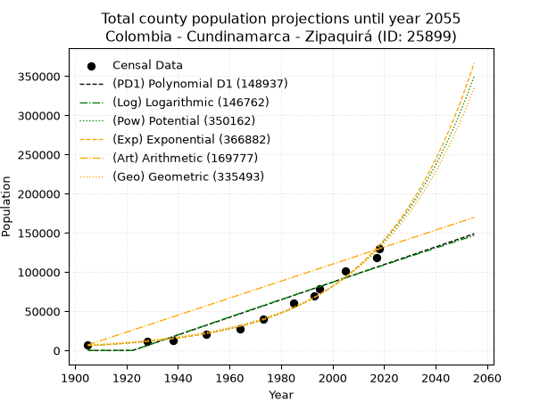
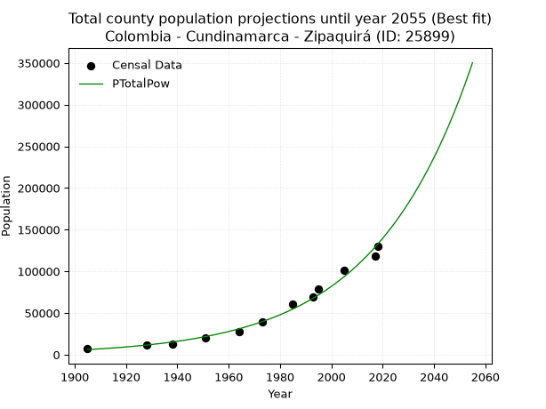
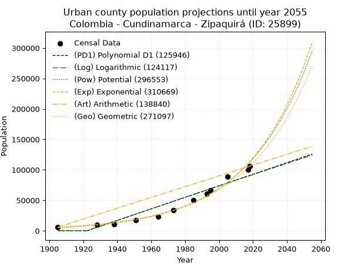
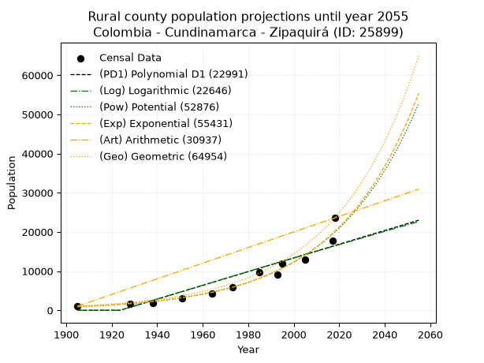
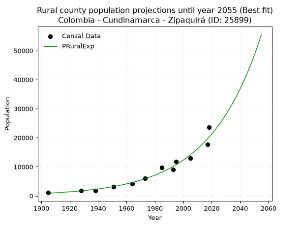

<div align="center">


</div>

# _“Population and Public Services Demand Projections (PPSD) until Year 2050 for Colombia - Cundinamarca - Zipaquirá (ID: 25899)”_
Keywords: `population` `public-service` `projection` `lineal` `polynomial` `logarithmic` `potential` `exponential` `arithmetic` `geometric` `wappaus` `dane` `colombia` `south-america`

PPSD are analytical estimates used by governments and planners to anticipate future changes in population size, age distribution, and the resulting community needs for utilities, healthcare, education, and infrastructure as sizing future water treatment facilities, electrical grids, and road networks based on spatial growth.

> **General running parameters**: • app_version: _v20260806_. • Python version: _3.14.7_. • Pandas version: _3.0.5_. • NumPy version: _2.5.1_. • Creates, save and include plots into reports (create_plot): _False_. • Projection until year: _2050_. • Process polynomial degree 2 and up: _False_. • Process Wappaus: _True_. • Process Wappaus: _True_. • Set negative values to zero: _True_. • Set infinite values to zero: _True_. • Drop dataset notes: _True_. 
<div align="center">

Dynamic map: [:earth_americas:Google](http://maps.google.com/maps?q=5.025476705,-73.9944443) [:earth_americas:OSM](https://www.openstreetmap.org/#map=18/5.025476705/-73.9944443&layers=P) [:earth_americas:Bing](https://www.bing.com/maps?cp=5.025476705~-73.9944443&lvl=18) [:earth_americas:Apple](https://maps.apple.com/frame?center=5.025476705%2C-73.9944443&span=0.003%2C0.006)

</div>


<div align="center">

```geojson
{
  "type": "Feature",
  "geometry": {
    "type": "Point", 
    "coordinates": [-73.9944443, 5.025476705]
  }, 
  "properties": {
    "Name": "Colombia - Cundinamarca - Zipaquirá (ID: 25899)"
  }
}
```

</div>


## 0. Census Data (12 records)

Census data are official statistics collected by a government about the people and housing in a country. They usually include counts of total population, age, sex, race, income, education, and jobs.

📅Global census file: [Population.xlsx](../data/Population.xlsx)

| Source   |   Year |   CountryID | CountryName   |   StateID | StateName    |   CountyID | CountyName   |   PTotal |   PUrban |   PRural |
|:---------|-------:|------------:|:--------------|----------:|:-------------|-----------:|:-------------|---------:|---------:|---------:|
| DANE     |   1905 |          57 | Colombia      |        25 | Cundinamarca |      25899 | Zipaquirá    |     7108 |     6042 |     1066 |
| DANE     |   1928 |          57 | Colombia      |        25 | Cundinamarca |      25899 | Zipaquirá    |    11480 |     9758 |     1722 |
| DANE     |   1938 |          57 | Colombia      |        25 | Cundinamarca |      25899 | Zipaquirá    |    12273 |    10432 |     1841 |
| DANE     |   1951 |          57 | Colombia      |        25 | Cundinamarca |      25899 | Zipaquirá    |    20628 |    17534 |     3094 |
| DANE     |   1964 |          57 | Colombia      |        25 | Cundinamarca |      25899 | Zipaquirá    |    27775 |    23609 |     4166 |
| DANE     |   1973 |          57 | Colombia      |        25 | Cundinamarca |      25899 | Zipaquirá    |    39836 |    33861 |     5975 |
| DANE     |   1985 |          57 | Colombia      |        25 | Cundinamarca |      25899 | Zipaquirá    |    60202 |    50511 |     9691 |
| DANE     |   1993 |          57 | Colombia      |        25 | Cundinamarca |      25899 | Zipaquirá    |    69695 |    60585 |     9110 |
| DANE     |   1995 |          57 | Colombia      |        25 | Cundinamarca |      25899 | Zipaquirá    |    78923 |    67085 |    11838 |
| DANE     |   2005 |          57 | Colombia      |        25 | Cundinamarca |      25899 | Zipaquirá    |   101551 |    88527 |    13024 |
| DANE     |   2017 |          57 | Colombia      |        25 | Cundinamarca |      25899 | Zipaquirá    |   118267 |   100527 |    17740 |
| DANE     |   2018 |          57 | Colombia      |        25 | Cundinamarca |      25899 | Zipaquirá    |   129652 |   106083 |    23569 |

> 🔥Some records could had specific notes about the registered values or the corresponding urban or rural distribution.

## 1. Total

### 1.1. Coefficients and Parameters

* (PD1) Polynomial Deg 1: 1123.329258165708, -2159505.016608219 (lineal)
* (Log) Logarithmic: 2200336.3585380483, -16637471.946382118
* (Pow) Potential: 53.5737533180747, -171.9354941998514
* (Exp) Exponential: 0.027274335152567233, 1.6705528293425025e-19
* (Art) Arithmetic: Year diff. 2018 - 1905 = 113, Population diff. 129652 - 7108 = 122544, Annual growth = 1084.4601769911505
* (Geo) Geometric: Year diff. 2018 - 1905 = 113, Population diff. 129652 - 7108 = 122544, Annual growth % = 0.026028852298634497
* (Wap) Wappaus: i = 1.5859318177700357, Condition values only valid for < 200)

<sub>
Wappaus condition values: ['0.00', '1.59', '3.17', '4.76', '6.34', '7.93', '9.52', '11.10', '12.69', '14.27', '15.86', '17.45', '19.03', '20.62', '22.20', '23.79', '25.37', '26.96', '28.55', '30.13', '31.72', '33.30', '34.89', '36.48', '38.06', '39.65', '41.23', '42.82', '44.41', '45.99', '47.58', '49.16', '50.75', '52.34', '53.92', '55.51', '57.09', '58.68', '60.27', '61.85', '63.44', '65.02', '66.61', '68.20', '69.78', '71.37', '72.95', '74.54', '76.12', '77.71', '79.30', '80.88', '82.47', '84.05', '85.64', '87.23', '88.81', '90.40', '91.98', '93.57', '95.16', '96.74', '98.33', '99.91', '101.50', '103.09', '104.67', '106.26', '107.84', '109.43', '111.02', '112.60', '114.19', '115.77', '117.36', '118.94', '120.53', '122.12', '123.70', '125.29', '126.87', '128.46', '130.05', '131.63', '133.22', '134.80', '136.39', '137.98', '139.56', '141.15', '142.73', '144.32', '145.91', '147.49', '149.08', '150.66', '152.25', '153.84', '155.42', '157.01', '158.59', '160.18', '161.77', '163.35', '164.94', '166.52', '168.11', '169.69', '171.28', '172.87', '174.45', '176.04', '177.62', '179.21', '180.80', '182.38', '183.97', '185.55', '187.14', '188.73', '190.31', '191.90', '193.48', '195.07', '196.66', '198.24', '199.83', '201.41', '203.00', '204.59', '206.17', '207.76', '209.34', '210.93', '212.51', '214.10', '215.69', '217.27', '218.86', '220.44', '222.03', '223.62', '225.20', '226.79', '228.37', '229.96']
</sub>


### 1.2. Projected Dataset

|   Year |   CountyID |   PTotalPD1 |   PTotalLog |   PTotalPow |   PTotalExp |   PTotalArt |   PTotalGeo |
|-------:|-----------:|------------:|------------:|------------:|------------:|------------:|------------:|
|   1905 |      25899 |           0 |           0 |        6037 |        6134 |        7108 |        7108 |
|   1906 |      25899 |           0 |           0 |        6209 |        6304 |        8192 |        7293 |
|   1907 |      25899 |           0 |           0 |        6386 |        6478 |        9277 |        7483 |
|   1908 |      25899 |           0 |           0 |        6568 |        6657 |       10361 |        7678 |
|   1909 |      25899 |           0 |           0 |        6755 |        6841 |       11446 |        7877 |
|   1910 |      25899 |           0 |           0 |        6947 |        7031 |       12530 |        8082 |
|   1911 |      25899 |           0 |           0 |        7144 |        7225 |       13615 |        8293 |
|   1912 |      25899 |           0 |           0 |        7347 |        7425 |       14699 |        8509 |
|   1913 |      25899 |           0 |           0 |        7556 |        7630 |       15784 |        8730 |
|   1914 |      25899 |           0 |           0 |        7771 |        7841 |       16868 |        8957 |
|   1915 |      25899 |           0 |           0 |        7991 |        8058 |       17953 |        9191 |
|   1916 |      25899 |           0 |           0 |        8218 |        8281 |       19037 |        9430 |
|   1917 |      25899 |           0 |           0 |        8451 |        8509 |       20122 |        9675 |
|   1918 |      25899 |           0 |           0 |        8690 |        8745 |       21206 |        9927 |
|   1919 |      25899 |           0 |           0 |        8936 |        8987 |       22290 |       10185 |
|   1920 |      25899 |           0 |           0 |        9189 |        9235 |       23375 |       10451 |
|   1921 |      25899 |           0 |           0 |        9449 |        9490 |       24459 |       10723 |
|   1922 |      25899 |           0 |           0 |        9716 |        9753 |       25544 |       11002 |
|   1923 |      25899 |         657 |         683 |        9991 |       10022 |       26628 |       11288 |
|   1924 |      25899 |        1780 |        1827 |       10273 |       10300 |       27713 |       11582 |
|   1925 |      25899 |        2904 |        2971 |       10563 |       10584 |       28797 |       11883 |
|   1926 |      25899 |        4027 |        4113 |       10861 |       10877 |       29882 |       12193 |
|   1927 |      25899 |        5150 |        5255 |       11167 |       11178 |       30966 |       12510 |
|   1928 |      25899 |        6274 |        6397 |       11482 |       11487 |       32051 |       12836 |
|   1929 |      25899 |        7397 |        7538 |       11805 |       11804 |       33135 |       13170 |
|   1930 |      25899 |        8520 |        8678 |       12138 |       12131 |       34220 |       13513 |
|   1931 |      25899 |        9644 |        9818 |       12479 |       12466 |       35304 |       13864 |
|   1932 |      25899 |       10767 |       10957 |       12830 |       12811 |       36388 |       14225 |
|   1933 |      25899 |       11890 |       12096 |       13191 |       13165 |       37473 |       14595 |
|   1934 |      25899 |       13014 |       13234 |       13562 |       13529 |       38557 |       14975 |
|   1935 |      25899 |       14137 |       14371 |       13943 |       13903 |       39642 |       15365 |
|   1936 |      25899 |       15260 |       15508 |       14334 |       14288 |       40726 |       15765 |
|   1937 |      25899 |       16384 |       16644 |       14736 |       14683 |       41811 |       16175 |
|   1938 |      25899 |       17507 |       17780 |       15149 |       15089 |       42895 |       16596 |
|   1939 |      25899 |       18630 |       18915 |       15574 |       15506 |       43980 |       17028 |
|   1940 |      25899 |       19754 |       20050 |       16010 |       15935 |       45064 |       17472 |
|   1941 |      25899 |       20877 |       21183 |       16458 |       16375 |       46149 |       17926 |
|   1942 |      25899 |       22000 |       22317 |       16918 |       16828 |       47233 |       18393 |
|   1943 |      25899 |       23124 |       23450 |       17391 |       17293 |       48317 |       18872 |
|   1944 |      25899 |       24247 |       24582 |       17878 |       17771 |       49402 |       19363 |
|   1945 |      25899 |       25370 |       25713 |       18377 |       18263 |       50486 |       19867 |
|   1946 |      25899 |       26494 |       26844 |       18890 |       18768 |       51571 |       20384 |
|   1947 |      25899 |       27617 |       27975 |       19417 |       19287 |       52655 |       20915 |
|   1948 |      25899 |       28740 |       29104 |       19959 |       19820 |       53740 |       21459 |
|   1949 |      25899 |       29864 |       30234 |       20515 |       20368 |       54824 |       22018 |
|   1950 |      25899 |       30987 |       31362 |       21087 |       20931 |       55909 |       22591 |
|   1951 |      25899 |       32110 |       32490 |       21674 |       21510 |       56993 |       23179 |
|   1952 |      25899 |       33234 |       33618 |       22277 |       22105 |       58078 |       23782 |
|   1953 |      25899 |       34357 |       34745 |       22897 |       22716 |       59162 |       24401 |
|   1954 |      25899 |       35480 |       35871 |       23533 |       23344 |       60247 |       25036 |
|   1955 |      25899 |       36604 |       36997 |       24187 |       23989 |       61331 |       25688 |
|   1956 |      25899 |       37727 |       38122 |       24859 |       24653 |       62415 |       26356 |
|   1957 |      25899 |       38850 |       39247 |       25549 |       25334 |       63500 |       27042 |
|   1958 |      25899 |       39974 |       40371 |       26258 |       26035 |       64584 |       27746 |
|   1959 |      25899 |       41097 |       41494 |       26987 |       26755 |       65669 |       28468 |
|   1960 |      25899 |       42220 |       42617 |       27735 |       27494 |       66753 |       29209 |
|   1961 |      25899 |       43344 |       43740 |       28503 |       28255 |       67838 |       29970 |
|   1962 |      25899 |       44467 |       44861 |       29292 |       29036 |       68922 |       30750 |
|   1963 |      25899 |       45590 |       45983 |       30103 |       29839 |       70007 |       31550 |
|   1964 |      25899 |       46714 |       47103 |       30935 |       30664 |       71091 |       32371 |
|   1965 |      25899 |       47837 |       48223 |       31791 |       31511 |       72176 |       33214 |
|   1966 |      25899 |       48960 |       49343 |       32669 |       32383 |       73260 |       34079 |
|   1967 |      25899 |       50084 |       50462 |       33571 |       33278 |       74345 |       34966 |
|   1968 |      25899 |       51207 |       51580 |       34498 |       34198 |       75429 |       35876 |
|   1969 |      25899 |       52330 |       52698 |       35450 |       35144 |       76513 |       36810 |
|   1970 |      25899 |       53454 |       53815 |       36427 |       36116 |       77598 |       37768 |
|   1971 |      25899 |       54577 |       54932 |       37431 |       37114 |       78682 |       38751 |
|   1972 |      25899 |       55700 |       56048 |       38462 |       38140 |       79767 |       39759 |
|   1973 |      25899 |       56824 |       57163 |       39521 |       39195 |       80851 |       40794 |
|   1974 |      25899 |       57947 |       58278 |       40609 |       40279 |       81936 |       41856 |
|   1975 |      25899 |       59070 |       59393 |       41726 |       41392 |       83020 |       42945 |
|   1976 |      25899 |       60194 |       60506 |       42873 |       42537 |       84105 |       44063 |
|   1977 |      25899 |       61317 |       61620 |       44051 |       43713 |       85189 |       45210 |
|   1978 |      25899 |       62440 |       62732 |       45261 |       44922 |       86274 |       46387 |
|   1979 |      25899 |       63564 |       63844 |       46503 |       46164 |       87358 |       47594 |
|   1980 |      25899 |       64687 |       64956 |       47779 |       47440 |       88443 |       48833 |
|   1981 |      25899 |       65810 |       66067 |       49089 |       48752 |       89527 |       50104 |
|   1982 |      25899 |       66934 |       67177 |       50434 |       50100 |       90611 |       51408 |
|   1983 |      25899 |       68057 |       68287 |       51815 |       51485 |       91696 |       52747 |
|   1984 |      25899 |       69180 |       69397 |       53234 |       52908 |       92780 |       54119 |
|   1985 |      25899 |       70304 |       70505 |       54691 |       54371 |       93865 |       55528 |
|   1986 |      25899 |       71427 |       71614 |       56187 |       55875 |       94949 |       56973 |
|   1987 |      25899 |       72550 |       72721 |       57722 |       57420 |       96034 |       58456 |
|   1988 |      25899 |       73674 |       73828 |       59300 |       59007 |       97118 |       59978 |
|   1989 |      25899 |       74797 |       74935 |       60919 |       60639 |       98203 |       61539 |
|   1990 |      25899 |       75920 |       76041 |       62582 |       62315 |       99287 |       63141 |
|   1991 |      25899 |       77044 |       77146 |       64289 |       64038 |      100372 |       64784 |
|   1992 |      25899 |       78167 |       78251 |       66042 |       65809 |      101456 |       66471 |
|   1993 |      25899 |       79290 |       79355 |       67842 |       67629 |      102540 |       68201 |
|   1994 |      25899 |       80414 |       80459 |       69689 |       69499 |      103625 |       69976 |
|   1995 |      25899 |       81537 |       81562 |       71587 |       71420 |      104709 |       71797 |
|   1996 |      25899 |       82660 |       82665 |       73535 |       73395 |      105794 |       73666 |
|   1997 |      25899 |       83784 |       83767 |       75535 |       75424 |      106878 |       75584 |
|   1998 |      25899 |       84907 |       84869 |       77588 |       77510 |      107963 |       77551 |
|   1999 |      25899 |       86030 |       85970 |       79696 |       79653 |      109047 |       79570 |
|   2000 |      25899 |       87153 |       87070 |       81860 |       81855 |      110132 |       81641 |
|   2001 |      25899 |       88277 |       88170 |       84082 |       84119 |      111216 |       83766 |
|   2002 |      25899 |       89400 |       89269 |       86363 |       86444 |      112301 |       85946 |
|   2003 |      25899 |       90523 |       90368 |       88705 |       88835 |      113385 |       88183 |
|   2004 |      25899 |       91647 |       91466 |       91109 |       91291 |      114470 |       90478 |
|   2005 |      25899 |       92770 |       92564 |       93577 |       93815 |      115554 |       92834 |
|   2006 |      25899 |       93893 |       93661 |       96110 |       96409 |      116638 |       95250 |
|   2007 |      25899 |       95017 |       94758 |       98711 |       99075 |      117723 |       97729 |
|   2008 |      25899 |       96140 |       95854 |      101380 |      101814 |      118807 |      100273 |
|   2009 |      25899 |       97263 |       96949 |      104121 |      104629 |      119892 |      102883 |
|   2010 |      25899 |       98387 |       98044 |      106934 |      107522 |      120976 |      105561 |
|   2011 |      25899 |       99510 |       99139 |      109822 |      110495 |      122061 |      108308 |
|   2012 |      25899 |      100633 |      100233 |      112786 |      113550 |      123145 |      111128 |
|   2013 |      25899 |      101757 |      101326 |      115829 |      116690 |      124230 |      114020 |
|   2014 |      25899 |      102880 |      102419 |      118952 |      119916 |      125314 |      116988 |
|   2015 |      25899 |      104003 |      103511 |      122158 |      123232 |      126399 |      120033 |
|   2016 |      25899 |      105127 |      104603 |      125449 |      126639 |      127483 |      123157 |
|   2017 |      25899 |      106250 |      105694 |      128826 |      130141 |      128568 |      126363 |
|   2018 |      25899 |      107373 |      106785 |      132293 |      133739 |      129652 |      129652 |
|   2019 |      25899 |      108497 |      107875 |      135851 |      137437 |      130736 |      133027 |
|   2020 |      25899 |      109620 |      108964 |      139503 |      141237 |      131821 |      136489 |
|   2021 |      25899 |      110743 |      110053 |      143252 |      145142 |      132905 |      140042 |
|   2022 |      25899 |      111867 |      111142 |      147099 |      149155 |      133990 |      143687 |
|   2023 |      25899 |      112990 |      112230 |      151048 |      153279 |      135074 |      147427 |
|   2024 |      25899 |      114113 |      113317 |      155100 |      157518 |      136159 |      151264 |
|   2025 |      25899 |      115237 |      114404 |      159259 |      161873 |      137243 |      155202 |
|   2026 |      25899 |      116360 |      115490 |      163528 |      166349 |      138328 |      159241 |
|   2027 |      25899 |      117483 |      116576 |      167909 |      170948 |      139412 |      163386 |
|   2028 |      25899 |      118607 |      117661 |      172404 |      175675 |      140497 |      167639 |
|   2029 |      25899 |      119730 |      118746 |      177018 |      180532 |      141581 |      172002 |
|   2030 |      25899 |      120853 |      119830 |      181753 |      185524 |      142666 |      176479 |
|   2031 |      25899 |      121977 |      120914 |      186613 |      190653 |      143750 |      181073 |
|   2032 |      25899 |      123100 |      121997 |      191599 |      195925 |      144834 |      185786 |
|   2033 |      25899 |      124223 |      123079 |      196717 |      201342 |      145919 |      190622 |
|   2034 |      25899 |      125347 |      124161 |      201968 |      206909 |      147003 |      195584 |
|   2035 |      25899 |      126470 |      125243 |      207357 |      212630 |      148088 |      200674 |
|   2036 |      25899 |      127593 |      126324 |      212887 |      218509 |      149172 |      205898 |
|   2037 |      25899 |      128717 |      127404 |      218562 |      224551 |      150257 |      211257 |
|   2038 |      25899 |      129840 |      128484 |      224385 |      230760 |      151341 |      216756 |
|   2039 |      25899 |      130963 |      129564 |      230360 |      237140 |      152426 |      222398 |
|   2040 |      25899 |      132087 |      130643 |      236492 |      243697 |      153510 |      228186 |
|   2041 |      25899 |      133210 |      131721 |      242783 |      250435 |      154595 |      234126 |
|   2042 |      25899 |      134333 |      132799 |      249239 |      257360 |      155679 |      240220 |
|   2043 |      25899 |      135457 |      133876 |      255863 |      264476 |      156764 |      246473 |
|   2044 |      25899 |      136580 |      134953 |      262659 |      271788 |      157848 |      252888 |
|   2045 |      25899 |      137703 |      136029 |      269633 |      279303 |      158932 |      259470 |
|   2046 |      25899 |      138827 |      137105 |      276788 |      287026 |      160017 |      266224 |
|   2047 |      25899 |      139950 |      138180 |      284129 |      294962 |      161101 |      273154 |
|   2048 |      25899 |      141073 |      139254 |      291662 |      303118 |      162186 |      280263 |
|   2049 |      25899 |      142197 |      140329 |      299390 |      311499 |      163270 |      287558 |
|   2050 |      25899 |      143320 |      141402 |      307320 |      320112 |      164355 |      295043 |
<div align="center">

</img>

</div>


### 1.3. Best fit with absolute and relative error (%)

Relative error puts that difference into context by dividing the absolute error by the true value, creating a unitless ratio or percentage that shows the scale of the mistake.

Absolute and relative error

|   Year | Source   |   CountryID | CountryName   |   StateID | StateName    |   CountyID_x | CountyName   |   PTotal |   PUrban |   PRural |   CountyID_y |   PTotalPD1 |   PTotalLog |   PTotalPow |   PTotalExp |   PTotalArt |   PTotalGeo |   PTotalPD1AbsError |   PTotalLogAbsError |   PTotalPowAbsError |   PTotalExpAbsError |   PTotalArtAbsError |   PTotalGeoAbsError |   PTotalPD1RelError |   PTotalLogRelError |   PTotalPowRelError |   PTotalExpRelError |   PTotalArtRelError |   PTotalGeoRelError |
|-------:|:---------|------------:|:--------------|----------:|:-------------|-------------:|:-------------|---------:|---------:|---------:|-------------:|------------:|------------:|------------:|------------:|------------:|------------:|--------------------:|--------------------:|--------------------:|--------------------:|--------------------:|--------------------:|--------------------:|--------------------:|--------------------:|--------------------:|--------------------:|--------------------:|
|   1905 | DANE     |          57 | Colombia      |        25 | Cundinamarca |        25899 | Zipaquirá    |     7108 |     6042 |     1066 |        25899 |           0 |           0 |        6037 |        6134 |        7108 |        7108 |                7108 |                7108 |                1071 |                 974 |                   0 |                   0 |           100       |           100       |          15.0675    |          13.7029    |             0       |             0       |
|   1928 | DANE     |          57 | Colombia      |        25 | Cundinamarca |        25899 | Zipaquirá    |    11480 |     9758 |     1722 |        25899 |        6274 |        6397 |       11482 |       11487 |       32051 |       12836 |                5206 |                5083 |                   2 |                   7 |               20571 |                1356 |            45.3484  |            44.277   |           0.0174216 |           0.0609756 |           179.19    |            11.8118  |
|   1938 | DANE     |          57 | Colombia      |        25 | Cundinamarca |        25899 | Zipaquirá    |    12273 |    10432 |     1841 |        25899 |       17507 |       17780 |       15149 |       15089 |       42895 |       16596 |                5234 |                5507 |                2876 |                2816 |               30622 |                4323 |            42.6465  |            44.8709  |          23.4336    |          22.9447    |           249.507   |            35.2237  |
|   1951 | DANE     |          57 | Colombia      |        25 | Cundinamarca |        25899 | Zipaquirá    |    20628 |    17534 |     3094 |        25899 |       32110 |       32490 |       21674 |       21510 |       56993 |       23179 |               11482 |               11862 |                1046 |                 882 |               36365 |                2551 |            55.6622  |            57.5044  |           5.07078   |           4.27574   |           176.29    |            12.3667  |
|   1964 | DANE     |          57 | Colombia      |        25 | Cundinamarca |        25899 | Zipaquirá    |    27775 |    23609 |     4166 |        25899 |       46714 |       47103 |       30935 |       30664 |       71091 |       32371 |               18939 |               19328 |                3160 |                2889 |               43316 |                4596 |            68.1872  |            69.5878  |          11.3771    |          10.4014    |           155.953   |            16.5473  |
|   1973 | DANE     |          57 | Colombia      |        25 | Cundinamarca |        25899 | Zipaquirá    |    39836 |    33861 |     5975 |        25899 |       56824 |       57163 |       39521 |       39195 |       80851 |       40794 |               16988 |               17327 |                 315 |                 641 |               41015 |                 958 |            42.6448  |            43.4958  |           0.790742  |           1.6091    |           102.96    |             2.40486 |
|   1985 | DANE     |          57 | Colombia      |        25 | Cundinamarca |        25899 | Zipaquirá    |    60202 |    50511 |     9691 |        25899 |       70304 |       70505 |       54691 |       54371 |       93865 |       55528 |               10102 |               10303 |                5511 |                5831 |               33663 |                4674 |            16.7802  |            17.114   |           9.15418   |           9.68572   |            55.9167  |             7.76386 |
|   1993 | DANE     |          57 | Colombia      |        25 | Cundinamarca |        25899 | Zipaquirá    |    69695 |    60585 |     9110 |        25899 |       79290 |       79355 |       67842 |       67629 |      102540 |       68201 |                9595 |                9660 |                1853 |                2066 |               32845 |                1494 |            13.7671  |            13.8604  |           2.65873   |           2.96434   |            47.1268  |             2.14363 |
|   1995 | DANE     |          57 | Colombia      |        25 | Cundinamarca |        25899 | Zipaquirá    |    78923 |    67085 |    11838 |        25899 |       81537 |       81562 |       71587 |       71420 |      104709 |       71797 |                2614 |                2639 |                7336 |                7503 |               25786 |                7126 |             3.31209 |             3.34377 |           9.29514   |           9.50673   |            32.6724  |             9.02905 |
|   2005 | DANE     |          57 | Colombia      |        25 | Cundinamarca |        25899 | Zipaquirá    |   101551 |    88527 |    13024 |        25899 |       92770 |       92564 |       93577 |       93815 |      115554 |       92834 |                8781 |                8987 |                7974 |                7736 |               14003 |                8717 |             8.64689 |             8.84974 |           7.85221   |           7.61785   |            13.7891  |             8.58386 |
|   2017 | DANE     |          57 | Colombia      |        25 | Cundinamarca |        25899 | Zipaquirá    |   118267 |   100527 |    17740 |        25899 |      106250 |      105694 |      128826 |      130141 |      128568 |      126363 |               12017 |               12573 |               10559 |               11874 |               10301 |                8096 |            10.1609  |            10.631   |           8.9281    |          10.04      |             8.70995 |             6.84553 |
|   2018 | DANE     |          57 | Colombia      |        25 | Cundinamarca |        25899 | Zipaquirá    |   129652 |   106083 |    23569 |        25899 |      107373 |      106785 |      132293 |      133739 |      129652 |      129652 |               22279 |               22867 |                2641 |                4087 |                   0 |                   0 |            17.1837  |            17.6372  |           2.03699   |           3.15228   |             0       |             0       |

Relative error mean

| Method    |   RelError | Best   |
|:----------|-----------:|:-------|
| PTotalPD1 |   35.3617  |        |
| PTotalLog |   35.931   |        |
| PTotalPow |    7.97354 | True   |
| PTotalExp |    7.99681 |        |
| PTotalArt |   85.1762  |        |
| PTotalGeo |    9.39335 |        |

💙Best method: _**PTotalPow**_
<div align="center">

</img>

</div>


### 1.4. Fresh water supply demand in liters per capita per day (lpcd)

The fresh water supply demand typically ranges from 100 to 300 liters per capita per day (lpcd) for standard domestic and municipal planning, though absolute survival minimums set by the World Health Organization are as low as 7.5 to 20 liters per day, and total consumption in high-income nations can exceed 400 liters.

> `CZ`: Level in meters above the sea level (masl)<br> `WS`: Fresh water supply demand in liters per capita per day (lpcd or l/h/d)<br> `WSAll`: Zonal fresh water supply demand in liters per second (l/s)<br> `A`: Zonal area in square meters<br> `DP`: Population density (people/hectare).

Reference values (RAS Colombia)

|    CZ |   WS |
|------:|-----:|
|  1000 |  120 |
|  2000 |  130 |
| 99999 |  140 |

County shapefile geometry properties and water supply values

|   CountyID |      ATotal |   CZTotal |   WSTotal |
|-----------:|------------:|----------:|----------:|
|      25899 | 1.94581e+08 |   2961.62 |       140 |

Projected values for best method: PTotalPow

|   CountyID |   Year |   PTotalPow |   DPTotal |   WSTotal |   WSTotalAll |
|-----------:|-------:|------------:|----------:|----------:|-------------:|
|      25899 |   1905 |        6037 |      0.31 |       140 |      9.78218 |
|      25899 |   1906 |        6209 |      0.32 |       140 |     10.0609  |
|      25899 |   1907 |        6386 |      0.33 |       140 |     10.3477  |
|      25899 |   1908 |        6568 |      0.34 |       140 |     10.6426  |
|      25899 |   1909 |        6755 |      0.35 |       140 |     10.9456  |
|      25899 |   1910 |        6947 |      0.36 |       140 |     11.2567  |
|      25899 |   1911 |        7144 |      0.37 |       140 |     11.5759  |
|      25899 |   1912 |        7347 |      0.38 |       140 |     11.9049  |
|      25899 |   1913 |        7556 |      0.39 |       140 |     12.2435  |
|      25899 |   1914 |        7771 |      0.4  |       140 |     12.5919  |
|      25899 |   1915 |        7991 |      0.41 |       140 |     12.9484  |
|      25899 |   1916 |        8218 |      0.42 |       140 |     13.3162  |
|      25899 |   1917 |        8451 |      0.43 |       140 |     13.6937  |
|      25899 |   1918 |        8690 |      0.45 |       140 |     14.081   |
|      25899 |   1919 |        8936 |      0.46 |       140 |     14.4796  |
|      25899 |   1920 |        9189 |      0.47 |       140 |     14.8896  |
|      25899 |   1921 |        9449 |      0.49 |       140 |     15.3109  |
|      25899 |   1922 |        9716 |      0.5  |       140 |     15.7435  |
|      25899 |   1923 |        9991 |      0.51 |       140 |     16.1891  |
|      25899 |   1924 |       10273 |      0.53 |       140 |     16.6461  |
|      25899 |   1925 |       10563 |      0.54 |       140 |     17.116   |
|      25899 |   1926 |       10861 |      0.56 |       140 |     17.5988  |
|      25899 |   1927 |       11167 |      0.57 |       140 |     18.0947  |
|      25899 |   1928 |       11482 |      0.59 |       140 |     18.6051  |
|      25899 |   1929 |       11805 |      0.61 |       140 |     19.1285  |
|      25899 |   1930 |       12138 |      0.62 |       140 |     19.6681  |
|      25899 |   1931 |       12479 |      0.64 |       140 |     20.2206  |
|      25899 |   1932 |       12830 |      0.66 |       140 |     20.7894  |
|      25899 |   1933 |       13191 |      0.68 |       140 |     21.3743  |
|      25899 |   1934 |       13562 |      0.7  |       140 |     21.9755  |
|      25899 |   1935 |       13943 |      0.72 |       140 |     22.5928  |
|      25899 |   1936 |       14334 |      0.74 |       140 |     23.2264  |
|      25899 |   1937 |       14736 |      0.76 |       140 |     23.8778  |
|      25899 |   1938 |       15149 |      0.78 |       140 |     24.547   |
|      25899 |   1939 |       15574 |      0.8  |       140 |     25.2356  |
|      25899 |   1940 |       16010 |      0.82 |       140 |     25.9421  |
|      25899 |   1941 |       16458 |      0.85 |       140 |     26.6681  |
|      25899 |   1942 |       16918 |      0.87 |       140 |     27.4134  |
|      25899 |   1943 |       17391 |      0.89 |       140 |     28.1799  |
|      25899 |   1944 |       17878 |      0.92 |       140 |     28.969   |
|      25899 |   1945 |       18377 |      0.94 |       140 |     29.7775  |
|      25899 |   1946 |       18890 |      0.97 |       140 |     30.6088  |
|      25899 |   1947 |       19417 |      1    |       140 |     31.4627  |
|      25899 |   1948 |       19959 |      1.03 |       140 |     32.341   |
|      25899 |   1949 |       20515 |      1.05 |       140 |     33.2419  |
|      25899 |   1950 |       21087 |      1.08 |       140 |     34.1688  |
|      25899 |   1951 |       21674 |      1.11 |       140 |     35.1199  |
|      25899 |   1952 |       22277 |      1.14 |       140 |     36.097   |
|      25899 |   1953 |       22897 |      1.18 |       140 |     37.1016  |
|      25899 |   1954 |       23533 |      1.21 |       140 |     38.1322  |
|      25899 |   1955 |       24187 |      1.24 |       140 |     39.1919  |
|      25899 |   1956 |       24859 |      1.28 |       140 |     40.2808  |
|      25899 |   1957 |       25549 |      1.31 |       140 |     41.3988  |
|      25899 |   1958 |       26258 |      1.35 |       140 |     42.5477  |
|      25899 |   1959 |       26987 |      1.39 |       140 |     43.7289  |
|      25899 |   1960 |       27735 |      1.43 |       140 |     44.941   |
|      25899 |   1961 |       28503 |      1.46 |       140 |     46.1854  |
|      25899 |   1962 |       29292 |      1.51 |       140 |     47.4639  |
|      25899 |   1963 |       30103 |      1.55 |       140 |     48.778   |
|      25899 |   1964 |       30935 |      1.59 |       140 |     50.1262  |
|      25899 |   1965 |       31791 |      1.63 |       140 |     51.5132  |
|      25899 |   1966 |       32669 |      1.68 |       140 |     52.9359  |
|      25899 |   1967 |       33571 |      1.73 |       140 |     54.3975  |
|      25899 |   1968 |       34498 |      1.77 |       140 |     55.8995  |
|      25899 |   1969 |       35450 |      1.82 |       140 |     57.4421  |
|      25899 |   1970 |       36427 |      1.87 |       140 |     59.0252  |
|      25899 |   1971 |       37431 |      1.92 |       140 |     60.6521  |
|      25899 |   1972 |       38462 |      1.98 |       140 |     62.3227  |
|      25899 |   1973 |       39521 |      2.03 |       140 |     64.0387  |
|      25899 |   1974 |       40609 |      2.09 |       140 |     65.8016  |
|      25899 |   1975 |       41726 |      2.14 |       140 |     67.6116  |
|      25899 |   1976 |       42873 |      2.2  |       140 |     69.4701  |
|      25899 |   1977 |       44051 |      2.26 |       140 |     71.3789  |
|      25899 |   1978 |       45261 |      2.33 |       140 |     73.3396  |
|      25899 |   1979 |       46503 |      2.39 |       140 |     75.3521  |
|      25899 |   1980 |       47779 |      2.46 |       140 |     77.4197  |
|      25899 |   1981 |       49089 |      2.52 |       140 |     79.5424  |
|      25899 |   1982 |       50434 |      2.59 |       140 |     81.7218  |
|      25899 |   1983 |       51815 |      2.66 |       140 |     83.9595  |
|      25899 |   1984 |       53234 |      2.74 |       140 |     86.2588  |
|      25899 |   1985 |       54691 |      2.81 |       140 |     88.6197  |
|      25899 |   1986 |       56187 |      2.89 |       140 |     91.0438  |
|      25899 |   1987 |       57722 |      2.97 |       140 |     93.531   |
|      25899 |   1988 |       59300 |      3.05 |       140 |     96.088   |
|      25899 |   1989 |       60919 |      3.13 |       140 |     98.7113  |
|      25899 |   1990 |       62582 |      3.22 |       140 |    101.406   |
|      25899 |   1991 |       64289 |      3.3  |       140 |    104.172   |
|      25899 |   1992 |       66042 |      3.39 |       140 |    107.013   |
|      25899 |   1993 |       67842 |      3.49 |       140 |    109.929   |
|      25899 |   1994 |       69689 |      3.58 |       140 |    112.922   |
|      25899 |   1995 |       71587 |      3.68 |       140 |    115.997   |
|      25899 |   1996 |       73535 |      3.78 |       140 |    119.154   |
|      25899 |   1997 |       75535 |      3.88 |       140 |    122.395   |
|      25899 |   1998 |       77588 |      3.99 |       140 |    125.721   |
|      25899 |   1999 |       79696 |      4.1  |       140 |    129.137   |
|      25899 |   2000 |       81860 |      4.21 |       140 |    132.644   |
|      25899 |   2001 |       84082 |      4.32 |       140 |    136.244   |
|      25899 |   2002 |       86363 |      4.44 |       140 |    139.94    |
|      25899 |   2003 |       88705 |      4.56 |       140 |    143.735   |
|      25899 |   2004 |       91109 |      4.68 |       140 |    147.63    |
|      25899 |   2005 |       93577 |      4.81 |       140 |    151.629   |
|      25899 |   2006 |       96110 |      4.94 |       140 |    155.734   |
|      25899 |   2007 |       98711 |      5.07 |       140 |    159.948   |
|      25899 |   2008 |      101380 |      5.21 |       140 |    164.273   |
|      25899 |   2009 |      104121 |      5.35 |       140 |    168.715   |
|      25899 |   2010 |      106934 |      5.5  |       140 |    173.273   |
|      25899 |   2011 |      109822 |      5.64 |       140 |    177.952   |
|      25899 |   2012 |      112786 |      5.8  |       140 |    182.755   |
|      25899 |   2013 |      115829 |      5.95 |       140 |    187.686   |
|      25899 |   2014 |      118952 |      6.11 |       140 |    192.746   |
|      25899 |   2015 |      122158 |      6.28 |       140 |    197.941   |
|      25899 |   2016 |      125449 |      6.45 |       140 |    203.274   |
|      25899 |   2017 |      128826 |      6.62 |       140 |    208.746   |
|      25899 |   2018 |      132293 |      6.8  |       140 |    214.364   |
|      25899 |   2019 |      135851 |      6.98 |       140 |    220.129   |
|      25899 |   2020 |      139503 |      7.17 |       140 |    226.047   |
|      25899 |   2021 |      143252 |      7.36 |       140 |    232.121   |
|      25899 |   2022 |      147099 |      7.56 |       140 |    238.355   |
|      25899 |   2023 |      151048 |      7.76 |       140 |    244.754   |
|      25899 |   2024 |      155100 |      7.97 |       140 |    251.319   |
|      25899 |   2025 |      159259 |      8.18 |       140 |    258.059   |
|      25899 |   2026 |      163528 |      8.4  |       140 |    264.976   |
|      25899 |   2027 |      167909 |      8.63 |       140 |    272.075   |
|      25899 |   2028 |      172404 |      8.86 |       140 |    279.358   |
|      25899 |   2029 |      177018 |      9.1  |       140 |    286.835   |
|      25899 |   2030 |      181753 |      9.34 |       140 |    294.507   |
|      25899 |   2031 |      186613 |      9.59 |       140 |    302.382   |
|      25899 |   2032 |      191599 |      9.85 |       140 |    310.461   |
|      25899 |   2033 |      196717 |     10.11 |       140 |    318.754   |
|      25899 |   2034 |      201968 |     10.38 |       140 |    327.263   |
|      25899 |   2035 |      207357 |     10.66 |       140 |    335.995   |
|      25899 |   2036 |      212887 |     10.94 |       140 |    344.956   |
|      25899 |   2037 |      218562 |     11.23 |       140 |    354.151   |
|      25899 |   2038 |      224385 |     11.53 |       140 |    363.587   |
|      25899 |   2039 |      230360 |     11.84 |       140 |    373.269   |
|      25899 |   2040 |      236492 |     12.15 |       140 |    383.205   |
|      25899 |   2041 |      242783 |     12.48 |       140 |    393.398   |
|      25899 |   2042 |      249239 |     12.81 |       140 |    403.859   |
|      25899 |   2043 |      255863 |     13.15 |       140 |    414.593   |
|      25899 |   2044 |      262659 |     13.5  |       140 |    425.605   |
|      25899 |   2045 |      269633 |     13.86 |       140 |    436.905   |
|      25899 |   2046 |      276788 |     14.22 |       140 |    448.499   |
|      25899 |   2047 |      284129 |     14.6  |       140 |    460.394   |
|      25899 |   2048 |      291662 |     14.99 |       140 |    472.6     |
|      25899 |   2049 |      299390 |     15.39 |       140 |    485.123   |
|      25899 |   2050 |      307320 |     15.79 |       140 |    497.972   |

## 2. Urban

### 2.1. Coefficients and Parameters

* (PD1) Polynomial Deg 1: 948.170234360579, -1822544.3156486345 (lineal)
* (Log) Logarithmic: 1857395.5310914074, -14044154.361755203
* (Pow) Potential: 53.49153862695254, -171.73529975111617
* (Exp) Exponential: 0.027231626656546434, 1.5443564367451228e-19
* (Art) Arithmetic: Year diff. 2018 - 1905 = 113, Population diff. 106083 - 6042 = 100041, Annual growth = 885.3185840707964
* (Geo) Geometric: Year diff. 2018 - 1905 = 113, Population diff. 106083 - 6042 = 100041, Annual growth % = 0.025682546076538415
* (Wap) Wappaus: i = 1.5791635836268387, Condition values only valid for < 200)

<sub>
Wappaus condition values: ['0.00', '1.58', '3.16', '4.74', '6.32', '7.90', '9.47', '11.05', '12.63', '14.21', '15.79', '17.37', '18.95', '20.53', '22.11', '23.69', '25.27', '26.85', '28.42', '30.00', '31.58', '33.16', '34.74', '36.32', '37.90', '39.48', '41.06', '42.64', '44.22', '45.80', '47.37', '48.95', '50.53', '52.11', '53.69', '55.27', '56.85', '58.43', '60.01', '61.59', '63.17', '64.75', '66.32', '67.90', '69.48', '71.06', '72.64', '74.22', '75.80', '77.38', '78.96', '80.54', '82.12', '83.70', '85.27', '86.85', '88.43', '90.01', '91.59', '93.17', '94.75', '96.33', '97.91', '99.49', '101.07', '102.65', '104.22', '105.80', '107.38', '108.96', '110.54', '112.12', '113.70', '115.28', '116.86', '118.44', '120.02', '121.60', '123.17', '124.75', '126.33', '127.91', '129.49', '131.07', '132.65', '134.23', '135.81', '137.39', '138.97', '140.55', '142.12', '143.70', '145.28', '146.86', '148.44', '150.02', '151.60', '153.18', '154.76', '156.34', '157.92', '159.50', '161.07', '162.65', '164.23', '165.81', '167.39', '168.97', '170.55', '172.13', '173.71', '175.29', '176.87', '178.45', '180.02', '181.60', '183.18', '184.76', '186.34', '187.92', '189.50', '191.08', '192.66', '194.24', '195.82', '197.40', '198.97', '200.55', '202.13', '203.71', '205.29', '206.87', '208.45', '210.03', '211.61', '213.19', '214.77', '216.35', '217.92', '219.50', '221.08', '222.66', '224.24', '225.82', '227.40', '228.98']
</sub>


### 2.2. Projected Dataset

|   Year |   CountyID |   PUrbanPD1 |   PUrbanLog |   PUrbanPow |   PUrbanExp |   PUrbanArt |   PUrbanGeo |
|-------:|-----------:|------------:|------------:|------------:|------------:|------------:|------------:|
|   1905 |      25899 |           0 |           0 |        5144 |        5228 |        6042 |        6042 |
|   1906 |      25899 |           0 |           0 |        5291 |        5372 |        6927 |        6197 |
|   1907 |      25899 |           0 |           0 |        5441 |        5520 |        7813 |        6356 |
|   1908 |      25899 |           0 |           0 |        5596 |        5673 |        8698 |        6520 |
|   1909 |      25899 |           0 |           0 |        5755 |        5829 |        9583 |        6687 |
|   1910 |      25899 |           0 |           0 |        5919 |        5990 |       10469 |        6859 |
|   1911 |      25899 |           0 |           0 |        6087 |        6156 |       11354 |        7035 |
|   1912 |      25899 |           0 |           0 |        6259 |        6326 |       12239 |        7216 |
|   1913 |      25899 |           0 |           0 |        6437 |        6500 |       13125 |        7401 |
|   1914 |      25899 |           0 |           0 |        6619 |        6680 |       14010 |        7591 |
|   1915 |      25899 |           0 |           0 |        6807 |        6864 |       14895 |        7786 |
|   1916 |      25899 |           0 |           0 |        7000 |        7054 |       15781 |        7986 |
|   1917 |      25899 |           0 |           0 |        7198 |        7248 |       16666 |        8191 |
|   1918 |      25899 |           0 |           0 |        7402 |        7448 |       17551 |        8401 |
|   1919 |      25899 |           0 |           0 |        7611 |        7654 |       18436 |        8617 |
|   1920 |      25899 |           0 |           0 |        7826 |        7865 |       19322 |        8838 |
|   1921 |      25899 |           0 |           0 |        8047 |        8082 |       20207 |        9065 |
|   1922 |      25899 |           0 |           0 |        8274 |        8306 |       21092 |        9298 |
|   1923 |      25899 |         787 |         805 |        8508 |        8535 |       21978 |        9537 |
|   1924 |      25899 |        1735 |        1771 |        8747 |        8770 |       22863 |        9782 |
|   1925 |      25899 |        2683 |        2736 |        8994 |        9013 |       23748 |       10033 |
|   1926 |      25899 |        3632 |        3701 |        9247 |        9261 |       24634 |       10291 |
|   1927 |      25899 |        4580 |        4665 |        9508 |        9517 |       25519 |       10555 |
|   1928 |      25899 |        5528 |        5628 |        9775 |        9780 |       26404 |       10826 |
|   1929 |      25899 |        6476 |        6592 |       10050 |       10050 |       27290 |       11104 |
|   1930 |      25899 |        7424 |        7554 |       10333 |       10327 |       28175 |       11390 |
|   1931 |      25899 |        8372 |        8516 |       10623 |       10612 |       29060 |       11682 |
|   1932 |      25899 |        9321 |        9478 |       10921 |       10905 |       29946 |       11982 |
|   1933 |      25899 |       10269 |       10439 |       11228 |       11206 |       30831 |       12290 |
|   1934 |      25899 |       11217 |       11400 |       11543 |       11516 |       31716 |       12605 |
|   1935 |      25899 |       12165 |       12360 |       11866 |       11833 |       32602 |       12929 |
|   1936 |      25899 |       13113 |       13319 |       12199 |       12160 |       33487 |       13261 |
|   1937 |      25899 |       14061 |       14279 |       12541 |       12496 |       34372 |       13602 |
|   1938 |      25899 |       15010 |       15237 |       12892 |       12841 |       35258 |       13951 |
|   1939 |      25899 |       15958 |       16195 |       13252 |       13195 |       36143 |       14309 |
|   1940 |      25899 |       16906 |       17153 |       13623 |       13560 |       37028 |       14677 |
|   1941 |      25899 |       17854 |       18110 |       14004 |       13934 |       37913 |       15054 |
|   1942 |      25899 |       18802 |       19067 |       14395 |       14319 |       38799 |       15440 |
|   1943 |      25899 |       19750 |       20023 |       14797 |       14714 |       39684 |       15837 |
|   1944 |      25899 |       20699 |       20979 |       15210 |       15120 |       40569 |       16244 |
|   1945 |      25899 |       21647 |       21934 |       15634 |       15537 |       41455 |       16661 |
|   1946 |      25899 |       22595 |       22889 |       16070 |       15966 |       42340 |       17089 |
|   1947 |      25899 |       23543 |       23843 |       16518 |       16407 |       43225 |       17528 |
|   1948 |      25899 |       24491 |       24797 |       16978 |       16860 |       44111 |       17978 |
|   1949 |      25899 |       25439 |       25750 |       17450 |       17325 |       44996 |       18440 |
|   1950 |      25899 |       26388 |       26703 |       17936 |       17804 |       45881 |       18913 |
|   1951 |      25899 |       27336 |       27655 |       18434 |       18295 |       46767 |       19399 |
|   1952 |      25899 |       28284 |       28607 |       18946 |       18800 |       47652 |       19897 |
|   1953 |      25899 |       29232 |       29558 |       19473 |       19319 |       48537 |       20408 |
|   1954 |      25899 |       30180 |       30509 |       20013 |       19853 |       49423 |       20932 |
|   1955 |      25899 |       31128 |       31459 |       20569 |       20401 |       50308 |       21470 |
|   1956 |      25899 |       32077 |       32409 |       21139 |       20964 |       51193 |       22021 |
|   1957 |      25899 |       33025 |       33358 |       21725 |       21543 |       52079 |       22587 |
|   1958 |      25899 |       33973 |       34307 |       22327 |       22137 |       52964 |       23167 |
|   1959 |      25899 |       34921 |       35256 |       22945 |       22748 |       53849 |       23762 |
|   1960 |      25899 |       35869 |       36203 |       23580 |       23376 |       54735 |       24372 |
|   1961 |      25899 |       36818 |       37151 |       24232 |       24022 |       55620 |       24998 |
|   1962 |      25899 |       37766 |       38098 |       24902 |       24685 |       56505 |       25640 |
|   1963 |      25899 |       38714 |       39044 |       25590 |       25366 |       57390 |       26299 |
|   1964 |      25899 |       39662 |       39990 |       26297 |       26066 |       58276 |       26974 |
|   1965 |      25899 |       40610 |       40936 |       27023 |       26786 |       59161 |       27667 |
|   1966 |      25899 |       41558 |       41881 |       27768 |       27526 |       60046 |       28377 |
|   1967 |      25899 |       42507 |       42825 |       28534 |       28285 |       60932 |       29106 |
|   1968 |      25899 |       43455 |       43769 |       29320 |       29066 |       61817 |       29854 |
|   1969 |      25899 |       44403 |       44713 |       30128 |       29869 |       62702 |       30620 |
|   1970 |      25899 |       45351 |       45656 |       30958 |       30693 |       63588 |       31407 |
|   1971 |      25899 |       46299 |       46598 |       31810 |       31540 |       64473 |       32213 |
|   1972 |      25899 |       47247 |       47541 |       32684 |       32411 |       65358 |       33041 |
|   1973 |      25899 |       48196 |       48482 |       33583 |       33306 |       66244 |       33889 |
|   1974 |      25899 |       49144 |       49423 |       34506 |       34225 |       67129 |       34760 |
|   1975 |      25899 |       50092 |       50364 |       35453 |       35170 |       68014 |       35652 |
|   1976 |      25899 |       51040 |       51304 |       36426 |       36141 |       68900 |       36568 |
|   1977 |      25899 |       51988 |       52244 |       37426 |       37139 |       69785 |       37507 |
|   1978 |      25899 |       52936 |       53183 |       38452 |       38164 |       70670 |       38470 |
|   1979 |      25899 |       53885 |       54122 |       39506 |       39218 |       71556 |       39458 |
|   1980 |      25899 |       54833 |       55060 |       40588 |       40300 |       72441 |       40472 |
|   1981 |      25899 |       55781 |       55998 |       41699 |       41413 |       73326 |       41511 |
|   1982 |      25899 |       56729 |       56936 |       42840 |       42556 |       74212 |       42577 |
|   1983 |      25899 |       57677 |       57873 |       44011 |       43731 |       75097 |       43671 |
|   1984 |      25899 |       58625 |       58809 |       45215 |       44938 |       75982 |       44792 |
|   1985 |      25899 |       59574 |       59745 |       46450 |       46178 |       76867 |       45943 |
|   1986 |      25899 |       60522 |       60680 |       47718 |       47453 |       77753 |       47123 |
|   1987 |      25899 |       61470 |       61615 |       49021 |       48763 |       78638 |       48333 |
|   1988 |      25899 |       62418 |       62550 |       50358 |       50109 |       79523 |       49574 |
|   1989 |      25899 |       63366 |       63484 |       51731 |       51493 |       80409 |       50848 |
|   1990 |      25899 |       64314 |       64418 |       53141 |       52914 |       81294 |       52153 |
|   1991 |      25899 |       65263 |       65351 |       54588 |       54375 |       82179 |       53493 |
|   1992 |      25899 |       66211 |       66283 |       56074 |       55876 |       83065 |       54867 |
|   1993 |      25899 |       67159 |       67216 |       57600 |       57419 |       83950 |       56276 |
|   1994 |      25899 |       68107 |       68147 |       59166 |       59004 |       84835 |       57721 |
|   1995 |      25899 |       69055 |       69079 |       60775 |       60632 |       85721 |       59204 |
|   1996 |      25899 |       70003 |       70009 |       62426 |       62306 |       86606 |       60724 |
|   1997 |      25899 |       70952 |       70940 |       64121 |       64026 |       87491 |       62284 |
|   1998 |      25899 |       71900 |       71870 |       65861 |       65794 |       88377 |       63883 |
|   1999 |      25899 |       72848 |       72799 |       67648 |       67610 |       89262 |       65524 |
|   2000 |      25899 |       73796 |       73728 |       69482 |       69476 |       90147 |       67207 |
|   2001 |      25899 |       74744 |       74656 |       71365 |       71394 |       91033 |       68933 |
|   2002 |      25899 |       75692 |       75584 |       73298 |       73365 |       91918 |       70703 |
|   2003 |      25899 |       76641 |       76512 |       75283 |       75391 |       92803 |       72519 |
|   2004 |      25899 |       77589 |       77439 |       77320 |       77472 |       93689 |       74381 |
|   2005 |      25899 |       78537 |       78366 |       79411 |       79611 |       94574 |       76292 |
|   2006 |      25899 |       79485 |       79292 |       81557 |       81808 |       95459 |       78251 |
|   2007 |      25899 |       80433 |       80217 |       83761 |       84067 |       96344 |       80261 |
|   2008 |      25899 |       81382 |       81143 |       86023 |       86387 |       97230 |       82322 |
|   2009 |      25899 |       82330 |       82067 |       88344 |       88772 |       98115 |       84436 |
|   2010 |      25899 |       83278 |       82992 |       90728 |       91223 |       99000 |       86605 |
|   2011 |      25899 |       84226 |       83916 |       93174 |       93741 |       99886 |       88829 |
|   2012 |      25899 |       85174 |       84839 |       95685 |       96329 |      100771 |       91110 |
|   2013 |      25899 |       86122 |       85762 |       98262 |       98988 |      101656 |       93450 |
|   2014 |      25899 |       87071 |       86684 |      100908 |      101721 |      102542 |       95850 |
|   2015 |      25899 |       88019 |       87606 |      103623 |      104529 |      103427 |       98312 |
|   2016 |      25899 |       88967 |       88528 |      106410 |      107414 |      104312 |      100837 |
|   2017 |      25899 |       89915 |       89449 |      109271 |      110380 |      105198 |      103427 |
|   2018 |      25899 |       90863 |       90370 |      112207 |      113427 |      106083 |      106083 |
|   2019 |      25899 |       91811 |       91290 |      115220 |      116558 |      106968 |      108807 |
|   2020 |      25899 |       92760 |       92210 |      118313 |      119776 |      107854 |      111602 |
|   2021 |      25899 |       93708 |       93129 |      121487 |      123082 |      108739 |      114468 |
|   2022 |      25899 |       94656 |       94048 |      124744 |      126480 |      109624 |      117408 |
|   2023 |      25899 |       95604 |       94966 |      128087 |      129972 |      110510 |      120423 |
|   2024 |      25899 |       96552 |       95884 |      131519 |      133560 |      111395 |      123516 |
|   2025 |      25899 |       97500 |       96801 |      135040 |      137247 |      112280 |      126688 |
|   2026 |      25899 |       98449 |       97718 |      138654 |      141035 |      113166 |      129942 |
|   2027 |      25899 |       99397 |       98635 |      142362 |      144929 |      114051 |      133279 |
|   2028 |      25899 |      100345 |       99551 |      146168 |      148930 |      114936 |      136702 |
|   2029 |      25899 |      101293 |      100467 |      150074 |      153041 |      115822 |      140213 |
|   2030 |      25899 |      102241 |      101382 |      154082 |      157266 |      116707 |      143814 |
|   2031 |      25899 |      103189 |      102297 |      158195 |      161607 |      117592 |      147508 |
|   2032 |      25899 |      104138 |      103211 |      162416 |      166069 |      118477 |      151296 |
|   2033 |      25899 |      105086 |      104125 |      166747 |      170653 |      119363 |      155182 |
|   2034 |      25899 |      106034 |      105038 |      171192 |      175364 |      120248 |      159167 |
|   2035 |      25899 |      106982 |      105951 |      175752 |      180205 |      121133 |      163255 |
|   2036 |      25899 |      107930 |      106864 |      180432 |      185180 |      122019 |      167448 |
|   2037 |      25899 |      108878 |      107776 |      185234 |      190292 |      122904 |      171748 |
|   2038 |      25899 |      109827 |      108687 |      190162 |      195545 |      123789 |      176159 |
|   2039 |      25899 |      110775 |      109598 |      195218 |      200943 |      124675 |      180683 |
|   2040 |      25899 |      111723 |      110509 |      200406 |      206490 |      125560 |      185324 |
|   2041 |      25899 |      112671 |      111419 |      205729 |      212191 |      126445 |      190083 |
|   2042 |      25899 |      113619 |      112329 |      211191 |      218048 |      127331 |      194965 |
|   2043 |      25899 |      114567 |      113239 |      216795 |      224068 |      128216 |      199972 |
|   2044 |      25899 |      115516 |      114148 |      222544 |      230253 |      129101 |      205108 |
|   2045 |      25899 |      116464 |      115056 |      228444 |      236610 |      129987 |      210376 |
|   2046 |      25899 |      117412 |      115964 |      234497 |      243141 |      130872 |      215779 |
|   2047 |      25899 |      118360 |      116872 |      240707 |      249854 |      131757 |      221321 |
|   2048 |      25899 |      119308 |      117779 |      247078 |      256751 |      132643 |      227005 |
|   2049 |      25899 |      120256 |      118686 |      253615 |      263839 |      133528 |      232835 |
|   2050 |      25899 |      121205 |      119592 |      260321 |      271122 |      134413 |      238814 |
<div align="center">

</img>

</div>


### 2.3. Best fit with absolute and relative error (%)

Relative error puts that difference into context by dividing the absolute error by the true value, creating a unitless ratio or percentage that shows the scale of the mistake.

Absolute and relative error

|   Year | Source   |   CountryID | CountryName   |   StateID | StateName    |   CountyID_x | CountyName   |   PTotal |   PUrban |   PRural |   CountyID_y |   PUrbanPD1 |   PUrbanLog |   PUrbanPow |   PUrbanExp |   PUrbanArt |   PUrbanGeo |   PUrbanPD1AbsError |   PUrbanLogAbsError |   PUrbanPowAbsError |   PUrbanExpAbsError |   PUrbanArtAbsError |   PUrbanGeoAbsError |   PUrbanPD1RelError |   PUrbanLogRelError |   PUrbanPowRelError |   PUrbanExpRelError |   PUrbanArtRelError |   PUrbanGeoRelError |
|-------:|:---------|------------:|:--------------|----------:|:-------------|-------------:|:-------------|---------:|---------:|---------:|-------------:|------------:|------------:|------------:|------------:|------------:|------------:|--------------------:|--------------------:|--------------------:|--------------------:|--------------------:|--------------------:|--------------------:|--------------------:|--------------------:|--------------------:|--------------------:|--------------------:|
|   1905 | DANE     |          57 | Colombia      |        25 | Cundinamarca |        25899 | Zipaquirá    |     7108 |     6042 |     1066 |        25899 |           0 |           0 |        5144 |        5228 |        6042 |        6042 |                6042 |                6042 |                 898 |                 814 |                   0 |                   0 |           100       |           100       |           14.8626   |           13.4724   |             0       |            0        |
|   1928 | DANE     |          57 | Colombia      |        25 | Cundinamarca |        25899 | Zipaquirá    |    11480 |     9758 |     1722 |        25899 |        5528 |        5628 |        9775 |        9780 |       26404 |       10826 |                4230 |                4130 |                  17 |                  22 |               16646 |                1068 |            43.349   |            42.3242  |            0.174216 |            0.225456 |           170.588   |           10.9449   |
|   1938 | DANE     |          57 | Colombia      |        25 | Cundinamarca |        25899 | Zipaquirá    |    12273 |    10432 |     1841 |        25899 |       15010 |       15237 |       12892 |       12841 |       35258 |       13951 |                4578 |                4805 |                2460 |                2409 |               24826 |                3519 |            43.8842  |            46.0602  |           23.5813   |           23.0924   |           237.979   |           33.7327   |
|   1951 | DANE     |          57 | Colombia      |        25 | Cundinamarca |        25899 | Zipaquirá    |    20628 |    17534 |     3094 |        25899 |       27336 |       27655 |       18434 |       18295 |       46767 |       19399 |                9802 |               10121 |                 900 |                 761 |               29233 |                1865 |            55.9028  |            57.7221  |            5.13288  |            4.34014  |           166.722   |           10.6365   |
|   1964 | DANE     |          57 | Colombia      |        25 | Cundinamarca |        25899 | Zipaquirá    |    27775 |    23609 |     4166 |        25899 |       39662 |       39990 |       26297 |       26066 |       58276 |       26974 |               16053 |               16381 |                2688 |                2457 |               34667 |                3365 |            67.9953  |            69.3846  |           11.3855   |           10.407    |           146.838   |           14.253    |
|   1973 | DANE     |          57 | Colombia      |        25 | Cundinamarca |        25899 | Zipaquirá    |    39836 |    33861 |     5975 |        25899 |       48196 |       48482 |       33583 |       33306 |       66244 |       33889 |               14335 |               14621 |                 278 |                 555 |               32383 |                  28 |            42.3348  |            43.1795  |            0.821004 |            1.63905  |            95.6351  |            0.082691 |
|   1985 | DANE     |          57 | Colombia      |        25 | Cundinamarca |        25899 | Zipaquirá    |    60202 |    50511 |     9691 |        25899 |       59574 |       59745 |       46450 |       46178 |       76867 |       45943 |                9063 |                9234 |                4061 |                4333 |               26356 |                4568 |            17.9426  |            18.2812  |            8.03983  |            8.57833  |            52.1787  |            9.04357  |
|   1993 | DANE     |          57 | Colombia      |        25 | Cundinamarca |        25899 | Zipaquirá    |    69695 |    60585 |     9110 |        25899 |       67159 |       67216 |       57600 |       57419 |       83950 |       56276 |                6574 |                6631 |                2985 |                3166 |               23365 |                4309 |            10.8509  |            10.945   |            4.92696  |            5.22572  |            38.5657  |            7.11232  |
|   1995 | DANE     |          57 | Colombia      |        25 | Cundinamarca |        25899 | Zipaquirá    |    78923 |    67085 |    11838 |        25899 |       69055 |       69079 |       60775 |       60632 |       85721 |       59204 |                1970 |                1994 |                6310 |                6453 |               18636 |                7881 |             2.93657 |             2.97235 |            9.40598  |            9.61914  |            27.7797  |           11.7478   |
|   2005 | DANE     |          57 | Colombia      |        25 | Cundinamarca |        25899 | Zipaquirá    |   101551 |    88527 |    13024 |        25899 |       78537 |       78366 |       79411 |       79611 |       94574 |       76292 |                9990 |               10161 |                9116 |                8916 |                6047 |               12235 |            11.2847  |            11.4779  |           10.2974   |           10.0715   |             6.83068 |           13.8206   |
|   2017 | DANE     |          57 | Colombia      |        25 | Cundinamarca |        25899 | Zipaquirá    |   118267 |   100527 |    17740 |        25899 |       89915 |       89449 |      109271 |      110380 |      105198 |      103427 |               10612 |               11078 |                8744 |                9853 |                4671 |                2900 |            10.5564  |            11.0199  |            8.69816  |            9.80135  |             4.64651 |            2.8848   |
|   2018 | DANE     |          57 | Colombia      |        25 | Cundinamarca |        25899 | Zipaquirá    |   129652 |   106083 |    23569 |        25899 |       90863 |       90370 |      112207 |      113427 |      106083 |      106083 |               15220 |               15713 |                6124 |                7344 |                   0 |                   0 |            14.3473  |            14.812   |            5.77284  |            6.92288  |             0       |            0        |

Relative error mean

| Method    |   RelError | Best   |
|:----------|-----------:|:-------|
| PUrbanPD1 |   35.1154  |        |
| PUrbanLog |   35.6816  |        |
| PUrbanPow |    8.59156 | True   |
| PUrbanExp |    8.61628 |        |
| PUrbanArt |   78.9803  |        |
| PUrbanGeo |    9.52158 |        |

💙Best method: _**PUrbanPow**_
<div align="center">

</img>

</div>


### 2.4. Fresh water supply demand in liters per capita per day (lpcd)

The fresh water supply demand typically ranges from 100 to 300 liters per capita per day (lpcd) for standard domestic and municipal planning, though absolute survival minimums set by the World Health Organization are as low as 7.5 to 20 liters per day, and total consumption in high-income nations can exceed 400 liters.

> `CZ`: Level in meters above the sea level (masl)<br> `WS`: Fresh water supply demand in liters per capita per day (lpcd or l/h/d)<br> `WSAll`: Zonal fresh water supply demand in liters per second (l/s)<br> `A`: Zonal area in square meters<br> `DP`: Population density (people/hectare).

Reference values (RAS Colombia)

|    CZ |   WS |
|------:|-----:|
|  1000 |  120 |
|  2000 |  130 |
| 99999 |  140 |

County shapefile geometry properties and water supply values

|   CountyID |      AUrban |   CZUrban |   WSUrban |
|-----------:|------------:|----------:|----------:|
|      25899 | 1.02514e+07 |   2601.54 |       140 |

Projected values for best method: PUrbanPow

|   CountyID |   Year |   PUrbanPow |   DPUrban |   WSUrban |   WSUrbanAll |
|-----------:|-------:|------------:|----------:|----------:|-------------:|
|      25899 |   1905 |        5144 |      5.02 |       140 |      8.33519 |
|      25899 |   1906 |        5291 |      5.16 |       140 |      8.57338 |
|      25899 |   1907 |        5441 |      5.31 |       140 |      8.81644 |
|      25899 |   1908 |        5596 |      5.46 |       140 |      9.06759 |
|      25899 |   1909 |        5755 |      5.61 |       140 |      9.32523 |
|      25899 |   1910 |        5919 |      5.77 |       140 |      9.59097 |
|      25899 |   1911 |        6087 |      5.94 |       140 |      9.86319 |
|      25899 |   1912 |        6259 |      6.11 |       140 |     10.1419  |
|      25899 |   1913 |        6437 |      6.28 |       140 |     10.4303  |
|      25899 |   1914 |        6619 |      6.46 |       140 |     10.7252  |
|      25899 |   1915 |        6807 |      6.64 |       140 |     11.0299  |
|      25899 |   1916 |        7000 |      6.83 |       140 |     11.3426  |
|      25899 |   1917 |        7198 |      7.02 |       140 |     11.6634  |
|      25899 |   1918 |        7402 |      7.22 |       140 |     11.994   |
|      25899 |   1919 |        7611 |      7.42 |       140 |     12.3326  |
|      25899 |   1920 |        7826 |      7.63 |       140 |     12.681   |
|      25899 |   1921 |        8047 |      7.85 |       140 |     13.0391  |
|      25899 |   1922 |        8274 |      8.07 |       140 |     13.4069  |
|      25899 |   1923 |        8508 |      8.3  |       140 |     13.7861  |
|      25899 |   1924 |        8747 |      8.53 |       140 |     14.1734  |
|      25899 |   1925 |        8994 |      8.77 |       140 |     14.5736  |
|      25899 |   1926 |        9247 |      9.02 |       140 |     14.9836  |
|      25899 |   1927 |        9508 |      9.27 |       140 |     15.4065  |
|      25899 |   1928 |        9775 |      9.54 |       140 |     15.8391  |
|      25899 |   1929 |       10050 |      9.8  |       140 |     16.2847  |
|      25899 |   1930 |       10333 |     10.08 |       140 |     16.7433  |
|      25899 |   1931 |       10623 |     10.36 |       140 |     17.2132  |
|      25899 |   1932 |       10921 |     10.65 |       140 |     17.6961  |
|      25899 |   1933 |       11228 |     10.95 |       140 |     18.1935  |
|      25899 |   1934 |       11543 |     11.26 |       140 |     18.7039  |
|      25899 |   1935 |       11866 |     11.57 |       140 |     19.2273  |
|      25899 |   1936 |       12199 |     11.9  |       140 |     19.7669  |
|      25899 |   1937 |       12541 |     12.23 |       140 |     20.3211  |
|      25899 |   1938 |       12892 |     12.58 |       140 |     20.8898  |
|      25899 |   1939 |       13252 |     12.93 |       140 |     21.4731  |
|      25899 |   1940 |       13623 |     13.29 |       140 |     22.0743  |
|      25899 |   1941 |       14004 |     13.66 |       140 |     22.6917  |
|      25899 |   1942 |       14395 |     14.04 |       140 |     23.3252  |
|      25899 |   1943 |       14797 |     14.43 |       140 |     23.9766  |
|      25899 |   1944 |       15210 |     14.84 |       140 |     24.6458  |
|      25899 |   1945 |       15634 |     15.25 |       140 |     25.3329  |
|      25899 |   1946 |       16070 |     15.68 |       140 |     26.0394  |
|      25899 |   1947 |       16518 |     16.11 |       140 |     26.7653  |
|      25899 |   1948 |       16978 |     16.56 |       140 |     27.5106  |
|      25899 |   1949 |       17450 |     17.02 |       140 |     28.2755  |
|      25899 |   1950 |       17936 |     17.5  |       140 |     29.063   |
|      25899 |   1951 |       18434 |     17.98 |       140 |     29.8699  |
|      25899 |   1952 |       18946 |     18.48 |       140 |     30.6995  |
|      25899 |   1953 |       19473 |     19    |       140 |     31.5535  |
|      25899 |   1954 |       20013 |     19.52 |       140 |     32.4285  |
|      25899 |   1955 |       20569 |     20.06 |       140 |     33.3294  |
|      25899 |   1956 |       21139 |     20.62 |       140 |     34.253   |
|      25899 |   1957 |       21725 |     21.19 |       140 |     35.2025  |
|      25899 |   1958 |       22327 |     21.78 |       140 |     36.178   |
|      25899 |   1959 |       22945 |     22.38 |       140 |     37.1794  |
|      25899 |   1960 |       23580 |     23    |       140 |     38.2083  |
|      25899 |   1961 |       24232 |     23.64 |       140 |     39.2648  |
|      25899 |   1962 |       24902 |     24.29 |       140 |     40.3505  |
|      25899 |   1963 |       25590 |     24.96 |       140 |     41.4653  |
|      25899 |   1964 |       26297 |     25.65 |       140 |     42.6109  |
|      25899 |   1965 |       27023 |     26.36 |       140 |     43.7873  |
|      25899 |   1966 |       27768 |     27.09 |       140 |     44.9944  |
|      25899 |   1967 |       28534 |     27.83 |       140 |     46.2356  |
|      25899 |   1968 |       29320 |     28.6  |       140 |     47.5093  |
|      25899 |   1969 |       30128 |     29.39 |       140 |     48.8185  |
|      25899 |   1970 |       30958 |     30.2  |       140 |     50.1634  |
|      25899 |   1971 |       31810 |     31.03 |       140 |     51.544   |
|      25899 |   1972 |       32684 |     31.88 |       140 |     52.9602  |
|      25899 |   1973 |       33583 |     32.76 |       140 |     54.4169  |
|      25899 |   1974 |       34506 |     33.66 |       140 |     55.9125  |
|      25899 |   1975 |       35453 |     34.58 |       140 |     57.447   |
|      25899 |   1976 |       36426 |     35.53 |       140 |     59.0236  |
|      25899 |   1977 |       37426 |     36.51 |       140 |     60.644   |
|      25899 |   1978 |       38452 |     37.51 |       140 |     62.3065  |
|      25899 |   1979 |       39506 |     38.54 |       140 |     64.0144  |
|      25899 |   1980 |       40588 |     39.59 |       140 |     65.7676  |
|      25899 |   1981 |       41699 |     40.68 |       140 |     67.5678  |
|      25899 |   1982 |       42840 |     41.79 |       140 |     69.4167  |
|      25899 |   1983 |       44011 |     42.93 |       140 |     71.3141  |
|      25899 |   1984 |       45215 |     44.11 |       140 |     73.265   |
|      25899 |   1985 |       46450 |     45.31 |       140 |     75.2662  |
|      25899 |   1986 |       47718 |     46.55 |       140 |     77.3208  |
|      25899 |   1987 |       49021 |     47.82 |       140 |     79.4322  |
|      25899 |   1988 |       50358 |     49.12 |       140 |     81.5986  |
|      25899 |   1989 |       51731 |     50.46 |       140 |     83.8234  |
|      25899 |   1990 |       53141 |     51.84 |       140 |     86.1081  |
|      25899 |   1991 |       54588 |     53.25 |       140 |     88.4528  |
|      25899 |   1992 |       56074 |     54.7  |       140 |     90.8606  |
|      25899 |   1993 |       57600 |     56.19 |       140 |     93.3333  |
|      25899 |   1994 |       59166 |     57.71 |       140 |     95.8708  |
|      25899 |   1995 |       60775 |     59.28 |       140 |     98.478   |
|      25899 |   1996 |       62426 |     60.9  |       140 |    101.153   |
|      25899 |   1997 |       64121 |     62.55 |       140 |    103.9     |
|      25899 |   1998 |       65861 |     64.25 |       140 |    106.719   |
|      25899 |   1999 |       67648 |     65.99 |       140 |    109.615   |
|      25899 |   2000 |       69482 |     67.78 |       140 |    112.587   |
|      25899 |   2001 |       71365 |     69.61 |       140 |    115.638   |
|      25899 |   2002 |       73298 |     71.5  |       140 |    118.77    |
|      25899 |   2003 |       75283 |     73.44 |       140 |    121.986   |
|      25899 |   2004 |       77320 |     75.42 |       140 |    125.287   |
|      25899 |   2005 |       79411 |     77.46 |       140 |    128.675   |
|      25899 |   2006 |       81557 |     79.56 |       140 |    132.153   |
|      25899 |   2007 |       83761 |     81.71 |       140 |    135.724   |
|      25899 |   2008 |       86023 |     83.91 |       140 |    139.389   |
|      25899 |   2009 |       88344 |     86.18 |       140 |    143.15    |
|      25899 |   2010 |       90728 |     88.5  |       140 |    147.013   |
|      25899 |   2011 |       93174 |     90.89 |       140 |    150.976   |
|      25899 |   2012 |       95685 |     93.34 |       140 |    155.045   |
|      25899 |   2013 |       98262 |     95.85 |       140 |    159.221   |
|      25899 |   2014 |      100908 |     98.43 |       140 |    163.508   |
|      25899 |   2015 |      103623 |    101.08 |       140 |    167.908   |
|      25899 |   2016 |      106410 |    103.8  |       140 |    172.424   |
|      25899 |   2017 |      109271 |    106.59 |       140 |    177.059   |
|      25899 |   2018 |      112207 |    109.46 |       140 |    181.817   |
|      25899 |   2019 |      115220 |    112.39 |       140 |    186.699   |
|      25899 |   2020 |      118313 |    115.41 |       140 |    191.711   |
|      25899 |   2021 |      121487 |    118.51 |       140 |    196.854   |
|      25899 |   2022 |      124744 |    121.68 |       140 |    202.131   |
|      25899 |   2023 |      128087 |    124.95 |       140 |    207.548   |
|      25899 |   2024 |      131519 |    128.29 |       140 |    213.109   |
|      25899 |   2025 |      135040 |    131.73 |       140 |    218.815   |
|      25899 |   2026 |      138654 |    135.25 |       140 |    224.671   |
|      25899 |   2027 |      142362 |    138.87 |       140 |    230.679   |
|      25899 |   2028 |      146168 |    142.58 |       140 |    236.846   |
|      25899 |   2029 |      150074 |    146.39 |       140 |    243.175   |
|      25899 |   2030 |      154082 |    150.3  |       140 |    249.67    |
|      25899 |   2031 |      158195 |    154.32 |       140 |    256.334   |
|      25899 |   2032 |      162416 |    158.43 |       140 |    263.174   |
|      25899 |   2033 |      166747 |    162.66 |       140 |    270.192   |
|      25899 |   2034 |      171192 |    166.99 |       140 |    277.394   |
|      25899 |   2035 |      175752 |    171.44 |       140 |    284.783   |
|      25899 |   2036 |      180432 |    176.01 |       140 |    292.367   |
|      25899 |   2037 |      185234 |    180.69 |       140 |    300.148   |
|      25899 |   2038 |      190162 |    185.5  |       140 |    308.133   |
|      25899 |   2039 |      195218 |    190.43 |       140 |    316.325   |
|      25899 |   2040 |      200406 |    195.49 |       140 |    324.732   |
|      25899 |   2041 |      205729 |    200.68 |       140 |    333.357   |
|      25899 |   2042 |      211191 |    206.01 |       140 |    342.208   |
|      25899 |   2043 |      216795 |    211.48 |       140 |    351.288   |
|      25899 |   2044 |      222544 |    217.09 |       140 |    360.604   |
|      25899 |   2045 |      228444 |    222.84 |       140 |    370.164   |
|      25899 |   2046 |      234497 |    228.75 |       140 |    379.972   |
|      25899 |   2047 |      240707 |    234.8  |       140 |    390.034   |
|      25899 |   2048 |      247078 |    241.02 |       140 |    400.358   |
|      25899 |   2049 |      253615 |    247.4  |       140 |    410.95    |
|      25899 |   2050 |      260321 |    253.94 |       140 |    421.816   |

## 3. Rural

### 3.1. Coefficients and Parameters

* (PD1) Polynomial Deg 1: 175.1590238051293, -336960.70095958485 (lineal)
* (Log) Logarithmic: 342940.8274466401, -2593317.5846269126
* (Pow) Potential: 53.800915984970636, -173.5090540402309
* (Exp) Exponential: 0.027394262009991174, 1.9726711235179984e-20
* (Art) Arithmetic: Year diff. 2018 - 1905 = 113, Population diff. 23569 - 1066 = 22503, Annual growth = 199.141592920354
* (Geo) Geometric: Year diff. 2018 - 1905 = 113, Population diff. 23569 - 1066 = 22503, Annual growth % = 0.02777718548902164
* (Wap) Wappaus: i = 1.6167371050972517, Condition values only valid for < 200)

<sub>
Wappaus condition values: ['0.00', '1.62', '3.23', '4.85', '6.47', '8.08', '9.70', '11.32', '12.93', '14.55', '16.17', '17.78', '19.40', '21.02', '22.63', '24.25', '25.87', '27.48', '29.10', '30.72', '32.33', '33.95', '35.57', '37.18', '38.80', '40.42', '42.04', '43.65', '45.27', '46.89', '48.50', '50.12', '51.74', '53.35', '54.97', '56.59', '58.20', '59.82', '61.44', '63.05', '64.67', '66.29', '67.90', '69.52', '71.14', '72.75', '74.37', '75.99', '77.60', '79.22', '80.84', '82.45', '84.07', '85.69', '87.30', '88.92', '90.54', '92.15', '93.77', '95.39', '97.00', '98.62', '100.24', '101.85', '103.47', '105.09', '106.70', '108.32', '109.94', '111.55', '113.17', '114.79', '116.41', '118.02', '119.64', '121.26', '122.87', '124.49', '126.11', '127.72', '129.34', '130.96', '132.57', '134.19', '135.81', '137.42', '139.04', '140.66', '142.27', '143.89', '145.51', '147.12', '148.74', '150.36', '151.97', '153.59', '155.21', '156.82', '158.44', '160.06', '161.67', '163.29', '164.91', '166.52', '168.14', '169.76', '171.37', '172.99', '174.61', '176.22', '177.84', '179.46', '181.07', '182.69', '184.31', '185.92', '187.54', '189.16', '190.77', '192.39', '194.01', '195.63', '197.24', '198.86', '200.48', '202.09', '203.71', '205.33', '206.94', '208.56', '210.18', '211.79', '213.41', '215.03', '216.64', '218.26', '219.88', '221.49', '223.11', '224.73', '226.34', '227.96', '229.58', '231.19', '232.81', '234.43']
</sub>


### 3.2. Projected Dataset

|   Year |   CountyID |   PRuralPD1 |   PRuralLog |   PRuralPow |   PRuralExp |   PRuralArt |   PRuralGeo |
|-------:|-----------:|------------:|------------:|------------:|------------:|------------:|------------:|
|   1905 |      25899 |           0 |           0 |         896 |         910 |        1066 |        1066 |
|   1906 |      25899 |           0 |           0 |         922 |         936 |        1265 |        1096 |
|   1907 |      25899 |           0 |           0 |         948 |         962 |        1464 |        1126 |
|   1908 |      25899 |           0 |           0 |         975 |         988 |        1663 |        1157 |
|   1909 |      25899 |           0 |           0 |        1003 |        1016 |        1863 |        1189 |
|   1910 |      25899 |           0 |           0 |        1032 |        1044 |        2062 |        1223 |
|   1911 |      25899 |           0 |           0 |        1061 |        1073 |        2261 |        1256 |
|   1912 |      25899 |           0 |           0 |        1091 |        1103 |        2460 |        1291 |
|   1913 |      25899 |           0 |           0 |        1123 |        1133 |        2659 |        1327 |
|   1914 |      25899 |           0 |           0 |        1155 |        1165 |        2858 |        1364 |
|   1915 |      25899 |           0 |           0 |        1187 |        1197 |        3057 |        1402 |
|   1916 |      25899 |           0 |           0 |        1221 |        1230 |        3257 |        1441 |
|   1917 |      25899 |           0 |           0 |        1256 |        1265 |        3456 |        1481 |
|   1918 |      25899 |           0 |           0 |        1292 |        1300 |        3655 |        1522 |
|   1919 |      25899 |           0 |           0 |        1329 |        1336 |        3854 |        1564 |
|   1920 |      25899 |           0 |           0 |        1366 |        1373 |        4053 |        1608 |
|   1921 |      25899 |           0 |           0 |        1405 |        1411 |        4252 |        1652 |
|   1922 |      25899 |           0 |           0 |        1445 |        1450 |        4451 |        1698 |
|   1923 |      25899 |           0 |           0 |        1486 |        1490 |        4651 |        1746 |
|   1924 |      25899 |          45 |          56 |        1528 |        1532 |        4850 |        1794 |
|   1925 |      25899 |         220 |         235 |        1572 |        1574 |        5049 |        1844 |
|   1926 |      25899 |         396 |         413 |        1616 |        1618 |        5248 |        1895 |
|   1927 |      25899 |         571 |         591 |        1662 |        1663 |        5447 |        1948 |
|   1928 |      25899 |         746 |         769 |        1709 |        1709 |        5646 |        2002 |
|   1929 |      25899 |         921 |         946 |        1757 |        1757 |        5845 |        2057 |
|   1930 |      25899 |        1096 |        1124 |        1807 |        1806 |        6045 |        2115 |
|   1931 |      25899 |        1271 |        1302 |        1858 |        1856 |        6244 |        2173 |
|   1932 |      25899 |        1447 |        1479 |        1910 |        1907 |        6443 |        2234 |
|   1933 |      25899 |        1622 |        1657 |        1964 |        1960 |        6642 |        2296 |
|   1934 |      25899 |        1797 |        1834 |        2020 |        2015 |        6841 |        2360 |
|   1935 |      25899 |        1972 |        2011 |        2077 |        2071 |        7040 |        2425 |
|   1936 |      25899 |        2147 |        2189 |        2135 |        2128 |        7239 |        2492 |
|   1937 |      25899 |        2322 |        2366 |        2195 |        2187 |        7439 |        2562 |
|   1938 |      25899 |        2497 |        2543 |        2257 |        2248 |        7638 |        2633 |
|   1939 |      25899 |        2673 |        2720 |        2321 |        2310 |        7837 |        2706 |
|   1940 |      25899 |        2848 |        2896 |        2386 |        2375 |        8036 |        2781 |
|   1941 |      25899 |        3023 |        3073 |        2453 |        2440 |        8235 |        2858 |
|   1942 |      25899 |        3198 |        3250 |        2522 |        2508 |        8434 |        2938 |
|   1943 |      25899 |        3373 |        3426 |        2593 |        2578 |        8633 |        3019 |
|   1944 |      25899 |        3548 |        3603 |        2666 |        2650 |        8833 |        3103 |
|   1945 |      25899 |        3724 |        3779 |        2741 |        2723 |        9032 |        3189 |
|   1946 |      25899 |        3899 |        3955 |        2817 |        2799 |        9231 |        3278 |
|   1947 |      25899 |        4074 |        4132 |        2896 |        2876 |        9430 |        3369 |
|   1948 |      25899 |        4249 |        4308 |        2977 |        2956 |        9629 |        3463 |
|   1949 |      25899 |        4424 |        4484 |        3061 |        3038 |        9828 |        3559 |
|   1950 |      25899 |        4599 |        4660 |        3146 |        3123 |       10027 |        3658 |
|   1951 |      25899 |        4775 |        4836 |        3234 |        3210 |       10227 |        3759 |
|   1952 |      25899 |        4950 |        5011 |        3325 |        3299 |       10426 |        3864 |
|   1953 |      25899 |        5125 |        5187 |        3418 |        3390 |       10625 |        3971 |
|   1954 |      25899 |        5300 |        5362 |        3513 |        3484 |       10824 |        4081 |
|   1955 |      25899 |        5475 |        5538 |        3611 |        3581 |       11023 |        4195 |
|   1956 |      25899 |        5650 |        5713 |        3712 |        3681 |       11222 |        4311 |
|   1957 |      25899 |        5826 |        5889 |        3815 |        3783 |       11421 |        4431 |
|   1958 |      25899 |        6001 |        6064 |        3922 |        3888 |       11621 |        4554 |
|   1959 |      25899 |        6176 |        6239 |        4031 |        3996 |       11820 |        4681 |
|   1960 |      25899 |        6351 |        6414 |        4143 |        4107 |       12019 |        4811 |
|   1961 |      25899 |        6526 |        6589 |        4258 |        4221 |       12218 |        4944 |
|   1962 |      25899 |        6701 |        6764 |        4377 |        4338 |       12417 |        5082 |
|   1963 |      25899 |        6876 |        6938 |        4499 |        4459 |       12616 |        5223 |
|   1964 |      25899 |        7052 |        7113 |        4624 |        4583 |       12815 |        5368 |
|   1965 |      25899 |        7227 |        7288 |        4752 |        4710 |       13014 |        5517 |
|   1966 |      25899 |        7402 |        7462 |        4884 |        4841 |       13214 |        5670 |
|   1967 |      25899 |        7577 |        7636 |        5019 |        4975 |       13413 |        5828 |
|   1968 |      25899 |        7752 |        7811 |        5158 |        5113 |       13612 |        5990 |
|   1969 |      25899 |        7927 |        7985 |        5301 |        5255 |       13811 |        6156 |
|   1970 |      25899 |        8103 |        8159 |        5448 |        5401 |       14010 |        6327 |
|   1971 |      25899 |        8278 |        8333 |        5599 |        5551 |       14209 |        6503 |
|   1972 |      25899 |        8453 |        8507 |        5754 |        5705 |       14408 |        6683 |
|   1973 |      25899 |        8628 |        8681 |        5913 |        5864 |       14608 |        6869 |
|   1974 |      25899 |        8803 |        8855 |        6076 |        6027 |       14807 |        7060 |
|   1975 |      25899 |        8978 |        9028 |        6244 |        6194 |       15006 |        7256 |
|   1976 |      25899 |        9154 |        9202 |        6417 |        6366 |       15205 |        7457 |
|   1977 |      25899 |        9329 |        9376 |        6594 |        6543 |       15404 |        7664 |
|   1978 |      25899 |        9504 |        9549 |        6775 |        6725 |       15603 |        7877 |
|   1979 |      25899 |        9679 |        9722 |        6962 |        6911 |       15802 |        8096 |
|   1980 |      25899 |        9854 |        9896 |        7154 |        7103 |       16002 |        8321 |
|   1981 |      25899 |       10029 |       10069 |        7351 |        7301 |       16201 |        8552 |
|   1982 |      25899 |       10204 |       10242 |        7553 |        7503 |       16400 |        8790 |
|   1983 |      25899 |       10380 |       10415 |        7761 |        7712 |       16599 |        9034 |
|   1984 |      25899 |       10555 |       10588 |        7975 |        7926 |       16798 |        9285 |
|   1985 |      25899 |       10730 |       10760 |        8194 |        8146 |       16997 |        9543 |
|   1986 |      25899 |       10905 |       10933 |        8419 |        8372 |       17196 |        9808 |
|   1987 |      25899 |       11080 |       11106 |        8650 |        8605 |       17396 |       10080 |
|   1988 |      25899 |       11255 |       11278 |        8887 |        8844 |       17595 |       10360 |
|   1989 |      25899 |       11431 |       11451 |        9131 |        9089 |       17794 |       10648 |
|   1990 |      25899 |       11606 |       11623 |        9381 |        9342 |       17993 |       10944 |
|   1991 |      25899 |       11781 |       11795 |        9638 |        9601 |       18192 |       11248 |
|   1992 |      25899 |       11956 |       11968 |        9902 |        9868 |       18391 |       11560 |
|   1993 |      25899 |       12131 |       12140 |       10173 |       10142 |       18590 |       11881 |
|   1994 |      25899 |       12306 |       12312 |       10452 |       10424 |       18790 |       12211 |
|   1995 |      25899 |       12482 |       12484 |       10737 |       10713 |       18989 |       12551 |
|   1996 |      25899 |       12657 |       12656 |       11031 |       11011 |       19188 |       12899 |
|   1997 |      25899 |       12832 |       12827 |       11332 |       11317 |       19387 |       13258 |
|   1998 |      25899 |       13007 |       12999 |       11641 |       11631 |       19586 |       13626 |
|   1999 |      25899 |       13182 |       13171 |       11959 |       11954 |       19785 |       14004 |
|   2000 |      25899 |       13357 |       13342 |       12285 |       12286 |       19984 |       14393 |
|   2001 |      25899 |       13533 |       13514 |       12620 |       12627 |       20184 |       14793 |
|   2002 |      25899 |       13708 |       13685 |       12964 |       12978 |       20383 |       15204 |
|   2003 |      25899 |       13883 |       13856 |       13317 |       13338 |       20582 |       15626 |
|   2004 |      25899 |       14058 |       14027 |       13679 |       13709 |       20781 |       16060 |
|   2005 |      25899 |       14233 |       14198 |       14052 |       14089 |       20980 |       16506 |
|   2006 |      25899 |       14408 |       14369 |       14434 |       14481 |       21179 |       16965 |
|   2007 |      25899 |       14583 |       14540 |       14826 |       14883 |       21378 |       17436 |
|   2008 |      25899 |       14759 |       14711 |       15229 |       15296 |       21578 |       17921 |
|   2009 |      25899 |       14934 |       14882 |       15642 |       15721 |       21777 |       18418 |
|   2010 |      25899 |       15109 |       15053 |       16066 |       16158 |       21976 |       18930 |
|   2011 |      25899 |       15284 |       15223 |       16502 |       16606 |       22175 |       19456 |
|   2012 |      25899 |       15459 |       15394 |       16950 |       17068 |       22374 |       19996 |
|   2013 |      25899 |       15634 |       15564 |       17409 |       17542 |       22573 |       20552 |
|   2014 |      25899 |       15810 |       15734 |       17880 |       18029 |       22772 |       21122 |
|   2015 |      25899 |       15985 |       15905 |       18364 |       18530 |       22972 |       21709 |
|   2016 |      25899 |       16160 |       16075 |       18861 |       19044 |       23171 |       22312 |
|   2017 |      25899 |       16335 |       16245 |       19371 |       19573 |       23370 |       22932 |
|   2018 |      25899 |       16510 |       16415 |       19894 |       20117 |       23569 |       23569 |
|   2019 |      25899 |       16685 |       16585 |       20432 |       20675 |       23768 |       24224 |
|   2020 |      25899 |       16861 |       16755 |       20983 |       21250 |       23967 |       24897 |
|   2021 |      25899 |       17036 |       16924 |       21550 |       21840 |       24166 |       25588 |
|   2022 |      25899 |       17211 |       17094 |       22131 |       22446 |       24366 |       26299 |
|   2023 |      25899 |       17386 |       17264 |       22728 |       23070 |       24565 |       27029 |
|   2024 |      25899 |       17561 |       17433 |       23340 |       23710 |       24764 |       27780 |
|   2025 |      25899 |       17736 |       17602 |       23969 |       24369 |       24963 |       28552 |
|   2026 |      25899 |       17911 |       17772 |       24614 |       25046 |       25162 |       29345 |
|   2027 |      25899 |       18087 |       17941 |       25276 |       25741 |       25361 |       30160 |
|   2028 |      25899 |       18262 |       18110 |       25956 |       26456 |       25560 |       30998 |
|   2029 |      25899 |       18437 |       18279 |       26653 |       27191 |       25760 |       31859 |
|   2030 |      25899 |       18612 |       18448 |       27369 |       27946 |       25959 |       32744 |
|   2031 |      25899 |       18787 |       18617 |       28104 |       28722 |       26158 |       33653 |
|   2032 |      25899 |       18962 |       18786 |       28858 |       29520 |       26357 |       34588 |
|   2033 |      25899 |       19138 |       18955 |       29632 |       30340 |       26556 |       35549 |
|   2034 |      25899 |       19313 |       19123 |       30427 |       31183 |       26755 |       36536 |
|   2035 |      25899 |       19488 |       19292 |       31242 |       32049 |       26954 |       37551 |
|   2036 |      25899 |       19663 |       19460 |       32079 |       32939 |       27154 |       38594 |
|   2037 |      25899 |       19838 |       19629 |       32938 |       33854 |       27353 |       39666 |
|   2038 |      25899 |       20013 |       19797 |       33819 |       34794 |       27552 |       40768 |
|   2039 |      25899 |       20189 |       19965 |       34724 |       35760 |       27751 |       41901 |
|   2040 |      25899 |       20364 |       20133 |       35652 |       36753 |       27950 |       43064 |
|   2041 |      25899 |       20539 |       20301 |       36604 |       37774 |       28149 |       44261 |
|   2042 |      25899 |       20714 |       20469 |       37582 |       38823 |       28348 |       45490 |
|   2043 |      25899 |       20889 |       20637 |       38585 |       39901 |       28548 |       46754 |
|   2044 |      25899 |       21064 |       20805 |       39614 |       41009 |       28747 |       48052 |
|   2045 |      25899 |       21240 |       20973 |       40670 |       42148 |       28946 |       49387 |
|   2046 |      25899 |       21415 |       21140 |       41754 |       43319 |       29145 |       50759 |
|   2047 |      25899 |       21590 |       21308 |       42867 |       44522 |       29344 |       52169 |
|   2048 |      25899 |       21765 |       21476 |       44008 |       45759 |       29543 |       53618 |
|   2049 |      25899 |       21940 |       21643 |       45179 |       47029 |       29742 |       55107 |
|   2050 |      25899 |       22115 |       21810 |       46381 |       48336 |       29942 |       56638 |
<div align="center">

</img>

</div>


### 3.3. Best fit with absolute and relative error (%)

Relative error puts that difference into context by dividing the absolute error by the true value, creating a unitless ratio or percentage that shows the scale of the mistake.

Absolute and relative error

|   Year | Source   |   CountryID | CountryName   |   StateID | StateName    |   CountyID_x | CountyName   |   PTotal |   PUrban |   PRural |   CountyID_y |   PRuralPD1 |   PRuralLog |   PRuralPow |   PRuralExp |   PRuralArt |   PRuralGeo |   PRuralPD1AbsError |   PRuralLogAbsError |   PRuralPowAbsError |   PRuralExpAbsError |   PRuralArtAbsError |   PRuralGeoAbsError |   PRuralPD1RelError |   PRuralLogRelError |   PRuralPowRelError |   PRuralExpRelError |   PRuralArtRelError |   PRuralGeoRelError |
|-------:|:---------|------------:|:--------------|----------:|:-------------|-------------:|:-------------|---------:|---------:|---------:|-------------:|------------:|------------:|------------:|------------:|------------:|------------:|--------------------:|--------------------:|--------------------:|--------------------:|--------------------:|--------------------:|--------------------:|--------------------:|--------------------:|--------------------:|--------------------:|--------------------:|
|   1905 | DANE     |          57 | Colombia      |        25 | Cundinamarca |        25899 | Zipaquirá    |     7108 |     6042 |     1066 |        25899 |           0 |           0 |         896 |         910 |        1066 |        1066 |                1066 |                1066 |                 170 |                 156 |                   0 |                   0 |           100       |           100       |           15.9475   |           14.6341   |              0      |             0       |
|   1928 | DANE     |          57 | Colombia      |        25 | Cundinamarca |        25899 | Zipaquirá    |    11480 |     9758 |     1722 |        25899 |         746 |         769 |        1709 |        1709 |        5646 |        2002 |                 976 |                 953 |                  13 |                  13 |                3924 |                 280 |            56.6783  |            55.3426  |            0.754936 |            0.754936 |            227.875  |            16.2602  |
|   1938 | DANE     |          57 | Colombia      |        25 | Cundinamarca |        25899 | Zipaquirá    |    12273 |    10432 |     1841 |        25899 |        2497 |        2543 |        2257 |        2248 |        7638 |        2633 |                 656 |                 702 |                 416 |                 407 |                5797 |                 792 |            35.6328  |            38.1315  |           22.5964   |           22.1076   |            314.883  |            43.0201  |
|   1951 | DANE     |          57 | Colombia      |        25 | Cundinamarca |        25899 | Zipaquirá    |    20628 |    17534 |     3094 |        25899 |        4775 |        4836 |        3234 |        3210 |       10227 |        3759 |                1681 |                1742 |                 140 |                 116 |                7133 |                 665 |            54.331   |            56.3025  |            4.52489  |            3.74919  |            230.543  |            21.4932  |
|   1964 | DANE     |          57 | Colombia      |        25 | Cundinamarca |        25899 | Zipaquirá    |    27775 |    23609 |     4166 |        25899 |        7052 |        7113 |        4624 |        4583 |       12815 |        5368 |                2886 |                2947 |                 458 |                 417 |                8649 |                1202 |            69.2751  |            70.7393  |           10.9938   |           10.0096   |            207.609  |            28.8526  |
|   1973 | DANE     |          57 | Colombia      |        25 | Cundinamarca |        25899 | Zipaquirá    |    39836 |    33861 |     5975 |        25899 |        8628 |        8681 |        5913 |        5864 |       14608 |        6869 |                2653 |                2706 |                  62 |                 111 |                8633 |                 894 |            44.4017  |            45.2887  |            1.03766  |            1.85774  |            144.485  |            14.9623  |
|   1985 | DANE     |          57 | Colombia      |        25 | Cundinamarca |        25899 | Zipaquirá    |    60202 |    50511 |     9691 |        25899 |       10730 |       10760 |        8194 |        8146 |       16997 |        9543 |                1039 |                1069 |                1497 |                1545 |                7306 |                 148 |            10.7213  |            11.0309  |           15.4473   |           15.9426   |             75.3895 |             1.52719 |
|   1993 | DANE     |          57 | Colombia      |        25 | Cundinamarca |        25899 | Zipaquirá    |    69695 |    60585 |     9110 |        25899 |       12131 |       12140 |       10173 |       10142 |       18590 |       11881 |                3021 |                3030 |                1063 |                1032 |                9480 |                2771 |            33.1614  |            33.2602  |           11.6685   |           11.3282   |            104.061  |            30.4171  |
|   1995 | DANE     |          57 | Colombia      |        25 | Cundinamarca |        25899 | Zipaquirá    |    78923 |    67085 |    11838 |        25899 |       12482 |       12484 |       10737 |       10713 |       18989 |       12551 |                 644 |                 646 |                1101 |                1125 |                7151 |                 713 |             5.44011 |             5.457   |            9.30056  |            9.50329  |             60.4072 |             6.02298 |
|   2005 | DANE     |          57 | Colombia      |        25 | Cundinamarca |        25899 | Zipaquirá    |   101551 |    88527 |    13024 |        25899 |       14233 |       14198 |       14052 |       14089 |       20980 |       16506 |                1209 |                1174 |                1028 |                1065 |                7956 |                3482 |             9.28286 |             9.01413 |            7.89312  |            8.17721  |             61.0872 |            26.7353  |
|   2017 | DANE     |          57 | Colombia      |        25 | Cundinamarca |        25899 | Zipaquirá    |   118267 |   100527 |    17740 |        25899 |       16335 |       16245 |       19371 |       19573 |       23370 |       22932 |                1405 |                1495 |                1631 |                1833 |                5630 |                5192 |             7.91995 |             8.42728 |            9.19391  |           10.3326   |             31.7362 |            29.2672  |
|   2018 | DANE     |          57 | Colombia      |        25 | Cundinamarca |        25899 | Zipaquirá    |   129652 |   106083 |    23569 |        25899 |       16510 |       16415 |       19894 |       20117 |       23569 |       23569 |                7059 |                7154 |                3675 |                3452 |                   0 |                   0 |            29.9504  |            30.3534  |           15.5925   |           14.6464   |              0      |             0       |

Relative error mean

| Method    |   RelError | Best   |
|:----------|-----------:|:-------|
| PRuralPD1 |    38.0662 |        |
| PRuralLog |    38.6123 |        |
| PRuralPow |    10.4126 |        |
| PRuralExp |    10.2536 | True   |
| PRuralArt |   121.506  |        |
| PRuralGeo |    18.2132 |        |

💙Best method: _**PRuralExp**_
<div align="center">

</img>

</div>


### 3.4. Fresh water supply demand in liters per capita per day (lpcd)

The fresh water supply demand typically ranges from 100 to 300 liters per capita per day (lpcd) for standard domestic and municipal planning, though absolute survival minimums set by the World Health Organization are as low as 7.5 to 20 liters per day, and total consumption in high-income nations can exceed 400 liters.

> `CZ`: Level in meters above the sea level (masl)<br> `WS`: Fresh water supply demand in liters per capita per day (lpcd or l/h/d)<br> `WSAll`: Zonal fresh water supply demand in liters per second (l/s)<br> `A`: Zonal area in square meters<br> `DP`: Population density (people/hectare).

Reference values (RAS Colombia)

|    CZ |   WS |
|------:|-----:|
|  1000 |  120 |
|  2000 |  130 |
| 99999 |  140 |

County shapefile geometry properties and water supply values

|   CountyID |     ARural |   CZRural |   WSRural |
|-----------:|-----------:|----------:|----------:|
|      25899 | 1.8433e+08 |   2981.66 |       140 |

Projected values for best method: PRuralExp

|   CountyID |   Year |   PRuralExp |   DPRural |   WSRural |   WSRuralAll |
|-----------:|-------:|------------:|----------:|----------:|-------------:|
|      25899 |   1905 |         910 |      0.05 |       140 |      1.47454 |
|      25899 |   1906 |         936 |      0.05 |       140 |      1.51667 |
|      25899 |   1907 |         962 |      0.05 |       140 |      1.5588  |
|      25899 |   1908 |         988 |      0.05 |       140 |      1.60093 |
|      25899 |   1909 |        1016 |      0.06 |       140 |      1.6463  |
|      25899 |   1910 |        1044 |      0.06 |       140 |      1.69167 |
|      25899 |   1911 |        1073 |      0.06 |       140 |      1.73866 |
|      25899 |   1912 |        1103 |      0.06 |       140 |      1.78727 |
|      25899 |   1913 |        1133 |      0.06 |       140 |      1.83588 |
|      25899 |   1914 |        1165 |      0.06 |       140 |      1.88773 |
|      25899 |   1915 |        1197 |      0.06 |       140 |      1.93958 |
|      25899 |   1916 |        1230 |      0.07 |       140 |      1.99306 |
|      25899 |   1917 |        1265 |      0.07 |       140 |      2.04977 |
|      25899 |   1918 |        1300 |      0.07 |       140 |      2.10648 |
|      25899 |   1919 |        1336 |      0.07 |       140 |      2.16481 |
|      25899 |   1920 |        1373 |      0.07 |       140 |      2.22477 |
|      25899 |   1921 |        1411 |      0.08 |       140 |      2.28634 |
|      25899 |   1922 |        1450 |      0.08 |       140 |      2.34954 |
|      25899 |   1923 |        1490 |      0.08 |       140 |      2.41435 |
|      25899 |   1924 |        1532 |      0.08 |       140 |      2.48241 |
|      25899 |   1925 |        1574 |      0.09 |       140 |      2.55046 |
|      25899 |   1926 |        1618 |      0.09 |       140 |      2.62176 |
|      25899 |   1927 |        1663 |      0.09 |       140 |      2.69468 |
|      25899 |   1928 |        1709 |      0.09 |       140 |      2.76921 |
|      25899 |   1929 |        1757 |      0.1  |       140 |      2.84699 |
|      25899 |   1930 |        1806 |      0.1  |       140 |      2.92639 |
|      25899 |   1931 |        1856 |      0.1  |       140 |      3.00741 |
|      25899 |   1932 |        1907 |      0.1  |       140 |      3.09005 |
|      25899 |   1933 |        1960 |      0.11 |       140 |      3.17593 |
|      25899 |   1934 |        2015 |      0.11 |       140 |      3.26505 |
|      25899 |   1935 |        2071 |      0.11 |       140 |      3.35579 |
|      25899 |   1936 |        2128 |      0.12 |       140 |      3.44815 |
|      25899 |   1937 |        2187 |      0.12 |       140 |      3.54375 |
|      25899 |   1938 |        2248 |      0.12 |       140 |      3.64259 |
|      25899 |   1939 |        2310 |      0.13 |       140 |      3.74306 |
|      25899 |   1940 |        2375 |      0.13 |       140 |      3.84838 |
|      25899 |   1941 |        2440 |      0.13 |       140 |      3.9537  |
|      25899 |   1942 |        2508 |      0.14 |       140 |      4.06389 |
|      25899 |   1943 |        2578 |      0.14 |       140 |      4.17731 |
|      25899 |   1944 |        2650 |      0.14 |       140 |      4.29398 |
|      25899 |   1945 |        2723 |      0.15 |       140 |      4.41227 |
|      25899 |   1946 |        2799 |      0.15 |       140 |      4.53542 |
|      25899 |   1947 |        2876 |      0.16 |       140 |      4.66019 |
|      25899 |   1948 |        2956 |      0.16 |       140 |      4.78981 |
|      25899 |   1949 |        3038 |      0.16 |       140 |      4.92269 |
|      25899 |   1950 |        3123 |      0.17 |       140 |      5.06042 |
|      25899 |   1951 |        3210 |      0.17 |       140 |      5.20139 |
|      25899 |   1952 |        3299 |      0.18 |       140 |      5.3456  |
|      25899 |   1953 |        3390 |      0.18 |       140 |      5.49306 |
|      25899 |   1954 |        3484 |      0.19 |       140 |      5.64537 |
|      25899 |   1955 |        3581 |      0.19 |       140 |      5.80255 |
|      25899 |   1956 |        3681 |      0.2  |       140 |      5.96458 |
|      25899 |   1957 |        3783 |      0.21 |       140 |      6.12986 |
|      25899 |   1958 |        3888 |      0.21 |       140 |      6.3     |
|      25899 |   1959 |        3996 |      0.22 |       140 |      6.475   |
|      25899 |   1960 |        4107 |      0.22 |       140 |      6.65486 |
|      25899 |   1961 |        4221 |      0.23 |       140 |      6.83958 |
|      25899 |   1962 |        4338 |      0.24 |       140 |      7.02917 |
|      25899 |   1963 |        4459 |      0.24 |       140 |      7.22523 |
|      25899 |   1964 |        4583 |      0.25 |       140 |      7.42616 |
|      25899 |   1965 |        4710 |      0.26 |       140 |      7.63194 |
|      25899 |   1966 |        4841 |      0.26 |       140 |      7.84421 |
|      25899 |   1967 |        4975 |      0.27 |       140 |      8.06134 |
|      25899 |   1968 |        5113 |      0.28 |       140 |      8.28495 |
|      25899 |   1969 |        5255 |      0.29 |       140 |      8.51505 |
|      25899 |   1970 |        5401 |      0.29 |       140 |      8.75162 |
|      25899 |   1971 |        5551 |      0.3  |       140 |      8.99468 |
|      25899 |   1972 |        5705 |      0.31 |       140 |      9.24421 |
|      25899 |   1973 |        5864 |      0.32 |       140 |      9.50185 |
|      25899 |   1974 |        6027 |      0.33 |       140 |      9.76597 |
|      25899 |   1975 |        6194 |      0.34 |       140 |     10.0366  |
|      25899 |   1976 |        6366 |      0.35 |       140 |     10.3153  |
|      25899 |   1977 |        6543 |      0.35 |       140 |     10.6021  |
|      25899 |   1978 |        6725 |      0.36 |       140 |     10.897   |
|      25899 |   1979 |        6911 |      0.37 |       140 |     11.1984  |
|      25899 |   1980 |        7103 |      0.39 |       140 |     11.5095  |
|      25899 |   1981 |        7301 |      0.4  |       140 |     11.8303  |
|      25899 |   1982 |        7503 |      0.41 |       140 |     12.1576  |
|      25899 |   1983 |        7712 |      0.42 |       140 |     12.4963  |
|      25899 |   1984 |        7926 |      0.43 |       140 |     12.8431  |
|      25899 |   1985 |        8146 |      0.44 |       140 |     13.1995  |
|      25899 |   1986 |        8372 |      0.45 |       140 |     13.5657  |
|      25899 |   1987 |        8605 |      0.47 |       140 |     13.9433  |
|      25899 |   1988 |        8844 |      0.48 |       140 |     14.3306  |
|      25899 |   1989 |        9089 |      0.49 |       140 |     14.7275  |
|      25899 |   1990 |        9342 |      0.51 |       140 |     15.1375  |
|      25899 |   1991 |        9601 |      0.52 |       140 |     15.5572  |
|      25899 |   1992 |        9868 |      0.54 |       140 |     15.9898  |
|      25899 |   1993 |       10142 |      0.55 |       140 |     16.4338  |
|      25899 |   1994 |       10424 |      0.57 |       140 |     16.8907  |
|      25899 |   1995 |       10713 |      0.58 |       140 |     17.359   |
|      25899 |   1996 |       11011 |      0.6  |       140 |     17.8419  |
|      25899 |   1997 |       11317 |      0.61 |       140 |     18.3377  |
|      25899 |   1998 |       11631 |      0.63 |       140 |     18.8465  |
|      25899 |   1999 |       11954 |      0.65 |       140 |     19.3699  |
|      25899 |   2000 |       12286 |      0.67 |       140 |     19.9079  |
|      25899 |   2001 |       12627 |      0.69 |       140 |     20.4604  |
|      25899 |   2002 |       12978 |      0.7  |       140 |     21.0292  |
|      25899 |   2003 |       13338 |      0.72 |       140 |     21.6125  |
|      25899 |   2004 |       13709 |      0.74 |       140 |     22.2137  |
|      25899 |   2005 |       14089 |      0.76 |       140 |     22.8294  |
|      25899 |   2006 |       14481 |      0.79 |       140 |     23.4646  |
|      25899 |   2007 |       14883 |      0.81 |       140 |     24.116   |
|      25899 |   2008 |       15296 |      0.83 |       140 |     24.7852  |
|      25899 |   2009 |       15721 |      0.85 |       140 |     25.4738  |
|      25899 |   2010 |       16158 |      0.88 |       140 |     26.1819  |
|      25899 |   2011 |       16606 |      0.9  |       140 |     26.9079  |
|      25899 |   2012 |       17068 |      0.93 |       140 |     27.6565  |
|      25899 |   2013 |       17542 |      0.95 |       140 |     28.4245  |
|      25899 |   2014 |       18029 |      0.98 |       140 |     29.2137  |
|      25899 |   2015 |       18530 |      1.01 |       140 |     30.0255  |
|      25899 |   2016 |       19044 |      1.03 |       140 |     30.8583  |
|      25899 |   2017 |       19573 |      1.06 |       140 |     31.7155  |
|      25899 |   2018 |       20117 |      1.09 |       140 |     32.597   |
|      25899 |   2019 |       20675 |      1.12 |       140 |     33.5012  |
|      25899 |   2020 |       21250 |      1.15 |       140 |     34.4329  |
|      25899 |   2021 |       21840 |      1.18 |       140 |     35.3889  |
|      25899 |   2022 |       22446 |      1.22 |       140 |     36.3708  |
|      25899 |   2023 |       23070 |      1.25 |       140 |     37.3819  |
|      25899 |   2024 |       23710 |      1.29 |       140 |     38.419   |
|      25899 |   2025 |       24369 |      1.32 |       140 |     39.4868  |
|      25899 |   2026 |       25046 |      1.36 |       140 |     40.5838  |
|      25899 |   2027 |       25741 |      1.4  |       140 |     41.71    |
|      25899 |   2028 |       26456 |      1.44 |       140 |     42.8685  |
|      25899 |   2029 |       27191 |      1.48 |       140 |     44.0595  |
|      25899 |   2030 |       27946 |      1.52 |       140 |     45.2829  |
|      25899 |   2031 |       28722 |      1.56 |       140 |     46.5403  |
|      25899 |   2032 |       29520 |      1.6  |       140 |     47.8333  |
|      25899 |   2033 |       30340 |      1.65 |       140 |     49.162   |
|      25899 |   2034 |       31183 |      1.69 |       140 |     50.528   |
|      25899 |   2035 |       32049 |      1.74 |       140 |     51.9312  |
|      25899 |   2036 |       32939 |      1.79 |       140 |     53.3734  |
|      25899 |   2037 |       33854 |      1.84 |       140 |     54.856   |
|      25899 |   2038 |       34794 |      1.89 |       140 |     56.3792  |
|      25899 |   2039 |       35760 |      1.94 |       140 |     57.9444  |
|      25899 |   2040 |       36753 |      1.99 |       140 |     59.5535  |
|      25899 |   2041 |       37774 |      2.05 |       140 |     61.2079  |
|      25899 |   2042 |       38823 |      2.11 |       140 |     62.9076  |
|      25899 |   2043 |       39901 |      2.16 |       140 |     64.6544  |
|      25899 |   2044 |       41009 |      2.22 |       140 |     66.4498  |
|      25899 |   2045 |       42148 |      2.29 |       140 |     68.2954  |
|      25899 |   2046 |       43319 |      2.35 |       140 |     70.1928  |
|      25899 |   2047 |       44522 |      2.42 |       140 |     72.1421  |
|      25899 |   2048 |       45759 |      2.48 |       140 |     74.1465  |
|      25899 |   2049 |       47029 |      2.55 |       140 |     76.2044  |
|      25899 |   2050 |       48336 |      2.62 |       140 |     78.3222  |

<div align="center"><br><sub>Share this research</sub></div><br>

<sub>**APPS & TOOLS & CONTENT DISCLAIMER**: • NO WARRANTY - This content and software is provided by <a href="https://github.com/rcfdtools" target="_blank">github.com/rcfdtools</a> "as is", without any express or implied warranty, including warranties of merchantability, fitness for a particular purpose, or non-infringement. There is no guarantee that the software will be error-free or operate without interruption. • LIMITATION OF LIABILITY - Neither the authors nor copyright holders will be liable for claims or damages arising from the software or its use. You are responsible for determining if the software is appropriate for your use and assume all associated risks, including errors, legal compliance, and data loss. • NO PROFESSIONAL ADVICE - The software provides general information and does not offer professional advice. It should not replace consultation with professional advisors. [Clauses and global license for rcfdtools use.](https://github.com/rcfdtools/rcfdtools/blob/main/LICENSE.md)</sub>

| [:house: Home](Readme.md)  | [:beginner: Help / Collaborate](https://github.com/rcfdtools/R.HydroTools/discussions/31) |
|----------------------------|-------------------------------------------------------------------------------------------|