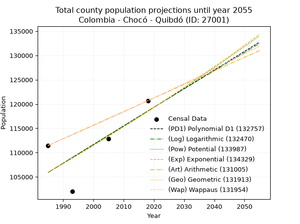
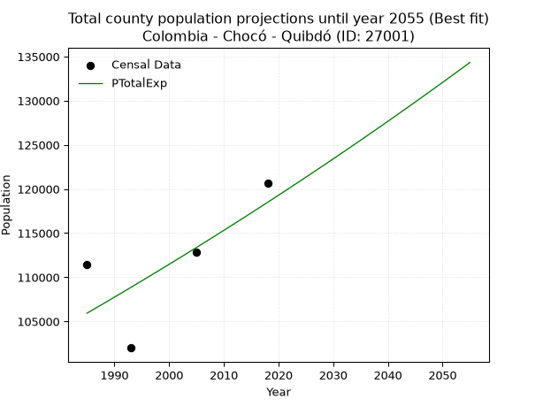
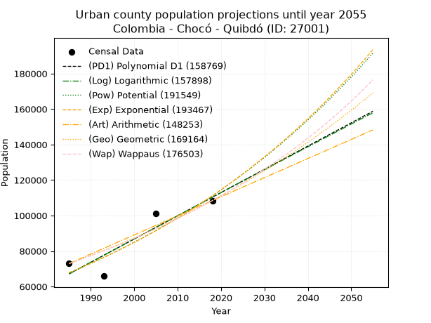
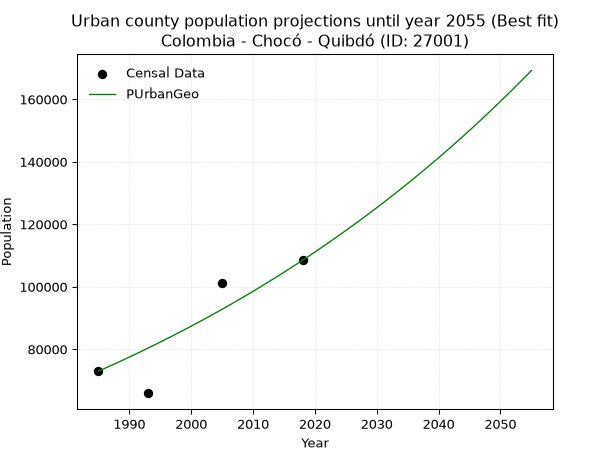
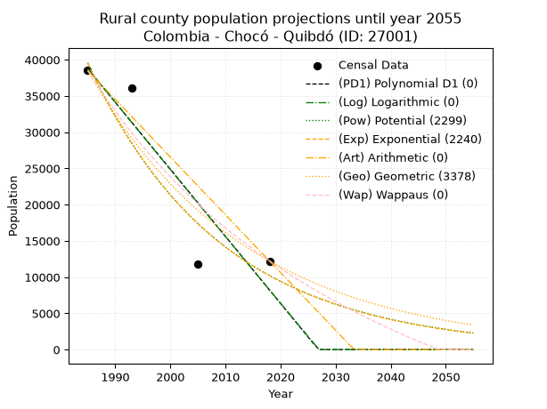
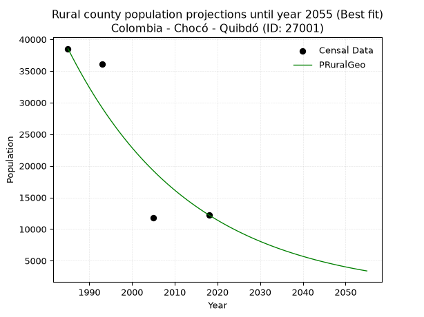

<div align="center">


</div>

# _“Population and Public Services Demand Projections (PPSD) until Year 2050 for Colombia - Chocó - Quibdó (ID: 27001)”_
Keywords: `population` `public-service` `projection` `lineal` `polynomial` `logarithmic` `potential` `exponential` `arithmetic` `geometric` `wappaus` `dane` `colombia` `south-america`

PPSD are analytical estimates used by governments and planners to anticipate future changes in population size, age distribution, and the resulting community needs for utilities, healthcare, education, and infrastructure as sizing future water treatment facilities, electrical grids, and road networks based on spatial growth.

> **General running parameters**: • app_version: _v20260806_. • Python version: _3.14.7_. • Pandas version: _3.0.5_. • NumPy version: _2.5.1_. • Creates, save and include plots into reports (create_plot): _False_. • Projection until year: _2050_. • Process polynomial degree 2 and up: _False_. • Process Wappaus: _True_. • Process Wappaus: _True_. • Set negative values to zero: _True_. • Set infinite values to zero: _True_. • Drop dataset notes: _True_. 
<div align="center">

Dynamic map: [:earth_americas:Google](http://maps.google.com/maps?q=5.6821664,-76.6381442) [:earth_americas:OSM](https://www.openstreetmap.org/#map=18/5.6821664/-76.6381442&layers=P) [:earth_americas:Bing](https://www.bing.com/maps?cp=5.6821664~-76.6381442&lvl=18) [:earth_americas:Apple](https://maps.apple.com/frame?center=5.6821664%2C-76.6381442&span=0.003%2C0.006)

</div>


<div align="center">

```geojson
{
  "type": "Feature",
  "geometry": {
    "type": "Point", 
    "coordinates": [-76.6381442, 5.6821664]
  }, 
  "properties": {
    "Name": "Colombia - Chocó - Quibdó (ID: 27001)"
  }
}
```

</div>


## 0. Census Data (4 records)

Census data are official statistics collected by a government about the people and housing in a country. They usually include counts of total population, age, sex, race, income, education, and jobs.

📅Global census file: [Population.xlsx](../data/Population.xlsx)

| Source   |   Year |   CountryID | CountryName   |   StateID | StateName   |   CountyID | CountyName   |   PTotal |   PUrban |   PRural |
|:---------|-------:|------------:|:--------------|----------:|:------------|-----------:|:-------------|---------:|---------:|---------:|
| DANE     |   1985 |          57 | Colombia      |        27 | Chocó       |      27001 | Quibdó       |   111469 |    72950 |    38519 |
| DANE     |   1993 |          57 | Colombia      |        27 | Chocó       |      27001 | Quibdó       |   102003 |    65904 |    36099 |
| DANE     |   2005 |          57 | Colombia      |        27 | Chocó       |      27001 | Quibdó       |   112886 |   101134 |    11752 |
| DANE     |   2018 |          57 | Colombia      |        27 | Chocó       |      27001 | Quibdó       |   120679 |   108450 |    12229 |

> 🔥Some records could had specific notes about the registered values or the corresponding urban or rural distribution.

## 1. Total

### 1.1. Coefficients and Parameters

* (PD1) Polynomial Deg 1: 383.51947009232714, -655375.5700521773 (lineal)
* (Log) Logarithmic: 766392.1050336228, -5713593.281841463
* (Pow) Potential: 6.778650709676503, -17.32933035696958
* (Exp) Exponential: 0.0033922566272595765, 126.08537977638365
* (Art) Arithmetic: Year diff. 2018 - 1985 = 33, Population diff. 120679 - 111469 = 9210, Annual growth = 279.09090909090907
* (Geo) Geometric: Year diff. 2018 - 1985 = 33, Population diff. 120679 - 111469 = 9210, Annual growth % = 0.002408580907292013
* (Wap) Wappaus: i = 0.24044222572747478, Condition values only valid for < 200)

<sub>
Wappaus condition values: ['0.00', '0.24', '0.48', '0.72', '0.96', '1.20', '1.44', '1.68', '1.92', '2.16', '2.40', '2.64', '2.89', '3.13', '3.37', '3.61', '3.85', '4.09', '4.33', '4.57', '4.81', '5.05', '5.29', '5.53', '5.77', '6.01', '6.25', '6.49', '6.73', '6.97', '7.21', '7.45', '7.69', '7.93', '8.18', '8.42', '8.66', '8.90', '9.14', '9.38', '9.62', '9.86', '10.10', '10.34', '10.58', '10.82', '11.06', '11.30', '11.54', '11.78', '12.02', '12.26', '12.50', '12.74', '12.98', '13.22', '13.46', '13.71', '13.95', '14.19', '14.43', '14.67', '14.91', '15.15', '15.39', '15.63']
</sub>


### 1.2. Projected Dataset

|   Year |   CountyID |   PTotalPD1 |   PTotalLog |   PTotalPow |   PTotalExp |   PTotalArt |   PTotalGeo |   PTotalWap |
|-------:|-----------:|------------:|------------:|------------:|------------:|------------:|------------:|------------:|
|   1985 |      27001 |      105911 |      105909 |      105934 |      105936 |      111469 |      111469 |      111469 |
|   1986 |      27001 |      106294 |      106295 |      106297 |      106296 |      111748 |      111737 |      111737 |
|   1987 |      27001 |      106678 |      106681 |      106660 |      106657 |      112027 |      112007 |      112006 |
|   1988 |      27001 |      107061 |      107066 |      107024 |      107019 |      112306 |      112276 |      112276 |
|   1989 |      27001 |      107445 |      107452 |      107390 |      107383 |      112585 |      112547 |      112546 |
|   1990 |      27001 |      107828 |      107837 |      107756 |      107748 |      112864 |      112818 |      112817 |
|   1991 |      27001 |      108212 |      108222 |      108124 |      108114 |      113144 |      113090 |      113089 |
|   1992 |      27001 |      108595 |      108607 |      108492 |      108481 |      113423 |      113362 |      113361 |
|   1993 |      27001 |      108979 |      108991 |      108862 |      108850 |      113702 |      113635 |      113634 |
|   1994 |      27001 |      109362 |      109376 |      109233 |      109220 |      113981 |      113909 |      113908 |
|   1995 |      27001 |      109746 |      109760 |      109605 |      109591 |      114260 |      114183 |      114182 |
|   1996 |      27001 |      110129 |      110144 |      109978 |      109963 |      114539 |      114458 |      114457 |
|   1997 |      27001 |      110513 |      110528 |      110352 |      110337 |      114818 |      114734 |      114732 |
|   1998 |      27001 |      110896 |      110912 |      110727 |      110712 |      115097 |      115010 |      115009 |
|   1999 |      27001 |      111280 |      111295 |      111103 |      111088 |      115376 |      115287 |      115285 |
|   2000 |      27001 |      111663 |      111678 |      111481 |      111466 |      115655 |      115565 |      115563 |
|   2001 |      27001 |      112047 |      112061 |      111859 |      111845 |      115934 |      115843 |      115841 |
|   2002 |      27001 |      112430 |      112444 |      112238 |      112225 |      116214 |      116122 |      116120 |
|   2003 |      27001 |      112814 |      112827 |      112619 |      112606 |      116493 |      116402 |      116400 |
|   2004 |      27001 |      113197 |      113210 |      113001 |      112989 |      116772 |      116682 |      116680 |
|   2005 |      27001 |      113581 |      113592 |      113383 |      113372 |      117051 |      116963 |      116961 |
|   2006 |      27001 |      113964 |      113974 |      113767 |      113758 |      117330 |      117245 |      117243 |
|   2007 |      27001 |      114348 |      114356 |      114152 |      114144 |      117609 |      117527 |      117526 |
|   2008 |      27001 |      114732 |      114738 |      114538 |      114532 |      117888 |      117810 |      117809 |
|   2009 |      27001 |      115115 |      115119 |      114926 |      114921 |      118167 |      118094 |      118093 |
|   2010 |      27001 |      115499 |      115501 |      115314 |      115312 |      118446 |      118379 |      118377 |
|   2011 |      27001 |      115882 |      115882 |      115703 |      115704 |      118725 |      118664 |      118662 |
|   2012 |      27001 |      116266 |      116263 |      116094 |      116097 |      119004 |      118950 |      118948 |
|   2013 |      27001 |      116649 |      116644 |      116486 |      116491 |      119284 |      119236 |      119235 |
|   2014 |      27001 |      117033 |      117024 |      116879 |      116887 |      119563 |      119523 |      119522 |
|   2015 |      27001 |      117416 |      117405 |      117272 |      117284 |      119842 |      119811 |      119810 |
|   2016 |      27001 |      117800 |      117785 |      117668 |      117683 |      120121 |      120100 |      120099 |
|   2017 |      27001 |      118183 |      118165 |      118064 |      118083 |      120400 |      120389 |      120389 |
|   2018 |      27001 |      118567 |      118545 |      118461 |      118484 |      120679 |      120679 |      120679 |
|   2019 |      27001 |      118950 |      118925 |      118860 |      118887 |      120958 |      120970 |      120970 |
|   2020 |      27001 |      119334 |      119304 |      119259 |      119291 |      121237 |      121261 |      121262 |
|   2021 |      27001 |      119717 |      119684 |      119660 |      119696 |      121516 |      121553 |      121554 |
|   2022 |      27001 |      120101 |      120063 |      120062 |      120103 |      121795 |      121846 |      121847 |
|   2023 |      27001 |      120484 |      120442 |      120465 |      120511 |      122074 |      122139 |      122141 |
|   2024 |      27001 |      120868 |      120820 |      120869 |      120920 |      122354 |      122434 |      122436 |
|   2025 |      27001 |      121251 |      121199 |      121275 |      121331 |      122633 |      122728 |      122731 |
|   2026 |      27001 |      121635 |      121577 |      121681 |      121743 |      122912 |      123024 |      123027 |
|   2027 |      27001 |      122018 |      121955 |      122089 |      122157 |      123191 |      123320 |      123324 |
|   2028 |      27001 |      122402 |      122333 |      122498 |      122572 |      123470 |      123617 |      123622 |
|   2029 |      27001 |      122785 |      122711 |      122908 |      122989 |      123749 |      123915 |      123920 |
|   2030 |      27001 |      123169 |      123089 |      123319 |      123407 |      124028 |      124214 |      124220 |
|   2031 |      27001 |      123552 |      123466 |      123731 |      123826 |      124307 |      124513 |      124520 |
|   2032 |      27001 |      123936 |      123844 |      124145 |      124247 |      124586 |      124813 |      124820 |
|   2033 |      27001 |      124320 |      124221 |      124560 |      124669 |      124865 |      125113 |      125122 |
|   2034 |      27001 |      124703 |      124598 |      124976 |      125093 |      125144 |      125415 |      125424 |
|   2035 |      27001 |      125087 |      124974 |      125393 |      125518 |      125424 |      125717 |      125727 |
|   2036 |      27001 |      125470 |      125351 |      125811 |      125944 |      125703 |      126019 |      126031 |
|   2037 |      27001 |      125854 |      125727 |      126230 |      126372 |      125982 |      126323 |      126335 |
|   2038 |      27001 |      126237 |      126103 |      126651 |      126802 |      126261 |      126627 |      126641 |
|   2039 |      27001 |      126621 |      126479 |      127073 |      127232 |      126540 |      126932 |      126947 |
|   2040 |      27001 |      127004 |      126855 |      127496 |      127665 |      126819 |      127238 |      127254 |
|   2041 |      27001 |      127388 |      127231 |      127920 |      128099 |      127098 |      127544 |      127561 |
|   2042 |      27001 |      127771 |      127606 |      128346 |      128534 |      127377 |      127852 |      127870 |
|   2043 |      27001 |      128155 |      127981 |      128772 |      128971 |      127656 |      128160 |      128179 |
|   2044 |      27001 |      128538 |      128356 |      129200 |      129409 |      127935 |      128468 |      128489 |
|   2045 |      27001 |      128922 |      128731 |      129629 |      129849 |      128214 |      128778 |      128800 |
|   2046 |      27001 |      129305 |      129106 |      130060 |      130290 |      128494 |      129088 |      129112 |
|   2047 |      27001 |      129689 |      129480 |      130491 |      130733 |      128773 |      129399 |      129425 |
|   2048 |      27001 |      130072 |      129855 |      130924 |      131177 |      129052 |      129710 |      129738 |
|   2049 |      27001 |      130456 |      130229 |      131358 |      131622 |      129331 |      130023 |      130052 |
|   2050 |      27001 |      130839 |      130603 |      131793 |      132070 |      129610 |      130336 |      130367 |
<div align="center">

</img>

</div>


### 1.3. Best fit with absolute and relative error (%)

Relative error puts that difference into context by dividing the absolute error by the true value, creating a unitless ratio or percentage that shows the scale of the mistake.

Absolute and relative error

|   Year | Source   |   CountryID | CountryName   |   StateID | StateName   |   CountyID_x | CountyName   |   PTotal |   PUrban |   PRural |   CountyID_y |   PTotalPD1 |   PTotalLog |   PTotalPow |   PTotalExp |   PTotalArt |   PTotalGeo |   PTotalWap |   PTotalPD1AbsError |   PTotalLogAbsError |   PTotalPowAbsError |   PTotalExpAbsError |   PTotalArtAbsError |   PTotalGeoAbsError |   PTotalWapAbsError |   PTotalPD1RelError |   PTotalLogRelError |   PTotalPowRelError |   PTotalExpRelError |   PTotalArtRelError |   PTotalGeoRelError |   PTotalWapRelError |
|-------:|:---------|------------:|:--------------|----------:|:------------|-------------:|:-------------|---------:|---------:|---------:|-------------:|------------:|------------:|------------:|------------:|------------:|------------:|------------:|--------------------:|--------------------:|--------------------:|--------------------:|--------------------:|--------------------:|--------------------:|--------------------:|--------------------:|--------------------:|--------------------:|--------------------:|--------------------:|--------------------:|
|   1985 | DANE     |          57 | Colombia      |        27 | Chocó       |        27001 | Quibdó       |   111469 |    72950 |    38519 |        27001 |      105911 |      105909 |      105934 |      105936 |      111469 |      111469 |      111469 |                5558 |                5560 |                5535 |                5533 |                   0 |                   0 |                   0 |            4.98614  |             4.98793 |            4.96551  |            4.96371  |             0       |             0       |             0       |
|   1993 | DANE     |          57 | Colombia      |        27 | Chocó       |        27001 | Quibdó       |   102003 |    65904 |    36099 |        27001 |      108979 |      108991 |      108862 |      108850 |      113702 |      113635 |      113634 |                6976 |                6988 |                6859 |                6847 |               11699 |               11632 |               11631 |            6.83901  |             6.85078 |            6.72431  |            6.71255  |            11.4693  |            11.4036  |            11.4026  |
|   2005 | DANE     |          57 | Colombia      |        27 | Chocó       |        27001 | Quibdó       |   112886 |   101134 |    11752 |        27001 |      113581 |      113592 |      113383 |      113372 |      117051 |      116963 |      116961 |                 695 |                 706 |                 497 |                 486 |                4165 |                4077 |                4075 |            0.615665 |             0.62541 |            0.440267 |            0.430523 |             3.68956 |             3.61161 |             3.60984 |
|   2018 | DANE     |          57 | Colombia      |        27 | Chocó       |        27001 | Quibdó       |   120679 |   108450 |    12229 |        27001 |      118567 |      118545 |      118461 |      118484 |      120679 |      120679 |      120679 |                2112 |                2134 |                2218 |                2195 |                   0 |                   0 |                   0 |            1.7501   |             1.76833 |            1.83793  |            1.81887  |             0       |             0       |             0       |

Relative error mean

| Method    |   RelError | Best   |
|:----------|-----------:|:-------|
| PTotalPD1 |    3.54773 |        |
| PTotalLog |    3.55811 |        |
| PTotalPow |    3.492   |        |
| PTotalExp |    3.48141 | True   |
| PTotalArt |    3.78971 |        |
| PTotalGeo |    3.7538  |        |
| PTotalWap |    3.75311 |        |

💙Best method: _**PTotalExp**_
<div align="center">

</img>

</div>


### 1.4. Fresh water supply demand in liters per capita per day (lpcd)

The fresh water supply demand typically ranges from 100 to 300 liters per capita per day (lpcd) for standard domestic and municipal planning, though absolute survival minimums set by the World Health Organization are as low as 7.5 to 20 liters per day, and total consumption in high-income nations can exceed 400 liters.

> `CZ`: Level in meters above the sea level (masl).<br> `WS`: Fresh water supply demand in liters per capita per day (lpcd or l/h/d).<br> `WSAll`: Zonal fresh water supply demand in liters per second (l/s).<br> `A`: Zonal area in square meters.

Reference values (RAS Colombia)

|    CZ |   WS |
|------:|-----:|
|  1000 |  120 |
|  2000 |  130 |
| 99999 |  140 |

County shapefile geometry properties and water supply values

|   CountyID |      ATotal |   CZTotal |   WSTotal |
|-----------:|------------:|----------:|----------:|
|      27001 | 3.50866e+09 |   398.637 |       120 |

Projected values for best method: PTotalExp

|   CountyID |   Year |   PTotalExp |   WSTotal |   WSTotalAll |
|-----------:|-------:|------------:|----------:|-------------:|
|      27001 |   1985 |      105936 |       120 |      147.133 |
|      27001 |   1986 |      106296 |       120 |      147.633 |
|      27001 |   1987 |      106657 |       120 |      148.135 |
|      27001 |   1988 |      107019 |       120 |      148.637 |
|      27001 |   1989 |      107383 |       120 |      149.143 |
|      27001 |   1990 |      107748 |       120 |      149.65  |
|      27001 |   1991 |      108114 |       120 |      150.158 |
|      27001 |   1992 |      108481 |       120 |      150.668 |
|      27001 |   1993 |      108850 |       120 |      151.181 |
|      27001 |   1994 |      109220 |       120 |      151.694 |
|      27001 |   1995 |      109591 |       120 |      152.21  |
|      27001 |   1996 |      109963 |       120 |      152.726 |
|      27001 |   1997 |      110337 |       120 |      153.246 |
|      27001 |   1998 |      110712 |       120 |      153.767 |
|      27001 |   1999 |      111088 |       120 |      154.289 |
|      27001 |   2000 |      111466 |       120 |      154.814 |
|      27001 |   2001 |      111845 |       120 |      155.34  |
|      27001 |   2002 |      112225 |       120 |      155.868 |
|      27001 |   2003 |      112606 |       120 |      156.397 |
|      27001 |   2004 |      112989 |       120 |      156.929 |
|      27001 |   2005 |      113372 |       120 |      157.461 |
|      27001 |   2006 |      113758 |       120 |      157.997 |
|      27001 |   2007 |      114144 |       120 |      158.533 |
|      27001 |   2008 |      114532 |       120 |      159.072 |
|      27001 |   2009 |      114921 |       120 |      159.613 |
|      27001 |   2010 |      115312 |       120 |      160.156 |
|      27001 |   2011 |      115704 |       120 |      160.7   |
|      27001 |   2012 |      116097 |       120 |      161.246 |
|      27001 |   2013 |      116491 |       120 |      161.793 |
|      27001 |   2014 |      116887 |       120 |      162.343 |
|      27001 |   2015 |      117284 |       120 |      162.894 |
|      27001 |   2016 |      117683 |       120 |      163.449 |
|      27001 |   2017 |      118083 |       120 |      164.004 |
|      27001 |   2018 |      118484 |       120 |      164.561 |
|      27001 |   2019 |      118887 |       120 |      165.121 |
|      27001 |   2020 |      119291 |       120 |      165.682 |
|      27001 |   2021 |      119696 |       120 |      166.244 |
|      27001 |   2022 |      120103 |       120 |      166.81  |
|      27001 |   2023 |      120511 |       120 |      167.376 |
|      27001 |   2024 |      120920 |       120 |      167.944 |
|      27001 |   2025 |      121331 |       120 |      168.515 |
|      27001 |   2026 |      121743 |       120 |      169.088 |
|      27001 |   2027 |      122157 |       120 |      169.662 |
|      27001 |   2028 |      122572 |       120 |      170.239 |
|      27001 |   2029 |      122989 |       120 |      170.818 |
|      27001 |   2030 |      123407 |       120 |      171.399 |
|      27001 |   2031 |      123826 |       120 |      171.981 |
|      27001 |   2032 |      124247 |       120 |      172.565 |
|      27001 |   2033 |      124669 |       120 |      173.151 |
|      27001 |   2034 |      125093 |       120 |      173.74  |
|      27001 |   2035 |      125518 |       120 |      174.331 |
|      27001 |   2036 |      125944 |       120 |      174.922 |
|      27001 |   2037 |      126372 |       120 |      175.517 |
|      27001 |   2038 |      126802 |       120 |      176.114 |
|      27001 |   2039 |      127232 |       120 |      176.711 |
|      27001 |   2040 |      127665 |       120 |      177.312 |
|      27001 |   2041 |      128099 |       120 |      177.915 |
|      27001 |   2042 |      128534 |       120 |      178.519 |
|      27001 |   2043 |      128971 |       120 |      179.126 |
|      27001 |   2044 |      129409 |       120 |      179.735 |
|      27001 |   2045 |      129849 |       120 |      180.346 |
|      27001 |   2046 |      130290 |       120 |      180.958 |
|      27001 |   2047 |      130733 |       120 |      181.574 |
|      27001 |   2048 |      131177 |       120 |      182.19  |
|      27001 |   2049 |      131622 |       120 |      182.808 |
|      27001 |   2050 |      132070 |       120 |      183.431 |

## 2. Urban

### 2.1. Coefficients and Parameters

* (PD1) Polynomial Deg 1: 1308.8438378161322, -2530905.3865917185 (lineal)
* (Log) Logarithmic: 2619550.190729538, -19824112.49149302
* (Pow) Potential: 29.973088669273956, -94.01292281837853
* (Exp) Exponential: 0.014975917749347919, 8.336295164761505e-09
* (Art) Arithmetic: Year diff. 2018 - 1985 = 33, Population diff. 108450 - 72950 = 35500, Annual growth = 1075.7575757575758
* (Geo) Geometric: Year diff. 2018 - 1985 = 33, Population diff. 108450 - 72950 = 35500, Annual growth % = 0.01208808229469227
* (Wap) Wappaus: i = 1.1860612742641408, Condition values only valid for < 200)

<sub>
Wappaus condition values: ['0.00', '1.19', '2.37', '3.56', '4.74', '5.93', '7.12', '8.30', '9.49', '10.67', '11.86', '13.05', '14.23', '15.42', '16.60', '17.79', '18.98', '20.16', '21.35', '22.54', '23.72', '24.91', '26.09', '27.28', '28.47', '29.65', '30.84', '32.02', '33.21', '34.40', '35.58', '36.77', '37.95', '39.14', '40.33', '41.51', '42.70', '43.88', '45.07', '46.26', '47.44', '48.63', '49.81', '51.00', '52.19', '53.37', '54.56', '55.74', '56.93', '58.12', '59.30', '60.49', '61.68', '62.86', '64.05', '65.23', '66.42', '67.61', '68.79', '69.98', '71.16', '72.35', '73.54', '74.72', '75.91', '77.09']
</sub>


### 2.2. Projected Dataset

|   Year |   CountyID |   PUrbanPD1 |   PUrbanLog |   PUrbanPow |   PUrbanExp |   PUrbanArt |   PUrbanGeo |   PUrbanWap |
|-------:|-----------:|------------:|------------:|------------:|------------:|------------:|------------:|------------:|
|   1985 |      27001 |       67150 |       67112 |       67787 |       67816 |       72950 |       72950 |       72950 |
|   1986 |      27001 |       68458 |       68432 |       68818 |       68839 |       74026 |       73832 |       73820 |
|   1987 |      27001 |       69767 |       69750 |       69864 |       69878 |       75102 |       74724 |       74701 |
|   1988 |      27001 |       71076 |       71068 |       70926 |       70932 |       76177 |       75628 |       75593 |
|   1989 |      27001 |       72385 |       72386 |       72003 |       72002 |       77253 |       76542 |       76495 |
|   1990 |      27001 |       73694 |       73702 |       73096 |       73089 |       78329 |       77467 |       77408 |
|   1991 |      27001 |       75003 |       75018 |       74205 |       74192 |       79405 |       78403 |       78333 |
|   1992 |      27001 |       76312 |       76334 |       75330 |       75311 |       80480 |       79351 |       79269 |
|   1993 |      27001 |       77620 |       77648 |       76472 |       76447 |       81556 |       80310 |       80217 |
|   1994 |      27001 |       78929 |       78963 |       77630 |       77601 |       82632 |       81281 |       81176 |
|   1995 |      27001 |       80238 |       80276 |       78806 |       78772 |       83708 |       82264 |       82148 |
|   1996 |      27001 |       81547 |       81589 |       79998 |       79960 |       84783 |       83258 |       83132 |
|   1997 |      27001 |       82856 |       82901 |       81209 |       81167 |       85859 |       84265 |       84128 |
|   1998 |      27001 |       84165 |       84212 |       82436 |       82391 |       86935 |       85283 |       85138 |
|   1999 |      27001 |       85473 |       85523 |       83682 |       83635 |       88011 |       86314 |       86160 |
|   2000 |      27001 |       86782 |       86833 |       84946 |       84897 |       89086 |       87357 |       87196 |
|   2001 |      27001 |       88091 |       88142 |       86228 |       86178 |       90162 |       88413 |       88245 |
|   2002 |      27001 |       89400 |       89451 |       87529 |       87478 |       91238 |       89482 |       89308 |
|   2003 |      27001 |       90709 |       90759 |       88849 |       88798 |       92314 |       90564 |       90385 |
|   2004 |      27001 |       92018 |       92067 |       90188 |       90138 |       93389 |       91659 |       91477 |
|   2005 |      27001 |       93327 |       93374 |       91547 |       91498 |       94465 |       92767 |       92583 |
|   2006 |      27001 |       94635 |       94680 |       92926 |       92878 |       95541 |       93888 |       93705 |
|   2007 |      27001 |       95944 |       95985 |       94324 |       94280 |       96617 |       95023 |       94841 |
|   2008 |      27001 |       97253 |       97290 |       95743 |       95702 |       97692 |       96172 |       95993 |
|   2009 |      27001 |       98562 |       98595 |       97182 |       97146 |       98768 |       97334 |       97162 |
|   2010 |      27001 |       99871 |       99898 |       98643 |       98612 |       99844 |       98511 |       98346 |
|   2011 |      27001 |      101180 |      101201 |      100124 |      100100 |      100920 |       99701 |       99547 |
|   2012 |      27001 |      102488 |      102503 |      101628 |      101610 |      101995 |      100907 |      100765 |
|   2013 |      27001 |      103797 |      103805 |      103152 |      103143 |      103071 |      102126 |      102000 |
|   2014 |      27001 |      105106 |      105106 |      104699 |      104700 |      104147 |      103361 |      103253 |
|   2015 |      27001 |      106415 |      106406 |      106269 |      106279 |      105223 |      104610 |      104524 |
|   2016 |      27001 |      107724 |      107706 |      107861 |      107883 |      106298 |      105875 |      105814 |
|   2017 |      27001 |      109033 |      109005 |      109476 |      109511 |      107374 |      107155 |      107122 |
|   2018 |      27001 |      110341 |      110303 |      111115 |      111163 |      108450 |      108450 |      108450 |
|   2019 |      27001 |      111650 |      111601 |      112777 |      112841 |      109526 |      109761 |      109797 |
|   2020 |      27001 |      112959 |      112898 |      114463 |      114543 |      110602 |      111088 |      111165 |
|   2021 |      27001 |      114268 |      114195 |      116174 |      116271 |      111677 |      112431 |      112553 |
|   2022 |      27001 |      115577 |      115491 |      117909 |      118026 |      112753 |      113790 |      113963 |
|   2023 |      27001 |      116886 |      116786 |      119670 |      119807 |      113829 |      115165 |      115394 |
|   2024 |      27001 |      118195 |      118080 |      121456 |      121614 |      114905 |      116557 |      116847 |
|   2025 |      27001 |      119503 |      119374 |      123267 |      123449 |      115980 |      117966 |      118322 |
|   2026 |      27001 |      120812 |      120668 |      125105 |      125312 |      117056 |      119392 |      119821 |
|   2027 |      27001 |      122121 |      121960 |      126969 |      127203 |      118132 |      120835 |      121343 |
|   2028 |      27001 |      123430 |      123252 |      128860 |      129122 |      119208 |      122296 |      122890 |
|   2029 |      27001 |      124739 |      124544 |      130778 |      131070 |      120283 |      123774 |      124461 |
|   2030 |      27001 |      126048 |      125834 |      132724 |      133048 |      121359 |      125271 |      126058 |
|   2031 |      27001 |      127356 |      127125 |      134698 |      135056 |      122435 |      126785 |      127681 |
|   2032 |      27001 |      128665 |      128414 |      136700 |      137093 |      123511 |      128318 |      129331 |
|   2033 |      27001 |      129974 |      129703 |      138731 |      139162 |      124586 |      129869 |      131007 |
|   2034 |      27001 |      131283 |      130991 |      140791 |      141262 |      125662 |      131438 |      132712 |
|   2035 |      27001 |      132592 |      132279 |      142880 |      143393 |      126738 |      133027 |      134446 |
|   2036 |      27001 |      133901 |      133566 |      145000 |      145557 |      127814 |      134635 |      136209 |
|   2037 |      27001 |      135210 |      134852 |      147149 |      147753 |      128889 |      136263 |      138003 |
|   2038 |      27001 |      136518 |      136138 |      149330 |      149982 |      129965 |      137910 |      139827 |
|   2039 |      27001 |      137827 |      137423 |      151542 |      152245 |      131041 |      139577 |      141683 |
|   2040 |      27001 |      139136 |      138707 |      153786 |      154543 |      132117 |      141264 |      143572 |
|   2041 |      27001 |      140445 |      139991 |      156061 |      156874 |      133192 |      142972 |      145495 |
|   2042 |      27001 |      141754 |      141274 |      158369 |      159241 |      134268 |      144700 |      147452 |
|   2043 |      27001 |      143063 |      142556 |      160711 |      161644 |      135344 |      146449 |      149444 |
|   2044 |      27001 |      144371 |      143838 |      163085 |      164083 |      136420 |      148220 |      151473 |
|   2045 |      27001 |      145680 |      145120 |      165494 |      166559 |      137495 |      150011 |      153539 |
|   2046 |      27001 |      146989 |      146400 |      167937 |      169072 |      138571 |      151825 |      155643 |
|   2047 |      27001 |      148298 |      147680 |      170414 |      171623 |      139647 |      153660 |      157787 |
|   2048 |      27001 |      149607 |      148960 |      172927 |      174213 |      140723 |      155517 |      159972 |
|   2049 |      27001 |      150916 |      150238 |      175476 |      176841 |      141798 |      157397 |      162198 |
|   2050 |      27001 |      152224 |      151517 |      178061 |      179510 |      142874 |      159300 |      164467 |
<div align="center">

</img>

</div>


### 2.3. Best fit with absolute and relative error (%)

Relative error puts that difference into context by dividing the absolute error by the true value, creating a unitless ratio or percentage that shows the scale of the mistake.

Absolute and relative error

|   Year | Source   |   CountryID | CountryName   |   StateID | StateName   |   CountyID_x | CountyName   |   PTotal |   PUrban |   PRural |   CountyID_y |   PUrbanPD1 |   PUrbanLog |   PUrbanPow |   PUrbanExp |   PUrbanArt |   PUrbanGeo |   PUrbanWap |   PUrbanPD1AbsError |   PUrbanLogAbsError |   PUrbanPowAbsError |   PUrbanExpAbsError |   PUrbanArtAbsError |   PUrbanGeoAbsError |   PUrbanWapAbsError |   PUrbanPD1RelError |   PUrbanLogRelError |   PUrbanPowRelError |   PUrbanExpRelError |   PUrbanArtRelError |   PUrbanGeoRelError |   PUrbanWapRelError |
|-------:|:---------|------------:|:--------------|----------:|:------------|-------------:|:-------------|---------:|---------:|---------:|-------------:|------------:|------------:|------------:|------------:|------------:|------------:|------------:|--------------------:|--------------------:|--------------------:|--------------------:|--------------------:|--------------------:|--------------------:|--------------------:|--------------------:|--------------------:|--------------------:|--------------------:|--------------------:|--------------------:|
|   1985 | DANE     |          57 | Colombia      |        27 | Chocó       |        27001 | Quibdó       |   111469 |    72950 |    38519 |        27001 |       67150 |       67112 |       67787 |       67816 |       72950 |       72950 |       72950 |                5800 |                5838 |                5163 |                5134 |                   0 |                   0 |                   0 |             7.95065 |             8.00274 |             7.07745 |             7.0377  |             0       |             0       |             0       |
|   1993 | DANE     |          57 | Colombia      |        27 | Chocó       |        27001 | Quibdó       |   102003 |    65904 |    36099 |        27001 |       77620 |       77648 |       76472 |       76447 |       81556 |       80310 |       80217 |               11716 |               11744 |               10568 |               10543 |               15652 |               14406 |               14313 |            17.7774  |            17.8199  |            16.0354  |            15.9975  |            23.7497  |            21.8591  |            21.718   |
|   2005 | DANE     |          57 | Colombia      |        27 | Chocó       |        27001 | Quibdó       |   112886 |   101134 |    11752 |        27001 |       93327 |       93374 |       91547 |       91498 |       94465 |       92767 |       92583 |                7807 |                7760 |                9587 |                9636 |                6669 |                8367 |                8551 |             7.71946 |             7.67299 |             9.4795  |             9.52795 |             6.59422 |             8.27318 |             8.45512 |
|   2018 | DANE     |          57 | Colombia      |        27 | Chocó       |        27001 | Quibdó       |   120679 |   108450 |    12229 |        27001 |      110341 |      110303 |      111115 |      111163 |      108450 |      108450 |      108450 |                1891 |                1853 |                2665 |                2713 |                   0 |                   0 |                   0 |             1.74366 |             1.70862 |             2.45735 |             2.50161 |             0       |             0       |             0       |

Relative error mean

| Method    |   RelError | Best   |
|:----------|-----------:|:-------|
| PUrbanPD1 |    8.79779 |        |
| PUrbanLog |    8.80105 |        |
| PUrbanPow |    8.76244 |        |
| PUrbanExp |    8.76619 |        |
| PUrbanArt |    7.58598 |        |
| PUrbanGeo |    7.53306 | True   |
| PUrbanWap |    7.54327 |        |

💙Best method: _**PUrbanGeo**_
<div align="center">

</img>

</div>


### 2.4. Fresh water supply demand in liters per capita per day (lpcd)

The fresh water supply demand typically ranges from 100 to 300 liters per capita per day (lpcd) for standard domestic and municipal planning, though absolute survival minimums set by the World Health Organization are as low as 7.5 to 20 liters per day, and total consumption in high-income nations can exceed 400 liters.

> `CZ`: Level in meters above the sea level (masl).<br> `WS`: Fresh water supply demand in liters per capita per day (lpcd or l/h/d).<br> `WSAll`: Zonal fresh water supply demand in liters per second (l/s).<br> `A`: Zonal area in square meters.

Reference values (RAS Colombia)

|    CZ |   WS |
|------:|-----:|
|  1000 |  120 |
|  2000 |  130 |
| 99999 |  140 |

County shapefile geometry properties and water supply values

|   CountyID |      AUrban |   CZUrban |   WSUrban |
|-----------:|------------:|----------:|----------:|
|      27001 | 2.88283e+07 |    55.077 |       120 |

Projected values for best method: PUrbanGeo

|   CountyID |   Year |   PUrbanGeo |   WSUrban |   WSUrbanAll |
|-----------:|-------:|------------:|----------:|-------------:|
|      27001 |   1985 |       72950 |       120 |      101.319 |
|      27001 |   1986 |       73832 |       120 |      102.544 |
|      27001 |   1987 |       74724 |       120 |      103.783 |
|      27001 |   1988 |       75628 |       120 |      105.039 |
|      27001 |   1989 |       76542 |       120 |      106.308 |
|      27001 |   1990 |       77467 |       120 |      107.593 |
|      27001 |   1991 |       78403 |       120 |      108.893 |
|      27001 |   1992 |       79351 |       120 |      110.21  |
|      27001 |   1993 |       80310 |       120 |      111.542 |
|      27001 |   1994 |       81281 |       120 |      112.89  |
|      27001 |   1995 |       82264 |       120 |      114.256 |
|      27001 |   1996 |       83258 |       120 |      115.636 |
|      27001 |   1997 |       84265 |       120 |      117.035 |
|      27001 |   1998 |       85283 |       120 |      118.449 |
|      27001 |   1999 |       86314 |       120 |      119.881 |
|      27001 |   2000 |       87357 |       120 |      121.329 |
|      27001 |   2001 |       88413 |       120 |      122.796 |
|      27001 |   2002 |       89482 |       120 |      124.281 |
|      27001 |   2003 |       90564 |       120 |      125.783 |
|      27001 |   2004 |       91659 |       120 |      127.304 |
|      27001 |   2005 |       92767 |       120 |      128.843 |
|      27001 |   2006 |       93888 |       120 |      130.4   |
|      27001 |   2007 |       95023 |       120 |      131.976 |
|      27001 |   2008 |       96172 |       120 |      133.572 |
|      27001 |   2009 |       97334 |       120 |      135.186 |
|      27001 |   2010 |       98511 |       120 |      136.821 |
|      27001 |   2011 |       99701 |       120 |      138.474 |
|      27001 |   2012 |      100907 |       120 |      140.149 |
|      27001 |   2013 |      102126 |       120 |      141.842 |
|      27001 |   2014 |      103361 |       120 |      143.557 |
|      27001 |   2015 |      104610 |       120 |      145.292 |
|      27001 |   2016 |      105875 |       120 |      147.049 |
|      27001 |   2017 |      107155 |       120 |      148.826 |
|      27001 |   2018 |      108450 |       120 |      150.625 |
|      27001 |   2019 |      109761 |       120 |      152.446 |
|      27001 |   2020 |      111088 |       120 |      154.289 |
|      27001 |   2021 |      112431 |       120 |      156.154 |
|      27001 |   2022 |      113790 |       120 |      158.042 |
|      27001 |   2023 |      115165 |       120 |      159.951 |
|      27001 |   2024 |      116557 |       120 |      161.885 |
|      27001 |   2025 |      117966 |       120 |      163.842 |
|      27001 |   2026 |      119392 |       120 |      165.822 |
|      27001 |   2027 |      120835 |       120 |      167.826 |
|      27001 |   2028 |      122296 |       120 |      169.856 |
|      27001 |   2029 |      123774 |       120 |      171.908 |
|      27001 |   2030 |      125271 |       120 |      173.988 |
|      27001 |   2031 |      126785 |       120 |      176.09  |
|      27001 |   2032 |      128318 |       120 |      178.219 |
|      27001 |   2033 |      129869 |       120 |      180.374 |
|      27001 |   2034 |      131438 |       120 |      182.553 |
|      27001 |   2035 |      133027 |       120 |      184.76  |
|      27001 |   2036 |      134635 |       120 |      186.993 |
|      27001 |   2037 |      136263 |       120 |      189.254 |
|      27001 |   2038 |      137910 |       120 |      191.542 |
|      27001 |   2039 |      139577 |       120 |      193.857 |
|      27001 |   2040 |      141264 |       120 |      196.2   |
|      27001 |   2041 |      142972 |       120 |      198.572 |
|      27001 |   2042 |      144700 |       120 |      200.972 |
|      27001 |   2043 |      146449 |       120 |      203.401 |
|      27001 |   2044 |      148220 |       120 |      205.861 |
|      27001 |   2045 |      150011 |       120 |      208.349 |
|      27001 |   2046 |      151825 |       120 |      210.868 |
|      27001 |   2047 |      153660 |       120 |      213.417 |
|      27001 |   2048 |      155517 |       120 |      215.996 |
|      27001 |   2049 |      157397 |       120 |      218.607 |
|      27001 |   2050 |      159300 |       120 |      221.25  |

## 3. Rural

### 3.1. Coefficients and Parameters

* (PD1) Polynomial Deg 1: -925.3243677238044, 1875529.8165395395 (lineal)
* (Log) Logarithmic: -1853158.085695916, 14110519.209651563
* (Pow) Potential: -82.11322003310386, 275.3871347887715
* (Exp) Exponential: -0.04100159406485633, 8.773078603019021e+39
* (Art) Arithmetic: Year diff. 2018 - 1985 = 33, Population diff. 12229 - 38519 = -26290, Annual growth = -796.6666666666666
* (Geo) Geometric: Year diff. 2018 - 1985 = 33, Population diff. 12229 - 38519 = -26290, Annual growth % = -0.03417046254361422
* (Wap) Wappaus: i = -3.139696802501248, Condition values only valid for < 200)

<sub>
Wappaus condition values: ['-0.00', '-3.14', '-6.28', '-9.42', '-12.56', '-15.70', '-18.84', '-21.98', '-25.12', '-28.26', '-31.40', '-34.54', '-37.68', '-40.82', '-43.96', '-47.10', '-50.24', '-53.37', '-56.51', '-59.65', '-62.79', '-65.93', '-69.07', '-72.21', '-75.35', '-78.49', '-81.63', '-84.77', '-87.91', '-91.05', '-94.19', '-97.33', '-100.47', '-103.61', '-106.75', '-109.89', '-113.03', '-116.17', '-119.31', '-122.45', '-125.59', '-128.73', '-131.87', '-135.01', '-138.15', '-141.29', '-144.43', '-147.57', '-150.71', '-153.85', '-156.98', '-160.12', '-163.26', '-166.40', '-169.54', '-172.68', '-175.82', '-178.96', '-182.10', '-185.24', '-188.38', '-191.52', '-194.66', '-197.80', '-200.94', '-204.08']
</sub>


### 3.2. Projected Dataset

|   Year |   CountyID |   PRuralPD1 |   PRuralLog |   PRuralPow |   PRuralExp |   PRuralArt |   PRuralGeo |   PRuralWap |
|-------:|-----------:|------------:|------------:|------------:|------------:|------------:|------------:|------------:|
|   1985 |      27001 |       38761 |       38796 |       39573 |       39511 |       38519 |       38519 |       38519 |
|   1986 |      27001 |       37836 |       37863 |       37970 |       37924 |       37722 |       37203 |       37328 |
|   1987 |      27001 |       36910 |       36930 |       36432 |       36401 |       36926 |       35932 |       36174 |
|   1988 |      27001 |       35985 |       35998 |       34958 |       34938 |       36129 |       34704 |       35054 |
|   1989 |      27001 |       35060 |       35066 |       33544 |       33535 |       35332 |       33518 |       33967 |
|   1990 |      27001 |       34134 |       34134 |       32187 |       32188 |       34536 |       32373 |       32912 |
|   1991 |      27001 |       33209 |       33203 |       30887 |       30894 |       33739 |       31266 |       31887 |
|   1992 |      27001 |       32284 |       32273 |       29639 |       29653 |       32942 |       30198 |       30892 |
|   1993 |      27001 |       31358 |       31343 |       28442 |       28462 |       32146 |       29166 |       29923 |
|   1994 |      27001 |       30433 |       30413 |       27295 |       27319 |       31349 |       28170 |       28982 |
|   1995 |      27001 |       29508 |       29484 |       26194 |       26221 |       30552 |       27207 |       28066 |
|   1996 |      27001 |       28582 |       28555 |       25138 |       25168 |       29756 |       26277 |       27175 |
|   1997 |      27001 |       27657 |       27627 |       24125 |       24157 |       28959 |       25379 |       26307 |
|   1998 |      27001 |       26732 |       26699 |       23153 |       23186 |       28162 |       24512 |       25462 |
|   1999 |      27001 |       25806 |       25772 |       22221 |       22255 |       27366 |       23675 |       24638 |
|   2000 |      27001 |       24881 |       24845 |       21327 |       21361 |       26569 |       22866 |       23836 |
|   2001 |      27001 |       23956 |       23919 |       20469 |       20503 |       25772 |       22084 |       23053 |
|   2002 |      27001 |       23030 |       22993 |       19647 |       19679 |       24976 |       21330 |       22291 |
|   2003 |      27001 |       22105 |       22068 |       18857 |       18889 |       24179 |       20601 |       21546 |
|   2004 |      27001 |       21180 |       21143 |       18100 |       18130 |       23382 |       19897 |       20820 |
|   2005 |      27001 |       20254 |       20218 |       17374 |       17401 |       22586 |       19217 |       20111 |
|   2006 |      27001 |       19329 |       19294 |       16677 |       16702 |       21789 |       18560 |       19419 |
|   2007 |      27001 |       18404 |       18371 |       16008 |       16031 |       20992 |       17926 |       18743 |
|   2008 |      27001 |       17478 |       17448 |       15366 |       15387 |       20196 |       17314 |       18082 |
|   2009 |      27001 |       16553 |       16525 |       14751 |       14769 |       19399 |       16722 |       17437 |
|   2010 |      27001 |       15628 |       15603 |       14160 |       14176 |       18602 |       16151 |       16806 |
|   2011 |      27001 |       14703 |       14681 |       13594 |       13606 |       17806 |       15599 |       16189 |
|   2012 |      27001 |       13777 |       13760 |       13050 |       13060 |       17009 |       15066 |       15586 |
|   2013 |      27001 |       12852 |       12839 |       12528 |       12535 |       16212 |       14551 |       14996 |
|   2014 |      27001 |       11927 |       11918 |       12027 |       12032 |       15416 |       14054 |       14419 |
|   2015 |      27001 |       11001 |       10999 |       11547 |       11548 |       14619 |       13573 |       13854 |
|   2016 |      27001 |       10076 |       10079 |       11086 |       11084 |       13822 |       13110 |       13301 |
|   2017 |      27001 |        9151 |        9160 |       10644 |       10639 |       13026 |       12662 |       12759 |
|   2018 |      27001 |        8225 |        8242 |       10219 |       10212 |       12229 |       12229 |       12229 |
|   2019 |      27001 |        7300 |        7323 |        9812 |        9801 |       11432 |       11811 |       11710 |
|   2020 |      27001 |        6375 |        6406 |        9421 |        9408 |       10636 |       11408 |       11201 |
|   2021 |      27001 |        5449 |        5489 |        9046 |        9030 |        9839 |       11018 |       10702 |
|   2022 |      27001 |        4524 |        4572 |        8686 |        8667 |        9042 |       10641 |       10213 |
|   2023 |      27001 |        3599 |        3656 |        8340 |        8319 |        8246 |       10278 |        9734 |
|   2024 |      27001 |        2673 |        2740 |        8008 |        7985 |        7449 |        9926 |        9264 |
|   2025 |      27001 |        1748 |        1824 |        7690 |        7664 |        6652 |        9587 |        8803 |
|   2026 |      27001 |         823 |         910 |        7385 |        7356 |        5856 |        9260 |        8351 |
|   2027 |      27001 |           0 |           0 |        7091 |        7061 |        5059 |        8943 |        7908 |
|   2028 |      27001 |           0 |           0 |        6810 |        6777 |        4262 |        8638 |        7473 |
|   2029 |      27001 |           0 |           0 |        6540 |        6505 |        3466 |        8343 |        7046 |
|   2030 |      27001 |           0 |           0 |        6280 |        6243 |        2669 |        8057 |        6627 |
|   2031 |      27001 |           0 |           0 |        6031 |        5993 |        1872 |        7782 |        6215 |
|   2032 |      27001 |           0 |           0 |        5793 |        5752 |        1076 |        7516 |        5811 |
|   2033 |      27001 |           0 |           0 |        5563 |        5521 |         279 |        7259 |        5414 |
|   2034 |      27001 |           0 |           0 |        5343 |        5299 |           0 |        7011 |        5024 |
|   2035 |      27001 |           0 |           0 |        5132 |        5086 |           0 |        6772 |        4641 |
|   2036 |      27001 |           0 |           0 |        4929 |        4882 |           0 |        6540 |        4265 |
|   2037 |      27001 |           0 |           0 |        4734 |        4686 |           0 |        6317 |        3895 |
|   2038 |      27001 |           0 |           0 |        4547 |        4497 |           0 |        6101 |        3532 |
|   2039 |      27001 |           0 |           0 |        4367 |        4317 |           0 |        5893 |        3175 |
|   2040 |      27001 |           0 |           0 |        4195 |        4143 |           0 |        5691 |        2823 |
|   2041 |      27001 |           0 |           0 |        4030 |        3977 |           0 |        5497 |        2478 |
|   2042 |      27001 |           0 |           0 |        3871 |        3817 |           0 |        5309 |        2138 |
|   2043 |      27001 |           0 |           0 |        3718 |        3664 |           0 |        5127 |        1804 |
|   2044 |      27001 |           0 |           0 |        3572 |        3517 |           0 |        4952 |        1476 |
|   2045 |      27001 |           0 |           0 |        3431 |        3375 |           0 |        4783 |        1152 |
|   2046 |      27001 |           0 |           0 |        3296 |        3240 |           0 |        4620 |         834 |
|   2047 |      27001 |           0 |           0 |        3167 |        3110 |           0 |        4462 |         521 |
|   2048 |      27001 |           0 |           0 |        3042 |        2985 |           0 |        4309 |         213 |
|   2049 |      27001 |           0 |           0 |        2923 |        2865 |           0 |        4162 |           0 |
|   2050 |      27001 |           0 |           0 |        2808 |        2750 |           0 |        4020 |           0 |
<div align="center">

</img>

</div>


### 3.3. Best fit with absolute and relative error (%)

Relative error puts that difference into context by dividing the absolute error by the true value, creating a unitless ratio or percentage that shows the scale of the mistake.

Absolute and relative error

|   Year | Source   |   CountryID | CountryName   |   StateID | StateName   |   CountyID_x | CountyName   |   PTotal |   PUrban |   PRural |   CountyID_y |   PRuralPD1 |   PRuralLog |   PRuralPow |   PRuralExp |   PRuralArt |   PRuralGeo |   PRuralWap |   PRuralPD1AbsError |   PRuralLogAbsError |   PRuralPowAbsError |   PRuralExpAbsError |   PRuralArtAbsError |   PRuralGeoAbsError |   PRuralWapAbsError |   PRuralPD1RelError |   PRuralLogRelError |   PRuralPowRelError |   PRuralExpRelError |   PRuralArtRelError |   PRuralGeoRelError |   PRuralWapRelError |
|-------:|:---------|------------:|:--------------|----------:|:------------|-------------:|:-------------|---------:|---------:|---------:|-------------:|------------:|------------:|------------:|------------:|------------:|------------:|------------:|--------------------:|--------------------:|--------------------:|--------------------:|--------------------:|--------------------:|--------------------:|--------------------:|--------------------:|--------------------:|--------------------:|--------------------:|--------------------:|--------------------:|
|   1985 | DANE     |          57 | Colombia      |        27 | Chocó       |        27001 | Quibdó       |   111469 |    72950 |    38519 |        27001 |       38761 |       38796 |       39573 |       39511 |       38519 |       38519 |       38519 |                 242 |                 277 |                1054 |                 992 |                   0 |                   0 |                   0 |            0.628261 |            0.719126 |             2.73631 |             2.57535 |              0      |              0      |              0      |
|   1993 | DANE     |          57 | Colombia      |        27 | Chocó       |        27001 | Quibdó       |   102003 |    65904 |    36099 |        27001 |       31358 |       31343 |       28442 |       28462 |       32146 |       29166 |       29923 |                4741 |                4756 |                7657 |                7637 |                3953 |                6933 |                6176 |           13.1333   |           13.1749   |            21.2111  |            21.1557  |             10.9504 |             19.2055 |             17.1085 |
|   2005 | DANE     |          57 | Colombia      |        27 | Chocó       |        27001 | Quibdó       |   112886 |   101134 |    11752 |        27001 |       20254 |       20218 |       17374 |       17401 |       22586 |       19217 |       20111 |                8502 |                8466 |                5622 |                5649 |               10834 |                7465 |                8359 |           72.3451   |           72.0388   |            47.8387  |            48.0684  |             92.1886 |             63.5211 |             71.1283 |
|   2018 | DANE     |          57 | Colombia      |        27 | Chocó       |        27001 | Quibdó       |   120679 |   108450 |    12229 |        27001 |        8225 |        8242 |       10219 |       10212 |       12229 |       12229 |       12229 |                4004 |                3987 |                2010 |                2017 |                   0 |                   0 |                   0 |           32.7418   |           32.6028   |            16.4363  |            16.4936  |              0      |              0      |              0      |

Relative error mean

| Method    |   RelError | Best   |
|:----------|-----------:|:-------|
| PRuralPD1 |    29.7121 |        |
| PRuralLog |    29.6339 |        |
| PRuralPow |    22.0556 |        |
| PRuralExp |    22.0733 |        |
| PRuralArt |    25.7848 |        |
| PRuralGeo |    20.6817 | True   |
| PRuralWap |    22.0592 |        |

💙Best method: _**PRuralGeo**_
<div align="center">

</img>

</div>


### 3.4. Fresh water supply demand in liters per capita per day (lpcd)

The fresh water supply demand typically ranges from 100 to 300 liters per capita per day (lpcd) for standard domestic and municipal planning, though absolute survival minimums set by the World Health Organization are as low as 7.5 to 20 liters per day, and total consumption in high-income nations can exceed 400 liters.

> `CZ`: Level in meters above the sea level (masl).<br> `WS`: Fresh water supply demand in liters per capita per day (lpcd or l/h/d).<br> `WSAll`: Zonal fresh water supply demand in liters per second (l/s).<br> `A`: Zonal area in square meters.

Reference values (RAS Colombia)

|    CZ |   WS |
|------:|-----:|
|  1000 |  120 |
|  2000 |  130 |
| 99999 |  140 |

County shapefile geometry properties and water supply values

|   CountyID |      ARural |   CZRural |   WSRural |
|-----------:|------------:|----------:|----------:|
|      27001 | 3.47983e+09 |   401.481 |       120 |

Projected values for best method: PRuralGeo

|   CountyID |   Year |   PRuralGeo |   WSRural |   WSRuralAll |
|-----------:|-------:|------------:|----------:|-------------:|
|      27001 |   1985 |       38519 |       120 |     53.4986  |
|      27001 |   1986 |       37203 |       120 |     51.6708  |
|      27001 |   1987 |       35932 |       120 |     49.9056  |
|      27001 |   1988 |       34704 |       120 |     48.2     |
|      27001 |   1989 |       33518 |       120 |     46.5528  |
|      27001 |   1990 |       32373 |       120 |     44.9625  |
|      27001 |   1991 |       31266 |       120 |     43.425   |
|      27001 |   1992 |       30198 |       120 |     41.9417  |
|      27001 |   1993 |       29166 |       120 |     40.5083  |
|      27001 |   1994 |       28170 |       120 |     39.125   |
|      27001 |   1995 |       27207 |       120 |     37.7875  |
|      27001 |   1996 |       26277 |       120 |     36.4958  |
|      27001 |   1997 |       25379 |       120 |     35.2486  |
|      27001 |   1998 |       24512 |       120 |     34.0444  |
|      27001 |   1999 |       23675 |       120 |     32.8819  |
|      27001 |   2000 |       22866 |       120 |     31.7583  |
|      27001 |   2001 |       22084 |       120 |     30.6722  |
|      27001 |   2002 |       21330 |       120 |     29.625   |
|      27001 |   2003 |       20601 |       120 |     28.6125  |
|      27001 |   2004 |       19897 |       120 |     27.6347  |
|      27001 |   2005 |       19217 |       120 |     26.6903  |
|      27001 |   2006 |       18560 |       120 |     25.7778  |
|      27001 |   2007 |       17926 |       120 |     24.8972  |
|      27001 |   2008 |       17314 |       120 |     24.0472  |
|      27001 |   2009 |       16722 |       120 |     23.225   |
|      27001 |   2010 |       16151 |       120 |     22.4319  |
|      27001 |   2011 |       15599 |       120 |     21.6653  |
|      27001 |   2012 |       15066 |       120 |     20.925   |
|      27001 |   2013 |       14551 |       120 |     20.2097  |
|      27001 |   2014 |       14054 |       120 |     19.5194  |
|      27001 |   2015 |       13573 |       120 |     18.8514  |
|      27001 |   2016 |       13110 |       120 |     18.2083  |
|      27001 |   2017 |       12662 |       120 |     17.5861  |
|      27001 |   2018 |       12229 |       120 |     16.9847  |
|      27001 |   2019 |       11811 |       120 |     16.4042  |
|      27001 |   2020 |       11408 |       120 |     15.8444  |
|      27001 |   2021 |       11018 |       120 |     15.3028  |
|      27001 |   2022 |       10641 |       120 |     14.7792  |
|      27001 |   2023 |       10278 |       120 |     14.275   |
|      27001 |   2024 |        9926 |       120 |     13.7861  |
|      27001 |   2025 |        9587 |       120 |     13.3153  |
|      27001 |   2026 |        9260 |       120 |     12.8611  |
|      27001 |   2027 |        8943 |       120 |     12.4208  |
|      27001 |   2028 |        8638 |       120 |     11.9972  |
|      27001 |   2029 |        8343 |       120 |     11.5875  |
|      27001 |   2030 |        8057 |       120 |     11.1903  |
|      27001 |   2031 |        7782 |       120 |     10.8083  |
|      27001 |   2032 |        7516 |       120 |     10.4389  |
|      27001 |   2033 |        7259 |       120 |     10.0819  |
|      27001 |   2034 |        7011 |       120 |      9.7375  |
|      27001 |   2035 |        6772 |       120 |      9.40556 |
|      27001 |   2036 |        6540 |       120 |      9.08333 |
|      27001 |   2037 |        6317 |       120 |      8.77361 |
|      27001 |   2038 |        6101 |       120 |      8.47361 |
|      27001 |   2039 |        5893 |       120 |      8.18472 |
|      27001 |   2040 |        5691 |       120 |      7.90417 |
|      27001 |   2041 |        5497 |       120 |      7.63472 |
|      27001 |   2042 |        5309 |       120 |      7.37361 |
|      27001 |   2043 |        5127 |       120 |      7.12083 |
|      27001 |   2044 |        4952 |       120 |      6.87778 |
|      27001 |   2045 |        4783 |       120 |      6.64306 |
|      27001 |   2046 |        4620 |       120 |      6.41667 |
|      27001 |   2047 |        4462 |       120 |      6.19722 |
|      27001 |   2048 |        4309 |       120 |      5.98472 |
|      27001 |   2049 |        4162 |       120 |      5.78056 |
|      27001 |   2050 |        4020 |       120 |      5.58333 |

<div align="center"><br><sub>Share this research</sub></div><br>

<sub>**APPS & TOOLS & CONTENT DISCLAIMER**: • NO WARRANTY - This content and software is provided by <a href="https://github.com/rcfdtools" target="_blank">github.com/rcfdtools</a> "as is", without any express or implied warranty, including warranties of merchantability, fitness for a particular purpose, or non-infringement. There is no guarantee that the software will be error-free or operate without interruption. • LIMITATION OF LIABILITY - Neither the authors nor copyright holders will be liable for claims or damages arising from the software or its use. You are responsible for determining if the software is appropriate for your use and assume all associated risks, including errors, legal compliance, and data loss. • NO PROFESSIONAL ADVICE - The software provides general information and does not offer professional advice. It should not replace consultation with professional advisors. [Clauses and global license for rcfdtools use.](https://github.com/rcfdtools/rcfdtools/blob/main/LICENSE.md)</sub>

| [:house: Home](Readme.md)  | [:beginner: Help / Collaborate](https://github.com/rcfdtools/R.HydroTools/discussions/31) |
|----------------------------|-------------------------------------------------------------------------------------------|