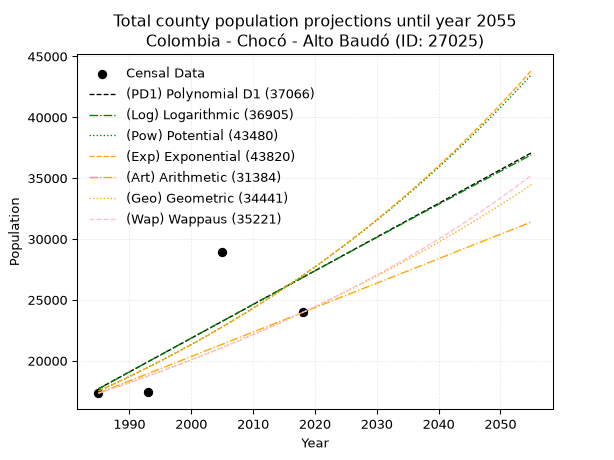
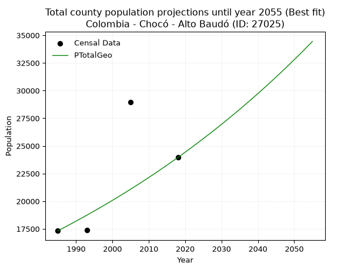
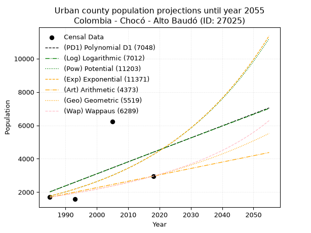
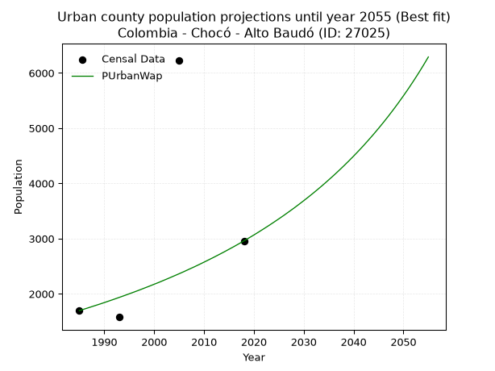
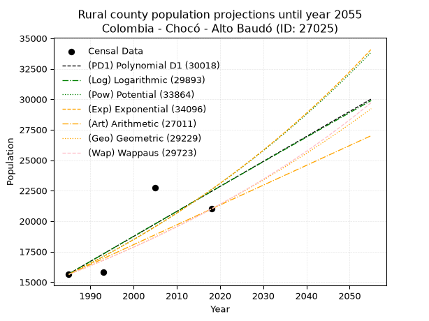
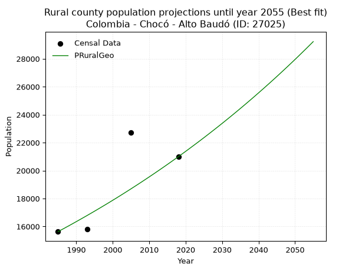

<div align="center">


</div>

# _“Population and Public Services Demand Projections (PPSD) until Year 2050 for Colombia - Chocó - Alto Baudo (ID: 27025)”_
Keywords: `population` `public-service` `projection` `lineal` `polynomial` `logarithmic` `potential` `exponential` `arithmetic` `geometric` `wappaus` `dane` `colombia` `south-america`

PPSD are analytical estimates used by governments and planners to anticipate future changes in population size, age distribution, and the resulting community needs for utilities, healthcare, education, and infrastructure as sizing future water treatment facilities, electrical grids, and road networks based on spatial growth.

> **General running parameters**: • app_version: _v20260806_. • Python version: _3.14.7_. • Pandas version: _3.0.5_. • NumPy version: _2.5.1_. • Creates, save and include plots into reports (create_plot): _False_. • Projection until year: _2050_. • Process polynomial degree 2 and up: _False_. • Process Wappaus: _True_. • Process Wappaus: _True_. • Set negative values to zero: _True_. • Set infinite values to zero: _True_. • Drop dataset notes: _True_. 
<div align="center">

Dynamic map: [:earth_americas:Google](http://maps.google.com/maps?q=5.516220901,-76.9743734) [:earth_americas:OSM](https://www.openstreetmap.org/#map=18/5.516220901/-76.9743734&layers=P) [:earth_americas:Bing](https://www.bing.com/maps?cp=5.516220901~-76.9743734&lvl=18) [:earth_americas:Apple](https://maps.apple.com/frame?center=5.516220901%2C-76.9743734&span=0.003%2C0.006)

</div>


<div align="center">

```geojson
{
  "type": "Feature",
  "geometry": {
    "type": "Point", 
    "coordinates": [-76.9743734, 5.516220901]
  }, 
  "properties": {
    "Name": "Colombia - Chocó - Alto Baudo (ID: 27025)"
  }
}
```

</div>


## 0. Census Data (4 records)

Census data are official statistics collected by a government about the people and housing in a country. They usually include counts of total population, age, sex, race, income, education, and jobs.

📅Global census file: [Population.xlsx](../data/Population.xlsx)

| Source   |   Year |   CountryID | CountryName   |   StateID | StateName   |   CountyID | CountyName   |   PTotal |   PUrban |   PRural |
|:---------|-------:|------------:|:--------------|----------:|:------------|-----------:|:-------------|---------:|---------:|---------:|
| DANE     |   1985 |          57 | Colombia      |        27 | Chocó       |      27025 | Alto Baudo   |    17327 |     1696 |    15631 |
| DANE     |   1993 |          57 | Colombia      |        27 | Chocó       |      27025 | Alto Baudó   |    17394 |     1578 |    15816 |
| DANE     |   2005 |          57 | Colombia      |        27 | Chocó       |      27025 | Alto Baudo   |    28961 |     6222 |    22739 |
| DANE     |   2018 |          57 | Colombia      |        27 | Chocó       |      27025 | Alto Baudó   |    23954 |     2958 |    20996 |

> 🔥Some records has specific notes about the registered values or the corresponding urban or rural distribution.

## 1. Total

### 1.1. Coefficients and Parameters

* (PD1) Polynomial Deg 1: 276.844640706546, -531849.4925732686 (lineal)
* (Log) Logarithmic: 554930.4732225405, -4196121.973898258
* (Pow) Potential: 26.26215126364199, -82.36327435836527
* (Exp) Exponential: 0.013104295842649728, 8.839121055158969e-08
* (Art) Arithmetic: Year diff. 2018 - 1985 = 33, Population diff. 23954 - 17327 = 6627, Annual growth = 200.8181818181818
* (Geo) Geometric: Year diff. 2018 - 1985 = 33, Population diff. 23954 - 17327 = 6627, Annual growth % = 0.00986254002524789
* (Wap) Wappaus: i = 0.972932738151604, Condition values only valid for < 200)

<sub>
Wappaus condition values: ['0.00', '0.97', '1.95', '2.92', '3.89', '4.86', '5.84', '6.81', '7.78', '8.76', '9.73', '10.70', '11.68', '12.65', '13.62', '14.59', '15.57', '16.54', '17.51', '18.49', '19.46', '20.43', '21.40', '22.38', '23.35', '24.32', '25.30', '26.27', '27.24', '28.22', '29.19', '30.16', '31.13', '32.11', '33.08', '34.05', '35.03', '36.00', '36.97', '37.94', '38.92', '39.89', '40.86', '41.84', '42.81', '43.78', '44.75', '45.73', '46.70', '47.67', '48.65', '49.62', '50.59', '51.57', '52.54', '53.51', '54.48', '55.46', '56.43', '57.40', '58.38', '59.35', '60.32', '61.29', '62.27', '63.24']
</sub>


### 1.2. Projected Dataset

|   Year |   CountyID |   PTotalPD1 |   PTotalLog |   PTotalPow |   PTotalExp |   PTotalArt |   PTotalGeo |   PTotalWap |
|-------:|-----------:|------------:|------------:|------------:|------------:|------------:|------------:|------------:|
|   1985 |      27025 |       17687 |       17673 |       17499 |       17510 |       17327 |       17327 |       17327 |
|   1986 |      27025 |       17964 |       17952 |       17732 |       17741 |       17528 |       17498 |       17496 |
|   1987 |      27025 |       18241 |       18232 |       17968 |       17975 |       17729 |       17670 |       17667 |
|   1988 |      27025 |       18518 |       18511 |       18207 |       18212 |       17929 |       17845 |       17840 |
|   1989 |      27025 |       18794 |       18790 |       18449 |       18452 |       18130 |       18021 |       18015 |
|   1990 |      27025 |       19071 |       19069 |       18694 |       18696 |       18331 |       18198 |       18191 |
|   1991 |      27025 |       19348 |       19348 |       18942 |       18942 |       18532 |       18378 |       18369 |
|   1992 |      27025 |       19625 |       19626 |       19194 |       19192 |       18733 |       18559 |       18549 |
|   1993 |      27025 |       19902 |       19905 |       19448 |       19445 |       18934 |       18742 |       18730 |
|   1994 |      27025 |       20179 |       20183 |       19706 |       19702 |       19134 |       18927 |       18914 |
|   1995 |      27025 |       20456 |       20461 |       19968 |       19962 |       19335 |       19114 |       19099 |
|   1996 |      27025 |       20732 |       20739 |       20232 |       20225 |       19536 |       19302 |       19286 |
|   1997 |      27025 |       21009 |       21017 |       20500 |       20492 |       19737 |       19493 |       19475 |
|   1998 |      27025 |       21286 |       21295 |       20771 |       20762 |       19938 |       19685 |       19666 |
|   1999 |      27025 |       21563 |       21573 |       21046 |       21036 |       20138 |       19879 |       19860 |
|   2000 |      27025 |       21840 |       21850 |       21324 |       21314 |       20339 |       20075 |       20055 |
|   2001 |      27025 |       22117 |       22128 |       21606 |       21595 |       20540 |       20273 |       20252 |
|   2002 |      27025 |       22393 |       22405 |       21891 |       21880 |       20741 |       20473 |       20451 |
|   2003 |      27025 |       22670 |       22682 |       22180 |       22168 |       20942 |       20675 |       20653 |
|   2004 |      27025 |       22947 |       22959 |       22473 |       22461 |       21143 |       20879 |       20856 |
|   2005 |      27025 |       23224 |       23236 |       22769 |       22757 |       21343 |       21085 |       21062 |
|   2006 |      27025 |       23501 |       23513 |       23070 |       23057 |       21544 |       21293 |       21270 |
|   2007 |      27025 |       23778 |       23789 |       23374 |       23361 |       21745 |       21503 |       21480 |
|   2008 |      27025 |       24055 |       24066 |       23681 |       23669 |       21946 |       21715 |       21693 |
|   2009 |      27025 |       24331 |       24342 |       23993 |       23981 |       22147 |       21929 |       21908 |
|   2010 |      27025 |       24608 |       24618 |       24309 |       24298 |       22347 |       22145 |       22125 |
|   2011 |      27025 |       24885 |       24894 |       24628 |       24618 |       22548 |       22364 |       22345 |
|   2012 |      27025 |       25162 |       25170 |       24952 |       24943 |       22749 |       22584 |       22567 |
|   2013 |      27025 |       25439 |       25446 |       25280 |       25272 |       22950 |       22807 |       22792 |
|   2014 |      27025 |       25716 |       25721 |       25612 |       25605 |       23151 |       23032 |       23019 |
|   2015 |      27025 |       25992 |       25997 |       25948 |       25943 |       23352 |       23259 |       23249 |
|   2016 |      27025 |       26269 |       26272 |       26288 |       26285 |       23552 |       23488 |       23481 |
|   2017 |      27025 |       26546 |       26547 |       26632 |       26632 |       23753 |       23720 |       23716 |
|   2018 |      27025 |       26823 |       26822 |       26981 |       26983 |       23954 |       23954 |       23954 |
|   2019 |      27025 |       27100 |       27097 |       27335 |       27339 |       24155 |       24190 |       24195 |
|   2020 |      27025 |       27377 |       27372 |       27693 |       27700 |       24356 |       24429 |       24438 |
|   2021 |      27025 |       27654 |       27647 |       28055 |       28065 |       24556 |       24670 |       24684 |
|   2022 |      27025 |       27930 |       27921 |       28422 |       28435 |       24757 |       24913 |       24934 |
|   2023 |      27025 |       28207 |       28196 |       28793 |       28811 |       24958 |       25159 |       25186 |
|   2024 |      27025 |       28484 |       28470 |       29169 |       29191 |       25159 |       25407 |       25441 |
|   2025 |      27025 |       28761 |       28744 |       29550 |       29576 |       25360 |       25657 |       25699 |
|   2026 |      27025 |       29038 |       29018 |       29936 |       29966 |       25561 |       25911 |       25961 |
|   2027 |      27025 |       29315 |       29292 |       30326 |       30361 |       25761 |       26166 |       26225 |
|   2028 |      27025 |       29591 |       29566 |       30722 |       30761 |       25962 |       26424 |       26493 |
|   2029 |      27025 |       29868 |       29839 |       31122 |       31167 |       26163 |       26685 |       26765 |
|   2030 |      27025 |       30145 |       30113 |       31527 |       31578 |       26364 |       26948 |       27039 |
|   2031 |      27025 |       30422 |       30386 |       31938 |       31995 |       26565 |       27214 |       27317 |
|   2032 |      27025 |       30699 |       30659 |       32353 |       32417 |       26765 |       27482 |       27599 |
|   2033 |      27025 |       30976 |       30932 |       32774 |       32845 |       26966 |       27753 |       27884 |
|   2034 |      27025 |       31253 |       31205 |       33200 |       33278 |       27167 |       28027 |       28173 |
|   2035 |      27025 |       31529 |       31478 |       33631 |       33717 |       27368 |       28303 |       28465 |
|   2036 |      27025 |       31806 |       31750 |       34068 |       34161 |       27569 |       28582 |       28761 |
|   2037 |      27025 |       32083 |       32023 |       34510 |       34612 |       27770 |       28864 |       29062 |
|   2038 |      27025 |       32360 |       32295 |       34958 |       35069 |       27970 |       29149 |       29366 |
|   2039 |      27025 |       32637 |       32567 |       35411 |       35531 |       28171 |       29436 |       29674 |
|   2040 |      27025 |       32914 |       32840 |       35870 |       36000 |       28372 |       29727 |       29986 |
|   2041 |      27025 |       33190 |       33111 |       36335 |       36475 |       28573 |       30020 |       30302 |
|   2042 |      27025 |       33467 |       33383 |       36805 |       36956 |       28774 |       30316 |       30623 |
|   2043 |      27025 |       33744 |       33655 |       37282 |       37443 |       28974 |       30615 |       30948 |
|   2044 |      27025 |       34021 |       33927 |       37764 |       37937 |       29175 |       30917 |       31277 |
|   2045 |      27025 |       34298 |       34198 |       38252 |       38438 |       29376 |       31222 |       31611 |
|   2046 |      27025 |       34575 |       34469 |       38746 |       38945 |       29577 |       31530 |       31950 |
|   2047 |      27025 |       34851 |       34740 |       39247 |       39458 |       29778 |       31841 |       32293 |
|   2048 |      27025 |       35128 |       35011 |       39753 |       39979 |       29979 |       32155 |       32641 |
|   2049 |      27025 |       35405 |       35282 |       40266 |       40506 |       30179 |       32472 |       32994 |
|   2050 |      27025 |       35682 |       35553 |       40786 |       41040 |       30380 |       32792 |       33352 |
<div align="center">

</img>

</div>


### 1.3. Best fit with absolute error and relative error (%)

Relative error puts that difference into context by dividing the absolute error by the true value, creating a unitless ratio or percentage that shows the scale of the mistake.

Absolute and relative error

|   Year | Source   |   CountryID | CountryName   |   StateID | StateName   |   CountyID_x | CountyName   |   PTotal |   PUrban |   PRural |   CountyID_y |   PTotalPD1 |   PTotalLog |   PTotalPow |   PTotalExp |   PTotalArt |   PTotalGeo |   PTotalWap |   PTotalPD1AbsError |   PTotalLogAbsError |   PTotalPowAbsError |   PTotalExpAbsError |   PTotalArtAbsError |   PTotalGeoAbsError |   PTotalWapAbsError |   PTotalPD1RelError |   PTotalLogRelError |   PTotalPowRelError |   PTotalExpRelError |   PTotalArtRelError |   PTotalGeoRelError |   PTotalWapRelError |
|-------:|:---------|------------:|:--------------|----------:|:------------|-------------:|:-------------|---------:|---------:|---------:|-------------:|------------:|------------:|------------:|------------:|------------:|------------:|------------:|--------------------:|--------------------:|--------------------:|--------------------:|--------------------:|--------------------:|--------------------:|--------------------:|--------------------:|--------------------:|--------------------:|--------------------:|--------------------:|--------------------:|
|   1985 | DANE     |          57 | Colombia      |        27 | Chocó       |        27025 | Alto Baudo   |    17327 |     1696 |    15631 |        27025 |       17687 |       17673 |       17499 |       17510 |       17327 |       17327 |       17327 |                 360 |                 346 |                 172 |                 183 |                   0 |                   0 |                   0 |             2.07768 |             1.99688 |             0.99267 |             1.05616 |             0       |              0      |             0       |
|   1993 | DANE     |          57 | Colombia      |        27 | Chocó       |        27025 | Alto Baudó   |    17394 |     1578 |    15816 |        27025 |       19902 |       19905 |       19448 |       19445 |       18934 |       18742 |       18730 |                2508 |                2511 |                2054 |                2051 |                1540 |                1348 |                1336 |            14.4188  |            14.436   |            11.8087  |            11.7914  |             8.85363 |              7.7498 |             7.68081 |
|   2005 | DANE     |          57 | Colombia      |        27 | Chocó       |        27025 | Alto Baudo   |    28961 |     6222 |    22739 |        27025 |       23224 |       23236 |       22769 |       22757 |       21343 |       21085 |       21062 |                5737 |                5725 |                6192 |                6204 |                7618 |                7876 |                7899 |            19.8094  |            19.768   |            21.3805  |            21.4219  |            26.3043  |             27.1952 |            27.2746  |
|   2018 | DANE     |          57 | Colombia      |        27 | Chocó       |        27025 | Alto Baudó   |    23954 |     2958 |    20996 |        27025 |       26823 |       26822 |       26981 |       26983 |       23954 |       23954 |       23954 |                2869 |                2868 |                3027 |                3029 |                   0 |                   0 |                   0 |            11.9771  |            11.9729  |            12.6367  |            12.6451  |             0       |              0      |             0       |

Relative error mean

| Method    |   RelError | Best   |
|:----------|-----------:|:-------|
| PTotalPD1 |   12.0707  |        |
| PTotalLog |   12.0435  |        |
| PTotalPow |   11.7046  |        |
| PTotalExp |   11.7286  |        |
| PTotalArt |    8.78949 |        |
| PTotalGeo |    8.73625 | True   |
| PTotalWap |    8.73886 |        |

💙Best method: _**PTotalGeo**_
<div align="center">

</img>

</div>


### 1.4. Fresh water supply demand in liters per capita per day (lpcd)

The fresh water supply demand typically ranges from 100 to 300 liters per capita per day (lpcd) for standard domestic and municipal planning, though absolute survival minimums set by the World Health Organization are as low as 7.5 to 20 liters per day, and total consumption in high-income nations can exceed 400 liters.

> `CZ`: Level in meters above the sea level (masl).<br> `WS`: Fresh water supply demand in liters per capita per day (lpcd or l/h/d).<br> `WSAll`: Zonal fresh water supply demand in liters per second (l/s).<br> `A`: Zonal area in square meters.

Reference values (RAS Colombia)

|    CZ |   WS |
|------:|-----:|
|  1000 |  120 |
|  2000 |  130 |
| 99999 |  140 |

County shapefile geometry properties and water supply values

|   CountyID |      ATotal |   CZTotal |   WSTotal |
|-----------:|------------:|----------:|----------:|
|      27025 | 2.05188e+09 |   221.129 |       120 |

Projected values for best method: PTotalGeo

|   CountyID |   Year |   PTotalGeo |   WSTotal |   WSTotalAll |
|-----------:|-------:|------------:|----------:|-------------:|
|      27025 |   1985 |       17327 |       120 |      24.0653 |
|      27025 |   1986 |       17498 |       120 |      24.3028 |
|      27025 |   1987 |       17670 |       120 |      24.5417 |
|      27025 |   1988 |       17845 |       120 |      24.7847 |
|      27025 |   1989 |       18021 |       120 |      25.0292 |
|      27025 |   1990 |       18198 |       120 |      25.275  |
|      27025 |   1991 |       18378 |       120 |      25.525  |
|      27025 |   1992 |       18559 |       120 |      25.7764 |
|      27025 |   1993 |       18742 |       120 |      26.0306 |
|      27025 |   1994 |       18927 |       120 |      26.2875 |
|      27025 |   1995 |       19114 |       120 |      26.5472 |
|      27025 |   1996 |       19302 |       120 |      26.8083 |
|      27025 |   1997 |       19493 |       120 |      27.0736 |
|      27025 |   1998 |       19685 |       120 |      27.3403 |
|      27025 |   1999 |       19879 |       120 |      27.6097 |
|      27025 |   2000 |       20075 |       120 |      27.8819 |
|      27025 |   2001 |       20273 |       120 |      28.1569 |
|      27025 |   2002 |       20473 |       120 |      28.4347 |
|      27025 |   2003 |       20675 |       120 |      28.7153 |
|      27025 |   2004 |       20879 |       120 |      28.9986 |
|      27025 |   2005 |       21085 |       120 |      29.2847 |
|      27025 |   2006 |       21293 |       120 |      29.5736 |
|      27025 |   2007 |       21503 |       120 |      29.8653 |
|      27025 |   2008 |       21715 |       120 |      30.1597 |
|      27025 |   2009 |       21929 |       120 |      30.4569 |
|      27025 |   2010 |       22145 |       120 |      30.7569 |
|      27025 |   2011 |       22364 |       120 |      31.0611 |
|      27025 |   2012 |       22584 |       120 |      31.3667 |
|      27025 |   2013 |       22807 |       120 |      31.6764 |
|      27025 |   2014 |       23032 |       120 |      31.9889 |
|      27025 |   2015 |       23259 |       120 |      32.3042 |
|      27025 |   2016 |       23488 |       120 |      32.6222 |
|      27025 |   2017 |       23720 |       120 |      32.9444 |
|      27025 |   2018 |       23954 |       120 |      33.2694 |
|      27025 |   2019 |       24190 |       120 |      33.5972 |
|      27025 |   2020 |       24429 |       120 |      33.9292 |
|      27025 |   2021 |       24670 |       120 |      34.2639 |
|      27025 |   2022 |       24913 |       120 |      34.6014 |
|      27025 |   2023 |       25159 |       120 |      34.9431 |
|      27025 |   2024 |       25407 |       120 |      35.2875 |
|      27025 |   2025 |       25657 |       120 |      35.6347 |
|      27025 |   2026 |       25911 |       120 |      35.9875 |
|      27025 |   2027 |       26166 |       120 |      36.3417 |
|      27025 |   2028 |       26424 |       120 |      36.7    |
|      27025 |   2029 |       26685 |       120 |      37.0625 |
|      27025 |   2030 |       26948 |       120 |      37.4278 |
|      27025 |   2031 |       27214 |       120 |      37.7972 |
|      27025 |   2032 |       27482 |       120 |      38.1694 |
|      27025 |   2033 |       27753 |       120 |      38.5458 |
|      27025 |   2034 |       28027 |       120 |      38.9264 |
|      27025 |   2035 |       28303 |       120 |      39.3097 |
|      27025 |   2036 |       28582 |       120 |      39.6972 |
|      27025 |   2037 |       28864 |       120 |      40.0889 |
|      27025 |   2038 |       29149 |       120 |      40.4847 |
|      27025 |   2039 |       29436 |       120 |      40.8833 |
|      27025 |   2040 |       29727 |       120 |      41.2875 |
|      27025 |   2041 |       30020 |       120 |      41.6944 |
|      27025 |   2042 |       30316 |       120 |      42.1056 |
|      27025 |   2043 |       30615 |       120 |      42.5208 |
|      27025 |   2044 |       30917 |       120 |      42.9403 |
|      27025 |   2045 |       31222 |       120 |      43.3639 |
|      27025 |   2046 |       31530 |       120 |      43.7917 |
|      27025 |   2047 |       31841 |       120 |      44.2236 |
|      27025 |   2048 |       32155 |       120 |      44.6597 |
|      27025 |   2049 |       32472 |       120 |      45.1    |
|      27025 |   2050 |       32792 |       120 |      45.5444 |

## 2. Urban

### 2.1. Coefficients and Parameters

* (PD1) Polynomial Deg 1: 71.86591730228996, -140636.30108390548 (lineal)
* (Log) Logarithmic: 144261.9874894066, -1093423.0229499948
* (Pow) Potential: 53.358810172091964, -172.71836370311604
* (Exp) Exponential: 0.026608178324241838, 2.0354304633717528e-20
* (Art) Arithmetic: Year diff. 2018 - 1985 = 33, Population diff. 2958 - 1696 = 1262, Annual growth = 38.24242424242424
* (Geo) Geometric: Year diff. 2018 - 1985 = 33, Population diff. 2958 - 1696 = 1262, Annual growth % = 0.016998642883035764
* (Wap) Wappaus: i = 1.6434217551535988, Condition values only valid for < 200)

<sub>
Wappaus condition values: ['0.00', '1.64', '3.29', '4.93', '6.57', '8.22', '9.86', '11.50', '13.15', '14.79', '16.43', '18.08', '19.72', '21.36', '23.01', '24.65', '26.29', '27.94', '29.58', '31.23', '32.87', '34.51', '36.16', '37.80', '39.44', '41.09', '42.73', '44.37', '46.02', '47.66', '49.30', '50.95', '52.59', '54.23', '55.88', '57.52', '59.16', '60.81', '62.45', '64.09', '65.74', '67.38', '69.02', '70.67', '72.31', '73.95', '75.60', '77.24', '78.88', '80.53', '82.17', '83.81', '85.46', '87.10', '88.74', '90.39', '92.03', '93.68', '95.32', '96.96', '98.61', '100.25', '101.89', '103.54', '105.18', '106.82']
</sub>


### 2.2. Projected Dataset

|   Year |   CountyID |   PUrbanPD1 |   PUrbanLog |   PUrbanPow |   PUrbanExp |   PUrbanArt |   PUrbanGeo |   PUrbanWap |
|-------:|-----------:|------------:|------------:|------------:|------------:|------------:|------------:|------------:|
|   1985 |      27025 |        2018 |        2012 |        1763 |        1766 |        1696 |        1696 |        1696 |
|   1986 |      27025 |        2089 |        2085 |        1811 |        1813 |        1734 |        1725 |        1724 |
|   1987 |      27025 |        2161 |        2158 |        1860 |        1862 |        1772 |        1754 |        1753 |
|   1988 |      27025 |        2233 |        2230 |        1911 |        1912 |        1811 |        1784 |        1782 |
|   1989 |      27025 |        2305 |        2303 |        1963 |        1964 |        1849 |        1814 |        1811 |
|   1990 |      27025 |        2377 |        2375 |        2016 |        2017 |        1887 |        1845 |        1841 |
|   1991 |      27025 |        2449 |        2448 |        2071 |        2071 |        1925 |        1876 |        1872 |
|   1992 |      27025 |        2521 |        2520 |        2127 |        2127 |        1964 |        1908 |        1903 |
|   1993 |      27025 |        2592 |        2592 |        2185 |        2184 |        2002 |        1941 |        1935 |
|   1994 |      27025 |        2664 |        2665 |        2244 |        2243 |        2040 |        1974 |        1967 |
|   1995 |      27025 |        2736 |        2737 |        2305 |        2304 |        2078 |        2007 |        2000 |
|   1996 |      27025 |        2808 |        2809 |        2367 |        2366 |        2117 |        2042 |        2033 |
|   1997 |      27025 |        2880 |        2882 |        2432 |        2430 |        2155 |        2076 |        2067 |
|   1998 |      27025 |        2952 |        2954 |        2497 |        2495 |        2193 |        2111 |        2102 |
|   1999 |      27025 |        3024 |        3026 |        2565 |        2563 |        2231 |        2147 |        2137 |
|   2000 |      27025 |        3096 |        3098 |        2634 |        2632 |        2270 |        2184 |        2173 |
|   2001 |      27025 |        3167 |        3170 |        2706 |        2703 |        2308 |        2221 |        2209 |
|   2002 |      27025 |        3239 |        3242 |        2779 |        2775 |        2346 |        2259 |        2247 |
|   2003 |      27025 |        3311 |        3315 |        2854 |        2850 |        2384 |        2297 |        2285 |
|   2004 |      27025 |        3383 |        3387 |        2931 |        2927 |        2423 |        2336 |        2324 |
|   2005 |      27025 |        3455 |        3458 |        3010 |        3006 |        2461 |        2376 |        2363 |
|   2006 |      27025 |        3527 |        3530 |        3091 |        3087 |        2499 |        2416 |        2403 |
|   2007 |      27025 |        3599 |        3602 |        3174 |        3170 |        2537 |        2457 |        2445 |
|   2008 |      27025 |        3670 |        3674 |        3260 |        3256 |        2576 |        2499 |        2486 |
|   2009 |      27025 |        3742 |        3746 |        3347 |        3344 |        2614 |        2542 |        2529 |
|   2010 |      27025 |        3814 |        3818 |        3438 |        3434 |        2652 |        2585 |        2573 |
|   2011 |      27025 |        3886 |        3890 |        3530 |        3526 |        2690 |        2629 |        2618 |
|   2012 |      27025 |        3958 |        3961 |        3625 |        3622 |        2729 |        2673 |        2663 |
|   2013 |      27025 |        4030 |        4033 |        3722 |        3719 |        2767 |        2719 |        2710 |
|   2014 |      27025 |        4102 |        4105 |        3822 |        3820 |        2805 |        2765 |        2757 |
|   2015 |      27025 |        4174 |        4176 |        3925 |        3923 |        2843 |        2812 |        2806 |
|   2016 |      27025 |        4245 |        4248 |        4030 |        4028 |        2882 |        2860 |        2855 |
|   2017 |      27025 |        4317 |        4319 |        4138 |        4137 |        2920 |        2909 |        2906 |
|   2018 |      27025 |        4389 |        4391 |        4249 |        4248 |        2958 |        2958 |        2958 |
|   2019 |      27025 |        4461 |        4462 |        4363 |        4363 |        2996 |        3008 |        3011 |
|   2020 |      27025 |        4533 |        4534 |        4480 |        4481 |        3034 |        3059 |        3065 |
|   2021 |      27025 |        4605 |        4605 |        4600 |        4601 |        3073 |        3111 |        3121 |
|   2022 |      27025 |        4677 |        4676 |        4723 |        4726 |        3111 |        3164 |        3178 |
|   2023 |      27025 |        4748 |        4748 |        4849 |        4853 |        3149 |        3218 |        3236 |
|   2024 |      27025 |        4820 |        4819 |        4978 |        4984 |        3187 |        3273 |        3296 |
|   2025 |      27025 |        4892 |        4890 |        5111 |        5118 |        3226 |        3328 |        3357 |
|   2026 |      27025 |        4964 |        4962 |        5248 |        5256 |        3264 |        3385 |        3419 |
|   2027 |      27025 |        5036 |        5033 |        5388 |        5398 |        3302 |        3443 |        3484 |
|   2028 |      27025 |        5108 |        5104 |        5532 |        5544 |        3340 |        3501 |        3549 |
|   2029 |      27025 |        5180 |        5175 |        5679 |        5693 |        3379 |        3561 |        3617 |
|   2030 |      27025 |        5252 |        5246 |        5830 |        5847 |        3417 |        3621 |        3686 |
|   2031 |      27025 |        5323 |        5317 |        5986 |        6004 |        3455 |        3683 |        3757 |
|   2032 |      27025 |        5395 |        5388 |        6145 |        6166 |        3493 |        3745 |        3830 |
|   2033 |      27025 |        5467 |        5459 |        6308 |        6332 |        3532 |        3809 |        3905 |
|   2034 |      27025 |        5539 |        5530 |        6476 |        6503 |        3570 |        3874 |        3982 |
|   2035 |      27025 |        5611 |        5601 |        6648 |        6678 |        3608 |        3940 |        4062 |
|   2036 |      27025 |        5683 |        5672 |        6825 |        6859 |        3646 |        4006 |        4143 |
|   2037 |      27025 |        5755 |        5743 |        7006 |        7044 |        3685 |        4075 |        4227 |
|   2038 |      27025 |        5826 |        5814 |        7192 |        7233 |        3723 |        4144 |        4313 |
|   2039 |      27025 |        5898 |        5884 |        7382 |        7429 |        3761 |        4214 |        4402 |
|   2040 |      27025 |        5970 |        5955 |        7578 |        7629 |        3799 |        4286 |        4493 |
|   2041 |      27025 |        6042 |        6026 |        7779 |        7835 |        3838 |        4359 |        4587 |
|   2042 |      27025 |        6114 |        6096 |        7985 |        8046 |        3876 |        4433 |        4684 |
|   2043 |      27025 |        6186 |        6167 |        8196 |        8263 |        3914 |        4508 |        4785 |
|   2044 |      27025 |        6258 |        6238 |        8413 |        8486 |        3952 |        4585 |        4888 |
|   2045 |      27025 |        6329 |        6308 |        8636 |        8714 |        3991 |        4663 |        4995 |
|   2046 |      27025 |        6401 |        6379 |        8864 |        8949 |        4029 |        4742 |        5105 |
|   2047 |      27025 |        6473 |        6449 |        9098 |        9191 |        4067 |        4823 |        5219 |
|   2048 |      27025 |        6545 |        6520 |        9338 |        9439 |        4105 |        4905 |        5337 |
|   2049 |      27025 |        6617 |        6590 |        9585 |        9693 |        4144 |        4988 |        5459 |
|   2050 |      27025 |        6689 |        6660 |        9837 |        9954 |        4182 |        5073 |        5585 |
<div align="center">

</img>

</div>


### 2.3. Best fit with absolute error and relative error (%)

Relative error puts that difference into context by dividing the absolute error by the true value, creating a unitless ratio or percentage that shows the scale of the mistake.

Absolute and relative error

|   Year | Source   |   CountryID | CountryName   |   StateID | StateName   |   CountyID_x | CountyName   |   PTotal |   PUrban |   PRural |   CountyID_y |   PUrbanPD1 |   PUrbanLog |   PUrbanPow |   PUrbanExp |   PUrbanArt |   PUrbanGeo |   PUrbanWap |   PUrbanPD1AbsError |   PUrbanLogAbsError |   PUrbanPowAbsError |   PUrbanExpAbsError |   PUrbanArtAbsError |   PUrbanGeoAbsError |   PUrbanWapAbsError |   PUrbanPD1RelError |   PUrbanLogRelError |   PUrbanPowRelError |   PUrbanExpRelError |   PUrbanArtRelError |   PUrbanGeoRelError |   PUrbanWapRelError |
|-------:|:---------|------------:|:--------------|----------:|:------------|-------------:|:-------------|---------:|---------:|---------:|-------------:|------------:|------------:|------------:|------------:|------------:|------------:|------------:|--------------------:|--------------------:|--------------------:|--------------------:|--------------------:|--------------------:|--------------------:|--------------------:|--------------------:|--------------------:|--------------------:|--------------------:|--------------------:|--------------------:|
|   1985 | DANE     |          57 | Colombia      |        27 | Chocó       |        27025 | Alto Baudo   |    17327 |     1696 |    15631 |        27025 |        2018 |        2012 |        1763 |        1766 |        1696 |        1696 |        1696 |                 322 |                 316 |                  67 |                  70 |                   0 |                   0 |                   0 |             18.9858 |             18.6321 |             3.95047 |             4.12736 |              0      |              0      |              0      |
|   1993 | DANE     |          57 | Colombia      |        27 | Chocó       |        27025 | Alto Baudó   |    17394 |     1578 |    15816 |        27025 |        2592 |        2592 |        2185 |        2184 |        2002 |        1941 |        1935 |                1014 |                1014 |                 607 |                 606 |                 424 |                 363 |                 357 |             64.2586 |             64.2586 |            38.4664  |            38.403   |             26.8695 |             23.0038 |             22.6236 |
|   2005 | DANE     |          57 | Colombia      |        27 | Chocó       |        27025 | Alto Baudo   |    28961 |     6222 |    22739 |        27025 |        3455 |        3458 |        3010 |        3006 |        2461 |        2376 |        2363 |                2767 |                2764 |                3212 |                3216 |                3761 |                3846 |                3859 |             44.4712 |             44.423  |            51.6233  |            51.6876  |             60.4468 |             61.8129 |             62.0219 |
|   2018 | DANE     |          57 | Colombia      |        27 | Chocó       |        27025 | Alto Baudó   |    23954 |     2958 |    20996 |        27025 |        4389 |        4391 |        4249 |        4248 |        2958 |        2958 |        2958 |                1431 |                1433 |                1291 |                1290 |                   0 |                   0 |                   0 |             48.3773 |             48.4449 |            43.6444  |            43.6105  |              0      |              0      |              0      |

Relative error mean

| Method    |   RelError | Best   |
|:----------|-----------:|:-------|
| PUrbanPD1 |    44.0232 |        |
| PUrbanLog |    43.9396 |        |
| PUrbanPow |    34.4211 |        |
| PUrbanExp |    34.4571 |        |
| PUrbanArt |    21.8291 |        |
| PUrbanGeo |    21.2042 |        |
| PUrbanWap |    21.1614 | True   |

💙Best method: _**PUrbanWap**_
<div align="center">

</img>

</div>


### 2.4. Fresh water supply demand in liters per capita per day (lpcd)

The fresh water supply demand typically ranges from 100 to 300 liters per capita per day (lpcd) for standard domestic and municipal planning, though absolute survival minimums set by the World Health Organization are as low as 7.5 to 20 liters per day, and total consumption in high-income nations can exceed 400 liters.

> `CZ`: Level in meters above the sea level (masl).<br> `WS`: Fresh water supply demand in liters per capita per day (lpcd or l/h/d).<br> `WSAll`: Zonal fresh water supply demand in liters per second (l/s).<br> `A`: Zonal area in square meters.

Reference values (RAS Colombia)

|    CZ |   WS |
|------:|-----:|
|  1000 |  120 |
|  2000 |  130 |
| 99999 |  140 |

County shapefile geometry properties and water supply values

|   CountyID |   AUrban |   CZUrban |   WSUrban |
|-----------:|---------:|----------:|----------:|
|      27025 |   234065 |   21.8938 |       120 |

Projected values for best method: PUrbanWap

|   CountyID |   Year |   PUrbanWap |   WSUrban |   WSUrbanAll |
|-----------:|-------:|------------:|----------:|-------------:|
|      27025 |   1985 |        1696 |       120 |      2.35556 |
|      27025 |   1986 |        1724 |       120 |      2.39444 |
|      27025 |   1987 |        1753 |       120 |      2.43472 |
|      27025 |   1988 |        1782 |       120 |      2.475   |
|      27025 |   1989 |        1811 |       120 |      2.51528 |
|      27025 |   1990 |        1841 |       120 |      2.55694 |
|      27025 |   1991 |        1872 |       120 |      2.6     |
|      27025 |   1992 |        1903 |       120 |      2.64306 |
|      27025 |   1993 |        1935 |       120 |      2.6875  |
|      27025 |   1994 |        1967 |       120 |      2.73194 |
|      27025 |   1995 |        2000 |       120 |      2.77778 |
|      27025 |   1996 |        2033 |       120 |      2.82361 |
|      27025 |   1997 |        2067 |       120 |      2.87083 |
|      27025 |   1998 |        2102 |       120 |      2.91944 |
|      27025 |   1999 |        2137 |       120 |      2.96806 |
|      27025 |   2000 |        2173 |       120 |      3.01806 |
|      27025 |   2001 |        2209 |       120 |      3.06806 |
|      27025 |   2002 |        2247 |       120 |      3.12083 |
|      27025 |   2003 |        2285 |       120 |      3.17361 |
|      27025 |   2004 |        2324 |       120 |      3.22778 |
|      27025 |   2005 |        2363 |       120 |      3.28194 |
|      27025 |   2006 |        2403 |       120 |      3.3375  |
|      27025 |   2007 |        2445 |       120 |      3.39583 |
|      27025 |   2008 |        2486 |       120 |      3.45278 |
|      27025 |   2009 |        2529 |       120 |      3.5125  |
|      27025 |   2010 |        2573 |       120 |      3.57361 |
|      27025 |   2011 |        2618 |       120 |      3.63611 |
|      27025 |   2012 |        2663 |       120 |      3.69861 |
|      27025 |   2013 |        2710 |       120 |      3.76389 |
|      27025 |   2014 |        2757 |       120 |      3.82917 |
|      27025 |   2015 |        2806 |       120 |      3.89722 |
|      27025 |   2016 |        2855 |       120 |      3.96528 |
|      27025 |   2017 |        2906 |       120 |      4.03611 |
|      27025 |   2018 |        2958 |       120 |      4.10833 |
|      27025 |   2019 |        3011 |       120 |      4.18194 |
|      27025 |   2020 |        3065 |       120 |      4.25694 |
|      27025 |   2021 |        3121 |       120 |      4.33472 |
|      27025 |   2022 |        3178 |       120 |      4.41389 |
|      27025 |   2023 |        3236 |       120 |      4.49444 |
|      27025 |   2024 |        3296 |       120 |      4.57778 |
|      27025 |   2025 |        3357 |       120 |      4.6625  |
|      27025 |   2026 |        3419 |       120 |      4.74861 |
|      27025 |   2027 |        3484 |       120 |      4.83889 |
|      27025 |   2028 |        3549 |       120 |      4.92917 |
|      27025 |   2029 |        3617 |       120 |      5.02361 |
|      27025 |   2030 |        3686 |       120 |      5.11944 |
|      27025 |   2031 |        3757 |       120 |      5.21806 |
|      27025 |   2032 |        3830 |       120 |      5.31944 |
|      27025 |   2033 |        3905 |       120 |      5.42361 |
|      27025 |   2034 |        3982 |       120 |      5.53056 |
|      27025 |   2035 |        4062 |       120 |      5.64167 |
|      27025 |   2036 |        4143 |       120 |      5.75417 |
|      27025 |   2037 |        4227 |       120 |      5.87083 |
|      27025 |   2038 |        4313 |       120 |      5.99028 |
|      27025 |   2039 |        4402 |       120 |      6.11389 |
|      27025 |   2040 |        4493 |       120 |      6.24028 |
|      27025 |   2041 |        4587 |       120 |      6.37083 |
|      27025 |   2042 |        4684 |       120 |      6.50556 |
|      27025 |   2043 |        4785 |       120 |      6.64583 |
|      27025 |   2044 |        4888 |       120 |      6.78889 |
|      27025 |   2045 |        4995 |       120 |      6.9375  |
|      27025 |   2046 |        5105 |       120 |      7.09028 |
|      27025 |   2047 |        5219 |       120 |      7.24861 |
|      27025 |   2048 |        5337 |       120 |      7.4125  |
|      27025 |   2049 |        5459 |       120 |      7.58194 |
|      27025 |   2050 |        5585 |       120 |      7.75694 |

## 3. Rural

### 3.1. Coefficients and Parameters

* (PD1) Polynomial Deg 1: 204.978723404256, -391213.19148936303 (lineal)
* (Log) Logarithmic: 410668.48573313403, -3102698.950948263
* (Pow) Potential: 22.301926114492474, -69.35235158248265
* (Exp) Exponential: 0.011132417816720589, 3.956342608703156e-06
* (Art) Arithmetic: Year diff. 2018 - 1985 = 33, Population diff. 20996 - 15631 = 5365, Annual growth = 162.57575757575756
* (Geo) Geometric: Year diff. 2018 - 1985 = 33, Population diff. 20996 - 15631 = 5365, Annual growth % = 0.00898178790448756
* (Wap) Wappaus: i = 0.8877372297799851, Condition values only valid for < 200)

<sub>
Wappaus condition values: ['0.00', '0.89', '1.78', '2.66', '3.55', '4.44', '5.33', '6.21', '7.10', '7.99', '8.88', '9.77', '10.65', '11.54', '12.43', '13.32', '14.20', '15.09', '15.98', '16.87', '17.75', '18.64', '19.53', '20.42', '21.31', '22.19', '23.08', '23.97', '24.86', '25.74', '26.63', '27.52', '28.41', '29.30', '30.18', '31.07', '31.96', '32.85', '33.73', '34.62', '35.51', '36.40', '37.28', '38.17', '39.06', '39.95', '40.84', '41.72', '42.61', '43.50', '44.39', '45.27', '46.16', '47.05', '47.94', '48.83', '49.71', '50.60', '51.49', '52.38', '53.26', '54.15', '55.04', '55.93', '56.82', '57.70']
</sub>


### 3.2. Projected Dataset

|   Year |   CountyID |   PRuralPD1 |   PRuralLog |   PRuralPow |   PRuralExp |   PRuralArt |   PRuralGeo |   PRuralWap |
|-------:|-----------:|------------:|------------:|------------:|------------:|------------:|------------:|------------:|
|   1985 |      27025 |       15670 |       15661 |       15634 |       15641 |       15631 |       15631 |       15631 |
|   1986 |      27025 |       15875 |       15867 |       15810 |       15816 |       15794 |       15771 |       15770 |
|   1987 |      27025 |       16080 |       16074 |       15989 |       15993 |       15956 |       15913 |       15911 |
|   1988 |      27025 |       16285 |       16281 |       16169 |       16172 |       16119 |       16056 |       16053 |
|   1989 |      27025 |       16489 |       16487 |       16352 |       16353 |       16281 |       16200 |       16196 |
|   1990 |      27025 |       16694 |       16694 |       16536 |       16536 |       16444 |       16346 |       16341 |
|   1991 |      27025 |       16899 |       16900 |       16722 |       16722 |       16606 |       16493 |       16486 |
|   1992 |      27025 |       17104 |       17106 |       16910 |       16909 |       16769 |       16641 |       16633 |
|   1993 |      27025 |       17309 |       17312 |       17101 |       17098 |       16932 |       16790 |       16782 |
|   1994 |      27025 |       17514 |       17518 |       17293 |       17289 |       17094 |       16941 |       16932 |
|   1995 |      27025 |       17719 |       17724 |       17488 |       17483 |       17257 |       17093 |       17083 |
|   1996 |      27025 |       17924 |       17930 |       17684 |       17679 |       17419 |       17247 |       17236 |
|   1997 |      27025 |       18129 |       18136 |       17883 |       17877 |       17582 |       17402 |       17390 |
|   1998 |      27025 |       18334 |       18341 |       18084 |       18077 |       17744 |       17558 |       17545 |
|   1999 |      27025 |       18539 |       18547 |       18287 |       18279 |       17907 |       17715 |       17702 |
|   2000 |      27025 |       18744 |       18752 |       18492 |       18484 |       18070 |       17875 |       17861 |
|   2001 |      27025 |       18949 |       18957 |       18699 |       18691 |       18232 |       18035 |       18021 |
|   2002 |      27025 |       19154 |       19163 |       18908 |       18900 |       18395 |       18197 |       18182 |
|   2003 |      27025 |       19359 |       19368 |       19120 |       19111 |       18557 |       18361 |       18346 |
|   2004 |      27025 |       19564 |       19573 |       19334 |       19325 |       18720 |       18526 |       18510 |
|   2005 |      27025 |       19769 |       19778 |       19551 |       19542 |       18883 |       18692 |       18677 |
|   2006 |      27025 |       19974 |       19982 |       19769 |       19760 |       19045 |       18860 |       18845 |
|   2007 |      27025 |       20179 |       20187 |       19990 |       19982 |       19208 |       19029 |       19014 |
|   2008 |      27025 |       20384 |       20392 |       20213 |       20205 |       19370 |       19200 |       19185 |
|   2009 |      27025 |       20589 |       20596 |       20439 |       20432 |       19533 |       19373 |       19358 |
|   2010 |      27025 |       20794 |       20800 |       20667 |       20660 |       19695 |       19547 |       19533 |
|   2011 |      27025 |       20999 |       21005 |       20898 |       20892 |       19858 |       19722 |       19710 |
|   2012 |      27025 |       21204 |       21209 |       21131 |       21125 |       20021 |       19899 |       19888 |
|   2013 |      27025 |       21409 |       21413 |       21366 |       21362 |       20183 |       20078 |       20068 |
|   2014 |      27025 |       21614 |       21617 |       21604 |       21601 |       20346 |       20258 |       20250 |
|   2015 |      27025 |       21819 |       21821 |       21845 |       21843 |       20508 |       20440 |       20433 |
|   2016 |      27025 |       22024 |       22024 |       22088 |       22087 |       20671 |       20624 |       20619 |
|   2017 |      27025 |       22229 |       22228 |       22333 |       22335 |       20833 |       20809 |       20807 |
|   2018 |      27025 |       22434 |       22432 |       22582 |       22585 |       20996 |       20996 |       20996 |
|   2019 |      27025 |       22639 |       22635 |       22833 |       22838 |       21159 |       21185 |       21187 |
|   2020 |      27025 |       22844 |       22838 |       23086 |       23093 |       21321 |       21375 |       21381 |
|   2021 |      27025 |       23049 |       23042 |       23342 |       23352 |       21484 |       21567 |       21576 |
|   2022 |      27025 |       23254 |       23245 |       23601 |       23613 |       21646 |       21761 |       21774 |
|   2023 |      27025 |       23459 |       23448 |       23863 |       23877 |       21809 |       21956 |       21974 |
|   2024 |      27025 |       23664 |       23651 |       24127 |       24145 |       21971 |       22153 |       22176 |
|   2025 |      27025 |       23869 |       23854 |       24395 |       24415 |       22134 |       22352 |       22380 |
|   2026 |      27025 |       24074 |       24056 |       24665 |       24688 |       22297 |       22553 |       22586 |
|   2027 |      27025 |       24279 |       24259 |       24938 |       24965 |       22459 |       22756 |       22794 |
|   2028 |      27025 |       24484 |       24462 |       25214 |       25244 |       22622 |       22960 |       23005 |
|   2029 |      27025 |       24689 |       24664 |       25492 |       25527 |       22784 |       23166 |       23218 |
|   2030 |      27025 |       24894 |       24866 |       25774 |       25813 |       22947 |       23374 |       23434 |
|   2031 |      27025 |       25099 |       25069 |       26059 |       26102 |       23109 |       23584 |       23652 |
|   2032 |      27025 |       25304 |       25271 |       26346 |       26394 |       23272 |       23796 |       23872 |
|   2033 |      27025 |       25509 |       25473 |       26637 |       26689 |       23435 |       24010 |       24095 |
|   2034 |      27025 |       25714 |       25675 |       26931 |       26988 |       23597 |       24225 |       24320 |
|   2035 |      27025 |       25919 |       25877 |       27227 |       27290 |       23760 |       24443 |       24548 |
|   2036 |      27025 |       26123 |       26078 |       27527 |       27596 |       23922 |       24662 |       24779 |
|   2037 |      27025 |       26328 |       26280 |       27831 |       27905 |       24085 |       24884 |       25012 |
|   2038 |      27025 |       26533 |       26482 |       28137 |       28217 |       24248 |       25107 |       25248 |
|   2039 |      27025 |       26738 |       26683 |       28446 |       28533 |       24410 |       25333 |       25486 |
|   2040 |      27025 |       26943 |       26884 |       28759 |       28852 |       24573 |       25561 |       25728 |
|   2041 |      27025 |       27148 |       27086 |       29075 |       29175 |       24735 |       25790 |       25972 |
|   2042 |      27025 |       27353 |       27287 |       29395 |       29502 |       24898 |       26022 |       26219 |
|   2043 |      27025 |       27558 |       27488 |       29717 |       29832 |       25060 |       26255 |       26470 |
|   2044 |      27025 |       27763 |       27689 |       30043 |       30166 |       25223 |       26491 |       26723 |
|   2045 |      27025 |       27968 |       27890 |       30373 |       30504 |       25386 |       26729 |       26979 |
|   2046 |      27025 |       28173 |       28091 |       30706 |       30845 |       25548 |       26969 |       27238 |
|   2047 |      27025 |       28378 |       28291 |       31042 |       31190 |       25711 |       27212 |       27501 |
|   2048 |      27025 |       28583 |       28492 |       31382 |       31540 |       25873 |       27456 |       27767 |
|   2049 |      27025 |       28788 |       28692 |       31726 |       31893 |       26036 |       27703 |       28036 |
|   2050 |      27025 |       28993 |       28893 |       32073 |       32250 |       26198 |       27951 |       28308 |
<div align="center">

</img>

</div>


### 3.3. Best fit with absolute error and relative error (%)

Relative error puts that difference into context by dividing the absolute error by the true value, creating a unitless ratio or percentage that shows the scale of the mistake.

Absolute and relative error

|   Year | Source   |   CountryID | CountryName   |   StateID | StateName   |   CountyID_x | CountyName   |   PTotal |   PUrban |   PRural |   CountyID_y |   PRuralPD1 |   PRuralLog |   PRuralPow |   PRuralExp |   PRuralArt |   PRuralGeo |   PRuralWap |   PRuralPD1AbsError |   PRuralLogAbsError |   PRuralPowAbsError |   PRuralExpAbsError |   PRuralArtAbsError |   PRuralGeoAbsError |   PRuralWapAbsError |   PRuralPD1RelError |   PRuralLogRelError |   PRuralPowRelError |   PRuralExpRelError |   PRuralArtRelError |   PRuralGeoRelError |   PRuralWapRelError |
|-------:|:---------|------------:|:--------------|----------:|:------------|-------------:|:-------------|---------:|---------:|---------:|-------------:|------------:|------------:|------------:|------------:|------------:|------------:|------------:|--------------------:|--------------------:|--------------------:|--------------------:|--------------------:|--------------------:|--------------------:|--------------------:|--------------------:|--------------------:|--------------------:|--------------------:|--------------------:|--------------------:|
|   1985 | DANE     |          57 | Colombia      |        27 | Chocó       |        27025 | Alto Baudo   |    17327 |     1696 |    15631 |        27025 |       15670 |       15661 |       15634 |       15641 |       15631 |       15631 |       15631 |                  39 |                  30 |                   3 |                  10 |                   0 |                   0 |                   0 |            0.249504 |            0.191926 |           0.0191926 |           0.0639754 |             0       |             0       |             0       |
|   1993 | DANE     |          57 | Colombia      |        27 | Chocó       |        27025 | Alto Baudó   |    17394 |     1578 |    15816 |        27025 |       17309 |       17312 |       17101 |       17098 |       16932 |       16790 |       16782 |                1493 |                1496 |                1285 |                1282 |                1116 |                 974 |                 966 |            9.43981  |            9.45878  |           8.12468   |           8.10572   |             7.05615 |             6.15832 |             6.10774 |
|   2005 | DANE     |          57 | Colombia      |        27 | Chocó       |        27025 | Alto Baudo   |    28961 |     6222 |    22739 |        27025 |       19769 |       19778 |       19551 |       19542 |       18883 |       18692 |       18677 |                2970 |                2961 |                3188 |                3197 |                3856 |                4047 |                4062 |           13.0613   |           13.0217   |          14.02      |          14.0595    |            16.9576  |            17.7976  |            17.8636  |
|   2018 | DANE     |          57 | Colombia      |        27 | Chocó       |        27025 | Alto Baudó   |    23954 |     2958 |    20996 |        27025 |       22434 |       22432 |       22582 |       22585 |       20996 |       20996 |       20996 |                1438 |                1436 |                1586 |                1589 |                   0 |                   0 |                   0 |            6.84892  |            6.8394   |           7.55382   |           7.56811   |             0       |             0       |             0       |

Relative error mean

| Method    |   RelError | Best   |
|:----------|-----------:|:-------|
| PRuralPD1 |    7.39987 |        |
| PRuralLog |    7.37795 |        |
| PRuralPow |    7.42942 |        |
| PRuralExp |    7.44934 |        |
| PRuralArt |    6.00345 |        |
| PRuralGeo |    5.98898 | True   |
| PRuralWap |    5.99283 |        |

💙Best method: _**PRuralGeo**_
<div align="center">

</img>

</div>


### 3.4. Fresh water supply demand in liters per capita per day (lpcd)

The fresh water supply demand typically ranges from 100 to 300 liters per capita per day (lpcd) for standard domestic and municipal planning, though absolute survival minimums set by the World Health Organization are as low as 7.5 to 20 liters per day, and total consumption in high-income nations can exceed 400 liters.

> `CZ`: Level in meters above the sea level (masl).<br> `WS`: Fresh water supply demand in liters per capita per day (lpcd or l/h/d).<br> `WSAll`: Zonal fresh water supply demand in liters per second (l/s).<br> `A`: Zonal area in square meters.

Reference values (RAS Colombia)

|    CZ |   WS |
|------:|-----:|
|  1000 |  120 |
|  2000 |  130 |
| 99999 |  140 |

County shapefile geometry properties and water supply values

|   CountyID |      ARural |   CZRural |   WSRural |
|-----------:|------------:|----------:|----------:|
|      27025 | 2.05164e+09 |   221.152 |       120 |

Projected values for best method: PRuralGeo

|   CountyID |   Year |   PRuralGeo |   WSRural |   WSRuralAll |
|-----------:|-------:|------------:|----------:|-------------:|
|      27025 |   1985 |       15631 |       120 |      21.7097 |
|      27025 |   1986 |       15771 |       120 |      21.9042 |
|      27025 |   1987 |       15913 |       120 |      22.1014 |
|      27025 |   1988 |       16056 |       120 |      22.3    |
|      27025 |   1989 |       16200 |       120 |      22.5    |
|      27025 |   1990 |       16346 |       120 |      22.7028 |
|      27025 |   1991 |       16493 |       120 |      22.9069 |
|      27025 |   1992 |       16641 |       120 |      23.1125 |
|      27025 |   1993 |       16790 |       120 |      23.3194 |
|      27025 |   1994 |       16941 |       120 |      23.5292 |
|      27025 |   1995 |       17093 |       120 |      23.7403 |
|      27025 |   1996 |       17247 |       120 |      23.9542 |
|      27025 |   1997 |       17402 |       120 |      24.1694 |
|      27025 |   1998 |       17558 |       120 |      24.3861 |
|      27025 |   1999 |       17715 |       120 |      24.6042 |
|      27025 |   2000 |       17875 |       120 |      24.8264 |
|      27025 |   2001 |       18035 |       120 |      25.0486 |
|      27025 |   2002 |       18197 |       120 |      25.2736 |
|      27025 |   2003 |       18361 |       120 |      25.5014 |
|      27025 |   2004 |       18526 |       120 |      25.7306 |
|      27025 |   2005 |       18692 |       120 |      25.9611 |
|      27025 |   2006 |       18860 |       120 |      26.1944 |
|      27025 |   2007 |       19029 |       120 |      26.4292 |
|      27025 |   2008 |       19200 |       120 |      26.6667 |
|      27025 |   2009 |       19373 |       120 |      26.9069 |
|      27025 |   2010 |       19547 |       120 |      27.1486 |
|      27025 |   2011 |       19722 |       120 |      27.3917 |
|      27025 |   2012 |       19899 |       120 |      27.6375 |
|      27025 |   2013 |       20078 |       120 |      27.8861 |
|      27025 |   2014 |       20258 |       120 |      28.1361 |
|      27025 |   2015 |       20440 |       120 |      28.3889 |
|      27025 |   2016 |       20624 |       120 |      28.6444 |
|      27025 |   2017 |       20809 |       120 |      28.9014 |
|      27025 |   2018 |       20996 |       120 |      29.1611 |
|      27025 |   2019 |       21185 |       120 |      29.4236 |
|      27025 |   2020 |       21375 |       120 |      29.6875 |
|      27025 |   2021 |       21567 |       120 |      29.9542 |
|      27025 |   2022 |       21761 |       120 |      30.2236 |
|      27025 |   2023 |       21956 |       120 |      30.4944 |
|      27025 |   2024 |       22153 |       120 |      30.7681 |
|      27025 |   2025 |       22352 |       120 |      31.0444 |
|      27025 |   2026 |       22553 |       120 |      31.3236 |
|      27025 |   2027 |       22756 |       120 |      31.6056 |
|      27025 |   2028 |       22960 |       120 |      31.8889 |
|      27025 |   2029 |       23166 |       120 |      32.175  |
|      27025 |   2030 |       23374 |       120 |      32.4639 |
|      27025 |   2031 |       23584 |       120 |      32.7556 |
|      27025 |   2032 |       23796 |       120 |      33.05   |
|      27025 |   2033 |       24010 |       120 |      33.3472 |
|      27025 |   2034 |       24225 |       120 |      33.6458 |
|      27025 |   2035 |       24443 |       120 |      33.9486 |
|      27025 |   2036 |       24662 |       120 |      34.2528 |
|      27025 |   2037 |       24884 |       120 |      34.5611 |
|      27025 |   2038 |       25107 |       120 |      34.8708 |
|      27025 |   2039 |       25333 |       120 |      35.1847 |
|      27025 |   2040 |       25561 |       120 |      35.5014 |
|      27025 |   2041 |       25790 |       120 |      35.8194 |
|      27025 |   2042 |       26022 |       120 |      36.1417 |
|      27025 |   2043 |       26255 |       120 |      36.4653 |
|      27025 |   2044 |       26491 |       120 |      36.7931 |
|      27025 |   2045 |       26729 |       120 |      37.1236 |
|      27025 |   2046 |       26969 |       120 |      37.4569 |
|      27025 |   2047 |       27212 |       120 |      37.7944 |
|      27025 |   2048 |       27456 |       120 |      38.1333 |
|      27025 |   2049 |       27703 |       120 |      38.4764 |
|      27025 |   2050 |       27951 |       120 |      38.8208 |

<div align="center"><br><sub>Share this research</sub></div><br>

<sub>**APPS & TOOLS & CONTENT DISCLAIMER**: • NO WARRANTY - This content and software is provided by <a href="https://github.com/rcfdtools" target="_blank">github.com/rcfdtools</a> "as is", without any express or implied warranty, including warranties of merchantability, fitness for a particular purpose, or non-infringement. There is no guarantee that the software will be error-free or operate without interruption. • LIMITATION OF LIABILITY - Neither the authors nor copyright holders will be liable for claims or damages arising from the software or its use. You are responsible for determining if the software is appropriate for your use and assume all associated risks, including errors, legal compliance, and data loss. • NO PROFESSIONAL ADVICE - The software provides general information and does not offer professional advice. It should not replace consultation with professional advisors. [Clauses and global license for rcfdtools use.](https://github.com/rcfdtools/rcfdtools/blob/main/LICENSE.md)</sub>