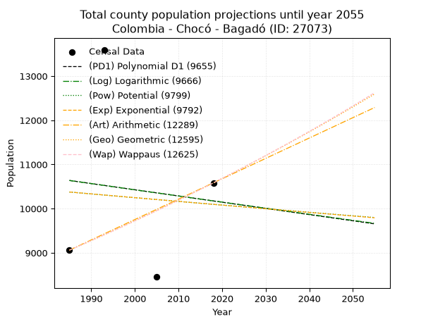
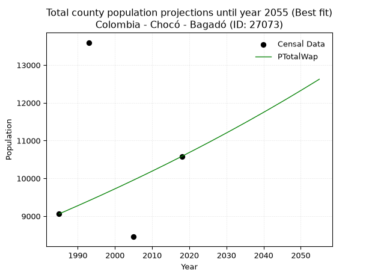
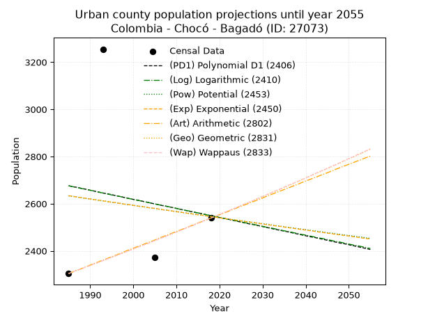
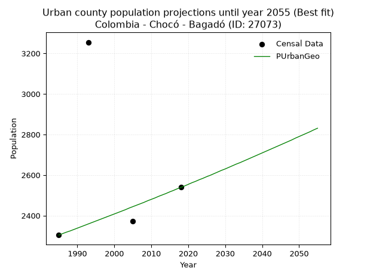
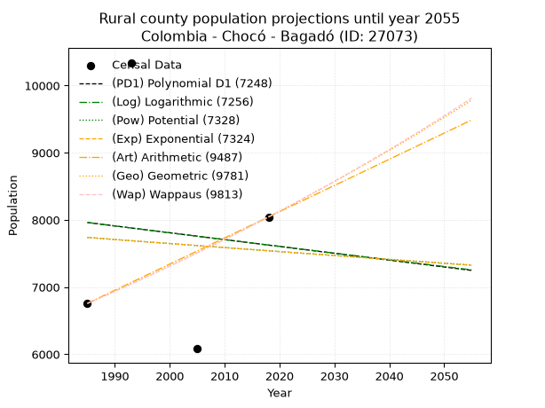
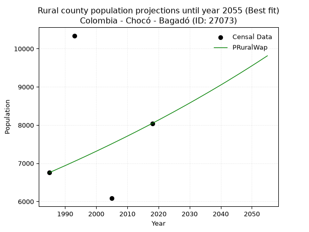

<div align="center">


</div>

# 📜 _“Population and Public Services Demand Projections (PPSD) until Year 2050 for Colombia - Chocó - Bagadó (ID: 27073)”_
Keywords: `population` `public-service` `projection` `lineal` `polynomial` `logarithmic` `potential` `exponential` `arithmetic` `geometric` `wappaus` `dane` `colombia` `south-america`

PPSD are analytical estimates used by governments and planners to anticipate future changes in population size, age distribution, and the resulting community needs for utilities, healthcare, education, and infrastructure as sizing future water treatment facilities, electrical grids, and road networks based on spatial growth.

<div align="center">

</img>

</div>


> **General running parameters**: • app_version: _v20260806_. • Python version: _3.14.7_. • Pandas version: _3.0.5_. • NumPy version: _2.5.1_. • Creates, save and include plots into reports (create_plot): _False_. • Projection until year: _2050_. • Process polynomial degree 2 and up: _False_. • Process Wappaus: _True_. • Process Wappaus: _True_. • Set negative values to zero: _True_. • Set infinite values to zero: _True_. • Drop dataset notes: _True_. 
<div align="center">

Maps & GIS Layers: [:earth_americas:Google](http://maps.google.com/maps?q=5.409680539,-76.4160633) [:earth_americas:OSM](https://www.openstreetmap.org/#map=18/5.409680539/-76.4160633&layers=P) [:earth_americas:Bing](https://www.bing.com/maps?cp=5.409680539~-76.4160633&lvl=18) [:earth_americas:Apple](https://maps.apple.com/frame?center=5.409680539%2C-76.4160633&span=0.003%2C0.006) [:earth_americas:GISMobile](https://github.com/rcfdtools/R.GISMobile/blob/main/file/gis/CountyLayer_CO/Readme.md)

</div>


<div align="center">

```geojson
{
  "type": "Feature",
  "geometry": {
    "type": "Point", 
    "coordinates": [-76.4160633, 5.409680539]
  }, 
  "properties": {
    "Name": "Colombia - Chocó - Bagadó (ID: 27073)"
  }
}
```

</div>


## 0. Census Data (4 records)

Census data are official statistics collected by a government about the people and housing in a country. They usually include counts of total population, age, sex, race, income, education, and jobs.

📅Global census file: [Population.xlsx](../data/Population.xlsx)

| Source   |   Year |   CountryID | CountryName   |   StateID | StateName   |   CountyID | CountyName   |   PTotal |   PUrban |   PRural |
|:---------|-------:|------------:|:--------------|----------:|:------------|-----------:|:-------------|---------:|---------:|---------:|
| DANE     |   1985 |          57 | Colombia      |        27 | Chocó       |      27073 | Bagadó       |     9061 |     2304 |     6757 |
| DANE     |   1993 |          57 | Colombia      |        27 | Chocó       |      27073 | Bagadó       |    13596 |     3255 |    10341 |
| DANE     |   2005 |          57 | Colombia      |        27 | Chocó       |      27073 | Bagadó       |     8454 |     2372 |     6082 |
| DANE     |   2018 |          57 | Colombia      |        27 | Chocó       |      27073 | Bagadó       |    10583 |     2539 |     8044 |

> 🔥Some records could had specific notes about the registered values or the corresponding urban or rural distribution.

📅[SUI-RUPS](https://www.datos.gov.co/Hacienda-y-Cr-dito-P-blico/Registro-nico-de-Prestadores-de-Servicios-P-blicos/4qkq-csdn/about_data) - Local public utility companies: [RUPS.csv](../data/RUPS.csv)

 | SERVICIO       | ESTADO    | NOMBRE                              | NIT         | DEPARTAMENTO_DOMICILIO   | MUNICIPIO_DOMICILIO   | DIRECCION             |   TELEFONO | EMAIL                   | TIPO_PRESTADOR                 | CLASIFICACION                 |
|:---------------|:----------|:------------------------------------|:------------|:-------------------------|:----------------------|:----------------------|-----------:|:------------------------|:-------------------------------|:------------------------------|
| ACUEDUCTO      | OPERATIVA | MUNICIPIO DE BAGADO                 | 891680055-4 | CHOCO                    | BAGADO                | Barrio Esteban Zapata |    6713592 | laleguse-19@hotmail.com | MUNICIPIO (PRESTACIÓN DIRECTA) | MENOR O IGUAL A 2500 USUARIOS |
| ALCANTARILLADO | OPERATIVA | MUNICIPIO DE BAGADO                 | 891680055-4 | CHOCO                    | BAGADO                | Barrio Esteban Zapata |    6713592 | laleguse-19@hotmail.com | MUNICIPIO (PRESTACIÓN DIRECTA) | MENOR O IGUAL A 2500 USUARIOS |
| ACUEDUCTO      | OPERATIVA | APC DE SERVICIOS PUBLICOS DE BAGADO | 900329587-1 | CHOCO                    | BAGADO                | BARRIO MEDIA LUNA     |    6708633 | apc_bagado@hotmail.com  | ORGANIZACION AUTORIZADA        | HASTA 2500 SUSCRIPTORES       |
| ALCANTARILLADO | OPERATIVA | APC DE SERVICIOS PUBLICOS DE BAGADO | 900329587-1 | CHOCO                    | BAGADO                | BARRIO MEDIA LUNA     |    6708633 | apc_bagado@hotmail.com  | ORGANIZACION AUTORIZADA        | HASTA 2500 SUSCRIPTORES       |

## 1. Total

### 1.1. Coefficients and Parameters

* (PD1) Polynomial Deg 1: -14.044961862706757, 38516.93496587919 (lineal)
* (Log) Logarithmic: -28014.935697777822, 223365.25073641463
* (Pow) Potential: -1.6511150538123658, 9.461020590001889
* (Exp) Exponential: -0.0008275443910669607, 53635.25578671833
* (Art) Arithmetic: Year diff. 2018 - 1985 = 33, Population diff. 10583 - 9061 = 1522, Annual growth = 46.121212121212125
* (Geo) Geometric: Year diff. 2018 - 1985 = 33, Population diff. 10583 - 9061 = 1522, Annual growth % = 0.004716221403044729
* (Wap) Wappaus: i = 0.4695704756792112, Condition values only valid for < 200)

<sub>
Wappaus condition values: ['0.00', '0.47', '0.94', '1.41', '1.88', '2.35', '2.82', '3.29', '3.76', '4.23', '4.70', '5.17', '5.63', '6.10', '6.57', '7.04', '7.51', '7.98', '8.45', '8.92', '9.39', '9.86', '10.33', '10.80', '11.27', '11.74', '12.21', '12.68', '13.15', '13.62', '14.09', '14.56', '15.03', '15.50', '15.97', '16.43', '16.90', '17.37', '17.84', '18.31', '18.78', '19.25', '19.72', '20.19', '20.66', '21.13', '21.60', '22.07', '22.54', '23.01', '23.48', '23.95', '24.42', '24.89', '25.36', '25.83', '26.30', '26.77', '27.24', '27.70', '28.17', '28.64', '29.11', '29.58', '30.05', '30.52']
</sub>


### 1.2. Projected Dataset

|   Year |   CountyID |   PTotalPD1 |   PTotalLog |   PTotalPow |   PTotalExp |   PTotalArt |   PTotalGeo |   PTotalWap |
|-------:|-----------:|------------:|------------:|------------:|------------:|------------:|------------:|------------:|
|   1985 |      27073 |       10638 |       10637 |       10376 |       10376 |        9061 |        9061 |        9061 |
|   1986 |      27073 |       10624 |       10623 |       10368 |       10368 |        9107 |        9104 |        9104 |
|   1987 |      27073 |       10610 |       10609 |       10359 |       10359 |        9153 |        9147 |        9146 |
|   1988 |      27073 |       10596 |       10595 |       10350 |       10351 |        9199 |        9190 |        9190 |
|   1989 |      27073 |       10582 |       10581 |       10342 |       10342 |        9245 |        9233 |        9233 |
|   1990 |      27073 |       10567 |       10567 |       10333 |       10334 |        9292 |        9277 |        9276 |
|   1991 |      27073 |       10553 |       10553 |       10325 |       10325 |        9338 |        9320 |        9320 |
|   1992 |      27073 |       10539 |       10539 |       10316 |       10316 |        9384 |        9364 |        9364 |
|   1993 |      27073 |       10525 |       10525 |       10308 |       10308 |        9430 |        9409 |        9408 |
|   1994 |      27073 |       10511 |       10511 |       10299 |       10299 |        9476 |        9453 |        9452 |
|   1995 |      27073 |       10497 |       10497 |       10290 |       10291 |        9522 |        9498 |        9497 |
|   1996 |      27073 |       10483 |       10483 |       10282 |       10282 |        9568 |        9542 |        9541 |
|   1997 |      27073 |       10469 |       10469 |       10273 |       10274 |        9614 |        9587 |        9586 |
|   1998 |      27073 |       10455 |       10454 |       10265 |       10265 |        9661 |        9633 |        9632 |
|   1999 |      27073 |       10441 |       10440 |       10256 |       10257 |        9707 |        9678 |        9677 |
|   2000 |      27073 |       10427 |       10426 |       10248 |       10248 |        9753 |        9724 |        9723 |
|   2001 |      27073 |       10413 |       10412 |       10240 |       10240 |        9799 |        9769 |        9768 |
|   2002 |      27073 |       10399 |       10398 |       10231 |       10231 |        9845 |        9816 |        9814 |
|   2003 |      27073 |       10385 |       10384 |       10223 |       10223 |        9891 |        9862 |        9861 |
|   2004 |      27073 |       10371 |       10370 |       10214 |       10214 |        9937 |        9908 |        9907 |
|   2005 |      27073 |       10357 |       10357 |       10206 |       10206 |        9983 |        9955 |        9954 |
|   2006 |      27073 |       10343 |       10343 |       10197 |       10198 |       10030 |       10002 |       10001 |
|   2007 |      27073 |       10329 |       10329 |       10189 |       10189 |       10076 |       10049 |       10048 |
|   2008 |      27073 |       10315 |       10315 |       10181 |       10181 |       10122 |       10097 |       10095 |
|   2009 |      27073 |       10301 |       10301 |       10172 |       10172 |       10168 |       10144 |       10143 |
|   2010 |      27073 |       10287 |       10287 |       10164 |       10164 |       10214 |       10192 |       10191 |
|   2011 |      27073 |       10273 |       10273 |       10156 |       10155 |       10260 |       10240 |       10239 |
|   2012 |      27073 |       10258 |       10259 |       10147 |       10147 |       10306 |       10288 |       10288 |
|   2013 |      27073 |       10244 |       10245 |       10139 |       10139 |       10352 |       10337 |       10336 |
|   2014 |      27073 |       10230 |       10231 |       10131 |       10130 |       10399 |       10386 |       10385 |
|   2015 |      27073 |       10216 |       10217 |       10122 |       10122 |       10445 |       10435 |       10434 |
|   2016 |      27073 |       10202 |       10203 |       10114 |       10114 |       10491 |       10484 |       10484 |
|   2017 |      27073 |       10188 |       10189 |       10106 |       10105 |       10537 |       10533 |       10533 |
|   2018 |      27073 |       10174 |       10175 |       10098 |       10097 |       10583 |       10583 |       10583 |
|   2019 |      27073 |       10160 |       10162 |       10089 |       10088 |       10629 |       10633 |       10633 |
|   2020 |      27073 |       10146 |       10148 |       10081 |       10080 |       10675 |       10683 |       10684 |
|   2021 |      27073 |       10132 |       10134 |       10073 |       10072 |       10721 |       10733 |       10734 |
|   2022 |      27073 |       10118 |       10120 |       10065 |       10063 |       10767 |       10784 |       10785 |
|   2023 |      27073 |       10104 |       10106 |       10056 |       10055 |       10814 |       10835 |       10836 |
|   2024 |      27073 |       10090 |       10092 |       10048 |       10047 |       10860 |       10886 |       10888 |
|   2025 |      27073 |       10076 |       10078 |       10040 |       10039 |       10906 |       10937 |       10939 |
|   2026 |      27073 |       10062 |       10065 |       10032 |       10030 |       10952 |       10989 |       10991 |
|   2027 |      27073 |       10048 |       10051 |       10024 |       10022 |       10998 |       11041 |       11044 |
|   2028 |      27073 |       10034 |       10037 |       10015 |       10014 |       11044 |       11093 |       11096 |
|   2029 |      27073 |       10020 |       10023 |       10007 |       10005 |       11090 |       11145 |       11149 |
|   2030 |      27073 |       10006 |       10009 |        9999 |        9997 |       11136 |       11198 |       11202 |
|   2031 |      27073 |        9992 |        9996 |        9991 |        9989 |       11183 |       11251 |       11255 |
|   2032 |      27073 |        9978 |        9982 |        9983 |        9981 |       11229 |       11304 |       11309 |
|   2033 |      27073 |        9964 |        9968 |        9975 |        9972 |       11275 |       11357 |       11363 |
|   2034 |      27073 |        9949 |        9954 |        9967 |        9964 |       11321 |       11410 |       11417 |
|   2035 |      27073 |        9935 |        9940 |        9959 |        9956 |       11367 |       11464 |       11471 |
|   2036 |      27073 |        9921 |        9927 |        9951 |        9948 |       11413 |       11518 |       11526 |
|   2037 |      27073 |        9907 |        9913 |        9943 |        9939 |       11459 |       11573 |       11581 |
|   2038 |      27073 |        9893 |        9899 |        9934 |        9931 |       11505 |       11627 |       11637 |
|   2039 |      27073 |        9879 |        9885 |        9926 |        9923 |       11552 |       11682 |       11692 |
|   2040 |      27073 |        9865 |        9872 |        9918 |        9915 |       11598 |       11737 |       11748 |
|   2041 |      27073 |        9851 |        9858 |        9910 |        9906 |       11644 |       11793 |       11804 |
|   2042 |      27073 |        9837 |        9844 |        9902 |        9898 |       11690 |       11848 |       11861 |
|   2043 |      27073 |        9823 |        9831 |        9894 |        9890 |       11736 |       11904 |       11918 |
|   2044 |      27073 |        9809 |        9817 |        9886 |        9882 |       11782 |       11960 |       11975 |
|   2045 |      27073 |        9795 |        9803 |        9878 |        9874 |       11828 |       12017 |       12032 |
|   2046 |      27073 |        9781 |        9789 |        9870 |        9866 |       11874 |       12073 |       12090 |
|   2047 |      27073 |        9767 |        9776 |        9862 |        9857 |       11921 |       12130 |       12148 |
|   2048 |      27073 |        9753 |        9762 |        9854 |        9849 |       11967 |       12187 |       12207 |
|   2049 |      27073 |        9739 |        9748 |        9847 |        9841 |       12013 |       12245 |       12266 |
|   2050 |      27073 |        9725 |        9735 |        9839 |        9833 |       12059 |       12303 |       12325 |
<div align="center">

</img>

</div>


### 1.3. Best fit with absolute and relative error (%)

Relative error puts that difference into context by dividing the absolute error by the true value, creating a unitless ratio or percentage that shows the scale of the mistake.

Absolute and relative error

|   Year | Source   |   CountryID | CountryName   |   StateID | StateName   |   CountyID_x | CountyName   |   PTotal |   PUrban |   PRural |   CountyID_y |   PTotalPD1 |   PTotalLog |   PTotalPow |   PTotalExp |   PTotalArt |   PTotalGeo |   PTotalWap |   PTotalPD1AbsError |   PTotalLogAbsError |   PTotalPowAbsError |   PTotalExpAbsError |   PTotalArtAbsError |   PTotalGeoAbsError |   PTotalWapAbsError |   PTotalPD1RelError |   PTotalLogRelError |   PTotalPowRelError |   PTotalExpRelError |   PTotalArtRelError |   PTotalGeoRelError |   PTotalWapRelError |
|-------:|:---------|------------:|:--------------|----------:|:------------|-------------:|:-------------|---------:|---------:|---------:|-------------:|------------:|------------:|------------:|------------:|------------:|------------:|------------:|--------------------:|--------------------:|--------------------:|--------------------:|--------------------:|--------------------:|--------------------:|--------------------:|--------------------:|--------------------:|--------------------:|--------------------:|--------------------:|--------------------:|
|   1985 | DANE     |          57 | Colombia      |        27 | Chocó       |        27073 | Bagadó       |     9061 |     2304 |     6757 |        27073 |       10638 |       10637 |       10376 |       10376 |        9061 |        9061 |        9061 |                1577 |                1576 |                1315 |                1315 |                   0 |                   0 |                   0 |            17.4043  |            17.3932  |            14.5127  |            14.5127  |              0      |              0      |              0      |
|   1993 | DANE     |          57 | Colombia      |        27 | Chocó       |        27073 | Bagadó       |    13596 |     3255 |    10341 |        27073 |       10525 |       10525 |       10308 |       10308 |        9430 |        9409 |        9408 |                3071 |                3071 |                3288 |                3288 |                4166 |                4187 |                4188 |            22.5875  |            22.5875  |            24.1836  |            24.1836  |             30.6414 |             30.7958 |             30.8032 |
|   2005 | DANE     |          57 | Colombia      |        27 | Chocó       |        27073 | Bagadó       |     8454 |     2372 |     6082 |        27073 |       10357 |       10357 |       10206 |       10206 |        9983 |        9955 |        9954 |                1903 |                1903 |                1752 |                1752 |                1529 |                1501 |                1500 |            22.5101  |            22.5101  |            20.7239  |            20.7239  |             18.0861 |             17.7549 |             17.7431 |
|   2018 | DANE     |          57 | Colombia      |        27 | Chocó       |        27073 | Bagadó       |    10583 |     2539 |     8044 |        27073 |       10174 |       10175 |       10098 |       10097 |       10583 |       10583 |       10583 |                 409 |                 408 |                 485 |                 486 |                   0 |                   0 |                   0 |             3.86469 |             3.85524 |             4.58282 |             4.59227 |              0      |              0      |              0      |

Relative error mean

| Method    |   RelError | Best   |
|:----------|-----------:|:-------|
| PTotalPD1 |    16.5916 |        |
| PTotalLog |    16.5865 |        |
| PTotalPow |    16.0008 |        |
| PTotalExp |    16.0031 |        |
| PTotalArt |    12.1819 |        |
| PTotalGeo |    12.1377 |        |
| PTotalWap |    12.1366 | True   |

💙Best method: _**PTotalWap**_
<div align="center">

</img>

</div>


### 1.4. Fresh water supply demand in liters per capita per day (lpcd)

The fresh water supply demand typically ranges from 100 to 300 liters per capita per day (lpcd) for standard domestic and municipal planning, though absolute survival minimums set by the World Health Organization are as low as 7.5 to 20 liters per day, and total consumption in high-income nations can exceed 400 liters.

> `CZ`: Level in meters above the sea level (masl)<br> `WS`: Fresh water supply demand in liters per capita per day (lpcd or l/h/d)<br> `WSAll`: Zonal fresh water supply demand in liters per second (l/s)<br> `A`: Zonal area in square meters<br> `DP`: Population density (people/hectare or p/ha)

Reference values (RAS Colombia)

|    CZ |   WS |
|------:|-----:|
|  1000 |  120 |
|  2000 |  130 |
| 99999 |  140 |

County shapefile geometry properties and water supply values

|   CountyID |      ATotal |   CZTotal |   WSTotal |
|-----------:|------------:|----------:|----------:|
|      27073 | 8.07569e+08 |   956.718 |       120 |

Projected values for best method: PTotalWap

|   CountyID |   Year |   PTotalWap |   DPTotal |   WSTotal |   WSTotalAll |
|-----------:|-------:|------------:|----------:|----------:|-------------:|
|      27073 |   1985 |        9061 |      0.11 |       120 |      12.5847 |
|      27073 |   1986 |        9104 |      0.11 |       120 |      12.6444 |
|      27073 |   1987 |        9146 |      0.11 |       120 |      12.7028 |
|      27073 |   1988 |        9190 |      0.11 |       120 |      12.7639 |
|      27073 |   1989 |        9233 |      0.11 |       120 |      12.8236 |
|      27073 |   1990 |        9276 |      0.11 |       120 |      12.8833 |
|      27073 |   1991 |        9320 |      0.12 |       120 |      12.9444 |
|      27073 |   1992 |        9364 |      0.12 |       120 |      13.0056 |
|      27073 |   1993 |        9408 |      0.12 |       120 |      13.0667 |
|      27073 |   1994 |        9452 |      0.12 |       120 |      13.1278 |
|      27073 |   1995 |        9497 |      0.12 |       120 |      13.1903 |
|      27073 |   1996 |        9541 |      0.12 |       120 |      13.2514 |
|      27073 |   1997 |        9586 |      0.12 |       120 |      13.3139 |
|      27073 |   1998 |        9632 |      0.12 |       120 |      13.3778 |
|      27073 |   1999 |        9677 |      0.12 |       120 |      13.4403 |
|      27073 |   2000 |        9723 |      0.12 |       120 |      13.5042 |
|      27073 |   2001 |        9768 |      0.12 |       120 |      13.5667 |
|      27073 |   2002 |        9814 |      0.12 |       120 |      13.6306 |
|      27073 |   2003 |        9861 |      0.12 |       120 |      13.6958 |
|      27073 |   2004 |        9907 |      0.12 |       120 |      13.7597 |
|      27073 |   2005 |        9954 |      0.12 |       120 |      13.825  |
|      27073 |   2006 |       10001 |      0.12 |       120 |      13.8903 |
|      27073 |   2007 |       10048 |      0.12 |       120 |      13.9556 |
|      27073 |   2008 |       10095 |      0.13 |       120 |      14.0208 |
|      27073 |   2009 |       10143 |      0.13 |       120 |      14.0875 |
|      27073 |   2010 |       10191 |      0.13 |       120 |      14.1542 |
|      27073 |   2011 |       10239 |      0.13 |       120 |      14.2208 |
|      27073 |   2012 |       10288 |      0.13 |       120 |      14.2889 |
|      27073 |   2013 |       10336 |      0.13 |       120 |      14.3556 |
|      27073 |   2014 |       10385 |      0.13 |       120 |      14.4236 |
|      27073 |   2015 |       10434 |      0.13 |       120 |      14.4917 |
|      27073 |   2016 |       10484 |      0.13 |       120 |      14.5611 |
|      27073 |   2017 |       10533 |      0.13 |       120 |      14.6292 |
|      27073 |   2018 |       10583 |      0.13 |       120 |      14.6986 |
|      27073 |   2019 |       10633 |      0.13 |       120 |      14.7681 |
|      27073 |   2020 |       10684 |      0.13 |       120 |      14.8389 |
|      27073 |   2021 |       10734 |      0.13 |       120 |      14.9083 |
|      27073 |   2022 |       10785 |      0.13 |       120 |      14.9792 |
|      27073 |   2023 |       10836 |      0.13 |       120 |      15.05   |
|      27073 |   2024 |       10888 |      0.13 |       120 |      15.1222 |
|      27073 |   2025 |       10939 |      0.14 |       120 |      15.1931 |
|      27073 |   2026 |       10991 |      0.14 |       120 |      15.2653 |
|      27073 |   2027 |       11044 |      0.14 |       120 |      15.3389 |
|      27073 |   2028 |       11096 |      0.14 |       120 |      15.4111 |
|      27073 |   2029 |       11149 |      0.14 |       120 |      15.4847 |
|      27073 |   2030 |       11202 |      0.14 |       120 |      15.5583 |
|      27073 |   2031 |       11255 |      0.14 |       120 |      15.6319 |
|      27073 |   2032 |       11309 |      0.14 |       120 |      15.7069 |
|      27073 |   2033 |       11363 |      0.14 |       120 |      15.7819 |
|      27073 |   2034 |       11417 |      0.14 |       120 |      15.8569 |
|      27073 |   2035 |       11471 |      0.14 |       120 |      15.9319 |
|      27073 |   2036 |       11526 |      0.14 |       120 |      16.0083 |
|      27073 |   2037 |       11581 |      0.14 |       120 |      16.0847 |
|      27073 |   2038 |       11637 |      0.14 |       120 |      16.1625 |
|      27073 |   2039 |       11692 |      0.14 |       120 |      16.2389 |
|      27073 |   2040 |       11748 |      0.15 |       120 |      16.3167 |
|      27073 |   2041 |       11804 |      0.15 |       120 |      16.3944 |
|      27073 |   2042 |       11861 |      0.15 |       120 |      16.4736 |
|      27073 |   2043 |       11918 |      0.15 |       120 |      16.5528 |
|      27073 |   2044 |       11975 |      0.15 |       120 |      16.6319 |
|      27073 |   2045 |       12032 |      0.15 |       120 |      16.7111 |
|      27073 |   2046 |       12090 |      0.15 |       120 |      16.7917 |
|      27073 |   2047 |       12148 |      0.15 |       120 |      16.8722 |
|      27073 |   2048 |       12207 |      0.15 |       120 |      16.9542 |
|      27073 |   2049 |       12266 |      0.15 |       120 |      17.0361 |
|      27073 |   2050 |       12325 |      0.15 |       120 |      17.1181 |

## 2. Urban

### 2.1. Coefficients and Parameters

* (PD1) Polynomial Deg 1: -3.8546768366118496, 10327.817342432852 (lineal)
* (Log) Logarithmic: -7664.805317299027, 60877.74663868492
* (Pow) Potential: -2.0490827727811087, 10.177880342882426
* (Exp) Exponential: -0.0010326775078817088, 20454.4177433566
* (Art) Arithmetic: Year diff. 2018 - 1985 = 33, Population diff. 2539 - 2304 = 235, Annual growth = 7.121212121212121
* (Geo) Geometric: Year diff. 2018 - 1985 = 33, Population diff. 2539 - 2304 = 235, Annual growth % = 0.0029474734616894427
* (Wap) Wappaus: i = 0.2940826810329185, Condition values only valid for < 200)

<sub>
Wappaus condition values: ['0.00', '0.29', '0.59', '0.88', '1.18', '1.47', '1.76', '2.06', '2.35', '2.65', '2.94', '3.23', '3.53', '3.82', '4.12', '4.41', '4.71', '5.00', '5.29', '5.59', '5.88', '6.18', '6.47', '6.76', '7.06', '7.35', '7.65', '7.94', '8.23', '8.53', '8.82', '9.12', '9.41', '9.70', '10.00', '10.29', '10.59', '10.88', '11.18', '11.47', '11.76', '12.06', '12.35', '12.65', '12.94', '13.23', '13.53', '13.82', '14.12', '14.41', '14.70', '15.00', '15.29', '15.59', '15.88', '16.17', '16.47', '16.76', '17.06', '17.35', '17.64', '17.94', '18.23', '18.53', '18.82', '19.12']
</sub>


### 2.2. Projected Dataset

|   Year |   CountyID |   PUrbanPD1 |   PUrbanLog |   PUrbanPow |   PUrbanExp |   PUrbanArt |   PUrbanGeo |   PUrbanWap |
|-------:|-----------:|------------:|------------:|------------:|------------:|------------:|------------:|------------:|
|   1985 |      27073 |        2676 |        2676 |        2633 |        2634 |        2304 |        2304 |        2304 |
|   1986 |      27073 |        2672 |        2672 |        2631 |        2631 |        2311 |        2311 |        2311 |
|   1987 |      27073 |        2669 |        2668 |        2628 |        2628 |        2318 |        2318 |        2318 |
|   1988 |      27073 |        2665 |        2664 |        2625 |        2625 |        2325 |        2324 |        2324 |
|   1989 |      27073 |        2661 |        2661 |        2622 |        2623 |        2332 |        2331 |        2331 |
|   1990 |      27073 |        2657 |        2657 |        2620 |        2620 |        2340 |        2338 |        2338 |
|   1991 |      27073 |        2653 |        2653 |        2617 |        2617 |        2347 |        2345 |        2345 |
|   1992 |      27073 |        2649 |        2649 |        2614 |        2615 |        2354 |        2352 |        2352 |
|   1993 |      27073 |        2645 |        2645 |        2612 |        2612 |        2361 |        2359 |        2359 |
|   1994 |      27073 |        2642 |        2641 |        2609 |        2609 |        2368 |        2366 |        2366 |
|   1995 |      27073 |        2638 |        2637 |        2606 |        2606 |        2375 |        2373 |        2373 |
|   1996 |      27073 |        2634 |        2634 |        2604 |        2604 |        2382 |        2380 |        2380 |
|   1997 |      27073 |        2630 |        2630 |        2601 |        2601 |        2389 |        2387 |        2387 |
|   1998 |      27073 |        2626 |        2626 |        2598 |        2598 |        2397 |        2394 |        2394 |
|   1999 |      27073 |        2622 |        2622 |        2596 |        2596 |        2404 |        2401 |        2401 |
|   2000 |      27073 |        2618 |        2618 |        2593 |        2593 |        2411 |        2408 |        2408 |
|   2001 |      27073 |        2615 |        2614 |        2590 |        2590 |        2418 |        2415 |        2415 |
|   2002 |      27073 |        2611 |        2611 |        2588 |        2588 |        2425 |        2422 |        2422 |
|   2003 |      27073 |        2607 |        2607 |        2585 |        2585 |        2432 |        2429 |        2429 |
|   2004 |      27073 |        2603 |        2603 |        2582 |        2582 |        2439 |        2437 |        2436 |
|   2005 |      27073 |        2599 |        2599 |        2580 |        2580 |        2446 |        2444 |        2444 |
|   2006 |      27073 |        2595 |        2595 |        2577 |        2577 |        2454 |        2451 |        2451 |
|   2007 |      27073 |        2591 |        2592 |        2574 |        2574 |        2461 |        2458 |        2458 |
|   2008 |      27073 |        2588 |        2588 |        2572 |        2572 |        2468 |        2465 |        2465 |
|   2009 |      27073 |        2584 |        2584 |        2569 |        2569 |        2475 |        2473 |        2473 |
|   2010 |      27073 |        2580 |        2580 |        2567 |        2566 |        2482 |        2480 |        2480 |
|   2011 |      27073 |        2576 |        2576 |        2564 |        2564 |        2489 |        2487 |        2487 |
|   2012 |      27073 |        2572 |        2572 |        2561 |        2561 |        2496 |        2495 |        2495 |
|   2013 |      27073 |        2568 |        2569 |        2559 |        2558 |        2503 |        2502 |        2502 |
|   2014 |      27073 |        2564 |        2565 |        2556 |        2556 |        2511 |        2509 |        2509 |
|   2015 |      27073 |        2561 |        2561 |        2554 |        2553 |        2518 |        2517 |        2517 |
|   2016 |      27073 |        2557 |        2557 |        2551 |        2551 |        2525 |        2524 |        2524 |
|   2017 |      27073 |        2553 |        2553 |        2548 |        2548 |        2532 |        2532 |        2532 |
|   2018 |      27073 |        2549 |        2550 |        2546 |        2545 |        2539 |        2539 |        2539 |
|   2019 |      27073 |        2545 |        2546 |        2543 |        2543 |        2546 |        2546 |        2546 |
|   2020 |      27073 |        2541 |        2542 |        2541 |        2540 |        2553 |        2554 |        2554 |
|   2021 |      27073 |        2538 |        2538 |        2538 |        2537 |        2560 |        2562 |        2562 |
|   2022 |      27073 |        2534 |        2534 |        2535 |        2535 |        2567 |        2569 |        2569 |
|   2023 |      27073 |        2530 |        2531 |        2533 |        2532 |        2575 |        2577 |        2577 |
|   2024 |      27073 |        2526 |        2527 |        2530 |        2530 |        2582 |        2584 |        2584 |
|   2025 |      27073 |        2522 |        2523 |        2528 |        2527 |        2589 |        2592 |        2592 |
|   2026 |      27073 |        2518 |        2519 |        2525 |        2524 |        2596 |        2599 |        2600 |
|   2027 |      27073 |        2514 |        2516 |        2523 |        2522 |        2603 |        2607 |        2607 |
|   2028 |      27073 |        2511 |        2512 |        2520 |        2519 |        2610 |        2615 |        2615 |
|   2029 |      27073 |        2507 |        2508 |        2518 |        2517 |        2617 |        2623 |        2623 |
|   2030 |      27073 |        2503 |        2504 |        2515 |        2514 |        2624 |        2630 |        2631 |
|   2031 |      27073 |        2499 |        2500 |        2513 |        2511 |        2632 |        2638 |        2638 |
|   2032 |      27073 |        2495 |        2497 |        2510 |        2509 |        2639 |        2646 |        2646 |
|   2033 |      27073 |        2491 |        2493 |        2507 |        2506 |        2646 |        2654 |        2654 |
|   2034 |      27073 |        2487 |        2489 |        2505 |        2504 |        2653 |        2661 |        2662 |
|   2035 |      27073 |        2484 |        2485 |        2502 |        2501 |        2660 |        2669 |        2670 |
|   2036 |      27073 |        2480 |        2482 |        2500 |        2498 |        2667 |        2677 |        2678 |
|   2037 |      27073 |        2476 |        2478 |        2497 |        2496 |        2674 |        2685 |        2686 |
|   2038 |      27073 |        2472 |        2474 |        2495 |        2493 |        2681 |        2693 |        2693 |
|   2039 |      27073 |        2468 |        2470 |        2492 |        2491 |        2689 |        2701 |        2701 |
|   2040 |      27073 |        2464 |        2467 |        2490 |        2488 |        2696 |        2709 |        2709 |
|   2041 |      27073 |        2460 |        2463 |        2487 |        2486 |        2703 |        2717 |        2717 |
|   2042 |      27073 |        2457 |        2459 |        2485 |        2483 |        2710 |        2725 |        2726 |
|   2043 |      27073 |        2453 |        2455 |        2482 |        2480 |        2717 |        2733 |        2734 |
|   2044 |      27073 |        2449 |        2452 |        2480 |        2478 |        2724 |        2741 |        2742 |
|   2045 |      27073 |        2445 |        2448 |        2477 |        2475 |        2731 |        2749 |        2750 |
|   2046 |      27073 |        2441 |        2444 |        2475 |        2473 |        2738 |        2757 |        2758 |
|   2047 |      27073 |        2437 |        2440 |        2472 |        2470 |        2746 |        2765 |        2766 |
|   2048 |      27073 |        2433 |        2437 |        2470 |        2468 |        2753 |        2773 |        2774 |
|   2049 |      27073 |        2430 |        2433 |        2467 |        2465 |        2760 |        2782 |        2783 |
|   2050 |      27073 |        2426 |        2429 |        2465 |        2463 |        2767 |        2790 |        2791 |
<div align="center">

</img>

</div>


### 2.3. Best fit with absolute and relative error (%)

Relative error puts that difference into context by dividing the absolute error by the true value, creating a unitless ratio or percentage that shows the scale of the mistake.

Absolute and relative error

|   Year | Source   |   CountryID | CountryName   |   StateID | StateName   |   CountyID_x | CountyName   |   PTotal |   PUrban |   PRural |   CountyID_y |   PUrbanPD1 |   PUrbanLog |   PUrbanPow |   PUrbanExp |   PUrbanArt |   PUrbanGeo |   PUrbanWap |   PUrbanPD1AbsError |   PUrbanLogAbsError |   PUrbanPowAbsError |   PUrbanExpAbsError |   PUrbanArtAbsError |   PUrbanGeoAbsError |   PUrbanWapAbsError |   PUrbanPD1RelError |   PUrbanLogRelError |   PUrbanPowRelError |   PUrbanExpRelError |   PUrbanArtRelError |   PUrbanGeoRelError |   PUrbanWapRelError |
|-------:|:---------|------------:|:--------------|----------:|:------------|-------------:|:-------------|---------:|---------:|---------:|-------------:|------------:|------------:|------------:|------------:|------------:|------------:|------------:|--------------------:|--------------------:|--------------------:|--------------------:|--------------------:|--------------------:|--------------------:|--------------------:|--------------------:|--------------------:|--------------------:|--------------------:|--------------------:|--------------------:|
|   1985 | DANE     |          57 | Colombia      |        27 | Chocó       |        27073 | Bagadó       |     9061 |     2304 |     6757 |        27073 |        2676 |        2676 |        2633 |        2634 |        2304 |        2304 |        2304 |                 372 |                 372 |                 329 |                 330 |                   0 |                   0 |                   0 |           16.1458   |           16.1458   |           14.2795   |           14.3229   |             0       |             0       |             0       |
|   1993 | DANE     |          57 | Colombia      |        27 | Chocó       |        27073 | Bagadó       |    13596 |     3255 |    10341 |        27073 |        2645 |        2645 |        2612 |        2612 |        2361 |        2359 |        2359 |                 610 |                 610 |                 643 |                 643 |                 894 |                 896 |                 896 |           18.7404   |           18.7404   |           19.7542   |           19.7542   |            27.4654  |            27.5269  |            27.5269  |
|   2005 | DANE     |          57 | Colombia      |        27 | Chocó       |        27073 | Bagadó       |     8454 |     2372 |     6082 |        27073 |        2599 |        2599 |        2580 |        2580 |        2446 |        2444 |        2444 |                 227 |                 227 |                 208 |                 208 |                  74 |                  72 |                  72 |            9.56998  |            9.56998  |            8.76897  |            8.76897  |             3.11973 |             3.03541 |             3.03541 |
|   2018 | DANE     |          57 | Colombia      |        27 | Chocó       |        27073 | Bagadó       |    10583 |     2539 |     8044 |        27073 |        2549 |        2550 |        2546 |        2545 |        2539 |        2539 |        2539 |                  10 |                  11 |                   7 |                   6 |                   0 |                   0 |                   0 |            0.393856 |            0.433241 |            0.275699 |            0.236314 |             0       |             0       |             0       |

Relative error mean

| Method    |   RelError | Best   |
|:----------|-----------:|:-------|
| PUrbanPD1 |   11.2125  |        |
| PUrbanLog |   11.2224  |        |
| PUrbanPow |   10.7696  |        |
| PUrbanExp |   10.7706  |        |
| PUrbanArt |    7.64629 |        |
| PUrbanGeo |    7.64057 | True   |
| PUrbanWap |    7.64057 | True   |

💙Best method: _**PUrbanGeo**_
<div align="center">

</img>

</div>


### 2.4. Fresh water supply demand in liters per capita per day (lpcd)

The fresh water supply demand typically ranges from 100 to 300 liters per capita per day (lpcd) for standard domestic and municipal planning, though absolute survival minimums set by the World Health Organization are as low as 7.5 to 20 liters per day, and total consumption in high-income nations can exceed 400 liters.

> `CZ`: Level in meters above the sea level (masl)<br> `WS`: Fresh water supply demand in liters per capita per day (lpcd or l/h/d)<br> `WSAll`: Zonal fresh water supply demand in liters per second (l/s)<br> `A`: Zonal area in square meters<br> `DP`: Population density (people/hectare or p/ha)

Reference values (RAS Colombia)

|    CZ |   WS |
|------:|-----:|
|  1000 |  120 |
|  2000 |  130 |
| 99999 |  140 |

County shapefile geometry properties and water supply values

|   CountyID |   AUrban |   CZUrban |   WSUrban |
|-----------:|---------:|----------:|----------:|
|      27073 |   293371 |   118.162 |       120 |

Projected values for best method: PUrbanGeo

|   CountyID |   Year |   PUrbanGeo |   DPUrban |   WSUrban |   WSUrbanAll |
|-----------:|-------:|------------:|----------:|----------:|-------------:|
|      27073 |   1985 |        2304 |     78.54 |       120 |      3.2     |
|      27073 |   1986 |        2311 |     78.77 |       120 |      3.20972 |
|      27073 |   1987 |        2318 |     79.01 |       120 |      3.21944 |
|      27073 |   1988 |        2324 |     79.22 |       120 |      3.22778 |
|      27073 |   1989 |        2331 |     79.46 |       120 |      3.2375  |
|      27073 |   1990 |        2338 |     79.69 |       120 |      3.24722 |
|      27073 |   1991 |        2345 |     79.93 |       120 |      3.25694 |
|      27073 |   1992 |        2352 |     80.17 |       120 |      3.26667 |
|      27073 |   1993 |        2359 |     80.41 |       120 |      3.27639 |
|      27073 |   1994 |        2366 |     80.65 |       120 |      3.28611 |
|      27073 |   1995 |        2373 |     80.89 |       120 |      3.29583 |
|      27073 |   1996 |        2380 |     81.13 |       120 |      3.30556 |
|      27073 |   1997 |        2387 |     81.36 |       120 |      3.31528 |
|      27073 |   1998 |        2394 |     81.6  |       120 |      3.325   |
|      27073 |   1999 |        2401 |     81.84 |       120 |      3.33472 |
|      27073 |   2000 |        2408 |     82.08 |       120 |      3.34444 |
|      27073 |   2001 |        2415 |     82.32 |       120 |      3.35417 |
|      27073 |   2002 |        2422 |     82.56 |       120 |      3.36389 |
|      27073 |   2003 |        2429 |     82.8  |       120 |      3.37361 |
|      27073 |   2004 |        2437 |     83.07 |       120 |      3.38472 |
|      27073 |   2005 |        2444 |     83.31 |       120 |      3.39444 |
|      27073 |   2006 |        2451 |     83.55 |       120 |      3.40417 |
|      27073 |   2007 |        2458 |     83.78 |       120 |      3.41389 |
|      27073 |   2008 |        2465 |     84.02 |       120 |      3.42361 |
|      27073 |   2009 |        2473 |     84.3  |       120 |      3.43472 |
|      27073 |   2010 |        2480 |     84.53 |       120 |      3.44444 |
|      27073 |   2011 |        2487 |     84.77 |       120 |      3.45417 |
|      27073 |   2012 |        2495 |     85.05 |       120 |      3.46528 |
|      27073 |   2013 |        2502 |     85.28 |       120 |      3.475   |
|      27073 |   2014 |        2509 |     85.52 |       120 |      3.48472 |
|      27073 |   2015 |        2517 |     85.8  |       120 |      3.49583 |
|      27073 |   2016 |        2524 |     86.03 |       120 |      3.50556 |
|      27073 |   2017 |        2532 |     86.31 |       120 |      3.51667 |
|      27073 |   2018 |        2539 |     86.55 |       120 |      3.52639 |
|      27073 |   2019 |        2546 |     86.78 |       120 |      3.53611 |
|      27073 |   2020 |        2554 |     87.06 |       120 |      3.54722 |
|      27073 |   2021 |        2562 |     87.33 |       120 |      3.55833 |
|      27073 |   2022 |        2569 |     87.57 |       120 |      3.56806 |
|      27073 |   2023 |        2577 |     87.84 |       120 |      3.57917 |
|      27073 |   2024 |        2584 |     88.08 |       120 |      3.58889 |
|      27073 |   2025 |        2592 |     88.35 |       120 |      3.6     |
|      27073 |   2026 |        2599 |     88.59 |       120 |      3.60972 |
|      27073 |   2027 |        2607 |     88.86 |       120 |      3.62083 |
|      27073 |   2028 |        2615 |     89.14 |       120 |      3.63194 |
|      27073 |   2029 |        2623 |     89.41 |       120 |      3.64306 |
|      27073 |   2030 |        2630 |     89.65 |       120 |      3.65278 |
|      27073 |   2031 |        2638 |     89.92 |       120 |      3.66389 |
|      27073 |   2032 |        2646 |     90.19 |       120 |      3.675   |
|      27073 |   2033 |        2654 |     90.47 |       120 |      3.68611 |
|      27073 |   2034 |        2661 |     90.7  |       120 |      3.69583 |
|      27073 |   2035 |        2669 |     90.98 |       120 |      3.70694 |
|      27073 |   2036 |        2677 |     91.25 |       120 |      3.71806 |
|      27073 |   2037 |        2685 |     91.52 |       120 |      3.72917 |
|      27073 |   2038 |        2693 |     91.8  |       120 |      3.74028 |
|      27073 |   2039 |        2701 |     92.07 |       120 |      3.75139 |
|      27073 |   2040 |        2709 |     92.34 |       120 |      3.7625  |
|      27073 |   2041 |        2717 |     92.61 |       120 |      3.77361 |
|      27073 |   2042 |        2725 |     92.89 |       120 |      3.78472 |
|      27073 |   2043 |        2733 |     93.16 |       120 |      3.79583 |
|      27073 |   2044 |        2741 |     93.43 |       120 |      3.80694 |
|      27073 |   2045 |        2749 |     93.7  |       120 |      3.81806 |
|      27073 |   2046 |        2757 |     93.98 |       120 |      3.82917 |
|      27073 |   2047 |        2765 |     94.25 |       120 |      3.84028 |
|      27073 |   2048 |        2773 |     94.52 |       120 |      3.85139 |
|      27073 |   2049 |        2782 |     94.83 |       120 |      3.86389 |
|      27073 |   2050 |        2790 |     95.1  |       120 |      3.875   |

## 3. Rural

### 3.1. Coefficients and Parameters

* (PD1) Polynomial Deg 1: -10.190285026094928, 28189.117623446382 (lineal)
* (Log) Logarithmic: -20350.13038047884, 162487.50409773007
* (Pow) Potential: -1.575467326361862, 9.084195856991142
* (Exp) Exponential: -0.0007874677989433658, 36942.822344129505
* (Art) Arithmetic: Year diff. 2018 - 1985 = 33, Population diff. 8044 - 6757 = 1287, Annual growth = 39.0
* (Geo) Geometric: Year diff. 2018 - 1985 = 33, Population diff. 8044 - 6757 = 1287, Annual growth % = 0.005297237597061022
* (Wap) Wappaus: i = 0.5269914194986826, Condition values only valid for < 200)

<sub>
Wappaus condition values: ['0.00', '0.53', '1.05', '1.58', '2.11', '2.63', '3.16', '3.69', '4.22', '4.74', '5.27', '5.80', '6.32', '6.85', '7.38', '7.90', '8.43', '8.96', '9.49', '10.01', '10.54', '11.07', '11.59', '12.12', '12.65', '13.17', '13.70', '14.23', '14.76', '15.28', '15.81', '16.34', '16.86', '17.39', '17.92', '18.44', '18.97', '19.50', '20.03', '20.55', '21.08', '21.61', '22.13', '22.66', '23.19', '23.71', '24.24', '24.77', '25.30', '25.82', '26.35', '26.88', '27.40', '27.93', '28.46', '28.98', '29.51', '30.04', '30.57', '31.09', '31.62', '32.15', '32.67', '33.20', '33.73', '34.25']
</sub>


### 3.2. Projected Dataset

|   Year |   CountyID |   PRuralPD1 |   PRuralLog |   PRuralPow |   PRuralExp |   PRuralArt |   PRuralGeo |   PRuralWap |
|-------:|-----------:|------------:|------------:|------------:|------------:|------------:|------------:|------------:|
|   1985 |      27073 |        7961 |        7961 |        7739 |        7739 |        6757 |        6757 |        6757 |
|   1986 |      27073 |        7951 |        7951 |        7733 |        7733 |        6796 |        6793 |        6793 |
|   1987 |      27073 |        7941 |        7941 |        7727 |        7727 |        6835 |        6829 |        6829 |
|   1988 |      27073 |        7931 |        7931 |        7721 |        7721 |        6874 |        6865 |        6865 |
|   1989 |      27073 |        7921 |        7920 |        7714 |        7714 |        6913 |        6901 |        6901 |
|   1990 |      27073 |        7910 |        7910 |        7708 |        7708 |        6952 |        6938 |        6937 |
|   1991 |      27073 |        7900 |        7900 |        7702 |        7702 |        6991 |        6975 |        6974 |
|   1992 |      27073 |        7890 |        7890 |        7696 |        7696 |        7030 |        7012 |        7011 |
|   1993 |      27073 |        7880 |        7879 |        7690 |        7690 |        7069 |        7049 |        7048 |
|   1994 |      27073 |        7870 |        7869 |        7684 |        7684 |        7108 |        7086 |        7085 |
|   1995 |      27073 |        7859 |        7859 |        7678 |        7678 |        7147 |        7124 |        7123 |
|   1996 |      27073 |        7849 |        7849 |        7672 |        7672 |        7186 |        7161 |        7160 |
|   1997 |      27073 |        7839 |        7839 |        7666 |        7666 |        7225 |        7199 |        7198 |
|   1998 |      27073 |        7829 |        7829 |        7660 |        7660 |        7264 |        7237 |        7236 |
|   1999 |      27073 |        7819 |        7818 |        7654 |        7654 |        7303 |        7276 |        7275 |
|   2000 |      27073 |        7809 |        7808 |        7648 |        7648 |        7342 |        7314 |        7313 |
|   2001 |      27073 |        7798 |        7798 |        7642 |        7642 |        7381 |        7353 |        7352 |
|   2002 |      27073 |        7788 |        7788 |        7636 |        7636 |        7420 |        7392 |        7391 |
|   2003 |      27073 |        7778 |        7778 |        7630 |        7630 |        7459 |        7431 |        7430 |
|   2004 |      27073 |        7768 |        7767 |        7624 |        7624 |        7498 |        7470 |        7469 |
|   2005 |      27073 |        7758 |        7757 |        7618 |        7618 |        7537 |        7510 |        7509 |
|   2006 |      27073 |        7747 |        7747 |        7612 |        7612 |        7576 |        7550 |        7549 |
|   2007 |      27073 |        7737 |        7737 |        7606 |        7606 |        7615 |        7590 |        7589 |
|   2008 |      27073 |        7727 |        7727 |        7600 |        7600 |        7654 |        7630 |        7629 |
|   2009 |      27073 |        7717 |        7717 |        7594 |        7594 |        7693 |        7670 |        7669 |
|   2010 |      27073 |        7707 |        7707 |        7588 |        7588 |        7732 |        7711 |        7710 |
|   2011 |      27073 |        7696 |        7697 |        7582 |        7582 |        7771 |        7752 |        7751 |
|   2012 |      27073 |        7686 |        7686 |        7576 |        7576 |        7810 |        7793 |        7792 |
|   2013 |      27073 |        7676 |        7676 |        7570 |        7570 |        7849 |        7834 |        7833 |
|   2014 |      27073 |        7666 |        7666 |        7564 |        7564 |        7888 |        7876 |        7875 |
|   2015 |      27073 |        7656 |        7656 |        7558 |        7558 |        7927 |        7918 |        7917 |
|   2016 |      27073 |        7646 |        7646 |        7552 |        7552 |        7966 |        7959 |        7959 |
|   2017 |      27073 |        7635 |        7636 |        7546 |        7546 |        8005 |        8002 |        8001 |
|   2018 |      27073 |        7625 |        7626 |        7541 |        7540 |        8044 |        8044 |        8044 |
|   2019 |      27073 |        7615 |        7616 |        7535 |        7534 |        8083 |        8087 |        8087 |
|   2020 |      27073 |        7605 |        7606 |        7529 |        7528 |        8122 |        8129 |        8130 |
|   2021 |      27073 |        7595 |        7596 |        7523 |        7523 |        8161 |        8173 |        8173 |
|   2022 |      27073 |        7584 |        7586 |        7517 |        7517 |        8200 |        8216 |        8217 |
|   2023 |      27073 |        7574 |        7575 |        7511 |        7511 |        8239 |        8259 |        8261 |
|   2024 |      27073 |        7564 |        7565 |        7505 |        7505 |        8278 |        8303 |        8305 |
|   2025 |      27073 |        7554 |        7555 |        7499 |        7499 |        8317 |        8347 |        8349 |
|   2026 |      27073 |        7544 |        7545 |        7494 |        7493 |        8356 |        8391 |        8394 |
|   2027 |      27073 |        7533 |        7535 |        7488 |        7487 |        8395 |        8436 |        8439 |
|   2028 |      27073 |        7523 |        7525 |        7482 |        7481 |        8434 |        8480 |        8484 |
|   2029 |      27073 |        7513 |        7515 |        7476 |        7475 |        8473 |        8525 |        8529 |
|   2030 |      27073 |        7503 |        7505 |        7470 |        7469 |        8512 |        8570 |        8575 |
|   2031 |      27073 |        7493 |        7495 |        7465 |        7463 |        8551 |        8616 |        8621 |
|   2032 |      27073 |        7482 |        7485 |        7459 |        7458 |        8590 |        8662 |        8667 |
|   2033 |      27073 |        7472 |        7475 |        7453 |        7452 |        8629 |        8707 |        8714 |
|   2034 |      27073 |        7462 |        7465 |        7447 |        7446 |        8668 |        8754 |        8761 |
|   2035 |      27073 |        7452 |        7455 |        7442 |        7440 |        8707 |        8800 |        8808 |
|   2036 |      27073 |        7442 |        7445 |        7436 |        7434 |        8746 |        8847 |        8855 |
|   2037 |      27073 |        7432 |        7435 |        7430 |        7428 |        8785 |        8893 |        8903 |
|   2038 |      27073 |        7421 |        7425 |        7424 |        7422 |        8824 |        8941 |        8951 |
|   2039 |      27073 |        7411 |        7415 |        7419 |        7417 |        8863 |        8988 |        8999 |
|   2040 |      27073 |        7401 |        7405 |        7413 |        7411 |        8902 |        9035 |        9047 |
|   2041 |      27073 |        7391 |        7395 |        7407 |        7405 |        8941 |        9083 |        9096 |
|   2042 |      27073 |        7381 |        7385 |        7401 |        7399 |        8980 |        9131 |        9145 |
|   2043 |      27073 |        7370 |        7375 |        7396 |        7393 |        9019 |        9180 |        9195 |
|   2044 |      27073 |        7360 |        7365 |        7390 |        7387 |        9058 |        9228 |        9245 |
|   2045 |      27073 |        7350 |        7355 |        7384 |        7382 |        9097 |        9277 |        9295 |
|   2046 |      27073 |        7340 |        7345 |        7379 |        7376 |        9136 |        9326 |        9345 |
|   2047 |      27073 |        7330 |        7335 |        7373 |        7370 |        9175 |        9376 |        9396 |
|   2048 |      27073 |        7319 |        7326 |        7367 |        7364 |        9214 |        9426 |        9447 |
|   2049 |      27073 |        7309 |        7316 |        7362 |        7358 |        9253 |        9475 |        9498 |
|   2050 |      27073 |        7299 |        7306 |        7356 |        7353 |        9292 |        9526 |        9550 |
<div align="center">

</img>

</div>


### 3.3. Best fit with absolute and relative error (%)

Relative error puts that difference into context by dividing the absolute error by the true value, creating a unitless ratio or percentage that shows the scale of the mistake.

Absolute and relative error

|   Year | Source   |   CountryID | CountryName   |   StateID | StateName   |   CountyID_x | CountyName   |   PTotal |   PUrban |   PRural |   CountyID_y |   PRuralPD1 |   PRuralLog |   PRuralPow |   PRuralExp |   PRuralArt |   PRuralGeo |   PRuralWap |   PRuralPD1AbsError |   PRuralLogAbsError |   PRuralPowAbsError |   PRuralExpAbsError |   PRuralArtAbsError |   PRuralGeoAbsError |   PRuralWapAbsError |   PRuralPD1RelError |   PRuralLogRelError |   PRuralPowRelError |   PRuralExpRelError |   PRuralArtRelError |   PRuralGeoRelError |   PRuralWapRelError |
|-------:|:---------|------------:|:--------------|----------:|:------------|-------------:|:-------------|---------:|---------:|---------:|-------------:|------------:|------------:|------------:|------------:|------------:|------------:|------------:|--------------------:|--------------------:|--------------------:|--------------------:|--------------------:|--------------------:|--------------------:|--------------------:|--------------------:|--------------------:|--------------------:|--------------------:|--------------------:|--------------------:|
|   1985 | DANE     |          57 | Colombia      |        27 | Chocó       |        27073 | Bagadó       |     9061 |     2304 |     6757 |        27073 |        7961 |        7961 |        7739 |        7739 |        6757 |        6757 |        6757 |                1204 |                1204 |                 982 |                 982 |                   0 |                   0 |                   0 |            17.8186  |            17.8186  |            14.5331  |            14.5331  |              0      |              0      |              0      |
|   1993 | DANE     |          57 | Colombia      |        27 | Chocó       |        27073 | Bagadó       |    13596 |     3255 |    10341 |        27073 |        7880 |        7879 |        7690 |        7690 |        7069 |        7049 |        7048 |                2461 |                2462 |                2651 |                2651 |                3272 |                3292 |                3293 |            23.7985  |            23.8081  |            25.6358  |            25.6358  |             31.641  |             31.8344 |             31.8441 |
|   2005 | DANE     |          57 | Colombia      |        27 | Chocó       |        27073 | Bagadó       |     8454 |     2372 |     6082 |        27073 |        7758 |        7757 |        7618 |        7618 |        7537 |        7510 |        7509 |                1676 |                1675 |                1536 |                1536 |                1455 |                1428 |                1427 |            27.5567  |            27.5403  |            25.2549  |            25.2549  |             23.9231 |             23.4791 |             23.4627 |
|   2018 | DANE     |          57 | Colombia      |        27 | Chocó       |        27073 | Bagadó       |    10583 |     2539 |     8044 |        27073 |        7625 |        7626 |        7541 |        7540 |        8044 |        8044 |        8044 |                 419 |                 418 |                 503 |                 504 |                   0 |                   0 |                   0 |             5.20885 |             5.19642 |             6.25311 |             6.26554 |              0      |              0      |              0      |

Relative error mean

| Method    |   RelError | Best   |
|:----------|-----------:|:-------|
| PRuralPD1 |    18.5957 |        |
| PRuralLog |    18.5909 |        |
| PRuralPow |    17.9192 |        |
| PRuralExp |    17.9223 |        |
| PRuralArt |    13.891  |        |
| PRuralGeo |    13.8284 |        |
| PRuralWap |    13.8267 | True   |

💙Best method: _**PRuralWap**_
<div align="center">

</img>

</div>


### 3.4. Fresh water supply demand in liters per capita per day (lpcd)

The fresh water supply demand typically ranges from 100 to 300 liters per capita per day (lpcd) for standard domestic and municipal planning, though absolute survival minimums set by the World Health Organization are as low as 7.5 to 20 liters per day, and total consumption in high-income nations can exceed 400 liters.

> `CZ`: Level in meters above the sea level (masl)<br> `WS`: Fresh water supply demand in liters per capita per day (lpcd or l/h/d)<br> `WSAll`: Zonal fresh water supply demand in liters per second (l/s)<br> `A`: Zonal area in square meters<br> `DP`: Population density (people/hectare or p/ha)

Reference values (RAS Colombia)

|    CZ |   WS |
|------:|-----:|
|  1000 |  120 |
|  2000 |  130 |
| 99999 |  140 |

County shapefile geometry properties and water supply values

|   CountyID |      ARural |   CZRural |   WSRural |
|-----------:|------------:|----------:|----------:|
|      27073 | 8.07275e+08 |   957.037 |       120 |

Projected values for best method: PRuralWap

|   CountyID |   Year |   PRuralWap |   DPRural |   WSRural |   WSRuralAll |
|-----------:|-------:|------------:|----------:|----------:|-------------:|
|      27073 |   1985 |        6757 |      0.08 |       120 |      9.38472 |
|      27073 |   1986 |        6793 |      0.08 |       120 |      9.43472 |
|      27073 |   1987 |        6829 |      0.08 |       120 |      9.48472 |
|      27073 |   1988 |        6865 |      0.09 |       120 |      9.53472 |
|      27073 |   1989 |        6901 |      0.09 |       120 |      9.58472 |
|      27073 |   1990 |        6937 |      0.09 |       120 |      9.63472 |
|      27073 |   1991 |        6974 |      0.09 |       120 |      9.68611 |
|      27073 |   1992 |        7011 |      0.09 |       120 |      9.7375  |
|      27073 |   1993 |        7048 |      0.09 |       120 |      9.78889 |
|      27073 |   1994 |        7085 |      0.09 |       120 |      9.84028 |
|      27073 |   1995 |        7123 |      0.09 |       120 |      9.89306 |
|      27073 |   1996 |        7160 |      0.09 |       120 |      9.94444 |
|      27073 |   1997 |        7198 |      0.09 |       120 |      9.99722 |
|      27073 |   1998 |        7236 |      0.09 |       120 |     10.05    |
|      27073 |   1999 |        7275 |      0.09 |       120 |     10.1042  |
|      27073 |   2000 |        7313 |      0.09 |       120 |     10.1569  |
|      27073 |   2001 |        7352 |      0.09 |       120 |     10.2111  |
|      27073 |   2002 |        7391 |      0.09 |       120 |     10.2653  |
|      27073 |   2003 |        7430 |      0.09 |       120 |     10.3194  |
|      27073 |   2004 |        7469 |      0.09 |       120 |     10.3736  |
|      27073 |   2005 |        7509 |      0.09 |       120 |     10.4292  |
|      27073 |   2006 |        7549 |      0.09 |       120 |     10.4847  |
|      27073 |   2007 |        7589 |      0.09 |       120 |     10.5403  |
|      27073 |   2008 |        7629 |      0.09 |       120 |     10.5958  |
|      27073 |   2009 |        7669 |      0.09 |       120 |     10.6514  |
|      27073 |   2010 |        7710 |      0.1  |       120 |     10.7083  |
|      27073 |   2011 |        7751 |      0.1  |       120 |     10.7653  |
|      27073 |   2012 |        7792 |      0.1  |       120 |     10.8222  |
|      27073 |   2013 |        7833 |      0.1  |       120 |     10.8792  |
|      27073 |   2014 |        7875 |      0.1  |       120 |     10.9375  |
|      27073 |   2015 |        7917 |      0.1  |       120 |     10.9958  |
|      27073 |   2016 |        7959 |      0.1  |       120 |     11.0542  |
|      27073 |   2017 |        8001 |      0.1  |       120 |     11.1125  |
|      27073 |   2018 |        8044 |      0.1  |       120 |     11.1722  |
|      27073 |   2019 |        8087 |      0.1  |       120 |     11.2319  |
|      27073 |   2020 |        8130 |      0.1  |       120 |     11.2917  |
|      27073 |   2021 |        8173 |      0.1  |       120 |     11.3514  |
|      27073 |   2022 |        8217 |      0.1  |       120 |     11.4125  |
|      27073 |   2023 |        8261 |      0.1  |       120 |     11.4736  |
|      27073 |   2024 |        8305 |      0.1  |       120 |     11.5347  |
|      27073 |   2025 |        8349 |      0.1  |       120 |     11.5958  |
|      27073 |   2026 |        8394 |      0.1  |       120 |     11.6583  |
|      27073 |   2027 |        8439 |      0.1  |       120 |     11.7208  |
|      27073 |   2028 |        8484 |      0.11 |       120 |     11.7833  |
|      27073 |   2029 |        8529 |      0.11 |       120 |     11.8458  |
|      27073 |   2030 |        8575 |      0.11 |       120 |     11.9097  |
|      27073 |   2031 |        8621 |      0.11 |       120 |     11.9736  |
|      27073 |   2032 |        8667 |      0.11 |       120 |     12.0375  |
|      27073 |   2033 |        8714 |      0.11 |       120 |     12.1028  |
|      27073 |   2034 |        8761 |      0.11 |       120 |     12.1681  |
|      27073 |   2035 |        8808 |      0.11 |       120 |     12.2333  |
|      27073 |   2036 |        8855 |      0.11 |       120 |     12.2986  |
|      27073 |   2037 |        8903 |      0.11 |       120 |     12.3653  |
|      27073 |   2038 |        8951 |      0.11 |       120 |     12.4319  |
|      27073 |   2039 |        8999 |      0.11 |       120 |     12.4986  |
|      27073 |   2040 |        9047 |      0.11 |       120 |     12.5653  |
|      27073 |   2041 |        9096 |      0.11 |       120 |     12.6333  |
|      27073 |   2042 |        9145 |      0.11 |       120 |     12.7014  |
|      27073 |   2043 |        9195 |      0.11 |       120 |     12.7708  |
|      27073 |   2044 |        9245 |      0.11 |       120 |     12.8403  |
|      27073 |   2045 |        9295 |      0.12 |       120 |     12.9097  |
|      27073 |   2046 |        9345 |      0.12 |       120 |     12.9792  |
|      27073 |   2047 |        9396 |      0.12 |       120 |     13.05    |
|      27073 |   2048 |        9447 |      0.12 |       120 |     13.1208  |
|      27073 |   2049 |        9498 |      0.12 |       120 |     13.1917  |
|      27073 |   2050 |        9550 |      0.12 |       120 |     13.2639  |

#

<div align="center"><br><sub>Share this research</sub></div><br>

<sub>**APPS & TOOLS & CONTENT DISCLAIMER**: • NO WARRANTY - This content and software is provided by <a href="https://github.com/rcfdtools" target="_blank">github.com/rcfdtools</a> "as is", without any express or implied warranty, including warranties of merchantability, fitness for a particular purpose, or non-infringement. There is no guarantee that the software will be error-free or operate without interruption. • LIMITATION OF LIABILITY - Neither the authors nor copyright holders will be liable for claims or damages arising from the software or its use. You are responsible for determining if the software is appropriate for your use and assume all associated risks, including errors, legal compliance, and data loss. • NO PROFESSIONAL ADVICE - The software provides general information and does not offer professional advice. It should not replace consultation with professional advisors. [Clauses and global license for rcfdtools use.](https://github.com/rcfdtools/rcfdtools/blob/main/LICENSE.md)</sub>

| [:house: Home](Readme.md)  | [:beginner: Help / Collab](https://github.com/rcfdtools/R.HydroTools/discussions/31) |
|----------------------------|-------------------------------------------------------------------------------------------|