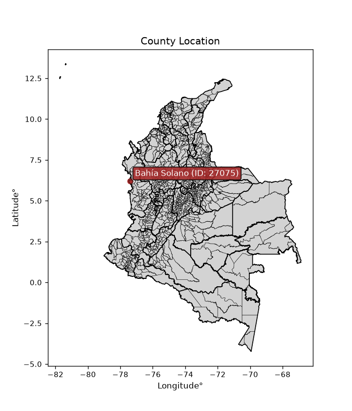
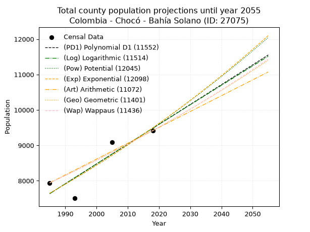
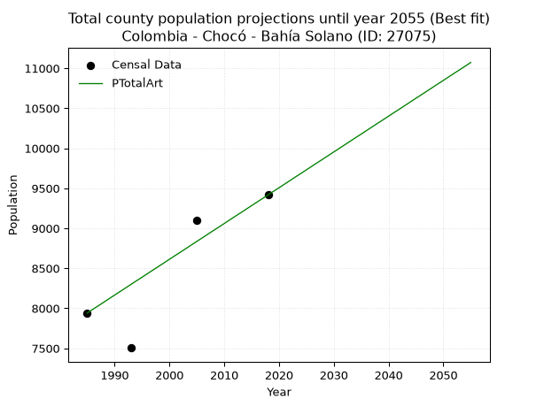
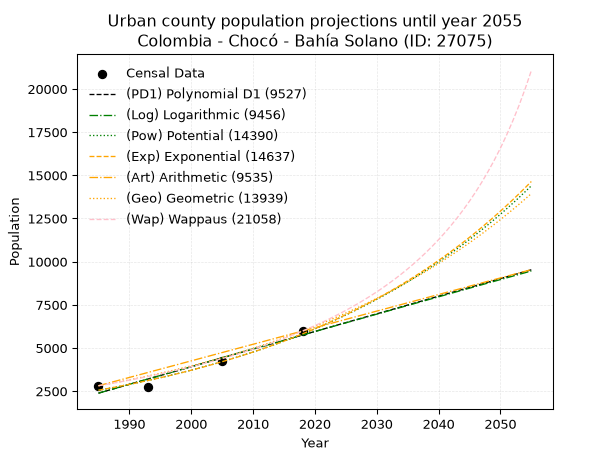
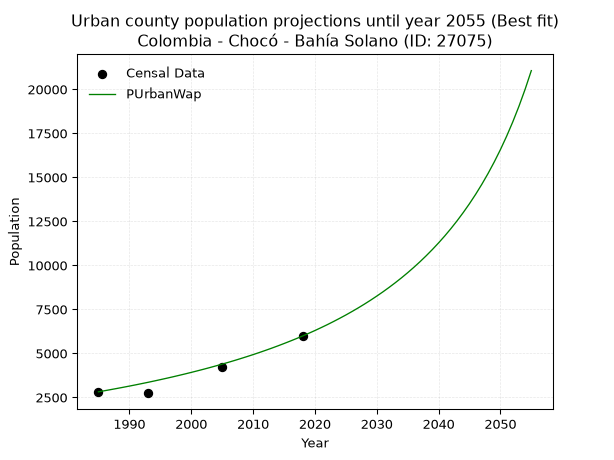
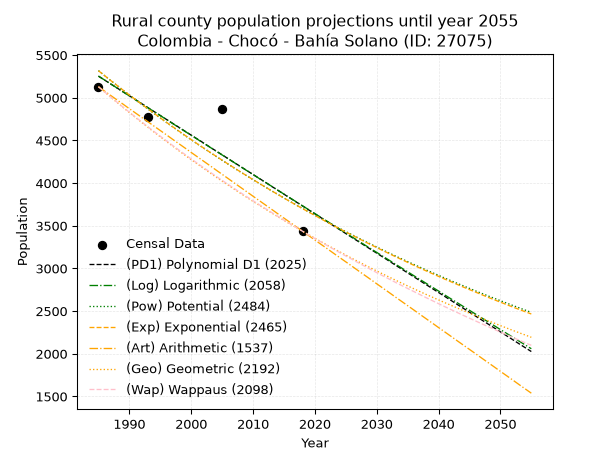
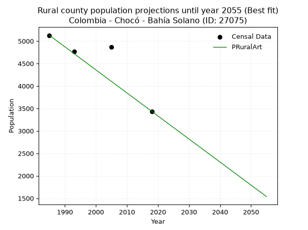

<div align="center">


</div>

# _“Population and Public Services Demand Projections (PPSD) until Year 2050 for Colombia - Chocó - Bahía Solano (ID: 27075)”_
Keywords: `population` `public-service` `projection` `lineal` `polynomial` `logarithmic` `potential` `exponential` `arithmetic` `geometric` `wappaus` `dane` `colombia` `south-america`

PPSD are analytical estimates used by governments and planners to anticipate future changes in population size, age distribution, and the resulting community needs for utilities, healthcare, education, and infrastructure as sizing future water treatment facilities, electrical grids, and road networks based on spatial growth.

<div align="center">

</img>

</div>


> **General running parameters**: • app_version: _v20260806_. • Python version: _3.14.7_. • Pandas version: _3.0.5_. • NumPy version: _2.5.1_. • Creates, save and include plots into reports (create_plot): _False_. • Projection until year: _2050_. • Process polynomial degree 2 and up: _False_. • Process Wappaus: _True_. • Process Wappaus: _True_. • Set negative values to zero: _True_. • Set infinite values to zero: _True_. • Drop dataset notes: _True_. 
<div align="center">

Dynamic map: [:earth_americas:Google](http://maps.google.com/maps?q=6.222806604,-77.4013591) [:earth_americas:OSM](https://www.openstreetmap.org/#map=18/6.222806604/-77.4013591&layers=P) [:earth_americas:Bing](https://www.bing.com/maps?cp=6.222806604~-77.4013591&lvl=18) [:earth_americas:Apple](https://maps.apple.com/frame?center=6.222806604%2C-77.4013591&span=0.003%2C0.006)

</div>


<div align="center">

```geojson
{
  "type": "Feature",
  "geometry": {
    "type": "Point", 
    "coordinates": [-77.4013591, 6.222806604]
  }, 
  "properties": {
    "Name": "Colombia - Chocó - Bahía Solano (ID: 27075)"
  }
}
```

</div>


## 0. Census Data (4 records)

Census data are official statistics collected by a government about the people and housing in a country. They usually include counts of total population, age, sex, race, income, education, and jobs.

📅Global census file: [Population.xlsx](../data/Population.xlsx)

| Source   |   Year |   CountryID | CountryName   |   StateID | StateName   |   CountyID | CountyName   |   PTotal |   PUrban |   PRural |
|:---------|-------:|------------:|:--------------|----------:|:------------|-----------:|:-------------|---------:|---------:|---------:|
| DANE     |   1985 |          57 | Colombia      |        27 | Chocó       |      27075 | Bahía Solano |     7941 |     2813 |     5128 |
| DANE     |   1993 |          57 | Colombia      |        27 | Chocó       |      27075 | Bahía Solano |     7505 |     2735 |     4770 |
| DANE     |   2005 |          57 | Colombia      |        27 | Chocó       |      27075 | Bahía Solano |     9094 |     4230 |     4864 |
| DANE     |   2018 |          57 | Colombia      |        27 | Chocó       |      27075 | Bahía Solano |     9417 |     5982 |     3435 |

> 🔥Some records could had specific notes about the registered values or the corresponding urban or rural distribution.

📅   [RUPS](https://www.datos.gov.co/Hacienda-y-Cr-dito-P-blico/Registro-nico-de-Prestadores-de-Servicios-P-blicos/4qkq-csdn/about_data) - Local public utility companies: [RUPS.csv](../data/RUPS.xlsx)

 | SERVICIO       | ESTADO    | NOMBRE                                                               | NIT         | DEPARTAMENTO_DOMICILIO   | MUNICIPIO_DOMICILIO   | DIRECCION                              |   TELEFONO | EMAIL                   | TIPO_PRESTADOR                             | CLASIFICACION                 |
|:---------------|:----------|:---------------------------------------------------------------------|:------------|:-------------------------|:----------------------|:---------------------------------------|-----------:|:------------------------|:-------------------------------------------|:------------------------------|
| ACUEDUCTO      | OPERATIVA | COOPERATIVA DE SERVICIOS PUBLICOS DE CUPICA                          | 900008613-6 | CHOCO                    | BAHIA SOLANO          | calle 2  #2  102                       |    3448766 | asezonic@gmail.com      | ORGANIZACION AUTORIZADA                    | MENOR O IGUAL A 2500 USUARIOS |
| ALCANTARILLADO | OPERATIVA | COOPERATIVA DE SERVICIOS PUBLICOS DE CUPICA                          | 900008613-6 | CHOCO                    | BAHIA SOLANO          | calle 2  #2  102                       |    3448766 | asezonic@gmail.com      | ORGANIZACION AUTORIZADA                    | MENOR O IGUAL A 2500 USUARIOS |
| ACUEDUCTO      | OPERATIVA | EMPRESA DE ACUEDUCTO ALCANTARILLADO Y ASEO DE BAHIA SOLANO S.A E.S.P | 900146103-2 | CHOCO                    | BAHIA SOLANO          | Carrera 2 Calle 3 Esquina Bahia Solano |    6827049 | acuabahiasa@hotmail.com | SOCIEDADES (EMPRESA DE SERVICIOS PUBLICOS) | MENOR O IGUAL A 2500 USUARIOS |
| ALCANTARILLADO | OPERATIVA | EMPRESA DE ACUEDUCTO ALCANTARILLADO Y ASEO DE BAHIA SOLANO S.A E.S.P | 900146103-2 | CHOCO                    | BAHIA SOLANO          | Carrera 2 Calle 3 Esquina Bahia Solano |    6827049 | acuabahiasa@hotmail.com | SOCIEDADES (EMPRESA DE SERVICIOS PUBLICOS) | MENOR O IGUAL A 2500 USUARIOS |
| ACUEDUCTO      | OPERATIVA | ASOCIACION DE USUARIOS DEL CORREGIMIENTO DEL VALLE ESP               | 900142256-2 | CHOCO                    | BAHIA SOLANO          | BAHIA SOLANO                           |    6827958 | acorvaesp@gmail.com     | ORGANIZACION AUTORIZADA                    | HASTA 2500 SUSCRIPTORES       |

## 1. Total

### 1.1. Coefficients and Parameters

* (PD1) Polynomial Deg 1: 55.940184664792945, -103405.10437575208 (lineal)
* (Log) Logarithmic: 111948.53688648538, -842432.475973449
* (Pow) Potential: 13.109019566926857, -39.34689438807239
* (Exp) Exponential: 0.006550562851048429, 0.017239137584561925
* (Art) Arithmetic: Year diff. 2018 - 1985 = 33, Population diff. 9417 - 7941 = 1476, Annual growth = 44.72727272727273
* (Geo) Geometric: Year diff. 2018 - 1985 = 33, Population diff. 9417 - 7941 = 1476, Annual growth % = 0.005179347127273415
* (Wap) Wappaus: i = 0.5153505326336297, Condition values only valid for < 200)

<sub>
Wappaus condition values: ['0.00', '0.52', '1.03', '1.55', '2.06', '2.58', '3.09', '3.61', '4.12', '4.64', '5.15', '5.67', '6.18', '6.70', '7.21', '7.73', '8.25', '8.76', '9.28', '9.79', '10.31', '10.82', '11.34', '11.85', '12.37', '12.88', '13.40', '13.91', '14.43', '14.95', '15.46', '15.98', '16.49', '17.01', '17.52', '18.04', '18.55', '19.07', '19.58', '20.10', '20.61', '21.13', '21.64', '22.16', '22.68', '23.19', '23.71', '24.22', '24.74', '25.25', '25.77', '26.28', '26.80', '27.31', '27.83', '28.34', '28.86', '29.37', '29.89', '30.41', '30.92', '31.44', '31.95', '32.47', '32.98', '33.50']
</sub>


### 1.2. Projected Dataset

|   Year |   CountyID |   PTotalPD1 |   PTotalLog |   PTotalPow |   PTotalExp |   PTotalArt |   PTotalGeo |   PTotalWap |
|-------:|-----------:|------------:|------------:|------------:|------------:|------------:|------------:|------------:|
|   1985 |      27075 |        7636 |        7635 |        7647 |        7649 |        7941 |        7941 |        7941 |
|   1986 |      27075 |        7692 |        7691 |        7698 |        7699 |        7986 |        7982 |        7982 |
|   1987 |      27075 |        7748 |        7747 |        7749 |        7750 |        8030 |        8023 |        8023 |
|   1988 |      27075 |        7804 |        7804 |        7800 |        7801 |        8075 |        8065 |        8065 |
|   1989 |      27075 |        7860 |        7860 |        7852 |        7852 |        8120 |        8107 |        8106 |
|   1990 |      27075 |        7916 |        7916 |        7904 |        7903 |        8165 |        8149 |        8148 |
|   1991 |      27075 |        7972 |        7973 |        7956 |        7955 |        8209 |        8191 |        8190 |
|   1992 |      27075 |        8028 |        8029 |        8009 |        8008 |        8254 |        8233 |        8233 |
|   1993 |      27075 |        8084 |        8085 |        8061 |        8060 |        8299 |        8276 |        8275 |
|   1994 |      27075 |        8140 |        8141 |        8115 |        8113 |        8344 |        8319 |        8318 |
|   1995 |      27075 |        8196 |        8197 |        8168 |        8167 |        8388 |        8362 |        8361 |
|   1996 |      27075 |        8252 |        8253 |        8222 |        8220 |        8433 |        8405 |        8404 |
|   1997 |      27075 |        8307 |        8309 |        8276 |        8274 |        8478 |        8449 |        8448 |
|   1998 |      27075 |        8363 |        8365 |        8331 |        8329 |        8522 |        8493 |        8491 |
|   1999 |      27075 |        8419 |        8421 |        8385 |        8383 |        8567 |        8537 |        8535 |
|   2000 |      27075 |        8475 |        8477 |        8441 |        8438 |        8612 |        8581 |        8580 |
|   2001 |      27075 |        8531 |        8533 |        8496 |        8494 |        8657 |        8625 |        8624 |
|   2002 |      27075 |        8587 |        8589 |        8552 |        8550 |        8701 |        8670 |        8669 |
|   2003 |      27075 |        8643 |        8645 |        8608 |        8606 |        8746 |        8715 |        8713 |
|   2004 |      27075 |        8699 |        8701 |        8665 |        8662 |        8791 |        8760 |        8759 |
|   2005 |      27075 |        8755 |        8757 |        8721 |        8719 |        8836 |        8805 |        8804 |
|   2006 |      27075 |        8811 |        8813 |        8779 |        8777 |        8880 |        8851 |        8850 |
|   2007 |      27075 |        8867 |        8869 |        8836 |        8834 |        8925 |        8897 |        8895 |
|   2008 |      27075 |        8923 |        8924 |        8894 |        8892 |        8970 |        8943 |        8942 |
|   2009 |      27075 |        8979 |        8980 |        8952 |        8951 |        9014 |        8989 |        8988 |
|   2010 |      27075 |        9035 |        9036 |        9011 |        9010 |        9059 |        9036 |        9035 |
|   2011 |      27075 |        9091 |        9091 |        9070 |        9069 |        9104 |        9083 |        9081 |
|   2012 |      27075 |        9147 |        9147 |        9129 |        9129 |        9149 |        9130 |        9129 |
|   2013 |      27075 |        9202 |        9203 |        9189 |        9189 |        9193 |        9177 |        9176 |
|   2014 |      27075 |        9258 |        9258 |        9249 |        9249 |        9238 |        9224 |        9224 |
|   2015 |      27075 |        9314 |        9314 |        9309 |        9310 |        9283 |        9272 |        9272 |
|   2016 |      27075 |        9370 |        9369 |        9370 |        9371 |        9328 |        9320 |        9320 |
|   2017 |      27075 |        9426 |        9425 |        9431 |        9432 |        9372 |        9368 |        9368 |
|   2018 |      27075 |        9482 |        9480 |        9493 |        9494 |        9417 |        9417 |        9417 |
|   2019 |      27075 |        9538 |        9536 |        9554 |        9557 |        9462 |        9466 |        9466 |
|   2020 |      27075 |        9594 |        9591 |        9617 |        9620 |        9506 |        9515 |        9515 |
|   2021 |      27075 |        9650 |        9647 |        9679 |        9683 |        9551 |        9564 |        9565 |
|   2022 |      27075 |        9706 |        9702 |        9742 |        9747 |        9596 |        9614 |        9615 |
|   2023 |      27075 |        9762 |        9757 |        9806 |        9811 |        9641 |        9663 |        9665 |
|   2024 |      27075 |        9818 |        9813 |        9869 |        9875 |        9685 |        9713 |        9715 |
|   2025 |      27075 |        9874 |        9868 |        9933 |        9940 |        9730 |        9764 |        9766 |
|   2026 |      27075 |        9930 |        9923 |        9998 |       10005 |        9775 |        9814 |        9817 |
|   2027 |      27075 |        9986 |        9979 |       10063 |       10071 |        9820 |        9865 |        9868 |
|   2028 |      27075 |       10042 |       10034 |       10128 |       10137 |        9864 |        9916 |        9920 |
|   2029 |      27075 |       10098 |       10089 |       10194 |       10204 |        9909 |        9968 |        9972 |
|   2030 |      27075 |       10153 |       10144 |       10260 |       10271 |        9954 |       10019 |       10024 |
|   2031 |      27075 |       10209 |       10199 |       10326 |       10338 |        9998 |       10071 |       10077 |
|   2032 |      27075 |       10265 |       10254 |       10393 |       10406 |       10043 |       10123 |       10129 |
|   2033 |      27075 |       10321 |       10310 |       10460 |       10475 |       10088 |       10176 |       10183 |
|   2034 |      27075 |       10377 |       10365 |       10528 |       10544 |       10133 |       10228 |       10236 |
|   2035 |      27075 |       10433 |       10420 |       10596 |       10613 |       10177 |       10281 |       10290 |
|   2036 |      27075 |       10489 |       10475 |       10664 |       10683 |       10222 |       10335 |       10344 |
|   2037 |      27075 |       10545 |       10530 |       10733 |       10753 |       10267 |       10388 |       10398 |
|   2038 |      27075 |       10601 |       10585 |       10803 |       10823 |       10312 |       10442 |       10453 |
|   2039 |      27075 |       10657 |       10639 |       10872 |       10895 |       10356 |       10496 |       10508 |
|   2040 |      27075 |       10713 |       10694 |       10942 |       10966 |       10401 |       10550 |       10563 |
|   2041 |      27075 |       10769 |       10749 |       11013 |       11038 |       10446 |       10605 |       10619 |
|   2042 |      27075 |       10825 |       10804 |       11084 |       11111 |       10490 |       10660 |       10675 |
|   2043 |      27075 |       10881 |       10859 |       11155 |       11184 |       10535 |       10715 |       10732 |
|   2044 |      27075 |       10937 |       10914 |       11227 |       11257 |       10580 |       10771 |       10788 |
|   2045 |      27075 |       10993 |       10968 |       11299 |       11331 |       10625 |       10827 |       10845 |
|   2046 |      27075 |       11049 |       11023 |       11372 |       11406 |       10669 |       10883 |       10903 |
|   2047 |      27075 |       11104 |       11078 |       11445 |       11481 |       10714 |       10939 |       10961 |
|   2048 |      27075 |       11160 |       11132 |       11518 |       11556 |       10759 |       10996 |       11019 |
|   2049 |      27075 |       11216 |       11187 |       11592 |       11632 |       10804 |       11053 |       11077 |
|   2050 |      27075 |       11272 |       11242 |       11667 |       11709 |       10848 |       11110 |       11136 |
<div align="center">

</img>

</div>


### 1.3. Best fit with absolute and relative error (%)

Relative error puts that difference into context by dividing the absolute error by the true value, creating a unitless ratio or percentage that shows the scale of the mistake.

Absolute and relative error

|   Year | Source   |   CountryID | CountryName   |   StateID | StateName   |   CountyID_x | CountyName   |   PTotal |   PUrban |   PRural |   CountyID_y |   PTotalPD1 |   PTotalLog |   PTotalPow |   PTotalExp |   PTotalArt |   PTotalGeo |   PTotalWap |   PTotalPD1AbsError |   PTotalLogAbsError |   PTotalPowAbsError |   PTotalExpAbsError |   PTotalArtAbsError |   PTotalGeoAbsError |   PTotalWapAbsError |   PTotalPD1RelError |   PTotalLogRelError |   PTotalPowRelError |   PTotalExpRelError |   PTotalArtRelError |   PTotalGeoRelError |   PTotalWapRelError |
|-------:|:---------|------------:|:--------------|----------:|:------------|-------------:|:-------------|---------:|---------:|---------:|-------------:|------------:|------------:|------------:|------------:|------------:|------------:|------------:|--------------------:|--------------------:|--------------------:|--------------------:|--------------------:|--------------------:|--------------------:|--------------------:|--------------------:|--------------------:|--------------------:|--------------------:|--------------------:|--------------------:|
|   1985 | DANE     |          57 | Colombia      |        27 | Chocó       |        27075 | Bahía Solano |     7941 |     2813 |     5128 |        27075 |        7636 |        7635 |        7647 |        7649 |        7941 |        7941 |        7941 |                 305 |                 306 |                 294 |                 292 |                   0 |                   0 |                   0 |            3.84083  |            3.85342  |            3.7023   |             3.67712 |             0       |             0       |             0       |
|   1993 | DANE     |          57 | Colombia      |        27 | Chocó       |        27075 | Bahía Solano |     7505 |     2735 |     4770 |        27075 |        8084 |        8085 |        8061 |        8060 |        8299 |        8276 |        8275 |                 579 |                 580 |                 556 |                 555 |                 794 |                 771 |                 770 |            7.71486  |            7.72818  |            7.40839  |             7.39507 |            10.5796  |            10.2732  |            10.2598  |
|   2005 | DANE     |          57 | Colombia      |        27 | Chocó       |        27075 | Bahía Solano |     9094 |     4230 |     4864 |        27075 |        8755 |        8757 |        8721 |        8719 |        8836 |        8805 |        8804 |                 339 |                 337 |                 373 |                 375 |                 258 |                 289 |                 290 |            3.72773  |            3.70574  |            4.10161  |             4.1236  |             2.83704 |             3.17792 |             3.18892 |
|   2018 | DANE     |          57 | Colombia      |        27 | Chocó       |        27075 | Bahía Solano |     9417 |     5982 |     3435 |        27075 |        9482 |        9480 |        9493 |        9494 |        9417 |        9417 |        9417 |                  65 |                  63 |                  76 |                  77 |                   0 |                   0 |                   0 |            0.690241 |            0.669003 |            0.807051 |             0.81767 |             0       |             0       |             0       |

Relative error mean

| Method    |   RelError | Best   |
|:----------|-----------:|:-------|
| PTotalPD1 |    3.99341 |        |
| PTotalLog |    3.98909 |        |
| PTotalPow |    4.00484 |        |
| PTotalExp |    4.00336 |        |
| PTotalArt |    3.35416 | True   |
| PTotalGeo |    3.36277 |        |
| PTotalWap |    3.36219 |        |

💙Best method: _**PTotalArt**_
<div align="center">

</img>

</div>


### 1.4. Fresh water supply demand in liters per capita per day (lpcd)

The fresh water supply demand typically ranges from 100 to 300 liters per capita per day (lpcd) for standard domestic and municipal planning, though absolute survival minimums set by the World Health Organization are as low as 7.5 to 20 liters per day, and total consumption in high-income nations can exceed 400 liters.

> `CZ`: Level in meters above the sea level (masl)<br> `WS`: Fresh water supply demand in liters per capita per day (lpcd or l/h/d)<br> `WSAll`: Zonal fresh water supply demand in liters per second (l/s)<br> `A`: Zonal area in square meters<br> `DP`: Population density (people/hectare or p/ha)

Reference values (RAS Colombia)

|    CZ |   WS |
|------:|-----:|
|  1000 |  120 |
|  2000 |  130 |
| 99999 |  140 |

County shapefile geometry properties and water supply values

|   CountyID |      ATotal |   CZTotal |   WSTotal |
|-----------:|------------:|----------:|----------:|
|      27075 | 8.96066e+08 |   263.553 |       120 |

Projected values for best method: PTotalArt

|   CountyID |   Year |   PTotalArt |   DPTotal |   WSTotal |   WSTotalAll |
|-----------:|-------:|------------:|----------:|----------:|-------------:|
|      27075 |   1985 |        7941 |      0.09 |       120 |      11.0292 |
|      27075 |   1986 |        7986 |      0.09 |       120 |      11.0917 |
|      27075 |   1987 |        8030 |      0.09 |       120 |      11.1528 |
|      27075 |   1988 |        8075 |      0.09 |       120 |      11.2153 |
|      27075 |   1989 |        8120 |      0.09 |       120 |      11.2778 |
|      27075 |   1990 |        8165 |      0.09 |       120 |      11.3403 |
|      27075 |   1991 |        8209 |      0.09 |       120 |      11.4014 |
|      27075 |   1992 |        8254 |      0.09 |       120 |      11.4639 |
|      27075 |   1993 |        8299 |      0.09 |       120 |      11.5264 |
|      27075 |   1994 |        8344 |      0.09 |       120 |      11.5889 |
|      27075 |   1995 |        8388 |      0.09 |       120 |      11.65   |
|      27075 |   1996 |        8433 |      0.09 |       120 |      11.7125 |
|      27075 |   1997 |        8478 |      0.09 |       120 |      11.775  |
|      27075 |   1998 |        8522 |      0.1  |       120 |      11.8361 |
|      27075 |   1999 |        8567 |      0.1  |       120 |      11.8986 |
|      27075 |   2000 |        8612 |      0.1  |       120 |      11.9611 |
|      27075 |   2001 |        8657 |      0.1  |       120 |      12.0236 |
|      27075 |   2002 |        8701 |      0.1  |       120 |      12.0847 |
|      27075 |   2003 |        8746 |      0.1  |       120 |      12.1472 |
|      27075 |   2004 |        8791 |      0.1  |       120 |      12.2097 |
|      27075 |   2005 |        8836 |      0.1  |       120 |      12.2722 |
|      27075 |   2006 |        8880 |      0.1  |       120 |      12.3333 |
|      27075 |   2007 |        8925 |      0.1  |       120 |      12.3958 |
|      27075 |   2008 |        8970 |      0.1  |       120 |      12.4583 |
|      27075 |   2009 |        9014 |      0.1  |       120 |      12.5194 |
|      27075 |   2010 |        9059 |      0.1  |       120 |      12.5819 |
|      27075 |   2011 |        9104 |      0.1  |       120 |      12.6444 |
|      27075 |   2012 |        9149 |      0.1  |       120 |      12.7069 |
|      27075 |   2013 |        9193 |      0.1  |       120 |      12.7681 |
|      27075 |   2014 |        9238 |      0.1  |       120 |      12.8306 |
|      27075 |   2015 |        9283 |      0.1  |       120 |      12.8931 |
|      27075 |   2016 |        9328 |      0.1  |       120 |      12.9556 |
|      27075 |   2017 |        9372 |      0.1  |       120 |      13.0167 |
|      27075 |   2018 |        9417 |      0.11 |       120 |      13.0792 |
|      27075 |   2019 |        9462 |      0.11 |       120 |      13.1417 |
|      27075 |   2020 |        9506 |      0.11 |       120 |      13.2028 |
|      27075 |   2021 |        9551 |      0.11 |       120 |      13.2653 |
|      27075 |   2022 |        9596 |      0.11 |       120 |      13.3278 |
|      27075 |   2023 |        9641 |      0.11 |       120 |      13.3903 |
|      27075 |   2024 |        9685 |      0.11 |       120 |      13.4514 |
|      27075 |   2025 |        9730 |      0.11 |       120 |      13.5139 |
|      27075 |   2026 |        9775 |      0.11 |       120 |      13.5764 |
|      27075 |   2027 |        9820 |      0.11 |       120 |      13.6389 |
|      27075 |   2028 |        9864 |      0.11 |       120 |      13.7    |
|      27075 |   2029 |        9909 |      0.11 |       120 |      13.7625 |
|      27075 |   2030 |        9954 |      0.11 |       120 |      13.825  |
|      27075 |   2031 |        9998 |      0.11 |       120 |      13.8861 |
|      27075 |   2032 |       10043 |      0.11 |       120 |      13.9486 |
|      27075 |   2033 |       10088 |      0.11 |       120 |      14.0111 |
|      27075 |   2034 |       10133 |      0.11 |       120 |      14.0736 |
|      27075 |   2035 |       10177 |      0.11 |       120 |      14.1347 |
|      27075 |   2036 |       10222 |      0.11 |       120 |      14.1972 |
|      27075 |   2037 |       10267 |      0.11 |       120 |      14.2597 |
|      27075 |   2038 |       10312 |      0.12 |       120 |      14.3222 |
|      27075 |   2039 |       10356 |      0.12 |       120 |      14.3833 |
|      27075 |   2040 |       10401 |      0.12 |       120 |      14.4458 |
|      27075 |   2041 |       10446 |      0.12 |       120 |      14.5083 |
|      27075 |   2042 |       10490 |      0.12 |       120 |      14.5694 |
|      27075 |   2043 |       10535 |      0.12 |       120 |      14.6319 |
|      27075 |   2044 |       10580 |      0.12 |       120 |      14.6944 |
|      27075 |   2045 |       10625 |      0.12 |       120 |      14.7569 |
|      27075 |   2046 |       10669 |      0.12 |       120 |      14.8181 |
|      27075 |   2047 |       10714 |      0.12 |       120 |      14.8806 |
|      27075 |   2048 |       10759 |      0.12 |       120 |      14.9431 |
|      27075 |   2049 |       10804 |      0.12 |       120 |      15.0056 |
|      27075 |   2050 |       10848 |      0.12 |       120 |      15.0667 |

## 2. Urban

### 2.1. Coefficients and Parameters

* (PD1) Polynomial Deg 1: 102.04094741067725, -200167.40505820714 (lineal)
* (Log) Logarithmic: 204131.75463086396, -1547667.1027584167
* (Pow) Potential: 49.90920741185926, -161.1817501795777
* (Exp) Exponential: 0.02494431356986763, 8.003218773144427e-19
* (Art) Arithmetic: Year diff. 2018 - 1985 = 33, Population diff. 5982 - 2813 = 3169, Annual growth = 96.03030303030303
* (Geo) Geometric: Year diff. 2018 - 1985 = 33, Population diff. 5982 - 2813 = 3169, Annual growth % = 0.023127119079235925
* (Wap) Wappaus: i = 2.1837476527641395, Condition values only valid for < 200)

<sub>
Wappaus condition values: ['0.00', '2.18', '4.37', '6.55', '8.73', '10.92', '13.10', '15.29', '17.47', '19.65', '21.84', '24.02', '26.20', '28.39', '30.57', '32.76', '34.94', '37.12', '39.31', '41.49', '43.67', '45.86', '48.04', '50.23', '52.41', '54.59', '56.78', '58.96', '61.14', '63.33', '65.51', '67.70', '69.88', '72.06', '74.25', '76.43', '78.61', '80.80', '82.98', '85.17', '87.35', '89.53', '91.72', '93.90', '96.08', '98.27', '100.45', '102.64', '104.82', '107.00', '109.19', '111.37', '113.55', '115.74', '117.92', '120.11', '122.29', '124.47', '126.66', '128.84', '131.02', '133.21', '135.39', '137.58', '139.76', '141.94']
</sub>


### 2.2. Projected Dataset

|   Year |   CountyID |   PUrbanPD1 |   PUrbanLog |   PUrbanPow |   PUrbanExp |   PUrbanArt |   PUrbanGeo |   PUrbanWap |
|-------:|-----------:|------------:|------------:|------------:|------------:|------------:|------------:|------------:|
|   1985 |      27075 |        2384 |        2382 |        2552 |        2553 |        2813 |        2813 |        2813 |
|   1986 |      27075 |        2486 |        2485 |        2617 |        2618 |        2909 |        2878 |        2875 |
|   1987 |      27075 |        2588 |        2587 |        2683 |        2684 |        3005 |        2945 |        2939 |
|   1988 |      27075 |        2690 |        2690 |        2752 |        2752 |        3101 |        3013 |        3004 |
|   1989 |      27075 |        2792 |        2793 |        2822 |        2821 |        3197 |        3082 |        3070 |
|   1990 |      27075 |        2894 |        2895 |        2893 |        2893 |        3293 |        3154 |        3138 |
|   1991 |      27075 |        2996 |        2998 |        2967 |        2966 |        3389 |        3227 |        3207 |
|   1992 |      27075 |        3098 |        3100 |        3042 |        3041 |        3485 |        3301 |        3279 |
|   1993 |      27075 |        3200 |        3203 |        3119 |        3117 |        3581 |        3378 |        3351 |
|   1994 |      27075 |        3302 |        3305 |        3198 |        3196 |        3677 |        3456 |        3426 |
|   1995 |      27075 |        3404 |        3407 |        3279 |        3277 |        3773 |        3536 |        3503 |
|   1996 |      27075 |        3506 |        3510 |        3362 |        3360 |        3869 |        3617 |        3581 |
|   1997 |      27075 |        3608 |        3612 |        3447 |        3444 |        3965 |        3701 |        3661 |
|   1998 |      27075 |        3710 |        3714 |        3535 |        3531 |        4061 |        3787 |        3744 |
|   1999 |      27075 |        3812 |        3816 |        3624 |        3621 |        4157 |        3874 |        3828 |
|   2000 |      27075 |        3914 |        3918 |        3716 |        3712 |        4253 |        3964 |        3915 |
|   2001 |      27075 |        4017 |        4020 |        3810 |        3806 |        4349 |        4055 |        4004 |
|   2002 |      27075 |        4119 |        4122 |        3906 |        3902 |        4446 |        4149 |        4095 |
|   2003 |      27075 |        4221 |        4224 |        4004 |        4001 |        4542 |        4245 |        4189 |
|   2004 |      27075 |        4323 |        4326 |        4105 |        4102 |        4638 |        4343 |        4286 |
|   2005 |      27075 |        4425 |        4428 |        4209 |        4205 |        4734 |        4444 |        4385 |
|   2006 |      27075 |        4527 |        4530 |        4315 |        4311 |        4830 |        4547 |        4487 |
|   2007 |      27075 |        4629 |        4632 |        4424 |        4420 |        4926 |        4652 |        4592 |
|   2008 |      27075 |        4731 |        4733 |        4535 |        4532 |        5022 |        4759 |        4700 |
|   2009 |      27075 |        4833 |        4835 |        4649 |        4646 |        5118 |        4869 |        4811 |
|   2010 |      27075 |        4935 |        4937 |        4766 |        4764 |        5214 |        4982 |        4925 |
|   2011 |      27075 |        5037 |        5038 |        4886 |        4884 |        5310 |        5097 |        5043 |
|   2012 |      27075 |        5139 |        5140 |        5008 |        5007 |        5406 |        5215 |        5165 |
|   2013 |      27075 |        5241 |        5241 |        5134 |        5134 |        5502 |        5336 |        5290 |
|   2014 |      27075 |        5343 |        5342 |        5263 |        5264 |        5598 |        5459 |        5420 |
|   2015 |      27075 |        5445 |        5444 |        5395 |        5397 |        5694 |        5585 |        5554 |
|   2016 |      27075 |        5547 |        5545 |        5530 |        5533 |        5790 |        5715 |        5692 |
|   2017 |      27075 |        5649 |        5646 |        5669 |        5673 |        5886 |        5847 |        5834 |
|   2018 |      27075 |        5751 |        5747 |        5811 |        5816 |        5982 |        5982 |        5982 |
|   2019 |      27075 |        5853 |        5849 |        5956 |        5963 |        6078 |        6120 |        6135 |
|   2020 |      27075 |        5955 |        5950 |        6105 |        6113 |        6174 |        6262 |        6293 |
|   2021 |      27075 |        6057 |        6051 |        6258 |        6268 |        6270 |        6407 |        6457 |
|   2022 |      27075 |        6159 |        6152 |        6415 |        6426 |        6366 |        6555 |        6626 |
|   2023 |      27075 |        6261 |        6253 |        6575 |        6588 |        6462 |        6706 |        6803 |
|   2024 |      27075 |        6363 |        6353 |        6739 |        6755 |        6558 |        6862 |        6986 |
|   2025 |      27075 |        6466 |        6454 |        6907 |        6925 |        6654 |        7020 |        7175 |
|   2026 |      27075 |        6568 |        6555 |        7080 |        7100 |        6750 |        7183 |        7373 |
|   2027 |      27075 |        6670 |        6656 |        7256 |        7280 |        6846 |        7349 |        7578 |
|   2028 |      27075 |        6772 |        6756 |        7437 |        7464 |        6942 |        7519 |        7792 |
|   2029 |      27075 |        6874 |        6857 |        7622 |        7652 |        7038 |        7693 |        8015 |
|   2030 |      27075 |        6976 |        6958 |        7812 |        7845 |        7134 |        7870 |        8248 |
|   2031 |      27075 |        7078 |        7058 |        8006 |        8044 |        7230 |        8053 |        8490 |
|   2032 |      27075 |        7180 |        7159 |        8205 |        8247 |        7326 |        8239 |        8744 |
|   2033 |      27075 |        7282 |        7259 |        8409 |        8455 |        7422 |        8429 |        9009 |
|   2034 |      27075 |        7384 |        7360 |        8618 |        8669 |        7518 |        8624 |        9286 |
|   2035 |      27075 |        7486 |        7460 |        8832 |        8888 |        7615 |        8824 |        9577 |
|   2036 |      27075 |        7588 |        7560 |        9052 |        9112 |        7711 |        9028 |        9883 |
|   2037 |      27075 |        7690 |        7660 |        9276 |        9342 |        7807 |        9237 |       10203 |
|   2038 |      27075 |        7792 |        7761 |        9506 |        9578 |        7903 |        9450 |       10541 |
|   2039 |      27075 |        7894 |        7861 |        9742 |        9820 |        7999 |        9669 |       10896 |
|   2040 |      27075 |        7996 |        7961 |        9983 |       10068 |        8095 |        9892 |       11271 |
|   2041 |      27075 |        8098 |        8061 |       10230 |       10322 |        8191 |       10121 |       11666 |
|   2042 |      27075 |        8200 |        8161 |       10484 |       10583 |        8287 |       10355 |       12085 |
|   2043 |      27075 |        8302 |        8261 |       10743 |       10850 |        8383 |       10595 |       12529 |
|   2044 |      27075 |        8404 |        8361 |       11008 |       11124 |        8479 |       10840 |       13000 |
|   2045 |      27075 |        8506 |        8461 |       11281 |       11405 |        8575 |       11090 |       13500 |
|   2046 |      27075 |        8608 |        8560 |       11559 |       11694 |        8671 |       11347 |       14033 |
|   2047 |      27075 |        8710 |        8660 |       11845 |       11989 |        8767 |       11609 |       14603 |
|   2048 |      27075 |        8812 |        8760 |       12137 |       12292 |        8863 |       11878 |       15212 |
|   2049 |      27075 |        8914 |        8859 |       12436 |       12602 |        8959 |       12152 |       15866 |
|   2050 |      27075 |        9017 |        8959 |       12743 |       12920 |        9055 |       12434 |       16568 |
<div align="center">

</img>

</div>


### 2.3. Best fit with absolute and relative error (%)

Relative error puts that difference into context by dividing the absolute error by the true value, creating a unitless ratio or percentage that shows the scale of the mistake.

Absolute and relative error

|   Year | Source   |   CountryID | CountryName   |   StateID | StateName   |   CountyID_x | CountyName   |   PTotal |   PUrban |   PRural |   CountyID_y |   PUrbanPD1 |   PUrbanLog |   PUrbanPow |   PUrbanExp |   PUrbanArt |   PUrbanGeo |   PUrbanWap |   PUrbanPD1AbsError |   PUrbanLogAbsError |   PUrbanPowAbsError |   PUrbanExpAbsError |   PUrbanArtAbsError |   PUrbanGeoAbsError |   PUrbanWapAbsError |   PUrbanPD1RelError |   PUrbanLogRelError |   PUrbanPowRelError |   PUrbanExpRelError |   PUrbanArtRelError |   PUrbanGeoRelError |   PUrbanWapRelError |
|-------:|:---------|------------:|:--------------|----------:|:------------|-------------:|:-------------|---------:|---------:|---------:|-------------:|------------:|------------:|------------:|------------:|------------:|------------:|------------:|--------------------:|--------------------:|--------------------:|--------------------:|--------------------:|--------------------:|--------------------:|--------------------:|--------------------:|--------------------:|--------------------:|--------------------:|--------------------:|--------------------:|
|   1985 | DANE     |          57 | Colombia      |        27 | Chocó       |        27075 | Bahía Solano |     7941 |     2813 |     5128 |        27075 |        2384 |        2382 |        2552 |        2553 |        2813 |        2813 |        2813 |                 429 |                 431 |                 261 |                 260 |                   0 |                   0 |                   0 |            15.2506  |            15.3217  |            9.27835  |            9.2428   |              0      |              0      |              0      |
|   1993 | DANE     |          57 | Colombia      |        27 | Chocó       |        27075 | Bahía Solano |     7505 |     2735 |     4770 |        27075 |        3200 |        3203 |        3119 |        3117 |        3581 |        3378 |        3351 |                 465 |                 468 |                 384 |                 382 |                 846 |                 643 |                 616 |            17.0018  |            17.1115  |           14.0402   |           13.9671   |             30.9324 |             23.5101 |             22.5229 |
|   2005 | DANE     |          57 | Colombia      |        27 | Chocó       |        27075 | Bahía Solano |     9094 |     4230 |     4864 |        27075 |        4425 |        4428 |        4209 |        4205 |        4734 |        4444 |        4385 |                 195 |                 198 |                  21 |                  25 |                 504 |                 214 |                 155 |             4.60993 |             4.68085 |            0.496454 |            0.591017 |             11.9149 |              5.0591 |              3.6643 |
|   2018 | DANE     |          57 | Colombia      |        27 | Chocó       |        27075 | Bahía Solano |     9417 |     5982 |     3435 |        27075 |        5751 |        5747 |        5811 |        5816 |        5982 |        5982 |        5982 |                 231 |                 235 |                 171 |                 166 |                   0 |                   0 |                   0 |             3.86158 |             3.92845 |            2.85858  |            2.77499  |              0      |              0      |              0      |

Relative error mean

| Method    |   RelError | Best   |
|:----------|-----------:|:-------|
| PUrbanPD1 |   10.181   |        |
| PUrbanLog |   10.2606  |        |
| PUrbanPow |    6.6684  |        |
| PUrbanExp |    6.64398 |        |
| PUrbanArt |   10.7118  |        |
| PUrbanGeo |    7.14229 |        |
| PUrbanWap |    6.54679 | True   |

💙Best method: _**PUrbanWap**_
<div align="center">

</img>

</div>


### 2.4. Fresh water supply demand in liters per capita per day (lpcd)

The fresh water supply demand typically ranges from 100 to 300 liters per capita per day (lpcd) for standard domestic and municipal planning, though absolute survival minimums set by the World Health Organization are as low as 7.5 to 20 liters per day, and total consumption in high-income nations can exceed 400 liters.

> `CZ`: Level in meters above the sea level (masl)<br> `WS`: Fresh water supply demand in liters per capita per day (lpcd or l/h/d)<br> `WSAll`: Zonal fresh water supply demand in liters per second (l/s)<br> `A`: Zonal area in square meters<br> `DP`: Population density (people/hectare or p/ha)

Reference values (RAS Colombia)

|    CZ |   WS |
|------:|-----:|
|  1000 |  120 |
|  2000 |  130 |
| 99999 |  140 |

County shapefile geometry properties and water supply values

|   CountyID |      AUrban |   CZUrban |   WSUrban |
|-----------:|------------:|----------:|----------:|
|      27075 | 1.50117e+06 |   9.47385 |       120 |

Projected values for best method: PUrbanWap

|   CountyID |   Year |   PUrbanWap |   DPUrban |   WSUrban |   WSUrbanAll |
|-----------:|-------:|------------:|----------:|----------:|-------------:|
|      27075 |   1985 |        2813 |     18.74 |       120 |      3.90694 |
|      27075 |   1986 |        2875 |     19.15 |       120 |      3.99306 |
|      27075 |   1987 |        2939 |     19.58 |       120 |      4.08194 |
|      27075 |   1988 |        3004 |     20.01 |       120 |      4.17222 |
|      27075 |   1989 |        3070 |     20.45 |       120 |      4.26389 |
|      27075 |   1990 |        3138 |     20.9  |       120 |      4.35833 |
|      27075 |   1991 |        3207 |     21.36 |       120 |      4.45417 |
|      27075 |   1992 |        3279 |     21.84 |       120 |      4.55417 |
|      27075 |   1993 |        3351 |     22.32 |       120 |      4.65417 |
|      27075 |   1994 |        3426 |     22.82 |       120 |      4.75833 |
|      27075 |   1995 |        3503 |     23.34 |       120 |      4.86528 |
|      27075 |   1996 |        3581 |     23.85 |       120 |      4.97361 |
|      27075 |   1997 |        3661 |     24.39 |       120 |      5.08472 |
|      27075 |   1998 |        3744 |     24.94 |       120 |      5.2     |
|      27075 |   1999 |        3828 |     25.5  |       120 |      5.31667 |
|      27075 |   2000 |        3915 |     26.08 |       120 |      5.4375  |
|      27075 |   2001 |        4004 |     26.67 |       120 |      5.56111 |
|      27075 |   2002 |        4095 |     27.28 |       120 |      5.6875  |
|      27075 |   2003 |        4189 |     27.9  |       120 |      5.81806 |
|      27075 |   2004 |        4286 |     28.55 |       120 |      5.95278 |
|      27075 |   2005 |        4385 |     29.21 |       120 |      6.09028 |
|      27075 |   2006 |        4487 |     29.89 |       120 |      6.23194 |
|      27075 |   2007 |        4592 |     30.59 |       120 |      6.37778 |
|      27075 |   2008 |        4700 |     31.31 |       120 |      6.52778 |
|      27075 |   2009 |        4811 |     32.05 |       120 |      6.68194 |
|      27075 |   2010 |        4925 |     32.81 |       120 |      6.84028 |
|      27075 |   2011 |        5043 |     33.59 |       120 |      7.00417 |
|      27075 |   2012 |        5165 |     34.41 |       120 |      7.17361 |
|      27075 |   2013 |        5290 |     35.24 |       120 |      7.34722 |
|      27075 |   2014 |        5420 |     36.11 |       120 |      7.52778 |
|      27075 |   2015 |        5554 |     37    |       120 |      7.71389 |
|      27075 |   2016 |        5692 |     37.92 |       120 |      7.90556 |
|      27075 |   2017 |        5834 |     38.86 |       120 |      8.10278 |
|      27075 |   2018 |        5982 |     39.85 |       120 |      8.30833 |
|      27075 |   2019 |        6135 |     40.87 |       120 |      8.52083 |
|      27075 |   2020 |        6293 |     41.92 |       120 |      8.74028 |
|      27075 |   2021 |        6457 |     43.01 |       120 |      8.96806 |
|      27075 |   2022 |        6626 |     44.14 |       120 |      9.20278 |
|      27075 |   2023 |        6803 |     45.32 |       120 |      9.44861 |
|      27075 |   2024 |        6986 |     46.54 |       120 |      9.70278 |
|      27075 |   2025 |        7175 |     47.8  |       120 |      9.96528 |
|      27075 |   2026 |        7373 |     49.12 |       120 |     10.2403  |
|      27075 |   2027 |        7578 |     50.48 |       120 |     10.525   |
|      27075 |   2028 |        7792 |     51.91 |       120 |     10.8222  |
|      27075 |   2029 |        8015 |     53.39 |       120 |     11.1319  |
|      27075 |   2030 |        8248 |     54.94 |       120 |     11.4556  |
|      27075 |   2031 |        8490 |     56.56 |       120 |     11.7917  |
|      27075 |   2032 |        8744 |     58.25 |       120 |     12.1444  |
|      27075 |   2033 |        9009 |     60.01 |       120 |     12.5125  |
|      27075 |   2034 |        9286 |     61.86 |       120 |     12.8972  |
|      27075 |   2035 |        9577 |     63.8  |       120 |     13.3014  |
|      27075 |   2036 |        9883 |     65.84 |       120 |     13.7264  |
|      27075 |   2037 |       10203 |     67.97 |       120 |     14.1708  |
|      27075 |   2038 |       10541 |     70.22 |       120 |     14.6403  |
|      27075 |   2039 |       10896 |     72.58 |       120 |     15.1333  |
|      27075 |   2040 |       11271 |     75.08 |       120 |     15.6542  |
|      27075 |   2041 |       11666 |     77.71 |       120 |     16.2028  |
|      27075 |   2042 |       12085 |     80.5  |       120 |     16.7847  |
|      27075 |   2043 |       12529 |     83.46 |       120 |     17.4014  |
|      27075 |   2044 |       13000 |     86.6  |       120 |     18.0556  |
|      27075 |   2045 |       13500 |     89.93 |       120 |     18.75    |
|      27075 |   2046 |       14033 |     93.48 |       120 |     19.4903  |
|      27075 |   2047 |       14603 |     97.28 |       120 |     20.2819  |
|      27075 |   2048 |       15212 |    101.33 |       120 |     21.1278  |
|      27075 |   2049 |       15866 |    105.69 |       120 |     22.0361  |
|      27075 |   2050 |       16568 |    110.37 |       120 |     23.0111  |

## 3. Rural

### 3.1. Coefficients and Parameters

* (PD1) Polynomial Deg 1: -46.100762745884296, 96762.30068245508 (lineal)
* (Log) Logarithmic: -92183.21774437865, 705234.6267849684
* (Pow) Potential: -21.957004609973048, 76.13458405028729
* (Exp) Exponential: -0.01098158902743374, 15578513714741.602
* (Art) Arithmetic: Year diff. 2018 - 1985 = 33, Population diff. 3435 - 5128 = -1693, Annual growth = -51.303030303030305
* (Geo) Geometric: Year diff. 2018 - 1985 = 33, Population diff. 3435 - 5128 = -1693, Annual growth % = -0.012068966376295842
* (Wap) Wappaus: i = -1.198248985239526, Condition values only valid for < 200)

<sub>
Wappaus condition values: ['-0.00', '-1.20', '-2.40', '-3.59', '-4.79', '-5.99', '-7.19', '-8.39', '-9.59', '-10.78', '-11.98', '-13.18', '-14.38', '-15.58', '-16.78', '-17.97', '-19.17', '-20.37', '-21.57', '-22.77', '-23.96', '-25.16', '-26.36', '-27.56', '-28.76', '-29.96', '-31.15', '-32.35', '-33.55', '-34.75', '-35.95', '-37.15', '-38.34', '-39.54', '-40.74', '-41.94', '-43.14', '-44.34', '-45.53', '-46.73', '-47.93', '-49.13', '-50.33', '-51.52', '-52.72', '-53.92', '-55.12', '-56.32', '-57.52', '-58.71', '-59.91', '-61.11', '-62.31', '-63.51', '-64.71', '-65.90', '-67.10', '-68.30', '-69.50', '-70.70', '-71.89', '-73.09', '-74.29', '-75.49', '-76.69', '-77.89']
</sub>


### 3.2. Projected Dataset

|   Year |   CountyID |   PRuralPD1 |   PRuralLog |   PRuralPow |   PRuralExp |   PRuralArt |   PRuralGeo |   PRuralWap |
|-------:|-----------:|------------:|------------:|------------:|------------:|------------:|------------:|------------:|
|   1985 |      27075 |        5252 |        5253 |        5317 |        5316 |        5128 |        5128 |        5128 |
|   1986 |      27075 |        5206 |        5207 |        5258 |        5258 |        5077 |        5066 |        5067 |
|   1987 |      27075 |        5160 |        5160 |        5200 |        5200 |        5025 |        5005 |        5007 |
|   1988 |      27075 |        5114 |        5114 |        5143 |        5144 |        4974 |        4945 |        4947 |
|   1989 |      27075 |        5068 |        5067 |        5087 |        5087 |        4923 |        4885 |        4888 |
|   1990 |      27075 |        5022 |        5021 |        5031 |        5032 |        4871 |        4826 |        4830 |
|   1991 |      27075 |        4976 |        4975 |        4976 |        4977 |        4820 |        4768 |        4772 |
|   1992 |      27075 |        4930 |        4928 |        4921 |        4923 |        4769 |        4710 |        4715 |
|   1993 |      27075 |        4883 |        4882 |        4867 |        4869 |        4718 |        4653 |        4659 |
|   1994 |      27075 |        4837 |        4836 |        4814 |        4816 |        4666 |        4597 |        4603 |
|   1995 |      27075 |        4791 |        4790 |        4761 |        4763 |        4615 |        4542 |        4548 |
|   1996 |      27075 |        4745 |        4744 |        4709 |        4711 |        4564 |        4487 |        4494 |
|   1997 |      27075 |        4699 |        4697 |        4658 |        4660 |        4512 |        4433 |        4440 |
|   1998 |      27075 |        4653 |        4651 |        4607 |        4609 |        4461 |        4379 |        4387 |
|   1999 |      27075 |        4607 |        4605 |        4556 |        4558 |        4410 |        4326 |        4334 |
|   2000 |      27075 |        4561 |        4559 |        4507 |        4509 |        4358 |        4274 |        4282 |
|   2001 |      27075 |        4515 |        4513 |        4457 |        4459 |        4307 |        4223 |        4231 |
|   2002 |      27075 |        4469 |        4467 |        4409 |        4411 |        4256 |        4172 |        4180 |
|   2003 |      27075 |        4422 |        4421 |        4361 |        4362 |        4205 |        4121 |        4130 |
|   2004 |      27075 |        4376 |        4375 |        4313 |        4315 |        4153 |        4071 |        4080 |
|   2005 |      27075 |        4330 |        4329 |        4266 |        4268 |        4102 |        4022 |        4031 |
|   2006 |      27075 |        4284 |        4283 |        4220 |        4221 |        4051 |        3974 |        3982 |
|   2007 |      27075 |        4238 |        4237 |        4174 |        4175 |        3999 |        3926 |        3934 |
|   2008 |      27075 |        4192 |        4191 |        4128 |        4129 |        3948 |        3878 |        3886 |
|   2009 |      27075 |        4146 |        4145 |        4084 |        4084 |        3897 |        3832 |        3839 |
|   2010 |      27075 |        4100 |        4099 |        4039 |        4040 |        3845 |        3785 |        3792 |
|   2011 |      27075 |        4054 |        4053 |        3995 |        3996 |        3794 |        3740 |        3746 |
|   2012 |      27075 |        4008 |        4008 |        3952 |        3952 |        3743 |        3695 |        3700 |
|   2013 |      27075 |        3961 |        3962 |        3909 |        3909 |        3692 |        3650 |        3655 |
|   2014 |      27075 |        3915 |        3916 |        3867 |        3866 |        3640 |        3606 |        3610 |
|   2015 |      27075 |        3869 |        3870 |        3825 |        3824 |        3589 |        3562 |        3565 |
|   2016 |      27075 |        3823 |        3824 |        3783 |        3782 |        3538 |        3519 |        3522 |
|   2017 |      27075 |        3777 |        3779 |        3742 |        3741 |        3486 |        3477 |        3478 |
|   2018 |      27075 |        3731 |        3733 |        3702 |        3700 |        3435 |        3435 |        3435 |
|   2019 |      27075 |        3685 |        3687 |        3662 |        3660 |        3384 |        3394 |        3392 |
|   2020 |      27075 |        3639 |        3642 |        3622 |        3620 |        3332 |        3353 |        3350 |
|   2021 |      27075 |        3593 |        3596 |        3583 |        3580 |        3281 |        3312 |        3308 |
|   2022 |      27075 |        3547 |        3551 |        3544 |        3541 |        3230 |        3272 |        3267 |
|   2023 |      27075 |        3500 |        3505 |        3506 |        3502 |        3178 |        3233 |        3226 |
|   2024 |      27075 |        3454 |        3459 |        3468 |        3464 |        3127 |        3194 |        3185 |
|   2025 |      27075 |        3408 |        3414 |        3431 |        3426 |        3076 |        3155 |        3145 |
|   2026 |      27075 |        3362 |        3368 |        3394 |        3389 |        3025 |        3117 |        3106 |
|   2027 |      27075 |        3316 |        3323 |        3357 |        3352 |        2973 |        3079 |        3066 |
|   2028 |      27075 |        3270 |        3277 |        3321 |        3315 |        2922 |        3042 |        3027 |
|   2029 |      27075 |        3224 |        3232 |        3285 |        3279 |        2871 |        3006 |        2988 |
|   2030 |      27075 |        3178 |        3187 |        3250 |        3243 |        2819 |        2969 |        2950 |
|   2031 |      27075 |        3132 |        3141 |        3215 |        3208 |        2768 |        2933 |        2912 |
|   2032 |      27075 |        3086 |        3096 |        3180 |        3173 |        2717 |        2898 |        2875 |
|   2033 |      27075 |        3039 |        3050 |        3146 |        3138 |        2665 |        2863 |        2837 |
|   2034 |      27075 |        2993 |        3005 |        3112 |        3104 |        2614 |        2828 |        2800 |
|   2035 |      27075 |        2947 |        2960 |        3079 |        3070 |        2563 |        2794 |        2764 |
|   2036 |      27075 |        2901 |        2914 |        3046 |        3036 |        2512 |        2761 |        2728 |
|   2037 |      27075 |        2855 |        2869 |        3013 |        3003 |        2460 |        2727 |        2692 |
|   2038 |      27075 |        2809 |        2824 |        2981 |        2970 |        2409 |        2694 |        2656 |
|   2039 |      27075 |        2763 |        2779 |        2949 |        2938 |        2358 |        2662 |        2621 |
|   2040 |      27075 |        2717 |        2734 |        2918 |        2906 |        2306 |        2630 |        2586 |
|   2041 |      27075 |        2671 |        2688 |        2886 |        2874 |        2255 |        2598 |        2551 |
|   2042 |      27075 |        2625 |        2643 |        2855 |        2843 |        2204 |        2567 |        2517 |
|   2043 |      27075 |        2578 |        2598 |        2825 |        2812 |        2152 |        2536 |        2483 |
|   2044 |      27075 |        2532 |        2553 |        2795 |        2781 |        2101 |        2505 |        2449 |
|   2045 |      27075 |        2486 |        2508 |        2765 |        2751 |        2050 |        2475 |        2416 |
|   2046 |      27075 |        2440 |        2463 |        2735 |        2721 |        1999 |        2445 |        2383 |
|   2047 |      27075 |        2394 |        2418 |        2706 |        2691 |        1947 |        2415 |        2350 |
|   2048 |      27075 |        2348 |        2373 |        2677 |        2661 |        1896 |        2386 |        2318 |
|   2049 |      27075 |        2302 |        2328 |        2649 |        2632 |        1845 |        2358 |        2285 |
|   2050 |      27075 |        2256 |        2283 |        2621 |        2604 |        1793 |        2329 |        2253 |
<div align="center">

</img>

</div>


### 3.3. Best fit with absolute and relative error (%)

Relative error puts that difference into context by dividing the absolute error by the true value, creating a unitless ratio or percentage that shows the scale of the mistake.

Absolute and relative error

|   Year | Source   |   CountryID | CountryName   |   StateID | StateName   |   CountyID_x | CountyName   |   PTotal |   PUrban |   PRural |   CountyID_y |   PRuralPD1 |   PRuralLog |   PRuralPow |   PRuralExp |   PRuralArt |   PRuralGeo |   PRuralWap |   PRuralPD1AbsError |   PRuralLogAbsError |   PRuralPowAbsError |   PRuralExpAbsError |   PRuralArtAbsError |   PRuralGeoAbsError |   PRuralWapAbsError |   PRuralPD1RelError |   PRuralLogRelError |   PRuralPowRelError |   PRuralExpRelError |   PRuralArtRelError |   PRuralGeoRelError |   PRuralWapRelError |
|-------:|:---------|------------:|:--------------|----------:|:------------|-------------:|:-------------|---------:|---------:|---------:|-------------:|------------:|------------:|------------:|------------:|------------:|------------:|------------:|--------------------:|--------------------:|--------------------:|--------------------:|--------------------:|--------------------:|--------------------:|--------------------:|--------------------:|--------------------:|--------------------:|--------------------:|--------------------:|--------------------:|
|   1985 | DANE     |          57 | Colombia      |        27 | Chocó       |        27075 | Bahía Solano |     7941 |     2813 |     5128 |        27075 |        5252 |        5253 |        5317 |        5316 |        5128 |        5128 |        5128 |                 124 |                 125 |                 189 |                 188 |                   0 |                   0 |                   0 |             2.4181  |             2.4376  |             3.68565 |             3.66615 |             0       |             0       |             0       |
|   1993 | DANE     |          57 | Colombia      |        27 | Chocó       |        27075 | Bahía Solano |     7505 |     2735 |     4770 |        27075 |        4883 |        4882 |        4867 |        4869 |        4718 |        4653 |        4659 |                 113 |                 112 |                  97 |                  99 |                  52 |                 117 |                 111 |             2.36897 |             2.34801 |             2.03354 |             2.07547 |             1.09015 |             2.45283 |             2.32704 |
|   2005 | DANE     |          57 | Colombia      |        27 | Chocó       |        27075 | Bahía Solano |     9094 |     4230 |     4864 |        27075 |        4330 |        4329 |        4266 |        4268 |        4102 |        4022 |        4031 |                 534 |                 535 |                 598 |                 596 |                 762 |                 842 |                 833 |            10.9786  |            10.9992  |            12.2944  |            12.2533  |            15.6661  |            17.3109  |            17.1258  |
|   2018 | DANE     |          57 | Colombia      |        27 | Chocó       |        27075 | Bahía Solano |     9417 |     5982 |     3435 |        27075 |        3731 |        3733 |        3702 |        3700 |        3435 |        3435 |        3435 |                 296 |                 298 |                 267 |                 265 |                   0 |                   0 |                   0 |             8.61718 |             8.6754  |             7.77293 |             7.7147  |             0       |             0       |             0       |

Relative error mean

| Method    |   RelError | Best   |
|:----------|-----------:|:-------|
| PRuralPD1 |    6.09572 |        |
| PRuralLog |    6.11505 |        |
| PRuralPow |    6.44663 |        |
| PRuralExp |    6.4274  |        |
| PRuralArt |    4.18907 | True   |
| PRuralGeo |    4.94092 |        |
| PRuralWap |    4.86322 |        |

💙Best method: _**PRuralArt**_
<div align="center">

</img>

</div>


### 3.4. Fresh water supply demand in liters per capita per day (lpcd)

The fresh water supply demand typically ranges from 100 to 300 liters per capita per day (lpcd) for standard domestic and municipal planning, though absolute survival minimums set by the World Health Organization are as low as 7.5 to 20 liters per day, and total consumption in high-income nations can exceed 400 liters.

> `CZ`: Level in meters above the sea level (masl)<br> `WS`: Fresh water supply demand in liters per capita per day (lpcd or l/h/d)<br> `WSAll`: Zonal fresh water supply demand in liters per second (l/s)<br> `A`: Zonal area in square meters<br> `DP`: Population density (people/hectare or p/ha)

Reference values (RAS Colombia)

|    CZ |   WS |
|------:|-----:|
|  1000 |  120 |
|  2000 |  130 |
| 99999 |  140 |

County shapefile geometry properties and water supply values

|   CountyID |      ARural |   CZRural |   WSRural |
|-----------:|------------:|----------:|----------:|
|      27075 | 8.94564e+08 |   263.977 |       120 |

Projected values for best method: PRuralArt

|   CountyID |   Year |   PRuralArt |   DPRural |   WSRural |   WSRuralAll |
|-----------:|-------:|------------:|----------:|----------:|-------------:|
|      27075 |   1985 |        5128 |      0.06 |       120 |      7.12222 |
|      27075 |   1986 |        5077 |      0.06 |       120 |      7.05139 |
|      27075 |   1987 |        5025 |      0.06 |       120 |      6.97917 |
|      27075 |   1988 |        4974 |      0.06 |       120 |      6.90833 |
|      27075 |   1989 |        4923 |      0.06 |       120 |      6.8375  |
|      27075 |   1990 |        4871 |      0.05 |       120 |      6.76528 |
|      27075 |   1991 |        4820 |      0.05 |       120 |      6.69444 |
|      27075 |   1992 |        4769 |      0.05 |       120 |      6.62361 |
|      27075 |   1993 |        4718 |      0.05 |       120 |      6.55278 |
|      27075 |   1994 |        4666 |      0.05 |       120 |      6.48056 |
|      27075 |   1995 |        4615 |      0.05 |       120 |      6.40972 |
|      27075 |   1996 |        4564 |      0.05 |       120 |      6.33889 |
|      27075 |   1997 |        4512 |      0.05 |       120 |      6.26667 |
|      27075 |   1998 |        4461 |      0.05 |       120 |      6.19583 |
|      27075 |   1999 |        4410 |      0.05 |       120 |      6.125   |
|      27075 |   2000 |        4358 |      0.05 |       120 |      6.05278 |
|      27075 |   2001 |        4307 |      0.05 |       120 |      5.98194 |
|      27075 |   2002 |        4256 |      0.05 |       120 |      5.91111 |
|      27075 |   2003 |        4205 |      0.05 |       120 |      5.84028 |
|      27075 |   2004 |        4153 |      0.05 |       120 |      5.76806 |
|      27075 |   2005 |        4102 |      0.05 |       120 |      5.69722 |
|      27075 |   2006 |        4051 |      0.05 |       120 |      5.62639 |
|      27075 |   2007 |        3999 |      0.04 |       120 |      5.55417 |
|      27075 |   2008 |        3948 |      0.04 |       120 |      5.48333 |
|      27075 |   2009 |        3897 |      0.04 |       120 |      5.4125  |
|      27075 |   2010 |        3845 |      0.04 |       120 |      5.34028 |
|      27075 |   2011 |        3794 |      0.04 |       120 |      5.26944 |
|      27075 |   2012 |        3743 |      0.04 |       120 |      5.19861 |
|      27075 |   2013 |        3692 |      0.04 |       120 |      5.12778 |
|      27075 |   2014 |        3640 |      0.04 |       120 |      5.05556 |
|      27075 |   2015 |        3589 |      0.04 |       120 |      4.98472 |
|      27075 |   2016 |        3538 |      0.04 |       120 |      4.91389 |
|      27075 |   2017 |        3486 |      0.04 |       120 |      4.84167 |
|      27075 |   2018 |        3435 |      0.04 |       120 |      4.77083 |
|      27075 |   2019 |        3384 |      0.04 |       120 |      4.7     |
|      27075 |   2020 |        3332 |      0.04 |       120 |      4.62778 |
|      27075 |   2021 |        3281 |      0.04 |       120 |      4.55694 |
|      27075 |   2022 |        3230 |      0.04 |       120 |      4.48611 |
|      27075 |   2023 |        3178 |      0.04 |       120 |      4.41389 |
|      27075 |   2024 |        3127 |      0.03 |       120 |      4.34306 |
|      27075 |   2025 |        3076 |      0.03 |       120 |      4.27222 |
|      27075 |   2026 |        3025 |      0.03 |       120 |      4.20139 |
|      27075 |   2027 |        2973 |      0.03 |       120 |      4.12917 |
|      27075 |   2028 |        2922 |      0.03 |       120 |      4.05833 |
|      27075 |   2029 |        2871 |      0.03 |       120 |      3.9875  |
|      27075 |   2030 |        2819 |      0.03 |       120 |      3.91528 |
|      27075 |   2031 |        2768 |      0.03 |       120 |      3.84444 |
|      27075 |   2032 |        2717 |      0.03 |       120 |      3.77361 |
|      27075 |   2033 |        2665 |      0.03 |       120 |      3.70139 |
|      27075 |   2034 |        2614 |      0.03 |       120 |      3.63056 |
|      27075 |   2035 |        2563 |      0.03 |       120 |      3.55972 |
|      27075 |   2036 |        2512 |      0.03 |       120 |      3.48889 |
|      27075 |   2037 |        2460 |      0.03 |       120 |      3.41667 |
|      27075 |   2038 |        2409 |      0.03 |       120 |      3.34583 |
|      27075 |   2039 |        2358 |      0.03 |       120 |      3.275   |
|      27075 |   2040 |        2306 |      0.03 |       120 |      3.20278 |
|      27075 |   2041 |        2255 |      0.03 |       120 |      3.13194 |
|      27075 |   2042 |        2204 |      0.02 |       120 |      3.06111 |
|      27075 |   2043 |        2152 |      0.02 |       120 |      2.98889 |
|      27075 |   2044 |        2101 |      0.02 |       120 |      2.91806 |
|      27075 |   2045 |        2050 |      0.02 |       120 |      2.84722 |
|      27075 |   2046 |        1999 |      0.02 |       120 |      2.77639 |
|      27075 |   2047 |        1947 |      0.02 |       120 |      2.70417 |
|      27075 |   2048 |        1896 |      0.02 |       120 |      2.63333 |
|      27075 |   2049 |        1845 |      0.02 |       120 |      2.5625  |
|      27075 |   2050 |        1793 |      0.02 |       120 |      2.49028 |

<div align="center"><br><sub>Share this research</sub></div><br>

<sub>**APPS & TOOLS & CONTENT DISCLAIMER**: • NO WARRANTY - This content and software is provided by <a href="https://github.com/rcfdtools" target="_blank">github.com/rcfdtools</a> "as is", without any express or implied warranty, including warranties of merchantability, fitness for a particular purpose, or non-infringement. There is no guarantee that the software will be error-free or operate without interruption. • LIMITATION OF LIABILITY - Neither the authors nor copyright holders will be liable for claims or damages arising from the software or its use. You are responsible for determining if the software is appropriate for your use and assume all associated risks, including errors, legal compliance, and data loss. • NO PROFESSIONAL ADVICE - The software provides general information and does not offer professional advice. It should not replace consultation with professional advisors. [Clauses and global license for rcfdtools use.](https://github.com/rcfdtools/rcfdtools/blob/main/LICENSE.md)</sub>

| [:house: Home](Readme.md)  | [:beginner: Help / Collab](https://github.com/rcfdtools/R.HydroTools/discussions/31) |
|----------------------------|-------------------------------------------------------------------------------------------|